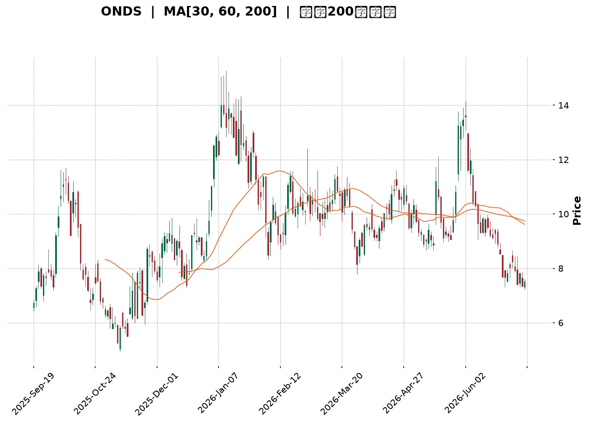
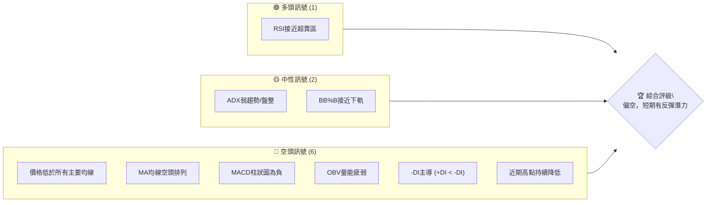
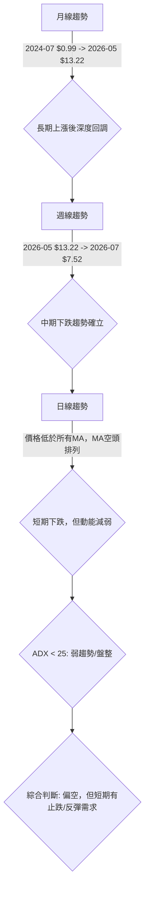
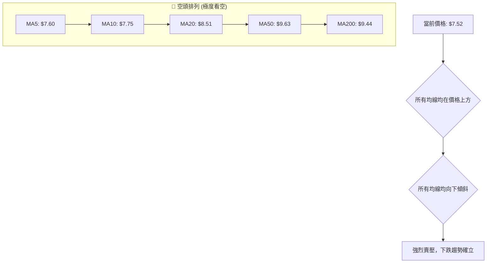
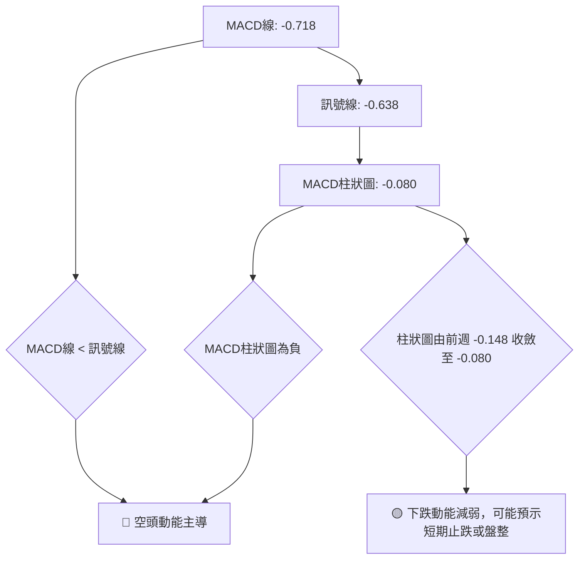
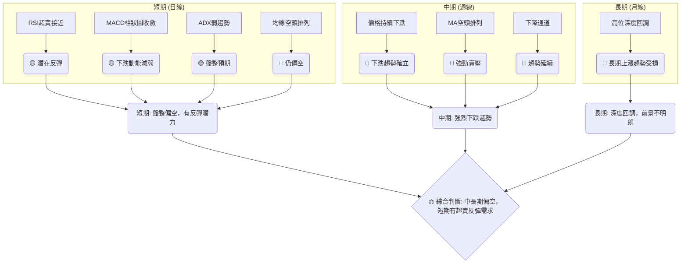

<details>
<summary>📊 靜態圖表 (點擊展開)</summary>

</details>

<html>
<head><meta charset="utf-8" /></head>
<body>
    <div style="height:500px; width:100%;">                        <script>window.PlotlyConfig = {MathJaxConfig: 'local'};</script>
        <script charset="utf-8" src="https://cdn.plot.ly/plotly-3.6.0.min.js" integrity="sha256-QaOVwtVY0T02VaHrr6pnoHLCwayMJp4O5n4YyaE3rJk=" crossorigin="anonymous"></script>                <div id="candlestick-chart" class="plotly-graph-div" style="height:100%; width:100%;"></div>            <script>                window.PLOTLYENV=window.PLOTLYENV || {};                                if (document.getElementById("candlestick-chart")) {                    Plotly.newPlot(                        "candlestick-chart",                        [{"close":{"dtype":"f8","bdata":"AAAAoEfhGkAAAACAPQodQAAAAMAehR9AAAAAYGZmHUAAAAAAAAAfQAAAAADXox5AAAAAQOF6H0AAAACgR+EeQAAAAKBwPR1AAAAAIIVrIkAAAACA69EjQAAAAIDrUSVAAAAAgBQuJkAAAADAHoUmQAAAAEDh+iRAAAAA4KNwIkAAAABguJ4lQAAAAIDr0SRAAAAAwB4FI0AAAABgZmYgQAAAAOCjcB5AAAAA4HoUH0AAAABgj8IcQAAAAIDC9RpAAAAAoHA9HEAAAABACtcdQAAAAGC4Hh5AAAAAwPUoG0AAAAAAAAAbQAAAAMD1KBlAAAAAYI\u002fCGUAAAACgmZkYQAAAAEAK1xdAAAAAAAAAGEAAAAAAAAAVQAAAAKBwPRdAAAAAwB6FF0AAAABAMzMXQAAAAIA9ChZAAAAAoHA9GkAAAADgUbgcQAAAAMAeBRlAAAAAAClcH0AAAAAAAAAeQAAAAOB6FBlAAAAA4KPwGkAAAADgo3AhQAAAAKBH4SBAAAAAQOF6IEAAAACgmZkfQAAAAIDrUR5AAAAAANcjIEAAAABACtchQAAAAKBHYSJAAAAAANcjIkAAAACAPQoiQAAAAIDCdSJAAAAAYGamIEAAAACAPQoiQAAAAAAAgCFAAAAAYI\u002fCHkAAAACAFC4gQAAAAEDheh1AAAAAQDMzH0AAAADgo3AiQAAAAIA9iiJAAAAAIIXrIUAAAABgj0IiQAAAAIDC9SBAAAAAIIXrIEAAAABA4fohQAAAAMAehSNAAAAAgD0KJkAAAAAgXA8pQAAAAIAUrilAAAAAAClcKEAAAADAHgUsQAAAAKBHYStAAAAAoEdhKkAAAAAgrscrQAAAAGC4HitAAAAAANejKUAAAACA61EoQAAAAGCPQipAAAAAoJkZKUAAAACgcD0pQAAAAEAKVyhAAAAAgOtRJkAAAADAHoUoQAAAAIA9iihAAAAAgD2KJkAAAADgUbgkQAAAACCuRyVAAAAAYI\u002fCJkAAAAAAKVwjQAAAAIDC9SBAAAAAoEdhI0AAAACAFK4kQAAAAAApXCNAAAAAgMJ1IkAAAADgo\u002fAhQAAAAGC4niJAAAAAoJkZJEAAAAAA1yMmQAAAACCuxyZAAAAAIFwPJEAAAACgR2EkQAAAAMDMzCRAAAAAoJmZJEAAAABgZuYkQAAAAMD1KCRAAAAAQApXJUAAAACAPQokQAAAAMAeBSVAAAAAQOH6JEAAAADA9agjQAAAAOCjcCNAAAAAwB4FJEAAAADA9agjQAAAAMD1qCRAAAAAgOtRJEAAAAAgXA8lQAAAACBcjyZAAAAAwPWoJUAAAAAAAIAlQAAAAGC4HiRAAAAAwMzMJUAAAAAAKVwlQAAAAGC4niRAAAAAoEfhIkAAAACgmZkhQAAAAMDMTCBAAAAA4HoUIkAAAABguJ4hQAAAAEAzMyNAAAAAgD0KI0AAAAAgXA8jQAAAAGBm5iJAAAAAIK5HIkAAAABgj0IiQAAAAOCj8CJAAAAAwMzMIkAAAAAgXA8kQAAAAGBmZiRAAAAAAAAAJEAAAACAwnUlQAAAAKBwvSVAAAAAYLgeJkAAAADgehQlQAAAAKCZGSVAAAAAYGbmJUAAAACAwvUkQAAAAEDh+iJAAAAA4HoUJEAAAAAA16MkQAAAAIDCdSNAAAAAwPWoIkAAAACAFK4iQAAAACCuxyFAAAAAYLgeIkAAAABACtciQAAAAOB6FCJAAAAA4FG4IUAAAAAghWsmQAAAAKBwPSVAAAAAYGZmI0AAAAAAAEAiQAAAAOBRuCJAAAAAAClcIkAAAABguB4iQAAAAIA9iiNAAAAAoJmZJUAAAAAAAIAqQAAAAOCjcCpAAAAAIIXrKkAAAADA9SgrQAAAAOBROCdAAAAA4KPwJ0AAAAAAKdwkQAAAAKCZmSRAAAAAwMxMI0AAAABguJ4iQAAAAMD1qCNAAAAAwPWoIkAAAADAHgUjQAAAACCFayJAAAAAoHA9IkAAAACAPYoiQAAAACCuxyFAAAAAIFwPIUAAAADgUbgeQAAAAEAzsx5AAAAAgOtRH0AAAACAPQogQAAAAEDheiBAAAAAgBSuH0AAAAAA16MdQAAAACCuRx9AAAAAYGZmHUAAAADgehQeQA=="},"high":{"dtype":"f8","bdata":"AAAAAClcG0AAAADgo3AdQAAAAKBwPSBAAAAAANcjIEAAAAAAKVwfQAAAACBcjx9AAAAAIIVrIUAAAABAClcgQAAAAMDMzB9AAAAAgBSuIkAAAAAgXI8kQAAAAGCPQidAAAAAQAoXJ0AAAABgZmYnQAAAACCuxyZAAAAAwB4FJUAAAACAFG4mQAAAAGC4HiVAAAAAoHC9JUAAAABgj0IjQAAAAIDrUSBAAAAAoEdhIEAAAAAA16MfQAAAAIA9Ch1AAAAAQDMzHUAAAABAClcgQAAAAKBHoSBAAAAAIFyPHkAAAADAzMwbQAAAAIDCdRpAAAAAAAAAGkAAAABgj8IaQAAAACCuRxpAAAAAAAAAGUAAAADgUbgXQAAAAOB6lBdAAAAAIFyPGUAAAACgR2EYQAAAAMD1qBhAAAAAAClcHUAAAADgo3AfQAAAACBcDx5AAAAAgBSuH0AAAACA6xEgQAAAAKBH4R9AAAAAYGZmG0AAAACgmZkhQAAAAGCPwiFAAAAAAClcIUAAAADAIPAgQAAAAADXIyBAAAAAoJkZIUAAAACAwjUiQAAAAIAUriJAAAAAoJmZIkAAAAAAAIAjQAAAAOBRuCNAAAAAQOE6IkAAAADA9SgiQAAAAGBmJiNAAAAAQOF6IUAAAAAA12MgQAAAAGC4HiFAAAAAYJGtIEAAAABA4XoiQAAAAIDrUSNAAAAAgBSuI0AAAABgZmYiQAAAAEAKVyJAAAAAQApXIUAAAACgmZkiQAAAACBcDyVAAAAAYLgeJkAAAADgehQpQAAAAAAp3ClAAAAAgD0KKkAAAAAA1yMuQAAAAEAzMy5AAAAAIFyPLkAAAAAAAAAtQAAAAAAAgCtAAAAAANcjLEAAAAAAAIAsQAAAAGBmZixAAAAAwPWoLEAAAADA9agqQAAAAEDhuilAAAAAIIWrKEAAAADgo\u002fAoQAAAAMD1KCpAAAAAIFyPKEAAAABgZuYmQAAAAGBmZiZAAAAAQArXJkAAAACAPcomQAAAACBcDyNAAAAAwB6FI0AAAAAgrkclQAAAAKBH4SRAAAAAQArXI0AAAACgxosiQAAAAAApXCNAAAAAANejJEAAAABAClcmQAAAAIAULidAAAAAwPUoJ0AAAAAA1yMlQAAAAIDC9SRAAAAAoEfhJUAAAAAgXI8lQAAAAAApXCRAAAAAQArXKEAAAAAAAAAmQAAAAADXoyVAAAAAQArXJUAAAADgUTgnQAAAACBcDyRAAAAAYGbmJEAAAABguB4lQAAAAIAUriVAAAAAgML1JUAAAACgcL0lQAAAAOCj8CZAAAAAwB6FJ0AAAACAwvUlQAAAAMD1qCVAAAAA4KPwJUAAAACgcL0mQAAAACCuRyZAAAAAIK5HJEAAAACgcL0iQAAAAADXoyFAAAAAIK5HIkAAAABAM7MiQAAAAGCPQiNAAAAAwMzMI0AAAACgR2EjQAAAAKBwvSRAAAAAgD0KI0AAAADgUbgiQAAAACCFKyNAAAAA4FG4I0AAAAAgXA8kQAAAACCuxyRAAAAAIFwPJUAAAABguB4mQAAAAOB6lCZAAAAA4FE4J0AAAADgo\u002fAlQAAAAIA9iiVAAAAAYLgeJkAAAAAA1yMmQAAAAAAp3CRAAAAAgOtRJEAAAABguB4lQAAAAEDhuiRAAAAA4HqUI0AAAAAghesiQAAAAAAAgCJAAAAAgBQuIkAAAADAzEwjQAAAAEAzsyJAAAAAAClcIkAAAACAwnUnQAAAAKBwPShAAAAAQApXJUAAAABgj8IjQAAAAOB6FCNAAAAAYI\u002fCIkAAAACgRyEjQAAAAMAehSRAAAAAYLgeJkAAAAAgXI8rQAAAAIDr0SpAAAAAgOvRK0AAAACA61EsQAAAAAAAACpAAAAAQArXKEAAAACA61EnQAAAAIAUriVAAAAAgOvRJEAAAACAwvUjQAAAAKBDyyNAAAAAQInBI0AAAADgo\u002fAjQAAAAEDheiNAAAAAAAAAI0AAAAAghesiQAAAACCF6yJAAAAAACncIUAAAAAAAAAhQAAAAGCPwh9AAAAAACncH0AAAADgo3AgQAAAAMDMTCFAAAAAoEfhIEAAAABgZuYgQAAAAAApXB9AAAAAIIVrH0AAAADgo3AeQA=="},"hovertemplate":"\u003cb\u003e%{x|%Y-%m-%d}\u003c\u002fb\u003e\u003cbr\u003e\u958b: $%{open:.2f}\u003cbr\u003e\u9ad8: $%{high:.2f}\u003cbr\u003e\u4f4e: $%{low:.2f}\u003cbr\u003e\u6536: $%{close:.2f}\u003cextra\u003e\u003c\u002fextra\u003e","low":{"dtype":"f8","bdata":"AAAAgBSuGUAAAACA61EaQAAAACCF6xxAAAAAAAAAHUAAAADA9SgbQAAAAOCjcB1AAAAAQDMzH0AAAAAgrkceQAAAAOBRuBxAAAAAANejHkAAAACgR2EiQAAAAIA9iiRAAAAAYGbmJEAAAABgDm0lQAAAAAAAwCRAAAAAoEdhIkAAAAAgsl0jQAAAAGCPwiNAAAAAgOtRIkAAAACAFK4fQAAAAOBROB5AAAAAgOtRHUAAAAAAAIAcQAAAAAAp3BlAAAAAoJmZGkAAAABguJ4dQAAAAOB6FB5AAAAAANejGkAAAADgehQaQAAAAIDr0RhAAAAAQOF6GEAAAABguB4XQAAAAOB6FBdAAAAAgOtRF0AAAAAAKdwUQAAAAMDMzBNAAAAA4HoUF0AAAABgZmYWQAAAACCF6xVAAAAAoHA9GUAAAABgZmYYQAAAACCF6xdAAAAAoJmZGEAAAACAPQodQAAAAAAAABlAAAAA4FG4F0AAAACAFK4aQAAAAADXIyBAAAAAoHC9HkAAAABAMzMfQAAAAKBH4R1AAAAAIK5HHUAAAABACtcdQAAAAIA9CiFAAAAAwPUoIUAAAADgo\u002fAhQAAAAOBROCFAAAAAACmcIEAAAACgcD0gQAAAAIDr0SBAAAAAoHA9HkAAAAAAKVweQAAAAGC4Hh1AAAAAgML1HkAAAADgo3AfQAAAACBcTyJAAAAAQApXIUAAAABAM7MhQAAAAAAp3CBAAAAAIIVrIEAAAADA9aggQAAAAEAKVyJAAAAAgOvRI0AAAABA4folQAAAACCF6ydAAAAA4FE4KEAAAADAzEwqQAAAAIAULitAAAAAwPWoKUAAAAAghespQAAAAEAK1ylAAAAAoJmZKUAAAACgcD0oQAAAAKCZmSdAAAAAACncJ0AAAABAM7MoQAAAAKBH4SdAAAAAYGbmJUAAAACAFC4mQAAAAGC4HihAAAAAANcjJkAAAAAgrkckQAAAAMDMTCRAAAAAwB4FJUAAAABgj0IiQAAAAADXoyBAAAAAYGbmIEAAAABAClcjQAAAAEAzMyNAAAAAYI\u002fCIUAAAABgZmYhQAAAAADXoyFAAAAAoHC9IUAAAABA4fojQAAAAEDheiVAAAAAYGbmI0AAAADgUbgjQAAAAIDC9SJAAAAAgD2KJEAAAABgZuYjQAAAAKBwPSNAAAAAoJmZJEAAAADAHoUjQAAAAAAp3CNAAAAAYLgeJEAAAADAHoUjQAAAAGBmZiJAAAAAYGYmI0AAAAAAAAAjQAAAAKCZmSNAAAAAoJkZJEAAAADgUTgkQAAAAKBwvSRAAAAAANejJUAAAACgcD0kQAAAAIDCdSNAAAAAgBTuI0AAAABAM\u002fMkQAAAAIDCdSRAAAAAgD2KIkAAAADA9WghQAAAAGC4Hh9AAAAAYGZmIEAAAAAgXI8hQAAAACCF6yBAAAAAYI\u002fCIkAAAADgTWIiQAAAAIAUriJAAAAAwB4FIkAAAABA4fohQAAAAIDCdSFAAAAAoJmZIkAAAACgcL0iQAAAAMAehSNAAAAAgD2KI0AAAACA61EjQAAAACCuRyVAAAAAQDOzJUAAAABAMzMkQAAAAEDhOiRAAAAAIIVrJEAAAAAghaskQAAAAIDr0SJAAAAAYLieIkAAAACgcD0jQAAAAEAKVyNAAAAAgOtRIkAAAACAPQoiQAAAACBcjyFAAAAAwMxMIUAAAADgo3AhQAAAAKCZmSFAAAAAQApXIUAAAABAMzMjQAAAAAAAACVAAAAAIIXrIkAAAADgo\u002fAhQAAAAKBwPSJAAAAAgML1IUAAAABguB4iQAAAACCynSJAAAAAAClcI0AAAADgo3AmQAAAAEAzMydAAAAAoJmZKUAAAACAFC4qQAAAACBcDydAAAAAYLgeJkAAAADA9agkQAAAAAAAgCRAAAAA4HoUIkAAAACgmZkiQAAAAMAehSJAAAAAAClcIkAAAACgmdkiQAAAACCuRyJAAAAAwPUoIkAAAABACtchQAAAACBcjyFAAAAAAAAAIUAAAAAgXI8eQAAAAKBwPR1AAAAAAAAAHkAAAACgmZkeQAAAAMAeBSBAAAAAYGZmH0AAAABA4XodQAAAAKBwPR1AAAAAIK5HHUAAAACgR+EcQA=="},"name":"\u50f9\u683c","open":{"dtype":"f8","bdata":"AAAAQDMzGkAAAAAgrkcbQAAAACBcDx5AAAAAgML1H0AAAADAHgUcQAAAACCuxx5AAAAAQArXH0AAAADgUbgfQAAAAAAAAB9AAAAAQDMzH0AAAADAHgUjQAAAAGC4HiVAAAAAAAAAJkAAAAAgrocmQAAAACCuRyZAAAAAgML1JEAAAAAgXA8kQAAAAGCPwiRAAAAAYGamJUAAAABgj0IjQAAAAMDMzB9AAAAAYLgeIEAAAADgUbgeQAAAAGBmZhtAAAAAYGZmG0AAAACAFK4eQAAAAGC4XiBAAAAA4HoUHkAAAADgepQbQAAAAIDC9RlAAAAAAAAAGUAAAADAzEwaQAAAAGC4HhdAAAAAIIXrF0AAAACAFK4XQAAAAMD1KBRAAAAAQOF6GUAAAABgZmYXQAAAAOCj8BdAAAAAIK5HGUAAAADA9agYQAAAAIA9Ch5AAAAAYLieGEAAAAAAKdwdQAAAAIAUrh9AAAAAoHA9GkAAAAAA1yMbQAAAAIDC9SBAAAAA4FE4IUAAAAAgXI8gQAAAAMAehR9AAAAA4FG4HkAAAAAgrscgQAAAAMAeRSFAAAAAACncIUAAAABACpciQAAAAEAK1yFAAAAA4FE4IkAAAABA4fogQAAAAIDC9SFAAAAAAClcIUAAAABA4XoeQAAAACCuRyBAAAAAwPUoH0AAAACAwvUfQAAAAKCZmSJAAAAAIFwPIkAAAACAwvUhQAAAAOAkRiJAAAAAoJmZIEAAAAAghesgQAAAACBcjyJAAAAAwB5FJEAAAACgmZkmQAAAAEAzMyhAAAAAYGZmKUAAAADA9WgqQAAAAAAAACxAAAAAIIVrK0AAAAAAAAArQAAAAKBHYStAAAAAANcjK0AAAADgetQqQAAAAIDCtSdAAAAAoJmZK0AAAADAHgUpQAAAACCFaylAAAAAwMxMKEAAAAAghWsmQAAAAIDC9SlAAAAAIK5HKEAAAAAAAIAmQAAAAGC4niVAAAAAwB4FJkAAAABgj8ImQAAAAIAUriJAAAAAgBTuIUAAAAAAKZwjQAAAAIAULiRAAAAAwB7FI0AAAACgcH0iQAAAAIA9iiJAAAAA4FF4IkAAAAAghWskQAAAAADXoyVAAAAAoEdhJkAAAAAAKdwjQAAAAMAeBSRAAAAAYI9CJUAAAADAzEwkQAAAAIAULiRAAAAAAAAAJUAAAACgR2ElQAAAAOBRuCRAAAAAQOH6JEAAAAAAAIAkQAAAACBcDyRAAAAAgBSuI0AAAACgmRkkQAAAACCFKyRAAAAAACncJEAAAACgcL0kQAAAAKCZGSVAAAAAAADAJkAAAABguF4lQAAAAOB6lCVAAAAA4HqUJEAAAACA69ElQAAAAGCPwiVAAAAAoJkZJEAAAABAM7MiQAAAAGC4niFAAAAAYGbmIEAAAACgmZkiQAAAACCuByFAAAAAYI9CI0AAAAAAKdwiQAAAAEAKVyRAAAAA4HrUIkAAAACAwnUiQAAAAMAeBSJAAAAA4KNwI0AAAADAHgUjQAAAAAAAgCRAAAAAYI\u002fCJEAAAACgmZkjQAAAAMDMzCVAAAAAgD2KJkAAAABgj8IlQAAAAGCPQiVAAAAAwEu3JEAAAAAA12MlQAAAAGCPwiRAAAAAAAAAI0AAAAAAAAAkQAAAAMDMTCRAAAAAIFyPI0AAAAAAAIAiQAAAAAAAgCJAAAAAAAAAIkAAAABACtchQAAAAOBReCJAAAAAQArXIUAAAABA4fojQAAAAIDr0SVAAAAAYI9CJUAAAABgZqYjQAAAAAAAgCJAAAAAIFyPIkAAAAAghWsiQAAAACCFqyJAAAAAAAAAJEAAAABAM\u002fMmQAAAAAAAgClAAAAAoHB9KkAAAACgcD0rQAAAACCF6ylAAAAAgML1JkAAAABACtcmQAAAAMD1qCVAAAAAIIWrJEAAAACgR2EjQAAAAGBmpiJAAAAAQAqXI0AAAABAM7MjQAAAAIDr0SJAAAAAoHB9IkAAAACA69EiQAAAAIDCtSJAAAAAYLheIUAAAACAwvUgQAAAAKBwvR9AAAAAIFwPHkAAAAAgrkcgQAAAAOCj8CBAAAAAANcjIEAAAABgj8IfQAAAAMDMzB1AAAAAoJmZHkAAAACgcD0dQA=="},"x":["2025-09-19T00:00:00-04:00","2025-09-22T00:00:00-04:00","2025-09-23T00:00:00-04:00","2025-09-24T00:00:00-04:00","2025-09-25T00:00:00-04:00","2025-09-26T00:00:00-04:00","2025-09-29T00:00:00-04:00","2025-09-30T00:00:00-04:00","2025-10-01T00:00:00-04:00","2025-10-02T00:00:00-04:00","2025-10-03T00:00:00-04:00","2025-10-06T00:00:00-04:00","2025-10-07T00:00:00-04:00","2025-10-08T00:00:00-04:00","2025-10-09T00:00:00-04:00","2025-10-10T00:00:00-04:00","2025-10-13T00:00:00-04:00","2025-10-14T00:00:00-04:00","2025-10-15T00:00:00-04:00","2025-10-16T00:00:00-04:00","2025-10-17T00:00:00-04:00","2025-10-20T00:00:00-04:00","2025-10-21T00:00:00-04:00","2025-10-22T00:00:00-04:00","2025-10-23T00:00:00-04:00","2025-10-24T00:00:00-04:00","2025-10-27T00:00:00-04:00","2025-10-28T00:00:00-04:00","2025-10-29T00:00:00-04:00","2025-10-30T00:00:00-04:00","2025-10-31T00:00:00-04:00","2025-11-03T00:00:00-05:00","2025-11-04T00:00:00-05:00","2025-11-05T00:00:00-05:00","2025-11-06T00:00:00-05:00","2025-11-07T00:00:00-05:00","2025-11-10T00:00:00-05:00","2025-11-11T00:00:00-05:00","2025-11-12T00:00:00-05:00","2025-11-13T00:00:00-05:00","2025-11-14T00:00:00-05:00","2025-11-17T00:00:00-05:00","2025-11-18T00:00:00-05:00","2025-11-19T00:00:00-05:00","2025-11-20T00:00:00-05:00","2025-11-21T00:00:00-05:00","2025-11-24T00:00:00-05:00","2025-11-25T00:00:00-05:00","2025-11-26T00:00:00-05:00","2025-11-28T00:00:00-05:00","2025-12-01T00:00:00-05:00","2025-12-02T00:00:00-05:00","2025-12-03T00:00:00-05:00","2025-12-04T00:00:00-05:00","2025-12-05T00:00:00-05:00","2025-12-08T00:00:00-05:00","2025-12-09T00:00:00-05:00","2025-12-10T00:00:00-05:00","2025-12-11T00:00:00-05:00","2025-12-12T00:00:00-05:00","2025-12-15T00:00:00-05:00","2025-12-16T00:00:00-05:00","2025-12-17T00:00:00-05:00","2025-12-18T00:00:00-05:00","2025-12-19T00:00:00-05:00","2025-12-22T00:00:00-05:00","2025-12-23T00:00:00-05:00","2025-12-24T00:00:00-05:00","2025-12-26T00:00:00-05:00","2025-12-29T00:00:00-05:00","2025-12-30T00:00:00-05:00","2025-12-31T00:00:00-05:00","2026-01-02T00:00:00-05:00","2026-01-05T00:00:00-05:00","2026-01-06T00:00:00-05:00","2026-01-07T00:00:00-05:00","2026-01-08T00:00:00-05:00","2026-01-09T00:00:00-05:00","2026-01-12T00:00:00-05:00","2026-01-13T00:00:00-05:00","2026-01-14T00:00:00-05:00","2026-01-15T00:00:00-05:00","2026-01-16T00:00:00-05:00","2026-01-20T00:00:00-05:00","2026-01-21T00:00:00-05:00","2026-01-22T00:00:00-05:00","2026-01-23T00:00:00-05:00","2026-01-26T00:00:00-05:00","2026-01-27T00:00:00-05:00","2026-01-28T00:00:00-05:00","2026-01-29T00:00:00-05:00","2026-01-30T00:00:00-05:00","2026-02-02T00:00:00-05:00","2026-02-03T00:00:00-05:00","2026-02-04T00:00:00-05:00","2026-02-05T00:00:00-05:00","2026-02-06T00:00:00-05:00","2026-02-09T00:00:00-05:00","2026-02-10T00:00:00-05:00","2026-02-11T00:00:00-05:00","2026-02-12T00:00:00-05:00","2026-02-13T00:00:00-05:00","2026-02-17T00:00:00-05:00","2026-02-18T00:00:00-05:00","2026-02-19T00:00:00-05:00","2026-02-20T00:00:00-05:00","2026-02-23T00:00:00-05:00","2026-02-24T00:00:00-05:00","2026-02-25T00:00:00-05:00","2026-02-26T00:00:00-05:00","2026-02-27T00:00:00-05:00","2026-03-02T00:00:00-05:00","2026-03-03T00:00:00-05:00","2026-03-04T00:00:00-05:00","2026-03-05T00:00:00-05:00","2026-03-06T00:00:00-05:00","2026-03-09T00:00:00-04:00","2026-03-10T00:00:00-04:00","2026-03-11T00:00:00-04:00","2026-03-12T00:00:00-04:00","2026-03-13T00:00:00-04:00","2026-03-16T00:00:00-04:00","2026-03-17T00:00:00-04:00","2026-03-18T00:00:00-04:00","2026-03-19T00:00:00-04:00","2026-03-20T00:00:00-04:00","2026-03-23T00:00:00-04:00","2026-03-24T00:00:00-04:00","2026-03-25T00:00:00-04:00","2026-03-26T00:00:00-04:00","2026-03-27T00:00:00-04:00","2026-03-30T00:00:00-04:00","2026-03-31T00:00:00-04:00","2026-04-01T00:00:00-04:00","2026-04-02T00:00:00-04:00","2026-04-06T00:00:00-04:00","2026-04-07T00:00:00-04:00","2026-04-08T00:00:00-04:00","2026-04-09T00:00:00-04:00","2026-04-10T00:00:00-04:00","2026-04-13T00:00:00-04:00","2026-04-14T00:00:00-04:00","2026-04-15T00:00:00-04:00","2026-04-16T00:00:00-04:00","2026-04-17T00:00:00-04:00","2026-04-20T00:00:00-04:00","2026-04-21T00:00:00-04:00","2026-04-22T00:00:00-04:00","2026-04-23T00:00:00-04:00","2026-04-24T00:00:00-04:00","2026-04-27T00:00:00-04:00","2026-04-28T00:00:00-04:00","2026-04-29T00:00:00-04:00","2026-04-30T00:00:00-04:00","2026-05-01T00:00:00-04:00","2026-05-04T00:00:00-04:00","2026-05-05T00:00:00-04:00","2026-05-06T00:00:00-04:00","2026-05-07T00:00:00-04:00","2026-05-08T00:00:00-04:00","2026-05-11T00:00:00-04:00","2026-05-12T00:00:00-04:00","2026-05-13T00:00:00-04:00","2026-05-14T00:00:00-04:00","2026-05-15T00:00:00-04:00","2026-05-18T00:00:00-04:00","2026-05-19T00:00:00-04:00","2026-05-20T00:00:00-04:00","2026-05-21T00:00:00-04:00","2026-05-22T00:00:00-04:00","2026-05-26T00:00:00-04:00","2026-05-27T00:00:00-04:00","2026-05-28T00:00:00-04:00","2026-05-29T00:00:00-04:00","2026-06-01T00:00:00-04:00","2026-06-02T00:00:00-04:00","2026-06-03T00:00:00-04:00","2026-06-04T00:00:00-04:00","2026-06-05T00:00:00-04:00","2026-06-08T00:00:00-04:00","2026-06-09T00:00:00-04:00","2026-06-10T00:00:00-04:00","2026-06-11T00:00:00-04:00","2026-06-12T00:00:00-04:00","2026-06-15T00:00:00-04:00","2026-06-16T00:00:00-04:00","2026-06-17T00:00:00-04:00","2026-06-18T00:00:00-04:00","2026-06-22T00:00:00-04:00","2026-06-23T00:00:00-04:00","2026-06-24T00:00:00-04:00","2026-06-25T00:00:00-04:00","2026-06-26T00:00:00-04:00","2026-06-29T00:00:00-04:00","2026-06-30T00:00:00-04:00","2026-07-01T00:00:00-04:00","2026-07-02T00:00:00-04:00","2026-07-06T00:00:00-04:00","2026-07-07T00:00:00-04:00","2026-07-08T00:00:00-04:00"],"type":"candlestick"},{"hovertemplate":"MA30: $%{y:.2f}\u003cextra\u003e\u003c\u002fextra\u003e","line":{"color":"#2196F3","dash":"dash","width":2},"mode":"lines","name":"MA30","x":["2025-09-19T00:00:00-04:00","2025-09-22T00:00:00-04:00","2025-09-23T00:00:00-04:00","2025-09-24T00:00:00-04:00","2025-09-25T00:00:00-04:00","2025-09-26T00:00:00-04:00","2025-09-29T00:00:00-04:00","2025-09-30T00:00:00-04:00","2025-10-01T00:00:00-04:00","2025-10-02T00:00:00-04:00","2025-10-03T00:00:00-04:00","2025-10-06T00:00:00-04:00","2025-10-07T00:00:00-04:00","2025-10-08T00:00:00-04:00","2025-10-09T00:00:00-04:00","2025-10-10T00:00:00-04:00","2025-10-13T00:00:00-04:00","2025-10-14T00:00:00-04:00","2025-10-15T00:00:00-04:00","2025-10-16T00:00:00-04:00","2025-10-17T00:00:00-04:00","2025-10-20T00:00:00-04:00","2025-10-21T00:00:00-04:00","2025-10-22T00:00:00-04:00","2025-10-23T00:00:00-04:00","2025-10-24T00:00:00-04:00","2025-10-27T00:00:00-04:00","2025-10-28T00:00:00-04:00","2025-10-29T00:00:00-04:00","2025-10-30T00:00:00-04:00","2025-10-31T00:00:00-04:00","2025-11-03T00:00:00-05:00","2025-11-04T00:00:00-05:00","2025-11-05T00:00:00-05:00","2025-11-06T00:00:00-05:00","2025-11-07T00:00:00-05:00","2025-11-10T00:00:00-05:00","2025-11-11T00:00:00-05:00","2025-11-12T00:00:00-05:00","2025-11-13T00:00:00-05:00","2025-11-14T00:00:00-05:00","2025-11-17T00:00:00-05:00","2025-11-18T00:00:00-05:00","2025-11-19T00:00:00-05:00","2025-11-20T00:00:00-05:00","2025-11-21T00:00:00-05:00","2025-11-24T00:00:00-05:00","2025-11-25T00:00:00-05:00","2025-11-26T00:00:00-05:00","2025-11-28T00:00:00-05:00","2025-12-01T00:00:00-05:00","2025-12-02T00:00:00-05:00","2025-12-03T00:00:00-05:00","2025-12-04T00:00:00-05:00","2025-12-05T00:00:00-05:00","2025-12-08T00:00:00-05:00","2025-12-09T00:00:00-05:00","2025-12-10T00:00:00-05:00","2025-12-11T00:00:00-05:00","2025-12-12T00:00:00-05:00","2025-12-15T00:00:00-05:00","2025-12-16T00:00:00-05:00","2025-12-17T00:00:00-05:00","2025-12-18T00:00:00-05:00","2025-12-19T00:00:00-05:00","2025-12-22T00:00:00-05:00","2025-12-23T00:00:00-05:00","2025-12-24T00:00:00-05:00","2025-12-26T00:00:00-05:00","2025-12-29T00:00:00-05:00","2025-12-30T00:00:00-05:00","2025-12-31T00:00:00-05:00","2026-01-02T00:00:00-05:00","2026-01-05T00:00:00-05:00","2026-01-06T00:00:00-05:00","2026-01-07T00:00:00-05:00","2026-01-08T00:00:00-05:00","2026-01-09T00:00:00-05:00","2026-01-12T00:00:00-05:00","2026-01-13T00:00:00-05:00","2026-01-14T00:00:00-05:00","2026-01-15T00:00:00-05:00","2026-01-16T00:00:00-05:00","2026-01-20T00:00:00-05:00","2026-01-21T00:00:00-05:00","2026-01-22T00:00:00-05:00","2026-01-23T00:00:00-05:00","2026-01-26T00:00:00-05:00","2026-01-27T00:00:00-05:00","2026-01-28T00:00:00-05:00","2026-01-29T00:00:00-05:00","2026-01-30T00:00:00-05:00","2026-02-02T00:00:00-05:00","2026-02-03T00:00:00-05:00","2026-02-04T00:00:00-05:00","2026-02-05T00:00:00-05:00","2026-02-06T00:00:00-05:00","2026-02-09T00:00:00-05:00","2026-02-10T00:00:00-05:00","2026-02-11T00:00:00-05:00","2026-02-12T00:00:00-05:00","2026-02-13T00:00:00-05:00","2026-02-17T00:00:00-05:00","2026-02-18T00:00:00-05:00","2026-02-19T00:00:00-05:00","2026-02-20T00:00:00-05:00","2026-02-23T00:00:00-05:00","2026-02-24T00:00:00-05:00","2026-02-25T00:00:00-05:00","2026-02-26T00:00:00-05:00","2026-02-27T00:00:00-05:00","2026-03-02T00:00:00-05:00","2026-03-03T00:00:00-05:00","2026-03-04T00:00:00-05:00","2026-03-05T00:00:00-05:00","2026-03-06T00:00:00-05:00","2026-03-09T00:00:00-04:00","2026-03-10T00:00:00-04:00","2026-03-11T00:00:00-04:00","2026-03-12T00:00:00-04:00","2026-03-13T00:00:00-04:00","2026-03-16T00:00:00-04:00","2026-03-17T00:00:00-04:00","2026-03-18T00:00:00-04:00","2026-03-19T00:00:00-04:00","2026-03-20T00:00:00-04:00","2026-03-23T00:00:00-04:00","2026-03-24T00:00:00-04:00","2026-03-25T00:00:00-04:00","2026-03-26T00:00:00-04:00","2026-03-27T00:00:00-04:00","2026-03-30T00:00:00-04:00","2026-03-31T00:00:00-04:00","2026-04-01T00:00:00-04:00","2026-04-02T00:00:00-04:00","2026-04-06T00:00:00-04:00","2026-04-07T00:00:00-04:00","2026-04-08T00:00:00-04:00","2026-04-09T00:00:00-04:00","2026-04-10T00:00:00-04:00","2026-04-13T00:00:00-04:00","2026-04-14T00:00:00-04:00","2026-04-15T00:00:00-04:00","2026-04-16T00:00:00-04:00","2026-04-17T00:00:00-04:00","2026-04-20T00:00:00-04:00","2026-04-21T00:00:00-04:00","2026-04-22T00:00:00-04:00","2026-04-23T00:00:00-04:00","2026-04-24T00:00:00-04:00","2026-04-27T00:00:00-04:00","2026-04-28T00:00:00-04:00","2026-04-29T00:00:00-04:00","2026-04-30T00:00:00-04:00","2026-05-01T00:00:00-04:00","2026-05-04T00:00:00-04:00","2026-05-05T00:00:00-04:00","2026-05-06T00:00:00-04:00","2026-05-07T00:00:00-04:00","2026-05-08T00:00:00-04:00","2026-05-11T00:00:00-04:00","2026-05-12T00:00:00-04:00","2026-05-13T00:00:00-04:00","2026-05-14T00:00:00-04:00","2026-05-15T00:00:00-04:00","2026-05-18T00:00:00-04:00","2026-05-19T00:00:00-04:00","2026-05-20T00:00:00-04:00","2026-05-21T00:00:00-04:00","2026-05-22T00:00:00-04:00","2026-05-26T00:00:00-04:00","2026-05-27T00:00:00-04:00","2026-05-28T00:00:00-04:00","2026-05-29T00:00:00-04:00","2026-06-01T00:00:00-04:00","2026-06-02T00:00:00-04:00","2026-06-03T00:00:00-04:00","2026-06-04T00:00:00-04:00","2026-06-05T00:00:00-04:00","2026-06-08T00:00:00-04:00","2026-06-09T00:00:00-04:00","2026-06-10T00:00:00-04:00","2026-06-11T00:00:00-04:00","2026-06-12T00:00:00-04:00","2026-06-15T00:00:00-04:00","2026-06-16T00:00:00-04:00","2026-06-17T00:00:00-04:00","2026-06-18T00:00:00-04:00","2026-06-22T00:00:00-04:00","2026-06-23T00:00:00-04:00","2026-06-24T00:00:00-04:00","2026-06-25T00:00:00-04:00","2026-06-26T00:00:00-04:00","2026-06-29T00:00:00-04:00","2026-06-30T00:00:00-04:00","2026-07-01T00:00:00-04:00","2026-07-02T00:00:00-04:00","2026-07-06T00:00:00-04:00","2026-07-07T00:00:00-04:00","2026-07-08T00:00:00-04:00"],"y":{"dtype":"f8","bdata":"AAAAAAAA+H8AAAAAAAD4fwAAAAAAAPh\u002fAAAAAAAA+H8AAAAAAAD4fwAAAAAAAPh\u002fAAAAAAAA+H8AAAAAAAD4fwAAAAAAAPh\u002fAAAAAAAA+H8AAAAAAAD4fwAAAAAAAPh\u002fAAAAAAAA+H8AAAAAAAD4fwAAAAAAAPh\u002fAAAAAAAA+H8AAAAAAAD4fwAAAAAAAPh\u002fAAAAAAAA+H8AAAAAAAD4fwAAAAAAAPh\u002fAAAAAAAA+H8AAAAAAAD4fwAAAAAAAPh\u002fAAAAAAAA+H8AAAAAAAD4fwAAAAAAAPh\u002fAAAAAAAA+H8AAAAAAAD4f4mIiMDKoSBAIiIiagOdIEAAAADAEYogQERERCRNaSBA7+7u5kJSIEBEREQ8mCcgQGZmZnYFCCBAq6qqCh7MH0BERETUlIofQBERETEkTR9AMzMzI7DyHkCJiIgIgZUeQO\u002fu7o4l\u002fx1AAAAAoDaQHUDe3d093w8dQCIiIlLUfxxA7+7uDgIrHEC8u7tbq+MbQLy7uzttoBtAzczMzBN1G0DNzMxc1mobQHd3dzfQaRtAd3d3pw10G0AAAACgGq8bQM3MzAy7AhxAIiIislZHHEAAAAAwlnwcQCIiIgKdthxAq6qqCgLrHEC8u7ubfTgdQKuqqmp1jB1AVVVVFSC3HUAAAAAQWPkdQERERNR4KR5AiYiIeOlmHkDNzMzca+4eQO\u002fu7s6FZB9AIiIiQqfNH0Dv7u6eqB8gQO\u002fu7r5YUiBAERER+cVyIEC8u7v7qZEgQAAAAJB7zSBAIiIiMsEDIUCamZmZmVkhQGZmZl66ySFAAAAA8KcmIkDNzMxM8IAiQGZmZuaJ2iJAd3d3xwQvI0BVVVV9P5UjQKuqqoJO+yNAvLu7k19MJEAiIiJaq4MkQCIiInrpxiRAzczM1E0CJUAAAAB4vj8lQO\u002fu7obrcSVAzczM1E2iJUAzMzObmdklQBEREbmsFSZAvLu7+8VSJkAzMzPDg3kmQM3MzJxSsSZA7+7u3mvuJkBERESkRfYmQDMzMxPK6CZA3t3dfT\u002f1JkAAAAAQ5gknQCIiIvJgHidAAAAAIIUrJ0Dv7u6+LSsnQKuqqqp\u002fIydAvLu7q\u002fESJ0BVVVXVBvomQAAAALBH4SZAERERMZa8JkCrqqpaZHsmQAAAACA+QyZAZmZmhusRJkDv7u7uNdclQERERJTRmyVAZmZmFiB3JUCamZlJmlIlQFVVVVXjJSVA3t3dDbsCJUC8u7tbHdMkQFVVVSVNqSRAiYiIuKyVJEAzMzPjM2wkQFVVVeUXSyRAq6qqOiY4JECJiIj4DDskQLy7uyv5RSRA7+7uLpY8JEBVVVUV2U4kQGZmZjbQaSRAiYiIyHZ+JEBERERERIQkQHd3d8cEjyRAiYiISJqSJECrqqqKs48kQLy7u2vneyRAmpmZqapqJEAzMzOTGEQkQCIiIvKLJSRAmpmZudccJEBEREQklBEkQHd3d4ddASRAmpmZaZHtI0Dv7u4+CtcjQN7d3R2hzCNAZmZmZvS2I0BmZmYWILcjQM3MzKzVsSNAVVVV1XipI0De3d391LgjQKuqqmp1zCNAAAAA8GDeI0CamZn5fuojQLy7uytA7iNAvLu7u7v7I0B3d3dH4fojQGZmZqZU3CNAZmZmFtnOI0AzMzNjgscjQHd3d5fgwSNAiYiIKBWnI0C8u7ubNpAjQImIiIj6dyNAq6qqSn5xI0DNzMwcE3wjQFVVVZVDiyNAZmZmJjGII0CJiIjoJrEjQKuqqlqPwiNAiYiIyKHFI0AAAABQuL4jQImIiBgvvSNAvLu72929I0BmZmYGrLwjQO\u002fu7r7KwSNAERERca\u002fZI0BmZmbWoxAkQLy7u2suRCRAREREZDt\u002fJEC8u7s7368kQHd3d1eAvCRAERERMQjMJECJiIiYJ8okQERERFTjxSRAq6qqirOvJEDNzMy8u5skQImIiDiJoSRA7+7uLmuVJEDe3d09mIckQERERFS4fiRAMzMz0yJ7JEDe3d398HkkQN7d3f3weSRAIiIiYuVwJEDNzMw0M1MkQGZmZm7nOyRAMzMzS1MqJEARERH54fMjQAAAAJhDyyNAAAAAqOKsI0DNzMy0nY8jQImIiFhVdSNAvLu78xlWI0BmZmaW0TsjQA=="},"type":"scatter"},{"hovertemplate":"MA60: $%{y:.2f}\u003cextra\u003e\u003c\u002fextra\u003e","line":{"color":"#9C27B0","dash":"dash","width":2},"mode":"lines","name":"MA60","x":["2025-09-19T00:00:00-04:00","2025-09-22T00:00:00-04:00","2025-09-23T00:00:00-04:00","2025-09-24T00:00:00-04:00","2025-09-25T00:00:00-04:00","2025-09-26T00:00:00-04:00","2025-09-29T00:00:00-04:00","2025-09-30T00:00:00-04:00","2025-10-01T00:00:00-04:00","2025-10-02T00:00:00-04:00","2025-10-03T00:00:00-04:00","2025-10-06T00:00:00-04:00","2025-10-07T00:00:00-04:00","2025-10-08T00:00:00-04:00","2025-10-09T00:00:00-04:00","2025-10-10T00:00:00-04:00","2025-10-13T00:00:00-04:00","2025-10-14T00:00:00-04:00","2025-10-15T00:00:00-04:00","2025-10-16T00:00:00-04:00","2025-10-17T00:00:00-04:00","2025-10-20T00:00:00-04:00","2025-10-21T00:00:00-04:00","2025-10-22T00:00:00-04:00","2025-10-23T00:00:00-04:00","2025-10-24T00:00:00-04:00","2025-10-27T00:00:00-04:00","2025-10-28T00:00:00-04:00","2025-10-29T00:00:00-04:00","2025-10-30T00:00:00-04:00","2025-10-31T00:00:00-04:00","2025-11-03T00:00:00-05:00","2025-11-04T00:00:00-05:00","2025-11-05T00:00:00-05:00","2025-11-06T00:00:00-05:00","2025-11-07T00:00:00-05:00","2025-11-10T00:00:00-05:00","2025-11-11T00:00:00-05:00","2025-11-12T00:00:00-05:00","2025-11-13T00:00:00-05:00","2025-11-14T00:00:00-05:00","2025-11-17T00:00:00-05:00","2025-11-18T00:00:00-05:00","2025-11-19T00:00:00-05:00","2025-11-20T00:00:00-05:00","2025-11-21T00:00:00-05:00","2025-11-24T00:00:00-05:00","2025-11-25T00:00:00-05:00","2025-11-26T00:00:00-05:00","2025-11-28T00:00:00-05:00","2025-12-01T00:00:00-05:00","2025-12-02T00:00:00-05:00","2025-12-03T00:00:00-05:00","2025-12-04T00:00:00-05:00","2025-12-05T00:00:00-05:00","2025-12-08T00:00:00-05:00","2025-12-09T00:00:00-05:00","2025-12-10T00:00:00-05:00","2025-12-11T00:00:00-05:00","2025-12-12T00:00:00-05:00","2025-12-15T00:00:00-05:00","2025-12-16T00:00:00-05:00","2025-12-17T00:00:00-05:00","2025-12-18T00:00:00-05:00","2025-12-19T00:00:00-05:00","2025-12-22T00:00:00-05:00","2025-12-23T00:00:00-05:00","2025-12-24T00:00:00-05:00","2025-12-26T00:00:00-05:00","2025-12-29T00:00:00-05:00","2025-12-30T00:00:00-05:00","2025-12-31T00:00:00-05:00","2026-01-02T00:00:00-05:00","2026-01-05T00:00:00-05:00","2026-01-06T00:00:00-05:00","2026-01-07T00:00:00-05:00","2026-01-08T00:00:00-05:00","2026-01-09T00:00:00-05:00","2026-01-12T00:00:00-05:00","2026-01-13T00:00:00-05:00","2026-01-14T00:00:00-05:00","2026-01-15T00:00:00-05:00","2026-01-16T00:00:00-05:00","2026-01-20T00:00:00-05:00","2026-01-21T00:00:00-05:00","2026-01-22T00:00:00-05:00","2026-01-23T00:00:00-05:00","2026-01-26T00:00:00-05:00","2026-01-27T00:00:00-05:00","2026-01-28T00:00:00-05:00","2026-01-29T00:00:00-05:00","2026-01-30T00:00:00-05:00","2026-02-02T00:00:00-05:00","2026-02-03T00:00:00-05:00","2026-02-04T00:00:00-05:00","2026-02-05T00:00:00-05:00","2026-02-06T00:00:00-05:00","2026-02-09T00:00:00-05:00","2026-02-10T00:00:00-05:00","2026-02-11T00:00:00-05:00","2026-02-12T00:00:00-05:00","2026-02-13T00:00:00-05:00","2026-02-17T00:00:00-05:00","2026-02-18T00:00:00-05:00","2026-02-19T00:00:00-05:00","2026-02-20T00:00:00-05:00","2026-02-23T00:00:00-05:00","2026-02-24T00:00:00-05:00","2026-02-25T00:00:00-05:00","2026-02-26T00:00:00-05:00","2026-02-27T00:00:00-05:00","2026-03-02T00:00:00-05:00","2026-03-03T00:00:00-05:00","2026-03-04T00:00:00-05:00","2026-03-05T00:00:00-05:00","2026-03-06T00:00:00-05:00","2026-03-09T00:00:00-04:00","2026-03-10T00:00:00-04:00","2026-03-11T00:00:00-04:00","2026-03-12T00:00:00-04:00","2026-03-13T00:00:00-04:00","2026-03-16T00:00:00-04:00","2026-03-17T00:00:00-04:00","2026-03-18T00:00:00-04:00","2026-03-19T00:00:00-04:00","2026-03-20T00:00:00-04:00","2026-03-23T00:00:00-04:00","2026-03-24T00:00:00-04:00","2026-03-25T00:00:00-04:00","2026-03-26T00:00:00-04:00","2026-03-27T00:00:00-04:00","2026-03-30T00:00:00-04:00","2026-03-31T00:00:00-04:00","2026-04-01T00:00:00-04:00","2026-04-02T00:00:00-04:00","2026-04-06T00:00:00-04:00","2026-04-07T00:00:00-04:00","2026-04-08T00:00:00-04:00","2026-04-09T00:00:00-04:00","2026-04-10T00:00:00-04:00","2026-04-13T00:00:00-04:00","2026-04-14T00:00:00-04:00","2026-04-15T00:00:00-04:00","2026-04-16T00:00:00-04:00","2026-04-17T00:00:00-04:00","2026-04-20T00:00:00-04:00","2026-04-21T00:00:00-04:00","2026-04-22T00:00:00-04:00","2026-04-23T00:00:00-04:00","2026-04-24T00:00:00-04:00","2026-04-27T00:00:00-04:00","2026-04-28T00:00:00-04:00","2026-04-29T00:00:00-04:00","2026-04-30T00:00:00-04:00","2026-05-01T00:00:00-04:00","2026-05-04T00:00:00-04:00","2026-05-05T00:00:00-04:00","2026-05-06T00:00:00-04:00","2026-05-07T00:00:00-04:00","2026-05-08T00:00:00-04:00","2026-05-11T00:00:00-04:00","2026-05-12T00:00:00-04:00","2026-05-13T00:00:00-04:00","2026-05-14T00:00:00-04:00","2026-05-15T00:00:00-04:00","2026-05-18T00:00:00-04:00","2026-05-19T00:00:00-04:00","2026-05-20T00:00:00-04:00","2026-05-21T00:00:00-04:00","2026-05-22T00:00:00-04:00","2026-05-26T00:00:00-04:00","2026-05-27T00:00:00-04:00","2026-05-28T00:00:00-04:00","2026-05-29T00:00:00-04:00","2026-06-01T00:00:00-04:00","2026-06-02T00:00:00-04:00","2026-06-03T00:00:00-04:00","2026-06-04T00:00:00-04:00","2026-06-05T00:00:00-04:00","2026-06-08T00:00:00-04:00","2026-06-09T00:00:00-04:00","2026-06-10T00:00:00-04:00","2026-06-11T00:00:00-04:00","2026-06-12T00:00:00-04:00","2026-06-15T00:00:00-04:00","2026-06-16T00:00:00-04:00","2026-06-17T00:00:00-04:00","2026-06-18T00:00:00-04:00","2026-06-22T00:00:00-04:00","2026-06-23T00:00:00-04:00","2026-06-24T00:00:00-04:00","2026-06-25T00:00:00-04:00","2026-06-26T00:00:00-04:00","2026-06-29T00:00:00-04:00","2026-06-30T00:00:00-04:00","2026-07-01T00:00:00-04:00","2026-07-02T00:00:00-04:00","2026-07-06T00:00:00-04:00","2026-07-07T00:00:00-04:00","2026-07-08T00:00:00-04:00"],"y":{"dtype":"f8","bdata":"AAAAAAAA+H8AAAAAAAD4fwAAAAAAAPh\u002fAAAAAAAA+H8AAAAAAAD4fwAAAAAAAPh\u002fAAAAAAAA+H8AAAAAAAD4fwAAAAAAAPh\u002fAAAAAAAA+H8AAAAAAAD4fwAAAAAAAPh\u002fAAAAAAAA+H8AAAAAAAD4fwAAAAAAAPh\u002fAAAAAAAA+H8AAAAAAAD4fwAAAAAAAPh\u002fAAAAAAAA+H8AAAAAAAD4fwAAAAAAAPh\u002fAAAAAAAA+H8AAAAAAAD4fwAAAAAAAPh\u002fAAAAAAAA+H8AAAAAAAD4fwAAAAAAAPh\u002fAAAAAAAA+H8AAAAAAAD4fwAAAAAAAPh\u002fAAAAAAAA+H8AAAAAAAD4fwAAAAAAAPh\u002fAAAAAAAA+H8AAAAAAAD4fwAAAAAAAPh\u002fAAAAAAAA+H8AAAAAAAD4fwAAAAAAAPh\u002fAAAAAAAA+H8AAAAAAAD4fwAAAAAAAPh\u002fAAAAAAAA+H8AAAAAAAD4fwAAAAAAAPh\u002fAAAAAAAA+H8AAAAAAAD4fwAAAAAAAPh\u002fAAAAAAAA+H8AAAAAAAD4fwAAAAAAAPh\u002fAAAAAAAA+H8AAAAAAAD4fwAAAAAAAPh\u002fAAAAAAAA+H8AAAAAAAD4fwAAAAAAAPh\u002fAAAAAAAA+H8AAAAAAAD4f97d3XUFaB9AzczMdJN4H0AAAADIvYYfQGZmZo4Jfh9AMzMzo7eFH0Crqqoqzp4fQN7d3V1Iuh9AZmZmpuLMH0AREREJ8+QfQHd3d9fq+B9Aq6qqCh7sH0AAAACAatwfQHd3d1cOzR9AIiIigtzLH0CJiIg4ieEfQLy7u0PSBCBAvLu7exQeIEBVVVX9YjkgQCIiIkJgVSBA7+7uVsd0IEDe3d1VVaUgQDMzM08b2CBAvLu7MzMDIUARERFVnC0hQERERIAjZCFA7+7ulvySIUAAAADIBL8hQAAAAASd5iFAERERbecLIkCJiIg07DoiQDMzM7fzbSJAMzMzAyuXIkCamZnlF7siQHd3d4MH4yJAmpmZTfAQI0BVVVXJvTYjQFVVVX2GTSNAd3d3jwluI0B3d3dXx5QjQImIiNhcuCNAiYiIjCXPI0BVVVXda94jQFVVVZ19+CNA7+7ublkLJEB3d3c30CkkQDMzMweBVSRAiYiIEJ9xJEC8u7tTKn4kQDMzMwPkjiRA7+7uJnigJEAiIiK2OrYkQHd3dwuQyyRAERER1b\u002fhJEDe3d3RIuskQLy7u2dm9iRAVVVVcYQCJUDe3d3pbQklQCIiIlacDSVAq6qqRv0bJUAzMzO\u002f5iIlQDMzM09iMCVAMzMzG3ZFJUDe3d1dSFolQEREROSleyVA7+7uBoGVJUDNzMxcj6IlQM3MzCRNqSVAMzMzI9u5JUAiIiIqFcclQM3MzNyy1iVAREREtA\u002ffJUDNzMykcN0lQDMzM4uzzyVAq6qqKs6+JUBERES0D58lQBEREdFpgyVAVVVV9bZsJUB3d3c\u002ffEYlQLy7u9NNIiVAAAAAeL7\u002fJEDv7u4WINckQBEREVk5tCRAZmZmPgqXJEAAAAAw3YQkQBEREYHcayRAmpmZ8RlWJEDNzMws+UUkQAAAAEjhOiRARERE1AY6JEBmZmZuWSskQImIiAisHCRAMzMz+\u002fAZJEAAAAAg9xokQBEREekmESRAq6qqorcFJEBERES8LQskQO\u002fu7mbYFSRAiYiI+MUSJEAAAABwPQokQAAAAKh\u002fAyRAmpmZSQwCJEC8u7tT4wUkQImIiICVAyRAAAAA6G35I0De3d29n\u002fojQGZmZqYN9CNAERERwTzxI0AiIiI6JugjQAAAAFBG3yNAq6qqorfVI0Crqqoi28kjQGZmZu41xyNAvLu761HII0BmZmb24eMjQERERAwC+yNAzczMHFoUJEDNzMwcWjQkQBEREeF6RCRAiYiIkDRVJEARERFJU1okQAAAAMARWiRAMzMzo7dVJEAiIiKCTkskQHd3d+\u002fuPiRAq6qqIiIyJECJiIhQjSckQN7d3XVMICRA3t3d\u002fRsRJEDNzMzMEwUkQDMzM8P1+CNAZmZm1jHxI0DNzMwoo+cjQN7d3YGV4yNAzczMOELZI0DNzMxwhNIjQFVVVXnpxiNAREREOEK5I0BmZmYCK6cjQImIiDhCmSNAvLu75\u002fuJI0BmZmbOPnwjQA=="},"type":"scatter"},{"hovertemplate":"MA200: $%{y:.2f}\u003cextra\u003e\u003c\u002fextra\u003e","line":{"color":"#FF6F00","dash":"solid","width":2},"mode":"lines","name":"MA200","x":["2025-09-19T00:00:00-04:00","2025-09-22T00:00:00-04:00","2025-09-23T00:00:00-04:00","2025-09-24T00:00:00-04:00","2025-09-25T00:00:00-04:00","2025-09-26T00:00:00-04:00","2025-09-29T00:00:00-04:00","2025-09-30T00:00:00-04:00","2025-10-01T00:00:00-04:00","2025-10-02T00:00:00-04:00","2025-10-03T00:00:00-04:00","2025-10-06T00:00:00-04:00","2025-10-07T00:00:00-04:00","2025-10-08T00:00:00-04:00","2025-10-09T00:00:00-04:00","2025-10-10T00:00:00-04:00","2025-10-13T00:00:00-04:00","2025-10-14T00:00:00-04:00","2025-10-15T00:00:00-04:00","2025-10-16T00:00:00-04:00","2025-10-17T00:00:00-04:00","2025-10-20T00:00:00-04:00","2025-10-21T00:00:00-04:00","2025-10-22T00:00:00-04:00","2025-10-23T00:00:00-04:00","2025-10-24T00:00:00-04:00","2025-10-27T00:00:00-04:00","2025-10-28T00:00:00-04:00","2025-10-29T00:00:00-04:00","2025-10-30T00:00:00-04:00","2025-10-31T00:00:00-04:00","2025-11-03T00:00:00-05:00","2025-11-04T00:00:00-05:00","2025-11-05T00:00:00-05:00","2025-11-06T00:00:00-05:00","2025-11-07T00:00:00-05:00","2025-11-10T00:00:00-05:00","2025-11-11T00:00:00-05:00","2025-11-12T00:00:00-05:00","2025-11-13T00:00:00-05:00","2025-11-14T00:00:00-05:00","2025-11-17T00:00:00-05:00","2025-11-18T00:00:00-05:00","2025-11-19T00:00:00-05:00","2025-11-20T00:00:00-05:00","2025-11-21T00:00:00-05:00","2025-11-24T00:00:00-05:00","2025-11-25T00:00:00-05:00","2025-11-26T00:00:00-05:00","2025-11-28T00:00:00-05:00","2025-12-01T00:00:00-05:00","2025-12-02T00:00:00-05:00","2025-12-03T00:00:00-05:00","2025-12-04T00:00:00-05:00","2025-12-05T00:00:00-05:00","2025-12-08T00:00:00-05:00","2025-12-09T00:00:00-05:00","2025-12-10T00:00:00-05:00","2025-12-11T00:00:00-05:00","2025-12-12T00:00:00-05:00","2025-12-15T00:00:00-05:00","2025-12-16T00:00:00-05:00","2025-12-17T00:00:00-05:00","2025-12-18T00:00:00-05:00","2025-12-19T00:00:00-05:00","2025-12-22T00:00:00-05:00","2025-12-23T00:00:00-05:00","2025-12-24T00:00:00-05:00","2025-12-26T00:00:00-05:00","2025-12-29T00:00:00-05:00","2025-12-30T00:00:00-05:00","2025-12-31T00:00:00-05:00","2026-01-02T00:00:00-05:00","2026-01-05T00:00:00-05:00","2026-01-06T00:00:00-05:00","2026-01-07T00:00:00-05:00","2026-01-08T00:00:00-05:00","2026-01-09T00:00:00-05:00","2026-01-12T00:00:00-05:00","2026-01-13T00:00:00-05:00","2026-01-14T00:00:00-05:00","2026-01-15T00:00:00-05:00","2026-01-16T00:00:00-05:00","2026-01-20T00:00:00-05:00","2026-01-21T00:00:00-05:00","2026-01-22T00:00:00-05:00","2026-01-23T00:00:00-05:00","2026-01-26T00:00:00-05:00","2026-01-27T00:00:00-05:00","2026-01-28T00:00:00-05:00","2026-01-29T00:00:00-05:00","2026-01-30T00:00:00-05:00","2026-02-02T00:00:00-05:00","2026-02-03T00:00:00-05:00","2026-02-04T00:00:00-05:00","2026-02-05T00:00:00-05:00","2026-02-06T00:00:00-05:00","2026-02-09T00:00:00-05:00","2026-02-10T00:00:00-05:00","2026-02-11T00:00:00-05:00","2026-02-12T00:00:00-05:00","2026-02-13T00:00:00-05:00","2026-02-17T00:00:00-05:00","2026-02-18T00:00:00-05:00","2026-02-19T00:00:00-05:00","2026-02-20T00:00:00-05:00","2026-02-23T00:00:00-05:00","2026-02-24T00:00:00-05:00","2026-02-25T00:00:00-05:00","2026-02-26T00:00:00-05:00","2026-02-27T00:00:00-05:00","2026-03-02T00:00:00-05:00","2026-03-03T00:00:00-05:00","2026-03-04T00:00:00-05:00","2026-03-05T00:00:00-05:00","2026-03-06T00:00:00-05:00","2026-03-09T00:00:00-04:00","2026-03-10T00:00:00-04:00","2026-03-11T00:00:00-04:00","2026-03-12T00:00:00-04:00","2026-03-13T00:00:00-04:00","2026-03-16T00:00:00-04:00","2026-03-17T00:00:00-04:00","2026-03-18T00:00:00-04:00","2026-03-19T00:00:00-04:00","2026-03-20T00:00:00-04:00","2026-03-23T00:00:00-04:00","2026-03-24T00:00:00-04:00","2026-03-25T00:00:00-04:00","2026-03-26T00:00:00-04:00","2026-03-27T00:00:00-04:00","2026-03-30T00:00:00-04:00","2026-03-31T00:00:00-04:00","2026-04-01T00:00:00-04:00","2026-04-02T00:00:00-04:00","2026-04-06T00:00:00-04:00","2026-04-07T00:00:00-04:00","2026-04-08T00:00:00-04:00","2026-04-09T00:00:00-04:00","2026-04-10T00:00:00-04:00","2026-04-13T00:00:00-04:00","2026-04-14T00:00:00-04:00","2026-04-15T00:00:00-04:00","2026-04-16T00:00:00-04:00","2026-04-17T00:00:00-04:00","2026-04-20T00:00:00-04:00","2026-04-21T00:00:00-04:00","2026-04-22T00:00:00-04:00","2026-04-23T00:00:00-04:00","2026-04-24T00:00:00-04:00","2026-04-27T00:00:00-04:00","2026-04-28T00:00:00-04:00","2026-04-29T00:00:00-04:00","2026-04-30T00:00:00-04:00","2026-05-01T00:00:00-04:00","2026-05-04T00:00:00-04:00","2026-05-05T00:00:00-04:00","2026-05-06T00:00:00-04:00","2026-05-07T00:00:00-04:00","2026-05-08T00:00:00-04:00","2026-05-11T00:00:00-04:00","2026-05-12T00:00:00-04:00","2026-05-13T00:00:00-04:00","2026-05-14T00:00:00-04:00","2026-05-15T00:00:00-04:00","2026-05-18T00:00:00-04:00","2026-05-19T00:00:00-04:00","2026-05-20T00:00:00-04:00","2026-05-21T00:00:00-04:00","2026-05-22T00:00:00-04:00","2026-05-26T00:00:00-04:00","2026-05-27T00:00:00-04:00","2026-05-28T00:00:00-04:00","2026-05-29T00:00:00-04:00","2026-06-01T00:00:00-04:00","2026-06-02T00:00:00-04:00","2026-06-03T00:00:00-04:00","2026-06-04T00:00:00-04:00","2026-06-05T00:00:00-04:00","2026-06-08T00:00:00-04:00","2026-06-09T00:00:00-04:00","2026-06-10T00:00:00-04:00","2026-06-11T00:00:00-04:00","2026-06-12T00:00:00-04:00","2026-06-15T00:00:00-04:00","2026-06-16T00:00:00-04:00","2026-06-17T00:00:00-04:00","2026-06-18T00:00:00-04:00","2026-06-22T00:00:00-04:00","2026-06-23T00:00:00-04:00","2026-06-24T00:00:00-04:00","2026-06-25T00:00:00-04:00","2026-06-26T00:00:00-04:00","2026-06-29T00:00:00-04:00","2026-06-30T00:00:00-04:00","2026-07-01T00:00:00-04:00","2026-07-02T00:00:00-04:00","2026-07-06T00:00:00-04:00","2026-07-07T00:00:00-04:00","2026-07-08T00:00:00-04:00"],"y":{"dtype":"f8","bdata":"AAAAAAAA+H8AAAAAAAD4fwAAAAAAAPh\u002fAAAAAAAA+H8AAAAAAAD4fwAAAAAAAPh\u002fAAAAAAAA+H8AAAAAAAD4fwAAAAAAAPh\u002fAAAAAAAA+H8AAAAAAAD4fwAAAAAAAPh\u002fAAAAAAAA+H8AAAAAAAD4fwAAAAAAAPh\u002fAAAAAAAA+H8AAAAAAAD4fwAAAAAAAPh\u002fAAAAAAAA+H8AAAAAAAD4fwAAAAAAAPh\u002fAAAAAAAA+H8AAAAAAAD4fwAAAAAAAPh\u002fAAAAAAAA+H8AAAAAAAD4fwAAAAAAAPh\u002fAAAAAAAA+H8AAAAAAAD4fwAAAAAAAPh\u002fAAAAAAAA+H8AAAAAAAD4fwAAAAAAAPh\u002fAAAAAAAA+H8AAAAAAAD4fwAAAAAAAPh\u002fAAAAAAAA+H8AAAAAAAD4fwAAAAAAAPh\u002fAAAAAAAA+H8AAAAAAAD4fwAAAAAAAPh\u002fAAAAAAAA+H8AAAAAAAD4fwAAAAAAAPh\u002fAAAAAAAA+H8AAAAAAAD4fwAAAAAAAPh\u002fAAAAAAAA+H8AAAAAAAD4fwAAAAAAAPh\u002fAAAAAAAA+H8AAAAAAAD4fwAAAAAAAPh\u002fAAAAAAAA+H8AAAAAAAD4fwAAAAAAAPh\u002fAAAAAAAA+H8AAAAAAAD4fwAAAAAAAPh\u002fAAAAAAAA+H8AAAAAAAD4fwAAAAAAAPh\u002fAAAAAAAA+H8AAAAAAAD4fwAAAAAAAPh\u002fAAAAAAAA+H8AAAAAAAD4fwAAAAAAAPh\u002fAAAAAAAA+H8AAAAAAAD4fwAAAAAAAPh\u002fAAAAAAAA+H8AAAAAAAD4fwAAAAAAAPh\u002fAAAAAAAA+H8AAAAAAAD4fwAAAAAAAPh\u002fAAAAAAAA+H8AAAAAAAD4fwAAAAAAAPh\u002fAAAAAAAA+H8AAAAAAAD4fwAAAAAAAPh\u002fAAAAAAAA+H8AAAAAAAD4fwAAAAAAAPh\u002fAAAAAAAA+H8AAAAAAAD4fwAAAAAAAPh\u002fAAAAAAAA+H8AAAAAAAD4fwAAAAAAAPh\u002fAAAAAAAA+H8AAAAAAAD4fwAAAAAAAPh\u002fAAAAAAAA+H8AAAAAAAD4fwAAAAAAAPh\u002fAAAAAAAA+H8AAAAAAAD4fwAAAAAAAPh\u002fAAAAAAAA+H8AAAAAAAD4fwAAAAAAAPh\u002fAAAAAAAA+H8AAAAAAAD4fwAAAAAAAPh\u002fAAAAAAAA+H8AAAAAAAD4fwAAAAAAAPh\u002fAAAAAAAA+H8AAAAAAAD4fwAAAAAAAPh\u002fAAAAAAAA+H8AAAAAAAD4fwAAAAAAAPh\u002fAAAAAAAA+H8AAAAAAAD4fwAAAAAAAPh\u002fAAAAAAAA+H8AAAAAAAD4fwAAAAAAAPh\u002fAAAAAAAA+H8AAAAAAAD4fwAAAAAAAPh\u002fAAAAAAAA+H8AAAAAAAD4fwAAAAAAAPh\u002fAAAAAAAA+H8AAAAAAAD4fwAAAAAAAPh\u002fAAAAAAAA+H8AAAAAAAD4fwAAAAAAAPh\u002fAAAAAAAA+H8AAAAAAAD4fwAAAAAAAPh\u002fAAAAAAAA+H8AAAAAAAD4fwAAAAAAAPh\u002fAAAAAAAA+H8AAAAAAAD4fwAAAAAAAPh\u002fAAAAAAAA+H8AAAAAAAD4fwAAAAAAAPh\u002fAAAAAAAA+H8AAAAAAAD4fwAAAAAAAPh\u002fAAAAAAAA+H8AAAAAAAD4fwAAAAAAAPh\u002fAAAAAAAA+H8AAAAAAAD4fwAAAAAAAPh\u002fAAAAAAAA+H8AAAAAAAD4fwAAAAAAAPh\u002fAAAAAAAA+H8AAAAAAAD4fwAAAAAAAPh\u002fAAAAAAAA+H8AAAAAAAD4fwAAAAAAAPh\u002fAAAAAAAA+H8AAAAAAAD4fwAAAAAAAPh\u002fAAAAAAAA+H8AAAAAAAD4fwAAAAAAAPh\u002fAAAAAAAA+H8AAAAAAAD4fwAAAAAAAPh\u002fAAAAAAAA+H8AAAAAAAD4fwAAAAAAAPh\u002fAAAAAAAA+H8AAAAAAAD4fwAAAAAAAPh\u002fAAAAAAAA+H8AAAAAAAD4fwAAAAAAAPh\u002fAAAAAAAA+H8AAAAAAAD4fwAAAAAAAPh\u002fAAAAAAAA+H8AAAAAAAD4fwAAAAAAAPh\u002fAAAAAAAA+H8AAAAAAAD4fwAAAAAAAPh\u002fAAAAAAAA+H8AAAAAAAD4fwAAAAAAAPh\u002fAAAAAAAA+H8AAAAAAAD4fwAAAAAAAPh\u002fAAAAAAAA+H\u002f2KFxn1d8iQA=="},"type":"scatter"}],                        {"template":{"data":{"barpolar":[{"marker":{"line":{"color":"rgb(17,17,17)","width":0.5},"pattern":{"fillmode":"overlay","size":10,"solidity":0.2}},"type":"barpolar"}],"bar":[{"error_x":{"color":"#f2f5fa"},"error_y":{"color":"#f2f5fa"},"marker":{"line":{"color":"rgb(17,17,17)","width":0.5},"pattern":{"fillmode":"overlay","size":10,"solidity":0.2}},"type":"bar"}],"carpet":[{"aaxis":{"endlinecolor":"#A2B1C6","gridcolor":"#506784","linecolor":"#506784","minorgridcolor":"#506784","startlinecolor":"#A2B1C6"},"baxis":{"endlinecolor":"#A2B1C6","gridcolor":"#506784","linecolor":"#506784","minorgridcolor":"#506784","startlinecolor":"#A2B1C6"},"type":"carpet"}],"choropleth":[{"colorbar":{"outlinewidth":0,"ticks":""},"type":"choropleth"}],"contourcarpet":[{"colorbar":{"outlinewidth":0,"ticks":""},"type":"contourcarpet"}],"contour":[{"colorbar":{"outlinewidth":0,"ticks":""},"colorscale":[[0.0,"#0d0887"],[0.1111111111111111,"#46039f"],[0.2222222222222222,"#7201a8"],[0.3333333333333333,"#9c179e"],[0.4444444444444444,"#bd3786"],[0.5555555555555556,"#d8576b"],[0.6666666666666666,"#ed7953"],[0.7777777777777778,"#fb9f3a"],[0.8888888888888888,"#fdca26"],[1.0,"#f0f921"]],"type":"contour"}],"heatmap":[{"colorbar":{"outlinewidth":0,"ticks":""},"colorscale":[[0.0,"#0d0887"],[0.1111111111111111,"#46039f"],[0.2222222222222222,"#7201a8"],[0.3333333333333333,"#9c179e"],[0.4444444444444444,"#bd3786"],[0.5555555555555556,"#d8576b"],[0.6666666666666666,"#ed7953"],[0.7777777777777778,"#fb9f3a"],[0.8888888888888888,"#fdca26"],[1.0,"#f0f921"]],"type":"heatmap"}],"histogram2dcontour":[{"colorbar":{"outlinewidth":0,"ticks":""},"colorscale":[[0.0,"#0d0887"],[0.1111111111111111,"#46039f"],[0.2222222222222222,"#7201a8"],[0.3333333333333333,"#9c179e"],[0.4444444444444444,"#bd3786"],[0.5555555555555556,"#d8576b"],[0.6666666666666666,"#ed7953"],[0.7777777777777778,"#fb9f3a"],[0.8888888888888888,"#fdca26"],[1.0,"#f0f921"]],"type":"histogram2dcontour"}],"histogram2d":[{"colorbar":{"outlinewidth":0,"ticks":""},"colorscale":[[0.0,"#0d0887"],[0.1111111111111111,"#46039f"],[0.2222222222222222,"#7201a8"],[0.3333333333333333,"#9c179e"],[0.4444444444444444,"#bd3786"],[0.5555555555555556,"#d8576b"],[0.6666666666666666,"#ed7953"],[0.7777777777777778,"#fb9f3a"],[0.8888888888888888,"#fdca26"],[1.0,"#f0f921"]],"type":"histogram2d"}],"histogram":[{"marker":{"pattern":{"fillmode":"overlay","size":10,"solidity":0.2}},"type":"histogram"}],"mesh3d":[{"colorbar":{"outlinewidth":0,"ticks":""},"type":"mesh3d"}],"parcoords":[{"line":{"colorbar":{"outlinewidth":0,"ticks":""}},"type":"parcoords"}],"pie":[{"automargin":true,"type":"pie"}],"scatter3d":[{"line":{"colorbar":{"outlinewidth":0,"ticks":""}},"marker":{"colorbar":{"outlinewidth":0,"ticks":""}},"type":"scatter3d"}],"scattercarpet":[{"marker":{"colorbar":{"outlinewidth":0,"ticks":""}},"type":"scattercarpet"}],"scattergeo":[{"marker":{"colorbar":{"outlinewidth":0,"ticks":""}},"type":"scattergeo"}],"scattergl":[{"marker":{"line":{"color":"#283442"}},"type":"scattergl"}],"scattermapbox":[{"marker":{"colorbar":{"outlinewidth":0,"ticks":""}},"type":"scattermapbox"}],"scattermap":[{"marker":{"colorbar":{"outlinewidth":0,"ticks":""}},"type":"scattermap"}],"scatterpolargl":[{"marker":{"colorbar":{"outlinewidth":0,"ticks":""}},"type":"scatterpolargl"}],"scatterpolar":[{"marker":{"colorbar":{"outlinewidth":0,"ticks":""}},"type":"scatterpolar"}],"scatter":[{"marker":{"line":{"color":"#283442"}},"type":"scatter"}],"scatterternary":[{"marker":{"colorbar":{"outlinewidth":0,"ticks":""}},"type":"scatterternary"}],"surface":[{"colorbar":{"outlinewidth":0,"ticks":""},"colorscale":[[0.0,"#0d0887"],[0.1111111111111111,"#46039f"],[0.2222222222222222,"#7201a8"],[0.3333333333333333,"#9c179e"],[0.4444444444444444,"#bd3786"],[0.5555555555555556,"#d8576b"],[0.6666666666666666,"#ed7953"],[0.7777777777777778,"#fb9f3a"],[0.8888888888888888,"#fdca26"],[1.0,"#f0f921"]],"type":"surface"}],"table":[{"cells":{"fill":{"color":"#506784"},"line":{"color":"rgb(17,17,17)"}},"header":{"fill":{"color":"#2a3f5f"},"line":{"color":"rgb(17,17,17)"}},"type":"table"}]},"layout":{"annotationdefaults":{"arrowcolor":"#f2f5fa","arrowhead":0,"arrowwidth":1},"autotypenumbers":"strict","coloraxis":{"colorbar":{"outlinewidth":0,"ticks":""}},"colorscale":{"diverging":[[0,"#8e0152"],[0.1,"#c51b7d"],[0.2,"#de77ae"],[0.3,"#f1b6da"],[0.4,"#fde0ef"],[0.5,"#f7f7f7"],[0.6,"#e6f5d0"],[0.7,"#b8e186"],[0.8,"#7fbc41"],[0.9,"#4d9221"],[1,"#276419"]],"sequential":[[0.0,"#0d0887"],[0.1111111111111111,"#46039f"],[0.2222222222222222,"#7201a8"],[0.3333333333333333,"#9c179e"],[0.4444444444444444,"#bd3786"],[0.5555555555555556,"#d8576b"],[0.6666666666666666,"#ed7953"],[0.7777777777777778,"#fb9f3a"],[0.8888888888888888,"#fdca26"],[1.0,"#f0f921"]],"sequentialminus":[[0.0,"#0d0887"],[0.1111111111111111,"#46039f"],[0.2222222222222222,"#7201a8"],[0.3333333333333333,"#9c179e"],[0.4444444444444444,"#bd3786"],[0.5555555555555556,"#d8576b"],[0.6666666666666666,"#ed7953"],[0.7777777777777778,"#fb9f3a"],[0.8888888888888888,"#fdca26"],[1.0,"#f0f921"]]},"colorway":["#636efa","#EF553B","#00cc96","#ab63fa","#FFA15A","#19d3f3","#FF6692","#B6E880","#FF97FF","#FECB52"],"font":{"color":"#f2f5fa"},"geo":{"bgcolor":"rgb(17,17,17)","lakecolor":"rgb(17,17,17)","landcolor":"rgb(17,17,17)","showlakes":true,"showland":true,"subunitcolor":"#506784"},"hoverlabel":{"align":"left"},"hovermode":"closest","mapbox":{"style":"dark"},"paper_bgcolor":"rgb(17,17,17)","plot_bgcolor":"rgb(17,17,17)","polar":{"angularaxis":{"gridcolor":"#506784","linecolor":"#506784","ticks":""},"bgcolor":"rgb(17,17,17)","radialaxis":{"gridcolor":"#506784","linecolor":"#506784","ticks":""}},"scene":{"xaxis":{"backgroundcolor":"rgb(17,17,17)","gridcolor":"#506784","gridwidth":2,"linecolor":"#506784","showbackground":true,"ticks":"","zerolinecolor":"#C8D4E3"},"yaxis":{"backgroundcolor":"rgb(17,17,17)","gridcolor":"#506784","gridwidth":2,"linecolor":"#506784","showbackground":true,"ticks":"","zerolinecolor":"#C8D4E3"},"zaxis":{"backgroundcolor":"rgb(17,17,17)","gridcolor":"#506784","gridwidth":2,"linecolor":"#506784","showbackground":true,"ticks":"","zerolinecolor":"#C8D4E3"}},"shapedefaults":{"line":{"color":"#f2f5fa"}},"sliderdefaults":{"bgcolor":"#C8D4E3","bordercolor":"rgb(17,17,17)","borderwidth":1,"tickwidth":0},"ternary":{"aaxis":{"gridcolor":"#506784","linecolor":"#506784","ticks":""},"baxis":{"gridcolor":"#506784","linecolor":"#506784","ticks":""},"bgcolor":"rgb(17,17,17)","caxis":{"gridcolor":"#506784","linecolor":"#506784","ticks":""}},"title":{"x":0.05},"updatemenudefaults":{"bgcolor":"#506784","borderwidth":0},"xaxis":{"automargin":true,"gridcolor":"#283442","linecolor":"#506784","ticks":"","title":{"standoff":15},"zerolinecolor":"#283442","zerolinewidth":2},"yaxis":{"automargin":true,"gridcolor":"#283442","linecolor":"#506784","ticks":"","title":{"standoff":15},"zerolinecolor":"#283442","zerolinewidth":2}}},"xaxis":{"rangeslider":{"visible":false},"title":{"text":"\u65e5\u671f"}},"font":{"size":11},"title":{"text":"ONDS  |  MA(30\u002f60\u002f200)  |  \u6700\u8fd1200\u4ea4\u6613\u65e5"},"yaxis":{"title":{"text":"\u80a1\u50f9 (USD)"}},"hovermode":"x unified","height":500},                        {"responsive": true}                    )                };            </script>        </div>
</body>
</html>

# ONDS 技術分析報告

> **報告日期**：2026-07-09 ｜ **語言**：繁體中文 ｜ **數據來源**：Yahoo Finance ｜ **當前價格**：$7.52

---

## 目錄

| 章節 | 內容 |
|------|------|
| [1. 技術面概覽](#1-技術面概覽) | 訊號儀表板、核心指標、評分卡 |
| [2. 趨勢分析](#2-趨勢分析) | 多時框趨勢、長中短期走勢 |
| [3. 圖表形態分析](#3-圖表形態分析) | 形態識別、K線組合、目標價 |
| [4. 支撐與阻力](#4-支撐與阻力) | 關鍵價位、斐波那契回調 |
| [5. 技術指標深度解讀](#5-技術指標深度解讀) | MA/RSI/MACD/布林/成交量 |
| [6. 動能與波動率](#6-動能與波動率) | 動能評估、ATR、Beta |
| [7. 多時框架總結](#7-多時框架總結) | 時框架評分矩陣 |
| [8. 交易策略建議](#8-交易策略建議) | 多空策略、風險報酬比 |
| [9. 風險提示與監控](#9-風險提示與監控) | 監控指標、風險場景 |

---

## 1. 技術面概覽

### 🎯 技術訊號儀表板


**解讀**：ONDS目前技術面呈現明顯的空頭主導格局。價格位於所有短期至長期移動平均線下方，且均線呈空頭排列，MACD指標也持續發出賣出訊號。儘管RSI已接近超賣區，且ADX顯示趨勢強度較弱，可能預示著短期下跌動能減緩或有反彈需求，但整體趨勢仍偏向下行。市場缺乏買盤支撐，量能疲弱。

### 📊 核心指標速覽表

| 指標類別 | 指標名稱 | 當前數值 | 訊號 | 解讀 |
|----------|----------|----------|------|------|
| **價格** | 當前價格 | $7.52 | 🔴 | 價格低於MA20/MA50/MA200，空頭排列 |
| **均線** | MA20 | $8.51 | 🔴 | 價格位於MA20下方，MA20向下 |
| **均線** | MA50 | $9.63 | 🔴 | 價格位於MA50下方，MA50向下 |
| **均線** | MA200 | $9.44 | 🔴 | 價格位於MA200下方，MA200向下 |
| **動能** | RSI(14) | 30.26 | 🟡 | 接近超賣區間(0-30)，可能醞釀反彈 |
| **動能** | MACD | -0.718 | 🔴 | MACD線在訊號線下方，柱狀圖為負，空頭動能強 |
| **波動** | ATR(14) | $0.60 | 🟡 | 每日平均波動約7.97%，屬中高波動 |

### 🏆 技術評分卡

```
╔══════════════════════════════════════════════════════════════╗
║              技術評分卡 — ONDS (2026-07-09)                    ║
╠══════════════════════════════════════════════════════════════╣
║ 趨勢強度      ▓▓▓▓▓▓▓▓░░░░░░░░░░░░  40/100  🟡 (ADX弱趨勢，但空頭主導) ║
║ 動能指標      ▓▓▓▓░░░░░░░░░░░░░░░░  20/100  🔴 (MACD空頭，RSI接近超賣但未反轉) ║
║ 支撐穩定度    ▓▓▓▓▓▓▓▓▓▓▓▓░░░░░░░░  60/100  🟡 (下方有多重支撐，但已跌破重要斐波那契位) ║
║ 成交量配合    ▓▓▓▓░░░░░░░░░░░░░░░░  20/100  🔴 (量能疲弱，未見底部放量) ║
║ 形態完整度    ▓▓▓▓░░░░░░░░░░░░░░░░  20/100  🔴 (近期為下跌趨勢，無明顯反轉形態) ║
║ 均線排列      ▓▓░░░░░░░░░░░░░░░░░░  10/100  🔴 (標準空頭排列，所有均線壓制) ║
╠══════════════════════════════════════════════════════════════╣
║ 綜合評分      ▓▓▓▓▓▓░░░░░░░░░░░░░░  28/100  🔴 (偏空，但有超賣反彈潛力) ║
╚══════════════════════════════════════════════════════════════╝
```
**評分解讀**：ONDS的技術評分卡顯示整體偏向空頭，綜合評分僅為28分（滿分100）。趨勢強度雖然不強，但方向明確向下，動能指標如MACD持續發出賣出訊號，RSI雖接近超賣但尚未形成反轉訊號。成交量未能配合價格在低位築底，顯示買盤動力不足。均線系統呈典型的空頭排列，對價格形成強烈壓制。支撐位雖然存在，但價格已跌破多個關鍵斐波那契回調位，顯示支撐穩定度有所下降。總體而言，ONDS目前處於弱勢下跌格局。

---

## 2. 趨勢分析

### 🌐 多時框趨勢分析


**解讀**：
*   **月線趨勢**：從2024年7月的$0.99低點，ONDS經歷了長達近兩年的強勁上漲，於2026年5月達到$13.22的歷史高點。隨後，價格開始大幅回落，目前位於$7.52，這是一個長期上漲趨勢後的深度回調階段。儘管長期漲幅巨大，但當前的回調力度不容小覷。
*   **週線趨勢**：從2026年5月高點$13.22開始，ONDS的週線圖呈現出一系列降低的高點和低點，價格一路下跌至目前的$7.52。所有中短期移動平均線（MA20, MA50, MA200）均位於週線價格上方並向下傾斜，形成明確的空頭排列。這清楚地表明，ONDS已確立了中期下跌趨勢。
*   **日線趨勢**：當前日線價格$7.52位於所有主要移動平均線（MA20, MA50, MA200）下方，且這些均線均呈現向下發散的空頭排列。MACD指標處於負值區間，RSI接近超賣。然而，ADX(14)數值為22.33，低於25的閾值，這表明當前的下跌趨勢強度並不算強勁，可能正在進入盤整或動能減弱的階段。空頭力量雖然主導，但其推動力道有所衰減。

### 📈 長期趨勢 — 12個月走勢圖（Unicode）

```
ONDS 月線走勢圖（過去12個月）
價格軸 ($)
$15.00 ┤                                    ●(26-05 $13.22)
$12.50 ┤                                  ╱
$10.00 ┤                     ●(26-01 $10.36)          ●(26-04 $10.04)
$ 7.50 ┤                ●(25-11 $7.90)              ●(26-07 $7.52)←現在
$ 5.00 ┤          ●(25-08 $5.86)
$ 2.50 ┤    ●(25-07 $2.12)
$ 0.00 └─────────────────────────────────────────────────────
      25-07 25-08 25-09 25-10 25-11 25-12 26-01 26-02 26-03 26-04 26-05 26-06 26-07
```

**走勢特徵分析表格**：

| 階段 | 時間段 | 起始價 | 結束價 | 漲跌幅 | 走勢特徵 |
|------|----------|--------|--------|--------|----------|
| **強勁上漲** | 2025-07 ~ 2026-01 | $2.12 | $10.36 | +388.68% | 價格快速拉升，月線收盤價屢創新高，多頭動能強勁。 |
| **高位震盪** | 2026-01 ~ 2026-04 | $10.36 | $10.04 | -3.09% | 價格在高位區間震盪整理，未能有效突破前高，但亦未深度回調。 |
| **衝高回落** | 2026-04 ~ 2026-05 | $10.04 | $13.22 | +31.67% | 5月快速衝高至 $13.22，但未能維持，顯示上檔壓力沉重。 |
| **急劇下跌** | 2026-05 ~ 2026-07 | $13.22 | $7.52 | -43.12% | 價格從高點迅速回落，跌破多個關鍵支撐位，空頭力量強勢。 |

### 📊 中期趨勢（週線分析）

```
ONDS 近期週線壓力與支撐示意圖
價格軸 ($)
$13.22 ┤                                    ▲ (26-05-31 高點)
       │                                  ╱
$10.37 ┤─────────── R3 ───────────────╮  ╱
$10.19 ┤           布林上軌           │ ╱
$9.86  ┤─────────── R2 ───────────────┤╱
$9.63  ┤           MA50/MA200         │
$8.51  ┤           MA20/布林中軌      │
$8.31  ┤─────────── R1 ───────────────┤
$7.52  ╠══════════════════════════════╣ ◄ 現價
$7.30  ┤─────────── S1 ───────────────┤
$6.82  ┤           布林下軌           │
$6.47  ┤─────────── S2 ───────────────┤
$5.93  ┤─────────── S3 ───────────────┤
       │                                  
       └─────────────────────────────────── 週線時間軸
```
**解讀**：中期而言，ONDS自2026年5月底的$13.22高點以來，已形成一個清晰的下跌趨勢。價格目前位於多條關鍵移動平均線下方，這些均線已轉化為重要的動態阻力。例如，MA20 ($8.51) 和MA50 ($9.63) 均對價格構成壓制。同時，布林通道中軌 ($8.51) 和上軌 ($10.19) 也形成上方阻力。下方，近期支撐S1 ($7.30) 和布林下軌 ($6.82) 構成短期止跌的關鍵區域。一旦這些支撐被有效跌破，價格可能進一步探向S2 ($6.47) 甚至S3 ($5.93)。

### ⚡ 趨勢強度評估（ADX 解讀）

```mermaid
graph TD
    A[ADX(14) 值: 22.33] --> B{判斷: 趨勢強度 < 25}
    B --> C[結果: 弱趨勢 / 盤整行情]
    C --> D[DI+ 值: 14.60]
    C --> E[DI- 值: 26.89]
    D --> F{DI- > DI+: 空頭主導}
    E --> F
    F --> G{綜合判斷: 雖然整體趨勢弱，但現有動能偏向下行}
```
**ADX 強度對照表**：

| ADX 數值範圍 | 趨勢強度 | 狀態 |
|--------------|----------|------|
| 0-20         | 無趨勢   | 盤整 |
| **20-25**    | **弱趨勢** | **盤整或趨勢初現/減弱** |
| 25-50        | 強趨勢   | 趨勢明顯 |
| 50-75        | 非常強趨勢 | 趨勢非常強勁 |
| 75-100       | 極強趨勢 | 趨勢極端強勁 |

**解讀**：ONDS的ADX(14)數值為22.33，這表示當前市場處於一個「弱趨勢」或「盤整」的狀態。這與其近期大幅下跌的價格走勢形成對比，暗示儘管價格持續下行，但其下跌的動能強度正在減弱，市場可能正在尋求新的平衡點，或進入一個暫時的整理階段。同時，+DI (14.60) 低於 -DI (26.89)，明確指出空頭力量在當前弱勢趨勢中佔據主導地位。因此，雖然趨勢強度不高，但現有方向仍偏向下行，投資者應警惕下跌動能可能在整理後再次積聚。

---

## 3. 圖表形態分析

### 🔍 形態識別系統

```mermaid
graph TD
    A[ONDS 圖表形態識別] --> B{近期價格走勢}
    B --> C[2026-05-31 高點 $13.22]
    B --> D[隨後急劇下跌]
    D --> E[形成一系列降低的高點和低點]
    E --> F[當前價格 $7.52]
    F --> G{主要形態: 下跌趨勢通道}
    G --> H{潛在形態: 熊旗形態 (若短期盤整)}
    H --> I[信心度評估]
```

**形態信心度表格**：

| 形態 | 信心度 | 判斷依據（引用數據） | 完成度 | 目標價（附計算式） |
|------|--------|----------------------|--------|--------------------|
| **下降趨勢通道** | 80% | 週線圖顯示從 $13.22 高點以來，價格持續形成更低的波段高點 (如 $10.43, $9.33) 和更低的波段低點 (如 $7.83, $7.41)，符合下降通道的定義。 | 進行中 | 若跌破 $6.89 (Fib 61.8%)，可能測試 $4.61 (Fib 78.6%)。 |
| **潛在熊旗形態** | 45% | 價格在急劇下跌後於 $7.52 附近小幅反彈或盤整。若形成一個向上傾斜的短暫整理區間，則可能構成熊旗。目前數據不足以確認其明確形態。 | 20% | 訊號不足，僅做指標型解讀。若確認，形態高度 (旗桿) 約 $13.22 - $7.41 = $5.81。跌破旗形則目標約 $7.41 - $5.81 = $1.60。 |

**解讀**：
ONDS的K線走勢圖（特別是週線）清晰地顯示，自2026年5月底的$13.22高點以來，股價一直在一個下降趨勢通道中運行。這表現為一系列持續降低的波段高點和波段低點。當前價格$7.52處於該通道的下半部。
對於「下降趨勢通道」形態，其信心度評為80%，因為其結構在週線級別上清晰可辨，且各個關鍵波段點位均符合其定義。該形態的意義在於，只要價格未能有效突破通道上沿，下跌趨勢將持續。
同時，我們也觀察到價格在$7.52附近有短暫的止跌跡象，這可能形成一個「熊旗形態」的旗面。然而，由於缺乏更詳細的日線數據，目前判斷其信心度較低（45%），僅作為一種潛在的可能性。若此形態確認，通常預示著在短暫整理後，價格將繼續沿著旗桿方向下跌。

### 🕯️ 重要K線形態分析

由於提供的數據為週收盤價，而非完整的日線或週線K棒OHLCV數據，故無法精確判斷具體的K線形態（如錘子線、吞噬形態等）。但我們可以根據週收盤價的變化來推斷可能的市場行為：

| 月份 | 收盤價 | K線形態（推斷） | 解讀 | 訊號 |
|------|--------|------------------|------|------|
| 2026-05-31 | $13.22 | 長上影線或實體較大陽線 | 價格衝高後回落，顯示上檔賣壓沉重，預示短期見頂。 | 🔴 |
| 2026-06-07 | $10.43 | 大陰線 | 價格大幅下跌，空頭力量強勁，確認下跌趨勢。 | 🔴 |
| 2026-06-21 | $9.27 | 陰線 | 價格持續下跌，但跌幅可能有所收斂。 | 🔴 |
| 2026-07-05 | $7.41 | 長下影線或實體較小陰線 | 價格在低位獲得一定支撐，可能出現短暫止跌。 | 🟡 |
| 2026-07-12 | $7.52 | 實體較小陽線或十字星 | 價格在超賣區附近橫盤整理，多空力量暫時平衡，等待方向選擇。 | 🟡 |

**解讀**：從近期週收盤價的變化來看，ONDS在5月底衝高後，隨即在6月和7月呈現出連續的大幅下跌，形成多根陰線，顯示空頭主導市場。最近兩週（2026-07-05和2026-07-12）收盤價在$7.41-$7.52區間，相對前期的急跌有所放緩，可能形成了一根帶有長下影線的K線或實體較小的K線，這暗示價格在當前低位獲得了初步的支撐，但尚未出現明確的反轉K線組合。

### 📉 ASCII 走勢形態示意圖

```
ONDS 下跌趨勢通道示意圖
價格軸 ($)
$13.22 ┤  ● (高點)
       │   ╲
$10.43 ┤    ● (低高點)
       │     ╲
$9.33  ┤      ● (更低高點)
       │       ╲
$7.83  ┤        ● (低低點)
       │         ╲
$7.52  ╠══════════● (現價)
$7.41  ┤           ● (更低低點)
       │             ╲
$6.89  ┤─────────────── S_Fib61.8%
$6.47  ┤──────────────── S2
       └────────────────────────────
        時間軸 (週)
```
**解讀**：此示意圖清晰描繪了ONDS自$13.22高點以來所形成的下降趨勢通道。價格持續運行在由降低的高點和降低的低點所構成的通道內。當前價格$7.52位於通道的下沿附近，這是一個關鍵區域，可能在此獲得短暫支撐，但也面臨跌破通道下沿並進一步下跌的風險。

### 🎯 形態目標價計算

基於上述分析，由於「下降趨勢通道」是進行中的形態，其目標價通常是通道的下沿或上沿。若價格繼續沿通道下行，則可能測試下一層級的支撐位。對於「潛在熊旗形態」，由於信心度較低，我們將其目標價視為高風險推算。

1.  **下降趨勢通道**：
    *   **判斷依據**：價格在持續的下跌趨勢中，形成一系列降低的高點和低點。
    *   **當前狀態**：價格 $7.52 位於通道下沿附近。
    *   **潛在下行目標**：
        *   若通道下沿與斐波那契61.8%回調位 $6.89 重合或接近，則 $6.89 是短期關鍵支撐。
        *   若有效跌破 $6.89，則下一個主要目標將是斐波那契78.6%回調位 $4.61。
    *   **計算式**：無直接形態高度計算，而是基於通道結構與斐波那契回調位的交匯。

2.  **潛在熊旗形態** (信心度低，僅供參考)：
    *   **判斷依據**：從 $13.22 高點到 $7.41 低點為「旗桿」，價格在 $7.41 附近進行短期盤整，形成「旗面」。
    *   **旗桿高度**：$13.22 - $7.41 = $5.81。
    *   **理論下跌目標**：若熊旗形態確認並有效跌破旗面，則目標價約為旗面突破點 - 旗桿高度。
    *   **推算目標價**：假設旗面在 $7.41 附近向下突破，則目標約為 $7.41 - $5.81 = $1.60。
    *   **結論**：此目標價極低，且形態信心度不高，故僅作為極端悲觀情境下的參考。

---

## 4. 支撐與阻力

### 🗺️ 關鍵價位分布圖（Unicode）

```
ONDS 價位結構分布圖 (當前價格 $7.52)
═══════════════════════════════════════════════════
$15.28 ║████████████████████████║ 52W 高點 (0.0% Fib)
$12.08 ║████████████████████████║ 斐波那契 23.6%
$10.37 ║████████████████████████║ 強阻力 R3
$10.10 ║████████████████████████║ 斐波那契 38.2%
$9.86  ║████████████████████    ║ 阻力 R2
$8.49  ║████████████████████████║ 斐波那契 50.0%
$8.31  ║████████████████████████║ 關鍵阻力 R1 (接近MA20 $8.51)
$7.52  ╠════════════════════════╣ ◄ 現價
$7.30  ║▓▓▓▓▓▓▓▓▓▓▓▓▓▓▓▓        ║ 近期支撐 S1
$6.89  ║████████████████████████║ 斐波那契 61.8% (接近布林下軌 $6.82)
$6.47  ║████████████████████████║ 強支撐 S2
$5.93  ║████████████████████████║ 強支撐 S3
$4.61  ║████████████████████████║ 斐波那契 78.6%
$1.71  ║████████████████████████║ 52W 低點 (100.0% Fib)
═══════════════════════════════════════════════════
```
**解讀**：ONDS的價位結構清晰地展示了當前價格$7.52所面臨的壓力和潛在支撐。上方主要阻力集中在$8.31 (R1)，該價位接近MA20 ($8.51) 和50%斐波那契回調位 ($8.49)，構成強大的短期反彈阻力。再往上，斐波那契38.2%回調位 $10.10 和 R2 $9.86 形成中期阻力。下方，近期支撐S1 $7.30 是第一個考驗。更重要的支撐則在61.8%斐波那契回調位 $6.89 附近，此處也接近布林通道下軌 $6.82，形成一個關鍵的支撐區間。若此區域失守，則下行風險將大幅增加，可能測試S2 $6.47 甚至78.6%斐波那契回調位 $4.61。

### 🚧 阻力位分析表

| 阻力級別 | 價位 | 形成原因 | 突破難度 | 重要性 |
|----------|------|----------|----------|--------|
| **R1 (關鍵短期阻力)** | $8.31 | 近一年波段高點聚類；接近MA20 ($8.51) 和50%斐波那契回調位 ($8.49) | 中等偏高 | 🟢 |
| **R2 (中期阻力)** | $9.86 | 近一年波段高點聚類；接近MA50 ($9.63)、MA200 ($9.44) 和38.2%斐波那契回調位 ($10.10) | 高 | 🟡 |
| **R3 (強阻力)** | $10.37 | 近一年波段高點聚類；與23.6%斐波那契回調位 $12.08 之間存在較大空間，但此處仍是重要壓力區 | 非常高 | 🔴 |

**解讀**：ONDS的上方阻力密集且強勁。R1 $8.31 是當前價格反彈面臨的第一道考驗，其與短期移動平均線和斐波那契50%回調位的重合，使其成為一個關鍵的短線多空分界線。若能突破並站穩R1，則有望挑戰R2 $9.86，該價位與MA50、MA200及38.2%斐波那契回調位形成強大共振，是中期反彈的關鍵門檻。R3 $10.37 則代表了更遠期的強大阻力。

### 🛡️ 支撐位分析表

| 支撐級別 | 價位 | 形成原因 | 守住機率 | 重要性 |
|----------|------|----------|----------|--------|
| **S1 (近期關鍵支撐)** | $7.30 | 近一年波段低點聚類；為近期下跌後的初步止跌點 | 中等 | 🟢 |
| **S2 (強支撐)** | $6.47 | 近一年波段低點聚類；接近61.8%斐波那契回調位 ($6.89) 和布林通道下軌 ($6.82) | 中等偏高 | 🟡 |
| **S3 (極強支撐)** | $5.93 | 近一年波段低點聚類；若跌破S2，此處是下一個重要防線 | 較低 | 🔴 |

**解讀**：ONDS的下方支撐位同樣重要。S1 $7.30 是當前價格的直接支撐，若能守住此處，則有望形成短期止跌。然而，更為關鍵的支撐位於斐波那契61.8%回調位 $6.89 和布林通道下軌 $6.82 附近，與S2 $6.47 形成一個強大的支撐區間。此區域是判斷中期趨勢能否止跌企穩的關鍵。一旦 $6.89 失守，股價可能面臨更深的跌幅，S3 $5.93 將成為下一個目標，甚至可能進一步測試斐波那契78.6%回調位 $4.61。

### 📐 斐波那契回調位分析

ONDS在過去52週的價格區間為 $1.71 (52W Low) 至 $15.28 (52W High)。基於此區間的斐波那契回調位如下：

*   **0.0% (52W High)**: $15.28
*   **23.6%**: $12.08
*   **38.2%**: $10.10
*   **50.0%**: $8.49
*   **61.8%**: $6.89
*   **78.6%**: $4.61
*   **100.0% (52W Low)**: $1.71

**解讀**：當前價格 $7.52 位於50.0%回調位 $8.49 和61.8%回調位 $6.89 之間。這是一個極為重要的區間。
*   **上方**：50.0%回調位 $8.49 是一個心理和技術上的重要阻力，歷史上許多股票在回調至此處後會遇到較大賣壓。它與R1 ($8.31) 和MA20 ($8.51) 緊密重合，進一步強化了其阻力作用。
*   **下方**：61.8%回調位 $6.89 被視為多空雙方爭奪的「黃金分割線」。若價格能在此處獲得有效支撐並反彈，則可能預示著回調結束，有望啟動新一輪漲勢。然而，一旦 $6.89 被有效跌破，將是一個強烈的看跌訊號，價格很可能進一步下探至78.6%回調位 $4.61 甚至更低。當前價格 $7.52 距離 $6.89 不遠，顯示市場正處於一個關鍵的抉擇點。

---

## 5. 技術指標深度解讀

### 🎛️ 指標訊號總覽

```mermaid
graph TD
    A[當前價格 $7.52] --> B[均線系統]
    B --> C[MACD]
    B --> D[RSI]
    B --> E[布林通道]
    B --> F[成交量/OBV]

    C --> C1{MACD線 < Signal線}
    C --> C2{MACD柱狀圖為負}
    C1 & C2 --> C3[🔴 空頭動能主導]

    D --> D1{RSI(14): 30.26}
    D1 --> D2[🟡 接近超賣區 (0-30)]
    D2 --> D3{可能醞釀短期反彈}

    E --> E1{價格位於布林中軌與下軌之間}
    E --> E2{BB %B: 0.21 (接近下軌)}
    E1 & E2 --> E3[🟡 價格處於通道底部，可能受支撐]

    F --> F1{最新成交量 < 均量}
    F --> F2{OBV < MA (量能疲弱)}
    F1 & F2 --> F3[🔴 缺乏買盤確認，下跌趨勢未見底部放量]

    G[MA20 $8.51] --> H[MA50 $9.63]
    H --> I[MA200 $9.44]
    A --> J[價格 < MA20, MA50, MA200]
    J --> K[🔴 均線空頭排列，強烈壓制]

    C3 & K & F3 --> L[🔴 總體偏空]
    D3 & E3 --> M[🟡 短期有止跌/反彈潛力]
    L & M --> N{綜合判斷: 偏空，但需注意超賣反彈風險}
```

### 📈 移動平均線排列分析

ONDS的移動平均線系統目前呈現出明顯的空頭排列，這是一個強烈的看跌訊號。

*   **MA5 ($7.60)**: 位於當前價格 $7.52 之上，並向下彎曲，顯示短期壓力。
*   **MA10 ($7.75)**: 位於MA5之上，同樣向下，表明短期趨勢持續向下。
*   **MA20 ($8.51)**: 位於當前價格上方，且持續下行，作為關鍵的短期動態阻力。
*   **MA50 ($9.63)**: 位於MA20之上，並向下傾斜，構成重要的中期動態阻力。
*   **MA200 ($9.44)**: 雖然略低於MA50，但仍遠高於當前價格，並向下傾斜，作為長期的動態阻力。


**解讀**：當前ONDS的價格$7.52位於所有短期、中期和長期移動平均線下方，且所有均線均向下傾斜，形成典型的「空頭排列」。這是一個非常強烈的看跌訊號，表明市場的賣壓沉重，下跌趨勢已牢固確立。每一條移動平均線都成為價格反彈時的動態阻力。要扭轉這種局面，價格需要首先突破短期均線，並促使均線向上拐頭，這將是一個漫長而艱難的過程。

### 📉 RSI(14) 分析

*   **RSI(14) 數值**: 30.26
*   **RSI 數值進度條**: ▓▓▓▓▓▓░░░░░░░░░░░░░░░░ 30.26/100 🟡 (接近超賣)

**解讀**：
ONDS的RSI(14)數值為30.26，這表明股價正處於接近超賣的區間（通常RSI低於30被視為超賣）。雖然尚未完全進入超賣區，但已非常接近，這可能預示著短期的下跌動能有所減弱，或市場存在一定的反彈需求。

*   **超買超賣區間分析**：
    *   **超賣區 (0-30)**：當RSI進入此區間時，表明股票可能被過度拋售，存在技術性反彈的潛力。ONDS的RSI目前正在探測此區間的邊緣。
    *   **超買區 (70-100)**：當RSI進入此區間時，表明股票可能被過度買入，存在回調風險。ONDS目前離此區間較遠。
*   **背離判斷**：根據提供的數據，**無明顯RSI背離訊號**。價格持續創出新低，RSI也隨之走低，未見價格創新低而RSI未能創新低的底背離現象。因此，RSI尚未提供明確的反轉訊號，僅顯示當前市場處於弱勢，且有短期超賣反彈的潛在需求。

### 📊 MACD(12/26/9) 訊號解讀


**解讀**：
ONDS的MACD指標顯示出明確的空頭訊號：
*   **MACD線 (-0.718)** 位於 **訊號線 (-0.638)** 下方，這是一個典型的賣出訊號，表明短期動能弱於中期動能，市場處於下跌趨勢中。
*   **MACD柱狀圖 (-0.080)** 為負值，進一步確認了空頭動能的佔優。然而，值得注意的是，MACD柱狀圖的絕對值從前一週的-0.148收斂至-0.080。這種收斂（即負值變小）可能暗示下跌動能正在減弱，雖然空頭仍佔主導，但其力量已不如之前強勁，可能預示著短期內下跌速度放緩、止跌或進入盤整階段。這與RSI接近超賣的訊號相互印證，表明市場短期內可能存在技術性修正。

### 📦 布林通道分析

```
ONDS 布林通道示意圖
價格軸 ($)
$10.19 ┤─────────────────────── 布林上軌
$9.35  ┤
$8.51  ┤─────────────── 布林中軌 (MA20)
$7.52  ╠═══════════════════════ 現價
$6.82  ┤─────────────────────── 布林下軌
$6.00  ┤
       └──────────────────────────── 時間軸
```
**解讀**：ONDS的當前價格 $7.52 位於布林通道的中軌 ($8.51) 和下軌 ($6.82) 之間，且非常接近下軌。布林通道的 %B 值為0.21，這證實了價格正貼近下軌運行。
*   **價格貼近下軌**：這通常表示股價處於弱勢，受到較強的賣壓，或者已經經歷了一波下跌，正在測試下軌的支撐。
*   **通道帶寬**：如果通道帶寬（上軌與下軌之間的距離）正在收窄，可能預示著波動性降低，市場將進入盤整或醞釀變盤。如果帶寬擴大，則表示波動性增強，趨勢正在加速。根據數據，目前無法判斷帶寬趨勢，但價格貼近下軌本身就暗示了短期內的極端弱勢。
*   **潛在反彈**：由於價格已接近布林通道下軌，且RSI接近超賣，技術上存在從下軌獲得支撐並向中軌反彈的可能性。然而，若下軌 $6.82 被有效跌破，則下跌趨勢可能加速，並尋找更低的支撐。

### 💹 成交量分析（量價配合度）

*   **最新成交量**: 60,807,054
*   **20日均量**: 64,679,018 (量比: 0.94x)
*   **50日均量**: 71,811,843
*   **OBV趨勢**: OBV < MA → 量能疲弱

**解讀**：
ONDS的成交量分析顯示市場買盤力量不足，未能有效支撐股價。
*   **量比不足**：最新成交量 (60.8M) 低於其20日均量 (64.6M) 和50日均量 (71.8M)，量比僅為0.94x。這表明當前交易活動相對清淡，未能形成有效買盤來推動股價反彈或止跌。在下跌趨勢中，如果成交量持續萎縮，可能意味著市場拋售壓力有所減輕，但也缺乏積極的買盤介入。
*   **OBV趨勢疲弱**：OBV (On-Balance Volume) 趨勢低於其移動平均線，這是一個明確的看跌訊號。OBV旨在衡量買賣壓力，當OBV下降時，表明下跌日的成交量大於上漲日的成交量，或者在下跌時量能未能有效放大來確認底部，顯示市場的累積買盤壓力不足，賣壓持續佔據主導。這與價格的下跌趨勢相互印證，缺乏底部放量或反彈放量，使得當前的止跌跡象顯得脆弱。

---

## 6. 動能與波動率

### ⚡ 動能評估四象限

| 象限 | 動能 | 波動 | 當前狀態 | 評估 |
|------|------|------|----------|------|
| Q1 | 強 | 低 | - | 最佳機會 (強勢股，低風險) |
| Q2 | 弱 | 低 | - | 謹慎觀望 (缺乏動能，波動小) |
| Q3 | 強 | 高 | - | 高風險高收益 (趨勢強但波動大) |
| **Q4** | **弱** | **高** | **✓** | **避免進場 (缺乏方向，波動大，易受傷)** |

**解讀**：ONDS目前處於「弱動能、高波動」的第四象限。
*   **弱動能**：MACD柱狀圖仍為負值，儘管有收斂跡象，但整體仍是空頭主導。RSI雖然接近超賣，但尚未明確反轉。ADX顯示趨勢強度不高，表明市場缺乏強勁的單一方向動能。
*   **高波動**：ONDS的Beta值高達2.691，ATR佔股價的7.97%，均顯示其波動性遠高於市場平均水平。
這種組合意味著ONDS當前缺乏明確的趨勢方向，但價格波動劇烈，投資者極易因市場噪音而產生錯誤判斷。在這種情況下，建議避免追漲殺跌，等待趨勢明確或波動率降低後再考慮入場。對於短線交易者，高波動性提供了機會，但必須配合嚴格的風險管理。

### 📊 ATR 波動率分析

*   **ATR(14)**: $0.60
*   **ATR佔股價比率**: 7.97% (當前價格 $7.52)

**解讀**：ONDS的平均真實波幅 (ATR) 為 $0.60。這表示在過去14天內，ONDS的每日平均波動範圍約為$0.60。ATR佔股價的7.97%，這是一個相對較高的比例，表明ONDS的股價波動性較大。
*   **止損距離建議**：由於ONDS波動性較高 (高Beta和高ATR)，建議將止損點設定在至少1.5倍或2倍ATR的範圍之外，以避免被正常的市場波動掃出。
    *   例如，若在 $7.52 附近進場，保守的止損點可以設置在 $7.52 - (1.5 * $0.60) = $7.52 - $0.90 = $6.62。
    *   對於更激進或短線的交易者，則可考慮1倍ATR，即 $7.52 - $0.60 = $6.92。
    *   這種設定有助於在承受一定市場波動的同時，限制潛在損失。

### 📐 Beta 與市場相關性

*   **Beta**: 2.691

**解讀**：ONDS的Beta值高達2.691，這是一個非常高的數值。
*   **市場相關性**：Beta值衡量股票相對於整體市場（例如S&P 500指數）的波動性。2.691的Beta意味著，當整體市場上漲1%時，ONDS的股價平均會上漲約2.691%；當市場下跌1%時，ONDS的股價平均會下跌約2.691%。
*   **投資風險**：如此高的Beta值表明ONDS是高度波動的股票，其風險遠高於市場平均水平。在市場上漲時，它可能帶來更高的收益；但在市場下跌時，它也將面臨更大的損失。對於尋求穩定回報或風險承受能力較低的投資者而言，ONDS並非理想選擇。投資者應充分意識到其高波動性帶來的潛在風險，並在配置資產時予以考慮。

---

## 7. 多時框架總結

### 📋 時框架評分表

| 時框架 | 趨勢方向 | 動能 | 均線排列 | 形態 | 綜合評分 | 建議 |
|--------|----------|------|----------|------|----------|------|
| **長期 (月線)** | 下跌 🔴 | 減弱 🟡 | 混亂 🟡 | 深度回調 🔴 | 3/10 🔴 | 觀望/謹慎 |
| **中期 (週線)** | 下跌 🔴 | 減弱 🟡 | 空頭排列 🔴 | 下降通道 🔴 | 2/10 🔴 | 逢高做空 |
| **短期 (日線)** | 盤整偏空 🟡 | 減弱 🟡 | 空頭排列 🔴 | 止跌整理 🟡 | 4/10 🟡 | 謹慎短線反彈/區間操作 |

**解讀**：
*   **長期 (月線)**：ONDS經歷了長期大幅上漲後，目前處於深度回調階段。雖然曾經的漲幅驚人，但當前趨勢已轉為下跌，且未見明確止跌訊號。
*   **中期 (週線)**：自高點 $13.22 以來，ONDS已形成清晰的中期下跌趨勢。所有主要均線均呈空頭排列，對價格構成強大壓制。動能雖有減弱，但仍偏向下行。
*   **短期 (日線)**：日線層面，價格仍位於所有均線下方，均線空頭排列。然而，RSI接近超賣，MACD柱狀圖負值收斂，ADX顯示趨勢強度減弱，這些跡象表明短期下跌動能可能正在衰竭，存在止跌盤整或技術性反彈的需求。

### 🔲 綜合訊號矩陣



### ⚖️ 多時框收斂結論

**當前 ONCS 的 ADX(14) 值為 22.33，低於 25，這通常指示市場處於弱趨勢或盤整行情。** 根據多時框架收斂規則，在盤整行情中，應以日線布林通道上下軌為主要交易區間。然而，我們不能忽視中長期趨勢的強烈信號。

從中期（週線）來看，ONDS自2026年5月高點 $13.22 以來，價格持續下跌，所有主要移動平均線（MA20, MA50, MA200）均位於當前價格 $7.52 上方，並呈現清晰的空頭排列。這是一個強烈的下跌趨勢信號，表明市場的中期方向明確向下。

因此，儘管日線ADX顯示趨勢強度減弱，但這更應被解讀為**下跌趨勢中的暫時性盤整或動能衰竭，而非趨勢反轉。** 中長期趨勢仍佔主導地位。

**唯一方向性結論：ONDS目前處於中長期下跌趨勢中，短期因超賣和下跌動能減弱，存在止跌盤整或技術性反彈的需求，但整體偏空。** 策略上應以逢高做空為主，或在關鍵支撐位附近謹慎嘗試短線反彈，嚴格控制風險。

---

## 8. 交易策略建議

### 🗺️ 策略決策流程圖

```mermaid
graph TD
    A[綜合評分: 28/100 (偏空)] --> B{主策略方向}
    B --> C[🔴 偏空]
    C --> D{短期是否有反彈潛力?}
    D -- 是 (RSI超賣, MACD柱狀圖收斂) --> E[🟡 謹慎短線反彈策略]
    D -- 否 (趨勢極強，無超賣) --> F[🔴 逢高做空策略]
    E & F --> G[策略詳情]
    G --> H[風險管理]
```

### 🧭 策略路由

**當前主策略方向 = 偏空，但短期存在超賣反彈機會。（依評分 28/100）**

根據ONDS的綜合技術評分28/100，市場明顯偏空。然而，RSI接近超賣區且MACD柱狀圖負值收斂，暗示短期下跌動能有所減弱，存在技術性反彈的潛力。因此，主策略將以**逢高做空**為主，同時為激進型交易者提供**謹慎的短線反彈策略**。對於保守型投資者，則建議觀望。

### 🎯 價格情境階梯（Price Scenarios）

| 觸發條件 | 下一目標 | 後續延伸 | 情境含義 |
|----------|----------|----------|----------|
| **突破 R1 $8.31** | R2 $9.86 | R3 $10.37 | 短線轉強，空頭壓力暫緩，可能形成更大幅度反彈。 |
| **站穩現價區間 ($7.30 - $8.31)** | — | — | 區間震盪，價格在關鍵支撐和阻力之間尋求平衡，等待方向選擇。 |
| **跌破 S1 $7.30** | S2 $6.47 | S3 $5.93 | 中期轉弱，下跌趨勢延續，可能加速探底。 |

### 📊 情境機率分佈

| 情境 | 機率 | 主要依據 |
|------|------|----------|
| 繼續上行 / 反彈 | 30% | RSI接近超賣區，MACD柱狀圖負值收斂，價格接近斐波那契61.8%重要支撐。 |
| 區間震盪 | 40% | ADX弱趨勢，價格在布林通道下軌附近，可能在 $7.30 - $8.31 區間內盤整消化賣壓。 |
| 回落 / 再探底 | 30% | 所有均線呈空頭排列，OBV量能疲弱，中長期下跌趨勢仍未改變。 |

**解讀**：當前ONDS最有可能的情境是區間震盪，價格在 $7.30 - $8.31 之間進行整理，消化前期的跌幅。儘管有超賣跡象，但考慮到整體空頭排列和疲弱量能，大幅反彈的可能性較低。同時，跌破關鍵支撐並繼續探底的風險依然存在。

### 🟢 主策略詳情

| 策略要素 | 策略 A: 短線反彈 (激進型) | 策略 B: 逢高做空 (主策略) |
|----------|--------------------------|--------------------------|
| **進場條件** | 價格在 S1 $7.30 附近企穩，出現止跌K線形態或RSI向上反轉訊號。 | 價格反彈至 MA20 $8.51 或 R1 $8.31 附近受阻，出現看跌K線形態或指標背離。 |
| **進場價格** | $7.30 - $7.50 | $8.31 - $8.51 |
| **目標價 T1** | $8.31 (R1, 50% Fib retracement) | $7.30 (S1) |
| **目標價 T2** | $9.86 (R2, 38.2% Fib retracement) | $6.47 (S2, 61.8% Fib retracement) |
| **止損價格** | $6.80 (跌破61.8%斐波那契 $6.89 及布林下軌 $6.82) | $9.00 (突破MA20和50%斐波那契，顯示反彈強勁) |
| **風險報酬比** | T1: 1.16:1, T2: 3.37:1 | T1: 1.46:1, T2: 2.67:1 |
| **成功機率** | 35% | 55% |
| **建議倉位** | 5% (極低) | 10% (中低) |

### 🔴 反向風險觸發點（對沖提示）

1.  **多頭反轉訊號**：若價格能夠有效突破並站穩 R2 $9.86，並帶動 MA20 向上穿越 MA50，且成交量顯著放大，則可能預示著中期下跌趨勢的結束，甚至轉為上升趨勢。
2.  **空頭加速訊號**：若價格持續跌破 S3 $5.93，且伴隨大量成交，則將確認更深層次的下跌趨勢，可能迅速測試斐波那契78.6%回調位 $4.61，甚至更低。

### ⭐ 整體訊號強度評星

```
做多訊號強度：★★☆☆☆  (2/5星)
做空訊號強度：★★★★☆  (4/5星)
整體可信度：  ★★★☆☆  (3/5星)
```
**評星解讀**：做多訊號強度低，主要基於超賣後的技術性反彈潛力，但缺乏趨勢和量能的配合。做空訊號強度較高，因為均線空頭排列和中長期下跌趨勢清晰。整體可信度為中等，因為雖然主要趨勢偏空，但短期超賣導致市場存在不確定性，需要密切關注關鍵價位。

---

## 9. 風險提示與監控

### ✅ 關鍵監控指標 Checklist

```
╔══════════════════════════════════════════════════════════════╗
║              ONDS 關鍵監控指標 Checklist                       ║
╠══════════════════════════════════════════════════════════════╣
║ ├─ 價格是否跌破斐波那契 61.8% 回調位 ($6.89)？                  ║
║ ├─ RSI 是否從超賣區 (30以下) 有效反彈並突破 30？                ║
║ ├─ MACD 柱狀圖是否轉正，或 MACD 線是否上穿訊號線形成金叉？      ║
║ ├─ 成交量是否在反彈時放大，或在下跌時縮小以形成底部？           ║
║ ├─ MA20 是否被價格有效突破並由下往上穿越 MA50 形成金叉？       ║
║ ├─ ADX 是否突破 25 並確認新的趨勢方向？                         ║
║ ├─ 價格是否有效突破 R1 ($8.31) 並站穩？                         ║
║ └─ 價格是否有效跌破 S1 ($7.30)？                                ║
╚══════════════════════════════════════════════════════════════╝
```

### ⚠️ 風險場景分析

```mermaid
graph TD
    A[當前狀態: 價格 $7.52, 中期下跌，短期超賣] --> B{樂觀情境}
    A --> C{基本情境}
    A --> D{悲觀情境}

    B --> B1[價格在 $6.89-$7.30 區間獲得強勁支撐]
    B1 --> B2[RSI從超賣區強勢反轉，MACD形成金叉]
    B2 --> B3[帶量突破 MA20 ($8.51) 和 50% Fib ($8.49)]
    B3 --> B4[目標 R2 ($9.86)，甚至挑戰 R3 ($10.37)]
    B4 --> B5(🟢 趨勢反轉或強力反彈)

    C --> C1[價格在 $7.30 附近短暫反彈]
    C1 --> C2[受阻於 R1 ($8.31) 或 MA20 ($8.51)]
    C2 --> C3[隨後在 $6.89 - $8.31 區間內震盪整理]
    C3 --> C4[未能明確突破方向，等待市場選擇]
    C4 --> C5(🟡 區間震盪，無明顯趨勢)

    D --> D1[價格未能守住 $7.30 支撐]
    D1 --> D2[直接跌破 61.8% Fib ($6.89) 和布林下軌 ($6.82)]
    D2 --> D3[成交量放大，加速下跌]
    D3 --> D4[目標 S2 ($6.47) 甚至 S3 ($5.93)，可能下探 $4.61 (78.6% Fib)]
    D4 --> D5(🔴 下跌趨勢加速，繼續探底)
```

### 🛡️ 風險管理重要提醒

1.  **高波動性風險**：ONDS的Beta值高達2.691，ATR佔股價近8%，顯示其股價波動性極強。這意味著在市場波動時，ONDS的漲跌幅將遠超大盤。投資者必須具備較高的風險承受能力，並為潛在的劇烈價格波動做好準備。
2.  **趨勢不確定性**：儘管中長期趨勢偏空，但短期因RSI超賣和ADX弱勢盤整，存在止跌反彈的可能性。這種趨勢的複雜性增加了交易難度，容易導致追漲殺跌的錯誤判斷。
3.  **嚴格止損**：鑑於ONDS的高波動性，任何交易都必須設定明確且嚴格的止損點。建議止損距離至少為1.5倍ATR，以避免被日常波動掃出。一旦達到止損價位，應堅決執行，避免情緒化操作。
4.  **倉位管理**：由於風險較高，建議採取保守的倉位管理策略。避免重倉單一股票，特別是像ONDS這樣的高波動性標的。可採用分批建倉/減倉的方式，降低單次交易對整體投資組合的衝擊。
5.  **監控基本面**：雖然本報告側重技術分析，但ONDS的基本面（如EPS為負值、高P/S比、高Market Cap但Revenue相對較低）也應納入考量。技術面與基本面的背離可能帶來額外風險。留意公司是否有重大新聞或財報公布，這些都可能導致技術形態的快速失效。
6.  **市場情緒**：高Beta股票對整體市場情緒高度敏感。在市場情緒悲觀時，ONDS的下跌可能被放大；在市場情緒樂觀時，其反彈也可能更加劇烈。應密切關注大盤走勢和宏觀經濟數據。

---

## 📋 報告總結

```
ONDS 技術分析報告總結
════════════════════════════════════════════════════════
報告日期：2026-07-09
當前價格：$7.52
分析評級：⚖️ 偏空，短期有超賣反彈潛力。

關鍵結論：
├─ 長期趨勢：🔴 大幅上漲後深度回調，前景不明朗。
├─ 中期趨勢：🔴 轉為下跌，均線空頭排列，賣壓沉重。
├─ 短期趨勢：🟡 盤整偏空，RSI接近超賣，MACD負值收斂，下跌動能減弱。
├─ 關鍵支撐：$7.30 (S1), $6.89 (61.8% Fib, 布林下軌 $6.82)
├─ 關鍵阻力：$8.31 (R1, MA20 $8.51, 50% Fib $8.49)
└─ 分析師目標：$19.81 (Mean Target，與技術面短期偏空形成對比，顯示長期看好)

最優策略組合：
1. 🥇 最佳機會：逢高做空策略。待價格反彈至 $8.31 - $8.51 阻力區受阻時，進場做空，目標 $7.30 或 $6.47。
2. 🥈 次選機會：短線反彈策略 (激進型)。若價格在 $7.30 - $7.50 區間企穩並出現反轉訊號，可嘗試短線做多，目標 $8.31。
3. 🥉 保守選擇：觀望。等待價格明確跌破 $6.89 或有效突破 $9.86，以確認更清晰的方向後再考慮入場。
════════════════════════════════════════════════════════
```

---

> ⚠️ **免責聲明**：本報告為 AI 自動生成之技術分析，所有數據及估算均基於提供的歷史價格資訊。本報告**僅供研究與學術參考**，**不構成任何投資建議**。投資有風險，入市需謹慎。

---

*報告生成時間：2026-07-09 ｜ 數據來源：Yahoo Finance ｜ 分析框架：多時框技術分析*