<details>
<summary>📊 靜態圖表 (點擊展開)</summary>
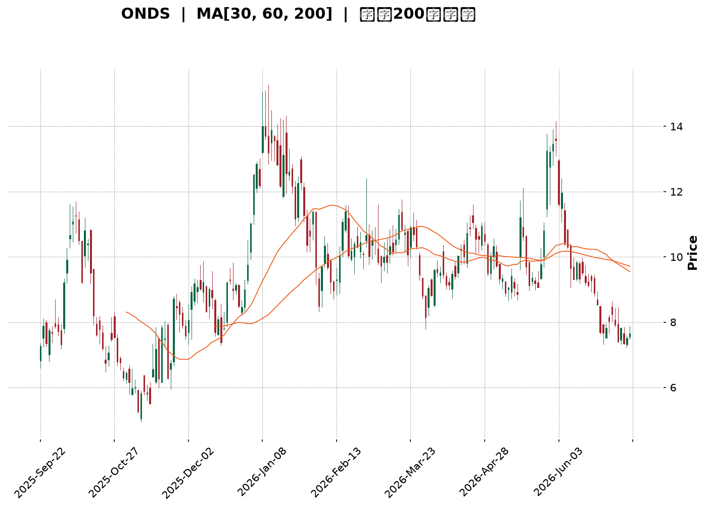
</details>

<html>
<head><meta charset="utf-8" /></head>
<body>
    <div style="height:500px; width:100%;">                        <script>window.PlotlyConfig = {MathJaxConfig: 'local'};</script>
        <script charset="utf-8" src="https://cdn.plot.ly/plotly-3.7.0.min.js" integrity="sha256-jvTGqxNp8AGWEcvNLVuKr+8j5dGe9Yw51LQkmDH+IYA=" crossorigin="anonymous"></script>                <div id="candlestick-chart" class="plotly-graph-div" style="height:100%; width:100%;"></div>            <script>                window.PLOTLYENV=window.PLOTLYENV || {};                                if (document.getElementById("candlestick-chart")) {                    Plotly.newPlot(                        "candlestick-chart",                        [{"close":{"dtype":"f8","bdata":"AAAAgD0KHUAAAADAHoUfQAAAAGBmZh1AAAAAAAAAH0AAAAAA16MeQAAAAEDheh9AAAAAoEfhHkAAAACgcD0dQAAAACCFayJAAAAAgOvRI0AAAACA61ElQAAAAIAULiZAAAAAwB6FJkAAAABA4fokQAAAAOCjcCJAAAAAYLieJUAAAACA69EkQAAAAMAeBSNAAAAAYGZmIEAAAADgo3AeQAAAAOB6FB9AAAAAYI\u002fCHEAAAACAwvUaQAAAAKBwPRxAAAAAQArXHUAAAABguB4eQAAAAMD1KBtAAAAAAAAAG0AAAADA9SgZQAAAAGCPwhlAAAAAoJmZGEAAAABACtcXQAAAAAAAABhAAAAAAAAAFUAAAACgcD0XQAAAAMAehRdAAAAAQDMzF0AAAACAPQoWQAAAAKBwPRpAAAAA4FG4HEAAAADAHgUZQAAAAAApXB9AAAAAAAAAHkAAAADgehQZQAAAAOCj8BpAAAAA4KNwIUAAAACgR+EgQAAAAEDheiBAAAAAoJmZH0AAAACA61EeQAAAAADXIyBAAAAAQArXIUAAAACgR2EiQAAAAADXIyJAAAAAgD0KIkAAAACAwnUiQAAAAGBmpiBAAAAAgD0KIkAAAAAAAIAhQAAAAGCPwh5AAAAAgBQuIEAAAABA4XodQAAAAEAzMx9AAAAA4KNwIkAAAACAPYoiQAAAACCF6yFAAAAAYI9CIkAAAACAwvUgQAAAACCF6yBAAAAAQOH6IUAAAADAHoUjQAAAAIA9CiZAAAAAIFwPKUAAAACAFK4pQAAAAAApXChAAAAAwB4FLEAAAACgR2ErQAAAAKBHYSpAAAAAIK7HK0AAAABguB4rQAAAAADXoylAAAAAgOtRKEAAAABgj0IqQAAAAKCZGSlAAAAAoHA9KUAAAABAClcoQAAAAIDrUSZAAAAAwB6FKEAAAACAPYooQAAAAIA9iiZAAAAA4FG4JEAAAAAgrkclQAAAAGCPwiZAAAAAAClcI0AAAACAwvUgQAAAAKBHYSNAAAAAgBSuJEAAAAAAKVwjQAAAAIDCdSJAAAAA4KPwIUAAAABguJ4iQAAAAKCZGSRAAAAAANcjJkAAAAAgrscmQAAAACBcDyRAAAAAoEdhJEAAAADAzMwkQAAAAKCZmSRAAAAAYGbmJEAAAADA9SgkQAAAAEAKVyVAAAAAgD0KJEAAAADAHgUlQAAAAEDh+iRAAAAAwPWoI0AAAADgo3AjQAAAAMAeBSRAAAAAwPWoI0AAAADA9agkQAAAAIDrUSRAAAAAIFwPJUAAAAAgXI8mQAAAAMD1qCVAAAAAAACAJUAAAABguB4kQAAAAMDMzCVAAAAAAClcJUAAAABguJ4kQAAAAKBH4SJAAAAAoJmZIUAAAADAzEwgQAAAAOB6FCJAAAAAYLieIUAAAABAMzMjQAAAAIA9CiNAAAAAIFwPI0AAAABgZuYiQAAAACCuRyJAAAAAYI9CIkAAAADgo\u002fAiQAAAAMDMzCJAAAAAIFwPJEAAAABgZmYkQAAAAAAAACRAAAAAgMJ1JUAAAACgcL0lQAAAAGC4HiZAAAAA4HoUJUAAAACgmRklQAAAAGBm5iVAAAAAgML1JEAAAABA4foiQAAAAOB6FCRAAAAAANejJEAAAACAwnUjQAAAAMD1qCJAAAAAgBSuIkAAAAAgrschQAAAAGC4HiJAAAAAQArXIkAAAADgehQiQAAAAOBRuCFAAAAAIIVrJkAAAACgcD0lQAAAAGBmZiNAAAAAAABAIkAAAADgUbgiQAAAAAApXCJAAAAAYLgeIkAAAACAPYojQAAAAKCZmSVAAAAAAACAKkAAAADgo3AqQAAAACCF6ypAAAAAwPUoK0AAAADgUTgnQAAAAOCj8CdAAAAAACncJEAAAACgmZkkQAAAAMDMTCNAAAAAYLieIkAAAADA9agjQAAAAMD1qCJAAAAAwB4FI0AAAAAghWsiQAAAAKBwPSJAAAAAgD2KIkAAAAAgrschQAAAACBcDyFAAAAA4FG4HkAAAABAM7MeQAAAAIDrUR9AAAAAgD0KIEAAAABA4XogQAAAAIAUrh9AAAAAANejHUAAAAAgrkcfQAAAAGBmZh1AAAAA4HoUHkAAAACgmZkeQA=="},"high":{"dtype":"f8","bdata":"AAAA4KNwHUAAAACgcD0gQAAAAADXIyBAAAAAAClcH0AAAAAgXI8fQAAAACCFayFAAAAAQApXIEAAAADAzMwfQAAAAIAUriJAAAAAIFyPJEAAAABgj0InQAAAAEAKFydAAAAAYGZmJ0AAAAAgrscmQAAAAMAeBSVAAAAAgBRuJkAAAABguB4lQAAAAKBwvSVAAAAAYI9CI0AAAACA61EgQAAAAKBHYSBAAAAAANejH0AAAACAPQodQAAAAEAzMx1AAAAAQApXIEAAAACgR6EgQAAAACBcjx5AAAAAwMzMG0AAAACAwnUaQAAAAAAAABpAAAAAYI\u002fCGkAAAAAgrkcaQAAAAAAAABlAAAAA4FG4F0AAAADgepQXQAAAACBcjxlAAAAAoEdhGEAAAADA9agYQAAAAAApXB1AAAAA4KNwH0AAAAAgXA8eQAAAAIAUrh9AAAAAgOsRIEAAAACgR+EfQAAAAGBmZhtAAAAAoJmZIUAAAABgj8IhQAAAAAApXCFAAAAAwCDwIEAAAAAA1yMgQAAAAKCZGSFAAAAAgMI1IkAAAACAFK4iQAAAAKCZmSJAAAAAAACAI0AAAADgUbgjQAAAAEDhOiJAAAAAwPUoIkAAAABgZiYjQAAAAEDheiFAAAAAANdjIEAAAABguB4hQAAAAGCRrSBAAAAAQOF6IkAAAACA61EjQAAAAIAUriNAAAAAYGZmIkAAAABAClciQAAAAEAKVyFAAAAAoJmZIkAAAAAgXA8lQAAAAGC4HiZAAAAA4HoUKUAAAAAAKdwpQAAAAIA9CipAAAAAANcjLkAAAABAMzMuQAAAACBcjy5AAAAAAAAALUAAAAAAAIArQAAAAADXIyxAAAAAAACALEAAAABgZmYsQAAAAMD1qCxAAAAAwPWoKkAAAABA4bopQAAAACCFqyhAAAAA4KPwKEAAAADA9SgqQAAAACBcjyhAAAAAYGbmJkAAAABgZmYmQAAAAEAK1yZAAAAAgD3KJkAAAAAgXA8jQAAAAMAehSNAAAAAIK5HJUAAAACgR+EkQAAAAEAK1yNAAAAAoMaLIkAAAAAAKVwjQAAAAADXoyRAAAAAQApXJkAAAACAFC4nQAAAAMD1KCdAAAAAANcjJUAAAACAwvUkQAAAAKBH4SVAAAAAIFyPJUAAAAAAKVwkQAAAAEAK1yhAAAAAAAAAJkAAAAAA16MlQAAAAEAK1yVAAAAA4FE4J0AAAAAgXA8kQAAAAGBm5iRAAAAAYLgeJUAAAACAFK4lQAAAAIDC9SVAAAAAoHC9JUAAAADgo\u002fAmQAAAAMAehSdAAAAAgML1JUAAAADA9aglQAAAAOCj8CVAAAAAoHC9JkAAAAAgrkcmQAAAACCuRyRAAAAAoHC9IkAAAAAA16MhQAAAACCuRyJAAAAAQDOzIkAAAABgj0IjQAAAAMDMzCNAAAAAoEdhI0AAAACgcL0kQAAAAIA9CiNAAAAA4FG4IkAAAAAghSsjQAAAAOBRuCNAAAAAIFwPJEAAAAAgrsckQAAAACBcDyVAAAAAYLgeJkAAAADgepQmQAAAAOBROCdAAAAA4KPwJUAAAACAPYolQAAAAGC4HiZAAAAAANcjJkAAAAAAKdwkQAAAAIDrUSRAAAAAYLgeJUAAAABA4bokQAAAAOB6lCNAAAAAIIXrIkAAAAAAAIAiQAAAAIAULiJAAAAAwMxMI0AAAABAM7MiQAAAAAApXCJAAAAAgMJ1J0AAAACgcD0oQAAAAEAKVyVAAAAAYI\u002fCI0AAAADgehQjQAAAAGCPwiJAAAAAoEchI0AAAADAHoUkQAAAAGC4HiZAAAAAIFyPK0AAAACA69EqQAAAAIDr0StAAAAAgOtRLEAAAAAAAAAqQAAAAEAK1yhAAAAAgOtRJ0AAAACAFK4lQAAAAIDr0SRAAAAAgML1I0AAAACgQ8sjQAAAAECJwSNAAAAA4KPwI0AAAABA4XojQAAAAAAAACNAAAAAIIXrIkAAAAAghesiQAAAAAAp3CFAAAAAAAAAIUAAAABgj8IfQAAAAAAp3B9AAAAA4KNwIEAAAADAzEwhQAAAAKBH4SBAAAAAYGbmIEAAAAAAKVwfQAAAACCFax9AAAAA4KNwHkAAAADAHoUfQA=="},"hovertemplate":"\u003cb\u003e%{x|%Y-%m-%d}\u003c\u002fb\u003e\u003cbr\u003e\u958b: $%{open:.2f}\u003cbr\u003e\u9ad8: $%{high:.2f}\u003cbr\u003e\u4f4e: $%{low:.2f}\u003cbr\u003e\u6536: $%{close:.2f}\u003cextra\u003e\u003c\u002fextra\u003e","low":{"dtype":"f8","bdata":"AAAAgOtRGkAAAAAghescQAAAAAAAAB1AAAAAwPUoG0AAAADgo3AdQAAAAEAzMx9AAAAAIK5HHkAAAADgUbgcQAAAAADXox5AAAAAoEdhIkAAAACAPYokQAAAAGBm5iRAAAAAYA5tJUAAAAAAAMAkQAAAAKBHYSJAAAAAILJdI0AAAABgj8IjQAAAAIDrUSJAAAAAgBSuH0AAAADgUTgeQAAAAIDrUR1AAAAAAACAHEAAAAAAKdwZQAAAAKCZmRpAAAAAYLieHUAAAADgehQeQAAAAADXoxpAAAAA4HoUGkAAAACA69EYQAAAAEDhehhAAAAAYLgeF0AAAADgehQXQAAAAIDrURdAAAAAACncFEAAAADAzMwTQAAAAOB6FBdAAAAAYGZmFkAAAAAghesVQAAAAKBwPRlAAAAAYGZmGEAAAAAghesXQAAAAKCZmRhAAAAAgD0KHUAAAAAAAAAZQAAAAOBRuBdAAAAAgBSuGkAAAAAA1yMgQAAAAKBwvR5AAAAAQDMzH0AAAACgR+EdQAAAACCuRx1AAAAAQArXHUAAAACAPQohQAAAAMD1KCFAAAAA4KPwIUAAAADgUTghQAAAAAApnCBAAAAAoHA9IEAAAACA69EgQAAAAKBwPR5AAAAAAClcHkAAAABguB4dQAAAAIDC9R5AAAAA4KNwH0AAAAAgXE8iQAAAAEAKVyFAAAAAQDOzIUAAAAAAKdwgQAAAACCFayBAAAAAwPWoIEAAAABAClciQAAAAIDr0SNAAAAAQOH6JUAAAAAghesnQAAAAOBROChAAAAAwMxMKkAAAACAFC4rQAAAAMD1qClAAAAAIIXrKUAAAABACtcpQAAAAKCZmSlAAAAAoHA9KEAAAACgmZknQAAAAAAp3CdAAAAAQDOzKEAAAACgR+EnQAAAAGBm5iVAAAAAgBQuJkAAAABguB4oQAAAAADXIyZAAAAAIK5HJEAAAADAzEwkQAAAAMAeBSVAAAAAYI9CIkAAAAAA16MgQAAAAGBm5iBAAAAAQApXI0AAAABAMzMjQAAAAGCPwiFAAAAAYGZmIUAAAAAA16MhQAAAAKBwvSFAAAAAQOH6I0AAAABA4XolQAAAAGBm5iNAAAAA4FG4I0AAAACAwvUiQAAAAIA9iiRAAAAAYGbmI0AAAACgcD0jQAAAAKCZmSRAAAAAwB6FI0AAAAAAKdwjQAAAAGC4HiRAAAAAwB6FI0AAAABgZmYiQAAAAGBmJiNAAAAAAAAAI0AAAACgmZkjQAAAAKCZGSRAAAAA4FE4JEAAAACgcL0kQAAAAADXoyVAAAAAoHA9JEAAAACAwnUjQAAAAIAU7iNAAAAAQDPzJEAAAACAwnUkQAAAAIA9iiJAAAAAwPVoIUAAAABguB4fQAAAAGBmZiBAAAAAIFyPIUAAAAAghesgQAAAAGCPwiJAAAAA4E1iIkAAAACAFK4iQAAAAMAeBSJAAAAAQOH6IUAAAACAwnUhQAAAAKCZmSJAAAAAoHC9IkAAAADAHoUjQAAAAIA9iiNAAAAAgOtRI0AAAAAgrkclQAAAAEAzsyVAAAAAQDMzJEAAAABA4TokQAAAACCFayRAAAAAIIWrJEAAAACA69EiQAAAAGC4niJAAAAAoHA9I0AAAABAClcjQAAAAIDrUSJAAAAAgD0KIkAAAAAgXI8hQAAAAMDMTCFAAAAA4KNwIUAAAACgmZkhQAAAAEAKVyFAAAAAQDMzI0AAAAAAAAAlQAAAACCF6yJAAAAA4KPwIUAAAACgcD0iQAAAAIDC9SFAAAAAYLgeIkAAAAAgsp0iQAAAAAApXCNAAAAA4KNwJkAAAABAMzMnQAAAAKCZmSlAAAAAgBQuKkAAAAAgXA8nQAAAAGC4HiZAAAAAwPWoJEAAAAAAAIAkQAAAAOB6FCJAAAAAoJmZIkAAAADAHoUiQAAAAAApXCJAAAAAoJnZIkAAAAAgrkciQAAAAMD1KCJAAAAAQArXIUAAAAAgXI8hQAAAAAAAACFAAAAAIFyPHkAAAACgcD0dQAAAAAAAAB5AAAAAoJmZHkAAAADAHgUgQAAAAGBmZh9AAAAAQOF6HUAAAACgcD0dQAAAACCuRx1AAAAAoEfhHEAAAACgR+EdQA=="},"name":"\u50f9\u683c","open":{"dtype":"f8","bdata":"AAAAIK5HG0AAAAAgXA8eQAAAAIDC9R9AAAAAwB4FHEAAAAAgrsceQAAAAEAK1x9AAAAA4FG4H0AAAAAAAAAfQAAAAEAzMx9AAAAAwB4FI0AAAABguB4lQAAAAAAAACZAAAAAIK6HJkAAAAAgrkcmQAAAAIDC9SRAAAAAIFwPJEAAAABgj8IkQAAAAGBmpiVAAAAAYI9CI0AAAADAzMwfQAAAAGC4HiBAAAAA4FG4HkAAAABgZmYbQAAAAGBmZhtAAAAAgBSuHkAAAABguF4gQAAAAOB6FB5AAAAA4HqUG0AAAACAwvUZQAAAAAAAABlAAAAAwMxMGkAAAABguB4XQAAAACCF6xdAAAAAgBSuF0AAAADA9SgUQAAAAEDhehlAAAAAYGZmF0AAAADgo\u002fAXQAAAACCuRxlAAAAAwPWoGEAAAACAPQoeQAAAAGC4nhhAAAAAACncHUAAAACAFK4fQAAAAKBwPRpAAAAAANcjG0AAAACAwvUgQAAAAOBROCFAAAAAIFyPIEAAAADAHoUfQAAAAOBRuB5AAAAAIK7HIEAAAADAHkUhQAAAAAAp3CFAAAAAQAqXIkAAAABACtchQAAAAOBROCJAAAAAQOH6IEAAAACAwvUhQAAAAAApXCFAAAAAQOF6HkAAAAAgrkcgQAAAAMD1KB9AAAAAgML1H0AAAACgmZkiQAAAACBcDyJAAAAAgML1IUAAAADgJEYiQAAAAKCZmSBAAAAAIIXrIEAAAAAgXI8iQAAAAMAeRSRAAAAAoJmZJkAAAABAMzMoQAAAAGBmZilAAAAAwPVoKkAAAAAAAAAsQAAAACCFaytAAAAAAAAAK0AAAACgR2ErQAAAAADXIytAAAAA4HrUKkAAAACAwrUnQAAAAKCZmStAAAAAwB4FKUAAAAAghWspQAAAAMDMTChAAAAAIIVrJkAAAACAwvUpQAAAACCuRyhAAAAAAACAJkAAAABguJ4lQAAAAMAeBSZAAAAAYI\u002fCJkAAAACAFK4iQAAAAIAU7iFAAAAAACmcI0AAAACAFC4kQAAAAMAexSNAAAAAoHB9IkAAAACAPYoiQAAAAOBReCJAAAAAIIVrJEAAAAAA16MlQAAAAKBHYSZAAAAAACncI0AAAADAHgUkQAAAAGCPQiVAAAAAwMxMJEAAAACAFC4kQAAAAAAAACVAAAAAoEdhJUAAAADgUbgkQAAAAEDh+iRAAAAAAACAJEAAAAAgXA8kQAAAAIAUriNAAAAAoJkZJEAAAAAghSskQAAAAAAp3CRAAAAAoHC9JEAAAACgmRklQAAAAAAAwCZAAAAAYLheJUAAAADgepQlQAAAAOB6lCRAAAAAgOvRJUAAAABgj8IlQAAAAKCZGSRAAAAAQDOzIkAAAABguJ4hQAAAAGBm5iBAAAAAoJmZIkAAAAAgrgchQAAAAGCPQiNAAAAAACncIkAAAABAClckQAAAAOB61CJAAAAAgMJ1IkAAAADAHgUiQAAAAOCjcCNAAAAAwB4FI0AAAAAAAIAkQAAAAGCPwiRAAAAAoJmZI0AAAADAzMwlQAAAAIA9iiZAAAAAYI\u002fCJUAAAABgj0IlQAAAAMBLtyRAAAAAANdjJUAAAABgj8IkQAAAAAAAACNAAAAAAAAAJEAAAADAzEwkQAAAACBcjyNAAAAAAACAIkAAAAAAAIAiQAAAAAAAACJAAAAAQArXIUAAAADgUXgiQAAAAEAK1yFAAAAAQOH6I0AAAACA69ElQAAAAGCPQiVAAAAAYGamI0AAAAAAAIAiQAAAACBcjyJAAAAAIIVrIkAAAAAghasiQAAAAAAAACRAAAAAQDPzJkAAAAAAAIApQAAAAKBwfSpAAAAAoHA9K0AAAAAghespQAAAAIDC9SZAAAAAQArXJkAAAADA9aglQAAAACCFqyRAAAAAoEdhI0AAAABgZqYiQAAAAEAKlyNAAAAAQDOzI0AAAACA69EiQAAAAKBwfSJAAAAAgOvRIkAAAACAwrUiQAAAAGC4XiFAAAAAgML1IEAAAACgcL0fQAAAACBcDx5AAAAAIK5HIEAAAADgo\u002fAgQAAAAADXIyBAAAAAYI\u002fCH0AAAADAzMwdQAAAAKCZmR5AAAAAoHA9HUAAAADA9SgeQA=="},"x":["2025-09-22T00:00:00-04:00","2025-09-23T00:00:00-04:00","2025-09-24T00:00:00-04:00","2025-09-25T00:00:00-04:00","2025-09-26T00:00:00-04:00","2025-09-29T00:00:00-04:00","2025-09-30T00:00:00-04:00","2025-10-01T00:00:00-04:00","2025-10-02T00:00:00-04:00","2025-10-03T00:00:00-04:00","2025-10-06T00:00:00-04:00","2025-10-07T00:00:00-04:00","2025-10-08T00:00:00-04:00","2025-10-09T00:00:00-04:00","2025-10-10T00:00:00-04:00","2025-10-13T00:00:00-04:00","2025-10-14T00:00:00-04:00","2025-10-15T00:00:00-04:00","2025-10-16T00:00:00-04:00","2025-10-17T00:00:00-04:00","2025-10-20T00:00:00-04:00","2025-10-21T00:00:00-04:00","2025-10-22T00:00:00-04:00","2025-10-23T00:00:00-04:00","2025-10-24T00:00:00-04:00","2025-10-27T00:00:00-04:00","2025-10-28T00:00:00-04:00","2025-10-29T00:00:00-04:00","2025-10-30T00:00:00-04:00","2025-10-31T00:00:00-04:00","2025-11-03T00:00:00-05:00","2025-11-04T00:00:00-05:00","2025-11-05T00:00:00-05:00","2025-11-06T00:00:00-05:00","2025-11-07T00:00:00-05:00","2025-11-10T00:00:00-05:00","2025-11-11T00:00:00-05:00","2025-11-12T00:00:00-05:00","2025-11-13T00:00:00-05:00","2025-11-14T00:00:00-05:00","2025-11-17T00:00:00-05:00","2025-11-18T00:00:00-05:00","2025-11-19T00:00:00-05:00","2025-11-20T00:00:00-05:00","2025-11-21T00:00:00-05:00","2025-11-24T00:00:00-05:00","2025-11-25T00:00:00-05:00","2025-11-26T00:00:00-05:00","2025-11-28T00:00:00-05:00","2025-12-01T00:00:00-05:00","2025-12-02T00:00:00-05:00","2025-12-03T00:00:00-05:00","2025-12-04T00:00:00-05:00","2025-12-05T00:00:00-05:00","2025-12-08T00:00:00-05:00","2025-12-09T00:00:00-05:00","2025-12-10T00:00:00-05:00","2025-12-11T00:00:00-05:00","2025-12-12T00:00:00-05:00","2025-12-15T00:00:00-05:00","2025-12-16T00:00:00-05:00","2025-12-17T00:00:00-05:00","2025-12-18T00:00:00-05:00","2025-12-19T00:00:00-05:00","2025-12-22T00:00:00-05:00","2025-12-23T00:00:00-05:00","2025-12-24T00:00:00-05:00","2025-12-26T00:00:00-05:00","2025-12-29T00:00:00-05:00","2025-12-30T00:00:00-05:00","2025-12-31T00:00:00-05:00","2026-01-02T00:00:00-05:00","2026-01-05T00:00:00-05:00","2026-01-06T00:00:00-05:00","2026-01-07T00:00:00-05:00","2026-01-08T00:00:00-05:00","2026-01-09T00:00:00-05:00","2026-01-12T00:00:00-05:00","2026-01-13T00:00:00-05:00","2026-01-14T00:00:00-05:00","2026-01-15T00:00:00-05:00","2026-01-16T00:00:00-05:00","2026-01-20T00:00:00-05:00","2026-01-21T00:00:00-05:00","2026-01-22T00:00:00-05:00","2026-01-23T00:00:00-05:00","2026-01-26T00:00:00-05:00","2026-01-27T00:00:00-05:00","2026-01-28T00:00:00-05:00","2026-01-29T00:00:00-05:00","2026-01-30T00:00:00-05:00","2026-02-02T00:00:00-05:00","2026-02-03T00:00:00-05:00","2026-02-04T00:00:00-05:00","2026-02-05T00:00:00-05:00","2026-02-06T00:00:00-05:00","2026-02-09T00:00:00-05:00","2026-02-10T00:00:00-05:00","2026-02-11T00:00:00-05:00","2026-02-12T00:00:00-05:00","2026-02-13T00:00:00-05:00","2026-02-17T00:00:00-05:00","2026-02-18T00:00:00-05:00","2026-02-19T00:00:00-05:00","2026-02-20T00:00:00-05:00","2026-02-23T00:00:00-05:00","2026-02-24T00:00:00-05:00","2026-02-25T00:00:00-05:00","2026-02-26T00:00:00-05:00","2026-02-27T00:00:00-05:00","2026-03-02T00:00:00-05:00","2026-03-03T00:00:00-05:00","2026-03-04T00:00:00-05:00","2026-03-05T00:00:00-05:00","2026-03-06T00:00:00-05:00","2026-03-09T00:00:00-04:00","2026-03-10T00:00:00-04:00","2026-03-11T00:00:00-04:00","2026-03-12T00:00:00-04:00","2026-03-13T00:00:00-04:00","2026-03-16T00:00:00-04:00","2026-03-17T00:00:00-04:00","2026-03-18T00:00:00-04:00","2026-03-19T00:00:00-04:00","2026-03-20T00:00:00-04:00","2026-03-23T00:00:00-04:00","2026-03-24T00:00:00-04:00","2026-03-25T00:00:00-04:00","2026-03-26T00:00:00-04:00","2026-03-27T00:00:00-04:00","2026-03-30T00:00:00-04:00","2026-03-31T00:00:00-04:00","2026-04-01T00:00:00-04:00","2026-04-02T00:00:00-04:00","2026-04-06T00:00:00-04:00","2026-04-07T00:00:00-04:00","2026-04-08T00:00:00-04:00","2026-04-09T00:00:00-04:00","2026-04-10T00:00:00-04:00","2026-04-13T00:00:00-04:00","2026-04-14T00:00:00-04:00","2026-04-15T00:00:00-04:00","2026-04-16T00:00:00-04:00","2026-04-17T00:00:00-04:00","2026-04-20T00:00:00-04:00","2026-04-21T00:00:00-04:00","2026-04-22T00:00:00-04:00","2026-04-23T00:00:00-04:00","2026-04-24T00:00:00-04:00","2026-04-27T00:00:00-04:00","2026-04-28T00:00:00-04:00","2026-04-29T00:00:00-04:00","2026-04-30T00:00:00-04:00","2026-05-01T00:00:00-04:00","2026-05-04T00:00:00-04:00","2026-05-05T00:00:00-04:00","2026-05-06T00:00:00-04:00","2026-05-07T00:00:00-04:00","2026-05-08T00:00:00-04:00","2026-05-11T00:00:00-04:00","2026-05-12T00:00:00-04:00","2026-05-13T00:00:00-04:00","2026-05-14T00:00:00-04:00","2026-05-15T00:00:00-04:00","2026-05-18T00:00:00-04:00","2026-05-19T00:00:00-04:00","2026-05-20T00:00:00-04:00","2026-05-21T00:00:00-04:00","2026-05-22T00:00:00-04:00","2026-05-26T00:00:00-04:00","2026-05-27T00:00:00-04:00","2026-05-28T00:00:00-04:00","2026-05-29T00:00:00-04:00","2026-06-01T00:00:00-04:00","2026-06-02T00:00:00-04:00","2026-06-03T00:00:00-04:00","2026-06-04T00:00:00-04:00","2026-06-05T00:00:00-04:00","2026-06-08T00:00:00-04:00","2026-06-09T00:00:00-04:00","2026-06-10T00:00:00-04:00","2026-06-11T00:00:00-04:00","2026-06-12T00:00:00-04:00","2026-06-15T00:00:00-04:00","2026-06-16T00:00:00-04:00","2026-06-17T00:00:00-04:00","2026-06-18T00:00:00-04:00","2026-06-22T00:00:00-04:00","2026-06-23T00:00:00-04:00","2026-06-24T00:00:00-04:00","2026-06-25T00:00:00-04:00","2026-06-26T00:00:00-04:00","2026-06-29T00:00:00-04:00","2026-06-30T00:00:00-04:00","2026-07-01T00:00:00-04:00","2026-07-02T00:00:00-04:00","2026-07-06T00:00:00-04:00","2026-07-07T00:00:00-04:00","2026-07-08T00:00:00-04:00","2026-07-09T00:00:00-04:00"],"type":"candlestick"},{"hovertemplate":"MA30: $%{y:.2f}\u003cextra\u003e\u003c\u002fextra\u003e","line":{"color":"#2196F3","dash":"dash","width":2},"mode":"lines","name":"MA30","x":["2025-09-22T00:00:00-04:00","2025-09-23T00:00:00-04:00","2025-09-24T00:00:00-04:00","2025-09-25T00:00:00-04:00","2025-09-26T00:00:00-04:00","2025-09-29T00:00:00-04:00","2025-09-30T00:00:00-04:00","2025-10-01T00:00:00-04:00","2025-10-02T00:00:00-04:00","2025-10-03T00:00:00-04:00","2025-10-06T00:00:00-04:00","2025-10-07T00:00:00-04:00","2025-10-08T00:00:00-04:00","2025-10-09T00:00:00-04:00","2025-10-10T00:00:00-04:00","2025-10-13T00:00:00-04:00","2025-10-14T00:00:00-04:00","2025-10-15T00:00:00-04:00","2025-10-16T00:00:00-04:00","2025-10-17T00:00:00-04:00","2025-10-20T00:00:00-04:00","2025-10-21T00:00:00-04:00","2025-10-22T00:00:00-04:00","2025-10-23T00:00:00-04:00","2025-10-24T00:00:00-04:00","2025-10-27T00:00:00-04:00","2025-10-28T00:00:00-04:00","2025-10-29T00:00:00-04:00","2025-10-30T00:00:00-04:00","2025-10-31T00:00:00-04:00","2025-11-03T00:00:00-05:00","2025-11-04T00:00:00-05:00","2025-11-05T00:00:00-05:00","2025-11-06T00:00:00-05:00","2025-11-07T00:00:00-05:00","2025-11-10T00:00:00-05:00","2025-11-11T00:00:00-05:00","2025-11-12T00:00:00-05:00","2025-11-13T00:00:00-05:00","2025-11-14T00:00:00-05:00","2025-11-17T00:00:00-05:00","2025-11-18T00:00:00-05:00","2025-11-19T00:00:00-05:00","2025-11-20T00:00:00-05:00","2025-11-21T00:00:00-05:00","2025-11-24T00:00:00-05:00","2025-11-25T00:00:00-05:00","2025-11-26T00:00:00-05:00","2025-11-28T00:00:00-05:00","2025-12-01T00:00:00-05:00","2025-12-02T00:00:00-05:00","2025-12-03T00:00:00-05:00","2025-12-04T00:00:00-05:00","2025-12-05T00:00:00-05:00","2025-12-08T00:00:00-05:00","2025-12-09T00:00:00-05:00","2025-12-10T00:00:00-05:00","2025-12-11T00:00:00-05:00","2025-12-12T00:00:00-05:00","2025-12-15T00:00:00-05:00","2025-12-16T00:00:00-05:00","2025-12-17T00:00:00-05:00","2025-12-18T00:00:00-05:00","2025-12-19T00:00:00-05:00","2025-12-22T00:00:00-05:00","2025-12-23T00:00:00-05:00","2025-12-24T00:00:00-05:00","2025-12-26T00:00:00-05:00","2025-12-29T00:00:00-05:00","2025-12-30T00:00:00-05:00","2025-12-31T00:00:00-05:00","2026-01-02T00:00:00-05:00","2026-01-05T00:00:00-05:00","2026-01-06T00:00:00-05:00","2026-01-07T00:00:00-05:00","2026-01-08T00:00:00-05:00","2026-01-09T00:00:00-05:00","2026-01-12T00:00:00-05:00","2026-01-13T00:00:00-05:00","2026-01-14T00:00:00-05:00","2026-01-15T00:00:00-05:00","2026-01-16T00:00:00-05:00","2026-01-20T00:00:00-05:00","2026-01-21T00:00:00-05:00","2026-01-22T00:00:00-05:00","2026-01-23T00:00:00-05:00","2026-01-26T00:00:00-05:00","2026-01-27T00:00:00-05:00","2026-01-28T00:00:00-05:00","2026-01-29T00:00:00-05:00","2026-01-30T00:00:00-05:00","2026-02-02T00:00:00-05:00","2026-02-03T00:00:00-05:00","2026-02-04T00:00:00-05:00","2026-02-05T00:00:00-05:00","2026-02-06T00:00:00-05:00","2026-02-09T00:00:00-05:00","2026-02-10T00:00:00-05:00","2026-02-11T00:00:00-05:00","2026-02-12T00:00:00-05:00","2026-02-13T00:00:00-05:00","2026-02-17T00:00:00-05:00","2026-02-18T00:00:00-05:00","2026-02-19T00:00:00-05:00","2026-02-20T00:00:00-05:00","2026-02-23T00:00:00-05:00","2026-02-24T00:00:00-05:00","2026-02-25T00:00:00-05:00","2026-02-26T00:00:00-05:00","2026-02-27T00:00:00-05:00","2026-03-02T00:00:00-05:00","2026-03-03T00:00:00-05:00","2026-03-04T00:00:00-05:00","2026-03-05T00:00:00-05:00","2026-03-06T00:00:00-05:00","2026-03-09T00:00:00-04:00","2026-03-10T00:00:00-04:00","2026-03-11T00:00:00-04:00","2026-03-12T00:00:00-04:00","2026-03-13T00:00:00-04:00","2026-03-16T00:00:00-04:00","2026-03-17T00:00:00-04:00","2026-03-18T00:00:00-04:00","2026-03-19T00:00:00-04:00","2026-03-20T00:00:00-04:00","2026-03-23T00:00:00-04:00","2026-03-24T00:00:00-04:00","2026-03-25T00:00:00-04:00","2026-03-26T00:00:00-04:00","2026-03-27T00:00:00-04:00","2026-03-30T00:00:00-04:00","2026-03-31T00:00:00-04:00","2026-04-01T00:00:00-04:00","2026-04-02T00:00:00-04:00","2026-04-06T00:00:00-04:00","2026-04-07T00:00:00-04:00","2026-04-08T00:00:00-04:00","2026-04-09T00:00:00-04:00","2026-04-10T00:00:00-04:00","2026-04-13T00:00:00-04:00","2026-04-14T00:00:00-04:00","2026-04-15T00:00:00-04:00","2026-04-16T00:00:00-04:00","2026-04-17T00:00:00-04:00","2026-04-20T00:00:00-04:00","2026-04-21T00:00:00-04:00","2026-04-22T00:00:00-04:00","2026-04-23T00:00:00-04:00","2026-04-24T00:00:00-04:00","2026-04-27T00:00:00-04:00","2026-04-28T00:00:00-04:00","2026-04-29T00:00:00-04:00","2026-04-30T00:00:00-04:00","2026-05-01T00:00:00-04:00","2026-05-04T00:00:00-04:00","2026-05-05T00:00:00-04:00","2026-05-06T00:00:00-04:00","2026-05-07T00:00:00-04:00","2026-05-08T00:00:00-04:00","2026-05-11T00:00:00-04:00","2026-05-12T00:00:00-04:00","2026-05-13T00:00:00-04:00","2026-05-14T00:00:00-04:00","2026-05-15T00:00:00-04:00","2026-05-18T00:00:00-04:00","2026-05-19T00:00:00-04:00","2026-05-20T00:00:00-04:00","2026-05-21T00:00:00-04:00","2026-05-22T00:00:00-04:00","2026-05-26T00:00:00-04:00","2026-05-27T00:00:00-04:00","2026-05-28T00:00:00-04:00","2026-05-29T00:00:00-04:00","2026-06-01T00:00:00-04:00","2026-06-02T00:00:00-04:00","2026-06-03T00:00:00-04:00","2026-06-04T00:00:00-04:00","2026-06-05T00:00:00-04:00","2026-06-08T00:00:00-04:00","2026-06-09T00:00:00-04:00","2026-06-10T00:00:00-04:00","2026-06-11T00:00:00-04:00","2026-06-12T00:00:00-04:00","2026-06-15T00:00:00-04:00","2026-06-16T00:00:00-04:00","2026-06-17T00:00:00-04:00","2026-06-18T00:00:00-04:00","2026-06-22T00:00:00-04:00","2026-06-23T00:00:00-04:00","2026-06-24T00:00:00-04:00","2026-06-25T00:00:00-04:00","2026-06-26T00:00:00-04:00","2026-06-29T00:00:00-04:00","2026-06-30T00:00:00-04:00","2026-07-01T00:00:00-04:00","2026-07-02T00:00:00-04:00","2026-07-06T00:00:00-04:00","2026-07-07T00:00:00-04:00","2026-07-08T00:00:00-04:00","2026-07-09T00:00:00-04:00"],"y":{"dtype":"f8","bdata":"AAAAAAAA+H8AAAAAAAD4fwAAAAAAAPh\u002fAAAAAAAA+H8AAAAAAAD4fwAAAAAAAPh\u002fAAAAAAAA+H8AAAAAAAD4fwAAAAAAAPh\u002fAAAAAAAA+H8AAAAAAAD4fwAAAAAAAPh\u002fAAAAAAAA+H8AAAAAAAD4fwAAAAAAAPh\u002fAAAAAAAA+H8AAAAAAAD4fwAAAAAAAPh\u002fAAAAAAAA+H8AAAAAAAD4fwAAAAAAAPh\u002fAAAAAAAA+H8AAAAAAAD4fwAAAAAAAPh\u002fAAAAAAAA+H8AAAAAAAD4fwAAAAAAAPh\u002fAAAAAAAA+H8AAAAAAAD4fyIiImoDnSBAAAAAwBGKIEBEREQkTWkgQO\u002fu7uZCUiBAREREPJgnIEBmZmZ2BQggQKuqqgoezB9ARERE1JSKH0ARERExJE0fQDMzMyOw8h5AiYiICIGVHkDv7u6OJf8dQAAAAKA2kB1A3t3dPd8PHUAiIiJS1H8cQO\u002fu7g4CKxxAvLu7W6vjG0C8u7s7baAbQM3MzMwTdRtAzczMXNZqG0B3d3c30GkbQHd3d6cNdBtAAAAAoBqvG0DNzMwMuwIcQCIiIrJWRxxAAAAAMJZ8HEAiIiICnbYcQKuqqgoC6xxAvLu7m304HUCrqqpqdYwdQFVVVRUgtx1AAAAAEFj5HUBERETUeCkeQImIiHjpZh5AzczM3GvuHkDv7u7OhWQfQCIiIkKnzR9A7+7unqgfIEDv7u6+WFIgQBEREfnFciBAvLu7+6mRIEAAAACQe80gQCIiIjLBAyFAmpmZmZlZIUBmZmZeuskhQAAAAPCnJiJAzczMTPCAIkBmZmbmidoiQHd3d8cELyNAVVVVfT+VI0CrqqqCTvsjQLy7u5NfTCRAIiIiWquDJEAiIiJ66cYkQM3MzNRNAiVAAAAAeL4\u002fJUDv7u6G63ElQM3MzNRNoiVAMzMzm5nZJUARERG5rBUmQLy7u\u002fvFUiZAMzMzw4N5JkDNzMycUrEmQO\u002fu7t5r7iZAREREpEX2JkAzMzMTyugmQN7d3X0\u002f9SZAAAAAEOYJJ0AiIiLyYB4nQAAAACCFKydA7+7uvi0rJ0CrqqqqfyMnQLy7u6vxEidAVVVV1Qb6JkAAAACwR+EmQBERETGWvCZAq6qqWmR7JkAAAAAgPkMmQGZmZobrESZA7+7u7jXXJUBERESU0ZslQGZmZhYgdyVAmpmZSZpSJUBVVVVV4yUlQN7d3Q27AiVAvLu7Wx3TJEBVVVUlTakkQImIiLislSRAMzMz4zNsJEBVVVXlF0skQKuqqjomOCRAiYiI+Aw7JEC8u7sr+UUkQO\u002fu7i6WPCRAVVVVFdlOJEBmZmY20GkkQImIiMh2fiRARERERESEJEB3d3fHBI8kQImIiEiakiRAq6qqirOPJEC8u7tr53skQJqZmamqaiRAMzMzkxhEJEAiIiLyiyUkQJqZmbnXHCRAREREJJQRJEB3d3eHXQEkQJqZmWmR7SNA7+7uPgrXI0De3d0docwjQGZmZmb0tiNAZmZmFiC3I0DNzMys1bEjQFVVVdV4qSNA3t3d\u002fdS4I0CrqqpqdcwjQAAAAPBg3iNAmpmZ+X7qI0C8u7srQO4jQLy7u7u7+yNAd3d3R+H6I0BmZmamVNwjQGZmZhbZziNAMzMzY4LHI0B3d3eX4MEjQImIiCgVpyNAvLu7mzaQI0CJiIiI+ncjQKuqqkp+cSNAzczMHBN8I0BVVVWVQ4sjQGZmZiYxiCNAiYiI6CaxI0Crqqpaj8IjQImIiMihxSNAAAAAULi+I0CJiIgYL70jQLy7u9vdvSNAZmZmBqy8I0Dv7u6+ysEjQBEREXGv2SNAZmZm1qMQJEC8u7trLkQkQERERGQ7fyRAvLu7O9+vJEB3d3dXgLwkQBERETEIzCRAiYiImCfKJEBERERU48UkQKuqqoqzryRAzczMvLubJECJiIg4iaEkQO\u002fu7i5rlSRA3t3dPZiHJEBERERUuH4kQDMzM9MieyRA3t3d\u002ffB5JEDe3d398HkkQCIiImLlcCRAzczMNDNTJEBmZmZu5zskQDMzM0tTKiRAERER+eHzI0AAAACYQ8sjQAAAAKjirCNAzczMtJ2PI0CJiIhYVXUjQLy7u\u002fMZViNAZmZmltE7I0AiIiIqoxcjQA=="},"type":"scatter"},{"hovertemplate":"MA60: $%{y:.2f}\u003cextra\u003e\u003c\u002fextra\u003e","line":{"color":"#9C27B0","dash":"dash","width":2},"mode":"lines","name":"MA60","x":["2025-09-22T00:00:00-04:00","2025-09-23T00:00:00-04:00","2025-09-24T00:00:00-04:00","2025-09-25T00:00:00-04:00","2025-09-26T00:00:00-04:00","2025-09-29T00:00:00-04:00","2025-09-30T00:00:00-04:00","2025-10-01T00:00:00-04:00","2025-10-02T00:00:00-04:00","2025-10-03T00:00:00-04:00","2025-10-06T00:00:00-04:00","2025-10-07T00:00:00-04:00","2025-10-08T00:00:00-04:00","2025-10-09T00:00:00-04:00","2025-10-10T00:00:00-04:00","2025-10-13T00:00:00-04:00","2025-10-14T00:00:00-04:00","2025-10-15T00:00:00-04:00","2025-10-16T00:00:00-04:00","2025-10-17T00:00:00-04:00","2025-10-20T00:00:00-04:00","2025-10-21T00:00:00-04:00","2025-10-22T00:00:00-04:00","2025-10-23T00:00:00-04:00","2025-10-24T00:00:00-04:00","2025-10-27T00:00:00-04:00","2025-10-28T00:00:00-04:00","2025-10-29T00:00:00-04:00","2025-10-30T00:00:00-04:00","2025-10-31T00:00:00-04:00","2025-11-03T00:00:00-05:00","2025-11-04T00:00:00-05:00","2025-11-05T00:00:00-05:00","2025-11-06T00:00:00-05:00","2025-11-07T00:00:00-05:00","2025-11-10T00:00:00-05:00","2025-11-11T00:00:00-05:00","2025-11-12T00:00:00-05:00","2025-11-13T00:00:00-05:00","2025-11-14T00:00:00-05:00","2025-11-17T00:00:00-05:00","2025-11-18T00:00:00-05:00","2025-11-19T00:00:00-05:00","2025-11-20T00:00:00-05:00","2025-11-21T00:00:00-05:00","2025-11-24T00:00:00-05:00","2025-11-25T00:00:00-05:00","2025-11-26T00:00:00-05:00","2025-11-28T00:00:00-05:00","2025-12-01T00:00:00-05:00","2025-12-02T00:00:00-05:00","2025-12-03T00:00:00-05:00","2025-12-04T00:00:00-05:00","2025-12-05T00:00:00-05:00","2025-12-08T00:00:00-05:00","2025-12-09T00:00:00-05:00","2025-12-10T00:00:00-05:00","2025-12-11T00:00:00-05:00","2025-12-12T00:00:00-05:00","2025-12-15T00:00:00-05:00","2025-12-16T00:00:00-05:00","2025-12-17T00:00:00-05:00","2025-12-18T00:00:00-05:00","2025-12-19T00:00:00-05:00","2025-12-22T00:00:00-05:00","2025-12-23T00:00:00-05:00","2025-12-24T00:00:00-05:00","2025-12-26T00:00:00-05:00","2025-12-29T00:00:00-05:00","2025-12-30T00:00:00-05:00","2025-12-31T00:00:00-05:00","2026-01-02T00:00:00-05:00","2026-01-05T00:00:00-05:00","2026-01-06T00:00:00-05:00","2026-01-07T00:00:00-05:00","2026-01-08T00:00:00-05:00","2026-01-09T00:00:00-05:00","2026-01-12T00:00:00-05:00","2026-01-13T00:00:00-05:00","2026-01-14T00:00:00-05:00","2026-01-15T00:00:00-05:00","2026-01-16T00:00:00-05:00","2026-01-20T00:00:00-05:00","2026-01-21T00:00:00-05:00","2026-01-22T00:00:00-05:00","2026-01-23T00:00:00-05:00","2026-01-26T00:00:00-05:00","2026-01-27T00:00:00-05:00","2026-01-28T00:00:00-05:00","2026-01-29T00:00:00-05:00","2026-01-30T00:00:00-05:00","2026-02-02T00:00:00-05:00","2026-02-03T00:00:00-05:00","2026-02-04T00:00:00-05:00","2026-02-05T00:00:00-05:00","2026-02-06T00:00:00-05:00","2026-02-09T00:00:00-05:00","2026-02-10T00:00:00-05:00","2026-02-11T00:00:00-05:00","2026-02-12T00:00:00-05:00","2026-02-13T00:00:00-05:00","2026-02-17T00:00:00-05:00","2026-02-18T00:00:00-05:00","2026-02-19T00:00:00-05:00","2026-02-20T00:00:00-05:00","2026-02-23T00:00:00-05:00","2026-02-24T00:00:00-05:00","2026-02-25T00:00:00-05:00","2026-02-26T00:00:00-05:00","2026-02-27T00:00:00-05:00","2026-03-02T00:00:00-05:00","2026-03-03T00:00:00-05:00","2026-03-04T00:00:00-05:00","2026-03-05T00:00:00-05:00","2026-03-06T00:00:00-05:00","2026-03-09T00:00:00-04:00","2026-03-10T00:00:00-04:00","2026-03-11T00:00:00-04:00","2026-03-12T00:00:00-04:00","2026-03-13T00:00:00-04:00","2026-03-16T00:00:00-04:00","2026-03-17T00:00:00-04:00","2026-03-18T00:00:00-04:00","2026-03-19T00:00:00-04:00","2026-03-20T00:00:00-04:00","2026-03-23T00:00:00-04:00","2026-03-24T00:00:00-04:00","2026-03-25T00:00:00-04:00","2026-03-26T00:00:00-04:00","2026-03-27T00:00:00-04:00","2026-03-30T00:00:00-04:00","2026-03-31T00:00:00-04:00","2026-04-01T00:00:00-04:00","2026-04-02T00:00:00-04:00","2026-04-06T00:00:00-04:00","2026-04-07T00:00:00-04:00","2026-04-08T00:00:00-04:00","2026-04-09T00:00:00-04:00","2026-04-10T00:00:00-04:00","2026-04-13T00:00:00-04:00","2026-04-14T00:00:00-04:00","2026-04-15T00:00:00-04:00","2026-04-16T00:00:00-04:00","2026-04-17T00:00:00-04:00","2026-04-20T00:00:00-04:00","2026-04-21T00:00:00-04:00","2026-04-22T00:00:00-04:00","2026-04-23T00:00:00-04:00","2026-04-24T00:00:00-04:00","2026-04-27T00:00:00-04:00","2026-04-28T00:00:00-04:00","2026-04-29T00:00:00-04:00","2026-04-30T00:00:00-04:00","2026-05-01T00:00:00-04:00","2026-05-04T00:00:00-04:00","2026-05-05T00:00:00-04:00","2026-05-06T00:00:00-04:00","2026-05-07T00:00:00-04:00","2026-05-08T00:00:00-04:00","2026-05-11T00:00:00-04:00","2026-05-12T00:00:00-04:00","2026-05-13T00:00:00-04:00","2026-05-14T00:00:00-04:00","2026-05-15T00:00:00-04:00","2026-05-18T00:00:00-04:00","2026-05-19T00:00:00-04:00","2026-05-20T00:00:00-04:00","2026-05-21T00:00:00-04:00","2026-05-22T00:00:00-04:00","2026-05-26T00:00:00-04:00","2026-05-27T00:00:00-04:00","2026-05-28T00:00:00-04:00","2026-05-29T00:00:00-04:00","2026-06-01T00:00:00-04:00","2026-06-02T00:00:00-04:00","2026-06-03T00:00:00-04:00","2026-06-04T00:00:00-04:00","2026-06-05T00:00:00-04:00","2026-06-08T00:00:00-04:00","2026-06-09T00:00:00-04:00","2026-06-10T00:00:00-04:00","2026-06-11T00:00:00-04:00","2026-06-12T00:00:00-04:00","2026-06-15T00:00:00-04:00","2026-06-16T00:00:00-04:00","2026-06-17T00:00:00-04:00","2026-06-18T00:00:00-04:00","2026-06-22T00:00:00-04:00","2026-06-23T00:00:00-04:00","2026-06-24T00:00:00-04:00","2026-06-25T00:00:00-04:00","2026-06-26T00:00:00-04:00","2026-06-29T00:00:00-04:00","2026-06-30T00:00:00-04:00","2026-07-01T00:00:00-04:00","2026-07-02T00:00:00-04:00","2026-07-06T00:00:00-04:00","2026-07-07T00:00:00-04:00","2026-07-08T00:00:00-04:00","2026-07-09T00:00:00-04:00"],"y":{"dtype":"f8","bdata":"AAAAAAAA+H8AAAAAAAD4fwAAAAAAAPh\u002fAAAAAAAA+H8AAAAAAAD4fwAAAAAAAPh\u002fAAAAAAAA+H8AAAAAAAD4fwAAAAAAAPh\u002fAAAAAAAA+H8AAAAAAAD4fwAAAAAAAPh\u002fAAAAAAAA+H8AAAAAAAD4fwAAAAAAAPh\u002fAAAAAAAA+H8AAAAAAAD4fwAAAAAAAPh\u002fAAAAAAAA+H8AAAAAAAD4fwAAAAAAAPh\u002fAAAAAAAA+H8AAAAAAAD4fwAAAAAAAPh\u002fAAAAAAAA+H8AAAAAAAD4fwAAAAAAAPh\u002fAAAAAAAA+H8AAAAAAAD4fwAAAAAAAPh\u002fAAAAAAAA+H8AAAAAAAD4fwAAAAAAAPh\u002fAAAAAAAA+H8AAAAAAAD4fwAAAAAAAPh\u002fAAAAAAAA+H8AAAAAAAD4fwAAAAAAAPh\u002fAAAAAAAA+H8AAAAAAAD4fwAAAAAAAPh\u002fAAAAAAAA+H8AAAAAAAD4fwAAAAAAAPh\u002fAAAAAAAA+H8AAAAAAAD4fwAAAAAAAPh\u002fAAAAAAAA+H8AAAAAAAD4fwAAAAAAAPh\u002fAAAAAAAA+H8AAAAAAAD4fwAAAAAAAPh\u002fAAAAAAAA+H8AAAAAAAD4fwAAAAAAAPh\u002fAAAAAAAA+H8AAAAAAAD4f83MzHSTeB9AAAAAyL2GH0BmZmaOCX4fQDMzM6O3hR9Aq6qqKs6eH0De3d1dSLofQGZmZqbizB9AERERCfPkH0B3d3fX6vgfQKuqqgoe7B9AAAAAgGrcH0B3d3dXDs0fQCIiIoLcyx9AiYiIOInhH0C8u7tD0gQgQLy7u3sUHiBAVVVV\u002fWI5IEAiIiJCYFUgQO\u002fu7lbHdCBA3t3dVVWlIEAzMzNPG9ggQLy7uzMzAyFAERERVZwtIUBERESAI2QhQO\u002fu7pb8kiFAAAAAyAS\u002fIUAAAAAEneYhQBEREW3nCyJAiYiINOw6IkAzMzO3820iQDMzMwMrlyJAmpmZ5Re7IkB3d3eDB+MiQJqZmU3wECNAVVVVyb02I0BVVVV9hk0jQHd3d48JbiNAd3d3V8eUI0CJiIjYXLgjQImIiIwlzyNAVVVV3WveI0BVVVWdffgjQO\u002fu7m5ZCyRAd3d3N9ApJEAzMzMHgVUkQImIiBCfcSRAvLu7Uyp+JEAzMzMD5I4kQO\u002fu7iZ4oCRAIiIitjq2JEB3d3cLkMskQBEREdW\u002f4SRA3t3d0SLrJEC8u7tnZvYkQFVVVXGEAiVA3t3d6W0JJUAiIiJWnA0lQKuqqkb9GyVAMzMzv+YiJUAzMzNPYjAlQDMzMxt2RSVA3t3dXUhaJUBERETkpXslQO\u002fu7gaBlSVAzczMXI+iJUDNzMwkTaklQDMzMyPbuSVAIiIiKhXHJUDNzMzcstYlQERERLQP3yVAzczMpHDdJUAzMzOLs88lQKuqqirOviVAREREtA+fJUARERHRaYMlQFVVVfW2bCVAd3d3P3xGJUC8u7vTTSIlQAAAAHi+\u002fyRA7+7uFiDXJEARERFZObQkQGZmZj4KlyRAAAAAMN2EJEARERGB3GskQJqZmfEZViRAzczMLPlFJEAAAABI4TokQERERNQGOiRAZmZmblkrJECJiIgIrBwkQDMzM\u002fvwGSRAAAAAIPcaJEARERHpJhEkQKuqqqK3BSRAREREvC0LJEDv7u5m2BUkQImIiPjFEiRAAAAAcD0KJEAAAACofwMkQJqZmUkMAiRAvLu7U+MFJECJiIiAlQMkQAAAAOht+SNA3t3dvZ\u002f6I0BmZmamDfQjQBEREcE88SNAIiIiOiboI0AAAABQRt8jQKuqqqK31SNAq6qqItvJI0BmZmbuNccjQLy7u+tRyCNAZmZm9uHjI0BEREQMAvsjQM3MzBxaFCRAzczMHFo0JEARERHhekQkQImIiJA0VSRAERERSVNaJEAAAADAEVokQDMzM6O3VSRAIiIigk5LJEB3d3fv7j4kQKuqqiIiMiRAiYiIUI0nJEDe3d11TCAkQN7d3f0bESRAzczMzBMFJEAzMzPD9fgjQGZmZtYx8SNAzczMKKPnI0De3d2BleMjQM3MzDhC2SNAzczMcITSI0BVVVV56cYjQERERDhCuSNAZmZmAiunI0CJiIg4QpkjQLy7u+f7iSNAZmZmzj58I0CJiIj0tmwjQA=="},"type":"scatter"},{"hovertemplate":"MA200: $%{y:.2f}\u003cextra\u003e\u003c\u002fextra\u003e","line":{"color":"#FF6F00","dash":"solid","width":2},"mode":"lines","name":"MA200","x":["2025-09-22T00:00:00-04:00","2025-09-23T00:00:00-04:00","2025-09-24T00:00:00-04:00","2025-09-25T00:00:00-04:00","2025-09-26T00:00:00-04:00","2025-09-29T00:00:00-04:00","2025-09-30T00:00:00-04:00","2025-10-01T00:00:00-04:00","2025-10-02T00:00:00-04:00","2025-10-03T00:00:00-04:00","2025-10-06T00:00:00-04:00","2025-10-07T00:00:00-04:00","2025-10-08T00:00:00-04:00","2025-10-09T00:00:00-04:00","2025-10-10T00:00:00-04:00","2025-10-13T00:00:00-04:00","2025-10-14T00:00:00-04:00","2025-10-15T00:00:00-04:00","2025-10-16T00:00:00-04:00","2025-10-17T00:00:00-04:00","2025-10-20T00:00:00-04:00","2025-10-21T00:00:00-04:00","2025-10-22T00:00:00-04:00","2025-10-23T00:00:00-04:00","2025-10-24T00:00:00-04:00","2025-10-27T00:00:00-04:00","2025-10-28T00:00:00-04:00","2025-10-29T00:00:00-04:00","2025-10-30T00:00:00-04:00","2025-10-31T00:00:00-04:00","2025-11-03T00:00:00-05:00","2025-11-04T00:00:00-05:00","2025-11-05T00:00:00-05:00","2025-11-06T00:00:00-05:00","2025-11-07T00:00:00-05:00","2025-11-10T00:00:00-05:00","2025-11-11T00:00:00-05:00","2025-11-12T00:00:00-05:00","2025-11-13T00:00:00-05:00","2025-11-14T00:00:00-05:00","2025-11-17T00:00:00-05:00","2025-11-18T00:00:00-05:00","2025-11-19T00:00:00-05:00","2025-11-20T00:00:00-05:00","2025-11-21T00:00:00-05:00","2025-11-24T00:00:00-05:00","2025-11-25T00:00:00-05:00","2025-11-26T00:00:00-05:00","2025-11-28T00:00:00-05:00","2025-12-01T00:00:00-05:00","2025-12-02T00:00:00-05:00","2025-12-03T00:00:00-05:00","2025-12-04T00:00:00-05:00","2025-12-05T00:00:00-05:00","2025-12-08T00:00:00-05:00","2025-12-09T00:00:00-05:00","2025-12-10T00:00:00-05:00","2025-12-11T00:00:00-05:00","2025-12-12T00:00:00-05:00","2025-12-15T00:00:00-05:00","2025-12-16T00:00:00-05:00","2025-12-17T00:00:00-05:00","2025-12-18T00:00:00-05:00","2025-12-19T00:00:00-05:00","2025-12-22T00:00:00-05:00","2025-12-23T00:00:00-05:00","2025-12-24T00:00:00-05:00","2025-12-26T00:00:00-05:00","2025-12-29T00:00:00-05:00","2025-12-30T00:00:00-05:00","2025-12-31T00:00:00-05:00","2026-01-02T00:00:00-05:00","2026-01-05T00:00:00-05:00","2026-01-06T00:00:00-05:00","2026-01-07T00:00:00-05:00","2026-01-08T00:00:00-05:00","2026-01-09T00:00:00-05:00","2026-01-12T00:00:00-05:00","2026-01-13T00:00:00-05:00","2026-01-14T00:00:00-05:00","2026-01-15T00:00:00-05:00","2026-01-16T00:00:00-05:00","2026-01-20T00:00:00-05:00","2026-01-21T00:00:00-05:00","2026-01-22T00:00:00-05:00","2026-01-23T00:00:00-05:00","2026-01-26T00:00:00-05:00","2026-01-27T00:00:00-05:00","2026-01-28T00:00:00-05:00","2026-01-29T00:00:00-05:00","2026-01-30T00:00:00-05:00","2026-02-02T00:00:00-05:00","2026-02-03T00:00:00-05:00","2026-02-04T00:00:00-05:00","2026-02-05T00:00:00-05:00","2026-02-06T00:00:00-05:00","2026-02-09T00:00:00-05:00","2026-02-10T00:00:00-05:00","2026-02-11T00:00:00-05:00","2026-02-12T00:00:00-05:00","2026-02-13T00:00:00-05:00","2026-02-17T00:00:00-05:00","2026-02-18T00:00:00-05:00","2026-02-19T00:00:00-05:00","2026-02-20T00:00:00-05:00","2026-02-23T00:00:00-05:00","2026-02-24T00:00:00-05:00","2026-02-25T00:00:00-05:00","2026-02-26T00:00:00-05:00","2026-02-27T00:00:00-05:00","2026-03-02T00:00:00-05:00","2026-03-03T00:00:00-05:00","2026-03-04T00:00:00-05:00","2026-03-05T00:00:00-05:00","2026-03-06T00:00:00-05:00","2026-03-09T00:00:00-04:00","2026-03-10T00:00:00-04:00","2026-03-11T00:00:00-04:00","2026-03-12T00:00:00-04:00","2026-03-13T00:00:00-04:00","2026-03-16T00:00:00-04:00","2026-03-17T00:00:00-04:00","2026-03-18T00:00:00-04:00","2026-03-19T00:00:00-04:00","2026-03-20T00:00:00-04:00","2026-03-23T00:00:00-04:00","2026-03-24T00:00:00-04:00","2026-03-25T00:00:00-04:00","2026-03-26T00:00:00-04:00","2026-03-27T00:00:00-04:00","2026-03-30T00:00:00-04:00","2026-03-31T00:00:00-04:00","2026-04-01T00:00:00-04:00","2026-04-02T00:00:00-04:00","2026-04-06T00:00:00-04:00","2026-04-07T00:00:00-04:00","2026-04-08T00:00:00-04:00","2026-04-09T00:00:00-04:00","2026-04-10T00:00:00-04:00","2026-04-13T00:00:00-04:00","2026-04-14T00:00:00-04:00","2026-04-15T00:00:00-04:00","2026-04-16T00:00:00-04:00","2026-04-17T00:00:00-04:00","2026-04-20T00:00:00-04:00","2026-04-21T00:00:00-04:00","2026-04-22T00:00:00-04:00","2026-04-23T00:00:00-04:00","2026-04-24T00:00:00-04:00","2026-04-27T00:00:00-04:00","2026-04-28T00:00:00-04:00","2026-04-29T00:00:00-04:00","2026-04-30T00:00:00-04:00","2026-05-01T00:00:00-04:00","2026-05-04T00:00:00-04:00","2026-05-05T00:00:00-04:00","2026-05-06T00:00:00-04:00","2026-05-07T00:00:00-04:00","2026-05-08T00:00:00-04:00","2026-05-11T00:00:00-04:00","2026-05-12T00:00:00-04:00","2026-05-13T00:00:00-04:00","2026-05-14T00:00:00-04:00","2026-05-15T00:00:00-04:00","2026-05-18T00:00:00-04:00","2026-05-19T00:00:00-04:00","2026-05-20T00:00:00-04:00","2026-05-21T00:00:00-04:00","2026-05-22T00:00:00-04:00","2026-05-26T00:00:00-04:00","2026-05-27T00:00:00-04:00","2026-05-28T00:00:00-04:00","2026-05-29T00:00:00-04:00","2026-06-01T00:00:00-04:00","2026-06-02T00:00:00-04:00","2026-06-03T00:00:00-04:00","2026-06-04T00:00:00-04:00","2026-06-05T00:00:00-04:00","2026-06-08T00:00:00-04:00","2026-06-09T00:00:00-04:00","2026-06-10T00:00:00-04:00","2026-06-11T00:00:00-04:00","2026-06-12T00:00:00-04:00","2026-06-15T00:00:00-04:00","2026-06-16T00:00:00-04:00","2026-06-17T00:00:00-04:00","2026-06-18T00:00:00-04:00","2026-06-22T00:00:00-04:00","2026-06-23T00:00:00-04:00","2026-06-24T00:00:00-04:00","2026-06-25T00:00:00-04:00","2026-06-26T00:00:00-04:00","2026-06-29T00:00:00-04:00","2026-06-30T00:00:00-04:00","2026-07-01T00:00:00-04:00","2026-07-02T00:00:00-04:00","2026-07-06T00:00:00-04:00","2026-07-07T00:00:00-04:00","2026-07-08T00:00:00-04:00","2026-07-09T00:00:00-04:00"],"y":{"dtype":"f8","bdata":"AAAAAAAA+H8AAAAAAAD4fwAAAAAAAPh\u002fAAAAAAAA+H8AAAAAAAD4fwAAAAAAAPh\u002fAAAAAAAA+H8AAAAAAAD4fwAAAAAAAPh\u002fAAAAAAAA+H8AAAAAAAD4fwAAAAAAAPh\u002fAAAAAAAA+H8AAAAAAAD4fwAAAAAAAPh\u002fAAAAAAAA+H8AAAAAAAD4fwAAAAAAAPh\u002fAAAAAAAA+H8AAAAAAAD4fwAAAAAAAPh\u002fAAAAAAAA+H8AAAAAAAD4fwAAAAAAAPh\u002fAAAAAAAA+H8AAAAAAAD4fwAAAAAAAPh\u002fAAAAAAAA+H8AAAAAAAD4fwAAAAAAAPh\u002fAAAAAAAA+H8AAAAAAAD4fwAAAAAAAPh\u002fAAAAAAAA+H8AAAAAAAD4fwAAAAAAAPh\u002fAAAAAAAA+H8AAAAAAAD4fwAAAAAAAPh\u002fAAAAAAAA+H8AAAAAAAD4fwAAAAAAAPh\u002fAAAAAAAA+H8AAAAAAAD4fwAAAAAAAPh\u002fAAAAAAAA+H8AAAAAAAD4fwAAAAAAAPh\u002fAAAAAAAA+H8AAAAAAAD4fwAAAAAAAPh\u002fAAAAAAAA+H8AAAAAAAD4fwAAAAAAAPh\u002fAAAAAAAA+H8AAAAAAAD4fwAAAAAAAPh\u002fAAAAAAAA+H8AAAAAAAD4fwAAAAAAAPh\u002fAAAAAAAA+H8AAAAAAAD4fwAAAAAAAPh\u002fAAAAAAAA+H8AAAAAAAD4fwAAAAAAAPh\u002fAAAAAAAA+H8AAAAAAAD4fwAAAAAAAPh\u002fAAAAAAAA+H8AAAAAAAD4fwAAAAAAAPh\u002fAAAAAAAA+H8AAAAAAAD4fwAAAAAAAPh\u002fAAAAAAAA+H8AAAAAAAD4fwAAAAAAAPh\u002fAAAAAAAA+H8AAAAAAAD4fwAAAAAAAPh\u002fAAAAAAAA+H8AAAAAAAD4fwAAAAAAAPh\u002fAAAAAAAA+H8AAAAAAAD4fwAAAAAAAPh\u002fAAAAAAAA+H8AAAAAAAD4fwAAAAAAAPh\u002fAAAAAAAA+H8AAAAAAAD4fwAAAAAAAPh\u002fAAAAAAAA+H8AAAAAAAD4fwAAAAAAAPh\u002fAAAAAAAA+H8AAAAAAAD4fwAAAAAAAPh\u002fAAAAAAAA+H8AAAAAAAD4fwAAAAAAAPh\u002fAAAAAAAA+H8AAAAAAAD4fwAAAAAAAPh\u002fAAAAAAAA+H8AAAAAAAD4fwAAAAAAAPh\u002fAAAAAAAA+H8AAAAAAAD4fwAAAAAAAPh\u002fAAAAAAAA+H8AAAAAAAD4fwAAAAAAAPh\u002fAAAAAAAA+H8AAAAAAAD4fwAAAAAAAPh\u002fAAAAAAAA+H8AAAAAAAD4fwAAAAAAAPh\u002fAAAAAAAA+H8AAAAAAAD4fwAAAAAAAPh\u002fAAAAAAAA+H8AAAAAAAD4fwAAAAAAAPh\u002fAAAAAAAA+H8AAAAAAAD4fwAAAAAAAPh\u002fAAAAAAAA+H8AAAAAAAD4fwAAAAAAAPh\u002fAAAAAAAA+H8AAAAAAAD4fwAAAAAAAPh\u002fAAAAAAAA+H8AAAAAAAD4fwAAAAAAAPh\u002fAAAAAAAA+H8AAAAAAAD4fwAAAAAAAPh\u002fAAAAAAAA+H8AAAAAAAD4fwAAAAAAAPh\u002fAAAAAAAA+H8AAAAAAAD4fwAAAAAAAPh\u002fAAAAAAAA+H8AAAAAAAD4fwAAAAAAAPh\u002fAAAAAAAA+H8AAAAAAAD4fwAAAAAAAPh\u002fAAAAAAAA+H8AAAAAAAD4fwAAAAAAAPh\u002fAAAAAAAA+H8AAAAAAAD4fwAAAAAAAPh\u002fAAAAAAAA+H8AAAAAAAD4fwAAAAAAAPh\u002fAAAAAAAA+H8AAAAAAAD4fwAAAAAAAPh\u002fAAAAAAAA+H8AAAAAAAD4fwAAAAAAAPh\u002fAAAAAAAA+H8AAAAAAAD4fwAAAAAAAPh\u002fAAAAAAAA+H8AAAAAAAD4fwAAAAAAAPh\u002fAAAAAAAA+H8AAAAAAAD4fwAAAAAAAPh\u002fAAAAAAAA+H8AAAAAAAD4fwAAAAAAAPh\u002fAAAAAAAA+H8AAAAAAAD4fwAAAAAAAPh\u002fAAAAAAAA+H8AAAAAAAD4fwAAAAAAAPh\u002fAAAAAAAA+H8AAAAAAAD4fwAAAAAAAPh\u002fAAAAAAAA+H8AAAAAAAD4fwAAAAAAAPh\u002fAAAAAAAA+H8AAAAAAAD4fwAAAAAAAPh\u002fAAAAAAAA+H8AAAAAAAD4fwAAAAAAAPh\u002fAAAAAAAA+H+4HoXjNuIiQA=="},"type":"scatter"}],                        {"template":{"data":{"barpolar":[{"marker":{"line":{"color":"rgb(17,17,17)","width":0.5},"pattern":{"fillmode":"overlay","size":10,"solidity":0.2}},"type":"barpolar"}],"bar":[{"error_x":{"color":"#f2f5fa"},"error_y":{"color":"#f2f5fa"},"marker":{"line":{"color":"rgb(17,17,17)","width":0.5},"pattern":{"fillmode":"overlay","size":10,"solidity":0.2}},"type":"bar"}],"carpet":[{"aaxis":{"endlinecolor":"#A2B1C6","gridcolor":"#506784","linecolor":"#506784","minorgridcolor":"#506784","startlinecolor":"#A2B1C6"},"baxis":{"endlinecolor":"#A2B1C6","gridcolor":"#506784","linecolor":"#506784","minorgridcolor":"#506784","startlinecolor":"#A2B1C6"},"type":"carpet"}],"choropleth":[{"colorbar":{"outlinewidth":0,"ticks":""},"type":"choropleth"}],"contourcarpet":[{"colorbar":{"outlinewidth":0,"ticks":""},"type":"contourcarpet"}],"contour":[{"colorbar":{"outlinewidth":0,"ticks":""},"colorscale":[[0.0,"#0d0887"],[0.1111111111111111,"#46039f"],[0.2222222222222222,"#7201a8"],[0.3333333333333333,"#9c179e"],[0.4444444444444444,"#bd3786"],[0.5555555555555556,"#d8576b"],[0.6666666666666666,"#ed7953"],[0.7777777777777778,"#fb9f3a"],[0.8888888888888888,"#fdca26"],[1.0,"#f0f921"]],"type":"contour"}],"heatmap":[{"colorbar":{"outlinewidth":0,"ticks":""},"colorscale":[[0.0,"#0d0887"],[0.1111111111111111,"#46039f"],[0.2222222222222222,"#7201a8"],[0.3333333333333333,"#9c179e"],[0.4444444444444444,"#bd3786"],[0.5555555555555556,"#d8576b"],[0.6666666666666666,"#ed7953"],[0.7777777777777778,"#fb9f3a"],[0.8888888888888888,"#fdca26"],[1.0,"#f0f921"]],"type":"heatmap"}],"histogram2dcontour":[{"colorbar":{"outlinewidth":0,"ticks":""},"colorscale":[[0.0,"#0d0887"],[0.1111111111111111,"#46039f"],[0.2222222222222222,"#7201a8"],[0.3333333333333333,"#9c179e"],[0.4444444444444444,"#bd3786"],[0.5555555555555556,"#d8576b"],[0.6666666666666666,"#ed7953"],[0.7777777777777778,"#fb9f3a"],[0.8888888888888888,"#fdca26"],[1.0,"#f0f921"]],"type":"histogram2dcontour"}],"histogram2d":[{"colorbar":{"outlinewidth":0,"ticks":""},"colorscale":[[0.0,"#0d0887"],[0.1111111111111111,"#46039f"],[0.2222222222222222,"#7201a8"],[0.3333333333333333,"#9c179e"],[0.4444444444444444,"#bd3786"],[0.5555555555555556,"#d8576b"],[0.6666666666666666,"#ed7953"],[0.7777777777777778,"#fb9f3a"],[0.8888888888888888,"#fdca26"],[1.0,"#f0f921"]],"type":"histogram2d"}],"histogram":[{"marker":{"pattern":{"fillmode":"overlay","size":10,"solidity":0.2}},"type":"histogram"}],"mesh3d":[{"colorbar":{"outlinewidth":0,"ticks":""},"type":"mesh3d"}],"parcoords":[{"line":{"colorbar":{"outlinewidth":0,"ticks":""}},"type":"parcoords"}],"pie":[{"automargin":true,"type":"pie"}],"scatter3d":[{"line":{"colorbar":{"outlinewidth":0,"ticks":""}},"marker":{"colorbar":{"outlinewidth":0,"ticks":""}},"type":"scatter3d"}],"scattercarpet":[{"marker":{"colorbar":{"outlinewidth":0,"ticks":""}},"type":"scattercarpet"}],"scattergeo":[{"marker":{"colorbar":{"outlinewidth":0,"ticks":""}},"type":"scattergeo"}],"scattergl":[{"marker":{"line":{"color":"#283442"}},"type":"scattergl"}],"scattermapbox":[{"marker":{"colorbar":{"outlinewidth":0,"ticks":""}},"type":"scattermapbox"}],"scattermap":[{"marker":{"colorbar":{"outlinewidth":0,"ticks":""}},"type":"scattermap"}],"scatterpolargl":[{"marker":{"colorbar":{"outlinewidth":0,"ticks":""}},"type":"scatterpolargl"}],"scatterpolar":[{"marker":{"colorbar":{"outlinewidth":0,"ticks":""}},"type":"scatterpolar"}],"scatter":[{"marker":{"line":{"color":"#283442"}},"type":"scatter"}],"scatterternary":[{"marker":{"colorbar":{"outlinewidth":0,"ticks":""}},"type":"scatterternary"}],"surface":[{"colorbar":{"outlinewidth":0,"ticks":""},"colorscale":[[0.0,"#0d0887"],[0.1111111111111111,"#46039f"],[0.2222222222222222,"#7201a8"],[0.3333333333333333,"#9c179e"],[0.4444444444444444,"#bd3786"],[0.5555555555555556,"#d8576b"],[0.6666666666666666,"#ed7953"],[0.7777777777777778,"#fb9f3a"],[0.8888888888888888,"#fdca26"],[1.0,"#f0f921"]],"type":"surface"}],"table":[{"cells":{"fill":{"color":"#506784"},"line":{"color":"rgb(17,17,17)"}},"header":{"fill":{"color":"#2a3f5f"},"line":{"color":"rgb(17,17,17)"}},"type":"table"}]},"layout":{"annotationdefaults":{"arrowcolor":"#f2f5fa","arrowhead":0,"arrowwidth":1},"autotypenumbers":"strict","coloraxis":{"colorbar":{"outlinewidth":0,"ticks":""}},"colorscale":{"diverging":[[0,"#8e0152"],[0.1,"#c51b7d"],[0.2,"#de77ae"],[0.3,"#f1b6da"],[0.4,"#fde0ef"],[0.5,"#f7f7f7"],[0.6,"#e6f5d0"],[0.7,"#b8e186"],[0.8,"#7fbc41"],[0.9,"#4d9221"],[1,"#276419"]],"sequential":[[0.0,"#0d0887"],[0.1111111111111111,"#46039f"],[0.2222222222222222,"#7201a8"],[0.3333333333333333,"#9c179e"],[0.4444444444444444,"#bd3786"],[0.5555555555555556,"#d8576b"],[0.6666666666666666,"#ed7953"],[0.7777777777777778,"#fb9f3a"],[0.8888888888888888,"#fdca26"],[1.0,"#f0f921"]],"sequentialminus":[[0.0,"#0d0887"],[0.1111111111111111,"#46039f"],[0.2222222222222222,"#7201a8"],[0.3333333333333333,"#9c179e"],[0.4444444444444444,"#bd3786"],[0.5555555555555556,"#d8576b"],[0.6666666666666666,"#ed7953"],[0.7777777777777778,"#fb9f3a"],[0.8888888888888888,"#fdca26"],[1.0,"#f0f921"]]},"colorway":["#636efa","#EF553B","#00cc96","#ab63fa","#FFA15A","#19d3f3","#FF6692","#B6E880","#FF97FF","#FECB52"],"font":{"color":"#f2f5fa"},"geo":{"bgcolor":"rgb(17,17,17)","lakecolor":"rgb(17,17,17)","landcolor":"rgb(17,17,17)","showlakes":true,"showland":true,"subunitcolor":"#506784"},"hoverlabel":{"align":"left"},"hovermode":"closest","mapbox":{"style":"dark"},"paper_bgcolor":"rgb(17,17,17)","plot_bgcolor":"rgb(17,17,17)","polar":{"angularaxis":{"gridcolor":"#506784","linecolor":"#506784","ticks":""},"bgcolor":"rgb(17,17,17)","radialaxis":{"gridcolor":"#506784","linecolor":"#506784","ticks":""}},"scene":{"xaxis":{"backgroundcolor":"rgb(17,17,17)","gridcolor":"#506784","gridwidth":2,"linecolor":"#506784","showbackground":true,"ticks":"","zerolinecolor":"#C8D4E3"},"yaxis":{"backgroundcolor":"rgb(17,17,17)","gridcolor":"#506784","gridwidth":2,"linecolor":"#506784","showbackground":true,"ticks":"","zerolinecolor":"#C8D4E3"},"zaxis":{"backgroundcolor":"rgb(17,17,17)","gridcolor":"#506784","gridwidth":2,"linecolor":"#506784","showbackground":true,"ticks":"","zerolinecolor":"#C8D4E3"}},"shapedefaults":{"line":{"color":"#f2f5fa"}},"sliderdefaults":{"bgcolor":"#C8D4E3","bordercolor":"rgb(17,17,17)","borderwidth":1,"tickwidth":0},"ternary":{"aaxis":{"gridcolor":"#506784","linecolor":"#506784","ticks":""},"baxis":{"gridcolor":"#506784","linecolor":"#506784","ticks":""},"bgcolor":"rgb(17,17,17)","caxis":{"gridcolor":"#506784","linecolor":"#506784","ticks":""}},"title":{"x":0.05},"updatemenudefaults":{"bgcolor":"#506784","borderwidth":0},"xaxis":{"automargin":true,"gridcolor":"#283442","linecolor":"#506784","ticks":"","title":{"standoff":15},"zerolinecolor":"#283442","zerolinewidth":2},"yaxis":{"automargin":true,"gridcolor":"#283442","linecolor":"#506784","ticks":"","title":{"standoff":15},"zerolinecolor":"#283442","zerolinewidth":2}}},"xaxis":{"rangeslider":{"visible":false},"title":{"text":"\u65e5\u671f"}},"font":{"size":11},"title":{"text":"ONDS  |  MA(30\u002f60\u002f200)  |  \u6700\u8fd1200\u4ea4\u6613\u65e5"},"yaxis":{"title":{"text":"\u80a1\u50f9 (USD)"}},"hovermode":"x unified","height":500},                        {"responsive": true}                    )                };            </script>        </div>
</body>
</html>

# ONDS 技術分析報告

> **報告日期**：2026-07-10 ｜ **語言**：繁體中文 ｜ **數據來源**：Yahoo Finance ｜ **當前價格**：$7.65

---

## 目錄

| 章節 | 內容 |
|------|------|
| [1. 技術面概覽](#1-技術面概覽) | 訊號儀表板、核心指標、評分卡 |
| [2. 趨勢分析](#2-趨勢分析) | 多時框趨勢、長中短期走勢 |
| [3. 圖表形態分析](#3-圖表形態分析) | 形態識別、K線組合、目標價 |
| [4. 支撐與阻力](#4-支撐與阻力) | 關鍵價位、斐波那契回調 |
| [5. 技術指標深度解讀](#5-技術指標深度解讀) | MA/RSI/MACD/布林/成交量 |
| [6. 動能與波動率](#6-動能與波動率) | 動能評估、ATR、Beta |
| [7. 多時框架總結](#7-多時框架總結) | 時框架評分矩陣 |
| [8. 交易策略建議](#8-交易策略建議) | 多空策略、風險報酬比 |
| [9. 風險提示與監控](#9-風險提示與監控) | 監控指標、風險場景 |

---

## 1. 技術面概覽

### 🎯 技術訊號儀表板

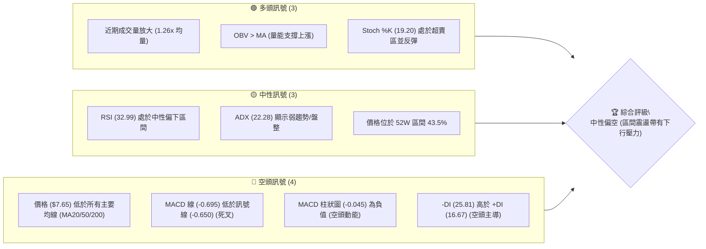

### 📊 核心指標速覽表

| 指標類別 | 指標名稱 | 當前數值 | 訊號 | 解讀 |
|----------|----------|----------|------|------|
| **價格** | 當前價格 | $7.65 | 🔴 | 價格處於近期下跌趨勢，並低於所有主要均線 |
| **均線** | MA20 | $8.41 | 🔴 | 價格位於 MA20 下方，短期壓力顯著 |
| **均線** | MA50 | $9.57 | 🔴 | 價格位於 MA50 下方，中期趨勢偏空 |
| **均線** | MA200 | $9.44 | 🔴 | 價格位於 MA200 下方，長期支撐作用減弱 |
| **動能** | RSI(14) | 32.99 | 🟡 | 接近超賣區，顯示股價經歷大幅回調，有反彈潛力 |
| **動能** | MACD | -0.695 (線) | 🔴 | MACD 線在訊號線下方，形成死叉，空頭動能主導 |
| **波動** | ATR | $0.60 | 🟡 | 每日波動約 7.82%，屬於中高波動性股票 |

### 🏆 技術評分卡

```
技術評分卡 — ONDS (2026-07-10)
════════════════════════════════════════════════════
趨勢強度      ███░░░░░░░░░░░░░░░░░  30/100  🔴 (弱趨勢且空頭主導)
動能指標      ████▍░░░░░░░░░░░░░░░  45/100  🟡 (超賣反彈，但MACD仍空頭)
支撐穩定度    █████▍░░░░░░░░░░░░░░  55/100  🟡 (接近重要支撐，有潛在承接力)
成交量配合    ██████░░░░░░░░░░░░░░  60/100  🟢 (量能放大，且OBV顯示有買盤支撐)
形態完整度    ███░░░░░░░░░░░░░░░░░  30/100  🔴 (缺乏明確反轉或延續形態)
均線排列      ██▍░░░░░░░░░░░░░░░░░  25/100  🔴 (價格在所有MA下方，MA空頭排列)
════════════════════════════════════════════════════
綜合評分      ████░░░░░░░░░░░░░░░░  41/100  🟡 中性偏空
════════════════════════════════════════════════════
```
**評分解讀**：ONDS 的綜合評分顯示其技術面處於中性偏空狀態。趨勢強度、均線排列和形態完整度得分較低，明確指向當前股價的下行壓力。然而，動能指標和支撐穩定度顯示股價已處於超賣區域，且接近關鍵支撐位，有潛在的反彈需求。成交量配合度則給出了一線希望，表明在當前價格附近有買盤介入。整體而言，股價在經歷大幅下跌後，正處於一個弱勢整理階段，短期可能出現技術性反彈，但中期趨勢仍需警惕。

---

## 2. 趨勢分析

### 🌐 多時框趨勢分析

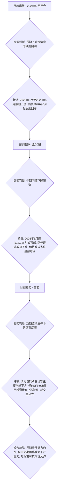
**多時框趨勢評估**：
*   **長期趨勢 (月線)**：從 2024 年 7 月的 $0.99 上漲至 2026 年 5 月的 $13.22，ONDS 經歷了一輪強勁的長期上升趨勢。儘管近期股價大幅回調至 $7.65，但其仍遠高於 2024 年底的 $2.56 和 2025 年初的 $1.75，顯示長期上升結構未完全破壞，目前可視為牛市中的深度調整。
*   **中期趨勢 (週線)**：自 2026 年 5 月底創下 $13.22 的高點後，ONDS 股價進入了明確的中期下降趨勢。股價連續數週下挫，並跌破了多個關鍵中期支撐位。儘管最新一週出現小幅反彈，但整體下降趨勢仍然清晰。
*   **短期趨勢 (日線)**：當前股價 ($7.65) 位於所有短期 (MA20)、中期 (MA50) 和長期 (MA200) 移動平均線下方，形成典型的空頭排列，短期趨勢呈現空頭主導。然而，RSI 和隨機指標 (Stochastics) 顯示股價已進入超賣區域並出現反彈跡象，暗示短期內可能會有技術性反彈。

### 📈 長期趨勢 — 12個月走勢圖（Unicode）

```
ONDS 月線走勢圖（過去12個月）
價格軸 ($)
$15.00 ┤                                  ●(2026-05 $13.22)
$12.50 ┤                       ●(2026-01 $10.36)
$10.00 ┤               ●(2025-12 $9.76)   ●(2026-04 $10.04)
$ 7.50 ┤           ●(2025-09 $7.72) ━━━━━━━━━━━━━━━━━━━━━●(現在 $7.65)
$ 5.00 ┤     ●(2025-08 $5.86)
$ 2.50 ┤●(2025-07 $2.12)
     └──────────────────────────────────────────────────────
      Jul   Aug   Sep   Oct   Nov   Dec   Jan   Feb   Mar   Apr   May   Jun   Jul
      2025  2025  2025  2025  2025  2025  2026  2026  2026  2026  2026  2026  2026
```
**走勢特徵分析表格**：

| 時間區間 | 起始價 ($) | 結束價 ($) | 漲跌幅 (%) | 主要特徵 |
|----------|------------|------------|------------|----------|
| 2025-07 ~ 2026-01 | 2.12 | 10.36 | +388.7% | 強勁上升趨勢，動能充沛，逐步創出新高。 |
| 2026-01 ~ 2026-03 | 10.36 | 9.04 | -12.8% | 短期回調，但仍維持在高位震盪。 |
| 2026-03 ~ 2026-05 | 9.04 | 13.22 | +46.2% | 第二波強勁上漲，創下近期新高 $13.22。 |
| 2026-05 ~ 2026-07 | 13.22 | 7.65 | -42.1% | 急劇深度回調，幾乎抹去前一波漲幅。 |

### 📊 中期趨勢（週線分析）

```
ONDS 週線壓力與支撐示意圖
價格軸 ($)
$13.22 ┤  ┌───────────────────┐  ← 歷史高點 (2026-05)
       │  │                   │
$10.43 ┤  │                   │  ← 近期壓力區 (2026-06)
       │  │                   │
$ 9.33 ┤  │                   │  ← MA50/MA200 壓力區
       │  └───────────────────┘
$ 8.41 ┤  ═════════════════════  ← MA20 (短期壓力)
$ 7.65 ├─────────────────────────  ← 當前價格 (2026-07-10)
$ 7.30 ┤  ─ ─ ─ ─ ─ ─ ─ ─ ─ ─ ─  ← 關鍵支撐 S1
$ 6.77 ┤  ═════════════════════  ← 布林通道下軌
$ 6.47 ┤  ─ ─ ─ ─ ─ ─ ─ ─ ─ ─ ─  ← 強支撐 S2
       └─────────────────────────
        時間軸
```
**中期趨勢分析**：ONDS 在 2026 年 5 月底衝上 $13.22 的高點後，遭遇了強大的賣壓，隨後股價連續下跌，形成了明顯的中期下降趨勢。目前股價 $7.65 遠低於 MA20 ($8.41)、MA50 ($9.57) 和 MA200 ($9.44)，顯示中期動能嚴重不足，空頭掌控局面。儘管上週股價從 $7.41 小幅反彈，但上方多重均線壓力重重，尤其 MA20 ($8.41) 將是短期反彈的首要考驗。

### ⚡ 趨勢強度評估（ADX 解讀）

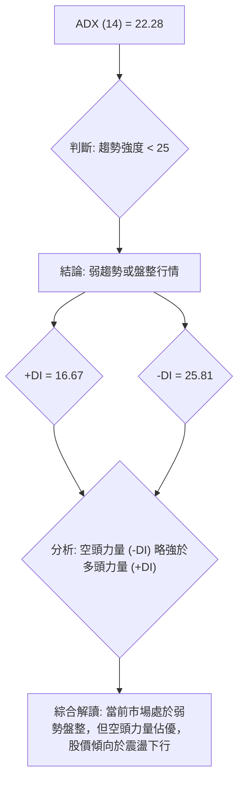
**ADX 強度對照表**：

| ADX 數值 | 趨勢強度 | 趨勢判斷 |
|----------|----------|----------|
| 0-25     | 弱趨勢   | 盤整行情，市場方向不明顯，或趨勢力量不足。 |
| 25-50    | 中等趨勢 | 趨勢行情，市場方向明確，動能較強。 |
| 50-75    | 強趨勢   | 強勁趨勢，市場單邊運行，動能極強。 |
| 75-100   | 極強趨勢 | 極端趨勢，市場加速運行，通常伴隨超買超賣。 |

**ADX 解讀**：ONDS 的 ADX(14) 數值為 22.28，低於 25，這明確指出當前市場處於**弱趨勢或盤整行情**。這意味著股價在短期內缺乏強勁的單邊走勢，更可能在一定區間內震盪。然而，+DI (16.67) 低於 -DI (25.81)，表明在當前弱勢市場中，**空頭力量仍佔據主導地位**。因此，儘管趨勢強度不高，但市場傾向於震盪下行，任何反彈都可能面臨較強的阻力。這與均線系統的空頭排列相互印證，確認了當前股價的弱勢格局。

---

## 3. 圖表形態分析

### 🔍 形態識別系統

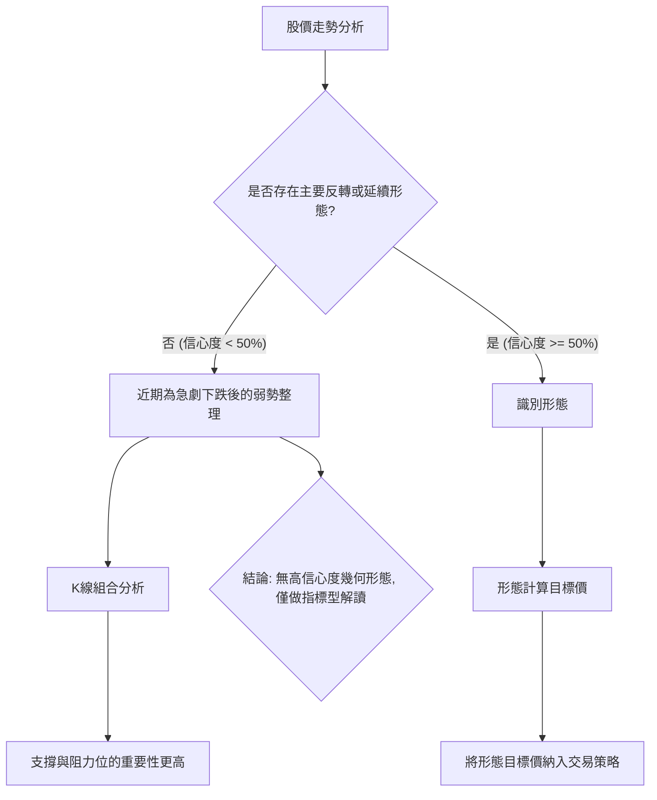
**形態識別結論**：基於提供的週線數據和即時技術指標，ONDS 的近期走勢顯示為自 2026 年 5 月高點 $13.22 以來的急劇下跌，目前處於底部震盪或弱勢整理階段。**數據中未偵測到具有高信心度的經典幾何圖表形態**（如頭肩頂、雙底、旗形等）。股價的快速下跌使得形態尚未充分發展或形成清晰的結構。因此，本報告將側重於價格行為、均線系統、關鍵支撐阻力位以及動能指標的分析，而非基於形態的目標價推算。

### 🕯️ 重要K線形態分析

根據近20週收盤走勢，我們觀察到以下K線形態特徵：

| 月份 (週) | 收盤價 ($) | RSI(14) | K線形態特徵 | 解讀 | 訊號 |
|------------|------------|---------|--------------|------|------|
| 2026-05-31 | 13.22 | 70.6 | 週線創高，RSI進入超買區 | 強勢拉升，但動能過熱，有回調風險 | 🟡 (過熱) |
| 2026-06-07 | 10.43 | 49.1 | 長陰線，跌破前一週低點 | 強勢下跌，空頭力量顯現 | 🔴 (看空) |
| 2026-06-14 | 9.33 | 51.3 | 實體陰線，MACD柱狀圖轉負 | 延續下跌，空頭趨勢確認 | 🔴 (看空) |
| 2026-06-21 | 9.27 | 22.1 | 陰線，RSI進入嚴重超賣區 | 股價加速下跌，極度超賣，可能醞釀反彈 | 🔴 (看空/潛在反彈) |
| 2026-06-28 | 7.83 | 21.8 | 陰線，RSI持續超賣 | 股價繼續探底，空頭動能強勁 | 🔴 (看空) |
| 2026-07-05 | 7.41 | 21.3 | 陰線，RSI創近期最低 | 股價觸及極度超賣，止跌信號可能出現 | 🔴 (看空/強烈反彈預期) |
| 2026-07-12 | 7.65 | 33.0 | 陽線，RSI從超賣區反彈 | 止跌反彈訊號，買盤開始介入 | 🟢 (看多) |

### 📉 ASCII 走勢形態示意圖

由於缺乏高信心度的經典幾何形態，此處繪製近期下跌趨勢中的反彈示意圖：

```
ONDS 近期走勢示意圖
價格軸 ($)
$13.22 ┤             ● (2026-05 高點)
       │            /|\
$12.00 ┤           / | \
       │          /  |  \
$10.00 ┤         /   |   \
       │        /    |    \
$ 8.00 ┤       /     |     ● (當前價格 $7.65)
       │      /      |    /
$ 7.41 ┤     ●───────┘   /
       │     (2026-07 低點)
       └─────────────────────────
        時間軸 (2026年5月至7月)
```
**形態解讀**：從 2026 年 5 月底的高點 $13.22 開始，ONDS 股價經歷了一輪陡峭的下跌，直至 2026 年 7 月初的 $7.41。這是一個典型的快速回調或下跌趨勢。最近一週股價從 $7.41 反彈至 $7.65，顯示在連續下跌後，多頭在極度超賣區域開始嘗試反攻。這可以看作是一個**潛在的止跌反彈形態**，但要確認為更大型的反轉形態，則需要股價站穩關鍵阻力位並形成更高的低點和高點。

### 🎯 形態目標價計算

由於當前數據中未偵測到具有高信心度的經典幾何圖表形態，因此不進行形態目標價的計算。當前分析將更側重於基於關鍵支撐與阻力位、斐波那契回調位以及技術指標的綜合判斷來制定交易策略。若未來出現明確的形態，將依據其頸線、形態高度等要素進行推算。

---

## 4. 支撐與阻力

### 🗺️ 關鍵價位分布圖（Unicode）

```
ONDS 價位結構分布圖
═══════════════════════════════════════════════════
$10.37 ║████████████████████████║ 強阻力 R3 (35.56% from price)
$ 9.86 ║████████████████████    ║ 阻力 R2 (28.89% from price)
$ 8.31 ║████████████████████████║ 關鍵阻力 R1 (8.69% from price)
$ 7.65 ╠════════════════════════╣ ◄ 現價
$ 7.30 ║▓▓▓▓▓▓▓▓▓▓▓▓▓▓▓▓        ║ 近期支撐 S1 (-4.64% from price)
$ 6.47 ║████████████████████████║ 強支撐 S2 (-15.49% from price)
$ 5.93 ║████████████████████████║ 極強支撐 S3 (-22.48% from price)
═══════════════════════════════════════════════════
```

### 🚧 阻力位分析表

以下阻力位均由歷史波段高點聚類計算而得：

| 阻力級別 | 價位 ($) | 形成原因 | 突破難度 | 重要性 |
|----------|----------|----------|----------|--------|
| R1 | 8.31 | 近期小波段高點、多條短期均線交匯區 | 中等偏高 | 突破此位可視為短期止跌反彈的初步確認。 |
| R2 | 9.86 | 中期波段高點，斐波那契回調位附近 | 高 | 突破此位暗示中期跌勢可能結束，進入震盪上行。 |
| R3 | 10.37 | 較強波段高點，心理關口，50%斐波那契回調位附近 | 極高 | 突破此位將大幅改善中期趨勢，但所需動能巨大。 |

### 🛡️ 支撐位分析表

以下支撐位均由歷史波段低點聚類計算而得：

| 支撐級別 | 價位 ($) | 形成原因 | 守住機率 | 重要性 |
|----------|----------|----------|----------|--------|
| S1 | 7.30 | 近期小波段低點，心理關口 | 中等偏高 | 跌破此位將確認短期跌勢延續，可能測試更低支撐。 |
| S2 | 6.47 | 中期波段低點，61.8%斐波那契回調位附近 | 中等 | 跌破此位將使中期趨勢進一步惡化，空頭力量增強。 |
| S3 | 5.93 | 較強波段低點，歷史密集交易區 | 中等 | 跌破此位將面臨加速下跌的風險，可能觸發恐慌性賣盤。 |

### 📐 斐波那契回調位分析

ONDS 在 52 週區間 ($1.78 → $15.28) 的斐波那契回調位分析：

| 回調比例 | 價位 ($) | 意義 |
|----------|----------|----------|
| 0.0% (52W High) | 15.28 | 52週高點，也是當前下跌的起點。 |
| 23.6% | 12.09 | 較淺回調位，若能守住此位則趨勢強勁。 |
| 38.2% | 10.12 | 重要的回調位，常作為第一波回調的目標。 |
| 50.0% | 8.53 | 心理及技術上的關鍵回調位，突破或跌破常伴隨趨勢變化。 |
| 61.8% | 6.94 | 黃金分割回調位，通常被視為強勁支撐或阻力，具備較高參考價值。 |
| 78.6% | 4.67 | 深度回調位，表示趨勢已經非常疲軟。 |
| 100.0% (52W Low) | 1.78 | 52週低點，若跌破則可能進入更長時間的熊市。 |

**斐波那契回調位解讀**：當前股價 $7.65 位於 50.0% 回調位 ($8.53) 和 61.8% 回調位 ($6.94) 之間。這表明 ONNDS 已經經歷了大幅度的下跌，回吐了超過一半的 52 週漲幅。目前，股價正接近 61.8% 的黃金分割回調位 $6.94，此處與下方強支撐 S2 ($6.47) 形成一個重要的支撐區間。若股價能夠在此區間獲得有效支撐並反彈，則有機會築底回升；反之，若跌破 $6.94，則可能進一步測試 $4.67 的深度回調位，顯示趨勢極度疲軟。

---

## 5. 技術指標深度解讀

### 🎛️ 指標訊號總覽

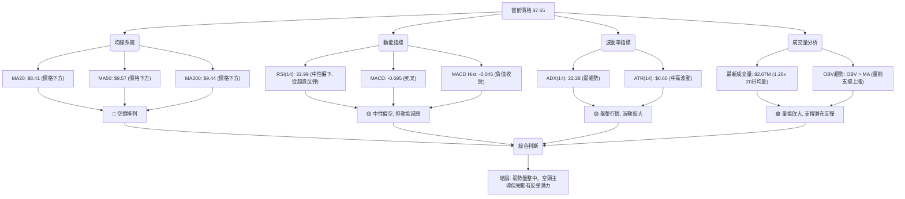

### 📈 移動平均線排列分析

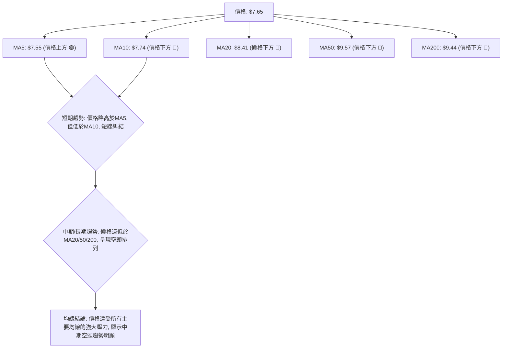
**移動平均線解讀**：
ONDS 當前價格 $7.65 位於所有主要移動平均線下方：MA20 ($8.41)、MA50 ($9.57) 和 MA200 ($9.44)。這是一個典型的**空頭排列**，表明股價在中長期均線的壓制下，整體趨勢偏向空頭。儘管價格略高於 MA5 ($7.55)，暗示短期有止跌跡象，但上方 MA10 ($7.74) 形成即時阻力，且更長週期的均線均位於價格上方，構成強大壓力。這種均線排列支持了中期下降趨勢的判斷。

### 📉 RSI(14) 分析

**RSI(14) 數值**：32.99
**RSI 強度進度條**：▓▓▓▓▓▓░░░░░░░░░░░░░░ 33% 🟡 (中性偏下，接近超賣)

**RSI 解讀**：
ONDS 的 RSI(14) 數值為 32.99，位於 30-70 的中性區間下半部分，但已從上週的 21.3 (極度超賣) 明顯回升。這表明股價在經歷一輪快速下跌後，已嚴重超賣，並開始出現技術性反彈。RSI 從超賣區反彈通常是止跌的初步訊號，但尚未突破 50 中軸線，因此不能確認趨勢反轉。
**RSI 背離**：根據提供的週線數據，2026-07-05 週收盤價為 $7.41，RSI 為 21.3。2026-07-12 週收盤價為 $7.65，RSI 為 33.0。由於價格從 $7.41 上升至 $7.65，同時 RSI 也從 21.3 上升至 33.0，這是一個**價量同步的短期反彈訊號，沒有出現明顯的頂背離或底背離**。RSI 的反彈確認了短期超賣後的買盤介入。

### 📊 MACD(12/26/9) 訊號解讀

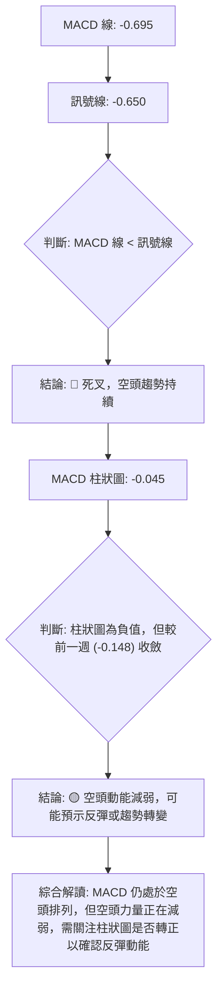
**MACD 解讀**：
ONDS 的 MACD 線為 -0.695，低於訊號線 -0.650，形成了**死叉**，這是一個典型的空頭訊號，表明中期下跌趨勢仍在持續。然而，MACD 柱狀圖從上週的 -0.148 縮小至 -0.045，雖然仍為負值，但其負值絕對值正在收斂，顯示**空頭動能正在減弱**。這與 RSI 從超賣區反彈的訊號相互印證，表明儘管整體趨勢偏空，但短期內賣壓有所緩解，存在技術性反彈的可能性。

### 📦 布林通道分析

```
ONDS 布林通道示意圖
價格軸 ($)
$10.04 ┤═══════════════════════════════════════ 布林上軌 (BB上軌)
       │
$ 8.41 ┤─────────────────────────────────────── 布林中軌 (MA20)
       │
$ 7.65 ├─────────────────●───────────────────── 當前價格
       │                 ↑
       │                 位於中軌下方，但接近中軌
$ 6.77 ┤═══════════════════════════════════════ 布林下軌 (BB下軌)
       └───────────────────────────────────────
        時間軸
```
**布林通道解讀**：
ONDS 的當前價格 $7.65 位於布林通道中軌 (MA20: $8.41) 和下軌 ($6.77) 之間。BB %B 值為 0.27，表明股價更接近下軌，處於通道的下半部分。這證實了當前股價的弱勢地位。在盤整行情中 (ADX < 25)，布林通道的上下軌通常作為重要的交易區間。目前股價在下軌上方反彈，顯示下軌存在一定支撐作用。若能有效突破中軌 $8.41，則有望向上測試上軌 $10.04；反之，若跌破下軌 $6.77，則可能加速下跌。

### 💹 成交量分析（量價配合度）

**成交量數據**：
*   最新成交量：82,679,311
*   20日均量：65,401,241
*   50日均量：72,342,188
*   量比：1.26x (最新成交量 / 20日均量)
*   OBV趨勢：OBV > MA → 量能支撐上漲

**成交量解讀**：
ONDS 的最新成交量為 82,679,311 股，顯著高於其 20 日均量 (65,401,241 股) 和 50 日均量 (72,342,188 股)，量比達到 1.26 倍。這表明市場對 ONDS 的關注度增加，交易活躍。在股價從 $7.41 反彈至 $7.65 的背景下，成交量放大通常被視為**買盤介入的積極訊號**，為短期反彈提供了量能支撐。

根據提供的數據，「OBV趨勢: OBV > MA → 量能支撐上漲」。這意味著累積成交量指標 (OBV) 的趨勢強於其移動平均線，暗示儘管近期價格下跌，但總體資金流向仍偏向買方，或至少顯示有穩定的買盤承接。這與近期成交量放大且股價反彈的現象相互印證，構成一個**潛在的看漲訊號**，表明在當前低位有資金入場。然而，由於價格仍處於空頭排列，需警惕量能放大的反彈是否能持續突破關鍵阻力。

---

## 6. 動能與波動率

### ⚡ 動能評估四象限

| 象限 | 動能 (RSI, MACD) | 波動 (ATR, Beta) | 當前狀態 | 評估 |
|------|------------------|------------------|----------|------|
| Q1 | 強 (RSI > 50, MACD金叉) | 低 (ATR < 5%, Beta < 1) | - | 最佳機會：趨勢明確，風險可控。 |
| Q2 | 弱 (RSI < 50, MACD死叉) | 低 (ATR < 5%, Beta < 1) | - | 謹慎觀望：缺乏動能，等待趨勢明朗。 |
| Q3 | 強 (RSI > 50, MACD金叉) | 高 (ATR > 5%, Beta > 1) | - | 高風險高收益：趨勢強勁但波動劇烈，適合激進交易者。 |
| Q4 | 弱 (RSI < 50, MACD死叉) | 高 (ATR > 5%, Beta > 1) | ✓ | 避免進場：動能不足，波動劇烈，風險極高。 |

**動能評估**：
*   **動能指標**：RSI 32.99 (中性偏下，但從超賣反彈)，MACD 死叉但柱狀圖負值收斂，Stochastics 處於超賣區並反彈。綜合來看，ONDS 的短期動能從極弱轉為**弱勢改善中**，但尚未轉強。中期動能仍偏空。
*   **波動率指標**：ATR(14) 為 $0.60，佔當前價格 $7.65 的 7.82%，顯示每日波動幅度較大。Beta 值為 2.691，遠大於 1，表明其股價波動性遠高於大盤。
*   **綜合判定**：ONDS 目前處於**弱動能但高波動**的狀態，對應於上述四象限的 **Q4**。這意味著儘管股價可能因超賣而出現反彈，但缺乏強勁的上升動能支持，且股價波動劇烈，交易風險極高。對於保守型投資者，此時應避免進場；對於激進型交易者，則應嚴格控制倉位與止損。

### 📊 ATR 波動率分析

**ATR(14)**：$0.60 (佔當前價格 $7.65 的 7.82%)
**ATR 解讀**：
ONDS 的 14 日平均真實波幅 (ATR) 為 $0.60。這個數值相對於 $7.65 的股價而言，代表著每日約 7.82% 的波動幅度，屬於**中高波動性**。高 ATR 意味著股價在日內或短週期內容易出現較大的漲跌幅，這為短線交易者提供了機會，但也同時增大了風險。在制定交易策略時，止損點的設置需要考慮到 ATR 的幅度，通常會將止損位設置在 ATR 的 1-2 倍之外，以避免被正常波動洗出場。例如，若以 1 倍 ATR 作為止損距離，則止損點應在 $7.65 ± $0.60 的範圍外。

### 📐 Beta 與市場相關性

**Beta**：2.691
**Beta 解讀**：
ONDS 的 Beta 值高達 2.691。這表示 ONNDS 股價的波動幅度遠大於整體市場（例如標普 500 指數）。當市場上漲 1% 時，ONDS 理論上會上漲約 2.691%；而當市場下跌 1% 時，ONDS 也可能下跌約 2.691%。如此高的 Beta 值，一方面意味著其具備較高的增長潛力 (在牛市中表現優於大盤)，但另一方面也伴隨著**極高的風險** (在熊市或市場回調時跌幅也更劇烈)。對於投資者而言，配置高 Beta 股票需要更強的風險承受能力和更嚴格的倉位管理。在當前弱勢盤整的市場環境下，高 Beta 可能會導致更大的下跌風險。

---

## 7. 多時框架總結

### 📋 時框架評分表

| 時框架 | 趨勢方向 | 動能 | 均線排列 | 形態 | 綜合評分 | 建議 |
|--------|----------|------|----------|------|----------|------|
| 長期 (月線) | 🟡 (長期上升，近期回調) | 🟡 (上升動能減弱) | 🟡 (未提供月線MA，但價格仍處於歷史高位區間) | 🔴 (無明確形態) | 6/10 | 觀望，留意築底跡象 |
| 中期 (週線) | 🔴 (明確下降趨勢) | 🔴 (空頭主導，但稍有緩解) | 🔴 (價格遠低於高點，承壓) | 🔴 (下降通道或弱勢整理) | 4/10 | 偏空操作，反彈即為賣點 |
| 短期 (日線) | 🟡 (空頭主導下的反彈) | 🟢 (超賣反彈，空頭減弱) | 🔴 (價格在所有MA下方) | 🟢 (止跌反彈 K線) | 5/10 | 短線反彈機會，設好止損 |

### 🔲 綜合訊號矩陣

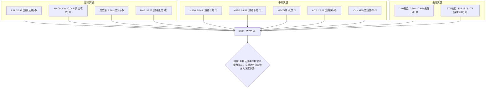
**綜合訊號矩陣解讀**：
短期訊號顯示股價已從超賣區反彈，成交量放大，MACD柱狀圖負值收斂，這些都支持短線反彈的可能性。然而，中期和長期訊號則呈現明顯的空頭壓力：價格遠低於主要均線，MACD維持死叉，且 ADX 雖顯示弱趨勢，但空頭力量 (-DI) 佔優。長期來看，ONDS 從歷史低點有大幅上漲，但近期深度回調。這表明**短期內可能會有技術性反彈，但中期下行壓力仍未解除，反彈可能只是下跌途中的修正**。

### ⚖️ 多時框收斂結論

**ADX(14) 數值為 22.28，低於 25，明確指出 ONDS 當前處於盤整行情。** 根據多時框收斂規則，在盤整行情中，應以日線布林通道的上下軌作為主要交易區間。

綜合分析：
1.  **趨勢強度**：ADX 顯示為弱趨勢/盤整，缺乏強勁的單邊動能。
2.  **趨勢方向**：儘管趨勢強度不高，但日線與週線的均線系統均呈現空頭排列 (價格低於 MA20/50/200)，且 MACD 處於死叉狀態，-DI 高於 +DI，這共同指向一個**帶有明顯空頭偏向的盤整格局**。
3.  **短期動能**：RSI 從超賣區反彈，Stochastics 處於超賣並反彈，MACD 柱狀圖負值收斂，且成交量放大。這些訊號表明在經歷大幅下跌後，股價在短期內有止跌企穩和技術性反彈的需求。
4.  **關鍵價位**：股價 $7.65 位於 S1 ($7.30) 上方，靠近 61.8% 斐波那契回調位 ($6.94)，顯示此處有潛在支撐。但上方 R1 ($8.31) 和 MA20 ($8.41) 構成強大阻力。

**多時框收斂結論**：ONDS 目前處於一個**中性偏空**的市場環境。雖然 ADX 指示為盤整行情，但均線排列和 MACD 的空頭訊號暗示盤整帶有下行壓力。然而，短期指標的超賣反彈訊號和放大的成交量，預示股價可能在當前支撐位附近進行一輪技術性反彈。因此，**主導策略將是區間操作，但需警惕整體下行風險，並優先關注反彈至阻力位後的做空機會，或在跌破關鍵支撐後的追空策略。**

---

## 8. 交易策略建議

### 🗺️ 策略決策流程圖

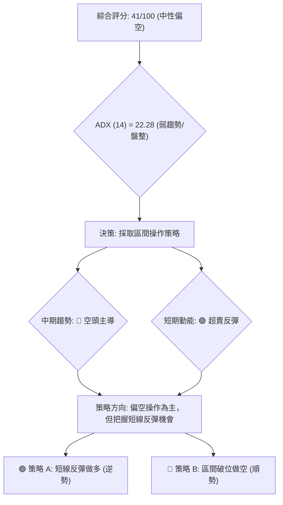

### 🧭 策略路由

**當前主策略方向 = 中性偏空，建議以區間操作為主，留意短線反彈機會，同時警惕破位下行風險。（依評分 41/100）**

基於綜合評分 41/100 (中性偏空) 和 ADX 指示的盤整行情，我們將採取區間操作策略，並偏向於空頭方向。短期內可關注超賣反彈機會，但中期趨勢仍需警惕下行風險。

### 🎯 價格情境階梯（Price Scenarios）

| 觸發條件 | 下一目標 ($) | 後續延伸 ($) | 情境含義 |
|----------|--------------|--------------|----------|
| 突破 R1 $8.31 | R2 $9.86 | R3 $10.37 | 短線轉強，空頭壓力減輕，有望挑戰更高阻力。 |
| 站穩現價區間 ($7.30 - $8.31) | — | — | 區間震盪，股價在主要支撐和阻力之間徘徊。 |
| 跌破 S1 $7.30 | S2 $6.47 | S3 $5.93 | 中期轉弱，確認下跌趨勢延續，可能加速探底。 |

### 📊 情境機率分佈

| 情境 | 機率 | 主要依據 |
|------|------|----------|
| 繼續上行 / 反彈 | 35% | RSI/Stoch 超賣反彈、MACD 柱狀圖負值收斂、近期成交量放大、OBV 趨勢顯示買盤支撐。 |
| 區間震盪 | 45% | ADX (22.28) 顯示弱趨勢/盤整、價格位於布林通道中下軌之間。 |
| 回落 / 再探底 | 20% | 均線空頭排列、MACD 死叉、-DI 高於 +DI、上方多重阻力。 |

### 🟢 主策略詳情

**策略 A: 短線反彈做多 (逆勢策略)**
*   **進場條件**：股價在關鍵支撐 S1 ($7.30) 或斐波那契 61.8% ($6.94) 附近獲得有效支撐，RSI 和 Stochastics 均從超賣區反彈並向上，且成交量配合放大。
*   **進場價格**：$7.35 - $7.45 (靠近 S1 $7.30 區域，確認止跌後)
*   **目標價 T1**：$8.31 (R1)
*   **目標價 T2**：$8.53 (50% 斐波那契回調位)
*   **止損價格**：$6.85 (略低於斐波那契 61.8% 回調位 $6.94 及 S1 $7.30，並考慮 ATR 波動)
*   **風險報酬比**：
    *   目標 T1: ($8.31 - $7.40) / ($7.40 - $6.85) = $0.91 / $0.55 ≈ 1.65 : 1
    *   目標 T2: ($8.53 - $7.40) / ($7.40 - $6.85) = $1.13 / $0.55 ≈ 2.05 : 1
*   **成功機率**：40%
*   **建議倉位**：輕倉 (5-10%)，嚴格控制風險。

**策略 B: 區間破位做空 (順勢策略)**
*   **進場條件**：股價跌破關鍵支撐 S1 ($7.30) 或斐波那契 61.8% ($6.94)，並帶有放大的成交量，MACD 柱狀圖負值擴大，RSI 再次下行。
*   **進場價格**：$7.25 (跌破 S1 $7.30 確認後)
*   **目標價 T1**：$6.47 (S2)
*   **目標價 T2**：$5.93 (S3)
*   **止損價格**：$7.70 (略高於 S1 $7.30 及入場點，並考慮 ATR 波動)
*   **風險報酬比**：
    *   目標 T1: ($7.25 - $6.47) / ($7.70 - $7.25) = $0.78 / $0.45 ≈ 1.73 : 1
    *   目標 T2: ($7.25 - $5.93) / ($7.70 - $7.25) = $1.32 / $0.45 ≈ 2.93 : 1
*   **成功機率**：55%
*   **建議倉位**：輕倉至中倉 (10-15%)，嚴格控制風險。

### 🔴 反向風險觸發點（對沖提示）

*   **多頭風險觸發**：若股價能夠有效站穩 50% 斐波那契回調位 $8.53，並帶量突破 R2 ($9.86)，則中期跌勢將被質疑，空頭頭寸應考慮止損或對沖。
*   **空頭風險觸發**：若股價未能有效反彈，並持續跌破 S3 ($5.93)，則下跌趨勢將加速，可能觸發更深層次的恐慌性賣盤。

### ⭐ 整體訊號強度評星

```
做多訊號強度：★★☆☆☆  (2/5星)
做空訊號強度：★★★☆☆  (3/5星)
整體可信度：  ★★★☆☆  (3/5星)
```
**評星解讀**：做多訊號強度較弱，主要基於超賣反彈的短線機會，逆勢操作風險較高。做空訊號強度較強，反映了中期趨勢的空頭主導。整體可信度中等，因市場處於弱勢盤整，短期反彈與中期下跌壓力並存，需要仔細甄別訊號並嚴格執行交易紀律。

---

## 9. 風險提示與監控

### ✅ 關鍵監控指標 Checklist

```
ONDS 風險監控清單 (2026-07-10)
════════════════════════════════════════════════════════
├─ 價格行為監控：
│  ├─ 關鍵支撐 S1 ($7.30) / S2 ($6.47) 是否被有效跌破？
│  ├─ 關鍵阻力 R1 ($8.31) / MA20 ($8.41) 是否被有效突破？
│  └─ 斐波那契 61.8% 回調位 ($6.94) 是否提供強勁支撐？
├─ 動能指標監控：
│  ├─ RSI(14) 是否能突破 50 中軸線？
│  ├─ MACD 柱狀圖是否轉正，形成金叉？
│  └─ Stochastics 是否從超賣區持續上行，而非再次回落？
├─ 趨勢指標監控：
│  ├─ ADX(14) 是否能突破 25，形成明確趨勢？
│  └─ +DI 與 -DI 的相對強弱是否發生逆轉 (+DI > -DI)？
├─ 成交量監控：
│  ├─ 反彈時是否伴隨持續放大的成交量？
│  └─ 跌破支撐時是否伴隨巨量？
├─ 外部因素監控：
│  ├─ 整體市場情緒與大盤走勢 (高 Beta 影響顯著)。
│  └─ 公司基本面或產業新聞 (無最新消息，但需持續關注)。
════════════════════════════════════════════════════════
```

### ⚠️ 風險場景分析

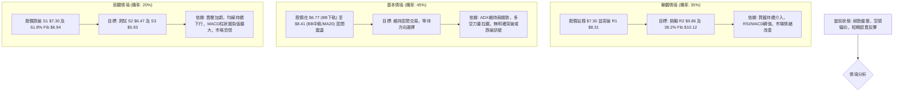

### 🛡️ 風險管理重要提醒

1.  **高波動性風險**：ONDS 的 Beta 值高達 2.691，且 ATR 較大，表明其股價波動劇烈。這意味著潛在收益高，但虧損風險也大。投資者應具備較高的風險承受能力，並準備好應對快速的價格變化。
2.  **趨勢不明確風險**：ADX 指示為弱趨勢或盤整行情，市場方向不清晰。在這種情況下，盲目追漲殺跌容易被套。建議採取區間操作策略，並耐心等待趨勢明朗。
3.  **流動性風險**：儘管近期成交量放大，但若在極端情況下，流動性可能迅速枯竭，導致難以按預期價格進出。
4.  **倉位管理**：由於風險較高，建議採用輕倉策略，將單筆交易的風險控制在總資本的極小比例 (例如 1-2%) 之內。
5.  **嚴格止損**：在每次交易中都必須設定並嚴格執行止損點。考慮到 ATR 較大，止損位應適當放寬以避免被正常波動洗出，但同時也要確保風險報酬比合理。
6.  **基本面監控**：雖然本報告側重技術分析，但 ONDS 的基本面狀況（如盈利能力、財務健康度、行業前景）對其長期走勢至關重要。應定期監控公司公告和行業新聞。

---

## 📋 報告總結

```
ONDS 技術分析報告總結
════════════════════════════════════════════════════════
報告日期：2026-07-10
當前價格：$7.65
分析評級：⚖️ 中性偏空 (弱勢盤整，但短期有反彈潛力)

關鍵結論：
├─ 長期趨勢：🟡 長期上升趨勢中的深度回調，潛力仍在。
├─ 中期趨勢：🔴 自2026年5月高點以來明確的下降趨勢，空頭主導。
├─ 短期趨勢：🟡 空頭主導下的超賣反彈，止跌訊號初現。
├─ 關鍵支撐：$7.30 (S1) / $6.94 (61.8% Fib)
├─ 關鍵阻力：$8.31 (R1) / $8.41 (MA20/布林中軌)
└─ 分析師目標：$19.81 (均值，與技術面背離，僅供參考)

最優策略組合：
1. 🥇 最佳機會：區間破位做空。若股價跌破 S1 $7.30 並帶量，目標看向 S2 $6.47 和 S3 $5.93。
2. 🥈 次選機會：短線超賣反彈做多。若股價在 S1 $7.30 或 61.8% Fib $6.94 附近止跌反彈，目標看向 R1 $8.31 和 50% Fib $8.53。
3. 🥉 保守選擇：觀望。等待股價突破關鍵阻力 ($8.31) 或跌破關鍵支撐 ($6.94) 並形成明確趨勢後再入場。
════════════════════════════════════════════════════════
```

---

> ⚠️ **免責聲明**：本報告為 AI 自動生成之技術分析，所有數據及估算均基於提供的歷史價格資訊。本報告**僅供研究與學術參考**，**不構成任何投資建議**。投資有風險，入市需謹慎。

---

*報告生成時間：2026-07-10 ｜ 數據來源：Yahoo Finance ｜ 分析框架：多時框技術分析*