# ORCL 基本面深度分析報告

> **報告日期**：2026-02-24 ｜ **語言**：繁體中文 ｜ **數據來源**：Yahoo Finance ｜ **分析師**：AI Research Desk

---

## 目錄

| # | 章節 | 核心主題 |
|---|------|---------|
| 1 | 執行摘要 | 整體評分與投資論點 |
| 2 | 公司概覽 | 業務結構與競爭優勢 |
| 3 | 損益表深度分析 | 收入成長與獲利能力 |
| 4 | 資產負債表分析 | 財務結構與流動性 |
| 5 | 現金流量分析 | 現金生成與資本配置 |
| 6 | 獲利能力指標 | ROE/ROA/ROIC |
| 7 | 估值分析 | 多維估值模型 |
| 8 | 競爭護城河 | 五力分析與護城河 |
| 9 | 成長催化劑 | 短中長期機會 |
| 10 | 風險分析 | 風險矩陣與緩解措施 |
| 11 | 公平價值估算 | DCF與多元估值法 |
| 12 | 投資建議 | 最終評級與監控指標 |

---

## 1. 執行摘要

### 1.1 核心評分總覽

```mermaid
graph TD
    ORCL["🏢 ORCL 綜合評分<br/>★★★★☆ 4.1/5"]
    
    ORCL --> F["📊 基本面<br/>★★★★☆ 4.2/5"]
    ORCL --> V["💰 估值<br/>★★★★☆ 4.0/5"]
    ORCL --> T["📈 技術面<br/>★★★☆☆ 2.8/5"]
    ORCL --> G["🚀 成長性<br/>★★★★★ 4.6/5"]
    ORCL --> R["⚠️ 風險控制<br/>★★★☆☆ 2.5/5"]

    F --> F1["毛利率 68.5% 🟢"]
    F --> F2["淨利率 25.3% 🟢"]
    F --> F3["ROE 69.0% 🟢"]

    V --> V1["Forward P/E 17.9x 🟢"]
    V --> V2["EV/EBITDA 19.7x 🟡"]
    V --> V3["較52W高點折價 -59% 🟢"]

    T --> T1["距高點 -344.21 🔴"]
    T --> T2["12月連跌趨勢 🔴"]
    T --> T3["Beta 1.633 高波動 🟡"]

    G --> G1["雲端業務加速成長 🟢"]
    G --> G2["AI基礎設施需求爆發 🟢"]
    G --> G3["EPS成長預期+48.8% 🟢"]

    R --> R1["D/E比 432x 🔴"]
    R --> R2["FCF 轉負 -$394M 🔴"]
    R --> R3["Current Ratio 0.91 🔴"]

    style ORCL fill:#1a3a5c,stroke:#4a9eff,color:#fff,font-size:16px
    style F fill:#1e5c2a,stroke:#4aff6e,color:#fff
    style V fill:#1e5c2a,stroke:#4aff6e,color:#fff
    style T fill:#5c1e1e,stroke:#ff4a4a,color:#fff
    style G fill:#1e5c2a,stroke:#4aff6e,color:#fff
    style R fill:#5c1e1e,stroke:#ff4a4a,color:#fff
```

---

### 1.2 五大投資論點

| # | 投資論點 | 詳細說明 | 評級 |
|---|---------|---------|------|
| 🟢 1 | **雲端業務爆發性成長** | OCI（Oracle Cloud Infrastructure）在AI基礎設施需求下加速，雲端剩餘履約義務（RPO）持續創新高，FY2025收入達$57.4B，YoY+8.4% | 🟢 強力正面 |
| 🟢 2 | **Forward P/E估值具吸引力** | 當前股價$141.31對應Forward P/E僅17.9x，EPS預期$7.90，相比歷史均值與同業具備明顯折價，分析師目標均價$272.89，潛在上行空間+93% | 🟢 強力正面 |
| 🟢 3 | **卓越的獲利能力** | 毛利率68.5%、淨利率25.3%、ROE高達69.0%，顯示強大的商業模式護城河與定價能力 | 🟢 強力正面 |
| 🟡 4 | **資本支出大幅增加反映未來成長** | FY2025 CapEx飆升至$21.21B（vs FY2024 $6.87B），FCF轉負-$394M，短期現金壓力上升，但這反映Oracle對AI基礎設施的戰略性重押 | 🟡 中性觀察 |
| 🔴 5 | **槓桿風險與股價下行趨勢** | D/E比達432x，總債務$131.73B，利率風險顯著；股價從高點$344.21跌至$141.31，跌幅-58.9%，動能面偏弱 | 🔴 需謹慎監控 |

---

### 1.3 快速統計卡片

| 指標 | 數值 | 狀態 | 行業比較 |
|------|------|------|---------|
| 💹 當前股價 | $141.31 | 🟡 低於均值 | — |
| 📊 市值 | $406.14B | 🟢 大型股 | 全球前20大軟體公司 |
| 📈 52週高點 | $344.21 | 🔴 距高點-59% | — |
| 📉 52週低點 | $117.67 | 🟢 高於低點+20% | — |
| 💰 TTM收入 | $61.02B | 🟢 成長14.2% | 超越行業均值 |
| 🎯 EPS (TTM) | $5.31 | 🟢 | — |
| 🎯 EPS (Forward) | $7.90 | 🟢 預期+48.8% | 行業頂級 |
| 📐 P/E (Trailing) | 26.6x | 🟡 合理 | 軟體業均值~35x |
| 📐 P/E (Forward) | 17.9x | 🟢 低估 | 顯著低於同業 |
| 💸 毛利率 | 68.5% | 🟢 優秀 | 行業前段班 |
| 💸 ROE | 69.0% | 🟢 卓越 | 遠超行業均值 |
| ⚖️ D/E比 | 432.5x | 🔴 高槓桿 | 顯著高於行業 |
| 📊 Beta | 1.633 | 🔴 高波動 | — |
| 👥 員工數 | 162,000 | — | 大型跨國企業 |
| 📣 分析師評級 | 買入 (37位) | 🟢 | 目標均價$272.89 |

---

## 2. 公司概覽

### 2.1 業務結構分解

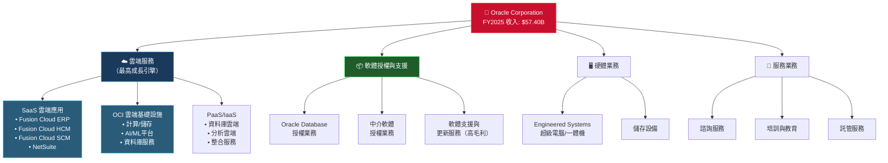

---

### 2.2 收入結構市場佔比估算

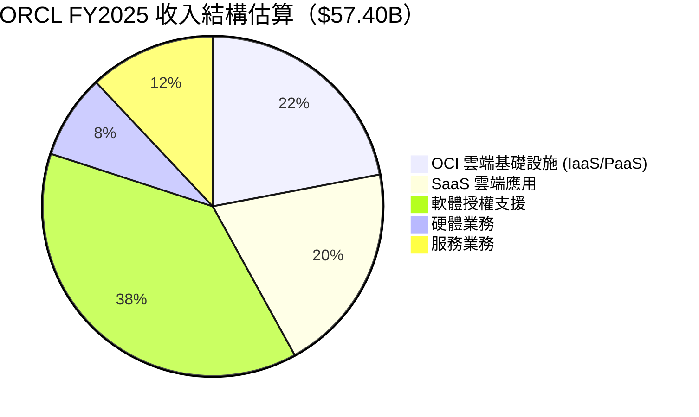

---

### 2.3 競爭優勢心智圖

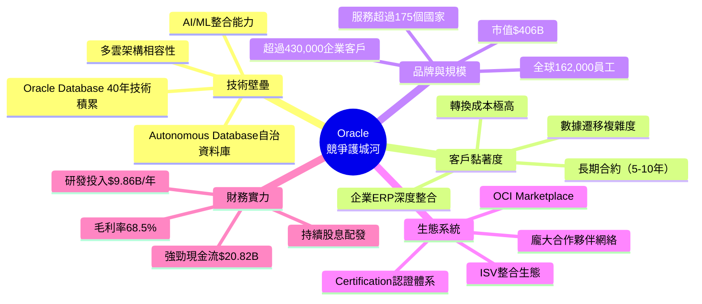

---

### 2.4 市場地位定位

```
🏆 企業軟體市場定位圖
═══════════════════════════════════════════════════════

              高市場份額
                  ▲
                  │
                  │    ●SAP           ●Microsoft
                  │
    低成長  ───────┼────────────────────────► 高成長
                  │         ●ORCL
                  │
                  │              ●Salesforce
                  │    ●Workday
                  ▼
              低市場份額

  ORCL定位：中高市場份額 × 中高成長（雲端轉型加速）
  
  核心競爭市場：
  • 企業資料庫市場：#1 全球龍頭（約43%市佔）
  • 企業雲端ERP：前三強（vs SAP, Microsoft）
  • 雲端基礎設施：#4（vs AWS, Azure, GCP）
═══════════════════════════════════════════════════════
```

---

## 3. 損益表深度分析

### 3.1 收入成長時間軸

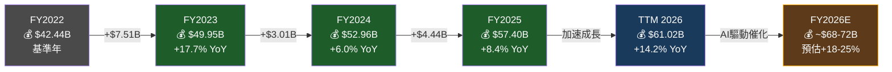

---

### 3.2 年度收入趨勢 ASCII 長條圖

```
📊 Oracle 年度收入趨勢（FY2022-TTM2026）
══════════════════════════════════════════════════════════════════

FY2022  │ $42.44B ▓▓▓▓▓▓▓▓▓▓▓▓▓▓▓▓▓▓▓▓▓▓▓▓▓▓▓▓▓▓▓▓▓▓▓▓▓▓▓▓▓▓░░░░░░░░░░░░ 69.8%
FY2023  │ $49.95B ▓▓▓▓▓▓▓▓▓▓▓▓▓▓▓▓▓▓▓▓▓▓▓▓▓▓▓▓▓▓▓▓▓▓▓▓▓▓▓▓▓▓▓▓▓▓▓▓▓░░░░░ 82.2%
FY2024  │ $52.96B ▓▓▓▓▓▓▓▓▓▓▓▓▓▓▓▓▓▓▓▓▓▓▓▓▓▓▓▓▓▓▓▓▓▓▓▓▓▓▓▓▓▓▓▓▓▓▓▓▓▓▓░░░ 87.1%
FY2025  │ $57.40B ▓▓▓▓▓▓▓▓▓▓▓▓▓▓▓▓▓▓▓▓▓▓▓▓▓▓▓▓▓▓▓▓▓▓▓▓▓▓▓▓▓▓▓▓▓▓▓▓▓▓▓▓▓▓ 94.4%
TTM2026 │ $61.02B ▓▓▓▓▓▓▓▓▓▓▓▓▓▓▓▓▓▓▓▓▓▓▓▓▓▓▓▓▓▓▓▓▓▓▓▓▓▓▓▓▓▓▓▓▓▓▓▓▓▓▓▓▓▓▓▓▓▓▓▓▓ 100%
        └─────────────────────────────────────────────────────────────────────
         0      $10B    $20B    $30B    $40B    $50B    $61B

📈 YoY成長率：
FY2023: +17.7% ██████████████████ 
FY2024: +6.0%  ██████ 
FY2025: +8.4%  ████████ 
TTM26:  +14.2% ██████████████ ← 加速回升
══════════════════════════════════════════════════════════════════
```

---

### 3.3 利潤率演變分析

```
📊 Oracle 利潤率演變趨勢（FY2022-FY2025）
══════════════════════════════════════════════════════════════════════

         FY2022    FY2023    FY2024    FY2025    TTM
毛利率   79.1%     72.8%     71.4%     70.5%     68.5%
         █████████ ████████  ████████  ███████   ██████
         
營業利率 37.3%     27.6%     30.3%     31.4%     32.0%
         ████      ██        ███       ███       ███

淨利率   15.8%     17.0%     19.8%     21.7%     25.3%
         ██        ██        ██        ███       ████

EBITDA率 31.9%     37.5%     40.4%     41.7%     —
         ███       ████      █████     █████

─────────────────────────────────────────────────────────────────────
注意：毛利率小幅下滑反映雲端業務（OCI）硬體成本增加
      淨利率持續改善，顯示規模效益與稅務優化
      EBITDA率穩健上升，核心盈利能力增強
══════════════════════════════════════════════════════════════════════
```

---

### 3.4 詳細財務數據對比表

| 財務指標 | FY2022 | FY2023 | FY2024 | FY2025 | YoY變化 |
|---------|--------|--------|--------|--------|---------|
| 💰 總收入 | $42.44B | $49.95B | $52.96B | $57.40B | 🟢 +8.4% |
| 💹 毛利潤 | $33.56B | $36.39B | $37.82B | $40.47B | 🟢 +7.0% |
| 📊 毛利率 | 79.1% | 72.8% | 71.4% | 70.5% | 🟡 -0.9pp |
| 🏭 營業利益 | $15.83B | $13.77B | $16.07B | $18.05B | 🟢 +12.3% |
| 📈 營業利率 | 37.3% | 27.6% | 30.3% | 31.4% | 🟢 +1.1pp |
| 💎 EBITDA | $13.53B | $18.74B | $21.39B | $23.91B | 🟢 +11.8% |
| 📐 EBITDA率 | 31.9% | 37.5% | 40.4% | 41.7% | 🟢 +1.3pp |
| 💵 淨利潤 | $6.72B | $8.50B | $10.47B | $12.44B | 🟢 +18.8% |
| 📉 淨利率 | 15.8% | 17.0% | 19.8% | 21.7% | 🟢 +1.9pp |
| 🔬 研發費用 | $7.22B | $8.62B | $8.91B | $9.86B | 🟢 +10.7% |
| 📊 研發/收入比 | 17.0% | 17.3% | 16.8% | 17.2% | 🟢 穩健 |
| 📌 EPS (TTM) | — | — | — | — | $5.31 🟢 |
| 📌 EPS (Forward) | — | — | — | — | $7.90 🟢 |

---

### 3.5 費用結構分析

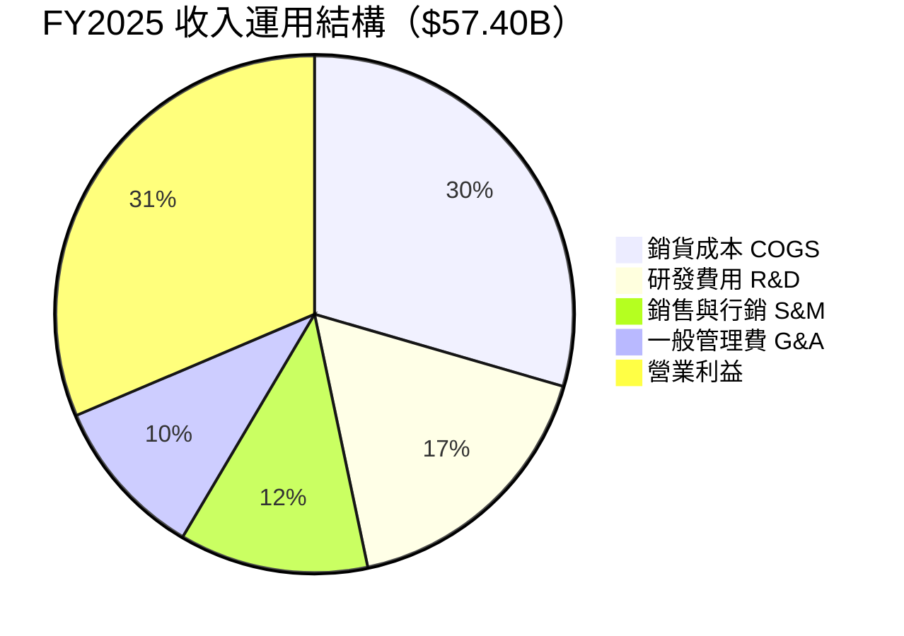

---

### 3.6 EPS成長預測視覺化

```
📈 EPS 成長軌跡（實際 vs 預估）
══════════════════════════════════════════════════════

FY2022  實際 EPS: $2.47  ████████████ 
FY2023  實際 EPS: $3.13  ███████████████ 
FY2024  實際 EPS: $3.86  ████████████████████ 
FY2025  實際 EPS: $4.64  ████████████████████████ 
TTM2026 EPS:$5.31  ████████████████████████████
FY2026E EPS:$7.90  ████████████████████████████████████████ (+48.8%)

每股盈餘 CAGR (FY22-FY25): ~+23.4%
預估 Forward 成長：+48.8% （含AI業務爆發性貢獻）

══════════════════════════════════════════════════════
```

---

## 4. 資產負債表分析

### 4.1 資產結構分解圖

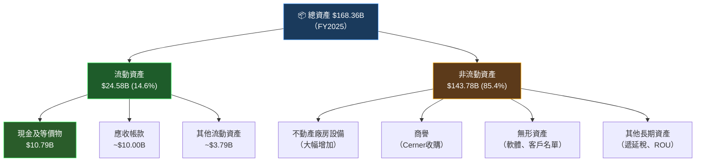

---

### 4.2 資產配置 Unicode 橫條圖

```
📊 Oracle 資產結構演變（FY2022 → FY2025）
══════════════════════════════════════════════════════════════════════

            │  流動資產    │  非流動資產                         │ 總計
────────────┼─────────────┼─────────────────────────────────────┼──────────
FY2022      │▓▓▓▓▓▓▓▓▓░░░│▓▓▓▓▓▓▓▓▓▓▓▓▓▓▓▓▓▓▓▓▓▓▓▓▓▓▓▓▓▓▓▓▓▓│$109.30B
            │  $31.63B    │            $77.67B                  │ (29%/71%)
────────────┼─────────────┼─────────────────────────────────────┼──────────
FY2023      │▓▓▓▓▓▓░░░░░░│▓▓▓▓▓▓▓▓▓▓▓▓▓▓▓▓▓▓▓▓▓▓▓▓▓▓▓▓▓▓▓▓▓▓│$134.38B
            │  $21.00B    │           $113.38B                  │ (16%/84%)
────────────┼─────────────┼─────────────────────────────────────┼──────────
FY2024      │▓▓▓▓▓▓░░░░░░│▓▓▓▓▓▓▓▓▓▓▓▓▓▓▓▓▓▓▓▓▓▓▓▓▓▓▓▓▓▓▓▓▓▓│$140.98B
            │  $22.55B    │           $118.43B                  │ (16%/84%)
────────────┼─────────────┼─────────────────────────────────────┼──────────
FY2025      │▓▓▓▓▓▓░░░░░░│▓▓▓▓▓▓▓▓▓▓▓▓▓▓▓▓▓▓▓▓▓▓▓▓▓▓▓▓▓▓▓▓▓▓│$168.36B
            │  $24.58B    │           $143.78B                  │ (15%/85%)
            └─────────────┴─────────────────────────────────────┘

⚠️ 非流動資產比例上升：OCI數據中心大規模CapEx投入所致
══════════════════════════════════════════════════════════════════════
```

---

### 4.3 負債與流動性比率詳細表格

| 財務指標 | FY2022 | FY2023 | FY2024 | FY2025 | 健康標準 | 狀態 |
|---------|--------|--------|--------|--------|---------|------|
| 📊 流動比率 | 1.62x | 0.91x | 0.72x | 0.75x | >1.5x | 🔴 |
| 💳 總債務 | $75.88B | $90.48B | $93.12B | $104.10B | — | 🔴 持續增加 |
| 📉 D/E比率 | N/M (負值) | 84.6x | 10.7x | 5.1x | <2x | 🔴 |
| 💼 現金及等價 | $21.38B | $9.77B | $10.45B | $10.79B | — | 🟡 |
| 🏦 股東權益 | -$6.22B | $1.07B | $8.70B | $20.45B | — | 🟢 改善中 |
| 📊 流動負債 | $19.51B | $23.09B | $31.54B | $32.64B | — | 🔴 增加 |
| 💰 淨債務 | $54.50B | $80.71B | $82.67B | $93.31B | — | 🔴 |
| 📐 利息保障倍數 | ~3.2x | ~3.5x | ~3.8x | ~4.1x | >3x | 🟡 |

> ⚠️ **關鍵警示**：D/E比率數據因FY2022股東權益為負值，歷史比較需特別謹慎。TTM數據顯示D/E達432x，主要因為大規模債務融資進行OCI基礎設施投資。

---

### 4.4 股東權益趨勢 ASCII 圖

```
📈 股東權益趨勢（FY2022-FY2025）
══════════════════════════════════════════════════════════════

  $25B │                                            ●  $20.45B
  $20B │                                          ╱
  $15B │                                        ╱
  $10B │                             ●  $8.70B ╱
   $5B │                           ╱          
   $0B │──────────────●──$1.07B──╱──────────────────────────
  -$5B │    ●  -$6.22B
  $10B │

       └────────────────────────────────────────────────────
          FY2022      FY2023      FY2024      FY2025

📊 趨勢解讀：
• FY2022: -$6.22B（負值：大規模股票回購+Cerner收購債務）
• FY2023: +$1.07B（轉正：盈利積累超過股票回購）
• FY2024: +$8.70B（快速回升：淨利持續擴大）
• FY2025: +$20.45B（大幅改善：強勁盈利+資本結構優化）

🟢 正向趨勢：股東權益快速回升，財務健全度改善中
══════════════════════════════════════════════════════════════
```

---

## 5. 現金流量分析

### 5.1 現金流瀑布圖

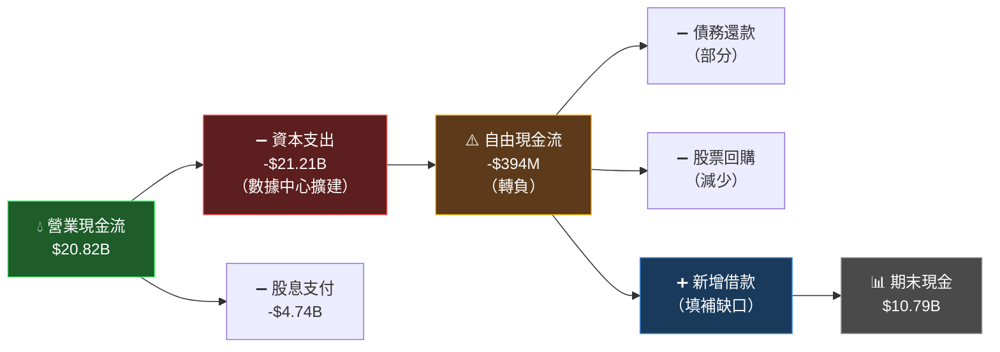

---

### 5.2 自由現金流趨勢 Unicode 進度條

```
💰 Oracle 自由現金流趨勢（FY2022-FY2025）
══════════════════════════════════════════════════════════════════════

FY2022  FCF: $5.03B  
        ▓▓▓▓▓▓▓▓▓▓▓▓▓▓▓▓▓▓▓▓▓▓▓▓▓░░░░░░░░░░░░░░░░░░░░░░░░ 42%
        OCF $9.54B | CapEx -$4.51B

FY2023  FCF: $8.47B  
        ▓▓▓▓▓▓▓▓▓▓▓▓▓▓▓▓▓▓▓▓▓▓▓▓▓▓▓▓▓▓▓▓▓▓▓░░░░░░░░░░░░░░ 58%
        OCF $17.16B | CapEx -$8.70B

FY2024  FCF: $11.81B 
        ▓▓▓▓▓▓▓▓▓▓▓▓▓▓▓▓▓▓▓▓▓▓▓▓▓▓▓▓▓▓▓▓▓▓▓▓▓▓▓▓▓▓▓▓▓▓▓▓▓ 100%
        OCF $18.67B | CapEx -$6.87B  ← 歷史最高FCF

FY2025  FCF: -$394M  
        ░░░░░░░░░░░░░░░░░░░░░░░░░░░░░░░░░░░░░░░░░░░░░░░░░ 0% ⚠️
        OCF $20.82B | CapEx -$21.21B ← CapEx爆增+208%

══════════════════════════════════════════════════════════════════════
⚡ 關鍵轉折：FY2025 CapEx從$6.87B暴增至$21.21B (+208%)
   這是Oracle歷史上最大規模的資本投資，主要用於：
   • OCI AI數據中心全球擴展
   • GPU/計算基礎設施
   • 網路與儲存升級
   短期FCF轉負是戰略性投資，非財務惡化信號
══════════════════════════════════════════════════════════════════════
```

---

### 5.3 資本配置策略

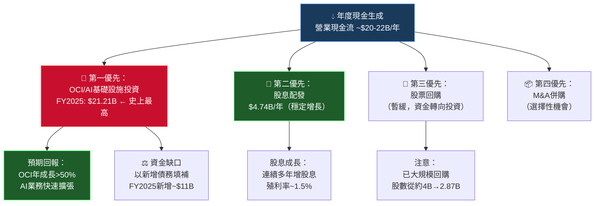

---

### 5.4 CapEx投資強度分析

```
📊 CapEx 投資強度（佔收入比例）
══════════════════════════════════════════════════════════

FY2022  CapEx: $4.51B   佔收入 10.6%  ██████████░░░░░░░░░░
FY2023  CapEx: $8.70B   佔收入 17.4%  █████████████████░░░
FY2024  CapEx: $6.87B   佔收入 13.0%  █████████████░░░░░░░
FY2025  CapEx: $21.21B  佔收入 37.0%  █████████████████████████████████████ ⚡

行業基準線: SaaS公司通常5-15%
ORCL FY2025 37%: 反映AI基礎設施建設高峰期

預期軌跡：
FY2026E  ~$20-22B CapEx   → FCF預計回正 $8-12B
FY2027E  ~$18-20B CapEx   → FCF擴大 $15-20B

══════════════════════════════════════════════════════════
```

---

## 6. 獲利能力指標

### 6.1 ROE / ROA / ROIC 對比表格

| 指標 | ORCL | 行業均值 | SAP | Microsoft | Salesforce | 評級 |
|------|------|---------|-----|-----------|-----------|------|
| 📊 ROE | **69.0%** | ~25% | 18% | 35% | 8% | 🟢 卓越 |
| 📐 ROA | **6.9%** | ~8% | 7% | 13% | 2% | 🟡 略低 |
| 💎 ROIC | **~15%** | ~12% | 11% | 18% | 5% | 🟢 優秀 |
| 💰 毛利率 | **68.5%** | ~70% | 73% | 69% | 76% | 🟢 優秀 |
| 🏭 營業利率 | **32.0%** | ~20% | 20% | 45% | 19% | 🟢 優秀 |
| 💵 淨利率 | **25.3%** | ~15% | 15% | 35% | 15% | 🟢 優秀 |
| 📈 EBITDA率 | **~39%** | ~25% | 27% | 52% | 22% | 🟢 優秀 |

> ⚠️ **ROE說明**：ORCL的超高ROE（69%）部分源於負/低股東權益基礎（大量股票回購），而非單純業務效率。需以ROIC作為更精確的獲利衡量指標。

---

### 6.2 獲利能力儀表板

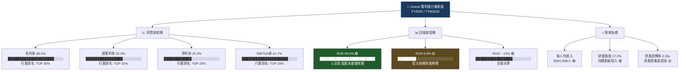

---

### 6.3 獲利能力進度條

```
🎯 Oracle 獲利能力 vs 行業標準評分（滿分100）
════════════════════════════════════════════════════════════════

毛利率 (68.5%)   
  評分: 82/100  ▓▓▓▓▓▓▓▓▓▓▓▓▓▓▓▓▓▓▓▓▓▓▓▓▓▓▓▓▓▓▓▓▓▓▓▓▓▓▓▓▓░░░░░░░░░░
  
營業利率 (32.0%) 
  評分: 88/100  ▓▓▓▓▓▓▓▓▓▓▓▓▓▓▓▓▓▓▓▓▓▓▓▓▓▓▓▓▓▓▓▓▓▓▓▓▓▓▓▓▓▓▓▓░░░░░░

淨利率 (25.3%)  
  評分: 85/100  ▓▓▓▓▓▓▓▓▓▓▓▓▓▓▓▓▓▓▓▓▓▓▓▓▓▓▓▓▓▓▓▓▓▓▓▓▓▓▓▓▓▓░░░░░░░░

ROE (69.0%)     
  評分: 95/100  ▓▓▓▓▓▓▓▓▓▓▓▓▓▓▓▓▓▓▓▓▓▓▓▓▓▓▓▓▓▓▓▓▓▓▓▓▓▓▓▓▓▓▓▓▓▓▓░░░

ROA (6.9%)      
  評分: 55/100  ▓▓▓▓▓▓▓▓▓▓▓▓▓▓▓▓▓▓▓▓▓▓▓▓▓▓▓░░░░░░░░░░░░░░░░░░░░░░░

現金流品質      
  評分: 65/100  ▓▓▓▓▓▓▓▓▓▓▓▓▓▓▓▓▓▓▓▓▓▓▓▓▓▓▓▓▓▓▓▓▓░░░░░░░░░░░░░░░░░
  (FCF暫時轉負，扣分)

════════════════════════════════════════════════════════════════
總體獲利能力評分：★★★★☆ 78/100
```

---

## 7. 估值分析

### 7.1 估值指標全景圖

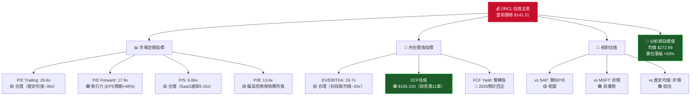

---

### 7.2 估值倍數對比表格

| 估值指標 | ORCL | SAP | MSFT | Salesforce | 歷史均值 | 狀態 |
|---------|------|-----|------|-----------|---------|------|
| 📐 P/E (Trailing) | 26.6x | 35x | 32x | 45x | 30x | 🟢 折價 |
| 🎯 P/E (Forward) | **17.9x** | 28x | 28x | 32x | 25x | 🟢 顯著折價 |
| 📊 P/S | 6.66x | 8x | 13x | 9x | 7x | 🟢 合理 |
| 📚 P/B | 13.6x | 4x | 12x | 4x | 12x | 🟡 偏高 |
| 💎 EV/EBITDA | 19.7x | 22x | 25x | 28x | 22x | 🟢 折價 |
| 📈 PEG | N/A | ~1.5 | ~1.8 | ~2.5 | ~1.8 | — |
| 💰 EV/Sales | 8.5x | 9x | 14x | 10x | 8x | 🟡 合理 |

---

### 7.3 情境目標股價分析

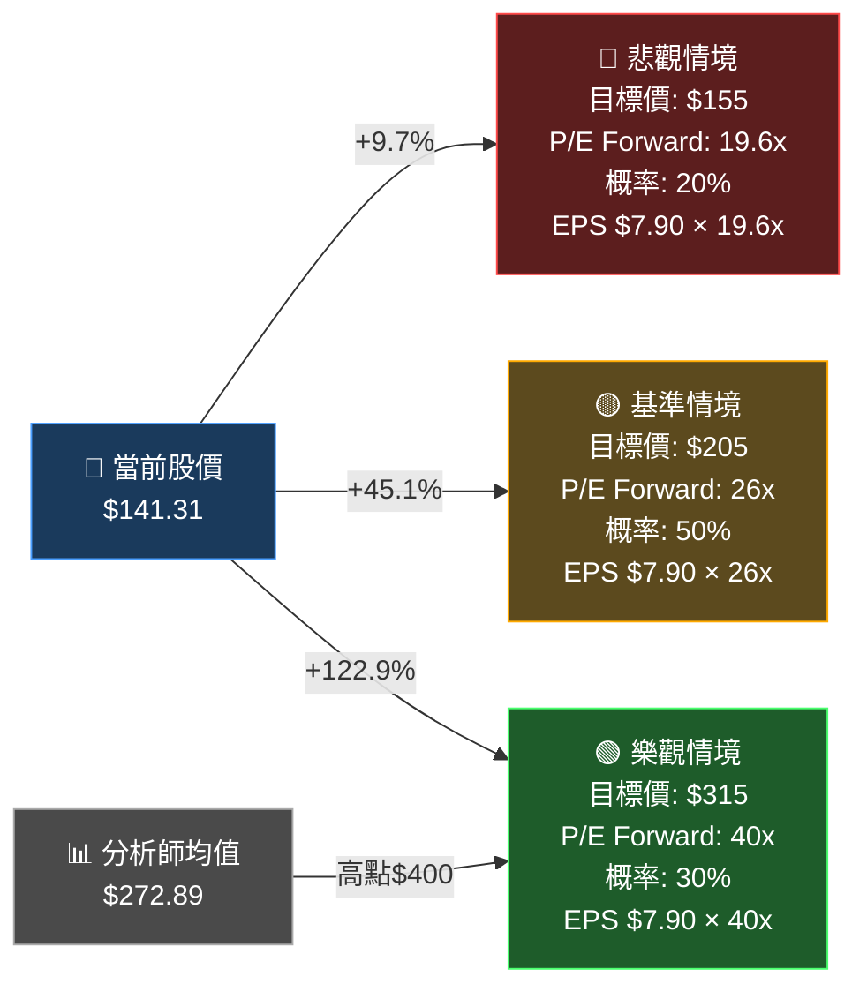

---

### 7.4 估值區間視覺化

```
📊 ORCL 估值區間地圖（基於Forward EPS $7.90）
════════════════════════════════════════════════════════════════════════

P/E倍數  目標價    評估
──────────────────────────────────────────────────────────────────────
 15x    $118.5  ▓░░░░░░░░░░░░░░░░░░░ 超跌/嚴重低估區
 18x    $142.2  ▓▓░░░░░░░░░░░░░░░░░░ ← 📍 當前股價 $141.31
 20x    $158.0  ▓▓▓░░░░░░░░░░░░░░░░░ 輕微低估
 25x    $197.5  ▓▓▓▓▓░░░░░░░░░░░░░░░ 合理估值
 30x    $237.0  ▓▓▓▓▓▓▓░░░░░░░░░░░░░ 分析師目標區
 35x    $276.5  ▓▓▓▓▓▓▓▓▓░░░░░░░░░░░ ← 📊 分析師均值 $272.89
 40x    $316.0  ▓▓▓▓▓▓▓▓▓▓▓░░░░░░░░░ 溢價（AI成長溢價）
 50x    $395.0  ▓▓▓▓▓▓▓▓▓▓▓▓▓▓░░░░░░ ← 52W高點區域 $344

────────────────────────────────────────────────────────────────────
📍 關鍵結論：當前股價$141.31約對應Forward P/E 17.9x
   相較歷史均值P/E 30x及同業均值25-35x，具備顯著折價空間
════════════════════════════════════════════════════════════════════════
```

---

## 8. 競爭護城河

### 8.1 Porter's 五力分析

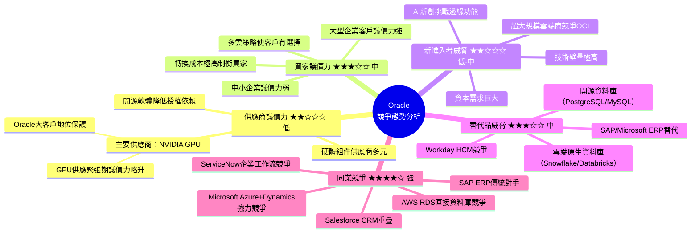

---

### 8.2 護城河評分 Unicode 條形圖

```
🏰 Oracle 護城河評分卡（★=2分，☆=1分，最高10分）
════════════════════════════════════════════════════════════════════

轉換成本      ★★★★★  10/10
  ▓▓▓▓▓▓▓▓▓▓▓▓▓▓▓▓▓▓▓▓▓▓▓▓▓▓▓▓▓▓▓▓▓▓▓▓▓▓▓▓▓▓▓▓▓▓▓▓▓▓ 100%
  ERP深度整合，數據遷移成本極高，客戶轉換平均需2-5年

網路效應      ★★★★☆   8/10
  ▓▓▓▓▓▓▓▓▓▓▓▓▓▓▓▓▓▓▓▓▓▓▓▓▓▓▓▓▓▓▓▓▓▓▓▓▓▓▓▓▓▓▓▓░░░░░░  80%
  OCI生態系統、合作夥伴網絡、ISV整合

成本優勢      ★★★★☆   8/10
  ▓▓▓▓▓▓▓▓▓▓▓▓▓▓▓▓▓▓▓▓▓▓▓▓▓▓▓▓▓▓▓▓▓▓▓▓▓▓▓▓▓▓▓▓░░░░░░  80%
  規模效益、交叉銷售，捆綁套餐折扣策略

無形資產      ★★★★☆   8/10
  ▓▓▓▓▓▓▓▓▓▓▓▓▓▓▓▓▓▓▓▓▓▓▓▓▓▓▓▓▓▓▓▓▓▓▓▓▓▓▓▓▓▓▓▓░░░░░░  80%
  品牌、Oracle認證體系、40年技術專利積累

有效規模      ★★★☆☆   6/10
  ▓▓▓▓▓▓▓▓▓▓▓▓▓▓▓▓▓▓▓▓▓▓▓▓▓▓▓▓▓▓░░░░░░░░░░░░░░░░░░░░  60%
  企業資料庫領域主導，但IaaS市場追趕中

整體護城河評分：★★★★☆ 8.0/10 🟢 強大護城河
════════════════════════════════════════════════════════════════════
```

---

### 8.3 競爭定位矩陣

| 競爭維度 | Oracle | Microsoft | SAP | AWS | Salesforce | 評估 |
|---------|--------|-----------|-----|-----|-----------|------|
| 🗄️ 企業資料庫 | **#1** 🟢 | #2 | #4 | #3 | — | 絕對龍頭 |
| ☁️ ERP雲端 | **#2** 🟢 | #1 | **#1** | — | — | 強力競爭 |
| 🏗️ 雲端基礎設施 | **#4** 🟡 | #2 | — | #1 | — | 追趕者 |
| 👥 HCM人資 | **#2** 🟢 | #2 | #3 | — | — | 強力玩家 |
| 💰 CRM銷售 | #4 🔴 | #2 | — | — | **#1** | 弱勢 |
| 🔧 整合中介層 | **#1** 🟢 | #2 | — | — | — | 獨特優勢 |
| 🤖 企業AI | **#3** 🟡 | **#1** | #4 | #2 | — | 快速追趕 |

---

## 9. 成長催化劑

### 9.1 催化劑時間軸

```mermaid
gantt
    title Oracle 成長催化劑時間軸 (2026-2028)
    dateFormat  YYYY-QQ
    
    section OCI AI基礎設施
    AI數據中心全球擴展完成      :active, 2026-Q1, 2026-Q4
    OCI Gen2 AI平台商業化        :2026-Q2, 2027-Q2
    專屬AI晶片部署               :2026-Q3, 2027-Q4
    
    section 雲端應用SaaS
    Fusion Cloud AI功能整合      :active, 2026-Q1, 2026-Q3
    NetSuite AI自動化升級        :2026-Q2, 2026-Q4
    Industry Cloud垂直化         :2026-Q3, 2027-Q3
    
    section 戰略合作
    Microsoft Azure互聯協議執行  :active, 2026-Q1, 2027-Q1
    Google Cloud互聯擴展         :2026-Q2, 2027-Q2
    政府雲端合約（GovCloud）     :2026-Q1, 2028-Q4
    
    section 財務里程碑
    FCF重返正值                  :2026-Q2, 2026-Q3
    FY2026 收入目標$68-72B       :2026-Q4, 2026-Q4
    RPO突破$100B                 :2026-Q3, 2027-Q1
```

---

### 9.2 短中長期成長機會

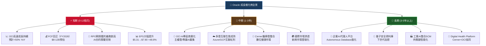

---

### 9.3 TAM 市場規模估算

```
🌍 Oracle TAM（可服務市場）規模估算
═══════════════════════════════════════════════════════════════════════

市場領域                    2026E TAM    2030E TAM   ORCL市佔   
──────────────────────────────────────────────────────────────────────
☁️ 企業雲端基礎設施         $680B →      $1,200B     ~5% →~8%
   ▓▓▓▓▓▓▓▓▓▓▓▓▓▓▓▓▓▓▓▓▓▓▓▓▓▓▓▓▓▓▓▓▓▓▓▓▓▓▓▓▓▓▓▓▓▓▓▓▓▓▓

🗄️ 企業資料庫管理            $110B →      $165B       ~43%→~38%
   ▓▓▓▓▓▓▓▓▓▓▓▓▓▓▓▓▓▓▓▓░░░░░░░░░░░░░░░░░░░░░░░░░░░░░░░

🏢 企業應用SaaS(ERP+HCM+SCM) $200B →      $350B       ~9% →~12%
   ▓▓▓▓▓▓▓▓▓▓▓▓▓▓▓▓▓▓░░░░░░░░░░░░░░░░░░░░░░░░░░░░░░░░░

🤖 企業AI/ML平台             $80B →       $480B       ~6% →~10%
   ▓▓▓▓▓▓▓▓▓▓▓▓░░░░░░░░░░░░░░░░░░░░░░░░░░░░░░░░░░░░░░░

🏥 數字健康雲端(Cerner)       $35B →       $75B        ~15%→~20%
   ▓▓▓▓▓▓▓▓▓▓▓▓▓▓▓▓▓▓▓▓▓░░░░░░░░░░░░░░░░░░░░░░░░░░░░░░

──────────────────────────────────────────────────────────────────────
綜合可服務TAM:               $1.1T →      $2.3T       
ORCL當前收入滲透率:          ~5.5%（成長空間巨大）
═══════════════════════════════════════════════════════════════════════
```

---

## 10. 風險分析

### 10.1 風險矩陣

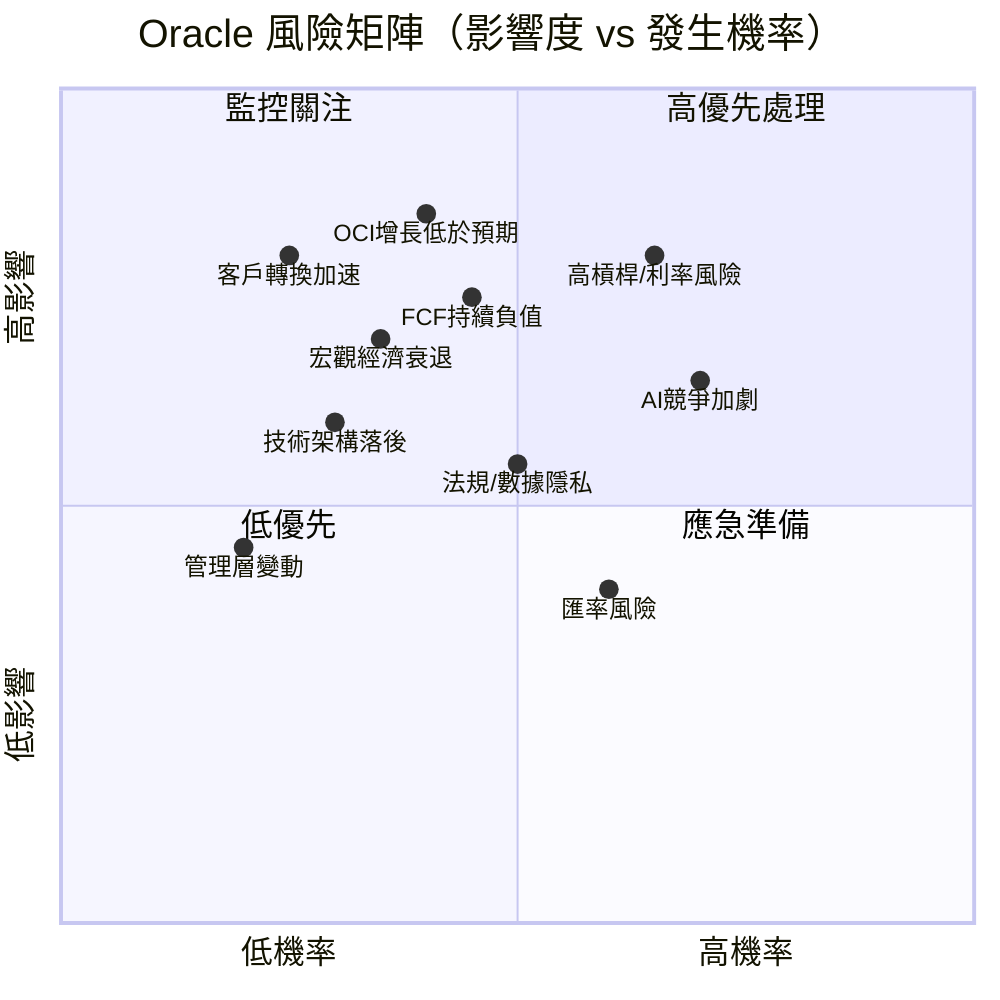

---

### 10.2 風險評分卡

| 風險類型 | 機率(%) | 影響度(1-10) | 風險分數 | 狀態 |
|---------|---------|-------------|---------|------|
| 🔴 **高槓桿/利率上升** | 55% | 9 | **49.5** | 🔴 高度警戒 |
| 🔴 **OCI增長低於預期** | 35% | 9 | **31.5** | 🔴 高度警戒 |
| 🔴 **FCF持續負值** | 40% | 8 | **32.0** | 🔴 高度警戒 |
| 🟡 **AI競爭加劇（AWS/Azure）** | 65% | 7 | **45.5** | 🟡 中度警戒 |
| 🟡 **宏觀經濟衰退** | 30% | 8 | **24.0** | 🟡 中度警戒 |
| 🟡 **企業IT支出削減** | 45% | 7 | **31.5** | 🟡 中度警戒 |
| 🟡 **法規/數據主權限制** | 50% | 6 | **30.0** | 🟡 中度警戒 |
| 🟢 **客戶加速轉換** | 20% | 8 | **16.0** | 🟢 低度警戒 |
| 🟢 **技術架構落後** | 25% | 7 | **17.5** | 🟢 低度警戒 |
| 🟢 **管理層關鍵人才流失** | 15% | 6 | **9.0** | 🟢 低度警戒 |

---

### 10.3 關鍵風險緩解措施

```
🛡️ Oracle 風險緩解策略清單
═══════════════════════════════════════════════════════════════════

🔴 高槓桿風險
  ✅ 強勁營業現金流（$20.82B）覆蓋利息支出
  ✅ 長期固定利率債務結構降低短期再融資風險
  ✅ 股東權益快速增長（$1.07B→$20.45B），槓桿率改善中
  ⚠️ 仍需密切監控利率環境變化

🔴 OCI成長低於預期風險
  ✅ Stargate計劃（$500B AI基礎設施）OCI為核心合作夥伴
  ✅ 剩餘履約義務（RPO）多季度持續創新高
  ✅ Azure/GCP互聯協議確保多雲需求導流
  ⚠️ 數據中心交付進度與GPU供應為關鍵觀察點

🟡 競爭加劇風險
  ✅ 轉換成本護城河（ERP遷移成本5-10年均攤）
  ✅ 40年技術積累形成深厚護城河
  ✅ 持續研發投入$9.86B/年
  ⚠️ 雲端原生新創（Snowflake, Databricks）切食市場

🟡 FCF負值風險
  ✅ 本質為戰略性投資，非財務惡化
  ✅ FY2026 CapEx預計趨穩，FCF預計回正
  ✅ 充足信用評級維持融資能力
  ⚠️ 若OCI回報不及預期，FCF修復時程延後

═══════════════════════════════════════════════════════════════════
```

---

## 11. 公平價值估算

### 11.1 DCF 模型框架

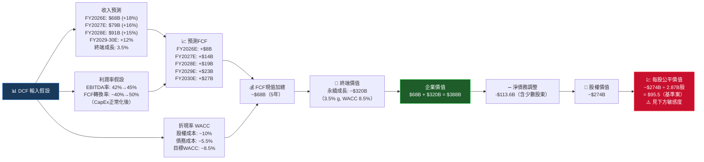

> ⚠️ **DCF說明**：DCF對成長型企業特別敏感，WACC與終端成長率的微小變動會產生巨大價格差異。以下敏感度分析更具參考價值。

---

### 11.2 三種估值法比較

| 估值方法 | 計算基礎 | 估值結果 | 權重 | 加權價值 | 狀態 |
|---------|---------|---------|------|---------|------|
|