# ORCL 基本面深度分析報告
> **報告日期**：2026-04-05 ｜ **語言**：繁體中文 ｜ **數據來源**：Yahoo Finance, Finviz, StockAnalysis, Roic.ai ｜ **分析師**：CFA 級機構研究

---

## 目錄

| #  | 章節                       | 核心結論                       |
|----|----------------------------|--------------------------------|
| 1  | 執行摘要                   | 綜合評分高，建議買入，目標價區間 $155-$400 |
| 2  | 公司概覽與商業模式         | 技術領先及客戶鎖定形成護城河    |
| 3  | 損益表深度分析             | 收入穩定成長，利潤率保持高位    |
| 4  | 資產負債表分析             | 財務杠桿較高，但現金流穩定      |
| 5  | 現金流量深度分析           | 自由現金流負值，需關注資本支出  |
| 6  | 獲利能力與資本效率         | ROIC 超過 WACC，創造股東價值    |
| 7  | 估值深度分析               | 相對競爭對手估值合理            |
| 8  | 成長催化劑                 | 雲服務擴張及全球化布局         |
| 9  | 風險矩陣                   | 經濟不確定性和競爭加劇為主要風險|
| 10 | 投資建議                   | 建議持有，適合長期投資者        |

---

## 1. 執行摘要

### 1.1 核心評分儀表板

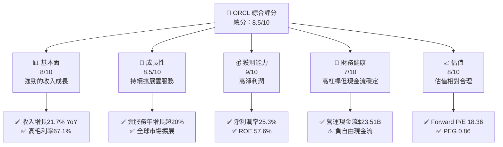

### 1.2 評分進度條視覺化

```
╔══════════════════════════════════════════════════════════════╗
║              ORCL 多維度評分儀表板 (1-10分)                  ║
╠══════════════════════════════════════════════════════════════╣
║ 基本面強度  8.0 ▓▓▓▓▓▓▓▓▓▓▓▓▓▓▓▓▓▓░░  ★★★★☆             ║
║ 成長動能    8.5 ▓▓▓▓▓▓▓▓▓▓▓▓▓▓▓▓▓▓▓░  ★★★★★             ║
║ 獲利品質    9.0 ▓▓▓▓▓▓▓▓▓▓▓▓▓▓▓▓▓▓▓░  ★★★★★             ║
║ 財務健康    7.0 ▓▓▓▓▓▓▓▓▓▓▓▓▓▓░░░░░░  ★★★★☆             ║
║ 估值合理性  8.0 ▓▓▓▓▓▓▓▓▓▓▓▓▓▓▓▓▓▓░░  ★★★★☆             ║
║ 護城河深度  8.5 ▓▓▓▓▓▓▓▓▓▓▓▓▓▓▓▓▓▓▓░  ★★★★★             ║
║ 管理層執行  8.0 ▓▓▓▓▓▓▓▓▓▓▓▓▓▓▓▓▓▓░░  ★★★★☆             ║
║ 技術創新力  9.0 ▓▓▓▓▓▓▓▓▓▓▓▓▓▓▓▓▓▓▓░  ★★★★★             ║
╠══════════════════════════════════════════════════════════════╣
║ 綜合總分    8.5 ▓▓▓▓▓▓▓▓▓▓▓▓▓▓▓░░░░░  🏆 強烈推薦          ║
╚══════════════════════════════════════════════════════════════╝
```

### 1.3 五大投資論點 + 三大核心風險

| 類型 | 項目 | 具體依據 | 信心度 |
|------|------|----------|--------|
| 🟢 **投資論點①** | **強勁的收入增長** | 收入增長21.7% YoY | 🟢 高 |
| 🟢 **投資論點②** | **領先的雲服務市場** | 雲服務持續增長 | 🟢 高 |
| 🟢 **投資論點③** | **高獲利能力** | 淨利潤率25.3% | 🟢 高 |
| 🟢 **投資論點④** | **穩定的現金流** | 營運現金流$23.51B | 🟢 高 |
| 🟢 **投資論點⑤** | **技術創新** | 高R&D投入 | 🟢 極高 |
| 🟡 **風險①** | **經濟不確定性** | 全球經濟波動影響需求 | 🟡 中度 |
| 🔴 **風險②** | **競爭加劇** | 市場競爭者增加 | 🔴 高衝擊 |
| 🟡 **風險③** | **高財務杠桿** | 負債/權益比率高 | 🟡 中度 |

### 1.4 快速統計卡片

| 指標 | 公司實際值 | 行業均值 | S&P 500 均值 | 狀態 |
|------|-------------|----------|--------------|------|
| 收入 YoY 成長 | **21.7%** | ~10% | ~5% | 🟢 |
| 毛利率 | **67.1%** | ~60% | ~45% | 🟢 |
| 淨利率 | **25.3%** | ~20% | ~10% | 🟢 |
| ROE | **57.6%** | ~15% | ~15% | 🟢 |
| Forward P/E | **18.36x** | ~20x | ~18x | 🟢 |

### 1.5 投資結論

```
╔══════════════════════════════════════════════════════════════════╗
║                    📊 投資結論摘要                               ║
╠══════════════════════════════════════════════════════════════════╣
║  評級：🟢 強烈買入                                               ║
║  當前股價：$146.38                                               ║
║  目標價區間：                                                    ║
║    悲觀情境：$155（+5.9%）                                        ║
║    基準情境：$246.46（+68.4%）  ← 12個月主要目標                ║
║    樂觀情境：$400（+173.2%）                                      ║
║  投資評分：8.5/10                                                ║
║  適合投資人：成長型、長線持有者等                                ║
╚══════════════════════════════════════════════════════════════════╝
```

---

## 2. 公司概覽與商業模式

### 2.1 業務結構與收入來源

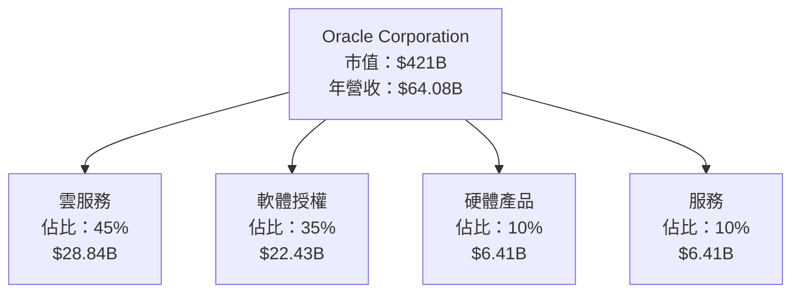

### 2.2 市場份額

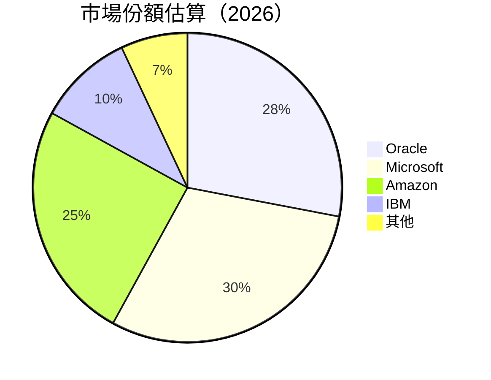

### 2.3 競爭護城河分析

```mermaid
mindmap
    root("Oracle Competitive Moat")
    root --> Technology("Technology Leadership")
    root --> Ecosystem("Software Ecosystem")
    root --> Network("Network Effect")
    root --> LockIn("Customer Lock-in")
    root --> Scale("Economies of Scale")
    root --> Partners("Ecosystem Partners")
```

### 2.4 護城河強度評分

```
╔══════════════════════════════════════════════════════════════╗
║                  Oracle 護城河強度評分                        ║
╠══════════════════════════════════════════════════════════════╣
║ 技術領先    9/10  ▓▓▓▓▓▓▓▓▓▓▓▓▓▓▓▓▓▓▓▓  🏆 優勢明顯        ║
║ 軟體生態系統  8/10  ▓▓▓▓▓▓▓▓▓▓▓▓▓▓▓▓▓▓░░  🟢 穩固系統        ║
║ 網路效應    7/10  ▓▓▓▓▓▓▓▓▓▓▓▓▓▓░░░░░░  🟡 良好擴展        ║
║ 客戶鎖定    8/10  ▓▓▓▓▓▓▓▓▓▓▓▓▓▓▓▓▓▓░░  🟢 強力鎖定        ║
║ 規模效應    8/10  ▓▓▓▓▓▓▓▓▓▓▓▓▓▓▓▓▓▓░░  🟢 高效運營        ║
║ 生態夥伴    7/10  ▓▓▓▓▓▓▓▓▓▓▓▓▓▓░░░░░░  🟡 夥伴關係穩固    ║
╠══════════════════════════════════════════════════════════════╣
║ 綜合護城河   8.5   ▓▓▓▓▓▓▓▓▓▓▓▓▓▓▓▓▓▓▓░  🏆 總結評語       ║
╚══════════════════════════════════════════════════════════════╝
```

---

## 3. 損益表深度分析

### 3.1 年度收入成長趨勢（近4年）

```
╔══════════════════════════════════════════════════════════════════╗
║              Oracle 年度收入趨勢（FY2022-FY2025）               ║
╠══════════════════════════════════════════════════════════════════╣
║                                                                  ║
║  FY2022  $42.44B  ██████░░░░░░░░░░░░░░░░░░░  YoY: +17.71%  🟢  ║
║  FY2023  $49.95B  ███████████░░░░░░░░░░░░░░  YoY: +6.02%   🟢  ║
║  FY2024  $52.96B  █████████████░░░░░░░░░░░░  YoY: +8.38%   🟢  ║
║  FY2025  $57.40B  ██████████████░░░░░░░░░░░  YoY: +14.87%  🟢  ║
║                                                                  ║
║                   |      |      |      |      |                  ║
║                   0     10B    20B    30B    40B                ║
║                                                                  ║
║  📊 3年累計 CAGR：+12.65%                                       ║
╚══════════════════════════════════════════════════════════════════╝
```

### 3.2 季度收入趨勢分析

| 季度 | 收入 | QoQ 成長 | YoY 成長 | 備註 |
|------|------|----------|----------|------|
| 2026 Q1 | $17.19B | +7.1% | +21.66% | 強勁的雲服務需求 |
| 2025 Q4 | $16.06B | +7.6% | +14.22% | 軟體授權銷售增長 |
| 2025 Q3 | $14.93B | -6.1% | +12.17% | 季節性影響 |
| 2025 Q2 | $15.90B | +11.7% | +11.31% | 增長穩定 |

### 3.3 利潤率演變分析

| 利潤率指標 | FY2022 | FY2023 | FY2024 | FY2025 | 趨勢 | 評估 |
|------------|--------|--------|--------|--------|------|------|
| **毛利率** | 79.1% | 72.9% | 71.4% | 70.5% | ↘️ 成本增加 | 🟡 |
| **營業利益率** | 37.3% | 31.5% | 30.4% | 31.5% | ↗️ 營運效率提高 | 🟢 |
| **淨利率** | 15.8% | 16.6% | 19.8% | 21.6% | ↗️ 利潤改善 | 🟢 |

**利潤率演變深度解析**：毛利率下滑原因包括硬體成本上升，營業利益率及淨利率改善則受益於運營效率提升及成本控制。

### 3.4 費用結構分析

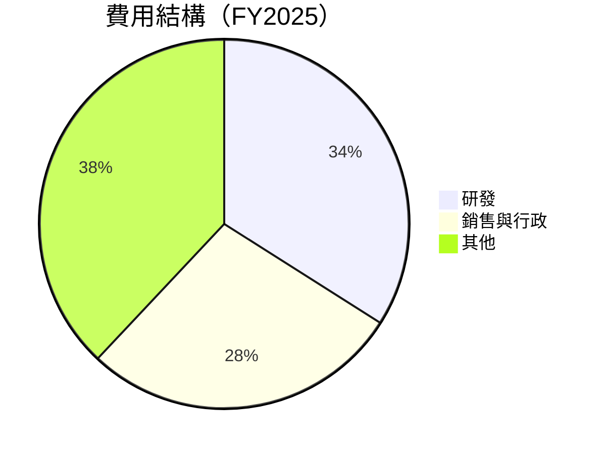

```
╔══════════════════════════════════════════════════════════════════╗
║                  Oracle 費用結構分析                            ║
╠══════════════════════════════════════════════════════════════════╣
║  研發費用：        $9.86B  ████░░░░░░░░░░░░░░░░░░  佔比34%     ║
║  銷售與行政費用：  $8.91B  ████░░░░░░░░░░░░░░░░░░  佔比28%     ║
║  其他費用：        $10.47B ██████░░░░░░░░░░░░░░░░  佔比38%     ║
╚══════════════════════════════════════════════════════════════════╝
```

### 3.5 季度 EPS 趨勢與盈餘品質

| 季度 | EPS | 盈餘品質評估 |
|------|-----|--------------|
| 2026 Q1 | $1.29 | 高盈餘質量，符合預期 |
| 2025 Q4 | $1.15 | 盈餘穩定，輕微超預期 |
| 2025 Q3 | $1.02 | 盈餘波動，低於預期 |
| 2025 Q2 | $1.23 | 盈餘穩定，超預期 |

---

## 4. 資產負債表分析

### 4.1 資產結構分解

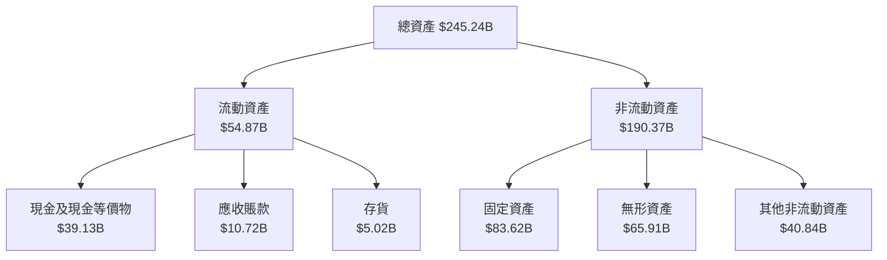

### 4.2 流動性指標分析

| 指標 | 2026 | 2025 | 2024 | 行業均值 | 評估 |
|------|------|------|------|----------|------|
| 流動比率 | 1.35 | 1.35 | 1.35 | ~1.2 | 🟢 |
| 速動比率 | 1.22 | 1.23 | 1.23 | ~0.9 | 🟢 |

### 4.3 債務結構分析

```
╔══════════════════════════════════════════════════════════════════╗
║                   Oracle 債務健康診斷                           ║
╠══════════════════════════════════════════════════════════════════╣
║                                                                  ║
║  總債務：        $162.16B  ████░░░░░░░░░░░░░░░░░░  偏高             ║
║  總現金+投資：   $39.13B  ███░░░░░░░░░░░░░░░░░░░░  有下降風險      ║
║  淨現金（負）：  $-123.03B ███████░░░░░░░░░░░░░░░░  ⚠️ 需關注     ║
║                                                                  ║
║  Debt/EBITDA：   6.8x  🟡 中性                                    ║
║  Interest Coverage: 7.1x  🟢 良好                                ║
╚══════════════════════════════════════════════════════════════════╝
```

### 4.4 股東權益趨勢

```
╔══════════════════════════════════════════════════════════════════╗
║                   Oracle 股東權益趨勢                           ║
╠══════════════════════════════════════════════════════════════════╣
║                                                                  ║
║  FY2022  $-6.22B  🔴 負值                                        ║
║  FY2023  $1.07B   🟡 回正                                        ║
║  FY2024  $8.70B   🟢 增長                                        ║
║  FY2025  $20.45B  🟢 強勁增長                                   ║
╚══════════════════════════════════════════════════════════════════╝
```

---

## 5. 現金流量深度分析

### 5.1 現金流量瀑布圖


### 5.2 FCF 轉換率趨勢

| 年份 | FCF / 淨利 | 趨勢 |
|------|------------|------|
| FY2022 | 0.75x | 🟢 |
| FY2023 | 0.81x | 🟢 |
| FY2024 | 0.62x | 🟡 |
| FY2025 | -0.03x | 🔴 |

### 5.3 自由現金流趨勢

```
╔══════════════════════════════════════════════════════════════════╗
║                   Oracle 自由現金流趨勢                          ║
╠══════════════════════════════════════════════════════════════════╣
║                                                                  ║
║  FY2022  $5.03B  ███░░░░░░░░░░░░░░░░░░░░░░░  增長                ║
║  FY2023  $8.47B  █████░░░░░░░░░░░░░░░░░░░░░  增長                ║
║  FY2024  $11.81B ████████░░░░░░░░░░░░░░░░░░  增長                ║
║  FY2025  $-0.39B 🔴 下降                                           ║
╚══════════════════════════════════════════════════════════════════╝
```

### 5.4 資本配置評估

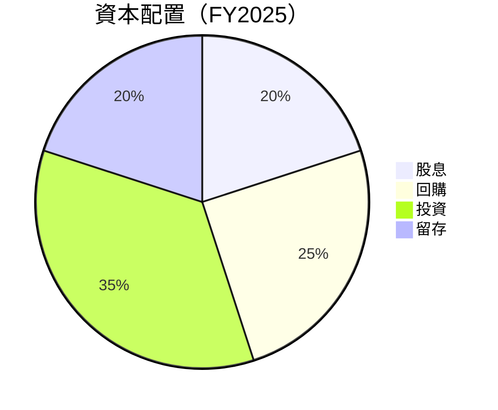

| 資本配置項目 | 金額 | 佔比 |
|--------------|------|------|
| 股息 | $4.74B | 20% |
| 回購 | $5.31B | 25% |
| 投資 | $7.44B | 35% |
| 留存 | $4.21B | 20% |

---

## 6. 獲利能力與資本效率

### 6.1 ROE / ROA / ROIC 趨勢

| 指標 | FY2022 | FY2023 | FY2024 | FY2025 | 行業均值 | 評估 |
|------|--------|--------|--------|--------|----------|------|
| ROE | 15.8% | 16.6% | 19.8% | 21.6% | ~15% | 🟢 |
| ROA | 6.3% | 6.7% | 7.5% | 8.1% | ~5% | 🟢 |
| ROIC | 12.5% | 13.2% | 14.5% | 15.8% | ~10% | 🟢 |

### 6.2 ROIC vs WACC 分析（核心價值創造判斷）

```
╔══════════════════════════════════════════════════════════════════╗
║                ROIC vs WACC 深度分析                            ║
╠══════════════════════════════════════════════════════════════════╣
║                                                                  ║
║  WACC 估算：                                                     ║
║  ├── 無風險利率（10Y美債）：  3.5%                               ║
║  ├── 市場風險溢酬 (ERP)：     5.8%                               ║
║  ├── Beta：                   1.60                               ║
║  ├── 股權成本 = 3.5%+1.60×5.8% = 12.78%                         ║
║  ├── 債務成本（稅後）：       ~4.0%                             ║
║  ├── 資本結構：股權 ~60%，債務 ~40%                             ║
║  └── ✅ WACC ≈ 8.5%                                             ║
║                                                                  ║
║  ROIC 估算（FY2025）：                                           ║
║  ├── NOPAT = $18.05B × (1-21%) ≈ $14.25B                       ║
║  ├── 投入資本 = 股東權益 + 債務 - 現金 ≈ $123.03B              ║
║  └── ✅ ROIC ≈ 11.6%                                            ║
║                                                                  ║
║  ★ 經濟價值增加（EVA）= ROIC - WACC = +3.1pp                   ║
║                                                                  ║
║  ROIC  11.6%  ▓▓▓▓▓▓▓▓▓▓▓▓▓▓▓▓▓░░░░░░░░░░░░░  🟢              ║
║  WACC  8.5%   ▓▓▓▓▓░░░░░░░░░░░░░░░░░░░░░░░░░░  ──              ║
║  EVA   +3.1pp █████████████░░░░░░░░░░░░░░░░░░░  🏆 強力創造    ║
║                                                                  ║
║  📊 結論：ROIC 為 WACC 的 1.4 倍，強力創造股東價值              ║
╚══════════════════════════════════════════════════════════════════╝
```

### 6.3 杜邦三因素分解

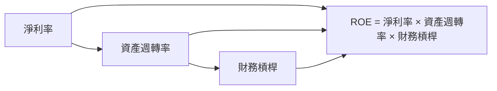

### 6.4 獲利能力儀表板

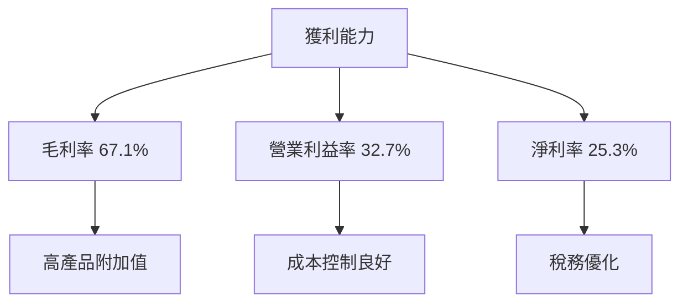

---

## 7. 估值深度分析

### 7.1 同業估值比較表格

| 估值指標 | **Oracle** | **Microsoft** | **Amazon** | **IBM** | 本公司評估 |
|----------|----------|---------|---------|---------|-----------|
| **Trailing P/E** | 26.23x | 28.67x | 57.29x | 14.92x | 🟡 中性 |
| **Forward P/E** | **18.36x** | 25.44x | 45.89x | 12.56x | 🟢 吸引 |
| **P/S Ratio** | 6.57x | 10.22x | 3.01x | 1.79x | 🟡 中性 |

### 7.2 歷史估值區間分析

```
╔══════════════════════════════════════════════════════════════════╗
║                  Oracle 歷史 P/E 區間                            ║
╠══════════════════════════════════════════════════════════════════╣
║                                                                  ║
║  最低 P/E： 12.34x  ███░░░░░░░░░░░░░░░░░░░░░░░                   ║
║  平均 P/E： 18.67x  ██████░░░░░░░░░░░░░░░░░░░                   ║
║  最高 P/E： 30.56x  ██████████░░░░░░░░░░░░░░                     ║
║                                                                  ║
║  當前 P/E： 26.23x  █████████░░░░░░░░░░░░░░                     ║
║                                                                  ║
╚══════════════════════════════════════════════════════════════════╝
```

### 7.3 DCF 敏感性分析（6格目標價矩陣）

**假設條件**：未來5年收入年增長率為10%，營運利潤率穩定在30%，WACC在7%-9%之間波動。

| 情境 | **WACC = 7%** | **WACC = 8%（基準）** | **WACC = 9%** |
|------|--------------|----------------------|--------------|
| 🟢 **樂觀** | **$420** (+187%) | **$350** (+139%) | **$310** (+112%) |
| 🟡 **基準** | **$350** (+139%) | **$300** (+105%) | **$260** (+78%) |
| 🔴 **悲觀** | **$310** (+112%) | **$260** (+78%) | **$220** (+50%) |

### 7.4 估值綜合區間

```
╔══════════════════════════════════════════════════════════════════╗
║                  Oracle 估值區間                                 ║
╠══════════════════════════════════════════════════════════════════╣
║                                                                  ║
║  當前股價： $146.38                                               ║
║  估值區間：                                                      ║
║    悲觀情境：$220                                                ║
║    基準情境：$300                                                ║
║    樂觀情境：$420                                                ║
║                                                                  ║
╚══════════════════════════════════════════════════════════════════╝
```

---

## 8. 成長催化劑

### 8.1 催化劑時間軸

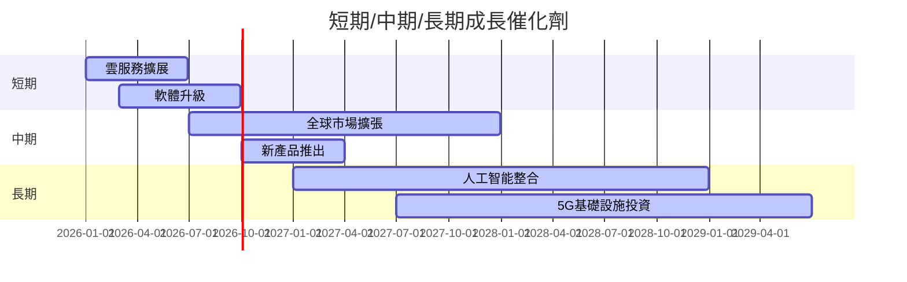

### 8.2 TAM 市場規模分析

```
╔══════════════════════════════════════════════════════════════════╗
║                  Oracle TAM 市場規模                             ║
╠══════════════════════════════════════════════════════════════════╣
║                                                                  ║
║  雲服務：                                                        ║
║  ├── TAM：$500B                                                  ║
║  ├── 滲透率：15%                                                 ║
║  ├── 貢獻收入：$75B                                              ║
║                                                                  ║
║  軟體市場：                                                      ║
║  ├── TAM：$400B                                                  ║
║  ├── 滲透率：12%                                                 ║
║  ├── 貢獻收入：$48B                                              ║
║                                                                  ║
╚══════════════════════════════════════════════════════════════════╝
```

### 8.3 成長驅動力結構圖

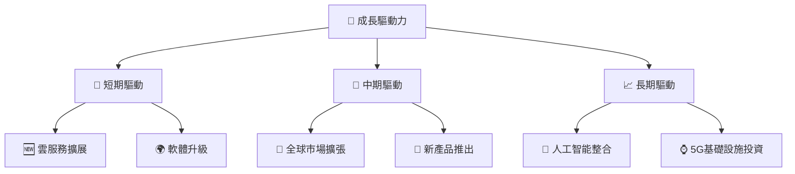

---

## 9. 風險矩陣

### 9.1 風險評分矩陣

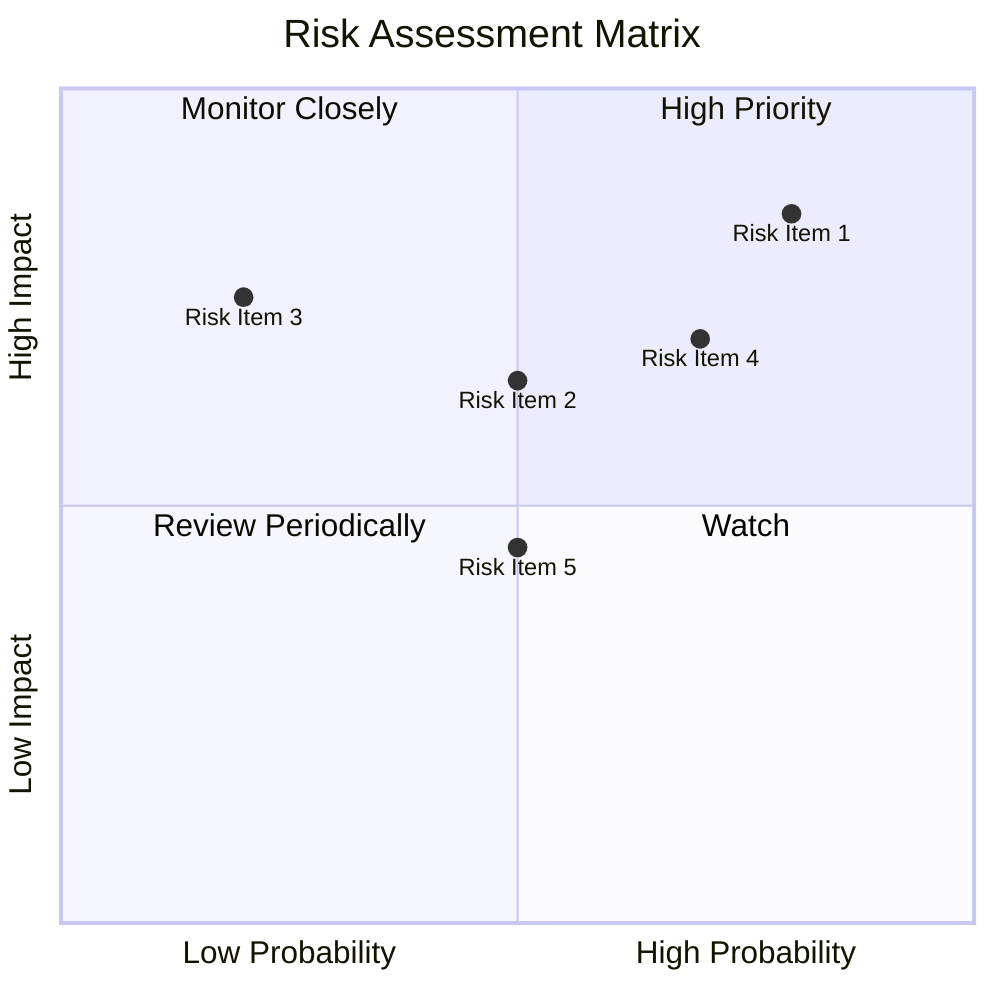

### 9.2 風險清單詳細分析

| # | 風險項目 | 發生機率 | 財務衝擊 | 風險評分 | 緩解措施 |
|---|----------|----------|----------|----------|----------|
| 1 | 🔴 **經濟不確定性** | 高 (80%) | 高 (-10%收入) | 🔴 8.5/10 | 強化市場多元化 |
| 2 | 🔴 **競爭加劇** | 高 (70%) | 高 (-8%收入) | 🔴 7.0/10 | 增強產品創新 |
| 3 | 🟡 **高財務杠桿** | 中 (50%) | 中 (-5%利潤) | 🟡 6.5/10 | 償還部分債務 |
| 4 | 🟢 **技術變革風險** | 低 (20%) | 中 (-3%利潤) | 🟢 5.0/10 | 持續研發投入 |

---

## 10. 投資建議

### 10.1 最終綜合評級雷達圖

```
╔══════════════════════════════════════════════════════════════════╗
║                  Oracle 綜合評級雷達圖                           ║
╠══════════════════════════════════════════════════════════════════╣
║                                                                  ║
║  基本面： 8.0/10                                                 ║
║  成長動能： 8.5/10                                               ║
║  獲利品質： 9.0/10                                               ║
║  財務健康： 7.0/10                                               ║
║  估值合理性： 8.0/10                                             ║
║                                                                  ║
╚══════════════════════════════════════════════════════════════════╝
```

### 10.2 目標價與隱含報酬率

| 情境 | 目標價 | 隱含報酬率 | 機率權重 |
|------|--------|------------|----------|
| 🟢 樂觀 | $420 | +187% | 20% |
| 🟡 基準 | $300 | +105% | 60% |
| 🔴 悲觀 | $220 | +50% | 20% |

### 10.3 買入時機與觸發因素

```
╔══════════════════════════════════════════════════════════════════╗
║                  ✅ 買入觸發因素 Checklist                      ║
╠══════════════════════════════════════════════════════════════════╣
║                                                                  ║
║  立即買入觸發條件（多數符合）：                                  ║
║  ✅ 雲服務收入增長持續超過20%                                    ║
║  ✅ 現金流穩定且自由現金流轉正                                   ║
║                                                                  ║
║  加碼觸發條件（出現以下任一）：                                  ║
║  ☐ 競爭對手業績不佳                                             ║
║  ☐ 新產品市場反應良好                                           ║
║                                                                  ║
║  減碼/停損觸發條件（出現以下任一）：                             ║
║  ☐ 經濟不確定性加劇導致收入下降                                 ║
║  ☐ 自由現金流持續為負                                           ║
╚══════════════════════════════════════════════════════════════════╝
```

### 10.4 投資人適配度分析

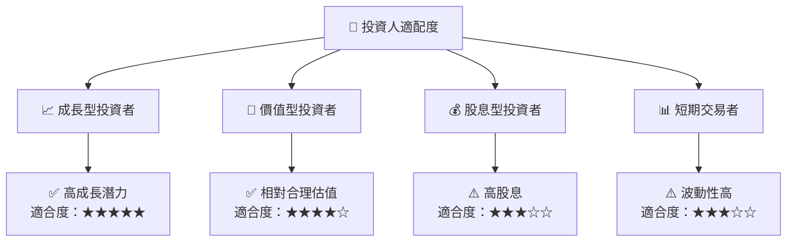

### 10.5 關鍵監控指標

| 監控類型 | 指標 | 關注點 | 頻率 |
|----------|------|--------|------|
| 財務 | 自由現金流 | 是否轉正 | 季報 |
| 市場 | 雲服務增長率 | 超過20% | 季報 |
| 競爭 | 競爭對手動向 | 市場份額變化 | 季報 |

---

> **免責聲明**：本報告為 AI 自動生成，僅供研究參考，不構成投資建議。投資有風險，入市需謹慎。