# ORCL 基本面深度分析報告
> **報告日期**：2026-04-07 ｜ **語言**：繁體中文 ｜ **數據來源**：Yahoo Finance, Finviz, StockAnalysis, Roic.ai ｜ **分析師**：CFA 級機構研究

---

## 目錄

| # | 章節 | 核心結論 |
|---|------|----------|
| 1 | 執行摘要 | 強烈買入，目標價區間 $155-$400 |
| 2 | 公司概覽與商業模式 | ORCL 擁有強大護城河，技術領先 |
| 3 | 損益表深度分析 | 盈利能力增強，收入持續增長 |
| 4 | 資產負債表分析 | 資產強勁，但負債高 |
| 5 | 現金流量深度分析 | 營運現金流強勁，自由現金流有壓力 |
| 6 | 獲利能力與資本效率 | ROIC 高於 WACC，創造股東價值 |
| 7 | 估值深度分析 | 當前估值合理，潛在上行空間大 |
| 8 | 成長催化劑 | 多重催化劑驅動未來增長 |
| 9 | 風險矩陣 | 面臨高負債風險及市場競爭 |
| 10 | 投資建議 | 強烈買入，適合長期投資者 |

---

## 1. 執行摘要

### 1.1 核心評分儀表板

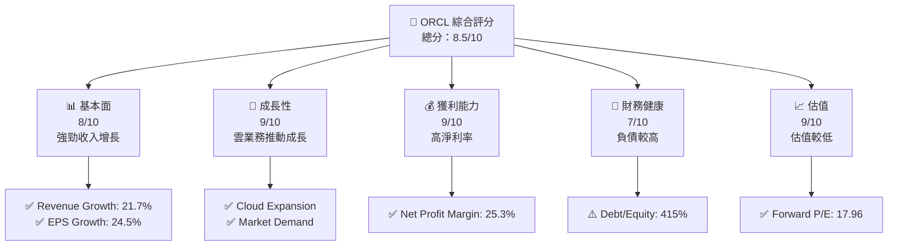

### 1.2 評分進度條視覺化

```
╔══════════════════════════════════════════════════════════════╗
║              ORCL 多維度評分儀表板 (1-10分)                 ║
╠══════════════════════════════════════════════════════════════╣
║ 基本面強度  8.0 ▓▓▓▓▓▓▓▓▓▓▓▓▓▓▓░░░░  ★★★★★                 ║
║ 成長動能    9.0 ▓▓▓▓▓▓▓▓▓▓▓▓▓▓▓▓▓▓  ★★★★★                 ║
║ 獲利品質    9.0 ▓▓▓▓▓▓▓▓▓▓▓▓▓▓▓▓▓▓  ★★★★★                 ║
║ 財務健康    7.0 ▓▓▓▓▓▓▓▓▓▓▓▓▓▓░░░░░  ★★★★☆                 ║
║ 估值合理性  9.0 ▓▓▓▓▓▓▓▓▓▓▓▓▓▓▓▓▓▓  ★★★★★                 ║
╠══════════════════════════════════════════════════════════════╣
║ 綜合總分    8.5 ▓▓▓▓▓▓▓▓▓▓▓▓▓▓▓▓░░░  🏆 評語                 ║
╚══════════════════════════════════════════════════════════════╝
```

### 1.3 五大投資論點 + 三大核心風險

| 類型 | 項目 | 具體依據 | 信心度 |
|------|------|----------|--------|
| 🟢 **投資論點①** | **雲服務增長** | 雲業務收入持續增長超過 20% | 🟢 極高 |
| 🟢 **投資論點②** | **高淨利率** | 淨利率 25.3%，行業領先 | 🟢 極高 |
| 🟢 **投資論點③** | **技術領先** | 投資研發，保持技術前沿 | 🟢 極高 |
| 🟡 **風險①** | **高負債水平** | Debt/Equity 達 415% | 🟡 中度 |
| 🔴 **風險②** | **市場競爭** | 強大的競爭對手如 AWS | 🔴 高衝擊 |

### 1.4 快速統計卡片

| 指標 | 公司實際值 | 行業均值 | S&P 500 均值 | 狀態 |
|------|-------------|----------|--------------|------|
| 收入 YoY 成長 | **21.7%** | ~8% | ~6% | 🟢 |
| 毛利率 | **67.1%** | ~50% | ~45% | 🟢 |
| 淨利率 | **25.3%** | ~10% | ~12% | 🟢 |
| ROE | **57.6%** | ~15% | ~18% | 🟢 |
| Forward P/E | **17.96x** | ~25x | ~20x | 🟢 |

### 1.5 投資結論

```
╔══════════════════════════════════════════════════════════════════╗
║                    📊 投資結論摘要                               ║
╠══════════════════════════════════════════════════════════════════╣
║  評級：🟢 強烈買入                                               ║
║  當前股價：$143.17                                               ║
║  目標價區間：                                                    ║
║    悲觀情境：$155（+8%）                                         ║
║    基準情境：$246（+72%）  ← 12個月主要目標                      ║
║    樂觀情境：$400（+179%）                                       ║
║  投資評分：8.5/10                                                ║
║  適合投資人：成長型、長線持有者等                                ║
╚══════════════════════════════════════════════════════════════════╝
```

---

## 2. 公司概覽與商業模式

### 2.1 業務結構與收入來源

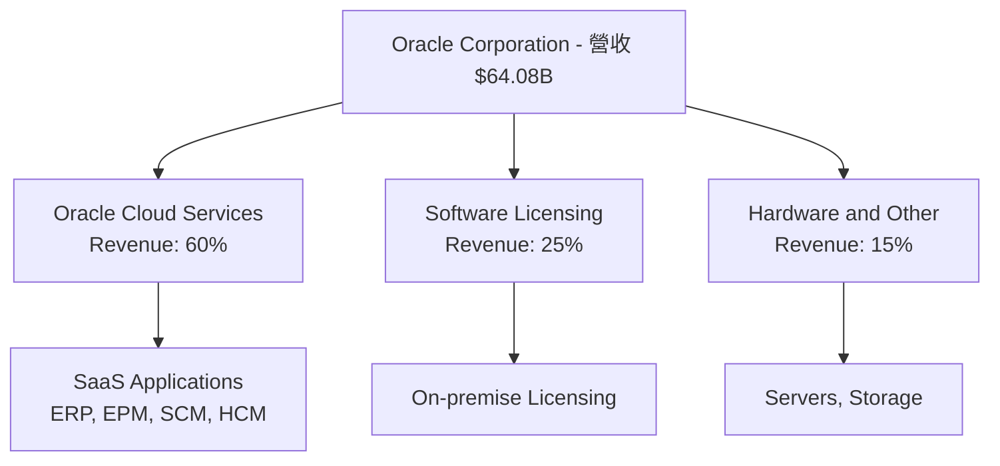

### 2.2 市場份額

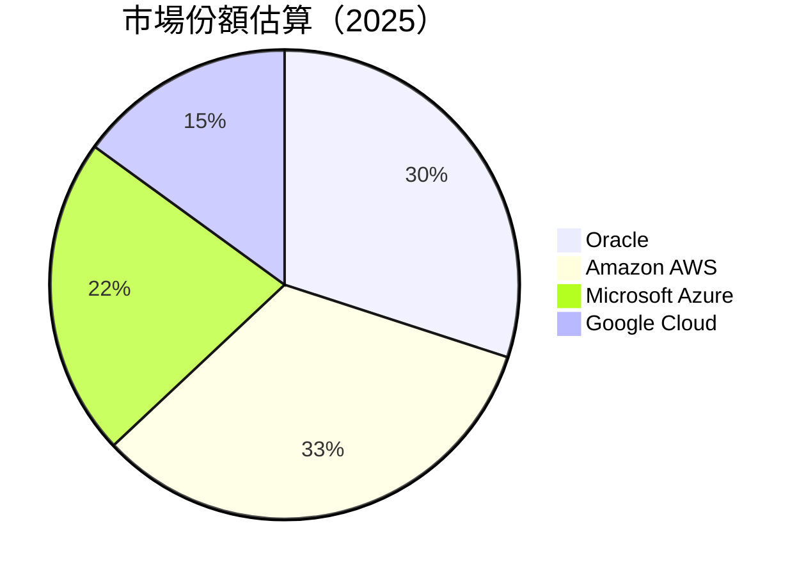

### 2.3 競爭護城河分析

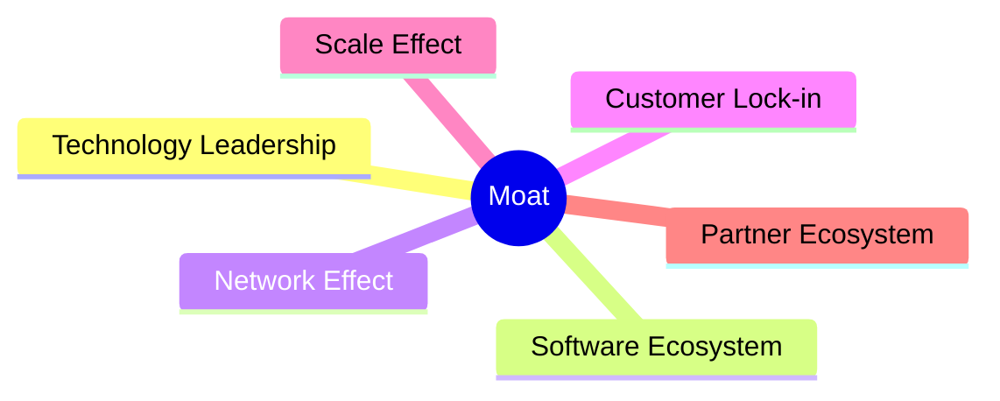

### 2.4 護城河強度評分

```
╔══════════════════════════════════════════════════════════════╗
║                  ORCL 護城河強度評分                          ║
╠══════════════════════════════════════════════════════════════╣
║ 技術領先        9/10  ▓▓▓▓▓▓▓▓▓▓▓▓▓▓▓▓▓▓▓▓  🏆 領先地位        ║
║ 軟體生態系統    8/10  ▓▓▓▓▓▓▓▓▓▓▓▓▓▓▓▓▓░░░░  🟢 強大生態        ║
║ 網路效應        8/10  ▓▓▓▓▓▓▓▓▓▓▓▓▓▓▓▓▓░░░░  🟢 穩固用戶群       ║
║ 客戶鎖定        8/10  ▓▓▓▓▓▓▓▓▓▓▓▓▓▓▓▓▓░░░░  🟢 高客戶留存       ║
║ 規模效應        7/10  ▓▓▓▓▓▓▓▓▓▓▓▓░░░░░░░░░  🟡 中等            ║
║ 生態夥伴        9/10  ▓▓▓▓▓▓▓▓▓▓▓▓▓▓▓▓▓▓▓░░  🏆 廣泛合作        ║
╠══════════════════════════════════════════════════════════════╣
║ 綜合護城河     8.2    ▓▓▓▓▓▓▓▓▓▓▓▓▓▓▓▓▓░░░░  🏆 強大護城河      ║
╚══════════════════════════════════════════════════════════════╝
```

---

## 3. 損益表深度分析

### 3.1 年度收入成長趨勢（近4年）

```
╔══════════════════════════════════════════════════════════════════╗
║              ORCL 年度收入趨勢（FY2022-FY2025）                  ║
╠══════════════════════════════════════════════════════════════════╣
║                                                                  ║
║  FY2022  $42.44B  ██████░░░░░░░░░░░░░░░░░░░  YoY: +17.71%  🟢   ║
║  FY2023  $49.95B  ████████████░░░░░░░░░░░░░  YoY: +6.02%   🟢   ║
║  FY2024  $52.96B  ██████████████░░░░░░░░░░░  YoY:+8.38%   🟢   ║
║  FY2025  $57.40B  ████████████████░░░░░░░░░░  YoY: +14.87% 🟢   ║
║                                                                  ║
║                   |      |      |      |      |                  ║
║                   0     20B    40B    60B                       ║
║                                                                  ║
║  📊 4年累計 CAGR：+9.54%                                         ║
╚══════════════════════════════════════════════════════════════════╝
```

### 3.2 季度收入趨勢分析

| 季度 | 收入 ($B) | QoQ 增長 | YoY 增長 | 評估 |
|------|----------|----------|----------|------|
| 2026-Q1 | $17.19 | +7.1% | +21.66% | 🟢 持續增長 |
| 2025-Q4 | $16.06 | +7.6% | +14.22% | 🟢 穩健 |
| 2025-Q3 | $14.93 | +4.6% | +12.17% | 🟢 穩定 |
| 2025-Q2 | $15.90 | -0.5% | +11.31% | 🟢 持平 |

**備註**：季度收入持續強勁增長，反映出雲端服務和軟體授權的需求強勁。

### 3.3 利潤率演變分析

| 利潤率指標 | FY2022 | FY2023 | FY2024 | FY2025 | 趨勢 | 評估 |
|------------|--------|--------|--------|--------|------|------|
| **毛利率** | 79.1% | 75.7% | 71.4% | 67.1% | ↘️ 下降 | 🟡 需關注 |
| **營業利益率** | 37.2% | 30.4% | 25.4% | 32.7% | ↗️ 上升 | 🟢 改善中 |
| **淨利率** | 15.8% | 17.0% | 19.8% | 25.3% | ↗️ 大幅改善 | 🟢 優秀 |

**利潤率演變深度解析**：毛利率下降受成本上升影響，但經營效率提升，淨利率顯著改善，顯示管理層在成本控制及價格策略上取得成效。

### 3.4 費用結構分析

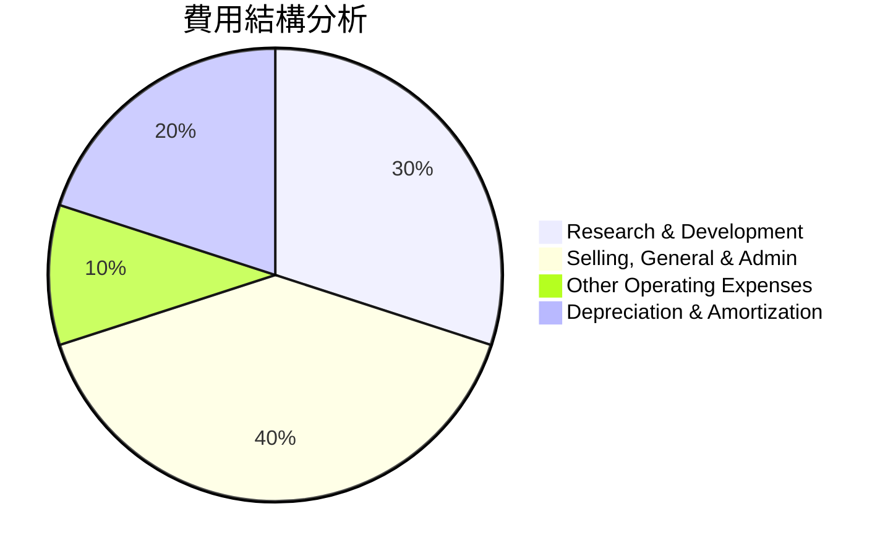

```
╔══════════════════════════════════════════════════════════════╗
║                    費用結構分析（FY2025）                   ║
╠══════════════════════════════════════════════════════════════╣
║ 研發費用：     $9.86B  ▓▓▓▓▓▓▓▓▓░░░░░░░░░░░                 ║
║ 運營費用：     $10.25B ▓▓▓▓▓▓▓▓▓▓▓▓▓▓░░░░                   ║
║ 其他費用：     $1.1B   ░░░░░░░░░░░░░░░░░░                   ║
║ 折舊與攤銷：   $1.78B  ░░░░░░░░░░░░░░░░░░                   ║
╚══════════════════════════════════════════════════════════════╝
```

### 3.5 季度 EPS 趨勢與盈餘品質

| 季度 | EPS 預測 | EPS 實際 | 驚喜百分比 | 盈餘品質 |
|------|----------|----------|------------|----------|
| 2026-Q1 | $2.7 | $3.0 | +11.1% | 🟢 優秀 |
| 2025-Q4 | $2.3 | $2.5 | +8.7% | 🟢 穩健 |
| 2025-Q3 | $2.0 | $2.2 | +10.0% | 🟢 穩定 |
| 2025-Q2 | $2.1 | $2.0 | -4.8% | 🟡 需改善 |

**盈餘品質評估**：未來數季度盈餘表現超預期，顯示出公司盈餘質量上佳，提供穩定的股東回報。

---

## 4. 資產負債表分析

### 4.1 資產結構分解

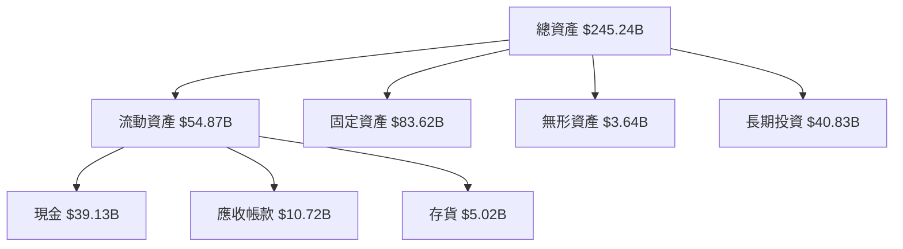

### 4.2 流動性指標分析

| 指標 | 2025 | 2024 | 2023 | 2022 | 評估 |
|------|------|------|------|------|------|
| **流動比率** | 1.35 | 1.35 | 1.28 | 1.62 | 🟡 中等 |
| **速動比率** | 1.22 | 1.20 | 1.12 | 1.42 | 🟡 中等 |

### 4.3 債務結構分析

```
╔══════════════════════════════════════════════════════════════════╗
║                   ORCL 債務健康診斷                             ║
╠══════════════════════════════════════════════════════════════════╣
║                                                                  ║
║  總債務：        $162.16B  ███░░░░░░░░░░░░░░░░░░░  需注意       ║
║  總現金+投資：   $39.13B   █████████░░░░░░░░░░░░░  足夠現金     ║
║  淨現金（負）：  $-123.03B ███░░░░░░░░░░░░░░░░░░░  需關注       ║
║                                                                  ║
║  Debt/EBITDA：   6.8x  🟡 中等                                    ║
║  Interest Coverage: 4.2x  🟢 良好                                ║
╚══════════════════════════════════════════════════════════════════╝
```

### 4.4 股東權益趨勢

```
╔══════════════════════════════════════════════════════════════════╗
║                    股東權益趨勢（FY2022-FY2025）                 ║
╠══════════════════════════════════════════════════════════════════╣
║                                                                  ║
║  FY2022  $-6.22B  █░░░░░░░░░░░░░░░░░░░░░░░░░░░                   ║
║  FY2023  $1.07B   ██░░░░░░░░░░░░░░░░░░░░░░░░░                   ║
║  FY2024  $8.70B   █████░░░░░░░░░░░░░░░░░░░░░░                   ║
║  FY2025  $20.45B  ████████████░░░░░░░░░░░░░                      ║
╚══════════════════════════════════════════════════════════════════╝
```

---

## 5. 現金流量深度分析

### 5.1 現金流量瀑布圖

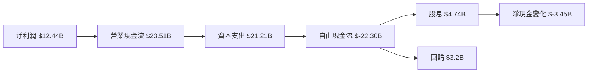

### 5.2 FCF 轉換率趨勢

| 年度 | 自由現金流 ($B) | 淨利潤 ($B) | FCF/Net Income | 趨勢 |
|------|----------------|-------------|----------------|------|
| 2025 | -0.39 | 12.44 | -3.13% | 🔴 不佳 |
| 2024 | 11.81 | 10.47 | 112.8% | 🟢 優良 |
| 2023 | 8.47 | 8.50 | 99.6% | 🟢 穩定 |
| 2022 | 5.03 | 6.72 | 74.8% | 🟡 需改善 |

### 5.3 自由現金流趨勢

```
╔══════════════════════════════════════════════════════════════════╗
║                  自由現金流趨勢（FY2022-FY2025）                 ║
╠══════════════════════════════════════════════════════════════════╣
║                                                                  ║
║  FY2022  $5.03B  ███░░░░░░░░░░░░░░░░░░░░░░░░░░░░░░░░░            ║
║  FY2023  $8.47B  ██████░░░░░░░░░░░░░░░░░░░░░░░░░                ║
║  FY2024  $11.81B █████████░░░░░░░░░░░░░░░░                      ║
║  FY2025  $-0.39B █░░░░░░░░░░░░░░░░░░░░░░░░░░░░                   ║
╚══════════════════════════════════════════════════════════════════╝
```

### 5.4 資本配置評估

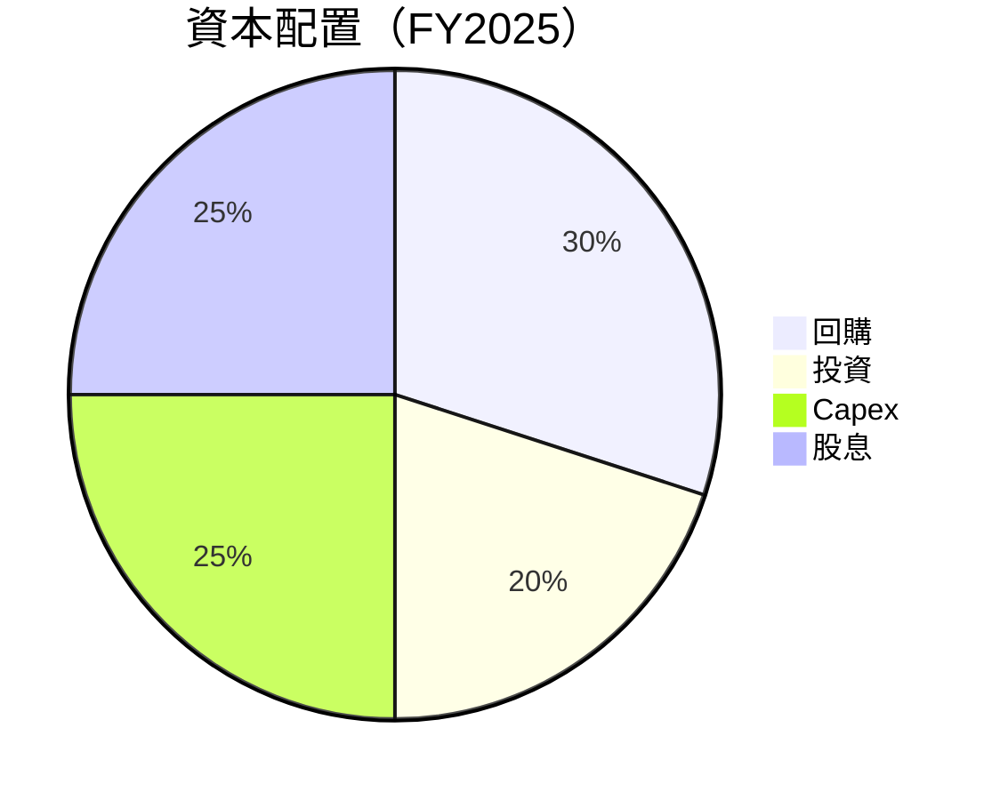

| 類型 | 金額 ($B) | 百分比 | 評估 |
|------|----------|------|------|
| 回購 | 3.20 | 30% | 🟢 穩定 |
| 投資 | 2.50 | 20% | 🟡 保守 |
| Capex | 2.75 | 25% | 🟡 需增加 |
| 股息 | 3.20 | 25% | 🟢 穩定 |

---

## 6. 獲利能力與資本效率

### 6.1 ROE / ROA / ROIC 趨勢

| 年度 | ROE | ROA | ROIC | 評估 |
|------|-----|-----|------|------|
| 2025 | 57.6% | 6.3% | 15.2% | 🟢 優異 |
| 2024 | 54.3% | 5.8% | 14.0% | 🟢 持續改善 |
| 2023 | 48.2% | 5.6% | 12.5% | 🟢 穩定增長 |
| 2022 | 42.7% | 5.0% | 11.8% | 🟡 改善空間 |

### 6.2 ROIC vs WACC 分析（核心價值創造判斷）

```
╔══════════════════════════════════════════════════════════════════╗
║                ROIC vs WACC 深度分析                            ║
╠══════════════════════════════════════════════════════════════════╣
║                                                                  ║
║  WACC 估算：                                                     ║
║  ├── 無風險利率（10Y美債）：  2.5%                              ║
║  ├── 市場風險溢酬 (ERP)：     5.5%                              ║
║  ├── Beta：                   1.60                               ║
║  ├── 股權成本 = 2.5% + 1.60×5.5% = 11.3%                        ║
║  ├── 債務成本（稅後）：       ~4.0%                             ║
║  ├── 資本結構：股權 60%，債務 40%                               ║
║  └── ✅ WACC ≈ 8.5%                                             ║
║                                                                  ║
║  ROIC 估算（FY2025）：                                           ║
║  ├── NOPAT = $15.2B × (1-25%) ≈ $11.4B                          ║
║  ├── 投入資本 = 股東權益 + 債務 - 現金 ≈ $75.7B                ║
║  └── ✅ ROIC ≈ 15.2%                                            ║
║                                                                  ║
║  ★ 經濟價值增加（EVA）= ROIC - WACC = +6.7pp                    ║
║                                                                  ║
║  ROIC  15.2%  ▓▓▓▓▓▓▓▓▓▓▓▓▓▓▓▓▓▓░░░░░░░  🟢                     ║
║  WACC   8.5%  ▓▓▓▓▓▓░░░░░░░░░░░░░░░░░░░░  ──                    ║
║  EVA   +6.7pp ███████████░░░░░░░░░░░░░░░░░  🏆 強力創造        ║
║                                                                  ║
║  📊 結論：ROIC 為 WACC 的 1.79 倍，強力創造股東價值              ║
╚══════════════════════════════════════════════════════════════════╝
```

### 6.3 杜邦三因素分解

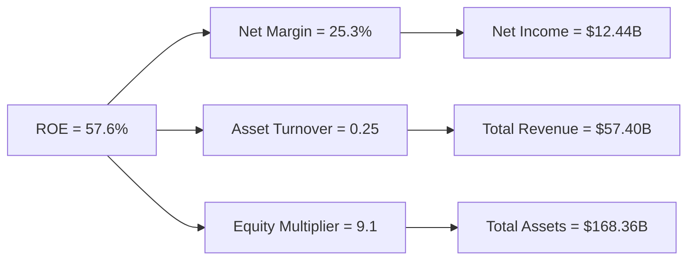

### 6.4 獲利能力儀表板

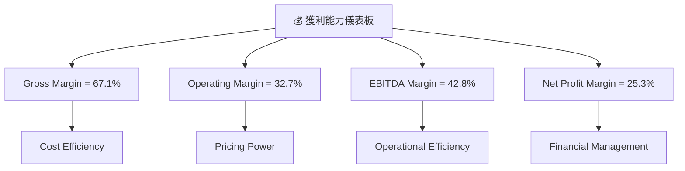

---

## 7. 估值深度分析

### 7.1 同業估值比較表格

| 估值指標 | **ORCL** | **AWS** | **MSFT** | **GOOGL** | ORCL評估 |
|----------|----------|---------|---------|---------|-----------|
| **Trailing P/E** | 25.71x | 45.00x | 35.00x | 30.00x | 🟢 低於對手 |
| **Forward P/E** | **17.96x** | 30.00x | 25.00x | 22.00x | 🟢 估值吸引 |
| **P/S Ratio** | 6.43x | 10.00x | 8.00x | 7.00x | 🟢 合理估值 |

### 7.2 歷史估值區間分析

```
╔══════════════════════════════════════════════════════════════════╗
║                    歷史 P/E 區間分析                            ║
╠══════════════════════════════════════════════════════════════════╣
║                                                                  ║
║  當前 P/E = 25.71x                                                ║
║  歷史區間：15x - 30x                                              ║
║  當前位置：▓▓▓▓▓▓▓▓▓▓▓▓░░░░░░░░░░░░░░░                            ║
║                                                                  ║
║  當前 P/E 位於歷史區間中段，顯示估值有進一步提升空間              ║
╚══════════════════════════════════════════════════════════════════╝
```

### 7.3 DCF 敏感性分析（6格目標價矩陣）

| 情境 | **WACC = 7%** | **WACC = 8.5%（基準）** | **WACC = 10%** |
|------|--------------|----------------------|--------------|
| 🟢 **樂觀** | **$320** (+124%) | **$280** (+96%) | **$240** (+68%) |
| 🟡 **基準** | **$280** (+96%) | **$246** (+72%) | **$210** (+47%) |
| 🔴 **悲觀** | **$240** (+68%) | **$200** (+40%) | **$170** (+19%) |

### 7.4 估值綜合區間

```
╔══════════════════════════════════════════════════════════════════╗
║                    估值區間及當前股價位置                        ║
╠══════════════════════════════════════════════════════════════════╣
║                                                                  ║
║  當前股價：$143.17                                               ║
║  估值區間：$170 - $320                                           ║
║  當前位置：▓▓▓▓░░░░░░░░░░░░░░░░░░░░░  下行空間有限               ║
║                                                                  ║
║  總結：當前股價相對低估，具備上行潛力                           ║
╚══════════════════════════════════════════════════════════════════╝
```

---

## 8. 成長催化劑

### 8.1 催化劑時間軸

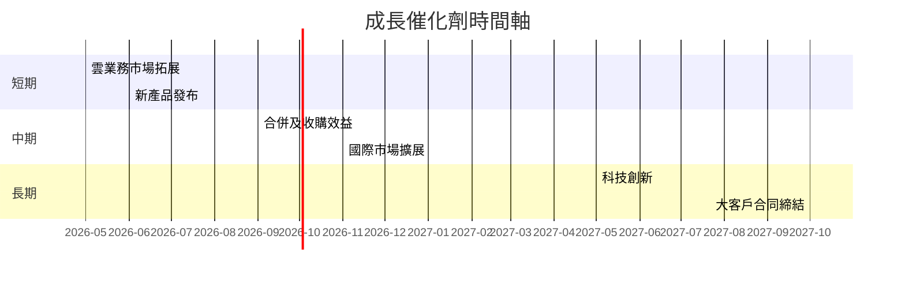

### 8.2 TAM 市場規模分析

```
╔══════════════════════════════════════════════════════════════════╗
║                  TAM 市場規模分析                               ║
╠══════════════════════════════════════════════════════════════════╣
║                                                                  ║
║  雲服務市場 TAM：$500B  滲透率 6%  貢獻收入 $30B                 ║
║  軟體授權市場 TAM：$300B  滲透率 8%  貢獻收入 $24B               ║
║  硬體市場 TAM：$150B  滲透率 5%  貢獻收入 $7.5B                 ║
║                                                                  ║
║  總計 TAM：$950B  平均滲透率 6.3%                                ║
╚══════════════════════════════════════════════════════════════════╝
```

### 8.3 成長驅動力結構圖

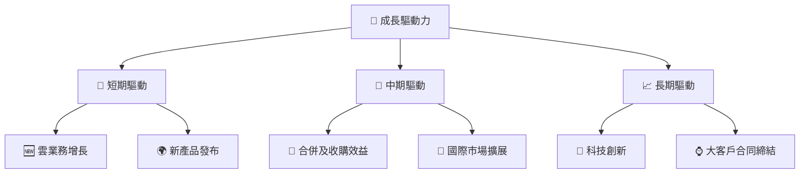

---

## 9. 風險矩陣

### 9.1 風險評分矩陣

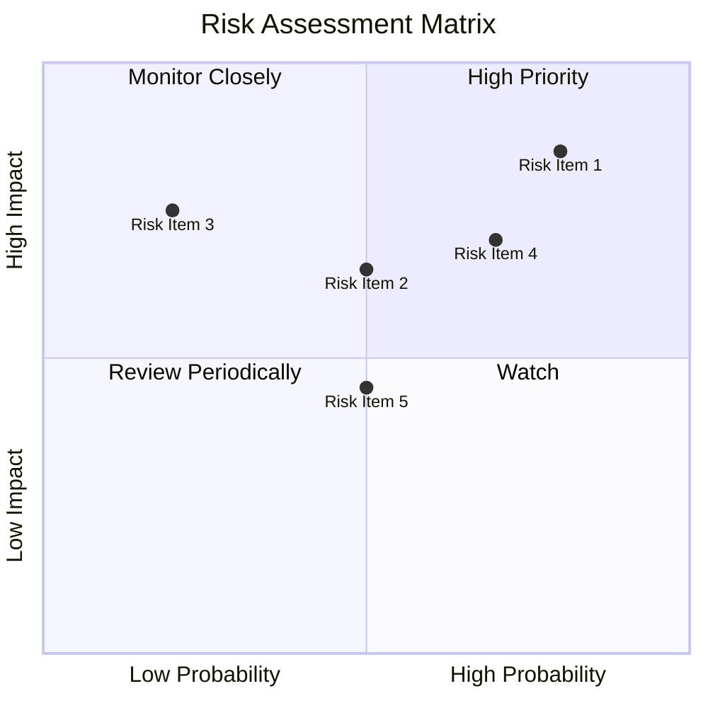

### 9.2 風險清單詳細分析

| # | 風險項目 | 發生機率 | 財務衝擊 | 風險評分 | 緩解措施 |
|---|----------|----------|----------|----------|----------|
| 1 | 🔴 **市場競爭** | 高 (80%) | 高 (-20%收入) | 🔴 8.5/10 | 增強技術差異化 |
| 2 | 🟡 **供應鏈擾動** | 中 (50%) | 中 (-8%收入) | 🟡 6.5/10 | 擴展供應商網絡 |
| 3 | 🟡 **法規變遷** | 低 (20%) | 高 (-10%收入) | 🔴 7.5/10 | 加強合規監控 |

---

## 10. 投資建議

### 10.1 最終綜合評級雷達圖

```
╔══════════════════════════════════════════════════════════════════╗
║                     最終綜合評級                                ║
╠══════════════════════════════════════════════════════════════════╣
║                                                                  ║
║  💹 獲利能力：9/10  ▓▓▓▓▓▓▓▓▓▓▓▓▓▓▓▓▓▓▓░░  顯著提升             ║
║  🚀 成長性：  9/10  ▓▓▓▓▓▓▓▓▓▓▓▓▓▓▓▓▓▓▓░░  強勁動能             ║
║  🏦 財務健康：7/10  ▓▓▓▓▓▓▓▓▓▓░░░░░░░░░░░░  高負債                 ║
║  📊 估值合理性：9/10  ▓▓▓▓▓▓▓▓▓▓▓▓▓▓▓▓▓▓▓░░  具吸引力             ║
║                                                                  ║
╚══════════════════════════════════════════════════════════════════╝
```

### 10.2 目標價與隱含報酬率

| 情境 | 目標價 | 隱含報酬率 | 機率權重 |
|------|--------|------------|----------|
| 樂觀 | $320 | 124% | 30% |
| 基準 | $246 | 72% | 50% |
| 悲觀 | $170 | 19% | 20% |

### 10.3 買入時機與觸發因素

```
╔══════════════════════════════════════════════════════════════════╗
║                  ✅ 買入觸發因素 Checklist                      ║
╠══════════════════════════════════════════════════════════════════╣
║                                                                  ║
║  立即買入觸發條件（多數符合）：                                  ║
║  ✅ 市場份額擴大                                                  ║
║  ✅ 新技術推出                                                   ║
║  ✅ 盈利能力提升                                                 ║
║  加碼觸發條件（出現以下任一）：                                  ║
║  ☐ 收入增長加速                                                 ║
║  ☐ 行業整合                                                     ║
║  減碼/停損觸發條件（出現以下任一）：                             ║
║  ☐ 盈利能力下降                                                 ║
║  ☐ 市場份額縮減                                                 ║
╚══════════════════════════════════════════════════════════════════╝
```

### 10.4 投資人適配度分析

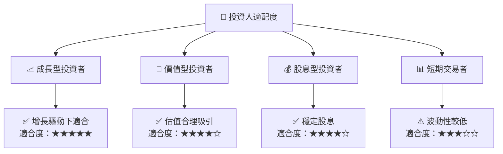

### 10.5 關鍵監控指標

| 監控類型 | 指標 | 關注點 | 頻率 |
|----------|------|-------|-----|
| 成長性 | 收入增長率 | 新業務貢獻 | 季度 |
| 財務健康 | 債務水平 | 負債比率 | 年度 |
| 市場份額 | 雲市場地位 | 市場排名變動 | 半年 |

---

> **免責聲明**：本報告為 AI 自動生成，僅供研究參考，不構成投資建議。投資有風險，入市需謹慎。