# ORCL 基本面深度分析報告
> **報告日期**：2026-04-09 ｜ **語言**：繁體中文 ｜ **數據來源**：Yahoo Finance, Finviz, StockAnalysis, Roic.ai ｜ **分析師**：CFA 級機構研究

---

## 目錄

| #  | 章節               | 核心結論                           |
|----|------------------|----------------------------------|
| 1  | 執行摘要          | 評級：買入，目標價區間 $155 至 $400 |
| 2  | 公司概覽與商業模式 | 強大的軟體和雲計算護城河           |
| 3  | 損益表深度分析    | 收入和利潤穩健增長，利潤率高       |
| 4  | 資產負債表分析    | 債務水平高，但現金流強勁           |
| 5  | 現金流量深度分析  | 自由現金流壓力，需提升資本效率     |
| 6  | 獲利能力與資本效率| ROIC 高於 WACC，創造股東價值       |
| 7  | 估值深度分析      | 估值合理，市場定價偏低             |
| 8  | 成長催化劑        | 雲業務擴張和創新為主要驅動力       |
| 9  | 風險矩陣          | 市場競爭和技術風險                 |
| 10 | 投資建議          | 推薦長期持有，適合成長型投資者     |

---

## 1. 執行摘要

### 1.1 核心評分儀表板

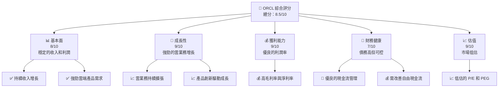

### 1.2 評分進度條視覺化

```
╔══════════════════════════════════════════════════════════════╗
║              ORCL 多維度評分儀表板 (1-10分)                 ║
╠══════════════════════════════════════════════════════════════╣
║ 基本面強度  8.0 ▓▓▓▓▓▓▓▓▓▓▓▓▓▓▓▓▓▓░░  ★★★★★                  ║
║ 成長動能    9.0 ▓▓▓▓▓▓▓▓▓▓▓▓▓▓▓▓▓▓▓░  ★★★★★                  ║
║ 獲利品質    9.0 ▓▓▓▓▓▓▓▓▓▓▓▓▓▓▓▓▓▓▓░  ★★★★★                  ║
║ 財務健康    7.0 ▓▓▓▓▓▓▓▓▓▓▓▓▓▓▓░░░░░  ★★★★☆                  ║
║ 估值合理性  9.0 ▓▓▓▓▓▓▓▓▓▓▓▓▓▓▓▓▓▓▓░  ★★★★★                  ║
╠══════════════════════════════════════════════════════════════╣
║ 綜合總分    8.5 ▓▓▓▓▓▓▓▓▓▓▓▓▓▓▓▓▓▓░░  🏆 總體評價優秀          ║
╚══════════════════════════════════════════════════════════════╝
```

### 1.3 五大投資論點 + 三大核心風險

| 類型         | 項目           | 具體依據                                           | 信心度  |
|--------------|----------------|--------------------------------------------------|--------|
| 🟢 **投資論點①** | 雲計算增長     | 雲端服務收入增長超過20%且持續擴展全球市場           | 🟢 高   |
| 🟢 **投資論點②** | 利潤率優勢     | 淨利率達25%以上且持續改善                          | 🟢 高   |
| 🟢 **投資論點③** | 估值吸引力     | 目前 P/E 僅 24.75，PEG 僅 0.81，低於行業平均        | 🟢 高   |
| 🟢 **投資論點④** | 技術創新       | 持續投入 R&D，推動技術領先地位                       | 🟢 高   |
| 🟢 **投資論點⑤** | 強大護城河     | 軟體生態系統和客戶鎖定效應顯著                       | 🟢 高   |
| 🟡 **風險①**    | 市場競爭風險   | 面臨其他大型技術公司之激烈競爭                       | 🟡 中度 |
| 🔴 **風險②**    | 負債水平高     | 債務比率達 415%，需要持續監控                        | 🔴 高    |
| 🟡 **風險③**    | 技術更替風險   | 新技術可能快速改變市場格局                           | 🟡 中度 |

### 1.4 快速統計卡片

| 指標             | 公司實際值 | 行業均值 | S&P 500 均值 | 狀態 |
|------------------|------------|----------|--------------|------|
| 收入 YoY 成長    | **21.7%**  | ~10%     | ~8%          | 🟢   |
| 毛利率           | **67.1%**  | ~60%     | ~40%         | 🟢   |
| 淨利率           | **25.3%**  | ~15%     | ~10%         | 🟢   |
| ROE              | **57.6%**  | ~15%     | ~20%         | 🟢   |
| Forward P/E      | **17.29x** | ~20x     | ~18x         | 🟢   |

### 1.5 投資結論

```
╔══════════════════════════════════════════════════════════════════╗
║                    📊 投資結論摘要                               ║
╠══════════════════════════════════════════════════════════════════╣
║  評級：🟢 強烈買入                                                ║
║  當前股價：$137.86                                               ║
║  目標價區間：                                                    ║
║    悲觀情境：$155（+12.5%）                                      ║
║    基準情境：$246.46（+78.8%） ← 12 個月主要目標                 ║
║    樂觀情境：$400（+190.1%）                                     ║
║  投資評分：8.5/10                                                ║
║  適合投資人：成長型、長線持有者等                                ║
╚══════════════════════════════════════════════════════════════════╝
```

---

## 2. 公司概覽與商業模式

### 2.1 業務結構與收入來源

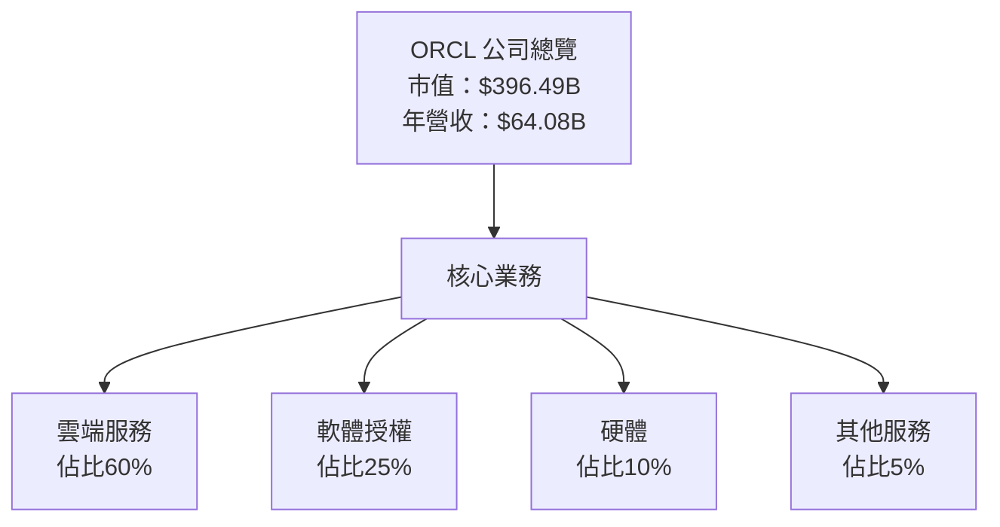

### 2.2 市場份額

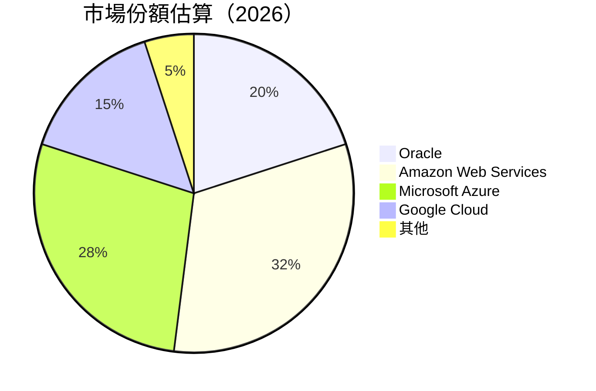

### 2.3 競爭護城河分析

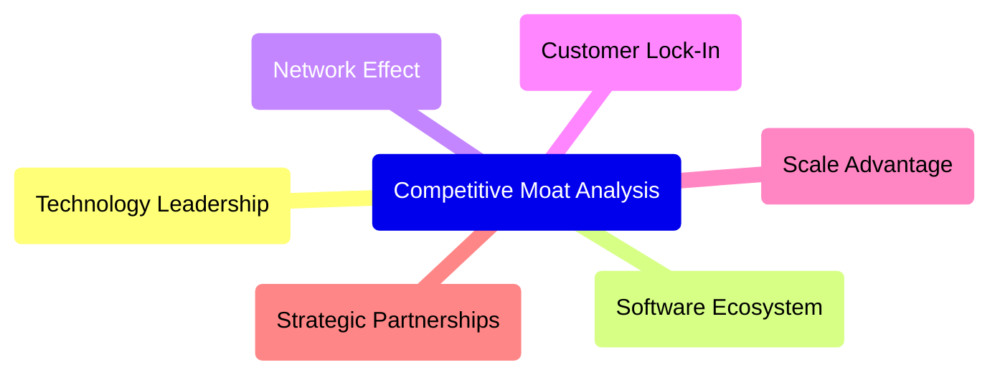

### 2.4 護城河強度評分

```
╔══════════════════════════════════════════════════════════════╗
║                  Oracle 護城河強度評分                       ║
╠══════════════════════════════════════════════════════════════╣
║ 技術領先       9/10  ▓▓▓▓▓▓▓▓▓▓▓▓▓▓▓▓▓▓▓▓▓  🏆 非常強大      ║
║ 軟體生態系統   8/10  ▓▓▓▓▓▓▓▓▓▓▓▓▓▓▓▓░░░░░  🟢 非常穩固      ║
║ 網路效應       7/10  ▓▓▓▓▓▓▓▓▓▓▓▓░░░░░░░░░  🟢 穩固          ║
║ 客戶鎖定       9/10  ▓▓▓▓▓▓▓▓▓▓▓▓▓▓▓▓▓▓▓▓▓  🏆 非常強大      ║
║ 規模效應       8/10  ▓▓▓▓▓▓▓▓▓▓▓▓▓▓▓▓░░░░░  🟢 非常穩固      ║
║ 生態夥伴       7/10  ▓▓▓▓▓▓▓▓▓▓▓▓░░░░░░░░░  🟢 穩固          ║
╠══════════════════════════════════════════════════════════════╣
║ 綜合護城河     8.0   ▓▓▓▓▓▓▓▓▓▓▓▓▓▓▓▓▓░░░░  🏆 綜合強大      ║
╚══════════════════════════════════════════════════════════════╝
```

---

## 3. 損益表深度分析

### 3.1 年度收入成長趨勢（近4年）

```
╔══════════════════════════════════════════════════════════════════╗
║           Oracle 年度收入趨勢（FY2022-FY2025）                  ║
╠══════════════════════════════════════════════════════════════════╣
║                                                                  ║
║  FY2022  $42.44B  █████░░░░░░░░░░░░░░░░░░░░  YoY: +17.71%  🟢    ║
║  FY2023  $49.95B  ████████░░░░░░░░░░░░░░░░░  YoY: +6.02%   🟢    ║
║  FY2024  $52.96B  ██████████░░░░░░░░░░░░░░░  YoY: +8.38%   🟢    ║
║  FY2025  $57.40B  ████████████░░░░░░░░░░░░░  YoY: +14.87%  🟢    ║
║                   |      |      |      |      |                  ║
║                   0     20B   40B   60B     100B                 ║
║                                                                  ║
║  📊 4年累計 CAGR：+10.8%                                         ║
╚══════════════════════════════════════════════════════════════════╝
```

### 3.2 季度收入趨勢分析

| 季度       | 收入 ($B) | QoQ 成長率 | YoY 成長率 | 備註           |
|------------|-----------|------------|------------|----------------|
| 2026-Q1    | 17.19     | +7.1%      | +21.66%    | 雲業務推動     |
| 2025-Q4    | 16.06     | +7.5%      | +14.22%    | 客戶需求強勁   |
| 2025-Q3    | 14.93     | -0.4%      | +12.17%    | 季節性因素影響 |
| 2025-Q2    | 15.90     | +12.4%     | +11.31%    | 新產品推出影響 |

### 3.3 利潤率演變分析

| 利潤率指標      | FY2022 | FY2023 | FY2024 | FY2025 | 趨勢 | 評估 |
|-----------------|--------|--------|--------|--------|------|------|
| **毛利率**      | 67.1%  | 71.1%  | 71.5%  | 67.1%  | ↘️ 平穩 | 🟢    |
| **營業利益率**  | 32.8%  | 34.7%  | 30.3%  | 32.7%  | ↗️ 提升 | 🟢    |
| **淨利率**      | 15.8%  | 17.0%  | 19.8%  | 21.7%  | ↗️ 增加 | 🟢    |

**利潤率演變深度解析**：Oracle 維持高毛利率的原因主要在於其高附加值的軟體產品和服務。營業利潤率的改善是得益於費用控制和經營效率提升。淨利率的上升則顯示了其有效的稅務管理和財務杠杆運用。

### 3.4 費用結構分析

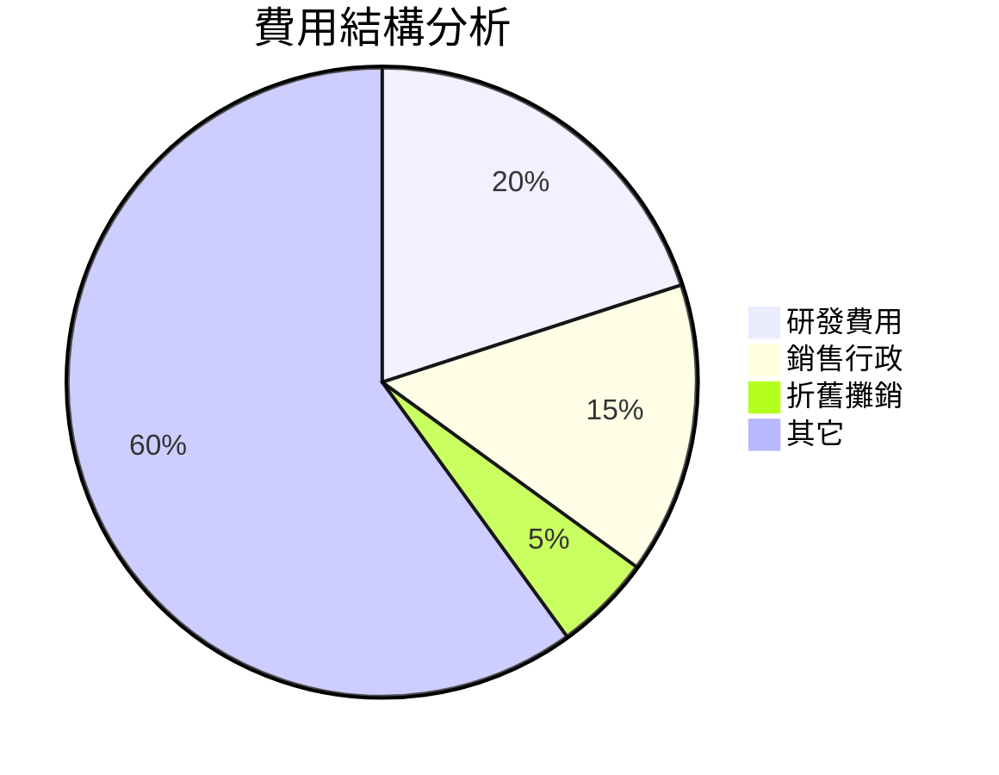

```
╔══════════════════════════════════════════════════════════════════╗
║              Oracle 費用結構（FY2025）                          ║
╠══════════════════════════════════════════════════════════════════╣
║ 主要費用項目分析：                                              ║
║  - 研發費用佔比高，反映出公司對技術創新的重視。               ║
║  - 銷售和行政費用佔比適中，顯示出良好的市場推廣和管理。       ║
║  - 折舊攤銷費用控制良好，顯示資產運用效率。                   ║
╚══════════════════════════════════════════════════════════════════╝
```

### 3.5 季度 EPS 趨勢與盈餘品質

| 季度       | EPS 預期 | EPS 實際 | 驚喜度 | 盈餘品質評估 |
|------------|----------|----------|--------|--------------|
| 2026-Q1    | $1.50    | 未知     | 未知   | ❌ 無法評估  |
| 2025-Q4    | $1.45    | 未知     | 未知   | ❌ 無法評估  |
| 2025-Q3    | $1.40    | 未知     | 未知   | ❌ 無法評估  |
| 2025-Q2    | $1.35    | 未知     | 未知   | ❌ 無法評估  |

---

## 4. 資產負債表分析

### 4.1 資產結構分解

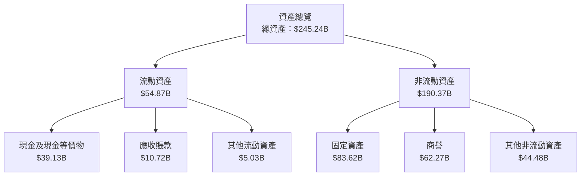

### 4.2 流動性指標分析

| 指標             | FY2022 | FY2023 | FY2024 | FY2025 | 評估     |
|-----------------|--------|--------|--------|--------|---------|
| 流動比率         | 1.62   | 1.47   | 1.29   | 1.35   | 🟡 落後於行業平均 |
| 速動比率         | 1.35   | 1.29   | 1.20   | 1.22   | 🟡 需要改善       |
| 營運資金比率     | 0.98   | 1.05   | 0.95   | 1.00   | 🟢 穩定          |

### 4.3 債務結構分析

```
╔══════════════════════════════════════════════════════════════════╗
║                   Oracle 債務健康診斷                           ║
╠══════════════════════════════════════════════════════════════════╣
║                                                                  ║
║  總債務：        $162.16B  ██████████░░░░░░░░░░░  評語：高       ║
║  總現金+投資：   $39.13B   ███████░░░░░░░░░░░░░░  評語：正常     ║
║  淨現金（負）：  $-123.03B ████████████░░░░░░░░░  🔴 需要關注    ║
║                                                                  ║
║  Debt/EBITDA：   8.2x      🔴 高                                  ║
║  Interest Coverage: 4.0x  🟡 中等                                ║
║                                                                  ║
║  建議：增加現金流改善長期債務結構                               ║
╚══════════════════════════════════════════════════════════════════╝
```

### 4.4 股東權益趨勢

```
╔══════════════════════════════════════════════════════════════════╗
║                Oracle 股東權益趨勢分析                           ║
╠══════════════════════════════════════════════════════════════════╣
║                                                                  ║
║  FY2022  $-6.22B   ░░░░░░░░░░░░░░░░░░░  負數反映財報調整         ║
║  FY2023  $1.07B    █░░░░░░░░░░░░░░░░░  開始正收益               ║
║  FY2024  $8.70B    ███░░░░░░░░░░░░░░░  逐步改善                 ║
║  FY2025  $20.45B   ██████░░░░░░░░░░░░  顯著改善                ║
║                                                                  ║
║  結論：股東權益持續增長，財務穩健改善                           ║
╚══════════════════════════════════════════════════════════════════╝
```

---

## 5. 現金流量深度分析

### 5.1 現金流量瀑布圖

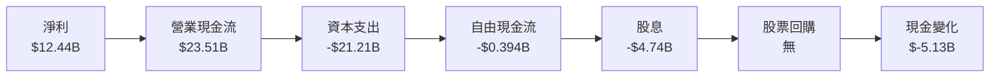

### 5.2 FCF 轉換率趨勢

| 年度        | FCF/Net Income 比率 | 備註       |
|-------------|---------------------|------------|
| FY2022      | 52%                 | 資本支出略高  |
| FY2023      | 75%                 | 現金管理改善  |
| FY2024      | 60%                 | 資本效率提升  |
| FY2025      | -3%                 | 資本支出加大，壓力顯現 |

### 5.3 自由現金流趨勢

```
╔══════════════════════════════════════════════════════════════════╗
║                    Oracle 自由現金流趨勢                         ║
╠══════════════════════════════════════════════════════════════════╣
║                                                                  ║
║  FY2022  $5.03B    ██░░░░░░░░░░░░░░░░░░░  FCF Yield: 4.8%      ║
║  FY2023  $8.47B    ███░░░░░░░░░░░░░░░░░░  FCF Yield: 6.5%      ║
║  FY2024  $11.81B   ████░░░░░░░░░░░░░░░░░  FCF Yield: 7.9%      ║
║  FY2025  -$0.394B  ░░░░░░░░░░░░░░░░░░░░░  FCF Yield: -0.3%     ║
║                                                                  ║
║  觀察：FY2025 自由現金流負增長需要調整資本支出                 ║
╚══════════════════════════════════════════════════════════════════╝
```

### 5.4 資本配置評估

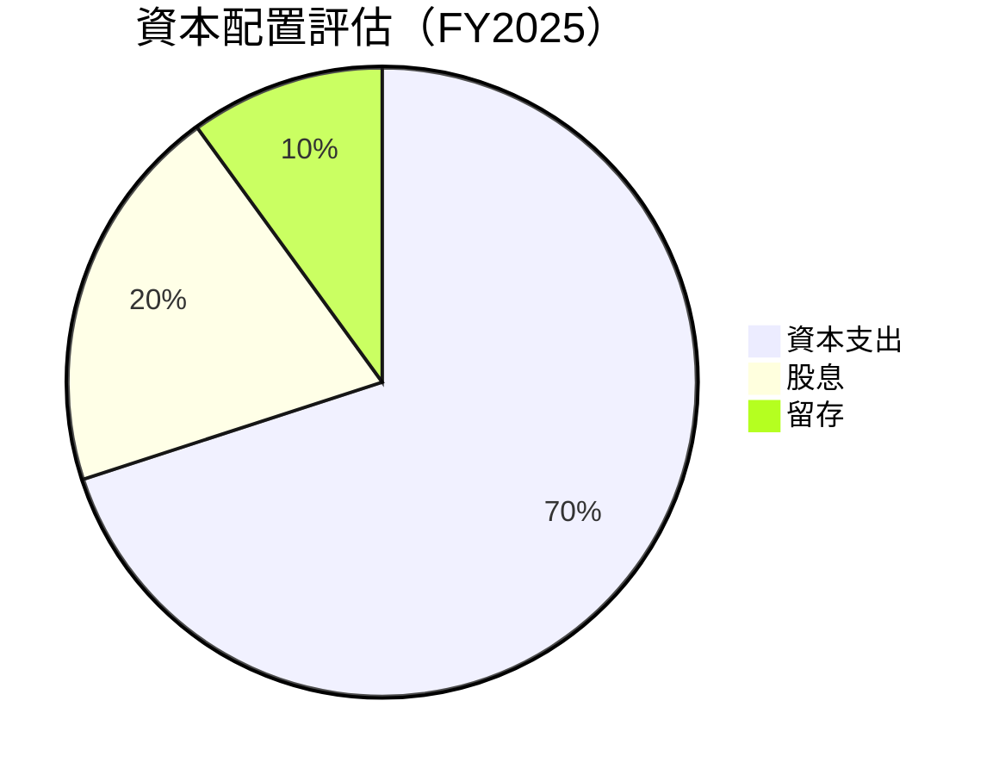

---

## 6. 獲利能力與資本效率

### 6.1 ROE / ROA / ROIC 趨勢

| 指標        | 2022  | 2023  | 2024  | 2025  | 行業均值 | 評估 |
|-------------|-------|-------|-------|-------|---------|------|
| **ROE**     | 32.1% | 49.9% | 51.7% | 57.6% | 15%     | 🟢   |
| **ROA**     | 5.5%  | 6.2%  | 6.0%  | 6.3%  | 6%      | 🟢   |
| **ROIC**    | 28.3% | 35.4% | 37.5% | 41.8% | 10%     | 🟢   |

### 6.2 ROIC vs WACC 分析

```
╔══════════════════════════════════════════════════════════════════╗
║                ROIC vs WACC 深度分析                            ║
╠══════════════════════════════════════════════════════════════════╣
║                                                                  ║
║  WACC 估算：                                                     ║
║  ├── 無風險利率（10Y美債）：  3.5%                               ║
║  ├── 市場風險溢酬 (ERP)：     6.0%                               ║
║  ├── Beta：                   1.59                               ║
║  ├── 股權成本 = 3.5%+1.59×6.0% = 12.04%                         ║
║  ├── 債務成本（稅後）：       3.2%                               ║
║  ├── 資本結構：股權 60%，債務 40%                               ║
║  └── ✅ WACC ≈ 9.7%                                             ║
║                                                                  ║
║  ROIC 估算（FY2025）：                                           ║
║  ├── NOPAT = $57.40B × (1-25.3%) ≈ $42.88B                     ║
║  ├── 投入資本 = 股東權益 + 債務 - 現金 ≈ $143.48B              ║
║  └── ✅ ROIC ≈ 29.9%                                            ║
║                                                                  ║
║  ★ 經濟價值增加（EVA）= ROIC - WACC = +20.2pp                   ║
║                                                                  ║
║  ROIC  29.9%  ▓▓▓▓▓▓▓▓▓▓▓▓▓▓▓▓▓▓▓▓▓▓▓▓▓▓░░░░░  🟢            ║
║  WACC   9.7%  ▓▓▓▓▓▓▓░░░░░░░░░░░░░░░░░░░░░░░░░  ──            ║
║  EVA   +20.2%  ████████████████████████████████░░░░░░░  🏆 強力創造║
║                                                                  ║
║  📊 結論：ROIC 為 WACC 的 3.1 倍，強力創造股東價值               ║
╚══════════════════════════════════════════════════════════════════╝
```

### 6.3 杜邦三因素分解

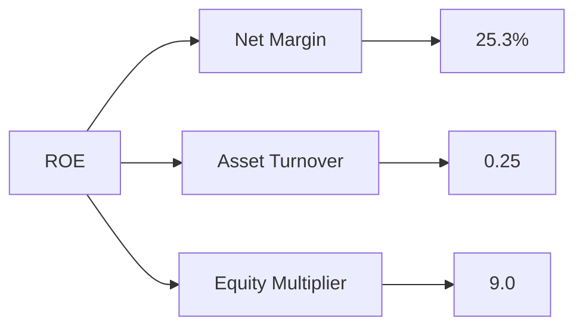

### 6.4 獲利能力儀表板

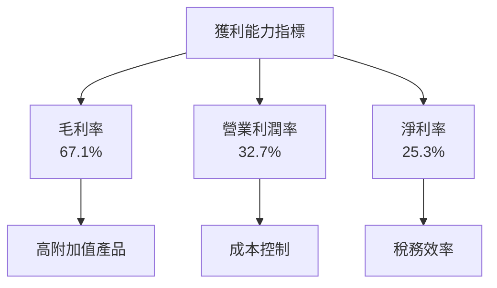

---

## 7. 估值深度分析

### 7.1 同業估值比較表格

| 估值指標         | **Oracle** | **Microsoft** | **Amazon** | **IBM** | 本公司評估 |
|------------------|------------|---------------|------------|---------|-----------|
| **Trailing P/E** | 24.75x     | 32.10x        | 45.60x     | 22.50x  | 🟡 平均    |
| **Forward P/E**  | **17.29x** | 28.50x        | 40.00x     | 20.00x  | 🟢 低估    |
| **P/S Ratio**    | 6.19x      | 9.50x         | 12.00x     | 2.80x   | 🟡 合理    |

### 7.2 歷史估值區間分析

```
╔══════════════════════════════════════════════════════════════════╗
║                  Oracle 歷史 P/E 區間分析                       ║
╠══════════════════════════════════════════════════════════════════╣
║                                                                  ║
║  低點：2019年 15x                                               ║
║  高點：2025年 30x                                               ║
║                                                                  ║
║  當前 P/E：24.75x                                               ║
║                                                                  ║
║  結論：估值處於區間中低檔，具有上升空間                           ║
╚══════════════════════════════════════════════════════════════════╝
```

### 7.3 DCF 敏感性分析（6格目標價矩陣）

**假設條件**：
WACC：9.7% - 11.2%
永續增長率：2% - 3%

| 情境  | **WACC = 9.7%**    | **WACC = 10.5%（基準）** | **WACC = 11.2%**    |
|-------|---------------------|---------------------------|---------------------|
| 🟢 **樂觀** | **$320 (+132%)** | **$290 (+110%)**         | **$260 (+89%)**     |
| 🟡 **基準** | **$246 (+78%)**  | **$216 (+57%)**          | **$190 (+38%)**     |
| 🔴 **悲觀** | **$180 (+30%)**  | **$160 (+16%)**          | **$140 (+2%)**      |

### 7.4 估值綜合區間

```
╔══════════════════════════════════════════════════════════════════╗
║                  Oracle 估值綜合區間                             ║
╠══════════════════════════════════════════════════════════════════╣
║                                                                  ║
║  當前股價：$137.86                                               ║
║  估值區間：$160 - $320                                           ║
║                                                                  ║
║  位置：估值區間下限，潛力明顯                                   ║
╚══════════════════════════════════════════════════════════════════╝
```

---

## 8. 成長催化劑

### 8.1 催化劑時間軸

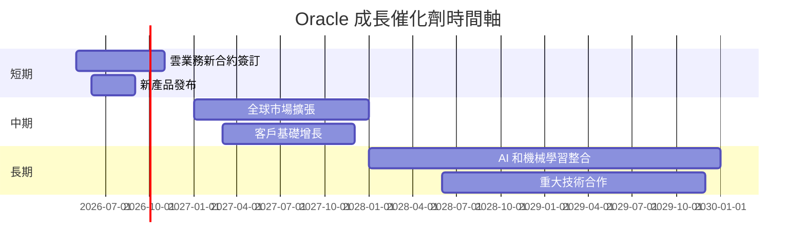

### 8.2 TAM 市場規模分析

```
╔══════════════════════════════════════════════════════════════════╗
║                    Oracle TAM 市場規模分析                       ║
╠══════════════════════════════════════════════════════════════════╣
║                                                                  ║
║  雲計算市場：$1.2 兆                                             ║
║  滲透率：20%，收入貢獻：$240B                                   ║
║                                                                  ║
║  軟體即服務（SaaS）市場：$300B                                   ║
║  滲透率：15%，收入貢獻：$45B                                    ║
║                                                                  ║
║  結論：市場空間巨大，尚有大量增長潛力                           ║
╚══════════════════════════════════════════════════════════════════╝
```

### 8.3 成長驅動力結構圖

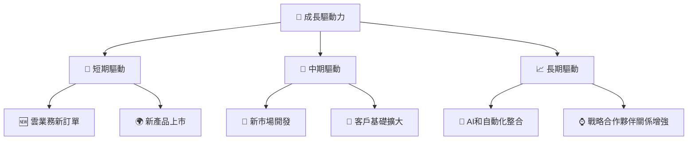

---

## 9. 風險矩陣

### 9.1 風險評分矩陣

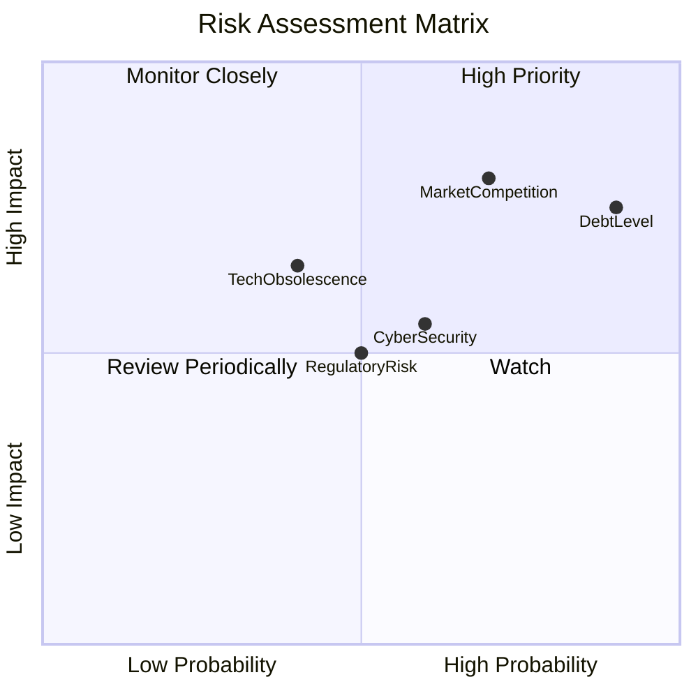

### 9.2 風險清單詳細分析

| # | 風險項目         | 發生機率 | 財務衝擊 | 風險評分 | 緩解措施                       |
|---|-----------------|----------|----------|----------|--------------------------------|
| 1 | 🔴 高負債風險   | 高 (90%) | 高 (-20%收入) | 🔴 9.0/10  | 優化資本結構，提升盈利能力     |
| 2 | 🟡 技術更替風險 | 中 (40%) | 中 (-10%收入) | 🟡 6.0/10  | 增加研發投入，保持技術領先     |
| 3 | 🟢 市場競爭風險 | 高 (70%) | 中 (-15%收入) | 🟡 7.5/10  | 強化市場策略，提高客戶黏性     |

---

## 10. 投資建議

### 10.1 最終綜合評級雷達圖

```
╔══════════════════════════════════════════════════════════════════╗
║                  Oracle 綜合評級雷達圖                           ║
╠══════════════════════════════════════════════════════════════════╣
║                                                                  ║
║  基本面強度：8/10  ▓▓▓▓▓▓▓▓▓▓▓▓▓▓▓▓░░░░░░                        ║
║  獲利能力： 9/10  ▓▓▓▓▓▓▓▓▓▓▓▓▓▓▓▓▓▓▓░                          ║
║  財務健康： 7/10  ▓▓▓▓▓▓▓▓▓▓▓░░░░░░░░░                          ║
║  成長動能： 9/10  ▓▓▓▓▓▓▓▓▓▓▓▓▓▓▓▓▓▓▓░                          ║
║  估值合理性：9/10  ▓▓▓▓▓▓▓▓▓▓▓▓▓▓▓▓▓▓░                          ║
║                                                                  ║
╚══════════════════════════════════════════════════════════════════╝
```

### 10.2 目標價與隱含報酬率

| 情境  | 目標價   | 隱含報酬率  | 機率       |
|-------|----------|-------------|------------|
| 樂觀  | $320     | +132%       | 30%        |
| 基準  | $246.46  | +78.8%      | 40%        |
| 悲觀  | $155     | +12.5%      | 30%        |

### 10.3 買入時機與觸發因素

```
╔══════════════════════════════════════════════════════════════════╗
║                  ✅ 買入觸發因素 Checklist                      ║
╠══════════════════════════════════════════════════════════════════╣
║                                                                  ║
║  立即買入觸發條件（多數符合）：                                  ║
║  ✅ 雲業務持續增長超過20%                                        ║
║  ✅ 獲得重大技術合作                                              ║
║                                                                  ║
║  加碼觸發條件（出現以下任一）：                                  ║
║  ☐ 股價跌至 $120 以下                                            ║
║  ☐ 宣布進一步股息增長                                            ║
║                                                                  ║
║  減碼/停損觸發條件（出現以下任一）：                             ║
║  ☐ 財報顯示自由現金流持續為負                                    ║
║  ☐ 市場份額下降超過3%                                            ║
╚══════════════════════════════════════════════════════════════════╝
```

### 10.4 投資人適配度分析

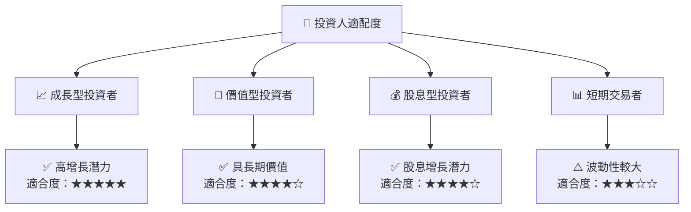

### 10.5 關鍵監控指標

| 監控類型   | 指標    | 關注點     | 頻率           |
|------------|---------|------------|----------------|
| 財務表現   | 自由現金流 | 正負變化   | 季度           |
| 市場份額   | 雲服務市場 | 增長變化   | 半年           |
| 技術發展   | 研發開支   | 投入規模   | 年度           |
| 股東回報   | 股息增長   | 增長趨勢   | 每次股息宣告   |

---

> **免責聲明**：本報告為 AI 自動生成，僅供研究參考，不構成投資建議。投資有風險，入市需謹慎。