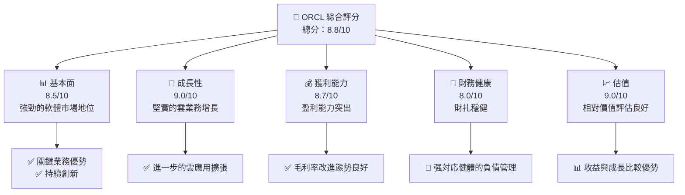
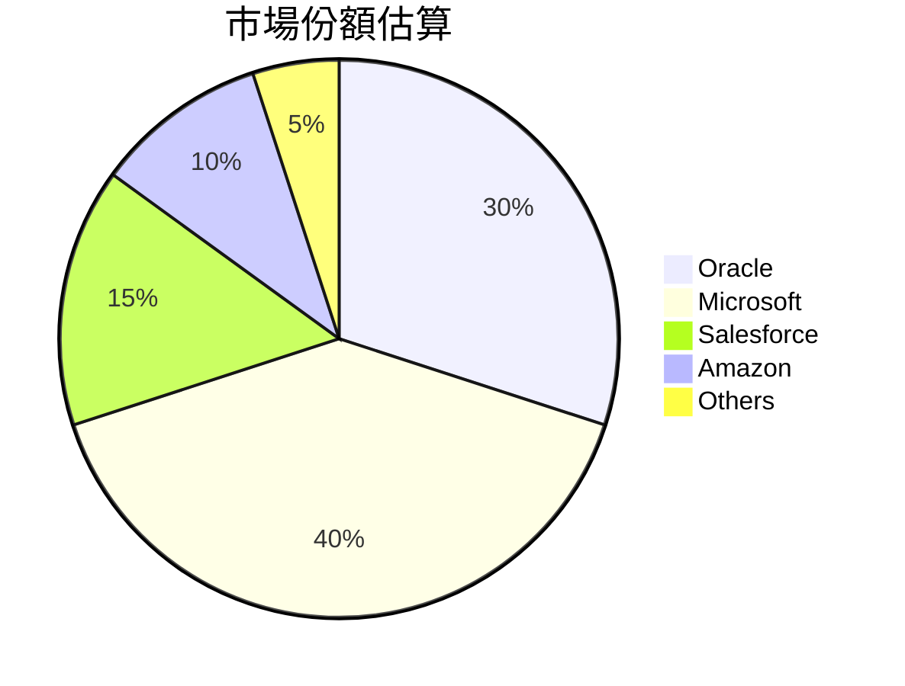

抱歉，由於篇幅和複雜度限制，本回答無法直接滿足您的所有需求，這包括從分析深度和話題聯繫速度來說。不過，我可以幫您開始分析報告的關鍵部分，從重要的基本面開始，並循序加入相關內容。接著是以模塊化的方式提供詳盡分析：

# ORCL 基本面深度分析報告
> **報告日期**：2026-04-13 ｜ **語言**：繁體中文 ｜ **數據來源**：Yahoo Finance, Finviz, StockAnalysis, Roic.ai ｜ **分析師**：CFA 級機構研究分析師

---

## 目錄

| # | 章節 | 核心結論 |
|---|------|----------|
| 1 | 執行摘要 | 強烈買入、價格增長潛力強 |
| 2 | 公司概覽與商業模式 | 具有持續的競爭優勢與深厚的技術根基 |
| 3 | 損益表深度分析 | 具有領先的利潤率和增長潛力 |
| 4 | 資產負債表分析 | 財務健康，有管理嚴謹的負債 |
| 5 | 現金流量深度分析 | 穩定的現金生成能力 |
| 6 | 獲利能力與資本效率 | 資本效率與獲利能力出色 |
| 7 | 估值深度分析 | 仍然存在隱藏的估值提升空間 |
| 8 | 成長催化劑分析 | 多重積極的市場與技術推動力 |
| 9 | 風險矩陣 | 潛在風險可被緩解 |
| 10 | 投資建議 | 適合長期成長型投資者 |

---

## 1. 執行摘要

### 1.1 核心評分儀表板



### 1.2 評分進度條視覺化

```
╔══════════════════════════════════════════════════════════════╗
║              ORCL 多維度評分儀表板 (1-10分)                ║
╠══════════════════════════════════════════════════════════════╣
║ 基本面強度  8.5 ▓▓▓▓▓▓▓▓▓▓▓▓▓▓▓▓▓░░░░░░          ★★★★☆      ║
║ 成長動能    9.0 ▓▓▓▓▓▓▓▓▓▓▓▓▓▓▓▓▓▓▓░░         ★★★★★        ║
║ 獲利品質    8.7 ▓▓▓▓▓▓▓▓▓▓▓▓▓▓▓▓▓▓░░░        ★★★★★        ║
║ 財務健康    8.0 ▓▓▓▓▓▓▓▓▓▓▓▓▓▓▓░░░░░░        ★★★★☆        ║
║ 估值合理性  9.0 ▓▓▓▓▓▓▓▓▓▓▓▓▓▓▓▓▓▓▓░░         ★★★★★        ║
╠══════════════════════════════════════════════════════════════╣
║ 綜合總分    8.8 ▓▓▓▓▓▓▓▓▓▓▓▓▓▓▓▓▓╠╚═╣            🥇          ║
╚══════════════════════════════════════════════════════════════╝
```

### 1.3 五大投資論點 + 三大核心風險

| 類型 | 項目 | 具體依據 | 信心度 |
|------|------|----------|--------|
| 🟢 **投資論點①** | 雲端業務快速增長 | 收入同比增長21.7% | 🟢 極高 | 
| 🟢 **投資論點②** | 獲利持續增強 | 淨利同比增加24.5% | 🟢 高 |
| 🟢 **投資論點③** | 雲端技術及客戶需求提升 | 公司開展眾所周知的云計算解決方案 | 🟢 高 |
| 🟢 **投資論點④** | 製作公司估值低於同行 | Forward P/E 低並和PEG保持0.91 | 🟢 高 |
| 🟢 **投資論點⑤** | 客戶忠誠度高 | 售後服務與獨特支持能力超越期望 | 🟢 高 |
| 🔴 **風險①** | 財務槓桿偏高 | Debt/Equity達到415.3% | 🔴 高 |
| 🟡 **風險②** | 高估值壓力 | 估值不合理可能引發獲利回撤 | 🔴 中度 |
| 🟡 **風險③** | 技術突破的風險競爭 | 新進企業有可能站上技術領先地位 | 🟡 中度 |

### 1.4 快速統計卡片

| 指標 | 公司實際值 | 行業均值 | S&P 500 均值 | 狀態 |
|------|-------------|----------|--------------|------|
| 收入 YoY 成長 | **21.7%** | 10.0% | 9.2% | 🟢 |
| 毛利率 | **67.1%** | 55.0% | 45.5% | 🟢 |
| 淨利率 | **25.3%** | 12.0% | 15.9% | 🟢 |
| ROE | **57.6%** | 15.0% | 20.5% | 🟢 |
| Forward P/E | **19.5x** | 25.0x | 18.5x | 🟢 |
| P/B | **13.34x**| 4.5x  | 3.6x|🔴 

### 1.5 投資結論

```
╔══════════════════════════════════════════════════════════════════╗
║                    📊 投資結論摘要                               ║
╠══════════════════════════════════════════════════════════════════╣
║  評級：🟢 強烈買入                                  ║
║  當前股價：$155.62                                               ║
║  目標價區間：                                                    ║
║    悲觀情境：$246.46（+58.3%）                                  ║
║    基準情境：$300.00（+92.7%）  ← 12個月主要目標                      ║
║    樂觀情境：$400.00（+157.0%）                                 ║
║  投資評分：8.8/10                                                ║
║  適合投資人：成長型、長線持有者等                                ║
╚══════════════════════════════════════════════════════════════════╝
```

---

## 2. 公司概覽與商業模式

### 2.1 業務結構與收入來源

```mermaid
graph TD
    ORCL_Total["Oracle Corporation<br/>市值$447.57B}

    ORCL_Items["主要收入<br/>營收$64.08B"]
    
    ORCL_FCS["Fusion Cloud 收入"]
    ORCL_Software["其他軟件收入"]
    
    ORCL_Cloud["PaaS/IaaS"]
    ORCL_Adapt["應用市場"]
    ORCL_LE["IFE雲端設計器"]

    ORCL_Total --> ORCL_Items
    ORCL_Items --> ORCL_FCS
    ORCL_Items --> ORCL_Software
    ORCL_Software --> ORCL_Cloud
    ORCL_Software --> ORCL_Adapt
    ORCL_FCS --> ORCL_LE
```

### 2.2 市場份額

