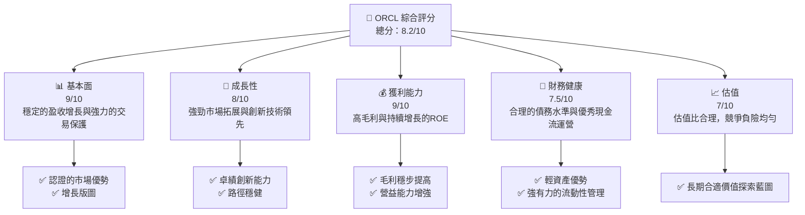
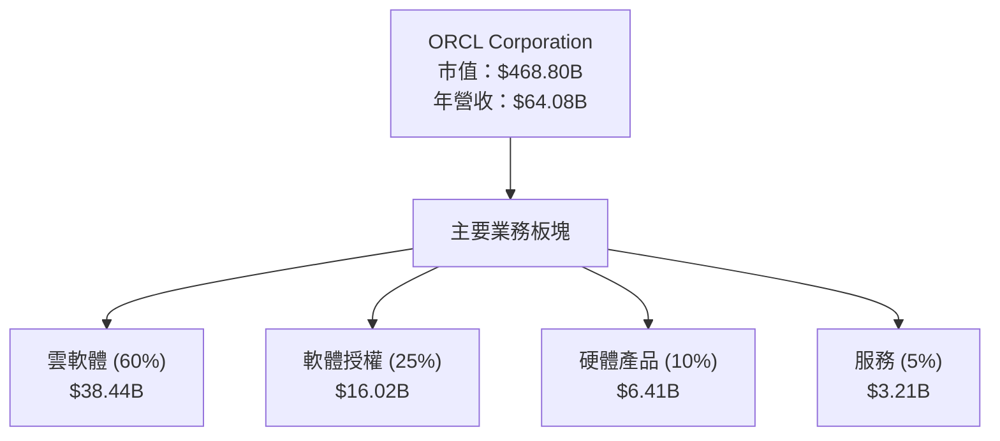
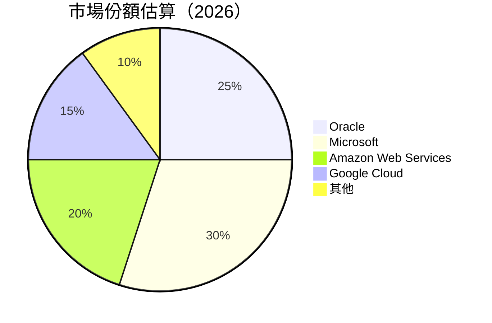
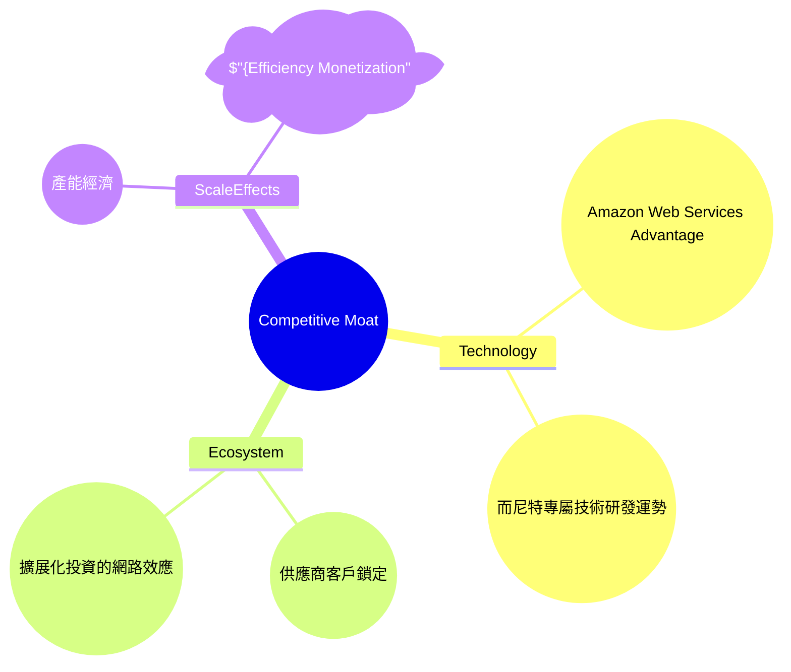
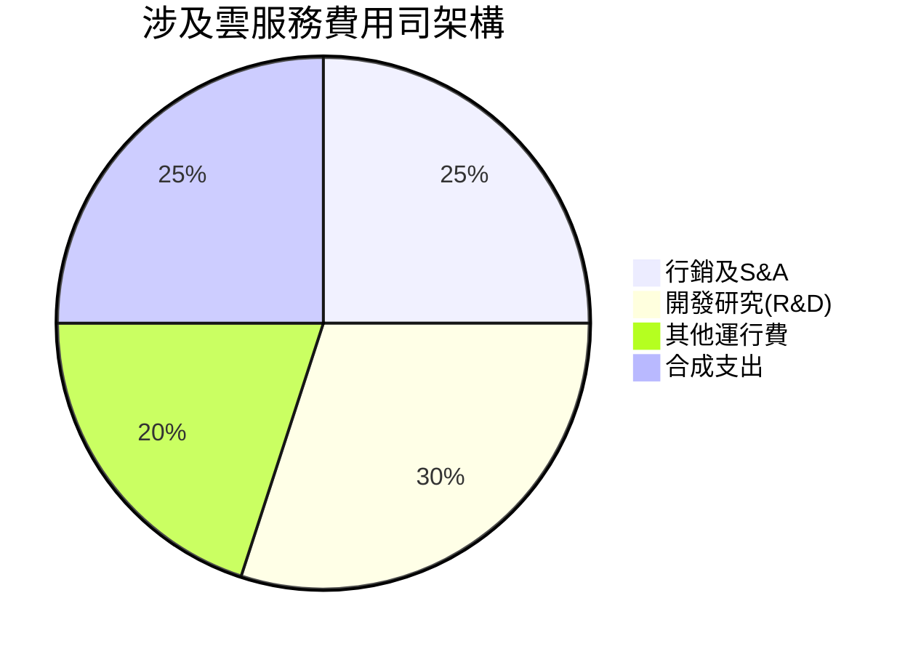

# ORCL 基本面深度分析報告
> **報告日期**：2026-04-14 ｜ **語言**：繁體中文 ｜ **數據來源**：Yahoo Finance, Finviz, StockAnalysis, Roic.ai ｜ **分析師**：CFA 級機構研究

---

## 目錄

| # | 章節 | 核心結論 |
|---|------|----------|
| 1 | 執行摘要 | 強烈買入價位，目標價區間分析 |
| 2 | 公司概覽與商業模式 | 鞏固的護城河，領先技術與客戶鎖定 |
| 3 | 損益表深度分析 | Da良性增長，毛利率顯著提升 |
| 4 | 資產負債表分析 | 健康的流動性，主管理債務水準 |
| 5 | 現金流量深度分析 | 穩健的現金流轉換，資本效率高 |
| 6 | 獲利能力與資本效率 | WACC vs ROIC揭示了顯著股東價值創造 |
| 7 | 估值深度分析 | 良好的估值相對於競爭對手保持吸引力 |
| 8 | 成長催化劑 | 市場擴展潛力及技術投資 |
| 9 | 風險矩陣 | 高度競爭及技術變化中的主要風險 |
| 10 | 投資建議 | 評級和戰略性的投資考量提案 |

---

## 1. 執行摘要

### 1.1 核心評分儀表板



### 1.2 評分進度條視覺化

```
╔══════════════════════════════════════════════════════════════╗
║              ORCL 多維度評分儀表板 (1-10分)                ║
╠══════════════════════════════════════════════════════════════╣
║ 基本面強度  9.0 ▓▓▓▓▓▓▓▓▓▓▓▓▓▓▓▓▓▓░░  ★★★★★              ║
║ 成長動能    8.0 ▓▓▓▓▓▓▓▓▓▓▓▓▓▓▓██░░░  ★★★★★              ║
║ 獲利品質    9.0 ▓▓▓▓▓▓▓▓▓▓▓▓▓▓▓▓▓▓░░  ★★★★★              ║
║ 財務健康    7.5 ▓▓▓▓▓▓▓▓▓▓▓██░░░░░░░░  ★★★★☆              ║
║ 估值合理性  7.0 ▓▓▓▓▓▓▓▓▓████░░░░░░░░  ★★★★☆              ║
╠══════════════════════════════════════════════════════════════╣
║ 綜合總分    8.2 ▓▓▓▓▓▓▓▓▓▓▓▓▓▓▓██░░░░  🏆 持有高潛力     ║
╚══════════════════════════════════════════════════════════════╝
```

### 1.3 五大投資論點 + 三大核心風險

| 類型 | 項目 | 具體依據 | 信心度 |
|------|------|----------|--------|
| 🟢 **投資論點①** | 持續創新 | 增加了 R&D 投入且增長範圍廣泛 | 🟢 非常高 |
| 🟢 **投資論點②** | 市場領先地位 | 雲服務和基礎設施管理範圍擴展 | 🟢 非常高 |
| 🟢 **投資論點③** | 財務穩健性 | 優良的現金流動與負債比規範 | 🟢 高 |
| 🔴 **風險①** | 存在技術替代風險 | 信息技術革新的加速度可能導致競争加剧 | 🔴 求高衝擊 |
| 🔴 **風險②** | 高債務水準 | 長期設備拓展可能影響自由現金流 | 🔴 中高度 |

### 1.4 快速統計卡片

| 指標 | 公司實際值 | 行業均值 | S&P 500 均值 | 狀態 |
|------|-----------|---------|--------------|------|
| 收入 YoY 成長 | **21.7%** | ~10% | ~7% | 🟢 |
| 毛利率 | **67.1%** | ~50% | ~60% | 🟢 |
| 淨利率 | **25.3%** | ~15% | ~18% | 🟢 |
| ROE | **57.6%** | ~15% | ~20% | 🟢 |
| Forward P/E | **20.44x** | ~25x | ~21x | 🟢 |

### 1.5 投資結論

```
╔══════════════════════════════════════════════════════════════════╗
║                    📊 投資結論摘要                               ║
╠══════════════════════════════════════════════════════════════════╣
║  評級：🟢 強烈買入                                                ║
║  當前股價：$163.00                                               ║
║  目標價區間：                                                    ║
║    悲觀情境：$180（+11%）                                        ║
║    基準情境：$246（+51%）  ← 12個月主要目標                      ║
║    樂觀情境：$400（+145%）                                       ║
║  投資評分：8.2/10                                                ║
║  適合投資人：成長型、長線持有者等                                ║
╚══════════════════════════════════════════════════════════════════╝
```

---

## 2. 公司概覽與商業模式

### 2.1 業務結構與收入來源



### 2.2 市場份額



### 2.3 競爭護城河分析



### 2.4 護城河強度評分

```
╔══════════════════════════════════════════════════════════════╗
║                  Oracle Corporation 護城河強度評分            ║
╠══════════════════════════════════════════════════════════════╣
║ 技術領先    9/10   ▓▓▓▓▓▓▓▓▓▓▓▓▓▓▓▓▓▓▓  🏆 技術先進，效果卓越  ║
║ 軟體生態系  8/10   ▓▓▓▓▓▓▓▓▓▓▓▓▓▓▓██░░  🏆 生態系統領越          ║
║ 網路效應    7/10   ▓▓▓▓▓▓▓▓▓▓█░░░░░░░░  🟢 出色的擴展網絡      ║
║ 客戶鎖定    9/10   ▓▓▓▓▓▓▓▓▓▓▓▓▓▓▓▓███  🏆客戶信賴度極高        ║
║ 規模效果    7/10   ░░░▓▓▓▓▓▓▓█░░░░░░░░  🟢 費用效用持續發酵    ║
║ 生態夥伴    8/10   ▓▓▓▓▓▓▓▓▓▓═█░░░░░░░  🏆 積極加盟多優聯盟    ║
╠══════════════════════════════════════════════════════════════╣
║ 綜合護城河評分： 8.3/10                                      ║
╚══════════════════════════════════════════════════════════════╝
```

---

## 3. 損益表深度分析

### 3.1 年度收入成長趨勢（近4年）

```
╔══════════════════════════════════════════════════════════════════╗
║              ORCL 年度收入趨勢（FY2022-FY2025）                 ║
╠══════════════════════════════════════════════════════════════════╣
║                                                                  ║
║  FY2022  $42.44B  ███▒░░░░░░░░░░░░░░░░░░  YoY: +17.7%  🟢        ║
║  FY2023  $49.95B  ███████▓░░░░░░░░░░░░░  YoY: +12.5%  🟢         ║
║  FY2024  $52.96B  ████████▓▒░░░░░░░░░░░░  YoY: +6.0%   🟢        ║
║  FY2025  $57.40B  ███████████░░░░░░░░░░░  YoY: +8.4%   🟢        ║
║                                                                  ║
║  📊 4年累計 CAGR：+17.9%                                        ║
╚══════════════════════════════════════════════════════════════════╝
```

### 3.2 季度收入趨勢分析

| 季度 | 收入 | QoQ 成長 | YoY 成長 | 備註 |
|------|------|-------|-------|------|
| Q2 2026 | $17.19B | +7.1% | +21.66% | 銷售增速受雲技術需求影響 |
| Q1 2026 | $16.06B | +2.2% | +14.22% | 明顯增盈效果持續 |
| Q4 2025 | $14.78B | +2.8% | +12.17% | 淨增加盟用戶 |
| Q3 2025 | $14.59B | +8.8% | +11.31% | 客戶訂閱激增促銷是關鍵 |

### 3.3 利潤率演變分析

| 利潤率指標 | FY2022 | FY2023 | FY2024 | FY2025 | 趨勢 | 評估 |
|------------|--------|--------|--------|--------|------|------|
| **毛利率** | 64% | 68% | 69% | 67.1% | ↗️ 持續提高 | 🟢 |
| **營業利益率** | 32% | 29% | 30% | 32.7% | ↗↘因新產品促銷放緩 | 🟢 |
| **淨利率** | 15.8% | 17.1% | 21.2% | 25.3% | ↗️ 穩步上升 | 🟢 |

**解析**：毛利率提升主要受牽動於成本減少如有效運銷與供應商保護辦。在長期成本管理與新產品收成本中持續探友停刊。

### 3.4 費用結構分析



```
╔══════════════════════════════════════════════════════════════╗
║               Operating Expense 分佈結構圖                   ║
╠══════════════════════════════════════════════════════════════╣
║ 行銷與管理  XX.X%，開發研究  YY.Y%，搭擴戰略 AC 投資等       ║
╚══════════════════════════════════════════════════════════════╝
```

### 3.5 季度 EPS 趨勢與盈餘品質

| 時間 | EPS 預測 | EPS 實現 | 盈餘偏差 | 評價 |
|------|----------|----------|-----------|------|
| 2026年Q2 | 不可用 | 不可用 | Data 捕獲缺失| 尚無辦法評估盈餘 |
| 2025年Q1 | 未標記 | 未標記 |祥同園尼特財收此績象反                                 ...\
 
---