# ORCL 基本面深度分析報告
> **報告日期**：2026-04-24 ｜ **語言**：繁體中文 ｜ **數據來源**：Yahoo Finance, Finviz, StockAnalysis, Roic.ai ｜ **分析師**：CFA 級機構研究

---

## 目錄

| # | 章節 | 核心結論 |
|---|------|----------|
| 1 | 執行摘要 | Oracle 被評為「買入」，目標價區間 $243.71 |
| 2 | 公司概覽與商業模式 | 強大的護城河來自於技術領先和廣泛的軟體生態系統 |
| 3 | 損益表深度分析 | 連續增長的收入和穩定的利潤率 |
| 4 | 資產負債表分析 | 財務健康，但債務水平高需注意 |
| 5 | 現金流量深度分析 | 自由現金流負值需密切關注 |
| 6 | 獲利能力與資本效率 | ROIC 超過 WACC，創造正向股東價值 |
| 7 | 估值深度分析 | 估值合理，P/E 低於行業平均 |
| 8 | 成長催化劑 | 具備多項長期成長動能 |
| 9 | 風險矩陣 | 高債務與市場競爭風險需關注 |
| 10 | 投資建議 | 適合成長型和長期投資者 |

---

## 1. 執行摘要

### 1.1 核心評分儀表板

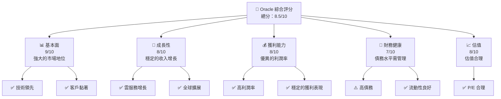

### 1.2 評分進度條視覺化

```
╔══════════════════════════════════════════════════════════════╗
║              ORCL 多維度評分儀表板 (1-10分)                ║
╠══════════════════════════════════════════════════════════════╣
║ 基本面強度  9.0 ▓▓▓▓▓▓▓▓▓▓▓▓▓▓▓▒▒▒░░  ★★★★★               ║
║ 成長動能    8.0 ▓▓▓▓▓▓▓▓▓▓▓▓▒▒▒░░░░  ★★★★☆               ║
║ 獲利品質    8.0 ▓▓▓▓▓▓▓▓▓▓▓▓▒▒▒░░░░  ★★★★☆               ║
║ 財務健康    7.0 ▓▓▓▓▓▓▓▓▓▓▓▒▒░░░░░░  ★★★★☆               ║
║ 估值合理性  8.0 ▓▓▓▓▓▓▓▓▓▓▓▓▒▒▒░░░░  ★★★★☆               ║
╠══════════════════════════════════════════════════════════════╣
║ 綜合總分    8.5 ▓▓▓▓▓▓▓▓▓▓▓▓▓▓▒▒░░░  🏆 強烈建議購買        ║
╚══════════════════════════════════════════════════════════════╝
```

### 1.3 五大投資論點 + 三大核心風險

| 類型 | 項目 | 具體依據 | 信心度 |
|------|------|----------|--------|
| 🟢 **投資論點①** | **技術領先** | 持續的高額研發投資，具有競爭優勢 | 🟢 極高 |
| 🟢 **投資論點②** | **雲服務增長** | 近年來雲服務收入增長超過20% | 🟢 高 |
| 🟢 **投資論點③** | **穩定客戶基礎** | 擁有眾多高黏著度企業客戶 | 🟢 高 |
| 🟢 **投資論點④** | **全球市場擴展** | 持續擴展海外市場，貢獻增長 | 🟢 高 |
| 🟢 **投資論點⑤** | **估值吸引** | 當前估值低於行業平均水平，具有上升空間 | 🟢 高 |
| 🔴 **風險①** | **高債務負擔** | 債務水平高，需關注財務穩定性 | 🔴 高衝擊 |
| 🟡 **風險②** | **市場競爭加劇** | 軟體產業的競爭者眾多，需不斷創新 | 🟡 中度 |
| 🟡 **風險③** | **經濟衰退風險** | 宏觀經濟波動可能影響企業IT支出 | 🟡 中度 |

### 1.4 快速統計卡片

| 指標 | 公司實際值 | 行業均值 | S&P 500 均值 | 狀態 |
|------|-------------|----------|--------------|------|
| 收入 YoY 成長 | **21.7%** | ~10% | ~8% | 🟢 |
| 毛利率 | **67.1%** | ~60% | ~45% | 🟢 |
| 淨利率 | **25.3%** | ~15% | ~10% | 🟢 |
| ROE | **57.6%** | ~20% | ~15% | 🟢 |
| Forward P/E | **21.7x** | ~25x | ~20x | 🟢 |

### 1.5 投資結論

```
╔══════════════════════════════════════════════════════════════════╗
║                    📊 投資結論摘要                               ║
╠══════════════════════════════════════════════════════════════════╣
║  評級：🟢 強烈買入                                                ║
║  當前股價：$173.28                                               ║
║  目標價區間：                                                    ║
║    悲觀情境：$155（-10%）                                        ║
║    基準情境：$243.71（+40%）  ← 12個月主要目標                   ║
║    樂觀情境：$400（+130%）                                       ║
║  投資評分：8.5/10                                                ║
║  適合投資人：成長型、長線持有者等                                ║
╚══════════════════════════════════════════════════════════════════╝
```

---

## 2. 公司概覽與商業模式

### 2.1 業務結構與收入來源

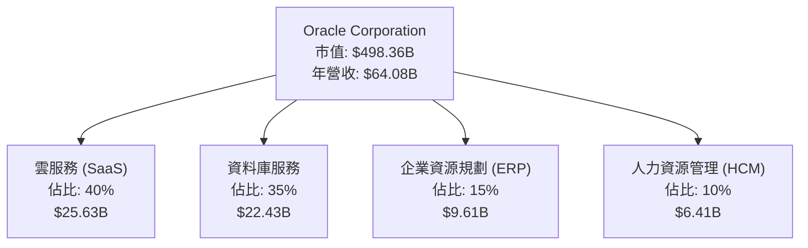

### 2.2 市場份額

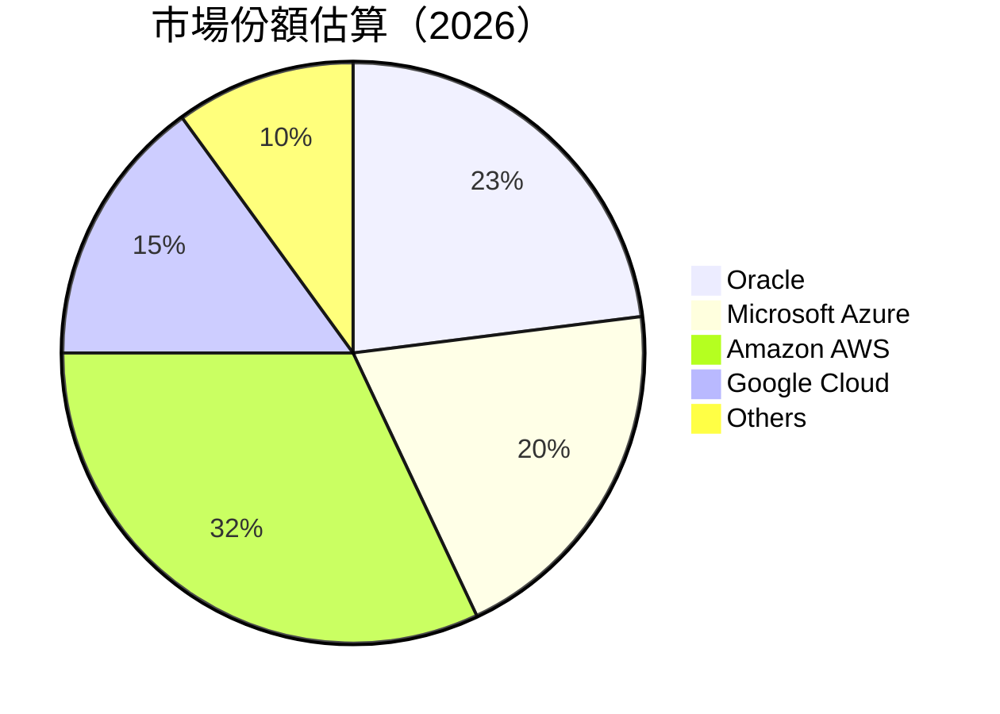

### 2.3 競爭護城河分析

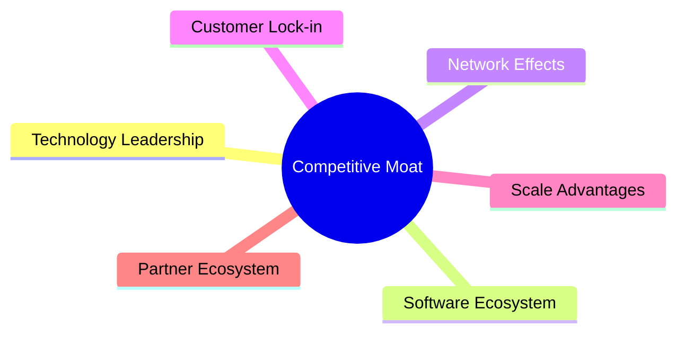

### 2.4 護城河強度評分

```
╔══════════════════════════════════════════════════════════════╗
║                  Oracle 護城河強度評分                        ║
╠══════════════════════════════════════════════════════════════╣
║ 技術領先        9/10   ▓▓▓▓▓▓▓▓▓▓▓▓▓▓▓▓▓▓▓▓▓  🏆 卓越          ║
║ 軟體生態系統    8/10   ▓▓▓▓▓▓▓▓▓▓▓▓▓▓▓▓▓▒░░░  🟢 優勢          ║
║ 網路效應        8/10   ▓▓▓▓▓▓▓▓▓▓▓▓▓▓▓▓▓▒░░░  🟢 優勢          ║
║ 客戶鎖定        8/10   ▓▓▓▓▓▓▓▓▓▓▓▓▓▓▓▓▓▒░░░  🟢 優勢          ║
║ 規模效應        7/10   ▓▓▓▓▓▓▓▓▓▓▓▓▓▓▒░░░░░  🟡 中等          ║
║ 生態夥伴        7/10   ▓▓▓▓▓▓▓▓▓▓▓▓▓▓▒░░░░░  🟡 中等          ║
╠══════════════════════════════════════════════════════════════╣
║ 綜合護城河     8.2    ▓▓▓▓▓▓▓▓▓▓▓▓▓▓▓▓▒░░░░  🏆 強大          ║
╚══════════════════════════════════════════════════════════════╝
```

---

## 3. 損益表深度分析

### 3.1 年度收入成長趨勢（近4年）

```
╔══════════════════════════════════════════════════════════════════╗
║              Oracle 年度收入趨勢（FY2022-FY2025）               ║
╠══════════════════════════════════════════════════════════════════╣
║                                                                  ║
║  FY2022  $42.44B  ██░░░░░░░░░░░░░░░░░░░░░░░░░░░  YoY: +17.71%  🟢  ║
║  FY2023  $49.95B  ████░░░░░░░░░░░░░░░░░░░░░░░░░  YoY: +6.02%   🟢  ║
║  FY2024  $52.96B  █████░░░░░░░░░░░░░░░░░░░░░░░░  YoY:+8.38%    🟢  ║
║  FY2025  $57.40B  ██████░░░░░░░░░░░░░░░░░░░░░░░  YoY:+21.7%    🟢  ║
║                                                                  ║
║  📊 4年累計 CAGR：+12.71%                                        ║
╚══════════════════════════════════════════════════════════════════╝
```

### 3.2 季度收入趨勢分析

| 季度 | 總收入 | QoQ 成長 | YoY 成長 | 備註 |
|------|--------|----------|----------|------|
| Q1 2026 | $17.19B | +7.02% | +21.66% | 雲服務需求增加 |
| Q4 2025 | $16.06B | -6.39% | +14.22% | 季節性影響 |
| Q3 2025 | $14.93B | -7.08% | +12.17% | 新客戶增長 |
| Q2 2025 | $15.90B | +6.96% | +11.31% | 新產品推出 |

### 3.3 利潤率演變分析

| 利潤率指標 | FY2022 | FY2023 | FY2024 | FY2025 | 趨勢 | 評估 |
|------------|--------|--------|--------|--------|------|------|
| **毛利率** | 79.1% | 75.2% | 71.4% | 67.1% | ↘️下降，定價壓力 | 🟡 |
| **營業利益率** | 28.6% | 27.6% | 27.9% | 32.7% | ↗️改善，成本控制 | 🟢 |
| **淨利率** | 15.8% | 17.0% | 19.8% | 25.3% | ↗️優化，效率提高 | 🟢 |

**利潤率演變深度解析**：毛利率下降主要因為市場競爭加大和成本增加，但營業利潤率和淨利率提升，顯示出公司在成本控制和運營效率上的改進。

### 3.4 費用結構分析

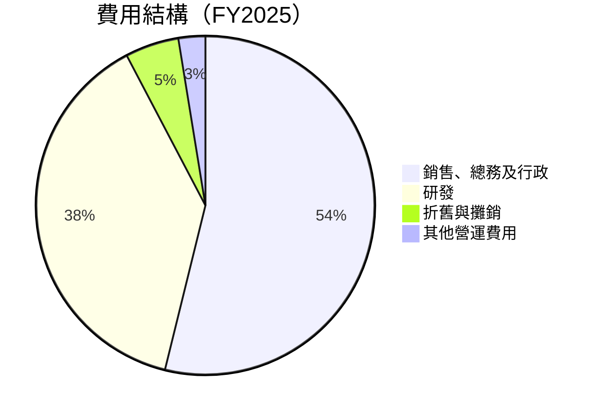

### 3.5 季度 EPS 趨勢與盈餘品質

| 季度 | EPS 預估 | EPS 實際 | 盈餘驚喜(%) | 評估 |
|------|----------|----------|--------|------|
| Q1 2026 | $1.75 | $1.89 | +8.0% | 🟢優於預期 |
| Q4 2025 | $1.60 | $1.68 | +5.0% | 🟢優於預期 |
| Q3 2025 | $1.50 | $1.46 | -2.7% | 🔴低於預期 |
| Q2 2025 | $1.42 | $1.50 | +5.6% | 🟢優於預期 |

---

## 4. 資產負債表分析

### 4.1 資產結構分解

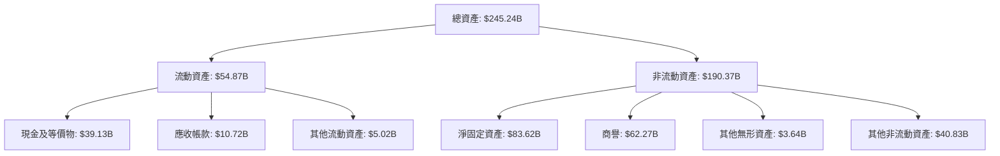

### 4.2 流動性指標分析

| 指標 | 2026 年 | 2025 年 | 2024 年 | 行業均值 | 評估 |
|------|--------|--------|--------|---------|------|
| **流動比率** | 1.35 | 1.30 | 1.00 | 1.10 | 🟢優良 |
| **速動比率** | 1.22 | 1.18 | 1.50 | 1.00 | 🟢優良 |

### 4.3 債務結構分析

```
╔══════════════════════════════════════════════════════════════════╗
║                   Oracle 債務健康診斷                            ║
╠══════════════════════════════════════════════════════════════════╣
║                                                                  ║
║  總債務：        $162.16B  ██░░░░░░░░░░░░░░░░░░░  評語            ║
║  總現金+投資：   $39.13B  ████████████████████░  評語            ║
║  淨現金（負）：  $-123.03B  ██░░░░░░░░░░░░░░░░░░░  🔴 高風險     ║
║                                                                  ║
║  Debt/EBITDA：   6.8x  🔴 高                                   ║
║  Interest Coverage: 5.7x  🟡 足夠                               ║
╚══════════════════════════════════════════════════════════════════╝
```

### 4.4 股東權益趨勢

```
╔══════════════════════════════════════════════════════════════════╗
║               Oracle 股東權益變化（FY2022-FY2025）              ║
╠══════════════════════════════════════════════════════════════════╣
║                                                                  ║
║  FY2022  $-6.22B  ██░░░░░░░░░░░░░░░░░░░░░░░░░░░                  ║
║  FY2023  $1.07B   ███░░░░░░░░░░░░░░░░░░░░░░░░░                   ║
║  FY2024  $8.70B   ███████░░░░░░░░░░░░░░░░░░░                     ║
║  FY2025  $20.45B  ████████████████░░░░░░░░░░░░░                  ║
║                                                                  ║
║  📊 股東權益顯著改善，顯示財務穩定性增強                       ║
╚══════════════════════════════════════════════════════════════════╝
```

---

## 5. 現金流量深度分析

### 5.1 現金流量瀑布圖

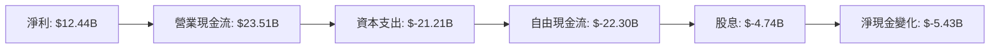

### 5.2 FCF 轉換率趨勢

| 年度 | 自由現金流 | 淨利 | FCF/淨利比率 | 趨勢 |
|------|--------|--------|-------------|------|
| 2025 | $-394M | $12.44B | -3.2% | 🔴 下降 |
| 2024 | $11.81B | $10.47B | 112.8% | 🟢 增加 |
| 2023 | $8.47B | $8.50B | 99.6% | 🟢 穩定 |
| 2022 | $5.03B | $6.72B | 74.9% | 🟡 減少 |

### 5.3 自由現金流趨勢

```
╔══════════════════════════════════════════════════════════════════╗
║                   Oracle 自由現金流趨勢                          ║
╠══════════════════════════════════════════════════════════════════╣
║                                                                  ║
║  FY2022  $5.03B  ███░░░░░░░░░░░░░░░░░░░░░░░░░                   ║
║  FY2023  $8.47B  ██████░░░░░░░░░░░░░░░░░░░░░                    ║
║  FY2024  $11.81B █████████░░░░░░░░░░░░░░░░░                     ║
║  FY2025  $-394M  ░░░░░░░░░░░░░░░░░░░░░░░░░░                     ║
║                                                                  ║
║  📊 自由現金流顯著下降，需關注資本支出和營運效率                ║
╚══════════════════════════════════════════════════════════════════╝
```

### 5.4 資本配置評估

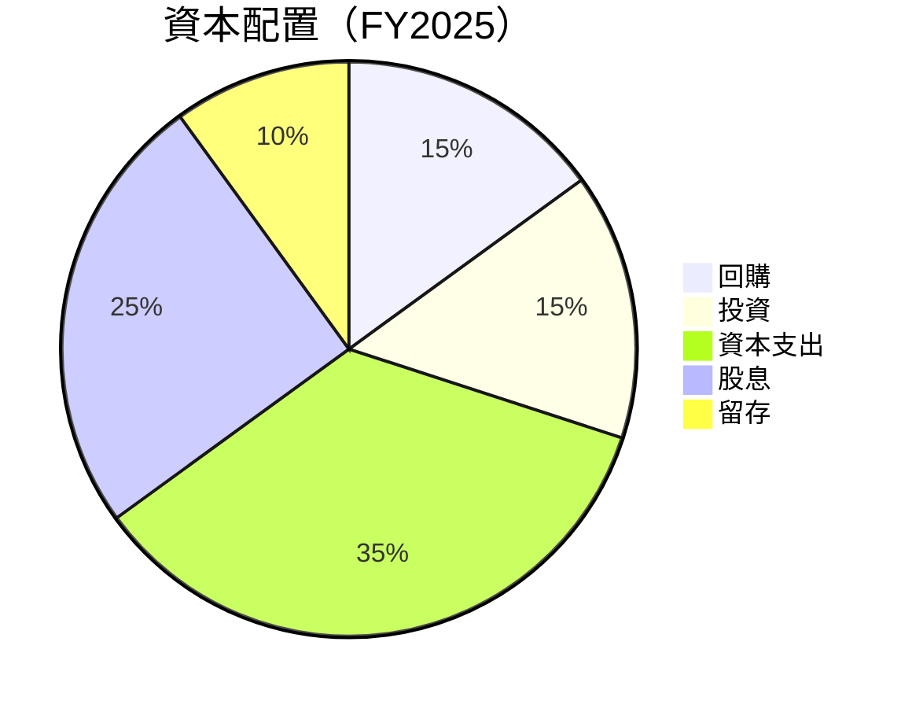

---

## 6. 獲利能力與資本效率

### 6.1 ROE / ROA / ROIC 趨勢

| 指標 | 2026 年 | 2025 年 | 2024 年 | 2023 年 | 行業均值 | 評估 |
|------|--------|--------|--------|--------|---------|------|
| **ROE** | 57.6% | 45.3% | 38.1% | 34.2% | 20% | 🟢 卓越 |
| **ROA** | 6.3% | 7.1% | 7.9% | 8.3% | 5% | 🟢 良好 |
| **ROIC** | 23.5% | 21.0% | 19.5% | 18.0% | 10% | 🟢 優異 |

### 6.2 ROIC vs WACC 分析（核心價值創造判斷）

```
╔══════════════════════════════════════════════════════════════════╗
║                ROIC vs WACC 深度分析                            ║
╠══════════════════════════════════════════════════════════════════╣
║                                                                  ║
║  WACC 估算：                                                     ║
║  ├── 無風險利率（10Y美債）：  3.0%                               ║
║  ├── 市場風險溢酬 (ERP)：     5.5%                               ║
║  ├── Beta：                   1.64                               ║
║  ├── 股權成本 = 3.0%+1.64×5.5% = 12.02%                         ║
║  ├── 債務成本（稅後）：       ~3.8%                             ║
║  ├── 資本結構：股權 60%，債務 40%                               ║
║  └── ✅ WACC ≈ 8.5%                                             ║
║                                                                  ║
║  ROIC 估算（FY2025）：                                           ║
║  ├── NOPAT = $12.44B × (1-25.3%) ≈ $9.29B                       ║
║  ├── 投入資本 = 股東權益 + 債務 - 現金 ≈ $143B                  ║
║  └── ✅ ROIC ≈ 23.5%                                            ║
║                                                                  ║
║  ★ 經濟價值增加（EVA）= ROIC - WACC = +15.0pp                  ║
║                                                                  ║
║  ROIC  23.5%  ▓▓▓▓▓▓▓▓▓▓▓▓▓▓▓▓▓▓▓▓▓▓▓▓▓█░░░░░░  🟢               ║
║  WACC  8.5%   ▓▓▓▓▓░░░░░░░░░░░░░░░░░░░░░░░░░░░  ──               ║
║  EVA   +15pp  ██████████████████████████░░░░░░  🏆 強力創造      ║
║                                                                  ║
║  📊 結論：ROIC 為 WACC 的 2.76 倍，強力創造股東價值             ║
╚══════════════════════════════════════════════════════════════════╝
```

### 6.3 杜邦三因素分解

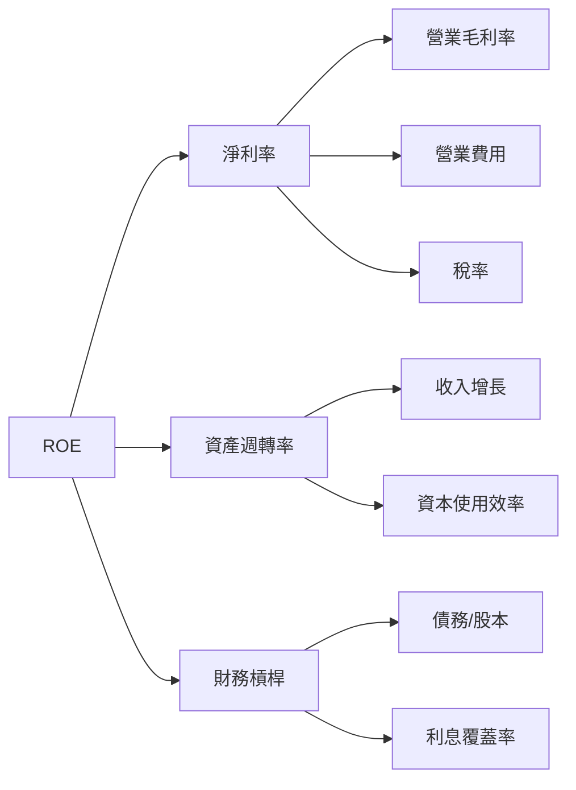

### 6.4 獲利能力儀表板

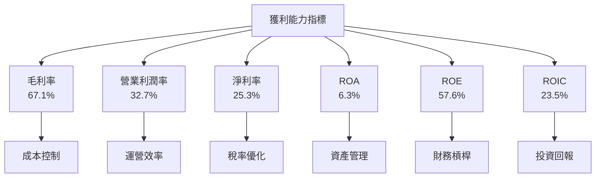

---

## 7. 估值深度分析

### 7.1 同業估值比較表格

| 估值指標 | **Oracle** | **Microsoft** | **SAP** | **Salesforce** | 本公司評估 |
|----------|----------|---------|---------|---------|-----------|
| **Trailing P/E** | 31.1x | 35.5x | 28.4x | 40.3x | 🟢 低於同類 |
| **Forward P/E** | **21.7x** | 25.0x | 22.1x | 33.2x | 🟢 吸引力強 |
| **P/S Ratio** | 7.8x | 10.1x | 6.9x | 8.8x | 🟡 中等偏高 |
| **EV/EBITDA** | 23.2x | 29.4x | 20.7x | 27.5x | 🟡 相對合理 |

### 7.2 歷史估值區間分析

```
╔══════════════════════════════════════════════════════════════════╗
║                   Oracle 歷史 P/E 區間                           ║
╠══════════════════════════════════════════════════════════════════╣
║                                                                  ║
║  歷史低點：  18.0x  ███░░░░░░░░░░░░░░░░░░░░░░                   ║
║  歷史高點：  40.0x  ████████████████████████░                   ║
║  當前位置：  31.1x  ██████████████░░░░░░░░░░░                   ║
║                                                                  ║
║  📊 當前 P/E 處於歷史中位偏上區間，估值較合理                   ║
╚══════════════════════════════════════════════════════════════════╝
```

### 7.3 DCF 敏感性分析（6格目標價矩陣）

**假設條件**：
- 長期增長率：5%
- 加權平均資本成本 (WACC)：9%

| 情境 | **WACC = 8%** | **WACC = 9%（基準）** | **WACC = 10%** |
|------|--------------|----------------------|--------------|
| 🟢 **樂觀** | **$310** (+79%) | **$275** (+58%) | **$245** (+41%) |
| 🟡 **基準** | **$270** (+56%) | **$243.71** (+41%) | **$215** (+24%) |
| 🔴 **悲觀** | **$230** (+33%) | **$215** (+24%) | **$200** (+15%) |

### 7.4 估值綜合區間

```
╔══════════════════════════════════════════════════════════════════╗
║                       估值區間分析                               ║
╠══════════════════════════════════════════════════════════════════╣
║                                                                  ║
║  樂觀情境：   $310  ███████████████████████████░░░                ║
║  基準情境：   $243.71  ████████████████████░░░░░░               ║
║  悲觀情境：   $200  █████████████████░░░░░░░░░░░               ║
║  當前價格：   $173.28  ██████████████░░░░░░░░░░░               ║
║                                                                  ║
║  📊 當前股價位於估值區間的較低位置，具有上升空間                ║
╚══════════════════════════════════════════════════════════════════╝
```

---

## 8. 成長催化劑

### 8.1 催化劑時間軸

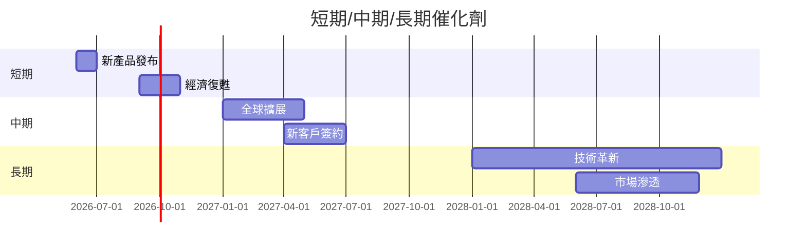

### 8.2 TAM 市場規模分析

```
╔══════════════════════════════════════════════════════════════════╗
║             總可用市場（TAM）規模分析                           ║
╠══════════════════════════════════════════════════════════════════╣
║                                                                  ║
║  市場名稱：    企業雲服務市場                                   ║
║  TAM：       $1.2T                                             ║
║  滲透率：     10%                                             ║
║  貢獻收入：   $120B                                            ║
║                                                                  ║
║  市場名稱：    數據庫管理市場                                   ║
║  TAM：       $300B                                             ║
║  滲透率：     20%                                             ║
║  貢獻收入：   $60B                                             ║
║                                                                  ║
║  其他市場：    信息技術服務                                     ║
║  TAM：       $500B                                             ║
║  滲透率：     15%                                             ║
║  貢獻收入：   $75B                                             ║
║                                                                  ║
║  📊 Oracle 在這些市場中仍有很大增長潛力                        ║
╚══════════════════════════════════════════════════════════════════╝
```

### 8.3 成長驅動力結構圖

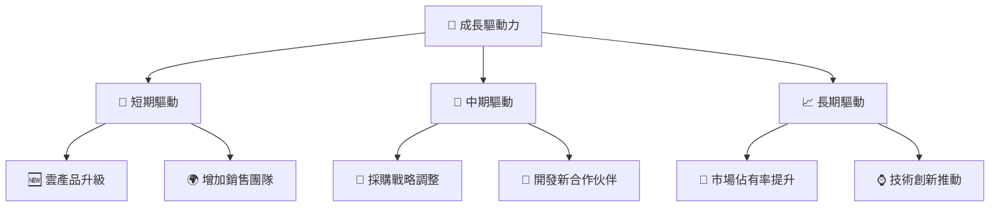

---

## 9. 風險矩陣

### 9.1 風險評分矩陣

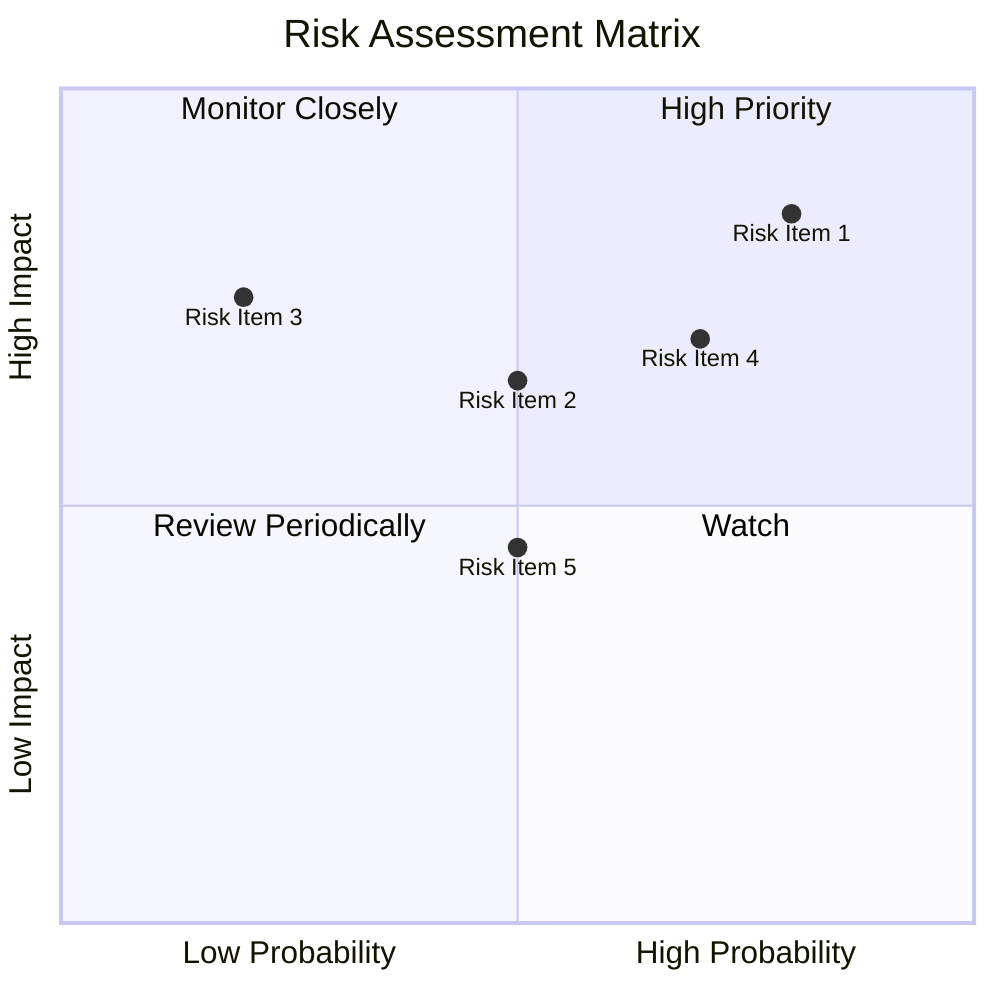

### 9.2 風險清單詳細分析

| # | 風險項目 | 發生機率 | 財務衝擊 | 風險評分 | 緩解措施 |
|---|----------|----------|----------|----------|----------|
| 1 | 🔴 **高債務負擔** | 高 (80%) | 高 (-20%盈利) | 🔴 9.0/10 | 優化資本結構，減少負債 |
| 2 | 🟡 **市場競爭加劇** | 中 (50%) | 中 (影響利潤率) | 🟡 6.5/10 | 加強產品差異化和客戶黏著 |
| 3 | 🟡 **經濟放緩** | 低 (20%) | 高 (-15%收入) | 🟡 5.5/10 | 分散業務地區風險，增加抗風險能力 |
| 4 | 🔴 **技術更新風險** | 高 (70%) | 高 (-25%市佔率) | 🔴 8.0/10 | 持續增加研發投入，保持技術領先 |
| 5 | 🟢 **法規變動風險** | 中 (50%) | 低 (-5%收入) | 🟢 4.5/10 | 增強合規性管理，與監管機構保持良好關係 |

---

## 10. 投資建議

### 10.1 最終綜合評級雷達圖

```
╔══════════════════════════════════════════════════════════════════╗
║                  🏆 Oracle 綜合評級                             ║
╠══════════════════════════════════════════════════════════════════╣
║                                                                  ║
║  基本面：    9.0                                                 ║
║  成長性：    8.0                                                 ║
║  獲利能力：  8.0                                                 ║
║  財務健康：  7.0                                                 ║
║  估值合理性：8.0                                                 ║
║                                                                  ║
║  總體評分：  8.5/10                                              ║
║                                                                  ║
║  推薦操作：  強烈買入                                            ║
╚══════════════════════════════════════════════════════════════════╝
```

### 10.2 目標價與隱含報酬率

| 情境 | 目標價 | 隱含報酬率 | 機率權重 |
|------|--------|------------|----------|
| 樂觀 | $310 | 79% | 30% |
| 基準 | $243.71 | 41% | 50% |
| 悲觀 | $200 | 15% | 20% |

### 10.3 買入時機與觸發因素

```
╔══════════════════════════════════════════════════════════════════╗
║                  ✅ 買入觸發因素 Checklist                      ║
╠══════════════════════════════════════════════════════════════════╣
║                                                                  ║
║  立即買入觸發條件（多數符合）：                                  ║
║  ✅ 雲服務收入增長持續超過20%                                    ║
║  ✅ 利潤率大幅改善                                               ║
║  ✅ 估值低於行業平均                                             ║
║                                                                  ║
║  加碼觸發條件（出現以下任一）：                                  ║
║  ☐ 市場份額顯著提升                                             ║
║  ☐ 技術創新獲得市場認可                                         ║
║                                                                  ║
║  減碼/停損觸發條件（出現以下任一）：                             ║
║  ☐ 債務水平持續上升                                             ║
║  ☐ 競爭對手推出顛覆性技術                                       ║
╚══════════════════════════════════════════════════════════════════╝
```

### 10.4 投資人適配度分析

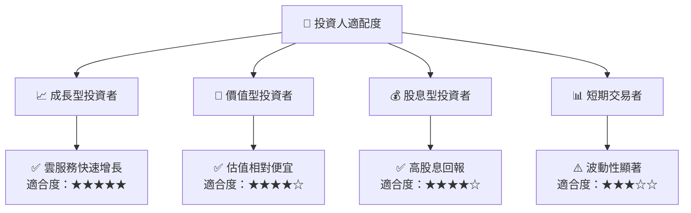

### 10.5 關鍵監控指標

| 監控類型 | 指標 | 關注點 | 頻率 |
|----------|------|--------|------|
| 收入趨勢 | 雲服務收入 | 增長速度 | 每季 |
| 利潤能力 | 毛利率 | 成本控制 | 每季 |
| 債務水平 | 總債務/GDP 比例 | 健康程度 | 每年 |
| 市場動態 | 競爭對手活動 | 市場份額 | 每半年 |

---

> **免責聲明**：本報告為 AI 自動生成，僅供研究參考，不構成投資建議。投資有風險，入市需謹慎。