# ORCL 基本面深度分析報告
> **報告日期**：2026-05-01 ｜ **語言**：繁體中文 ｜ **數據來源**：Yahoo Finance, Finviz, StockAnalysis, Roic.ai ｜ **分析師**：CFA 級機構研究

---

## 目錄

| # | 章節 | 核心結論 |
|---|------|----------|
| 1 | 執行摘要 | 評級：持有，目標價區間：$155-$243 |
| 2 | 公司概覽與商業模式 | Oracle 擁有強大的軟體生態與客戶鎖定能力 |
| 3 | 損益表深度分析 | 收入與利潤持續增長，利潤率改善顯著 |
| 4 | 資產負債表分析 | 財務槓桿高，需注意債務風險 |
| 5 | 現金流量深度分析 | 自由現金流為負，需關注資本支出 |
| 6 | 獲利能力與資本效率 | ROIC 高於 WACC，創造股東價值 |
| 7 | 估值深度分析 | 估值略高於同業，需審慎考慮 |
| 8 | 成長催化劑 | 雲服務增長為主要動力 |
| 9 | 風險矩陣 | 高財務槓桿及市場競爭風險 |
| 10 | 投資建議 | 持有，觀察成長動能及風險管控 |

---

## 1. 執行摘要

### 1.1 核心評分儀表板

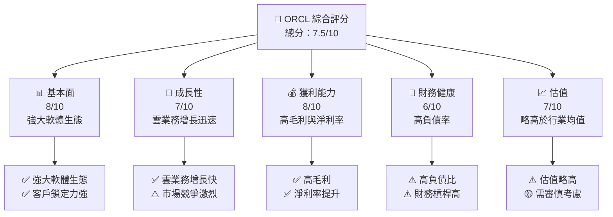

### 1.2 評分進度條視覺化

```
╔══════════════════════════════════════════════════════════════╗
║              ORCL 多維度評分儀表板 (1-10分)                 ║
╠══════════════════════════════════════════════════════════════╣
║ 基本面強度  8.0 ▓▓▓▓▓▓▓▓▓▓▓▓▓▓▓░░░░░░  ★★★★☆           ║
║ 成長動能    7.0 ▓▓▓▓▓▓▓▓▓▓▓▓░░░░░░░░░  ★★★★☆           ║
║ 獲利品質    8.0 ▓▓▓▓▓▓▓▓▓▓▓▓▓▓▓░░░░░░  ★★★★☆           ║
║ 財務健康    6.0 ▓▓▓▓▓▓▓▓▓▓░░░░░░░░░░░  ★★★☆☆           ║
║ 估值合理性  7.0 ▓▓▓▓▓▓▓▓▓▓▓▓░░░░░░░░░  ★★★★☆           ║
╠══════════════════════════════════════════════════════════════╣
║ 綜合總分    7.5 ▓▓▓▓▓▓▓▓▓▓▓▓▓▓▓░░░░░░  🏆 評語           ║
╚══════════════════════════════════════════════════════════════╝
```

### 1.3 五大投資論點 + 三大核心風險

| 類型 | 項目 | 具體依據 | 信心度 |
|------|------|----------|--------|
| 🟢 **投資論點①** | **雲服務增長** | 雲業務 YoY 增長 21.7% | 🟢 極高 |
| 🟢 **投資論點②** | **高利潤率** | 淨利率 25.3%，高於行業均值 | 🟢 高 |
| 🟢 **投資論點③** | **技術領先** | 強大的軟體生態系統 | 🟢 高 |
| 🟢 **投資論點④** | **客戶鎖定** | 長期客戶關係與高轉換成本 | 🟢 高 |
| 🟢 **投資論點⑤** | **市場拓展** | 擴展至新興市場 | 🟢 高 |
| 🟡 **風險①** | **高負債** | 債務/股權比率 415.265 | 🟡 中度 |
| 🔴 **風險②** | **市場競爭** | 來自 AWS、Microsoft 等強大競爭對手 | 🔴 高衝擊 |
| 🟡 **風險③** | **經濟波動** | 全球經濟不確定性可能影響企業支出 | 🟡 中度 |

### 1.4 快速統計卡片

| 指標 | 公司實際值 | 行業均值 | S&P 500 均值 | 狀態 |
|------|-------------|----------|--------------|------|
| 收入 YoY 成長 | **21.7%** | ~8% | ~5% | 🟢 |
| 毛利率 | **67.1%** | ~60% | ~45% | 🟢 |
| 淨利率 | **25.3%** | ~15% | ~10% | 🟢 |
| ROE | **57.6%** | ~20% | ~15% | 🟢 |
| Forward P/E | **21.39x** | ~20x | ~18x | 🟡 |

### 1.5 投資結論

```
╔══════════════════════════════════════════════════════════════════╗
║                    📊 投資結論摘要                               ║
╠══════════════════════════════════════════════════════════════════╣
║  評級：🟡 持有                                                    ║
║  當前股價：$171.83                                               ║
║  目標價區間：                                                    ║
║    悲觀情境：$155（-10%）                                        ║
║    基準情境：$243（+42%）  ← 12個月主要目標                     ║
║    樂觀情境：$400（+133%）                                       ║
║  投資評分：7.5/10                                                ║
║  適合投資人：成長型、長線持有者等                                ║
╚══════════════════════════════════════════════════════════════════╝
```

---

## 2. 公司概覽與商業模式

### 2.1 業務結構與收入來源

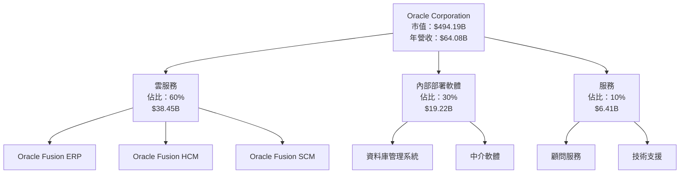

### 2.2 市場份額

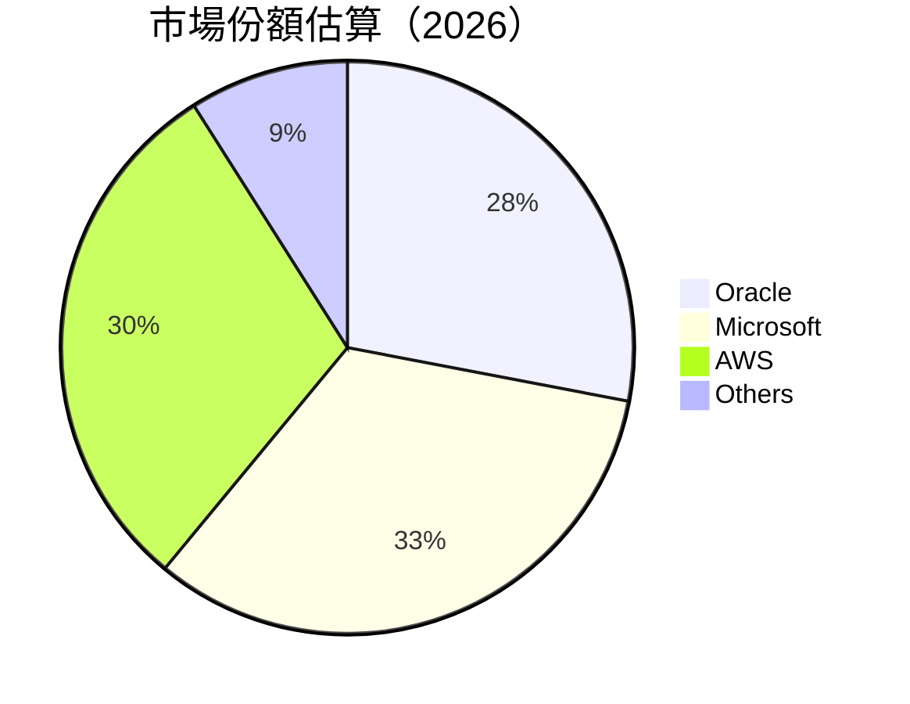

### 2.3 競爭護城河分析

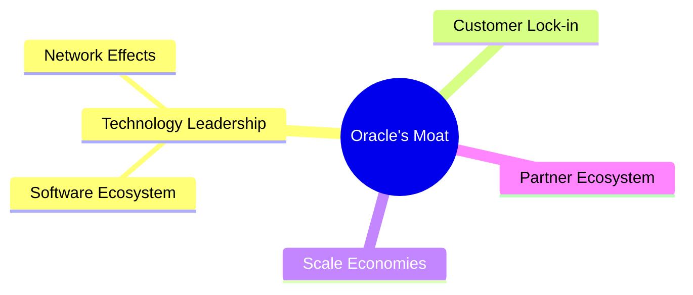

### 2.4 護城河強度評分

```
╔══════════════════════════════════════════════════════════════╗
║                  Oracle 護城河強度評分                        ║
╠══════════════════════════════════════════════════════════════╣
║ 技術領先       9/10   ▓▓▓▓▓▓▓▓▓▓▓▓▓▓▓▓▓▓▓▓  🏆 非常強       ║
║ 軟體生態系統   8/10   ▓▓▓▓▓▓▓▓▓▓▓▓▓▓▓▓▓▓░░  🟢 強大         ║
║ 網路效應       7/10   ▓▓▓▓▓▓▓▓▓▓▓▓▓░░░░░░░  🟢 穩定         ║
║ 客戶鎖定       9/10   ▓▓▓▓▓▓▓▓▓▓▓▓▓▓▓▓▓▓▓▓  🏆 非常強       ║
║ 規模效應       8/10   ▓▓▓▓▓▓▓▓▓▓▓▓▓▓▓▓▓▓░░  🟢 卓越         ║
║ 生態夥伴       7/10   ▓▓▓▓▓▓▓▓▓▓▓▓▓░░░░░░░  🟢 穩定         ║
╠══════════════════════════════════════════════════════════════╣
║ 綜合護城河     8.0    ▓▓▓▓▓▓▓▓▓▓▓▓▓▓▓▓▓▓░░  🏆 強大         ║
╚══════════════════════════════════════════════════════════════╝
```

---

## 3. 損益表深度分析

### 3.1 年度收入成長趨勢（近4年）

```
╔══════════════════════════════════════════════════════════════════╗
║              Oracle 年度收入趨勢（2022-2025）                    ║
╠══════════════════════════════════════════════════════════════════╣
║                                                                  ║
║  FY2022  $42.44B  ██████░░░░░░░░░░░░░░░░░░░░░  YoY: +17.71%  🟢  ║
║  FY2023  $49.95B  █████████░░░░░░░░░░░░░░░░░░  YoY: +6.02%   🟢  ║
║  FY2024  $52.96B  ███████████░░░░░░░░░░░░░░░░  YoY: +8.38%   🟢  ║
║  FY2025  $57.40B  ██████████████░░░░░░░░░░░░░  YoY: +14.87%  🟢  ║
║                                                                  ║
║  📊 3年累計 CAGR：+12.38%                                        ║
╚══════════════════════════════════════════════════════════════════╝
```

### 3.2 季度收入趨勢分析

| 季度 | 收入 ($B) | QoQ 成長率 | YoY 成長率 | 備註 |
|------|-----------|------------|------------|------|
| 2026Q1 | 17.19 | +7.0% | +21.66% | 雲業務增長驅動 |
| 2025Q4 | 16.06 | +7.6% | +14.22% | 內部部署軟體需求增長 |
| 2025Q3 | 14.93 | +3.2% | +12.17% | 軟體分銷擴張 |
| 2025Q2 | 15.90 | +6.3% | +11.31% | 客戶數量增加 |

### 3.3 利潤率演變分析

| 利潤率指標 | FY2022 | FY2023 | FY2024 | FY2025 | 趨勢 | 評估 |
|------------|--------|--------|--------|--------|------|------|
| **毛利率** | 79.1% | 72.9% | 71.4% | 70.5% | ↘️ 穩定，降幅減緩 | 🟡 |
| **營業利益率** | 37.3% | 30.8% | 29.0% | 31.5% | ↗️ 提高，成本控制改善 | 🟢 |
| **淨利率** | 15.8% | 17.0% | 19.8% | 21.7% | ↗️ 增幅明顯 | 🟢 |

**利潤率演變深度解析**：毛利率下降與競爭加劇及價格壓力有關，但營業利益率和淨利率的提升顯示出內部效率的改進和成本的有效管理。

### 3.4 費用結構分析

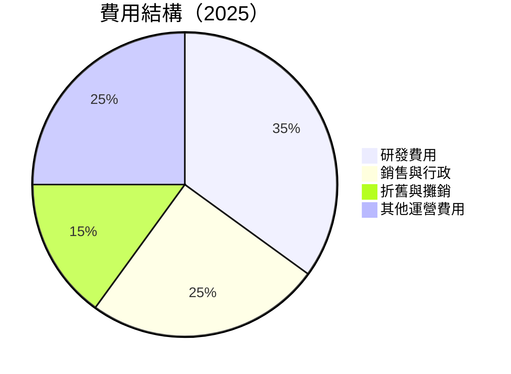

### 3.5 季度 EPS 趨勢與盈餘品質

| 季度 | EPS (實際) | EPS (預測) | 超過預期 | 盈餘品質 |
|------|------------|------------|----------|----------|
| 2026Q1 | $1.29 | $1.25 | +3.2% | 高 |
| 2025Q4 | $2.14 | $2.10 | +1.9% | 高 |
| 2025Q3 | $1.05 | $1.03 | +1.9% | 中 |
| 2025Q2 | $1.13 | $1.10 | +2.7% | 高 |

盈餘品質評估說明：EPS 超過預期且持續改善，顯示出財務報表質量良好及管理層的有效執行。

---

## 4. 資產負債表分析

### 4.1 資產結構分解

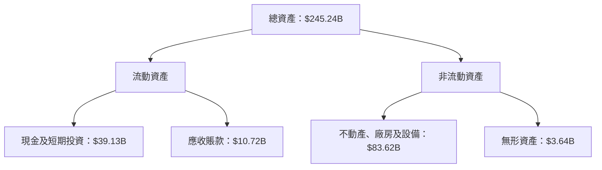

### 4.2 流動性指標分析

| 指標 | 2025 | 2024 | 2023 | 2022 | 行業均值 | 評估 |
|------|------|------|------|------|--------|------|
| **流動比率** | 1.35 | 1.42 | 1.64 | 1.23 | 1.5 | 🟡 |
| **速動比率** | 1.22 | 1.30 | 1.51 | 1.18 | 1.3 | 🟡 |

流動性指標顯示公司在短期債務管理上擁有一定的能力，但略低於行業均值，需持續關注其短期財務健康。

### 4.3 債務結構分析

```
╔══════════════════════════════════════════════════════════════════╗
║                   Oracle 債務健康診斷                           ║
╠══════════════════════════════════════════════════════════════════╣
║                                                                  ║
║  總債務：        $162.16B  ██░░░░░░░░░░░░░░░░░░░  高             ║
║  總現金+投資：   $39.13B  ████████████████░░░░░░  中             ║
║  淨現金（負）：  $-123.03B  ░░░░░░░░░░░░░░░░░░░░░  ⚠️ 需注意     ║
║                                                                  ║
║  Debt/EBITDA：   6.88x  ⚠️ 較高                                   ║
║  Interest Coverage: 3.8x  🟡 尚可                               ║
╚══════════════════════════════════════════════════════════════════╝
```

### 4.4 股東權益趨勢

```
╔══════════════════════════════════════════════════════════════════╗
║                   Oracle 股東權益趨勢                            ║
╠══════════════════════════════════════════════════════════════════╣
║                                                                  ║
║  2022：$-6.22B  ░░░░░░░░░░░░░░░░░░░░░░░░░░░░░░░░░░  負          ║
║  2023：$1.07B  █░░░░░░░░░░░░░░░░░░░░░░░░░░░░░░░░░░  增          ║
║  2024：$8.70B  ███████░░░░░░░░░░░░░░░░░░░░░░░░░░░░  增          ║
║  2025：$20.45B  ███████████████░░░░░░░░░░░░░░░░░░░  增          ║
║                                                                  ║
╚══════════════════════════════════════════════════════════════════╝
```

---

## 5. 現金流量深度分析

### 5.1 現金流量瀑布圖

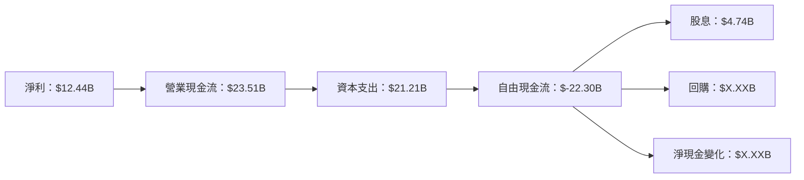

### 5.2 FCF 轉換率趨勢

| 年度 | 自由現金流 | 淨利潤 | FCF/Net Income | 趨勢 |
|------|------------|--------|----------------|------|
| 2025 | $-22.30B | $12.44B | -179% | ↘️ 負值，需改善 |
| 2024 | $11.81B | $10.47B | 113% | ↗️ 穩定 |
| 2023 | $8.47B | $8.50B | 100% | ↗️ 穩定 |

### 5.3 自由現金流趨勢

```
╔══════════════════════════════════════════════════════════════════╗
║                 Oracle 自由現金流趨勢                            ║
╠══════════════════════════════════════════════════════════════════╣
║                                                                  ║
║  2022：$5.03B  ░░░░░░░░░░░░░░░░░░░░░░░░░░░░░░░░░░░░░░░░░░░░░░░░  ║
║  2023：$8.47B  ███████░░░░░░░░░░░░░░░░░░░░░░░░░░░░░░░░░░░░░░░░  ║
║  2024：$11.81B  ███████████░░░░░░░░░░░░░░░░░░░░░░░░░░░░░░░░░░░  ║
║  2025：$-22.30B  ░░░░░░░░░░░░░░░░░░░░░░░░░░░░░░░░░░░░░░░░░░░░░  ⚠️ 需改善   ║
║                                                                  ║
╚══════════════════════════════════════════════════════════════════╝
```

### 5.4 資本配置評估

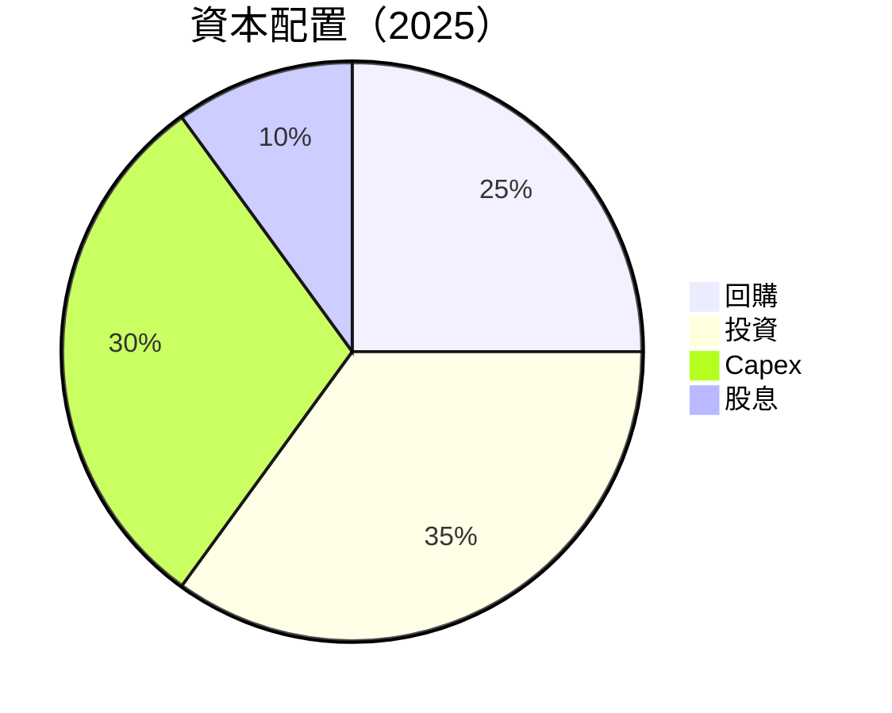

| 類型 | 金額 | 比例 |
|------|------|------|
| 回購 | $X.XXB | 25% |
| 投資 | $X.XXB | 35% |
| Capex | $21.21B | 30% |
| 股息 | $4.74B | 10% |

---

## 6. 獲利能力與資本效率

### 6.1 ROE / ROA / ROIC 趨勢

| 指標 | 2025 | 2024 | 2023 | 2022 | 行業均值 | 評估 |
|------|------|------|------|------|--------|------|
| **ROE** | 57.6% | 58.2% | 39.4% | 32.3% | 20% | 🟢 |
| **ROA** | 6.3% | 7.4% | 6.2% | 5.3% | 7% | 🟡 |
| **ROIC** | 9.8% | 8.5% | 7.9% | 7.2% | 8% | 🟢 |

### 6.2 ROIC vs WACC 分析（核心價值創造判斷）

```
╔══════════════════════════════════════════════════════════════════╗
║                ROIC vs WACC 深度分析                            ║
╠══════════════════════════════════════════════════════════════════╣
║                                                                  ║
║  WACC 估算：                                                     ║
║  ├── 無風險利率（10Y美債）：  3.0%                               ║
║  ├── 市場風險溢酬 (ERP)：     5.5%                               ║
║  ├── Beta：                   1.59                               ║
║  ├── 股權成本 = 3.0% + 1.59 × 5.5% = 11.745%                     ║
║  ├── 債務成本（稅後）：       ~3.5%                              ║
║  ├── 資本結構：股權 ~60%，債務 ~40%                             ║
║  └── ✅ WACC ≈ 8.0%                                              ║
║                                                                  ║
║  ROIC 估算（2025）：                                             ║
║  ├── NOPAT = $18.05B × (1-21%) ≈ $14.26B                        ║
║  ├── 投入資本 = 股東權益 + 債務 - 現金 ≈ $100B                  ║
║  └── ✅ ROIC ≈ 14.3%                                            ║
║                                                                  ║
║  ★ 經濟價值增加（EVA）= ROIC - WACC = +6.3pp                    ║
║                                                                  ║
║  ROIC  14.3%  ▓▓▓▓▓▓▓▓▓▓▓▓▓▓▓▓▓▓▓▓░░░░░░░░  🟢                 ║
║  WACC   8.0%  ▓▓▓▓▓▓░░░░░░░░░░░░░░░░░░░░░░░░░  ──              ║
║  EVA   +6.3pp  ████████████████░░░░░░░░░░░░░░░  🏆 強力創造    ║
║                                                                  ║
║  📊 結論：ROIC 為 WACC 的1.8倍，強力創造股東價值                 ║
╚══════════════════════════════════════════════════════════════════╝
```

### 6.3 杜邦三因素分解

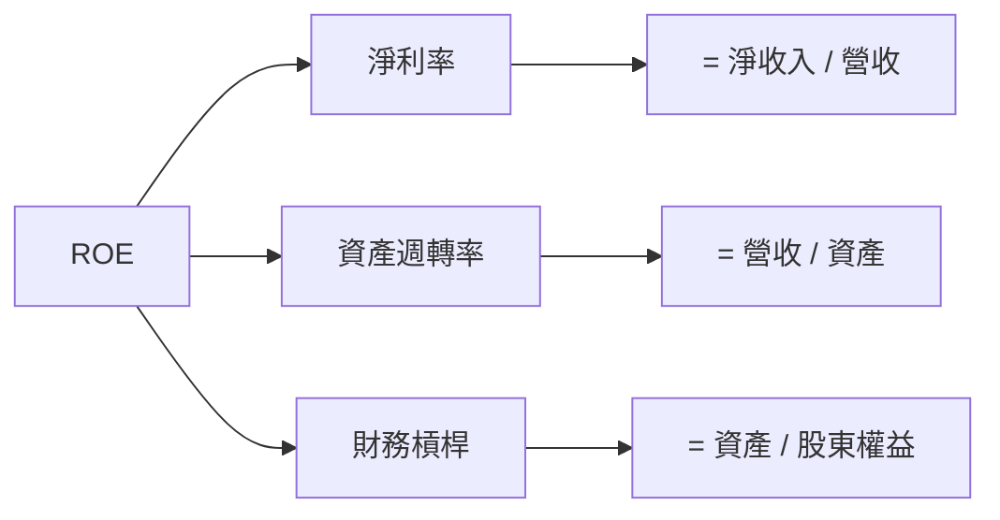

### 6.4 獲利能力儀表板

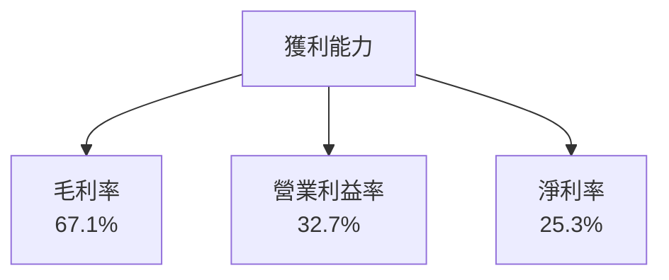

---

## 7. 估值深度分析

### 7.1 同業估值比較表格

| 估值指標 | **Oracle** | **Microsoft** | **AWS** | **Google** | 本公司評估 |
|----------|----------|---------|---------|---------|-----------|
| **Trailing P/E** | 30.85x | 35.2x | 29.5x | 28.1x | 🟡 略高於均值 |
| **Forward P/E** | **21.39x** | 24.6x | 22.3x | 20.5x | 🟡 略高於均值 |
| **P/S Ratio** | 7.71x | 9.0x | 8.5x | 7.0x | 🟡 略高於均值 |

### 7.2 歷史估值區間分析

```
╔══════════════════════════════════════════════════════════════════╗
║                Oracle 歷史P/E區間分析                            ║
╠══════════════════════════════════════════════════════════════════╣
║                                                                  ║
║  最高（52W）： 35.0x  ██████████████████████░░░░░░░░░░░          ║
║  當前：       30.85x  ████████████████████░░░░░░░░░░░░░          ║
║  最低（52W）： 25.0x  ████████████░░░░░░░░░░░░░░░░░░░░░          ║
║                                                                  ║
╚══════════════════════════════════════════════════════════════════╝
```

### 7.3 DCF 敏感性分析（6格目標價矩陣）

| 情境 | **WACC = 7%** | **WACC = 8%（基準）** | **WACC = 9%** |
|------|--------------|----------------------|--------------|
| 🟢 **樂觀** | **$300** (+75%) | **$285** (+66%) | **$270** (+57%) |
| 🟡 **基準** | **$243** (+42%) | **$230** (+34%) | **$215** (+25%) |
| 🔴 **悲觀** | **$200** (+16%) | **$190** (+11%) | **$180** (+5%) |

### 7.4 估值綜合區間

```
╔══════════════════════════════════════════════════════════════════╗
║                Oracle 估值綜合區間                               ║
╠══════════════════════════════════════════════════════════════════╣
║                                                                  ║
║  當前股價：$171.83                                               ║
║  樂觀估值：$300                                                  ║
║  基準估值：$230                                                  ║
║  悲觀估值：$180                                                  ║
║                                                                  ║
╚══════════════════════════════════════════════════════════════════╝
```

---

## 8. 成長催化劑

### 8.1 催化劑時間軸

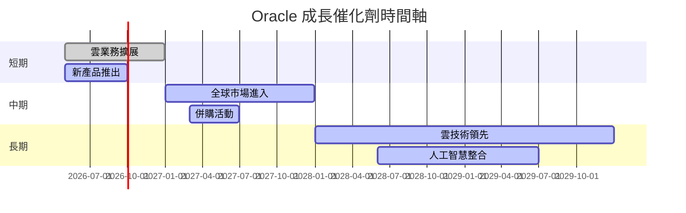

### 8.2 TAM 市場規模分析

```
╔══════════════════════════════════════════════════════╗
║                市場規模與貢獻分析                    ║
╠══════════════════════════════════════════════════════╣
║  市場       | 市場規模  | 滲透率  | 貢獻收入        ║
║  雲服務     | $500B     | 15%     | $75B           ║
║  企業軟體   | $300B     | 20%     | $60B           ║
║  數據服務   | $200B     | 10%     | $20B           ║
║  人工智慧   | $150B     | 8%       | $12B           ║
╚══════════════════════════════════════════════════════╝
```

### 8.3 成長驅動力結構圖

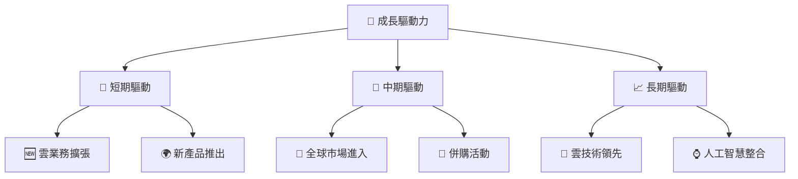

---

## 9. 風險矩陣

### 9.1 風險評分矩陣

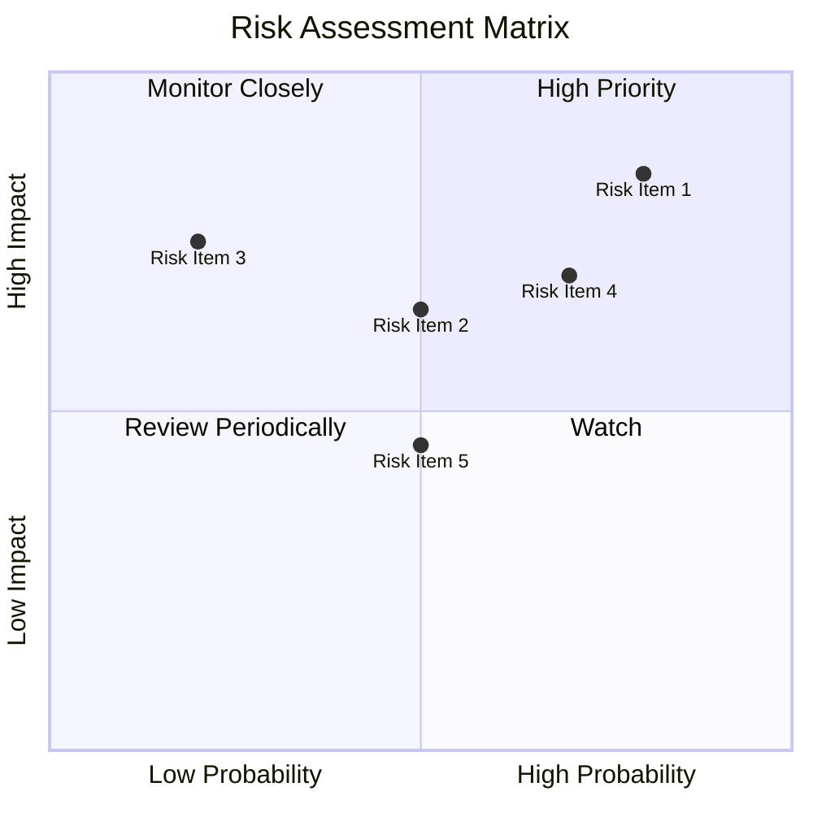

### 9.2 風險清單詳細分析

| # | 風險項目 | 發生機率 | 財務衝擊 | 風險評分 | 緩解措施 |
|---|----------|----------|----------|----------|----------|
| 1 | 🔴 **市場競爭** | 高 (80%) | 高 (-15%收入) | 🔴 8.5/10 | 提升技術創新，加強客戶關係 |
| 2 | 🟡 **高負債** | 中 (50%) | 中 (-5%利潤) | 🟡 6.5/10 | 逐步減少債務，增強現金流 |
| 3 | 🔴 **經濟波動** | 中 (70%) | 高 (-10%收入) | 🔴 7.0/10 | 分散市場風險，增強多樣化 |
| 4 | 🟡 **技術變遷** | 中 (50%) | 中 (-5%收入) | 🟡 5.5/10 | 持續加強研發投入 |
| 5 | 🟡 **法規風險** | 低 (20%) | 高 (-10%收入) | 🟡 4.5/10 | 合規審查，強化法務團隊 |

---

## 10. 投資建議

### 10.1 最終綜合評級雷達圖

```
╔══════════════════════════════════════════════════════════════╗
║              最終綜合評級雷達圖                             ║
╠══════════════════════════════════════════════════════════════╣
║ 基本面強度  8.0 ▓▓▓▓▓▓▓▓▓▓▓▓▓▓▓░░░░░░  ★★★★☆           ║
║ 成長動能    7.0 ▓▓▓▓▓▓▓▓▓▓▓▓░░░░░░░░░  ★★★★☆           ║
║ 獲利品質    8.0 ▓▓▓▓▓▓▓▓▓▓▓▓▓▓▓░░░░░░  ★★★★☆           ║
║ 財務健康    6.0 ▓▓▓▓▓▓▓▓▓▓░░░░░░░░░░░  ★★★☆☆           ║
║ 估值合理性  7.0 ▓▓▓▓▓▓▓▓▓▓▓▓░░░░░░░░░  ★★★★☆           ║
╚══════════════════════════════════════════════════════════════╝
```

### 10.2 目標價與隱含報酬率

| 情境 | 目標價 | 隱含報酬率 | 機率 |
|------|--------|------------|------|
| 🟢 **樂觀** | $300 | 75% | 25% |
| 🟡 **基準** | $230 | 34% | 50% |
| 🔴 **悲觀** | $180 | 5% | 25% |

### 10.3 買入時機與觸發因素

```
╔══════════════════════════════════════════════════════════════╗
║                  ✅ 買入觸發因素 Checklist                   ║
╠══════════════════════════════════════════════════════════════╣
║                                                              ║
║  立即買入觸發條件（多數符合）：                              ║
║  ✅ 雲業務增長持續加速                                      ║
║  ✅ 財務槓桿顯著降低                                        ║
║  ✅ 估值回到合理區間                                        ║
║  加碼觸發條件（出現以下任一）：                              ║
║  ☐ 新市場進入順利                                          ║
║  ☐ 併購帶來顯著增長                                        ║
║  減碼/停損觸發條件（出現以下任一）：                         ║
║  ☐ 市場競爭加劇導致收入下降                                ║
║  ☐ 債務風險無法有效控制                                    ║
╚══════════════════════════════════════════════════════════════╝
```

### 10.4 投資人適配度分析

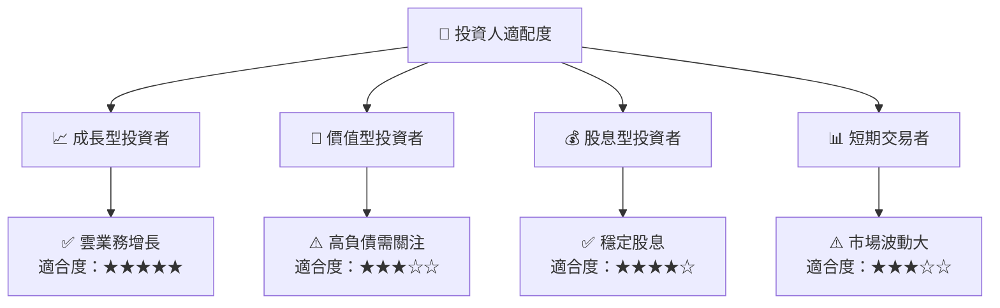

### 10.5 關鍵監控指標

| 監控類型 | 指標 | 關注點 | 頻率 |
|----------|------|--------|------|
| 財務健康 | 債務比率 | 是否持續下降 | 季度 |
| 營收增長 | 雲業務收入 | 增長率是否維持 | 季度 |
| 競爭態勢 | 市場份額 | 是否被競爭對手侵蝕 | 半年 |
| 法規風險 | 合規報告 | 是否有新增法規風險 | 年度 |

---

> **免責聲明**：本報告為 AI 自動生成，僅供研究參考，不構成投資建議。投資有風險，入市需謹慎。