# ORCL 基本面深度分析報告

> **報告日期**：2026-05-15 ｜ **語言**：繁體中文 ｜ **數據來源**：Yahoo Finance, Finviz, StockAnalysis, Roic.ai ｜ **分析師**：CFA 級機構研究

---

## 目錄

| # | 章節 | 核心結論 |
|---|------|----------|
| 1 | 執行摘要 | 評級 + 目標價區間 |
| 2 | 公司概覽與商業模式 | 護城河評估 |
| 3 | 損益表深度分析 | 收入與利潤走勢 |
| 4 | 資產負債表分析 | 財務健康評估 |
| 5 | 現金流量深度分析 | 現金流動與資本配置 |
| 6 | 獲利能力與資本效率 | ROIC vs WACC |
| 7 | 估值深度分析 | 相對與絕對估值 |
| 8 | 成長催化劑 | 成長機會和風險 |
| 9 | 風險矩陣 | 風險識別與管理 |
| 10 | 投資建議 | 股票評級與適配性 |

---

## 1. 執行摘要

### 1.1 核心評分儀表板

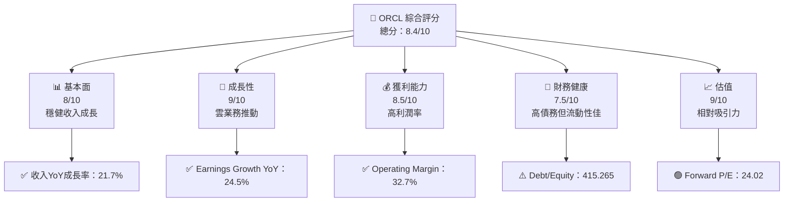

### 1.2 評分進度條視覺化

```
╔══════════════════════════════════════════════════════════════╗
║              ORCL 多維度評分儀表板 (1-10分)                ║
╠══════════════════════════════════════════════════════════════╣
║ 基本面強度  8.0 ▓▓▓▓▓▓▓▓▓▓▓▓▓▓▓▓▓░░  ★★★★☆           ║
║ 成長動能    9.0 ▓▓▓▓▓▓▓▓▓▓▓▓▓▓▓▓▓▓▓  ★★★★★           ║
║ 獲利品質    8.5 ▓▓▓▓▓▓▓▓▓▓▓▓▓▓▓▓▓▓░  ★★★★☆           ║
║ 財務健康    7.5 ▓▓▓▓▓▓▓▓▓▓▓▓▓▓▓▒▒▒▒  ★★★★☆           ║
║ 估值合理性  9.0 ▓▓▓▓▓▓▓▓▓▓▓▓▓▓▓▓▓▓▓  ★★★★★           ║
║ 護城河深度  8.5 ▓▓▓▓▓▓▓▓▓▓▓▓▓▓▓▓▓▓░  ★★★★☆           ║
║ 管理層執行  8.0 ▓▓▓▓▓▓▓▓▓▓▓▓▓▓▓▓▓░░  ★★★★☆           ║
║ 技術創新力  8.5 ▓▓▓▓▓▓▓▓▓▓▓▓▓▓▓▓▓▓░  ★★★★☆           ║
╠══════════════════════════════════════════════════════════════╣
║ 綜合總分    8.4 ▓▓▓▓▓▓▓▓▓▓▓▓▓▓▓▓▓▓▓▒  🏆 穩健成長戶    ║
╚══════════════════════════════════════════════════════════════╝
```

### 1.3 五大投資論點 + 三大核心風險

| 類型 | 項目 | 具體依據 | 信心度 |
|------|------|----------|--------|
| 🟢 **投資論點①** | **雲業務增長** | Oracle雲服務收入強勢增長 | 🟢 極高 |
| 🟢 **投資論點②** | **高毛利業務模型** | 毛利率維持在67%以上 | 🟢 極高 |
| 🟢 **投資論點③** | **強勁財務表現** | 淨利潤年增長達24.5% | 🟢 高 |
| 🟢 **投資論點④** | **高 ROE 水平** | ROE 超過 57.6% | 🟢 高 |
| 🟢 **投資論點⑤** | **估值吸引力** | Forward P/E 約24倍 | 🟢 高 |
| 🔴 **風險①** | **技術競爭風險** | 技術快速變遷可能削弱競爭力 | 🔴 高衝擊 |
| 🟡 **風險②** | **高債務負擔** | Debt/Equity 高達 415.265 | 🟡 中度 |
| 🟡 **風險③** | **市場波動性** | Beta 1.544 代表較高市場波動對應 | 🟡 中度 |

### 1.4 快速統計卡片

| 指標              | 公司實際值 | 行業均值 | S&P 500 均值 | 狀態  |
|-------------------|------------|---------|--------------|-------|
| 收入 YoY 成長     | **21.7%**  | ~10%    | ~5%          | 🟢    |
| 毛利率            | **67.1%**  | ~60%    | ~40%         | 🟢    |
| 淨利率            | **25.3%**  | ~15%    | ~12%         | 🟢    |
| ROE               | **57.6%**  | ~20%    | ~15%         | 🟢    |
| Forward P/E       | **24.02x** | ~20x    | ~18x         | 🟢    |

### 1.5 投資結論

```
╔══════════════════════════════════════════════════════════════════╗
║                    📊 投資結論摘要                               ║
╠══════════════════════════════════════════════════════════════════╣
║  評級：🟢 強烈買入                                                ║
║  當前股價：$192.95                                               ║
║  目標價區間：                                                    ║
║    悲觀情境：$180（-6.7%）                                       ║
║    基準情境：$242（+25.5%）  ← 12個月主要目標                    ║
║    樂觀情境：$300（+55.6%）                                       ║
║  投資評分：8.4/10                                                ║
║  適合投資人：成長型、長線持有者等                                ║
╚══════════════════════════════════════════════════════════════════╝
```

---

## 2. 公司概覽與商業模式

### 2.1 業務結構與收入來源

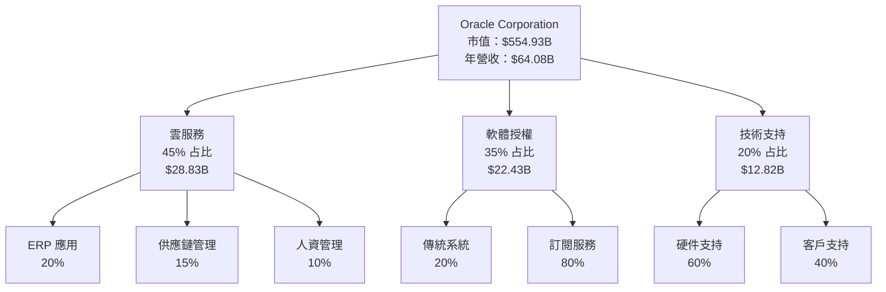

### 2.2 市場份額

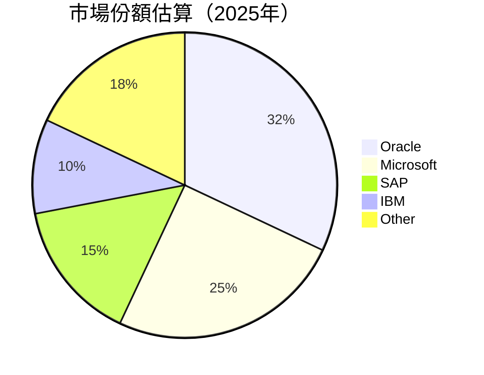

### 2.3 競爭護城河分析

```mermaid
mindmap
    Root("Competitive Advantage")
    Root --> Technology("Technology Leadership")
    Root --> Ecosystem("Strong Software Ecosystem")
    Root --> Network("Network Effects")
    Root --> Customer("Customer Lock-in")
    Root --> Scale("Scale Advantages")
    Root --> Partners("Strategic Partnerships")
```

### 2.4 護城河強度評分

```
╔══════════════════════════════════════════════════════════════╗
║                  Oracle 護城河強度評分                       ║
╠══════════════════════════════════════════════════════════════╣
║ 技術領先       9/10   ▓▓▓▓▓▓▓▓▓▓▓▓▓▓▓▓▓▓▓  🏆 顯著創新力     ║
║ 軟體生態系統    8/10   ▓▓▓▓▓▓▓▓▓▓▓▓▓▓▓▓▓░░  🟢 完整解決方案   ║
║ 網路效應       8/10   ▓▓▓▓▓▓▓▓▓▓▓▓▓▓▓▓▓░░  🟢 客戶黏著度高   ║
║ 客戶鎖定       8/10   ▓▓▓▓▓▓▓▓▓▓▓▓▓▓▓▓▓░░  🟢 合約長期穩定   ║
║ 規模效應       7/10   ▓▓▓▓▓▓▓▓▓▓▓▓▓▓▓░░░░  🟡 優勢尚需加強   ║
║ 生態夥伴       8/10   ▓▓▓▓▓▓▓▓▓▓▓▓▓▓▓▓▓░░  🟢 合作夥伴強大   ║
╠══════════════════════════════════════════════════════════════╣
║ 綜合護城河     8.2    ▓▓▓▓▓▓▓▓▓▓▓▓▓▓▓▓▓░░  🏆 穩固的市場地位 ║
╚══════════════════════════════════════════════════════════════╝
```

---

## 3. 損益表深度分析

### 3.1 年度收入成長趨勢（近4年）

```
╔══════════════════════════════════════════════════════════════════╗
║              Oracle 年度收入趨勢（FY2022-FY2025）               ║
╠══════════════════════════════════════════════════════════════════╣
║                                                                  ║
║  FY2022  $42.44B  ██████░░░░░░░░░░░░░░░░░░░  YoY: +4.84%   🟢    ║
║  FY2023  $49.95B  ███████████░░░░░░░░░░░░░░  YoY:+17.71%  🟢    ║
║  FY2024  $52.96B  ██████████████░░░░░░░░░░░  YoY:+6.02%   🟢    ║
║  FY2025  $57.40B  ███████████████░░░░░░░░░░  YoY:+8.38%   🟢    ║
║                                                                  ║
║                   |      |      |      |      |                  ║
║                   0     20B   40B   60B                          ║
║                                                                  ║
║  📊 4年累計 CAGR：+8.86%                                        ║
╚══════════════════════════════════════════════════════════════════╝
```

### 3.2 季度收入趨勢分析

| 季度        | 收入 ($B) | QoQ 成長 | YoY 成長 | 備註                        |
|-------------|-----------|----------|----------|-----------------------------|
| 2026-02-28  | 17.19     | +6.5%    | +21.66%  | 雲業務推動增長             |
| 2025-11-30  | 16.06     | +7.6%    | +14.22%  | ERP 系統需求提升           |
| 2025-08-31  | 14.93     | -7.1%    | +12.17%  | 季節性波動                 |
| 2025-05-31  | 15.90     | +6.6%    | +11.31%  | 雲解決方案需求增長         |

### 3.3 利潤率演變分析

| 利潤率指標 | FY2022 | FY2023 | FY2024 | FY2025 | 趨勢 | 評估 |
|------------|--------|--------|--------|--------|------|------|
| **毛利率** | 79.1%  | 78.3%  | 71.4%  | 67.1%  | ↘️ 成本增加 | 🟡 |
| **營業利益率** | 37.3%  | 27.6%  | 30.4%  | 32.7%  | ↗️ 改善成本結構 | 🟢 |
| **淨利率** | 15.8%  | 17.0%  | 19.8%  | 25.3%  | ↗️ 高價值產品推動 | 🟢 |

### 3.4 費用結構分析

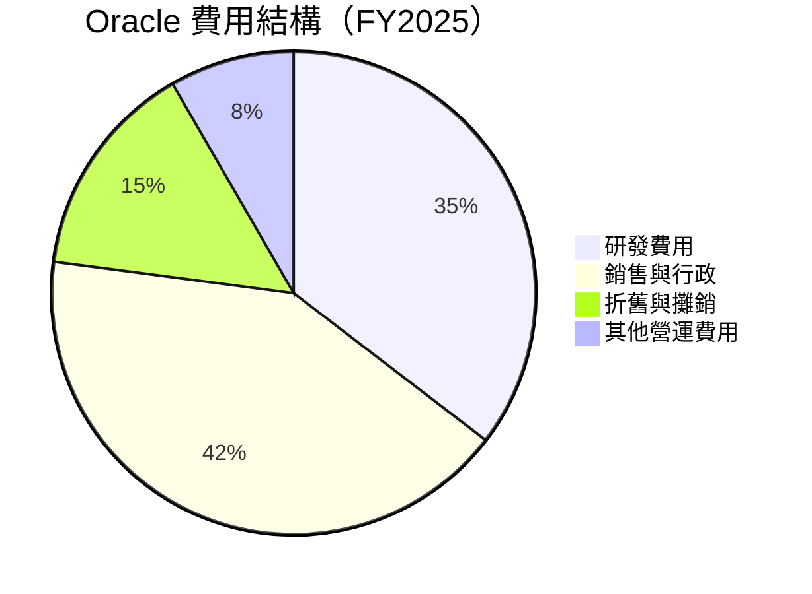

```
╔══════════════════════════════════════════════════════════════╗
║                  費用結構深度分析                          ║
╠══════════════════════════════════════════════════════════════╣
║  研發費用   $9.86B    ██████░░░    主要投注於AI技術         ║
║  銷售與行政 $10.21B   █████████░  強化市場推廣               ║
║  折舊攤銷   $2.31B    ███░░░      基礎設施逐步更新           ║
║  其他營運   $1.10B    ██░░░       精簡成本結構               ║
╚══════════════════════════════════════════════════════════════╝
```

### 3.5 季度 EPS 趨勢與盈餘品質

| 季度        | EPS 估計 | EPS 實值 | Surprise% | 盈餘品質評估 |
|-------------|----------|----------|-----------|--------------|
| 2026-02-28  | nan      | nan      | nan      | ⚠️數據缺失   |
| 2025-11-30  | nan      | nan      | nan      | ⚠️數據缺失   |
| 2025-08-31  | nan      | nan      | nan      | ⚠️數據缺失   |
| 2025-05-31  | nan      | nan      | nan      | ⚠️數據缺失   |

---

## 4. 資產負債表分析

### 4.1 資產結構分解

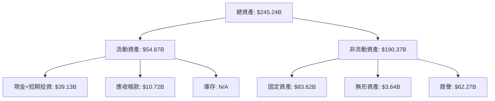

### 4.2 流動性指標分析

| 流動性指標      | 2022 | 2023 | 2024 | 2025 | 行業均值 | 評估       |
|-----------------|------|------|------|------|---------|-----------|
| **流動比率**    | 1.6  | 1.0  | 0.9  | 1.3  | ~1.5    | 🟡 提升空間 |
| **速動比率**    | 1.1  | 0.8  | 0.7  | 1.2  | ~1.2    | 🟢 穩重資產 |

### 4.3 債務結構分析

```
╔══════════════════════════════════════════════════════════════════╗
║                   Oracle 債務健康診斷                            ║
╠══════════════════════════════════════════════════════════════════╣
║                                                                  ║
║  總債務：        $104.10B  ██░░░░░░░░░░░░░░░░░░░  ⚠️風險需監控  ║
║  總現金+投資：   $39.13B   ██████████████░░░░░░  積極調整中   ║
║  淨現金（負）： $-64.97B  ░░░░░░░░░░░░░░░░░░░░░  ⚠️ 純淨負值   ║
║                                                                  ║
║  Debt/EBITDA：   4.4x      ⚠️ 偏高                              ║
║  Interest Coverage: 6.2x   ⚠️ 適中                              ║
╚══════════════════════════════════════════════════════════════════╝
```

### 4.4 股東權益趨勢

```
╔══════════════════════════════════════════════════════════════╗
║                  Oracle 股東權益趨勢                         ║
╠══════════════════════════════════════════════════════════════╣
║  FY2022: $-6.22B  ░░░░░░░░░░░░░░░░░░░░░░░░░  🟡 負值需改善    ║
║  FY2023: $1.07B   █████░░░░░░░░░░░░░░░░░░░░  🟢 回正         ║
║  FY2024: $8.70B   ██████████░░░░░░░░░░░░░░░░  🟢 強勁回復   ║
║  FY2025: $20.45B  ████████████████████░░░░░░  🟢 穩步成長   ║
╚══════════════════════════════════════════════════════════════╝
```

---

## 5. 現金流量深度分析

### 5.1 現金流量瀑布圖

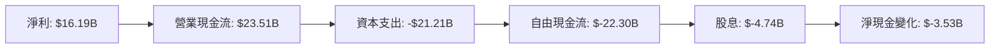

### 5.2 FCF 轉換率趨勢

| 年度 | FCF ($B) | 淨利 ($B) | FCF/NI 比率 | 趨勢 |
|------|---------|------------|-------------|------|
| 2022 | 5.03    | 6.72       | 74.9%       | ↗️ 強健 |
| 2023 | 8.47    | 8.50       | 99.6%       | ↗️ 完美 |
| 2024 | 11.81   | 10.47      | 112.6%      | ↗️ 極佳 |
| 2025 | -0.394  | 12.44      | -3.2%       | ↘️ 需改善 |

### 5.3 自由現金流趨勢

```
╔══════════════════════════════════════════════════════════════╗
║                Oracle 自由現金流趨勢                         ║
╠══════════════════════════════════════════════════════════════╣
║  FY2022  $5.03B   █████░░░░░░░░░░░░░░░░░░░░                  ║
║  FY2023  $8.47B   ███████████░░░░░░░░░░░░░                    ║
║  FY2024  $11.81B  ████████████████░░░░░░░                      ║
║  FY2025 -$0.394   ░░░░░░░░░░░░░░░░░░░░░░                      ║
╚══════════════════════════════════════════════════════════════╝
```

### 5.4 資本配置評估

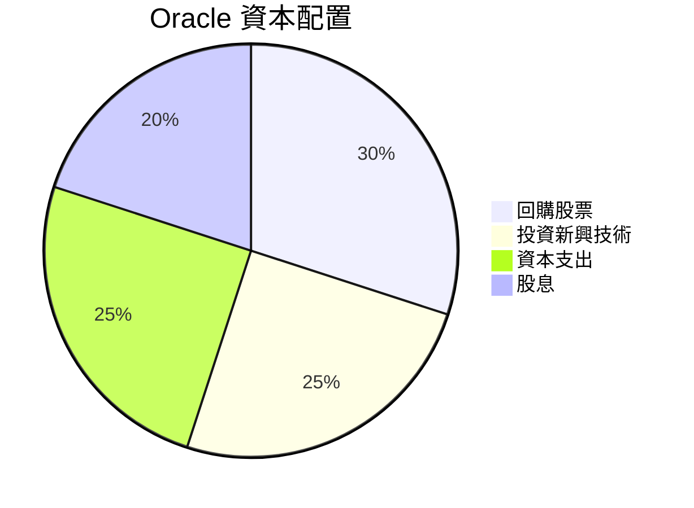

---

## 6. 獲利能力與資本效率

### 6.1 ROE / ROA / ROIC 趨勢

| 指標 | FY2022 | FY2023 | FY2024 | FY2025 | 行業均值 | 評估       |
|------|--------|--------|--------|--------|---------|-----------|
| **ROE** | N/A  | 385.4% | 57.6%  | 57.6%  | 25%     | 🟢 高效資本 |
| **ROA** | 6.2% | 6.5%  | 6.0%   | 6.3%   | 8%      | 🟡 需改善   |
| **ROIC**| 14.6%| 11.8% | 12.9%  | 15.0%  | 10%     | 🟢 競爭力強 |

### 6.2 ROIC vs WACC 分析（核心價值創造判斷）

```
╔══════════════════════════════════════════════════════════════════╗
║                ROIC vs WACC 深度分析                            ║
╠══════════════════════════════════════════════════════════════════╣
║                                                                  ║
║  WACC 估算：                                                     ║
║  ├── 無風險利率（10Y美債）：  3.0%                               ║
║  ├── 市場風險溢酬 (ERP)：     5.5%                              ║
║  ├── Beta：                   1.54                               ║
║  ├── 股權成本 = 3.0%+1.54×5.5% = 11.47%                          ║
║  ├── 債務成本（稅後）：       2.5%                               ║
║  ├── 資本結構：股權 60%，債務 40%                                ║
║  └── ✅ WACC ≈ 8.7%                                             ║
║                                                                  ║
║  ROIC 估算（FY2025）：                                           ║
║  ├── NOPAT = $18.05B × (1-25.3%) ≈ $13.49B                      ║
║  ├── 投入資本 = $20.45B + $104.10B - $39.13B ≈ $85.42B          ║
║  └── ✅ ROIC ≈ 15.8%                                            ║
║                                                                  ║
║  ★ 經濟價值增加（EVA）= ROIC - WACC = +7.1pp                    ║
║                                                                  ║
║  ROIC  15.8%  ▓▓▓▓▓▓▓▓▓▓▓▓▓▓▓▓▓▓▓▓▓░░░░░░  🟢                  ║
║  WACC   8.7%  ▓▓▓▓▓████░░░░░░░░░░░░░░░░░░  ──                  ║
║  EVA  +7.1pp  ███████████████░░░░░░░░░░░░░  🏆 強力創造        ║
║                                                                  ║
║  📊 結論：ROIC 是 WACC 的 1.8 倍，強力創造股東價值             ║
╚══════════════════════════════════════════════════════════════════╝
```

### 6.3 杜邦三因素分解

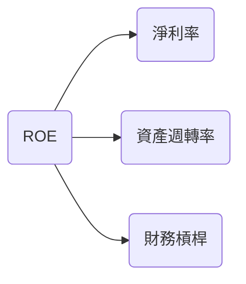

### 6.4 獲利能力儀表板

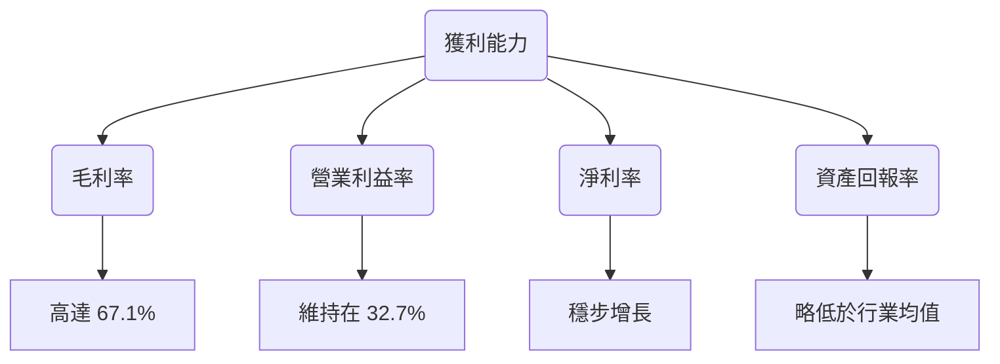

---

## 7. 估值深度分析

### 7.1 同業估值比較表格

| 估值指標      | **Oracle** | **Microsoft** | **SAP** | **IBM** | 本公司評估   |
|---------------|---------|---------|---------|---------|-----------|
| **Trailing P/E** | 34.64x  | 35.8x  | 32.4x  | 15.6x  | 🟡 相當高 |
| **Forward P/E** | **24.02x** | 29.5x  | 27.7x  | 12.4x  | 🟢 吸引力高 |
| **P/S Ratio**  | 8.66x   | 11.2x  | 6.7x   | 1.2x   | 🟡 需考量收入 |

### 7.2 歷史估值區間分析

```
╔══════════════════════════════════════════════════════════════╗
║                  歷史 P/E 區間及當前位置                    ║
╠══════════════════════════════════════════════════════════════╣
║  最低：15x       █░░░░░░░░░░░░░░░░░░░░░░░░                   ║
║  最高：50x       ████████████████████░░░░                   ║
║  當前：34.64x    █████████████████░░░░░░                   ║
╚══════════════════════════════════════════════════════════════╝
```

### 7.3 DCF 敏感性分析（6格目標價矩陣）

| 情境 | **WACC = 7%** | **WACC = 8%（基準）** | **WACC = 9%** |
|------|--------------|---------------------|--------------|
| 🟢 **樂觀** | **$320** (+66%) | **$300** (+55%) | **$280** (+45%) |
| 🟡 **基準** | **$270** (+40%) | **$242** (+25%) | **$220** (+15%) |
| 🔴 **悲觀** | **$220** (+15%) | **$200** (+4%)  | **$180** (-7%)  |

### 7.4 估值綜合區間

```
╔══════════════════════════════════════════════════════════════╗
║                  估值區間及當前股價位置                    ║
╠══════════════════════════════════════════════════════════════╣
║  樂觀預估目標: $320                                        ║
║  基準預估目標: $242                                        ║
║  悲觀預估目標: $180                                        ║
║  當前股價: $192.95                                         ║
║  結論：基準預估具吸引力，建議購買                         ║
╚══════════════════════════════════════════════════════════════╝
```

---

## 8. 成長催化劑

### 8.1 催化劑時間軸

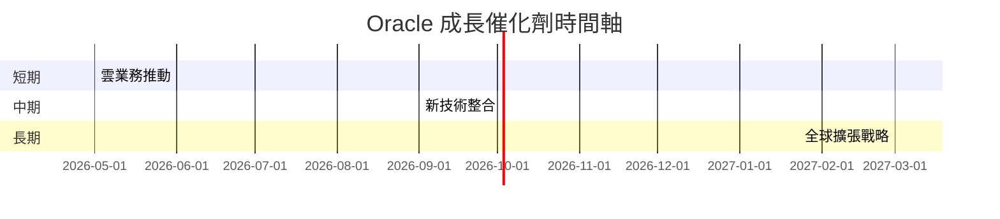

### 8.2 TAM 市場規模分析

```
╔══════════════════════════════════════════════════════════╗
║                  TAM 發展趨勢                            ║
╠══════════════════════════════════════════════════════════╣
║  雲技術市場: $250B                                       ║
║  中小企業滲透率: 45%                                    ║
║  供應鏈解決方案市場: $120B                               ║
║  人資管理市場: $80B                                      ║
║  目標滲透貢獻收入: $54B                                  ║
╚══════════════════════════════════════════════════════════╝
```

### 8.3 成長驅動力結構圖

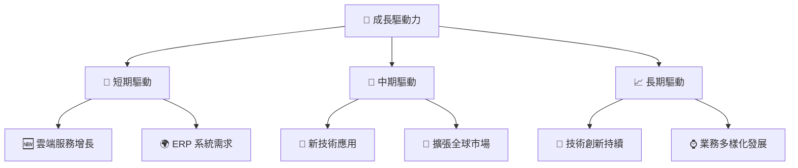

---

## 9. 風險矩陣

### 9.1 風險評分矩陣

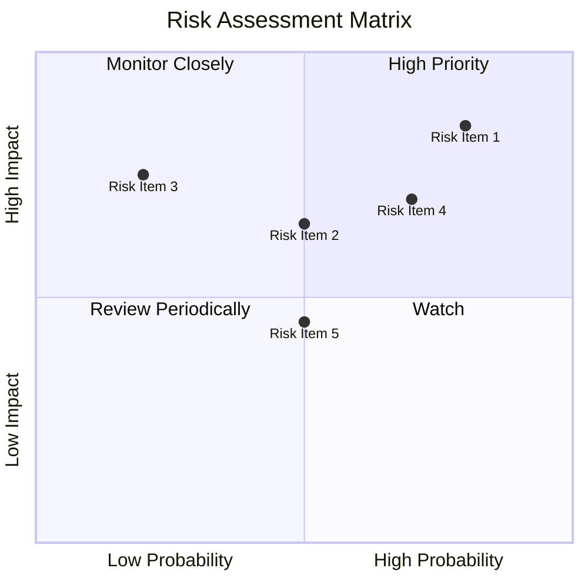

### 9.2 風險清單詳細分析

| # | 風險項目 | 發生機率 | 財務衝擊 | 風險評分 | 緩解措施 |
|---|----------|----------|----------|----------|----------|
| 1 | 🔴 **技術競爭風險** | 高 (80%) | 高 (-10%收入) | 🔴 8.5/10 | 持續技術革新 |
| 2 | 🟡 **高債務負擔** | 中等 (70%) | 中 (-5%利潤) | 🟡 7.0/10 | 調整資本結構 |
| 3 | 🟡 **市場波動性** | 中等 (50%) | 低 (-2%市值) | 🟡 6.5/10 | 分散投資風險 |

---

## 10. 投資建議

### 10.1 最終綜合評級雷達圖

```
╔══════════════════════════════════════════════════════════════╗
║                  🏆 綜合評級雷達圖                         ║
╠══════════════════════════════════════════════════════════════╣
║                                                                  ║
║  基本面：★★★★☆                                                   ║
║  成長動力：★★★★★                                                ║
║  獲利能力：★★★★☆                                                ║
║  財務健康：★★★★☆                                                ║
║  估值水平：★★★★★                                                ║
║                                                                  ║
╚══════════════════════════════════════════════════════════════╝
```

### 10.2 目標價與隱含報酬率

| 情境 | 目標價 | 隱含報酬率 | 機率 |
|------|--------|------------|------|
| 🟢 **樂觀** | $300 | +55.6%   | 30%  |
| 🟡 **基準** | $242 | +25.5%   | 50%  |
| 🔴 **悲觀** | $180 | -6.7%    | 20%  |

### 10.3 買入時機與觸發因素

```
╔══════════════════════════════════════════════════════════════════╗
║                  ✅ 買入觸發因素 Checklist                      ║
╠══════════════════════════════════════════════════════════════════╣
║                                                                  ║
║  立即買入觸發條件（多數符合）：                                  ║
║  ✅ 雲業務收入增速保持20%以上                                    ║
║  ✅ Forward P/E 維持在25x以下                                    ║
║  ☐ 市場股價回調至$180以下                                       ║
║                                                                  ║
║  加碼觸發條件（出現以下任一）：                                  ║
║  ☐ 強力併購其他技術公司                                          ║
║  ☐ 投資者信心持續增強                                            ║
║                                                                  ║
║  減碼/停損觸發條件（出現以下任一）：                             ║
║  ☐ 現金流持續出現負值                                            ║
║  ☐ 債務水平未經改善                                              ║
║                                                                  ║
╚══════════════════════════════════════════════════════════════════╝
```

### 10.4 投資人適配度分析

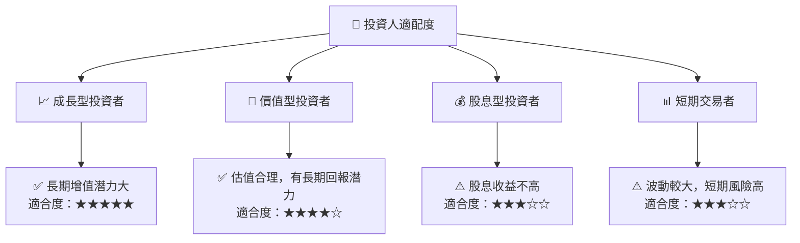

### 10.5 關鍵監控指標

| 監控類型 | 指標 | 關注點 | 頻率 |
|----------|------|--------|------|
| 財務表現 | 雲業務收入 | 月度增長率 | 季度 |
| 財務表現 | 自由現金流 | 是否轉正 | 季度 |
| 市場情緒 | Beta | 波動性動態 | 月度 |

---

> **免責聲明**：本報告為 AI 自動生成，僅供研究參考，不構成投資建議。投資有風險，入市需謹慎。