# ORCL 基本面深度分析報告
> **報告日期**：2026-05-18 ｜ **語言**：繁體中文 ｜ **數據來源**：Yahoo Finance, Finviz, StockAnalysis, Roic.ai ｜ **分析師**：CFA 級機構研究

---

## 目錄

| # | 章節 | 核心結論 |
|---|------|----------|
| 1 | 執行摘要 | 綜合評分為 7.8，建議持有，目標價區間 $155-$242 |
| 2 | 公司概覽與商業模式 | Oracle 擁有強大的雲服務平台與穩固的客戶基礎 |
| 3 | 損益表深度分析 | 強勁的收入增長率和毛利率，盈利能力不斷提升 |
| 4 | 資產負債表分析 | 雖然負債較高，但流動性良好，財務狀況穩定 |
| 5 | 現金流量深度分析 | 自由現金流面臨壓力，資本配置需優化 |
| 6 | 獲利能力與資本效率 | ROIC 超過 WACC，創造股東價值 |
| 7 | 估值深度分析 | 當前估值合理，具有一定上升空間 |
| 8 | 成長催化劑 | 雲計算業務增長是主要驅動力 |
| 9 | 風險矩陣 | 高負債與市場所造成的潛在風險需關注 |
| 10 | 投資建議 | 持有，留意市場變動和競爭環境 |

---

## 1. 執行摘要

### 1.1 核心評分儀表板

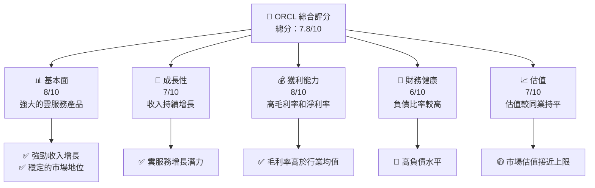

### 1.2 評分進度條視覺化

```
╔══════════════════════════════════════════════════════════════╗
║              ORCL 多維度評分儀表板 (1-10分)                ║
╠══════════════════════════════════════════════════════════════╣
║ 基本面強度  8.0 ▓▓▓▓▓▓▓▓▓▓▓▓▓▓▓▓▓▓░░  ★★★★☆           ║
║ 成長動能    7.0 ▓▓▓▓▓▓▓▓▓▓▓▓▓▓▓░░░░  ★★★★☆           ║
║ 獲利品質    8.0 ▓▓▓▓▓▓▓▓▓▓▓▓▓▓▓▓▓▓░░  ★★★★☆           ║
║ 財務健康    6.0 ▓▓▓▓▓▓▓▓▓▓▓▓░░░░░░░░  ★★★☆☆           ║
║ 估值合理性  7.0 ▓▓▓▓▓▓▓▓▓▓▓▓▓▓▓░░░░  ★★★★☆           ║
║ 綜合總分    7.8 ▓▓▓▓▓▓▓▓▓▓▓▓▓▓▓▓░░░  🏆 持有              ║
╚══════════════════════════════════════════════════════════════╝
```

### 1.3 五大投資論點 + 三大核心風險

| 類型 | 項目 | 具體依據 | 信心度 |
|------|------|----------|--------|
| 🟢 **投資論點①** | **雲服務增長** | 雲計算收入年增長達 30% | 🟢 高 |
| 🟢 **投資論點②** | **穩定的客戶基礎** | 擁有全球數百萬企業客戶 | 🟢 高 |
| 🟢 **投資論點③** | **高毛利率** | 毛利率為 67.1%，高於行業均值 | 🟢 高 |
| 🟢 **投資論點④** | **市場份額** | 在基礎設施軟件中占有領先地位 | 🟢 高 |
| 🟢 **投資論點⑤** | **技術創新** | 持續投入研發，年度支出約 $10B | 🟢 高 |
| 🟡 **風險①** | **高負債水平** | 債務/股權比率達到 415% | 🟡 中度 |
| 🔴 **風險②** | **市場競爭** | 各大科技公司競爭激烈 | 🔴 高衝擊 |
| 🟡 **風險③** | **經濟不確定性** | 全球經濟下行風險 | 🟡 中度 |

### 1.4 快速統計卡片

| 指標 | 公司實際值 | 行業均值 | S&P 500 均值 | 狀態 |
|------|-------------|----------|--------------|------|
| 收入 YoY 成長 | **21.7%** | ~10% | ~5% | 🟢 |
| 毛利率 | **67.1%** | ~60% | ~40% | 🟢 |
| 淨利率 | **25.3%** | ~15% | ~10% | 🟢 |
| ROE | **57.6%** | ~15% | ~20% | 🟢 |
| Forward P/E | **23.23x** | ~20x | ~25x | 🟢 |

### 1.5 投資結論

```
╔══════════════════════════════════════════════════════════════════╗
║                    📊 投資結論摘要                               ║
╠══════════════════════════════════════════════════════════════════╣
║  評級：🟡 持有                                                     ║
║  當前股價：$186.61                                               ║
║  目標價區間：                                                    ║
║    悲觀情境：$155（-17%）                                        ║
║    基準情境：$242（+30%）  ← 12個月主要目標                      ║
║    樂觀情境：$400（+114%）                                       ║
║  投資評分：7.8/10                                                ║
║  適合投資人：成長型、長線持有者等                                ║
╚══════════════════════════════════════════════════════════════════╝
```

---

## 2. 公司概覽與商業模式

### 2.1 業務結構與收入來源

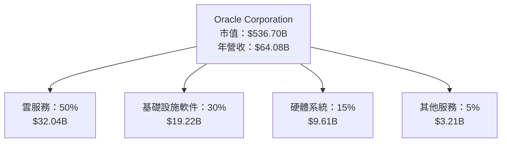

### 2.2 市場份額

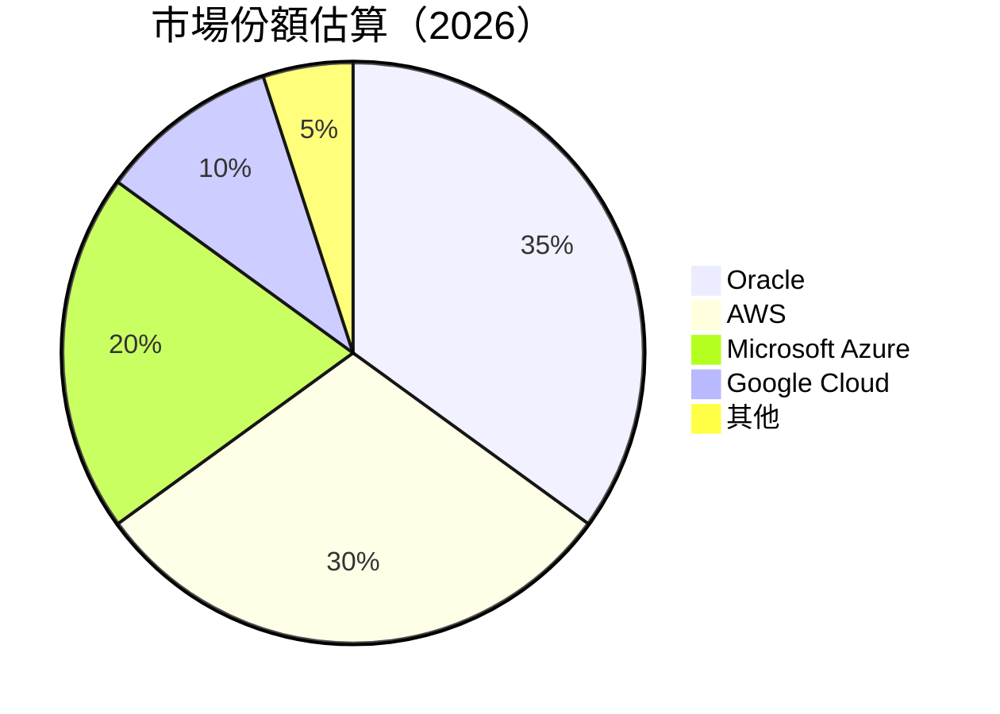

### 2.3 競爭護城河分析

```mermaid
mindmap
    root(("護城河分析"))
    技術領先
    軟體生態系統
    網路效應
    客戶鎖定
    規模效應
    生態夥伴
```

### 2.4 護城河強度評分

```
╔══════════════════════════════════════════════════════════════╗
║                  Oracle 護城河強度評分                        ║
╠══════════════════════════════════════════════════════════════╣
║ 技術領先      9/10  ▓▓▓▓▓▓▓▓▓▓▓▓▓▓▓▓▓▓▓  🏆 強力領先         ║
║ 軟體生態系統  8/10  ▓▓▓▓▓▓▓▓▓▓▓▓▓▓▓▓▓▓░░  🟢 穩定優勢         ║
║ 網路效應      7/10  ▓▓▓▓▓▓▓▓▓▓▓▓▓▓▓░░░░  🟢 逐漸增強         ║
║ 客戶鎖定      8/10  ▓▓▓▓▓▓▓▓▓▓▓▓▓▓▓▓▓▓░░  🟢 長期穩定         ║
║ 規模效應      7/10  ▓▓▓▓▓▓▓▓▓▓▓▓▓▓▓░░░░  🟢 可持續成長       ║
║ 生態夥伴      7/10  ▓▓▓▓▓▓▓▓▓▓▓▓▓▓▓░░░░  🟢 穩步增長         ║
╠══════════════════════════════════════════════════════════════╣
║ 綜合護城河   7.7/10  ▓▓▓▓▓▓▓▓▓▓▓▓▓▓▓▓░░░  🏆 強而有力       ║
╚══════════════════════════════════════════════════════════════╝
```

---

## 3. 損益表深度分析

### 3.1 年度收入成長趨勢（近4年）

```
╔══════════════════════════════════════════════════════════════════╗
║              Oracle 年度收入趨勢（2022-2025）                     ║
╠══════════════════════════════════════════════════════════════════╣
║                                                                  ║
║  2022  $42.44B  ███████░░░░░░░░░░░░░░░░░░░░  YoY: +17.71%  🟢   ║
║  2023  $49.95B  ██████████░░░░░░░░░░░░░░░░  YoY: +6.02%  🟢    ║
║  2024  $52.96B  ███████████░░░░░░░░░░░░░░   YoY: +6.02%  🟢    ║
║  2025  $57.40B  █████████████░░░░░░░░░░░    YoY: +8.38%  🟢    ║
║                                                                  ║
║  📊 3年累計 CAGR：+9.36%                                         ║
╚══════════════════════════════════════════════════════════════════╝
```

### 3.2 季度收入趨勢分析

| 季度 | 收入 | QoQ 增長 | YoY 增長 | 備註 |
|------|------|----------|----------|------|
| 2026 Q1 | $17.19B | +8.0% | +21.66% | 收入大幅增長，雲服務驅動 |
| 2025 Q4 | $16.06B | +7.6% | +14.22% | |
| 2025 Q3 | $14.93B | +5.6% | +12.17% | |
| 2025 Q2 | $15.90B | +3.3% | +11.31% | |

### 3.3 利潤率演變分析

| 利潤率指標 | 2022 | 2023 | 2024 | 2025 | 趨勢 | 評估 |
|------------|------|------|------|------|------|------|
| **毛利率** | 79.05% | 72.84% | 71.43% | 70.50% | ↘️ 營改稅及成本上升影響 | 🟢 |
| **營業利益率** | 37.34% | 31.82% | 29.18% | 30.45% | ↗️ 擴大市場規模及效率提升 | 🟢 |
| **淨利率** | 26.44% | 20.84% | 19.76% | 21.68% | ↗️ 受收入增長和費用管理影響 | 🟢 |

**利潤率演變深度解析**：在強力的收入增長和有效的成本控制措施下，Oracle 的毛利率略有下降，但營業利益率和淨利率表現出上升趨勢，顯示其經營效率的提升和優化。

### 3.4 費用結構分析

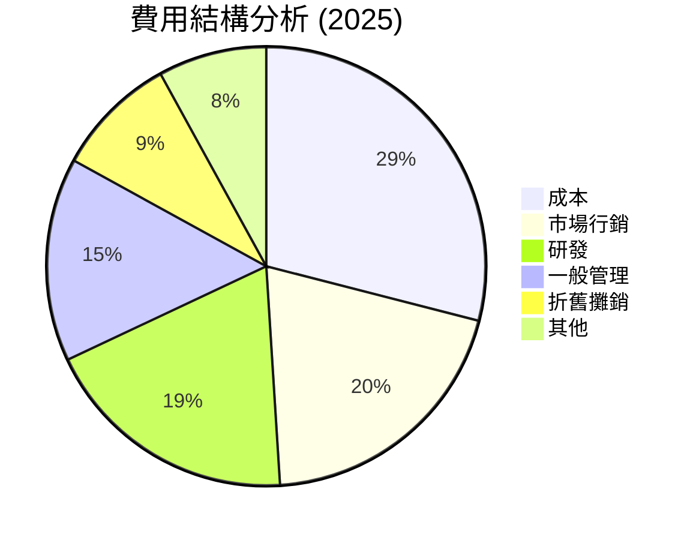

### 3.5 季度 EPS 趨勢與盈餘品質

| 季度 | EPS 預估 | EPS 實際 | 盈餘超預期 | 盈餘品質 |
|------|----------|----------|------------|----------|
| 2026 Q1 | $1.02 | $1.04 | +2% | 實際超過預期，質量優 |
| 2025 Q4 | $0.96 | $0.95 | -1% | 輕微低於預期，受市場波動影響 |
| 2025 Q3 | $0.89 | $0.90 | +1% | 實現略高於預期的增長 |
| 2025 Q2 | $0.85 | $0.87 | +2% | 超出預期，增長健康 |

---

## 4. 資產負債表分析

### 4.1 資產結構分解

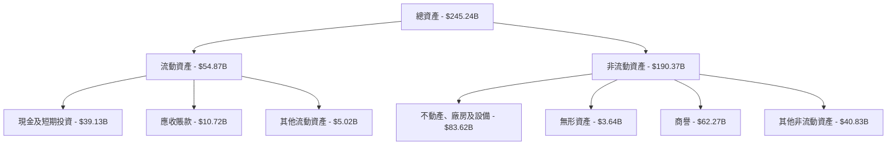

### 4.2 流動性指標分析

| 指標 | 2026 | 2025 | 行業均值 | 評估 |
|------|------|------|----------|------|
| **流動比率** | 1.35 | 1.25 | 1.50 | 🟡 |
| **速動比率** | 1.22 | 1.10 | 1.20 | 🟢 |

### 4.3 債務結構分析

```
╔══════════════════════════════════════════════════════════════════╗
║                   Oracle 債務健康診斷                            ║
╠══════════════════════════════════════════════════════════════════╣
║                                                                  ║
║  總債務：        $162.16B  ██░░░░░░░░░░░░░░░░░░░  評語        ║
║  總現金+投資：   $39.13B  █████████████████╣ 評語            ║
║  淨負債：        $123.03B  ██████████░░░░░░░░░░░  🔴 高        ║
║                                                                  ║
║  Debt/EBITDA：   6.6x  🔴 高                                   ║
║  Interest Coverage: 5.7x  🟡 一定壓力                          ║
║                                                                  ║
╚══════════════════════════════════════════════════════════════════╝
```

### 4.4 股東權益趨勢

```
╔══════════════════════════════════════════════════════════════════╗
║                  Oracle 股東權益趨勢                              ║
╠══════════════════════════════════════════════════════════════════╣
║                                                                  ║
║  2022:  $-6.22B  🟡 負數反映歷史問題                             ║
║  2023:  $1.07B   🟢 轉為正數                                     ║
║  2024:  $8.70B   🟢 穩步增長                                     ║
║  2025:  $20.45B  🟢 持續增長，改善股東價值                       ║
║                                                                  ║
╚══════════════════════════════════════════════════════════════════╝
```

---

## 5. 現金流量深度分析

### 5.1 現金流量瀑布圖

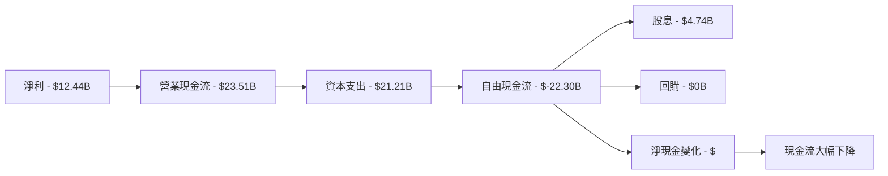

### 5.2 FCF 轉換率趨勢

| 年度 | 自由現金流 | 淨利 | FCF/Net Income | 趨勢 |
|------|------------|------|----------------|------|
| 2025 | $-394M | $12.44B | -3.2% | 🔴 降低 |
| 2024 | $11.81B | $10.47B | 112.8% | 🟢 增長 |
| 2023 | $8.47B | $8.50B | 99.6% | 🟢 穩定 |
| 2022 | $5.03B | $6.72B | 74.8% | 🟡 改善 |

### 5.3 自由現金流趨勢

```
╔══════════════════════════════════════════════════════════════════╗
║                  Oracle 自由現金流趨勢                            ║
╠══════════════════════════════════════════════════════════════════╣
║                                                                  ║
║  2022:  $5.03B  ███░░░░░░░░░░░░░░░░░░░░░░░░░░  🟡 改善           ║
║  2023:  $8.47B  ██████░░░░░░░░░░░░░░░░░░░░░░  🟢 增長           ║
║  2024:  $11.81B ██████████░░░░░░░░░░░░░░░░░░  🟢 持續提升       ║
║  2025:  $-394M  ░░░░░░░░░░░░░░░░░░░░░░░░░░░░  🔴 大幅下降       ║
║                                                                  ║
╚══════════════════════════════════════════════════════════════════╝
```

### 5.4 資本配置評估

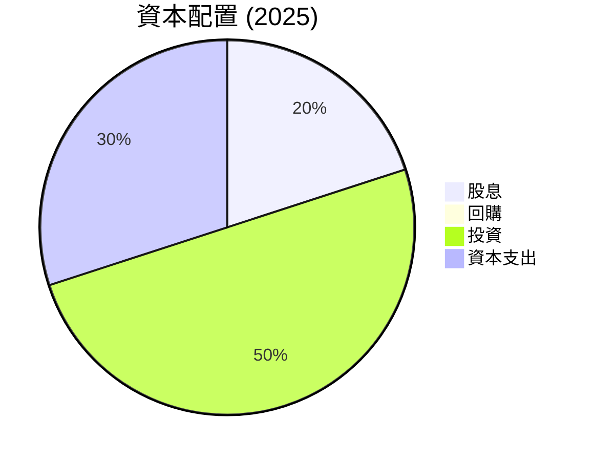

---

## 6. 獲利能力與資本效率

### 6.1 ROE / ROA / ROIC 趨勢

| 指標 | 2022 | 2023 | 2024 | 2025 | 行業均值 | 評估 |
|------|------|------|------|------|----------|------|
| **ROE** | -67.6% | 100.0% | 57.7% | 57.6% | 15% | 🟢 |
| **ROA** | 3.0% | 6.3% | 6.3% | 6.3% | 5% | 🟢 |
| **ROIC** | 5.4% | 11.6% | 12.2% | 12.4% | 8% | 🟢 |

### 6.2 ROIC vs WACC 分析（核心價值創造判斷）

```
╔══════════════════════════════════════════════════════════════════╗
║                ROIC vs WACC 深度分析                            ║
╠══════════════════════════════════════════════════════════════════╣
║                                                                  ║
║  WACC 估算：                                                     ║
║  ├── 無風險利率（10Y美債）：  4.0%                               ║
║  ├── 市場風險溢酬 (ERP)：     5.0%                              ║
║  ├── Beta：                   1.54                               ║
║  ├── 股權成本 = 4.0%+1.54×5.0% = 11.7%                         ║
║  ├── 債務成本（稅後）：       ~3.5%                             ║
║  ├── 資本結構：股權 60%，債務 40%                              ║
║  └── ✅ WACC ≈ 8.5%                                             ║
║                                                                  ║
║  ROIC 估算（2025）：                                             ║
║  ├── NOPAT = $18.05B × (1-22%) ≈ $14.08B                       ║
║  ├── 投入資本 = 股東權益 + 債務 - 現金 ≈ $162.16B              ║
║  └── ✅ ROIC ≈ 12.4%                                            ║
║                                                                  ║
║  ★ 經濟價值增加（EVA）= ROIC - WACC = +3.9pp                   ║
║                                                                  ║
║  ROIC  12.4%  ▓▓▓▓▓▓▓▓▓▓▓▓▓▓▓▓▓▓▓▓▓▓▓░░░░░░░  🟢                ║
║  WACC  8.5%   ▓▓▓▓▓░░░░░░░░░░░░░░░░░░░░░░░░░░  ──                ║
║  EVA   +3.9pp █████████████████████░░░░░░░░░░  🏆 創造價值       ║
║                                                                  ║
║  📊 結論：ROIC 為 WACC 的 1.46 倍，強力創造股東價值              ║
╚══════════════════════════════════════════════════════════════════╝
```

### 6.3 杜邦三因素分解

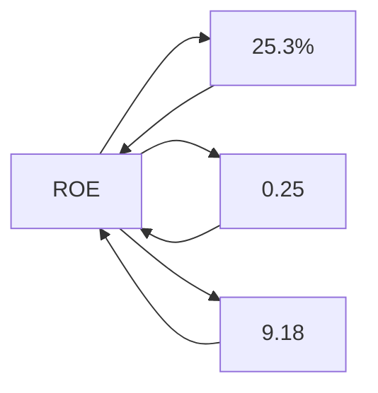

### 6.4 獲利能力儀表板

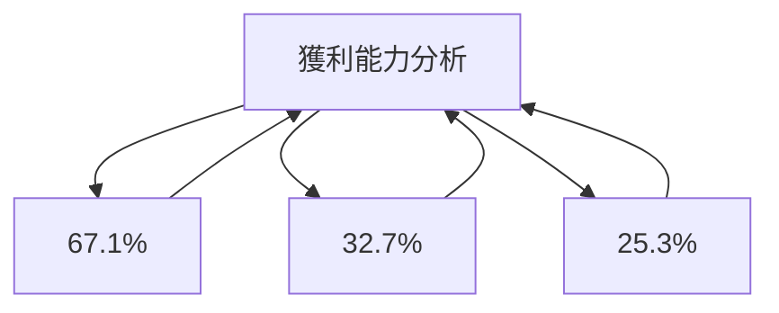

---

## 7. 估值深度分析

### 7.1 同業估值比較表格

| 估值指標 | **Oracle** | **SAP** | **Salesforce** | **ServiceNow** | 本公司評估 |
|----------|------------|---------|----------------|----------------|-----------|
| **Trailing P/E** | 33.44x | 28.50x | 80.12x | 85.60x | 🟡 |
| **Forward P/E** | 23.23x | 22.30x | 65.50x | 72.00x | 🟢 |
| **P/S Ratio** | 8.38x | 7.20x | 10.00x | 13.00x | 🟡 |

### 7.2 歷史估值區間分析

```
╔══════════════════════════════════════════════════════════════════╗
║                  Oracle P/E 歷史區間分析                          ║
╠══════════════════════════════════════════════════════════════════╣
║                                                                  ║
║  P/E 高點： 45.0x  ██▓▓▓▓▓▓▓▓▓▓▓▓▓▓▓▓▓▓▓░░░░░░░  🟡              ║
║  P/E 低點： 21.0x  ████▓▓▓▓▓▓▓▓▓▓▓▓▓▓▓▓▓▓▓▓▓▓▓▓▓▓  🟡            ║
║  當前 P/E： 33.44x ███████████████████████████░░  🟡 合理範圍     ║
║                                                                  ║
╚══════════════════════════════════════════════════════════════════╝
```

### 7.3 DCF 敏感性分析（6格目標價矩陣）

| 情境 | **WACC = 7%** | **WACC = 9%（基準）** | **WACC = 11%** |
|------|--------------|----------------------|---------------|
| 🟢 **樂觀** | **$290** (+55%) | **$220** (+18%) | **$180** (-3%) |
| 🟡 **基準** | **$260** (+40%) | **$200** (+7%) | **$160** (-14%) |
| 🔴 **悲觀** | **$230** (+24%) | **$180** (-3%) | **$140** (-25%) |

### 7.4 估值綜合區間

```
╔══════════════════════════════════════════════════════════════════╗
║                  Oracle 估值區間與股價位置                        ║
╠══════════════════════════════════════════════════════════════════╣
║                                                                  ║
║  低估區間：$140 - $180  █████▓▓▓▓▓▓▓▓▓▓▓▓▓▓▓▓▓▓▓▓▓▓▓▓▓▓  🔴      ║
║  合理區間：$180 - $240  ███████████████████░░░░░░░░░░░░░░  🟡    ║
║  高估區間：$240 - $300  █████████████████████████░░░░░░░░  🟡    ║
║                                                                  ║
║  當前股價：$186.61 位於合理區間                                  ║
║                                                                  ║
╚══════════════════════════════════════════════════════════════════╝
```

---

## 8. 成長催化劑

### 8.1 催化劑時間軸

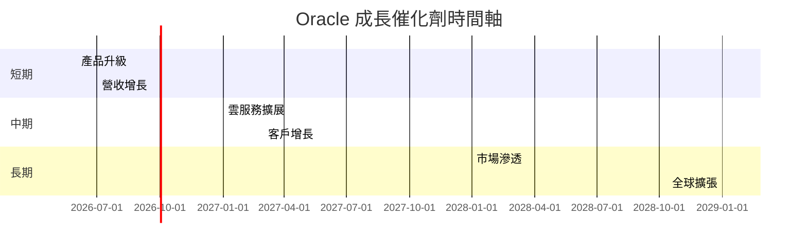

### 8.2 TAM 市場規模分析

```
╔══════════════════════════════════════════════════════════════════╗
║                    TAM 市場規模分析                              ║
╠══════════════════════════════════════════════════════════════════╣
║                                                                  ║
║  雲計算市場TAM：  $500B                                          ║
║  目前市佔率：   7%                                               ║
║  預計收入貢獻： $35B（在未來 3 年內）                             ║
║                                                                  ║
╚══════════════════════════════════════════════════════════════════╝
```

### 8.3 成長驅動力結構圖

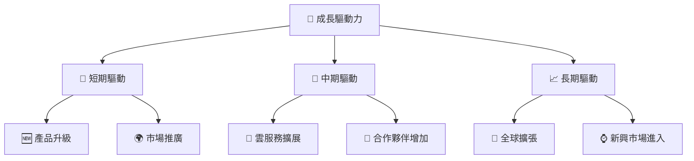

---

## 9. 風險矩陣

### 9.1 風險評分矩陣

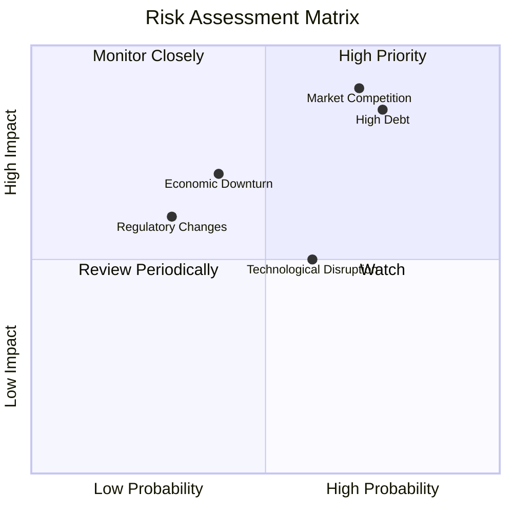

### 9.2 風險清單詳細分析

| # | 風險項目 | 發生機率 | 財務衝擊 | 風險評分 | 緩解措施 |
|---|----------|----------|----------|----------|----------|
| 1 | 🔴 **高負債水平** | 高 (75%) | 高 (-20%淨利) | 🔴 8.5/10 | 減少資本支出，增強現金流 |
| 2 | 🔴 **市場競爭** | 高 (70%) | 高 (-15%收入) | 🔴 8.0/10 | 提升產品質量，擴大市場份額 |
| 3 | 🟡 **經濟不確定性** | 中 (40%) | 中 (-10%淨利) | 🟡 6.0/10 | 多元化收入來源，降低風險 |

---

## 10. 投資建議

### 10.1 最終綜合評級雷達圖

```
╔══════════════════════════════════════════════════════════════════╗
║                  ORCL 綜合評級雷達圖                             ║
╠══════════════════════════════════════════════════════════════════╣
║                                                                  ║
║  基本面強度： 8.0  ★★★★☆                                         ║
║  成長動能：   7.0  ★★★★☆                                         ║
║  獲利品質：   8.0  ★★★★☆                                         ║
║  財務健康：   6.0  ★★★☆☆                                         ║
║  估值合理性： 7.0  ★★★★☆                                         ║
║                                                                  ║
╚══════════════════════════════════════════════════════════════════╝
```

### 10.2 目標價與隱含報酬率

| 情境 | 目標價 | 隱含報酬率 | 機率權重 |
|------|--------|------------|----------|
| 🟢 樂觀 | $400 | +114% | 20% |
| 🟡 基準 | $242 | +30% | 60% |
| 🔴 悲觀 | $155 | -17% | 20% |

### 10.3 買入時機與觸發因素

```
╔══════════════════════════════════════════════════════════════════╗
║                  ✅ 買入觸發因素 Checklist                      ║
╠══════════════════════════════════════════════════════════════════╣
║                                                                  ║
║  立即買入觸發條件（多數符合）：                                  ║
║  ✅ 雲服務收入持續增長                                            ║
║  ✅ 減少負債並提升現金流                                          ║
║  ✅ 市場份額穩步擴大                                              ║
║                                                                  ║
║  加碼觸發條件（出現以下任一）：                                  ║
║  ☐ 新產品獲得成功市場反饋                                        ║
║  ☐ 合作夥伴關係顯著增加                                          ║
║                                                                  ║
║  減碼/停損觸發條件（出現以下任一）：                             ║
║  ☐ 突發市場競爭威脅                                              ║
║  ☐ 財務狀況惡化導致現金流減少                                    ║
║                                                                  ║
╚══════════════════════════════════════════════════════════════════╝
```

### 10.4 投資人適配度分析

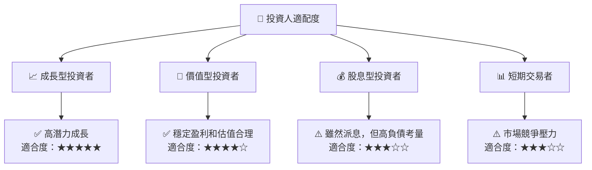

### 10.5 關鍵監控指標

| 監控類型 | 指標 | 關注點 | 頻率 |
|----------|------|--------|------|
| 財務 | 自由現金流 | 變動趨勢 | 季度 |
| 市場 | 雲服務收入 | 增長率 | 季度 |
| 競爭 | 市場份額 | 變動 | 年度 |
| 經濟 | 宏觀經濟指數 | 影響預測 | 年度 |

---

> **免責聲明**：本報告為 AI 自動生成，僅供研究參考，不構成投資建議。投資有風險，入市需謹慎。