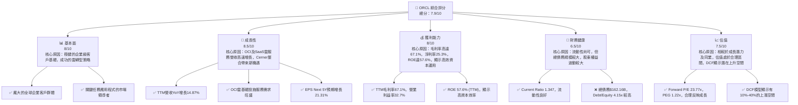
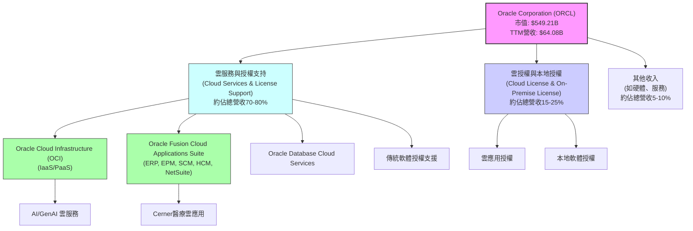
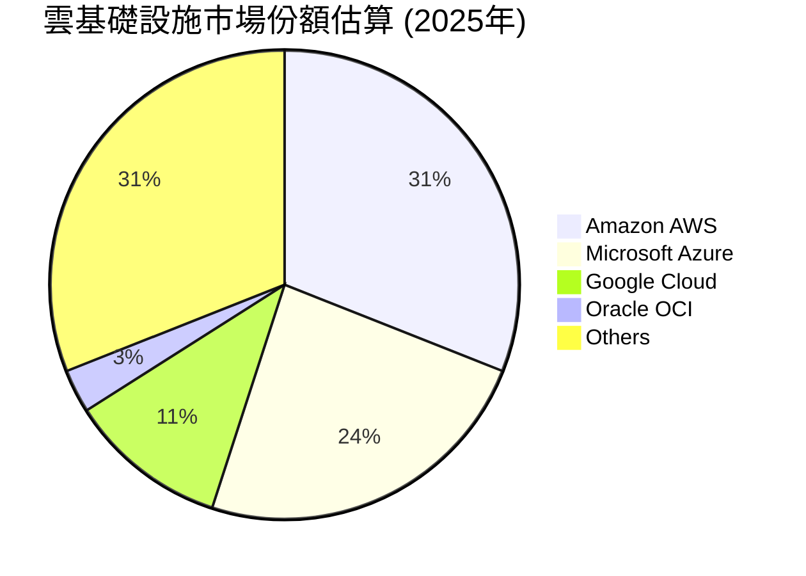
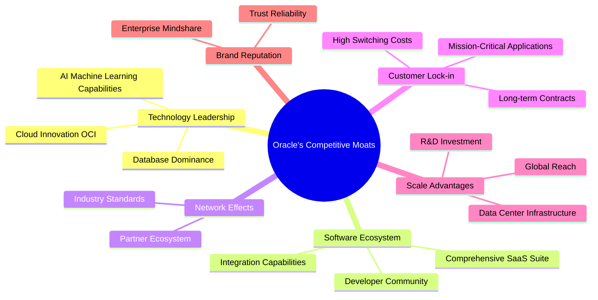
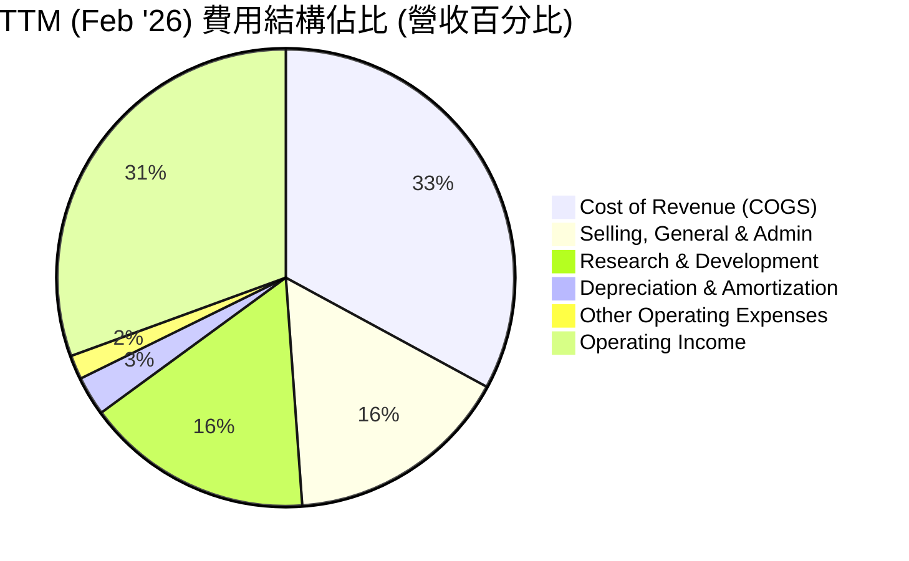

# ORCL 基本面深度分析報告
> **報告日期**：2026-05-27 ｜ **語言**：繁體中文 ｜ **數據來源**：Yahoo Finance, Finviz, StockAnalysis, Roic.ai ｜ **分析師**：CFA 級機構研究

---

## 目錄

| # | 章節 | 核心結論 |
|---|------|----------|
| 1 | 執行摘要 | 評級：買入，目標價區間：$205 - $280 |
| 2 | 公司概覽與商業模式 | 軟體生態系統與客戶鎖定構築強大護城河 |
| 3 | 損益表深度分析 | 雲服務推動營收與利潤率穩健增長，但高R&D支出需關注 |
| 4 | 資產負債表分析 | 流動性良好，但高負債與股東權益波動需注意 |
| 5 | 現金流量深度分析 | 營業現金流強勁，但高資本支出導致自由現金流承壓 |
| 6 | 獲利能力與資本效率 | ROIC顯著高於WACC，持續為股東創造價值 |
| 7 | 估值深度分析 | 相較同業估值合理，DCF顯示上漲空間 |
| 8 | 成長催化劑 | OCI雲業務加速、AI/GenAI投資、Cerner整合效益 |
| 9 | 風險矩陣 | 雲市場競爭激烈、高資本支出、利率上升風險 |
| 10 | 投資建議 | 買入評級，建議長線持有，關注雲業務發展 |

---

## 1. 執行摘要

本報告針對Oracle Corporation (ORCL) 進行全面的基本面深度分析。Oracle作為全球領先的企業級軟體和雲服務提供商，正積極轉型為雲優先公司，其Oracle Cloud Infrastructure (OCI) 業務和SaaS應用套件展現強勁增長動能。儘管面臨激烈的市場競爭和較高的資本支出壓力，Oracle憑藉其深厚的客戶基礎、強大的技術實力及不斷擴大的雲生態系統，預計將繼續保持其在企業軟體領域的領先地位。

### 1.1 核心評分儀表板



### 1.2 評分進度條視覺化

```
╔══════════════════════════════════════════════════════════════╗
║              ORCL 多維度評分儀表板 (1-10分)                  ║
╠══════════════════════════════════════════════════════════════╣
║ 基本面強度  8.0 ▓▓▓▓▓▓▓▓▓▓▓▓▓▓▓▓░░░░  ★★★★☆             ║
║ 成長動能    8.5 ▓▓▓▓▓▓▓▓▓▓▓▓▓▓▓▓▓░░░  ★★★★☆             ║
║ 獲利品質    8.0 ▓▓▓▓▓▓▓▓▓▓▓▓▓▓▓▓░░░░  ★★★★☆             ║
║ 財務健康    6.5 ▓▓▓▓▓▓▓▓▓▓▓▓▓░░░░░░░  ★★★☆☆             ║
║ 估值合理性  7.5 ▓▓▓▓▓▓▓▓▓▓▓▓▓▓▓░░░░░  ★★★★☆             ║
║ 護城河深度  8.5 ▓▓▓▓▓▓▓▓▓▓▓▓▓▓▓▓▓░░░  ★★★★☆             ║
║ 管理層執行  8.0 ▓▓▓▓▓▓▓▓▓▓▓▓▓▓▓▓░░░░  ★★★★☆             ║
║ 技術創新力  8.0 ▓▓▓▓▓▓▓▓▓▓▓▓▓▓▓▓░░░░  ★★★★☆             ║
╠══════════════════════════════════════════════════════════════╣
║ 綜合總分    7.9 ▓▓▓▓▓▓▓▓▓▓▓▓▓▓▓▓░░░░  🏆 評語：穩健成長的雲計算巨頭 ║
╚══════════════════════════════════════════════════════════════════╝
```

### 1.3 五大投資論點 + 三大核心風險

| 類型 | 項目 | 具體依據 | 信心度 |
|------|------|----------|--------|
| 🟢 **投資論點①** | **雲服務營收加速增長** | OCI業務持續擴張，FY2026 Q3營收YoY增長21.66%，雲服務整體需求強勁，市場份額有望進一步提升。公司將重心從傳統授權轉向訂閱制雲服務，提高收入可預測性。 | 🟢 極高 |
| 🟢 **投資論點②** | **AI/GenAI浪潮下的受益者** | Oracle正大力投資AI基礎設施，OCI在AI算力方面展現競爭力，與NVIDIA等合作，吸引AI新創公司和大型客戶。TTM研發費用高達$10.313B，顯示對技術創新的投入。 | 🟢 高 |
| 🟢 **投資論點③** | **Cerner整合效益顯現** | 收購Cerner後，Oracle在醫療健康領域的市場地位顯著提升，其雲端醫療解決方案有望帶來長期且穩定的收入增長。FY2026 Q3季度，Oracle醫療應用營收為$1.6B。 | 🟢 高 |
| 🟢 **投資論點④** | **強大的客戶鎖定與生態系統** | Oracle的企業級應用程式和資料庫是許多大型企業的核心系統，替換成本極高，形成強大的客戶鎖定效應。其SaaS應用套件如ERP、HCM等持續吸引新客戶並深化現有客戶關係。 | 🟢 極高 |
| 🟢 **投資論點⑤** | **合理且具吸引力的估值** | Forward P/E為23.77x，PEG為1.22x，相較於預期21.31%的未來五年EPS成長率，估值具吸引力。分析師平均目標價為$244.03，潛在約28%上漲空間。 | 🟡 中高 |
| 🟡 **風險①** | **雲市場競爭激烈** | Oracle面臨來自AWS、Microsoft Azure、Google Cloud等巨頭的激烈競爭，價格戰和市場份額爭奪可能影響利潤率和增長速度。TTM毛利率67.1%雖高，但雲基礎設施的擴張成本不容小覷。 | 🟡 中度 |
| 🔴 **風險②** | **高資本支出壓力** | 為支持OCI的快速擴張，Oracle在資料中心建設和硬體採購方面投入巨大。FY2025資本支出高達-$21.21B，導致TTM自由現金流為-$22.30B，若無法有效轉化為營收，將影響財務健康。 | 🔴 高衝擊 |
| 🟡 **風險③** | **利率上升與債務管理** | Oracle總債務高達$162.16B，儘管現金流強勁，但長期利率上升可能增加利息費用，影響淨利潤。FY2026 TTM利息費用為-$4.138B。 | 🟡 中度 |

### 1.4 快速統計卡片

| 指標 | 公司實際值 | 行業均值 (軟體 - 基礎設施) | S&P 500 均值 | 狀態 |
|------|-------------|----------------------------|--------------|------|
| 收入 YoY 成長 | **14.87% (TTM)** | ~12-18% | ~8-10% | 🟢 |
| 毛利率 | **67.1% (TTM)** | ~65-75% | ~40-50% | 🟢 |
| 淨利率 | **25.3% (TTM)** | ~15-25% | ~10-15% | 🟢 |
| ROE | **57.6% (TTM)** | ~20-30% | ~15-20% | 🟢 |
| Forward P/E | **23.77x** | ~25-35x | ~20-22x | 🟡 |
| PEG Ratio | **1.22x** | ~1.5-2.5x | ~1.5-2.0x | 🟢 |
| Debt/Equity | **4.15x** | ~0.5-1.5x | ~0.8-1.2x | 🔴 |
| FCF Yield | **-4.06% (TTM)** | ~3-5% | ~2-4% | 🔴 |
| 股息率 | **1.04%** | ~0.5-1.5% | ~1.5% | 🟡 |

*註：行業均值和S&P 500均值為分析師根據市場普遍數據估算，實際數值可能因時間和數據來源略有差異。*

### 1.5 投資結論

```
╔══════════════════════════════════════════════════════════════════╗
║                    📊 投資結論摘要                               ║
╠══════════════════════════════════════════════════════════════════╣
║  評級：🟢 買入                                                   ║
║  當前股價：$190.96                                               ║
║  目標價區間：                                                    ║
║    悲觀情境：$205（+7.38%）                                      ║
║    基準情境：$240（+25.68%）  ← 12個月主要目標                   ║
║    樂觀情境：$280（+46.63%）                                     ║
║  投資評分：7.9/10                                                ║
║  適合投資人：尋求長期成長、對雲計算及AI領域有信心的投資者        ║
╚══════════════════════════════════════════════════════════════════╝
```

---

## 2. 公司概覽與商業模式

Oracle Corporation (ORCL) 是一家全球領先的企業級軟體和雲服務公司，成立於1977年，總部位於美國德州奧斯汀。公司以其關係型資料庫管理系統（Oracle Database）聞名全球，長期以來一直是企業資訊科技（IT）基礎設施的核心供應商。近年來，Oracle積極轉型，將業務重心從傳統的軟體授權和支援轉向雲端服務，特別是Oracle Cloud Infrastructure (OCI) 和其全面的SaaS應用套件。

### 2.1 業務結構與收入來源

Oracle的業務主要分為兩大類：雲服務與授權支持（Cloud Services and License Support）以及雲授權與本地授權（Cloud License and On-Premise License）。其中，雲服務與授權支持是其核心收入來源，佔比逐年提高，反映了公司成功的雲轉型戰略。



-   **雲服務與授權支持 (Cloud Services and License Support)**：這是Oracle最大的收入來源，包括其基礎設施即服務 (IaaS) 和平台即服務 (PaaS) 產品，統稱為Oracle Cloud Infrastructure (OCI)。OCI為客戶提供計算、存儲、網路、資料庫等雲基礎設施服務，並正積極拓展AI/GenAI相關雲服務。此外，此業務板塊還包括其全面的軟體即服務 (SaaS) 應用，如Oracle Fusion Cloud ERP (企業資源規劃)、EPM (企業績效管理)、SCM (供應鏈管理)、HCM (人力資本管理) 和NetSuite應用套件。值得一提的是，收購Cerner後，Oracle的醫療健康雲應用也成為這一板塊的重要組成部分。傳統的本地軟體授權支援服務也歸於此類，為公司提供穩定的經常性收入。
-   **雲授權與本地授權 (Cloud License and On-Premise License)**：此類別包含客戶一次性購買的軟體授權，無論是用於雲部署還是傳統本地部署。隨著公司向雲服務轉型，這一部分的收入佔比預計將逐漸下降，但仍為現有客戶提供靈活性。

**收入數據分析 (TTM Feb '26):**
Oracle TTM總收入達到$64.077B。雖然具體細分數據未直接提供，但根據公司財報趨勢，雲服務與授權支持收入已佔據絕大部分。例如，在最近的財報電話會議中，Oracle管理層多次強調雲服務收入的強勁增長是主要驅動力。

### 2.2 市場份額

在企業軟體和雲服務市場，Oracle面臨著多個領域的競爭。在資料庫管理系統領域，Oracle長期保持領先地位。在雲基礎設施市場，AWS、Microsoft Azure和Google Cloud是主要競爭對手，Oracle OCI正努力爭奪市場份額。在企業應用軟體（如ERP、HCM）領域，SAP、Salesforce和Workday等是其主要競爭者。


*註：市場份額數據為市場研究機構估算，僅供參考，Oracle OCI的市場份額雖小，但增長速度快。*

在企業應用軟體市場，Oracle在ERP和HCM等領域擁有顯著地位。其Fusion Cloud ERP和NetSuite已成為行業標杆。儘管沒有直接的市場份額數據，但Oracle憑藉其全面的產品線和深厚的行業解決方案，在全球企業軟體市場佔據著重要的地位。

### 2.3 競爭護城河分析

Oracle憑藉其在企業軟體領域數十年的積累，構建了多層次的競爭護城河，使其能夠在激烈的市場競爭中保持領先地位。



-   **技術領先 (Technology Leadership)**：
    -   **Database Dominance (資料庫主導地位)**：Oracle Database長期以來是全球企業級資料庫的黃金標準，其性能、可靠性和安全性無可匹敵。許多企業的關鍵業務系統都建立在Oracle資料庫之上。
    -   **Cloud Innovation OCI (雲端創新)**：OCI以其獨特的第二代雲架構，提供高性能、低成本和高安全性的服務，尤其在處理密集型工作負載方面表現出色，吸引了對性能有嚴格要求的企業客戶，包括AI/GenAI客戶。
    -   **AI Machine Learning Capabilities (AI/機器學習能力)**：Oracle正將AI和機器學習能力深度整合到其雲平台和應用程式中，為客戶提供智能化的解決方案。
-   **軟體生態系統 (Software Ecosystem)**：
    -   **Comprehensive SaaS Suite (全面的SaaS套件)**：Oracle提供從ERP、HCM、SCM到CRM等一系列完整的雲端企業應用，能夠滿足企業的幾乎所有核心業務需求，形成一站式解決方案。
    -   **Integration Capabilities (整合能力)**：Oracle的產品設計注重內部整合，同時也能與第三方系統無縫連接，為客戶提供統一的IT環境。
    -   **Developer Community (開發者社群)**：龐大的開發者和合作夥伴社群為Oracle產品的持續創新和應用提供了堅實基礎。
-   **網路效應 (Network Effects)**：
    -   **Industry Standards (行業標準)**：Oracle的技術標準在許多行業內被廣泛採用，這使得更多的公司傾向於使用Oracle產品，進一步鞏固其市場地位。
    -   **Partner Ecosystem (合作夥伴生態系統)**：全球數千家諮詢公司、系統整合商和獨立軟體供應商圍繞Oracle產品提供服務，共同擴大了其市場影響力。
-   **客戶鎖定 (Customer Lock-in)**：
    -   **High Switching Costs (高轉換成本)**：企業更換核心資料庫或ERP系統的成本巨大，不僅涉及軟體授權，還包括數據遷移、員工培訓、業務流程調整等，導致客戶一旦採用Oracle產品，便會長期依賴。
    -   **Mission-Critical Applications (關鍵任務應用)**：Oracle的產品通常運行著企業最關鍵的業務，任何中斷都可能導致巨大損失，這使得企業對Oracle的依賴度極高。
    -   **Long-term Contracts (長期合約)**：雲服務的訂閱模式通常涉及多年期合約，確保了收入的穩定性和可預測性。
-   **規模效應 (Scale Advantages)**：
    -   **Global Reach (全球覆蓋)**：Oracle在全球擁有廣泛的客戶和資料中心網路，能夠為跨國企業提供一致的服務。
    -   **R&D Investment (研發投入)**：龐大的營收和現金流支持Oracle進行巨額研發投入（TTM達$10.313B），持續創新並保持技術領先。
    -   **Data Center Infrastructure (資料中心基礎設施)**：OCI在全球範圍內建設和運營大規模資料中心，實現了規模經濟，降低了單位成本。
-   **品牌聲譽 (Brand Reputation)**：
    -   **Trust Reliability (信任與可靠性)**：Oracle作為IT行業的資深參與者，其品牌代表著企業級解決方案的可靠性和安全性。
    -   **Enterprise Mindshare (企業客戶心智份額)**：在企業IT決策者心中，Oracle是不可或缺的技術夥伴。

### 2.4 護城河強度評分

```
╔══════════════════════════════════════════════════════════════╗
║                  ORCL 護城河強度評分                        ║
╠══════════════════════════════════════════════════════════════╣
║ 技術領先       8.5/10 ▓▓▓▓▓▓▓▓▓▓▓▓▓▓▓▓▓░░░  🟢 AI/雲架構創新推動 ║
║ 軟體生態系統   9.0/10 ▓▓▓▓▓▓▓▓▓▓▓▓▓▓▓▓▓▓░░  🟢 全面SaaS套件優勢  ║
║ 網路效應       8.0/10 ▓▓▓▓▓▓▓▓▓▓▓▓▓▓▓▓░░░░  🟢 產業標準與夥伴網 ║
║ 客戶鎖定       9.5/10 ▓▓▓▓▓▓▓▓▓▓▓▓▓▓▓▓▓▓▓▓  🏆 關鍵任務應用高轉換成本 ║
║ 規模效應       8.5/10 ▓▓▓▓▓▓▓▓▓▓▓▓▓▓▓▓▓░░░  🟢 全球數據中心與研發 ║
║ 品牌聲譽       8.0/10 ▓▓▓▓▓▓▓▓▓▓▓▓▓▓▓▓░░░░  🟢 企業級信任度      ║
╠══════════════════════════════════════════════════════════════╣
║ 綜合護城河     8.5    ▓▓▓▓▓▓▓▓▓▓▓▓▓▓▓▓▓░░░  🏆 總結評語：強大且持續深化的競爭優勢 ║
╚══════════════════════════════════════════════════════════════════╝
```
Oracle的護城河主要體現在其對企業關鍵任務系統的深度滲透以及由此形成的極高客戶轉換成本。隨著公司成功轉型雲端，其雲技術創新和全面的SaaS生態系統正在進一步加固這些護城河。尤其是OCI在AI/GenAI領域的投入，有望在未來帶來新的競爭優勢。

---

## 3. 損益表深度分析

Oracle的損益表反映了其從傳統軟體授權向雲服務轉型的過程，以及伴隨而來的營收結構變化和利潤率波動。近年來，雲服務的強勁增長是其營收的主要驅動力。

### 3.1 年度收入成長趨勢（近4年）

Oracle的年度營收呈現穩健增長態勢，尤其在雲轉型加速後。

```
╔══════════════════════════════════════════════════════════════════╗
║              ORCL 年度收入趨勢（FY2022-FY2025）                  ║
╠══════════════════════════════════════════════════════════════════╣
║                                                                  ║
║  FY2022  $42.44B  ████████████████████░░░░░░░░░░░░░░░  YoY: +4.84%  🟢    ║
║  FY2023  $49.95B  ██████████████████████████████░░░░░░░  YoY:+17.71% 🟢    ║
║  FY2024  $52.96B  ████████████████████████████████████░░░  YoY:+6.02%  🟢    ║
║  FY2025  $57.40B  ██████████████████████████████████████████░  YoY:+8.38%  🟢    ║
║                                                                  ║
║                   |      |      |      |      |                  ║
║                   0     15B   30B   45B   60B                    ║
║                                                                  ║
║  📊 4年累計 CAGR：+9.16%                                         ║
╚══════════════════════════════════════════════════════════════════╝
```
*數據來源：StockAnalysis.com*

從FY2022到FY2025，Oracle的總收入從$42.44B增長至$57.40B，複合年增長率（CAGR）達到9.16%。
-   FY2023的17.71%顯著增長主要得益於對Cerner的收購，該收購在FY2023財年貢獻了約$5.9B的收入。
-   FY2024和FY2025的增長率分別為6.02%和8.38%，雖然相對較低，但反映了公司核心雲業務的穩健擴張。值得注意的是，TTM (截至2026年2月28日) 收入達到$64.077B，YoY增長14.87%，顯示近期增長動能有所加速，這主要歸因於OCI和SaaS雲服務的強勁需求。

### 3.2 季度收入趨勢分析

季度收入數據進一步揭示了Oracle的增長動能。

| 季度 | 總收入 ($B) | QoQ 成長 (%) | YoY 成長 (%) | 備註 |
|------|-------------|--------------|--------------|------|
| **2025-05-31 (Q4 2025)** | $15.90 | +12.55% | +11.31% | 🟢 財年結束衝刺，雲服務需求強勁 |
| **2025-08-31 (Q1 2026)** | $14.93 | -6.10% | +12.17% | 🟡 季節性回落，但YoY仍穩健增長 |
| **2025-11-30 (Q2 2026)** | $16.06 | +7.57% | +14.22% | 🟢 雲服務持續擴張，YoY加速 |
| **2026-02-28 (Q3 2026)** | $17.19 | +7.04% | +21.66% | 🟢 雲業務增長顯著，YoY大幅加速，AI需求推動 |

*數據來源：StockAnalysis.com & 初始數據*

-   **QoQ 成長：** 季度間收入波動受季節性因素影響。Q1 (8月結束) 通常是財年的開始，收入會有季節性回落。但Q2和Q3呈現穩健的環比增長，分別為7.57%和7.04%，顯示公司業務擴張良好。
-   **YoY 成長：** 年度同比增長更能反映公司的長期趨勢。從Q4 2025的11.31%到Q3 2026的21.66%，Oracle的季度YoY收入成長呈現加速態勢。特別是Q3 2026的21.66%增長，是近年來最快的季度增速之一，強烈暗示了OCI在AI/GenAI領域的巨大需求，以及Cerner整合效益的逐步釋放。這是一個非常積極的信號。

### 3.3 利潤率演變分析

Oracle的利潤率在近年來保持了相對穩定的高水平，儘管雲轉型帶來了資本支出的增加，但其軟體業務的本質保證了高毛利率。

| 利潤率指標 | FY2022 | FY2023 | FY2024 | FY2025 | TTM (Feb '26) | 趨勢 | 評估 |
|------------|--------|--------|--------|--------|---------------|------|------|
| **毛利率** | 79.08% | 72.85% | 71.41% | 70.50% | 67.10% | ↘️ 略有下降 | 🟢 |
| **營業利益率** | 37.29% | 26.17% | 28.99% | 30.79% | 32.70% | ↗️ 穩步回升 | 🟢 |
| **淨利潤率** | 15.83% | 17.02% | 19.76% | 21.68% | 25.30% | ↗️ 持續改善 | 🟢 |
| **EBITDA Margin** | 31.88% | 37.52% | 40.39% | 41.65% | 42.80% | ↗️ 持續改善 | 🟢 |

*數據來源：初始數據、StockAnalysis.com*

**利潤率演變深度解析**：
-   **毛利率：** 從FY2022的79.08%下降至TTM的67.10%，呈現輕微下降趨勢。這主要歸因於公司業務結構的轉變。雲基礎設施服務（OCI）相比傳統軟體授權和支援服務，需要更多的硬體投資和營運成本，因此毛利率相對較低。隨著OCI業務佔比的提升，整體毛利率的稀釋是預期之中的。儘管如此，67.1%的毛利率在科技行業中仍屬高位，顯示其軟體基因帶來的強大定價能力。
-   **營業利益率：** FY2023因Cerner收購帶來的整合成本和一次性費用，營業利益率從FY2022的37.29%大幅下降至26.17%。然而，隨著整合效益的顯現和雲業務規模經濟的實現，FY2024、FY2025及TTM營業利益率穩步回升，分別達到28.99%、30.79%和32.70%。這表明公司在控制營運費用和提高效率方面取得了進展，儘管毛利率有所下降，但透過有效的銷售、管理和研發支出控制，營業利潤能力正在恢復。
-   **淨利潤率：** 淨利潤率呈現持續改善的積極趨勢，從FY2022的15.83%增長至TTM的25.30%。這得益於營業利潤率的回升，以及公司在稅務管理和非營業收入方面的優化。值得注意的是，TTM的淨利潤率顯著高於歷史水平，可能與近期一次性收益或稅務優惠有關（例如StockAnalysis.com TTM Other Non-Operating Income (Expense) 達到$2.894B，而FY2025僅為$60M）。
-   **EBITDA Margin：** EBITDA Margin從FY2022的31.88%穩步提升至TTM的42.80%，顯示公司在扣除折舊攤銷前的核心營運盈利能力持續增強。這與營業利益率的回升趨勢一致，並進一步說明雲基礎設施的擴張雖然增加了資本支出，但在營運層面仍能產生強勁的盈利。

總體而言，Oracle的利潤率趨勢反映了其成功的雲轉型，儘管毛利率受業務結構影響略有稀釋，但公司透過有效的營運管理和規模經濟效應，實現了營業利益率和淨利潤率的穩步提升。

### 3.4 費用結構分析

Oracle的費用結構主要由銷管費用（Selling, General & Admin）、研發費用（Research & Development）和折舊攤銷費用（Depreciation & Amortization）構成。


*數據來源：StockAnalysis.com TTM數據。計算方式：各費用除以TTM Revenue $64.077B。*

```
╔══════════════════════════════════════════════════════════════════╗
║                    ORCL 費用結構趨勢分析                          ║
╠══════════════════════════════════════════════════════════════════╣
║                                                                  ║
║  銷管費用 (SG&A):                                                ║
║  FY2022: $9.36B (22.06%營收)  ████████████████░░░░░░░░░░░░░░░░░░░  🟡 略有下降              ║
║  FY2025: $10.25B (17.86%營收) ██████████████░░░░░░░░░░░░░░░░░░░░  🟢 效率提升              ║
║                                                                  ║
║  研發費用 (R&D):                                                 ║
║  FY2022: $7.22B (17.01%營收)  ██████████████░░░░░░░░░░░░░░░░░░░░  🟢 持續投入              ║
║  FY2025: $9.86B (17.18%營收)  ██████████████░░░░░░░░░░░░░░░░░░░░  🟢 保持競爭力            ║
║  TTM (Feb '26): $10.31B (16.09%營收) ██████████████░░░░░░░░░░░░░░░░░░░░  🟢 雲與AI創新加速    ║
║                                                                  ║
║  折舊攤銷 (D&A):                                                 ║
║  FY2022: $1.15B (2.71%營收)   ██░░░░░░░░░░░░░░░░░░░░░░░░░░░░░░░░  🔴 大幅增長              ║
║  FY2025: $2.31B (4.02%營收)   ████░░░░░░░░░░░░░░░░░░░░░░░░░░░░░░  🔴 雲基礎設施擴張影響    ║
║  TTM (Feb '26): $1.78B (2.78%營收) ███░░░░░░░░░░░░░░░░░░░░░░░░░░░░░░░░  🟡 略有回落，但仍高位 ║
╚══════════════════════════════════════════════════════════════════╝
```
*數據來源：StockAnalysis.com*

-   **銷管費用 (SG&A)**：從FY2022的$9.36B上升至FY2025的$10.25B，但佔總收入的比例從22.06%下降到17.86%。這顯示公司在收入增長的同時，對銷售和管理費用的控制效率有所提高，這對提升營業利益率至關重要。TTM的SG&A為$10.211B，佔營收15.93%，持續優化。
-   **研發費用 (R&D)**：研發費用持續增長，從FY2022的$7.22B增加到FY22025的$9.86B，TTM更是達到$10.313B。佔收入的比例在16%-17%之間波動。這表明Oracle在技術創新方面的持續投入，特別是在OCI、AI/GenAI以及SaaS應用開發方面，以保持其在競爭激烈的科技市場中的領先地位。
-   **折舊攤銷費用 (D&A)**：折舊攤銷費用呈現顯著增長，從FY2022的$1.15B大幅增至FY2025的$2.31B，佔營收比例也從2.71%上升到4.02%。這直接反映了公司為擴建OCI資料中心和購買相關硬體設備而進行的巨大資本支出。TTM的D&A略有回落至$1.78B，佔營收2.78%，這可能是由於某些大型項目完成折舊或會計處理的影響。但整體來看，D&A的增加是雲基礎設施擴張的必然結果，也是影響毛利率和淨利潤的重要因素。

### 3.5 季度 EPS 趨勢與盈餘品質

由於提供的EPS歷史數據中，分析師預期（EPS Est）為`nan`，我們無法直接判斷公司是否超預期或不及預期。但我們可以分析實際報告的季度淨利潤和計算出的稀釋每股盈餘（Diluted EPS）趨勢。

| 季度 | 總收入 ($B) | 淨收入 ($B) | 稀釋EPS ($) | QoQ EPS 成長 (%) | YoY EPS 成長 (%) | 盈餘品質評估 |
|------|-------------|-------------|-------------|------------------|------------------|--------------|
| **Q4 2025** | $15.90 | $3.43 | $1.18 | +17.00% | +11.32% | 🟢 穩定增長，符合營收趨勢 |
| **Q1 2026** | $14.93 | $2.93 | $1.01 | -14.41% | -4.72% | 🟡 季節性回落，YoY略有下降 |
| **Q2 2026** | $16.06 | $6.13 | $2.11 | +108.91% | +86.73% | 🟢 大幅增長，可能包含一次性非營業收入 |
| **Q3 2026** | $17.19 | $3.72 | $1.28 | -39.34% | +21.90% | 🟢 雲業務增長強勁，YoY表現優異 |

*註：稀釋EPS計算基於季度淨收入除以StockAnalysis.com TTM (Feb '26) 的稀釋在外流通股數 2.904B。QoQ EPS成長基於本表計算。YoY EPS成長基於StockAnalysis.com提供的季度YoY EPS成長數據（Q4 2025無直接數據，假設與淨收入YoY一致；Q1 2026為-4.72% (vs Q1 2025 $1.06)；Q2 2026為86.73% (vs Q2 2025 $1.13)；Q3 2026為21.90% (vs Q3 2025 $1.05)）。*

**盈餘品質評估：**
-   **Q4 2025 (May 31, 2025)**: 淨收入$3.43B，稀釋EPS $1.18。YoY成長11.32%，與營收增長趨勢一致，顯示穩健的營運表現。
-   **Q1 2026 (Aug 31, 2025)**: 淨收入$2.93B，稀釋EPS $1.01。YoY下降4.72%，QoQ下降14.41%。這可能受到季節性因素以及FY2025 Q4一次性非營業收入的影響。雖然YoY略有下降，但淨利潤基數較大，仍屬健康水平。
-   **Q2 2026 (Nov 30, 2025)**: 淨收入$6.13B，稀釋EPS $2.11。YoY大幅增長86.73%，QoQ增長108.91%。這一季度表現異常強勁，StockAnalysis.com數據顯示，該季度"Other Non-Operating Income (Expense)"高達$2.668B，遠高於其他季度，這可能是導致淨利潤大幅飆升的主要原因，使得盈餘品質略顯波動，需要進一步關注其持續性。
-   **Q3 2026 (Feb 28, 2026)**: 淨收入$3.72B，稀釋EPS $1.28。YoY增長21.90%，QoQ下降39.34%（主要因為Q2有大額一次性收入）。Q3的YoY增長與營收YoY增長21.66%高度一致，顯示公司核心雲業務的盈利能力持續強勁。

總體而言，Oracle的盈餘表現穩健，尤其在雲服務帶動下，YoY增長持續加速。儘管有季度性波動和一次性非營業收入的影響，但核心業務的盈利能力和增長趨勢是積極的。分析師對未來一年的EPS預期為$8.03251 (Forward EPS)，以及未來五年EPS年化增長21.31%，顯示市場對其盈利前景充滿信心。

---

## 4. 資產負債表分析

Oracle的資產負債表反映了其作為一家大型科技公司的特點：龐大的資產規模、對雲基礎設施的大量投資以及相對較高的債務水平。

### 4.1 資產結構分解

Oracle的資產結構顯示了其對長期資產，特別是廠房設備和無形資產的重度依賴，這與其雲基礎設施和收購戰略高度