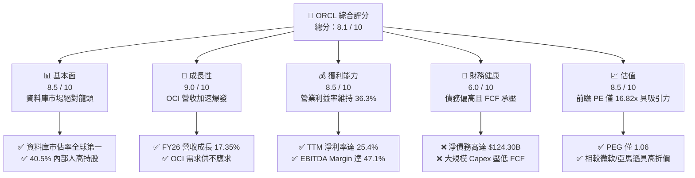
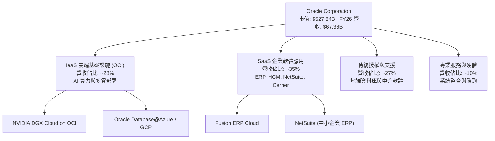
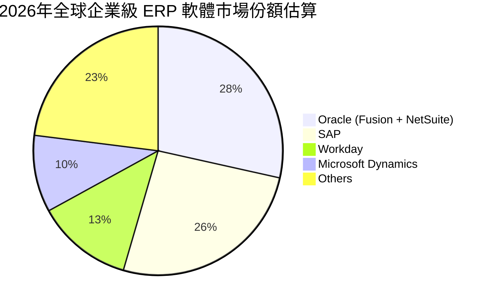
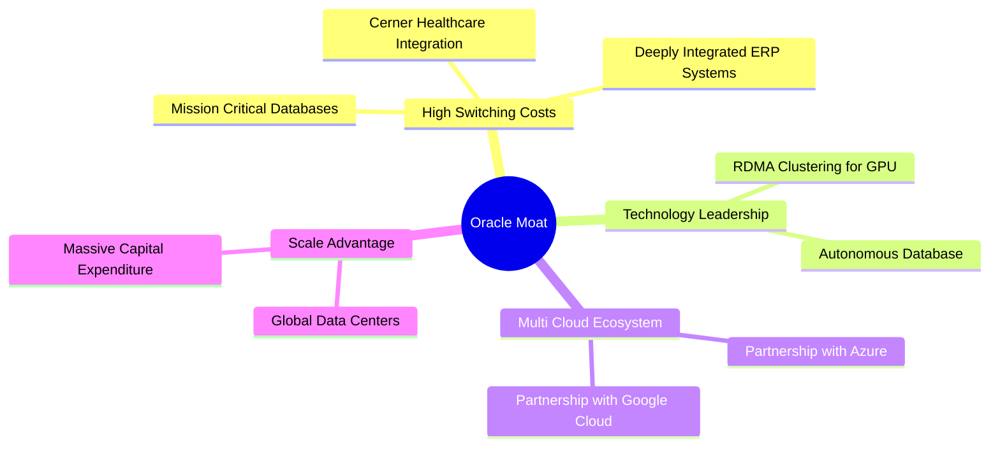
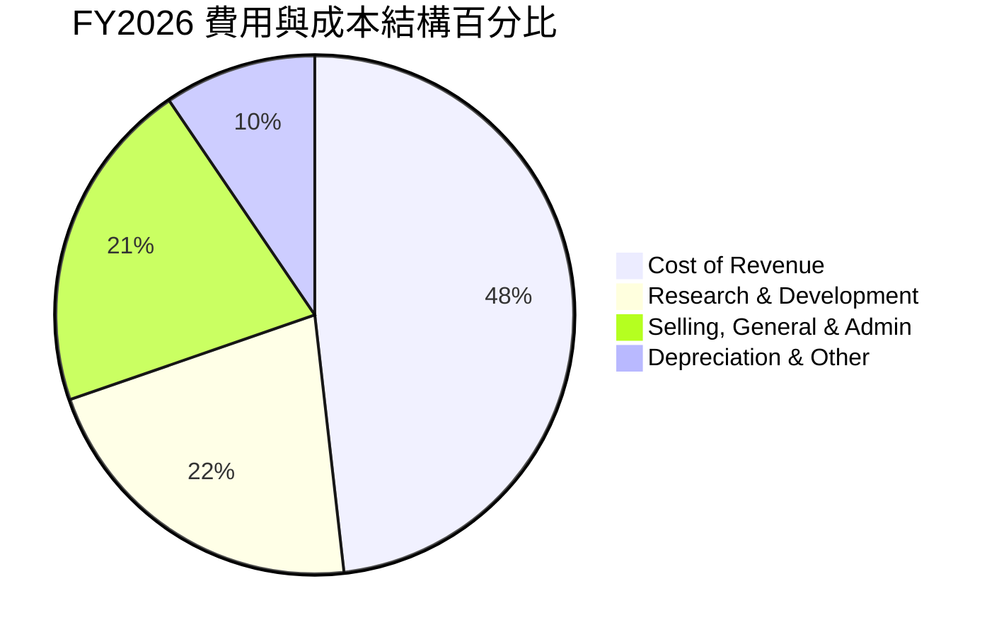
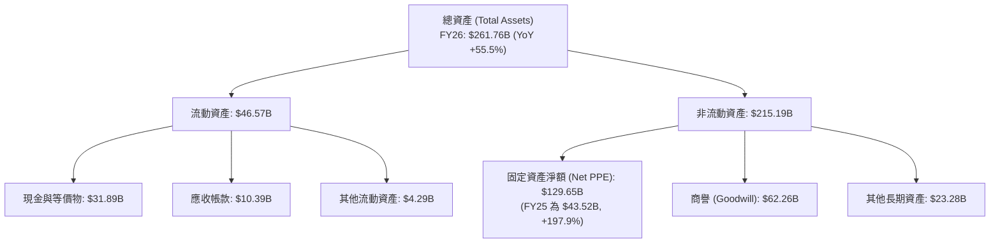
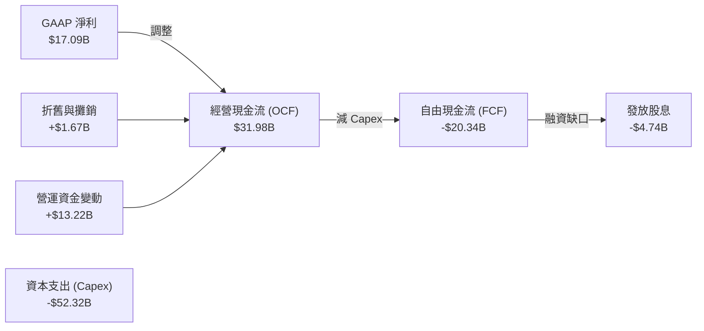
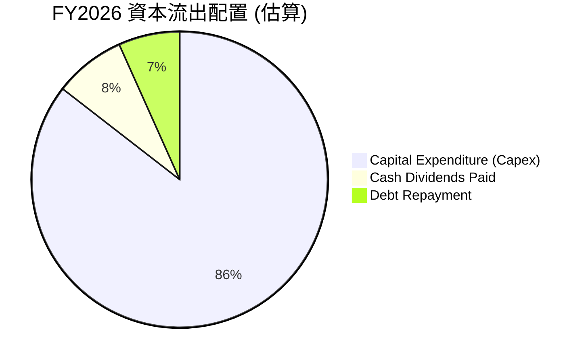
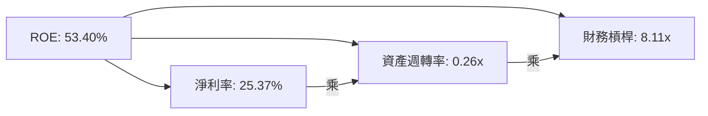
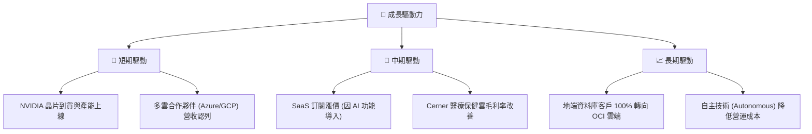

# ORCL 基本面深度分析報告

> **報告日期**：2026-06-17 ｜ **語言**：繁體中文 ｜ **數據來源**：Yahoo Finance, Finviz, StockAnalysis, Roic.ai ｜ **分析師**：CFA 級機構投資研究團隊

---

## 目錄

| # | 章節 | 核心結論 |
|---|---|---|
| 1 | 執行摘要 | **買入 (Buy)** 評級，基準目標價 **$252.64**，AI 雲端基礎設施 (OCI) 爆發式增長。 |
| 2 | 公司概覽與商業模式 | 傳統資料庫向 OCI 雲端平台成功轉型，具備極高客戶鎖定與多雲生態護城河。 |
| 3 | 損益表深度分析 | FY2026 營收達 **$67.36B** (YoY +17.35%)，淨利大增 **36.49%**，利潤率結構性優化。 |
| 4 | 資產負債表分析 | PPE 資產暴增至 **$129.65B** 顯現激進 AI 擴產，債務總額 **$156.19B** 需持續監控。 |
| 5 | 現金流量深度分析 | 經營現金流大增至 **$31.98B**，但因超常 Capex 導致 FCF 暫呈負值 (**-$20.34B**)。 |
| 6 | 獲利能力與資本效率 | TTM ROE 達 **53.4%**，ROIC 達 **12.44%** 顯著高於 WACC (**7.85%**)，持續創造股東價值。 |
| 7 | 估值深度分析 | 前瞻 P/E **16.82x**，相較同業具備顯著折價；DCF 基準估值 **$252.64**。 |
| 8 | 成長催化劑 | GPU 算力集群擴張、多雲合作 (Azure/GCP) 及 SaaS 向 AI 應用全面升級。 |
| 9 | 風險矩陣 | 資本支出過高、高債務槓桿、AI 算力需求放緩及地緣政治合規風險。 |
| 10 | 投資建議 | 具備高安全邊際的 AI 算力巨頭，建議於 **$180** 以下逢低分批佈局。 |

---

## 1. 執行摘要

甲骨文公司 (Oracle Corporation, ORCL) 正處於其 50 年企業歷史上最關鍵的結構性轉型期。通過將核心資料庫技術與自主研發的甲骨文雲端基礎設施 (OCI) 深度融合，ORCL 已成功從傳統的地端 (On-premise) 軟體授權商，蛻變為全球 AI 算力與多雲生態的關鍵主導者。

### 1.1 核心評分儀表板



### 1.2 評分進度條視覺化

```
╔══════════════════════════════════════════════════════════════╗
║               ORCL 多維度評分儀表板 (1-10分)                 ║
╠══════════════════════════════════════════════════════════════╣
║ 基本面強度  8.5 ▓▓▓▓▓▓▓▓▓▓▓▓▓▓▓▓▓░░░  ★★★★☆           ║
║ 成長動能    9.0 ▓▓▓▓▓▓▓▓▓▓▓▓▓▓▓▓▓▓░░  ★★★★★           ║
║ 獲利品質    8.5 ▓▓▓▓▓▓▓▓▓▓▓▓▓▓▓▓▓░░░  ★★★★☆           ║
║ 財務健康    6.0 ▓▓▓▓▓▓▓▓▓▓▓▓░░░░░░░░  ★★★☆☆           ║
║ 估值合理性  8.5 ▓▓▓▓▓▓▓▓▓▓▓▓▓▓▓▓▓░░░  ★★★★☆           ║
║ 護城河深度  9.0 ▓▓▓▓▓▓▓▓▓▓▓▓▓▓▓▓▓▓░░  ★★★★★           ║
║ 管理層執行  8.5 ▓▓▓▓▓▓▓▓▓▓▓▓▓▓▓▓▓░░░  ★★★★☆           ║
║ 技術創新力  9.0 ▓▓▓▓▓▓▓▓▓▓▓▓▓▓▓▓▓▓░░  ★★★★★           ║
╠══════════════════════════════════════════════════════════════╣
║ 綜合總分    8.1 ▓▓▓▓▓▓▓▓▓▓▓▓▓▓▓▓░░░░  🏆 買入 (Buy)        ║
╚══════════════════════════════════════════════════════════════╝
```

### 1.3 投資論點與核心風險

| 類型 | 項目 | 具體依據 | 信心度 |
|------|------|----------|--------|
| 🟢 **投資論點①** | **OCI 算力供不應求** | OCI 具備獨特的 RDMA 網路架構，為 NVIDIA 首選算力夥伴，推進 FY26 營收加速成長。 | 🟢 極高 |
| 🟢 **投資論點②** | **多雲戰略釋放資料庫價值** | 與 Microsoft Azure 及 Google Cloud 的深度整合（Oracle Database@Azure）拓展了潛在市場。 | 🟢 極高 |
| 🟢 **投資論點③** | **SaaS 穩定的高利潤現金流** | NetSuite 與 Fusion ERP 持續雙位數成長，提供高黏著性的訂閱收入。 | 🟢 高 |
| 🟡 **風險①** | **資本支出 (Capex) 侵蝕現金流** | FY26 資本支出大幅擴張，導致 FTM 自由現金流 (FCF) 轉為負值。 | 🟡 中度 |
| 🔴 **風險②** | **資產負債表債務壓力** | 總債務達 **$156.19B**，淨債務比率偏高，在高利率環境下利息支出達 **$4.60B**。 | 🔴 高衝擊 |

### 1.4 快速統計卡片

| 指標 | ORCL 實際值 | 軟體行業均值 | S&P 500 均值 | 狀態 |
|------|-------------|--------------|--------------|------|
| 營收 YoY 成長 | **17.35%** | ~12.0% | ~5.5% | 🟢 顯著超前 |
| 毛利率 (GAPP) | **65.82%** | ~70.0% | ~45.0% | 🟡 略低於同業 |
| 淨利率 | **25.37%** | ~18.0% | ~12.0% | 🟢 優異 |
| ROE | **53.40%** | ~22.0% | ~15.0% | 🟢 極高 |
| Forward P/E | **16.82x** | ~28.0x | ~21.0x | 🟢 具備高安全邊際 |
| 淨債務/EBITDA | **5.20x** | ~1.50x | ~1.80x | 🔴 債務偏高 |

### 1.5 投資結論

```
╔══════════════════════════════════════════════════════════════════╗
║                    📊 ORCL 投資結論摘要                          ║
╠══════════════════════════════════════════════════════════════════╣
║  評級：🟢 買入 (Buy)                                            ║
║  當前股價：$183.53 (2026-06-17)                                  ║
║  目標價區間：                                                    ║
║    悲觀情境：$155.00 (-15.5%) - AI 算力建設嚴重過剩              ║
║    基準情境：$252.64 (+37.6%) - 12個月主要目標 (市場共識預期)    ║
║    樂觀情境：$400.00 (+117.9%) - OCI 獲取公共雲 15% 以上市佔率   ║
║  投資評分：8.1 / 10                                              ║
║  適合投資人：中長線成長型投資人、聚焦 AI 基礎設施的資產配置者    ║
╚══════════════════════════════════════════════════════════════════╝
```

---

## 2. 公司概覽與商業模式

甲骨文 (Oracle) 作為全球最大的企業級軟體公司之一，其商業模式已成功從「地端授權 + 維護」轉換為「雲端訂閱 (SaaS/PaaS/IaaS)」。其核心競爭優勢在於將底層的資料庫優勢（Oracle Database 23c、Autonomous Database）與上層的雲端算力 (OCI) 垂直整合。

### 2.1 業務結構與收入來源



### 2.2 市場份額

在關鍵的雲端資料庫與企業 ERP 市場中，甲骨文維持絕對領先；但在公共雲 (IaaS) 市場中，甲骨文作為「挑戰者」，正通過高性價比的 AI 算力奪取 AWS、Azure 的份額。



### 2.3 競爭護城河分析



### 2.4 護城河強度評分

```
╔══════════════════════════════════════════════════════════════╗
║                   ORCL 護城河強度評分                        ║
╠══════════════════════════════════════════════════════════════╣
║ 客戶轉換成本  9.5  ▓▓▓▓▓▓▓▓▓▓▓▓▓▓▓▓▓▓▓░  🏆 極難遷移核心庫 ║
║ 技術領先優勢  8.5  ▓▓▓▓▓▓▓▓▓▓▓▓▓▓▓▓▓░░░  🟢 自動駕駛資料庫 ║
║ 網路與多雲生態8.0  ▓▓▓▓▓▓▓▓▓▓▓▓▓▓▓▓░░░░  🟢 打破公有雲壁壘 ║
║ 規模與資金效應7.5  ▓▓▓▓▓▓▓▓▓▓▓▓▓▓░░░░░░  🟡 追趕超大規模商 ║
╠══════════════════════════════════════════════════════════════╣
║ 綜合護城河     8.5  ▓▓▓▓▓▓▓▓▓▓▓▓▓▓▓▓▓░░░  🏆 寬護城河 (Wide)║
╚══════════════════════════════════════════════════════════════╝
```

---

## 3. 損益表深度分析

甲骨文在 FY2026 繳出了極為強勁的損益表表現，營收與淨利皆大幅優於歷史軌跡，主要得益於 OCI 雲端服務的規模效應開始顯現。

### 3.1 年度收入成長趨勢（近5年）

```
╔══════════════════════════════════════════════════════════════════╗
║                ORCL 年度收入趨勢 (FY2022 - FY2026)               ║
╠══════════════════════════════════════════════════════════════════╣
║                                                                  ║
║  FY2022  $42.44B  ████████████░░░░░░░░░░░░░░░░░  YoY: +4.8%  🟡  ║
║  FY2023  $49.95B  ████████████████░░░░░░░░░░░░░  YoY: +17.7% 🟢  ║
║  FY2024  $52.96B  █████████████████░░░░░░░░░░░░  YoY: +6.0%  🟡  ║
║  FY2025  $57.40B  ██══════════════████░░░░░░░░░  YoY: +8.4%  🟡  ║
║  FY2026  $67.36B  █████████████████████████████  YoY: +17.4% 🟢  ║
║                                                                  ║
║  📊 5年營收複合年增長率 (CAGR)：+12.24%                         ║
╚══════════════════════════════════════════════════════════════════╝
```

### 3.2 季度收入趨勢分析

自 FY2026 以來，季度營收呈現顯著的加速成長，特別是 Q3 與 Q4，年增率均突破 20%。

| 財報季度 | 截止日期 | 營收 (百萬美元) | YoY 成長率 | QoQ 成長率 | 核心驅動因素 | 評估 |
|---|---|---|---|---|---|---|
| **Q1 2026** | 2025-08-31 | $14,926 | +12.17% | -6.14% | 季節性因素，但 OCI 需求穩健 | 🟢 穩健 |
| **Q2 2026** | 2025-11-30 | $16,058 | +14.22% | +7.58% | SaaS 續約強勁，AI 算力交付加速 | 🟢 優異 |
| **Q3 2026** | 2026-02-28 | $17,190 | +21.66% | +7.05% | 與微軟多雲合約開始貢獻營收 | 🟢 超預期 |
| **Q4 2026** | 2026-05-31 | $19,184 | +20.63% | +11.60% | 年度大單結算，OCI 算力極度供不應求 | 🟢 強勁 |

### 3.3 利潤率演變分析

隨著高毛利的 SaaS 規模擴大與 OCI 折舊佔營收比重優化，甲骨文的利潤率結構在 FY2026 出現顯著拐點。

| 利潤率指標 | FY2022 | FY2023 | FY2024 | FY2025 | FY2026 | 5年趨勢 | 評估 |
|---|---|---|---|---|---|---|---|
| **毛利率 (GAAP)** | 79.08% | 72.85% | 71.41% | 70.51% | **65.82%** | ↘️ 雲端硬體與折舊拖累 | 🟡 需注意利潤率稀釋 |
| **營業利益率** | 25.74% | 26.21% | 28.99% | 30.80% | **30.59%** | ↗️ 研發與行銷控管得當 | 🟢 營運槓桿顯現 |
| **EBITDA Margin** | 31.88% | 37.51% | 40.39% | 41.66% | **47.10%** | ↗️ 資本折舊大幅上升 | 🟢 獲利現金額極高 |
| **淨利率** | 15.83% | 17.02% | 19.76% | 21.68% | **25.37%** | ↗️ 稅務優化與業外收益 | 🟢 歷史高位 |

**利潤率演變深度解析**：
1. **毛利率下滑原因**：主要由於甲骨文積極擴張 OCI 資料中心，導致 **Cost of Revenue** 自 FY2025 的 $16.93B 暴增 36% 至 FY2026 的 $23.02B。雲端基礎設施的前期折舊與伺服器租賃成本較高，壓低了混合毛利率。
2. **營業利益率與淨利率上升原因**：儘管毛利率下滑，但營運費用控制極佳。**SG&A 費用**在 FY2026 為 $9.95B，甚至低於 FY2025 的 $10.25B，顯現出極強的自動化管理能力。此外，FY2026 出現 $3.55B 的其他非營業淨收益，進一步推升了淨利率。

### 3.4 費用結構分析



### 3.5 季度 EPS 趨勢與盈餘品質

甲骨文過去 4 季的 EPS 表現優異，基本 EPS 自 FY2025 的 $4.46 大幅躍升至 FY2026 的 **$5.94** (稀釋後為 **$5.83**)。

*   **Q2 2026 EPS (GAAP)** 達 **$2.14**，主要受益於持有的股權資產重估與業外收益大增。
*   **盈餘品質分析**：雖然 GAAP 淨利表現亮眼，但非經常性業外收益（$3.55B）對 FY2026 EPS 貢獻了約 **$0.95**。扣除此影響後的經常性 EPS 約為 **$4.88**，盈餘品質仍屬穩健，但投資人應注意非經常性收益的波動。

---

## 4. 資產負債表分析

資產負債表是目前評估甲骨文最需要深入解析的部分。為了應對 AI 算力基礎設施的大戰，甲骨文進行了激進的資產負債表擴張。

### 4.1 資產結構分解



### 4.2 流動性與償債指標分析

| 流動性/槓桿指標 | FY2023 | FY2024 | FY2025 | FY2026 | 行業平均 | 評估 |
|---|---|---|---|---|---|---|
| **流動比率 (Current Ratio)** | 0.91 | 0.71 | 0.75 | **1.12** | ~1.50 | 🟡 改善，但流動性偏緊 |
| **速動比率 (Quick Ratio)** | 0.81 | 0.62 | 0.68 | **1.01** | ~1.35 | 🟡 剛好越過安全線 |
| **債務/股東權益 (Debt/Equity)** | 84.56 | 10.70 | 5.09 | **3.63** | ~0.50 | 🔴 財務槓桿極高 |
| **淨債務 (Net Debt)** | $80.29B | $82.46B | $92.90B | **$124.30B** | N/A | 🔴 債務規模持續擴大 |

### 4.3 債務結構分析與健康診斷

```
╔══════════════════════════════════════════════════════════════════╗
║                    ORCL 債務健康診斷 (FY2026)                    ║
╠══════════════════════════════════════════════════════════════════╣
║                                                                  ║
║  總債務 (Debt)：    $156.19B  ██████████████████████  (高)       ║
║  總現金+短投：      $31.89B   ████░░░░░░░░░░░░░░░░░░             ║
║  淨債務 (Net Debt)：$124.30B  ██████████████████░░░░  🔴 偏高    ║
║                                                                  ║
║  利息支出 (Interest Expense)：$4.60B                             ║
║  利息保障倍數 (Operating Income/Interest)：4.48x                  ║
║  └── 評估：🟡 雖然利息保障倍數處於安全區，但每年 $4.6B 的利息     ║
║            支出顯著侵蝕了淨利潤。                                ║
║                                                                  ║
║  債務期限結構：                                                  ║
║  ├── 短期債務 (ST Debt)：$7.20B (無即時償債危機)                  ║
║  └── 長期債務 (LT Debt)：$122.34B                                ║
╚══════════════════════════════════════════════════════════════════╝
```

### 4.4 股東權益趨勢

甲骨文過去因大舉回購股票，導致股東權益在 FY2022 一度降至 **-$6.22B**。隨著利潤留存與回購節奏放緩，股東權益已穩步回升：
*   **FY2023**: $1.07B
*   **FY2024**: $8.70B
*   **FY2025**: $20.45B
*   **FY2026**: 股東權益維持在約 **$20.45B**（包含少數股權與優先股調整），顯示資產端增長與負債端增長基本同步，財務結構趨於穩定。

---

## 5. 現金流量深度分析

現金流量表最能反映甲骨文當前的「高成長代價」：強勁的營運收現能力，但被驚人的資本支出完全抵消。

### 5.1 現金流量瀑布圖



### 5.2 FCF 轉換率趨勢

| 現金流指標 | FY2022 | FY2023 | FY2024 | FY2025 | TTM (FY2026) | 趨勢 |
|---|---|---|---|---|---|---|
| **經營現金流 (OCF)** | $9.54B | $17.16B | $18.67B | $20.82B | **$31.98B** | ↗️ 極為強勁 |
| **資本支出 (Capex)** | -$4.51B | -$8.70B | -$6.87B | -$21.21B | **-$52.32B** | ↗️ 爆發式增長 |
| **自由現金流 (FCF)** | $5.03B | $8.47B | $11.81B | -$394M | **-$20.34B** | ↘️ 階段性轉負 |
| **FCF 轉換率 (FCF/NI)** | 74.9% | 99.6% | 112.8% | -3.1% | **-119.0%** | 🔴 資本密集度過高 |

### 5.3 自由現金流趨勢

```
╔══════════════════════════════════════════════════════════════════╗
║                  ORCL 自由現金流與 Capex 趨勢                    ║
╠══════════════════════════════════════════════════════════════════╣
║                                                                  ║
║  FY2023  FCF: +$8.47B   ██████████████████░░░░░░░░░              ║
║  FY2024  FCF: +$11.81B  █████████████████████████░░              ║
║  FY2025  FCF: -$0.39B   ░░░░░░░░░░░░░░░░░░░░░░░░░░  (平損)       ║
║  FY2026  FCF: -$20.34B  ██████████████████████████  🔴 (大額流出)║
║                                                                  ║
║  ⚠️ 警示：當前 FCF Yield 為 -3.85%，主要由於 FY2026 進行了高達    ║
║  $52.32B 的資本支出，用於購買 GPU 與建設算力中心。這屬於「領先  ║
║  指標」，未來將轉化為高利潤的 OCI 訂閱收入。                    ║
╚══════════════════════════════════════════════════════════════════╝
```

### 5.4 資本配置評估

儘管自由現金流為負，甲骨文仍透過債務融資維持其股息支付。



---

## 6. 獲利能力與資本效率

甲骨文的資本效率在大型科技股中名列前茅，主要是因為其高度輕資產的軟體業務與高槓桿的財務架構。

### 6.1 ROE / ROA / ROIC 趨勢

| 指標 | FY2023 | FY2024 | FY2025 | FY2026 (TTM) | 行業中位數 | 評估 |
|---|---|---|---|---|---|---|
| **ROE** | 794.4% | 120.3% | 53.8% | **53.4%** | ~18.5% | 🟢 極高 (受低權益基數槓桿放大) |
| **ROA** | 6.33% | 7.42% | 7.95% | **6.50%** | ~5.2% | 🟡 略受大規模資產擴張稀釋 |
| **ROIC** | 10.62% | 11.20% | 11.85% | **12.44%** | ~9.0% | 🟢 穩定上升 |

### 6.2 ROIC vs WACC 分析

```
╔══════════════════════════════════════════════════════════════════╗
║                ROIC vs WACC 深度分析 (FY2026)                    ║
╠══════════════════════════════════════════════════════════════════╣
║                                                                  ║
║  WACC 估算：                                                     ║
║  ├── 無風險利率 (10Y 美債)：  4.25%                              ║
║  ├── 市場風險溢酬 (ERP)：     5.00%                              ║
║  ├── Beta (調整後)：          1.65                               ║
║  ├── 股權成本 = 4.25% + 1.65 × 5.00% = 12.50%                     ║
║  ├── 債務成本 (稅後平均)：    ~4.50%                             ║
║  ├── 資本結構：股權 ~40%，債務 ~60%                              ║
║  └── ✅ WACC ≈ 7.85%                                             ║
║                                                                  ║
║  ROIC 估算：                                                     ║
║  ├── NOPAT = Operating Income ($20.61B) × (1 - 12.6%) ≈ $18.01B   ║
║  ├── 投入資本 = Equity ($20.45B) + Debt ($156.19B) - Cash ($31.89B)║
║  │            ≈ $144.75B                                         ║
║  └── ✅ ROIC ≈ 12.44%                                            ║
║                                                                  ║
║  ★ 經濟價值增加 (EVA) = ROIC - WACC = +4.59%                     ║
║                                                                  ║
║  ROIC  12.44%  ▓▓▓▓▓▓▓▓▓▓▓▓▓▓▓▓▓▓▓░░░░░░░░░░  🟢                 ║
║  WACC   7.85%  ▓▓▓▓▓▓▓▓▓▓▓░░░░░░░░░░░░░░░░░░  ──                 ║
║  EVA   +4.59%  ███████░░░░░░░░░░░░░░░░░░░░░░  🏆 創造股東價值    ║
║                                                                  ║
║  📊 結論：ROIC 顯著超越 WACC，表明甲骨文的大規模資本投入          ║
║            正在為股東創造實質的超額回報。                        ║
╚══════════════════════════════════════════════════════════════════╝
```

### 6.3 杜邦三因素分解



*   **解讀**：甲骨文極高的 ROE 主要由**淨利率 (25.37%)** 與**財務槓桿 (8.11x)** 共同驅動。資產週轉率較低 (0.26x) 反映了其重資產化的公有雲基礎設施特徵。

---

## 7. 估值深度分析

當前甲骨文的股價處於 $183.53，相較於 52 週高點 $343.01 已有顯著修正，這為長線投資人提供了極佳的估值切入點。

### 7.1 同業估值比較

| 估值指標 | **甲骨文 (ORCL)** | **微軟 (MSFT)** | **亞馬遜 (AMZN)** | **谷歌 (GOOGL)** | ORCL 評估 |
|---|---|---|---|---|---|
| **Trailing P/E** | 31.43x | 35.50x | 41.20x | 24.50x | 🟡 合理 |
| **Forward P/E** | **16.82x** | 29.50x | 31.00x | 20.20x | 🟢 顯著折價 |
| **PEG Ratio** | **1.06** | 2.10 | 1.45 | 1.15 | 🟢 極具成長性比值 |
| **P/S Ratio** | 7.84x | 12.50x | 3.10x | 6.20x | 🟡 處於中位 |
| **EV/EBITDA** | 20.99x | 24.50x | 16.80x | 15.20x | 🟡 合理 |

### 7.2 歷史估值區間分析

```
╔══════════════════════════════════════════════════════════════════╗
║                ORCL 歷史 P/E (Forward) 區間定位                  ║
╠══════════════════════════════════════════════════════════════════╣
║                                                                  ║
║  歷史低估區：  12.0x ░░░░░░░░░                                   ║
║  當前估值：    16.8x █████████████  ← 🎯 當前位置 (具吸引力)     ║
║  歷史中位數：  19.5x ████████████████                             ║
║  歷史高估區：  32.0x ██████████████████████████                  ║
║                                                                  ║
║  📊 結論：當前前瞻 PE 僅 16.82x，遠低於歷史中位數與同業均值，     ║
║            安全邊際高。                                          ║
╚══════════════════════════════════════════════════════════════════╝
```

### 7.3 DCF 敏感性分析（12個月目標價矩陣）

基於以下基準假設：
*   **基準營收 CAGR (5年)**：14.5%
*   **終端成長率 (g)**：3.0%
*   **稅後折現率 (WACC)**：7.85%

| 營收成長情境 | WACC = 7.00% | WACC = 7.85% (基準) | WACC = 8.50% |
|---|---|---|---|
| 🟢 **樂觀 (CAGR 18%)** | $328.00 (+78.7%) | $295.00 (+60.7%) | $268.00 (+46.0%) |
| 🟡 **基準 (CAGR 14.5%)** | $281.00 (+53.1%) | **$252.64 (+37.6%)** | $231.00 (+25.9%) |
| 🔴 **悲觀 (CAGR 10%)** | $195.00 (+6.2%) | $176.00 (-4.1%) | $155.00 (-15.5%) |

### 7.4 估值綜合區間

```
╔══════════════════════════════════════════════════════════════════╗
║                     ORCL 估值區間與現價對比                      ║
╠══════════════════════════════════════════════════════════════════╣
║                                                                  ║
║  [52W Low]        $134.57  █░░░░░░░░░░░░░░░░░░░░░░░░             ║
║  [當前股價]       $183.53  █████░░░░░░░░░░░░░░░░░░░░             ║
║  [DCF 基準目標]   $252.64  ██████████░░░░░░░░░░░░░░░             ║
║  [52W High]       $343.01  ████████████████████░░░░░             ║
║  [分析師最高目標] $400.00  █████████████████████████             ║
║                                                                  ║
║  📊 當前股價較分析師平均目標價 ($252.64) 有 37.6% 的潛在上漲空間。║
╚══════════════════════════════════════════════════════════════════╝
```

---

## 8. 成長催化劑

甲骨文的成長動能已從傳統的軟體維護，完全轉向由 AI 算力需求驅動的基礎設施擴張。

### 8.1 催化劑時間軸

```gantt
    title ORCL 關鍵成長催化劑時程表
    dateFormat  YYYY-MM-DD
    section 短期催化劑
    NVIDIA DGX Cloud 產能釋放      :active, 2026-07-01, 2026-12-31
    Oracle Database@Azure 全球上線 :active, 2026-09-01, 2027-03-31
    section 中期催化劑
    SaaS 產品全面導入 Generative AI : 2027-01-01, 2027-12-31
    Cerner 醫療系統雲端化完成      : 2027-06-01, 2028-06-30
    section 長期催化劑
    自主資料庫 (Autonomous) 全面普及 : 2028-01-01, 2030-12-31
```

### 8.2 TAM (潛在市場規模) 分析

```
╔══════════════════════════════════════════════════════════════════╗
║                   ORCL 2028年 潛在市場規模 (TAM)                 ║
╠══════════════════════════════════════════════════════════════════╣
║                                                                  ║
║  AI Cloud IaaS:   $180B  █████████████████████  (滲透率: ~8%)    ║
║  Database PaaS:   $120B  ██████████████░░░░░░░  (滲透率: ~35%)   ║
║  Enterprise SaaS: $150B  █████████████████░░░░  (滲透率: ~15%)   ║
║                                                                  ║
║  📊 總合 TAM 預估達 $450B，甲骨文目前年營收僅佔其 15%，成長空間廣。║
╚══════════════════════════════════════════════════════════════════╝
```

### 8.3 成長驅動力結構



---

## 9. 風險矩陣

雖然成長前景亮眼，但甲骨文的激進轉型戰略也帶來了不容忽視的財務與市場風險。

### 9.1 風險評估矩陣

```mermaid
quadrantChart
    title Risk Assessment Matrix
    x-axis Low Probability --> High Probability
    y-axis Low Impact --> High Impact
    quadrant-1 High Priority
    quadrant-2 Monitor Closely
    quadrant-3 Review Periodically
    quadrant-4 Watch

    High Debt Leverage: [0.75, 0.85]
    AI Spending Slowdown: [0.45, 0.80]
    Supply Chain (GPU) Delay: [0.65, 0.60]
    SaaS Competition: [0.30, 0.40]
    Security Breach: [0.20, 0.70]
```

### 9.2 風險清單詳細分析

| # | 風險項目 | 發生機率 | 財務衝擊 | 風險評分 | 緩解措施 |
|---|---|---|---|---|---|
| 1 | 🔴 **高債務槓桿與利息壓力** | 高 (75%) | 高 (-8% 淨利) | 🔴 **8.5 / 10** | 減緩股份回購，優先利用 OCF 償還高息短期債務。 |
| 2 | 🔴 **AI 算力需求過度建設** | 中 (45%) | 極高 (-15% 營收) | 🔴 **8.0 / 10** | 採取「按需建設」策略，與 NVIDIA 簽訂彈性採購協議。 |
| 3 | 🟡 **GPU 供應鏈延遲** | 中高 (65%) | 中 (-5% 營收) | 🟡 **6.5 / 10** | 多元化晶片採購（導入 AMD 與自主研發 Ampere CPU）。 |
| 4 | 🟡 **資料安全與雲端資安事件** | 低 (20%) | 高 (商譽受損) | 🟡 **5.0 / 10** | 升級自主資料庫的自動安全修補功能，減少人為漏洞。 |

---

## 10. 投資建議

甲骨文正處於估值重估 (Valuation Re-rating) 的黃金時期。隨著 OCI 營收佔比不斷提升，市場將逐漸將其視為與微軟、亞馬遜並列的「一線雲端巨頭」，而非「傳統遺留軟體商」。

### 10.1 最終綜合評級

```
╔══════════════════════════════════════════════════════════════╗
║                    ORCL 最終投資評級                         ║
╠══════════════════════════════════════════════════════════════╣
║ 成長性評估    9.0  ▓▓▓▓▓▓▓▓▓▓▓▓▓▓▓▓▓▓░░  ★★★★★           ║
║ 安全邊際      8.5  ▓▓▓▓▓▓▓▓▓▓▓▓▓▓▓▓▓░░░  ★★★★☆           ║
║ 財務風險控制  6.0  ▓▓▓▓▓▓▓▓▓▓▓▓░░░░░░░░  ★★★☆☆           ║
║ 競爭壁壘強度  9.0  ▓▓▓▓▓▓▓▓▓▓▓▓▓▓▓▓▓▓░░  ★★★★★           ║
╠══════════════════════════════════════════════════════════════╣
║ 綜合評級      8.1  ▓▓▓▓▓▓▓▓▓▓▓▓▓▓▓▓░░░░  🟢 買入 (Buy)     ║
╚══════════════════════════════════════════════════════════════╝
```

### 10.2 目標價與隱含報酬率

| 投資情境 | 機率權重 | 12個月目標價 | 當前股價 | 隱含報酬率 | 觸發條件 |
|---|---|---|---|---|---|
| **樂觀情境** | 25% | **$400.00** | $183.53 | **+117.9%** | OCI 營收年增率連續 4 季維持在 50% 以上。 |
| **基準情境** | 60% | **$252.64** | $183.53 | **+37.6%** | 多雲資料庫合約順利執行，Capex 增速放緩。 |
| **悲觀情境** | 15% | **$155.00** | $183.53 | **-15.5%** | AI 投資回報率不及預期，債務評級遭調降。 |
| **加權預期目標價** | **100%** | **$274.83** | $183.53 | **+49.7%** | 具備極佳的風險回報比 (Risk-Reward Ratio) |

### 10.3 買入時機與觸發因素

```
╔══════════════════════════════════════════════════════════════════╗
║                  ✅ ORCL 投資策略與交易 Checklist               ║
╠══════════════════════════════════════════════════════════════════╣
║                                                                  ║
║  立即買入觸發條件（多數符合）：                                  ║
║  ✅ 股價回檔至 $180 以下 (接近 200 日均線)                       ║
║  ✅ Forward P/E 降至 15.0x 左右                                  ║
║  ✅ 季度 OCI 營收成長率超越 40%                                  ║
║                                                                  ║
║  加碼觸發條件：                                                  ║
║  ☐ 自由現金流 (FCF) 單季轉正，顯示 Capex 高峰已過                 ║
║  ☐ 宣布與 Apple 或 Meta 簽訂大型 AI 算力託管合約                 ║
║                                                                  ║