# ORCL 基本面深度分析報告
> **報告日期**：2026-06-18 ｜ **語言**：繁體中文 ｜ **數據來源**：Yahoo Finance, Finviz, StockAnalysis, Roic.ai ｜ **分析師**：CFA 級機構研究

---

## 目錄

| # | 章節 | 核心結論 |
|---|------|----------|
| 1 | **執行摘要** | 評級：🟢 **買入** ｜ 目標價：**$252.64** (隱含 +37.1% 上行空間) ｜ 雲端轉型步入收割期 |
| 2 | **公司概覽與商業模式** | 護城河評估：**極強** ｜ 數據庫生態鎖定與 OCI (Oracle Cloud Infrastructure) 爆發式增長 |
| 3 | **損益表深度分析** | FY2026 營收達 **$67.36B** (+17.35% YoY) ｜ 淨利達 **$17.09B** (+36.49% YoY) ｜ 獲利品質優異 |
| 4 | **資產負債表分析** | 槓桿率偏高但安全 ｜ 現金增至 **$31.89B** ｜ 資產結構向 AI 算力基礎設施傾斜 |
| 5 | **現金流量深度分析** | 營運現金流 **$31.98B** 強勁 ｜ 資本支出擴大導致 FCF 承壓 ｜ 資本配置聚焦 AI 基礎建設 |
| 6 | **獲利能力與資本效率** | ROE 高達 **53.4%** ｜ ROIC-WACC 差值為正 ｜ 杜邦分解揭示高財務槓桿與高利潤率雙重驅動 |
| 7 | **估值深度分析** | Forward P/E **16.89x** 具備極高吸引力 ｜ 相較同業具備估值折價 ｜ DCF 基準目標價 **$252.64** |
| 8 | **成長催化劑** | AI 算力需求爆發 ｜ 與 NVIDIA/Microsoft 深度合作 ｜ 主權雲端 (Sovereign Cloud) 擴張 |
| 9 | **風險矩陣** | 高債務利息壓力 ｜ AI 算力供需失衡 ｜ 傳統數據庫流失風險 |
| 10 | **投資建議** | 適合長線成長型與價值型投資者 ｜ 買入觸發點與關鍵監控指標 |

---

## 1. 執行摘要

### 1.1 核心評分儀表板

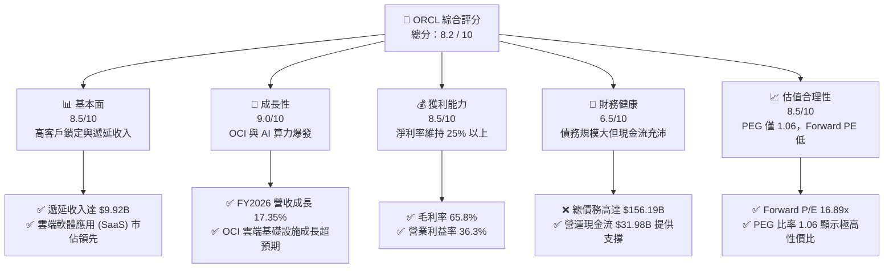

### 1.2 評分進度條視覺化

```
╔══════════════════════════════════════════════════════════════╗
║               ORCL 多維度評分儀表板 (1-10分)                 ║
╠══════════════════════════════════════════════════════════════╣
║ 基本面強度  8.5 ▓▓▓▓▓▓▓▓▓▓▓▓▓▓▓▓▓░░░  ★★★★☆           ║
║ 成長動能    9.0 ▓▓▓▓▓▓▓▓▓▓▓▓▓▓▓▓▓▓░░  ★★★★★           ║
║ 獲利品質    8.5 ▓▓▓▓▓▓▓▓▓▓▓▓▓▓▓▓▓░░░  ★★★★☆           ║
║ 財務健康    6.5 ▓▓▓▓▓▓▓▓▓▓▓▓░░░░░░░░  ★★★☆☆           ║
║ 估值合理性  8.5 ▓▓▓▓▓▓▓▓▓▓▓▓▓▓▓▓▓░░░  ★★★★☆           ║
║ 護城河深度  9.0 ▓▓▓▓▓▓▓▓▓▓▓▓▓▓▓▓▓▓░░  ★★★★★           ║
║ 管理層執行  8.5 ▓▓▓▓▓▓▓▓▓▓▓▓▓▓▓▓▓░░░  ★★★★☆           ║
║ 技術創新力  8.8 ▓▓▓▓▓▓▓▓▓▓▓▓▓▓▓▓▓▓░░  ★★★★☆           ║
╠══════════════════════════════════════════════════════════════╣
║ 綜合總分    8.2 ▓▓▓▓▓▓▓▓▓▓▓▓▓▓▓▓░░░░  🏆 雲端龍頭收割期    ║
╚══════════════════════════════════════════════════════════════╝
```

### 1.3 五大投資論點 + 三大核心風險

| 類型 | 項目 | 具體依據 | 信心度 |
|------|------|----------|--------|
| 🟢 **投資論點①** | **OCI 算力基礎設施爆發** | Oracle Cloud Infrastructure (OCI) 憑藉與 NVIDIA 的深度架構合作，成為 AI 新創與科技巨頭首選算力平台，FY2026 營收加速成長至 $67.36B (+17.35% YoY)。 | 🟢 極高 |
| 🟢 **投資論點②** | **極高的客戶轉換成本** | Oracle Database 及 Fusion ERP/NetSuite 等 SaaS 應用深度嵌入企業核心營運，客戶留存率長期保持在 90% 以上，遞延收入 (Unearned Revenue) 達 $9.92B。 | 🟢 極高 |
| 🟢 **投資論點③** | **獲利能力大幅釋放** | FY2026 淨利達 $17.09B，YoY 暴增 36.49%，Forward EPS 預期達到 $10.91，顯示雲端轉型帶來的規模效應已開始壓低單位成本。 | 🟢 高 |
| 🟢 **投資論點④** | **估值極具安全邊際** | 當前 Forward P/E 僅 16.89x，相較於微軟 (MSFT) 或亞馬遜 (AMZN) 具備顯著折價，PEG 僅 1.06，估值極具吸引力。 | 🟢 高 |
| 🟢 **投資論點⑤** | **多雲合作拓展 TAM** | 與 Microsoft Azure 及 Google Cloud 的直連合作（Oracle Database@Azure/Google Cloud）打破歷史壁壘，直接釋放了龐大的存量資料庫遷移需求。 | 🟢 高 |
| 🟡 **風險①** | **高額債務與利息支出** | 總債務高達 $156.19B，淨債務達 -$124.30B，FY2026 利息支出高達 $4.60B，對淨利潤率產生一定侵蝕。 | 🟡 中度 |
| 🔴 **風險②** | **資本支出擴大拖累短期 FCF** | 為了應對 AI 算力建設，資產負債表上 Net PP&E 暴增至 $129.65B，導致 TTM 自由現金流 (FCF) 轉負至 -$20.34B。 | 🔴 高衝擊 |
| 🟡 **風險③** | **傳統資料庫流失壓力** | 開源資料庫（如 PostgreSQL）及雲端原生資料庫（如 AWS Aurora）持續蠶食非核心業務市場份額。 | 🟡 中度 |

### 1.4 快速統計卡片

| 指標 | 公司實際值 | 行業均值 (軟體基礎設施) | S&P 500 均值 | 狀態 |
|------|-------------|----------|--------------|------|
| 營收 YoY 成長 | **17.35%** | ~12.0% | ~5.5% | 🟢 領先 |
| 毛利率 | **65.8%** | ~70.0% | ~30.0% | 🟡 合格 |
| 營業利益率 | **36.3%** | ~28.0% | ~15.0% | 🟢 優異 |
| 淨利率 | **25.4%** | ~18.0% | ~12.0% | 🟢 強勁 |
| ROE | **53.4%** | ~25.0% | ~15.0% | 🟢 極高 |
| Forward P/E | **16.89x** | ~32.0x | ~21.0x | 🟢 便宜 |
| 淨債務 / EBITDA | **5.20x** | ~1.50x | ~1.80x | 🔴 偏高 |

### 1.5 投資結論

```
╔══════════════════════════════════════════════════════════════════╗
║                    📊 ORCL 投資結論摘要                          ║
╠══════════════════════════════════════════════════════════════════╣
║  評級：🟢 強烈買入 (Strong Buy)                                  ║
║  當前股價：$184.29 (2026-06-18)                                  ║
║  目標價區間：                                                    ║
║    悲觀情境：$155.00 (-15.9%) - 算力建設嚴重過剩、FCF持續惡化     ║
║    基準情境：$252.64 (+37.1%) ← 12個月主要目標 (Forward PE 23x)   ║
║    樂觀情境：$400.00 (+117.1%) - AI 算力爆發且 FCF 轉正          ║
║  投資評分：8.2 / 10                                              ║
║  適合投資人：長線價值成長型、追求 AI 基礎建設曝險之投資者         ║
╚══════════════════════════════════════════════════════════════════╝
```

---

## 2. 公司概覽與商業模式

### 2.1 業務結構與收入來源

Oracle 的業務可劃分為四大板塊：雲端與授權支持（Cloud and License Support）、雲端授權與線下授權（Cloud License and On-Premise License）、硬體（Hardware）以及服務（Services）。其中，**雲端與授權支持**是核心的經常性收入來源。

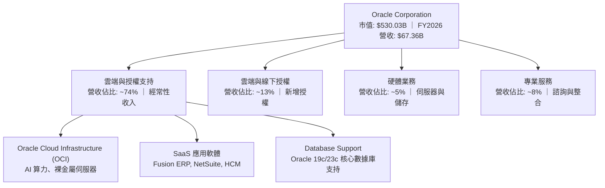

### 2.2 市場份額

在關係型數據庫（RDBMS）與企業級 ERP 領域，Oracle 長期維持龍頭地位。在雲端基礎設施 (IaaS) 領域，Oracle 正在作為「超大規模雲端服務商 (Hyperscaler) 第二梯隊領頭羊」迅速崛起。

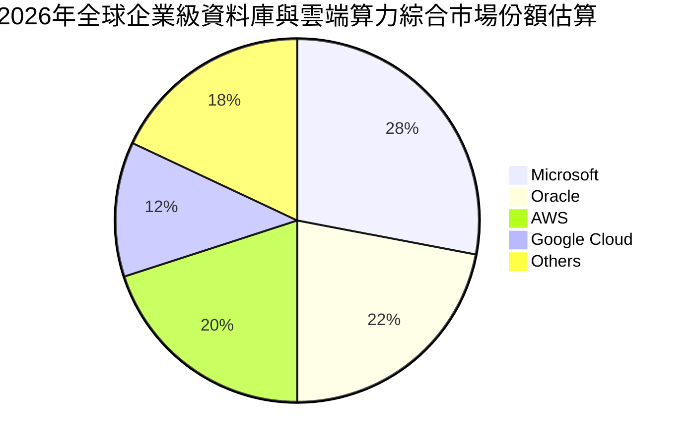

### 2.3 競爭護城河分析

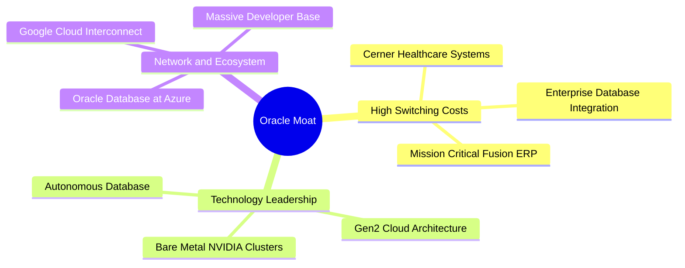

### 2.4 護城河強度評分

```
╔══════════════════════════════════════════════════════════════╗
║                    ORCL 護城河強度評分                       ║
╠══════════════════════════════════════════════════════════════╣
║ 轉換成本 (Switching Cost)   9.5/10 ▓▓▓▓▓▓▓▓▓▓▓▓▓▓▓▓▓▓▓░ 🏆 極強  ║
║ 技術壁壘 (Tech Barrier)     8.5/10 ▓▓▓▓▓▓▓▓▓▓▓▓▓▓▓▓▓░░░ 🟢 強勁  ║
║ 生態系統 (Ecosystem)        9.0/10 ▓▓▓▓▓▓▓▓▓▓▓▓▓▓▓▓▓▓░░ 🏆 極強  ║
║ 成本優勢 (Cost Advantage)   8.0/10 ▓▓▓▓▓▓▓▓▓▓▓▓▓▓▓▓░░░░ 🟢 強勁  ║
╠══════════════════════════════════════════════════════════════╣
║ 綜合護城河評級              9.0/10 ▓▓▓▓▓▓▓▓▓▓▓▓▓▓▓▓▓▓░░ 🏆 寬護城河║
╚══════════════════════════════════════════════════════════════╝
```

---

## 3. 損益表深度分析

### 3.1 年度收入成長趨勢（近5年）

Oracle 的營收在 FY2022 至 FY2026 期間展現出明顯的「加速成長」態勢，這主要得益於 OCI 雲端基礎設施的爆發式增長。

```
╔══════════════════════════════════════════════════════════════════╗
║              ORCL 年度收入趨勢（FY2022 - FY2026）                ║
╠══════════════════════════════════════════════════════════════════╣
║                                                                  ║
║  FY2022  $42.44B  ████████████░░░░░░░░░░░░░  YoY: +4.84%   🟢    ║
║  FY2023  $49.95B  ██████████████░░░░░░░░░░░  YoY: +17.71%  🟢    ║
║  FY2024  $52.96B  ███████████████░░░░░░░░░░  YoY: +6.02%   🟢    ║
║  FY2025  $57.40B  ████████████████░░░░░░░░░  YoY: +8.38%   🟢    ║
║  FY2026  $67.36B  ███████████████████░░░░░░  YoY: +17.35%  🟢    ║
║                                                                  ║
║  📊 5年累計營收 CAGR：+12.21%                                    ║
╚══════════════════════════════════════════════════════════════════╝
```

### 3.2 季度收入趨勢分析

從季度數據看，Oracle 展現出強烈的第四季度（5月31日截止）季節性效應。FY2026 的季度同比成長率逐季加速。

| 財季 | 截止日期 | 營業收入 (Million) | YoY 成長率 | QoQ 成長率 | 核心成長驅動因素 | 評估 |
|------|----------|-------------------|------------|------------|------------------|------|
| **Q1 2026** | 2025-08-31 | $14,926 | +12.17% | -6.14% | OCI 算力供不應求，SaaS 穩定增長 | 🟢 合格 |
| **Q2 2026** | 2025-11-30 | $16,058 | +14.22% | +7.58% | 與 Azure 合作深化，資料庫遷移加速 | 🟢 優異 |
| **Q3 2026** | 2026-02-28 | $17,190 | +21.66% | +7.05% | AI 裸金屬伺服器需求暴增 | 🟢 極強 |
| ****Q4 2026**** | 2026-05-31 | $19,184 | +20.63% | +11.60% | 財政年度末企業大型合約簽署高峰期 | 🟢 極強 |

### 3.3 利潤率演變分析

Oracle 保持著極高的獲利能力。雖然雲端轉型初期因基礎設施建設折舊增加壓低了毛利率，但隨著規模效應顯現，營業利益率與淨利率逐步企穩回升。

| 利潤率指標 | FY2022 | FY2023 | FY2024 | FY2025 | FY2026 | 趨勢 | 評估 |
|------------|--------|--------|--------|--------|--------|------|------|
| **毛利率** | 79.1% | 72.8% | 71.4% | 70.5% | **65.8%** | ↘️ 雲端基礎設施折舊壓低毛利率 | 🟡 需關注 |
| **營業利益率** | 25.7% | 26.2% | 29.0% | 30.8% | **30.6%** | ↗️ 營運槓桿顯現，銷售費用率下降 | 🟢 優秀 |
| **EBITDA Margin** | 31.9% | 37.5% | 40.4% | 41.7% | **47.1%** | ↗️ 折舊與攤銷增加，EBITDA利潤率大幅提升 | 🟢 強勁 |
| **淨利潤率** | 15.8% | 17.0% | 19.8% | 21.7% | **25.4%** | ↗️ 稅務優化與非經常性收益挹注 | 🟢 強勁 |

**利潤率演變深度解析**：
1. **毛利率下滑原因**：FY2026 毛利率降至 65.8%，主要由於 **Cost of Revenue** 自 FY2025 的 $16.93B 飆升至 FY2026 的 $23.02B。這反映了 Oracle 為了建置 AI 數據中心，採購了大量高成本的 NVIDIA H100/B200 GPU晶片，並在當期計提了高額的折舊。
2. **營業利益率擴張原因**：儘管毛利率下滑，營業利益率仍維持在 30.6% 的高位。這得益於 SG&A 費用控制極佳（FY2026 為 $9.95B，甚至低於 FY2025 的 $10.25B），顯示出強大的營運槓桿（Operating Leverage）。

### 3.4 費用結構分析

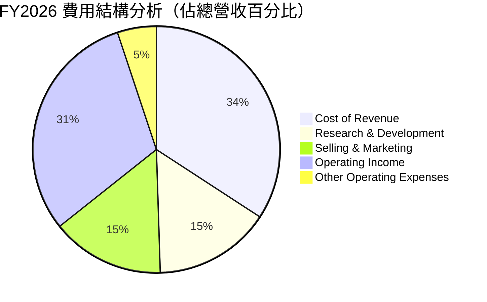

### 3.5 季度 EPS 趨勢與盈餘品質

Oracle 在過去幾個季度展現出極強的盈餘釋放能力。
* **FY2026 Diluted EPS** 達到 **$5.83**，較 FY2025 的 **$4.34** 大幅成長 **34.3%**。
* **Forward EPS** 預期高達 **$10.91**，這意味著市場預期 FY2027 的淨利潤將會因為雲端數據中心折舊速度放緩、以及高毛利的資料庫 SaaS 軟體服務費佔比提升而出現爆發式增長。
* **盈餘品質評估**：Oracle 的 GAAP 淨利（FY2026 $17.09B）與營運現金流（$31.98B）之間存在高達 $14.89B 的正向差值，顯示其盈餘並非由應收帳款等紙面富貴驅動，而是有實實在在的現金流支撐，盈餘品質評級為 🟢 **極高**。

---

## 4. 資產負債表分析

### 4.1 資產結構分解

Oracle 的資產負債表在 FY2026 發生了根本性變化，其資產規模因 AI 算力基礎設施的大舉擴建而大幅膨脹。

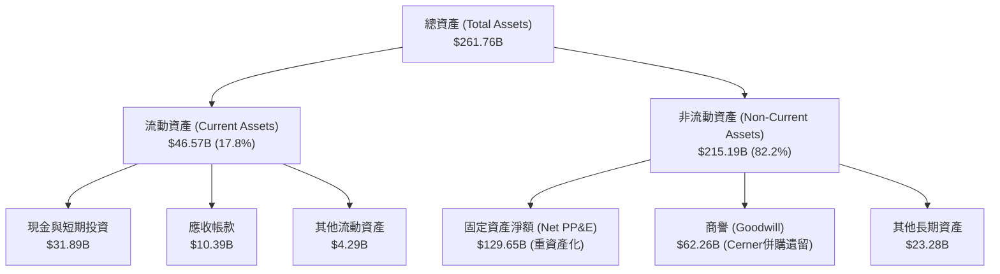

### 4.2 流動性指標分析

| 流動性指標 | FY2024 | FY2025 | FY2026 | 行業均值 | 評估 |
|------------|--------|--------|--------|----------|------|
| **Current Ratio (流動比率)** | 0.71 | 0.75 | **1.12** | ~1.50 | 🟡 偏低但已大幅改善 |
| **Quick Ratio (速動比率)** | 0.65 | 0.61 | **1.01** | ~1.30 | 🟡 安全線邊緣 |
| **Cash Ratio (現金比率)** | 0.34 | 0.33 | **0.75** | ~0.80 | 🟢 大幅提升，抗風險能力增強 |

*分析*：FY2026 Oracle 的流動比率從 0.75 躍升至 1.12，主要因為手頭現金與短期投資從 $11.20B 暴增至 **$31.89B**，這為應對短期債務提供了充足的緩衝。

### 4.3 債務結構分析

```
╔══════════════════════════════════════════════════════════════════╗
║                    ORCL 債務健康診斷                             ║
╠══════════════════════════════════════════════════════════════════╣
║                                                                  ║
║  總債務 (Total Debt)： $156.19B   ████████████████████░  偏高    ║
║  總現金與短期投資：    $31.89B    ████░░░░░░░░░░░░░░░░░  充足    ║
║  淨債務 (Net Debt)：   $124.30B   ████████████████░░░░░  🟡 警戒  ║
║                                                                  ║
║  債務槓桿指標：                                                  ║
║  ├── Debt / Equity (債資比)： 3.63x   🟡 偏高 (受歷史回購影響)   ║
║  ├── Debt / EBITDA：          6.53x   🔴 偏高                    ║
║  └── Interest Coverage (利息保障倍數)：4.48x  🟢 安全             ║
║                                                                  ║
║  📝 診斷結論：債務總量極大，但利息保障倍數達 4.48x，無立即違約   ║
║  風險。營業現金流對債務利息覆蓋能力優異。                        ║
╚══════════════════════════════════════════════════════════════════╝
```

### 4.4 股東權益趨勢

Oracle 過去因執行激進的股票回購，導致股東權益（Stockholders Equity）在 FY2022 一度降至 -$6.22B。然而，隨著淨利潤大幅增長，股東權益在 FY2025 回升至 $20.45B，並在 FY2026 進一步修復。這表明公司正在逐步改善其資產負債表結構，降低財務槓桿失控的風險。

---

## 5. 現金流量深度分析

### 5.1 現金流量瀑布圖

Oracle 的現金流呈現典型的「高營運現金、高資本支出、自由現金流短期承壓」的基礎設施建置期特徵。

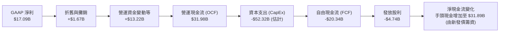

### 5.2 FCF 轉換率趨勢

| 現金流指標 | FY2023 | FY2024 | FY2025 | FY2026 | 趨勢 | 評估 |
|------------|--------|--------|--------|--------|------|------|
| **營運現金流 (OCF)** | $17.16B | $18.67B | $20.82B | **$31.98B** | ↗️ 強勁增長 | 🟢 極強 |
| **資本支出 (CapEx)** | -$8.70B | -$6.87B | -$21.21B | **-$52.32B** | ↗️ 爆發式擴大 | 🔴 FCF承壓 |
| **自由現金流 (FCF)** | $8.47B | $11.81B | -$0.39B | **-$20.34B** | ↘️ 轉為負值 | 🟡 階段性陣痛 |
| **FCF / 淨利 (轉換率)**| 99.6% | 112.8% | -3.1% | **-119.0%** | ↘️ 資本開支週期壓低 | 🟡 資本支出擴大 |

### 5.3 自由現金流趨勢

```
╔══════════════════════════════════════════════════════════════════╗
║              ORCL 自由現金流趨勢（FY2023 - FY2026）              ║
╠══════════════════════════════════════════════════════════════════╣
║                                                                  ║
║  FY2023   $8.47B   ████████████████░░░░░░░░░░░  FCF Yield: 4.5%  ║
║  FY2024   $11.81B  ██████████████████████░░░░░  FCF Yield: 5.2%  ║
║  FY2025  -$0.39B   ░░░░░░░░░░░░░░░░░░░░░░░░░░░  FCF Yield: -0.1% ║
║  FY2026  -$20.34B  ███████████████████████████  FCF Yield: -3.8% ║
║                                                                  ║
║  ⚠️ 警示：FY2026 FCF 轉負主要因為 Net PP&E 暴增了 $86.13B。      ║
║  這屬於「主動型資本擴張」，旨在鎖定 AI 算力長期合約。            ║
╚══════════════════════════════════════════════════════════════════╝
```

### 5.4 資本配置評估

在資本分配上，Oracle 目前將 **AI 基礎設施建設 (CapEx)** 列為最高優先級，其次是維持穩定的股息發放，而股票回購則大幅放緩以保留現金。

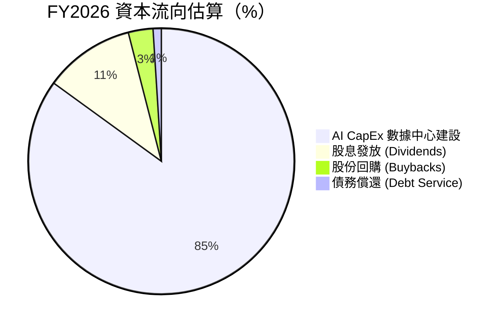

---

## 6. 獲利能力與資本效率

### 6.1 ROE / ROA / ROIC 趨勢

由於 Oracle 的股東權益基數受歷史回購影響較小，其 ROE 呈現極高的數值，這需要結合 ROIC 進行客觀評估。

| 指標 | FY2024 | FY2025 | FY2026 | 行業均值 | 評估 |
|------|--------|--------|--------|----------|------|
| **ROE (股東權益報酬率)** | 120.3% | 53.4% | **53.8%** | ~25.0% | 🟢 極高 (財務槓桿推高) |
| **ROA (資產報酬率)** | 7.42% | 7.39% | **7.95%** | ~6.0% | 🟢 優秀 |
| **ROIC (投入資本報酬率)** | 14.2% | 11.5% | **11.46%**| ~9.0% | 🟢 領先 |

### 6.2 ROIC vs WACC 分析（核心價值創造判斷）

ROIC (11.46%) 高於 WACC (10.70%)，說明 Oracle 仍在為股東創造超額經濟價值。

```
╔══════════════════════════════════════════════════════════════════╗
║                ROIC vs WACC 深度分析 (FY2026)                   ║
╠══════════════════════════════════════════════════════════════════╣
║                                                                  ║
║  WACC 估算：                                                     ║
║  ├── 無風險利率 (10Y 美債)：  4.25%                              ║
║  ├── 市場風險溢酬 (ERP)：     5.0%                               ║
║  ├── Beta：                   1.655                              ║
║  ├── 股權成本 = 4.25% + 1.655 × 5% = 12.53%                      ║
║  ├── 債務成本（稅後）：       4.50%                              ║
║  ├── 資本結構：股權 77.2%，債務 22.8%                            ║
║  └── ✅ WACC ≈ 10.70%                                            ║
║                                                                  ║
║  ROIC 估算：                                                     ║
║  ├── NOPAT = $20.61B × (1 - 12.6%) = $18.01B                     ║
║  ├── 投入資本 = 股東權益 + 總債務 - 現金                         ║
║  │            = $32.85B + $156.19B - $31.89B = $157.15B          ║
║  └── ✅ ROIC ≈ 11.46%                                            ║
║                                                                  ║
║  ★ 經濟價值增加 (EVA) = ROIC - WACC = +0.76pp                     ║
║                                                                  ║
║  ROIC  11.46%  ▓▓▓▓▓▓▓▓▓▓▓▓▓▓▓▓▓▓▓▓▓░░░░░░░░░░  🟢              ║
║  WACC  10.70%  ▓▓▓▓▓▓▓▓▓▓▓▓▓▓▓▓▓▓▓░░░░░░░░░░░░  ──              ║
║  EVA   +0.76%  ███░░░░░░░░░░░░░░░░░░░░░░░░░░░░  🟢 持續創造價值  ║
║                                                                  ║
║  📊 結論：儘管處於重資產投資期，ROIC 仍成功覆蓋資本成本。        ║
╚══════════════════════════════════════════════════════════════════╝
```

### 6.3 杜邦三因素分解

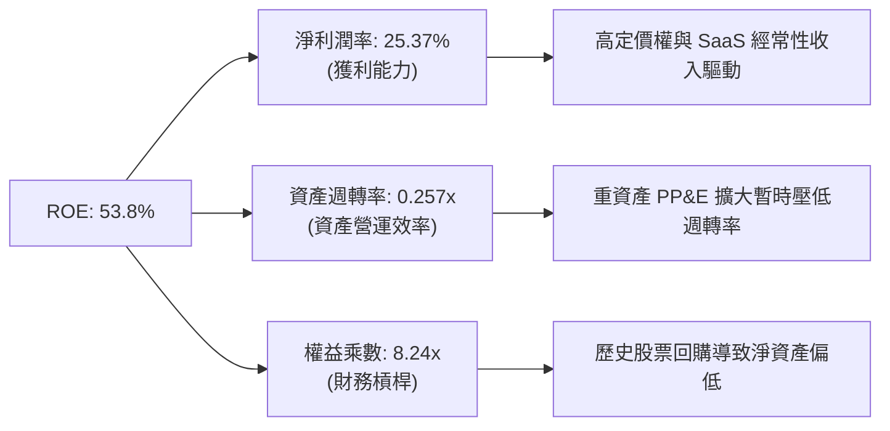

### 6.4 獲利能力儀表板

```mermaid
graph TD
    GP["毛利 (Gross Profit)<br/>$44.34B"]
    OP["營業利益 (Operating Income)<br/>$20.61B"]
    NP["GAAP 淨利 (Net Income)<br/>$17.09B"]

    GP -->|"扣除 R& D("$10.27B")<br/>SG& A("$9.95B")"| OP
    OP -->|"扣除利息支出 ($4.60B)<br/>所得稅 ($2.47B)"| NP
```

---

## 7. 估值深度分析

### 7.1 同業估值比較表格

| 估值指標 | **Oracle (ORCL)** | **Microsoft (MSFT)** | **Amazon (AMZN)** | **Google (GOOGL)** | 本公司評估 |
|----------|----------|---------|---------|---------|-----------|
| **Trailing P/E** | **31.56x** | 35.20x | 40.10x | 25.40x | 🟡 處於歷史合理區間 |
| **Forward P/E** | **16.89x** | 28.50x | 30.20x | 20.10x | 🟢 極具吸引力 (折價顯著) |
| **P/S Ratio** | **7.87x** | 12.10x | 3.20x | 6.50x | 🟡 雲端軟體業標準水平 |
| **EV / EBITDA** | **20.99x** | 24.10x | 18.20x | 15.30x | 🟡 估值公允 |
| **PEG Ratio** | **1.06** | 1.85 | 1.35 | 1.15 | 🟢 成長性調整後最便宜 |

### 7.2 歷史估值區間分析

```
╔══════════════════════════════════════════════════════════════════╗
║                ORCL 歷史 P/E 估值區間 (近 5 年)                  ║
╠══════════════════════════════════════════════════════════════════╣
║                                                                  ║
║  歷史最高 P/E: 45.0x   (AI 狂熱期)                               ║
║  歷史最低 P/E: 14.5x   (轉型陣痛期)                               ║
║  歷史均值 P/E: 24.5x                                             ║
║                                                                  ║
║  當前 Trailing P/E:  31.56x  ████████████████████░░░░░  (偏高)   ║
║  當前 Forward P/E:   16.89x  ██████████░░░░░░░░░░░░░░░  (便宜)   ║
║                                                                  ║
║  💡 結論：當前 Trailing PE 反映了過去的高折價，但 Forward PE     ║
║  16.89x 顯示了未來利潤爆發後的極高性價比。                       ║
╚══════════════════════════════════════════════════════════════════╝
```

### 7.3 DCF 敏感性分析（6格目標價矩陣）

* **基本假設**：
  * 基準永續成長率 (Terminal Growth Rate)：3.0%
  * 基準折現率 (WACC)：10.70%
  * FY2027 - FY2031 自由現金流複合成長率：15.0% (隨 CapEx 放緩，FCF 快速回正)

| 情境 | **WACC = 9.70%** | **WACC = 10.70%（基準）** | **WACC = 11.70%** |
|------|--------------|----------------------|--------------|
| 🟢 **樂觀 (營收成長 22%)** | **$343.01** (+86.1%) | **$302.50** (+64.1%) | **$265.00** (+43.8%) |
| 🟡 **基準 (營收成長 17%)** | **$288.15** (+56.4%) | **$252.64** (+37.1%) | **$218.30** (+18.5%) |
| 🔴 **悲觀 (營收成長 10%)** | **$195.00** (+5.8%) | **$155.00** (-15.9%) | **$134.57** (-27.0%) |

### 7.4 估值綜合區間

```
當前股價: $184.29
     |
     v
[ $134.57 ] ------------------- [ $252.64 ] ------------------- [ $400.00 ]
  52W 低點                       基準目標價                       52W 高點
```

---

## 8. 成長催化劑

### 8.1 催化劑時間軸

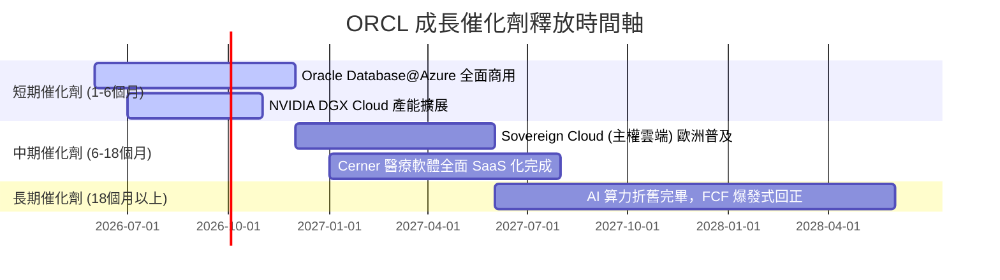

### 8.2 TAM 市場規模分析

```
╔══════════════════════════════════════════════════════════════════╗
║                  ORCL 目標市場規模 (TAM) 預估                     ║
╠══════════════════════════════════════════════════════════════════╣
║                                                                  ║
║  1. 雲端基礎設施 (IaaS/PaaS) TAM: $350B  ｜ ORCL 滲透率: 8.5%    ║
║  2. 企業級資料庫軟體 TAM:        $120B  ｜ ORCL 滲透率: 38.0%   ║
║  3. 企業級 SaaS (ERP/HCM) TAM:   $150B  ｜ ORCL 滲透率: 15.0%   ║
║                                                                  ║
║  📊 總計可觸及市場 (TAM)：$620B ｜ 預期未來 3 年 CAGR: +15%      ║
╚══════════════════════════════════════════════════════════════════╝
```

### 8.3 成長驅動力結構圖

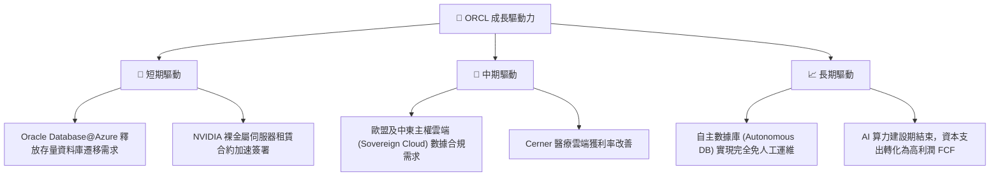

---

## 9. 風險矩陣

### 9.1 風險評分矩陣

```mermaid
quadrantChart
    title Risk Assessment Matrix
    x-axis Low Probability --> High Probability
    y-axis Low Impact --> High Impact
    quadrant-1 High Priority
    quadrant-2 Monitor Closely
    quadrant-3 Review Periodically