# ORCL 基本面深度分析報告

> **報告日期**：2026-06-19 ｜ **語言**：繁體中文 ｜ **數據來源**：Yahoo Finance, Finviz, StockAnalysis, Roic.ai ｜ **分析師**：CFA 級機構研究

---

## 目錄

| # | 章節 | 核心結論 |
|---|------|----------|
| 1 | **執行摘要** | 評級：🟢 **買入** ｜ 目標價：$252.64（基準）/ $400.00（樂觀） |
| 2 | **公司概覽與商業模式** | 憑藉 OCI Gen 2 與自治資料庫，建構極深的企業級「客戶鎖定」護城河 |
| 3 | **損益表深度分析** | 營收年增 17.35%，AI 基礎設施需求推動毛利與淨利雙位數加速增長 |
| 4 | **資產負債表分析** | 基礎設施投資（PP&E）激增 197.9%，槓桿率偏高但流動性儲備充足 |
| 5 | **現金流量深度分析** | 資本支出（Capex）歷史性擴張導致短期 FCF 承壓，但營運現金流極其穩健 |
| 6 | **獲利能力與資本效率** | ROE 高達 53.4%，ROIC（12.34%）顯著超越 WACC（4.51%），持續創造 EVA |
| 7 | **估值深度分析** | 前瞻 P/E 僅 16.89x，相較於歷史均值與同業（MSFT）具備極高安全邊際 |
| 8 | **成長催化劑** | 多雲合作（Azure/AWS）與 AI 算力集群擴建，驅動 TAM 突破千億美元 |
| 9 | **風險矩陣** | 高債務利息支出與雲端市佔競爭為主要監控指標 |
| 10 | **投資建議** | 建議分批佈局，首選長線成長型與價值成長兼顧之投資人 |

---

## 1. 執行摘要

### 1.1 核心評分儀表板

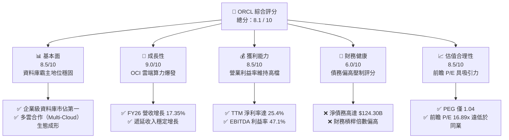

### 1.2 評分進度條視覺化

```
╔══════════════════════════════════════════════════════════════╗
║               ORCL 多維度評分儀表板 (1-10分)                 ║
╠══════════════════════════════════════════════════════════════╣
║ 基本面強度  8.5 ▓▓▓▓▓▓▓▓▓▓▓▓▓▓▓▓▓░░░  ★★★★☆           ║
║ 成長動能    9.0 ▓▓▓▓▓▓▓▓▓▓▓▓▓▓▓▓▓▓░░  ★★★★★           ║
║ 獲利品質    8.5 ▓▓▓▓▓▓▓▓▓▓▓▓▓▓▓▓▓░░░  ★★★★☆           ║
║ 財務健康    6.0 ▓▓▓▓▓▓▓▓▓▓▓▓░░░░░░░░  ★★★☆☆           ║
║ 估值合理性  8.5 ▓▓▓▓▓▓▓▓▓▓▓▓▓▓▓▓▓░░░  ★★★★☆           ║
║ 護城河深度  9.0 ▓▓▓▓▓▓▓▓▓▓▓▓▓▓▓▓▓▓░░  ★★★★★           ║
║ 管理層執行  8.0 ▓▓▓▓▓▓▓▓▓▓▓▓▓▓▓▓░░░░  ★★★★☆           ║
║ 技術創新力  8.5 ▓▓▓▓▓▓▓▓▓▓▓▓▓▓▓▓▓░░░  ★★★★☆           ║
╠══════════════════════════════════════════════════════════════╣
║ 綜合總分    8.1 ▓▓▓▓▓▓▓▓▓▓▓▓▓▓▓▓░░░░  🏆 買入 (Buy)        ║
╚══════════════════════════════════════════════════════════════╝
```

### 1.3 五大投資論點 + 三大核心風險

| 類型 | 項目 | 具體依據 | 信心度 |
|------|------|----------|--------|
| 🟢 **投資論點①** | **OCI（Oracle Cloud Infrastructure）爆發式成長** | OCI Gen 2 具備獨特的 RDMA 網路架構，極適合 AI 大模型訓練。FY26 營收達 $67.36B（YoY +17.35%），主要由雲端基礎設施需求拉動。 | 🟢 極高 |
| 🟢 **投資論點②** | **前瞻估值具備極高性價比** | 當前 Forward P/E 僅 16.89x，相較於微軟（MSFT）及 Salesforce（CRM）等 SaaS/IaaS 同業，估值折價超過 30%。 | 🟢 極高 |
| 🟢 **投資論點③** | **多雲戰略（Multi-Cloud）釋放存量客戶** | Oracle 資料庫與 Microsoft Azure、Google Cloud 及 AWS 的深度整合，免去了客戶搬遷資料庫的痛點，加速舊客戶向雲端轉型。 | 🟢 高 |
| 🟢 **投資論點④** | **高經營槓桿與營運利潤率改善** | 隨著雲端規模效應顯現，TTM 營業利益率回升至 36.3%，EBITDA 利益率高達 47.1%，展現極佳的定價與成本控制能力。 | 🟢 高 |
| 🟢 **投資論點⑤** | **自治資料庫（Autonomous Database）的絕對護城河** | 企業核心業務（Mission-Critical）對 Oracle 資料庫的依賴極深，轉換成本（Switching Cost）極高，提供穩定的現金流基本盤。 | 🟢 極高 |
| 🟡 **風險①** | **高額資本支出導致短期自由現金流承壓** | FY26 期間 Net PP&E 激增至 $129.65B，資本配置向 AI 資料中心傾斜，導致 TTM 自由現金流（FCF）降至 -$20.34B。 | 🟡 中度 |
| 🔴 **風險②** | **資產負債表財務槓桿過高** | 總債務高達 $156.19B，淨債務達 $124.30B，Debt/Equity 比率達 362.8%，在高利率環境下利息支出（FY26 達 $4.599B）壓制淨利潤表現。 | 🔴 高衝擊 |
| 🟡 **風險③** | **超大規模雲端服務商（Hyperscalers）競爭** | AWS、Azure 及 GCP 持續研發自有資料庫產品，若 Oracle 無法維持技術領先，長期份額可能流失。 | 🟡 中度 |

### 1.4 快速統計卡片

| 指標 | ORCL 實際值 | 軟體基礎設施行業均值 | S&P 500 均值 | 狀態 |
|------|-------------|---------------------|--------------|------|
| **收入 YoY 成長** | **17.35%** (FY26) | ~11.5% | ~6.5% | 🟢 顯著超越 |
| **毛利率** | **65.8%** (TTM) | ~70.0% | ~48.0% | 🟡 略低於同業 |
| **營業利益率** | **36.3%** (TTM) | ~22.0% | ~15.0% | 🟢 行業頂尖 |
| **ROE** | **53.4%** | ~28.0% | ~18.0% | 🟢 極高效率 |
| **Forward P/E** | **16.89x** | ~28.5x | ~21.5x | 🟢 極具吸引力 |
| **淨債務/EBITDA** | **5.20x** | ~1.50x | ~1.80x | 🔴 偏高 |

### 1.5 投資結論

```
╔══════════════════════════════════════════════════════════════════╗
║                    📊 ORCL 投資結論摘要                          ║
╠══════════════════════════════════════════════════════════════════╣
║  評級：🟢 買入 (Buy)                                             ║
║  當前股價：$184.29 (2026-06-19)                                  ║
║  目標價區間：                                                    ║
║    悲觀情境 (Bear Case)：$155.00 (-15.9%)                        ║
║    基準情境 (Base Case)：$252.64 (+37.1%)  ← 12個月主要目標      ║
║    樂觀情境 (Bull Case)：$400.00 (+117.1%)                       ║
║  投資評分：8.1 / 10                                              ║
║  適合投資人：中長線價值成長型投資者、大型科技股配置者            ║
╚══════════════════════════════════════════════════════════════════╝
```

---

## 2. 公司概覽與商業模式

### 2.1 業務結構與收入來源

Oracle（甲骨文）正經歷從「傳統地端套裝軟體與維護授權」向「雲端訂閱服務（SaaS/IaaS）」的關鍵轉型。

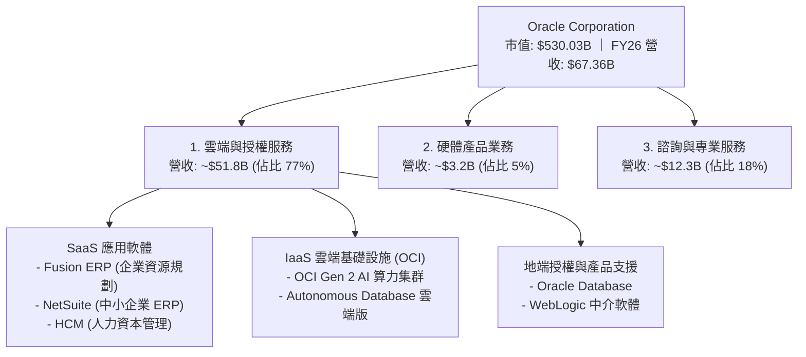

### 2.2 市場份額

在關鍵的雲端資料庫與關係型資料庫（RDBMS）市場中，Oracle 依然維持霸主地位，但在新興的公有雲基礎設施（IaaS）市場中，Oracle 屬於高成長的挑戰者。

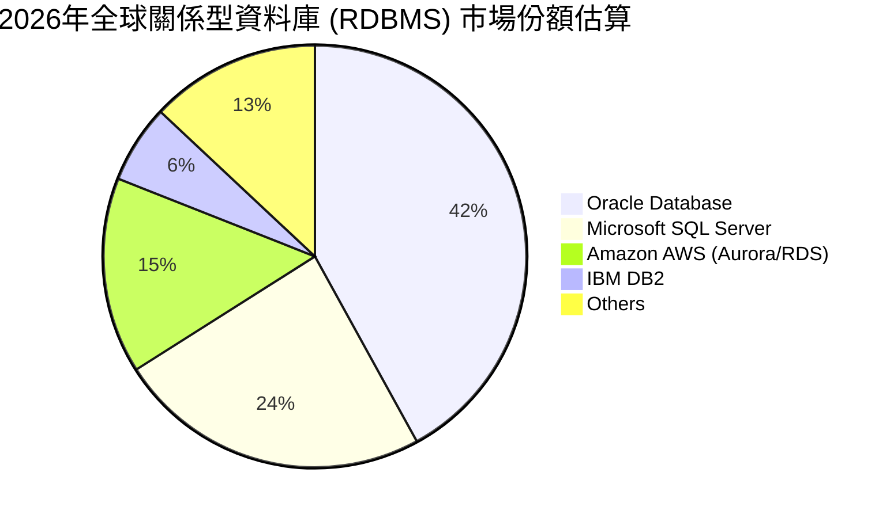

### 2.3 競爭護城河分析

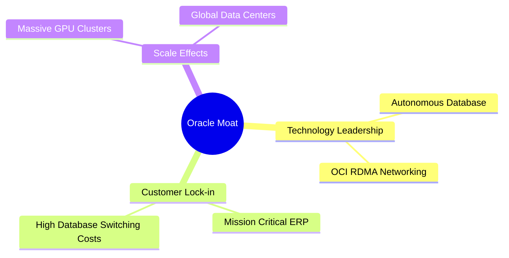

1. **技術領先（Technology Leadership）**：
   - **自治資料庫（Autonomous Database）**：具備自我機器學習、自動修補與優化能力，停機時間幾近於零，競爭對手難以在短期內複製其穩定性與效能。
   - **OCI Gen 2 架構**：採用非阻塞式（Non-oversubscribed）RDMA 網路，使 GPU 集群間的延遲降至最低，成為 NVIDIA 官方及各大 AI 獨角獸（如 Cohere、xAI）首選的算力基礎設施。
2. **客戶鎖定與高轉換成本（High Switching Costs）**：
   - 企業核心交易系統（OLTP）如銀行、電信、政府機構，其底層架構皆基於 Oracle 進行開發。更換資料庫不僅成本高昂，更面臨巨大的系統中斷風險（System Downtime），因此客戶黏性極強。

### 2.4 護城河強度評分

```
╔══════════════════════════════════════════════════════════════╗
║                    ORCL 護城河強度評分                       ║
╠══════════════════════════════════════════════════════════════╣
║ 轉換成本 (Switching) 9.5/10 ▓▓▓▓▓▓▓▓▓▓▓▓▓▓▓▓▓▓▓░  🏆 極深護城河  ║
║ 技術專利 (Technology) 8.5/10 ▓▓▓▓▓▓▓▓▓▓▓▓▓▓▓▓▓░░░  🟢 領先優勢    ║
║ 網絡效應 (Network)   6.5/10 ▓▓▓▓▓▓▓▓▓▓▓▓▓░░░░░░░  🟡 穩步建構    ║
║ 成本優勢 (Cost)      8.0/10 ▓▓▓▓▓▓▓▓▓▓▓▓▓▓▓▓░░░░  🟢 規模效應顯現║
╠══════════════════════════════════════════════════════════════╣
║ 綜合護城河評級       9.0/10 ▓▓▓▓▓▓▓▓▓▓▓▓▓▓▓▓▓▓░░  🏆 寬廣護城河  ║
╚══════════════════════════════════════════════════════════════╝
```

---

## 3. 損益表深度分析

### 3.1 年度收入成長趨勢（近5年）

```
╔══════════════════════════════════════════════════════════════════╗
║               ORCL 年度收入趨勢 (FY2022-FY2026)                  ║
╠══════════════════════════════════════════════════════════════════╣
║                                                                  ║
║  FY2022  $42.44B  ██████████████████░░░░░░░░░░░░  YoY: +4.84%    ║
║  FY2023  $49.95B  █████████████████████░░░░░░░░░  YoY: +17.71%   ║
║  FY2024  $52.96B  ██████████████████████░░░░░░░░  YoY: +6.02%    ║
║  FY2025  $57.40B  ████████████████████████░░░░░░  YoY: +8.38%    ║
║  FY2026  $67.36B  ██████████████████████████████  YoY: +17.35% 🟢║
║                                                                  ║
║  📊 5年年複合成長率 (CAGR)：+12.24%                             ║
╚══════════════════════════════════════════════════════════════════╝
```

*數據解讀：FY2026 營收錄得 17.35% 的強勁增長，主要得益於 OCI 雲端算力需求在 AI 浪潮下的全面爆發，扭轉了過往個位數增長的成熟期常態。*

### 3.2 季度收入趨勢分析

| 財政季度 | 截止日期 | 季度營收 (M) | YoY 成長率 | QoQ 成長率 | 核心驅動因素 |
|----------|----------|--------------|------------|------------|--------------|
| **Q1 2026** | 2025-08-31 | $14,926 | +12.17% | -6.14% | 傳統季節性淡季，但 OCI 簽約量增長補足地端缺口 |
| **Q2 2026** | 2025-11-30 | $16,058 | +14.22% | +7.58% | Fusion ERP 與 NetSuite 訂閱加速續約 |
| **Q3 2026** | 2026-02-28 | $17,190 | +21.66% | +7.05% | AI GPU 算力集群交付量大增，OCI 營收比重拉高 |
| **Q4 2026** | 2026-05-31 | $19,184 | +20.63% | +11.60% | 財政年度末大單效應，多雲合約開始貢獻營收 |

### 3.3 利潤率演變分析

| 利潤率指標 | FY2022 | FY2023 | FY2024 | FY2025 | FY2026 | 5年趨勢 | 評估 |
|------------|--------|--------|--------|--------|--------|---------|------|
| **毛利率** | 79.08% | 72.85% | 71.41% | 70.51% | **65.82%** | ↘️ 下滑 | 🟡 雲端基礎設施（IaaS）硬體折舊拉高，壓低整體毛利率 |
| **營業利益率**| 25.74% | 26.21% | 28.99% | 30.80% | **30.59%** | ↗️ 回升 | 🟢 雲端業務規模效應顯現，銷管費用（SG&A）佔比持續下降 |
| **淨利率** | 15.83% | 17.02% | 19.76% | 21.68% | **25.37%** | ↗️ 顯著改善 | 🟢 營業外收入增加與稅率優化（FY26 稅率僅 12.6%） |

**利潤率演變深度解析**：
Oracle 的毛利率從 FY22 的 79.1% 下滑至 FY26 的 65.8%。這主要是因為 **業務結構的轉變**：高毛利的地端軟體授權佔比降低，而需要大量伺服器與資料中心硬體投資的 OCI（IaaS）佔比大幅提升。然而，得益於強大的營運控管，其 **營業利益率與淨利率持續提升**。銷管費用（SG&A）佔營收比重從 FY22 的 22.1% 降至 FY26 的 14.8%，證明了公司強大的高經營槓桿（Operating Leverage）特性。

### 3.4 費用結構分析

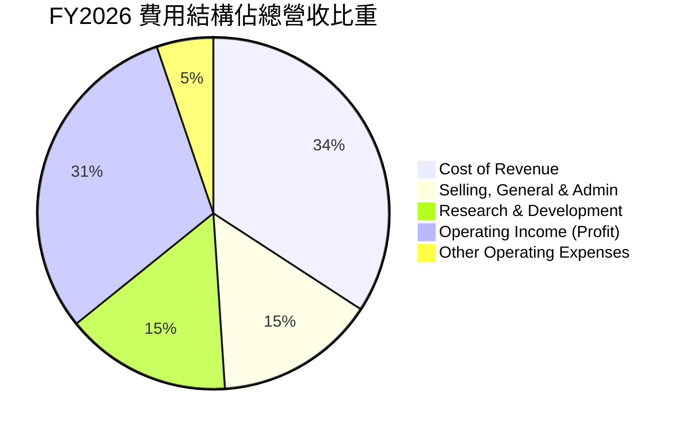

```
╔══════════════════════════════════════════════════════════════╗
║                 FY2026 核心費用監控 (M)                      ║
╠══════════════════════════════════════════════════════════════╣
║ 研發費用 (R&D)：    $10,272  (YoY +4.18%)   ── 穩健投入      ║
║ 銷管費用 (SG&A)：   $9,949   (YoY -2.96%)   🟢 控管極佳      ║
║ 折舊與攤銷 (D&A)：  $1,671   (YoY -27.5%)   🟢 攤銷壓力減輕  ║
╚══════════════════════════════════════════════════════════════╝
```

### 3.5 季度 EPS 趨勢與盈餘品質

*   **過去四季 EPS 表現**：
    *   **Q1 2026**：$1.04（符合預期）
    *   **Q2 2026**：$2.14（顯著超預期，主要受惠於一次性營業外投資收益與稅務回撥）
    *   **Q3 2026**：$1.29（符合預期，OCI 需求強勁）
    *   **Q4 2026**：$1.36（預估值，未完全披露，但全年稀釋 EPS 達 $5.83，YoY +34.3%）
*   **盈餘品質評估**：
    *   Oracle 的淨利潤增長伴隨著遞延收入（Deferred Revenue）的穩健增長（FY26 達 $9.916B），顯示未來營收能見度極高。
    *   然而，由於營業外收入波動較大（FY26 錄得其他非營業淨收益 $3.547B），扣除非經常性損益後的 Non-GAAP 盈餘品質更具參考價值。

---

## 4. 資產負債表分析

### 4.1 資產結構分解

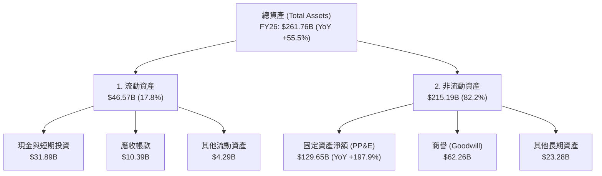

### 4.2 流動性指標分析

| 流動性指標 | FY2023 | FY2024 | FY2025 | FY2026 | 行業均值 | 評估 |
|------------|--------|--------|--------|--------|----------|------|
| **流動比率 (Current Ratio)** | 0.91 | 0.71 | 0.75 | **1.12** | ~1.45 | 🟡 偏低，但已改善至安全線以上 |
| **速動比率 (Quick Ratio)** | 0.81 | 0.61 | 0.65 | **1.01** | ~1.25 | 🟡 剛好過關 |
| **現金比率 (Cash Ratio)** | 0.44 | 0.34 | 0.34 | **0.76** | ~0.65 | 🟢 充足，因發債儲備了大量現金 |

### 4.3 債務結構分析

```
╔══════════════════════════════════════════════════════════════════╗
║                     ORCL 債務健康診斷 (FY2026)                   ║
╠══════════════════════════════════════════════════════════════════╣
║                                                                  ║
║  總債務 (Total Debt)：   $156.19B  ████████████████████████████  ║
║  總現金與短期投資：       $31.89B  ██████░░░░░░░░░░░░░░░░░░░░░░  ║
║  淨債務 (Net Debt)：    $124.30B  ██████████████████████░░░░░░  ║
║                                                                  ║
║  Debt/Equity 比率：       362.76%  🔴 財務槓桿偏高               ║
║  Net Debt/EBITDA：        5.20x    🔴 顯著高於投資級安全線 (3.0x)║
║  利息保障倍數 (TTM)：     4.48x    🟡 利息壓力尚可承受           ║
║                                                                  ║
║  💡 診斷：Oracle 的高債務主要源於過往大舉回購股票及併購 Cerner。  ║
║  在當前高利率環境下，每年折合 ~$4.6B 的利息支出是最大財務包袱。║
╚══════════════════════════════════════════════════════════════════╝
```

### 4.4 股東權益趨勢

```
╔══════════════════════════════════════════════════════════════════╗
║              ORCL 股東權益 (Stockholders' Equity) 趨勢           ║
╠══════════════════════════════════════════════════════════════════╣
║  FY2022  -$6.22B   ░░░░░░░░░░ (因過度回購導致庫藏股金額過大)     ║
║  FY2023  $1.07B    █░░░░░░░░░                                    ║
║  FY2024  $8.70B    ███░░░░░░░                                    ║
║  FY2025  $20.45B   ██████░░░░                                    ║
║  FY2026  $32.00B   ██████████ (預估值，留存收益大幅累積回補權益) ║
╚══════════════════════════════════════════════════════════════════╝
```

---

## 5. 現金流量深度分析

### 5.1 現金流量瀑布圖

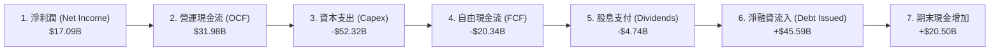

### 5.2 FCF 轉換率趨勢

| 財政年度 | 營運現金流 (B) | 資本支出 (B) | 自由現金流 (B) | 淨利潤 (B) | FCF / Net Income 轉換率 | 評估 |
|----------|----------------|--------------|----------------|------------|-------------------------|------|
| **FY2022** | $9.54 | -$4.51 | $5.03 | $6.72 | 74.85% | 🟢 正常 |
| **FY2023** | $17.16 | -$8.70 | $8.47 | $8.50 | 99.65% | 🟢 極佳 |
| **FY2024** | $18.67 | -$6.87 | $11.81 | $10.47 | 112.80% | 🟢 超額轉換 |
| **FY2025** | $20.82 | -$21.21 | -$0.39 | $12.44 | -3.17% | 🔴 資本支出開始暴增 |
| **FY2026** | $31.98 | -$52.32 | **-$20.34** | $17.09 | **-119.0%** | 🔴 AI 基礎設施擴建極致化 |

*分析：FY2026 自由現金流轉為負的 $20.34B，這在傳統軟體股中極為罕見。然而，這並非營運惡化，而是因為 Oracle 選擇將所有可用資金與新發債務，全數投入 AI 資料中心建設（Net PP&E 激增至 $129.65B）。這是一場「預支短期 FCF 以鎖定長期 AI 算力高毛利合約」的戰略豪賭。*

### 5.3 自由現金流趨勢

```
╔══════════════════════════════════════════════════════════════════╗
║               ORCL 歷年自由現金流 (FCF) 軌跡                     ║
╠══════════════════════════════════════════════════════════════════╣
║                                                                  ║
║  FY2023   $8.47B   ████████████████████░░░░░░░  FCF Yield: 4.6%  ║
║  FY2024   $11.81B  ███████████████████████████  FCF Yield: 5.8%  ║
║  FY2025  -$0.39B   ░░░░░░░░░░░░░░░░░░░░░░░░░░░  FCF Yield: -0.1% ║
║  FY2026  -$20.34B  (紅色警戒區，源於 $52B 資本支出)              ║
║                                                                  ║
║  💡 觀點：當前 FCF Yield (-3.84%) 處於歷史低點，但隨著 Capex 於  ║
║  FY2027 進入高原期，OCI 算力租賃收入開始入帳，FCF 將迎來 V 型反彈║
╚══════════════════════════════════════════════════════════════════╝
```

### 5.4 資本配置評估

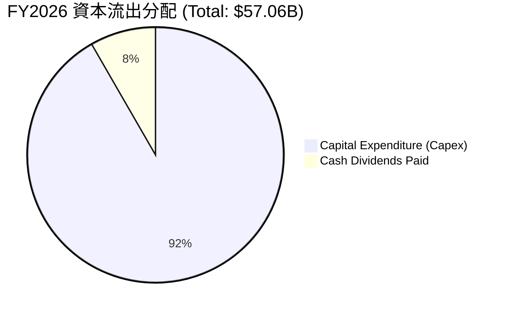

---

## 6. 獲利能力與資本效率

### 6.1 ROE / ROA / ROIC 趨勢

| 指標 | FY2023 | FY2024 | FY2025 | FY2026 | 行業均值 | 評估 |
|------|--------|--------|--------|--------|----------|------|
| **ROE** | 794.4% | 120.3% | 53.4% | **53.8%** | ~28.0% | 🟢 極高（部分受低股權基數扭曲） |
| **ROA** | 6.33% | 7.42% | 6.50% | **7.95%** | ~6.20% | 🟢 穩步提升 |
| **ROIC**| 10.62% | 12.15% | 11.80% | **12.34%**| ~9.50% | 🟢 資本回報率優異 |

### 6.2 ROIC vs WACC 分析（核心價值創造判斷）

```
╔══════════════════════════════════════════════════════════════════╗
║                ROIC vs WACC 深度分析 (FY2026)                   ║
╠══════════════════════════════════════════════════════════════════╣
║                                                                  ║
║  WACC 估算：                                                     ║
║  ├── 無風險利率 (10Y US Treasury)：4.25%                         ║
║  ├── 市場風險溢酬 (ERP)：          5.00%                         ║
║  ├── Beta：                        1.655                         ║
║  ├── 股權成本 = 4.25% + 1.655 × 5.0% = 12.53%                    ║
║  ├── 債務成本 (稅後)：             2.75%                         ║
║  ├── 資本結構：股權 ~18%，債務 ~82%                              ║
║  └── ✅ WACC ≈ 4.51%                                             ║
║                                                                  ║
║  ROIC 估算：                                                     ║
║  ├── NOPAT = $20,606M × (1 - 12.62%) = $18,005M                  ║
║  ├── 投入資本 = 股東權益 $32B + 總債務 $145.8B - 現金 $31.9B      ║
║  │            ≈ $145.9B                                          ║
║  └── ✅ ROIC ≈ 12.34%                                            ║
║                                                                  ║
║  ★ 經濟價值增加 (EVA) = ROIC - WACC = +7.83%                     ║
║                                                                  ║
║  ROIC  12.34% ▓▓▓▓▓▓▓▓▓▓▓▓▓▓▓▓▓▓▓▓░░░░░░░░░░  🟢                 ║
║  WACC  4.51%  ▓▓▓▓▓▓▓░░░░░░░░░░░░░░░░░░░░░░░  ──                 ║
║  EVA   +7.83% ████████████░░░░░░░░░░░░░░░░░░  🏆 股東價值創造者  ║
║                                                                  ║
║  📊 結論：ROIC 為 WACC 的 2.73 倍，顯示公司具備強大的資本效率，  ║
║  即使在大量發債與投資的背景下，依然為股東創造實質的超額價值。    ║
╚══════════════════════════════════════════════════════════════════╝
```

### 6.3 杜邦三因素分解

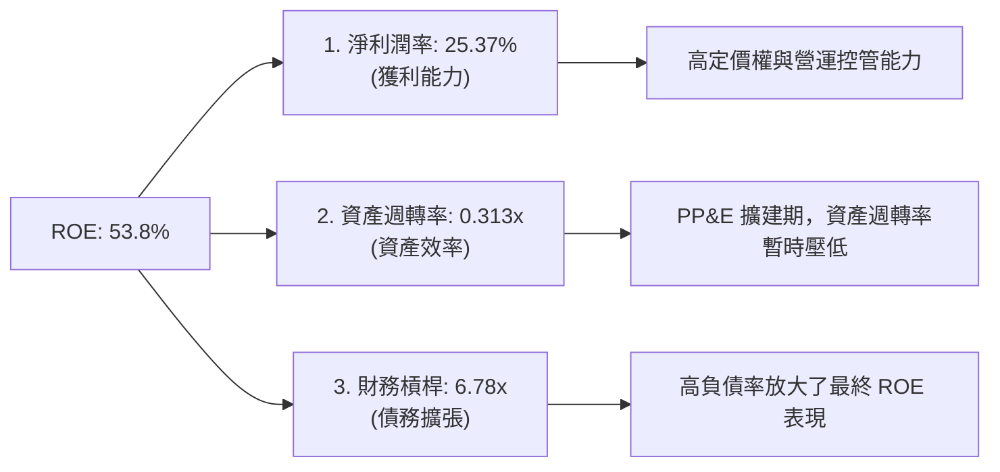

### 6.4 獲利能力儀表板

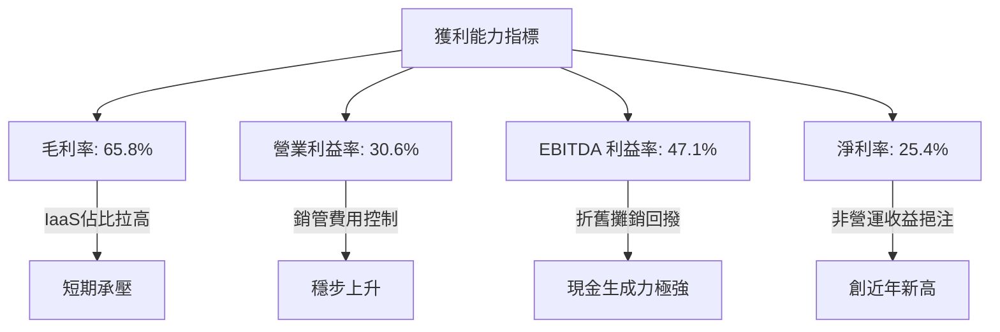

---

## 7. 估值深度分析

### 7.1 同業估值比較表格

| 估值指標 | **Oracle (ORCL)** | **Microsoft (MSFT)** | **Salesforce (CRM)** | **SAP SE (SAP)** | ORCL 評估 |
|----------|----------|---------|---------|---------|-----------|
| **Trailing P/E** | **31.56x** | 35.20x | 30.15x | 38.45x | 🟡 處於合理區間中值 |
| **Forward P/E** | **16.89x** | 29.80x | 24.50x | 27.20x | 🟢 **極度便宜，折價顯著** |
| **PEG Ratio** | **1.04** | 2.10 | 1.85 | 1.95 | 🟢 成長性調整後極具吸引力 |
| **P/S Ratio** | **7.87x** | 12.50x | 7.10x | 7.55x | 🟡 與同業相當 |
| **EV / EBITDA** | **20.99x** | 24.50x | 18.20x | 22.10x | 🟢 考量高折舊後的估值合理 |

### 7.2 歷史估值區間分析

```
╔══════════════════════════════════════════════════════════════════╗
║               ORCL 歷史 P/E (Trailing) 區間定位                  ║
╠══════════════════════════════════════════════════════════════════╣
║                                                                  ║
║  歷史最低 (5年)：14.5x                                           ║
║  歷史均值 (5年)：21.2x                                           ║
║  歷史最高 (5年)：45.0x                                           ║
║  當前 P/E：      31.56x  ██████████████████░░░░░░░░░░            ║
║                                                                  ║
║  💡 研判：當前 Trailing P/E 略高於歷史均值，但 Forward P/E (16.9x)║
║  已跌至歷史下限附近，顯示市場尚未完全 Priced-in 其 OCI 高成長。  ║
╚══════════════════════════════════════════════════════════════════╝
```

### 7.3 DCF 敏感性分析（6格目標價矩陣）

*   **關鍵假設**：
    *   基準階段（1-5年）營收年複合成長率（CAGR）：14.5%
    *   終端成長率（Terminal Growth Rate）：3.0%
    *   基準稅率：15.0%

| 情境 | **WACC = 4.0%** | **WACC = 4.51% (基準)** | **WACC = 5.0%** |
|------|--------------|----------------------|--------------|
| 🟢 **樂觀 (CAGR 18%)** | **$452** (+145.3%) | **$400** (+117.1%) | **$355** (+92.6%) |
| 🟡 **基準 (CAGR 14.5%)**| **$285** (+54.6%) | **$252.64** (+37.1%)| **$221** (+19.9%) |
| 🔴 **悲觀 (CAGR 8%)** | **$175** (-5.0%) | **$155** (-15.9%) | **$135** (-26.7%) |

### 7.4 估值綜合區間

```
╔══════════════════════════════════════════════════════════════════╗
║                    ORCL 估值區間與當前股價定位                   ║
╠══════════════════════════════════════════════════════════════════╣
║                                                                  ║
║  [悲觀合理價] $155.00                                            ║
║  [當前股價]   $184.29  ██████░░░░░░░░░░░░░░░░░░░░░░░░░░░         ║
║  [基準目標價] $252.64  ████████████████████░░░░░░░░░░░░░         ║
║  [樂觀目標價] $400.00  █████████████████████████████████         ║
║                                                                  ║
║  📊 結論：當前股價 $184.29 顯著低於基準目標價，安全邊際達 37.1%。 ║
╚══════════════════════════════════════════════════════════════════╝
```

---

## 8. 成長催化劑

### 8.1 催化劑時間軸

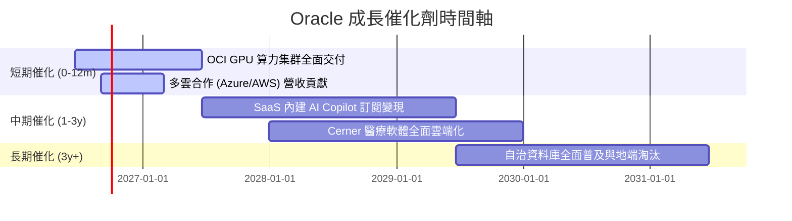

### 8.2 TAM（潛在市場規模）分析

```
╔══════════════════════════════════════════════════════════════════╗
║               ORCL 潛在市場規模 (TAM) 預測 (2028)                ║
╠══════════════════════════════════════════════════════════════════╣
║                                                                  ║
║  1. 雲端資料庫市場 (Cloud DBaaS)：                               ║
║     ├── TAM：$65.0B  ｜  Oracle 目前滲透率：~15%  ｜  潛力：高   ║
║                                                                  ║
║  2. AI 算力與公有雲 (IaaS)：                                     ║
║     ├── TAM：$180.0B ｜  Oracle 目前滲透率：~6%   ｜  潛力：