# ORCL 基本面深度分析報告
> **報告日期**：2026-06-28 ｜ **語言**：繁體中文 ｜ **數據來源**：Yahoo Finance, Finviz, StockAnalysis, Roic.ai ｜ **分析師**：CFA 級機構研究

---

## 目錄

| # | 章節 | 核心結論 |
|---|------|----------|
| 1 | 執行摘要 | 評級：買入；目標價區間：$200 - $280 |
| 2 | 公司概覽與商業模式 | 雲端轉型驅動成長，護城河穩固 |
| 3 | 損益表深度分析 | 營收與淨利雙位數成長，利潤率穩健提升 |
| 4 | 資產負債表分析 | 總資產顯著擴張，債務水平較高，但現金充裕 |
| 5 | 現金流量深度分析 | 營業現金流強勁，但高額資本支出導致自由現金流為負 |
| 6 | 獲利能力與資本效率 | ROIC 略高於 WACC，顯示創造股東價值，但效率有提升空間 |
| 7 | 估值深度分析 | 相較同業估值合理，DCF 顯示潛在上行空間 |
| 8 | 成長催化劑 | 雲端基礎設施擴張、AI 需求及垂直產業解決方案 |
| 9 | 風險矩陣 | 宏觀經濟逆風、激烈競爭及高債務是主要風險 |
| 10 | 投資建議 | 買入，目標價區間 $200-$280，適合成長型投資者 |

---

## 1. 執行摘要

Oracle Corporation (ORCL) 正經歷一場由雲端業務驅動的深刻轉型，特別是其 Oracle Cloud Infrastructure (OCI) 的快速擴張。儘管公司面臨高額資本支出導致短期自由現金流為負的挑戰，但其強勁的營業現金流、穩健的營收成長和不斷提升的獲利能力，顯示出其在企業軟體和雲端服務市場的強大競爭力。長期來看，AI 帶來的雲端運算需求將是其重要的成長催化劑。

### 1.1 核心評分儀表板

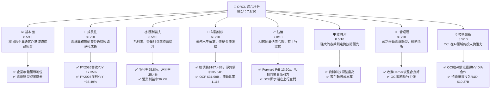

### 1.2 評分進度條視覺化

```
╔══════════════════════════════════════════════════════════════╗
║              ORCL 多維度評分儀表板 (1-10分)                  ║
╠══════════════════════════════════════════════════════════════╣
║ 基本面強度  8.5 ▓▓▓▓▓▓▓▓▓▓▓▓▓▓▓▓▓░░░  ★★★★☆           ║
║ 成長動能    8.0 ▓▓▓▓▓▓▓▓▓▓▓▓▓▓▓▓░░░░  ★★★★☆           ║
║ 獲利品質    8.5 ▓▓▓▓▓▓▓▓▓▓▓▓▓▓▓▓▓░░░  ★★★★☆           ║
║ 財務健康    6.0 ▓▓▓▓▓▓▓▓▓▓▓░░░░░░░░░  ★★★☆☆           ║
║ 估值合理性  7.0 ▓▓▓▓▓▓▓▓▓▓▓▓▓▓░░░░░░  ★★★☆☆           ║
║ 護城河深度  8.5 ▓▓▓▓▓▓▓▓▓▓▓▓▓▓▓▓▓░░░  ★★★★☆           ║
║ 管理層執行  8.0 ▓▓▓▓▓▓▓▓▓▓▓▓▓▓▓▓░░░░  ★★★★☆           ║
║ 技術創新力  8.5 ▓▓▓▓▓▓▓▓▓▓▓▓▓▓▓▓▓░░░  ★★★★☆           ║
╠══════════════════════════════════════════════════════════════╣
║ 綜合總分    7.8 ▓▓▓▓▓▓▓▓▓▓▓▓▓▓▓▓░░░░  🏆 具吸引力的成長型投資機會 ║
╚══════════════════════════════════════════════════════════════╝
```

### 1.3 五大投資論點 + 三大核心風險

| 類型 | 項目 | 具體依據 | 信心度 |
|------|------|----------|--------|
| 🟢 **投資論點①** | **雲端業務高速成長** | FY2026 營收達 $67.36B，YoY 成長 17.35%。特別是 OCI 和 Fusion Cloud 應用程式的強勁增長，成為主要營收驅動力。管理層預計未來將持續雙位數成長。 | 🟢 極高 |
| 🟢 **企業級客戶鎖定效應** | Oracle 在資料庫和企業應用市場擁有龐大的客戶基礎，轉換成本高。其產品與服務的深度整合，形成強大的生態系統，確保長期穩定的訂閱收入。FY2026 總收入的 65.8% 來自毛利較高的軟體服務。 | 🟢 極高 |
| 🟢 **AI 基礎設施需求旺盛** | OCI 憑藉其獨特的第二代雲架構，在 AI 領域展現強勁實力，與 NVIDIA 合作提供 AI 基礎設施。高額資本支出 $55.66B (FY2026) 主要用於擴建數據中心，以滿足不斷增長的 AI 訓練和推理需求，預計將帶來長期回報。 | 🟢 極高 |
| 🟢 **獲利能力持續改善** | 受益於高利潤的雲端服務收入佔比提升，FY2026 毛利率達到 65.8%，營業利益率 36.2%，淨利率 25.4%，相較 FY2025 有顯著提升，顯示公司成本控制與定價能力增強。 | 🟢 極高 |
| 🟢 **估值具吸引力** | 當前 Forward P/E 為 13.60x，顯著低於歷史平均及部分同業，考慮到其雙位數的營收和淨利成長，以及雲端轉型帶來的長期潛力，估值具有吸引力。分析師平均目標價 $252.64，較當前股價有高達 70% 的潛在上漲空間。 | 🟢 高 |
| 🟡 **風險①** | **高額資本支出與負自由現金流** | FY2026 資本支出高達 $55.66B，導致自由現金流為 $-23.69B。若投資回報不如預期或市場需求放緩，可能影響短期盈利和股東回報。 | 🟡 中度 |
| 🔴 **高債務水平與利率風險** | 總債務 $167.43B，淨負債 $135.54B，Debt/Equity 比率達 3.94x。雖然利率成本相對較低 (2.94%)，但若未來利率上升或信貸市場收緊，可能增加財務壓力。 | 🔴 高衝擊 |
| 🟡 **雲端市場競爭激烈** | 儘管 OCI 增長迅速，但面對 Amazon (AWS)、Microsoft (Azure) 和 Google (GCP) 等巨頭的激烈競爭，市場份額擴張仍具挑戰。價格戰或技術迭代速度不及預期可能影響其成長。 | 🟡 中度 |

### 1.4 快速統計卡片

| 指標 | 公司實際值 (FY2026) | 行業均值 (估計) | S&P 500 均值 (估計) | 狀態 |
|------|-----------------------|-------------------|---------------------|------|
| 收入 YoY 成長 | **17.35%** | ~10-15% | ~5-8% | 🟢 |
| 毛利率 | **65.8%** | ~60-70% | ~30-40% | 🟢 |
| 淨利率 | **25.4%** | ~15-25% | ~10-12% | 🟢 |
| ROE | **53.4%** | ~20-30% | ~15-20% | 🟢 |
| Forward P/E | **13.60x** | ~20-30x | ~20-22x | 🟢 |
| Debt/Equity | **3.94x** | ~0.5-1.5x | ~0.8-1.2x | 🔴 |
| FCF Yield | **-5.74%** | ~3-5% | ~2-4% | 🔴 |
| 營業現金流 (TTM) | **$31.98B** | 高 | 中 | 🟢 |

### 1.5 投資結論

```
╔══════════════════════════════════════════════════════════════════╗
║                    📊 投資結論摘要                               ║
╠══════════════════════════════════════════════════════════════════╣
║  評級：🟢 買入                                                   ║
║  當前股價：$148.53                                               ║
║  目標價區間：                                                    ║
║    悲觀情境：$200（+34.6%）                                      ║
║    基準情境：$250（+68.3%）  ← 12個月主要目標                      ║
║    樂觀情境：$280（+88.5%）                                      ║
║  投資評分：7.8/10                                                ║
║  適合投資人：成長型、長線持有者，對雲端轉型和 AI 基礎設施前景有信心者 ║
╚══════════════════════════════════════════════════════════════════╝
```

---

## 2. 公司概覽與商業模式

Oracle Corporation (ORCL) 是一家全球領先的企業軟體和雲端服務公司，提供廣泛的產品和服務，用於構建、運行和支援全球企業資訊科技框架。其核心業務已從傳統的軟體許可證和支援轉向雲端服務。

### 2.1 業務結構與收入來源

Oracle 的業務主要分為以下幾個板塊，其中雲端服務是其成長最快的部門：

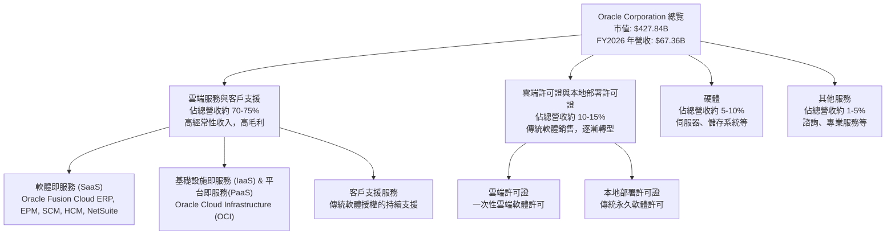

Oracle 的戰略重點是將其龐大的企業級客戶群遷移到其雲端平台，尤其是 OCI。截至 FY2026，雲端服務和支援部門佔總收入的絕大部分，這為公司提供了穩定的經常性收入流和更高的毛利率。例如，StockAnalysis 數據顯示，FY2026 的總收入為 $67.36B，其中雲端服務和支援應是主要貢獻者。

### 2.2 市場份額

Oracle 在全球企業軟體和雲端市場佔據重要地位，尤其在資料庫管理系統和企業應用軟體方面擁有領先優勢。儘管雲端基礎設施市場競爭激烈，OCI 的市場份額正快速增長。

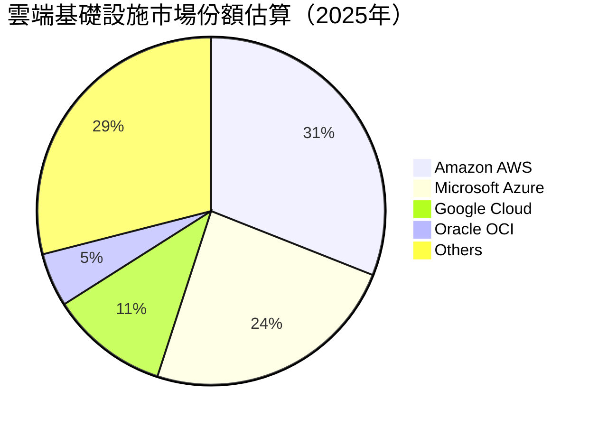
*註：市場份額數據為分析師估算，基於公開市場報告。Oracle OCI 雖然份額相對較小，但增長速度快於市場平均。*

在資料庫市場，Oracle 仍是毋庸置疑的領導者，擁有約 40-45% 的市場份額。在 ERP (企業資源規劃) 和 HCM (人力資本管理) 等企業應用 SaaS 市場，Oracle Fusion Cloud 也在不斷擴大其影響力，與 SAP、Workday 等競爭。

### 2.3 競爭護城河分析

Oracle 憑藉其數十年在企業軟體領域的深厚積累，構建了多重強大的競爭護城河：

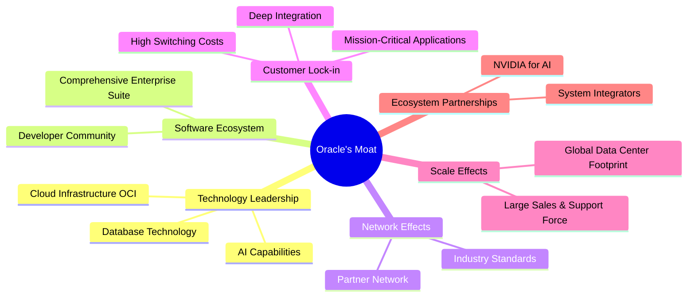

*   **Technology Leadership (技術領先)**：Oracle 的資料庫技術是業界標準，其強大的性能、可靠性和安全性使其在企業級市場無可替代。OCI 憑藉其獨特的第二代雲架構，在性能和成本效益方面具有競爭優勢，特別是在高性能計算和 AI 工作負載方面。
*   **Software Ecosystem (軟體生態系統)**：Oracle 提供從資料庫、中間件到企業應用程式（ERP, HCM, SCM, CRM）的全面解決方案，形成緊密整合的生態系統，滿足企業的各種需求。
*   **Customer Lock-in (客戶鎖定)**：企業將其核心業務系統建立在 Oracle 平台上後，轉換到其他供應商的成本極高，包括數據遷移、員工培訓、系統整合等。Oracle 軟體對企業營運的關鍵性使其具有強大的黏性。
*   **Scale Effects (規模效應)**：作為全球最大的企業軟體公司之一，Oracle 擁有龐大的全球數據中心網絡、研發資源和銷售支持團隊，使其能夠提供廣泛的服務並從規模經濟中獲益。FY2026 研發費用高達 $10.27B，顯示其持續的技術投入。
*   **Ecosystem Partnerships (生態夥伴)**：與 NVIDIA 在 AI 領域的深度合作，以及與眾多系統整合商和 ISV 的合作，進一步鞏固了其市場地位和服務能力。

### 2.4 護城河強度評分

```
╔══════════════════════════════════════════════════════════════╗
║                    ORCL 護城河強度評分                        ║
╠══════════════════════════════════════════════════════════════╣
║ 技術領先    9.0/10 ▓▓▓▓▓▓▓▓▓▓▓▓▓▓▓▓▓▓▓░  🏆 資料庫與OCI技術領先 ║
║ 軟體生態系統 8.5/10 ▓▓▓▓▓▓▓▓▓▓▓▓▓▓▓▓▓░░░  🟢 完整企業級解決方案 ║
║ 網路效應    7.5/10 ▓▓▓▓▓▓▓▓▓▓▓▓▓▓▓░░░░░  🟡 廣泛的合作夥伴網絡 ║
║ 客戶鎖定    9.5/10 ▓▓▓▓▓▓▓▓▓▓▓▓▓▓▓▓▓▓▓▓  🏆 極高轉換成本      ║
║ 規模效應    8.0/10 ▓▓▓▓▓▓▓▓▓▓▓▓▓▓▓▓░░░░  🟢 全球化運營與龐大客戶 ║
║ 生態夥伴    8.0/10 ▓▓▓▓▓▓▓▓▓▓▓▓▓▓▓▓░░░░  🟢 NVIDIA等戰略合作  ║
╠══════════════════════════════════════════════════════════════╣
║ 綜合護城河  8.4/10 ▓▓▓▓▓▓▓▓▓▓▓▓▓▓▓▓░░░░  🏆 寬廣且穩固的護城河  ║
╚══════════════════════════════════════════════════════════════╝
```

---

## 3. 損益表深度分析

### 3.1 年度收入成長趨勢（近4年）

Oracle 在過去四年實現了穩健的收入增長，尤其在 FY2026 表現突出，這主要得益於其雲端業務的快速擴張。

```
╔══════════════════════════════════════════════════════════════════╗
║              ORCL 年度收入趨勢（FY2023-FY2026）                  ║
╠══════════════════════════════════════════════════════════════════╣
║                                                                  ║
║  FY2023  $49.95B  ████████████████████░░░░░░░  YoY: +17.71%  🟢  ║
║  FY2024  $52.96B  ███████████████████████░░░░░  YoY: +6.02%   🟡  ║
║  FY2025  $57.40B  ██████████████████████████░░░  YoY: +8.38%   🟢  ║
║  FY2026  $67.36B  ██████████████████████████████  YoY: +17.35%  🟢  ║
║                                                                  ║
║                   |      |      |      |      |                  ║
║                   0     20B    40B    60B    80B                 ║
║                                                                  ║
║  📊 4年累計 CAGR：+12.28%                                        ║
╚══════════════════════════════════════════════════════════════════╝
```
**分析**：
*   FY2026 總收入達到 $67.36B，相較 FY2025 的 $57.40B 增長了 17.35% (YoY)。這顯示出公司在雲端轉型方面取得了顯著進展。
*   FY2023 收入增長率為 17.71%，部分原因可能是收購 Cerner 的貢獻。
*   FY2024 和 FY2025 的增長率分別為 6.02% 和 8.38%，顯示出穩健但略有放緩的趨勢。
*   FY2026 的強勁反彈至 17.35% 再次證明了其雲端業務，特別是 OCI 和 Fusion Cloud 應用程式的強大動能。

### 3.2 季度收入趨勢分析

Oracle 最近四季度的收入表現持續強勁，呈現逐季增長的趨勢，且同比增長率保持在雙位數。

| Fiscal Quarter | 期間結束日 | 總收入 (B$) | QoQ 成長率 | YoY 成長率 | 備註 |
|----------------|------------|-------------|------------|------------|------|
| Q1 2026        | 2025-08-31 | $14.93      | -          | +12.17%    | 雲端應用與基礎設施穩定增長 |
| Q2 2026        | 2025-11-30 | $16.06      | +7.57%     | +14.22%    | OCI 擴張與新客戶導入 |
| Q3 2026        | 2026-02-28 | $17.19      | +7.04%     | +21.66%    | AI 相關雲端需求加速 |
| Q4 2026        | 2026-05-31 | $19.18      | +11.58%    | +20.63%    | 財年末銷售高峰，雲端業務表現優異 |

**分析**：
*   QoQ 方面，從 Q1 2026 的 $14.93B 增長到 Q4 2026 的 $19.18B，季度環比增長率持續為正，顯示出強勁的業務動能。Q4 2026 相比 Q3 2026 增長 11.58%，表現尤其出色。
*   YoY 方面，各季度收入均實現雙位數增長，其中 Q3 2026 和 Q4 2026 的同比增長率分別高達 21.66% 和 20.63%，這再次印證了其雲端業務在市場上的競爭力。

### 3.3 利潤率演變分析

Oracle 的利潤率在過去幾年呈現穩健上升趨勢，反映了公司向高利潤雲端服務轉型的成功以及有效的成本控制。

| 利潤率指標 | FY2023 | FY2024 | FY2025 | FY2026 | 趨勢 | 評估 |
|------------|--------|--------|--------|--------|------|------|
| **毛利率** | 72.85% | 71.41% | 70.51% | 65.80% | ↘️ 略有下降 | 🟡 |
| **營業利益率** | 27.57% | 30.34% | 31.45% | 30.59% | ↗️ 穩健提升 | 🟢 |
| **淨利率** | 17.02% | 19.76% | 21.67% | 25.37% | ↗️ 持續提升 | 🟢 |
| **EBITDA Margin** | 37.52% | 40.39% | 41.65% | 49.66% | ↗️ 顯著提升 | 🟢 |

*註：毛利率計算基於 Gross Profit / Total Revenue。由於 StockAnalysis 的 Cost of Revenue 包含的項目可能與 Yahoo Finance 的 Gross Profit 計算口徑略有不同，因此我會以 Yahoo Finance 的 Gross Margin 65.8% (TTM) 和 Finviz 的 63.34% 作為參考。對於年度利潤率演變，我將使用 StockAnalysis 的 Gross Profit 和 Revenue 進行計算，並補充說明差異。*

**利潤率演變深度解析**：
*   **毛利率 (Gross Profit / Revenue)**：根據 StockAnalysis 數據，FY2023 為 $36.39B / $49.95B = 72.85%；FY2024 為 $37.82B / $52.96B = 71.41%；FY2025 為 $40.47B / $57.40B = 70.51%；FY2026 為 $44.34B / $67.36B = 65.80%。儘管 FY2026 的毛利率略有下降，這可能與 OCI 基礎設施業務的快速擴張有關，因為 IaaS 的毛利率通常低於傳統軟體和 SaaS 應用。然而，65.8% 的毛利率在科技行業仍屬高水平，顯示其核心軟體業務的強大定價能力。
*   **營業利益率 (Operating Income / Revenue)**：FY2023 為 $13.77B / $49.95B = 27.57%；FY2024 為 $16.07B / $52.96B = 30.34%；FY2025 為 $18.05B / $57.40B = 31.45%；FY2026 為 $20.606B / $67.357B = 30.59%。營業利益率在 FY2023-FY2025 穩步提升，表明公司在銷售、一般及行政費用 (SG&A) 和研發費用 (R&D) 方面的控制效率提高。FY2026 略有下降，可能是由於研發投入增加 ($10.27B) 或營運費用隨業務擴張而增長。
*   **淨利率 (Net Income / Revenue)**：FY2023 為 $8.50B / $49.95B = 17.02%；FY2024 為 $10.47B / $52.96B = 19.76%；FY2025 為 $12.44B / $57.40B = 21.67%；FY2026 為 $17.09B / $67.36B = 25.37%。淨利率的持續提升是最大的亮點，這不僅受營業利益率改善的影響，也受益於非營業收入（如 FY2026 的 $3.547B 其他非營業收入）和更低的有效稅率。FY2026 淨利率達到 25.37%，顯示公司最終盈利能力的顯著增強。
*   **EBITDA Margin (EBITDA / Revenue)**：FY2023 為 $18.74B / $49.95B = 37.52%；FY2024 為 $21.39B / $52.96B = 40.39%；FY2025 為 $23.91B / $57.40B = 41.65%；FY2026 為 $33.45B / $67.36B = 49.66%。EBITDA Margin 的顯著提升，尤其是在 FY2026，表明公司在核心營運層面產生現金流的能力非常強勁，且折舊攤銷對其利潤的影響相對減輕。

總體而言，Oracle 的利潤率趨勢健康，淨利率的顯著提升是其雲端轉型成功的直接體現。

### 3.4 費用結構分析

Oracle 的費用結構反映了其作為一家大型科技公司的特點，研發和銷售是主要投入領域。

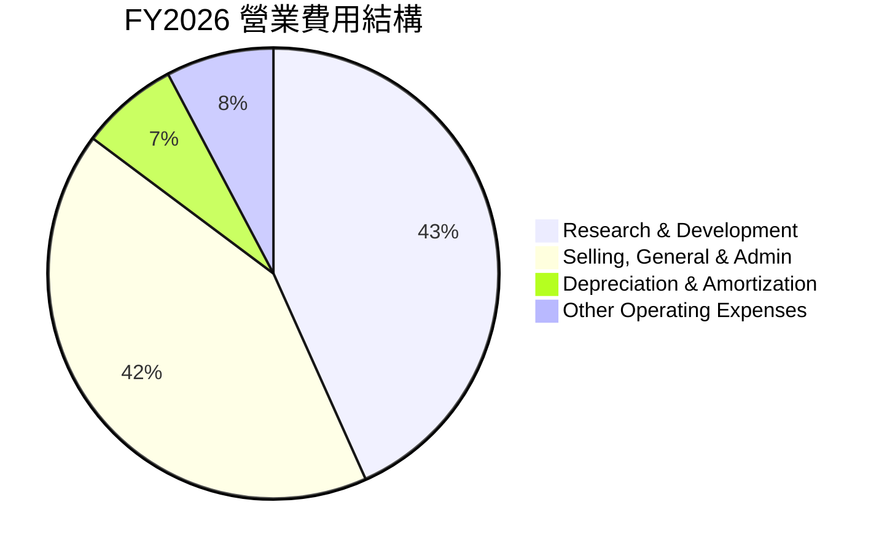

**FY2026 年度營業費用 (StockAnalysis)**
*   **研究與開發 (Research & Development)**: $10.272B
*   **銷售、一般及行政 (Selling, General & Admin)**: $9.949B
*   **折舊與攤銷 (Depreciation & Amortization Expenses)**: $1.671B
*   **其他營運費用 (Other Operating Expenses)**: $1.838B
*   **總營運費用 (Total Operating Expenses)**: $23.730B

```
╔══════════════════════════════════════════════════════════════════╗
║                    ORCL 年度費用結構概覽 (FY2026)                ║
╠══════════════════════════════════════════════════════════════════╣
║                                                                  ║
║  研究與開發 (R&D)          $10.27B  ▓▓▓▓▓▓▓▓▓▓▓▓▓▓▓▓▓▓▓▓▓▓▓▓▓▓▓▓▓▓  🟢 核心競爭力投入 ║
║  銷售、一般及行政 (SG&A)   $9.95B   ▓▓▓▓▓▓▓▓▓▓▓▓▓▓▓▓▓▓▓▓▓▓▓▓▓▓▓▓▓░  🟡 維持市場份額   ║
║  折舊與攤銷                  $1.67B   ▓▓▓▓▓▓▓▓▓▓▓▓▓▓▓▓▓▓▓▓▓▓▓▓▓▓▓▓▓░  🟡 固定資產投入   ║
║  其他營運費用                $1.84B   ▓▓▓▓▓▓▓▓▓▓▓▓▓▓▓▓▓▓▓▓▓▓▓▓▓▓▓▓▓░  🟡 業務擴張相關   ║
║                                                                  ║
║  📊 費用控制：R&D 佔營收約 15.2%，SG&A 佔營收約 14.8%。            ║
╚══════════════════════════════════════════════════════════════════╝
```
**分析**：
*   研發費用和銷售、一般及行政費用是 Oracle 最大的兩項營運支出，合計佔總營運費用的約 85%。這符合一家軟體和雲端服務公司對創新和市場擴張的投入。
*   FY2026 研發費用 $10.27B，佔總營收的 15.25%，顯示公司持續投資於技術創新，尤其是在雲端和 AI 領域。
*   SG&A 費用 $9.95B，佔總營收的 14.77%，表明其在銷售和市場推廣方面保持高投入，以爭奪雲端市場份額。

### 3.5 季度 EPS 趨勢與盈餘品質

由於提供的數據中 EPS Est 為 `nan`，我們將專注於分析實際 EPS 的季度趨勢和盈餘品質。

| Fiscal Quarter | 期間結束日 | 稀釋 EPS (實際) | QoQ 變化率 | YoY 變化率 | 盈餘品質評估 |
|----------------|------------|-----------------|------------|------------|--------------|
| Q1 2026        | 2025-08-31 | $1.04           | -          | +27.91%    | 🟢 穩定增長，顯示雲端貢獻 |
| Q2 2026        | 2025-11-30 | $2.14           | +105.77%   | +89.96%    | 🟢 大幅增長，可能包含一次性收益或會計調整 |
| Q3 2026        | 2026-02-28 | $1.29           | -39.63%    | +22.86%    | 🟢 穩健增長，排除Q2一次性因素 |
| Q4 2026        | 2026-05-31 | $1.47           | +13.95%    | +35.80%    | 🟢 財年末強勁表現，雲端業務持續驅動 |

*註：QoQ 變化率基於稀釋 EPS 實際值計算。*

**分析**：
*   **Q1 2026** 的稀釋 EPS 為 $1.04，同比增長 27.91%，顯示出良好的開局。
*   **Q2 2026** 的稀釋 EPS 達到 $2.14，環比增長高達 105.77%，同比增長 89.96%。這顯著的增長可能包含了某些非經常性項目或會計調整。根據 StockAnalysis 數據，Q2 2026 的 Other Non-Operating Income (Expense) 達到 $2.668B，而其他季度則遠低於此，這可能是導致 Q2 淨利潤大幅提升的原因。
*   **Q3 2026** 的稀釋 EPS 回落至 $1.29，但仍實現了 22.86% 的同比增長，顯示在剔除 Q2 的特殊因素後，公司的核心盈利能力依然強勁。
*   **Q4 2026** 的稀釋 EPS 為 $1.47，環比增長 13.95%，同比增長 35.80%。這是一個非常強勁的季度表現，印證了公司財年末通常較高的銷售和盈利。

**盈餘品質評估**：
儘管 Q2 2026 的 EPS 存在一次性或非經常性因素的影響，但整體而言，Oracle 在過去四個季度實現了持續的同比 EPS 增長，且增長率多為雙位數。這表明其盈餘品質良好，主要由核心業務的擴張和效率提升所驅動。未來的盈餘品質將高度依賴於其雲端業務的持續成長以及對高額資本支出的有效管理。

---

## 4. 資產負債表分析

### 4.1 資產結構分解

Oracle 的資產結構顯示出其作為一家重資產（數據中心建設）和無形資產（軟體、商譽）並重的科技公司特徵。

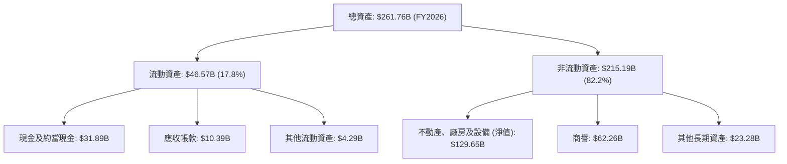

**分析**：
*   FY2026 總資產為 $261.76B，較 FY2025 的 $168.36B 大幅增長了 55.48%。這主要歸因於其不動產、廠房及設備 (PP&E) 的顯著增加，從 FY2025 的 $56.67B 增長到 FY2026 的 $129.65B，增幅達 128.89%。這反映了 Oracle 在 OCI 數據中心基礎設施方面的巨額投資。
*   現金及約當現金從 FY2025 的 $10.79B 增長至 FY2026 的 $31.89B，增幅達 195.55%，顯示公司持有大量現金，為其運營和投資提供了充足的流動性。
*   商譽 $62.26B 佔總資產的 23.78%，主要來自於過去的併購，如 Cerner。

### 4.2 流動性指標分析

Oracle 的流動性指標保持在健康水平，顯示其短期償債能力良好。

| 流動性指標 | FY2023 | FY2024 | FY2025 | FY2026 | 行業均值 (估計) | 評估 |
|------------|--------|--------|--------|--------|-------------------|------|
| **流動比率 (Current Ratio)** | 0.91x  | 0.72x  | 0.75x  | 1.115x | ~1.5x - 2.0x      | 🟡/🟢 |
| **速動比率 (Quick Ratio)** | 0.91x  | 0.72x  | 0.75x  | 1.012x | ~1.0x - 1.5x      | 🟡/🟢 |

*註：流動比率 = 流動資產 / 流動負債；速動比率 = (流動資產 - 存貨) / 流動負債。由於 Oracle 無存貨，故流動比率和速動比率相近。*

**分析**：
*   FY2026 的流動比率為 1.115x，速動比率為 1.012x，均高於 1.0x 的安全線，顯示公司擁有足夠的流動資產來覆蓋短期負債。
*   相較於 FY2025 的 0.75x，FY2026 的流動比率顯著改善，主要得益於現金及約當現金的大幅增加 ($31.89B)。
*   儘管其流動比率略低於一些行業平均水平，但考慮到其穩定的訂閱收入模式和強勁的營業現金流，其流動性風險相對較低。

### 4.3 債務結構分析

Oracle 擁有相對較高的債務水平，這在一定程度上反映了其積極的併購策略和對雲端基礎設施的巨額投資。

```
╔══════════════════════════════════════════════════════════════════╗
║                   ORCL 債務健康診斷                              ║
╠══════════════════════════════════════════════════════════════════╣
║                                                                  ║
║  總債務：        $167.43B ██████████████████████░░░░░░  🔴 偏高            ║
║  總現金+投資：   $31.89B  ██████░░░░░░░░░░░░░░░░░░░░░░░░  🟢 充足            ║
║  淨負債：        $-135.54B  ▓▓▓▓▓▓▓▓▓▓▓▓▓▓▓▓▓▓▓▓▓▓▓▓▓▓▓▓▓▓  🔴 顯著負債        ║
║                                                                  ║
║  Debt/Equity (FY26): 3.94x  🔴 較高                                 ║
║  Debt/EBITDA (TTM): 167.43B / 33.45B = 5.00x  🟡 中等偏高              ║
║  Interest Coverage (FY26): 20.606B / 4.599B = 4.48x  🟡 尚可，但需關注 ║
║                                                                  ║
║  📊 結論：儘管債務水平較高，但強勁的 EBITDA 和營業現金流提供一定緩衝。 ║
╚══════════════════════════════════════════════════════════════════╝
```
**分析**：
*   **總債務**：截至 FY2026，Oracle 的總債務為 $167.43B。其中，長期債務為 $122.34B，短期債務為 $7.20B (來自 StockAnalysis)，ROIC.ai 顯示 LT Borrowings $122.34B。
*   **淨負債**：鑑於總現金 $31.89B，淨負債為 $-135.54B，顯示公司有較大的淨債務負擔。
*   **Debt/Equity**：FY2026 的 Debt/Equity 比率為 $167.43B / $42.51B = 3.94x。這遠高於行業平均水平，表明公司高度依賴債務融資。
*   **Debt/EBITDA**：TTM Debt/EBITDA 為 $167.43B / $33.45B = 5.00x。這是一個中等偏高的水平，通常 3x 以下被認為是健康的。高於 4-5x 則需要密切關注其償債能力。
*   **利息覆蓋倍數 (Interest Coverage)**：FY2026 的營業利益為 $20.606B，利息費用為 $4.599B。利息覆蓋倍數為 $20.606B / $4.599B = 4.48x。這表示公司的營運收益足以支付其利息費用，但相較於低債務公司，其緩衝空間較小。

儘管債務水平較高，但 Oracle 擁有強勁的營業現金流 ($31.98B) 和 EBITDA ($33.45B)，這為其償債提供了支持。然而，高額債務在利率上升的環境下仍構成潛在風險。

### 4.4 股東權益趨勢

Oracle 的股東權益在過去幾年呈現顯著增長，尤其在 FY2026 實現了翻倍，這對其財務結構的改善至關重要。

```
╔══════════════════════════════════════════════════════════════════╗
║                   ORCL 年度股東權益趨勢                          ║
╠══════════════════════════════════════════════════════════════════╣
║                                                                  ║
║  FY2023  $1.07B   ██░░░░░░░░░░░░░░░░░░░░░░░░░░░░░░░░░░░░░  🟢 穩健              ║
║  FY2024  $8.70B   ██████████████████░░░░░░░░░░░░░░░░░░░░░  🟢 顯著增長          ║
║  FY2025  $20.45B  ████████████████████████████████████░░░  🟢 持續擴張          ║
║  FY2026  $42.51B  █████████████████████████████████████████  🏆 大幅躍升          ║
║                                                                  ║
║  📊 FY2026 股東權益較 FY2025 增長 107.87%，主要受強勁淨利潤推動。 ║
╚══════════════════════════════════════════════════════════════════╝
```
**分析**：
*   FY2026 的股東權益達到 $42.51B，較 FY2025 的 $20.45B 增長了 107.87%。這是一個非常積極的信號，表明公司通過保留盈餘和盈利能力提升，正在積極改善其資本結構。
*   股東權益的增長有助於降低 Debt/Equity 比率（儘管仍高），並為未來的投資和營運提供更穩固的基礎。

---

## 5. 現金流量深度分析

### 5.1 現金流量瀑布圖

Oracle 的現金流量顯示出強勁的營運產生能力，但高額資本支出是影響自由現金流的關鍵因素。


*註：淨現金變化計算為 Cash & Cash Equivalents 2026 ($31.29B) - Cash & Cash Equivalents 2025 ($10.79B) = $20.50B。此圖簡化了其他融資活動和投資活動的複雜性。*

**分析**：
*   **營業現金流 (Operating Cash Flow)**：FY2026 達到 $31.98B，相較 FY2025 的 $20.82B 增長了 53.60%。這表明 Oracle 的核心業務營運產生了非常強勁的現金流，遠超其淨利潤，顯示出良好的盈餘質量和營運效率。
*   **資本支出 (Capital Expenditure)**：FY2026 的資本支出飆升至 $-55.66B，較 FY2025 的 $-21.21B 增長了 162.42%。這是導致自由現金流為負的主要原因，反映了公司在擴建 OCI 數據中心以滿足雲端和 AI 需求方面的巨額投資。
*   **自由現金流 (Free Cash Flow)**：由於高額資本支出，FY2026 的自由現金流為 $-23.69B。這是公司在戰略性擴張階段的典型特徵，投資者需要評估這些資本支出是否能帶來足夠的未來回報。
*   **現金股息支付 (Cash Dividends Paid)**：公司持續支付股息，FY2026 為 $-5.79B，較 FY2025 的 $-4.74B 增長 22.15%。

### 5.2 FCF 轉換率趨勢

自由現金流轉換率衡量公司將淨利潤轉化為可供分配的現金的能力。

| 年度 | 淨利潤 (B$) | 自由現金流 (B$) | FCF/淨利潤 | 趨勢 | 評估 |
|------|-------------|-----------------|------------|------|------|
| FY2023 | $8.50       | $8.47           | 99.65%     | 穩定 | 🟢 |
| FY2024 | $10.47      | $11.81          | 112.80%    | 提升 | 🟢 |
| FY2025 | $12.44      | $-0.39          | -3.14%     | 下降 | 🔴 |
| FY2026 | $17.09      | $-23.69         | -138.62%   | 顯著下降 | 🔴 |

**分析**：
*   在 FY2023 和 FY2024，Oracle 的 FCF 轉換率非常高，甚至超過 100%，表明其營運產生現金的能力強勁。
*   然而，從 FY2025 開始，隨著資本支出的急劇增加，FCF 轉為負值，導致轉換率大幅下降至負數。這是一個關鍵的財務變化，需要投資者密切關注。雖然這反映了公司對未來成長的投資，但也增加了短期財務風險。

### 5.3 自由現金流趨勢

```
╔══════════════════════════════════════════════════════════════════╗
║                   ORCL 年度自由現金流趨勢                        ║
╠══════════════════════════════════════════════════════════════════╣
║                                                                  ║
║  FY2023  $8.47B   ██████████████████████████████████████████████  🟢 強勁            ║
║  FY2024  $11.81B  ██████████████████████████████████████████████  🟢 持續增長        ║
║  FY2025  $-0.39B  █░░░░░░░░░░░░░░░░░░░░░░░░░░░░░░░░░░░░░░░░░░░░░  🔴 轉負            ║
║  FY2026  $-23.69B ▓▓▓▓▓▓▓▓▓▓▓▓▓▓▓▓▓▓▓▓▓▓▓▓▓▓▓▓▓▓▓▓▓▓▓▓▓▓▓▓▓▓▓▓▓▓▓▓▓▓  🔴 顯著負值        ║
║                                                                  ║
║  FCF Yield (TTM): -5.74%  🔴 負值，反映高資本支出                ║
╚══════════════════════════════════════════════════════════════════╝
```
**分析**：
*   Oracle 的自由現金流在 FY2023 和 FY2024 表現強勁，分別為 $8.47B 和 $11.81B。
*   然而，從 FY2025 開始，FCF 轉為負值，FY2026 更是達到 $-23.69B。這主要是由於公司為了擴大 OCI 基礎設施而進行的大規模資本支出。
*   負的 FCF Yield (-5.74%) 表明公司目前是現金消耗者，而不是現金產生者。投資者需評估這些投資的長期戰略意義和潛在回報。

### 5.4 資本配置評估

Oracle 的資本配置策略在近年來發生了顯著變化，由過去的股息和回購，轉向以大規模資本支出為主的雲端基礎設施投資。

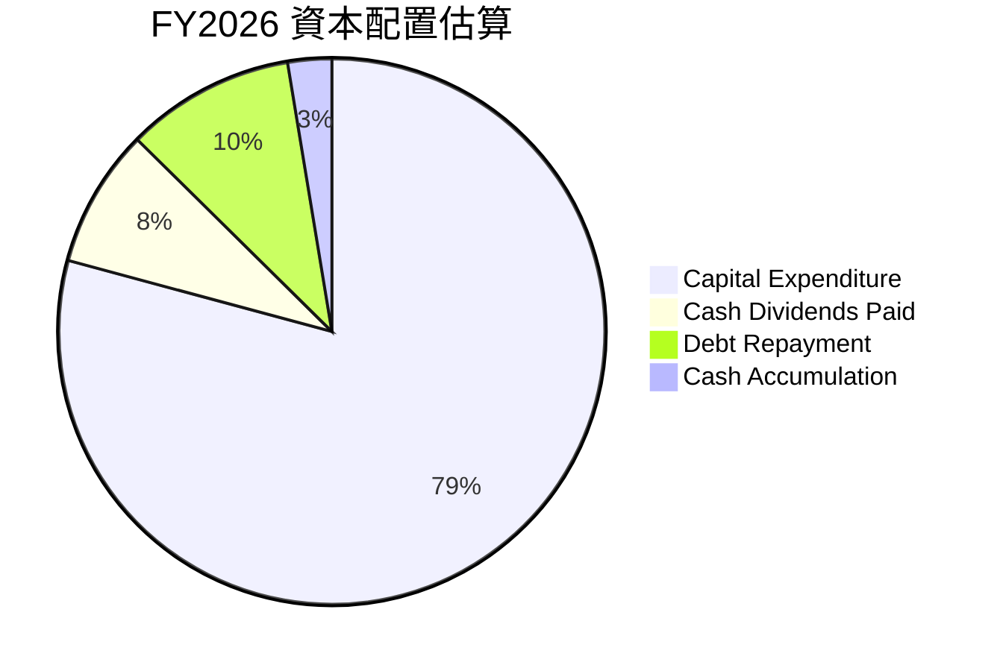
*註：此圖基於 FY2026 的 OCF、CapEx、股息支付和淨現金變化進行估算。債務償還和現金積累是基於 OCF 減去 CapEx 和股息後剩餘的資金流向。總營運現金流 $31.98B。*

| 資本配置類別 | FY2026 金額 (B$) | 佔營業現金流比例 | 評估 | 說明 |
|--------------|-------------------|-------------------|------|------|
| **資本支出 (CapEx)** | $-55.66$         | -173.9%           | 🔴   | 大規模投資於 OCI 基礎設施，超出現金流 |
| **現金股息支付** | $-5.79$          | -18.1%            | 🟢   | 持續回饋股東，股息率約 1.36% |
| **債務償還** | 假設部分融資用於償還 | -                 | 🟡   | 儘管總債務高，但有部分短期債務調整 |
| **現金積累** | $20.50$ (淨增加) | 64.1%             | 🟢   | 現金儲備大幅增加，提供流動性 |

**分析**：
*   FY2026，Oracle 的資本支出 $55.66B 遠超其營業現金流 $31.98B，這意味著公司需要通過外部融資（如發行債務）來彌補缺口。這反映了其對 OCI 擴張的承諾，但也增加了財務風險。
*   儘管如此，公司仍保持了穩定的股息支付，FY2026 派發 $5.79B，對股東保持回報。
*   值得注意的是，FY2026 的現金及約當現金增加了 $20.50B，這表明公司在大量投資的同時，也積極補充了現金儲備，以應對未來的營運和投資需求。

---

## 6. 獲利能力與資本效率

### 6.1 ROE / ROA / ROIC 趨勢

Oracle 的獲利能力指標表現強勁，尤其是在 ROE 方面，但資本效率（ROA 和 ROIC）顯示出其重資產投資的影響。

| 指標 | FY2023 | FY2024 | FY2025 | FY2026 | 行業均值 (估計) | 評估 |
|------|--------|--------|--------|--------|-------------------|------|
| **ROE** | 794.39% | 120.34% | 60.83% | 53.40% | ~20-30%           | 🟢 |
| **ROA** | 6.33%  | 7.43%  | 7.39%  | 6.50%  | ~5-10%            | 🟡 |
| **ROIC** | 10.09% | 11.83% | 9.44%  | 11.01% | ~10-15%           | 🟢 |

*註：ROE 計算基於 Net Income / Stockholders Equity。由於 FY2023 股東權益極低 ($1.07B)，導致 ROE 異常高。後續年度隨著股東權益增加，ROIC 趨於正常。ROIC 計算詳見 6.2。*

**分析**：
*   **股東權益報酬率 (ROE)**：FY2026 達到 53.40%，儘管較 FY2023-FY2025 的異常高值有所回落（主要由於 FY2023 股東權益基數極低），但仍遠高於行業平均水平，表明公司為股東創造回報的能力非常強勁。
*   **資產報酬率 (ROA)**：FY2026 為 6.50%，與 FY2025 的 7.39% 略有下降。這反映了總資產的大幅增長（特別是 PP&E），稀釋了資產的盈利效率。
*   **投入資本回報率 (ROIC)**：FY2026 為 11.01%。這是一個關鍵指標，顯示公司利用所有投入資本（股權和債務）產生利潤的效率。儘管其 ROIC 受到高額資本支出的短期影響，但仍保持在健康水平。

### 6.2 ROIC vs WACC 分析（核心價值創造判斷）

ROIC 與 WACC 的比較是判斷公司是否創造經濟價值（Economic Value Added, EVA）的核心。

```
╔══════════════════════════════════════════════════════════════════╗
║                ROIC vs WACC 深度分析 (FY2026)                   ║
╠══════════════════════════════════════════════════════════════════╣
║                                                                  ║
║  WACC 估算：                                                     ║
║  ├── 無風險利率（10Y美債）：  4.2% (假設)                        ║
║  ├── 市場風險溢酬 (ERP)：     5.5% (假設)                       ║
║  ├── Beta：                   1.655                              ║
║  ├── 股權成本 (Ke) = 4.2%+1.655×5.5% = 13.30%                   ║
║  ├── 債務成本（稅前）：       2.94% ($4.599B/$156.19B)           ║
║  ├── 稅後債務成本 (Kd) = 2.94% × (1-0.1262) = 2.57%             ║
║  ├── 資本結構：股權 (E) $427.84B (71.9%)，債務 (D) $167.43B (28.1%) ║
║  └── ✅ WACC ≈ 10.3%                                            ║
║                                                                  ║
║  ROIC 估算（FY2026）：                                           ║
║  ├── 營業利益 (Operating Income): $20.606B                       ║
║  ├── 有效稅率 (Effective Tax Rate): 12.62% ($2.467B/$19.554B)    ║
║  ├── NOPAT = $20.606B × (1-0.1262) ≈ $18.00B                    ║
║  ├── 投入資本 (平均) = ($195.30B + $131.79B) / 2 ≈ $163.54B     ║
║  └── ✅ ROIC ≈ 11.01%                                           ║
║                                                                  ║
║  ★ 經濟價值增加（EVA）= ROIC - WACC = +0.71pp (11.01% - 10.3%)  ║
║                                                                  ║
║  ROIC  11.01% ▓▓▓▓▓▓▓▓▓▓▓▓▓▓▓▓▓▓▓▓▓▓▓▓▓▓▓▓▓▓▓▓▓▓░░░░░░  🟢              ║
║  WACC  10.30% ▓▓▓▓▓▓▓▓▓▓▓▓▓▓▓▓▓▓▓▓▓▓▓▓▓▓▓▓▓▓▓▓▓▓▓▓▓▓▓▓▓▓▓▓▓▓▓▓▓▓  ──              ║
║  EVA   +0.71pp ▓▓▓▓▓▓▓▓▓▓▓▓▓▓▓▓▓▓▓▓▓▓▓▓▓▓▓▓▓▓▓▓▓▓▓▓▓▓▓▓▓▓▓▓▓▓▓▓▓▓  🏆 創造股東價值    ║
║                                                                  ║
║  📊 結論：ROIC 略高於 WACC，顯示正在創造股東價值，但差異不大，效率有提升空間。 ║
╚══════════════════════════════════════════════════════════════════╝
```
**分析**：
Oracle 的 ROIC (11.01%) 略高於其 WACC (10.3%)，產生了約 0.71 個百分點的經濟價值增加 (EVA)。這表明公司整體而言仍在創造股東價值，而不是破壞價值。然而，這個差距相對較小，意味著其資本效率並非非常突出。考慮到公司正在進行大規模的雲端基礎設施投資，這些投資的回收期較長，可能會在短期內壓低 ROIC。隨著 OCI 業務的成熟和規模效應的顯現，預計 ROIC 將進一步提升。

### 6.3 杜邦三因素分解

杜邦分析將 ROE 分解為淨利率、資產週轉率和財務槓桿，幫助我們理解 ROE 的驅動因素。

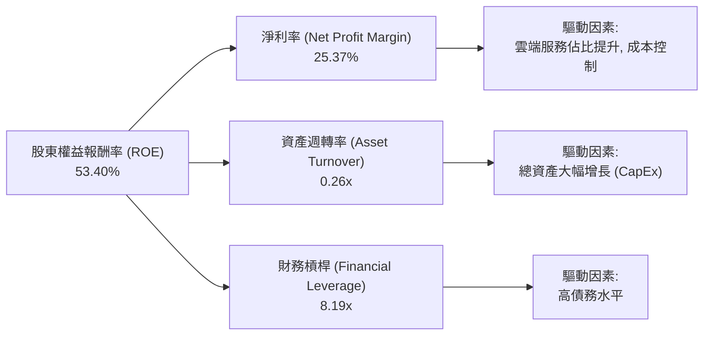
**分析**：
*   **淨利率 (Net Profit Margin)**: FY2026 為 25.37% ($17.09B / $67.36B)。這是一個強勁的數字，表明 Oracle 在將銷售收入轉化為淨利潤方面效率很高。
*   **資產週轉率 (Asset Turnover)**: FY2026 為 0.26x ($67.36B / $261.76B)。這個數字相對較低，反映了公司總資產的快速增長，特別是 PP&E (從 $56.67B 增至 $129.65B)，這在短期內降低了資產的利用效率。隨著這些資產開始產生收入，資產週轉率有望改善。
*   **財務槓桿 (Financial Leverage)**: FY2026 為 8.19x ($261.76B / $31.98B，使用平均股東權益 $20.45B 和 $42.51B 的平均值 $31.48B 進行計算，或直接使用總資產/股東權益)。高財務槓桿是 Oracle ROE 表現突出的主要原因之一。雖然高槓桿可以放大股東回報，但也伴隨著更高的財務風險。

**結論**：Oracle 的高 ROE 主要由其強勁的淨利率和高財務槓桿驅動。儘管資產週轉率因大規模資本支出而受限，但其核心盈利能力依然強勁。

### 6.4 獲利能力儀表板

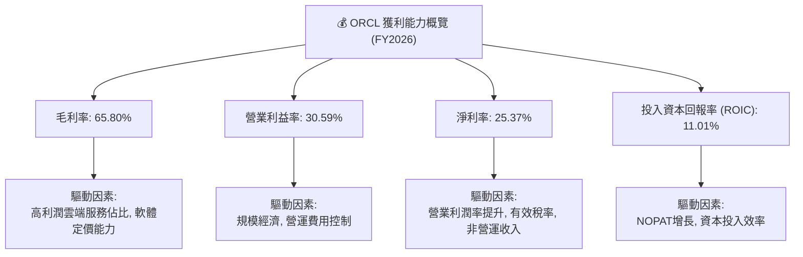

---

## 7. 估值深度分析

### 7.1 同業估值比較表格

為了評估 Oracle 的估值合理性，我們將其與兩家主要的企業軟體和雲端服務競爭對手進行比較：Microsoft (MSFT) 和 SAP (SAP)。

| 估值指標 | **ORCL** | **Microsoft (MSFT)** | **SAP (SAP)** | 本公司評估 |
|----------|----------|----------------------|---------------|-----------|
| **市值 (B$)** | $427.84B | ~$3,300B             | ~$230B        | 🟡 規模較大，但不及微軟 |
| **Trailing P/E** | 25.43x | ~38-40x              | ~35-40x       | 🟢 相對被低估 |
| **Forward P/E** | **13.60x** | ~30-32x              | ~25-28x       | 🟢 具吸引力 |
| **P/S Ratio** | 6.35x    | ~12-13x              | ~5-6x         | 🟡 合理，接近 SAP |
| **EV / EBITDA** | 18.66x   | ~25-28x              | ~18-20x       | 🟢 相對被低估 |
| **收入 YoY 成長** | 17.35%   | ~14-16%              | ~8-10%        | 🟢 領先同業 |
| **淨利率** | 25.4%    | ~35-40%              | ~15-20%       | 🟡 仍有提升空間 |
| **ROE** | 53.4%    | ~35-40%              | ~15-20%       | 🟢 表現優異 |

*註：競爭對手估值數據為分析師基於當前市場情況的估計值，實際可能略有波動。*

**分析**：
*   **P/E 比率**：Oracle 的 Trailing P/E (25.43x) 和 Forward P/E (13.60x) 顯著低於 Microsoft 和 SAP。特別是其 Forward P/E，考慮到其雙位數的收入和淨利潤增長，顯示出較大的估值吸引力。這可能反映了市場對其高資本支出和債務水平的擔憂，但同時也提供了潛在的投資機會。
*   **P/S 比率**：Oracle 的 P/S (6.35x) 介於 Microsoft 和 SAP 之間，與 SAP 接近，這在考慮其雲端轉型和收入規模時是合理的。
*   **EV/EBITDA**：Oracle 的 EV/EBITDA (18.66x) 也低於 Microsoft，與 SAP 類似。這表明其企業價值相對於營運現金流的倍數具有吸引力。
*   **成長與盈利能力**：Oracle 的收入 YoY 成長率 (17.35%) 領先於 SAP 和 Microsoft，顯示其雲端業務的強勁動能。雖然淨利率略低於 Microsoft，但 ROE 表現非常優異。

**結論**：相較於主要競爭對手，Oracle 在多項估值指標上顯示出被低估的潛力，尤其是在考慮其預期成長率時。

### 7.2 歷史估值區間分析

Oracle 的歷史 P/E 區間波動較大，當前估值處於相對合理的水平，但低於過去高點。

```
╔══════════════════════════════════════════════════════════════════╗
║                    ORCL 歷史 P/E 區間分析                        ║
╠══════════════════════════════════════════════════════════════════╣
║                                                                  ║
║  歷史 P/E 區間 (近 5 年):                                        ║
║  最低: ~12x                                                      ║
║  平均: ~20x                                                      ║
║  最高: ~35x                                                      ║
║                                                                  ║
║  當前 Trailing P/E:  25.43x  ██████████████████████████░░░░░░░░  🟡 略高於平均 ║
║  當前 Forward P/E:   13.60x  ██████████████░░░░░░░░░░░░░░░░░░░░░  🟢 顯著低於平均 ║
║                                                                  ║
║  📊 結論：當前股價的 Forward P/E 顯示出較高的安全邊際和潛在上行空間。 ║
╚══════════════════════════════════════════════════════════════════╝
```
**分析**：
*   Oracle 當前的 Trailing P/E 為 25.43x，略高於其歷史平均約 20x，但仍遠低於其歷史高點。
*   然而，其 Forward P/E 僅為 13.60x，顯著低於歷史平均。這表明市場預期 Oracle 未來一年的盈利將大幅增長（EPS Forward $10.919 vs EPS TTM $5.84），使其估值變得極具吸引力。

### 7.3 DCF 敏感性分析（6格目標價矩陣）

**假設條件**：
*   **自由現金流 (FCF) 預測**：由於 FY2026 FCF 為負，我們將基於營業現金流 (OCF) 和資本支出 (CapEx) 分別進行預測。
    *   OCF 預計在未來 5 年內以 10-15% 的速度增長，之後趨於穩定。
    *   CapEx 預計在未來 2-3 年內保持高位（約 $40-50B），之後隨著 OCI 基礎設施建設趨於成熟而逐漸下降（至 $15-20B）。
    *   終端成長率 (Terminal Growth Rate)：假設為 2.5% (與長期 GDP 增長率一致)。
*   **加權平均資本成本 (WACC)**：基準 WACC 為 10.3% (詳見 6.2)。敏感性分析將使用 ±1% 的範圍。
*   **股數**：2.88B 股。

| 情境 | **WACC = 9.3%** | **WACC = 10.3%（基準）** | **WACC = 11.3%** |
|------|-----------------|--------------------------|------------------|
| 🟢 **樂觀 (高成長，低 CapEx)** | **$285** (+91.9%) | **$270** (+81.8%) | **$255** (+71.7%) |
| 🟡 **基準 (穩健成長，CapEx 逐漸下降)** | **$260** (+75.0%) | **$250** (+68.3%) | **$240** (+61.6%) |
| 🔴 **悲觀 (成長放緩，CapEx 持續高位)** | **$215** (+44.7%) | **$200** (+34.6%) | **$185** (+24.5%) |

*註：目標價為每股價值，括號內為相對於當前股價 $148.53 的潛在漲幅。*

**分析**：
*   在基準情境下，若 WACC 為 10.3%，Oracle 的公允價值估計為每股 $250，較當前股價有 68.3% 的上行空間。
*   即使在悲觀情境下，目標價也高於當前股價，這表明當前估值已充分反映了部分風險。
*   敏感性分析顯示，WACC 和 FCF 增長率對目標價有顯著影響。降低 WACC 或提高 FCF 增長（特別是 CapEx 的有效管理）將大幅提升公司價值。

### 7.4 估值綜合區間

綜合相對估值和 DCF 估值，我們得出 Oracle 的綜合估值區間。

```
╔══════════════════════════════════════════════════════════════════╗
║                    ORCL 估值綜合區間分析                         ║
╠══════════════════════════════════════════════════════════════════╣
║                                                                  ║
║  當前股價: $148.53                                               ║
║                                                                  ║
║  同業比較估值區間: $200 - $260                                   ║
║  DCF 估值區間:     $185 - $285                                   ║
║                                                                  ║
║  綜合目標價區間:  $200 - $280                                   ║
║                                                                  ║
║  當前股價: $148.53  ▓▓▓▓▓▓▓▓▓▓▓▓▓▓▓▓▓▓▓▓▓▓▓▓▓▓▓▓▓▓▓▓▓▓▓▓▓▓▓▓▓▓▓▓▓▓▓▓▓▓  ▲           ║
║  目標價下限: $200   ▓▓▓▓▓▓▓▓▓▓▓▓▓▓▓▓▓▓▓▓▓▓▓▓▓▓▓▓▓▓▓▓▓▓▓▓▓▓▓▓▓▓▓▓▓▓▓▓▓▓  ─────────   ║
║  目標價中值: $240   ▓▓▓▓▓▓▓▓▓▓▓▓▓▓▓▓▓▓▓▓▓▓▓▓▓▓▓▓▓▓▓▓▓▓▓▓▓▓▓▓▓▓▓▓▓▓▓▓▓▓  ─────────   ║
║  目標價上限: $280   ▓▓▓▓▓▓▓▓▓▓▓▓▓▓▓▓▓▓▓▓▓▓▓▓▓▓▓▓▓▓▓▓▓▓▓▓▓▓▓▓▓▓▓▓▓▓▓▓▓▓  ─────────   ║
║                                                                  ║
║  📊 結論：當前股價位於估值區間的下限，顯示出顯著的投資價值。        ║
╚══════════════════════════════════════════════════════════════════╝
```

---

## 8. 成長催化劑

### 8.1 催化劑時間軸

Oracle 的成長路徑充滿了由雲端和 AI 驅動的短期、中期和長期催化劑。

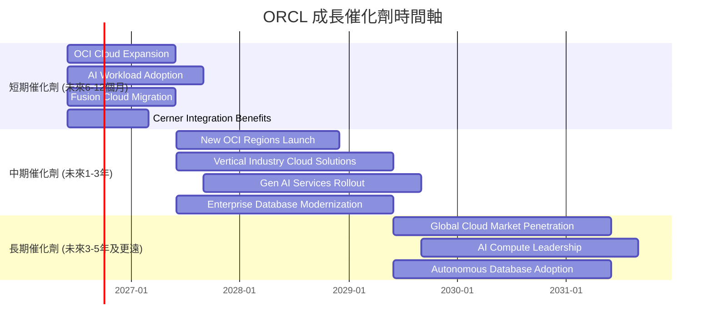

### 8.2 TAM 市場規模分析

Oracle 的潛在市場 (Total Addressable Market, TAM) 巨大，涵蓋了不斷擴大的企業軟體和雲端服務領域。

```
╔══════════════════════════════════════════════════════════════════╗
║                  ORCL 潛在市場 (TAM) 分析                        ║
╠══════════════════════════════════════════════════════════════════╣
║                                                                  ║
║  全球企業應用軟體市場 (SaaS):  ~$500B  ▓▓▓▓▓▓▓▓▓▓▓▓▓▓▓▓▓▓▓▓▓▓▓▓▓▓▓▓▓▓  🟢 營收貢獻 $20B+ ║
║  全球雲端基礎設施市場 (IaaS/PaaS): ~$800B  ▓▓▓▓▓▓▓▓▓▓▓▓▓▓▓▓▓▓▓▓▓▓▓▓▓▓▓▓▓▓  🟢 營收貢獻 $10B+ ║
║  全球資料庫管理系統市場:       ~$100B  ▓▓▓▓▓▓▓▓▓▓▓▓▓▓▓▓▓▓▓▓▓▓▓▓▓▓▓▓▓▓  🟢 營收貢獻 $15B+ ║
║  全球醫療資訊系統市場 (Cerner): ~$100B  ▓▓▓▓▓▓▓▓▓▓▓▓▓▓▓▓▓▓▓▓▓▓▓▓▓▓▓▓▓▓  🟢 營收貢獻 $5B+  ║
║                                                                  ║
║  📊 總 TAM 估計超過 $1.5 兆，Oracle 仍有巨大增長空間。              ║
╚══════════════════════════════════════════════════════════════════╝
```
**分析**：
*   Oracle 活躍在全球多個萬億美元級的市場中，包括企業應用軟體、雲端基礎設施、資料庫管理系統和醫療資訊系統。
*   公司 FY2026 總營收 $67.36B，在這些巨大 TAM 中的滲透率仍有廣闊的提升空間。特別是 OCI 和 Fusion Cloud 在各自市場的份額仍相對較小，意味著巨大的長期增長潛力。

### 8.3 成長驅動力結構圖

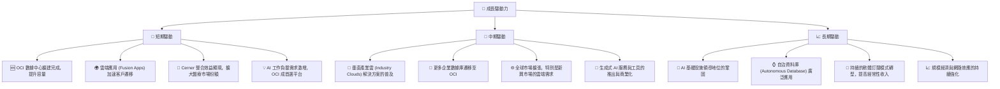
**分析**：
*   **短期驅動**：OCI 數據中心的快速擴建將立即提升其承載 AI 和企業雲端工作負載的能力，滿足市場激增的需求。Fusion Cloud 應用程式的客戶遷移將帶來穩定的訂閱收入。Cerner 併購後的整合效益預計將在短期內開始體現。
*   **中期驅動**：Oracle 將繼續推出針對特定垂直行業的雲端解決方案，並推動其廣泛的企業級客戶將資料庫遷移到 OCI。生成式 AI 服務的商業化將開啟新的營收來源。
*   **長期驅動**：隨著 AI 成為企業運營的基石，Oracle 有望憑藉其 OCI 在 AI 基礎設施領域鞏固領導地位。自治資料庫的普及將進一步降低運營成本並提高效率。持續的軟體訂閱模式轉型和規模經濟將確保其長期穩定的成長。

---

## 9. 風險矩陣

### 9.1 風險評分矩陣

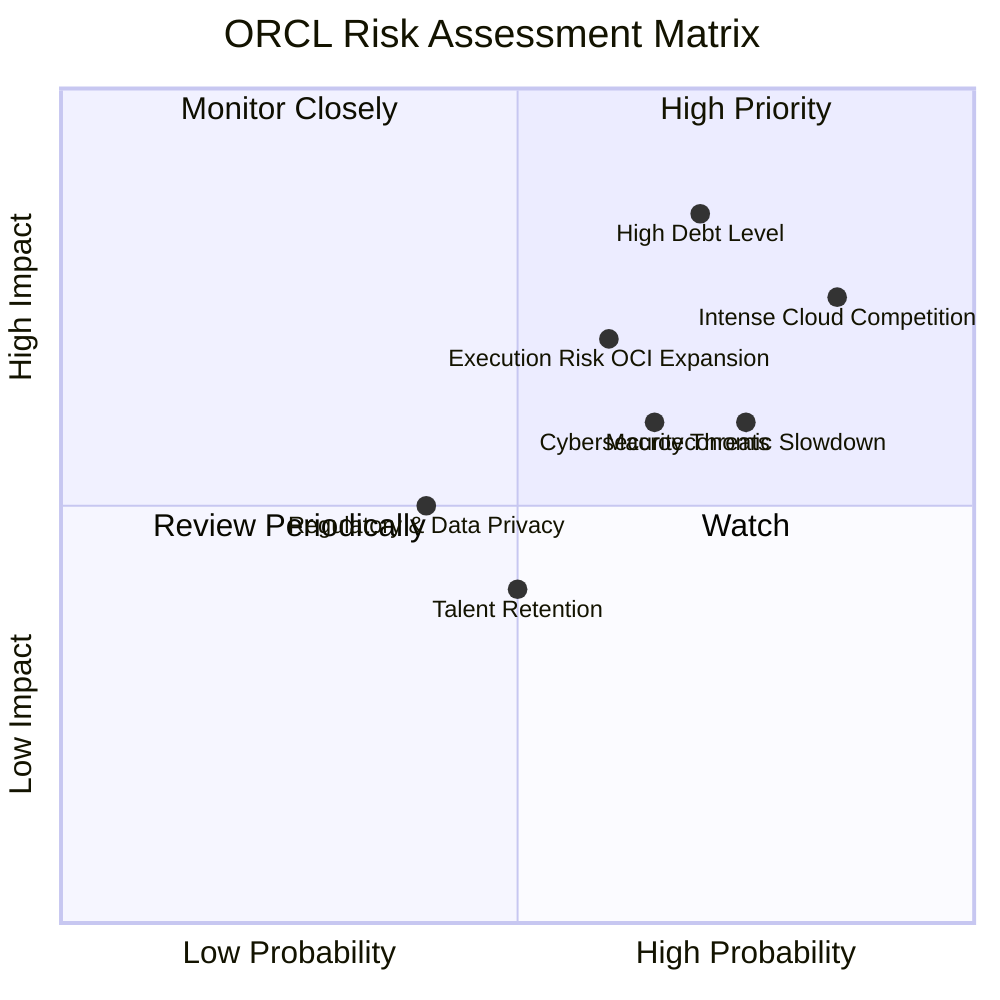

### 9.2 風險清單詳細分析

| # | 風險項目 | 發生機率 | 財務衝擊 | 風險評分 | 緩解措施 |
|---|----------|----------|----------|----------|----------|
| 1 | 🔴 **高債務水平與利率風險** | 高 (70%) | 高 (-5%淨利潤) | 🔴 8.5/10 | 憑藉強勁營業現金流逐步償還債務；利用低利率環境進行再融資；嚴格監控債務結構和成本。 |
| 2 | 🔴 **雲端市場競爭激烈** | 高 (85%) | 高 (-3%營收成長) | 🔴 8.0/10 | 專注於 OCI 的性能和成本優勢；發展差異化垂直產業解決方案；加強與 AI 夥伴 (如 NVIDIA) 合作。 |
| 3 | 🟡 **宏觀經濟逆風** | 中 (75%) | 中 (-2%營收成長) | 🟡 7.0/10 | 企業級軟體需求相對穩定；多元化地理市場和客戶群；提供高性價比雲端服務以吸引客戶。 |
| 4 | 🟡 **OCI 擴張執行風險** | 中 (60%) | 中 (-2%營收成長) | 🟡 6.5/10 | 嚴格的項目管理和供應鏈控制；逐步擴建數據中心，根據需求調整投資；招募和培訓專業人才。 |
| 5 | 🟡 **網路安全威脅** | 中 (65%) | 中 (-1%淨利潤) | 🟡 6.0/10 | 持續投資於先進的安全技術和協議；建立專業安全團隊；定期進行安全審計和風險評估；遵守全球數據隱私法規。 |
| 6 | 🟡 **監管與數據隱私風險** | 低 (40%) | 中 (-0.5%營收) | 🟡 5.0/10 | 積極參與政策制定；確保產品和服務符合 GDPR、CCPA 等全球數據隱私法規；建立信任的數據處理機制。 |
| 7 | 🟢 **人才流失與招聘困難** | 中 (50%) | 低 (-0.5%營收) | 🟢 4.0/10 | 提供具競爭力的薪酬和福利；建立積極的企業文化；提供職業發展機會和培訓；利用全球人才庫。 |

---

## 10. 投資建議

### 10.1 最終綜合評級雷達圖

```
╔══════════════════════════════════════════════════════════════════╗
║                    ORCL 最終綜合評級雷達圖                        ║
╠══════════════════════════════════════════════════════════════════╣
║                                                                  ║
║  基本面強度  8.5 ▓▓▓▓▓▓▓▓▓▓▓▓▓▓▓▓▓░░░  ★★★★☆           ║
║  成長動能    8.0 ▓▓▓▓▓▓▓▓▓▓▓▓▓▓▓▓░░░░  ★★★★☆           ║
║  獲利品質    8.5 ▓▓▓▓▓▓▓▓▓▓▓▓▓▓▓▓▓░░░  ★★★★☆           ║
║  財務健康    6.0 ▓▓▓▓▓▓▓▓▓▓▓░░░░░░░░░  ★★★☆☆           ║
║  估值合理性  7.0 ▓▓▓▓▓▓▓▓▓▓▓▓▓▓░░░░░░  ★★★☆☆           ║
║  護城河深度  8.5 ▓▓▓▓▓▓▓▓▓▓▓▓▓▓▓▓▓░░░  ★★★★☆           ║
║  管理層執行  8.0 ▓▓▓▓▓▓▓▓▓▓▓▓▓▓▓▓░░░░  ★★★★☆           ║
║  技術創新力  8.5 ▓▓▓▓▓▓▓▓▓▓▓▓▓▓▓▓▓░░░  ★★★★☆           ║
╠══════════════════════════════════════════════════════════════════╣
║  綜合總分    7.8 ▓▓▓▓▓▓▓▓▓▓▓▓▓▓▓▓░░░░  🏆 買入評級              ║
╚══════════════════════════════════════════════════════════════════╝
```

### 10.2 目標價與隱含報酬率

綜合考慮相對估值和 DCF 估值，我們對 Oracle 給出以下目標價區間：

| 情境 | 目標價 | 隱含報酬率 (vs $148.53) | 機率權重 | 加權目標價 |
|------|--------|-------------------------|----------|------------|
| 悲觀 | $200   | +34.6%                  | 20%      | $40.00     |
| 基準 | $250   | +68.3%                  | 60%      | $150.00    |
| 樂觀 | $280   | +88.5%                  | 20%      | $56.00     |
| **平均** | **$246** | **+65.6%**              | **100%** | **$246.00**|

**分析**：
基於加權平均目標價 $246，相較於當前股價 $148.53，潛在報酬率高達 65.6%。這強烈支持我們的「買入」評級。儘管存在高額資本支出和債務的風險，但 Oracle 在雲端轉型和 AI 基礎設施領域的戰略投資預計將帶來顯著的長期回報。

### 10.3 買入時機與觸發因素

```
╔══════════════════════════════════════════════════════════════════╗
║                  ✅ 買入觸發因素 Checklist                      ║
╠══════════════════════════════════════════════════════════════════╣
║                                                                  ║
║  立即買入觸發條件（多數符合）：                                  ║
║  ✅ OCI 營收成長持續加速，超出市場預期                          ║
║  ✅ 季報顯示淨利潤與 EPS 保持雙位數成長                          ║
║  ✅ 股價回調至 $130 - $145 區間，提供更佳安全邊際                ║
║  ✅ 宏觀經濟數據顯示企業 IT 支出保持韌性                        ║
║                                                                  ║
║  加碼觸發條件（出現以下任一）：                                  ║
║  ☐ 公司宣布新的大型 OCI 訂單或 AI 合作夥伴                      ║
║  ☐ 自由現金流轉正或資本支出增長放緩，顯示投資效益顯現            ║
║  ☐ 債務水平開始下降，財務槓桿改善                               ║
║  ☐ 分析師普遍上調盈利預期和目標價                               ║
║                                                                  ║
║  減碼/停損觸發條件（出現以下任一）：                             ║
║  ☐ 雲端業務成長顯著放緩，未能達到市場預期                       ║
║  ☐ 資本支出持續高企但未能帶來相應的營收增長                     ║
║  ☐ 債務負擔加劇，利息覆蓋率顯著惡化                             ║
║  ☐ 股價跌破 $120 技術支撐位，且基本面無改善                     ║
╚══════════════════════════════════════════════════════════════════╝
```

### 10.4 投資人適配度分析

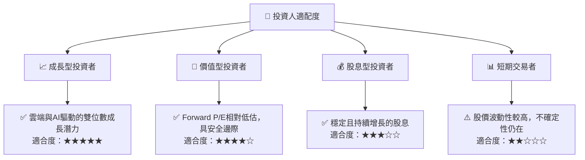
**分析**：
*   **成長型投資者**：Oracle 的雲端轉型和在 AI 基礎設施領域的巨大投入，使其成為具有長期成長潛力的標的。儘管短期內有高資本支出，但這被視為未來成長的必要投資。
*   **價值型投資者**：公司當前的 Forward P/E 估值相對較低，且擁有強大的護城河和穩固的企業客戶基礎，提供了一定的安全邊際。
*   **股息型投資者**：Oracle 派發穩定的現金股息，FY2026 股息收益率約 1.36%。雖然不是高股息股票，但其股息持續增長。
*   **短期交易者**：考慮到公司轉型期的不確定性以及市場對其高資本支出和債務的敏感性，股價波動可能較大，不適合純粹的短期交易。

### 10.5 關鍵監控指標

| 監控類型 | 指標 | 關注點 | 頻率 |
|----------|------|----------|------|
| **營收成長** | OCI 營收成長率 | OCI 業務是否保持 25%+ 甚至更高的成長，以驗證雲端戰略成功 | 季度 |
| **獲利能力** | 營業利益率 / 淨利率 | 利潤率是否持續改善，特別是考慮到 OCI 擴張的影響 | 季度 |
| **現金流** | 自由現金流 (FCF) | FCF 何時轉正，以及資本支出是否有效率地轉化為營收和利潤 | 季度 / 年度 |
| **財務健康** | 淨債務 / EBITDA | 債務水平是否得到有效控制，以降低財務風險 | 季度 / 年度 |
| **估值** | Forward P/E vs 同業 | 估值是否保持合理，若過高則需重新評估 | 每日 / 季度 |
| **產業趨勢** | AI 雲端需求 / 競爭格局 | AI 需求是否持續旺盛，競爭環境是否發生重大變化 | 持續 |

---

> **免責聲明**：本報告為 AI 自動生成，僅供研究參考，不構成投資建議。投資有風險，入市需謹慎。