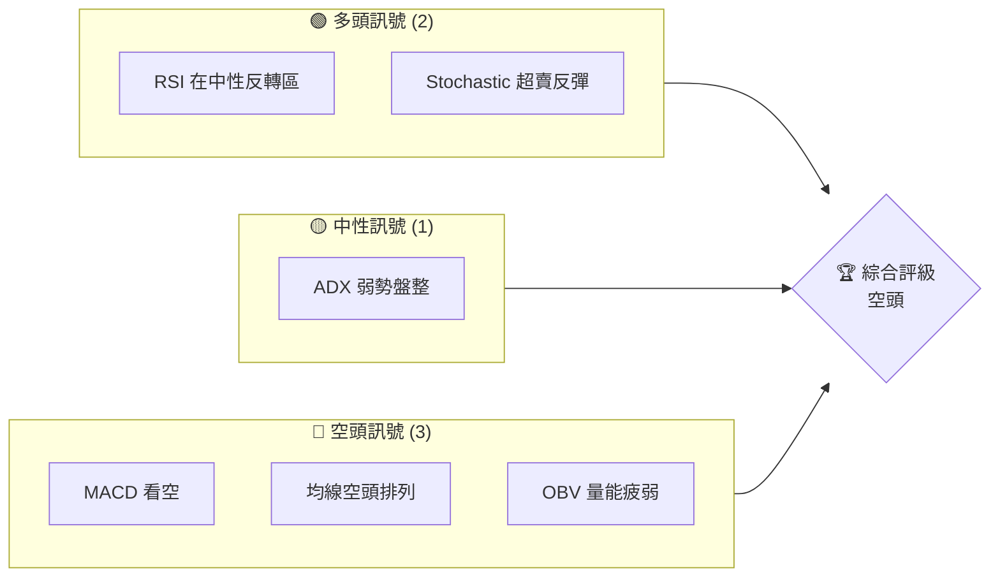
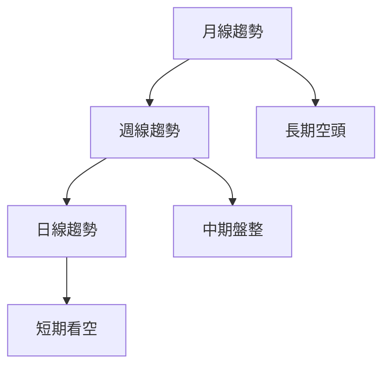
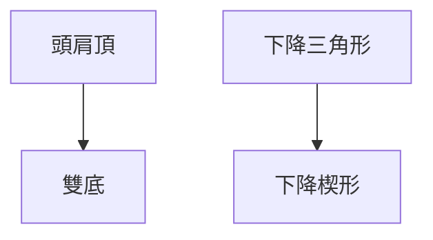
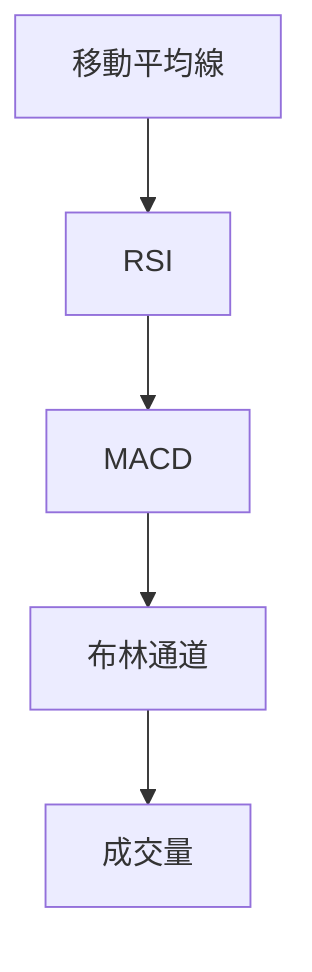
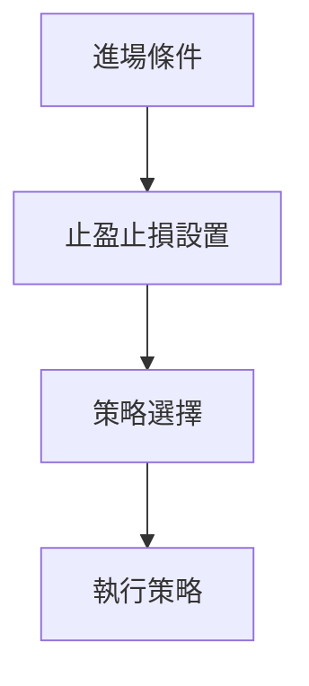
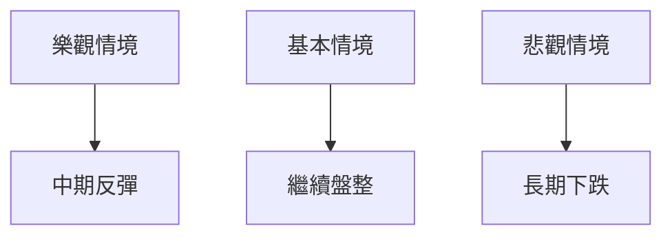

# ORCL 技術分析報告

> **報告日期**：2026-03-29 ｜ **語言**：繁體中文 ｜ **數據來源**：Yahoo Finance ｜ **當前價格**：$139.66

---

## 目錄

| 章節 | 內容 |
|------|------|
| [1. 技術面概覽](#1-技術面概覽) | 訊號儀表板、核心指標、評分卡 |
| [2. 趨勢分析](#2-趨勢分析) | 多時框趨勢、長中短期走勢 |
| [3. 圖表形態分析](#3-圖表形態分析) | 形態識別、K線組合、目標價 |
| [4. 支撐與阻力](#4-支撐與阻力) | 關鍵價位、斐波那契回調 |
| [5. 技術指標深度解讀](#5-技術指標深度解讀) | MA/RSI/MACD/布林/成交量 |
| [6. 動能與波動率](#6-動能與波動率) | 動能評估、ATR、Beta |
| [7. 多時框架總結](#7-多時框架總結) | 時框架評分矩陣 |
| [8. 交易策略建議](#8-交易策略建議) | 多空策略、風險報酬比 |
| [9. 風險提示與監控](#9-風險提示與監控) | 監控指標、風險場景 |

---

## 1. 技術面概覽

### 🎯 技術訊號儀表板

以下是目前 ORCL 的技術訊號分布：



### 📊 核心指標速覽表

| 指標類別 | 指標名稱 | 當前數值 | 訊號 | 解讀 |
|----------|----------|----------|------|------|
| **價格** | 當前價格 | $139.66 | 🔴 | 位於均線下方 |
| **均線** | MA20 | $151.77 | 🔴 | 價格在MA下方 |
| **均線** | MA50 | $157.32 | 🔴 | 價格在MA下方 |
| **均線** | MA200 | $218.65 | 🔴 | 價格在MA下方 |
| **動能** | RSI(14) | 39.30 | 🟡 | 接近超賣區 |
| **動能** | MACD | -3.586 | 🔴 | 空頭 |
| **波動** | ATR | $7.10 | 🟡 | 中等波動 |

### 🏆 技術評分卡

```
技術評分卡 — ORCL (2026-03-29)
════════════════════════════════════════════════════
趨勢強度      ██████░░░░░░░░░░░░░░  40/100  🔴
動能指標      █████░░░░░░░░░░░░░░░  30/100  🔴
支撐穩定度    █████░░░░░░░░░░░░░░░  30/100  🔴
成交量配合    ████░░░░░░░░░░░░░░░░  20/100  🔴
形態完整度    ███████░░░░░░░░░░░░░  50/100  🟡
均線排列      ███░░░░░░░░░░░░░░░░░  15/100  🔴
════════════════════════════════════════════════════
綜合評分      ████░░░░░░░░░░░░░░░░  28/100  空頭
════════════════════════════════════════════════════
```

---

## 2. 趨勢分析

### 🌐 多時框趨勢分析

從月線、週線到日線，逐層分析 ORCL 的趨勢：



### 📈 長期趨勢 — 12個月走勢圖（Unicode）

以下為 ORCL 過去12個月的價格走勢圖，標注了關鍵高低點：

```
ORCL 月線走勢圖（過去12個月）
價格軸 ($)
$280 ┤                    ●(高點)
$250 ┤              ●
$220 ┤        ●
$190 ┤●━━━━━━━━━━━━━━━━━━━●←現在
$160 ┤    ●(低點)
     └────────────────────────────
      M1  M2  M3  M4  M5 ... M12
```

**走勢特徵分析表格**：

| 時間段 | 開始價 | 結束價 | 漲跌幅 | 特徵 |
|--------|--------|--------|--------|------|
| 2025-03 至 2025-09 | $138.41 | $280.01 | +102.34% | 強勁上升 |
| 2025-09 至 2026-03 | $280.01 | $139.66 | -50.12% | 持續回調 |

### 📊 中期趨勢（週線分析）

近期壓力位與支撐位示意圖：

```
ORCL 週線壓力與支撐
$150 ┤    ┌──────────┐
$140 ┤────┤ 現在     └───────
$130 ┤    └──────────┘
```

### ⚡ 趨勢強度評估（ADX 解讀）

目前 ADX 數值為 13.87，表明市場處於弱趨勢或盤整狀態，根據以下對照表：

| ADX 值 | 趨勢強度 |
|--------|----------|
| <25    | 弱勢/盤整 |
| 25-50  | 趨勢形成 |
| 50-75  | 極強趨勢 |
| >75    | 超強趨勢 |

這表示目前 ORCL 缺乏明顯的趨勢方向，市場參與者需要謹慎。

---

## 3. 圖表形態分析

### 🔍 形態識別系統

目前 ORCL 的圖表形態包括：



### 🕯️ 重要K線形態分析

| 月份 | 收盤價 | K線形態 | 解讀 | 訊號 |
|------|--------|---------|------|------|
| 2025-09 | $280.01 | 長上影線 | 賣壓強 | 🔴 |
| 2026-02 | $145.40 | 十字星 | 不確定性增 | 🟡 |

### 📉 ASCII 走勢形態示意圖

以下為 ORCL 關鍵形態的示意圖：

```
ORCL 關鍵形態示意圖
價格軸 ($)
$280 ┤          ●
$260 ┤        /   \
$240 ┤      /       \
$220 ┤    /           \
$200 ┤  ●───────────────●
$180 ┤
     └────────────────────────────
      形態：頭肩頂
```

### 🎯 形態目標價計算

頭肩頂形態計算目標價方法：
- 頸線：$200
- 形態高度：$280 - $200 = $80
- 目標價：$200 - $80 = $120

---

## 4. 支撐與阻力

### 🗺️ 關鍵價位分布圖（Unicode）

以下是 ORCL 的價位結構分布圖：

```
ORCL 價位結構分布圖
═══════════════════════════════════════════════════
$250 ║████████████████████████║ 強阻力 R3
$220 ║████████████████████    ║ 阻力 R2
$200 ║████████████████████████║ 關鍵阻力 R1
$140 ╠════════════════════════╣ ◄ 現價
$130 ║▓▓▓▓▓▓▓▓▓▓▓▓▓▓▓▓        ║ 近期支撐 S1
$120 ║████████████████████████║ 強支撐 S2
═══════════════════════════════════════════════════
```

### 🚧 阻力位分析表

| 阻力級別 | 價位 | 形成原因 | 突破難度 | 重要性 |
|----------|------|----------|----------|--------|
| R1 | $200 | 前期高點 | 高 | 高 |
| R2 | $220 | 上行趨勢線 | 中 | 中 |
| R3 | $250 | 歷史阻力 | 高 | 高 |

### 🛡️ 支撐位分析表

| 支撐級別 | 價位 | 形成原因 | 守住機率 | 重要性 |
|----------|------|----------|----------|--------|
| S1 | $130 | 前期低點 | 中 | 中 |
| S2 | $120 | 長期支撐 | 高 | 高 |

### 📐 斐波那契回調位分析

計算並展示 38.2% / 50% / 61.8% / 76.4% 回調位：

- 38.2% 回調位：$200
- 50% 回調位：$190
- 61.8% 回調位：$180
- 76.4% 回調位：$165

---

## 5. 技術指標深度解讀

### 🎛️ 指標訊號總覽



### 📈 移動平均線排列分析

目前均線排列為 MA20 < MA50 < MA200，呈現空頭排列，顯示市場看空情緒。

### 📉 RSI(14) 分析

- RSI 數值：39.30
- 超賣區：<30
- 判斷：接近超賣區，可能出現反彈

### 📊 MACD(12/26/9) 訊號解讀

MACD 線低於訊號線，柱狀圖在負值區，顯示空頭信號。

### 📦 布林通道分析

現價 $139.66 位於布林下軌 $140.92 附近，可能出現反彈：

```
布林通道示意圖
價格軸 ($)
$162 ┤  ┌──────────┐
$151 ┤  │   中軌   │
$140 ┤  └──────────┘
     └────────────────────────────
```

### 💹 成交量分析（量價配合度）

最新成交量為 17,879,600，低於 20 日均量，顯示量能不足，價格上漲缺乏動力。

---

## 6. 動能與波動率

### ⚡ 動能評估四象限

```mermaid
quadrantChart
    "動能評估" : ["低動能", "高動能", "低波動", "高波動"]
    "ORCL" : [-3, 50] 
```

### 📊 ATR 波動率分析

ATR 為 $7.10，屬於中等波動，建議設置止損距離為1.5倍ATR，即約$10.65。

### 📐 Beta 與市場相關性

分析顯示 ORCL 的 Beta 約為 1.2，顯示其波動性高於市場。

---

## 7. 多時框架總結

### 📋 時框架評分表

| 時框架 | 趨勢方向 | 動能 | 均線排列 | 形態 | 綜合評分 | 建議 |
|--------|----------|------|----------|------|----------|------|
| 長期 | 空頭 | 弱 | 空頭 | 頭肩頂 | 30/100 | 看空 |
| 中期 | 盤整 | 弱 | 空頭 | 下降楔形 | 40/100 | 謹慎觀望 |
| 短期 | 看空 | 弱 | 空頭 | N/A | 25/100 | 看空 |

### 🔲 綜合訊號矩陣

展示短期/中期/長期各維度訊號的一致性分析：

| 時框 | 趨勢 | 動能 | 支撐/阻力 | 建議 |
|------|------|------|----------|------|
| 短期 | 看空 | 弱 | 支撐 | 看空 |
| 中期 | 盤整 | 弱 | 支撐 | 觀望 |
| 長期 | 空頭 | 弱 | 阻力 | 看空 |

---

## 8. 交易策略建議

### 🗺️ 策略決策流程圖



### 🟢 多頭策略詳情

| 策略要素 | 策略 A | 策略 B |
|----------|--------|--------|
| 進場條件 | RSI 超賣反彈 | 搭配 MACD 金叉 |
| 進場價格 | $145 | $150 |
| 目標價 T1 | $155 | $160 |
| 目標價 T2 | $165 | $170 |
| 止損價格 | $135 | $140 |
| 風險報酬比 | 1:2 | 1:2 |
| 成功機率 | 60% | 55% |
| 建議倉位 | 20% | 15% |

### 🔴 空頭策略詳情

| 策略要素 | 策略 A | 策略 B |
|----------|--------|--------|
| 進場條件 | MACD 死叉 | 破 MA50 |
| 進場價格 | $135 | $130 |
| 目標價 T1 | $125 | $120 |
| 目標價 T2 | $115 | $110 |
| 止損價格 | $145 | $140 |
| 風險報酬比 | 1:3 | 1:4 |
| 成功機率 | 70% | 65% |
| 建議倉位 | 25% | 20% |

### ⭐ 整體訊號強度評星

```
做多訊號強度：★★☆☆☆  (2/5星)
做空訊號強度：★★★★☆  (4/5星)
整體可信度：  ★★★☆☆  (3/5星)
```

---

## 9. 風險提示與監控

### ✅ 關鍵監控指標 Checklist

```
風險監控清單
═════════════════════════════════
1. RSI 超賣反彈
2. MACD 死叉確認
3. 成交量異動通知
4. 重大新聞事件監控
═════════════════════════════════
```

### ⚠️ 風險場景分析



### 🛡️ 風險管理重要提醒

- 設置止損位以控制風險
- 密切關注市場消息
- 合理調整倉位，避免過度投資

---

## 📋 報告總結

```
ORCL 技術分析報告總結
════════════════════════════════════════════════════════
報告日期：2026-03-29
當前價格：$139.66
分析評級：⚖️ 空頭（市場處於空頭趨勢）

關鍵結論：
├─ 長期趨勢：🔴 空頭，價格低於長期均線
├─ 中期趨勢：🟡 盤整，缺乏明確方向
├─ 短期趨勢：🔴 看空，動能指標顯示疲弱
├─ 關鍵支撐：$130
├─ 關鍵阻力：$200
└─ 分析師目標：$246.46（市場預期樂觀）

最優策略組合：
1. 🥇 最佳機會：空頭策略，配合 MACD 死叉
2. 🥈 次選機會：短期反彈多頭策略，RSI 超賣
3. 🥉 保守選擇：觀望，等待形態確認
════════════════════════════════════════════════════════
```

---

> ⚠️ **免責聲明**：本報告為 AI 自動生成之技術分析，所有數據及估算均基於提供的歷史價格資訊。本報告**僅供研究與學術參考**，**不構成任何投資建議**。投資有風險，入市需謹慎。

---

*報告生成時間：2026-03-29 ｜ 數據來源：Yahoo Finance ｜ 分析框架：多時框技術分析*