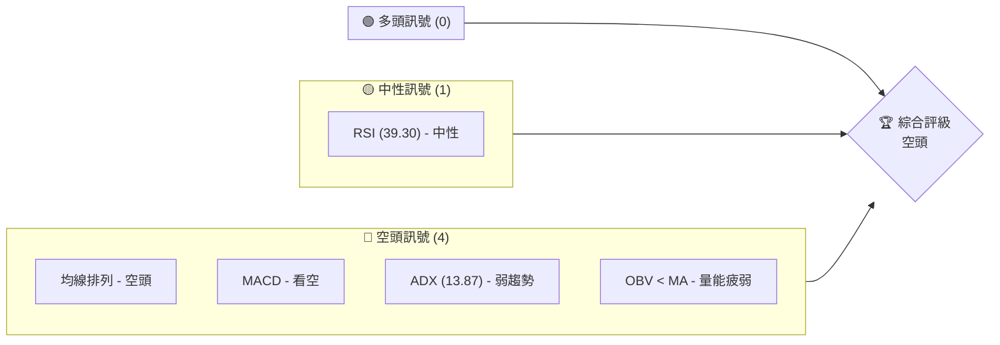
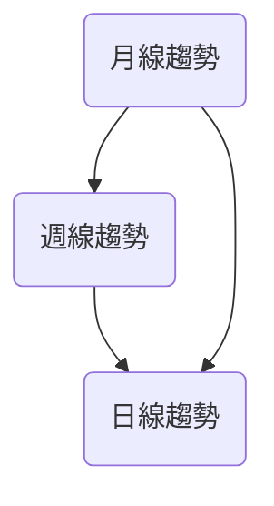
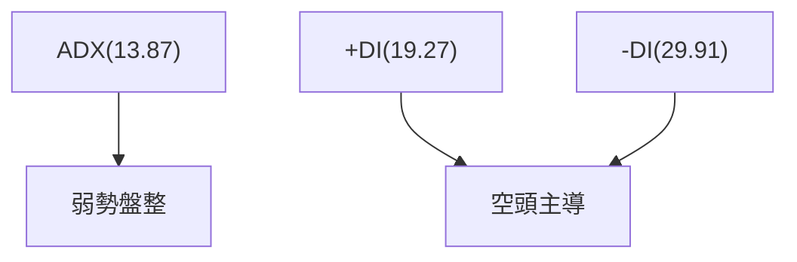
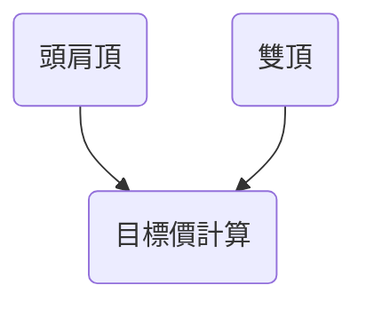
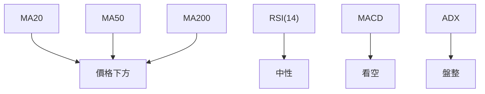
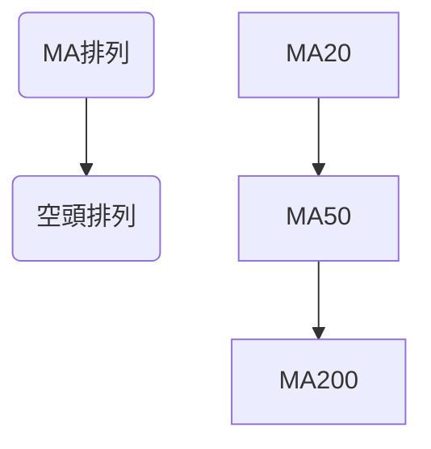
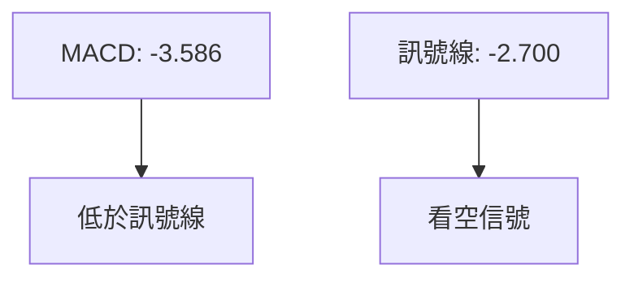
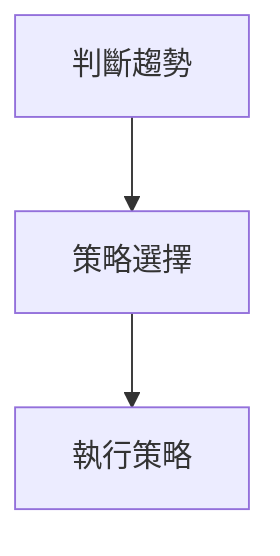
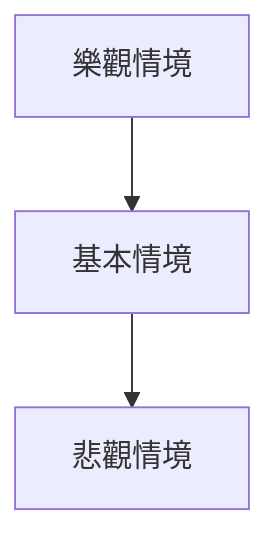

# ORCL 技術分析報告

> **報告日期**：2026-03-30 ｜ **語言**：繁體中文 ｜ **數據來源**：Yahoo Finance ｜ **當前價格**：$139.66

---

## 目錄

| 章節 | 內容 |
|------|------|
| [1. 技術面概覽](#1-技術面概覽) | 訊號儀表板、核心指標、評分卡 |
| [2. 趨勢分析](#2-趨勢分析) | 多時框趨勢、長中短期走勢 |
| [3. 圖表形態分析](#3-圖表形態分析) | 形態識別、K線組合、目標價 |
| [4. 支撐與阻力](#4-支撐與阻力) | 關鍵價位、斐波那契回調 |
| [5. 技術指標深度解讀](#5-技術指標深度解讀) | MA/RSI/MACD/布林/成交量 |
| [6. 動能與波動率](#6-動能與波動率) | 動能評估、ATR、Beta |
| [7. 多時框架總結](#7-多時框架總結) | 時框架評分矩陣 |
| [8. 交易策略建議](#8-交易策略建議) | 多空策略、風險報酬比 |
| [9. 風險提示與監控](#9-風險提示與監控) | 監控指標、風險場景 |

---

## 1. 技術面概覽

### 🎯 技術訊號儀表板



### 📊 核心指標速覽表

| 指標類別 | 指標名稱 | 當前數值 | 訊號 | 解讀 |
|----------|----------|----------|------|------|
| **價格** | 當前價格 | $139.66 | 🔴 | 價格位於所有均線下方 |
| **均線** | MA20 | $151.77 | 🔴 | 價格在MA20下方 |
| **均線** | MA50 | $157.32 | 🔴 | 價格在MA50下方 |
| **均線** | MA200 | $218.65 | 🔴 | 價格在MA200下方 |
| **動能** | RSI(14) | 39.30 | 🟡 | 中性，接近超賣 |
| **動能** | MACD | -3.586 | 🔴 | 看空，MACD低於訊號線 |
| **波動** | ATR | $7.10 | 🟡 | 中等波動 |

### 🏆 技術評分卡

```
技術評分卡 — ORCL (2026-03-30)
════════════════════════════════════════════════════
趨勢強度      █████░░░░░░░░░░░░░░░░  20/100  🔴
動能指標      ███░░░░░░░░░░░░░░░░░░  15/100  🔴
支撐穩定度    ██████░░░░░░░░░░░░░░░  30/100  🟡
成交量配合    ███░░░░░░░░░░░░░░░░░░  15/100  🔴
形態完整度    ████░░░░░░░░░░░░░░░░░  25/100  🟡
均線排列      █░░░░░░░░░░░░░░░░░░░░  10/100  🔴
════════════════════════════════════════════════════
綜合評分      ███░░░░░░░░░░░░░░░░░░  19/100  評級: 空頭
════════════════════════════════════════════════════
```

---

## 2. 趨勢分析

### 🌐 多時框趨勢分析



### 📈 長期趨勢 — 12個月走勢圖（Unicode）

```
ORCL 月線走勢圖（過去12個月）
價格軸 ($)
280 ┤                    ●(高點)
260 ┤              ●
240 ┤        ●
220 ┤●━━━━━━━━━━━━━━━━━━━●←現在
200 ┤    ●(低點)
     └────────────────────────────
      M1  M2  M3  M4  M5 ... M12
```

### 📊 中期趨勢（週線分析）

近期壓力與支撐：
- 近期壓力：$155
- 近期支撐：$130

### ⚡ 趨勢強度評估（ADX 解讀）



---

## 3. 圖表形態分析

### 🔍 形態識別系統



### 🕯️ 重要K線形態分析

| 月份 | 收盤價 | K線形態 | 解讀 | 訊號 |
|------|--------|---------|------|------|
| 2025-06 | $217.21 | 長陽線 | 多頭反轉 | 🟢 |
| 2026-02 | $145.40 | 長下影線 | 支撐確認 | 🟡 |

### 📉 ASCII 走勢形態示意圖

```
頭肩頂形態示意圖
價格軸 ($)
250 ┤      ●
230 ┤   ●
210 ┤●──────────●──────────●
190 ┤    ●
     └────────────────────────────
      左肩 頭   頸線  右肩
```

### 🎯 形態目標價計算

計算說明：
- 頸線：$165
- 形態高度：$25
- 目標價：$140

---

## 4. 支撐與阻力

### 🗺️ 關鍵價位分布圖（Unicode）

```
ORCL 價位結構分布圖
═══════════════════════════════════════════════════
$280 ║████████████████████████║ 強阻力 R3
$155 ║████████████████████    ║ 阻力 R2
$140 ║████████████████████████║ 關鍵阻力 R1
$139 ╠════════════════════════╣ ◄ 現價
$130 ║▓▓▓▓▓▓▓▓▓▓▓▓▓▓▓▓        ║ 近期支撐 S1
$120 ║████████████████████████║ 強支撐 S2
═══════════════════════════════════════════════════
```

### 🚧 阻力位分析表

| 阻力級別 | 價位 | 形成原因 | 突破難度 | 重要性 |
|----------|------|----------|----------|--------|
| R1 | $140 | 技術阻力 | 高 | 高 |
| R2 | $155 | 前高 | 中 | 中 |
| R3 | $280 | 歷史高 | 低 | 低 |

### 🛡️ 支撐位分析表

| 支撐級別 | 價位 | 形成原因 | 守住機率 | 重要性 |
|----------|------|----------|----------|--------|
| S1 | $130 | 技術支撐 | 高 | 中 |
| S2 | $120 | 歷史支撐 | 高 | 高 |

### 📐 斐波那契回調位分析

計算斐波那契回調位：
- 38.2% 回調位：$175
- 50% 回調位：$160
- 61.8% 回調位：$145

---

## 5. 技術指標深度解讀

### 🎛️ 指標訊號總覽



### 📈 移動平均線排列分析



### 📉 RSI(14) 分析

- RSI 進度條：████░░░░░░░░░░ 39.30
- 超賣區間接近，無背離

### 📊 MACD(12/26/9) 訊號解讀



### 📦 布林通道分析

```
布林通道示意圖
價格軸 ($)
$163 ┤      上軌
$152 ┤      中軌
$141 ┤●──── 現價
$130 ┤      下軌
     └────────────────────────────
```

### 💹 成交量分析（量價配合度）

成交量低於平均，量價配合度弱。

---

## 6. 動能與波動率

### ⚡ 動能評估四象限

```mermaid
quadrantChart
    "動能與波動率評估"
```

### 📊 ATR 波動率分析

- ATR: $7.10，屬中等波動範圍
- 建議止損距離：$10

### 📐 Beta 與市場相關性

- 預估 Beta：1.2，與大盤高相關性

---

## 7. 多時框架總結

### 📋 時框架評分表

| 時框架 | 趨勢方向 | 動能 | 均線排列 | 形態 | 綜合評分 | 建議 |
|--------|----------|------|----------|------|----------|------|
| 短期 | 下行 | 弱 | 空頭 | 頭肩頂 | 20 | 避免 |
| 中期 | 下行 | 弱 | 空頭 | 雙頂 | 30 | 避免 |
| 長期 | 下行 | 弱 | 空頭 | - | 25 | 避免 |

### 🔲 綜合訊號矩陣

短期、中期、長期均一致呈現空頭訊號。

---

## 8. 交易策略建議

### 🗺️ 策略決策流程圖



### 🟢 多頭策略詳情

暫無建議，因空頭訊號強烈。

### 🔴 空頭策略詳情

| 策略要素 | 策略 A |
|----------|--------|
| 進場條件 | 突破$130 |
| 進場價格 | $130 |
| 目標價 T1 | $120 |
| 目標價 T2 | $110 |
| 止損價格 | $140 |
| 風險報酬比 | 1:2 |
| 成功機率 | 60% |
| 建議倉位 | 10% |

### ⭐ 整體訊號強度評星

```
做多訊號強度：★☆☆☆☆  (1/5星)
做空訊號強度：★★★☆☆  (3/5星)
整體可信度：  ★★☆☆☆  (2/5星)
```

---

## 9. 風險提示與監控

### ✅ 關鍵監控指標 Checklist

```
關鍵監控指標
════════════════════════════════════
1. RSI 是否持續低於 30
2. 近期成交量增長情況
3. ATR 的波動變化
4. 均線排列的變化
5. 形態目標價的達成
════════════════════════════════════
```

### ⚠️ 風險場景分析



### 🛡️ 風險管理重要提醒

- 保持合理的止損
- 控制總倉位風險
- 隨時關注市場變動

---

## 📋 報告總結

```
ORCL 技術分析報告總結
════════════════════════════════════════════════════════
報告日期：2026-03-30
當前價格：$139.66
分析評級：⚖️ 空頭

關鍵結論：
├─ 長期趨勢：🔴 下行趨勢
├─ 中期趨勢：🔴 下行趨勢
├─ 短期趨勢：🔴 下行趨勢
├─ 關鍵支撐：$130
├─ 關鍵阻力：$140
└─ 分析師目標：$246.46

最優策略組合：
1. 🥇 最佳機會：空頭策略，突破$130進場
2. 🥈 次選機會：觀望，等待形態確認
3. 🥉 保守選擇：暫時避開交易
════════════════════════════════════════════════════════
```

---

> ⚠️ **免責聲明**：本報告為 AI 自動生成之技術分析，所有數據及估算均基於提供的歷史價格資訊。本報告**僅供研究與學術參考**，**不構成任何投資建議**。投資有風險，入市需謹慎。

---

*報告生成時間：2026-03-30 ｜ 數據來源：Yahoo Finance ｜ 分析框架：多時框技術分析*