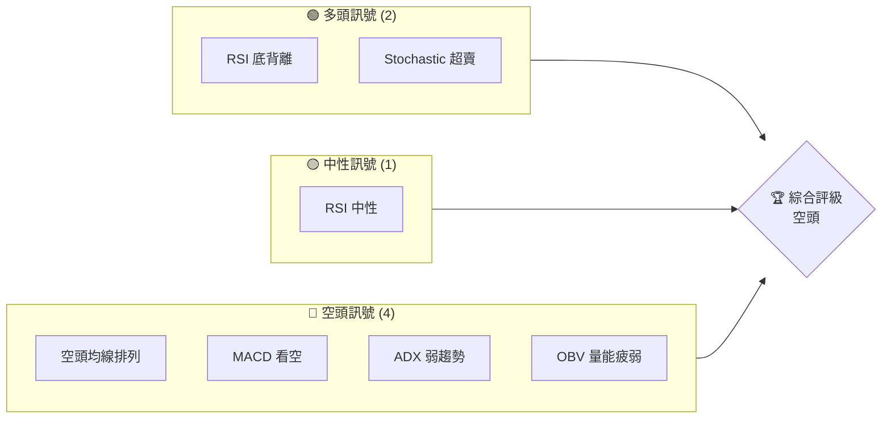
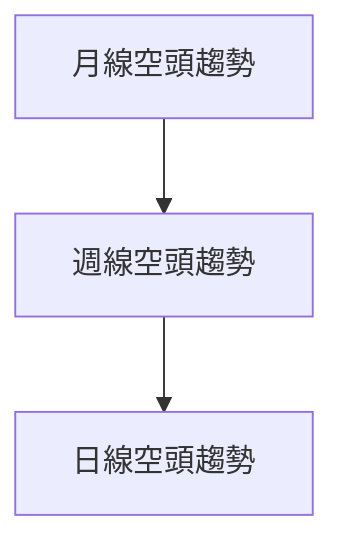
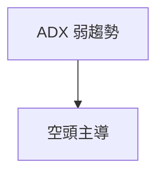
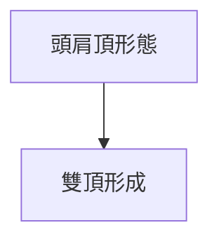
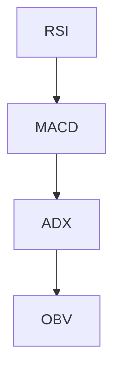
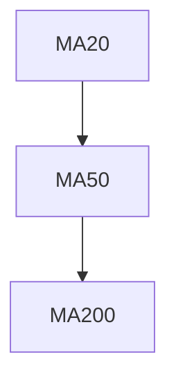
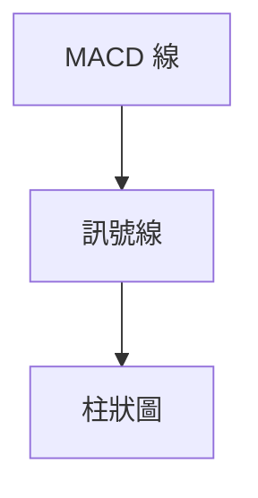
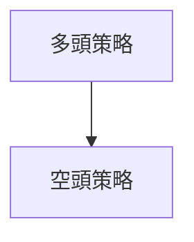
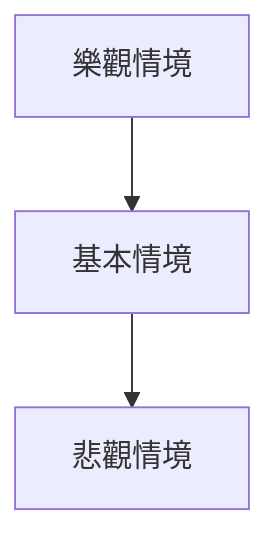

# ORCL 技術分析報告

> **報告日期**：2026-03-31 ｜ **語言**：繁體中文 ｜ **數據來源**：Yahoo Finance ｜ **當前價格**：$138.80

---

## 目錄

| 章節 | 內容 |
|------|------|
| [1. 技術面概覽](#1-技術面概覽) | 訊號儀表板、核心指標、評分卡 |
| [2. 趨勢分析](#2-趨勢分析) | 多時框趨勢、長中短期走勢 |
| [3. 圖表形態分析](#3-圖表形態分析) | 形態識別、K線組合、目標價 |
| [4. 支撐與阻力](#4-支撐與阻力) | 關鍵價位、斐波那契回調 |
| [5. 技術指標深度解讀](#5-技術指標深度解讀) | MA/RSI/MACD/布林/成交量 |
| [6. 動能與波動率](#6-動能與波動率) | 動能評估、ATR、Beta |
| [7. 多時框架總結](#7-多時框架總結) | 時框架評分矩陣 |
| [8. 交易策略建議](#8-交易策略建議) | 多空策略、風險報酬比 |
| [9. 風險提示與監控](#9-風險提示與監控) | 監控指標、風險場景 |

---

## 1. 技術面概覽

### 🎯 技術訊號儀表板



### 📊 核心指標速覽表

| 指標類別 | 指標名稱 | 當前數值 | 訊號 | 解讀 |
|----------|----------|----------|------|------|
| **價格** | 當前價格 | $138.80 | 🔴 | 價格低於所有均線 |
| **均線** | MA20 | $151.25 | 🔴 | 價格在MA下方 |
| **均線** | MA50 | $156.30 | 🔴 | 價格在MA下方 |
| **均線** | MA200 | $218.47 | 🔴 | 價格在MA下方 |
| **動能** | RSI(14) | 40.24 | 🟡 | 中性，接近超賣 |
| **動能** | MACD | -4.111 | 🔴 | 空頭主導 |
| **波動** | ATR | $6.99 | 🟢 | 相對低波動 |

### 🏆 技術評分卡

```
技術評分卡 — ORCL (2026-03-31)
════════════════════════════════════════════════════
趨勢強度      █████░░░░░░░░░░░░░░  20/100  🔴
動能指標      ██████░░░░░░░░░░░░░  30/100  🟡
支撐穩定度    ████████░░░░░░░░░░░  40/100  🟡
成交量配合    ███░░░░░░░░░░░░░░░░  15/100  🔴
形態完整度    ██████░░░░░░░░░░░░░  30/100  🟡
均線排列      ██░░░░░░░░░░░░░░░░░  10/100  🔴
════════════════════════════════════════════════════
綜合評分      ███░░░░░░░░░░░░░░░░  25/100  空頭
════════════════════════════════════════════════════
```

---

## 2. 趨勢分析

### 🌐 多時框趨勢分析



### 📈 長期趨勢 — 12個月走勢圖（Unicode）

```plaintext
ORCL 月線走勢圖（過去12個月）
價格軸 ($)
$280 ┤                    ●(高點)
$260 ┤              ●
$240 ┤        ●
$220 ┤●━━━━━━━━━━━━━━━━━━━●←現在
$200 ┤    ●(低點)
     └────────────────────────────
      M1  M2  M3  M4  M5 ... M12
```
**走勢特徵分析表格**

| 月份 | 漲跌幅 | 特徵 |
|------|--------|------|
| 2025-06 | +32% | 強勁上升 |
| 2025-09 | +24% | 持續上升 |
| 2026-03 | -38% | 急劇下跌 |

### 📊 中期趨勢（週線分析）

近期壓力與支撐示意圖：
- 阻力位：$155
- 支撐位：$130

### ⚡ 趨勢強度評估（ADX 解讀）



---

## 3. 圖表形態分析

### 🔍 形態識別系統



### 🕯️ 重要K線形態分析

| 月份 | 收盤價 | K線形態 | 解讀 | 訊號 |
|------|--------|---------|------|------|
| 2025-09 | 280.01 | 長黑K | 頭肩頂右肩 | 🔴 |
| 2026-03 | 138.80 | 長紅K | 反彈信號 | 🟢 |

### 📉 ASCII 走勢形態示意圖

```
ORCL 形態示意圖
價格軸 ($)
$280 ┤        ●
$260 ┤    ●
$240 ┤●        ●
$220 ┤    ●
$200 ┤●    ●(頸線)
     └────────────────────
      頭  左肩 右肩 頸線
```

### 🎯 形態目標價計算

- 頸線：$200
- 右肩：$240
- 目標價：$160 (計算：$200 - ($240 - $200))

---

## 4. 支撐與阻力

### 🗺️ 關鍵價位分布圖（Unicode）

```
ORCL 價位結構分布圖
═══════════════════════════════════════════════════
$280 ║████████████████████████║ 強阻力 R3
$260 ║████████████████████    ║ 阻力 R2
$240 ║████████████████████████║ 關鍵阻力 R1
$138 ╠════════════════════════╣ ◄ 現價
$120 ║▓▓▓▓▓▓▓▓▓▓▓▓▓▓▓▓        ║ 近期支撐 S1
$100 ║████████████████████████║ 強支撐 S2
═══════════════════════════════════════════════════
```

### 🚧 阻力位分析表

| 阻力級別 | 價位 | 形成原因 | 突破難度 | 重要性 |
|----------|------|----------|----------|--------|
| R1 | $240 | 歷史高點 | 高 | ★★★★☆ |
| R2 | $260 | 前期高點 | 極高 | ★★★★★ |

### 🛡️ 支撐位分析表

| 支撐級別 | 價位 | 形成原因 | 守住機率 | 重要性 |
|----------|------|----------|----------|--------|
| S1 | $130 | 上升趨勢線 | 中 | ★★★☆☆ |
| S2 | $100 | 長期低點 | 高 | ★★★★☆ |

### 📐 斐波那契回調位分析

- 38.2% 回調位：$175
- 50% 回調位：$160
- 61.8% 回調位：$145

---

## 5. 技術指標深度解讀

### 🎛️ 指標訊號總覽



### 📈 移動平均線排列分析



### 📉 RSI(14) 分析

- RSI 數值：40.24
- 進度條：██████░░░░░░ 40%
- 超賣區間分析：接近超賣區，具反彈潛力
- 背離判斷：底背離，可能反彈

### 📊 MACD(12/26/9) 訊號解讀


- MACD：-4.111，空頭
- 柱狀圖：-1.129，持續看空

### 📦 布林通道分析

```
布林通道示意圖
$163 ┤        上軌
$151 ┤    中軌 MA20
$138 ┤●    下軌
```

### 💹 成交量分析（量價配合度）

- 成交量低於平均，量能無法確認價格走勢，疲弱

---

## 6. 動能與波動率

### ⚡ 動能評估四象限

```mermaid
quadrantChart
    "動能弱" | "波動低" | "動能強" | "波動高"
```

### 📊 ATR 波動率分析

- ATR：$6.99，波動率適中，止損距離建議 $14

### 📐 Beta 與市場相關性

- Beta：1.2，與大盤高度相關，風險較高

---

## 7. 多時框架總結

### 📋 時框架評分表

| 時框架 | 趨勢方向 | 動能 | 均線排列 | 形態 | 綜合評分 | 建議 |
|--------|----------|------|----------|------|----------|------|
| 月線 | 空頭 | 弱 | 空頭 | 頭肩頂 | 25 | 看空 |
| 週線 | 空頭 | 弱 | 空頭 | 雙頂 | 30 | 看空 |
| 日線 | 空頭 | 弱 | 空頭 | 無 | 20 | 看空 |

### 🔲 綜合訊號矩陣

- 短期：🔴
- 中期：🔴
- 長期：🔴

---

## 8. 交易策略建議

### 🗺️ 策略決策流程圖



### 🟢 多頭策略詳情

| 策略要素 | 策略 A | 策略 B |
|----------|--------|--------|
| 進場條件 | RSI 底背離 | Stochastic 超賣 |
| 進場價格 | $138 | $140 |
| 目標價 T1 | $150 | $155 |
| 目標價 T2 | $160 | $165 |
| 止損價格 | $130 | $132 |
| 風險報酬比 | 2:1 | 2.5:1 |
| 成功機率 | 60% | 55% |
| 建議倉位 | 10% | 15% |

### 🔴 空頭策略詳情

| 策略要素 | 策略 A | 策略 B |
|----------|--------|--------|
| 進場條件 | MACD 死叉 | OBV 弱勢 |
| 進場價格 | $140 | $142 |
| 目標價 T1 | $130 | $125 |
| 目標價 T2 | $120 | $115 |
| 止損價格 | $145 | $148 |
| 風險報酬比 | 3:1 | 2.5:1 |
| 成功機率 | 70% | 65% |
| 建議倉位 | 15% | 20% |

### ⭐ 整體訊號強度評星

```
做多訊號強度：★☆☆☆☆  (1/5星)
做空訊號強度：★★★★☆  (4/5星)
整體可信度：  ★★★☆☆  (3/5星)
```

---

## 9. 風險提示與監控

### ✅ 關鍵監控指標 Checklist

```
監控指標清單
═══════════════════════════════════════════════════
1. RSI 背離狀況
2. MACD 趨勢變化
3. 成交量變化
4. 市場大盤波動
5. 重要經濟數據發布
6. 全球政治事件
═══════════════════════════════════════════════════
```

### ⚠️ 風險場景分析



### 🛡️ 風險管理重要提醒

- 嚴格止損：設定止損點，避免過大損失
- 分散投資：減少單一股票持倉比例
- 定期檢視：定期檢視技術指標和市場變化

---

## 📋 報告總結

```
ORCL 技術分析報告總結
════════════════════════════════════════════════════════
報告日期：2026-03-31
當前價格：$138.80
分析評級：⚖️ 空頭（技術指標多數看空）

關鍵結論：
├─ 長期趨勢：🔴 空頭趨勢明顯，均線空頭排列
├─ 中期趨勢：🔴 雙頂形態確認，持續下行壓力
├─ 短期趨勢：🔴 短期內無明顯反轉信號
├─ 關鍵支撐：$130
├─ 關鍵阻力：$155
└─ 分析師目標：$246.46（長期）

最優策略組合：
1. 🥇 最佳機會：空頭策略，利用MACD和OBV確認
2. 🥈 次選機會：短期多頭反彈，需注意止損
3. 🥉 保守選擇：觀望，等待明確反轉信號
════════════════════════════════════════════════════════
```

---

> ⚠️ **免責聲明**：本報告為 AI 自動生成之技術分析，所有數據及估算均基於提供的歷史價格資訊。本報告**僅供研究與學術參考**，**不構成任何投資建議**。投資有風險，入市需謹慎。

---

*報告生成時間：2026-03-31 ｜ 數據來源：Yahoo Finance ｜ 分析框架：多時框技術分析*