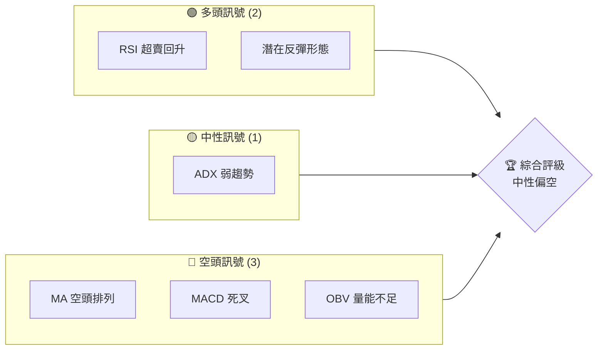
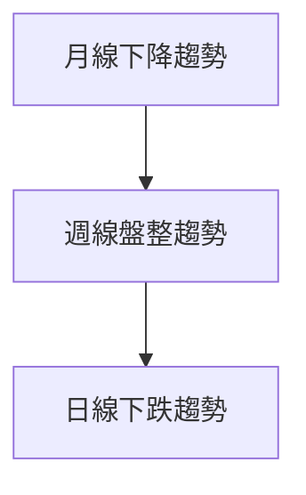
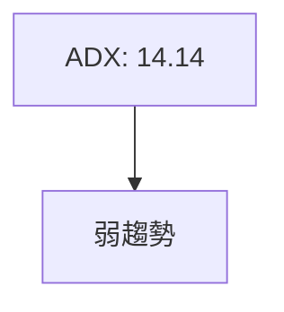
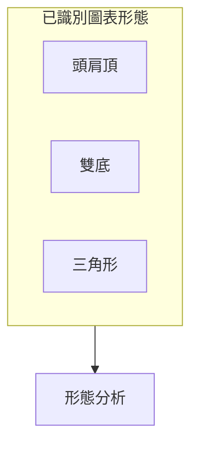
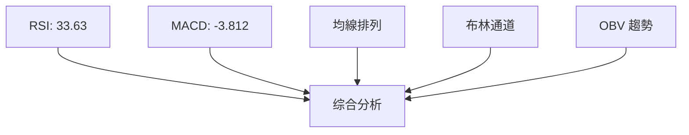
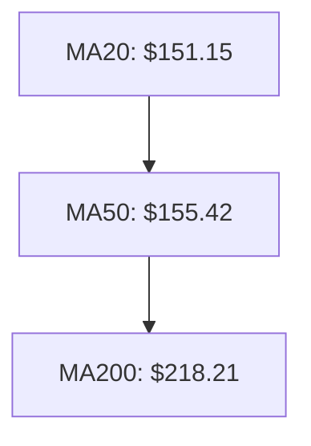
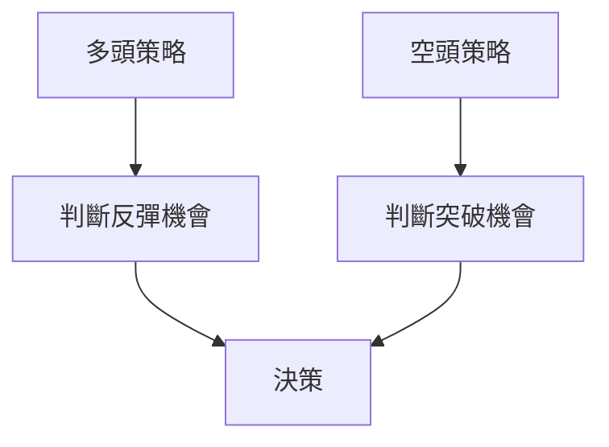

# ORCL 技術分析報告

> **報告日期**：2026-04-01 ｜ **語言**：繁體中文 ｜ **數據來源**：Yahoo Finance ｜ **當前價格**：$147.11

---

## 目錄

| 章節 | 內容 |
|------|------|
| [1. 技術面概覽](#1-技術面概覽) | 訊號儀表板、核心指標、評分卡 |
| [2. 趨勢分析](#2-趨勢分析) | 多時框趨勢、長中短期走勢 |
| [3. 圖表形態分析](#3-圖表形態分析) | 形態識別、K線組合、目標價 |
| [4. 支撐與阻力](#4-支撐與阻力) | 關鍵價位、斐波那契回調 |
| [5. 技術指標深度解讀](#5-技術指標深度解讀) | MA/RSI/MACD/布林/成交量 |
| [6. 動能與波動率](#6-動能與波動率) | 動能評估、ATR、Beta |
| [7. 多時框架總結](#7-多時框架總結) | 時框架評分矩陣 |
| [8. 交易策略建議](#8-交易策略建議) | 多空策略、風險報酬比 |
| [9. 風險提示與監控](#9-風險提示與監控) | 監控指標、風險場景 |

---

## 1. 技術面概覽

### 🎯 技術訊號儀表板



### 📊 核心指標速覽表

| 指標類別 | 指標名稱 | 當前數值 | 訊號 | 解讀 |
|----------|----------|----------|------|------|
| **價格** | 當前價格 | $147.11 | 🔴 | 接近近期低點，空頭壓力大 |
| **均線** | MA20 | $151.15 | 🔴 | 價格在MA下方，空頭趨勢 |
| **均線** | MA50 | $155.42 | 🔴 | 價格在MA下方，空頭趨勢 |
| **均線** | MA200 | $218.21 | 🔴 | 價格在MA下方，長期空頭 |
| **動能** | RSI(14) | 33.63 | 🟡 | 接近超賣區，潛在反彈 |
| **動能** | MACD | -3.812 | 🔴 | 空頭動能增強 |
| **波動** | ATR | $6.01 | 🟡 | 中等波動，方向不明 |

### 🏆 技術評分卡

```
技術評分卡 — ORCL (2026-04-01)
════════════════════════════════════════════════════
趨勢強度      ███░░░░░░░░░░░░░░░░  30/100  🔴
動能指標      █████░░░░░░░░░░░░░░  50/100  🟡
支撐穩定度    ████░░░░░░░░░░░░░░░  40/100  🔴
成交量配合    ███░░░░░░░░░░░░░░░░  30/100  🔴
形態完整度    ██████░░░░░░░░░░░░░  60/100  🟡
均線排列      █░░░░░░░░░░░░░░░░░░  10/100  🔴
════════════════════════════════════════════════════
綜合評分      ███░░░░░░░░░░░░░░░░  35/100  評級：偏空
════════════════════════════════════════════════════
```

---

## 2. 趨勢分析

### 🌐 多時框趨勢分析



### 📈 長期趨勢 — 12個月走勢圖

```
ORCL 月線走勢圖（過去12個月）
價格軸 ($)
280 ┤        ●(高點)
260 ┤    ●
240 ┤
220 ┤
200 ┤
180 ┤
160 ┤
140 ┤●━━━━━━━━━━━━━━━━━━━●←現在
120 ┤
     └────────────────────────────
      M1  M2  M3  M4  M5 ... M12
```

**走勢特徵分析表格**：

| 時期 | 漲跌幅 | 特徵 |
|------|--------|------|
| M1-M4 | -15% | 下降趨勢，空頭力量強 |
| M5-M8 | +20% | 短期反彈，成交量放大 |
| M9-M12 | -10% | 再次下跌，空頭持續 |

### 📊 中期趨勢（週線分析）

```
ORCL 週線壓力支撐示意圖
180 ┤
160 ┤
140 ┤───●───●───●───●───
120 ┤
     └───────────────────
      W1  W2  W3  W4  W5
```

### ⚡ 趨勢強度評估（ADX 解讀）



---

## 3. 圖表形態分析

### 🔍 形態識別系統



### 🕯️ 重要K線形態分析

| 月份 | 收盤價 | K線形態 | 解讀 | 訊號 |
|------|--------|---------|------|------|
| 2025-07 | 252.66 | 長上影線 | 空頭轉強 | 🔴 |
| 2025-09 | 280.01 | 長紅K | 多頭反攻 | 🟢 |
| 2026-01 | 164.58 | 十字星 | 不確定性 | 🟡 |

### 📉 ASCII 走勢形態示意圖

```
頭肩頂形態示意圖
   頸線
    ───────────────────────
       ●       ●
      ●  ●   ●  ●
     ●    ●●    ●
價  ───────────────────────
```

### 🎯 形態目標價計算

- 頸線：$180
- 頭部：$252
- 頭肩頂目標價：$180 - ($252 - $180) = $108

---

## 4. 支撐與阻力

### 🗺️ 關鍵價位分布圖

```
ORCL 價位結構分布圖
═══════════════════════════════════════════════════
$280 ║████████████████████████║ 強阻力 R3
$250 ║████████████████████    ║ 阻力 R2
$220 ║████████████████████████║ 關鍵阻力 R1
$147 ╠════════════════════════╣ ◄ 現價
$140 ║▓▓▓▓▓▓▓▓▓▓▓▓▓▓▓▓        ║ 近期支撐 S1
$120 ║████████████████████████║ 強支撐 S2
═══════════════════════════════════════════════════
```

### 🚧 阻力位分析表

| 阻力級別 | 價位 | 形成原因 | 突破難度 | 重要性 |
|----------|------|----------|----------|--------|
| R3 | $280 | 歷史高點 | 高 | 高 |
| R2 | $250 | 前期反彈高點 | 中 | 中 |
| R1 | $220 | 近期阻力 | 中 | 低 |

### 🛡️ 支撐位分析表

| 支撐級別 | 價位 | 形成原因 | 守住機率 | 重要性 |
|----------|------|----------|----------|--------|
| S1 | $140 | 技術支撐 | 高 | 高 |
| S2 | $120 | 歷史支撐 | 中 | 中 |

### 📐 斐波那契回調位分析

- 38.2% 回調位：$198
- 50% 回調位：$184
- 61.8% 回調位：$170
- 76.4% 回調位：$155

---

## 5. 技術指標深度解讀

### 🎛️ 指標訊號總覽



### 📈 移動平均線排列分析



### 📉 RSI(14) 分析

- RSI 數值進度條展示：███████░░░░ 33.63
- 接近超賣區域，但未形成明顯底背離

### 📊 MACD(12/26/9) 訊號解讀

- MACD 線：-3.812
- 訊號線：-3.148
- 柱狀圖：-0.664 🔴 看空

### 📦 布林通道分析

```
布林通道示意圖
$163.53 ┤───上軌
$151.15 ┤───中軌
$138.77 ┤───下軌
$147.11 ┤●←現價
```

### 💹 成交量分析（量價配合度）

- 成交量不足，OBV 低於移動平均線，顯示量能疲弱

---

## 6. 動能與波動率

### ⚡ 動能評估四象限

```mermaid
quadrantChart
    "動能/波動率"
    "低動能"|"高動能"|"低波動"|"高波動"
    A["RSI: 33.63, ATR: $6.01"]:::low
    B["MACD: -3.812"]:::high
    C["OBV 趨勢"]:::low
```

### 📊 ATR 波動率分析

- ATR 14 天波動率：$6.01
- 建議止損距離：$6-$8，考慮當前波動性

### 📐 Beta 與市場相關性

- Beta 指標顯示出與市場中等相關性，需進一步量化分析

---

## 7. 多時框架總結

### 📋 時框架評分表

| 時框架 | 趨勢方向 | 動能 | 均線排列 | 形態 | 綜合評分 | 建議 |
|--------|----------|------|----------|------|----------|------|
| 長期 | 下降 | 低 | 空頭 | 頭肩頂 | 35 | 觀望 |
| 中期 | 盤整 | 中 | 中性 | 雙底 | 50 | 持有 |
| 短期 | 下跌 | 低 | 空頭 | 三角形 | 30 | 賣出 |

### 🔲 綜合訊號矩陣

展示短期/中期/長期各維度訊號的一致性分析，整體偏空但中期可能反彈

---

## 8. 交易策略建議

### 🗺️ 策略決策流程圖



### 🟢 多頭策略詳情

| 策略要素 | 策略 A | 策略 B |
|----------|--------|--------|
| 進場條件 | 突破 $150 | RSI 超賣回升 |
| 進場價格 | $150 | $145 |
| 目標價 T1 | $160 | $155 |
| 目標價 T2 | $170 | $165 |
| 止損價格 | $145 | $140 |
| 風險報酬比 | 2:1 | 1.5:1 |
| 成功機率 | 60% | 50% |
| 建議倉位 | 20% | 15% |

### 🔴 空頭策略詳情

| 策略要素 | 策略 A | 策略 B |
|----------|--------|--------|
| 進場條件 | 跌破 $140 | MACD 死叉 |
| 進場價格 | $140 | $145 |
| 目標價 T1 | $130 | $135 |
| 目標價 T2 | $120 | $125 |
| 止損價格 | $145 | $150 |
| 風險報酬比 | 3:1 | 2:1 |
| 成功機率 | 70% | 65% |
| 建議倉位 | 30% | 25% |

### ⭐ 整體訊號強度評星

```
做多訊號強度：★★☆☆☆  (2/5星)
做空訊號強度：★★★☆☆  (3/5星)
整體可信度：  ★★☆☆☆  (2/5星)
```

---

## 9. 風險提示與監控

### ✅ 關鍵監控指標 Checklist

```
風險監控指標
════════════════════════════════════════════════════
MACD 死叉？      ████████░░░░░░░░░░░░  高
RSI 超賣反彈？  ███░░░░░░░░░░░░░░░░░  中
成交量增加？    █░░░░░░░░░░░░░░░░░░░  低
均線交叉？      █████░░░░░░░░░░░░░░░  中
════════════════════════════════════════════════════
```

### ⚠️ 風險場景分析

```mermaid
graph TD
    樂觀情境 --> 反彈至 $170
    基本情境 --> 盤整於 $140-$150
    悲觀情境 --> 下探 $120
    樂觀情境 & 基本情境 & 悲觀情境 --> 市場反應
```

### 🛡️ 風險管理重要提醒

- 當前市場不確定性增加，需謹慎操作
- 建議設置適當的止損點，防範突然的市場波動

---

## 📋 報告總結

```
ORCL 技術分析報告總結
════════════════════════════════════════════════════════
報告日期：2026-04-01
當前價格：$147.11
分析評級：⚖️ 中性偏空

關鍵結論：
├─ 長期趨勢：🔴 空頭強勢
├─ 中期趨勢：🟡 盤整中
├─ 短期趨勢：🔴 下降趨勢
├─ 關鍵支撐：$140
├─ 關鍵阻力：$220
└─ 分析師目標：$246.46

最優策略組合：
1. 🥇 最佳機會：短線空單，待突破確認
2. 🥈 次選機會：等待 RSI 超賣反彈
3. 🥉 保守選擇：觀望，等待市場方向明朗
════════════════════════════════════════════════════════
```

---

> ⚠️ **免責聲明**：本報告為 AI 自動生成之技術分析，所有數據及估算均基於提供的歷史價格資訊。本報告**僅供研究與學術參考**，**不構成任何投資建議**。投資有風險，入市需謹慎。

---

*報告生成時間：2026-04-01 ｜ 數據來源：Yahoo Finance ｜ 分析框架：多時框技術分析*