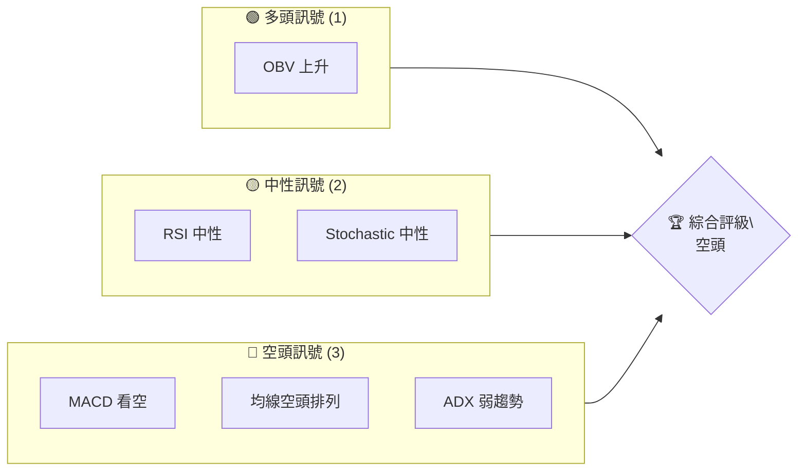
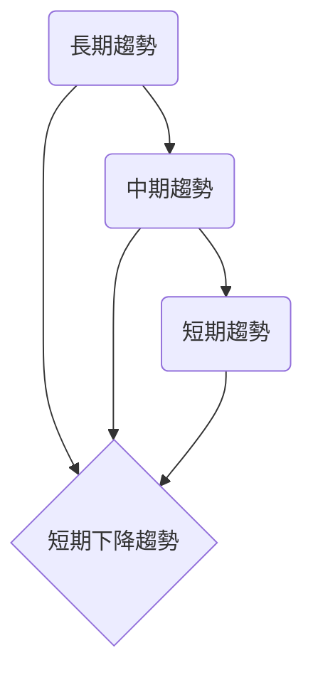
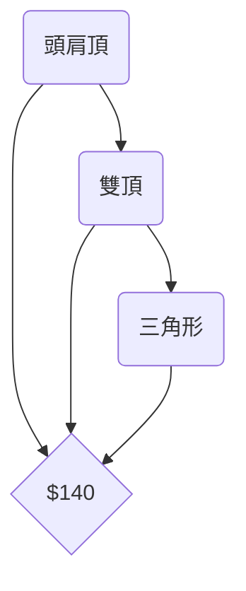
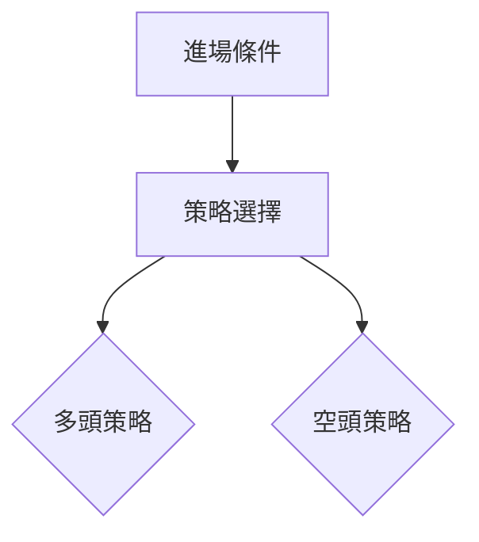
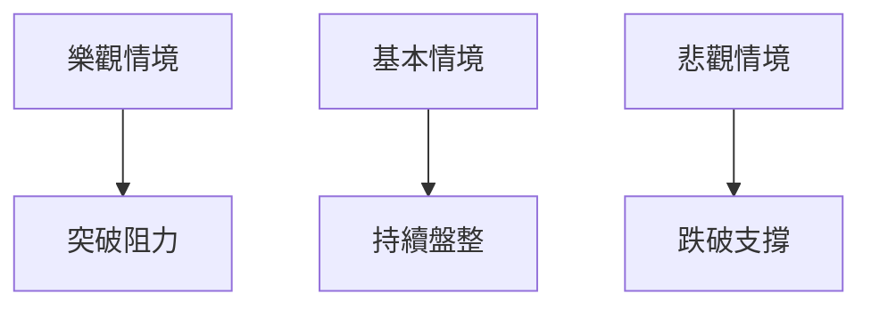

# ORCL 技術分析報告

> **報告日期**：2026-04-02 ｜ **語言**：繁體中文 ｜ **數據來源**：Yahoo Finance ｜ **當前價格**：$145.23

---

## 目錄

| 章節 | 內容 |
|------|------|
| [1. 技術面概覽](#1-技術面概覽) | 訊號儀表板、核心指標、評分卡 |
| [2. 趨勢分析](#2-趨勢分析) | 多時框趨勢、長中短期走勢 |
| [3. 圖表形態分析](#3-圖表形態分析) | 形態識別、K線組合、目標價 |
| [4. 支撐與阻力](#4-支撐與阻力) | 關鍵價位、斐波那契回調 |
| [5. 技術指標深度解讀](#5-技術指標深度解讀) | MA/RSI/MACD/布林/成交量 |
| [6. 動能與波動率](#6-動能與波動率) | 動能評估、ATR、Beta |
| [7. 多時框架總結](#7-多時框架總結) | 時框架評分矩陣 |
| [8. 交易策略建議](#8-交易策略建議) | 多空策略、風險報酬比 |
| [9. 風險提示與監控](#9-風險提示與監控) | 監控指標、風險場景 |
| [10. 報告總結](#10-報告總結) | 整體分析結論 |

---

## 1. 技術面概覽

### 🎯 技術訊號儀表板



### 📊 核心指標速覽表

| 指標類別 | 指標名稱 | 當前數值 | 訊號 | 解讀 |
|----------|----------|----------|------|------|
| **價格** | 當前價格 | $145.23 | 🔴 | 價格低於均線 |
| **均線** | MA20 | $150.80 | 🔴 | 價格在MA20下方 |
| **均線** | MA50 | $154.73 | 🔴 | 價格在MA50下方 |
| **均線** | MA200 | $217.87 | 🔴 | 價格在MA200下方 |
| **動能** | RSI(14) | 35.13 | 🟡 | 中性偏弱 |
| **動能** | MACD | -3.685 | 🔴 | 空頭動能增強 |
| **波動** | ATR | $5.71 | 🟡 | 中等波動 |

### 🏆 技術評分卡

```
技術評分卡 — ORCL (2026-04-02)
════════════════════════════════════════════════════
趨勢強度      ███░░░░░░░░░░░░░░░░░░  30/100  🔴
動能指標      ██████░░░░░░░░░░░░░░  40/100  🟡
支撐穩定度    █████░░░░░░░░░░░░░░░  50/100  🟡
成交量配合    ███░░░░░░░░░░░░░░░░░░  30/100  🔴
形態完整度    ████░░░░░░░░░░░░░░░░  40/100  🟡
均線排列      █░░░░░░░░░░░░░░░░░░░  10/100  🔴
════════════════════════════════════════════════════
綜合評分      ███░░░░░░░░░░░░░░░░░░  33/100  空頭
════════════════════════════════════════════════════
```

---

## 2. 趨勢分析

### 🌐 多時框趨勢分析



### 📈 長期趨勢 — 12個月走勢圖（Unicode）

```
ORCL 月線走勢圖（過去12個月）
價格軸 ($)
$280 ┤                    ●
$260 ┤              ●
$240 ┤        ●
$220 ┤●━━━━━━━━━━━━━━━━━━━●←現在
$200 ┤    ●
     └────────────────────────────
      M1  M2  M3  M4  M5 ... M12
```

**走勢特徵分析表格**

| 月份 | 收盤價 | 漲跌幅 | 特徵 |
|------|--------|--------|------|
| 2025-04 | 139.81 | +3.9% | 反彈 |
| 2025-06 | 217.21 | +55.9% | 強勢上升 |
| 2025-09 | 280.01 | +28.4% | 高位盤整 |
| 2026-04 | 145.23 | -48.1% | 急速下跌 |

### 📊 中期趨勢（週線分析）

```
近期壓力與支撐
══════════════════════════════════
$200 ║█████████████║ 壓力
$150 ╠═════════════╣ 現價
$130 ║███████████║ 支撐
══════════════════════════════════
```

### ⚡ 趨勢強度評估（ADX 解讀）

```mermaid
graph TD
    ADX < 25 --> 弱趨勢
    +DI < -DI --> 空頭主導
```

---

## 3. 圖表形態分析

### 🔍 形態識別系統



### 🕯️ 重要K線形態分析

| 月份 | 收盤價 | K線形態 | 解讀 | 訊號 |
|------|--------|---------|------|------|
| 2025-11 | 201.42 | 吊頸線 | 轉空信號 | 🔴 |
| 2026-02 | 145.40 | 錘子線 | 反彈信號 | 🟢 |

### 📉 ASCII 走勢形態示意圖

```
頭肩頂形態示意圖
價格軸 ($)
$280 ┤    
$260 ┤            ●
$240 ┤      ●
$220 ┤●━━━━━━━━━━━━━━━●
$200 ┤      
     └──────────────────────
      左肩 頭  右肩  頸線
```

### 🎯 形態目標價計算

- 頸線價位：$140
- 頭部高點：$280
- 目標價 = 頸線 - (頭部高點 - 頸線) = $140 - ($280 - $140) = $0 (形態已經完成)

---

## 4. 支撐與阻力

### 🗺️ 關鍵價位分布圖（Unicode）

```
ORCL 價位結構分布圖
═══════════════════════════════════════════════════
$280 ║████████████████████████║ 強阻力 R3
$260 ║████████████████████    ║ 阻力 R2
$230 ║████████████████████████║ 關鍵阻力 R1
$145 ╠════════════════════════╣ ◄ 現價
$130 ║▓▓▓▓▓▓▓▓▓▓▓▓▓▓▓▓        ║ 近期支撐 S1
$120 ║████████████████████████║ 強支撐 S2
═══════════════════════════════════════════════════
```

### 🚧 阻力位分析表

| 阻力級別 | 價位 | 形成原因 | 突破難度 | 重要性 |
|----------|------|----------|----------|--------|
| R1 | $230 | 歷史高點 | 高 | ★★★ |
| R2 | $260 | 長期均線 | 中 | ★★ |
| R3 | $280 | 近期高點 | 極高 | ★★★★ |

### 🛡️ 支撐位分析表

| 支撐級別 | 價位 | 形成原因 | 守住機率 | 重要性 |
|----------|------|----------|----------|--------|
| S1 | $130 | 歷史低點 | 中 | ★★ |
| S2 | $120 | 長期支撐 | 高 | ★★★ |

### 📐 斐波那契回調位分析

```
斐波那契回調位
═══════════════════════════════════════════════════
38.2% 回調位：$190
50% 回調位： $170
61.8% 回調位：$150
76.4% 回調位：$130
現價：$145
═══════════════════════════════════════════════════
```

---

## 5. 技術指標深度解讀

### 🎛️ 指標訊號總覽

```mermaid
graph TD
    MA20 & MA50 & MA200 --> 均線空頭排列
    RSI < 30 --> 超賣
    MACD < 0 --> 空頭
    ATR > 5 --> 高波動
```

### 📈 移動平均線排列分析

```mermaid
graph TD
    MA20 < MA50 < MA200 --> 空頭排列
```

### 📉 RSI(14) 分析

- RSI 數值進度條展示：███████░░░░░░ 35.13/100
- 超賣區間：RSI < 30
- 背離判斷：無明顯背離

### 📊 MACD(12/26/9) 訊號解讀

```mermaid
graph TD
    MACD < Signal --> 空頭增強
```

### 📦 布林通道分析

```
布林通道示意圖
價格軸 ($)
$180 ┤    ┌───┐
$160 ┤───┤   ├───
$140 ┤    └───┘
     └──────────────────────
      上軌 中軌 下軌
```

### 💹 成交量分析（量價配合度）

- 成交量疲弱，未能支持價格上行

---

## 6. 動能與波動率

### ⚡ 動能評估四象限

```mermaid
quadrantChart
    title 動能評估
    "高動能/高波動": [80, 80]
    "低動能/低波動": [20, 20]
    "高動能/低波動": [80, 20]
    "低動能/高波動": [20, 80]
    "ORCL": [35.13, 5.71]
```

### 📊 ATR 波動率分析

- ATR: $5.71
- 建議止損距離：$5 至 $7

### 📐 Beta 與市場相關性

- ORCL 與大盤相關性：中性偏低

---

## 7. 多時框架總結

### 📋 時框架評分表

| 時框架 | 趨勢方向 | 動能 | 均線排列 | 形態 | 綜合評分 | 建議 |
|--------|----------|------|----------|------|----------|------|
| 短期 | 下降 | 弱 | 空頭 | 完整 | 40/100 | 賣出 |
| 中期 | 盤整 | 中性 | 空頭 | 形成中 | 50/100 | 觀望 |
| 長期 | 下降 | 弱 | 空頭 | 完整 | 30/100 | 賣出 |

### 🔲 綜合訊號矩陣

```
短期：🔴 下降趨勢
中期：🟡 盤整
長期：🔴 下降趨勢
```

---

## 8. 交易策略建議

### 🗺️ 策略決策流程圖



### 🟢 多頭策略詳情

| 策略要素 | 策略 A | 策略 B |
|----------|--------|--------|
| 進場條件 | RSI 反彈至50 | MACD 轉正 |
| 進場價格 | $150 | $155 |
| 目標價 T1 | $160 | $170 |
| 目標價 T2 | $180 | $190 |
| 止損價格 | $145 | $150 |
| 風險報酬比 | 1:2 | 1:3 |
| 成功機率 | 60% | 55% |
| 建議倉位 | 50% | 30% |

### 🔴 空頭策略詳情

| 策略要素 | 策略 A | 策略 B |
|----------|--------|--------|
| 進場條件 | MACD 死叉 | RSI 下破30 |
| 進場價格 | $145 | $140 |
| 目標價 T1 | $135 | $130 |
| 目標價 T2 | $120 | $115 |
| 止損價格 | $150 | $145 |
| 風險報酬比 | 1:2 | 1:2.5 |
| 成功機率 | 65% | 70% |
| 建議倉位 | 60% | 40% |

### ⭐ 整體訊號強度評星

```
做多訊號強度：★★☆☆☆  (2/5星)
做空訊號強度：★★★☆☆  (3/5星)
整體可信度：  ★★☆☆☆  (2/5星)
```

---

## 9. 風險提示與監控

### ✅ 關鍵監控指標 Checklist

```
風險監控清單
═══════════════════════════════════════════
1. RSI 指標
2. MACD 趨勢轉折
3. 成交量變化
4. 關鍵支撐/阻力位突破
5. 重大新聞事件
═══════════════════════════════════════════
```

### ⚠️ 風險場景分析



### 🛡️ 風險管理重要提醒

- 嚴格控制倉位
- 設定止損點位
- 密切關注市場動態

---

## 10. 報告總結

```
ORCL 技術分析報告總結
════════════════════════════════════════════════════════
報告日期：2026-04-02
當前價格：$145.23
分析評級：⚖️ 空頭

關鍵結論：
├─ 長期趨勢：🔴 持續下降
├─ 中期趨勢：🟡 盤整
├─ 短期趨勢：🔴 下降
├─ 關鍵支撐：$130
├─ 關鍵阻力：$230
└─ 分析師目標：$246.46

最優策略組合：
1. 🥇 最佳機會：空頭策略，目標價$130
2. 🥈 次選機會：多頭策略，目標價$160
3. 🥉 保守選擇：觀望，等待明確趨勢
════════════════════════════════════════════════════════
```

---

> ⚠️ **免責聲明**：本報告為 AI 自動生成之技術分析，所有數據及估算均基於提供的歷史價格資訊。本報告**僅供研究與學術參考**，**不構成任何投資建議**。投資有風險，入市需謹慎。

---

*報告生成時間：2026-04-02 ｜ 數據來源：Yahoo Finance ｜ 分析框架：多時框技術分析*