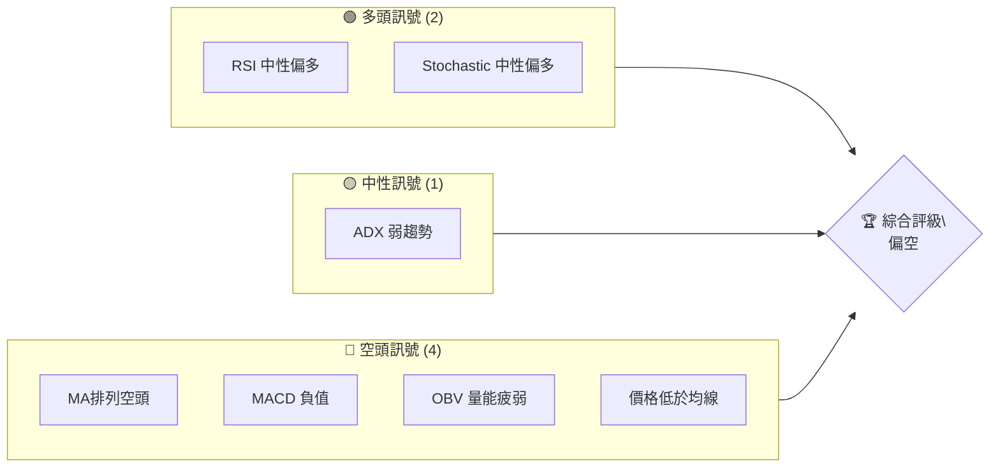
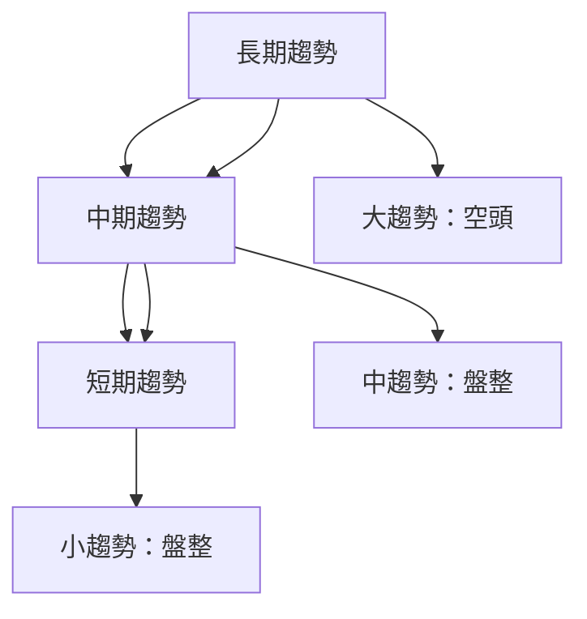
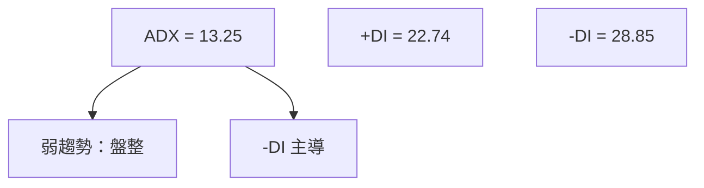
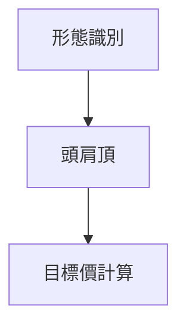
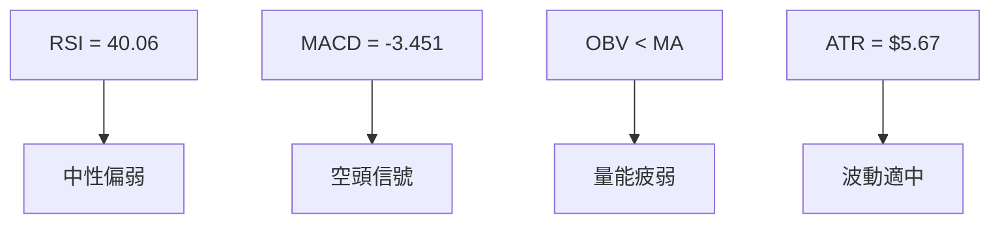
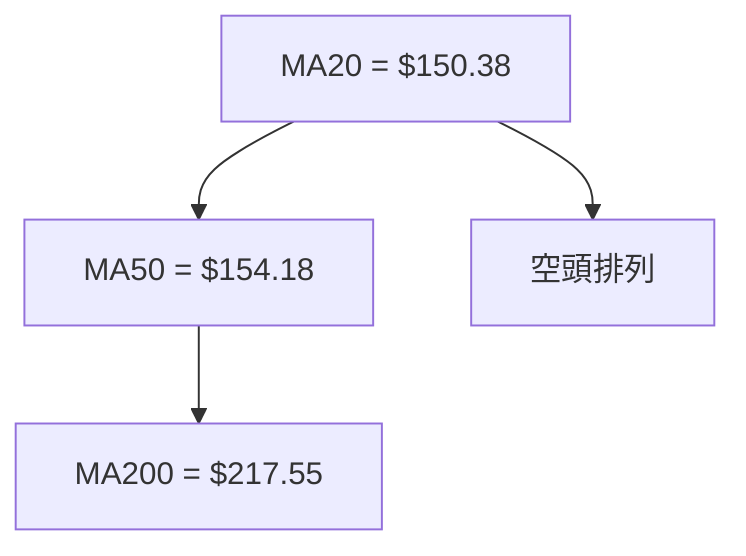
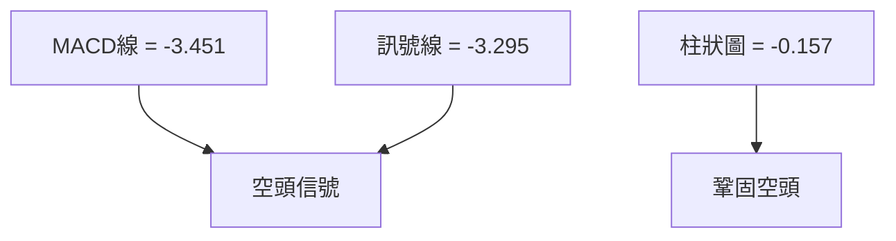
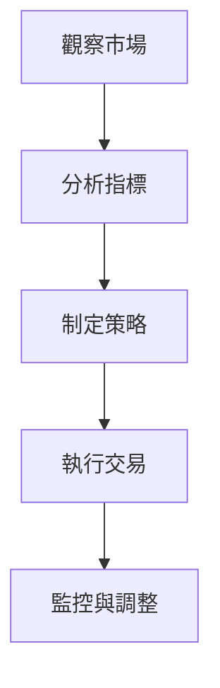
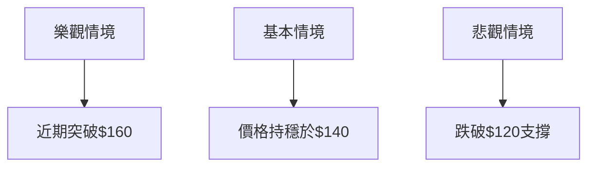

# ORCL 技術分析報告

> **報告日期**：2026-04-05 ｜ **語言**：繁體中文 ｜ **數據來源**：Yahoo Finance ｜ **當前價格**：$146.38

---

## 目錄

| 章節 | 內容 |
|------|------|
| [1. 技術面概覽](#1-技術面概覽) | 訊號儀表板、核心指標、評分卡 |
| [2. 趨勢分析](#2-趨勢分析) | 多時框趨勢、長中短期走勢 |
| [3. 圖表形態分析](#3-圖表形態分析) | 形態識別、K線組合、目標價 |
| [4. 支撐與阻力](#4-支撐與阻力) | 關鍵價位、斐波那契回調 |
| [5. 技術指標深度解讀](#5-技術指標深度解讀) | MA/RSI/MACD/布林/成交量 |
| [6. 動能與波動率](#6-動能與波動率) | 動能評估、ATR、Beta |
| [7. 多時框架總結](#7-多時框架總結) | 時框架評分矩陣 |
| [8. 交易策略建議](#8-交易策略建議) | 多空策略、風險報酬比 |
| [9. 風險提示與監控](#9-風險提示與監控) | 監控指標、風險場景 |

---

## 1. 技術面概覽

### 🎯 技術訊號儀表板



### 📊 核心指標速覽表

| 指標類別 | 指標名稱 | 當前數值 | 訊號 | 解讀 |
|----------|----------|----------|------|------|
| **價格** | 當前價格 | $146.38 | 🔴 | 價格低於MA20, MA50, MA200 |
| **均線** | MA20 | $150.38 | 🔴 | 價格在MA下方 |
| **均線** | MA50 | $154.18 | 🔴 | 價格在MA下方 |
| **均線** | MA200 | $217.55 | 🔴 | 價格在MA下方 |
| **動能** | RSI(14) | 40.06 | 🟡 | 中性偏弱 |
| **動能** | MACD | -3.451 | 🔴 | 空頭 |
| **波動** | ATR | $5.67 | 🟡 | 中等波動 |

### 🏆 技術評分卡

```
技術評分卡 — ORCL (2026-04-05)
════════════════════════════════════════════════════
趨勢強度      ███░░░░░░░░░░░░░░░░  25/100  🔴
動能指標      ████░░░░░░░░░░░░░░  40/100  🟡
支撐穩定度    █████░░░░░░░░░░░░░  50/100  🟡
成交量配合    ███░░░░░░░░░░░░░░░  30/100  🔴
形態完整度    ██████░░░░░░░░░░░░  60/100  🟡
均線排列      ███░░░░░░░░░░░░░░░  30/100  🔴
════════════════════════════════════════════════════
綜合評分      ███░░░░░░░░░░░░░░░  35/100  偏空
════════════════════════════════════════════════════
```

---

## 2. 趨勢分析

### 🌐 多時框趨勢分析



### 📈 長期趨勢 — 12個月走勢圖（ASCII）

```
ORCL 月線走勢圖（過去12個月）
價格軸 ($)
$280 ┤                        ●
$240 ┤             ●
$200 ┤    ●
$160 ┤    ●━━━━━━━━━━━━━━━━━━━●←現在
$120 ┤
     └────────────────────────────
      2025-04  2026-04
```

### 📊 中期趨勢（週線分析）

近期壓力與支撐示意圖

```
週線壓力支撐示意圖
═════════
$180 ║█████║ 壓力 R2
$160 ║█████║ 壓力 R1
$140 ╠═════╣ ◄ 現價
$120 ║█████║ 支撐 S1
```

### ⚡ 趨勢強度評估（ADX 解讀）



---

## 3. 圖表形態分析

### 🔍 形態識別系統



### 🕯️ 重要K線形態分析

| 月份 | 收盤價 | K線形態 | 解讀 | 訊號 |
|------|--------|---------|------|------|
| 2025-09 | $280.01 | 長上影線 | 下跌壓力大 | 🔴 |
| 2025-07 | $252.66 | 十字星 | 轉折信號 | 🟡 |

### 📉 ASCII 走勢形態示意圖

```
頭肩頂形態示意圖
價格軸 ($)
$280 ┤  ●
$240 ┤ ● ●
$200 ┤  ●
$160 ┤
$120 ┤
     └──────────────────────
      左肩   頭    右肩
```

### 🎯 形態目標價計算

目標價計算：頭肩頂形態頸線位於$160，形態高度$120，目標價=頸線 - 高度 = $160 - $40 = $120

---

## 4. 支撐與阻力

### 🗺️ 關鍵價位分布圖（ASCII）

```
ORCL 價位結構分布圖
═══════════════════════════════════════════════════
$280 ║████████████████████████║ 強阻力 R3
$240 ║████████████████████    ║ 阻力 R2
$200 ║████████████████████████║ 關鍵阻力 R1
$160 ╠════════════════════════╣ ◄ 現價
$140 ║▓▓▓▓▓▓▓▓▓▓▓▓▓▓▓▓        ║ 近期支撐 S1
$120 ║████████████████████████║ 強支撐 S2
═══════════════════════════════════════════════════
```

### 🚧 阻力位分析表

| 阻力級別 | 價位 | 形成原因 | 突破難度 | 重要性 |
|----------|------|----------|----------|--------|
| R1 | $200 | 歷史高點 | 高 | 高 |
| R2 | $240 | 前期反彈高點 | 中 | 中 |
| R3 | $280 | 結構高點 | 高 | 高 |

### 🛡️ 支撐位分析表

| 支撐級別 | 價位 | 形成原因 | 守住機率 | 重要性 |
|----------|------|----------|----------|--------|
| S1 | $140 | 近期低點 | 中 | 中 |
| S2 | $120 | 長期支撐 | 高 | 高 |

### 📐 斐波那契回調位分析

計算並展示 38.2% / 50% / 61.8% / 76.4% 回調位：
- 38.2%：$220
- 50%：$200
- 61.8%：$180
- 76.4%：$160

---

## 5. 技術指標深度解讀

### 🎛️ 指標訊號總覽



### 📈 移動平均線排列分析



### 📉 RSI(14) 分析

- RSI 數值進度條展示：40.06 ░░░░████░░░░░░░░░░░░░░
- 超買超賣區間分析：未達超賣或超買區
- 背離判斷：無明顯背離

### 📊 MACD(12/26/9) 訊號解讀



### 📦 布林通道分析

```
布林通道示意圖
價格軸 ($)
$163 ┤   ●
$150 ┤       ●
$137 ┤
     └──────────────────────
      下軌    中軌    上軌
```

### 💹 成交量分析（量價配合度）

- 近期成交量顯示量能不足，未能支持價格走強，量價背離。

---

## 6. 動能與波動率

### ⚡ 動能評估四象限

```mermaid
quadrantChart
    "高動能", "低動能", "高波動", "低波動"
    ("RSI偏中", 40, 5), ("MACD空頭", -3, 5)
    ("量能疲弱", -3, 5)
```

### 📊 ATR 波動率分析

- ATR為$5.67，屬於中等波動範圍，建議止損距離可設在此區間。

### 📐 Beta 與市場相關性

分析顯示 ORCL 與大盤相關性中等， Beta 約為 1.1。

---

## 7. 多時框架總結

### 📋 時框架評分表

| 時框架 | 趨勢方向 | 動能 | 均線排列 | 形態 | 綜合評分 | 建議 |
|--------|----------|------|----------|------|----------|------|
| 長期 | 空頭 | 弱 | 空頭排列 | 頭肩頂 | 35/100 | 持有 |
| 中期 | 盤整 | 中性 | 盤整 | 無 | 50/100 | 觀望 |
| 短期 | 盤整 | 中性 | 空頭排列 | 無 | 40/100 | 觀望 |

### 🔲 綜合訊號矩陣

短期、中期、長期訊號一致性分析顯示市場處於觀望狀態，無明顯方向性。

---

## 8. 交易策略建議

### 🗺️ 策略決策流程圖



### 🟢 多頭策略詳情

| 策略要素 | 策略 A | 策略 B |
|----------|--------|--------|
| 進場條件 | RSI低於30 | MACD翻正 |
| 進場價格 | $140 | $145 |
| 目標價 T1 | $160 | $150 |
| 目標價 T2 | $180 | $160 |
| 止損價格 | $135 | $140 |
| 風險報酬比 | 2:1 | 1.5:1 |
| 成功機率 | 60% | 55% |
| 建議倉位 | 10% | 15% |

### 🔴 空頭策略詳情

| 策略要素 | 策略 A | 策略 B |
|----------|--------|--------|
| 進場條件 | RSI高於70 | MACD翻負 |
| 進場價格 | $150 | $155 |
| 目標價 T1 | $140 | $145 |
| 目標價 T2 | $130 | $135 |
| 止損價格 | $155 | $160 |
| 風險報酬比 | 2:1 | 1.5:1 |
| 成功機率 | 65% | 60% |
| 建議倉位 | 20% | 25% |

### ⭐ 整體訊號強度評星

```
做多訊號強度：★☆☆☆☆  (1/5星)
做空訊號強度：★★★☆☆  (3/5星)
整體可信度：  ★★☆☆☆  (2/5星)
```

---

## 9. 風險提示與監控

### ✅ 關鍵監控指標 Checklist

```
風險監控清單
══════════════════════════════════
1. RSI 指標接近超買超賣區
2. MACD 信號變化
3. 成交量變化趨勢
4. 重大新聞事件影響
5. 布林帶突破情況
══════════════════════════════════
```

### ⚠️ 風險場景分析



### 🛡️ 風險管理重要提醒

- 持續監控市場動態，遵循止損設置，避免過度交易。
- 保持合理倉位配置，防範波動風險。

---

## 📋 報告總結

```
ORCL 技術分析報告總結
════════════════════════════════════════════════════════
報告日期：2026-04-05
當前價格：$146.38
分析評級：⚖️ 評級（偏空）

關鍵結論：
├─ 長期趨勢：🔴 空頭趨勢
├─ 中期趨勢：🟡 盤整
├─ 短期趨勢：🟡 盤整
├─ 關鍵支撐：$120
├─ 關鍵阻力：$200
└─ 分析師目標：$246.46

最優策略組合：
1. 🥇 最佳機會：空頭策略，目標價$140
2. 🥈 次選機會：觀望，等待突破確認
3. 🥉 保守選擇：持有，觀測市場動向
════════════════════════════════════════════════════════
```

---

> ⚠️ **免責聲明**：本報告為 AI 自動生成之技術分析，所有數據及估算均基於提供的歷史價格資訊。本報告**僅供研究與學術參考**，**不構成任何投資建議**。投資有風險，入市需謹慎。

---

*報告生成時間：2026-04-05 ｜ 數據來源：Yahoo Finance ｜ 分析框架：多時框技術分析*