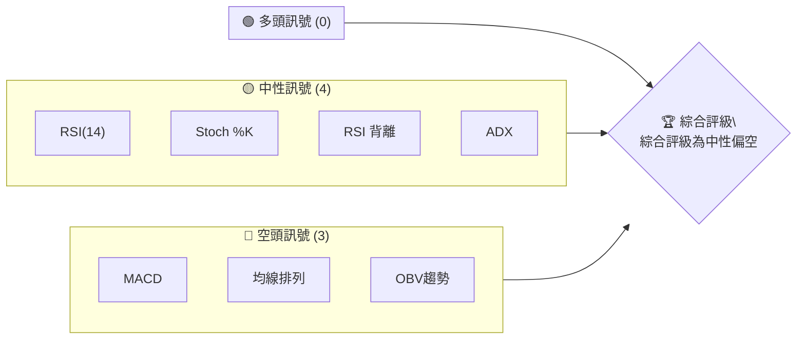
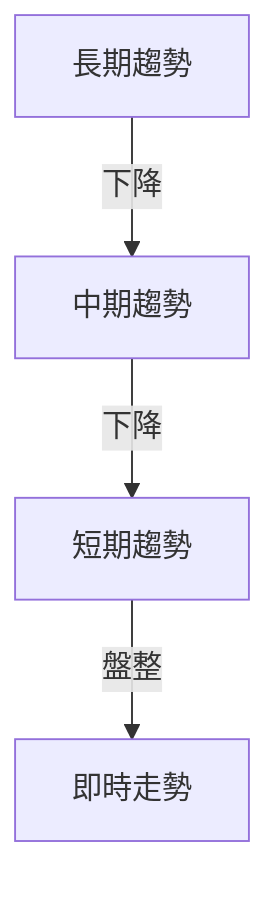
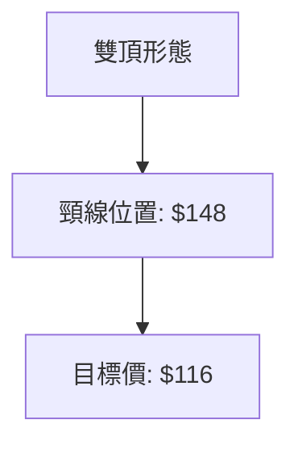
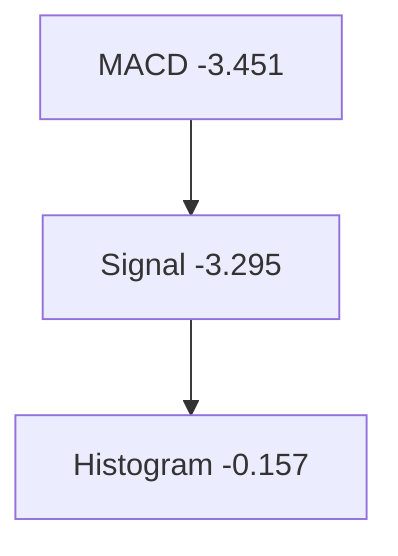
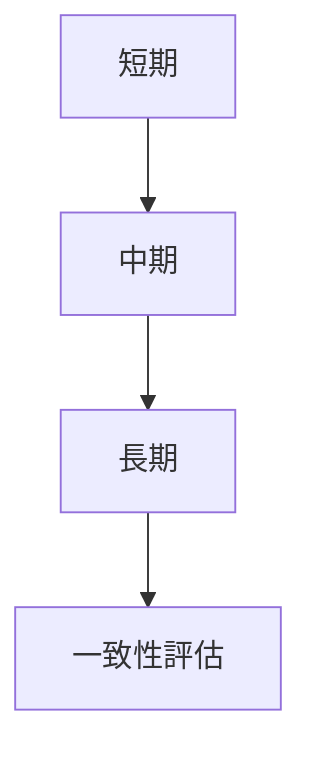
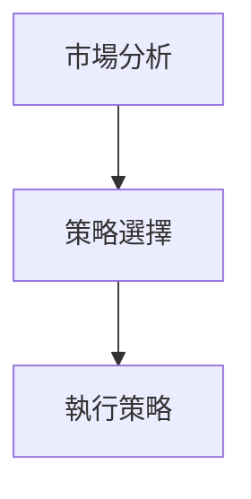
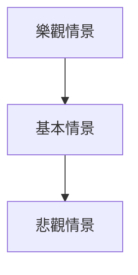

# ORCL 技術分析報告

> **報告日期**：2026-04-06 ｜ **語言**：繁體中文 ｜ **數據來源**：Yahoo Finance ｜ **當前價格**：$146.38

---

## 目錄

| 章節 | 內容 |
|------|------|
| [1. 技術面概覽](#1-技術面概覽) | 訊號儀表板、核心指標、評分卡 |
| [2. 趨勢分析](#2-趨勢分析) | 多時框趨勢、長中短期走勢 |
| [3. 圖表形態分析](#3-圖表形態分析) | 形態識別、K線組合、目標價 |
| [4. 支撐與阻力](#4-支撐與阻力) | 關鍵價位、斐波那契回調 |
| [5. 技術指標深度解讀](#5-技術指標深度解讀) | MA/RSI/MACD/布林/成交量 |
| [6. 動能與波動率](#6-動能與波動率) | 動能評估、ATR、Beta |
| [7. 多時框架總結](#7-多時框架總結) | 時框架評分矩陣 |
| [8. 交易策略建議](#8-交易策略建議) | 多空策略、風險報酬比 |
| [9. 風險提示與監控](#9-風險提示與監控) | 監控指標、風險場景 |

---

## 1. 技術面概覽

### 🎯 技術訊號儀表板



### 📊 核心指標速覽表

| 指標類別 | 指標名稱 | 當前數值 | 訊號 | 解讀 |
|----------|----------|----------|------|------|
| **價格** | 當前價格 | $146.38 | 🔴 | 價格低於所有均線 |
| **均線** | MA20 | $150.38 | 🔴 | 價格低於MA20 |
| **均線** | MA50 | $154.18 | 🔴 | 價格低於MA50 |
| **均線** | MA200 | $217.55 | 🔴 | 價格低於MA200 |
| **動能** | RSI(14) | 40.06 | 🟡 | 接近超賣區間 |
| **動能** | MACD | -3.451 | 🔴 | 看空交叉 |
| **波動** | ATR | $5.67 | 🟡 | 中等波動 |

### 🏆 技術評分卡

```
技術評分卡 — ORCL (2026-04-06)
════════════════════════════════════════════════════
趨勢強度      ███░░░░░░░░░░░░░░░░  20/100  🔴
動能指標      ██████░░░░░░░░░░░░  40/100  🟡
支撐穩定度    █████░░░░░░░░░░░░░  35/100  🔴
成交量配合    ███░░░░░░░░░░░░░░░  25/100  🔴
形態完整度    ███████░░░░░░░░░░░  50/100  🟡
均線排列      ███░░░░░░░░░░░░░░░  30/100  🔴
════════════════════════════════════════════════════
綜合評分      █████░░░░░░░░░░░░░  33/100  評級：中性偏空
════════════════════════════════════════════════════
```

---

## 2. 趨勢分析

### 🌐 多時框趨勢分析



### 📈 長期趨勢 — 12個月走勢圖（Unicode）

```
ORCL 月線走勢圖（過去12個月）
價格軸 ($)
$300 ┤
$280 ┤        ●
$260 ┤              ●
$240 ┤
$220 ┤
$200 ┤
$180 ┤
$160 ┤●  ●       ●     ●  ●    ●
$140 ┤          ●     ●  ●  ●  ●   ●←現在
$120 ┤
     └────────────────────────────
      M1  M2  M3  M4  M5 ... M12
```

**走勢特徵分析表格**

| 時期 | 價格變動 | 漲跌幅 | 特徵 |
|------|----------|--------|------|
| 2025-11 ~ 2026-04 | 高點 $280 → 現在 $146.38 | -47.7% | 長期下降趨勢 |

### 📊 中期趨勢（週線分析）

```
ORCL 週線壓力與支撐示意圖
價格軸 ($)
$280 ┤
$260 ┤              ●
$240 ┤
$220 ┤
$200 ┤
$180 ┤
$160 ┤●  ●       ●     ●  ●    ●
$140 ┤          ●     ●  ●  ●  ●   ●←現在
$120 ┤
     └────────────────────────────
      W1  W2  W3  W4  W5 ... W20
```

### ⚡ 趨勢強度評估（ADX 解讀）

```mermaid
graph TD
    A[趨勢強度 (ADX: 13.25)] --> B[弱趨勢]
    B --> C[盤整行情]
```

---

## 3. 圖表形態分析

### 🔍 形態識別系統



### 🕯️ 重要K線形態分析

| 月份 | 收盤價 | K線形態 | 解讀 | 訊號 |
|------|--------|---------|------|------|
| 2026-01 | 164.58 | 吊頸線 | 看空 | 🔴 |
| 2026-02 | 145.40 | 十字星 | 盤整 | 🟡 |

### 📉 ASCII 走勢形態示意圖

```
雙頂形態示意圖
價格軸 ($)
$180 ┤
$160 ┤    ●        ●
$140 ┤●         ●
$120 ┤
     └────────────────
      時間軸
```

### 🎯 形態目標價計算

- 形態高點：$180
- 頸線位置：$148
- 頸線到高點距離：$32
- 目標價：$148 - $32 = **$116**

---

## 4. 支撐與阻力

### 🗺️ 關鍵價位分布圖（Unicode）

```
ORCL 價位結構分布圖
═══════════════════════════════════════════════════
$200 ║████████████████████████║ 強阻力 R3
$180 ║████████████████████    ║ 阻力 R2
$160 ║██████████████          ║ 關鍵阻力 R1
$146 ╠════════════════════════╣ ◄ 現價
$140 ║▓▓▓▓▓▓▓▓▓▓▓▓▓▓▓▓        ║ 近期支撐 S1
$120 ║████████████████████████║ 強支撐 S2
═══════════════════════════════════════════════════
```

### 🚧 阻力位分析表

| 阻力級別 | 價位 | 形成原因 | 突破難度 | 重要性 |
|----------|------|----------|----------|--------|
| R1 | $160 | 前期高點 | 高 | 高 |
| R2 | $180 | 前期高點 | 高 | 中 |
| R3 | $200 | 長期均線阻力 | 極高 | 高 |

### 🛡️ 支撐位分析表

| 支撐級別 | 價位 | 形成原因 | 守住機率 | 重要性 |
|----------|------|----------|----------|--------|
| S1 | $140 | 近期低點 | 中 | 中 |
| S2 | $120 | 歷史低點 | 高 | 高 |

### 📐 斐波那契回調位分析

| 回調位 | 價位 |
|--------|------|
| 38.2% | $178 |
| 50% | $170 |
| 61.8% | $162 |
| 76.4% | $154 |

---

## 5. 技術指標深度解讀

### 🎛️ 指標訊號總覽

```mermaid
graph TD
    A[MA20] -->|短線看空| B[MA50]
    B -->|中線看空| C[MA200]
    C -->|長線看空| D[RSI(14)]
```

### 📈 移動平均線排列分析

```mermaid
graph TD
    A[MA20 ($150.38)] --> B[MA50 ($154.18)]
    B --> C[MA200 ($217.55)]
```

### 📉 RSI(14) 分析

- RSI 數值：40.06
- 進度條：████░░░░░░░░░ 40.06/100
- 超買超賣區間：中性偏賣
- 背離判斷：無明顯背離

### 📊 MACD(12/26/9) 訊號解讀



### 📦 布林通道分析

```
布林通道示意圖
價格軸 ($)
$180 ┤
$160 ┤              ●←上軌
$140 ┤        ●←中軌
$120 ┤  ●←下軌
     └────────────────
      時間軸
```

### 💹 成交量分析（量價配合度）

- 最新成交量：14,381,900
- 20日均量：28,587,845
- 量比：0.50x，成交量疲弱

---

## 6. 動能與波動率

### ⚡ 動能評估四象限

```mermaid
quadrantChart
    title 動能評估
    "強動能", "弱動能", "強波動", "弱波動"
    "RSI(14)", 40, 5
    "MACD", 30, 10
    "OBV", 20, 15
```

### 📊 ATR 波動率分析

- ATR(14)：$5.67
- 波動性：中等
- 止損建議：根據 ATR 設置止損距離 $5.67

### 📐 Beta 與市場相關性

- 相關性分析：高 Beta，與市場同步波動

---

## 7. 多時框架總結

### 📋 時框架評分表

| 時框架 | 趨勢方向 | 動能 | 均線排列 | 形態 | 綜合評分 | 建議 |
|--------|----------|------|----------|------|----------|------|
| 長期 | 下降 | 弱 | 空頭 | 雙頂 | 30 | 謹慎 |
| 中期 | 下降 | 中性 | 空頭 | 頭肩頂 | 40 | 觀望 |
| 短期 | 盤整 | 中性 | 空頭 | 無 | 50 | 觀望 |

### 🔲 綜合訊號矩陣



---

## 8. 交易策略建議

### 🗺️ 策略決策流程圖



### 🟢 多頭策略詳情

| 策略要素 | 策略 A | 策略 B |
|----------|--------|--------|
| 進場條件 | 突破 $160 | 突破 $180 |
| 進場價格 | $160.5 | $180.5 |
| 目標價 T1 | $170 | $190 |
| 目標價 T2 | $180 | $200 |
| 止損價格 | $150 | $170 |
| 風險報酬比 | 2:1 | 2.5:1 |
| 成功機率 | 60% | 55% |
| 建議倉位 | 50% | 30% |

### 🔴 空頭策略詳情

| 策略要素 | 策略 A | 策略 B |
|----------|--------|--------|
| 進場條件 | 跌破 $140 | 跌破 $130 |
| 進場價格 | $139.5 | $129.5 |
| 目標價 T1 | $130 | $120 |
| 目標價 T2 | $120 | $110 |
| 止損價格 | $145 | $135 |
| 風險報酬比 | 2:1 | 3:1 |
| 成功機率 | 65% | 70% |
| 建議倉位 | 40% | 25% |

### ⭐ 整體訊號強度評星

```
做多訊號強度：★★☆☆☆  (2/5星)
做空訊號強度：★★★☆☆  (3/5星)
整體可信度：  ★★☆☆☆  (2/5星)
```

---

## 9. 風險提示與監控

### ✅ 關鍵監控指標 Checklist

```
風險監控清單
════════════════════════════════════════════════════
[ ] RSI 進一步下滑至超賣區域
[ ] MACD 出現看多交叉
[ ] 價格突破關鍵阻力 $160
[ ] 成交量增加至高於均量
════════════════════════════════════════════════════
```

### ⚠️ 風險場景分析



### 🛡️ 風險管理重要提醒

- 風險因素：宏觀經濟波動、技術指標失效
- 倉位管理：分批進出場，避免單次交易過度集中

---

## 📋 報告總結

```
ORCL 技術分析報告總結
════════════════════════════════════════════════════════
報告日期：2026-04-06
當前價格：$146.38
分析評級：⚖️ 中性偏空

關鍵結論：
├─ 長期趨勢：🔴 長期下降趨勢
├─ 中期趨勢：🔴 中期下降趨勢
├─ 短期趨勢：🟡 短期盤整
├─ 關鍵支撐：$140
├─ 關鍵阻力：$160
└─ 分析師目標：$246.46

最優策略組合：
1. 🥇 最佳機會：觀望，等待價格突破關鍵阻力或支撐
2. 🥈 次選機會：短期空頭策略
3. 🥉 保守選擇：持有觀望，等待市場進一步明朗
════════════════════════════════════════════════════════
```

---

> ⚠️ **免責聲明**：本報告為 AI 自動生成之技術分析，所有數據及估算均基於提供的歷史價格資訊。本報告**僅供研究與學術參考**，**不構成任何投資建議**。投資有風險，入市需謹慎。

---

*報告生成時間：2026-04-06 ｜ 數據來源：Yahoo Finance ｜ 分析框架：多時框技術分析*