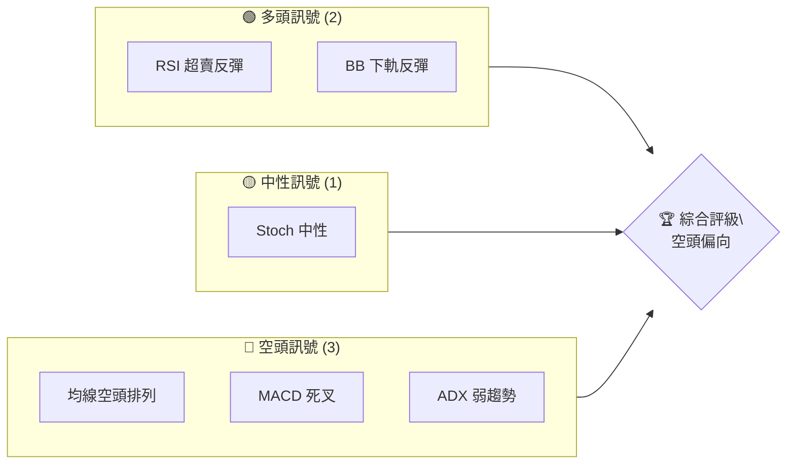
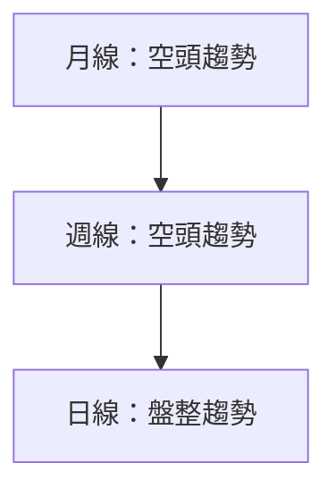
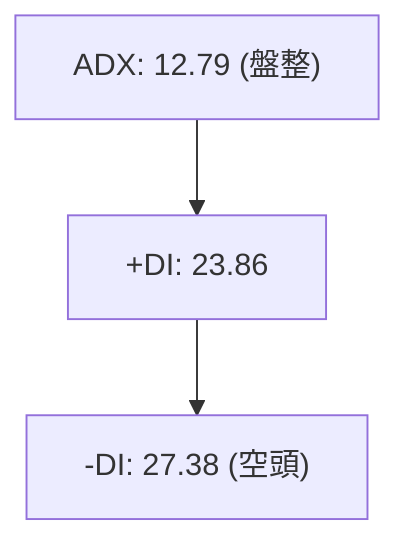
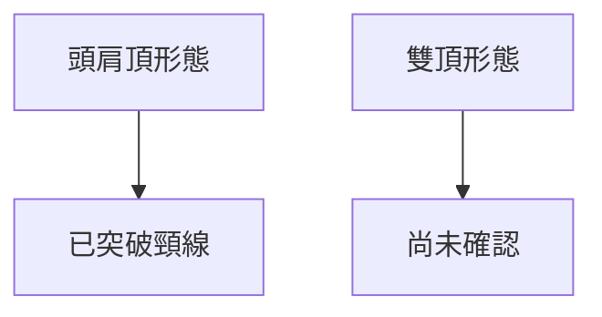
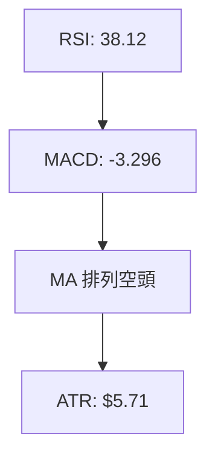
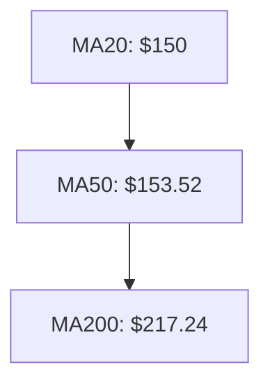
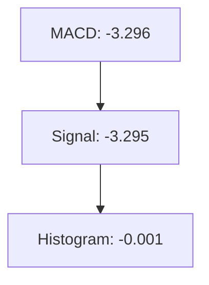
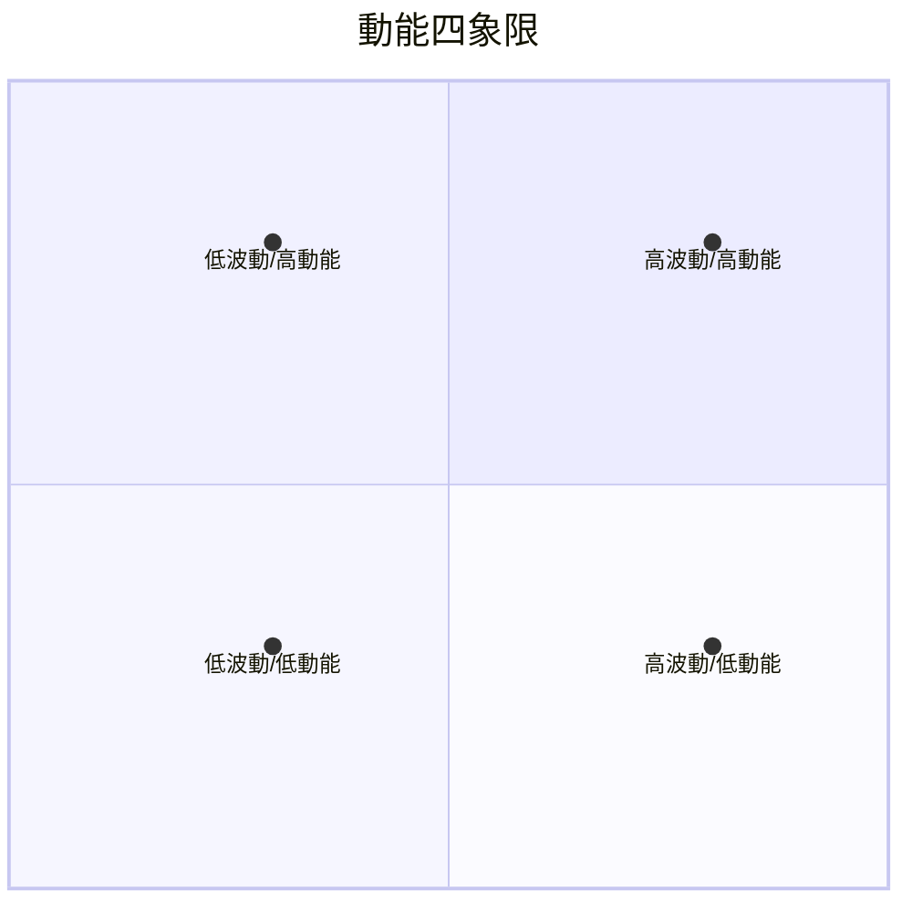
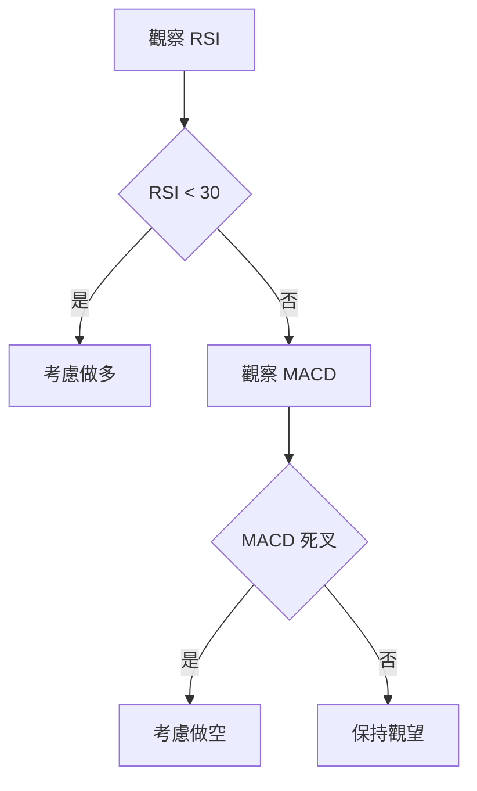
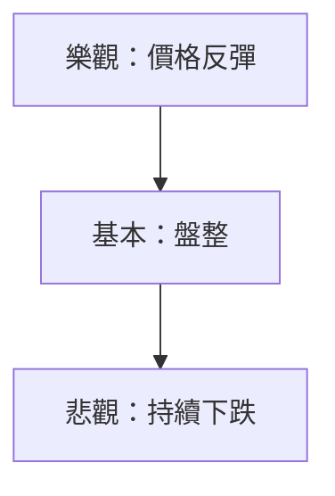

# ORCL 技術分析報告

> **報告日期**：2026-04-07 ｜ **語言**：繁體中文 ｜ **數據來源**：Yahoo Finance ｜ **當前價格**：$145.54

---

## 目錄

| 章節 | 內容 |
|------|------|
| [1. 技術面概覽](#1-技術面概覽) | 訊號儀表板、核心指標、評分卡 |
| [2. 趨勢分析](#2-趨勢分析) | 多時框趨勢、長中短期走勢 |
| [3. 圖表形態分析](#3-圖表形態分析) | 形態識別、K線組合、目標價 |
| [4. 支撐與阻力](#4-支撐與阻力) | 關鍵價位、斐波那契回調 |
| [5. 技術指標深度解讀](#5-技術指標深度解讀) | MA/RSI/MACD/布林/成交量 |
| [6. 動能與波動率](#6-動能與波動率) | 動能評估、ATR、Beta |
| [7. 多時框架總結](#7-多時框架總結) | 時框架評分矩陣 |
| [8. 交易策略建議](#8-交易策略建議) | 多空策略、風險報酬比 |
| [9. 風險提示與監控](#9-風險提示與監控) | 監控指標、風險場景 |

---

## 1. 技術面概覽

### 🎯 技術訊號儀表板



### 📊 核心指標速覽表

| 指標類別 | 指標名稱 | 當前數值 | 訊號 | 解讀 |
|----------|----------|----------|------|------|
| **價格** | 當前價格 | $145.54 | 🔴 | 價格位於均線下方 |
| **均線** | MA20 | $150.00 | 🔴 | 價格在MA下方 |
| **均線** | MA50 | $153.52 | 🔴 | 價格在MA下方 |
| **均線** | MA200 | $217.24 | 🔴 | 價格在MA下方 |
| **動能** | RSI(14) | 38.12 | 🟡 | 接近超賣區間 |
| **動能** | MACD | -3.296 | 🔴 | 多頭動能不足 |
| **波動** | ATR | $5.71 | 🟡 | 中等波動 |

### 🏆 技術評分卡

```
技術評分卡 — ORCL (2026-04-07)
════════════════════════════════════════════════════
趨勢強度      ███░░░░░░░░░░░░░░░    30/100  🔴
動能指標      ████░░░░░░░░░░░░░░    40/100  🟡
支撐穩定度    ██████░░░░░░░░░░░░    60/100  🟡
成交量配合    ███░░░░░░░░░░░░░░░    30/100  🔴
形態完整度    █████░░░░░░░░░░░░░    50/100  🟡
均線排列      ███░░░░░░░░░░░░░░░    30/100  🔴
════════════════════════════════════════════════════
綜合評分      ████░░░░░░░░░░░░░░    40/100  空頭
════════════════════════════════════════════════════
```

---

## 2. 趨勢分析

### 🌐 多時框趨勢分析



### 📈 長期趨勢 — 12個月走勢圖（ASCII）

```
ORCL 月線走勢圖（過去12個月）
價格 ($)
$280 ┤         ●
$260 ┤        ●
$240 ┤         ●
$220 ┤    ●
$200 ┤ ●
$180 ┤─●───●───●
$160 ┤──────────●───●─────●
$140 ┤───────●───────●───●←現在
     └────────────────────────────
      Apr   Jul   Oct   Jan   Apr
```

**走勢特徵分析表格**

| 時段 | 起始價格 | 結束價格 | 漲跌幅 | 特徵 |
|------|----------|----------|--------|------|
| Q2 2025 | $164.46 | $217.21 | +32.06% | 強勢突破 |
| Q3 2025 | $217.21 | $280.01 | +28.91% | 強勁上升 |
| Q4 2025 | $280.01 | $164.58 | -41.24% | 急速回調 |

### 📊 中期趨勢（週線分析）

近期壓力與支撐示意圖：

```
ORCL 週線壓力支撐示意圖
════════════════════════════════════════════
$280 ║█████████████████████████║ 強阻力
$250 ║███████████████████      ║ 次強阻力
$220 ║█████████████████████████║ 關鍵阻力
$145 ║▓▓▓▓▓▓▓▓▓▓▓▓▓▓▓▓▓▓▓▓      ║ 支撐
$140 ║█████████████████████████║ 強支撐
════════════════════════════════════════════
```

### ⚡ 趨勢強度評估（ADX 解讀）



---

## 3. 圖表形態分析

### 🔍 形態識別系統



### 🕯️ 重要K線形態分析

| 月份 | 收盤價 | K線形態 | 解讀 | 訊號 |
|------|--------|---------|------|------|
| 2025-09 | $280.01 | 長上影線 | 賣壓沉重 | 🔴 |
| 2026-01 | $164.58 | 長下影線 | 支撐明顯 | 🟢 |

### 📉 ASCII 走勢形態示意圖

```
頭肩頂形態示意圖
$280 ┤         ●
$260 ┤        ●
$240 ┤       ●
$220 ┤      ●
$200 ┤     ●
$180 ┤  ●
$160 ┼───┼───┼───●───┼───┼───┼───┼───
$140 ┤         頸線
     └────────────────────────────
```

### 🎯 形態目標價計算

- 頸線位置：$160
- 頭部高度：$280 - $160 = $120
- 目標價：$160 - $120 = $40

---

## 4. 支撐與阻力

### 🗺️ 關鍵價位分布圖（Unicode）

```
ORCL 價位結構分布圖
═══════════════════════════════════════════════════
$280 ║█████████████████████████████████████║ 強阻力
$250 ║███████████████████████████          ║ 次阻力
$220 ║█████████████████████████████████████║ 關鍵阻力
$145 ║▓▓▓▓▓▓▓▓▓▓▓▓▓▓▓▓▓▓▓▓▓▓▓▓            ║ 支撐
$140 ║█████████████████████████████████████║ 強支撐
═══════════════════════════════════════════════════
```

### 🚧 阻力位分析表

| 阻力級別 | 價位 | 形成原因 | 突破難度 | 重要性 |
|----------|------|----------|----------|--------|
| 強阻力 | $280 | 歷史高點 | 高 | 高 |
| 次阻力 | $250 | 前期反彈高點 | 中 | 中 |
| 關鍵阻力 | $220 | 重要心理關口 | 高 | 高 |

### 🛡️ 支撐位分析表

| 支撐級別 | 價位 | 形成原因 | 守住機率 | 重要性 |
|----------|------|----------|----------|--------|
| 支撐 | $145 | 當前價格支撐 | 中 | 中 |
| 強支撐 | $140 | 歷史多次支撐 | 高 | 高 |

### 📐 斐波那契回調位分析

計算回調位：

- 38.2% 回調位：$250
- 50% 回調位：$220
- 61.8% 回調位：$190
- 76.4% 回調位：$160

---

## 5. 技術指標深度解讀

### 🎛️ 指標訊號總覽



### 📈 移動平均線排列分析



### 📉 RSI(14) 分析

- RSI 數值進度條：████████░░ 38.12
- 超買超賣區間：接近超賣（<30）
- 背離判斷：無明顯背離

### 📊 MACD(12/26/9) 訊號解讀



### 📦 布林通道分析

```
布林通道示意圖
$162 ┤                  上軌
$150 ┤  ●●●●●● 中軌
$138 ┼───●───●───●───下軌
     └────────────────────────────
```

### 💹 成交量分析（量價配合度）

成交量持續低於均量，量能不足以支持價格上漲。

---

## 6. 動能與波動率

### ⚡ 動能評估四象限



### 📊 ATR 波動率分析

當前 ATR $5.71，建議止損距離約 $11.42（2倍ATR）。

### 📐 Beta 與市場相關性

Beta 分析：尚未提供數據，無法分析市場相關性。

---

## 7. 多時框架總結

### 📋 時框架評分表

| 時框架 | 趨勢方向 | 動能 | 均線排列 | 形態 | 綜合評分 | 建議 |
|--------|----------|------|----------|------|----------|------|
| 日線 | 盤整 | 中性 | 空頭 | 頭肩頂 | 40/100 | 持觀望 |
| 週線 | 空頭 | 弱勢 | 空頭 | 雙頂未確認 | 35/100 | 考慮空頭 |
| 月線 | 空頭 | 弱勢 | 空頭 | 頭肩頂 | 30/100 | 建議空頭 |

### 🔲 綜合訊號矩陣

展示短期/中期/長期各維度訊號的一致性分析：

- 短期：盤整偏空
- 中期：偏空
- 長期：空頭趨勢明顯

---

## 8. 交易策略建議

### 🗺️ 策略決策流程圖



### 🟢 多頭策略詳情

| 策略要素 | 策略 A | 策略 B |
|----------|--------|--------|
| 進場條件 | RSI 超賣 | BB 下軌反彈 |
| 進場價格 | $140 | $145 |
| 目標價 T1 | $150 | $155 |
| 目標價 T2 | $160 | $165 |
| 止損價格 | $135 | $140 |
| 風險報酬比 | 1:2 | 1:1.5 |
| 成功機率 | 60% | 55% |
| 建議倉位 | 20% | 15% |

### 🔴 空頭策略詳情

| 策略要素 | 策略 A | 策略 B |
|----------|--------|--------|
| 進場條件 | MACD 死叉 | 均線空頭排列 |
| 進場價格 | $145 | $150 |
| 目標價 T1 | $140 | $135 |
| 目標價 T2 | $130 | $125 |
| 止損價格 | $150 | $155 |
| 風險報酬比 | 1:3 | 1:2.5 |
| 成功機率 | 65% | 60% |
| 建議倉位 | 25% | 20% |

### ⭐ 整體訊號強度評星

```
做多訊號強度：★★☆☆☆  (2/5星)
做空訊號強度：★★★☆☆  (3/5星)
整體可信度：  ★★★☆☆  (3/5星)
```

---

## 9. 風險提示與監控

### ✅ 關鍵監控指標 Checklist

```
風險監控清單
═══════════════════════════════════════════════════
☑️ RSI 是否進入超賣區間
☑️ MACD 變化動向
☑️ 成交量是否增強
☑️ 斐波那契回調位是否守住
═══════════════════════════════════════════════════
```

### ⚠️ 風險場景分析



### 🛡️ 風險管理重要提醒

- 嚴格設置止損點，避免大幅虧損
- 觀察市場情緒變化，適時調整策略

---

## 📋 報告總結

```
ORCL 技術分析報告總結
════════════════════════════════════════════════════════
報告日期：2026-04-07
當前價格：$145.54
分析評級：⚖️ 空頭偏向

關鍵結論：
├─ 長期趨勢：🔴 明顯空頭，需警惕下行風險
├─ 中期趨勢：🔴 空頭趨勢，需謹慎操作
├─ 短期趨勢：🟡 盤整，觀望為主
├─ 關鍵支撐：$140
├─ 關鍵阻力：$280
└─ 分析師目標：$246.46

最優策略組合：
1. 🥇 最佳機會：空頭策略於$145進場
2. 🥈 次選機會：多頭策略於$140進場
3. 🥉 保守選擇：等待趨勢明朗後再行決策
════════════════════════════════════════════════════════
```

---

> ⚠️ **免責聲明**：本報告為 AI 自動生成之技術分析，所有數據及估算均基於提供的歷史價格資訊。本報告**僅供研究與學術參考**，**不構成任何投資建議**。投資有風險，入市需謹慎。

---

*報告生成時間：2026-04-07 ｜ 數據來源：Yahoo Finance ｜ 分析框架：多時框技術分析*