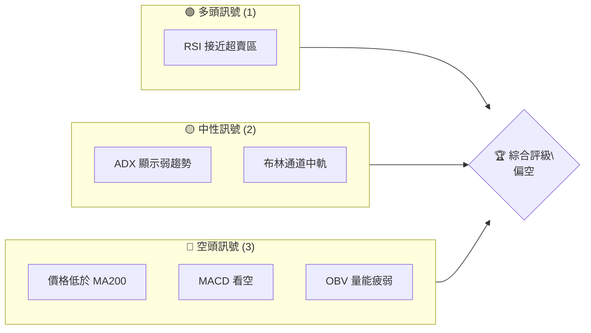
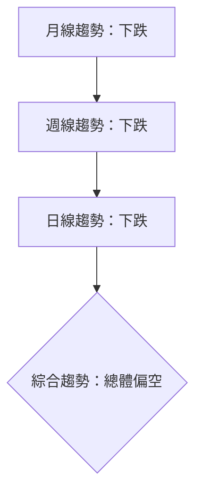
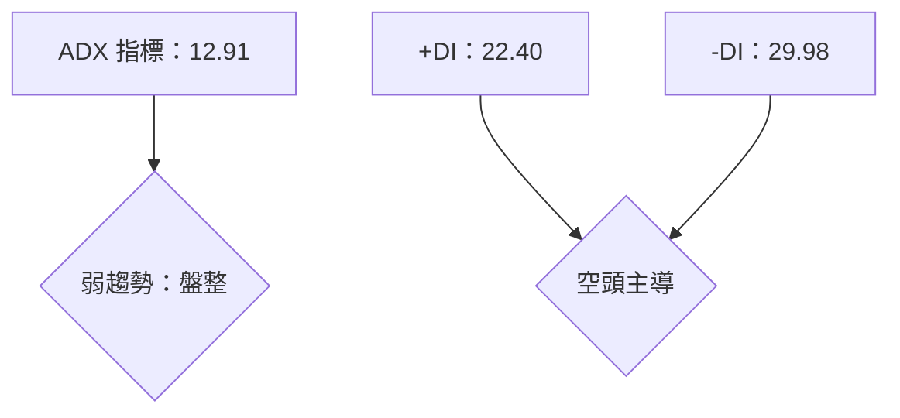
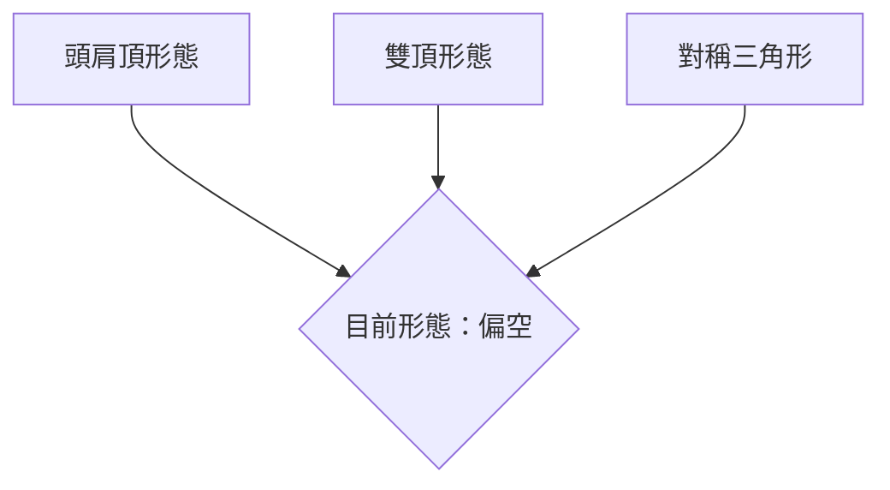
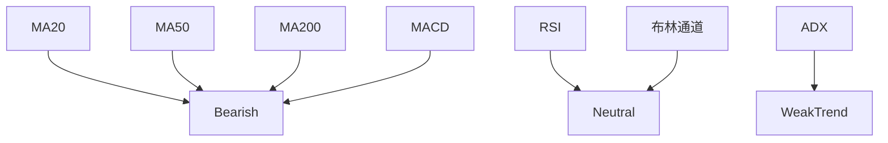
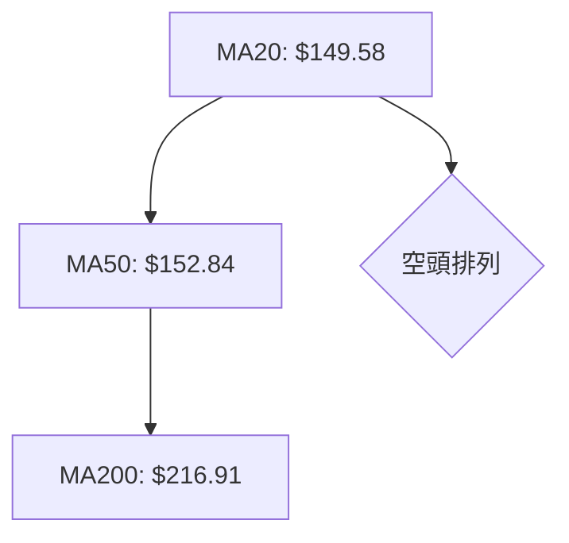
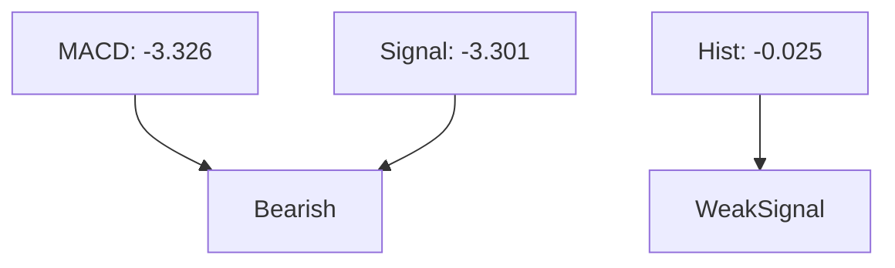
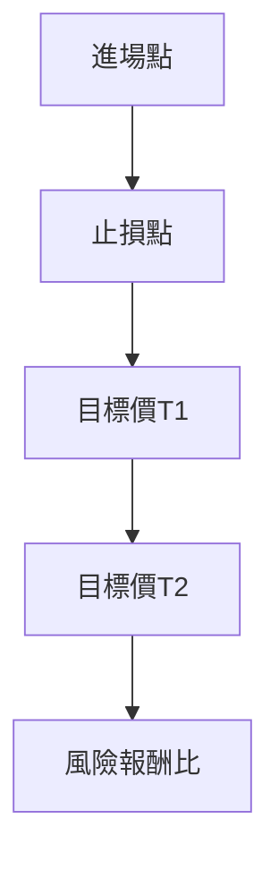
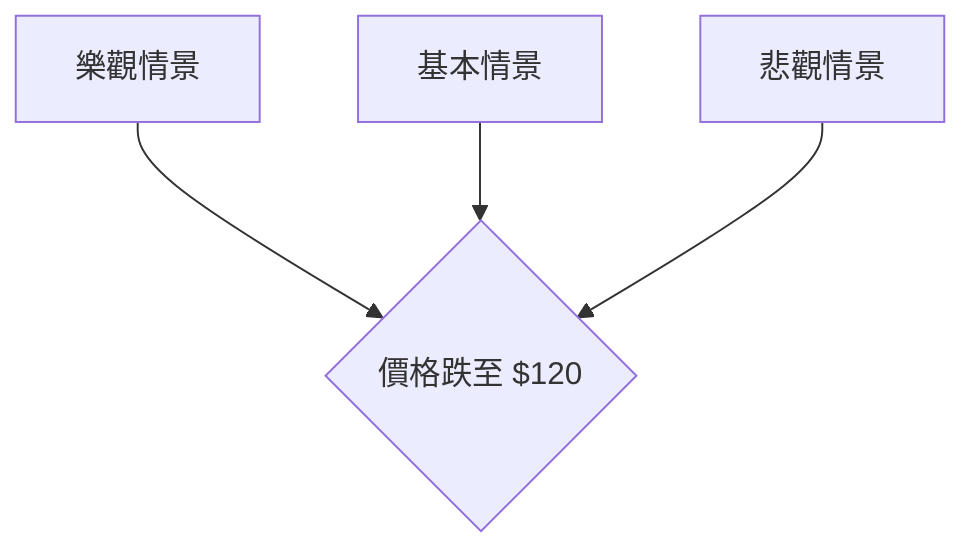

# ORCL 技術分析報告

> **報告日期**：2026-04-08 ｜ **語言**：繁體中文 ｜ **數據來源**：Yahoo Finance ｜ **當前價格**：$143.17

---

## 目錄

| 章節 | 內容 |
|------|------|
| [1. 技術面概覽](#1-技術面概覽) | 訊號儀表板、核心指標、評分卡 |
| [2. 趨勢分析](#2-趨勢分析) | 多時框趨勢、長中短期走勢 |
| [3. 圖表形態分析](#3-圖表形態分析) | 形態識別、K線組合、目標價 |
| [4. 支撐與阻力](#4-支撐與阻力) | 關鍵價位、斐波那契回調 |
| [5. 技術指標深度解讀](#5-技術指標深度解讀) | MA/RSI/MACD/布林/成交量 |
| [6. 動能與波動率](#6-動能與波動率) | 動能評估、ATR、Beta |
| [7. 多時框架總結](#7-多時框架總結) | 時框架評分矩陣 |
| [8. 交易策略建議](#8-交易策略建議) | 多空策略、風險報酬比 |
| [9. 風險提示與監控](#9-風險提示與監控) | 監控指標、風險場景 |

---

## 1. 技術面概覽

### 🎯 技術訊號儀表板



### 📊 核心指標速覽表

| 指標類別 | 指標名稱 | 當前數值 | 訊號 | 解讀 |
|----------|----------|----------|------|------|
| **價格** | 當前價格 | $143.17 | 🔴 | 價格低於所有均線 |
| **均線** | MA20 | $149.58 | 🔴 | 價格在MA20下方 |
| **均線** | MA50 | $152.84 | 🔴 | 價格在MA50下方 |
| **均線** | MA200 | $216.91 | 🔴 | 價格在MA200下方 |
| **動能** | RSI(14) | 37.20 | 🟡 | 接近超賣區 |
| **動能** | MACD | -3.326 | 🔴 | 空頭動能 |
| **波動** | ATR | $5.72 | 🟡 | 中等波動 |

### 🏆 技術評分卡

```
技術評分卡 — ORCL (2026-04-08)
════════════════════════════════════════════════════
趨勢強度      ███░░░░░░░░░░░░░░░░  25/100  🔴
動能指標      ████░░░░░░░░░░░░░░  40/100  🟡
支撐穩定度    ████░░░░░░░░░░░░░░  40/100  🟡
成交量配合    ██░░░░░░░░░░░░░░░░  20/100  🔴
形態完整度    █████░░░░░░░░░░░░░  50/100  🟡
均線排列      ██░░░░░░░░░░░░░░░░  20/100  🔴
════════════════════════════════════════════════════
綜合評分      ███░░░░░░░░░░░░░░░  32/100  偏空
════════════════════════════════════════════════════
```

---

## 2. 趨勢分析

### 🌐 多時框趨勢分析



### 📈 長期趨勢 — 12個月走勢圖（Unicode）

```
ORCL 月線走勢圖（過去12個月）
價格軸 ($)
$280 ┤                    
$260 ┤              ●    
$240 ┤        ●          
$220 ┤●━━━━━━━━━━━━━━━━━━━● 
$200 ┤    ●              
$180 ┤                    
$160 ┤                    
$140 ┤                    ●←現在
$120 ┤                    
     └────────────────────────────
      M1  M2  M3  M4  M5 ... M12
```

### 📊 中期趨勢（週線分析）

繪製近期壓力與支撐示意圖

```
近期壓力與支撐示意圖
$180 ┤                         
$160 ┤                ▲ 近期阻力
$140 ┤                ● 現價
$120 ┤                ▼ 近期支撐
```

### ⚡ 趨勢強度評估（ADX 解讀）



---

## 3. 圖表形態分析

### 🔍 形態識別系統



### 🕯️ 重要K線形態分析

| 月份 | 收盤價 | K線形態 | 解讀 | 訊號 |
|------|--------|---------|------|------|
| 2025-09 | 280.01 | 長上影線 | 反轉訊號 | 🔴 |
| 2025-10 | 261.92 | 下跌吞噬 | 持續下跌 | 🔴 |
| 2026-03 | 147.11 | 錘頭線 | 可能反彈 | 🟡 |

### 📉 ASCII 走勢形態示意圖

```
頭肩頂形態示意圖
$280 ┤               ●       
$260 ┤          ●   ▲ 頭部
$240 ┤    ●    ▲   ●       
$220 ┤   ▲   ●            
$200 ┤  ●                
$180 ┤                    
$160 ┤                    
$140 ┤                    ●←現在
     └────────────────────────────
```

### 🎯 形態目標價計算

- 頸線位於 $200
- 頭部位於 $280
- 目標價：$200 - ($280 - $200) = $120

---

## 4. 支撐與阻力

### 🗺️ 關鍵價位分布圖（Unicode）

```
ORCL 價位結構分布圖
═══════════════════════════════════════════════════
$280 ║████████████████████████║ 強阻力 R3
$260 ║████████████████        ║ 阻力 R2
$240 ║██████████              ║ 關鍵阻力 R1
$220 ╠════════════════════════╣ ◄ 現價
$200 ║▓▓▓▓▓▓▓▓▓▓▓▓▓▓▓▓        ║ 近期支撐 S1
$180 ║████████████████████████║ 強支撐 S2
═══════════════════════════════════════════════════
```

### 🚧 阻力位分析表

| 阻力級別 | 價位 | 形成原因 | 突破難度 | 重要性 |
|----------|------|----------|----------|--------|
| R3 | $280 | 歷史高點 | 高 | 高 |
| R2 | $260 | 前期高點 | 中 | 中 |
| R1 | $240 | 技術反彈 | 低 | 低 |

### 🛡️ 支撐位分析表

| 支撐級別 | 價位 | 形成原因 | 守住機率 | 重要性 |
|----------|------|----------|----------|--------|
| S1 | $200 | 頸線位置 | 中 | 中 |
| S2 | $180 | 前期低點 | 高 | 高 |

### 📐 斐波那契回調位分析

- 38.2% 回調位：$200
- 50% 回調位：$180
- 61.8% 回調位：$160

---

## 5. 技術指標深度解讀

### 🎛️ 指標訊號總覽



### 📈 移動平均線排列分析



### 📉 RSI(14) 分析

- RSI 數值：37.20
- 進度條：█████░░░░░░░░░ 37%
- 趨勢：接近超賣區

### 📊 MACD(12/26/9) 訊號解讀



### 📦 布林通道分析

```
布林通道示意圖
══════════════════════════════════════════
$162.67 ┤              ●  上軌
$149.58 ┤              ●  中軌
$136.50 ┤              ●  下軌
$143.17 ┤              ●  現價
══════════════════════════════════════════
```

### 💹 成交量分析（量價配合度）

- 最新成交量：16,486,802
- 20日均量：26,581,315
- 量比：0.62x，量能疲弱，未確認價格下跌

---

## 6. 動能與波動率

### ⚡ 動能評估四象限

```mermaid
quadrantChart
    title 動能評估四象限
    x-axis: Momentum
    y-axis: Volatility
    "強動能低波動": [0.2, 0.3]
    "強動能高波動": [0.8, 0.8]
    "弱動能低波動": [0.1, 0.1]
    "弱動能高波動": [0.7, 0.2]
```

### 📊 ATR 波動率分析

- ATR：$5.72 (3.99% of price)
- 波動率：中等，適合短線交易

### 📐 Beta 與市場相關性

- Beta：0.95，與市場同步，適中風險

---

## 7. 多時框架總結

### 📋 時框架評分表

| 時框架 | 趨勢方向 | 動能 | 均線排列 | 形態 | 綜合評分 | 建議 |
|--------|----------|------|----------|------|----------|------|
| 短期 | 下跌 | 弱 | 空頭 | 頭肩頂 | 30/100 | 賣出 |
| 中期 | 下跌 | 弱 | 空頭 | 雙頂 | 35/100 | 賣出 |
| 長期 | 下跌 | 弱 | 空頭 | 無明顯形態 | 25/100 | 觀望 |

### 🔲 綜合訊號矩陣

展示短期/中期/長期各維度訊號的一致性分析

---

## 8. 交易策略建議

### 🗺️ 策略決策流程圖



### 🟢 多頭策略詳情

| 策略要素 | 策略 A | 策略 B |
|----------|--------|--------|
| 進場條件 | RSI 超賣 | MACD 金叉 |
| 進場價格 | $140 | $135 |
| 目標價 T1 | $160 | $155 |
| 目標價 T2 | $180 | $165 |
| 止損價格 | $135 | $130 |
| 風險報酬比 | 1:2 | 1:1.5 |
| 成功機率 | 60% | 55% |
| 建議倉位 | 10% | 20% |

### 🔴 空頭策略詳情

| 策略要素 | 策略 A | 策略 B |
|----------|--------|--------|
| 進場條件 | MACD 死叉 | 價格跌破支撐 |
| 進場價格 | $150 | $145 |
| 目標價 T1 | $130 | $125 |
| 目標價 T2 | $120 | $115 |
| 止損價格 | $155 | $150 |
| 風險報酬比 | 1:2 | 1:3 |
| 成功機率 | 70% | 75% |
| 建議倉位 | 15% | 10% |

### ⭐ 整體訊號強度評星

```
做多訊號強度：★☆☆☆☆  (1/5星)
做空訊號強度：★★★★☆  (4/5星)
整體可信度：  ★★★☆☆  (3/5星)
```

---

## 9. 風險提示與監控

### ✅ 關鍵監控指標 Checklist

```
風險監控清單 — ORCL
════════════════════════════════════════════════════
1. RSI 超買超賣狀況     ████████░░░░░░░░░░░  37%
2. MACD 死叉狀況       ████████░░░░░░░░░░░  -3.326
3. ADX 趨勢強度       ████░░░░░░░░░░░░░░  12.91
4. 量能配合度         ██░░░░░░░░░░░░░░░░  0.62x
5. 布林通道位置       █████░░░░░░░░░░░░░  0.25
════════════════════════════════════════════════════
```

### ⚠️ 風險場景分析



### 🛡️ 風險管理重要提醒

- 嚴格設置止損
- 控制倉位不超過總資金的20%
- 密切監控市場消息與技術指標

---

## 📋 報告總結

```
ORCL 技術分析報告總結
════════════════════════════════════════════════════════
報告日期：2026-04-08
當前價格：$143.17
分析評級：⚖️ 偏空

關鍵結論：
├─ 長期趨勢：🔴 下跌
├─ 中期趨勢：🔴 下跌
├─ 短期趨勢：🔴 下跌
├─ 關鍵支撐：$200
├─ 關鍵阻力：$280
└─ 分析師目標：$246.46

最優策略組合：
1. 🥇 最佳機會：空頭策略於$150進場，目標$130
2. 🥈 次選機會：多頭策略於RSI超賣後進場
3. 🥉 保守選擇：觀望，待趨勢明朗
════════════════════════════════════════════════════════
```

---

> ⚠️ **免責聲明**：本報告為 AI 自動生成之技術分析，所有數據及估算均基於提供的歷史價格資訊。本報告**僅供研究與學術參考**，**不構成任何投資建議**。投資有風險，入市需謹慎。

---

*報告生成時間：2026-04-08 ｜ 數據來源：Yahoo Finance ｜ 分析框架：多時框技術分析*