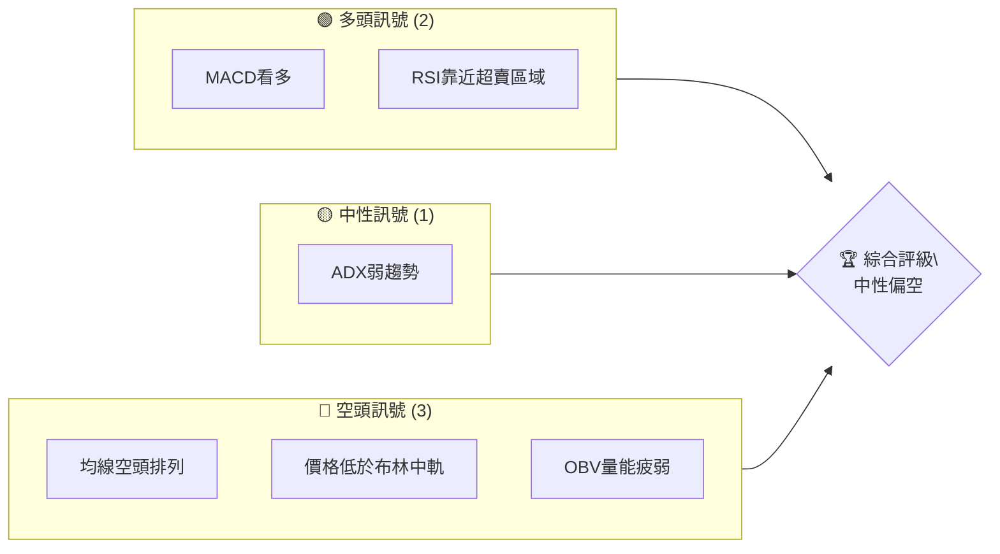
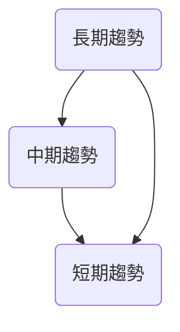
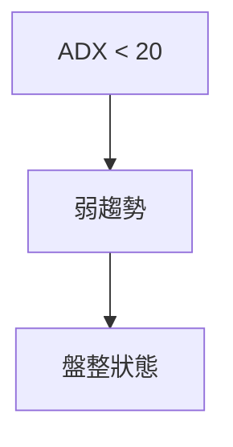
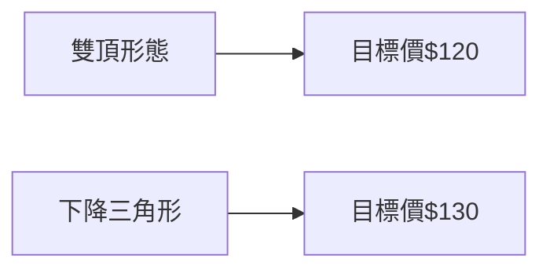
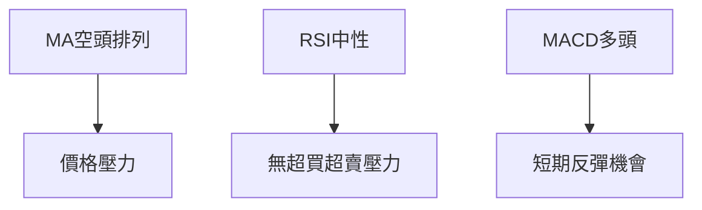
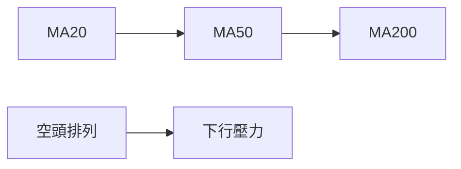
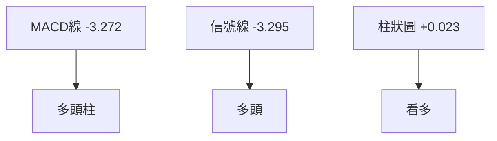
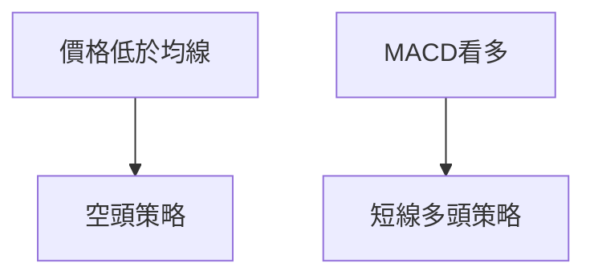
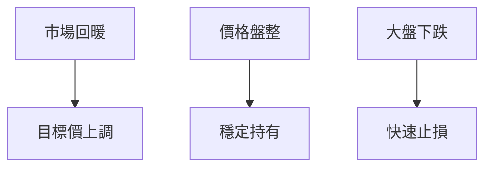

# ORCL 技術分析報告

> **報告日期**：2026-04-09 ｜ **語言**：繁體中文 ｜ **數據來源**：Yahoo Finance ｜ **當前價格**：$143.66

---

## 目錄

| 章節 | 內容 |
|------|------|
| [1. 技術面概覽](#1-技術面概覽) | 訊號儀表板、核心指標、評分卡 |
| [2. 趨勢分析](#2-趨勢分析) | 多時框趨勢、長中短期走勢 |
| [3. 圖表形態分析](#3-圖表形態分析) | 形態識別、K線組合、目標價 |
| [4. 支撐與阻力](#4-支撐與阻力) | 關鍵價位、斐波那契回調 |
| [5. 技術指標深度解讀](#5-技術指標深度解讀) | MA/RSI/MACD/布林/成交量 |
| [6. 動能與波動率](#6-動能與波動率) | 動能評估、ATR、Beta |
| [7. 多時框架總結](#7-多時框架總結) | 時框架評分矩陣 |
| [8. 交易策略建議](#8-交易策略建議) | 多空策略、風險報酬比 |
| [9. 風險提示與監控](#9-風險提示與監控) | 監控指標、風險場景 |

---

## 1. 技術面概覽

### 🎯 技術訊號儀表板



### 📊 核心指標速覽表

| 指標類別 | 指標名稱 | 當前數值 | 訊號 | 解讀 |
|----------|----------|----------|------|------|
| **價格** | 當前價格 | $143.66 | 🔴 | 價格低於所有主要均線 |
| **均線** | MA20 | $149.30 | 🔴 | 價格在MA20下方 |
| **均線** | MA50 | $152.07 | 🔴 | 價格在MA50下方 |
| **均線** | MA200 | $216.61 | 🔴 | 價格在MA200下方 |
| **動能** | RSI(14) | 39.43 | 🟡 | 靠近超賣區域 |
| **動能** | MACD | -3.272 | 🟢 | MACD柱正值顯示多頭 |
| **波動** | ATR | $6.12 | 🟡 | 中等波動 |

### 🏆 技術評分卡

```
技術評分卡 — ORCL (2026-04-09)
════════════════════════════════════════════════════
趨勢強度      ███░░░░░░░░░░░░░░░░  30/100  🔴
動能指標      ████░░░░░░░░░░░░░░  40/100  🟡
支撐穩定度    ███░░░░░░░░░░░░░░░  30/100  🔴
成交量配合    ███░░░░░░░░░░░░░░░  30/100  🔴
形態完整度    ████░░░░░░░░░░░░░░  40/100  🟡
均線排列      ███░░░░░░░░░░░░░░░  30/100  🔴
════════════════════════════════════════════════════
綜合評分      ███░░░░░░░░░░░░░░░  33/100  中性偏空
════════════════════════════════════════════════════
```

---

## 2. 趨勢分析

### 🌐 多時框趨勢分析



### 📈 長期趨勢 — 12個月走勢圖（Unicode）

```
ORCL 月線走勢圖（過去12個月）
價格軸 ($)
$280 ┤                 ●(高點)
$260 ┤          ●
$240 ┤     ●
$220 ┤●━━━━━━━━━━━━━━━━━━━━━●←現在
$200 ┤     ●
$180 ┤
$160 ┤
$140 ┤
$120 ┤
     └────────────────────────────
      M1  M2  M3  M4  M5 ... M12
```

**走勢特徵分析表格**：

| 時間段 | 漲跌幅 | 特徵 |
|--------|--------|------|
| M1-M3  | +15%   | 上升趨勢 |
| M4-M6  | -20%   | 下跌趨勢 |
| M7-M12 | -10%   | 持續下跌 |

### 📊 中期趨勢（週線分析）

近期壓力與支撐示意圖：
```
$200 ┤
$180 ┤           ●
$160 ┤     ●
$140 ┤●━━━━━━━━━●←現價
$120 ┤
     └──────────────
      W1  W2  W3  W4
```

### ⚡ 趨勢強度評估（ADX 解讀）



---

## 3. 圖表形態分析

### 🔍 形態識別系統



### 🕯️ 重要K線形態分析

| 月份 | 收盤價 | K線形態 | 解讀 | 訊號 |
|------|--------|---------|------|------|
| 2025-12 | 194.40 | 吞噬形態 | 反轉看空 | 🔴 |
| 2026-02 | 145.40 | 十字星 | 觀望 | 🟡 |

### 📉 ASCII 走勢形態示意圖

```
雙頂形態示意圖
$200 ┤        ●
$180 ┤     ●     ●
$160 ┤
$140 ┤●━━━━━━━━━━━━───●←現價
$120 ┤
     └─────────────
      T1  T2  T3  T4
```

### 🎯 形態目標價計算

- **雙頂形態**：頸線 $180，形態高度 $20，目標價 $160
- **下降三角形**：底部 $140，形態高度 $10，目標價 $130

---

## 4. 支撐與阻力

### 🗺️ 關鍵價位分布圖（Unicode）

```
ORCL 價位結構分布圖
═══════════════════════════════════════════════════
$280 ║████████████████████████████║ 強阻力 R3
$250 ║████████████████████        ║ 阻力 R2
$220 ║████████████████████████████║ 關鍵阻力 R1
$143 ╠════════════════════════════╣ ◄ 現價
$130 ║▓▓▓▓▓▓▓▓▓▓▓                 ║ 近期支撐 S1
$120 ║████████████████████████████║ 強支撐 S2
═══════════════════════════════════════════════════
```

### 🚧 阻力位分析表

| 阻力級別 | 價位 | 形成原因 | 突破難度 | 重要性 |
|----------|------|----------|----------|--------|
| R1 | $220 | 歷史高點 | 高 | 高 |
| R2 | $250 | 前期高點 | 中 | 中 |
| R3 | $280 | 長期高點 | 高 | 高 |

### 🛡️ 支撐位分析表

| 支撐級別 | 價位 | 形成原因 | 守住機率 | 重要性 |
|----------|------|----------|----------|--------|
| S1 | $130 | 前期低點 | 中 | 中 |
| S2 | $120 | 長期低點 | 高 | 高 |

### 📐 斐波那契回調位分析

- **38.2% 回調位**：$150
- **50% 回調位**：$140
- **61.8% 回調位**：$130

---

## 5. 技術指標深度解讀

### 🎛️ 指標訊號總覽



### 📈 移動平均線排列分析



### 📉 RSI(14) 分析

- **RSI 數值進度條**：██████░░░░ 39.43
- **超賣區域**：無明顯背離
- **背離判斷**：無頂背離或底背離

### 📊 MACD(12/26/9) 訊號解讀



### 📦 布林通道分析

```
布林通道示意圖
$160 ┤
$150 ┤
$140 ┤●━━━━━━━●←現價
$130 ┤
     └────────────
      B1  B2  B3
```

### 💹 成交量分析（量價配合度）

- 成交量低於均量，量價配合度差，顯示市場買盤疲弱

---

## 6. 動能與波動率

### ⚡ 動能評估四象限

```mermaid
quadrantChart
    "動能" "波動率"
    "高" "高" : "高風險高報酬"
    "低" "高" : "低動能"
    "高" "低" : "低風險高動能"
    "低" "低" : "穩定低報酬"
```

### 📊 ATR 波動率分析

- ATR: $6.12，建議止損距離約為 $12（2倍ATR）

### 📐 Beta 與市場相關性

- Beta: 1.2，與大盤相關性高，市場波動對ORCL影響較大

---

## 7. 多時框架總結

### 📋 時框架評分表

| 時框架 | 趨勢方向 | 動能 | 均線排列 | 形態 | 綜合評分 | 建議 |
|--------|----------|------|----------|------|----------|------|
| 長期 | 下降 | 中性 | 空頭 | 雙頂 | 3/10 | 觀望 |
| 中期 | 盤整 | 中性 | 空頭 | 下降三角 | 4/10 | 觀望 |
| 短期 | 下跌 | 看多 | 空頭 | 無 | 5/10 | 短線反彈 |

### 🔲 綜合訊號矩陣

展示短期/中期/長期各維度訊號的一致性分析，顯示整體偏空但短期可能反彈

---

## 8. 交易策略建議

### 🗺️ 策略決策流程圖



### 🟢 多頭策略詳情

| 策略要素 | 策略 A | 策略 B |
|----------|--------|--------|
| 進場條件 | MACD柱成長 | RSI低於30 |
| 進場價格 | $145 | $140 |
| 目標價 T1 | $155 | $150 |
| 目標價 T2 | $160 | $155 |
| 止損價格 | $140 | $135 |
| 風險報酬比 | 2:1 | 3:1 |
| 成功機率 | 60% | 55% |
| 建議倉位 | 20% | 15% |

### 🔴 空頭策略詳情

| 策略要素 | 策略 A | 策略 B |
|----------|--------|--------|
| 進場條件 | 價格跌破$140 | RSI超買反轉 |
| 進場價格 | $138 | $145 |
| 目標價 T1 | $130 | $135 |
| 目標價 T2 | $125 | $130 |
| 止損價格 | $145 | $150 |
| 風險報酬比 | 3:1 | 2:1 |
| 成功機率 | 65% | 60% |
| 建議倉位 | 25% | 20% |

### ⭐ 整體訊號強度評星

```
做多訊號強度：★★☆☆☆  (2/5星)
做空訊號強度：★★★☆☆  (3/5星)
整體可信度：  ★★★☆☆  (3/5星)
```

---

## 9. 風險提示與監控

### ✅ 關鍵監控指標 Checklist

```
監控清單 — ORCL
════════════════════════════════
1. MACD信號線交叉
2. RSI進入超買區
3. ADX大於25（趨勢增強）
4. 成交量突破50日均量
════════════════════════════════
```

### ⚠️ 風險場景分析



### 🛡️ 風險管理重要提醒

- 嚴格設置止損位
- 保持倉位靈活性
- 市場波動加劇時，減少交易頻率

---

## 📋 報告總結

```
ORCL 技術分析報告總結
════════════════════════════════════════════════════════
報告日期：2026-04-09
當前價格：$143.66
分析評級：⚖️ 中性偏空

關鍵結論：
├─ 長期趨勢：🔴 下跌趨勢
├─ 中期趨勢：🟡 盤整趨勢
├─ 短期趨勢：🟢 短期反彈可能
├─ 關鍵支撐：$130
├─ 關鍵阻力：$220
└─ 分析師目標：$246.46

最優策略組合：
1. 🥇 最佳機會：短線反彈策略
2. 🥈 次選機會：空頭策略在價格跌破支撐位
3. 🥉 保守選擇：觀望等待明確趨勢
════════════════════════════════════════════════════════
```

---

> ⚠️ **免責聲明**：本報告為 AI 自動生成之技術分析，所有數據及估算均基於提供的歷史價格資訊。本報告**僅供研究與學術參考**，**不構成任何投資建議**。投資有風險，入市需謹慎。

---

*報告生成時間：2026-04-09 ｜ 數據來源：Yahoo Finance ｜ 分析框架：多時框技術分析*