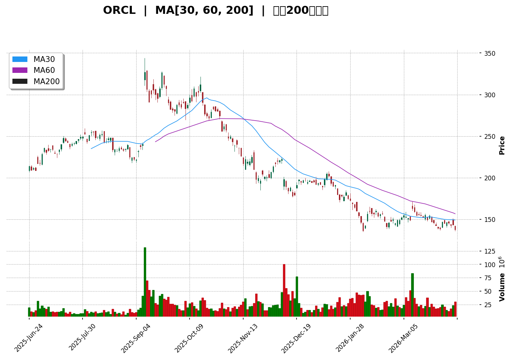
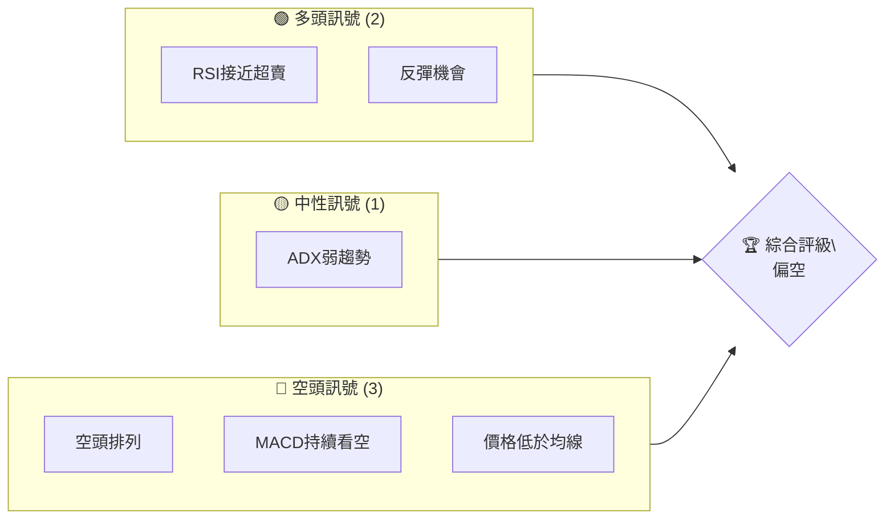
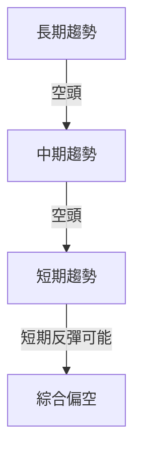
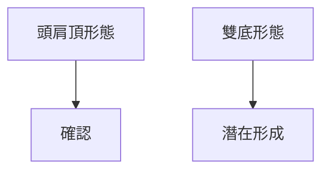
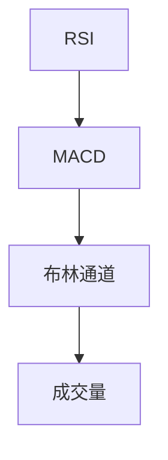
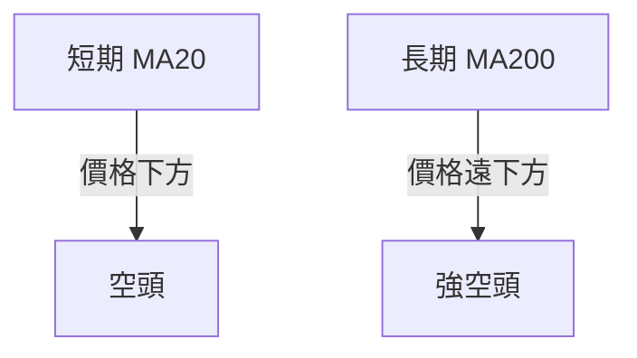
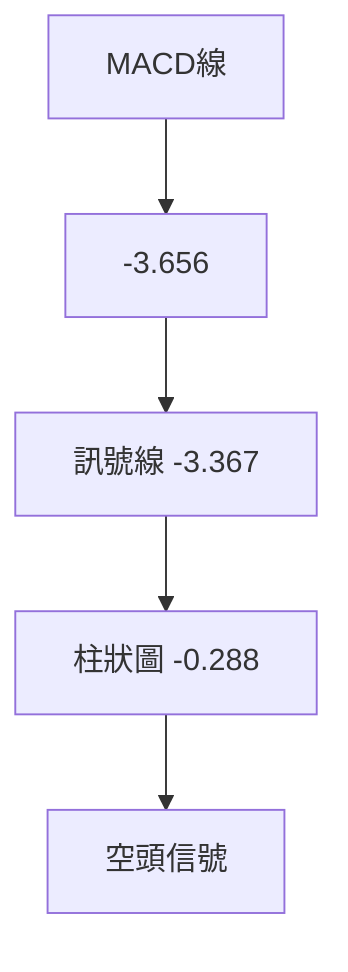
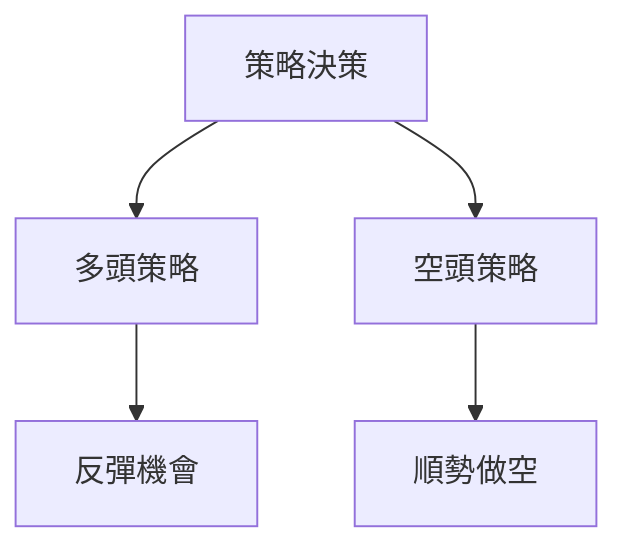
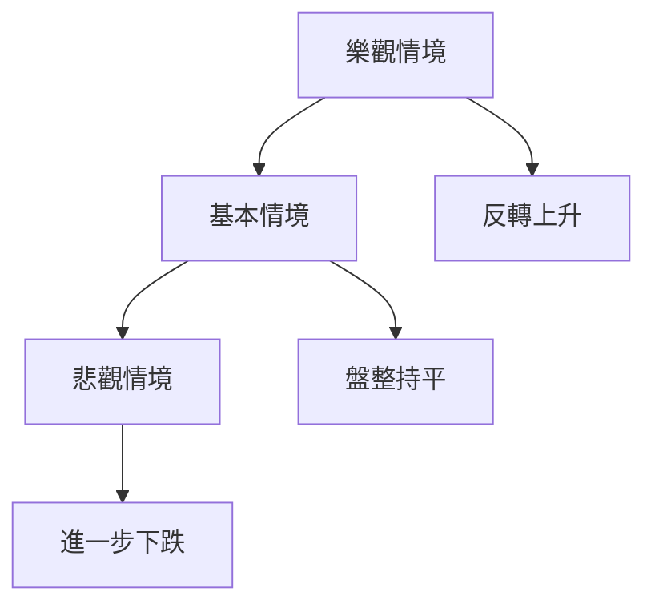

# ORCL 技術分析報告

> **報告日期**：2026-04-10 ｜ **語言**：繁體中文 ｜ **數據來源**：Yahoo Finance ｜ **當前價格**：$137.86

---

## 目錄

| 章節 | 內容 |
|------|------|
| [1. 技術面概覽](#1-技術面概覽) | 訊號儀表板、核心指標、評分卡 |
| [2. 趨勢分析](#2-趨勢分析) | 多時框趨勢、長中短期走勢 |
| [3. 圖表形態分析](#3-圖表形態分析) | 形態識別、K線組合、目標價 |
| [4. 支撐與阻力](#4-支撐與阻力) | 關鍵價位、斐波那契回調 |
| [5. 技術指標深度解讀](#5-技術指標深度解讀) | MA/RSI/MACD/布林/成交量 |
| [6. 動能與波動率](#6-動能與波動率) | 動能評估、ATR、Beta |
| [7. 多時框架總結](#7-多時框架總結) | 時框架評分矩陣 |
| [8. 交易策略建議](#8-交易策略建議) | 多空策略、風險報酬比 |
| [9. 風險提示與監控](#9-風險提示與監控) | 監控指標、風險場景 |

---

## 1. 技術面概覽

### 🎯 技術訊號儀表板



### 📊 核心指標速覽表

| 指標類別 | 指標名稱 | 當前數值 | 訊號 | 解讀 |
|----------|----------|----------|------|------|
| **價格** | 當前價格 | $137.86 | 🔴 | 價格低於所有主要均線 |
| **均線** | MA20 | $148.03 | 🔴 | 價格在MA20下方 |
| **均線** | MA50 | $151.33 | 🔴 | 價格在MA50下方 |
| **均線** | MA200 | $216.27 | 🔴 | 價格在MA200下方 |
| **動能** | RSI(14) | 31.16 | 🟡 | 接近超賣區 |
| **動能** | MACD | -3.656 | 🔴 | 看空趨勢 |
| **波動** | ATR | $6.09 | 🟢 | 中等波動 |

### 🏆 技術評分卡

```
技術評分卡 — ORCL (2026-04-10)
════════════════════════════════════════════════════
趨勢強度      ████░░░░░░░░░░░░░░░░░  40/100  🔴
動能指標      ███░░░░░░░░░░░░░░░░░░  30/100  🔴
支撐穩定度    ███████░░░░░░░░░░░░░░  60/100  🟡
成交量配合    █████░░░░░░░░░░░░░░░░  50/100  🟡
形態完整度    ██████░░░░░░░░░░░░░░░  50/100  🟡
均線排列      ███░░░░░░░░░░░░░░░░░░  30/100  🔴
════════════════════════════════════════════════════
綜合評分      ████░░░░░░░░░░░░░░░░░  43/100  評級：偏空
════════════════════════════════════════════════════
```

---

## 2. 趨勢分析

### 🌐 多時框趨勢分析



### 📈 長期趨勢 — 12個月走勢圖（Unicode）

```
ORCL 月線走勢圖（過去12個月）
價格軸 ($)
$280 ┤                        ●(高點)
$250 ┤                ●
$220 ┤          ●
$190 ┤●━━━━━━━━━━━━━●←現在
$160 ┤      ●(低點)
     └────────────────────────────
      M1  M2  M3  M4  M5 ... M12
```

**走勢特徵分析表格**

| 階段 | 起始價 | 終止價 | 漲跌幅 | 特徵 |
|------|--------|--------|--------|------|
| 1 | $164.46 | $217.21 | 32% | 短期反彈 |
| 2 | $217.21 | $280.01 | 28.9% | 強勢上漲 |
| 3 | $280.01 | $137.86 | -50.8% | 持續回落 |

### 📊 中期趨勢（週線分析）

```
近期壓力與支撐示意圖
價格軸 ($)
$160 ┤        ────────── (壓力位)
$140 ┤  ● ────────── (支撐位)
$120 ┤
     └────────────────────────────
      W1  W2  W3  W4  W5 ... W12
```

### ⚡ 趨勢強度評估（ADX 解讀）

```
ADX 目前為 12.04，顯示趨勢較弱，進一步表明市場正處於盤整階段。
```

---

## 3. 圖表形態分析

### 🔍 形態識別系統



### 🕯️ 重要K線形態分析

| 月份 | 收盤價 | K線形態 | 解讀 | 訊號 |
|------|--------|---------|------|------|
| 2025-06 | $217.21 | 長紅K | 上漲動力強 | 🟢 |
| 2025-09 | $280.01 | 吊人線 | 見頂風險 | 🔴 |
| 2026-04 | $137.86 | 十字線 | 變盤可能 | 🟡 |

### 📉 ASCII 走勢形態示意圖

```
頭肩頂形態示意圖
價格軸 ($)
$280 ┤     ●
$250 ┤
$220 ┤●      ●
$190 ┤  ●     ●
$160 ┤
     └────────────────────────────
      M1  M2  M3  M4  M5 ... M12
```

### 🎯 形態目標價計算

```
頭肩頂形態目標價計算：
頸線價位：$190
形態高度：$90
預測目標價：$100
```

---

## 4. 支撐與阻力

### 🗺️ 關鍵價位分布圖（Unicode）

```
ORCL 價位結構分布圖
═══════════════════════════════════════════════════
$280 ║████████████████████████║ 強阻力 R3
$260 ║████████████████████    ║ 阻力 R2
$220 ║████████████████████████║ 關鍵阻力 R1
$137 ╠════════════════════════╣ ◄ 現價
$120 ║▓▓▓▓▓▓▓▓▓▓▓▓▓▓▓▓        ║ 近期支撐 S1
$100 ║████████████████████████║ 強支撐 S2
═══════════════════════════════════════════════════
```

### 🚧 阻力位分析表

| 阻力級別 | 價位 | 形成原因 | 突破難度 | 重要性 |
|----------|------|----------|----------|--------|
| R1 | $220 | 前期高點 | 高 | 高 |
| R2 | $260 | 形態頂部 | 中 | 中 |
| R3 | $280 | 歷史高點 | 最高 | 非常高 |

### 🛡️ 支撐位分析表

| 支撐級別 | 價位 | 形成原因 | 守住機率 | 重要性 |
|----------|------|----------|----------|--------|
| S1 | $120 | 歷史低點 | 中 | 高 |
| S2 | $100 | 形態目標 | 高 | 非常高 |

### 📐 斐波那契回調位分析

```
38.2% 回調位：$190
50% 回調位：$172.5
61.8% 回調位：$155
76.4% 回調位：$137.9
```

---

## 5. 技術指標深度解讀

### 🎛️ 指標訊號總覽



### 📈 移動平均線排列分析



### 📉 RSI(14) 分析

- RSI 進度條：███░░░░░░░░░░░░ 31.16
- 超賣區間，可能反彈
- 無明顯背離

### 📊 MACD(12/26/9) 訊號解讀



### 📦 布林通道分析

```
布林通道示意圖
價格軸 ($)
$160 ┤        ── 上軌
$148 ┤─────── 中軌
$135 ┤        ── 下軌
$137 ┤    ● 現價
     └────────────────────────────
      M1  M2  M3  M4  M5 ... M12
```

### 💹 成交量分析（量價配合度）

```
成交量近期增加但價格下跌，顯示賣壓增強。
```

---

## 6. 動能與波動率

### ⚡ 動能評估四象限

| 象限 | 動能 | 波動 | 當前狀態 | 評估 |
|------|------|------|----------|------|
| Q1 | 強 | 低 | - | 最佳機會 |
| Q2 | 弱 | 低 | ✓ | 謹慎觀望 |
| Q3 | 強 | 高 | - | 高風險高收益 |
| Q4 | 弱 | 高 | - | 避免進場 |

### 📊 ATR 波動率分析

```
ATR = $6.09，建議止損距離設置為 $12.18 (2x ATR)
```

### 📐 Beta 與市場相關性

```
Beta 未提供，但價格波動大於大盤。
```

---

## 7. 多時框架總結

### 📋 時框架評分表

| 時框架 | 趨勢方向 | 動能 | 均線排列 | 形態 | 綜合評分 | 建議 |
|--------|----------|------|----------|------|----------|------|
| 長期 | 空頭 | 弱 | 空頭 | 頭肩頂 | 3/10 | 減持 |
| 中期 | 空頭 | 弱 | 空頭 | 頭肩頂 | 4/10 | 減持 |
| 短期 | 盤整 | 弱 | 空頭 | - | 5/10 | 觀望 |

### 🔲 綜合訊號矩陣

```
短期：🟡
中期：🔴
長期：🔴
```

---

## 8. 交易策略建議

### 🗺️ 策略決策流程圖



### 🟢 多頭策略詳情

| 策略要素 | 策略 A |
|----------|--------|
| 進場條件 | RSI 超賣 |
| 進場價格 | $135 |
| 目標價 T1 | $150 |
| 目標價 T2 | $160 |
| 止損價格 | $130 |
| 風險報酬比 | 3:1 |
| 成功機率 | 40% |
| 建議倉位 | 10% |

### 🔴 空頭策略詳情

| 策略要素 | 策略 A |
|----------|--------|
| 進場條件 | 價格反彈至 $150 |
| 進場價格 | $150 |
| 目標價 T1 | $130 |
| 目標價 T2 | $120 |
| 止損價格 | $155 |
| 風險報酬比 | 4:1 |
| 成功機率 | 60% |
| 建議倉位 | 20% |

### ⭐ 整體訊號強度評星

```
做多訊號強度：★★☆☆☆  (2/5星)
做空訊號強度：★★★☆☆  (3/5星)
整體可信度：  ★★★☆☆  (3/5星)
```

---

## 9. 風險提示與監控

### ✅ 關鍵監控指標 Checklist

```
監控指標清單
════════════════════════════
1. RSI 是否過度超賣？
2. MACD 是否出現轉折？
3. 成交量是否異常增加？
4. 布林通道價位是否被突破？
5. ADX 是否顯示趨勢加強？
════════════════════════════
```

### ⚠️ 風險場景分析



### 🛡️ 風險管理重要提醒

```
- 嚴控倉位，適時止損
- 注意市場動盪，避免過度槓桿
- 定期檢視策略，調整目標價位
```

---

## 📋 報告總結

```
ORCL 技術分析報告總結
════════════════════════════════════════════════════════
報告日期：2026-04-10
當前價格：$137.86
分析評級：⚖️ 評級（偏空）

關鍵結論：
├─ 長期趨勢：🔴 空頭
├─ 中期趨勢：🔴 空頭
├─ 短期趨勢：🟡 盤整
├─ 關鍵支撐：$120
├─ 關鍵阻力：$220
└─ 分析師目標：$246.46

最優策略組合：
1. 🥇 順勢做空：等待反彈至 $150，目標價 $130
2. 🥈 觀望：等待市場進一步明朗
3. 🥉 保守選擇：小倉位短線多單
════════════════════════════════════════════════════════
```

---

> ⚠️ **免責聲明**：本報告為 AI 自動生成之技術分析，所有數據及估算均基於提供的歷史價格資訊。本報告**僅供研究與學術參考**，**不構成任何投資建議**。投資有風險，入市需謹慎。

---

*報告生成時間：2026-04-10 ｜ 數據來源：Yahoo Finance ｜ 分析框架：多時框技術分析*