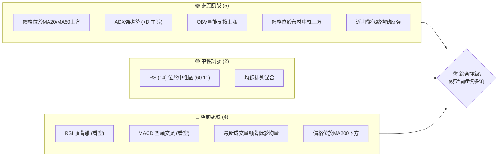

<details>
<summary>📊 靜態圖表 (點擊展開)</summary>

</details>

<html>
<head><meta charset="utf-8" /></head>
<body>
    <div>                        <script>window.PlotlyConfig = {MathJaxConfig: 'local'};</script>
        <script charset="utf-8" src="https://cdn.plot.ly/plotly-3.5.0.min.js" integrity="sha256-fHbNLP+GlIXN+efbQec78UkemUz3NJp7UmfGxC1tNxs=" crossorigin="anonymous"></script>                <div id="candlestick-chart" class="plotly-graph-div" style="height:500px; width:100%;"></div>            <script>                window.PLOTLYENV=window.PLOTLYENV || {};                                if (document.getElementById("candlestick-chart")) {                    Plotly.newPlot(                        "candlestick-chart",                        [{"close":{"dtype":"f8","bdata":"AAAAQP\u002ftbkAAAADA8wJvQAAAAOBzVm9AAAAA4Op7b0AAAAAAlUhuQAAAAOBYYW5AAAAAQMHKbkAAAACA1uNuQAAAAKAOGW1AAAAA4AYnbUAAAAAgtOpsQAAAAICeUG1AAAAA4CMybUAAAABgCgxtQAAAAODWPm1AAAAAoAfObUAAAABAgQtsQAAAACAn8WtAAAAAgGq2a0AAAAAgIahrQAAAACBG32xAAAAAYJyTbUAAAACgz\u002fNtQAAAAEAmXHRAAAAAoDEXc0AAAAAgRx5yQAAAAABkvHJAAAAAQPwDc0AAAABAzbByQAAAAADDZHJAAAAA4OQjc0AAAADASll0QAAAAED3dXNAAAAAALggc0AAAADAyBByQAAAAKDZk3FAAAAAIL2IcUAAAADAm3BxQAAAAID063FAAAAAwE3ocUAAAAAgZb5xQAAAAIDpFHJAAAAAoDugcUAAAABA7OVxQAAAAABXcnJAAAAAILsyckAAAACADyJzQAAAAODHknJAAAAAwD\u002fcckAAAACgaXFzQAAAACB+GHJAAAAAAMs3cUAAAAAAgxdxQAAAAEDq73BAAAAAQMBlcUAAAACAl5lxQAAAAKDmenFAAAAAINZxcUAAAACg5RlxQAAAAKBF6m9AAAAAwBhQcEAAAAAAZwRwQAAAAKDv1G5AAAAAYP8Yb0AAAABA80luQAAAAKCOuW1AAAAAoH3rbUAAAABApVZtQAAAAOBQM2xAAAAAgLcHa0AAAAAgpa9rQAAAAKCMUGtAAAAAAJZka0AAAACg4QRsQAAAAODmLGpAAAAAIHmxaEAAAADg0OFoQAAAAIBzemhAAAAAYKl2aUAAAAAA7hZpQAAAAKDO9mhAAAAAYOX7aEAAAACAws5pQAAAAKCroGpAAAAA4AgIa0AAAAAgLWZrQAAAAMCphWtAAAAAwLu0a0AAAADgVbRoQAAAAEDpmWdAAAAAQEz5ZkAAAADg7W9nQAAAAEDXK2ZAAAAAIMZdZkAAAAAghdlnQAAAAEBjpWhAAAAAoLNEaEAAAADgFIloQAAAAOD7mGhAAAAAYPlFaEAAAAAgLYBoQAAAAIAGN2hAAAAAIHhQaEAAAAAgPe1nQAAAAOAhEmhAAAAAoDD1Z0AAAADAu49nQAAAAMCHumhAAAAAwPZ+aUAAAAAAwDJpQAAAAAD1HWhAAAAAQA6mZ0AAAAAAmc1nQAAAAMBmaWZAAAAAYMuoZUAAAABA6jFmQAAAAKBjEWZAAAAA4MK5ZkAAAAAAUsllQAAAAMBahmVAAAAAIH8NZUAAAADgOoBkQAAAAOAX8GNAAAAAwDZEY0AAAADAGkViQAAAAOAoAGFAAAAAgFXKYUAAAACgcIFjQAAAACCs6mNAAAAA4J2TY0AAAACg7n1jQAAAAACl8mNAAAAAQOQtY0AAAAAADHRjQAAAAGDYf2NAAAAAYBFyYkAAAACALpphQAAAACA0NGJAAAAAQAJsYkAAAADgLbliQAAAACCbHGJAAAAAoGCXYkAAAABguY9iQAAAAKDe+mJAAAAAQApIY0AAAABArw1jQAAAAEAK4WJAAAAAICmcYkAAAAAgrFFkQAAAAOBk02NAAAAAoD5SY0AAAABAq21jQAAAAADaRGNAAAAAQMULY0AAAADAUV9jQAAAAOAWpWJAAAAAwLA5Y0AAAACAf1JiQAAAAKBgMGJAAAAAwAPKYUAAAADAkGVhQAAAAEAkSmFAAAAAwCJTYkAAAABgLxdiQAAAAIDbO2JAAAAAABIhYkAAAACgftVhQAAAAMAe5WFAAAAAIIU7YUAAAABA4UJhQAAAAADXc2NAAAAAAABgZEAAAACA6zllQAAAAEDhSmZAAAAAgOvhZUAAAABgjzJmQAAAAKBwpWZAAAAAAABwZ0AAAADA9QhmQAAAAMD1qGVAAAAAYLieZUAAAABguL5kQAAAAGCPemRAAAAA4HosZEAAAABgj3plQAAAAKBHiWZAAAAAQDMrZ0AAAADA9UBoQAAAAEDhUmhAAAAAYGZ+aEAAAABA4TpoQAAAAGCPWmdAAAAA4FG4Z0AAAAAghXNoQAAAAGBmHmhAAAAAIIVTZ0AAAABguK5mQAAAAMAehWdAAAAA4KO4Z0AAAABgjwJoQA=="},"high":{"dtype":"f8","bdata":"mLvph733b0CHIq4fnx1vQFqygvRElm9A9TbejTv7b0AAxekC4vRvQOG1iyIT325A6bW1xV0Vb0ANk076seZuQJ4uFESN6W5Ag5O4xw9BbUBSzhz6VEJtQGdzSeI+lG1A\u002foqHsRKlbUDxDimTw2FtQMWh3\u002fGyVW1AlQZE9McBbkD4elIPW4ttQP9dKkHq9WtAJIAGvDMEbEDy88sQOrprQNY0m8QOGW1APcdMK7QQbkCBV\u002fXgrDJuQMr1pA82cHVAufMTComGdEDpcICe8BhzQNtFKY4ECnNAmJpd1W\u002fXc0ApX6i+5CNzQN4JHlkP13JAYGNObslKc0AD\u002f7UUuW50QKh0eWhJJ3RAkkHDZmBgc0DcLsoqk4ZyQIdn9nsrO3JAKy++\u002fNq7cUCXUdU8bJxxQPynexKD+3FAgdzYfJFKckAsbLWIVEVyQP2mR+S2ZXJA6jF1xMkuckBYdJOf9RNyQPxZOK4bsnJAdwJy33Idc0CXQj901kxzQFSaIaj46HJAd2UxX8RRc0BjfwHWHgl0QDpAbci+5nJACxsbC5P3cUBGmuCJaGlxQKAsO4wcOHFASU7aUu+VcUCpE+WO+dZxQE3Zwif003FA71fry3a7cUAKPsVEZn5xQIaKH1fMwXBA8hTi8fuCcEDbWVJ+9n9wQJlUpgERt29AC1KcDXhbb0BT65lxj\u002fFuQM3H8XXQ3W1Aqni9p1u3bkC8sK\u002fU\u002fX9tQF3yReqia21A8gIS\u002fRz5a0DWbkBbOTVsQBpYSwYOrmtAljuxo63Ka0ApxWKJNVhsQLvZOxZEEm1Akkbu7DThaUC1JciAZ1JpQPpoEGslxmhA\u002fcQF1PQWakCk35tcVSNpQBnrmwk6SGlAXsXaNGoNakBV5Ex+zdRpQOfVn\u002fYEw2pAobcUbxlFa0ClsELbEuxrQKWMmXZUqGtAwaCdyzP+a0CqnTekMxhpQDw96vqHlGhAwKU3PBt6Z0BOBe81gZRnQIK6cpmMK2dAR43bljX0ZkAtxD9EtD1oQKN6Xdy+smhAtbjXr9t\u002faECHhiz5NKJoQFCeXKut5GhAosD2pIWpaECvq8U1Y6VoQOvEyIvbf2hATZ205hCsaEChU8gPqQ5pQDjDC1YSNmhAWx8WZzJPaECB2Y1UFLlnQCFtygt372hANuHjwTC8aUAY3oLmdOJpQBOmb0lMH2lApoflwJlKaEDhd9iCeOZnQDOywVc7UWdAnsqjBhZ\u002fZkDf7c4LDnFmQJMAmqHKYGZAKoYeDEgVZ0AQ6WgSBmNmQPKRTHCGoWZAmFY9l2Y0ZUD8vRkU\u002fQllQLdrcSBVU2VAgwzq1WjaY0C2IHZX7yxjQBywkUNHQWJAvVF8inPWYUAHGENHNeZjQOOCZk8PmmRAWbTIjORiZECUiKIikc9jQGG2GiqGN2RA733hWTjXY0Cq5S\u002fIFJhjQNsgVDG78GNAHE4Kn4cuY0CqPWCbXCliQGunmnL5R2JAbKckcuMXY0ACvxDvA\u002f9iQEC8mFxKMmJAAozuBLe0YkAqKglC88xiQOtpG2VpImNAqJ3XT32sY0BZx4y\u002fWdRjQEdraTQS72JAd2voGlAzY0Dwtg2oMGVlQONeYk7e52RAfggx\u002f7sGZEDrfJ0lAMZjQP4nG4W9y2NAgHDQusdNY0BnM3yV9otjQNESkpbuFmNAwzNrMZxnY0DKD0nWqCtjQPFlFhYxqmJAXl6wJbo+YkAnO9eeTKZhQEZVrJKslmFAnLZUG2JcYkApfXz6IaRiQBclFUrFPWJA6SHILQ6BYkCd2mOVIwJiQGJlsPvZ3WJAAAAAoJnZYUAAAACgcIVhQAAAAMAefWNAAAAAwMwsZUAAAACA65FlQAAAAOCjiGZAAAAAAAAQZ0AAAADgUThmQAAAAEDhKmdAAAAAgMKlZ0AAAADgerxmQAAAAGC4lmZAAAAAoJmxZUAAAABgZhZlQAAAAOBRmGRAAAAAgMKlZEAAAACgmcllQAAAAAAA8GZAAAAA4KNQZ0AAAACgR0loQAAAAMDMBGlAAAAAAADAaEAAAACAwnVoQAAAAKBwHWhAAAAAgD3yZ0AAAABguBZpQAAAAIDCjWhAAAAA4FHYZ0AAAABACpdnQAAAAEAKh2dAAAAAgD0aaEAAAAAAAKBoQA=="},"hovertemplate":"\u003cb\u003e%{x|%Y-%m-%d}\u003c\u002fb\u003e\u003cbr\u003e\u958b: $%{open:.2f}\u003cbr\u003e\u9ad8: $%{high:.2f}\u003cbr\u003e\u4f4e: $%{low:.2f}\u003cbr\u003e\u6536: $%{close:.2f}\u003cextra\u003e\u003c\u002fextra\u003e","low":{"dtype":"f8","bdata":"aBogVOCSbkCXr762a71uQEwjPItldG5AZXM1bqcjb0Bm4RwmsBduQJUv0kp3FW5AB5FBJeUgbkAGyV2OzTZuQE81AwstzWxAjQAoKtBObEAZBHWyhtNsQL7Ax8u6tGxA6uy3+rEtbUAaGGKVatxsQMRfZ6F222xAM2z7pe4obUC3pzQTn6trQCH3hqt2ImtADe5FKXGAa0ABYe1C6TprQKAq75LiA2xAoO2lEfcubUC1VVsEJxdtQLDE5Q5YWnNAMxWkS3HjckCCLCyqcxdyQO50oOllb3JAQAb6NnS+ckBUQdJahUtyQBTvYKlrG3JA9YpV6t9vckDg4QiWRQhzQO9OBJn1OXNAP\u002fdBGOWackBHumAHp+RxQFmid0CMjHFABKrEpLtWcUCjY2Bg1htxQOde8u9EO3FAR0YNLfe8cUAnDxdBbJxxQEysyvVeCHJAxKTbOA3OcEAVumCvEpZxQK14vYoW2HFAG50IxJ8jckCeo+9svn5yQJitu54lI3JA2SuwNIKRckDUZZvLgNNyQOWVTrDn23FAYT0sSA4acUDXslXsjelwQKSs1C6wuXBA3u5LIZ\u002frcEBs5avkaohxQHb52MadYXFAjnUdoTltcUDGMt9QFdtwQFMKmeXe1m9AUIKw84vkb0BEg+T2ebVvQFAiE5oodm5ArfjqvK2wbkA+JcnngrptQP182bzJ3WxAnjrn4OdzbUAM4eSevm9sQF7AQmc8GWxAu7jQ1Pm8akCOvdQpci9qQCIRlyXKx2pA4BQZlROmakAwZCmncv9qQFhTXoN\u002fIGpAOQgwjcULaEAUBX\u002f0nyNoQNRH5yPhD2dAGcHLNycgaUC+88bl5YxoQBcINaX0b2hA5220KenYaEC8FCvp08VoQGetSoXqoWlAV6sHoxaKakC5j3jfufJqQDUAK1xMHmtAcMBv7wgIa0BZgtMv9iJnQEQBBcMCG2dAFOcef1iJZkBYUtdjn+tmQIVWNOyh\u002f2VAEQ2XTKgvZkBrbReCEl9nQCGEYVDf9GdAtpVFe4TgZ0AeY\u002fT6cCdoQFdQePAwXWhA0abaV9TuZ0CzhyQteFBoQACJsuFMMWhAM1E+LcMgaEA6JjhC+ORnQAXHvNogsWdANEpXZ3naZ0DD7LXeaiBnQFiaB1Tvg2dAjVkLz2CKaEDQ10WZxf5oQKKGHTWrxGdAbbqe\u002fWKXZ0ATRBeDLzxnQCmWdTeLV2ZAFPK+JDNAZUCTG1imV\u002fxlQPCByP7XbGVASGPTmhM9ZkB9E+GIaqJlQFK3JQ1haGVAGYBDraYeZEA8JLjUf1VkQJIL7RUu7mNA1Lsc2uHrYkBgJAp+rP1hQOTbq9Hv2GBADyfPOqZNYUAXCv7MoE9iQBnQESo9jWNAhom6ONkuY0CTa+b5A\u002f9iQF9uQgj8V2NARJv5EyILY0B5DtQ6+9piQAamLpRKZ2NA2TpPjBBcYkB4blXNcUNhQOyFO6boR2FAYHd\u002fTnhaYkAPSB4\u002fohRiQDkGvLZfs2FA5Dn\u002fNgmWYUA636gNq9FhQI4D5RuYkmJAQH+sxh6zYkD8uq4U9OJiQIzYBoRzPWJAK2381d19YkAhr5XrrABkQBKFbe7awWNAMvcpn6EzY0Bsd6eAHD9jQKsX323nHmNAw386pVjwYkBMnDbI5YtiQC5uNhPsbWJARIpNX+\u002fFYkA0L6xX2EpiQFYdfXwYA2JA28\u002fBkmfBYUCP98ZmMjphQFOwBL8lD2FAYAvn3p9rYUCZXGrXUwViQFgBc3n5eWFAL\u002fhNzy3rYUDwipuXfm5hQETmUWvizGFAAAAAAAAAYUAAAACAPdJgQAAAAEAKd2FAAAAAgOsxZEAAAABguMZkQAAAAKCZuWVAAAAAIIWrZUAAAADgUbBlQAAAAOBRAGZAAAAAoJnZZkAAAABgj8JlQAAAAKCZGWVAAAAAwMz8ZEAAAACgmUFkQAAAAMDMFGRAAAAAYI8KZEAAAADAzMRkQAAAAOBRyGVAAAAAAABgZkAAAACgcNVmQAAAAKCZ2WdAAAAAYLjGZ0AAAABAM9NnQAAAAADXm2ZAAAAAgOshZ0AAAABgZi5nQAAAAMDMnGdAAAAA4KPoZkAAAACAwp1mQAAAAKCZWWZAAAAAYGZmZ0AAAABAM+NnQA=="},"name":"\u50f9\u683c","open":{"dtype":"f8","bdata":"X18x\u002fSb2b0BfzHUoUQJvQCu9uaOQzm5AW9nyOEdTb0DH0LkUAuVvQAw2W4QHYW5AA8K9WpOfbkDO8hN0t4huQJ4uFESN6W5ASjPVmJbLbEBWSykONudsQNJwHClHB21A+KUm8rtvbUC+laJUHyVtQB1h1FMfJW1AVZbKVUQ2bUCu3EYP\u002fXdtQCosnShhiGtAJIAGvDMEbEB1pnFDYYhrQCMy4ShW12xAGnaBsGDAbUBWFq\u002fy9sFtQLr3V\u002f0Ny3NAZ1+M1A58dEBfe+ZHVfZyQKiVvYfPAHNAoaZU\u002fZ15c0AcfDa6fhRzQI+BxnytynJAXUULSouKckBaYofNSjNzQCMYRXppF3RAVH3ZVrFWc0ACACqlVE9yQGub041LK3JATLIsvvKlcUAmBtttgJdxQKeSAK\u002ffSXFA\u002fbRDxj4YckBnaipKUvVxQLRTNQp0IXJA6jF1xMkuckCQn3IR97JxQOon7fdOHHJAph34vyKnckDDSpuoAo5yQAVu5kt023JAx3ZXmprwckAbF35gvPtyQOGFsCpR3nJAlsk8jPbycUDaLVETlUZxQBbemJZDEnFAlm74fq\u002f0cEDoPGt0x8JxQBGKkqkdzXFAvmaENliUcUDRanvl2ntxQGcswtuTsXBASpFxzcwecEBb4wCA63lwQOkiKZCADm9AMbkXtarMbkDX1pn7ns1uQPeLOcJJsW1AAY4pc1SObkCWYEifMFltQH6NyAppaW1AowqM3rTza0CLNVapWjFqQP63VG4SHGtAdbbfZXbcakBZ2AMYGzdrQFPqxe7wt2xA3umRVxa6aUBx3gdeC3VoQDxW1bmgHGhAatdk2A0HakC64UuVU8loQDyV4iPQ6GhAdeO63GJ8aUAkguYAaONoQADMChjl0mlAFjh+czI1a0Bnosg48H9rQHsnAM30VWtAF2Z7CkCOa0AZ9\u002fpola5nQKTyBMh1ZWhADAVSonpkZ0BlPiIiTfJmQAOSgbUXxmZAZh2KCFSzZkCZxKbfqGdnQB+Ejs3Fc2hAmzuVVl5naECgQ9tV4zloQJuffb81m2hAtACbKiwfaEBcfjHKmVtoQOgBr9IMZ2hATgqI8HGIaED7zlxtHaRoQLuvcupI7GdA6y5H6m1DaED\u002fERF12rZnQCI69DbG32dAThWSXDGdaEBBV7IbK4lpQBOmb0lMH2lApoflwJlKaECYSa4k+KdnQDOywVc7UWdAKdzTgb9hZkBHAB7S3FdmQG3rclGdgGVAcnti2kBPZkDE\u002fehuH1JmQFu2\u002f031yWVAD80rf9kxZUCN4GLEtfJkQBT5K1xnSmVAukzPpLG2Y0AfZnAkVytjQONwi\u002fn7ImJA\u002f\u002fK9h29oYUCtw4BxJH9iQH+CGh0u7mNAWbTIjORiZECvLYGoK6xjQBESHoBD1mNAwmi2ysOtY0D6Mg5O7DtjQPJJjreSlGNA9YhZy4YYY0Brr0We2iViQJCnKZ0xi2FA3\u002fot6oGUYkBe1ZVWtYhiQBTsdLYi7GFAlx1rKxGkYUAr\u002fnj14AdiQG800smcr2JAbizymeIBY0B7QAWkaAxjQH4tKqWdxWJAIXFlDrsiY0DLPPcsoblkQCbT8Q\u002fIgmRA3ludyeLPY0DE2hzviXBjQLH1uJ3EXGNAPH1z\u002frYbY0DlgMaE9r1iQFhlWOqNEGNAtNUSYZPcYkCrxke\u002f9Q5jQKjPclq9lmJAkkMVVXTsYUBK6TlKEI5hQFHtbeWucWFAV7tcavl5YUDC2eZxRpJiQN1rKOQOyWFAHO67s6hdYkAqXaFb8uhhQK2nkU7cuGJAAAAAYGbGYUAAAACAPSphQAAAAOCjeGFAAAAAgML9ZEAAAADgetxkQAAAAKBwDWZAAAAAgMLdZkAAAACA6xlmQAAAAEAzS2ZAAAAAgMJFZ0AAAADAzIxmQAAAAOBRkGZAAAAAYI+SZUAAAADAHkVkQAAAAKBHgWRAAAAA4KNAZEAAAACgcM1kQAAAAOCjAGZAAAAAACnEZkAAAABgZkZnQAAAACCF02hAAAAAYI8SaEAAAADAzARoQAAAAKBwHWhAAAAAwPWgZ0AAAACAwoVnQAAAACCuz2dAAAAAAADAZ0AAAAAAAEBnQAAAAIAUfmZAAAAA4FGgZ0AAAACgcPVnQA=="},"x":["2025-08-07T00:00:00-04:00","2025-08-08T00:00:00-04:00","2025-08-11T00:00:00-04:00","2025-08-12T00:00:00-04:00","2025-08-13T00:00:00-04:00","2025-08-14T00:00:00-04:00","2025-08-15T00:00:00-04:00","2025-08-18T00:00:00-04:00","2025-08-19T00:00:00-04:00","2025-08-20T00:00:00-04:00","2025-08-21T00:00:00-04:00","2025-08-22T00:00:00-04:00","2025-08-25T00:00:00-04:00","2025-08-26T00:00:00-04:00","2025-08-27T00:00:00-04:00","2025-08-28T00:00:00-04:00","2025-08-29T00:00:00-04:00","2025-09-02T00:00:00-04:00","2025-09-03T00:00:00-04:00","2025-09-04T00:00:00-04:00","2025-09-05T00:00:00-04:00","2025-09-08T00:00:00-04:00","2025-09-09T00:00:00-04:00","2025-09-10T00:00:00-04:00","2025-09-11T00:00:00-04:00","2025-09-12T00:00:00-04:00","2025-09-15T00:00:00-04:00","2025-09-16T00:00:00-04:00","2025-09-17T00:00:00-04:00","2025-09-18T00:00:00-04:00","2025-09-19T00:00:00-04:00","2025-09-22T00:00:00-04:00","2025-09-23T00:00:00-04:00","2025-09-24T00:00:00-04:00","2025-09-25T00:00:00-04:00","2025-09-26T00:00:00-04:00","2025-09-29T00:00:00-04:00","2025-09-30T00:00:00-04:00","2025-10-01T00:00:00-04:00","2025-10-02T00:00:00-04:00","2025-10-03T00:00:00-04:00","2025-10-06T00:00:00-04:00","2025-10-07T00:00:00-04:00","2025-10-08T00:00:00-04:00","2025-10-09T00:00:00-04:00","2025-10-10T00:00:00-04:00","2025-10-13T00:00:00-04:00","2025-10-14T00:00:00-04:00","2025-10-15T00:00:00-04:00","2025-10-16T00:00:00-04:00","2025-10-17T00:00:00-04:00","2025-10-20T00:00:00-04:00","2025-10-21T00:00:00-04:00","2025-10-22T00:00:00-04:00","2025-10-23T00:00:00-04:00","2025-10-24T00:00:00-04:00","2025-10-27T00:00:00-04:00","2025-10-28T00:00:00-04:00","2025-10-29T00:00:00-04:00","2025-10-30T00:00:00-04:00","2025-10-31T00:00:00-04:00","2025-11-03T00:00:00-05:00","2025-11-04T00:00:00-05:00","2025-11-05T00:00:00-05:00","2025-11-06T00:00:00-05:00","2025-11-07T00:00:00-05:00","2025-11-10T00:00:00-05:00","2025-11-11T00:00:00-05:00","2025-11-12T00:00:00-05:00","2025-11-13T00:00:00-05:00","2025-11-14T00:00:00-05:00","2025-11-17T00:00:00-05:00","2025-11-18T00:00:00-05:00","2025-11-19T00:00:00-05:00","2025-11-20T00:00:00-05:00","2025-11-21T00:00:00-05:00","2025-11-24T00:00:00-05:00","2025-11-25T00:00:00-05:00","2025-11-26T00:00:00-05:00","2025-11-28T00:00:00-05:00","2025-12-01T00:00:00-05:00","2025-12-02T00:00:00-05:00","2025-12-03T00:00:00-05:00","2025-12-04T00:00:00-05:00","2025-12-05T00:00:00-05:00","2025-12-08T00:00:00-05:00","2025-12-09T00:00:00-05:00","2025-12-10T00:00:00-05:00","2025-12-11T00:00:00-05:00","2025-12-12T00:00:00-05:00","2025-12-15T00:00:00-05:00","2025-12-16T00:00:00-05:00","2025-12-17T00:00:00-05:00","2025-12-18T00:00:00-05:00","2025-12-19T00:00:00-05:00","2025-12-22T00:00:00-05:00","2025-12-23T00:00:00-05:00","2025-12-24T00:00:00-05:00","2025-12-26T00:00:00-05:00","2025-12-29T00:00:00-05:00","2025-12-30T00:00:00-05:00","2025-12-31T00:00:00-05:00","2026-01-02T00:00:00-05:00","2026-01-05T00:00:00-05:00","2026-01-06T00:00:00-05:00","2026-01-07T00:00:00-05:00","2026-01-08T00:00:00-05:00","2026-01-09T00:00:00-05:00","2026-01-12T00:00:00-05:00","2026-01-13T00:00:00-05:00","2026-01-14T00:00:00-05:00","2026-01-15T00:00:00-05:00","2026-01-16T00:00:00-05:00","2026-01-20T00:00:00-05:00","2026-01-21T00:00:00-05:00","2026-01-22T00:00:00-05:00","2026-01-23T00:00:00-05:00","2026-01-26T00:00:00-05:00","2026-01-27T00:00:00-05:00","2026-01-28T00:00:00-05:00","2026-01-29T00:00:00-05:00","2026-01-30T00:00:00-05:00","2026-02-02T00:00:00-05:00","2026-02-03T00:00:00-05:00","2026-02-04T00:00:00-05:00","2026-02-05T00:00:00-05:00","2026-02-06T00:00:00-05:00","2026-02-09T00:00:00-05:00","2026-02-10T00:00:00-05:00","2026-02-11T00:00:00-05:00","2026-02-12T00:00:00-05:00","2026-02-13T00:00:00-05:00","2026-02-17T00:00:00-05:00","2026-02-18T00:00:00-05:00","2026-02-19T00:00:00-05:00","2026-02-20T00:00:00-05:00","2026-02-23T00:00:00-05:00","2026-02-24T00:00:00-05:00","2026-02-25T00:00:00-05:00","2026-02-26T00:00:00-05:00","2026-02-27T00:00:00-05:00","2026-03-02T00:00:00-05:00","2026-03-03T00:00:00-05:00","2026-03-04T00:00:00-05:00","2026-03-05T00:00:00-05:00","2026-03-06T00:00:00-05:00","2026-03-09T00:00:00-04:00","2026-03-10T00:00:00-04:00","2026-03-11T00:00:00-04:00","2026-03-12T00:00:00-04:00","2026-03-13T00:00:00-04:00","2026-03-16T00:00:00-04:00","2026-03-17T00:00:00-04:00","2026-03-18T00:00:00-04:00","2026-03-19T00:00:00-04:00","2026-03-20T00:00:00-04:00","2026-03-23T00:00:00-04:00","2026-03-24T00:00:00-04:00","2026-03-25T00:00:00-04:00","2026-03-26T00:00:00-04:00","2026-03-27T00:00:00-04:00","2026-03-30T00:00:00-04:00","2026-03-31T00:00:00-04:00","2026-04-01T00:00:00-04:00","2026-04-02T00:00:00-04:00","2026-04-06T00:00:00-04:00","2026-04-07T00:00:00-04:00","2026-04-08T00:00:00-04:00","2026-04-09T00:00:00-04:00","2026-04-10T00:00:00-04:00","2026-04-13T00:00:00-04:00","2026-04-14T00:00:00-04:00","2026-04-15T00:00:00-04:00","2026-04-16T00:00:00-04:00","2026-04-17T00:00:00-04:00","2026-04-20T00:00:00-04:00","2026-04-21T00:00:00-04:00","2026-04-22T00:00:00-04:00","2026-04-23T00:00:00-04:00","2026-04-24T00:00:00-04:00","2026-04-27T00:00:00-04:00","2026-04-28T00:00:00-04:00","2026-04-29T00:00:00-04:00","2026-04-30T00:00:00-04:00","2026-05-01T00:00:00-04:00","2026-05-04T00:00:00-04:00","2026-05-05T00:00:00-04:00","2026-05-06T00:00:00-04:00","2026-05-07T00:00:00-04:00","2026-05-08T00:00:00-04:00","2026-05-11T00:00:00-04:00","2026-05-12T00:00:00-04:00","2026-05-13T00:00:00-04:00","2026-05-14T00:00:00-04:00","2026-05-15T00:00:00-04:00","2026-05-18T00:00:00-04:00","2026-05-19T00:00:00-04:00","2026-05-20T00:00:00-04:00","2026-05-21T00:00:00-04:00","2026-05-22T00:00:00-04:00"],"type":"candlestick"},{"hovertemplate":"MA30: $%{y:.2f}\u003cextra\u003e\u003c\u002fextra\u003e","line":{"color":"#2196F3","dash":"dash","width":2},"mode":"lines","name":"MA30","x":["2025-08-07T00:00:00-04:00","2025-08-08T00:00:00-04:00","2025-08-11T00:00:00-04:00","2025-08-12T00:00:00-04:00","2025-08-13T00:00:00-04:00","2025-08-14T00:00:00-04:00","2025-08-15T00:00:00-04:00","2025-08-18T00:00:00-04:00","2025-08-19T00:00:00-04:00","2025-08-20T00:00:00-04:00","2025-08-21T00:00:00-04:00","2025-08-22T00:00:00-04:00","2025-08-25T00:00:00-04:00","2025-08-26T00:00:00-04:00","2025-08-27T00:00:00-04:00","2025-08-28T00:00:00-04:00","2025-08-29T00:00:00-04:00","2025-09-02T00:00:00-04:00","2025-09-03T00:00:00-04:00","2025-09-04T00:00:00-04:00","2025-09-05T00:00:00-04:00","2025-09-08T00:00:00-04:00","2025-09-09T00:00:00-04:00","2025-09-10T00:00:00-04:00","2025-09-11T00:00:00-04:00","2025-09-12T00:00:00-04:00","2025-09-15T00:00:00-04:00","2025-09-16T00:00:00-04:00","2025-09-17T00:00:00-04:00","2025-09-18T00:00:00-04:00","2025-09-19T00:00:00-04:00","2025-09-22T00:00:00-04:00","2025-09-23T00:00:00-04:00","2025-09-24T00:00:00-04:00","2025-09-25T00:00:00-04:00","2025-09-26T00:00:00-04:00","2025-09-29T00:00:00-04:00","2025-09-30T00:00:00-04:00","2025-10-01T00:00:00-04:00","2025-10-02T00:00:00-04:00","2025-10-03T00:00:00-04:00","2025-10-06T00:00:00-04:00","2025-10-07T00:00:00-04:00","2025-10-08T00:00:00-04:00","2025-10-09T00:00:00-04:00","2025-10-10T00:00:00-04:00","2025-10-13T00:00:00-04:00","2025-10-14T00:00:00-04:00","2025-10-15T00:00:00-04:00","2025-10-16T00:00:00-04:00","2025-10-17T00:00:00-04:00","2025-10-20T00:00:00-04:00","2025-10-21T00:00:00-04:00","2025-10-22T00:00:00-04:00","2025-10-23T00:00:00-04:00","2025-10-24T00:00:00-04:00","2025-10-27T00:00:00-04:00","2025-10-28T00:00:00-04:00","2025-10-29T00:00:00-04:00","2025-10-30T00:00:00-04:00","2025-10-31T00:00:00-04:00","2025-11-03T00:00:00-05:00","2025-11-04T00:00:00-05:00","2025-11-05T00:00:00-05:00","2025-11-06T00:00:00-05:00","2025-11-07T00:00:00-05:00","2025-11-10T00:00:00-05:00","2025-11-11T00:00:00-05:00","2025-11-12T00:00:00-05:00","2025-11-13T00:00:00-05:00","2025-11-14T00:00:00-05:00","2025-11-17T00:00:00-05:00","2025-11-18T00:00:00-05:00","2025-11-19T00:00:00-05:00","2025-11-20T00:00:00-05:00","2025-11-21T00:00:00-05:00","2025-11-24T00:00:00-05:00","2025-11-25T00:00:00-05:00","2025-11-26T00:00:00-05:00","2025-11-28T00:00:00-05:00","2025-12-01T00:00:00-05:00","2025-12-02T00:00:00-05:00","2025-12-03T00:00:00-05:00","2025-12-04T00:00:00-05:00","2025-12-05T00:00:00-05:00","2025-12-08T00:00:00-05:00","2025-12-09T00:00:00-05:00","2025-12-10T00:00:00-05:00","2025-12-11T00:00:00-05:00","2025-12-12T00:00:00-05:00","2025-12-15T00:00:00-05:00","2025-12-16T00:00:00-05:00","2025-12-17T00:00:00-05:00","2025-12-18T00:00:00-05:00","2025-12-19T00:00:00-05:00","2025-12-22T00:00:00-05:00","2025-12-23T00:00:00-05:00","2025-12-24T00:00:00-05:00","2025-12-26T00:00:00-05:00","2025-12-29T00:00:00-05:00","2025-12-30T00:00:00-05:00","2025-12-31T00:00:00-05:00","2026-01-02T00:00:00-05:00","2026-01-05T00:00:00-05:00","2026-01-06T00:00:00-05:00","2026-01-07T00:00:00-05:00","2026-01-08T00:00:00-05:00","2026-01-09T00:00:00-05:00","2026-01-12T00:00:00-05:00","2026-01-13T00:00:00-05:00","2026-01-14T00:00:00-05:00","2026-01-15T00:00:00-05:00","2026-01-16T00:00:00-05:00","2026-01-20T00:00:00-05:00","2026-01-21T00:00:00-05:00","2026-01-22T00:00:00-05:00","2026-01-23T00:00:00-05:00","2026-01-26T00:00:00-05:00","2026-01-27T00:00:00-05:00","2026-01-28T00:00:00-05:00","2026-01-29T00:00:00-05:00","2026-01-30T00:00:00-05:00","2026-02-02T00:00:00-05:00","2026-02-03T00:00:00-05:00","2026-02-04T00:00:00-05:00","2026-02-05T00:00:00-05:00","2026-02-06T00:00:00-05:00","2026-02-09T00:00:00-05:00","2026-02-10T00:00:00-05:00","2026-02-11T00:00:00-05:00","2026-02-12T00:00:00-05:00","2026-02-13T00:00:00-05:00","2026-02-17T00:00:00-05:00","2026-02-18T00:00:00-05:00","2026-02-19T00:00:00-05:00","2026-02-20T00:00:00-05:00","2026-02-23T00:00:00-05:00","2026-02-24T00:00:00-05:00","2026-02-25T00:00:00-05:00","2026-02-26T00:00:00-05:00","2026-02-27T00:00:00-05:00","2026-03-02T00:00:00-05:00","2026-03-03T00:00:00-05:00","2026-03-04T00:00:00-05:00","2026-03-05T00:00:00-05:00","2026-03-06T00:00:00-05:00","2026-03-09T00:00:00-04:00","2026-03-10T00:00:00-04:00","2026-03-11T00:00:00-04:00","2026-03-12T00:00:00-04:00","2026-03-13T00:00:00-04:00","2026-03-16T00:00:00-04:00","2026-03-17T00:00:00-04:00","2026-03-18T00:00:00-04:00","2026-03-19T00:00:00-04:00","2026-03-20T00:00:00-04:00","2026-03-23T00:00:00-04:00","2026-03-24T00:00:00-04:00","2026-03-25T00:00:00-04:00","2026-03-26T00:00:00-04:00","2026-03-27T00:00:00-04:00","2026-03-30T00:00:00-04:00","2026-03-31T00:00:00-04:00","2026-04-01T00:00:00-04:00","2026-04-02T00:00:00-04:00","2026-04-06T00:00:00-04:00","2026-04-07T00:00:00-04:00","2026-04-08T00:00:00-04:00","2026-04-09T00:00:00-04:00","2026-04-10T00:00:00-04:00","2026-04-13T00:00:00-04:00","2026-04-14T00:00:00-04:00","2026-04-15T00:00:00-04:00","2026-04-16T00:00:00-04:00","2026-04-17T00:00:00-04:00","2026-04-20T00:00:00-04:00","2026-04-21T00:00:00-04:00","2026-04-22T00:00:00-04:00","2026-04-23T00:00:00-04:00","2026-04-24T00:00:00-04:00","2026-04-27T00:00:00-04:00","2026-04-28T00:00:00-04:00","2026-04-29T00:00:00-04:00","2026-04-30T00:00:00-04:00","2026-05-01T00:00:00-04:00","2026-05-04T00:00:00-04:00","2026-05-05T00:00:00-04:00","2026-05-06T00:00:00-04:00","2026-05-07T00:00:00-04:00","2026-05-08T00:00:00-04:00","2026-05-11T00:00:00-04:00","2026-05-12T00:00:00-04:00","2026-05-13T00:00:00-04:00","2026-05-14T00:00:00-04:00","2026-05-15T00:00:00-04:00","2026-05-18T00:00:00-04:00","2026-05-19T00:00:00-04:00","2026-05-20T00:00:00-04:00","2026-05-21T00:00:00-04:00","2026-05-22T00:00:00-04:00"],"y":{"dtype":"f8","bdata":"AAAAAAAA+H8AAAAAAAD4fwAAAAAAAPh\u002fAAAAAAAA+H8AAAAAAAD4fwAAAAAAAPh\u002fAAAAAAAA+H8AAAAAAAD4fwAAAAAAAPh\u002fAAAAAAAA+H8AAAAAAAD4fwAAAAAAAPh\u002fAAAAAAAA+H8AAAAAAAD4fwAAAAAAAPh\u002fAAAAAAAA+H8AAAAAAAD4fwAAAAAAAPh\u002fAAAAAAAA+H8AAAAAAAD4fwAAAAAAAPh\u002fAAAAAAAA+H8AAAAAAAD4fwAAAAAAAPh\u002fAAAAAAAA+H8AAAAAAAD4fwAAAAAAAPh\u002fAAAAAAAA+H8AAAAAAAD4f7y7uwvYg29A7+7u\u002fpHCb0CrqqrCnApwQHd3d2f4KnBAmpmZwdxHcEDe3d3lz2BwQFVVVUUvdXBAZmZmFm6HcECJiIj4c5hwQImIiOA7tXBAVVVVBanRcEBERETsse1wQLy7u0PqCnFAzczM\u002fMAkcUDNzMz0jEFxQImIiGguYnFAZmZmHk5+cUARERFZ6qlxQLy7u1sw0XFAiYiI6OP7cUDv7u5GzStyQHd3d8cHS3JAAAAAaMNfckDNzMwc0XFyQJqZmembVHJAMzMzMylGckAiIiLyvEFyQBEREZEFN3JAVVVV5Z0pckBERESkDRxyQBEREQlEB3JAmpmZoSPvcUAzMzMbLcpxQLy7u9uop3FAq6qqch6JcUDNzMwkMXBxQN7d3d0FWXFAzczMdA5DcUCrqqriaStxQAAAAMDNCnFAvLu7e1LlcEDNzMxUCcRwQImIiChInnBAMzMzI8B8cEAzMzNbkVtwQCIiIpLWLXBA7+7uXs\u002f3b0ARERGRmYVvQGZmZgZ\u002fGW9AIiIi0uawbkCrqqr6KztuQImIiKhd221AMzMzo7WKbUC8u7vrO0NtQJqZmTllBW1AERERgSXDbEAAAABglIBsQJqZmbkbQWxAERERcc8DbEDv7u7+wrJrQLy7u\u002fvQa2tAIiIiAnQZa0BEREQ0F9BqQN7d3f0vhmpAVVVVFa47akCrqqp6uwRqQDMzM7Nk2WlARERExCqpaUDNzMx8LoBpQLy7u+tvYWlAVVVVlelJaUCrqqrqui5pQDMzM4NHFGlAAAAAQAL6aEDe3d1dFtdoQN7d3d0gxWhA7+7uLtq+aEBmZmY2lbNoQFVVVQW4tWhA3t3d3f61aEBERERE7LZoQAAAANCxr2hAZmZmxkykaECrqqrKMZNoQHd3dwc4b2hAVVVVpWBBaEBEREQE+BRoQFVVVSVt5mdAIiIiYu27Z0CrqqraBqNnQHd3d+dOkWdAMzMzM+qAZ0AzMzOz22dnQJqZmcnMVGdAMzMzE1k6Z0De3d3tuwpnQAAAAEB+yWZAiYiI2DaSZkCJiIj4SmdmQBEREWFZP2ZAMzMzQ0UXZkAiIiJyh+xlQLy7u8sdyGVAEREREUycZUAzMzPDH3ZlQAAAAFAdT2VAzczMvBMgZUAiIiKyOe1kQN7d3T2MtWRAIiIiwi55ZEB3d3cn7kFkQM3MzGyvDmRAERERgYfjY0CamZnZzLZjQLy7uwuEmWNAd3d3VzmFY0AzMzOTampjQFVVVWU0T2NAvLu7qxUsY0BEREQkkB9jQKuqqnoQEWNAAAAAEEoCY0BEREQkI\u002fliQBEREeFt82JAq6qqOozxYkBmZmZ29PpiQFVVVWX8CGNAvLu7KzsVY0ARERERIgtjQBEREdFj\u002fGJAIiIi8iLtYkAzMzPzQdtiQN7d3f2SxGJAZmZmRki9YkAiIiJSp7FiQAAAAKDapmJAIiIiciekYkBVVVWVIaZiQM3MzLx+o2JA7+7ubliZYkCamZlp3oxiQHd3d1dPmGJAq6qq2oenYkAiIiJCRb5iQM3MzJyJ2mJAmpmZybvwYkDv7u4OkAtjQKuqqpq1K2NA7+7ubudUY0BVVVUFjGNjQLy7u\u002fsyc2NAREREpNCGY0AAAADQDJJjQImIiKhfnGNAAAAAUP+lY0BVVVXV+LdjQImIiKgt2WNAREREJNT6Y0Dv7u6ucS1kQN7d3U3LYWRAq6qqygGbZEBmZmZGUdVkQERERJQQCWVA7+7urho3ZUDv7u7OYW1lQDMzM6OZn2VA7+7uzvLLZUCamZmZUvVlQJqZmZlSJWZA3t3dfbFcZkDNzMxcSJZmQA=="},"type":"scatter"},{"hovertemplate":"MA60: $%{y:.2f}\u003cextra\u003e\u003c\u002fextra\u003e","line":{"color":"#9C27B0","dash":"dash","width":2},"mode":"lines","name":"MA60","x":["2025-08-07T00:00:00-04:00","2025-08-08T00:00:00-04:00","2025-08-11T00:00:00-04:00","2025-08-12T00:00:00-04:00","2025-08-13T00:00:00-04:00","2025-08-14T00:00:00-04:00","2025-08-15T00:00:00-04:00","2025-08-18T00:00:00-04:00","2025-08-19T00:00:00-04:00","2025-08-20T00:00:00-04:00","2025-08-21T00:00:00-04:00","2025-08-22T00:00:00-04:00","2025-08-25T00:00:00-04:00","2025-08-26T00:00:00-04:00","2025-08-27T00:00:00-04:00","2025-08-28T00:00:00-04:00","2025-08-29T00:00:00-04:00","2025-09-02T00:00:00-04:00","2025-09-03T00:00:00-04:00","2025-09-04T00:00:00-04:00","2025-09-05T00:00:00-04:00","2025-09-08T00:00:00-04:00","2025-09-09T00:00:00-04:00","2025-09-10T00:00:00-04:00","2025-09-11T00:00:00-04:00","2025-09-12T00:00:00-04:00","2025-09-15T00:00:00-04:00","2025-09-16T00:00:00-04:00","2025-09-17T00:00:00-04:00","2025-09-18T00:00:00-04:00","2025-09-19T00:00:00-04:00","2025-09-22T00:00:00-04:00","2025-09-23T00:00:00-04:00","2025-09-24T00:00:00-04:00","2025-09-25T00:00:00-04:00","2025-09-26T00:00:00-04:00","2025-09-29T00:00:00-04:00","2025-09-30T00:00:00-04:00","2025-10-01T00:00:00-04:00","2025-10-02T00:00:00-04:00","2025-10-03T00:00:00-04:00","2025-10-06T00:00:00-04:00","2025-10-07T00:00:00-04:00","2025-10-08T00:00:00-04:00","2025-10-09T00:00:00-04:00","2025-10-10T00:00:00-04:00","2025-10-13T00:00:00-04:00","2025-10-14T00:00:00-04:00","2025-10-15T00:00:00-04:00","2025-10-16T00:00:00-04:00","2025-10-17T00:00:00-04:00","2025-10-20T00:00:00-04:00","2025-10-21T00:00:00-04:00","2025-10-22T00:00:00-04:00","2025-10-23T00:00:00-04:00","2025-10-24T00:00:00-04:00","2025-10-27T00:00:00-04:00","2025-10-28T00:00:00-04:00","2025-10-29T00:00:00-04:00","2025-10-30T00:00:00-04:00","2025-10-31T00:00:00-04:00","2025-11-03T00:00:00-05:00","2025-11-04T00:00:00-05:00","2025-11-05T00:00:00-05:00","2025-11-06T00:00:00-05:00","2025-11-07T00:00:00-05:00","2025-11-10T00:00:00-05:00","2025-11-11T00:00:00-05:00","2025-11-12T00:00:00-05:00","2025-11-13T00:00:00-05:00","2025-11-14T00:00:00-05:00","2025-11-17T00:00:00-05:00","2025-11-18T00:00:00-05:00","2025-11-19T00:00:00-05:00","2025-11-20T00:00:00-05:00","2025-11-21T00:00:00-05:00","2025-11-24T00:00:00-05:00","2025-11-25T00:00:00-05:00","2025-11-26T00:00:00-05:00","2025-11-28T00:00:00-05:00","2025-12-01T00:00:00-05:00","2025-12-02T00:00:00-05:00","2025-12-03T00:00:00-05:00","2025-12-04T00:00:00-05:00","2025-12-05T00:00:00-05:00","2025-12-08T00:00:00-05:00","2025-12-09T00:00:00-05:00","2025-12-10T00:00:00-05:00","2025-12-11T00:00:00-05:00","2025-12-12T00:00:00-05:00","2025-12-15T00:00:00-05:00","2025-12-16T00:00:00-05:00","2025-12-17T00:00:00-05:00","2025-12-18T00:00:00-05:00","2025-12-19T00:00:00-05:00","2025-12-22T00:00:00-05:00","2025-12-23T00:00:00-05:00","2025-12-24T00:00:00-05:00","2025-12-26T00:00:00-05:00","2025-12-29T00:00:00-05:00","2025-12-30T00:00:00-05:00","2025-12-31T00:00:00-05:00","2026-01-02T00:00:00-05:00","2026-01-05T00:00:00-05:00","2026-01-06T00:00:00-05:00","2026-01-07T00:00:00-05:00","2026-01-08T00:00:00-05:00","2026-01-09T00:00:00-05:00","2026-01-12T00:00:00-05:00","2026-01-13T00:00:00-05:00","2026-01-14T00:00:00-05:00","2026-01-15T00:00:00-05:00","2026-01-16T00:00:00-05:00","2026-01-20T00:00:00-05:00","2026-01-21T00:00:00-05:00","2026-01-22T00:00:00-05:00","2026-01-23T00:00:00-05:00","2026-01-26T00:00:00-05:00","2026-01-27T00:00:00-05:00","2026-01-28T00:00:00-05:00","2026-01-29T00:00:00-05:00","2026-01-30T00:00:00-05:00","2026-02-02T00:00:00-05:00","2026-02-03T00:00:00-05:00","2026-02-04T00:00:00-05:00","2026-02-05T00:00:00-05:00","2026-02-06T00:00:00-05:00","2026-02-09T00:00:00-05:00","2026-02-10T00:00:00-05:00","2026-02-11T00:00:00-05:00","2026-02-12T00:00:00-05:00","2026-02-13T00:00:00-05:00","2026-02-17T00:00:00-05:00","2026-02-18T00:00:00-05:00","2026-02-19T00:00:00-05:00","2026-02-20T00:00:00-05:00","2026-02-23T00:00:00-05:00","2026-02-24T00:00:00-05:00","2026-02-25T00:00:00-05:00","2026-02-26T00:00:00-05:00","2026-02-27T00:00:00-05:00","2026-03-02T00:00:00-05:00","2026-03-03T00:00:00-05:00","2026-03-04T00:00:00-05:00","2026-03-05T00:00:00-05:00","2026-03-06T00:00:00-05:00","2026-03-09T00:00:00-04:00","2026-03-10T00:00:00-04:00","2026-03-11T00:00:00-04:00","2026-03-12T00:00:00-04:00","2026-03-13T00:00:00-04:00","2026-03-16T00:00:00-04:00","2026-03-17T00:00:00-04:00","2026-03-18T00:00:00-04:00","2026-03-19T00:00:00-04:00","2026-03-20T00:00:00-04:00","2026-03-23T00:00:00-04:00","2026-03-24T00:00:00-04:00","2026-03-25T00:00:00-04:00","2026-03-26T00:00:00-04:00","2026-03-27T00:00:00-04:00","2026-03-30T00:00:00-04:00","2026-03-31T00:00:00-04:00","2026-04-01T00:00:00-04:00","2026-04-02T00:00:00-04:00","2026-04-06T00:00:00-04:00","2026-04-07T00:00:00-04:00","2026-04-08T00:00:00-04:00","2026-04-09T00:00:00-04:00","2026-04-10T00:00:00-04:00","2026-04-13T00:00:00-04:00","2026-04-14T00:00:00-04:00","2026-04-15T00:00:00-04:00","2026-04-16T00:00:00-04:00","2026-04-17T00:00:00-04:00","2026-04-20T00:00:00-04:00","2026-04-21T00:00:00-04:00","2026-04-22T00:00:00-04:00","2026-04-23T00:00:00-04:00","2026-04-24T00:00:00-04:00","2026-04-27T00:00:00-04:00","2026-04-28T00:00:00-04:00","2026-04-29T00:00:00-04:00","2026-04-30T00:00:00-04:00","2026-05-01T00:00:00-04:00","2026-05-04T00:00:00-04:00","2026-05-05T00:00:00-04:00","2026-05-06T00:00:00-04:00","2026-05-07T00:00:00-04:00","2026-05-08T00:00:00-04:00","2026-05-11T00:00:00-04:00","2026-05-12T00:00:00-04:00","2026-05-13T00:00:00-04:00","2026-05-14T00:00:00-04:00","2026-05-15T00:00:00-04:00","2026-05-18T00:00:00-04:00","2026-05-19T00:00:00-04:00","2026-05-20T00:00:00-04:00","2026-05-21T00:00:00-04:00","2026-05-22T00:00:00-04:00"],"y":{"dtype":"f8","bdata":"AAAAAAAA+H8AAAAAAAD4fwAAAAAAAPh\u002fAAAAAAAA+H8AAAAAAAD4fwAAAAAAAPh\u002fAAAAAAAA+H8AAAAAAAD4fwAAAAAAAPh\u002fAAAAAAAA+H8AAAAAAAD4fwAAAAAAAPh\u002fAAAAAAAA+H8AAAAAAAD4fwAAAAAAAPh\u002fAAAAAAAA+H8AAAAAAAD4fwAAAAAAAPh\u002fAAAAAAAA+H8AAAAAAAD4fwAAAAAAAPh\u002fAAAAAAAA+H8AAAAAAAD4fwAAAAAAAPh\u002fAAAAAAAA+H8AAAAAAAD4fwAAAAAAAPh\u002fAAAAAAAA+H8AAAAAAAD4fwAAAAAAAPh\u002fAAAAAAAA+H8AAAAAAAD4fwAAAAAAAPh\u002fAAAAAAAA+H8AAAAAAAD4fwAAAAAAAPh\u002fAAAAAAAA+H8AAAAAAAD4fwAAAAAAAPh\u002fAAAAAAAA+H8AAAAAAAD4fwAAAAAAAPh\u002fAAAAAAAA+H8AAAAAAAD4fwAAAAAAAPh\u002fAAAAAAAA+H8AAAAAAAD4fwAAAAAAAPh\u002fAAAAAAAA+H8AAAAAAAD4fwAAAAAAAPh\u002fAAAAAAAA+H8AAAAAAAD4fwAAAAAAAPh\u002fAAAAAAAA+H8AAAAAAAD4fwAAAAAAAPh\u002fAAAAAAAA+H8AAAAAAAD4f3d3dweY5HBAiYiIUDbocEDv7u7uZOpwQJqZmaFQ6XBAIiIimn3ocEBVVVWFgOhwQJqZmZEa53BAmpmZRT7lcECamZnt7uFwQERERNAE4HBAiYiIwH3bcECJiIig3dhwQCIiIjaZ1HBAAAAAkMDQcEAAAAAoj85wQFVVVX0CyHBA7+7u5hq9cEDNzMyQW7ZwQHd3d+\u002f3rnBAzczMqCuqcEAiIiKisaRwQN7d3U1bnHBAzczMHI+ScEBVVVWJt4lwQDMzM0Ona3BA3t3d+d1TcEARERGRA0FwQO\u002fu7rbJK3BA7+7uzsIVcEC8u7sjb\u002fVvQO\u002fu7oYsvW9Aq6qqot17b0BVVVW1ODJvQKuqqtrA6m5AVVVVffWmbkAiIiLijnJuQHd3dze4RW5A7+7u1qMXbkAREREhgettQN7d3bWFu21AZmZmRkeKbUAiIiLKZlttQCIiIuprKG1AMzMzQ8H5bEAiIiKKHMdsQBEREQFnkGxA7+7uxlRbbEC8u7tjlxxsQN7d3YWb52tAAAAA2HKza0B3d3cfDHlrQERERLyHRWtAzczMNIEXa0AzMzPbNutqQImIiKBOumpAMzMzE0OCakAiIiIyxkpqQHd3d2\u002fEE2pAmpmZad7faUDNzMzs5KppQJqZmfGPfmlAq6qqGi9NaUC8u7tz+RtpQLy7u2N+7WhARERElAO7aEBERES0u4doQJqZmXlxUWhAZmZmzrAdaECrqqq6vPNnQGZmZqZk0GdAREREbJewZ0BmZmYuoY1nQHd3d6cybmdAiYiIKCdLZ0CJiIgQmyZnQO\u002fu7hYfCmdA3t3d9XbvZkBERER0Z9BmQJqZmSGitWZAAAAA0JaXZkDe3d01bXxmQGZmZp4wX2ZAvLu7I+pDZkAiIiJS\u002fyRmQJqZmQleBGZAZmZm\u002fkzjZUC8u7tLsb9lQFVVVcXQmmVA7+7uhgF0ZUB3d3d\u002fS2FlQBEREbEvUWVAmpmZIZpBZUC8u7trfzBlQFVVVVUdJGVA7+7upvIVZUAiIiIy2AJlQKuqqlI96WRAIiIiArnTZEDNzMyENrlkQBEREZnenWRAq6qqGjSCZECrqqqy5GNkQM3MzGRYRmRAvLu7K8osZECrqqqK4xNkQAAAAPj7+mNAd3d3lx3iY0C8u7ujrcljQFVVVX2FrGNAiYiImEOJY0CJiIhIZmdjQCIiImJ\u002fU2NA3t3drYdFY0De3d0NiTpjQERERNQGOmNAiYiIkPo6Y0ARERFR\u002fTpjQAAAAAB1PWNAVVVVjX5AY0DNzMwUjkFjQDMzM7shQmNAIiIiWo1EY0AiIiL6l0VjQM3MzMTmR2NAVVVVxcVLY0De3d2ldlljQO\u002fu7gYVcWNAAAAAqAeIY0AAAADgSZxjQHd3d48Xr2NAZmZmXhLEY0DNzMycSdhjQBEREcnR5mNAq6qqejH6Y0CJiIiQhA9kQJqZmSE6I2RAiYiIIA04ZEB3d3cXuk1kQDMzM6toZGRAZmZm9gR7ZEAzMzNjk5FkQA=="},"type":"scatter"},{"hovertemplate":"MA200: $%{y:.2f}\u003cextra\u003e\u003c\u002fextra\u003e","line":{"color":"#FF6F00","dash":"solid","width":2},"mode":"lines","name":"MA200","x":["2025-08-07T00:00:00-04:00","2025-08-08T00:00:00-04:00","2025-08-11T00:00:00-04:00","2025-08-12T00:00:00-04:00","2025-08-13T00:00:00-04:00","2025-08-14T00:00:00-04:00","2025-08-15T00:00:00-04:00","2025-08-18T00:00:00-04:00","2025-08-19T00:00:00-04:00","2025-08-20T00:00:00-04:00","2025-08-21T00:00:00-04:00","2025-08-22T00:00:00-04:00","2025-08-25T00:00:00-04:00","2025-08-26T00:00:00-04:00","2025-08-27T00:00:00-04:00","2025-08-28T00:00:00-04:00","2025-08-29T00:00:00-04:00","2025-09-02T00:00:00-04:00","2025-09-03T00:00:00-04:00","2025-09-04T00:00:00-04:00","2025-09-05T00:00:00-04:00","2025-09-08T00:00:00-04:00","2025-09-09T00:00:00-04:00","2025-09-10T00:00:00-04:00","2025-09-11T00:00:00-04:00","2025-09-12T00:00:00-04:00","2025-09-15T00:00:00-04:00","2025-09-16T00:00:00-04:00","2025-09-17T00:00:00-04:00","2025-09-18T00:00:00-04:00","2025-09-19T00:00:00-04:00","2025-09-22T00:00:00-04:00","2025-09-23T00:00:00-04:00","2025-09-24T00:00:00-04:00","2025-09-25T00:00:00-04:00","2025-09-26T00:00:00-04:00","2025-09-29T00:00:00-04:00","2025-09-30T00:00:00-04:00","2025-10-01T00:00:00-04:00","2025-10-02T00:00:00-04:00","2025-10-03T00:00:00-04:00","2025-10-06T00:00:00-04:00","2025-10-07T00:00:00-04:00","2025-10-08T00:00:00-04:00","2025-10-09T00:00:00-04:00","2025-10-10T00:00:00-04:00","2025-10-13T00:00:00-04:00","2025-10-14T00:00:00-04:00","2025-10-15T00:00:00-04:00","2025-10-16T00:00:00-04:00","2025-10-17T00:00:00-04:00","2025-10-20T00:00:00-04:00","2025-10-21T00:00:00-04:00","2025-10-22T00:00:00-04:00","2025-10-23T00:00:00-04:00","2025-10-24T00:00:00-04:00","2025-10-27T00:00:00-04:00","2025-10-28T00:00:00-04:00","2025-10-29T00:00:00-04:00","2025-10-30T00:00:00-04:00","2025-10-31T00:00:00-04:00","2025-11-03T00:00:00-05:00","2025-11-04T00:00:00-05:00","2025-11-05T00:00:00-05:00","2025-11-06T00:00:00-05:00","2025-11-07T00:00:00-05:00","2025-11-10T00:00:00-05:00","2025-11-11T00:00:00-05:00","2025-11-12T00:00:00-05:00","2025-11-13T00:00:00-05:00","2025-11-14T00:00:00-05:00","2025-11-17T00:00:00-05:00","2025-11-18T00:00:00-05:00","2025-11-19T00:00:00-05:00","2025-11-20T00:00:00-05:00","2025-11-21T00:00:00-05:00","2025-11-24T00:00:00-05:00","2025-11-25T00:00:00-05:00","2025-11-26T00:00:00-05:00","2025-11-28T00:00:00-05:00","2025-12-01T00:00:00-05:00","2025-12-02T00:00:00-05:00","2025-12-03T00:00:00-05:00","2025-12-04T00:00:00-05:00","2025-12-05T00:00:00-05:00","2025-12-08T00:00:00-05:00","2025-12-09T00:00:00-05:00","2025-12-10T00:00:00-05:00","2025-12-11T00:00:00-05:00","2025-12-12T00:00:00-05:00","2025-12-15T00:00:00-05:00","2025-12-16T00:00:00-05:00","2025-12-17T00:00:00-05:00","2025-12-18T00:00:00-05:00","2025-12-19T00:00:00-05:00","2025-12-22T00:00:00-05:00","2025-12-23T00:00:00-05:00","2025-12-24T00:00:00-05:00","2025-12-26T00:00:00-05:00","2025-12-29T00:00:00-05:00","2025-12-30T00:00:00-05:00","2025-12-31T00:00:00-05:00","2026-01-02T00:00:00-05:00","2026-01-05T00:00:00-05:00","2026-01-06T00:00:00-05:00","2026-01-07T00:00:00-05:00","2026-01-08T00:00:00-05:00","2026-01-09T00:00:00-05:00","2026-01-12T00:00:00-05:00","2026-01-13T00:00:00-05:00","2026-01-14T00:00:00-05:00","2026-01-15T00:00:00-05:00","2026-01-16T00:00:00-05:00","2026-01-20T00:00:00-05:00","2026-01-21T00:00:00-05:00","2026-01-22T00:00:00-05:00","2026-01-23T00:00:00-05:00","2026-01-26T00:00:00-05:00","2026-01-27T00:00:00-05:00","2026-01-28T00:00:00-05:00","2026-01-29T00:00:00-05:00","2026-01-30T00:00:00-05:00","2026-02-02T00:00:00-05:00","2026-02-03T00:00:00-05:00","2026-02-04T00:00:00-05:00","2026-02-05T00:00:00-05:00","2026-02-06T00:00:00-05:00","2026-02-09T00:00:00-05:00","2026-02-10T00:00:00-05:00","2026-02-11T00:00:00-05:00","2026-02-12T00:00:00-05:00","2026-02-13T00:00:00-05:00","2026-02-17T00:00:00-05:00","2026-02-18T00:00:00-05:00","2026-02-19T00:00:00-05:00","2026-02-20T00:00:00-05:00","2026-02-23T00:00:00-05:00","2026-02-24T00:00:00-05:00","2026-02-25T00:00:00-05:00","2026-02-26T00:00:00-05:00","2026-02-27T00:00:00-05:00","2026-03-02T00:00:00-05:00","2026-03-03T00:00:00-05:00","2026-03-04T00:00:00-05:00","2026-03-05T00:00:00-05:00","2026-03-06T00:00:00-05:00","2026-03-09T00:00:00-04:00","2026-03-10T00:00:00-04:00","2026-03-11T00:00:00-04:00","2026-03-12T00:00:00-04:00","2026-03-13T00:00:00-04:00","2026-03-16T00:00:00-04:00","2026-03-17T00:00:00-04:00","2026-03-18T00:00:00-04:00","2026-03-19T00:00:00-04:00","2026-03-20T00:00:00-04:00","2026-03-23T00:00:00-04:00","2026-03-24T00:00:00-04:00","2026-03-25T00:00:00-04:00","2026-03-26T00:00:00-04:00","2026-03-27T00:00:00-04:00","2026-03-30T00:00:00-04:00","2026-03-31T00:00:00-04:00","2026-04-01T00:00:00-04:00","2026-04-02T00:00:00-04:00","2026-04-06T00:00:00-04:00","2026-04-07T00:00:00-04:00","2026-04-08T00:00:00-04:00","2026-04-09T00:00:00-04:00","2026-04-10T00:00:00-04:00","2026-04-13T00:00:00-04:00","2026-04-14T00:00:00-04:00","2026-04-15T00:00:00-04:00","2026-04-16T00:00:00-04:00","2026-04-17T00:00:00-04:00","2026-04-20T00:00:00-04:00","2026-04-21T00:00:00-04:00","2026-04-22T00:00:00-04:00","2026-04-23T00:00:00-04:00","2026-04-24T00:00:00-04:00","2026-04-27T00:00:00-04:00","2026-04-28T00:00:00-04:00","2026-04-29T00:00:00-04:00","2026-04-30T00:00:00-04:00","2026-05-01T00:00:00-04:00","2026-05-04T00:00:00-04:00","2026-05-05T00:00:00-04:00","2026-05-06T00:00:00-04:00","2026-05-07T00:00:00-04:00","2026-05-08T00:00:00-04:00","2026-05-11T00:00:00-04:00","2026-05-12T00:00:00-04:00","2026-05-13T00:00:00-04:00","2026-05-14T00:00:00-04:00","2026-05-15T00:00:00-04:00","2026-05-18T00:00:00-04:00","2026-05-19T00:00:00-04:00","2026-05-20T00:00:00-04:00","2026-05-21T00:00:00-04:00","2026-05-22T00:00:00-04:00"],"y":{"dtype":"f8","bdata":"AAAAAAAA+H8AAAAAAAD4fwAAAAAAAPh\u002fAAAAAAAA+H8AAAAAAAD4fwAAAAAAAPh\u002fAAAAAAAA+H8AAAAAAAD4fwAAAAAAAPh\u002fAAAAAAAA+H8AAAAAAAD4fwAAAAAAAPh\u002fAAAAAAAA+H8AAAAAAAD4fwAAAAAAAPh\u002fAAAAAAAA+H8AAAAAAAD4fwAAAAAAAPh\u002fAAAAAAAA+H8AAAAAAAD4fwAAAAAAAPh\u002fAAAAAAAA+H8AAAAAAAD4fwAAAAAAAPh\u002fAAAAAAAA+H8AAAAAAAD4fwAAAAAAAPh\u002fAAAAAAAA+H8AAAAAAAD4fwAAAAAAAPh\u002fAAAAAAAA+H8AAAAAAAD4fwAAAAAAAPh\u002fAAAAAAAA+H8AAAAAAAD4fwAAAAAAAPh\u002fAAAAAAAA+H8AAAAAAAD4fwAAAAAAAPh\u002fAAAAAAAA+H8AAAAAAAD4fwAAAAAAAPh\u002fAAAAAAAA+H8AAAAAAAD4fwAAAAAAAPh\u002fAAAAAAAA+H8AAAAAAAD4fwAAAAAAAPh\u002fAAAAAAAA+H8AAAAAAAD4fwAAAAAAAPh\u002fAAAAAAAA+H8AAAAAAAD4fwAAAAAAAPh\u002fAAAAAAAA+H8AAAAAAAD4fwAAAAAAAPh\u002fAAAAAAAA+H8AAAAAAAD4fwAAAAAAAPh\u002fAAAAAAAA+H8AAAAAAAD4fwAAAAAAAPh\u002fAAAAAAAA+H8AAAAAAAD4fwAAAAAAAPh\u002fAAAAAAAA+H8AAAAAAAD4fwAAAAAAAPh\u002fAAAAAAAA+H8AAAAAAAD4fwAAAAAAAPh\u002fAAAAAAAA+H8AAAAAAAD4fwAAAAAAAPh\u002fAAAAAAAA+H8AAAAAAAD4fwAAAAAAAPh\u002fAAAAAAAA+H8AAAAAAAD4fwAAAAAAAPh\u002fAAAAAAAA+H8AAAAAAAD4fwAAAAAAAPh\u002fAAAAAAAA+H8AAAAAAAD4fwAAAAAAAPh\u002fAAAAAAAA+H8AAAAAAAD4fwAAAAAAAPh\u002fAAAAAAAA+H8AAAAAAAD4fwAAAAAAAPh\u002fAAAAAAAA+H8AAAAAAAD4fwAAAAAAAPh\u002fAAAAAAAA+H8AAAAAAAD4fwAAAAAAAPh\u002fAAAAAAAA+H8AAAAAAAD4fwAAAAAAAPh\u002fAAAAAAAA+H8AAAAAAAD4fwAAAAAAAPh\u002fAAAAAAAA+H8AAAAAAAD4fwAAAAAAAPh\u002fAAAAAAAA+H8AAAAAAAD4fwAAAAAAAPh\u002fAAAAAAAA+H8AAAAAAAD4fwAAAAAAAPh\u002fAAAAAAAA+H8AAAAAAAD4fwAAAAAAAPh\u002fAAAAAAAA+H8AAAAAAAD4fwAAAAAAAPh\u002fAAAAAAAA+H8AAAAAAAD4fwAAAAAAAPh\u002fAAAAAAAA+H8AAAAAAAD4fwAAAAAAAPh\u002fAAAAAAAA+H8AAAAAAAD4fwAAAAAAAPh\u002fAAAAAAAA+H8AAAAAAAD4fwAAAAAAAPh\u002fAAAAAAAA+H8AAAAAAAD4fwAAAAAAAPh\u002fAAAAAAAA+H8AAAAAAAD4fwAAAAAAAPh\u002fAAAAAAAA+H8AAAAAAAD4fwAAAAAAAPh\u002fAAAAAAAA+H8AAAAAAAD4fwAAAAAAAPh\u002fAAAAAAAA+H8AAAAAAAD4fwAAAAAAAPh\u002fAAAAAAAA+H8AAAAAAAD4fwAAAAAAAPh\u002fAAAAAAAA+H8AAAAAAAD4fwAAAAAAAPh\u002fAAAAAAAA+H8AAAAAAAD4fwAAAAAAAPh\u002fAAAAAAAA+H8AAAAAAAD4fwAAAAAAAPh\u002fAAAAAAAA+H8AAAAAAAD4fwAAAAAAAPh\u002fAAAAAAAA+H8AAAAAAAD4fwAAAAAAAPh\u002fAAAAAAAA+H8AAAAAAAD4fwAAAAAAAPh\u002fAAAAAAAA+H8AAAAAAAD4fwAAAAAAAPh\u002fAAAAAAAA+H8AAAAAAAD4fwAAAAAAAPh\u002fAAAAAAAA+H8AAAAAAAD4fwAAAAAAAPh\u002fAAAAAAAA+H8AAAAAAAD4fwAAAAAAAPh\u002fAAAAAAAA+H8AAAAAAAD4fwAAAAAAAPh\u002fAAAAAAAA+H8AAAAAAAD4fwAAAAAAAPh\u002fAAAAAAAA+H8AAAAAAAD4fwAAAAAAAPh\u002fAAAAAAAA+H8AAAAAAAD4fwAAAAAAAPh\u002fAAAAAAAA+H8AAAAAAAD4fwAAAAAAAPh\u002fAAAAAAAA+H8AAAAAAAD4fwAAAAAAAPh\u002fAAAAAAAA+H8AAACkFd1pQA=="},"type":"scatter"}],                        {"template":{"data":{"barpolar":[{"marker":{"line":{"color":"rgb(17,17,17)","width":0.5},"pattern":{"fillmode":"overlay","size":10,"solidity":0.2}},"type":"barpolar"}],"bar":[{"error_x":{"color":"#f2f5fa"},"error_y":{"color":"#f2f5fa"},"marker":{"line":{"color":"rgb(17,17,17)","width":0.5},"pattern":{"fillmode":"overlay","size":10,"solidity":0.2}},"type":"bar"}],"carpet":[{"aaxis":{"endlinecolor":"#A2B1C6","gridcolor":"#506784","linecolor":"#506784","minorgridcolor":"#506784","startlinecolor":"#A2B1C6"},"baxis":{"endlinecolor":"#A2B1C6","gridcolor":"#506784","linecolor":"#506784","minorgridcolor":"#506784","startlinecolor":"#A2B1C6"},"type":"carpet"}],"choropleth":[{"colorbar":{"outlinewidth":0,"ticks":""},"type":"choropleth"}],"contourcarpet":[{"colorbar":{"outlinewidth":0,"ticks":""},"type":"contourcarpet"}],"contour":[{"colorbar":{"outlinewidth":0,"ticks":""},"colorscale":[[0.0,"#0d0887"],[0.1111111111111111,"#46039f"],[0.2222222222222222,"#7201a8"],[0.3333333333333333,"#9c179e"],[0.4444444444444444,"#bd3786"],[0.5555555555555556,"#d8576b"],[0.6666666666666666,"#ed7953"],[0.7777777777777778,"#fb9f3a"],[0.8888888888888888,"#fdca26"],[1.0,"#f0f921"]],"type":"contour"}],"heatmap":[{"colorbar":{"outlinewidth":0,"ticks":""},"colorscale":[[0.0,"#0d0887"],[0.1111111111111111,"#46039f"],[0.2222222222222222,"#7201a8"],[0.3333333333333333,"#9c179e"],[0.4444444444444444,"#bd3786"],[0.5555555555555556,"#d8576b"],[0.6666666666666666,"#ed7953"],[0.7777777777777778,"#fb9f3a"],[0.8888888888888888,"#fdca26"],[1.0,"#f0f921"]],"type":"heatmap"}],"histogram2dcontour":[{"colorbar":{"outlinewidth":0,"ticks":""},"colorscale":[[0.0,"#0d0887"],[0.1111111111111111,"#46039f"],[0.2222222222222222,"#7201a8"],[0.3333333333333333,"#9c179e"],[0.4444444444444444,"#bd3786"],[0.5555555555555556,"#d8576b"],[0.6666666666666666,"#ed7953"],[0.7777777777777778,"#fb9f3a"],[0.8888888888888888,"#fdca26"],[1.0,"#f0f921"]],"type":"histogram2dcontour"}],"histogram2d":[{"colorbar":{"outlinewidth":0,"ticks":""},"colorscale":[[0.0,"#0d0887"],[0.1111111111111111,"#46039f"],[0.2222222222222222,"#7201a8"],[0.3333333333333333,"#9c179e"],[0.4444444444444444,"#bd3786"],[0.5555555555555556,"#d8576b"],[0.6666666666666666,"#ed7953"],[0.7777777777777778,"#fb9f3a"],[0.8888888888888888,"#fdca26"],[1.0,"#f0f921"]],"type":"histogram2d"}],"histogram":[{"marker":{"pattern":{"fillmode":"overlay","size":10,"solidity":0.2}},"type":"histogram"}],"mesh3d":[{"colorbar":{"outlinewidth":0,"ticks":""},"type":"mesh3d"}],"parcoords":[{"line":{"colorbar":{"outlinewidth":0,"ticks":""}},"type":"parcoords"}],"pie":[{"automargin":true,"type":"pie"}],"scatter3d":[{"line":{"colorbar":{"outlinewidth":0,"ticks":""}},"marker":{"colorbar":{"outlinewidth":0,"ticks":""}},"type":"scatter3d"}],"scattercarpet":[{"marker":{"colorbar":{"outlinewidth":0,"ticks":""}},"type":"scattercarpet"}],"scattergeo":[{"marker":{"colorbar":{"outlinewidth":0,"ticks":""}},"type":"scattergeo"}],"scattergl":[{"marker":{"line":{"color":"#283442"}},"type":"scattergl"}],"scattermapbox":[{"marker":{"colorbar":{"outlinewidth":0,"ticks":""}},"type":"scattermapbox"}],"scattermap":[{"marker":{"colorbar":{"outlinewidth":0,"ticks":""}},"type":"scattermap"}],"scatterpolargl":[{"marker":{"colorbar":{"outlinewidth":0,"ticks":""}},"type":"scatterpolargl"}],"scatterpolar":[{"marker":{"colorbar":{"outlinewidth":0,"ticks":""}},"type":"scatterpolar"}],"scatter":[{"marker":{"line":{"color":"#283442"}},"type":"scatter"}],"scatterternary":[{"marker":{"colorbar":{"outlinewidth":0,"ticks":""}},"type":"scatterternary"}],"surface":[{"colorbar":{"outlinewidth":0,"ticks":""},"colorscale":[[0.0,"#0d0887"],[0.1111111111111111,"#46039f"],[0.2222222222222222,"#7201a8"],[0.3333333333333333,"#9c179e"],[0.4444444444444444,"#bd3786"],[0.5555555555555556,"#d8576b"],[0.6666666666666666,"#ed7953"],[0.7777777777777778,"#fb9f3a"],[0.8888888888888888,"#fdca26"],[1.0,"#f0f921"]],"type":"surface"}],"table":[{"cells":{"fill":{"color":"#506784"},"line":{"color":"rgb(17,17,17)"}},"header":{"fill":{"color":"#2a3f5f"},"line":{"color":"rgb(17,17,17)"}},"type":"table"}]},"layout":{"annotationdefaults":{"arrowcolor":"#f2f5fa","arrowhead":0,"arrowwidth":1},"autotypenumbers":"strict","coloraxis":{"colorbar":{"outlinewidth":0,"ticks":""}},"colorscale":{"diverging":[[0,"#8e0152"],[0.1,"#c51b7d"],[0.2,"#de77ae"],[0.3,"#f1b6da"],[0.4,"#fde0ef"],[0.5,"#f7f7f7"],[0.6,"#e6f5d0"],[0.7,"#b8e186"],[0.8,"#7fbc41"],[0.9,"#4d9221"],[1,"#276419"]],"sequential":[[0.0,"#0d0887"],[0.1111111111111111,"#46039f"],[0.2222222222222222,"#7201a8"],[0.3333333333333333,"#9c179e"],[0.4444444444444444,"#bd3786"],[0.5555555555555556,"#d8576b"],[0.6666666666666666,"#ed7953"],[0.7777777777777778,"#fb9f3a"],[0.8888888888888888,"#fdca26"],[1.0,"#f0f921"]],"sequentialminus":[[0.0,"#0d0887"],[0.1111111111111111,"#46039f"],[0.2222222222222222,"#7201a8"],[0.3333333333333333,"#9c179e"],[0.4444444444444444,"#bd3786"],[0.5555555555555556,"#d8576b"],[0.6666666666666666,"#ed7953"],[0.7777777777777778,"#fb9f3a"],[0.8888888888888888,"#fdca26"],[1.0,"#f0f921"]]},"colorway":["#636efa","#EF553B","#00cc96","#ab63fa","#FFA15A","#19d3f3","#FF6692","#B6E880","#FF97FF","#FECB52"],"font":{"color":"#f2f5fa"},"geo":{"bgcolor":"rgb(17,17,17)","lakecolor":"rgb(17,17,17)","landcolor":"rgb(17,17,17)","showlakes":true,"showland":true,"subunitcolor":"#506784"},"hoverlabel":{"align":"left"},"hovermode":"closest","mapbox":{"style":"dark"},"paper_bgcolor":"rgb(17,17,17)","plot_bgcolor":"rgb(17,17,17)","polar":{"angularaxis":{"gridcolor":"#506784","linecolor":"#506784","ticks":""},"bgcolor":"rgb(17,17,17)","radialaxis":{"gridcolor":"#506784","linecolor":"#506784","ticks":""}},"scene":{"xaxis":{"backgroundcolor":"rgb(17,17,17)","gridcolor":"#506784","gridwidth":2,"linecolor":"#506784","showbackground":true,"ticks":"","zerolinecolor":"#C8D4E3"},"yaxis":{"backgroundcolor":"rgb(17,17,17)","gridcolor":"#506784","gridwidth":2,"linecolor":"#506784","showbackground":true,"ticks":"","zerolinecolor":"#C8D4E3"},"zaxis":{"backgroundcolor":"rgb(17,17,17)","gridcolor":"#506784","gridwidth":2,"linecolor":"#506784","showbackground":true,"ticks":"","zerolinecolor":"#C8D4E3"}},"shapedefaults":{"line":{"color":"#f2f5fa"}},"sliderdefaults":{"bgcolor":"#C8D4E3","bordercolor":"rgb(17,17,17)","borderwidth":1,"tickwidth":0},"ternary":{"aaxis":{"gridcolor":"#506784","linecolor":"#506784","ticks":""},"baxis":{"gridcolor":"#506784","linecolor":"#506784","ticks":""},"bgcolor":"rgb(17,17,17)","caxis":{"gridcolor":"#506784","linecolor":"#506784","ticks":""}},"title":{"x":0.05},"updatemenudefaults":{"bgcolor":"#506784","borderwidth":0},"xaxis":{"automargin":true,"gridcolor":"#283442","linecolor":"#506784","ticks":"","title":{"standoff":15},"zerolinecolor":"#283442","zerolinewidth":2},"yaxis":{"automargin":true,"gridcolor":"#283442","linecolor":"#506784","ticks":"","title":{"standoff":15},"zerolinecolor":"#283442","zerolinewidth":2}}},"xaxis":{"rangeslider":{"visible":false},"title":{"text":"\u65e5\u671f"}},"font":{"size":11},"title":{"text":"ORCL  |  MA(30\u002f60\u002f200)  |  \u6700\u8fd1200\u4ea4\u6613\u65e5"},"yaxis":{"title":{"text":"\u80a1\u50f9 (USD)"}},"hovermode":"x unified","height":500},                        {"responsive": true}                    )                };            </script>        </div>
</body>
</html>

# ORCL 技術分析報告

> **報告日期**：2026-05-23 ｜ **語言**：繁體中文 ｜ **數據來源**：Yahoo Finance ｜ **當前價格**：$192.08

---

## 目錄

| 章節 | 內容 |
|------|------|
| [1. 技術面概覽](#1-技術面概覽) | 訊號儀表板、核心指標、評分卡 |
| [2. 趨勢分析](#2-趨勢分析) | 多時框趨勢、長中短期走勢 |
| [3. 圖表形態分析](#3-圖表形態分析) | 形態識別、K線組合、目標價 |
| [4. 支撐與阻力](#4-支撐與阻力) | 關鍵價位、斐波那契回調 |
| [5. 技術指標深度解讀](#5-技術指標深度解讀) | MA/RSI/MACD/布林/成交量 |
| [6. 動能與波動率](#6-動能與波動率) | 動能評估、ATR、Beta |
| [7. 多時框架總結](#7-多時框架總結) | 時框架評分矩陣 |
| [8. 交易策略建議](#8-交易策略建議) | 多空策略、風險報酬比 |
| [9. 風險提示與監控](#9-風險提示與監控) | 監控指標、風險場景 |
| [📋 報告總結](#-報告總結) | 綜合評級與關鍵結論 |

---

## 1. 技術面概覽

本章節旨在提供 ORCL 當前技術面狀況的快速總覽，透過視覺化儀表板、核心指標速覽及專業評分卡，幫助投資者迅速掌握其多空態勢。

### 🎯 技術訊號儀表板

ORCL 當前技術訊號呈現多空交織的複雜局面。儘管短期移動平均線支持多頭，且趨勢強度指標 ADX 顯示存在強勁的多頭趨勢，但動能指標 RSI 的頂背離與 MACD 的空頭交叉，以及成交量的不足，都對近期的上漲構成潛在威脅。



**解讀**：
多頭訊號主要來自於價格對短期均線的站穩、ADX 所揭示的強勁趨勢方向（儘管其他動能指標有異議），以及 OBV 顯示的長期量能積累。然而，RSI 頂背離與 MACD 空頭交叉是兩個不容忽視的強烈空頭警示，它們表明當前價格上漲的動能正在衰退。此外，當前成交量僅為平均水平的一半，這對健康的價格上漲構成質疑。價格未能突破長期均線 MA200 亦是多頭面臨的挑戰。整體而言，市場處於一個關鍵的轉折點，多頭力量正在測試其持續性，但短期內面臨動能減弱的壓力。

### 📊 核心指標速覽表

| 指標類別 | 指標名稱 | 當前數值 | 訊號 | 解讀 |
|----------|----------|----------|------|------|
| **價格** | 當前價格 | $192.08 | 🟡 | 位於中期上升趨勢，但長期趨勢仍向下 |
| **均線** | MA20 | $184.16 | 🟢 | 價格在MA20上方，短期偏多 |
| **均線** | MA50 | $167.02 | 🟢 | 價格在MA50上方，中期偏多 |
| **均線** | MA200 | $206.91 | 🔴 | 價格在MA200下方，長期偏空 |
| **動能** | RSI(14) | 60.11 | 🟡 | 位於中性區，但存在頂背離 |
| **動能** | MACD | 6.363 (MACD線) | 🔴 | MACD線低於Signal線，空頭交叉 |
| **波動** | ATR | $8.83 | 🟡 | 每日波動約4.60%，中等波動 |
| **趨勢** | ADX(14) | 27.33 | 🟢 | 趨勢強度強勁，+DI主導多頭 |
| **量能** | 量比 | 0.51x | 🔴 | 最新成交量顯著低於平均，量能不足 |
| **量能** | OBV | OBV > MA | 🟢 | 量能趨勢支撐上漲，長期積累 |

### 🏆 技術評分卡

本評分卡綜合考量各項技術指標的表現，為 ORCL 當前技術面狀況提供量化評估。

```
╔══════════════════════════════════════════════════════════════╗
║              技術評分卡 — ORCL (2026-05-23)                  ║
╠══════════════════════════════════════════════════════════════╣
║ 趨勢強度      ██████████████░░░░░░  70/100  🟢 (ADX顯示強勁多頭趨勢) ║
║ 動能指標      ██████░░░░░░░░░░░░░░  30/100  🔴 (RSI頂背離，MACD空頭交叉) ║
║ 支撐穩定度    ██████████████░░░░░░  70/100  🟢 (MA20/50提供良好支撐) ║
║ 成交量配合    ████░░░░░░░░░░░░░░░░  20/100  🔴 (近期量能萎縮，量價背離) ║
║ 形態完整度    ████████░░░░░░░░░░░░  40/100  🟡 (近期反彈但未見明確突破形態) ║
║ 均線排列      ████████░░░░░░░░░░░░  45/100  🟡 (短期多頭，長期空頭，混合排列) ║
╠══════════════════════════════════════════════════════════════╣
║ 綜合評分      ████████░░░░░░░░░░░░  48/100  🟡 (整體訊號複雜，短期謹慎觀望) ║
╚══════════════════════════════════════════════════════════════╝
```

**評分解讀**：
ORCL 的技術評分呈現中性偏弱的態勢。儘管 ADX 顯示的趨勢強度不錯且支撐位穩定，但動能指標的負面訊號（RSI 頂背離、MACD 空頭交叉）以及成交量未能配合價格上漲，是導致整體評分偏低的關鍵因素。這表明當前價格的反彈可能缺乏堅實的動能支持，短期內存在回調或盤整的風險。投資者應對此保持高度警惕。

---

## 2. 趨勢分析

對 ORCL 進行多時框趨勢分析，從宏觀到微觀層面，全面評估其當前市場定位與未來潛在走向。

### 🌐 多時框趨勢分析

ORCL 的多時框趨勢呈現出複雜的層次性。長期來看，股價在經歷了2025年9月的高峰後進入調整，顯示出一定的壓力。中期則表現為從2026年2月低點的強勁反彈，形成一個上升趨勢。然而，短期內動能指標的疲軟和成交量的不足，暗示這波反彈可能面臨挑戰。

```mermaid
graph TD
    A[月線趨勢 - 長期] --> B{趨勢判斷}
    B --> C[🟢 2024-05 至 2025-09 大幅上漲]
    B --> D[🔴 2025-09 至 2026-02 深度回調]
    B --> E[🟡 目前：從低點反彈，但尚未突破長期壓力]

    F[週線趨勢 - 中期] --> G{趨勢判斷}
    G --> H[🟢 2026-02 低點 ($142.32) 以來形成上升通道]
    G --> I[🟢 價格站穩MA20/MA50，呈現多頭排列]
    G --> J[🟡 近期反彈動能減弱，面臨斐波那契38.2%阻力]

    K[日線趨勢 - 短期] --> L{趨勢判斷}
    L --> M[🟢 價格位於MA20上方，短期偏多]
    L --> N[🔴 MACD空頭交叉，RSI頂背離，動能衰竭]
    L --> O[🔴 成交量萎縮，未能支撐上漲]

    E --> P[綜合結論: 長期修正，中期反彈，短期動能存疑]
    J --> P
    O --> P
```

**詳細解讀**：
*   **長期趨勢 (月線)**：從2024年5月的$114.74起，ORCL經歷了一波強勁的牛市，於2025年9月達到$279.04的歷史高點。隨後，市場進入了顯著的修正階段，股價一路下行至2026年2月的$144.89。目前股價位於$192.08，雖然較2月低點有所反彈，但仍遠低於2025年的高點，且未能突破長期均線MA200 ($206.91)，表明長期趨勢仍處於修正或盤整之中。
*   **中期趨勢 (週線)**：檢視過去20週的數據，ORCL在2026年2月8日觸及$142.32的低點後，展開了一波強勁的反彈。股價從2月的低點一路上漲，並在4月19日達到$175.06的階段性高點，隨後略有回調，但整體呈現上升通道。當前價格$192.08，已突破多個中期阻力位，並站穩MA20和MA50，顯示中期趨勢偏向多頭。然而，這種反彈的持續性受到短期動能指標的質疑。
*   **短期趨勢 (日線)**：當前價格$192.08位於MA20 ($184.16) 和MA50 ($167.02) 之上，這通常被視為短期內偏多。然而，MACD指標已形成空頭交叉，柱狀圖轉為負值，RSI也出現頂背離現象，這些都是短期動能減弱的明確訊號。此外，當前成交量僅為20日均量的一半，顯示買盤力量不足以支撐價格繼續大幅上漲。這些短期訊號提示市場可能面臨回調或橫盤整理。

### 📈 長期趨勢 — 12個月走勢圖（Unicode）

以下為 ORCL 過去12個月的月線收盤價格走勢圖，標注了關鍵高點與低點，以視覺化方式呈現其長期波動軌跡。

```
ORCL 月線走勢圖（過去12個月）
價格軸 ($)
$280 ┤                                  ● $279.04 (25年9月高點)
$260 ┤                      ● $261.01
$240 ┤              ● $251.78
$220 ┤          ● $216.46
$200 ┤                                        ● $200.72
$180 ┤      ● $181.90                                   ● $192.08 (現價)
$160 ┤  ● $163.89  ● $167.32                                ● $161.39
$140 ┤                                  ● $144.89 (26年2月低點)
$120 ┤
     └───────────────────────────────────────────────────────────
      25/05 25/06 25/07 25/08 25/09 25/10 25/11 25/12 26/01 26/02 26/03 26/04 26/05
```

**走勢特徵分析表格**：

| 時間區間 | 收盤價範圍 | 漲跌幅 | 走勢特徵 | 關鍵點位 |
|----------|------------|--------|----------|----------|
| 2025-05  | $163.89    | -      | 盤整區間 | -        |
| 2025-06  | $216.46    | +32.08%| 強勁上漲 | 突破前期高點 |
| 2025-07  | $251.78    | +16.32%| 持續上漲，加速 | -        |
| 2025-08  | $224.36    | -10.90%| 首次較大回調 | -        |
| 2025-09  | $279.04    | +24.37%| 創歷史新高，動能強勁 | **歷史高點** |
| 2025-10  | $261.01    | -6.46% | 高位回調，壓力顯現 | -        |
| 2025-11  | $200.72    | -23.10%| 深度調整，跌破重要支撐 | -        |
| 2025-12  | $193.72    | -3.49% | 調整持續，尋找支撐 | -        |
| 2026-01  | $164.01    | -15.34%| 跌勢加速，進入超賣區 | -        |
| 2026-02  | $144.89    | -11.66%| 觸及階段性低點 | **階段性低點** |
| 2026-03  | $146.60    | +1.18% | 企穩反彈，量能不足 | -        |
| 2026-04  | $161.39    | +10.09%| 反彈持續，突破短期阻力 | -        |
| 2026-05  | $192.08    | +19.02%| 強勁反彈，接近長期阻力 | **當前價格** |

### 📊 中期趨勢（週線分析）

ORCL 的中期趨勢，特別是從2026年2月低點以來的走勢，呈現出一個明顯的上升通道。股價從$142.32的低點反彈，展現了強勁的買盤力量，並成功站穩了多條中期移動平均線。

**近期壓力與支撐示意圖**：

```
ORCL 週線壓力與支撐示意圖
價格軸 ($)
$210.00 ┤                   R (MA200, 斐波那契50%)
$200.00 ┤                     ● (近期高點)
$190.00 ┼─────────●───────── (現價 $192.08 / 斐波那契38.2%)
$180.00 ┤           S (MA20)
$170.00 ┤         S (MA50)
$160.00 ┤       S (MA60)
$150.00 ┤
$140.00 ┤ ● (2026年2月低點)
        └───────────────────────────
          <- 上漲趨勢線 ->
```

**解讀**：
從2026年2月的低點$142.32開始，ORCL展開了一波強勁的反彈。股價在4月19日達到$175.06的階段性高點後略有回調，但隨後繼續上攻，目前已達$192.08。在此過程中，MA20 ($184.16)、MA50 ($167.02) 和 MA60 ($164.55) 均提供了堅實的動態支撐。
然而，股價目前面臨著來自斐波那契38.2%回調位 ($191.90) 的阻力，以及上方 MA200 ($206.91) 和斐波那契50%回調位 ($208.56) 的潛在壓力。如果能成功突破這些阻力，中期上升趨勢將得到進一步確認。反之，若在這些位置受阻回落，則可能考驗下方的短期均線支撐。

### ⚡ 趨勢強度評估（ADX 解讀）

ADX (Average Directional Index) 是衡量趨勢強度的指標，而非方向。結合 +DI (Positive Directional Indicator) 和 -DI (Negative Directional Indicator)，可以判斷趨勢的方向和強度。

```mermaid
graph TD
    A[ADX(14) = 27.33] --> B{ADX值判斷}
    B --> C[ADX > 25: 趨勢強度強勁]
    C --> D{+DI vs -DI}
    D --> E[+DI = 31.13]
    D --> F[-DI = 17.99]
    E --> G[+DI > -DI: 多頭主導趨勢]
    G --> H[綜合結論: ORCL 處於強勁的多頭趨勢中]
```

**ADX 強度對照表**：

| ADX 數值範圍 | 趨勢強度 | 市場狀態 |
|--------------|----------|----------|
| 0 - 20       | 弱       | 盤整/無趨勢 |
| 20 - 25      | 中等     | 趨勢開始形成 |
| 25 - 50      | 強勁     | 明確的趨勢行情 |
| 50 - 75      | 非常強勁 | 趨勢加速 |
| 75 - 100     | 極端強勁 | 趨勢過熱，可能反轉 |

**解讀**：
ORCL 的 ADX(14) 數值為 27.33，顯著高於25，這明確指出當前市場存在一個「強勁的趨勢」。
進一步觀察方向線：+DI 為 31.13，而 -DI 為 17.99。由於 +DI 遠高於 -DI，這表明當前強勁的趨勢是由「多頭力量主導」的上升趨勢。
**結論**：從 ADX 指標來看，ORCL 目前正處於一個強勁且明確的上升趨勢中。這與價格在短期和中期均線上方運行以及從2月低點以來的反彈走勢相符。
**指標整合考量**：
這個強勁的多頭趨勢訊號與 MACD 的空頭交叉和 RSI 的頂背離形成了明顯的矛盾。ADX 衡量的是趨勢的「動量」，即趨勢的持續性和強度，它反應的是較長期的趨勢力量。而 MACD 和 RSI 則更多反映短期的動能變化。這種矛盾可能意味著：
1.  **長期趨勢仍然堅挺**：儘管短期動能有所減弱，但其背後的上升趨勢結構依然穩固。
2.  **短期調整或盤整**：動能指標的疲軟預示著當前強勁趨勢中的一個短期回調或橫向盤整，以消化之前的漲幅並修復超買狀況。
3.  **趨勢變弱的早期訊號**：如果動能指標的疲軟持續，並未能迅速反轉，則可能預示著 ADX 所指示的強勁趨勢也將逐漸減弱。
因此，投資者應密切關注價格能否守住關鍵支撐位，並觀察動能指標是否能重新轉強。

---

## 3. 圖表形態分析

圖表形態分析旨在識別價格行為中重複出現的模式，這些模式有助於預測未來的價格走向和目標價位。

### 🔍 形態識別系統

根據 ORCL 過去12-24個月的價格走勢，目前尚未形成教科書般清晰的大型反轉或持續形態（如頭肩頂/底、雙頂/底等）。然而，從2026年2月低點 ($142.32) 以來的反彈，可以視為一個潛在的「V型反轉」的右半部分，或者一個「上升通道/旗形」的初期階段。由於數據時間尚短，形態仍在發展中，但其反彈速度和力度值得關注。

```mermaid
graph TD
    A[ORCL 圖表形態分析] --> B{近期價格走勢 ($142.32 -> $192.08)}
    B --> C[潛在形態: V型反轉初期]
    B --> D[潛在形態: 上升通道/旗形]
    C --> E[特徵: 從低點快速拉升，回補跌幅]
    D --> F[特徵: 價格沿趨勢線震盪上行]
    E --> G[當前階段: 反彈過程中動能減弱，面臨短期壓力]
    F --> G
    G --> H[結論: 形態仍在發展，需進一步確認，但短期面臨修正壓力]
```

**詳細解讀**：
ORCL 在2025年9月創下歷史高點 $279.04 後，經歷了長達數月的深度調整，於2026年2月跌至 $142.32 的階段性低點。從該低點開始，股價呈現出強勁的「V型反轉」走勢，迅速收復了部分失地。這種快速反彈顯示了市場對 ORCL 的長期價值仍有信心，或者存在新的利好因素驅動。
然而，當前價格 $192.08 已經接近了前期下跌波段的斐波那契38.2%回調位 ($191.90)，同時面臨著動能指標的負面訊號（RSI頂背離，MACD空頭交叉）。這暗示目前的上升趨勢可能進入一個盤整或短期回調階段，以消化獲利盤和修復技術指標。
如果價格能夠在短期回調後，在 $184.16 (MA20) 或 $167.02 (MA50) 附近獲得支撐並重新上漲，並最終突破 $206.91 (MA200) 和 $208.56 (斐波那契50%回調位)，則「V型反轉」的形態將得到確認，並可能啟動更為強勁的上升趨勢。反之，若在當前位置受阻並跌破關鍵支撐，則可能形成一個更複雜的底部形態，或進入一個較長時間的盤整期。

### 🕯️ 重要K線形態分析

分析近20週的週線收盤走勢，識別關鍵的K線形態及其蘊含的訊號。

| 日期          | 收盤價 | K線形態 (週) | 解讀 | 訊號 |
|---------------|--------|--------------|------|------|
| 2026-02-08    | $142.32 | 長下影線/錘子線 | 價格觸底後強勁反彈，買盤承接力道強勁，潛在底部訊號。 | 🟢 (反轉) |
| 2026-02-15    | $159.58 | 大陽線/看漲吞噬 | 確認前週底部訊號，多頭力量主導，價格快速上漲。 | 🟢 (持續) |
| 2026-04-19    | $175.06 | 大陽線/強勢突破 | 價格帶量突破前期盤整區間，顯示強勁買盤。 | 🟢 (突破) |
| 2026-05-03    | $171.83 | 陰線/高位整理 | 上漲後出現回調，消化獲利盤，但未跌破重要支撐。 | 🟡 (整理) |
| 2026-05-24    | $192.08 | 陰線/十字星/小實體 | 收盤價與前週接近，但有高點回落跡象，動能減弱。 | 🔴 (警示) |

**詳細解讀**：
*   **2026-02-08 ($142.32) 的長下影線/錘子線**：在股價經歷連續下跌後，出現長下影線的K線，暗示在下跌過程中，下方有強勁的買盤介入，將價格從低點推升。這是經典的底部反轉K線形態，預示著跌勢可能告一段落。
*   **2026-02-15 ($159.58) 的大陽線/看漲吞噬**：緊隨錘子線之後出現的大陽線，其開盤價低於前週收盤價，但收盤價遠高於前週收盤價，甚至吞噬了前幾週的跌幅，強烈確認了前週的反轉訊號，表明多頭力量重新掌握主導權，開啟了一波上升趨勢。
*   **2026-04-19 ($175.06) 的大陽線/強勢突破**：在經歷一段時間的盤整後，ORCL以一根實體飽滿的大陽線向上突破，伴隨著較大的成交量，這是一個強烈的看漲訊號，表明股價將繼續上漲。
*   **2026-05-24 ($192.08) 的陰線/小實體K線**：在連續上漲後，本週收盤價略低於開盤價，且實體較小，配合RSI頂背離和MACD空頭交叉，這可能是一個動能減弱或短期回調的警示訊號。它表明多頭力量在高位遭遇阻力，市場可能進入盤整或小幅回調。

### 📉 ASCII 走勢形態示意圖

以下示意圖展示了 ORCL 從2026年2月低點以來的反彈走勢，以及當前可能面臨的壓力。

```
ORCL 近期走勢形態示意圖 (V型反轉初期與潛在壓力)

價格軸 ($)
$210.00 ┤                                  R2 ($208.56, Fib 50%)
$200.00 ┤                      .------------- R1 ($200.72, 前期月收盤價)
$190.00 ┼───────────────●──── C ($192.08, 現價 / Fib 38.2% $191.90)
$180.00 ┤             /
$170.00 ┤           /
$160.00 ┤         /
$150.00 ┤       S1 ($142.32, 2月低點)
$140.00 ┤     /
        └────────────────────────────────────────────
          26年2月    26年3月    26年4月    26年5月
          (低點)                                (現在)
```

**形態解讀**：
此圖清晰展示了 ORCL 從2026年2月低點 $142.32 啟動的強勁反彈，其走勢接近一個「V型反轉」的右側上升腿。目前價格 $192.08 正位於前期下跌波段的斐波那契38.2%回調位 $191.90 附近，這是一個重要的技術阻力位。
上方潛在的阻力包括 $200.72 (2025年11月收盤價，一個重要的心理關口和前期支撐轉阻力位)，以及更上方的 $208.56 (斐波那契50%回調位)。
如果股價能夠成功突破 $191.90 - $200.72 的阻力區間，並站穩 $208.56，則 V型反轉將得到確認，並有望挑戰更高的目標價位。反之，若在此區間受阻，則可能回調至 $184.16 (MA20) 或 $167.02 (MA50) 尋求支撐。

### 🎯 形態目標價計算

基於上述形態分析，雖然沒有形成大型的經典形態，但可以根據「V型反轉」和斐波那契回調位來估算潛在目標價。

**V型反轉目標價估算**：
V型反轉的目標價通常是從反轉點（底部）向上，量度其從底部到頸線（或反彈高點）的距離，然後將此距離加到底部之上。由於目前的反彈仍在進行中，且缺乏明確的「頸線」突破，我們將使用斐波那契擴展來輔助判斷。
*   **反轉底部**：$142.32 (2026年2月低點)
*   **近期反彈高點**：暫定 $195.95 (2026年5月10日週收盤價)
*   **反彈幅度**：$195.95 - $142.32 = $53.63

如果將此反彈視為一個潛在的「測量波段」，則後續的目標可以根據斐波那契擴展來設定。
但更直接的方法是利用斐波那契回調位作為突破後的目標。

**斐波那契回調位作為目標價**：
基於2025年9月高點 $279.04 至2026年4月低點 $138.09 的下跌波段。
*   **38.2% 回調位**：$191.90 (當前價格 $192.08 就在此附近，構成第一阻力)
*   **50% 回調位**：$208.56 (構成第二阻力，也是潛在的第一個突破目標)
*   **61.8% 回調位**：$225.00 (構成第三阻力，也是潛在的第二個突破目標)
*   **76.4% 回調位**：$245.12 (構成第四阻力，也是潛在的第三個突破目標)

**計算方法**：
目標價 T1 = 50% 斐波那契回調位 = $138.09 + ($279.04 - $138.09) * 0.50 = $208.56
目標價 T2 = 61.8% 斐波那契回調位 = $138.09 + ($279.04 - $138.09) * 0.618 = $225.00

**結論**：
ORCL 當前正處於其從長期下跌趨勢中反彈的關鍵階段。如果能夠有效突破 $191.90 的斐波那契38.2%回調位，並進一步站穩，則其上行潛力將被釋放。
*   **短期目標價 (突破型)**：$208.56 (斐波那契50%回調位，同時接近MA200)
*   **中期目標價 (確認型)**：$225.00 (斐波那契61.8%回調位)
然而，這些目標的實現將取決於動能指標的改善和成交量的配合。目前動能指標的疲軟是主要的制約因素。

---

## 4. 支撐與阻力

精確識別關鍵的支撐與阻力位是技術分析的核心，它們是價格可能反轉或加速的潛在區域。

### 🗺️ 關鍵價位分布圖（Unicode）

以下圖表展示了 ORCL 當前價格附近的關鍵支撐與阻力價位分布。

```
ORCL 價位結構分布圖
═══════════════════════════════════════════════════
$279.04 ║████████████████████████║ 強阻力 R4 (歷史高點)
$245.12 ║████████████████████    ║ 阻力 R3 (Fib 76.4%回調)
$225.00 ║████████████████████████║ 阻力 R2 (Fib 61.8%回調)
$208.56 ║████████████████████    ║ 關鍵阻力 R1 (Fib 50%回調 / MA200)
$206.91 ║████████████████████    ║ 阻力 (MA200)
$195.95 ║████████████████████████║ 近期高點阻力
$192.08 ╠════════════════════════╣ ◄ 現價
$191.90 ║▓▓▓▓▓▓▓▓▓▓▓▓▓▓▓▓        ║ 關鍵支撐 S1 (Fib 38.2%回調)
$184.16 ║▓▓▓▓▓▓▓▓▓▓▓▓▓▓▓▓        ║ 近期支撐 S2 (MA20)
$167.02 ║████████████████████████║ 強支撐 S3 (MA50)
$164.55 ║████████████████████████║ 強支撐 S4 (MA60)
$142.32 ║████████████████████████║ 極強支撐 S5 (2026年2月低點)
═══════════════════════════════════════════════════
```

**解讀**：
當前價格 $192.08 位於斐波那契38.2%回調位 $191.90 附近，這是一個重要的阻力/支撐轉換區域。如果能守穩此位，則向上看壓力；若跌破，則此位轉為壓力。

### 🚧 阻力位分析表

| 阻力級別 | 價位 | 形成原因 | 突破難度 | 重要性 |
|----------|------|----------|----------|--------|
| **R1 (即時)** | $195.95 | 2026年5月10日週收盤高點，短期賣壓區 | 中等 | 🟢 (短期上漲動能關鍵) |
| **R2 (關鍵)** | $206.91 | MA200長期均線，同時也是心理關口 | 高 | 🔴 (決定長期趨勢反轉的關鍵) |
| **R3 (強勁)** | $208.56 | 斐波那契50%回調位，多空拉鋸重要區間 | 高 | 🔴 (長期下跌波段中線，賣壓較重) |
| **R4 (中期)** | $225.00 | 斐波那契61.8%回調位，技術性反彈極限 | 較高 | 🟡 (若突破R3，將迎來此目標) |
| **R5 (長期)** | $245.12 | 斐波那契76.4%回調位，接近前期高點 | 非常高 | 🔴 (全面逆轉長期跌勢的訊號) |
| **R6 (歷史)** | $279.04 | 2025年9月歷史高點，強烈心理與技術阻力 | 極高 | 🔴 (長期目標，需極強基本面與資金推動) |

### 🛡️ 支撐位分析表

| 支撐級別 | 價位 | 形成原因 | 守住機率 | 重要性 |
|----------|------|----------|----------|--------|
| **S1 (即時)** | $191.90 | 斐波那契38.2%回調位，前期阻力轉支撐 | 中等 | 🟡 (短期多空爭奪焦點) |
| **S2 (關鍵)** | $184.16 | MA20短期均線，多頭防線 | 較高 | 🟢 (短期上升趨勢的動態支撐) |
| **S3 (強勁)** | $167.02 | MA50中期均線，同時接近MA60 | 高 | 🟢 (中期上升趨勢的關鍵防線) |
| **S4 (極強)** | $142.32 | 2026年2月低點，V型反轉底部 | 非常高 | 🟢 (長期趨勢反轉的基石) |
| **S5 (歷史)** | $134.57 | 52週低點，市場底部共識 | 極高 | 🟢 (最後防線，跌破則趨勢惡化) |

### 📐 斐波那契回調位分析

我們選擇2025年9月的高點 $279.04 作為下跌波段的起點，2026年4月低點 $138.09 作為下跌波段的終點，計算其回調位。

*   **高點**：$279.04 (2025年9月)
*   **低點**：$138.09 (2026年4月)
*   **下跌幅度**：$279.04 - $138.09 = $140.95

**斐波那契回調位計算**：
*   **23.6% 回調位**：$138.09 + ($140.95 * 0.236) = $138.09 + $33.34 = **$171.43**
*   **38.2% 回調位**：$138.09 + ($140.95 * 0.382) = $138.09 + $53.81 = **$191.90**
*   **50% 回調位**：$138.09 + ($140.95 * 0.500) = $138.09 + $70.47 = **$208.56**
*   **61.8% 回調位**：$138.09 + ($140.95 * 0.618) = $138.09 + $86.91 = **$225.00**
*   **76.4% 回調位**：$138.09 + ($140.95 * 0.764) = $138.09 + $107.03 = **$245.12**

**視覺化斐波那契回調位**：
```mermaid
graph TD
    H[高點: $279.04 (2025-09)]
    L[低點: $138.09 (2026-04)]
    H --- F76["76.4% 回調: $245.12"]
    H --- F61["61.8% 回調: $225.00"]
    H --- F50["50% 回調: $208.56"]
    H --- F38["38.2% 回調: $191.90"]
    H --- F23["23.6% 回調: $171.43"]
    F38 --- C["現價: $192.08"]
    C --- F23
    L
```

**斐波那契回調位解讀**：
當前價格 $192.08 剛好位於斐波那契38.2%回調位 $191.90 附近。這是一個非常關鍵的技術阻力位。
*   **$191.90 (38.2%)**：此位是當前多空雙方爭奪的焦點。若能有效突破並站穩此位，將為進一步上漲打開空間。
*   **$208.56 (50%)**：這是下跌波段的黃金中點，通常也是一個強勁的阻力位。同時，此價位與 MA200 ($206.91) 非常接近，形成了強大的共振阻力區間。成功突破此區間將是多頭力量全面逆轉長期頹勢的重要訊號。
*   **$225.00 (61.8%)**：若能突破50%回調位，則此位將是下一個重要的目標，此處往往是技術性反彈的極限，也是空頭再次介入的潛在區域。
**結論**：ORCL 目前正處於斐波那契38.2%回調位的關鍵考驗點。能否成功突破並站穩，將對其短期乃至中期走勢產生決定性影響。

---

## 5. 技術指標深度解讀

本章節將對 ORCL 的核心技術指標進行詳盡分析，包括移動平均線、相對強弱指標、平滑異同移動平均線、布林通道和成交量，並探討它們之間的相互印證或矛盾。

### 🎛️ 指標訊號總覽

以下 Mermaid 圖表展示了各主要技術指標當前提供的訊號及其相互關係。

```mermaid
graph TD
    P[當前價格 $192.08] --> MA[移動平均線系統]
    P --> RSI[RSI(14) 60.11]
    P --> MACD[MACD 6.363 / 7.268]
    P --> BB[布林通道]
    P --> VOL[成交量 / OBV]

    MA --> MA20_S[MA20: $184.16 🟢 價格上方]
    MA --> MA50_S[MA50: $167.02 🟢 價格上方]
    MA --> MA200_S[MA200: $206.91 🔴 價格下方]
    MA --> MA_ALIGN{均線排列: 混合排列}

    RSI --> RSI_VAL[RSI 60.11: 中性]
    RSI --> RSI_DIV[RSI頂背離: 🔴 看空]

    MACD --> MACD_LINE_SIG[MACD線 < Signal線: 🔴 空頭交叉]
    MACD --> MACD_HIST[MACD Hist: -0.905 🔴 看空]

    BB --> BB_UP[BB上軌: $206.48]
    BB --> BB_MID[BB中軌(MA20): $184.16]
    BB --> BB_LOW[BB下軌: $161.84]
    BB --> BB_POS[BB %B: 0.68 🟡 價格接近上軌]

    VOL --> VOL_CUR[最新成交量: 10.8M]
    VOL --> VOL_AVG[20日均量: 21.4M]
    VOL --> VOL_RATIO[量比: 0.51x 🔴 量能不足]
    VOL --> OBV_TREND[OBV趨勢: OBV > MA 🟢 量能支撐]

    MA_ALIGN --> CONFLICT{綜合訊號: 矛盾與挑戰}
    RSI_DIV --> CONFLICT
    MACD_LINE_SIG --> CONFLICT
    VOL_RATIO --> CONFLICT
    OBV_TREND --> CONFLICT
    BB_POS --> CONFLICT

    CONFLICT --> ADX[ADX(14) 27.33, +DI > -DI: 🟢 強勁多頭趨勢]
    ADX --> FINAL[最終評估: 趨勢強勁但動能減弱，短期面臨考驗]
```

### 📈 移動平均線排列分析

移動平均線 (MA) 系統是判斷趨勢方向和強度的基礎工具。ORCL 的均線系統呈現「混合排列」，反映了其多時框趨勢的複雜性。

```mermaid
graph TD
    P[當前價格: $192.08]
    MA5[MA  5: $187.62]
    MA10[MA 10: $189.71]
    MA20[MA 20: $184.16]
    MA50[MA 50: $167.02]
    MA60[MA 60: $164.55]
    MA120[MA120: $172.22]
    MA