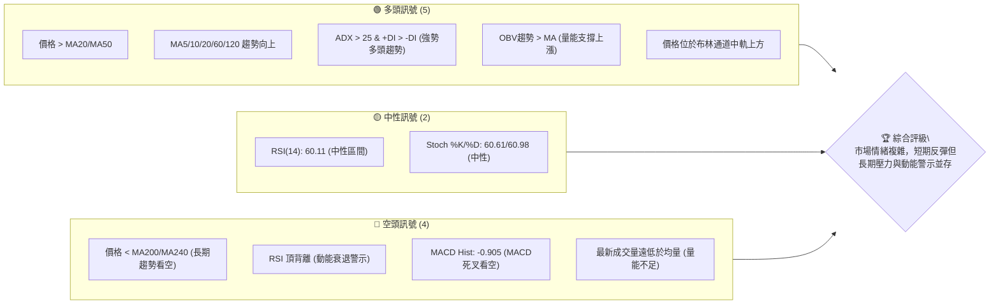

<details>
<summary>📊 靜態圖表 (點擊展開)</summary>

</details>

<html>
<head><meta charset="utf-8" /></head>
<body>
    <div>                        <script>window.PlotlyConfig = {MathJaxConfig: 'local'};</script>
        <script charset="utf-8" src="https://cdn.plot.ly/plotly-3.5.0.min.js" integrity="sha256-fHbNLP+GlIXN+efbQec78UkemUz3NJp7UmfGxC1tNxs=" crossorigin="anonymous"></script>                <div id="candlestick-chart" class="plotly-graph-div" style="height:500px; width:100%;"></div>            <script>                window.PLOTLYENV=window.PLOTLYENV || {};                                if (document.getElementById("candlestick-chart")) {                    Plotly.newPlot(                        "candlestick-chart",                        [{"close":{"dtype":"f8","bdata":"AAAAIP\u002ftbkAAAADA8wJvQAAAAOBzVm9AAAAAwOp7b0AAAAAglUhuQAAAAOBYYW5AAAAAQMHKbkAAAABg1uNuQAAAAKAOGW1AAAAAAAcnbUAAAAAgtOpsQAAAAICeUG1AAAAAwCMybUAAAACACgxtQAAAAODWPm1AAAAAgAfObUAAAABAgQtsQAAAACAn8WtAAAAAgGq2a0AAAAAAIahrQAAAACBG32xAAAAAQJyTbUAAAADAz\u002fNtQAAAAEAmXHRAAAAAgDEXc0AAAABARx5yQAAAACBkvHJAAAAAQPwDc0AAAABgzbByQAAAAADDZHJAAAAA4OQjc0AAAADASll0QAAAAED3dXNAAAAAALggc0AAAADAyBByQAAAAKDZk3FAAAAAAL2IcUAAAADAm3BxQAAAAID063FAAAAA4E3ocUAAAAAgZb5xQAAAAKDpFHJAAAAAgDugcUAAAABg7OVxQAAAACBXcnJAAAAAILsyckAAAABgDyJzQAAAAODHknJAAAAAwD\u002fcckAAAACgaXFzQAAAAAB+GHJAAAAAAMs3cUAAAADgghdxQAAAAEDq73BAAAAAQMBlcUAAAACAl5lxQAAAAIDmenFAAAAAANZxcUAAAACA5RlxQAAAAMBF6m9AAAAAwBhQcEAAAAAAZwRwQAAAAKDv1G5AAAAAgP8Yb0AAAABg80luQAAAAKCOuW1AAAAAoH3rbUAAAABApVZtQAAAAOBQM2xAAAAAoLcHa0AAAAAgpa9rQAAAAKCMUGtAAAAAIJZka0AAAACA4QRsQAAAAMDmLGpAAAAAIHmxaEAAAADg0OFoQAAAAIBzemhAAAAAYKl2aUAAAADg7RZpQAAAAKDO9mhAAAAAYOX7aEAAAACAws5pQAAAAKCroGpAAAAA4AgIa0AAAAAALWZrQAAAAKCphWtAAAAAwLu0a0AAAAAAVrRoQAAAAEDpmWdAAAAAQEz5ZkAAAADA7W9nQAAAAEDXK2ZAAAAAAMZdZkAAAABAhdlnQAAAAEBjpWhAAAAAgLNEaEAAAADgFIloQAAAAOD7mGhAAAAAQPlFaEAAAAAgLYBoQAAAAIAGN2hAAAAAQHhQaEAAAAAgPe1nQAAAAOAhEmhAAAAAoDD1Z0AAAADAu49nQAAAAMCHumhAAAAAwPZ+aUAAAAAAwDJpQAAAAAD1HWhAAAAAQA6mZ0AAAAAAmc1nQAAAAMBmaWZAAAAAYMuoZUAAAABA6jFmQAAAAKBjEWZAAAAA4MK5ZkAAAAAAUsllQAAAAMBahmVAAAAAIH8NZUAAAADgOoBkQAAAAOAX8GNAAAAAwDZEY0AAAADAGkViQAAAAOAoAGFAAAAAgFXKYUAAAACgcIFjQAAAACCs6mNAAAAA4J2TY0AAAACg7n1jQAAAAACl8mNAAAAAQOQtY0AAAAAADHRjQAAAAGDYf2NAAAAAYBFyYkAAAACALpphQAAAACA0NGJAAAAAQAJsYkAAAADgLbliQAAAACCbHGJAAAAAoGCXYkAAAABguY9iQAAAAKDe+mJAAAAAQApIY0AAAABArw1jQAAAAEAK4WJAAAAAICmcYkAAAAAgrFFkQAAAAOBk02NAAAAAoD5SY0AAAABAq21jQAAAAADaRGNAAAAAQMULY0AAAADAUV9jQAAAAOAWpWJAAAAAwLA5Y0AAAACAf1JiQAAAAKBgMGJAAAAAwAPKYUAAAADAkGVhQAAAAEAkSmFAAAAAwCJTYkAAAABgLxdiQAAAAIDbO2JAAAAAABIhYkAAAACgftVhQAAAAMAe5WFAAAAAIIU7YUAAAABA4UJhQAAAAADXc2NAAAAAAABgZEAAAACA6zllQAAAAEDhSmZAAAAAgOvhZUAAAABgjzJmQAAAAKBwpWZAAAAAAABwZ0AAAADA9QhmQAAAAMD1qGVAAAAAYLieZUAAAABguL5kQAAAAGCPemRAAAAA4HosZEAAAABgj3plQAAAAKBHiWZAAAAAQDMrZ0AAAADA9UBoQAAAAEDhUmhAAAAAYGZ+aEAAAABA4TpoQAAAAGCPWmdAAAAA4FG4Z0AAAAAghXNoQAAAAGBmHmhAAAAAIIVTZ0AAAABguK5mQAAAAMAehWdAAAAA4KO4Z0AAAABgjwJoQA=="},"high":{"dtype":"f8","bdata":"H8vWZr33b0CHIq4fnx1vQFqygvRElm9AKdBcbTv7b0C3WK4k4vRvQOG1iyIT325A6bW1xV0Vb0BKnUvaseZuQJ4uFESN6W5AbifV5w9BbUBSzhz6VEJtQGdzSeI+lG1APZIJkRKlbUAff4ezw2FtQMWh3\u002fGyVW1Ae3YM1McBbkD4elIPW4ttQP9dKkHq9WtAJIAGvDMEbEByA7fwObprQNY0m8QOGW1AiW\u002fFCrQQbkDtgDgBrTJuQMr1pA82cHVANTWs54iGdEBTJzvA8BhzQDXbra4ECnNAmJpd1W\u002fXc0A\u002fa23f5CNzQN4JHlkP13JAYGNObslKc0AD\u002f7UUuW50QKh0eWhJJ3RAkkHDZmBgc0DcLsoqk4ZyQIdn9nsrO3JAUeVg3Nq7cUCXUdU8bJxxQPynexKD+3FA+3SInZFKckAsbLWIVEVyQOOm1gS3ZXJAd2Jyo8kuckBcw+W\u002f9RNyQPP4ps4bsnJAdwJy33Idc0Ait\u002fdT1kxzQFSaIaj46HJAd2UxX8RRc0BjfwHWHgl0QK+EAKe+5nJACxsbC5P3cUDLRUdpaGlxQKAsO4wcOHFASU7aUu+VcUCpE+WO+dZxQOPSHwf003FAe0hkq3a7cUAjLgkkZn5xQGK\u002f7GfMwXBA8hTi8fuCcEDbWVJ+9n9wQJlUpgERt29AfbjgLXhbb0CR\u002f0qSj\u002fFuQM3H8XXQ3W1Aqni9p1u3bkC8sK\u002fU\u002fX9tQF3yReqia21AvcovHh35a0DWbkBbOTVsQBpYSwYOrmtA234oxK3Ka0BsmgNpNVhsQD+EsfJDEm1Akkbu7DThaUC1JciAZ1JpQPpoEGslxmhA\u002fcQF1PQWakCwDYw8VSNpQBnrmwk6SGlAXsXaNGoNakBV5Ex+zdRpQOfVn\u002fYEw2pAobcUbxlFa0D7Tqa6EuxrQAE+cVZUqGtAwaCdyzP+a0Bc+bjEMxhpQDw96vqHlGhAwKU3PBt6Z0AUFb0VgZRnQIK6cpmMK2dABFIEdjX0ZkDjL8ZktD1oQKN6Xdy+smhA6reJj9t\u002faECHhiz5NKJoQFCeXKut5GhAPYRzhIWpaECvq8U1Y6VoQOvEyIvbf2hAJSotBxGsaEChU8gPqQ5pQDjDC1YSNmhAWx8WZzJPaECB2Y1UFLlnQCFtygt372hANuHjwTC8aUAY3oLmdOJpQBOmb0lMH2lApoflwJlKaEDhd9iCeOZnQDOywVc7UWdAnsqjBhZ\u002fZkDf7c4LDnFmQJMAmqHKYGZAKoYeDEgVZ0AQ6WgSBmNmQPKRTHCGoWZAmFY9l2Y0ZUD8vRkU\u002fQllQLdrcSBVU2VAgwzq1WjaY0C2IHZX7yxjQBywkUNHQWJAvVF8inPWYUAHGENHNeZjQOOCZk8PmmRAWbTIjORiZECUiKIikc9jQGG2GiqGN2RA733hWTjXY0Cq5S\u002fIFJhjQNsgVDG78GNAHE4Kn4cuY0CqPWCbXCliQGunmnL5R2JAbKckcuMXY0ACvxDvA\u002f9iQEC8mFxKMmJAAozuBLe0YkAqKglC88xiQOtpG2VpImNAqJ3XT32sY0BZx4y\u002fWdRjQEdraTQS72JAd2voGlAzY0Dwtg2oMGVlQONeYk7e52RAfggx\u002f7sGZEDrfJ0lAMZjQP4nG4W9y2NAgHDQusdNY0BnM3yV9otjQNESkpbuFmNAwzNrMZxnY0DKD0nWqCtjQPFlFhYxqmJAXl6wJbo+YkAnO9eeTKZhQEZVrJKslmFAnLZUG2JcYkApfXz6IaRiQBclFUrFPWJA6SHILQ6BYkCd2mOVIwJiQGJlsPvZ3WJAAAAAoJnZYUAAAACgcIVhQAAAAMAefWNAAAAAwMwsZUAAAACA65FlQAAAAOCjiGZAAAAAAAAQZ0AAAADgUThmQAAAAEDhKmdAAAAAgMKlZ0AAAADgerxmQAAAAGC4lmZAAAAAoJmxZUAAAABgZhZlQAAAAOBRmGRAAAAAgMKlZEAAAACgmcllQAAAAAAA8GZAAAAA4KNQZ0AAAACgR0loQAAAAMDMBGlAAAAAAADAaEAAAACAwnVoQAAAAKBwHWhAAAAAgD3yZ0AAAABguBZpQAAAAIDCjWhAAAAA4FHYZ0AAAABACpdnQAAAAEAKh2dAAAAAgD0aaEAAAAAAAKBoQA=="},"hovertemplate":"\u003cb\u003e%{x|%Y-%m-%d}\u003c\u002fb\u003e\u003cbr\u003e\u958b: $%{open:.2f}\u003cbr\u003e\u9ad8: $%{high:.2f}\u003cbr\u003e\u4f4e: $%{low:.2f}\u003cbr\u003e\u6536: $%{close:.2f}\u003cextra\u003e\u003c\u002fextra\u003e","low":{"dtype":"f8","bdata":"j2B+NOCSbkCXr762a71uQEwjPItldG5AHymPTqcjb0AXN+lFsBduQJUv0kp3FW5AB5FBJeUgbkC\u002fCRFvzTZuQE81AwstzWxATKs6SdBObEAZBHWyhtNsQL7Ax8u6tGxAGsy82rEtbUDfoC21atxsQMRfZ6F222xAF66shu4obUC3pzQTn6trQCH3hqt2ImtADe5FKXGAa0C3v2sj6TprQKAq75LiA2xACtIS8vYubUBpl28jJxdtQLDE5Q5YWnNASNT6K3HjckAxHiDKcxdyQBH1HAlmb3JAQAb6NnS+ckCA2iR6hUtyQBTvYKlrG3JA9YpV6t9vckDg4QiWRQhzQO9OBJn1OXNAP\u002fdBGOWackBHumAHp+RxQFmid0CMjHFA3uwfhbtWcUCjY2Bg1htxQOde8u9EO3FAo9S\u002fTPe8cUAnDxdBbJxxQHV6tBVfCHJAyDpZGg3OcECy9tHOEpZxQLzisakW2HFAG50IxJ8jckA9yQBOvn5yQJitu54lI3JA2SuwNIKRckDUZZvLgNNyQDe6uZDn23FAYT0sSA4acUDevavMjelwQKSs1C6wuXBA3u5LIZ\u002frcEBs5avkaohxQANDB6edYXFABeslgTltcUCKvFQxFdtwQGOWhQXf1m9AUIKw84vkb0BEg+T2ebVvQFAiE5oodm5AIKB\u002f3K2wbkBumjEHg7ptQP182bzJ3WxAnjrn4OdzbUAM4eSevm9sQF7AQmc8GWxAFT149Pm8akCOvdQpci9qQCIRlyXKx2pA\u002foc6tBOmakAa+FOIcv9qQEt9bWN\u002fIGpAOQgwjcULaEAUBX\u002f0nyNoQNRH5yPhD2dAGcHLNycgaUB7AHfG5YxoQBcINaX0b2hA5220KenYaEC8FCvp08VoQGetSoXqoWlAV6sHoxaKakDoZf+\u002fufJqQOQuozxMHmtAcMBv7wgIa0CnmstN9iJnQEQBBcMCG2dAFOcef1iJZkBk94tEn+tmQIVWNOyh\u002f2VA8QfZLKgvZkCDInOhEl9nQCGEYVDf9GdAwK\u002fJW4TgZ0AeY\u002fT6cCdoQFdQePAwXWhAPYlNONTuZ0CzhyQteFBoQACJsuFMMWhAyof\u002fTMMgaEA6JjhC+ORnQAXHvNogsWdANEpXZ3naZ0DD7LXeaiBnQFiaB1Tvg2dAjVkLz2CKaEDQ10WZxf5oQKKGHTWrxGdAbbqe\u002fWKXZ0ATRBeDLzxnQCmWdTeLV2ZAFPK+JDNAZUCTG1imV\u002fxlQPCByP7XbGVASGPTmhM9ZkB9E+GIaqJlQFK3JQ1haGVAGYBDraYeZEA8JLjUf1VkQJIL7RUu7mNA1Lsc2uHrYkBgJAp+rP1hQOTbq9Hv2GBADyfPOqZNYUAXCv7MoE9iQBnQESo9jWNAhom6ONkuY0CTa+b5A\u002f9iQF9uQgj8V2NARJv5EyILY0B5DtQ6+9piQAamLpRKZ2NA2TpPjBBcYkB4blXNcUNhQOyFO6boR2FAYHd\u002fTnhaYkAPSB4\u002fohRiQDkGvLZfs2FA5Dn\u002fNgmWYUA636gNq9FhQI4D5RuYkmJAQH+sxh6zYkD8uq4U9OJiQIzYBoRzPWJAK2381d19YkAhr5XrrABkQBKFbe7awWNAMvcpn6EzY0Bsd6eAHD9jQKsX323nHmNAw386pVjwYkBMnDbI5YtiQC5uNhPsbWJARIpNX+\u002fFYkA0L6xX2EpiQFYdfXwYA2JA28\u002fBkmfBYUCP98ZmMjphQFOwBL8lD2FAYAvn3p9rYUCZXGrXUwViQFgBc3n5eWFAL\u002fhNzy3rYUDwipuXfm5hQETmUWvizGFAAAAAAAAAYUAAAACAPdJgQAAAAEAKd2FAAAAAgOsxZEAAAABguMZkQAAAAKCZuWVAAAAAIIWrZUAAAADgUbBlQAAAAOBRAGZAAAAAoJnZZkAAAABgj8JlQAAAAKCZGWVAAAAAwMz8ZEAAAACgmUFkQAAAAMDMFGRAAAAAYI8KZEAAAADAzMRkQAAAAOBRyGVAAAAAAABgZkAAAACgcNVmQAAAAKCZ2WdAAAAAYLjGZ0AAAABAM9NnQAAAAADXm2ZAAAAAgOshZ0AAAABgZi5nQAAAAMDMnGdAAAAA4KPoZkAAAACAwp1mQAAAAKCZWWZAAAAAYGZmZ0AAAABAM+NnQA=="},"name":"\u50f9\u683c","open":{"dtype":"f8","bdata":"ghMg3Cb2b0BfzHUoUQJvQCu9uaOQzm5AfyccGUdTb0A4nm02AuVvQAw2W4QHYW5AA8K9WpOfbkAXWHJUt4huQJ4uFESN6W5AitRwuJbLbEBWSykONudsQNJwHClHB21AciPj0btvbUB2N750HyVtQB1h1FMfJW1AHYdtNkQ2bUCu3EYP\u002fXdtQCosnShhiGtAJIAGvDMEbEC6YpYjYYhrQCMy4ShW12xAxQZRkGDAbUBP1XkS98FtQLr3V\u002f0Ny3NA2jA2sg58dECpEmRpVfZyQFNxMqjPAHNAoaZU\u002fZ15c0AeK+HafhRzQI+BxnytynJAXUULSouKckBaYofNSjNzQCMYRXppF3RAVH3ZVrFWc0ACACqlVE9yQGub041LK3JAj2P3nfKlcUAmBtttgJdxQKeSAK\u002ffSXFAe2CZ5j4YckBnaipKUvVxQIyFSyp0IXJAd2Jyo8kuckAjhBcx97JxQBjqVxdPHHJAph34vyKnckDe55KJAo5yQAVu5kt023JAx3ZXmprwckAbF35gvPtyQNKxUglR3nJAlsk8jPbycUA9DfnylEZxQBbemJZDEnFAlm74fq\u002f0cEDoPGt0x8JxQDMI\u002fIgdzXFAwBlFFliUcUDFHcTE2ntxQL0df+yTsXBASpFxzcwecEBb4wCA63lwQOkiKZCADm9AhC3J1KrMbkDa8iQcn81uQPeLOcJJsW1AAY4pc1SObkCWYEifMFltQH6NyAppaW1A0muj\u002f7Tza0CLNVapWjFqQP63VG4SHGtAALJAhXbcakBp2+74GjdrQGcBqsvwt2xA3umRVxa6aUBx3gdeC3VoQDxW1bmgHGhAatdk2A0HakD12651U8loQDyV4iPQ6GhAdeO63GJ8aUAkguYAaONoQADMChjl0mlAFjh+czI1a0Dbi6oY8H9rQH2fN630VWtAF2Z7CkCOa0AZ6qeHla5nQKTyBMh1ZWhADAVSonpkZ0ALxc0CTfJmQAOSgbUXxmZA0rUP6FOzZkBS\u002fw3\u002fqGdnQB+Ejs3Fc2hAgoVnNl5naECgQ9tV4zloQJuffb81m2hA2CfOCiwfaEBcfjHKmVtoQOgBr9IMZ2hAuLXREHKIaED7zlxtHaRoQLuvcupI7GdA6y5H6m1DaED\u002fERF12rZnQCI69DbG32dAThWSXDGdaEBBV7IbK4lpQBOmb0lMH2lApoflwJlKaECYSa4k+KdnQDOywVc7UWdAKdzTgb9hZkBHAB7S3FdmQG3rclGdgGVAcnti2kBPZkDE\u002fehuH1JmQFu2\u002f031yWVAD80rf9kxZUCN4GLEtfJkQBT5K1xnSmVAukzPpLG2Y0AfZnAkVytjQONwi\u002fn7ImJA\u002f\u002fK9h29oYUCtw4BxJH9iQH+CGh0u7mNAWbTIjORiZECvLYGoK6xjQBESHoBD1mNAwmi2ysOtY0D6Mg5O7DtjQPJJjreSlGNA9YhZy4YYY0Brr0We2iViQJCnKZ0xi2FA3\u002fot6oGUYkBe1ZVWtYhiQBTsdLYi7GFAlx1rKxGkYUAr\u002fnj14AdiQG800smcr2JAbizymeIBY0B7QAWkaAxjQH4tKqWdxWJAIXFlDrsiY0DLPPcsoblkQCbT8Q\u002fIgmRA3ludyeLPY0DE2hzviXBjQLH1uJ3EXGNAPH1z\u002frYbY0DlgMaE9r1iQFhlWOqNEGNAtNUSYZPcYkCrxke\u002f9Q5jQKjPclq9lmJAkkMVVXTsYUBK6TlKEI5hQFHtbeWucWFAV7tcavl5YUDC2eZxRpJiQN1rKOQOyWFAHO67s6hdYkAqXaFb8uhhQK2nkU7cuGJAAAAAYGbGYUAAAACAPSphQAAAAOCjeGFAAAAAgML9ZEAAAADgetxkQAAAAKBwDWZAAAAAgMLdZkAAAACA6xlmQAAAAEAzS2ZAAAAAgMJFZ0AAAADAzIxmQAAAAOBRkGZAAAAAYI+SZUAAAADAHkVkQAAAAKBHgWRAAAAA4KNAZEAAAACgcM1kQAAAAOCjAGZAAAAAACnEZkAAAABgZkZnQAAAACCF02hAAAAAYI8SaEAAAADAzARoQAAAAKBwHWhAAAAAwPWgZ0AAAACAwoVnQAAAACCuz2dAAAAAAADAZ0AAAAAAAEBnQAAAAIAUfmZAAAAA4FGgZ0AAAACgcPVnQA=="},"x":["2025-08-07T00:00:00-04:00","2025-08-08T00:00:00-04:00","2025-08-11T00:00:00-04:00","2025-08-12T00:00:00-04:00","2025-08-13T00:00:00-04:00","2025-08-14T00:00:00-04:00","2025-08-15T00:00:00-04:00","2025-08-18T00:00:00-04:00","2025-08-19T00:00:00-04:00","2025-08-20T00:00:00-04:00","2025-08-21T00:00:00-04:00","2025-08-22T00:00:00-04:00","2025-08-25T00:00:00-04:00","2025-08-26T00:00:00-04:00","2025-08-27T00:00:00-04:00","2025-08-28T00:00:00-04:00","2025-08-29T00:00:00-04:00","2025-09-02T00:00:00-04:00","2025-09-03T00:00:00-04:00","2025-09-04T00:00:00-04:00","2025-09-05T00:00:00-04:00","2025-09-08T00:00:00-04:00","2025-09-09T00:00:00-04:00","2025-09-10T00:00:00-04:00","2025-09-11T00:00:00-04:00","2025-09-12T00:00:00-04:00","2025-09-15T00:00:00-04:00","2025-09-16T00:00:00-04:00","2025-09-17T00:00:00-04:00","2025-09-18T00:00:00-04:00","2025-09-19T00:00:00-04:00","2025-09-22T00:00:00-04:00","2025-09-23T00:00:00-04:00","2025-09-24T00:00:00-04:00","2025-09-25T00:00:00-04:00","2025-09-26T00:00:00-04:00","2025-09-29T00:00:00-04:00","2025-09-30T00:00:00-04:00","2025-10-01T00:00:00-04:00","2025-10-02T00:00:00-04:00","2025-10-03T00:00:00-04:00","2025-10-06T00:00:00-04:00","2025-10-07T00:00:00-04:00","2025-10-08T00:00:00-04:00","2025-10-09T00:00:00-04:00","2025-10-10T00:00:00-04:00","2025-10-13T00:00:00-04:00","2025-10-14T00:00:00-04:00","2025-10-15T00:00:00-04:00","2025-10-16T00:00:00-04:00","2025-10-17T00:00:00-04:00","2025-10-20T00:00:00-04:00","2025-10-21T00:00:00-04:00","2025-10-22T00:00:00-04:00","2025-10-23T00:00:00-04:00","2025-10-24T00:00:00-04:00","2025-10-27T00:00:00-04:00","2025-10-28T00:00:00-04:00","2025-10-29T00:00:00-04:00","2025-10-30T00:00:00-04:00","2025-10-31T00:00:00-04:00","2025-11-03T00:00:00-05:00","2025-11-04T00:00:00-05:00","2025-11-05T00:00:00-05:00","2025-11-06T00:00:00-05:00","2025-11-07T00:00:00-05:00","2025-11-10T00:00:00-05:00","2025-11-11T00:00:00-05:00","2025-11-12T00:00:00-05:00","2025-11-13T00:00:00-05:00","2025-11-14T00:00:00-05:00","2025-11-17T00:00:00-05:00","2025-11-18T00:00:00-05:00","2025-11-19T00:00:00-05:00","2025-11-20T00:00:00-05:00","2025-11-21T00:00:00-05:00","2025-11-24T00:00:00-05:00","2025-11-25T00:00:00-05:00","2025-11-26T00:00:00-05:00","2025-11-28T00:00:00-05:00","2025-12-01T00:00:00-05:00","2025-12-02T00:00:00-05:00","2025-12-03T00:00:00-05:00","2025-12-04T00:00:00-05:00","2025-12-05T00:00:00-05:00","2025-12-08T00:00:00-05:00","2025-12-09T00:00:00-05:00","2025-12-10T00:00:00-05:00","2025-12-11T00:00:00-05:00","2025-12-12T00:00:00-05:00","2025-12-15T00:00:00-05:00","2025-12-16T00:00:00-05:00","2025-12-17T00:00:00-05:00","2025-12-18T00:00:00-05:00","2025-12-19T00:00:00-05:00","2025-12-22T00:00:00-05:00","2025-12-23T00:00:00-05:00","2025-12-24T00:00:00-05:00","2025-12-26T00:00:00-05:00","2025-12-29T00:00:00-05:00","2025-12-30T00:00:00-05:00","2025-12-31T00:00:00-05:00","2026-01-02T00:00:00-05:00","2026-01-05T00:00:00-05:00","2026-01-06T00:00:00-05:00","2026-01-07T00:00:00-05:00","2026-01-08T00:00:00-05:00","2026-01-09T00:00:00-05:00","2026-01-12T00:00:00-05:00","2026-01-13T00:00:00-05:00","2026-01-14T00:00:00-05:00","2026-01-15T00:00:00-05:00","2026-01-16T00:00:00-05:00","2026-01-20T00:00:00-05:00","2026-01-21T00:00:00-05:00","2026-01-22T00:00:00-05:00","2026-01-23T00:00:00-05:00","2026-01-26T00:00:00-05:00","2026-01-27T00:00:00-05:00","2026-01-28T00:00:00-05:00","2026-01-29T00:00:00-05:00","2026-01-30T00:00:00-05:00","2026-02-02T00:00:00-05:00","2026-02-03T00:00:00-05:00","2026-02-04T00:00:00-05:00","2026-02-05T00:00:00-05:00","2026-02-06T00:00:00-05:00","2026-02-09T00:00:00-05:00","2026-02-10T00:00:00-05:00","2026-02-11T00:00:00-05:00","2026-02-12T00:00:00-05:00","2026-02-13T00:00:00-05:00","2026-02-17T00:00:00-05:00","2026-02-18T00:00:00-05:00","2026-02-19T00:00:00-05:00","2026-02-20T00:00:00-05:00","2026-02-23T00:00:00-05:00","2026-02-24T00:00:00-05:00","2026-02-25T00:00:00-05:00","2026-02-26T00:00:00-05:00","2026-02-27T00:00:00-05:00","2026-03-02T00:00:00-05:00","2026-03-03T00:00:00-05:00","2026-03-04T00:00:00-05:00","2026-03-05T00:00:00-05:00","2026-03-06T00:00:00-05:00","2026-03-09T00:00:00-04:00","2026-03-10T00:00:00-04:00","2026-03-11T00:00:00-04:00","2026-03-12T00:00:00-04:00","2026-03-13T00:00:00-04:00","2026-03-16T00:00:00-04:00","2026-03-17T00:00:00-04:00","2026-03-18T00:00:00-04:00","2026-03-19T00:00:00-04:00","2026-03-20T00:00:00-04:00","2026-03-23T00:00:00-04:00","2026-03-24T00:00:00-04:00","2026-03-25T00:00:00-04:00","2026-03-26T00:00:00-04:00","2026-03-27T00:00:00-04:00","2026-03-30T00:00:00-04:00","2026-03-31T00:00:00-04:00","2026-04-01T00:00:00-04:00","2026-04-02T00:00:00-04:00","2026-04-06T00:00:00-04:00","2026-04-07T00:00:00-04:00","2026-04-08T00:00:00-04:00","2026-04-09T00:00:00-04:00","2026-04-10T00:00:00-04:00","2026-04-13T00:00:00-04:00","2026-04-14T00:00:00-04:00","2026-04-15T00:00:00-04:00","2026-04-16T00:00:00-04:00","2026-04-17T00:00:00-04:00","2026-04-20T00:00:00-04:00","2026-04-21T00:00:00-04:00","2026-04-22T00:00:00-04:00","2026-04-23T00:00:00-04:00","2026-04-24T00:00:00-04:00","2026-04-27T00:00:00-04:00","2026-04-28T00:00:00-04:00","2026-04-29T00:00:00-04:00","2026-04-30T00:00:00-04:00","2026-05-01T00:00:00-04:00","2026-05-04T00:00:00-04:00","2026-05-05T00:00:00-04:00","2026-05-06T00:00:00-04:00","2026-05-07T00:00:00-04:00","2026-05-08T00:00:00-04:00","2026-05-11T00:00:00-04:00","2026-05-12T00:00:00-04:00","2026-05-13T00:00:00-04:00","2026-05-14T00:00:00-04:00","2026-05-15T00:00:00-04:00","2026-05-18T00:00:00-04:00","2026-05-19T00:00:00-04:00","2026-05-20T00:00:00-04:00","2026-05-21T00:00:00-04:00","2026-05-22T00:00:00-04:00"],"type":"candlestick"},{"hovertemplate":"MA30: $%{y:.2f}\u003cextra\u003e\u003c\u002fextra\u003e","line":{"color":"#2196F3","dash":"dash","width":2},"mode":"lines","name":"MA30","x":["2025-08-07T00:00:00-04:00","2025-08-08T00:00:00-04:00","2025-08-11T00:00:00-04:00","2025-08-12T00:00:00-04:00","2025-08-13T00:00:00-04:00","2025-08-14T00:00:00-04:00","2025-08-15T00:00:00-04:00","2025-08-18T00:00:00-04:00","2025-08-19T00:00:00-04:00","2025-08-20T00:00:00-04:00","2025-08-21T00:00:00-04:00","2025-08-22T00:00:00-04:00","2025-08-25T00:00:00-04:00","2025-08-26T00:00:00-04:00","2025-08-27T00:00:00-04:00","2025-08-28T00:00:00-04:00","2025-08-29T00:00:00-04:00","2025-09-02T00:00:00-04:00","2025-09-03T00:00:00-04:00","2025-09-04T00:00:00-04:00","2025-09-05T00:00:00-04:00","2025-09-08T00:00:00-04:00","2025-09-09T00:00:00-04:00","2025-09-10T00:00:00-04:00","2025-09-11T00:00:00-04:00","2025-09-12T00:00:00-04:00","2025-09-15T00:00:00-04:00","2025-09-16T00:00:00-04:00","2025-09-17T00:00:00-04:00","2025-09-18T00:00:00-04:00","2025-09-19T00:00:00-04:00","2025-09-22T00:00:00-04:00","2025-09-23T00:00:00-04:00","2025-09-24T00:00:00-04:00","2025-09-25T00:00:00-04:00","2025-09-26T00:00:00-04:00","2025-09-29T00:00:00-04:00","2025-09-30T00:00:00-04:00","2025-10-01T00:00:00-04:00","2025-10-02T00:00:00-04:00","2025-10-03T00:00:00-04:00","2025-10-06T00:00:00-04:00","2025-10-07T00:00:00-04:00","2025-10-08T00:00:00-04:00","2025-10-09T00:00:00-04:00","2025-10-10T00:00:00-04:00","2025-10-13T00:00:00-04:00","2025-10-14T00:00:00-04:00","2025-10-15T00:00:00-04:00","2025-10-16T00:00:00-04:00","2025-10-17T00:00:00-04:00","2025-10-20T00:00:00-04:00","2025-10-21T00:00:00-04:00","2025-10-22T00:00:00-04:00","2025-10-23T00:00:00-04:00","2025-10-24T00:00:00-04:00","2025-10-27T00:00:00-04:00","2025-10-28T00:00:00-04:00","2025-10-29T00:00:00-04:00","2025-10-30T00:00:00-04:00","2025-10-31T00:00:00-04:00","2025-11-03T00:00:00-05:00","2025-11-04T00:00:00-05:00","2025-11-05T00:00:00-05:00","2025-11-06T00:00:00-05:00","2025-11-07T00:00:00-05:00","2025-11-10T00:00:00-05:00","2025-11-11T00:00:00-05:00","2025-11-12T00:00:00-05:00","2025-11-13T00:00:00-05:00","2025-11-14T00:00:00-05:00","2025-11-17T00:00:00-05:00","2025-11-18T00:00:00-05:00","2025-11-19T00:00:00-05:00","2025-11-20T00:00:00-05:00","2025-11-21T00:00:00-05:00","2025-11-24T00:00:00-05:00","2025-11-25T00:00:00-05:00","2025-11-26T00:00:00-05:00","2025-11-28T00:00:00-05:00","2025-12-01T00:00:00-05:00","2025-12-02T00:00:00-05:00","2025-12-03T00:00:00-05:00","2025-12-04T00:00:00-05:00","2025-12-05T00:00:00-05:00","2025-12-08T00:00:00-05:00","2025-12-09T00:00:00-05:00","2025-12-10T00:00:00-05:00","2025-12-11T00:00:00-05:00","2025-12-12T00:00:00-05:00","2025-12-15T00:00:00-05:00","2025-12-16T00:00:00-05:00","2025-12-17T00:00:00-05:00","2025-12-18T00:00:00-05:00","2025-12-19T00:00:00-05:00","2025-12-22T00:00:00-05:00","2025-12-23T00:00:00-05:00","2025-12-24T00:00:00-05:00","2025-12-26T00:00:00-05:00","2025-12-29T00:00:00-05:00","2025-12-30T00:00:00-05:00","2025-12-31T00:00:00-05:00","2026-01-02T00:00:00-05:00","2026-01-05T00:00:00-05:00","2026-01-06T00:00:00-05:00","2026-01-07T00:00:00-05:00","2026-01-08T00:00:00-05:00","2026-01-09T00:00:00-05:00","2026-01-12T00:00:00-05:00","2026-01-13T00:00:00-05:00","2026-01-14T00:00:00-05:00","2026-01-15T00:00:00-05:00","2026-01-16T00:00:00-05:00","2026-01-20T00:00:00-05:00","2026-01-21T00:00:00-05:00","2026-01-22T00:00:00-05:00","2026-01-23T00:00:00-05:00","2026-01-26T00:00:00-05:00","2026-01-27T00:00:00-05:00","2026-01-28T00:00:00-05:00","2026-01-29T00:00:00-05:00","2026-01-30T00:00:00-05:00","2026-02-02T00:00:00-05:00","2026-02-03T00:00:00-05:00","2026-02-04T00:00:00-05:00","2026-02-05T00:00:00-05:00","2026-02-06T00:00:00-05:00","2026-02-09T00:00:00-05:00","2026-02-10T00:00:00-05:00","2026-02-11T00:00:00-05:00","2026-02-12T00:00:00-05:00","2026-02-13T00:00:00-05:00","2026-02-17T00:00:00-05:00","2026-02-18T00:00:00-05:00","2026-02-19T00:00:00-05:00","2026-02-20T00:00:00-05:00","2026-02-23T00:00:00-05:00","2026-02-24T00:00:00-05:00","2026-02-25T00:00:00-05:00","2026-02-26T00:00:00-05:00","2026-02-27T00:00:00-05:00","2026-03-02T00:00:00-05:00","2026-03-03T00:00:00-05:00","2026-03-04T00:00:00-05:00","2026-03-05T00:00:00-05:00","2026-03-06T00:00:00-05:00","2026-03-09T00:00:00-04:00","2026-03-10T00:00:00-04:00","2026-03-11T00:00:00-04:00","2026-03-12T00:00:00-04:00","2026-03-13T00:00:00-04:00","2026-03-16T00:00:00-04:00","2026-03-17T00:00:00-04:00","2026-03-18T00:00:00-04:00","2026-03-19T00:00:00-04:00","2026-03-20T00:00:00-04:00","2026-03-23T00:00:00-04:00","2026-03-24T00:00:00-04:00","2026-03-25T00:00:00-04:00","2026-03-26T00:00:00-04:00","2026-03-27T00:00:00-04:00","2026-03-30T00:00:00-04:00","2026-03-31T00:00:00-04:00","2026-04-01T00:00:00-04:00","2026-04-02T00:00:00-04:00","2026-04-06T00:00:00-04:00","2026-04-07T00:00:00-04:00","2026-04-08T00:00:00-04:00","2026-04-09T00:00:00-04:00","2026-04-10T00:00:00-04:00","2026-04-13T00:00:00-04:00","2026-04-14T00:00:00-04:00","2026-04-15T00:00:00-04:00","2026-04-16T00:00:00-04:00","2026-04-17T00:00:00-04:00","2026-04-20T00:00:00-04:00","2026-04-21T00:00:00-04:00","2026-04-22T00:00:00-04:00","2026-04-23T00:00:00-04:00","2026-04-24T00:00:00-04:00","2026-04-27T00:00:00-04:00","2026-04-28T00:00:00-04:00","2026-04-29T00:00:00-04:00","2026-04-30T00:00:00-04:00","2026-05-01T00:00:00-04:00","2026-05-04T00:00:00-04:00","2026-05-05T00:00:00-04:00","2026-05-06T00:00:00-04:00","2026-05-07T00:00:00-04:00","2026-05-08T00:00:00-04:00","2026-05-11T00:00:00-04:00","2026-05-12T00:00:00-04:00","2026-05-13T00:00:00-04:00","2026-05-14T00:00:00-04:00","2026-05-15T00:00:00-04:00","2026-05-18T00:00:00-04:00","2026-05-19T00:00:00-04:00","2026-05-20T00:00:00-04:00","2026-05-21T00:00:00-04:00","2026-05-22T00:00:00-04:00"],"y":{"dtype":"f8","bdata":"AAAAAAAA+H8AAAAAAAD4fwAAAAAAAPh\u002fAAAAAAAA+H8AAAAAAAD4fwAAAAAAAPh\u002fAAAAAAAA+H8AAAAAAAD4fwAAAAAAAPh\u002fAAAAAAAA+H8AAAAAAAD4fwAAAAAAAPh\u002fAAAAAAAA+H8AAAAAAAD4fwAAAAAAAPh\u002fAAAAAAAA+H8AAAAAAAD4fwAAAAAAAPh\u002fAAAAAAAA+H8AAAAAAAD4fwAAAAAAAPh\u002fAAAAAAAA+H8AAAAAAAD4fwAAAAAAAPh\u002fAAAAAAAA+H8AAAAAAAD4fwAAAAAAAPh\u002fAAAAAAAA+H8AAAAAAAD4f83MzAzYg29AERERAZLCb0C8u7vDnApwQImIiGj4KnBAMzMzw9xHcEDv7u7mz2BwQGZmZkYvdXBAZmZmFm6HcEARERH5c5hwQBEREeE7tXBAZmZmBqnRcEBVVVXtse1wQN7d3UXqCnFAZmZm\u002fsAkcUDv7u72jEFxQLy7u2suYnFAIiIiIk5+cUC8u7tb6qlxQGZmZl4w0XFAMzMz6+P7cUAiIiJKzStyQJqZmckHS3JAq6qqasNfckDe3d0d0XFyQKuqquqbVHJAVVVVNSlGckAzMzPzvEFyQAAAAJAFN3JAMzMz450pckAAAACgDRxyQFVVVQVEB3JA3t3dnSPvcUB3d3cXLcpxQAAAANiop3FAd3d3bx6JcUAiIiIiMXBxQDMzM9sFWXFAMzMzcw5DcUARERHhaStxQGZmZr7NCnFAmpmZeVLlcECrqqpSCcRwQFVVVSVInnBAmpmZIcB8cEAAAABYkVtwQFVVVY3WLXBAVVVVVc\u002f3b0CamZmJmYVvQO\u002fu7v5+GW9Aq6qqyuawbkAiIiLyKztuQCIiIqJd221AzczMnLWKbUB3d3fnO0NtQFVVVTVlBW1AzczMfCXDbECrqqpalIBsQFVVVbUbQWxA7+7ubs8DbEAAAAAAw7JrQLy7u\u002fvQa2tAIiIiAnQZa0AzMzMzF9BqQM3MzPwvhmpAIiIiEq47akB3d3d3uwRqQAAAALBk2WlAAAAAwCqpaUCJiIh4LoBpQHd3d+dvYWlA7+7ujulJaUBERETkui5pQM3MzHxHFGlAmpmZOQL6aECJiIhYFtdoQJqZmdkgxWhAq6qqKtq+aEAiIiIylbNoQBEREQG4tWhAmpmZ2f61aEARERFB7LZoQM3MzMyxr2hAMzMzw0ykaEB3d3fHMZNoQERERAQ4b2hAIiIiomBBaEAiIiIC+BRoQERERCRt5mdAERERYe27Z0CJiIjYBqNnQFVVVeVOkWdAERERMeqAZ0AiIiKy22dnQImIiMjMVGdAMzMzE1k6Z0DNzMzsuwpnQO\u002fu7j5+yWZAiYiI2DaSZkCJiIj4SmdmQBEREWFZP2ZAREREREUXZkAzMzNzh+xlQM3MzMwdyGVAEREREUycZUAzMzPDH3ZlQAAAAFAdT2VAzczMvBMgZUAiIiKyOe1kQN7d3T2MtWRAIiIiwi55ZEB3d3cn7kFkQM3MzGyvDmRAERERgYfjY0CamZnZzLZjQLy7uwuEmWNAd3d3VzmFY0AzMzOTampjQFVVVWU0T2NAvLu7qxUsY0BEREQkkB9jQKuqqnoQEWNAAAAAEEoCY0BEREQkI\u002fliQBEREeFt82JAq6qqOozxYkBmZmZ29PpiQFVVVWX8CGNAvLu7KzsVY0ARERERIgtjQBEREdFj\u002fGJAIiIi8iLtYkAzMzPzQdtiQN7d3f2SxGJAZmZmRki9YkAiIiJSp7FiQAAAAKDapmJAIiIiciekYkBVVVWVIaZiQM3MzLx+o2JA7+7ubliZYkCamZlp3oxiQHd3d1dPmGJAq6qq2oenYkAiIiJCRb5iQM3MzJyJ2mJAmpmZybvwYkDv7u4OkAtjQKuqqpq1K2NA7+7ubudUY0BVVVUFjGNjQLy7u\u002fsyc2NAREREpNCGY0AAAADQDJJjQImIiKhfnGNAAAAAUP+lY0BVVVXV+LdjQImIiKgt2WNAREREJNT6Y0Dv7u6ucS1kQN7d3U3LYWRAq6qqygGbZEBmZmZGUdVkQERERJQQCWVA7+7urho3ZUDv7u7OYW1lQDMzM6OZn2VA7+7uzvLLZUCamZmZUvVlQJqZmZlSJWZA3t3dfbFcZkDNzMxcSJZmQA=="},"type":"scatter"},{"hovertemplate":"MA60: $%{y:.2f}\u003cextra\u003e\u003c\u002fextra\u003e","line":{"color":"#9C27B0","dash":"dash","width":2},"mode":"lines","name":"MA60","x":["2025-08-07T00:00:00-04:00","2025-08-08T00:00:00-04:00","2025-08-11T00:00:00-04:00","2025-08-12T00:00:00-04:00","2025-08-13T00:00:00-04:00","2025-08-14T00:00:00-04:00","2025-08-15T00:00:00-04:00","2025-08-18T00:00:00-04:00","2025-08-19T00:00:00-04:00","2025-08-20T00:00:00-04:00","2025-08-21T00:00:00-04:00","2025-08-22T00:00:00-04:00","2025-08-25T00:00:00-04:00","2025-08-26T00:00:00-04:00","2025-08-27T00:00:00-04:00","2025-08-28T00:00:00-04:00","2025-08-29T00:00:00-04:00","2025-09-02T00:00:00-04:00","2025-09-03T00:00:00-04:00","2025-09-04T00:00:00-04:00","2025-09-05T00:00:00-04:00","2025-09-08T00:00:00-04:00","2025-09-09T00:00:00-04:00","2025-09-10T00:00:00-04:00","2025-09-11T00:00:00-04:00","2025-09-12T00:00:00-04:00","2025-09-15T00:00:00-04:00","2025-09-16T00:00:00-04:00","2025-09-17T00:00:00-04:00","2025-09-18T00:00:00-04:00","2025-09-19T00:00:00-04:00","2025-09-22T00:00:00-04:00","2025-09-23T00:00:00-04:00","2025-09-24T00:00:00-04:00","2025-09-25T00:00:00-04:00","2025-09-26T00:00:00-04:00","2025-09-29T00:00:00-04:00","2025-09-30T00:00:00-04:00","2025-10-01T00:00:00-04:00","2025-10-02T00:00:00-04:00","2025-10-03T00:00:00-04:00","2025-10-06T00:00:00-04:00","2025-10-07T00:00:00-04:00","2025-10-08T00:00:00-04:00","2025-10-09T00:00:00-04:00","2025-10-10T00:00:00-04:00","2025-10-13T00:00:00-04:00","2025-10-14T00:00:00-04:00","2025-10-15T00:00:00-04:00","2025-10-16T00:00:00-04:00","2025-10-17T00:00:00-04:00","2025-10-20T00:00:00-04:00","2025-10-21T00:00:00-04:00","2025-10-22T00:00:00-04:00","2025-10-23T00:00:00-04:00","2025-10-24T00:00:00-04:00","2025-10-27T00:00:00-04:00","2025-10-28T00:00:00-04:00","2025-10-29T00:00:00-04:00","2025-10-30T00:00:00-04:00","2025-10-31T00:00:00-04:00","2025-11-03T00:00:00-05:00","2025-11-04T00:00:00-05:00","2025-11-05T00:00:00-05:00","2025-11-06T00:00:00-05:00","2025-11-07T00:00:00-05:00","2025-11-10T00:00:00-05:00","2025-11-11T00:00:00-05:00","2025-11-12T00:00:00-05:00","2025-11-13T00:00:00-05:00","2025-11-14T00:00:00-05:00","2025-11-17T00:00:00-05:00","2025-11-18T00:00:00-05:00","2025-11-19T00:00:00-05:00","2025-11-20T00:00:00-05:00","2025-11-21T00:00:00-05:00","2025-11-24T00:00:00-05:00","2025-11-25T00:00:00-05:00","2025-11-26T00:00:00-05:00","2025-11-28T00:00:00-05:00","2025-12-01T00:00:00-05:00","2025-12-02T00:00:00-05:00","2025-12-03T00:00:00-05:00","2025-12-04T00:00:00-05:00","2025-12-05T00:00:00-05:00","2025-12-08T00:00:00-05:00","2025-12-09T00:00:00-05:00","2025-12-10T00:00:00-05:00","2025-12-11T00:00:00-05:00","2025-12-12T00:00:00-05:00","2025-12-15T00:00:00-05:00","2025-12-16T00:00:00-05:00","2025-12-17T00:00:00-05:00","2025-12-18T00:00:00-05:00","2025-12-19T00:00:00-05:00","2025-12-22T00:00:00-05:00","2025-12-23T00:00:00-05:00","2025-12-24T00:00:00-05:00","2025-12-26T00:00:00-05:00","2025-12-29T00:00:00-05:00","2025-12-30T00:00:00-05:00","2025-12-31T00:00:00-05:00","2026-01-02T00:00:00-05:00","2026-01-05T00:00:00-05:00","2026-01-06T00:00:00-05:00","2026-01-07T00:00:00-05:00","2026-01-08T00:00:00-05:00","2026-01-09T00:00:00-05:00","2026-01-12T00:00:00-05:00","2026-01-13T00:00:00-05:00","2026-01-14T00:00:00-05:00","2026-01-15T00:00:00-05:00","2026-01-16T00:00:00-05:00","2026-01-20T00:00:00-05:00","2026-01-21T00:00:00-05:00","2026-01-22T00:00:00-05:00","2026-01-23T00:00:00-05:00","2026-01-26T00:00:00-05:00","2026-01-27T00:00:00-05:00","2026-01-28T00:00:00-05:00","2026-01-29T00:00:00-05:00","2026-01-30T00:00:00-05:00","2026-02-02T00:00:00-05:00","2026-02-03T00:00:00-05:00","2026-02-04T00:00:00-05:00","2026-02-05T00:00:00-05:00","2026-02-06T00:00:00-05:00","2026-02-09T00:00:00-05:00","2026-02-10T00:00:00-05:00","2026-02-11T00:00:00-05:00","2026-02-12T00:00:00-05:00","2026-02-13T00:00:00-05:00","2026-02-17T00:00:00-05:00","2026-02-18T00:00:00-05:00","2026-02-19T00:00:00-05:00","2026-02-20T00:00:00-05:00","2026-02-23T00:00:00-05:00","2026-02-24T00:00:00-05:00","2026-02-25T00:00:00-05:00","2026-02-26T00:00:00-05:00","2026-02-27T00:00:00-05:00","2026-03-02T00:00:00-05:00","2026-03-03T00:00:00-05:00","2026-03-04T00:00:00-05:00","2026-03-05T00:00:00-05:00","2026-03-06T00:00:00-05:00","2026-03-09T00:00:00-04:00","2026-03-10T00:00:00-04:00","2026-03-11T00:00:00-04:00","2026-03-12T00:00:00-04:00","2026-03-13T00:00:00-04:00","2026-03-16T00:00:00-04:00","2026-03-17T00:00:00-04:00","2026-03-18T00:00:00-04:00","2026-03-19T00:00:00-04:00","2026-03-20T00:00:00-04:00","2026-03-23T00:00:00-04:00","2026-03-24T00:00:00-04:00","2026-03-25T00:00:00-04:00","2026-03-26T00:00:00-04:00","2026-03-27T00:00:00-04:00","2026-03-30T00:00:00-04:00","2026-03-31T00:00:00-04:00","2026-04-01T00:00:00-04:00","2026-04-02T00:00:00-04:00","2026-04-06T00:00:00-04:00","2026-04-07T00:00:00-04:00","2026-04-08T00:00:00-04:00","2026-04-09T00:00:00-04:00","2026-04-10T00:00:00-04:00","2026-04-13T00:00:00-04:00","2026-04-14T00:00:00-04:00","2026-04-15T00:00:00-04:00","2026-04-16T00:00:00-04:00","2026-04-17T00:00:00-04:00","2026-04-20T00:00:00-04:00","2026-04-21T00:00:00-04:00","2026-04-22T00:00:00-04:00","2026-04-23T00:00:00-04:00","2026-04-24T00:00:00-04:00","2026-04-27T00:00:00-04:00","2026-04-28T00:00:00-04:00","2026-04-29T00:00:00-04:00","2026-04-30T00:00:00-04:00","2026-05-01T00:00:00-04:00","2026-05-04T00:00:00-04:00","2026-05-05T00:00:00-04:00","2026-05-06T00:00:00-04:00","2026-05-07T00:00:00-04:00","2026-05-08T00:00:00-04:00","2026-05-11T00:00:00-04:00","2026-05-12T00:00:00-04:00","2026-05-13T00:00:00-04:00","2026-05-14T00:00:00-04:00","2026-05-15T00:00:00-04:00","2026-05-18T00:00:00-04:00","2026-05-19T00:00:00-04:00","2026-05-20T00:00:00-04:00","2026-05-21T00:00:00-04:00","2026-05-22T00:00:00-04:00"],"y":{"dtype":"f8","bdata":"AAAAAAAA+H8AAAAAAAD4fwAAAAAAAPh\u002fAAAAAAAA+H8AAAAAAAD4fwAAAAAAAPh\u002fAAAAAAAA+H8AAAAAAAD4fwAAAAAAAPh\u002fAAAAAAAA+H8AAAAAAAD4fwAAAAAAAPh\u002fAAAAAAAA+H8AAAAAAAD4fwAAAAAAAPh\u002fAAAAAAAA+H8AAAAAAAD4fwAAAAAAAPh\u002fAAAAAAAA+H8AAAAAAAD4fwAAAAAAAPh\u002fAAAAAAAA+H8AAAAAAAD4fwAAAAAAAPh\u002fAAAAAAAA+H8AAAAAAAD4fwAAAAAAAPh\u002fAAAAAAAA+H8AAAAAAAD4fwAAAAAAAPh\u002fAAAAAAAA+H8AAAAAAAD4fwAAAAAAAPh\u002fAAAAAAAA+H8AAAAAAAD4fwAAAAAAAPh\u002fAAAAAAAA+H8AAAAAAAD4fwAAAAAAAPh\u002fAAAAAAAA+H8AAAAAAAD4fwAAAAAAAPh\u002fAAAAAAAA+H8AAAAAAAD4fwAAAAAAAPh\u002fAAAAAAAA+H8AAAAAAAD4fwAAAAAAAPh\u002fAAAAAAAA+H8AAAAAAAD4fwAAAAAAAPh\u002fAAAAAAAA+H8AAAAAAAD4fwAAAAAAAPh\u002fAAAAAAAA+H8AAAAAAAD4fwAAAAAAAPh\u002fAAAAAAAA+H8AAAAAAAD4f97d3QWY5HBAMzMzTzbocECamZntZOpwQERERKBQ6XBAVVVVmX3ocECJiIiEgOhwQM3MzJAa53BAzczMRD7lcEARERHt7uFwQLy7u88E4HBAAAAAwH3bcEAAAACg3dhwQJqZmTWZ1HBAAAAAkMDQcEB3d3cnj85wQImIiHwCyHBAZmZm5hq9cEBERESQW7ZwQO\u002fu7u73rnBAREREqCuqcECamZmhsaRwQFVVVU1bnHBAiYiIHI+ScEDNzMyIt4lwQKuqqkKna3BA3t3d+d1TcEBERESQA0FwQFVVVbXJK3BAVVVVzcIVcEAAAAAgb\u002fVvQDMzM4MsvW9A7+7unt17b0ARERGxODJvQGZmZtbA6m5AiYiIePWmbkDe3d3djnJuQDMzMzO4RW5AMzMz06MXbkBVVVUdgettQCIiIrKFu21AERERQUeKbUDNzMzEZlttQLy7u+NrKG1AZmZmPsH5bEBERESEHMdsQCIiIvpmkGxAAAAAwFRbbEDe3d1dlxxsQAAAAICb52tAIiIi0nKza0CamZkZDHlrQHd3d7eHRWtAAAAAMIEXa0B3d3fXNutqQM3MzJxOumpAd3d3D0OCakBmZmYuxkpqQM3MzGzEE2pAAAAAaN7faUBERETs5KppQImIiPCPfmlAmpmZGS9NaUCrqqpy+RtpQKuqqmJ+7WhAq6qqkgO7aEAiIiKyu4doQHd3d3dxUWhAREREzLAdaECJiIi4vPNnQERERKRk0GdAmpmZaZewZ0C8u7sroY1nQM3MzKQybmdAVVVVJSdLZ0De3d0NmyZnQM3MzBQfCmdAvLu783bvZkAiIiJyZ9BmQHd3dx+itWZA3t3dzZaXZkBEREQ0bXxmQM3MzJwwX2ZAIiIiIupDZkCJiIhQ\u002fyRmQAAAAAheBGZAzczM\u002fEzjZUCrqqpKsb9lQM3MzMTQmmVAZmZmhgF0ZUBmZmZ+S2FlQAAAALAvUWVAiYiIIJpBZUAzMzNrfzBlQM3MzFQdJGVA7+7upvIVZUCamZkx2AJlQCIiIlI96WRAIiIiArnTZEDNzMyENrlkQBEREZnenWRAMzMzGzSCZEAzMzOz5GNkQFVVVWVYRmRAvLu7K8osZECrqqqK4xNkQAAAAPj7+mNAd3d3lx3iY0C8u7ujrcljQFVVVX2FrGNAiYiImEOJY0CJiIhIZmdjQCIiImJ\u002fU2NA3t3drYdFY0De3d0NiTpjQERERNQGOmNAiYiIkPo6Y0ARERFR\u002fTpjQAAAAAB1PWNAVVVVjX5AY0DNzMwUjkFjQDMzM7shQmNAIiIiWo1EY0AiIiL6l0VjQM3MzMTmR2NAVVVVxcVLY0De3d2ldlljQO\u002fu7gYVcWNAAAAAqAeIY0AAAADgSZxjQHd3d48Xr2NAZmZmXhLEY0DNzMycSdhjQBEREcnR5mNAq6qqejH6Y0CJiIiQhA9kQJqZmSE6I2RAiYiIIA04ZEB3d3cXuk1kQDMzM6toZGRAZmZm9gR7ZEAzMzNjk5FkQA=="},"type":"scatter"},{"hovertemplate":"MA200: $%{y:.2f}\u003cextra\u003e\u003c\u002fextra\u003e","line":{"color":"#FF6F00","dash":"solid","width":2},"mode":"lines","name":"MA200","x":["2025-08-07T00:00:00-04:00","2025-08-08T00:00:00-04:00","2025-08-11T00:00:00-04:00","2025-08-12T00:00:00-04:00","2025-08-13T00:00:00-04:00","2025-08-14T00:00:00-04:00","2025-08-15T00:00:00-04:00","2025-08-18T00:00:00-04:00","2025-08-19T00:00:00-04:00","2025-08-20T00:00:00-04:00","2025-08-21T00:00:00-04:00","2025-08-22T00:00:00-04:00","2025-08-25T00:00:00-04:00","2025-08-26T00:00:00-04:00","2025-08-27T00:00:00-04:00","2025-08-28T00:00:00-04:00","2025-08-29T00:00:00-04:00","2025-09-02T00:00:00-04:00","2025-09-03T00:00:00-04:00","2025-09-04T00:00:00-04:00","2025-09-05T00:00:00-04:00","2025-09-08T00:00:00-04:00","2025-09-09T00:00:00-04:00","2025-09-10T00:00:00-04:00","2025-09-11T00:00:00-04:00","2025-09-12T00:00:00-04:00","2025-09-15T00:00:00-04:00","2025-09-16T00:00:00-04:00","2025-09-17T00:00:00-04:00","2025-09-18T00:00:00-04:00","2025-09-19T00:00:00-04:00","2025-09-22T00:00:00-04:00","2025-09-23T00:00:00-04:00","2025-09-24T00:00:00-04:00","2025-09-25T00:00:00-04:00","2025-09-26T00:00:00-04:00","2025-09-29T00:00:00-04:00","2025-09-30T00:00:00-04:00","2025-10-01T00:00:00-04:00","2025-10-02T00:00:00-04:00","2025-10-03T00:00:00-04:00","2025-10-06T00:00:00-04:00","2025-10-07T00:00:00-04:00","2025-10-08T00:00:00-04:00","2025-10-09T00:00:00-04:00","2025-10-10T00:00:00-04:00","2025-10-13T00:00:00-04:00","2025-10-14T00:00:00-04:00","2025-10-15T00:00:00-04:00","2025-10-16T00:00:00-04:00","2025-10-17T00:00:00-04:00","2025-10-20T00:00:00-04:00","2025-10-21T00:00:00-04:00","2025-10-22T00:00:00-04:00","2025-10-23T00:00:00-04:00","2025-10-24T00:00:00-04:00","2025-10-27T00:00:00-04:00","2025-10-28T00:00:00-04:00","2025-10-29T00:00:00-04:00","2025-10-30T00:00:00-04:00","2025-10-31T00:00:00-04:00","2025-11-03T00:00:00-05:00","2025-11-04T00:00:00-05:00","2025-11-05T00:00:00-05:00","2025-11-06T00:00:00-05:00","2025-11-07T00:00:00-05:00","2025-11-10T00:00:00-05:00","2025-11-11T00:00:00-05:00","2025-11-12T00:00:00-05:00","2025-11-13T00:00:00-05:00","2025-11-14T00:00:00-05:00","2025-11-17T00:00:00-05:00","2025-11-18T00:00:00-05:00","2025-11-19T00:00:00-05:00","2025-11-20T00:00:00-05:00","2025-11-21T00:00:00-05:00","2025-11-24T00:00:00-05:00","2025-11-25T00:00:00-05:00","2025-11-26T00:00:00-05:00","2025-11-28T00:00:00-05:00","2025-12-01T00:00:00-05:00","2025-12-02T00:00:00-05:00","2025-12-03T00:00:00-05:00","2025-12-04T00:00:00-05:00","2025-12-05T00:00:00-05:00","2025-12-08T00:00:00-05:00","2025-12-09T00:00:00-05:00","2025-12-10T00:00:00-05:00","2025-12-11T00:00:00-05:00","2025-12-12T00:00:00-05:00","2025-12-15T00:00:00-05:00","2025-12-16T00:00:00-05:00","2025-12-17T00:00:00-05:00","2025-12-18T00:00:00-05:00","2025-12-19T00:00:00-05:00","2025-12-22T00:00:00-05:00","2025-12-23T00:00:00-05:00","2025-12-24T00:00:00-05:00","2025-12-26T00:00:00-05:00","2025-12-29T00:00:00-05:00","2025-12-30T00:00:00-05:00","2025-12-31T00:00:00-05:00","2026-01-02T00:00:00-05:00","2026-01-05T00:00:00-05:00","2026-01-06T00:00:00-05:00","2026-01-07T00:00:00-05:00","2026-01-08T00:00:00-05:00","2026-01-09T00:00:00-05:00","2026-01-12T00:00:00-05:00","2026-01-13T00:00:00-05:00","2026-01-14T00:00:00-05:00","2026-01-15T00:00:00-05:00","2026-01-16T00:00:00-05:00","2026-01-20T00:00:00-05:00","2026-01-21T00:00:00-05:00","2026-01-22T00:00:00-05:00","2026-01-23T00:00:00-05:00","2026-01-26T00:00:00-05:00","2026-01-27T00:00:00-05:00","2026-01-28T00:00:00-05:00","2026-01-29T00:00:00-05:00","2026-01-30T00:00:00-05:00","2026-02-02T00:00:00-05:00","2026-02-03T00:00:00-05:00","2026-02-04T00:00:00-05:00","2026-02-05T00:00:00-05:00","2026-02-06T00:00:00-05:00","2026-02-09T00:00:00-05:00","2026-02-10T00:00:00-05:00","2026-02-11T00:00:00-05:00","2026-02-12T00:00:00-05:00","2026-02-13T00:00:00-05:00","2026-02-17T00:00:00-05:00","2026-02-18T00:00:00-05:00","2026-02-19T00:00:00-05:00","2026-02-20T00:00:00-05:00","2026-02-23T00:00:00-05:00","2026-02-24T00:00:00-05:00","2026-02-25T00:00:00-05:00","2026-02-26T00:00:00-05:00","2026-02-27T00:00:00-05:00","2026-03-02T00:00:00-05:00","2026-03-03T00:00:00-05:00","2026-03-04T00:00:00-05:00","2026-03-05T00:00:00-05:00","2026-03-06T00:00:00-05:00","2026-03-09T00:00:00-04:00","2026-03-10T00:00:00-04:00","2026-03-11T00:00:00-04:00","2026-03-12T00:00:00-04:00","2026-03-13T00:00:00-04:00","2026-03-16T00:00:00-04:00","2026-03-17T00:00:00-04:00","2026-03-18T00:00:00-04:00","2026-03-19T00:00:00-04:00","2026-03-20T00:00:00-04:00","2026-03-23T00:00:00-04:00","2026-03-24T00:00:00-04:00","2026-03-25T00:00:00-04:00","2026-03-26T00:00:00-04:00","2026-03-27T00:00:00-04:00","2026-03-30T00:00:00-04:00","2026-03-31T00:00:00-04:00","2026-04-01T00:00:00-04:00","2026-04-02T00:00:00-04:00","2026-04-06T00:00:00-04:00","2026-04-07T00:00:00-04:00","2026-04-08T00:00:00-04:00","2026-04-09T00:00:00-04:00","2026-04-10T00:00:00-04:00","2026-04-13T00:00:00-04:00","2026-04-14T00:00:00-04:00","2026-04-15T00:00:00-04:00","2026-04-16T00:00:00-04:00","2026-04-17T00:00:00-04:00","2026-04-20T00:00:00-04:00","2026-04-21T00:00:00-04:00","2026-04-22T00:00:00-04:00","2026-04-23T00:00:00-04:00","2026-04-24T00:00:00-04:00","2026-04-27T00:00:00-04:00","2026-04-28T00:00:00-04:00","2026-04-29T00:00:00-04:00","2026-04-30T00:00:00-04:00","2026-05-01T00:00:00-04:00","2026-05-04T00:00:00-04:00","2026-05-05T00:00:00-04:00","2026-05-06T00:00:00-04:00","2026-05-07T00:00:00-04:00","2026-05-08T00:00:00-04:00","2026-05-11T00:00:00-04:00","2026-05-12T00:00:00-04:00","2026-05-13T00:00:00-04:00","2026-05-14T00:00:00-04:00","2026-05-15T00:00:00-04:00","2026-05-18T00:00:00-04:00","2026-05-19T00:00:00-04:00","2026-05-20T00:00:00-04:00","2026-05-21T00:00:00-04:00","2026-05-22T00:00:00-04:00"],"y":{"dtype":"f8","bdata":"AAAAAAAA+H8AAAAAAAD4fwAAAAAAAPh\u002fAAAAAAAA+H8AAAAAAAD4fwAAAAAAAPh\u002fAAAAAAAA+H8AAAAAAAD4fwAAAAAAAPh\u002fAAAAAAAA+H8AAAAAAAD4fwAAAAAAAPh\u002fAAAAAAAA+H8AAAAAAAD4fwAAAAAAAPh\u002fAAAAAAAA+H8AAAAAAAD4fwAAAAAAAPh\u002fAAAAAAAA+H8AAAAAAAD4fwAAAAAAAPh\u002fAAAAAAAA+H8AAAAAAAD4fwAAAAAAAPh\u002fAAAAAAAA+H8AAAAAAAD4fwAAAAAAAPh\u002fAAAAAAAA+H8AAAAAAAD4fwAAAAAAAPh\u002fAAAAAAAA+H8AAAAAAAD4fwAAAAAAAPh\u002fAAAAAAAA+H8AAAAAAAD4fwAAAAAAAPh\u002fAAAAAAAA+H8AAAAAAAD4fwAAAAAAAPh\u002fAAAAAAAA+H8AAAAAAAD4fwAAAAAAAPh\u002fAAAAAAAA+H8AAAAAAAD4fwAAAAAAAPh\u002fAAAAAAAA+H8AAAAAAAD4fwAAAAAAAPh\u002fAAAAAAAA+H8AAAAAAAD4fwAAAAAAAPh\u002fAAAAAAAA+H8AAAAAAAD4fwAAAAAAAPh\u002fAAAAAAAA+H8AAAAAAAD4fwAAAAAAAPh\u002fAAAAAAAA+H8AAAAAAAD4fwAAAAAAAPh\u002fAAAAAAAA+H8AAAAAAAD4fwAAAAAAAPh\u002fAAAAAAAA+H8AAAAAAAD4fwAAAAAAAPh\u002fAAAAAAAA+H8AAAAAAAD4fwAAAAAAAPh\u002fAAAAAAAA+H8AAAAAAAD4fwAAAAAAAPh\u002fAAAAAAAA+H8AAAAAAAD4fwAAAAAAAPh\u002fAAAAAAAA+H8AAAAAAAD4fwAAAAAAAPh\u002fAAAAAAAA+H8AAAAAAAD4fwAAAAAAAPh\u002fAAAAAAAA+H8AAAAAAAD4fwAAAAAAAPh\u002fAAAAAAAA+H8AAAAAAAD4fwAAAAAAAPh\u002fAAAAAAAA+H8AAAAAAAD4fwAAAAAAAPh\u002fAAAAAAAA+H8AAAAAAAD4fwAAAAAAAPh\u002fAAAAAAAA+H8AAAAAAAD4fwAAAAAAAPh\u002fAAAAAAAA+H8AAAAAAAD4fwAAAAAAAPh\u002fAAAAAAAA+H8AAAAAAAD4fwAAAAAAAPh\u002fAAAAAAAA+H8AAAAAAAD4fwAAAAAAAPh\u002fAAAAAAAA+H8AAAAAAAD4fwAAAAAAAPh\u002fAAAAAAAA+H8AAAAAAAD4fwAAAAAAAPh\u002fAAAAAAAA+H8AAAAAAAD4fwAAAAAAAPh\u002fAAAAAAAA+H8AAAAAAAD4fwAAAAAAAPh\u002fAAAAAAAA+H8AAAAAAAD4fwAAAAAAAPh\u002fAAAAAAAA+H8AAAAAAAD4fwAAAAAAAPh\u002fAAAAAAAA+H8AAAAAAAD4fwAAAAAAAPh\u002fAAAAAAAA+H8AAAAAAAD4fwAAAAAAAPh\u002fAAAAAAAA+H8AAAAAAAD4fwAAAAAAAPh\u002fAAAAAAAA+H8AAAAAAAD4fwAAAAAAAPh\u002fAAAAAAAA+H8AAAAAAAD4fwAAAAAAAPh\u002fAAAAAAAA+H8AAAAAAAD4fwAAAAAAAPh\u002fAAAAAAAA+H8AAAAAAAD4fwAAAAAAAPh\u002fAAAAAAAA+H8AAAAAAAD4fwAAAAAAAPh\u002fAAAAAAAA+H8AAAAAAAD4fwAAAAAAAPh\u002fAAAAAAAA+H8AAAAAAAD4fwAAAAAAAPh\u002fAAAAAAAA+H8AAAAAAAD4fwAAAAAAAPh\u002fAAAAAAAA+H8AAAAAAAD4fwAAAAAAAPh\u002fAAAAAAAA+H8AAAAAAAD4fwAAAAAAAPh\u002fAAAAAAAA+H8AAAAAAAD4fwAAAAAAAPh\u002fAAAAAAAA+H8AAAAAAAD4fwAAAAAAAPh\u002fAAAAAAAA+H8AAAAAAAD4fwAAAAAAAPh\u002fAAAAAAAA+H8AAAAAAAD4fwAAAAAAAPh\u002fAAAAAAAA+H8AAAAAAAD4fwAAAAAAAPh\u002fAAAAAAAA+H8AAAAAAAD4fwAAAAAAAPh\u002fAAAAAAAA+H8AAAAAAAD4fwAAAAAAAPh\u002fAAAAAAAA+H8AAAAAAAD4fwAAAAAAAPh\u002fAAAAAAAA+H8AAAAAAAD4fwAAAAAAAPh\u002fAAAAAAAA+H8AAAAAAAD4fwAAAAAAAPh\u002fAAAAAAAA+H8AAAAAAAD4fwAAAAAAAPh\u002fAAAAAAAA+H8AAAAAAAD4fwAAAAAAAPh\u002fAAAAAAAA+H\u002fsUbiiFd1pQA=="},"type":"scatter"}],                        {"template":{"data":{"barpolar":[{"marker":{"line":{"color":"rgb(17,17,17)","width":0.5},"pattern":{"fillmode":"overlay","size":10,"solidity":0.2}},"type":"barpolar"}],"bar":[{"error_x":{"color":"#f2f5fa"},"error_y":{"color":"#f2f5fa"},"marker":{"line":{"color":"rgb(17,17,17)","width":0.5},"pattern":{"fillmode":"overlay","size":10,"solidity":0.2}},"type":"bar"}],"carpet":[{"aaxis":{"endlinecolor":"#A2B1C6","gridcolor":"#506784","linecolor":"#506784","minorgridcolor":"#506784","startlinecolor":"#A2B1C6"},"baxis":{"endlinecolor":"#A2B1C6","gridcolor":"#506784","linecolor":"#506784","minorgridcolor":"#506784","startlinecolor":"#A2B1C6"},"type":"carpet"}],"choropleth":[{"colorbar":{"outlinewidth":0,"ticks":""},"type":"choropleth"}],"contourcarpet":[{"colorbar":{"outlinewidth":0,"ticks":""},"type":"contourcarpet"}],"contour":[{"colorbar":{"outlinewidth":0,"ticks":""},"colorscale":[[0.0,"#0d0887"],[0.1111111111111111,"#46039f"],[0.2222222222222222,"#7201a8"],[0.3333333333333333,"#9c179e"],[0.4444444444444444,"#bd3786"],[0.5555555555555556,"#d8576b"],[0.6666666666666666,"#ed7953"],[0.7777777777777778,"#fb9f3a"],[0.8888888888888888,"#fdca26"],[1.0,"#f0f921"]],"type":"contour"}],"heatmap":[{"colorbar":{"outlinewidth":0,"ticks":""},"colorscale":[[0.0,"#0d0887"],[0.1111111111111111,"#46039f"],[0.2222222222222222,"#7201a8"],[0.3333333333333333,"#9c179e"],[0.4444444444444444,"#bd3786"],[0.5555555555555556,"#d8576b"],[0.6666666666666666,"#ed7953"],[0.7777777777777778,"#fb9f3a"],[0.8888888888888888,"#fdca26"],[1.0,"#f0f921"]],"type":"heatmap"}],"histogram2dcontour":[{"colorbar":{"outlinewidth":0,"ticks":""},"colorscale":[[0.0,"#0d0887"],[0.1111111111111111,"#46039f"],[0.2222222222222222,"#7201a8"],[0.3333333333333333,"#9c179e"],[0.4444444444444444,"#bd3786"],[0.5555555555555556,"#d8576b"],[0.6666666666666666,"#ed7953"],[0.7777777777777778,"#fb9f3a"],[0.8888888888888888,"#fdca26"],[1.0,"#f0f921"]],"type":"histogram2dcontour"}],"histogram2d":[{"colorbar":{"outlinewidth":0,"ticks":""},"colorscale":[[0.0,"#0d0887"],[0.1111111111111111,"#46039f"],[0.2222222222222222,"#7201a8"],[0.3333333333333333,"#9c179e"],[0.4444444444444444,"#bd3786"],[0.5555555555555556,"#d8576b"],[0.6666666666666666,"#ed7953"],[0.7777777777777778,"#fb9f3a"],[0.8888888888888888,"#fdca26"],[1.0,"#f0f921"]],"type":"histogram2d"}],"histogram":[{"marker":{"pattern":{"fillmode":"overlay","size":10,"solidity":0.2}},"type":"histogram"}],"mesh3d":[{"colorbar":{"outlinewidth":0,"ticks":""},"type":"mesh3d"}],"parcoords":[{"line":{"colorbar":{"outlinewidth":0,"ticks":""}},"type":"parcoords"}],"pie":[{"automargin":true,"type":"pie"}],"scatter3d":[{"line":{"colorbar":{"outlinewidth":0,"ticks":""}},"marker":{"colorbar":{"outlinewidth":0,"ticks":""}},"type":"scatter3d"}],"scattercarpet":[{"marker":{"colorbar":{"outlinewidth":0,"ticks":""}},"type":"scattercarpet"}],"scattergeo":[{"marker":{"colorbar":{"outlinewidth":0,"ticks":""}},"type":"scattergeo"}],"scattergl":[{"marker":{"line":{"color":"#283442"}},"type":"scattergl"}],"scattermapbox":[{"marker":{"colorbar":{"outlinewidth":0,"ticks":""}},"type":"scattermapbox"}],"scattermap":[{"marker":{"colorbar":{"outlinewidth":0,"ticks":""}},"type":"scattermap"}],"scatterpolargl":[{"marker":{"colorbar":{"outlinewidth":0,"ticks":""}},"type":"scatterpolargl"}],"scatterpolar":[{"marker":{"colorbar":{"outlinewidth":0,"ticks":""}},"type":"scatterpolar"}],"scatter":[{"marker":{"line":{"color":"#283442"}},"type":"scatter"}],"scatterternary":[{"marker":{"colorbar":{"outlinewidth":0,"ticks":""}},"type":"scatterternary"}],"surface":[{"colorbar":{"outlinewidth":0,"ticks":""},"colorscale":[[0.0,"#0d0887"],[0.1111111111111111,"#46039f"],[0.2222222222222222,"#7201a8"],[0.3333333333333333,"#9c179e"],[0.4444444444444444,"#bd3786"],[0.5555555555555556,"#d8576b"],[0.6666666666666666,"#ed7953"],[0.7777777777777778,"#fb9f3a"],[0.8888888888888888,"#fdca26"],[1.0,"#f0f921"]],"type":"surface"}],"table":[{"cells":{"fill":{"color":"#506784"},"line":{"color":"rgb(17,17,17)"}},"header":{"fill":{"color":"#2a3f5f"},"line":{"color":"rgb(17,17,17)"}},"type":"table"}]},"layout":{"annotationdefaults":{"arrowcolor":"#f2f5fa","arrowhead":0,"arrowwidth":1},"autotypenumbers":"strict","coloraxis":{"colorbar":{"outlinewidth":0,"ticks":""}},"colorscale":{"diverging":[[0,"#8e0152"],[0.1,"#c51b7d"],[0.2,"#de77ae"],[0.3,"#f1b6da"],[0.4,"#fde0ef"],[0.5,"#f7f7f7"],[0.6,"#e6f5d0"],[0.7,"#b8e186"],[0.8,"#7fbc41"],[0.9,"#4d9221"],[1,"#276419"]],"sequential":[[0.0,"#0d0887"],[0.1111111111111111,"#46039f"],[0.2222222222222222,"#7201a8"],[0.3333333333333333,"#9c179e"],[0.4444444444444444,"#bd3786"],[0.5555555555555556,"#d8576b"],[0.6666666666666666,"#ed7953"],[0.7777777777777778,"#fb9f3a"],[0.8888888888888888,"#fdca26"],[1.0,"#f0f921"]],"sequentialminus":[[0.0,"#0d0887"],[0.1111111111111111,"#46039f"],[0.2222222222222222,"#7201a8"],[0.3333333333333333,"#9c179e"],[0.4444444444444444,"#bd3786"],[0.5555555555555556,"#d8576b"],[0.6666666666666666,"#ed7953"],[0.7777777777777778,"#fb9f3a"],[0.8888888888888888,"#fdca26"],[1.0,"#f0f921"]]},"colorway":["#636efa","#EF553B","#00cc96","#ab63fa","#FFA15A","#19d3f3","#FF6692","#B6E880","#FF97FF","#FECB52"],"font":{"color":"#f2f5fa"},"geo":{"bgcolor":"rgb(17,17,17)","lakecolor":"rgb(17,17,17)","landcolor":"rgb(17,17,17)","showlakes":true,"showland":true,"subunitcolor":"#506784"},"hoverlabel":{"align":"left"},"hovermode":"closest","mapbox":{"style":"dark"},"paper_bgcolor":"rgb(17,17,17)","plot_bgcolor":"rgb(17,17,17)","polar":{"angularaxis":{"gridcolor":"#506784","linecolor":"#506784","ticks":""},"bgcolor":"rgb(17,17,17)","radialaxis":{"gridcolor":"#506784","linecolor":"#506784","ticks":""}},"scene":{"xaxis":{"backgroundcolor":"rgb(17,17,17)","gridcolor":"#506784","gridwidth":2,"linecolor":"#506784","showbackground":true,"ticks":"","zerolinecolor":"#C8D4E3"},"yaxis":{"backgroundcolor":"rgb(17,17,17)","gridcolor":"#506784","gridwidth":2,"linecolor":"#506784","showbackground":true,"ticks":"","zerolinecolor":"#C8D4E3"},"zaxis":{"backgroundcolor":"rgb(17,17,17)","gridcolor":"#506784","gridwidth":2,"linecolor":"#506784","showbackground":true,"ticks":"","zerolinecolor":"#C8D4E3"}},"shapedefaults":{"line":{"color":"#f2f5fa"}},"sliderdefaults":{"bgcolor":"#C8D4E3","bordercolor":"rgb(17,17,17)","borderwidth":1,"tickwidth":0},"ternary":{"aaxis":{"gridcolor":"#506784","linecolor":"#506784","ticks":""},"baxis":{"gridcolor":"#506784","linecolor":"#506784","ticks":""},"bgcolor":"rgb(17,17,17)","caxis":{"gridcolor":"#506784","linecolor":"#506784","ticks":""}},"title":{"x":0.05},"updatemenudefaults":{"bgcolor":"#506784","borderwidth":0},"xaxis":{"automargin":true,"gridcolor":"#283442","linecolor":"#506784","ticks":"","title":{"standoff":15},"zerolinecolor":"#283442","zerolinewidth":2},"yaxis":{"automargin":true,"gridcolor":"#283442","linecolor":"#506784","ticks":"","title":{"standoff":15},"zerolinecolor":"#283442","zerolinewidth":2}}},"xaxis":{"rangeslider":{"visible":false},"title":{"text":"\u65e5\u671f"}},"font":{"size":11},"title":{"text":"ORCL  |  MA(30\u002f60\u002f200)  |  \u6700\u8fd1200\u4ea4\u6613\u65e5"},"yaxis":{"title":{"text":"\u80a1\u50f9 (USD)"}},"hovermode":"x unified","height":500},                        {"responsive": true}                    )                };            </script>        </div>
</body>
</html>

# ORCL 技術分析報告

> **報告日期**：2026-05-25 ｜ **語言**：繁體中文 ｜ **數據來源**：Yahoo Finance ｜ **當前價格**：$192.08

---

## 目錄

| 章節 | 內容 |
|------|------|
| [1. 技術面概覽](#1-技術面概覽) | 訊號儀表板、核心指標、評分卡 |
| [2. 趨勢分析](#2-趨勢分析) | 多時框趨勢、長中短期走勢 |
| [3. 圖表形態分析](#3-圖表形態分析) | 形態識別、K線組合、目標價 |
| [4. 支撐與阻力](#4-支撐與阻力) | 關鍵價位、斐波那契回調 |
| [5. 技術指標深度解讀](#5-技術指標深度解讀) | MA/RSI/MACD/布林/成交量 |
| [6. 動能與波動率](#6-動能與波動率) | 動能評估、ATR、Beta |
| [7. 多時框架總結](#7-多時框架總結) | 時框架評分矩陣 |
| [8. 交易策略建議](#8-交易策略建議) | 多空策略、風險報酬比 |
| [9. 風險提示與監控](#9-風險提示與監控) | 監控指標、風險場景 |

---

## 1. 技術面概覽

本章提供 ORCL 技術面的初步評估，透過整合多個指標訊號，呈現當前市場狀態的快速概覽。我們將利用視覺化儀表板與評分卡，幫助投資者迅速掌握ORCL的技術前景。

### 🎯 技術訊號儀表板

ORCL 的技術訊號呈現出複雜且矛盾的局面。短期內，價格表現出強勁的反彈動能，站穩多條短期及中期移動平均線之上，且ADX指標顯示當前趨勢強度較高，多頭佔優。然而，多項動能指標卻發出警示，特別是RSI頂背離和MACD的看空柱狀圖，暗示當前漲勢的內在質量可能不足，面臨修正風險。長期均線依然位於現價上方，構成顯著的上方壓力。



**儀表板解讀**：
- **多頭訊號**：ORCL 的價格近期表現強勢，連續站上多條短期與中期移動平均線，且這些均線本身也呈現上升趨勢，顯示短期和中期動能偏向多方。ADX指標確認當前存在一個強勢的趨勢，且+DI領先-DI，表明多頭力量佔據主導。OBV的趨勢也顯示累計買盤力量仍在支撐股價上漲。
- **中性訊號**：RSI和Stochastic指標目前位於中性區間，尚未進入超買或超賣，表明價格仍有上下波動的空間。
- **空頭訊號**：儘管短期強勢，但價格仍遠低於長期移動平均線（MA200和MA240），這表明ORCL的長期趨勢依然偏空。最值得警惕的是RSI頂背離訊號，它暗示儘管價格可能創出新高或維持高位，但其背後的上漲動能正在減弱，這是潛在反轉的早期警示。MACD柱狀圖轉為負值，且MACD線已跌破訊號線，形成死叉，確認了短期動能的轉弱。此外，當前成交量顯著低於平均水平，這使得近期價格上漲的說服力大打折扣，可能暗示反彈缺乏足夠的買盤支持。

綜合來看，ORCL正處於一個關鍵的轉折點。短期內的多頭反彈強勁，但長期趨勢的壓制以及動能指標的警示，使得後市充滿不確定性。

### 📊 核心指標速覽表

下表提供ORCL關鍵技術指標的即時數值與初步解讀，幫助快速掌握其當前技術狀況。

| 指標類別 | 指標名稱 | 當前數值 | 訊號 | 解讀 |
|----------|----------|----------|------|------|
| **價格** | 當前價格 | $192.08 | 🟡 | 位於52週區間的27.6%處，近期反彈但仍處於相對低位。 |
| **均線** | MA20 | $184.16 | 🟢 | 價格位於MA20上方，短期趨勢偏多。 |
| **均線** | MA50 | $167.02 | 🟢 | 價格位於MA50上方，中期趨勢偏多。 |
| **均線** | MA200 | $206.91 | 🔴 | 價格位於MA200下方，長期趨勢偏空，MA200構成上方阻力。 |
| **動能** | RSI(14) | 60.11 | 🟡 | 處於中性區間，但存在頂背離警示，動能可能衰退。 |
| **動能** | MACD | 6.363 | 🔴 | MACD線位於訊號線下方 (死叉)，MACD柱狀圖為負值，短期看空。 |
| **波動** | ATR(14) | $8.83 | 🟡 | 佔價格的4.60%，顯示中等偏高波動性。 |
| **趨勢** | ADX(14) | 27.33 | 🟢 | 強趨勢 (>25)，且+DI > -DI，短期多頭力量佔優。 |
| **成交量** | 量比(20日) | 0.51x | 🔴 | 當前成交量遠低於20日均量，上漲缺乏量能支持。 |

### 🏆 技術評分卡

本評分卡綜合各項技術指標，對ORCL的當前技術面進行量化評估，滿分100分。

```
技術評分卡 — ORCL (2026-05-25)
════════════════════════════════════════════════════
趨勢強度      ████████████░░░░░░░░  65/100  🟡 (短期強勁，長期受壓)
動能指標      ██████░░░░░░░░░░░░░░  30/100  🔴 (MACD死叉、RSI頂背離，動能衰退)
支撐穩定度    ██████████████░░░░░░  70/100  🟢 (短期均線提供良好支撐，但長期壓力顯著)
成交量配合    ████░░░░░░░░░░░░░░░░  20/100  🔴 (成交量不足，上漲缺乏說服力)
形態完整度    ██████████░░░░░░░░░░  50/100  🟡 (近期有反彈，但尚未形成明確反轉形態)
均線排列      ██████░░░░░░░░░░░░░░  30/100  🔴 (短期均線多頭，但長期均線壓制，排列混亂)
════════════════════════════════════════════════════
綜合評分      ██████░░░░░░░░░░░░░░  44/100  🟡 (中性偏空，謹慎觀望)
════════════════════════════════════════════════════
```

**評分卡解讀**：
- **趨勢強度 (65/100 🟡)**：ADX顯示當前趨勢強勁，且+DI佔優，短期內多頭力量較強。然而，價格仍處於長期均線下方，長期趨勢壓力猶存，因此給出中性偏高的評分。
- **動能指標 (30/100 🔴)**：MACD死叉和RSI頂背離是強烈的看空訊號，表明當前上漲動能正在減弱，存在潛在的反轉風險。
- **支撐穩定度 (70/100 🟢)**：多條短期和中期移動平均線（MA20, MA50, MA60, MA120）都位於現價下方並呈現上升趨勢，為股價提供了較好的支撐。
- **成交量配合 (20/100 🔴)**：當前成交量遠低於平均水平，顯示近期價格反彈缺乏足夠的買盤支持，這是一個重要的警示訊號。
- **形態完整度 (50/100 🟡)**：從提供的月線數據來看，ORCL經歷了一波深度回調後正在反彈，但尚未形成明確的底部反轉形態（如大型雙底或頭肩底）。目前更像是一個大型下跌趨勢中的反彈。
- **均線排列 (30/100 🔴)**：雖然短期均線（MA5/10/20）呈現多頭排列，但長期均線（MA200/240）仍遠高於現價，且趨勢向下。這種短多長空的混亂排列，顯示市場方向不明確，存在較大的阻力。

**綜合評分 (44/100 🟡)**：ORCL的技術面呈現出短期動能與長期趨勢及內部動能指標之間的矛盾。雖然近期價格表現強勁，但長期壓力、動能衰退和量能不足是顯著的風險因素。整體評級為「中性偏空」，建議投資者謹慎觀望，等待更明確的趨勢確認或風險釋放。

---

## 2. 趨勢分析

本章將從多個時間框架深入分析 ORCL 的價格趨勢，從長期宏觀視角到短期微觀動態，並結合 ADX 指標評估趨勢的強度與方向。

### 🌐 多時框趨勢分析

ORCL 的多時框架趨勢分析揭示了一個短期反彈與長期下降趨勢並存的複雜局面。這種情況要求投資者在制定策略時必須充分考慮不同時間維度的影響。

```mermaid
graph TD
    A[月線趨勢 - 長期] --> A1{2025-09高點 $279.04 -> 2026-04低點 $138.09}
    A1 --> A2[主要下降趨勢 🔴]
    A2 --> A3[價格位於MA200/MA240下方]
    A[月線趨勢 - 長期] --> A4[52週高點 $343.01，當前價格 $192.08 處於27.6%低位]
    A4 --> A5[長期壓力巨大]

    B[週線趨勢 - 中期] --> B1{2026-04低點 $138.09 -> 當前 $192.08}
    B1 --> B2[強勁反彈趨勢 🟢]
    B2 --> B3[價格位於MA50/MA60/MA120上方]
    B3 --> B4[MACD死叉 (中期動能轉弱)]
    B4 --> B5[RSI頂背離 (中期動能衰退)]
    B5 --> B6[成交量不足 (反彈質量存疑)]

    C[日線趨勢 - 短期] --> C1{近期價格 $192.08}
    C1 --> C2[MA5/MA10/MA20 均線向上 🟢]
    C2 --> C3[價格位於短期均線上方]
    C3 --> C4[ADX(14) 27.33 (強勢趨勢)]
    C4 --> C5[+DI 31.13 > -DI 17.99 (多頭主導)]

    A2 --> D(綜合判斷)
    B6 --> D
    C5 --> D
    D --> E[長期趨勢偏空，中期反彈動能衰竭，短期多頭試圖突破]
```

**多時框架趨勢分析詳述**：
- **長期趨勢 (月線級別)**：ORCL 的長期走勢顯示出明顯的下降趨勢。從 2025 年 9 月的歷史高點 $279.04 開始，股價經歷了大幅回調，最低觸及 2026 年 4 月的 $138.09。儘管近期有所反彈，但當前價格 $192.08 仍遠低於 52 週高點 $343.01，且位於長期移動平均線 MA200 ($206.91) 和 MA240 ($210.24) 的下方。這表明長期市場結構仍然偏空，上方存在巨大的壓力區。從宏觀角度看，ORCL 仍處於熊市格局之中，任何上漲都可能被視為下降趨勢中的反彈。

- **中期趨勢 (週線級別)**：在中期時間框架上，ORCL 展現出從 2026 年 4 月低點 $138.09 開始的強勁反彈。價格已成功站上 MA50 ($167.02)、MA60 ($164.55) 和 MA120 ($172.22)，這些均線也開始向上彎曲，顯示中期買盤力量的介入。然而，中期動能指標發出警示。MACD 已形成死叉，MACD 柱狀圖轉為負值，暗示中期上漲動能正在減弱。更重要的是，RSI 出現頂背離現象，這是一個強烈的反轉訊號，表明價格的上漲未能得到動能的同步確認。此外，近期反彈的成交量相對不足，也削弱了中期反彈的可靠性。

- **短期趨勢 (日線級別)**：在短期時間框架上，ORCL 呈現出明顯的多頭主導。價格位於 MA5 ($187.62)、MA10 ($189.71) 和 MA20 ($184.16) 等短期均線上方，且這些均線均呈現清晰的上升趨勢，形成初步的多頭排列。ADX 指標高於 25，達到 27.33，表明存在一個強勢的趨勢，而 +DI (31.13) 顯著高於 -DI (17.99)，進一步確認了短期內多頭力量的強勢。這一切都指向短期內買盤力量的活躍和價格的向上動能。

**綜合判斷**：ORCL 的趨勢分析揭示了多重矛盾。長期趨勢明確偏空，構成上方壓力。中期趨勢雖然經歷強勁反彈，但動能指標的背離和成交量不足，預示反彈可能面臨瓶頸。短期趨勢則顯示出強勁的多頭動能。這種情況下， ORCL 正處於一個從長期下降趨勢中反彈，並可能在關鍵阻力位附近面臨抉擇的時刻。投資者應警惕短期動能衰竭導致的反彈中止，並密切關注長期阻力位的有效性。

### 📈 長期趨勢 — 12個月走勢圖（Unicode）

下圖展示了 ORCL 過去 12 個月的月線收盤價走勢，標注了關鍵的高點與低點，以便於分析其長期價格行為。

```
ORCL 月線走勢圖（2025-05 至 2026-05）
價格軸 ($)
$280 ┤                                     ● (279.04, 25/09)
$270 ┤                                    ██
$260 ┤                                   ████
$250 ┤                          ● (251.78, 25/07)
$240 ┤                         ██
$230 ┤                        ████
$220 ┤                      ● (224.36, 25/08)
$210 ┤                     ████
$200 ┤                   ● (200.72, 25/11)
$190 ┤                                    ███████████████ ● (192.08, 26/05)
$180 ┤                 ● (181.90, 24/11)
$170 ┤               ● (167.77, 25/01)
$160 ┤             ● (163.89, 25/05)
$150 ┤           ● (144.89, 26/02)
$140 ┤         ● (139.32, 25/04) ● (138.09, 26/04)
$130 ┤       ● (137.93, 25/03)
     └─────────────────────────────────────────────────────
      25/05 25/06 25/07 25/08 25/09 25/10 25/11 25/12 26/01 26/02 26/03 26/04 26/05
      月份
```

**走勢特徵分析表格**：
下表詳細分析了 ORCL 過去 12 個月的價格走勢特徵，包括主要的高點、低點及各階段的漲跌幅。

| 階段 | 起始月份 | 結束月份 | 起始收盤價 | 結束收盤價 | 漲跌幅 | 主要特徵 | 趨勢判斷 |
|------|----------|----------|------------|------------|--------|----------|----------|
| 1 | 2025-05 | 2025-09 | $163.89 | $279.04 | +70.27% | 強勁上漲，創歷史新高 | 🟢 強勢多頭 |
| 2 | 2025-09 | 2026-02 | $279.04 | $144.89 | -48.10% | 深度回調，幾乎腰斬 | 🔴 劇烈空頭 |
| 3 | 2026-02 | 2026-04 | $144.89 | $138.09 | -4.69% | 底部震盪，尋求支撐 | 🟡 盤整築底 |
| 4 | 2026-04 | 2026-05 | $138.09 | $192.08 | +39.10% | 強勁反彈，收復部分失地 | 🟢 短期多頭 |

**長期趨勢總結**：
從過去 12 個月的走勢圖和分析表格可以看出，ORCL 在 2025 年 9 月達到 $279.04 的歷史高點後，經歷了一次劇烈的深度回調，直到 2026 年 2-4 月在 $138-$145 區間築底。近期（2026 年 4 月至 5 月）出現了顯著的反彈，漲幅近 40%，顯示出強勁的短期買盤力量。然而，當前價格 $192.08 仍遠低於歷史高點，且長期下降趨勢的壓力依然存在。這波反彈可以被視為對前期超賣的修正，但其能否演變為新的長期上升趨勢，仍需觀察能否突破關鍵的長期阻力位。

### 📊 中期趨勢（週線分析）

中期趨勢主要透過週線級別的價格行為和均線系統來判斷。從近 20 週的收盤數據來看，ORCL 經歷了一次從高位回落，然後在低位震盪築底，再到近期強勢反彈的過程。

**近期壓力與支撐示意圖**：
下圖展示了 ORCL 近期週線級別上的主要支撐與阻力位，以及當前價格所處的位置。

```
ORCL 週線近期壓力與支撐示意圖
═══════════════════════════════════════════════════════════════
$200 ║███████████████████████████████████████████████████████████║  R1: $197.83 (2026-01-11 高點)
$195 ║███████████████████████████████████████████████████████████║  R1': $195.95 (2026-05-10 高點)
$192 ╠═══════════════════════════════════════════════════════════╣  ◄ 現價 $192.08
$190 ║▓▓▓▓▓▓▓▓▓▓▓▓▓▓▓▓▓▓▓▓▓▓▓▓▓▓▓▓▓▓▓▓▓▓▓▓▓▓▓▓▓▓▓▓▓▓▓▓▓▓▓▓▓▓▓▓▓▓▓║  S0: $184.16 (MA20)
$180 ║▓▓▓▓▓▓▓▓▓▓▓▓▓▓▓▓▓▓▓▓▓▓▓▓▓▓▓▓▓▓▓▓▓▓▓▓▓▓▓▓▓▓▓▓▓▓▓▓▓▓▓▓▓▓▓▓▓▓▓║
$175 ║███████████████████████████████████████████████████████████║  S1: $175.06 (2026-04-19 支撐)
$170 ║▓▓▓▓▓▓▓▓▓▓▓▓▓▓▓▓▓▓▓▓▓▓▓▓▓▓▓▓▓▓▓▓▓▓▓▓▓▓▓▓▓▓▓▓▓▓▓▓▓▓▓▓▓▓▓▓▓▓▓║
$165 ║███████████████████████████████████████████████████████████║  S2: $164.01 (2026-02-01 支撐)
$160 ║▓▓▓▓▓▓▓▓▓▓▓▓▓▓▓▓▓▓▓▓▓▓▓▓▓▓▓▓▓▓▓▓▓▓▓▓▓▓▓▓▓▓▓▓▓▓▓▓▓▓▓▓▓▓▓▓▓▓▓║
$150 ║███████████████████████████████████████████████████████████║  S3: $144.89 (2026-03-01 支撐)
$140 ║███████████████████████████████████████████████████████████║  S4: $138.09 (2026-04-12 支撐)
═══════════════════════════════════════════════════════════════
```

**中期趨勢詳述**：
從 2026 年 1 月份的 $197.83 高點開始，ORCL 經歷了一波下跌，直到 2 月份的 $142.32 低點，隨後在 3 月份和 4 月份在 $138-$146 區間進行了多次測試並獲得支撐，形成了潛在的底部區域。特別是 2026 年 4 月 12 日的 $138.09 和 2026 年 4 月 5 日的 $145.87，這些價位構成了重要的中期支撐。

進入 4 月中旬，ORCL 股價開始強勁反彈，從 $138.09 一路衝高至 5 月 10 日的 $195.95，漲幅顯著。這波反彈使得股價站穩了 MA20 ($184.16) 和 MA50 ($167.02) 等中期均線之上。然而，需要注意的是，儘管價格上漲，但從數據中的 MACD 柱狀圖和 RSI 頂背離來看，中期動能有減弱的跡象。MACD 柱狀圖在近期由正轉負，顯示買盤力量的衰退。RSI 頂背離則暗示價格上漲的同時，其內在強度並未同步跟隨，這預示著反彈可能面臨壓力。

當前價格 $192.08 正處於一個關鍵的中期阻力區間，上方有 2026 年 1 月 11 日的 $197.83 高點以及 5 月 10 日的 $195.95 高點構成的壓力。同時，MA200 ($206.91) 也作為重要的長期阻力壓制在上方。如果 ORCL 能有效突破這些阻力，中期趨勢有望進一步轉強；反之，若在此區域受阻回落，則可能確認中期反彈的結束。

### ⚡ 趨勢強度評估（ADX 解讀）

ADX (Average Directional Index) 是衡量趨勢強度的指標，而非方向。+DI 和 -DI 則分別指示多頭和空頭的力量。

```mermaid
graph TD
    A[ADX 指標分析流程] --> B{ADX(14) 數值?}
    B -- ADX < 20 --> C[無明顯趨勢或盤整]
    B -- 20 < ADX < 25 --> D[趨勢形成中]
    B -- ADX > 25 --> E[強趨勢]

    E --> F{比較 +DI 與 -DI}
    F -- +DI > -DI --> G[多頭主導的強趨勢 🟢]
    F -- -DI > +DI --> H[空頭主導的強趨勢 🔴]
    F -- +DI ≈ -DI --> I[強勢盤整或趨勢轉向]

    J[ORCL 當前數據]
    J --> K{ADX(14): 27.33}
    J --> L{+DI: 31.13}
    J --> M{-DI: 17.99}

    K -- > 25 --> E
    L -- > M --> G
    G --> N[結論：ORCL 處於一個強勢的趨勢中，且多頭力量佔據主導地位。]
```

**ADX 強度對照表**：
下表提供了 ADX 數值與趨勢強度之間的對應關係，幫助我們理解 ORCL 當前的趨勢狀態。

| ADX 數值範圍 | 趨勢強度 | 市場狀態 | ORCL 當前狀態 |
|--------------|----------|----------|----------------|
| 0-20         | 弱趨勢   | 盤整     | 不適用         |
| 20-25        | 趨勢形成 | 潛在趨勢 | 不適用         |
| 25-50        | 強趨勢   | 趨勢行情 | ✅ **強趨勢**   |
| 50-75        | 非常強勢 | 趨勢延續 | 不適用         |
| 75-100       | 極端強勢 | 趨勢末期 | 不適用         |

**ORCL ADX 解讀**：
- **ADX(14) 數值**：ORCL 的 ADX(14) 為 27.33。根據 ADX 強度對照表，這顯著高於 25 的閾值，明確指示 ORCL 當前正處於一個**強勢的趨勢行情**中，而非盤整行情。這意味著市場存在明確的方向性動能。
- **+DI 和 -DI 比較**：+DI 為 31.13，而 -DI 為 17.99。由於 +DI 顯著高於 -DI，這表明當前強勢趨勢是由**多頭力量主導**的。多頭力量在市場中佔據優勢，推動價格向上。

**綜合 ADX 結論**：
ADX 指標確認了 ORCL 近期的上漲並非簡單的波動，而是一個有力的、由多頭主導的強勢趨勢。這與我們在短期和中期趨勢分析中觀察到的價格反彈動能相符。然而，需要注意的是，ADX 僅衡量趨勢強度，不預測趨勢的持續時間。儘管當前多頭強勢，但結合長期均線的壓制以及動能指標的背離（如 RSI 頂背離），這可能暗示當前強勢多頭趨勢可能正在接近一個關鍵的轉折點或阻力區。投資者應警惕在強勢趨勢中出現的動能衰竭訊號。

---

## 3. 圖表形態分析

圖表形態分析旨在透過識別價格走勢中重複出現的幾何圖形，預測未來價格的潛在方向和目標價位。ORCL 的價格數據顯示出從長期下跌趨勢中進行反彈的跡象，其中可能隱含著重要的形態。

### 🔍 形態識別系統

從提供的月線和週線數據來看，ORCL 經歷了一次大幅下跌後的反彈。雖然沒有典型的頭肩頂/底或雙頂/底形態的清晰呈現，但我們可以觀察到潛在的底部形態和反彈結構。

```mermaid
graph TD
    A[ORCL 形態識別流程] --> B{是否存在主要反轉形態?}
    B -- 否 --> C{是否存在持續形態或修正形態?}
    C -- 是 --> C1[判斷形態類型]
    C1 --> C2[底部形態: 潛在雙底或三重底? (需要更多細節)]
    C1 --> C3[修正形態: 下降楔形突破? (需要日線確認)]
    C1 --> C4[當前狀態: 大型下降趨勢後的反彈]

    C2 --> D{識別底部支撐區域}
    C3 --> E{識別突破點與目標價}
    C4 --> F{關注反彈能否突破長期阻力}

    subgraph 已識別形態
        G[近期底部區域形成: 2026-02 ($144.89) & 2026-04 ($138.09)]
        H[潛在的W形底或圓弧底雛形]
    end

    G --> I(當前價格 $192.08 正在測試頸線或斐波那契阻力)
    H --> I
```

**形態識別詳述**：
1.  **潛在底部形態 (Possible Double Bottom / W-Shape)**：
    -   ORCL 在 2026 年 2 月達到 $144.89，隨後在 2026 年 4 月再次探底至 $138.09。這兩個低點非常接近，形成了潛在的「雙底」（或 W 形底）結構的雛形。雙底形態通常是強烈的反轉訊號。
    -   如果將 2026 年 1 月 11 日的 $197.83 視為雙底的「頸線」高點，那麼當前價格 $192.08 正在接近或測試這個關鍵的頸線阻力。
    -   **頸線確認**：要確認雙底形態，股價需要有效突破並站穩 $197.83 的頸線。

2.  **下降趨勢線突破後的反彈 (Breakout from Downtrend Channel)**：
    -   從 2025 年 9 月的 $279.04 高點到 2026 年 4 月的 $138.09 低點，ORCL 運行在一個清晰的下降通道中。近期從 $138.09 的反彈，可能代表著對這個下降趨勢線的突破。
    -   這種突破通常伴隨著價格的加速上漲，並可能預示著趨勢的轉變。

**結論**：ORCL 目前正處於從長期下降趨勢中反彈的階段，並可能正在形成一個底部反轉形態。雙底的潛在形成是值得關注的積極訊號，但其有效性取決於能否突破關鍵的頸線阻力。

### 🕯️ 重要K線形態分析

儘管提供的數據是月線收盤價，我們仍可從其變化幅度推斷出潛在的週線或月線 K 線形態特徵。

| 月份 | 收盤價 | K線形態 (推斷) | 解讀 | 訊號 |
|------|--------|----------------|------|------|
| 2026-02 | $144.89 | 長下影線或錘子線 | 經歷大幅下跌後，買盤介入，暗示底部支撐較強。 | 🟢 潛在底部 |
| 2026-03 | $146.60 | 小實體或十字星 | 市場在低位猶豫，多空力量平衡，等待方向選擇。 | 🟡 中性 |
| 2026-04 | $161.39 | 大陽線/長陽線 | 從低點強勢反彈，買盤力量明顯佔優，開啟上漲。 | 🟢 強勢買入 |
| 2026-05 | $192.08 | 大陽線/長陽線 | 延續上漲動能，收盤價位於高位，買盤持續活躍。 | 🟢 強勢買入 |

**K線形態詳述**：
-   **2026-02 ($144.89)**：在經歷了前期的劇烈下跌後，2 月份的收盤價顯示市場在低位獲得了支撐。如果這是一個週線或月線 K 線，很可能形成帶有長下影線的錘子線或紡錘線，暗示空頭力量減弱，買盤開始介入，是潛在的底部訊號。
-   **2026-03 ($146.60)**：收盤價略高於 2 月，但漲幅不大。這可能形成一個小實體 K 線或十字星，表明市場在底部區域多空力量達到平衡，等待進一步的方向指引。
-   **2026-04 ($161.39)**：相對於 3 月份的收盤價，4 月份出現了顯著的跳升。這很可能形成一根強勁的大陽線或長陽線，明確表示買盤力量的強勢回歸，突破了之前的盤整區間，確立了短期上漲趨勢。
-   **2026-05 ($192.08)**：本月收盤價繼續大幅上漲，形成另一根強勁的大陽線。這確認了 4 月份開啟的上漲動能，顯示買盤持續活躍，且股價仍在積極向上推進。

**綜合 K 線分析**：ORCL 近期的 K 線形態顯示出從底部區域強勢反彈的趨勢，特別是 4 月和 5 月連續出現的大陽線，表明市場情緒已由悲觀轉為樂觀。然而，上漲的持續性仍需結合成交量和動能指標來判斷。

### 📉 ASCII 走勢形態示意圖

下圖繪製了 ORCL 從 2025 年 9 月高點到 2026 年 4 月低點的下降趨勢，以及隨後的反彈，並標注了潛在的雙底形態。

```
ORCL 走勢形態示意圖 (潛在雙底與頸線)
═══════════════════════════════════════════════════════════════
$280 ┤                                 ● (2025-09 高點)
$270 ┤                                /
$260 ┤                               /
$250 ┤                              /
$240 ┤                             /
$230 ┤                            /
$220 ┤                           /
$210 ┤                          /
$200 ┤                         /───────────● (2026-01 頸線高點 $197.83)
$190 ┤                        /         ／  ╲
$180 ┤                       /        ／      ╲          ● (現價 $192.08)
$170 ┤                      /       ／          ╲       ／
$160 ┤                     /      ／              ╲    ／
$150 ┤                    /     ／                 ╲  ／
$140 ┤                   ●(26/02)───────────────────●(26/04 低點 $138.09)
     └───────────────────────────────────────────────────────────
       時間軸
```
**圖示解讀**：
-   圖中清晰展示了 ORCL 從 2025 年 9 月高點開始的下跌趨勢。
-   在 $140-$145 區間，價格兩次觸底，分別在 2026 年 2 月 ($144.89) 和 2026 年 4 月 ($138.09)，這構成了潛在的雙底形態。
-   雙底形態的頸線位於 2026 年 1 月 11 日的高點 $197.83。
-   當前價格 $192.08 位於頸線下方，正在測試或試圖突破這個關鍵的阻力位。如果能有效突破頸線，將確認雙底形態，並打開進一步上漲的空間。

### 🎯 形態目標價計算

基於上述識別的潛在雙底形態，我們可以計算其理論目標價。

**形態類型**：潛在雙底 (W 形底)

**形態關鍵點位**：
-   **第一個底部 (M1)**：2026 年 2 月低點 $144.89
-   **第二個底部 (M2)**：2026 年 4 月低點 $138.09 (取較低者作為形態底部)
-   **頸線 (Neckline)**：2026 年 1 月 11 日的高點 $197.83

**計算方法**：
雙底形態的目標價通常是從形態的最低點到頸線的高度，再將這個高度加到頸線突破點之上。
1.  **形態高度 (H)** = 頸線價位 - 最低點價位
    H = $197.83 - $138.09 = $59.74

2.  **目標價** = 頸線價位 + 形態高度 (H)
    目標價 = $197.83 + $59.74 = $257.57

**形態目標價**：$257.57

**解讀與注意事項**：
-   這個目標價 $257.57 是基於雙底形態成功突破頸線 $197.83 之後的理論測算。
-   在達到此目標之前，ORCL 可能會遇到來自 50% 斐波那契回調位 ($208.56)、61.8% 斐波那契回調位 ($225.21) 以及歷史阻力區間的壓力。
-   **重要前提**：該目標價的有效性取決於 ORCL 能否以放大的成交量有效突破並站穩在 $197.83 頸線之上。如果未能突破或突破後迅速回落，則形態可能失效。

---

## 4. 支撐與阻力

支撐與阻力是技術分析的基石，它們代表了價格在歷史上曾多次反轉或盤整的關鍵價位。本章將詳細識別 ORCL 的主要支撐與阻力區間，並結合斐波那契回調位進行分析。

### 🗺️ 關鍵價位分布圖（Unicode）

下圖以直觀的方式展示了 ORCL 當前價格 $192.08 上方和下方的重要阻力與支撐位。

```
ORCL 價位結構分布圖 (2026-05-25)
═══════════════════════════════════════════════════
$279.04 ║████████████████████████║ 強阻力 R4 (2025-09 高點)
$251.78 ║████████████████████████║ 強阻力 R3 (2025-07 高點 / 形態目標)
$225.21 ║████████████████████    ║ 阻力 R2 (61.8% 斐波那契回調)
$208.56 ║████████████████████████║ 關鍵阻力 R1' (50% 斐波那契回調)
$206.91 ║████████████████████████║ 關鍵阻力 R1 (MA200 / BB上軌)
$197.83 ║████████████████████████║ 近期阻力 R0 (雙底頸線 / 2026-01 高點)
$192.08 ╠════════════════════════╣ ◄ 現價
$184.16 ║▓▓▓▓▓▓▓▓▓▓▓▓▓▓▓▓        ║ 近期支撐 S0 (MA20 / BB中軌)
$172.22 ║████████████████████████║ 關鍵支撐 S1 (MA120 / 2026-04-19 支撐 $175.06)
$167.02 ║████████████████████████║ 關鍵支撐 S2 (MA50 / 2026-02-15 支撐 $159.58)
$161.84 ║████████████████████████║ 強支撐 S3 (BB下軌 / 2026-04-05 支撐 $145.87)
$138.09 ║████████████████████████║ 極強支撐 S4 (2026-04 低點 / 52W低點 $134.57)
═══════════════════════════════════════════════════
```

### 🚧 阻力位分析表

阻力位代表了價格上漲時可能遇到的壓力點，通常是歷史高點、關鍵均線或斐波那契回調位。

| 阻力級別 | 價位 | 形成原因 | 突破難度 | 重要性 |
|----------|------|----------|----------|--------|
| **近期阻力 R0** | $197.83 | 雙底形態頸線、2026-01-11 高點 | 中等偏高 | 🟢 突破則確認反轉形態，非常關鍵。 |
| **關鍵阻力 R1** | $206.91 | MA200、布林通道上軌 ($206.48) | 高 | 🔴 長期趨勢壓制，突破則長期