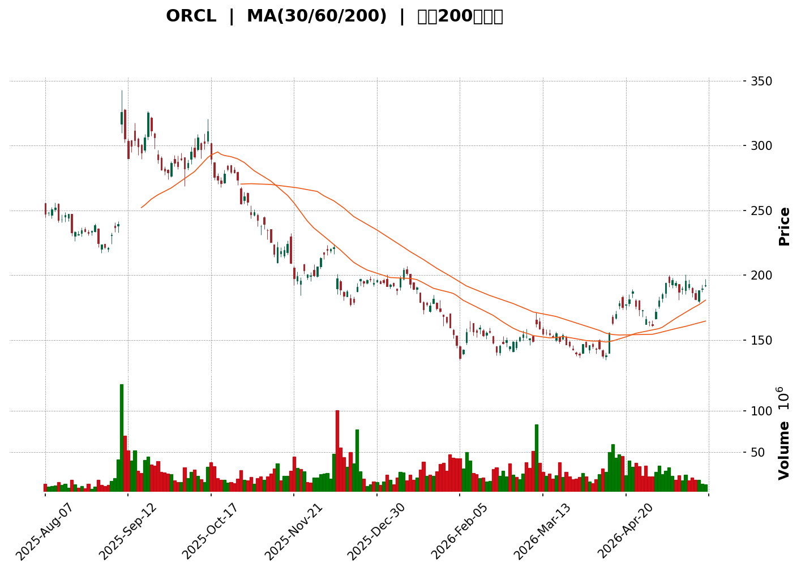
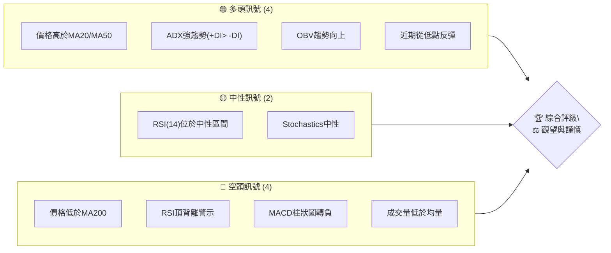

<details>
<summary>📊 靜態圖表 (點擊展開)</summary>

</details>

<html>
<head><meta charset="utf-8" /></head>
<body>
    <div>                        <script>window.PlotlyConfig = {MathJaxConfig: 'local'};</script>
        <script charset="utf-8" src="https://cdn.plot.ly/plotly-3.5.0.min.js" integrity="sha256-fHbNLP+GlIXN+efbQec78UkemUz3NJp7UmfGxC1tNxs=" crossorigin="anonymous"></script>                <div id="candlestick-chart" class="plotly-graph-div" style="height:500px; width:100%;"></div>            <script>                window.PLOTLYENV=window.PLOTLYENV || {};                                if (document.getElementById("candlestick-chart")) {                    Plotly.newPlot(                        "candlestick-chart",                        [{"close":{"dtype":"f8","bdata":"AAAAQP\u002ftbkAAAACg8wJvQAAAAOBzVm9AAAAAwOp7b0AAAAAAlUhuQAAAAOBYYW5AAAAAYMHKbkAAAABg1uNuQAAAAMAOGW1AAAAA4AYnbUAAAABAtOpsQAAAAICeUG1AAAAAwCMybUAAAABgCgxtQAAAAODWPm1AAAAAwAfObUAAAABAgQtsQAAAACAn8WtAAAAAYGq2a0AAAAAAIahrQAAAACBG32xAAAAAQJyTbUAAAADAz\u002fNtQAAAAEAmXHRAAAAAoDEXc0AAAABARx5yQAAAACBkvHJAAAAAYPwDc0AAAABgzbByQAAAAADDZHJAAAAAwOQjc0AAAADgSll0QAAAAED3dXNAAAAAALggc0AAAADAyBByQAAAAKDZk3FAAAAAAL2IcUAAAADAm3BxQAAAAID063FAAAAA4E3ocUAAAAAgZb5xQAAAAIDpFHJAAAAAgDugcUAAAABg7OVxQAAAACBXcnJAAAAAILsyckAAAABgDyJzQAAAAODHknJAAAAAwD\u002fcckAAAACgaXFzQAAAAAB+GHJAAAAAAMs3cUAAAADgghdxQAAAAEDq73BAAAAAQMBlcUAAAACAl5lxQAAAAIDmenFAAAAAANZxcUAAAACA5RlxQAAAAMBF6m9AAAAAwBhQcEAAAAAAZwRwQAAAAKDv1G5AAAAAgP8Yb0AAAABg80luQAAAAKCOuW1AAAAAoH3rbUAAAABApVZtQAAAAOBQM2xAAAAAoLcHa0AAAAAgpa9rQAAAAKCMUGtAAAAAIJZka0AAAACA4QRsQAAAAMDmLGpAAAAAIHmxaEAAAADg0OFoQAAAAIBzemhAAAAAYKl2aUAAAADg7RZpQAAAAKDO9mhAAAAAYOX7aEAAAACAws5pQAAAAKCroGpAAAAA4AgIa0AAAAAALWZrQAAAAKCphWtAAAAAwLu0a0AAAAAAVrRoQAAAAEDpmWdAAAAAQEz5ZkAAAADA7W9nQAAAAEDXK2ZAAAAAAMZdZkAAAABAhdlnQAAAAEBjpWhAAAAAgLNEaEAAAADgFIloQAAAAOD7mGhAAAAAQPlFaEAAAAAgLYBoQAAAAIAGN2hAAAAAQHhQaEAAAAAgPe1nQAAAAOAhEmhAAAAAoDD1Z0AAAADAu49nQAAAAMCHumhAAAAAwPZ+aUAAAAAAwDJpQAAAAAD1HWhAAAAAQA6mZ0AAAAAAmc1nQAAAAMBmaWZAAAAAYMuoZUAAAABA6jFmQAAAAKBjEWZAAAAA4MK5ZkAAAAAAUsllQAAAAMBahmVAAAAAIH8NZUAAAADgOoBkQAAAAOAX8GNAAAAAwDZEY0AAAADAGkViQAAAAOAoAGFAAAAAgFXKYUAAAACgcIFjQAAAACCs6mNAAAAA4J2TY0AAAACg7n1jQAAAAACl8mNAAAAAQOQtY0AAAAAADHRjQAAAAGDYf2NAAAAAYBFyYkAAAACALpphQAAAACA0NGJAAAAAQAJsYkAAAADgLbliQAAAACCbHGJAAAAAoGCXYkAAAABguY9iQAAAAKDe+mJAAAAAQApIY0AAAABArw1jQAAAAEAK4WJAAAAAICmcYkAAAAAgrFFkQAAAAOBk02NAAAAAoD5SY0AAAABAq21jQAAAAADaRGNAAAAAQMULY0AAAADAUV9jQAAAAOAWpWJAAAAAwLA5Y0AAAACAf1JiQAAAAKBgMGJAAAAAwAPKYUAAAADAkGVhQAAAAEAkSmFAAAAAwCJTYkAAAABgLxdiQAAAAIDbO2JAAAAAABIhYkAAAACgftVhQAAAAMAe5WFAAAAAIIU7YUAAAABA4UJhQAAAAADXc2NAAAAAAABgZEAAAACA6zllQAAAAEDhSmZAAAAAgOvhZUAAAABgjzJmQAAAAKBwpWZAAAAAAABwZ0AAAADA9QhmQAAAAMD1qGVAAAAAYLieZUAAAABguL5kQAAAAGCPemRAAAAA4HosZEAAAABgj3plQAAAAKBHiWZAAAAAQDMrZ0AAAADA9UBoQAAAAEDhUmhAAAAAYGZ+aEAAAABA4TpoQAAAAGCPWmdAAAAA4FG4Z0AAAAAghXNoQAAAAGBmHmhAAAAAIIVTZ0AAAABguK5mQAAAAMAehWdAAAAA4KO4Z0AAAABgjwJoQA=="},"high":{"dtype":"f8","bdata":"mLvph733b0CKnZL\u002fnh1vQFqygvRElm9AKdBcbTv7b0AAxekC4vRvQOG1iyIT325AwT8D5l0Vb0BKnUvaseZuQP0AE2aN6W5Ag5O4xw9BbUAGx30aVUJtQGdzSeI+lG1APZIJkRKlbUDxDimTw2FtQMWh3\u002fGyVW1ArpZ7FMgBbkD4elIPW4ttQP9dKkHq9WtAHK6smzMEbEByA7fwObprQNY0m8QOGW1AiW\u002fFCrQQbkDtgDgBrTJuQMr1pA82cHVAufMTComGdEBTJzvA8BhzQDXbra4ECnNA8XDB9m\u002fXc0A\u002fa23f5CNzQN4JHlkP13JAR10NTslKc0Ctstc0uW50QKh0eWhJJ3RAkkHDZmBgc0DcLsoqk4ZyQIdn9nsrO3JAUeVg3Nq7cUCXUdU8bJxxQPynexKD+3FA+3SInZFKckAsbLWIVEVyQP2mR+S2ZXJAd2Jyo8kuckBcw+W\u002f9RNyQPP4ps4bsnJAdwJy33Idc0Ait\u002fdT1kxzQFSaIaj46HJAd2UxX8RRc0BjfwHWHgl0QK+EAKe+5nJACxsbC5P3cUDLRUdpaGlxQKAsO4wcOHFASU7aUu+VcUCpE+WO+dZxQOPSHwf003FAe0hkq3a7cUAjLgkkZn5xQGK\u002f7GfMwXBA8hTi8fuCcEDbWVJ+9n9wQJlUpgERt29AfbjgLXhbb0CR\u002f0qSj\u002fFuQM3H8XXQ3W1Aqni9p1u3bkC8sK\u002fU\u002fX9tQF3yReqia21AvcovHh35a0DWbkBbOTVsQBpYSwYOrmtA234oxK3Ka0BsmgNpNVhsQD+EsfJDEm1Akkbu7DThaUC1JciAZ1JpQPpoEGslxmhA\u002fcQF1PQWakCwDYw8VSNpQBnrmwk6SGlAXsXaNGoNakBV5Ex+zdRpQOfVn\u002fYEw2pAobcUbxlFa0D7Tqa6EuxrQAE+cVZUqGtAwaCdyzP+a0Bc+bjEMxhpQDw96vqHlGhAwKU3PBt6Z0AUFb0VgZRnQIK6cpmMK2dABFIEdjX0ZkDjL8ZktD1oQKN6Xdy+smhA6reJj9t\u002faECHhiz5NKJoQFCeXKut5GhAPYRzhIWpaECvq8U1Y6VoQOvEyIvbf2hAJSotBxGsaEChU8gPqQ5pQDjDC1YSNmhAWx8WZzJPaECB2Y1UFLlnQCFtygt372hANuHjwTC8aUAY3oLmdOJpQBOmb0lMH2lApoflwJlKaEDhd9iCeOZnQDOywVc7UWdAnsqjBhZ\u002fZkDf7c4LDnFmQJMAmqHKYGZAKoYeDEgVZ0AQ6WgSBmNmQPKRTHCGoWZAmFY9l2Y0ZUD8vRkU\u002fQllQLdrcSBVU2VAgwzq1WjaY0C2IHZX7yxjQBywkUNHQWJAvVF8inPWYUAHGENHNeZjQOOCZk8PmmRAWbTIjORiZECUiKIikc9jQGG2GiqGN2RA733hWTjXY0Cq5S\u002fIFJhjQNsgVDG78GNAHE4Kn4cuY0CqPWCbXCliQGunmnL5R2JAbKckcuMXY0ACvxDvA\u002f9iQEC8mFxKMmJAAozuBLe0YkAqKglC88xiQOtpG2VpImNAqJ3XT32sY0BZx4y\u002fWdRjQEdraTQS72JAd2voGlAzY0Dwtg2oMGVlQONeYk7e52RAfggx\u002f7sGZEDrfJ0lAMZjQP4nG4W9y2NAgHDQusdNY0BnM3yV9otjQNESkpbuFmNAwzNrMZxnY0DKD0nWqCtjQPFlFhYxqmJAXl6wJbo+YkAnO9eeTKZhQEZVrJKslmFAnLZUG2JcYkApfXz6IaRiQBclFUrFPWJA6SHILQ6BYkCd2mOVIwJiQGJlsPvZ3WJAAAAAoJnZYUAAAACgcIVhQAAAAMAefWNAAAAAwMwsZUAAAACA65FlQAAAAOCjiGZAAAAAAAAQZ0AAAADgUThmQAAAAEDhKmdAAAAAgMKlZ0AAAADgerxmQAAAAGC4lmZAAAAAoJmxZUAAAABgZhZlQAAAAOBRmGRAAAAAgMKlZEAAAACgmcllQAAAAAAA8GZAAAAA4KNQZ0AAAACgR0loQAAAAMDMBGlAAAAAAADAaEAAAACAwnVoQAAAAKBwHWhAAAAAgD3yZ0AAAABguBZpQAAAAIDCjWhAAAAA4FHYZ0AAAABACpdnQAAAAEAKh2dAAAAAgD0aaEAAAAAAAKBoQA=="},"hovertemplate":"\u003cb\u003e%{x|%Y-%m-%d}\u003c\u002fb\u003e\u003cbr\u003e\u958b: $%{open:.2f}\u003cbr\u003e\u9ad8: $%{high:.2f}\u003cbr\u003e\u4f4e: $%{low:.2f}\u003cbr\u003e\u6536: $%{close:.2f}\u003cextra\u003e\u003c\u002fextra\u003e","low":{"dtype":"f8","bdata":"aBogVOCSbkD9bgaXa71uQEwjPItldG5AHymPTqcjb0Bm4RwmsBduQJUv0kp3FW5ABAuRROUgbkC\u002fCRFvzTZuQErCryotzWxAjQAoKtBObEAIXlvShtNsQL7Ax8u6tGxAGsy82rEtbUAaGGKVatxsQMRfZ6F222xATSpKxe4obUC3pzQTn6trQCH3hqt2ImtAFUGECXGAa0C3v2sj6TprQKAq75LiA2xACtIS8vYubUBpl28jJxdtQLDE5Q5YWnNAMxWkS3HjckAxHiDKcxdyQBH1HAlmb3JAyQOFVnS+ckCA2iR6hUtyQBTvYKlrG3JAJoOCy99vckCa5PazRQhzQO9OBJn1OXNAP\u002fdBGOWackBHumAHp+RxQFmid0CMjHFA3uwfhbtWcUCjY2Bg1htxQOde8u9EO3FAo9S\u002fTPe8cUAnDxdBbJxxQEysyvVeCHJAyDpZGg3OcECy9tHOEpZxQLzisakW2HFAG50IxJ8jckA9yQBOvn5yQJitu54lI3JA2SuwNIKRckDUZZvLgNNyQDe6uZDn23FAYT0sSA4acUDevavMjelwQKSs1C6wuXBA3u5LIZ\u002frcEBs5avkaohxQANDB6edYXFABeslgTltcUCKvFQxFdtwQGOWhQXf1m9AUIKw84vkb0BEg+T2ebVvQFAiE5oodm5AIKB\u002f3K2wbkBumjEHg7ptQP182bzJ3WxAnjrn4OdzbUAM4eSevm9sQF7AQmc8GWxAFT149Pm8akCOvdQpci9qQCIRlyXKx2pA\u002foc6tBOmakAa+FOIcv9qQEt9bWN\u002fIGpAOQgwjcULaEAUBX\u002f0nyNoQNRH5yPhD2dAGcHLNycgaUB7AHfG5YxoQBcINaX0b2hA5220KenYaEC8FCvp08VoQGetSoXqoWlAV6sHoxaKakDoZf+\u002fufJqQOQuozxMHmtAcMBv7wgIa0CnmstN9iJnQEQBBcMCG2dAFOcef1iJZkBk94tEn+tmQIVWNOyh\u002f2VA8QfZLKgvZkCDInOhEl9nQCGEYVDf9GdAwK\u002fJW4TgZ0AeY\u002fT6cCdoQFdQePAwXWhAPYlNONTuZ0CzhyQteFBoQACJsuFMMWhAyof\u002fTMMgaEA6JjhC+ORnQAXHvNogsWdANEpXZ3naZ0DD7LXeaiBnQFiaB1Tvg2dAjVkLz2CKaEDQ10WZxf5oQKKGHTWrxGdAbbqe\u002fWKXZ0ATRBeDLzxnQCmWdTeLV2ZAFPK+JDNAZUCTG1imV\u002fxlQPCByP7XbGVASGPTmhM9ZkB9E+GIaqJlQFK3JQ1haGVAGYBDraYeZEA8JLjUf1VkQJIL7RUu7mNA1Lsc2uHrYkBgJAp+rP1hQOTbq9Hv2GBADyfPOqZNYUAXCv7MoE9iQBnQESo9jWNAhom6ONkuY0CTa+b5A\u002f9iQF9uQgj8V2NARJv5EyILY0B5DtQ6+9piQAamLpRKZ2NA2TpPjBBcYkB4blXNcUNhQOyFO6boR2FAYHd\u002fTnhaYkAPSB4\u002fohRiQDkGvLZfs2FA5Dn\u002fNgmWYUA636gNq9FhQI4D5RuYkmJAQH+sxh6zYkD8uq4U9OJiQIzYBoRzPWJAK2381d19YkAhr5XrrABkQBKFbe7awWNAMvcpn6EzY0Bsd6eAHD9jQKsX323nHmNAw386pVjwYkBMnDbI5YtiQC5uNhPsbWJARIpNX+\u002fFYkA0L6xX2EpiQFYdfXwYA2JA28\u002fBkmfBYUCP98ZmMjphQFOwBL8lD2FAYAvn3p9rYUCZXGrXUwViQFgBc3n5eWFAL\u002fhNzy3rYUDwipuXfm5hQETmUWvizGFAAAAAAAAAYUAAAACAPdJgQAAAAEAKd2FAAAAAgOsxZEAAAABguMZkQAAAAKCZuWVAAAAAIIWrZUAAAADgUbBlQAAAAOBRAGZAAAAAoJnZZkAAAABgj8JlQAAAAKCZGWVAAAAAwMz8ZEAAAACgmUFkQAAAAMDMFGRAAAAAYI8KZEAAAADAzMRkQAAAAOBRyGVAAAAAAABgZkAAAACgcNVmQAAAAKCZ2WdAAAAAYLjGZ0AAAABAM9NnQAAAAADXm2ZAAAAAgOshZ0AAAABgZi5nQAAAAMDMnGdAAAAA4KPoZkAAAACAwp1mQAAAAKCZWWZAAAAAYGZmZ0AAAABAM+NnQA=="},"name":"\u50f9\u683c","open":{"dtype":"f8","bdata":"X18x\u002fSb2b0AldHYIUQJvQCu9uaOQzm5AfyccGUdTb0DH0LkUAuVvQAw2W4QHYW5Ad+KQepOfbkAXWHJUt4huQP0AE2aN6W5ASjPVmJbLbEDwbSUuNudsQNJwHClHB21AciPj0btvbUC+laJUHyVtQB1h1FMfJW1AjaUndUQ2bUCu3EYP\u002fXdtQCosnShhiGtAHK6smzMEbEC6YpYjYYhrQCMy4ShW12xAxQZRkGDAbUBP1XkS98FtQLr3V\u002f0Ny3NAZ1+M1A58dECpEmRpVfZyQFNxMqjPAHNA\u002fJoaHp55c0AeK+HafhRzQI+BxnytynJADqcLK4uKckAvDLnrSjNzQCMYRXppF3RAVH3ZVrFWc0ACACqlVE9yQGub041LK3JAj2P3nfKlcUAmBtttgJdxQKeSAK\u002ffSXFAe2CZ5j4YckBnaipKUvVxQLRTNQp0IXJAd2Jyo8kuckAjhBcx97JxQBjqVxdPHHJAph34vyKnckDe55KJAo5yQAVu5kt023JAx3ZXmprwckAbF35gvPtyQNKxUglR3nJAlsk8jPbycUA9DfnylEZxQBbemJZDEnFAlm74fq\u002f0cEDoPGt0x8JxQDMI\u002fIgdzXFAwBlFFliUcUDFHcTE2ntxQL0df+yTsXBASpFxzcwecEBb4wCA63lwQOkiKZCADm9AhC3J1KrMbkDa8iQcn81uQPeLOcJJsW1AAY4pc1SObkCWYEifMFltQH6NyAppaW1A0muj\u002f7Tza0CLNVapWjFqQP63VG4SHGtAALJAhXbcakBp2+74GjdrQGcBqsvwt2xA3umRVxa6aUBx3gdeC3VoQDxW1bmgHGhAatdk2A0HakD12651U8loQDyV4iPQ6GhAdeO63GJ8aUAkguYAaONoQADMChjl0mlAFjh+czI1a0Dbi6oY8H9rQH2fN630VWtAF2Z7CkCOa0AZ6qeHla5nQKTyBMh1ZWhADAVSonpkZ0ALxc0CTfJmQAOSgbUXxmZA0rUP6FOzZkBS\u002fw3\u002fqGdnQB+Ejs3Fc2hAgoVnNl5naECgQ9tV4zloQJuffb81m2hA2CfOCiwfaEBcfjHKmVtoQOgBr9IMZ2hAuLXREHKIaED7zlxtHaRoQLuvcupI7GdA6y5H6m1DaED\u002fERF12rZnQCI69DbG32dAThWSXDGdaEBBV7IbK4lpQBOmb0lMH2lApoflwJlKaECYSa4k+KdnQDOywVc7UWdAKdzTgb9hZkBHAB7S3FdmQG3rclGdgGVAcnti2kBPZkDE\u002fehuH1JmQFu2\u002f031yWVAD80rf9kxZUCN4GLEtfJkQBT5K1xnSmVAukzPpLG2Y0AfZnAkVytjQONwi\u002fn7ImJA\u002f\u002fK9h29oYUCtw4BxJH9iQH+CGh0u7mNAWbTIjORiZECvLYGoK6xjQBESHoBD1mNAwmi2ysOtY0D6Mg5O7DtjQPJJjreSlGNA9YhZy4YYY0Brr0We2iViQJCnKZ0xi2FA3\u002fot6oGUYkBe1ZVWtYhiQBTsdLYi7GFAlx1rKxGkYUAr\u002fnj14AdiQG800smcr2JAbizymeIBY0B7QAWkaAxjQH4tKqWdxWJAIXFlDrsiY0DLPPcsoblkQCbT8Q\u002fIgmRA3ludyeLPY0DE2hzviXBjQLH1uJ3EXGNAPH1z\u002frYbY0DlgMaE9r1iQFhlWOqNEGNAtNUSYZPcYkCrxke\u002f9Q5jQKjPclq9lmJAkkMVVXTsYUBK6TlKEI5hQFHtbeWucWFAV7tcavl5YUDC2eZxRpJiQN1rKOQOyWFAHO67s6hdYkAqXaFb8uhhQK2nkU7cuGJAAAAAYGbGYUAAAACAPSphQAAAAOCjeGFAAAAAgML9ZEAAAADgetxkQAAAAKBwDWZAAAAAgMLdZkAAAACA6xlmQAAAAEAzS2ZAAAAAgMJFZ0AAAADAzIxmQAAAAOBRkGZAAAAAYI+SZUAAAADAHkVkQAAAAKBHgWRAAAAA4KNAZEAAAACgcM1kQAAAAOCjAGZAAAAAACnEZkAAAABgZkZnQAAAACCF02hAAAAAYI8SaEAAAADAzARoQAAAAKBwHWhAAAAAwPWgZ0AAAACAwoVnQAAAACCuz2dAAAAAAADAZ0AAAAAAAEBnQAAAAIAUfmZAAAAA4FGgZ0AAAACgcPVnQA=="},"x":["2025-08-07T00:00:00-04:00","2025-08-08T00:00:00-04:00","2025-08-11T00:00:00-04:00","2025-08-12T00:00:00-04:00","2025-08-13T00:00:00-04:00","2025-08-14T00:00:00-04:00","2025-08-15T00:00:00-04:00","2025-08-18T00:00:00-04:00","2025-08-19T00:00:00-04:00","2025-08-20T00:00:00-04:00","2025-08-21T00:00:00-04:00","2025-08-22T00:00:00-04:00","2025-08-25T00:00:00-04:00","2025-08-26T00:00:00-04:00","2025-08-27T00:00:00-04:00","2025-08-28T00:00:00-04:00","2025-08-29T00:00:00-04:00","2025-09-02T00:00:00-04:00","2025-09-03T00:00:00-04:00","2025-09-04T00:00:00-04:00","2025-09-05T00:00:00-04:00","2025-09-08T00:00:00-04:00","2025-09-09T00:00:00-04:00","2025-09-10T00:00:00-04:00","2025-09-11T00:00:00-04:00","2025-09-12T00:00:00-04:00","2025-09-15T00:00:00-04:00","2025-09-16T00:00:00-04:00","2025-09-17T00:00:00-04:00","2025-09-18T00:00:00-04:00","2025-09-19T00:00:00-04:00","2025-09-22T00:00:00-04:00","2025-09-23T00:00:00-04:00","2025-09-24T00:00:00-04:00","2025-09-25T00:00:00-04:00","2025-09-26T00:00:00-04:00","2025-09-29T00:00:00-04:00","2025-09-30T00:00:00-04:00","2025-10-01T00:00:00-04:00","2025-10-02T00:00:00-04:00","2025-10-03T00:00:00-04:00","2025-10-06T00:00:00-04:00","2025-10-07T00:00:00-04:00","2025-10-08T00:00:00-04:00","2025-10-09T00:00:00-04:00","2025-10-10T00:00:00-04:00","2025-10-13T00:00:00-04:00","2025-10-14T00:00:00-04:00","2025-10-15T00:00:00-04:00","2025-10-16T00:00:00-04:00","2025-10-17T00:00:00-04:00","2025-10-20T00:00:00-04:00","2025-10-21T00:00:00-04:00","2025-10-22T00:00:00-04:00","2025-10-23T00:00:00-04:00","2025-10-24T00:00:00-04:00","2025-10-27T00:00:00-04:00","2025-10-28T00:00:00-04:00","2025-10-29T00:00:00-04:00","2025-10-30T00:00:00-04:00","2025-10-31T00:00:00-04:00","2025-11-03T00:00:00-05:00","2025-11-04T00:00:00-05:00","2025-11-05T00:00:00-05:00","2025-11-06T00:00:00-05:00","2025-11-07T00:00:00-05:00","2025-11-10T00:00:00-05:00","2025-11-11T00:00:00-05:00","2025-11-12T00:00:00-05:00","2025-11-13T00:00:00-05:00","2025-11-14T00:00:00-05:00","2025-11-17T00:00:00-05:00","2025-11-18T00:00:00-05:00","2025-11-19T00:00:00-05:00","2025-11-20T00:00:00-05:00","2025-11-21T00:00:00-05:00","2025-11-24T00:00:00-05:00","2025-11-25T00:00:00-05:00","2025-11-26T00:00:00-05:00","2025-11-28T00:00:00-05:00","2025-12-01T00:00:00-05:00","2025-12-02T00:00:00-05:00","2025-12-03T00:00:00-05:00","2025-12-04T00:00:00-05:00","2025-12-05T00:00:00-05:00","2025-12-08T00:00:00-05:00","2025-12-09T00:00:00-05:00","2025-12-10T00:00:00-05:00","2025-12-11T00:00:00-05:00","2025-12-12T00:00:00-05:00","2025-12-15T00:00:00-05:00","2025-12-16T00:00:00-05:00","2025-12-17T00:00:00-05:00","2025-12-18T00:00:00-05:00","2025-12-19T00:00:00-05:00","2025-12-22T00:00:00-05:00","2025-12-23T00:00:00-05:00","2025-12-24T00:00:00-05:00","2025-12-26T00:00:00-05:00","2025-12-29T00:00:00-05:00","2025-12-30T00:00:00-05:00","2025-12-31T00:00:00-05:00","2026-01-02T00:00:00-05:00","2026-01-05T00:00:00-05:00","2026-01-06T00:00:00-05:00","2026-01-07T00:00:00-05:00","2026-01-08T00:00:00-05:00","2026-01-09T00:00:00-05:00","2026-01-12T00:00:00-05:00","2026-01-13T00:00:00-05:00","2026-01-14T00:00:00-05:00","2026-01-15T00:00:00-05:00","2026-01-16T00:00:00-05:00","2026-01-20T00:00:00-05:00","2026-01-21T00:00:00-05:00","2026-01-22T00:00:00-05:00","2026-01-23T00:00:00-05:00","2026-01-26T00:00:00-05:00","2026-01-27T00:00:00-05:00","2026-01-28T00:00:00-05:00","2026-01-29T00:00:00-05:00","2026-01-30T00:00:00-05:00","2026-02-02T00:00:00-05:00","2026-02-03T00:00:00-05:00","2026-02-04T00:00:00-05:00","2026-02-05T00:00:00-05:00","2026-02-06T00:00:00-05:00","2026-02-09T00:00:00-05:00","2026-02-10T00:00:00-05:00","2026-02-11T00:00:00-05:00","2026-02-12T00:00:00-05:00","2026-02-13T00:00:00-05:00","2026-02-17T00:00:00-05:00","2026-02-18T00:00:00-05:00","2026-02-19T00:00:00-05:00","2026-02-20T00:00:00-05:00","2026-02-23T00:00:00-05:00","2026-02-24T00:00:00-05:00","2026-02-25T00:00:00-05:00","2026-02-26T00:00:00-05:00","2026-02-27T00:00:00-05:00","2026-03-02T00:00:00-05:00","2026-03-03T00:00:00-05:00","2026-03-04T00:00:00-05:00","2026-03-05T00:00:00-05:00","2026-03-06T00:00:00-05:00","2026-03-09T00:00:00-04:00","2026-03-10T00:00:00-04:00","2026-03-11T00:00:00-04:00","2026-03-12T00:00:00-04:00","2026-03-13T00:00:00-04:00","2026-03-16T00:00:00-04:00","2026-03-17T00:00:00-04:00","2026-03-18T00:00:00-04:00","2026-03-19T00:00:00-04:00","2026-03-20T00:00:00-04:00","2026-03-23T00:00:00-04:00","2026-03-24T00:00:00-04:00","2026-03-25T00:00:00-04:00","2026-03-26T00:00:00-04:00","2026-03-27T00:00:00-04:00","2026-03-30T00:00:00-04:00","2026-03-31T00:00:00-04:00","2026-04-01T00:00:00-04:00","2026-04-02T00:00:00-04:00","2026-04-06T00:00:00-04:00","2026-04-07T00:00:00-04:00","2026-04-08T00:00:00-04:00","2026-04-09T00:00:00-04:00","2026-04-10T00:00:00-04:00","2026-04-13T00:00:00-04:00","2026-04-14T00:00:00-04:00","2026-04-15T00:00:00-04:00","2026-04-16T00:00:00-04:00","2026-04-17T00:00:00-04:00","2026-04-20T00:00:00-04:00","2026-04-21T00:00:00-04:00","2026-04-22T00:00:00-04:00","2026-04-23T00:00:00-04:00","2026-04-24T00:00:00-04:00","2026-04-27T00:00:00-04:00","2026-04-28T00:00:00-04:00","2026-04-29T00:00:00-04:00","2026-04-30T00:00:00-04:00","2026-05-01T00:00:00-04:00","2026-05-04T00:00:00-04:00","2026-05-05T00:00:00-04:00","2026-05-06T00:00:00-04:00","2026-05-07T00:00:00-04:00","2026-05-08T00:00:00-04:00","2026-05-11T00:00:00-04:00","2026-05-12T00:00:00-04:00","2026-05-13T00:00:00-04:00","2026-05-14T00:00:00-04:00","2026-05-15T00:00:00-04:00","2026-05-18T00:00:00-04:00","2026-05-19T00:00:00-04:00","2026-05-20T00:00:00-04:00","2026-05-21T00:00:00-04:00","2026-05-22T00:00:00-04:00"],"type":"candlestick"},{"hovertemplate":"MA30: $%{y:.2f}\u003cextra\u003e\u003c\u002fextra\u003e","line":{"color":"#2196F3","dash":"dash","width":2},"mode":"lines","name":"MA30","x":["2025-08-07T00:00:00-04:00","2025-08-08T00:00:00-04:00","2025-08-11T00:00:00-04:00","2025-08-12T00:00:00-04:00","2025-08-13T00:00:00-04:00","2025-08-14T00:00:00-04:00","2025-08-15T00:00:00-04:00","2025-08-18T00:00:00-04:00","2025-08-19T00:00:00-04:00","2025-08-20T00:00:00-04:00","2025-08-21T00:00:00-04:00","2025-08-22T00:00:00-04:00","2025-08-25T00:00:00-04:00","2025-08-26T00:00:00-04:00","2025-08-27T00:00:00-04:00","2025-08-28T00:00:00-04:00","2025-08-29T00:00:00-04:00","2025-09-02T00:00:00-04:00","2025-09-03T00:00:00-04:00","2025-09-04T00:00:00-04:00","2025-09-05T00:00:00-04:00","2025-09-08T00:00:00-04:00","2025-09-09T00:00:00-04:00","2025-09-10T00:00:00-04:00","2025-09-11T00:00:00-04:00","2025-09-12T00:00:00-04:00","2025-09-15T00:00:00-04:00","2025-09-16T00:00:00-04:00","2025-09-17T00:00:00-04:00","2025-09-18T00:00:00-04:00","2025-09-19T00:00:00-04:00","2025-09-22T00:00:00-04:00","2025-09-23T00:00:00-04:00","2025-09-24T00:00:00-04:00","2025-09-25T00:00:00-04:00","2025-09-26T00:00:00-04:00","2025-09-29T00:00:00-04:00","2025-09-30T00:00:00-04:00","2025-10-01T00:00:00-04:00","2025-10-02T00:00:00-04:00","2025-10-03T00:00:00-04:00","2025-10-06T00:00:00-04:00","2025-10-07T00:00:00-04:00","2025-10-08T00:00:00-04:00","2025-10-09T00:00:00-04:00","2025-10-10T00:00:00-04:00","2025-10-13T00:00:00-04:00","2025-10-14T00:00:00-04:00","2025-10-15T00:00:00-04:00","2025-10-16T00:00:00-04:00","2025-10-17T00:00:00-04:00","2025-10-20T00:00:00-04:00","2025-10-21T00:00:00-04:00","2025-10-22T00:00:00-04:00","2025-10-23T00:00:00-04:00","2025-10-24T00:00:00-04:00","2025-10-27T00:00:00-04:00","2025-10-28T00:00:00-04:00","2025-10-29T00:00:00-04:00","2025-10-30T00:00:00-04:00","2025-10-31T00:00:00-04:00","2025-11-03T00:00:00-05:00","2025-11-04T00:00:00-05:00","2025-11-05T00:00:00-05:00","2025-11-06T00:00:00-05:00","2025-11-07T00:00:00-05:00","2025-11-10T00:00:00-05:00","2025-11-11T00:00:00-05:00","2025-11-12T00:00:00-05:00","2025-11-13T00:00:00-05:00","2025-11-14T00:00:00-05:00","2025-11-17T00:00:00-05:00","2025-11-18T00:00:00-05:00","2025-11-19T00:00:00-05:00","2025-11-20T00:00:00-05:00","2025-11-21T00:00:00-05:00","2025-11-24T00:00:00-05:00","2025-11-25T00:00:00-05:00","2025-11-26T00:00:00-05:00","2025-11-28T00:00:00-05:00","2025-12-01T00:00:00-05:00","2025-12-02T00:00:00-05:00","2025-12-03T00:00:00-05:00","2025-12-04T00:00:00-05:00","2025-12-05T00:00:00-05:00","2025-12-08T00:00:00-05:00","2025-12-09T00:00:00-05:00","2025-12-10T00:00:00-05:00","2025-12-11T00:00:00-05:00","2025-12-12T00:00:00-05:00","2025-12-15T00:00:00-05:00","2025-12-16T00:00:00-05:00","2025-12-17T00:00:00-05:00","2025-12-18T00:00:00-05:00","2025-12-19T00:00:00-05:00","2025-12-22T00:00:00-05:00","2025-12-23T00:00:00-05:00","2025-12-24T00:00:00-05:00","2025-12-26T00:00:00-05:00","2025-12-29T00:00:00-05:00","2025-12-30T00:00:00-05:00","2025-12-31T00:00:00-05:00","2026-01-02T00:00:00-05:00","2026-01-05T00:00:00-05:00","2026-01-06T00:00:00-05:00","2026-01-07T00:00:00-05:00","2026-01-08T00:00:00-05:00","2026-01-09T00:00:00-05:00","2026-01-12T00:00:00-05:00","2026-01-13T00:00:00-05:00","2026-01-14T00:00:00-05:00","2026-01-15T00:00:00-05:00","2026-01-16T00:00:00-05:00","2026-01-20T00:00:00-05:00","2026-01-21T00:00:00-05:00","2026-01-22T00:00:00-05:00","2026-01-23T00:00:00-05:00","2026-01-26T00:00:00-05:00","2026-01-27T00:00:00-05:00","2026-01-28T00:00:00-05:00","2026-01-29T00:00:00-05:00","2026-01-30T00:00:00-05:00","2026-02-02T00:00:00-05:00","2026-02-03T00:00:00-05:00","2026-02-04T00:00:00-05:00","2026-02-05T00:00:00-05:00","2026-02-06T00:00:00-05:00","2026-02-09T00:00:00-05:00","2026-02-10T00:00:00-05:00","2026-02-11T00:00:00-05:00","2026-02-12T00:00:00-05:00","2026-02-13T00:00:00-05:00","2026-02-17T00:00:00-05:00","2026-02-18T00:00:00-05:00","2026-02-19T00:00:00-05:00","2026-02-20T00:00:00-05:00","2026-02-23T00:00:00-05:00","2026-02-24T00:00:00-05:00","2026-02-25T00:00:00-05:00","2026-02-26T00:00:00-05:00","2026-02-27T00:00:00-05:00","2026-03-02T00:00:00-05:00","2026-03-03T00:00:00-05:00","2026-03-04T00:00:00-05:00","2026-03-05T00:00:00-05:00","2026-03-06T00:00:00-05:00","2026-03-09T00:00:00-04:00","2026-03-10T00:00:00-04:00","2026-03-11T00:00:00-04:00","2026-03-12T00:00:00-04:00","2026-03-13T00:00:00-04:00","2026-03-16T00:00:00-04:00","2026-03-17T00:00:00-04:00","2026-03-18T00:00:00-04:00","2026-03-19T00:00:00-04:00","2026-03-20T00:00:00-04:00","2026-03-23T00:00:00-04:00","2026-03-24T00:00:00-04:00","2026-03-25T00:00:00-04:00","2026-03-26T00:00:00-04:00","2026-03-27T00:00:00-04:00","2026-03-30T00:00:00-04:00","2026-03-31T00:00:00-04:00","2026-04-01T00:00:00-04:00","2026-04-02T00:00:00-04:00","2026-04-06T00:00:00-04:00","2026-04-07T00:00:00-04:00","2026-04-08T00:00:00-04:00","2026-04-09T00:00:00-04:00","2026-04-10T00:00:00-04:00","2026-04-13T00:00:00-04:00","2026-04-14T00:00:00-04:00","2026-04-15T00:00:00-04:00","2026-04-16T00:00:00-04:00","2026-04-17T00:00:00-04:00","2026-04-20T00:00:00-04:00","2026-04-21T00:00:00-04:00","2026-04-22T00:00:00-04:00","2026-04-23T00:00:00-04:00","2026-04-24T00:00:00-04:00","2026-04-27T00:00:00-04:00","2026-04-28T00:00:00-04:00","2026-04-29T00:00:00-04:00","2026-04-30T00:00:00-04:00","2026-05-01T00:00:00-04:00","2026-05-04T00:00:00-04:00","2026-05-05T00:00:00-04:00","2026-05-06T00:00:00-04:00","2026-05-07T00:00:00-04:00","2026-05-08T00:00:00-04:00","2026-05-11T00:00:00-04:00","2026-05-12T00:00:00-04:00","2026-05-13T00:00:00-04:00","2026-05-14T00:00:00-04:00","2026-05-15T00:00:00-04:00","2026-05-18T00:00:00-04:00","2026-05-19T00:00:00-04:00","2026-05-20T00:00:00-04:00","2026-05-21T00:00:00-04:00","2026-05-22T00:00:00-04:00"],"y":{"dtype":"f8","bdata":"AAAAAAAA+H8AAAAAAAD4fwAAAAAAAPh\u002fAAAAAAAA+H8AAAAAAAD4fwAAAAAAAPh\u002fAAAAAAAA+H8AAAAAAAD4fwAAAAAAAPh\u002fAAAAAAAA+H8AAAAAAAD4fwAAAAAAAPh\u002fAAAAAAAA+H8AAAAAAAD4fwAAAAAAAPh\u002fAAAAAAAA+H8AAAAAAAD4fwAAAAAAAPh\u002fAAAAAAAA+H8AAAAAAAD4fwAAAAAAAPh\u002fAAAAAAAA+H8AAAAAAAD4fwAAAAAAAPh\u002fAAAAAAAA+H8AAAAAAAD4fwAAAAAAAPh\u002fAAAAAAAA+H8AAAAAAAD4fyIiIhLYg29AMzMzA5LCb0BmZmbGnApwQDMzM2v4KnBA3t3dxdxHcEAiIiLqz2BwQJqZmUkvdXBAERERGW6HcEC8u7v7c5hwQDMzM+M7tXBAERERCanRcEB3d3fvse1wQO\u002fu7kbqCnFAd3d3\u002f8AkcUCJiIj4jEFxQFVVVW0uYnFAq6qqIk5+cUBERERc6qlxQO\u002fu7l4w0XFARERE7OP7cUAzMzNLzStyQKuqqsoHS3JAvLu7a8NfckDv7u4e0XFyQLy7u+ubVHJAVVVVNSlGckAzMzPzvEFyQAAAAJAFN3JAIiIi4p0pckDv7u6eDRxyQERERAREB3JA3t3dnSPvcUBmZmYWLcpxQO\u002fu7taop3FAZmZmbh6JcUAREREhMXBxQCIiItoFWXFAIiIicg5DcUAAAADgaStxQFVVVb3NCnFAiYiIeFLlcECamZlRCcRwQFVVVSVInnBAmpmZIcB8cEAAAABYkVtwQFVVVY3WLXBAVVVVVc\u002f3b0CamZmJmYVvQO\u002fu7v5+GW9Aq6qqyuawbkAiIiLyKztuQCIiIqJd221AzczMnLWKbUB3d3fnO0NtQFVVVTVlBW1AzczMfCXDbECrqqpalIBsQFVVVbUbQWxA7+7ubs8DbEAAAAAAw7JrQLy7u\u002fvQa2tAIiIiAnQZa0AzMzMzF9BqQM3MzPwvhmpAIiIiEq47akB3d3d3uwRqQAAAALBk2WlAAAAAwCqpaUCJiIh4LoBpQHd3d+dvYWlA7+7ujulJaUBERETkui5pQM3MzHxHFGlAmpmZOQL6aECJiIhYFtdoQJqZmdkgxWhAq6qqKtq+aEAiIiIylbNoQBEREQG4tWhAmpmZ2f61aEARERFB7LZoQM3MzMyxr2hAMzMzw0ykaEB3d3fHMZNoQERERAQ4b2hAIiIiomBBaEAiIiIC+BRoQERERCRt5mdAERERYe27Z0CJiIjYBqNnQFVVVeVOkWdAERERMeqAZ0AiIiKy22dnQImIiMjMVGdAMzMzE1k6Z0DNzMzsuwpnQO\u002fu7j5+yWZAiYiI2DaSZkCJiIj4SmdmQBEREWFZP2ZAREREREUXZkAzMzNzh+xlQM3MzMwdyGVAEREREUycZUAzMzPDH3ZlQAAAAFAdT2VAzczMvBMgZUAiIiKyOe1kQN7d3T2MtWRAIiIiwi55ZEB3d3cn7kFkQM3MzGyvDmRAERERgYfjY0CamZnZzLZjQLy7uwuEmWNAd3d3VzmFY0AzMzOTampjQFVVVWU0T2NAvLu7qxUsY0BEREQkkB9jQKuqqnoQEWNAAAAAEEoCY0BEREQkI\u002fliQBEREeFt82JAq6qqOozxYkBmZmZ29PpiQFVVVWX8CGNAvLu7KzsVY0ARERERIgtjQBEREdFj\u002fGJAIiIi8iLtYkAzMzPzQdtiQN7d3f2SxGJAZmZmRki9YkAiIiJSp7FiQAAAAKDapmJAIiIiciekYkBVVVWVIaZiQM3MzLx+o2JA7+7ubliZYkCamZlp3oxiQHd3d1dPmGJAq6qq2oenYkAiIiJCRb5iQM3MzJyJ2mJAmpmZybvwYkDv7u4OkAtjQKuqqpq1K2NA7+7ubudUY0BVVVUFjGNjQLy7u\u002fsyc2NAREREpNCGY0AAAADQDJJjQImIiKhfnGNAAAAAUP+lY0BVVVXV+LdjQImIiKgt2WNAREREJNT6Y0Dv7u6ucS1kQN7d3U3LYWRAq6qqygGbZEBmZmZGUdVkQERERJQQCWVA7+7urho3ZUDv7u7OYW1lQDMzM6OZn2VA7+7uzvLLZUCamZmZUvVlQJqZmZlSJWZA3t3dfbFcZkDNzMxcSJZmQA=="},"type":"scatter"},{"hovertemplate":"MA60: $%{y:.2f}\u003cextra\u003e\u003c\u002fextra\u003e","line":{"color":"#9C27B0","dash":"dash","width":2},"mode":"lines","name":"MA60","x":["2025-08-07T00:00:00-04:00","2025-08-08T00:00:00-04:00","2025-08-11T00:00:00-04:00","2025-08-12T00:00:00-04:00","2025-08-13T00:00:00-04:00","2025-08-14T00:00:00-04:00","2025-08-15T00:00:00-04:00","2025-08-18T00:00:00-04:00","2025-08-19T00:00:00-04:00","2025-08-20T00:00:00-04:00","2025-08-21T00:00:00-04:00","2025-08-22T00:00:00-04:00","2025-08-25T00:00:00-04:00","2025-08-26T00:00:00-04:00","2025-08-27T00:00:00-04:00","2025-08-28T00:00:00-04:00","2025-08-29T00:00:00-04:00","2025-09-02T00:00:00-04:00","2025-09-03T00:00:00-04:00","2025-09-04T00:00:00-04:00","2025-09-05T00:00:00-04:00","2025-09-08T00:00:00-04:00","2025-09-09T00:00:00-04:00","2025-09-10T00:00:00-04:00","2025-09-11T00:00:00-04:00","2025-09-12T00:00:00-04:00","2025-09-15T00:00:00-04:00","2025-09-16T00:00:00-04:00","2025-09-17T00:00:00-04:00","2025-09-18T00:00:00-04:00","2025-09-19T00:00:00-04:00","2025-09-22T00:00:00-04:00","2025-09-23T00:00:00-04:00","2025-09-24T00:00:00-04:00","2025-09-25T00:00:00-04:00","2025-09-26T00:00:00-04:00","2025-09-29T00:00:00-04:00","2025-09-30T00:00:00-04:00","2025-10-01T00:00:00-04:00","2025-10-02T00:00:00-04:00","2025-10-03T00:00:00-04:00","2025-10-06T00:00:00-04:00","2025-10-07T00:00:00-04:00","2025-10-08T00:00:00-04:00","2025-10-09T00:00:00-04:00","2025-10-10T00:00:00-04:00","2025-10-13T00:00:00-04:00","2025-10-14T00:00:00-04:00","2025-10-15T00:00:00-04:00","2025-10-16T00:00:00-04:00","2025-10-17T00:00:00-04:00","2025-10-20T00:00:00-04:00","2025-10-21T00:00:00-04:00","2025-10-22T00:00:00-04:00","2025-10-23T00:00:00-04:00","2025-10-24T00:00:00-04:00","2025-10-27T00:00:00-04:00","2025-10-28T00:00:00-04:00","2025-10-29T00:00:00-04:00","2025-10-30T00:00:00-04:00","2025-10-31T00:00:00-04:00","2025-11-03T00:00:00-05:00","2025-11-04T00:00:00-05:00","2025-11-05T00:00:00-05:00","2025-11-06T00:00:00-05:00","2025-11-07T00:00:00-05:00","2025-11-10T00:00:00-05:00","2025-11-11T00:00:00-05:00","2025-11-12T00:00:00-05:00","2025-11-13T00:00:00-05:00","2025-11-14T00:00:00-05:00","2025-11-17T00:00:00-05:00","2025-11-18T00:00:00-05:00","2025-11-19T00:00:00-05:00","2025-11-20T00:00:00-05:00","2025-11-21T00:00:00-05:00","2025-11-24T00:00:00-05:00","2025-11-25T00:00:00-05:00","2025-11-26T00:00:00-05:00","2025-11-28T00:00:00-05:00","2025-12-01T00:00:00-05:00","2025-12-02T00:00:00-05:00","2025-12-03T00:00:00-05:00","2025-12-04T00:00:00-05:00","2025-12-05T00:00:00-05:00","2025-12-08T00:00:00-05:00","2025-12-09T00:00:00-05:00","2025-12-10T00:00:00-05:00","2025-12-11T00:00:00-05:00","2025-12-12T00:00:00-05:00","2025-12-15T00:00:00-05:00","2025-12-16T00:00:00-05:00","2025-12-17T00:00:00-05:00","2025-12-18T00:00:00-05:00","2025-12-19T00:00:00-05:00","2025-12-22T00:00:00-05:00","2025-12-23T00:00:00-05:00","2025-12-24T00:00:00-05:00","2025-12-26T00:00:00-05:00","2025-12-29T00:00:00-05:00","2025-12-30T00:00:00-05:00","2025-12-31T00:00:00-05:00","2026-01-02T00:00:00-05:00","2026-01-05T00:00:00-05:00","2026-01-06T00:00:00-05:00","2026-01-07T00:00:00-05:00","2026-01-08T00:00:00-05:00","2026-01-09T00:00:00-05:00","2026-01-12T00:00:00-05:00","2026-01-13T00:00:00-05:00","2026-01-14T00:00:00-05:00","2026-01-15T00:00:00-05:00","2026-01-16T00:00:00-05:00","2026-01-20T00:00:00-05:00","2026-01-21T00:00:00-05:00","2026-01-22T00:00:00-05:00","2026-01-23T00:00:00-05:00","2026-01-26T00:00:00-05:00","2026-01-27T00:00:00-05:00","2026-01-28T00:00:00-05:00","2026-01-29T00:00:00-05:00","2026-01-30T00:00:00-05:00","2026-02-02T00:00:00-05:00","2026-02-03T00:00:00-05:00","2026-02-04T00:00:00-05:00","2026-02-05T00:00:00-05:00","2026-02-06T00:00:00-05:00","2026-02-09T00:00:00-05:00","2026-02-10T00:00:00-05:00","2026-02-11T00:00:00-05:00","2026-02-12T00:00:00-05:00","2026-02-13T00:00:00-05:00","2026-02-17T00:00:00-05:00","2026-02-18T00:00:00-05:00","2026-02-19T00:00:00-05:00","2026-02-20T00:00:00-05:00","2026-02-23T00:00:00-05:00","2026-02-24T00:00:00-05:00","2026-02-25T00:00:00-05:00","2026-02-26T00:00:00-05:00","2026-02-27T00:00:00-05:00","2026-03-02T00:00:00-05:00","2026-03-03T00:00:00-05:00","2026-03-04T00:00:00-05:00","2026-03-05T00:00:00-05:00","2026-03-06T00:00:00-05:00","2026-03-09T00:00:00-04:00","2026-03-10T00:00:00-04:00","2026-03-11T00:00:00-04:00","2026-03-12T00:00:00-04:00","2026-03-13T00:00:00-04:00","2026-03-16T00:00:00-04:00","2026-03-17T00:00:00-04:00","2026-03-18T00:00:00-04:00","2026-03-19T00:00:00-04:00","2026-03-20T00:00:00-04:00","2026-03-23T00:00:00-04:00","2026-03-24T00:00:00-04:00","2026-03-25T00:00:00-04:00","2026-03-26T00:00:00-04:00","2026-03-27T00:00:00-04:00","2026-03-30T00:00:00-04:00","2026-03-31T00:00:00-04:00","2026-04-01T00:00:00-04:00","2026-04-02T00:00:00-04:00","2026-04-06T00:00:00-04:00","2026-04-07T00:00:00-04:00","2026-04-08T00:00:00-04:00","2026-04-09T00:00:00-04:00","2026-04-10T00:00:00-04:00","2026-04-13T00:00:00-04:00","2026-04-14T00:00:00-04:00","2026-04-15T00:00:00-04:00","2026-04-16T00:00:00-04:00","2026-04-17T00:00:00-04:00","2026-04-20T00:00:00-04:00","2026-04-21T00:00:00-04:00","2026-04-22T00:00:00-04:00","2026-04-23T00:00:00-04:00","2026-04-24T00:00:00-04:00","2026-04-27T00:00:00-04:00","2026-04-28T00:00:00-04:00","2026-04-29T00:00:00-04:00","2026-04-30T00:00:00-04:00","2026-05-01T00:00:00-04:00","2026-05-04T00:00:00-04:00","2026-05-05T00:00:00-04:00","2026-05-06T00:00:00-04:00","2026-05-07T00:00:00-04:00","2026-05-08T00:00:00-04:00","2026-05-11T00:00:00-04:00","2026-05-12T00:00:00-04:00","2026-05-13T00:00:00-04:00","2026-05-14T00:00:00-04:00","2026-05-15T00:00:00-04:00","2026-05-18T00:00:00-04:00","2026-05-19T00:00:00-04:00","2026-05-20T00:00:00-04:00","2026-05-21T00:00:00-04:00","2026-05-22T00:00:00-04:00"],"y":{"dtype":"f8","bdata":"AAAAAAAA+H8AAAAAAAD4fwAAAAAAAPh\u002fAAAAAAAA+H8AAAAAAAD4fwAAAAAAAPh\u002fAAAAAAAA+H8AAAAAAAD4fwAAAAAAAPh\u002fAAAAAAAA+H8AAAAAAAD4fwAAAAAAAPh\u002fAAAAAAAA+H8AAAAAAAD4fwAAAAAAAPh\u002fAAAAAAAA+H8AAAAAAAD4fwAAAAAAAPh\u002fAAAAAAAA+H8AAAAAAAD4fwAAAAAAAPh\u002fAAAAAAAA+H8AAAAAAAD4fwAAAAAAAPh\u002fAAAAAAAA+H8AAAAAAAD4fwAAAAAAAPh\u002fAAAAAAAA+H8AAAAAAAD4fwAAAAAAAPh\u002fAAAAAAAA+H8AAAAAAAD4fwAAAAAAAPh\u002fAAAAAAAA+H8AAAAAAAD4fwAAAAAAAPh\u002fAAAAAAAA+H8AAAAAAAD4fwAAAAAAAPh\u002fAAAAAAAA+H8AAAAAAAD4fwAAAAAAAPh\u002fAAAAAAAA+H8AAAAAAAD4fwAAAAAAAPh\u002fAAAAAAAA+H8AAAAAAAD4fwAAAAAAAPh\u002fAAAAAAAA+H8AAAAAAAD4fwAAAAAAAPh\u002fAAAAAAAA+H8AAAAAAAD4fwAAAAAAAPh\u002fAAAAAAAA+H8AAAAAAAD4fwAAAAAAAPh\u002fAAAAAAAA+H8AAAAAAAD4f6uqqgaY5HBAvLu7TzbocEBmZmbuZOpwQBEREaFQ6XBAIiIimn3ocECamZmFgOhwQN7d3ZEa53BAmpmZRT7lcEDe3d3t7uFwQERERNAE4HBAzczMwH3bcECJiIig3dhwQCIiIjaZ1HBAiYiIkMDQcEBEREQoj85wQFVVVX0CyHBAq6qq5hq9cECJiIiQW7ZwQDMzM+\u002f3rnBAzczMqCuqcEAiIiKisaRwQN7d3U1bnHBAERERHY+ScEBVVVWJt4lwQDMzM0Ona3BA3t3d+d1TcEBERESQA0FwQFVVVbXJK3BAzczMzMIVcEDv7u4eb\u002fVvQCIiIoIsvW9A7+7unt17b0AAAACwODJvQFVVVdXA6m5Ad3d3d\u002fWmbkDNzMzcjnJuQCIiIjK4RW5AIiIi0qMXbkBEREQcgettQBEREbGFu21AAAAAQEeKbUC8u7vDZlttQLy7u+NrKG1AZmZmPsH5bEBERESEHMdsQCIiIvpmkGxAAAAAwFRbbEDe3d1dlxxsQAAAAICb52tAIiIi0nKza0CamZkZDHlrQHd3d7eHRWtAAAAAMIEXa0B3d3fXNutqQM3MzJxOumpAd3d3D0OCakBmZmYuxkpqQM3MzGzEE2pAAAAAaN7faUBERETs5KppQImIiPCPfmlAmpmZGS9NaUCrqqpy+RtpQKuqqmJ+7WhAq6qqkgO7aEAiIiKyu4doQHd3d3dxUWhAREREzLAdaECJiIi4vPNnQERERKRk0GdAmpmZaZewZ0C8u7sroY1nQM3MzKQybmdAVVVVJSdLZ0De3d0NmyZnQM3MzBQfCmdAvLu783bvZkAiIiJyZ9BmQHd3dx+itWZA3t3dzZaXZkBEREQ0bXxmQM3MzJwwX2ZAIiIiIupDZkCJiIhQ\u002fyRmQAAAAAheBGZAzczM\u002fEzjZUCrqqpKsb9lQM3MzMTQmmVAZmZmhgF0ZUBmZmZ+S2FlQAAAALAvUWVAiYiIIJpBZUAzMzNrfzBlQM3MzFQdJGVA7+7upvIVZUCamZkx2AJlQCIiIlI96WRAIiIiArnTZEDNzMyENrlkQBEREZnenWRAMzMzGzSCZEAzMzOz5GNkQFVVVWVYRmRAvLu7K8osZECrqqqK4xNkQAAAAPj7+mNAd3d3lx3iY0C8u7ujrcljQFVVVX2FrGNAiYiImEOJY0CJiIhIZmdjQCIiImJ\u002fU2NA3t3drYdFY0De3d0NiTpjQERERNQGOmNAiYiIkPo6Y0ARERFR\u002fTpjQAAAAAB1PWNAVVVVjX5AY0DNzMwUjkFjQDMzM7shQmNAIiIiWo1EY0AiIiL6l0VjQM3MzMTmR2NAVVVVxcVLY0De3d2ldlljQO\u002fu7gYVcWNAAAAAqAeIY0AAAADgSZxjQHd3d48Xr2NAZmZmXhLEY0DNzMycSdhjQBEREcnR5mNAq6qqejH6Y0CJiIiQhA9kQJqZmSE6I2RAiYiIIA04ZEB3d3cXuk1kQDMzM6toZGRAZmZm9gR7ZEAzMzNjk5FkQA=="},"type":"scatter"},{"hovertemplate":"MA200: $%{y:.2f}\u003cextra\u003e\u003c\u002fextra\u003e","line":{"color":"#FF6F00","dash":"solid","width":2},"mode":"lines","name":"MA200","x":["2025-08-07T00:00:00-04:00","2025-08-08T00:00:00-04:00","2025-08-11T00:00:00-04:00","2025-08-12T00:00:00-04:00","2025-08-13T00:00:00-04:00","2025-08-14T00:00:00-04:00","2025-08-15T00:00:00-04:00","2025-08-18T00:00:00-04:00","2025-08-19T00:00:00-04:00","2025-08-20T00:00:00-04:00","2025-08-21T00:00:00-04:00","2025-08-22T00:00:00-04:00","2025-08-25T00:00:00-04:00","2025-08-26T00:00:00-04:00","2025-08-27T00:00:00-04:00","2025-08-28T00:00:00-04:00","2025-08-29T00:00:00-04:00","2025-09-02T00:00:00-04:00","2025-09-03T00:00:00-04:00","2025-09-04T00:00:00-04:00","2025-09-05T00:00:00-04:00","2025-09-08T00:00:00-04:00","2025-09-09T00:00:00-04:00","2025-09-10T00:00:00-04:00","2025-09-11T00:00:00-04:00","2025-09-12T00:00:00-04:00","2025-09-15T00:00:00-04:00","2025-09-16T00:00:00-04:00","2025-09-17T00:00:00-04:00","2025-09-18T00:00:00-04:00","2025-09-19T00:00:00-04:00","2025-09-22T00:00:00-04:00","2025-09-23T00:00:00-04:00","2025-09-24T00:00:00-04:00","2025-09-25T00:00:00-04:00","2025-09-26T00:00:00-04:00","2025-09-29T00:00:00-04:00","2025-09-30T00:00:00-04:00","2025-10-01T00:00:00-04:00","2025-10-02T00:00:00-04:00","2025-10-03T00:00:00-04:00","2025-10-06T00:00:00-04:00","2025-10-07T00:00:00-04:00","2025-10-08T00:00:00-04:00","2025-10-09T00:00:00-04:00","2025-10-10T00:00:00-04:00","2025-10-13T00:00:00-04:00","2025-10-14T00:00:00-04:00","2025-10-15T00:00:00-04:00","2025-10-16T00:00:00-04:00","2025-10-17T00:00:00-04:00","2025-10-20T00:00:00-04:00","2025-10-21T00:00:00-04:00","2025-10-22T00:00:00-04:00","2025-10-23T00:00:00-04:00","2025-10-24T00:00:00-04:00","2025-10-27T00:00:00-04:00","2025-10-28T00:00:00-04:00","2025-10-29T00:00:00-04:00","2025-10-30T00:00:00-04:00","2025-10-31T00:00:00-04:00","2025-11-03T00:00:00-05:00","2025-11-04T00:00:00-05:00","2025-11-05T00:00:00-05:00","2025-11-06T00:00:00-05:00","2025-11-07T00:00:00-05:00","2025-11-10T00:00:00-05:00","2025-11-11T00:00:00-05:00","2025-11-12T00:00:00-05:00","2025-11-13T00:00:00-05:00","2025-11-14T00:00:00-05:00","2025-11-17T00:00:00-05:00","2025-11-18T00:00:00-05:00","2025-11-19T00:00:00-05:00","2025-11-20T00:00:00-05:00","2025-11-21T00:00:00-05:00","2025-11-24T00:00:00-05:00","2025-11-25T00:00:00-05:00","2025-11-26T00:00:00-05:00","2025-11-28T00:00:00-05:00","2025-12-01T00:00:00-05:00","2025-12-02T00:00:00-05:00","2025-12-03T00:00:00-05:00","2025-12-04T00:00:00-05:00","2025-12-05T00:00:00-05:00","2025-12-08T00:00:00-05:00","2025-12-09T00:00:00-05:00","2025-12-10T00:00:00-05:00","2025-12-11T00:00:00-05:00","2025-12-12T00:00:00-05:00","2025-12-15T00:00:00-05:00","2025-12-16T00:00:00-05:00","2025-12-17T00:00:00-05:00","2025-12-18T00:00:00-05:00","2025-12-19T00:00:00-05:00","2025-12-22T00:00:00-05:00","2025-12-23T00:00:00-05:00","2025-12-24T00:00:00-05:00","2025-12-26T00:00:00-05:00","2025-12-29T00:00:00-05:00","2025-12-30T00:00:00-05:00","2025-12-31T00:00:00-05:00","2026-01-02T00:00:00-05:00","2026-01-05T00:00:00-05:00","2026-01-06T00:00:00-05:00","2026-01-07T00:00:00-05:00","2026-01-08T00:00:00-05:00","2026-01-09T00:00:00-05:00","2026-01-12T00:00:00-05:00","2026-01-13T00:00:00-05:00","2026-01-14T00:00:00-05:00","2026-01-15T00:00:00-05:00","2026-01-16T00:00:00-05:00","2026-01-20T00:00:00-05:00","2026-01-21T00:00:00-05:00","2026-01-22T00:00:00-05:00","2026-01-23T00:00:00-05:00","2026-01-26T00:00:00-05:00","2026-01-27T00:00:00-05:00","2026-01-28T00:00:00-05:00","2026-01-29T00:00:00-05:00","2026-01-30T00:00:00-05:00","2026-02-02T00:00:00-05:00","2026-02-03T00:00:00-05:00","2026-02-04T00:00:00-05:00","2026-02-05T00:00:00-05:00","2026-02-06T00:00:00-05:00","2026-02-09T00:00:00-05:00","2026-02-10T00:00:00-05:00","2026-02-11T00:00:00-05:00","2026-02-12T00:00:00-05:00","2026-02-13T00:00:00-05:00","2026-02-17T00:00:00-05:00","2026-02-18T00:00:00-05:00","2026-02-19T00:00:00-05:00","2026-02-20T00:00:00-05:00","2026-02-23T00:00:00-05:00","2026-02-24T00:00:00-05:00","2026-02-25T00:00:00-05:00","2026-02-26T00:00:00-05:00","2026-02-27T00:00:00-05:00","2026-03-02T00:00:00-05:00","2026-03-03T00:00:00-05:00","2026-03-04T00:00:00-05:00","2026-03-05T00:00:00-05:00","2026-03-06T00:00:00-05:00","2026-03-09T00:00:00-04:00","2026-03-10T00:00:00-04:00","2026-03-11T00:00:00-04:00","2026-03-12T00:00:00-04:00","2026-03-13T00:00:00-04:00","2026-03-16T00:00:00-04:00","2026-03-17T00:00:00-04:00","2026-03-18T00:00:00-04:00","2026-03-19T00:00:00-04:00","2026-03-20T00:00:00-04:00","2026-03-23T00:00:00-04:00","2026-03-24T00:00:00-04:00","2026-03-25T00:00:00-04:00","2026-03-26T00:00:00-04:00","2026-03-27T00:00:00-04:00","2026-03-30T00:00:00-04:00","2026-03-31T00:00:00-04:00","2026-04-01T00:00:00-04:00","2026-04-02T00:00:00-04:00","2026-04-06T00:00:00-04:00","2026-04-07T00:00:00-04:00","2026-04-08T00:00:00-04:00","2026-04-09T00:00:00-04:00","2026-04-10T00:00:00-04:00","2026-04-13T00:00:00-04:00","2026-04-14T00:00:00-04:00","2026-04-15T00:00:00-04:00","2026-04-16T00:00:00-04:00","2026-04-17T00:00:00-04:00","2026-04-20T00:00:00-04:00","2026-04-21T00:00:00-04:00","2026-04-22T00:00:00-04:00","2026-04-23T00:00:00-04:00","2026-04-24T00:00:00-04:00","2026-04-27T00:00:00-04:00","2026-04-28T00:00:00-04:00","2026-04-29T00:00:00-04:00","2026-04-30T00:00:00-04:00","2026-05-01T00:00:00-04:00","2026-05-04T00:00:00-04:00","2026-05-05T00:00:00-04:00","2026-05-06T00:00:00-04:00","2026-05-07T00:00:00-04:00","2026-05-08T00:00:00-04:00","2026-05-11T00:00:00-04:00","2026-05-12T00:00:00-04:00","2026-05-13T00:00:00-04:00","2026-05-14T00:00:00-04:00","2026-05-15T00:00:00-04:00","2026-05-18T00:00:00-04:00","2026-05-19T00:00:00-04:00","2026-05-20T00:00:00-04:00","2026-05-21T00:00:00-04:00","2026-05-22T00:00:00-04:00"],"y":{"dtype":"f8","bdata":"AAAAAAAA+H8AAAAAAAD4fwAAAAAAAPh\u002fAAAAAAAA+H8AAAAAAAD4fwAAAAAAAPh\u002fAAAAAAAA+H8AAAAAAAD4fwAAAAAAAPh\u002fAAAAAAAA+H8AAAAAAAD4fwAAAAAAAPh\u002fAAAAAAAA+H8AAAAAAAD4fwAAAAAAAPh\u002fAAAAAAAA+H8AAAAAAAD4fwAAAAAAAPh\u002fAAAAAAAA+H8AAAAAAAD4fwAAAAAAAPh\u002fAAAAAAAA+H8AAAAAAAD4fwAAAAAAAPh\u002fAAAAAAAA+H8AAAAAAAD4fwAAAAAAAPh\u002fAAAAAAAA+H8AAAAAAAD4fwAAAAAAAPh\u002fAAAAAAAA+H8AAAAAAAD4fwAAAAAAAPh\u002fAAAAAAAA+H8AAAAAAAD4fwAAAAAAAPh\u002fAAAAAAAA+H8AAAAAAAD4fwAAAAAAAPh\u002fAAAAAAAA+H8AAAAAAAD4fwAAAAAAAPh\u002fAAAAAAAA+H8AAAAAAAD4fwAAAAAAAPh\u002fAAAAAAAA+H8AAAAAAAD4fwAAAAAAAPh\u002fAAAAAAAA+H8AAAAAAAD4fwAAAAAAAPh\u002fAAAAAAAA+H8AAAAAAAD4fwAAAAAAAPh\u002fAAAAAAAA+H8AAAAAAAD4fwAAAAAAAPh\u002fAAAAAAAA+H8AAAAAAAD4fwAAAAAAAPh\u002fAAAAAAAA+H8AAAAAAAD4fwAAAAAAAPh\u002fAAAAAAAA+H8AAAAAAAD4fwAAAAAAAPh\u002fAAAAAAAA+H8AAAAAAAD4fwAAAAAAAPh\u002fAAAAAAAA+H8AAAAAAAD4fwAAAAAAAPh\u002fAAAAAAAA+H8AAAAAAAD4fwAAAAAAAPh\u002fAAAAAAAA+H8AAAAAAAD4fwAAAAAAAPh\u002fAAAAAAAA+H8AAAAAAAD4fwAAAAAAAPh\u002fAAAAAAAA+H8AAAAAAAD4fwAAAAAAAPh\u002fAAAAAAAA+H8AAAAAAAD4fwAAAAAAAPh\u002fAAAAAAAA+H8AAAAAAAD4fwAAAAAAAPh\u002fAAAAAAAA+H8AAAAAAAD4fwAAAAAAAPh\u002fAAAAAAAA+H8AAAAAAAD4fwAAAAAAAPh\u002fAAAAAAAA+H8AAAAAAAD4fwAAAAAAAPh\u002fAAAAAAAA+H8AAAAAAAD4fwAAAAAAAPh\u002fAAAAAAAA+H8AAAAAAAD4fwAAAAAAAPh\u002fAAAAAAAA+H8AAAAAAAD4fwAAAAAAAPh\u002fAAAAAAAA+H8AAAAAAAD4fwAAAAAAAPh\u002fAAAAAAAA+H8AAAAAAAD4fwAAAAAAAPh\u002fAAAAAAAA+H8AAAAAAAD4fwAAAAAAAPh\u002fAAAAAAAA+H8AAAAAAAD4fwAAAAAAAPh\u002fAAAAAAAA+H8AAAAAAAD4fwAAAAAAAPh\u002fAAAAAAAA+H8AAAAAAAD4fwAAAAAAAPh\u002fAAAAAAAA+H8AAAAAAAD4fwAAAAAAAPh\u002fAAAAAAAA+H8AAAAAAAD4fwAAAAAAAPh\u002fAAAAAAAA+H8AAAAAAAD4fwAAAAAAAPh\u002fAAAAAAAA+H8AAAAAAAD4fwAAAAAAAPh\u002fAAAAAAAA+H8AAAAAAAD4fwAAAAAAAPh\u002fAAAAAAAA+H8AAAAAAAD4fwAAAAAAAPh\u002fAAAAAAAA+H8AAAAAAAD4fwAAAAAAAPh\u002fAAAAAAAA+H8AAAAAAAD4fwAAAAAAAPh\u002fAAAAAAAA+H8AAAAAAAD4fwAAAAAAAPh\u002fAAAAAAAA+H8AAAAAAAD4fwAAAAAAAPh\u002fAAAAAAAA+H8AAAAAAAD4fwAAAAAAAPh\u002fAAAAAAAA+H8AAAAAAAD4fwAAAAAAAPh\u002fAAAAAAAA+H8AAAAAAAD4fwAAAAAAAPh\u002fAAAAAAAA+H8AAAAAAAD4fwAAAAAAAPh\u002fAAAAAAAA+H8AAAAAAAD4fwAAAAAAAPh\u002fAAAAAAAA+H8AAAAAAAD4fwAAAAAAAPh\u002fAAAAAAAA+H8AAAAAAAD4fwAAAAAAAPh\u002fAAAAAAAA+H8AAAAAAAD4fwAAAAAAAPh\u002fAAAAAAAA+H8AAAAAAAD4fwAAAAAAAPh\u002fAAAAAAAA+H8AAAAAAAD4fwAAAAAAAPh\u002fAAAAAAAA+H8AAAAAAAD4fwAAAAAAAPh\u002fAAAAAAAA+H8AAAAAAAD4fwAAAAAAAPh\u002fAAAAAAAA+H8AAAAAAAD4fwAAAAAAAPh\u002fAAAAAAAA+H8AAAAAAAD4fwAAAAAAAPh\u002fAAAAAAAA+H8zMzOjFd1pQA=="},"type":"scatter"}],                        {"template":{"data":{"barpolar":[{"marker":{"line":{"color":"rgb(17,17,17)","width":0.5},"pattern":{"fillmode":"overlay","size":10,"solidity":0.2}},"type":"barpolar"}],"bar":[{"error_x":{"color":"#f2f5fa"},"error_y":{"color":"#f2f5fa"},"marker":{"line":{"color":"rgb(17,17,17)","width":0.5},"pattern":{"fillmode":"overlay","size":10,"solidity":0.2}},"type":"bar"}],"carpet":[{"aaxis":{"endlinecolor":"#A2B1C6","gridcolor":"#506784","linecolor":"#506784","minorgridcolor":"#506784","startlinecolor":"#A2B1C6"},"baxis":{"endlinecolor":"#A2B1C6","gridcolor":"#506784","linecolor":"#506784","minorgridcolor":"#506784","startlinecolor":"#A2B1C6"},"type":"carpet"}],"choropleth":[{"colorbar":{"outlinewidth":0,"ticks":""},"type":"choropleth"}],"contourcarpet":[{"colorbar":{"outlinewidth":0,"ticks":""},"type":"contourcarpet"}],"contour":[{"colorbar":{"outlinewidth":0,"ticks":""},"colorscale":[[0.0,"#0d0887"],[0.1111111111111111,"#46039f"],[0.2222222222222222,"#7201a8"],[0.3333333333333333,"#9c179e"],[0.4444444444444444,"#bd3786"],[0.5555555555555556,"#d8576b"],[0.6666666666666666,"#ed7953"],[0.7777777777777778,"#fb9f3a"],[0.8888888888888888,"#fdca26"],[1.0,"#f0f921"]],"type":"contour"}],"heatmap":[{"colorbar":{"outlinewidth":0,"ticks":""},"colorscale":[[0.0,"#0d0887"],[0.1111111111111111,"#46039f"],[0.2222222222222222,"#7201a8"],[0.3333333333333333,"#9c179e"],[0.4444444444444444,"#bd3786"],[0.5555555555555556,"#d8576b"],[0.6666666666666666,"#ed7953"],[0.7777777777777778,"#fb9f3a"],[0.8888888888888888,"#fdca26"],[1.0,"#f0f921"]],"type":"heatmap"}],"histogram2dcontour":[{"colorbar":{"outlinewidth":0,"ticks":""},"colorscale":[[0.0,"#0d0887"],[0.1111111111111111,"#46039f"],[0.2222222222222222,"#7201a8"],[0.3333333333333333,"#9c179e"],[0.4444444444444444,"#bd3786"],[0.5555555555555556,"#d8576b"],[0.6666666666666666,"#ed7953"],[0.7777777777777778,"#fb9f3a"],[0.8888888888888888,"#fdca26"],[1.0,"#f0f921"]],"type":"histogram2dcontour"}],"histogram2d":[{"colorbar":{"outlinewidth":0,"ticks":""},"colorscale":[[0.0,"#0d0887"],[0.1111111111111111,"#46039f"],[0.2222222222222222,"#7201a8"],[0.3333333333333333,"#9c179e"],[0.4444444444444444,"#bd3786"],[0.5555555555555556,"#d8576b"],[0.6666666666666666,"#ed7953"],[0.7777777777777778,"#fb9f3a"],[0.8888888888888888,"#fdca26"],[1.0,"#f0f921"]],"type":"histogram2d"}],"histogram":[{"marker":{"pattern":{"fillmode":"overlay","size":10,"solidity":0.2}},"type":"histogram"}],"mesh3d":[{"colorbar":{"outlinewidth":0,"ticks":""},"type":"mesh3d"}],"parcoords":[{"line":{"colorbar":{"outlinewidth":0,"ticks":""}},"type":"parcoords"}],"pie":[{"automargin":true,"type":"pie"}],"scatter3d":[{"line":{"colorbar":{"outlinewidth":0,"ticks":""}},"marker":{"colorbar":{"outlinewidth":0,"ticks":""}},"type":"scatter3d"}],"scattercarpet":[{"marker":{"colorbar":{"outlinewidth":0,"ticks":""}},"type":"scattercarpet"}],"scattergeo":[{"marker":{"colorbar":{"outlinewidth":0,"ticks":""}},"type":"scattergeo"}],"scattergl":[{"marker":{"line":{"color":"#283442"}},"type":"scattergl"}],"scattermapbox":[{"marker":{"colorbar":{"outlinewidth":0,"ticks":""}},"type":"scattermapbox"}],"scattermap":[{"marker":{"colorbar":{"outlinewidth":0,"ticks":""}},"type":"scattermap"}],"scatterpolargl":[{"marker":{"colorbar":{"outlinewidth":0,"ticks":""}},"type":"scatterpolargl"}],"scatterpolar":[{"marker":{"colorbar":{"outlinewidth":0,"ticks":""}},"type":"scatterpolar"}],"scatter":[{"marker":{"line":{"color":"#283442"}},"type":"scatter"}],"scatterternary":[{"marker":{"colorbar":{"outlinewidth":0,"ticks":""}},"type":"scatterternary"}],"surface":[{"colorbar":{"outlinewidth":0,"ticks":""},"colorscale":[[0.0,"#0d0887"],[0.1111111111111111,"#46039f"],[0.2222222222222222,"#7201a8"],[0.3333333333333333,"#9c179e"],[0.4444444444444444,"#bd3786"],[0.5555555555555556,"#d8576b"],[0.6666666666666666,"#ed7953"],[0.7777777777777778,"#fb9f3a"],[0.8888888888888888,"#fdca26"],[1.0,"#f0f921"]],"type":"surface"}],"table":[{"cells":{"fill":{"color":"#506784"},"line":{"color":"rgb(17,17,17)"}},"header":{"fill":{"color":"#2a3f5f"},"line":{"color":"rgb(17,17,17)"}},"type":"table"}]},"layout":{"annotationdefaults":{"arrowcolor":"#f2f5fa","arrowhead":0,"arrowwidth":1},"autotypenumbers":"strict","coloraxis":{"colorbar":{"outlinewidth":0,"ticks":""}},"colorscale":{"diverging":[[0,"#8e0152"],[0.1,"#c51b7d"],[0.2,"#de77ae"],[0.3,"#f1b6da"],[0.4,"#fde0ef"],[0.5,"#f7f7f7"],[0.6,"#e6f5d0"],[0.7,"#b8e186"],[0.8,"#7fbc41"],[0.9,"#4d9221"],[1,"#276419"]],"sequential":[[0.0,"#0d0887"],[0.1111111111111111,"#46039f"],[0.2222222222222222,"#7201a8"],[0.3333333333333333,"#9c179e"],[0.4444444444444444,"#bd3786"],[0.5555555555555556,"#d8576b"],[0.6666666666666666,"#ed7953"],[0.7777777777777778,"#fb9f3a"],[0.8888888888888888,"#fdca26"],[1.0,"#f0f921"]],"sequentialminus":[[0.0,"#0d0887"],[0.1111111111111111,"#46039f"],[0.2222222222222222,"#7201a8"],[0.3333333333333333,"#9c179e"],[0.4444444444444444,"#bd3786"],[0.5555555555555556,"#d8576b"],[0.6666666666666666,"#ed7953"],[0.7777777777777778,"#fb9f3a"],[0.8888888888888888,"#fdca26"],[1.0,"#f0f921"]]},"colorway":["#636efa","#EF553B","#00cc96","#ab63fa","#FFA15A","#19d3f3","#FF6692","#B6E880","#FF97FF","#FECB52"],"font":{"color":"#f2f5fa"},"geo":{"bgcolor":"rgb(17,17,17)","lakecolor":"rgb(17,17,17)","landcolor":"rgb(17,17,17)","showlakes":true,"showland":true,"subunitcolor":"#506784"},"hoverlabel":{"align":"left"},"hovermode":"closest","mapbox":{"style":"dark"},"paper_bgcolor":"rgb(17,17,17)","plot_bgcolor":"rgb(17,17,17)","polar":{"angularaxis":{"gridcolor":"#506784","linecolor":"#506784","ticks":""},"bgcolor":"rgb(17,17,17)","radialaxis":{"gridcolor":"#506784","linecolor":"#506784","ticks":""}},"scene":{"xaxis":{"backgroundcolor":"rgb(17,17,17)","gridcolor":"#506784","gridwidth":2,"linecolor":"#506784","showbackground":true,"ticks":"","zerolinecolor":"#C8D4E3"},"yaxis":{"backgroundcolor":"rgb(17,17,17)","gridcolor":"#506784","gridwidth":2,"linecolor":"#506784","showbackground":true,"ticks":"","zerolinecolor":"#C8D4E3"},"zaxis":{"backgroundcolor":"rgb(17,17,17)","gridcolor":"#506784","gridwidth":2,"linecolor":"#506784","showbackground":true,"ticks":"","zerolinecolor":"#C8D4E3"}},"shapedefaults":{"line":{"color":"#f2f5fa"}},"sliderdefaults":{"bgcolor":"#C8D4E3","bordercolor":"rgb(17,17,17)","borderwidth":1,"tickwidth":0},"ternary":{"aaxis":{"gridcolor":"#506784","linecolor":"#506784","ticks":""},"baxis":{"gridcolor":"#506784","linecolor":"#506784","ticks":""},"bgcolor":"rgb(17,17,17)","caxis":{"gridcolor":"#506784","linecolor":"#506784","ticks":""}},"title":{"x":0.05},"updatemenudefaults":{"bgcolor":"#506784","borderwidth":0},"xaxis":{"automargin":true,"gridcolor":"#283442","linecolor":"#506784","ticks":"","title":{"standoff":15},"zerolinecolor":"#283442","zerolinewidth":2},"yaxis":{"automargin":true,"gridcolor":"#283442","linecolor":"#506784","ticks":"","title":{"standoff":15},"zerolinecolor":"#283442","zerolinewidth":2}}},"xaxis":{"rangeslider":{"visible":false},"title":{"text":"\u65e5\u671f"}},"font":{"size":11},"title":{"text":"ORCL  |  MA(30\u002f60\u002f200)  |  \u6700\u8fd1200\u4ea4\u6613\u65e5"},"yaxis":{"title":{"text":"\u80a1\u50f9 (USD)"}},"hovermode":"x unified","height":500},                        {"responsive": true}                    )                };            </script>        </div>
</body>
</html>

# ORCL 技術分析報告

> **報告日期**：2026-05-26 ｜ **語言**：繁體中文 ｜ **數據來源**：Yahoo Finance ｜ **當前價格**：$192.08

---

## 目錄

| 章節 | 內容 |
|------|------|
| [1. 技術面概覽](#1-技術面概覽) | 訊號儀表板、核心指標、評分卡 |
| [2. 趨勢分析](#2-趨勢分析) | 多時框趨勢、長中短期走勢 |
| [3. 圖表形態分析](#3-圖表形態分析) | 形態識別、K線組合、目標價 |
| [4. 支撐與阻力](#4-支撐與阻力) | 關鍵價位、斐波那契回調 |
| [5. 技術指標深度解讀](#5-技術指標深度解讀) | MA/RSI/MACD/布林/成交量 |
| [6. 動能與波動率](#6-動能與波動率) | 動能評估、ATR、Beta |
| [7. 多時框架總結](#7-多時框架總結) | 時框架評分矩陣 |
| [8. 交易策略建議](#8-交易策略建議) | 多空策略、風險報酬比 |
| [9. 風險提示與監控](#9-風險提示與監控) | 監控指標、風險場景 |
| [10. 報告總結](#10-報告總結) | 綜合評級與關鍵結論 |

---

## 1. 技術面概覽

Oracle (ORCL) 當前股價為 $192.08，近期表現出從低點反彈的強勁動能，但同時面臨長期趨勢線的壓力與動能指標的潛在背離警訊。本章將提供一份高層次的技術面總覽，透過儀表板、速覽表與評分卡，快速掌握 ORCL 當前的技術狀態。

### 🎯 技術訊號儀表板

ORCL 的技術訊號目前呈現多空交織的複雜局面。短期內，股價位於多條短期移動平均線之上，顯示出一定的上漲勢頭。然而，長期均線的壓制、動能指標的背離以及成交量的相對不足，為未來的走勢增添了不確定性。



**儀表板解讀**：
- **多頭訊號 (🟢)**：股價成功站上短期與中期移動平均線 (MA20、MA50)，顯示了短期買盤力量的增強。ADX 指標確認了當前存在一個強勁的趨勢，且多頭力量 (+DI) 佔優，支持股價上行。OBV 的上升趨勢也暗示了量能對價格的積極支撐。近期股價從 $138.09 的低點反彈至 $192.08，漲幅顯著，顯示市場對其前景的信心有所恢復。
- **中性訊號 (🟡)**：RSI(14) 位於 60.11，處於 30-70 的中性區間，表示市場尚未達到過熱或超賣的極端狀態，仍有上漲或下跌的空間。Stochastics 指標也處於中性區域，未能提供明確的買賣訊號。
- **空頭訊號 (🔴)**：股價仍處於長期移動平均線 MA200 ($206.91) 之下，這是一個重要的長期阻力位，暗示長期趨勢仍偏向下行。更為關鍵的是，RSI 出現了頂背離 (Bearish Divergence) 警示，這意味著儘管股價上漲，但其動能卻在減弱，可能預示著潛在的反轉。MACD 柱狀圖由正轉負，MACD 線下穿訊號線，構成看空交叉。此外，當前成交量 (10.84M) 顯著低於 20 日均量 (21.46M)，這表明近期上漲缺乏足夠的量能支持，價格上漲的持續性存疑。

綜合來看，ORCL 股價在短期內展現出反彈動能，但多項關鍵指標發出警示，特別是長期趨勢的阻力、動能背離以及成交量不足，這些都暗示著當前的反彈可能面臨嚴峻考驗，或預示著潛在的回調風險。

### 📊 核心指標速覽表

以下表格匯總了 ORCL 當前的關鍵技術指標數據及其初步解讀：

| 指標類別 | 指標名稱 | 當前數值 | 訊號 | 解讀 |
|----------|----------|----------|------|------|
| **價格** | 當前價格 | $192.08 | 🟡 | 位於52W區間27.6%，處於反彈階段 |
| **均線** | MA20 | $184.16 | 🟢 | 價格在MA20上方，短期看漲 |
| **均線** | MA50 | $167.02 | 🟢 | 價格在MA50上方，中期看漲 |
| **均線** | MA200 | $206.91 | 🔴 | 價格在MA200下方，長期看跌 |
| **動能** | RSI(14) | 60.11 | 🟡 | 中性，但存在頂背離警示 |
| **動能** | MACD | 6.363 | 🔴 | MACD線下穿訊號線，柱狀圖轉負，看空 |
| **趨勢** | ADX(14) | 27.33 | 🟢 | 強趨勢 (+DI > -DI)，多頭主導 |
| **波動** | ATR(14) | $8.83 | 🟡 | 相對於價格的4.60%，波動中等 |
| **成交量** | 量比(vs 20日均量) | 0.51x | 🔴 | 成交量顯著萎縮，上漲動能存疑 |
| **布林通道** | %B | 0.68 | 🟡 | 價格位於布林通道上半部，接近上軌 |

**速覽表總結**：
ORCL 的技術面目前處於一個關鍵的轉折點。短期和中期移動平均線提供支撐，顯示近期買盤力量。然而，長期 MA200 的壓制、RSI 頂背離、MACD 的看空交叉以及成交量的萎縮，都構成了顯著的潛在風險。ADX 指標雖然確認了趨勢的強勁性，但市場的內部力量分配正在轉變。投資者需密切關注這些矛盾訊號，謹慎評估後續走勢。

### 🏆 技術評分卡

本評分卡綜合了各項技術指標的表現，對 ORCL 當前的技術健康度進行量化評估。分數越高表示技術面越強勁。

```
╔══════════════════════════════════════════════════════════════╗
║              技術評分卡 — ORCL (2026-05-26)                  ║
╠══════════════════════════════════════════════════════════════╣
║ 趨勢強度      ██████████████░░░░░░  70/100  🟢 強趨勢，多頭主導，但長期仍有壓力             ║
║ 動能指標      ██████░░░░░░░░░░░░░░  30/100  🔴 MACD看空，RSI頂背離，動能減弱               ║
║ 支撐穩定度    ████████████░░░░░░░░  60/100  🟡 短中期均線提供支撐，但長期阻力明顯            ║
║ 成交量配合    ██████░░░░░░░░░░░░░░  30/100  🔴 當前量能不足，未能有效確認價格上漲             ║
║ 形態完整度    ████████░░░░░░░░░░░░  40/100  🟡 潛在雙底形態，但尚未完全確認，存在上行壓力      ║
║ 均線排列      ████████░░░░░░░░░░░░  40/100  🟡 短中期看多，長期看空，混合排列               ║
╠══════════════════════════════════════════════════════════════╣
║ 綜合評分      ████████░░░░░░░░░░░░  45/100  ⚖️ 觀望與謹慎 (中性偏空)                         ║
╚══════════════════════════════════════════════════════════════╝
```

**評分卡解讀**：
- **趨勢強度 (70/100 🟢)**：ADX 27.33 顯示趨勢強勁，且 +DI > -DI，短期和中期均線向上，這是積極訊號。然而，股價仍未能突破長期 MA200，這限制了其趨勢的全面強度，因此給予中高分。
- **動能指標 (30/100 🔴)**：RSI 雖然在中性區，但其頂背離的警示是嚴重的負面訊號。MACD 柱狀圖轉負且 MACD 線下穿訊號線，明確指示動能正在轉弱並可能轉為下行。Stochastics 中性，未能提供足夠支撐。綜合來看，動能指標表現較弱。
- **支撐穩定度 (60/100 🟡)**：股價目前位於 MA20 ($184.16) 和 MA50 ($167.02) 之上，這些均線形成短期和中期的動態支撐。但 MA200 ($206.91) 形成強大阻力，且距離當前價格不遠，使得支撐的整體穩定性面臨挑戰。
- **成交量配合 (30/100 🔴)**：OBV 趨勢向上是積極的，但當前成交量僅為 20 日均量的一半，顯示近期價格上漲缺乏足夠的市場參與度。量能的萎縮削弱了上漲的說服力，可能預示著反彈的脆弱性。
- **形態完整度 (40/100 🟡)**：從低點反彈的走勢可能形成 V 形反轉或雙底形態的右側，但距離形態的確認突破點仍有一段距離。同時，上方仍有較高的阻力位，使得形態的完整度和潛在目標價的實現存在不確定性。
- **均線排列 (40/100 🟡)**：MA20 > MA50 的短期看多排列，但 MA200 仍遠高於 MA20/MA50，且股價位於 MA200 之下。這種「混合排列」顯示市場對短期和長期趨勢的看法存在分歧，未能形成一致的強勢趨勢結構。

**綜合評分 (45/100 ⚖️ 觀望與謹慎)**：ORCL 的技術面呈現出短期反彈的跡象，但同時伴隨著長期阻力、動能減弱的背離訊號和成交量不足等多重風險。這使得當前市場處於一個多空拉鋸的狀態，不確定性較高。建議投資者保持觀望，等待更明確的趨勢訊號或形態確認。

---

## 2. 趨勢分析

對 ORCL 進行多時框架的趨勢分析是理解其股價行為的基礎。我們將從宏觀的長期趨勢，逐步聚焦到中短期走勢，並利用 ADX 指標評估趨勢的強度與方向。

### 🌐 多時框趨勢分析

多時框架分析揭示了 ORCL 股價在不同時間維度上的趨勢差異，這對於制定全面的交易策略至關重要。

```mermaid
graph TD
    A[長期趨勢 (月線/MA200)] --> B{價格 $192.08 < MA200 $206.91}
    B --> |結論| C[🔴 長期趨勢偏空]

    D[中期趨勢 (週線/MA50)] --> E{價格 $192.08 > MA50 $167.02}
    E --> |結論| F[🟢 中期趨勢偏多]

    G[短期趨勢 (日線/MA20)] --> H{價格 $192.08 > MA20 $184.16}
    H --> |結論| I[🟢 短期趨勢偏多]

    C --> J(綜合分析)
    F --> J
    I --> J
    J --> K{多空拉鋸，短期反彈面臨長期壓力}
```

**多時框趨勢詳述**：
1.  **長期趨勢 (月線/MA200)**：
    *   ORCL 的股價目前為 $192.08，顯著低於其 200 日移動平均線 (MA200) $206.91。MA200 通常被視為長期趨勢的晴雨表。股價位於 MA200 之下，明確指示其長期趨勢目前處於**偏空**狀態。這意味著在過去的較長時間內，賣方力量佔據主導，即使近期有所反彈，也仍未改變其宏觀下行格局。
    *   從 2025 年 9 月的歷史高點 $279.04 來看，ORCL 經歷了一輪深度的回調，雖然有所企穩，但距離恢復長期上漲趨勢仍有距離。
2.  **中期趨勢 (週線/MA50)**：
    *   股價 $192.08 高於其 50 日移動平均線 (MA50) $167.02。MA50 代表中期趨勢，股價站上此線通常被解讀為中期買盤力量的恢復或增強。這表明自 2026 年 2 月/3 月的低點以來，ORCL 的股價在中期時間框架內已經形成了**偏多**的反彈趨勢。
    *   MA50 本身也呈現向上傾斜的趨勢，進一步確認了中期動能的積極轉變。
3.  **短期趨勢 (日線/MA20)**：
    *   股價 $192.08 高於其 20 日移動平均線 (MA20) $184.16。MA20 是最敏感的短期趨勢指標，股價位於其上方通常被視為**偏多**的訊號。這表明在最近一個月的交易中，ORCL 的買盤力量佔優，推動股價上漲。
    *   MA20 呈現明顯的向上斜率，反映了近期強勁的反彈動能。

**綜合判斷**：
ORCL 的多時框架趨勢分析揭示了一個「短期和中期看漲，長期看跌」的混合格局。短期和中期趨勢的積極轉變表明市場對其短期前景持樂觀態度，並正在進行一輪修復性反彈。然而，長期趨勢的壓制 (MA200) 是一個不可忽視的挑戰，它可能成為反彈的關鍵阻力位。這種多空拉鋸的局面要求投資者在追逐短期收益的同時，警惕長期趨勢可能帶來的回調風險。

### 📈 長期趨勢 — 12個月走勢圖（Unicode）

以下是 ORCL 過去 12 個月的月線收盤價走勢圖，標註了關鍵的高點和低點，幫助我們視覺化長期價格行為。

```
ORCL 月線走勢圖（過去12個月：2025-06 至 2026-05）
價格軸 ($)
$280 ┤                                    ● (279.04, 2025-09高點)
$260 ┤                            ● (261.01)
$240 ┤                   ● (251.78)
$220 ┤           ● (216.46)
$200 ┤                   ● (200.72)
$190 ┤                                                  ● (192.08, 現在)
$180 ┤                                       ● (193.72)
$170 ┤                                  ● (167.77) ● (163.89) ● (164.01)
$160 ┤                                                           ● (161.39)
$150 ┤                                         ● (147.56) ● (146.60)
$140 ┤                                      ● (144.89, 2026-02低點)
$130 ┤
     └───────────────────────────────────────────────────────────────────
      25/06 25/07 25/08 25/09 25/10 25/11 25/12 26/01 26/02 26/03 26/04 26/05
```

**走勢特徵分析表格**：
下表詳細分析了 ORCL 過去 12 個月的價格走勢特徵，包括主要漲跌幅和趨勢階段。

| 月份區間 | 起始價 ($) | 結束價 ($) | 漲跌幅 (%) | 走勢特徵 | 趨勢評估 |
|----------|------------|------------|------------|----------|----------|
| 2025-06 ~ 2025-09 | 138.25 | 279.04 | +101.84% | 強勁上漲，創階段新高 | 🚀 強勁多頭 |
| 2025-09 ~ 2026-02 | 279.04 | 144.89 | -48.08% | 急速下跌，幾乎腰斬，創低點 | 📉 強勁空頭 |
| 2026-02 ~ 2026-05 | 144.89 | 192.08 | +32.57% | 觸底反彈，穩步回升 | 📈 反彈多頭 |

**長期走勢解讀**：
- **第一階段 (2025-06 至 2025-09)**：ORCL 股價經歷了一輪令人驚嘆的強勁上漲，從 $138.25 一路飆升至 $279.04，漲幅超過 100%。這顯示了當時市場對其增長前景的極度樂觀情緒。2025 年 9 月的 $279.04 成為了該階段的歷史高點。
- **第二階段 (2025-09 至 2026-02)**：在達到高峰後，ORCL 股價經歷了快速而深度的回調，從 $279.04 大幅下跌至 $144.89，跌幅接近 50%。這輪下跌可能與市場情緒轉變、獲利回吐或特定負面消息有關。期間，股價跌破了多條關鍵支撐線，顯示賣壓沉重。
- **第三階段 (2026-02 至 2026-05)**：自 2026 年 2 月觸及 $144.89 的低點後，ORCL 股價開始穩步反彈，回升至 $192.08，漲幅超過 30%。這波反彈顯示市場在經歷深度調整後，重新積聚了買盤力量。然而，當前價格仍遠低於 2025 年 9 月的高點，且面臨長期均線的阻力。

**總結**：ORCL 在過去一年中經歷了「大漲-大跌-反彈」的完整週期。當前股價處於反彈階段，試圖從之前的深度回調中恢復。但上方仍有顯著的歷史阻力位，需關注反彈的持續性和量能配合。

### 📊 中期趨勢（週線分析）

中期趨勢主要透過週線圖和中期移動平均線 (如 MA50) 進行分析。從近 20 週的收盤數據來看，ORCL 在經歷了一段時間的下跌後，已經開始形成一個底部結構並出現反彈。

**近期壓力與支撐示意圖**：
以下 ASCII 圖描繪了 ORCL 近期的主要支撐與阻力位，基於過去 20 週的週線收盤價和主要轉折點。

```
ORCL 近期壓力與支撐示意圖 (週線)
價格軸 ($)
$200 ┤                                  R1 ($195.95)
$190 ┤                                  ● (192.08, 現價)
$180 ┤                                  S1 ($184.16, MA20)
$170 ┤                                  S2 ($167.02, MA50)
$160 ┤                                  S3 ($161.84, BB下軌)
$150 ┤          S4 ($154.57, 近期反彈高點)
$140 ┤     S5 ($144.89, 2026-03低點)
$130 ┤     S6 ($138.09, 2026-04低點)
     └────────────────────────────────────────────────
        2026-01-11  ...  2026-05-24
```

**中期走勢解讀**：
從 2026 年 1 月的 $197.83 開始，ORCL 股價經歷了一輪顯著的下跌，尤其在 2026 年 2 月初跌至 $142.32 (2026-02-08 週線收盤價)，並在 2026 年 4 月中旬再次探底至 $138.09 (2026-04-12 週線收盤價)。這兩個低點形成了一個潛在的**雙底形態**。
- **下跌趨勢 (2026-01 至 2026-02)**：RSI 從 69.3 迅速跌至 19.9，MACD 柱狀圖由正轉負並持續擴大，顯示強勁的賣壓。
- **初步反彈 (2026-02 至 2026-03)**：從 $142.32 反彈至 $154.57，RSI 回升至 63.6，MACD 柱狀圖轉正，顯示買盤力量回歸。
- **再次探底與築底 (2026-03 至 2026-04)**：股價再次回調至 $138.09，但 RSI 並未創出新低 (36.4)，與價格形成**底背離**（儘管數據中只提到頂背離，但從週線趨勢看，這是一個值得注意的潛在底部訊號），為後續反彈積蓄力量。
- **近期強勁反彈 (2026-04 至 2026-05)**：從 $138.09 強勢反彈至 $195.95，RSI 曾飆升至 77.6 (超買區)，MACD 柱狀圖大幅轉正。當前價格 $192.08 略有回調，但仍維持在 MA20 ($184.16) 和 MA50 ($167.02) 之上，顯示中期上漲動能仍存。

**關鍵觀察**：
- **潛在雙底**：2026 年 2 月的 $142.32 和 2026 年 4 月的 $138.09 形成了一個潛在的雙底形態，頸線約在 $197.83 (2026-01-11 的高點)。
- **成交量**：在 2026 年 4 月 19 日反彈時，週成交量達到 245M，顯著放大，支持了這波反彈的有效性。但最近兩週成交量萎縮，需要警惕。
- **中期支撐**：MA50 ($167.02) 和 MA20 ($184.16) 是重要的中期支撐位。

### ⚡ 趨勢強度評估（ADX 解讀）

平均方向性指數 (ADX) 及其組成部分 (+DI 和 -DI) 用於衡量趨勢的強度和方向。

```mermaid
graph TD
    A[ADX(14) 值: 27.33] --> B{ADX > 25?}
    B --> |是| C[趨勢強勁]
    B --> |否| D[趨勢疲弱或盤整]

    C --> E{比較 +DI (31.13) 與 -DI (17.99)}
    E --> |+DI > -DI| F[🟢 多頭主導趨勢]
    E --> |-DI > +DI| G[🔴 空頭主導趨勢]

    F --> H[結論: ORCL 處於一個強勁的多頭趨勢中]
```

**ADX 強度對照表**：

| ADX 數值範圍 | 趨勢強度 | 市場狀態 |
|--------------|----------|----------|
| 0-20         | 無趨勢或弱趨勢 | 盤整 |
| 20-25        | 新興趨勢 | 趨勢形成中 |
| **25-50**    | **強趨勢** | **趨勢行情** |
| 50-75        | 非常強趨勢 | 強勁趨勢 |
| 75-100       | 極強趨勢 | 極端趨勢 |

**ADX 解讀**：
- **ADX(14) 數值為 27.33**：根據 ADX 強度對照表，ADX 值超過 25 表示 ORCL 正處於一個**強勁的趨勢行情**中，而非盤整。這告訴我們，當前的市場力量正朝著一個明確的方向發展。
- **+DI (31.13) 與 -DI (17.99) 的比較**：
    *   +DI (Positive Directional Indicator) 代表多頭力量，而 -DI (Negative Directional Indicator) 代表空頭力量。
    *   目前 +DI (31.13) 明顯高於 -DI (17.99)，這表明當前主導市場的趨勢方向是**向上**的，即多頭力量佔據主導地位。
- **綜合結論**：ADX 指標清晰地指出，ORCL 目前處於一個**強勁且由多頭主導的上漲趨勢**中。這與短期和中期均線向上交叉，股價位於其上方的訊號相吻合。儘管長期趨勢仍偏空，但至少在中短期內，ADX 確認了當前上漲動能的有效性。然而，我們仍需結合其他指標（如動能背離）來判斷這股強勁趨勢的潛在持續性。

---

## 3. 圖表形態分析

圖表形態是技術分析中預測價格走勢的重要工具。透過識別經典的圖表形態和 K 線組合，我們可以推斷市場的心理狀態，並預測未來的價格目標。

### 🔍 形態識別系統

從 ORCL 過去的價格走勢中，我們可以識別出一些關鍵的圖表形態。特別是從 2025 年 9 月的高點到 2026 年 2 月/4 月的低點，再到當前的反彈，可能正在形成重要的反轉形態。

```mermaid
graph TD
    A[市場價格走勢] --> B{識別潛在形態}
    B --> C[📈 2025-09 高點 $279.04]
    B --> D[📉 2026-02 低點 $144.89]
    B --> E[📉 2026-04 低點 $138.09]
    B --> F[📈 2026-05 反彈 $192.08]

    C --> G(潛在頭肩頂右肩?)
    D --> H(潛在雙底形態左底)
    E --> I(潛在雙底形態右底)
    H --> J(雙底頸線約 $197.83)
    I --> J
    J --> K{當前價格接近雙底頸線}

    subgraph 主要形態
        M1[🟢 潛在雙底形態 (從2026-02和2026-04低點)]
        M2[🟡 潛在頭肩頂形態 (從2025-09高點，當前可能為右肩)]
    end

    K --> M1
    G --> M2
```

**形態識別詳述**：
1.  **潛在雙底形態 (Double Bottom)**：
    *   **左底**：2026 年 2 月的低點 $144.89 (週線收盤價 $142.32)。
    *   **右底**：2026 年 4 月的低點 $138.09。這兩個低點在價格上非常接近，且中間伴隨了一次反彈。
    *   **頸線**：雙底形態的頸線可以參考 2026 年 1 月 11 日的週線收盤高點 $197.83，或 2026 年 5 月 10 日的近期高點 $195.95。這兩個點位都代表了價格在下跌後首次嘗試反彈的阻力。
    *   **當前狀態**：ORCL 目前價格 $192.08 正在向此頸線區域 $195.95 - $197.83 推進。若能有效突破並站穩此頸線，將確認雙底形態，預示著更強勁的上漲動能。
2.  **潛在頭肩頂形態 (Head and Shoulders - 尚未確認)**：
    *   從 2025 年 9 月的 $279.04 高點來看，這可能構成一個「頭部」。在它之前，2025 年 7 月的 $251.78 可能構成「左肩」。
    *   如果當前的反彈 (從 $138.09 到 $192.08) 在 $200-$220 區域受阻並再次回落，則有可能形成「右肩」。
    *   **當前狀態**：此形態仍處於非常早期的猜測階段，需要價格在特定區域形成頂部並跌破頸線才能確認。在當前反彈的背景下，該形態的威脅較小，但仍需警惕。

**主要結論**：目前最值得關注的是**潛在的雙底反轉形態**。若能成功突破頸線，將是強烈的看漲訊號。

### 🕯️ 重要K線形態分析

K線形態提供了短期市場情緒和力量平衡的即時視圖。以下表格分析了近 20 週收盤走勢中可能出現的重要 K 線形態。

| 月份 | 收盤價 ($) | K線形態 (週線) | 解讀 | 訊號 |
|------|------------|----------------|----------------------------------------------------------|------|
| 2026-02-08 | 142.32 | 長陰線 / 錘子線前身 | 創出階段新低，伴隨超賣RSI，暗示短期賣壓釋放，可能形成底部 | 🟡 |
| 2026-02-15 | 159.58 | 長陽線 / 吞噬形態 | 在前週低點後出現強勁反彈，吞噬了前週部分跌幅，看漲 | 🟢 |
| 2026-03-15 | 154.57 | 長陽線 / 突破 | 股價突破短期阻力，RSI升至63.6，顯示買盤強勁 | 🟢 |
| 2026-04-12 | 138.09 | 長陰線 / 錘子線 | 再次創出低點，但RSI未創新低，可能形成雙底的右底，買盤嘗試介入 | 🟡 |
| 2026-04-19 | 175.06 | 極長陽線 / 巨量突破 | 在低點後強勢反轉，成交量巨幅放大，確認底部支撐並開啟反彈 | 🟢 |
| 2026-05-10 | 195.95 | 長陽線 / 高位震盪 | 反彈至高位，但RSI出現頂背離，可能面臨短期回調壓力 | 🔴 |
| 2026-05-24 | 192.08 | 短陰線 / 上影線 | 價格小幅回落，量能萎縮，顯示上漲動能減弱，賣壓浮現 | 🔴 |

**K線形態詳述**：
- **2026-02-08 (長陰線/錘子線前身)**：在持續下跌後，股價創出 $142.32 的低點，RSI 跌至 19.9 的極度超賣區。雖然當週收盤是長陰線，但通常在這種極端超賣情況下，日線圖上可能已經出現了帶長下影線的錘子線或紡錘線，暗示賣壓正在衰竭，買盤開始嘗試介入。
- **2026-02-15 (長陽線/吞噬形態)**：緊隨前週的低點，本週收出一根長陽線，股價強勁反彈至 $159.58。這根陽線吞噬了前週的部分跌幅，形成看漲吞噬或類似的反轉形態，明確了底部反彈的開始。
- **2026-04-12 (長陰線/錘子線)**：股價再次下探至 $138.09 的低點，與 2 月份的低點形成呼應。同樣，在日線圖上很可能伴隨錘子線或啟明星等底部反轉 K 線，確認了雙底形態的右底支撐。
- **2026-04-19 (極長陽線/巨量突破)**：這是最近一次反彈中最具說服力的 K 線。在 $138.09 築底後，ORCL 股價以一根極長陽線強勢上漲至 $175.06，且伴隨著高達 245M 的巨額成交量。這是一個非常強烈的看漲訊號，確認了底部反轉，並預示著一段時間的上漲趨勢。
- **2026-05-10 (長陽線/高位震盪)**：股價繼續上漲至 $195.95，但 RSI 達到了 63.0，且與之前的高點形成頂背離。儘管是陽線，但高位震盪和背離訊號暗示上漲動能可能正在衰竭。
- **2026-05-24 (短陰線/上影線)**：最新一週收出小幅陰線，收盤價 $192.08，且成交量顯著萎縮。這表示在經歷一段時間上漲後，多頭力量減弱，空頭開始試探性介入，市場進入調整或盤整階段。

### 📉 ASCII 走勢形態示意圖

以下 ASCII 圖描繪了 ORCL 從 2026 年 2 月至 5 月的潛在雙底形態。

```
ORCL 潛在雙底形態示意圖 (2026-02 至 2026-05)
價格軸 ($)
$200 ┤                                        R ($197.83 頸線)
$190 ┤                                    ▲  (現價 $192.08)
$180 ┤                                   / \
$170 ┤                                  /   \
$160 ┤                                 /     \
$150 ┤          L1 ($144.89)          /       \
$140 ┤         /          \         /         L2 ($138.09)
$130 ┤───────/───────────\/─────────/─────────────────
     └──────────────────────────────────────────────────
      2026-02-08       2026-03-15       2026-04-12       2026-05-24
      (左底)            (反彈高點)        (右底)            (當前)
```

**形態解讀**：
圖中清晰地展示了 ORCL 股價在 2026 年 2 月和 4 月兩次探底，形成了形狀類似 "W" 的雙底形態。
- **左底 (L1)**：發生在 2026 年 2 月 8 日，週線收盤價 $142.32。
- **右底 (L2)**：發生在 2026 年 4 月 12 日，週線收盤價 $138.09。
- **頸線 (R)**：位於 $197.83 (2026-01-11 的高點) 或 $195.95 (2026-05-10 的高點)。
當前股價 $192.08 正位於頸線下方，距離突破僅一步之遙。若能伴隨放量有效突破 $197.83，將正式確認雙底形態，並預示著進一步上漲的空間。

### 🎯 形態目標價計算

基於潛在的雙底形態，我們可以計算出其理論上的上漲目標價。

**計算方法**：
雙底形態的目標價通常是從形態的頸線位置，向上疊加形態的深度（即頸線與最低點之間的垂直距離）。

1.  **頸線**：我們取 2026 年 1 月 11 日的週線收盤高點 $197.83 作為頸線參考。也可以使用近期高點 $195.95，取 $197.83 會更保守一些。
2.  **形態低點**：雙底的最低點為 $138.09 (2026 年 4 月 12 日)。
3.  **形態深度 (H)**：頸線 - 最低點 = $197.83 - $138.09 = $59.74。

**目標價計算**：
*   **目標價 T1**：頸線 + 形態深度 = $197.83 + $59.74 = **$257.57**。
*   **目標價 T2 (擴展目標)**：有時會將形態深度乘以 1.5 或 2 倍，或者參考斐波那契擴展位。若考慮 1.5 倍深度：$197.83 + ($59.74 * 1.5) = $197.83 + $89.61 = **$287.44**。

**結論**：
如果 ORCL 能夠成功突破並站穩 $197.83 的頸線位，則潛在的雙底形態將被確認，其理論上漲目標價將指向 **$257.57**。這是一個顯著的上漲空間，將使其股價回到 2025 年 9 月下跌前的高位區域。第二個目標價 **$287.44** 則暗示了更為強勁的上漲潛力，甚至可能挑戰 2025 年 9 月的高點 $279.04。然而，這一形態的有效性取決於突破時的成交量配合和後續價格的穩定性。

---

## 4. 支撐與阻力

識別關鍵的支撐與阻力位是技術分析的基石，它們是潛在的買賣點和價格反轉區域。我們將結合歷史價格、移動平均線和斐波那契回調來確定這些關鍵價位。

### 🗺️ 關鍵價位分布圖（Unicode）

以下 ASCII 圖直觀地展示了 ORCL 當前價格 $192.08 相對於主要支撐與阻力位的分布情況。

```
ORCL 價位結構分布圖 (2026-05-26)
════════════════════════════════════════════════════════════════════
$343.01 ║████████████████████████████████████████████████████████████████║ 強阻力 R4 (52W 高點)
$279.04 ║████████████████████████████████████████████████████████████████║ 強阻力 R3 (2025-09 高點)
$251.78 ║████████████████████████████████████████████████████████████████║ 阻力 R2 (2025-07 高點)
$214.21 ║████████████████████████████████████████████████████████████████║ 阻力 R1.5 (斐波那契 38.2%)
$206.91 ║████████████████████████████████████████████████████████████████║ 關鍵阻力 R1 (MA200, 布林上軌附近)
$197.83 ║████████████████████████████████████████████████████████████████║ 形態頸線 (雙底頸線)
$195.95 ║████████████████████████████████████████████████████████████████║ 近期高點
$192.08 ╠════════════════════════════════════════════════════════════════╣ ◄ 現價
$184.16 ║▓▓▓▓▓▓▓▓▓▓▓▓▓▓▓▓▓▓▓▓▓▓▓▓▓▓▓▓▓▓▓▓▓▓▓▓▓▓▓▓▓▓▓▓▓▓▓▓▓▓▓▓▓▓▓▓▓▓▓▓▓▓▓▓║ 近期支撐 S1 (MA20, 布林中軌)
$173.85 ║▓▓▓▓▓▓▓▓▓▓▓▓▓▓▓▓▓▓▓▓▓▓▓▓▓▓▓▓▓▓▓▓▓▓▓▓▓▓▓▓▓▓▓▓▓▓▓▓▓▓▓▓▓▓▓▓▓▓▓▓▓▓▓▓║ 支撐 S1.5 (斐波那契 38.2% 回調)
$167.02 ║▓▓▓▓▓▓▓▓▓▓▓▓▓▓▓▓▓▓▓▓▓▓▓▓▓▓▓▓▓▓▓▓▓▓▓▓▓▓▓▓▓▓▓▓▓▓▓▓▓▓▓▓▓▓▓▓▓▓▓▓▓▓▓▓║ 強支撐 S2 (MA50, 斐波那契 50% 回調)
$161.84 ║▓▓▓▓▓▓▓▓▓▓▓▓▓▓▓▓▓▓▓▓▓▓▓▓▓▓▓▓▓▓▓▓▓▓▓▓▓▓▓▓▓▓▓▓▓▓▓▓▓▓▓▓▓▓▓▓▓▓▓▓▓▓▓▓║ 支撐 S2.5 (布林下軌)
$144.89 ║▓▓▓▓▓▓▓▓▓▓▓▓▓▓▓▓▓▓▓▓▓▓▓▓▓▓▓▓▓▓▓▓▓▓▓▓▓▓▓▓▓▓▓▓▓▓▓▓▓▓▓▓▓▓▓▓▓▓▓▓▓▓▓▓║ 強支撐 S3 (2026-02 低點)
$138.09 ║▓▓▓▓▓▓▓▓▓▓▓▓▓▓▓▓▓▓▓▓▓▓▓▓▓▓▓▓▓▓▓▓▓▓▓▓▓▓▓▓▓▓▓▓▓▓▓▓▓▓▓▓▓▓▓▓▓▓▓▓▓▓▓▓║ 關鍵支撐 S4 (2026-04 低點, 雙底右底)
$134.57 ║▓▓▓▓▓▓▓▓▓▓▓▓▓▓▓▓▓▓▓▓▓▓▓▓▓▓▓▓▓▓▓▓▓▓▓▓▓▓▓▓▓▓▓▓▓▓▓▓▓▓▓▓▓▓▓▓▓▓▓▓▓▓▓▓║ 強支撐 S5 (52W 低點)
════════════════════════════════════════════════════════════════════
```

### 🚧 阻力位分析表

以下表格詳細分析了 ORCL 股價上方的關鍵阻力位。

| 阻力級別 | 價位 ($) | 形成原因 | 突破難度 | 重要性 |
|----------|----------|----------|----------|--------|
| **近期阻力** | 195.95 | 2026-05-10 週線收盤高點 | 中等 | 🟢 近期反彈高點，突破則開啟進一步上漲空間 |
| **頸線阻力** | 197.83 | 潛在雙底形態頸線 (2026-01-11 高點) | 高 | 🟡 形態確認關鍵點，突破則確認雙底反轉 |
| **R1 (關鍵)** | 206.91 | MA200 (長期趨勢線), 布林通道上軌附近 | 高 | 🔴 長期趨勢轉變的關鍵，強大賣壓區 |
| **R1.5 (斐波那契)** | 214.21 | 斐波那契 38.2% 回調位 (52W 高低點) | 中高 | 🟡 從高點回落後的首個重要反彈阻力 |
| **R2** | 251.78 | 2025-07 高點 | 非常高 | 🔴 歷史高點之一，可能存在大量套牢盤 |
| **R3 (強阻力)** | 279.04 | 2025-09 高點 (12個月內最高) | 極高 | 🔴 歷史強阻力，突破需極強動能 |
| **R4 (極強阻力)** | 343.01 | 52 週高點 | 極高 | 🔴 突破極具挑戰，代表市場對公司估值有顯著提升 |

**阻力位詳述**：
ORCL 面臨著多重阻力，其中最為關鍵的是 **$197.83 (雙底頸線)** 和 **$206.91 (MA200)**。突破前者將確認反轉形態，而突破後者則意味著長期趨勢的潛在逆轉。當前價格 $192.08 距離這些阻力位非常接近，因此能否有效突破將是未來走勢的決定性因素。每一次突破都需要伴隨放大的成交量才能被視為有效。

### 🛡️ 支撐位分析表

以下表格詳細分析了 ORCL 股價下方的關鍵支撐位。

| 支撐級別 | 價位 ($) | 形成原因 | 守住機率 | 重要性 |
|----------|----------|----------|----------|--------|
| **S1 (近期)** | 184.16 | MA20 (短期趨勢線), 布林通道中軌 | 高 | 🟢 近期反彈的動態支撐，跌破則短期趨勢轉弱 |
| **S1.5 (斐波那契)** | 173.85 | 斐波那契 38.2% 回調位 (近期反彈) | 中高 | 🟡 近期反彈健康回調的關鍵 |
| **S2 (關鍵)** | 167.02 | MA50 (中期趨勢線), 斐波那契 50% 回調位 | 非常