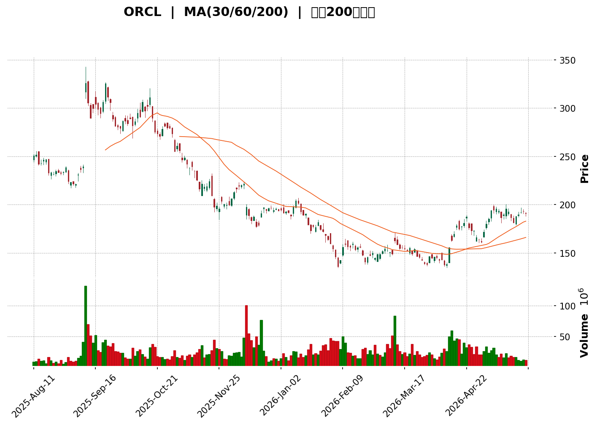
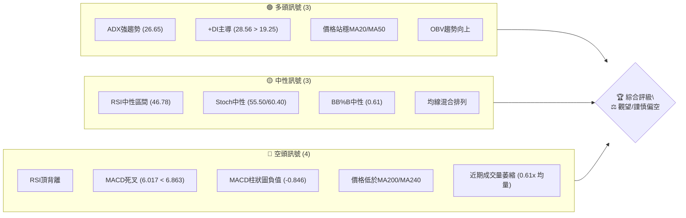

<details>
<summary>📊 靜態圖表 (點擊展開)</summary>

</details>

<html>
<head><meta charset="utf-8" /></head>
<body>
    <div>                        <script>window.PlotlyConfig = {MathJaxConfig: 'local'};</script>
        <script charset="utf-8" src="https://cdn.plot.ly/plotly-3.5.0.min.js" integrity="sha256-fHbNLP+GlIXN+efbQec78UkemUz3NJp7UmfGxC1tNxs=" crossorigin="anonymous"></script>                <div id="candlestick-chart" class="plotly-graph-div" style="height:500px; width:100%;"></div>            <script>                window.PLOTLYENV=window.PLOTLYENV || {};                                if (document.getElementById("candlestick-chart")) {                    Plotly.newPlot(                        "candlestick-chart",                        [{"close":{"dtype":"f8","bdata":"AAAA4HNWb0AAAADA6ntvQAAAAACVSG5AAAAA4FhhbkAAAABgwcpuQAAAAGDW425AAAAAwA4ZbUAAAADgBidtQAAAAEC06mxAAAAAgJ5QbUAAAADAIzJtQAAAAGAKDG1AAAAA4NY+bUAAAADAB85tQAAAAECBC2xAAAAAICfxa0AAAABgarZrQAAAAAAhqGtAAAAAIEbfbEAAAABAnJNtQAAAAMDP821AAAAAQCZcdEAAAACgMRdzQAAAAEBHHnJAAAAAIGS8ckAAAABg\u002fANzQAAAAGDNsHJAAAAAAMNkckAAAADA5CNzQAAAAOBKWXRAAAAAQPd1c0AAAAAAuCBzQAAAAMDIEHJAAAAAoNmTcUAAAAAAvYhxQAAAAMCbcHFAAAAAgPTrcUAAAADgTehxQAAAACBlvnFAAAAAgOkUckAAAACAO6BxQAAAAGDs5XFAAAAAIFdyckAAAAAguzJyQAAAAGAPInNAAAAA4MeSckAAAADAP9xyQAAAAKBpcXNAAAAAAH4YckAAAAAAyzdxQAAAAOCCF3FAAAAAQOrvcEAAAABAwGVxQAAAAICXmXFAAAAAgOZ6cUAAAAAA1nFxQAAAAIDlGXFAAAAAwEXqb0AAAADAGFBwQAAAAABnBHBAAAAAoO\u002fUbkAAAACA\u002fxhvQAAAAGDzSW5AAAAAoI65bUAAAACgfettQAAAAEClVm1AAAAA4FAzbEAAAACgtwdrQAAAACClr2tAAAAAoIxQa0AAAAAglmRrQAAAAIDhBGxAAAAAwOYsakAAAAAgebFoQAAAAODQ4WhAAAAAgHN6aEAAAABgqXZpQAAAAODtFmlAAAAAoM72aEAAAABg5ftoQAAAAIDCzmlAAAAAoKugakAAAADgCAhrQAAAAAAtZmtAAAAAoKmFa0AAAADAu7RrQAAAAABWtGhAAAAAQOmZZ0AAAABATPlmQAAAAMDtb2dAAAAAQNcrZkAAAAAAxl1mQAAAAECF2WdAAAAAQGOlaEAAAACAs0RoQAAAAOAUiWhAAAAA4PuYaEAAAABA+UVoQAAAACAtgGhAAAAAgAY3aEAAAABAeFBoQAAAACA97WdAAAAA4CESaEAAAACgMPVnQAAAAMC7j2dAAAAAwIe6aEAAAADA9n5pQAAAAADAMmlAAAAAAPUdaEAAAABADqZnQAAAAACZzWdAAAAAwGZpZkAAAABgy6hlQAAAAEDqMWZAAAAAoGMRZkAAAADgwrlmQAAAAABSyWVAAAAAwFqGZUAAAAAgfw1lQAAAAOA6gGRAAAAA4BfwY0AAAADANkRjQAAAAMAaRWJAAAAA4CgAYUAAAACAVcphQAAAAKBwgWNAAAAAIKzqY0AAAADgnZNjQAAAAKDufWNAAAAAAKXyY0AAAABA5C1jQAAAAAAMdGNAAAAAYNh\u002fY0AAAABgEXJiQAAAAIAummFAAAAAIDQ0YkAAAABAAmxiQAAAAOAtuWJAAAAAIJscYkAAAACgYJdiQAAAAGC5j2JAAAAAoN76YkAAAABACkhjQAAAAECvDWNAAAAAQArhYkAAAAAgKZxiQAAAACCsUWRAAAAA4GTTY0AAAACgPlJjQAAAAECrbWNAAAAAANpEY0AAAABAxQtjQAAAAMBRX2NAAAAA4BalYkAAAADAsDljQAAAAIB\u002fUmJAAAAAoGAwYkAAAADAA8phQAAAAMCQZWFAAAAAQCRKYUAAAADAIlNiQAAAAGAvF2JAAAAAgNs7YkAAAAAAEiFiQAAAAKB+1WFAAAAAwB7lYUAAAAAghTthQAAAAEDhQmFAAAAAANdzY0AAAAAAAGBkQAAAAIDrOWVAAAAAQOFKZkAAAACA6+FlQAAAAGCPMmZAAAAAoHClZkAAAAAAAHBnQAAAAMD1CGZAAAAAwPWoZUAAAABguJ5lQAAAAGC4vmRAAAAAYI96ZEAAAADgeixkQAAAAGCPemVAAAAAoEeJZkAAAABAMytnQAAAAMD1QGhAAAAAQOFSaEAAAABgZn5oQAAAAEDhOmhAAAAAYI9aZ0AAAADgUbhnQAAAACCFc2hAAAAAYGYeaEAAAAAghVNnQAAAAGC4rmZAAAAAwB6FZ0AAAADgo7hnQAAAAGCPAmhAAAAAgOshaEAAAABguN5nQA=="},"high":{"dtype":"f8","bdata":"WrKC9ESWb0Ap0FxtO\u002ftvQADF6QLi9G9A4bWLIhPfbkDBPwPmXRVvQEqdS9qx5m5A\u002fQATZo3pbkCDk7jHD0FtQAbHfRpVQm1AZ3NJ4j6UbUA9kgmREqVtQPEOKZPDYW1AxaHf8bJVbUCulnsUyAFuQPh6Ug9bi21A\u002f10qQer1a0AcrqybMwRsQHIDt\u002fA5umtA1jSbxA4ZbUCJb8UKtBBuQO2AOAGtMm5AyvWkDzZwdUC58xMKiYZ0QFMnO8DwGHNANdutrgQKc0DxcMH2b9dzQD9rbd\u002fkI3NA3gkeWQ\u002fXckBHXQ1OyUpzQK2y1zS5bnRAqHR5aEkndECSQcNmYGBzQNwuyiqThnJAh2f2eys7ckBR5WDc2rtxQJdR1TxsnHFA\u002fKd7EoP7cUD7dIidkUpyQCxstYhURXJA\u002faZH5LZlckB3YnKjyS5yQFzD5b\u002f1E3JA8\u002fimzhuyckB3AnLfch1zQCK391PWTHNAVJohqPjockB3ZTFfxFFzQGN\u002fAdYeCXRAr4QAp77mckALGxsLk\u002fdxQMtFR2loaXFAoCw7jBw4cUBJTtpS75VxQKkT5Y751nFA49IfB\u002fTTcUB7SGSrdrtxQCMuCSRmfnFAYr\u002fsZ8zBcEDyFOLx+4JwQNtZUn72f3BAmVSmARG3b0B9uOAteFtvQJH\u002fSpKP8W5AzcfxddDdbUCqeL2nW7duQLywr9T9f21AXfJF6qJrbUC9yi8eHflrQNZuQFs5NWxAGlhLBg6ua0DbfijErcprQGyaA2k1WGxAP4Sx8kMSbUCSRu7sNOFpQLUlyIBnUmlA+mgQayXGaED9xAXU9BZqQLANjDxVI2lAGeubCTpIaUBexdo0ag1qQFXkTH7N1GlA59Wf9gTDakChtxRvGUVrQPtOproS7GtAAT5xVlSoa0DBoJ3LM\u002f5rQFz5uMQzGGlAPD3q+oeUaEDApTc8G3pnQBQVvRWBlGdAgrpymYwrZ0AEUgR2NfRmQOMvxmS0PWhAo3pd3L6yaEDqt4mP239oQIeGLPk0omhAUJ5cq63kaEA9hHOEhaloQK+rxTVjpWhA68TIi9t\u002faEAlKi0HEaxoQKFTyA+pDmlAOMMLVhI2aEBbHxZnMk9oQIHZjVQUuWdAIW3KC3fvaEA24ePBMLxpQBjeguZ04mlAE6ZvSUwfaUCmh+XAmUpoQOF32IJ45mdAM7LBVztRZ0CeyqMGFn9mQN\u002ftzgsOcWZAkwCaocpgZkAqhh4MSBVnQBDpaBIGY2ZA8pFMcIahZkCYVj2XZjRlQPy9GRT9CWVAt2txIFVTZUCDDOrVaNpjQLYgdlfvLGNAHLCRQ0dBYkC9UXyKc9ZhQAcYQ0c15mNA44JmTw+aZEBZtMiM5GJkQJSIoiKRz2NAYbYaKoY3ZEDvfeFZONdjQKrlL8gUmGNA2yBUMbvwY0AcTgqfhy5jQKo9YJtcKWJAa6eacvlHYkBspyRy4xdjQAK\u002fEO8D\u002f2JAQLyYXEoyYkACjO4Et7RiQCoqCULzzGJA62kbZWkiY0ConddPfaxjQFnHjL9Z1GNAR2tpNBLvYkB3a+gaUDNjQPC2DagwZWVA415iTt7nZEB+CDH\u002fuwZkQOt8nSUAxmNA\u002ficbhb3LY0CAcNC6x01jQGczfJX2i2NA0RKSlu4WY0DDM2sxnGdjQMoPSdaoK2NA8WUWFjGqYkBeXrAluj5iQCc7155MpmFARlWskqyWYUCctlQbYlxiQCl9fPohpGJAFyUVSsU9YkDpIcgtDoFiQJ3aY5UjAmJAYmWw+9ndYkAAAACgmdlhQAAAAKBwhWFAAAAAwB59Y0AAAADAzCxlQAAAAIDrkWVAAAAA4KOIZkAAAAAAABBnQAAAAOBROGZAAAAAQOEqZ0AAAACAwqVnQAAAAOB6vGZAAAAAYLiWZkAAAACgmbFlQAAAAGBmFmVAAAAA4FGYZEAAAACAwqVkQAAAAKCZyWVAAAAAAADwZkAAAADgo1BnQAAAAKBHSWhAAAAAwMwEaUAAAAAAAMBoQAAAAIDCdWhAAAAAoHAdaEAAAACAPfJnQAAAAGC4FmlAAAAAgMKNaEAAAADgUdhnQAAAAEAKl2dAAAAAQAqHZ0AAAACAPRpoQAAAAAAAoGhAAAAAYGZmaEAAAADgegRoQA=="},"hovertemplate":"\u003cb\u003e%{x|%Y-%m-%d}\u003c\u002fb\u003e\u003cbr\u003e\u958b: $%{open:.2f}\u003cbr\u003e\u9ad8: $%{high:.2f}\u003cbr\u003e\u4f4e: $%{low:.2f}\u003cbr\u003e\u6536: $%{close:.2f}\u003cextra\u003e\u003c\u002fextra\u003e","low":{"dtype":"f8","bdata":"TCM8i2V0bkAfKY9OpyNvQGbhHCawF25AlS\u002fSSncVbkAEC5FE5SBuQL8JEW\u002fNNm5ASsKvKi3NbECNACgq0E5sQAheW9KG02xAvsDHy7q0bEAazLzasS1tQBoYYpVq3GxAxF9noXbbbEBNKkrF7ihtQLenNBOfq2tAIfeGq3Yia0AVQYQJcYBrQLe\u002fayPpOmtAoCrvkuIDbEAK0hLy9i5tQGmXbyMnF21AsMTlDlhac0AzFaRLceNyQDEeIMpzF3JAEfUcCWZvckDJA4VWdL5yQIDaJHqFS3JAFO9gqWsbckAmg4LL329yQJrk9rNFCHNA704EmfU5c0A\u002f90EY5ZpyQEe6YAen5HFAWaJ3QIyMcUDe7B+Fu1ZxQKNjYGDWG3FA517y70Q7cUCj1L9M97xxQCcPF0FsnHFATKzK9V4IckDIOlkaDc5wQLL20c4SlnFAvOKxqRbYcUAbnQjEnyNyQD3JAE6+fnJAmK27niUjckDZK7A0gpFyQNRlm8uA03JAN7q5kOfbcUBhPSxIDhpxQN69q8yN6XBApKzULrC5cEDe7kshn+twQGzlq+RqiHFAA0MHp51hcUAF6yWBOW1xQIq8VDEV23BAY5aFBd\u002fWb0BQgrDzi+RvQESD5PZ5tW9AUCITmih2bkAgoH\u002fcrbBuQG6aMQeDum1A\u002fXzZvMndbECeOufg53NtQAzh5J6+b2xAXsBCZzwZbEAVPXj0+bxqQI691ClyL2pAIhGXJcrHakD+hzq0E6ZqQBr4U4hy\u002f2pAS31tY38gakA5CDCNxQtoQBQFf\u002fSfI2hA1EfnI+EPZ0AZwcs3JyBpQHsAd8bljGhAFwg1pfRvaEDnbbQp6dhoQLwUK+nTxWhAZ61KheqhaUBXqwejFopqQOhl\u002f7+58mpA5C6jPEwea0BwwG\u002fvCAhrQKeay032ImdARAEFwwIbZ0AU5x5\u002fWIlmQGT3i0Sf62ZAhVY07KH\u002fZUDxB9ksqC9mQIMic6ESX2dAIYRhUN\u002f0Z0DAr8lbhOBnQB5j9PpwJ2hAV1B48DBdaEA9iU041O5nQLOHJC14UGhAAImy4UwxaEDKh\u002f9MwyBoQDomOEL45GdABce82iCxZ0A0SldnedpnQMPstd5qIGdAWJoHVO+DZ0CNWQvPYIpoQNDXRZnF\u002fmhAooYdNavEZ0Btup79YpdnQBNEF4MvPGdAKZZ1N4tXZkAU8r4kM0BlQJMbWKZX\u002fGVA8IHI\u002ftdsZUBIY9OaEz1mQH0T4YhqomVAUrclDWFoZUAZgEOtph5kQDwkuNR\u002fVWRAkgvtFS7uY0DUuxza4etiQGAkCn6s\u002fWFA5Nur0e\u002fYYEAPJ886pk1hQBcK\u002fsygT2JAGdARKj2NY0CGibo42S5jQJNr5vkD\u002f2JAX25CCPxXY0BEm\u002fkTIgtjQHkO1Dr72mJABqYulEpnY0DZOk+MEFxiQHhuVc1xQ2FA7IU7puhHYUBgd39OeFpiQA9IHj+iFGJAOQa8tl+zYUDkOf82CZZhQDrfqA2r0WFAjgPlG5iSYkBAf6zGHrNiQPy6rhT04mJAjNgGhHM9YkArbfzV3X1iQCGvleusAGRAEoVt7trBY0Ay9ymfoTNjQGx3p4AcP2NAqxffbeceY0DDfzqlWPBiQEycNsjli2JALm42E+xtYkBEik1f78ViQDQvrFfYSmJAVh19fBgDYkDbz8GSZ8FhQI\u002f3xmYyOmFAU7AEvyUPYUBgC+fen2thQJlcatdTBWJAWAFzefl5YUAv+E3PLethQPCKm5d+bmFAROZRa+LMYUAAAAAAAABhQAAAAIA90mBAAAAAQAp3YUAAAACA6zFkQAAAAGC4xmRAAAAAoJm5ZUAAAAAghatlQAAAAOBRsGVAAAAA4FEAZkAAAACgmdlmQAAAAGCPwmVAAAAAoJkZZUAAAADAzPxkQAAAAKCZQWRAAAAAwMwUZEAAAABgjwpkQAAAAMDMxGRAAAAA4FHIZUAAAAAAAGBmQAAAAKBw1WZAAAAAoJnZZ0AAAABguMZnQAAAAEAz02dAAAAAANebZkAAAACA6yFnQAAAAGBmLmdAAAAAwMycZ0AAAADgo+hmQAAAAIDCnWZAAAAAoJlZZkAAAABgZmZnQAAAAEAz42dAAAAAgOvRZ0AAAACgcH1nQA=="},"name":"\u50f9\u683c","open":{"dtype":"f8","bdata":"K725o5DObkB\u002fJxwZR1NvQMfQuRQC5W9ADDZbhAdhbkB34pB6k59uQBdYclS3iG5A\u002fQATZo3pbkBKM9WYlstsQPBtJS4252xA0nAcKUcHbUByI+PRu29tQL6VolQfJW1AHWHUUx8lbUCNpSd1RDZtQK7cRg\u002f9d21AKiydKGGIa0AcrqybMwRsQLpiliNhiGtAIzLhKFbXbEDFBlGQYMBtQE\u002fVeRL3wW1AuvdX\u002fQ3Lc0BnX4zUDnx0QKkSZGlV9nJAU3EyqM8Ac0D8mhoennlzQB4r4dp+FHNAj4HGfK3KckAOpwsri4pyQC8MuetKM3NAIxhFemkXdEBUfdlWsVZzQAIAKqVUT3JAa5vTjUsrckCPY\u002fed8qVxQCYG222Al3FAp5IAr99JcUB7YJnmPhhyQGdqKkpS9XFAtFM1CnQhckB3YnKjyS5yQCOEFzH3snFAGOpXF08cckCmHfi\u002fIqdyQN7nkokCjnJABW7mS3TbckDHdleamvByQBsXfmC8+3JA0rFSCVHeckCWyTyM9vJxQD0N+fKURnFAFt6YlkMScUCWbvh+r\u002fRwQOg8a3THwnFAMwj8iB3NcUDAGUUWWJRxQMUdxMTae3FAvR1\u002f7JOxcEBKkXHNzB5wQFvjAIDreXBA6SIpkIAOb0CELcnUqsxuQNryJByfzW5A94s5wkmxbUABjilzVI5uQJZgSJ8wWW1Afo3ICmlpbUDSa6P\u002ftPNrQIs1VqlaMWpA\u002frdUbhIca0AAskCFdtxqQGnb7vgaN2tAZwGqy\u002fC3bEDe6ZFXFrppQHHeB14LdWhAPFbVuaAcaEBq12TYDQdqQPXbrnVTyWhAPJXiI9DoaEB147rcYnxpQCSC5gBo42hAAMwKGOXSaUAWOH5zMjVrQNuLqhjwf2tAfZ83rfRVa0AXZnsKQI5rQBnqp4eVrmdApPIEyHVlaEAMBVKiemRnQAvFzQJN8mZAA5KBtRfGZkDStQ\u002foU7NmQFL\u002fDf+oZ2dAH4SOzcVzaECChWc2XmdoQKBD21XjOWhAm599vzWbaEDYJ84KLB9oQFx+McqZW2hA6AGv0gxnaEC4tdEQcohoQPvOXG0dpGhAu69y6kjsZ0DrLkfqbUNoQP8REXXatmdAIjr0NsbfZ0BOFZJcMZ1oQEFXshsriWlAE6ZvSUwfaUCmh+XAmUpoQJhJriT4p2dAM7LBVztRZ0Ap3NOBv2FmQEcAHtLcV2ZAbetyUZ2AZUBye2LaQE9mQMT96G4fUmZAW7b\u002fTfXJZUAPzSt\u002f2TFlQI3gYsS18mRAFPkrXGdKZUC6TM+ksbZjQB9mcCRXK2NA43CL+fsiYkD\u002f8r2Hb2hhQK3DgHEkf2JAf4IaHS7uY0BZtMiM5GJkQK8tgagrrGNAERIegEPWY0DCaLbKw61jQPoyDk7sO2NA8kmOt5KUY0D1iFnLhhhjQGuvRZ7aJWJAkKcpnTGLYUDf+i3qgZRiQF7VlVa1iGJAFOx0tiLsYUCXHWsrEaRhQCv+ePXgB2JAbzTSyZyvYkBuLPKZ4gFjQHtABaRoDGNAfi0qpZ3FYkAhcWUOuyJjQMs89yyhuWRAJtPxD8iCZEDeW53J4s9jQMTaHO+JcGNAsfW4ncRcY0A8fXP+thtjQOWAxoT2vWJAWGVY6o0QY0C01RJhk9xiQKvGR7\u002f1DmNAqM9yWr2WYkCSQxVVdOxhQErpOUoQjmFAUe1t5a5xYUBXu1xq+XlhQMLZ5nFGkmJA3Wso5A7JYUAc7ruzqF1iQCpdoVvy6GFAraeRTty4YkAAAABgZsZhQAAAAIA9KmFAAAAA4KN4YUAAAACAwv1kQAAAAOB63GRAAAAAoHANZkAAAACAwt1mQAAAAIDrGWZAAAAAQDNLZkAAAACAwkVnQAAAAMDMjGZAAAAA4FGQZkAAAABgj5JlQAAAAMAeRWRAAAAAoEeBZEAAAADgo0BkQAAAAKBwzWRAAAAA4KMAZkAAAAAAKcRmQAAAAGBmRmdAAAAAIIXTaEAAAABgjxJoQAAAAMDMBGhAAAAAoHAdaEAAAADA9aBnQAAAAIDChWdAAAAAIK7PZ0AAAAAAAMBnQAAAAAAAQGdAAAAAgBR+ZkAAAADgUaBnQAAAAKBw9WdAAAAAoJkpaEAAAAAgXO9nQA=="},"x":["2025-08-11T00:00:00-04:00","2025-08-12T00:00:00-04:00","2025-08-13T00:00:00-04:00","2025-08-14T00:00:00-04:00","2025-08-15T00:00:00-04:00","2025-08-18T00:00:00-04:00","2025-08-19T00:00:00-04:00","2025-08-20T00:00:00-04:00","2025-08-21T00:00:00-04:00","2025-08-22T00:00:00-04:00","2025-08-25T00:00:00-04:00","2025-08-26T00:00:00-04:00","2025-08-27T00:00:00-04:00","2025-08-28T00:00:00-04:00","2025-08-29T00:00:00-04:00","2025-09-02T00:00:00-04:00","2025-09-03T00:00:00-04:00","2025-09-04T00:00:00-04:00","2025-09-05T00:00:00-04:00","2025-09-08T00:00:00-04:00","2025-09-09T00:00:00-04:00","2025-09-10T00:00:00-04:00","2025-09-11T00:00:00-04:00","2025-09-12T00:00:00-04:00","2025-09-15T00:00:00-04:00","2025-09-16T00:00:00-04:00","2025-09-17T00:00:00-04:00","2025-09-18T00:00:00-04:00","2025-09-19T00:00:00-04:00","2025-09-22T00:00:00-04:00","2025-09-23T00:00:00-04:00","2025-09-24T00:00:00-04:00","2025-09-25T00:00:00-04:00","2025-09-26T00:00:00-04:00","2025-09-29T00:00:00-04:00","2025-09-30T00:00:00-04:00","2025-10-01T00:00:00-04:00","2025-10-02T00:00:00-04:00","2025-10-03T00:00:00-04:00","2025-10-06T00:00:00-04:00","2025-10-07T00:00:00-04:00","2025-10-08T00:00:00-04:00","2025-10-09T00:00:00-04:00","2025-10-10T00:00:00-04:00","2025-10-13T00:00:00-04:00","2025-10-14T00:00:00-04:00","2025-10-15T00:00:00-04:00","2025-10-16T00:00:00-04:00","2025-10-17T00:00:00-04:00","2025-10-20T00:00:00-04:00","2025-10-21T00:00:00-04:00","2025-10-22T00:00:00-04:00","2025-10-23T00:00:00-04:00","2025-10-24T00:00:00-04:00","2025-10-27T00:00:00-04:00","2025-10-28T00:00:00-04:00","2025-10-29T00:00:00-04:00","2025-10-30T00:00:00-04:00","2025-10-31T00:00:00-04:00","2025-11-03T00:00:00-05:00","2025-11-04T00:00:00-05:00","2025-11-05T00:00:00-05:00","2025-11-06T00:00:00-05:00","2025-11-07T00:00:00-05:00","2025-11-10T00:00:00-05:00","2025-11-11T00:00:00-05:00","2025-11-12T00:00:00-05:00","2025-11-13T00:00:00-05:00","2025-11-14T00:00:00-05:00","2025-11-17T00:00:00-05:00","2025-11-18T00:00:00-05:00","2025-11-19T00:00:00-05:00","2025-11-20T00:00:00-05:00","2025-11-21T00:00:00-05:00","2025-11-24T00:00:00-05:00","2025-11-25T00:00:00-05:00","2025-11-26T00:00:00-05:00","2025-11-28T00:00:00-05:00","2025-12-01T00:00:00-05:00","2025-12-02T00:00:00-05:00","2025-12-03T00:00:00-05:00","2025-12-04T00:00:00-05:00","2025-12-05T00:00:00-05:00","2025-12-08T00:00:00-05:00","2025-12-09T00:00:00-05:00","2025-12-10T00:00:00-05:00","2025-12-11T00:00:00-05:00","2025-12-12T00:00:00-05:00","2025-12-15T00:00:00-05:00","2025-12-16T00:00:00-05:00","2025-12-17T00:00:00-05:00","2025-12-18T00:00:00-05:00","2025-12-19T00:00:00-05:00","2025-12-22T00:00:00-05:00","2025-12-23T00:00:00-05:00","2025-12-24T00:00:00-05:00","2025-12-26T00:00:00-05:00","2025-12-29T00:00:00-05:00","2025-12-30T00:00:00-05:00","2025-12-31T00:00:00-05:00","2026-01-02T00:00:00-05:00","2026-01-05T00:00:00-05:00","2026-01-06T00:00:00-05:00","2026-01-07T00:00:00-05:00","2026-01-08T00:00:00-05:00","2026-01-09T00:00:00-05:00","2026-01-12T00:00:00-05:00","2026-01-13T00:00:00-05:00","2026-01-14T00:00:00-05:00","2026-01-15T00:00:00-05:00","2026-01-16T00:00:00-05:00","2026-01-20T00:00:00-05:00","2026-01-21T00:00:00-05:00","2026-01-22T00:00:00-05:00","2026-01-23T00:00:00-05:00","2026-01-26T00:00:00-05:00","2026-01-27T00:00:00-05:00","2026-01-28T00:00:00-05:00","2026-01-29T00:00:00-05:00","2026-01-30T00:00:00-05:00","2026-02-02T00:00:00-05:00","2026-02-03T00:00:00-05:00","2026-02-04T00:00:00-05:00","2026-02-05T00:00:00-05:00","2026-02-06T00:00:00-05:00","2026-02-09T00:00:00-05:00","2026-02-10T00:00:00-05:00","2026-02-11T00:00:00-05:00","2026-02-12T00:00:00-05:00","2026-02-13T00:00:00-05:00","2026-02-17T00:00:00-05:00","2026-02-18T00:00:00-05:00","2026-02-19T00:00:00-05:00","2026-02-20T00:00:00-05:00","2026-02-23T00:00:00-05:00","2026-02-24T00:00:00-05:00","2026-02-25T00:00:00-05:00","2026-02-26T00:00:00-05:00","2026-02-27T00:00:00-05:00","2026-03-02T00:00:00-05:00","2026-03-03T00:00:00-05:00","2026-03-04T00:00:00-05:00","2026-03-05T00:00:00-05:00","2026-03-06T00:00:00-05:00","2026-03-09T00:00:00-04:00","2026-03-10T00:00:00-04:00","2026-03-11T00:00:00-04:00","2026-03-12T00:00:00-04:00","2026-03-13T00:00:00-04:00","2026-03-16T00:00:00-04:00","2026-03-17T00:00:00-04:00","2026-03-18T00:00:00-04:00","2026-03-19T00:00:00-04:00","2026-03-20T00:00:00-04:00","2026-03-23T00:00:00-04:00","2026-03-24T00:00:00-04:00","2026-03-25T00:00:00-04:00","2026-03-26T00:00:00-04:00","2026-03-27T00:00:00-04:00","2026-03-30T00:00:00-04:00","2026-03-31T00:00:00-04:00","2026-04-01T00:00:00-04:00","2026-04-02T00:00:00-04:00","2026-04-06T00:00:00-04:00","2026-04-07T00:00:00-04:00","2026-04-08T00:00:00-04:00","2026-04-09T00:00:00-04:00","2026-04-10T00:00:00-04:00","2026-04-13T00:00:00-04:00","2026-04-14T00:00:00-04:00","2026-04-15T00:00:00-04:00","2026-04-16T00:00:00-04:00","2026-04-17T00:00:00-04:00","2026-04-20T00:00:00-04:00","2026-04-21T00:00:00-04:00","2026-04-22T00:00:00-04:00","2026-04-23T00:00:00-04:00","2026-04-24T00:00:00-04:00","2026-04-27T00:00:00-04:00","2026-04-28T00:00:00-04:00","2026-04-29T00:00:00-04:00","2026-04-30T00:00:00-04:00","2026-05-01T00:00:00-04:00","2026-05-04T00:00:00-04:00","2026-05-05T00:00:00-04:00","2026-05-06T00:00:00-04:00","2026-05-07T00:00:00-04:00","2026-05-08T00:00:00-04:00","2026-05-11T00:00:00-04:00","2026-05-12T00:00:00-04:00","2026-05-13T00:00:00-04:00","2026-05-14T00:00:00-04:00","2026-05-15T00:00:00-04:00","2026-05-18T00:00:00-04:00","2026-05-19T00:00:00-04:00","2026-05-20T00:00:00-04:00","2026-05-21T00:00:00-04:00","2026-05-22T00:00:00-04:00","2026-05-26T00:00:00-04:00","2026-05-27T00:00:00-04:00"],"type":"candlestick"},{"hovertemplate":"MA30: $%{y:.2f}\u003cextra\u003e\u003c\u002fextra\u003e","line":{"color":"#2196F3","dash":"dash","width":2},"mode":"lines","name":"MA30","x":["2025-08-11T00:00:00-04:00","2025-08-12T00:00:00-04:00","2025-08-13T00:00:00-04:00","2025-08-14T00:00:00-04:00","2025-08-15T00:00:00-04:00","2025-08-18T00:00:00-04:00","2025-08-19T00:00:00-04:00","2025-08-20T00:00:00-04:00","2025-08-21T00:00:00-04:00","2025-08-22T00:00:00-04:00","2025-08-25T00:00:00-04:00","2025-08-26T00:00:00-04:00","2025-08-27T00:00:00-04:00","2025-08-28T00:00:00-04:00","2025-08-29T00:00:00-04:00","2025-09-02T00:00:00-04:00","2025-09-03T00:00:00-04:00","2025-09-04T00:00:00-04:00","2025-09-05T00:00:00-04:00","2025-09-08T00:00:00-04:00","2025-09-09T00:00:00-04:00","2025-09-10T00:00:00-04:00","2025-09-11T00:00:00-04:00","2025-09-12T00:00:00-04:00","2025-09-15T00:00:00-04:00","2025-09-16T00:00:00-04:00","2025-09-17T00:00:00-04:00","2025-09-18T00:00:00-04:00","2025-09-19T00:00:00-04:00","2025-09-22T00:00:00-04:00","2025-09-23T00:00:00-04:00","2025-09-24T00:00:00-04:00","2025-09-25T00:00:00-04:00","2025-09-26T00:00:00-04:00","2025-09-29T00:00:00-04:00","2025-09-30T00:00:00-04:00","2025-10-01T00:00:00-04:00","2025-10-02T00:00:00-04:00","2025-10-03T00:00:00-04:00","2025-10-06T00:00:00-04:00","2025-10-07T00:00:00-04:00","2025-10-08T00:00:00-04:00","2025-10-09T00:00:00-04:00","2025-10-10T00:00:00-04:00","2025-10-13T00:00:00-04:00","2025-10-14T00:00:00-04:00","2025-10-15T00:00:00-04:00","2025-10-16T00:00:00-04:00","2025-10-17T00:00:00-04:00","2025-10-20T00:00:00-04:00","2025-10-21T00:00:00-04:00","2025-10-22T00:00:00-04:00","2025-10-23T00:00:00-04:00","2025-10-24T00:00:00-04:00","2025-10-27T00:00:00-04:00","2025-10-28T00:00:00-04:00","2025-10-29T00:00:00-04:00","2025-10-30T00:00:00-04:00","2025-10-31T00:00:00-04:00","2025-11-03T00:00:00-05:00","2025-11-04T00:00:00-05:00","2025-11-05T00:00:00-05:00","2025-11-06T00:00:00-05:00","2025-11-07T00:00:00-05:00","2025-11-10T00:00:00-05:00","2025-11-11T00:00:00-05:00","2025-11-12T00:00:00-05:00","2025-11-13T00:00:00-05:00","2025-11-14T00:00:00-05:00","2025-11-17T00:00:00-05:00","2025-11-18T00:00:00-05:00","2025-11-19T00:00:00-05:00","2025-11-20T00:00:00-05:00","2025-11-21T00:00:00-05:00","2025-11-24T00:00:00-05:00","2025-11-25T00:00:00-05:00","2025-11-26T00:00:00-05:00","2025-11-28T00:00:00-05:00","2025-12-01T00:00:00-05:00","2025-12-02T00:00:00-05:00","2025-12-03T00:00:00-05:00","2025-12-04T00:00:00-05:00","2025-12-05T00:00:00-05:00","2025-12-08T00:00:00-05:00","2025-12-09T00:00:00-05:00","2025-12-10T00:00:00-05:00","2025-12-11T00:00:00-05:00","2025-12-12T00:00:00-05:00","2025-12-15T00:00:00-05:00","2025-12-16T00:00:00-05:00","2025-12-17T00:00:00-05:00","2025-12-18T00:00:00-05:00","2025-12-19T00:00:00-05:00","2025-12-22T00:00:00-05:00","2025-12-23T00:00:00-05:00","2025-12-24T00:00:00-05:00","2025-12-26T00:00:00-05:00","2025-12-29T00:00:00-05:00","2025-12-30T00:00:00-05:00","2025-12-31T00:00:00-05:00","2026-01-02T00:00:00-05:00","2026-01-05T00:00:00-05:00","2026-01-06T00:00:00-05:00","2026-01-07T00:00:00-05:00","2026-01-08T00:00:00-05:00","2026-01-09T00:00:00-05:00","2026-01-12T00:00:00-05:00","2026-01-13T00:00:00-05:00","2026-01-14T00:00:00-05:00","2026-01-15T00:00:00-05:00","2026-01-16T00:00:00-05:00","2026-01-20T00:00:00-05:00","2026-01-21T00:00:00-05:00","2026-01-22T00:00:00-05:00","2026-01-23T00:00:00-05:00","2026-01-26T00:00:00-05:00","2026-01-27T00:00:00-05:00","2026-01-28T00:00:00-05:00","2026-01-29T00:00:00-05:00","2026-01-30T00:00:00-05:00","2026-02-02T00:00:00-05:00","2026-02-03T00:00:00-05:00","2026-02-04T00:00:00-05:00","2026-02-05T00:00:00-05:00","2026-02-06T00:00:00-05:00","2026-02-09T00:00:00-05:00","2026-02-10T00:00:00-05:00","2026-02-11T00:00:00-05:00","2026-02-12T00:00:00-05:00","2026-02-13T00:00:00-05:00","2026-02-17T00:00:00-05:00","2026-02-18T00:00:00-05:00","2026-02-19T00:00:00-05:00","2026-02-20T00:00:00-05:00","2026-02-23T00:00:00-05:00","2026-02-24T00:00:00-05:00","2026-02-25T00:00:00-05:00","2026-02-26T00:00:00-05:00","2026-02-27T00:00:00-05:00","2026-03-02T00:00:00-05:00","2026-03-03T00:00:00-05:00","2026-03-04T00:00:00-05:00","2026-03-05T00:00:00-05:00","2026-03-06T00:00:00-05:00","2026-03-09T00:00:00-04:00","2026-03-10T00:00:00-04:00","2026-03-11T00:00:00-04:00","2026-03-12T00:00:00-04:00","2026-03-13T00:00:00-04:00","2026-03-16T00:00:00-04:00","2026-03-17T00:00:00-04:00","2026-03-18T00:00:00-04:00","2026-03-19T00:00:00-04:00","2026-03-20T00:00:00-04:00","2026-03-23T00:00:00-04:00","2026-03-24T00:00:00-04:00","2026-03-25T00:00:00-04:00","2026-03-26T00:00:00-04:00","2026-03-27T00:00:00-04:00","2026-03-30T00:00:00-04:00","2026-03-31T00:00:00-04:00","2026-04-01T00:00:00-04:00","2026-04-02T00:00:00-04:00","2026-04-06T00:00:00-04:00","2026-04-07T00:00:00-04:00","2026-04-08T00:00:00-04:00","2026-04-09T00:00:00-04:00","2026-04-10T00:00:00-04:00","2026-04-13T00:00:00-04:00","2026-04-14T00:00:00-04:00","2026-04-15T00:00:00-04:00","2026-04-16T00:00:00-04:00","2026-04-17T00:00:00-04:00","2026-04-20T00:00:00-04:00","2026-04-21T00:00:00-04:00","2026-04-22T00:00:00-04:00","2026-04-23T00:00:00-04:00","2026-04-24T00:00:00-04:00","2026-04-27T00:00:00-04:00","2026-04-28T00:00:00-04:00","2026-04-29T00:00:00-04:00","2026-04-30T00:00:00-04:00","2026-05-01T00:00:00-04:00","2026-05-04T00:00:00-04:00","2026-05-05T00:00:00-04:00","2026-05-06T00:00:00-04:00","2026-05-07T00:00:00-04:00","2026-05-08T00:00:00-04:00","2026-05-11T00:00:00-04:00","2026-05-12T00:00:00-04:00","2026-05-13T00:00:00-04:00","2026-05-14T00:00:00-04:00","2026-05-15T00:00:00-04:00","2026-05-18T00:00:00-04:00","2026-05-19T00:00:00-04:00","2026-05-20T00:00:00-04:00","2026-05-21T00:00:00-04:00","2026-05-22T00:00:00-04:00","2026-05-26T00:00:00-04:00","2026-05-27T00:00:00-04:00"],"y":{"dtype":"f8","bdata":"AAAAAAAA+H8AAAAAAAD4fwAAAAAAAPh\u002fAAAAAAAA+H8AAAAAAAD4fwAAAAAAAPh\u002fAAAAAAAA+H8AAAAAAAD4fwAAAAAAAPh\u002fAAAAAAAA+H8AAAAAAAD4fwAAAAAAAPh\u002fAAAAAAAA+H8AAAAAAAD4fwAAAAAAAPh\u002fAAAAAAAA+H8AAAAAAAD4fwAAAAAAAPh\u002fAAAAAAAA+H8AAAAAAAD4fwAAAAAAAPh\u002fAAAAAAAA+H8AAAAAAAD4fwAAAAAAAPh\u002fAAAAAAAA+H8AAAAAAAD4fwAAAAAAAPh\u002fAAAAAAAA+H8AAAAAAAD4f2ZmZsacCnBAMzMza\u002fgqcEDe3d3F3EdwQCIiIurPYHBAmpmZSS91cEAREREZbodwQLy7u\u002ftzmHBAMzMz4zu1cEAREREJqdFwQHd3d++x7XBA7+7uRuoKcUB3d3f\u002fwCRxQImIiPiMQXFAVVVVbS5icUCrqqoiTn5xQERERFzqqXFA7+7uXjDRcUBERETs4\u002ftxQDMzM0vNK3JAq6qqygdLckC8u7trw19yQO\u002fu7h7RcXJAvLu765tUckBVVVU1KUZyQDMzM\u002fO8QXJAAAAAkAU3ckAiIiLinSlyQO\u002fu7p4NHHJAREREBEQHckDe3d2dI+9xQGZmZhYtynFA7+7u1qincUBmZmZuHolxQBERESExcHFAIiIi2gVZcUAiIiJyDkNxQAAAAOBpK3FAVVVVvc0KcUCJiIh4UuVwQJqZmVEJxHBAVVVVJUiecECamZkhwHxwQAAAAFiRW3BAVVVVjdYtcEBVVVVVz\u002fdvQJqZmYmZhW9A7+7u\u002fn4Zb0CrqqrK5rBuQCIiIvIrO25AIiIiol3bbUDNzMyctYptQHd3d+c7Q21AVVVVNWUFbUDNzMx8JcNsQKuqqlqUgGxAVVVVtRtBbEDv7u5uzwNsQAAAAADDsmtAvLu7+9Bra0AiIiICdBlrQDMzMzMX0GpAzczM\u002fC+GakAiIiISrjtqQHd3d3e7BGpAAAAAsGTZaUAAAADAKqlpQImIiHgugGlAd3d3529haUDv7u6O6UlpQEREROS6LmlAzczMfEcUaUCamZk5AvpoQImIiFgW12hAmpmZ2SDFaECrqqoq2r5oQCIiIjKVs2hAERERAbi1aECamZnZ\u002frVoQBEREUHstmhAzczMzLGvaEAzMzPDTKRoQHd3d8cxk2hAREREBDhvaEAiIiKiYEFoQCIiIgL4FGhAREREJG3mZ0ARERFh7btnQImIiNgGo2dAVVVV5U6RZ0AREREx6oBnQCIiIrLbZ2dAiYiIyMxUZ0AzMzMTWTpnQM3MzOy7CmdA7+7uPn7JZkCJiIjYNpJmQImIiPhKZ2ZAERERYVk\u002fZkBERERERRdmQDMzM3OH7GVAzczMzB3IZUARERERTJxlQDMzM8MfdmVAAAAAUB1PZUDNzMy8EyBlQCIiIrI57WRA3t3dPYy1ZEAiIiLCLnlkQHd3dyfuQWRAzczMbK8OZEARERGBh+NjQJqZmdnMtmNAvLu7C4SZY0B3d3dXOYVjQDMzM5NqamNAVVVVZTRPY0C8u7urFSxjQERERCSQH2NAq6qqehARY0AAAAAQSgJjQERERCQj+WJAERER4W3zYkCrqqo6jPFiQGZmZnb0+mJAVVVVZfwIY0C8u7srOxVjQBEREREiC2NAERER0WP8YkAiIiLyIu1iQDMzM\u002fNB22JA3t3d\u002fZLEYkBmZmZGSL1iQCIiIlKnsWJAAAAAoNqmYkAiIiJyJ6RiQFVVVZUhpmJAzczMvH6jYkDv7u5uWJliQJqZmWnejGJAd3d3V0+YYkCrqqrah6diQCIiIkJFvmJAzczMnInaYkCamZnJu\u002fBiQO\u002fu7g6QC2NAq6qqmrUrY0Dv7u5u51RjQFVVVQWMY2NAvLu7+zJzY0BERESk0IZjQAAAANAMkmNAiYiIqF+cY0AAAABQ\u002f6VjQFVVVdX4t2NAiYiIqC3ZY0BEREQk1PpjQO\u002fu7q5xLWRA3t3dTcthZECrqqrKAZtkQGZmZkZR1WRARERElBAJZUDv7u6uGjdlQO\u002fu7s5hbWVAMzMzo5mfZUDv7u7O8stlQJqZmZlS9WVAmpmZmVIlZkDe3d19sVxmQM3MzFxIlmZAq6qq+je+ZkDNzMzsCtxmQA=="},"type":"scatter"},{"hovertemplate":"MA60: $%{y:.2f}\u003cextra\u003e\u003c\u002fextra\u003e","line":{"color":"#9C27B0","dash":"dash","width":2},"mode":"lines","name":"MA60","x":["2025-08-11T00:00:00-04:00","2025-08-12T00:00:00-04:00","2025-08-13T00:00:00-04:00","2025-08-14T00:00:00-04:00","2025-08-15T00:00:00-04:00","2025-08-18T00:00:00-04:00","2025-08-19T00:00:00-04:00","2025-08-20T00:00:00-04:00","2025-08-21T00:00:00-04:00","2025-08-22T00:00:00-04:00","2025-08-25T00:00:00-04:00","2025-08-26T00:00:00-04:00","2025-08-27T00:00:00-04:00","2025-08-28T00:00:00-04:00","2025-08-29T00:00:00-04:00","2025-09-02T00:00:00-04:00","2025-09-03T00:00:00-04:00","2025-09-04T00:00:00-04:00","2025-09-05T00:00:00-04:00","2025-09-08T00:00:00-04:00","2025-09-09T00:00:00-04:00","2025-09-10T00:00:00-04:00","2025-09-11T00:00:00-04:00","2025-09-12T00:00:00-04:00","2025-09-15T00:00:00-04:00","2025-09-16T00:00:00-04:00","2025-09-17T00:00:00-04:00","2025-09-18T00:00:00-04:00","2025-09-19T00:00:00-04:00","2025-09-22T00:00:00-04:00","2025-09-23T00:00:00-04:00","2025-09-24T00:00:00-04:00","2025-09-25T00:00:00-04:00","2025-09-26T00:00:00-04:00","2025-09-29T00:00:00-04:00","2025-09-30T00:00:00-04:00","2025-10-01T00:00:00-04:00","2025-10-02T00:00:00-04:00","2025-10-03T00:00:00-04:00","2025-10-06T00:00:00-04:00","2025-10-07T00:00:00-04:00","2025-10-08T00:00:00-04:00","2025-10-09T00:00:00-04:00","2025-10-10T00:00:00-04:00","2025-10-13T00:00:00-04:00","2025-10-14T00:00:00-04:00","2025-10-15T00:00:00-04:00","2025-10-16T00:00:00-04:00","2025-10-17T00:00:00-04:00","2025-10-20T00:00:00-04:00","2025-10-21T00:00:00-04:00","2025-10-22T00:00:00-04:00","2025-10-23T00:00:00-04:00","2025-10-24T00:00:00-04:00","2025-10-27T00:00:00-04:00","2025-10-28T00:00:00-04:00","2025-10-29T00:00:00-04:00","2025-10-30T00:00:00-04:00","2025-10-31T00:00:00-04:00","2025-11-03T00:00:00-05:00","2025-11-04T00:00:00-05:00","2025-11-05T00:00:00-05:00","2025-11-06T00:00:00-05:00","2025-11-07T00:00:00-05:00","2025-11-10T00:00:00-05:00","2025-11-11T00:00:00-05:00","2025-11-12T00:00:00-05:00","2025-11-13T00:00:00-05:00","2025-11-14T00:00:00-05:00","2025-11-17T00:00:00-05:00","2025-11-18T00:00:00-05:00","2025-11-19T00:00:00-05:00","2025-11-20T00:00:00-05:00","2025-11-21T00:00:00-05:00","2025-11-24T00:00:00-05:00","2025-11-25T00:00:00-05:00","2025-11-26T00:00:00-05:00","2025-11-28T00:00:00-05:00","2025-12-01T00:00:00-05:00","2025-12-02T00:00:00-05:00","2025-12-03T00:00:00-05:00","2025-12-04T00:00:00-05:00","2025-12-05T00:00:00-05:00","2025-12-08T00:00:00-05:00","2025-12-09T00:00:00-05:00","2025-12-10T00:00:00-05:00","2025-12-11T00:00:00-05:00","2025-12-12T00:00:00-05:00","2025-12-15T00:00:00-05:00","2025-12-16T00:00:00-05:00","2025-12-17T00:00:00-05:00","2025-12-18T00:00:00-05:00","2025-12-19T00:00:00-05:00","2025-12-22T00:00:00-05:00","2025-12-23T00:00:00-05:00","2025-12-24T00:00:00-05:00","2025-12-26T00:00:00-05:00","2025-12-29T00:00:00-05:00","2025-12-30T00:00:00-05:00","2025-12-31T00:00:00-05:00","2026-01-02T00:00:00-05:00","2026-01-05T00:00:00-05:00","2026-01-06T00:00:00-05:00","2026-01-07T00:00:00-05:00","2026-01-08T00:00:00-05:00","2026-01-09T00:00:00-05:00","2026-01-12T00:00:00-05:00","2026-01-13T00:00:00-05:00","2026-01-14T00:00:00-05:00","2026-01-15T00:00:00-05:00","2026-01-16T00:00:00-05:00","2026-01-20T00:00:00-05:00","2026-01-21T00:00:00-05:00","2026-01-22T00:00:00-05:00","2026-01-23T00:00:00-05:00","2026-01-26T00:00:00-05:00","2026-01-27T00:00:00-05:00","2026-01-28T00:00:00-05:00","2026-01-29T00:00:00-05:00","2026-01-30T00:00:00-05:00","2026-02-02T00:00:00-05:00","2026-02-03T00:00:00-05:00","2026-02-04T00:00:00-05:00","2026-02-05T00:00:00-05:00","2026-02-06T00:00:00-05:00","2026-02-09T00:00:00-05:00","2026-02-10T00:00:00-05:00","2026-02-11T00:00:00-05:00","2026-02-12T00:00:00-05:00","2026-02-13T00:00:00-05:00","2026-02-17T00:00:00-05:00","2026-02-18T00:00:00-05:00","2026-02-19T00:00:00-05:00","2026-02-20T00:00:00-05:00","2026-02-23T00:00:00-05:00","2026-02-24T00:00:00-05:00","2026-02-25T00:00:00-05:00","2026-02-26T00:00:00-05:00","2026-02-27T00:00:00-05:00","2026-03-02T00:00:00-05:00","2026-03-03T00:00:00-05:00","2026-03-04T00:00:00-05:00","2026-03-05T00:00:00-05:00","2026-03-06T00:00:00-05:00","2026-03-09T00:00:00-04:00","2026-03-10T00:00:00-04:00","2026-03-11T00:00:00-04:00","2026-03-12T00:00:00-04:00","2026-03-13T00:00:00-04:00","2026-03-16T00:00:00-04:00","2026-03-17T00:00:00-04:00","2026-03-18T00:00:00-04:00","2026-03-19T00:00:00-04:00","2026-03-20T00:00:00-04:00","2026-03-23T00:00:00-04:00","2026-03-24T00:00:00-04:00","2026-03-25T00:00:00-04:00","2026-03-26T00:00:00-04:00","2026-03-27T00:00:00-04:00","2026-03-30T00:00:00-04:00","2026-03-31T00:00:00-04:00","2026-04-01T00:00:00-04:00","2026-04-02T00:00:00-04:00","2026-04-06T00:00:00-04:00","2026-04-07T00:00:00-04:00","2026-04-08T00:00:00-04:00","2026-04-09T00:00:00-04:00","2026-04-10T00:00:00-04:00","2026-04-13T00:00:00-04:00","2026-04-14T00:00:00-04:00","2026-04-15T00:00:00-04:00","2026-04-16T00:00:00-04:00","2026-04-17T00:00:00-04:00","2026-04-20T00:00:00-04:00","2026-04-21T00:00:00-04:00","2026-04-22T00:00:00-04:00","2026-04-23T00:00:00-04:00","2026-04-24T00:00:00-04:00","2026-04-27T00:00:00-04:00","2026-04-28T00:00:00-04:00","2026-04-29T00:00:00-04:00","2026-04-30T00:00:00-04:00","2026-05-01T00:00:00-04:00","2026-05-04T00:00:00-04:00","2026-05-05T00:00:00-04:00","2026-05-06T00:00:00-04:00","2026-05-07T00:00:00-04:00","2026-05-08T00:00:00-04:00","2026-05-11T00:00:00-04:00","2026-05-12T00:00:00-04:00","2026-05-13T00:00:00-04:00","2026-05-14T00:00:00-04:00","2026-05-15T00:00:00-04:00","2026-05-18T00:00:00-04:00","2026-05-19T00:00:00-04:00","2026-05-20T00:00:00-04:00","2026-05-21T00:00:00-04:00","2026-05-22T00:00:00-04:00","2026-05-26T00:00:00-04:00","2026-05-27T00:00:00-04:00"],"y":{"dtype":"f8","bdata":"AAAAAAAA+H8AAAAAAAD4fwAAAAAAAPh\u002fAAAAAAAA+H8AAAAAAAD4fwAAAAAAAPh\u002fAAAAAAAA+H8AAAAAAAD4fwAAAAAAAPh\u002fAAAAAAAA+H8AAAAAAAD4fwAAAAAAAPh\u002fAAAAAAAA+H8AAAAAAAD4fwAAAAAAAPh\u002fAAAAAAAA+H8AAAAAAAD4fwAAAAAAAPh\u002fAAAAAAAA+H8AAAAAAAD4fwAAAAAAAPh\u002fAAAAAAAA+H8AAAAAAAD4fwAAAAAAAPh\u002fAAAAAAAA+H8AAAAAAAD4fwAAAAAAAPh\u002fAAAAAAAA+H8AAAAAAAD4fwAAAAAAAPh\u002fAAAAAAAA+H8AAAAAAAD4fwAAAAAAAPh\u002fAAAAAAAA+H8AAAAAAAD4fwAAAAAAAPh\u002fAAAAAAAA+H8AAAAAAAD4fwAAAAAAAPh\u002fAAAAAAAA+H8AAAAAAAD4fwAAAAAAAPh\u002fAAAAAAAA+H8AAAAAAAD4fwAAAAAAAPh\u002fAAAAAAAA+H8AAAAAAAD4fwAAAAAAAPh\u002fAAAAAAAA+H8AAAAAAAD4fwAAAAAAAPh\u002fAAAAAAAA+H8AAAAAAAD4fwAAAAAAAPh\u002fAAAAAAAA+H8AAAAAAAD4fwAAAAAAAPh\u002fAAAAAAAA+H8AAAAAAAD4f2ZmZu5k6nBAERERoVDpcEAiIiKafehwQJqZmYWA6HBA3t3dkRrncECamZlFPuVwQN7d3e3u4XBARERE0ATgcEDNzMzAfdtwQImIiKDd2HBAIiIiNpnUcECJiIiQwNBwQERERCiPznBAVVVVfQLIcECrqqrmGr1wQImIiJBbtnBAMzMz7\u002feucEDNzMyoK6pwQCIiIqKxpHBA3t3dTVuccEAREREdj5JwQFVVVYm3iXBAMzMzQ6drcEDe3d353VNwQERERJADQXBAVVVVtckrcEDNzMzMwhVwQO\u002fu7h5v9W9AIiIigiy9b0Dv7u6e3XtvQAAAALA4Mm9AVVVV1cDqbkB3d3d39aZuQM3MzNyOcm5AIiIiMrhFbkAiIiLSoxduQERERByB621AERERsYW7bUAAAABAR4ptQLy7u8NmW21AvLu742sobUBmZmY+wflsQERERIQcx2xAIiIi+maQbEAAAADAVFtsQN7d3V2XHGxAAAAAgJvna0AiIiLScrNrQJqZmRkMeWtAd3d3t4dFa0AAAAAwgRdrQHd3d9c262pAzczMnE66akB3d3cPQ4JqQGZmZi7GSmpAzczMbMQTakAAAABo3t9pQEREROzkqmlAiYiI8I9+aUCamZkZL01pQKuqqnL5G2lAq6qqYn7taECrqqqSA7toQCIiIrK7h2hAd3d3d3FRaEBERETMsB1oQImIiLi882dAREREpGTQZ0CamZlpl7BnQLy7uyuhjWdAzczMpDJuZ0BVVVUlJ0tnQN7d3Q2bJmdAzczMFB8KZ0C8u7vzdu9mQCIiInJn0GZAd3d3H6K1ZkDe3d3NlpdmQERERDRtfGZAzczMnDBfZkAiIiIi6kNmQImIiFD\u002fJGZAAAAACF4EZkDNzMz8TONlQKuqqkqxv2VAzczMxNCaZUBmZmaGAXRlQGZmZn5LYWVAAAAAsC9RZUCJiIggmkFlQDMzM2t\u002fMGVAzczMVB0kZUDv7u6m8hVlQJqZmTHYAmVAIiIiUj3pZEAiIiICudNkQM3MzIQ2uWRAERERmd6dZEAzMzMbNIJkQDMzM7PkY2RAVVVVZVhGZEC8u7sryixkQKuqqorjE2RAAAAA+Pv6Y0B3d3eXHeJjQLy7u6OtyWNAVVVVfYWsY0CJiIiYQ4ljQImIiEhmZ2NAIiIiYn9TY0De3d2th0VjQN7d3Q2JOmNARERE1AY6Y0CJiIiQ+jpjQBEREVH9OmNAAAAAAHU9Y0BVVVWNfkBjQM3MzBSOQWNAMzMzuyFCY0AiIiJajURjQCIiIvqXRWNAzczMxOZHY0BVVVXFxUtjQN7d3aV2WWNA7+7uBhVxY0AAAACoB4hjQAAAAOBJnGNAd3d3jxevY0BmZmZeEsRjQM3MzJxJ2GNAERERydHmY0Crqqp6MfpjQImIiJCED2RAmpmZITojZECJiIggDThkQHd3dxe6TWRAMzMzq2hkZEBmZmb2BHtkQDMzM2OTkWRAERERqUOrZEC8u7tjycFkQA=="},"type":"scatter"},{"hovertemplate":"MA200: $%{y:.2f}\u003cextra\u003e\u003c\u002fextra\u003e","line":{"color":"#FF6F00","dash":"solid","width":2},"mode":"lines","name":"MA200","x":["2025-08-11T00:00:00-04:00","2025-08-12T00:00:00-04:00","2025-08-13T00:00:00-04:00","2025-08-14T00:00:00-04:00","2025-08-15T00:00:00-04:00","2025-08-18T00:00:00-04:00","2025-08-19T00:00:00-04:00","2025-08-20T00:00:00-04:00","2025-08-21T00:00:00-04:00","2025-08-22T00:00:00-04:00","2025-08-25T00:00:00-04:00","2025-08-26T00:00:00-04:00","2025-08-27T00:00:00-04:00","2025-08-28T00:00:00-04:00","2025-08-29T00:00:00-04:00","2025-09-02T00:00:00-04:00","2025-09-03T00:00:00-04:00","2025-09-04T00:00:00-04:00","2025-09-05T00:00:00-04:00","2025-09-08T00:00:00-04:00","2025-09-09T00:00:00-04:00","2025-09-10T00:00:00-04:00","2025-09-11T00:00:00-04:00","2025-09-12T00:00:00-04:00","2025-09-15T00:00:00-04:00","2025-09-16T00:00:00-04:00","2025-09-17T00:00:00-04:00","2025-09-18T00:00:00-04:00","2025-09-19T00:00:00-04:00","2025-09-22T00:00:00-04:00","2025-09-23T00:00:00-04:00","2025-09-24T00:00:00-04:00","2025-09-25T00:00:00-04:00","2025-09-26T00:00:00-04:00","2025-09-29T00:00:00-04:00","2025-09-30T00:00:00-04:00","2025-10-01T00:00:00-04:00","2025-10-02T00:00:00-04:00","2025-10-03T00:00:00-04:00","2025-10-06T00:00:00-04:00","2025-10-07T00:00:00-04:00","2025-10-08T00:00:00-04:00","2025-10-09T00:00:00-04:00","2025-10-10T00:00:00-04:00","2025-10-13T00:00:00-04:00","2025-10-14T00:00:00-04:00","2025-10-15T00:00:00-04:00","2025-10-16T00:00:00-04:00","2025-10-17T00:00:00-04:00","2025-10-20T00:00:00-04:00","2025-10-21T00:00:00-04:00","2025-10-22T00:00:00-04:00","2025-10-23T00:00:00-04:00","2025-10-24T00:00:00-04:00","2025-10-27T00:00:00-04:00","2025-10-28T00:00:00-04:00","2025-10-29T00:00:00-04:00","2025-10-30T00:00:00-04:00","2025-10-31T00:00:00-04:00","2025-11-03T00:00:00-05:00","2025-11-04T00:00:00-05:00","2025-11-05T00:00:00-05:00","2025-11-06T00:00:00-05:00","2025-11-07T00:00:00-05:00","2025-11-10T00:00:00-05:00","2025-11-11T00:00:00-05:00","2025-11-12T00:00:00-05:00","2025-11-13T00:00:00-05:00","2025-11-14T00:00:00-05:00","2025-11-17T00:00:00-05:00","2025-11-18T00:00:00-05:00","2025-11-19T00:00:00-05:00","2025-11-20T00:00:00-05:00","2025-11-21T00:00:00-05:00","2025-11-24T00:00:00-05:00","2025-11-25T00:00:00-05:00","2025-11-26T00:00:00-05:00","2025-11-28T00:00:00-05:00","2025-12-01T00:00:00-05:00","2025-12-02T00:00:00-05:00","2025-12-03T00:00:00-05:00","2025-12-04T00:00:00-05:00","2025-12-05T00:00:00-05:00","2025-12-08T00:00:00-05:00","2025-12-09T00:00:00-05:00","2025-12-10T00:00:00-05:00","2025-12-11T00:00:00-05:00","2025-12-12T00:00:00-05:00","2025-12-15T00:00:00-05:00","2025-12-16T00:00:00-05:00","2025-12-17T00:00:00-05:00","2025-12-18T00:00:00-05:00","2025-12-19T00:00:00-05:00","2025-12-22T00:00:00-05:00","2025-12-23T00:00:00-05:00","2025-12-24T00:00:00-05:00","2025-12-26T00:00:00-05:00","2025-12-29T00:00:00-05:00","2025-12-30T00:00:00-05:00","2025-12-31T00:00:00-05:00","2026-01-02T00:00:00-05:00","2026-01-05T00:00:00-05:00","2026-01-06T00:00:00-05:00","2026-01-07T00:00:00-05:00","2026-01-08T00:00:00-05:00","2026-01-09T00:00:00-05:00","2026-01-12T00:00:00-05:00","2026-01-13T00:00:00-05:00","2026-01-14T00:00:00-05:00","2026-01-15T00:00:00-05:00","2026-01-16T00:00:00-05:00","2026-01-20T00:00:00-05:00","2026-01-21T00:00:00-05:00","2026-01-22T00:00:00-05:00","2026-01-23T00:00:00-05:00","2026-01-26T00:00:00-05:00","2026-01-27T00:00:00-05:00","2026-01-28T00:00:00-05:00","2026-01-29T00:00:00-05:00","2026-01-30T00:00:00-05:00","2026-02-02T00:00:00-05:00","2026-02-03T00:00:00-05:00","2026-02-04T00:00:00-05:00","2026-02-05T00:00:00-05:00","2026-02-06T00:00:00-05:00","2026-02-09T00:00:00-05:00","2026-02-10T00:00:00-05:00","2026-02-11T00:00:00-05:00","2026-02-12T00:00:00-05:00","2026-02-13T00:00:00-05:00","2026-02-17T00:00:00-05:00","2026-02-18T00:00:00-05:00","2026-02-19T00:00:00-05:00","2026-02-20T00:00:00-05:00","2026-02-23T00:00:00-05:00","2026-02-24T00:00:00-05:00","2026-02-25T00:00:00-05:00","2026-02-26T00:00:00-05:00","2026-02-27T00:00:00-05:00","2026-03-02T00:00:00-05:00","2026-03-03T00:00:00-05:00","2026-03-04T00:00:00-05:00","2026-03-05T00:00:00-05:00","2026-03-06T00:00:00-05:00","2026-03-09T00:00:00-04:00","2026-03-10T00:00:00-04:00","2026-03-11T00:00:00-04:00","2026-03-12T00:00:00-04:00","2026-03-13T00:00:00-04:00","2026-03-16T00:00:00-04:00","2026-03-17T00:00:00-04:00","2026-03-18T00:00:00-04:00","2026-03-19T00:00:00-04:00","2026-03-20T00:00:00-04:00","2026-03-23T00:00:00-04:00","2026-03-24T00:00:00-04:00","2026-03-25T00:00:00-04:00","2026-03-26T00:00:00-04:00","2026-03-27T00:00:00-04:00","2026-03-30T00:00:00-04:00","2026-03-31T00:00:00-04:00","2026-04-01T00:00:00-04:00","2026-04-02T00:00:00-04:00","2026-04-06T00:00:00-04:00","2026-04-07T00:00:00-04:00","2026-04-08T00:00:00-04:00","2026-04-09T00:00:00-04:00","2026-04-10T00:00:00-04:00","2026-04-13T00:00:00-04:00","2026-04-14T00:00:00-04:00","2026-04-15T00:00:00-04:00","2026-04-16T00:00:00-04:00","2026-04-17T00:00:00-04:00","2026-04-20T00:00:00-04:00","2026-04-21T00:00:00-04:00","2026-04-22T00:00:00-04:00","2026-04-23T00:00:00-04:00","2026-04-24T00:00:00-04:00","2026-04-27T00:00:00-04:00","2026-04-28T00:00:00-04:00","2026-04-29T00:00:00-04:00","2026-04-30T00:00:00-04:00","2026-05-01T00:00:00-04:00","2026-05-04T00:00:00-04:00","2026-05-05T00:00:00-04:00","2026-05-06T00:00:00-04:00","2026-05-07T00:00:00-04:00","2026-05-08T00:00:00-04:00","2026-05-11T00:00:00-04:00","2026-05-12T00:00:00-04:00","2026-05-13T00:00:00-04:00","2026-05-14T00:00:00-04:00","2026-05-15T00:00:00-04:00","2026-05-18T00:00:00-04:00","2026-05-19T00:00:00-04:00","2026-05-20T00:00:00-04:00","2026-05-21T00:00:00-04:00","2026-05-22T00:00:00-04:00","2026-05-26T00:00:00-04:00","2026-05-27T00:00:00-04:00"],"y":{"dtype":"f8","bdata":"AAAAAAAA+H8AAAAAAAD4fwAAAAAAAPh\u002fAAAAAAAA+H8AAAAAAAD4fwAAAAAAAPh\u002fAAAAAAAA+H8AAAAAAAD4fwAAAAAAAPh\u002fAAAAAAAA+H8AAAAAAAD4fwAAAAAAAPh\u002fAAAAAAAA+H8AAAAAAAD4fwAAAAAAAPh\u002fAAAAAAAA+H8AAAAAAAD4fwAAAAAAAPh\u002fAAAAAAAA+H8AAAAAAAD4fwAAAAAAAPh\u002fAAAAAAAA+H8AAAAAAAD4fwAAAAAAAPh\u002fAAAAAAAA+H8AAAAAAAD4fwAAAAAAAPh\u002fAAAAAAAA+H8AAAAAAAD4fwAAAAAAAPh\u002fAAAAAAAA+H8AAAAAAAD4fwAAAAAAAPh\u002fAAAAAAAA+H8AAAAAAAD4fwAAAAAAAPh\u002fAAAAAAAA+H8AAAAAAAD4fwAAAAAAAPh\u002fAAAAAAAA+H8AAAAAAAD4fwAAAAAAAPh\u002fAAAAAAAA+H8AAAAAAAD4fwAAAAAAAPh\u002fAAAAAAAA+H8AAAAAAAD4fwAAAAAAAPh\u002fAAAAAAAA+H8AAAAAAAD4fwAAAAAAAPh\u002fAAAAAAAA+H8AAAAAAAD4fwAAAAAAAPh\u002fAAAAAAAA+H8AAAAAAAD4fwAAAAAAAPh\u002fAAAAAAAA+H8AAAAAAAD4fwAAAAAAAPh\u002fAAAAAAAA+H8AAAAAAAD4fwAAAAAAAPh\u002fAAAAAAAA+H8AAAAAAAD4fwAAAAAAAPh\u002fAAAAAAAA+H8AAAAAAAD4fwAAAAAAAPh\u002fAAAAAAAA+H8AAAAAAAD4fwAAAAAAAPh\u002fAAAAAAAA+H8AAAAAAAD4fwAAAAAAAPh\u002fAAAAAAAA+H8AAAAAAAD4fwAAAAAAAPh\u002fAAAAAAAA+H8AAAAAAAD4fwAAAAAAAPh\u002fAAAAAAAA+H8AAAAAAAD4fwAAAAAAAPh\u002fAAAAAAAA+H8AAAAAAAD4fwAAAAAAAPh\u002fAAAAAAAA+H8AAAAAAAD4fwAAAAAAAPh\u002fAAAAAAAA+H8AAAAAAAD4fwAAAAAAAPh\u002fAAAAAAAA+H8AAAAAAAD4fwAAAAAAAPh\u002fAAAAAAAA+H8AAAAAAAD4fwAAAAAAAPh\u002fAAAAAAAA+H8AAAAAAAD4fwAAAAAAAPh\u002fAAAAAAAA+H8AAAAAAAD4fwAAAAAAAPh\u002fAAAAAAAA+H8AAAAAAAD4fwAAAAAAAPh\u002fAAAAAAAA+H8AAAAAAAD4fwAAAAAAAPh\u002fAAAAAAAA+H8AAAAAAAD4fwAAAAAAAPh\u002fAAAAAAAA+H8AAAAAAAD4fwAAAAAAAPh\u002fAAAAAAAA+H8AAAAAAAD4fwAAAAAAAPh\u002fAAAAAAAA+H8AAAAAAAD4fwAAAAAAAPh\u002fAAAAAAAA+H8AAAAAAAD4fwAAAAAAAPh\u002fAAAAAAAA+H8AAAAAAAD4fwAAAAAAAPh\u002fAAAAAAAA+H8AAAAAAAD4fwAAAAAAAPh\u002fAAAAAAAA+H8AAAAAAAD4fwAAAAAAAPh\u002fAAAAAAAA+H8AAAAAAAD4fwAAAAAAAPh\u002fAAAAAAAA+H8AAAAAAAD4fwAAAAAAAPh\u002fAAAAAAAA+H8AAAAAAAD4fwAAAAAAAPh\u002fAAAAAAAA+H8AAAAAAAD4fwAAAAAAAPh\u002fAAAAAAAA+H8AAAAAAAD4fwAAAAAAAPh\u002fAAAAAAAA+H8AAAAAAAD4fwAAAAAAAPh\u002fAAAAAAAA+H8AAAAAAAD4fwAAAAAAAPh\u002fAAAAAAAA+H8AAAAAAAD4fwAAAAAAAPh\u002fAAAAAAAA+H8AAAAAAAD4fwAAAAAAAPh\u002fAAAAAAAA+H8AAAAAAAD4fwAAAAAAAPh\u002fAAAAAAAA+H8AAAAAAAD4fwAAAAAAAPh\u002fAAAAAAAA+H8AAAAAAAD4fwAAAAAAAPh\u002fAAAAAAAA+H8AAAAAAAD4fwAAAAAAAPh\u002fAAAAAAAA+H8AAAAAAAD4fwAAAAAAAPh\u002fAAAAAAAA+H8AAAAAAAD4fwAAAAAAAPh\u002fAAAAAAAA+H8AAAAAAAD4fwAAAAAAAPh\u002fAAAAAAAA+H8AAAAAAAD4fwAAAAAAAPh\u002fAAAAAAAA+H8AAAAAAAD4fwAAAAAAAPh\u002fAAAAAAAA+H8AAAAAAAD4fwAAAAAAAPh\u002fAAAAAAAA+H8AAAAAAAD4fwAAAAAAAPh\u002fAAAAAAAA+H8AAAAAAAD4fwAAAAAAAPh\u002fAAAAAAAA+H89CtczPstpQA=="},"type":"scatter"}],                        {"template":{"data":{"barpolar":[{"marker":{"line":{"color":"rgb(17,17,17)","width":0.5},"pattern":{"fillmode":"overlay","size":10,"solidity":0.2}},"type":"barpolar"}],"bar":[{"error_x":{"color":"#f2f5fa"},"error_y":{"color":"#f2f5fa"},"marker":{"line":{"color":"rgb(17,17,17)","width":0.5},"pattern":{"fillmode":"overlay","size":10,"solidity":0.2}},"type":"bar"}],"carpet":[{"aaxis":{"endlinecolor":"#A2B1C6","gridcolor":"#506784","linecolor":"#506784","minorgridcolor":"#506784","startlinecolor":"#A2B1C6"},"baxis":{"endlinecolor":"#A2B1C6","gridcolor":"#506784","linecolor":"#506784","minorgridcolor":"#506784","startlinecolor":"#A2B1C6"},"type":"carpet"}],"choropleth":[{"colorbar":{"outlinewidth":0,"ticks":""},"type":"choropleth"}],"contourcarpet":[{"colorbar":{"outlinewidth":0,"ticks":""},"type":"contourcarpet"}],"contour":[{"colorbar":{"outlinewidth":0,"ticks":""},"colorscale":[[0.0,"#0d0887"],[0.1111111111111111,"#46039f"],[0.2222222222222222,"#7201a8"],[0.3333333333333333,"#9c179e"],[0.4444444444444444,"#bd3786"],[0.5555555555555556,"#d8576b"],[0.6666666666666666,"#ed7953"],[0.7777777777777778,"#fb9f3a"],[0.8888888888888888,"#fdca26"],[1.0,"#f0f921"]],"type":"contour"}],"heatmap":[{"colorbar":{"outlinewidth":0,"ticks":""},"colorscale":[[0.0,"#0d0887"],[0.1111111111111111,"#46039f"],[0.2222222222222222,"#7201a8"],[0.3333333333333333,"#9c179e"],[0.4444444444444444,"#bd3786"],[0.5555555555555556,"#d8576b"],[0.6666666666666666,"#ed7953"],[0.7777777777777778,"#fb9f3a"],[0.8888888888888888,"#fdca26"],[1.0,"#f0f921"]],"type":"heatmap"}],"histogram2dcontour":[{"colorbar":{"outlinewidth":0,"ticks":""},"colorscale":[[0.0,"#0d0887"],[0.1111111111111111,"#46039f"],[0.2222222222222222,"#7201a8"],[0.3333333333333333,"#9c179e"],[0.4444444444444444,"#bd3786"],[0.5555555555555556,"#d8576b"],[0.6666666666666666,"#ed7953"],[0.7777777777777778,"#fb9f3a"],[0.8888888888888888,"#fdca26"],[1.0,"#f0f921"]],"type":"histogram2dcontour"}],"histogram2d":[{"colorbar":{"outlinewidth":0,"ticks":""},"colorscale":[[0.0,"#0d0887"],[0.1111111111111111,"#46039f"],[0.2222222222222222,"#7201a8"],[0.3333333333333333,"#9c179e"],[0.4444444444444444,"#bd3786"],[0.5555555555555556,"#d8576b"],[0.6666666666666666,"#ed7953"],[0.7777777777777778,"#fb9f3a"],[0.8888888888888888,"#fdca26"],[1.0,"#f0f921"]],"type":"histogram2d"}],"histogram":[{"marker":{"pattern":{"fillmode":"overlay","size":10,"solidity":0.2}},"type":"histogram"}],"mesh3d":[{"colorbar":{"outlinewidth":0,"ticks":""},"type":"mesh3d"}],"parcoords":[{"line":{"colorbar":{"outlinewidth":0,"ticks":""}},"type":"parcoords"}],"pie":[{"automargin":true,"type":"pie"}],"scatter3d":[{"line":{"colorbar":{"outlinewidth":0,"ticks":""}},"marker":{"colorbar":{"outlinewidth":0,"ticks":""}},"type":"scatter3d"}],"scattercarpet":[{"marker":{"colorbar":{"outlinewidth":0,"ticks":""}},"type":"scattercarpet"}],"scattergeo":[{"marker":{"colorbar":{"outlinewidth":0,"ticks":""}},"type":"scattergeo"}],"scattergl":[{"marker":{"line":{"color":"#283442"}},"type":"scattergl"}],"scattermapbox":[{"marker":{"colorbar":{"outlinewidth":0,"ticks":""}},"type":"scattermapbox"}],"scattermap":[{"marker":{"colorbar":{"outlinewidth":0,"ticks":""}},"type":"scattermap"}],"scatterpolargl":[{"marker":{"colorbar":{"outlinewidth":0,"ticks":""}},"type":"scatterpolargl"}],"scatterpolar":[{"marker":{"colorbar":{"outlinewidth":0,"ticks":""}},"type":"scatterpolar"}],"scatter":[{"marker":{"line":{"color":"#283442"}},"type":"scatter"}],"scatterternary":[{"marker":{"colorbar":{"outlinewidth":0,"ticks":""}},"type":"scatterternary"}],"surface":[{"colorbar":{"outlinewidth":0,"ticks":""},"colorscale":[[0.0,"#0d0887"],[0.1111111111111111,"#46039f"],[0.2222222222222222,"#7201a8"],[0.3333333333333333,"#9c179e"],[0.4444444444444444,"#bd3786"],[0.5555555555555556,"#d8576b"],[0.6666666666666666,"#ed7953"],[0.7777777777777778,"#fb9f3a"],[0.8888888888888888,"#fdca26"],[1.0,"#f0f921"]],"type":"surface"}],"table":[{"cells":{"fill":{"color":"#506784"},"line":{"color":"rgb(17,17,17)"}},"header":{"fill":{"color":"#2a3f5f"},"line":{"color":"rgb(17,17,17)"}},"type":"table"}]},"layout":{"annotationdefaults":{"arrowcolor":"#f2f5fa","arrowhead":0,"arrowwidth":1},"autotypenumbers":"strict","coloraxis":{"colorbar":{"outlinewidth":0,"ticks":""}},"colorscale":{"diverging":[[0,"#8e0152"],[0.1,"#c51b7d"],[0.2,"#de77ae"],[0.3,"#f1b6da"],[0.4,"#fde0ef"],[0.5,"#f7f7f7"],[0.6,"#e6f5d0"],[0.7,"#b8e186"],[0.8,"#7fbc41"],[0.9,"#4d9221"],[1,"#276419"]],"sequential":[[0.0,"#0d0887"],[0.1111111111111111,"#46039f"],[0.2222222222222222,"#7201a8"],[0.3333333333333333,"#9c179e"],[0.4444444444444444,"#bd3786"],[0.5555555555555556,"#d8576b"],[0.6666666666666666,"#ed7953"],[0.7777777777777778,"#fb9f3a"],[0.8888888888888888,"#fdca26"],[1.0,"#f0f921"]],"sequentialminus":[[0.0,"#0d0887"],[0.1111111111111111,"#46039f"],[0.2222222222222222,"#7201a8"],[0.3333333333333333,"#9c179e"],[0.4444444444444444,"#bd3786"],[0.5555555555555556,"#d8576b"],[0.6666666666666666,"#ed7953"],[0.7777777777777778,"#fb9f3a"],[0.8888888888888888,"#fdca26"],[1.0,"#f0f921"]]},"colorway":["#636efa","#EF553B","#00cc96","#ab63fa","#FFA15A","#19d3f3","#FF6692","#B6E880","#FF97FF","#FECB52"],"font":{"color":"#f2f5fa"},"geo":{"bgcolor":"rgb(17,17,17)","lakecolor":"rgb(17,17,17)","landcolor":"rgb(17,17,17)","showlakes":true,"showland":true,"subunitcolor":"#506784"},"hoverlabel":{"align":"left"},"hovermode":"closest","mapbox":{"style":"dark"},"paper_bgcolor":"rgb(17,17,17)","plot_bgcolor":"rgb(17,17,17)","polar":{"angularaxis":{"gridcolor":"#506784","linecolor":"#506784","ticks":""},"bgcolor":"rgb(17,17,17)","radialaxis":{"gridcolor":"#506784","linecolor":"#506784","ticks":""}},"scene":{"xaxis":{"backgroundcolor":"rgb(17,17,17)","gridcolor":"#506784","gridwidth":2,"linecolor":"#506784","showbackground":true,"ticks":"","zerolinecolor":"#C8D4E3"},"yaxis":{"backgroundcolor":"rgb(17,17,17)","gridcolor":"#506784","gridwidth":2,"linecolor":"#506784","showbackground":true,"ticks":"","zerolinecolor":"#C8D4E3"},"zaxis":{"backgroundcolor":"rgb(17,17,17)","gridcolor":"#506784","gridwidth":2,"linecolor":"#506784","showbackground":true,"ticks":"","zerolinecolor":"#C8D4E3"}},"shapedefaults":{"line":{"color":"#f2f5fa"}},"sliderdefaults":{"bgcolor":"#C8D4E3","bordercolor":"rgb(17,17,17)","borderwidth":1,"tickwidth":0},"ternary":{"aaxis":{"gridcolor":"#506784","linecolor":"#506784","ticks":""},"baxis":{"gridcolor":"#506784","linecolor":"#506784","ticks":""},"bgcolor":"rgb(17,17,17)","caxis":{"gridcolor":"#506784","linecolor":"#506784","ticks":""}},"title":{"x":0.05},"updatemenudefaults":{"bgcolor":"#506784","borderwidth":0},"xaxis":{"automargin":true,"gridcolor":"#283442","linecolor":"#506784","ticks":"","title":{"standoff":15},"zerolinecolor":"#283442","zerolinewidth":2},"yaxis":{"automargin":true,"gridcolor":"#283442","linecolor":"#506784","ticks":"","title":{"standoff":15},"zerolinecolor":"#283442","zerolinewidth":2}}},"xaxis":{"rangeslider":{"visible":false},"title":{"text":"\u65e5\u671f"}},"font":{"size":11},"title":{"text":"ORCL  |  MA(30\u002f60\u002f200)  |  \u6700\u8fd1200\u4ea4\u6613\u65e5"},"yaxis":{"title":{"text":"\u80a1\u50f9 (USD)"}},"hovermode":"x unified","height":500},                        {"responsive": true}                    )                };            </script>        </div>
</body>
</html>

# ORCL 技術分析報告

> **報告日期**：2026-05-28 ｜ **語言**：繁體中文 ｜ **數據來源**：Yahoo Finance ｜ **當前價格**：$190.96

---

## 目錄

| 章節 | 內容 |
|------|------|
| [1. 技術面概覽](#1-技術面概覽) | 訊號儀表板、核心指標、評分卡 |
| [2. 趨勢分析](#2-趨勢分析) | 多時框趨勢、長中短期走勢 |
| [3. 圖表形態分析](#3-圖表形態分析) | 形態識別、K線組合、目標價 |
| [4. 支撐與阻力](#4-支撐與阻力) | 關鍵價位、斐波那契回調 |
| [5. 技術指標深度解讀](#5-技術指標深度解讀) | MA/RSI/MACD/布林/成交量 |
| [6. 動能與波動率](#6-動能與波動率) | 動能評估、ATR、Beta |
| [7. 多時框架總結](#7-多時框架總結) | 時框架評分矩陣 |
| [8. 交易策略建議](#8-交易策略建議) | 多空策略、風險報酬比 |
| [9. 風險提示與監控](#9-風險提示與監控) | 監控指標、風險場景 |
| [10. 報告總結](#10-報告總結) | 綜合評級與關鍵結論 |

---

## 1. 技術面概覽

Oracle (ORCL) 在經歷了從2025年9月高點的大幅回調後，於2026年2月築底反彈。目前股價處於一個多空交織的關鍵階段。儘管短期和中期均線呈現多頭排列，且ADX顯示有強勁的趨勢動能，但RSI的頂背離和MACD的空頭訊號表明上漲動能正在減弱，市場可能面臨回調或盤整壓力。近期成交量也顯著萎縮，未能有效支持價格的進一步上漲。

### 🎯 技術訊號儀表板

當前ORCL的技術訊號呈現複雜性，多頭訊號主要來自於趨勢強度和短期均線支撐，而空頭訊號則集中在動能指標的背離與弱化。中性訊號反映了市場在當前價位附近的多空平衡與觀望情緒。



**詳細解讀：**
*   **多頭訊號**：ADX數值高於25，顯示當前市場存在強勁趨勢，且+DI高於-DI，確認趨勢由多頭主導。股價位於MA20和MA50上方，表明短期和中期走勢偏強。OBV趨勢向上，說明過去一段時間累積的買盤動能仍然存在。
*   **中性訊號**：RSI和Stochastic指標均處於中性區間，表明股價既未超買也未超賣，市場情緒相對平衡。布林通道的%B值接近0.5，也反映了股價在中軌附近波動。均線系統呈現混合排列，短期均線向上，但長期均線仍在股價上方，顯示長期趨勢尚未完全扭轉。
*   **空頭訊號**：RSI出現明顯的頂背離，即股價創出新高但RSI未能同步，預示上漲動能減弱，可能面臨回調。MACD指標形成死叉，MACD線下穿訊號線，且柱狀圖轉為負值，這是短線賣出訊號。股價仍在長期均線MA200和MA240下方，確認長期下行壓力。近期成交量顯著低於平均水平，量能不足以支撐價格繼續走高。

綜合來看，雖然趨勢強度支持多頭，但動能指標的背離和弱化提示市場風險正在積累。

### 📊 核心指標速覽表

| 指標類別 | 指標名稱 | 當前數值 | 訊號 | 解讀 |
|----------|----------|----------|------|------|
| **價格** | 當前價格 | $190.96 | 🟡 | 位於52W高低區間的27.1%，處於歷史相對低位，但近期有反彈。 |
| **均線** | MA20 | $186.42 | 🟢 | 價格在MA20上方，短期趨勢偏多。 |
| **均線** | MA50 | $168.51 | 🟢 | 價格在MA50上方，中期趨勢偏多。 |
| **均線** | MA200 | $206.35 | 🔴 | 價格在MA200下方，長期趨勢偏空。 |
| **動能** | RSI(14) | 46.78 | 🟡 | 中性區間，但存在頂背離風險。 |
| **動能** | MACD | -0.846 | 🔴 | MACD線在訊號線下方，柱狀圖為負，空頭動能增強。 |
| **波動** | ATR | $8.16 | 🟡 | 每日波動約4.27%，屬於中等偏高波動。 |

### 🏆 技術評分卡

根據上述綜合分析，對ORCL的當前技術面進行評分。

```
╔══════════════════════════════════════════════════════════════╗
║             技術評分卡 — ORCL (2026-05-28)                     ║
╠══════════════════════════════════════════════════════════════╣
║ 趨勢強度      ██████████████░░░░░░  70/100  🟢 強勁多頭趨勢，但動能減弱         ║
║ 動能指標      ██████░░░░░░░░░░░░░░  30/100  🔴 MACD死叉與RSI頂背離，動能轉弱   ║
║ 支撐穩定度    ████████████░░░░░░░░  60/100  🟡 短中期均線提供支撐，但面臨上方壓力 ║
║ 成交量配合    ██████░░░░░░░░░░░░░░  30/100  🔴 近期成交量萎縮，量價背離            ║
║ 形態完整度    ████████░░░░░░░░░░░░  40/100  🟡 潛在整理形態，但背離風險較高       ║
║ 均線排列      ████████░░░░░░░░░░░░  40/100  🟡 短中期多頭，長期空頭，混合排列     ║
╠══════════════════════════════════════════════════════════════╣
║ 綜合評分      ███████░░░░░░░░░░░░░  38/100  ⚖️ 謹慎觀望/偏空                      ║
╚══════════════════════════════════════════════════════════════╝
```

**評分解讀：**
*   **趨勢強度 (70/100 🟢)**：ADX高於25，且+DI > -DI，顯示當前存在一個強勁的多頭趨勢。然而，此分數已考慮到動能減弱的風險，因此並非滿分。
*   **動能指標 (30/100 🔴)**：RSI頂背離和MACD死叉是明確的空頭訊號，表明上漲動能不足，可能面臨回調。Stochastics雖中性，但未能扭轉整體動能偏弱的局面。
*   **支撐穩定度 (60/100 🟡)**：MA20 ($186.42) 和MA50 ($168.51) 提供較好的短期和中期支撐，但上方MA200 ($206.35) 構成顯著阻力，且若跌破MA20，下方支撐考驗將加大。
*   **成交量配合 (30/100 🔴)**：近期成交量遠低於平均水平，在股價反彈過程中出現量能萎縮，屬於量價背離的警示訊號，顯示買盤追價意願不高。
*   **形態完整度 (40/100 🟡)**：目前股價在經過一段反彈後，似乎進入整理階段。雖然可能形成某些整理形態，但RSI頂背離增加了形態下破的風險。
*   **均線排列 (40/100 🟡)**：短期均線（MA5/10/20）在股價下方呈多頭排列，但中期均線（MA50）與長期均線（MA200/240）呈現價格下方與價格上方混亂排列，未形成明確的多頭或空頭趨勢。

**綜合評分 (38/100 ⚖️)**：整體技術面呈現謹慎偏空的態勢。儘管存在一些多頭力量，但關鍵的動能指標和成交量顯示出明顯的弱化和背離，長期趨勢也尚未扭轉。建議投資者保持觀望，等待市場給出更明確的方向訊號。

---

## 2. 趨勢分析

### 🌐 多時框趨勢分析

對ORCL進行多時框架趨勢分析，可以更全面地理解其價格走勢的宏觀背景與當前所處階段。

```mermaid
graph TD
    A[月線趨勢: 長期] --> B{2025-09高點 $279.04}
    B --> C{2026-02低點 $144.89}
    C --> D[目前: 反彈階段 $190.96]
    D --> E[結論: 處於大型回調後的築底反彈，但尚未突破長期下降趨勢線]
    
    F[週線趨勢: 中期] --> G{2026-02低點 $142.32}
    G --> H{2026-05高點 $195.95}
    H --> I[目前: 高位整理/回調 $190.96]
    I --> J[結論: 強勁反彈後動能減弱，RSI頂背離警示，可能進入調整]
    
    K[日線趨勢: 短期 (推斷)] --> L{近期高點 $195.95}
    L --> M{近期低點 $190.96}
    M --> N[目前: 震盪下行/盤整]
    N --> O[結論: 短期面臨下行壓力，或在關鍵支撐位附近尋求支撐]
    
    E --> P(綜合判斷: 長期築底反彈，中期高位整理，短期承壓)
    J --> P
    O --> P
```

**詳細解讀：**
*   **月線趨勢 (長期)**：從24個月的歷史數據來看，ORCL在2025年9月達到歷史高點$279.04後，經歷了一波劇烈的下跌，直至2026年2月觸及$144.89的低點，跌幅超過48%。隨後股價開始築底反彈，目前收盤價$190.96，雖然較低點有顯著回升，但仍遠低於前期高點，且未有效突破長期下降趨勢線。長期來看，ORCL仍處於從熊市中恢復的階段，尚未完全扭轉頹勢。
*   **週線趨勢 (中期)**：從近20週的數據看，ORCL在2026年2月8日當週創下$142.32的週線低點後，展開了一波強勁的反彈，最高觸及2026年5月10日當週的$195.95。這段反彈使得股價擺脫了超賣區間，並站上了中期移動平均線。然而，近期股價在$195.95附近遭遇阻力後，開始出現高位整理的跡象，RSI也出現頂背離，預示中期上漲動能可能正在衰竭，存在回調風險。
*   **日線趨勢 (短期)**：根據週線數據推斷，從2026年5月10日高點$195.95到當前$190.96的走勢，在日線圖上很可能呈現為一個小幅的回調或橫向盤整。MACD的死叉和柱狀圖的負值也支持短期動能偏弱的判斷。短期內，股價可能在尋找新的支撐點或在小區間內震盪。

**綜合判斷**：ORCL目前處於大型回調後的築底反彈階段，中期趨勢因動能減弱和背離訊號而面臨整理壓力，短期則呈現偏空或盤整格局。多頭能否延續反彈，將取決於能否有效消化當前阻力，並在關鍵支撐位獲得足夠買盤。

### 📈 長期趨勢 — 12個月走勢圖（Unicode）

過去12個月的ORCL月線走勢圖清晰展示了股價從高峰回落，然後再築底反彈的過程。

```
ORCL 月線走勢圖（過去12個月：2025-06 至 2026-05）
價格軸 ($)
$280 ┤                               ●(2025-09 高點 $279.04)
$260 ┤                         ●
$240 ┤                   ●
$220 ┤●                                                
$200 ┤  ●              ●                      ●←現在($190.96)
$180 ┤             ●            ●    ●
$160 ┤                        ●    ●    ●
$140 ┤                            ●(2026-02 低點 $144.89)
     └─────────────────────────────────────────────────────
      25/06 25/07 25/08 25/09 25/10 25/11 25/12 26/01 26/02 26/03 26/04 26/05
```

**走勢特徵分析表格**：

| 階段 | 月份範圍 | 關鍵價位 | 漲跌幅 | 走勢特徵 |
|------|----------|----------|--------|----------|
| **上漲趨勢** | 2025-06 至 2025-09 | 起點 $216.46，高點 $279.04 | +28.99% | 強勁上漲，創新高，市場情緒樂觀。 |
| **快速回調** | 2025-09 至 2026-02 | 高點 $279.04，低點 $144.89 | -48.08% | 急劇下跌，跌破多個支撐，形成長期下降趨勢。 |
| **築底反彈** | 2026-02 至 2026-05 | 起點 $144.89，當前 $190.96 | +31.80% | 從低點強勁反彈，收復部分失地，但反彈動能近期減弱。 |

**詳細解讀：**
ORCL在2025年6月至9月經歷了一波強勁的拉升，從$216.46飆升至$279.04，創下歷史新高，展現出強大的市場吸引力。然而，隨後從2025年9月開始，股價進入了長達數月的快速回調，至2026年2月觸及$144.89的低點。這波跌勢幾乎抹去了之前的所有漲幅，使得股票重新回到熊市區域。從2026年2月開始，ORCL股價開始築底反彈，逐步回升至$190.96，顯示出市場對於該股在低位的價值認可。儘管反彈幅度可觀，但近期漲勢有所放緩，且尚未突破長期下降趨勢的關鍵阻力位。

### 📊 中期趨勢（週線分析）

中期趨勢主要關注過去幾個月的週線走勢，以判斷當前股價是處於修正、盤整還是新的趨勢形成。從近20週的數據看，ORCL自2026年2月低點以來形成了明顯的反彈趨勢，但近期面臨阻力。

**近期壓力與支撐示意圖（週線）**

```
ORCL 週線壓力與支撐示意圖
═══════════════════════════════════════════════════════════════
$200 ║           ●(2026-05-10 高點 $195.95)
$195 ║           │
$190 ╠═══════════┼═════════════════════════════════════════╣ ◄ 現價 $190.96
$185 ║           │
$180 ║           ●(2026-04-19 高點 $175.06)
$175 ║           │
$170 ║           ●(2026-05-03 低點 $171.83)
$165 ║           │
$160 ║           ●(2026-02-15 低點 $159.58)
$155 ║           │
$150 ║           │
$145 ║           ●(2026-02-08 低點 $142.32)
     └───────────────────────────────────────────────────────────
     主要阻力: $195.95 (近期高點), $206.35 (MA200)
     主要支撐: $186.42 (MA20), $171.83 (近期整理低點), $168.51 (MA50)
```

**詳細解讀：**
從2026年2月8日的週線低點$142.32開始，ORCL股價展開了一波強勁的反彈，並在2026年4月19日當週達到$175.06。隨後經歷小幅回調至$171.83，再次拉升至2026年5月10日當週的$195.95。這顯示了中期強勁的多頭動能。然而，在$195.95附近，股價遭遇了明顯的賣壓，並在接下來的幾週內逐步回落至$190.96。
當前股價$190.96位於MA20 ($186.42) 和MA50 ($168.51) 上方，表明中期趨勢仍然偏多。但同時，它也面臨著來自近期高點$195.95和長期均線MA200 ($206.35) 的雙重阻力。若股價能有效突破$195.95並站穩，則有望挑戰$206.35。反之，若跌破MA20 ($186.42)，則可能回測$171.83甚至MA50 ($168.51) 的支撐。中期來看，ORCL正處於一個關鍵的轉折點，多空雙方在此進行拉鋸。

### ⚡ 趨勢強度評估（ADX 解讀）

ADX (Average Directional Index) 用於衡量趨勢的強度，而非方向。它與+DI (Positive Directional Indicator) 和-DI (Negative Directional Indicator) 共同判斷市場的趨勢狀態。

```mermaid
graph TD
    A[ADX (14): 26.65] --> B{趨勢強度判斷}
    B --> C{ADX > 25: 強趨勢}
    C --> D[結論: ORCL目前處於強趨勢行情]
    
    E[+DI (14): 28.56] --> F{趨勢方向判斷}
    F --> G[-DI (14): 19.25]
    F --> H{+DI > -DI: 多頭主導}
    H --> I[結論: 趨勢方向為多頭]
    
    D --> J(綜合判斷: 當前為強勁的多頭趨勢行情)
    I --> J
```

**ADX 強度對照表**

| ADX 數值範圍 | 趨勢強度 | 市場狀態 |
|--------------|----------|----------|
| 0-20         | 無趨勢/弱趨勢 | 盤整行情 |
| 20-25        | 趨勢形成中 | 趨勢初期 |
| **25-50**    | **強趨勢** | **趨勢行情** |
| 50-75        | 非常強趨勢 | 強勢趨勢 |
| 75-100       | 極端強趨勢 | 泡沫/崩潰 |

**詳細解讀：**
*   **ADX(14) 數值為 26.65**：根據ADX強度對照表，26.65明確落在「強趨勢」區間（25-50）。這表明ORCL當前市場存在一個相對明確且強勁的趨勢，而非盤整行情。
*   **+DI 數值為 28.56，-DI 數值為 19.25**：由於+DI (28.56) 明顯高於-DI (19.25)，這進一步確認了當前強勁趨勢的方向是由多頭主導。換言之，市場存在強大的買盤力量，推動股價向上。

**綜合結論**：ADX指標明確指出ORCL目前處於一個強勁的多頭趨勢行情中。這與短期和中期均線的多頭排列相符。然而，需要注意的是，ADX僅衡量趨勢強度，並不直接反映動能是否持續。儘管趨勢強勁，但結合RSI頂背離和MACD死叉的訊號，表明雖然趨勢本身仍在延續，但其內部的上漲動能正在減弱，可能預示著趨勢的放緩或潛在的修正。

---

## 3. 圖表形態分析

圖表形態分析旨在識別價格圖上的特定模式，這些模式通常預示著未來價格走勢的潛在方向和目標。鑑於ORCL的複雜走勢，我們將關注近期可能形成的形態。

### 🔍 形態識別系統

從2026年2月低點$144.89以來的反彈，以及近期在高位$195.95附近的震盪，可能形成以下幾種形態。

```mermaid
graph TD
    A[ORCL 2026-02 低點 $144.89] --> B[2026-05 高點 $195.95]
    B --> C[近期回調/整理 $190.96]
    C --> D{形態識別}
    D -- 可能性1 --> E[上升通道 (Ascending Channel)]
    D -- 可能性2 --> F[旗形整理 (Flag Formation)]
    D -- 可能性3 (較低) --> G[潛在雙頂 (Double Top) - 若跌破關鍵支撐]
    
    E --> H[特徵: 高點和低點同步抬升, 形成平行通道]
    F --> I[特徵: 股價快速上漲後小幅回調, 呈與趨勢相反的平行四邊形]
    G --> J[特徵: 兩次觸及相近高點後回落, 頸線為關鍵支撐]
    
    H --> K[當前判斷: 可能性較高，但近期動能減弱]
    I --> L[當前判斷: 可能性較高，但需觀察量能配合]
    J --> M[當前判斷: 可能性較低，除非跌破頸線]
```

**詳細解讀：**
*   **上升通道 (Ascending Channel)**：從2026年2月低點$142.32到5月高點$195.95，股價呈現出高點和低點同步抬升的趨勢。如果能夠在$186.42 (MA20) 附近獲得支撐，並再次向上突破$195.95，則上升通道的形態將得到確認。然而，RSI頂背離和MACD死叉的訊號對此構成潛在威脅，可能導致通道下破。
*   **旗形整理 (Flag Formation)**：股價在2月至5月期間經歷了一波快速上漲，隨後在$195.95附近進入短期回調或盤整。如果這種回調是伴隨著成交量萎縮的，且形態呈現出與主趨勢相反的傾斜（例如向下傾斜的通道），則可能構成旗形整理。旗形整理通常被視為趨勢的暫停，之後會沿著原有趨勢方向繼續突破。當前成交量萎縮的特徵與旗形整理相符。
*   **潛在雙頂 (Double Top)**：雖然目前判斷雙頂為時尚早，但若股價在$195.95附近形成第二個高點後，未能有效突破，並且跌破關鍵頸線支撐，則可能形成雙頂形態，預示著趨勢反轉。但目前來看，需要更明確的價格行為來確認。

**當前判斷**：基於數據，ORCL在經歷強勁反彈後，目前更傾向於處於一個**上升通道內的整理階段**，或者是一個**旗形整理**。RSI頂背離和MACD死叉的警告訊號，使得上升通道下沿或旗形下沿的支撐顯得尤為重要。

### 🕯️ 重要K線形態分析

我們將檢視近20週的收盤價數據，以識別重要的週K線形態。由於數據僅提供週收盤價，我們將根據週價格變化來推斷可能的K線性質。

| 月份 | 收盤價 | 週漲跌幅 | K線形態推斷 | 解讀 | 訊號 |
|------|--------|----------|--------------|------|------|
| 2026-02-08 | $142.32 | -19.98% | **長黑K線** | 跌勢加速，市場恐慌。 | 🔴 |
| 2026-02-15 | $159.58 | +12.13% | **長陽K線** | 跌深反彈，買盤介入，可能形成底部反轉。 | 🟢 |
| 2026-03-01 | $144.89 | -10.15% | **長黑K線** | 反彈後再次回調，但未創新低，可能為底部測試。 | 🔴 |
| 2026-04-19 | $175.06 | +26.70% | **巨量長陽K線** | 強勢突破，買盤強勁，確認反彈趨勢。 | 🟢 |
| 2026-05-10 | $195.95 | +14.04% | **長陽K線** | 反彈高點，但RSI已出現頂背離，需警惕。 | 🟡 |
| 2026-05-31 | $190.96 | -0.58% | **小陰K線/十字星** | 高位整理，多空膠著，量能萎縮，預示變盤。 | 🟡 |

**詳細解讀：**
*   **2026年2月8日 ($142.32)**：在經歷連續下跌後，當週出現大幅下跌，形成一根長黑K線，顯示空頭力量強勁。但往往在極度恐慌後，市場會尋求反彈。
*   **2026年2月15日 ($159.58)**：隨即一週出現強勁反彈，形成一根長陽K線，收復部分失地，這是一個重要的築底訊號，可能預示著短期底部的形成。
*   **2026年3月1日 ($144.89)**：反彈後再次回落，形成長黑K線，但未跌破2月8日的低點，這可能是一個底部測試，如果能守住，則雙底形態的基礎將更穩固。
*   **2026年4月19日 ($175.06)**：在經歷一段時間的盤整後，股價出現一根帶巨量的長陽K線，強勢突破，確認了中期反彈趨勢的形成。這根K線是多頭力量的明確展現。
*   **2026年5月10日 ($195.95)**：股價再次強勁上漲，形成長陽K線並創出反彈新高。然而，此時RSI已出現頂背離，提示市場動能可能已達到極限，需警惕隨後的回調。
*   **2026年5月31日 ($190.96)**：在達到反彈高點後，最近幾週股價小幅回落，形成類似小陰K線或十字星的形態，且成交量萎縮。這表明市場在高位出現猶豫，多空力量趨於平衡，或預示著短期趨勢將發生變化。

### 📉 ASCII 走勢形態示意圖

以下示意圖展示了ORCL從2026年2月低點以來的反彈，以及近期可能形成的上升通道形態，並標注了關鍵點位。

```
ORCL 近期走勢形態示意圖 (上升通道/旗形整理)
價格軸 ($)
$200 ┤                     (上軌)
$195 ┤                     ●(2026-05-10 高點 $195.95)
$190 ╠═════════════════════┼═════════════════╣ ◄ 現價 $190.96
$185 ┤                   ／
$180 ┤                 ／
$175 ┤               ●(2026-04-19 $175.06)
$170 ┤             ／
$165 ┤           ／
$160 ┤         ●(2026-02-15 $159.58)
$155 ┤       ／
$150 ┤     ／
$145 ┤   ●(2026-02-08 低點 $142.32) (下軌)
     └───────────────────────────────────────────────
      2026-Feb          2026-Mar          2026-Apr          2026-May
```

**形態解讀：**
從2026年2月低點$142.32開始，ORCL股價呈現出明顯的上升趨勢，高點和低點都在不斷抬升，形成了一個潛在的上升通道。當前價格$190.96位於通道中上部，但近期動能減弱，且RSI頂背離。如果股價能維持在通道下沿上方，並突破近期高點$195.95，則上升趨勢有望延續。反之，若跌破通道下沿，則可能預示著反彈結束，進入更深的回調。

### 🎯 形態目標價計算

基於上述形態分析，我們將主要針對「上升通道」或「旗形整理」的潛在目標價進行估算。由於RSI頂背離，我們將同時提供多頭突破和空頭下破的潛在目標。

**1. 上升通道/旗形整理（多頭突破情境）**
如果ORCL能夠在當前整理區間獲得支撐，並向上突破$195.95的近期高點，則其目標價可以根據通道的寬度來估算。

*   **通道寬度估算**：
    *   通道下沿：約在$142.32 (2026-02-08) 和 $171.83 (2026-05-03回調低點) 連線。
    *   通道上沿：約在$195.95 (2026-05-10) 和 $175.06 (2026-04-19) 之間。
    *   以2026-02-08低點$142.32到2026-05-10高點$195.95的漲幅作為通道的潛在突破幅度基數，即 $195.95 - $142.32 = $53.63。
    *   若向上突破$195.95，則目標價可能為：$195.95 + ($53.63 * 0.5) = $195.95 + $26.82 = $222.77 (保守目標)
    *   激進目標可能達到通道的等幅上漲：$195.95 + $53.63 = $249.58。

*   **多頭目標價 (T1)**：**$222.77** (基於通道寬度保守估算)
*   **多頭目標價 (T2)**：**$249.58** (基於通道寬度激進估算)

**2. 旗形整理（空頭下破情境）**
考慮到RSI頂背離和MACD死叉的空頭訊號，ORCL也存在向下突破旗形或上升通道下沿的風險。如果股價跌破近期上升趨勢的關鍵支撐（例如MA20或通道下沿），則可能回測前一波上漲的斐波那契回調位。

*   **回調幅度估算**：
    *   以2026-02-08低點$142.32到2026-05-10高點$195.95為一個上漲波段。
    *   若跌破，則可能回測38.2%斐波那契回調位：$195.95 - ($53.63 * 0.382) = $195.95 - $20.49 = $175.46。
    *   更深的回調可能達到50%斐波那契回調位：$195.95 - ($53.63 * 0.50) = $195.95 - $26.82 = $169.13。

*   **空頭目標價 (T1)**：**$175.46** (基於38.2%斐波那契回調)
*   **空頭目標價 (T2)**：**$169.13** (基於50%斐波那契回調)

**總結**：目前ORCL處於一個多空拉鋸的關鍵時刻，形態分析揭示了兩種截然不同的潛在目標。鑑於當前的動能指標偏空，向下回調的風險不容忽視。

---

## 4. 支撐與阻力

識別關鍵的支撐與阻力位對於制定交易策略至關重要。這些價位通常是歷史價格行為、移動平均線、斐波那契回調位或圖表形態的頸線所形成的價格屏障。

### 🗺️ 關鍵價位分布圖（Unicode）

以下是ORCL當前股價附近的關鍵支撐與阻力位分布圖。

```
ORCL 價位結構分布圖
═══════════════════════════════════════════════════
$279.04 ║████████████████████████║ 歷史強阻力 (2025-09高點)
$247.38 ║████████████████████    ║ 阻力 R3 (76.4% 斐波那契回調)
$227.79 ║████████████████████████║ 阻力 R2 (61.8% 斐波那契回調)
$211.97 ║████████████████████    ║ 阻力 R1 (50% 斐波那契回調)
$206.59 ║████████████████████████║ 布林上軌 / MA200阻力 ($206.35)
$196.13 ║████████████████████    ║ 阻力 R0 (38.2% 斐波那契回調 / 近期高點 $195.95)
$190.96 ╠════════════════════════╣ ◄ 現價
$186.42 ║▓▓▓▓▓▓▓▓▓▓▓▓▓▓▓▓        ║ 近期支撐 S0 (MA20)
$183.30 ║▓▓▓▓▓▓▓▓▓▓▓▓▓▓▓▓        ║ 斐波那契支撐 (23.6% 回調)
$175.46 ║████████████████████████║ 支撐 S1 (38.2% 斐波那契回調 / 近期回調低點 $171.83)
$169.13 ║████████████████████    ║ 支撐 S2 (50% 斐波那契回調 / MA50支撐 $168.51)
$166.24 ║████████████████████████║ 布林下軌
$142.32 ║████████████████████    ║ 強支撐 S3 (2026-02-08 低點)
═══════════════════════════════════════════════════
```

### 🚧 阻力位分析表

| 阻力級別 | 價位 | 形成原因 | 突破難度 | 重要性 |
|----------|------|----------|----------|--------|
| **R0** | **$195.95 - $196.13** | 2026-05-10 近期高點，以及2025-09高點至2026-02低點的反彈38.2%斐波那契回調位。 | 中等偏高 | 🟢 短期多頭能否延續的關鍵。 |
| **R1** | **$206.35 - $206.59** | MA200長期均線，布林通道上軌。 | 高 | 🟡 突破此處意味著長期趨勢可能轉好。 |
| **R2** | **$211.97** | 2025-09高點至2026-02低點的反彈50%斐波那契回調位。 | 高 | 🟡 重要的心理關口，突破將激發更多買盤。 |
| **R3** | **$227.79** | 2025-09高點至2026-02低點的反彈61.8%斐波那契回調位。 | 非常高 | 🔴 突破此處才能確認強勁的V形反轉。 |
| **R4** | **$279.04** | 2025年9月歷史高點。 | 極高 | 🔴 極強的長期阻力，短期內難以觸及。 |

### 🛡️ 支撐位分析表

| 支撐級別 | 價位 | 形成原因 | 守住機率 | 重要性 |
|----------|------|----------|----------|--------|
| **S0** | **$186.42** | MA20短期均線。 | 中等 | 🟢 短期回調的第一道防線，若跌破則短期趨勢轉弱。 |
| **S1** | **$183.30** | 2026-02低點至2026-05高點反彈的23.6%斐波那契回調位。 | 中等 | 🟡 重要的斐波那契支撐，與MA20接近。 |
| **S2** | **$175.46** | 2026-02低點至2026-05高點反彈的38.2%斐波那契回調位，以及2026-04-19的週高點。 | 中等偏高 | 🟡 若跌破$183.30，此處是重要的考驗。 |
| **S3** | **$171.83** | 2026-05-03 週線回調低點。 | 中等偏高 | 🟡 近期整理區間的下沿，與S2接近。 |
| **S4** | **$169.13 - $168.51** | 2026-02低點至2026-05高點反彈的50%斐波那契回調位，以及MA50中期均線，布林通道下軌 ($166.24) 附近。 | 高 | 🟢 中期趨勢的關鍵支撐，若跌破則中期多頭趨勢可能結束。 |
| **S5** | **$142.32** | 2026年2月8日週線低點，也是近期築底的