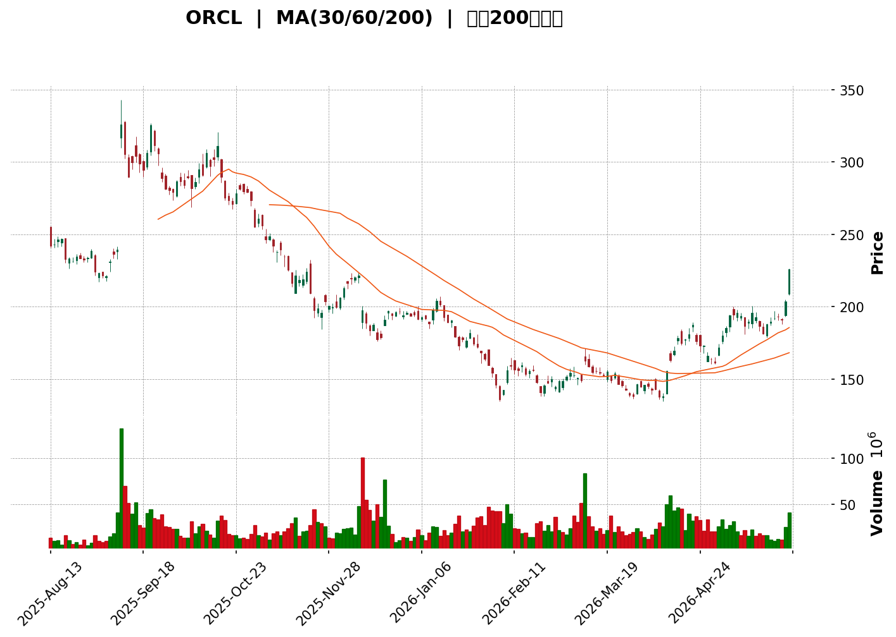
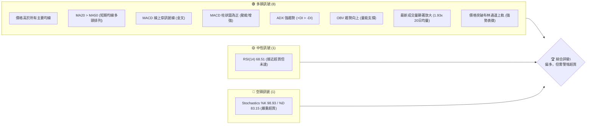
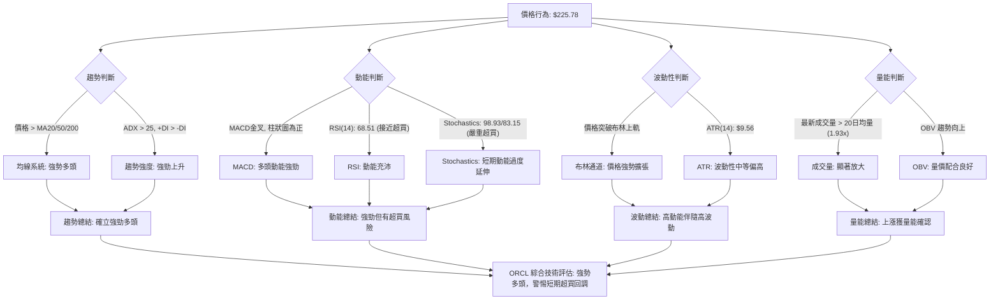
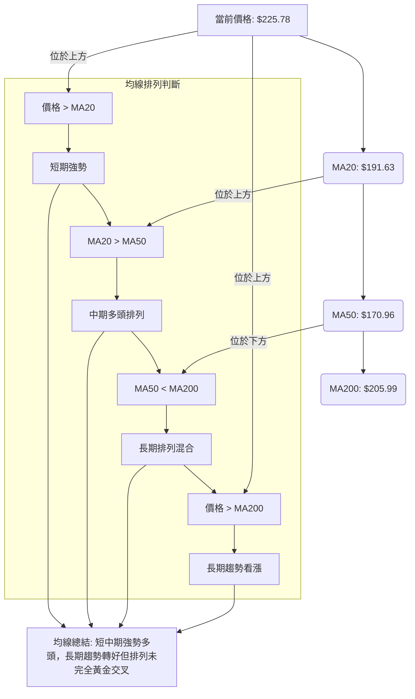

<details>
<summary>📊 靜態圖表 (點擊展開)</summary>

</details>

<html>
<head><meta charset="utf-8" /></head>
<body>
    <div>                        <script>window.PlotlyConfig = {MathJaxConfig: 'local'};</script>
        <script charset="utf-8" src="https://cdn.plot.ly/plotly-3.5.0.min.js" integrity="sha256-fHbNLP+GlIXN+efbQec78UkemUz3NJp7UmfGxC1tNxs=" crossorigin="anonymous"></script>                <div id="candlestick-chart" class="plotly-graph-div" style="height:500px; width:100%;"></div>            <script>                window.PLOTLYENV=window.PLOTLYENV || {};                                if (document.getElementById("candlestick-chart")) {                    Plotly.newPlot(                        "candlestick-chart",                        [{"close":{"dtype":"f8","bdata":"AAAAAJVIbkAAAADgWGFuQAAAAEDBym5AAAAAgNbjbkAAAACgDhltQAAAAOAGJ21AAAAAILTqbEAAAACAnlBtQAAAAOAjMm1AAAAAYAoMbUAAAADg1j5tQAAAAKAHzm1AAAAAQIELbEAAAAAgJ\u002fFrQAAAAIBqtmtAAAAAICGoa0AAAAAgRt9sQAAAAGCck21AAAAAoM\u002fzbUAAAABAJlx0QAAAAKAxF3NAAAAAIEceckAAAAAAZLxyQAAAAED8A3NAAAAAQM2wckAAAAAAw2RyQAAAAODkI3NAAAAAwEpZdEAAAABA93VzQAAAAAC4IHNAAAAAwMgQckAAAACg2ZNxQAAAACC9iHFAAAAAwJtwcUAAAACA9OtxQAAAAMBN6HFAAAAAIGW+cUAAAACA6RRyQAAAAKA7oHFAAAAAQOzlcUAAAAAAV3JyQAAAACC7MnJAAAAAgA8ic0AAAADgx5JyQAAAAMA\u002f3HJAAAAAoGlxc0AAAAAgfhhyQAAAAADLN3FAAAAAAIMXcUAAAABA6u9wQAAAAEDAZXFAAAAAgJeZcUAAAACg5npxQAAAACDWcXFAAAAAoOUZcUAAAACgRepvQAAAAMAYUHBAAAAAAGcEcEAAAACg79RuQAAAAGD\u002fGG9AAAAAQPNJbkAAAACgjrltQAAAAKB9621AAAAAQKVWbUAAAADgUDNsQAAAAIC3B2tAAAAAIKWva0AAAACgjFBrQAAAAACWZGtAAAAAoOEEbEAAAADg5ixqQAAAACB5sWhAAAAA4NDhaEAAAACAc3poQAAAAGCpdmlAAAAAAO4WaUAAAACgzvZoQAAAAGDl+2hAAAAAgMLOaUAAAACgq6BqQAAAAOAICGtAAAAAIC1ma0AAAADAqYVrQAAAAMC7tGtAAAAA4FW0aEAAAABA6ZlnQAAAAEBM+WZAAAAA4O1vZ0AAAABA1ytmQAAAACDGXWZAAAAAIIXZZ0AAAABAY6VoQAAAAKCzRGhAAAAA4BSJaEAAAADg+5hoQAAAAGD5RWhAAAAAIC2AaEAAAACABjdoQAAAACB4UGhAAAAAID3tZ0AAAADgIRJoQAAAAKAw9WdAAAAAwLuPZ0AAAADAh7poQAAAAMD2fmlAAAAAAMAyaUAAAAAA9R1oQAAAAEAOpmdAAAAAAJnNZ0AAAADAZmlmQAAAAGDLqGVAAAAAQOoxZkAAAACgYxFmQAAAAODCuWZAAAAAAFLJZUAAAADAWoZlQAAAACB\u002fDWVAAAAA4DqAZEAAAADgF\u002fBjQAAAAMA2RGNAAAAAwBpFYkAAAADgKABhQAAAAIBVymFAAAAAoHCBY0AAAAAgrOpjQAAAAOCdk2NAAAAAoO59Y0AAAAAApfJjQAAAAEDkLWNAAAAAAAx0Y0AAAABg2H9jQAAAAGARcmJAAAAAgC6aYUAAAAAgNDRiQAAAAEACbGJAAAAA4C25YkAAAAAgmxxiQAAAAKBgl2JAAAAAYLmPYkAAAACg3vpiQAAAAEAKSGNAAAAAQK8NY0AAAABACuFiQAAAACApnGJAAAAAIKxRZEAAAADgZNNjQAAAAKA+UmNAAAAAQKttY0AAAAAA2kRjQAAAAEDFC2NAAAAAwFFfY0AAAADgFqViQAAAAMCwOWNAAAAAgH9SYkAAAACgYDBiQAAAAMADymFAAAAAwJBlYUAAAABAJEphQAAAAMAiU2JAAAAAYC8XYkAAAACA2ztiQAAAAAASIWJAAAAAoH7VYUAAAADAHuVhQAAAACCFO2FAAAAAQOFCYUAAAAAA13NjQAAAAAAAYGRAAAAAgOs5ZUAAAABA4UpmQAAAAIDr4WVAAAAAYI8yZkAAAACgcKVmQAAAAAAAcGdAAAAAwPUIZkAAAADA9ahlQAAAAGC4nmVAAAAAYLi+ZEAAAABgj3pkQAAAAOB6LGRAAAAAYI96ZUAAAACgR4lmQAAAAEAzK2dAAAAAwPVAaEAAAABA4VJoQAAAAGBmfmhAAAAAQOE6aEAAAABgj1pnQAAAAOBRuGdAAAAAIIVzaEAAAABgZh5oQAAAACCFU2dAAAAAYLiuZkAAAADAHoVnQAAAAOCjuGdAAAAAYI8CaEAAAACA6yFoQAAAAGC43mdAAAAAYGZ2aUAAAADA9ThsQA=="},"high":{"dtype":"f8","bdata":"AMXpAuL0b0DhtYsiE99uQOm1tcVdFW9ADZNO+rHmbkCeLhREjeluQIOTuMcPQW1AUs4c+lRCbUBnc0niPpRtQP6Kh7ESpW1A8Q4pk8NhbUDFod\u002fxslVtQJUGRPTHAW5A+HpSD1uLbUD\u002fXSpB6vVrQCSABrwzBGxA8vPLEDq6a0DWNJvEDhltQD3HTCu0EG5AgVf14KwybkDK9aQPNnB1QLnzEwqJhnRA6XCAnvAYc0DbRSmOBApzQJiaXdVv13NAKV+ovuQjc0DeCR5ZD9dyQGBjTm7JSnNAA\u002f+1FLludECodHloSSd0QJJBw2ZgYHNA3C7KKpOGckCHZ\u002fZ7KztyQCsvvvzau3FAl1HVPGyccUD8p3sSg\u002ftxQIHc2HyRSnJALGy1iFRFckD9pkfktmVyQOoxdcTJLnJAWHSTn\u002fUTckD8WTiuG7JyQHcCct9yHXNAl0I\u002fdNZMc0BUmiGo+OhyQHdlMV\u002fEUXNAY38B1h4JdEA6QG3IvuZyQAsbGwuT93FARprgiWhpcUCgLDuMHDhxQElO2lLvlXFAqRPljvnWcUBN2cIn9NNxQO9X68t2u3FACj7FRGZ+cUCGih9XzMFwQPIU4vH7gnBA21lSfvZ\u002fcECZVKYBEbdvQAtSnA14W29AU+uZcY\u002fxbkDNx\u002fF10N1tQKp4vadbt25AvLCv1P1\u002fbUBd8kXqomttQPICEv0c+WtA1m5AWzk1bEAaWEsGDq5rQJY7saOtymtAKcViiTVYbEC72TsWRBJtQJJG7uw04WlAtSXIgGdSaUD6aBBrJcZoQP3EBdT0FmpApN+bXFUjaUAZ65sJOkhpQF7F2jRqDWpAVeRMfs3UaUDn1Z\u002f2BMNqQKG3FG8ZRWtApbBC2xLsa0CljJl2VKhrQMGgncsz\u002fmtAqp03pDMYaUA8Per6h5RoQMClNzwbemdATgXvNYGUZ0CCunKZjCtnQEeN25Y19GZALcQ\u002fRLQ9aECjel3cvrJoQLW416\u002fbf2hAh4Ys+TSiaEBQnlyrreRoQKLA9qSFqWhAr6vFNWOlaEDrxMiL239oQE2dtOYQrGhAoVPID6kOaUA4wwtWEjZoQFsfFmcyT2hAgdmNVBS5Z0AhbcoLd+9oQDbh48EwvGlAGN6C5nTiaUATpm9JTB9pQKaH5cCZSmhA4XfYgnjmZ0AzssFXO1FnQJ7KowYWf2ZA3+3OCw5xZkCTAJqhymBmQCqGHgxIFWdAEOloEgZjZkDykUxwhqFmQJhWPZdmNGVA\u002fL0ZFP0JZUC3a3EgVVNlQIMM6tVo2mNAtiB2V+8sY0AcsJFDR0FiQL1RfIpz1mFABxhDRzXmY0DjgmZPD5pkQFm0yIzkYmRAlIiiIpHPY0BhthoqhjdkQO994Vk412NAquUvyBSYY0DbIFQxu\u002fBjQBxOCp+HLmNAqj1gm1wpYkBrp5py+UdiQGynJHLjF2NAAr8Q7wP\u002fYkBAvJhcSjJiQAKM7gS3tGJAKioJQvPMYkDraRtlaSJjQKid1099rGNAWceMv1nUY0BHa2k0Eu9iQHdr6BpQM2NA8LYNqDBlZUDjXmJO3udkQH4IMf+7BmRA63ydJQDGY0D+JxuFvctjQIBw0LrHTWNAZzN8lfaLY0DREpKW7hZjQMMzazGcZ2NAyg9J1qgrY0DxZRYWMapiQF5esCW6PmJAJzvXnkymYUBGVaySrJZhQJy2VBtiXGJAKX18+iGkYkAXJRVKxT1iQOkhyC0OgWJAndpjlSMCYkBiZbD72d1iQAAAAKCZ2WFAAAAAoHCFYUAAAADAHn1jQAAAAMDMLGVAAAAAgOuRZUAAAADgo4hmQAAAAAAAEGdAAAAA4FE4ZkAAAABA4SpnQAAAAIDCpWdAAAAA4Hq8ZkAAAABguJZmQAAAAKCZsWVAAAAAYGYWZUAAAADgUZhkQAAAAIDCpWRAAAAAoJnJZUAAAAAAAPBmQAAAAOCjUGdAAAAAoEdJaEAAAADAzARpQAAAAAAAwGhAAAAAgMJ1aEAAAACgcB1oQAAAAIA98mdAAAAAYLgWaUAAAACAwo1oQAAAAOBR2GdAAAAAQAqXZ0AAAABACodnQAAAAIA9GmhAAAAAAACgaEAAAABgZmZoQAAAAOB6BGhAAAAAAACgaUAAAACgR0lsQA=="},"hovertemplate":"\u003cb\u003e%{x|%Y-%m-%d}\u003c\u002fb\u003e\u003cbr\u003e\u958b: $%{open:.2f}\u003cbr\u003e\u9ad8: $%{high:.2f}\u003cbr\u003e\u4f4e: $%{low:.2f}\u003cbr\u003e\u6536: $%{close:.2f}\u003cextra\u003e\u003c\u002fextra\u003e","low":{"dtype":"f8","bdata":"ZuEcJrAXbkCVL9JKdxVuQAeRQSXlIG5ABsldjs02bkBPNQMLLc1sQI0AKCrQTmxAGQR1sobTbEC+wMfLurRsQOrst\u002fqxLW1AGhhilWrcbEDEX2ehdttsQDNs+6XuKG1At6c0E5+ra0Ah94ardiJrQA3uRSlxgGtAAWHtQuk6a0CgKu+S4gNsQKDtpRH3Lm1AtVVbBCcXbUCwxOUOWFpzQDMVpEtx43JAgiwsqnMXckDudKDpZW9yQEAG+jZ0vnJAVEHSWoVLckAU72CpaxtyQPWKVerfb3JA4OEIlkUIc0DvTgSZ9TlzQD\u002f3QRjlmnJAR7pgB6fkcUBZondAjIxxQASqxKS7VnFAo2NgYNYbcUDnXvLvRDtxQEdGDS33vHFAJw8XQWyccUBMrMr1XghyQMSk2zgNznBAFbpgrxKWcUCteL2KFthxQBudCMSfI3JAnqPvbL5+ckCYrbueJSNyQNkrsDSCkXJA1GWby4DTckDllU6w59txQGE9LEgOGnFA17JV7I3pcECkrNQusLlwQN7uSyGf63BAbOWr5GqIcUB2+djGnWFxQI51HaE5bXFAxjLfUBXbcEBTCpnl3tZvQFCCsPOL5G9ARIPk9nm1b0BQIhOaKHZuQK346rytsG5APiXJ54K6bUD9fNm8yd1sQJ465+Dnc21ADOHknr5vbEBewEJnPBlsQLu40NT5vGpAjr3UKXIvakAiEZclysdqQOAUGZUTpmpAMGQpp3L\u002fakBYU16DfyBqQDkIMI3FC2hAFAV\u002f9J8jaEDUR+cj4Q9nQBnByzcnIGlAvvPG5eWMaEAXCDWl9G9oQOdttCnp2GhAvBQr6dPFaEBnrUqF6qFpQFerB6MWimpAuY9437nyakA1ACtcTB5rQHDAb+8ICGtAWYLTL\u002fYiZ0BEAQXDAhtnQBTnHn9YiWZAWFLXY5\u002frZkCFVjTsof9lQBENl0yoL2ZAa20XghJfZ0AhhGFQ3\u002fRnQLaVRXuE4GdAHmP0+nAnaEBXUHjwMF1oQNGm2lfU7mdAs4ckLXhQaEAAibLhTDFoQDNRPi3DIGhAOiY4QvjkZ0AFx7zaILFnQDRKV2d52mdAw+y13mogZ0BYmgdU74NnQI1ZC89gimhA0NdFmcX+aECihh01q8RnQG26nv1il2dAE0QXgy88Z0AplnU3i1dmQBTyviQzQGVAkxtYplf8ZUDwgcj+12xlQEhj05oTPWZAfRPhiGqiZUBStyUNYWhlQBmAQ62mHmRAPCS41H9VZECSC+0VLu5jQNS7HNrh62JAYCQKfqz9YUDk26vR79hgQA8nzzqmTWFAFwr+zKBPYkAZ0BEqPY1jQIaJujjZLmNAk2vm+QP\u002fYkBfbkII\u002fFdjQESb+RMiC2NAeQ7UOvvaYkAGpi6USmdjQNk6T4wQXGJAeG5VzXFDYUDshTum6EdhQGB3f054WmJAD0geP6IUYkA5Bry2X7NhQOQ5\u002fzYJlmFAOt+oDavRYUCOA+UbmJJiQEB\u002frMYes2JA\u002fLquFPTiYkCM2AaEcz1iQCtt\u002fNXdfWJAIa+V66wAZEAShW3u2sFjQDL3KZ+hM2NAbHengBw\u002fY0CrF99t5x5jQMN\u002fOqVY8GJATJw2yOWLYkAubjYT7G1iQESKTV\u002fvxWJANC+sV9hKYkBWHX18GANiQNvPwZJnwWFAj\u002ffGZjI6YUBTsAS\u002fJQ9hQGAL596fa2FAmVxq11MFYkBYAXN5+XlhQC\u002f4Tc8t62FA8Iqbl35uYUBE5lFr4sxhQAAAAAAAAGFAAAAAgD3SYEAAAABACndhQAAAAIDrMWRAAAAAYLjGZEAAAACgmbllQAAAACCFq2VAAAAA4FGwZUAAAADgUQBmQAAAAKCZ2WZAAAAAYI\u002fCZUAAAACgmRllQAAAAMDM\u002fGRAAAAAoJlBZEAAAADAzBRkQAAAAGCPCmRAAAAAwMzEZEAAAADgUchlQAAAAAAAYGZAAAAAoHDVZkAAAACgmdlnQAAAAGC4xmdAAAAAQDPTZ0AAAAAA15tmQAAAAIDrIWdAAAAAYGYuZ0AAAADAzJxnQAAAAOCj6GZAAAAAgMKdZkAAAACgmVlmQAAAAGBmZmdAAAAAQDPjZ0AAAACA69FnQAAAAKBwfWdAAAAAACksaEAAAADgUQBqQA=="},"name":"\u50f9\u683c","open":{"dtype":"f8","bdata":"x9C5FALlb0AMNluEB2FuQAPCvVqTn25AzvITdLeIbkCeLhREjeluQEoz1ZiWy2xAVkspDjbnbEDScBwpRwdtQPilJvK7b21AvpWiVB8lbUAdYdRTHyVtQFWWylVENm1ArtxGD\u002f13bUAqLJ0oYYhrQCSABrwzBGxAdaZxQ2GIa0AjMuEoVtdsQBp2gbBgwG1AVhav8vbBbUC691f9DctzQGdfjNQOfHRAX3vmR1X2ckColb2HzwBzQKGmVP2deXNAHHw2un4Uc0CPgcZ8rcpyQF1FC0qLinJAWmKHzUozc0AjGEV6aRd0QFR92VaxVnNAAgAqpVRPckBrm9ONSytyQEyyLL7ypXFAJgbbbYCXcUCnkgCv30lxQP20Q8Y+GHJAZ2oqSlL1cUC0UzUKdCFyQOoxdcTJLnJAkJ9yEfeycUDqJ+33ThxyQKYd+L8ip3JAw0qbqAKOckAFbuZLdNtyQMd2V5qa8HJAGxd+YLz7ckDhhbAqUd5yQJbJPIz28nFA2i1RE5VGcUAW3piWQxJxQJZu+H6v9HBA6DxrdMfCcUARipKpHc1xQL5mhDZYlHFA0Wp75dp7cUBnLMLbk7FwQEqRcc3MHnBAW+MAgOt5cEDpIimQgA5vQDG5F7WqzG5A19aZ+57NbkD3iznCSbFtQAGOKXNUjm5AlmBInzBZbUB+jcgKaWltQKMKjN6082tAizVWqVoxakD+t1RuEhxrQHW232V23GpAWdgDGBs3a0BT6sXu8LdsQN7pkVcWumlAcd4HXgt1aEA8VtW5oBxoQGrXZNgNB2pAuuFLlVPJaEA8leIj0OhoQHXjutxifGlAJILmAGjjaEAAzAoY5dJpQBY4fnMyNWtAZ6LIOPB\u002fa0B7JwDN9FVrQBdmewpAjmtAGff6aJWuZ0Ck8gTIdWVoQAwFUqJ6ZGdAZT4iIk3yZkADkoG1F8ZmQGYdighUs2ZAmcSm36hnZ0AfhI7NxXNoQJs7lVZeZ2hAoEPbVeM5aECbn32\u002fNZtoQLQAmyosH2hAXH4xyplbaEDoAa\u002fSDGdoQE4KiPBxiGhA+85cbR2kaEC7r3LqSOxnQOsuR+ptQ2hA\u002fxERddq2Z0AiOvQ2xt9nQE4VklwxnWhAQVeyGyuJaUATpm9JTB9pQKaH5cCZSmhAmEmuJPinZ0AzssFXO1FnQCnc04G\u002fYWZARwAe0txXZkBt63JRnYBlQHJ7YtpAT2ZAxP3obh9SZkBbtv9N9cllQA\u002fNK3\u002fZMWVAjeBixLXyZEAU+StcZ0plQLpMz6SxtmNAH2ZwJFcrY0DjcIv5+yJiQP\u002fyvYdvaGFArcOAcSR\u002fYkB\u002fghodLu5jQFm0yIzkYmRAry2BqCusY0AREh6AQ9ZjQMJotsrDrWNA+jIOTuw7Y0DySY63kpRjQPWIWcuGGGNAa69FntolYkCQpymdMYthQN\u002f6LeqBlGJAXtWVVrWIYkAU7HS2IuxhQJcdaysRpGFAK\u002f549eAHYkBvNNLJnK9iQG4s8pniAWNAe0AFpGgMY0B+LSqlncViQCFxZQ67ImNAyzz3LKG5ZEAm0\u002fEPyIJkQN5bncniz2NAxNoc74lwY0Cx9bidxFxjQDx9c\u002f62G2NA5YDGhPa9YkBYZVjqjRBjQLTVEmGT3GJAq8ZHv\u002fUOY0Coz3JavZZiQJJDFVV07GFASuk5ShCOYUBR7W3lrnFhQFe7XGr5eWFAwtnmcUaSYkDdayjkDslhQBzuu7OoXWJAKl2hW\u002fLoYUCtp5FO3LhiQAAAAGBmxmFAAAAAgD0qYUAAAADgo3hhQAAAAIDC\u002fWRAAAAA4HrcZEAAAACgcA1mQAAAAIDC3WZAAAAAgOsZZkAAAABAM0tmQAAAAIDCRWdAAAAAwMyMZkAAAADgUZBmQAAAAGCPkmVAAAAAwB5FZEAAAACgR4FkQAAAAOCjQGRAAAAAoHDNZEAAAADgowBmQAAAAAApxGZAAAAAYGZGZ0AAAAAghdNoQAAAAGCPEmhAAAAAwMwEaEAAAACgcB1oQAAAAMD1oGdAAAAAgMKFZ0AAAAAgrs9nQAAAAAAAwGdAAAAAAABAZ0AAAACAFH5mQAAAAOBRoGdAAAAAoHD1Z0AAAACgmSloQAAAACBc72dAAAAAoEdBaEAAAAAAACBqQA=="},"x":["2025-08-13T00:00:00-04:00","2025-08-14T00:00:00-04:00","2025-08-15T00:00:00-04:00","2025-08-18T00:00:00-04:00","2025-08-19T00:00:00-04:00","2025-08-20T00:00:00-04:00","2025-08-21T00:00:00-04:00","2025-08-22T00:00:00-04:00","2025-08-25T00:00:00-04:00","2025-08-26T00:00:00-04:00","2025-08-27T00:00:00-04:00","2025-08-28T00:00:00-04:00","2025-08-29T00:00:00-04:00","2025-09-02T00:00:00-04:00","2025-09-03T00:00:00-04:00","2025-09-04T00:00:00-04:00","2025-09-05T00:00:00-04:00","2025-09-08T00:00:00-04:00","2025-09-09T00:00:00-04:00","2025-09-10T00:00:00-04:00","2025-09-11T00:00:00-04:00","2025-09-12T00:00:00-04:00","2025-09-15T00:00:00-04:00","2025-09-16T00:00:00-04:00","2025-09-17T00:00:00-04:00","2025-09-18T00:00:00-04:00","2025-09-19T00:00:00-04:00","2025-09-22T00:00:00-04:00","2025-09-23T00:00:00-04:00","2025-09-24T00:00:00-04:00","2025-09-25T00:00:00-04:00","2025-09-26T00:00:00-04:00","2025-09-29T00:00:00-04:00","2025-09-30T00:00:00-04:00","2025-10-01T00:00:00-04:00","2025-10-02T00:00:00-04:00","2025-10-03T00:00:00-04:00","2025-10-06T00:00:00-04:00","2025-10-07T00:00:00-04:00","2025-10-08T00:00:00-04:00","2025-10-09T00:00:00-04:00","2025-10-10T00:00:00-04:00","2025-10-13T00:00:00-04:00","2025-10-14T00:00:00-04:00","2025-10-15T00:00:00-04:00","2025-10-16T00:00:00-04:00","2025-10-17T00:00:00-04:00","2025-10-20T00:00:00-04:00","2025-10-21T00:00:00-04:00","2025-10-22T00:00:00-04:00","2025-10-23T00:00:00-04:00","2025-10-24T00:00:00-04:00","2025-10-27T00:00:00-04:00","2025-10-28T00:00:00-04:00","2025-10-29T00:00:00-04:00","2025-10-30T00:00:00-04:00","2025-10-31T00:00:00-04:00","2025-11-03T00:00:00-05:00","2025-11-04T00:00:00-05:00","2025-11-05T00:00:00-05:00","2025-11-06T00:00:00-05:00","2025-11-07T00:00:00-05:00","2025-11-10T00:00:00-05:00","2025-11-11T00:00:00-05:00","2025-11-12T00:00:00-05:00","2025-11-13T00:00:00-05:00","2025-11-14T00:00:00-05:00","2025-11-17T00:00:00-05:00","2025-11-18T00:00:00-05:00","2025-11-19T00:00:00-05:00","2025-11-20T00:00:00-05:00","2025-11-21T00:00:00-05:00","2025-11-24T00:00:00-05:00","2025-11-25T00:00:00-05:00","2025-11-26T00:00:00-05:00","2025-11-28T00:00:00-05:00","2025-12-01T00:00:00-05:00","2025-12-02T00:00:00-05:00","2025-12-03T00:00:00-05:00","2025-12-04T00:00:00-05:00","2025-12-05T00:00:00-05:00","2025-12-08T00:00:00-05:00","2025-12-09T00:00:00-05:00","2025-12-10T00:00:00-05:00","2025-12-11T00:00:00-05:00","2025-12-12T00:00:00-05:00","2025-12-15T00:00:00-05:00","2025-12-16T00:00:00-05:00","2025-12-17T00:00:00-05:00","2025-12-18T00:00:00-05:00","2025-12-19T00:00:00-05:00","2025-12-22T00:00:00-05:00","2025-12-23T00:00:00-05:00","2025-12-24T00:00:00-05:00","2025-12-26T00:00:00-05:00","2025-12-29T00:00:00-05:00","2025-12-30T00:00:00-05:00","2025-12-31T00:00:00-05:00","2026-01-02T00:00:00-05:00","2026-01-05T00:00:00-05:00","2026-01-06T00:00:00-05:00","2026-01-07T00:00:00-05:00","2026-01-08T00:00:00-05:00","2026-01-09T00:00:00-05:00","2026-01-12T00:00:00-05:00","2026-01-13T00:00:00-05:00","2026-01-14T00:00:00-05:00","2026-01-15T00:00:00-05:00","2026-01-16T00:00:00-05:00","2026-01-20T00:00:00-05:00","2026-01-21T00:00:00-05:00","2026-01-22T00:00:00-05:00","2026-01-23T00:00:00-05:00","2026-01-26T00:00:00-05:00","2026-01-27T00:00:00-05:00","2026-01-28T00:00:00-05:00","2026-01-29T00:00:00-05:00","2026-01-30T00:00:00-05:00","2026-02-02T00:00:00-05:00","2026-02-03T00:00:00-05:00","2026-02-04T00:00:00-05:00","2026-02-05T00:00:00-05:00","2026-02-06T00:00:00-05:00","2026-02-09T00:00:00-05:00","2026-02-10T00:00:00-05:00","2026-02-11T00:00:00-05:00","2026-02-12T00:00:00-05:00","2026-02-13T00:00:00-05:00","2026-02-17T00:00:00-05:00","2026-02-18T00:00:00-05:00","2026-02-19T00:00:00-05:00","2026-02-20T00:00:00-05:00","2026-02-23T00:00:00-05:00","2026-02-24T00:00:00-05:00","2026-02-25T00:00:00-05:00","2026-02-26T00:00:00-05:00","2026-02-27T00:00:00-05:00","2026-03-02T00:00:00-05:00","2026-03-03T00:00:00-05:00","2026-03-04T00:00:00-05:00","2026-03-05T00:00:00-05:00","2026-03-06T00:00:00-05:00","2026-03-09T00:00:00-04:00","2026-03-10T00:00:00-04:00","2026-03-11T00:00:00-04:00","2026-03-12T00:00:00-04:00","2026-03-13T00:00:00-04:00","2026-03-16T00:00:00-04:00","2026-03-17T00:00:00-04:00","2026-03-18T00:00:00-04:00","2026-03-19T00:00:00-04:00","2026-03-20T00:00:00-04:00","2026-03-23T00:00:00-04:00","2026-03-24T00:00:00-04:00","2026-03-25T00:00:00-04:00","2026-03-26T00:00:00-04:00","2026-03-27T00:00:00-04:00","2026-03-30T00:00:00-04:00","2026-03-31T00:00:00-04:00","2026-04-01T00:00:00-04:00","2026-04-02T00:00:00-04:00","2026-04-06T00:00:00-04:00","2026-04-07T00:00:00-04:00","2026-04-08T00:00:00-04:00","2026-04-09T00:00:00-04:00","2026-04-10T00:00:00-04:00","2026-04-13T00:00:00-04:00","2026-04-14T00:00:00-04:00","2026-04-15T00:00:00-04:00","2026-04-16T00:00:00-04:00","2026-04-17T00:00:00-04:00","2026-04-20T00:00:00-04:00","2026-04-21T00:00:00-04:00","2026-04-22T00:00:00-04:00","2026-04-23T00:00:00-04:00","2026-04-24T00:00:00-04:00","2026-04-27T00:00:00-04:00","2026-04-28T00:00:00-04:00","2026-04-29T00:00:00-04:00","2026-04-30T00:00:00-04:00","2026-05-01T00:00:00-04:00","2026-05-04T00:00:00-04:00","2026-05-05T00:00:00-04:00","2026-05-06T00:00:00-04:00","2026-05-07T00:00:00-04:00","2026-05-08T00:00:00-04:00","2026-05-11T00:00:00-04:00","2026-05-12T00:00:00-04:00","2026-05-13T00:00:00-04:00","2026-05-14T00:00:00-04:00","2026-05-15T00:00:00-04:00","2026-05-18T00:00:00-04:00","2026-05-19T00:00:00-04:00","2026-05-20T00:00:00-04:00","2026-05-21T00:00:00-04:00","2026-05-22T00:00:00-04:00","2026-05-26T00:00:00-04:00","2026-05-27T00:00:00-04:00","2026-05-28T00:00:00-04:00","2026-05-29T00:00:00-04:00"],"type":"candlestick"},{"hovertemplate":"MA30: $%{y:.2f}\u003cextra\u003e\u003c\u002fextra\u003e","line":{"color":"#2196F3","dash":"dash","width":2},"mode":"lines","name":"MA30","x":["2025-08-13T00:00:00-04:00","2025-08-14T00:00:00-04:00","2025-08-15T00:00:00-04:00","2025-08-18T00:00:00-04:00","2025-08-19T00:00:00-04:00","2025-08-20T00:00:00-04:00","2025-08-21T00:00:00-04:00","2025-08-22T00:00:00-04:00","2025-08-25T00:00:00-04:00","2025-08-26T00:00:00-04:00","2025-08-27T00:00:00-04:00","2025-08-28T00:00:00-04:00","2025-08-29T00:00:00-04:00","2025-09-02T00:00:00-04:00","2025-09-03T00:00:00-04:00","2025-09-04T00:00:00-04:00","2025-09-05T00:00:00-04:00","2025-09-08T00:00:00-04:00","2025-09-09T00:00:00-04:00","2025-09-10T00:00:00-04:00","2025-09-11T00:00:00-04:00","2025-09-12T00:00:00-04:00","2025-09-15T00:00:00-04:00","2025-09-16T00:00:00-04:00","2025-09-17T00:00:00-04:00","2025-09-18T00:00:00-04:00","2025-09-19T00:00:00-04:00","2025-09-22T00:00:00-04:00","2025-09-23T00:00:00-04:00","2025-09-24T00:00:00-04:00","2025-09-25T00:00:00-04:00","2025-09-26T00:00:00-04:00","2025-09-29T00:00:00-04:00","2025-09-30T00:00:00-04:00","2025-10-01T00:00:00-04:00","2025-10-02T00:00:00-04:00","2025-10-03T00:00:00-04:00","2025-10-06T00:00:00-04:00","2025-10-07T00:00:00-04:00","2025-10-08T00:00:00-04:00","2025-10-09T00:00:00-04:00","2025-10-10T00:00:00-04:00","2025-10-13T00:00:00-04:00","2025-10-14T00:00:00-04:00","2025-10-15T00:00:00-04:00","2025-10-16T00:00:00-04:00","2025-10-17T00:00:00-04:00","2025-10-20T00:00:00-04:00","2025-10-21T00:00:00-04:00","2025-10-22T00:00:00-04:00","2025-10-23T00:00:00-04:00","2025-10-24T00:00:00-04:00","2025-10-27T00:00:00-04:00","2025-10-28T00:00:00-04:00","2025-10-29T00:00:00-04:00","2025-10-30T00:00:00-04:00","2025-10-31T00:00:00-04:00","2025-11-03T00:00:00-05:00","2025-11-04T00:00:00-05:00","2025-11-05T00:00:00-05:00","2025-11-06T00:00:00-05:00","2025-11-07T00:00:00-05:00","2025-11-10T00:00:00-05:00","2025-11-11T00:00:00-05:00","2025-11-12T00:00:00-05:00","2025-11-13T00:00:00-05:00","2025-11-14T00:00:00-05:00","2025-11-17T00:00:00-05:00","2025-11-18T00:00:00-05:00","2025-11-19T00:00:00-05:00","2025-11-20T00:00:00-05:00","2025-11-21T00:00:00-05:00","2025-11-24T00:00:00-05:00","2025-11-25T00:00:00-05:00","2025-11-26T00:00:00-05:00","2025-11-28T00:00:00-05:00","2025-12-01T00:00:00-05:00","2025-12-02T00:00:00-05:00","2025-12-03T00:00:00-05:00","2025-12-04T00:00:00-05:00","2025-12-05T00:00:00-05:00","2025-12-08T00:00:00-05:00","2025-12-09T00:00:00-05:00","2025-12-10T00:00:00-05:00","2025-12-11T00:00:00-05:00","2025-12-12T00:00:00-05:00","2025-12-15T00:00:00-05:00","2025-12-16T00:00:00-05:00","2025-12-17T00:00:00-05:00","2025-12-18T00:00:00-05:00","2025-12-19T00:00:00-05:00","2025-12-22T00:00:00-05:00","2025-12-23T00:00:00-05:00","2025-12-24T00:00:00-05:00","2025-12-26T00:00:00-05:00","2025-12-29T00:00:00-05:00","2025-12-30T00:00:00-05:00","2025-12-31T00:00:00-05:00","2026-01-02T00:00:00-05:00","2026-01-05T00:00:00-05:00","2026-01-06T00:00:00-05:00","2026-01-07T00:00:00-05:00","2026-01-08T00:00:00-05:00","2026-01-09T00:00:00-05:00","2026-01-12T00:00:00-05:00","2026-01-13T00:00:00-05:00","2026-01-14T00:00:00-05:00","2026-01-15T00:00:00-05:00","2026-01-16T00:00:00-05:00","2026-01-20T00:00:00-05:00","2026-01-21T00:00:00-05:00","2026-01-22T00:00:00-05:00","2026-01-23T00:00:00-05:00","2026-01-26T00:00:00-05:00","2026-01-27T00:00:00-05:00","2026-01-28T00:00:00-05:00","2026-01-29T00:00:00-05:00","2026-01-30T00:00:00-05:00","2026-02-02T00:00:00-05:00","2026-02-03T00:00:00-05:00","2026-02-04T00:00:00-05:00","2026-02-05T00:00:00-05:00","2026-02-06T00:00:00-05:00","2026-02-09T00:00:00-05:00","2026-02-10T00:00:00-05:00","2026-02-11T00:00:00-05:00","2026-02-12T00:00:00-05:00","2026-02-13T00:00:00-05:00","2026-02-17T00:00:00-05:00","2026-02-18T00:00:00-05:00","2026-02-19T00:00:00-05:00","2026-02-20T00:00:00-05:00","2026-02-23T00:00:00-05:00","2026-02-24T00:00:00-05:00","2026-02-25T00:00:00-05:00","2026-02-26T00:00:00-05:00","2026-02-27T00:00:00-05:00","2026-03-02T00:00:00-05:00","2026-03-03T00:00:00-05:00","2026-03-04T00:00:00-05:00","2026-03-05T00:00:00-05:00","2026-03-06T00:00:00-05:00","2026-03-09T00:00:00-04:00","2026-03-10T00:00:00-04:00","2026-03-11T00:00:00-04:00","2026-03-12T00:00:00-04:00","2026-03-13T00:00:00-04:00","2026-03-16T00:00:00-04:00","2026-03-17T00:00:00-04:00","2026-03-18T00:00:00-04:00","2026-03-19T00:00:00-04:00","2026-03-20T00:00:00-04:00","2026-03-23T00:00:00-04:00","2026-03-24T00:00:00-04:00","2026-03-25T00:00:00-04:00","2026-03-26T00:00:00-04:00","2026-03-27T00:00:00-04:00","2026-03-30T00:00:00-04:00","2026-03-31T00:00:00-04:00","2026-04-01T00:00:00-04:00","2026-04-02T00:00:00-04:00","2026-04-06T00:00:00-04:00","2026-04-07T00:00:00-04:00","2026-04-08T00:00:00-04:00","2026-04-09T00:00:00-04:00","2026-04-10T00:00:00-04:00","2026-04-13T00:00:00-04:00","2026-04-14T00:00:00-04:00","2026-04-15T00:00:00-04:00","2026-04-16T00:00:00-04:00","2026-04-17T00:00:00-04:00","2026-04-20T00:00:00-04:00","2026-04-21T00:00:00-04:00","2026-04-22T00:00:00-04:00","2026-04-23T00:00:00-04:00","2026-04-24T00:00:00-04:00","2026-04-27T00:00:00-04:00","2026-04-28T00:00:00-04:00","2026-04-29T00:00:00-04:00","2026-04-30T00:00:00-04:00","2026-05-01T00:00:00-04:00","2026-05-04T00:00:00-04:00","2026-05-05T00:00:00-04:00","2026-05-06T00:00:00-04:00","2026-05-07T00:00:00-04:00","2026-05-08T00:00:00-04:00","2026-05-11T00:00:00-04:00","2026-05-12T00:00:00-04:00","2026-05-13T00:00:00-04:00","2026-05-14T00:00:00-04:00","2026-05-15T00:00:00-04:00","2026-05-18T00:00:00-04:00","2026-05-19T00:00:00-04:00","2026-05-20T00:00:00-04:00","2026-05-21T00:00:00-04:00","2026-05-22T00:00:00-04:00","2026-05-26T00:00:00-04:00","2026-05-27T00:00:00-04:00","2026-05-28T00:00:00-04:00","2026-05-29T00:00:00-04:00"],"y":{"dtype":"f8","bdata":"AAAAAAAA+H8AAAAAAAD4fwAAAAAAAPh\u002fAAAAAAAA+H8AAAAAAAD4fwAAAAAAAPh\u002fAAAAAAAA+H8AAAAAAAD4fwAAAAAAAPh\u002fAAAAAAAA+H8AAAAAAAD4fwAAAAAAAPh\u002fAAAAAAAA+H8AAAAAAAD4fwAAAAAAAPh\u002fAAAAAAAA+H8AAAAAAAD4fwAAAAAAAPh\u002fAAAAAAAA+H8AAAAAAAD4fwAAAAAAAPh\u002fAAAAAAAA+H8AAAAAAAD4fwAAAAAAAPh\u002fAAAAAAAA+H8AAAAAAAD4fwAAAAAAAPh\u002fAAAAAAAA+H8AAAAAAAD4f5qZmcHcR3BA3t3d5c9gcEBVVVVFL3VwQGZmZhZuh3BAiYiI+HOYcECJiIjgO7VwQFVVVQWp0XBARERE7LHtcEC8u7tD6gpxQM3MzPzAJHFAzczM9IxBcUCJiIhoLmJxQGZmZh5OfnFAERERWeqpcUC8u7tbMNFxQImIiOjj+3FA7+7uRs0rckB3d3fHB0tyQAAAAGjDX3JAzczMHNFxckCamZnpm1RyQDMzMzMpRnJAIiIi8rxBckARERGRBTdyQFVVVeWdKXJAREREpA0cckAREREJRAdyQJqZmaEj73FAMzMzGy3KcUC8u7vbqKdxQKuqqnIeiXFAzczMJDFwcUDe3d3dBVlxQM3MzHQOQ3FAq6qq4mkrcUAAAADAzQpxQLy7u3tS5XBAzczMVAnEcECJiIgoSJ5wQDMzMyPAfHBAMzMzW5FbcEAiIiKS1i1wQO\u002fu7l7P929AERERkZmFb0BmZmYGfxlvQCIiItLmsG5Aq6qq+is7bkCJiIioXdttQDMzM6O1im1AvLu76ztDbUCamZk5ZQVtQBEREYElw2xAAAAAYJSAbECamZm5G0FsQBEREXHPA2xA7+7u\u002fsKya0C8u7v70GtrQCIiIgJ0GWtARERENBfQakDe3d39L4ZqQFVVVRWuO2pAq6qqersEakAzMzOzZNlpQERERMQqqWlAzczMfC6AaUC8u7vrb2FpQFVVVZXpSWlAq6qq6rouaUAzMzODRxRpQAAAAEAC+mhA3t3dXRbXaEDe3d3dIMVoQO\u002fu7i7avmhAZmZmNpWzaEBVVVUFuLVoQN7d3d3+tWhAREREROy2aEAAAADQsa9oQGZmZsZMpGhAq6qqyjGTaEB3d3cHOG9oQFVVVaVgQWhAREREBPgUaEBVVVUlbeZnQCIiImLtu2dAq6qq2gajZ0B3d3fnTpFnQDMzMzPqgGdAMzMzs9tnZ0CamZnJzFRnQDMzMxNZOmdA3t3d7bsKZ0AAAABAfslmQImIiNg2kmZAiYiI+EpnZkARERFhWT9mQDMzM0NFF2ZAIiIicofsZUC8u7vLHchlQBERERFMnGVAMzMzwx92ZUAAAABQHU9lQM3MzLwTIGVAIiIisjntZEDe3d09jLVkQCIiIsIueWRAd3d3J+5BZEDNzMxsrw5kQBEREYGH42NAmpmZ2cy2Y0C8u7sLhJljQHd3d1c5hWNAMzMzk2pqY0BVVVVlNE9jQLy7u6sVLGNAREREJJAfY0Crqqp6EBFjQAAAABBKAmNAREREJCP5YkARERHhbfNiQKuqqjqM8WJAZmZmdvT6YkBVVVVl\u002fAhjQLy7uys7FWNAERERESILY0ARERHRY\u002fxiQCIiIvIi7WJAMzMz80HbYkDe3d39ksRiQGZmZkZIvWJAIiIiUqexYkAAAACg2qZiQCIiInInpGJAVVVVlSGmYkDNzMy8fqNiQO\u002fu7m5YmWJAmpmZad6MYkB3d3dXT5hiQKuqqtqHp2JAIiIiQkW+YkDNzMycidpiQJqZmcm78GJA7+7uDpALY0CrqqqatStjQO\u002fu7m7nVGNAVVVVBYxjY0C8u7v7MnNjQERERKTQhmNAAAAA0AySY0CJiIioX5xjQAAAAFD\u002fpWNAVVVV1fi3Y0CJiIioLdljQERERCTU+mNA7+7urnEtZEDe3d1Ny2FkQKuqqsoBm2RAZmZmRlHVZEBERESUEAllQO\u002fu7q4aN2VA7+7uzmFtZUAzMzOjmZ9lQO\u002fu7s7yy2VAmpmZmVL1ZUCamZmZUiVmQN7d3X2xXGZAzczMXEiWZkCrqqr6N75mQM3MzOwK3GZAd3d3JzEAZ0AAAABwyzJnQA=="},"type":"scatter"},{"hovertemplate":"MA60: $%{y:.2f}\u003cextra\u003e\u003c\u002fextra\u003e","line":{"color":"#9C27B0","dash":"dash","width":2},"mode":"lines","name":"MA60","x":["2025-08-13T00:00:00-04:00","2025-08-14T00:00:00-04:00","2025-08-15T00:00:00-04:00","2025-08-18T00:00:00-04:00","2025-08-19T00:00:00-04:00","2025-08-20T00:00:00-04:00","2025-08-21T00:00:00-04:00","2025-08-22T00:00:00-04:00","2025-08-25T00:00:00-04:00","2025-08-26T00:00:00-04:00","2025-08-27T00:00:00-04:00","2025-08-28T00:00:00-04:00","2025-08-29T00:00:00-04:00","2025-09-02T00:00:00-04:00","2025-09-03T00:00:00-04:00","2025-09-04T00:00:00-04:00","2025-09-05T00:00:00-04:00","2025-09-08T00:00:00-04:00","2025-09-09T00:00:00-04:00","2025-09-10T00:00:00-04:00","2025-09-11T00:00:00-04:00","2025-09-12T00:00:00-04:00","2025-09-15T00:00:00-04:00","2025-09-16T00:00:00-04:00","2025-09-17T00:00:00-04:00","2025-09-18T00:00:00-04:00","2025-09-19T00:00:00-04:00","2025-09-22T00:00:00-04:00","2025-09-23T00:00:00-04:00","2025-09-24T00:00:00-04:00","2025-09-25T00:00:00-04:00","2025-09-26T00:00:00-04:00","2025-09-29T00:00:00-04:00","2025-09-30T00:00:00-04:00","2025-10-01T00:00:00-04:00","2025-10-02T00:00:00-04:00","2025-10-03T00:00:00-04:00","2025-10-06T00:00:00-04:00","2025-10-07T00:00:00-04:00","2025-10-08T00:00:00-04:00","2025-10-09T00:00:00-04:00","2025-10-10T00:00:00-04:00","2025-10-13T00:00:00-04:00","2025-10-14T00:00:00-04:00","2025-10-15T00:00:00-04:00","2025-10-16T00:00:00-04:00","2025-10-17T00:00:00-04:00","2025-10-20T00:00:00-04:00","2025-10-21T00:00:00-04:00","2025-10-22T00:00:00-04:00","2025-10-23T00:00:00-04:00","2025-10-24T00:00:00-04:00","2025-10-27T00:00:00-04:00","2025-10-28T00:00:00-04:00","2025-10-29T00:00:00-04:00","2025-10-30T00:00:00-04:00","2025-10-31T00:00:00-04:00","2025-11-03T00:00:00-05:00","2025-11-04T00:00:00-05:00","2025-11-05T00:00:00-05:00","2025-11-06T00:00:00-05:00","2025-11-07T00:00:00-05:00","2025-11-10T00:00:00-05:00","2025-11-11T00:00:00-05:00","2025-11-12T00:00:00-05:00","2025-11-13T00:00:00-05:00","2025-11-14T00:00:00-05:00","2025-11-17T00:00:00-05:00","2025-11-18T00:00:00-05:00","2025-11-19T00:00:00-05:00","2025-11-20T00:00:00-05:00","2025-11-21T00:00:00-05:00","2025-11-24T00:00:00-05:00","2025-11-25T00:00:00-05:00","2025-11-26T00:00:00-05:00","2025-11-28T00:00:00-05:00","2025-12-01T00:00:00-05:00","2025-12-02T00:00:00-05:00","2025-12-03T00:00:00-05:00","2025-12-04T00:00:00-05:00","2025-12-05T00:00:00-05:00","2025-12-08T00:00:00-05:00","2025-12-09T00:00:00-05:00","2025-12-10T00:00:00-05:00","2025-12-11T00:00:00-05:00","2025-12-12T00:00:00-05:00","2025-12-15T00:00:00-05:00","2025-12-16T00:00:00-05:00","2025-12-17T00:00:00-05:00","2025-12-18T00:00:00-05:00","2025-12-19T00:00:00-05:00","2025-12-22T00:00:00-05:00","2025-12-23T00:00:00-05:00","2025-12-24T00:00:00-05:00","2025-12-26T00:00:00-05:00","2025-12-29T00:00:00-05:00","2025-12-30T00:00:00-05:00","2025-12-31T00:00:00-05:00","2026-01-02T00:00:00-05:00","2026-01-05T00:00:00-05:00","2026-01-06T00:00:00-05:00","2026-01-07T00:00:00-05:00","2026-01-08T00:00:00-05:00","2026-01-09T00:00:00-05:00","2026-01-12T00:00:00-05:00","2026-01-13T00:00:00-05:00","2026-01-14T00:00:00-05:00","2026-01-15T00:00:00-05:00","2026-01-16T00:00:00-05:00","2026-01-20T00:00:00-05:00","2026-01-21T00:00:00-05:00","2026-01-22T00:00:00-05:00","2026-01-23T00:00:00-05:00","2026-01-26T00:00:00-05:00","2026-01-27T00:00:00-05:00","2026-01-28T00:00:00-05:00","2026-01-29T00:00:00-05:00","2026-01-30T00:00:00-05:00","2026-02-02T00:00:00-05:00","2026-02-03T00:00:00-05:00","2026-02-04T00:00:00-05:00","2026-02-05T00:00:00-05:00","2026-02-06T00:00:00-05:00","2026-02-09T00:00:00-05:00","2026-02-10T00:00:00-05:00","2026-02-11T00:00:00-05:00","2026-02-12T00:00:00-05:00","2026-02-13T00:00:00-05:00","2026-02-17T00:00:00-05:00","2026-02-18T00:00:00-05:00","2026-02-19T00:00:00-05:00","2026-02-20T00:00:00-05:00","2026-02-23T00:00:00-05:00","2026-02-24T00:00:00-05:00","2026-02-25T00:00:00-05:00","2026-02-26T00:00:00-05:00","2026-02-27T00:00:00-05:00","2026-03-02T00:00:00-05:00","2026-03-03T00:00:00-05:00","2026-03-04T00:00:00-05:00","2026-03-05T00:00:00-05:00","2026-03-06T00:00:00-05:00","2026-03-09T00:00:00-04:00","2026-03-10T00:00:00-04:00","2026-03-11T00:00:00-04:00","2026-03-12T00:00:00-04:00","2026-03-13T00:00:00-04:00","2026-03-16T00:00:00-04:00","2026-03-17T00:00:00-04:00","2026-03-18T00:00:00-04:00","2026-03-19T00:00:00-04:00","2026-03-20T00:00:00-04:00","2026-03-23T00:00:00-04:00","2026-03-24T00:00:00-04:00","2026-03-25T00:00:00-04:00","2026-03-26T00:00:00-04:00","2026-03-27T00:00:00-04:00","2026-03-30T00:00:00-04:00","2026-03-31T00:00:00-04:00","2026-04-01T00:00:00-04:00","2026-04-02T00:00:00-04:00","2026-04-06T00:00:00-04:00","2026-04-07T00:00:00-04:00","2026-04-08T00:00:00-04:00","2026-04-09T00:00:00-04:00","2026-04-10T00:00:00-04:00","2026-04-13T00:00:00-04:00","2026-04-14T00:00:00-04:00","2026-04-15T00:00:00-04:00","2026-04-16T00:00:00-04:00","2026-04-17T00:00:00-04:00","2026-04-20T00:00:00-04:00","2026-04-21T00:00:00-04:00","2026-04-22T00:00:00-04:00","2026-04-23T00:00:00-04:00","2026-04-24T00:00:00-04:00","2026-04-27T00:00:00-04:00","2026-04-28T00:00:00-04:00","2026-04-29T00:00:00-04:00","2026-04-30T00:00:00-04:00","2026-05-01T00:00:00-04:00","2026-05-04T00:00:00-04:00","2026-05-05T00:00:00-04:00","2026-05-06T00:00:00-04:00","2026-05-07T00:00:00-04:00","2026-05-08T00:00:00-04:00","2026-05-11T00:00:00-04:00","2026-05-12T00:00:00-04:00","2026-05-13T00:00:00-04:00","2026-05-14T00:00:00-04:00","2026-05-15T00:00:00-04:00","2026-05-18T00:00:00-04:00","2026-05-19T00:00:00-04:00","2026-05-20T00:00:00-04:00","2026-05-21T00:00:00-04:00","2026-05-22T00:00:00-04:00","2026-05-26T00:00:00-04:00","2026-05-27T00:00:00-04:00","2026-05-28T00:00:00-04:00","2026-05-29T00:00:00-04:00"],"y":{"dtype":"f8","bdata":"AAAAAAAA+H8AAAAAAAD4fwAAAAAAAPh\u002fAAAAAAAA+H8AAAAAAAD4fwAAAAAAAPh\u002fAAAAAAAA+H8AAAAAAAD4fwAAAAAAAPh\u002fAAAAAAAA+H8AAAAAAAD4fwAAAAAAAPh\u002fAAAAAAAA+H8AAAAAAAD4fwAAAAAAAPh\u002fAAAAAAAA+H8AAAAAAAD4fwAAAAAAAPh\u002fAAAAAAAA+H8AAAAAAAD4fwAAAAAAAPh\u002fAAAAAAAA+H8AAAAAAAD4fwAAAAAAAPh\u002fAAAAAAAA+H8AAAAAAAD4fwAAAAAAAPh\u002fAAAAAAAA+H8AAAAAAAD4fwAAAAAAAPh\u002fAAAAAAAA+H8AAAAAAAD4fwAAAAAAAPh\u002fAAAAAAAA+H8AAAAAAAD4fwAAAAAAAPh\u002fAAAAAAAA+H8AAAAAAAD4fwAAAAAAAPh\u002fAAAAAAAA+H8AAAAAAAD4fwAAAAAAAPh\u002fAAAAAAAA+H8AAAAAAAD4fwAAAAAAAPh\u002fAAAAAAAA+H8AAAAAAAD4fwAAAAAAAPh\u002fAAAAAAAA+H8AAAAAAAD4fwAAAAAAAPh\u002fAAAAAAAA+H8AAAAAAAD4fwAAAAAAAPh\u002fAAAAAAAA+H8AAAAAAAD4fwAAAAAAAPh\u002fAAAAAAAA+H8AAAAAAAD4fyIiIpp96HBAVVVVhYDocECamZmRGudwQJqZmUU+5XBAmpmZ7e7hcEBERETQBOBwQImIiMB923BAiYiIoN3YcEAiIiI2mdRwQAAAAJDA0HBAAAAAKI\u002fOcEBVVVV9AshwQO\u002fu7uYavXBAzczMkFu2cEB3d3fv965wQM3MzKgrqnBAIiIiorGkcEDe3d1NW5xwQM3MzByPknBAVVVVibeJcEAzMzNDp2twQN7d3fndU3BAERERkQNBcEDv7u62yStwQO\u002fu7s7CFXBAvLu7I2\u002f1b0Dv7u6GLL1vQKuqqqLde29AVVVVtTgyb0CrqqrawOpuQFVVVX31pm5AIiIi4o5ybkB3d3c3uEVuQO\u002fu7tajF25AERERIYHrbUDe3d21hbttQGZmZkZHim1AIiIiymZbbUAiIiLqayhtQDMzM0PB+WxAIiIiihzHbEAREREBZ5BsQO\u002fu7sZUW2xAvLu7Y5ccbEDe3d2Fm+drQAAAANhys2tAd3d3Hwx5a0BERES8h0VrQM3MzDSBF2tAMzMz2zbrakCJiIigTrpqQDMzMxNDgmpAIiIiMsZKakB3d3dvxBNqQJqZmWne32lAzczM7OSqaUCamZnxj35pQKuqqhovTWlAvLu7c\u002fkbaUC8u7tjfu1oQERERJQDu2hAREREtLuHaECamZl5cVFoQGZmZs6wHWhAq6qqurzzZ0BmZmamZNBnQERERGyXsGdAZmZmLqGNZ0B3d3enMm5nQImIiCgnS2dAiYiIEJsmZ0Dv7u4WHwpnQN7d3fV272ZAREREdGfQZkCamZkhorVmQAAAANCWl2ZA3t3dNW18ZkBmZmaeMF9mQLy7uyPqQ2ZAIiIiUv8kZkCamZkJXgRmQGZmZv5M42VAvLu7S7G\u002fZUBVVVXF0JplQO\u002fu7oYBdGVAd3d3f0thZUARERGxL1FlQJqZmSGaQWVAvLu7a38wZUBVVVVVHSRlQO\u002fu7qbyFWVAIiIiMtgCZUCrqqpSPelkQCIiIgK502RAzczMhDa5ZEARERGZ3p1kQKuqqho0gmRAq6qqsuRjZEDNzMxkWEZkQLy7uyvKLGRAq6qqiuMTZEAAAAD4+\u002fpjQHd3d5cd4mNAvLu7o63JY0BVVVV9haxjQImIiJhDiWNAiYiISGZnY0AiIiJif1NjQN7d3a2HRWNA3t3dDYk6Y0BERETUBjpjQImIiJD6OmNAERERUf06Y0AAAAAAdT1jQFVVVY1+QGNAzczMFI5BY0AzMzO7IUJjQCIiIlqNRGNAIiIi+pdFY0DNzMzE5kdjQFVVVcXFS2NA3t3dpXZZY0Dv7u4GFXFjQAAAAKgHiGNAAAAA4EmcY0B3d3ePF69jQGZmZl4SxGNAzczMnEnYY0ARERHJ0eZjQKuqqnox+mNAiYiIkIQPZECamZkhOiNkQImIiCANOGRAd3d3F7pNZEAzMzOraGRkQGZmZvYEe2RAMzMzY5ORZEARERGpQ6tkQLy7u2PJwWRAzczMNDvfZEBmZmaGqgZlQA=="},"type":"scatter"},{"hovertemplate":"MA200: $%{y:.2f}\u003cextra\u003e\u003c\u002fextra\u003e","line":{"color":"#FF6F00","dash":"solid","width":2},"mode":"lines","name":"MA200","x":["2025-08-13T00:00:00-04:00","2025-08-14T00:00:00-04:00","2025-08-15T00:00:00-04:00","2025-08-18T00:00:00-04:00","2025-08-19T00:00:00-04:00","2025-08-20T00:00:00-04:00","2025-08-21T00:00:00-04:00","2025-08-22T00:00:00-04:00","2025-08-25T00:00:00-04:00","2025-08-26T00:00:00-04:00","2025-08-27T00:00:00-04:00","2025-08-28T00:00:00-04:00","2025-08-29T00:00:00-04:00","2025-09-02T00:00:00-04:00","2025-09-03T00:00:00-04:00","2025-09-04T00:00:00-04:00","2025-09-05T00:00:00-04:00","2025-09-08T00:00:00-04:00","2025-09-09T00:00:00-04:00","2025-09-10T00:00:00-04:00","2025-09-11T00:00:00-04:00","2025-09-12T00:00:00-04:00","2025-09-15T00:00:00-04:00","2025-09-16T00:00:00-04:00","2025-09-17T00:00:00-04:00","2025-09-18T00:00:00-04:00","2025-09-19T00:00:00-04:00","2025-09-22T00:00:00-04:00","2025-09-23T00:00:00-04:00","2025-09-24T00:00:00-04:00","2025-09-25T00:00:00-04:00","2025-09-26T00:00:00-04:00","2025-09-29T00:00:00-04:00","2025-09-30T00:00:00-04:00","2025-10-01T00:00:00-04:00","2025-10-02T00:00:00-04:00","2025-10-03T00:00:00-04:00","2025-10-06T00:00:00-04:00","2025-10-07T00:00:00-04:00","2025-10-08T00:00:00-04:00","2025-10-09T00:00:00-04:00","2025-10-10T00:00:00-04:00","2025-10-13T00:00:00-04:00","2025-10-14T00:00:00-04:00","2025-10-15T00:00:00-04:00","2025-10-16T00:00:00-04:00","2025-10-17T00:00:00-04:00","2025-10-20T00:00:00-04:00","2025-10-21T00:00:00-04:00","2025-10-22T00:00:00-04:00","2025-10-23T00:00:00-04:00","2025-10-24T00:00:00-04:00","2025-10-27T00:00:00-04:00","2025-10-28T00:00:00-04:00","2025-10-29T00:00:00-04:00","2025-10-30T00:00:00-04:00","2025-10-31T00:00:00-04:00","2025-11-03T00:00:00-05:00","2025-11-04T00:00:00-05:00","2025-11-05T00:00:00-05:00","2025-11-06T00:00:00-05:00","2025-11-07T00:00:00-05:00","2025-11-10T00:00:00-05:00","2025-11-11T00:00:00-05:00","2025-11-12T00:00:00-05:00","2025-11-13T00:00:00-05:00","2025-11-14T00:00:00-05:00","2025-11-17T00:00:00-05:00","2025-11-18T00:00:00-05:00","2025-11-19T00:00:00-05:00","2025-11-20T00:00:00-05:00","2025-11-21T00:00:00-05:00","2025-11-24T00:00:00-05:00","2025-11-25T00:00:00-05:00","2025-11-26T00:00:00-05:00","2025-11-28T00:00:00-05:00","2025-12-01T00:00:00-05:00","2025-12-02T00:00:00-05:00","2025-12-03T00:00:00-05:00","2025-12-04T00:00:00-05:00","2025-12-05T00:00:00-05:00","2025-12-08T00:00:00-05:00","2025-12-09T00:00:00-05:00","2025-12-10T00:00:00-05:00","2025-12-11T00:00:00-05:00","2025-12-12T00:00:00-05:00","2025-12-15T00:00:00-05:00","2025-12-16T00:00:00-05:00","2025-12-17T00:00:00-05:00","2025-12-18T00:00:00-05:00","2025-12-19T00:00:00-05:00","2025-12-22T00:00:00-05:00","2025-12-23T00:00:00-05:00","2025-12-24T00:00:00-05:00","2025-12-26T00:00:00-05:00","2025-12-29T00:00:00-05:00","2025-12-30T00:00:00-05:00","2025-12-31T00:00:00-05:00","2026-01-02T00:00:00-05:00","2026-01-05T00:00:00-05:00","2026-01-06T00:00:00-05:00","2026-01-07T00:00:00-05:00","2026-01-08T00:00:00-05:00","2026-01-09T00:00:00-05:00","2026-01-12T00:00:00-05:00","2026-01-13T00:00:00-05:00","2026-01-14T00:00:00-05:00","2026-01-15T00:00:00-05:00","2026-01-16T00:00:00-05:00","2026-01-20T00:00:00-05:00","2026-01-21T00:00:00-05:00","2026-01-22T00:00:00-05:00","2026-01-23T00:00:00-05:00","2026-01-26T00:00:00-05:00","2026-01-27T00:00:00-05:00","2026-01-28T00:00:00-05:00","2026-01-29T00:00:00-05:00","2026-01-30T00:00:00-05:00","2026-02-02T00:00:00-05:00","2026-02-03T00:00:00-05:00","2026-02-04T00:00:00-05:00","2026-02-05T00:00:00-05:00","2026-02-06T00:00:00-05:00","2026-02-09T00:00:00-05:00","2026-02-10T00:00:00-05:00","2026-02-11T00:00:00-05:00","2026-02-12T00:00:00-05:00","2026-02-13T00:00:00-05:00","2026-02-17T00:00:00-05:00","2026-02-18T00:00:00-05:00","2026-02-19T00:00:00-05:00","2026-02-20T00:00:00-05:00","2026-02-23T00:00:00-05:00","2026-02-24T00:00:00-05:00","2026-02-25T00:00:00-05:00","2026-02-26T00:00:00-05:00","2026-02-27T00:00:00-05:00","2026-03-02T00:00:00-05:00","2026-03-03T00:00:00-05:00","2026-03-04T00:00:00-05:00","2026-03-05T00:00:00-05:00","2026-03-06T00:00:00-05:00","2026-03-09T00:00:00-04:00","2026-03-10T00:00:00-04:00","2026-03-11T00:00:00-04:00","2026-03-12T00:00:00-04:00","2026-03-13T00:00:00-04:00","2026-03-16T00:00:00-04:00","2026-03-17T00:00:00-04:00","2026-03-18T00:00:00-04:00","2026-03-19T00:00:00-04:00","2026-03-20T00:00:00-04:00","2026-03-23T00:00:00-04:00","2026-03-24T00:00:00-04:00","2026-03-25T00:00:00-04:00","2026-03-26T00:00:00-04:00","2026-03-27T00:00:00-04:00","2026-03-30T00:00:00-04:00","2026-03-31T00:00:00-04:00","2026-04-01T00:00:00-04:00","2026-04-02T00:00:00-04:00","2026-04-06T00:00:00-04:00","2026-04-07T00:00:00-04:00","2026-04-08T00:00:00-04:00","2026-04-09T00:00:00-04:00","2026-04-10T00:00:00-04:00","2026-04-13T00:00:00-04:00","2026-04-14T00:00:00-04:00","2026-04-15T00:00:00-04:00","2026-04-16T00:00:00-04:00","2026-04-17T00:00:00-04:00","2026-04-20T00:00:00-04:00","2026-04-21T00:00:00-04:00","2026-04-22T00:00:00-04:00","2026-04-23T00:00:00-04:00","2026-04-24T00:00:00-04:00","2026-04-27T00:00:00-04:00","2026-04-28T00:00:00-04:00","2026-04-29T00:00:00-04:00","2026-04-30T00:00:00-04:00","2026-05-01T00:00:00-04:00","2026-05-04T00:00:00-04:00","2026-05-05T00:00:00-04:00","2026-05-06T00:00:00-04:00","2026-05-07T00:00:00-04:00","2026-05-08T00:00:00-04:00","2026-05-11T00:00:00-04:00","2026-05-12T00:00:00-04:00","2026-05-13T00:00:00-04:00","2026-05-14T00:00:00-04:00","2026-05-15T00:00:00-04:00","2026-05-18T00:00:00-04:00","2026-05-19T00:00:00-04:00","2026-05-20T00:00:00-04:00","2026-05-21T00:00:00-04:00","2026-05-22T00:00:00-04:00","2026-05-26T00:00:00-04:00","2026-05-27T00:00:00-04:00","2026-05-28T00:00:00-04:00","2026-05-29T00:00:00-04:00"],"y":{"dtype":"f8","bdata":"AAAAAAAA+H8AAAAAAAD4fwAAAAAAAPh\u002fAAAAAAAA+H8AAAAAAAD4fwAAAAAAAPh\u002fAAAAAAAA+H8AAAAAAAD4fwAAAAAAAPh\u002fAAAAAAAA+H8AAAAAAAD4fwAAAAAAAPh\u002fAAAAAAAA+H8AAAAAAAD4fwAAAAAAAPh\u002fAAAAAAAA+H8AAAAAAAD4fwAAAAAAAPh\u002fAAAAAAAA+H8AAAAAAAD4fwAAAAAAAPh\u002fAAAAAAAA+H8AAAAAAAD4fwAAAAAAAPh\u002fAAAAAAAA+H8AAAAAAAD4fwAAAAAAAPh\u002fAAAAAAAA+H8AAAAAAAD4fwAAAAAAAPh\u002fAAAAAAAA+H8AAAAAAAD4fwAAAAAAAPh\u002fAAAAAAAA+H8AAAAAAAD4fwAAAAAAAPh\u002fAAAAAAAA+H8AAAAAAAD4fwAAAAAAAPh\u002fAAAAAAAA+H8AAAAAAAD4fwAAAAAAAPh\u002fAAAAAAAA+H8AAAAAAAD4fwAAAAAAAPh\u002fAAAAAAAA+H8AAAAAAAD4fwAAAAAAAPh\u002fAAAAAAAA+H8AAAAAAAD4fwAAAAAAAPh\u002fAAAAAAAA+H8AAAAAAAD4fwAAAAAAAPh\u002fAAAAAAAA+H8AAAAAAAD4fwAAAAAAAPh\u002fAAAAAAAA+H8AAAAAAAD4fwAAAAAAAPh\u002fAAAAAAAA+H8AAAAAAAD4fwAAAAAAAPh\u002fAAAAAAAA+H8AAAAAAAD4fwAAAAAAAPh\u002fAAAAAAAA+H8AAAAAAAD4fwAAAAAAAPh\u002fAAAAAAAA+H8AAAAAAAD4fwAAAAAAAPh\u002fAAAAAAAA+H8AAAAAAAD4fwAAAAAAAPh\u002fAAAAAAAA+H8AAAAAAAD4fwAAAAAAAPh\u002fAAAAAAAA+H8AAAAAAAD4fwAAAAAAAPh\u002fAAAAAAAA+H8AAAAAAAD4fwAAAAAAAPh\u002fAAAAAAAA+H8AAAAAAAD4fwAAAAAAAPh\u002fAAAAAAAA+H8AAAAAAAD4fwAAAAAAAPh\u002fAAAAAAAA+H8AAAAAAAD4fwAAAAAAAPh\u002fAAAAAAAA+H8AAAAAAAD4fwAAAAAAAPh\u002fAAAAAAAA+H8AAAAAAAD4fwAAAAAAAPh\u002fAAAAAAAA+H8AAAAAAAD4fwAAAAAAAPh\u002fAAAAAAAA+H8AAAAAAAD4fwAAAAAAAPh\u002fAAAAAAAA+H8AAAAAAAD4fwAAAAAAAPh\u002fAAAAAAAA+H8AAAAAAAD4fwAAAAAAAPh\u002fAAAAAAAA+H8AAAAAAAD4fwAAAAAAAPh\u002fAAAAAAAA+H8AAAAAAAD4fwAAAAAAAPh\u002fAAAAAAAA+H8AAAAAAAD4fwAAAAAAAPh\u002fAAAAAAAA+H8AAAAAAAD4fwAAAAAAAPh\u002fAAAAAAAA+H8AAAAAAAD4fwAAAAAAAPh\u002fAAAAAAAA+H8AAAAAAAD4fwAAAAAAAPh\u002fAAAAAAAA+H8AAAAAAAD4fwAAAAAAAPh\u002fAAAAAAAA+H8AAAAAAAD4fwAAAAAAAPh\u002fAAAAAAAA+H8AAAAAAAD4fwAAAAAAAPh\u002fAAAAAAAA+H8AAAAAAAD4fwAAAAAAAPh\u002fAAAAAAAA+H8AAAAAAAD4fwAAAAAAAPh\u002fAAAAAAAA+H8AAAAAAAD4fwAAAAAAAPh\u002fAAAAAAAA+H8AAAAAAAD4fwAAAAAAAPh\u002fAAAAAAAA+H8AAAAAAAD4fwAAAAAAAPh\u002fAAAAAAAA+H8AAAAAAAD4fwAAAAAAAPh\u002fAAAAAAAA+H8AAAAAAAD4fwAAAAAAAPh\u002fAAAAAAAA+H8AAAAAAAD4fwAAAAAAAPh\u002fAAAAAAAA+H8AAAAAAAD4fwAAAAAAAPh\u002fAAAAAAAA+H8AAAAAAAD4fwAAAAAAAPh\u002fAAAAAAAA+H8AAAAAAAD4fwAAAAAAAPh\u002fAAAAAAAA+H8AAAAAAAD4fwAAAAAAAPh\u002fAAAAAAAA+H8AAAAAAAD4fwAAAAAAAPh\u002fAAAAAAAA+H8AAAAAAAD4fwAAAAAAAPh\u002fAAAAAAAA+H8AAAAAAAD4fwAAAAAAAPh\u002fAAAAAAAA+H8AAAAAAAD4fwAAAAAAAPh\u002fAAAAAAAA+H8AAAAAAAD4fwAAAAAAAPh\u002fAAAAAAAA+H8AAAAAAAD4fwAAAAAAAPh\u002fAAAAAAAA+H8AAAAAAAD4fwAAAAAAAPh\u002fAAAAAAAA+H8AAAAAAAD4fwAAAAAAAPh\u002fAAAAAAAA+H+amZlFjL9pQA=="},"type":"scatter"}],                        {"template":{"data":{"barpolar":[{"marker":{"line":{"color":"rgb(17,17,17)","width":0.5},"pattern":{"fillmode":"overlay","size":10,"solidity":0.2}},"type":"barpolar"}],"bar":[{"error_x":{"color":"#f2f5fa"},"error_y":{"color":"#f2f5fa"},"marker":{"line":{"color":"rgb(17,17,17)","width":0.5},"pattern":{"fillmode":"overlay","size":10,"solidity":0.2}},"type":"bar"}],"carpet":[{"aaxis":{"endlinecolor":"#A2B1C6","gridcolor":"#506784","linecolor":"#506784","minorgridcolor":"#506784","startlinecolor":"#A2B1C6"},"baxis":{"endlinecolor":"#A2B1C6","gridcolor":"#506784","linecolor":"#506784","minorgridcolor":"#506784","startlinecolor":"#A2B1C6"},"type":"carpet"}],"choropleth":[{"colorbar":{"outlinewidth":0,"ticks":""},"type":"choropleth"}],"contourcarpet":[{"colorbar":{"outlinewidth":0,"ticks":""},"type":"contourcarpet"}],"contour":[{"colorbar":{"outlinewidth":0,"ticks":""},"colorscale":[[0.0,"#0d0887"],[0.1111111111111111,"#46039f"],[0.2222222222222222,"#7201a8"],[0.3333333333333333,"#9c179e"],[0.4444444444444444,"#bd3786"],[0.5555555555555556,"#d8576b"],[0.6666666666666666,"#ed7953"],[0.7777777777777778,"#fb9f3a"],[0.8888888888888888,"#fdca26"],[1.0,"#f0f921"]],"type":"contour"}],"heatmap":[{"colorbar":{"outlinewidth":0,"ticks":""},"colorscale":[[0.0,"#0d0887"],[0.1111111111111111,"#46039f"],[0.2222222222222222,"#7201a8"],[0.3333333333333333,"#9c179e"],[0.4444444444444444,"#bd3786"],[0.5555555555555556,"#d8576b"],[0.6666666666666666,"#ed7953"],[0.7777777777777778,"#fb9f3a"],[0.8888888888888888,"#fdca26"],[1.0,"#f0f921"]],"type":"heatmap"}],"histogram2dcontour":[{"colorbar":{"outlinewidth":0,"ticks":""},"colorscale":[[0.0,"#0d0887"],[0.1111111111111111,"#46039f"],[0.2222222222222222,"#7201a8"],[0.3333333333333333,"#9c179e"],[0.4444444444444444,"#bd3786"],[0.5555555555555556,"#d8576b"],[0.6666666666666666,"#ed7953"],[0.7777777777777778,"#fb9f3a"],[0.8888888888888888,"#fdca26"],[1.0,"#f0f921"]],"type":"histogram2dcontour"}],"histogram2d":[{"colorbar":{"outlinewidth":0,"ticks":""},"colorscale":[[0.0,"#0d0887"],[0.1111111111111111,"#46039f"],[0.2222222222222222,"#7201a8"],[0.3333333333333333,"#9c179e"],[0.4444444444444444,"#bd3786"],[0.5555555555555556,"#d8576b"],[0.6666666666666666,"#ed7953"],[0.7777777777777778,"#fb9f3a"],[0.8888888888888888,"#fdca26"],[1.0,"#f0f921"]],"type":"histogram2d"}],"histogram":[{"marker":{"pattern":{"fillmode":"overlay","size":10,"solidity":0.2}},"type":"histogram"}],"mesh3d":[{"colorbar":{"outlinewidth":0,"ticks":""},"type":"mesh3d"}],"parcoords":[{"line":{"colorbar":{"outlinewidth":0,"ticks":""}},"type":"parcoords"}],"pie":[{"automargin":true,"type":"pie"}],"scatter3d":[{"line":{"colorbar":{"outlinewidth":0,"ticks":""}},"marker":{"colorbar":{"outlinewidth":0,"ticks":""}},"type":"scatter3d"}],"scattercarpet":[{"marker":{"colorbar":{"outlinewidth":0,"ticks":""}},"type":"scattercarpet"}],"scattergeo":[{"marker":{"colorbar":{"outlinewidth":0,"ticks":""}},"type":"scattergeo"}],"scattergl":[{"marker":{"line":{"color":"#283442"}},"type":"scattergl"}],"scattermapbox":[{"marker":{"colorbar":{"outlinewidth":0,"ticks":""}},"type":"scattermapbox"}],"scattermap":[{"marker":{"colorbar":{"outlinewidth":0,"ticks":""}},"type":"scattermap"}],"scatterpolargl":[{"marker":{"colorbar":{"outlinewidth":0,"ticks":""}},"type":"scatterpolargl"}],"scatterpolar":[{"marker":{"colorbar":{"outlinewidth":0,"ticks":""}},"type":"scatterpolar"}],"scatter":[{"marker":{"line":{"color":"#283442"}},"type":"scatter"}],"scatterternary":[{"marker":{"colorbar":{"outlinewidth":0,"ticks":""}},"type":"scatterternary"}],"surface":[{"colorbar":{"outlinewidth":0,"ticks":""},"colorscale":[[0.0,"#0d0887"],[0.1111111111111111,"#46039f"],[0.2222222222222222,"#7201a8"],[0.3333333333333333,"#9c179e"],[0.4444444444444444,"#bd3786"],[0.5555555555555556,"#d8576b"],[0.6666666666666666,"#ed7953"],[0.7777777777777778,"#fb9f3a"],[0.8888888888888888,"#fdca26"],[1.0,"#f0f921"]],"type":"surface"}],"table":[{"cells":{"fill":{"color":"#506784"},"line":{"color":"rgb(17,17,17)"}},"header":{"fill":{"color":"#2a3f5f"},"line":{"color":"rgb(17,17,17)"}},"type":"table"}]},"layout":{"annotationdefaults":{"arrowcolor":"#f2f5fa","arrowhead":0,"arrowwidth":1},"autotypenumbers":"strict","coloraxis":{"colorbar":{"outlinewidth":0,"ticks":""}},"colorscale":{"diverging":[[0,"#8e0152"],[0.1,"#c51b7d"],[0.2,"#de77ae"],[0.3,"#f1b6da"],[0.4,"#fde0ef"],[0.5,"#f7f7f7"],[0.6,"#e6f5d0"],[0.7,"#b8e186"],[0.8,"#7fbc41"],[0.9,"#4d9221"],[1,"#276419"]],"sequential":[[0.0,"#0d0887"],[0.1111111111111111,"#46039f"],[0.2222222222222222,"#7201a8"],[0.3333333333333333,"#9c179e"],[0.4444444444444444,"#bd3786"],[0.5555555555555556,"#d8576b"],[0.6666666666666666,"#ed7953"],[0.7777777777777778,"#fb9f3a"],[0.8888888888888888,"#fdca26"],[1.0,"#f0f921"]],"sequentialminus":[[0.0,"#0d0887"],[0.1111111111111111,"#46039f"],[0.2222222222222222,"#7201a8"],[0.3333333333333333,"#9c179e"],[0.4444444444444444,"#bd3786"],[0.5555555555555556,"#d8576b"],[0.6666666666666666,"#ed7953"],[0.7777777777777778,"#fb9f3a"],[0.8888888888888888,"#fdca26"],[1.0,"#f0f921"]]},"colorway":["#636efa","#EF553B","#00cc96","#ab63fa","#FFA15A","#19d3f3","#FF6692","#B6E880","#FF97FF","#FECB52"],"font":{"color":"#f2f5fa"},"geo":{"bgcolor":"rgb(17,17,17)","lakecolor":"rgb(17,17,17)","landcolor":"rgb(17,17,17)","showlakes":true,"showland":true,"subunitcolor":"#506784"},"hoverlabel":{"align":"left"},"hovermode":"closest","mapbox":{"style":"dark"},"paper_bgcolor":"rgb(17,17,17)","plot_bgcolor":"rgb(17,17,17)","polar":{"angularaxis":{"gridcolor":"#506784","linecolor":"#506784","ticks":""},"bgcolor":"rgb(17,17,17)","radialaxis":{"gridcolor":"#506784","linecolor":"#506784","ticks":""}},"scene":{"xaxis":{"backgroundcolor":"rgb(17,17,17)","gridcolor":"#506784","gridwidth":2,"linecolor":"#506784","showbackground":true,"ticks":"","zerolinecolor":"#C8D4E3"},"yaxis":{"backgroundcolor":"rgb(17,17,17)","gridcolor":"#506784","gridwidth":2,"linecolor":"#506784","showbackground":true,"ticks":"","zerolinecolor":"#C8D4E3"},"zaxis":{"backgroundcolor":"rgb(17,17,17)","gridcolor":"#506784","gridwidth":2,"linecolor":"#506784","showbackground":true,"ticks":"","zerolinecolor":"#C8D4E3"}},"shapedefaults":{"line":{"color":"#f2f5fa"}},"sliderdefaults":{"bgcolor":"#C8D4E3","bordercolor":"rgb(17,17,17)","borderwidth":1,"tickwidth":0},"ternary":{"aaxis":{"gridcolor":"#506784","linecolor":"#506784","ticks":""},"baxis":{"gridcolor":"#506784","linecolor":"#506784","ticks":""},"bgcolor":"rgb(17,17,17)","caxis":{"gridcolor":"#506784","linecolor":"#506784","ticks":""}},"title":{"x":0.05},"updatemenudefaults":{"bgcolor":"#506784","borderwidth":0},"xaxis":{"automargin":true,"gridcolor":"#283442","linecolor":"#506784","ticks":"","title":{"standoff":15},"zerolinecolor":"#283442","zerolinewidth":2},"yaxis":{"automargin":true,"gridcolor":"#283442","linecolor":"#506784","ticks":"","title":{"standoff":15},"zerolinecolor":"#283442","zerolinewidth":2}}},"xaxis":{"rangeslider":{"visible":false},"title":{"text":"\u65e5\u671f"}},"font":{"size":11},"title":{"text":"ORCL  |  MA(30\u002f60\u002f200)  |  \u6700\u8fd1200\u4ea4\u6613\u65e5"},"yaxis":{"title":{"text":"\u80a1\u50f9 (USD)"}},"hovermode":"x unified","height":500},                        {"responsive": true}                    )                };            </script>        </div>
</body>
</html>

# ORCL 技術分析報告

> **報告日期**：2026-05-30 ｜ **語言**：繁體中文 ｜ **數據來源**：提供之技術數據 ｜ **當前價格**：$225.78

---

## 目錄

| 章節 | 內容 |
|------|------|
| [1. 技術面概覽](#1-技術面概覽) | 訊號儀表板、核心指標、評分卡 |
| [2. 趨勢分析](#2-趨勢分析) | 多時框趨勢、長中短期走勢 |
| [3. 圖表形態分析](#3-圖表形態分析) | 形態識別、K線組合、目標價 |
| [4. 支撐與阻力](#4-支撐與阻力) | 關鍵價位、斐波那契回調 |
| [5. 技術指標深度解讀](#5-技術指標深度解讀) | MA/RSI/MACD/布林/成交量 |
| [6. 動能與波動率](#6-動能與波動率) | 動能評估、ATR、Beta |
| [7. 多時框架總結](#7-多時框架總結) | 時框架評分矩陣 |
| [8. 交易策略建議](#8-交易策略建議) | 多空策略、風險報酬比 |
| [9. 風險提示與監控](#9-風險提示與監控) | 監控指標、風險場景 |
| [📋 報告總結](#-報告總結) | 綜合評級與關鍵結論 |

---

## 1. 技術面概覽

本章節將對 ORCL 的當前技術狀況進行快速而全面的概覽，透過視覺化的儀表板、核心指標速覽表及專業評分卡，讓投資者迅速掌握其多空訊號及整體健康度。

### 🎯 技術訊號儀表板

ORCL 當前技術指標顯示出強烈的多頭傾向，主要集中在趨勢、動能和成交量方面。然而，部分指標已進入超買區間，提示潛在的短期回調風險。


**儀表板解讀**：目前 ORCL 的多頭訊號數量佔據絕對優勢，尤其是在趨勢強度、動能和量價配合上表現突出。價格不僅站穩在所有關鍵移動平均線上方，MACD 也給出明確的買入訊號，且 ADX 確認了當前趨勢的強勁。成交量的大幅放大進一步鞏固了上漲趨勢的可靠性。然而，Stochastics 指標已處於極度超買狀態，而 RSI 也接近超買區間，這可能預示著短期內存在獲利回吐或整理的需求。投資者應在追高時保持謹慎，並密切關注超買指標的回落情況。

### 📊 核心指標速覽表

下表列出了 ORCL 當前最重要的技術指標及其訊號和解讀。

| 指標類別 | 指標名稱 | 當前數值 | 訊號 | 解讀 |
|----------|----------|----------|------|------|
| **價格** | 當前收盤價 | $225.78 | 🟢 | 位於所有主要均線上方，顯示強勢多頭 |
| **均線** | MA20 | $191.63 | 🟢 | 價格遠高於MA20，短期趨勢強勁向上 |
| **均線** | MA50 | $170.96 | 🟢 | 價格遠高於MA50，中期趨勢穩健向上 |
| **均線** | MA200 | $205.99 | 🟢 | 價格高於MA200，長期趨勢轉為多頭 |
| **動能** | RSI(14) | 68.51 | 🟡 | 接近超買區間(70)，但尚未進入，動能強勁 |
| **動能** | MACD (MACD線) | 8.992 | 🟢 | MACD線上穿訊號線，柱狀圖為正，明確多頭訊號 |
| **動能** | Stochastics (%K) | 98.93 | 🔴 | 嚴重超買，暗示短期可能面臨回調壓力 |
| **波動** | ATR(14) | $9.56 | 🟡 | 每日波動約4.23%，波動性中等偏高，適宜日內交易 |
| **趨勢** | ADX(14) | 29.11 | 🟢 | 趨勢強度強勁 (>25)，且+DI遠高於-DI，確認多頭趨勢 |
| **量能** | 量比 (最新/20日均量) | 1.93x | 🟢 | 成交量顯著放大，支持價格上漲，量價配合良好 |

**速覽表分析**：從核心指標來看，ORCL 的技術面表現極其強勢。價格、移動平均線、MACD 和成交量均發出強烈的買入訊號，ADX 更確認了當前多頭趨勢的強勁。唯一的警示訊號來自 Stochastics 的嚴重超買，以及 RSI 接近超買區間，這提示我們在享受上漲的同時，也需警惕短期內可能出現的技術性回調。ATR 顯示的波動性中等偏高，這在強勢上漲行情中是常見現象，但也意味著潛在的快速回調幅度可能較大。

### 🏆 技術評分卡

本評分卡綜合評估 ORCL 在不同技術維度上的表現，並給出量化評分與總體評級。

```
╔══════════════════════════════════════════════════════════════╗
║              技術評分卡 — ORCL (2026-05-30)                  ║
╠══════════════════════════════════════════════════════════════╣
║ 趨勢強度      ████████████████░░░░  80/100  🟢 強勁多頭趨勢        ║
║ 動能指標      ████████████░░░░░░░░  65/100  🟡 動能強勁但超買      ║
║ 支撐穩定度    ██████████████████░░  90/100  🟢 關鍵支撐穩固        ║
║ 成交量配合    ██████████████████░░  90/100  🟢 量價配合極佳        ║
║ 形態完整度    ██████████░░░░░░░░░░  50/100  🟡 缺乏明確形態        ║
║ 均線排列      ██████████████░░░░░░  70/100  🟢 短中期多頭排列      ║
╠══════════════════════════════════════════════════════════════╣
║ 綜合評分      ██████████████░░░░░░  75/100  🟢 偏多 (強勢買入)     ║
╚══════════════════════════════════════════════════════════════╝
```
**評分卡解讀**：
*   **趨勢強度 (80/100, 🟢)**：ADX 指標確認趨勢強勁，且 +DI 遠高於 -DI，顯示多頭主導。價格持續走高，符合強勁多頭趨勢的定義。
*   **動能指標 (65/100, 🟡)**：MACD 呈現金叉且柱狀圖為正，RSI 接近超買區間但未進入。然而，Stochastics 嚴重超買是主要扣分點，顯示動能雖強，但過度延伸。
*   **支撐穩定度 (90/100, 🟢)**：價格遠高於所有主要移動平均線，這些均線形成堅實的動態支撐。特別是 MA20 和 MA50 的快速上升，為短期和中期提供了強大支撐。
*   **成交量配合 (90/100, 🟢)**：最新成交量大幅超越日均量，且 OBV 趨勢向上，顯示上漲得到量能的有效支持，量價配合極佳。
*   **形態完整度 (50/100, 🟡)**：目前數據中未見明顯的傳統圖表形態（如頭肩、雙底等），近期價格呈現快速拉升，缺乏清晰的整理形態。
*   **均線排列 (70/100, 🟢)**：價格位於 MA20、MA50、MA200 之上。雖然 MA200 仍高於 MA50，導致並非完美的長期多頭排列，但短中期均線已形成非常強勢的多頭排列，且均線角度陡峭。

**綜合評分 (75/100, 🟢 偏多)**：ORCL 的整體技術面表現非常強勁，多頭趨勢明確，動能充沛且量價配合良好。儘管存在超買的短期風險，但強勁的趨勢和穩固的支撐使其評級為「偏多」，建議投資者以逢低買入或突破追漲策略為主，並嚴格控制風險。

---

## 2. 趨勢分析

對 ORCL 進行多時框架的趨勢分析，是理解其股價行為的基礎。我們將從宏觀的長期趨勢，到中期的週線表現，再到短期的日線動態，層層深入解讀其價格走勢。

### 🌐 多時框趨勢分析

透過 Mermaid 圖表展示 ORCL 在不同時間框架下的趨勢判斷，以提供全面的市場視角。

```mermaid
graph TD
    A[月線趨勢: 長期牛市] --> B{ORCL 綜合趨勢}
    B --> C[週線趨勢: 強勁反彈]
    C --> D[日線趨勢: 陡峭上升]

    subgraph 長期趨勢 (月線)
        LT1[2024年低點後持續上漲]
        LT2[2025年9月高點後深度回調]
        LT3[2026年初築底後再次強勁反彈]
        LT1 --> LT2
        LT2 --> LT3
        LT3 --> B
    end

    subgraph 中期趨勢 (週線)
        MT1[2026年2月低點 $142.32]
        MT2[連續數週放量上漲]
        MT3[突破多個關鍵阻力位]
        MT1 --> MT2
        MT2 --> MT3
        MT3 --> C
    end

    subgraph 短期趨勢 (日線)
        ST1[價格位於所有主要均線上方]
        ST2[均線系統呈多頭排列]
        ST3[MACD金叉, RSI接近超買]
        ST1 --> ST2
        ST2 --> ST3
        ST3 --> D
    end
```
**多時框解讀**：
*   **月線趨勢 (長期)**：從數據中可以看出，ORCL 在2024年5月至2025年9月經歷了一波強勁的牛市，股價從 $114.74 上漲至 $279.04。隨後在2025年9月至2026年2月經歷了一次較大幅度的回調，從 $279.04 下跌至 $144.89。然而，自2026年2月以來，股價再次展現強勁反彈，目前已回升至 $225.78。整體而言，長期趨勢仍處於上升通道中，儘管中間有深度調整，但每次回調後都能迅速反彈並創出新高，顯示其作為成長型科技股的韌性。
*   **週線趨勢 (中期)**：在過去的幾個月中，ORCL 的週線圖呈現出非常清晰的上升趨勢。從2026年2月的低點 $142.32 開始，股價經歷了連續數週的強勁上漲，特別是從4月份開始，漲勢尤為陡峭。這波上漲不僅收復了大部分失地，更突破了多個中期阻力位，顯示出強勁的買盤動能。
*   **日線趨勢 (短期)**：當前 ORCL 的日線圖顯示出非常陡峭的上升趨勢。股價不僅遠高於所有主要移動平均線（MA20, MA50, MA200），且這些均線也呈現出多頭排列（MA20 > MA50 > MA200，但 MA200 仍高於 MA50，這點在第5章會詳細說明其「混合」性質）。MACD 已發出金叉訊號，RSI 雖然接近超買區間，但仍未進入，表明短期動能依然強勁。

### 📈 長期趨勢 — 12個月走勢圖（Unicode）

以下是 ORCL 過去12個月的月線收盤價走勢圖，標注了關鍵高低點。

```
ORCL 月線走勢圖（過去12個月：2025年6月 - 2026年5月）
價格軸 ($)
$280 ┤                                  ●(279.04, Sep '25)
$260 ┤                         ●(261.01, Oct '25)
$240 ┤
$220 ┤●─────────────────────────────────────────●(225.78, May '26)
$200 ┤              ●(216.46, Jun '25)
$180 ┤        ●(181.90, Nov '24)
$160 ┤●(163.89, May '25) ●(163.99, Dec '24) ●(167.77, Jan '25) ●(163.82, Feb '25) ●(164.01, Jan '26)
$140 ┤                                                ●(144.89, Feb '26)
     └──────────────────────────────────────────────────────────────────────────────────
      2025年  Jun   Jul   Aug   Sep   Oct   Nov   Dec   Jan   Feb   Mar   Apr   May   2026年
      月份    $216  $251  $224  $279  $261  $200  $193  $164  $144  $146  $161  $225
```
**走勢特徵分析表格**：
下表詳細分析了 ORCL 過去12個月的股價走勢特徵。

| 階段 | 時間區間 | 主要走勢 | 關鍵點位 | 漲跌幅 | 特徵與觀察 |
|------|----------|----------|----------|--------|------------|
| **第一階段** | 2025年5月 - 2025年9月 | 🚀 強勁上漲 | 從 $163.89 (2025/05) 漲至 $279.04 (2025/09) | +70.26% | 顯著的增長階段，創下歷史新高，市場情緒極度樂觀，可能受基本面利好或產業趨勢帶動。 |
| **第二階段** | 2025年9月 - 2026年2月 | 📉 深度回調 | 從 $279.04 (2025/09) 跌至 $144.89 (2026/02) | -48.08% | 經歷大幅度修正，幾乎腰斬，可能是獲利了結、宏觀經濟擔憂或公司特定負面消息影響。 |
| **第三階段** | 2026年2月 - 2026年5月 | 📈 強勢反彈 | 從 $144.89 (2026/02) 漲至 $225.78 (2026/05) | +55.83% | 築底後迅速反彈，收復大部分跌幅，顯示強勁的買盤支撐和市場信心恢復。當前正處於此階段。 |

**長期趨勢總結**：ORCL 在過去12個月經歷了「快速上漲 -> 深度回調 -> 強勢反彈」的V型反轉走勢。當前股價 $225.78 正處於強勁反彈的第三階段，已收復了2025年9月高點 $279.04 回調的約61.8%（詳見斐波那契分析）。這表明市場對 ORCL 的長期增長前景依然看好，儘管波動較大，但每次回調後都能吸引大量買盤。

### 📊 中期趨勢（週線分析）

中期趨勢主要關注過去幾個月的週線表現。從2026年2月的低點開始，ORCL 展現了明確的上升通道。

```
ORCL 近期壓力與支撐示意圖 (週線視角)
價格軸 ($)
$280 ┤                                        ┌───┐  強阻力 (歷史高點)
     │                                        │R3   │
$260 ┤                                        └─────┘
     │                                      ↗
$240 ┤                                    ↗
     │                                  ↗
$220 ┤───────────────────────────────● 現價 ($225.78)
     │                             ↗
$200 ┤                           ↗
     │                         ↗
$180 ┤                       ↗
     │                     ↗
$160 ┤                   ↗
     │                 ↗
$140 ┤───────────────●(S2, $144.89) ───↗  強支撐 (2026年2月低點)
     └──────────────────────────────────────────────────────────
      2026年2月      3月      4月      5月
```
**中期趨勢分析**：
從2026年2月低點 $144.89 開始，ORCL 股價呈現出一個明顯且穩定的上升通道。
*   **築底反彈**：在 $144.89 附近形成堅實底部後，股價開始穩步回升。
*   **突破關鍵均線**：股價陸續突破了 MA20、MA50 和 MA200 等關鍵中期移動平均線，並將這些均線轉化為動態支撐。
*   **量能配合**：在上升過程中，週成交量多次放大，尤其是在4月和5月的快速拉升中，這表明有實質買盤的參與和支撐。
*   **當前狀態**：目前股價 $225.78 位於上升通道的上半部分，顯示多頭力量強勁。中期來看，只要不跌破關鍵支撐位（例如 MA50 或最近的斐波那契回調位），上升趨勢將得以維持。

### ⚡ 趨勢強度評估（ADX 解讀）

ADX 指標用於衡量趨勢的強度，而非方向。結合 +DI 和 -DI 則可判斷趨勢方向。

```mermaid
graph TD
    A[ADX(14) 值: 29.11] --> B{趨勢強度評估}
    B -- ADX > 25 --> C[強趨勢市場]
    B -- ADX < 20 --> D[盤整市場/無趨勢]
    B -- 20 < ADX < 25 --> E[趨勢形成中]

    F[+DI: 45.73] --> G{趨勢方向}
    H[-DI: 14.15] --> G
    G -- +DI > -DI --> I[多頭主導]
    G -- -DI > +DI --> J[空頭主導]

    C & I --> K[ORCL: 強勁多頭趨勢確立]
```
**ADX 強度對照表**：

| ADX 數值範圍 | 趨勢強度 | 市場判斷 |
|--------------|----------|----------|
| 0-20         | 弱趨勢   | 盤整或無趨勢 |
| 20-25        | 趨勢形成 | 趨勢初現，強度一般 |
| **25-50**    | **強趨勢** | **趨勢明確，強度較高** |
| 50-75        | 非常強趨勢 | 趨勢極強，動能充沛 |
| 75-100       | 極端趨勢 | 趨勢過度延伸，可能面臨反轉 |

**ADX 解讀**：
ORCL 的 ADX(14) 當前數值為 **29.11**。根據 ADX 強度對照表，這明確表示 ORCL 目前處於一個 **強趨勢市場**。
*   **趨勢強度：強勁** (ADX > 25)。這意味著當前的價格走勢並非隨機波動，而是有明確的方向性和持續性。
*   **趨勢方向：多頭主導**。+DI 數值為 **45.73**，顯著高於 -DI 數值 **14.15**。這表明多頭力量在市場中佔據主導地位，買方控制著價格走勢。

**結論**：ADX 指標強烈確認 ORCL 正處於一個強勁且由多頭主導的上升趨勢中。這為多頭交易策略提供了堅實的基礎，並降低了短期內陷入盤整的風險。

---

## 3. 圖表形態分析

圖表形態分析旨在識別價格走勢中可能預示未來方向的特定模式。在 ORCL 當前強勁上漲的背景下，我們將尋找潛在的延續或反轉形態，並分析關鍵K線組合。

### 🔍 形態識別系統

考慮到 ORCL 最近的快速上漲，當前可能正在形成一些延續形態，或者在衝擊高點後出現整理。

```mermaid
graph TD
    A[ORCL 價格走勢] --> B{近期強勁上漲}
    B --> C{是否出現整理?}
    C -- 是 --> D{潛在延續形態}
    C -- 否 --> E{持續突破/動能衰竭?}

    subgraph 潛在延續形態
        D1[牛旗形 (Bull Flag)]
        D2[上升三角形 (Ascending Triangle)]
        D3[矩形整理 (Rectangle Consolidation)]
    end

    subgraph 潛在反轉訊號 (目前不顯著)
        E1[雙頂 (Double Top)]
        E2[頭肩頂 (Head & Shoulders Top)]
        E3[看跌吞噬 (Bearish Engulfing)]
    end

    B --> F[當前觀察: 強勁突破後的潛在整理或持續上漲]
    F --> D1 & D2 & D3
    F --> E1 & E2 & E3
```
**形態識別解讀**：
根據目前的數據，ORCL 經歷了一次從 $144.89 (2026年2月) 到 $225.78 (2026年5月) 的強勁V型反彈，且近期在5月份實現了從 $161.39 到 $225.78 的大幅跳升。這種快速上漲往往不會立即形成經典的反轉形態。
*   **延續形態**：如果股價在當前高位附近進行短期整理，則有可能形成 **牛旗形 (Bull Flag)** 或 **上升三角形 (Ascending Triangle)** 等看漲延續形態。這些形態通常預示著在短暫的獲利回吐或買盤積蓄後，股價將繼續其原有的上漲趨勢。
*   **反轉形態**：目前沒有明確的反轉形態跡象。但需要警惕的是，如果股價在高位出現放量滯漲或急劇下跌，並伴隨形態上的破壞（例如跌破重要支撐），則可能預示著反轉。

### 🕯️ 重要K線形態分析

分析近20週的收盤走勢，識別關鍵K線形態及其潛在意義。

| 月份 | 收盤價 | 週成交量 | K線形態 (根據週收盤價判斷) | 解讀 | 訊號 |
|------|--------|----------|-----------------------------|------|------|
| 2026-01-25 | $176.54 | 111,472,700 | 長陰線 | 價格下跌，空頭力量較強 | 🔴 |
| 2026-02-01 | $164.01 | 148,693,700 | 長陰線 (放量) | 價格繼續下跌，空頭加速，量能放大確認 | 🔴 |
| 2026-02-08 | $142.32 | 205,755,900 | 長陰線 (巨量) | 價格跌至低點，伴隨巨量，可能為恐慌性拋售或底部承接 | 🔴 |
| 2026-02-15 | $159.58 | 156,450,000 | 長陽線 | 底部強勁反彈，吞噬前一週跌幅，多頭力量強勢介入 | 🟢 |
| 2026-04-19 | $175.06 | 245,068,200 | 長陽線 (巨量) | 突破性上漲，伴隨巨大成交量，確認多頭動能 | 🟢 |
| 2026-05-31 | $225.78 | 91,287,300 | 長陽線 | 強勢收漲，顯示當前多頭動能充足，延續上漲趨勢 | 🟢 |

**K線形態分析總結**：
*   **底部反轉訊號**：在2026年2月初的幾週內，股價經歷了連續的長陰線下跌，尤其在2026-02-08週跌至 $142.32，並伴隨巨量。隨後一週 (2026-02-15) 立即出現長陽線，幾乎吞噬了前一週的跌幅，這是一個經典的 **看漲吞噬** 或 **錘頭線** 形態，通常預示著底部反轉。
*   **突破性上漲**：2026年4月19日當週，ORCL 以一根巨量長陽線從 $138.09 飆升至 $175.06，這是一個強烈的突破訊號，確認了中期上升趨勢的啟動。
*   **持續強勢**：2026年5月31日當週，股價再次以長陽線大幅上漲至 $225.78，雖然成交量相較4月19日有所回落，但仍高於均量，顯示多頭動能持續且強勁。

### 📉 ASCII 走勢形態示意圖

以下示意圖展示了 ORCL 從2月低點以來的上升趨勢，並標示了潛在的整理形態。

```
ORCL 近期強勢上漲與潛在牛旗形示意圖
價格 ($)
$240 ┤                                  ●(現價: $225.78)
     │                               ↗
$220 ┤                             ↗
     │                           ↗
$200 ┤                         ↗
     │                       ↗
$180 ┤                     ↗
     │                   ↗
$160 ┤                 ↗
     │               ↗
$140 ┤───────────────●(底部: $144.89)
     └─────────────────────────────────────────────────────
      時間 (2026年2月 - 5月)

--- 潛在的牛旗形 (Bull Flag) 形態示意 ---
價格 ($)
$240 ┤             ╱￣￣￣￣￣￣￣￣￣￣￣￣￣￣￣￣￣￣￣￣￣￣￣￣￣￣￣￣￣￣￣￣￣￣￣￣￣￣￣￣￣￣￣￣￣￣￣￣￣
     │           ╱                                          ↑ 旗桿高度 (H)
$220 ┤         ╱                                            │
     │       ╱                                              │
$200 ┤     ╱                                                │
     │   ╱                                                  │
$180 ┤ ╱                                                    │
     │/                                                    ↓
$160 ┤──────┐                                              ┌───────
     │      │     ┌───┐                                 │
     │      │     │   │ ◄──── 旗形整理區間 (Flag)         │
     │      │     └───┘                                 │
$140 ┤──────┘                                              └───────
     └─────────────────────────────────────────────────────────────
      時間
```
**形態示意圖解讀**：ORCL 從 $144.89 的底部強勢反彈，形成了陡峭的「旗桿」。目前股價正處於一個高位，如果在此處出現短期橫盤整理，且成交量縮小，則可能形成一個 **牛旗形 (Bull Flag)**。這種形態通常預示著在整理結束後，股價將再次向上突破，目標價位通常等於旗桿的高度。

### 🎯 形態目標價計算

由於目前沒有明確的經典圖表形態（如頭肩、雙底）可以計算，我們將基於最近的強勢上漲趨勢，嘗試計算潛在的突破目標價。
假設 ORCL 從 $144.89 (2026年2月低點) 到 $225.78 (2026年5月收盤價) 構成了一個強勁的上升旗桿。若未來形成牛旗形並向上突破，則目標價可依據旗桿高度來計算。

**計算方法**：
1.  **旗桿高度 (H)**：從低點 $144.89 到高點 $225.78 的垂直距離。
    H = $225.78 - $144.89 = $80.89
2.  **突破點 (Breakout Point)**：假設整理後從 $220.00 向上突破（這是一個假設的近期整理區間上方）。
3.  **目標價**：突破點 + 旗桿高度。
    目標價 = $220.00 + $80.89 = $300.89

**形態目標價預估**：
*   **潛在形態**：牛旗形 (Bull Flag)
*   **旗桿高度 (H)**：$80.89
*   **預計突破點**：$220.00 (假設整理後從此點突破)
*   **目標價 1 (T1)**：$300.89
*   **目標價 2 (T2)**：若考慮更長期的上漲潛力，或基於斐波那契擴展，可將目標設定在歷史高點 $279.04 附近，甚至更高。分析師平均目標價 $244.03 也可作為一個參考。

**重要提示**：此目標價基於假設的形態形成和突破。若形態未能形成或向下突破，則此目標價將失效。

---

## 4. 支撐與阻力

識別關鍵的支撐與阻力位是技術分析的核心，它們是價格可能反轉或加速的關鍵點。我們將結合歷史價格、移動平均線和斐波那契回調來確定這些重要價位。

### 🗺️ 關鍵價位分布圖（Unicode）

以下是 ORCL 的關鍵支撐與阻力位分布圖，直觀展示了當前股價與這些價位的相對關係。

```
ORCL 價位結構分布圖 (2026-05-30)
═══════════════════════════════════════════════════
$343.01 ║████████████████████████║ 歷史高點 / 強阻力 R4 (52W高點)
$279.04 ║████████████████████████║ 強阻力 R3 (2025年9月歷史高點)
$261.01 ║████████████████████    ║ 阻力 R2 (2025年10月高點)
$244.03 ║████████████████████████║ 關鍵阻力 R1 (分析師平均目標價)
$227.75 ║████████████████████████║ 斐波那契61.8%回調位
$225.78 ╠════════════════════════╣ ◄ 現價
$212.66 ║▓▓▓▓▓▓▓▓▓▓▓▓▓▓▓▓        ║ 布林通道上軌 / 近期支撐 S1
$211.97 ║▓▓▓▓▓▓▓▓▓▓▓▓▓▓▓▓        ║ 斐波那契50%回調位
$205.99 ║▓▓▓▓▓▓▓▓▓▓▓▓▓▓▓▓        ║ MA200 / 關鍵支撐 S2
$196.18 ║▓▓▓▓▓▓▓▓▓▓▓▓▓▓▓▓        ║ 斐波那契38.2%回調位
$191.63 ║▓▓▓▓▓▓▓▓▓▓▓▓▓▓▓▓        ║ MA20 / 重要支撐 S3
$170.96 ║▓▓▓▓▓▓▓▓▓▓▓▓▓▓▓▓        ║ MA50 / 強支撐 S4
$144.89 ║████████████████████████║ 強支撐 S5 (2026年2月低點)
═══════════════════════════════════════════════════
```
**價位分布圖解讀**：
ORCL 當前價格 $225.78 位於多個重要價位之上，顯示其強勢地位。上方最近的阻力是斐波那契61.8%回調位 $227.75，以及分析師平均目標價 $244.03。歷史高點 $279.04 則是長期多頭需要挑戰的終極阻力。下方則有布林通道上軌 $212.66、斐波那契50%回調位 $211.97、MA200 $205.99 以及 MA20 $191.63 等多重支撐，提供了堅實的防線。

### 🚧 阻力位分析表

| 阻力級別 | 價位 | 形成原因 | 突破難度 | 重要性 |
|----------|------|----------|----------|--------|
| **即時阻力 (R1)** | **$227.75** | 斐波那契61.8%回調位 (從 $279.04 到 $144.89 的下跌趨勢) | 中等偏高 | 🟢 關鍵心理關口，若突破則確認趨勢反轉 |
| **近期阻力 (R2)** | **$244.03** | 分析師平均目標價 | 中等 | 🟡 市場共識目標，可能引發獲利了結壓力 |
| **主要阻力 (R3)** | **$261.01** | 2025年10月高點 | 高 | 🟡 若能突破此位，則顯示股價有能力挑戰更高水平 |
| **強阻力 (R4)** | **$279.04** | 2025年9月歷史高點 | 極高 | 🔴 突破此位將創歷史新高，意義重大 |
| **終極阻力 (R5)** | **$343.01** | 52週最高價 | 極高 | 🔴 歷史最高點，突破需要極強動能和基本面支撐 |

**阻力位分析**：
ORCL 目前正挑戰 $227.75 的斐波那契61.8%回調位，這是從上次大幅下跌中恢復的關鍵點。突破此位將強化市場對其反轉的信心。隨後，分析師平均目標價 $244.03 將成為下一個心理和技術阻力。最終目標是挑戰歷史高點 $279.04 和 52週最高價 $343.01。由於後兩者是歷史性高點，突破需要非常強大的買盤和潛在的利好消息。

### 🛡️ 支撐位分析表

| 支撐級別 | 價位 | 形成原因 | 守住機率 | 重要性 |
|----------|------|----------|----------|--------|
| **即時支撐 (S1)** | **$212.66** | 布林通道上軌 (MA20 + 2SD) | 高 | 🟢 若回調，此處有望提供初步支撐 |
| **近期支撐 (S2)** | **$211.97** | 斐波那契50%回調位 (從 $279.04 到 $144.89 的下跌趨勢) | 中等偏高 | 🟢 強勁的心理和技術支撐，若失守可能加速回調 |
| **主要支撐 (S3)** | **$205.99** | MA200 (長期趨勢線) | 高 | 🟢 長期多頭防線，不應被有效跌破 |
| **強支撐 (S4)** | **$191.63** | MA20 (短期趨勢線) | 極高 | 🟢 短期多頭生命線，是理想的逢低買入區間 |
| **極強支撐 (S5)** | **$170.96** | MA50 (中期趨勢線) | 極高 | 🟢 中期趨勢關鍵支撐，若跌破則中期趨勢堪憂 |
| **關鍵底部 (S6)** | **$144.89** | 2026年2月歷史低點 | 極高 | 🟢 絕對的底部支撐，短期內跌破可能性極低 |

**支撐位分析**：
ORCL 的支撐結構非常穩固。最直接的支撐來自布林通道上軌 $212.66 和斐波那契50%回調位 $211.97。這兩個價位緊密相連，形成一個重要的支撐區間。下方更重要的支撐是長期趨勢線 MA200 $205.99，以及短期動態支撐 MA20 $191.63。這些移動平均線在當前上升趨勢中扮演著關鍵的動態支撐角色。若出現更深度的回調，MA50 $170.96 和2026年2月低點 $144.89 將提供最終的防線。只要價格能夠守住 MA20 或 MA50，多頭趨勢將保持完整。

### 📐 斐波那契回調位分析

我們將主要分析從2025年9月高點 $279.04 到2026年2月低點 $144.89 這一波下跌的斐波那契回調位，以評估當前反彈的強度和潛在阻力。

**斐波那契回調計算**：
*   高點 (Swing High): $279.04 (2025-09)
*   低點 (Swing Low): $144.89 (2026-02)
*   總跌幅: $279.04 - $144.89 = $134.15

| 回調比例 | 價位計算 ($144.89 + 跌幅 * 比例) | 斐波那契回調位 | 意義 |
|----------|------------------------------------|------------------|------|
| 23.6%    | $144.89 + $134.15 * 0.236         | $176.54          | 初步反彈阻力，已被突破 |
| 38.2%    | $144.89 + $134.15 * 0.382         | **$196.18**      | 關鍵阻力，已被突破，現轉為支撐 |
| 50.0%    | $144.89 + $134.15 * 0.500         | **$211.97**      | 強勁阻力/支撐，突破後通常會加速 |
| 61.8%    | $144.89 + $134.15 * 0.618         | **$227.75**      | 黃金分割位，極其重要的阻力/支撐 |
| 76.4%    | $144.89 + $134.15 * 0.764         | $247.45          | 接近完全回補，若突破則趨勢完全反轉 |

**斐波那契回調位視覺化**：

```
ORCL 斐波那契回調位 (基於 $279.04 高點至 $144.89 低點)
價格 ($)
$279.04 ┤───────────────────────────────────────────────────────────────────
        │                                                                ▲ 100% (高點)
        │
$247.45 ┤───────────────────────────────────────────────────────────────── 76.4% 回調位
        │
$227.75 ┤───────────────────────────────────────────────────────────────── 61.8% 回調位 (黃金分割)
$225.78 ╠═════════════════════════════════════════════════════════════════ ◄ 現價
        │
$211.97 ┤───────────────────────────────────────────────────────────────── 50.0% 回調位
        │
$196.18 ┤───────────────────────────────────────────────────────────────── 38.2% 回調位
        │
$176.54 ┤───────────────────────────────────────────────────────────────── 23.6% 回調位
        │
$144.89 ┤───────────────────────────────────────────────────────────────────
        ▼ 0% (低點)
```
**斐波那契分析結論**：
ORCL 當前價格 $225.78 已經成功突破了 23.6%、38.2% 和 50% 的回調位，並正在挑戰 **61.8% 的黃金分割回調位 $227.75**。
*   **突破 50% 回調位 ($211.97)**：這是一個非常重要的多頭訊號，表明市場對其反彈的信心增強，且有能力收復一半的跌幅。
*   **挑戰 61.8% 回調位 ($227.75)**：此價位是技術分析中公認的強勁阻力。若 ORCL 能夠有效突破並站穩在 $227.75 之上，將極大地增強其多頭趨勢的反轉確認，並為挑戰更高的阻力位（如 76.4% 回調位 $247.45 和歷史高點 $279.04）打開通道。反之，若在此處受阻回落，則可能在短期內進行整理或回測下方支撐。

---

## 5. 技術指標深度解讀

本章節將對 ORCL 的關鍵技術指標進行深入分析，包括移動平均線、RSI、MACD、布林通道和成交量，並探討它們之間的相互確認或矛盾關係。

### 🎛️ 指標訊號總覽

以下 Mermaid 圖表展示了各個技術指標之間的訊號關係，以及它們如何共同指向 ORCL 的當前趨勢。


**指標訊號總覽解讀**：
ORCL 的技術指標呈現出高度一致的多頭訊號。價格強勢突破、均線系統多頭排列、MACD 金叉、ADX 確認強勁趨勢，以及成交量放大，這些都相互確認了當前的強勁上升趨勢。然而，Stochastics 的嚴重超買和 RSI 接近超買區間，是當前唯一需要警惕的風險。這表明短期內市場可能需要消化獲利盤，但整體趨勢依然強勁。

### 📈 移動平均線排列分析

移動平均線 (MA) 是判斷趨勢方向和強度的重要工具。我們將分析 MA20 (短期)、MA50 (中期) 和 MA200 (長期) 的排列情況。


**均線排列狀態**：
*   MA20: $191.63
*   MA50: $170.96
*   MA200: $205.99
*   當前價格: $225.78

**分析**：
1.  **價格與均線關係**：當前價格 $225.78 遠高於所有三條主要均線 (MA20、MA50、MA200)，這是一個非常強勁的多頭訊號，表明市場買盤力量強大。
2.  **短期趨勢**：MA5 ($201.12) > MA10 ($194.45) > MA20 ($191.63)。短期均線呈現完美的多頭排列，且均線角度陡峭，顯示短期上升趨勢極為強勁。
3.  **中期趨勢**：MA20 ($191.63) > MA50 ($170.96)，形成中期黃金交叉 (Golden Cross)，確認中期多