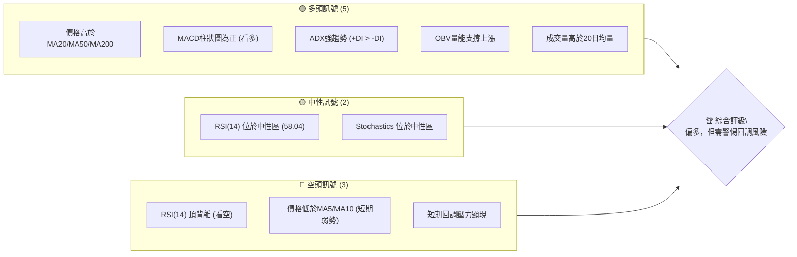

<details>
<summary>📊 靜態圖表 (點擊展開)</summary>

</details>

<html>
<head><meta charset="utf-8" /></head>
<body>
    <div style="height:500px; width:100%;">                        <script>window.PlotlyConfig = {MathJaxConfig: 'local'};</script>
        <script charset="utf-8" src="https://cdn.plot.ly/plotly-3.6.0.min.js" integrity="sha256-QaOVwtVY0T02VaHrr6pnoHLCwayMJp4O5n4YyaE3rJk=" crossorigin="anonymous"></script>                <div id="candlestick-chart" class="plotly-graph-div" style="height:100%; width:100%;"></div>            <script>                window.PLOTLYENV=window.PLOTLYENV || {};                                if (document.getElementById("candlestick-chart")) {                    Plotly.newPlot(                        "candlestick-chart",                        [{"close":{"dtype":"f8","bdata":"AAAAAAcnbUAAAAAgtOpsQAAAAKCeUG1AAAAA4CMybUAAAABgCgxtQAAAAODWPm1AAAAAoAfObUAAAABAgQtsQAAAACAn8WtAAAAAgGq2a0AAAAAAIahrQAAAACBG32xAAAAAQJyTbUAAAADAz\u002fNtQAAAAEAmXHRAAAAAoDEXc0AAAABARx5yQAAAACBkvHJAAAAAQPwDc0AAAABgzbByQAAAACDDZHJAAAAA4OQjc0AAAADASll0QAAAAED3dXNAAAAAALggc0AAAADAyBByQAAAAMDZk3FAAAAAAL2IcUAAAADgm3BxQAAAAID063FAAAAAwE3ocUAAAAAgZb5xQAAAAIDpFHJAAAAAgDugcUAAAABA7OVxQAAAAABXcnJAAAAAILsyckAAAACADyJzQAAAAODHknJAAAAAwD\u002fcckAAAACgaXFzQAAAACB+GHJAAAAAAMs3cUAAAAAAgxdxQAAAAEDq73BAAAAAQMBlcUAAAACAl5lxQAAAAKDmenFAAAAAINZxcUAAAACg5RlxQAAAAKBF6m9AAAAAwBhQcEAAAAAAZwRwQAAAAKDv1G5AAAAAYP8Yb0AAAABA80luQAAAAKCOuW1AAAAAoH3rbUAAAABApVZtQAAAAOBQM2xAAAAAgLcHa0AAAAAgpa9rQAAAAKCMUGtAAAAAAJZka0AAAACg4QRsQAAAAODmLGpAAAAAIHmxaEAAAADg0OFoQAAAAIBzemhAAAAAYKl2aUAAAAAA7hZpQAAAAKDO9mhAAAAAYOX7aEAAAACAws5pQAAAAKCroGpAAAAA4AgIa0AAAAAgLWZrQAAAAMCphWtAAAAAwLu0a0AAAADgVbRoQAAAAEDpmWdAAAAAQEz5ZkAAAADg7W9nQAAAAEDXK2ZAAAAAIMZdZkAAAAAghdlnQAAAAEBjpWhAAAAAoLNEaEAAAADgFIloQAAAAOD7mGhAAAAAYPlFaEAAAAAgLYBoQAAAAIAGN2hAAAAAIHhQaEAAAAAgPe1nQAAAAOAhEmhAAAAAoDD1Z0AAAADAu49nQAAAAMCHumhAAAAAwPZ+aUAAAAAAwDJpQAAAAAD1HWhAAAAAQA6mZ0AAAAAAmc1nQAAAAMBmaWZAAAAAYMuoZUAAAABA6jFmQAAAAKBjEWZAAAAA4MK5ZkAAAAAAUsllQAAAAMBahmVAAAAAIH8NZUAAAADgOoBkQAAAAOAX8GNAAAAAwDZEY0AAAADAGkViQAAAAOAoAGFAAAAAgFXKYUAAAACgcIFjQAAAACCs6mNAAAAA4J2TY0AAAACg7n1jQAAAAACl8mNAAAAAQOQtY0AAAAAADHRjQAAAAGDYf2NAAAAAYBFyYkAAAACALpphQAAAACA0NGJAAAAAQAJsYkAAAADgLbliQAAAACCbHGJAAAAAoGCXYkAAAABguY9iQAAAAKDe+mJAAAAAQApIY0AAAABArw1jQAAAAEAK4WJAAAAAICmcYkAAAAAgrFFkQAAAAOBk02NAAAAAoD5SY0AAAABAq21jQAAAAADaRGNAAAAAQMULY0AAAADAUV9jQAAAAOAWpWJAAAAAwLA5Y0AAAACAf1JiQAAAAKBgMGJAAAAAwAPKYUAAAADAkGVhQAAAAEAkSmFAAAAAwCJTYkAAAABgLxdiQAAAAIDbO2JAAAAAABIhYkAAAACgftVhQAAAAMAe5WFAAAAAIIU7YUAAAABA4UJhQAAAAADXc2NAAAAAAABgZEAAAACA6zllQAAAAEDhSmZAAAAAgOvhZUAAAABgjzJmQAAAAKBwpWZAAAAAAABwZ0AAAADA9QhmQAAAAMD1qGVAAAAAYLieZUAAAABguL5kQAAAAGCPemRAAAAA4HosZEAAAABgj3plQAAAAKBHiWZAAAAAQDMrZ0AAAADA9UBoQAAAAEDhUmhAAAAAYGZ+aEAAAABA4TpoQAAAAGCPWmdAAAAA4FG4Z0AAAAAghXNoQAAAAGBmHmhAAAAAIIVTZ0AAAABguK5mQAAAAMAehWdAAAAA4KO4Z0AAAABgjwJoQAAAAIDrIWhAAAAAYLjeZ0AAAABgZnZpQAAAAMD1OGxAAAAAwMwEb0AAAABgj5JuQAAAAGCPymxAAAAAQOGKbUAAAACAwrVqQA=="},"high":{"dtype":"f8","bdata":"bifV5w9BbUBSzhz6VEJtQIFFkwI\u002flG1A\u002foqHsRKlbUDxDimTw2FtQMWh3\u002fGyVW1AlQZE9McBbkD4elIPW4ttQP9dKkHq9WtAJIAGvDMEbEByA7fwObprQNY0m8QOGW1AiW\u002fFCrQQbkDtgDgBrTJuQMr1pA82cHVAufMTComGdEBTJzvA8BhzQDXbra4ECnNAmJpd1W\u002fXc0A\u002fa23f5CNzQCLj5HkP13JAYGNObslKc0AD\u002f7UUuW50QKh0eWhJJ3RAkkHDZmBgc0DcLsoqk4ZyQMkCJ50rO3JAUeVg3Nq7cUBytiVdbJxxQPynexKD+3FAgdzYfJFKckAsbLWIVEVyQP2mR+S2ZXJAd2Jyo8kuckBYdJOf9RNyQPxZOK4bsnJAdwJy33Idc0CXQj901kxzQFSaIaj46HJAd2UxX8RRc0BjfwHWHgl0QDpAbci+5nJACxsbC5P3cUBGmuCJaGlxQKAsO4wcOHFASU7aUu+VcUCpE+WO+dZxQE3Zwif003FA71fry3a7cUAKPsVEZn5xQIaKH1fMwXBA8hTi8fuCcEDbWVJ+9n9wQJlUpgERt29AC1KcDXhbb0BT65lxj\u002fFuQM3H8XXQ3W1Aqni9p1u3bkC8sK\u002fU\u002fX9tQF3yReqia21A8gIS\u002fRz5a0DWbkBbOTVsQBpYSwYOrmtAljuxo63Ka0ApxWKJNVhsQLvZOxZEEm1Akkbu7DThaUC1JciAZ1JpQPpoEGslxmhA\u002fcQF1PQWakCk35tcVSNpQBnrmwk6SGlAXsXaNGoNakBV5Ex+zdRpQOfVn\u002fYEw2pAobcUbxlFa0ClsELbEuxrQKWMmXZUqGtAwaCdyzP+a0CqnTekMxhpQDw96vqHlGhAwKU3PBt6Z0BOBe81gZRnQIK6cpmMK2dAR43bljX0ZkAtxD9EtD1oQKN6Xdy+smhAtbjXr9t\u002faECHhiz5NKJoQFCeXKut5GhAosD2pIWpaECvq8U1Y6VoQOvEyIvbf2hATZ205hCsaEChU8gPqQ5pQDjDC1YSNmhAWx8WZzJPaECB2Y1UFLlnQCFtygt372hANuHjwTC8aUAY3oLmdOJpQBOmb0lMH2lApoflwJlKaEDhd9iCeOZnQDOywVc7UWdAnsqjBhZ\u002fZkDf7c4LDnFmQJMAmqHKYGZAKoYeDEgVZ0AQ6WgSBmNmQPKRTHCGoWZAmFY9l2Y0ZUD8vRkU\u002fQllQLdrcSBVU2VAgwzq1WjaY0C2IHZX7yxjQBywkUNHQWJAvVF8inPWYUAHGENHNeZjQOOCZk8PmmRAWbTIjORiZECUiKIikc9jQGG2GiqGN2RA733hWTjXY0Cq5S\u002fIFJhjQNsgVDG78GNAHE4Kn4cuY0CqPWCbXCliQGunmnL5R2JAbKckcuMXY0ACvxDvA\u002f9iQEC8mFxKMmJAAozuBLe0YkAqKglC88xiQOtpG2VpImNAqJ3XT32sY0BZx4y\u002fWdRjQEdraTQS72JAd2voGlAzY0Dwtg2oMGVlQONeYk7e52RAfggx\u002f7sGZEDrfJ0lAMZjQP4nG4W9y2NAgHDQusdNY0BnM3yV9otjQNESkpbuFmNAwzNrMZxnY0DKD0nWqCtjQPFlFhYxqmJAXl6wJbo+YkAnO9eeTKZhQEZVrJKslmFAnLZUG2JcYkApfXz6IaRiQBclFUrFPWJA6SHILQ6BYkCd2mOVIwJiQGJlsPvZ3WJAAAAAoJnZYUAAAACgcIVhQAAAAMAefWNAAAAAwMwsZUAAAACA65FlQAAAAOCjiGZAAAAAAAAQZ0AAAADgUThmQAAAAEDhKmdAAAAAgMKlZ0AAAADgerxmQAAAAGC4lmZAAAAAoJmxZUAAAABgZhZlQAAAAOBRmGRAAAAAgMKlZEAAAACgmcllQAAAAAAA8GZAAAAA4KNQZ0AAAACgR0loQAAAAMDMBGlAAAAAAADAaEAAAACAwnVoQAAAAKBwHWhAAAAAgD3yZ0AAAABguBZpQAAAAIDCjWhAAAAA4FHYZ0AAAABACpdnQAAAAEAKh2dAAAAAgD0aaEAAAAAAAKBoQAAAAGBmZmhAAAAA4HoEaEAAAAAAAKBpQAAAAKBHSWxAAAAAAABIb0AAAAAAACBvQAAAAOBREG5AAAAAYGbebUAAAACAFO5sQA=="},"hovertemplate":"\u003cb\u003e%{x|%Y-%m-%d}\u003c\u002fb\u003e\u003cbr\u003e\u958b: $%{open:.2f}\u003cbr\u003e\u9ad8: $%{high:.2f}\u003cbr\u003e\u4f4e: $%{low:.2f}\u003cbr\u003e\u6536: $%{close:.2f}\u003cextra\u003e\u003c\u002fextra\u003e","low":{"dtype":"f8","bdata":"TKs6SdBObEAZBHWyhtNsQLiVHeu6tGxA6uy3+rEtbUAaGGKVatxsQMRfZ6F222xAM2z7pe4obUC3pzQTn6trQCH3hqt2ImtADe5FKXGAa0C3v2sj6TprQKAq75LiA2xACtIS8vYubUBpl28jJxdtQLDE5Q5YWnNAMxWkS3HjckAxHiDKcxdyQBH1HAlmb3JAQAb6NnS+ckCA2iR6hUtyQPRW4chrG3JA9YpV6t9vckDg4QiWRQhzQO9OBJn1OXNAP\u002fdBGOWackBHumAHp+RxQCRXamCMjHFA3uwfhbtWcUBS2MR\u002f1htxQOde8u9EO3FAR0YNLfe8cUAnDxdBbJxxQEysyvVeCHJAyDpZGg3OcEAVumCvEpZxQK14vYoW2HFAG50IxJ8jckCeo+9svn5yQJitu54lI3JA2SuwNIKRckDUZZvLgNNyQOWVTrDn23FAYT0sSA4acUDXslXsjelwQKSs1C6wuXBA3u5LIZ\u002frcEBs5avkaohxQHb52MadYXFAjnUdoTltcUDGMt9QFdtwQFMKmeXe1m9AUIKw84vkb0BEg+T2ebVvQFAiE5oodm5ArfjqvK2wbkA+JcnngrptQP182bzJ3WxAnjrn4OdzbUAM4eSevm9sQF7AQmc8GWxAu7jQ1Pm8akCOvdQpci9qQCIRlyXKx2pA4BQZlROmakAwZCmncv9qQFhTXoN\u002fIGpAOQgwjcULaEAUBX\u002f0nyNoQNRH5yPhD2dAGcHLNycgaUC+88bl5YxoQBcINaX0b2hA5220KenYaEC8FCvp08VoQGetSoXqoWlAV6sHoxaKakC5j3jfufJqQDUAK1xMHmtAcMBv7wgIa0BZgtMv9iJnQEQBBcMCG2dAFOcef1iJZkBYUtdjn+tmQIVWNOyh\u002f2VAEQ2XTKgvZkBrbReCEl9nQCGEYVDf9GdAtpVFe4TgZ0AeY\u002fT6cCdoQFdQePAwXWhA0abaV9TuZ0CzhyQteFBoQACJsuFMMWhAM1E+LcMgaEA6JjhC+ORnQAXHvNogsWdANEpXZ3naZ0DD7LXeaiBnQFiaB1Tvg2dAjVkLz2CKaEDQ10WZxf5oQKKGHTWrxGdAbbqe\u002fWKXZ0ATRBeDLzxnQCmWdTeLV2ZAFPK+JDNAZUCTG1imV\u002fxlQPCByP7XbGVASGPTmhM9ZkB9E+GIaqJlQFK3JQ1haGVAGYBDraYeZEA8JLjUf1VkQJIL7RUu7mNA1Lsc2uHrYkBgJAp+rP1hQOTbq9Hv2GBADyfPOqZNYUAXCv7MoE9iQBnQESo9jWNAhom6ONkuY0CTa+b5A\u002f9iQF9uQgj8V2NARJv5EyILY0B5DtQ6+9piQAamLpRKZ2NA2TpPjBBcYkB4blXNcUNhQOyFO6boR2FAYHd\u002fTnhaYkAPSB4\u002fohRiQDkGvLZfs2FA5Dn\u002fNgmWYUA636gNq9FhQI4D5RuYkmJAQH+sxh6zYkD8uq4U9OJiQIzYBoRzPWJAK2381d19YkAhr5XrrABkQBKFbe7awWNAMvcpn6EzY0Bsd6eAHD9jQKsX323nHmNAw386pVjwYkBMnDbI5YtiQC5uNhPsbWJARIpNX+\u002fFYkA0L6xX2EpiQFYdfXwYA2JA28\u002fBkmfBYUCP98ZmMjphQFOwBL8lD2FAYAvn3p9rYUCZXGrXUwViQFgBc3n5eWFAL\u002fhNzy3rYUDwipuXfm5hQETmUWvizGFAAAAAAAAAYUAAAACAPdJgQAAAAEAKd2FAAAAAgOsxZEAAAABguMZkQAAAAKCZuWVAAAAAIIWrZUAAAADgUbBlQAAAAOBRAGZAAAAAoJnZZkAAAABgj8JlQAAAAKCZGWVAAAAAwMz8ZEAAAACgmUFkQAAAAMDMFGRAAAAAYI8KZEAAAADAzMRkQAAAAOBRyGVAAAAAAABgZkAAAACgcNVmQAAAAKCZ2WdAAAAAYLjGZ0AAAABAM9NnQAAAAADXm2ZAAAAAgOshZ0AAAABgZi5nQAAAAMDMnGdAAAAA4KPoZkAAAACAwp1mQAAAAKCZWWZAAAAAYGZmZ0AAAABAM+NnQAAAAIDr0WdAAAAAoHB9Z0AAAAAAKSxoQAAAAOBRAGpAAAAAQDMTbEAAAABA4dptQAAAACCFc2xAAAAAAAAAbEAAAABgZi5qQA=="},"name":"\u50f9\u683c","open":{"dtype":"f8","bdata":"itRwuJbLbEBWSykONudsQMRhzEhHB21A+KUm8rtvbUC+laJUHyVtQB1h1FMfJW1AVZbKVUQ2bUCu3EYP\u002fXdtQCosnShhiGtAJIAGvDMEbEC6YpYjYYhrQCMy4ShW12xAxQZRkGDAbUBP1XkS98FtQLr3V\u002f0Ny3NAZ1+M1A58dECpEmRpVfZyQFNxMqjPAHNAoaZU\u002fZ15c0AeK+HafhRzQBvQd52tynJAXUULSouKckBaYofNSjNzQCMYRXppF3RAVH3ZVrFWc0ACACqlVE9yQEVQ565LK3JAj2P3nfKlcUBqYyKOgJdxQKeSAK\u002ffSXFA\u002fbRDxj4YckBnaipKUvVxQLRTNQp0IXJAd2Jyo8kuckCQn3IR97JxQOon7fdOHHJAph34vyKnckDDSpuoAo5yQAVu5kt023JAx3ZXmprwckAbF35gvPtyQOGFsCpR3nJAlsk8jPbycUDaLVETlUZxQBbemJZDEnFAlm74fq\u002f0cEDoPGt0x8JxQBGKkqkdzXFAvmaENliUcUDRanvl2ntxQGcswtuTsXBASpFxzcwecEBb4wCA63lwQOkiKZCADm9AMbkXtarMbkDX1pn7ns1uQPeLOcJJsW1AAY4pc1SObkCWYEifMFltQH6NyAppaW1AowqM3rTza0CLNVapWjFqQP63VG4SHGtAdbbfZXbcakBZ2AMYGzdrQFPqxe7wt2xA3umRVxa6aUBx3gdeC3VoQDxW1bmgHGhAatdk2A0HakC64UuVU8loQDyV4iPQ6GhAdeO63GJ8aUAkguYAaONoQADMChjl0mlAFjh+czI1a0Bnosg48H9rQHsnAM30VWtAF2Z7CkCOa0AZ9\u002fpola5nQKTyBMh1ZWhADAVSonpkZ0BlPiIiTfJmQAOSgbUXxmZAZh2KCFSzZkCZxKbfqGdnQB+Ejs3Fc2hAmzuVVl5naECgQ9tV4zloQJuffb81m2hAtACbKiwfaEBcfjHKmVtoQOgBr9IMZ2hATgqI8HGIaED7zlxtHaRoQLuvcupI7GdA6y5H6m1DaED\u002fERF12rZnQCI69DbG32dAThWSXDGdaEBBV7IbK4lpQBOmb0lMH2lApoflwJlKaECYSa4k+KdnQDOywVc7UWdAKdzTgb9hZkBHAB7S3FdmQG3rclGdgGVAcnti2kBPZkDE\u002fehuH1JmQFu2\u002f031yWVAD80rf9kxZUCN4GLEtfJkQBT5K1xnSmVAukzPpLG2Y0AfZnAkVytjQONwi\u002fn7ImJA\u002f\u002fK9h29oYUCtw4BxJH9iQH+CGh0u7mNAWbTIjORiZECvLYGoK6xjQBESHoBD1mNAwmi2ysOtY0D6Mg5O7DtjQPJJjreSlGNA9YhZy4YYY0Brr0We2iViQJCnKZ0xi2FA3\u002fot6oGUYkBe1ZVWtYhiQBTsdLYi7GFAlx1rKxGkYUAr\u002fnj14AdiQG800smcr2JAbizymeIBY0B7QAWkaAxjQH4tKqWdxWJAIXFlDrsiY0DLPPcsoblkQCbT8Q\u002fIgmRA3ludyeLPY0DE2hzviXBjQLH1uJ3EXGNAPH1z\u002frYbY0DlgMaE9r1iQFhlWOqNEGNAtNUSYZPcYkCrxke\u002f9Q5jQKjPclq9lmJAkkMVVXTsYUBK6TlKEI5hQFHtbeWucWFAV7tcavl5YUDC2eZxRpJiQN1rKOQOyWFAHO67s6hdYkAqXaFb8uhhQK2nkU7cuGJAAAAAYGbGYUAAAACAPSphQAAAAOCjeGFAAAAAgML9ZEAAAADgetxkQAAAAKBwDWZAAAAAgMLdZkAAAACA6xlmQAAAAEAzS2ZAAAAAgMJFZ0AAAADAzIxmQAAAAOBRkGZAAAAAYI+SZUAAAADAHkVkQAAAAKBHgWRAAAAA4KNAZEAAAACgcM1kQAAAAOCjAGZAAAAAACnEZkAAAABgZkZnQAAAACCF02hAAAAAYI8SaEAAAADAzARoQAAAAKBwHWhAAAAAwPWgZ0AAAACAwoVnQAAAACCuz2dAAAAAAADAZ0AAAAAAAEBnQAAAAIAUfmZAAAAA4FGgZ0AAAACgcPVnQAAAAKCZKWhAAAAAIFzvZ0AAAACgR0FoQAAAAAAAIGpAAAAAAADQbEAAAACgmVluQAAAACBcD25AAAAAAABgbEAAAAAgrq9sQA=="},"x":["2025-08-20T00:00:00-04:00","2025-08-21T00:00:00-04:00","2025-08-22T00:00:00-04:00","2025-08-25T00:00:00-04:00","2025-08-26T00:00:00-04:00","2025-08-27T00:00:00-04:00","2025-08-28T00:00:00-04:00","2025-08-29T00:00:00-04:00","2025-09-02T00:00:00-04:00","2025-09-03T00:00:00-04:00","2025-09-04T00:00:00-04:00","2025-09-05T00:00:00-04:00","2025-09-08T00:00:00-04:00","2025-09-09T00:00:00-04:00","2025-09-10T00:00:00-04:00","2025-09-11T00:00:00-04:00","2025-09-12T00:00:00-04:00","2025-09-15T00:00:00-04:00","2025-09-16T00:00:00-04:00","2025-09-17T00:00:00-04:00","2025-09-18T00:00:00-04:00","2025-09-19T00:00:00-04:00","2025-09-22T00:00:00-04:00","2025-09-23T00:00:00-04:00","2025-09-24T00:00:00-04:00","2025-09-25T00:00:00-04:00","2025-09-26T00:00:00-04:00","2025-09-29T00:00:00-04:00","2025-09-30T00:00:00-04:00","2025-10-01T00:00:00-04:00","2025-10-02T00:00:00-04:00","2025-10-03T00:00:00-04:00","2025-10-06T00:00:00-04:00","2025-10-07T00:00:00-04:00","2025-10-08T00:00:00-04:00","2025-10-09T00:00:00-04:00","2025-10-10T00:00:00-04:00","2025-10-13T00:00:00-04:00","2025-10-14T00:00:00-04:00","2025-10-15T00:00:00-04:00","2025-10-16T00:00:00-04:00","2025-10-17T00:00:00-04:00","2025-10-20T00:00:00-04:00","2025-10-21T00:00:00-04:00","2025-10-22T00:00:00-04:00","2025-10-23T00:00:00-04:00","2025-10-24T00:00:00-04:00","2025-10-27T00:00:00-04:00","2025-10-28T00:00:00-04:00","2025-10-29T00:00:00-04:00","2025-10-30T00:00:00-04:00","2025-10-31T00:00:00-04:00","2025-11-03T00:00:00-05:00","2025-11-04T00:00:00-05:00","2025-11-05T00:00:00-05:00","2025-11-06T00:00:00-05:00","2025-11-07T00:00:00-05:00","2025-11-10T00:00:00-05:00","2025-11-11T00:00:00-05:00","2025-11-12T00:00:00-05:00","2025-11-13T00:00:00-05:00","2025-11-14T00:00:00-05:00","2025-11-17T00:00:00-05:00","2025-11-18T00:00:00-05:00","2025-11-19T00:00:00-05:00","2025-11-20T00:00:00-05:00","2025-11-21T00:00:00-05:00","2025-11-24T00:00:00-05:00","2025-11-25T00:00:00-05:00","2025-11-26T00:00:00-05:00","2025-11-28T00:00:00-05:00","2025-12-01T00:00:00-05:00","2025-12-02T00:00:00-05:00","2025-12-03T00:00:00-05:00","2025-12-04T00:00:00-05:00","2025-12-05T00:00:00-05:00","2025-12-08T00:00:00-05:00","2025-12-09T00:00:00-05:00","2025-12-10T00:00:00-05:00","2025-12-11T00:00:00-05:00","2025-12-12T00:00:00-05:00","2025-12-15T00:00:00-05:00","2025-12-16T00:00:00-05:00","2025-12-17T00:00:00-05:00","2025-12-18T00:00:00-05:00","2025-12-19T00:00:00-05:00","2025-12-22T00:00:00-05:00","2025-12-23T00:00:00-05:00","2025-12-24T00:00:00-05:00","2025-12-26T00:00:00-05:00","2025-12-29T00:00:00-05:00","2025-12-30T00:00:00-05:00","2025-12-31T00:00:00-05:00","2026-01-02T00:00:00-05:00","2026-01-05T00:00:00-05:00","2026-01-06T00:00:00-05:00","2026-01-07T00:00:00-05:00","2026-01-08T00:00:00-05:00","2026-01-09T00:00:00-05:00","2026-01-12T00:00:00-05:00","2026-01-13T00:00:00-05:00","2026-01-14T00:00:00-05:00","2026-01-15T00:00:00-05:00","2026-01-16T00:00:00-05:00","2026-01-20T00:00:00-05:00","2026-01-21T00:00:00-05:00","2026-01-22T00:00:00-05:00","2026-01-23T00:00:00-05:00","2026-01-26T00:00:00-05:00","2026-01-27T00:00:00-05:00","2026-01-28T00:00:00-05:00","2026-01-29T00:00:00-05:00","2026-01-30T00:00:00-05:00","2026-02-02T00:00:00-05:00","2026-02-03T00:00:00-05:00","2026-02-04T00:00:00-05:00","2026-02-05T00:00:00-05:00","2026-02-06T00:00:00-05:00","2026-02-09T00:00:00-05:00","2026-02-10T00:00:00-05:00","2026-02-11T00:00:00-05:00","2026-02-12T00:00:00-05:00","2026-02-13T00:00:00-05:00","2026-02-17T00:00:00-05:00","2026-02-18T00:00:00-05:00","2026-02-19T00:00:00-05:00","2026-02-20T00:00:00-05:00","2026-02-23T00:00:00-05:00","2026-02-24T00:00:00-05:00","2026-02-25T00:00:00-05:00","2026-02-26T00:00:00-05:00","2026-02-27T00:00:00-05:00","2026-03-02T00:00:00-05:00","2026-03-03T00:00:00-05:00","2026-03-04T00:00:00-05:00","2026-03-05T00:00:00-05:00","2026-03-06T00:00:00-05:00","2026-03-09T00:00:00-04:00","2026-03-10T00:00:00-04:00","2026-03-11T00:00:00-04:00","2026-03-12T00:00:00-04:00","2026-03-13T00:00:00-04:00","2026-03-16T00:00:00-04:00","2026-03-17T00:00:00-04:00","2026-03-18T00:00:00-04:00","2026-03-19T00:00:00-04:00","2026-03-20T00:00:00-04:00","2026-03-23T00:00:00-04:00","2026-03-24T00:00:00-04:00","2026-03-25T00:00:00-04:00","2026-03-26T00:00:00-04:00","2026-03-27T00:00:00-04:00","2026-03-30T00:00:00-04:00","2026-03-31T00:00:00-04:00","2026-04-01T00:00:00-04:00","2026-04-02T00:00:00-04:00","2026-04-06T00:00:00-04:00","2026-04-07T00:00:00-04:00","2026-04-08T00:00:00-04:00","2026-04-09T00:00:00-04:00","2026-04-10T00:00:00-04:00","2026-04-13T00:00:00-04:00","2026-04-14T00:00:00-04:00","2026-04-15T00:00:00-04:00","2026-04-16T00:00:00-04:00","2026-04-17T00:00:00-04:00","2026-04-20T00:00:00-04:00","2026-04-21T00:00:00-04:00","2026-04-22T00:00:00-04:00","2026-04-23T00:00:00-04:00","2026-04-24T00:00:00-04:00","2026-04-27T00:00:00-04:00","2026-04-28T00:00:00-04:00","2026-04-29T00:00:00-04:00","2026-04-30T00:00:00-04:00","2026-05-01T00:00:00-04:00","2026-05-04T00:00:00-04:00","2026-05-05T00:00:00-04:00","2026-05-06T00:00:00-04:00","2026-05-07T00:00:00-04:00","2026-05-08T00:00:00-04:00","2026-05-11T00:00:00-04:00","2026-05-12T00:00:00-04:00","2026-05-13T00:00:00-04:00","2026-05-14T00:00:00-04:00","2026-05-15T00:00:00-04:00","2026-05-18T00:00:00-04:00","2026-05-19T00:00:00-04:00","2026-05-20T00:00:00-04:00","2026-05-21T00:00:00-04:00","2026-05-22T00:00:00-04:00","2026-05-26T00:00:00-04:00","2026-05-27T00:00:00-04:00","2026-05-28T00:00:00-04:00","2026-05-29T00:00:00-04:00","2026-06-01T00:00:00-04:00","2026-06-02T00:00:00-04:00","2026-06-03T00:00:00-04:00","2026-06-04T00:00:00-04:00","2026-06-05T00:00:00-04:00"],"type":"candlestick"},{"hovertemplate":"MA30: $%{y:.2f}\u003cextra\u003e\u003c\u002fextra\u003e","line":{"color":"#2196F3","dash":"dash","width":2},"mode":"lines","name":"MA30","x":["2025-08-20T00:00:00-04:00","2025-08-21T00:00:00-04:00","2025-08-22T00:00:00-04:00","2025-08-25T00:00:00-04:00","2025-08-26T00:00:00-04:00","2025-08-27T00:00:00-04:00","2025-08-28T00:00:00-04:00","2025-08-29T00:00:00-04:00","2025-09-02T00:00:00-04:00","2025-09-03T00:00:00-04:00","2025-09-04T00:00:00-04:00","2025-09-05T00:00:00-04:00","2025-09-08T00:00:00-04:00","2025-09-09T00:00:00-04:00","2025-09-10T00:00:00-04:00","2025-09-11T00:00:00-04:00","2025-09-12T00:00:00-04:00","2025-09-15T00:00:00-04:00","2025-09-16T00:00:00-04:00","2025-09-17T00:00:00-04:00","2025-09-18T00:00:00-04:00","2025-09-19T00:00:00-04:00","2025-09-22T00:00:00-04:00","2025-09-23T00:00:00-04:00","2025-09-24T00:00:00-04:00","2025-09-25T00:00:00-04:00","2025-09-26T00:00:00-04:00","2025-09-29T00:00:00-04:00","2025-09-30T00:00:00-04:00","2025-10-01T00:00:00-04:00","2025-10-02T00:00:00-04:00","2025-10-03T00:00:00-04:00","2025-10-06T00:00:00-04:00","2025-10-07T00:00:00-04:00","2025-10-08T00:00:00-04:00","2025-10-09T00:00:00-04:00","2025-10-10T00:00:00-04:00","2025-10-13T00:00:00-04:00","2025-10-14T00:00:00-04:00","2025-10-15T00:00:00-04:00","2025-10-16T00:00:00-04:00","2025-10-17T00:00:00-04:00","2025-10-20T00:00:00-04:00","2025-10-21T00:00:00-04:00","2025-10-22T00:00:00-04:00","2025-10-23T00:00:00-04:00","2025-10-24T00:00:00-04:00","2025-10-27T00:00:00-04:00","2025-10-28T00:00:00-04:00","2025-10-29T00:00:00-04:00","2025-10-30T00:00:00-04:00","2025-10-31T00:00:00-04:00","2025-11-03T00:00:00-05:00","2025-11-04T00:00:00-05:00","2025-11-05T00:00:00-05:00","2025-11-06T00:00:00-05:00","2025-11-07T00:00:00-05:00","2025-11-10T00:00:00-05:00","2025-11-11T00:00:00-05:00","2025-11-12T00:00:00-05:00","2025-11-13T00:00:00-05:00","2025-11-14T00:00:00-05:00","2025-11-17T00:00:00-05:00","2025-11-18T00:00:00-05:00","2025-11-19T00:00:00-05:00","2025-11-20T00:00:00-05:00","2025-11-21T00:00:00-05:00","2025-11-24T00:00:00-05:00","2025-11-25T00:00:00-05:00","2025-11-26T00:00:00-05:00","2025-11-28T00:00:00-05:00","2025-12-01T00:00:00-05:00","2025-12-02T00:00:00-05:00","2025-12-03T00:00:00-05:00","2025-12-04T00:00:00-05:00","2025-12-05T00:00:00-05:00","2025-12-08T00:00:00-05:00","2025-12-09T00:00:00-05:00","2025-12-10T00:00:00-05:00","2025-12-11T00:00:00-05:00","2025-12-12T00:00:00-05:00","2025-12-15T00:00:00-05:00","2025-12-16T00:00:00-05:00","2025-12-17T00:00:00-05:00","2025-12-18T00:00:00-05:00","2025-12-19T00:00:00-05:00","2025-12-22T00:00:00-05:00","2025-12-23T00:00:00-05:00","2025-12-24T00:00:00-05:00","2025-12-26T00:00:00-05:00","2025-12-29T00:00:00-05:00","2025-12-30T00:00:00-05:00","2025-12-31T00:00:00-05:00","2026-01-02T00:00:00-05:00","2026-01-05T00:00:00-05:00","2026-01-06T00:00:00-05:00","2026-01-07T00:00:00-05:00","2026-01-08T00:00:00-05:00","2026-01-09T00:00:00-05:00","2026-01-12T00:00:00-05:00","2026-01-13T00:00:00-05:00","2026-01-14T00:00:00-05:00","2026-01-15T00:00:00-05:00","2026-01-16T00:00:00-05:00","2026-01-20T00:00:00-05:00","2026-01-21T00:00:00-05:00","2026-01-22T00:00:00-05:00","2026-01-23T00:00:00-05:00","2026-01-26T00:00:00-05:00","2026-01-27T00:00:00-05:00","2026-01-28T00:00:00-05:00","2026-01-29T00:00:00-05:00","2026-01-30T00:00:00-05:00","2026-02-02T00:00:00-05:00","2026-02-03T00:00:00-05:00","2026-02-04T00:00:00-05:00","2026-02-05T00:00:00-05:00","2026-02-06T00:00:00-05:00","2026-02-09T00:00:00-05:00","2026-02-10T00:00:00-05:00","2026-02-11T00:00:00-05:00","2026-02-12T00:00:00-05:00","2026-02-13T00:00:00-05:00","2026-02-17T00:00:00-05:00","2026-02-18T00:00:00-05:00","2026-02-19T00:00:00-05:00","2026-02-20T00:00:00-05:00","2026-02-23T00:00:00-05:00","2026-02-24T00:00:00-05:00","2026-02-25T00:00:00-05:00","2026-02-26T00:00:00-05:00","2026-02-27T00:00:00-05:00","2026-03-02T00:00:00-05:00","2026-03-03T00:00:00-05:00","2026-03-04T00:00:00-05:00","2026-03-05T00:00:00-05:00","2026-03-06T00:00:00-05:00","2026-03-09T00:00:00-04:00","2026-03-10T00:00:00-04:00","2026-03-11T00:00:00-04:00","2026-03-12T00:00:00-04:00","2026-03-13T00:00:00-04:00","2026-03-16T00:00:00-04:00","2026-03-17T00:00:00-04:00","2026-03-18T00:00:00-04:00","2026-03-19T00:00:00-04:00","2026-03-20T00:00:00-04:00","2026-03-23T00:00:00-04:00","2026-03-24T00:00:00-04:00","2026-03-25T00:00:00-04:00","2026-03-26T00:00:00-04:00","2026-03-27T00:00:00-04:00","2026-03-30T00:00:00-04:00","2026-03-31T00:00:00-04:00","2026-04-01T00:00:00-04:00","2026-04-02T00:00:00-04:00","2026-04-06T00:00:00-04:00","2026-04-07T00:00:00-04:00","2026-04-08T00:00:00-04:00","2026-04-09T00:00:00-04:00","2026-04-10T00:00:00-04:00","2026-04-13T00:00:00-04:00","2026-04-14T00:00:00-04:00","2026-04-15T00:00:00-04:00","2026-04-16T00:00:00-04:00","2026-04-17T00:00:00-04:00","2026-04-20T00:00:00-04:00","2026-04-21T00:00:00-04:00","2026-04-22T00:00:00-04:00","2026-04-23T00:00:00-04:00","2026-04-24T00:00:00-04:00","2026-04-27T00:00:00-04:00","2026-04-28T00:00:00-04:00","2026-04-29T00:00:00-04:00","2026-04-30T00:00:00-04:00","2026-05-01T00:00:00-04:00","2026-05-04T00:00:00-04:00","2026-05-05T00:00:00-04:00","2026-05-06T00:00:00-04:00","2026-05-07T00:00:00-04:00","2026-05-08T00:00:00-04:00","2026-05-11T00:00:00-04:00","2026-05-12T00:00:00-04:00","2026-05-13T00:00:00-04:00","2026-05-14T00:00:00-04:00","2026-05-15T00:00:00-04:00","2026-05-18T00:00:00-04:00","2026-05-19T00:00:00-04:00","2026-05-20T00:00:00-04:00","2026-05-21T00:00:00-04:00","2026-05-22T00:00:00-04:00","2026-05-26T00:00:00-04:00","2026-05-27T00:00:00-04:00","2026-05-28T00:00:00-04:00","2026-05-29T00:00:00-04:00","2026-06-01T00:00:00-04:00","2026-06-02T00:00:00-04:00","2026-06-03T00:00:00-04:00","2026-06-04T00:00:00-04:00","2026-06-05T00:00:00-04:00"],"y":{"dtype":"f8","bdata":"AAAAAAAA+H8AAAAAAAD4fwAAAAAAAPh\u002fAAAAAAAA+H8AAAAAAAD4fwAAAAAAAPh\u002fAAAAAAAA+H8AAAAAAAD4fwAAAAAAAPh\u002fAAAAAAAA+H8AAAAAAAD4fwAAAAAAAPh\u002fAAAAAAAA+H8AAAAAAAD4fwAAAAAAAPh\u002fAAAAAAAA+H8AAAAAAAD4fwAAAAAAAPh\u002fAAAAAAAA+H8AAAAAAAD4fwAAAAAAAPh\u002fAAAAAAAA+H8AAAAAAAD4fwAAAAAAAPh\u002fAAAAAAAA+H8AAAAAAAD4fwAAAAAAAPh\u002fAAAAAAAA+H8AAAAAAAD4f2ZmZuY7tXBAq6qqCqnRcECamZnxse1wQImIiEjqCnFAiYiIAMEkcUCJiIj4jEFxQERERGwuYnFAIiIiIk5+cUDNzMxc6qlxQHd3d18w0XFARERE7OP7cUAzMzNLzStyQLy7u8sHS3JAzczMbMNfckAREREh0XFyQN7d3e2bVHJAd3d3NylGckBVVVX1vEFyQDMzM5MFN3JAd3d3550pckBVVVWlDRxyQBEREQlEB3JAmpmZoSPvcUAzMzMbLcpxQLy7u9uop3FAq6qqch6JcUDNzMwkMXBxQM3MzNwFWXFAzczMdA5DcUCamZnhaStxQO\u002fu7r7NCnFAq6qqelLlcEC8u7tTCcRwQHd3dydInnBAMzMzI8B8cEAzMzNbkVtwQCIiIpLWLXBA7+7uXs\u002f3b0ARERGRmYVvQGZmZgZ\u002fGW9AIiIi0uawbkCrqqr6KztuQImIiKhd221AMzMzo7WKbUC8u7vrO0NtQJqZmTllBW1AERERgSXDbEAAAABglIBsQJqZmbkbQWxAERERcc8DbEDv7u7+wrJrQLy7u\u002fvQa2tAIiIiAnQZa0BEREQ0F9BqQN7d3f0vhmpAVVVVFa47akCrqqp6uwRqQDMzM7Nk2WlARERExCqpaUDNzMx8LoBpQLy7u+tvYWlAVVVVlelJaUCrqqrqui5pQDMzM4NHFGlAAAAAQAL6aEDe3d1dFtdoQN7d3d0gxWhA7+7uLtq+aEBmZmY2lbNoQFVVVQW4tWhA3t3d3f61aEBERERE7LZoQAAAANCxr2hAZmZmxkykaECrqqrKMZNoQHd3dwc4b2hAVVVVpWBBaEBEREQE+BRoQFVVVSVt5mdAIiIiYu27Z0CrqqraBqNnQHd3d+dOkWdAMzMzM+qAZ0AzMzOz22dnQJqZmcnMVGdAMzMzE1k6Z0De3d3tuwpnQAAAAEB+yWZAiYiI2DaSZkCJiIj4SmdmQBEREWFZP2ZAMzMzQ0UXZkAiIiJyh+xlQLy7u8sdyGVAEREREUycZUAzMzPDH3ZlQAAAAFAdT2VAzczMvBMgZUAiIiKyOe1kQN7d3T2MtWRAIiIiwi55ZEB3d3cn7kFkQM3MzGyvDmRAERERgYfjY0CamZnZzLZjQLy7uwuEmWNAd3d3VzmFY0AzMzOTampjQFVVVWU0T2NAvLu7qxUsY0BEREQkkB9jQKuqqnoQEWNAAAAAEEoCY0BEREQkI\u002fliQBEREeFt82JAq6qqOozxYkBmZmZ29PpiQFVVVWX8CGNAvLu7KzsVY0ARERERIgtjQBEREdFj\u002fGJAIiIi8iLtYkAzMzPzQdtiQN7d3f2SxGJAZmZmRki9YkAiIiJSp7FiQAAAAKDapmJAIiIiciekYkBVVVWVIaZiQM3MzLx+o2JA7+7ubliZYkCamZlp3oxiQHd3d1dPmGJAq6qq2oenYkAiIiJCRb5iQM3MzJyJ2mJAmpmZybvwYkDv7u4OkAtjQKuqqpq1K2NA7+7ubudUY0BVVVUFjGNjQLy7u\u002fsyc2NAREREpNCGY0AAAADQDJJjQImIiKhfnGNAAAAAUP+lY0BVVVXV+LdjQImIiKgt2WNAREREJNT6Y0Dv7u6ucS1kQN7d3U3LYWRAq6qqygGbZEBmZmZGUdVkQERERJQQCWVA7+7urho3ZUDv7u7OYW1lQDMzM6OZn2VA7+7uzvLLZUCamZmZUvVlQJqZmZlSJWZA3t3dfbFcZkDNzMxcSJZmQKuqqvo3vmZAzczM7ArcZkB3d3cnMQBnQAAAAHDLMmdAERER4cGAZ0CJiIhYOchnQN7d3U2p\u002fGdAERER4cEwaEAiIiKSplhoQA=="},"type":"scatter"},{"hovertemplate":"MA60: $%{y:.2f}\u003cextra\u003e\u003c\u002fextra\u003e","line":{"color":"#9C27B0","dash":"dash","width":2},"mode":"lines","name":"MA60","x":["2025-08-20T00:00:00-04:00","2025-08-21T00:00:00-04:00","2025-08-22T00:00:00-04:00","2025-08-25T00:00:00-04:00","2025-08-26T00:00:00-04:00","2025-08-27T00:00:00-04:00","2025-08-28T00:00:00-04:00","2025-08-29T00:00:00-04:00","2025-09-02T00:00:00-04:00","2025-09-03T00:00:00-04:00","2025-09-04T00:00:00-04:00","2025-09-05T00:00:00-04:00","2025-09-08T00:00:00-04:00","2025-09-09T00:00:00-04:00","2025-09-10T00:00:00-04:00","2025-09-11T00:00:00-04:00","2025-09-12T00:00:00-04:00","2025-09-15T00:00:00-04:00","2025-09-16T00:00:00-04:00","2025-09-17T00:00:00-04:00","2025-09-18T00:00:00-04:00","2025-09-19T00:00:00-04:00","2025-09-22T00:00:00-04:00","2025-09-23T00:00:00-04:00","2025-09-24T00:00:00-04:00","2025-09-25T00:00:00-04:00","2025-09-26T00:00:00-04:00","2025-09-29T00:00:00-04:00","2025-09-30T00:00:00-04:00","2025-10-01T00:00:00-04:00","2025-10-02T00:00:00-04:00","2025-10-03T00:00:00-04:00","2025-10-06T00:00:00-04:00","2025-10-07T00:00:00-04:00","2025-10-08T00:00:00-04:00","2025-10-09T00:00:00-04:00","2025-10-10T00:00:00-04:00","2025-10-13T00:00:00-04:00","2025-10-14T00:00:00-04:00","2025-10-15T00:00:00-04:00","2025-10-16T00:00:00-04:00","2025-10-17T00:00:00-04:00","2025-10-20T00:00:00-04:00","2025-10-21T00:00:00-04:00","2025-10-22T00:00:00-04:00","2025-10-23T00:00:00-04:00","2025-10-24T00:00:00-04:00","2025-10-27T00:00:00-04:00","2025-10-28T00:00:00-04:00","2025-10-29T00:00:00-04:00","2025-10-30T00:00:00-04:00","2025-10-31T00:00:00-04:00","2025-11-03T00:00:00-05:00","2025-11-04T00:00:00-05:00","2025-11-05T00:00:00-05:00","2025-11-06T00:00:00-05:00","2025-11-07T00:00:00-05:00","2025-11-10T00:00:00-05:00","2025-11-11T00:00:00-05:00","2025-11-12T00:00:00-05:00","2025-11-13T00:00:00-05:00","2025-11-14T00:00:00-05:00","2025-11-17T00:00:00-05:00","2025-11-18T00:00:00-05:00","2025-11-19T00:00:00-05:00","2025-11-20T00:00:00-05:00","2025-11-21T00:00:00-05:00","2025-11-24T00:00:00-05:00","2025-11-25T00:00:00-05:00","2025-11-26T00:00:00-05:00","2025-11-28T00:00:00-05:00","2025-12-01T00:00:00-05:00","2025-12-02T00:00:00-05:00","2025-12-03T00:00:00-05:00","2025-12-04T00:00:00-05:00","2025-12-05T00:00:00-05:00","2025-12-08T00:00:00-05:00","2025-12-09T00:00:00-05:00","2025-12-10T00:00:00-05:00","2025-12-11T00:00:00-05:00","2025-12-12T00:00:00-05:00","2025-12-15T00:00:00-05:00","2025-12-16T00:00:00-05:00","2025-12-17T00:00:00-05:00","2025-12-18T00:00:00-05:00","2025-12-19T00:00:00-05:00","2025-12-22T00:00:00-05:00","2025-12-23T00:00:00-05:00","2025-12-24T00:00:00-05:00","2025-12-26T00:00:00-05:00","2025-12-29T00:00:00-05:00","2025-12-30T00:00:00-05:00","2025-12-31T00:00:00-05:00","2026-01-02T00:00:00-05:00","2026-01-05T00:00:00-05:00","2026-01-06T00:00:00-05:00","2026-01-07T00:00:00-05:00","2026-01-08T00:00:00-05:00","2026-01-09T00:00:00-05:00","2026-01-12T00:00:00-05:00","2026-01-13T00:00:00-05:00","2026-01-14T00:00:00-05:00","2026-01-15T00:00:00-05:00","2026-01-16T00:00:00-05:00","2026-01-20T00:00:00-05:00","2026-01-21T00:00:00-05:00","2026-01-22T00:00:00-05:00","2026-01-23T00:00:00-05:00","2026-01-26T00:00:00-05:00","2026-01-27T00:00:00-05:00","2026-01-28T00:00:00-05:00","2026-01-29T00:00:00-05:00","2026-01-30T00:00:00-05:00","2026-02-02T00:00:00-05:00","2026-02-03T00:00:00-05:00","2026-02-04T00:00:00-05:00","2026-02-05T00:00:00-05:00","2026-02-06T00:00:00-05:00","2026-02-09T00:00:00-05:00","2026-02-10T00:00:00-05:00","2026-02-11T00:00:00-05:00","2026-02-12T00:00:00-05:00","2026-02-13T00:00:00-05:00","2026-02-17T00:00:00-05:00","2026-02-18T00:00:00-05:00","2026-02-19T00:00:00-05:00","2026-02-20T00:00:00-05:00","2026-02-23T00:00:00-05:00","2026-02-24T00:00:00-05:00","2026-02-25T00:00:00-05:00","2026-02-26T00:00:00-05:00","2026-02-27T00:00:00-05:00","2026-03-02T00:00:00-05:00","2026-03-03T00:00:00-05:00","2026-03-04T00:00:00-05:00","2026-03-05T00:00:00-05:00","2026-03-06T00:00:00-05:00","2026-03-09T00:00:00-04:00","2026-03-10T00:00:00-04:00","2026-03-11T00:00:00-04:00","2026-03-12T00:00:00-04:00","2026-03-13T00:00:00-04:00","2026-03-16T00:00:00-04:00","2026-03-17T00:00:00-04:00","2026-03-18T00:00:00-04:00","2026-03-19T00:00:00-04:00","2026-03-20T00:00:00-04:00","2026-03-23T00:00:00-04:00","2026-03-24T00:00:00-04:00","2026-03-25T00:00:00-04:00","2026-03-26T00:00:00-04:00","2026-03-27T00:00:00-04:00","2026-03-30T00:00:00-04:00","2026-03-31T00:00:00-04:00","2026-04-01T00:00:00-04:00","2026-04-02T00:00:00-04:00","2026-04-06T00:00:00-04:00","2026-04-07T00:00:00-04:00","2026-04-08T00:00:00-04:00","2026-04-09T00:00:00-04:00","2026-04-10T00:00:00-04:00","2026-04-13T00:00:00-04:00","2026-04-14T00:00:00-04:00","2026-04-15T00:00:00-04:00","2026-04-16T00:00:00-04:00","2026-04-17T00:00:00-04:00","2026-04-20T00:00:00-04:00","2026-04-21T00:00:00-04:00","2026-04-22T00:00:00-04:00","2026-04-23T00:00:00-04:00","2026-04-24T00:00:00-04:00","2026-04-27T00:00:00-04:00","2026-04-28T00:00:00-04:00","2026-04-29T00:00:00-04:00","2026-04-30T00:00:00-04:00","2026-05-01T00:00:00-04:00","2026-05-04T00:00:00-04:00","2026-05-05T00:00:00-04:00","2026-05-06T00:00:00-04:00","2026-05-07T00:00:00-04:00","2026-05-08T00:00:00-04:00","2026-05-11T00:00:00-04:00","2026-05-12T00:00:00-04:00","2026-05-13T00:00:00-04:00","2026-05-14T00:00:00-04:00","2026-05-15T00:00:00-04:00","2026-05-18T00:00:00-04:00","2026-05-19T00:00:00-04:00","2026-05-20T00:00:00-04:00","2026-05-21T00:00:00-04:00","2026-05-22T00:00:00-04:00","2026-05-26T00:00:00-04:00","2026-05-27T00:00:00-04:00","2026-05-28T00:00:00-04:00","2026-05-29T00:00:00-04:00","2026-06-01T00:00:00-04:00","2026-06-02T00:00:00-04:00","2026-06-03T00:00:00-04:00","2026-06-04T00:00:00-04:00","2026-06-05T00:00:00-04:00"],"y":{"dtype":"f8","bdata":"AAAAAAAA+H8AAAAAAAD4fwAAAAAAAPh\u002fAAAAAAAA+H8AAAAAAAD4fwAAAAAAAPh\u002fAAAAAAAA+H8AAAAAAAD4fwAAAAAAAPh\u002fAAAAAAAA+H8AAAAAAAD4fwAAAAAAAPh\u002fAAAAAAAA+H8AAAAAAAD4fwAAAAAAAPh\u002fAAAAAAAA+H8AAAAAAAD4fwAAAAAAAPh\u002fAAAAAAAA+H8AAAAAAAD4fwAAAAAAAPh\u002fAAAAAAAA+H8AAAAAAAD4fwAAAAAAAPh\u002fAAAAAAAA+H8AAAAAAAD4fwAAAAAAAPh\u002fAAAAAAAA+H8AAAAAAAD4fwAAAAAAAPh\u002fAAAAAAAA+H8AAAAAAAD4fwAAAAAAAPh\u002fAAAAAAAA+H8AAAAAAAD4fwAAAAAAAPh\u002fAAAAAAAA+H8AAAAAAAD4fwAAAAAAAPh\u002fAAAAAAAA+H8AAAAAAAD4fwAAAAAAAPh\u002fAAAAAAAA+H8AAAAAAAD4fwAAAAAAAPh\u002fAAAAAAAA+H8AAAAAAAD4fwAAAAAAAPh\u002fAAAAAAAA+H8AAAAAAAD4fwAAAAAAAPh\u002fAAAAAAAA+H8AAAAAAAD4fwAAAAAAAPh\u002fAAAAAAAA+H8AAAAAAAD4fwAAAAAAAPh\u002fAAAAAAAA+H8AAAAAAAD4f6uqqtIE4HBAq6qqwn3bcECrqqqi3dhwQAAAADiZ1HBA3t3dkcDQcEDe3d0pj85wQDMzM38CyHBAzczM6Bq9cECrqqqSW7ZwQFVVVfH3rnBAq6qqqiuqcEBERESksaRwQAAAAFBbnHBAMzMzH4+ScEB3d3eLt4lwQFVVVUWna3BAAAAA\u002fN1TcECrqqqSA0FwQAAAALjJK3BAAAAA0MIVcEDNzMwkb\u002fVvQO\u002fu7oYsvW9Aq6qqot17b0BVVVW1ODJvQKuqqtrA6m5AVVVVffWmbkAiIiLijnJuQGZmZja4RW5A7+7u1qMXbkAAAAAggettQM3MzLSFu21AVVVVRUeKbUARERHJZlttQBEREelrKG1AMzMzQ8H5bEAiIiKKHMdsQBEREQFnkGxA7+7uxlRbbEC8u7tjlxxsQN7d3YWb52tAAAAA2HKza0B3d3cfDHlrQERERLyHRWtAzczMNIEXa0AzMzPbNutqQImIiKBOumpAMzMzE0OCakAiIiIyxkpqQHd3d2\u002fEE2pAmpmZad7faUDNzMzs5KppQJqZmfGPfmlAq6qqGi9NaUC8u7tz+RtpQLy7u2N+7WhARERElAO7aEBERES0u4doQJqZmXlxUWhAZmZmzrAdaECrqqq6vPNnQGZmZqZk0GdAREREbJewZ0BmZmYuoY1nQHd3d6cybmdAiYiIKCdLZ0CJiIgQmyZnQO\u002fu7hYfCmdA3t3d9XbvZkBERER0Z9BmQJqZmSGitWZAAAAA0JaXZkDe3d01bXxmQGZmZp4wX2ZAvLu7I+pDZkAiIiJS\u002fyRmQJqZmQleBGZAZmZm\u002fkzjZUC8u7tLsb9lQFVVVcXQmmVA7+7uhgF0ZUB3d3d\u002fS2FlQBEREbEvUWVAmpmZIZpBZUC8u7trfzBlQFVVVVUdJGVA7+7upvIVZUAiIiIy2AJlQKuqqlI96WRAIiIiArnTZEDNzMyENrlkQBEREZnenWRAq6qqGjSCZECrqqqy5GNkQM3MzGRYRmRAvLu7K8osZECrqqqK4xNkQAAAAPj7+mNAd3d3lx3iY0C8u7ujrcljQFVVVX2FrGNAiYiImEOJY0CJiIhIZmdjQCIiImJ\u002fU2NA3t3drYdFY0De3d0NiTpjQERERNQGOmNAiYiIkPo6Y0ARERFR\u002fTpjQAAAAAB1PWNAVVVVjX5AY0DNzMwUjkFjQDMzM7shQmNAIiIiWo1EY0AiIiL6l0VjQM3MzMTmR2NAVVVVxcVLY0De3d2ldlljQO\u002fu7gYVcWNAAAAAqAeIY0AAAADgSZxjQHd3d48Xr2NAZmZmXhLEY0DNzMycSdhjQBEREcnR5mNAq6qqejH6Y0CJiIiQhA9kQJqZmSE6I2RAiYiIIA04ZEB3d3cXuk1kQDMzM6toZGRAZmZm9gR7ZEAzMzNjk5FkQBEREalDq2RAvLu7Y8nBZEDNzMw0O99kQGZmZoaqBmVAVVVV1b44ZUC8u7uz5GllQERERHQvlGVAAAAAqNTCZUC8u7tLGd5lQA=="},"type":"scatter"},{"hovertemplate":"MA200: $%{y:.2f}\u003cextra\u003e\u003c\u002fextra\u003e","line":{"color":"#FF6F00","dash":"solid","width":2},"mode":"lines","name":"MA200","x":["2025-08-20T00:00:00-04:00","2025-08-21T00:00:00-04:00","2025-08-22T00:00:00-04:00","2025-08-25T00:00:00-04:00","2025-08-26T00:00:00-04:00","2025-08-27T00:00:00-04:00","2025-08-28T00:00:00-04:00","2025-08-29T00:00:00-04:00","2025-09-02T00:00:00-04:00","2025-09-03T00:00:00-04:00","2025-09-04T00:00:00-04:00","2025-09-05T00:00:00-04:00","2025-09-08T00:00:00-04:00","2025-09-09T00:00:00-04:00","2025-09-10T00:00:00-04:00","2025-09-11T00:00:00-04:00","2025-09-12T00:00:00-04:00","2025-09-15T00:00:00-04:00","2025-09-16T00:00:00-04:00","2025-09-17T00:00:00-04:00","2025-09-18T00:00:00-04:00","2025-09-19T00:00:00-04:00","2025-09-22T00:00:00-04:00","2025-09-23T00:00:00-04:00","2025-09-24T00:00:00-04:00","2025-09-25T00:00:00-04:00","2025-09-26T00:00:00-04:00","2025-09-29T00:00:00-04:00","2025-09-30T00:00:00-04:00","2025-10-01T00:00:00-04:00","2025-10-02T00:00:00-04:00","2025-10-03T00:00:00-04:00","2025-10-06T00:00:00-04:00","2025-10-07T00:00:00-04:00","2025-10-08T00:00:00-04:00","2025-10-09T00:00:00-04:00","2025-10-10T00:00:00-04:00","2025-10-13T00:00:00-04:00","2025-10-14T00:00:00-04:00","2025-10-15T00:00:00-04:00","2025-10-16T00:00:00-04:00","2025-10-17T00:00:00-04:00","2025-10-20T00:00:00-04:00","2025-10-21T00:00:00-04:00","2025-10-22T00:00:00-04:00","2025-10-23T00:00:00-04:00","2025-10-24T00:00:00-04:00","2025-10-27T00:00:00-04:00","2025-10-28T00:00:00-04:00","2025-10-29T00:00:00-04:00","2025-10-30T00:00:00-04:00","2025-10-31T00:00:00-04:00","2025-11-03T00:00:00-05:00","2025-11-04T00:00:00-05:00","2025-11-05T00:00:00-05:00","2025-11-06T00:00:00-05:00","2025-11-07T00:00:00-05:00","2025-11-10T00:00:00-05:00","2025-11-11T00:00:00-05:00","2025-11-12T00:00:00-05:00","2025-11-13T00:00:00-05:00","2025-11-14T00:00:00-05:00","2025-11-17T00:00:00-05:00","2025-11-18T00:00:00-05:00","2025-11-19T00:00:00-05:00","2025-11-20T00:00:00-05:00","2025-11-21T00:00:00-05:00","2025-11-24T00:00:00-05:00","2025-11-25T00:00:00-05:00","2025-11-26T00:00:00-05:00","2025-11-28T00:00:00-05:00","2025-12-01T00:00:00-05:00","2025-12-02T00:00:00-05:00","2025-12-03T00:00:00-05:00","2025-12-04T00:00:00-05:00","2025-12-05T00:00:00-05:00","2025-12-08T00:00:00-05:00","2025-12-09T00:00:00-05:00","2025-12-10T00:00:00-05:00","2025-12-11T00:00:00-05:00","2025-12-12T00:00:00-05:00","2025-12-15T00:00:00-05:00","2025-12-16T00:00:00-05:00","2025-12-17T00:00:00-05:00","2025-12-18T00:00:00-05:00","2025-12-19T00:00:00-05:00","2025-12-22T00:00:00-05:00","2025-12-23T00:00:00-05:00","2025-12-24T00:00:00-05:00","2025-12-26T00:00:00-05:00","2025-12-29T00:00:00-05:00","2025-12-30T00:00:00-05:00","2025-12-31T00:00:00-05:00","2026-01-02T00:00:00-05:00","2026-01-05T00:00:00-05:00","2026-01-06T00:00:00-05:00","2026-01-07T00:00:00-05:00","2026-01-08T00:00:00-05:00","2026-01-09T00:00:00-05:00","2026-01-12T00:00:00-05:00","2026-01-13T00:00:00-05:00","2026-01-14T00:00:00-05:00","2026-01-15T00:00:00-05:00","2026-01-16T00:00:00-05:00","2026-01-20T00:00:00-05:00","2026-01-21T00:00:00-05:00","2026-01-22T00:00:00-05:00","2026-01-23T00:00:00-05:00","2026-01-26T00:00:00-05:00","2026-01-27T00:00:00-05:00","2026-01-28T00:00:00-05:00","2026-01-29T00:00:00-05:00","2026-01-30T00:00:00-05:00","2026-02-02T00:00:00-05:00","2026-02-03T00:00:00-05:00","2026-02-04T00:00:00-05:00","2026-02-05T00:00:00-05:00","2026-02-06T00:00:00-05:00","2026-02-09T00:00:00-05:00","2026-02-10T00:00:00-05:00","2026-02-11T00:00:00-05:00","2026-02-12T00:00:00-05:00","2026-02-13T00:00:00-05:00","2026-02-17T00:00:00-05:00","2026-02-18T00:00:00-05:00","2026-02-19T00:00:00-05:00","2026-02-20T00:00:00-05:00","2026-02-23T00:00:00-05:00","2026-02-24T00:00:00-05:00","2026-02-25T00:00:00-05:00","2026-02-26T00:00:00-05:00","2026-02-27T00:00:00-05:00","2026-03-02T00:00:00-05:00","2026-03-03T00:00:00-05:00","2026-03-04T00:00:00-05:00","2026-03-05T00:00:00-05:00","2026-03-06T00:00:00-05:00","2026-03-09T00:00:00-04:00","2026-03-10T00:00:00-04:00","2026-03-11T00:00:00-04:00","2026-03-12T00:00:00-04:00","2026-03-13T00:00:00-04:00","2026-03-16T00:00:00-04:00","2026-03-17T00:00:00-04:00","2026-03-18T00:00:00-04:00","2026-03-19T00:00:00-04:00","2026-03-20T00:00:00-04:00","2026-03-23T00:00:00-04:00","2026-03-24T00:00:00-04:00","2026-03-25T00:00:00-04:00","2026-03-26T00:00:00-04:00","2026-03-27T00:00:00-04:00","2026-03-30T00:00:00-04:00","2026-03-31T00:00:00-04:00","2026-04-01T00:00:00-04:00","2026-04-02T00:00:00-04:00","2026-04-06T00:00:00-04:00","2026-04-07T00:00:00-04:00","2026-04-08T00:00:00-04:00","2026-04-09T00:00:00-04:00","2026-04-10T00:00:00-04:00","2026-04-13T00:00:00-04:00","2026-04-14T00:00:00-04:00","2026-04-15T00:00:00-04:00","2026-04-16T00:00:00-04:00","2026-04-17T00:00:00-04:00","2026-04-20T00:00:00-04:00","2026-04-21T00:00:00-04:00","2026-04-22T00:00:00-04:00","2026-04-23T00:00:00-04:00","2026-04-24T00:00:00-04:00","2026-04-27T00:00:00-04:00","2026-04-28T00:00:00-04:00","2026-04-29T00:00:00-04:00","2026-04-30T00:00:00-04:00","2026-05-01T00:00:00-04:00","2026-05-04T00:00:00-04:00","2026-05-05T00:00:00-04:00","2026-05-06T00:00:00-04:00","2026-05-07T00:00:00-04:00","2026-05-08T00:00:00-04:00","2026-05-11T00:00:00-04:00","2026-05-12T00:00:00-04:00","2026-05-13T00:00:00-04:00","2026-05-14T00:00:00-04:00","2026-05-15T00:00:00-04:00","2026-05-18T00:00:00-04:00","2026-05-19T00:00:00-04:00","2026-05-20T00:00:00-04:00","2026-05-21T00:00:00-04:00","2026-05-22T00:00:00-04:00","2026-05-26T00:00:00-04:00","2026-05-27T00:00:00-04:00","2026-05-28T00:00:00-04:00","2026-05-29T00:00:00-04:00","2026-06-01T00:00:00-04:00","2026-06-02T00:00:00-04:00","2026-06-03T00:00:00-04:00","2026-06-04T00:00:00-04:00","2026-06-05T00:00:00-04:00"],"y":{"dtype":"f8","bdata":"AAAAAAAA+H8AAAAAAAD4fwAAAAAAAPh\u002fAAAAAAAA+H8AAAAAAAD4fwAAAAAAAPh\u002fAAAAAAAA+H8AAAAAAAD4fwAAAAAAAPh\u002fAAAAAAAA+H8AAAAAAAD4fwAAAAAAAPh\u002fAAAAAAAA+H8AAAAAAAD4fwAAAAAAAPh\u002fAAAAAAAA+H8AAAAAAAD4fwAAAAAAAPh\u002fAAAAAAAA+H8AAAAAAAD4fwAAAAAAAPh\u002fAAAAAAAA+H8AAAAAAAD4fwAAAAAAAPh\u002fAAAAAAAA+H8AAAAAAAD4fwAAAAAAAPh\u002fAAAAAAAA+H8AAAAAAAD4fwAAAAAAAPh\u002fAAAAAAAA+H8AAAAAAAD4fwAAAAAAAPh\u002fAAAAAAAA+H8AAAAAAAD4fwAAAAAAAPh\u002fAAAAAAAA+H8AAAAAAAD4fwAAAAAAAPh\u002fAAAAAAAA+H8AAAAAAAD4fwAAAAAAAPh\u002fAAAAAAAA+H8AAAAAAAD4fwAAAAAAAPh\u002fAAAAAAAA+H8AAAAAAAD4fwAAAAAAAPh\u002fAAAAAAAA+H8AAAAAAAD4fwAAAAAAAPh\u002fAAAAAAAA+H8AAAAAAAD4fwAAAAAAAPh\u002fAAAAAAAA+H8AAAAAAAD4fwAAAAAAAPh\u002fAAAAAAAA+H8AAAAAAAD4fwAAAAAAAPh\u002fAAAAAAAA+H8AAAAAAAD4fwAAAAAAAPh\u002fAAAAAAAA+H8AAAAAAAD4fwAAAAAAAPh\u002fAAAAAAAA+H8AAAAAAAD4fwAAAAAAAPh\u002fAAAAAAAA+H8AAAAAAAD4fwAAAAAAAPh\u002fAAAAAAAA+H8AAAAAAAD4fwAAAAAAAPh\u002fAAAAAAAA+H8AAAAAAAD4fwAAAAAAAPh\u002fAAAAAAAA+H8AAAAAAAD4fwAAAAAAAPh\u002fAAAAAAAA+H8AAAAAAAD4fwAAAAAAAPh\u002fAAAAAAAA+H8AAAAAAAD4fwAAAAAAAPh\u002fAAAAAAAA+H8AAAAAAAD4fwAAAAAAAPh\u002fAAAAAAAA+H8AAAAAAAD4fwAAAAAAAPh\u002fAAAAAAAA+H8AAAAAAAD4fwAAAAAAAPh\u002fAAAAAAAA+H8AAAAAAAD4fwAAAAAAAPh\u002fAAAAAAAA+H8AAAAAAAD4fwAAAAAAAPh\u002fAAAAAAAA+H8AAAAAAAD4fwAAAAAAAPh\u002fAAAAAAAA+H8AAAAAAAD4fwAAAAAAAPh\u002fAAAAAAAA+H8AAAAAAAD4fwAAAAAAAPh\u002fAAAAAAAA+H8AAAAAAAD4fwAAAAAAAPh\u002fAAAAAAAA+H8AAAAAAAD4fwAAAAAAAPh\u002fAAAAAAAA+H8AAAAAAAD4fwAAAAAAAPh\u002fAAAAAAAA+H8AAAAAAAD4fwAAAAAAAPh\u002fAAAAAAAA+H8AAAAAAAD4fwAAAAAAAPh\u002fAAAAAAAA+H8AAAAAAAD4fwAAAAAAAPh\u002fAAAAAAAA+H8AAAAAAAD4fwAAAAAAAPh\u002fAAAAAAAA+H8AAAAAAAD4fwAAAAAAAPh\u002fAAAAAAAA+H8AAAAAAAD4fwAAAAAAAPh\u002fAAAAAAAA+H8AAAAAAAD4fwAAAAAAAPh\u002fAAAAAAAA+H8AAAAAAAD4fwAAAAAAAPh\u002fAAAAAAAA+H8AAAAAAAD4fwAAAAAAAPh\u002fAAAAAAAA+H8AAAAAAAD4fwAAAAAAAPh\u002fAAAAAAAA+H8AAAAAAAD4fwAAAAAAAPh\u002fAAAAAAAA+H8AAAAAAAD4fwAAAAAAAPh\u002fAAAAAAAA+H8AAAAAAAD4fwAAAAAAAPh\u002fAAAAAAAA+H8AAAAAAAD4fwAAAAAAAPh\u002fAAAAAAAA+H8AAAAAAAD4fwAAAAAAAPh\u002fAAAAAAAA+H8AAAAAAAD4fwAAAAAAAPh\u002fAAAAAAAA+H8AAAAAAAD4fwAAAAAAAPh\u002fAAAAAAAA+H8AAAAAAAD4fwAAAAAAAPh\u002fAAAAAAAA+H8AAAAAAAD4fwAAAAAAAPh\u002fAAAAAAAA+H8AAAAAAAD4fwAAAAAAAPh\u002fAAAAAAAA+H8AAAAAAAD4fwAAAAAAAPh\u002fAAAAAAAA+H8AAAAAAAD4fwAAAAAAAPh\u002fAAAAAAAA+H8AAAAAAAD4fwAAAAAAAPh\u002fAAAAAAAA+H8AAAAAAAD4fwAAAAAAAPh\u002fAAAAAAAA+H8AAAAAAAD4fwAAAAAAAPh\u002fAAAAAAAA+H8AAAAAAAD4fwAAAAAAAPh\u002fAAAAAAAA+H8pXI+SZLlpQA=="},"type":"scatter"}],                        {"template":{"data":{"barpolar":[{"marker":{"line":{"color":"rgb(17,17,17)","width":0.5},"pattern":{"fillmode":"overlay","size":10,"solidity":0.2}},"type":"barpolar"}],"bar":[{"error_x":{"color":"#f2f5fa"},"error_y":{"color":"#f2f5fa"},"marker":{"line":{"color":"rgb(17,17,17)","width":0.5},"pattern":{"fillmode":"overlay","size":10,"solidity":0.2}},"type":"bar"}],"carpet":[{"aaxis":{"endlinecolor":"#A2B1C6","gridcolor":"#506784","linecolor":"#506784","minorgridcolor":"#506784","startlinecolor":"#A2B1C6"},"baxis":{"endlinecolor":"#A2B1C6","gridcolor":"#506784","linecolor":"#506784","minorgridcolor":"#506784","startlinecolor":"#A2B1C6"},"type":"carpet"}],"choropleth":[{"colorbar":{"outlinewidth":0,"ticks":""},"type":"choropleth"}],"contourcarpet":[{"colorbar":{"outlinewidth":0,"ticks":""},"type":"contourcarpet"}],"contour":[{"colorbar":{"outlinewidth":0,"ticks":""},"colorscale":[[0.0,"#0d0887"],[0.1111111111111111,"#46039f"],[0.2222222222222222,"#7201a8"],[0.3333333333333333,"#9c179e"],[0.4444444444444444,"#bd3786"],[0.5555555555555556,"#d8576b"],[0.6666666666666666,"#ed7953"],[0.7777777777777778,"#fb9f3a"],[0.8888888888888888,"#fdca26"],[1.0,"#f0f921"]],"type":"contour"}],"heatmap":[{"colorbar":{"outlinewidth":0,"ticks":""},"colorscale":[[0.0,"#0d0887"],[0.1111111111111111,"#46039f"],[0.2222222222222222,"#7201a8"],[0.3333333333333333,"#9c179e"],[0.4444444444444444,"#bd3786"],[0.5555555555555556,"#d8576b"],[0.6666666666666666,"#ed7953"],[0.7777777777777778,"#fb9f3a"],[0.8888888888888888,"#fdca26"],[1.0,"#f0f921"]],"type":"heatmap"}],"histogram2dcontour":[{"colorbar":{"outlinewidth":0,"ticks":""},"colorscale":[[0.0,"#0d0887"],[0.1111111111111111,"#46039f"],[0.2222222222222222,"#7201a8"],[0.3333333333333333,"#9c179e"],[0.4444444444444444,"#bd3786"],[0.5555555555555556,"#d8576b"],[0.6666666666666666,"#ed7953"],[0.7777777777777778,"#fb9f3a"],[0.8888888888888888,"#fdca26"],[1.0,"#f0f921"]],"type":"histogram2dcontour"}],"histogram2d":[{"colorbar":{"outlinewidth":0,"ticks":""},"colorscale":[[0.0,"#0d0887"],[0.1111111111111111,"#46039f"],[0.2222222222222222,"#7201a8"],[0.3333333333333333,"#9c179e"],[0.4444444444444444,"#bd3786"],[0.5555555555555556,"#d8576b"],[0.6666666666666666,"#ed7953"],[0.7777777777777778,"#fb9f3a"],[0.8888888888888888,"#fdca26"],[1.0,"#f0f921"]],"type":"histogram2d"}],"histogram":[{"marker":{"pattern":{"fillmode":"overlay","size":10,"solidity":0.2}},"type":"histogram"}],"mesh3d":[{"colorbar":{"outlinewidth":0,"ticks":""},"type":"mesh3d"}],"parcoords":[{"line":{"colorbar":{"outlinewidth":0,"ticks":""}},"type":"parcoords"}],"pie":[{"automargin":true,"type":"pie"}],"scatter3d":[{"line":{"colorbar":{"outlinewidth":0,"ticks":""}},"marker":{"colorbar":{"outlinewidth":0,"ticks":""}},"type":"scatter3d"}],"scattercarpet":[{"marker":{"colorbar":{"outlinewidth":0,"ticks":""}},"type":"scattercarpet"}],"scattergeo":[{"marker":{"colorbar":{"outlinewidth":0,"ticks":""}},"type":"scattergeo"}],"scattergl":[{"marker":{"line":{"color":"#283442"}},"type":"scattergl"}],"scattermapbox":[{"marker":{"colorbar":{"outlinewidth":0,"ticks":""}},"type":"scattermapbox"}],"scattermap":[{"marker":{"colorbar":{"outlinewidth":0,"ticks":""}},"type":"scattermap"}],"scatterpolargl":[{"marker":{"colorbar":{"outlinewidth":0,"ticks":""}},"type":"scatterpolargl"}],"scatterpolar":[{"marker":{"colorbar":{"outlinewidth":0,"ticks":""}},"type":"scatterpolar"}],"scatter":[{"marker":{"line":{"color":"#283442"}},"type":"scatter"}],"scatterternary":[{"marker":{"colorbar":{"outlinewidth":0,"ticks":""}},"type":"scatterternary"}],"surface":[{"colorbar":{"outlinewidth":0,"ticks":""},"colorscale":[[0.0,"#0d0887"],[0.1111111111111111,"#46039f"],[0.2222222222222222,"#7201a8"],[0.3333333333333333,"#9c179e"],[0.4444444444444444,"#bd3786"],[0.5555555555555556,"#d8576b"],[0.6666666666666666,"#ed7953"],[0.7777777777777778,"#fb9f3a"],[0.8888888888888888,"#fdca26"],[1.0,"#f0f921"]],"type":"surface"}],"table":[{"cells":{"fill":{"color":"#506784"},"line":{"color":"rgb(17,17,17)"}},"header":{"fill":{"color":"#2a3f5f"},"line":{"color":"rgb(17,17,17)"}},"type":"table"}]},"layout":{"annotationdefaults":{"arrowcolor":"#f2f5fa","arrowhead":0,"arrowwidth":1},"autotypenumbers":"strict","coloraxis":{"colorbar":{"outlinewidth":0,"ticks":""}},"colorscale":{"diverging":[[0,"#8e0152"],[0.1,"#c51b7d"],[0.2,"#de77ae"],[0.3,"#f1b6da"],[0.4,"#fde0ef"],[0.5,"#f7f7f7"],[0.6,"#e6f5d0"],[0.7,"#b8e186"],[0.8,"#7fbc41"],[0.9,"#4d9221"],[1,"#276419"]],"sequential":[[0.0,"#0d0887"],[0.1111111111111111,"#46039f"],[0.2222222222222222,"#7201a8"],[0.3333333333333333,"#9c179e"],[0.4444444444444444,"#bd3786"],[0.5555555555555556,"#d8576b"],[0.6666666666666666,"#ed7953"],[0.7777777777777778,"#fb9f3a"],[0.8888888888888888,"#fdca26"],[1.0,"#f0f921"]],"sequentialminus":[[0.0,"#0d0887"],[0.1111111111111111,"#46039f"],[0.2222222222222222,"#7201a8"],[0.3333333333333333,"#9c179e"],[0.4444444444444444,"#bd3786"],[0.5555555555555556,"#d8576b"],[0.6666666666666666,"#ed7953"],[0.7777777777777778,"#fb9f3a"],[0.8888888888888888,"#fdca26"],[1.0,"#f0f921"]]},"colorway":["#636efa","#EF553B","#00cc96","#ab63fa","#FFA15A","#19d3f3","#FF6692","#B6E880","#FF97FF","#FECB52"],"font":{"color":"#f2f5fa"},"geo":{"bgcolor":"rgb(17,17,17)","lakecolor":"rgb(17,17,17)","landcolor":"rgb(17,17,17)","showlakes":true,"showland":true,"subunitcolor":"#506784"},"hoverlabel":{"align":"left"},"hovermode":"closest","mapbox":{"style":"dark"},"paper_bgcolor":"rgb(17,17,17)","plot_bgcolor":"rgb(17,17,17)","polar":{"angularaxis":{"gridcolor":"#506784","linecolor":"#506784","ticks":""},"bgcolor":"rgb(17,17,17)","radialaxis":{"gridcolor":"#506784","linecolor":"#506784","ticks":""}},"scene":{"xaxis":{"backgroundcolor":"rgb(17,17,17)","gridcolor":"#506784","gridwidth":2,"linecolor":"#506784","showbackground":true,"ticks":"","zerolinecolor":"#C8D4E3"},"yaxis":{"backgroundcolor":"rgb(17,17,17)","gridcolor":"#506784","gridwidth":2,"linecolor":"#506784","showbackground":true,"ticks":"","zerolinecolor":"#C8D4E3"},"zaxis":{"backgroundcolor":"rgb(17,17,17)","gridcolor":"#506784","gridwidth":2,"linecolor":"#506784","showbackground":true,"ticks":"","zerolinecolor":"#C8D4E3"}},"shapedefaults":{"line":{"color":"#f2f5fa"}},"sliderdefaults":{"bgcolor":"#C8D4E3","bordercolor":"rgb(17,17,17)","borderwidth":1,"tickwidth":0},"ternary":{"aaxis":{"gridcolor":"#506784","linecolor":"#506784","ticks":""},"baxis":{"gridcolor":"#506784","linecolor":"#506784","ticks":""},"bgcolor":"rgb(17,17,17)","caxis":{"gridcolor":"#506784","linecolor":"#506784","ticks":""}},"title":{"x":0.05},"updatemenudefaults":{"bgcolor":"#506784","borderwidth":0},"xaxis":{"automargin":true,"gridcolor":"#283442","linecolor":"#506784","ticks":"","title":{"standoff":15},"zerolinecolor":"#283442","zerolinewidth":2},"yaxis":{"automargin":true,"gridcolor":"#283442","linecolor":"#506784","ticks":"","title":{"standoff":15},"zerolinecolor":"#283442","zerolinewidth":2}}},"xaxis":{"rangeslider":{"visible":false},"title":{"text":"\u65e5\u671f"}},"font":{"size":11},"title":{"text":"ORCL  |  MA(30\u002f60\u002f200)  |  \u6700\u8fd1200\u4ea4\u6613\u65e5"},"yaxis":{"title":{"text":"\u80a1\u50f9 (USD)"}},"hovermode":"x unified","height":500},                        {"responsive": true}                    )                };            </script>        </div>
</body>
</html>

# ORCL 技術分析報告

> **報告日期**：2026-06-06 ｜ **語言**：繁體中文 ｜ **數據來源**：Yahoo Finance ｜ **當前價格**：$213.68

---

## 目錄

| 章節 | 內容 |
|------|------|
| [1. 技術面概覽](#1-技術面概覽) | 訊號儀表板、核心指標、評分卡 |
| [2. 趨勢分析](#2-趨勢分析) | 多時框趨勢、長中短期走勢 |
| [3. 圖表形態分析](#3-圖表形態分析) | 形態識別、K線組合、目標價 |
| [4. 支撐與阻力](#4-支撐與阻力) | 關鍵價位、斐波那契回調 |
| [5. 技術指標深度解讀](#5-技術指標深度解讀) | MA/RSI/MACD/布林/成交量 |
| [6. 動能與波動率](#6-動能與波動率) | 動能評估、ATR、Beta |
| [7. 多時框架總結](#7-多時框架總結) | 時框架評分矩陣 |
| [8. 交易策略建議](#8-交易策略建議) | 多空策略、風險報酬比 |
| [9. 風險提示與監控](#9-風險提示與監控) | 監控指標、風險場景 |
| [📋 報告總結](#-報告總結) | 綜合評級與關鍵結論 |

---

## 1. 技術面概覽

ORCL (Oracle Corporation) 在過去一年經歷了顯著的價格波動，從2025年中旬的低谷大幅上漲，並在近期創下新高後有所回調。截至2026年6月6日，ORCL 股票收盤價為 $213.68。當前市場對於ORCL的技術面呈現出複雜的局面，多空訊號交織，需要進行細緻的多維度分析。

### 🎯 技術訊號儀表板

當前 ORCL 的技術訊號呈現出多空膠著的狀態。儘管長中期均線系統仍支持多頭趨勢，但短期回調壓力、RSI 頂背離以及部分短期均線的下行趨勢，都為多頭前景蒙上了一層陰影。



**儀表板解讀**：
多頭訊號方面，ORCL 的股價目前仍穩健地運行於其主要長期移動平均線 (MA20, MA50, MA200) 之上，顯示出其長期的上漲趨勢依然穩固。MACD 柱狀圖保持正值，且 ADX 指標確認了強勁的趨勢強度，並由多頭主導。此外，OBV 指標的上升趨勢以及當前成交量高於20日均量，都提供了量能上的支持，表明買盤力量仍在積極介入。

然而，空頭訊號亦不容忽視。最為顯著的是 RSI(14) 出現了明確的頂背離，這是一個重要的反轉訊號，暗示雖然股價在近期創出高點，但其內在動能可能正在減弱。同時，股價已跌破了超短期移動平均線 MA5 和 MA10，表明短期內存在一定的回調壓力。

中性訊號則顯示 RSI 和 Stochastics 等動能指標目前處於中間區域，尚未進入超買或超賣區間，這意味著市場尚未形成極端情緒，但RSI的背離則提醒我們謹慎解讀其中性數值。綜合來看，ORCL 仍處於一個長線看多但短期面臨技術性修正的階段。

### 📊 核心指標速覽表

下表彙整了 ORCL 當前的核心技術指標，並給出了初步的訊號判斷和解讀。

| 指標類別 | 指標名稱 | 當前數值 | 訊號 | 解讀 |
|----------|----------|----------|------|------|
| **價格** | 當前價格 | $213.68 | 🟡 | 位於52W區間中部偏上，近期高點回調 |
| **均線** | MA20 | $203.98 | 🟢 | 價格在MA20上方，短期支撐 |
| **均線** | MA50 | $179.43 | 🟢 | 價格在MA50上方，中期趨勢強勁 |
| **均線** | MA200 | $205.79 | 🟢 | 價格在MA200上方，長期趨勢向上 |
| **動能** | RSI(14) | 58.04 | 🟡 | 位於中性區，但存在頂背離風險 |
| **動能** | MACD Hist | +2.139 | 🟢 | MACD線在訊號線上方，多頭動能 |
| **趨勢** | ADX(14) | 33.95 | 🟢 | 強趨勢 (+DI > -DI)，多頭主導 |
| **波動** | ATR(14) | $12.91 | 🟡 | 每日波動約 6.04%，波動性較高 |
| **成交量** | 量比 | 1.34x | 🟢 | 成交量放大，確認價格走勢 |
| **量能** | OBV趨勢 | OBV > MA | 🟢 | 量能支撐上漲趨勢 |
| **布林通道** | %B | 0.61 | 🟡 | 價格位於中軌上方，但偏離上軌 |

**速覽表解讀**：
從核心指標來看，ORCL 的長中期趨勢非常健康，股價穩定運行於主要移動平均線之上，且 MACD 和 ADX 都顯示出強勁的多頭動能。成交量的放大和 OBV 的配合進一步確認了上漲趨勢的有效性。然而，RSI 的頂背離是一個不容忽視的警訊，預示著短期內可能出現動能衰竭或價格修正。ATR 較高的數值也提醒投資者，ORCL 的日波動性較大，需要做好風險管理。整體而言，目前 ORCL 處於一個強勢趨勢中的短期調整階段。

### 🏆 技術評分卡

根據上述綜合分析，我們對 ORCL 的技術面進行評分，以量化各維度的表現。

```
╔══════════════════════════════════════════════════════════════╗
║              技術評分卡 — ORCL (2026-06-06)                  ║
╠══════════════════════════════════════════════════════════════╣
║ 趨勢強度      ███████████████░░░░░  75/100  🟢 強勢多頭趨勢，ADX確認
║ 動能指標      ██████████░░░░░░░░░░  50/100  🟡 MACD看多但RSI頂背離，動能存疑
║ 支撐穩定度    ███████████████░░░░░  75/100  🟢 均線系統形成堅實支撐區
║ 成交量配合    ███████████████░░░░░  75/100  🟢 量能放大且OBV配合，買盤積極
║ 形態完整度    ████████░░░░░░░░░░░░  40/100  🔴 短期回調中，未見明確反轉形態
║ 均線排列      ████████████░░░░░░░░  60/100  🟡 長中期均線多頭排列，但短期均線已下彎
╠══════════════════════════════════════════════════════════════╣
║ 綜合評分      ████████████░░░░░░░░  65/100  ⚖️ 中性偏多，謹慎樂觀
╚══════════════════════════════════════════════════════════════╝
```

**評分卡解讀**：
ORCL 在趨勢強度、支撐穩定度和成交量配合度方面表現出色，這些是判斷一個健康上漲趨勢的核心要素。ADX 指標的高數值和正向 DI 值，以及主要均線提供的強勁支撐，都印證了這一點。成交量的積極配合也為上漲提供了動能基礎。

然而，動能指標的評分較低，主要是因為 RSI 的頂背離是一個強烈的警訊，雖然 MACD 仍為正，但動能的持續性受到質疑。形態完整度也偏低，因為目前股價處於回調階段，尚未形成清晰的底部反轉或看漲延續形態。均線排列呈現「混合排列」，雖然長中期均線向上且價格位於其上方，但短期均線（MA5, MA10）已向下彎曲，顯示短期壓力較大，導致評分有所折損。

綜合來看，ORCL 目前處於一個「中性偏多」的狀態。長線投資者可以繼續持有，但短期交易者需要高度警惕潛在的回調風險，並等待更明確的入場訊號。

---

## 2. 趨勢分析

對 ORCL 的趨勢分析需要從多個時間框架進行，以全面理解其價格走勢的宏觀與微觀結構。我們將從長期（月線）、中期（週線）和短期（日線）三個維度來評估。

### 🌐 多時框趨勢分析

```mermaid
graph TD
    A[月線趨勢 - 長期] --> B{ORCL 2025-06 至 2026-06}
    B --> B1[初期強勁上漲: 2025-06 ($216.46) -> 2025-09 ($279.04)]
    B --> B2[中期調整: 2025-09 ($279.04) -> 2026-02 ($144.89)]
    B --> B3[近期強勢反彈: 2026-02 ($144.89) -> 2026-05 ($225.78)]
    B3 --> B4[短期回調: 2026-05 ($225.78) -> 2026-06 ($213.68)]
    
    C[週線趨勢 - 中期] --> C1{MA50, MA200 均線系統}
    C1 --> C2[MA50 (179.43) 上揚，價格在其上方]
    C1 --> C3[MA200 (205.79) 上揚，價格在其上方]
    C1 --> C4[中期偏多，但近期K線有承壓]

    D[日線趨勢 - 短期] --> D1{MA5, MA10, MA20 均線}
    D1 --> D2[價格跌破MA5 ($234.62) 和 MA10 ($217.87)]
    D1 --> D3[價格仍高於MA20 ($203.98)]
    D1 --> D4[短期動能減弱，存在回調壓力]

    B -- 綜合判斷 --> E[整體趨勢判斷]
    C -- 綜合判斷 --> E
    D -- 綜合判斷 --> E
    E --> F{"🟢 長中期趨勢向上，但短期面臨修正壓力"}
```

**多時框趨勢分析解讀**：
*   **長期趨勢（月線）**：從過去一年的月線走勢來看，ORCL 經歷了一個完整的上漲-回調-再上漲的周期。2025年6月至9月經歷了一波強勁的上漲行情，從 $216.46 飆升至 $279.04。隨後在2025年9月至2026年2月期間進行了深度回調，最低觸及 $144.89。然而，自2026年2月以來，ORCL 再次展現出強勁的反彈動能，至2026年5月已收復大部分失地，達到 $225.78，並在6月小幅回調至 $213.68。整體而言，長期走勢呈現出波動中重心上移的態勢，多頭力量在經歷調整後重新主導。
*   **中期趨勢（週線）**：中期趨勢由 MA50 ($179.43) 和 MA200 ($205.79) 系統所指示。目前股價 $213.68 位於兩條均線之上，且兩條均線均呈現向上傾斜，這明確表明中期趨勢是偏多的。儘管近期股價有所回調，但尚未對中期上漲結構構成威脅。
*   **短期趨勢（日線）**：短期趨勢的判斷則需更加謹慎。股價已跌破了 MA5 ($234.62) 和 MA10 ($217.87)，這通常是短期動能減弱甚至轉弱的訊號。雖然股價仍位於 MA20 ($203.98) 之上，但短期均線的下彎預示著未來幾日可能會有持續的賣壓。目前，短期內多頭力量正在減弱，空頭力量開始嘗試向下施壓。

**綜合判斷**：ORCL 的長中期趨勢依然保持健康的上漲態勢，但短期內面臨著較大的修正壓力。這種情況通常是強勢股在經歷一波上漲後進行技術性調整的表現。

### 📈 長期趨勢 — 12個月走勢圖（Unicode）

以下是 ORCL 過去12個月的月線收盤價走勢圖，標註了關鍵高低點。

```
ORCL 月線走勢圖（過去12個月）
價格軸 ($)
$280 ┤                                     ● $279.04 (2025-09)
$270 ┤                                    /
$260 ┤                       ● $261.01(2025-10)
$250 ┤          ● $251.78(2025-07)
$240 ┤         /
$230 ┤       /             /
$220 ┤● $216.46(2025-06)   ● $224.36(2025-08)       ● $225.78(2026-05)
$210 ┤ \                                          / ● $213.68 (現在)
$200 ┤  \                                       / \  
$190 ┤   \                  ● $200.72(2025-11)    ● $193.72(2025-12)
$180 ┤    \                /
$170 ┤     \              /   ● $167.77(2025-01)
$160 ┤      \            /   / \  
$150 ┤       \          /   /   ● $164.01(2026-01)   ● $161.39(2026-04)
$140 ┤        ● $144.89(2026-02)                  /  ● $146.60(2026-03)
     └───────────────────────────────────────────────────────────────────
      2025-06 07  08  09  10  11  12  2026-01 02  03  04  05  06
```

**走勢特徵分析表格**：

| 時間段 | 收盤價起點 | 收盤價終點 | 漲跌幅 | 走勢特徵 |
|----------|------------|------------|--------|----------|
| 2025-06 | $216.46 | $251.78 | +16.32% | 強勁上漲，突破前期壓力 |
| 2025-07 | $251.78 | $224.36 | -10.90% | 高位回調，但仍維持強勢 |
| 2025-08 | $224.36 | $279.04 | +24.37% | 再次強勢上攻，創歷史新高 |
| 2025-09 | $279.04 | $261.01 | -6.46% | 高位震盪，開始出現調整訊號 |
| 2025-10 | $261.01 | $200.72 | -23.10% | 深度回調，跌破多條均線 |
| 2025-11 | $200.72 | $193.72 | -3.49% | 繼續下探，尋找底部 |
| 2025-12 | $193.72 | $164.01 | -15.34% | 跌勢加速，觸及近期低點 |
| 2026-01 | $164.01 | $144.89 | -11.66% | 探底成功，形成短期底部 |
| 2026-02 | $144.89 | $146.60 | +1.18% | 底部企穩，開始嘗試反彈 |
| 2026-03 | $146.60 | $161.39 | +10.09% | 溫和反彈，初步擺脫下降趨勢 |
| 2026-04 | $161.39 | $225.78 | +39.90% | 強勢拉升，突破多個阻力位 |
| 2026-05 | $225.78 | $213.68 | -5.36% | 高位回調，短期壓力顯現 |

**長期走勢解讀**：
過去12個月的走勢圖清晰地描繪了 ORCL 的波動性和成長潛力。從2025年6月至9月，股價經歷了兩波強勁的拉升，尤其是在2025年9月達到了 $279.04 的高點。隨後，從2025年10月至2026年2月，ORCL 進入了為期數月的深度調整期，股價從高點回落超過48%，最低觸及 $144.89。這段時間的下跌幅度較大，可能與市場對科技股的整體調整或公司特定消息有關。

然而，自2026年2月築底成功後，ORCL 再次展現出驚人的復甦能力，在2026年4月和5月連續錄得大幅上漲，特別是5月份股價從 $161.39 飆升至 $225.78，漲幅近40%，幾乎收復了大部分失地，顯示出強勁的買盤力量和市場信心。最近一個月（2026年6月）的小幅回調，可以被視為在經歷大幅上漲後的技術性修正。整體而言，ORCL 在經歷大幅調整後，已經重新進入了上升通道，長期趨勢仍偏樂觀。

### 📊 中期趨勢（週線分析）

中期趨勢主要透過週線圖和中期移動平均線來判斷。目前的數據顯示，ORCL 的中期趨勢是健康的。

**近期壓力與支撐示意圖**：

```
ORCL 週線近期走勢示意圖
═══════════════════════════════════════════════════════════════
$225.78 ┤ ● (2026-05 高點)
$217.87 ┤─R1─────────── (MA10 阻力)
$213.68 ╠════════════════╣ ◄ 現價
$205.79 ┤─S1─S2───────── (MA200 / MA20 支撐帶)
$203.98 ┤
$195.95 ┤       ● (2026-05-10 週收盤)
$179.43 ┤─S3─────────── (MA50 強支撐)
$144.89 ┤ ● (2026-02 低點)
═══════════════════════════════════════════════════════════════
```

**中期趨勢解讀**：
從中期來看，ORCL 股價自2026年2月的低點 $144.89 啟動了一輪強勁的反彈，並在2026年5月達到 $225.78 的高點。目前股價 $213.68 位於 MA50 ($179.43) 和 MA200 ($205.79) 兩條中期關鍵均線之上。MA50 和 MA200 均呈現向上傾斜的趨勢，這表明中期上漲趨勢依然穩固。

近期股價從 $225.78 回調，目前面臨來自 MA10 ($217.87) 的短期阻力。然而，下方有 MA20 ($203.98) 和 MA200 ($205.79) 形成的密集支撐區，這將為股價提供較強的緩衝。如果股價能夠在這些支撐位附近企穩並再次反彈，則中期上漲趨勢將得以延續。如果跌破這些支撐，則可能預示著更深度的中期調整。

### ⚡ 趨勢強度評估（ADX 解讀）

ADX (Average Directional Index) 是衡量趨勢強度而非方向的指標。ADX 數值越高，趨勢越強，無論是上漲趨勢還是下跌趨勢。同時，+DI 和 -DI 則指示趨勢的方向。

```mermaid
graph TD
    A[ADX(14) = 33.95] --> B{趨勢強度判斷}
    B -- ADX > 25 --> C[強趨勢行情]
    C --> D[市場處於明確的趨勢中]

    E[+DI = 34.34] --> F{趨勢方向判斷}
    G[-DI = 23.21] --> F
    F -- +DI > -DI --> H[多頭主導趨勢]
    H --> I[買盤力量強於賣盤]

    C & H --> J{"🟢 綜合結論：ORCL 處於強勁的多頭趨勢中"}
```

**ADX 強度對照表**：

| ADX 數值區間 | 趨勢強度 | 市場狀態 |
|----------------|----------|----------|
| 0-20 | 無趨勢或弱趨勢 | 盤整行情 |
| 20-25 | 趨勢初顯 | 趨勢形成初期 |
| 25-50 | 強趨勢 | 明確的趨勢行情 |
| 50-75 | 非常強勢趨勢 | 極強勢的趨勢行情 |
| 75-100 | 極端強勢趨勢 | 趨勢過熱，可能面臨反轉 |

**ADX 解讀**：
ORCL 的 ADX(14) 值為 **33.95**。根據 ADX 強度對照表，當 ADX 值高於25時，表明市場處於強勢的趨勢行情中。因此，33.95 的 ADX 值明確指出 ORCL 目前正處於一個強勁的趨勢之中。這意味著股價的波動不是隨機的，而是有明確方向的。

進一步觀察方向指標：
*   **+DI (Positive Directional Indicator)** 為 **34.34**。
*   **-DI (Negative Directional Indicator)** 為 **23.21**。

由於 +DI (34.34) 明顯高於 -DI (23.21)，這表明當前的強勢趨勢是由多頭力量主導的，即 ORCL 處於一個強勁的上升趨勢中。這與其股價高於主要均線的現狀相符。

**綜合結論**：ADX 指標強烈支持 ORCL 處於一個活躍且強勢的多頭趨勢中。儘管短期內股價有所回調，但從趨勢強度的角度來看，這更可能是一個健康的回調，而非趨勢的反轉。投資者應將此視為在強勢趨勢中的潛在買入機會，但仍需結合其他指標判斷具體時機。

---

## 3. 圖表形態分析

圖表形態分析旨在透過歷史價格走勢識別重複出現的模式，從而預測未來的價格方向和目標。由於提供的數據是月度收盤價和週度收盤價，我們將著重於宏觀形態和K線組合的解讀。

### 🔍 形態識別系統

根據過去12個月的月線走勢圖和近20週的週線數據，ORCL 經歷了一次從低點強勢反彈的過程，目前處於高位回調。在這種背景下，我們識別出一個潛在的「旗形或下降楔形」整理形態，這通常是趨勢中繼的信號。

```mermaid
graph TD
    A[價格走勢分析] --> B{識別潛在形態}
    B --> C[2026年2月低點 ($144.89)]
    B --> D[2026年5月高點 ($225.78)]
    B --> E[2026年6月回調 ($213.68)]

    C & D & E --> F{形態判斷}
    F --> G[上升趨勢後的高位回調]
    G --> H[近期走勢呈現收斂或向下傾斜]
    H --> I{潛在形態: 牛旗 (Bull Flag) 或 下降楔形 (Falling Wedge)}
    I --> J[確認突破方向將決定後續走勢]

    subgraph 形態特徵
        K[牛旗: 上升後形成平行四邊形向下傾斜]
        L[下降楔形: 上升後形成收斂的向下傾斜通道]
    end

    J -- 若向上突破 --> M[趨勢延續]
    J -- 若向下突破關鍵支撐 --> N[趨勢反轉或深度修正]
```

**形態識別解讀**：
ORCL 在2026年2月至5月期間經歷了一波強勁的上升趨勢，股價從 $144.89 上漲至 $225.78。隨後在6月份出現了回調，目前價格為 $213.68。這種在強勁上漲之後的短期回調，通常會形成一些趨勢中繼形態，例如牛旗 (Bull Flag) 或下降楔形 (Falling Wedge)。

*   **牛旗 (Bull Flag)**：如果這次回調是發生在相對狹窄且向下傾斜的通道內，且成交量縮小，則可能形成牛旗。牛旗通常被視為看漲的趨勢中繼形態，預示著股價在整理後將繼續原有上升趨勢。
*   **下降楔形 (Falling Wedge)**：如果回調通道呈現收斂的楔形，且向下傾斜，則可能形成下降楔形。下降楔形在上升趨勢中通常也是看漲的趨勢中繼形態，表明賣壓逐漸減弱，最終可能向上突破。

由於我們沒有詳細的日線圖形，僅憑月度/週度收盤價難以精確繪製和確認這些形態。然而，從當前價格 $213.68 相對於5月高點 $225.78 的回調幅度來看，股價正在進行整理。如果股價能夠在關鍵支撐位（如 MA20, MA200, 斐波那契回調位）上方企穩，並在之後向上突破短期下降趨勢線，那麼這些看漲中繼形態將得到確認。

### 🕯️ 重要K線形態分析

我們將檢視近20週的收盤價數據，以識別重要的週K線形態。

| 月份 | 收盤價 | K線形態 | 解讀 | 訊號 |
|------|--------|---------|------|------|
| 2026-02-01 | $164.01 | 長陰線 | 伴隨巨量，空頭力量強勁，探底訊號 | 🔴 |
| 2026-02-08 | $142.32 | 錘子線/長下影線 | 伴隨巨量，在低位止跌，潛在底部形成 | 🟢 |
| 2026-02-15 | $159.58 | 長陽線 | 強勢反彈，確認底部支撐，多頭主導 | 🟢 |
| 2026-04-19 | $175.06 | 長陽線 | 伴隨巨量，突破多個阻力，多頭強勢 | 🟢 |
| 2026-05-31 | $225.78 | 長陽線 | 強勢拉升，創近期新高，多頭力量強勁 | 🟢 |
| 2026-06-07 | $213.68 | 陰線 | 高位回調，短期賣壓顯現，需觀察止跌 | 🟡 |

**K線形態分析解讀**：
*   **2026年2月上旬**：在經歷了連續的下跌後，2026年2月1日收盤價 $164.01，隨後一周（2月8日）收盤價 $142.32，這兩週伴隨著巨大的成交量。雖然2月8日的收盤價較低，但如果其盤中曾有更低的價格並被拉回，則可能形成錘子線或長下影線，顯示在極端恐慌後出現了強力承接盤，預示著潛在的底部。隨後2月15日的一根長陽線 ($159.58) 伴隨大量，則確認了底部支撐的有效性。
*   **2026年4月19日**：收盤價 $175.06，伴隨巨量 (245M)，形成一根長陽線，這是一個非常強勢的突破訊號，表明股價成功擺脫了之前的盤整區間，啟動了新一輪的上漲。
*   **2026年5月31日**：收盤價 $225.78，形成一根強勁的長陽線，將股價推至近期新高，顯示多頭力量的強大和市場信心的提升。
*   **2026年6月7日**：收盤價 $213.68，相較於前一周的 $225.78 有所回落，形成一根陰線。這表明在高位出現了一定的獲利了結盤，短期賣壓顯現。這根陰線的出現，配合 RSI 頂背離，進一步確認了短期回調的風險。

**總結**：從K線形態來看，ORCL 在2026年2月成功築底，並在4月和5月呈現出強勁的突破性上漲。最近的陰線是上漲後的正常技術性回調，但需要密切關注其止跌訊號。

### 📉 ASCII 走勢形態示意圖

以下是根據近期走勢推測的潛在下降楔形形態示意圖，標注了關鍵點位。

```
ORCL 潛在下降楔形形態示意圖
═══════════════════════════════════════════════════════════════
$225.78 ┤                           ● (5月高點)
$213.68 ╠═════════════════════════╣ ◄ 現價
        │                        /  \
        │                       /    \
        │                      /      \
        │                     /        \
$200.00 ┤                    /          \ (上邊界線)
        │                   /            \
        │                  /              \
$185.00 ┤                 /                \
        │                /                  \
        │               /                    \
$170.00 ┤              /                      \
        │             /                        \
        │            /                          \ (下邊界線)
$150.00 ┤           ● (2月低點)
═══════════════════════════════════════════════════════════════
```
**形態示意圖解讀**：
這張示意圖描繪了 ORCL 在從2026年2月低點 $144.89 啟動上漲趨勢，並在2026年5月高點 $225.78 之後進入回調，目前價格 $213.68 正在一個潛在的下降楔形通道內運行。
*   **上邊界線**：連接5月高點 $225.78 和近期回調高點（如果有的話，否則為趨勢線）。
*   **下邊界線**：連接2月低點 $144.89 之後的回調低點（如4月低點 $161.39，或更近期的低點）。
*   **現價**：目前位於楔形通道內部。

下降楔形是一個看漲的趨勢中繼形態，暗示賣壓正在逐漸減弱，通常在股價向上突破上邊界線時確認。突破後，預計股價將恢復原有的上升趨勢。然而，如果股價跌破下邊界線，則該形態失效，可能預示著更深度的回調。

### 🎯 形態目標價計算

基於上述潛在的下降楔形形態，如果它向上突破，我們可以計算其目標價。下降楔形形態的目標價通常是其突破點加上楔形的最大高度。

**目標價計算方法**：
1.  **最大高度**：下降楔形的最大高度通常取形態開始時的最高點與最低點之間的垂直距離。在此案例中，我們可以將其視為從2026年2月低點 $144.89 到2026年5月高點 $225.78 形成的波段。
    最大高度 = $225.78 - $144.89 = $80.89

2.  **突破點**：由於形態尚未被確認突破，我們假設一個理想的突破點。若股價能在 $210.00 附近企穩並向上突破，則以此為基準。或者，更保守地，以形態上邊界線的突破點為準。目前我們假設在 $215.00 附近向上突破。

3.  **目標價**：突破點 + 最大高度。
    形態目標價 = 突破點 + 最大高度
    形態目標價 = $215.00 + $80.89 = **$295.89**

**形態目標價解讀**：
如果 ORCL 能夠成功向上突破這個潛在的下降楔形形態，其理論目標價可能達到 **$295.89**。這個目標價遠高於當前價格 $213.68，也高於2025年9月的高點 $279.04，暗示著一旦突破確認，將有巨大的上漲潛力。

**重要提示**：此目標價基於形態的理論計算，實際走勢可能受到多種因素影響。形態的確認需要觀察成交量是否配合，以及股價能否穩健地站穩在突破點之上。在形態被確認突破之前，此目標價僅供參考。

---

## 4. 支撐與阻力

支撐與阻力是技術分析的基石，它們代表了買賣雙方力量平衡的關鍵價位。這些價位可以由歷史高低點、移動平均線、斐波那契回調位以及心理關口形成。

### 🗺️ 關鍵價位分布圖（Unicode）

以下是 ORCL 關鍵支撐與阻力位的分布圖。

```
ORCL 價位結構分布圖
═══════════════════════════════════════════════════
$400.00 ║████████████████████████║ 極強阻力 R4 (分析師高目標)
$343.01 ║████████████████████████║ 強阻力 R3 (52週高點)
$279.04 ║████████████████████    ║ 阻力 R2 (2025年9月高點)
$246.18 ║████████████████████████║ 關鍵阻力 R1 (布林上軌)
$225.78 ║▓▓▓▓▓▓▓▓▓▓▓▓▓▓▓▓▓▓▓▓▓▓▓▓║ 近期阻力 R0 (2026年5月高點)
$213.68 ╠════════════════════════╣ ◄ 現價
$205.79 ║▓▓▓▓▓▓▓▓▓▓▓▓▓▓▓▓        ║ 近期支撐 S0 (MA200)
$203.98 ║▓▓▓▓▓▓▓▓▓▓▓▓▓▓▓▓        ║ 近期支撐 S1 (MA20 / 布林中軌)
$194.88 ║▓▓▓▓▓▓▓▓▓▓▓▓▓▓▓▓        ║ 斐波那契回調 38.2%
$185.33 ║████████████████████████║ 斐波那契回調 50%
$179.43 ║████████████████████████║ 強支撐 S2 (MA50)
$175.79 ║████████████████████████║ 斐波那契回調 61.8%
$161.78 ║████████████████████████║ 強支撐 S3 (布林下軌 / 2026年4月低點)
$134.57 ║████████████████████████║ 極強支撐 S4 (52週低點)
═══════════════════════════════════════════════════
```

**價位結構解讀**：
ORCL 目前的股價 $213.68 正處於一個關鍵的區域。上方有密集的短期阻力，下方則有強勁的均線和斐波那契支撐。這種結構表明市場正在進行多空力量的重新平衡。

### 🚧 阻力位分析表

| 阻力級別 | 價位 | 形成原因 | 突破難度 | 重要性 |
|----------|------|----------|----------|--------|
| **近期阻力 R0** | $225.78 | 2026年5月高點，近期回調起始點 | 中等 | 🟢 突破此點確認短期強勢 |
| **關鍵阻力 R1** | $246.18 | 布林通道上軌，潛在超買區間 | 中等偏高 | 🟡 突破需大量能，可能進入超買 |
| **阻力 R2** | $279.04 | 2025年9月歷史高點，重要心理關口 | 高 | 🔴 歷史性阻力，突破需極強動能 |
| **強阻力 R3** | $343.01 | 52週高點 | 極高 | 🔴 極具挑戰性，突破意味著新一輪漲勢 |
| **極強阻力 R4** | $400.00 | 分析師最高目標價 | 極高 | 🔴 長期潛在目標，短期難以觸及 |

**阻力位解讀**：
ORCL 面臨的第一個近期阻力是 $225.78，這是2026年5月的高點，也是當前回調的起點。成功突破並站穩此價位將預示著短期回調結束，股價有望再次上攻。其後的 $246.18 (布林上軌) 和 $279.04 (2025年9月高點) 則是更重要的阻力位，尤其 $279.04 是一個歷史性的高點，突破它需要非常強勁的買盤動能。52週高點 $343.01 和分析師最高目標價 $400.00 則代表了長期上漲的極限潛力。

### 🛡️ 支撐位分析表

| 支撐級別 | 價位 | 形成原因 | 守住機率 | 重要性 |
|----------|------|----------|----------|--------|
| **近期支撐 S0** | $205.79 | MA200，長期趨勢線 | 高 | 🟢 長期趨勢生命線，提供強勁支撐 |
| **近期支撐 S1** | $203.98 | MA20 / 布林通道中軌，短期趨勢線 | 高 | 🟢 短期重要支撐，決定短期走勢 |
| **斐波那契回調 38.2%** | $194.88 | 2026年2月至5月上漲波段的關鍵回調位 | 中等偏高 | 🟡 正常健康回調的潛在止跌點 |
| **強支撐 S2** | $179.43 | MA50，中期趨勢線 | 高 | 🟢 中期趨勢核心支撐，跌破則趨勢轉弱 |
| **斐波那契回調 50%** | $185.33 | 2026年2月至5月上漲波段的關鍵回調位 | 中等偏高 | 🟡 較深回調的潛在止跌點 |
| **斐波那契回調 61.8%** | $175.79 | 2026年2月至5月上漲波段的關鍵回調位 | 中等偏高 | 🟡 健康回調的極限，跌破則趨勢堪憂 |
| **強支撐 S3** | $161.78 | 布林通道下軌 / 2026年4月低點 | 中等 | 🔴 跌破則進入超賣，短期趨勢惡化 |
| **極強支撐 S4** | $134.57 | 52週低點 | 極高 | 🔴 長期防線，跌破則長期趨勢反轉 |

**支撐位解讀**：
ORCL 的主要支撐集中在 $203.98-$205.79 區間，由 MA20、MA200 和布林中軌構成，這是一個非常強大的短期和長期交匯支撐帶。股價能否在此區間企穩，對其短期走勢至關重要。
如果此支撐區被跌破，則斐波那契回調位 $194.88 (38.2%)、$185.33 (50%) 和 $175.79 (61.8%) 將成為下一個潛在的支撐。特別是 $179.43 (MA50) 作為中期趨勢線，其支撐作用不容小覷。如果股價跌破 $175.79 (61.8% 回調位)，則表明此輪反彈的健康性受到嚴重挑戰。最極端的支撐是52週低點 $134.57，這是長期趨勢的最後一道防線。

### 📐 斐波那契回調位分析

我們將以 ORCL 從2026年2月低點 ($144.89) 到2026年5月高點 ($225.78) 的上升波段作為參考，計算其關鍵斐波那契回調位。

*   **波段高點 (High)**: $225.78 (2026年5月)
*   **波段低點 (Low)**: $144.89 (2026年2月)
*   **波段漲幅**: $225.78 - $144.89 = $80.89

**斐波那契回調位計算**：
*   **38.2% 回調位**: $225.78 - ($80.89 * 0.382) = $225.78 - $30.90 = **$194.88**
*   **50% 回調位**: $225.78 - ($80.89 * 0.500) = $225.78 - $40.45 = **$185.33**
*   **61.8% 回調位**: $225.78 - ($80.89 * 0.618) = $225.78 - $49.99 = **$175.79**

**斐波那契回調位視覺化**：

```mermaid
graph TD
    A[波段高點: $225.78 (2026-05)]
    B[波段低點: $144.89 (2026-02)]
    
    A --> C{回調中}
    C --> D[當前價格: $213.68]
    D --> E[38.2% 回調位: $194.88]
    E --> F[50% 回調位: $185.33]
    F --> G[61.8% 回調位: $175.79]

    subgraph 斐波那契回調區間
        H[健康回調區: $194.88 - $175.79]
        I[關鍵支撐區: $185.33 (50%)]
    end
    
    E -- 潛在止跌點 --> H
    F -- 潛在止跌點 --> I
    G -- 跌破則趨勢堪憂 --> J[趨勢轉弱風險]
```

**斐波那契回調位解讀**：
目前 ORCL 股價 $213.68 尚未觸及任何斐波那契回調位，這表明當前的回調仍處於早期階段，或者說，回調幅度相對較淺。
*   **$194.88 (38.2% 回調位)**：這是第一個重要的支撐位。如果股價回調至此並獲得支撐，將被視為一個非常健康的調整，表明市場對此輪上漲趨勢的信心依然強勁。
*   **$185.33 (50% 回調位)**：這是另一個關鍵的心理和技術支撐位。許多交易者將50%回調視為判斷趨勢強弱的重要參考。若股價在此止跌反彈，則趨勢仍被認為是健康的。
*   **$175.79 (61.8% 回調位)**：這是斐波那契回調理論中最為關鍵的「黃金分割」位。若股價回調至此並獲得支撐，通常被視為健康回調的極限。如果跌破此價位，則此輪從 $144.89 開始的反彈趨勢可能面臨嚴峻挑戰，甚至可能轉為下跌趨勢。

**結合其他支撐**：值得注意的是，斐波那契回調位 $194.88 位於 MA20 ($203.98) 和 MA2