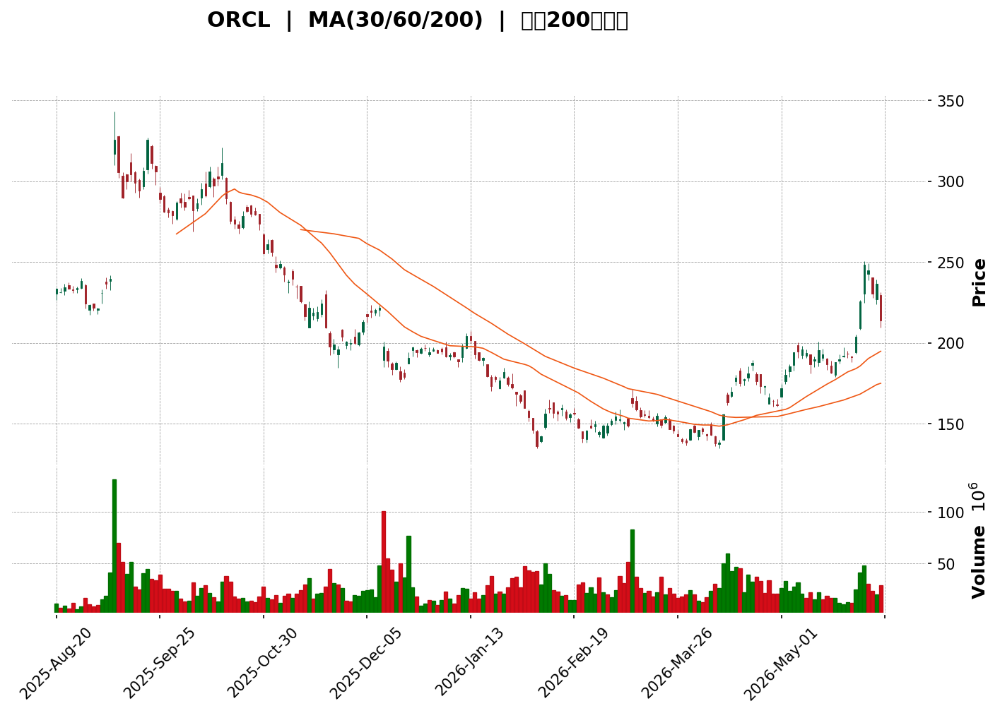
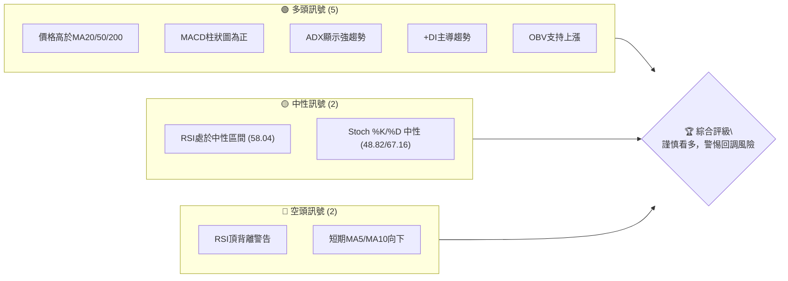
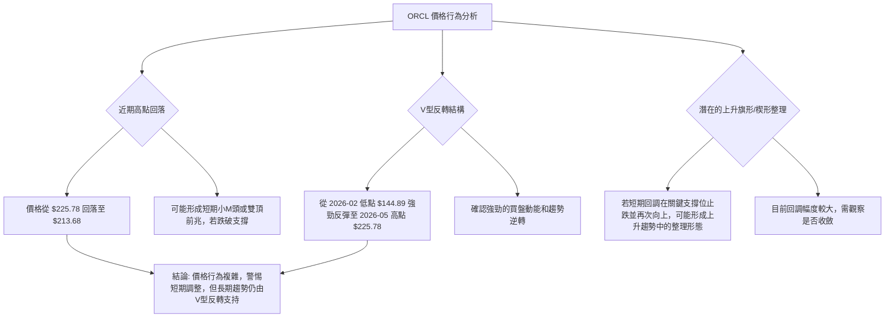

<details>
<summary>📊 靜態圖表 (點擊展開)</summary>

</details>

<html>
<head><meta charset="utf-8" /></head>
<body>
    <div style="height:500px; width:100%;">                        <script>window.PlotlyConfig = {MathJaxConfig: 'local'};</script>
        <script charset="utf-8" src="https://cdn.plot.ly/plotly-3.6.0.min.js" integrity="sha256-QaOVwtVY0T02VaHrr6pnoHLCwayMJp4O5n4YyaE3rJk=" crossorigin="anonymous"></script>                <div id="candlestick-chart" class="plotly-graph-div" style="height:100%; width:100%;"></div>            <script>                window.PLOTLYENV=window.PLOTLYENV || {};                                if (document.getElementById("candlestick-chart")) {                    Plotly.newPlot(                        "candlestick-chart",                        [{"close":{"dtype":"f8","bdata":"AAAAAAcnbUAAAAAgtOpsQAAAAKCeUG1AAAAA4CMybUAAAABgCgxtQAAAAODWPm1AAAAAoAfObUAAAABAgQtsQAAAACAn8WtAAAAAgGq2a0AAAAAAIahrQAAAACBG32xAAAAAQJyTbUAAAADAz\u002fNtQAAAAEAmXHRAAAAAoDEXc0AAAABARx5yQAAAACBkvHJAAAAAQPwDc0AAAABgzbByQAAAACDDZHJAAAAA4OQjc0AAAADASll0QAAAAED3dXNAAAAAALggc0AAAADAyBByQAAAAMDZk3FAAAAAAL2IcUAAAADgm3BxQAAAAID063FAAAAAwE3ocUAAAAAgZb5xQAAAAIDpFHJAAAAAgDugcUAAAABA7OVxQAAAAABXcnJAAAAAILsyckAAAACADyJzQAAAAODHknJAAAAAwD\u002fcckAAAACgaXFzQAAAACB+GHJAAAAAAMs3cUAAAAAAgxdxQAAAAEDq73BAAAAAQMBlcUAAAACAl5lxQAAAAKDmenFAAAAAINZxcUAAAACg5RlxQAAAAKBF6m9AAAAAwBhQcEAAAAAAZwRwQAAAAKDv1G5AAAAAYP8Yb0AAAABA80luQAAAAKCOuW1AAAAAoH3rbUAAAABApVZtQAAAAOBQM2xAAAAAgLcHa0AAAAAgpa9rQAAAAKCMUGtAAAAAAJZka0AAAACg4QRsQAAAAODmLGpAAAAAIHmxaEAAAADg0OFoQAAAAIBzemhAAAAAYKl2aUAAAAAA7hZpQAAAAKDO9mhAAAAAYOX7aEAAAACAws5pQAAAAKCroGpAAAAA4AgIa0AAAAAgLWZrQAAAAMCphWtAAAAAwLu0a0AAAADgVbRoQAAAAEDpmWdAAAAAQEz5ZkAAAADg7W9nQAAAAEDXK2ZAAAAAIMZdZkAAAAAghdlnQAAAAEBjpWhAAAAAoLNEaEAAAADgFIloQAAAAOD7mGhAAAAAYPlFaEAAAAAgLYBoQAAAAIAGN2hAAAAAIHhQaEAAAAAgPe1nQAAAAOAhEmhAAAAAoDD1Z0AAAADAu49nQAAAAMCHumhAAAAAwPZ+aUAAAAAAwDJpQAAAAAD1HWhAAAAAQA6mZ0AAAAAAmc1nQAAAAMBmaWZAAAAAYMuoZUAAAABA6jFmQAAAAKBjEWZAAAAA4MK5ZkAAAAAAUsllQAAAAMBahmVAAAAAIH8NZUAAAADgOoBkQAAAAOAX8GNAAAAAwDZEY0AAAADAGkViQAAAAOAoAGFAAAAAgFXKYUAAAACgcIFjQAAAACCs6mNAAAAA4J2TY0AAAACg7n1jQAAAAACl8mNAAAAAQOQtY0AAAAAADHRjQAAAAGDYf2NAAAAAYBFyYkAAAACALpphQAAAACA0NGJAAAAAQAJsYkAAAADgLbliQAAAACCbHGJAAAAAoGCXYkAAAABguY9iQAAAAKDe+mJAAAAAQApIY0AAAABArw1jQAAAAEAK4WJAAAAAICmcYkAAAAAgrFFkQAAAAOBk02NAAAAAoD5SY0AAAABAq21jQAAAAADaRGNAAAAAQMULY0AAAADAUV9jQAAAAOAWpWJAAAAAwLA5Y0AAAACAf1JiQAAAAKBgMGJAAAAAwAPKYUAAAADAkGVhQAAAAEAkSmFAAAAAwCJTYkAAAABgLxdiQAAAAIDbO2JAAAAAABIhYkAAAACgftVhQAAAAMAe5WFAAAAAIIU7YUAAAABA4UJhQAAAAADXc2NAAAAAAABgZEAAAACA6zllQAAAAEDhSmZAAAAAgOvhZUAAAABgjzJmQAAAAKBwpWZAAAAAAABwZ0AAAADA9QhmQAAAAMD1qGVAAAAAYLieZUAAAABguL5kQAAAAGCPemRAAAAA4HosZEAAAABgj3plQAAAAKBHiWZAAAAAQDMrZ0AAAADA9UBoQAAAAEDhUmhAAAAAYGZ+aEAAAABA4TpoQAAAAGCPWmdAAAAA4FG4Z0AAAAAghXNoQAAAAGBmHmhAAAAAIIVTZ0AAAABguK5mQAAAAMAehWdAAAAA4KO4Z0AAAABgjwJoQAAAAIDrIWhAAAAAYLjeZ0AAAABgZnZpQAAAAMD1OGxAAAAAwMwEb0AAAABgj5JuQAAAAGCPymxAAAAAQOGKbUAAAACAwrVqQA=="},"high":{"dtype":"f8","bdata":"bifV5w9BbUBSzhz6VEJtQIFFkwI\u002flG1A\u002foqHsRKlbUDxDimTw2FtQMWh3\u002fGyVW1AlQZE9McBbkD4elIPW4ttQP9dKkHq9WtAJIAGvDMEbEByA7fwObprQNY0m8QOGW1AiW\u002fFCrQQbkDtgDgBrTJuQMr1pA82cHVAufMTComGdEBTJzvA8BhzQDXbra4ECnNAmJpd1W\u002fXc0A\u002fa23f5CNzQCLj5HkP13JAYGNObslKc0AD\u002f7UUuW50QKh0eWhJJ3RAkkHDZmBgc0DcLsoqk4ZyQMkCJ50rO3JAUeVg3Nq7cUBytiVdbJxxQPynexKD+3FAgdzYfJFKckAsbLWIVEVyQP2mR+S2ZXJAd2Jyo8kuckBYdJOf9RNyQPxZOK4bsnJAdwJy33Idc0CXQj901kxzQFSaIaj46HJAd2UxX8RRc0BjfwHWHgl0QDpAbci+5nJACxsbC5P3cUBGmuCJaGlxQKAsO4wcOHFASU7aUu+VcUCpE+WO+dZxQE3Zwif003FA71fry3a7cUAKPsVEZn5xQIaKH1fMwXBA8hTi8fuCcEDbWVJ+9n9wQJlUpgERt29AC1KcDXhbb0BT65lxj\u002fFuQM3H8XXQ3W1Aqni9p1u3bkC8sK\u002fU\u002fX9tQF3yReqia21A8gIS\u002fRz5a0DWbkBbOTVsQBpYSwYOrmtAljuxo63Ka0ApxWKJNVhsQLvZOxZEEm1Akkbu7DThaUC1JciAZ1JpQPpoEGslxmhA\u002fcQF1PQWakCk35tcVSNpQBnrmwk6SGlAXsXaNGoNakBV5Ex+zdRpQOfVn\u002fYEw2pAobcUbxlFa0ClsELbEuxrQKWMmXZUqGtAwaCdyzP+a0CqnTekMxhpQDw96vqHlGhAwKU3PBt6Z0BOBe81gZRnQIK6cpmMK2dAR43bljX0ZkAtxD9EtD1oQKN6Xdy+smhAtbjXr9t\u002faECHhiz5NKJoQFCeXKut5GhAosD2pIWpaECvq8U1Y6VoQOvEyIvbf2hATZ205hCsaEChU8gPqQ5pQDjDC1YSNmhAWx8WZzJPaECB2Y1UFLlnQCFtygt372hANuHjwTC8aUAY3oLmdOJpQBOmb0lMH2lApoflwJlKaEDhd9iCeOZnQDOywVc7UWdAnsqjBhZ\u002fZkDf7c4LDnFmQJMAmqHKYGZAKoYeDEgVZ0AQ6WgSBmNmQPKRTHCGoWZAmFY9l2Y0ZUD8vRkU\u002fQllQLdrcSBVU2VAgwzq1WjaY0C2IHZX7yxjQBywkUNHQWJAvVF8inPWYUAHGENHNeZjQOOCZk8PmmRAWbTIjORiZECUiKIikc9jQGG2GiqGN2RA733hWTjXY0Cq5S\u002fIFJhjQNsgVDG78GNAHE4Kn4cuY0CqPWCbXCliQGunmnL5R2JAbKckcuMXY0ACvxDvA\u002f9iQEC8mFxKMmJAAozuBLe0YkAqKglC88xiQOtpG2VpImNAqJ3XT32sY0BZx4y\u002fWdRjQEdraTQS72JAd2voGlAzY0Dwtg2oMGVlQONeYk7e52RAfggx\u002f7sGZEDrfJ0lAMZjQP4nG4W9y2NAgHDQusdNY0BnM3yV9otjQNESkpbuFmNAwzNrMZxnY0DKD0nWqCtjQPFlFhYxqmJAXl6wJbo+YkAnO9eeTKZhQEZVrJKslmFAnLZUG2JcYkApfXz6IaRiQBclFUrFPWJA6SHILQ6BYkCd2mOVIwJiQGJlsPvZ3WJAAAAAoJnZYUAAAACgcIVhQAAAAMAefWNAAAAAwMwsZUAAAACA65FlQAAAAOCjiGZAAAAAAAAQZ0AAAADgUThmQAAAAEDhKmdAAAAAgMKlZ0AAAADgerxmQAAAAGC4lmZAAAAAoJmxZUAAAABgZhZlQAAAAOBRmGRAAAAAgMKlZEAAAACgmcllQAAAAAAA8GZAAAAA4KNQZ0AAAACgR0loQAAAAMDMBGlAAAAAAADAaEAAAACAwnVoQAAAAKBwHWhAAAAAgD3yZ0AAAABguBZpQAAAAIDCjWhAAAAA4FHYZ0AAAABACpdnQAAAAEAKh2dAAAAAgD0aaEAAAAAAAKBoQAAAAGBmZmhAAAAA4HoEaEAAAAAAAKBpQAAAAKBHSWxAAAAAAABIb0AAAAAAACBvQAAAAOBREG5AAAAAYGbebUAAAACAFO5sQA=="},"hovertemplate":"\u003cb\u003e%{x|%Y-%m-%d}\u003c\u002fb\u003e\u003cbr\u003e\u958b: $%{open:.2f}\u003cbr\u003e\u9ad8: $%{high:.2f}\u003cbr\u003e\u4f4e: $%{low:.2f}\u003cbr\u003e\u6536: $%{close:.2f}\u003cextra\u003e\u003c\u002fextra\u003e","low":{"dtype":"f8","bdata":"TKs6SdBObEAZBHWyhtNsQLiVHeu6tGxA6uy3+rEtbUAaGGKVatxsQMRfZ6F222xAM2z7pe4obUC3pzQTn6trQCH3hqt2ImtADe5FKXGAa0C3v2sj6TprQKAq75LiA2xACtIS8vYubUBpl28jJxdtQLDE5Q5YWnNAMxWkS3HjckAxHiDKcxdyQBH1HAlmb3JAQAb6NnS+ckCA2iR6hUtyQPRW4chrG3JA9YpV6t9vckDg4QiWRQhzQO9OBJn1OXNAP\u002fdBGOWackBHumAHp+RxQCRXamCMjHFA3uwfhbtWcUBS2MR\u002f1htxQOde8u9EO3FAR0YNLfe8cUAnDxdBbJxxQEysyvVeCHJAyDpZGg3OcEAVumCvEpZxQK14vYoW2HFAG50IxJ8jckCeo+9svn5yQJitu54lI3JA2SuwNIKRckDUZZvLgNNyQOWVTrDn23FAYT0sSA4acUDXslXsjelwQKSs1C6wuXBA3u5LIZ\u002frcEBs5avkaohxQHb52MadYXFAjnUdoTltcUDGMt9QFdtwQFMKmeXe1m9AUIKw84vkb0BEg+T2ebVvQFAiE5oodm5ArfjqvK2wbkA+JcnngrptQP182bzJ3WxAnjrn4OdzbUAM4eSevm9sQF7AQmc8GWxAu7jQ1Pm8akCOvdQpci9qQCIRlyXKx2pA4BQZlROmakAwZCmncv9qQFhTXoN\u002fIGpAOQgwjcULaEAUBX\u002f0nyNoQNRH5yPhD2dAGcHLNycgaUC+88bl5YxoQBcINaX0b2hA5220KenYaEC8FCvp08VoQGetSoXqoWlAV6sHoxaKakC5j3jfufJqQDUAK1xMHmtAcMBv7wgIa0BZgtMv9iJnQEQBBcMCG2dAFOcef1iJZkBYUtdjn+tmQIVWNOyh\u002f2VAEQ2XTKgvZkBrbReCEl9nQCGEYVDf9GdAtpVFe4TgZ0AeY\u002fT6cCdoQFdQePAwXWhA0abaV9TuZ0CzhyQteFBoQACJsuFMMWhAM1E+LcMgaEA6JjhC+ORnQAXHvNogsWdANEpXZ3naZ0DD7LXeaiBnQFiaB1Tvg2dAjVkLz2CKaEDQ10WZxf5oQKKGHTWrxGdAbbqe\u002fWKXZ0ATRBeDLzxnQCmWdTeLV2ZAFPK+JDNAZUCTG1imV\u002fxlQPCByP7XbGVASGPTmhM9ZkB9E+GIaqJlQFK3JQ1haGVAGYBDraYeZEA8JLjUf1VkQJIL7RUu7mNA1Lsc2uHrYkBgJAp+rP1hQOTbq9Hv2GBADyfPOqZNYUAXCv7MoE9iQBnQESo9jWNAhom6ONkuY0CTa+b5A\u002f9iQF9uQgj8V2NARJv5EyILY0B5DtQ6+9piQAamLpRKZ2NA2TpPjBBcYkB4blXNcUNhQOyFO6boR2FAYHd\u002fTnhaYkAPSB4\u002fohRiQDkGvLZfs2FA5Dn\u002fNgmWYUA636gNq9FhQI4D5RuYkmJAQH+sxh6zYkD8uq4U9OJiQIzYBoRzPWJAK2381d19YkAhr5XrrABkQBKFbe7awWNAMvcpn6EzY0Bsd6eAHD9jQKsX323nHmNAw386pVjwYkBMnDbI5YtiQC5uNhPsbWJARIpNX+\u002fFYkA0L6xX2EpiQFYdfXwYA2JA28\u002fBkmfBYUCP98ZmMjphQFOwBL8lD2FAYAvn3p9rYUCZXGrXUwViQFgBc3n5eWFAL\u002fhNzy3rYUDwipuXfm5hQETmUWvizGFAAAAAAAAAYUAAAACAPdJgQAAAAEAKd2FAAAAAgOsxZEAAAABguMZkQAAAAKCZuWVAAAAAIIWrZUAAAADgUbBlQAAAAOBRAGZAAAAAoJnZZkAAAABgj8JlQAAAAKCZGWVAAAAAwMz8ZEAAAACgmUFkQAAAAMDMFGRAAAAAYI8KZEAAAADAzMRkQAAAAOBRyGVAAAAAAABgZkAAAACgcNVmQAAAAKCZ2WdAAAAAYLjGZ0AAAABAM9NnQAAAAADXm2ZAAAAAgOshZ0AAAABgZi5nQAAAAMDMnGdAAAAA4KPoZkAAAACAwp1mQAAAAKCZWWZAAAAAYGZmZ0AAAABAM+NnQAAAAIDr0WdAAAAAoHB9Z0AAAAAAKSxoQAAAAOBRAGpAAAAAQDMTbEAAAABA4dptQAAAACCFc2xAAAAAAAAAbEAAAABgZi5qQA=="},"name":"\u50f9\u683c","open":{"dtype":"f8","bdata":"itRwuJbLbEBWSykONudsQMRhzEhHB21A+KUm8rtvbUC+laJUHyVtQB1h1FMfJW1AVZbKVUQ2bUCu3EYP\u002fXdtQCosnShhiGtAJIAGvDMEbEC6YpYjYYhrQCMy4ShW12xAxQZRkGDAbUBP1XkS98FtQLr3V\u002f0Ny3NAZ1+M1A58dECpEmRpVfZyQFNxMqjPAHNAoaZU\u002fZ15c0AeK+HafhRzQBvQd52tynJAXUULSouKckBaYofNSjNzQCMYRXppF3RAVH3ZVrFWc0ACACqlVE9yQEVQ565LK3JAj2P3nfKlcUBqYyKOgJdxQKeSAK\u002ffSXFA\u002fbRDxj4YckBnaipKUvVxQLRTNQp0IXJAd2Jyo8kuckCQn3IR97JxQOon7fdOHHJAph34vyKnckDDSpuoAo5yQAVu5kt023JAx3ZXmprwckAbF35gvPtyQOGFsCpR3nJAlsk8jPbycUDaLVETlUZxQBbemJZDEnFAlm74fq\u002f0cEDoPGt0x8JxQBGKkqkdzXFAvmaENliUcUDRanvl2ntxQGcswtuTsXBASpFxzcwecEBb4wCA63lwQOkiKZCADm9AMbkXtarMbkDX1pn7ns1uQPeLOcJJsW1AAY4pc1SObkCWYEifMFltQH6NyAppaW1AowqM3rTza0CLNVapWjFqQP63VG4SHGtAdbbfZXbcakBZ2AMYGzdrQFPqxe7wt2xA3umRVxa6aUBx3gdeC3VoQDxW1bmgHGhAatdk2A0HakC64UuVU8loQDyV4iPQ6GhAdeO63GJ8aUAkguYAaONoQADMChjl0mlAFjh+czI1a0Bnosg48H9rQHsnAM30VWtAF2Z7CkCOa0AZ9\u002fpola5nQKTyBMh1ZWhADAVSonpkZ0BlPiIiTfJmQAOSgbUXxmZAZh2KCFSzZkCZxKbfqGdnQB+Ejs3Fc2hAmzuVVl5naECgQ9tV4zloQJuffb81m2hAtACbKiwfaEBcfjHKmVtoQOgBr9IMZ2hATgqI8HGIaED7zlxtHaRoQLuvcupI7GdA6y5H6m1DaED\u002fERF12rZnQCI69DbG32dAThWSXDGdaEBBV7IbK4lpQBOmb0lMH2lApoflwJlKaECYSa4k+KdnQDOywVc7UWdAKdzTgb9hZkBHAB7S3FdmQG3rclGdgGVAcnti2kBPZkDE\u002fehuH1JmQFu2\u002f031yWVAD80rf9kxZUCN4GLEtfJkQBT5K1xnSmVAukzPpLG2Y0AfZnAkVytjQONwi\u002fn7ImJA\u002f\u002fK9h29oYUCtw4BxJH9iQH+CGh0u7mNAWbTIjORiZECvLYGoK6xjQBESHoBD1mNAwmi2ysOtY0D6Mg5O7DtjQPJJjreSlGNA9YhZy4YYY0Brr0We2iViQJCnKZ0xi2FA3\u002fot6oGUYkBe1ZVWtYhiQBTsdLYi7GFAlx1rKxGkYUAr\u002fnj14AdiQG800smcr2JAbizymeIBY0B7QAWkaAxjQH4tKqWdxWJAIXFlDrsiY0DLPPcsoblkQCbT8Q\u002fIgmRA3ludyeLPY0DE2hzviXBjQLH1uJ3EXGNAPH1z\u002frYbY0DlgMaE9r1iQFhlWOqNEGNAtNUSYZPcYkCrxke\u002f9Q5jQKjPclq9lmJAkkMVVXTsYUBK6TlKEI5hQFHtbeWucWFAV7tcavl5YUDC2eZxRpJiQN1rKOQOyWFAHO67s6hdYkAqXaFb8uhhQK2nkU7cuGJAAAAAYGbGYUAAAACAPSphQAAAAOCjeGFAAAAAgML9ZEAAAADgetxkQAAAAKBwDWZAAAAAgMLdZkAAAACA6xlmQAAAAEAzS2ZAAAAAgMJFZ0AAAADAzIxmQAAAAOBRkGZAAAAAYI+SZUAAAADAHkVkQAAAAKBHgWRAAAAA4KNAZEAAAACgcM1kQAAAAOCjAGZAAAAAACnEZkAAAABgZkZnQAAAACCF02hAAAAAYI8SaEAAAADAzARoQAAAAKBwHWhAAAAAwPWgZ0AAAACAwoVnQAAAACCuz2dAAAAAAADAZ0AAAAAAAEBnQAAAAIAUfmZAAAAA4FGgZ0AAAACgcPVnQAAAAKCZKWhAAAAAIFzvZ0AAAACgR0FoQAAAAAAAIGpAAAAAAADQbEAAAACgmVluQAAAACBcD25AAAAAAABgbEAAAAAgrq9sQA=="},"x":["2025-08-20T00:00:00-04:00","2025-08-21T00:00:00-04:00","2025-08-22T00:00:00-04:00","2025-08-25T00:00:00-04:00","2025-08-26T00:00:00-04:00","2025-08-27T00:00:00-04:00","2025-08-28T00:00:00-04:00","2025-08-29T00:00:00-04:00","2025-09-02T00:00:00-04:00","2025-09-03T00:00:00-04:00","2025-09-04T00:00:00-04:00","2025-09-05T00:00:00-04:00","2025-09-08T00:00:00-04:00","2025-09-09T00:00:00-04:00","2025-09-10T00:00:00-04:00","2025-09-11T00:00:00-04:00","2025-09-12T00:00:00-04:00","2025-09-15T00:00:00-04:00","2025-09-16T00:00:00-04:00","2025-09-17T00:00:00-04:00","2025-09-18T00:00:00-04:00","2025-09-19T00:00:00-04:00","2025-09-22T00:00:00-04:00","2025-09-23T00:00:00-04:00","2025-09-24T00:00:00-04:00","2025-09-25T00:00:00-04:00","2025-09-26T00:00:00-04:00","2025-09-29T00:00:00-04:00","2025-09-30T00:00:00-04:00","2025-10-01T00:00:00-04:00","2025-10-02T00:00:00-04:00","2025-10-03T00:00:00-04:00","2025-10-06T00:00:00-04:00","2025-10-07T00:00:00-04:00","2025-10-08T00:00:00-04:00","2025-10-09T00:00:00-04:00","2025-10-10T00:00:00-04:00","2025-10-13T00:00:00-04:00","2025-10-14T00:00:00-04:00","2025-10-15T00:00:00-04:00","2025-10-16T00:00:00-04:00","2025-10-17T00:00:00-04:00","2025-10-20T00:00:00-04:00","2025-10-21T00:00:00-04:00","2025-10-22T00:00:00-04:00","2025-10-23T00:00:00-04:00","2025-10-24T00:00:00-04:00","2025-10-27T00:00:00-04:00","2025-10-28T00:00:00-04:00","2025-10-29T00:00:00-04:00","2025-10-30T00:00:00-04:00","2025-10-31T00:00:00-04:00","2025-11-03T00:00:00-05:00","2025-11-04T00:00:00-05:00","2025-11-05T00:00:00-05:00","2025-11-06T00:00:00-05:00","2025-11-07T00:00:00-05:00","2025-11-10T00:00:00-05:00","2025-11-11T00:00:00-05:00","2025-11-12T00:00:00-05:00","2025-11-13T00:00:00-05:00","2025-11-14T00:00:00-05:00","2025-11-17T00:00:00-05:00","2025-11-18T00:00:00-05:00","2025-11-19T00:00:00-05:00","2025-11-20T00:00:00-05:00","2025-11-21T00:00:00-05:00","2025-11-24T00:00:00-05:00","2025-11-25T00:00:00-05:00","2025-11-26T00:00:00-05:00","2025-11-28T00:00:00-05:00","2025-12-01T00:00:00-05:00","2025-12-02T00:00:00-05:00","2025-12-03T00:00:00-05:00","2025-12-04T00:00:00-05:00","2025-12-05T00:00:00-05:00","2025-12-08T00:00:00-05:00","2025-12-09T00:00:00-05:00","2025-12-10T00:00:00-05:00","2025-12-11T00:00:00-05:00","2025-12-12T00:00:00-05:00","2025-12-15T00:00:00-05:00","2025-12-16T00:00:00-05:00","2025-12-17T00:00:00-05:00","2025-12-18T00:00:00-05:00","2025-12-19T00:00:00-05:00","2025-12-22T00:00:00-05:00","2025-12-23T00:00:00-05:00","2025-12-24T00:00:00-05:00","2025-12-26T00:00:00-05:00","2025-12-29T00:00:00-05:00","2025-12-30T00:00:00-05:00","2025-12-31T00:00:00-05:00","2026-01-02T00:00:00-05:00","2026-01-05T00:00:00-05:00","2026-01-06T00:00:00-05:00","2026-01-07T00:00:00-05:00","2026-01-08T00:00:00-05:00","2026-01-09T00:00:00-05:00","2026-01-12T00:00:00-05:00","2026-01-13T00:00:00-05:00","2026-01-14T00:00:00-05:00","2026-01-15T00:00:00-05:00","2026-01-16T00:00:00-05:00","2026-01-20T00:00:00-05:00","2026-01-21T00:00:00-05:00","2026-01-22T00:00:00-05:00","2026-01-23T00:00:00-05:00","2026-01-26T00:00:00-05:00","2026-01-27T00:00:00-05:00","2026-01-28T00:00:00-05:00","2026-01-29T00:00:00-05:00","2026-01-30T00:00:00-05:00","2026-02-02T00:00:00-05:00","2026-02-03T00:00:00-05:00","2026-02-04T00:00:00-05:00","2026-02-05T00:00:00-05:00","2026-02-06T00:00:00-05:00","2026-02-09T00:00:00-05:00","2026-02-10T00:00:00-05:00","2026-02-11T00:00:00-05:00","2026-02-12T00:00:00-05:00","2026-02-13T00:00:00-05:00","2026-02-17T00:00:00-05:00","2026-02-18T00:00:00-05:00","2026-02-19T00:00:00-05:00","2026-02-20T00:00:00-05:00","2026-02-23T00:00:00-05:00","2026-02-24T00:00:00-05:00","2026-02-25T00:00:00-05:00","2026-02-26T00:00:00-05:00","2026-02-27T00:00:00-05:00","2026-03-02T00:00:00-05:00","2026-03-03T00:00:00-05:00","2026-03-04T00:00:00-05:00","2026-03-05T00:00:00-05:00","2026-03-06T00:00:00-05:00","2026-03-09T00:00:00-04:00","2026-03-10T00:00:00-04:00","2026-03-11T00:00:00-04:00","2026-03-12T00:00:00-04:00","2026-03-13T00:00:00-04:00","2026-03-16T00:00:00-04:00","2026-03-17T00:00:00-04:00","2026-03-18T00:00:00-04:00","2026-03-19T00:00:00-04:00","2026-03-20T00:00:00-04:00","2026-03-23T00:00:00-04:00","2026-03-24T00:00:00-04:00","2026-03-25T00:00:00-04:00","2026-03-26T00:00:00-04:00","2026-03-27T00:00:00-04:00","2026-03-30T00:00:00-04:00","2026-03-31T00:00:00-04:00","2026-04-01T00:00:00-04:00","2026-04-02T00:00:00-04:00","2026-04-06T00:00:00-04:00","2026-04-07T00:00:00-04:00","2026-04-08T00:00:00-04:00","2026-04-09T00:00:00-04:00","2026-04-10T00:00:00-04:00","2026-04-13T00:00:00-04:00","2026-04-14T00:00:00-04:00","2026-04-15T00:00:00-04:00","2026-04-16T00:00:00-04:00","2026-04-17T00:00:00-04:00","2026-04-20T00:00:00-04:00","2026-04-21T00:00:00-04:00","2026-04-22T00:00:00-04:00","2026-04-23T00:00:00-04:00","2026-04-24T00:00:00-04:00","2026-04-27T00:00:00-04:00","2026-04-28T00:00:00-04:00","2026-04-29T00:00:00-04:00","2026-04-30T00:00:00-04:00","2026-05-01T00:00:00-04:00","2026-05-04T00:00:00-04:00","2026-05-05T00:00:00-04:00","2026-05-06T00:00:00-04:00","2026-05-07T00:00:00-04:00","2026-05-08T00:00:00-04:00","2026-05-11T00:00:00-04:00","2026-05-12T00:00:00-04:00","2026-05-13T00:00:00-04:00","2026-05-14T00:00:00-04:00","2026-05-15T00:00:00-04:00","2026-05-18T00:00:00-04:00","2026-05-19T00:00:00-04:00","2026-05-20T00:00:00-04:00","2026-05-21T00:00:00-04:00","2026-05-22T00:00:00-04:00","2026-05-26T00:00:00-04:00","2026-05-27T00:00:00-04:00","2026-05-28T00:00:00-04:00","2026-05-29T00:00:00-04:00","2026-06-01T00:00:00-04:00","2026-06-02T00:00:00-04:00","2026-06-03T00:00:00-04:00","2026-06-04T00:00:00-04:00","2026-06-05T00:00:00-04:00"],"type":"candlestick"},{"hovertemplate":"MA30: $%{y:.2f}\u003cextra\u003e\u003c\u002fextra\u003e","line":{"color":"#2196F3","dash":"dash","width":2},"mode":"lines","name":"MA30","x":["2025-08-20T00:00:00-04:00","2025-08-21T00:00:00-04:00","2025-08-22T00:00:00-04:00","2025-08-25T00:00:00-04:00","2025-08-26T00:00:00-04:00","2025-08-27T00:00:00-04:00","2025-08-28T00:00:00-04:00","2025-08-29T00:00:00-04:00","2025-09-02T00:00:00-04:00","2025-09-03T00:00:00-04:00","2025-09-04T00:00:00-04:00","2025-09-05T00:00:00-04:00","2025-09-08T00:00:00-04:00","2025-09-09T00:00:00-04:00","2025-09-10T00:00:00-04:00","2025-09-11T00:00:00-04:00","2025-09-12T00:00:00-04:00","2025-09-15T00:00:00-04:00","2025-09-16T00:00:00-04:00","2025-09-17T00:00:00-04:00","2025-09-18T00:00:00-04:00","2025-09-19T00:00:00-04:00","2025-09-22T00:00:00-04:00","2025-09-23T00:00:00-04:00","2025-09-24T00:00:00-04:00","2025-09-25T00:00:00-04:00","2025-09-26T00:00:00-04:00","2025-09-29T00:00:00-04:00","2025-09-30T00:00:00-04:00","2025-10-01T00:00:00-04:00","2025-10-02T00:00:00-04:00","2025-10-03T00:00:00-04:00","2025-10-06T00:00:00-04:00","2025-10-07T00:00:00-04:00","2025-10-08T00:00:00-04:00","2025-10-09T00:00:00-04:00","2025-10-10T00:00:00-04:00","2025-10-13T00:00:00-04:00","2025-10-14T00:00:00-04:00","2025-10-15T00:00:00-04:00","2025-10-16T00:00:00-04:00","2025-10-17T00:00:00-04:00","2025-10-20T00:00:00-04:00","2025-10-21T00:00:00-04:00","2025-10-22T00:00:00-04:00","2025-10-23T00:00:00-04:00","2025-10-24T00:00:00-04:00","2025-10-27T00:00:00-04:00","2025-10-28T00:00:00-04:00","2025-10-29T00:00:00-04:00","2025-10-30T00:00:00-04:00","2025-10-31T00:00:00-04:00","2025-11-03T00:00:00-05:00","2025-11-04T00:00:00-05:00","2025-11-05T00:00:00-05:00","2025-11-06T00:00:00-05:00","2025-11-07T00:00:00-05:00","2025-11-10T00:00:00-05:00","2025-11-11T00:00:00-05:00","2025-11-12T00:00:00-05:00","2025-11-13T00:00:00-05:00","2025-11-14T00:00:00-05:00","2025-11-17T00:00:00-05:00","2025-11-18T00:00:00-05:00","2025-11-19T00:00:00-05:00","2025-11-20T00:00:00-05:00","2025-11-21T00:00:00-05:00","2025-11-24T00:00:00-05:00","2025-11-25T00:00:00-05:00","2025-11-26T00:00:00-05:00","2025-11-28T00:00:00-05:00","2025-12-01T00:00:00-05:00","2025-12-02T00:00:00-05:00","2025-12-03T00:00:00-05:00","2025-12-04T00:00:00-05:00","2025-12-05T00:00:00-05:00","2025-12-08T00:00:00-05:00","2025-12-09T00:00:00-05:00","2025-12-10T00:00:00-05:00","2025-12-11T00:00:00-05:00","2025-12-12T00:00:00-05:00","2025-12-15T00:00:00-05:00","2025-12-16T00:00:00-05:00","2025-12-17T00:00:00-05:00","2025-12-18T00:00:00-05:00","2025-12-19T00:00:00-05:00","2025-12-22T00:00:00-05:00","2025-12-23T00:00:00-05:00","2025-12-24T00:00:00-05:00","2025-12-26T00:00:00-05:00","2025-12-29T00:00:00-05:00","2025-12-30T00:00:00-05:00","2025-12-31T00:00:00-05:00","2026-01-02T00:00:00-05:00","2026-01-05T00:00:00-05:00","2026-01-06T00:00:00-05:00","2026-01-07T00:00:00-05:00","2026-01-08T00:00:00-05:00","2026-01-09T00:00:00-05:00","2026-01-12T00:00:00-05:00","2026-01-13T00:00:00-05:00","2026-01-14T00:00:00-05:00","2026-01-15T00:00:00-05:00","2026-01-16T00:00:00-05:00","2026-01-20T00:00:00-05:00","2026-01-21T00:00:00-05:00","2026-01-22T00:00:00-05:00","2026-01-23T00:00:00-05:00","2026-01-26T00:00:00-05:00","2026-01-27T00:00:00-05:00","2026-01-28T00:00:00-05:00","2026-01-29T00:00:00-05:00","2026-01-30T00:00:00-05:00","2026-02-02T00:00:00-05:00","2026-02-03T00:00:00-05:00","2026-02-04T00:00:00-05:00","2026-02-05T00:00:00-05:00","2026-02-06T00:00:00-05:00","2026-02-09T00:00:00-05:00","2026-02-10T00:00:00-05:00","2026-02-11T00:00:00-05:00","2026-02-12T00:00:00-05:00","2026-02-13T00:00:00-05:00","2026-02-17T00:00:00-05:00","2026-02-18T00:00:00-05:00","2026-02-19T00:00:00-05:00","2026-02-20T00:00:00-05:00","2026-02-23T00:00:00-05:00","2026-02-24T00:00:00-05:00","2026-02-25T00:00:00-05:00","2026-02-26T00:00:00-05:00","2026-02-27T00:00:00-05:00","2026-03-02T00:00:00-05:00","2026-03-03T00:00:00-05:00","2026-03-04T00:00:00-05:00","2026-03-05T00:00:00-05:00","2026-03-06T00:00:00-05:00","2026-03-09T00:00:00-04:00","2026-03-10T00:00:00-04:00","2026-03-11T00:00:00-04:00","2026-03-12T00:00:00-04:00","2026-03-13T00:00:00-04:00","2026-03-16T00:00:00-04:00","2026-03-17T00:00:00-04:00","2026-03-18T00:00:00-04:00","2026-03-19T00:00:00-04:00","2026-03-20T00:00:00-04:00","2026-03-23T00:00:00-04:00","2026-03-24T00:00:00-04:00","2026-03-25T00:00:00-04:00","2026-03-26T00:00:00-04:00","2026-03-27T00:00:00-04:00","2026-03-30T00:00:00-04:00","2026-03-31T00:00:00-04:00","2026-04-01T00:00:00-04:00","2026-04-02T00:00:00-04:00","2026-04-06T00:00:00-04:00","2026-04-07T00:00:00-04:00","2026-04-08T00:00:00-04:00","2026-04-09T00:00:00-04:00","2026-04-10T00:00:00-04:00","2026-04-13T00:00:00-04:00","2026-04-14T00:00:00-04:00","2026-04-15T00:00:00-04:00","2026-04-16T00:00:00-04:00","2026-04-17T00:00:00-04:00","2026-04-20T00:00:00-04:00","2026-04-21T00:00:00-04:00","2026-04-22T00:00:00-04:00","2026-04-23T00:00:00-04:00","2026-04-24T00:00:00-04:00","2026-04-27T00:00:00-04:00","2026-04-28T00:00:00-04:00","2026-04-29T00:00:00-04:00","2026-04-30T00:00:00-04:00","2026-05-01T00:00:00-04:00","2026-05-04T00:00:00-04:00","2026-05-05T00:00:00-04:00","2026-05-06T00:00:00-04:00","2026-05-07T00:00:00-04:00","2026-05-08T00:00:00-04:00","2026-05-11T00:00:00-04:00","2026-05-12T00:00:00-04:00","2026-05-13T00:00:00-04:00","2026-05-14T00:00:00-04:00","2026-05-15T00:00:00-04:00","2026-05-18T00:00:00-04:00","2026-05-19T00:00:00-04:00","2026-05-20T00:00:00-04:00","2026-05-21T00:00:00-04:00","2026-05-22T00:00:00-04:00","2026-05-26T00:00:00-04:00","2026-05-27T00:00:00-04:00","2026-05-28T00:00:00-04:00","2026-05-29T00:00:00-04:00","2026-06-01T00:00:00-04:00","2026-06-02T00:00:00-04:00","2026-06-03T00:00:00-04:00","2026-06-04T00:00:00-04:00","2026-06-05T00:00:00-04:00"],"y":{"dtype":"f8","bdata":"AAAAAAAA+H8AAAAAAAD4fwAAAAAAAPh\u002fAAAAAAAA+H8AAAAAAAD4fwAAAAAAAPh\u002fAAAAAAAA+H8AAAAAAAD4fwAAAAAAAPh\u002fAAAAAAAA+H8AAAAAAAD4fwAAAAAAAPh\u002fAAAAAAAA+H8AAAAAAAD4fwAAAAAAAPh\u002fAAAAAAAA+H8AAAAAAAD4fwAAAAAAAPh\u002fAAAAAAAA+H8AAAAAAAD4fwAAAAAAAPh\u002fAAAAAAAA+H8AAAAAAAD4fwAAAAAAAPh\u002fAAAAAAAA+H8AAAAAAAD4fwAAAAAAAPh\u002fAAAAAAAA+H8AAAAAAAD4f2ZmZuY7tXBAq6qqCqnRcECamZnxse1wQImIiEjqCnFAiYiIAMEkcUCJiIj4jEFxQERERGwuYnFAIiIiIk5+cUDNzMxc6qlxQHd3d18w0XFARERE7OP7cUAzMzNLzStyQLy7u8sHS3JAzczMbMNfckAREREh0XFyQN7d3e2bVHJAd3d3NylGckBVVVX1vEFyQDMzM5MFN3JAd3d3550pckBVVVWlDRxyQBEREQlEB3JAmpmZoSPvcUAzMzMbLcpxQLy7u9uop3FAq6qqch6JcUDNzMwkMXBxQM3MzNwFWXFAzczMdA5DcUCamZnhaStxQO\u002fu7r7NCnFAq6qqelLlcEC8u7tTCcRwQHd3dydInnBAMzMzI8B8cEAzMzNbkVtwQCIiIpLWLXBA7+7uXs\u002f3b0ARERGRmYVvQGZmZgZ\u002fGW9AIiIi0uawbkCrqqr6KztuQImIiKhd221AMzMzo7WKbUC8u7vrO0NtQJqZmTllBW1AERERgSXDbEAAAABglIBsQJqZmbkbQWxAERERcc8DbEDv7u7+wrJrQLy7u\u002fvQa2tAIiIiAnQZa0BEREQ0F9BqQN7d3f0vhmpAVVVVFa47akCrqqp6uwRqQDMzM7Nk2WlARERExCqpaUDNzMx8LoBpQLy7u+tvYWlAVVVVlelJaUCrqqrqui5pQDMzM4NHFGlAAAAAQAL6aEDe3d1dFtdoQN7d3d0gxWhA7+7uLtq+aEBmZmY2lbNoQFVVVQW4tWhA3t3d3f61aEBERERE7LZoQAAAANCxr2hAZmZmxkykaECrqqrKMZNoQHd3dwc4b2hAVVVVpWBBaEBEREQE+BRoQFVVVSVt5mdAIiIiYu27Z0CrqqraBqNnQHd3d+dOkWdAMzMzM+qAZ0AzMzOz22dnQJqZmcnMVGdAMzMzE1k6Z0De3d3tuwpnQAAAAEB+yWZAiYiI2DaSZkCJiIj4SmdmQBEREWFZP2ZAMzMzQ0UXZkAiIiJyh+xlQLy7u8sdyGVAEREREUycZUAzMzPDH3ZlQAAAAFAdT2VAzczMvBMgZUAiIiKyOe1kQN7d3T2MtWRAIiIiwi55ZEB3d3cn7kFkQM3MzGyvDmRAERERgYfjY0CamZnZzLZjQLy7uwuEmWNAd3d3VzmFY0AzMzOTampjQFVVVWU0T2NAvLu7qxUsY0BEREQkkB9jQKuqqnoQEWNAAAAAEEoCY0BEREQkI\u002fliQBEREeFt82JAq6qqOozxYkBmZmZ29PpiQFVVVWX8CGNAvLu7KzsVY0ARERERIgtjQBEREdFj\u002fGJAIiIi8iLtYkAzMzPzQdtiQN7d3f2SxGJAZmZmRki9YkAiIiJSp7FiQAAAAKDapmJAIiIiciekYkBVVVWVIaZiQM3MzLx+o2JA7+7ubliZYkCamZlp3oxiQHd3d1dPmGJAq6qq2oenYkAiIiJCRb5iQM3MzJyJ2mJAmpmZybvwYkDv7u4OkAtjQKuqqpq1K2NA7+7ubudUY0BVVVUFjGNjQLy7u\u002fsyc2NAREREpNCGY0AAAADQDJJjQImIiKhfnGNAAAAAUP+lY0BVVVXV+LdjQImIiKgt2WNAREREJNT6Y0Dv7u6ucS1kQN7d3U3LYWRAq6qqygGbZEBmZmZGUdVkQERERJQQCWVA7+7urho3ZUDv7u7OYW1lQDMzM6OZn2VA7+7uzvLLZUCamZmZUvVlQJqZmZlSJWZA3t3dfbFcZkDNzMxcSJZmQKuqqvo3vmZAzczM7ArcZkB3d3cnMQBnQAAAAHDLMmdAERER4cGAZ0CJiIhYOchnQN7d3U2p\u002fGdAERER4cEwaEAiIiKSplhoQA=="},"type":"scatter"},{"hovertemplate":"MA60: $%{y:.2f}\u003cextra\u003e\u003c\u002fextra\u003e","line":{"color":"#9C27B0","dash":"dash","width":2},"mode":"lines","name":"MA60","x":["2025-08-20T00:00:00-04:00","2025-08-21T00:00:00-04:00","2025-08-22T00:00:00-04:00","2025-08-25T00:00:00-04:00","2025-08-26T00:00:00-04:00","2025-08-27T00:00:00-04:00","2025-08-28T00:00:00-04:00","2025-08-29T00:00:00-04:00","2025-09-02T00:00:00-04:00","2025-09-03T00:00:00-04:00","2025-09-04T00:00:00-04:00","2025-09-05T00:00:00-04:00","2025-09-08T00:00:00-04:00","2025-09-09T00:00:00-04:00","2025-09-10T00:00:00-04:00","2025-09-11T00:00:00-04:00","2025-09-12T00:00:00-04:00","2025-09-15T00:00:00-04:00","2025-09-16T00:00:00-04:00","2025-09-17T00:00:00-04:00","2025-09-18T00:00:00-04:00","2025-09-19T00:00:00-04:00","2025-09-22T00:00:00-04:00","2025-09-23T00:00:00-04:00","2025-09-24T00:00:00-04:00","2025-09-25T00:00:00-04:00","2025-09-26T00:00:00-04:00","2025-09-29T00:00:00-04:00","2025-09-30T00:00:00-04:00","2025-10-01T00:00:00-04:00","2025-10-02T00:00:00-04:00","2025-10-03T00:00:00-04:00","2025-10-06T00:00:00-04:00","2025-10-07T00:00:00-04:00","2025-10-08T00:00:00-04:00","2025-10-09T00:00:00-04:00","2025-10-10T00:00:00-04:00","2025-10-13T00:00:00-04:00","2025-10-14T00:00:00-04:00","2025-10-15T00:00:00-04:00","2025-10-16T00:00:00-04:00","2025-10-17T00:00:00-04:00","2025-10-20T00:00:00-04:00","2025-10-21T00:00:00-04:00","2025-10-22T00:00:00-04:00","2025-10-23T00:00:00-04:00","2025-10-24T00:00:00-04:00","2025-10-27T00:00:00-04:00","2025-10-28T00:00:00-04:00","2025-10-29T00:00:00-04:00","2025-10-30T00:00:00-04:00","2025-10-31T00:00:00-04:00","2025-11-03T00:00:00-05:00","2025-11-04T00:00:00-05:00","2025-11-05T00:00:00-05:00","2025-11-06T00:00:00-05:00","2025-11-07T00:00:00-05:00","2025-11-10T00:00:00-05:00","2025-11-11T00:00:00-05:00","2025-11-12T00:00:00-05:00","2025-11-13T00:00:00-05:00","2025-11-14T00:00:00-05:00","2025-11-17T00:00:00-05:00","2025-11-18T00:00:00-05:00","2025-11-19T00:00:00-05:00","2025-11-20T00:00:00-05:00","2025-11-21T00:00:00-05:00","2025-11-24T00:00:00-05:00","2025-11-25T00:00:00-05:00","2025-11-26T00:00:00-05:00","2025-11-28T00:00:00-05:00","2025-12-01T00:00:00-05:00","2025-12-02T00:00:00-05:00","2025-12-03T00:00:00-05:00","2025-12-04T00:00:00-05:00","2025-12-05T00:00:00-05:00","2025-12-08T00:00:00-05:00","2025-12-09T00:00:00-05:00","2025-12-10T00:00:00-05:00","2025-12-11T00:00:00-05:00","2025-12-12T00:00:00-05:00","2025-12-15T00:00:00-05:00","2025-12-16T00:00:00-05:00","2025-12-17T00:00:00-05:00","2025-12-18T00:00:00-05:00","2025-12-19T00:00:00-05:00","2025-12-22T00:00:00-05:00","2025-12-23T00:00:00-05:00","2025-12-24T00:00:00-05:00","2025-12-26T00:00:00-05:00","2025-12-29T00:00:00-05:00","2025-12-30T00:00:00-05:00","2025-12-31T00:00:00-05:00","2026-01-02T00:00:00-05:00","2026-01-05T00:00:00-05:00","2026-01-06T00:00:00-05:00","2026-01-07T00:00:00-05:00","2026-01-08T00:00:00-05:00","2026-01-09T00:00:00-05:00","2026-01-12T00:00:00-05:00","2026-01-13T00:00:00-05:00","2026-01-14T00:00:00-05:00","2026-01-15T00:00:00-05:00","2026-01-16T00:00:00-05:00","2026-01-20T00:00:00-05:00","2026-01-21T00:00:00-05:00","2026-01-22T00:00:00-05:00","2026-01-23T00:00:00-05:00","2026-01-26T00:00:00-05:00","2026-01-27T00:00:00-05:00","2026-01-28T00:00:00-05:00","2026-01-29T00:00:00-05:00","2026-01-30T00:00:00-05:00","2026-02-02T00:00:00-05:00","2026-02-03T00:00:00-05:00","2026-02-04T00:00:00-05:00","2026-02-05T00:00:00-05:00","2026-02-06T00:00:00-05:00","2026-02-09T00:00:00-05:00","2026-02-10T00:00:00-05:00","2026-02-11T00:00:00-05:00","2026-02-12T00:00:00-05:00","2026-02-13T00:00:00-05:00","2026-02-17T00:00:00-05:00","2026-02-18T00:00:00-05:00","2026-02-19T00:00:00-05:00","2026-02-20T00:00:00-05:00","2026-02-23T00:00:00-05:00","2026-02-24T00:00:00-05:00","2026-02-25T00:00:00-05:00","2026-02-26T00:00:00-05:00","2026-02-27T00:00:00-05:00","2026-03-02T00:00:00-05:00","2026-03-03T00:00:00-05:00","2026-03-04T00:00:00-05:00","2026-03-05T00:00:00-05:00","2026-03-06T00:00:00-05:00","2026-03-09T00:00:00-04:00","2026-03-10T00:00:00-04:00","2026-03-11T00:00:00-04:00","2026-03-12T00:00:00-04:00","2026-03-13T00:00:00-04:00","2026-03-16T00:00:00-04:00","2026-03-17T00:00:00-04:00","2026-03-18T00:00:00-04:00","2026-03-19T00:00:00-04:00","2026-03-20T00:00:00-04:00","2026-03-23T00:00:00-04:00","2026-03-24T00:00:00-04:00","2026-03-25T00:00:00-04:00","2026-03-26T00:00:00-04:00","2026-03-27T00:00:00-04:00","2026-03-30T00:00:00-04:00","2026-03-31T00:00:00-04:00","2026-04-01T00:00:00-04:00","2026-04-02T00:00:00-04:00","2026-04-06T00:00:00-04:00","2026-04-07T00:00:00-04:00","2026-04-08T00:00:00-04:00","2026-04-09T00:00:00-04:00","2026-04-10T00:00:00-04:00","2026-04-13T00:00:00-04:00","2026-04-14T00:00:00-04:00","2026-04-15T00:00:00-04:00","2026-04-16T00:00:00-04:00","2026-04-17T00:00:00-04:00","2026-04-20T00:00:00-04:00","2026-04-21T00:00:00-04:00","2026-04-22T00:00:00-04:00","2026-04-23T00:00:00-04:00","2026-04-24T00:00:00-04:00","2026-04-27T00:00:00-04:00","2026-04-28T00:00:00-04:00","2026-04-29T00:00:00-04:00","2026-04-30T00:00:00-04:00","2026-05-01T00:00:00-04:00","2026-05-04T00:00:00-04:00","2026-05-05T00:00:00-04:00","2026-05-06T00:00:00-04:00","2026-05-07T00:00:00-04:00","2026-05-08T00:00:00-04:00","2026-05-11T00:00:00-04:00","2026-05-12T00:00:00-04:00","2026-05-13T00:00:00-04:00","2026-05-14T00:00:00-04:00","2026-05-15T00:00:00-04:00","2026-05-18T00:00:00-04:00","2026-05-19T00:00:00-04:00","2026-05-20T00:00:00-04:00","2026-05-21T00:00:00-04:00","2026-05-22T00:00:00-04:00","2026-05-26T00:00:00-04:00","2026-05-27T00:00:00-04:00","2026-05-28T00:00:00-04:00","2026-05-29T00:00:00-04:00","2026-06-01T00:00:00-04:00","2026-06-02T00:00:00-04:00","2026-06-03T00:00:00-04:00","2026-06-04T00:00:00-04:00","2026-06-05T00:00:00-04:00"],"y":{"dtype":"f8","bdata":"AAAAAAAA+H8AAAAAAAD4fwAAAAAAAPh\u002fAAAAAAAA+H8AAAAAAAD4fwAAAAAAAPh\u002fAAAAAAAA+H8AAAAAAAD4fwAAAAAAAPh\u002fAAAAAAAA+H8AAAAAAAD4fwAAAAAAAPh\u002fAAAAAAAA+H8AAAAAAAD4fwAAAAAAAPh\u002fAAAAAAAA+H8AAAAAAAD4fwAAAAAAAPh\u002fAAAAAAAA+H8AAAAAAAD4fwAAAAAAAPh\u002fAAAAAAAA+H8AAAAAAAD4fwAAAAAAAPh\u002fAAAAAAAA+H8AAAAAAAD4fwAAAAAAAPh\u002fAAAAAAAA+H8AAAAAAAD4fwAAAAAAAPh\u002fAAAAAAAA+H8AAAAAAAD4fwAAAAAAAPh\u002fAAAAAAAA+H8AAAAAAAD4fwAAAAAAAPh\u002fAAAAAAAA+H8AAAAAAAD4fwAAAAAAAPh\u002fAAAAAAAA+H8AAAAAAAD4fwAAAAAAAPh\u002fAAAAAAAA+H8AAAAAAAD4fwAAAAAAAPh\u002fAAAAAAAA+H8AAAAAAAD4fwAAAAAAAPh\u002fAAAAAAAA+H8AAAAAAAD4fwAAAAAAAPh\u002fAAAAAAAA+H8AAAAAAAD4fwAAAAAAAPh\u002fAAAAAAAA+H8AAAAAAAD4fwAAAAAAAPh\u002fAAAAAAAA+H8AAAAAAAD4f6uqqtIE4HBAq6qqwn3bcECrqqqi3dhwQAAAADiZ1HBA3t3dkcDQcEDe3d0pj85wQDMzM38CyHBAzczM6Bq9cECrqqqSW7ZwQFVVVfH3rnBAq6qqqiuqcEBERESksaRwQAAAAFBbnHBAMzMzH4+ScEB3d3eLt4lwQFVVVUWna3BAAAAA\u002fN1TcECrqqqSA0FwQAAAALjJK3BAAAAA0MIVcEDNzMwkb\u002fVvQO\u002fu7oYsvW9Aq6qqot17b0BVVVW1ODJvQKuqqtrA6m5AVVVVffWmbkAiIiLijnJuQGZmZja4RW5A7+7u1qMXbkAAAAAggettQM3MzLSFu21AVVVVRUeKbUARERHJZlttQBEREelrKG1AMzMzQ8H5bEAiIiKKHMdsQBEREQFnkGxA7+7uxlRbbEC8u7tjlxxsQN7d3YWb52tAAAAA2HKza0B3d3cfDHlrQERERLyHRWtAzczMNIEXa0AzMzPbNutqQImIiKBOumpAMzMzE0OCakAiIiIyxkpqQHd3d2\u002fEE2pAmpmZad7faUDNzMzs5KppQJqZmfGPfmlAq6qqGi9NaUC8u7tz+RtpQLy7u2N+7WhARERElAO7aEBERES0u4doQJqZmXlxUWhAZmZmzrAdaECrqqq6vPNnQGZmZqZk0GdAREREbJewZ0BmZmYuoY1nQHd3d6cybmdAiYiIKCdLZ0CJiIgQmyZnQO\u002fu7hYfCmdA3t3d9XbvZkBERER0Z9BmQJqZmSGitWZAAAAA0JaXZkDe3d01bXxmQGZmZp4wX2ZAvLu7I+pDZkAiIiJS\u002fyRmQJqZmQleBGZAZmZm\u002fkzjZUC8u7tLsb9lQFVVVcXQmmVA7+7uhgF0ZUB3d3d\u002fS2FlQBEREbEvUWVAmpmZIZpBZUC8u7trfzBlQFVVVVUdJGVA7+7upvIVZUAiIiIy2AJlQKuqqlI96WRAIiIiArnTZEDNzMyENrlkQBEREZnenWRAq6qqGjSCZECrqqqy5GNkQM3MzGRYRmRAvLu7K8osZECrqqqK4xNkQAAAAPj7+mNAd3d3lx3iY0C8u7ujrcljQFVVVX2FrGNAiYiImEOJY0CJiIhIZmdjQCIiImJ\u002fU2NA3t3drYdFY0De3d0NiTpjQERERNQGOmNAiYiIkPo6Y0ARERFR\u002fTpjQAAAAAB1PWNAVVVVjX5AY0DNzMwUjkFjQDMzM7shQmNAIiIiWo1EY0AiIiL6l0VjQM3MzMTmR2NAVVVVxcVLY0De3d2ldlljQO\u002fu7gYVcWNAAAAAqAeIY0AAAADgSZxjQHd3d48Xr2NAZmZmXhLEY0DNzMycSdhjQBEREcnR5mNAq6qqejH6Y0CJiIiQhA9kQJqZmSE6I2RAiYiIIA04ZEB3d3cXuk1kQDMzM6toZGRAZmZm9gR7ZEAzMzNjk5FkQBEREalDq2RAvLu7Y8nBZEDNzMw0O99kQGZmZoaqBmVAVVVV1b44ZUC8u7uz5GllQERERHQvlGVAAAAAqNTCZUC8u7tLGd5lQA=="},"type":"scatter"},{"hovertemplate":"MA200: $%{y:.2f}\u003cextra\u003e\u003c\u002fextra\u003e","line":{"color":"#FF6F00","dash":"solid","width":2},"mode":"lines","name":"MA200","x":["2025-08-20T00:00:00-04:00","2025-08-21T00:00:00-04:00","2025-08-22T00:00:00-04:00","2025-08-25T00:00:00-04:00","2025-08-26T00:00:00-04:00","2025-08-27T00:00:00-04:00","2025-08-28T00:00:00-04:00","2025-08-29T00:00:00-04:00","2025-09-02T00:00:00-04:00","2025-09-03T00:00:00-04:00","2025-09-04T00:00:00-04:00","2025-09-05T00:00:00-04:00","2025-09-08T00:00:00-04:00","2025-09-09T00:00:00-04:00","2025-09-10T00:00:00-04:00","2025-09-11T00:00:00-04:00","2025-09-12T00:00:00-04:00","2025-09-15T00:00:00-04:00","2025-09-16T00:00:00-04:00","2025-09-17T00:00:00-04:00","2025-09-18T00:00:00-04:00","2025-09-19T00:00:00-04:00","2025-09-22T00:00:00-04:00","2025-09-23T00:00:00-04:00","2025-09-24T00:00:00-04:00","2025-09-25T00:00:00-04:00","2025-09-26T00:00:00-04:00","2025-09-29T00:00:00-04:00","2025-09-30T00:00:00-04:00","2025-10-01T00:00:00-04:00","2025-10-02T00:00:00-04:00","2025-10-03T00:00:00-04:00","2025-10-06T00:00:00-04:00","2025-10-07T00:00:00-04:00","2025-10-08T00:00:00-04:00","2025-10-09T00:00:00-04:00","2025-10-10T00:00:00-04:00","2025-10-13T00:00:00-04:00","2025-10-14T00:00:00-04:00","2025-10-15T00:00:00-04:00","2025-10-16T00:00:00-04:00","2025-10-17T00:00:00-04:00","2025-10-20T00:00:00-04:00","2025-10-21T00:00:00-04:00","2025-10-22T00:00:00-04:00","2025-10-23T00:00:00-04:00","2025-10-24T00:00:00-04:00","2025-10-27T00:00:00-04:00","2025-10-28T00:00:00-04:00","2025-10-29T00:00:00-04:00","2025-10-30T00:00:00-04:00","2025-10-31T00:00:00-04:00","2025-11-03T00:00:00-05:00","2025-11-04T00:00:00-05:00","2025-11-05T00:00:00-05:00","2025-11-06T00:00:00-05:00","2025-11-07T00:00:00-05:00","2025-11-10T00:00:00-05:00","2025-11-11T00:00:00-05:00","2025-11-12T00:00:00-05:00","2025-11-13T00:00:00-05:00","2025-11-14T00:00:00-05:00","2025-11-17T00:00:00-05:00","2025-11-18T00:00:00-05:00","2025-11-19T00:00:00-05:00","2025-11-20T00:00:00-05:00","2025-11-21T00:00:00-05:00","2025-11-24T00:00:00-05:00","2025-11-25T00:00:00-05:00","2025-11-26T00:00:00-05:00","2025-11-28T00:00:00-05:00","2025-12-01T00:00:00-05:00","2025-12-02T00:00:00-05:00","2025-12-03T00:00:00-05:00","2025-12-04T00:00:00-05:00","2025-12-05T00:00:00-05:00","2025-12-08T00:00:00-05:00","2025-12-09T00:00:00-05:00","2025-12-10T00:00:00-05:00","2025-12-11T00:00:00-05:00","2025-12-12T00:00:00-05:00","2025-12-15T00:00:00-05:00","2025-12-16T00:00:00-05:00","2025-12-17T00:00:00-05:00","2025-12-18T00:00:00-05:00","2025-12-19T00:00:00-05:00","2025-12-22T00:00:00-05:00","2025-12-23T00:00:00-05:00","2025-12-24T00:00:00-05:00","2025-12-26T00:00:00-05:00","2025-12-29T00:00:00-05:00","2025-12-30T00:00:00-05:00","2025-12-31T00:00:00-05:00","2026-01-02T00:00:00-05:00","2026-01-05T00:00:00-05:00","2026-01-06T00:00:00-05:00","2026-01-07T00:00:00-05:00","2026-01-08T00:00:00-05:00","2026-01-09T00:00:00-05:00","2026-01-12T00:00:00-05:00","2026-01-13T00:00:00-05:00","2026-01-14T00:00:00-05:00","2026-01-15T00:00:00-05:00","2026-01-16T00:00:00-05:00","2026-01-20T00:00:00-05:00","2026-01-21T00:00:00-05:00","2026-01-22T00:00:00-05:00","2026-01-23T00:00:00-05:00","2026-01-26T00:00:00-05:00","2026-01-27T00:00:00-05:00","2026-01-28T00:00:00-05:00","2026-01-29T00:00:00-05:00","2026-01-30T00:00:00-05:00","2026-02-02T00:00:00-05:00","2026-02-03T00:00:00-05:00","2026-02-04T00:00:00-05:00","2026-02-05T00:00:00-05:00","2026-02-06T00:00:00-05:00","2026-02-09T00:00:00-05:00","2026-02-10T00:00:00-05:00","2026-02-11T00:00:00-05:00","2026-02-12T00:00:00-05:00","2026-02-13T00:00:00-05:00","2026-02-17T00:00:00-05:00","2026-02-18T00:00:00-05:00","2026-02-19T00:00:00-05:00","2026-02-20T00:00:00-05:00","2026-02-23T00:00:00-05:00","2026-02-24T00:00:00-05:00","2026-02-25T00:00:00-05:00","2026-02-26T00:00:00-05:00","2026-02-27T00:00:00-05:00","2026-03-02T00:00:00-05:00","2026-03-03T00:00:00-05:00","2026-03-04T00:00:00-05:00","2026-03-05T00:00:00-05:00","2026-03-06T00:00:00-05:00","2026-03-09T00:00:00-04:00","2026-03-10T00:00:00-04:00","2026-03-11T00:00:00-04:00","2026-03-12T00:00:00-04:00","2026-03-13T00:00:00-04:00","2026-03-16T00:00:00-04:00","2026-03-17T00:00:00-04:00","2026-03-18T00:00:00-04:00","2026-03-19T00:00:00-04:00","2026-03-20T00:00:00-04:00","2026-03-23T00:00:00-04:00","2026-03-24T00:00:00-04:00","2026-03-25T00:00:00-04:00","2026-03-26T00:00:00-04:00","2026-03-27T00:00:00-04:00","2026-03-30T00:00:00-04:00","2026-03-31T00:00:00-04:00","2026-04-01T00:00:00-04:00","2026-04-02T00:00:00-04:00","2026-04-06T00:00:00-04:00","2026-04-07T00:00:00-04:00","2026-04-08T00:00:00-04:00","2026-04-09T00:00:00-04:00","2026-04-10T00:00:00-04:00","2026-04-13T00:00:00-04:00","2026-04-14T00:00:00-04:00","2026-04-15T00:00:00-04:00","2026-04-16T00:00:00-04:00","2026-04-17T00:00:00-04:00","2026-04-20T00:00:00-04:00","2026-04-21T00:00:00-04:00","2026-04-22T00:00:00-04:00","2026-04-23T00:00:00-04:00","2026-04-24T00:00:00-04:00","2026-04-27T00:00:00-04:00","2026-04-28T00:00:00-04:00","2026-04-29T00:00:00-04:00","2026-04-30T00:00:00-04:00","2026-05-01T00:00:00-04:00","2026-05-04T00:00:00-04:00","2026-05-05T00:00:00-04:00","2026-05-06T00:00:00-04:00","2026-05-07T00:00:00-04:00","2026-05-08T00:00:00-04:00","2026-05-11T00:00:00-04:00","2026-05-12T00:00:00-04:00","2026-05-13T00:00:00-04:00","2026-05-14T00:00:00-04:00","2026-05-15T00:00:00-04:00","2026-05-18T00:00:00-04:00","2026-05-19T00:00:00-04:00","2026-05-20T00:00:00-04:00","2026-05-21T00:00:00-04:00","2026-05-22T00:00:00-04:00","2026-05-26T00:00:00-04:00","2026-05-27T00:00:00-04:00","2026-05-28T00:00:00-04:00","2026-05-29T00:00:00-04:00","2026-06-01T00:00:00-04:00","2026-06-02T00:00:00-04:00","2026-06-03T00:00:00-04:00","2026-06-04T00:00:00-04:00","2026-06-05T00:00:00-04:00"],"y":{"dtype":"f8","bdata":"AAAAAAAA+H8AAAAAAAD4fwAAAAAAAPh\u002fAAAAAAAA+H8AAAAAAAD4fwAAAAAAAPh\u002fAAAAAAAA+H8AAAAAAAD4fwAAAAAAAPh\u002fAAAAAAAA+H8AAAAAAAD4fwAAAAAAAPh\u002fAAAAAAAA+H8AAAAAAAD4fwAAAAAAAPh\u002fAAAAAAAA+H8AAAAAAAD4fwAAAAAAAPh\u002fAAAAAAAA+H8AAAAAAAD4fwAAAAAAAPh\u002fAAAAAAAA+H8AAAAAAAD4fwAAAAAAAPh\u002fAAAAAAAA+H8AAAAAAAD4fwAAAAAAAPh\u002fAAAAAAAA+H8AAAAAAAD4fwAAAAAAAPh\u002fAAAAAAAA+H8AAAAAAAD4fwAAAAAAAPh\u002fAAAAAAAA+H8AAAAAAAD4fwAAAAAAAPh\u002fAAAAAAAA+H8AAAAAAAD4fwAAAAAAAPh\u002fAAAAAAAA+H8AAAAAAAD4fwAAAAAAAPh\u002fAAAAAAAA+H8AAAAAAAD4fwAAAAAAAPh\u002fAAAAAAAA+H8AAAAAAAD4fwAAAAAAAPh\u002fAAAAAAAA+H8AAAAAAAD4fwAAAAAAAPh\u002fAAAAAAAA+H8AAAAAAAD4fwAAAAAAAPh\u002fAAAAAAAA+H8AAAAAAAD4fwAAAAAAAPh\u002fAAAAAAAA+H8AAAAAAAD4fwAAAAAAAPh\u002fAAAAAAAA+H8AAAAAAAD4fwAAAAAAAPh\u002fAAAAAAAA+H8AAAAAAAD4fwAAAAAAAPh\u002fAAAAAAAA+H8AAAAAAAD4fwAAAAAAAPh\u002fAAAAAAAA+H8AAAAAAAD4fwAAAAAAAPh\u002fAAAAAAAA+H8AAAAAAAD4fwAAAAAAAPh\u002fAAAAAAAA+H8AAAAAAAD4fwAAAAAAAPh\u002fAAAAAAAA+H8AAAAAAAD4fwAAAAAAAPh\u002fAAAAAAAA+H8AAAAAAAD4fwAAAAAAAPh\u002fAAAAAAAA+H8AAAAAAAD4fwAAAAAAAPh\u002fAAAAAAAA+H8AAAAAAAD4fwAAAAAAAPh\u002fAAAAAAAA+H8AAAAAAAD4fwAAAAAAAPh\u002fAAAAAAAA+H8AAAAAAAD4fwAAAAAAAPh\u002fAAAAAAAA+H8AAAAAAAD4fwAAAAAAAPh\u002fAAAAAAAA+H8AAAAAAAD4fwAAAAAAAPh\u002fAAAAAAAA+H8AAAAAAAD4fwAAAAAAAPh\u002fAAAAAAAA+H8AAAAAAAD4fwAAAAAAAPh\u002fAAAAAAAA+H8AAAAAAAD4fwAAAAAAAPh\u002fAAAAAAAA+H8AAAAAAAD4fwAAAAAAAPh\u002fAAAAAAAA+H8AAAAAAAD4fwAAAAAAAPh\u002fAAAAAAAA+H8AAAAAAAD4fwAAAAAAAPh\u002fAAAAAAAA+H8AAAAAAAD4fwAAAAAAAPh\u002fAAAAAAAA+H8AAAAAAAD4fwAAAAAAAPh\u002fAAAAAAAA+H8AAAAAAAD4fwAAAAAAAPh\u002fAAAAAAAA+H8AAAAAAAD4fwAAAAAAAPh\u002fAAAAAAAA+H8AAAAAAAD4fwAAAAAAAPh\u002fAAAAAAAA+H8AAAAAAAD4fwAAAAAAAPh\u002fAAAAAAAA+H8AAAAAAAD4fwAAAAAAAPh\u002fAAAAAAAA+H8AAAAAAAD4fwAAAAAAAPh\u002fAAAAAAAA+H8AAAAAAAD4fwAAAAAAAPh\u002fAAAAAAAA+H8AAAAAAAD4fwAAAAAAAPh\u002fAAAAAAAA+H8AAAAAAAD4fwAAAAAAAPh\u002fAAAAAAAA+H8AAAAAAAD4fwAAAAAAAPh\u002fAAAAAAAA+H8AAAAAAAD4fwAAAAAAAPh\u002fAAAAAAAA+H8AAAAAAAD4fwAAAAAAAPh\u002fAAAAAAAA+H8AAAAAAAD4fwAAAAAAAPh\u002fAAAAAAAA+H8AAAAAAAD4fwAAAAAAAPh\u002fAAAAAAAA+H8AAAAAAAD4fwAAAAAAAPh\u002fAAAAAAAA+H8AAAAAAAD4fwAAAAAAAPh\u002fAAAAAAAA+H8AAAAAAAD4fwAAAAAAAPh\u002fAAAAAAAA+H8AAAAAAAD4fwAAAAAAAPh\u002fAAAAAAAA+H8AAAAAAAD4fwAAAAAAAPh\u002fAAAAAAAA+H8AAAAAAAD4fwAAAAAAAPh\u002fAAAAAAAA+H8AAAAAAAD4fwAAAAAAAPh\u002fAAAAAAAA+H8AAAAAAAD4fwAAAAAAAPh\u002fAAAAAAAA+H8AAAAAAAD4fwAAAAAAAPh\u002fAAAAAAAA+H8AAAAAAAD4fwAAAAAAAPh\u002fAAAAAAAA+H8pXI+SZLlpQA=="},"type":"scatter"}],                        {"template":{"data":{"barpolar":[{"marker":{"line":{"color":"rgb(17,17,17)","width":0.5},"pattern":{"fillmode":"overlay","size":10,"solidity":0.2}},"type":"barpolar"}],"bar":[{"error_x":{"color":"#f2f5fa"},"error_y":{"color":"#f2f5fa"},"marker":{"line":{"color":"rgb(17,17,17)","width":0.5},"pattern":{"fillmode":"overlay","size":10,"solidity":0.2}},"type":"bar"}],"carpet":[{"aaxis":{"endlinecolor":"#A2B1C6","gridcolor":"#506784","linecolor":"#506784","minorgridcolor":"#506784","startlinecolor":"#A2B1C6"},"baxis":{"endlinecolor":"#A2B1C6","gridcolor":"#506784","linecolor":"#506784","minorgridcolor":"#506784","startlinecolor":"#A2B1C6"},"type":"carpet"}],"choropleth":[{"colorbar":{"outlinewidth":0,"ticks":""},"type":"choropleth"}],"contourcarpet":[{"colorbar":{"outlinewidth":0,"ticks":""},"type":"contourcarpet"}],"contour":[{"colorbar":{"outlinewidth":0,"ticks":""},"colorscale":[[0.0,"#0d0887"],[0.1111111111111111,"#46039f"],[0.2222222222222222,"#7201a8"],[0.3333333333333333,"#9c179e"],[0.4444444444444444,"#bd3786"],[0.5555555555555556,"#d8576b"],[0.6666666666666666,"#ed7953"],[0.7777777777777778,"#fb9f3a"],[0.8888888888888888,"#fdca26"],[1.0,"#f0f921"]],"type":"contour"}],"heatmap":[{"colorbar":{"outlinewidth":0,"ticks":""},"colorscale":[[0.0,"#0d0887"],[0.1111111111111111,"#46039f"],[0.2222222222222222,"#7201a8"],[0.3333333333333333,"#9c179e"],[0.4444444444444444,"#bd3786"],[0.5555555555555556,"#d8576b"],[0.6666666666666666,"#ed7953"],[0.7777777777777778,"#fb9f3a"],[0.8888888888888888,"#fdca26"],[1.0,"#f0f921"]],"type":"heatmap"}],"histogram2dcontour":[{"colorbar":{"outlinewidth":0,"ticks":""},"colorscale":[[0.0,"#0d0887"],[0.1111111111111111,"#46039f"],[0.2222222222222222,"#7201a8"],[0.3333333333333333,"#9c179e"],[0.4444444444444444,"#bd3786"],[0.5555555555555556,"#d8576b"],[0.6666666666666666,"#ed7953"],[0.7777777777777778,"#fb9f3a"],[0.8888888888888888,"#fdca26"],[1.0,"#f0f921"]],"type":"histogram2dcontour"}],"histogram2d":[{"colorbar":{"outlinewidth":0,"ticks":""},"colorscale":[[0.0,"#0d0887"],[0.1111111111111111,"#46039f"],[0.2222222222222222,"#7201a8"],[0.3333333333333333,"#9c179e"],[0.4444444444444444,"#bd3786"],[0.5555555555555556,"#d8576b"],[0.6666666666666666,"#ed7953"],[0.7777777777777778,"#fb9f3a"],[0.8888888888888888,"#fdca26"],[1.0,"#f0f921"]],"type":"histogram2d"}],"histogram":[{"marker":{"pattern":{"fillmode":"overlay","size":10,"solidity":0.2}},"type":"histogram"}],"mesh3d":[{"colorbar":{"outlinewidth":0,"ticks":""},"type":"mesh3d"}],"parcoords":[{"line":{"colorbar":{"outlinewidth":0,"ticks":""}},"type":"parcoords"}],"pie":[{"automargin":true,"type":"pie"}],"scatter3d":[{"line":{"colorbar":{"outlinewidth":0,"ticks":""}},"marker":{"colorbar":{"outlinewidth":0,"ticks":""}},"type":"scatter3d"}],"scattercarpet":[{"marker":{"colorbar":{"outlinewidth":0,"ticks":""}},"type":"scattercarpet"}],"scattergeo":[{"marker":{"colorbar":{"outlinewidth":0,"ticks":""}},"type":"scattergeo"}],"scattergl":[{"marker":{"line":{"color":"#283442"}},"type":"scattergl"}],"scattermapbox":[{"marker":{"colorbar":{"outlinewidth":0,"ticks":""}},"type":"scattermapbox"}],"scattermap":[{"marker":{"colorbar":{"outlinewidth":0,"ticks":""}},"type":"scattermap"}],"scatterpolargl":[{"marker":{"colorbar":{"outlinewidth":0,"ticks":""}},"type":"scatterpolargl"}],"scatterpolar":[{"marker":{"colorbar":{"outlinewidth":0,"ticks":""}},"type":"scatterpolar"}],"scatter":[{"marker":{"line":{"color":"#283442"}},"type":"scatter"}],"scatterternary":[{"marker":{"colorbar":{"outlinewidth":0,"ticks":""}},"type":"scatterternary"}],"surface":[{"colorbar":{"outlinewidth":0,"ticks":""},"colorscale":[[0.0,"#0d0887"],[0.1111111111111111,"#46039f"],[0.2222222222222222,"#7201a8"],[0.3333333333333333,"#9c179e"],[0.4444444444444444,"#bd3786"],[0.5555555555555556,"#d8576b"],[0.6666666666666666,"#ed7953"],[0.7777777777777778,"#fb9f3a"],[0.8888888888888888,"#fdca26"],[1.0,"#f0f921"]],"type":"surface"}],"table":[{"cells":{"fill":{"color":"#506784"},"line":{"color":"rgb(17,17,17)"}},"header":{"fill":{"color":"#2a3f5f"},"line":{"color":"rgb(17,17,17)"}},"type":"table"}]},"layout":{"annotationdefaults":{"arrowcolor":"#f2f5fa","arrowhead":0,"arrowwidth":1},"autotypenumbers":"strict","coloraxis":{"colorbar":{"outlinewidth":0,"ticks":""}},"colorscale":{"diverging":[[0,"#8e0152"],[0.1,"#c51b7d"],[0.2,"#de77ae"],[0.3,"#f1b6da"],[0.4,"#fde0ef"],[0.5,"#f7f7f7"],[0.6,"#e6f5d0"],[0.7,"#b8e186"],[0.8,"#7fbc41"],[0.9,"#4d9221"],[1,"#276419"]],"sequential":[[0.0,"#0d0887"],[0.1111111111111111,"#46039f"],[0.2222222222222222,"#7201a8"],[0.3333333333333333,"#9c179e"],[0.4444444444444444,"#bd3786"],[0.5555555555555556,"#d8576b"],[0.6666666666666666,"#ed7953"],[0.7777777777777778,"#fb9f3a"],[0.8888888888888888,"#fdca26"],[1.0,"#f0f921"]],"sequentialminus":[[0.0,"#0d0887"],[0.1111111111111111,"#46039f"],[0.2222222222222222,"#7201a8"],[0.3333333333333333,"#9c179e"],[0.4444444444444444,"#bd3786"],[0.5555555555555556,"#d8576b"],[0.6666666666666666,"#ed7953"],[0.7777777777777778,"#fb9f3a"],[0.8888888888888888,"#fdca26"],[1.0,"#f0f921"]]},"colorway":["#636efa","#EF553B","#00cc96","#ab63fa","#FFA15A","#19d3f3","#FF6692","#B6E880","#FF97FF","#FECB52"],"font":{"color":"#f2f5fa"},"geo":{"bgcolor":"rgb(17,17,17)","lakecolor":"rgb(17,17,17)","landcolor":"rgb(17,17,17)","showlakes":true,"showland":true,"subunitcolor":"#506784"},"hoverlabel":{"align":"left"},"hovermode":"closest","mapbox":{"style":"dark"},"paper_bgcolor":"rgb(17,17,17)","plot_bgcolor":"rgb(17,17,17)","polar":{"angularaxis":{"gridcolor":"#506784","linecolor":"#506784","ticks":""},"bgcolor":"rgb(17,17,17)","radialaxis":{"gridcolor":"#506784","linecolor":"#506784","ticks":""}},"scene":{"xaxis":{"backgroundcolor":"rgb(17,17,17)","gridcolor":"#506784","gridwidth":2,"linecolor":"#506784","showbackground":true,"ticks":"","zerolinecolor":"#C8D4E3"},"yaxis":{"backgroundcolor":"rgb(17,17,17)","gridcolor":"#506784","gridwidth":2,"linecolor":"#506784","showbackground":true,"ticks":"","zerolinecolor":"#C8D4E3"},"zaxis":{"backgroundcolor":"rgb(17,17,17)","gridcolor":"#506784","gridwidth":2,"linecolor":"#506784","showbackground":true,"ticks":"","zerolinecolor":"#C8D4E3"}},"shapedefaults":{"line":{"color":"#f2f5fa"}},"sliderdefaults":{"bgcolor":"#C8D4E3","bordercolor":"rgb(17,17,17)","borderwidth":1,"tickwidth":0},"ternary":{"aaxis":{"gridcolor":"#506784","linecolor":"#506784","ticks":""},"baxis":{"gridcolor":"#506784","linecolor":"#506784","ticks":""},"bgcolor":"rgb(17,17,17)","caxis":{"gridcolor":"#506784","linecolor":"#506784","ticks":""}},"title":{"x":0.05},"updatemenudefaults":{"bgcolor":"#506784","borderwidth":0},"xaxis":{"automargin":true,"gridcolor":"#283442","linecolor":"#506784","ticks":"","title":{"standoff":15},"zerolinecolor":"#283442","zerolinewidth":2},"yaxis":{"automargin":true,"gridcolor":"#283442","linecolor":"#506784","ticks":"","title":{"standoff":15},"zerolinecolor":"#283442","zerolinewidth":2}}},"xaxis":{"rangeslider":{"visible":false},"title":{"text":"\u65e5\u671f"}},"font":{"size":11},"title":{"text":"ORCL  |  MA(30\u002f60\u002f200)  |  \u6700\u8fd1200\u4ea4\u6613\u65e5"},"yaxis":{"title":{"text":"\u80a1\u50f9 (USD)"}},"hovermode":"x unified","height":500},                        {"responsive": true}                    )                };            </script>        </div>
</body>
</html>

# ORCL 技術分析報告

> **報告日期**：2026-06-07 ｜ **語言**：繁體中文 ｜ **數據來源**：提供數據 ｜ **當前價格**：$213.68

---

## 目錄

| 章節 | 內容 |
|------|------|
| [1. 技術面概覽](#1-技術面概覽) | 訊號儀表板、核心指標、評分卡 |
| [2. 趨勢分析](#2-趨勢分析) | 多時框趨勢、長中短期走勢 |
| [3. 圖表形態分析](#3-圖表形態分析) | 形態識別、K線組合、目標價 |
| [4. 支撐與阻力](#4-支撐與阻力) | 關鍵價位、斐波那契回調 |
| [5. 技術指標深度解讀](#5-技術指標深度解讀) | MA/RSI/MACD/布林/成交量 |
| [6. 動能與波動率](#6-動能與波動率) | 動能評估、ATR、Beta |
| [7. 多時框架總結](#7-多時框架總結) | 時框架評分矩陣 |
| [8. 交易策略建議](#8-交易策略建議) | 多空策略、風險報酬比 |
| [9. 風險提示與監控](#9-風險提示與監控) | 監控指標、風險場景 |
| [📋 報告總結](#-報告總結) | 綜合結論與最佳策略 |

---

## 1. 技術面概覽

Oracle (ORCL) 在經歷了2026年5月底的強勁上漲至$225.78後，近期價格有所回落，目前交易於$213.68。儘管長期和中期趨勢仍偏多，但短期內出現了部分警示訊號，特別是RSI頂背離的出現，值得高度關注。

### 🎯 技術訊號儀表板

以下儀表板匯總了ORCL當前的技術訊號分布，提供快速概覽：


**解讀**：目前ORCL的多頭訊號仍佔主導，主要來自於均線系統的支撐、MACD的看多動能、ADX確認的強勢趨勢以及OBV量能的配合。然而，RSI的頂背離是重要的空頭警示，表明市場內部動能可能正在減弱，短期回調風險不容忽視。Stochastics指標處於中性區間，未能提供明確的方向性指引。綜合來看，應採取謹慎的看多策略，並密切關注價格行為對RSI頂背離的確認或化解。

### 📊 核心指標速覽表

下表提供了ORCL當前核心技術指標的快照及初步解讀：

| 指標類別 | 指標名稱 | 當前數值 | 訊號 | 解讀 |
|----------|----------|----------|------|------|
| **價格** | 當前價格 | $213.68 | 🟡 | 位於近期高點回落，但仍高於主要均線。 |
| **均線** | MA20 | $203.98 | 🟢 | 價格位於MA20上方，短期趨勢支撐。 |
| **均線** | MA50 | $179.43 | 🟢 | 價格位於MA50上方，中期趨勢強勁。 |
| **均線** | MA200 | $205.79 | 🟢 | 價格位於MA200上方，長期趨勢向上。 |
| **動能** | RSI(14) | 58.04 | 🟡 | 處於中性區間，但存在頂背離風險。 |
| **動能** | MACD | 14.412 | 🟢 | MACD線高於訊號線，柱狀圖為正，看多。 |
| **波動** | ATR(14) | $12.91 | 🟡 | 每日波動約6.04%，波動性中等偏高。 |
| **趨勢** | ADX(14) | 33.95 | 🟢 | 強趨勢行情，多頭主導。 |
| **量能** | OBV趨勢 | OBV > MA | 🟢 | 量能配合價格上漲，支持多頭。 |

### 🏆 技術評分卡

本評分卡從多個維度量化ORCL的技術面表現，滿分100分：

```
╔══════════════════════════════════════════════════════════════╗
║             技術評分卡 — ORCL (2026-06-07)                   ║
╠══════════════════════════════════════════════════════════════╣
║ 趨勢強度      ██████████████░░░░░░  70/100  🟢 (ADX強趨勢，多頭主導)   ║
║ 動能指標      ████████░░░░░░░░░░░░  40/100  🟡 (MACD看多，RSI頂背離警示)║
║ 支撐穩定度    ██████████████░░░░░░  70/100  🟢 (價格位於主要均線上方)   ║
║ 成交量配合    ████████████░░░░░░░░  60/100  🟢 (OBV支持上漲，近期量能放大)║
║ 形態完整度    ████████░░░░░░░░░░░░  40/100  🟡 (短期高點回落，未形成明確模式)║
║ 均線排列      ██████████░░░░░░░░░░  50/100  🟡 (長期多頭，短期回落導致混合)║
╠══════════════════════════════════════════════════════════════╣
║ 綜合評分      ████████████░░░░░░░░  60/100  ⚖️ 謹慎看多                ║
╚══════════════════════════════════════════════════════════════╝
```
**評分說明**：
*   **趨勢強度**：ADX高於25，且+DI顯著高於-DI，表明目前處於強勁的多頭趨勢，因此給予高分。
*   **動能指標**：MACD雖然呈現多頭訊號，但RSI的頂背離是一個嚴重的警示，暗示上漲動能可能正在衰竭，因此動能評分有所下調。
*   **支撐穩定度**：股價目前仍穩固地運行在MA20、MA50和MA200上方，顯示下方支撐結構相對穩固。
*   **成交量配合**：OBV趨勢向上，且最新成交量高於20日均量，表明量能對價格走勢形成支持，但近期回落伴隨放量需警惕。
*   **形態完整度**：短期內價格從高點回落，尚未形成明確的看漲或看跌圖表形態，因此評分中性偏低。
*   **均線排列**：長期均線（MA50, MA200）保持多頭排列，但短期均線（MA5, MA10）已開始下彎，導致整體排列呈現混合狀態，故評分中性。
**綜合評分**：ORCL的技術面呈現多空交織的局面。長期趨勢強勁，且有均線和成交量支持，但RSI頂背離和短期回落的動能警示，使得整體評級為「謹慎看多」。投資者應密切關注市場變化，特別是支撐位的表現。

---

## 2. 趨勢分析

### 🌐 多時框趨勢分析

對ORCL進行多時框架趨勢分析，可以更全面地理解其價格走勢的結構和方向。我們將從長期、中期、短期三個維度進行評估。

```mermaid
graph TD
    A[ORCL 多時框架趨勢分析] --> B[長期趨勢 (年/季)]
    A --> C[中期趨勢 (月/週)]
    A --> D[短期趨勢 (日)]

    B --> B1{MA200: $205.79}
    B --> B2{價格與MA200關係: 🟢 價格($213.68) > MA200}
    B --> B3{結論: 🟢 長期上升趨勢}

    C --> C1{MA50: $179.43, MA60: $174.94}
    C --> C2{價格與MA50/60關係: 🟢 價格($213.68) > MA50/60}
    C --> C3{結論: 🟢 中期上升趨勢}

    D --> D1{MA20: $203.98, MA10: $217.87, MA5: $234.62}
    D --> D2{價格與MA關係: 🟡 價格($213.68) > MA20, 但 < MA10/MA5}
    D --> D3{均線走勢: 🔴 MA5/MA10向下, MA20向上}
    D --> D4{結論: 🟡 短期回調，但仍守住關鍵支撐}
```
**總結**：
*   **長期趨勢 (MA200)**：ORCL的價格($213.68)顯著高於MA200($205.79)，且MA200呈現緩慢上升態勢。這明確指示ORCL目前處於穩健的長期上升趨勢中。
*   **中期趨勢 (MA50/MA60)**：價格同樣位於MA50($179.43)和MA60($174.94)之上，且這些均線均向上傾斜，確認了中期趨勢的強勁上漲。
*   **短期趨勢 (MA5/MA10/MA20)**：雖然價格仍高於MA20($203.98)，但已跌破MA5($234.62)和MA10($217.87)。更重要的是，MA5和MA10呈現向下拐頭，表明短期內股價面臨回調壓力。儘管如此，只要價格能守住MA20或更深層次的MA50支撐，中期趨勢的看漲結構仍將保持。

### 📈 長期趨勢 — 12個月走勢圖（Unicode）

以下是ORCL過去12個月的月線收盤價格走勢圖，標註了關鍵的高點和低點，以視覺化長期趨勢：

```
ORCL 月線走勢圖（過去12個月：2025-06 至 2026-06）
價格軸 ($)
$280 ┤                                  ● (279.04, 2025-09)
$270 ┤                                 ●
$260 ┤                             ●
$250 ┤          ●
$240 ┤
$230 ┤
$220 ┤●                           ●
$210 ┤                           ● ← 現在 (213.68, 2026-06)
$200 ┤              ●
$190 ┤                ●
$180 ┤
$170 ┤                    ●
$160 ┤                      ●   ●
$150 ┤                        ● (144.89, 2026-02)
$140 ┤
     └─────────────────────────────────────────────────────
      25-06 25-07 25-08 25-09 25-10 25-11 25-12 26-01 26-02 26-03 26-04 26-05 26-06

```
**走勢特徵分析表格**：
| 階段 | 時間區間 | 價格範圍 | 漲跌幅 | 走勢特徵 | 評估 |
|------|----------|----------|--------|----------|------|
| **強勁上漲** | 2025-06 至 2025-09 | $216.46 → $279.04 | +28.99% | 快速拉升，形成歷史高點 | 🟢 強勢多頭 |
| **回調修正** | 2025-10 至 2026-02 | $279.04 → $144.89 | -48.08% | 大幅回調，跌破多個支撐 | 🔴 深度修正 |
| **築底反彈** | 2026-03 至 2026-05 | $144.89 → $225.78 | +55.83% | 從底部強勁反彈，收復大部分跌幅 | 🟢 強勢反彈 |
| **近期調整** | 2026-06 (截至今日) | $225.78 → $213.68 | -5.36% | 小幅回調，消化前期漲幅 | 🟡 短期調整 |
**長期趨勢總結**：過去12個月ORCL的價格走勢呈現出「V」型反轉的特徵。從2025年6月至9月的強勁上漲創下$279.04的階段性高點後，經歷了長達5個月的深度回調，最低觸及$144.89。然而，自2026年3月以來，ORCL展現出令人印象深刻的築底反彈能力，迅速收復失地並在5月達到$225.78。目前價格處於近期高點的回調階段，但整體而言，長期趨勢在經歷修正後已重新確立了上升方向。

### 📊 中期趨勢（週線分析）

中期趨勢主要關注過去數週至數月的價格行為，以識別更為細緻的支撐與阻力結構。以下示意圖展示了ORCL近期主要的支撐與阻力區間。

```
ORCL 近期週線壓力與支撐示意圖 (2026-06-07)

壓力位
$279.04 ║███████████████████████████████████████████████████║ 主要歷史阻力 (2025-09 高點)
$251.78 ║███████████████████████████████████████████████████║ 次要阻力 (2025-07 高點)
$225.78 ║███████████████████████████████████████████████████║ 近期高點阻力 (2026-05 高點)
$213.68 ╠═════════════════════════════════════════════════════╣ ◄ 現價
$205.79 ║▓▓▓▓▓▓▓▓▓▓▓▓▓▓▓▓▓▓▓▓▓▓▓▓▓▓▓▓▓▓▓▓▓▓▓▓▓▓▓▓▓▓▓▓▓▓▓▓▓▓▓▓▓║ MA200 支撐
$203.98 ║▓▓▓▓▓▓▓▓▓▓▓▓▓▓▓▓▓▓▓▓▓▓▓▓▓▓▓▓▓▓▓▓▓▓▓▓▓▓▓▓▓▓▓▓▓▓▓▓▓▓▓▓▓║ MA20 / 布林中軌 支撐
$196.13 ║▓▓▓▓▓▓▓▓▓▓▓▓▓▓▓▓▓▓▓▓▓▓▓▓▓▓▓▓▓▓▓▓▓▓▓▓▓▓▓▓▓▓▓▓▓▓▓▓▓▓▓▓▓║ 斐波那契38.2%回調位 支撐
$179.43 ║▓▓▓▓▓▓▓▓▓▓▓▓▓▓▓▓▓▓▓▓▓▓▓▓▓▓▓▓▓▓▓▓▓▓▓▓▓▓▓▓▓▓▓▓▓▓▓▓▓▓▓▓▓║ MA50 支撐
$161.78 ║▓▓▓▓▓▓▓▓▓▓▓▓▓▓▓▓▓▓▓▓▓▓▓▓▓▓▓▓▓▓▓▓▓▓▓▓▓▓▓▓▓▓▓▓▓▓▓▓▓▓▓▓▓║ 布林下軌 支撐
$144.89 ║▓▓▓▓▓▓▓▓▓▓▓▓▓▓▓▓▓▓▓▓▓▓▓▓▓▓▓▓▓▓▓▓▓▓▓▓▓▓▓▓▓▓▓▓▓▓▓▓▓▓▓▓▓║ 階段性底部支撐 (2026-02 低點)
```
**分析**：
中期來看，ORCL在2026年2月築底$144.89後，經歷了一波強勁的反彈，並在5月底達到$225.78的近期高點。這波反彈成功突破了多個關鍵中期阻力位，並將價格帶回MA20、MA50、MA200上方。當前價格$213.68正處於從$225.78回調的過程中。
*   **關鍵中期阻力**：首先是近期高點$225.78，這是多頭需要重新突破才能繼續上行的考驗。上方還有$251.78和歷史高點$279.04的強勁阻力。
*   **關鍵中期支撐**：最近的支撐位於MA20($203.98)和MA200($205.79)附近，這些均線匯聚形成了重要的心理和技術支撐區。更下方則有斐波那契回調位$196.13和MA50($179.43)，這些是中期趨勢能否保持的關鍵防線。

### ⚡ 趨勢強度評估（ADX 解讀）

平均方向指數（ADX）是衡量趨勢強度而非方向的指標。它由ADX線、+DI線（多頭方向指數）和-DI線（空頭方向指數）組成。

```mermaid
graph TD
    A[ADX 趨勢強度分析] --> B{ADX(14) = 33.95}
    B --> B1{ADX > 25: 🟢 強趨勢行情}
    B --> C{+DI = 34.34}
    B --> D{-DI = 23.21}

    C --> C1{+DI > -DI: 🟢 多頭主導趨勢}
    D --> D1{結論: 趨勢方向為向上}

    B1 --> E[綜合判斷: ORCL目前處於強勁的多頭趨勢中]
    C1 --> E
```
**ADX 強度對照表**：
| ADX 值 | 趨勢強度 | 建議 |
|--------|----------|------|
| 0-20   | 無趨勢/弱趨勢 | 盤整行情，指標易失真 |
| 20-25  | 趨勢開始形成 | 關注突破方向 |
| 25-50  | **強趨勢行情** | 順勢操作，趨勢明確 |
| 50-75  | 極強趨勢行情 | 趨勢可能過熱，注意回調 |
| 75-100 | 超強趨勢行情 | 極端行情，通常不可持續 |

**解讀**：
*   **ADX(14) 數值為 33.95**：根據ADX強度對照表，ORCL目前處於「強趨勢行情」區間（25-50），這表明市場存在一個明確且有力的方向性趨勢，而非盤整。
*   **+DI (34.34) 與 -DI (23.21) 比較**：+DI線高於-DI線，且兩者差距較大。這清楚地指示當前市場由多頭力量主導，趨勢方向為向上。
**結論**：ADX指標強烈支持ORCL目前處於一個強勁的多頭上升趨勢中。這與長期和中期均線分析的結論一致。儘管短期價格有所回調，但ADX顯示這種回調仍發生在整體強勢的上升趨勢框架內，而非趨勢反轉的初期訊號。交易者應以順勢操作為主，但仍需警惕短期回調的風險。

---

## 3. 圖表形態分析

圖表形態分析旨在透過識別價格圖表上重複出現的特定結構，來預測未來價格的可能走向。由於數據為月度/週度收盤價，經典的日線形態可能不易精確識別，但我們可以觀察更宏觀的價格行為模式。

### 🔍 形態識別系統

從提供的月度及週度價格數據來看，ORCL近期並沒有形成非常明確且經典的圖表反轉或整理形態（如頭肩頂/底、雙頂/底、三角形整理等）。然而，我們可以看到以下幾種價格行為模式：


**分析**：
*   **V型反轉結構 (2026-02 至 2026-05)**：這是最明顯的形態。ORCL在2026年2月觸及$144.89的階段性低點後，以極快的速度強勁反彈，在短短3個月內上漲超過55%，達到$225.78。這種V型反轉是極為強勢的趨勢逆轉訊號，表明市場對ORCL的信心迅速恢復，買盤力量強勁。
*   **近期高點回落與潛在的短期頂部形態**：在達到$225.78之後，ORCL的價格開始回調至$213.68。如果價格未能迅速恢復並突破$225.78，反而跌破關鍵支撐，則可能形成一個短期的「小M頭」或「雙頂」形態的前兆，這將確認RSI頂背離的看跌訊號。目前判斷為時過早，需觀察後續價格行為。

### 🕯️ 重要K線形態分析

由於提供的數據是週收盤價，我們將分析近期週K線的組合。

| 月份/週 | 收盤價 | K線形態 (週) | 解讀 | 訊號 |
|---------|--------|---------------|------|------|
| 2026-04-19 | $175.06 | **長陽線** | 價格大幅上漲，收盤價接近高點，買盤強勁。 | 🟢 強勢買入 |
| 2026-04-26 | $173.28 | **小陰線** | 價格小幅回調，但仍守住前期漲幅，動能減弱。 | 🟡 整理 |
| 2026-05-03 | $171.83 | **小陰線** | 繼續小幅回調，市場猶豫，但未見恐慌拋售。 | 🟡 整理 |
| 2026-05-10 | $195.95 | **長陽線** | 再次強勁上漲，突破前期壓力，買盤重新主導。 | 🟢 強勢買入 |
| 2026-05-17 | $192.95 | **小陰線** | 價格小幅回落，消化漲幅。 | 🟡 整理 |
| 2026-05-24 | $192.08 | **小陰線** | 繼續小幅回調，市場在等待方向。 | 🟡 整理 |
| 2026-05-31 | $225.78 | **巨陽線** | 價格大幅跳升，收盤價接近高點，買盤極度強勁，創近期新高。 | 🟢 極強買入 |
| 2026-06-07 | $213.68 | **中陰線** | 價格從高點顯著回落，賣壓增加，可能預示短期調整。 | 🔴 賣壓出現 |

**分析**：
在過去幾週，ORCL的週K線表現出強勁的買盤動能，特別是在2026-04-19和2026-05-31兩週，均出現了強勢的長陽線，推動股價大幅上漲並創出近期新高。這表明市場對ORCL的看漲情緒高漲。然而，本週（2026-06-07）出現了一根中陰線，且收盤價較上週高點顯著回落，這是一個警示訊號，表明賣方力量開始介入，短期內可能會繼續調整。這根陰線與上週的巨陽線形成對比，如果後續幾週繼續下跌，則可能形成「烏雲蓋頂」或「看跌吞噬」等反轉K線組合，確認頂背離的看跌效應。

### 📉 ASCII 走勢形態示意圖

以下是ORCL近期從V型反轉到高點回落的走勢形態示意圖：

```
ORCL 近期走勢形態示意圖 (2026-02 至 2026-06)

價格軸 ($)
$280 ┤
$260 ┤
$240 ┤             ● (225.78, 2026-05-31)
$220 ┤          ／   ╲ ● (213.68, 現價)
$200 ┤        ／       ╲
$180 ┤      ／
$160 ┤    ● (144.89, 2026-02-08)
$140 ┤
     └─────────────────────────────────────
         26-02    26-03    26-04    26-05    26-06

圖示：
●：關鍵高點/低點
／：上升趨勢
╲：下降趨勢

形態解讀：
1. V型反轉：從2026-02的低點$144.89開始，形成了一個強勁的V型反轉，快速拉升至2026-05的$225.78。
2. 近期回落：在觸及$225.78後，價格出現了明顯的回調，形成一個短期的高點。這個回調的深度和持續性將決定其是否僅是健康的整理，還是更深層次的回調。
```

### 🎯 形態目標價計算

由於目前並未形成明確的經典圖表形態（如頭肩頂、雙頂/底等），因此無法根據形態學方法精確計算目標價。然而，如果我們將2026年2月至5月的V型反轉視為一個新的上升趨勢的開始，則可以基於斐波那契擴展或其他趨勢線方法來預估潛在目標。
若將$144.89視為底部，$225.78視為第一波上漲的頂部，則：
*   **第一波上漲幅度**：$225.78 - $144.89 = $80.89
*   **潛在目標價**：若趨勢延續，則在回調後，價格可能再次上漲超過$225.78。
    *   **保守目標 (100% 漲幅)**：$225.78 + $80.89 = $306.67
    *   **延伸目標 (127.2% 擴展)**：$225.78 + ($80.89 * 1.272) = $225.78 + $102.89 = $328.67
    *   **延伸目標 (161.8% 擴展)**：$225.78 + ($80.89 * 1.618) = $225.78 + $130.90 = $356.68

**重要提示**：這些目標價是基於V型反轉趨勢延續的假設，並且假設當前的短期回調只是健康的整理。然而，RSI頂背離的存在增加了趨勢可能面臨更大修正的風險。在這些目標價實現之前，ORCL必須首先突破$225.78的近期高點阻力。

---

## 4. 支撐與阻力

識別關鍵支撐與阻力位是技術分析的核心，它們是價格可能反轉或加速的關鍵點。我們將結合歷史價格高低點、移動平均線以及斐波那契回調位來確定這些價位。

### 🗺️ 關鍵價位分布圖（Unicode）

以下是ORCL當前價格($213.68)附近的關鍵支撐與阻力價位分布圖：

```
ORCL 價位結構分布圖 (2026-06-07)
═══════════════════════════════════════════════════
$343.01 ║████████████████████████║ 強阻力 R4 (52週高點)
$279.04 ║████████████████████    ║ 強阻力 R3 (2025-09 高點)
$251.78 ║████████████████████████║ 阻力 R2 (2025-07 高點)
$246.18 ║████████████████████    ║ 阻力 R1 (布林上軌)
$227.79 ║████████████████████████║ 斐波那契61.8%回調阻力 (從$279.04-$144.89)
$225.78 ║████████████████████    ║ 近期高點阻力 (2026-05-31)
$217.87 ║████████████████████████║ 短期阻力 (MA10)
$213.68 ╠════════════════════════╣ ◄ 現價
$211.97 ║▓▓▓▓▓▓▓▓▓▓▓▓▓▓▓▓▓▓▓▓▓▓▓▓║ 斐波那契50%回調支撐 (從$279.04-$144.89)
$205.79 ║▓▓▓▓▓▓▓▓▓▓▓▓▓▓▓▓        ║ 中期支撐 (MA200)
$203.98 ║▓▓▓▓▓▓▓▓▓▓▓▓▓▓▓▓▓▓▓▓▓▓▓▓║ 關鍵支撐 S1 (MA20 / 布林中軌)
$196.13 ║▓▓▓▓▓▓▓▓▓▓▓▓▓▓▓▓        ║ 斐波那契38.2%回調支撐 (從$279.04-$144.89)
$179.43 ║████████████████████████║ 強支撐 S2 (MA50)
$161.78 ║▓▓▓▓▓▓▓▓▓▓▓▓▓▓▓▓        ║ 強支撐 S3 (布林下軌)
$144.89 ║████████████████████████║ 極強支撐 S4 (2026-02 低點)
$134.57 ║████████████████████████║ 極強支撐 S5 (52週低點)
═══════════════════════════════════════════════════
```

### 🚧 阻力位分析表

| 阻力級別 | 價位 | 形成原因 | 突破難度 | 重要性 |
|----------|------|----------|----------|--------|
| **短期阻力** | $217.87 | MA10 (短期均線阻力) | 中等 | 股價需先突破此處才能止跌反彈。 |
| **近期阻力** | $225.78 | 2026-05-31 高點，V型反轉的近期頂部。 | 高 | 突破此點才能確認上漲動能恢復，化解短期頂背離風險。 |
| **主要阻力R1** | $246.18 | 布林通道上軌，通常是短期超買區間。 | 中等 | 若突破$225.78，此處將是下一潛在目標。 |
| **主要阻力R2** | $251.78 | 2025-07 高點，歷史次級高點。 | 高 | 突破此處將確認中期趨勢的延續性。 |
| **關鍵阻力R3** | $279.04 | 2025-09 高點，V型反轉前的歷史高點。 | 極高 | 突破此處意味著完全收復失地並開啟新一輪上漲空間。 |
| **極強阻力R4** | $343.01 | 52週高點，歷史性阻力位。 | 極高 | 歷史最高價，突破需極強基本面或市場情緒。 |

### 🛡️ 支撐位分析表

| 支撐級別 | 價位 | 形成原因 | 守住機率 | 重要性 |
|----------|------|----------|----------|--------|
| **即時支撐S1** | $205.79 | MA200 (長期均線支撐) | 高 | 長期趨勢的關鍵防線，若跌破則長期趨勢受損。 |
| **即時支撐S2** | $203.98 | MA20 / 布林通道中軌 (短期均線及波動率中線) | 高 | 短期趨勢能否保持的關鍵，也是多頭回調買入的潛在點。 |
| **斐波那契支撐F1** | $196.13 | 斐波那契38.2%回調位 (基於$279.04-$144.89大區間) | 中等 | 重要的心理和技術回調位，若跌破可能引發更深回調。 |
| **主要支撐S3** | $179.43 | MA50 (中期均線支撐) | 極高 | 中期趨勢的最後防線，跌破則中期趨勢轉弱。 |
| **主要支撐S4** | $161.78 | 布林通道下軌 (波動率下限) | 中等 | 通常是股價超賣區間，可能出現技術性反彈。 |
| **關鍵支撐S5** | $144.89 | 2026-02 低點 (V型反轉底部) | 極高 | 歷史性底部，若跌破則V型反轉失效，趨勢面臨嚴重考驗。 |
| **極強支撐S6** | $134.57 | 52週低點 (歷史性低點) | 極高 | 終極防線，跌破意味著熊市確認。 |

### 📐 斐波那契回調位分析

我們以ORCL從2025年9月高點$279.04到2026年2月低點$144.89的這波主要下跌趨勢為基礎，計算其反彈的斐波那契回調位，以評估當前價格所處的位置。

*   **高點 (A)**：$279.04 (2025-09)
*   **低點 (B)**：$144.89 (2026-02)
*   **總跌幅**：$279.04 - $144.89 = $134.15

```mermaid
graph TD
    A[斐波那契回調分析] --> B{高點: $279.04}
    B --> C{低點: $144.89}
    C --> D{回調位計算}

    D --> D1[76.4% 回調: $144.89 + ($134.15 * 0.764) = $247.50]
    D --> D2[61.8% 回調: $144.89 + ($134.15 * 0.618) = $227.79]
    D --> D3[50% 回調:   $144.89 + ($134.15 * 0.500) = $211.97]
    D --> D4[38.2% 回調: $144.89 + ($134.15 * 0.382) = $196.13]
    D --> D5[23.6% 回調: $144.89 + ($134.15 * 0.236) = $176.54]

    D3 --> E[當前價格 $213.