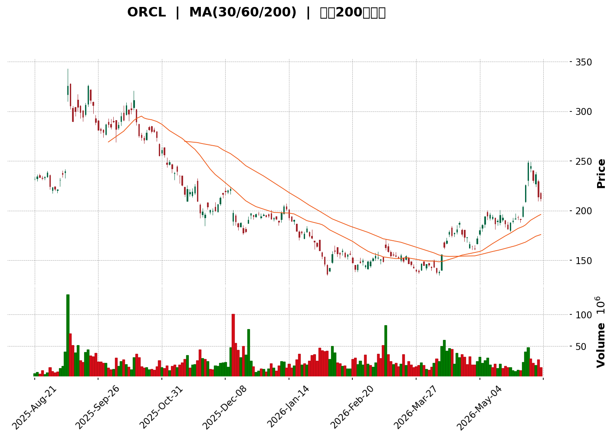
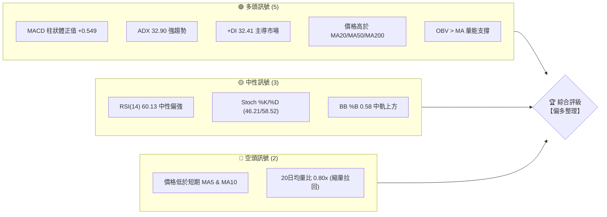
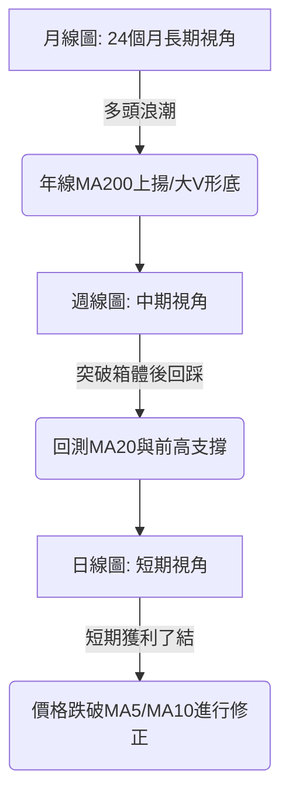
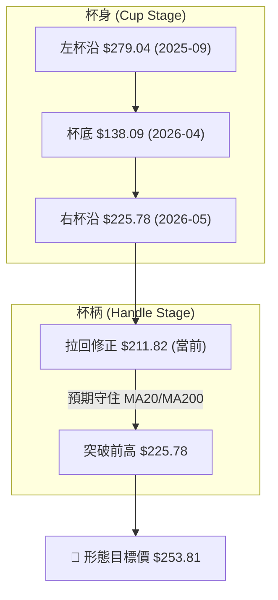

<details>
<summary>📊 靜態圖表 (點擊展開)</summary>

</details>

<html>
<head><meta charset="utf-8" /></head>
<body>
    <div style="height:500px; width:100%;">                        <script>window.PlotlyConfig = {MathJaxConfig: 'local'};</script>
        <script charset="utf-8" src="https://cdn.plot.ly/plotly-3.6.0.min.js" integrity="sha256-QaOVwtVY0T02VaHrr6pnoHLCwayMJp4O5n4YyaE3rJk=" crossorigin="anonymous"></script>                <div id="candlestick-chart" class="plotly-graph-div" style="height:100%; width:100%;"></div>            <script>                window.PLOTLYENV=window.PLOTLYENV || {};                                if (document.getElementById("candlestick-chart")) {                    Plotly.newPlot(                        "candlestick-chart",                        [{"close":{"dtype":"f8","bdata":"AAAAILTqbEAAAACAnlBtQAAAAMAjMm1AAAAAgAoMbUAAAADg1j5tQAAAAIAHzm1AAAAAQIELbEAAAAAgJ\u002fFrQAAAAIBqtmtAAAAAACGoa0AAAAAgRt9sQAAAAECck21AAAAAwM\u002fzbUAAAABAJlx0QAAAAIAxF3NAAAAAQEceckAAAAAgZLxyQAAAAED8A3NAAAAAYM2wckAAAAAAw2RyQAAAAODkI3NAAAAAwEpZdEAAAABA93VzQAAAAAC4IHNAAAAAwMgQckAAAACg2ZNxQAAAAAC9iHFAAAAAwJtwcUAAAACA9OtxQAAAAOBN6HFAAAAAIGW+cUAAAACg6RRyQAAAAIA7oHFAAAAAYOzlcUAAAAAgV3JyQAAAACC7MnJAAAAAYA8ic0AAAADgx5JyQAAAAMA\u002f3HJAAAAAoGlxc0AAAAAAfhhyQAAAAADLN3FAAAAA4IIXcUAAAABA6u9wQAAAAEDAZXFAAAAAgJeZcUAAAACA5npxQAAAAADWcXFAAAAAgOUZcUAAAADARepvQAAAAMAYUHBAAAAAAGcEcEAAAACg79RuQAAAAID\u002fGG9AAAAAYPNJbkAAAACgjrltQAAAAKB9621AAAAAQKVWbUAAAADgUDNsQAAAAKC3B2tAAAAAIKWva0AAAACgjFBrQAAAACCWZGtAAAAAgOEEbEAAAADA5ixqQAAAACB5sWhAAAAA4NDhaEAAAACAc3poQAAAAGCpdmlAAAAA4O0WaUAAAACgzvZoQAAAAGDl+2hAAAAAgMLOaUAAAACgq6BqQAAAAOAICGtAAAAAAC1ma0AAAACgqYVrQAAAAMC7tGtAAAAAAFa0aEAAAABA6ZlnQAAAAEBM+WZAAAAAwO1vZ0AAAABA1ytmQAAAAADGXWZAAAAAQIXZZ0AAAABAY6VoQAAAAICzRGhAAAAA4BSJaEAAAADg+5hoQAAAAED5RWhAAAAAIC2AaEAAAACABjdoQAAAAEB4UGhAAAAAID3tZ0AAAADgIRJoQAAAAKAw9WdAAAAAwLuPZ0AAAADAh7poQAAAAMD2fmlAAAAAAMAyaUAAAAAA9R1oQAAAAEAOpmdAAAAAAJnNZ0AAAADAZmlmQAAAAGDLqGVAAAAAQOoxZkAAAACgYxFmQAAAAODCuWZAAAAAAFLJZUAAAADAWoZlQAAAACB\u002fDWVAAAAA4DqAZEAAAADgF\u002fBjQAAAAMA2RGNAAAAAwBpFYkAAAADgKABhQAAAAIBVymFAAAAAoHCBY0AAAAAgrOpjQAAAAOCdk2NAAAAAoO59Y0AAAAAApfJjQAAAAEDkLWNAAAAAAAx0Y0AAAABg2H9jQAAAAGARcmJAAAAAgC6aYUAAAAAgNDRiQAAAAEACbGJAAAAA4C25YkAAAAAgmxxiQAAAAKBgl2JAAAAAYLmPYkAAAACg3vpiQAAAAEAKSGNAAAAAQK8NY0AAAABACuFiQAAAACApnGJAAAAAIKxRZEAAAADgZNNjQAAAAKA+UmNAAAAAQKttY0AAAAAA2kRjQAAAAEDFC2NAAAAAwFFfY0AAAADgFqViQAAAAMCwOWNAAAAAgH9SYkAAAACgYDBiQAAAAMADymFAAAAAwJBlYUAAAABAJEphQAAAAMAiU2JAAAAAYC8XYkAAAACA2ztiQAAAAAASIWJAAAAAoH7VYUAAAADAHuVhQAAAACCFO2FAAAAAQOFCYUAAAAAA13NjQAAAAAAAYGRAAAAAgOs5ZUAAAABA4UpmQAAAAIDr4WVAAAAAYI8yZkAAAACgcKVmQAAAAAAAcGdAAAAAwPUIZkAAAADA9ahlQAAAAGC4nmVAAAAAYLi+ZEAAAABgj3pkQAAAAOB6LGRAAAAAYI96ZUAAAACgR4lmQAAAAEAzK2dAAAAAwPVAaEAAAABA4VJoQAAAAGBmfmhAAAAAQOE6aEAAAABgj1pnQAAAAOBRuGdAAAAAIIVzaEAAAABgZh5oQAAAACCFU2dAAAAAYLiuZkAAAADAHoVnQAAAAOCjuGdAAAAAYI8CaEAAAACA6yFoQAAAAGC43mdAAAAAYGZ2aUAAAADA9ThsQAAAAMDMBG9AAAAAYI+SbkAAAABgj8psQAAAAEDhim1AAAAAgMK1akAAAACAPXpqQA=="},"high":{"dtype":"f8","bdata":"Us4c+lRCbUBnc0niPpRtQD2SCZESpW1AH3+Hs8NhbUDFod\u002fxslVtQHt2DNTHAW5A+HpSD1uLbUD\u002fXSpB6vVrQCSABrwzBGxAcgO38Dm6a0DWNJvEDhltQIlvxQq0EG5A7YA4Aa0ybkDK9aQPNnB1QDU1rOeIhnRAUyc7wPAYc0A1262uBApzQJiaXdVv13NAP2tt3+Qjc0DeCR5ZD9dyQGBjTm7JSnNAA\u002f+1FLludECodHloSSd0QJJBw2ZgYHNA3C7KKpOGckCHZ\u002fZ7KztyQFHlYNzau3FAl1HVPGyccUD8p3sSg\u002ftxQPt0iJ2RSnJALGy1iFRFckDjptYEt2VyQHdicqPJLnJAXMPlv\u002fUTckDz+KbOG7JyQHcCct9yHXNAIrf3U9ZMc0BUmiGo+OhyQHdlMV\u002fEUXNAY38B1h4JdECvhACnvuZyQAsbGwuT93FAy0VHaWhpcUCgLDuMHDhxQElO2lLvlXFAqRPljvnWcUDj0h8H9NNxQHtIZKt2u3FAIy4JJGZ+cUBiv+xnzMFwQPIU4vH7gnBA21lSfvZ\u002fcECZVKYBEbdvQH244C14W29Akf9Kko\u002fxbkDNx\u002fF10N1tQKp4vadbt25AvLCv1P1\u002fbUBd8kXqomttQL3KLx4d+WtA1m5AWzk1bEAaWEsGDq5rQNt+KMStymtAbJoDaTVYbEA\u002fhLHyQxJtQJJG7uw04WlAtSXIgGdSaUD6aBBrJcZoQP3EBdT0FmpAsA2MPFUjaUAZ65sJOkhpQF7F2jRqDWpAVeRMfs3UaUDn1Z\u002f2BMNqQKG3FG8ZRWtA+06muhLsa0ABPnFWVKhrQMGgncsz\u002fmtAXPm4xDMYaUA8Per6h5RoQMClNzwbemdAFBW9FYGUZ0CCunKZjCtnQARSBHY19GZA4y\u002fGZLQ9aECjel3cvrJoQOq3iY\u002fbf2hAh4Ys+TSiaEBQnlyrreRoQD2Ec4SFqWhAr6vFNWOlaEDrxMiL239oQCUqLQcRrGhAoVPID6kOaUA4wwtWEjZoQFsfFmcyT2hAgdmNVBS5Z0AhbcoLd+9oQDbh48EwvGlAGN6C5nTiaUATpm9JTB9pQKaH5cCZSmhA4XfYgnjmZ0AzssFXO1FnQJ7KowYWf2ZA3+3OCw5xZkCTAJqhymBmQCqGHgxIFWdAEOloEgZjZkDykUxwhqFmQJhWPZdmNGVA\u002fL0ZFP0JZUC3a3EgVVNlQIMM6tVo2mNAtiB2V+8sY0AcsJFDR0FiQL1RfIpz1mFABxhDRzXmY0DjgmZPD5pkQFm0yIzkYmRAlIiiIpHPY0BhthoqhjdkQO994Vk412NAquUvyBSYY0DbIFQxu\u002fBjQBxOCp+HLmNAqj1gm1wpYkBrp5py+UdiQGynJHLjF2NAAr8Q7wP\u002fYkBAvJhcSjJiQAKM7gS3tGJAKioJQvPMYkDraRtlaSJjQKid1099rGNAWceMv1nUY0BHa2k0Eu9iQHdr6BpQM2NA8LYNqDBlZUDjXmJO3udkQH4IMf+7BmRA63ydJQDGY0D+JxuFvctjQIBw0LrHTWNAZzN8lfaLY0DREpKW7hZjQMMzazGcZ2NAyg9J1qgrY0DxZRYWMapiQF5esCW6PmJAJzvXnkymYUBGVaySrJZhQJy2VBtiXGJAKX18+iGkYkAXJRVKxT1iQOkhyC0OgWJAndpjlSMCYkBiZbD72d1iQAAAAKCZ2WFAAAAAoHCFYUAAAADAHn1jQAAAAMDMLGVAAAAAgOuRZUAAAADgo4hmQAAAAAAAEGdAAAAA4FE4ZkAAAABA4SpnQAAAAIDCpWdAAAAA4Hq8ZkAAAABguJZmQAAAAKCZsWVAAAAAYGYWZUAAAADgUZhkQAAAAIDCpWRAAAAAoJnJZUAAAAAAAPBmQAAAAOCjUGdAAAAAoEdJaEAAAADAzARpQAAAAAAAwGhAAAAAgMJ1aEAAAACgcB1oQAAAAIA98mdAAAAAYLgWaUAAAACAwo1oQAAAAOBR2GdAAAAAQAqXZ0AAAABACodnQAAAAIA9GmhAAAAAAACgaEAAAABgZmZoQAAAAOB6BGhAAAAAAACgaUAAAACgR0lsQAAAAAAASG9AAAAAAAAgb0AAAADgURBuQAAAAGBm3m1AAAAAgBTubEAAAACA62FrQA=="},"hovertemplate":"\u003cb\u003e%{x|%Y-%m-%d}\u003c\u002fb\u003e\u003cbr\u003e\u958b: $%{open:.2f}\u003cbr\u003e\u9ad8: $%{high:.2f}\u003cbr\u003e\u4f4e: $%{low:.2f}\u003cbr\u003e\u6536: $%{close:.2f}\u003cextra\u003e\u003c\u002fextra\u003e","low":{"dtype":"f8","bdata":"GQR1sobTbEC+wMfLurRsQBrMvNqxLW1A36AttWrcbEDEX2ehdttsQBeurIbuKG1At6c0E5+ra0Ah94ardiJrQA3uRSlxgGtAt79rI+k6a0CgKu+S4gNsQArSEvL2Lm1AaZdvIycXbUCwxOUOWFpzQEjU+itx43JAMR4gynMXckAR9RwJZm9yQEAG+jZ0vnJAgNokeoVLckAU72CpaxtyQPWKVerfb3JA4OEIlkUIc0DvTgSZ9TlzQD\u002f3QRjlmnJAR7pgB6fkcUBZondAjIxxQN7sH4W7VnFAo2NgYNYbcUDnXvLvRDtxQKPUv0z3vHFAJw8XQWyccUB1erQVXwhyQMg6WRoNznBAsvbRzhKWcUC84rGpFthxQBudCMSfI3JAPckATr5+ckCYrbueJSNyQNkrsDSCkXJA1GWby4DTckA3urmQ59txQGE9LEgOGnFA3r2rzI3pcECkrNQusLlwQN7uSyGf63BAbOWr5GqIcUADQwennWFxQAXrJYE5bXFAirxUMRXbcEBjloUF39ZvQFCCsPOL5G9ARIPk9nm1b0BQIhOaKHZuQCCgf9ytsG5AbpoxB4O6bUD9fNm8yd1sQJ465+Dnc21ADOHknr5vbEBewEJnPBlsQBU9ePT5vGpAjr3UKXIvakAiEZclysdqQP6HOrQTpmpAGvhTiHL\u002fakBLfW1jfyBqQDkIMI3FC2hAFAV\u002f9J8jaEDUR+cj4Q9nQBnByzcnIGlAewB3xuWMaEAXCDWl9G9oQOdttCnp2GhAvBQr6dPFaEBnrUqF6qFpQFerB6MWimpA6GX\u002fv7nyakDkLqM8TB5rQHDAb+8ICGtAp5rLTfYiZ0BEAQXDAhtnQBTnHn9YiWZAZPeLRJ\u002frZkCFVjTsof9lQPEH2SyoL2ZAgyJzoRJfZ0AhhGFQ3\u002fRnQMCvyVuE4GdAHmP0+nAnaEBXUHjwMF1oQD2JTTjU7mdAs4ckLXhQaEAAibLhTDFoQMqH\u002f0zDIGhAOiY4QvjkZ0AFx7zaILFnQDRKV2d52mdAw+y13mogZ0BYmgdU74NnQI1ZC89gimhA0NdFmcX+aECihh01q8RnQG26nv1il2dAE0QXgy88Z0AplnU3i1dmQBTyviQzQGVAkxtYplf8ZUDwgcj+12xlQEhj05oTPWZAfRPhiGqiZUBStyUNYWhlQBmAQ62mHmRAPCS41H9VZECSC+0VLu5jQNS7HNrh62JAYCQKfqz9YUDk26vR79hgQA8nzzqmTWFAFwr+zKBPYkAZ0BEqPY1jQIaJujjZLmNAk2vm+QP\u002fYkBfbkII\u002fFdjQESb+RMiC2NAeQ7UOvvaYkAGpi6USmdjQNk6T4wQXGJAeG5VzXFDYUDshTum6EdhQGB3f054WmJAD0geP6IUYkA5Bry2X7NhQOQ5\u002fzYJlmFAOt+oDavRYUCOA+UbmJJiQEB\u002frMYes2JA\u002fLquFPTiYkCM2AaEcz1iQCtt\u002fNXdfWJAIa+V66wAZEAShW3u2sFjQDL3KZ+hM2NAbHengBw\u002fY0CrF99t5x5jQMN\u002fOqVY8GJATJw2yOWLYkAubjYT7G1iQESKTV\u002fvxWJANC+sV9hKYkBWHX18GANiQNvPwZJnwWFAj\u002ffGZjI6YUBTsAS\u002fJQ9hQGAL596fa2FAmVxq11MFYkBYAXN5+XlhQC\u002f4Tc8t62FA8Iqbl35uYUBE5lFr4sxhQAAAAAAAAGFAAAAAgD3SYEAAAABACndhQAAAAIDrMWRAAAAAYLjGZEAAAACgmbllQAAAACCFq2VAAAAA4FGwZUAAAADgUQBmQAAAAKCZ2WZAAAAAYI\u002fCZUAAAACgmRllQAAAAMDM\u002fGRAAAAAoJlBZEAAAADAzBRkQAAAAGCPCmRAAAAAwMzEZEAAAADgUchlQAAAAAAAYGZAAAAAoHDVZkAAAACgmdlnQAAAAGC4xmdAAAAAQDPTZ0AAAAAA15tmQAAAAIDrIWdAAAAAYGYuZ0AAAADAzJxnQAAAAOCj6GZAAAAAgMKdZkAAAACgmVlmQAAAAGBmZmdAAAAAQDPjZ0AAAACA69FnQAAAAKBwfWdAAAAAACksaEAAAADgUQBqQAAAAEAzE2xAAAAAQOHabUAAAAAghXNsQAAAAAAAAGxAAAAAYGYuakAAAABgjypqQA=="},"name":"\u50f9\u683c","open":{"dtype":"f8","bdata":"VkspDjbnbEDScBwpRwdtQHIj49G7b21Adje+dB8lbUAdYdRTHyVtQB2HbTZENm1ArtxGD\u002f13bUAqLJ0oYYhrQCSABrwzBGxAumKWI2GIa0AjMuEoVtdsQMUGUZBgwG1AT9V5EvfBbUC691f9DctzQNowNrIOfHRAqRJkaVX2ckBTcTKozwBzQKGmVP2deXNAHivh2n4Uc0CPgcZ8rcpyQF1FC0qLinJAWmKHzUozc0AjGEV6aRd0QFR92VaxVnNAAgAqpVRPckBrm9ONSytyQI9j953ypXFAJgbbbYCXcUCnkgCv30lxQHtgmeY+GHJAZ2oqSlL1cUCMhUsqdCFyQHdicqPJLnJAI4QXMfeycUAY6lcXTxxyQKYd+L8ip3JA3ueSiQKOckAFbuZLdNtyQMd2V5qa8HJAGxd+YLz7ckDSsVIJUd5yQJbJPIz28nFAPQ358pRGcUAW3piWQxJxQJZu+H6v9HBA6DxrdMfCcUAzCPyIHc1xQMAZRRZYlHFAxR3ExNp7cUC9HX\u002fsk7FwQEqRcc3MHnBAW+MAgOt5cEDpIimQgA5vQIQtydSqzG5A2vIkHJ\u002fNbkD3iznCSbFtQAGOKXNUjm5AlmBInzBZbUB+jcgKaWltQNJro\u002f+082tAizVWqVoxakD+t1RuEhxrQACyQIV23GpAadvu+Bo3a0BnAarL8LdsQN7pkVcWumlAcd4HXgt1aEA8VtW5oBxoQGrXZNgNB2pA9duudVPJaEA8leIj0OhoQHXjutxifGlAJILmAGjjaEAAzAoY5dJpQBY4fnMyNWtA24uqGPB\u002fa0B9nzet9FVrQBdmewpAjmtAGeqnh5WuZ0Ck8gTIdWVoQAwFUqJ6ZGdAC8XNAk3yZkADkoG1F8ZmQNK1D+hTs2ZAUv8N\u002f6hnZ0AfhI7NxXNoQIKFZzZeZ2hAoEPbVeM5aECbn32\u002fNZtoQNgnzgosH2hAXH4xyplbaEDoAa\u002fSDGdoQLi10RByiGhA+85cbR2kaEC7r3LqSOxnQOsuR+ptQ2hA\u002fxERddq2Z0AiOvQ2xt9nQE4VklwxnWhAQVeyGyuJaUATpm9JTB9pQKaH5cCZSmhAmEmuJPinZ0AzssFXO1FnQCnc04G\u002fYWZARwAe0txXZkBt63JRnYBlQHJ7YtpAT2ZAxP3obh9SZkBbtv9N9cllQA\u002fNK3\u002fZMWVAjeBixLXyZEAU+StcZ0plQLpMz6SxtmNAH2ZwJFcrY0DjcIv5+yJiQP\u002fyvYdvaGFArcOAcSR\u002fYkB\u002fghodLu5jQFm0yIzkYmRAry2BqCusY0AREh6AQ9ZjQMJotsrDrWNA+jIOTuw7Y0DySY63kpRjQPWIWcuGGGNAa69FntolYkCQpymdMYthQN\u002f6LeqBlGJAXtWVVrWIYkAU7HS2IuxhQJcdaysRpGFAK\u002f549eAHYkBvNNLJnK9iQG4s8pniAWNAe0AFpGgMY0B+LSqlncViQCFxZQ67ImNAyzz3LKG5ZEAm0\u002fEPyIJkQN5bncniz2NAxNoc74lwY0Cx9bidxFxjQDx9c\u002f62G2NA5YDGhPa9YkBYZVjqjRBjQLTVEmGT3GJAq8ZHv\u002fUOY0Coz3JavZZiQJJDFVV07GFASuk5ShCOYUBR7W3lrnFhQFe7XGr5eWFAwtnmcUaSYkDdayjkDslhQBzuu7OoXWJAKl2hW\u002fLoYUCtp5FO3LhiQAAAAGBmxmFAAAAAgD0qYUAAAADgo3hhQAAAAIDC\u002fWRAAAAA4HrcZEAAAACgcA1mQAAAAIDC3WZAAAAAgOsZZkAAAABAM0tmQAAAAIDCRWdAAAAAwMyMZkAAAADgUZBmQAAAAGCPkmVAAAAAwB5FZEAAAACgR4FkQAAAAOCjQGRAAAAAoHDNZEAAAADgowBmQAAAAAApxGZAAAAAYGZGZ0AAAAAghdNoQAAAAGCPEmhAAAAAwMwEaEAAAACgcB1oQAAAAMD1oGdAAAAAgMKFZ0AAAAAgrs9nQAAAAAAAwGdAAAAAAABAZ0AAAACAFH5mQAAAAOBRoGdAAAAAoHD1Z0AAAACgmSloQAAAACBc72dAAAAAoEdBaEAAAAAAACBqQAAAAAAA0GxAAAAAoJlZbkAAAAAgXA9uQAAAAAAAYGxAAAAAIK6vbEAAAAAAADhrQA=="},"x":["2025-08-21T00:00:00-04:00","2025-08-22T00:00:00-04:00","2025-08-25T00:00:00-04:00","2025-08-26T00:00:00-04:00","2025-08-27T00:00:00-04:00","2025-08-28T00:00:00-04:00","2025-08-29T00:00:00-04:00","2025-09-02T00:00:00-04:00","2025-09-03T00:00:00-04:00","2025-09-04T00:00:00-04:00","2025-09-05T00:00:00-04:00","2025-09-08T00:00:00-04:00","2025-09-09T00:00:00-04:00","2025-09-10T00:00:00-04:00","2025-09-11T00:00:00-04:00","2025-09-12T00:00:00-04:00","2025-09-15T00:00:00-04:00","2025-09-16T00:00:00-04:00","2025-09-17T00:00:00-04:00","2025-09-18T00:00:00-04:00","2025-09-19T00:00:00-04:00","2025-09-22T00:00:00-04:00","2025-09-23T00:00:00-04:00","2025-09-24T00:00:00-04:00","2025-09-25T00:00:00-04:00","2025-09-26T00:00:00-04:00","2025-09-29T00:00:00-04:00","2025-09-30T00:00:00-04:00","2025-10-01T00:00:00-04:00","2025-10-02T00:00:00-04:00","2025-10-03T00:00:00-04:00","2025-10-06T00:00:00-04:00","2025-10-07T00:00:00-04:00","2025-10-08T00:00:00-04:00","2025-10-09T00:00:00-04:00","2025-10-10T00:00:00-04:00","2025-10-13T00:00:00-04:00","2025-10-14T00:00:00-04:00","2025-10-15T00:00:00-04:00","2025-10-16T00:00:00-04:00","2025-10-17T00:00:00-04:00","2025-10-20T00:00:00-04:00","2025-10-21T00:00:00-04:00","2025-10-22T00:00:00-04:00","2025-10-23T00:00:00-04:00","2025-10-24T00:00:00-04:00","2025-10-27T00:00:00-04:00","2025-10-28T00:00:00-04:00","2025-10-29T00:00:00-04:00","2025-10-30T00:00:00-04:00","2025-10-31T00:00:00-04:00","2025-11-03T00:00:00-05:00","2025-11-04T00:00:00-05:00","2025-11-05T00:00:00-05:00","2025-11-06T00:00:00-05:00","2025-11-07T00:00:00-05:00","2025-11-10T00:00:00-05:00","2025-11-11T00:00:00-05:00","2025-11-12T00:00:00-05:00","2025-11-13T00:00:00-05:00","2025-11-14T00:00:00-05:00","2025-11-17T00:00:00-05:00","2025-11-18T00:00:00-05:00","2025-11-19T00:00:00-05:00","2025-11-20T00:00:00-05:00","2025-11-21T00:00:00-05:00","2025-11-24T00:00:00-05:00","2025-11-25T00:00:00-05:00","2025-11-26T00:00:00-05:00","2025-11-28T00:00:00-05:00","2025-12-01T00:00:00-05:00","2025-12-02T00:00:00-05:00","2025-12-03T00:00:00-05:00","2025-12-04T00:00:00-05:00","2025-12-05T00:00:00-05:00","2025-12-08T00:00:00-05:00","2025-12-09T00:00:00-05:00","2025-12-10T00:00:00-05:00","2025-12-11T00:00:00-05:00","2025-12-12T00:00:00-05:00","2025-12-15T00:00:00-05:00","2025-12-16T00:00:00-05:00","2025-12-17T00:00:00-05:00","2025-12-18T00:00:00-05:00","2025-12-19T00:00:00-05:00","2025-12-22T00:00:00-05:00","2025-12-23T00:00:00-05:00","2025-12-24T00:00:00-05:00","2025-12-26T00:00:00-05:00","2025-12-29T00:00:00-05:00","2025-12-30T00:00:00-05:00","2025-12-31T00:00:00-05:00","2026-01-02T00:00:00-05:00","2026-01-05T00:00:00-05:00","2026-01-06T00:00:00-05:00","2026-01-07T00:00:00-05:00","2026-01-08T00:00:00-05:00","2026-01-09T00:00:00-05:00","2026-01-12T00:00:00-05:00","2026-01-13T00:00:00-05:00","2026-01-14T00:00:00-05:00","2026-01-15T00:00:00-05:00","2026-01-16T00:00:00-05:00","2026-01-20T00:00:00-05:00","2026-01-21T00:00:00-05:00","2026-01-22T00:00:00-05:00","2026-01-23T00:00:00-05:00","2026-01-26T00:00:00-05:00","2026-01-27T00:00:00-05:00","2026-01-28T00:00:00-05:00","2026-01-29T00:00:00-05:00","2026-01-30T00:00:00-05:00","2026-02-02T00:00:00-05:00","2026-02-03T00:00:00-05:00","2026-02-04T00:00:00-05:00","2026-02-05T00:00:00-05:00","2026-02-06T00:00:00-05:00","2026-02-09T00:00:00-05:00","2026-02-10T00:00:00-05:00","2026-02-11T00:00:00-05:00","2026-02-12T00:00:00-05:00","2026-02-13T00:00:00-05:00","2026-02-17T00:00:00-05:00","2026-02-18T00:00:00-05:00","2026-02-19T00:00:00-05:00","2026-02-20T00:00:00-05:00","2026-02-23T00:00:00-05:00","2026-02-24T00:00:00-05:00","2026-02-25T00:00:00-05:00","2026-02-26T00:00:00-05:00","2026-02-27T00:00:00-05:00","2026-03-02T00:00:00-05:00","2026-03-03T00:00:00-05:00","2026-03-04T00:00:00-05:00","2026-03-05T00:00:00-05:00","2026-03-06T00:00:00-05:00","2026-03-09T00:00:00-04:00","2026-03-10T00:00:00-04:00","2026-03-11T00:00:00-04:00","2026-03-12T00:00:00-04:00","2026-03-13T00:00:00-04:00","2026-03-16T00:00:00-04:00","2026-03-17T00:00:00-04:00","2026-03-18T00:00:00-04:00","2026-03-19T00:00:00-04:00","2026-03-20T00:00:00-04:00","2026-03-23T00:00:00-04:00","2026-03-24T00:00:00-04:00","2026-03-25T00:00:00-04:00","2026-03-26T00:00:00-04:00","2026-03-27T00:00:00-04:00","2026-03-30T00:00:00-04:00","2026-03-31T00:00:00-04:00","2026-04-01T00:00:00-04:00","2026-04-02T00:00:00-04:00","2026-04-06T00:00:00-04:00","2026-04-07T00:00:00-04:00","2026-04-08T00:00:00-04:00","2026-04-09T00:00:00-04:00","2026-04-10T00:00:00-04:00","2026-04-13T00:00:00-04:00","2026-04-14T00:00:00-04:00","2026-04-15T00:00:00-04:00","2026-04-16T00:00:00-04:00","2026-04-17T00:00:00-04:00","2026-04-20T00:00:00-04:00","2026-04-21T00:00:00-04:00","2026-04-22T00:00:00-04:00","2026-04-23T00:00:00-04:00","2026-04-24T00:00:00-04:00","2026-04-27T00:00:00-04:00","2026-04-28T00:00:00-04:00","2026-04-29T00:00:00-04:00","2026-04-30T00:00:00-04:00","2026-05-01T00:00:00-04:00","2026-05-04T00:00:00-04:00","2026-05-05T00:00:00-04:00","2026-05-06T00:00:00-04:00","2026-05-07T00:00:00-04:00","2026-05-08T00:00:00-04:00","2026-05-11T00:00:00-04:00","2026-05-12T00:00:00-04:00","2026-05-13T00:00:00-04:00","2026-05-14T00:00:00-04:00","2026-05-15T00:00:00-04:00","2026-05-18T00:00:00-04:00","2026-05-19T00:00:00-04:00","2026-05-20T00:00:00-04:00","2026-05-21T00:00:00-04:00","2026-05-22T00:00:00-04:00","2026-05-26T00:00:00-04:00","2026-05-27T00:00:00-04:00","2026-05-28T00:00:00-04:00","2026-05-29T00:00:00-04:00","2026-06-01T00:00:00-04:00","2026-06-02T00:00:00-04:00","2026-06-03T00:00:00-04:00","2026-06-04T00:00:00-04:00","2026-06-05T00:00:00-04:00","2026-06-08T00:00:00-04:00"],"type":"candlestick"},{"hovertemplate":"MA30: $%{y:.2f}\u003cextra\u003e\u003c\u002fextra\u003e","line":{"color":"#2196F3","dash":"dash","width":2},"mode":"lines","name":"MA30","x":["2025-08-21T00:00:00-04:00","2025-08-22T00:00:00-04:00","2025-08-25T00:00:00-04:00","2025-08-26T00:00:00-04:00","2025-08-27T00:00:00-04:00","2025-08-28T00:00:00-04:00","2025-08-29T00:00:00-04:00","2025-09-02T00:00:00-04:00","2025-09-03T00:00:00-04:00","2025-09-04T00:00:00-04:00","2025-09-05T00:00:00-04:00","2025-09-08T00:00:00-04:00","2025-09-09T00:00:00-04:00","2025-09-10T00:00:00-04:00","2025-09-11T00:00:00-04:00","2025-09-12T00:00:00-04:00","2025-09-15T00:00:00-04:00","2025-09-16T00:00:00-04:00","2025-09-17T00:00:00-04:00","2025-09-18T00:00:00-04:00","2025-09-19T00:00:00-04:00","2025-09-22T00:00:00-04:00","2025-09-23T00:00:00-04:00","2025-09-24T00:00:00-04:00","2025-09-25T00:00:00-04:00","2025-09-26T00:00:00-04:00","2025-09-29T00:00:00-04:00","2025-09-30T00:00:00-04:00","2025-10-01T00:00:00-04:00","2025-10-02T00:00:00-04:00","2025-10-03T00:00:00-04:00","2025-10-06T00:00:00-04:00","2025-10-07T00:00:00-04:00","2025-10-08T00:00:00-04:00","2025-10-09T00:00:00-04:00","2025-10-10T00:00:00-04:00","2025-10-13T00:00:00-04:00","2025-10-14T00:00:00-04:00","2025-10-15T00:00:00-04:00","2025-10-16T00:00:00-04:00","2025-10-17T00:00:00-04:00","2025-10-20T00:00:00-04:00","2025-10-21T00:00:00-04:00","2025-10-22T00:00:00-04:00","2025-10-23T00:00:00-04:00","2025-10-24T00:00:00-04:00","2025-10-27T00:00:00-04:00","2025-10-28T00:00:00-04:00","2025-10-29T00:00:00-04:00","2025-10-30T00:00:00-04:00","2025-10-31T00:00:00-04:00","2025-11-03T00:00:00-05:00","2025-11-04T00:00:00-05:00","2025-11-05T00:00:00-05:00","2025-11-06T00:00:00-05:00","2025-11-07T00:00:00-05:00","2025-11-10T00:00:00-05:00","2025-11-11T00:00:00-05:00","2025-11-12T00:00:00-05:00","2025-11-13T00:00:00-05:00","2025-11-14T00:00:00-05:00","2025-11-17T00:00:00-05:00","2025-11-18T00:00:00-05:00","2025-11-19T00:00:00-05:00","2025-11-20T00:00:00-05:00","2025-11-21T00:00:00-05:00","2025-11-24T00:00:00-05:00","2025-11-25T00:00:00-05:00","2025-11-26T00:00:00-05:00","2025-11-28T00:00:00-05:00","2025-12-01T00:00:00-05:00","2025-12-02T00:00:00-05:00","2025-12-03T00:00:00-05:00","2025-12-04T00:00:00-05:00","2025-12-05T00:00:00-05:00","2025-12-08T00:00:00-05:00","2025-12-09T00:00:00-05:00","2025-12-10T00:00:00-05:00","2025-12-11T00:00:00-05:00","2025-12-12T00:00:00-05:00","2025-12-15T00:00:00-05:00","2025-12-16T00:00:00-05:00","2025-12-17T00:00:00-05:00","2025-12-18T00:00:00-05:00","2025-12-19T00:00:00-05:00","2025-12-22T00:00:00-05:00","2025-12-23T00:00:00-05:00","2025-12-24T00:00:00-05:00","2025-12-26T00:00:00-05:00","2025-12-29T00:00:00-05:00","2025-12-30T00:00:00-05:00","2025-12-31T00:00:00-05:00","2026-01-02T00:00:00-05:00","2026-01-05T00:00:00-05:00","2026-01-06T00:00:00-05:00","2026-01-07T00:00:00-05:00","2026-01-08T00:00:00-05:00","2026-01-09T00:00:00-05:00","2026-01-12T00:00:00-05:00","2026-01-13T00:00:00-05:00","2026-01-14T00:00:00-05:00","2026-01-15T00:00:00-05:00","2026-01-16T00:00:00-05:00","2026-01-20T00:00:00-05:00","2026-01-21T00:00:00-05:00","2026-01-22T00:00:00-05:00","2026-01-23T00:00:00-05:00","2026-01-26T00:00:00-05:00","2026-01-27T00:00:00-05:00","2026-01-28T00:00:00-05:00","2026-01-29T00:00:00-05:00","2026-01-30T00:00:00-05:00","2026-02-02T00:00:00-05:00","2026-02-03T00:00:00-05:00","2026-02-04T00:00:00-05:00","2026-02-05T00:00:00-05:00","2026-02-06T00:00:00-05:00","2026-02-09T00:00:00-05:00","2026-02-10T00:00:00-05:00","2026-02-11T00:00:00-05:00","2026-02-12T00:00:00-05:00","2026-02-13T00:00:00-05:00","2026-02-17T00:00:00-05:00","2026-02-18T00:00:00-05:00","2026-02-19T00:00:00-05:00","2026-02-20T00:00:00-05:00","2026-02-23T00:00:00-05:00","2026-02-24T00:00:00-05:00","2026-02-25T00:00:00-05:00","2026-02-26T00:00:00-05:00","2026-02-27T00:00:00-05:00","2026-03-02T00:00:00-05:00","2026-03-03T00:00:00-05:00","2026-03-04T00:00:00-05:00","2026-03-05T00:00:00-05:00","2026-03-06T00:00:00-05:00","2026-03-09T00:00:00-04:00","2026-03-10T00:00:00-04:00","2026-03-11T00:00:00-04:00","2026-03-12T00:00:00-04:00","2026-03-13T00:00:00-04:00","2026-03-16T00:00:00-04:00","2026-03-17T00:00:00-04:00","2026-03-18T00:00:00-04:00","2026-03-19T00:00:00-04:00","2026-03-20T00:00:00-04:00","2026-03-23T00:00:00-04:00","2026-03-24T00:00:00-04:00","2026-03-25T00:00:00-04:00","2026-03-26T00:00:00-04:00","2026-03-27T00:00:00-04:00","2026-03-30T00:00:00-04:00","2026-03-31T00:00:00-04:00","2026-04-01T00:00:00-04:00","2026-04-02T00:00:00-04:00","2026-04-06T00:00:00-04:00","2026-04-07T00:00:00-04:00","2026-04-08T00:00:00-04:00","2026-04-09T00:00:00-04:00","2026-04-10T00:00:00-04:00","2026-04-13T00:00:00-04:00","2026-04-14T00:00:00-04:00","2026-04-15T00:00:00-04:00","2026-04-16T00:00:00-04:00","2026-04-17T00:00:00-04:00","2026-04-20T00:00:00-04:00","2026-04-21T00:00:00-04:00","2026-04-22T00:00:00-04:00","2026-04-23T00:00:00-04:00","2026-04-24T00:00:00-04:00","2026-04-27T00:00:00-04:00","2026-04-28T00:00:00-04:00","2026-04-29T00:00:00-04:00","2026-04-30T00:00:00-04:00","2026-05-01T00:00:00-04:00","2026-05-04T00:00:00-04:00","2026-05-05T00:00:00-04:00","2026-05-06T00:00:00-04:00","2026-05-07T00:00:00-04:00","2026-05-08T00:00:00-04:00","2026-05-11T00:00:00-04:00","2026-05-12T00:00:00-04:00","2026-05-13T00:00:00-04:00","2026-05-14T00:00:00-04:00","2026-05-15T00:00:00-04:00","2026-05-18T00:00:00-04:00","2026-05-19T00:00:00-04:00","2026-05-20T00:00:00-04:00","2026-05-21T00:00:00-04:00","2026-05-22T00:00:00-04:00","2026-05-26T00:00:00-04:00","2026-05-27T00:00:00-04:00","2026-05-28T00:00:00-04:00","2026-05-29T00:00:00-04:00","2026-06-01T00:00:00-04:00","2026-06-02T00:00:00-04:00","2026-06-03T00:00:00-04:00","2026-06-04T00:00:00-04:00","2026-06-05T00:00:00-04:00","2026-06-08T00:00:00-04:00"],"y":{"dtype":"f8","bdata":"AAAAAAAA+H8AAAAAAAD4fwAAAAAAAPh\u002fAAAAAAAA+H8AAAAAAAD4fwAAAAAAAPh\u002fAAAAAAAA+H8AAAAAAAD4fwAAAAAAAPh\u002fAAAAAAAA+H8AAAAAAAD4fwAAAAAAAPh\u002fAAAAAAAA+H8AAAAAAAD4fwAAAAAAAPh\u002fAAAAAAAA+H8AAAAAAAD4fwAAAAAAAPh\u002fAAAAAAAA+H8AAAAAAAD4fwAAAAAAAPh\u002fAAAAAAAA+H8AAAAAAAD4fwAAAAAAAPh\u002fAAAAAAAA+H8AAAAAAAD4fwAAAAAAAPh\u002fAAAAAAAA+H8AAAAAAAD4f2ZmZgap0XBAVVVV7bHtcEDe3d1F6gpxQGZmZv7AJHFA7+7u9oxBcUC8u7trLmJxQCIiIiJOfnFAvLu7W+qpcUBmZmZeMNFxQDMzM+vj+3FAIiIiSs0rckCamZnJB0tyQKuqqmrDX3JA3t3dHdFxckCrqqrqm1RyQFVVVTUpRnJAMzMz87xBckAAAACQBTdyQDMzM+OdKXJAAAAAoA0cckBVVVUFRAdyQN7d3Z0j73FAd3d3Fy3KcUAAAADYqKdxQHd3d28eiXFAIiIiIjFwcUAzMzPbBVlxQDMzM3MOQ3FAERER4WkrcUBmZma+zQpxQJqZmXlS5XBAq6qqUgnEcEBVVVUlSJ5wQJqZmSHAfHBAAAAAWJFbcEBVVVWN1i1wQFVVVVXP929AmpmZiZmFb0Dv7u7+fhlvQKuqqsrmsG5AIiIi8is7bkAiIiKiXdttQM3MzJy1im1Ad3d35ztDbUBVVVU1ZQVtQM3MzHwlw2xAq6qqWpSAbEBVVVW1G0FsQO\u002fu7m7PA2xAAAAAAMOya0C8u7v70GtrQCIiIgJ0GWtAMzMzMxfQakDNzMz8L4ZqQCIiIhKuO2pAd3d3d7sEakAAAACwZNlpQAAAAMAqqWlAiYiIeC6AaUB3d3fnb2FpQO\u002fu7o7pSWlARERE5LouaUDNzMx8RxRpQJqZmTkC+mhAiYiIWBbXaECamZnZIMVoQKuqqiravmhAIiIiMpWzaEAREREBuLVoQJqZmdn+tWhAERERQey2aEDNzMzMsa9oQDMzM8NMpGhAd3d3xzGTaEBEREQEOG9oQCIiIqJgQWhAIiIiAvgUaEBEREQkbeZnQBEREWHtu2dAiYiI2AajZ0BVVVXlTpFnQBERETHqgGdAIiIisttnZ0CJiIjIzFRnQDMzMxNZOmdAzczM7LsKZ0Dv7u4+fslmQImIiNg2kmZAiYiI+EpnZkARERFhWT9mQERERERFF2ZAMzMzc4fsZUDNzMzMHchlQBERERFMnGVAMzMzwx92ZUAAAABQHU9lQM3MzLwTIGVAIiIisjntZEDe3d09jLVkQCIiIsIueWRAd3d3J+5BZEDNzMxsrw5kQBEREYGH42NAmpmZ2cy2Y0C8u7sLhJljQHd3d1c5hWNAMzMzk2pqY0BVVVVlNE9jQLy7u6sVLGNAREREJJAfY0Crqqp6EBFjQAAAABBKAmNAREREJCP5YkARERHhbfNiQKuqqjqM8WJAZmZmdvT6YkBVVVVl\u002fAhjQLy7uys7FWNAERERESILY0ARERHRY\u002fxiQCIiIvIi7WJAMzMz80HbYkDe3d39ksRiQGZmZkZIvWJAIiIiUqexYkAAAACg2qZiQCIiInInpGJAVVVVlSGmYkDNzMy8fqNiQO\u002fu7m5YmWJAmpmZad6MYkB3d3dXT5hiQKuqqtqHp2JAIiIiQkW+YkDNzMycidpiQJqZmcm78GJA7+7uDpALY0CrqqqatStjQO\u002fu7m7nVGNAVVVVBYxjY0C8u7v7MnNjQERERKTQhmNAAAAA0AySY0CJiIioX5xjQAAAAFD\u002fpWNAVVVV1fi3Y0CJiIioLdljQERERCTU+mNA7+7urnEtZEDe3d1Ny2FkQKuqqsoBm2RAZmZmRlHVZEBERESUEAllQO\u002fu7q4aN2VA7+7uzmFtZUAzMzOjmZ9lQO\u002fu7s7yy2VAmpmZmVL1ZUCamZmZUiVmQN7d3X2xXGZAzczMXEiWZkCrqqr6N75mQM3MzOwK3GZAd3d3JzEAZ0AAAABwyzJnQBEREeHBgGdAiYiIWDnIZ0De3d1NqfxnQBEREeHBMGhAIiIikqZYaEAAAACQwoFoQA=="},"type":"scatter"},{"hovertemplate":"MA60: $%{y:.2f}\u003cextra\u003e\u003c\u002fextra\u003e","line":{"color":"#9C27B0","dash":"dash","width":2},"mode":"lines","name":"MA60","x":["2025-08-21T00:00:00-04:00","2025-08-22T00:00:00-04:00","2025-08-25T00:00:00-04:00","2025-08-26T00:00:00-04:00","2025-08-27T00:00:00-04:00","2025-08-28T00:00:00-04:00","2025-08-29T00:00:00-04:00","2025-09-02T00:00:00-04:00","2025-09-03T00:00:00-04:00","2025-09-04T00:00:00-04:00","2025-09-05T00:00:00-04:00","2025-09-08T00:00:00-04:00","2025-09-09T00:00:00-04:00","2025-09-10T00:00:00-04:00","2025-09-11T00:00:00-04:00","2025-09-12T00:00:00-04:00","2025-09-15T00:00:00-04:00","2025-09-16T00:00:00-04:00","2025-09-17T00:00:00-04:00","2025-09-18T00:00:00-04:00","2025-09-19T00:00:00-04:00","2025-09-22T00:00:00-04:00","2025-09-23T00:00:00-04:00","2025-09-24T00:00:00-04:00","2025-09-25T00:00:00-04:00","2025-09-26T00:00:00-04:00","2025-09-29T00:00:00-04:00","2025-09-30T00:00:00-04:00","2025-10-01T00:00:00-04:00","2025-10-02T00:00:00-04:00","2025-10-03T00:00:00-04:00","2025-10-06T00:00:00-04:00","2025-10-07T00:00:00-04:00","2025-10-08T00:00:00-04:00","2025-10-09T00:00:00-04:00","2025-10-10T00:00:00-04:00","2025-10-13T00:00:00-04:00","2025-10-14T00:00:00-04:00","2025-10-15T00:00:00-04:00","2025-10-16T00:00:00-04:00","2025-10-17T00:00:00-04:00","2025-10-20T00:00:00-04:00","2025-10-21T00:00:00-04:00","2025-10-22T00:00:00-04:00","2025-10-23T00:00:00-04:00","2025-10-24T00:00:00-04:00","2025-10-27T00:00:00-04:00","2025-10-28T00:00:00-04:00","2025-10-29T00:00:00-04:00","2025-10-30T00:00:00-04:00","2025-10-31T00:00:00-04:00","2025-11-03T00:00:00-05:00","2025-11-04T00:00:00-05:00","2025-11-05T00:00:00-05:00","2025-11-06T00:00:00-05:00","2025-11-07T00:00:00-05:00","2025-11-10T00:00:00-05:00","2025-11-11T00:00:00-05:00","2025-11-12T00:00:00-05:00","2025-11-13T00:00:00-05:00","2025-11-14T00:00:00-05:00","2025-11-17T00:00:00-05:00","2025-11-18T00:00:00-05:00","2025-11-19T00:00:00-05:00","2025-11-20T00:00:00-05:00","2025-11-21T00:00:00-05:00","2025-11-24T00:00:00-05:00","2025-11-25T00:00:00-05:00","2025-11-26T00:00:00-05:00","2025-11-28T00:00:00-05:00","2025-12-01T00:00:00-05:00","2025-12-02T00:00:00-05:00","2025-12-03T00:00:00-05:00","2025-12-04T00:00:00-05:00","2025-12-05T00:00:00-05:00","2025-12-08T00:00:00-05:00","2025-12-09T00:00:00-05:00","2025-12-10T00:00:00-05:00","2025-12-11T00:00:00-05:00","2025-12-12T00:00:00-05:00","2025-12-15T00:00:00-05:00","2025-12-16T00:00:00-05:00","2025-12-17T00:00:00-05:00","2025-12-18T00:00:00-05:00","2025-12-19T00:00:00-05:00","2025-12-22T00:00:00-05:00","2025-12-23T00:00:00-05:00","2025-12-24T00:00:00-05:00","2025-12-26T00:00:00-05:00","2025-12-29T00:00:00-05:00","2025-12-30T00:00:00-05:00","2025-12-31T00:00:00-05:00","2026-01-02T00:00:00-05:00","2026-01-05T00:00:00-05:00","2026-01-06T00:00:00-05:00","2026-01-07T00:00:00-05:00","2026-01-08T00:00:00-05:00","2026-01-09T00:00:00-05:00","2026-01-12T00:00:00-05:00","2026-01-13T00:00:00-05:00","2026-01-14T00:00:00-05:00","2026-01-15T00:00:00-05:00","2026-01-16T00:00:00-05:00","2026-01-20T00:00:00-05:00","2026-01-21T00:00:00-05:00","2026-01-22T00:00:00-05:00","2026-01-23T00:00:00-05:00","2026-01-26T00:00:00-05:00","2026-01-27T00:00:00-05:00","2026-01-28T00:00:00-05:00","2026-01-29T00:00:00-05:00","2026-01-30T00:00:00-05:00","2026-02-02T00:00:00-05:00","2026-02-03T00:00:00-05:00","2026-02-04T00:00:00-05:00","2026-02-05T00:00:00-05:00","2026-02-06T00:00:00-05:00","2026-02-09T00:00:00-05:00","2026-02-10T00:00:00-05:00","2026-02-11T00:00:00-05:00","2026-02-12T00:00:00-05:00","2026-02-13T00:00:00-05:00","2026-02-17T00:00:00-05:00","2026-02-18T00:00:00-05:00","2026-02-19T00:00:00-05:00","2026-02-20T00:00:00-05:00","2026-02-23T00:00:00-05:00","2026-02-24T00:00:00-05:00","2026-02-25T00:00:00-05:00","2026-02-26T00:00:00-05:00","2026-02-27T00:00:00-05:00","2026-03-02T00:00:00-05:00","2026-03-03T00:00:00-05:00","2026-03-04T00:00:00-05:00","2026-03-05T00:00:00-05:00","2026-03-06T00:00:00-05:00","2026-03-09T00:00:00-04:00","2026-03-10T00:00:00-04:00","2026-03-11T00:00:00-04:00","2026-03-12T00:00:00-04:00","2026-03-13T00:00:00-04:00","2026-03-16T00:00:00-04:00","2026-03-17T00:00:00-04:00","2026-03-18T00:00:00-04:00","2026-03-19T00:00:00-04:00","2026-03-20T00:00:00-04:00","2026-03-23T00:00:00-04:00","2026-03-24T00:00:00-04:00","2026-03-25T00:00:00-04:00","2026-03-26T00:00:00-04:00","2026-03-27T00:00:00-04:00","2026-03-30T00:00:00-04:00","2026-03-31T00:00:00-04:00","2026-04-01T00:00:00-04:00","2026-04-02T00:00:00-04:00","2026-04-06T00:00:00-04:00","2026-04-07T00:00:00-04:00","2026-04-08T00:00:00-04:00","2026-04-09T00:00:00-04:00","2026-04-10T00:00:00-04:00","2026-04-13T00:00:00-04:00","2026-04-14T00:00:00-04:00","2026-04-15T00:00:00-04:00","2026-04-16T00:00:00-04:00","2026-04-17T00:00:00-04:00","2026-04-20T00:00:00-04:00","2026-04-21T00:00:00-04:00","2026-04-22T00:00:00-04:00","2026-04-23T00:00:00-04:00","2026-04-24T00:00:00-04:00","2026-04-27T00:00:00-04:00","2026-04-28T00:00:00-04:00","2026-04-29T00:00:00-04:00","2026-04-30T00:00:00-04:00","2026-05-01T00:00:00-04:00","2026-05-04T00:00:00-04:00","2026-05-05T00:00:00-04:00","2026-05-06T00:00:00-04:00","2026-05-07T00:00:00-04:00","2026-05-08T00:00:00-04:00","2026-05-11T00:00:00-04:00","2026-05-12T00:00:00-04:00","2026-05-13T00:00:00-04:00","2026-05-14T00:00:00-04:00","2026-05-15T00:00:00-04:00","2026-05-18T00:00:00-04:00","2026-05-19T00:00:00-04:00","2026-05-20T00:00:00-04:00","2026-05-21T00:00:00-04:00","2026-05-22T00:00:00-04:00","2026-05-26T00:00:00-04:00","2026-05-27T00:00:00-04:00","2026-05-28T00:00:00-04:00","2026-05-29T00:00:00-04:00","2026-06-01T00:00:00-04:00","2026-06-02T00:00:00-04:00","2026-06-03T00:00:00-04:00","2026-06-04T00:00:00-04:00","2026-06-05T00:00:00-04:00","2026-06-08T00:00:00-04:00"],"y":{"dtype":"f8","bdata":"AAAAAAAA+H8AAAAAAAD4fwAAAAAAAPh\u002fAAAAAAAA+H8AAAAAAAD4fwAAAAAAAPh\u002fAAAAAAAA+H8AAAAAAAD4fwAAAAAAAPh\u002fAAAAAAAA+H8AAAAAAAD4fwAAAAAAAPh\u002fAAAAAAAA+H8AAAAAAAD4fwAAAAAAAPh\u002fAAAAAAAA+H8AAAAAAAD4fwAAAAAAAPh\u002fAAAAAAAA+H8AAAAAAAD4fwAAAAAAAPh\u002fAAAAAAAA+H8AAAAAAAD4fwAAAAAAAPh\u002fAAAAAAAA+H8AAAAAAAD4fwAAAAAAAPh\u002fAAAAAAAA+H8AAAAAAAD4fwAAAAAAAPh\u002fAAAAAAAA+H8AAAAAAAD4fwAAAAAAAPh\u002fAAAAAAAA+H8AAAAAAAD4fwAAAAAAAPh\u002fAAAAAAAA+H8AAAAAAAD4fwAAAAAAAPh\u002fAAAAAAAA+H8AAAAAAAD4fwAAAAAAAPh\u002fAAAAAAAA+H8AAAAAAAD4fwAAAAAAAPh\u002fAAAAAAAA+H8AAAAAAAD4fwAAAAAAAPh\u002fAAAAAAAA+H8AAAAAAAD4fwAAAAAAAPh\u002fAAAAAAAA+H8AAAAAAAD4fwAAAAAAAPh\u002fAAAAAAAA+H8AAAAAAAD4fwAAAAAAAPh\u002fAAAAAAAA+H8AAAAAAAD4fwAAAMB923BAAAAAoN3YcECamZk1mdRwQAAAAJDA0HBAd3d3J4\u002fOcECJiIh8AshwQGZmZuYavXBAREREkFu2cEDv7u7u965wQERERKgrqnBAmpmZobGkcEBVVVVNW5xwQImIiByPknBAzczMiLeJcECrqqpCp2twQN7d3fndU3BAREREkANBcEBVVVW1yStwQFVVVc3CFXBAAAAAIG\u002f1b0AzMzODLL1vQO\u002fu7p7de29AERERsTgyb0BmZmbWwOpuQImIiHj1pm5A3t3d3Y5ybkAzMzMzuEVuQDMzM9OjF25AVVVVHYHrbUAiIiKyhbttQBEREUFHim1AzczMxGZbbUC8u7vjayhtQGZmZj7B+WxAREREhBzHbEAiIiL6ZpBsQAAAAMBUW2xA3t3dXZccbEAAAACAm+drQCIiItJys2tAmpmZGQx5a0B3d3e3h0VrQAAAADCBF2tAd3d31zbrakDNzMycTrpqQHd3dw9DgmpAZmZmLsZKakDNzMxsxBNqQAAAAGje32lARERE7OSqaUCJiIjwj35pQJqZmRkvTWlAq6qqcvkbaUCrqqpifu1oQKuqqpIDu2hAIiIisruHaEB3d3d3cVFoQERERMywHWhAiYiIuLzzZ0BERESkZNBnQJqZmWmXsGdAvLu7K6GNZ0DNzMykMm5nQFVVVSUnS2dA3t3dDZsmZ0DNzMwUHwpnQLy7u\u002fN272ZAIiIicmfQZkB3d3cforVmQN7d3c2Wl2ZARERENG18ZkDNzMycMF9mQCIiIiLqQ2ZAiYiIUP8kZkAAAAAIXgRmQM3MzPxM42VAq6qqSrG\u002fZUDNzMzE0JplQGZmZoYBdGVAZmZmfkthZUAAAACwL1FlQImIiCCaQWVAMzMza38wZUDNzMxUHSRlQO\u002fu7qbyFWVAmpmZMdgCZUAiIiJSPelkQCIiIgK502RAzczMhDa5ZEARERGZ3p1kQDMzMxs0gmRAMzMzs+RjZEBVVVVlWEZkQLy7uyvKLGRAq6qqiuMTZEAAAAD4+\u002fpjQHd3d5cd4mNAvLu7o63JY0BVVVV9haxjQImIiJhDiWNAiYiISGZnY0AiIiJif1NjQN7d3a2HRWNA3t3dDYk6Y0BERETUBjpjQImIiJD6OmNAERERUf06Y0AAAAAAdT1jQFVVVY1+QGNAzczMFI5BY0AzMzO7IUJjQCIiIlqNRGNAIiIi+pdFY0DNzMzE5kdjQFVVVcXFS2NA3t3dpXZZY0Dv7u4GFXFjQAAAAKgHiGNAAAAA4EmcY0B3d3ePF69jQGZmZl4SxGNAzczMnEnYY0ARERHJ0eZjQKuqqnox+mNAiYiIkIQPZECamZkhOiNkQImIiCANOGRAd3d3F7pNZEAzMzOraGRkQGZmZvYEe2RAMzMzY5ORZEARERGpQ6tkQLy7u2PJwWRAzczMNDvfZEBmZmaGqgZlQFVVVdW+OGVAvLu7s+RpZUBERER0L5RlQAAAAKjUwmVAvLu7SxneZUDe3d3FevplQA=="},"type":"scatter"},{"hovertemplate":"MA200: $%{y:.2f}\u003cextra\u003e\u003c\u002fextra\u003e","line":{"color":"#FF6F00","dash":"solid","width":2},"mode":"lines","name":"MA200","x":["2025-08-21T00:00:00-04:00","2025-08-22T00:00:00-04:00","2025-08-25T00:00:00-04:00","2025-08-26T00:00:00-04:00","2025-08-27T00:00:00-04:00","2025-08-28T00:00:00-04:00","2025-08-29T00:00:00-04:00","2025-09-02T00:00:00-04:00","2025-09-03T00:00:00-04:00","2025-09-04T00:00:00-04:00","2025-09-05T00:00:00-04:00","2025-09-08T00:00:00-04:00","2025-09-09T00:00:00-04:00","2025-09-10T00:00:00-04:00","2025-09-11T00:00:00-04:00","2025-09-12T00:00:00-04:00","2025-09-15T00:00:00-04:00","2025-09-16T00:00:00-04:00","2025-09-17T00:00:00-04:00","2025-09-18T00:00:00-04:00","2025-09-19T00:00:00-04:00","2025-09-22T00:00:00-04:00","2025-09-23T00:00:00-04:00","2025-09-24T00:00:00-04:00","2025-09-25T00:00:00-04:00","2025-09-26T00:00:00-04:00","2025-09-29T00:00:00-04:00","2025-09-30T00:00:00-04:00","2025-10-01T00:00:00-04:00","2025-10-02T00:00:00-04:00","2025-10-03T00:00:00-04:00","2025-10-06T00:00:00-04:00","2025-10-07T00:00:00-04:00","2025-10-08T00:00:00-04:00","2025-10-09T00:00:00-04:00","2025-10-10T00:00:00-04:00","2025-10-13T00:00:00-04:00","2025-10-14T00:00:00-04:00","2025-10-15T00:00:00-04:00","2025-10-16T00:00:00-04:00","2025-10-17T00:00:00-04:00","2025-10-20T00:00:00-04:00","2025-10-21T00:00:00-04:00","2025-10-22T00:00:00-04:00","2025-10-23T00:00:00-04:00","2025-10-24T00:00:00-04:00","2025-10-27T00:00:00-04:00","2025-10-28T00:00:00-04:00","2025-10-29T00:00:00-04:00","2025-10-30T00:00:00-04:00","2025-10-31T00:00:00-04:00","2025-11-03T00:00:00-05:00","2025-11-04T00:00:00-05:00","2025-11-05T00:00:00-05:00","2025-11-06T00:00:00-05:00","2025-11-07T00:00:00-05:00","2025-11-10T00:00:00-05:00","2025-11-11T00:00:00-05:00","2025-11-12T00:00:00-05:00","2025-11-13T00:00:00-05:00","2025-11-14T00:00:00-05:00","2025-11-17T00:00:00-05:00","2025-11-18T00:00:00-05:00","2025-11-19T00:00:00-05:00","2025-11-20T00:00:00-05:00","2025-11-21T00:00:00-05:00","2025-11-24T00:00:00-05:00","2025-11-25T00:00:00-05:00","2025-11-26T00:00:00-05:00","2025-11-28T00:00:00-05:00","2025-12-01T00:00:00-05:00","2025-12-02T00:00:00-05:00","2025-12-03T00:00:00-05:00","2025-12-04T00:00:00-05:00","2025-12-05T00:00:00-05:00","2025-12-08T00:00:00-05:00","2025-12-09T00:00:00-05:00","2025-12-10T00:00:00-05:00","2025-12-11T00:00:00-05:00","2025-12-12T00:00:00-05:00","2025-12-15T00:00:00-05:00","2025-12-16T00:00:00-05:00","2025-12-17T00:00:00-05:00","2025-12-18T00:00:00-05:00","2025-12-19T00:00:00-05:00","2025-12-22T00:00:00-05:00","2025-12-23T00:00:00-05:00","2025-12-24T00:00:00-05:00","2025-12-26T00:00:00-05:00","2025-12-29T00:00:00-05:00","2025-12-30T00:00:00-05:00","2025-12-31T00:00:00-05:00","2026-01-02T00:00:00-05:00","2026-01-05T00:00:00-05:00","2026-01-06T00:00:00-05:00","2026-01-07T00:00:00-05:00","2026-01-08T00:00:00-05:00","2026-01-09T00:00:00-05:00","2026-01-12T00:00:00-05:00","2026-01-13T00:00:00-05:00","2026-01-14T00:00:00-05:00","2026-01-15T00:00:00-05:00","2026-01-16T00:00:00-05:00","2026-01-20T00:00:00-05:00","2026-01-21T00:00:00-05:00","2026-01-22T00:00:00-05:00","2026-01-23T00:00:00-05:00","2026-01-26T00:00:00-05:00","2026-01-27T00:00:00-05:00","2026-01-28T00:00:00-05:00","2026-01-29T00:00:00-05:00","2026-01-30T00:00:00-05:00","2026-02-02T00:00:00-05:00","2026-02-03T00:00:00-05:00","2026-02-04T00:00:00-05:00","2026-02-05T00:00:00-05:00","2026-02-06T00:00:00-05:00","2026-02-09T00:00:00-05:00","2026-02-10T00:00:00-05:00","2026-02-11T00:00:00-05:00","2026-02-12T00:00:00-05:00","2026-02-13T00:00:00-05:00","2026-02-17T00:00:00-05:00","2026-02-18T00:00:00-05:00","2026-02-19T00:00:00-05:00","2026-02-20T00:00:00-05:00","2026-02-23T00:00:00-05:00","2026-02-24T00:00:00-05:00","2026-02-25T00:00:00-05:00","2026-02-26T00:00:00-05:00","2026-02-27T00:00:00-05:00","2026-03-02T00:00:00-05:00","2026-03-03T00:00:00-05:00","2026-03-04T00:00:00-05:00","2026-03-05T00:00:00-05:00","2026-03-06T00:00:00-05:00","2026-03-09T00:00:00-04:00","2026-03-10T00:00:00-04:00","2026-03-11T00:00:00-04:00","2026-03-12T00:00:00-04:00","2026-03-13T00:00:00-04:00","2026-03-16T00:00:00-04:00","2026-03-17T00:00:00-04:00","2026-03-18T00:00:00-04:00","2026-03-19T00:00:00-04:00","2026-03-20T00:00:00-04:00","2026-03-23T00:00:00-04:00","2026-03-24T00:00:00-04:00","2026-03-25T00:00:00-04:00","2026-03-26T00:00:00-04:00","2026-03-27T00:00:00-04:00","2026-03-30T00:00:00-04:00","2026-03-31T00:00:00-04:00","2026-04-01T00:00:00-04:00","2026-04-02T00:00:00-04:00","2026-04-06T00:00:00-04:00","2026-04-07T00:00:00-04:00","2026-04-08T00:00:00-04:00","2026-04-09T00:00:00-04:00","2026-04-10T00:00:00-04:00","2026-04-13T00:00:00-04:00","2026-04-14T00:00:00-04:00","2026-04-15T00:00:00-04:00","2026-04-16T00:00:00-04:00","2026-04-17T00:00:00-04:00","2026-04-20T00:00:00-04:00","2026-04-21T00:00:00-04:00","2026-04-22T00:00:00-04:00","2026-04-23T00:00:00-04:00","2026-04-24T00:00:00-04:00","2026-04-27T00:00:00-04:00","2026-04-28T00:00:00-04:00","2026-04-29T00:00:00-04:00","2026-04-30T00:00:00-04:00","2026-05-01T00:00:00-04:00","2026-05-04T00:00:00-04:00","2026-05-05T00:00:00-04:00","2026-05-06T00:00:00-04:00","2026-05-07T00:00:00-04:00","2026-05-08T00:00:00-04:00","2026-05-11T00:00:00-04:00","2026-05-12T00:00:00-04:00","2026-05-13T00:00:00-04:00","2026-05-14T00:00:00-04:00","2026-05-15T00:00:00-04:00","2026-05-18T00:00:00-04:00","2026-05-19T00:00:00-04:00","2026-05-20T00:00:00-04:00","2026-05-21T00:00:00-04:00","2026-05-22T00:00:00-04:00","2026-05-26T00:00:00-04:00","2026-05-27T00:00:00-04:00","2026-05-28T00:00:00-04:00","2026-05-29T00:00:00-04:00","2026-06-01T00:00:00-04:00","2026-06-02T00:00:00-04:00","2026-06-03T00:00:00-04:00","2026-06-04T00:00:00-04:00","2026-06-05T00:00:00-04:00","2026-06-08T00:00:00-04:00"],"y":{"dtype":"f8","bdata":"AAAAAAAA+H8AAAAAAAD4fwAAAAAAAPh\u002fAAAAAAAA+H8AAAAAAAD4fwAAAAAAAPh\u002fAAAAAAAA+H8AAAAAAAD4fwAAAAAAAPh\u002fAAAAAAAA+H8AAAAAAAD4fwAAAAAAAPh\u002fAAAAAAAA+H8AAAAAAAD4fwAAAAAAAPh\u002fAAAAAAAA+H8AAAAAAAD4fwAAAAAAAPh\u002fAAAAAAAA+H8AAAAAAAD4fwAAAAAAAPh\u002fAAAAAAAA+H8AAAAAAAD4fwAAAAAAAPh\u002fAAAAAAAA+H8AAAAAAAD4fwAAAAAAAPh\u002fAAAAAAAA+H8AAAAAAAD4fwAAAAAAAPh\u002fAAAAAAAA+H8AAAAAAAD4fwAAAAAAAPh\u002fAAAAAAAA+H8AAAAAAAD4fwAAAAAAAPh\u002fAAAAAAAA+H8AAAAAAAD4fwAAAAAAAPh\u002fAAAAAAAA+H8AAAAAAAD4fwAAAAAAAPh\u002fAAAAAAAA+H8AAAAAAAD4fwAAAAAAAPh\u002fAAAAAAAA+H8AAAAAAAD4fwAAAAAAAPh\u002fAAAAAAAA+H8AAAAAAAD4fwAAAAAAAPh\u002fAAAAAAAA+H8AAAAAAAD4fwAAAAAAAPh\u002fAAAAAAAA+H8AAAAAAAD4fwAAAAAAAPh\u002fAAAAAAAA+H8AAAAAAAD4fwAAAAAAAPh\u002fAAAAAAAA+H8AAAAAAAD4fwAAAAAAAPh\u002fAAAAAAAA+H8AAAAAAAD4fwAAAAAAAPh\u002fAAAAAAAA+H8AAAAAAAD4fwAAAAAAAPh\u002fAAAAAAAA+H8AAAAAAAD4fwAAAAAAAPh\u002fAAAAAAAA+H8AAAAAAAD4fwAAAAAAAPh\u002fAAAAAAAA+H8AAAAAAAD4fwAAAAAAAPh\u002fAAAAAAAA+H8AAAAAAAD4fwAAAAAAAPh\u002fAAAAAAAA+H8AAAAAAAD4fwAAAAAAAPh\u002fAAAAAAAA+H8AAAAAAAD4fwAAAAAAAPh\u002fAAAAAAAA+H8AAAAAAAD4fwAAAAAAAPh\u002fAAAAAAAA+H8AAAAAAAD4fwAAAAAAAPh\u002fAAAAAAAA+H8AAAAAAAD4fwAAAAAAAPh\u002fAAAAAAAA+H8AAAAAAAD4fwAAAAAAAPh\u002fAAAAAAAA+H8AAAAAAAD4fwAAAAAAAPh\u002fAAAAAAAA+H8AAAAAAAD4fwAAAAAAAPh\u002fAAAAAAAA+H8AAAAAAAD4fwAAAAAAAPh\u002fAAAAAAAA+H8AAAAAAAD4fwAAAAAAAPh\u002fAAAAAAAA+H8AAAAAAAD4fwAAAAAAAPh\u002fAAAAAAAA+H8AAAAAAAD4fwAAAAAAAPh\u002fAAAAAAAA+H8AAAAAAAD4fwAAAAAAAPh\u002fAAAAAAAA+H8AAAAAAAD4fwAAAAAAAPh\u002fAAAAAAAA+H8AAAAAAAD4fwAAAAAAAPh\u002fAAAAAAAA+H8AAAAAAAD4fwAAAAAAAPh\u002fAAAAAAAA+H8AAAAAAAD4fwAAAAAAAPh\u002fAAAAAAAA+H8AAAAAAAD4fwAAAAAAAPh\u002fAAAAAAAA+H8AAAAAAAD4fwAAAAAAAPh\u002fAAAAAAAA+H8AAAAAAAD4fwAAAAAAAPh\u002fAAAAAAAA+H8AAAAAAAD4fwAAAAAAAPh\u002fAAAAAAAA+H8AAAAAAAD4fwAAAAAAAPh\u002fAAAAAAAA+H8AAAAAAAD4fwAAAAAAAPh\u002fAAAAAAAA+H8AAAAAAAD4fwAAAAAAAPh\u002fAAAAAAAA+H8AAAAAAAD4fwAAAAAAAPh\u002fAAAAAAAA+H8AAAAAAAD4fwAAAAAAAPh\u002fAAAAAAAA+H8AAAAAAAD4fwAAAAAAAPh\u002fAAAAAAAA+H8AAAAAAAD4fwAAAAAAAPh\u002fAAAAAAAA+H8AAAAAAAD4fwAAAAAAAPh\u002fAAAAAAAA+H8AAAAAAAD4fwAAAAAAAPh\u002fAAAAAAAA+H8AAAAAAAD4fwAAAAAAAPh\u002fAAAAAAAA+H8AAAAAAAD4fwAAAAAAAPh\u002fAAAAAAAA+H8AAAAAAAD4fwAAAAAAAPh\u002fAAAAAAAA+H8AAAAAAAD4fwAAAAAAAPh\u002fAAAAAAAA+H8AAAAAAAD4fwAAAAAAAPh\u002fAAAAAAAA+H8AAAAAAAD4fwAAAAAAAPh\u002fAAAAAAAA+H8AAAAAAAD4fwAAAAAAAPh\u002fAAAAAAAA+H8AAAAAAAD4fwAAAAAAAPh\u002fAAAAAAAA+H8AAAAAAAD4fwAAAAAAAPh\u002fAAAAAAAA+H9SuB4J+LVpQA=="},"type":"scatter"}],                        {"template":{"data":{"barpolar":[{"marker":{"line":{"color":"rgb(17,17,17)","width":0.5},"pattern":{"fillmode":"overlay","size":10,"solidity":0.2}},"type":"barpolar"}],"bar":[{"error_x":{"color":"#f2f5fa"},"error_y":{"color":"#f2f5fa"},"marker":{"line":{"color":"rgb(17,17,17)","width":0.5},"pattern":{"fillmode":"overlay","size":10,"solidity":0.2}},"type":"bar"}],"carpet":[{"aaxis":{"endlinecolor":"#A2B1C6","gridcolor":"#506784","linecolor":"#506784","minorgridcolor":"#506784","startlinecolor":"#A2B1C6"},"baxis":{"endlinecolor":"#A2B1C6","gridcolor":"#506784","linecolor":"#506784","minorgridcolor":"#506784","startlinecolor":"#A2B1C6"},"type":"carpet"}],"choropleth":[{"colorbar":{"outlinewidth":0,"ticks":""},"type":"choropleth"}],"contourcarpet":[{"colorbar":{"outlinewidth":0,"ticks":""},"type":"contourcarpet"}],"contour":[{"colorbar":{"outlinewidth":0,"ticks":""},"colorscale":[[0.0,"#0d0887"],[0.1111111111111111,"#46039f"],[0.2222222222222222,"#7201a8"],[0.3333333333333333,"#9c179e"],[0.4444444444444444,"#bd3786"],[0.5555555555555556,"#d8576b"],[0.6666666666666666,"#ed7953"],[0.7777777777777778,"#fb9f3a"],[0.8888888888888888,"#fdca26"],[1.0,"#f0f921"]],"type":"contour"}],"heatmap":[{"colorbar":{"outlinewidth":0,"ticks":""},"colorscale":[[0.0,"#0d0887"],[0.1111111111111111,"#46039f"],[0.2222222222222222,"#7201a8"],[0.3333333333333333,"#9c179e"],[0.4444444444444444,"#bd3786"],[0.5555555555555556,"#d8576b"],[0.6666666666666666,"#ed7953"],[0.7777777777777778,"#fb9f3a"],[0.8888888888888888,"#fdca26"],[1.0,"#f0f921"]],"type":"heatmap"}],"histogram2dcontour":[{"colorbar":{"outlinewidth":0,"ticks":""},"colorscale":[[0.0,"#0d0887"],[0.1111111111111111,"#46039f"],[0.2222222222222222,"#7201a8"],[0.3333333333333333,"#9c179e"],[0.4444444444444444,"#bd3786"],[0.5555555555555556,"#d8576b"],[0.6666666666666666,"#ed7953"],[0.7777777777777778,"#fb9f3a"],[0.8888888888888888,"#fdca26"],[1.0,"#f0f921"]],"type":"histogram2dcontour"}],"histogram2d":[{"colorbar":{"outlinewidth":0,"ticks":""},"colorscale":[[0.0,"#0d0887"],[0.1111111111111111,"#46039f"],[0.2222222222222222,"#7201a8"],[0.3333333333333333,"#9c179e"],[0.4444444444444444,"#bd3786"],[0.5555555555555556,"#d8576b"],[0.6666666666666666,"#ed7953"],[0.7777777777777778,"#fb9f3a"],[0.8888888888888888,"#fdca26"],[1.0,"#f0f921"]],"type":"histogram2d"}],"histogram":[{"marker":{"pattern":{"fillmode":"overlay","size":10,"solidity":0.2}},"type":"histogram"}],"mesh3d":[{"colorbar":{"outlinewidth":0,"ticks":""},"type":"mesh3d"}],"parcoords":[{"line":{"colorbar":{"outlinewidth":0,"ticks":""}},"type":"parcoords"}],"pie":[{"automargin":true,"type":"pie"}],"scatter3d":[{"line":{"colorbar":{"outlinewidth":0,"ticks":""}},"marker":{"colorbar":{"outlinewidth":0,"ticks":""}},"type":"scatter3d"}],"scattercarpet":[{"marker":{"colorbar":{"outlinewidth":0,"ticks":""}},"type":"scattercarpet"}],"scattergeo":[{"marker":{"colorbar":{"outlinewidth":0,"ticks":""}},"type":"scattergeo"}],"scattergl":[{"marker":{"line":{"color":"#283442"}},"type":"scattergl"}],"scattermapbox":[{"marker":{"colorbar":{"outlinewidth":0,"ticks":""}},"type":"scattermapbox"}],"scattermap":[{"marker":{"colorbar":{"outlinewidth":0,"ticks":""}},"type":"scattermap"}],"scatterpolargl":[{"marker":{"colorbar":{"outlinewidth":0,"ticks":""}},"type":"scatterpolargl"}],"scatterpolar":[{"marker":{"colorbar":{"outlinewidth":0,"ticks":""}},"type":"scatterpolar"}],"scatter":[{"marker":{"line":{"color":"#283442"}},"type":"scatter"}],"scatterternary":[{"marker":{"colorbar":{"outlinewidth":0,"ticks":""}},"type":"scatterternary"}],"surface":[{"colorbar":{"outlinewidth":0,"ticks":""},"colorscale":[[0.0,"#0d0887"],[0.1111111111111111,"#46039f"],[0.2222222222222222,"#7201a8"],[0.3333333333333333,"#9c179e"],[0.4444444444444444,"#bd3786"],[0.5555555555555556,"#d8576b"],[0.6666666666666666,"#ed7953"],[0.7777777777777778,"#fb9f3a"],[0.8888888888888888,"#fdca26"],[1.0,"#f0f921"]],"type":"surface"}],"table":[{"cells":{"fill":{"color":"#506784"},"line":{"color":"rgb(17,17,17)"}},"header":{"fill":{"color":"#2a3f5f"},"line":{"color":"rgb(17,17,17)"}},"type":"table"}]},"layout":{"annotationdefaults":{"arrowcolor":"#f2f5fa","arrowhead":0,"arrowwidth":1},"autotypenumbers":"strict","coloraxis":{"colorbar":{"outlinewidth":0,"ticks":""}},"colorscale":{"diverging":[[0,"#8e0152"],[0.1,"#c51b7d"],[0.2,"#de77ae"],[0.3,"#f1b6da"],[0.4,"#fde0ef"],[0.5,"#f7f7f7"],[0.6,"#e6f5d0"],[0.7,"#b8e186"],[0.8,"#7fbc41"],[0.9,"#4d9221"],[1,"#276419"]],"sequential":[[0.0,"#0d0887"],[0.1111111111111111,"#46039f"],[0.2222222222222222,"#7201a8"],[0.3333333333333333,"#9c179e"],[0.4444444444444444,"#bd3786"],[0.5555555555555556,"#d8576b"],[0.6666666666666666,"#ed7953"],[0.7777777777777778,"#fb9f3a"],[0.8888888888888888,"#fdca26"],[1.0,"#f0f921"]],"sequentialminus":[[0.0,"#0d0887"],[0.1111111111111111,"#46039f"],[0.2222222222222222,"#7201a8"],[0.3333333333333333,"#9c179e"],[0.4444444444444444,"#bd3786"],[0.5555555555555556,"#d8576b"],[0.6666666666666666,"#ed7953"],[0.7777777777777778,"#fb9f3a"],[0.8888888888888888,"#fdca26"],[1.0,"#f0f921"]]},"colorway":["#636efa","#EF553B","#00cc96","#ab63fa","#FFA15A","#19d3f3","#FF6692","#B6E880","#FF97FF","#FECB52"],"font":{"color":"#f2f5fa"},"geo":{"bgcolor":"rgb(17,17,17)","lakecolor":"rgb(17,17,17)","landcolor":"rgb(17,17,17)","showlakes":true,"showland":true,"subunitcolor":"#506784"},"hoverlabel":{"align":"left"},"hovermode":"closest","mapbox":{"style":"dark"},"paper_bgcolor":"rgb(17,17,17)","plot_bgcolor":"rgb(17,17,17)","polar":{"angularaxis":{"gridcolor":"#506784","linecolor":"#506784","ticks":""},"bgcolor":"rgb(17,17,17)","radialaxis":{"gridcolor":"#506784","linecolor":"#506784","ticks":""}},"scene":{"xaxis":{"backgroundcolor":"rgb(17,17,17)","gridcolor":"#506784","gridwidth":2,"linecolor":"#506784","showbackground":true,"ticks":"","zerolinecolor":"#C8D4E3"},"yaxis":{"backgroundcolor":"rgb(17,17,17)","gridcolor":"#506784","gridwidth":2,"linecolor":"#506784","showbackground":true,"ticks":"","zerolinecolor":"#C8D4E3"},"zaxis":{"backgroundcolor":"rgb(17,17,17)","gridcolor":"#506784","gridwidth":2,"linecolor":"#506784","showbackground":true,"ticks":"","zerolinecolor":"#C8D4E3"}},"shapedefaults":{"line":{"color":"#f2f5fa"}},"sliderdefaults":{"bgcolor":"#C8D4E3","bordercolor":"rgb(17,17,17)","borderwidth":1,"tickwidth":0},"ternary":{"aaxis":{"gridcolor":"#506784","linecolor":"#506784","ticks":""},"baxis":{"gridcolor":"#506784","linecolor":"#506784","ticks":""},"bgcolor":"rgb(17,17,17)","caxis":{"gridcolor":"#506784","linecolor":"#506784","ticks":""}},"title":{"x":0.05},"updatemenudefaults":{"bgcolor":"#506784","borderwidth":0},"xaxis":{"automargin":true,"gridcolor":"#283442","linecolor":"#506784","ticks":"","title":{"standoff":15},"zerolinecolor":"#283442","zerolinewidth":2},"yaxis":{"automargin":true,"gridcolor":"#283442","linecolor":"#506784","ticks":"","title":{"standoff":15},"zerolinecolor":"#283442","zerolinewidth":2}}},"xaxis":{"rangeslider":{"visible":false},"title":{"text":"\u65e5\u671f"}},"font":{"size":11},"title":{"text":"ORCL  |  MA(30\u002f60\u002f200)  |  \u6700\u8fd1200\u4ea4\u6613\u65e5"},"yaxis":{"title":{"text":"\u80a1\u50f9 (USD)"}},"hovermode":"x unified","height":500},                        {"responsive": true}                    )                };            </script>        </div>
</body>
</html>

# ORCL 技術分析報告

> **報告日期**：2026-06-09 ｜ **語言**：繁體中文 ｜ **數據來源**：Yahoo Finance ｜ **當前價格**：$211.82

---

## 目錄

| 章節 | 內容 |
|------|------|
| [1. 技術面概覽](#1-技術面概覽) | 訊號儀表板、核心指標、評分卡 |
| [2. 趨勢分析](#2-趨勢分析) | 多時框趨勢、長中短期走勢 |
| [3. 圖表形態分析](#3-圖表形態分析) | 形態識別、K線組合、目標價 |
| [4. 支撐與阻力](#4-支撐與阻力) | 關鍵價位、斐波那契回調 |
| [5. 技術指標深度解讀](#5-技術指標深度解讀) | MA/RSI/MACD/布林/成交量 |
| [6. 動能與波動率](#6-動能與波動率) | 動能評估、ATR、Beta |
| [7. 多時框架總結](#7-多時框架總結) | 時框架評分矩陣 |
| [8. 交易策略建議](#8-交易策略建議) | 多空策略、風險報酬比 |
| [9. 風險提示與監控](#9-風險提示與監控) | 監控指標、風險場景 |
| [10. 📋 報告總結](#10--報告總結) | 核心結論與最優策略 |

---

## 1. 技術面概覽

Oracle Corporation (ORCL) 目前正處於中長期多頭趨勢中的短期拉回整理階段。以下為當前市場技術訊號的綜合評估。

### 🎯 技術訊號儀表板



### 📊 核心指標速覽表

| 指標類別 | 指標名稱 | 當前數值 | 訊號 | 解讀 |
|----------|----------|----------|------|------|
| **價格** | 當前價格 | $211.82 | 🟡 中性 | 處於52周區間的37.1%分位，短期呈現高檔震盪拉回。 |
| **均線** | MA20 | $204.77 | 🟢 看多 | 價格在MA20上方，MA20扣低值持續上揚，具備中期支撐。 |
| **均線** | MA50 | $180.82 | 🟢 看多 | 中期生命線穩健上揚，與現價乖離率約 +17.1%，結構健康。 |
| **均線** | MA200 | $205.69 | 🟢 看多 | 長期年線與MA20形成黃金交叉，多頭防線穩固。 |
| **動能** | RSI(14) | 60.13 | 🟡 中性 | 脫離超買區（先前曾達77.6），回落至強勢中性區間。 |
| **動能** | MACD | +0.549 (Hist) | 🟢 看多 | MACD與Signal線皆在零軸上方，柱狀體維持正值但有所收斂。 |
| **波動** | ATR(14) | $12.92 | 🟡 中性 | 波動率佔股價 6.10%，屬於中等偏高波動，洗盤幅度較大。 |
| **趨勢** | ADX(14) | 32.90 | 🟢 看多 | ADX > 25 顯示趨勢極強，+DI > -DI 確立多頭主導。 |

### 🏆 技術評分卡

```
╔══════════════════════════════════════════════════════════════╗
║             技術評分卡 — ORCL (2026-06-09)                   ║
╠══════════════════════════════════════════════════════════════╣
║ 趨勢強度    ██████████████░░░░░░  70/100   🟢 強勢多頭       ║
║ 動能指標    ████████████░░░░░░░░  60/100   🟡 中性偏強       ║
║ 支撐穩定度  ████████████████░░░░  80/100   🟢 支撐強勁       ║
║ 成交量配合  ██████████░░░░░░░░░░  50/100   🟡 縮量整理       ║
║ 形態完整度  ██████████████░░░░░░  70/100   🟢 底部確立       ║
║ 均線排列    ██████████████░░░░░░  70/100   🟢 偏多混合       ║
╠══════════════════════════════════════════════════════════════╣
║ 綜合評分    ██████████████░░░░░░  66.7%    🟢 買入 (BUY)     ║
╚══════════════════════════════════════════════════════════════╝
```

---

## 2. 趨勢分析

### 🌐 多時框趨勢分析

透過多時框架（Multi-Timeframe）審視，ORCL 的趨勢呈現「長線多頭、中線突破、短線拉回」的共振格局：



### 📈 長期趨勢 — 12個月走勢圖（Unicode）

以下為 ORCL 過去 12 個月（2025-07 至 2026-06）的收盤價走勢圖，清晰展示了股價經歷高檔修正、探底、V型反彈及當前回踩的完整歷程。

```
ORCL 月線走勢圖（過去12個月）
價格軸 ($)
$280 ┤         ●(279.04)
$260 ┤   ●     │   ●
$240 ┤   │     │   │                                       
$220 ┤   │  ●  │   │                               ●       ●(現價 211.82)
$200 ┤   │  │  │   │  ●   ●                        │       │
$180 ┤   │  │  │   │  │   │                ●       │       │
$160 ┤   │  │  │   │  │   │  ●             │       │       │
$140 ┤   │  │  │   │  │   │  │   ●   ●     │       │       │
     └─┼──┼──┼──┼──┼──┼──┼──┼──┼──┼──┼──┼──┼──┼──┼──┼──┼──┼──┼──
      07  08  09  10  11  12  01  02  03  04  05  06 (2025-07 至 2026-06)
```

**走勢特徵分析表格**：

| 階段 | 時間區間 | 價格區間 | 走勢特徵 | 量價關係 |
|------|----------|----------|----------|----------|
| **第一階段** | 2025-07 ~ 2025-09 | $224.36 - $279.04 | 衝頂階段，創下歷史高點 $279.04。 | 買盤強勁，高檔爆量。 |
| **第二階段** | 2025-10 ~ 2026-02 | $261.01 - $142.32 | 深度修正，跌破多條均線，於2026-02探底 $142.32。 | 殺多恐慌盤，成交量放大。 |
| **第三階段** | 2026-03 ~ 2026-04 | $146.60 - $175.06 | 築底完成，展開強勢 V 型反彈，重回年線。 | 底部量增，多頭重新奪回主導權。 |
| **第四階段** | 2026-05 ~ 2026-06 | $225.78 - $211.82 | 強勢噴出後迎來短期獲利回吐，回測 200 日均線。 | 縮量回踩，屬於健康整理。 |

### 📊 中期趨勢（週線分析）

從週線級別來看，ORCL 展現出極具張力的波段特徵。
- **支撐結構**：2026年4月中旬，股價伴隨 **245,068,200** 的極端爆量，單週從 $138.09 飆升至 $175.06，此處確立為中期「多頭護城河」。
- **近期走勢**：5月底股價衝高至 $225.78 後，近兩週收盤價分別為 $213.68 與 $211.82，K線呈現連續兩顆實體縮小的陰線，顯示上方壓力沉重，但下行斜率溫和。

```
中期週線壓力與支撐結構示意圖：
─────────────────────────────────────────────────── $246.93 (布林通道上軌 - 強壓力)
        ▲
        │  [近期衝高回落區]
        ▼
─────────────────────────────────────────────────── $225.78 (5月波段高點 - 近期阻力)
       
       ★  現價 $211.82
      
─────────────────────────────────────────────────── $204.77 ~ $205.69 (MA20 / MA200 - 核心共振支撐區)
        ▲
        │  [黃金買入緩衝帶]
        ▼
─────────────────────────────────────────────────── $180.82 (MA50 - 生命線防守)
```

### ⚡ 趨勢強度評估（ADX 解讀）

為了量化趨勢的真實強度，我們引入方向性運動指標（DMI）：

```mermaid
graph TD
    A[DMI 指標系統] --> B{ADX 數值評估}
    B -->|ADX = 32.90| C["🔥 強趨勢狀態 (ADX > 25)"]
    A --> D{方向線 (+DI vs -DI)}
    D -->|+DI = 32.41| E[多頭力量]
    D -->|-DI = 21.97| F[空頭力量]
    E -->|大於| F
    C --> G["🏆 結論：多頭強勢趨勢行情，非盤整"]
    G --> H["策略：以『順勢逢低買入』為主，不宜逆勢放空"]
```

| ADX 區間 | 趨勢強度 | ORCL 當前狀態 | 交易策略指引 |
|----------|----------|---------------|--------------|
| < 20 | 弱趨勢 / 盤整 | | 區間震盪、高拋低吸 |
| 20 - 25 | 趨勢初建 | | 觀察突破方向 |
| **25 - 50** | **強趨勢** | **★ 32.90 (多頭主導)** | **順勢回踩買入，持股待漲** |
| > 50 | 極強趨勢 | | 注意隨時可能發生的超買反轉 |

---

## 3. 圖表形態分析

### 🔍 形態識別系統

在日線與週線圖表上，ORCL 呈現出一個非常典型且巨大的**「雙重底（Double Bottom）」**，亦可視為**「大V型反彈後的杯柄形態（Cup and Handle）」**。



### 🕯️ 重要K線形態分析

觀察最近 6 週的 K 線組合，可以發現多空勢力的微妙轉化：

| 週別結束 | 收盤價 | 關鍵K線形態 | 技術解讀 | 訊號強度 |
|----------|--------|-------------|----------|----------|
| **2026-05-10** | $195.95 | **大陽線突破** | 帶量突破前高阻力區，確立多頭主導。 | 🟢🟢🟢 強烈看多 |
| **2026-05-17** | $192.95 | **高檔十字星** | 遭遇整數關卡 $200 壓制，多空暫時平衡。 | 🟡 中性 |
| **2026-05-24** | $192.08 | **孕線整理** | 波動收窄，成交量萎縮，屬於健康的蓄勢形態。 | 🟡 中性 |
| **2026-05-31** | $225.78 | **長陽噴出** | 突破 $200 強阻力，創下本輪反彈新高。 | 🟢🟢🟢 強烈看多 |
| **2026-06-07** | $213.68 | **流星線 (Shooting Star)** | 上影線較長，顯示高檔面臨獲利了結賣壓。 | 🔴🟡 偏空警告 |
| **2026-06-14** | $211.82 | **縮量小陰線** | 測試下方 MA20 支撐，量能急凍（僅 1,717.3 萬），無恐慌盤。 | 🟢🟡 縮量回踩 |

### 📉 ASCII 走勢形態示意圖

```
                 [右杯沿阻力 $225.78]
                      ▲   
                     / \  ◄─── 當前回踩 (柄部形成中)
  [左杯沿 $279.04]  /   \
         \         /     ● $211.82 (現價)
          \       /       \
           \     /