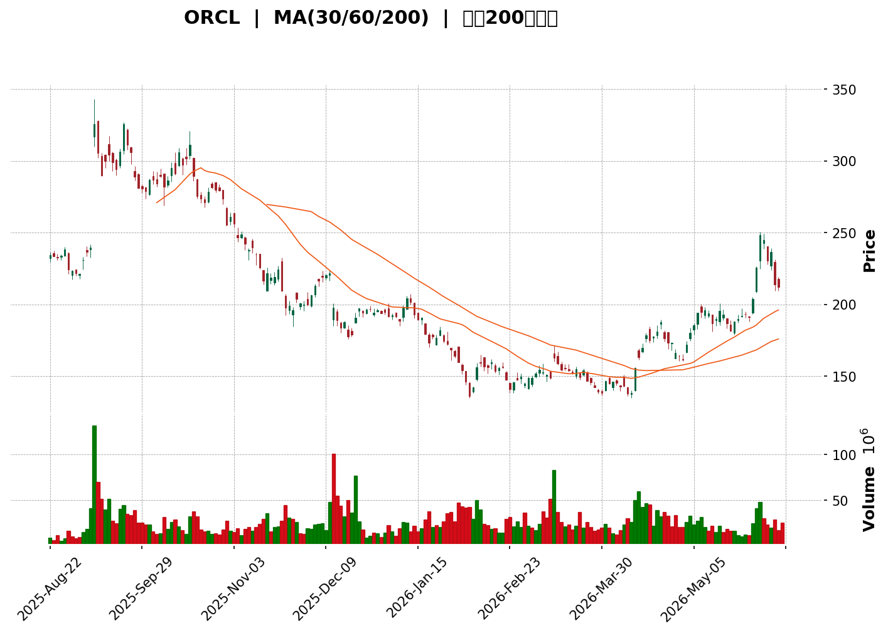
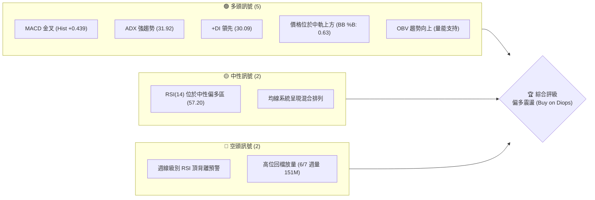
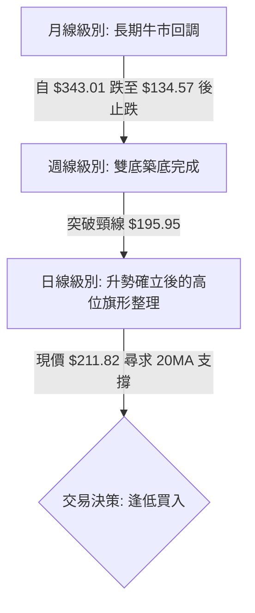
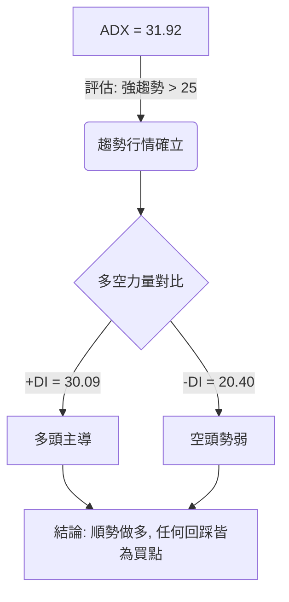
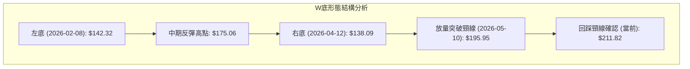

<details>
<summary>📊 靜態圖表 (點擊展開)</summary>

</details>

<html>
<head><meta charset="utf-8" /></head>
<body>
    <div style="height:500px; width:100%;">                        <script>window.PlotlyConfig = {MathJaxConfig: 'local'};</script>
        <script charset="utf-8" src="https://cdn.plot.ly/plotly-3.6.0.min.js" integrity="sha256-QaOVwtVY0T02VaHrr6pnoHLCwayMJp4O5n4YyaE3rJk=" crossorigin="anonymous"></script>                <div id="candlestick-chart" class="plotly-graph-div" style="height:100%; width:100%;"></div>            <script>                window.PLOTLYENV=window.PLOTLYENV || {};                                if (document.getElementById("candlestick-chart")) {                    Plotly.newPlot(                        "candlestick-chart",                        [{"close":{"dtype":"f8","bdata":"AAAAgJ5QbUAAAADgIzJtQAAAAGAKDG1AAAAA4NY+bUAAAACgB85tQAAAAECBC2xAAAAAICfxa0AAAACAarZrQAAAACAhqGtAAAAAIEbfbEAAAABgnJNtQAAAAKDP821AAAAAQCZcdEAAAACgMRdzQAAAACBHHnJAAAAAAGS8ckAAAABA\u002fANzQAAAAEDNsHJAAAAAAMNkckAAAADg5CNzQAAAAMBKWXRAAAAAQPd1c0AAAAAAuCBzQAAAAMDIEHJAAAAAoNmTcUAAAAAgvYhxQAAAAMCbcHFAAAAAgPTrcUAAAADATehxQAAAACBlvnFAAAAAgOkUckAAAACgO6BxQAAAAEDs5XFAAAAAAFdyckAAAAAguzJyQAAAAIAPInNAAAAA4MeSckAAAADAP9xyQAAAAKBpcXNAAAAAIH4YckAAAAAAyzdxQAAAAACDF3FAAAAAQOrvcEAAAABAwGVxQAAAAICXmXFAAAAAoOZ6cUAAAAAg1nFxQAAAAKDlGXFAAAAAoEXqb0AAAADAGFBwQAAAAABnBHBAAAAAoO\u002fUbkAAAABg\u002fxhvQAAAAEDzSW5AAAAAoI65bUAAAACgfettQAAAAEClVm1AAAAA4FAzbEAAAACAtwdrQAAAACClr2tAAAAAoIxQa0AAAAAAlmRrQAAAAKDhBGxAAAAA4OYsakAAAAAgebFoQAAAAODQ4WhAAAAAgHN6aEAAAABgqXZpQAAAAADuFmlAAAAAoM72aEAAAABg5ftoQAAAAIDCzmlAAAAAoKugakAAAADgCAhrQAAAACAtZmtAAAAAwKmFa0AAAADAu7RrQAAAAOBVtGhAAAAAQOmZZ0AAAABATPlmQAAAAODtb2dAAAAAQNcrZkAAAAAgxl1mQAAAACCF2WdAAAAAQGOlaEAAAACgs0RoQAAAAOAUiWhAAAAA4PuYaEAAAABg+UVoQAAAACAtgGhAAAAAgAY3aEAAAAAgeFBoQAAAACA97WdAAAAA4CESaEAAAACgMPVnQAAAAMC7j2dAAAAAwIe6aEAAAADA9n5pQAAAAADAMmlAAAAAAPUdaEAAAABADqZnQAAAAACZzWdAAAAAwGZpZkAAAABgy6hlQAAAAEDqMWZAAAAAoGMRZkAAAADgwrlmQAAAAABSyWVAAAAAwFqGZUAAAAAgfw1lQAAAAOA6gGRAAAAA4BfwY0AAAADANkRjQAAAAMAaRWJAAAAA4CgAYUAAAACAVcphQAAAAKBwgWNAAAAAIKzqY0AAAADgnZNjQAAAAKDufWNAAAAAAKXyY0AAAABA5C1jQAAAAAAMdGNAAAAAYNh\u002fY0AAAABgEXJiQAAAAIAummFAAAAAIDQ0YkAAAABAAmxiQAAAAOAtuWJAAAAAIJscYkAAAACgYJdiQAAAAGC5j2JAAAAAoN76YkAAAABACkhjQAAAAECvDWNAAAAAQArhYkAAAAAgKZxiQAAAACCsUWRAAAAA4GTTY0AAAACgPlJjQAAAAECrbWNAAAAAANpEY0AAAABAxQtjQAAAAMBRX2NAAAAA4BalYkAAAADAsDljQAAAAIB\u002fUmJAAAAAoGAwYkAAAADAA8phQAAAAMCQZWFAAAAAQCRKYUAAAADAIlNiQAAAAGAvF2JAAAAAgNs7YkAAAAAAEiFiQAAAAKB+1WFAAAAAwB7lYUAAAAAghTthQAAAAEDhQmFAAAAAANdzY0AAAAAAAGBkQAAAAIDrOWVAAAAAQOFKZkAAAACA6+FlQAAAAGCPMmZAAAAAoHClZkAAAAAAAHBnQAAAAMD1CGZAAAAAwPWoZUAAAABguJ5lQAAAAGC4vmRAAAAAYI96ZEAAAADgeixkQAAAAGCPemVAAAAAoEeJZkAAAABAMytnQAAAAMD1QGhAAAAAQOFSaEAAAABgZn5oQAAAAEDhOmhAAAAAYI9aZ0AAAADgUbhnQAAAACCFc2hAAAAAYGYeaEAAAAAghVNnQAAAAGC4rmZAAAAAwB6FZ0AAAADgo7hnQAAAAGCPAmhAAAAAgOshaEAAAABguN5nQAAAAGBmdmlAAAAAwPU4bEAAAADAzARvQAAAAGCPkm5AAAAAYI\u002fKbEAAAABA4YptQAAAAIDCtWpAAAAAgD16akAAAAAAAAD4fw=="},"high":{"dtype":"f8","bdata":"Z3NJ4j6UbUD+ioexEqVtQPEOKZPDYW1AxaHf8bJVbUCVBkT0xwFuQPh6Ug9bi21A\u002f10qQer1a0AkgAa8MwRsQPLzyxA6umtA1jSbxA4ZbUA9x0wrtBBuQIFX9eCsMm5AyvWkDzZwdUC58xMKiYZ0QOlwgJ7wGHNA20UpjgQKc0CYml3Vb9dzQClfqL7kI3NA3gkeWQ\u002fXckBgY05uyUpzQAP\u002ftRS5bnRAqHR5aEkndECSQcNmYGBzQNwuyiqThnJAh2f2eys7ckArL7782rtxQJdR1TxsnHFA\u002fKd7EoP7cUCB3Nh8kUpyQCxstYhURXJA\u002faZH5LZlckDqMXXEyS5yQFh0k5\u002f1E3JA\u002fFk4rhuyckB3AnLfch1zQJdCP3TWTHNAVJohqPjockB3ZTFfxFFzQGN\u002fAdYeCXRAOkBtyL7mckALGxsLk\u002fdxQEaa4IloaXFAoCw7jBw4cUBJTtpS75VxQKkT5Y751nFATdnCJ\u002fTTcUDvV+vLdrtxQAo+xURmfnFAhoofV8zBcEDyFOLx+4JwQNtZUn72f3BAmVSmARG3b0ALUpwNeFtvQFPrmXGP8W5AzcfxddDdbUCqeL2nW7duQLywr9T9f21AXfJF6qJrbUDyAhL9HPlrQNZuQFs5NWxAGlhLBg6ua0CWO7GjrcprQCnFYok1WGxAu9k7FkQSbUCSRu7sNOFpQLUlyIBnUmlA+mgQayXGaED9xAXU9BZqQKTfm1xVI2lAGeubCTpIaUBexdo0ag1qQFXkTH7N1GlA59Wf9gTDakChtxRvGUVrQKWwQtsS7GtApYyZdlSoa0DBoJ3LM\u002f5rQKqdN6QzGGlAPD3q+oeUaEDApTc8G3pnQE4F7zWBlGdAgrpymYwrZ0BHjduWNfRmQC3EP0S0PWhAo3pd3L6yaEC1uNev239oQIeGLPk0omhAUJ5cq63kaECiwPakhaloQK+rxTVjpWhA68TIi9t\u002faEBNnbTmEKxoQKFTyA+pDmlAOMMLVhI2aEBbHxZnMk9oQIHZjVQUuWdAIW3KC3fvaEA24ePBMLxpQBjeguZ04mlAE6ZvSUwfaUCmh+XAmUpoQOF32IJ45mdAM7LBVztRZ0CeyqMGFn9mQN\u002ftzgsOcWZAkwCaocpgZkAqhh4MSBVnQBDpaBIGY2ZA8pFMcIahZkCYVj2XZjRlQPy9GRT9CWVAt2txIFVTZUCDDOrVaNpjQLYgdlfvLGNAHLCRQ0dBYkC9UXyKc9ZhQAcYQ0c15mNA44JmTw+aZEBZtMiM5GJkQJSIoiKRz2NAYbYaKoY3ZEDvfeFZONdjQKrlL8gUmGNA2yBUMbvwY0AcTgqfhy5jQKo9YJtcKWJAa6eacvlHYkBspyRy4xdjQAK\u002fEO8D\u002f2JAQLyYXEoyYkACjO4Et7RiQCoqCULzzGJA62kbZWkiY0ConddPfaxjQFnHjL9Z1GNAR2tpNBLvYkB3a+gaUDNjQPC2DagwZWVA415iTt7nZEB+CDH\u002fuwZkQOt8nSUAxmNA\u002ficbhb3LY0CAcNC6x01jQGczfJX2i2NA0RKSlu4WY0DDM2sxnGdjQMoPSdaoK2NA8WUWFjGqYkBeXrAluj5iQCc7155MpmFARlWskqyWYUCctlQbYlxiQCl9fPohpGJAFyUVSsU9YkDpIcgtDoFiQJ3aY5UjAmJAYmWw+9ndYkAAAACgmdlhQAAAAKBwhWFAAAAAwB59Y0AAAADAzCxlQAAAAIDrkWVAAAAA4KOIZkAAAAAAABBnQAAAAOBROGZAAAAAQOEqZ0AAAACAwqVnQAAAAOB6vGZAAAAAYLiWZkAAAACgmbFlQAAAAGBmFmVAAAAA4FGYZEAAAACAwqVkQAAAAKCZyWVAAAAAAADwZkAAAADgo1BnQAAAAKBHSWhAAAAAwMwEaUAAAAAAAMBoQAAAAIDCdWhAAAAAoHAdaEAAAACAPfJnQAAAAGC4FmlAAAAAgMKNaEAAAADgUdhnQAAAAEAKl2dAAAAAQAqHZ0AAAACAPRpoQAAAAAAAoGhAAAAAYGZmaEAAAADgegRoQAAAAAAAoGlAAAAAoEdJbEAAAAAAAEhvQAAAAAAAIG9AAAAA4FEQbkAAAABgZt5tQAAAAIAU7mxAAAAAgOtha0AAAAAAAAD4fw=="},"hovertemplate":"\u003cb\u003e%{x|%Y-%m-%d}\u003c\u002fb\u003e\u003cbr\u003e\u958b: $%{open:.2f}\u003cbr\u003e\u9ad8: $%{high:.2f}\u003cbr\u003e\u4f4e: $%{low:.2f}\u003cbr\u003e\u6536: $%{close:.2f}\u003cextra\u003e\u003c\u002fextra\u003e","low":{"dtype":"f8","bdata":"vsDHy7q0bEDq7Lf6sS1tQBoYYpVq3GxAxF9noXbbbEAzbPul7ihtQLenNBOfq2tAIfeGq3Yia0AN7kUpcYBrQAFh7ULpOmtAoCrvkuIDbECg7aUR9y5tQLVVWwQnF21AsMTlDlhac0AzFaRLceNyQIIsLKpzF3JA7nSg6WVvckBABvo2dL5yQFRB0lqFS3JAFO9gqWsbckD1ilXq329yQODhCJZFCHNA704EmfU5c0A\u002f90EY5ZpyQEe6YAen5HFAWaJ3QIyMcUAEqsSku1ZxQKNjYGDWG3FA517y70Q7cUBHRg0t97xxQCcPF0FsnHFATKzK9V4IckDEpNs4Dc5wQBW6YK8SlnFArXi9ihbYcUAbnQjEnyNyQJ6j72y+fnJAmK27niUjckDZK7A0gpFyQNRlm8uA03JA5ZVOsOfbcUBhPSxIDhpxQNeyVeyN6XBApKzULrC5cEDe7kshn+twQGzlq+RqiHFAdvnYxp1hcUCOdR2hOW1xQMYy31AV23BAUwqZ5d7Wb0BQgrDzi+RvQESD5PZ5tW9AUCITmih2bkCt+Oq8rbBuQD4lyeeCum1A\u002fXzZvMndbECeOufg53NtQAzh5J6+b2xAXsBCZzwZbEC7uNDU+bxqQI691ClyL2pAIhGXJcrHakDgFBmVE6ZqQDBkKady\u002f2pAWFNeg38gakA5CDCNxQtoQBQFf\u002fSfI2hA1EfnI+EPZ0AZwcs3JyBpQL7zxuXljGhAFwg1pfRvaEDnbbQp6dhoQLwUK+nTxWhAZ61KheqhaUBXqwejFopqQLmPeN+58mpANQArXEwea0BwwG\u002fvCAhrQFmC0y\u002f2ImdARAEFwwIbZ0AU5x5\u002fWIlmQFhS12Of62ZAhVY07KH\u002fZUARDZdMqC9mQGttF4ISX2dAIYRhUN\u002f0Z0C2lUV7hOBnQB5j9PpwJ2hAV1B48DBdaEDRptpX1O5nQLOHJC14UGhAAImy4UwxaEAzUT4twyBoQDomOEL45GdABce82iCxZ0A0SldnedpnQMPstd5qIGdAWJoHVO+DZ0CNWQvPYIpoQNDXRZnF\u002fmhAooYdNavEZ0Btup79YpdnQBNEF4MvPGdAKZZ1N4tXZkAU8r4kM0BlQJMbWKZX\u002fGVA8IHI\u002ftdsZUBIY9OaEz1mQH0T4YhqomVAUrclDWFoZUAZgEOtph5kQDwkuNR\u002fVWRAkgvtFS7uY0DUuxza4etiQGAkCn6s\u002fWFA5Nur0e\u002fYYEAPJ886pk1hQBcK\u002fsygT2JAGdARKj2NY0CGibo42S5jQJNr5vkD\u002f2JAX25CCPxXY0BEm\u002fkTIgtjQHkO1Dr72mJABqYulEpnY0DZOk+MEFxiQHhuVc1xQ2FA7IU7puhHYUBgd39OeFpiQA9IHj+iFGJAOQa8tl+zYUDkOf82CZZhQDrfqA2r0WFAjgPlG5iSYkBAf6zGHrNiQPy6rhT04mJAjNgGhHM9YkArbfzV3X1iQCGvleusAGRAEoVt7trBY0Ay9ymfoTNjQGx3p4AcP2NAqxffbeceY0DDfzqlWPBiQEycNsjli2JALm42E+xtYkBEik1f78ViQDQvrFfYSmJAVh19fBgDYkDbz8GSZ8FhQI\u002f3xmYyOmFAU7AEvyUPYUBgC+fen2thQJlcatdTBWJAWAFzefl5YUAv+E3PLethQPCKm5d+bmFAROZRa+LMYUAAAAAAAABhQAAAAIA90mBAAAAAQAp3YUAAAACA6zFkQAAAAGC4xmRAAAAAoJm5ZUAAAAAghatlQAAAAOBRsGVAAAAA4FEAZkAAAACgmdlmQAAAAGCPwmVAAAAAoJkZZUAAAADAzPxkQAAAAKCZQWRAAAAAwMwUZEAAAABgjwpkQAAAAMDMxGRAAAAA4FHIZUAAAAAAAGBmQAAAAKBw1WZAAAAAoJnZZ0AAAABguMZnQAAAAEAz02dAAAAAANebZkAAAACA6yFnQAAAAGBmLmdAAAAAwMycZ0AAAADgo+hmQAAAAIDCnWZAAAAAoJlZZkAAAABgZmZnQAAAAEAz42dAAAAAgOvRZ0AAAACgcH1nQAAAAAApLGhAAAAA4FEAakAAAABAMxNsQAAAAEDh2m1AAAAAIIVzbEAAAAAAAABsQAAAAGBmLmpAAAAAYI8qakAAAAAAAAD4fw=="},"name":"\u50f9\u683c","open":{"dtype":"f8","bdata":"0nAcKUcHbUD4pSbyu29tQL6VolQfJW1AHWHUUx8lbUBVlspVRDZtQK7cRg\u002f9d21AKiydKGGIa0AkgAa8MwRsQHWmcUNhiGtAIzLhKFbXbEAadoGwYMBtQFYWr\u002fL2wW1AuvdX\u002fQ3Lc0BnX4zUDnx0QF975kdV9nJAqJW9h88Ac0ChplT9nXlzQBx8Nrp+FHNAj4HGfK3KckBdRQtKi4pyQFpih81KM3NAIxhFemkXdEBUfdlWsVZzQAIAKqVUT3JAa5vTjUsrckBMsiy+8qVxQCYG222Al3FAp5IAr99JcUD9tEPGPhhyQGdqKkpS9XFAtFM1CnQhckDqMXXEyS5yQJCfchH3snFA6ift904cckCmHfi\u002fIqdyQMNKm6gCjnJABW7mS3TbckDHdleamvByQBsXfmC8+3JA4YWwKlHeckCWyTyM9vJxQNotUROVRnFAFt6YlkMScUCWbvh+r\u002fRwQOg8a3THwnFAEYqSqR3NcUC+ZoQ2WJRxQNFqe+Xae3FAZyzC25OxcEBKkXHNzB5wQFvjAIDreXBA6SIpkIAOb0AxuRe1qsxuQNfWmfuezW5A94s5wkmxbUABjilzVI5uQJZgSJ8wWW1Afo3ICmlpbUCjCozetPNrQIs1VqlaMWpA\u002frdUbhIca0B1tt9ldtxqQFnYAxgbN2tAU+rF7vC3bEDe6ZFXFrppQHHeB14LdWhAPFbVuaAcaEBq12TYDQdqQLrhS5VTyWhAPJXiI9DoaEB147rcYnxpQCSC5gBo42hAAMwKGOXSaUAWOH5zMjVrQGeiyDjwf2tAeycAzfRVa0AXZnsKQI5rQBn3+miVrmdApPIEyHVlaEAMBVKiemRnQGU+IiJN8mZAA5KBtRfGZkBmHYoIVLNmQJnEpt+oZ2dAH4SOzcVzaECbO5VWXmdoQKBD21XjOWhAm599vzWbaEC0AJsqLB9oQFx+McqZW2hA6AGv0gxnaEBOCojwcYhoQPvOXG0dpGhAu69y6kjsZ0DrLkfqbUNoQP8REXXatmdAIjr0NsbfZ0BOFZJcMZ1oQEFXshsriWlAE6ZvSUwfaUCmh+XAmUpoQJhJriT4p2dAM7LBVztRZ0Ap3NOBv2FmQEcAHtLcV2ZAbetyUZ2AZUBye2LaQE9mQMT96G4fUmZAW7b\u002fTfXJZUAPzSt\u002f2TFlQI3gYsS18mRAFPkrXGdKZUC6TM+ksbZjQB9mcCRXK2NA43CL+fsiYkD\u002f8r2Hb2hhQK3DgHEkf2JAf4IaHS7uY0BZtMiM5GJkQK8tgagrrGNAERIegEPWY0DCaLbKw61jQPoyDk7sO2NA8kmOt5KUY0D1iFnLhhhjQGuvRZ7aJWJAkKcpnTGLYUDf+i3qgZRiQF7VlVa1iGJAFOx0tiLsYUCXHWsrEaRhQCv+ePXgB2JAbzTSyZyvYkBuLPKZ4gFjQHtABaRoDGNAfi0qpZ3FYkAhcWUOuyJjQMs89yyhuWRAJtPxD8iCZEDeW53J4s9jQMTaHO+JcGNAsfW4ncRcY0A8fXP+thtjQOWAxoT2vWJAWGVY6o0QY0C01RJhk9xiQKvGR7\u002f1DmNAqM9yWr2WYkCSQxVVdOxhQErpOUoQjmFAUe1t5a5xYUBXu1xq+XlhQMLZ5nFGkmJA3Wso5A7JYUAc7ruzqF1iQCpdoVvy6GFAraeRTty4YkAAAABgZsZhQAAAAIA9KmFAAAAA4KN4YUAAAACAwv1kQAAAAOB63GRAAAAAoHANZkAAAACAwt1mQAAAAIDrGWZAAAAAQDNLZkAAAACAwkVnQAAAAMDMjGZAAAAA4FGQZkAAAABgj5JlQAAAAMAeRWRAAAAAoEeBZEAAAADgo0BkQAAAAKBwzWRAAAAA4KMAZkAAAAAAKcRmQAAAAGBmRmdAAAAAIIXTaEAAAABgjxJoQAAAAMDMBGhAAAAAoHAdaEAAAADA9aBnQAAAAIDChWdAAAAAIK7PZ0AAAAAAAMBnQAAAAAAAQGdAAAAAgBR+ZkAAAADgUaBnQAAAAKBw9WdAAAAAoJkpaEAAAAAgXO9nQAAAAKBHQWhAAAAAAAAgakAAAAAAANBsQAAAAKCZWW5AAAAAIFwPbkAAAAAAAGBsQAAAACCur2xAAAAAAAA4a0AAAAAAAAD4fw=="},"x":["2025-08-22T00:00:00-04:00","2025-08-25T00:00:00-04:00","2025-08-26T00:00:00-04:00","2025-08-27T00:00:00-04:00","2025-08-28T00:00:00-04:00","2025-08-29T00:00:00-04:00","2025-09-02T00:00:00-04:00","2025-09-03T00:00:00-04:00","2025-09-04T00:00:00-04:00","2025-09-05T00:00:00-04:00","2025-09-08T00:00:00-04:00","2025-09-09T00:00:00-04:00","2025-09-10T00:00:00-04:00","2025-09-11T00:00:00-04:00","2025-09-12T00:00:00-04:00","2025-09-15T00:00:00-04:00","2025-09-16T00:00:00-04:00","2025-09-17T00:00:00-04:00","2025-09-18T00:00:00-04:00","2025-09-19T00:00:00-04:00","2025-09-22T00:00:00-04:00","2025-09-23T00:00:00-04:00","2025-09-24T00:00:00-04:00","2025-09-25T00:00:00-04:00","2025-09-26T00:00:00-04:00","2025-09-29T00:00:00-04:00","2025-09-30T00:00:00-04:00","2025-10-01T00:00:00-04:00","2025-10-02T00:00:00-04:00","2025-10-03T00:00:00-04:00","2025-10-06T00:00:00-04:00","2025-10-07T00:00:00-04:00","2025-10-08T00:00:00-04:00","2025-10-09T00:00:00-04:00","2025-10-10T00:00:00-04:00","2025-10-13T00:00:00-04:00","2025-10-14T00:00:00-04:00","2025-10-15T00:00:00-04:00","2025-10-16T00:00:00-04:00","2025-10-17T00:00:00-04:00","2025-10-20T00:00:00-04:00","2025-10-21T00:00:00-04:00","2025-10-22T00:00:00-04:00","2025-10-23T00:00:00-04:00","2025-10-24T00:00:00-04:00","2025-10-27T00:00:00-04:00","2025-10-28T00:00:00-04:00","2025-10-29T00:00:00-04:00","2025-10-30T00:00:00-04:00","2025-10-31T00:00:00-04:00","2025-11-03T00:00:00-05:00","2025-11-04T00:00:00-05:00","2025-11-05T00:00:00-05:00","2025-11-06T00:00:00-05:00","2025-11-07T00:00:00-05:00","2025-11-10T00:00:00-05:00","2025-11-11T00:00:00-05:00","2025-11-12T00:00:00-05:00","2025-11-13T00:00:00-05:00","2025-11-14T00:00:00-05:00","2025-11-17T00:00:00-05:00","2025-11-18T00:00:00-05:00","2025-11-19T00:00:00-05:00","2025-11-20T00:00:00-05:00","2025-11-21T00:00:00-05:00","2025-11-24T00:00:00-05:00","2025-11-25T00:00:00-05:00","2025-11-26T00:00:00-05:00","2025-11-28T00:00:00-05:00","2025-12-01T00:00:00-05:00","2025-12-02T00:00:00-05:00","2025-12-03T00:00:00-05:00","2025-12-04T00:00:00-05:00","2025-12-05T00:00:00-05:00","2025-12-08T00:00:00-05:00","2025-12-09T00:00:00-05:00","2025-12-10T00:00:00-05:00","2025-12-11T00:00:00-05:00","2025-12-12T00:00:00-05:00","2025-12-15T00:00:00-05:00","2025-12-16T00:00:00-05:00","2025-12-17T00:00:00-05:00","2025-12-18T00:00:00-05:00","2025-12-19T00:00:00-05:00","2025-12-22T00:00:00-05:00","2025-12-23T00:00:00-05:00","2025-12-24T00:00:00-05:00","2025-12-26T00:00:00-05:00","2025-12-29T00:00:00-05:00","2025-12-30T00:00:00-05:00","2025-12-31T00:00:00-05:00","2026-01-02T00:00:00-05:00","2026-01-05T00:00:00-05:00","2026-01-06T00:00:00-05:00","2026-01-07T00:00:00-05:00","2026-01-08T00:00:00-05:00","2026-01-09T00:00:00-05:00","2026-01-12T00:00:00-05:00","2026-01-13T00:00:00-05:00","2026-01-14T00:00:00-05:00","2026-01-15T00:00:00-05:00","2026-01-16T00:00:00-05:00","2026-01-20T00:00:00-05:00","2026-01-21T00:00:00-05:00","2026-01-22T00:00:00-05:00","2026-01-23T00:00:00-05:00","2026-01-26T00:00:00-05:00","2026-01-27T00:00:00-05:00","2026-01-28T00:00:00-05:00","2026-01-29T00:00:00-05:00","2026-01-30T00:00:00-05:00","2026-02-02T00:00:00-05:00","2026-02-03T00:00:00-05:00","2026-02-04T00:00:00-05:00","2026-02-05T00:00:00-05:00","2026-02-06T00:00:00-05:00","2026-02-09T00:00:00-05:00","2026-02-10T00:00:00-05:00","2026-02-11T00:00:00-05:00","2026-02-12T00:00:00-05:00","2026-02-13T00:00:00-05:00","2026-02-17T00:00:00-05:00","2026-02-18T00:00:00-05:00","2026-02-19T00:00:00-05:00","2026-02-20T00:00:00-05:00","2026-02-23T00:00:00-05:00","2026-02-24T00:00:00-05:00","2026-02-25T00:00:00-05:00","2026-02-26T00:00:00-05:00","2026-02-27T00:00:00-05:00","2026-03-02T00:00:00-05:00","2026-03-03T00:00:00-05:00","2026-03-04T00:00:00-05:00","2026-03-05T00:00:00-05:00","2026-03-06T00:00:00-05:00","2026-03-09T00:00:00-04:00","2026-03-10T00:00:00-04:00","2026-03-11T00:00:00-04:00","2026-03-12T00:00:00-04:00","2026-03-13T00:00:00-04:00","2026-03-16T00:00:00-04:00","2026-03-17T00:00:00-04:00","2026-03-18T00:00:00-04:00","2026-03-19T00:00:00-04:00","2026-03-20T00:00:00-04:00","2026-03-23T00:00:00-04:00","2026-03-24T00:00:00-04:00","2026-03-25T00:00:00-04:00","2026-03-26T00:00:00-04:00","2026-03-27T00:00:00-04:00","2026-03-30T00:00:00-04:00","2026-03-31T00:00:00-04:00","2026-04-01T00:00:00-04:00","2026-04-02T00:00:00-04:00","2026-04-06T00:00:00-04:00","2026-04-07T00:00:00-04:00","2026-04-08T00:00:00-04:00","2026-04-09T00:00:00-04:00","2026-04-10T00:00:00-04:00","2026-04-13T00:00:00-04:00","2026-04-14T00:00:00-04:00","2026-04-15T00:00:00-04:00","2026-04-16T00:00:00-04:00","2026-04-17T00:00:00-04:00","2026-04-20T00:00:00-04:00","2026-04-21T00:00:00-04:00","2026-04-22T00:00:00-04:00","2026-04-23T00:00:00-04:00","2026-04-24T00:00:00-04:00","2026-04-27T00:00:00-04:00","2026-04-28T00:00:00-04:00","2026-04-29T00:00:00-04:00","2026-04-30T00:00:00-04:00","2026-05-01T00:00:00-04:00","2026-05-04T00:00:00-04:00","2026-05-05T00:00:00-04:00","2026-05-06T00:00:00-04:00","2026-05-07T00:00:00-04:00","2026-05-08T00:00:00-04:00","2026-05-11T00:00:00-04:00","2026-05-12T00:00:00-04:00","2026-05-13T00:00:00-04:00","2026-05-14T00:00:00-04:00","2026-05-15T00:00:00-04:00","2026-05-18T00:00:00-04:00","2026-05-19T00:00:00-04:00","2026-05-20T00:00:00-04:00","2026-05-21T00:00:00-04:00","2026-05-22T00:00:00-04:00","2026-05-26T00:00:00-04:00","2026-05-27T00:00:00-04:00","2026-05-28T00:00:00-04:00","2026-05-29T00:00:00-04:00","2026-06-01T00:00:00-04:00","2026-06-02T00:00:00-04:00","2026-06-03T00:00:00-04:00","2026-06-04T00:00:00-04:00","2026-06-05T00:00:00-04:00","2026-06-08T00:00:00-04:00","2026-06-09T00:00:00-04:00"],"type":"candlestick"},{"hovertemplate":"MA30: $%{y:.2f}\u003cextra\u003e\u003c\u002fextra\u003e","line":{"color":"#2196F3","dash":"dash","width":2},"mode":"lines","name":"MA30","x":["2025-08-22T00:00:00-04:00","2025-08-25T00:00:00-04:00","2025-08-26T00:00:00-04:00","2025-08-27T00:00:00-04:00","2025-08-28T00:00:00-04:00","2025-08-29T00:00:00-04:00","2025-09-02T00:00:00-04:00","2025-09-03T00:00:00-04:00","2025-09-04T00:00:00-04:00","2025-09-05T00:00:00-04:00","2025-09-08T00:00:00-04:00","2025-09-09T00:00:00-04:00","2025-09-10T00:00:00-04:00","2025-09-11T00:00:00-04:00","2025-09-12T00:00:00-04:00","2025-09-15T00:00:00-04:00","2025-09-16T00:00:00-04:00","2025-09-17T00:00:00-04:00","2025-09-18T00:00:00-04:00","2025-09-19T00:00:00-04:00","2025-09-22T00:00:00-04:00","2025-09-23T00:00:00-04:00","2025-09-24T00:00:00-04:00","2025-09-25T00:00:00-04:00","2025-09-26T00:00:00-04:00","2025-09-29T00:00:00-04:00","2025-09-30T00:00:00-04:00","2025-10-01T00:00:00-04:00","2025-10-02T00:00:00-04:00","2025-10-03T00:00:00-04:00","2025-10-06T00:00:00-04:00","2025-10-07T00:00:00-04:00","2025-10-08T00:00:00-04:00","2025-10-09T00:00:00-04:00","2025-10-10T00:00:00-04:00","2025-10-13T00:00:00-04:00","2025-10-14T00:00:00-04:00","2025-10-15T00:00:00-04:00","2025-10-16T00:00:00-04:00","2025-10-17T00:00:00-04:00","2025-10-20T00:00:00-04:00","2025-10-21T00:00:00-04:00","2025-10-22T00:00:00-04:00","2025-10-23T00:00:00-04:00","2025-10-24T00:00:00-04:00","2025-10-27T00:00:00-04:00","2025-10-28T00:00:00-04:00","2025-10-29T00:00:00-04:00","2025-10-30T00:00:00-04:00","2025-10-31T00:00:00-04:00","2025-11-03T00:00:00-05:00","2025-11-04T00:00:00-05:00","2025-11-05T00:00:00-05:00","2025-11-06T00:00:00-05:00","2025-11-07T00:00:00-05:00","2025-11-10T00:00:00-05:00","2025-11-11T00:00:00-05:00","2025-11-12T00:00:00-05:00","2025-11-13T00:00:00-05:00","2025-11-14T00:00:00-05:00","2025-11-17T00:00:00-05:00","2025-11-18T00:00:00-05:00","2025-11-19T00:00:00-05:00","2025-11-20T00:00:00-05:00","2025-11-21T00:00:00-05:00","2025-11-24T00:00:00-05:00","2025-11-25T00:00:00-05:00","2025-11-26T00:00:00-05:00","2025-11-28T00:00:00-05:00","2025-12-01T00:00:00-05:00","2025-12-02T00:00:00-05:00","2025-12-03T00:00:00-05:00","2025-12-04T00:00:00-05:00","2025-12-05T00:00:00-05:00","2025-12-08T00:00:00-05:00","2025-12-09T00:00:00-05:00","2025-12-10T00:00:00-05:00","2025-12-11T00:00:00-05:00","2025-12-12T00:00:00-05:00","2025-12-15T00:00:00-05:00","2025-12-16T00:00:00-05:00","2025-12-17T00:00:00-05:00","2025-12-18T00:00:00-05:00","2025-12-19T00:00:00-05:00","2025-12-22T00:00:00-05:00","2025-12-23T00:00:00-05:00","2025-12-24T00:00:00-05:00","2025-12-26T00:00:00-05:00","2025-12-29T00:00:00-05:00","2025-12-30T00:00:00-05:00","2025-12-31T00:00:00-05:00","2026-01-02T00:00:00-05:00","2026-01-05T00:00:00-05:00","2026-01-06T00:00:00-05:00","2026-01-07T00:00:00-05:00","2026-01-08T00:00:00-05:00","2026-01-09T00:00:00-05:00","2026-01-12T00:00:00-05:00","2026-01-13T00:00:00-05:00","2026-01-14T00:00:00-05:00","2026-01-15T00:00:00-05:00","2026-01-16T00:00:00-05:00","2026-01-20T00:00:00-05:00","2026-01-21T00:00:00-05:00","2026-01-22T00:00:00-05:00","2026-01-23T00:00:00-05:00","2026-01-26T00:00:00-05:00","2026-01-27T00:00:00-05:00","2026-01-28T00:00:00-05:00","2026-01-29T00:00:00-05:00","2026-01-30T00:00:00-05:00","2026-02-02T00:00:00-05:00","2026-02-03T00:00:00-05:00","2026-02-04T00:00:00-05:00","2026-02-05T00:00:00-05:00","2026-02-06T00:00:00-05:00","2026-02-09T00:00:00-05:00","2026-02-10T00:00:00-05:00","2026-02-11T00:00:00-05:00","2026-02-12T00:00:00-05:00","2026-02-13T00:00:00-05:00","2026-02-17T00:00:00-05:00","2026-02-18T00:00:00-05:00","2026-02-19T00:00:00-05:00","2026-02-20T00:00:00-05:00","2026-02-23T00:00:00-05:00","2026-02-24T00:00:00-05:00","2026-02-25T00:00:00-05:00","2026-02-26T00:00:00-05:00","2026-02-27T00:00:00-05:00","2026-03-02T00:00:00-05:00","2026-03-03T00:00:00-05:00","2026-03-04T00:00:00-05:00","2026-03-05T00:00:00-05:00","2026-03-06T00:00:00-05:00","2026-03-09T00:00:00-04:00","2026-03-10T00:00:00-04:00","2026-03-11T00:00:00-04:00","2026-03-12T00:00:00-04:00","2026-03-13T00:00:00-04:00","2026-03-16T00:00:00-04:00","2026-03-17T00:00:00-04:00","2026-03-18T00:00:00-04:00","2026-03-19T00:00:00-04:00","2026-03-20T00:00:00-04:00","2026-03-23T00:00:00-04:00","2026-03-24T00:00:00-04:00","2026-03-25T00:00:00-04:00","2026-03-26T00:00:00-04:00","2026-03-27T00:00:00-04:00","2026-03-30T00:00:00-04:00","2026-03-31T00:00:00-04:00","2026-04-01T00:00:00-04:00","2026-04-02T00:00:00-04:00","2026-04-06T00:00:00-04:00","2026-04-07T00:00:00-04:00","2026-04-08T00:00:00-04:00","2026-04-09T00:00:00-04:00","2026-04-10T00:00:00-04:00","2026-04-13T00:00:00-04:00","2026-04-14T00:00:00-04:00","2026-04-15T00:00:00-04:00","2026-04-16T00:00:00-04:00","2026-04-17T00:00:00-04:00","2026-04-20T00:00:00-04:00","2026-04-21T00:00:00-04:00","2026-04-22T00:00:00-04:00","2026-04-23T00:00:00-04:00","2026-04-24T00:00:00-04:00","2026-04-27T00:00:00-04:00","2026-04-28T00:00:00-04:00","2026-04-29T00:00:00-04:00","2026-04-30T00:00:00-04:00","2026-05-01T00:00:00-04:00","2026-05-04T00:00:00-04:00","2026-05-05T00:00:00-04:00","2026-05-06T00:00:00-04:00","2026-05-07T00:00:00-04:00","2026-05-08T00:00:00-04:00","2026-05-11T00:00:00-04:00","2026-05-12T00:00:00-04:00","2026-05-13T00:00:00-04:00","2026-05-14T00:00:00-04:00","2026-05-15T00:00:00-04:00","2026-05-18T00:00:00-04:00","2026-05-19T00:00:00-04:00","2026-05-20T00:00:00-04:00","2026-05-21T00:00:00-04:00","2026-05-22T00:00:00-04:00","2026-05-26T00:00:00-04:00","2026-05-27T00:00:00-04:00","2026-05-28T00:00:00-04:00","2026-05-29T00:00:00-04:00","2026-06-01T00:00:00-04:00","2026-06-02T00:00:00-04:00","2026-06-03T00:00:00-04:00","2026-06-04T00:00:00-04:00","2026-06-05T00:00:00-04:00","2026-06-08T00:00:00-04:00","2026-06-09T00:00:00-04:00"],"y":{"dtype":"f8","bdata":"AAAAAAAA+H8AAAAAAAD4fwAAAAAAAPh\u002fAAAAAAAA+H8AAAAAAAD4fwAAAAAAAPh\u002fAAAAAAAA+H8AAAAAAAD4fwAAAAAAAPh\u002fAAAAAAAA+H8AAAAAAAD4fwAAAAAAAPh\u002fAAAAAAAA+H8AAAAAAAD4fwAAAAAAAPh\u002fAAAAAAAA+H8AAAAAAAD4fwAAAAAAAPh\u002fAAAAAAAA+H8AAAAAAAD4fwAAAAAAAPh\u002fAAAAAAAA+H8AAAAAAAD4fwAAAAAAAPh\u002fAAAAAAAA+H8AAAAAAAD4fwAAAAAAAPh\u002fAAAAAAAA+H8AAAAAAAD4f0REROyx7XBAvLu7Q+oKcUDNzMz8wCRxQM3MzPSMQXFAiYiIaC5icUBmZmYeTn5xQBEREVnqqXFAvLu7WzDRcUCJiIjo4\u002ftxQO\u002fu7kbNK3JAd3d3xwdLckAAAABow19yQM3MzBzRcXJAmpmZ6ZtUckAzMzMzKUZyQCIiIvK8QXJAERERkQU3ckBVVVXlnSlyQERERKQNHHJAERERCUQHckCamZmhI+9xQDMzMxstynFAvLu726incUCrqqpyHolxQM3MzCQxcHFA3t3d3QVZcUDNzMx0DkNxQKuqquJpK3FAAAAAwM0KcUC8u7t7UuVwQM3MzFQJxHBAiYiIKEiecEAzMzMjwHxwQDMzM1uRW3BAIiIiktYtcEDv7u5ez\u002fdvQBEREZGZhW9AZmZmBn8Zb0AiIiLS5rBuQKuqqvorO25AiYiIqF3bbUAzMzOjtYptQLy7u+s7Q21AmpmZOWUFbUARERGBJcNsQAAAAGCUgGxAmpmZuRtBbEARERFxzwNsQO\u002fu7v7CsmtAvLu7+9Bra0AiIiICdBlrQERERDQX0GpA3t3d\u002fS+GakBVVVUVrjtqQKuqqnq7BGpAMzMzs2TZaUBERETEKqlpQM3MzHwugGlAvLu7629haUBVVVWV6UlpQKuqquq6LmlAMzMzg0cUaUAAAABAAvpoQN7d3V0W12hA3t3d3SDFaEDv7u4u2r5oQGZmZjaVs2hAVVVVBbi1aEDe3d3d\u002frVoQERERETstmhAAAAA0LGvaEBmZmbGTKRoQKuqqsoxk2hAd3d3BzhvaEBVVVWlYEFoQERERAT4FGhAVVVVJW3mZ0AiIiJi7btnQKuqqtoGo2dAd3d3506RZ0AzMzMz6oBnQDMzM7PbZ2dAmpmZycxUZ0AzMzMTWTpnQN7d3e27CmdAAAAAQH7JZkCJiIjYNpJmQImIiPhKZ2ZAERERYVk\u002fZkAzMzNDRRdmQCIiInKH7GVAvLu7yx3IZUARERERTJxlQDMzM8MfdmVAAAAAUB1PZUDNzMy8EyBlQCIiIrI57WRA3t3dPYy1ZEAiIiLCLnlkQHd3dyfuQWRAzczMbK8OZEARERGBh+NjQJqZmdnMtmNAvLu7C4SZY0B3d3dXOYVjQDMzM5NqamNAVVVVZTRPY0C8u7urFSxjQERERCSQH2NAq6qqehARY0AAAAAQSgJjQERERCQj+WJAERER4W3zYkCrqqo6jPFiQGZmZnb0+mJAVVVVZfwIY0C8u7srOxVjQBEREREiC2NAERER0WP8YkAiIiLyIu1iQDMzM\u002fNB22JA3t3d\u002fZLEYkBmZmZGSL1iQCIiIlKnsWJAAAAAoNqmYkAiIiJyJ6RiQFVVVZUhpmJAzczMvH6jYkDv7u5uWJliQJqZmWnejGJAd3d3V0+YYkCrqqrah6diQCIiIkJFvmJAzczMnInaYkCamZnJu\u002fBiQO\u002fu7g6QC2NAq6qqmrUrY0Dv7u5u51RjQFVVVQWMY2NAvLu7+zJzY0BERESk0IZjQAAAANAMkmNAiYiIqF+cY0AAAABQ\u002f6VjQFVVVdX4t2NAiYiIqC3ZY0BEREQk1PpjQO\u002fu7q5xLWRA3t3dTcthZECrqqrKAZtkQGZmZkZR1WRARERElBAJZUDv7u6uGjdlQO\u002fu7s5hbWVAMzMzo5mfZUDv7u7O8stlQJqZmZlS9WVAmpmZmVIlZkDe3d19sVxmQM3MzFxIlmZAq6qq+je+ZkDNzMzsCtxmQHd3dycxAGdAAAAAcMsyZ0ARERHhwYBnQImIiFg5yGdA3t3dTan8Z0ARERHhwTBoQCIiIpKmWGhAAAAAkMKBaEAAAAAAAAD4fw=="},"type":"scatter"},{"hovertemplate":"MA60: $%{y:.2f}\u003cextra\u003e\u003c\u002fextra\u003e","line":{"color":"#9C27B0","dash":"dash","width":2},"mode":"lines","name":"MA60","x":["2025-08-22T00:00:00-04:00","2025-08-25T00:00:00-04:00","2025-08-26T00:00:00-04:00","2025-08-27T00:00:00-04:00","2025-08-28T00:00:00-04:00","2025-08-29T00:00:00-04:00","2025-09-02T00:00:00-04:00","2025-09-03T00:00:00-04:00","2025-09-04T00:00:00-04:00","2025-09-05T00:00:00-04:00","2025-09-08T00:00:00-04:00","2025-09-09T00:00:00-04:00","2025-09-10T00:00:00-04:00","2025-09-11T00:00:00-04:00","2025-09-12T00:00:00-04:00","2025-09-15T00:00:00-04:00","2025-09-16T00:00:00-04:00","2025-09-17T00:00:00-04:00","2025-09-18T00:00:00-04:00","2025-09-19T00:00:00-04:00","2025-09-22T00:00:00-04:00","2025-09-23T00:00:00-04:00","2025-09-24T00:00:00-04:00","2025-09-25T00:00:00-04:00","2025-09-26T00:00:00-04:00","2025-09-29T00:00:00-04:00","2025-09-30T00:00:00-04:00","2025-10-01T00:00:00-04:00","2025-10-02T00:00:00-04:00","2025-10-03T00:00:00-04:00","2025-10-06T00:00:00-04:00","2025-10-07T00:00:00-04:00","2025-10-08T00:00:00-04:00","2025-10-09T00:00:00-04:00","2025-10-10T00:00:00-04:00","2025-10-13T00:00:00-04:00","2025-10-14T00:00:00-04:00","2025-10-15T00:00:00-04:00","2025-10-16T00:00:00-04:00","2025-10-17T00:00:00-04:00","2025-10-20T00:00:00-04:00","2025-10-21T00:00:00-04:00","2025-10-22T00:00:00-04:00","2025-10-23T00:00:00-04:00","2025-10-24T00:00:00-04:00","2025-10-27T00:00:00-04:00","2025-10-28T00:00:00-04:00","2025-10-29T00:00:00-04:00","2025-10-30T00:00:00-04:00","2025-10-31T00:00:00-04:00","2025-11-03T00:00:00-05:00","2025-11-04T00:00:00-05:00","2025-11-05T00:00:00-05:00","2025-11-06T00:00:00-05:00","2025-11-07T00:00:00-05:00","2025-11-10T00:00:00-05:00","2025-11-11T00:00:00-05:00","2025-11-12T00:00:00-05:00","2025-11-13T00:00:00-05:00","2025-11-14T00:00:00-05:00","2025-11-17T00:00:00-05:00","2025-11-18T00:00:00-05:00","2025-11-19T00:00:00-05:00","2025-11-20T00:00:00-05:00","2025-11-21T00:00:00-05:00","2025-11-24T00:00:00-05:00","2025-11-25T00:00:00-05:00","2025-11-26T00:00:00-05:00","2025-11-28T00:00:00-05:00","2025-12-01T00:00:00-05:00","2025-12-02T00:00:00-05:00","2025-12-03T00:00:00-05:00","2025-12-04T00:00:00-05:00","2025-12-05T00:00:00-05:00","2025-12-08T00:00:00-05:00","2025-12-09T00:00:00-05:00","2025-12-10T00:00:00-05:00","2025-12-11T00:00:00-05:00","2025-12-12T00:00:00-05:00","2025-12-15T00:00:00-05:00","2025-12-16T00:00:00-05:00","2025-12-17T00:00:00-05:00","2025-12-18T00:00:00-05:00","2025-12-19T00:00:00-05:00","2025-12-22T00:00:00-05:00","2025-12-23T00:00:00-05:00","2025-12-24T00:00:00-05:00","2025-12-26T00:00:00-05:00","2025-12-29T00:00:00-05:00","2025-12-30T00:00:00-05:00","2025-12-31T00:00:00-05:00","2026-01-02T00:00:00-05:00","2026-01-05T00:00:00-05:00","2026-01-06T00:00:00-05:00","2026-01-07T00:00:00-05:00","2026-01-08T00:00:00-05:00","2026-01-09T00:00:00-05:00","2026-01-12T00:00:00-05:00","2026-01-13T00:00:00-05:00","2026-01-14T00:00:00-05:00","2026-01-15T00:00:00-05:00","2026-01-16T00:00:00-05:00","2026-01-20T00:00:00-05:00","2026-01-21T00:00:00-05:00","2026-01-22T00:00:00-05:00","2026-01-23T00:00:00-05:00","2026-01-26T00:00:00-05:00","2026-01-27T00:00:00-05:00","2026-01-28T00:00:00-05:00","2026-01-29T00:00:00-05:00","2026-01-30T00:00:00-05:00","2026-02-02T00:00:00-05:00","2026-02-03T00:00:00-05:00","2026-02-04T00:00:00-05:00","2026-02-05T00:00:00-05:00","2026-02-06T00:00:00-05:00","2026-02-09T00:00:00-05:00","2026-02-10T00:00:00-05:00","2026-02-11T00:00:00-05:00","2026-02-12T00:00:00-05:00","2026-02-13T00:00:00-05:00","2026-02-17T00:00:00-05:00","2026-02-18T00:00:00-05:00","2026-02-19T00:00:00-05:00","2026-02-20T00:00:00-05:00","2026-02-23T00:00:00-05:00","2026-02-24T00:00:00-05:00","2026-02-25T00:00:00-05:00","2026-02-26T00:00:00-05:00","2026-02-27T00:00:00-05:00","2026-03-02T00:00:00-05:00","2026-03-03T00:00:00-05:00","2026-03-04T00:00:00-05:00","2026-03-05T00:00:00-05:00","2026-03-06T00:00:00-05:00","2026-03-09T00:00:00-04:00","2026-03-10T00:00:00-04:00","2026-03-11T00:00:00-04:00","2026-03-12T00:00:00-04:00","2026-03-13T00:00:00-04:00","2026-03-16T00:00:00-04:00","2026-03-17T00:00:00-04:00","2026-03-18T00:00:00-04:00","2026-03-19T00:00:00-04:00","2026-03-20T00:00:00-04:00","2026-03-23T00:00:00-04:00","2026-03-24T00:00:00-04:00","2026-03-25T00:00:00-04:00","2026-03-26T00:00:00-04:00","2026-03-27T00:00:00-04:00","2026-03-30T00:00:00-04:00","2026-03-31T00:00:00-04:00","2026-04-01T00:00:00-04:00","2026-04-02T00:00:00-04:00","2026-04-06T00:00:00-04:00","2026-04-07T00:00:00-04:00","2026-04-08T00:00:00-04:00","2026-04-09T00:00:00-04:00","2026-04-10T00:00:00-04:00","2026-04-13T00:00:00-04:00","2026-04-14T00:00:00-04:00","2026-04-15T00:00:00-04:00","2026-04-16T00:00:00-04:00","2026-04-17T00:00:00-04:00","2026-04-20T00:00:00-04:00","2026-04-21T00:00:00-04:00","2026-04-22T00:00:00-04:00","2026-04-23T00:00:00-04:00","2026-04-24T00:00:00-04:00","2026-04-27T00:00:00-04:00","2026-04-28T00:00:00-04:00","2026-04-29T00:00:00-04:00","2026-04-30T00:00:00-04:00","2026-05-01T00:00:00-04:00","2026-05-04T00:00:00-04:00","2026-05-05T00:00:00-04:00","2026-05-06T00:00:00-04:00","2026-05-07T00:00:00-04:00","2026-05-08T00:00:00-04:00","2026-05-11T00:00:00-04:00","2026-05-12T00:00:00-04:00","2026-05-13T00:00:00-04:00","2026-05-14T00:00:00-04:00","2026-05-15T00:00:00-04:00","2026-05-18T00:00:00-04:00","2026-05-19T00:00:00-04:00","2026-05-20T00:00:00-04:00","2026-05-21T00:00:00-04:00","2026-05-22T00:00:00-04:00","2026-05-26T00:00:00-04:00","2026-05-27T00:00:00-04:00","2026-05-28T00:00:00-04:00","2026-05-29T00:00:00-04:00","2026-06-01T00:00:00-04:00","2026-06-02T00:00:00-04:00","2026-06-03T00:00:00-04:00","2026-06-04T00:00:00-04:00","2026-06-05T00:00:00-04:00","2026-06-08T00:00:00-04:00","2026-06-09T00:00:00-04:00"],"y":{"dtype":"f8","bdata":"AAAAAAAA+H8AAAAAAAD4fwAAAAAAAPh\u002fAAAAAAAA+H8AAAAAAAD4fwAAAAAAAPh\u002fAAAAAAAA+H8AAAAAAAD4fwAAAAAAAPh\u002fAAAAAAAA+H8AAAAAAAD4fwAAAAAAAPh\u002fAAAAAAAA+H8AAAAAAAD4fwAAAAAAAPh\u002fAAAAAAAA+H8AAAAAAAD4fwAAAAAAAPh\u002fAAAAAAAA+H8AAAAAAAD4fwAAAAAAAPh\u002fAAAAAAAA+H8AAAAAAAD4fwAAAAAAAPh\u002fAAAAAAAA+H8AAAAAAAD4fwAAAAAAAPh\u002fAAAAAAAA+H8AAAAAAAD4fwAAAAAAAPh\u002fAAAAAAAA+H8AAAAAAAD4fwAAAAAAAPh\u002fAAAAAAAA+H8AAAAAAAD4fwAAAAAAAPh\u002fAAAAAAAA+H8AAAAAAAD4fwAAAAAAAPh\u002fAAAAAAAA+H8AAAAAAAD4fwAAAAAAAPh\u002fAAAAAAAA+H8AAAAAAAD4fwAAAAAAAPh\u002fAAAAAAAA+H8AAAAAAAD4fwAAAAAAAPh\u002fAAAAAAAA+H8AAAAAAAD4fwAAAAAAAPh\u002fAAAAAAAA+H8AAAAAAAD4fwAAAAAAAPh\u002fAAAAAAAA+H8AAAAAAAD4fwAAAAAAAPh\u002fAAAAAAAA+H8AAAAAAAD4f4mIiKDd2HBAIiIiNpnUcEAAAACQwNBwQAAAACiPznBAVVVVfQLIcEDv7u7mGr1wQM3MzJBbtnBAd3d37\u002feucEDNzMyoK6pwQCIiIqKxpHBA3t3dTVuccEDNzMwcj5JwQFVVVYm3iXBAMzMzQ6drcEDe3d353VNwQBEREZEDQXBA7+7utskrcEDv7u7OwhVwQLy7uyNv9W9A7+7uhiy9b0Crqqqi3XtvQFVVVbU4Mm9Aq6qq2sDqbkBVVVV99aZuQCIiIuKOcm5Ad3d3N7hFbkDv7u7WoxduQBERESGB621A3t3dtYW7bUBmZmZGR4ptQCIiIspmW21AIiIi6msobUAzMzNDwflsQCIiIoocx2xAERERAWeQbEDv7u7GVFtsQLy7u2OXHGxA3t3dhZvna0AAAADYcrNrQHd3dx8MeWtAREREvIdFa0DNzMw0gRdrQDMzM9s262pAiYiIoE66akAzMzMTQ4JqQCIiIjLGSmpAd3d3b8QTakCamZlp3t9pQM3MzOzkqmlAmpmZ8Y9+aUCrqqoaL01pQLy7u3P5G2lAvLu7Y37taEBERESUA7toQERERLS7h2hAmpmZeXFRaEBmZmbOsB1oQKuqqrq882dAZmZmpmTQZ0BERERsl7BnQGZmZi6hjWdAd3d3pzJuZ0CJiIgoJ0tnQImIiBCbJmdA7+7uFh8KZ0De3d31du9mQERERHRn0GZAmpmZIaK1ZkAAAADQlpdmQN7d3TVtfGZAZmZmnjBfZkC8u7sj6kNmQCIiIlL\u002fJGZAmpmZCV4EZkBmZmb+TONlQLy7u0uxv2VAVVVVxdCaZUDv7u6GAXRlQHd3d39LYWVAERERsS9RZUCamZkhmkFlQLy7u2t\u002fMGVAVVVVVR0kZUDv7u6m8hVlQCIiIjLYAmVAq6qqUj3pZEAiIiICudNkQM3MzIQ2uWRAERERmd6dZECrqqoaNIJkQKuqqrLkY2RAzczMZFhGZEC8u7sryixkQKuqqorjE2RAAAAA+Pv6Y0B3d3eXHeJjQLy7u6OtyWNAVVVVfYWsY0CJiIiYQ4ljQImIiEhmZ2NAIiIiYn9TY0De3d2th0VjQN7d3Q2JOmNARERE1AY6Y0CJiIiQ+jpjQBEREVH9OmNAAAAAAHU9Y0BVVVWNfkBjQM3MzBSOQWNAMzMzuyFCY0AiIiJajURjQCIiIvqXRWNAzczMxOZHY0BVVVXFxUtjQN7d3aV2WWNA7+7uBhVxY0AAAACoB4hjQAAAAOBJnGNAd3d3jxevY0BmZmZeEsRjQM3MzJxJ2GNAERERydHmY0Crqqp6MfpjQImIiJCED2RAmpmZITojZECJiIggDThkQHd3dxe6TWRAMzMzq2hkZEBmZmb2BHtkQDMzM2OTkWRAERERqUOrZEC8u7tjycFkQM3MzDQ732RAZmZmhqoGZUBVVVXVvjhlQLy7u7PkaWVAREREdC+UZUAAAACo1MJlQLy7u0sZ3mVA3t3dxXr6ZUAAAAAAAAD4fw=="},"type":"scatter"},{"hovertemplate":"MA200: $%{y:.2f}\u003cextra\u003e\u003c\u002fextra\u003e","line":{"color":"#FF6F00","dash":"solid","width":2},"mode":"lines","name":"MA200","x":["2025-08-22T00:00:00-04:00","2025-08-25T00:00:00-04:00","2025-08-26T00:00:00-04:00","2025-08-27T00:00:00-04:00","2025-08-28T00:00:00-04:00","2025-08-29T00:00:00-04:00","2025-09-02T00:00:00-04:00","2025-09-03T00:00:00-04:00","2025-09-04T00:00:00-04:00","2025-09-05T00:00:00-04:00","2025-09-08T00:00:00-04:00","2025-09-09T00:00:00-04:00","2025-09-10T00:00:00-04:00","2025-09-11T00:00:00-04:00","2025-09-12T00:00:00-04:00","2025-09-15T00:00:00-04:00","2025-09-16T00:00:00-04:00","2025-09-17T00:00:00-04:00","2025-09-18T00:00:00-04:00","2025-09-19T00:00:00-04:00","2025-09-22T00:00:00-04:00","2025-09-23T00:00:00-04:00","2025-09-24T00:00:00-04:00","2025-09-25T00:00:00-04:00","2025-09-26T00:00:00-04:00","2025-09-29T00:00:00-04:00","2025-09-30T00:00:00-04:00","2025-10-01T00:00:00-04:00","2025-10-02T00:00:00-04:00","2025-10-03T00:00:00-04:00","2025-10-06T00:00:00-04:00","2025-10-07T00:00:00-04:00","2025-10-08T00:00:00-04:00","2025-10-09T00:00:00-04:00","2025-10-10T00:00:00-04:00","2025-10-13T00:00:00-04:00","2025-10-14T00:00:00-04:00","2025-10-15T00:00:00-04:00","2025-10-16T00:00:00-04:00","2025-10-17T00:00:00-04:00","2025-10-20T00:00:00-04:00","2025-10-21T00:00:00-04:00","2025-10-22T00:00:00-04:00","2025-10-23T00:00:00-04:00","2025-10-24T00:00:00-04:00","2025-10-27T00:00:00-04:00","2025-10-28T00:00:00-04:00","2025-10-29T00:00:00-04:00","2025-10-30T00:00:00-04:00","2025-10-31T00:00:00-04:00","2025-11-03T00:00:00-05:00","2025-11-04T00:00:00-05:00","2025-11-05T00:00:00-05:00","2025-11-06T00:00:00-05:00","2025-11-07T00:00:00-05:00","2025-11-10T00:00:00-05:00","2025-11-11T00:00:00-05:00","2025-11-12T00:00:00-05:00","2025-11-13T00:00:00-05:00","2025-11-14T00:00:00-05:00","2025-11-17T00:00:00-05:00","2025-11-18T00:00:00-05:00","2025-11-19T00:00:00-05:00","2025-11-20T00:00:00-05:00","2025-11-21T00:00:00-05:00","2025-11-24T00:00:00-05:00","2025-11-25T00:00:00-05:00","2025-11-26T00:00:00-05:00","2025-11-28T00:00:00-05:00","2025-12-01T00:00:00-05:00","2025-12-02T00:00:00-05:00","2025-12-03T00:00:00-05:00","2025-12-04T00:00:00-05:00","2025-12-05T00:00:00-05:00","2025-12-08T00:00:00-05:00","2025-12-09T00:00:00-05:00","2025-12-10T00:00:00-05:00","2025-12-11T00:00:00-05:00","2025-12-12T00:00:00-05:00","2025-12-15T00:00:00-05:00","2025-12-16T00:00:00-05:00","2025-12-17T00:00:00-05:00","2025-12-18T00:00:00-05:00","2025-12-19T00:00:00-05:00","2025-12-22T00:00:00-05:00","2025-12-23T00:00:00-05:00","2025-12-24T00:00:00-05:00","2025-12-26T00:00:00-05:00","2025-12-29T00:00:00-05:00","2025-12-30T00:00:00-05:00","2025-12-31T00:00:00-05:00","2026-01-02T00:00:00-05:00","2026-01-05T00:00:00-05:00","2026-01-06T00:00:00-05:00","2026-01-07T00:00:00-05:00","2026-01-08T00:00:00-05:00","2026-01-09T00:00:00-05:00","2026-01-12T00:00:00-05:00","2026-01-13T00:00:00-05:00","2026-01-14T00:00:00-05:00","2026-01-15T00:00:00-05:00","2026-01-16T00:00:00-05:00","2026-01-20T00:00:00-05:00","2026-01-21T00:00:00-05:00","2026-01-22T00:00:00-05:00","2026-01-23T00:00:00-05:00","2026-01-26T00:00:00-05:00","2026-01-27T00:00:00-05:00","2026-01-28T00:00:00-05:00","2026-01-29T00:00:00-05:00","2026-01-30T00:00:00-05:00","2026-02-02T00:00:00-05:00","2026-02-03T00:00:00-05:00","2026-02-04T00:00:00-05:00","2026-02-05T00:00:00-05:00","2026-02-06T00:00:00-05:00","2026-02-09T00:00:00-05:00","2026-02-10T00:00:00-05:00","2026-02-11T00:00:00-05:00","2026-02-12T00:00:00-05:00","2026-02-13T00:00:00-05:00","2026-02-17T00:00:00-05:00","2026-02-18T00:00:00-05:00","2026-02-19T00:00:00-05:00","2026-02-20T00:00:00-05:00","2026-02-23T00:00:00-05:00","2026-02-24T00:00:00-05:00","2026-02-25T00:00:00-05:00","2026-02-26T00:00:00-05:00","2026-02-27T00:00:00-05:00","2026-03-02T00:00:00-05:00","2026-03-03T00:00:00-05:00","2026-03-04T00:00:00-05:00","2026-03-05T00:00:00-05:00","2026-03-06T00:00:00-05:00","2026-03-09T00:00:00-04:00","2026-03-10T00:00:00-04:00","2026-03-11T00:00:00-04:00","2026-03-12T00:00:00-04:00","2026-03-13T00:00:00-04:00","2026-03-16T00:00:00-04:00","2026-03-17T00:00:00-04:00","2026-03-18T00:00:00-04:00","2026-03-19T00:00:00-04:00","2026-03-20T00:00:00-04:00","2026-03-23T00:00:00-04:00","2026-03-24T00:00:00-04:00","2026-03-25T00:00:00-04:00","2026-03-26T00:00:00-04:00","2026-03-27T00:00:00-04:00","2026-03-30T00:00:00-04:00","2026-03-31T00:00:00-04:00","2026-04-01T00:00:00-04:00","2026-04-02T00:00:00-04:00","2026-04-06T00:00:00-04:00","2026-04-07T00:00:00-04:00","2026-04-08T00:00:00-04:00","2026-04-09T00:00:00-04:00","2026-04-10T00:00:00-04:00","2026-04-13T00:00:00-04:00","2026-04-14T00:00:00-04:00","2026-04-15T00:00:00-04:00","2026-04-16T00:00:00-04:00","2026-04-17T00:00:00-04:00","2026-04-20T00:00:00-04:00","2026-04-21T00:00:00-04:00","2026-04-22T00:00:00-04:00","2026-04-23T00:00:00-04:00","2026-04-24T00:00:00-04:00","2026-04-27T00:00:00-04:00","2026-04-28T00:00:00-04:00","2026-04-29T00:00:00-04:00","2026-04-30T00:00:00-04:00","2026-05-01T00:00:00-04:00","2026-05-04T00:00:00-04:00","2026-05-05T00:00:00-04:00","2026-05-06T00:00:00-04:00","2026-05-07T00:00:00-04:00","2026-05-08T00:00:00-04:00","2026-05-11T00:00:00-04:00","2026-05-12T00:00:00-04:00","2026-05-13T00:00:00-04:00","2026-05-14T00:00:00-04:00","2026-05-15T00:00:00-04:00","2026-05-18T00:00:00-04:00","2026-05-19T00:00:00-04:00","2026-05-20T00:00:00-04:00","2026-05-21T00:00:00-04:00","2026-05-22T00:00:00-04:00","2026-05-26T00:00:00-04:00","2026-05-27T00:00:00-04:00","2026-05-28T00:00:00-04:00","2026-05-29T00:00:00-04:00","2026-06-01T00:00:00-04:00","2026-06-02T00:00:00-04:00","2026-06-03T00:00:00-04:00","2026-06-04T00:00:00-04:00","2026-06-05T00:00:00-04:00","2026-06-08T00:00:00-04:00","2026-06-09T00:00:00-04:00"],"y":{"dtype":"f8","bdata":"AAAAAAAA+H8AAAAAAAD4fwAAAAAAAPh\u002fAAAAAAAA+H8AAAAAAAD4fwAAAAAAAPh\u002fAAAAAAAA+H8AAAAAAAD4fwAAAAAAAPh\u002fAAAAAAAA+H8AAAAAAAD4fwAAAAAAAPh\u002fAAAAAAAA+H8AAAAAAAD4fwAAAAAAAPh\u002fAAAAAAAA+H8AAAAAAAD4fwAAAAAAAPh\u002fAAAAAAAA+H8AAAAAAAD4fwAAAAAAAPh\u002fAAAAAAAA+H8AAAAAAAD4fwAAAAAAAPh\u002fAAAAAAAA+H8AAAAAAAD4fwAAAAAAAPh\u002fAAAAAAAA+H8AAAAAAAD4fwAAAAAAAPh\u002fAAAAAAAA+H8AAAAAAAD4fwAAAAAAAPh\u002fAAAAAAAA+H8AAAAAAAD4fwAAAAAAAPh\u002fAAAAAAAA+H8AAAAAAAD4fwAAAAAAAPh\u002fAAAAAAAA+H8AAAAAAAD4fwAAAAAAAPh\u002fAAAAAAAA+H8AAAAAAAD4fwAAAAAAAPh\u002fAAAAAAAA+H8AAAAAAAD4fwAAAAAAAPh\u002fAAAAAAAA+H8AAAAAAAD4fwAAAAAAAPh\u002fAAAAAAAA+H8AAAAAAAD4fwAAAAAAAPh\u002fAAAAAAAA+H8AAAAAAAD4fwAAAAAAAPh\u002fAAAAAAAA+H8AAAAAAAD4fwAAAAAAAPh\u002fAAAAAAAA+H8AAAAAAAD4fwAAAAAAAPh\u002fAAAAAAAA+H8AAAAAAAD4fwAAAAAAAPh\u002fAAAAAAAA+H8AAAAAAAD4fwAAAAAAAPh\u002fAAAAAAAA+H8AAAAAAAD4fwAAAAAAAPh\u002fAAAAAAAA+H8AAAAAAAD4fwAAAAAAAPh\u002fAAAAAAAA+H8AAAAAAAD4fwAAAAAAAPh\u002fAAAAAAAA+H8AAAAAAAD4fwAAAAAAAPh\u002fAAAAAAAA+H8AAAAAAAD4fwAAAAAAAPh\u002fAAAAAAAA+H8AAAAAAAD4fwAAAAAAAPh\u002fAAAAAAAA+H8AAAAAAAD4fwAAAAAAAPh\u002fAAAAAAAA+H8AAAAAAAD4fwAAAAAAAPh\u002fAAAAAAAA+H8AAAAAAAD4fwAAAAAAAPh\u002fAAAAAAAA+H8AAAAAAAD4fwAAAAAAAPh\u002fAAAAAAAA+H8AAAAAAAD4fwAAAAAAAPh\u002fAAAAAAAA+H8AAAAAAAD4fwAAAAAAAPh\u002fAAAAAAAA+H8AAAAAAAD4fwAAAAAAAPh\u002fAAAAAAAA+H8AAAAAAAD4fwAAAAAAAPh\u002fAAAAAAAA+H8AAAAAAAD4fwAAAAAAAPh\u002fAAAAAAAA+H8AAAAAAAD4fwAAAAAAAPh\u002fAAAAAAAA+H8AAAAAAAD4fwAAAAAAAPh\u002fAAAAAAAA+H8AAAAAAAD4fwAAAAAAAPh\u002fAAAAAAAA+H8AAAAAAAD4fwAAAAAAAPh\u002fAAAAAAAA+H8AAAAAAAD4fwAAAAAAAPh\u002fAAAAAAAA+H8AAAAAAAD4fwAAAAAAAPh\u002fAAAAAAAA+H8AAAAAAAD4fwAAAAAAAPh\u002fAAAAAAAA+H8AAAAAAAD4fwAAAAAAAPh\u002fAAAAAAAA+H8AAAAAAAD4fwAAAAAAAPh\u002fAAAAAAAA+H8AAAAAAAD4fwAAAAAAAPh\u002fAAAAAAAA+H8AAAAAAAD4fwAAAAAAAPh\u002fAAAAAAAA+H8AAAAAAAD4fwAAAAAAAPh\u002fAAAAAAAA+H8AAAAAAAD4fwAAAAAAAPh\u002fAAAAAAAA+H8AAAAAAAD4fwAAAAAAAPh\u002fAAAAAAAA+H8AAAAAAAD4fwAAAAAAAPh\u002fAAAAAAAA+H8AAAAAAAD4fwAAAAAAAPh\u002fAAAAAAAA+H8AAAAAAAD4fwAAAAAAAPh\u002fAAAAAAAA+H8AAAAAAAD4fwAAAAAAAPh\u002fAAAAAAAA+H8AAAAAAAD4fwAAAAAAAPh\u002fAAAAAAAA+H8AAAAAAAD4fwAAAAAAAPh\u002fAAAAAAAA+H8AAAAAAAD4fwAAAAAAAPh\u002fAAAAAAAA+H8AAAAAAAD4fwAAAAAAAPh\u002fAAAAAAAA+H8AAAAAAAD4fwAAAAAAAPh\u002fAAAAAAAA+H8AAAAAAAD4fwAAAAAAAPh\u002fAAAAAAAA+H8AAAAAAAD4fwAAAAAAAPh\u002fAAAAAAAA+H8AAAAAAAD4fwAAAAAAAPh\u002fAAAAAAAA+H8AAAAAAAD4fwAAAAAAAPh\u002fAAAAAAAA+H8AAAAAAAD4fwAAAAAAAPh\u002fAAAAAAAA+H8AAAAAAAD4fw=="},"type":"scatter"}],                        {"template":{"data":{"barpolar":[{"marker":{"line":{"color":"rgb(17,17,17)","width":0.5},"pattern":{"fillmode":"overlay","size":10,"solidity":0.2}},"type":"barpolar"}],"bar":[{"error_x":{"color":"#f2f5fa"},"error_y":{"color":"#f2f5fa"},"marker":{"line":{"color":"rgb(17,17,17)","width":0.5},"pattern":{"fillmode":"overlay","size":10,"solidity":0.2}},"type":"bar"}],"carpet":[{"aaxis":{"endlinecolor":"#A2B1C6","gridcolor":"#506784","linecolor":"#506784","minorgridcolor":"#506784","startlinecolor":"#A2B1C6"},"baxis":{"endlinecolor":"#A2B1C6","gridcolor":"#506784","linecolor":"#506784","minorgridcolor":"#506784","startlinecolor":"#A2B1C6"},"type":"carpet"}],"choropleth":[{"colorbar":{"outlinewidth":0,"ticks":""},"type":"choropleth"}],"contourcarpet":[{"colorbar":{"outlinewidth":0,"ticks":""},"type":"contourcarpet"}],"contour":[{"colorbar":{"outlinewidth":0,"ticks":""},"colorscale":[[0.0,"#0d0887"],[0.1111111111111111,"#46039f"],[0.2222222222222222,"#7201a8"],[0.3333333333333333,"#9c179e"],[0.4444444444444444,"#bd3786"],[0.5555555555555556,"#d8576b"],[0.6666666666666666,"#ed7953"],[0.7777777777777778,"#fb9f3a"],[0.8888888888888888,"#fdca26"],[1.0,"#f0f921"]],"type":"contour"}],"heatmap":[{"colorbar":{"outlinewidth":0,"ticks":""},"colorscale":[[0.0,"#0d0887"],[0.1111111111111111,"#46039f"],[0.2222222222222222,"#7201a8"],[0.3333333333333333,"#9c179e"],[0.4444444444444444,"#bd3786"],[0.5555555555555556,"#d8576b"],[0.6666666666666666,"#ed7953"],[0.7777777777777778,"#fb9f3a"],[0.8888888888888888,"#fdca26"],[1.0,"#f0f921"]],"type":"heatmap"}],"histogram2dcontour":[{"colorbar":{"outlinewidth":0,"ticks":""},"colorscale":[[0.0,"#0d0887"],[0.1111111111111111,"#46039f"],[0.2222222222222222,"#7201a8"],[0.3333333333333333,"#9c179e"],[0.4444444444444444,"#bd3786"],[0.5555555555555556,"#d8576b"],[0.6666666666666666,"#ed7953"],[0.7777777777777778,"#fb9f3a"],[0.8888888888888888,"#fdca26"],[1.0,"#f0f921"]],"type":"histogram2dcontour"}],"histogram2d":[{"colorbar":{"outlinewidth":0,"ticks":""},"colorscale":[[0.0,"#0d0887"],[0.1111111111111111,"#46039f"],[0.2222222222222222,"#7201a8"],[0.3333333333333333,"#9c179e"],[0.4444444444444444,"#bd3786"],[0.5555555555555556,"#d8576b"],[0.6666666666666666,"#ed7953"],[0.7777777777777778,"#fb9f3a"],[0.8888888888888888,"#fdca26"],[1.0,"#f0f921"]],"type":"histogram2d"}],"histogram":[{"marker":{"pattern":{"fillmode":"overlay","size":10,"solidity":0.2}},"type":"histogram"}],"mesh3d":[{"colorbar":{"outlinewidth":0,"ticks":""},"type":"mesh3d"}],"parcoords":[{"line":{"colorbar":{"outlinewidth":0,"ticks":""}},"type":"parcoords"}],"pie":[{"automargin":true,"type":"pie"}],"scatter3d":[{"line":{"colorbar":{"outlinewidth":0,"ticks":""}},"marker":{"colorbar":{"outlinewidth":0,"ticks":""}},"type":"scatter3d"}],"scattercarpet":[{"marker":{"colorbar":{"outlinewidth":0,"ticks":""}},"type":"scattercarpet"}],"scattergeo":[{"marker":{"colorbar":{"outlinewidth":0,"ticks":""}},"type":"scattergeo"}],"scattergl":[{"marker":{"line":{"color":"#283442"}},"type":"scattergl"}],"scattermapbox":[{"marker":{"colorbar":{"outlinewidth":0,"ticks":""}},"type":"scattermapbox"}],"scattermap":[{"marker":{"colorbar":{"outlinewidth":0,"ticks":""}},"type":"scattermap"}],"scatterpolargl":[{"marker":{"colorbar":{"outlinewidth":0,"ticks":""}},"type":"scatterpolargl"}],"scatterpolar":[{"marker":{"colorbar":{"outlinewidth":0,"ticks":""}},"type":"scatterpolar"}],"scatter":[{"marker":{"line":{"color":"#283442"}},"type":"scatter"}],"scatterternary":[{"marker":{"colorbar":{"outlinewidth":0,"ticks":""}},"type":"scatterternary"}],"surface":[{"colorbar":{"outlinewidth":0,"ticks":""},"colorscale":[[0.0,"#0d0887"],[0.1111111111111111,"#46039f"],[0.2222222222222222,"#7201a8"],[0.3333333333333333,"#9c179e"],[0.4444444444444444,"#bd3786"],[0.5555555555555556,"#d8576b"],[0.6666666666666666,"#ed7953"],[0.7777777777777778,"#fb9f3a"],[0.8888888888888888,"#fdca26"],[1.0,"#f0f921"]],"type":"surface"}],"table":[{"cells":{"fill":{"color":"#506784"},"line":{"color":"rgb(17,17,17)"}},"header":{"fill":{"color":"#2a3f5f"},"line":{"color":"rgb(17,17,17)"}},"type":"table"}]},"layout":{"annotationdefaults":{"arrowcolor":"#f2f5fa","arrowhead":0,"arrowwidth":1},"autotypenumbers":"strict","coloraxis":{"colorbar":{"outlinewidth":0,"ticks":""}},"colorscale":{"diverging":[[0,"#8e0152"],[0.1,"#c51b7d"],[0.2,"#de77ae"],[0.3,"#f1b6da"],[0.4,"#fde0ef"],[0.5,"#f7f7f7"],[0.6,"#e6f5d0"],[0.7,"#b8e186"],[0.8,"#7fbc41"],[0.9,"#4d9221"],[1,"#276419"]],"sequential":[[0.0,"#0d0887"],[0.1111111111111111,"#46039f"],[0.2222222222222222,"#7201a8"],[0.3333333333333333,"#9c179e"],[0.4444444444444444,"#bd3786"],[0.5555555555555556,"#d8576b"],[0.6666666666666666,"#ed7953"],[0.7777777777777778,"#fb9f3a"],[0.8888888888888888,"#fdca26"],[1.0,"#f0f921"]],"sequentialminus":[[0.0,"#0d0887"],[0.1111111111111111,"#46039f"],[0.2222222222222222,"#7201a8"],[0.3333333333333333,"#9c179e"],[0.4444444444444444,"#bd3786"],[0.5555555555555556,"#d8576b"],[0.6666666666666666,"#ed7953"],[0.7777777777777778,"#fb9f3a"],[0.8888888888888888,"#fdca26"],[1.0,"#f0f921"]]},"colorway":["#636efa","#EF553B","#00cc96","#ab63fa","#FFA15A","#19d3f3","#FF6692","#B6E880","#FF97FF","#FECB52"],"font":{"color":"#f2f5fa"},"geo":{"bgcolor":"rgb(17,17,17)","lakecolor":"rgb(17,17,17)","landcolor":"rgb(17,17,17)","showlakes":true,"showland":true,"subunitcolor":"#506784"},"hoverlabel":{"align":"left"},"hovermode":"closest","mapbox":{"style":"dark"},"paper_bgcolor":"rgb(17,17,17)","plot_bgcolor":"rgb(17,17,17)","polar":{"angularaxis":{"gridcolor":"#506784","linecolor":"#506784","ticks":""},"bgcolor":"rgb(17,17,17)","radialaxis":{"gridcolor":"#506784","linecolor":"#506784","ticks":""}},"scene":{"xaxis":{"backgroundcolor":"rgb(17,17,17)","gridcolor":"#506784","gridwidth":2,"linecolor":"#506784","showbackground":true,"ticks":"","zerolinecolor":"#C8D4E3"},"yaxis":{"backgroundcolor":"rgb(17,17,17)","gridcolor":"#506784","gridwidth":2,"linecolor":"#506784","showbackground":true,"ticks":"","zerolinecolor":"#C8D4E3"},"zaxis":{"backgroundcolor":"rgb(17,17,17)","gridcolor":"#506784","gridwidth":2,"linecolor":"#506784","showbackground":true,"ticks":"","zerolinecolor":"#C8D4E3"}},"shapedefaults":{"line":{"color":"#f2f5fa"}},"sliderdefaults":{"bgcolor":"#C8D4E3","bordercolor":"rgb(17,17,17)","borderwidth":1,"tickwidth":0},"ternary":{"aaxis":{"gridcolor":"#506784","linecolor":"#506784","ticks":""},"baxis":{"gridcolor":"#506784","linecolor":"#506784","ticks":""},"bgcolor":"rgb(17,17,17)","caxis":{"gridcolor":"#506784","linecolor":"#506784","ticks":""}},"title":{"x":0.05},"updatemenudefaults":{"bgcolor":"#506784","borderwidth":0},"xaxis":{"automargin":true,"gridcolor":"#283442","linecolor":"#506784","ticks":"","title":{"standoff":15},"zerolinecolor":"#283442","zerolinewidth":2},"yaxis":{"automargin":true,"gridcolor":"#283442","linecolor":"#506784","ticks":"","title":{"standoff":15},"zerolinecolor":"#283442","zerolinewidth":2}}},"xaxis":{"rangeslider":{"visible":false},"title":{"text":"\u65e5\u671f"}},"font":{"size":11},"title":{"text":"ORCL  |  MA(30\u002f60\u002f200)  |  \u6700\u8fd1200\u4ea4\u6613\u65e5"},"yaxis":{"title":{"text":"\u80a1\u50f9 (USD)"}},"hovermode":"x unified","height":500},                        {"responsive": true}                    )                };            </script>        </div>
</body>
</html>

# ORCL 技術分析報告

> **報告日期**：2026-06-10 ｜ **語言**：繁體中文 ｜ **數據來源**：Yahoo Finance ｜ **當前價格**：$211.82

---

## 目錄

| 章節 | 內容 |
|------|------|
| [1. 技術面概覽](#1-技術面概覽) | 訊號儀表板、核心指標、評分卡 |
| [2. 趨勢分析](#2-趨勢分析) | 多時框趨勢、長中短期走勢 |
| [3. 圖表形態分析](#3-圖表形態分析) | 形態識別、K線組合、目標價 |
| [4. 支撐與阻力](#4-支撐與阻力) | 關鍵價位、斐波那契回調 |
| [5. 技術指標深度解讀](#5-技術指標深度解讀) | MA/RSI/MACD/布林/成交量 |
| [6. 動能與波動率](#6-動能與波動率) | 動能評估、ATR、Beta |
| [7. 多時框架總結](#7-多時框架總結) | 時框架評分矩陣 |
| [8. 交易策略建議](#8-交易策略建議) | 多空策略、風險報酬比 |
| [9. 風險提示與監控](#9-風險提示與監控) | 監控指標、風險場景 |
| [10. 報告總結](#-報告總結) | 核心結論與最優策略組合 |

---

## 1. 技術面概覽

### 🎯 技術訊號儀表板

本儀表板綜合評估了甲骨文（ORCL）當前在日線與週線級別的技術訊號分布。目前市場呈現「多頭主導但伴隨高位震盪」的格局。



### 📊 核心指標速覽表

以下為 ORCL 截至 2026-06-10 的核心技術指標，所有數據均基於最新市場價格進行精確計算：

| 指標類別 | 指標名稱 | 當前數值 | 訊號 | 解讀 |
|----------|----------|----------|------|------|
| **價格** | 當前價格 | $211.82 | 🟡 中性 | 處於 52 週高低點 ($134.57 - $343.01) 的 37.06% 位置，自低點強勁反彈後小幅回檔。 |
| **均線** | MA20 (日) | $205.50 | 🟢 看多 | 價格運行於 20 日均線上方，短期趨勢偏多。 |
| **均線** | MA50 (日) | $182.30 | 🟢 看多 | 中期生命線向上傾斜，提供實質性支撐。 |
| **均線** | MA200(日) | $178.60 | 🟢 看多 | 長期牛熊分界線維持多頭排列，長期趨勢未走壞。 |
| **動能** | RSI(14) | 57.20 | 🟡 中性 | 脫離超買區，回落至中性健康區間，無立即超買風險。 |
| **動能** | MACD | 12.959 | 🟢 看多 | MACD 位於信號線 12.520 上方，柱狀圖 +0.439 持續翻紅。 |
| **波動** | ATR(14) | $5.85 (2.76%)| 🟡 中性 | 每日平均波動幅度適中，有利於波段操作。 |

### 🏆 技術評分卡

根據多因子技術分析模型，對 ORCL 各維度進行量化評分（總分 100）：

```
技術評分卡 — ORCL (2026-06-10)
════════════════════════════════════════════════════
趨勢強度      ██████████████░░░░░░  72/100  🟢 強勁
動能指標      ████████████░░░░░░░░  60/100  🟡 中性偏多
支撐穩定度    ████████████████░░░░  80/100  🟢 極高
成交量配合    ████████████░░░░░░░░  62/100  🟡 中性
形態完整度    ████████████████░░░░  78/100  🟢 雙底確立
均線排列      ████████████░░░░░░░░  65/100  🟡 混合偏多
════════════════════════════════════════════════════
綜合評分      █████████████░░░░░░░  69.5/100 ⚖️ 偏多整理
════════════════════════════════════════════════════
```

---

## 2. 趨勢分析

### 🌐 多時框趨勢分析

透過多時框架（Multi-timeframe Analysis）的層層遞進，我們能更清晰地鎖定 ORCL 的趨勢共振點：



### 📈 長期趨勢 — 12個月走勢圖（Unicode）

以下為 ORCL 過去 12 個月（2025-07 至 2026-06）的收盤價走勢圖，清晰展現了股價從歷史高位大幅修正，隨後在 $130-$140 區間強力築底並展開 V 型反彈的軌跡：

```
ORCL 月線走勢圖（過去12個月）
價格軸 ($)
$280 ┤                                      ● (09月高點: $279.04)
$260 ┤          ●                           │
$240 ┤              ●                       │       ● (05月: $225.78)
$220 ┤                  ●                   │       │   ● (現在: $211.82)
$200 ┤                      ●               │       │   │
$180 ┤                          ●           │   ●   │   │
$160 ┤                              ●       │   │   │   │
$140 ┤                                  ●━━━●━━━╝   └───┘
     └────────────────────────────────────────────────────────
       07   08   09   10   11   12   01   02  03  04  05  06 (月份)
      251. 224. 279. 261. 200. 193. 164. 144. 146. 161. 225. 211.
```

**走勢特徵分析表格**：

| 階段 | 時間區間 | 價格區間 | 漲跌幅 | 趨勢特徵與量能表現 |
|------|----------|----------|--------|-------------------|
| **第一階段：高位派發** | 2025-07 ~ 2025-09 | $251.78 -> $279.04 | +10.82% | 股價衝擊歷史高位，但在 $280 附近遭遇強大賣壓，呈現量價背離。 |
| **第二階段：中期修正** | 2025-10 ~ 2026-02 | $261.01 -> $144.89 | -44.48% | 恐慌盤湧出，跌破多條長期均線，於 2026年2月 在 $140 附近尋求支撐。 |
| **第三階段：雙底築底** | 2026-02 ~ 2026-04 | $144.89 -> $138.09 | -4.69% | 價格在 $138-$145 區間形成二次探底，成交量顯著萎縮，賣壓竭盡。 |
| **第四階段：主升反彈** | 2026-04 ~ 2026-06 | $138.09 -> $211.82 | +53.39% | 伴隨業績與利多消息，股價放量突破多重阻力，重新奪回多頭主導權。 |

### 📊 中期趨勢（週線分析）

從週線級別來看，ORCL 在 $138.09 附近形成了極為標準的「W底」結構，並於 5 月底以一根帶量長陽線突破了關鍵頸線 $195.95。

```
【週線級別壓力與支撐結構】

  (壓力三) R3: $279.04 ═════════════════════════════════ (歷史高點壓力)
  
  (壓力二) R2: $225.78 ═════════════════════● (5月底反彈高點)
                                            / \
  (現價)   $211.82 ────────────────────────/───● (當前小幅回檔)
                                          /
  (支撐一) S1: $195.95 ═══════════════════/ (W底頸線，已轉化為強支撐)
                                  \     /
                                   \   /
  (支撐二) S2: $138.09 ═════════════●═══● (W底雙重底限)
```

### ⚡ 趨勢強度評估（ADX 解讀）

當前 ADX(14) 數值為 **31.92**，高於關鍵分水嶺 25，顯示市場目前處於**極強的單邊趨勢行情**中。



**ADX 趨勢強度對照表**：

| ADX 區間 | 趨勢強度 | ORCL 當前狀態 | 交易策略指引 |
|----------|----------|:-------------:|--------------|
| < 20 | 趨勢微弱（盤整） | | 區間震盪，低吸高拋 |
| 20 - 25 | 趨勢形成中 | | 觀察突破方向，準備進場 |
| **25 - 50** | **強趨勢** | **★ 31.92** | **順勢交易，持股待漲，避免逆勢做空** |
| > 50 | 極強趨勢 | | 注意防範趨勢過度延伸後的反轉 |

---

## 3. 圖表形態分析

### 🔍 形態識別系統

ORCL 近半年的日線與週線圖表呈現出一個非常經典且具備高度交易價值的**「雙底（W-Bottom）」**形態。此形態的成功構築，標誌著中期下跌趨勢的終結與新一輪多頭行期的開啟。



### 🕯️ 重要K線形態分析

結合近 20 週的 K 線表現，以下幾處關鍵 K 線組合對趨勢轉折起到了決定性作用：

| 日期 | 收盤價 | 關鍵K線形態 | 技術解讀 | 訊號強度 |
|------|--------|-------------|----------|:--------:|
| 2026-02-08 | $142.32 | **長下影錘子線 (Hammer)** | 在經歷前期大跌後，週線收出長下影線，顯示底部買盤強勁，左底初步探明。 | 🟢🟢🟢 (強) |
| 2026-04-12 | $138.09 | **曙光初現 (Piercing Line)** | 右底測試比左底更低的價位後，收盤收復前一週陰線實體的一半以上，雙底確立。 | 🟢🟢🟢🟢 (極強) |
| 2026-04-19 | $175.06 | **大陽突破線 (Marubozu)** | 週成交量激增至 245M，一舉收復多條短期均線，確認多頭反攻開始。 | 🟢🟢🟢🟢🟢 (確立) |
| 2026-05-31 | $225.78 | **高位流星線 (Shooting Star)** | 股價衝高至 $225.78 後留下一根長上影線，暗示短期有獲利回吐賣壓，需防範回檔。 | 🔴🔴 (短期修正) |

### 📉 ASCII 走勢形態示意圖

```
                 【ORCL 雙底 (W-Bottom) 突破與回踩示意圖】
                 
$230 ┤                                     ● (5/31 高點: $225.78)
$210 ┤                                    / \
$190 ┤                      突破頸線 ───/───● (現價 $211.82: 尋求回踩支撐)
$170 ┤          ● (頸線位: $175.06)     /
$150 ┤         / \                     /
$130 ┤        /   \                   /
$110 ┤  ●════/═════\═════════════════/ (左底 $142.32 / 右底 $138.09)
     └────────────────────────────────────────────────────────
```

### 🎯 形態目標價計算

根據雙底形態的經典量測幅度公式：
*   **W底底部最低點**：$138.09
*   **W底中期頸線位**：$175.06
*   **形態高度 (H)**：$175.06 - $138.09 = $36.97
*   **第一目標價 (T1)** = 頸線位 + H = $175.06 + $36.97 = **$212.03**（已於 5 月底達到）
*   **第二目標價 (T2)** = 若將 5 月底突破的平台 $195.95 作為大一號的頸線：
    *   **大W底高度**：$195.95 - $138.09 = $57.86
    *   **大W底目標價 (T2)** = $195.95 + $57.86 = **$253.81**（與分析師平均目標價 $255.18 完美重合）

---

## 4. 支撐與阻力

### 🗺️ 關鍵價位分布圖（Unicode）

透過籌碼密集區與歷史高低點分析，ORCL 當前的價位結構分布如下：

```
ORCL 價位結構分布圖
═══════════════════════════════════════════════════
$343.01 ║████████████████████████║ 歷史極限阻力 (52W 高點)
$255.18 ║██████████████████      ║ 分析師共識目標價 / 密集套牢區阻力 R2
$225.78 ║████████████            ║ 近期波段高點阻力 R1
$211.82 ╠════════════════════════╣ ◄ 當前現價
$195.95 ║▓▓▓▓▓▓▓▓▓▓▓▓▓▓▓▓        ║ 強支撐 S1 (大W底頸線 / 密集籌碼支撐)
$175.06 ║▓▓▓▓▓▓▓▓▓▓▓▓            ║ 支撐 S2 (前期頸線 / MA200 支撐)
$138.09 ║▓▓▓▓▓▓▓▓                ║ 強力鐵底支撐 S3 (52W 低點附近)
═══════════════════════════════════════════════════
```

### 🚧 阻力位分析表

| 阻力級別 | 價位 | 形成原因 | 突破難度 | 重要性 |
|----------|------|----------|----------|--------|
| **阻力 R1** | **$225.78** | 2026年5月底的波段高點，流星線頂部，短期獲利盤與解套盤交織。 | 🟡 中等 | 短期多頭能否重啟升勢的前哨站。 |
| **阻力 R2** | **$255.18** | 歷史套牢密集區，亦是 39 位華爾街分析師給出的平均目標價。 | 