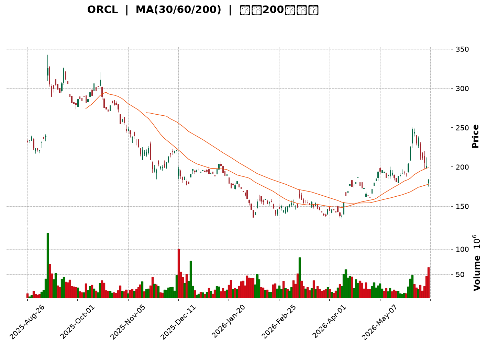
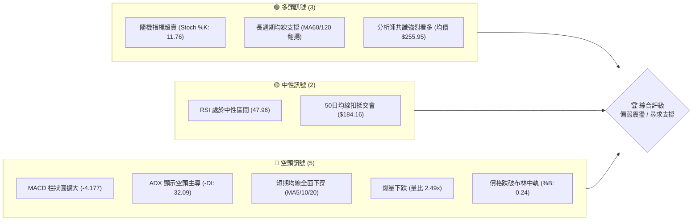
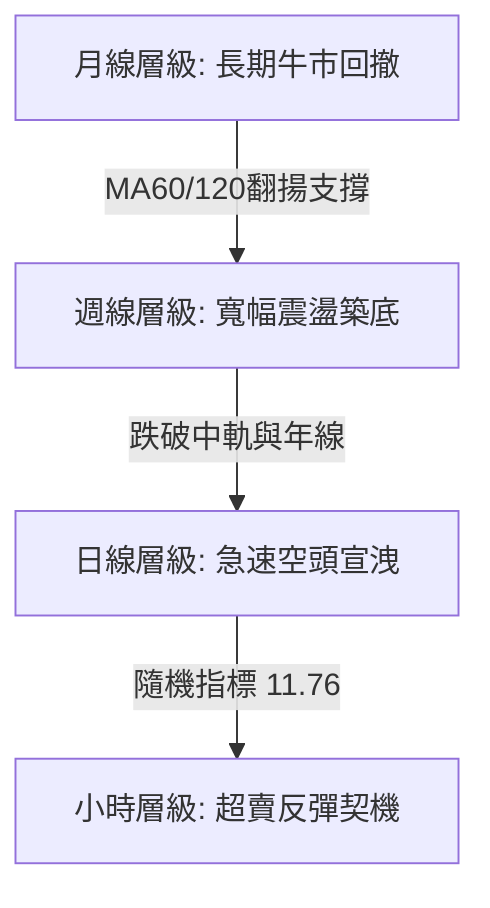
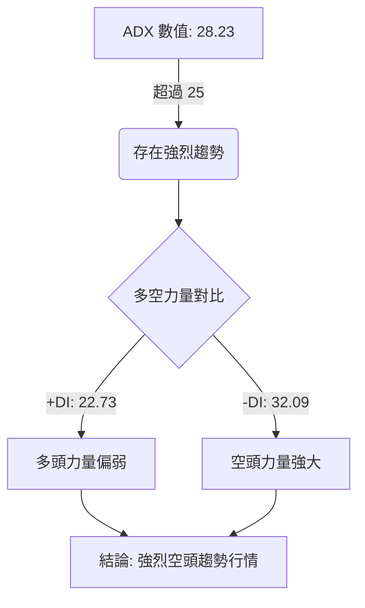

<details>
<summary>📊 靜態圖表 (點擊展開)</summary>

</details>

<html>
<head><meta charset="utf-8" /></head>
<body>
    <div style="height:500px; width:100%;">                        <script>window.PlotlyConfig = {MathJaxConfig: 'local'};</script>
        <script charset="utf-8" src="https://cdn.plot.ly/plotly-3.6.0.min.js" integrity="sha256-QaOVwtVY0T02VaHrr6pnoHLCwayMJp4O5n4YyaE3rJk=" crossorigin="anonymous"></script>                <div id="candlestick-chart" class="plotly-graph-div" style="height:100%; width:100%;"></div>            <script>                window.PLOTLYENV=window.PLOTLYENV || {};                                if (document.getElementById("candlestick-chart")) {                    Plotly.newPlot(                        "candlestick-chart",                        [{"close":{"dtype":"f8","bdata":"AAAAYAoMbUAAAADg1j5tQAAAAKAHzm1AAAAAQIELbEAAAAAgJ\u002fFrQAAAAIBqtmtAAAAAACGoa0AAAABARt9sQAAAAECck21AAAAAoM\u002fzbUAAAAAgJlx0QAAAAKAxF3NAAAAAIEceckAAAAAAZLxyQAAAAED8A3NAAAAAQM2wckAAAAAgw2RyQAAAAODkI3NAAAAAwEpZdEAAAABA93VzQAAAAAC4IHNAAAAA4MgQckAAAADA2ZNxQAAAAAC9iHFAAAAAwJtwcUAAAACA9OtxQAAAAMBN6HFAAAAAIGW+cUAAAABg6RRyQAAAAIA7oHFAAAAAQOzlcUAAAAAAV3JyQAAAACC7MnJAAAAAgA8ic0AAAADgx5JyQAAAAMA\u002f3HJAAAAAoGlxc0AAAAAgfhhyQAAAAADLN3FAAAAAAIMXcUAAAABA6u9wQAAAAEDAZXFAAAAAgJeZcUAAAACg5npxQAAAACDWcXFAAAAAoOUZcUAAAACgRepvQAAAAMAYUHBAAAAAAGcEcEAAAACg79RuQAAAAGD\u002fGG9AAAAAQPNJbkAAAACgjrltQAAAAKB9621AAAAAQKVWbUAAAADgUDNsQAAAAIC3B2tAAAAAIKWva0AAAACgjFBrQAAAAACWZGtAAAAAoOEEbEAAAADg5ixqQAAAACB5sWhAAAAA4NDhaEAAAACAc3poQAAAAGCpdmlAAAAAAO4WaUAAAACgzvZoQAAAAGDl+2hAAAAAgMLOaUAAAACgq6BqQAAAAOAICGtAAAAAIC1ma0AAAADAqYVrQAAAAMC7tGtAAAAA4FW0aEAAAABA6ZlnQAAAAEBM+WZAAAAA4O1vZ0AAAABA1ytmQAAAACDGXWZAAAAAIIXZZ0AAAABAY6VoQAAAAKCzRGhAAAAA4BSJaEAAAADg+5hoQAAAAGD5RWhAAAAAIC2AaEAAAACABjdoQAAAACB4UGhAAAAAID3tZ0AAAADgIRJoQAAAAKAw9WdAAAAAwLuPZ0AAAADAh7poQAAAAMD2fmlAAAAAAMAyaUAAAAAA9R1oQAAAAEAOpmdAAAAAAJnNZ0AAAADAZmlmQAAAAGDLqGVAAAAAQOoxZkAAAACgYxFmQAAAAODCuWZAAAAAAFLJZUAAAADAWoZlQAAAACB\u002fDWVAAAAA4DqAZEAAAADgF\u002fBjQAAAAMA2RGNAAAAAwBpFYkAAAADgKABhQAAAAIBVymFAAAAAoHCBY0AAAAAgrOpjQAAAAOCdk2NAAAAAoO59Y0AAAAAApfJjQAAAAEDkLWNAAAAAAAx0Y0AAAABg2H9jQAAAAGARcmJAAAAAgC6aYUAAAAAgNDRiQAAAAEACbGJAAAAA4C25YkAAAAAgmxxiQAAAAKBgl2JAAAAAYLmPYkAAAACg3vpiQAAAAEAKSGNAAAAAQK8NY0AAAABACuFiQAAAACApnGJAAAAAIKxRZEAAAADgZNNjQAAAAKA+UmNAAAAAQKttY0AAAAAA2kRjQAAAAEDFC2NAAAAAwFFfY0AAAADgFqViQAAAAMCwOWNAAAAAgH9SYkAAAACgYDBiQAAAAMADymFAAAAAwJBlYUAAAABAJEphQAAAAMAiU2JAAAAAYC8XYkAAAACA2ztiQAAAAAASIWJAAAAAoH7VYUAAAADAHuVhQAAAACCFO2FAAAAAQOFCYUAAAAAA13NjQAAAAAAAYGRAAAAAgOs5ZUAAAABA4UpmQAAAAIDr4WVAAAAAYI8yZkAAAACgcKVmQAAAAAAAcGdAAAAAwPUIZkAAAADA9ahlQAAAAGC4nmVAAAAAYLi+ZEAAAABgj3pkQAAAAOB6LGRAAAAAYI96ZUAAAACgR4lmQAAAAEAzK2dAAAAAwPVAaEAAAABA4VJoQAAAAGBmfmhAAAAAQOE6aEAAAABgj1pnQAAAAOBRuGdAAAAAIIVzaEAAAABgZh5oQAAAACCFU2dAAAAAYLiuZkAAAADAHoVnQAAAAOCjuGdAAAAAYI8CaEAAAACA6yFoQAAAAGC43mdAAAAAYGZ2aUAAAADA9ThsQAAAAMDMBG9AAAAAYI+SbkAAAABgj8psQAAAAEDhim1AAAAAgMK1akAAAACAPXpqQAAAAIDruWlAAAAA4FEoaUAAAABAMwNnQA=="},"high":{"dtype":"f8","bdata":"8Q4pk8NhbUDFod\u002fxslVtQJUGRPTHAW5A+HpSD1uLbUD\u002fXSpB6vVrQCSABrwzBGxAcgO38Dm6a0AGQNvkDhltQIlvxQq0EG5AgVf14KwybkAHEvPtNXB1QLnzEwqJhnRA6XCAnvAYc0DbRSmOBApzQJiaXdVv13NAKV+ovuQjc0Ai4+R5D9dyQGBjTm7JSnNAA\u002f+1FLludECodHloSSd0QJJBw2ZgYHNAKdSaS5OGckDJAiedKztyQFHlYNzau3FAl1HVPGyccUD8p3sSg\u002ftxQIHc2HyRSnJALGy1iFRFckAYp7jDtmVyQHdicqPJLnJAWHSTn\u002fUTckD8WTiuG7JyQHcCct9yHXNAl0I\u002fdNZMc0BUmiGo+OhyQHdlMV\u002fEUXNAY38B1h4JdEA6QG3IvuZyQAsbGwuT93FARprgiWhpcUCgLDuMHDhxQElO2lLvlXFAqRPljvnWcUBN2cIn9NNxQO9X68t2u3FACj7FRGZ+cUCGih9XzMFwQPIU4vH7gnBA21lSfvZ\u002fcECZVKYBEbdvQAtSnA14W29AU+uZcY\u002fxbkDNx\u002fF10N1tQKp4vadbt25AvLCv1P1\u002fbUBd8kXqomttQPICEv0c+WtA1m5AWzk1bEAaWEsGDq5rQJY7saOtymtAKcViiTVYbEC72TsWRBJtQJJG7uw04WlAtSXIgGdSaUD6aBBrJcZoQP3EBdT0FmpApN+bXFUjaUAZ65sJOkhpQF7F2jRqDWpAVeRMfs3UaUDn1Z\u002f2BMNqQKG3FG8ZRWtApbBC2xLsa0CljJl2VKhrQMGgncsz\u002fmtAqp03pDMYaUA8Per6h5RoQMClNzwbemdATgXvNYGUZ0CCunKZjCtnQEeN25Y19GZALcQ\u002fRLQ9aECjel3cvrJoQLW416\u002fbf2hAh4Ys+TSiaEBQnlyrreRoQKLA9qSFqWhAr6vFNWOlaEDrxMiL239oQE2dtOYQrGhAoVPID6kOaUA4wwtWEjZoQFsfFmcyT2hAgdmNVBS5Z0AhbcoLd+9oQDbh48EwvGlAGN6C5nTiaUATpm9JTB9pQKaH5cCZSmhA4XfYgnjmZ0AzssFXO1FnQJ7KowYWf2ZA3+3OCw5xZkCTAJqhymBmQCqGHgxIFWdAEOloEgZjZkDykUxwhqFmQJhWPZdmNGVA\u002fL0ZFP0JZUC3a3EgVVNlQIMM6tVo2mNAtiB2V+8sY0AcsJFDR0FiQL1RfIpz1mFABxhDRzXmY0DjgmZPD5pkQFm0yIzkYmRAlIiiIpHPY0BhthoqhjdkQO994Vk412NAquUvyBSYY0DbIFQxu\u002fBjQBxOCp+HLmNAqj1gm1wpYkBrp5py+UdiQGynJHLjF2NAAr8Q7wP\u002fYkBAvJhcSjJiQAKM7gS3tGJAKioJQvPMYkDraRtlaSJjQKid1099rGNAWceMv1nUY0BHa2k0Eu9iQHdr6BpQM2NA8LYNqDBlZUDjXmJO3udkQH4IMf+7BmRA63ydJQDGY0D+JxuFvctjQIBw0LrHTWNAZzN8lfaLY0DREpKW7hZjQMMzazGcZ2NAyg9J1qgrY0DxZRYWMapiQF5esCW6PmJAJzvXnkymYUBGVaySrJZhQJy2VBtiXGJAKX18+iGkYkAXJRVKxT1iQOkhyC0OgWJAndpjlSMCYkBiZbD72d1iQAAAAKCZ2WFAAAAAoHCFYUAAAADAHn1jQAAAAMDMLGVAAAAAgOuRZUAAAADgo4hmQAAAAAAAEGdAAAAA4FE4ZkAAAABA4SpnQAAAAIDCpWdAAAAA4Hq8ZkAAAABguJZmQAAAAKCZsWVAAAAAYGYWZUAAAADgUZhkQAAAAIDCpWRAAAAAoJnJZUAAAAAAAPBmQAAAAOCjUGdAAAAAoEdJaEAAAADAzARpQAAAAAAAwGhAAAAAgMJ1aEAAAACgcB1oQAAAAIA98mdAAAAAYLgWaUAAAACAwo1oQAAAAOBR2GdAAAAAQAqXZ0AAAABACodnQAAAAIA9GmhAAAAAAACgaEAAAABgZmZoQAAAAOB6BGhAAAAAAACgaUAAAACgR0lsQAAAAAAASG9AAAAAAAAgb0AAAADgURBuQAAAAGBm3m1AAAAAgBTubEAAAACA62FrQAAAAAAAkGtAAAAAIFyPakAAAADgoxhnQA=="},"hovertemplate":"\u003cb\u003e%{x|%Y-%m-%d}\u003c\u002fb\u003e\u003cbr\u003e\u958b: $%{open:.2f}\u003cbr\u003e\u9ad8: $%{high:.2f}\u003cbr\u003e\u4f4e: $%{low:.2f}\u003cbr\u003e\u6536: $%{close:.2f}\u003cextra\u003e\u003c\u002fextra\u003e","low":{"dtype":"f8","bdata":"GhhilWrcbEDEX2ehdttsQDNs+6XuKG1At6c0E5+ra0Ah94ardiJrQA3uRSlxgGtAt79rI+k6a0CmAvyx4gNsQArSEvL2Lm1AtVVbBCcXbUDe9nrwV1pzQDMVpEtx43JAgiwsqnMXckDudKDpZW9yQEAG+jZ0vnJAVEHSWoVLckD0VuHIaxtyQPWKVerfb3JA4OEIlkUIc0DvTgSZ9TlzQD\u002f3QRjlmnJAVY4SJ6fkcUAkV2pgjIxxQN7sH4W7VnFAo2NgYNYbcUDnXvLvRDtxQEdGDS33vHFAJw8XQWyccUAj3uDVXghyQMg6WRoNznBAFbpgrxKWcUCteL2KFthxQBudCMSfI3JAnqPvbL5+ckCYrbueJSNyQNkrsDSCkXJA1GWby4DTckDllU6w59txQGE9LEgOGnFA17JV7I3pcECkrNQusLlwQN7uSyGf63BAbOWr5GqIcUB2+djGnWFxQI51HaE5bXFAxjLfUBXbcEBTCpnl3tZvQFCCsPOL5G9ARIPk9nm1b0BQIhOaKHZuQK346rytsG5APiXJ54K6bUD9fNm8yd1sQJ465+Dnc21ADOHknr5vbEBewEJnPBlsQLu40NT5vGpAjr3UKXIvakAiEZclysdqQOAUGZUTpmpAMGQpp3L\u002fakBYU16DfyBqQDkIMI3FC2hAFAV\u002f9J8jaEDUR+cj4Q9nQBnByzcnIGlAvvPG5eWMaEAXCDWl9G9oQOdttCnp2GhAvBQr6dPFaEBnrUqF6qFpQFerB6MWimpAuY9437nyakA1ACtcTB5rQHDAb+8ICGtAWYLTL\u002fYiZ0BEAQXDAhtnQBTnHn9YiWZAWFLXY5\u002frZkCFVjTsof9lQBENl0yoL2ZAa20XghJfZ0AhhGFQ3\u002fRnQLaVRXuE4GdAHmP0+nAnaEBXUHjwMF1oQNGm2lfU7mdAs4ckLXhQaEAAibLhTDFoQDNRPi3DIGhAOiY4QvjkZ0AFx7zaILFnQDRKV2d52mdAw+y13mogZ0BYmgdU74NnQI1ZC89gimhA0NdFmcX+aECihh01q8RnQG26nv1il2dAE0QXgy88Z0AplnU3i1dmQBTyviQzQGVAkxtYplf8ZUDwgcj+12xlQEhj05oTPWZAfRPhiGqiZUBStyUNYWhlQBmAQ62mHmRAPCS41H9VZECSC+0VLu5jQNS7HNrh62JAYCQKfqz9YUDk26vR79hgQA8nzzqmTWFAFwr+zKBPYkAZ0BEqPY1jQIaJujjZLmNAk2vm+QP\u002fYkBfbkII\u002fFdjQESb+RMiC2NAeQ7UOvvaYkAGpi6USmdjQNk6T4wQXGJAeG5VzXFDYUDshTum6EdhQGB3f054WmJAD0geP6IUYkA5Bry2X7NhQOQ5\u002fzYJlmFAOt+oDavRYUCOA+UbmJJiQEB\u002frMYes2JA\u002fLquFPTiYkCM2AaEcz1iQCtt\u002fNXdfWJAIa+V66wAZEAShW3u2sFjQDL3KZ+hM2NAbHengBw\u002fY0CrF99t5x5jQMN\u002fOqVY8GJATJw2yOWLYkAubjYT7G1iQESKTV\u002fvxWJANC+sV9hKYkBWHX18GANiQNvPwZJnwWFAj\u002ffGZjI6YUBTsAS\u002fJQ9hQGAL596fa2FAmVxq11MFYkBYAXN5+XlhQC\u002f4Tc8t62FA8Iqbl35uYUBE5lFr4sxhQAAAAAAAAGFAAAAAgD3SYEAAAABACndhQAAAAIDrMWRAAAAAYLjGZEAAAACgmbllQAAAACCFq2VAAAAA4FGwZUAAAADgUQBmQAAAAKCZ2WZAAAAAYI\u002fCZUAAAACgmRllQAAAAMDM\u002fGRAAAAAoJlBZEAAAADAzBRkQAAAAGCPCmRAAAAAwMzEZEAAAADgUchlQAAAAAAAYGZAAAAAoHDVZkAAAACgmdlnQAAAAGC4xmdAAAAAQDPTZ0AAAAAA15tmQAAAAIDrIWdAAAAAYGYuZ0AAAADAzJxnQAAAAOCj6GZAAAAAgMKdZkAAAACgmVlmQAAAAGBmZmdAAAAAQDPjZ0AAAACA69FnQAAAAKBwfWdAAAAAACksaEAAAADgUQBqQAAAAEAzE2xAAAAAQOHabUAAAAAghXNsQAAAAAAAAGxAAAAAYGYuakAAAABgjypqQAAAAKBHuWhAAAAAgMLFaEAAAADA9ehlQA=="},"name":"\u50f9\u683c","open":{"dtype":"f8","bdata":"vpWiVB8lbUAdYdRTHyVtQFWWylVENm1ArtxGD\u002f13bUAqLJ0oYYhrQCSABrwzBGxAumKWI2GIa0AKZthIVtdsQMUGUZBgwG1AVhav8vbBbUDTAzzeDctzQGdfjNQOfHRAX3vmR1X2ckColb2HzwBzQKGmVP2deXNAHHw2un4Uc0Ab0HedrcpyQF1FC0qLinJAWmKHzUozc0AjGEV6aRd0QFR92VaxVnNAS8qYxVRPckBFUOeuSytyQI9j953ypXFAJgbbbYCXcUCnkgCv30lxQP20Q8Y+GHJAZ2oqSlL1cUDdIR\u002fqcyFyQHdicqPJLnJAkJ9yEfeycUDqJ+33ThxyQKYd+L8ip3JAw0qbqAKOckAFbuZLdNtyQMd2V5qa8HJAGxd+YLz7ckDhhbAqUd5yQJbJPIz28nFA2i1RE5VGcUAW3piWQxJxQJZu+H6v9HBA6DxrdMfCcUARipKpHc1xQL5mhDZYlHFA0Wp75dp7cUBnLMLbk7FwQEqRcc3MHnBAW+MAgOt5cEDpIimQgA5vQDG5F7WqzG5A19aZ+57NbkD3iznCSbFtQAGOKXNUjm5AlmBInzBZbUB+jcgKaWltQKMKjN6082tAizVWqVoxakD+t1RuEhxrQHW232V23GpAWdgDGBs3a0BT6sXu8LdsQN7pkVcWumlAcd4HXgt1aEA8VtW5oBxoQGrXZNgNB2pAuuFLlVPJaEA8leIj0OhoQHXjutxifGlAJILmAGjjaEAAzAoY5dJpQBY4fnMyNWtAZ6LIOPB\u002fa0B7JwDN9FVrQBdmewpAjmtAGff6aJWuZ0Ck8gTIdWVoQAwFUqJ6ZGdAZT4iIk3yZkADkoG1F8ZmQGYdighUs2ZAmcSm36hnZ0AfhI7NxXNoQJs7lVZeZ2hAoEPbVeM5aECbn32\u002fNZtoQLQAmyosH2hAXH4xyplbaEDoAa\u002fSDGdoQE4KiPBxiGhA+85cbR2kaEC7r3LqSOxnQOsuR+ptQ2hA\u002fxERddq2Z0AiOvQ2xt9nQE4VklwxnWhAQVeyGyuJaUATpm9JTB9pQKaH5cCZSmhAmEmuJPinZ0AzssFXO1FnQCnc04G\u002fYWZARwAe0txXZkBt63JRnYBlQHJ7YtpAT2ZAxP3obh9SZkBbtv9N9cllQA\u002fNK3\u002fZMWVAjeBixLXyZEAU+StcZ0plQLpMz6SxtmNAH2ZwJFcrY0DjcIv5+yJiQP\u002fyvYdvaGFArcOAcSR\u002fYkB\u002fghodLu5jQFm0yIzkYmRAry2BqCusY0AREh6AQ9ZjQMJotsrDrWNA+jIOTuw7Y0DySY63kpRjQPWIWcuGGGNAa69FntolYkCQpymdMYthQN\u002f6LeqBlGJAXtWVVrWIYkAU7HS2IuxhQJcdaysRpGFAK\u002f549eAHYkBvNNLJnK9iQG4s8pniAWNAe0AFpGgMY0B+LSqlncViQCFxZQ67ImNAyzz3LKG5ZEAm0\u002fEPyIJkQN5bncniz2NAxNoc74lwY0Cx9bidxFxjQDx9c\u002f62G2NA5YDGhPa9YkBYZVjqjRBjQLTVEmGT3GJAq8ZHv\u002fUOY0Coz3JavZZiQJJDFVV07GFASuk5ShCOYUBR7W3lrnFhQFe7XGr5eWFAwtnmcUaSYkDdayjkDslhQBzuu7OoXWJAKl2hW\u002fLoYUCtp5FO3LhiQAAAAGBmxmFAAAAAgD0qYUAAAADgo3hhQAAAAIDC\u002fWRAAAAA4HrcZEAAAACgcA1mQAAAAIDC3WZAAAAAgOsZZkAAAABAM0tmQAAAAIDCRWdAAAAAwMyMZkAAAADgUZBmQAAAAGCPkmVAAAAAwB5FZEAAAACgR4FkQAAAAOCjQGRAAAAAoHDNZEAAAADgowBmQAAAAAApxGZAAAAAYGZGZ0AAAAAghdNoQAAAAGCPEmhAAAAAwMwEaEAAAACgcB1oQAAAAMD1oGdAAAAAgMKFZ0AAAAAgrs9nQAAAAAAAwGdAAAAAAABAZ0AAAACAFH5mQAAAAOBRoGdAAAAAoHD1Z0AAAACgmSloQAAAACBc72dAAAAAoEdBaEAAAAAAACBqQAAAAAAA0GxAAAAAoJlZbkAAAAAgXA9uQAAAAAAAYGxAAAAAIK6vbEAAAAAAADhrQAAAAMAevWpAAAAAAADQaEAAAACgcHVmQA=="},"x":["2025-08-26T00:00:00-04:00","2025-08-27T00:00:00-04:00","2025-08-28T00:00:00-04:00","2025-08-29T00:00:00-04:00","2025-09-02T00:00:00-04:00","2025-09-03T00:00:00-04:00","2025-09-04T00:00:00-04:00","2025-09-05T00:00:00-04:00","2025-09-08T00:00:00-04:00","2025-09-09T00:00:00-04:00","2025-09-10T00:00:00-04:00","2025-09-11T00:00:00-04:00","2025-09-12T00:00:00-04:00","2025-09-15T00:00:00-04:00","2025-09-16T00:00:00-04:00","2025-09-17T00:00:00-04:00","2025-09-18T00:00:00-04:00","2025-09-19T00:00:00-04:00","2025-09-22T00:00:00-04:00","2025-09-23T00:00:00-04:00","2025-09-24T00:00:00-04:00","2025-09-25T00:00:00-04:00","2025-09-26T00:00:00-04:00","2025-09-29T00:00:00-04:00","2025-09-30T00:00:00-04:00","2025-10-01T00:00:00-04:00","2025-10-02T00:00:00-04:00","2025-10-03T00:00:00-04:00","2025-10-06T00:00:00-04:00","2025-10-07T00:00:00-04:00","2025-10-08T00:00:00-04:00","2025-10-09T00:00:00-04:00","2025-10-10T00:00:00-04:00","2025-10-13T00:00:00-04:00","2025-10-14T00:00:00-04:00","2025-10-15T00:00:00-04:00","2025-10-16T00:00:00-04:00","2025-10-17T00:00:00-04:00","2025-10-20T00:00:00-04:00","2025-10-21T00:00:00-04:00","2025-10-22T00:00:00-04:00","2025-10-23T00:00:00-04:00","2025-10-24T00:00:00-04:00","2025-10-27T00:00:00-04:00","2025-10-28T00:00:00-04:00","2025-10-29T00:00:00-04:00","2025-10-30T00:00:00-04:00","2025-10-31T00:00:00-04:00","2025-11-03T00:00:00-05:00","2025-11-04T00:00:00-05:00","2025-11-05T00:00:00-05:00","2025-11-06T00:00:00-05:00","2025-11-07T00:00:00-05:00","2025-11-10T00:00:00-05:00","2025-11-11T00:00:00-05:00","2025-11-12T00:00:00-05:00","2025-11-13T00:00:00-05:00","2025-11-14T00:00:00-05:00","2025-11-17T00:00:00-05:00","2025-11-18T00:00:00-05:00","2025-11-19T00:00:00-05:00","2025-11-20T00:00:00-05:00","2025-11-21T00:00:00-05:00","2025-11-24T00:00:00-05:00","2025-11-25T00:00:00-05:00","2025-11-26T00:00:00-05:00","2025-11-28T00:00:00-05:00","2025-12-01T00:00:00-05:00","2025-12-02T00:00:00-05:00","2025-12-03T00:00:00-05:00","2025-12-04T00:00:00-05:00","2025-12-05T00:00:00-05:00","2025-12-08T00:00:00-05:00","2025-12-09T00:00:00-05:00","2025-12-10T00:00:00-05:00","2025-12-11T00:00:00-05:00","2025-12-12T00:00:00-05:00","2025-12-15T00:00:00-05:00","2025-12-16T00:00:00-05:00","2025-12-17T00:00:00-05:00","2025-12-18T00:00:00-05:00","2025-12-19T00:00:00-05:00","2025-12-22T00:00:00-05:00","2025-12-23T00:00:00-05:00","2025-12-24T00:00:00-05:00","2025-12-26T00:00:00-05:00","2025-12-29T00:00:00-05:00","2025-12-30T00:00:00-05:00","2025-12-31T00:00:00-05:00","2026-01-02T00:00:00-05:00","2026-01-05T00:00:00-05:00","2026-01-06T00:00:00-05:00","2026-01-07T00:00:00-05:00","2026-01-08T00:00:00-05:00","2026-01-09T00:00:00-05:00","2026-01-12T00:00:00-05:00","2026-01-13T00:00:00-05:00","2026-01-14T00:00:00-05:00","2026-01-15T00:00:00-05:00","2026-01-16T00:00:00-05:00","2026-01-20T00:00:00-05:00","2026-01-21T00:00:00-05:00","2026-01-22T00:00:00-05:00","2026-01-23T00:00:00-05:00","2026-01-26T00:00:00-05:00","2026-01-27T00:00:00-05:00","2026-01-28T00:00:00-05:00","2026-01-29T00:00:00-05:00","2026-01-30T00:00:00-05:00","2026-02-02T00:00:00-05:00","2026-02-03T00:00:00-05:00","2026-02-04T00:00:00-05:00","2026-02-05T00:00:00-05:00","2026-02-06T00:00:00-05:00","2026-02-09T00:00:00-05:00","2026-02-10T00:00:00-05:00","2026-02-11T00:00:00-05:00","2026-02-12T00:00:00-05:00","2026-02-13T00:00:00-05:00","2026-02-17T00:00:00-05:00","2026-02-18T00:00:00-05:00","2026-02-19T00:00:00-05:00","2026-02-20T00:00:00-05:00","2026-02-23T00:00:00-05:00","2026-02-24T00:00:00-05:00","2026-02-25T00:00:00-05:00","2026-02-26T00:00:00-05:00","2026-02-27T00:00:00-05:00","2026-03-02T00:00:00-05:00","2026-03-03T00:00:00-05:00","2026-03-04T00:00:00-05:00","2026-03-05T00:00:00-05:00","2026-03-06T00:00:00-05:00","2026-03-09T00:00:00-04:00","2026-03-10T00:00:00-04:00","2026-03-11T00:00:00-04:00","2026-03-12T00:00:00-04:00","2026-03-13T00:00:00-04:00","2026-03-16T00:00:00-04:00","2026-03-17T00:00:00-04:00","2026-03-18T00:00:00-04:00","2026-03-19T00:00:00-04:00","2026-03-20T00:00:00-04:00","2026-03-23T00:00:00-04:00","2026-03-24T00:00:00-04:00","2026-03-25T00:00:00-04:00","2026-03-26T00:00:00-04:00","2026-03-27T00:00:00-04:00","2026-03-30T00:00:00-04:00","2026-03-31T00:00:00-04:00","2026-04-01T00:00:00-04:00","2026-04-02T00:00:00-04:00","2026-04-06T00:00:00-04:00","2026-04-07T00:00:00-04:00","2026-04-08T00:00:00-04:00","2026-04-09T00:00:00-04:00","2026-04-10T00:00:00-04:00","2026-04-13T00:00:00-04:00","2026-04-14T00:00:00-04:00","2026-04-15T00:00:00-04:00","2026-04-16T00:00:00-04:00","2026-04-17T00:00:00-04:00","2026-04-20T00:00:00-04:00","2026-04-21T00:00:00-04:00","2026-04-22T00:00:00-04:00","2026-04-23T00:00:00-04:00","2026-04-24T00:00:00-04:00","2026-04-27T00:00:00-04:00","2026-04-28T00:00:00-04:00","2026-04-29T00:00:00-04:00","2026-04-30T00:00:00-04:00","2026-05-01T00:00:00-04:00","2026-05-04T00:00:00-04:00","2026-05-05T00:00:00-04:00","2026-05-06T00:00:00-04:00","2026-05-07T00:00:00-04:00","2026-05-08T00:00:00-04:00","2026-05-11T00:00:00-04:00","2026-05-12T00:00:00-04:00","2026-05-13T00:00:00-04:00","2026-05-14T00:00:00-04:00","2026-05-15T00:00:00-04:00","2026-05-18T00:00:00-04:00","2026-05-19T00:00:00-04:00","2026-05-20T00:00:00-04:00","2026-05-21T00:00:00-04:00","2026-05-22T00:00:00-04:00","2026-05-26T00:00:00-04:00","2026-05-27T00:00:00-04:00","2026-05-28T00:00:00-04:00","2026-05-29T00:00:00-04:00","2026-06-01T00:00:00-04:00","2026-06-02T00:00:00-04:00","2026-06-03T00:00:00-04:00","2026-06-04T00:00:00-04:00","2026-06-05T00:00:00-04:00","2026-06-08T00:00:00-04:00","2026-06-09T00:00:00-04:00","2026-06-10T00:00:00-04:00","2026-06-11T00:00:00-04:00"],"type":"candlestick"},{"hovertemplate":"MA30: $%{y:.2f}\u003cextra\u003e\u003c\u002fextra\u003e","line":{"color":"#2196F3","dash":"dash","width":2},"mode":"lines","name":"MA30","x":["2025-08-26T00:00:00-04:00","2025-08-27T00:00:00-04:00","2025-08-28T00:00:00-04:00","2025-08-29T00:00:00-04:00","2025-09-02T00:00:00-04:00","2025-09-03T00:00:00-04:00","2025-09-04T00:00:00-04:00","2025-09-05T00:00:00-04:00","2025-09-08T00:00:00-04:00","2025-09-09T00:00:00-04:00","2025-09-10T00:00:00-04:00","2025-09-11T00:00:00-04:00","2025-09-12T00:00:00-04:00","2025-09-15T00:00:00-04:00","2025-09-16T00:00:00-04:00","2025-09-17T00:00:00-04:00","2025-09-18T00:00:00-04:00","2025-09-19T00:00:00-04:00","2025-09-22T00:00:00-04:00","2025-09-23T00:00:00-04:00","2025-09-24T00:00:00-04:00","2025-09-25T00:00:00-04:00","2025-09-26T00:00:00-04:00","2025-09-29T00:00:00-04:00","2025-09-30T00:00:00-04:00","2025-10-01T00:00:00-04:00","2025-10-02T00:00:00-04:00","2025-10-03T00:00:00-04:00","2025-10-06T00:00:00-04:00","2025-10-07T00:00:00-04:00","2025-10-08T00:00:00-04:00","2025-10-09T00:00:00-04:00","2025-10-10T00:00:00-04:00","2025-10-13T00:00:00-04:00","2025-10-14T00:00:00-04:00","2025-10-15T00:00:00-04:00","2025-10-16T00:00:00-04:00","2025-10-17T00:00:00-04:00","2025-10-20T00:00:00-04:00","2025-10-21T00:00:00-04:00","2025-10-22T00:00:00-04:00","2025-10-23T00:00:00-04:00","2025-10-24T00:00:00-04:00","2025-10-27T00:00:00-04:00","2025-10-28T00:00:00-04:00","2025-10-29T00:00:00-04:00","2025-10-30T00:00:00-04:00","2025-10-31T00:00:00-04:00","2025-11-03T00:00:00-05:00","2025-11-04T00:00:00-05:00","2025-11-05T00:00:00-05:00","2025-11-06T00:00:00-05:00","2025-11-07T00:00:00-05:00","2025-11-10T00:00:00-05:00","2025-11-11T00:00:00-05:00","2025-11-12T00:00:00-05:00","2025-11-13T00:00:00-05:00","2025-11-14T00:00:00-05:00","2025-11-17T00:00:00-05:00","2025-11-18T00:00:00-05:00","2025-11-19T00:00:00-05:00","2025-11-20T00:00:00-05:00","2025-11-21T00:00:00-05:00","2025-11-24T00:00:00-05:00","2025-11-25T00:00:00-05:00","2025-11-26T00:00:00-05:00","2025-11-28T00:00:00-05:00","2025-12-01T00:00:00-05:00","2025-12-02T00:00:00-05:00","2025-12-03T00:00:00-05:00","2025-12-04T00:00:00-05:00","2025-12-05T00:00:00-05:00","2025-12-08T00:00:00-05:00","2025-12-09T00:00:00-05:00","2025-12-10T00:00:00-05:00","2025-12-11T00:00:00-05:00","2025-12-12T00:00:00-05:00","2025-12-15T00:00:00-05:00","2025-12-16T00:00:00-05:00","2025-12-17T00:00:00-05:00","2025-12-18T00:00:00-05:00","2025-12-19T00:00:00-05:00","2025-12-22T00:00:00-05:00","2025-12-23T00:00:00-05:00","2025-12-24T00:00:00-05:00","2025-12-26T00:00:00-05:00","2025-12-29T00:00:00-05:00","2025-12-30T00:00:00-05:00","2025-12-31T00:00:00-05:00","2026-01-02T00:00:00-05:00","2026-01-05T00:00:00-05:00","2026-01-06T00:00:00-05:00","2026-01-07T00:00:00-05:00","2026-01-08T00:00:00-05:00","2026-01-09T00:00:00-05:00","2026-01-12T00:00:00-05:00","2026-01-13T00:00:00-05:00","2026-01-14T00:00:00-05:00","2026-01-15T00:00:00-05:00","2026-01-16T00:00:00-05:00","2026-01-20T00:00:00-05:00","2026-01-21T00:00:00-05:00","2026-01-22T00:00:00-05:00","2026-01-23T00:00:00-05:00","2026-01-26T00:00:00-05:00","2026-01-27T00:00:00-05:00","2026-01-28T00:00:00-05:00","2026-01-29T00:00:00-05:00","2026-01-30T00:00:00-05:00","2026-02-02T00:00:00-05:00","2026-02-03T00:00:00-05:00","2026-02-04T00:00:00-05:00","2026-02-05T00:00:00-05:00","2026-02-06T00:00:00-05:00","2026-02-09T00:00:00-05:00","2026-02-10T00:00:00-05:00","2026-02-11T00:00:00-05:00","2026-02-12T00:00:00-05:00","2026-02-13T00:00:00-05:00","2026-02-17T00:00:00-05:00","2026-02-18T00:00:00-05:00","2026-02-19T00:00:00-05:00","2026-02-20T00:00:00-05:00","2026-02-23T00:00:00-05:00","2026-02-24T00:00:00-05:00","2026-02-25T00:00:00-05:00","2026-02-26T00:00:00-05:00","2026-02-27T00:00:00-05:00","2026-03-02T00:00:00-05:00","2026-03-03T00:00:00-05:00","2026-03-04T00:00:00-05:00","2026-03-05T00:00:00-05:00","2026-03-06T00:00:00-05:00","2026-03-09T00:00:00-04:00","2026-03-10T00:00:00-04:00","2026-03-11T00:00:00-04:00","2026-03-12T00:00:00-04:00","2026-03-13T00:00:00-04:00","2026-03-16T00:00:00-04:00","2026-03-17T00:00:00-04:00","2026-03-18T00:00:00-04:00","2026-03-19T00:00:00-04:00","2026-03-20T00:00:00-04:00","2026-03-23T00:00:00-04:00","2026-03-24T00:00:00-04:00","2026-03-25T00:00:00-04:00","2026-03-26T00:00:00-04:00","2026-03-27T00:00:00-04:00","2026-03-30T00:00:00-04:00","2026-03-31T00:00:00-04:00","2026-04-01T00:00:00-04:00","2026-04-02T00:00:00-04:00","2026-04-06T00:00:00-04:00","2026-04-07T00:00:00-04:00","2026-04-08T00:00:00-04:00","2026-04-09T00:00:00-04:00","2026-04-10T00:00:00-04:00","2026-04-13T00:00:00-04:00","2026-04-14T00:00:00-04:00","2026-04-15T00:00:00-04:00","2026-04-16T00:00:00-04:00","2026-04-17T00:00:00-04:00","2026-04-20T00:00:00-04:00","2026-04-21T00:00:00-04:00","2026-04-22T00:00:00-04:00","2026-04-23T00:00:00-04:00","2026-04-24T00:00:00-04:00","2026-04-27T00:00:00-04:00","2026-04-28T00:00:00-04:00","2026-04-29T00:00:00-04:00","2026-04-30T00:00:00-04:00","2026-05-01T00:00:00-04:00","2026-05-04T00:00:00-04:00","2026-05-05T00:00:00-04:00","2026-05-06T00:00:00-04:00","2026-05-07T00:00:00-04:00","2026-05-08T00:00:00-04:00","2026-05-11T00:00:00-04:00","2026-05-12T00:00:00-04:00","2026-05-13T00:00:00-04:00","2026-05-14T00:00:00-04:00","2026-05-15T00:00:00-04:00","2026-05-18T00:00:00-04:00","2026-05-19T00:00:00-04:00","2026-05-20T00:00:00-04:00","2026-05-21T00:00:00-04:00","2026-05-22T00:00:00-04:00","2026-05-26T00:00:00-04:00","2026-05-27T00:00:00-04:00","2026-05-28T00:00:00-04:00","2026-05-29T00:00:00-04:00","2026-06-01T00:00:00-04:00","2026-06-02T00:00:00-04:00","2026-06-03T00:00:00-04:00","2026-06-04T00:00:00-04:00","2026-06-05T00:00:00-04:00","2026-06-08T00:00:00-04:00","2026-06-09T00:00:00-04:00","2026-06-10T00:00:00-04:00","2026-06-11T00:00:00-04:00"],"y":{"dtype":"f8","bdata":"AAAAAAAA+H8AAAAAAAD4fwAAAAAAAPh\u002fAAAAAAAA+H8AAAAAAAD4fwAAAAAAAPh\u002fAAAAAAAA+H8AAAAAAAD4fwAAAAAAAPh\u002fAAAAAAAA+H8AAAAAAAD4fwAAAAAAAPh\u002fAAAAAAAA+H8AAAAAAAD4fwAAAAAAAPh\u002fAAAAAAAA+H8AAAAAAAD4fwAAAAAAAPh\u002fAAAAAAAA+H8AAAAAAAD4fwAAAAAAAPh\u002fAAAAAAAA+H8AAAAAAAD4fwAAAAAAAPh\u002fAAAAAAAA+H8AAAAAAAD4fwAAAAAAAPh\u002fAAAAAAAA+H8AAAAAAAD4fzMzM\u002fvAJHFAMzMz84xBcUDv7u5mLmJxQM3MzBxOfnFAd3d3V+qpcUAiIiJaMNFxQO\u002fu7ubj+3FA3t3dRc0rckDe3d3FB0tyQO\u002fu7mbDX3JAvLu7G9FxckCamZnpm1RyQDMzMzMpRnJAIiIi8rxBckARERGRBTdyQFVVVeWdKXJAREREpA0cckAAAAAIRAdyQImIiKAj73FAIiIiGi3KcUCrqqraqKdxQJqZmXEeiXFAq6qqIjFwcUCrqqraBVlxQKuqqnIOQ3FAiYiI4GkrcUDe3d29zQpxQJqZmXlS5XBAq6qqUgnEcEB3d3cnSJ5wQDMzMyPAfHBAMzMzW5FbcEAiIiKS1i1wQO\u002fu7l7P929AERERkZmFb0BmZmYGfxlvQCIiItLmsG5Aq6qq+is7bkCJiIioXdttQDMzM6O1im1AvLu76ztDbUCamZk5ZQVtQBEREYElw2xAAAAAYJSAbECamZm5G0FsQBEREXHPA2xA7+7u\u002fsKya0C8u7v70GtrQCIiIgJ0GWtARERENBfQakDe3d39L4ZqQFVVVRWuO2pAq6qqersEakAzMzOzZNlpQERERMQqqWlAzczMfC6AaUC8u7vrb2FpQFVVVZXpSWlAq6qq6rouaUAzMzODRxRpQAAAAEAC+mhA3t3dXRbXaEDe3d3dIMVoQO\u002fu7i7avmhAZmZmNpWzaEBVVVUFuLVoQN7d3d3+tWhAREREROy2aEAAAADQsa9oQGZmZsZMpGhAq6qqyjGTaEB3d3cHOG9oQFVVVaVgQWhAREREBPgUaEBVVVUlbeZnQCIiImLtu2dAq6qq2gajZ0B3d3fnTpFnQDMzMzPqgGdAMzMzs9tnZ0CamZnJzFRnQDMzMxNZOmdA3t3d7bsKZ0AAAABAfslmQImIiNg2kmZAiYiI+EpnZkARERFhWT9mQDMzM0NFF2ZAIiIicofsZUC8u7vLHchlQBERERFMnGVAMzMzwx92ZUAAAABQHU9lQM3MzLwTIGVAIiIisjntZEDe3d09jLVkQCIiIsIueWRAd3d3J+5BZEDNzMxsrw5kQBEREYGH42NAmpmZ2cy2Y0C8u7sLhJljQHd3d1c5hWNAMzMzk2pqY0BVVVVlNE9jQLy7u6sVLGNAREREJJAfY0Crqqp6EBFjQAAAABBKAmNAREREJCP5YkARERHhbfNiQKuqqjqM8WJAZmZmdvT6YkBVVVVl\u002fAhjQLy7uys7FWNAERERESILY0ARERHRY\u002fxiQCIiIvIi7WJAMzMz80HbYkDe3d39ksRiQGZmZkZIvWJAIiIiUqexYkAAAACg2qZiQCIiInInpGJAVVVVlSGmYkDNzMy8fqNiQO\u002fu7m5YmWJAmpmZad6MYkB3d3dXT5hiQKuqqtqHp2JAIiIiQkW+YkDNzMycidpiQJqZmcm78GJA7+7uDpALY0CrqqqatStjQO\u002fu7m7nVGNAVVVVBYxjY0C8u7v7MnNjQERERKTQhmNAAAAA0AySY0CJiIioX5xjQAAAAFD\u002fpWNAVVVV1fi3Y0CJiIioLdljQERERCTU+mNA7+7urnEtZEDe3d1Ny2FkQKuqqsoBm2RAZmZmRlHVZEBERESUEAllQO\u002fu7q4aN2VA7+7uzmFtZUAzMzOjmZ9lQO\u002fu7s7yy2VAmpmZmVL1ZUCamZmZUiVmQN7d3X2xXGZAzczMXEiWZkCrqqr6N75mQM3MzOwK3GZAd3d3JzEAZ0AAAABwyzJnQBEREeHBgGdAiYiIWDnIZ0De3d1NqfxnQBEREeHBMGhAIiIikqZYaEAAAACQwoFoQM3MzMzMpGhAzczMDHTKaEDNzMwcE+BoQA=="},"type":"scatter"},{"hovertemplate":"MA60: $%{y:.2f}\u003cextra\u003e\u003c\u002fextra\u003e","line":{"color":"#9C27B0","dash":"dash","width":2},"mode":"lines","name":"MA60","x":["2025-08-26T00:00:00-04:00","2025-08-27T00:00:00-04:00","2025-08-28T00:00:00-04:00","2025-08-29T00:00:00-04:00","2025-09-02T00:00:00-04:00","2025-09-03T00:00:00-04:00","2025-09-04T00:00:00-04:00","2025-09-05T00:00:00-04:00","2025-09-08T00:00:00-04:00","2025-09-09T00:00:00-04:00","2025-09-10T00:00:00-04:00","2025-09-11T00:00:00-04:00","2025-09-12T00:00:00-04:00","2025-09-15T00:00:00-04:00","2025-09-16T00:00:00-04:00","2025-09-17T00:00:00-04:00","2025-09-18T00:00:00-04:00","2025-09-19T00:00:00-04:00","2025-09-22T00:00:00-04:00","2025-09-23T00:00:00-04:00","2025-09-24T00:00:00-04:00","2025-09-25T00:00:00-04:00","2025-09-26T00:00:00-04:00","2025-09-29T00:00:00-04:00","2025-09-30T00:00:00-04:00","2025-10-01T00:00:00-04:00","2025-10-02T00:00:00-04:00","2025-10-03T00:00:00-04:00","2025-10-06T00:00:00-04:00","2025-10-07T00:00:00-04:00","2025-10-08T00:00:00-04:00","2025-10-09T00:00:00-04:00","2025-10-10T00:00:00-04:00","2025-10-13T00:00:00-04:00","2025-10-14T00:00:00-04:00","2025-10-15T00:00:00-04:00","2025-10-16T00:00:00-04:00","2025-10-17T00:00:00-04:00","2025-10-20T00:00:00-04:00","2025-10-21T00:00:00-04:00","2025-10-22T00:00:00-04:00","2025-10-23T00:00:00-04:00","2025-10-24T00:00:00-04:00","2025-10-27T00:00:00-04:00","2025-10-28T00:00:00-04:00","2025-10-29T00:00:00-04:00","2025-10-30T00:00:00-04:00","2025-10-31T00:00:00-04:00","2025-11-03T00:00:00-05:00","2025-11-04T00:00:00-05:00","2025-11-05T00:00:00-05:00","2025-11-06T00:00:00-05:00","2025-11-07T00:00:00-05:00","2025-11-10T00:00:00-05:00","2025-11-11T00:00:00-05:00","2025-11-12T00:00:00-05:00","2025-11-13T00:00:00-05:00","2025-11-14T00:00:00-05:00","2025-11-17T00:00:00-05:00","2025-11-18T00:00:00-05:00","2025-11-19T00:00:00-05:00","2025-11-20T00:00:00-05:00","2025-11-21T00:00:00-05:00","2025-11-24T00:00:00-05:00","2025-11-25T00:00:00-05:00","2025-11-26T00:00:00-05:00","2025-11-28T00:00:00-05:00","2025-12-01T00:00:00-05:00","2025-12-02T00:00:00-05:00","2025-12-03T00:00:00-05:00","2025-12-04T00:00:00-05:00","2025-12-05T00:00:00-05:00","2025-12-08T00:00:00-05:00","2025-12-09T00:00:00-05:00","2025-12-10T00:00:00-05:00","2025-12-11T00:00:00-05:00","2025-12-12T00:00:00-05:00","2025-12-15T00:00:00-05:00","2025-12-16T00:00:00-05:00","2025-12-17T00:00:00-05:00","2025-12-18T00:00:00-05:00","2025-12-19T00:00:00-05:00","2025-12-22T00:00:00-05:00","2025-12-23T00:00:00-05:00","2025-12-24T00:00:00-05:00","2025-12-26T00:00:00-05:00","2025-12-29T00:00:00-05:00","2025-12-30T00:00:00-05:00","2025-12-31T00:00:00-05:00","2026-01-02T00:00:00-05:00","2026-01-05T00:00:00-05:00","2026-01-06T00:00:00-05:00","2026-01-07T00:00:00-05:00","2026-01-08T00:00:00-05:00","2026-01-09T00:00:00-05:00","2026-01-12T00:00:00-05:00","2026-01-13T00:00:00-05:00","2026-01-14T00:00:00-05:00","2026-01-15T00:00:00-05:00","2026-01-16T00:00:00-05:00","2026-01-20T00:00:00-05:00","2026-01-21T00:00:00-05:00","2026-01-22T00:00:00-05:00","2026-01-23T00:00:00-05:00","2026-01-26T00:00:00-05:00","2026-01-27T00:00:00-05:00","2026-01-28T00:00:00-05:00","2026-01-29T00:00:00-05:00","2026-01-30T00:00:00-05:00","2026-02-02T00:00:00-05:00","2026-02-03T00:00:00-05:00","2026-02-04T00:00:00-05:00","2026-02-05T00:00:00-05:00","2026-02-06T00:00:00-05:00","2026-02-09T00:00:00-05:00","2026-02-10T00:00:00-05:00","2026-02-11T00:00:00-05:00","2026-02-12T00:00:00-05:00","2026-02-13T00:00:00-05:00","2026-02-17T00:00:00-05:00","2026-02-18T00:00:00-05:00","2026-02-19T00:00:00-05:00","2026-02-20T00:00:00-05:00","2026-02-23T00:00:00-05:00","2026-02-24T00:00:00-05:00","2026-02-25T00:00:00-05:00","2026-02-26T00:00:00-05:00","2026-02-27T00:00:00-05:00","2026-03-02T00:00:00-05:00","2026-03-03T00:00:00-05:00","2026-03-04T00:00:00-05:00","2026-03-05T00:00:00-05:00","2026-03-06T00:00:00-05:00","2026-03-09T00:00:00-04:00","2026-03-10T00:00:00-04:00","2026-03-11T00:00:00-04:00","2026-03-12T00:00:00-04:00","2026-03-13T00:00:00-04:00","2026-03-16T00:00:00-04:00","2026-03-17T00:00:00-04:00","2026-03-18T00:00:00-04:00","2026-03-19T00:00:00-04:00","2026-03-20T00:00:00-04:00","2026-03-23T00:00:00-04:00","2026-03-24T00:00:00-04:00","2026-03-25T00:00:00-04:00","2026-03-26T00:00:00-04:00","2026-03-27T00:00:00-04:00","2026-03-30T00:00:00-04:00","2026-03-31T00:00:00-04:00","2026-04-01T00:00:00-04:00","2026-04-02T00:00:00-04:00","2026-04-06T00:00:00-04:00","2026-04-07T00:00:00-04:00","2026-04-08T00:00:00-04:00","2026-04-09T00:00:00-04:00","2026-04-10T00:00:00-04:00","2026-04-13T00:00:00-04:00","2026-04-14T00:00:00-04:00","2026-04-15T00:00:00-04:00","2026-04-16T00:00:00-04:00","2026-04-17T00:00:00-04:00","2026-04-20T00:00:00-04:00","2026-04-21T00:00:00-04:00","2026-04-22T00:00:00-04:00","2026-04-23T00:00:00-04:00","2026-04-24T00:00:00-04:00","2026-04-27T00:00:00-04:00","2026-04-28T00:00:00-04:00","2026-04-29T00:00:00-04:00","2026-04-30T00:00:00-04:00","2026-05-01T00:00:00-04:00","2026-05-04T00:00:00-04:00","2026-05-05T00:00:00-04:00","2026-05-06T00:00:00-04:00","2026-05-07T00:00:00-04:00","2026-05-08T00:00:00-04:00","2026-05-11T00:00:00-04:00","2026-05-12T00:00:00-04:00","2026-05-13T00:00:00-04:00","2026-05-14T00:00:00-04:00","2026-05-15T00:00:00-04:00","2026-05-18T00:00:00-04:00","2026-05-19T00:00:00-04:00","2026-05-20T00:00:00-04:00","2026-05-21T00:00:00-04:00","2026-05-22T00:00:00-04:00","2026-05-26T00:00:00-04:00","2026-05-27T00:00:00-04:00","2026-05-28T00:00:00-04:00","2026-05-29T00:00:00-04:00","2026-06-01T00:00:00-04:00","2026-06-02T00:00:00-04:00","2026-06-03T00:00:00-04:00","2026-06-04T00:00:00-04:00","2026-06-05T00:00:00-04:00","2026-06-08T00:00:00-04:00","2026-06-09T00:00:00-04:00","2026-06-10T00:00:00-04:00","2026-06-11T00:00:00-04:00"],"y":{"dtype":"f8","bdata":"AAAAAAAA+H8AAAAAAAD4fwAAAAAAAPh\u002fAAAAAAAA+H8AAAAAAAD4fwAAAAAAAPh\u002fAAAAAAAA+H8AAAAAAAD4fwAAAAAAAPh\u002fAAAAAAAA+H8AAAAAAAD4fwAAAAAAAPh\u002fAAAAAAAA+H8AAAAAAAD4fwAAAAAAAPh\u002fAAAAAAAA+H8AAAAAAAD4fwAAAAAAAPh\u002fAAAAAAAA+H8AAAAAAAD4fwAAAAAAAPh\u002fAAAAAAAA+H8AAAAAAAD4fwAAAAAAAPh\u002fAAAAAAAA+H8AAAAAAAD4fwAAAAAAAPh\u002fAAAAAAAA+H8AAAAAAAD4fwAAAAAAAPh\u002fAAAAAAAA+H8AAAAAAAD4fwAAAAAAAPh\u002fAAAAAAAA+H8AAAAAAAD4fwAAAAAAAPh\u002fAAAAAAAA+H8AAAAAAAD4fwAAAAAAAPh\u002fAAAAAAAA+H8AAAAAAAD4fwAAAAAAAPh\u002fAAAAAAAA+H8AAAAAAAD4fwAAAAAAAPh\u002fAAAAAAAA+H8AAAAAAAD4fwAAAAAAAPh\u002fAAAAAAAA+H8AAAAAAAD4fwAAAAAAAPh\u002fAAAAAAAA+H8AAAAAAAD4fwAAAAAAAPh\u002fAAAAAAAA+H8AAAAAAAD4fwAAAAAAAPh\u002fAAAAAAAA+H8AAAAAAAD4fzMzM4\u002fA0HBAMzMzJ4\u002fOcECJiIh8AshwQCIiIuYavXBAAAAAkFu2cECrqqru965wQAAAAKgrqnBAmpmZobGkcEARERFNW5xwQERERByPknBAzczMiLeJcEAzMzNDp2twQN7d3fndU3BAERERkQNBcEDv7u62yStwQO\u002fu7s7CFXBAvLu7I2\u002f1b0De3d2FLL1vQJqZmaHde29AREREtDgyb0CamZnZwOpuQERERHz1pm5AAAAA4I5ybkBEREQ0uEVuQM3MzNSjF25A7+7uHoHrbUC8u7uzhbttQERERERHim1AAAAAyGZbbUARERHpayhtQDMzM0PB+WxAIiIiihzHbEAREREBZ5BsQO\u002fu7sZUW2xAvLu7Y5ccbEDe3d2Fm+drQAAAANhys2tAd3d3Hwx5a0BERES8h0VrQM3MzDSBF2tAMzMz2zbrakCJiIigTrpqQDMzMxNDgmpAIiIiMsZKakB3d3dvxBNqQJqZmWne32lAzczM7OSqaUCamZnxj35pQKuqqhovTWlAvLu7c\u002fkbaUC8u7tjfu1oQERERJQDu2hAREREtLuHaECamZl5cVFoQGZmZs6wHWhAq6qqurzzZ0BmZmamZNBnQERERGyXsGdAZmZmLqGNZ0B3d3enMm5nQImIiCgnS2dAiYiIEJsmZ0Dv7u4WHwpnQN7d3fV272ZAREREdGfQZkCamZkhorVmQAAAANCWl2ZA3t3dNW18ZkBmZmaeMF9mQLy7uyPqQ2ZAIiIiUv8kZkCamZkJXgRmQGZmZv5M42VAvLu7S7G\u002fZUBVVVXF0JplQO\u002fu7oYBdGVAd3d3f0thZUARERGxL1FlQJqZmSGaQWVAvLu7a38wZUBVVVVVHSRlQO\u002fu7qbyFWVAIiIiMtgCZUCrqqpSPelkQCIiIgK502RAzczMhDa5ZEARERGZ3p1kQKuqqho0gmRAq6qqsuRjZEDNzMxkWEZkQLy7uyvKLGRAq6qqiuMTZEAAAAD4+\u002fpjQHd3d5cd4mNAvLu7o63JY0BVVVV9haxjQImIiJhDiWNAiYiISGZnY0AiIiJif1NjQN7d3a2HRWNA3t3dDYk6Y0BERETUBjpjQImIiJD6OmNAERERUf06Y0AAAAAAdT1jQFVVVY1+QGNAzczMFI5BY0AzMzO7IUJjQCIiIlqNRGNAIiIi+pdFY0DNzMzE5kdjQFVVVcXFS2NA3t3dpXZZY0Dv7u4GFXFjQAAAAKgHiGNAAAAA4EmcY0B3d3ePF69jQGZmZl4SxGNAzczMnEnYY0ARERHJ0eZjQKuqqnox+mNAiYiIkIQPZECamZkhOiNkQImIiCANOGRAd3d3F7pNZEAzMzOraGRkQGZmZvYEe2RAMzMzY5ORZEARERGpQ6tkQLy7u2PJwWRAzczMNDvfZEBmZmaGqgZlQFVVVdW+OGVAvLu7s+RpZUBERER0L5RlQAAAAKjUwmVAvLu7SxneZUDe3d3FevplQImIiLjOFWZAZmZmbkAuZkCrqqpiOT5mQA=="},"type":"scatter"},{"hovertemplate":"MA200: $%{y:.2f}\u003cextra\u003e\u003c\u002fextra\u003e","line":{"color":"#FF6F00","dash":"solid","width":2},"mode":"lines","name":"MA200","x":["2025-08-26T00:00:00-04:00","2025-08-27T00:00:00-04:00","2025-08-28T00:00:00-04:00","2025-08-29T00:00:00-04:00","2025-09-02T00:00:00-04:00","2025-09-03T00:00:00-04:00","2025-09-04T00:00:00-04:00","2025-09-05T00:00:00-04:00","2025-09-08T00:00:00-04:00","2025-09-09T00:00:00-04:00","2025-09-10T00:00:00-04:00","2025-09-11T00:00:00-04:00","2025-09-12T00:00:00-04:00","2025-09-15T00:00:00-04:00","2025-09-16T00:00:00-04:00","2025-09-17T00:00:00-04:00","2025-09-18T00:00:00-04:00","2025-09-19T00:00:00-04:00","2025-09-22T00:00:00-04:00","2025-09-23T00:00:00-04:00","2025-09-24T00:00:00-04:00","2025-09-25T00:00:00-04:00","2025-09-26T00:00:00-04:00","2025-09-29T00:00:00-04:00","2025-09-30T00:00:00-04:00","2025-10-01T00:00:00-04:00","2025-10-02T00:00:00-04:00","2025-10-03T00:00:00-04:00","2025-10-06T00:00:00-04:00","2025-10-07T00:00:00-04:00","2025-10-08T00:00:00-04:00","2025-10-09T00:00:00-04:00","2025-10-10T00:00:00-04:00","2025-10-13T00:00:00-04:00","2025-10-14T00:00:00-04:00","2025-10-15T00:00:00-04:00","2025-10-16T00:00:00-04:00","2025-10-17T00:00:00-04:00","2025-10-20T00:00:00-04:00","2025-10-21T00:00:00-04:00","2025-10-22T00:00:00-04:00","2025-10-23T00:00:00-04:00","2025-10-24T00:00:00-04:00","2025-10-27T00:00:00-04:00","2025-10-28T00:00:00-04:00","2025-10-29T00:00:00-04:00","2025-10-30T00:00:00-04:00","2025-10-31T00:00:00-04:00","2025-11-03T00:00:00-05:00","2025-11-04T00:00:00-05:00","2025-11-05T00:00:00-05:00","2025-11-06T00:00:00-05:00","2025-11-07T00:00:00-05:00","2025-11-10T00:00:00-05:00","2025-11-11T00:00:00-05:00","2025-11-12T00:00:00-05:00","2025-11-13T00:00:00-05:00","2025-11-14T00:00:00-05:00","2025-11-17T00:00:00-05:00","2025-11-18T00:00:00-05:00","2025-11-19T00:00:00-05:00","2025-11-20T00:00:00-05:00","2025-11-21T00:00:00-05:00","2025-11-24T00:00:00-05:00","2025-11-25T00:00:00-05:00","2025-11-26T00:00:00-05:00","2025-11-28T00:00:00-05:00","2025-12-01T00:00:00-05:00","2025-12-02T00:00:00-05:00","2025-12-03T00:00:00-05:00","2025-12-04T00:00:00-05:00","2025-12-05T00:00:00-05:00","2025-12-08T00:00:00-05:00","2025-12-09T00:00:00-05:00","2025-12-10T00:00:00-05:00","2025-12-11T00:00:00-05:00","2025-12-12T00:00:00-05:00","2025-12-15T00:00:00-05:00","2025-12-16T00:00:00-05:00","2025-12-17T00:00:00-05:00","2025-12-18T00:00:00-05:00","2025-12-19T00:00:00-05:00","2025-12-22T00:00:00-05:00","2025-12-23T00:00:00-05:00","2025-12-24T00:00:00-05:00","2025-12-26T00:00:00-05:00","2025-12-29T00:00:00-05:00","2025-12-30T00:00:00-05:00","2025-12-31T00:00:00-05:00","2026-01-02T00:00:00-05:00","2026-01-05T00:00:00-05:00","2026-01-06T00:00:00-05:00","2026-01-07T00:00:00-05:00","2026-01-08T00:00:00-05:00","2026-01-09T00:00:00-05:00","2026-01-12T00:00:00-05:00","2026-01-13T00:00:00-05:00","2026-01-14T00:00:00-05:00","2026-01-15T00:00:00-05:00","2026-01-16T00:00:00-05:00","2026-01-20T00:00:00-05:00","2026-01-21T00:00:00-05:00","2026-01-22T00:00:00-05:00","2026-01-23T00:00:00-05:00","2026-01-26T00:00:00-05:00","2026-01-27T00:00:00-05:00","2026-01-28T00:00:00-05:00","2026-01-29T00:00:00-05:00","2026-01-30T00:00:00-05:00","2026-02-02T00:00:00-05:00","2026-02-03T00:00:00-05:00","2026-02-04T00:00:00-05:00","2026-02-05T00:00:00-05:00","2026-02-06T00:00:00-05:00","2026-02-09T00:00:00-05:00","2026-02-10T00:00:00-05:00","2026-02-11T00:00:00-05:00","2026-02-12T00:00:00-05:00","2026-02-13T00:00:00-05:00","2026-02-17T00:00:00-05:00","2026-02-18T00:00:00-05:00","2026-02-19T00:00:00-05:00","2026-02-20T00:00:00-05:00","2026-02-23T00:00:00-05:00","2026-02-24T00:00:00-05:00","2026-02-25T00:00:00-05:00","2026-02-26T00:00:00-05:00","2026-02-27T00:00:00-05:00","2026-03-02T00:00:00-05:00","2026-03-03T00:00:00-05:00","2026-03-04T00:00:00-05:00","2026-03-05T00:00:00-05:00","2026-03-06T00:00:00-05:00","2026-03-09T00:00:00-04:00","2026-03-10T00:00:00-04:00","2026-03-11T00:00:00-04:00","2026-03-12T00:00:00-04:00","2026-03-13T00:00:00-04:00","2026-03-16T00:00:00-04:00","2026-03-17T00:00:00-04:00","2026-03-18T00:00:00-04:00","2026-03-19T00:00:00-04:00","2026-03-20T00:00:00-04:00","2026-03-23T00:00:00-04:00","2026-03-24T00:00:00-04:00","2026-03-25T00:00:00-04:00","2026-03-26T00:00:00-04:00","2026-03-27T00:00:00-04:00","2026-03-30T00:00:00-04:00","2026-03-31T00:00:00-04:00","2026-04-01T00:00:00-04:00","2026-04-02T00:00:00-04:00","2026-04-06T00:00:00-04:00","2026-04-07T00:00:00-04:00","2026-04-08T00:00:00-04:00","2026-04-09T00:00:00-04:00","2026-04-10T00:00:00-04:00","2026-04-13T00:00:00-04:00","2026-04-14T00:00:00-04:00","2026-04-15T00:00:00-04:00","2026-04-16T00:00:00-04:00","2026-04-17T00:00:00-04:00","2026-04-20T00:00:00-04:00","2026-04-21T00:00:00-04:00","2026-04-22T00:00:00-04:00","2026-04-23T00:00:00-04:00","2026-04-24T00:00:00-04:00","2026-04-27T00:00:00-04:00","2026-04-28T00:00:00-04:00","2026-04-29T00:00:00-04:00","2026-04-30T00:00:00-04:00","2026-05-01T00:00:00-04:00","2026-05-04T00:00:00-04:00","2026-05-05T00:00:00-04:00","2026-05-06T00:00:00-04:00","2026-05-07T00:00:00-04:00","2026-05-08T00:00:00-04:00","2026-05-11T00:00:00-04:00","2026-05-12T00:00:00-04:00","2026-05-13T00:00:00-04:00","2026-05-14T00:00:00-04:00","2026-05-15T00:00:00-04:00","2026-05-18T00:00:00-04:00","2026-05-19T00:00:00-04:00","2026-05-20T00:00:00-04:00","2026-05-21T00:00:00-04:00","2026-05-22T00:00:00-04:00","2026-05-26T00:00:00-04:00","2026-05-27T00:00:00-04:00","2026-05-28T00:00:00-04:00","2026-05-29T00:00:00-04:00","2026-06-01T00:00:00-04:00","2026-06-02T00:00:00-04:00","2026-06-03T00:00:00-04:00","2026-06-04T00:00:00-04:00","2026-06-05T00:00:00-04:00","2026-06-08T00:00:00-04:00","2026-06-09T00:00:00-04:00","2026-06-10T00:00:00-04:00","2026-06-11T00:00:00-04:00"],"y":{"dtype":"f8","bdata":"AAAAAAAA+H8AAAAAAAD4fwAAAAAAAPh\u002fAAAAAAAA+H8AAAAAAAD4fwAAAAAAAPh\u002fAAAAAAAA+H8AAAAAAAD4fwAAAAAAAPh\u002fAAAAAAAA+H8AAAAAAAD4fwAAAAAAAPh\u002fAAAAAAAA+H8AAAAAAAD4fwAAAAAAAPh\u002fAAAAAAAA+H8AAAAAAAD4fwAAAAAAAPh\u002fAAAAAAAA+H8AAAAAAAD4fwAAAAAAAPh\u002fAAAAAAAA+H8AAAAAAAD4fwAAAAAAAPh\u002fAAAAAAAA+H8AAAAAAAD4fwAAAAAAAPh\u002fAAAAAAAA+H8AAAAAAAD4fwAAAAAAAPh\u002fAAAAAAAA+H8AAAAAAAD4fwAAAAAAAPh\u002fAAAAAAAA+H8AAAAAAAD4fwAAAAAAAPh\u002fAAAAAAAA+H8AAAAAAAD4fwAAAAAAAPh\u002fAAAAAAAA+H8AAAAAAAD4fwAAAAAAAPh\u002fAAAAAAAA+H8AAAAAAAD4fwAAAAAAAPh\u002fAAAAAAAA+H8AAAAAAAD4fwAAAAAAAPh\u002fAAAAAAAA+H8AAAAAAAD4fwAAAAAAAPh\u002fAAAAAAAA+H8AAAAAAAD4fwAAAAAAAPh\u002fAAAAAAAA+H8AAAAAAAD4fwAAAAAAAPh\u002fAAAAAAAA+H8AAAAAAAD4fwAAAAAAAPh\u002fAAAAAAAA+H8AAAAAAAD4fwAAAAAAAPh\u002fAAAAAAAA+H8AAAAAAAD4fwAAAAAAAPh\u002fAAAAAAAA+H8AAAAAAAD4fwAAAAAAAPh\u002fAAAAAAAA+H8AAAAAAAD4fwAAAAAAAPh\u002fAAAAAAAA+H8AAAAAAAD4fwAAAAAAAPh\u002fAAAAAAAA+H8AAAAAAAD4fwAAAAAAAPh\u002fAAAAAAAA+H8AAAAAAAD4fwAAAAAAAPh\u002fAAAAAAAA+H8AAAAAAAD4fwAAAAAAAPh\u002fAAAAAAAA+H8AAAAAAAD4fwAAAAAAAPh\u002fAAAAAAAA+H8AAAAAAAD4fwAAAAAAAPh\u002fAAAAAAAA+H8AAAAAAAD4fwAAAAAAAPh\u002fAAAAAAAA+H8AAAAAAAD4fwAAAAAAAPh\u002fAAAAAAAA+H8AAAAAAAD4fwAAAAAAAPh\u002fAAAAAAAA+H8AAAAAAAD4fwAAAAAAAPh\u002fAAAAAAAA+H8AAAAAAAD4fwAAAAAAAPh\u002fAAAAAAAA+H8AAAAAAAD4fwAAAAAAAPh\u002fAAAAAAAA+H8AAAAAAAD4fwAAAAAAAPh\u002fAAAAAAAA+H8AAAAAAAD4fwAAAAAAAPh\u002fAAAAAAAA+H8AAAAAAAD4fwAAAAAAAPh\u002fAAAAAAAA+H8AAAAAAAD4fwAAAAAAAPh\u002fAAAAAAAA+H8AAAAAAAD4fwAAAAAAAPh\u002fAAAAAAAA+H8AAAAAAAD4fwAAAAAAAPh\u002fAAAAAAAA+H8AAAAAAAD4fwAAAAAAAPh\u002fAAAAAAAA+H8AAAAAAAD4fwAAAAAAAPh\u002fAAAAAAAA+H8AAAAAAAD4fwAAAAAAAPh\u002fAAAAAAAA+H8AAAAAAAD4fwAAAAAAAPh\u002fAAAAAAAA+H8AAAAAAAD4fwAAAAAAAPh\u002fAAAAAAAA+H8AAAAAAAD4fwAAAAAAAPh\u002fAAAAAAAA+H8AAAAAAAD4fwAAAAAAAPh\u002fAAAAAAAA+H8AAAAAAAD4fwAAAAAAAPh\u002fAAAAAAAA+H8AAAAAAAD4fwAAAAAAAPh\u002fAAAAAAAA+H8AAAAAAAD4fwAAAAAAAPh\u002fAAAAAAAA+H8AAAAAAAD4fwAAAAAAAPh\u002fAAAAAAAA+H8AAAAAAAD4fwAAAAAAAPh\u002fAAAAAAAA+H8AAAAAAAD4fwAAAAAAAPh\u002fAAAAAAAA+H8AAAAAAAD4fwAAAAAAAPh\u002fAAAAAAAA+H8AAAAAAAD4fwAAAAAAAPh\u002fAAAAAAAA+H8AAAAAAAD4fwAAAAAAAPh\u002fAAAAAAAA+H8AAAAAAAD4fwAAAAAAAPh\u002fAAAAAAAA+H8AAAAAAAD4fwAAAAAAAPh\u002fAAAAAAAA+H8AAAAAAAD4fwAAAAAAAPh\u002fAAAAAAAA+H8AAAAAAAD4fwAAAAAAAPh\u002fAAAAAAAA+H8AAAAAAAD4fwAAAAAAAPh\u002fAAAAAAAA+H8AAAAAAAD4fwAAAAAAAPh\u002fAAAAAAAA+H8AAAAAAAD4fwAAAAAAAPh\u002fAAAAAAAA+H8AAAAAAAD4fwAAAAAAAPh\u002fAAAAAAAA+H\u002fsUbgWpqRpQA=="},"type":"scatter"}],                        {"template":{"data":{"barpolar":[{"marker":{"line":{"color":"rgb(17,17,17)","width":0.5},"pattern":{"fillmode":"overlay","size":10,"solidity":0.2}},"type":"barpolar"}],"bar":[{"error_x":{"color":"#f2f5fa"},"error_y":{"color":"#f2f5fa"},"marker":{"line":{"color":"rgb(17,17,17)","width":0.5},"pattern":{"fillmode":"overlay","size":10,"solidity":0.2}},"type":"bar"}],"carpet":[{"aaxis":{"endlinecolor":"#A2B1C6","gridcolor":"#506784","linecolor":"#506784","minorgridcolor":"#506784","startlinecolor":"#A2B1C6"},"baxis":{"endlinecolor":"#A2B1C6","gridcolor":"#506784","linecolor":"#506784","minorgridcolor":"#506784","startlinecolor":"#A2B1C6"},"type":"carpet"}],"choropleth":[{"colorbar":{"outlinewidth":0,"ticks":""},"type":"choropleth"}],"contourcarpet":[{"colorbar":{"outlinewidth":0,"ticks":""},"type":"contourcarpet"}],"contour":[{"colorbar":{"outlinewidth":0,"ticks":""},"colorscale":[[0.0,"#0d0887"],[0.1111111111111111,"#46039f"],[0.2222222222222222,"#7201a8"],[0.3333333333333333,"#9c179e"],[0.4444444444444444,"#bd3786"],[0.5555555555555556,"#d8576b"],[0.6666666666666666,"#ed7953"],[0.7777777777777778,"#fb9f3a"],[0.8888888888888888,"#fdca26"],[1.0,"#f0f921"]],"type":"contour"}],"heatmap":[{"colorbar":{"outlinewidth":0,"ticks":""},"colorscale":[[0.0,"#0d0887"],[0.1111111111111111,"#46039f"],[0.2222222222222222,"#7201a8"],[0.3333333333333333,"#9c179e"],[0.4444444444444444,"#bd3786"],[0.5555555555555556,"#d8576b"],[0.6666666666666666,"#ed7953"],[0.7777777777777778,"#fb9f3a"],[0.8888888888888888,"#fdca26"],[1.0,"#f0f921"]],"type":"heatmap"}],"histogram2dcontour":[{"colorbar":{"outlinewidth":0,"ticks":""},"colorscale":[[0.0,"#0d0887"],[0.1111111111111111,"#46039f"],[0.2222222222222222,"#7201a8"],[0.3333333333333333,"#9c179e"],[0.4444444444444444,"#bd3786"],[0.5555555555555556,"#d8576b"],[0.6666666666666666,"#ed7953"],[0.7777777777777778,"#fb9f3a"],[0.8888888888888888,"#fdca26"],[1.0,"#f0f921"]],"type":"histogram2dcontour"}],"histogram2d":[{"colorbar":{"outlinewidth":0,"ticks":""},"colorscale":[[0.0,"#0d0887"],[0.1111111111111111,"#46039f"],[0.2222222222222222,"#7201a8"],[0.3333333333333333,"#9c179e"],[0.4444444444444444,"#bd3786"],[0.5555555555555556,"#d8576b"],[0.6666666666666666,"#ed7953"],[0.7777777777777778,"#fb9f3a"],[0.8888888888888888,"#fdca26"],[1.0,"#f0f921"]],"type":"histogram2d"}],"histogram":[{"marker":{"pattern":{"fillmode":"overlay","size":10,"solidity":0.2}},"type":"histogram"}],"mesh3d":[{"colorbar":{"outlinewidth":0,"ticks":""},"type":"mesh3d"}],"parcoords":[{"line":{"colorbar":{"outlinewidth":0,"ticks":""}},"type":"parcoords"}],"pie":[{"automargin":true,"type":"pie"}],"scatter3d":[{"line":{"colorbar":{"outlinewidth":0,"ticks":""}},"marker":{"colorbar":{"outlinewidth":0,"ticks":""}},"type":"scatter3d"}],"scattercarpet":[{"marker":{"colorbar":{"outlinewidth":0,"ticks":""}},"type":"scattercarpet"}],"scattergeo":[{"marker":{"colorbar":{"outlinewidth":0,"ticks":""}},"type":"scattergeo"}],"scattergl":[{"marker":{"line":{"color":"#283442"}},"type":"scattergl"}],"scattermapbox":[{"marker":{"colorbar":{"outlinewidth":0,"ticks":""}},"type":"scattermapbox"}],"scattermap":[{"marker":{"colorbar":{"outlinewidth":0,"ticks":""}},"type":"scattermap"}],"scatterpolargl":[{"marker":{"colorbar":{"outlinewidth":0,"ticks":""}},"type":"scatterpolargl"}],"scatterpolar":[{"marker":{"colorbar":{"outlinewidth":0,"ticks":""}},"type":"scatterpolar"}],"scatter":[{"marker":{"line":{"color":"#283442"}},"type":"scatter"}],"scatterternary":[{"marker":{"colorbar":{"outlinewidth":0,"ticks":""}},"type":"scatterternary"}],"surface":[{"colorbar":{"outlinewidth":0,"ticks":""},"colorscale":[[0.0,"#0d0887"],[0.1111111111111111,"#46039f"],[0.2222222222222222,"#7201a8"],[0.3333333333333333,"#9c179e"],[0.4444444444444444,"#bd3786"],[0.5555555555555556,"#d8576b"],[0.6666666666666666,"#ed7953"],[0.7777777777777778,"#fb9f3a"],[0.8888888888888888,"#fdca26"],[1.0,"#f0f921"]],"type":"surface"}],"table":[{"cells":{"fill":{"color":"#506784"},"line":{"color":"rgb(17,17,17)"}},"header":{"fill":{"color":"#2a3f5f"},"line":{"color":"rgb(17,17,17)"}},"type":"table"}]},"layout":{"annotationdefaults":{"arrowcolor":"#f2f5fa","arrowhead":0,"arrowwidth":1},"autotypenumbers":"strict","coloraxis":{"colorbar":{"outlinewidth":0,"ticks":""}},"colorscale":{"diverging":[[0,"#8e0152"],[0.1,"#c51b7d"],[0.2,"#de77ae"],[0.3,"#f1b6da"],[0.4,"#fde0ef"],[0.5,"#f7f7f7"],[0.6,"#e6f5d0"],[0.7,"#b8e186"],[0.8,"#7fbc41"],[0.9,"#4d9221"],[1,"#276419"]],"sequential":[[0.0,"#0d0887"],[0.1111111111111111,"#46039f"],[0.2222222222222222,"#7201a8"],[0.3333333333333333,"#9c179e"],[0.4444444444444444,"#bd3786"],[0.5555555555555556,"#d8576b"],[0.6666666666666666,"#ed7953"],[0.7777777777777778,"#fb9f3a"],[0.8888888888888888,"#fdca26"],[1.0,"#f0f921"]],"sequentialminus":[[0.0,"#0d0887"],[0.1111111111111111,"#46039f"],[0.2222222222222222,"#7201a8"],[0.3333333333333333,"#9c179e"],[0.4444444444444444,"#bd3786"],[0.5555555555555556,"#d8576b"],[0.6666666666666666,"#ed7953"],[0.7777777777777778,"#fb9f3a"],[0.8888888888888888,"#fdca26"],[1.0,"#f0f921"]]},"colorway":["#636efa","#EF553B","#00cc96","#ab63fa","#FFA15A","#19d3f3","#FF6692","#B6E880","#FF97FF","#FECB52"],"font":{"color":"#f2f5fa"},"geo":{"bgcolor":"rgb(17,17,17)","lakecolor":"rgb(17,17,17)","landcolor":"rgb(17,17,17)","showlakes":true,"showland":true,"subunitcolor":"#506784"},"hoverlabel":{"align":"left"},"hovermode":"closest","mapbox":{"style":"dark"},"paper_bgcolor":"rgb(17,17,17)","plot_bgcolor":"rgb(17,17,17)","polar":{"angularaxis":{"gridcolor":"#506784","linecolor":"#506784","ticks":""},"bgcolor":"rgb(17,17,17)","radialaxis":{"gridcolor":"#506784","linecolor":"#506784","ticks":""}},"scene":{"xaxis":{"backgroundcolor":"rgb(17,17,17)","gridcolor":"#506784","gridwidth":2,"linecolor":"#506784","showbackground":true,"ticks":"","zerolinecolor":"#C8D4E3"},"yaxis":{"backgroundcolor":"rgb(17,17,17)","gridcolor":"#506784","gridwidth":2,"linecolor":"#506784","showbackground":true,"ticks":"","zerolinecolor":"#C8D4E3"},"zaxis":{"backgroundcolor":"rgb(17,17,17)","gridcolor":"#506784","gridwidth":2,"linecolor":"#506784","showbackground":true,"ticks":"","zerolinecolor":"#C8D4E3"}},"shapedefaults":{"line":{"color":"#f2f5fa"}},"sliderdefaults":{"bgcolor":"#C8D4E3","bordercolor":"rgb(17,17,17)","borderwidth":1,"tickwidth":0},"ternary":{"aaxis":{"gridcolor":"#506784","linecolor":"#506784","ticks":""},"baxis":{"gridcolor":"#506784","linecolor":"#506784","ticks":""},"bgcolor":"rgb(17,17,17)","caxis":{"gridcolor":"#506784","linecolor":"#506784","ticks":""}},"title":{"x":0.05},"updatemenudefaults":{"bgcolor":"#506784","borderwidth":0},"xaxis":{"automargin":true,"gridcolor":"#283442","linecolor":"#506784","ticks":"","title":{"standoff":15},"zerolinecolor":"#283442","zerolinewidth":2},"yaxis":{"automargin":true,"gridcolor":"#283442","linecolor":"#506784","ticks":"","title":{"standoff":15},"zerolinecolor":"#283442","zerolinewidth":2}}},"xaxis":{"rangeslider":{"visible":false},"title":{"text":"\u65e5\u671f"}},"font":{"size":11},"title":{"text":"ORCL  |  MA(30\u002f60\u002f200)  |  \u6700\u8fd1200\u4ea4\u6613\u65e5"},"yaxis":{"title":{"text":"\u80a1\u50f9 (USD)"}},"hovermode":"x unified","height":500},                        {"responsive": true}                    )                };            </script>        </div>
</body>
</html>

# ORCL 技術分析報告

> **報告日期**：2026-06-12 ｜ **語言**：繁體中文 ｜ **數據來源**：Yahoo Finance ｜ **當前價格**：$184.10

---

## 目錄

| 章節 | 內容 |
|------|------|
| [1. 技術面概覽](#1-技術面概覽) | 訊號儀表板、核心指標、評分卡 |
| [2. 趨勢分析](#2-趨勢分析) | 多時框趨勢、長中短期走勢、ADX 趨勢強度 |
| [3. 圖表形態分析](#3-圖表形態分析) | 形態識別、K線組合、目標價計算 |
| [4. 支撐與阻力](#4-支撐與阻力) | 關鍵價位、斐波那契回調 |
| [5. 技術指標深度解讀](#5-技術指標深度解讀) | MA/RSI/MACD/布林/量價關係 |
| [6. 動能與波動率](#6-動能與波動率) | 動能評估、ATR 波動、Beta 分析 |
| [7. 多時框架總結](#7-多時框架總結) | 時框架評分矩陣、訊號一致性 |
| [8. 交易策略建議](#8-交易策略建議) | 多空策略、精確點位、風險報酬比 |
| [9. 風險提示與監控](#9-風險提示與監控) | 監控指標、風險場景、倉位管理 |

---

## 1. 技術面概覽

Oracle Corporation (ORCL) 當前股價收於 **$184.10**。經歷了 2026 年 5 月底波段高點 $225.78 後，股價在最近兩週遭遇強烈賣壓，單週大跌 **-13.85%**，成交量急遽放大至 1.52 億股，顯示市場出現恐慌性拋售或機構倉位調整。儘管短線動能極度偏空，但多個長週期指標與分析師共識仍維持正面，暗示當前可能處於「基本面強勁但技術面超賣」的背離過渡期。

### 🎯 技術訊號儀表板



### 📊 核心指標速覽表

| 指標類別 | 指標名稱 | 當前數值 | 訊號 | 解讀 |
|----------|----------|----------|------|------|
| **價格** | 當前價格 | $184.10 | 🟡 中性 | 位於 52 週區間 ($134.57 - $343.01) 的 23.8% 低位 |
| **均線** | MA20 | $205.81 | 🔴 空頭 | 股價位於 MA20 下方，且 MA20 扣抵值走平下彎 |
| **均線** | MA50 | $184.16 | 🟡 中性 | 股價與 MA50 幾乎重合，此處為多空短兵相接關鍵點 |
| **均線** | MA200 | $205.15 | 🔴 空頭 | 股價跌破年線，長期趨勢防線宣告失守，轉為重阻力 |
| **動能** | RSI(14) | 47.96 | 🟡 中性 | 快速脫離超買區，降至中性偏弱區，尚未進入極度超賣 |
| **動能** | MACD | -4.177 (柱) | 🔴 空頭 | MACD 線下穿訊號線，雙線位於零軸上方死叉，空頭動能強 |
| **隨機** | Stochastic | %K: 11.76 | 🟢 多頭 | 隨機指標進入嚴重超賣區（<20），暗示隨時有技術性反彈 |
| **趨勢** | ADX(14) | 28.23 | 🔴 空頭 | ADX > 25 且 -DI (32.09) > +DI (22.73)，空頭趨勢強度高 |
| **波動** | ATR(14) | $15.78 | 🔴 高波動 | 佔股價 8.57%，波動度顯著放大，操作需拉寬止損距離 |
| **量能** | 量比 | 2.49x | 🔴 空頭 | 爆量下跌，OBV 跌破均線，賣壓由機構主導，短期籌碼混亂 |

### 🏆 技術評分卡

```
技術評分卡 — ORCL (2026-06-12)
════════════════════════════════════════════════════
趨勢強度      ████████████░░░░░░░░░░  60/100  🔴 空頭主導
動能指標      ████████░░░░░░░░░░░░░░  40/100  🟡 中性偏弱
支撐穩定度    ██████████████░░░░░░░░  70/100  🟢 密集支撐區
成交量配合    ████████████████░░░░░░  80/100  🔴 異常放量
形態完整度    ██████████░░░░░░░░░░░░  50/100  🟡 形態重構中
均線排列      ████████░░░░░░░░░░░░░░  40/100  🔴 混合偏空
════════════════════════════════════════════════════
綜合評分      ███████████░░░░░░░░░░░  55/100  ⚖️ 中性偏空
════════════════════════════════════════════════════
```

---

## 2. 趨勢分析

### 🌐 多時框趨勢分析

Oracle 目前的趨勢結構在不同時間框架下展現出極大的衝突，這也是典型「中繼暴跌」或「深幅回撤」的特徵：



- **長期（月線）**：依然處於上升通道中。MA60 ($177.94) 與 MA120 ($173.54) 持續上揚，提供了堅實的長線價值投資防線。
- **中期（週線）**：呈現大型箱體震盪。股價在 $140 - $250 之間進行寬幅洗盤。本次從 $225.78 的急跌，再次將股價帶回箱體中軸下方。
- **短期（日線）**：空頭絕對主導。價格連續跌破 MA5、MA10、MA20 及 MA200，形成短期的空頭排列。

### 📈 長期趨勢 — 12個月走勢圖（Unicode）

以下為 ORCL 過去 12 個月（2025-07 至 2026-06）的收盤價走勢圖，清晰展示了兩次衝高與兩次深幅回調的「雙重頂底」複雜結構：

```
ORCL 月線走勢圖（過去12個月）
價格軸 ($)
$280 ┤           ● (279.04)
$260 ┤     ●     └───● (261.01)
$240 ┤     │                                 ● (225.78)
$220 ┤     │         ● (224.36)              │
$200 ┤     │         └───● (200.72)          │         ● (184.10) ← 現在
$180 ┤     │             └───● (193.72)      │         │
$160 ┤     │                 └───● (164.01)  │   ● (161.39)
$140 ┤     │                     └───● (144.89)  │
$120 ┤     │                         └───● (146.60)
     └─────┴─────┴─────┴─────┴─────┴─────┴─────┴─────┴─────
          Jul   Aug   Sep   Oct   Nov   Dec   Jan   Feb   Mar   Apr   May   Jun
          '25   '25   '25   '25   '25   '25   '26   '26   '26   '26   '26   '26
```

**走勢特徵分析**：
- **2025-07 至 2025-09 (狂熱期)**：股價自 $216 快速拉升至歷史高點 $279.04，主要是由 AI 雲端基礎設施需求爆發推動。
- **2025-10 至 2026-02 (深幅修正期)**：股價見頂後一路下挫，最低跌至 $144.89，回吐了將近一整年的漲幅，主因是高估值修正與業績增速放緩。
- **2026-03 至 2026-05 (強勁復甦期)**：在 $145 附近形成雙底後，股價重新展開攻勢，於 5 月底觸及 $225.78。
- **2026-06 (急跌洗盤期)**：本月截至 12 日收於 $184.10，單月跌幅巨大，將前兩個月的漲幅抹去大半。

### 📊 中期趨勢（週線分析）

從週線級別來看，ORCL 正在測試一個關鍵的「多空分水嶺」：

```
週線結構示意圖
=========================================================
$225.78 ═════════════════════════════════════════ (5月波段高點阻力)
                     \
                      \  (急促空頭波段)
                       \
$205.81 ----------------------------------------- (週線中軌 / MA20 壓力)
                         \
                          ● $184.10 (當前現價：多空交戰區)
                         /
$173.54 ═════════════════════════════════════════ (MA120 長期多頭護城河支撐)
=========================================================
```

### ⚡ 趨勢強度評估（ADX 解讀）

當前的 ADX 評估流程如下：



| ADX 區間 | 趨勢強度 | ORCL 當前狀態 | 交易策略導向 |
|----------|----------|---------------|--------------|
| < 