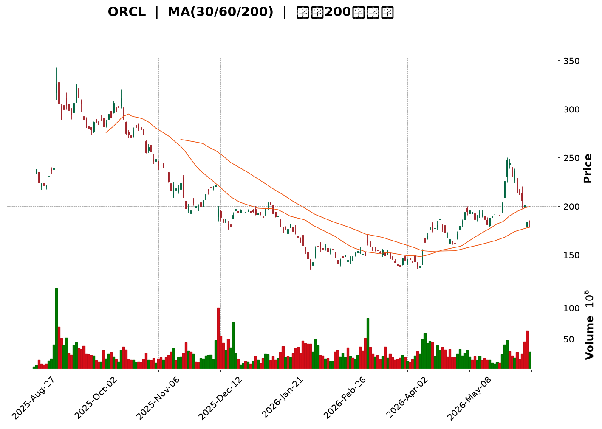
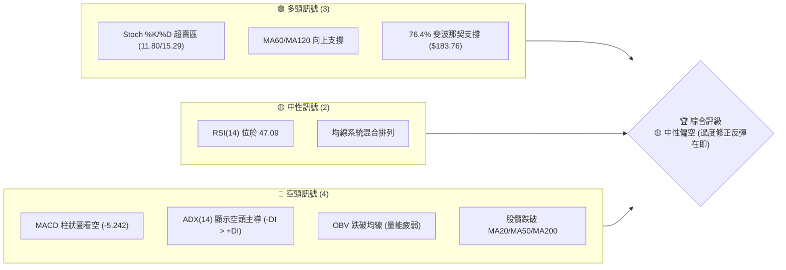
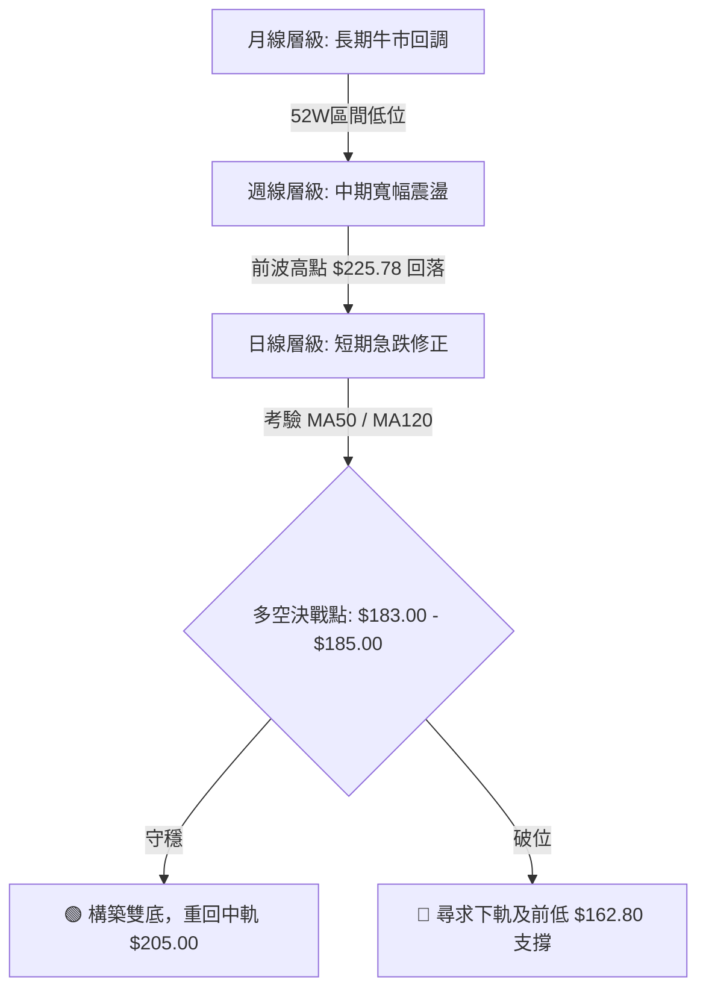
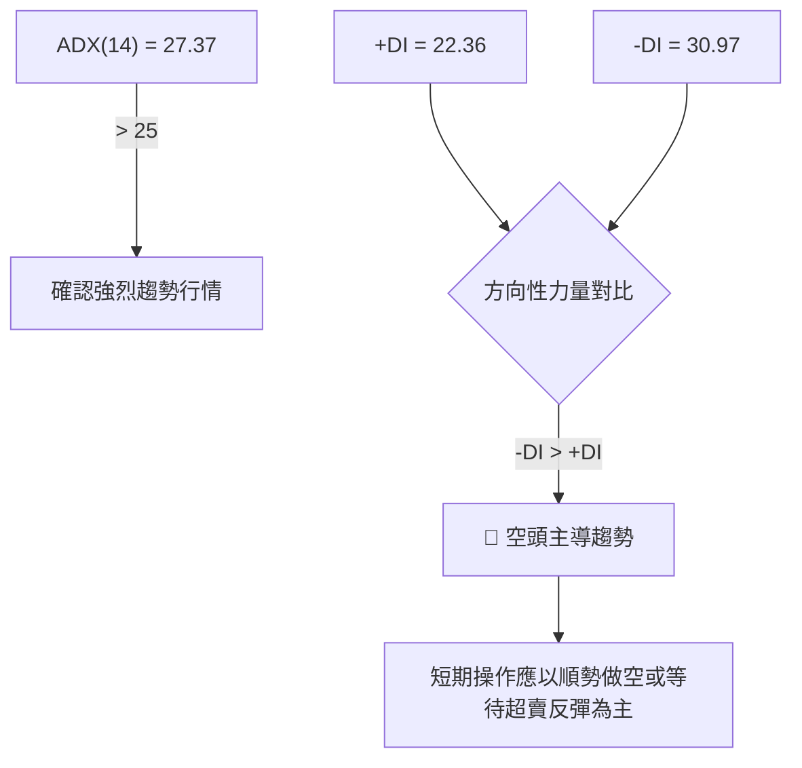
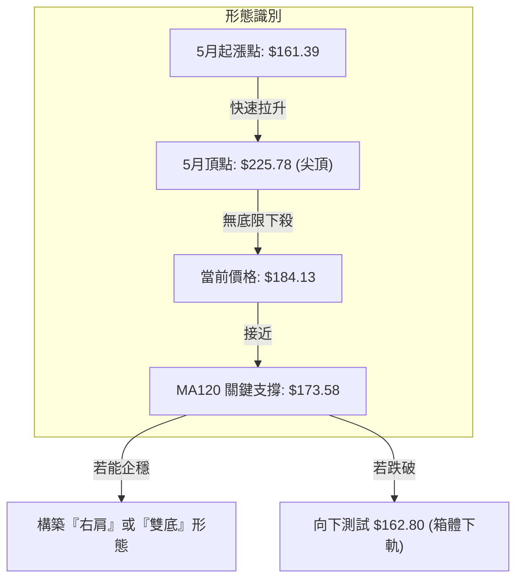

<details>
<summary>📊 靜態圖表 (點擊展開)</summary>

</details>

<html>
<head><meta charset="utf-8" /></head>
<body>
    <div style="height:500px; width:100%;">                        <script>window.PlotlyConfig = {MathJaxConfig: 'local'};</script>
        <script charset="utf-8" src="https://cdn.plot.ly/plotly-3.6.0.min.js" integrity="sha256-QaOVwtVY0T02VaHrr6pnoHLCwayMJp4O5n4YyaE3rJk=" crossorigin="anonymous"></script>                <div id="candlestick-chart" class="plotly-graph-div" style="height:100%; width:100%;"></div>            <script>                window.PLOTLYENV=window.PLOTLYENV || {};                                if (document.getElementById("candlestick-chart")) {                    Plotly.newPlot(                        "candlestick-chart",                        [{"close":{"dtype":"f8","bdata":"AAAA4NY+bUAAAACgB85tQAAAAECBC2xAAAAAICfxa0AAAACAarZrQAAAAAAhqGtAAAAAQEbfbEAAAABAnJNtQAAAAKDP821AAAAAICZcdEAAAACgMRdzQAAAACBHHnJAAAAAAGS8ckAAAABA\u002fANzQAAAAEDNsHJAAAAAIMNkckAAAADg5CNzQAAAAMBKWXRAAAAAQPd1c0AAAAAAuCBzQAAAAODIEHJAAAAAwNmTcUAAAAAAvYhxQAAAAMCbcHFAAAAAgPTrcUAAAADATehxQAAAACBlvnFAAAAAYOkUckAAAACAO6BxQAAAAEDs5XFAAAAAAFdyckAAAAAguzJyQAAAAIAPInNAAAAA4MeSckAAAADAP9xyQAAAAKBpcXNAAAAAIH4YckAAAAAAyzdxQAAAAACDF3FAAAAAQOrvcEAAAABAwGVxQAAAAICXmXFAAAAAoOZ6cUAAAAAg1nFxQAAAAKDlGXFAAAAAoEXqb0AAAADAGFBwQAAAAABnBHBAAAAAoO\u002fUbkAAAABg\u002fxhvQAAAAEDzSW5AAAAAoI65bUAAAACgfettQAAAAEClVm1AAAAA4FAzbEAAAACAtwdrQAAAACClr2tAAAAAoIxQa0AAAAAAlmRrQAAAAKDhBGxAAAAA4OYsakAAAAAgebFoQAAAAODQ4WhAAAAAgHN6aEAAAABgqXZpQAAAAADuFmlAAAAAoM72aEAAAABg5ftoQAAAAIDCzmlAAAAAoKugakAAAADgCAhrQAAAACAtZmtAAAAAwKmFa0AAAADAu7RrQAAAAOBVtGhAAAAAQOmZZ0AAAABATPlmQAAAAODtb2dAAAAAQNcrZkAAAAAgxl1mQAAAACCF2WdAAAAAQGOlaEAAAACgs0RoQAAAAOAUiWhAAAAA4PuYaEAAAABg+UVoQAAAACAtgGhAAAAAgAY3aEAAAAAgeFBoQAAAACA97WdAAAAA4CESaEAAAACgMPVnQAAAAMC7j2dAAAAAwIe6aEAAAADA9n5pQAAAAADAMmlAAAAAAPUdaEAAAABADqZnQAAAAACZzWdAAAAAwGZpZkAAAABgy6hlQAAAAEDqMWZAAAAAoGMRZkAAAADgwrlmQAAAAABSyWVAAAAAwFqGZUAAAAAgfw1lQAAAAOA6gGRAAAAA4BfwY0AAAADANkRjQAAAAMAaRWJAAAAA4CgAYUAAAACAVcphQAAAAKBwgWNAAAAAIKzqY0AAAADgnZNjQAAAAKDufWNAAAAAAKXyY0AAAABA5C1jQAAAAAAMdGNAAAAAYNh\u002fY0AAAABgEXJiQAAAAIAummFAAAAAIDQ0YkAAAABAAmxiQAAAAOAtuWJAAAAAIJscYkAAAACgYJdiQAAAAGC5j2JAAAAAoN76YkAAAABACkhjQAAAAECvDWNAAAAAQArhYkAAAAAgKZxiQAAAACCsUWRAAAAA4GTTY0AAAACgPlJjQAAAAECrbWNAAAAAANpEY0AAAABAxQtjQAAAAMBRX2NAAAAA4BalYkAAAADAsDljQAAAAIB\u002fUmJAAAAAoGAwYkAAAADAA8phQAAAAMCQZWFAAAAAQCRKYUAAAADAIlNiQAAAAGAvF2JAAAAAgNs7YkAAAAAAEiFiQAAAAKB+1WFAAAAAwB7lYUAAAAAghTthQAAAAEDhQmFAAAAAANdzY0AAAAAAAGBkQAAAAIDrOWVAAAAAQOFKZkAAAACA6+FlQAAAAGCPMmZAAAAAoHClZkAAAAAAAHBnQAAAAMD1CGZAAAAAwPWoZUAAAABguJ5lQAAAAGC4vmRAAAAAYI96ZEAAAADgeixkQAAAAGCPemVAAAAAoEeJZkAAAABAMytnQAAAAMD1QGhAAAAAQOFSaEAAAABgZn5oQAAAAEDhOmhAAAAAYI9aZ0AAAADgUbhnQAAAACCFc2hAAAAAYGYeaEAAAAAghVNnQAAAAGC4rmZAAAAAwB6FZ0AAAADgo7hnQAAAAGCPAmhAAAAAgOshaEAAAABguN5nQAAAAGBmdmlAAAAAwPU4bEAAAADAzARvQAAAAGCPkm5AAAAAYI\u002fKbEAAAABA4YptQAAAAIDCtWpAAAAAgD16akAAAACA67lpQAAAAOBRKGlAAAAAQDMDZ0AAAAAAKQRnQA=="},"high":{"dtype":"f8","bdata":"xaHf8bJVbUCVBkT0xwFuQPh6Ug9bi21A\u002f10qQer1a0AkgAa8MwRsQHIDt\u002fA5umtABkDb5A4ZbUCJb8UKtBBuQIFX9eCsMm5ABxLz7TVwdUC58xMKiYZ0QOlwgJ7wGHNA20UpjgQKc0CYml3Vb9dzQClfqL7kI3NAIuPkeQ\u002fXckBgY05uyUpzQAP\u002ftRS5bnRAqHR5aEkndECSQcNmYGBzQCnUmkuThnJAyQInnSs7ckBR5WDc2rtxQJdR1TxsnHFA\u002fKd7EoP7cUCB3Nh8kUpyQCxstYhURXJAGKe4w7ZlckB3YnKjyS5yQFh0k5\u002f1E3JA\u002fFk4rhuyckB3AnLfch1zQJdCP3TWTHNAVJohqPjockB3ZTFfxFFzQGN\u002fAdYeCXRAOkBtyL7mckALGxsLk\u002fdxQEaa4IloaXFAoCw7jBw4cUBJTtpS75VxQKkT5Y751nFATdnCJ\u002fTTcUDvV+vLdrtxQAo+xURmfnFAhoofV8zBcEDyFOLx+4JwQNtZUn72f3BAmVSmARG3b0ALUpwNeFtvQFPrmXGP8W5AzcfxddDdbUCqeL2nW7duQLywr9T9f21AXfJF6qJrbUDyAhL9HPlrQNZuQFs5NWxAGlhLBg6ua0CWO7GjrcprQCnFYok1WGxAu9k7FkQSbUCSRu7sNOFpQLUlyIBnUmlA+mgQayXGaED9xAXU9BZqQKTfm1xVI2lAGeubCTpIaUBexdo0ag1qQFXkTH7N1GlA59Wf9gTDakChtxRvGUVrQKWwQtsS7GtApYyZdlSoa0DBoJ3LM\u002f5rQKqdN6QzGGlAPD3q+oeUaEDApTc8G3pnQE4F7zWBlGdAgrpymYwrZ0BHjduWNfRmQC3EP0S0PWhAo3pd3L6yaEC1uNev239oQIeGLPk0omhAUJ5cq63kaECiwPakhaloQK+rxTVjpWhA68TIi9t\u002faEBNnbTmEKxoQKFTyA+pDmlAOMMLVhI2aEBbHxZnMk9oQIHZjVQUuWdAIW3KC3fvaEA24ePBMLxpQBjeguZ04mlAE6ZvSUwfaUCmh+XAmUpoQOF32IJ45mdAM7LBVztRZ0CeyqMGFn9mQN\u002ftzgsOcWZAkwCaocpgZkAqhh4MSBVnQBDpaBIGY2ZA8pFMcIahZkCYVj2XZjRlQPy9GRT9CWVAt2txIFVTZUCDDOrVaNpjQLYgdlfvLGNAHLCRQ0dBYkC9UXyKc9ZhQAcYQ0c15mNA44JmTw+aZEBZtMiM5GJkQJSIoiKRz2NAYbYaKoY3ZEDvfeFZONdjQKrlL8gUmGNA2yBUMbvwY0AcTgqfhy5jQKo9YJtcKWJAa6eacvlHYkBspyRy4xdjQAK\u002fEO8D\u002f2JAQLyYXEoyYkACjO4Et7RiQCoqCULzzGJA62kbZWkiY0ConddPfaxjQFnHjL9Z1GNAR2tpNBLvYkB3a+gaUDNjQPC2DagwZWVA415iTt7nZEB+CDH\u002fuwZkQOt8nSUAxmNA\u002ficbhb3LY0CAcNC6x01jQGczfJX2i2NA0RKSlu4WY0DDM2sxnGdjQMoPSdaoK2NA8WUWFjGqYkBeXrAluj5iQCc7155MpmFARlWskqyWYUCctlQbYlxiQCl9fPohpGJAFyUVSsU9YkDpIcgtDoFiQJ3aY5UjAmJAYmWw+9ndYkAAAACgmdlhQAAAAKBwhWFAAAAAwB59Y0AAAADAzCxlQAAAAIDrkWVAAAAA4KOIZkAAAAAAABBnQAAAAOBROGZAAAAAQOEqZ0AAAACAwqVnQAAAAOB6vGZAAAAAYLiWZkAAAACgmbFlQAAAAGBmFmVAAAAA4FGYZEAAAACAwqVkQAAAAKCZyWVAAAAAAADwZkAAAADgo1BnQAAAAKBHSWhAAAAAwMwEaUAAAAAAAMBoQAAAAIDCdWhAAAAAoHAdaEAAAACAPfJnQAAAAGC4FmlAAAAAgMKNaEAAAADgUdhnQAAAAEAKl2dAAAAAQAqHZ0AAAACAPRpoQAAAAAAAoGhAAAAAYGZmaEAAAADgegRoQAAAAAAAoGlAAAAAoEdJbEAAAAAAAEhvQAAAAAAAIG9AAAAA4FEQbkAAAABgZt5tQAAAAIAU7mxAAAAAgOtha0AAAAAAAJBrQAAAACBcj2pAAAAA4KMYZ0AAAABgjzJnQA=="},"hovertemplate":"\u003cb\u003e%{x|%Y-%m-%d}\u003c\u002fb\u003e\u003cbr\u003e\u958b: $%{open:.2f}\u003cbr\u003e\u9ad8: $%{high:.2f}\u003cbr\u003e\u4f4e: $%{low:.2f}\u003cbr\u003e\u6536: $%{close:.2f}\u003cextra\u003e\u003c\u002fextra\u003e","low":{"dtype":"f8","bdata":"xF9noXbbbEAzbPul7ihtQLenNBOfq2tAIfeGq3Yia0AN7kUpcYBrQLe\u002fayPpOmtApgL8seIDbEAK0hLy9i5tQLVVWwQnF21A3vZ68Fdac0AzFaRLceNyQIIsLKpzF3JA7nSg6WVvckBABvo2dL5yQFRB0lqFS3JA9FbhyGsbckD1ilXq329yQODhCJZFCHNA704EmfU5c0A\u002f90EY5ZpyQFWOEien5HFAJFdqYIyMcUDe7B+Fu1ZxQKNjYGDWG3FA517y70Q7cUBHRg0t97xxQCcPF0FsnHFAI97g1V4IckDIOlkaDc5wQBW6YK8SlnFArXi9ihbYcUAbnQjEnyNyQJ6j72y+fnJAmK27niUjckDZK7A0gpFyQNRlm8uA03JA5ZVOsOfbcUBhPSxIDhpxQNeyVeyN6XBApKzULrC5cEDe7kshn+twQGzlq+RqiHFAdvnYxp1hcUCOdR2hOW1xQMYy31AV23BAUwqZ5d7Wb0BQgrDzi+RvQESD5PZ5tW9AUCITmih2bkCt+Oq8rbBuQD4lyeeCum1A\u002fXzZvMndbECeOufg53NtQAzh5J6+b2xAXsBCZzwZbEC7uNDU+bxqQI691ClyL2pAIhGXJcrHakDgFBmVE6ZqQDBkKady\u002f2pAWFNeg38gakA5CDCNxQtoQBQFf\u002fSfI2hA1EfnI+EPZ0AZwcs3JyBpQL7zxuXljGhAFwg1pfRvaEDnbbQp6dhoQLwUK+nTxWhAZ61KheqhaUBXqwejFopqQLmPeN+58mpANQArXEwea0BwwG\u002fvCAhrQFmC0y\u002f2ImdARAEFwwIbZ0AU5x5\u002fWIlmQFhS12Of62ZAhVY07KH\u002fZUARDZdMqC9mQGttF4ISX2dAIYRhUN\u002f0Z0C2lUV7hOBnQB5j9PpwJ2hAV1B48DBdaEDRptpX1O5nQLOHJC14UGhAAImy4UwxaEAzUT4twyBoQDomOEL45GdABce82iCxZ0A0SldnedpnQMPstd5qIGdAWJoHVO+DZ0CNWQvPYIpoQNDXRZnF\u002fmhAooYdNavEZ0Btup79YpdnQBNEF4MvPGdAKZZ1N4tXZkAU8r4kM0BlQJMbWKZX\u002fGVA8IHI\u002ftdsZUBIY9OaEz1mQH0T4YhqomVAUrclDWFoZUAZgEOtph5kQDwkuNR\u002fVWRAkgvtFS7uY0DUuxza4etiQGAkCn6s\u002fWFA5Nur0e\u002fYYEAPJ886pk1hQBcK\u002fsygT2JAGdARKj2NY0CGibo42S5jQJNr5vkD\u002f2JAX25CCPxXY0BEm\u002fkTIgtjQHkO1Dr72mJABqYulEpnY0DZOk+MEFxiQHhuVc1xQ2FA7IU7puhHYUBgd39OeFpiQA9IHj+iFGJAOQa8tl+zYUDkOf82CZZhQDrfqA2r0WFAjgPlG5iSYkBAf6zGHrNiQPy6rhT04mJAjNgGhHM9YkArbfzV3X1iQCGvleusAGRAEoVt7trBY0Ay9ymfoTNjQGx3p4AcP2NAqxffbeceY0DDfzqlWPBiQEycNsjli2JALm42E+xtYkBEik1f78ViQDQvrFfYSmJAVh19fBgDYkDbz8GSZ8FhQI\u002f3xmYyOmFAU7AEvyUPYUBgC+fen2thQJlcatdTBWJAWAFzefl5YUAv+E3PLethQPCKm5d+bmFAROZRa+LMYUAAAAAAAABhQAAAAIA90mBAAAAAQAp3YUAAAACA6zFkQAAAAGC4xmRAAAAAoJm5ZUAAAAAghatlQAAAAOBRsGVAAAAA4FEAZkAAAACgmdlmQAAAAGCPwmVAAAAAoJkZZUAAAADAzPxkQAAAAKCZQWRAAAAAwMwUZEAAAABgjwpkQAAAAMDMxGRAAAAA4FHIZUAAAAAAAGBmQAAAAKBw1WZAAAAAoJnZZ0AAAABguMZnQAAAAEAz02dAAAAAANebZkAAAACA6yFnQAAAAGBmLmdAAAAAwMycZ0AAAADgo+hmQAAAAIDCnWZAAAAAoJlZZkAAAABgZmZnQAAAAEAz42dAAAAAgOvRZ0AAAACgcH1nQAAAAAApLGhAAAAA4FEAakAAAABAMxNsQAAAAEDh2m1AAAAAIIVzbEAAAAAAAABsQAAAAGBmLmpAAAAAYI8qakAAAACgR7loQAAAAIDCxWhAAAAAwPXoZUAAAAAAAGBmQA=="},"name":"\u50f9\u683c","open":{"dtype":"f8","bdata":"HWHUUx8lbUBVlspVRDZtQK7cRg\u002f9d21AKiydKGGIa0AkgAa8MwRsQLpiliNhiGtACmbYSFbXbEDFBlGQYMBtQFYWr\u002fL2wW1A0wM83g3Lc0BnX4zUDnx0QF975kdV9nJAqJW9h88Ac0ChplT9nXlzQBx8Nrp+FHNAG9B3na3KckBdRQtKi4pyQFpih81KM3NAIxhFemkXdEBUfdlWsVZzQEvKmMVUT3JARVDnrksrckCPY\u002fed8qVxQCYG222Al3FAp5IAr99JcUD9tEPGPhhyQGdqKkpS9XFA3SEf6nMhckB3YnKjyS5yQJCfchH3snFA6ift904cckCmHfi\u002fIqdyQMNKm6gCjnJABW7mS3TbckDHdleamvByQBsXfmC8+3JA4YWwKlHeckCWyTyM9vJxQNotUROVRnFAFt6YlkMScUCWbvh+r\u002fRwQOg8a3THwnFAEYqSqR3NcUC+ZoQ2WJRxQNFqe+Xae3FAZyzC25OxcEBKkXHNzB5wQFvjAIDreXBA6SIpkIAOb0AxuRe1qsxuQNfWmfuezW5A94s5wkmxbUABjilzVI5uQJZgSJ8wWW1Afo3ICmlpbUCjCozetPNrQIs1VqlaMWpA\u002frdUbhIca0B1tt9ldtxqQFnYAxgbN2tAU+rF7vC3bEDe6ZFXFrppQHHeB14LdWhAPFbVuaAcaEBq12TYDQdqQLrhS5VTyWhAPJXiI9DoaEB147rcYnxpQCSC5gBo42hAAMwKGOXSaUAWOH5zMjVrQGeiyDjwf2tAeycAzfRVa0AXZnsKQI5rQBn3+miVrmdApPIEyHVlaEAMBVKiemRnQGU+IiJN8mZAA5KBtRfGZkBmHYoIVLNmQJnEpt+oZ2dAH4SOzcVzaECbO5VWXmdoQKBD21XjOWhAm599vzWbaEC0AJsqLB9oQFx+McqZW2hA6AGv0gxnaEBOCojwcYhoQPvOXG0dpGhAu69y6kjsZ0DrLkfqbUNoQP8REXXatmdAIjr0NsbfZ0BOFZJcMZ1oQEFXshsriWlAE6ZvSUwfaUCmh+XAmUpoQJhJriT4p2dAM7LBVztRZ0Ap3NOBv2FmQEcAHtLcV2ZAbetyUZ2AZUBye2LaQE9mQMT96G4fUmZAW7b\u002fTfXJZUAPzSt\u002f2TFlQI3gYsS18mRAFPkrXGdKZUC6TM+ksbZjQB9mcCRXK2NA43CL+fsiYkD\u002f8r2Hb2hhQK3DgHEkf2JAf4IaHS7uY0BZtMiM5GJkQK8tgagrrGNAERIegEPWY0DCaLbKw61jQPoyDk7sO2NA8kmOt5KUY0D1iFnLhhhjQGuvRZ7aJWJAkKcpnTGLYUDf+i3qgZRiQF7VlVa1iGJAFOx0tiLsYUCXHWsrEaRhQCv+ePXgB2JAbzTSyZyvYkBuLPKZ4gFjQHtABaRoDGNAfi0qpZ3FYkAhcWUOuyJjQMs89yyhuWRAJtPxD8iCZEDeW53J4s9jQMTaHO+JcGNAsfW4ncRcY0A8fXP+thtjQOWAxoT2vWJAWGVY6o0QY0C01RJhk9xiQKvGR7\u002f1DmNAqM9yWr2WYkCSQxVVdOxhQErpOUoQjmFAUe1t5a5xYUBXu1xq+XlhQMLZ5nFGkmJA3Wso5A7JYUAc7ruzqF1iQCpdoVvy6GFAraeRTty4YkAAAABgZsZhQAAAAIA9KmFAAAAA4KN4YUAAAACAwv1kQAAAAOB63GRAAAAAoHANZkAAAACAwt1mQAAAAIDrGWZAAAAAQDNLZkAAAACAwkVnQAAAAMDMjGZAAAAA4FGQZkAAAABgj5JlQAAAAMAeRWRAAAAAoEeBZEAAAADgo0BkQAAAAKBwzWRAAAAA4KMAZkAAAAAAKcRmQAAAAGBmRmdAAAAAIIXTaEAAAABgjxJoQAAAAMDMBGhAAAAAoHAdaEAAAADA9aBnQAAAAIDChWdAAAAAIK7PZ0AAAAAAAMBnQAAAAAAAQGdAAAAAgBR+ZkAAAADgUaBnQAAAAKBw9WdAAAAAoJkpaEAAAAAgXO9nQAAAAKBHQWhAAAAAAAAgakAAAAAAANBsQAAAAKCZWW5AAAAAIFwPbkAAAAAAAGBsQAAAACCur2xAAAAAAAA4a0AAAADAHr1qQAAAAAAA0GhAAAAAoHB1ZkAAAADgUSBnQA=="},"x":["2025-08-27T00:00:00-04:00","2025-08-28T00:00:00-04:00","2025-08-29T00:00:00-04:00","2025-09-02T00:00:00-04:00","2025-09-03T00:00:00-04:00","2025-09-04T00:00:00-04:00","2025-09-05T00:00:00-04:00","2025-09-08T00:00:00-04:00","2025-09-09T00:00:00-04:00","2025-09-10T00:00:00-04:00","2025-09-11T00:00:00-04:00","2025-09-12T00:00:00-04:00","2025-09-15T00:00:00-04:00","2025-09-16T00:00:00-04:00","2025-09-17T00:00:00-04:00","2025-09-18T00:00:00-04:00","2025-09-19T00:00:00-04:00","2025-09-22T00:00:00-04:00","2025-09-23T00:00:00-04:00","2025-09-24T00:00:00-04:00","2025-09-25T00:00:00-04:00","2025-09-26T00:00:00-04:00","2025-09-29T00:00:00-04:00","2025-09-30T00:00:00-04:00","2025-10-01T00:00:00-04:00","2025-10-02T00:00:00-04:00","2025-10-03T00:00:00-04:00","2025-10-06T00:00:00-04:00","2025-10-07T00:00:00-04:00","2025-10-08T00:00:00-04:00","2025-10-09T00:00:00-04:00","2025-10-10T00:00:00-04:00","2025-10-13T00:00:00-04:00","2025-10-14T00:00:00-04:00","2025-10-15T00:00:00-04:00","2025-10-16T00:00:00-04:00","2025-10-17T00:00:00-04:00","2025-10-20T00:00:00-04:00","2025-10-21T00:00:00-04:00","2025-10-22T00:00:00-04:00","2025-10-23T00:00:00-04:00","2025-10-24T00:00:00-04:00","2025-10-27T00:00:00-04:00","2025-10-28T00:00:00-04:00","2025-10-29T00:00:00-04:00","2025-10-30T00:00:00-04:00","2025-10-31T00:00:00-04:00","2025-11-03T00:00:00-05:00","2025-11-04T00:00:00-05:00","2025-11-05T00:00:00-05:00","2025-11-06T00:00:00-05:00","2025-11-07T00:00:00-05:00","2025-11-10T00:00:00-05:00","2025-11-11T00:00:00-05:00","2025-11-12T00:00:00-05:00","2025-11-13T00:00:00-05:00","2025-11-14T00:00:00-05:00","2025-11-17T00:00:00-05:00","2025-11-18T00:00:00-05:00","2025-11-19T00:00:00-05:00","2025-11-20T00:00:00-05:00","2025-11-21T00:00:00-05:00","2025-11-24T00:00:00-05:00","2025-11-25T00:00:00-05:00","2025-11-26T00:00:00-05:00","2025-11-28T00:00:00-05:00","2025-12-01T00:00:00-05:00","2025-12-02T00:00:00-05:00","2025-12-03T00:00:00-05:00","2025-12-04T00:00:00-05:00","2025-12-05T00:00:00-05:00","2025-12-08T00:00:00-05:00","2025-12-09T00:00:00-05:00","2025-12-10T00:00:00-05:00","2025-12-11T00:00:00-05:00","2025-12-12T00:00:00-05:00","2025-12-15T00:00:00-05:00","2025-12-16T00:00:00-05:00","2025-12-17T00:00:00-05:00","2025-12-18T00:00:00-05:00","2025-12-19T00:00:00-05:00","2025-12-22T00:00:00-05:00","2025-12-23T00:00:00-05:00","2025-12-24T00:00:00-05:00","2025-12-26T00:00:00-05:00","2025-12-29T00:00:00-05:00","2025-12-30T00:00:00-05:00","2025-12-31T00:00:00-05:00","2026-01-02T00:00:00-05:00","2026-01-05T00:00:00-05:00","2026-01-06T00:00:00-05:00","2026-01-07T00:00:00-05:00","2026-01-08T00:00:00-05:00","2026-01-09T00:00:00-05:00","2026-01-12T00:00:00-05:00","2026-01-13T00:00:00-05:00","2026-01-14T00:00:00-05:00","2026-01-15T00:00:00-05:00","2026-01-16T00:00:00-05:00","2026-01-20T00:00:00-05:00","2026-01-21T00:00:00-05:00","2026-01-22T00:00:00-05:00","2026-01-23T00:00:00-05:00","2026-01-26T00:00:00-05:00","2026-01-27T00:00:00-05:00","2026-01-28T00:00:00-05:00","2026-01-29T00:00:00-05:00","2026-01-30T00:00:00-05:00","2026-02-02T00:00:00-05:00","2026-02-03T00:00:00-05:00","2026-02-04T00:00:00-05:00","2026-02-05T00:00:00-05:00","2026-02-06T00:00:00-05:00","2026-02-09T00:00:00-05:00","2026-02-10T00:00:00-05:00","2026-02-11T00:00:00-05:00","2026-02-12T00:00:00-05:00","2026-02-13T00:00:00-05:00","2026-02-17T00:00:00-05:00","2026-02-18T00:00:00-05:00","2026-02-19T00:00:00-05:00","2026-02-20T00:00:00-05:00","2026-02-23T00:00:00-05:00","2026-02-24T00:00:00-05:00","2026-02-25T00:00:00-05:00","2026-02-26T00:00:00-05:00","2026-02-27T00:00:00-05:00","2026-03-02T00:00:00-05:00","2026-03-03T00:00:00-05:00","2026-03-04T00:00:00-05:00","2026-03-05T00:00:00-05:00","2026-03-06T00:00:00-05:00","2026-03-09T00:00:00-04:00","2026-03-10T00:00:00-04:00","2026-03-11T00:00:00-04:00","2026-03-12T00:00:00-04:00","2026-03-13T00:00:00-04:00","2026-03-16T00:00:00-04:00","2026-03-17T00:00:00-04:00","2026-03-18T00:00:00-04:00","2026-03-19T00:00:00-04:00","2026-03-20T00:00:00-04:00","2026-03-23T00:00:00-04:00","2026-03-24T00:00:00-04:00","2026-03-25T00:00:00-04:00","2026-03-26T00:00:00-04:00","2026-03-27T00:00:00-04:00","2026-03-30T00:00:00-04:00","2026-03-31T00:00:00-04:00","2026-04-01T00:00:00-04:00","2026-04-02T00:00:00-04:00","2026-04-06T00:00:00-04:00","2026-04-07T00:00:00-04:00","2026-04-08T00:00:00-04:00","2026-04-09T00:00:00-04:00","2026-04-10T00:00:00-04:00","2026-04-13T00:00:00-04:00","2026-04-14T00:00:00-04:00","2026-04-15T00:00:00-04:00","2026-04-16T00:00:00-04:00","2026-04-17T00:00:00-04:00","2026-04-20T00:00:00-04:00","2026-04-21T00:00:00-04:00","2026-04-22T00:00:00-04:00","2026-04-23T00:00:00-04:00","2026-04-24T00:00:00-04:00","2026-04-27T00:00:00-04:00","2026-04-28T00:00:00-04:00","2026-04-29T00:00:00-04:00","2026-04-30T00:00:00-04:00","2026-05-01T00:00:00-04:00","2026-05-04T00:00:00-04:00","2026-05-05T00:00:00-04:00","2026-05-06T00:00:00-04:00","2026-05-07T00:00:00-04:00","2026-05-08T00:00:00-04:00","2026-05-11T00:00:00-04:00","2026-05-12T00:00:00-04:00","2026-05-13T00:00:00-04:00","2026-05-14T00:00:00-04:00","2026-05-15T00:00:00-04:00","2026-05-18T00:00:00-04:00","2026-05-19T00:00:00-04:00","2026-05-20T00:00:00-04:00","2026-05-21T00:00:00-04:00","2026-05-22T00:00:00-04:00","2026-05-26T00:00:00-04:00","2026-05-27T00:00:00-04:00","2026-05-28T00:00:00-04:00","2026-05-29T00:00:00-04:00","2026-06-01T00:00:00-04:00","2026-06-02T00:00:00-04:00","2026-06-03T00:00:00-04:00","2026-06-04T00:00:00-04:00","2026-06-05T00:00:00-04:00","2026-06-08T00:00:00-04:00","2026-06-09T00:00:00-04:00","2026-06-10T00:00:00-04:00","2026-06-11T00:00:00-04:00","2026-06-12T00:00:00-04:00"],"type":"candlestick"},{"hovertemplate":"MA30: $%{y:.2f}\u003cextra\u003e\u003c\u002fextra\u003e","line":{"color":"#2196F3","dash":"dash","width":2},"mode":"lines","name":"MA30","x":["2025-08-27T00:00:00-04:00","2025-08-28T00:00:00-04:00","2025-08-29T00:00:00-04:00","2025-09-02T00:00:00-04:00","2025-09-03T00:00:00-04:00","2025-09-04T00:00:00-04:00","2025-09-05T00:00:00-04:00","2025-09-08T00:00:00-04:00","2025-09-09T00:00:00-04:00","2025-09-10T00:00:00-04:00","2025-09-11T00:00:00-04:00","2025-09-12T00:00:00-04:00","2025-09-15T00:00:00-04:00","2025-09-16T00:00:00-04:00","2025-09-17T00:00:00-04:00","2025-09-18T00:00:00-04:00","2025-09-19T00:00:00-04:00","2025-09-22T00:00:00-04:00","2025-09-23T00:00:00-04:00","2025-09-24T00:00:00-04:00","2025-09-25T00:00:00-04:00","2025-09-26T00:00:00-04:00","2025-09-29T00:00:00-04:00","2025-09-30T00:00:00-04:00","2025-10-01T00:00:00-04:00","2025-10-02T00:00:00-04:00","2025-10-03T00:00:00-04:00","2025-10-06T00:00:00-04:00","2025-10-07T00:00:00-04:00","2025-10-08T00:00:00-04:00","2025-10-09T00:00:00-04:00","2025-10-10T00:00:00-04:00","2025-10-13T00:00:00-04:00","2025-10-14T00:00:00-04:00","2025-10-15T00:00:00-04:00","2025-10-16T00:00:00-04:00","2025-10-17T00:00:00-04:00","2025-10-20T00:00:00-04:00","2025-10-21T00:00:00-04:00","2025-10-22T00:00:00-04:00","2025-10-23T00:00:00-04:00","2025-10-24T00:00:00-04:00","2025-10-27T00:00:00-04:00","2025-10-28T00:00:00-04:00","2025-10-29T00:00:00-04:00","2025-10-30T00:00:00-04:00","2025-10-31T00:00:00-04:00","2025-11-03T00:00:00-05:00","2025-11-04T00:00:00-05:00","2025-11-05T00:00:00-05:00","2025-11-06T00:00:00-05:00","2025-11-07T00:00:00-05:00","2025-11-10T00:00:00-05:00","2025-11-11T00:00:00-05:00","2025-11-12T00:00:00-05:00","2025-11-13T00:00:00-05:00","2025-11-14T00:00:00-05:00","2025-11-17T00:00:00-05:00","2025-11-18T00:00:00-05:00","2025-11-19T00:00:00-05:00","2025-11-20T00:00:00-05:00","2025-11-21T00:00:00-05:00","2025-11-24T00:00:00-05:00","2025-11-25T00:00:00-05:00","2025-11-26T00:00:00-05:00","2025-11-28T00:00:00-05:00","2025-12-01T00:00:00-05:00","2025-12-02T00:00:00-05:00","2025-12-03T00:00:00-05:00","2025-12-04T00:00:00-05:00","2025-12-05T00:00:00-05:00","2025-12-08T00:00:00-05:00","2025-12-09T00:00:00-05:00","2025-12-10T00:00:00-05:00","2025-12-11T00:00:00-05:00","2025-12-12T00:00:00-05:00","2025-12-15T00:00:00-05:00","2025-12-16T00:00:00-05:00","2025-12-17T00:00:00-05:00","2025-12-18T00:00:00-05:00","2025-12-19T00:00:00-05:00","2025-12-22T00:00:00-05:00","2025-12-23T00:00:00-05:00","2025-12-24T00:00:00-05:00","2025-12-26T00:00:00-05:00","2025-12-29T00:00:00-05:00","2025-12-30T00:00:00-05:00","2025-12-31T00:00:00-05:00","2026-01-02T00:00:00-05:00","2026-01-05T00:00:00-05:00","2026-01-06T00:00:00-05:00","2026-01-07T00:00:00-05:00","2026-01-08T00:00:00-05:00","2026-01-09T00:00:00-05:00","2026-01-12T00:00:00-05:00","2026-01-13T00:00:00-05:00","2026-01-14T00:00:00-05:00","2026-01-15T00:00:00-05:00","2026-01-16T00:00:00-05:00","2026-01-20T00:00:00-05:00","2026-01-21T00:00:00-05:00","2026-01-22T00:00:00-05:00","2026-01-23T00:00:00-05:00","2026-01-26T00:00:00-05:00","2026-01-27T00:00:00-05:00","2026-01-28T00:00:00-05:00","2026-01-29T00:00:00-05:00","2026-01-30T00:00:00-05:00","2026-02-02T00:00:00-05:00","2026-02-03T00:00:00-05:00","2026-02-04T00:00:00-05:00","2026-02-05T00:00:00-05:00","2026-02-06T00:00:00-05:00","2026-02-09T00:00:00-05:00","2026-02-10T00:00:00-05:00","2026-02-11T00:00:00-05:00","2026-02-12T00:00:00-05:00","2026-02-13T00:00:00-05:00","2026-02-17T00:00:00-05:00","2026-02-18T00:00:00-05:00","2026-02-19T00:00:00-05:00","2026-02-20T00:00:00-05:00","2026-02-23T00:00:00-05:00","2026-02-24T00:00:00-05:00","2026-02-25T00:00:00-05:00","2026-02-26T00:00:00-05:00","2026-02-27T00:00:00-05:00","2026-03-02T00:00:00-05:00","2026-03-03T00:00:00-05:00","2026-03-04T00:00:00-05:00","2026-03-05T00:00:00-05:00","2026-03-06T00:00:00-05:00","2026-03-09T00:00:00-04:00","2026-03-10T00:00:00-04:00","2026-03-11T00:00:00-04:00","2026-03-12T00:00:00-04:00","2026-03-13T00:00:00-04:00","2026-03-16T00:00:00-04:00","2026-03-17T00:00:00-04:00","2026-03-18T00:00:00-04:00","2026-03-19T00:00:00-04:00","2026-03-20T00:00:00-04:00","2026-03-23T00:00:00-04:00","2026-03-24T00:00:00-04:00","2026-03-25T00:00:00-04:00","2026-03-26T00:00:00-04:00","2026-03-27T00:00:00-04:00","2026-03-30T00:00:00-04:00","2026-03-31T00:00:00-04:00","2026-04-01T00:00:00-04:00","2026-04-02T00:00:00-04:00","2026-04-06T00:00:00-04:00","2026-04-07T00:00:00-04:00","2026-04-08T00:00:00-04:00","2026-04-09T00:00:00-04:00","2026-04-10T00:00:00-04:00","2026-04-13T00:00:00-04:00","2026-04-14T00:00:00-04:00","2026-04-15T00:00:00-04:00","2026-04-16T00:00:00-04:00","2026-04-17T00:00:00-04:00","2026-04-20T00:00:00-04:00","2026-04-21T00:00:00-04:00","2026-04-22T00:00:00-04:00","2026-04-23T00:00:00-04:00","2026-04-24T00:00:00-04:00","2026-04-27T00:00:00-04:00","2026-04-28T00:00:00-04:00","2026-04-29T00:00:00-04:00","2026-04-30T00:00:00-04:00","2026-05-01T00:00:00-04:00","2026-05-04T00:00:00-04:00","2026-05-05T00:00:00-04:00","2026-05-06T00:00:00-04:00","2026-05-07T00:00:00-04:00","2026-05-08T00:00:00-04:00","2026-05-11T00:00:00-04:00","2026-05-12T00:00:00-04:00","2026-05-13T00:00:00-04:00","2026-05-14T00:00:00-04:00","2026-05-15T00:00:00-04:00","2026-05-18T00:00:00-04:00","2026-05-19T00:00:00-04:00","2026-05-20T00:00:00-04:00","2026-05-21T00:00:00-04:00","2026-05-22T00:00:00-04:00","2026-05-26T00:00:00-04:00","2026-05-27T00:00:00-04:00","2026-05-28T00:00:00-04:00","2026-05-29T00:00:00-04:00","2026-06-01T00:00:00-04:00","2026-06-02T00:00:00-04:00","2026-06-03T00:00:00-04:00","2026-06-04T00:00:00-04:00","2026-06-05T00:00:00-04:00","2026-06-08T00:00:00-04:00","2026-06-09T00:00:00-04:00","2026-06-10T00:00:00-04:00","2026-06-11T00:00:00-04:00","2026-06-12T00:00:00-04:00"],"y":{"dtype":"f8","bdata":"AAAAAAAA+H8AAAAAAAD4fwAAAAAAAPh\u002fAAAAAAAA+H8AAAAAAAD4fwAAAAAAAPh\u002fAAAAAAAA+H8AAAAAAAD4fwAAAAAAAPh\u002fAAAAAAAA+H8AAAAAAAD4fwAAAAAAAPh\u002fAAAAAAAA+H8AAAAAAAD4fwAAAAAAAPh\u002fAAAAAAAA+H8AAAAAAAD4fwAAAAAAAPh\u002fAAAAAAAA+H8AAAAAAAD4fwAAAAAAAPh\u002fAAAAAAAA+H8AAAAAAAD4fwAAAAAAAPh\u002fAAAAAAAA+H8AAAAAAAD4fwAAAAAAAPh\u002fAAAAAAAA+H8AAAAAAAD4fzMzM\u002fOMQXFA7+7uZi5icUDNzMwcTn5xQHd3d1fqqXFAIiIiWjDRcUDv7u7m4\u002ftxQN7d3UXNK3JA3t3dxQdLckDv7u5mw19yQLy7uxvRcXJAmpmZ6ZtUckAzMzMzKUZyQCIiIvK8QXJAERERkQU3ckBVVVXlnSlyQERERKQNHHJAAAAACEQHckCJiIigI+9xQCIiIhotynFAq6qq2qincUCamZlxHolxQKuqqiIxcHFAq6qq2gVZcUCrqqpyDkNxQImIiOBpK3FA3t3dvc0KcUCamZl5UuVwQKuqqlIJxHBAd3d3J0iecEAzMzMjwHxwQDMzM1uRW3BAIiIiktYtcEDv7u5ez\u002fdvQBEREZGZhW9AZmZmBn8Zb0AiIiLS5rBuQKuqqvorO25AiYiIqF3bbUAzMzOjtYptQLy7u+s7Q21AmpmZOWUFbUARERGBJcNsQAAAAGCUgGxAmpmZuRtBbEARERFxzwNsQO\u002fu7v7CsmtAvLu7+9Bra0AiIiICdBlrQERERDQX0GpA3t3d\u002fS+GakBVVVUVrjtqQKuqqnq7BGpAMzMzs2TZaUBERETEKqlpQM3MzHwugGlAvLu7629haUBVVVWV6UlpQKuqquq6LmlAMzMzg0cUaUAAAABAAvpoQN7d3V0W12hA3t3d3SDFaEDv7u4u2r5oQGZmZjaVs2hAVVVVBbi1aEDe3d3d\u002frVoQERERETstmhAAAAA0LGvaEBmZmbGTKRoQKuqqsoxk2hAd3d3BzhvaEBVVVWlYEFoQERERAT4FGhAVVVVJW3mZ0AiIiJi7btnQKuqqtoGo2dAd3d3506RZ0AzMzMz6oBnQDMzM7PbZ2dAmpmZycxUZ0AzMzMTWTpnQN7d3e27CmdAAAAAQH7JZkCJiIjYNpJmQImIiPhKZ2ZAERERYVk\u002fZkAzMzNDRRdmQCIiInKH7GVAvLu7yx3IZUARERERTJxlQDMzM8MfdmVAAAAAUB1PZUDNzMy8EyBlQCIiIrI57WRA3t3dPYy1ZEAiIiLCLnlkQHd3dyfuQWRAzczMbK8OZEARERGBh+NjQJqZmdnMtmNAvLu7C4SZY0B3d3dXOYVjQDMzM5NqamNAVVVVZTRPY0C8u7urFSxjQERERCSQH2NAq6qqehARY0AAAAAQSgJjQERERCQj+WJAERER4W3zYkCrqqo6jPFiQGZmZnb0+mJAVVVVZfwIY0C8u7srOxVjQBEREREiC2NAERER0WP8YkAiIiLyIu1iQDMzM\u002fNB22JA3t3d\u002fZLEYkBmZmZGSL1iQCIiIlKnsWJAAAAAoNqmYkAiIiJyJ6RiQFVVVZUhpmJAzczMvH6jYkDv7u5uWJliQJqZmWnejGJAd3d3V0+YYkCrqqrah6diQCIiIkJFvmJAzczMnInaYkCamZnJu\u002fBiQO\u002fu7g6QC2NAq6qqmrUrY0Dv7u5u51RjQFVVVQWMY2NAvLu7+zJzY0BERESk0IZjQAAAANAMkmNAiYiIqF+cY0AAAABQ\u002f6VjQFVVVdX4t2NAiYiIqC3ZY0BEREQk1PpjQO\u002fu7q5xLWRA3t3dTcthZECrqqrKAZtkQGZmZkZR1WRARERElBAJZUDv7u6uGjdlQO\u002fu7s5hbWVAMzMzo5mfZUDv7u7O8stlQJqZmZlS9WVAmpmZmVIlZkDe3d19sVxmQM3MzFxIlmZAq6qq+je+ZkDNzMzsCtxmQHd3dycxAGdAAAAAcMsyZ0ARERHhwYBnQImIiFg5yGdA3t3dTan8Z0ARERHhwTBoQCIiIpKmWGhAAAAAkMKBaEDNzMzMzKRoQM3MzAx0ymhAzczMHBPgaEBmZmamVPhoQA=="},"type":"scatter"},{"hovertemplate":"MA60: $%{y:.2f}\u003cextra\u003e\u003c\u002fextra\u003e","line":{"color":"#9C27B0","dash":"dash","width":2},"mode":"lines","name":"MA60","x":["2025-08-27T00:00:00-04:00","2025-08-28T00:00:00-04:00","2025-08-29T00:00:00-04:00","2025-09-02T00:00:00-04:00","2025-09-03T00:00:00-04:00","2025-09-04T00:00:00-04:00","2025-09-05T00:00:00-04:00","2025-09-08T00:00:00-04:00","2025-09-09T00:00:00-04:00","2025-09-10T00:00:00-04:00","2025-09-11T00:00:00-04:00","2025-09-12T00:00:00-04:00","2025-09-15T00:00:00-04:00","2025-09-16T00:00:00-04:00","2025-09-17T00:00:00-04:00","2025-09-18T00:00:00-04:00","2025-09-19T00:00:00-04:00","2025-09-22T00:00:00-04:00","2025-09-23T00:00:00-04:00","2025-09-24T00:00:00-04:00","2025-09-25T00:00:00-04:00","2025-09-26T00:00:00-04:00","2025-09-29T00:00:00-04:00","2025-09-30T00:00:00-04:00","2025-10-01T00:00:00-04:00","2025-10-02T00:00:00-04:00","2025-10-03T00:00:00-04:00","2025-10-06T00:00:00-04:00","2025-10-07T00:00:00-04:00","2025-10-08T00:00:00-04:00","2025-10-09T00:00:00-04:00","2025-10-10T00:00:00-04:00","2025-10-13T00:00:00-04:00","2025-10-14T00:00:00-04:00","2025-10-15T00:00:00-04:00","2025-10-16T00:00:00-04:00","2025-10-17T00:00:00-04:00","2025-10-20T00:00:00-04:00","2025-10-21T00:00:00-04:00","2025-10-22T00:00:00-04:00","2025-10-23T00:00:00-04:00","2025-10-24T00:00:00-04:00","2025-10-27T00:00:00-04:00","2025-10-28T00:00:00-04:00","2025-10-29T00:00:00-04:00","2025-10-30T00:00:00-04:00","2025-10-31T00:00:00-04:00","2025-11-03T00:00:00-05:00","2025-11-04T00:00:00-05:00","2025-11-05T00:00:00-05:00","2025-11-06T00:00:00-05:00","2025-11-07T00:00:00-05:00","2025-11-10T00:00:00-05:00","2025-11-11T00:00:00-05:00","2025-11-12T00:00:00-05:00","2025-11-13T00:00:00-05:00","2025-11-14T00:00:00-05:00","2025-11-17T00:00:00-05:00","2025-11-18T00:00:00-05:00","2025-11-19T00:00:00-05:00","2025-11-20T00:00:00-05:00","2025-11-21T00:00:00-05:00","2025-11-24T00:00:00-05:00","2025-11-25T00:00:00-05:00","2025-11-26T00:00:00-05:00","2025-11-28T00:00:00-05:00","2025-12-01T00:00:00-05:00","2025-12-02T00:00:00-05:00","2025-12-03T00:00:00-05:00","2025-12-04T00:00:00-05:00","2025-12-05T00:00:00-05:00","2025-12-08T00:00:00-05:00","2025-12-09T00:00:00-05:00","2025-12-10T00:00:00-05:00","2025-12-11T00:00:00-05:00","2025-12-12T00:00:00-05:00","2025-12-15T00:00:00-05:00","2025-12-16T00:00:00-05:00","2025-12-17T00:00:00-05:00","2025-12-18T00:00:00-05:00","2025-12-19T00:00:00-05:00","2025-12-22T00:00:00-05:00","2025-12-23T00:00:00-05:00","2025-12-24T00:00:00-05:00","2025-12-26T00:00:00-05:00","2025-12-29T00:00:00-05:00","2025-12-30T00:00:00-05:00","2025-12-31T00:00:00-05:00","2026-01-02T00:00:00-05:00","2026-01-05T00:00:00-05:00","2026-01-06T00:00:00-05:00","2026-01-07T00:00:00-05:00","2026-01-08T00:00:00-05:00","2026-01-09T00:00:00-05:00","2026-01-12T00:00:00-05:00","2026-01-13T00:00:00-05:00","2026-01-14T00:00:00-05:00","2026-01-15T00:00:00-05:00","2026-01-16T00:00:00-05:00","2026-01-20T00:00:00-05:00","2026-01-21T00:00:00-05:00","2026-01-22T00:00:00-05:00","2026-01-23T00:00:00-05:00","2026-01-26T00:00:00-05:00","2026-01-27T00:00:00-05:00","2026-01-28T00:00:00-05:00","2026-01-29T00:00:00-05:00","2026-01-30T00:00:00-05:00","2026-02-02T00:00:00-05:00","2026-02-03T00:00:00-05:00","2026-02-04T00:00:00-05:00","2026-02-05T00:00:00-05:00","2026-02-06T00:00:00-05:00","2026-02-09T00:00:00-05:00","2026-02-10T00:00:00-05:00","2026-02-11T00:00:00-05:00","2026-02-12T00:00:00-05:00","2026-02-13T00:00:00-05:00","2026-02-17T00:00:00-05:00","2026-02-18T00:00:00-05:00","2026-02-19T00:00:00-05:00","2026-02-20T00:00:00-05:00","2026-02-23T00:00:00-05:00","2026-02-24T00:00:00-05:00","2026-02-25T00:00:00-05:00","2026-02-26T00:00:00-05:00","2026-02-27T00:00:00-05:00","2026-03-02T00:00:00-05:00","2026-03-03T00:00:00-05:00","2026-03-04T00:00:00-05:00","2026-03-05T00:00:00-05:00","2026-03-06T00:00:00-05:00","2026-03-09T00:00:00-04:00","2026-03-10T00:00:00-04:00","2026-03-11T00:00:00-04:00","2026-03-12T00:00:00-04:00","2026-03-13T00:00:00-04:00","2026-03-16T00:00:00-04:00","2026-03-17T00:00:00-04:00","2026-03-18T00:00:00-04:00","2026-03-19T00:00:00-04:00","2026-03-20T00:00:00-04:00","2026-03-23T00:00:00-04:00","2026-03-24T00:00:00-04:00","2026-03-25T00:00:00-04:00","2026-03-26T00:00:00-04:00","2026-03-27T00:00:00-04:00","2026-03-30T00:00:00-04:00","2026-03-31T00:00:00-04:00","2026-04-01T00:00:00-04:00","2026-04-02T00:00:00-04:00","2026-04-06T00:00:00-04:00","2026-04-07T00:00:00-04:00","2026-04-08T00:00:00-04:00","2026-04-09T00:00:00-04:00","2026-04-10T00:00:00-04:00","2026-04-13T00:00:00-04:00","2026-04-14T00:00:00-04:00","2026-04-15T00:00:00-04:00","2026-04-16T00:00:00-04:00","2026-04-17T00:00:00-04:00","2026-04-20T00:00:00-04:00","2026-04-21T00:00:00-04:00","2026-04-22T00:00:00-04:00","2026-04-23T00:00:00-04:00","2026-04-24T00:00:00-04:00","2026-04-27T00:00:00-04:00","2026-04-28T00:00:00-04:00","2026-04-29T00:00:00-04:00","2026-04-30T00:00:00-04:00","2026-05-01T00:00:00-04:00","2026-05-04T00:00:00-04:00","2026-05-05T00:00:00-04:00","2026-05-06T00:00:00-04:00","2026-05-07T00:00:00-04:00","2026-05-08T00:00:00-04:00","2026-05-11T00:00:00-04:00","2026-05-12T00:00:00-04:00","2026-05-13T00:00:00-04:00","2026-05-14T00:00:00-04:00","2026-05-15T00:00:00-04:00","2026-05-18T00:00:00-04:00","2026-05-19T00:00:00-04:00","2026-05-20T00:00:00-04:00","2026-05-21T00:00:00-04:00","2026-05-22T00:00:00-04:00","2026-05-26T00:00:00-04:00","2026-05-27T00:00:00-04:00","2026-05-28T00:00:00-04:00","2026-05-29T00:00:00-04:00","2026-06-01T00:00:00-04:00","2026-06-02T00:00:00-04:00","2026-06-03T00:00:00-04:00","2026-06-04T00:00:00-04:00","2026-06-05T00:00:00-04:00","2026-06-08T00:00:00-04:00","2026-06-09T00:00:00-04:00","2026-06-10T00:00:00-04:00","2026-06-11T00:00:00-04:00","2026-06-12T00:00:00-04:00"],"y":{"dtype":"f8","bdata":"AAAAAAAA+H8AAAAAAAD4fwAAAAAAAPh\u002fAAAAAAAA+H8AAAAAAAD4fwAAAAAAAPh\u002fAAAAAAAA+H8AAAAAAAD4fwAAAAAAAPh\u002fAAAAAAAA+H8AAAAAAAD4fwAAAAAAAPh\u002fAAAAAAAA+H8AAAAAAAD4fwAAAAAAAPh\u002fAAAAAAAA+H8AAAAAAAD4fwAAAAAAAPh\u002fAAAAAAAA+H8AAAAAAAD4fwAAAAAAAPh\u002fAAAAAAAA+H8AAAAAAAD4fwAAAAAAAPh\u002fAAAAAAAA+H8AAAAAAAD4fwAAAAAAAPh\u002fAAAAAAAA+H8AAAAAAAD4fwAAAAAAAPh\u002fAAAAAAAA+H8AAAAAAAD4fwAAAAAAAPh\u002fAAAAAAAA+H8AAAAAAAD4fwAAAAAAAPh\u002fAAAAAAAA+H8AAAAAAAD4fwAAAAAAAPh\u002fAAAAAAAA+H8AAAAAAAD4fwAAAAAAAPh\u002fAAAAAAAA+H8AAAAAAAD4fwAAAAAAAPh\u002fAAAAAAAA+H8AAAAAAAD4fwAAAAAAAPh\u002fAAAAAAAA+H8AAAAAAAD4fwAAAAAAAPh\u002fAAAAAAAA+H8AAAAAAAD4fwAAAAAAAPh\u002fAAAAAAAA+H8AAAAAAAD4fwAAAAAAAPh\u002fAAAAAAAA+H8AAAAAAAD4fzMzMyePznBAiYiIfALIcEAiIiLmGr1wQAAAAJBbtnBAq6qq7veucEAAAACoK6pwQJqZmaGxpHBAERERTVuccEBEREQcj5JwQM3MzIi3iXBAMzMzQ6drcEDe3d353VNwQBEREZEDQXBA7+7utskrcEDv7u7OwhVwQLy7uyNv9W9A3t3dhSy9b0CamZmh3XtvQERERLQ4Mm9AmpmZ2cDqbkBERER89aZuQAAAAOCOcm5ARERENLhFbkDNzMzUoxduQO\u002fu7h6B621AvLu7s4W7bUBERERER4ptQAAAAMhmW21AERER6WsobUAzMzNDwflsQCIiIoocx2xAERERAWeQbEDv7u7GVFtsQLy7u2OXHGxA3t3dhZvna0AAAADYcrNrQHd3dx8MeWtAREREvIdFa0DNzMw0gRdrQDMzM9s262pAiYiIoE66akAzMzMTQ4JqQCIiIjLGSmpAd3d3b8QTakCamZlp3t9pQM3MzOzkqmlAmpmZ8Y9+aUCrqqoaL01pQLy7u3P5G2lAvLu7Y37taEBERESUA7toQERERLS7h2hAmpmZeXFRaEBmZmbOsB1oQKuqqrq882dAZmZmpmTQZ0BERERsl7BnQGZmZi6hjWdAd3d3pzJuZ0CJiIgoJ0tnQImIiBCbJmdA7+7uFh8KZ0De3d31du9mQERERHRn0GZAmpmZIaK1ZkAAAADQlpdmQN7d3TVtfGZAZmZmnjBfZkC8u7sj6kNmQCIiIlL\u002fJGZAmpmZCV4EZkBmZmb+TONlQLy7u0uxv2VAVVVVxdCaZUDv7u6GAXRlQHd3d39LYWVAERERsS9RZUCamZkhmkFlQLy7u2t\u002fMGVAVVVVVR0kZUDv7u6m8hVlQCIiIjLYAmVAq6qqUj3pZEAiIiICudNkQM3MzIQ2uWRAERERmd6dZECrqqoaNIJkQKuqqrLkY2RAzczMZFhGZEC8u7sryixkQKuqqorjE2RAAAAA+Pv6Y0B3d3eXHeJjQLy7u6OtyWNAVVVVfYWsY0CJiIiYQ4ljQImIiEhmZ2NAIiIiYn9TY0De3d2th0VjQN7d3Q2JOmNARERE1AY6Y0CJiIiQ+jpjQBEREVH9OmNAAAAAAHU9Y0BVVVWNfkBjQM3MzBSOQWNAMzMzuyFCY0AiIiJajURjQCIiIvqXRWNAzczMxOZHY0BVVVXFxUtjQN7d3aV2WWNA7+7uBhVxY0AAAACoB4hjQAAAAOBJnGNAd3d3jxevY0BmZmZeEsRjQM3MzJxJ2GNAERERydHmY0Crqqp6MfpjQImIiJCED2RAmpmZITojZECJiIggDThkQHd3dxe6TWRAMzMzq2hkZEBmZmb2BHtkQDMzM2OTkWRAERERqUOrZEC8u7tjycFkQM3MzDQ732RAZmZmhqoGZUBVVVXVvjhlQLy7u7PkaWVAREREdC+UZUAAAACo1MJlQLy7u0sZ3mVA3t3dxXr6ZUCJiIi4zhVmQGZmZm5ALmZAq6qqYjk+ZkAzMzP7KU9mQA=="},"type":"scatter"},{"hovertemplate":"MA200: $%{y:.2f}\u003cextra\u003e\u003c\u002fextra\u003e","line":{"color":"#FF6F00","dash":"solid","width":2},"mode":"lines","name":"MA200","x":["2025-08-27T00:00:00-04:00","2025-08-28T00:00:00-04:00","2025-08-29T00:00:00-04:00","2025-09-02T00:00:00-04:00","2025-09-03T00:00:00-04:00","2025-09-04T00:00:00-04:00","2025-09-05T00:00:00-04:00","2025-09-08T00:00:00-04:00","2025-09-09T00:00:00-04:00","2025-09-10T00:00:00-04:00","2025-09-11T00:00:00-04:00","2025-09-12T00:00:00-04:00","2025-09-15T00:00:00-04:00","2025-09-16T00:00:00-04:00","2025-09-17T00:00:00-04:00","2025-09-18T00:00:00-04:00","2025-09-19T00:00:00-04:00","2025-09-22T00:00:00-04:00","2025-09-23T00:00:00-04:00","2025-09-24T00:00:00-04:00","2025-09-25T00:00:00-04:00","2025-09-26T00:00:00-04:00","2025-09-29T00:00:00-04:00","2025-09-30T00:00:00-04:00","2025-10-01T00:00:00-04:00","2025-10-02T00:00:00-04:00","2025-10-03T00:00:00-04:00","2025-10-06T00:00:00-04:00","2025-10-07T00:00:00-04:00","2025-10-08T00:00:00-04:00","2025-10-09T00:00:00-04:00","2025-10-10T00:00:00-04:00","2025-10-13T00:00:00-04:00","2025-10-14T00:00:00-04:00","2025-10-15T00:00:00-04:00","2025-10-16T00:00:00-04:00","2025-10-17T00:00:00-04:00","2025-10-20T00:00:00-04:00","2025-10-21T00:00:00-04:00","2025-10-22T00:00:00-04:00","2025-10-23T00:00:00-04:00","2025-10-24T00:00:00-04:00","2025-10-27T00:00:00-04:00","2025-10-28T00:00:00-04:00","2025-10-29T00:00:00-04:00","2025-10-30T00:00:00-04:00","2025-10-31T00:00:00-04:00","2025-11-03T00:00:00-05:00","2025-11-04T00:00:00-05:00","2025-11-05T00:00:00-05:00","2025-11-06T00:00:00-05:00","2025-11-07T00:00:00-05:00","2025-11-10T00:00:00-05:00","2025-11-11T00:00:00-05:00","2025-11-12T00:00:00-05:00","2025-11-13T00:00:00-05:00","2025-11-14T00:00:00-05:00","2025-11-17T00:00:00-05:00","2025-11-18T00:00:00-05:00","2025-11-19T00:00:00-05:00","2025-11-20T00:00:00-05:00","2025-11-21T00:00:00-05:00","2025-11-24T00:00:00-05:00","2025-11-25T00:00:00-05:00","2025-11-26T00:00:00-05:00","2025-11-28T00:00:00-05:00","2025-12-01T00:00:00-05:00","2025-12-02T00:00:00-05:00","2025-12-03T00:00:00-05:00","2025-12-04T00:00:00-05:00","2025-12-05T00:00:00-05:00","2025-12-08T00:00:00-05:00","2025-12-09T00:00:00-05:00","2025-12-10T00:00:00-05:00","2025-12-11T00:00:00-05:00","2025-12-12T00:00:00-05:00","2025-12-15T00:00:00-05:00","2025-12-16T00:00:00-05:00","2025-12-17T00:00:00-05:00","2025-12-18T00:00:00-05:00","2025-12-19T00:00:00-05:00","2025-12-22T00:00:00-05:00","2025-12-23T00:00:00-05:00","2025-12-24T00:00:00-05:00","2025-12-26T00:00:00-05:00","2025-12-29T00:00:00-05:00","2025-12-30T00:00:00-05:00","2025-12-31T00:00:00-05:00","2026-01-02T00:00:00-05:00","2026-01-05T00:00:00-05:00","2026-01-06T00:00:00-05:00","2026-01-07T00:00:00-05:00","2026-01-08T00:00:00-05:00","2026-01-09T00:00:00-05:00","2026-01-12T00:00:00-05:00","2026-01-13T00:00:00-05:00","2026-01-14T00:00:00-05:00","2026-01-15T00:00:00-05:00","2026-01-16T00:00:00-05:00","2026-01-20T00:00:00-05:00","2026-01-21T00:00:00-05:00","2026-01-22T00:00:00-05:00","2026-01-23T00:00:00-05:00","2026-01-26T00:00:00-05:00","2026-01-27T00:00:00-05:00","2026-01-28T00:00:00-05:00","2026-01-29T00:00:00-05:00","2026-01-30T00:00:00-05:00","2026-02-02T00:00:00-05:00","2026-02-03T00:00:00-05:00","2026-02-04T00:00:00-05:00","2026-02-05T00:00:00-05:00","2026-02-06T00:00:00-05:00","2026-02-09T00:00:00-05:00","2026-02-10T00:00:00-05:00","2026-02-11T00:00:00-05:00","2026-02-12T00:00:00-05:00","2026-02-13T00:00:00-05:00","2026-02-17T00:00:00-05:00","2026-02-18T00:00:00-05:00","2026-02-19T00:00:00-05:00","2026-02-20T00:00:00-05:00","2026-02-23T00:00:00-05:00","2026-02-24T00:00:00-05:00","2026-02-25T00:00:00-05:00","2026-02-26T00:00:00-05:00","2026-02-27T00:00:00-05:00","2026-03-02T00:00:00-05:00","2026-03-03T00:00:00-05:00","2026-03-04T00:00:00-05:00","2026-03-05T00:00:00-05:00","2026-03-06T00:00:00-05:00","2026-03-09T00:00:00-04:00","2026-03-10T00:00:00-04:00","2026-03-11T00:00:00-04:00","2026-03-12T00:00:00-04:00","2026-03-13T00:00:00-04:00","2026-03-16T00:00:00-04:00","2026-03-17T00:00:00-04:00","2026-03-18T00:00:00-04:00","2026-03-19T00:00:00-04:00","2026-03-20T00:00:00-04:00","2026-03-23T00:00:00-04:00","2026-03-24T00:00:00-04:00","2026-03-25T00:00:00-04:00","2026-03-26T00:00:00-04:00","2026-03-27T00:00:00-04:00","2026-03-30T00:00:00-04:00","2026-03-31T00:00:00-04:00","2026-04-01T00:00:00-04:00","2026-04-02T00:00:00-04:00","2026-04-06T00:00:00-04:00","2026-04-07T00:00:00-04:00","2026-04-08T00:00:00-04:00","2026-04-09T00:00:00-04:00","2026-04-10T00:00:00-04:00","2026-04-13T00:00:00-04:00","2026-04-14T00:00:00-04:00","2026-04-15T00:00:00-04:00","2026-04-16T00:00:00-04:00","2026-04-17T00:00:00-04:00","2026-04-20T00:00:00-04:00","2026-04-21T00:00:00-04:00","2026-04-22T00:00:00-04:00","2026-04-23T00:00:00-04:00","2026-04-24T00:00:00-04:00","2026-04-27T00:00:00-04:00","2026-04-28T00:00:00-04:00","2026-04-29T00:00:00-04:00","2026-04-30T00:00:00-04:00","2026-05-01T00:00:00-04:00","2026-05-04T00:00:00-04:00","2026-05-05T00:00:00-04:00","2026-05-06T00:00:00-04:00","2026-05-07T00:00:00-04:00","2026-05-08T00:00:00-04:00","2026-05-11T00:00:00-04:00","2026-05-12T00:00:00-04:00","2026-05-13T00:00:00-04:00","2026-05-14T00:00:00-04:00","2026-05-15T00:00:00-04:00","2026-05-18T00:00:00-04:00","2026-05-19T00:00:00-04:00","2026-05-20T00:00:00-04:00","2026-05-21T00:00:00-04:00","2026-05-22T00:00:00-04:00","2026-05-26T00:00:00-04:00","2026-05-27T00:00:00-04:00","2026-05-28T00:00:00-04:00","2026-05-29T00:00:00-04:00","2026-06-01T00:00:00-04:00","2026-06-02T00:00:00-04:00","2026-06-03T00:00:00-04:00","2026-06-04T00:00:00-04:00","2026-06-05T00:00:00-04:00","2026-06-08T00:00:00-04:00","2026-06-09T00:00:00-04:00","2026-06-10T00:00:00-04:00","2026-06-11T00:00:00-04:00","2026-06-12T00:00:00-04:00"],"y":{"dtype":"f8","bdata":"AAAAAAAA+H8AAAAAAAD4fwAAAAAAAPh\u002fAAAAAAAA+H8AAAAAAAD4fwAAAAAAAPh\u002fAAAAAAAA+H8AAAAAAAD4fwAAAAAAAPh\u002fAAAAAAAA+H8AAAAAAAD4fwAAAAAAAPh\u002fAAAAAAAA+H8AAAAAAAD4fwAAAAAAAPh\u002fAAAAAAAA+H8AAAAAAAD4fwAAAAAAAPh\u002fAAAAAAAA+H8AAAAAAAD4fwAAAAAAAPh\u002fAAAAAAAA+H8AAAAAAAD4fwAAAAAAAPh\u002fAAAAAAAA+H8AAAAAAAD4fwAAAAAAAPh\u002fAAAAAAAA+H8AAAAAAAD4fwAAAAAAAPh\u002fAAAAAAAA+H8AAAAAAAD4fwAAAAAAAPh\u002fAAAAAAAA+H8AAAAAAAD4fwAAAAAAAPh\u002fAAAAAAAA+H8AAAAAAAD4fwAAAAAAAPh\u002fAAAAAAAA+H8AAAAAAAD4fwAAAAAAAPh\u002fAAAAAAAA+H8AAAAAAAD4fwAAAAAAAPh\u002fAAAAAAAA+H8AAAAAAAD4fwAAAAAAAPh\u002fAAAAAAAA+H8AAAAAAAD4fwAAAAAAAPh\u002fAAAAAAAA+H8AAAAAAAD4fwAAAAAAAPh\u002fAAAAAAAA+H8AAAAAAAD4fwAAAAAAAPh\u002fAAAAAAAA+H8AAAAAAAD4fwAAAAAAAPh\u002fAAAAAAAA+H8AAAAAAAD4fwAAAAAAAPh\u002fAAAAAAAA+H8AAAAAAAD4fwAAAAAAAPh\u002fAAAAAAAA+H8AAAAAAAD4fwAAAAAAAPh\u002fAAAAAAAA+H8AAAAAAAD4fwAAAAAAAPh\u002fAAAAAAAA+H8AAAAAAAD4fwAAAAAAAPh\u002fAAAAAAAA+H8AAAAAAAD4fwAAAAAAAPh\u002fAAAAAAAA+H8AAAAAAAD4fwAAAAAAAPh\u002fAAAAAAAA+H8AAAAAAAD4fwAAAAAAAPh\u002fAAAAAAAA+H8AAAAAAAD4fwAAAAAAAPh\u002fAAAAAAAA+H8AAAAAAAD4fwAAAAAAAPh\u002fAAAAAAAA+H8AAAAAAAD4fwAAAAAAAPh\u002fAAAAAAAA+H8AAAAAAAD4fwAAAAAAAPh\u002fAAAAAAAA+H8AAAAAAAD4fwAAAAAAAPh\u002fAAAAAAAA+H8AAAAAAAD4fwAAAAAAAPh\u002fAAAAAAAA+H8AAAAAAAD4fwAAAAAAAPh\u002fAAAAAAAA+H8AAAAAAAD4fwAAAAAAAPh\u002fAAAAAAAA+H8AAAAAAAD4fwAAAAAAAPh\u002fAAAAAAAA+H8AAAAAAAD4fwAAAAAAAPh\u002fAAAAAAAA+H8AAAAAAAD4fwAAAAAAAPh\u002fAAAAAAAA+H8AAAAAAAD4fwAAAAAAAPh\u002fAAAAAAAA+H8AAAAAAAD4fwAAAAAAAPh\u002fAAAAAAAA+H8AAAAAAAD4fwAAAAAAAPh\u002fAAAAAAAA+H8AAAAAAAD4fwAAAAAAAPh\u002fAAAAAAAA+H8AAAAAAAD4fwAAAAAAAPh\u002fAAAAAAAA+H8AAAAAAAD4fwAAAAAAAPh\u002fAAAAAAAA+H8AAAAAAAD4fwAAAAAAAPh\u002fAAAAAAAA+H8AAAAAAAD4fwAAAAAAAPh\u002fAAAAAAAA+H8AAAAAAAD4fwAAAAAAAPh\u002fAAAAAAAA+H8AAAAAAAD4fwAAAAAAAPh\u002fAAAAAAAA+H8AAAAAAAD4fwAAAAAAAPh\u002fAAAAAAAA+H8AAAAAAAD4fwAAAAAAAPh\u002fAAAAAAAA+H8AAAAAAAD4fwAAAAAAAPh\u002fAAAAAAAA+H8AAAAAAAD4fwAAAAAAAPh\u002fAAAAAAAA+H8AAAAAAAD4fwAAAAAAAPh\u002fAAAAAAAA+H8AAAAAAAD4fwAAAAAAAPh\u002fAAAAAAAA+H8AAAAAAAD4fwAAAAAAAPh\u002fAAAAAAAA+H8AAAAAAAD4fwAAAAAAAPh\u002fAAAAAAAA+H8AAAAAAAD4fwAAAAAAAPh\u002fAAAAAAAA+H8AAAAAAAD4fwAAAAAAAPh\u002fAAAAAAAA+H8AAAAAAAD4fwAAAAAAAPh\u002fAAAAAAAA+H8AAAAAAAD4fwAAAAAAAPh\u002fAAAAAAAA+H8AAAAAAAD4fwAAAAAAAPh\u002fAAAAAAAA+H8AAAAAAAD4fwAAAAAAAPh\u002fAAAAAAAA+H8AAAAAAAD4fwAAAAAAAPh\u002fAAAAAAAA+H8AAAAAAAD4fwAAAAAAAPh\u002fAAAAAAAA+H8AAAAAAAD4fwAAAAAAAPh\u002fAAAAAAAA+H8AAADs7ZxpQA=="},"type":"scatter"}],                        {"template":{"data":{"barpolar":[{"marker":{"line":{"color":"rgb(17,17,17)","width":0.5},"pattern":{"fillmode":"overlay","size":10,"solidity":0.2}},"type":"barpolar"}],"bar":[{"error_x":{"color":"#f2f5fa"},"error_y":{"color":"#f2f5fa"},"marker":{"line":{"color":"rgb(17,17,17)","width":0.5},"pattern":{"fillmode":"overlay","size":10,"solidity":0.2}},"type":"bar"}],"carpet":[{"aaxis":{"endlinecolor":"#A2B1C6","gridcolor":"#506784","linecolor":"#506784","minorgridcolor":"#506784","startlinecolor":"#A2B1C6"},"baxis":{"endlinecolor":"#A2B1C6","gridcolor":"#506784","linecolor":"#506784","minorgridcolor":"#506784","startlinecolor":"#A2B1C6"},"type":"carpet"}],"choropleth":[{"colorbar":{"outlinewidth":0,"ticks":""},"type":"choropleth"}],"contourcarpet":[{"colorbar":{"outlinewidth":0,"ticks":""},"type":"contourcarpet"}],"contour":[{"colorbar":{"outlinewidth":0,"ticks":""},"colorscale":[[0.0,"#0d0887"],[0.1111111111111111,"#46039f"],[0.2222222222222222,"#7201a8"],[0.3333333333333333,"#9c179e"],[0.4444444444444444,"#bd3786"],[0.5555555555555556,"#d8576b"],[0.6666666666666666,"#ed7953"],[0.7777777777777778,"#fb9f3a"],[0.8888888888888888,"#fdca26"],[1.0,"#f0f921"]],"type":"contour"}],"heatmap":[{"colorbar":{"outlinewidth":0,"ticks":""},"colorscale":[[0.0,"#0d0887"],[0.1111111111111111,"#46039f"],[0.2222222222222222,"#7201a8"],[0.3333333333333333,"#9c179e"],[0.4444444444444444,"#bd3786"],[0.5555555555555556,"#d8576b"],[0.6666666666666666,"#ed7953"],[0.7777777777777778,"#fb9f3a"],[0.8888888888888888,"#fdca26"],[1.0,"#f0f921"]],"type":"heatmap"}],"histogram2dcontour":[{"colorbar":{"outlinewidth":0,"ticks":""},"colorscale":[[0.0,"#0d0887"],[0.1111111111111111,"#46039f"],[0.2222222222222222,"#7201a8"],[0.3333333333333333,"#9c179e"],[0.4444444444444444,"#bd3786"],[0.5555555555555556,"#d8576b"],[0.6666666666666666,"#ed7953"],[0.7777777777777778,"#fb9f3a"],[0.8888888888888888,"#fdca26"],[1.0,"#f0f921"]],"type":"histogram2dcontour"}],"histogram2d":[{"colorbar":{"outlinewidth":0,"ticks":""},"colorscale":[[0.0,"#0d0887"],[0.1111111111111111,"#46039f"],[0.2222222222222222,"#7201a8"],[0.3333333333333333,"#9c179e"],[0.4444444444444444,"#bd3786"],[0.5555555555555556,"#d8576b"],[0.6666666666666666,"#ed7953"],[0.7777777777777778,"#fb9f3a"],[0.8888888888888888,"#fdca26"],[1.0,"#f0f921"]],"type":"histogram2d"}],"histogram":[{"marker":{"pattern":{"fillmode":"overlay","size":10,"solidity":0.2}},"type":"histogram"}],"mesh3d":[{"colorbar":{"outlinewidth":0,"ticks":""},"type":"mesh3d"}],"parcoords":[{"line":{"colorbar":{"outlinewidth":0,"ticks":""}},"type":"parcoords"}],"pie":[{"automargin":true,"type":"pie"}],"scatter3d":[{"line":{"colorbar":{"outlinewidth":0,"ticks":""}},"marker":{"colorbar":{"outlinewidth":0,"ticks":""}},"type":"scatter3d"}],"scattercarpet":[{"marker":{"colorbar":{"outlinewidth":0,"ticks":""}},"type":"scattercarpet"}],"scattergeo":[{"marker":{"colorbar":{"outlinewidth":0,"ticks":""}},"type":"scattergeo"}],"scattergl":[{"marker":{"line":{"color":"#283442"}},"type":"scattergl"}],"scattermapbox":[{"marker":{"colorbar":{"outlinewidth":0,"ticks":""}},"type":"scattermapbox"}],"scattermap":[{"marker":{"colorbar":{"outlinewidth":0,"ticks":""}},"type":"scattermap"}],"scatterpolargl":[{"marker":{"colorbar":{"outlinewidth":0,"ticks":""}},"type":"scatterpolargl"}],"scatterpolar":[{"marker":{"colorbar":{"outlinewidth":0,"ticks":""}},"type":"scatterpolar"}],"scatter":[{"marker":{"line":{"color":"#283442"}},"type":"scatter"}],"scatterternary":[{"marker":{"colorbar":{"outlinewidth":0,"ticks":""}},"type":"scatterternary"}],"surface":[{"colorbar":{"outlinewidth":0,"ticks":""},"colorscale":[[0.0,"#0d0887"],[0.1111111111111111,"#46039f"],[0.2222222222222222,"#7201a8"],[0.3333333333333333,"#9c179e"],[0.4444444444444444,"#bd3786"],[0.5555555555555556,"#d8576b"],[0.6666666666666666,"#ed7953"],[0.7777777777777778,"#fb9f3a"],[0.8888888888888888,"#fdca26"],[1.0,"#f0f921"]],"type":"surface"}],"table":[{"cells":{"fill":{"color":"#506784"},"line":{"color":"rgb(17,17,17)"}},"header":{"fill":{"color":"#2a3f5f"},"line":{"color":"rgb(17,17,17)"}},"type":"table"}]},"layout":{"annotationdefaults":{"arrowcolor":"#f2f5fa","arrowhead":0,"arrowwidth":1},"autotypenumbers":"strict","coloraxis":{"colorbar":{"outlinewidth":0,"ticks":""}},"colorscale":{"diverging":[[0,"#8e0152"],[0.1,"#c51b7d"],[0.2,"#de77ae"],[0.3,"#f1b6da"],[0.4,"#fde0ef"],[0.5,"#f7f7f7"],[0.6,"#e6f5d0"],[0.7,"#b8e186"],[0.8,"#7fbc41"],[0.9,"#4d9221"],[1,"#276419"]],"sequential":[[0.0,"#0d0887"],[0.1111111111111111,"#46039f"],[0.2222222222222222,"#7201a8"],[0.3333333333333333,"#9c179e"],[0.4444444444444444,"#bd3786"],[0.5555555555555556,"#d8576b"],[0.6666666666666666,"#ed7953"],[0.7777777777777778,"#fb9f3a"],[0.8888888888888888,"#fdca26"],[1.0,"#f0f921"]],"sequentialminus":[[0.0,"#0d0887"],[0.1111111111111111,"#46039f"],[0.2222222222222222,"#7201a8"],[0.3333333333333333,"#9c179e"],[0.4444444444444444,"#bd3786"],[0.5555555555555556,"#d8576b"],[0.6666666666666666,"#ed7953"],[0.7777777777777778,"#fb9f3a"],[0.8888888888888888,"#fdca26"],[1.0,"#f0f921"]]},"colorway":["#636efa","#EF553B","#00cc96","#ab63fa","#FFA15A","#19d3f3","#FF6692","#B6E880","#FF97FF","#FECB52"],"font":{"color":"#f2f5fa"},"geo":{"bgcolor":"rgb(17,17,17)","lakecolor":"rgb(17,17,17)","landcolor":"rgb(17,17,17)","showlakes":true,"showland":true,"subunitcolor":"#506784"},"hoverlabel":{"align":"left"},"hovermode":"closest","mapbox":{"style":"dark"},"paper_bgcolor":"rgb(17,17,17)","plot_bgcolor":"rgb(17,17,17)","polar":{"angularaxis":{"gridcolor":"#506784","linecolor":"#506784","ticks":""},"bgcolor":"rgb(17,17,17)","radialaxis":{"gridcolor":"#506784","linecolor":"#506784","ticks":""}},"scene":{"xaxis":{"backgroundcolor":"rgb(17,17,17)","gridcolor":"#506784","gridwidth":2,"linecolor":"#506784","showbackground":true,"ticks":"","zerolinecolor":"#C8D4E3"},"yaxis":{"backgroundcolor":"rgb(17,17,17)","gridcolor":"#506784","gridwidth":2,"linecolor":"#506784","showbackground":true,"ticks":"","zerolinecolor":"#C8D4E3"},"zaxis":{"backgroundcolor":"rgb(17,17,17)","gridcolor":"#506784","gridwidth":2,"linecolor":"#506784","showbackground":true,"ticks":"","zerolinecolor":"#C8D4E3"}},"shapedefaults":{"line":{"color":"#f2f5fa"}},"sliderdefaults":{"bgcolor":"#C8D4E3","bordercolor":"rgb(17,17,17)","borderwidth":1,"tickwidth":0},"ternary":{"aaxis":{"gridcolor":"#506784","linecolor":"#506784","ticks":""},"baxis":{"gridcolor":"#506784","linecolor":"#506784","ticks":""},"bgcolor":"rgb(17,17,17)","caxis":{"gridcolor":"#506784","linecolor":"#506784","ticks":""}},"title":{"x":0.05},"updatemenudefaults":{"bgcolor":"#506784","borderwidth":0},"xaxis":{"automargin":true,"gridcolor":"#283442","linecolor":"#506784","ticks":"","title":{"standoff":15},"zerolinecolor":"#283442","zerolinewidth":2},"yaxis":{"automargin":true,"gridcolor":"#283442","linecolor":"#506784","ticks":"","title":{"standoff":15},"zerolinecolor":"#283442","zerolinewidth":2}}},"xaxis":{"rangeslider":{"visible":false},"title":{"text":"\u65e5\u671f"}},"font":{"size":11},"title":{"text":"ORCL  |  MA(30\u002f60\u002f200)  |  \u6700\u8fd1200\u4ea4\u6613\u65e5"},"yaxis":{"title":{"text":"\u80a1\u50f9 (USD)"}},"hovermode":"x unified","height":500},                        {"responsive": true}                    )                };            </script>        </div>
</body>
</html>

# ORCL 技術分析報告

> **報告日期**：2026-06-13 ｜ **語言**：繁體中文 ｜ **數據來源**：Yahoo Finance ｜ **當前價格**：$184.13

---

## 目錄

| 章節 | 內容 |
|------|------|
| [1. 技術面概覽](#1-技術面概覽) | 訊號儀表板、核心指標、評分卡 |
| [2. 趨勢分析](#2-趨勢分析) | 多時框趨勢、長中短期走勢 |
| [3. 圖表形態分析](#3-圖表形態分析) | 形態識別、K線組合、目標價 |
| [4. 支撐與阻力](#4-支撐與阻力) | 關鍵價位、斐波那契回調 |
| [5. 技術指標深度解讀](#5-技術指標深度解讀) | MA/RSI/MACD/布林/成交量 |
| [6. 動能與波動率](#6-動能與波動率) | 動能評估、ATR、Beta |
| [7. 多時框架總結](#7-多時框架總結) | 時框架評分矩陣 |
| [8. 交易策略建議](#8-交易策略建議) | 多空策略、風險報酬比 |
| [9. 風險提示與監控](#9-風險提示與監控) | 監控指標、風險場景 |
| [10. 報告總結](#📋-報告總結) | 綜合結論與最優策略組合 |

---

## 1. 技術面概覽

Oracle Corporation (ORCL) 當前股價經歷了劇烈的短期修正，從 2026-05-31 的波段高點 $225.78 快速回落至目前的 $184.13，短短兩週內跌幅達 18.45%。目前股價正處於多空勢力交會的關鍵十字路口，下方中長期均線與斐波那契關鍵回調位正提供強大支撐，而短期動能指標則呈現顯著的空頭超賣狀態。

### 🎯 技術訊號儀表板



### 📊 核心指標速覽表

| 指標類別 | 指標名稱 | 當前數值 | 訊號 | 解讀 |
|----------|----------|----------|------|------|
| **價格** | 當前價格 | $184.13 | 🟡 中性 | 位於 52W 區間 ($134.57 - $343.01) 的 23.8% 低位區 |
| **均線** | MA20 | $205.24 | 🔴 空頭 | 股價位於 MA20 下方 (-10.28%)，下行斜率陡峭 |
| **均線** | MA50 | $184.95 | 🔴 空頭 | 股價微幅跌破 MA50 (-0.44%)，短線面臨多空爭奪 |
| **均線** | MA200 | $204.90 | 🔴 空頭 | 股價在 MA200 下方，中長期趨勢受到壓制 |
| **均線** | MA120 | $173.58 | 🟢 多頭 | 均線持續向上，提供中期防守底線 (+6.08%) |
| **動能** | RSI(14) | 47.09 | 🟡 中性 | 處於中性偏弱區間，無明顯背離訊號 |
| **動能** | MACD | 4.000 / 9.242 | 🔴 空頭 | 雙線死亡交叉，柱狀圖擴大至 -5.242，空頭動能強勁 |
| **動能** | KD指標 | 11.80 / 15.29 | 🟢 多頭 | 隨機指標進入極度超賣區，具備強烈反彈契機 |
| **波動** | ATR(14) | $15.74 | 🔴 高波動 | 佔股價 8.55%，顯示市場情緒極度不穩定 |
| **量能** | OBV | 疲弱 | 🔴 空頭 | OBV 低於其移動平均線，量能未對價格提供支撐 |

### 🏆 技術評分卡

```
技術評分卡 — ORCL (2026-06-13)
════════════════════════════════════════════════════
趨勢強度      ██████████░░░░░░░░░░  50/100  🟡 中性
動能指標      ██████░░░░░░░░░░░░░░  30/100  🔴 空頭
支撐穩定度    ██████████████░░░░░░  70/100  🟢 偏強
成交量配合    ████████░░░░░░░░░░░░  40/100  🔴 疲弱
形態完整度    ████████████░░░░░░░░  60/100  🟡 中性
均線排列      ████████░░░░░░░░░░░░  40/100  🔴 混亂
════════════════════════════════════════════════════
綜合評分      ████████░░░░░░░░░░░░  48/100  ⚖️ 中性偏空
════════════════════════════════════════════════════
```

---

## 2. 趨勢分析

### 🌐 多時框趨勢分析

ORCL 目前呈現「長多、中整、短空」的複雜多時框格局。



### 📈 長期趨勢 — 24個月走勢圖（Unicode）

以下為 ORCL 過去 24 個月的收盤價歷史走勢圖，清晰展示了股價從 2025 年下半年的歷史高點震盪下行，並在 $140 - $160 區間築底後，於 2026 年 5 月展開強勁反彈，隨後又遭遇急跌的軌跡。

```
ORCL 24個月收盤走勢圖
價格軸 ($)
$280 ┤                               ● (2025-09: 279.04)
$260 ┤                           ●       ●
$240 ┤                       ●       ●
$220 ┤                     ●                   ● (2026-05: 225.78)
$200 ┤                                       ●     
$180 ┤         ●   ●   ●               ●           ● (2026-06: 184.13)
$160 ┤       ●   ●   ●   ●               ●
$140 ┤ ●   ●               ●   ●
$120 └─┬───┬───┬───┬───┬───┬───┬───┬───┬───┬───┬───┬───┬───┬───
      06  08  10  12  02  04  06  08  10  12  02  04  06  (月份)
      [────── 2024 ──────] [────── 2025 ──────] [── 2026 ──]
```

**走勢特徵分析表**：

| 階段 | 時間區間 | 價格區間 | 累計漲跌幅 | 走勢特徵說明 |
|----------|----------|----------|------------|--------------|
| **1. 穩健奠基期** | 2024-06 至 2024-08 | $136.93 - $138.73 | +0.35% | 長期底部橫盤整理，籌碼高度集中。 |
| **2. 主升浪爆發** | 2024-09 至 2025-09 | $167.32 - $279.04 | +66.77% | 伴隨雲端業務高成長，股價創下歷史新高。 |
| **3. 獲利回吐期** | 2025-10 至 2026-02 | $261.01 - $144.89 | -44.49% | 遭遇系統性估值修正與大宗賣單，回吐大部分漲幅。 |
| **4. 區間築底期** | 2026-03 至 2026-04 | $146.60 - $161.39 | +10.09% | 於 $140 附近構築堅實雙底，利空出盡。 |
| **5. 報復性反彈** | 2026-05 | $161.39 - $225.78 | +39.89% | 機構買盤強勢介入，股價跳空突破多重均線。 |
| **6. 倒V型修正** | 2026-06 (至今) | $225.78 - $184.13 | -18.45% | 受短期獲利了結與宏觀不確定性影響，急跌考驗 MA50。 |

### 📊 中期趨勢（週線分析）

從週線層級來看，ORCL 近期的波動幅度顯著放大。在 2026-05-31 當週收在 $225.78 的高點後，隨後兩週分別收在 $213.68 與 $184.13。

```
週線級別支撐與壓力結構示意圖
─────────────────────────────────────────────────────────────
[壓力區]  $225.78 ════════════════════════════════ (5月反彈高點 / 週線雙頂潛在位置)
                   \
                    \  (近兩週急跌 -18.45%)
                     \
[現價]    $184.13 ───● 
                     │
[關鍵支撐] $173.58 ════════════════════════════════ (MA120 支撐 / 斐波那契重要防線)
                     │
[深層支撐] $162.80 ════════════════════════════════ (布林通道下軌 / 4月起漲點)
─────────────────────────────────────────────────────────────
```

### ⚡ 趨勢強度評估（ADX 解讀）

目前 ORCL 的 ADX(14) 數值為 **27.37**，高於 25 的臨界值，這表明市場目前處於**強趨勢行情**中，而非無方向的盤整。



| ADX 數值區間 | 趨勢強度 | ORCL 當前狀態 | 操作指南 |
|--------------|----------|---------------|----------|
| < 20 | 趨勢微弱（盤整） | | 適合網格交易、高拋低吸 |
| 20 - 25 | 趨勢初顯 | | 觀察突破方向 |
| **25 - 50** | **強趨勢** | **✓ (27.37)** | **順勢交易，不宜盲目逆勢** |
| > 50 | 極強趨勢 | | 注意趨勢衰竭與極端反轉 |

---

## 3. 圖表形態分析

### 🔍 形態識別系統

在日線與週線圖表上，ORCL 呈現出一個大型的**「倒V型反轉」**與**「寬幅箱體震盪」**的複合形態。



### 🕯️ 重要K線形態分析

觀察近期的 K 線組合，可以發現高檔賣壓極重，但近期急跌已出現止跌流星線或長下影線的蛛絲馬跡。

| 日期/週 | 收盤價 | K線形態 | 解讀 | 訊號 |
|------|--------|---------|------|------|
| **2026-05-17** | $192.95 | 🚀 大陽線 | 伴隨大成交量突破前高，多頭攻勢猛烈。 | 🟢 看多 |
| **2026-05-31** | $225.78 | 頂部吊頸線 | 股價創波段新高，但收盤留有上影線，暗示買盤衰竭。 | 🟡 警戒 |
| **2026-06-07** | $213.68 | 📉 陰包陽 | 吞噬前一週部分漲幅，確立短期見頂訊號。 | 🔴 看空 |
| **2026-06-14** | $184.13 | 🔴 長黑巨棒 | 跌穿 MA20 與 MA50，空頭宣洩，但收盤價勉強守在 MA50 上方。 | 🔴 看空 |

### 📉 ASCII 走勢形態示意圖

```
ORCL 短期「倒V型」與「支撐測試」形態
價格 ($)
$230 ┤          ▲ (5/31 高點: $225.78)
$220 ┤         / \
$210 ┤        /   \  (急跌段)
$200 ┤       /     \
$190 ┤      /       \
$180 ┤     /         ■ ◄ 當前現價 ($184.13)
$170 ┤    /          ░ ◄ 斐波那契 76.4% 支撐帶 ($183.76)
$160 ┤  ▲/           ░ ◄ MA120 支撐帶 ($173.58)
     └────────────────────────────
```

### 🎯 形態目標價計算

基於「倒V型」下跌的量測幅度：
*   **起漲點 (A)**: $161.39 (2026-04-26)
*   **波段高點 (B)**: $225.78 (2026-05-31)
*   **波段高度 (H)**: $225.78 - $161.39 = $64.39
*   **回撤比例**: 目前已回撤 $225.78 - $184.13 = $41.65 (相當於回撤了幅度的 **64.7%**)。

若此處無法止跌，根據形態對等測量，下一個空頭目標價將直指起漲點 **$161.39**（與布林通道下軌 $162.80 高度重合）。反之，若在此處（$183.00 - $184.00）獲得支撐，則有望構築雙底，反彈目標為 0.382 反彈位 **$200.00** 附近。

---

## 4. 支撐與阻力

### 🗺️ 關鍵價位分布圖

```
ORCL 價位結構與籌碼密集分布圖
═══════════════════════════════════════════════════
$255.95 ║████████████████████████║ 分析師平均目標價 (強阻力)
$225.78 ║████████████████████    ║ 5月高點 (阻力 R3)
$205.24 ║████████████████████████║ MA20 / BB中軌 (關鍵阻力 R2)
$184.95 ║████████████████        ║ MA50 密集區 (近期阻力 R1)
$184.13 ╠════════════════════════╣ ◄ 當前現價 ($184.13)
$183.76 ║▓▓▓▓▓▓▓▓▓▓▓▓▓▓▓▓        ║ 76.4% 斐波那契回調位 (關鍵支撐 S1)
$173.58 ║▓▓▓▓▓▓▓▓▓▓▓▓▓▓▓▓▓▓▓▓    ║ MA120 均線防線 (強支撐 S2)
$162.8