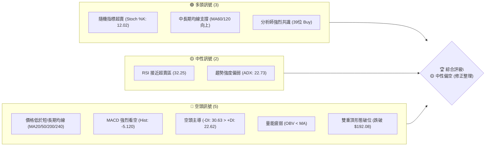
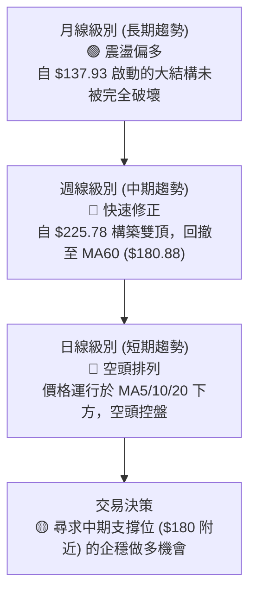
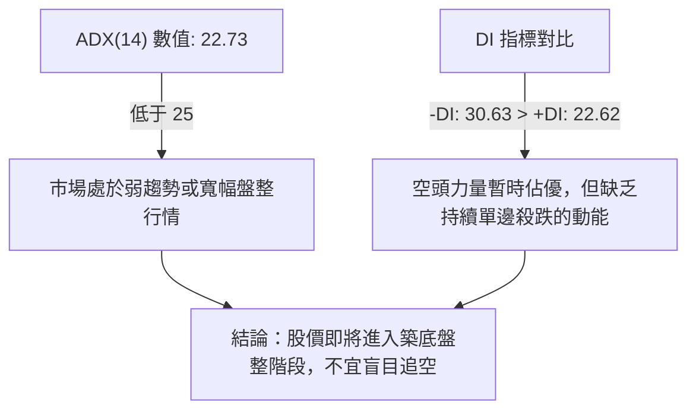
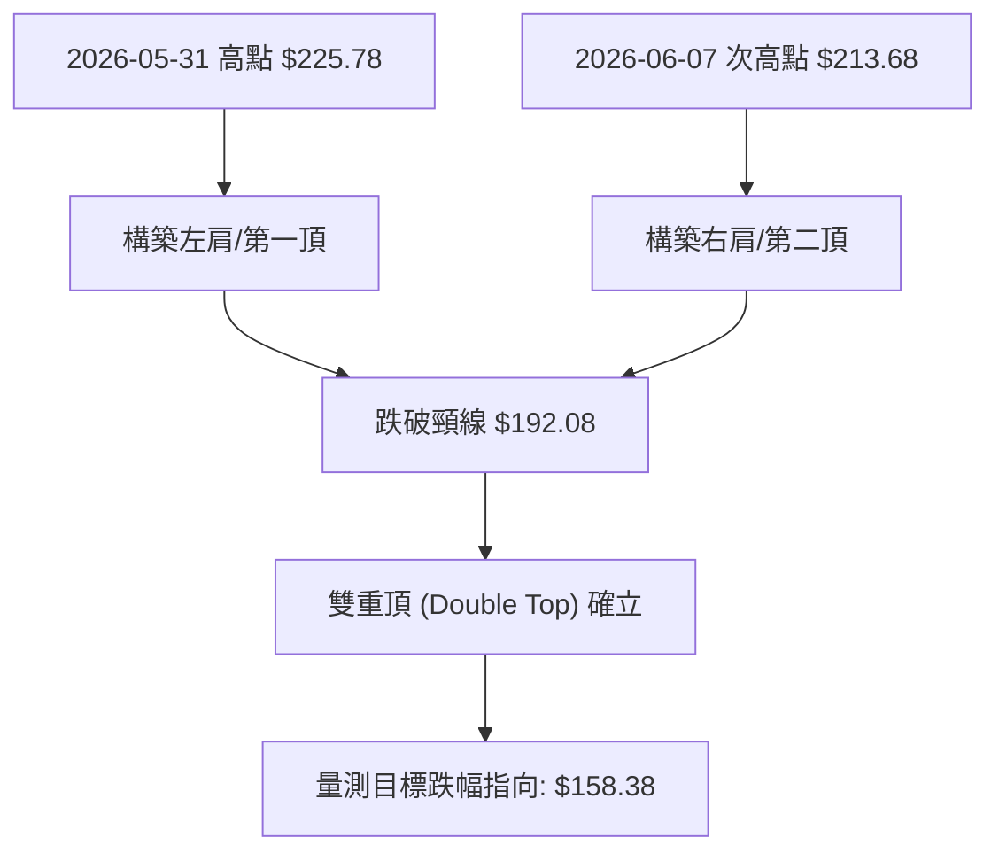
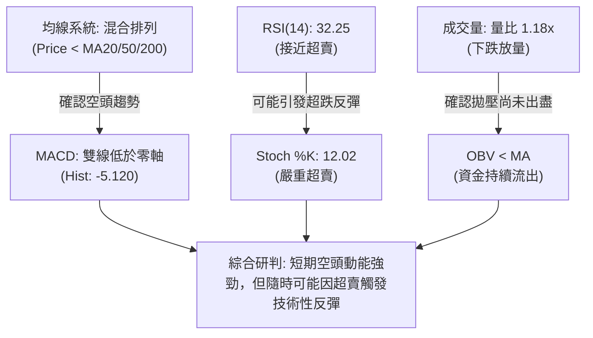
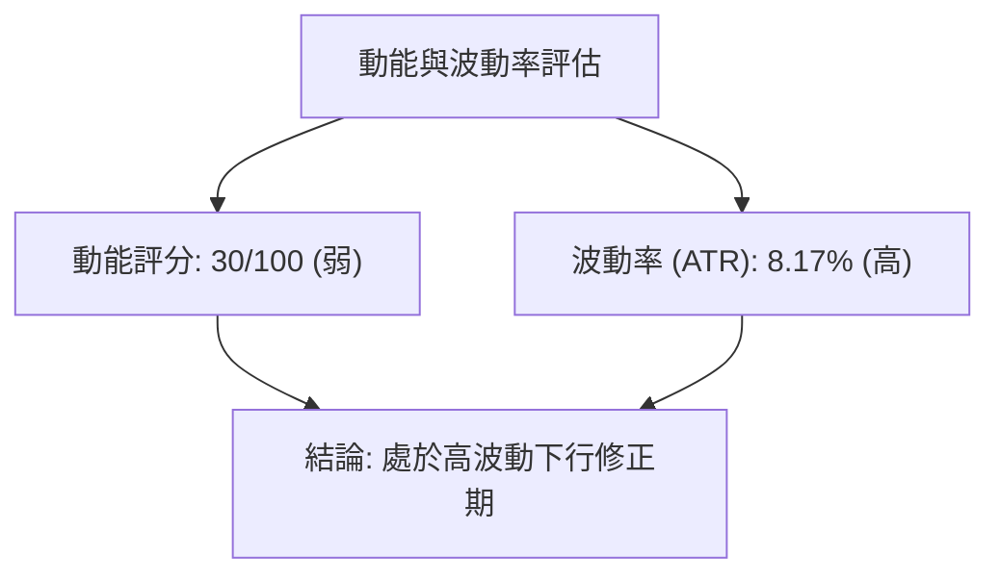
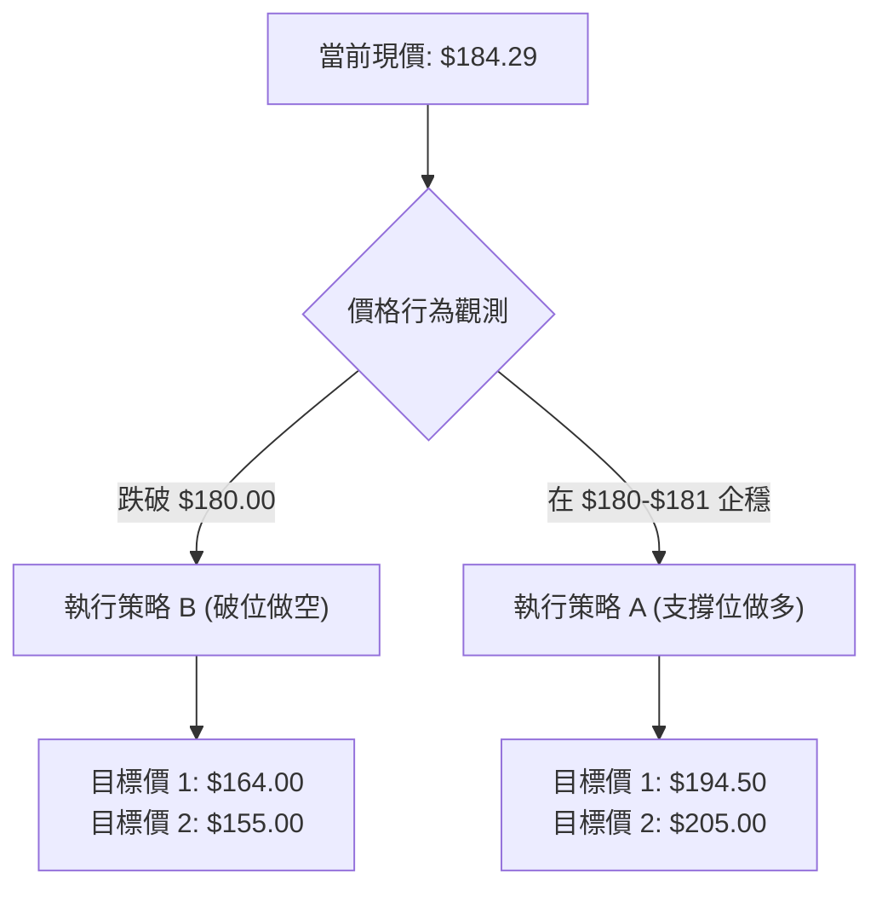
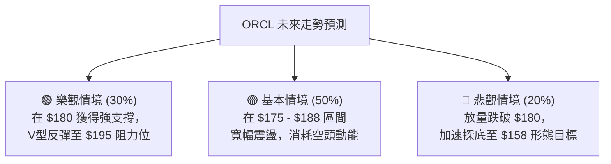

<details>
<summary>📊 靜態圖表 (點擊展開)</summary>

</details>

<html>
<head><meta charset="utf-8" /></head>
<body>
    <div style="height:500px; width:100%;">                        <script>window.PlotlyConfig = {MathJaxConfig: 'local'};</script>
        <script charset="utf-8" src="https://cdn.plot.ly/plotly-3.6.0.min.js" integrity="sha256-QaOVwtVY0T02VaHrr6pnoHLCwayMJp4O5n4YyaE3rJk=" crossorigin="anonymous"></script>                <div id="candlestick-chart" class="plotly-graph-div" style="height:100%; width:100%;"></div>            <script>                window.PLOTLYENV=window.PLOTLYENV || {};                                if (document.getElementById("candlestick-chart")) {                    Plotly.newPlot(                        "candlestick-chart",                        [{"close":{"dtype":"f8","bdata":"AAAAYGq2a0AAAAAAIahrQAAAACBG32xAAAAAQJyTbUAAAADAz\u002fNtQAAAAEAmXHRAAAAAoDEXc0AAAABARx5yQAAAACBkvHJAAAAAYPwDc0AAAABgzbByQAAAAADDZHJAAAAAwOQjc0AAAADgSll0QAAAAED3dXNAAAAAALggc0AAAADAyBByQAAAAKDZk3FAAAAAAL2IcUAAAADAm3BxQAAAAID063FAAAAA4E3ocUAAAAAgZb5xQAAAAIDpFHJAAAAAgDugcUAAAABg7OVxQAAAACBXcnJAAAAAILsyckAAAABgDyJzQAAAAODHknJAAAAAwD\u002fcckAAAACgaXFzQAAAAAB+GHJAAAAAAMs3cUAAAADgghdxQAAAAEDq73BAAAAAQMBlcUAAAACAl5lxQAAAAIDmenFAAAAAANZxcUAAAACA5RlxQAAAAMBF6m9AAAAAwBhQcEAAAAAAZwRwQAAAAKDv1G5AAAAAgP8Yb0AAAABg80luQAAAAKCOuW1AAAAAoH3rbUAAAABApVZtQAAAAOBQM2xAAAAAoLcHa0AAAAAgpa9rQAAAAKCMUGtAAAAAIJZka0AAAACA4QRsQAAAAMDmLGpAAAAAIHmxaEAAAADg0OFoQAAAAIBzemhAAAAAYKl2aUAAAADg7RZpQAAAAKDO9mhAAAAAYOX7aEAAAACAws5pQAAAAKCroGpAAAAA4AgIa0AAAAAALWZrQAAAAKCphWtAAAAAwLu0a0AAAAAAVrRoQAAAAEDpmWdAAAAAQEz5ZkAAAADA7W9nQAAAAEDXK2ZAAAAAAMZdZkAAAABAhdlnQAAAAEBjpWhAAAAAgLNEaEAAAADgFIloQAAAAOD7mGhAAAAAQPlFaEAAAAAgLYBoQAAAAIAGN2hAAAAAQHhQaEAAAAAgPe1nQAAAAOAhEmhAAAAAoDD1Z0AAAADAu49nQAAAAMCHumhAAAAAwPZ+aUAAAAAAwDJpQAAAAAD1HWhAAAAAQA6mZ0AAAAAAmc1nQAAAAMBmaWZAAAAAYMuoZUAAAABA6jFmQAAAAKBjEWZAAAAA4MK5ZkAAAAAAUsllQAAAAMBahmVAAAAAIH8NZUAAAADgOoBkQAAAAOAX8GNAAAAAwDZEY0AAAADAGkViQAAAAOAoAGFAAAAAgFXKYUAAAACgcIFjQAAAACCs6mNAAAAA4J2TY0AAAACg7n1jQAAAAACl8mNAAAAAQOQtY0AAAAAADHRjQAAAAGDYf2NAAAAAYBFyYkAAAACALpphQAAAACA0NGJAAAAAQAJsYkAAAADgLbliQAAAACCbHGJAAAAAoGCXYkAAAABguY9iQAAAAKDe+mJAAAAAQApIY0AAAABArw1jQAAAAEAK4WJAAAAAICmcYkAAAAAgrFFkQAAAAOBk02NAAAAAoD5SY0AAAABAq21jQAAAAADaRGNAAAAAQMULY0AAAADAUV9jQAAAAOAWpWJAAAAAwLA5Y0AAAACAf1JiQAAAAKBgMGJAAAAAwAPKYUAAAADAkGVhQAAAAEAkSmFAAAAAwCJTYkAAAABgLxdiQAAAAIDbO2JAAAAAABIhYkAAAACgftVhQAAAAMAe5WFAAAAAIIU7YUAAAABA4UJhQAAAAADXc2NAAAAAAABgZEAAAACA6zllQAAAAEDhSmZAAAAAgOvhZUAAAABgjzJmQAAAAKBwpWZAAAAAAABwZ0AAAADA9QhmQAAAAMD1qGVAAAAAYLieZUAAAABguL5kQAAAAGCPemRAAAAA4HosZEAAAABgj3plQAAAAKBHiWZAAAAAQDMrZ0AAAADA9UBoQAAAAEDhUmhAAAAAYGZ+aEAAAABA4TpoQAAAAGCPWmdAAAAA4FG4Z0AAAAAghXNoQAAAAGBmHmhAAAAAIIVTZ0AAAABguK5mQAAAAMAehWdAAAAA4KO4Z0AAAABgjwJoQAAAAIDrIWhAAAAAYLjeZ0AAAABgZnZpQAAAAMD1OGxAAAAAwMwEb0AAAABgj5JuQAAAAGCPymxAAAAAQOGKbUAAAACAwrVqQAAAAIA9empAAAAAgOu5aUAAAADgUShpQAAAAEAzA2dAAAAAACkEZ0AAAADgehRoQAAAAGCPimdAAAAAwPXwZkAAAACgRwlnQA=="},"high":{"dtype":"f8","bdata":"HK6smzMEbEByA7fwObprQNY0m8QOGW1AiW\u002fFCrQQbkDtgDgBrTJuQMr1pA82cHVAufMTComGdEBTJzvA8BhzQDXbra4ECnNA8XDB9m\u002fXc0A\u002fa23f5CNzQN4JHlkP13JAR10NTslKc0Ctstc0uW50QKh0eWhJJ3RAkkHDZmBgc0DcLsoqk4ZyQIdn9nsrO3JAUeVg3Nq7cUCXUdU8bJxxQPynexKD+3FA+3SInZFKckAsbLWIVEVyQP2mR+S2ZXJAd2Jyo8kuckBcw+W\u002f9RNyQPP4ps4bsnJAdwJy33Idc0Ait\u002fdT1kxzQFSaIaj46HJAd2UxX8RRc0BjfwHWHgl0QK+EAKe+5nJACxsbC5P3cUDLRUdpaGlxQKAsO4wcOHFASU7aUu+VcUCpE+WO+dZxQOPSHwf003FAe0hkq3a7cUAjLgkkZn5xQGK\u002f7GfMwXBA8hTi8fuCcEDbWVJ+9n9wQJlUpgERt29AfbjgLXhbb0CR\u002f0qSj\u002fFuQM3H8XXQ3W1Aqni9p1u3bkC8sK\u002fU\u002fX9tQF3yReqia21AvcovHh35a0DWbkBbOTVsQBpYSwYOrmtA234oxK3Ka0BsmgNpNVhsQD+EsfJDEm1Akkbu7DThaUC1JciAZ1JpQPpoEGslxmhA\u002fcQF1PQWakCwDYw8VSNpQBnrmwk6SGlAXsXaNGoNakBV5Ex+zdRpQOfVn\u002fYEw2pAobcUbxlFa0D7Tqa6EuxrQAE+cVZUqGtAwaCdyzP+a0Bc+bjEMxhpQDw96vqHlGhAwKU3PBt6Z0AUFb0VgZRnQIK6cpmMK2dABFIEdjX0ZkDjL8ZktD1oQKN6Xdy+smhA6reJj9t\u002faECHhiz5NKJoQFCeXKut5GhAPYRzhIWpaECvq8U1Y6VoQOvEyIvbf2hAJSotBxGsaEChU8gPqQ5pQDjDC1YSNmhAWx8WZzJPaECB2Y1UFLlnQCFtygt372hANuHjwTC8aUAY3oLmdOJpQBOmb0lMH2lApoflwJlKaEDhd9iCeOZnQDOywVc7UWdAnsqjBhZ\u002fZkDf7c4LDnFmQJMAmqHKYGZAKoYeDEgVZ0AQ6WgSBmNmQPKRTHCGoWZAmFY9l2Y0ZUD8vRkU\u002fQllQLdrcSBVU2VAgwzq1WjaY0C2IHZX7yxjQBywkUNHQWJAvVF8inPWYUAHGENHNeZjQOOCZk8PmmRAWbTIjORiZECUiKIikc9jQGG2GiqGN2RA733hWTjXY0Cq5S\u002fIFJhjQNsgVDG78GNAHE4Kn4cuY0CqPWCbXCliQGunmnL5R2JAbKckcuMXY0ACvxDvA\u002f9iQEC8mFxKMmJAAozuBLe0YkAqKglC88xiQOtpG2VpImNAqJ3XT32sY0BZx4y\u002fWdRjQEdraTQS72JAd2voGlAzY0Dwtg2oMGVlQONeYk7e52RAfggx\u002f7sGZEDrfJ0lAMZjQP4nG4W9y2NAgHDQusdNY0BnM3yV9otjQNESkpbuFmNAwzNrMZxnY0DKD0nWqCtjQPFlFhYxqmJAXl6wJbo+YkAnO9eeTKZhQEZVrJKslmFAnLZUG2JcYkApfXz6IaRiQBclFUrFPWJA6SHILQ6BYkCd2mOVIwJiQGJlsPvZ3WJAAAAAoJnZYUAAAACgcIVhQAAAAMAefWNAAAAAwMwsZUAAAACA65FlQAAAAOCjiGZAAAAAAAAQZ0AAAADgUThmQAAAAEDhKmdAAAAAgMKlZ0AAAADgerxmQAAAAGC4lmZAAAAAoJmxZUAAAABgZhZlQAAAAOBRmGRAAAAAgMKlZEAAAACgmcllQAAAAAAA8GZAAAAA4KNQZ0AAAACgR0loQAAAAMDMBGlAAAAAAADAaEAAAACAwnVoQAAAAKBwHWhAAAAAgD3yZ0AAAABguBZpQAAAAIDCjWhAAAAA4FHYZ0AAAABACpdnQAAAAEAKh2dAAAAAgD0aaEAAAAAAAKBoQAAAAGBmZmhAAAAA4HoEaEAAAAAAAKBpQAAAAKBHSWxAAAAAAABIb0AAAAAAACBvQAAAAOBREG5AAAAAYGbebUAAAACAFO5sQAAAAIDrYWtAAAAAAACQa0AAAAAgXI9qQAAAAOCjGGdAAAAAYI8yZ0AAAACAPWpoQAAAAIA9amhAAAAAgBTGZ0AAAAAgrn9nQA=="},"hovertemplate":"\u003cb\u003e%{x|%Y-%m-%d}\u003c\u002fb\u003e\u003cbr\u003e\u958b: $%{open:.2f}\u003cbr\u003e\u9ad8: $%{high:.2f}\u003cbr\u003e\u4f4e: $%{low:.2f}\u003cbr\u003e\u6536: $%{close:.2f}\u003cextra\u003e\u003c\u002fextra\u003e","low":{"dtype":"f8","bdata":"FUGECXGAa0C3v2sj6TprQKAq75LiA2xACtIS8vYubUBpl28jJxdtQLDE5Q5YWnNAMxWkS3HjckAxHiDKcxdyQBH1HAlmb3JAyQOFVnS+ckCA2iR6hUtyQBTvYKlrG3JAJoOCy99vckCa5PazRQhzQO9OBJn1OXNAP\u002fdBGOWackBHumAHp+RxQFmid0CMjHFA3uwfhbtWcUCjY2Bg1htxQOde8u9EO3FAo9S\u002fTPe8cUAnDxdBbJxxQEysyvVeCHJAyDpZGg3OcECy9tHOEpZxQLzisakW2HFAG50IxJ8jckA9yQBOvn5yQJitu54lI3JA2SuwNIKRckDUZZvLgNNyQDe6uZDn23FAYT0sSA4acUDevavMjelwQKSs1C6wuXBA3u5LIZ\u002frcEBs5avkaohxQANDB6edYXFABeslgTltcUCKvFQxFdtwQGOWhQXf1m9AUIKw84vkb0BEg+T2ebVvQFAiE5oodm5AIKB\u002f3K2wbkBumjEHg7ptQP182bzJ3WxAnjrn4OdzbUAM4eSevm9sQF7AQmc8GWxAFT149Pm8akCOvdQpci9qQCIRlyXKx2pA\u002foc6tBOmakAa+FOIcv9qQEt9bWN\u002fIGpAOQgwjcULaEAUBX\u002f0nyNoQNRH5yPhD2dAGcHLNycgaUB7AHfG5YxoQBcINaX0b2hA5220KenYaEC8FCvp08VoQGetSoXqoWlAV6sHoxaKakDoZf+\u002fufJqQOQuozxMHmtAcMBv7wgIa0CnmstN9iJnQEQBBcMCG2dAFOcef1iJZkBk94tEn+tmQIVWNOyh\u002f2VA8QfZLKgvZkCDInOhEl9nQCGEYVDf9GdAwK\u002fJW4TgZ0AeY\u002fT6cCdoQFdQePAwXWhAPYlNONTuZ0CzhyQteFBoQACJsuFMMWhAyof\u002fTMMgaEA6JjhC+ORnQAXHvNogsWdANEpXZ3naZ0DD7LXeaiBnQFiaB1Tvg2dAjVkLz2CKaEDQ10WZxf5oQKKGHTWrxGdAbbqe\u002fWKXZ0ATRBeDLzxnQCmWdTeLV2ZAFPK+JDNAZUCTG1imV\u002fxlQPCByP7XbGVASGPTmhM9ZkB9E+GIaqJlQFK3JQ1haGVAGYBDraYeZEA8JLjUf1VkQJIL7RUu7mNA1Lsc2uHrYkBgJAp+rP1hQOTbq9Hv2GBADyfPOqZNYUAXCv7MoE9iQBnQESo9jWNAhom6ONkuY0CTa+b5A\u002f9iQF9uQgj8V2NARJv5EyILY0B5DtQ6+9piQAamLpRKZ2NA2TpPjBBcYkB4blXNcUNhQOyFO6boR2FAYHd\u002fTnhaYkAPSB4\u002fohRiQDkGvLZfs2FA5Dn\u002fNgmWYUA636gNq9FhQI4D5RuYkmJAQH+sxh6zYkD8uq4U9OJiQIzYBoRzPWJAK2381d19YkAhr5XrrABkQBKFbe7awWNAMvcpn6EzY0Bsd6eAHD9jQKsX323nHmNAw386pVjwYkBMnDbI5YtiQC5uNhPsbWJARIpNX+\u002fFYkA0L6xX2EpiQFYdfXwYA2JA28\u002fBkmfBYUCP98ZmMjphQFOwBL8lD2FAYAvn3p9rYUCZXGrXUwViQFgBc3n5eWFAL\u002fhNzy3rYUDwipuXfm5hQETmUWvizGFAAAAAAAAAYUAAAACAPdJgQAAAAEAKd2FAAAAAgOsxZEAAAABguMZkQAAAAKCZuWVAAAAAIIWrZUAAAADgUbBlQAAAAOBRAGZAAAAAoJnZZkAAAABgj8JlQAAAAKCZGWVAAAAAwMz8ZEAAAACgmUFkQAAAAMDMFGRAAAAAYI8KZEAAAADAzMRkQAAAAOBRyGVAAAAAAABgZkAAAACgcNVmQAAAAKCZ2WdAAAAAYLjGZ0AAAABAM9NnQAAAAADXm2ZAAAAAgOshZ0AAAABgZi5nQAAAAMDMnGdAAAAA4KPoZkAAAACAwp1mQAAAAKCZWWZAAAAAYGZmZ0AAAABAM+NnQAAAAIDr0WdAAAAAoHB9Z0AAAAAAKSxoQAAAAOBRAGpAAAAAQDMTbEAAAABA4dptQAAAACCFc2xAAAAAAAAAbEAAAABgZi5qQAAAAGCPKmpAAAAAoEe5aEAAAACAwsVoQAAAAMD16GVAAAAAAABgZkAAAABguEZnQAAAAMAedWdAAAAAYI\u002fSZkAAAABgZjZmQA=="},"name":"\u50f9\u683c","open":{"dtype":"f8","bdata":"HK6smzMEbEC6YpYjYYhrQCMy4ShW12xAxQZRkGDAbUBP1XkS98FtQLr3V\u002f0Ny3NAZ1+M1A58dECpEmRpVfZyQFNxMqjPAHNA\u002fJoaHp55c0AeK+HafhRzQI+BxnytynJADqcLK4uKckAvDLnrSjNzQCMYRXppF3RAVH3ZVrFWc0ACACqlVE9yQGub041LK3JAj2P3nfKlcUAmBtttgJdxQKeSAK\u002ffSXFAe2CZ5j4YckBnaipKUvVxQLRTNQp0IXJAd2Jyo8kuckAjhBcx97JxQBjqVxdPHHJAph34vyKnckDe55KJAo5yQAVu5kt023JAx3ZXmprwckAbF35gvPtyQNKxUglR3nJAlsk8jPbycUA9DfnylEZxQBbemJZDEnFAlm74fq\u002f0cEDoPGt0x8JxQDMI\u002fIgdzXFAwBlFFliUcUDFHcTE2ntxQL0df+yTsXBASpFxzcwecEBb4wCA63lwQOkiKZCADm9AhC3J1KrMbkDa8iQcn81uQPeLOcJJsW1AAY4pc1SObkCWYEifMFltQH6NyAppaW1A0muj\u002f7Tza0CLNVapWjFqQP63VG4SHGtAALJAhXbcakBp2+74GjdrQGcBqsvwt2xA3umRVxa6aUBx3gdeC3VoQDxW1bmgHGhAatdk2A0HakD12651U8loQDyV4iPQ6GhAdeO63GJ8aUAkguYAaONoQADMChjl0mlAFjh+czI1a0Dbi6oY8H9rQH2fN630VWtAF2Z7CkCOa0AZ6qeHla5nQKTyBMh1ZWhADAVSonpkZ0ALxc0CTfJmQAOSgbUXxmZA0rUP6FOzZkBS\u002fw3\u002fqGdnQB+Ejs3Fc2hAgoVnNl5naECgQ9tV4zloQJuffb81m2hA2CfOCiwfaEBcfjHKmVtoQOgBr9IMZ2hAuLXREHKIaED7zlxtHaRoQLuvcupI7GdA6y5H6m1DaED\u002fERF12rZnQCI69DbG32dAThWSXDGdaEBBV7IbK4lpQBOmb0lMH2lApoflwJlKaECYSa4k+KdnQDOywVc7UWdAKdzTgb9hZkBHAB7S3FdmQG3rclGdgGVAcnti2kBPZkDE\u002fehuH1JmQFu2\u002f031yWVAD80rf9kxZUCN4GLEtfJkQBT5K1xnSmVAukzPpLG2Y0AfZnAkVytjQONwi\u002fn7ImJA\u002f\u002fK9h29oYUCtw4BxJH9iQH+CGh0u7mNAWbTIjORiZECvLYGoK6xjQBESHoBD1mNAwmi2ysOtY0D6Mg5O7DtjQPJJjreSlGNA9YhZy4YYY0Brr0We2iViQJCnKZ0xi2FA3\u002fot6oGUYkBe1ZVWtYhiQBTsdLYi7GFAlx1rKxGkYUAr\u002fnj14AdiQG800smcr2JAbizymeIBY0B7QAWkaAxjQH4tKqWdxWJAIXFlDrsiY0DLPPcsoblkQCbT8Q\u002fIgmRA3ludyeLPY0DE2hzviXBjQLH1uJ3EXGNAPH1z\u002frYbY0DlgMaE9r1iQFhlWOqNEGNAtNUSYZPcYkCrxke\u002f9Q5jQKjPclq9lmJAkkMVVXTsYUBK6TlKEI5hQFHtbeWucWFAV7tcavl5YUDC2eZxRpJiQN1rKOQOyWFAHO67s6hdYkAqXaFb8uhhQK2nkU7cuGJAAAAAYGbGYUAAAACAPSphQAAAAOCjeGFAAAAAgML9ZEAAAADgetxkQAAAAKBwDWZAAAAAgMLdZkAAAACA6xlmQAAAAEAzS2ZAAAAAgMJFZ0AAAADAzIxmQAAAAOBRkGZAAAAAYI+SZUAAAADAHkVkQAAAAKBHgWRAAAAA4KNAZEAAAACgcM1kQAAAAOCjAGZAAAAAACnEZkAAAABgZkZnQAAAACCF02hAAAAAYI8SaEAAAADAzARoQAAAAKBwHWhAAAAAwPWgZ0AAAACAwoVnQAAAACCuz2dAAAAAAADAZ0AAAAAAAEBnQAAAAIAUfmZAAAAA4FGgZ0AAAACgcPVnQAAAAKCZKWhAAAAAIFzvZ0AAAACgR0FoQAAAAAAAIGpAAAAAAADQbEAAAACgmVluQAAAACBcD25AAAAAAABgbEAAAAAgrq9sQAAAAAAAOGtAAAAAwB69akAAAAAAANBoQAAAAKBwdWZAAAAA4FEgZ0AAAADgemxnQAAAAOBRwGdAAAAAwB5FZ0AAAADgUeBmQA=="},"x":["2025-09-03T00:00:00-04:00","2025-09-04T00:00:00-04:00","2025-09-05T00:00:00-04:00","2025-09-08T00:00:00-04:00","2025-09-09T00:00:00-04:00","2025-09-10T00:00:00-04:00","2025-09-11T00:00:00-04:00","2025-09-12T00:00:00-04:00","2025-09-15T00:00:00-04:00","2025-09-16T00:00:00-04:00","2025-09-17T00:00:00-04:00","2025-09-18T00:00:00-04:00","2025-09-19T00:00:00-04:00","2025-09-22T00:00:00-04:00","2025-09-23T00:00:00-04:00","2025-09-24T00:00:00-04:00","2025-09-25T00:00:00-04:00","2025-09-26T00:00:00-04:00","2025-09-29T00:00:00-04:00","2025-09-30T00:00:00-04:00","2025-10-01T00:00:00-04:00","2025-10-02T00:00:00-04:00","2025-10-03T00:00:00-04:00","2025-10-06T00:00:00-04:00","2025-10-07T00:00:00-04:00","2025-10-08T00:00:00-04:00","2025-10-09T00:00:00-04:00","2025-10-10T00:00:00-04:00","2025-10-13T00:00:00-04:00","2025-10-14T00:00:00-04:00","2025-10-15T00:00:00-04:00","2025-10-16T00:00:00-04:00","2025-10-17T00:00:00-04:00","2025-10-20T00:00:00-04:00","2025-10-21T00:00:00-04:00","2025-10-22T00:00:00-04:00","2025-10-23T00:00:00-04:00","2025-10-24T00:00:00-04:00","2025-10-27T00:00:00-04:00","2025-10-28T00:00:00-04:00","2025-10-29T00:00:00-04:00","2025-10-30T00:00:00-04:00","2025-10-31T00:00:00-04:00","2025-11-03T00:00:00-05:00","2025-11-04T00:00:00-05:00","2025-11-05T00:00:00-05:00","2025-11-06T00:00:00-05:00","2025-11-07T00:00:00-05:00","2025-11-10T00:00:00-05:00","2025-11-11T00:00:00-05:00","2025-11-12T00:00:00-05:00","2025-11-13T00:00:00-05:00","2025-11-14T00:00:00-05:00","2025-11-17T00:00:00-05:00","2025-11-18T00:00:00-05:00","2025-11-19T00:00:00-05:00","2025-11-20T00:00:00-05:00","2025-11-21T00:00:00-05:00","2025-11-24T00:00:00-05:00","2025-11-25T00:00:00-05:00","2025-11-26T00:00:00-05:00","2025-11-28T00:00:00-05:00","2025-12-01T00:00:00-05:00","2025-12-02T00:00:00-05:00","2025-12-03T00:00:00-05:00","2025-12-04T00:00:00-05:00","2025-12-05T00:00:00-05:00","2025-12-08T00:00:00-05:00","2025-12-09T00:00:00-05:00","2025-12-10T00:00:00-05:00","2025-12-11T00:00:00-05:00","2025-12-12T00:00:00-05:00","2025-12-15T00:00:00-05:00","2025-12-16T00:00:00-05:00","2025-12-17T00:00:00-05:00","2025-12-18T00:00:00-05:00","2025-12-19T00:00:00-05:00","2025-12-22T00:00:00-05:00","2025-12-23T00:00:00-05:00","2025-12-24T00:00:00-05:00","2025-12-26T00:00:00-05:00","2025-12-29T00:00:00-05:00","2025-12-30T00:00:00-05:00","2025-12-31T00:00:00-05:00","2026-01-02T00:00:00-05:00","2026-01-05T00:00:00-05:00","2026-01-06T00:00:00-05:00","2026-01-07T00:00:00-05:00","2026-01-08T00:00:00-05:00","2026-01-09T00:00:00-05:00","2026-01-12T00:00:00-05:00","2026-01-13T00:00:00-05:00","2026-01-14T00:00:00-05:00","2026-01-15T00:00:00-05:00","2026-01-16T00:00:00-05:00","2026-01-20T00:00:00-05:00","2026-01-21T00:00:00-05:00","2026-01-22T00:00:00-05:00","2026-01-23T00:00:00-05:00","2026-01-26T00:00:00-05:00","2026-01-27T00:00:00-05:00","2026-01-28T00:00:00-05:00","2026-01-29T00:00:00-05:00","2026-01-30T00:00:00-05:00","2026-02-02T00:00:00-05:00","2026-02-03T00:00:00-05:00","2026-02-04T00:00:00-05:00","2026-02-05T00:00:00-05:00","2026-02-06T00:00:00-05:00","2026-02-09T00:00:00-05:00","2026-02-10T00:00:00-05:00","2026-02-11T00:00:00-05:00","2026-02-12T00:00:00-05:00","2026-02-13T00:00:00-05:00","2026-02-17T00:00:00-05:00","2026-02-18T00:00:00-05:00","2026-02-19T00:00:00-05:00","2026-02-20T00:00:00-05:00","2026-02-23T00:00:00-05:00","2026-02-24T00:00:00-05:00","2026-02-25T00:00:00-05:00","2026-02-26T00:00:00-05:00","2026-02-27T00:00:00-05:00","2026-03-02T00:00:00-05:00","2026-03-03T00:00:00-05:00","2026-03-04T00:00:00-05:00","2026-03-05T00:00:00-05:00","2026-03-06T00:00:00-05:00","2026-03-09T00:00:00-04:00","2026-03-10T00:00:00-04:00","2026-03-11T00:00:00-04:00","2026-03-12T00:00:00-04:00","2026-03-13T00:00:00-04:00","2026-03-16T00:00:00-04:00","2026-03-17T00:00:00-04:00","2026-03-18T00:00:00-04:00","2026-03-19T00:00:00-04:00","2026-03-20T00:00:00-04:00","2026-03-23T00:00:00-04:00","2026-03-24T00:00:00-04:00","2026-03-25T00:00:00-04:00","2026-03-26T00:00:00-04:00","2026-03-27T00:00:00-04:00","2026-03-30T00:00:00-04:00","2026-03-31T00:00:00-04:00","2026-04-01T00:00:00-04:00","2026-04-02T00:00:00-04:00","2026-04-06T00:00:00-04:00","2026-04-07T00:00:00-04:00","2026-04-08T00:00:00-04:00","2026-04-09T00:00:00-04:00","2026-04-10T00:00:00-04:00","2026-04-13T00:00:00-04:00","2026-04-14T00:00:00-04:00","2026-04-15T00:00:00-04:00","2026-04-16T00:00:00-04:00","2026-04-17T00:00:00-04:00","2026-04-20T00:00:00-04:00","2026-04-21T00:00:00-04:00","2026-04-22T00:00:00-04:00","2026-04-23T00:00:00-04:00","2026-04-24T00:00:00-04:00","2026-04-27T00:00:00-04:00","2026-04-28T00:00:00-04:00","2026-04-29T00:00:00-04:00","2026-04-30T00:00:00-04:00","2026-05-01T00:00:00-04:00","2026-05-04T00:00:00-04:00","2026-05-05T00:00:00-04:00","2026-05-06T00:00:00-04:00","2026-05-07T00:00:00-04:00","2026-05-08T00:00:00-04:00","2026-05-11T00:00:00-04:00","2026-05-12T00:00:00-04:00","2026-05-13T00:00:00-04:00","2026-05-14T00:00:00-04:00","2026-05-15T00:00:00-04:00","2026-05-18T00:00:00-04:00","2026-05-19T00:00:00-04:00","2026-05-20T00:00:00-04:00","2026-05-21T00:00:00-04:00","2026-05-22T00:00:00-04:00","2026-05-26T00:00:00-04:00","2026-05-27T00:00:00-04:00","2026-05-28T00:00:00-04:00","2026-05-29T00:00:00-04:00","2026-06-01T00:00:00-04:00","2026-06-02T00:00:00-04:00","2026-06-03T00:00:00-04:00","2026-06-04T00:00:00-04:00","2026-06-05T00:00:00-04:00","2026-06-08T00:00:00-04:00","2026-06-09T00:00:00-04:00","2026-06-10T00:00:00-04:00","2026-06-11T00:00:00-04:00","2026-06-12T00:00:00-04:00","2026-06-15T00:00:00-04:00","2026-06-16T00:00:00-04:00","2026-06-17T00:00:00-04:00","2026-06-18T00:00:00-04:00"],"type":"candlestick"},{"hovertemplate":"MA30: $%{y:.2f}\u003cextra\u003e\u003c\u002fextra\u003e","line":{"color":"#2196F3","dash":"dash","width":2},"mode":"lines","name":"MA30","x":["2025-09-03T00:00:00-04:00","2025-09-04T00:00:00-04:00","2025-09-05T00:00:00-04:00","2025-09-08T00:00:00-04:00","2025-09-09T00:00:00-04:00","2025-09-10T00:00:00-04:00","2025-09-11T00:00:00-04:00","2025-09-12T00:00:00-04:00","2025-09-15T00:00:00-04:00","2025-09-16T00:00:00-04:00","2025-09-17T00:00:00-04:00","2025-09-18T00:00:00-04:00","2025-09-19T00:00:00-04:00","2025-09-22T00:00:00-04:00","2025-09-23T00:00:00-04:00","2025-09-24T00:00:00-04:00","2025-09-25T00:00:00-04:00","2025-09-26T00:00:00-04:00","2025-09-29T00:00:00-04:00","2025-09-30T00:00:00-04:00","2025-10-01T00:00:00-04:00","2025-10-02T00:00:00-04:00","2025-10-03T00:00:00-04:00","2025-10-06T00:00:00-04:00","2025-10-07T00:00:00-04:00","2025-10-08T00:00:00-04:00","2025-10-09T00:00:00-04:00","2025-10-10T00:00:00-04:00","2025-10-13T00:00:00-04:00","2025-10-14T00:00:00-04:00","2025-10-15T00:00:00-04:00","2025-10-16T00:00:00-04:00","2025-10-17T00:00:00-04:00","2025-10-20T00:00:00-04:00","2025-10-21T00:00:00-04:00","2025-10-22T00:00:00-04:00","2025-10-23T00:00:00-04:00","2025-10-24T00:00:00-04:00","2025-10-27T00:00:00-04:00","2025-10-28T00:00:00-04:00","2025-10-29T00:00:00-04:00","2025-10-30T00:00:00-04:00","2025-10-31T00:00:00-04:00","2025-11-03T00:00:00-05:00","2025-11-04T00:00:00-05:00","2025-11-05T00:00:00-05:00","2025-11-06T00:00:00-05:00","2025-11-07T00:00:00-05:00","2025-11-10T00:00:00-05:00","2025-11-11T00:00:00-05:00","2025-11-12T00:00:00-05:00","2025-11-13T00:00:00-05:00","2025-11-14T00:00:00-05:00","2025-11-17T00:00:00-05:00","2025-11-18T00:00:00-05:00","2025-11-19T00:00:00-05:00","2025-11-20T00:00:00-05:00","2025-11-21T00:00:00-05:00","2025-11-24T00:00:00-05:00","2025-11-25T00:00:00-05:00","2025-11-26T00:00:00-05:00","2025-11-28T00:00:00-05:00","2025-12-01T00:00:00-05:00","2025-12-02T00:00:00-05:00","2025-12-03T00:00:00-05:00","2025-12-04T00:00:00-05:00","2025-12-05T00:00:00-05:00","2025-12-08T00:00:00-05:00","2025-12-09T00:00:00-05:00","2025-12-10T00:00:00-05:00","2025-12-11T00:00:00-05:00","2025-12-12T00:00:00-05:00","2025-12-15T00:00:00-05:00","2025-12-16T00:00:00-05:00","2025-12-17T00:00:00-05:00","2025-12-18T00:00:00-05:00","2025-12-19T00:00:00-05:00","2025-12-22T00:00:00-05:00","2025-12-23T00:00:00-05:00","2025-12-24T00:00:00-05:00","2025-12-26T00:00:00-05:00","2025-12-29T00:00:00-05:00","2025-12-30T00:00:00-05:00","2025-12-31T00:00:00-05:00","2026-01-02T00:00:00-05:00","2026-01-05T00:00:00-05:00","2026-01-06T00:00:00-05:00","2026-01-07T00:00:00-05:00","2026-01-08T00:00:00-05:00","2026-01-09T00:00:00-05:00","2026-01-12T00:00:00-05:00","2026-01-13T00:00:00-05:00","2026-01-14T00:00:00-05:00","2026-01-15T00:00:00-05:00","2026-01-16T00:00:00-05:00","2026-01-20T00:00:00-05:00","2026-01-21T00:00:00-05:00","2026-01-22T00:00:00-05:00","2026-01-23T00:00:00-05:00","2026-01-26T00:00:00-05:00","2026-01-27T00:00:00-05:00","2026-01-28T00:00:00-05:00","2026-01-29T00:00:00-05:00","2026-01-30T00:00:00-05:00","2026-02-02T00:00:00-05:00","2026-02-03T00:00:00-05:00","2026-02-04T00:00:00-05:00","2026-02-05T00:00:00-05:00","2026-02-06T00:00:00-05:00","2026-02-09T00:00:00-05:00","2026-02-10T00:00:00-05:00","2026-02-11T00:00:00-05:00","2026-02-12T00:00:00-05:00","2026-02-13T00:00:00-05:00","2026-02-17T00:00:00-05:00","2026-02-18T00:00:00-05:00","2026-02-19T00:00:00-05:00","2026-02-20T00:00:00-05:00","2026-02-23T00:00:00-05:00","2026-02-24T00:00:00-05:00","2026-02-25T00:00:00-05:00","2026-02-26T00:00:00-05:00","2026-02-27T00:00:00-05:00","2026-03-02T00:00:00-05:00","2026-03-03T00:00:00-05:00","2026-03-04T00:00:00-05:00","2026-03-05T00:00:00-05:00","2026-03-06T00:00:00-05:00","2026-03-09T00:00:00-04:00","2026-03-10T00:00:00-04:00","2026-03-11T00:00:00-04:00","2026-03-12T00:00:00-04:00","2026-03-13T00:00:00-04:00","2026-03-16T00:00:00-04:00","2026-03-17T00:00:00-04:00","2026-03-18T00:00:00-04:00","2026-03-19T00:00:00-04:00","2026-03-20T00:00:00-04:00","2026-03-23T00:00:00-04:00","2026-03-24T00:00:00-04:00","2026-03-25T00:00:00-04:00","2026-03-26T00:00:00-04:00","2026-03-27T00:00:00-04:00","2026-03-30T00:00:00-04:00","2026-03-31T00:00:00-04:00","2026-04-01T00:00:00-04:00","2026-04-02T00:00:00-04:00","2026-04-06T00:00:00-04:00","2026-04-07T00:00:00-04:00","2026-04-08T00:00:00-04:00","2026-04-09T00:00:00-04:00","2026-04-10T00:00:00-04:00","2026-04-13T00:00:00-04:00","2026-04-14T00:00:00-04:00","2026-04-15T00:00:00-04:00","2026-04-16T00:00:00-04:00","2026-04-17T00:00:00-04:00","2026-04-20T00:00:00-04:00","2026-04-21T00:00:00-04:00","2026-04-22T00:00:00-04:00","2026-04-23T00:00:00-04:00","2026-04-24T00:00:00-04:00","2026-04-27T00:00:00-04:00","2026-04-28T00:00:00-04:00","2026-04-29T00:00:00-04:00","2026-04-30T00:00:00-04:00","2026-05-01T00:00:00-04:00","2026-05-04T00:00:00-04:00","2026-05-05T00:00:00-04:00","2026-05-06T00:00:00-04:00","2026-05-07T00:00:00-04:00","2026-05-08T00:00:00-04:00","2026-05-11T00:00:00-04:00","2026-05-12T00:00:00-04:00","2026-05-13T00:00:00-04:00","2026-05-14T00:00:00-04:00","2026-05-15T00:00:00-04:00","2026-05-18T00:00:00-04:00","2026-05-19T00:00:00-04:00","2026-05-20T00:00:00-04:00","2026-05-21T00:00:00-04:00","2026-05-22T00:00:00-04:00","2026-05-26T00:00:00-04:00","2026-05-27T00:00:00-04:00","2026-05-28T00:00:00-04:00","2026-05-29T00:00:00-04:00","2026-06-01T00:00:00-04:00","2026-06-02T00:00:00-04:00","2026-06-03T00:00:00-04:00","2026-06-04T00:00:00-04:00","2026-06-05T00:00:00-04:00","2026-06-08T00:00:00-04:00","2026-06-09T00:00:00-04:00","2026-06-10T00:00:00-04:00","2026-06-11T00:00:00-04:00","2026-06-12T00:00:00-04:00","2026-06-15T00:00:00-04:00","2026-06-16T00:00:00-04:00","2026-06-17T00:00:00-04:00","2026-06-18T00:00:00-04:00"],"y":{"dtype":"f8","bdata":"AAAAAAAA+H8AAAAAAAD4fwAAAAAAAPh\u002fAAAAAAAA+H8AAAAAAAD4fwAAAAAAAPh\u002fAAAAAAAA+H8AAAAAAAD4fwAAAAAAAPh\u002fAAAAAAAA+H8AAAAAAAD4fwAAAAAAAPh\u002fAAAAAAAA+H8AAAAAAAD4fwAAAAAAAPh\u002fAAAAAAAA+H8AAAAAAAD4fwAAAAAAAPh\u002fAAAAAAAA+H8AAAAAAAD4fwAAAAAAAPh\u002fAAAAAAAA+H8AAAAAAAD4fwAAAAAAAPh\u002fAAAAAAAA+H8AAAAAAAD4fwAAAAAAAPh\u002fAAAAAAAA+H8AAAAAAAD4f+\u002fu7l4w0XFARERE7OP7cUAzMzNLzStyQKuqqsoHS3JAvLu7a8NfckDv7u4e0XFyQLy7u+ubVHJAVVVVNSlGckAzMzPzvEFyQAAAAJAFN3JAIiIi4p0pckDv7u6eDRxyQERERAREB3JA3t3dnSPvcUBmZmYWLcpxQO\u002fu7taop3FAZmZmbh6JcUAREREhMXBxQCIiItoFWXFAIiIicg5DcUAAAADgaStxQFVVVb3NCnFAiYiIeFLlcECamZlRCcRwQFVVVSVInnBAmpmZIcB8cEAAAABYkVtwQFVVVY3WLXBAVVVVVc\u002f3b0CamZmJmYVvQO\u002fu7v5+GW9Aq6qqyuawbkAiIiLyKztuQCIiIqJd221AzczMnLWKbUB3d3fnO0NtQFVVVTVlBW1AzczMfCXDbECrqqpalIBsQFVVVbUbQWxA7+7ubs8DbEAAAAAAw7JrQLy7u\u002fvQa2tAIiIiAnQZa0AzMzMzF9BqQM3MzPwvhmpAIiIiEq47akB3d3d3uwRqQAAAALBk2WlAAAAAwCqpaUCJiIh4LoBpQHd3d+dvYWlA7+7ujulJaUBERETkui5pQM3MzHxHFGlAmpmZOQL6aECJiIhYFtdoQJqZmdkgxWhAq6qqKtq+aEAiIiIylbNoQBEREQG4tWhAmpmZ2f61aEARERFB7LZoQM3MzMyxr2hAMzMzw0ykaEB3d3fHMZNoQERERAQ4b2hAIiIiomBBaEAiIiIC+BRoQERERCRt5mdAERERYe27Z0CJiIjYBqNnQFVVVeVOkWdAERERMeqAZ0AiIiKy22dnQImIiMjMVGdAMzMzE1k6Z0DNzMzsuwpnQO\u002fu7j5+yWZAiYiI2DaSZkCJiIj4SmdmQBEREWFZP2ZAREREREUXZkAzMzNzh+xlQM3MzMwdyGVAEREREUycZUAzMzPDH3ZlQAAAAFAdT2VAzczMvBMgZUAiIiKyOe1kQN7d3T2MtWRAIiIiwi55ZEB3d3cn7kFkQM3MzGyvDmRAERERgYfjY0CamZnZzLZjQLy7uwuEmWNAd3d3VzmFY0AzMzOTampjQFVVVWU0T2NAvLu7qxUsY0BEREQkkB9jQKuqqnoQEWNAAAAAEEoCY0BEREQkI\u002fliQBEREeFt82JAq6qqOozxYkBmZmZ29PpiQFVVVWX8CGNAvLu7KzsVY0ARERERIgtjQBEREdFj\u002fGJAIiIi8iLtYkAzMzPzQdtiQN7d3f2SxGJAZmZmRki9YkAiIiJSp7FiQAAAAKDapmJAIiIiciekYkBVVVWVIaZiQM3MzLx+o2JA7+7ubliZYkCamZlp3oxiQHd3d1dPmGJAq6qq2oenYkAiIiJCRb5iQM3MzJyJ2mJAmpmZybvwYkDv7u4OkAtjQKuqqpq1K2NA7+7ubudUY0BVVVUFjGNjQLy7u\u002fsyc2NAREREpNCGY0AAAADQDJJjQImIiKhfnGNAAAAAUP+lY0BVVVXV+LdjQImIiKgt2WNAREREJNT6Y0Dv7u6ucS1kQN7d3U3LYWRAq6qqygGbZEBmZmZGUdVkQERERJQQCWVA7+7urho3ZUDv7u7OYW1lQDMzM6OZn2VA7+7uzvLLZUCamZmZUvVlQJqZmZlSJWZA3t3dfbFcZkDNzMxcSJZmQKuqqvo3vmZAzczM7ArcZkB3d3cnMQBnQAAAAHDLMmdAERER4cGAZ0CJiIhYOchnQN7d3U2p\u002fGdAERER4cEwaEAiIiKSplhoQAAAAJDCgWhAzczMzMykaEDNzMwMdMpoQM3MzBwT4GhAZmZmplT4aECrqqoqhw5pQAAAAKAaF2lAREREpCkVaUCJiIj4xQppQA=="},"type":"scatter"},{"hovertemplate":"MA60: $%{y:.2f}\u003cextra\u003e\u003c\u002fextra\u003e","line":{"color":"#9C27B0","dash":"dash","width":2},"mode":"lines","name":"MA60","x":["2025-09-03T00:00:00-04:00","2025-09-04T00:00:00-04:00","2025-09-05T00:00:00-04:00","2025-09-08T00:00:00-04:00","2025-09-09T00:00:00-04:00","2025-09-10T00:00:00-04:00","2025-09-11T00:00:00-04:00","2025-09-12T00:00:00-04:00","2025-09-15T00:00:00-04:00","2025-09-16T00:00:00-04:00","2025-09-17T00:00:00-04:00","2025-09-18T00:00:00-04:00","2025-09-19T00:00:00-04:00","2025-09-22T00:00:00-04:00","2025-09-23T00:00:00-04:00","2025-09-24T00:00:00-04:00","2025-09-25T00:00:00-04:00","2025-09-26T00:00:00-04:00","2025-09-29T00:00:00-04:00","2025-09-30T00:00:00-04:00","2025-10-01T00:00:00-04:00","2025-10-02T00:00:00-04:00","2025-10-03T00:00:00-04:00","2025-10-06T00:00:00-04:00","2025-10-07T00:00:00-04:00","2025-10-08T00:00:00-04:00","2025-10-09T00:00:00-04:00","2025-10-10T00:00:00-04:00","2025-10-13T00:00:00-04:00","2025-10-14T00:00:00-04:00","2025-10-15T00:00:00-04:00","2025-10-16T00:00:00-04:00","2025-10-17T00:00:00-04:00","2025-10-20T00:00:00-04:00","2025-10-21T00:00:00-04:00","2025-10-22T00:00:00-04:00","2025-10-23T00:00:00-04:00","2025-10-24T00:00:00-04:00","2025-10-27T00:00:00-04:00","2025-10-28T00:00:00-04:00","2025-10-29T00:00:00-04:00","2025-10-30T00:00:00-04:00","2025-10-31T00:00:00-04:00","2025-11-03T00:00:00-05:00","2025-11-04T00:00:00-05:00","2025-11-05T00:00:00-05:00","2025-11-06T00:00:00-05:00","2025-11-07T00:00:00-05:00","2025-11-10T00:00:00-05:00","2025-11-11T00:00:00-05:00","2025-11-12T00:00:00-05:00","2025-11-13T00:00:00-05:00","2025-11-14T00:00:00-05:00","2025-11-17T00:00:00-05:00","2025-11-18T00:00:00-05:00","2025-11-19T00:00:00-05:00","2025-11-20T00:00:00-05:00","2025-11-21T00:00:00-05:00","2025-11-24T00:00:00-05:00","2025-11-25T00:00:00-05:00","2025-11-26T00:00:00-05:00","2025-11-28T00:00:00-05:00","2025-12-01T00:00:00-05:00","2025-12-02T00:00:00-05:00","2025-12-03T00:00:00-05:00","2025-12-04T00:00:00-05:00","2025-12-05T00:00:00-05:00","2025-12-08T00:00:00-05:00","2025-12-09T00:00:00-05:00","2025-12-10T00:00:00-05:00","2025-12-11T00:00:00-05:00","2025-12-12T00:00:00-05:00","2025-12-15T00:00:00-05:00","2025-12-16T00:00:00-05:00","2025-12-17T00:00:00-05:00","2025-12-18T00:00:00-05:00","2025-12-19T00:00:00-05:00","2025-12-22T00:00:00-05:00","2025-12-23T00:00:00-05:00","2025-12-24T00:00:00-05:00","2025-12-26T00:00:00-05:00","2025-12-29T00:00:00-05:00","2025-12-30T00:00:00-05:00","2025-12-31T00:00:00-05:00","2026-01-02T00:00:00-05:00","2026-01-05T00:00:00-05:00","2026-01-06T00:00:00-05:00","2026-01-07T00:00:00-05:00","2026-01-08T00:00:00-05:00","2026-01-09T00:00:00-05:00","2026-01-12T00:00:00-05:00","2026-01-13T00:00:00-05:00","2026-01-14T00:00:00-05:00","2026-01-15T00:00:00-05:00","2026-01-16T00:00:00-05:00","2026-01-20T00:00:00-05:00","2026-01-21T00:00:00-05:00","2026-01-22T00:00:00-05:00","2026-01-23T00:00:00-05:00","2026-01-26T00:00:00-05:00","2026-01-27T00:00:00-05:00","2026-01-28T00:00:00-05:00","2026-01-29T00:00:00-05:00","2026-01-30T00:00:00-05:00","2026-02-02T00:00:00-05:00","2026-02-03T00:00:00-05:00","2026-02-04T00:00:00-05:00","2026-02-05T00:00:00-05:00","2026-02-06T00:00:00-05:00","2026-02-09T00:00:00-05:00","2026-02-10T00:00:00-05:00","2026-02-11T00:00:00-05:00","2026-02-12T00:00:00-05:00","2026-02-13T00:00:00-05:00","2026-02-17T00:00:00-05:00","2026-02-18T00:00:00-05:00","2026-02-19T00:00:00-05:00","2026-02-20T00:00:00-05:00","2026-02-23T00:00:00-05:00","2026-02-24T00:00:00-05:00","2026-02-25T00:00:00-05:00","2026-02-26T00:00:00-05:00","2026-02-27T00:00:00-05:00","2026-03-02T00:00:00-05:00","2026-03-03T00:00:00-05:00","2026-03-04T00:00:00-05:00","2026-03-05T00:00:00-05:00","2026-03-06T00:00:00-05:00","2026-03-09T00:00:00-04:00","2026-03-10T00:00:00-04:00","2026-03-11T00:00:00-04:00","2026-03-12T00:00:00-04:00","2026-03-13T00:00:00-04:00","2026-03-16T00:00:00-04:00","2026-03-17T00:00:00-04:00","2026-03-18T00:00:00-04:00","2026-03-19T00:00:00-04:00","2026-03-20T00:00:00-04:00","2026-03-23T00:00:00-04:00","2026-03-24T00:00:00-04:00","2026-03-25T00:00:00-04:00","2026-03-26T00:00:00-04:00","2026-03-27T00:00:00-04:00","2026-03-30T00:00:00-04:00","2026-03-31T00:00:00-04:00","2026-04-01T00:00:00-04:00","2026-04-02T00:00:00-04:00","2026-04-06T00:00:00-04:00","2026-04-07T00:00:00-04:00","2026-04-08T00:00:00-04:00","2026-04-09T00:00:00-04:00","2026-04-10T00:00:00-04:00","2026-04-13T00:00:00-04:00","2026-04-14T00:00:00-04:00","2026-04-15T00:00:00-04:00","2026-04-16T00:00:00-04:00","2026-04-17T00:00:00-04:00","2026-04-20T00:00:00-04:00","2026-04-21T00:00:00-04:00","2026-04-22T00:00:00-04:00","2026-04-23T00:00:00-04:00","2026-04-24T00:00:00-04:00","2026-04-27T00:00:00-04:00","2026-04-28T00:00:00-04:00","2026-04-29T00:00:00-04:00","2026-04-30T00:00:00-04:00","2026-05-01T00:00:00-04:00","2026-05-04T00:00:00-04:00","2026-05-05T00:00:00-04:00","2026-05-06T00:00:00-04:00","2026-05-07T00:00:00-04:00","2026-05-08T00:00:00-04:00","2026-05-11T00:00:00-04:00","2026-05-12T00:00:00-04:00","2026-05-13T00:00:00-04:00","2026-05-14T00:00:00-04:00","2026-05-15T00:00:00-04:00","2026-05-18T00:00:00-04:00","2026-05-19T00:00:00-04:00","2026-05-20T00:00:00-04:00","2026-05-21T00:00:00-04:00","2026-05-22T00:00:00-04:00","2026-05-26T00:00:00-04:00","2026-05-27T00:00:00-04:00","2026-05-28T00:00:00-04:00","2026-05-29T00:00:00-04:00","2026-06-01T00:00:00-04:00","2026-06-02T00:00:00-04:00","2026-06-03T00:00:00-04:00","2026-06-04T00:00:00-04:00","2026-06-05T00:00:00-04:00","2026-06-08T00:00:00-04:00","2026-06-09T00:00:00-04:00","2026-06-10T00:00:00-04:00","2026-06-11T00:00:00-04:00","2026-06-12T00:00:00-04:00","2026-06-15T00:00:00-04:00","2026-06-16T00:00:00-04:00","2026-06-17T00:00:00-04:00","2026-06-18T00:00:00-04:00"],"y":{"dtype":"f8","bdata":"AAAAAAAA+H8AAAAAAAD4fwAAAAAAAPh\u002fAAAAAAAA+H8AAAAAAAD4fwAAAAAAAPh\u002fAAAAAAAA+H8AAAAAAAD4fwAAAAAAAPh\u002fAAAAAAAA+H8AAAAAAAD4fwAAAAAAAPh\u002fAAAAAAAA+H8AAAAAAAD4fwAAAAAAAPh\u002fAAAAAAAA+H8AAAAAAAD4fwAAAAAAAPh\u002fAAAAAAAA+H8AAAAAAAD4fwAAAAAAAPh\u002fAAAAAAAA+H8AAAAAAAD4fwAAAAAAAPh\u002fAAAAAAAA+H8AAAAAAAD4fwAAAAAAAPh\u002fAAAAAAAA+H8AAAAAAAD4fwAAAAAAAPh\u002fAAAAAAAA+H8AAAAAAAD4fwAAAAAAAPh\u002fAAAAAAAA+H8AAAAAAAD4fwAAAAAAAPh\u002fAAAAAAAA+H8AAAAAAAD4fwAAAAAAAPh\u002fAAAAAAAA+H8AAAAAAAD4fwAAAAAAAPh\u002fAAAAAAAA+H8AAAAAAAD4fwAAAAAAAPh\u002fAAAAAAAA+H8AAAAAAAD4fwAAAAAAAPh\u002fAAAAAAAA+H8AAAAAAAD4fwAAAAAAAPh\u002fAAAAAAAA+H8AAAAAAAD4fwAAAAAAAPh\u002fAAAAAAAA+H8AAAAAAAD4fwAAAAAAAPh\u002fAAAAAAAA+H8AAAAAAAD4fzMzM+\u002f3rnBAzczMqCuqcEAiIiKisaRwQN7d3U1bnHBAERERHY+ScEBVVVWJt4lwQDMzM0Ona3BA3t3d+d1TcEBERESQA0FwQFVVVbXJK3BAzczMzMIVcEDv7u4eb\u002fVvQCIiIoIsvW9A7+7unt17b0AAAACwODJvQFVVVdXA6m5Ad3d3d\u002fWmbkDNzMzcjnJuQCIiIjK4RW5AIiIi0qMXbkBEREQcgettQBEREbGFu21AAAAAQEeKbUC8u7vDZlttQLy7u+NrKG1AZmZmPsH5bEBERESEHMdsQCIiIvpmkGxAAAAAwFRbbEDe3d1dlxxsQAAAAICb52tAIiIi0nKza0CamZkZDHlrQHd3d7eHRWtAAAAAMIEXa0B3d3fXNutqQM3MzJxOumpAd3d3D0OCakBmZmYuxkpqQM3MzGzEE2pAAAAAaN7faUBERETs5KppQImIiPCPfmlAmpmZGS9NaUCrqqpy+RtpQKuqqmJ+7WhAq6qqkgO7aEAiIiKyu4doQHd3d3dxUWhAREREzLAdaECJiIi4vPNnQERERKRk0GdAmpmZaZewZ0C8u7sroY1nQM3MzKQybmdAVVVVJSdLZ0De3d0NmyZnQM3MzBQfCmdAvLu783bvZkAiIiJyZ9BmQHd3dx+itWZA3t3dzZaXZkBEREQ0bXxmQM3MzJwwX2ZAIiIiIupDZkCJiIhQ\u002fyRmQAAAAAheBGZAzczM\u002fEzjZUCrqqpKsb9lQM3MzMTQmmVAZmZmhgF0ZUBmZmZ+S2FlQAAAALAvUWVAiYiIIJpBZUAzMzNrfzBlQM3MzFQdJGVA7+7upvIVZUCamZkx2AJlQCIiIlI96WRAIiIiArnTZEDNzMyENrlkQBEREZnenWRAMzMzGzSCZEAzMzOz5GNkQFVVVWVYRmRAvLu7K8osZECrqqqK4xNkQAAAAPj7+mNAd3d3lx3iY0C8u7ujrcljQFVVVX2FrGNAiYiImEOJY0CJiIhIZmdjQCIiImJ\u002fU2NA3t3drYdFY0De3d0NiTpjQERERNQGOmNAiYiIkPo6Y0ARERFR\u002fTpjQAAAAAB1PWNAVVVVjX5AY0DNzMwUjkFjQDMzM7shQmNAIiIiWo1EY0AiIiL6l0VjQM3MzMTmR2NAVVVVxcVLY0De3d2ldlljQO\u002fu7gYVcWNAAAAAqAeIY0AAAADgSZxjQHd3d48Xr2NAZmZmXhLEY0DNzMycSdhjQBEREcnR5mNAq6qqejH6Y0CJiIiQhA9kQJqZmSE6I2RAiYiIIA04ZEB3d3cXuk1kQDMzM6toZGRAZmZm9gR7ZEAzMzNjk5FkQBEREalDq2RAvLu7Y8nBZEDNzMw0O99kQGZmZoaqBmVAVVVV1b44ZUC8u7uz5GllQERERHQvlGVAAAAAqNTCZUC8u7tLGd5lQN7d3cV6+mVAiYiIuM4VZkBmZmZuQC5mQKuqqmI5PmZAMzMz+ylPZkAAAAAAQGNmQERERCQkeGZARERE5P6HZkC8u7vTG5xmQA=="},"type":"scatter"},{"hovertemplate":"MA200: $%{y:.2f}\u003cextra\u003e\u003c\u002fextra\u003e","line":{"color":"#FF6F00","dash":"solid","width":2},"mode":"lines","name":"MA200","x":["2025-09-03T00:00:00-04:00","2025-09-04T00:00:00-04:00","2025-09-05T00:00:00-04:00","2025-09-08T00:00:00-04:00","2025-09-09T00:00:00-04:00","2025-09-10T00:00:00-04:00","2025-09-11T00:00:00-04:00","2025-09-12T00:00:00-04:00","2025-09-15T00:00:00-04:00","2025-09-16T00:00:00-04:00","2025-09-17T00:00:00-04:00","2025-09-18T00:00:00-04:00","2025-09-19T00:00:00-04:00","2025-09-22T00:00:00-04:00","2025-09-23T00:00:00-04:00","2025-09-24T00:00:00-04:00","2025-09-25T00:00:00-04:00","2025-09-26T00:00:00-04:00","2025-09-29T00:00:00-04:00","2025-09-30T00:00:00-04:00","2025-10-01T00:00:00-04:00","2025-10-02T00:00:00-04:00","2025-10-03T00:00:00-04:00","2025-10-06T00:00:00-04:00","2025-10-07T00:00:00-04:00","2025-10-08T00:00:00-04:00","2025-10-09T00:00:00-04:00","2025-10-10T00:00:00-04:00","2025-10-13T00:00:00-04:00","2025-10-14T00:00:00-04:00","2025-10-15T00:00:00-04:00","2025-10-16T00:00:00-04:00","2025-10-17T00:00:00-04:00","2025-10-20T00:00:00-04:00","2025-10-21T00:00:00-04:00","2025-10-22T00:00:00-04:00","2025-10-23T00:00:00-04:00","2025-10-24T00:00:00-04:00","2025-10-27T00:00:00-04:00","2025-10-28T00:00:00-04:00","2025-10-29T00:00:00-04:00","2025-10-30T00:00:00-04:00","2025-10-31T00:00:00-04:00","2025-11-03T00:00:00-05:00","2025-11-04T00:00:00-05:00","2025-11-05T00:00:00-05:00","2025-11-06T00:00:00-05:00","2025-11-07T00:00:00-05:00","2025-11-10T00:00:00-05:00","2025-11-11T00:00:00-05:00","2025-11-12T00:00:00-05:00","2025-11-13T00:00:00-05:00","2025-11-14T00:00:00-05:00","2025-11-17T00:00:00-05:00","2025-11-18T00:00:00-05:00","2025-11-19T00:00:00-05:00","2025-11-20T00:00:00-05:00","2025-11-21T00:00:00-05:00","2025-11-24T00:00:00-05:00","2025-11-25T00:00:00-05:00","2025-11-26T00:00:00-05:00","2025-11-28T00:00:00-05:00","2025-12-01T00:00:00-05:00","2025-12-02T00:00:00-05:00","2025-12-03T00:00:00-05:00","2025-12-04T00:00:00-05:00","2025-12-05T00:00:00-05:00","2025-12-08T00:00:00-05:00","2025-12-09T00:00:00-05:00","2025-12-10T00:00:00-05:00","2025-12-11T00:00:00-05:00","2025-12-12T00:00:00-05:00","2025-12-15T00:00:00-05:00","2025-12-16T00:00:00-05:00","2025-12-17T00:00:00-05:00","2025-12-18T00:00:00-05:00","2025-12-19T00:00:00-05:00","2025-12-22T00:00:00-05:00","2025-12-23T00:00:00-05:00","2025-12-24T00:00:00-05:00","2025-12-26T00:00:00-05:00","2025-12-29T00:00:00-05:00","2025-12-30T00:00:00-05:00","2025-12-31T00:00:00-05:00","2026-01-02T00:00:00-05:00","2026-01-05T00:00:00-05:00","2026-01-06T00:00:00-05:00","2026-01-07T00:00:00-05:00","2026-01-08T00:00:00-05:00","2026-01-09T00:00:00-05:00","2026-01-12T00:00:00-05:00","2026-01-13T00:00:00-05:00","2026-01-14T00:00:00-05:00","2026-01-15T00:00:00-05:00","2026-01-16T00:00:00-05:00","2026-01-20T00:00:00-05:00","2026-01-21T00:00:00-05:00","2026-01-22T00:00:00-05:00","2026-01-23T00:00:00-05:00","2026-01-26T00:00:00-05:00","2026-01-27T00:00:00-05:00","2026-01-28T00:00:00-05:00","2026-01-29T00:00:00-05:00","2026-01-30T00:00:00-05:00","2026-02-02T00:00:00-05:00","2026-02-03T00:00:00-05:00","2026-02-04T00:00:00-05:00","2026-02-05T00:00:00-05:00","2026-02-06T00:00:00-05:00","2026-02-09T00:00:00-05:00","2026-02-10T00:00:00-05:00","2026-02-11T00:00:00-05:00","2026-02-12T00:00:00-05:00","2026-02-13T00:00:00-05:00","2026-02-17T00:00:00-05:00","2026-02-18T00:00:00-05:00","2026-02-19T00:00:00-05:00","2026-02-20T00:00:00-05:00","2026-02-23T00:00:00-05:00","2026-02-24T00:00:00-05:00","2026-02-25T00:00:00-05:00","2026-02-26T00:00:00-05:00","2026-02-27T00:00:00-05:00","2026-03-02T00:00:00-05:00","2026-03-03T00:00:00-05:00","2026-03-04T00:00:00-05:00","2026-03-05T00:00:00-05:00","2026-03-06T00:00:00-05:00","2026-03-09T00:00:00-04:00","2026-03-10T00:00:00-04:00","2026-03-11T00:00:00-04:00","2026-03-12T00:00:00-04:00","2026-03-13T00:00:00-04:00","2026-03-16T00:00:00-04:00","2026-03-17T00:00:00-04:00","2026-03-18T00:00:00-04:00","2026-03-19T00:00:00-04:00","2026-03-20T00:00:00-04:00","2026-03-23T00:00:00-04:00","2026-03-24T00:00:00-04:00","2026-03-25T00:00:00-04:00","2026-03-26T00:00:00-04:00","2026-03-27T00:00:00-04:00","2026-03-30T00:00:00-04:00","2026-03-31T00:00:00-04:00","2026-04-01T00:00:00-04:00","2026-04-02T00:00:00-04:00","2026-04-06T00:00:00-04:00","2026-04-07T00:00:00-04:00","2026-04-08T00:00:00-04:00","2026-04-09T00:00:00-04:00","2026-04-10T00:00:00-04:00","2026-04-13T00:00:00-04:00","2026-04-14T00:00:00-04:00","2026-04-15T00:00:00-04:00","2026-04-16T00:00:00-04:00","2026-04-17T00:00:00-04:00","2026-04-20T00:00:00-04:00","2026-04-21T00:00:00-04:00","2026-04-22T00:00:00-04:00","2026-04-23T00:00:00-04:00","2026-04-24T00:00:00-04:00","2026-04-27T00:00:00-04:00","2026-04-28T00:00:00-04:00","2026-04-29T00:00:00-04:00","2026-04-30T00:00:00-04:00","2026-05-01T00:00:00-04:00","2026-05-04T00:00:00-04:00","2026-05-05T00:00:00-04:00","2026-05-06T00:00:00-04:00","2026-05-07T00:00:00-04:00","2026-05-08T00:00:00-04:00","2026-05-11T00:00:00-04:00","2026-05-12T00:00:00-04:00","2026-05-13T00:00:00-04:00","2026-05-14T00:00:00-04:00","2026-05-15T00:00:00-04:00","2026-05-18T00:00:00-04:00","2026-05-19T00:00:00-04:00","2026-05-20T00:00:00-04:00","2026-05-21T00:00:00-04:00","2026-05-22T00:00:00-04:00","2026-05-26T00:00:00-04:00","2026-05-27T00:00:00-04:00","2026-05-28T00:00:00-04:00","2026-05-29T00:00:00-04:00","2026-06-01T00:00:00-04:00","2026-06-02T00:00:00-04:00","2026-06-03T00:00:00-04:00","2026-06-04T00:00:00-04:00","2026-06-05T00:00:00-04:00","2026-06-08T00:00:00-04:00","2026-06-09T00:00:00-04:00","2026-06-10T00:00:00-04:00","2026-06-11T00:00:00-04:00","2026-06-12T00:00:00-04:00","2026-06-15T00:00:00-04:00","2026-06-16T00:00:00-04:00","2026-06-17T00:00:00-04:00","2026-06-18T00:00:00-04:00"],"y":{"dtype":"f8","bdata":"AAAAAAAA+H8AAAAAAAD4fwAAAAAAAPh\u002fAAAAAAAA+H8AAAAAAAD4fwAAAAAAAPh\u002fAAAAAAAA+H8AAAAAAAD4fwAAAAAAAPh\u002fAAAAAAAA+H8AAAAAAAD4fwAAAAAAAPh\u002fAAAAAAAA+H8AAAAAAAD4fwAAAAAAAPh\u002fAAAAAAAA+H8AAAAAAAD4fwAAAAAAAPh\u002fAAAAAAAA+H8AAAAAAAD4fwAAAAAAAPh\u002fAAAAAAAA+H8AAAAAAAD4fwAAAAAAAPh\u002fAAAAAAAA+H8AAAAAAAD4fwAAAAAAAPh\u002fAAAAAAAA+H8AAAAAAAD4fwAAAAAAAPh\u002fAAAAAAAA+H8AAAAAAAD4fwAAAAAAAPh\u002fAAAAAAAA+H8AAAAAAAD4fwAAAAAAAPh\u002fAAAAAAAA+H8AAAAAAAD4fwAAAAAAAPh\u002fAAAAAAAA+H8AAAAAAAD4fwAAAAAAAPh\u002fAAAAAAAA+H8AAAAAAAD4fwAAAAAAAPh\u002fAAAAAAAA+H8AAAAAAAD4fwAAAAAAAPh\u002fAAAAAAAA+H8AAAAAAAD4fwAAAAAAAPh\u002fAAAAAAAA+H8AAAAAAAD4fwAAAAAAAPh\u002fAAAAAAAA+H8AAAAAAAD4fwAAAAAAAPh\u002fAAAAAAAA+H8AAAAAAAD4fwAAAAAAAPh\u002fAAAAAAAA+H8AAAAAAAD4fwAAAAAAAPh\u002fAAAAAAAA+H8AAAAAAAD4fwAAAAAAAPh\u002fAAAAAAAA+H8AAAAAAAD4fwAAAAAAAPh\u002fAAAAAAAA+H8AAAAAAAD4fwAAAAAAAPh\u002fAAAAAAAA+H8AAAAAAAD4fwAAAAAAAPh\u002fAAAAAAAA+H8AAAAAAAD4fwAAAAAAAPh\u002fAAAAAAAA+H8AAAAAAAD4fwAAAAAAAPh\u002fAAAAAAAA+H8AAAAAAAD4fwAAAAAAAPh\u002fAAAAAAAA+H8AAAAAAAD4fwAAAAAAAPh\u002fAAAAAAAA+H8AAAAAAAD4fwAAAAAAAPh\u002fAAAAAAAA+H8AAAAAAAD4fwAAAAAAAPh\u002fAAAAAAAA+H8AAAAAAAD4fwAAAAAAAPh\u002fAAAAAAAA+H8AAAAAAAD4fwAAAAAAAPh\u002fAAAAAAAA+H8AAAAAAAD4fwAAAAAAAPh\u002fAAAAAAAA+H8AAAAAAAD4fwAAAAAAAPh\u002fAAAAAAAA+H8AAAAAAAD4fwAAAAAAAPh\u002fAAAAAAAA+H8AAAAAAAD4fwAAAAAAAPh\u002fAAAAAAAA+H8AAAAAAAD4fwAAAAAAAPh\u002fAAAAAAAA+H8AAAAAAAD4fwAAAAAAAPh\u002fAAAAAAAA+H8AAAAAAAD4fwAAAAAAAPh\u002fAAAAAAAA+H8AAAAAAAD4fwAAAAAAAPh\u002fAAAAAAAA+H8AAAAAAAD4fwAAAAAAAPh\u002fAAAAAAAA+H8AAAAAAAD4fwAAAAAAAPh\u002fAAAAAAAA+H8AAAAAAAD4fwAAAAAAAPh\u002fAAAAAAAA+H8AAAAAAAD4fwAAAAAAAPh\u002fAAAAAAAA+H8AAAAAAAD4fwAAAAAAAPh\u002fAAAAAAAA+H8AAAAAAAD4fwAAAAAAAPh\u002fAAAAAAAA+H8AAAAAAAD4fwAAAAAAAPh\u002fAAAAAAAA+H8AAAAAAAD4fwAAAAAAAPh\u002fAAAAAAAA+H8AAAAAAAD4fwAAAAAAAPh\u002fAAAAAAAA+H8AAAAAAAD4fwAAAAAAAPh\u002fAAAAAAAA+H8AAAAAAAD4fwAAAAAAAPh\u002fAAAAAAAA+H8AAAAAAAD4fwAAAAAAAPh\u002fAAAAAAAA+H8AAAAAAAD4fwAAAAAAAPh\u002fAAAAAAAA+H8AAAAAAAD4fwAAAAAAAPh\u002fAAAAAAAA+H8AAAAAAAD4fwAAAAAAAPh\u002fAAAAAAAA+H8AAAAAAAD4fwAAAAAAAPh\u002fAAAAAAAA+H8AAAAAAAD4fwAAAAAAAPh\u002fAAAAAAAA+H8AAAAAAAD4fwAAAAAAAPh\u002fAAAAAAAA+H8AAAAAAAD4fwAAAAAAAPh\u002fAAAAAAAA+H8AAAAAAAD4fwAAAAAAAPh\u002fAAAAAAAA+H8AAAAAAAD4fwAAAAAAAPh\u002fAAAAAAAA+H8AAAAAAAD4fwAAAAAAAPh\u002fAAAAAAAA+H8AAAAAAAD4fwAAAAAAAPh\u002fAAAAAAAA+H8AAAAAAAD4fwAAAAAAAPh\u002fAAAAAAAA+H8AAAAAAAD4fwAAAAAAAPh\u002fAAAAAAAA+H+uR+H2fIFpQA=="},"type":"scatter"}],                        {"template":{"data":{"barpolar":[{"marker":{"line":{"color":"rgb(17,17,17)","width":0.5},"pattern":{"fillmode":"overlay","size":10,"solidity":0.2}},"type":"barpolar"}],"bar":[{"error_x":{"color":"#f2f5fa"},"error_y":{"color":"#f2f5fa"},"marker":{"line":{"color":"rgb(17,17,17)","width":0.5},"pattern":{"fillmode":"overlay","size":10,"solidity":0.2}},"type":"bar"}],"carpet":[{"aaxis":{"endlinecolor":"#A2B1C6","gridcolor":"#506784","linecolor":"#506784","minorgridcolor":"#506784","startlinecolor":"#A2B1C6"},"baxis":{"endlinecolor":"#A2B1C6","gridcolor":"#506784","linecolor":"#506784","minorgridcolor":"#506784","startlinecolor":"#A2B1C6"},"type":"carpet"}],"choropleth":[{"colorbar":{"outlinewidth":0,"ticks":""},"type":"choropleth"}],"contourcarpet":[{"colorbar":{"outlinewidth":0,"ticks":""},"type":"contourcarpet"}],"contour":[{"colorbar":{"outlinewidth":0,"ticks":""},"colorscale":[[0.0,"#0d0887"],[0.1111111111111111,"#46039f"],[0.2222222222222222,"#7201a8"],[0.3333333333333333,"#9c179e"],[0.4444444444444444,"#bd3786"],[0.5555555555555556,"#d8576b"],[0.6666666666666666,"#ed7953"],[0.7777777777777778,"#fb9f3a"],[0.8888888888888888,"#fdca26"],[1.0,"#f0f921"]],"type":"contour"}],"heatmap":[{"colorbar":{"outlinewidth":0,"ticks":""},"colorscale":[[0.0,"#0d0887"],[0.1111111111111111,"#46039f"],[0.2222222222222222,"#7201a8"],[0.3333333333333333,"#9c179e"],[0.4444444444444444,"#bd3786"],[0.5555555555555556,"#d8576b"],[0.6666666666666666,"#ed7953"],[0.7777777777777778,"#fb9f3a"],[0.8888888888888888,"#fdca26"],[1.0,"#f0f921"]],"type":"heatmap"}],"histogram2dcontour":[{"colorbar":{"outlinewidth":0,"ticks":""},"colorscale":[[0.0,"#0d0887"],[0.1111111111111111,"#46039f"],[0.2222222222222222,"#7201a8"],[0.3333333333333333,"#9c179e"],[0.4444444444444444,"#bd3786"],[0.5555555555555556,"#d8576b"],[0.6666666666666666,"#ed7953"],[0.7777777777777778,"#fb9f3a"],[0.8888888888888888,"#fdca26"],[1.0,"#f0f921"]],"type":"histogram2dcontour"}],"histogram2d":[{"colorbar":{"outlinewidth":0,"ticks":""},"colorscale":[[0.0,"#0d0887"],[0.1111111111111111,"#46039f"],[0.2222222222222222,"#7201a8"],[0.3333333333333333,"#9c179e"],[0.4444444444444444,"#bd3786"],[0.5555555555555556,"#d8576b"],[0.6666666666666666,"#ed7953"],[0.7777777777777778,"#fb9f3a"],[0.8888888888888888,"#fdca26"],[1.0,"#f0f921"]],"type":"histogram2d"}],"histogram":[{"marker":{"pattern":{"fillmode":"overlay","size":10,"solidity":0.2}},"type":"histogram"}],"mesh3d":[{"colorbar":{"outlinewidth":0,"ticks":""},"type":"mesh3d"}],"parcoords":[{"line":{"colorbar":{"outlinewidth":0,"ticks":""}},"type":"parcoords"}],"pie":[{"automargin":true,"type":"pie"}],"scatter3d":[{"line":{"colorbar":{"outlinewidth":0,"ticks":""}},"marker":{"colorbar":{"outlinewidth":0,"ticks":""}},"type":"scatter3d"}],"scattercarpet":[{"marker":{"colorbar":{"outlinewidth":0,"ticks":""}},"type":"scattercarpet"}],"scattergeo":[{"marker":{"colorbar":{"outlinewidth":0,"ticks":""}},"type":"scattergeo"}],"scattergl":[{"marker":{"line":{"color":"#283442"}},"type":"scattergl"}],"scattermapbox":[{"marker":{"colorbar":{"outlinewidth":0,"ticks":""}},"type":"scattermapbox"}],"scattermap":[{"marker":{"colorbar":{"outlinewidth":0,"ticks":""}},"type":"scattermap"}],"scatterpolargl":[{"marker":{"colorbar":{"outlinewidth":0,"ticks":""}},"type":"scatterpolargl"}],"scatterpolar":[{"marker":{"colorbar":{"outlinewidth":0,"ticks":""}},"type":"scatterpolar"}],"scatter":[{"marker":{"line":{"color":"#283442"}},"type":"scatter"}],"scatterternary":[{"marker":{"colorbar":{"outlinewidth":0,"ticks":""}},"type":"scatterternary"}],"surface":[{"colorbar":{"outlinewidth":0,"ticks":""},"colorscale":[[0.0,"#0d0887"],[0.1111111111111111,"#46039f"],[0.2222222222222222,"#7201a8"],[0.3333333333333333,"#9c179e"],[0.4444444444444444,"#bd3786"],[0.5555555555555556,"#d8576b"],[0.6666666666666666,"#ed7953"],[0.7777777777777778,"#fb9f3a"],[0.8888888888888888,"#fdca26"],[1.0,"#f0f921"]],"type":"surface"}],"table":[{"cells":{"fill":{"color":"#506784"},"line":{"color":"rgb(17,17,17)"}},"header":{"fill":{"color":"#2a3f5f"},"line":{"color":"rgb(17,17,17)"}},"type":"table"}]},"layout":{"annotationdefaults":{"arrowcolor":"#f2f5fa","arrowhead":0,"arrowwidth":1},"autotypenumbers":"strict","coloraxis":{"colorbar":{"outlinewidth":0,"ticks":""}},"colorscale":{"diverging":[[0,"#8e0152"],[0.1,"#c51b7d"],[0.2,"#de77ae"],[0.3,"#f1b6da"],[0.4,"#fde0ef"],[0.5,"#f7f7f7"],[0.6,"#e6f5d0"],[0.7,"#b8e186"],[0.8,"#7fbc41"],[0.9,"#4d9221"],[1,"#276419"]],"sequential":[[0.0,"#0d0887"],[0.1111111111111111,"#46039f"],[0.2222222222222222,"#7201a8"],[0.3333333333333333,"#9c179e"],[0.4444444444444444,"#bd3786"],[0.5555555555555556,"#d8576b"],[0.6666666666666666,"#ed7953"],[0.7777777777777778,"#fb9f3a"],[0.8888888888888888,"#fdca26"],[1.0,"#f0f921"]],"sequentialminus":[[0.0,"#0d0887"],[0.1111111111111111,"#46039f"],[0.2222222222222222,"#7201a8"],[0.3333333333333333,"#9c179e"],[0.4444444444444444,"#bd3786"],[0.5555555555555556,"#d8576b"],[0.6666666666666666,"#ed7953"],[0.7777777777777778,"#fb9f3a"],[0.8888888888888888,"#fdca26"],[1.0,"#f0f921"]]},"colorway":["#636efa","#EF553B","#00cc96","#ab63fa","#FFA15A","#19d3f3","#FF6692","#B6E880","#FF97FF","#FECB52"],"font":{"color":"#f2f5fa"},"geo":{"bgcolor":"rgb(17,17,17)","lakecolor":"rgb(17,17,17)","landcolor":"rgb(17,17,17)","showlakes":true,"showland":true,"subunitcolor":"#506784"},"hoverlabel":{"align":"left"},"hovermode":"closest","mapbox":{"style":"dark"},"paper_bgcolor":"rgb(17,17,17)","plot_bgcolor":"rgb(17,17,17)","polar":{"angularaxis":{"gridcolor":"#506784","linecolor":"#506784","ticks":""},"bgcolor":"rgb(17,17,17)","radialaxis":{"gridcolor":"#506784","linecolor":"#506784","ticks":""}},"scene":{"xaxis":{"backgroundcolor":"rgb(17,17,17)","gridcolor":"#506784","gridwidth":2,"linecolor":"#506784","showbackground":true,"ticks":"","zerolinecolor":"#C8D4E3"},"yaxis":{"backgroundcolor":"rgb(17,17,17)","gridcolor":"#506784","gridwidth":2,"linecolor":"#506784","showbackground":true,"ticks":"","zerolinecolor":"#C8D4E3"},"zaxis":{"backgroundcolor":"rgb(17,17,17)","gridcolor":"#506784","gridwidth":2,"linecolor":"#506784","showbackground":true,"ticks":"","zerolinecolor":"#C8D4E3"}},"shapedefaults":{"line":{"color":"#f2f5fa"}},"sliderdefaults":{"bgcolor":"#C8D4E3","bordercolor":"rgb(17,17,17)","borderwidth":1,"tickwidth":0},"ternary":{"aaxis":{"gridcolor":"#506784","linecolor":"#506784","ticks":""},"baxis":{"gridcolor":"#506784","linecolor":"#506784","ticks":""},"bgcolor":"rgb(17,17,17)","caxis":{"gridcolor":"#506784","linecolor":"#506784","ticks":""}},"title":{"x":0.05},"updatemenudefaults":{"bgcolor":"#506784","borderwidth":0},"xaxis":{"automargin":true,"gridcolor":"#283442","linecolor":"#506784","ticks":"","title":{"standoff":15},"zerolinecolor":"#283442","zerolinewidth":2},"yaxis":{"automargin":true,"gridcolor":"#283442","linecolor":"#506784","ticks":"","title":{"standoff":15},"zerolinecolor":"#283442","zerolinewidth":2}}},"xaxis":{"rangeslider":{"visible":false},"title":{"text":"\u65e5\u671f"}},"font":{"size":11},"title":{"text":"ORCL  |  MA(30\u002f60\u002f200)  |  \u6700\u8fd1200\u4ea4\u6613\u65e5"},"yaxis":{"title":{"text":"\u80a1\u50f9 (USD)"}},"hovermode":"x unified","height":500},                        {"responsive": true}                    )                };            </script>        </div>
</body>
</html>

# ORCL 技術分析報告

> **報告日期**：2026-06-20 ｜ **語言**：繁體中文 ｜ **數據來源**：Yahoo Finance ｜ **當前價格**：$184.29

---

## 目錄

| 章節 | 內容 |
|------|------|
| [1. 技術面概覽](#1-技術面概覽) | 訊號儀表板、核心指標、評分卡 |
| [2. 趨勢分析](#2-趨勢分析) | 多時框趨勢、長中短期走勢 |
| [3. 圖表形態分析](#3-圖表形態分析) | 形態識別、K線組合、目標價 |
| [4. 支撐與阻力](#4-支撐與阻力) | 關鍵價位、斐波那契回調 |
| [5. 技術指標深度解讀](#5-技術指標深度解讀) | MA/RSI/MACD/布林/成交量 |
| [6. 動能與波動率](#6-動能與波動率) | 動能評估、ATR、Beta |
| [7. 多時框架總結](#7-多時框架總結) | 時框架評分矩陣 |
| [8. 交易策略建議](#8-交易策略建議) | 多空策略、風險報酬比 |
| [9. 風險提示與監控](#9-風險提示與監控) | 監控指標、風險場景 |

---

## 1. 技術面概覽

### 🎯 技術訊號儀表板



### 📊 核心指標速覽表

| 指標類別 | 指標名稱 | 當前數值 | 訊號 | 解讀 |
|----------|----------|----------|------|------|
| **價格** | 當前價格 | $184.29 | 🔴 | 處於52周高低點區間（$134.57 - $343.01）的 23.9% 低位，短期走勢極度疲軟。 |
| **均線** | MA20 | $205.22 | 🔴 | 價格低於MA20，且MA20呈加速下行趨勢，短期阻力沉重。 |
| **均線** | MA50 | $188.39 | 🔴 | 價格跌破中期生命線，且MA50扣高位，趨勢轉弱。 |
| **均線** | MA200 | $204.05 | 🔴 | 跌破牛熊分界線，長期趨勢面臨考驗，均線呈現混合糾纏。 |
| **動能** | RSI(14) | 32.25 | 🟡 | 接近 30 的超賣臨界值，短期下行空間有限但尚未出現止跌訊號。 |
| **動能** | MACD柱 | -5.120 | 🔴 | 雙線位於零軸下方，動能柱持續放大，表明空頭殺跌動能強勁。 |
| **波動** | ATR(14) | $15.05 | 🟡 | 波動率佔股價 8.17%，近期修正伴隨高波動，洗盤特徵明顯。 |
| **成交** | 量比 | 1.18x | 🔴 | 20日均量放大，下跌帶量，顯示恐慌盤和止損盤正在湧出。 |

### 🏆 技術評分卡

```
╔══════════════════════════════════════════════════════════════╗
║                 技術評分卡 — ORCL (2026-06-20)               ║
╠══════════════════════════════════════════════════════════════╣
║ 趨勢強度    ████████░░░░░░░░░░░░  40/100  🟡 中性偏弱        ║
║ 動能指標    ██████░░░░░░░░░░░░░░  30/100  🔴 空頭主導        ║
║ 支撐穩定度  ████████████░░░░░░░░  60/100  🟡 中等支撐        ║
║ 成交量配合  ████████░░░░░░░░░░░░  40/100  🔴 量價背離        ║
║ 形態完整度  ████████████░░░░░░░░  60/100  🟡 形態待確認      ║
║ 均線排列    ██████░░░░░░░░░░░░░░  30/100  🔴 混合空頭排列    ║
╠══════════════════════════════════════════════════════════════╣
║ 綜合評分    ████████░░░░░░░░░░░░  43/100  ⚖️ 中性偏空 (Neutral)║
╚══════════════════════════════════════════════════════════════╝
```

---

## 2. 趨勢分析

### 🌐 多時框趨勢分析



### 📈 長期趨勢 — 12個月走勢圖（Unicode）

```
ORCL 月線走勢圖（過去12個月）
價格軸 ($)
$280 ┤                                      ● (2025-09: $279.04)
$260 ┤                              ●       █
$240 ┤                          ●   █   ●   █
$220 ┤                      ●   █   █   █   █               ● (2026-05: $225.78)
$200 ┤                      █   █   █   █   █   ●           █
$180 ┤                      █   █   █   █   █   █   ●       █       ● (現在: $184.29)
$160 ┤              ●   ●   █   █   █   █   █   █   █   ●   █   ●   █
$140 ┤  ●   ●   ●   █   █   █   █   █   █   █   █   █   █   █   █   █
     └─────────────────────────────────────────────────────────────────
       07  08  09  10  11  12  01  02  03  04  05  06  07  08  09  10  (月份: 2025-07 至 2026-06)
```

**走勢特徵分析表格**：

| 階段 | 區間期間 | 起始價 -> 終點價 | 漲跌幅 | 主要走勢特徵 |
|------|----------|------------------|--------|--------------|
| 1 | 2025-07 至 2025-09 | $251.78 -> $279.04 | +10.83% | 歷史高點衝刺期，多頭動能見頂，隨後遭遇獲利回吐。 |
| 2 | 2025-09 至 2026-02 | $279.04 -> $144.89 | -48.08% | 深度估值修正，跌破多條長期均線，探底至 $144.89。 |
| 3 | 2026-02 至 2026-05 | $144.89 -> $225.78 | +55.83% | 強勁的 V 型反彈，受雲端業務增長預期驅動，構築中期高點。 |
| 4 | 2026-05 至 2026-06 | $225.78 -> $184.29 | -18.38% | 遭遇獲利了結，連續三週大陰線殺跌，目前測試中期支撐。 |

### 📊 中期趨勢（週線分析）

中期走勢呈現寬幅震盪特徵。目前股價正在測試週線級別的重要支撐帶。

```
                    [中期阻力位: $225.78] ══════════════════════════ (雙頂頸線阻力)
                     /        \
                    /          \
                   /            \
                  /              \
[中期頸線破位點: $192.08] ───────────\─────────── [近期反彈阻力位: $194.96]
                                      \
                                       \
                                        ▼ [現價: $184.29]
─────────────────────────────────────────────── [中期關鍵支撐帶: $180.17 - $180.88]
                                                (MA60 與 50% 斐波那契回調重合區)
```

### ⚡ 趨勢強度評估（ADX 解讀）



**ADX 趨勢強度對照表**：

| ADX 區間 | 趨勢強度 | ORCL 當前狀態 | 交易策略指引 |
|----------|----------|---------------|--------------|
| < 20 | 極弱/無趨勢 | | 避免趨勢跟隨，採用高拋低吸區間交易。 |
| **20 - 25** | **弱趨勢 / 轉折期** | **✓ (22.73)** | **趨勢動能減弱，尋找重要支撐/阻力位的拐點機會。** |
| 25 - 50 | 強趨勢 | | 順勢交易，沿均線方向加倉。 |
| > 50 | 極強趨勢 | | 預防趨勢過度延伸，警惕反轉。 |

---

## 3. 圖表形態分析

### 🔍 形態識別系統



### 🕯️ 重要K線形態分析

| 日期/月份 | 收盤價 | K線形態 | 解讀 | 訊號 |
|------|--------|---------|------|------|
| 2026-05-31 | $225.78 | 射擊之星 (Shooting Star) | 高位放量滯漲，上影線極長，顯示上方拋壓沉重。 | 🔴 強烈看空頂部 |
| 2026-06-07 | $213.68 | 吊頸線 (Hanging Man) | 反彈無力，多頭拉高出貨，確認了 $225 附近的阻力。 | 🔴 賣出訊號 |
| 2026-06-14 | $184.13 | 長黑大陰線 (Marubozu) | 跌破多條均線，成交量顯著放大，恐慌盤湧出。 | 🔴 動能加速向下 |
| 2026-06-21 | $184.29 | 縮量十字星 (Doji) | 在 MA60 支撐位上方收盤，多空雙方暫時達成均勢。 | 🟡 企穩醞釀期 |

### 📉 ASCII 走勢形態示意圖

```
        $225.78 (第一頂)
          /\
         /  \         $213.68 (第二頂)
        /    \          /\
       /      \        /  \
      /        \      /    \
     /          \____/      \
    /          $192.08       \ [跌破頸線]
   /           (頸線)         \▼
  /                            \
 /                              \  $184.29 (現價)
/                                瓦解中...
                                  ▼
                                 $158.38 (形態量測目標價)
```

### 🎯 形態目標價計算

*   **第一頂高度**：$225.78
*   **頸線支撐位**：$192.08
*   **形態高度 (H)**：$225.78 - $192.08 = $33.70
*   **破位量測目標價**：頸線價格 - 形態高度 = $192.08 - $33.70 = **$158.38**
*   **形態有效性評估**：目前已跌破頸線，若未來 3 個交易日無法收復 $192.08，則該形態完全確立，目標價 $158.38 將具備極高參考價值（該位置與 61.8% 斐波那契回調位 $169.41 及 120日均線 $173.33 構成的支撐帶相近）。

---

## 4. 支撐與阻力

### 🗺️ 關鍵價位分布圖

```
ORCL 價位結構分布圖 (2026-06-20)
══════════════════════════════════════════════════════════════════════
$247.65 ║████████████████████████████████████████║ 極強阻力 R3 (布林上軌)
$205.22 ║██████████████████████████████          ║ 強阻力 R2 (MA20/布林中軌)
$188.39 ║██████████████████████                  ║ 近期阻力 R1 (MA50)
$184.29 ╠════════════════════════════════════════╣ ◄ 當前現價
$180.88 ║▓▓▓▓▓▓▓▓▓▓▓▓▓▓▓▓▓▓▓▓                  ║ 近期支撐 S1 (MA60/50% Fib)
$173.33 ║▓▓▓▓▓▓▓▓▓▓▓▓▓▓▓▓                      ║ 強支撐 S2 (MA120/61.8% Fib)
$162.78 ║▓▓▓▓▓▓▓▓▓▓                            ║ 極強支撐 S3 (布林下軌/前低)
══════════════════════════════════════════════════════════════════════
```

### 🚧 阻力位分析表

| 阻力級別 | 價位 | 形成原因 | 突破難度 | 重要性 |
|----------|------|----------|----------|--------|
| **R1** | $188.39 | MA50 均線，短期下行波段的動態壓力線。 | 🟡 中等 | 短期多空分水嶺，站穩此線方能緩解下行壓力。 |
| **R2** | $205.22 | MA20、MA200 重合區，且為布林通道中軌。 | 🔴 極難 | 中期強阻力，此處累積了大量套牢盤，需要放量才能突破。 |
| **R3** | $247.65 | 布林通道上軌，接近 2025 年高點區域。 | 🔴 歷史級 | 長期趨勢阻力，短期內無觸及可能。 |

### 🛡️ 支撐位分析表

| 支撐級別 | 價位 | 形成原因 | 守住機率 | 重要性 |
|----------|------|----------|----------|--------|
| **S1** | $180.88 | MA60 均線與 50% 斐波那契回調位 ($180.17) 重合。 | 🟢 極高 | 短期多頭防線，不容有失，跌破將引發新一輪恐慌盤。 |
| **S2** | $173.33 | MA120 均線與 61.8% 斐波那契回調位 ($169.41) 重合。 | 🟢 高 | 中期黃金分割支撐，是極佳的中長線左側建倉點。 |
| **S3** | $162.78 | 布林通道下軌，接近 2026 年 1 月的收盤價 $164.01。 | 🟢 極高 | 長期鐵底，跌破概率極低。 |

### 📐 斐波那契回調位分析

以 52周低點 **$134.57** 至近期波段高點 **$225.78** 進行黃金分割回調計算：

*   **23.6% 回調位**：$204.25（已跌破，轉為強阻力，與 MA200 重合）
*   **38.2% 回調位**：$190.94（已跌破，與 MA50 構成阻力區間）
*   **50.0% 回調位**：**$180.17**（**當前關鍵測試區，與 MA60 $180.88 產生共振**）
*   **61.8% 回調位**：$169.41（黃金支撐位，與 MA120 $173.33 構成強力防禦帶）
*   **76.4% 回調位**：$156.10（深幅回調位，接近雙頂形態目標價 $158.38）

---

## 5. 技術指標深度解讀

### 🎛️ 指標訊號關係圖



### 📈 移動平均線排列分析

目前 ORCL 的均線系統呈現「**長多短空**」的混合排列狀態：
*   **短期均線 (MA5, MA10, MA20)** 呈現標準空頭排列，MA5 ($186.58) < MA10 ($194.96) < MA20 ($205.22)，且三條均線均向下傾斜，壓制股價。
*   **中期均線 (MA60, MA120)** 依然保持向上斜率（MA60: +1.89%, MA120: +6.32%），顯示中期上升趨勢的骨架未被完全摧毀。股價目前正精確壓制在 MA60 ($180.88) 之上。
*   **長期均線 (MA200, MA240)** 出現高位死叉，MA200 ($204.05) 跌破 MA240 ($210.08)，表明過去兩年的超強牛市告一段落，市場進入大級別的寬幅震盪築底期。

### 📉 RSI(14) 分析

*   **當前數值**：**32.25**
*   **強度展示**：██████░░░░░░░░░░░░░░ 32.25%
*   **背離研判**：
    *   觀察近20週數據，2026-02-08 股價 $142.32 時，RSI 達到最低點 **19.9**。
    *   本次股價跌至 $184.29，RSI 為 **32.25**。雖然股價高於 2 月低點，但 RSI 亦未創出新低，屬於正常的價格與指標同步修正。
    *   **日線級別無明顯背離**，但由于 RSI 已極度接近 30 的超賣界限，暗示短期下殺空間已受到指標限制，隨時有技術性抽頭的可能。

### 📊 MACD(12/26/9) 訊號解讀

*   **MACD 主線**：-1.087
*   **信號線 (Signal Line)**：4.033
*   **MACD 柱狀圖 (Histogram)**：**-5.120**
*   **多空解讀**：
    *   MACD 主線跌破信號線形成死叉，且雙線已深入零軸下方，這是典型的**空頭市場**特徵。
    *   柱狀圖數值為 -5.120，且連續數週呈現綠柱放大態勢，表示空頭動能仍在加速釋放，尚未出現拐點（Hist 縮短）的跡象。在柱狀圖停止放大前，不宜盲目左側重倉抄底。

### 📦 布林通道分析

```
$247.65 ─────────────────────────────────────────────── BB 上軌 (壓力區)
                     
$205.22 ─────────────────────────────────────────────── BB 中軌 (MA20)
                       ▼ [現價: $184.29, %B = 0.25]
$162.78 ─────────────────────────────────────────────── BB 下軌 (超賣支撐)
```

*   **通道寬度**：$247.65 - $162.78 = $84.87（通道寬度高達 46%，顯示市場波動極大）。
*   **%B 指標**：**0.25**。當 %B 接近 0 時代表股價貼近下軌。目前 0.25 顯示股價處於弱勢區域，但距離下軌 $162.78 仍有約 11.6% 的緩衝空間，這與雙頂目標價 $158.38 形成空間上的印證。

### 💹 成交量分析（量價配合度）

*   **最新成交量**：31,386,100
*   **20日均量**：26,681,400（**量比: 1.18x**）
*   **量價關係研判**：
    *   近期股價大跌（如 2026-06-14 週跌幅顯著，週成交量達 182,617,000），成交量高於 20日均量，呈現「**跌有量**」的特徵，這表明機構資金存在主動流出（Distribution）跡象。
    *   **OBV 指標**持續低於其移動平均線，量能疲弱，未見主力資金進場護盤的「量價底背離」特徵。因此，目前的企穩多為散戶與短線客的被動承接，可靠度中等。

---

## 6. 動能與波動率

### ⚡ 動能評估

根據當前技術指標，ORCL 被分類於**第二象限（Q2）**：

| 象限 | 動能強度 | 波動率水平 | 當前狀態 | 交易策略建議 |
|------|----------|------------|----------|--------------|
| Q1 | 強 (Bullish) | 低 (Low) | - | 順勢做多，持股待漲 |
| **Q2** | **弱 (Bearish)** | **高 (High)** | **✓ ORCL** | **等待波動率降溫，在強支撐位進行左側防禦性佈局** |
| Q3 | 強 (Bullish) | 高 (High) | - | 突破交易，嚴格止損 |
| Q4 | 弱 (Bearish) | 低 (Low) | - | 資金佔用，觀望為主 |



### 📊 ATR 波動率分析

*   **ATR(14)**：**$15.05**（佔當前股價的 **8.17%**）。
*   **交易應用指引**：
    *   **日間波動範圍**：預期 ORCL 每日正常波動區間為 ±$15.05。
    *   **止損設距**：為避免被隨機噪音掃出場，止損點應至少設在 1.5 倍 ATR 之外，即 **$22.58**。
    *   **倉位控制**：由於 ATR 偏高，建議將單筆交易的風險暴露控制在賬戶淨值的 1% 以內，相應縮減持倉頭寸。

### 📐 Beta 與市場相關性

*   **預估 Beta 值**：1.25
*   **解讀**：ORCL 作為科技基礎設施/軟體板塊巨頭，其波動率略高於大盤（S&P 500）。在市場整體回調時，其下殺動能會被放大。目前大盤若未能企穩，ORCL 單邊逆勢拉升的概率較低，需密切關注板塊資金流向。

---

## 7. 多時框架總結

### 📋 時框架評分表

| 時框架 | 趨勢方向 | 動能指標 | 均線排列 | 關鍵形態 | 綜合評分 | 建議交易策略 |
|--------|----------|----------|----------|----------|----------|--------------|
| **日線 (短期)** | 🔴 空頭 | 🔴 極弱 (RSI 32) | 🔴 空頭排列 | 雙頂破位 | **25%** | 逢高做空 / 觀望 |
| **週線 (中期)** | 🟡 震盪 | 🔴 下行中 | 🟡 混合排列 | 測試 MA60 | **50%** | 支撐位分批低吸 |
| **月線 (長期)** | 🟢 多頭 | 🟡 中性 | 🟢 多頭排列 | 大結構上升通道 | **70%** | 長線價值投資買入 |

### 🔲 綜合訊號矩陣

```
╔══════════════════════════════════════════════════════════════════════╗
║                       ORCL 綜合技術訊號矩陣                          ║
╠══════════════════════════════════════════════════════════════════════╣
║ 短期 (1-5日)   : 🔴 空頭控盤，MA5/10 壓制，下探 $180 關口             ║
║ 中期 (1-3週)   : 🟡 進入關鍵支撐區 ($180.17 - $180.88)，預期震盪築底   ║
║ 長期 (1-3個月) : 🟢 雲端基本面強勁，估值修正至 200日均線，具備長線吸引力║
╚══════════════════════════════════════════════════════════════════════╝
```

---

## 8. 交易策略建議

### 🗺️ 策略決策流程圖



### 🟢 多頭策略（策略 A）：中期支撐位反彈佈局

*   **適合對象**：中長線價值投資者、波段操作者。
*   **策略邏輯**：股價已極度接近 MA60 ($180.88) 與 50% 斐波那契回調位 ($180.17) 的雙重共振支撐帶，且隨機指標已嚴重超賣，預期此處將有強大買盤介入，引發技術性反彈。

| 策略要素 | 具體參數設定 | 執行說明 |
|----------|--------------|----------|
| **進場條件** | 股價回踩 **$180.50 - $181.50** 區間，且日線收盤未跌破 $180.00。 | 分批建倉，不宜一次性滿倉。 |
| **進場價格** | **$181.00** (基準價) | 建議掛單於該區間。 |
| **止損價格** | **$172.50** | 跌破 MA120 ($173.33) 及 61.8% 回調位 ($169.41) 則無條件止損。 |
| **第一目標價 (T1)** | **$194.50** | 測試 MA10 及雙頂頸線阻力（預期回報率: +7.46%）。 |
| **第二目標價 (T2)** | **$205.00** | 測試 MA20 及布林中軌（預期回報率: +13.26%）。 |
| **風險報酬比** | **1 : 2.82** (以 T2 計算) | 風險距: $8.50，利潤距: $24.00，極具性價比。 |
| **預估成功機率** | **55%** | 基於中期均線支撐的有效性。 |
| **建議倉位** | **8%** | 建議控制在個股最大倉位的五成以下。 |

### 🔴 空頭策略（策略 B）：雙頂形態破位順勢做空

*   **適合對象**：日間交易員、趨勢跟隨者。
*   **策略邏輯**：若股價放量跌破 $180.00 關鍵支撐，代表雙頂形態的量測跌幅正式啟動，多頭防線全面瓦解，股價將加速下探布林下軌及 120日均線。

| 策略要素 | 具體參數設定 | 執行說明 |
|----------|--------------|----------|
| **進場條件** | 股價放量跌破 **$179.50**。 | 確認跌破後順勢追空，或等待反抽 $181 附近受阻時進場。 |
| **進場價格** | **$179.00** (基準價) | 破位追空價。 |
| **止損價格** | **$188.50** | 收復 MA50 ($188.39) 則代表破位失敗，必須止損。 |
| **第一目標價 (T1)** | **$164.00** | 測試 1 月份前低與布林下軌（預期回報率: +8.38%）。 |
| **第二目標價 (T2)** | **$155.00** | 測試分析師給出的最低目標價及雙頂量測目標（預期回報率: +13.41%）。 |
| **風險報酬比** | **1 : 2.53** (以 T2 計算) | 風險距: $9.50，利潤距: $24.00。 |
| **預估成功機率** | **65%** | 形態破位後的慣性下殺概率較高。 |
| **建議倉位** | **10%** | 順勢交易可適度加大倉位。 |

### ⭐ 整體訊號強度評星

*   **做多訊號強度**：★★☆☆☆ (2/5星 - 短期動能太弱，需等待企穩確認)
*   **做空訊號強度**：★★★★☆ (4/5星 - 順應日線空頭趨勢及雙頂形態)
*   **技術面整體可信度**：★★★★☆ (4/5星 - 指標共振度高，價位結構清晰)

---

## 9. 風險提示與監控

### ✅ 關鍵監控指標 Checklist

```
╔══════════════════════════════════════════════════════════════╗
║                     每日交易監控 Checklist                   ║
╠══════════════════════════════════════════════════════════════╣
║ [ ] 監控關口：收盤價是否跌破 $180.00 關口                    ║
║ [ ] 監控動能：RSI(14) 是否在 30 附近出現底背離              ║
║ [ ] 監控量能：上漲交易日的成交量是否能超越 20日均量 (26.6M)  ║
║ [ ] 監控均線：MA5 是否與 MA10 形成低位金叉                  ║
║ [ ] 監控大盤：S&P 500 指數是否同步在關鍵均線企穩             ║
╚══════════════════════════════════════════════════════════════╝
```

### ⚠️ 風險場景分析



### 🛡️ 風險管理重要提醒

1.  **分批建倉原則**：鑑於 MACD 綠柱仍在放大，左側交易者在 $180 附近佈局多單時，首批資金不宜超過 3%，待日線級別出現「陽包陰」或「啟明星」等 K 線止跌組合後，再行加倉。
2.  **嚴格執行止損**：$172.50 是多頭的中期生命線，一旦日線收盤價跌破此位置，代表中期上行趨勢徹底結束，必須果斷離場，切勿將短線波段單拖延成中長線重倉套牢單。
3.  **板塊聯動風險**：Oracle 作為 AI 基礎設施概念股，其股價高度依賴 NVIDIA 及整體 AI 板塊的資本開支預期。若 AI 板塊出現集體估值殺跌，技術支撐位可能被無情擊穿，交易時需密切監控半導體及軟體板塊 ETF（如 IGV, SOXX）的走勢。

---

## 📋 報告總結

```
╔══════════════════════════════════════════════════════════════╗
║                    ORCL 技術分析報告總結                     ║
╠══════════════════════════════════════════════════════════════╣
║ 報告日期：2026-06-20                                         ║
║ 當前價格：$184.29                                            ║
║ 分析評級：⚖️ 中性偏空 (短期修正，中期尋找支撐)                 ║
║                                                              ║
║ 關鍵結論：                                                   ║
║ ├─ 長期趨勢：🟢 震盪偏多 (月線級別多頭結構未破)               ║
║ ├─ 中期趨勢：🔴 快速修正 (雙頂形態確立，測試 MA60)            ║
║ ├─ 短期趨勢：🔴 空頭主導 (均線空頭排列，MACD 動能加速)        ║
║ ├─ 關鍵支撐：$180.88 (MA60) ｜ $173.33 (MA120)               ║
║ ├─ 關鍵阻力：$188.39 (MA50) ｜ $205.22 (MA20)                ║
║ └─ 分析師平均目標價：$252.64 (隱含 +37.09% 上漲空間)          ║
║                                                              ║
║ 最優策略組合：                                               ║
║ 1. 🥇 首選策略：等待 $180 - $181 企穩，分批做多（策略 A）    ║
║ 2. 🥈 備用策略：若放量跌破 $179.50，順勢破位做空（策略 B）    ║
╚══════════════════════════════════════════════════════════════╝
```

---

> ⚠️ **免責聲明**：本報告為基於量化技術指標與圖表形態之客觀分析，所有數據及估算均源於 2026-06-20 之歷史即時數據。本報告**僅供研究與學術參考**，**不構成任何投資建議**。投資人應自行承擔市場風險，入市需謹慎並嚴格執行個人風險控制。

---
*報告生成時間：2026-06-20 ｜ 數據來源：Yahoo Finance ｜ 分析框架：多時框技術分析*