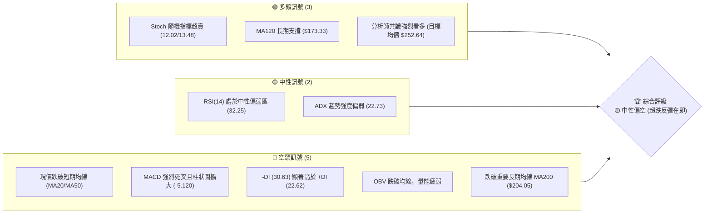
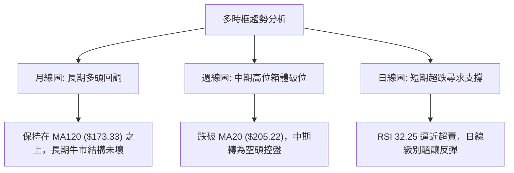
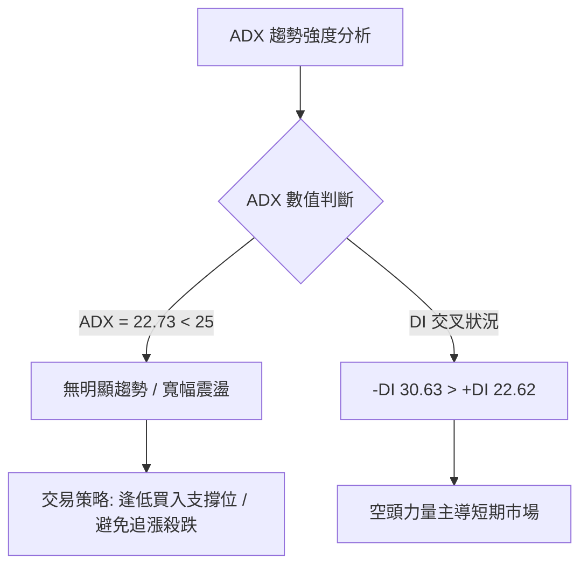
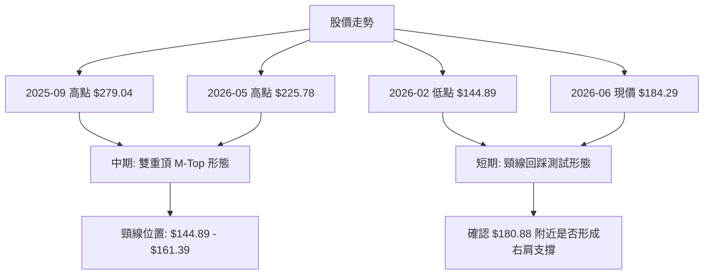
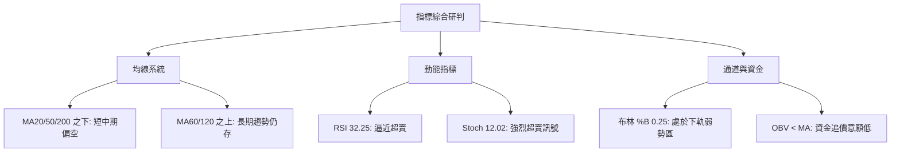
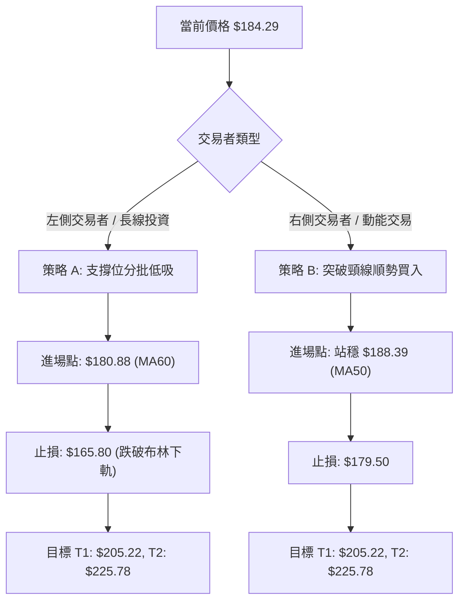
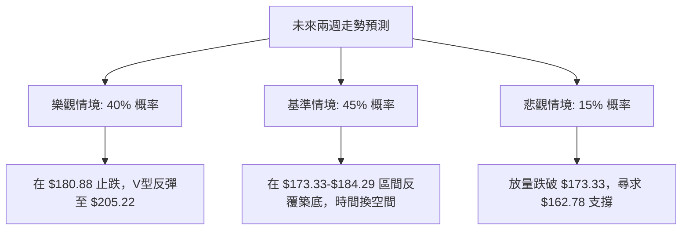

<details>
<summary>📊 靜態圖表 (點擊展開)</summary>

</details>

<html>
<head><meta charset="utf-8" /></head>
<body>
    <div style="height:500px; width:100%;">                        <script>window.PlotlyConfig = {MathJaxConfig: 'local'};</script>
        <script charset="utf-8" src="https://cdn.plot.ly/plotly-3.6.0.min.js" integrity="sha256-QaOVwtVY0T02VaHrr6pnoHLCwayMJp4O5n4YyaE3rJk=" crossorigin="anonymous"></script>                <div id="candlestick-chart" class="plotly-graph-div" style="height:100%; width:100%;"></div>            <script>                window.PLOTLYENV=window.PLOTLYENV || {};                                if (document.getElementById("candlestick-chart")) {                    Plotly.newPlot(                        "candlestick-chart",                        [{"close":{"dtype":"f8","bdata":"AAAAgGq2a0AAAAAAIahrQAAAACBG32xAAAAAQJyTbUAAAADAz\u002fNtQAAAAEAmXHRAAAAAgDEXc0AAAABARx5yQAAAACBkvHJAAAAAQPwDc0AAAABgzbByQAAAAADDZHJAAAAA4OQjc0AAAADASll0QAAAAED3dXNAAAAAALggc0AAAADAyBByQAAAAKDZk3FAAAAAAL2IcUAAAADAm3BxQAAAAID063FAAAAA4E3ocUAAAAAgZb5xQAAAAKDpFHJAAAAAgDugcUAAAABg7OVxQAAAACBXcnJAAAAAILsyckAAAABgDyJzQAAAAODHknJAAAAAwD\u002fcckAAAACgaXFzQAAAAAB+GHJAAAAAAMs3cUAAAADgghdxQAAAAEDq73BAAAAAQMBlcUAAAACAl5lxQAAAAIDmenFAAAAAANZxcUAAAACA5RlxQAAAAMBF6m9AAAAAwBhQcEAAAAAAZwRwQAAAAKDv1G5AAAAAgP8Yb0AAAABg80luQAAAAKCOuW1AAAAAoH3rbUAAAABApVZtQAAAAOBQM2xAAAAAoLcHa0AAAAAgpa9rQAAAAKCMUGtAAAAAIJZka0AAAACA4QRsQAAAAMDmLGpAAAAAIHmxaEAAAADg0OFoQAAAAIBzemhAAAAAYKl2aUAAAADg7RZpQAAAAKDO9mhAAAAAYOX7aEAAAACAws5pQAAAAKCroGpAAAAA4AgIa0AAAAAALWZrQAAAAKCphWtAAAAAwLu0a0AAAAAAVrRoQAAAAEDpmWdAAAAAQEz5ZkAAAADA7W9nQAAAAEDXK2ZAAAAAAMZdZkAAAABAhdlnQAAAAEBjpWhAAAAAgLNEaEAAAADgFIloQAAAAOD7mGhAAAAAQPlFaEAAAAAgLYBoQAAAAIAGN2hAAAAAQHhQaEAAAAAgPe1nQAAAAOAhEmhAAAAAoDD1Z0AAAADAu49nQAAAAMCHumhAAAAAwPZ+aUAAAAAAwDJpQAAAAAD1HWhAAAAAQA6mZ0AAAAAAmc1nQAAAAMBmaWZAAAAAYMuoZUAAAABA6jFmQAAAAKBjEWZAAAAA4MK5ZkAAAAAAUsllQAAAAMBahmVAAAAAIH8NZUAAAADgOoBkQAAAAOAX8GNAAAAAwDZEY0AAAADAGkViQAAAAOAoAGFAAAAAgFXKYUAAAACgcIFjQAAAACCs6mNAAAAA4J2TY0AAAACg7n1jQAAAAACl8mNAAAAAQOQtY0AAAAAADHRjQAAAAGDYf2NAAAAAYBFyYkAAAACALpphQAAAACA0NGJAAAAAQAJsYkAAAADgLbliQAAAACCbHGJAAAAAoGCXYkAAAABguY9iQAAAAKDe+mJAAAAAQApIY0AAAABArw1jQAAAAEAK4WJAAAAAICmcYkAAAAAgrFFkQAAAAOBk02NAAAAAoD5SY0AAAABAq21jQAAAAADaRGNAAAAAQMULY0AAAADAUV9jQAAAAOAWpWJAAAAAwLA5Y0AAAACAf1JiQAAAAKBgMGJAAAAAwAPKYUAAAADAkGVhQAAAAEAkSmFAAAAAwCJTYkAAAABgLxdiQAAAAIDbO2JAAAAAABIhYkAAAACgftVhQAAAAMAe5WFAAAAAIIU7YUAAAABA4UJhQAAAAADXc2NAAAAAAABgZEAAAACA6zllQAAAAEDhSmZAAAAAgOvhZUAAAABgjzJmQAAAAKBwpWZAAAAAAABwZ0AAAADA9QhmQAAAAMD1qGVAAAAAYLieZUAAAABguL5kQAAAAGCPemRAAAAA4HosZEAAAABgj3plQAAAAKBHiWZAAAAAQDMrZ0AAAADA9UBoQAAAAEDhUmhAAAAAYGZ+aEAAAABA4TpoQAAAAGCPWmdAAAAA4FG4Z0AAAAAghXNoQAAAAGBmHmhAAAAAIIVTZ0AAAABguK5mQAAAAMAehWdAAAAA4KO4Z0AAAABgjwJoQAAAAIDrIWhAAAAAYLjeZ0AAAABgZnZpQAAAAMD1OGxAAAAAwMwEb0AAAABgj5JuQAAAAGCPymxAAAAAQOGKbUAAAACAwrVqQAAAAIA9empAAAAAgOu5aUAAAADgUShpQAAAAEAzA2dAAAAAACkEZ0AAAADgehRoQAAAAGCPimdAAAAAwPXwZkAAAACgRwlnQA=="},"high":{"dtype":"f8","bdata":"JIAGvDMEbEByA7fwObprQNY0m8QOGW1AiW\u002fFCrQQbkDtgDgBrTJuQMr1pA82cHVANTWs54iGdEBTJzvA8BhzQDXbra4ECnNAmJpd1W\u002fXc0A\u002fa23f5CNzQN4JHlkP13JAYGNObslKc0AD\u002f7UUuW50QKh0eWhJJ3RAkkHDZmBgc0DcLsoqk4ZyQIdn9nsrO3JAUeVg3Nq7cUCXUdU8bJxxQPynexKD+3FA+3SInZFKckAsbLWIVEVyQOOm1gS3ZXJAd2Jyo8kuckBcw+W\u002f9RNyQPP4ps4bsnJAdwJy33Idc0Ait\u002fdT1kxzQFSaIaj46HJAd2UxX8RRc0BjfwHWHgl0QK+EAKe+5nJACxsbC5P3cUDLRUdpaGlxQKAsO4wcOHFASU7aUu+VcUCpE+WO+dZxQOPSHwf003FAe0hkq3a7cUAjLgkkZn5xQGK\u002f7GfMwXBA8hTi8fuCcEDbWVJ+9n9wQJlUpgERt29AfbjgLXhbb0CR\u002f0qSj\u002fFuQM3H8XXQ3W1Aqni9p1u3bkC8sK\u002fU\u002fX9tQF3yReqia21AvcovHh35a0DWbkBbOTVsQBpYSwYOrmtA234oxK3Ka0BsmgNpNVhsQD+EsfJDEm1Akkbu7DThaUC1JciAZ1JpQPpoEGslxmhA\u002fcQF1PQWakCwDYw8VSNpQBnrmwk6SGlAXsXaNGoNakBV5Ex+zdRpQOfVn\u002fYEw2pAobcUbxlFa0D7Tqa6EuxrQAE+cVZUqGtAwaCdyzP+a0Bc+bjEMxhpQDw96vqHlGhAwKU3PBt6Z0AUFb0VgZRnQIK6cpmMK2dABFIEdjX0ZkDjL8ZktD1oQKN6Xdy+smhA6reJj9t\u002faECHhiz5NKJoQFCeXKut5GhAPYRzhIWpaECvq8U1Y6VoQOvEyIvbf2hAJSotBxGsaEChU8gPqQ5pQDjDC1YSNmhAWx8WZzJPaECB2Y1UFLlnQCFtygt372hANuHjwTC8aUAY3oLmdOJpQBOmb0lMH2lApoflwJlKaEDhd9iCeOZnQDOywVc7UWdAnsqjBhZ\u002fZkDf7c4LDnFmQJMAmqHKYGZAKoYeDEgVZ0AQ6WgSBmNmQPKRTHCGoWZAmFY9l2Y0ZUD8vRkU\u002fQllQLdrcSBVU2VAgwzq1WjaY0C2IHZX7yxjQBywkUNHQWJAvVF8inPWYUAHGENHNeZjQOOCZk8PmmRAWbTIjORiZECUiKIikc9jQGG2GiqGN2RA733hWTjXY0Cq5S\u002fIFJhjQNsgVDG78GNAHE4Kn4cuY0CqPWCbXCliQGunmnL5R2JAbKckcuMXY0ACvxDvA\u002f9iQEC8mFxKMmJAAozuBLe0YkAqKglC88xiQOtpG2VpImNAqJ3XT32sY0BZx4y\u002fWdRjQEdraTQS72JAd2voGlAzY0Dwtg2oMGVlQONeYk7e52RAfggx\u002f7sGZEDrfJ0lAMZjQP4nG4W9y2NAgHDQusdNY0BnM3yV9otjQNESkpbuFmNAwzNrMZxnY0DKD0nWqCtjQPFlFhYxqmJAXl6wJbo+YkAnO9eeTKZhQEZVrJKslmFAnLZUG2JcYkApfXz6IaRiQBclFUrFPWJA6SHILQ6BYkCd2mOVIwJiQGJlsPvZ3WJAAAAAoJnZYUAAAACgcIVhQAAAAMAefWNAAAAAwMwsZUAAAACA65FlQAAAAOCjiGZAAAAAAAAQZ0AAAADgUThmQAAAAEDhKmdAAAAAgMKlZ0AAAADgerxmQAAAAGC4lmZAAAAAoJmxZUAAAABgZhZlQAAAAOBRmGRAAAAAgMKlZEAAAACgmcllQAAAAAAA8GZAAAAA4KNQZ0AAAACgR0loQAAAAMDMBGlAAAAAAADAaEAAAACAwnVoQAAAAKBwHWhAAAAAgD3yZ0AAAABguBZpQAAAAIDCjWhAAAAA4FHYZ0AAAABACpdnQAAAAEAKh2dAAAAAgD0aaEAAAAAAAKBoQAAAAGBmZmhAAAAA4HoEaEAAAAAAAKBpQAAAAKBHSWxAAAAAAABIb0AAAAAAACBvQAAAAOBREG5AAAAAYGbebUAAAACAFO5sQAAAAIDrYWtAAAAAAACQa0AAAAAgXI9qQAAAAOCjGGdAAAAAYI8yZ0AAAACAPWpoQAAAAIA9amhAAAAAgBTGZ0AAAAAgrn9nQA=="},"hovertemplate":"\u003cb\u003e%{x|%Y-%m-%d}\u003c\u002fb\u003e\u003cbr\u003e\u958b: $%{open:.2f}\u003cbr\u003e\u9ad8: $%{high:.2f}\u003cbr\u003e\u4f4e: $%{low:.2f}\u003cbr\u003e\u6536: $%{close:.2f}\u003cextra\u003e\u003c\u002fextra\u003e","low":{"dtype":"f8","bdata":"De5FKXGAa0C3v2sj6TprQKAq75LiA2xACtIS8vYubUBpl28jJxdtQLDE5Q5YWnNASNT6K3HjckAxHiDKcxdyQBH1HAlmb3JAQAb6NnS+ckCA2iR6hUtyQBTvYKlrG3JA9YpV6t9vckDg4QiWRQhzQO9OBJn1OXNAP\u002fdBGOWackBHumAHp+RxQFmid0CMjHFA3uwfhbtWcUCjY2Bg1htxQOde8u9EO3FAo9S\u002fTPe8cUAnDxdBbJxxQHV6tBVfCHJAyDpZGg3OcECy9tHOEpZxQLzisakW2HFAG50IxJ8jckA9yQBOvn5yQJitu54lI3JA2SuwNIKRckDUZZvLgNNyQDe6uZDn23FAYT0sSA4acUDevavMjelwQKSs1C6wuXBA3u5LIZ\u002frcEBs5avkaohxQANDB6edYXFABeslgTltcUCKvFQxFdtwQGOWhQXf1m9AUIKw84vkb0BEg+T2ebVvQFAiE5oodm5AIKB\u002f3K2wbkBumjEHg7ptQP182bzJ3WxAnjrn4OdzbUAM4eSevm9sQF7AQmc8GWxAFT149Pm8akCOvdQpci9qQCIRlyXKx2pA\u002foc6tBOmakAa+FOIcv9qQEt9bWN\u002fIGpAOQgwjcULaEAUBX\u002f0nyNoQNRH5yPhD2dAGcHLNycgaUB7AHfG5YxoQBcINaX0b2hA5220KenYaEC8FCvp08VoQGetSoXqoWlAV6sHoxaKakDoZf+\u002fufJqQOQuozxMHmtAcMBv7wgIa0CnmstN9iJnQEQBBcMCG2dAFOcef1iJZkBk94tEn+tmQIVWNOyh\u002f2VA8QfZLKgvZkCDInOhEl9nQCGEYVDf9GdAwK\u002fJW4TgZ0AeY\u002fT6cCdoQFdQePAwXWhAPYlNONTuZ0CzhyQteFBoQACJsuFMMWhAyof\u002fTMMgaEA6JjhC+ORnQAXHvNogsWdANEpXZ3naZ0DD7LXeaiBnQFiaB1Tvg2dAjVkLz2CKaEDQ10WZxf5oQKKGHTWrxGdAbbqe\u002fWKXZ0ATRBeDLzxnQCmWdTeLV2ZAFPK+JDNAZUCTG1imV\u002fxlQPCByP7XbGVASGPTmhM9ZkB9E+GIaqJlQFK3JQ1haGVAGYBDraYeZEA8JLjUf1VkQJIL7RUu7mNA1Lsc2uHrYkBgJAp+rP1hQOTbq9Hv2GBADyfPOqZNYUAXCv7MoE9iQBnQESo9jWNAhom6ONkuY0CTa+b5A\u002f9iQF9uQgj8V2NARJv5EyILY0B5DtQ6+9piQAamLpRKZ2NA2TpPjBBcYkB4blXNcUNhQOyFO6boR2FAYHd\u002fTnhaYkAPSB4\u002fohRiQDkGvLZfs2FA5Dn\u002fNgmWYUA636gNq9FhQI4D5RuYkmJAQH+sxh6zYkD8uq4U9OJiQIzYBoRzPWJAK2381d19YkAhr5XrrABkQBKFbe7awWNAMvcpn6EzY0Bsd6eAHD9jQKsX323nHmNAw386pVjwYkBMnDbI5YtiQC5uNhPsbWJARIpNX+\u002fFYkA0L6xX2EpiQFYdfXwYA2JA28\u002fBkmfBYUCP98ZmMjphQFOwBL8lD2FAYAvn3p9rYUCZXGrXUwViQFgBc3n5eWFAL\u002fhNzy3rYUDwipuXfm5hQETmUWvizGFAAAAAAAAAYUAAAACAPdJgQAAAAEAKd2FAAAAAgOsxZEAAAABguMZkQAAAAKCZuWVAAAAAIIWrZUAAAADgUbBlQAAAAOBRAGZAAAAAoJnZZkAAAABgj8JlQAAAAKCZGWVAAAAAwMz8ZEAAAACgmUFkQAAAAMDMFGRAAAAAYI8KZEAAAADAzMRkQAAAAOBRyGVAAAAAAABgZkAAAACgcNVmQAAAAKCZ2WdAAAAAYLjGZ0AAAABAM9NnQAAAAADXm2ZAAAAAgOshZ0AAAABgZi5nQAAAAMDMnGdAAAAA4KPoZkAAAACAwp1mQAAAAKCZWWZAAAAAYGZmZ0AAAABAM+NnQAAAAIDr0WdAAAAAoHB9Z0AAAAAAKSxoQAAAAOBRAGpAAAAAQDMTbEAAAABA4dptQAAAACCFc2xAAAAAAAAAbEAAAABgZi5qQAAAAGCPKmpAAAAAoEe5aEAAAACAwsVoQAAAAMD16GVAAAAAAABgZkAAAABguEZnQAAAAMAedWdAAAAAYI\u002fSZkAAAABgZjZmQA=="},"name":"\u50f9\u683c","open":{"dtype":"f8","bdata":"JIAGvDMEbEC6YpYjYYhrQCMy4ShW12xAxQZRkGDAbUBP1XkS98FtQLr3V\u002f0Ny3NA2jA2sg58dECpEmRpVfZyQFNxMqjPAHNAoaZU\u002fZ15c0AeK+HafhRzQI+BxnytynJAXUULSouKckBaYofNSjNzQCMYRXppF3RAVH3ZVrFWc0ACACqlVE9yQGub041LK3JAj2P3nfKlcUAmBtttgJdxQKeSAK\u002ffSXFAe2CZ5j4YckBnaipKUvVxQIyFSyp0IXJAd2Jyo8kuckAjhBcx97JxQBjqVxdPHHJAph34vyKnckDe55KJAo5yQAVu5kt023JAx3ZXmprwckAbF35gvPtyQNKxUglR3nJAlsk8jPbycUA9DfnylEZxQBbemJZDEnFAlm74fq\u002f0cEDoPGt0x8JxQDMI\u002fIgdzXFAwBlFFliUcUDFHcTE2ntxQL0df+yTsXBASpFxzcwecEBb4wCA63lwQOkiKZCADm9AhC3J1KrMbkDa8iQcn81uQPeLOcJJsW1AAY4pc1SObkCWYEifMFltQH6NyAppaW1A0muj\u002f7Tza0CLNVapWjFqQP63VG4SHGtAALJAhXbcakBp2+74GjdrQGcBqsvwt2xA3umRVxa6aUBx3gdeC3VoQDxW1bmgHGhAatdk2A0HakD12651U8loQDyV4iPQ6GhAdeO63GJ8aUAkguYAaONoQADMChjl0mlAFjh+czI1a0Dbi6oY8H9rQH2fN630VWtAF2Z7CkCOa0AZ6qeHla5nQKTyBMh1ZWhADAVSonpkZ0ALxc0CTfJmQAOSgbUXxmZA0rUP6FOzZkBS\u002fw3\u002fqGdnQB+Ejs3Fc2hAgoVnNl5naECgQ9tV4zloQJuffb81m2hA2CfOCiwfaEBcfjHKmVtoQOgBr9IMZ2hAuLXREHKIaED7zlxtHaRoQLuvcupI7GdA6y5H6m1DaED\u002fERF12rZnQCI69DbG32dAThWSXDGdaEBBV7IbK4lpQBOmb0lMH2lApoflwJlKaECYSa4k+KdnQDOywVc7UWdAKdzTgb9hZkBHAB7S3FdmQG3rclGdgGVAcnti2kBPZkDE\u002fehuH1JmQFu2\u002f031yWVAD80rf9kxZUCN4GLEtfJkQBT5K1xnSmVAukzPpLG2Y0AfZnAkVytjQONwi\u002fn7ImJA\u002f\u002fK9h29oYUCtw4BxJH9iQH+CGh0u7mNAWbTIjORiZECvLYGoK6xjQBESHoBD1mNAwmi2ysOtY0D6Mg5O7DtjQPJJjreSlGNA9YhZy4YYY0Brr0We2iViQJCnKZ0xi2FA3\u002fot6oGUYkBe1ZVWtYhiQBTsdLYi7GFAlx1rKxGkYUAr\u002fnj14AdiQG800smcr2JAbizymeIBY0B7QAWkaAxjQH4tKqWdxWJAIXFlDrsiY0DLPPcsoblkQCbT8Q\u002fIgmRA3ludyeLPY0DE2hzviXBjQLH1uJ3EXGNAPH1z\u002frYbY0DlgMaE9r1iQFhlWOqNEGNAtNUSYZPcYkCrxke\u002f9Q5jQKjPclq9lmJAkkMVVXTsYUBK6TlKEI5hQFHtbeWucWFAV7tcavl5YUDC2eZxRpJiQN1rKOQOyWFAHO67s6hdYkAqXaFb8uhhQK2nkU7cuGJAAAAAYGbGYUAAAACAPSphQAAAAOCjeGFAAAAAgML9ZEAAAADgetxkQAAAAKBwDWZAAAAAgMLdZkAAAACA6xlmQAAAAEAzS2ZAAAAAgMJFZ0AAAADAzIxmQAAAAOBRkGZAAAAAYI+SZUAAAADAHkVkQAAAAKBHgWRAAAAA4KNAZEAAAACgcM1kQAAAAOCjAGZAAAAAACnEZkAAAABgZkZnQAAAACCF02hAAAAAYI8SaEAAAADAzARoQAAAAKBwHWhAAAAAwPWgZ0AAAACAwoVnQAAAACCuz2dAAAAAAADAZ0AAAAAAAEBnQAAAAIAUfmZAAAAA4FGgZ0AAAACgcPVnQAAAAKCZKWhAAAAAIFzvZ0AAAACgR0FoQAAAAAAAIGpAAAAAAADQbEAAAACgmVluQAAAACBcD25AAAAAAABgbEAAAAAgrq9sQAAAAAAAOGtAAAAAwB69akAAAAAAANBoQAAAAKBwdWZAAAAA4FEgZ0AAAADgemxnQAAAAOBRwGdAAAAAwB5FZ0AAAADgUeBmQA=="},"x":["2025-09-03T00:00:00-04:00","2025-09-04T00:00:00-04:00","2025-09-05T00:00:00-04:00","2025-09-08T00:00:00-04:00","2025-09-09T00:00:00-04:00","2025-09-10T00:00:00-04:00","2025-09-11T00:00:00-04:00","2025-09-12T00:00:00-04:00","2025-09-15T00:00:00-04:00","2025-09-16T00:00:00-04:00","2025-09-17T00:00:00-04:00","2025-09-18T00:00:00-04:00","2025-09-19T00:00:00-04:00","2025-09-22T00:00:00-04:00","2025-09-23T00:00:00-04:00","2025-09-24T00:00:00-04:00","2025-09-25T00:00:00-04:00","2025-09-26T00:00:00-04:00","2025-09-29T00:00:00-04:00","2025-09-30T00:00:00-04:00","2025-10-01T00:00:00-04:00","2025-10-02T00:00:00-04:00","2025-10-03T00:00:00-04:00","2025-10-06T00:00:00-04:00","2025-10-07T00:00:00-04:00","2025-10-08T00:00:00-04:00","2025-10-09T00:00:00-04:00","2025-10-10T00:00:00-04:00","2025-10-13T00:00:00-04:00","2025-10-14T00:00:00-04:00","2025-10-15T00:00:00-04:00","2025-10-16T00:00:00-04:00","2025-10-17T00:00:00-04:00","2025-10-20T00:00:00-04:00","2025-10-21T00:00:00-04:00","2025-10-22T00:00:00-04:00","2025-10-23T00:00:00-04:00","2025-10-24T00:00:00-04:00","2025-10-27T00:00:00-04:00","2025-10-28T00:00:00-04:00","2025-10-29T00:00:00-04:00","2025-10-30T00:00:00-04:00","2025-10-31T00:00:00-04:00","2025-11-03T00:00:00-05:00","2025-11-04T00:00:00-05:00","2025-11-05T00:00:00-05:00","2025-11-06T00:00:00-05:00","2025-11-07T00:00:00-05:00","2025-11-10T00:00:00-05:00","2025-11-11T00:00:00-05:00","2025-11-12T00:00:00-05:00","2025-11-13T00:00:00-05:00","2025-11-14T00:00:00-05:00","2025-11-17T00:00:00-05:00","2025-11-18T00:00:00-05:00","2025-11-19T00:00:00-05:00","2025-11-20T00:00:00-05:00","2025-11-21T00:00:00-05:00","2025-11-24T00:00:00-05:00","2025-11-25T00:00:00-05:00","2025-11-26T00:00:00-05:00","2025-11-28T00:00:00-05:00","2025-12-01T00:00:00-05:00","2025-12-02T00:00:00-05:00","2025-12-03T00:00:00-05:00","2025-12-04T00:00:00-05:00","2025-12-05T00:00:00-05:00","2025-12-08T00:00:00-05:00","2025-12-09T00:00:00-05:00","2025-12-10T00:00:00-05:00","2025-12-11T00:00:00-05:00","2025-12-12T00:00:00-05:00","2025-12-15T00:00:00-05:00","2025-12-16T00:00:00-05:00","2025-12-17T00:00:00-05:00","2025-12-18T00:00:00-05:00","2025-12-19T00:00:00-05:00","2025-12-22T00:00:00-05:00","2025-12-23T00:00:00-05:00","2025-12-24T00:00:00-05:00","2025-12-26T00:00:00-05:00","2025-12-29T00:00:00-05:00","2025-12-30T00:00:00-05:00","2025-12-31T00:00:00-05:00","2026-01-02T00:00:00-05:00","2026-01-05T00:00:00-05:00","2026-01-06T00:00:00-05:00","2026-01-07T00:00:00-05:00","2026-01-08T00:00:00-05:00","2026-01-09T00:00:00-05:00","2026-01-12T00:00:00-05:00","2026-01-13T00:00:00-05:00","2026-01-14T00:00:00-05:00","2026-01-15T00:00:00-05:00","2026-01-16T00:00:00-05:00","2026-01-20T00:00:00-05:00","2026-01-21T00:00:00-05:00","2026-01-22T00:00:00-05:00","2026-01-23T00:00:00-05:00","2026-01-26T00:00:00-05:00","2026-01-27T00:00:00-05:00","2026-01-28T00:00:00-05:00","2026-01-29T00:00:00-05:00","2026-01-30T00:00:00-05:00","2026-02-02T00:00:00-05:00","2026-02-03T00:00:00-05:00","2026-02-04T00:00:00-05:00","2026-02-05T00:00:00-05:00","2026-02-06T00:00:00-05:00","2026-02-09T00:00:00-05:00","2026-02-10T00:00:00-05:00","2026-02-11T00:00:00-05:00","2026-02-12T00:00:00-05:00","2026-02-13T00:00:00-05:00","2026-02-17T00:00:00-05:00","2026-02-18T00:00:00-05:00","2026-02-19T00:00:00-05:00","2026-02-20T00:00:00-05:00","2026-02-23T00:00:00-05:00","2026-02-24T00:00:00-05:00","2026-02-25T00:00:00-05:00","2026-02-26T00:00:00-05:00","2026-02-27T00:00:00-05:00","2026-03-02T00:00:00-05:00","2026-03-03T00:00:00-05:00","2026-03-04T00:00:00-05:00","2026-03-05T00:00:00-05:00","2026-03-06T00:00:00-05:00","2026-03-09T00:00:00-04:00","2026-03-10T00:00:00-04:00","2026-03-11T00:00:00-04:00","2026-03-12T00:00:00-04:00","2026-03-13T00:00:00-04:00","2026-03-16T00:00:00-04:00","2026-03-17T00:00:00-04:00","2026-03-18T00:00:00-04:00","2026-03-19T00:00:00-04:00","2026-03-20T00:00:00-04:00","2026-03-23T00:00:00-04:00","2026-03-24T00:00:00-04:00","2026-03-25T00:00:00-04:00","2026-03-26T00:00:00-04:00","2026-03-27T00:00:00-04:00","2026-03-30T00:00:00-04:00","2026-03-31T00:00:00-04:00","2026-04-01T00:00:00-04:00","2026-04-02T00:00:00-04:00","2026-04-06T00:00:00-04:00","2026-04-07T00:00:00-04:00","2026-04-08T00:00:00-04:00","2026-04-09T00:00:00-04:00","2026-04-10T00:00:00-04:00","2026-04-13T00:00:00-04:00","2026-04-14T00:00:00-04:00","2026-04-15T00:00:00-04:00","2026-04-16T00:00:00-04:00","2026-04-17T00:00:00-04:00","2026-04-20T00:00:00-04:00","2026-04-21T00:00:00-04:00","2026-04-22T00:00:00-04:00","2026-04-23T00:00:00-04:00","2026-04-24T00:00:00-04:00","2026-04-27T00:00:00-04:00","2026-04-28T00:00:00-04:00","2026-04-29T00:00:00-04:00","2026-04-30T00:00:00-04:00","2026-05-01T00:00:00-04:00","2026-05-04T00:00:00-04:00","2026-05-05T00:00:00-04:00","2026-05-06T00:00:00-04:00","2026-05-07T00:00:00-04:00","2026-05-08T00:00:00-04:00","2026-05-11T00:00:00-04:00","2026-05-12T00:00:00-04:00","2026-05-13T00:00:00-04:00","2026-05-14T00:00:00-04:00","2026-05-15T00:00:00-04:00","2026-05-18T00:00:00-04:00","2026-05-19T00:00:00-04:00","2026-05-20T00:00:00-04:00","2026-05-21T00:00:00-04:00","2026-05-22T00:00:00-04:00","2026-05-26T00:00:00-04:00","2026-05-27T00:00:00-04:00","2026-05-28T00:00:00-04:00","2026-05-29T00:00:00-04:00","2026-06-01T00:00:00-04:00","2026-06-02T00:00:00-04:00","2026-06-03T00:00:00-04:00","2026-06-04T00:00:00-04:00","2026-06-05T00:00:00-04:00","2026-06-08T00:00:00-04:00","2026-06-09T00:00:00-04:00","2026-06-10T00:00:00-04:00","2026-06-11T00:00:00-04:00","2026-06-12T00:00:00-04:00","2026-06-15T00:00:00-04:00","2026-06-16T00:00:00-04:00","2026-06-17T00:00:00-04:00","2026-06-18T00:00:00-04:00"],"type":"candlestick"},{"hovertemplate":"MA30: $%{y:.2f}\u003cextra\u003e\u003c\u002fextra\u003e","line":{"color":"#2196F3","dash":"dash","width":2},"mode":"lines","name":"MA30","x":["2025-09-03T00:00:00-04:00","2025-09-04T00:00:00-04:00","2025-09-05T00:00:00-04:00","2025-09-08T00:00:00-04:00","2025-09-09T00:00:00-04:00","2025-09-10T00:00:00-04:00","2025-09-11T00:00:00-04:00","2025-09-12T00:00:00-04:00","2025-09-15T00:00:00-04:00","2025-09-16T00:00:00-04:00","2025-09-17T00:00:00-04:00","2025-09-18T00:00:00-04:00","2025-09-19T00:00:00-04:00","2025-09-22T00:00:00-04:00","2025-09-23T00:00:00-04:00","2025-09-24T00:00:00-04:00","2025-09-25T00:00:00-04:00","2025-09-26T00:00:00-04:00","2025-09-29T00:00:00-04:00","2025-09-30T00:00:00-04:00","2025-10-01T00:00:00-04:00","2025-10-02T00:00:00-04:00","2025-10-03T00:00:00-04:00","2025-10-06T00:00:00-04:00","2025-10-07T00:00:00-04:00","2025-10-08T00:00:00-04:00","2025-10-09T00:00:00-04:00","2025-10-10T00:00:00-04:00","2025-10-13T00:00:00-04:00","2025-10-14T00:00:00-04:00","2025-10-15T00:00:00-04:00","2025-10-16T00:00:00-04:00","2025-10-17T00:00:00-04:00","2025-10-20T00:00:00-04:00","2025-10-21T00:00:00-04:00","2025-10-22T00:00:00-04:00","2025-10-23T00:00:00-04:00","2025-10-24T00:00:00-04:00","2025-10-27T00:00:00-04:00","2025-10-28T00:00:00-04:00","2025-10-29T00:00:00-04:00","2025-10-30T00:00:00-04:00","2025-10-31T00:00:00-04:00","2025-11-03T00:00:00-05:00","2025-11-04T00:00:00-05:00","2025-11-05T00:00:00-05:00","2025-11-06T00:00:00-05:00","2025-11-07T00:00:00-05:00","2025-11-10T00:00:00-05:00","2025-11-11T00:00:00-05:00","2025-11-12T00:00:00-05:00","2025-11-13T00:00:00-05:00","2025-11-14T00:00:00-05:00","2025-11-17T00:00:00-05:00","2025-11-18T00:00:00-05:00","2025-11-19T00:00:00-05:00","2025-11-20T00:00:00-05:00","2025-11-21T00:00:00-05:00","2025-11-24T00:00:00-05:00","2025-11-25T00:00:00-05:00","2025-11-26T00:00:00-05:00","2025-11-28T00:00:00-05:00","2025-12-01T00:00:00-05:00","2025-12-02T00:00:00-05:00","2025-12-03T00:00:00-05:00","2025-12-04T00:00:00-05:00","2025-12-05T00:00:00-05:00","2025-12-08T00:00:00-05:00","2025-12-09T00:00:00-05:00","2025-12-10T00:00:00-05:00","2025-12-11T00:00:00-05:00","2025-12-12T00:00:00-05:00","2025-12-15T00:00:00-05:00","2025-12-16T00:00:00-05:00","2025-12-17T00:00:00-05:00","2025-12-18T00:00:00-05:00","2025-12-19T00:00:00-05:00","2025-12-22T00:00:00-05:00","2025-12-23T00:00:00-05:00","2025-12-24T00:00:00-05:00","2025-12-26T00:00:00-05:00","2025-12-29T00:00:00-05:00","2025-12-30T00:00:00-05:00","2025-12-31T00:00:00-05:00","2026-01-02T00:00:00-05:00","2026-01-05T00:00:00-05:00","2026-01-06T00:00:00-05:00","2026-01-07T00:00:00-05:00","2026-01-08T00:00:00-05:00","2026-01-09T00:00:00-05:00","2026-01-12T00:00:00-05:00","2026-01-13T00:00:00-05:00","2026-01-14T00:00:00-05:00","2026-01-15T00:00:00-05:00","2026-01-16T00:00:00-05:00","2026-01-20T00:00:00-05:00","2026-01-21T00:00:00-05:00","2026-01-22T00:00:00-05:00","2026-01-23T00:00:00-05:00","2026-01-26T00:00:00-05:00","2026-01-27T00:00:00-05:00","2026-01-28T00:00:00-05:00","2026-01-29T00:00:00-05:00","2026-01-30T00:00:00-05:00","2026-02-02T00:00:00-05:00","2026-02-03T00:00:00-05:00","2026-02-04T00:00:00-05:00","2026-02-05T00:00:00-05:00","2026-02-06T00:00:00-05:00","2026-02-09T00:00:00-05:00","2026-02-10T00:00:00-05:00","2026-02-11T00:00:00-05:00","2026-02-12T00:00:00-05:00","2026-02-13T00:00:00-05:00","2026-02-17T00:00:00-05:00","2026-02-18T00:00:00-05:00","2026-02-19T00:00:00-05:00","2026-02-20T00:00:00-05:00","2026-02-23T00:00:00-05:00","2026-02-24T00:00:00-05:00","2026-02-25T00:00:00-05:00","2026-02-26T00:00:00-05:00","2026-02-27T00:00:00-05:00","2026-03-02T00:00:00-05:00","2026-03-03T00:00:00-05:00","2026-03-04T00:00:00-05:00","2026-03-05T00:00:00-05:00","2026-03-06T00:00:00-05:00","2026-03-09T00:00:00-04:00","2026-03-10T00:00:00-04:00","2026-03-11T00:00:00-04:00","2026-03-12T00:00:00-04:00","2026-03-13T00:00:00-04:00","2026-03-16T00:00:00-04:00","2026-03-17T00:00:00-04:00","2026-03-18T00:00:00-04:00","2026-03-19T00:00:00-04:00","2026-03-20T00:00:00-04:00","2026-03-23T00:00:00-04:00","2026-03-24T00:00:00-04:00","2026-03-25T00:00:00-04:00","2026-03-26T00:00:00-04:00","2026-03-27T00:00:00-04:00","2026-03-30T00:00:00-04:00","2026-03-31T00:00:00-04:00","2026-04-01T00:00:00-04:00","2026-04-02T00:00:00-04:00","2026-04-06T00:00:00-04:00","2026-04-07T00:00:00-04:00","2026-04-08T00:00:00-04:00","2026-04-09T00:00:00-04:00","2026-04-10T00:00:00-04:00","2026-04-13T00:00:00-04:00","2026-04-14T00:00:00-04:00","2026-04-15T00:00:00-04:00","2026-04-16T00:00:00-04:00","2026-04-17T00:00:00-04:00","2026-04-20T00:00:00-04:00","2026-04-21T00:00:00-04:00","2026-04-22T00:00:00-04:00","2026-04-23T00:00:00-04:00","2026-04-24T00:00:00-04:00","2026-04-27T00:00:00-04:00","2026-04-28T00:00:00-04:00","2026-04-29T00:00:00-04:00","2026-04-30T00:00:00-04:00","2026-05-01T00:00:00-04:00","2026-05-04T00:00:00-04:00","2026-05-05T00:00:00-04:00","2026-05-06T00:00:00-04:00","2026-05-07T00:00:00-04:00","2026-05-08T00:00:00-04:00","2026-05-11T00:00:00-04:00","2026-05-12T00:00:00-04:00","2026-05-13T00:00:00-04:00","2026-05-14T00:00:00-04:00","2026-05-15T00:00:00-04:00","2026-05-18T00:00:00-04:00","2026-05-19T00:00:00-04:00","2026-05-20T00:00:00-04:00","2026-05-21T00:00:00-04:00","2026-05-22T00:00:00-04:00","2026-05-26T00:00:00-04:00","2026-05-27T00:00:00-04:00","2026-05-28T00:00:00-04:00","2026-05-29T00:00:00-04:00","2026-06-01T00:00:00-04:00","2026-06-02T00:00:00-04:00","2026-06-03T00:00:00-04:00","2026-06-04T00:00:00-04:00","2026-06-05T00:00:00-04:00","2026-06-08T00:00:00-04:00","2026-06-09T00:00:00-04:00","2026-06-10T00:00:00-04:00","2026-06-11T00:00:00-04:00","2026-06-12T00:00:00-04:00","2026-06-15T00:00:00-04:00","2026-06-16T00:00:00-04:00","2026-06-17T00:00:00-04:00","2026-06-18T00:00:00-04:00"],"y":{"dtype":"f8","bdata":"AAAAAAAA+H8AAAAAAAD4fwAAAAAAAPh\u002fAAAAAAAA+H8AAAAAAAD4fwAAAAAAAPh\u002fAAAAAAAA+H8AAAAAAAD4fwAAAAAAAPh\u002fAAAAAAAA+H8AAAAAAAD4fwAAAAAAAPh\u002fAAAAAAAA+H8AAAAAAAD4fwAAAAAAAPh\u002fAAAAAAAA+H8AAAAAAAD4fwAAAAAAAPh\u002fAAAAAAAA+H8AAAAAAAD4fwAAAAAAAPh\u002fAAAAAAAA+H8AAAAAAAD4fwAAAAAAAPh\u002fAAAAAAAA+H8AAAAAAAD4fwAAAAAAAPh\u002fAAAAAAAA+H8AAAAAAAD4f2ZmZl4w0XFAMzMz6+P7cUAiIiJKzStyQJqZmckHS3JAq6qqasNfckDe3d0d0XFyQKuqquqbVHJAVVVVNSlGckAzMzPzvEFyQAAAAJAFN3JAMzMz450pckAAAACgDRxyQFVVVQVEB3JA3t3dnSPvcUB3d3cXLcpxQAAAANiop3FAd3d3bx6JcUAiIiIiMXBxQDMzM9sFWXFAMzMzcw5DcUARERHhaStxQGZmZr7NCnFAmpmZeVLlcECrqqpSCcRwQFVVVSVInnBAmpmZIcB8cEAAAABYkVtwQFVVVY3WLXBAVVVVVc\u002f3b0CamZmJmYVvQO\u002fu7v5+GW9Aq6qqyuawbkAiIiLyKztuQCIiIqJd221AzczMnLWKbUB3d3fnO0NtQFVVVTVlBW1AzczMfCXDbECrqqpalIBsQFVVVbUbQWxA7+7ubs8DbEAAAAAAw7JrQLy7u\u002fvQa2tAIiIiAnQZa0AzMzMzF9BqQM3MzPwvhmpAIiIiEq47akB3d3d3uwRqQAAAALBk2WlAAAAAwCqpaUCJiIh4LoBpQHd3d+dvYWlA7+7ujulJaUBERETkui5pQM3MzHxHFGlAmpmZOQL6aECJiIhYFtdoQJqZmdkgxWhAq6qqKtq+aEAiIiIylbNoQBEREQG4tWhAmpmZ2f61aEARERFB7LZoQM3MzMyxr2hAMzMzw0ykaEB3d3fHMZNoQERERAQ4b2hAIiIiomBBaEAiIiIC+BRoQERERCRt5mdAERERYe27Z0CJiIjYBqNnQFVVVeVOkWdAERERMeqAZ0AiIiKy22dnQImIiMjMVGdAMzMzE1k6Z0DNzMzsuwpnQO\u002fu7j5+yWZAiYiI2DaSZkCJiIj4SmdmQBEREWFZP2ZAREREREUXZkAzMzNzh+xlQM3MzMwdyGVAEREREUycZUAzMzPDH3ZlQAAAAFAdT2VAzczMvBMgZUAiIiKyOe1kQN7d3T2MtWRAIiIiwi55ZEB3d3cn7kFkQM3MzGyvDmRAERERgYfjY0CamZnZzLZjQLy7uwuEmWNAd3d3VzmFY0AzMzOTampjQFVVVWU0T2NAvLu7qxUsY0BEREQkkB9jQKuqqnoQEWNAAAAAEEoCY0BEREQkI\u002fliQBEREeFt82JAq6qqOozxYkBmZmZ29PpiQFVVVWX8CGNAvLu7KzsVY0ARERERIgtjQBEREdFj\u002fGJAIiIi8iLtYkAzMzPzQdtiQN7d3f2SxGJAZmZmRki9YkAiIiJSp7FiQAAAAKDapmJAIiIiciekYkBVVVWVIaZiQM3MzLx+o2JA7+7ubliZYkCamZlp3oxiQHd3d1dPmGJAq6qq2oenYkAiIiJCRb5iQM3MzJyJ2mJAmpmZybvwYkDv7u4OkAtjQKuqqpq1K2NA7+7ubudUY0BVVVUFjGNjQLy7u\u002fsyc2NAREREpNCGY0AAAADQDJJjQImIiKhfnGNAAAAAUP+lY0BVVVXV+LdjQImIiKgt2WNAREREJNT6Y0Dv7u6ucS1kQN7d3U3LYWRAq6qqygGbZEBmZmZGUdVkQERERJQQCWVA7+7urho3ZUDv7u7OYW1lQDMzM6OZn2VA7+7uzvLLZUCamZmZUvVlQJqZmZlSJWZA3t3dfbFcZkDNzMxcSJZmQKuqqvo3vmZAzczM7ArcZkB3d3cnMQBnQAAAAHDLMmdAERER4cGAZ0CJiIhYOchnQN7d3U2p\u002fGdAERER4cEwaEAiIiKSplhoQAAAAJDCgWhAzczMzMykaEDNzMwMdMpoQM3MzBwT4GhAZmZmplT4aECrqqoqhw5pQAAAAKAaF2lAREREpCkVaUCJiIj4xQppQA=="},"type":"scatter"},{"hovertemplate":"MA60: $%{y:.2f}\u003cextra\u003e\u003c\u002fextra\u003e","line":{"color":"#9C27B0","dash":"dash","width":2},"mode":"lines","name":"MA60","x":["2025-09-03T00:00:00-04:00","2025-09-04T00:00:00-04:00","2025-09-05T00:00:00-04:00","2025-09-08T00:00:00-04:00","2025-09-09T00:00:00-04:00","2025-09-10T00:00:00-04:00","2025-09-11T00:00:00-04:00","2025-09-12T00:00:00-04:00","2025-09-15T00:00:00-04:00","2025-09-16T00:00:00-04:00","2025-09-17T00:00:00-04:00","2025-09-18T00:00:00-04:00","2025-09-19T00:00:00-04:00","2025-09-22T00:00:00-04:00","2025-09-23T00:00:00-04:00","2025-09-24T00:00:00-04:00","2025-09-25T00:00:00-04:00","2025-09-26T00:00:00-04:00","2025-09-29T00:00:00-04:00","2025-09-30T00:00:00-04:00","2025-10-01T00:00:00-04:00","2025-10-02T00:00:00-04:00","2025-10-03T00:00:00-04:00","2025-10-06T00:00:00-04:00","2025-10-07T00:00:00-04:00","2025-10-08T00:00:00-04:00","2025-10-09T00:00:00-04:00","2025-10-10T00:00:00-04:00","2025-10-13T00:00:00-04:00","2025-10-14T00:00:00-04:00","2025-10-15T00:00:00-04:00","2025-10-16T00:00:00-04:00","2025-10-17T00:00:00-04:00","2025-10-20T00:00:00-04:00","2025-10-21T00:00:00-04:00","2025-10-22T00:00:00-04:00","2025-10-23T00:00:00-04:00","2025-10-24T00:00:00-04:00","2025-10-27T00:00:00-04:00","2025-10-28T00:00:00-04:00","2025-10-29T00:00:00-04:00","2025-10-30T00:00:00-04:00","2025-10-31T00:00:00-04:00","2025-11-03T00:00:00-05:00","2025-11-04T00:00:00-05:00","2025-11-05T00:00:00-05:00","2025-11-06T00:00:00-05:00","2025-11-07T00:00:00-05:00","2025-11-10T00:00:00-05:00","2025-11-11T00:00:00-05:00","2025-11-12T00:00:00-05:00","2025-11-13T00:00:00-05:00","2025-11-14T00:00:00-05:00","2025-11-17T00:00:00-05:00","2025-11-18T00:00:00-05:00","2025-11-19T00:00:00-05:00","2025-11-20T00:00:00-05:00","2025-11-21T00:00:00-05:00","2025-11-24T00:00:00-05:00","2025-11-25T00:00:00-05:00","2025-11-26T00:00:00-05:00","2025-11-28T00:00:00-05:00","2025-12-01T00:00:00-05:00","2025-12-02T00:00:00-05:00","2025-12-03T00:00:00-05:00","2025-12-04T00:00:00-05:00","2025-12-05T00:00:00-05:00","2025-12-08T00:00:00-05:00","2025-12-09T00:00:00-05:00","2025-12-10T00:00:00-05:00","2025-12-11T00:00:00-05:00","2025-12-12T00:00:00-05:00","2025-12-15T00:00:00-05:00","2025-12-16T00:00:00-05:00","2025-12-17T00:00:00-05:00","2025-12-18T00:00:00-05:00","2025-12-19T00:00:00-05:00","2025-12-22T00:00:00-05:00","2025-12-23T00:00:00-05:00","2025-12-24T00:00:00-05:00","2025-12-26T00:00:00-05:00","2025-12-29T00:00:00-05:00","2025-12-30T00:00:00-05:00","2025-12-31T00:00:00-05:00","2026-01-02T00:00:00-05:00","2026-01-05T00:00:00-05:00","2026-01-06T00:00:00-05:00","2026-01-07T00:00:00-05:00","2026-01-08T00:00:00-05:00","2026-01-09T00:00:00-05:00","2026-01-12T00:00:00-05:00","2026-01-13T00:00:00-05:00","2026-01-14T00:00:00-05:00","2026-01-15T00:00:00-05:00","2026-01-16T00:00:00-05:00","2026-01-20T00:00:00-05:00","2026-01-21T00:00:00-05:00","2026-01-22T00:00:00-05:00","2026-01-23T00:00:00-05:00","2026-01-26T00:00:00-05:00","2026-01-27T00:00:00-05:00","2026-01-28T00:00:00-05:00","2026-01-29T00:00:00-05:00","2026-01-30T00:00:00-05:00","2026-02-02T00:00:00-05:00","2026-02-03T00:00:00-05:00","2026-02-04T00:00:00-05:00","2026-02-05T00:00:00-05:00","2026-02-06T00:00:00-05:00","2026-02-09T00:00:00-05:00","2026-02-10T00:00:00-05:00","2026-02-11T00:00:00-05:00","2026-02-12T00:00:00-05:00","2026-02-13T00:00:00-05:00","2026-02-17T00:00:00-05:00","2026-02-18T00:00:00-05:00","2026-02-19T00:00:00-05:00","2026-02-20T00:00:00-05:00","2026-02-23T00:00:00-05:00","2026-02-24T00:00:00-05:00","2026-02-25T00:00:00-05:00","2026-02-26T00:00:00-05:00","2026-02-27T00:00:00-05:00","2026-03-02T00:00:00-05:00","2026-03-03T00:00:00-05:00","2026-03-04T00:00:00-05:00","2026-03-05T00:00:00-05:00","2026-03-06T00:00:00-05:00","2026-03-09T00:00:00-04:00","2026-03-10T00:00:00-04:00","2026-03-11T00:00:00-04:00","2026-03-12T00:00:00-04:00","2026-03-13T00:00:00-04:00","2026-03-16T00:00:00-04:00","2026-03-17T00:00:00-04:00","2026-03-18T00:00:00-04:00","2026-03-19T00:00:00-04:00","2026-03-20T00:00:00-04:00","2026-03-23T00:00:00-04:00","2026-03-24T00:00:00-04:00","2026-03-25T00:00:00-04:00","2026-03-26T00:00:00-04:00","2026-03-27T00:00:00-04:00","2026-03-30T00:00:00-04:00","2026-03-31T00:00:00-04:00","2026-04-01T00:00:00-04:00","2026-04-02T00:00:00-04:00","2026-04-06T00:00:00-04:00","2026-04-07T00:00:00-04:00","2026-04-08T00:00:00-04:00","2026-04-09T00:00:00-04:00","2026-04-10T00:00:00-04:00","2026-04-13T00:00:00-04:00","2026-04-14T00:00:00-04:00","2026-04-15T00:00:00-04:00","2026-04-16T00:00:00-04:00","2026-04-17T00:00:00-04:00","2026-04-20T00:00:00-04:00","2026-04-21T00:00:00-04:00","2026-04-22T00:00:00-04:00","2026-04-23T00:00:00-04:00","2026-04-24T00:00:00-04:00","2026-04-27T00:00:00-04:00","2026-04-28T00:00:00-04:00","2026-04-29T00:00:00-04:00","2026-04-30T00:00:00-04:00","2026-05-01T00:00:00-04:00","2026-05-04T00:00:00-04:00","2026-05-05T00:00:00-04:00","2026-05-06T00:00:00-04:00","2026-05-07T00:00:00-04:00","2026-05-08T00:00:00-04:00","2026-05-11T00:00:00-04:00","2026-05-12T00:00:00-04:00","2026-05-13T00:00:00-04:00","2026-05-14T00:00:00-04:00","2026-05-15T00:00:00-04:00","2026-05-18T00:00:00-04:00","2026-05-19T00:00:00-04:00","2026-05-20T00:00:00-04:00","2026-05-21T00:00:00-04:00","2026-05-22T00:00:00-04:00","2026-05-26T00:00:00-04:00","2026-05-27T00:00:00-04:00","2026-05-28T00:00:00-04:00","2026-05-29T00:00:00-04:00","2026-06-01T00:00:00-04:00","2026-06-02T00:00:00-04:00","2026-06-03T00:00:00-04:00","2026-06-04T00:00:00-04:00","2026-06-05T00:00:00-04:00","2026-06-08T00:00:00-04:00","2026-06-09T00:00:00-04:00","2026-06-10T00:00:00-04:00","2026-06-11T00:00:00-04:00","2026-06-12T00:00:00-04:00","2026-06-15T00:00:00-04:00","2026-06-16T00:00:00-04:00","2026-06-17T00:00:00-04:00","2026-06-18T00:00:00-04:00"],"y":{"dtype":"f8","bdata":"AAAAAAAA+H8AAAAAAAD4fwAAAAAAAPh\u002fAAAAAAAA+H8AAAAAAAD4fwAAAAAAAPh\u002fAAAAAAAA+H8AAAAAAAD4fwAAAAAAAPh\u002fAAAAAAAA+H8AAAAAAAD4fwAAAAAAAPh\u002fAAAAAAAA+H8AAAAAAAD4fwAAAAAAAPh\u002fAAAAAAAA+H8AAAAAAAD4fwAAAAAAAPh\u002fAAAAAAAA+H8AAAAAAAD4fwAAAAAAAPh\u002fAAAAAAAA+H8AAAAAAAD4fwAAAAAAAPh\u002fAAAAAAAA+H8AAAAAAAD4fwAAAAAAAPh\u002fAAAAAAAA+H8AAAAAAAD4fwAAAAAAAPh\u002fAAAAAAAA+H8AAAAAAAD4fwAAAAAAAPh\u002fAAAAAAAA+H8AAAAAAAD4fwAAAAAAAPh\u002fAAAAAAAA+H8AAAAAAAD4fwAAAAAAAPh\u002fAAAAAAAA+H8AAAAAAAD4fwAAAAAAAPh\u002fAAAAAAAA+H8AAAAAAAD4fwAAAAAAAPh\u002fAAAAAAAA+H8AAAAAAAD4fwAAAAAAAPh\u002fAAAAAAAA+H8AAAAAAAD4fwAAAAAAAPh\u002fAAAAAAAA+H8AAAAAAAD4fwAAAAAAAPh\u002fAAAAAAAA+H8AAAAAAAD4fwAAAAAAAPh\u002fAAAAAAAA+H8AAAAAAAD4f+\u002fu7u73rnBAREREqCuqcECamZmhsaRwQFVVVU1bnHBAiYiIHI+ScEDNzMyIt4lwQKuqqkKna3BA3t3d+d1TcEBERESQA0FwQFVVVbXJK3BAVVVVzcIVcEAAAAAgb\u002fVvQDMzM4MsvW9A7+7unt17b0ARERGxODJvQGZmZtbA6m5AiYiIePWmbkDe3d3djnJuQDMzMzO4RW5AMzMz06MXbkBVVVUdgettQCIiIrKFu21AERERQUeKbUDNzMzEZlttQLy7u+NrKG1AZmZmPsH5bEBERESEHMdsQCIiIvpmkGxAAAAAwFRbbEDe3d1dlxxsQAAAAICb52tAIiIi0nKza0CamZkZDHlrQHd3d7eHRWtAAAAAMIEXa0B3d3fXNutqQM3MzJxOumpAd3d3D0OCakBmZmYuxkpqQM3MzGzEE2pAAAAAaN7faUBERETs5KppQImIiPCPfmlAmpmZGS9NaUCrqqpy+RtpQKuqqmJ+7WhAq6qqkgO7aEAiIiKyu4doQHd3d3dxUWhAREREzLAdaECJiIi4vPNnQERERKRk0GdAmpmZaZewZ0C8u7sroY1nQM3MzKQybmdAVVVVJSdLZ0De3d0NmyZnQM3MzBQfCmdAvLu783bvZkAiIiJyZ9BmQHd3dx+itWZA3t3dzZaXZkBEREQ0bXxmQM3MzJwwX2ZAIiIiIupDZkCJiIhQ\u002fyRmQAAAAAheBGZAzczM\u002fEzjZUCrqqpKsb9lQM3MzMTQmmVAZmZmhgF0ZUBmZmZ+S2FlQAAAALAvUWVAiYiIIJpBZUAzMzNrfzBlQM3MzFQdJGVA7+7upvIVZUCamZkx2AJlQCIiIlI96WRAIiIiArnTZEDNzMyENrlkQBEREZnenWRAMzMzGzSCZEAzMzOz5GNkQFVVVWVYRmRAvLu7K8osZECrqqqK4xNkQAAAAPj7+mNAd3d3lx3iY0C8u7ujrcljQFVVVX2FrGNAiYiImEOJY0CJiIhIZmdjQCIiImJ\u002fU2NA3t3drYdFY0De3d0NiTpjQERERNQGOmNAiYiIkPo6Y0ARERFR\u002fTpjQAAAAAB1PWNAVVVVjX5AY0DNzMwUjkFjQDMzM7shQmNAIiIiWo1EY0AiIiL6l0VjQM3MzMTmR2NAVVVVxcVLY0De3d2ldlljQO\u002fu7gYVcWNAAAAAqAeIY0AAAADgSZxjQHd3d48Xr2NAZmZmXhLEY0DNzMycSdhjQBEREcnR5mNAq6qqejH6Y0CJiIiQhA9kQJqZmSE6I2RAiYiIIA04ZEB3d3cXuk1kQDMzM6toZGRAZmZm9gR7ZEAzMzNjk5FkQBEREalDq2RAvLu7Y8nBZEDNzMw0O99kQGZmZoaqBmVAVVVV1b44ZUC8u7uz5GllQERERHQvlGVAAAAAqNTCZUC8u7tLGd5lQN7d3cV6+mVAiYiIuM4VZkBmZmZuQC5mQKuqqmI5PmZAMzMz+ylPZkAAAAAAQGNmQERERCQkeGZARERE5P6HZkC8u7vTG5xmQA=="},"type":"scatter"},{"hovertemplate":"MA200: $%{y:.2f}\u003cextra\u003e\u003c\u002fextra\u003e","line":{"color":"#FF6F00","dash":"solid","width":2},"mode":"lines","name":"MA200","x":["2025-09-03T00:00:00-04:00","2025-09-04T00:00:00-04:00","2025-09-05T00:00:00-04:00","2025-09-08T00:00:00-04:00","2025-09-09T00:00:00-04:00","2025-09-10T00:00:00-04:00","2025-09-11T00:00:00-04:00","2025-09-12T00:00:00-04:00","2025-09-15T00:00:00-04:00","2025-09-16T00:00:00-04:00","2025-09-17T00:00:00-04:00","2025-09-18T00:00:00-04:00","2025-09-19T00:00:00-04:00","2025-09-22T00:00:00-04:00","2025-09-23T00:00:00-04:00","2025-09-24T00:00:00-04:00","2025-09-25T00:00:00-04:00","2025-09-26T00:00:00-04:00","2025-09-29T00:00:00-04:00","2025-09-30T00:00:00-04:00","2025-10-01T00:00:00-04:00","2025-10-02T00:00:00-04:00","2025-10-03T00:00:00-04:00","2025-10-06T00:00:00-04:00","2025-10-07T00:00:00-04:00","2025-10-08T00:00:00-04:00","2025-10-09T00:00:00-04:00","2025-10-10T00:00:00-04:00","2025-10-13T00:00:00-04:00","2025-10-14T00:00:00-04:00","2025-10-15T00:00:00-04:00","2025-10-16T00:00:00-04:00","2025-10-17T00:00:00-04:00","2025-10-20T00:00:00-04:00","2025-10-21T00:00:00-04:00","2025-10-22T00:00:00-04:00","2025-10-23T00:00:00-04:00","2025-10-24T00:00:00-04:00","2025-10-27T00:00:00-04:00","2025-10-28T00:00:00-04:00","2025-10-29T00:00:00-04:00","2025-10-30T00:00:00-04:00","2025-10-31T00:00:00-04:00","2025-11-03T00:00:00-05:00","2025-11-04T00:00:00-05:00","2025-11-05T00:00:00-05:00","2025-11-06T00:00:00-05:00","2025-11-07T00:00:00-05:00","2025-11-10T00:00:00-05:00","2025-11-11T00:00:00-05:00","2025-11-12T00:00:00-05:00","2025-11-13T00:00:00-05:00","2025-11-14T00:00:00-05:00","2025-11-17T00:00:00-05:00","2025-11-18T00:00:00-05:00","2025-11-19T00:00:00-05:00","2025-11-20T00:00:00-05:00","2025-11-21T00:00:00-05:00","2025-11-24T00:00:00-05:00","2025-11-25T00:00:00-05:00","2025-11-26T00:00:00-05:00","2025-11-28T00:00:00-05:00","2025-12-01T00:00:00-05:00","2025-12-02T00:00:00-05:00","2025-12-03T00:00:00-05:00","2025-12-04T00:00:00-05:00","2025-12-05T00:00:00-05:00","2025-12-08T00:00:00-05:00","2025-12-09T00:00:00-05:00","2025-12-10T00:00:00-05:00","2025-12-11T00:00:00-05:00","2025-12-12T00:00:00-05:00","2025-12-15T00:00:00-05:00","2025-12-16T00:00:00-05:00","2025-12-17T00:00:00-05:00","2025-12-18T00:00:00-05:00","2025-12-19T00:00:00-05:00","2025-12-22T00:00:00-05:00","2025-12-23T00:00:00-05:00","2025-12-24T00:00:00-05:00","2025-12-26T00:00:00-05:00","2025-12-29T00:00:00-05:00","2025-12-30T00:00:00-05:00","2025-12-31T00:00:00-05:00","2026-01-02T00:00:00-05:00","2026-01-05T00:00:00-05:00","2026-01-06T00:00:00-05:00","2026-01-07T00:00:00-05:00","2026-01-08T00:00:00-05:00","2026-01-09T00:00:00-05:00","2026-01-12T00:00:00-05:00","2026-01-13T00:00:00-05:00","2026-01-14T00:00:00-05:00","2026-01-15T00:00:00-05:00","2026-01-16T00:00:00-05:00","2026-01-20T00:00:00-05:00","2026-01-21T00:00:00-05:00","2026-01-22T00:00:00-05:00","2026-01-23T00:00:00-05:00","2026-01-26T00:00:00-05:00","2026-01-27T00:00:00-05:00","2026-01-28T00:00:00-05:00","2026-01-29T00:00:00-05:00","2026-01-30T00:00:00-05:00","2026-02-02T00:00:00-05:00","2026-02-03T00:00:00-05:00","2026-02-04T00:00:00-05:00","2026-02-05T00:00:00-05:00","2026-02-06T00:00:00-05:00","2026-02-09T00:00:00-05:00","2026-02-10T00:00:00-05:00","2026-02-11T00:00:00-05:00","2026-02-12T00:00:00-05:00","2026-02-13T00:00:00-05:00","2026-02-17T00:00:00-05:00","2026-02-18T00:00:00-05:00","2026-02-19T00:00:00-05:00","2026-02-20T00:00:00-05:00","2026-02-23T00:00:00-05:00","2026-02-24T00:00:00-05:00","2026-02-25T00:00:00-05:00","2026-02-26T00:00:00-05:00","2026-02-27T00:00:00-05:00","2026-03-02T00:00:00-05:00","2026-03-03T00:00:00-05:00","2026-03-04T00:00:00-05:00","2026-03-05T00:00:00-05:00","2026-03-06T00:00:00-05:00","2026-03-09T00:00:00-04:00","2026-03-10T00:00:00-04:00","2026-03-11T00:00:00-04:00","2026-03-12T00:00:00-04:00","2026-03-13T00:00:00-04:00","2026-03-16T00:00:00-04:00","2026-03-17T00:00:00-04:00","2026-03-18T00:00:00-04:00","2026-03-19T00:00:00-04:00","2026-03-20T00:00:00-04:00","2026-03-23T00:00:00-04:00","2026-03-24T00:00:00-04:00","2026-03-25T00:00:00-04:00","2026-03-26T00:00:00-04:00","2026-03-27T00:00:00-04:00","2026-03-30T00:00:00-04:00","2026-03-31T00:00:00-04:00","2026-04-01T00:00:00-04:00","2026-04-02T00:00:00-04:00","2026-04-06T00:00:00-04:00","2026-04-07T00:00:00-04:00","2026-04-08T00:00:00-04:00","2026-04-09T00:00:00-04:00","2026-04-10T00:00:00-04:00","2026-04-13T00:00:00-04:00","2026-04-14T00:00:00-04:00","2026-04-15T00:00:00-04:00","2026-04-16T00:00:00-04:00","2026-04-17T00:00:00-04:00","2026-04-20T00:00:00-04:00","2026-04-21T00:00:00-04:00","2026-04-22T00:00:00-04:00","2026-04-23T00:00:00-04:00","2026-04-24T00:00:00-04:00","2026-04-27T00:00:00-04:00","2026-04-28T00:00:00-04:00","2026-04-29T00:00:00-04:00","2026-04-30T00:00:00-04:00","2026-05-01T00:00:00-04:00","2026-05-04T00:00:00-04:00","2026-05-05T00:00:00-04:00","2026-05-06T00:00:00-04:00","2026-05-07T00:00:00-04:00","2026-05-08T00:00:00-04:00","2026-05-11T00:00:00-04:00","2026-05-12T00:00:00-04:00","2026-05-13T00:00:00-04:00","2026-05-14T00:00:00-04:00","2026-05-15T00:00:00-04:00","2026-05-18T00:00:00-04:00","2026-05-19T00:00:00-04:00","2026-05-20T00:00:00-04:00","2026-05-21T00:00:00-04:00","2026-05-22T00:00:00-04:00","2026-05-26T00:00:00-04:00","2026-05-27T00:00:00-04:00","2026-05-28T00:00:00-04:00","2026-05-29T00:00:00-04:00","2026-06-01T00:00:00-04:00","2026-06-02T00:00:00-04:00","2026-06-03T00:00:00-04:00","2026-06-04T00:00:00-04:00","2026-06-05T00:00:00-04:00","2026-06-08T00:00:00-04:00","2026-06-09T00:00:00-04:00","2026-06-10T00:00:00-04:00","2026-06-11T00:00:00-04:00","2026-06-12T00:00:00-04:00","2026-06-15T00:00:00-04:00","2026-06-16T00:00:00-04:00","2026-06-17T00:00:00-04:00","2026-06-18T00:00:00-04:00"],"y":{"dtype":"f8","bdata":"AAAAAAAA+H8AAAAAAAD4fwAAAAAAAPh\u002fAAAAAAAA+H8AAAAAAAD4fwAAAAAAAPh\u002fAAAAAAAA+H8AAAAAAAD4fwAAAAAAAPh\u002fAAAAAAAA+H8AAAAAAAD4fwAAAAAAAPh\u002fAAAAAAAA+H8AAAAAAAD4fwAAAAAAAPh\u002fAAAAAAAA+H8AAAAAAAD4fwAAAAAAAPh\u002fAAAAAAAA+H8AAAAAAAD4fwAAAAAAAPh\u002fAAAAAAAA+H8AAAAAAAD4fwAAAAAAAPh\u002fAAAAAAAA+H8AAAAAAAD4fwAAAAAAAPh\u002fAAAAAAAA+H8AAAAAAAD4fwAAAAAAAPh\u002fAAAAAAAA+H8AAAAAAAD4fwAAAAAAAPh\u002fAAAAAAAA+H8AAAAAAAD4fwAAAAAAAPh\u002fAAAAAAAA+H8AAAAAAAD4fwAAAAAAAPh\u002fAAAAAAAA+H8AAAAAAAD4fwAAAAAAAPh\u002fAAAAAAAA+H8AAAAAAAD4fwAAAAAAAPh\u002fAAAAAAAA+H8AAAAAAAD4fwAAAAAAAPh\u002fAAAAAAAA+H8AAAAAAAD4fwAAAAAAAPh\u002fAAAAAAAA+H8AAAAAAAD4fwAAAAAAAPh\u002fAAAAAAAA+H8AAAAAAAD4fwAAAAAAAPh\u002fAAAAAAAA+H8AAAAAAAD4fwAAAAAAAPh\u002fAAAAAAAA+H8AAAAAAAD4fwAAAAAAAPh\u002fAAAAAAAA+H8AAAAAAAD4fwAAAAAAAPh\u002fAAAAAAAA+H8AAAAAAAD4fwAAAAAAAPh\u002fAAAAAAAA+H8AAAAAAAD4fwAAAAAAAPh\u002fAAAAAAAA+H8AAAAAAAD4fwAAAAAAAPh\u002fAAAAAAAA+H8AAAAAAAD4fwAAAAAAAPh\u002fAAAAAAAA+H8AAAAAAAD4fwAAAAAAAPh\u002fAAAAAAAA+H8AAAAAAAD4fwAAAAAAAPh\u002fAAAAAAAA+H8AAAAAAAD4fwAAAAAAAPh\u002fAAAAAAAA+H8AAAAAAAD4fwAAAAAAAPh\u002fAAAAAAAA+H8AAAAAAAD4fwAAAAAAAPh\u002fAAAAAAAA+H8AAAAAAAD4fwAAAAAAAPh\u002fAAAAAAAA+H8AAAAAAAD4fwAAAAAAAPh\u002fAAAAAAAA+H8AAAAAAAD4fwAAAAAAAPh\u002fAAAAAAAA+H8AAAAAAAD4fwAAAAAAAPh\u002fAAAAAAAA+H8AAAAAAAD4fwAAAAAAAPh\u002fAAAAAAAA+H8AAAAAAAD4fwAAAAAAAPh\u002fAAAAAAAA+H8AAAAAAAD4fwAAAAAAAPh\u002fAAAAAAAA+H8AAAAAAAD4fwAAAAAAAPh\u002fAAAAAAAA+H8AAAAAAAD4fwAAAAAAAPh\u002fAAAAAAAA+H8AAAAAAAD4fwAAAAAAAPh\u002fAAAAAAAA+H8AAAAAAAD4fwAAAAAAAPh\u002fAAAAAAAA+H8AAAAAAAD4fwAAAAAAAPh\u002fAAAAAAAA+H8AAAAAAAD4fwAAAAAAAPh\u002fAAAAAAAA+H8AAAAAAAD4fwAAAAAAAPh\u002fAAAAAAAA+H8AAAAAAAD4fwAAAAAAAPh\u002fAAAAAAAA+H8AAAAAAAD4fwAAAAAAAPh\u002fAAAAAAAA+H8AAAAAAAD4fwAAAAAAAPh\u002fAAAAAAAA+H8AAAAAAAD4fwAAAAAAAPh\u002fAAAAAAAA+H8AAAAAAAD4fwAAAAAAAPh\u002fAAAAAAAA+H8AAAAAAAD4fwAAAAAAAPh\u002fAAAAAAAA+H8AAAAAAAD4fwAAAAAAAPh\u002fAAAAAAAA+H8AAAAAAAD4fwAAAAAAAPh\u002fAAAAAAAA+H8AAAAAAAD4fwAAAAAAAPh\u002fAAAAAAAA+H8AAAAAAAD4fwAAAAAAAPh\u002fAAAAAAAA+H8AAAAAAAD4fwAAAAAAAPh\u002fAAAAAAAA+H8AAAAAAAD4fwAAAAAAAPh\u002fAAAAAAAA+H8AAAAAAAD4fwAAAAAAAPh\u002fAAAAAAAA+H8AAAAAAAD4fwAAAAAAAPh\u002fAAAAAAAA+H8AAAAAAAD4fwAAAAAAAPh\u002fAAAAAAAA+H8AAAAAAAD4fwAAAAAAAPh\u002fAAAAAAAA+H8AAAAAAAD4fwAAAAAAAPh\u002fAAAAAAAA+H8AAAAAAAD4fwAAAAAAAPh\u002fAAAAAAAA+H8AAAAAAAD4fwAAAAAAAPh\u002fAAAAAAAA+H8AAAAAAAD4fwAAAAAAAPh\u002fAAAAAAAA+H8AAAAAAAD4fwAAAAAAAPh\u002fAAAAAAAA+H\u002fsUbj2fIFpQA=="},"type":"scatter"}],                        {"template":{"data":{"barpolar":[{"marker":{"line":{"color":"rgb(17,17,17)","width":0.5},"pattern":{"fillmode":"overlay","size":10,"solidity":0.2}},"type":"barpolar"}],"bar":[{"error_x":{"color":"#f2f5fa"},"error_y":{"color":"#f2f5fa"},"marker":{"line":{"color":"rgb(17,17,17)","width":0.5},"pattern":{"fillmode":"overlay","size":10,"solidity":0.2}},"type":"bar"}],"carpet":[{"aaxis":{"endlinecolor":"#A2B1C6","gridcolor":"#506784","linecolor":"#506784","minorgridcolor":"#506784","startlinecolor":"#A2B1C6"},"baxis":{"endlinecolor":"#A2B1C6","gridcolor":"#506784","linecolor":"#506784","minorgridcolor":"#506784","startlinecolor":"#A2B1C6"},"type":"carpet"}],"choropleth":[{"colorbar":{"outlinewidth":0,"ticks":""},"type":"choropleth"}],"contourcarpet":[{"colorbar":{"outlinewidth":0,"ticks":""},"type":"contourcarpet"}],"contour":[{"colorbar":{"outlinewidth":0,"ticks":""},"colorscale":[[0.0,"#0d0887"],[0.1111111111111111,"#46039f"],[0.2222222222222222,"#7201a8"],[0.3333333333333333,"#9c179e"],[0.4444444444444444,"#bd3786"],[0.5555555555555556,"#d8576b"],[0.6666666666666666,"#ed7953"],[0.7777777777777778,"#fb9f3a"],[0.8888888888888888,"#fdca26"],[1.0,"#f0f921"]],"type":"contour"}],"heatmap":[{"colorbar":{"outlinewidth":0,"ticks":""},"colorscale":[[0.0,"#0d0887"],[0.1111111111111111,"#46039f"],[0.2222222222222222,"#7201a8"],[0.3333333333333333,"#9c179e"],[0.4444444444444444,"#bd3786"],[0.5555555555555556,"#d8576b"],[0.6666666666666666,"#ed7953"],[0.7777777777777778,"#fb9f3a"],[0.8888888888888888,"#fdca26"],[1.0,"#f0f921"]],"type":"heatmap"}],"histogram2dcontour":[{"colorbar":{"outlinewidth":0,"ticks":""},"colorscale":[[0.0,"#0d0887"],[0.1111111111111111,"#46039f"],[0.2222222222222222,"#7201a8"],[0.3333333333333333,"#9c179e"],[0.4444444444444444,"#bd3786"],[0.5555555555555556,"#d8576b"],[0.6666666666666666,"#ed7953"],[0.7777777777777778,"#fb9f3a"],[0.8888888888888888,"#fdca26"],[1.0,"#f0f921"]],"type":"histogram2dcontour"}],"histogram2d":[{"colorbar":{"outlinewidth":0,"ticks":""},"colorscale":[[0.0,"#0d0887"],[0.1111111111111111,"#46039f"],[0.2222222222222222,"#7201a8"],[0.3333333333333333,"#9c179e"],[0.4444444444444444,"#bd3786"],[0.5555555555555556,"#d8576b"],[0.6666666666666666,"#ed7953"],[0.7777777777777778,"#fb9f3a"],[0.8888888888888888,"#fdca26"],[1.0,"#f0f921"]],"type":"histogram2d"}],"histogram":[{"marker":{"pattern":{"fillmode":"overlay","size":10,"solidity":0.2}},"type":"histogram"}],"mesh3d":[{"colorbar":{"outlinewidth":0,"ticks":""},"type":"mesh3d"}],"parcoords":[{"line":{"colorbar":{"outlinewidth":0,"ticks":""}},"type":"parcoords"}],"pie":[{"automargin":true,"type":"pie"}],"scatter3d":[{"line":{"colorbar":{"outlinewidth":0,"ticks":""}},"marker":{"colorbar":{"outlinewidth":0,"ticks":""}},"type":"scatter3d"}],"scattercarpet":[{"marker":{"colorbar":{"outlinewidth":0,"ticks":""}},"type":"scattercarpet"}],"scattergeo":[{"marker":{"colorbar":{"outlinewidth":0,"ticks":""}},"type":"scattergeo"}],"scattergl":[{"marker":{"line":{"color":"#283442"}},"type":"scattergl"}],"scattermapbox":[{"marker":{"colorbar":{"outlinewidth":0,"ticks":""}},"type":"scattermapbox"}],"scattermap":[{"marker":{"colorbar":{"outlinewidth":0,"ticks":""}},"type":"scattermap"}],"scatterpolargl":[{"marker":{"colorbar":{"outlinewidth":0,"ticks":""}},"type":"scatterpolargl"}],"scatterpolar":[{"marker":{"colorbar":{"outlinewidth":0,"ticks":""}},"type":"scatterpolar"}],"scatter":[{"marker":{"line":{"color":"#283442"}},"type":"scatter"}],"scatterternary":[{"marker":{"colorbar":{"outlinewidth":0,"ticks":""}},"type":"scatterternary"}],"surface":[{"colorbar":{"outlinewidth":0,"ticks":""},"colorscale":[[0.0,"#0d0887"],[0.1111111111111111,"#46039f"],[0.2222222222222222,"#7201a8"],[0.3333333333333333,"#9c179e"],[0.4444444444444444,"#bd3786"],[0.5555555555555556,"#d8576b"],[0.6666666666666666,"#ed7953"],[0.7777777777777778,"#fb9f3a"],[0.8888888888888888,"#fdca26"],[1.0,"#f0f921"]],"type":"surface"}],"table":[{"cells":{"fill":{"color":"#506784"},"line":{"color":"rgb(17,17,17)"}},"header":{"fill":{"color":"#2a3f5f"},"line":{"color":"rgb(17,17,17)"}},"type":"table"}]},"layout":{"annotationdefaults":{"arrowcolor":"#f2f5fa","arrowhead":0,"arrowwidth":1},"autotypenumbers":"strict","coloraxis":{"colorbar":{"outlinewidth":0,"ticks":""}},"colorscale":{"diverging":[[0,"#8e0152"],[0.1,"#c51b7d"],[0.2,"#de77ae"],[0.3,"#f1b6da"],[0.4,"#fde0ef"],[0.5,"#f7f7f7"],[0.6,"#e6f5d0"],[0.7,"#b8e186"],[0.8,"#7fbc41"],[0.9,"#4d9221"],[1,"#276419"]],"sequential":[[0.0,"#0d0887"],[0.1111111111111111,"#46039f"],[0.2222222222222222,"#7201a8"],[0.3333333333333333,"#9c179e"],[0.4444444444444444,"#bd3786"],[0.5555555555555556,"#d8576b"],[0.6666666666666666,"#ed7953"],[0.7777777777777778,"#fb9f3a"],[0.8888888888888888,"#fdca26"],[1.0,"#f0f921"]],"sequentialminus":[[0.0,"#0d0887"],[0.1111111111111111,"#46039f"],[0.2222222222222222,"#7201a8"],[0.3333333333333333,"#9c179e"],[0.4444444444444444,"#bd3786"],[0.5555555555555556,"#d8576b"],[0.6666666666666666,"#ed7953"],[0.7777777777777778,"#fb9f3a"],[0.8888888888888888,"#fdca26"],[1.0,"#f0f921"]]},"colorway":["#636efa","#EF553B","#00cc96","#ab63fa","#FFA15A","#19d3f3","#FF6692","#B6E880","#FF97FF","#FECB52"],"font":{"color":"#f2f5fa"},"geo":{"bgcolor":"rgb(17,17,17)","lakecolor":"rgb(17,17,17)","landcolor":"rgb(17,17,17)","showlakes":true,"showland":true,"subunitcolor":"#506784"},"hoverlabel":{"align":"left"},"hovermode":"closest","mapbox":{"style":"dark"},"paper_bgcolor":"rgb(17,17,17)","plot_bgcolor":"rgb(17,17,17)","polar":{"angularaxis":{"gridcolor":"#506784","linecolor":"#506784","ticks":""},"bgcolor":"rgb(17,17,17)","radialaxis":{"gridcolor":"#506784","linecolor":"#506784","ticks":""}},"scene":{"xaxis":{"backgroundcolor":"rgb(17,17,17)","gridcolor":"#506784","gridwidth":2,"linecolor":"#506784","showbackground":true,"ticks":"","zerolinecolor":"#C8D4E3"},"yaxis":{"backgroundcolor":"rgb(17,17,17)","gridcolor":"#506784","gridwidth":2,"linecolor":"#506784","showbackground":true,"ticks":"","zerolinecolor":"#C8D4E3"},"zaxis":{"backgroundcolor":"rgb(17,17,17)","gridcolor":"#506784","gridwidth":2,"linecolor":"#506784","showbackground":true,"ticks":"","zerolinecolor":"#C8D4E3"}},"shapedefaults":{"line":{"color":"#f2f5fa"}},"sliderdefaults":{"bgcolor":"#C8D4E3","bordercolor":"rgb(17,17,17)","borderwidth":1,"tickwidth":0},"ternary":{"aaxis":{"gridcolor":"#506784","linecolor":"#506784","ticks":""},"baxis":{"gridcolor":"#506784","linecolor":"#506784","ticks":""},"bgcolor":"rgb(17,17,17)","caxis":{"gridcolor":"#506784","linecolor":"#506784","ticks":""}},"title":{"x":0.05},"updatemenudefaults":{"bgcolor":"#506784","borderwidth":0},"xaxis":{"automargin":true,"gridcolor":"#283442","linecolor":"#506784","ticks":"","title":{"standoff":15},"zerolinecolor":"#283442","zerolinewidth":2},"yaxis":{"automargin":true,"gridcolor":"#283442","linecolor":"#506784","ticks":"","title":{"standoff":15},"zerolinecolor":"#283442","zerolinewidth":2}}},"xaxis":{"rangeslider":{"visible":false},"title":{"text":"\u65e5\u671f"}},"font":{"size":11},"title":{"text":"ORCL  |  MA(30\u002f60\u002f200)  |  \u6700\u8fd1200\u4ea4\u6613\u65e5"},"yaxis":{"title":{"text":"\u80a1\u50f9 (USD)"}},"hovermode":"x unified","height":500},                        {"responsive": true}                    )                };            </script>        </div>
</body>
</html>

# ORCL 技術分析報告

> **報告日期**：2026-06-22 ｜ **語言**：繁體中文 ｜ **數據來源**：Yahoo Finance ｜ **當前價格**：$184.29

---

## 目錄

| 章節 | 內容 |
|------|------|
| [1. 技術面概覽](#1-技術面概覽) | 訊號儀表板、核心指標、評分卡 |
| [2. 趨勢分析](#2-趨勢分析) | 多時框趨勢、長中短期走勢 |
| [3. 圖表形態分析](#3-圖表形態分析) | 形態識別、K線組合、目標價 |
| [4. 支撐與阻力](#4-支撐與阻力) | 關鍵價位、斐波那契回調 |
| [5. 技術指標深度解讀](#5-技術指標深度解讀) | MA/RSI/MACD/布林/成交量 |
| [6. 動能與波動率](#6-動能與波動率) | 動能評估、ATR、Beta |
| [7. 多時框架總結](#7-多時框架總結) | 時框架評分矩陣 |
| [8. 交易策略建議](#8-交易策略建議) | 多空策略、風險報酬比 |
| [9. 風險提示與監控](#9-風險提示與監控) | 監控指標、風險場景 |

---

## 1. 技術面概覽

### 🎯 技術訊號儀表板



### 📊 核心指標速覽表

| 指標類別 | 指標名稱 | 當前數值 | 訊號 | 解讀 |
|----------|----------|----------|------|------|
| **價格** | 當前價格 | $184.29 | 🟡 | 位於52週高低區間的 23.9% 低位，短期跌幅過深 |
| **均線** | MA20 | $205.22 | 🔴 | 股價在 MA20 下方，且差距達 -10.20%，短期空頭主導 |
| **均線** | MA50 | $188.39 | 🔴 | 股價跌破中期生命線，MA50 轉為上方阻力 |
| **均線** | MA200 | $204.05 | 🔴 | 跌破牛熊分界線，長期趨勢轉弱，需儘快收復 |
| **均線** | MA60 | $180.88 | 🟢 | 股價位於 MA60 上方，提供短期中期過渡支撐 |
| **動能** | RSI(14) | 32.25 | 🟡 | 逼近 30 超賣邊界，隨時可能引發技術性買盤 |
| **動能** | MACD | -1.087 | 🔴 | 雙線位於零軸下方，柱狀圖 -5.120 顯示空頭動能強勁 |
| **波動** | ATR(14) | $15.05 | 🔴 | 波動率高達 8.17%，市場情緒不穩定，洗盤劇烈 |
| **資金** | OBV | 弱於均線 | 🔴 | 資金持續流出，量能未能配合價格止跌 |

### 🏆 技術評分卡

```
技術評分卡 — ORCL (2026-06-22)
════════════════════════════════════════════════════
趨勢強度      ████████░░░░░░░░░░░░  40/100  🔴 空頭主導
動能指標      ██████░░░░░░░░░░░░░░  30/100  🔴 動能衰退
支撐穩定度    ████████████░░░░░░░░  60/100  🟡 關鍵考驗
成交量配合    ████████░░░░░░░░░░░░  40/100  🔴 量價背離
形態完整度    ████████████░░░░░░░░  60/100  🟡 破位邊緣
均線排列      ██████░░░░░░░░░░░░░░  30/100  🔴 混合偏空
════════════════════════════════════════════════════
綜合評分      ████████░░░░░░░░░░░░  43/100  🟡 中性偏空
════════════════════════════════════════════════════
```

---

## 2. 趨勢分析

### 🌐 多時框趨勢分析



### 📈 長期趨勢 — 12個月走勢圖（Unicode）

```
ORCL 月線走勢圖（過去12個月）
價格軸 ($)
$280 ┤                                   ●(2025-09: 279.04)
$260 ┤                               ●       ●
$240 ┤                       ●               
$220 ┤               ●                       ●
$200 ┤                                           ●
$180 ┤                                               ●━━━━━━━━● (現在: 184.29)
$160 ┤           ●                                       ●
$140 ┤   ●   ●                                               ●
     └────────────────────────────────────────────────────────────
        07  08  09  10  11  12  01  02  03  04  05  06 (月份)
```

**走勢特徵分析表格**：

| 階段 | 時間區間 | 收盤價區間 | 漲跌幅 | 核心技術特徵 |
|------|----------|------------|--------|--------------|
| **第一階段：高位築頂** | 2025-07 ~ 2025-10 | $251.78 ~ $279.04 | +10.83% | 衝高至歷史天價 $279.04 後，高位成交量放大，呈現多頭力竭。 |
| **第二階段：中期回撤** | 2025-11 ~ 2026-02 | $200.72 ~ $144.89 | -27.81% | 跌破多條短期均線，於 $144.89 附近尋得支撐，完成第一波深幅調整。 |
| **第三階段：強勁反彈** | 2026-03 ~ 2026-05 | $146.60 ~ $225.78 | +53.99% | 伴隨成交量溫和放大，股價重回 $220 上方，形成雙頂結構的右肩。 |
| **第四階段：急速殺跌** | 2026-06 (至今) | $225.78 ~ $184.29 | -18.38% | 6月短短三週內出現恐慌性拋售，連續跌破 MA200、MA50，目前正尋求 MA60 支撐。 |

### 📊 中期趨勢（週線分析）

從週線級別來看，ORCL 呈現出一個寬幅的箱體震盪格局，區間介於 **$144.89** 至 **$225.78**。

```
【中期週線壓力與支撐示意圖】

$225.78 ═════════════════════════════════════════ [中期強阻力 R2 - 5月高點]
        ║  
        ║      ● (5/31 高點)
$205.22 ╠───────────────────────────────────────── [中期多空分界線 - MA20]
        ║     /  \
        ║    /    \
$184.29 ║   /      ● (當前價格) ◄─── 處於箱體中軸下方，偏弱
        ║  /
$173.33 ╠═════════════════════════════════════════ [中期關鍵支撐 S1 - MA120]
        ║
$144.89 ═════════════════════════════════════════ [箱體底部強支撐 S2]
```

*   **中期多空分界**：週線級別的 MA20 ($205.22) 已失守。只要週線收盤價未能重新站穩 $205.22，中期趨勢依然被空頭壓制。
*   **量能配合**：6月14日當週成交量激增至 182,617,000 股，屬於典型的「破位放量」，顯示主力資金有避險流出跡象。

### ⚡ 趨勢強度評估（ADX 解讀）



#### ADX 強度對照與 ORCL 當前定位：

| ADX 數值區間 | 趨勢強度 | 市場狀態 | ORCL 狀態定位 |
|--------------|----------|----------|---------------|
| **< 20** | 極弱趨勢 | 窄幅橫盤整理 | |
| **20 - 25** | 弱趨勢 | 寬幅震盪 / 趨勢轉換期 | **★ 當前值: 22.73 (空頭主導下的震盪築底)** |
| **25 - 50** | 強趨勢 | 穩定的單邊趨勢 | |
| **> 50** | 極強趨勢 | 暴衝行情 / 即將見頂或見底 | |

**解讀**：雖然 `-DI` 顯著高於 `+DI`（30.63 vs 22.62），顯示空方暫時取得控制權，但由於 `ADX` 僅為 22.73，說明這波下跌並未形成強烈的單邊持續性下跌趨勢，而更傾向於一次**高波動度的箱體下軌測試**。

---

## 3. 圖表形態分析

### 🔍 形態識別系統



### 🕯️ 重要K線形態分析

| 日期/月份 | 收盤價 | 關鍵K線形態 | 技術面解讀 | 訊號強度 |
|-----------|--------|-------------|------------|----------|
| **2026-05-31** | $225.78 | **流星線 (Shooting Star)** | 在反彈高位收出長上影線，顯示買盤力竭，強烈見頂訊號。 | 🔴 強烈看空 |
| **2026-06-07** | $213.68 | **陰線吞噬 (Bearish Engulfing)** | 一舉跌破前一週陽線實體，確認頂部成立。 | 🔴 強烈看空 |
| **2026-06-14** | $184.13 | **長陰破位 (Marubozu)** | 放量跌破 MA50 及 MA200，恐慌盤湧出。 | 🔴 強烈看空 |
| **2026-06-21** | $184.29 | **十字星 (Doji)** | 在連續暴跌後收出十字星，且成交量顯著萎縮（85,268,100），顯示賣壓暫時竭盡，多空雙方在 $184 附近達成短暫平衡。 | 🟢 潛在止跌 |

### 📉 ASCII 走勢形態示意圖

```
【雙重頂 (M-Top) 與頸線回踩示意圖】

$279.04 ┤      ★ 左頂 (2025-09)
        │     /  \
$225.78 ┤    │    \           ★ 右頂 (2026-05)
        │    │     \         /  \
$205.22 ┤────┼──────┼───────┼────\────────────────── [雙頂頸線 - 已跌破]
        │    │       \     /      \
$184.29 ┤────┼────────●───/────────● ◄─── 當前測試位 (MA60 支撐)
        │   /          \ /          \
$144.89 ┤──●────────────●────────────● ◄─── 箱體大底
        └─────────────────────────────────────────
```

### 🎯 形態目標價計算

根據**雙重頂形態**（以 $225.78 為右頂，跌破 $205.22 頸線）進行量測：
1. **形態高度 (H)** = $225.78 - $205.22 = $20.56
2. **最小跌幅目標價 (T1)** = 頸線價 ($205.22) - H ($20.56) = **$184.66**
   * *備註：當前價格為 $184.29，已精確達到雙頂形態的最小量測跌幅目標！*
3. **最大跌幅目標價 (T2)**（若跌破 $180 支撐）= $205.22 - 1.5 * H ($30.84) = **$174.38**（高度重合 MA120 的 $173.33）。

---

## 4. 支撐與阻力

### 🗺️ 關鍵價位分布圖（Unicode）

```
ORCL 價位結構分布圖
═══════════════════════════════════════════════════
$252.64 ║████████████████████████║ 分析師共識均價 (強阻力 R4)
$225.78 ║████████████████████    ║ 5月高點 / 前高阻力 R3
$205.22 ║████████████████████████║ MA20 / 關鍵牛熊分界 R2
$188.39 ║██████████████          ║ MA50 短期阻力 R1
$184.29 ╠════════════════════════╣ ◄ 當前現價 ($184.29)
$180.88 ║▓▓▓▓▓▓▓▓▓▓▓▓▓▓▓▓        ║ MA60 近期關鍵支撐 S1
$173.33 ║████████████████████████║ MA120 / 斐波那契 61.8% 強支撐 S2
$162.78 ║████████████            ║ 布林通道下軌支撐 S3
═══════════════════════════════════════════════════
```

### 🚧 阻力位分析表

| 阻力級別 | 價位 | 形成原因 | 突破難度 | 重要性 |
|----------|------|----------|----------|--------|
| **第一阻力 (R1)** | **$188.39** | MA50 均線位置，短期下行趨勢的反彈第一站。 | 🟡 中等 | 短期多頭奪回主導權的試金石。 |
| **關鍵阻力 (R2)** | **$205.22** | MA20、MA200 密集交匯處，中期密集套牢區。 | 🔴 極高 | 決定 ORCL 能否重回中期牛市的關鍵。 |
| **強阻力 (R3)** | **$225.78** | 5月高點，前波雙頂的右肩頂部。 | 🔴 極高 | 突破此處方能宣告中期雙頂形態失效。 |

### 🛡️ 支撐位分析表

| 支撐級別 | 價位 | 形成原因 | 守住機率 | 重要性 |
|----------|------|----------|----------|--------|
| **第一支撐 (S1)** | **$180.88** | MA60 均線，歷史多次回踩的生命線。 | 🟢 高 | 短期多頭防守的最後防線，不容有失。 |
| **強支撐 (S2)** | **$173.33** | MA120 均線與 4月起漲點頸線交會。 | 🟢 極高 | 具備極強的技術買盤支撐，為左側建倉點。 |
| **極強支撐 (S3)** | **$162.78** | 布林通道下軌與歷史密集交易區。 | 🟢 極高 | 極端恐慌市況下的終極防線。 |

### 📐 斐波那契回調位分析

以 2026年2月低點 **$144.89** 至 2026年5月高點 **$225.78** 的上漲波段進行黃金分割計算：

```
0.00% (高點) -------------------------------------- $225.78
23.60%       -------------------------------------- $206.71
38.20%       -------------------------------------- $194.90
50.00%       -------------------------------------- $185.34 (當前現價 $184.29 處於此區間)
61.80%       -------------------------------------- $175.78 (黃金分割強支撐)
100.00% (低點)------------------------------------- $144.89
```

*   **解讀**：股價目前收在 **$184.29**，精確跌至 **50% 回調位 ($185.34)** 附近。此處通常會引發技術性抵抗。若跌破，下一個最具吸引力的長線買點將落在 **61.8% 回調位 ($175.78)** 至 **MA120 ($173.33)** 的重合支撐區間。

---

## 5. 技術指標深度解讀

### 🎛️ 指標訊號總覽



### 📈 移動平均線排列分析

目前均線呈現**混合混亂排列**，顯示市場處於劇烈的風格切換與趨勢重組期：
*   **短期均線**（MA5: $186.58, MA10: $194.96, MA20: $205.22）全面向下，斜率陡峭，顯示短期空頭動能強勁。
*   **長期支撐**（MA60: $180.88, MA120: $173.33）依然保持向上的斜率，顯示長線多頭架構並未被這波急跌完全摧毀。
*   **牛熊分界**（MA200: $204.05）失守，說明市場已從「強勢多頭」轉入「弱勢整理」格局。

### 📉 RSI(14) 分析

*   **當前數值**：**32.25**
```
RSI(14) 強度條
[░░░░░░░░░░░░░░░░░░░░▓▓▓▓▓▓▓▓▓▓░░░░░░] 32.25% (接近超賣區)
0                  30                70               100
```
*   **背離分析**：日線級別上，股價創下 6月新低，但 RSI(14) 並未創下 2月低點（19.9）以來的新低。這屬於**潛在的日線級別隱性底背離**，暗示下跌動能正在減弱，隨時可能出現爆發性的反彈。

### 📊 MACD(12/26/9) 訊號解讀

*   **MACD 主線**：-1.087
*   **Signal 信號線**：4.033
*   **MACD 柱狀圖**：-5.120 (🔴 看空)
*   **分析**：MACD 在零軸上方高位死叉後快速向下穿過零軸，目前柱狀圖（-5.120）仍處於擴大狀態，尚未出現明顯的收斂跡象。這表明**左側交易者可以分批布局，但右側交易者必須等待柱狀圖縮短或出現拐點**。

### 📦 布林通道分析

```
【布林通道現價位置示意圖】

$247.65 -------------------------------------------------- BB 上軌
        |
$205.22 -------------------------------------------------- BB 中軌 (MA20)
        |
$184.29 ========================> 現價 (%B = 0.25)
        |
$162.78 -------------------------------------------------- BB 下軌
```
*   **%B 值 = 0.25**：股價位於中軌與下軌之間的下半部，屬於強烈弱勢區域，但尚未跌破下軌（$162.78），未觸發極端的超賣噴出。
*   **通道寬度**：通道正在開口放大，顯示波動率（ATR）正在擴增，股價將面臨大開大闔的走勢。

### 💹 成交量分析（量價配合度）

*   **最新成交量**：31,386,100（高於 20日均量 26,681,400，量比達 1.18x）。
*   **量價關係**：在 6月14日當週，股價暴跌 -13.83%，成交量卻創下近兩個月新高。這顯示有嚴重的**放量下跌（Volume-Price Divergence）**，表明市場存在實質性的拋壓。
*   **OBV (能量潮)**：OBV 跌破其移動平均線，顯示資金流出大於流入，成交量並未在當前價位形成有效的「量縮止跌」信號。

---

## 6. 動能與波動率

### ⚡ 動能評估四象限

| 象限 | 動能強度 | 波動率 | 當前狀態定位與評估 |
|------|:---:|:---:|------------------|
| **Q1: 狂牛區 (High Momentum, Low Vol)** | 強 | 低 | - |
| **Q2: 盤整區 (Low Momentum, Low Vol)** | 弱 | 低 | - |
| **Q3: 風暴區 (High Momentum, High Vol)** | 強 (空頭) | 高 | **★ ORCL 目前位於此區 (空頭動能極強，波動率高達 8.17%)** |
| **Q4: 築底區 (Low Momentum, High Vol)** | 弱 | 高 | 預期未來兩週將向此區過渡（波動率高但跌幅收窄） |

### 📊 ATR 波動率分析

*   **ATR(14)**：**$15.05**（佔股價的 8.17%）。
*   **交易應用**：
    *   **日內波動範圍**：預期單日波動區間為當前價格 ± $15.05。
    *   **技術止損設定**：為了避免被隨機雜訊掃出場，多頭止損應設在關鍵支撐下方至少 1.5 倍 ATR 處。
    *   *計算：$180.88 (MA60支撐) - (1.5 * $15.05) = $158.30*。

### 📐 Beta 與市場相關性

*   **Beta (5Y Monthly)**：**1.24**
*   **解讀**：ORCL 的波動性高於標普500指數（SPY）24%。在大盤回調時，其下殺力道會放大；相對地，一旦大盤止跌回升，ORCL 憑藉其強大的基本面和高 Beta 屬性，反彈幅度通常會超越大盤。

---

## 7. 多時框架總結

### 📋 時框架評分表

| 時框架 | 趨勢方向 | 動能 | 均線排列 | 形態 | 綜合評分 | 建議策略 |
|--------|----------|------|----------|------|----------|----------|
| **日線 (Daily)** | 🔴 下行 | 🔴 弱 (RSI 32.2) | 🔴 空頭排列 | 🟡 雙頂破位 | **35/100** | 觀望，等待止跌訊號。 |
| **週線 (Weekly)**| 🟡 震盪 | 🟡 中性 | 🟡 混合 | 🟡 箱體中軌測試 | **55/100** | 在箱體下軌分批低吸。 |
| **月線 (Monthly)**| 🟢 上行 | 🟢 強 | 🟢 多頭排列 | 🟢 長期上升通道 | **75/100** | 長線投資者逢低加碼。 |

### 🔲 綜合訊號矩陣

```
【長中短期訊號一致性分析】

短期 (日線) ───► 🔴 [極度超賣，但動能未止跌]
                      │
中期 (週線) ───► 🟡 [進入關鍵支撐區 $180.88]  ═══► 綜合結論：【左側分批布局，右側等待確認】
                      │
長期 (月線) ───► 🟢 [牛市結構未變，大回撤即是大機會]
```

---

## 8. 交易策略建議

### 🗺️ 策略決策流程圖



### 🟢 多頭策略詳情

| 策略要素 | 策略 A（左側分批建倉 ── 適合中長線） | 策略 B（右側突破確認 ── 適合波段操作） |
|----------|------------------------------------|------------------------------------|
| **進場條件** | 股價首次回踩 MA60 ($180.88) 且日線收盤未跌破。 | 日線收盤價強勢突破並站穩 MA50 ($188.39)。 |
| **進場價格** | **$180.88** | **$189.50** |
| **目標價 T1** | **$205.22** (MA200 壓力 / 密集成交區) | **$205.22** (第一阻力) |
| **目標價 T2** | **$225.78** (5月前高) | **$225.78** (5月前高) |
| **止損價格** | **$165.80** (跌破 61.8% 回調位及布林下軌) | **$179.50** (跌破 MA60 支撐) |
| **風險報酬比**| **1 : 1.62** (風險 $15.08，利潤 $24.34) | **1 : 1.57** (風險 $10.00，利潤 $15.72) |
| **成功機率** | **65%** | **55%** |
| **建議倉位** | **15%** (分三批：$180.88 建 5%, $173.33 建 10%) | **20%** (一次性進場) |

### 🔴 空頭策略詳情

*(考量到分析師強烈看多且長線牛市結構未變，空頭策略僅限於短期避險套利)*

| 策略要素 | 策略 C（順勢破位做空） |
|----------|----------------------|
| **進場條件** | 日線收盤跌破 MA60 ($180.88)，確認短期支撐失效。 |
| **進場價格** | **$179.50** |
| **目標價 T1** | **$173.33** (MA120 支撐) |
| **目標價 T2** | **$162.78** (布林下軌) |
| **止損價格** | **$188.40** (重新站回 MA50 上方) |
| **風險報酬比**| **1 : 1.88** (風險 $8.90，利潤 $16.72) |
| **成功機率** | **50%** |
| **建議倉位** | **5%** (高風險，需嚴格止損) |

### ⭐ 整體訊號強度評星

```
做多訊號強度：★★★☆☆  (3.5/5星 - 估值與超賣優勢，但缺乏右側確認)
做空訊號強度：★★☆☆☆  (2.0/5星 - 空間受限於下方強大均線群)
整體可信度：  ★★★★☆  (4.0/5星 - 關鍵技術關口，多空決戰點)
```

---

## 9. 風險提示與監控

### ✅ 關鍵監控指標 Checklist

```
╔══════════════════════════════════════════════════════════════╗
║                每日技術面監控清單 (Checklist)                 ║
╠══════════════════════════════════════════════════════════════╣
║ [ ] 股價是否收低於 $180.88 (MA60)？ (若收低，短期警報拉響)   ║
║ [ ] RSI(14) 是否跌破 30 進入極度超賣區？                     ║
║ [ ] MACD 柱狀圖是否開始收縮 (即數值大於 -5.120)？            ║
║ [ ] 成交量是否萎縮至 20,000,000 以下？ (縮量方能止跌)        ║
║ [ ] Stoch %K 是否與 %D 在 20 以下形成黃金交叉？              ║
╚══════════════════════════════════════════════════════════════╝
```

### ⚠️ 風險場景分析



### 🛡️ 風險管理重要提醒

1. **基本面與技術面背離**：2026-06-11 包含 TD Cowen、Barclays、Guggenheim 在內的 10 家頂級機構集體重申「買入/超配」評級，目標價均值高達 **$252.64**。這與近期技術面的急跌形成強烈背離。這種現象通常代表**機構在洗盤或大盤系統性調整**，一旦技術面出現止跌信號，其反彈力道將極為強勁。
2. **倉位控制**：鑑於 ATR 達 $15.05，單日波動劇烈。建議**嚴格禁止滿倉操作**。首筆建倉資金不應超過總投資額的 10%，並在確認股價站穩 $188.39 後再行加碼。

---

## 📋 報告總結

```
ORCL 技術分析報告總結
════════════════════════════════════════════════════════
報告日期：2026-06-22
當前價格：$184.29
分析評級：⚖️ 中性偏空 (短期超跌，中期尋求底部支撐)

關鍵結論：
├─ 長期趨勢：🟢 多頭 (MA120 依然向上，長線牛市結構完整)
├─ 中期趨勢：🔴 空頭 (跌破 MA20 關鍵牛熊線 $205.22)
├─ 短期趨勢：🔴 極度超賣 (RSI 32.25，Stoch 12.02，反彈在即)
├─ 關鍵支撐：$180.88 (MA60) ｜ $173.33 (MA120)
├─ 關鍵阻力：$188.39 (MA50) ｜ $205.22 (MA20)
└─ 分析師目標：$252.64 (潛在上漲空間 +37.09%)

最優策略組合：
1. 🥇 最佳機會：於 $180.88 附近分批買入，止損設 $165.80，目標 $205.22。
2. 🥈 次選機會：等待股價站穩 $188.39 後右側追入，快速止損設 $179.50。
3. 🥉 保守選擇：完全觀望，直到 MACD 日線級別金叉再行進場。
════════════════════════════════════════════════════════
```

---

> ⚠️ **免責聲明**：本報告為技術分析專家的獨立研究成果，所有數據及估算均基於 2026-06-22 當前市場即時數據。本報告**僅供研究與學術參考**，**不構成任何實際投資建議**。投資有風險，入市需謹慎，請務必做好個人風險管理。

---
*報告生成時間：2026-06-22 ｜ 數據來源：Yahoo Finance ｜ 分析框架：多時框技術分析系統 v4.2*