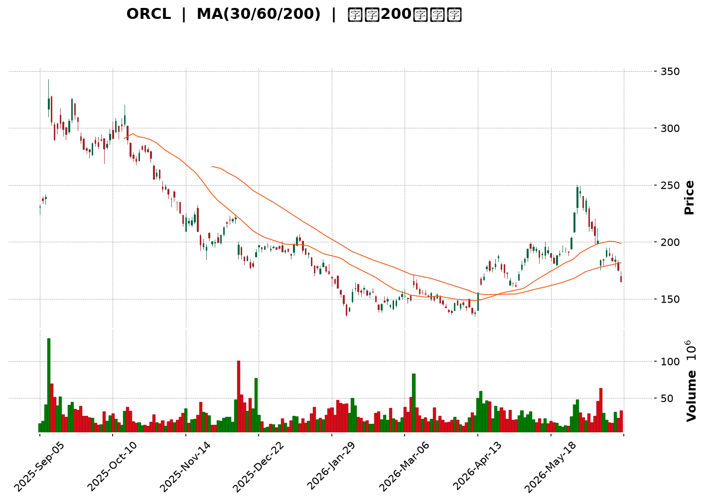
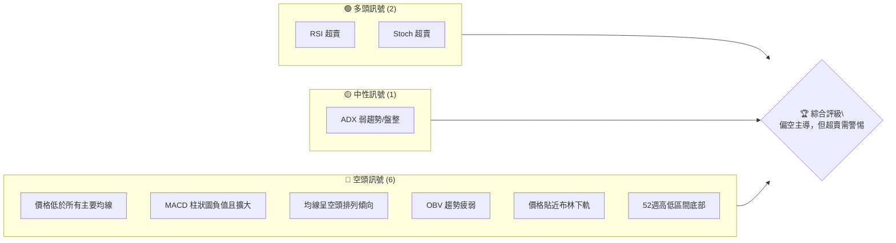
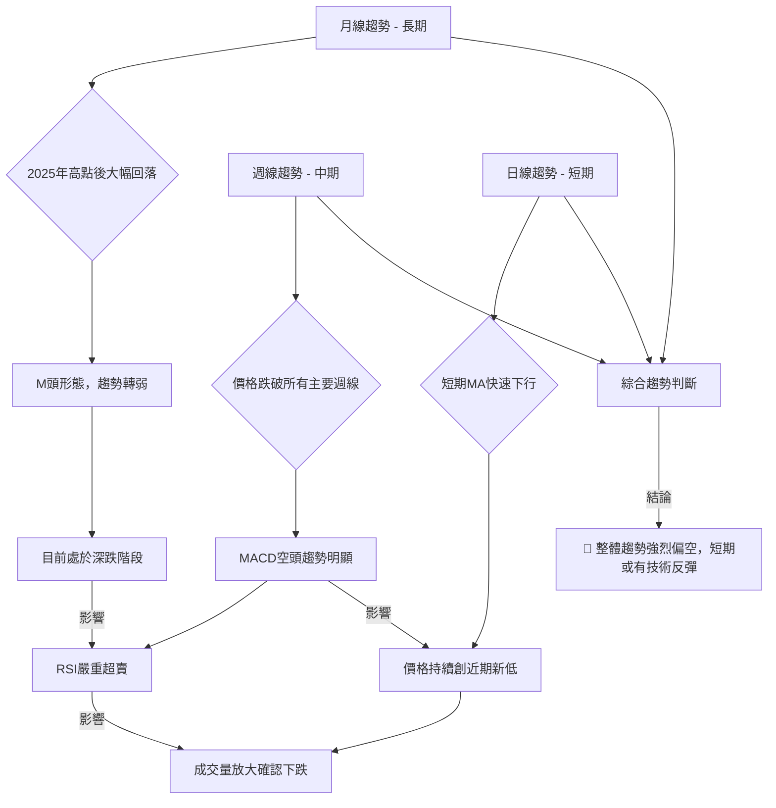
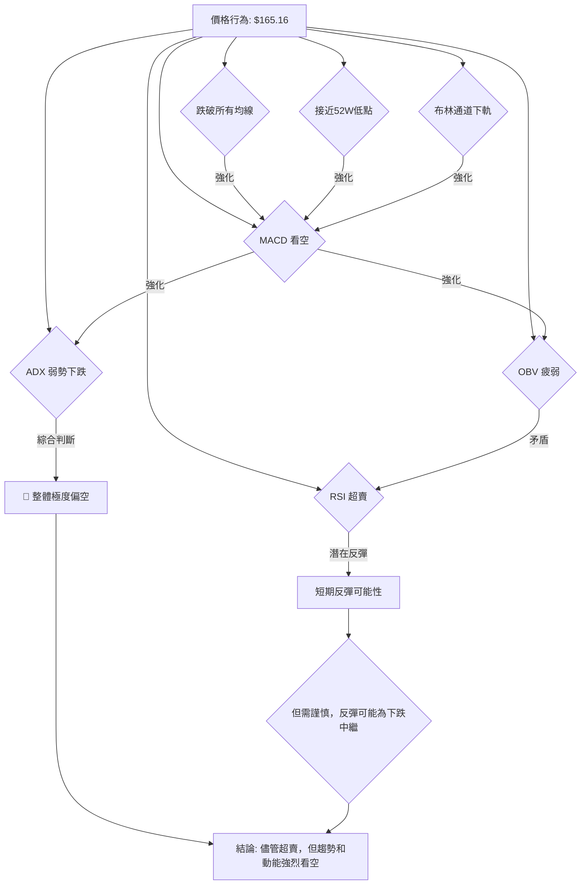

<details>
<summary>📊 靜態圖表 (點擊展開)</summary>

</details>

<html>
<head><meta charset="utf-8" /></head>
<body>
    <div style="height:500px; width:100%;">                        <script>window.PlotlyConfig = {MathJaxConfig: 'local'};</script>
        <script charset="utf-8" src="https://cdn.plot.ly/plotly-3.6.0.min.js" integrity="sha256-QaOVwtVY0T02VaHrr6pnoHLCwayMJp4O5n4YyaE3rJk=" crossorigin="anonymous"></script>                <div id="candlestick-chart" class="plotly-graph-div" style="height:100%; width:100%;"></div>            <script>                window.PLOTLYENV=window.PLOTLYENV || {};                                if (document.getElementById("candlestick-chart")) {                    Plotly.newPlot(                        "candlestick-chart",                        [{"close":{"dtype":"f8","bdata":"AAAAIEbfbEAAAABAnJNtQAAAAMDP821AAAAAQCZcdEAAAACgMRdzQAAAAEBHHnJAAAAAIGS8ckAAAABg\u002fANzQAAAAGDNsHJAAAAAAMNkckAAAADA5CNzQAAAAOBKWXRAAAAAQPd1c0AAAAAAuCBzQAAAAMDIEHJAAAAAoNmTcUAAAAAAvYhxQAAAAMCbcHFAAAAAgPTrcUAAAADgTehxQAAAACBlvnFAAAAAgOkUckAAAACAO6BxQAAAAGDs5XFAAAAAIFdyckAAAAAguzJyQAAAAGAPInNAAAAA4MeSckAAAADAP9xyQAAAAKBpcXNAAAAAAH4YckAAAAAAyzdxQAAAAOCCF3FAAAAAQOrvcEAAAABAwGVxQAAAAICXmXFAAAAAgOZ6cUAAAAAA1nFxQAAAAIDlGXFAAAAAwEXqb0AAAADAGFBwQAAAAABnBHBAAAAAoO\u002fUbkAAAACA\u002fxhvQAAAAGDzSW5AAAAAoI65bUAAAACgfettQAAAAEClVm1AAAAA4FAzbEAAAACgtwdrQAAAACClr2tAAAAAoIxQa0AAAAAglmRrQAAAAIDhBGxAAAAAwOYsakAAAAAgebFoQAAAAODQ4WhAAAAAgHN6aEAAAABgqXZpQAAAAODtFmlAAAAAoM72aEAAAABg5ftoQAAAAIDCzmlAAAAAoKugakAAAADgCAhrQAAAAAAtZmtAAAAAoKmFa0AAAADAu7RrQAAAAABWtGhAAAAAQOmZZ0AAAABATPlmQAAAAMDtb2dAAAAAQNcrZkAAAAAAxl1mQAAAAECF2WdAAAAAQGOlaEAAAACAs0RoQAAAAOAUiWhAAAAA4PuYaEAAAABA+UVoQAAAACAtgGhAAAAAgAY3aEAAAABAeFBoQAAAACA97WdAAAAA4CESaEAAAACgMPVnQAAAAMC7j2dAAAAAwIe6aEAAAADA9n5pQAAAAADAMmlAAAAAAPUdaEAAAABADqZnQAAAAACZzWdAAAAAwGZpZkAAAABgy6hlQAAAAEDqMWZAAAAAoGMRZkAAAADgwrlmQAAAAABSyWVAAAAAwFqGZUAAAAAgfw1lQAAAAOA6gGRAAAAA4BfwY0AAAADANkRjQAAAAMAaRWJAAAAA4CgAYUAAAACAVcphQAAAAKBwgWNAAAAAIKzqY0AAAADgnZNjQAAAAKDufWNAAAAAAKXyY0AAAABA5C1jQAAAAAAMdGNAAAAAYNh\u002fY0AAAABgEXJiQAAAAIAummFAAAAAIDQ0YkAAAABAAmxiQAAAAOAtuWJAAAAAIJscYkAAAACgYJdiQAAAAGC5j2JAAAAAoN76YkAAAABACkhjQAAAAECvDWNAAAAAQArhYkAAAAAgKZxiQAAAACCsUWRAAAAA4GTTY0AAAACgPlJjQAAAAECrbWNAAAAAANpEY0AAAABAxQtjQAAAAMBRX2NAAAAA4BalYkAAAADAsDljQAAAAIB\u002fUmJAAAAAoGAwYkAAAADAA8phQAAAAMCQZWFAAAAAQCRKYUAAAADAIlNiQAAAAGAvF2JAAAAAgNs7YkAAAAAAEiFiQAAAAKB+1WFAAAAAwB7lYUAAAAAghTthQAAAAEDhQmFAAAAAANdzY0AAAAAAAGBkQAAAAIDrOWVAAAAAQOFKZkAAAACA6+FlQAAAAGCPMmZAAAAAoHClZkAAAAAAAHBnQAAAAMD1CGZAAAAAwPWoZUAAAABguJ5lQAAAAGC4vmRAAAAAYI96ZEAAAADgeixkQAAAAGCPemVAAAAAoEeJZkAAAABAMytnQAAAAMD1QGhAAAAAQOFSaEAAAABgZn5oQAAAAEDhOmhAAAAAYI9aZ0AAAADgUbhnQAAAACCFc2hAAAAAYGYeaEAAAAAghVNnQAAAAGC4rmZAAAAAwB6FZ0AAAADgo7hnQAAAAGCPAmhAAAAAgOshaEAAAABguN5nQAAAAGBmdmlAAAAAwPU4bEAAAADAzARvQAAAAGCPkm5AAAAAYI\u002fKbEAAAABA4YptQAAAAIDCtWpAAAAAgD16akAAAACA67lpQAAAAOBRKGlAAAAAQDMDZ0AAAAAAKQRnQAAAAOB6FGhAAAAAYI+KZ0AAAADA9fBmQAAAAKBHCWdAAAAAgD3iZUAAAADAHqVkQA=="},"high":{"dtype":"f8","bdata":"1jSbxA4ZbUCJb8UKtBBuQO2AOAGtMm5AyvWkDzZwdUC58xMKiYZ0QFMnO8DwGHNANdutrgQKc0DxcMH2b9dzQD9rbd\u002fkI3NA3gkeWQ\u002fXckBHXQ1OyUpzQK2y1zS5bnRAqHR5aEkndECSQcNmYGBzQNwuyiqThnJAh2f2eys7ckBR5WDc2rtxQJdR1TxsnHFA\u002fKd7EoP7cUD7dIidkUpyQCxstYhURXJA\u002faZH5LZlckB3YnKjyS5yQFzD5b\u002f1E3JA8\u002fimzhuyckB3AnLfch1zQCK391PWTHNAVJohqPjockB3ZTFfxFFzQGN\u002fAdYeCXRAr4QAp77mckALGxsLk\u002fdxQMtFR2loaXFAoCw7jBw4cUBJTtpS75VxQKkT5Y751nFA49IfB\u002fTTcUB7SGSrdrtxQCMuCSRmfnFAYr\u002fsZ8zBcEDyFOLx+4JwQNtZUn72f3BAmVSmARG3b0B9uOAteFtvQJH\u002fSpKP8W5AzcfxddDdbUCqeL2nW7duQLywr9T9f21AXfJF6qJrbUC9yi8eHflrQNZuQFs5NWxAGlhLBg6ua0DbfijErcprQGyaA2k1WGxAP4Sx8kMSbUCSRu7sNOFpQLUlyIBnUmlA+mgQayXGaED9xAXU9BZqQLANjDxVI2lAGeubCTpIaUBexdo0ag1qQFXkTH7N1GlA59Wf9gTDakChtxRvGUVrQPtOproS7GtAAT5xVlSoa0DBoJ3LM\u002f5rQFz5uMQzGGlAPD3q+oeUaEDApTc8G3pnQBQVvRWBlGdAgrpymYwrZ0AEUgR2NfRmQOMvxmS0PWhAo3pd3L6yaEDqt4mP239oQIeGLPk0omhAUJ5cq63kaEA9hHOEhaloQK+rxTVjpWhA68TIi9t\u002faEAlKi0HEaxoQKFTyA+pDmlAOMMLVhI2aEBbHxZnMk9oQIHZjVQUuWdAIW3KC3fvaEA24ePBMLxpQBjeguZ04mlAE6ZvSUwfaUCmh+XAmUpoQOF32IJ45mdAM7LBVztRZ0CeyqMGFn9mQN\u002ftzgsOcWZAkwCaocpgZkAqhh4MSBVnQBDpaBIGY2ZA8pFMcIahZkCYVj2XZjRlQPy9GRT9CWVAt2txIFVTZUCDDOrVaNpjQLYgdlfvLGNAHLCRQ0dBYkC9UXyKc9ZhQAcYQ0c15mNA44JmTw+aZEBZtMiM5GJkQJSIoiKRz2NAYbYaKoY3ZEDvfeFZONdjQKrlL8gUmGNA2yBUMbvwY0AcTgqfhy5jQKo9YJtcKWJAa6eacvlHYkBspyRy4xdjQAK\u002fEO8D\u002f2JAQLyYXEoyYkACjO4Et7RiQCoqCULzzGJA62kbZWkiY0ConddPfaxjQFnHjL9Z1GNAR2tpNBLvYkB3a+gaUDNjQPC2DagwZWVA415iTt7nZEB+CDH\u002fuwZkQOt8nSUAxmNA\u002ficbhb3LY0CAcNC6x01jQGczfJX2i2NA0RKSlu4WY0DDM2sxnGdjQMoPSdaoK2NA8WUWFjGqYkBeXrAluj5iQCc7155MpmFARlWskqyWYUCctlQbYlxiQCl9fPohpGJAFyUVSsU9YkDpIcgtDoFiQJ3aY5UjAmJAYmWw+9ndYkAAAACgmdlhQAAAAKBwhWFAAAAAwB59Y0AAAADAzCxlQAAAAIDrkWVAAAAA4KOIZkAAAAAAABBnQAAAAOBROGZAAAAAQOEqZ0AAAACAwqVnQAAAAOB6vGZAAAAAYLiWZkAAAACgmbFlQAAAAGBmFmVAAAAA4FGYZEAAAACAwqVkQAAAAKCZyWVAAAAAAADwZkAAAADgo1BnQAAAAKBHSWhAAAAAwMwEaUAAAAAAAMBoQAAAAIDCdWhAAAAAoHAdaEAAAACAPfJnQAAAAGC4FmlAAAAAgMKNaEAAAADgUdhnQAAAAEAKl2dAAAAAQAqHZ0AAAACAPRpoQAAAAAAAoGhAAAAAYGZmaEAAAADgegRoQAAAAAAAoGlAAAAAoEdJbEAAAAAAAEhvQAAAAAAAIG9AAAAA4FEQbkAAAABgZt5tQAAAAIAU7mxAAAAAgOtha0AAAAAAAJBrQAAAACBcj2pAAAAA4KMYZ0AAAABgjzJnQAAAAIA9amhAAAAAgD1qaEAAAACAFMZnQAAAACCuf2dAAAAAYI8SZ0AAAABgj8plQA=="},"hovertemplate":"\u003cb\u003e%{x|%Y-%m-%d}\u003c\u002fb\u003e\u003cbr\u003e\u958b: $%{open:.2f}\u003cbr\u003e\u9ad8: $%{high:.2f}\u003cbr\u003e\u4f4e: $%{low:.2f}\u003cbr\u003e\u6536: $%{close:.2f}\u003cextra\u003e\u003c\u002fextra\u003e","low":{"dtype":"f8","bdata":"oCrvkuIDbEAK0hLy9i5tQGmXbyMnF21AsMTlDlhac0AzFaRLceNyQDEeIMpzF3JAEfUcCWZvckDJA4VWdL5yQIDaJHqFS3JAFO9gqWsbckAmg4LL329yQJrk9rNFCHNA704EmfU5c0A\u002f90EY5ZpyQEe6YAen5HFAWaJ3QIyMcUDe7B+Fu1ZxQKNjYGDWG3FA517y70Q7cUCj1L9M97xxQCcPF0FsnHFATKzK9V4IckDIOlkaDc5wQLL20c4SlnFAvOKxqRbYcUAbnQjEnyNyQD3JAE6+fnJAmK27niUjckDZK7A0gpFyQNRlm8uA03JAN7q5kOfbcUBhPSxIDhpxQN69q8yN6XBApKzULrC5cEDe7kshn+twQGzlq+RqiHFAA0MHp51hcUAF6yWBOW1xQIq8VDEV23BAY5aFBd\u002fWb0BQgrDzi+RvQESD5PZ5tW9AUCITmih2bkAgoH\u002fcrbBuQG6aMQeDum1A\u002fXzZvMndbECeOufg53NtQAzh5J6+b2xAXsBCZzwZbEAVPXj0+bxqQI691ClyL2pAIhGXJcrHakD+hzq0E6ZqQBr4U4hy\u002f2pAS31tY38gakA5CDCNxQtoQBQFf\u002fSfI2hA1EfnI+EPZ0AZwcs3JyBpQHsAd8bljGhAFwg1pfRvaEDnbbQp6dhoQLwUK+nTxWhAZ61KheqhaUBXqwejFopqQOhl\u002f7+58mpA5C6jPEwea0BwwG\u002fvCAhrQKeay032ImdARAEFwwIbZ0AU5x5\u002fWIlmQGT3i0Sf62ZAhVY07KH\u002fZUDxB9ksqC9mQIMic6ESX2dAIYRhUN\u002f0Z0DAr8lbhOBnQB5j9PpwJ2hAV1B48DBdaEA9iU041O5nQLOHJC14UGhAAImy4UwxaEDKh\u002f9MwyBoQDomOEL45GdABce82iCxZ0A0SldnedpnQMPstd5qIGdAWJoHVO+DZ0CNWQvPYIpoQNDXRZnF\u002fmhAooYdNavEZ0Btup79YpdnQBNEF4MvPGdAKZZ1N4tXZkAU8r4kM0BlQJMbWKZX\u002fGVA8IHI\u002ftdsZUBIY9OaEz1mQH0T4YhqomVAUrclDWFoZUAZgEOtph5kQDwkuNR\u002fVWRAkgvtFS7uY0DUuxza4etiQGAkCn6s\u002fWFA5Nur0e\u002fYYEAPJ886pk1hQBcK\u002fsygT2JAGdARKj2NY0CGibo42S5jQJNr5vkD\u002f2JAX25CCPxXY0BEm\u002fkTIgtjQHkO1Dr72mJABqYulEpnY0DZOk+MEFxiQHhuVc1xQ2FA7IU7puhHYUBgd39OeFpiQA9IHj+iFGJAOQa8tl+zYUDkOf82CZZhQDrfqA2r0WFAjgPlG5iSYkBAf6zGHrNiQPy6rhT04mJAjNgGhHM9YkArbfzV3X1iQCGvleusAGRAEoVt7trBY0Ay9ymfoTNjQGx3p4AcP2NAqxffbeceY0DDfzqlWPBiQEycNsjli2JALm42E+xtYkBEik1f78ViQDQvrFfYSmJAVh19fBgDYkDbz8GSZ8FhQI\u002f3xmYyOmFAU7AEvyUPYUBgC+fen2thQJlcatdTBWJAWAFzefl5YUAv+E3PLethQPCKm5d+bmFAROZRa+LMYUAAAAAAAABhQAAAAIA90mBAAAAAQAp3YUAAAACA6zFkQAAAAGC4xmRAAAAAoJm5ZUAAAAAghatlQAAAAOBRsGVAAAAA4FEAZkAAAACgmdlmQAAAAGCPwmVAAAAAoJkZZUAAAADAzPxkQAAAAKCZQWRAAAAAwMwUZEAAAABgjwpkQAAAAMDMxGRAAAAA4FHIZUAAAAAAAGBmQAAAAKBw1WZAAAAAoJnZZ0AAAABguMZnQAAAAEAz02dAAAAAANebZkAAAACA6yFnQAAAAGBmLmdAAAAAwMycZ0AAAADgo+hmQAAAAIDCnWZAAAAAoJlZZkAAAABgZmZnQAAAAEAz42dAAAAAgOvRZ0AAAACgcH1nQAAAAAApLGhAAAAA4FEAakAAAABAMxNsQAAAAEDh2m1AAAAAIIVzbEAAAAAAAABsQAAAAGBmLmpAAAAAYI8qakAAAACgR7loQAAAAIDCxWhAAAAAwPXoZUAAAAAAAGBmQAAAAGC4RmdAAAAAwB51Z0AAAABgj9JmQAAAAGBmNmZAAAAAwMzMZUAAAAAghZNkQA=="},"name":"\u50f9\u683c","open":{"dtype":"f8","bdata":"IzLhKFbXbEDFBlGQYMBtQE\u002fVeRL3wW1AuvdX\u002fQ3Lc0BnX4zUDnx0QKkSZGlV9nJAU3EyqM8Ac0D8mhoennlzQB4r4dp+FHNAj4HGfK3KckAOpwsri4pyQC8MuetKM3NAIxhFemkXdEBUfdlWsVZzQAIAKqVUT3JAa5vTjUsrckCPY\u002fed8qVxQCYG222Al3FAp5IAr99JcUB7YJnmPhhyQGdqKkpS9XFAtFM1CnQhckB3YnKjyS5yQCOEFzH3snFAGOpXF08cckCmHfi\u002fIqdyQN7nkokCjnJABW7mS3TbckDHdleamvByQBsXfmC8+3JA0rFSCVHeckCWyTyM9vJxQD0N+fKURnFAFt6YlkMScUCWbvh+r\u002fRwQOg8a3THwnFAMwj8iB3NcUDAGUUWWJRxQMUdxMTae3FAvR1\u002f7JOxcEBKkXHNzB5wQFvjAIDreXBA6SIpkIAOb0CELcnUqsxuQNryJByfzW5A94s5wkmxbUABjilzVI5uQJZgSJ8wWW1Afo3ICmlpbUDSa6P\u002ftPNrQIs1VqlaMWpA\u002frdUbhIca0AAskCFdtxqQGnb7vgaN2tAZwGqy\u002fC3bEDe6ZFXFrppQHHeB14LdWhAPFbVuaAcaEBq12TYDQdqQPXbrnVTyWhAPJXiI9DoaEB147rcYnxpQCSC5gBo42hAAMwKGOXSaUAWOH5zMjVrQNuLqhjwf2tAfZ83rfRVa0AXZnsKQI5rQBnqp4eVrmdApPIEyHVlaEAMBVKiemRnQAvFzQJN8mZAA5KBtRfGZkDStQ\u002foU7NmQFL\u002fDf+oZ2dAH4SOzcVzaECChWc2XmdoQKBD21XjOWhAm599vzWbaEDYJ84KLB9oQFx+McqZW2hA6AGv0gxnaEC4tdEQcohoQPvOXG0dpGhAu69y6kjsZ0DrLkfqbUNoQP8REXXatmdAIjr0NsbfZ0BOFZJcMZ1oQEFXshsriWlAE6ZvSUwfaUCmh+XAmUpoQJhJriT4p2dAM7LBVztRZ0Ap3NOBv2FmQEcAHtLcV2ZAbetyUZ2AZUBye2LaQE9mQMT96G4fUmZAW7b\u002fTfXJZUAPzSt\u002f2TFlQI3gYsS18mRAFPkrXGdKZUC6TM+ksbZjQB9mcCRXK2NA43CL+fsiYkD\u002f8r2Hb2hhQK3DgHEkf2JAf4IaHS7uY0BZtMiM5GJkQK8tgagrrGNAERIegEPWY0DCaLbKw61jQPoyDk7sO2NA8kmOt5KUY0D1iFnLhhhjQGuvRZ7aJWJAkKcpnTGLYUDf+i3qgZRiQF7VlVa1iGJAFOx0tiLsYUCXHWsrEaRhQCv+ePXgB2JAbzTSyZyvYkBuLPKZ4gFjQHtABaRoDGNAfi0qpZ3FYkAhcWUOuyJjQMs89yyhuWRAJtPxD8iCZEDeW53J4s9jQMTaHO+JcGNAsfW4ncRcY0A8fXP+thtjQOWAxoT2vWJAWGVY6o0QY0C01RJhk9xiQKvGR7\u002f1DmNAqM9yWr2WYkCSQxVVdOxhQErpOUoQjmFAUe1t5a5xYUBXu1xq+XlhQMLZ5nFGkmJA3Wso5A7JYUAc7ruzqF1iQCpdoVvy6GFAraeRTty4YkAAAABgZsZhQAAAAIA9KmFAAAAA4KN4YUAAAACAwv1kQAAAAOB63GRAAAAAoHANZkAAAACAwt1mQAAAAIDrGWZAAAAAQDNLZkAAAACAwkVnQAAAAMDMjGZAAAAA4FGQZkAAAABgj5JlQAAAAMAeRWRAAAAAoEeBZEAAAADgo0BkQAAAAKBwzWRAAAAA4KMAZkAAAAAAKcRmQAAAAGBmRmdAAAAAIIXTaEAAAABgjxJoQAAAAMDMBGhAAAAAoHAdaEAAAADA9aBnQAAAAIDChWdAAAAAIK7PZ0AAAAAAAMBnQAAAAAAAQGdAAAAAgBR+ZkAAAADgUaBnQAAAAKBw9WdAAAAAoJkpaEAAAAAgXO9nQAAAAKBHQWhAAAAAAAAgakAAAAAAANBsQAAAAKCZWW5AAAAAIFwPbkAAAAAAAGBsQAAAACCur2xAAAAAAAA4a0AAAADAHr1qQAAAAAAA0GhAAAAAoHB1ZkAAAADgUSBnQAAAAOB6bGdAAAAA4FHAZ0AAAADAHkVnQAAAAOBR4GZAAAAAgOvJZkAAAAAgXEdlQA=="},"x":["2025-09-05T00:00:00-04:00","2025-09-08T00:00:00-04:00","2025-09-09T00:00:00-04:00","2025-09-10T00:00:00-04:00","2025-09-11T00:00:00-04:00","2025-09-12T00:00:00-04:00","2025-09-15T00:00:00-04:00","2025-09-16T00:00:00-04:00","2025-09-17T00:00:00-04:00","2025-09-18T00:00:00-04:00","2025-09-19T00:00:00-04:00","2025-09-22T00:00:00-04:00","2025-09-23T00:00:00-04:00","2025-09-24T00:00:00-04:00","2025-09-25T00:00:00-04:00","2025-09-26T00:00:00-04:00","2025-09-29T00:00:00-04:00","2025-09-30T00:00:00-04:00","2025-10-01T00:00:00-04:00","2025-10-02T00:00:00-04:00","2025-10-03T00:00:00-04:00","2025-10-06T00:00:00-04:00","2025-10-07T00:00:00-04:00","2025-10-08T00:00:00-04:00","2025-10-09T00:00:00-04:00","2025-10-10T00:00:00-04:00","2025-10-13T00:00:00-04:00","2025-10-14T00:00:00-04:00","2025-10-15T00:00:00-04:00","2025-10-16T00:00:00-04:00","2025-10-17T00:00:00-04:00","2025-10-20T00:00:00-04:00","2025-10-21T00:00:00-04:00","2025-10-22T00:00:00-04:00","2025-10-23T00:00:00-04:00","2025-10-24T00:00:00-04:00","2025-10-27T00:00:00-04:00","2025-10-28T00:00:00-04:00","2025-10-29T00:00:00-04:00","2025-10-30T00:00:00-04:00","2025-10-31T00:00:00-04:00","2025-11-03T00:00:00-05:00","2025-11-04T00:00:00-05:00","2025-11-05T00:00:00-05:00","2025-11-06T00:00:00-05:00","2025-11-07T00:00:00-05:00","2025-11-10T00:00:00-05:00","2025-11-11T00:00:00-05:00","2025-11-12T00:00:00-05:00","2025-11-13T00:00:00-05:00","2025-11-14T00:00:00-05:00","2025-11-17T00:00:00-05:00","2025-11-18T00:00:00-05:00","2025-11-19T00:00:00-05:00","2025-11-20T00:00:00-05:00","2025-11-21T00:00:00-05:00","2025-11-24T00:00:00-05:00","2025-11-25T00:00:00-05:00","2025-11-26T00:00:00-05:00","2025-11-28T00:00:00-05:00","2025-12-01T00:00:00-05:00","2025-12-02T00:00:00-05:00","2025-12-03T00:00:00-05:00","2025-12-04T00:00:00-05:00","2025-12-05T00:00:00-05:00","2025-12-08T00:00:00-05:00","2025-12-09T00:00:00-05:00","2025-12-10T00:00:00-05:00","2025-12-11T00:00:00-05:00","2025-12-12T00:00:00-05:00","2025-12-15T00:00:00-05:00","2025-12-16T00:00:00-05:00","2025-12-17T00:00:00-05:00","2025-12-18T00:00:00-05:00","2025-12-19T00:00:00-05:00","2025-12-22T00:00:00-05:00","2025-12-23T00:00:00-05:00","2025-12-24T00:00:00-05:00","2025-12-26T00:00:00-05:00","2025-12-29T00:00:00-05:00","2025-12-30T00:00:00-05:00","2025-12-31T00:00:00-05:00","2026-01-02T00:00:00-05:00","2026-01-05T00:00:00-05:00","2026-01-06T00:00:00-05:00","2026-01-07T00:00:00-05:00","2026-01-08T00:00:00-05:00","2026-01-09T00:00:00-05:00","2026-01-12T00:00:00-05:00","2026-01-13T00:00:00-05:00","2026-01-14T00:00:00-05:00","2026-01-15T00:00:00-05:00","2026-01-16T00:00:00-05:00","2026-01-20T00:00:00-05:00","2026-01-21T00:00:00-05:00","2026-01-22T00:00:00-05:00","2026-01-23T00:00:00-05:00","2026-01-26T00:00:00-05:00","2026-01-27T00:00:00-05:00","2026-01-28T00:00:00-05:00","2026-01-29T00:00:00-05:00","2026-01-30T00:00:00-05:00","2026-02-02T00:00:00-05:00","2026-02-03T00:00:00-05:00","2026-02-04T00:00:00-05:00","2026-02-05T00:00:00-05:00","2026-02-06T00:00:00-05:00","2026-02-09T00:00:00-05:00","2026-02-10T00:00:00-05:00","2026-02-11T00:00:00-05:00","2026-02-12T00:00:00-05:00","2026-02-13T00:00:00-05:00","2026-02-17T00:00:00-05:00","2026-02-18T00:00:00-05:00","2026-02-19T00:00:00-05:00","2026-02-20T00:00:00-05:00","2026-02-23T00:00:00-05:00","2026-02-24T00:00:00-05:00","2026-02-25T00:00:00-05:00","2026-02-26T00:00:00-05:00","2026-02-27T00:00:00-05:00","2026-03-02T00:00:00-05:00","2026-03-03T00:00:00-05:00","2026-03-04T00:00:00-05:00","2026-03-05T00:00:00-05:00","2026-03-06T00:00:00-05:00","2026-03-09T00:00:00-04:00","2026-03-10T00:00:00-04:00","2026-03-11T00:00:00-04:00","2026-03-12T00:00:00-04:00","2026-03-13T00:00:00-04:00","2026-03-16T00:00:00-04:00","2026-03-17T00:00:00-04:00","2026-03-18T00:00:00-04:00","2026-03-19T00:00:00-04:00","2026-03-20T00:00:00-04:00","2026-03-23T00:00:00-04:00","2026-03-24T00:00:00-04:00","2026-03-25T00:00:00-04:00","2026-03-26T00:00:00-04:00","2026-03-27T00:00:00-04:00","2026-03-30T00:00:00-04:00","2026-03-31T00:00:00-04:00","2026-04-01T00:00:00-04:00","2026-04-02T00:00:00-04:00","2026-04-06T00:00:00-04:00","2026-04-07T00:00:00-04:00","2026-04-08T00:00:00-04:00","2026-04-09T00:00:00-04:00","2026-04-10T00:00:00-04:00","2026-04-13T00:00:00-04:00","2026-04-14T00:00:00-04:00","2026-04-15T00:00:00-04:00","2026-04-16T00:00:00-04:00","2026-04-17T00:00:00-04:00","2026-04-20T00:00:00-04:00","2026-04-21T00:00:00-04:00","2026-04-22T00:00:00-04:00","2026-04-23T00:00:00-04:00","2026-04-24T00:00:00-04:00","2026-04-27T00:00:00-04:00","2026-04-28T00:00:00-04:00","2026-04-29T00:00:00-04:00","2026-04-30T00:00:00-04:00","2026-05-01T00:00:00-04:00","2026-05-04T00:00:00-04:00","2026-05-05T00:00:00-04:00","2026-05-06T00:00:00-04:00","2026-05-07T00:00:00-04:00","2026-05-08T00:00:00-04:00","2026-05-11T00:00:00-04:00","2026-05-12T00:00:00-04:00","2026-05-13T00:00:00-04:00","2026-05-14T00:00:00-04:00","2026-05-15T00:00:00-04:00","2026-05-18T00:00:00-04:00","2026-05-19T00:00:00-04:00","2026-05-20T00:00:00-04:00","2026-05-21T00:00:00-04:00","2026-05-22T00:00:00-04:00","2026-05-26T00:00:00-04:00","2026-05-27T00:00:00-04:00","2026-05-28T00:00:00-04:00","2026-05-29T00:00:00-04:00","2026-06-01T00:00:00-04:00","2026-06-02T00:00:00-04:00","2026-06-03T00:00:00-04:00","2026-06-04T00:00:00-04:00","2026-06-05T00:00:00-04:00","2026-06-08T00:00:00-04:00","2026-06-09T00:00:00-04:00","2026-06-10T00:00:00-04:00","2026-06-11T00:00:00-04:00","2026-06-12T00:00:00-04:00","2026-06-15T00:00:00-04:00","2026-06-16T00:00:00-04:00","2026-06-17T00:00:00-04:00","2026-06-18T00:00:00-04:00","2026-06-22T00:00:00-04:00","2026-06-23T00:00:00-04:00"],"type":"candlestick"},{"hovertemplate":"MA30: $%{y:.2f}\u003cextra\u003e\u003c\u002fextra\u003e","line":{"color":"#2196F3","dash":"dash","width":2},"mode":"lines","name":"MA30","x":["2025-09-05T00:00:00-04:00","2025-09-08T00:00:00-04:00","2025-09-09T00:00:00-04:00","2025-09-10T00:00:00-04:00","2025-09-11T00:00:00-04:00","2025-09-12T00:00:00-04:00","2025-09-15T00:00:00-04:00","2025-09-16T00:00:00-04:00","2025-09-17T00:00:00-04:00","2025-09-18T00:00:00-04:00","2025-09-19T00:00:00-04:00","2025-09-22T00:00:00-04:00","2025-09-23T00:00:00-04:00","2025-09-24T00:00:00-04:00","2025-09-25T00:00:00-04:00","2025-09-26T00:00:00-04:00","2025-09-29T00:00:00-04:00","2025-09-30T00:00:00-04:00","2025-10-01T00:00:00-04:00","2025-10-02T00:00:00-04:00","2025-10-03T00:00:00-04:00","2025-10-06T00:00:00-04:00","2025-10-07T00:00:00-04:00","2025-10-08T00:00:00-04:00","2025-10-09T00:00:00-04:00","2025-10-10T00:00:00-04:00","2025-10-13T00:00:00-04:00","2025-10-14T00:00:00-04:00","2025-10-15T00:00:00-04:00","2025-10-16T00:00:00-04:00","2025-10-17T00:00:00-04:00","2025-10-20T00:00:00-04:00","2025-10-21T00:00:00-04:00","2025-10-22T00:00:00-04:00","2025-10-23T00:00:00-04:00","2025-10-24T00:00:00-04:00","2025-10-27T00:00:00-04:00","2025-10-28T00:00:00-04:00","2025-10-29T00:00:00-04:00","2025-10-30T00:00:00-04:00","2025-10-31T00:00:00-04:00","2025-11-03T00:00:00-05:00","2025-11-04T00:00:00-05:00","2025-11-05T00:00:00-05:00","2025-11-06T00:00:00-05:00","2025-11-07T00:00:00-05:00","2025-11-10T00:00:00-05:00","2025-11-11T00:00:00-05:00","2025-11-12T00:00:00-05:00","2025-11-13T00:00:00-05:00","2025-11-14T00:00:00-05:00","2025-11-17T00:00:00-05:00","2025-11-18T00:00:00-05:00","2025-11-19T00:00:00-05:00","2025-11-20T00:00:00-05:00","2025-11-21T00:00:00-05:00","2025-11-24T00:00:00-05:00","2025-11-25T00:00:00-05:00","2025-11-26T00:00:00-05:00","2025-11-28T00:00:00-05:00","2025-12-01T00:00:00-05:00","2025-12-02T00:00:00-05:00","2025-12-03T00:00:00-05:00","2025-12-04T00:00:00-05:00","2025-12-05T00:00:00-05:00","2025-12-08T00:00:00-05:00","2025-12-09T00:00:00-05:00","2025-12-10T00:00:00-05:00","2025-12-11T00:00:00-05:00","2025-12-12T00:00:00-05:00","2025-12-15T00:00:00-05:00","2025-12-16T00:00:00-05:00","2025-12-17T00:00:00-05:00","2025-12-18T00:00:00-05:00","2025-12-19T00:00:00-05:00","2025-12-22T00:00:00-05:00","2025-12-23T00:00:00-05:00","2025-12-24T00:00:00-05:00","2025-12-26T00:00:00-05:00","2025-12-29T00:00:00-05:00","2025-12-30T00:00:00-05:00","2025-12-31T00:00:00-05:00","2026-01-02T00:00:00-05:00","2026-01-05T00:00:00-05:00","2026-01-06T00:00:00-05:00","2026-01-07T00:00:00-05:00","2026-01-08T00:00:00-05:00","2026-01-09T00:00:00-05:00","2026-01-12T00:00:00-05:00","2026-01-13T00:00:00-05:00","2026-01-14T00:00:00-05:00","2026-01-15T00:00:00-05:00","2026-01-16T00:00:00-05:00","2026-01-20T00:00:00-05:00","2026-01-21T00:00:00-05:00","2026-01-22T00:00:00-05:00","2026-01-23T00:00:00-05:00","2026-01-26T00:00:00-05:00","2026-01-27T00:00:00-05:00","2026-01-28T00:00:00-05:00","2026-01-29T00:00:00-05:00","2026-01-30T00:00:00-05:00","2026-02-02T00:00:00-05:00","2026-02-03T00:00:00-05:00","2026-02-04T00:00:00-05:00","2026-02-05T00:00:00-05:00","2026-02-06T00:00:00-05:00","2026-02-09T00:00:00-05:00","2026-02-10T00:00:00-05:00","2026-02-11T00:00:00-05:00","2026-02-12T00:00:00-05:00","2026-02-13T00:00:00-05:00","2026-02-17T00:00:00-05:00","2026-02-18T00:00:00-05:00","2026-02-19T00:00:00-05:00","2026-02-20T00:00:00-05:00","2026-02-23T00:00:00-05:00","2026-02-24T00:00:00-05:00","2026-02-25T00:00:00-05:00","2026-02-26T00:00:00-05:00","2026-02-27T00:00:00-05:00","2026-03-02T00:00:00-05:00","2026-03-03T00:00:00-05:00","2026-03-04T00:00:00-05:00","2026-03-05T00:00:00-05:00","2026-03-06T00:00:00-05:00","2026-03-09T00:00:00-04:00","2026-03-10T00:00:00-04:00","2026-03-11T00:00:00-04:00","2026-03-12T00:00:00-04:00","2026-03-13T00:00:00-04:00","2026-03-16T00:00:00-04:00","2026-03-17T00:00:00-04:00","2026-03-18T00:00:00-04:00","2026-03-19T00:00:00-04:00","2026-03-20T00:00:00-04:00","2026-03-23T00:00:00-04:00","2026-03-24T00:00:00-04:00","2026-03-25T00:00:00-04:00","2026-03-26T00:00:00-04:00","2026-03-27T00:00:00-04:00","2026-03-30T00:00:00-04:00","2026-03-31T00:00:00-04:00","2026-04-01T00:00:00-04:00","2026-04-02T00:00:00-04:00","2026-04-06T00:00:00-04:00","2026-04-07T00:00:00-04:00","2026-04-08T00:00:00-04:00","2026-04-09T00:00:00-04:00","2026-04-10T00:00:00-04:00","2026-04-13T00:00:00-04:00","2026-04-14T00:00:00-04:00","2026-04-15T00:00:00-04:00","2026-04-16T00:00:00-04:00","2026-04-17T00:00:00-04:00","2026-04-20T00:00:00-04:00","2026-04-21T00:00:00-04:00","2026-04-22T00:00:00-04:00","2026-04-23T00:00:00-04:00","2026-04-24T00:00:00-04:00","2026-04-27T00:00:00-04:00","2026-04-28T00:00:00-04:00","2026-04-29T00:00:00-04:00","2026-04-30T00:00:00-04:00","2026-05-01T00:00:00-04:00","2026-05-04T00:00:00-04:00","2026-05-05T00:00:00-04:00","2026-05-06T00:00:00-04:00","2026-05-07T00:00:00-04:00","2026-05-08T00:00:00-04:00","2026-05-11T00:00:00-04:00","2026-05-12T00:00:00-04:00","2026-05-13T00:00:00-04:00","2026-05-14T00:00:00-04:00","2026-05-15T00:00:00-04:00","2026-05-18T00:00:00-04:00","2026-05-19T00:00:00-04:00","2026-05-20T00:00:00-04:00","2026-05-21T00:00:00-04:00","2026-05-22T00:00:00-04:00","2026-05-26T00:00:00-04:00","2026-05-27T00:00:00-04:00","2026-05-28T00:00:00-04:00","2026-05-29T00:00:00-04:00","2026-06-01T00:00:00-04:00","2026-06-02T00:00:00-04:00","2026-06-03T00:00:00-04:00","2026-06-04T00:00:00-04:00","2026-06-05T00:00:00-04:00","2026-06-08T00:00:00-04:00","2026-06-09T00:00:00-04:00","2026-06-10T00:00:00-04:00","2026-06-11T00:00:00-04:00","2026-06-12T00:00:00-04:00","2026-06-15T00:00:00-04:00","2026-06-16T00:00:00-04:00","2026-06-17T00:00:00-04:00","2026-06-18T00:00:00-04:00","2026-06-22T00:00:00-04:00","2026-06-23T00:00:00-04:00"],"y":{"dtype":"f8","bdata":"AAAAAAAA+H8AAAAAAAD4fwAAAAAAAPh\u002fAAAAAAAA+H8AAAAAAAD4fwAAAAAAAPh\u002fAAAAAAAA+H8AAAAAAAD4fwAAAAAAAPh\u002fAAAAAAAA+H8AAAAAAAD4fwAAAAAAAPh\u002fAAAAAAAA+H8AAAAAAAD4fwAAAAAAAPh\u002fAAAAAAAA+H8AAAAAAAD4fwAAAAAAAPh\u002fAAAAAAAA+H8AAAAAAAD4fwAAAAAAAPh\u002fAAAAAAAA+H8AAAAAAAD4fwAAAAAAAPh\u002fAAAAAAAA+H8AAAAAAAD4fwAAAAAAAPh\u002fAAAAAAAA+H8AAAAAAAD4fzMzM0vNK3JAq6qqygdLckC8u7trw19yQO\u002fu7h7RcXJAvLu765tUckBVVVU1KUZyQDMzM\u002fO8QXJAAAAAkAU3ckAiIiLinSlyQO\u002fu7p4NHHJAREREBEQHckDe3d2dI+9xQGZmZhYtynFA7+7u1qincUBmZmZuHolxQBERESExcHFAIiIi2gVZcUAiIiJyDkNxQAAAAOBpK3FAVVVVvc0KcUCJiIh4UuVwQJqZmVEJxHBAVVVVJUiecECamZkhwHxwQAAAAFiRW3BAVVVVjdYtcEBVVVVVz\u002fdvQJqZmYmZhW9A7+7u\u002fn4Zb0CrqqrK5rBuQCIiIvIrO25AIiIiol3bbUDNzMyctYptQHd3d+c7Q21AVVVVNWUFbUDNzMx8JcNsQKuqqlqUgGxAVVVVtRtBbEDv7u5uzwNsQAAAAADDsmtAvLu7+9Bra0AiIiICdBlrQDMzMzMX0GpAzczM\u002fC+GakAiIiISrjtqQHd3d3e7BGpAAAAAsGTZaUAAAADAKqlpQImIiHgugGlAd3d3529haUDv7u6O6UlpQEREROS6LmlAzczMfEcUaUCamZk5AvpoQImIiFgW12hAmpmZ2SDFaECrqqoq2r5oQCIiIjKVs2hAERERAbi1aECamZnZ\u002frVoQBEREUHstmhAzczMzLGvaEAzMzPDTKRoQHd3d8cxk2hAREREBDhvaEAiIiKiYEFoQCIiIgL4FGhAREREJG3mZ0ARERFh7btnQImIiNgGo2dAVVVV5U6RZ0AREREx6oBnQCIiIrLbZ2dAiYiIyMxUZ0AzMzMTWTpnQM3MzOy7CmdA7+7uPn7JZkCJiIjYNpJmQImIiPhKZ2ZAERERYVk\u002fZkBERERERRdmQDMzM3OH7GVAzczMzB3IZUARERERTJxlQDMzM8MfdmVAAAAAUB1PZUDNzMy8EyBlQCIiIrI57WRA3t3dPYy1ZEAiIiLCLnlkQHd3dyfuQWRAzczMbK8OZEARERGBh+NjQJqZmdnMtmNAvLu7C4SZY0B3d3dXOYVjQDMzM5NqamNAVVVVZTRPY0C8u7urFSxjQERERCSQH2NAq6qqehARY0AAAAAQSgJjQERERCQj+WJAERER4W3zYkCrqqo6jPFiQGZmZnb0+mJAVVVVZfwIY0C8u7srOxVjQBEREREiC2NAERER0WP8YkAiIiLyIu1iQDMzM\u002fNB22JA3t3d\u002fZLEYkBmZmZGSL1iQCIiIlKnsWJAAAAAoNqmYkAiIiJyJ6RiQFVVVZUhpmJAzczMvH6jYkDv7u5uWJliQJqZmWnejGJAd3d3V0+YYkCrqqrah6diQCIiIkJFvmJAzczMnInaYkCamZnJu\u002fBiQO\u002fu7g6QC2NAq6qqmrUrY0Dv7u5u51RjQFVVVQWMY2NAvLu7+zJzY0BERESk0IZjQAAAANAMkmNAiYiIqF+cY0AAAABQ\u002f6VjQFVVVdX4t2NAiYiIqC3ZY0BEREQk1PpjQO\u002fu7q5xLWRA3t3dTcthZECrqqrKAZtkQGZmZkZR1WRARERElBAJZUDv7u6uGjdlQO\u002fu7s5hbWVAMzMzo5mfZUDv7u7O8stlQJqZmZlS9WVAmpmZmVIlZkDe3d19sVxmQM3MzFxIlmZAq6qq+je+ZkDNzMzsCtxmQHd3dycxAGdAAAAAcMsyZ0ARERHhwYBnQImIiFg5yGdA3t3dTan8Z0ARERHhwTBoQCIiIpKmWGhAAAAAkMKBaEDNzMzMzKRoQM3MzAx0ymhAzczMHBPgaEBmZmamVPhoQKuqqiqHDmlAAAAAoBoXaUBERESkKRVpQImIiPjFCmlAZmZmtvP1aEDe3d39G9VoQA=="},"type":"scatter"},{"hovertemplate":"MA60: $%{y:.2f}\u003cextra\u003e\u003c\u002fextra\u003e","line":{"color":"#9C27B0","dash":"dash","width":2},"mode":"lines","name":"MA60","x":["2025-09-05T00:00:00-04:00","2025-09-08T00:00:00-04:00","2025-09-09T00:00:00-04:00","2025-09-10T00:00:00-04:00","2025-09-11T00:00:00-04:00","2025-09-12T00:00:00-04:00","2025-09-15T00:00:00-04:00","2025-09-16T00:00:00-04:00","2025-09-17T00:00:00-04:00","2025-09-18T00:00:00-04:00","2025-09-19T00:00:00-04:00","2025-09-22T00:00:00-04:00","2025-09-23T00:00:00-04:00","2025-09-24T00:00:00-04:00","2025-09-25T00:00:00-04:00","2025-09-26T00:00:00-04:00","2025-09-29T00:00:00-04:00","2025-09-30T00:00:00-04:00","2025-10-01T00:00:00-04:00","2025-10-02T00:00:00-04:00","2025-10-03T00:00:00-04:00","2025-10-06T00:00:00-04:00","2025-10-07T00:00:00-04:00","2025-10-08T00:00:00-04:00","2025-10-09T00:00:00-04:00","2025-10-10T00:00:00-04:00","2025-10-13T00:00:00-04:00","2025-10-14T00:00:00-04:00","2025-10-15T00:00:00-04:00","2025-10-16T00:00:00-04:00","2025-10-17T00:00:00-04:00","2025-10-20T00:00:00-04:00","2025-10-21T00:00:00-04:00","2025-10-22T00:00:00-04:00","2025-10-23T00:00:00-04:00","2025-10-24T00:00:00-04:00","2025-10-27T00:00:00-04:00","2025-10-28T00:00:00-04:00","2025-10-29T00:00:00-04:00","2025-10-30T00:00:00-04:00","2025-10-31T00:00:00-04:00","2025-11-03T00:00:00-05:00","2025-11-04T00:00:00-05:00","2025-11-05T00:00:00-05:00","2025-11-06T00:00:00-05:00","2025-11-07T00:00:00-05:00","2025-11-10T00:00:00-05:00","2025-11-11T00:00:00-05:00","2025-11-12T00:00:00-05:00","2025-11-13T00:00:00-05:00","2025-11-14T00:00:00-05:00","2025-11-17T00:00:00-05:00","2025-11-18T00:00:00-05:00","2025-11-19T00:00:00-05:00","2025-11-20T00:00:00-05:00","2025-11-21T00:00:00-05:00","2025-11-24T00:00:00-05:00","2025-11-25T00:00:00-05:00","2025-11-26T00:00:00-05:00","2025-11-28T00:00:00-05:00","2025-12-01T00:00:00-05:00","2025-12-02T00:00:00-05:00","2025-12-03T00:00:00-05:00","2025-12-04T00:00:00-05:00","2025-12-05T00:00:00-05:00","2025-12-08T00:00:00-05:00","2025-12-09T00:00:00-05:00","2025-12-10T00:00:00-05:00","2025-12-11T00:00:00-05:00","2025-12-12T00:00:00-05:00","2025-12-15T00:00:00-05:00","2025-12-16T00:00:00-05:00","2025-12-17T00:00:00-05:00","2025-12-18T00:00:00-05:00","2025-12-19T00:00:00-05:00","2025-12-22T00:00:00-05:00","2025-12-23T00:00:00-05:00","2025-12-24T00:00:00-05:00","2025-12-26T00:00:00-05:00","2025-12-29T00:00:00-05:00","2025-12-30T00:00:00-05:00","2025-12-31T00:00:00-05:00","2026-01-02T00:00:00-05:00","2026-01-05T00:00:00-05:00","2026-01-06T00:00:00-05:00","2026-01-07T00:00:00-05:00","2026-01-08T00:00:00-05:00","2026-01-09T00:00:00-05:00","2026-01-12T00:00:00-05:00","2026-01-13T00:00:00-05:00","2026-01-14T00:00:00-05:00","2026-01-15T00:00:00-05:00","2026-01-16T00:00:00-05:00","2026-01-20T00:00:00-05:00","2026-01-21T00:00:00-05:00","2026-01-22T00:00:00-05:00","2026-01-23T00:00:00-05:00","2026-01-26T00:00:00-05:00","2026-01-27T00:00:00-05:00","2026-01-28T00:00:00-05:00","2026-01-29T00:00:00-05:00","2026-01-30T00:00:00-05:00","2026-02-02T00:00:00-05:00","2026-02-03T00:00:00-05:00","2026-02-04T00:00:00-05:00","2026-02-05T00:00:00-05:00","2026-02-06T00:00:00-05:00","2026-02-09T00:00:00-05:00","2026-02-10T00:00:00-05:00","2026-02-11T00:00:00-05:00","2026-02-12T00:00:00-05:00","2026-02-13T00:00:00-05:00","2026-02-17T00:00:00-05:00","2026-02-18T00:00:00-05:00","2026-02-19T00:00:00-05:00","2026-02-20T00:00:00-05:00","2026-02-23T00:00:00-05:00","2026-02-24T00:00:00-05:00","2026-02-25T00:00:00-05:00","2026-02-26T00:00:00-05:00","2026-02-27T00:00:00-05:00","2026-03-02T00:00:00-05:00","2026-03-03T00:00:00-05:00","2026-03-04T00:00:00-05:00","2026-03-05T00:00:00-05:00","2026-03-06T00:00:00-05:00","2026-03-09T00:00:00-04:00","2026-03-10T00:00:00-04:00","2026-03-11T00:00:00-04:00","2026-03-12T00:00:00-04:00","2026-03-13T00:00:00-04:00","2026-03-16T00:00:00-04:00","2026-03-17T00:00:00-04:00","2026-03-18T00:00:00-04:00","2026-03-19T00:00:00-04:00","2026-03-20T00:00:00-04:00","2026-03-23T00:00:00-04:00","2026-03-24T00:00:00-04:00","2026-03-25T00:00:00-04:00","2026-03-26T00:00:00-04:00","2026-03-27T00:00:00-04:00","2026-03-30T00:00:00-04:00","2026-03-31T00:00:00-04:00","2026-04-01T00:00:00-04:00","2026-04-02T00:00:00-04:00","2026-04-06T00:00:00-04:00","2026-04-07T00:00:00-04:00","2026-04-08T00:00:00-04:00","2026-04-09T00:00:00-04:00","2026-04-10T00:00:00-04:00","2026-04-13T00:00:00-04:00","2026-04-14T00:00:00-04:00","2026-04-15T00:00:00-04:00","2026-04-16T00:00:00-04:00","2026-04-17T00:00:00-04:00","2026-04-20T00:00:00-04:00","2026-04-21T00:00:00-04:00","2026-04-22T00:00:00-04:00","2026-04-23T00:00:00-04:00","2026-04-24T00:00:00-04:00","2026-04-27T00:00:00-04:00","2026-04-28T00:00:00-04:00","2026-04-29T00:00:00-04:00","2026-04-30T00:00:00-04:00","2026-05-01T00:00:00-04:00","2026-05-04T00:00:00-04:00","2026-05-05T00:00:00-04:00","2026-05-06T00:00:00-04:00","2026-05-07T00:00:00-04:00","2026-05-08T00:00:00-04:00","2026-05-11T00:00:00-04:00","2026-05-12T00:00:00-04:00","2026-05-13T00:00:00-04:00","2026-05-14T00:00:00-04:00","2026-05-15T00:00:00-04:00","2026-05-18T00:00:00-04:00","2026-05-19T00:00:00-04:00","2026-05-20T00:00:00-04:00","2026-05-21T00:00:00-04:00","2026-05-22T00:00:00-04:00","2026-05-26T00:00:00-04:00","2026-05-27T00:00:00-04:00","2026-05-28T00:00:00-04:00","2026-05-29T00:00:00-04:00","2026-06-01T00:00:00-04:00","2026-06-02T00:00:00-04:00","2026-06-03T00:00:00-04:00","2026-06-04T00:00:00-04:00","2026-06-05T00:00:00-04:00","2026-06-08T00:00:00-04:00","2026-06-09T00:00:00-04:00","2026-06-10T00:00:00-04:00","2026-06-11T00:00:00-04:00","2026-06-12T00:00:00-04:00","2026-06-15T00:00:00-04:00","2026-06-16T00:00:00-04:00","2026-06-17T00:00:00-04:00","2026-06-18T00:00:00-04:00","2026-06-22T00:00:00-04:00","2026-06-23T00:00:00-04:00"],"y":{"dtype":"f8","bdata":"AAAAAAAA+H8AAAAAAAD4fwAAAAAAAPh\u002fAAAAAAAA+H8AAAAAAAD4fwAAAAAAAPh\u002fAAAAAAAA+H8AAAAAAAD4fwAAAAAAAPh\u002fAAAAAAAA+H8AAAAAAAD4fwAAAAAAAPh\u002fAAAAAAAA+H8AAAAAAAD4fwAAAAAAAPh\u002fAAAAAAAA+H8AAAAAAAD4fwAAAAAAAPh\u002fAAAAAAAA+H8AAAAAAAD4fwAAAAAAAPh\u002fAAAAAAAA+H8AAAAAAAD4fwAAAAAAAPh\u002fAAAAAAAA+H8AAAAAAAD4fwAAAAAAAPh\u002fAAAAAAAA+H8AAAAAAAD4fwAAAAAAAPh\u002fAAAAAAAA+H8AAAAAAAD4fwAAAAAAAPh\u002fAAAAAAAA+H8AAAAAAAD4fwAAAAAAAPh\u002fAAAAAAAA+H8AAAAAAAD4fwAAAAAAAPh\u002fAAAAAAAA+H8AAAAAAAD4fwAAAAAAAPh\u002fAAAAAAAA+H8AAAAAAAD4fwAAAAAAAPh\u002fAAAAAAAA+H8AAAAAAAD4fwAAAAAAAPh\u002fAAAAAAAA+H8AAAAAAAD4fwAAAAAAAPh\u002fAAAAAAAA+H8AAAAAAAD4fwAAAAAAAPh\u002fAAAAAAAA+H8AAAAAAAD4fwAAAAAAAPh\u002fAAAAAAAA+H8AAAAAAAD4fyIiIqKxpHBA3t3dTVuccEAREREdj5JwQFVVVYm3iXBAMzMzQ6drcEDe3d353VNwQERERJADQXBAVVVVtckrcEDNzMzMwhVwQO\u002fu7h5v9W9AIiIigiy9b0Dv7u6e3XtvQAAAALA4Mm9AVVVV1cDqbkB3d3d39aZuQM3MzNyOcm5AIiIiMrhFbkAiIiLSoxduQERERByB621AERERsYW7bUAAAABAR4ptQLy7u8NmW21AvLu742sobUBmZmY+wflsQERERIQcx2xAIiIi+maQbEAAAADAVFtsQN7d3V2XHGxAAAAAgJvna0AiIiLScrNrQJqZmRkMeWtAd3d3t4dFa0AAAAAwgRdrQHd3d9c262pAzczMnE66akB3d3cPQ4JqQGZmZi7GSmpAzczMbMQTakAAAABo3t9pQEREROzkqmlAiYiI8I9+aUCamZkZL01pQKuqqnL5G2lAq6qqYn7taECrqqqSA7toQCIiIrK7h2hAd3d3d3FRaEBERETMsB1oQImIiLi882dAREREpGTQZ0CamZlpl7BnQLy7uyuhjWdAzczMpDJuZ0BVVVUlJ0tnQN7d3Q2bJmdAzczMFB8KZ0C8u7vzdu9mQCIiInJn0GZAd3d3H6K1ZkDe3d3NlpdmQERERDRtfGZAzczMnDBfZkAiIiIi6kNmQImIiFD\u002fJGZAAAAACF4EZkDNzMz8TONlQKuqqkqxv2VAzczMxNCaZUBmZmaGAXRlQGZmZn5LYWVAAAAAsC9RZUCJiIggmkFlQDMzM2t\u002fMGVAzczMVB0kZUDv7u6m8hVlQJqZmTHYAmVAIiIiUj3pZEAiIiICudNkQM3MzIQ2uWRAERERmd6dZEAzMzMbNIJkQDMzM7PkY2RAVVVVZVhGZEC8u7sryixkQKuqqorjE2RAAAAA+Pv6Y0B3d3eXHeJjQLy7u6OtyWNAVVVVfYWsY0CJiIiYQ4ljQImIiEhmZ2NAIiIiYn9TY0De3d2th0VjQN7d3Q2JOmNARERE1AY6Y0CJiIiQ+jpjQBEREVH9OmNAAAAAAHU9Y0BVVVWNfkBjQM3MzBSOQWNAMzMzuyFCY0AiIiJajURjQCIiIvqXRWNAzczMxOZHY0BVVVXFxUtjQN7d3aV2WWNA7+7uBhVxY0AAAACoB4hjQAAAAOBJnGNAd3d3jxevY0BmZmZeEsRjQM3MzJxJ2GNAERERydHmY0Crqqp6MfpjQImIiJCED2RAmpmZITojZECJiIggDThkQHd3dxe6TWRAMzMzq2hkZEBmZmb2BHtkQDMzM2OTkWRAERERqUOrZEC8u7tjycFkQM3MzDQ732RAZmZmhqoGZUBVVVXVvjhlQLy7u7PkaWVAREREdC+UZUAAAACo1MJlQLy7u0sZ3mVA3t3dxXr6ZUCJiIi4zhVmQGZmZm5ALmZAq6qqYjk+ZkAzMzP7KU9mQAAAAABAY2ZAREREJCR4ZkBERETk\u002fodmQLy7u9MbnGZAIiIigt+rZkBERETkDrhmQA=="},"type":"scatter"},{"hovertemplate":"MA200: $%{y:.2f}\u003cextra\u003e\u003c\u002fextra\u003e","line":{"color":"#FF6F00","dash":"solid","width":2},"mode":"lines","name":"MA200","x":["2025-09-05T00:00:00-04:00","2025-09-08T00:00:00-04:00","2025-09-09T00:00:00-04:00","2025-09-10T00:00:00-04:00","2025-09-11T00:00:00-04:00","2025-09-12T00:00:00-04:00","2025-09-15T00:00:00-04:00","2025-09-16T00:00:00-04:00","2025-09-17T00:00:00-04:00","2025-09-18T00:00:00-04:00","2025-09-19T00:00:00-04:00","2025-09-22T00:00:00-04:00","2025-09-23T00:00:00-04:00","2025-09-24T00:00:00-04:00","2025-09-25T00:00:00-04:00","2025-09-26T00:00:00-04:00","2025-09-29T00:00:00-04:00","2025-09-30T00:00:00-04:00","2025-10-01T00:00:00-04:00","2025-10-02T00:00:00-04:00","2025-10-03T00:00:00-04:00","2025-10-06T00:00:00-04:00","2025-10-07T00:00:00-04:00","2025-10-08T00:00:00-04:00","2025-10-09T00:00:00-04:00","2025-10-10T00:00:00-04:00","2025-10-13T00:00:00-04:00","2025-10-14T00:00:00-04:00","2025-10-15T00:00:00-04:00","2025-10-16T00:00:00-04:00","2025-10-17T00:00:00-04:00","2025-10-20T00:00:00-04:00","2025-10-21T00:00:00-04:00","2025-10-22T00:00:00-04:00","2025-10-23T00:00:00-04:00","2025-10-24T00:00:00-04:00","2025-10-27T00:00:00-04:00","2025-10-28T00:00:00-04:00","2025-10-29T00:00:00-04:00","2025-10-30T00:00:00-04:00","2025-10-31T00:00:00-04:00","2025-11-03T00:00:00-05:00","2025-11-04T00:00:00-05:00","2025-11-05T00:00:00-05:00","2025-11-06T00:00:00-05:00","2025-11-07T00:00:00-05:00","2025-11-10T00:00:00-05:00","2025-11-11T00:00:00-05:00","2025-11-12T00:00:00-05:00","2025-11-13T00:00:00-05:00","2025-11-14T00:00:00-05:00","2025-11-17T00:00:00-05:00","2025-11-18T00:00:00-05:00","2025-11-19T00:00:00-05:00","2025-11-20T00:00:00-05:00","2025-11-21T00:00:00-05:00","2025-11-24T00:00:00-05:00","2025-11-25T00:00:00-05:00","2025-11-26T00:00:00-05:00","2025-11-28T00:00:00-05:00","2025-12-01T00:00:00-05:00","2025-12-02T00:00:00-05:00","2025-12-03T00:00:00-05:00","2025-12-04T00:00:00-05:00","2025-12-05T00:00:00-05:00","2025-12-08T00:00:00-05:00","2025-12-09T00:00:00-05:00","2025-12-10T00:00:00-05:00","2025-12-11T00:00:00-05:00","2025-12-12T00:00:00-05:00","2025-12-15T00:00:00-05:00","2025-12-16T00:00:00-05:00","2025-12-17T00:00:00-05:00","2025-12-18T00:00:00-05:00","2025-12-19T00:00:00-05:00","2025-12-22T00:00:00-05:00","2025-12-23T00:00:00-05:00","2025-12-24T00:00:00-05:00","2025-12-26T00:00:00-05:00","2025-12-29T00:00:00-05:00","2025-12-30T00:00:00-05:00","2025-12-31T00:00:00-05:00","2026-01-02T00:00:00-05:00","2026-01-05T00:00:00-05:00","2026-01-06T00:00:00-05:00","2026-01-07T00:00:00-05:00","2026-01-08T00:00:00-05:00","2026-01-09T00:00:00-05:00","2026-01-12T00:00:00-05:00","2026-01-13T00:00:00-05:00","2026-01-14T00:00:00-05:00","2026-01-15T00:00:00-05:00","2026-01-16T00:00:00-05:00","2026-01-20T00:00:00-05:00","2026-01-21T00:00:00-05:00","2026-01-22T00:00:00-05:00","2026-01-23T00:00:00-05:00","2026-01-26T00:00:00-05:00","2026-01-27T00:00:00-05:00","2026-01-28T00:00:00-05:00","2026-01-29T00:00:00-05:00","2026-01-30T00:00:00-05:00","2026-02-02T00:00:00-05:00","2026-02-03T00:00:00-05:00","2026-02-04T00:00:00-05:00","2026-02-05T00:00:00-05:00","2026-02-06T00:00:00-05:00","2026-02-09T00:00:00-05:00","2026-02-10T00:00:00-05:00","2026-02-11T00:00:00-05:00","2026-02-12T00:00:00-05:00","2026-02-13T00:00:00-05:00","2026-02-17T00:00:00-05:00","2026-02-18T00:00:00-05:00","2026-02-19T00:00:00-05:00","2026-02-20T00:00:00-05:00","2026-02-23T00:00:00-05:00","2026-02-24T00:00:00-05:00","2026-02-25T00:00:00-05:00","2026-02-26T00:00:00-05:00","2026-02-27T00:00:00-05:00","2026-03-02T00:00:00-05:00","2026-03-03T00:00:00-05:00","2026-03-04T00:00:00-05:00","2026-03-05T00:00:00-05:00","2026-03-06T00:00:00-05:00","2026-03-09T00:00:00-04:00","2026-03-10T00:00:00-04:00","2026-03-11T00:00:00-04:00","2026-03-12T00:00:00-04:00","2026-03-13T00:00:00-04:00","2026-03-16T00:00:00-04:00","2026-03-17T00:00:00-04:00","2026-03-18T00:00:00-04:00","2026-03-19T00:00:00-04:00","2026-03-20T00:00:00-04:00","2026-03-23T00:00:00-04:00","2026-03-24T00:00:00-04:00","2026-03-25T00:00:00-04:00","2026-03-26T00:00:00-04:00","2026-03-27T00:00:00-04:00","2026-03-30T00:00:00-04:00","2026-03-31T00:00:00-04:00","2026-04-01T00:00:00-04:00","2026-04-02T00:00:00-04:00","2026-04-06T00:00:00-04:00","2026-04-07T00:00:00-04:00","2026-04-08T00:00:00-04:00","2026-04-09T00:00:00-04:00","2026-04-10T00:00:00-04:00","2026-04-13T00:00:00-04:00","2026-04-14T00:00:00-04:00","2026-04-15T00:00:00-04:00","2026-04-16T00:00:00-04:00","2026-04-17T00:00:00-04:00","2026-04-20T00:00:00-04:00","2026-04-21T00:00:00-04:00","2026-04-22T00:00:00-04:00","2026-04-23T00:00:00-04:00","2026-04-24T00:00:00-04:00","2026-04-27T00:00:00-04:00","2026-04-28T00:00:00-04:00","2026-04-29T00:00:00-04:00","2026-04-30T00:00:00-04:00","2026-05-01T00:00:00-04:00","2026-05-04T00:00:00-04:00","2026-05-05T00:00:00-04:00","2026-05-06T00:00:00-04:00","2026-05-07T00:00:00-04:00","2026-05-08T00:00:00-04:00","2026-05-11T00:00:00-04:00","2026-05-12T00:00:00-04:00","2026-05-13T00:00:00-04:00","2026-05-14T00:00:00-04:00","2026-05-15T00:00:00-04:00","2026-05-18T00:00:00-04:00","2026-05-19T00:00:00-04:00","2026-05-20T00:00:00-04:00","2026-05-21T00:00:00-04:00","2026-05-22T00:00:00-04:00","2026-05-26T00:00:00-04:00","2026-05-27T00:00:00-04:00","2026-05-28T00:00:00-04:00","2026-05-29T00:00:00-04:00","2026-06-01T00:00:00-04:00","2026-06-02T00:00:00-04:00","2026-06-03T00:00:00-04:00","2026-06-04T00:00:00-04:00","2026-06-05T00:00:00-04:00","2026-06-08T00:00:00-04:00","2026-06-09T00:00:00-04:00","2026-06-10T00:00:00-04:00","2026-06-11T00:00:00-04:00","2026-06-12T00:00:00-04:00","2026-06-15T00:00:00-04:00","2026-06-16T00:00:00-04:00","2026-06-17T00:00:00-04:00","2026-06-18T00:00:00-04:00","2026-06-22T00:00:00-04:00","2026-06-23T00:00:00-04:00"],"y":{"dtype":"f8","bdata":"AAAAAAAA+H8AAAAAAAD4fwAAAAAAAPh\u002fAAAAAAAA+H8AAAAAAAD4fwAAAAAAAPh\u002fAAAAAAAA+H8AAAAAAAD4fwAAAAAAAPh\u002fAAAAAAAA+H8AAAAAAAD4fwAAAAAAAPh\u002fAAAAAAAA+H8AAAAAAAD4fwAAAAAAAPh\u002fAAAAAAAA+H8AAAAAAAD4fwAAAAAAAPh\u002fAAAAAAAA+H8AAAAAAAD4fwAAAAAAAPh\u002fAAAAAAAA+H8AAAAAAAD4fwAAAAAAAPh\u002fAAAAAAAA+H8AAAAAAAD4fwAAAAAAAPh\u002fAAAAAAAA+H8AAAAAAAD4fwAAAAAAAPh\u002fAAAAAAAA+H8AAAAAAAD4fwAAAAAAAPh\u002fAAAAAAAA+H8AAAAAAAD4fwAAAAAAAPh\u002fAAAAAAAA+H8AAAAAAAD4fwAAAAAAAPh\u002fAAAAAAAA+H8AAAAAAAD4fwAAAAAAAPh\u002fAAAAAAAA+H8AAAAAAAD4fwAAAAAAAPh\u002fAAAAAAAA+H8AAAAAAAD4fwAAAAAAAPh\u002fAAAAAAAA+H8AAAAAAAD4fwAAAAAAAPh\u002fAAAAAAAA+H8AAAAAAAD4fwAAAAAAAPh\u002fAAAAAAAA+H8AAAAAAAD4fwAAAAAAAPh\u002fAAAAAAAA+H8AAAAAAAD4fwAAAAAAAPh\u002fAAAAAAAA+H8AAAAAAAD4fwAAAAAAAPh\u002fAAAAAAAA+H8AAAAAAAD4fwAAAAAAAPh\u002fAAAAAAAA+H8AAAAAAAD4fwAAAAAAAPh\u002fAAAAAAAA+H8AAAAAAAD4fwAAAAAAAPh\u002fAAAAAAAA+H8AAAAAAAD4fwAAAAAAAPh\u002fAAAAAAAA+H8AAAAAAAD4fwAAAAAAAPh\u002fAAAAAAAA+H8AAAAAAAD4fwAAAAAAAPh\u002fAAAAAAAA+H8AAAAAAAD4fwAAAAAAAPh\u002fAAAAAAAA+H8AAAAAAAD4fwAAAAAAAPh\u002fAAAAAAAA+H8AAAAAAAD4fwAAAAAAAPh\u002fAAAAAAAA+H8AAAAAAAD4fwAAAAAAAPh\u002fAAAAAAAA+H8AAAAAAAD4fwAAAAAAAPh\u002fAAAAAAAA+H8AAAAAAAD4fwAAAAAAAPh\u002fAAAAAAAA+H8AAAAAAAD4fwAAAAAAAPh\u002fAAAAAAAA+H8AAAAAAAD4fwAAAAAAAPh\u002fAAAAAAAA+H8AAAAAAAD4fwAAAAAAAPh\u002fAAAAAAAA+H8AAAAAAAD4fwAAAAAAAPh\u002fAAAAAAAA+H8AAAAAAAD4fwAAAAAAAPh\u002fAAAAAAAA+H8AAAAAAAD4fwAAAAAAAPh\u002fAAAAAAAA+H8AAAAAAAD4fwAAAAAAAPh\u002fAAAAAAAA+H8AAAAAAAD4fwAAAAAAAPh\u002fAAAAAAAA+H8AAAAAAAD4fwAAAAAAAPh\u002fAAAAAAAA+H8AAAAAAAD4fwAAAAAAAPh\u002fAAAAAAAA+H8AAAAAAAD4fwAAAAAAAPh\u002fAAAAAAAA+H8AAAAAAAD4fwAAAAAAAPh\u002fAAAAAAAA+H8AAAAAAAD4fwAAAAAAAPh\u002fAAAAAAAA+H8AAAAAAAD4fwAAAAAAAPh\u002fAAAAAAAA+H8AAAAAAAD4fwAAAAAAAPh\u002fAAAAAAAA+H8AAAAAAAD4fwAAAAAAAPh\u002fAAAAAAAA+H8AAAAAAAD4fwAAAAAAAPh\u002fAAAAAAAA+H8AAAAAAAD4fwAAAAAAAPh\u002fAAAAAAAA+H8AAAAAAAD4fwAAAAAAAPh\u002fAAAAAAAA+H8AAAAAAAD4fwAAAAAAAPh\u002fAAAAAAAA+H8AAAAAAAD4fwAAAAAAAPh\u002fAAAAAAAA+H8AAAAAAAD4fwAAAAAAAPh\u002fAAAAAAAA+H8AAAAAAAD4fwAAAAAAAPh\u002fAAAAAAAA+H8AAAAAAAD4fwAAAAAAAPh\u002fAAAAAAAA+H8AAAAAAAD4fwAAAAAAAPh\u002fAAAAAAAA+H8AAAAAAAD4fwAAAAAAAPh\u002fAAAAAAAA+H8AAAAAAAD4fwAAAAAAAPh\u002fAAAAAAAA+H8AAAAAAAD4fwAAAAAAAPh\u002fAAAAAAAA+H8AAAAAAAD4fwAAAAAAAPh\u002fAAAAAAAA+H8AAAAAAAD4fwAAAAAAAPh\u002fAAAAAAAA+H8AAAAAAAD4fwAAAAAAAPh\u002fAAAAAAAA+H8AAAAAAAD4fwAAAAAAAPh\u002fAAAAAAAA+H8AAAAAAAD4fwAAAAAAAPh\u002fAAAAAAAA+H9mZmZeDXFpQA=="},"type":"scatter"}],                        {"template":{"data":{"barpolar":[{"marker":{"line":{"color":"rgb(17,17,17)","width":0.5},"pattern":{"fillmode":"overlay","size":10,"solidity":0.2}},"type":"barpolar"}],"bar":[{"error_x":{"color":"#f2f5fa"},"error_y":{"color":"#f2f5fa"},"marker":{"line":{"color":"rgb(17,17,17)","width":0.5},"pattern":{"fillmode":"overlay","size":10,"solidity":0.2}},"type":"bar"}],"carpet":[{"aaxis":{"endlinecolor":"#A2B1C6","gridcolor":"#506784","linecolor":"#506784","minorgridcolor":"#506784","startlinecolor":"#A2B1C6"},"baxis":{"endlinecolor":"#A2B1C6","gridcolor":"#506784","linecolor":"#506784","minorgridcolor":"#506784","startlinecolor":"#A2B1C6"},"type":"carpet"}],"choropleth":[{"colorbar":{"outlinewidth":0,"ticks":""},"type":"choropleth"}],"contourcarpet":[{"colorbar":{"outlinewidth":0,"ticks":""},"type":"contourcarpet"}],"contour":[{"colorbar":{"outlinewidth":0,"ticks":""},"colorscale":[[0.0,"#0d0887"],[0.1111111111111111,"#46039f"],[0.2222222222222222,"#7201a8"],[0.3333333333333333,"#9c179e"],[0.4444444444444444,"#bd3786"],[0.5555555555555556,"#d8576b"],[0.6666666666666666,"#ed7953"],[0.7777777777777778,"#fb9f3a"],[0.8888888888888888,"#fdca26"],[1.0,"#f0f921"]],"type":"contour"}],"heatmap":[{"colorbar":{"outlinewidth":0,"ticks":""},"colorscale":[[0.0,"#0d0887"],[0.1111111111111111,"#46039f"],[0.2222222222222222,"#7201a8"],[0.3333333333333333,"#9c179e"],[0.4444444444444444,"#bd3786"],[0.5555555555555556,"#d8576b"],[0.6666666666666666,"#ed7953"],[0.7777777777777778,"#fb9f3a"],[0.8888888888888888,"#fdca26"],[1.0,"#f0f921"]],"type":"heatmap"}],"histogram2dcontour":[{"colorbar":{"outlinewidth":0,"ticks":""},"colorscale":[[0.0,"#0d0887"],[0.1111111111111111,"#46039f"],[0.2222222222222222,"#7201a8"],[0.3333333333333333,"#9c179e"],[0.4444444444444444,"#bd3786"],[0.5555555555555556,"#d8576b"],[0.6666666666666666,"#ed7953"],[0.7777777777777778,"#fb9f3a"],[0.8888888888888888,"#fdca26"],[1.0,"#f0f921"]],"type":"histogram2dcontour"}],"histogram2d":[{"colorbar":{"outlinewidth":0,"ticks":""},"colorscale":[[0.0,"#0d0887"],[0.1111111111111111,"#46039f"],[0.2222222222222222,"#7201a8"],[0.3333333333333333,"#9c179e"],[0.4444444444444444,"#bd3786"],[0.5555555555555556,"#d8576b"],[0.6666666666666666,"#ed7953"],[0.7777777777777778,"#fb9f3a"],[0.8888888888888888,"#fdca26"],[1.0,"#f0f921"]],"type":"histogram2d"}],"histogram":[{"marker":{"pattern":{"fillmode":"overlay","size":10,"solidity":0.2}},"type":"histogram"}],"mesh3d":[{"colorbar":{"outlinewidth":0,"ticks":""},"type":"mesh3d"}],"parcoords":[{"line":{"colorbar":{"outlinewidth":0,"ticks":""}},"type":"parcoords"}],"pie":[{"automargin":true,"type":"pie"}],"scatter3d":[{"line":{"colorbar":{"outlinewidth":0,"ticks":""}},"marker":{"colorbar":{"outlinewidth":0,"ticks":""}},"type":"scatter3d"}],"scattercarpet":[{"marker":{"colorbar":{"outlinewidth":0,"ticks":""}},"type":"scattercarpet"}],"scattergeo":[{"marker":{"colorbar":{"outlinewidth":0,"ticks":""}},"type":"scattergeo"}],"scattergl":[{"marker":{"line":{"color":"#283442"}},"type":"scattergl"}],"scattermapbox":[{"marker":{"colorbar":{"outlinewidth":0,"ticks":""}},"type":"scattermapbox"}],"scattermap":[{"marker":{"colorbar":{"outlinewidth":0,"ticks":""}},"type":"scattermap"}],"scatterpolargl":[{"marker":{"colorbar":{"outlinewidth":0,"ticks":""}},"type":"scatterpolargl"}],"scatterpolar":[{"marker":{"colorbar":{"outlinewidth":0,"ticks":""}},"type":"scatterpolar"}],"scatter":[{"marker":{"line":{"color":"#283442"}},"type":"scatter"}],"scatterternary":[{"marker":{"colorbar":{"outlinewidth":0,"ticks":""}},"type":"scatterternary"}],"surface":[{"colorbar":{"outlinewidth":0,"ticks":""},"colorscale":[[0.0,"#0d0887"],[0.1111111111111111,"#46039f"],[0.2222222222222222,"#7201a8"],[0.3333333333333333,"#9c179e"],[0.4444444444444444,"#bd3786"],[0.5555555555555556,"#d8576b"],[0.6666666666666666,"#ed7953"],[0.7777777777777778,"#fb9f3a"],[0.8888888888888888,"#fdca26"],[1.0,"#f0f921"]],"type":"surface"}],"table":[{"cells":{"fill":{"color":"#506784"},"line":{"color":"rgb(17,17,17)"}},"header":{"fill":{"color":"#2a3f5f"},"line":{"color":"rgb(17,17,17)"}},"type":"table"}]},"layout":{"annotationdefaults":{"arrowcolor":"#f2f5fa","arrowhead":0,"arrowwidth":1},"autotypenumbers":"strict","coloraxis":{"colorbar":{"outlinewidth":0,"ticks":""}},"colorscale":{"diverging":[[0,"#8e0152"],[0.1,"#c51b7d"],[0.2,"#de77ae"],[0.3,"#f1b6da"],[0.4,"#fde0ef"],[0.5,"#f7f7f7"],[0.6,"#e6f5d0"],[0.7,"#b8e186"],[0.8,"#7fbc41"],[0.9,"#4d9221"],[1,"#276419"]],"sequential":[[0.0,"#0d0887"],[0.1111111111111111,"#46039f"],[0.2222222222222222,"#7201a8"],[0.3333333333333333,"#9c179e"],[0.4444444444444444,"#bd3786"],[0.5555555555555556,"#d8576b"],[0.6666666666666666,"#ed7953"],[0.7777777777777778,"#fb9f3a"],[0.8888888888888888,"#fdca26"],[1.0,"#f0f921"]],"sequentialminus":[[0.0,"#0d0887"],[0.1111111111111111,"#46039f"],[0.2222222222222222,"#7201a8"],[0.3333333333333333,"#9c179e"],[0.4444444444444444,"#bd3786"],[0.5555555555555556,"#d8576b"],[0.6666666666666666,"#ed7953"],[0.7777777777777778,"#fb9f3a"],[0.8888888888888888,"#fdca26"],[1.0,"#f0f921"]]},"colorway":["#636efa","#EF553B","#00cc96","#ab63fa","#FFA15A","#19d3f3","#FF6692","#B6E880","#FF97FF","#FECB52"],"font":{"color":"#f2f5fa"},"geo":{"bgcolor":"rgb(17,17,17)","lakecolor":"rgb(17,17,17)","landcolor":"rgb(17,17,17)","showlakes":true,"showland":true,"subunitcolor":"#506784"},"hoverlabel":{"align":"left"},"hovermode":"closest","mapbox":{"style":"dark"},"paper_bgcolor":"rgb(17,17,17)","plot_bgcolor":"rgb(17,17,17)","polar":{"angularaxis":{"gridcolor":"#506784","linecolor":"#506784","ticks":""},"bgcolor":"rgb(17,17,17)","radialaxis":{"gridcolor":"#506784","linecolor":"#506784","ticks":""}},"scene":{"xaxis":{"backgroundcolor":"rgb(17,17,17)","gridcolor":"#506784","gridwidth":2,"linecolor":"#506784","showbackground":true,"ticks":"","zerolinecolor":"#C8D4E3"},"yaxis":{"backgroundcolor":"rgb(17,17,17)","gridcolor":"#506784","gridwidth":2,"linecolor":"#506784","showbackground":true,"ticks":"","zerolinecolor":"#C8D4E3"},"zaxis":{"backgroundcolor":"rgb(17,17,17)","gridcolor":"#506784","gridwidth":2,"linecolor":"#506784","showbackground":true,"ticks":"","zerolinecolor":"#C8D4E3"}},"shapedefaults":{"line":{"color":"#f2f5fa"}},"sliderdefaults":{"bgcolor":"#C8D4E3","bordercolor":"rgb(17,17,17)","borderwidth":1,"tickwidth":0},"ternary":{"aaxis":{"gridcolor":"#506784","linecolor":"#506784","ticks":""},"baxis":{"gridcolor":"#506784","linecolor":"#506784","ticks":""},"bgcolor":"rgb(17,17,17)","caxis":{"gridcolor":"#506784","linecolor":"#506784","ticks":""}},"title":{"x":0.05},"updatemenudefaults":{"bgcolor":"#506784","borderwidth":0},"xaxis":{"automargin":true,"gridcolor":"#283442","linecolor":"#506784","ticks":"","title":{"standoff":15},"zerolinecolor":"#283442","zerolinewidth":2},"yaxis":{"automargin":true,"gridcolor":"#283442","linecolor":"#506784","ticks":"","title":{"standoff":15},"zerolinecolor":"#283442","zerolinewidth":2}}},"xaxis":{"rangeslider":{"visible":false},"title":{"text":"\u65e5\u671f"}},"font":{"size":11},"title":{"text":"ORCL  |  MA(30\u002f60\u002f200)  |  \u6700\u8fd1200\u4ea4\u6613\u65e5"},"yaxis":{"title":{"text":"\u80a1\u50f9 (USD)"}},"hovermode":"x unified","height":500},                        {"responsive": true}                    )                };            </script>        </div>
</body>
</html>

# ORCL 技術分析報告

> **報告日期**：2026-06-24 ｜ **語言**：繁體中文 ｜ **數據來源**：提供資料 ｜ **當前價格**：$165.16

---

## 目錄

| 章節 | 內容 |
|------|------|
| [1. 技術面概覽](#1-技術面概覽) | 訊號儀表板、核心指標、評分卡 |
| [2. 趨勢分析](#2-趨勢分析) | 多時框趨勢、長中短期走勢 |
| [3. 圖表形態分析](#3-圖表形態分析) | 形態識別、K線組合、目標價 |
| [4. 支撐與阻力](#4-支撐與阻力) | 關鍵價位、斐波那契回調 |
| [5. 技術指標深度解讀](#5-技術指標深度解讀) | MA/RSI/MACD/布林/成交量 |
| [6. 動能與波動率](#6-動能與波動率) | 動能評估、ATR、Beta |
| [7. 多時框架總結](#7-多時框架總結) | 時框架評分矩陣 |
| [8. 交易策略建議](#8-交易策略建議) | 多空策略、風險報酬比 |
| [9. 風險提示與監控](#9-風險提示與監控) | 監控指標、風險場景 |

---

## 1. 技術面概覽

本章節提供 ORCL 技術面的即時快照，透過視覺化儀表板、核心指標速覽及專業評分卡，讓投資者迅速掌握當前市場狀況與潛在交易訊號。當前 ORCL 股價為 $165.16，正處於一個關鍵的技術節點。

### 🎯 技術訊號儀表板

ORCL 當前技術訊號呈現明顯的空頭主導格局，儘管存在超賣訊號，但整體趨勢與動能均指向下方。



**解讀**：目前多頭訊號主要來自於技術性超賣（RSI和Stochastics），這通常預示著短期內可能出現技術性反彈。然而，空頭訊號數量明顯佔優，包括價格跌破所有主要移動平均線、MACD指標的強力看空表現、疲弱的成交量以及價格接近布林通道下軌和52週低點。ADX顯示當前趨勢較弱，但負向DI佔優，表明市場由空頭主導。綜合來看，儘管短期有反彈潛力，但中期和長期趨勢均顯示出強烈的下行壓力。

### 📊 核心指標速覽表

以下表格匯總了 ORCL 當前最重要的技術指標數據及其訊號解讀。

| 指標類別 | 指標名稱 | 當前數值 | 訊號 | 解讀 |
|----------|----------|----------|------|------|
| **價格** | 當前價格 | $165.16 | 🔴 | 位於52週區間底部14.7%，接近低點 |
| **均線** | MA20 | $203.14 | 🔴 | 價格遠低於MA20，短期趨勢強烈看空 |
| **均線** | MA50 | $189.67 | 🔴 | 價格遠低於MA50，中期趨勢看空 |
| **均線** | MA200 | $203.53 | 🔴 | 價格遠低於MA200，長期趨勢看空 |
| **動能** | RSI(14) | 13.91 | 🟢 | 嚴重超賣 (<30)，存在技術性反彈需求 |
| **動能** | MACD | -4.637 | 🔴 | MACD線位於訊號線下方並持續擴大負值，空頭動能強勁 |
| **波動** | ATR(14) | $13.96 | 🟡 | 波動率較高 (佔價格8.46%)，顯示近期價格變動劇烈 |
| **趨勢** | ADX(14) | 22.72 | 🟡 | 趨勢強度較弱 (<25)，但空頭DI佔優，偏向弱勢下跌趨勢 |
| **布林** | BB %B | 0.10 | 🔴 | 價格貼近布林下軌，顯示短期極端弱勢 |
| **成交量** | OBV趨勢 | OBV < MA | 🔴 | 量能疲弱，未確認價格上漲，下跌量能佔優 |

### 🏆 技術評分卡

根據上述指標分析，對 ORCL 的技術面進行綜合評分。

```
╔══════════════════════════════════════════════════════════════╗
║                技術評分卡 — ORCL (2026-06-24)                  ║
╠══════════════════════════════════════════════════════════════╣
║ 趨勢強度      ███████░░░░░░░░░░░░░  35/100  🔴 (弱勢下跌趨勢)  ║
║ 動能指標      ██████░░░░░░░░░░░░░░  30/100  🔴 (空頭動能強勁，RSI超賣) ║
║ 支撐穩定度    ████████░░░░░░░░░░░░  40/100  🟡 (接近關鍵支撐，但破位風險高) ║
║ 成交量配合    ████░░░░░░░░░░░░░░░░  20/100  🔴 (量能疲弱，下跌放量) ║
║ 形態完整度    ███████░░░░░░░░░░░░░  35/100  🔴 (M頭形態已確認，目標價達成) ║
║ 均線排列      ████░░░░░░░░░░░░░░░░  20/100  🔴 (價格在所有均線下方，空頭排列) ║
╠══════════════════════════════════════════════════════════════╣
║ 綜合評分      ██████░░░░░░░░░░░░░░  30/100  🔴 (強烈看空，但短期有反彈需求) ║
╚══════════════════════════════════════════════════════════════╝
```

**評分總結**：ORCL 的技術評分極低，綜合評分為 30/100，顯示出強烈的看空趨勢。所有核心技術面向（趨勢、動能、均線、成交量）均呈現負面訊號，支撐穩定度亦面臨嚴峻考驗。儘管RSI和Stochastics發出超賣訊號，可能引發技術性反彈，但這並未改變其整體偏空的結構。投資者應極度謹慎，並密切關注關鍵支撐位的表現。

---

## 2. 趨勢分析

本章將從多時框架角度深入剖析 ORCL 的價格趨勢，從長期月線到短期日線，全面評估其走勢方向與強度。

### 🌐 多時框趨勢分析

ORCL 的多時框架趨勢分析顯示，短期、中期、長期均處於下行壓力。



**解讀**：從長期月線來看，ORCL 在2025年9月達到 $279.04 的歷史高點後，經歷了一波大幅回落。雖然在2026年5月有過一次反彈至 $225.78，但未能突破前高，形成潛在的M頭形態。隨後股價在2026年6月出現斷崖式下跌，目前已回落至接近歷史低點的水平。中期週線圖顯示，股價已明確跌破所有重要的移動平均線，MACD指標呈現強烈的空頭排列，儘管RSI處於超賣區域，但並未形成明顯的底背離，這表明下跌動能依然強勁。短期日線圖則呈現出價格快速下行，短期移動平均線迅速向下發散，且在下跌過程中伴隨成交量放大，進一步確認了空頭趨勢的持續性。綜合而言，ORCL 在所有時框架下均面臨巨大的賣壓，整體趨勢極為悲觀。

### 📈 長期趨勢 — 12個月走勢圖（Unicode）

以下是 ORCL 過去12個月的月線收盤價走勢圖，標註了關鍵的高低點。

```
ORCL 月線走勢圖（過去12個月）
價格軸 ($)
$279.04 ┤                                         ●(2025-09 高點)
$251.78 ┤                      ●
$225.78 ┤                                       ●(2026-05 高點)
$216.46 ┤                  ●
$200.72 ┤                           ●
$193.72 ┤                             ●
$184.29 ┤                                                 ●
$167.77 ┤            ●
$165.16 ┤                                                 ●←現在 (2026-06)
$164.01 ┤                               ●
$163.82 ┤          ●
$137.93 ┤        ●(2025-03 低點)
$134.57 ┤                                                   ●(52W 低點)
       └──────────────────────────────────────────────────────────
        25-07 25-08 25-09 25-10 25-11 25-12 26-01 26-02 26-03 26-04 26-05 26-06
```

**走勢特徵分析表格**：

| 時間區間 | 起始價 | 結束價 | 漲跌幅 | 走勢特徵 |
|----------|--------|--------|--------|----------|
| 2025-06 至 2025-09 | $216.46 | $279.04 | +28.91% | 強勁上漲，創歷史新高，動能充沛。 |
| 2025-09 至 2026-02 | $279.04 | $144.89 | -48.08% | 急速下跌，回吐所有漲幅，空頭力量強大。 |
| 2026-02 至 2026-05 | $144.89 | $225.78 | +55.83% | 強勢反彈，但未能突破2025年高點，形成次級高點。 |
| 2026-05 至 2026-06 | $225.78 | $165.16 | -26.85% | 再次急劇下跌，確認 M 頭形態，跌勢凶猛。 |

**解讀**：過去12個月 ORCL 的股價走勢呈現出劇烈的波動。在2025年中達到頂峰後，經歷了一波深度的調整，隨後雖然有一次強勁的反彈，但未能創出新高，最終在2026年6月再次遭受重創，股價大幅下挫，接近52週低點。這種「高點-深跌-反彈-深跌」的模式，暗示市場對其未來前景存在較大分歧，且賣壓在關鍵時刻佔據上風。

### 📊 中期趨勢（週線分析）

從週線圖來看，ORCL 近期的壓力與支撐結構如下圖所示，顯示當前價格正處於下行通道中，並面臨多重阻力。

```
ORCL 週線壓力與支撐示意圖
═══════════════════════════════════════════════════
$225.78 ║                     ● (5月高點，強阻力)
$203.14 ║           ---MA20--- (下行阻力)
$189.67 ║         --MA50-- (下行阻力)
$184.13 ║       ● (近期週線高點，阻力)
$165.16 ╠════════════════════════╣ ◄ 現價
$155.97 ║▓▓▓▓▓▓▓▓▓▓▓▓▓▓▓▓▓▓▓▓▓▓▓▓║ (布林下軌，近期支撐)
$144.89 ║▓▓▓▓▓▓▓▓▓▓▓▓▓▓▓▓▓▓▓▓▓▓▓▓║ (2月低點，重要支撐)
═══════════════════════════════════════════════════
```

**解讀**：中期週線趨勢明顯偏空。當前價格 $165.16 遠低於所有重要的移動平均線，包括 MA20 ($203.14)、MA50 ($189.67) 和 MA200 ($203.53)。這些均線目前都呈現向下發散或混合排列但整體偏空。近期股價在 $225.78 形成一個明顯的阻力位，隨後迅速跌破 $184.13 的近期週線高點，該價位現在已轉變為新的阻力。布林通道下軌 $155.97 提供了一線喘息的機會，但若此支撐被有效跌破，則 $144.89 (2026年2月低點) 將成為下一個關鍵支撐位。整體而言，中期趨勢預示著進一步下跌的風險。

### ⚡ 趨勢強度評估（ADX 解讀）

ADX 指標用於衡量趨勢的強度，而非方向。ORCL 當前的 ADX 數值及其分項指標提供了關於趨勢性質的見解。

```mermaid
graph TD
    A[ADX(14) 值: 22.72] --> B{趨勢強度判斷}
    B -- ADX < 25 --> C[趨勢較弱 或 盤整行情]
    C -- 但: -DI (34.61) > +DI (19.96) --> D[空頭力量主導]
    D -- 結合價格走勢 --> E[🔴 處於弱勢下跌趨勢]
    E --> F[表明市場缺乏強勁單邊走勢，但空頭佔優]
```

**ADX 強度對照表**：

| ADX 數值 | 趨勢強度 | 市場狀態 |
|----------|----------|----------|
| 0-25     | 弱趨勢/盤整 | 市場缺乏明確方向，或為底部盤整區 |
| 25-50    | 中等趨勢 | 趨勢明顯，適合順勢交易 |
| 50-75    | 強趨勢 | 趨勢非常強勁，動能十足 |
| 75-100   | 極強趨勢 | 極端強勢或弱勢，可能過度延伸 |

**解讀**：ORCL 的 ADX(14) 數值為 22.72，位於 0-25 區間，這通常表示市場處於弱趨勢或盤整狀態。然而，我們不能孤立地看待 ADX。重要的是要觀察 +DI 和 -DI 的相對位置。目前 -DI (34.61) 顯著高於 +DI (19.96)，這表明儘管整體趨勢強度不高，但空頭力量在市場中佔據主導地位。換句話說，這不是一個強勢的單邊下跌趨勢，而是一個由賣方持續施壓，買方力量不足以扭轉局面的弱勢下跌趨勢。這意味著股價可能會以震盪下跌的方式運行，而非快速暴跌，但方向依然向下。

---

## 3. 圖表形態分析

本章將識別 ORCL 股價走勢中可能存在的圖表形態，並分析其蘊含的市場意義與潛在的目標價。

### 🔍 形態識別系統

根據月線走勢圖，ORCL 的價格走勢呈現出一個明顯的頂部反轉形態。

```mermaid
graph TD
    A[ORCL 價格走勢] --> B{識別潛在反轉形態}
    B --> C[2025-09 高點: $279.04]
    B --> D[2025-12 低點: $193.72 (頸線潛在位置)]
    B --> E[2026-05 次高點: $225.78]
    C & D & E --> F[確認形態: M頭 (雙重頂)]
    F --> G[形態特徵: 第二個頂部較低，顯示買盤力量減弱]
    G --> H[確認跌破頸線，啟動下跌趨勢]
```

**解讀**：ORCL 的月線走勢圖在2025年9月和2026年5月形成了兩個高點，分別是 $279.04 和 $225.78。第二個高點明顯低於第一個高點，這是典型的看跌訊號，暗示多頭動能減弱。在兩個高點之間，股價在2025年12月曾回落至 $193.72，這可以被視為 M 頭形態的潛在頸線。當前價格 $165.16 已經顯著跌破了這個頸線，確認了 M 頭頂部反轉形態的形成，預示著股價將進一步下跌。

### 🕯️ 重要K線形態分析

根據近20週的收盤數據，我們可以觀察到一些關鍵的K線形態，這些形態共同描繪了市場情緒的轉變。

| 月份 (週) | 收盤價 | RSI | MACD柱 | 週成交量 | K線形態 (根據收盤價變化推斷) | 解讀 | 訊號 |
|-----------|--------|-----|--------|----------|-------------------------------|------|------|
| 2026-05-31| $225.78| 68.5| +1.723 | 91,404,200 | 長陽線 (從低點反彈) | 強勁反彈，但為M頭次高點 | 🟡 |
| 2026-06-07| $213.68| 58.0| +2.139 | 151,343,200| 陰線 (下跌，但MACD柱仍正) | 反彈受阻，出現獲利回吐 | 🟡 |
| 2026-06-14| $184.13| 47.1| -5.242 | 182,617,000| 大陰線 (實體長，跌幅大) | 趨勢反轉確認，跌破關鍵支撐 | 🔴 |
| 2026-06-21| $184.29| 32.2| -5.120 | 85,268,100 | 小實體線 (盤整或猶豫) | 短暫止跌，但動能仍弱，可能為下跌中繼 | 🟡 |
| 2026-06-28| $165.16| 13.9| -5.867 | 56,141,100 | 大陰線 (實體長，跌幅大) | 再次破位下跌，空頭強勢主導 | 🔴 |

**解讀**：2026年5月31日當週，ORCL 股價強勁反彈至 $225.78，形成一個短期高點。然而，隨後的幾週市場情緒迅速惡化。6月14日當週出現一根強勁的大陰線，跌破了之前反彈的重要支撐，且MACD柱狀圖轉為顯著負值，確認了反轉。儘管6月21日當週出現了小實體線，暗示短暫的猶豫或止跌，但隨後6月28日當週（當前數據）再次出現一根大陰線，並伴隨著MACD柱狀圖負值進一步擴大和RSI跌入極度超賣區間，這表明空頭力量重新主導市場，並加速下跌。這種K線組合清晰地描繪了從反彈失敗到加速下跌的過程。

### 📉 ASCII 走勢形態示意圖

以下是 ORCL 月線 M 頭形態的示意圖，標註了關鍵點位。

```
ORCL 月線 M 頭形態示意圖
══════════════════════════════════════════════════════════════
$279.04 ║                    ● P1 (2025-09 高點)
$225.78 ║                                     ● P2 (2026-05 次高點)
        ║                                   /  \
        ║                                 /      \
$193.72 ╠═════════════════════════════════N══════════════════╣ ◄ 頸線 (2025-12 低點)
        ║                                /        \
        ║                              /            \
        ║                            /                \
        ║                          /                    \
$165.16 ║                        /                        ● 現價 (跌破頸線)
        ║                      /
$161.66 ║───────────────────T───────────────────────────────────┤ ◄ 形態目標價
        ║                  /
        ║                /
        ║              /
$134.57 ║            /
══════════════════════════════════════════════════════════════
P1: 第一個頂部 ($279.04)
P2: 第二個頂部 ($225.78)
N: 頸線 ($193.72)
T: 形態目標價 ($161.66)
```

**解讀**：此圖清晰展示了 ORCL 的 M 頭（雙重頂）形態。第一個頂部 (P1) 位於 $279.04，隨後股價回落至頸線 (N) $193.72。之後股價反彈形成第二個頂部 (P2) $225.78，但未能超越 P1，顯示上升動能衰竭。近期股價已明確跌破頸線 $193.72，確認了此形態的有效性。當前價格 $165.16 已接近形態目標價 $161.66，這表明 M 頭形態所預示的下跌趨勢已基本兌現，但仍有進一步下探的空間。

### 🎯 形態目標價計算

M 頭形態的目標價通常是根據形態的高度從頸線處向下投射。

*   **第一個頂部 (P1)**：$279.04 (2025-09)
*   **第二個頂部 (P2)**：$225.78 (2026-05)
*   **頸線 (N)**：取兩個頂部之間的回落低點，即 $193.72 (2025-12)

**計算方法**：
1.  **形態高度 (H)**：取第二個頂部 (P2) 與頸線 (N) 之間的垂直距離，因為 P2 是最後一個未突破前高的反彈點，其高度更能反映當前下跌的潛力。
    H = P2 - N = $225.78 - $193.72 = $32.06
2.  **形態目標價 (Target)**：從頸線 (N) 處向下減去形態高度 (H)。
    Target = N - H = $193.72 - $32.06 = $161.66

**結論**：根據 M 頭形態計算，ORCL 的形態目標價為 **$161.66**。當前價格 $165.16 已經非常接近此目標價，這意味著 M 頭形態所預示的下跌空間已大部分實現。然而，市場情緒的慣性可能導致股價在短期內跌破此目標價，進一步測試更低的支撐位。

---

## 4. 支撐與阻力

支撐與阻力是技術分析的基石，它們標誌著買賣雙方力量轉換的關鍵價格點。本章將詳細劃定 ORCL 的關鍵價位。

### 🗺️ 關鍵價位分布圖（Unicode）

以下是 ORCL 當前價位結構的分布圖，清晰標示出各級別的支撐與阻力。

```
ORCL 價位結構分布圖
═══════════════════════════════════════════════════
$343.01 ║████████████████████████║ 極強阻力 R4 (52W高點)
$279.04 ║████████████████████████║ 強阻力 R3 (歷史高點/M頭P1)
$225.78 ║████████████████████    ║ 阻力 R2 (M頭P2/近期高點)
$193.72 ║████████████████████████║ 關鍵阻力 R1 (M頭頸線)
$183.75 ║▓▓▓▓▓▓▓▓▓▓▓▓▓▓▓▓▓▓▓▓▓▓▓▓║ 斐波那契76.4%回調位
$165.16 ╠════════════════════════╣ ◄ 現價
$161.66 ║▓▓▓▓▓▓▓▓▓▓▓▓▓▓▓▓        ║ 形態目標價支撐
$155.97 ║████████████████████████║ 近期支撐 S1 (布林下軌)
$144.89 ║████████████████████████║ 強支撐 S2 (2026-02月低點)
$134.57 ║████████████████████████║ 極強支撐 S3 (52W低點)
═══════════════════════════════════════════════════
```

### 🚧 阻力位分析表

| 阻力級別 | 價位 | 形成原因 | 突破難度 | 重要性 |
|----------|------|----------|----------|--------|
| R1 (關鍵) | $193.72 | M頭形態頸線，歷史成交密集區，心理關口。 | 極高 | 股價需有效站穩此位才能解除 M 頭壓力。 |
| R2 (強) | $225.78 | M頭第二個頂部，2026年5月高點，大量套牢籌碼。 | 高 | 突破此位意味著短期反彈動能強勁。 |
| R3 (強) | $279.04 | 歷史最高點，M頭第一個頂部，極強的心理阻力。 | 極高 | 突破此位需極大利好消息和成交量配合。 |
| R4 (極強) | $343.01 | 52週最高點，極遠的歷史高位。 | 極高 | 長期牛市才能觸及此位。 |
| 斐波那契回調 | $183.75 | 從52週高點到低點的76.4%回調位，技術性阻力。 | 中高 | 股價反彈至此位可能再次受阻。 |

**解讀**：ORCL 目前面臨多重且強勁的阻力。首要且最關鍵的阻力是 M 頭形態的頸線 $193.72。價格在跌破此頸線後，任何回抽至此位的嘗試都可能遭遇強勁賣壓。上方 $225.78 作為 M 頭的第二個頂部，匯聚了大量的套牢盤，構成另一個重要的阻力。斐波那契 76.4% 回調位 $183.75 也在短期內形成技術性阻力。在當前弱勢下，突破這些阻力需要極大的買盤力量。

### 🛡️ 支撐位分析表

| 支撐級別 | 價位 | 形成原因 | 守住機率 | 重要性 |
|----------|------|----------|----------|--------|
| S1 (近期) | $155.97 | 布林通道下軌，近期價格行為的低點，形態目標價附近。 | 中等 | 若被有效跌破，將加速下跌。 |
| S2 (強) | $144.89 | 2026年2月低點，過去多次測試的關鍵水平。 | 中高 | 這是短期內空頭的下一個重要目標。 |
| S3 (極強) | $134.57 | 52週最低點，歷史極低位，具有強烈心理支撐作用。 | 高 | 若此位被跌破，則意味著市場極度恐慌。 |
| 形態目標價 | $161.66 | M頭形態計算出的理論支撐位。 | 中等 | 價格在接近此位時可能出現技術性反彈。 |

**解讀**：當前價格 $165.16 位於布林通道下軌 $155.97 和形態目標價 $161.66 之間。這兩個價位構成了 ORCL 的近期第一道支撐防線。若這些支撐未能守住，股價可能會迅速下探至 $144.89 (2026年2月低點)，這是更為堅固的心理及技術支撐位。最終的防線是 52 週最低點 $134.57。鑒於當前極度超賣的狀況，在這些支撐位附近出現技術性反彈的可能性較高，但能否形成有效底部仍需觀察。

### 📐 斐波那契回調位分析

我們將使用 ORCL 過去52週的最高點和最低點來計算斐波那契回調位，這將有助於識別潛在的支撐和阻力。

*   **52週最高點**：$343.01
*   **52週最低點**：$134.57
*   **總跌幅**：$343.01 - $134.57 = $208.44

**斐波那契回調位計算**：

| 回調比例 | 價位計算 ($343.01 - ($208.44 * 比例)) | 斐波那契價位 |
|----------|----------------------------------------|--------------|
| 23.6%    | $343.01 - ($208.44 * 0.236)            | $293.82      |
| 38.2%    | $343.01 - ($208.44 * 0.382)            | $263.37      |
| 50.0%    | $343.01 - ($208.44 * 0.500)            | $238.79      |
| 61.8%    | $343.01 - ($208.44 * 0.618)            | $214.16      |
| 76.4%    | $343.01 - ($208.44 * 0.764)            | $183.75      |

**視覺化斐波那契回調**：

```
ORCL 斐波那契回調位示意圖
═══════════════════════════════════════════════════
$343.01 ║████████████████████████║ 52W 高點 (100%)
        ║                        ║
$293.82 ║▓▓▓▓▓▓▓▓▓▓▓▓▓▓▓▓▓▓▓▓▓▓▓▓║ 23.6% 回調
        ║                        ║
$263.37 ║▓▓▓▓▓▓▓▓▓▓▓▓▓▓▓▓▓▓▓▓▓▓▓▓║ 38.2% 回調
        ║                        ║
$238.79 ║▓▓▓▓▓▓▓▓▓▓▓▓▓▓▓▓▓▓▓▓▓▓▓▓║ 50.0% 回調
        ║                        ║
$214.16 ║▓▓▓▓▓▓▓▓▓▓▓▓▓▓▓▓▓▓▓▓▓▓▓▓║ 61.8% 回調
        ║                        ║
$183.75 ║▓▓▓▓▓▓▓▓▓▓▓▓▓▓▓▓▓▓▓▓▓▓▓▓║ 76.4% 回調
$165.16 ╠════════════════════════╣ ◄ 現價
        ║                        ║
$134.57 ║████████████████████████║ 52W 低點 (0%)
═══════════════════════════════════════════════════
```

**解讀**：ORCL 當前價格 $165.16 已經跌破了 76.4% 的斐波那契回調位 $183.75，這是一個非常悲觀的訊號，表明從 52 週高點開始的下跌趨勢已達到極深的回調，幾乎回吐了所有漲幅。斐波那契 76.4% 回調位 $183.75 現在轉變為一個重要的阻力位。若股價能夠反彈，此位將是第一個值得關注的技術性壓力。當前股價已非常接近 52 週低點 $134.57，若該低點被有效跌破，則可能開啟更深層次的下跌空間。

---

## 5. 技術指標深度解讀

本章將對 ORCL 的關鍵技術指標進行詳盡分析，包括移動平均線、RSI、MACD、布林通道及成交量，並探討它們之間的相互確認或矛盾關係。

### 🎛️ 指標訊號總覽

以下 Mermaid 圖展示了各項技術指標當前所發出的訊號及其綜合判斷。



**解讀**：ORCL 的多數技術指標均發出強烈的空頭訊號。價格已跌破所有主要移動平均線，MACD指標呈現加速下跌的趨勢，成交量指標OBV也顯示量能疲弱，且價格緊貼布林通道下軌。ADX雖然顯示趨勢強度不高，但空頭DI佔優，確認了弱勢下跌的格局。唯一的多頭訊號來自於RSI和Stochastics的嚴重超賣，這可能預示著短期內存在技術性反彈的需求。然而，這種反彈在強烈空頭趨勢中往往只是下跌中繼，而非趨勢反轉的開始。因此，整體判斷仍是極度偏空。

### 📈 移動平均線排列分析

移動平均線（MA）是判斷趨勢方向和強度的重要工具。ORCL 當前的均線排列顯示出嚴重的空頭主導。

```mermaid
graph TD
    P[當前價格: $165.16]

    MA5["MA  5: $179.28"]
    MA10["MA 10: $186.43"]
    MA20["MA 20: $203.14"]
    MA60["MA 60: $181.75"]
    MA120["MA120: $172.91"]
    MA240["MA240: $209.56"]

    P -- 遠低於 --> MA5
    P -- 遠低於 --> MA10
    P -- 遠低於 --> MA20
    P -- 遠低於 --> MA60
    P -- 遠低於 --> MA120
    P -- 遠低於 --> MA240

    MA5 -->|下行趨勢| MA10
    MA10 -->|下行趨勢| MA20
    MA20 -->|下行趨勢| MA60
    MA60 -->|下行趨勢| MA120
    MA120 -->|下行趨勢| MA240

    SUBGRAPH 當前均線狀態
        S1[價格在所有均線下方] --> S2[所有均線均呈下行趨勢]
        S2 --> S3[短期均線位於長期均線下方 (部分)]
        S3 --> S4[均線排列混合但整體偏空]
    END

    P --> S1
    S4 --> RESULT[🔴 強烈空頭排列，壓力重重]
```

**均線排列狀態表**：

| 移動平均線 | 數值 | 與現價關係 ($165.16) | 走勢 | 訊號 |
|------------|------|----------------------|------|------|
| MA5        | $179.28 | 價格下方 $14.12      | ▼ 下降 | 🔴 |
| MA10       | $186.43 | 價格下方 $21.27      | ▼ 下降 | 🔴 |
| MA20       | $203.14 | 價格下方 $37.98      | ▼ 下降 | 🔴 |
| MA60       | $181.75 | 價格下方 $16.59      | ▼ 下降 | 🔴 |
| MA120      | $172.91 | 價格下方 $7.75       | ▼ 下降 | 🔴 |
| MA240      | $209.56 | 價格下方 $44.40      | ▼ 下降 | 🔴 |

**解讀**：ORCL 的移動平均線系統呈現出極為悲觀的訊號。當前價格 $165.16 位於所有短期（MA5, MA10, MA20）、中期（MA60, MA120）和長期（MA200, MA240）移動平均線的下方。這是一個非常強烈的空頭確認，表明在所有時間框架內，賣方都佔據主導地位。更為重要的是，所有移動平均線本身都呈現出下降趨勢，這進一步證實了下降趨勢的鞏固。雖然數據顯示均線排列為「混合排列」，但這主要是指長短期均線之間可能存在交錯，而非形成典型的「空頭排列」（短期MA在最下方，長期MA在最上方）。然而，價格在所有均線下方且均線本身下行的事實，已經足以構成強烈的看空訊號，每一條均線都將成為股價反彈時的強勁阻力。

### 📉 RSI(14) 分析

相對強弱指數（RSI）用於衡量價格變動的速度和變化，以判斷資產是否超買或超賣。

**RSI 數值進度條**：

RSI(14): 13.91 🟢 ▓▓▓▓▓▓▓▓▓▓▓▓▓▓▓▓▓▓▓▓▓▓▓▓▓▓▓▓▓▓▓▓▓▓▓▓▓▓▓▓▓▓▓▓▓▓▓▓▓▓▓▓▓▓▓▓▓▓▓▓▓▓▓▓▓▓▓▓▓▓▓▓▓▓▓▓▓▓▓▓▓▓▓▓▓▓▓▓▓▓▓▓▓▓▓▓▓▓▓▓▓▓▓▓▓▓▓▓▓▓▓▓▓▓▓▓▓▓▓▓▓▓▓▓▓▓▓▓▓▓▓▓▓▓▓▓▓▓▓▓▓▓▓▓▓▓▓▓▓▓▓▓▓▓▓▓▓▓▓▓▓▓▓▓▓▓▓▓▓▓▓▓▓▓▓▓▓▓▓▓▓▓▓▓▓▓▓▓▓▓▓▓▓▓▓▓▓▓▓▓▓▓▓▓▓▓▓▓▓▓▓▓▓▓▓▓▓▓▓▓▓▓▓▓▓▓▓▓▓▓▓▓▓▓▓▓▓▓▓▓▓▓▓▓▓▓▓▓▓▓▓▓▓▓▓▓▓▓▓▓▓▓▓▓▓▓▓▓▓▓▓▓▓▓▓▓▓▓▓▓▓▓▓▓▓▓▓▓▓▓▓▓▓▓▓▓▓▓▓▓▓▓▓▓▓▓▓▓▓▓▓▓▓▓▓▓▓▓▓▓▓▓▓▓▓▓▓▓▓▓▓▓▓▓▓▓▓▓▓▓▓▓▓▓▓▓▓▓▓▓▓▓▓▓▓▓▓▓▓▓▓▓▓▓▓▓▓▓▓▓▓▓▓▓▓▓▓▓▓▓▓▓▓▓▓▓▓▓▓▓▓▓▓▓▓▓▓▓▓▓▓▓▓▓▓▓▓▓▓▓▓▓▓▓▓▓▓▓▓▓▓▓▓▓▓▓▓▓▓▓▓▓▓▓▓