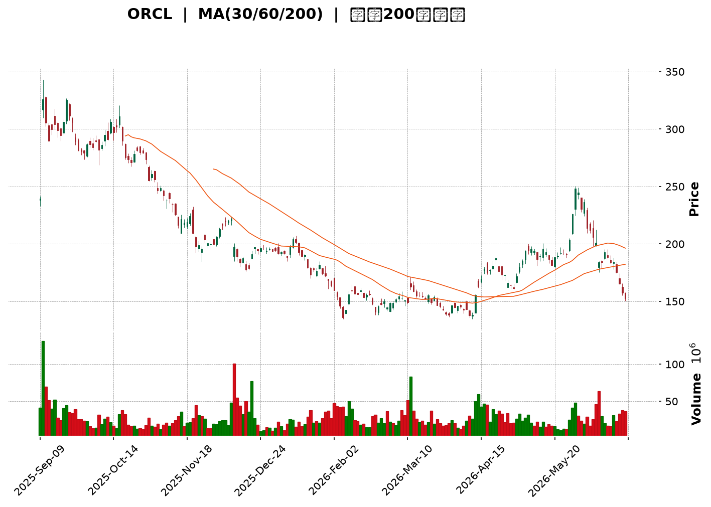
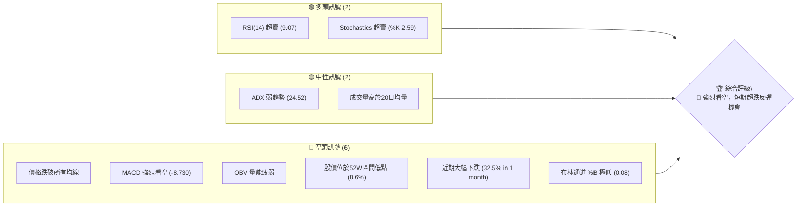
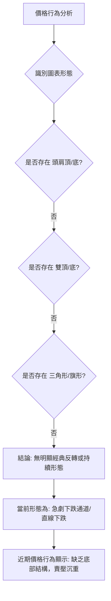
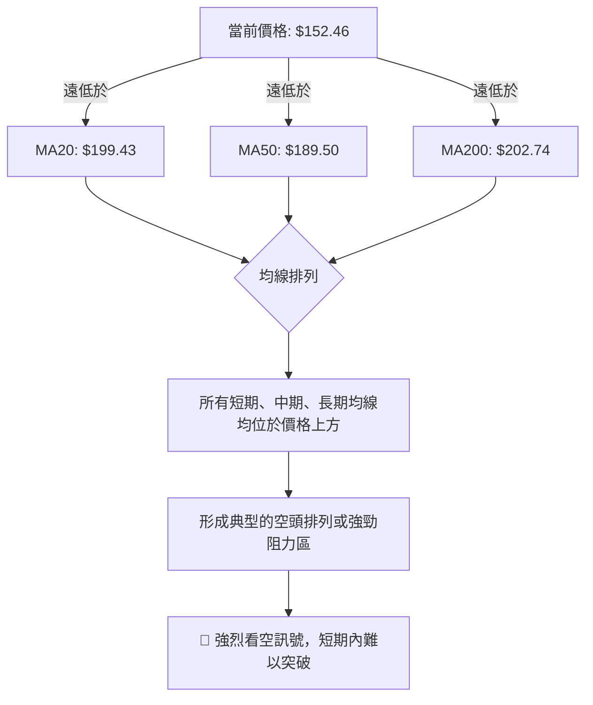

<details>
<summary>📊 靜態圖表 (點擊展開)</summary>

</details>

<html>
<head><meta charset="utf-8" /></head>
<body>
    <div style="height:500px; width:100%;">                        <script>window.PlotlyConfig = {MathJaxConfig: 'local'};</script>
        <script charset="utf-8" src="https://cdn.plot.ly/plotly-3.6.0.min.js" integrity="sha256-QaOVwtVY0T02VaHrr6pnoHLCwayMJp4O5n4YyaE3rJk=" crossorigin="anonymous"></script>                <div id="candlestick-chart" class="plotly-graph-div" style="height:100%; width:100%;"></div>            <script>                window.PLOTLYENV=window.PLOTLYENV || {};                                if (document.getElementById("candlestick-chart")) {                    Plotly.newPlot(                        "candlestick-chart",                        [{"close":{"dtype":"f8","bdata":"AAAAwM\u002fzbUAAAABAJlx0QAAAAIAxF3NAAAAAQEceckAAAAAgZLxyQAAAAED8A3NAAAAAYM2wckAAAAAAw2RyQAAAAODkI3NAAAAAwEpZdEAAAABA93VzQAAAAAC4IHNAAAAAwMgQckAAAACg2ZNxQAAAAAC9iHFAAAAAwJtwcUAAAACA9OtxQAAAAOBN6HFAAAAAIGW+cUAAAACg6RRyQAAAAIA7oHFAAAAAYOzlcUAAAAAgV3JyQAAAACC7MnJAAAAAYA8ic0AAAADgx5JyQAAAAMA\u002f3HJAAAAAoGlxc0AAAAAAfhhyQAAAAADLN3FAAAAA4IIXcUAAAABA6u9wQAAAAEDAZXFAAAAAgJeZcUAAAACA5npxQAAAAADWcXFAAAAAgOUZcUAAAADARepvQAAAAMAYUHBAAAAAAGcEcEAAAACg79RuQAAAAID\u002fGG9AAAAAYPNJbkAAAACgjrltQAAAAKB9621AAAAAQKVWbUAAAADgUDNsQAAAAKC3B2tAAAAAIKWva0AAAACgjFBrQAAAACCWZGtAAAAAgOEEbEAAAADA5ixqQAAAACB5sWhAAAAA4NDhaEAAAACAc3poQAAAAGCpdmlAAAAA4O0WaUAAAACgzvZoQAAAAGDl+2hAAAAAgMLOaUAAAACgq6BqQAAAAOAICGtAAAAAAC1ma0AAAACgqYVrQAAAAMC7tGtAAAAAAFa0aEAAAABA6ZlnQAAAAEBM+WZAAAAAwO1vZ0AAAABA1ytmQAAAAADGXWZAAAAAQIXZZ0AAAABAY6VoQAAAAICzRGhAAAAA4BSJaEAAAADg+5hoQAAAAED5RWhAAAAAIC2AaEAAAACABjdoQAAAAEB4UGhAAAAAID3tZ0AAAADgIRJoQAAAAKAw9WdAAAAAwLuPZ0AAAADAh7poQAAAAMD2fmlAAAAAAMAyaUAAAAAA9R1oQAAAAEAOpmdAAAAAAJnNZ0AAAADAZmlmQAAAAGDLqGVAAAAAQOoxZkAAAACgYxFmQAAAAODCuWZAAAAAAFLJZUAAAADAWoZlQAAAACB\u002fDWVAAAAA4DqAZEAAAADgF\u002fBjQAAAAMA2RGNAAAAAwBpFYkAAAADgKABhQAAAAIBVymFAAAAAoHCBY0AAAAAgrOpjQAAAAOCdk2NAAAAAoO59Y0AAAAAApfJjQAAAAEDkLWNAAAAAAAx0Y0AAAABg2H9jQAAAAGARcmJAAAAAgC6aYUAAAAAgNDRiQAAAAEACbGJAAAAA4C25YkAAAAAgmxxiQAAAAKBgl2JAAAAAYLmPYkAAAACg3vpiQAAAAEAKSGNAAAAAQK8NY0AAAABACuFiQAAAACApnGJAAAAAIKxRZEAAAADgZNNjQAAAAKA+UmNAAAAAQKttY0AAAAAA2kRjQAAAAEDFC2NAAAAAwFFfY0AAAADgFqViQAAAAMCwOWNAAAAAgH9SYkAAAACgYDBiQAAAAMADymFAAAAAwJBlYUAAAABAJEphQAAAAMAiU2JAAAAAYC8XYkAAAACA2ztiQAAAAAASIWJAAAAAoH7VYUAAAADAHuVhQAAAACCFO2FAAAAAQOFCYUAAAAAA13NjQAAAAAAAYGRAAAAAgOs5ZUAAAABA4UpmQAAAAIDr4WVAAAAAYI8yZkAAAACgcKVmQAAAAAAAcGdAAAAAwPUIZkAAAADA9ahlQAAAAGC4nmVAAAAAYLi+ZEAAAABgj3pkQAAAAOB6LGRAAAAAYI96ZUAAAACgR4lmQAAAAEAzK2dAAAAAwPVAaEAAAABA4VJoQAAAAGBmfmhAAAAAQOE6aEAAAABgj1pnQAAAAOBRuGdAAAAAIIVzaEAAAABgZh5oQAAAACCFU2dAAAAAYLiuZkAAAADAHoVnQAAAAOCjuGdAAAAAYI8CaEAAAACA6yFoQAAAAGC43mdAAAAAYGZ2aUAAAADA9ThsQAAAAMDMBG9AAAAAYI+SbkAAAABgj8psQAAAAEDhim1AAAAAgMK1akAAAACAPXpqQAAAAIDruWlAAAAA4FEoaUAAAABAMwNnQAAAAAApBGdAAAAA4HoUaEAAAABgj4pnQAAAAMD18GZAAAAAoEcJZ0AAAACAPeJlQAAAAMAepWRAAAAAwPWwY0AAAABguA5jQA=="},"high":{"dtype":"f8","bdata":"7YA4Aa0ybkDK9aQPNnB1QDU1rOeIhnRAUyc7wPAYc0A1262uBApzQJiaXdVv13NAP2tt3+Qjc0DeCR5ZD9dyQGBjTm7JSnNAA\u002f+1FLludECodHloSSd0QJJBw2ZgYHNA3C7KKpOGckCHZ\u002fZ7KztyQFHlYNzau3FAl1HVPGyccUD8p3sSg\u002ftxQPt0iJ2RSnJALGy1iFRFckDjptYEt2VyQHdicqPJLnJAXMPlv\u002fUTckDz+KbOG7JyQHcCct9yHXNAIrf3U9ZMc0BUmiGo+OhyQHdlMV\u002fEUXNAY38B1h4JdECvhACnvuZyQAsbGwuT93FAy0VHaWhpcUCgLDuMHDhxQElO2lLvlXFAqRPljvnWcUDj0h8H9NNxQHtIZKt2u3FAIy4JJGZ+cUBiv+xnzMFwQPIU4vH7gnBA21lSfvZ\u002fcECZVKYBEbdvQH244C14W29Akf9Kko\u002fxbkDNx\u002fF10N1tQKp4vadbt25AvLCv1P1\u002fbUBd8kXqomttQL3KLx4d+WtA1m5AWzk1bEAaWEsGDq5rQNt+KMStymtAbJoDaTVYbEA\u002fhLHyQxJtQJJG7uw04WlAtSXIgGdSaUD6aBBrJcZoQP3EBdT0FmpAsA2MPFUjaUAZ65sJOkhpQF7F2jRqDWpAVeRMfs3UaUDn1Z\u002f2BMNqQKG3FG8ZRWtA+06muhLsa0ABPnFWVKhrQMGgncsz\u002fmtAXPm4xDMYaUA8Per6h5RoQMClNzwbemdAFBW9FYGUZ0CCunKZjCtnQARSBHY19GZA4y\u002fGZLQ9aECjel3cvrJoQOq3iY\u002fbf2hAh4Ys+TSiaEBQnlyrreRoQD2Ec4SFqWhAr6vFNWOlaEDrxMiL239oQCUqLQcRrGhAoVPID6kOaUA4wwtWEjZoQFsfFmcyT2hAgdmNVBS5Z0AhbcoLd+9oQDbh48EwvGlAGN6C5nTiaUATpm9JTB9pQKaH5cCZSmhA4XfYgnjmZ0AzssFXO1FnQJ7KowYWf2ZA3+3OCw5xZkCTAJqhymBmQCqGHgxIFWdAEOloEgZjZkDykUxwhqFmQJhWPZdmNGVA\u002fL0ZFP0JZUC3a3EgVVNlQIMM6tVo2mNAtiB2V+8sY0AcsJFDR0FiQL1RfIpz1mFABxhDRzXmY0DjgmZPD5pkQFm0yIzkYmRAlIiiIpHPY0BhthoqhjdkQO994Vk412NAquUvyBSYY0DbIFQxu\u002fBjQBxOCp+HLmNAqj1gm1wpYkBrp5py+UdiQGynJHLjF2NAAr8Q7wP\u002fYkBAvJhcSjJiQAKM7gS3tGJAKioJQvPMYkDraRtlaSJjQKid1099rGNAWceMv1nUY0BHa2k0Eu9iQHdr6BpQM2NA8LYNqDBlZUDjXmJO3udkQH4IMf+7BmRA63ydJQDGY0D+JxuFvctjQIBw0LrHTWNAZzN8lfaLY0DREpKW7hZjQMMzazGcZ2NAyg9J1qgrY0DxZRYWMapiQF5esCW6PmJAJzvXnkymYUBGVaySrJZhQJy2VBtiXGJAKX18+iGkYkAXJRVKxT1iQOkhyC0OgWJAndpjlSMCYkBiZbD72d1iQAAAAKCZ2WFAAAAAoHCFYUAAAADAHn1jQAAAAMDMLGVAAAAAgOuRZUAAAADgo4hmQAAAAAAAEGdAAAAA4FE4ZkAAAABA4SpnQAAAAIDCpWdAAAAA4Hq8ZkAAAABguJZmQAAAAKCZsWVAAAAAYGYWZUAAAADgUZhkQAAAAIDCpWRAAAAAoJnJZUAAAAAAAPBmQAAAAOCjUGdAAAAAoEdJaEAAAADAzARpQAAAAAAAwGhAAAAAgMJ1aEAAAACgcB1oQAAAAIA98mdAAAAAYLgWaUAAAACAwo1oQAAAAOBR2GdAAAAAQAqXZ0AAAABACodnQAAAAIA9GmhAAAAAAACgaEAAAABgZmZoQAAAAOB6BGhAAAAAAACgaUAAAACgR0lsQAAAAAAASG9AAAAAAAAgb0AAAADgURBuQAAAAGBm3m1AAAAAgBTubEAAAACA62FrQAAAAAAAkGtAAAAAIFyPakAAAADgoxhnQAAAAGCPMmdAAAAAgD1qaEAAAACAPWpoQAAAAIAUxmdAAAAAIK5\u002fZ0AAAABgjxJnQAAAAGCPymVAAAAAAAC4ZEAAAAAA17NjQA=="},"hovertemplate":"\u003cb\u003e%{x|%Y-%m-%d}\u003c\u002fb\u003e\u003cbr\u003e\u958b: $%{open:.2f}\u003cbr\u003e\u9ad8: $%{high:.2f}\u003cbr\u003e\u4f4e: $%{low:.2f}\u003cbr\u003e\u6536: $%{close:.2f}\u003cextra\u003e\u003c\u002fextra\u003e","low":{"dtype":"f8","bdata":"aZdvIycXbUCwxOUOWFpzQEjU+itx43JAMR4gynMXckAR9RwJZm9yQEAG+jZ0vnJAgNokeoVLckAU72CpaxtyQPWKVerfb3JA4OEIlkUIc0DvTgSZ9TlzQD\u002f3QRjlmnJAR7pgB6fkcUBZondAjIxxQN7sH4W7VnFAo2NgYNYbcUDnXvLvRDtxQKPUv0z3vHFAJw8XQWyccUB1erQVXwhyQMg6WRoNznBAsvbRzhKWcUC84rGpFthxQBudCMSfI3JAPckATr5+ckCYrbueJSNyQNkrsDSCkXJA1GWby4DTckA3urmQ59txQGE9LEgOGnFA3r2rzI3pcECkrNQusLlwQN7uSyGf63BAbOWr5GqIcUADQwennWFxQAXrJYE5bXFAirxUMRXbcEBjloUF39ZvQFCCsPOL5G9ARIPk9nm1b0BQIhOaKHZuQCCgf9ytsG5AbpoxB4O6bUD9fNm8yd1sQJ465+Dnc21ADOHknr5vbEBewEJnPBlsQBU9ePT5vGpAjr3UKXIvakAiEZclysdqQP6HOrQTpmpAGvhTiHL\u002fakBLfW1jfyBqQDkIMI3FC2hAFAV\u002f9J8jaEDUR+cj4Q9nQBnByzcnIGlAewB3xuWMaEAXCDWl9G9oQOdttCnp2GhAvBQr6dPFaEBnrUqF6qFpQFerB6MWimpA6GX\u002fv7nyakDkLqM8TB5rQHDAb+8ICGtAp5rLTfYiZ0BEAQXDAhtnQBTnHn9YiWZAZPeLRJ\u002frZkCFVjTsof9lQPEH2SyoL2ZAgyJzoRJfZ0AhhGFQ3\u002fRnQMCvyVuE4GdAHmP0+nAnaEBXUHjwMF1oQD2JTTjU7mdAs4ckLXhQaEAAibLhTDFoQMqH\u002f0zDIGhAOiY4QvjkZ0AFx7zaILFnQDRKV2d52mdAw+y13mogZ0BYmgdU74NnQI1ZC89gimhA0NdFmcX+aECihh01q8RnQG26nv1il2dAE0QXgy88Z0AplnU3i1dmQBTyviQzQGVAkxtYplf8ZUDwgcj+12xlQEhj05oTPWZAfRPhiGqiZUBStyUNYWhlQBmAQ62mHmRAPCS41H9VZECSC+0VLu5jQNS7HNrh62JAYCQKfqz9YUDk26vR79hgQA8nzzqmTWFAFwr+zKBPYkAZ0BEqPY1jQIaJujjZLmNAk2vm+QP\u002fYkBfbkII\u002fFdjQESb+RMiC2NAeQ7UOvvaYkAGpi6USmdjQNk6T4wQXGJAeG5VzXFDYUDshTum6EdhQGB3f054WmJAD0geP6IUYkA5Bry2X7NhQOQ5\u002fzYJlmFAOt+oDavRYUCOA+UbmJJiQEB\u002frMYes2JA\u002fLquFPTiYkCM2AaEcz1iQCtt\u002fNXdfWJAIa+V66wAZEAShW3u2sFjQDL3KZ+hM2NAbHengBw\u002fY0CrF99t5x5jQMN\u002fOqVY8GJATJw2yOWLYkAubjYT7G1iQESKTV\u002fvxWJANC+sV9hKYkBWHX18GANiQNvPwZJnwWFAj\u002ffGZjI6YUBTsAS\u002fJQ9hQGAL596fa2FAmVxq11MFYkBYAXN5+XlhQC\u002f4Tc8t62FA8Iqbl35uYUBE5lFr4sxhQAAAAAAAAGFAAAAAgD3SYEAAAABACndhQAAAAIDrMWRAAAAAYLjGZEAAAACgmbllQAAAACCFq2VAAAAA4FGwZUAAAADgUQBmQAAAAKCZ2WZAAAAAYI\u002fCZUAAAACgmRllQAAAAMDM\u002fGRAAAAAoJlBZEAAAADAzBRkQAAAAGCPCmRAAAAAwMzEZEAAAADgUchlQAAAAAAAYGZAAAAAoHDVZkAAAACgmdlnQAAAAGC4xmdAAAAAQDPTZ0AAAAAA15tmQAAAAIDrIWdAAAAAYGYuZ0AAAADAzJxnQAAAAOCj6GZAAAAAgMKdZkAAAACgmVlmQAAAAGBmZmdAAAAAQDPjZ0AAAACA69FnQAAAAKBwfWdAAAAAACksaEAAAADgUQBqQAAAAEAzE2xAAAAAQOHabUAAAAAghXNsQAAAAAAAAGxAAAAAYGYuakAAAABgjypqQAAAAKBHuWhAAAAAgMLFaEAAAADA9ehlQAAAAAAAYGZAAAAAYLhGZ0AAAADAHnVnQAAAAGCP0mZAAAAAYGY2ZkAAAADAzMxlQAAAACCFk2RAAAAAQDNrY0AAAAAghctiQA=="},"name":"\u50f9\u683c","open":{"dtype":"f8","bdata":"T9V5EvfBbUC691f9DctzQNowNrIOfHRAqRJkaVX2ckBTcTKozwBzQKGmVP2deXNAHivh2n4Uc0CPgcZ8rcpyQF1FC0qLinJAWmKHzUozc0AjGEV6aRd0QFR92VaxVnNAAgAqpVRPckBrm9ONSytyQI9j953ypXFAJgbbbYCXcUCnkgCv30lxQHtgmeY+GHJAZ2oqSlL1cUCMhUsqdCFyQHdicqPJLnJAI4QXMfeycUAY6lcXTxxyQKYd+L8ip3JA3ueSiQKOckAFbuZLdNtyQMd2V5qa8HJAGxd+YLz7ckDSsVIJUd5yQJbJPIz28nFAPQ358pRGcUAW3piWQxJxQJZu+H6v9HBA6DxrdMfCcUAzCPyIHc1xQMAZRRZYlHFAxR3ExNp7cUC9HX\u002fsk7FwQEqRcc3MHnBAW+MAgOt5cEDpIimQgA5vQIQtydSqzG5A2vIkHJ\u002fNbkD3iznCSbFtQAGOKXNUjm5AlmBInzBZbUB+jcgKaWltQNJro\u002f+082tAizVWqVoxakD+t1RuEhxrQACyQIV23GpAadvu+Bo3a0BnAarL8LdsQN7pkVcWumlAcd4HXgt1aEA8VtW5oBxoQGrXZNgNB2pA9duudVPJaEA8leIj0OhoQHXjutxifGlAJILmAGjjaEAAzAoY5dJpQBY4fnMyNWtA24uqGPB\u002fa0B9nzet9FVrQBdmewpAjmtAGeqnh5WuZ0Ck8gTIdWVoQAwFUqJ6ZGdAC8XNAk3yZkADkoG1F8ZmQNK1D+hTs2ZAUv8N\u002f6hnZ0AfhI7NxXNoQIKFZzZeZ2hAoEPbVeM5aECbn32\u002fNZtoQNgnzgosH2hAXH4xyplbaEDoAa\u002fSDGdoQLi10RByiGhA+85cbR2kaEC7r3LqSOxnQOsuR+ptQ2hA\u002fxERddq2Z0AiOvQ2xt9nQE4VklwxnWhAQVeyGyuJaUATpm9JTB9pQKaH5cCZSmhAmEmuJPinZ0AzssFXO1FnQCnc04G\u002fYWZARwAe0txXZkBt63JRnYBlQHJ7YtpAT2ZAxP3obh9SZkBbtv9N9cllQA\u002fNK3\u002fZMWVAjeBixLXyZEAU+StcZ0plQLpMz6SxtmNAH2ZwJFcrY0DjcIv5+yJiQP\u002fyvYdvaGFArcOAcSR\u002fYkB\u002fghodLu5jQFm0yIzkYmRAry2BqCusY0AREh6AQ9ZjQMJotsrDrWNA+jIOTuw7Y0DySY63kpRjQPWIWcuGGGNAa69FntolYkCQpymdMYthQN\u002f6LeqBlGJAXtWVVrWIYkAU7HS2IuxhQJcdaysRpGFAK\u002f549eAHYkBvNNLJnK9iQG4s8pniAWNAe0AFpGgMY0B+LSqlncViQCFxZQ67ImNAyzz3LKG5ZEAm0\u002fEPyIJkQN5bncniz2NAxNoc74lwY0Cx9bidxFxjQDx9c\u002f62G2NA5YDGhPa9YkBYZVjqjRBjQLTVEmGT3GJAq8ZHv\u002fUOY0Coz3JavZZiQJJDFVV07GFASuk5ShCOYUBR7W3lrnFhQFe7XGr5eWFAwtnmcUaSYkDdayjkDslhQBzuu7OoXWJAKl2hW\u002fLoYUCtp5FO3LhiQAAAAGBmxmFAAAAAgD0qYUAAAADgo3hhQAAAAIDC\u002fWRAAAAA4HrcZEAAAACgcA1mQAAAAIDC3WZAAAAAgOsZZkAAAABAM0tmQAAAAIDCRWdAAAAAwMyMZkAAAADgUZBmQAAAAGCPkmVAAAAAwB5FZEAAAACgR4FkQAAAAOCjQGRAAAAAoHDNZEAAAADgowBmQAAAAAApxGZAAAAAYGZGZ0AAAAAghdNoQAAAAGCPEmhAAAAAwMwEaEAAAACgcB1oQAAAAMD1oGdAAAAAgMKFZ0AAAAAgrs9nQAAAAAAAwGdAAAAAAABAZ0AAAACAFH5mQAAAAOBRoGdAAAAAoHD1Z0AAAACgmSloQAAAACBc72dAAAAAoEdBaEAAAAAAACBqQAAAAAAA0GxAAAAAoJlZbkAAAAAgXA9uQAAAAAAAYGxAAAAAIK6vbEAAAAAAADhrQAAAAMAevWpAAAAAAADQaEAAAACgcHVmQAAAAOBRIGdAAAAA4HpsZ0AAAADgUcBnQAAAAMAeRWdAAAAA4FHgZkAAAACA68lmQAAAACBcR2VAAAAAIFxPZEAAAABAM6tjQA=="},"x":["2025-09-09T00:00:00-04:00","2025-09-10T00:00:00-04:00","2025-09-11T00:00:00-04:00","2025-09-12T00:00:00-04:00","2025-09-15T00:00:00-04:00","2025-09-16T00:00:00-04:00","2025-09-17T00:00:00-04:00","2025-09-18T00:00:00-04:00","2025-09-19T00:00:00-04:00","2025-09-22T00:00:00-04:00","2025-09-23T00:00:00-04:00","2025-09-24T00:00:00-04:00","2025-09-25T00:00:00-04:00","2025-09-26T00:00:00-04:00","2025-09-29T00:00:00-04:00","2025-09-30T00:00:00-04:00","2025-10-01T00:00:00-04:00","2025-10-02T00:00:00-04:00","2025-10-03T00:00:00-04:00","2025-10-06T00:00:00-04:00","2025-10-07T00:00:00-04:00","2025-10-08T00:00:00-04:00","2025-10-09T00:00:00-04:00","2025-10-10T00:00:00-04:00","2025-10-13T00:00:00-04:00","2025-10-14T00:00:00-04:00","2025-10-15T00:00:00-04:00","2025-10-16T00:00:00-04:00","2025-10-17T00:00:00-04:00","2025-10-20T00:00:00-04:00","2025-10-21T00:00:00-04:00","2025-10-22T00:00:00-04:00","2025-10-23T00:00:00-04:00","2025-10-24T00:00:00-04:00","2025-10-27T00:00:00-04:00","2025-10-28T00:00:00-04:00","2025-10-29T00:00:00-04:00","2025-10-30T00:00:00-04:00","2025-10-31T00:00:00-04:00","2025-11-03T00:00:00-05:00","2025-11-04T00:00:00-05:00","2025-11-05T00:00:00-05:00","2025-11-06T00:00:00-05:00","2025-11-07T00:00:00-05:00","2025-11-10T00:00:00-05:00","2025-11-11T00:00:00-05:00","2025-11-12T00:00:00-05:00","2025-11-13T00:00:00-05:00","2025-11-14T00:00:00-05:00","2025-11-17T00:00:00-05:00","2025-11-18T00:00:00-05:00","2025-11-19T00:00:00-05:00","2025-11-20T00:00:00-05:00","2025-11-21T00:00:00-05:00","2025-11-24T00:00:00-05:00","2025-11-25T00:00:00-05:00","2025-11-26T00:00:00-05:00","2025-11-28T00:00:00-05:00","2025-12-01T00:00:00-05:00","2025-12-02T00:00:00-05:00","2025-12-03T00:00:00-05:00","2025-12-04T00:00:00-05:00","2025-12-05T00:00:00-05:00","2025-12-08T00:00:00-05:00","2025-12-09T00:00:00-05:00","2025-12-10T00:00:00-05:00","2025-12-11T00:00:00-05:00","2025-12-12T00:00:00-05:00","2025-12-15T00:00:00-05:00","2025-12-16T00:00:00-05:00","2025-12-17T00:00:00-05:00","2025-12-18T00:00:00-05:00","2025-12-19T00:00:00-05:00","2025-12-22T00:00:00-05:00","2025-12-23T00:00:00-05:00","2025-12-24T00:00:00-05:00","2025-12-26T00:00:00-05:00","2025-12-29T00:00:00-05:00","2025-12-30T00:00:00-05:00","2025-12-31T00:00:00-05:00","2026-01-02T00:00:00-05:00","2026-01-05T00:00:00-05:00","2026-01-06T00:00:00-05:00","2026-01-07T00:00:00-05:00","2026-01-08T00:00:00-05:00","2026-01-09T00:00:00-05:00","2026-01-12T00:00:00-05:00","2026-01-13T00:00:00-05:00","2026-01-14T00:00:00-05:00","2026-01-15T00:00:00-05:00","2026-01-16T00:00:00-05:00","2026-01-20T00:00:00-05:00","2026-01-21T00:00:00-05:00","2026-01-22T00:00:00-05:00","2026-01-23T00:00:00-05:00","2026-01-26T00:00:00-05:00","2026-01-27T00:00:00-05:00","2026-01-28T00:00:00-05:00","2026-01-29T00:00:00-05:00","2026-01-30T00:00:00-05:00","2026-02-02T00:00:00-05:00","2026-02-03T00:00:00-05:00","2026-02-04T00:00:00-05:00","2026-02-05T00:00:00-05:00","2026-02-06T00:00:00-05:00","2026-02-09T00:00:00-05:00","2026-02-10T00:00:00-05:00","2026-02-11T00:00:00-05:00","2026-02-12T00:00:00-05:00","2026-02-13T00:00:00-05:00","2026-02-17T00:00:00-05:00","2026-02-18T00:00:00-05:00","2026-02-19T00:00:00-05:00","2026-02-20T00:00:00-05:00","2026-02-23T00:00:00-05:00","2026-02-24T00:00:00-05:00","2026-02-25T00:00:00-05:00","2026-02-26T00:00:00-05:00","2026-02-27T00:00:00-05:00","2026-03-02T00:00:00-05:00","2026-03-03T00:00:00-05:00","2026-03-04T00:00:00-05:00","2026-03-05T00:00:00-05:00","2026-03-06T00:00:00-05:00","2026-03-09T00:00:00-04:00","2026-03-10T00:00:00-04:00","2026-03-11T00:00:00-04:00","2026-03-12T00:00:00-04:00","2026-03-13T00:00:00-04:00","2026-03-16T00:00:00-04:00","2026-03-17T00:00:00-04:00","2026-03-18T00:00:00-04:00","2026-03-19T00:00:00-04:00","2026-03-20T00:00:00-04:00","2026-03-23T00:00:00-04:00","2026-03-24T00:00:00-04:00","2026-03-25T00:00:00-04:00","2026-03-26T00:00:00-04:00","2026-03-27T00:00:00-04:00","2026-03-30T00:00:00-04:00","2026-03-31T00:00:00-04:00","2026-04-01T00:00:00-04:00","2026-04-02T00:00:00-04:00","2026-04-06T00:00:00-04:00","2026-04-07T00:00:00-04:00","2026-04-08T00:00:00-04:00","2026-04-09T00:00:00-04:00","2026-04-10T00:00:00-04:00","2026-04-13T00:00:00-04:00","2026-04-14T00:00:00-04:00","2026-04-15T00:00:00-04:00","2026-04-16T00:00:00-04:00","2026-04-17T00:00:00-04:00","2026-04-20T00:00:00-04:00","2026-04-21T00:00:00-04:00","2026-04-22T00:00:00-04:00","2026-04-23T00:00:00-04:00","2026-04-24T00:00:00-04:00","2026-04-27T00:00:00-04:00","2026-04-28T00:00:00-04:00","2026-04-29T00:00:00-04:00","2026-04-30T00:00:00-04:00","2026-05-01T00:00:00-04:00","2026-05-04T00:00:00-04:00","2026-05-05T00:00:00-04:00","2026-05-06T00:00:00-04:00","2026-05-07T00:00:00-04:00","2026-05-08T00:00:00-04:00","2026-05-11T00:00:00-04:00","2026-05-12T00:00:00-04:00","2026-05-13T00:00:00-04:00","2026-05-14T00:00:00-04:00","2026-05-15T00:00:00-04:00","2026-05-18T00:00:00-04:00","2026-05-19T00:00:00-04:00","2026-05-20T00:00:00-04:00","2026-05-21T00:00:00-04:00","2026-05-22T00:00:00-04:00","2026-05-26T00:00:00-04:00","2026-05-27T00:00:00-04:00","2026-05-28T00:00:00-04:00","2026-05-29T00:00:00-04:00","2026-06-01T00:00:00-04:00","2026-06-02T00:00:00-04:00","2026-06-03T00:00:00-04:00","2026-06-04T00:00:00-04:00","2026-06-05T00:00:00-04:00","2026-06-08T00:00:00-04:00","2026-06-09T00:00:00-04:00","2026-06-10T00:00:00-04:00","2026-06-11T00:00:00-04:00","2026-06-12T00:00:00-04:00","2026-06-15T00:00:00-04:00","2026-06-16T00:00:00-04:00","2026-06-17T00:00:00-04:00","2026-06-18T00:00:00-04:00","2026-06-22T00:00:00-04:00","2026-06-23T00:00:00-04:00","2026-06-24T00:00:00-04:00","2026-06-25T00:00:00-04:00"],"type":"candlestick"},{"hovertemplate":"MA30: $%{y:.2f}\u003cextra\u003e\u003c\u002fextra\u003e","line":{"color":"#2196F3","dash":"dash","width":2},"mode":"lines","name":"MA30","x":["2025-09-09T00:00:00-04:00","2025-09-10T00:00:00-04:00","2025-09-11T00:00:00-04:00","2025-09-12T00:00:00-04:00","2025-09-15T00:00:00-04:00","2025-09-16T00:00:00-04:00","2025-09-17T00:00:00-04:00","2025-09-18T00:00:00-04:00","2025-09-19T00:00:00-04:00","2025-09-22T00:00:00-04:00","2025-09-23T00:00:00-04:00","2025-09-24T00:00:00-04:00","2025-09-25T00:00:00-04:00","2025-09-26T00:00:00-04:00","2025-09-29T00:00:00-04:00","2025-09-30T00:00:00-04:00","2025-10-01T00:00:00-04:00","2025-10-02T00:00:00-04:00","2025-10-03T00:00:00-04:00","2025-10-06T00:00:00-04:00","2025-10-07T00:00:00-04:00","2025-10-08T00:00:00-04:00","2025-10-09T00:00:00-04:00","2025-10-10T00:00:00-04:00","2025-10-13T00:00:00-04:00","2025-10-14T00:00:00-04:00","2025-10-15T00:00:00-04:00","2025-10-16T00:00:00-04:00","2025-10-17T00:00:00-04:00","2025-10-20T00:00:00-04:00","2025-10-21T00:00:00-04:00","2025-10-22T00:00:00-04:00","2025-10-23T00:00:00-04:00","2025-10-24T00:00:00-04:00","2025-10-27T00:00:00-04:00","2025-10-28T00:00:00-04:00","2025-10-29T00:00:00-04:00","2025-10-30T00:00:00-04:00","2025-10-31T00:00:00-04:00","2025-11-03T00:00:00-05:00","2025-11-04T00:00:00-05:00","2025-11-05T00:00:00-05:00","2025-11-06T00:00:00-05:00","2025-11-07T00:00:00-05:00","2025-11-10T00:00:00-05:00","2025-11-11T00:00:00-05:00","2025-11-12T00:00:00-05:00","2025-11-13T00:00:00-05:00","2025-11-14T00:00:00-05:00","2025-11-17T00:00:00-05:00","2025-11-18T00:00:00-05:00","2025-11-19T00:00:00-05:00","2025-11-20T00:00:00-05:00","2025-11-21T00:00:00-05:00","2025-11-24T00:00:00-05:00","2025-11-25T00:00:00-05:00","2025-11-26T00:00:00-05:00","2025-11-28T00:00:00-05:00","2025-12-01T00:00:00-05:00","2025-12-02T00:00:00-05:00","2025-12-03T00:00:00-05:00","2025-12-04T00:00:00-05:00","2025-12-05T00:00:00-05:00","2025-12-08T00:00:00-05:00","2025-12-09T00:00:00-05:00","2025-12-10T00:00:00-05:00","2025-12-11T00:00:00-05:00","2025-12-12T00:00:00-05:00","2025-12-15T00:00:00-05:00","2025-12-16T00:00:00-05:00","2025-12-17T00:00:00-05:00","2025-12-18T00:00:00-05:00","2025-12-19T00:00:00-05:00","2025-12-22T00:00:00-05:00","2025-12-23T00:00:00-05:00","2025-12-24T00:00:00-05:00","2025-12-26T00:00:00-05:00","2025-12-29T00:00:00-05:00","2025-12-30T00:00:00-05:00","2025-12-31T00:00:00-05:00","2026-01-02T00:00:00-05:00","2026-01-05T00:00:00-05:00","2026-01-06T00:00:00-05:00","2026-01-07T00:00:00-05:00","2026-01-08T00:00:00-05:00","2026-01-09T00:00:00-05:00","2026-01-12T00:00:00-05:00","2026-01-13T00:00:00-05:00","2026-01-14T00:00:00-05:00","2026-01-15T00:00:00-05:00","2026-01-16T00:00:00-05:00","2026-01-20T00:00:00-05:00","2026-01-21T00:00:00-05:00","2026-01-22T00:00:00-05:00","2026-01-23T00:00:00-05:00","2026-01-26T00:00:00-05:00","2026-01-27T00:00:00-05:00","2026-01-28T00:00:00-05:00","2026-01-29T00:00:00-05:00","2026-01-30T00:00:00-05:00","2026-02-02T00:00:00-05:00","2026-02-03T00:00:00-05:00","2026-02-04T00:00:00-05:00","2026-02-05T00:00:00-05:00","2026-02-06T00:00:00-05:00","2026-02-09T00:00:00-05:00","2026-02-10T00:00:00-05:00","2026-02-11T00:00:00-05:00","2026-02-12T00:00:00-05:00","2026-02-13T00:00:00-05:00","2026-02-17T00:00:00-05:00","2026-02-18T00:00:00-05:00","2026-02-19T00:00:00-05:00","2026-02-20T00:00:00-05:00","2026-02-23T00:00:00-05:00","2026-02-24T00:00:00-05:00","2026-02-25T00:00:00-05:00","2026-02-26T00:00:00-05:00","2026-02-27T00:00:00-05:00","2026-03-02T00:00:00-05:00","2026-03-03T00:00:00-05:00","2026-03-04T00:00:00-05:00","2026-03-05T00:00:00-05:00","2026-03-06T00:00:00-05:00","2026-03-09T00:00:00-04:00","2026-03-10T00:00:00-04:00","2026-03-11T00:00:00-04:00","2026-03-12T00:00:00-04:00","2026-03-13T00:00:00-04:00","2026-03-16T00:00:00-04:00","2026-03-17T00:00:00-04:00","2026-03-18T00:00:00-04:00","2026-03-19T00:00:00-04:00","2026-03-20T00:00:00-04:00","2026-03-23T00:00:00-04:00","2026-03-24T00:00:00-04:00","2026-03-25T00:00:00-04:00","2026-03-26T00:00:00-04:00","2026-03-27T00:00:00-04:00","2026-03-30T00:00:00-04:00","2026-03-31T00:00:00-04:00","2026-04-01T00:00:00-04:00","2026-04-02T00:00:00-04:00","2026-04-06T00:00:00-04:00","2026-04-07T00:00:00-04:00","2026-04-08T00:00:00-04:00","2026-04-09T00:00:00-04:00","2026-04-10T00:00:00-04:00","2026-04-13T00:00:00-04:00","2026-04-14T00:00:00-04:00","2026-04-15T00:00:00-04:00","2026-04-16T00:00:00-04:00","2026-04-17T00:00:00-04:00","2026-04-20T00:00:00-04:00","2026-04-21T00:00:00-04:00","2026-04-22T00:00:00-04:00","2026-04-23T00:00:00-04:00","2026-04-24T00:00:00-04:00","2026-04-27T00:00:00-04:00","2026-04-28T00:00:00-04:00","2026-04-29T00:00:00-04:00","2026-04-30T00:00:00-04:00","2026-05-01T00:00:00-04:00","2026-05-04T00:00:00-04:00","2026-05-05T00:00:00-04:00","2026-05-06T00:00:00-04:00","2026-05-07T00:00:00-04:00","2026-05-08T00:00:00-04:00","2026-05-11T00:00:00-04:00","2026-05-12T00:00:00-04:00","2026-05-13T00:00:00-04:00","2026-05-14T00:00:00-04:00","2026-05-15T00:00:00-04:00","2026-05-18T00:00:00-04:00","2026-05-19T00:00:00-04:00","2026-05-20T00:00:00-04:00","2026-05-21T00:00:00-04:00","2026-05-22T00:00:00-04:00","2026-05-26T00:00:00-04:00","2026-05-27T00:00:00-04:00","2026-05-28T00:00:00-04:00","2026-05-29T00:00:00-04:00","2026-06-01T00:00:00-04:00","2026-06-02T00:00:00-04:00","2026-06-03T00:00:00-04:00","2026-06-04T00:00:00-04:00","2026-06-05T00:00:00-04:00","2026-06-08T00:00:00-04:00","2026-06-09T00:00:00-04:00","2026-06-10T00:00:00-04:00","2026-06-11T00:00:00-04:00","2026-06-12T00:00:00-04:00","2026-06-15T00:00:00-04:00","2026-06-16T00:00:00-04:00","2026-06-17T00:00:00-04:00","2026-06-18T00:00:00-04:00","2026-06-22T00:00:00-04:00","2026-06-23T00:00:00-04:00","2026-06-24T00:00:00-04:00","2026-06-25T00:00:00-04:00"],"y":{"dtype":"f8","bdata":"AAAAAAAA+H8AAAAAAAD4fwAAAAAAAPh\u002fAAAAAAAA+H8AAAAAAAD4fwAAAAAAAPh\u002fAAAAAAAA+H8AAAAAAAD4fwAAAAAAAPh\u002fAAAAAAAA+H8AAAAAAAD4fwAAAAAAAPh\u002fAAAAAAAA+H8AAAAAAAD4fwAAAAAAAPh\u002fAAAAAAAA+H8AAAAAAAD4fwAAAAAAAPh\u002fAAAAAAAA+H8AAAAAAAD4fwAAAAAAAPh\u002fAAAAAAAA+H8AAAAAAAD4fwAAAAAAAPh\u002fAAAAAAAA+H8AAAAAAAD4fwAAAAAAAPh\u002fAAAAAAAA+H8AAAAAAAD4f6uqqmrDX3JA3t3dHdFxckCrqqrqm1RyQFVVVTUpRnJAMzMz87xBckAAAACQBTdyQDMzM+OdKXJAAAAAoA0cckBVVVUFRAdyQN7d3Z0j73FAd3d3Fy3KcUAAAADYqKdxQHd3d28eiXFAIiIiIjFwcUAzMzPbBVlxQDMzM3MOQ3FAERER4WkrcUBmZma+zQpxQJqZmXlS5XBAq6qqUgnEcEBVVVUlSJ5wQJqZmSHAfHBAAAAAWJFbcEBVVVWN1i1wQFVVVVXP929AmpmZiZmFb0Dv7u7+fhlvQKuqqsrmsG5AIiIi8is7bkAiIiKiXdttQM3MzJy1im1Ad3d35ztDbUBVVVU1ZQVtQM3MzHwlw2xAq6qqWpSAbEBVVVW1G0FsQO\u002fu7m7PA2xAAAAAAMOya0C8u7v70GtrQCIiIgJ0GWtAMzMzMxfQakDNzMz8L4ZqQCIiIhKuO2pAd3d3d7sEakAAAACwZNlpQAAAAMAqqWlAiYiIeC6AaUB3d3fnb2FpQO\u002fu7o7pSWlARERE5LouaUDNzMx8RxRpQJqZmTkC+mhAiYiIWBbXaECamZnZIMVoQKuqqiravmhAIiIiMpWzaEAREREBuLVoQJqZmdn+tWhAERERQey2aEDNzMzMsa9oQDMzM8NMpGhAd3d3xzGTaEBEREQEOG9oQCIiIqJgQWhAIiIiAvgUaEBEREQkbeZnQBEREWHtu2dAiYiI2AajZ0BVVVXlTpFnQBERETHqgGdAIiIisttnZ0CJiIjIzFRnQDMzMxNZOmdAzczM7LsKZ0Dv7u4+fslmQImIiNg2kmZAiYiI+EpnZkARERFhWT9mQERERERFF2ZAMzMzc4fsZUDNzMzMHchlQBERERFMnGVAMzMzwx92ZUAAAABQHU9lQM3MzLwTIGVAIiIisjntZEDe3d09jLVkQCIiIsIueWRAd3d3J+5BZEDNzMxsrw5kQBEREYGH42NAmpmZ2cy2Y0C8u7sLhJljQHd3d1c5hWNAMzMzk2pqY0BVVVVlNE9jQLy7u6sVLGNAREREJJAfY0Crqqp6EBFjQAAAABBKAmNAREREJCP5YkARERHhbfNiQKuqqjqM8WJAZmZmdvT6YkBVVVVl\u002fAhjQLy7uys7FWNAERERESILY0ARERHRY\u002fxiQCIiIvIi7WJAMzMz80HbYkDe3d39ksRiQGZmZkZIvWJAIiIiUqexYkAAAACg2qZiQCIiInInpGJAVVVVlSGmYkDNzMy8fqNiQO\u002fu7m5YmWJAmpmZad6MYkB3d3dXT5hiQKuqqtqHp2JAIiIiQkW+YkDNzMycidpiQJqZmcm78GJA7+7uDpALY0CrqqqatStjQO\u002fu7m7nVGNAVVVVBYxjY0C8u7v7MnNjQERERKTQhmNAAAAA0AySY0CJiIioX5xjQAAAAFD\u002fpWNAVVVV1fi3Y0CJiIioLdljQERERCTU+mNA7+7urnEtZEDe3d1Ny2FkQKuqqsoBm2RAZmZmRlHVZEBERESUEAllQO\u002fu7q4aN2VA7+7uzmFtZUAzMzOjmZ9lQO\u002fu7s7yy2VAmpmZmVL1ZUCamZmZUiVmQN7d3X2xXGZAzczMXEiWZkCrqqr6N75mQM3MzOwK3GZAd3d3JzEAZ0AAAABwyzJnQBEREeHBgGdAiYiIWDnIZ0De3d1NqfxnQBEREeHBMGhAIiIikqZYaEAAAACQwoFoQM3MzMzMpGhAzczMDHTKaEDNzMwcE+BoQGZmZqZU+GhAq6qqKocOaUAAAACgGhdpQERERKQpFWlAiYiI+MUKaUBmZma28\u002fVoQN7d3f0b1WhAERER8WCuaEBERESkt4loQA=="},"type":"scatter"},{"hovertemplate":"MA60: $%{y:.2f}\u003cextra\u003e\u003c\u002fextra\u003e","line":{"color":"#9C27B0","dash":"dash","width":2},"mode":"lines","name":"MA60","x":["2025-09-09T00:00:00-04:00","2025-09-10T00:00:00-04:00","2025-09-11T00:00:00-04:00","2025-09-12T00:00:00-04:00","2025-09-15T00:00:00-04:00","2025-09-16T00:00:00-04:00","2025-09-17T00:00:00-04:00","2025-09-18T00:00:00-04:00","2025-09-19T00:00:00-04:00","2025-09-22T00:00:00-04:00","2025-09-23T00:00:00-04:00","2025-09-24T00:00:00-04:00","2025-09-25T00:00:00-04:00","2025-09-26T00:00:00-04:00","2025-09-29T00:00:00-04:00","2025-09-30T00:00:00-04:00","2025-10-01T00:00:00-04:00","2025-10-02T00:00:00-04:00","2025-10-03T00:00:00-04:00","2025-10-06T00:00:00-04:00","2025-10-07T00:00:00-04:00","2025-10-08T00:00:00-04:00","2025-10-09T00:00:00-04:00","2025-10-10T00:00:00-04:00","2025-10-13T00:00:00-04:00","2025-10-14T00:00:00-04:00","2025-10-15T00:00:00-04:00","2025-10-16T00:00:00-04:00","2025-10-17T00:00:00-04:00","2025-10-20T00:00:00-04:00","2025-10-21T00:00:00-04:00","2025-10-22T00:00:00-04:00","2025-10-23T00:00:00-04:00","2025-10-24T00:00:00-04:00","2025-10-27T00:00:00-04:00","2025-10-28T00:00:00-04:00","2025-10-29T00:00:00-04:00","2025-10-30T00:00:00-04:00","2025-10-31T00:00:00-04:00","2025-11-03T00:00:00-05:00","2025-11-04T00:00:00-05:00","2025-11-05T00:00:00-05:00","2025-11-06T00:00:00-05:00","2025-11-07T00:00:00-05:00","2025-11-10T00:00:00-05:00","2025-11-11T00:00:00-05:00","2025-11-12T00:00:00-05:00","2025-11-13T00:00:00-05:00","2025-11-14T00:00:00-05:00","2025-11-17T00:00:00-05:00","2025-11-18T00:00:00-05:00","2025-11-19T00:00:00-05:00","2025-11-20T00:00:00-05:00","2025-11-21T00:00:00-05:00","2025-11-24T00:00:00-05:00","2025-11-25T00:00:00-05:00","2025-11-26T00:00:00-05:00","2025-11-28T00:00:00-05:00","2025-12-01T00:00:00-05:00","2025-12-02T00:00:00-05:00","2025-12-03T00:00:00-05:00","2025-12-04T00:00:00-05:00","2025-12-05T00:00:00-05:00","2025-12-08T00:00:00-05:00","2025-12-09T00:00:00-05:00","2025-12-10T00:00:00-05:00","2025-12-11T00:00:00-05:00","2025-12-12T00:00:00-05:00","2025-12-15T00:00:00-05:00","2025-12-16T00:00:00-05:00","2025-12-17T00:00:00-05:00","2025-12-18T00:00:00-05:00","2025-12-19T00:00:00-05:00","2025-12-22T00:00:00-05:00","2025-12-23T00:00:00-05:00","2025-12-24T00:00:00-05:00","2025-12-26T00:00:00-05:00","2025-12-29T00:00:00-05:00","2025-12-30T00:00:00-05:00","2025-12-31T00:00:00-05:00","2026-01-02T00:00:00-05:00","2026-01-05T00:00:00-05:00","2026-01-06T00:00:00-05:00","2026-01-07T00:00:00-05:00","2026-01-08T00:00:00-05:00","2026-01-09T00:00:00-05:00","2026-01-12T00:00:00-05:00","2026-01-13T00:00:00-05:00","2026-01-14T00:00:00-05:00","2026-01-15T00:00:00-05:00","2026-01-16T00:00:00-05:00","2026-01-20T00:00:00-05:00","2026-01-21T00:00:00-05:00","2026-01-22T00:00:00-05:00","2026-01-23T00:00:00-05:00","2026-01-26T00:00:00-05:00","2026-01-27T00:00:00-05:00","2026-01-28T00:00:00-05:00","2026-01-29T00:00:00-05:00","2026-01-30T00:00:00-05:00","2026-02-02T00:00:00-05:00","2026-02-03T00:00:00-05:00","2026-02-04T00:00:00-05:00","2026-02-05T00:00:00-05:00","2026-02-06T00:00:00-05:00","2026-02-09T00:00:00-05:00","2026-02-10T00:00:00-05:00","2026-02-11T00:00:00-05:00","2026-02-12T00:00:00-05:00","2026-02-13T00:00:00-05:00","2026-02-17T00:00:00-05:00","2026-02-18T00:00:00-05:00","2026-02-19T00:00:00-05:00","2026-02-20T00:00:00-05:00","2026-02-23T00:00:00-05:00","2026-02-24T00:00:00-05:00","2026-02-25T00:00:00-05:00","2026-02-26T00:00:00-05:00","2026-02-27T00:00:00-05:00","2026-03-02T00:00:00-05:00","2026-03-03T00:00:00-05:00","2026-03-04T00:00:00-05:00","2026-03-05T00:00:00-05:00","2026-03-06T00:00:00-05:00","2026-03-09T00:00:00-04:00","2026-03-10T00:00:00-04:00","2026-03-11T00:00:00-04:00","2026-03-12T00:00:00-04:00","2026-03-13T00:00:00-04:00","2026-03-16T00:00:00-04:00","2026-03-17T00:00:00-04:00","2026-03-18T00:00:00-04:00","2026-03-19T00:00:00-04:00","2026-03-20T00:00:00-04:00","2026-03-23T00:00:00-04:00","2026-03-24T00:00:00-04:00","2026-03-25T00:00:00-04:00","2026-03-26T00:00:00-04:00","2026-03-27T00:00:00-04:00","2026-03-30T00:00:00-04:00","2026-03-31T00:00:00-04:00","2026-04-01T00:00:00-04:00","2026-04-02T00:00:00-04:00","2026-04-06T00:00:00-04:00","2026-04-07T00:00:00-04:00","2026-04-08T00:00:00-04:00","2026-04-09T00:00:00-04:00","2026-04-10T00:00:00-04:00","2026-04-13T00:00:00-04:00","2026-04-14T00:00:00-04:00","2026-04-15T00:00:00-04:00","2026-04-16T00:00:00-04:00","2026-04-17T00:00:00-04:00","2026-04-20T00:00:00-04:00","2026-04-21T00:00:00-04:00","2026-04-22T00:00:00-04:00","2026-04-23T00:00:00-04:00","2026-04-24T00:00:00-04:00","2026-04-27T00:00:00-04:00","2026-04-28T00:00:00-04:00","2026-04-29T00:00:00-04:00","2026-04-30T00:00:00-04:00","2026-05-01T00:00:00-04:00","2026-05-04T00:00:00-04:00","2026-05-05T00:00:00-04:00","2026-05-06T00:00:00-04:00","2026-05-07T00:00:00-04:00","2026-05-08T00:00:00-04:00","2026-05-11T00:00:00-04:00","2026-05-12T00:00:00-04:00","2026-05-13T00:00:00-04:00","2026-05-14T00:00:00-04:00","2026-05-15T00:00:00-04:00","2026-05-18T00:00:00-04:00","2026-05-19T00:00:00-04:00","2026-05-20T00:00:00-04:00","2026-05-21T00:00:00-04:00","2026-05-22T00:00:00-04:00","2026-05-26T00:00:00-04:00","2026-05-27T00:00:00-04:00","2026-05-28T00:00:00-04:00","2026-05-29T00:00:00-04:00","2026-06-01T00:00:00-04:00","2026-06-02T00:00:00-04:00","2026-06-03T00:00:00-04:00","2026-06-04T00:00:00-04:00","2026-06-05T00:00:00-04:00","2026-06-08T00:00:00-04:00","2026-06-09T00:00:00-04:00","2026-06-10T00:00:00-04:00","2026-06-11T00:00:00-04:00","2026-06-12T00:00:00-04:00","2026-06-15T00:00:00-04:00","2026-06-16T00:00:00-04:00","2026-06-17T00:00:00-04:00","2026-06-18T00:00:00-04:00","2026-06-22T00:00:00-04:00","2026-06-23T00:00:00-04:00","2026-06-24T00:00:00-04:00","2026-06-25T00:00:00-04:00"],"y":{"dtype":"f8","bdata":"AAAAAAAA+H8AAAAAAAD4fwAAAAAAAPh\u002fAAAAAAAA+H8AAAAAAAD4fwAAAAAAAPh\u002fAAAAAAAA+H8AAAAAAAD4fwAAAAAAAPh\u002fAAAAAAAA+H8AAAAAAAD4fwAAAAAAAPh\u002fAAAAAAAA+H8AAAAAAAD4fwAAAAAAAPh\u002fAAAAAAAA+H8AAAAAAAD4fwAAAAAAAPh\u002fAAAAAAAA+H8AAAAAAAD4fwAAAAAAAPh\u002fAAAAAAAA+H8AAAAAAAD4fwAAAAAAAPh\u002fAAAAAAAA+H8AAAAAAAD4fwAAAAAAAPh\u002fAAAAAAAA+H8AAAAAAAD4fwAAAAAAAPh\u002fAAAAAAAA+H8AAAAAAAD4fwAAAAAAAPh\u002fAAAAAAAA+H8AAAAAAAD4fwAAAAAAAPh\u002fAAAAAAAA+H8AAAAAAAD4fwAAAAAAAPh\u002fAAAAAAAA+H8AAAAAAAD4fwAAAAAAAPh\u002fAAAAAAAA+H8AAAAAAAD4fwAAAAAAAPh\u002fAAAAAAAA+H8AAAAAAAD4fwAAAAAAAPh\u002fAAAAAAAA+H8AAAAAAAD4fwAAAAAAAPh\u002fAAAAAAAA+H8AAAAAAAD4fwAAAAAAAPh\u002fAAAAAAAA+H8AAAAAAAD4fwAAAAAAAPh\u002fAAAAAAAA+H8AAAAAAAD4f4mIiByPknBAzczMiLeJcECrqqpCp2twQN7d3fndU3BAREREkANBcEBVVVW1yStwQFVVVc3CFXBAAAAAIG\u002f1b0AzMzODLL1vQO\u002fu7p7de29AERERsTgyb0BmZmbWwOpuQImIiHj1pm5A3t3d3Y5ybkAzMzMzuEVuQDMzM9OjF25AVVVVHYHrbUAiIiKyhbttQBEREUFHim1AzczMxGZbbUC8u7vjayhtQGZmZj7B+WxAREREhBzHbEAiIiL6ZpBsQAAAAMBUW2xA3t3dXZccbEAAAACAm+drQCIiItJys2tAmpmZGQx5a0B3d3e3h0VrQAAAADCBF2tAd3d31zbrakDNzMycTrpqQHd3dw9DgmpAZmZmLsZKakDNzMxsxBNqQAAAAGje32lARERE7OSqaUCJiIjwj35pQJqZmRkvTWlAq6qqcvkbaUCrqqpifu1oQKuqqpIDu2hAIiIisruHaEB3d3d3cVFoQERERMywHWhAiYiIuLzzZ0BERESkZNBnQJqZmWmXsGdAvLu7K6GNZ0DNzMykMm5nQFVVVSUnS2dA3t3dDZsmZ0DNzMwUHwpnQLy7u\u002fN272ZAIiIicmfQZkB3d3cforVmQN7d3c2Wl2ZARERENG18ZkDNzMycMF9mQCIiIiLqQ2ZAiYiIUP8kZkAAAAAIXgRmQM3MzPxM42VAq6qqSrG\u002fZUDNzMzE0JplQGZmZoYBdGVAZmZmfkthZUAAAACwL1FlQImIiCCaQWVAMzMza38wZUDNzMxUHSRlQO\u002fu7qbyFWVAmpmZMdgCZUAiIiJSPelkQCIiIgK502RAzczMhDa5ZEARERGZ3p1kQDMzMxs0gmRAMzMzs+RjZEBVVVVlWEZkQLy7uyvKLGRAq6qqiuMTZEAAAAD4+\u002fpjQHd3d5cd4mNAvLu7o63JY0BVVVV9haxjQImIiJhDiWNAiYiISGZnY0AiIiJif1NjQN7d3a2HRWNA3t3dDYk6Y0BERETUBjpjQImIiJD6OmNAERERUf06Y0AAAAAAdT1jQFVVVY1+QGNAzczMFI5BY0AzMzO7IUJjQCIiIlqNRGNAIiIi+pdFY0DNzMzE5kdjQFVVVcXFS2NA3t3dpXZZY0Dv7u4GFXFjQAAAAKgHiGNAAAAA4EmcY0B3d3ePF69jQGZmZl4SxGNAzczMnEnYY0ARERHJ0eZjQKuqqnox+mNAiYiIkIQPZECamZkhOiNkQImIiCANOGRAd3d3F7pNZEAzMzOraGRkQGZmZvYEe2RAMzMzY5ORZEARERGpQ6tkQLy7u2PJwWRAzczMNDvfZEBmZmaGqgZlQFVVVdW+OGVAvLu7s+RpZUBERER0L5RlQAAAAKjUwmVAvLu7SxneZUDe3d3FevplQImIiLjOFWZAZmZmbkAuZkCrqqpiOT5mQDMzM\u002fspT2ZAAAAAAEBjZkBEREQkJHhmQEREROT+h2ZAvLu70xucZkAiIiKC36tmQEREROQOuGZAvLu7G9nBZkBEREQcZMlmQA=="},"type":"scatter"},{"hovertemplate":"MA200: $%{y:.2f}\u003cextra\u003e\u003c\u002fextra\u003e","line":{"color":"#FF6F00","dash":"solid","width":2},"mode":"lines","name":"MA200","x":["2025-09-09T00:00:00-04:00","2025-09-10T00:00:00-04:00","2025-09-11T00:00:00-04:00","2025-09-12T00:00:00-04:00","2025-09-15T00:00:00-04:00","2025-09-16T00:00:00-04:00","2025-09-17T00:00:00-04:00","2025-09-18T00:00:00-04:00","2025-09-19T00:00:00-04:00","2025-09-22T00:00:00-04:00","2025-09-23T00:00:00-04:00","2025-09-24T00:00:00-04:00","2025-09-25T00:00:00-04:00","2025-09-26T00:00:00-04:00","2025-09-29T00:00:00-04:00","2025-09-30T00:00:00-04:00","2025-10-01T00:00:00-04:00","2025-10-02T00:00:00-04:00","2025-10-03T00:00:00-04:00","2025-10-06T00:00:00-04:00","2025-10-07T00:00:00-04:00","2025-10-08T00:00:00-04:00","2025-10-09T00:00:00-04:00","2025-10-10T00:00:00-04:00","2025-10-13T00:00:00-04:00","2025-10-14T00:00:00-04:00","2025-10-15T00:00:00-04:00","2025-10-16T00:00:00-04:00","2025-10-17T00:00:00-04:00","2025-10-20T00:00:00-04:00","2025-10-21T00:00:00-04:00","2025-10-22T00:00:00-04:00","2025-10-23T00:00:00-04:00","2025-10-24T00:00:00-04:00","2025-10-27T00:00:00-04:00","2025-10-28T00:00:00-04:00","2025-10-29T00:00:00-04:00","2025-10-30T00:00:00-04:00","2025-10-31T00:00:00-04:00","2025-11-03T00:00:00-05:00","2025-11-04T00:00:00-05:00","2025-11-05T00:00:00-05:00","2025-11-06T00:00:00-05:00","2025-11-07T00:00:00-05:00","2025-11-10T00:00:00-05:00","2025-11-11T00:00:00-05:00","2025-11-12T00:00:00-05:00","2025-11-13T00:00:00-05:00","2025-11-14T00:00:00-05:00","2025-11-17T00:00:00-05:00","2025-11-18T00:00:00-05:00","2025-11-19T00:00:00-05:00","2025-11-20T00:00:00-05:00","2025-11-21T00:00:00-05:00","2025-11-24T00:00:00-05:00","2025-11-25T00:00:00-05:00","2025-11-26T00:00:00-05:00","2025-11-28T00:00:00-05:00","2025-12-01T00:00:00-05:00","2025-12-02T00:00:00-05:00","2025-12-03T00:00:00-05:00","2025-12-04T00:00:00-05:00","2025-12-05T00:00:00-05:00","2025-12-08T00:00:00-05:00","2025-12-09T00:00:00-05:00","2025-12-10T00:00:00-05:00","2025-12-11T00:00:00-05:00","2025-12-12T00:00:00-05:00","2025-12-15T00:00:00-05:00","2025-12-16T00:00:00-05:00","2025-12-17T00:00:00-05:00","2025-12-18T00:00:00-05:00","2025-12-19T00:00:00-05:00","2025-12-22T00:00:00-05:00","2025-12-23T00:00:00-05:00","2025-12-24T00:00:00-05:00","2025-12-26T00:00:00-05:00","2025-12-29T00:00:00-05:00","2025-12-30T00:00:00-05:00","2025-12-31T00:00:00-05:00","2026-01-02T00:00:00-05:00","2026-01-05T00:00:00-05:00","2026-01-06T00:00:00-05:00","2026-01-07T00:00:00-05:00","2026-01-08T00:00:00-05:00","2026-01-09T00:00:00-05:00","2026-01-12T00:00:00-05:00","2026-01-13T00:00:00-05:00","2026-01-14T00:00:00-05:00","2026-01-15T00:00:00-05:00","2026-01-16T00:00:00-05:00","2026-01-20T00:00:00-05:00","2026-01-21T00:00:00-05:00","2026-01-22T00:00:00-05:00","2026-01-23T00:00:00-05:00","2026-01-26T00:00:00-05:00","2026-01-27T00:00:00-05:00","2026-01-28T00:00:00-05:00","2026-01-29T00:00:00-05:00","2026-01-30T00:00:00-05:00","2026-02-02T00:00:00-05:00","2026-02-03T00:00:00-05:00","2026-02-04T00:00:00-05:00","2026-02-05T00:00:00-05:00","2026-02-06T00:00:00-05:00","2026-02-09T00:00:00-05:00","2026-02-10T00:00:00-05:00","2026-02-11T00:00:00-05:00","2026-02-12T00:00:00-05:00","2026-02-13T00:00:00-05:00","2026-02-17T00:00:00-05:00","2026-02-18T00:00:00-05:00","2026-02-19T00:00:00-05:00","2026-02-20T00:00:00-05:00","2026-02-23T00:00:00-05:00","2026-02-24T00:00:00-05:00","2026-02-25T00:00:00-05:00","2026-02-26T00:00:00-05:00","2026-02-27T00:00:00-05:00","2026-03-02T00:00:00-05:00","2026-03-03T00:00:00-05:00","2026-03-04T00:00:00-05:00","2026-03-05T00:00:00-05:00","2026-03-06T00:00:00-05:00","2026-03-09T00:00:00-04:00","2026-03-10T00:00:00-04:00","2026-03-11T00:00:00-04:00","2026-03-12T00:00:00-04:00","2026-03-13T00:00:00-04:00","2026-03-16T00:00:00-04:00","2026-03-17T00:00:00-04:00","2026-03-18T00:00:00-04:00","2026-03-19T00:00:00-04:00","2026-03-20T00:00:00-04:00","2026-03-23T00:00:00-04:00","2026-03-24T00:00:00-04:00","2026-03-25T00:00:00-04:00","2026-03-26T00:00:00-04:00","2026-03-27T00:00:00-04:00","2026-03-30T00:00:00-04:00","2026-03-31T00:00:00-04:00","2026-04-01T00:00:00-04:00","2026-04-02T00:00:00-04:00","2026-04-06T00:00:00-04:00","2026-04-07T00:00:00-04:00","2026-04-08T00:00:00-04:00","2026-04-09T00:00:00-04:00","2026-04-10T00:00:00-04:00","2026-04-13T00:00:00-04:00","2026-04-14T00:00:00-04:00","2026-04-15T00:00:00-04:00","2026-04-16T00:00:00-04:00","2026-04-17T00:00:00-04:00","2026-04-20T00:00:00-04:00","2026-04-21T00:00:00-04:00","2026-04-22T00:00:00-04:00","2026-04-23T00:00:00-04:00","2026-04-24T00:00:00-04:00","2026-04-27T00:00:00-04:00","2026-04-28T00:00:00-04:00","2026-04-29T00:00:00-04:00","2026-04-30T00:00:00-04:00","2026-05-01T00:00:00-04:00","2026-05-04T00:00:00-04:00","2026-05-05T00:00:00-04:00","2026-05-06T00:00:00-04:00","2026-05-07T00:00:00-04:00","2026-05-08T00:00:00-04:00","2026-05-11T00:00:00-04:00","2026-05-12T00:00:00-04:00","2026-05-13T00:00:00-04:00","2026-05-14T00:00:00-04:00","2026-05-15T00:00:00-04:00","2026-05-18T00:00:00-04:00","2026-05-19T00:00:00-04:00","2026-05-20T00:00:00-04:00","2026-05-21T00:00:00-04:00","2026-05-22T00:00:00-04:00","2026-05-26T00:00:00-04:00","2026-05-27T00:00:00-04:00","2026-05-28T00:00:00-04:00","2026-05-29T00:00:00-04:00","2026-06-01T00:00:00-04:00","2026-06-02T00:00:00-04:00","2026-06-03T00:00:00-04:00","2026-06-04T00:00:00-04:00","2026-06-05T00:00:00-04:00","2026-06-08T00:00:00-04:00","2026-06-09T00:00:00-04:00","2026-06-10T00:00:00-04:00","2026-06-11T00:00:00-04:00","2026-06-12T00:00:00-04:00","2026-06-15T00:00:00-04:00","2026-06-16T00:00:00-04:00","2026-06-17T00:00:00-04:00","2026-06-18T00:00:00-04:00","2026-06-22T00:00:00-04:00","2026-06-23T00:00:00-04:00","2026-06-24T00:00:00-04:00","2026-06-25T00:00:00-04:00"],"y":{"dtype":"f8","bdata":"AAAAAAAA+H8AAAAAAAD4fwAAAAAAAPh\u002fAAAAAAAA+H8AAAAAAAD4fwAAAAAAAPh\u002fAAAAAAAA+H8AAAAAAAD4fwAAAAAAAPh\u002fAAAAAAAA+H8AAAAAAAD4fwAAAAAAAPh\u002fAAAAAAAA+H8AAAAAAAD4fwAAAAAAAPh\u002fAAAAAAAA+H8AAAAAAAD4fwAAAAAAAPh\u002fAAAAAAAA+H8AAAAAAAD4fwAAAAAAAPh\u002fAAAAAAAA+H8AAAAAAAD4fwAAAAAAAPh\u002fAAAAAAAA+H8AAAAAAAD4fwAAAAAAAPh\u002fAAAAAAAA+H8AAAAAAAD4fwAAAAAAAPh\u002fAAAAAAAA+H8AAAAAAAD4fwAAAAAAAPh\u002fAAAAAAAA+H8AAAAAAAD4fwAAAAAAAPh\u002fAAAAAAAA+H8AAAAAAAD4fwAAAAAAAPh\u002fAAAAAAAA+H8AAAAAAAD4fwAAAAAAAPh\u002fAAAAAAAA+H8AAAAAAAD4fwAAAAAAAPh\u002fAAAAAAAA+H8AAAAAAAD4fwAAAAAAAPh\u002fAAAAAAAA+H8AAAAAAAD4fwAAAAAAAPh\u002fAAAAAAAA+H8AAAAAAAD4fwAAAAAAAPh\u002fAAAAAAAA+H8AAAAAAAD4fwAAAAAAAPh\u002fAAAAAAAA+H8AAAAAAAD4fwAAAAAAAPh\u002fAAAAAAAA+H8AAAAAAAD4fwAAAAAAAPh\u002fAAAAAAAA+H8AAAAAAAD4fwAAAAAAAPh\u002fAAAAAAAA+H8AAAAAAAD4fwAAAAAAAPh\u002fAAAAAAAA+H8AAAAAAAD4fwAAAAAAAPh\u002fAAAAAAAA+H8AAAAAAAD4fwAAAAAAAPh\u002fAAAAAAAA+H8AAAAAAAD4fwAAAAAAAPh\u002fAAAAAAAA+H8AAAAAAAD4fwAAAAAAAPh\u002fAAAAAAAA+H8AAAAAAAD4fwAAAAAAAPh\u002fAAAAAAAA+H8AAAAAAAD4fwAAAAAAAPh\u002fAAAAAAAA+H8AAAAAAAD4fwAAAAAAAPh\u002fAAAAAAAA+H8AAAAAAAD4fwAAAAAAAPh\u002fAAAAAAAA+H8AAAAAAAD4fwAAAAAAAPh\u002fAAAAAAAA+H8AAAAAAAD4fwAAAAAAAPh\u002fAAAAAAAA+H8AAAAAAAD4fwAAAAAAAPh\u002fAAAAAAAA+H8AAAAAAAD4fwAAAAAAAPh\u002fAAAAAAAA+H8AAAAAAAD4fwAAAAAAAPh\u002fAAAAAAAA+H8AAAAAAAD4fwAAAAAAAPh\u002fAAAAAAAA+H8AAAAAAAD4fwAAAAAAAPh\u002fAAAAAAAA+H8AAAAAAAD4fwAAAAAAAPh\u002fAAAAAAAA+H8AAAAAAAD4fwAAAAAAAPh\u002fAAAAAAAA+H8AAAAAAAD4fwAAAAAAAPh\u002fAAAAAAAA+H8AAAAAAAD4fwAAAAAAAPh\u002fAAAAAAAA+H8AAAAAAAD4fwAAAAAAAPh\u002fAAAAAAAA+H8AAAAAAAD4fwAAAAAAAPh\u002fAAAAAAAA+H8AAAAAAAD4fwAAAAAAAPh\u002fAAAAAAAA+H8AAAAAAAD4fwAAAAAAAPh\u002fAAAAAAAA+H8AAAAAAAD4fwAAAAAAAPh\u002fAAAAAAAA+H8AAAAAAAD4fwAAAAAAAPh\u002fAAAAAAAA+H8AAAAAAAD4fwAAAAAAAPh\u002fAAAAAAAA+H8AAAAAAAD4fwAAAAAAAPh\u002fAAAAAAAA+H8AAAAAAAD4fwAAAAAAAPh\u002fAAAAAAAA+H8AAAAAAAD4fwAAAAAAAPh\u002fAAAAAAAA+H8AAAAAAAD4fwAAAAAAAPh\u002fAAAAAAAA+H8AAAAAAAD4fwAAAAAAAPh\u002fAAAAAAAA+H8AAAAAAAD4fwAAAAAAAPh\u002fAAAAAAAA+H8AAAAAAAD4fwAAAAAAAPh\u002fAAAAAAAA+H8AAAAAAAD4fwAAAAAAAPh\u002fAAAAAAAA+H8AAAAAAAD4fwAAAAAAAPh\u002fAAAAAAAA+H8AAAAAAAD4fwAAAAAAAPh\u002fAAAAAAAA+H8AAAAAAAD4fwAAAAAAAPh\u002fAAAAAAAA+H8AAAAAAAD4fwAAAAAAAPh\u002fAAAAAAAA+H8AAAAAAAD4fwAAAAAAAPh\u002fAAAAAAAA+H8AAAAAAAD4fwAAAAAAAPh\u002fAAAAAAAA+H8AAAAAAAD4fwAAAAAAAPh\u002fAAAAAAAA+H8AAAAAAAD4fwAAAAAAAPh\u002fAAAAAAAA+H8AAAAAAAD4fwAAAAAAAPh\u002fAAAAAAAA+H+PwvUQ1ldpQA=="},"type":"scatter"}],                        {"template":{"data":{"barpolar":[{"marker":{"line":{"color":"rgb(17,17,17)","width":0.5},"pattern":{"fillmode":"overlay","size":10,"solidity":0.2}},"type":"barpolar"}],"bar":[{"error_x":{"color":"#f2f5fa"},"error_y":{"color":"#f2f5fa"},"marker":{"line":{"color":"rgb(17,17,17)","width":0.5},"pattern":{"fillmode":"overlay","size":10,"solidity":0.2}},"type":"bar"}],"carpet":[{"aaxis":{"endlinecolor":"#A2B1C6","gridcolor":"#506784","linecolor":"#506784","minorgridcolor":"#506784","startlinecolor":"#A2B1C6"},"baxis":{"endlinecolor":"#A2B1C6","gridcolor":"#506784","linecolor":"#506784","minorgridcolor":"#506784","startlinecolor":"#A2B1C6"},"type":"carpet"}],"choropleth":[{"colorbar":{"outlinewidth":0,"ticks":""},"type":"choropleth"}],"contourcarpet":[{"colorbar":{"outlinewidth":0,"ticks":""},"type":"contourcarpet"}],"contour":[{"colorbar":{"outlinewidth":0,"ticks":""},"colorscale":[[0.0,"#0d0887"],[0.1111111111111111,"#46039f"],[0.2222222222222222,"#7201a8"],[0.3333333333333333,"#9c179e"],[0.4444444444444444,"#bd3786"],[0.5555555555555556,"#d8576b"],[0.6666666666666666,"#ed7953"],[0.7777777777777778,"#fb9f3a"],[0.8888888888888888,"#fdca26"],[1.0,"#f0f921"]],"type":"contour"}],"heatmap":[{"colorbar":{"outlinewidth":0,"ticks":""},"colorscale":[[0.0,"#0d0887"],[0.1111111111111111,"#46039f"],[0.2222222222222222,"#7201a8"],[0.3333333333333333,"#9c179e"],[0.4444444444444444,"#bd3786"],[0.5555555555555556,"#d8576b"],[0.6666666666666666,"#ed7953"],[0.7777777777777778,"#fb9f3a"],[0.8888888888888888,"#fdca26"],[1.0,"#f0f921"]],"type":"heatmap"}],"histogram2dcontour":[{"colorbar":{"outlinewidth":0,"ticks":""},"colorscale":[[0.0,"#0d0887"],[0.1111111111111111,"#46039f"],[0.2222222222222222,"#7201a8"],[0.3333333333333333,"#9c179e"],[0.4444444444444444,"#bd3786"],[0.5555555555555556,"#d8576b"],[0.6666666666666666,"#ed7953"],[0.7777777777777778,"#fb9f3a"],[0.8888888888888888,"#fdca26"],[1.0,"#f0f921"]],"type":"histogram2dcontour"}],"histogram2d":[{"colorbar":{"outlinewidth":0,"ticks":""},"colorscale":[[0.0,"#0d0887"],[0.1111111111111111,"#46039f"],[0.2222222222222222,"#7201a8"],[0.3333333333333333,"#9c179e"],[0.4444444444444444,"#bd3786"],[0.5555555555555556,"#d8576b"],[0.6666666666666666,"#ed7953"],[0.7777777777777778,"#fb9f3a"],[0.8888888888888888,"#fdca26"],[1.0,"#f0f921"]],"type":"histogram2d"}],"histogram":[{"marker":{"pattern":{"fillmode":"overlay","size":10,"solidity":0.2}},"type":"histogram"}],"mesh3d":[{"colorbar":{"outlinewidth":0,"ticks":""},"type":"mesh3d"}],"parcoords":[{"line":{"colorbar":{"outlinewidth":0,"ticks":""}},"type":"parcoords"}],"pie":[{"automargin":true,"type":"pie"}],"scatter3d":[{"line":{"colorbar":{"outlinewidth":0,"ticks":""}},"marker":{"colorbar":{"outlinewidth":0,"ticks":""}},"type":"scatter3d"}],"scattercarpet":[{"marker":{"colorbar":{"outlinewidth":0,"ticks":""}},"type":"scattercarpet"}],"scattergeo":[{"marker":{"colorbar":{"outlinewidth":0,"ticks":""}},"type":"scattergeo"}],"scattergl":[{"marker":{"line":{"color":"#283442"}},"type":"scattergl"}],"scattermapbox":[{"marker":{"colorbar":{"outlinewidth":0,"ticks":""}},"type":"scattermapbox"}],"scattermap":[{"marker":{"colorbar":{"outlinewidth":0,"ticks":""}},"type":"scattermap"}],"scatterpolargl":[{"marker":{"colorbar":{"outlinewidth":0,"ticks":""}},"type":"scatterpolargl"}],"scatterpolar":[{"marker":{"colorbar":{"outlinewidth":0,"ticks":""}},"type":"scatterpolar"}],"scatter":[{"marker":{"line":{"color":"#283442"}},"type":"scatter"}],"scatterternary":[{"marker":{"colorbar":{"outlinewidth":0,"ticks":""}},"type":"scatterternary"}],"surface":[{"colorbar":{"outlinewidth":0,"ticks":""},"colorscale":[[0.0,"#0d0887"],[0.1111111111111111,"#46039f"],[0.2222222222222222,"#7201a8"],[0.3333333333333333,"#9c179e"],[0.4444444444444444,"#bd3786"],[0.5555555555555556,"#d8576b"],[0.6666666666666666,"#ed7953"],[0.7777777777777778,"#fb9f3a"],[0.8888888888888888,"#fdca26"],[1.0,"#f0f921"]],"type":"surface"}],"table":[{"cells":{"fill":{"color":"#506784"},"line":{"color":"rgb(17,17,17)"}},"header":{"fill":{"color":"#2a3f5f"},"line":{"color":"rgb(17,17,17)"}},"type":"table"}]},"layout":{"annotationdefaults":{"arrowcolor":"#f2f5fa","arrowhead":0,"arrowwidth":1},"autotypenumbers":"strict","coloraxis":{"colorbar":{"outlinewidth":0,"ticks":""}},"colorscale":{"diverging":[[0,"#8e0152"],[0.1,"#c51b7d"],[0.2,"#de77ae"],[0.3,"#f1b6da"],[0.4,"#fde0ef"],[0.5,"#f7f7f7"],[0.6,"#e6f5d0"],[0.7,"#b8e186"],[0.8,"#7fbc41"],[0.9,"#4d9221"],[1,"#276419"]],"sequential":[[0.0,"#0d0887"],[0.1111111111111111,"#46039f"],[0.2222222222222222,"#7201a8"],[0.3333333333333333,"#9c179e"],[0.4444444444444444,"#bd3786"],[0.5555555555555556,"#d8576b"],[0.6666666666666666,"#ed7953"],[0.7777777777777778,"#fb9f3a"],[0.8888888888888888,"#fdca26"],[1.0,"#f0f921"]],"sequentialminus":[[0.0,"#0d0887"],[0.1111111111111111,"#46039f"],[0.2222222222222222,"#7201a8"],[0.3333333333333333,"#9c179e"],[0.4444444444444444,"#bd3786"],[0.5555555555555556,"#d8576b"],[0.6666666666666666,"#ed7953"],[0.7777777777777778,"#fb9f3a"],[0.8888888888888888,"#fdca26"],[1.0,"#f0f921"]]},"colorway":["#636efa","#EF553B","#00cc96","#ab63fa","#FFA15A","#19d3f3","#FF6692","#B6E880","#FF97FF","#FECB52"],"font":{"color":"#f2f5fa"},"geo":{"bgcolor":"rgb(17,17,17)","lakecolor":"rgb(17,17,17)","landcolor":"rgb(17,17,17)","showlakes":true,"showland":true,"subunitcolor":"#506784"},"hoverlabel":{"align":"left"},"hovermode":"closest","mapbox":{"style":"dark"},"paper_bgcolor":"rgb(17,17,17)","plot_bgcolor":"rgb(17,17,17)","polar":{"angularaxis":{"gridcolor":"#506784","linecolor":"#506784","ticks":""},"bgcolor":"rgb(17,17,17)","radialaxis":{"gridcolor":"#506784","linecolor":"#506784","ticks":""}},"scene":{"xaxis":{"backgroundcolor":"rgb(17,17,17)","gridcolor":"#506784","gridwidth":2,"linecolor":"#506784","showbackground":true,"ticks":"","zerolinecolor":"#C8D4E3"},"yaxis":{"backgroundcolor":"rgb(17,17,17)","gridcolor":"#506784","gridwidth":2,"linecolor":"#506784","showbackground":true,"ticks":"","zerolinecolor":"#C8D4E3"},"zaxis":{"backgroundcolor":"rgb(17,17,17)","gridcolor":"#506784","gridwidth":2,"linecolor":"#506784","showbackground":true,"ticks":"","zerolinecolor":"#C8D4E3"}},"shapedefaults":{"line":{"color":"#f2f5fa"}},"sliderdefaults":{"bgcolor":"#C8D4E3","bordercolor":"rgb(17,17,17)","borderwidth":1,"tickwidth":0},"ternary":{"aaxis":{"gridcolor":"#506784","linecolor":"#506784","ticks":""},"baxis":{"gridcolor":"#506784","linecolor":"#506784","ticks":""},"bgcolor":"rgb(17,17,17)","caxis":{"gridcolor":"#506784","linecolor":"#506784","ticks":""}},"title":{"x":0.05},"updatemenudefaults":{"bgcolor":"#506784","borderwidth":0},"xaxis":{"automargin":true,"gridcolor":"#283442","linecolor":"#506784","ticks":"","title":{"standoff":15},"zerolinecolor":"#283442","zerolinewidth":2},"yaxis":{"automargin":true,"gridcolor":"#283442","linecolor":"#506784","ticks":"","title":{"standoff":15},"zerolinecolor":"#283442","zerolinewidth":2}}},"xaxis":{"rangeslider":{"visible":false},"title":{"text":"\u65e5\u671f"}},"font":{"size":11},"title":{"text":"ORCL  |  MA(30\u002f60\u002f200)  |  \u6700\u8fd1200\u4ea4\u6613\u65e5"},"yaxis":{"title":{"text":"\u80a1\u50f9 (USD)"}},"hovermode":"x unified","height":500},                        {"responsive": true}                    )                };            </script>        </div>
</body>
</html>

# ORCL 技術分析報告

> **報告日期**：2026-06-26 ｜ **語言**：繁體中文 ｜ **數據來源**：Yahoo Finance ｜ **當前價格**：$152.46

---

## 目錄

| 章節 | 內容 |
|------|------|
| [1. 技術面概覽](#1-技術面概覽) | 訊號儀表板、核心指標、評分卡 |
| [2. 趨勢分析](#2-趨勢分析) | 多時框趨勢、長中短期走勢 |
| [3. 圖表形態分析](#3-圖表形態分析) | 形態識別、K線組合、目標價 |
| [4. 支撐與阻力](#4-支撐與阻力) | 關鍵價位、斐波那契回調 |
| [5. 技術指標深度解讀](#5-技術指標深度解讀) | MA/RSI/MACD/布林/成交量 |
| [6. 動能與波動率](#6-動能與波動率) | 動能評估、ATR、Beta |
| [7. 多時框架總結](#7-多時框架總結) | 時框架評分矩陣 |
| [8. 交易策略建議](#8-交易策略建議) | 多空策略、風險報酬比 |
| [9. 風險提示與監控](#9-風險提示與監控) | 監控指標、風險場景 |
| [📋 報告總結](#-報告總結) | 整體結論、最優策略組合 |

---

## 1. 技術面概覽

Oracle (ORCL) 當前股價 $152.46，正處於其52週交易區間 $134.57 - $343.01 的極低端，僅位於該區間的 8.6%。近期股價經歷了劇烈下跌，觸及極度超賣區域，但整體趨勢仍由空頭主導。

### 🎯 技術訊號儀表板

目前 ORCL 的技術訊號呈現強烈的空頭偏向，儘管短期指標顯示超賣，存在技術性反彈的可能性，但整體趨勢結構極其脆弱。


**解讀**：多頭訊號主要來自於短期指標的超賣狀態，這通常預示著股價可能出現技術性反彈。然而，空頭訊號則全面覆蓋了趨勢、動能和成交量等關鍵面向，顯示出市場對ORCL的強烈拋售壓力。中性訊號則提醒我們雖然趨勢強度不高，但空頭力量仍佔據主導地位。

### 📊 核心指標速覽表

| 指標類別 | 指標名稱 | 當前數值 | 訊號 | 解讀 |
|----------|----------|----------|------|------|
| **價格** | 當前價格 | $152.46 | 🔴 | 股價位於52週區間底部，近期大幅下跌。 |
| **均線** | MA20 | $199.43 | 🔴 | 價格遠低於MA20，短期趨勢極其弱勢。 |
| **均線** | MA50 | $189.50 | 🔴 | 價格遠低於MA50，中期趨勢嚴重受損。 |
| **均線** | MA200 | $202.74 | 🔴 | 價格遠低於MA200，長期上升趨勢已轉為下降。 |
| **動能** | RSI(14) | 9.07 | 🟢 | 極度超賣，預示短期可能出現反彈修正。 |
| **動能** | MACD | -8.730 | 🔴 | MACD線遠低於訊號線，柱狀圖負值擴大，空頭動能強勁。 |
| **波動** | ATR | $12.95 | 🔴 | 波動率較高 (8.49% of price)，反映市場恐慌情緒。 |

**解讀**：ORCL的核心指標呈現出極端弱勢的狀態。價格已跌破所有重要的移動平均線，且RSI和Stochastics均處於極度超賣區間，這在技術上為短期反彈提供了條件。然而，MACD的強烈負值和OBV的疲弱趨勢，則明確指出目前市場的整體動能仍由空頭牢牢掌控。高ATR值則警示投資者需警惕當前市場的高波動性風險。

### 🏆 技術評分卡

```
╔══════════════════════════════════════════════════════════════╗
║                技術評分卡 — ORCL (2026-06-26)                  ║
╠══════════════════════════════════════════════════════════════╣
║ 趨勢強度      ████░░░░░░░░░░░░░░░░░░  20/100  🔴             ║
║ 動能指標      ████░░░░░░░░░░░░░░░░░░  10/100  🔴             ║
║ 支撐穩定度    ██████░░░░░░░░░░░░░░░░  30/100  🔴             ║
║ 成交量配合    ████░░░░░░░░░░░░░░░░░░  20/100  🔴             ║
║ 形態完整度    ████░░░░░░░░░░░░░░░░░░  10/100  🔴             ║
║ 均線排列      ██░░░░░░░░░░░░░░░░░░░░  5/100   🔴             ║
╠══════════════════════════════════════════════════════════════╣
║ 綜合評分      ████░░░░░░░░░░░░░░░░░░  15/100  🔴 強烈看空       ║
╚══════════════════════════════════════════════════════════════╝
```
**評分理由**：
- **趨勢強度 (20/100)**：ADX值顯示弱趨勢，但-DI遠高於+DI，表明空頭趨勢佔主導地位，儘管整體趨勢強度不足以形成強勁單邊走勢，但下跌動能顯著。
- **動能指標 (10/100)**：RSI和Stochastics處於極度超賣，通常預示反彈，但MACD指標呈現強烈空頭，柱狀圖負值擴大，顯示空頭動能仍非常強勁，反彈力量不足以扭轉頹勢。
- **支撐穩定度 (30/100)**：股價已跌破多個關鍵支撐位，接近52週低點及布林下軌，支撐脆弱。
- **成交量配合 (20/100)**：近期放量下跌，但OBV趨勢疲弱，顯示資金持續流出，量能未能配合築底或反彈。
- **形態完整度 (10/100)**：近期股價呈現急劇下跌，尚未形成任何可靠的底部反轉形態，市場情緒極度悲觀。
- **均線排列 (5/100)**：所有重要移動平均線（MA20, MA50, MA200）均位於當前價格之上，且呈現空頭排列（儘管數據中描述為混合排列，但價格與均線的相對位置實質上是空頭排列），對股價構成沉重壓力。
**綜合評分**：ORCL的技術評分極低，整體呈現出強烈的空頭訊號。儘管短期超賣提供了潛在的反彈機會，但缺乏強勁的多頭動能、穩固的支撐以及明確的底部形態，使得任何反彈都可能只是下跌途中的修正。

---

## 2. 趨勢分析

ORCL的股價在過去一年經歷了劇烈波動，從2025年9月的高點一路下跌，儘管在2026年5月有過一次強勁反彈，但隨後又在6月遭遇了毀滅性的拋售，將股價重新打回接近52週低點。

### 🌐 多時框趨勢分析

```mermaid
graph TD
    A[月線趨勢 (長期)] --> B{2025-09高點 $279.04 -> 2026-06 $152.46}
    B --> C[🟢 2025年Q3-Q4: 上漲後急跌]
    C --> D[🔴 2026年Q1-Q2: 反彈失敗，再度急跌]
    D --> E[長期趨勢: 由多轉空，目前處於修正階段]
    
    F[週線趨勢 (中期)] --> G{2026-05高點 $225.78 -> 2026-06 $152.46}
    G --> H[🔴 中期趨勢: 急劇下跌，多頭結構嚴重破壞]
    H --> I[價格遠低於所有中期均線]
    
    J[日線趨勢 (短期)] --> K{當前價格 $152.46}
    K --> L[🔴 短期趨勢: 極度弱勢，所有短期均線皆為阻力]
    L --> M[RSI/Stochastics 超賣，MACD 強烈空頭]
    
    E --> N[綜合判斷: 長期修正，中期急跌，短期極弱]
    I --> N
    M --> N
```
**解讀**：
- **長期趨勢 (月線)**：從2025年9月的歷史高點 $279.04 來看，ORCL的股價在經歷了一輪強勁上漲後，進入了顯著的修正階段。儘管在2026年5月曾反彈至 $225.78，但未能突破關鍵阻力，隨後在6月遭遇重挫，使得長期上升趨勢轉變為下降趨勢。
- **中期趨勢 (週線)**：中期來看，自2026年5月的高點 $225.78 以來，ORCL股價經歷了快速且劇烈的下跌，目前的週線圖形呈現出明顯的空頭排列，所有中期移動平均線均已轉為壓力，多頭結構遭到嚴重破壞。
- **短期趨勢 (日線)**：短期內，ORCL的股價表現極度弱勢，連續的下跌K線將價格推至布林通道下軌之外，所有短期移動平均線（MA5, MA10, MA20）均位於股價上方，構成強勁阻力。RSI和Stochastics指標雖然顯示極度超賣，但MACD的強烈空頭訊號表明市場短期內仍將承壓。

### 📈 長期趨勢 — 12個月走勢圖（Unicode）

以下是ORCL過去12個月的月線收盤價走勢圖，清晰展示了從高點回落的過程。

```
ORCL 月線走勢圖（過去12個月）
價格軸 ($)
$280 ┤                                  ●(279.04, 25-09)
$270 ┤                                ●
$260 ┤                            ●
$250 ┤          ●                 
$240 ┤
$230 ┤                        ●
$220 ┤●                     ●
$210 ┤
$200 ┤            ●
$190 ┤              ●
$180 ┤
$170 ┤                  ●
$160 ┤                      ●
$150 ┤                          ●←現在(152.46, 26-06)
$140 ┤                ●(144.89, 26-02)
     └────────────────────────────────────────────────────────
      25-06 25-07 25-08 25-09 25-10 25-11 25-12 26-01 26-02 26-03 26-04 26-05 26-06
```
**關鍵高低點**：
- **最高點**：2025年9月，收盤價 $279.04
- **次高點**：2025年7月 $251.78，2026年5月 $225.78
- **最低點**：2026年2月，收盤價 $144.89
- **當前價格**：2026年6月，收盤價 $152.46

**走勢特徵分析表格**：

| 時間段 | 起始價 | 結束價 | 漲跌幅 | 走勢特徵 | 訊號 |
|--------|--------|--------|--------|----------|------|
| 25-06至25-09 | $216.46 | $279.04 | +28.99% | 強勁上升趨勢，創下歷史高點。 | 🟢 |
| 25-09至26-02 | $279.04 | $144.89 | -48.08% | 急速下跌，回吐前期所有漲幅，並探至階段新低。 | 🔴 |
| 26-02至26-05 | $144.89 | $225.78 | +55.83% | 強勁反彈，但未突破前期高點，形成較低的高點。 | 🟡 |
| 26-05至26-06 | $225.78 | $152.46 | -32.50% | 再次急劇下跌，跌破多個關鍵支撐，接近52週低點。 | 🔴 |

### 📊 中期趨勢（週線分析）

ORCL的中期趨勢在2026年5月達到 $225.78 的高點後，迅速轉為急劇下跌。這種單邊的、放量下跌的走勢對多頭信心造成了嚴重打擊。

```
ORCL 近期週線壓力與支撐示意圖 (簡化)
$225.78 ┤                  R (2026-05高點)
        │                 /
$200.00 ┤                /   ← MA20/MA50/MA200 集中區
        │               /
$180.00 ┤              /
        │             /
$160.00 ┤            /
        │           /
$152.46 ├───────────●← 現價
        │          /
$143.82 ┤         S1 (布林下軌)
$134.57 ┤        S2 (52W低點)
        └───────────────────
         時間軸
```
**解讀**：上圖顯示，自5月高點以來，股價呈現典型的下跌趨勢，所有移動平均線已轉化為動態阻力。當前價格 $152.46 位於短期阻力 $189.50 (MA50) 和 $199.43 (MA20) 之下，並在 $143.82 (布林下軌) 和 $134.57 (52週低點) 附近尋求支撐。這種結構表明，任何反彈都可能在中期阻力位遭遇強大賣壓。

### ⚡ 趨勢強度評估（ADX 解讀）

ADX (Average Directional Index) 用於衡量趨勢的強度，不判斷方向。+DI 和 -DI 則分別指示多頭和空頭的力量。

```mermaid
graph TD
    A[ADX(14) = 24.52] --> B{趨勢強度判斷}
    B --> C{ADX < 25: 弱趨勢或盤整行情}
    C --> D[但需要結合DI指標判斷方向性]
    
    E[+DI = 17.90] --> F{多頭力量}
    G[-DI = 39.34] --> H{空頭力量}
    
    F --> I{比較 +DI 與 -DI}
    H --> I
    I --> J{-DI (39.34) 遠大於 +DI (17.90)}
    J --> K[結論: 空頭主導市場，下跌動能強勁]
    
    C --> L[綜合 ADX, +DI, -DI]
    K --> L
    L --> M[當前市場處於弱趨勢下的強烈空頭主導，或急跌後的盤整前夕]
```
**ADX 強度對照表**：

| ADX 數值 | 趨勢強度 | 市場狀態 |
|----------|----------|----------|
| 0-25     | 弱趨勢   | 盤整或趨勢不明顯 |
| 25-50    | 中等趨勢 | 趨勢確立，動能增強 |
| 50-75    | 強趨勢   | 趨勢非常強勁，單邊行情 |
| 75-100   | 極強趨勢 | 趨勢極端，可能過熱或超賣 |

**解讀**：ORCL的ADX(14)為24.52，略低於25的閾值，這通常指示市場處於弱趨勢或盤整狀態。然而，我們必須結合方向性指標 (+DI 和 -DI) 來進行更全面的解讀。當前 -DI (39.34) 顯著高於 +DI (17.90)，這表明儘管整體趨勢強度尚未達到“強趨勢”的標準，但市場中空頭力量佔據絕對主導地位，下跌動能非常強勁。這通常發生在股價經歷急劇下跌後，市場情緒仍處於恐慌之中，尚未形成明確的底部反轉趨勢，或者正處於從強趨勢轉為弱勢盤整的過渡階段。簡而言之，ORCL目前處於一個由空頭主導的弱勢下跌或築底前夕。

---

## 3. 圖表形態分析

ORCL近期股價走勢呈現急劇下跌，未能形成經典的圖表反轉或持續形態。當前的價格行為更多地反映了恐慌性拋售和缺乏買盤支撐。

### 🔍 形態識別系統


**解讀**：從提供的數據來看，ORCL在過去幾個月的價格走勢中，沒有形成清晰的頭肩頂/底、雙頂/底或任何三角形、矩形等經典反轉或持續形態。特別是2026年5月底至6月的走勢，呈現出直線式的急劇下跌，這通常是市場恐慌性拋售的表現，而非結構化的形態。因此，我們不能依賴形態來預測明確的反轉或延續目標，而是要更關注價格行為本身所揭示的市場情緒和力量對比。

### 🕯️ 重要K線形態分析

分析近期週線收盤價數據，以識別關鍵K線形態及其市場含義。

| 日期       | 收盤價 | RSI  | MACD柱  | 週成交量     | K線形態 (週線) | 解讀及訊號 |
|------------|--------|------|---------|--------------|------------------|------------|
| 2026-05-24 | $192.08 | 60.1 | -0.905  | 75,344,700   | 小陰線           | 反彈動能減弱，可能形成短期頂部。 |
| 2026-05-31 | $225.78 | 68.5 | +1.723  | 91,404,200   | 大陽線           | 強勁上漲，突破前期阻力，但隨後證明為假突破。 |
| 2026-06-07 | $213.68 | 58.0 | +2.139  | 151,343,200  | 中陰線           | 賣壓顯現，股價回落，成交量放大，警示訊號。 |
| 2026-06-14 | $184.13 | 47.1 | -5.242  | 182,617,000  | 長陰線           | 股價大幅下跌，MACD柱轉為負值且大幅擴大，強烈空頭訊號。 |
| 2026-06-21 | $184.29 | 32.2 | -5.120  | 85,268,100   | 小陽線           | 嘗試反彈，但力度微弱，成交量縮小，未能有效收復失地。 |
| 2026-06-28 | $152.46 | 9.1  | -6.691  | 131,412,700  | 長陰線           | 巨幅下跌，RSI進入極度超賣區，MACD負值進一步擴大，確認強烈空頭趨勢。 |

**解讀**：從5月底的大陽線後，ORCL迅速經歷了連續幾週的下跌。特別是6月14日和6月28日的長陰線，伴隨著較大的成交量，明確顯示了強勁的賣壓和市場的恐慌情緒。儘管6月21日出現小幅反彈，但其力度不足，未能改變整體下跌趨勢。當前K線形態呈現出典型的下跌通道，且沒有出現任何底部反轉的K線組合（如早晨之星、錘子線等），表明市場尚未觸底。

### 📉 ASCII 走勢形態示意圖

以下示意圖展示了ORCL從2026年5月底高點到當前的急劇下跌形態。

```
ORCL 近期急劇下跌形態示意圖
                                   $225.78 (2026-05-31)
                                  /
                                 /
                                /
                               /
                              /
                             /
                            /
                           /
                          /
                         /
                        /
                       /
                      /
                     /
                    /
                   /
                  /
                 /
                /
               /
              /
             /
            /
           /
          /
         /
        /
       /
      /
     /
    /
   /
  /
 /
/
$152.46 (2026-06-26)
```
**解讀**：此圖清晰地描繪了ORCL近期股價的"自由落體"式下跌。這種近乎垂直的下降形態，缺乏任何明顯的盤整或反彈，是極度悲觀市場情緒的體現。在這種形態下，市場往往會尋找前期的重要低點或心理關口作為潛在的支撐。

### 🎯 形態目標價計算

由於缺乏明確的經典形態，我們無法應用傳統的形態目標價計算方法（如頸線突破、形態高度等）。然而，我們可以根據近期下跌的幅度來推測潛在的下跌目標，或者將歷史低點作為自然目標。

**基於近期跌幅的潛在目標**：
- **近期高點**：2026年5月31日收盤價 $225.78
- **近期低點**：2026年2月15日收盤價 $144.89 (作為近期下跌波段的起點)
- **下跌幅度**：$225.78 - $144.89 = $80.89
若將此波段下跌視為一個潛在的延伸，則當前價格 $152.46 已經跌破了這一波段的76.4%回調位。
由於目前股價已接近52週低點，我們將52週低點作為最直接的下跌目標。

**預估下跌目標**：
- **目標價 1 (52週低點)**：$134.57
- **目標價 2 (心理關口)**：$130.00 (跌破52週低點後的下一個整數關口)

**計算方法**：在缺乏明確形態的情況下，目標價的設定主要依賴於歷史支撐位、重要心理關口以及斐波那契擴展位（如果下跌趨勢延續）。目前來看，52週低點 $134.57 是最直接且強勁的下行目標，一旦跌破，則可能進一步探向 $130.00。

---

## 4. 支撐與阻力

ORCL的股價在近期劇烈下跌後，已經跌破了多個關鍵支撐位，目前面臨沉重的上方阻力，而下方支撐則顯得稀疏且脆弱。

### 🗺️ 關鍵價位分布圖（Unicode）

```
ORCL 價位結構分布圖
═══════════════════════════════════════════════════
$279.04 ║████████████████████████║ 強阻力 R3 (歷史高點)
$225.78 ║████████████████████    ║ 阻力 R2 (26-05高點)
$199.43 ║████████████████████████║ 關鍵阻力 R1 (MA20/MA200)
$189.50 ║████████████████████████║ 近期阻力 (MA50)
$152.46 ╠════════════════════════╣ ◄ 現價
$144.89 ║▓▓▓▓▓▓▓▓▓▓▓▓▓▓▓▓        ║ 近期支撐 S1 (26-02低點, 布林下軌)
$134.57 ║████████████████████████║ 強支撐 S2 (52W低點)
═══════════════════════════════════════════════════
```
**解讀**：從價位結構圖可以看出，當前價格 $152.46 距離上方的各級阻力位均有顯著距離，而距離下方的支撐位則相對較近。這表明多頭要突破重重阻力需要極大的買盤動能，而空頭只需稍加施壓即可觸及關鍵支撐。

### 🚧 阻力位分析表

| 阻力級別 | 價位 | 形成原因 | 突破難度 | 重要性 |
|----------|------|----------|----------|--------|
| **近期阻力** | $166.90 | MA5 (短期均線) | 中等 | 短期反彈首個考驗 |
| **主要阻力R1** | $189.50 | MA50 (中期均線) | 高 | 中期趨勢反轉關鍵 |
| **主要阻力R2** | $199.43 | MA20 (短期均線) / MA200 (長期均線) | 高 | 多重均線匯聚，強阻力區 |
| **關鍵阻力R3** | $225.78 | 2026年5月高點 | 極高 | 需強勁買盤才能突破 |
| **歷史阻力R4** | $279.04 | 2025年9月歷史高點 | 極高 | 長期趨勢逆轉標誌 |

**解讀**：ORCL面臨著多重且強大的上方阻力。短期內，MA5 ($166.90) 將是股價反彈的首個考驗。更為重要的阻力區位於 $189.50 (MA50) 到 $199.43 (MA20/MA200) 之間，這是多條重要移動平均線的匯聚點，將對任何反彈構成巨大壓力。要扭轉頹勢，股價必須成功突破這些阻力，尤其是 $225.78 的5月高點，這在目前看來極具挑戰性。

### 🛡️ 支撐位分析表

| 支撐級別 | 價位 | 形成原因 | 守住機率 | 重要性 |
|----------|------|----------|----------|--------|
| **近期支撐S1** | $143.82 | 布林通道下軌 | 中等 | 短期超賣反彈潛在起點 |
| **近期支撐S2** | $144.89 | 2026年2月低點 | 中等 | 近期歷史低點，具心理支撐 |
| **關鍵支撐S3** | $134.57 | 52週低點 | 高 | 年度最低點，一旦跌破將開啓新一輪下跌 |

**解讀**：當前價格 $152.46 距離布林通道下軌 $143.82 和2026年2月低點 $144.89 非常接近。這些價位在短期內可能提供一定的技術性支撐，並引發超跌反彈。然而，真正的關鍵支撐是52週低點 $134.57。這個點位不僅是年度價格的底部，也具有強大的心理意義。一旦 $134.57 被有效跌破，將意味著空頭力量的進一步強化，股價可能進入新的下跌空間。

### 📐 斐波那契回調位分析

我們將分析從2026年2月低點 $144.89 到2026年5月高點 $225.78 這一波反彈的斐波那契回調位，以評估當前下跌的深度。

- **波段高點 (H)**: $225.78 (2026-05-31)
- **波段低點 (L)**: $144.89 (2026-02-15)
- **波段漲幅**: $225.78 - $144.89 = $80.89

**斐波那契回調位計算**：
- **38.2% 回調**: $225.78 - ($80.89 * 0.382) = $225.78 - $30.90 = **$194.88**
- **50.0% 回調**: $225.78 - ($80.89 * 0.500) = $225.78 - $40.45 = **$185.33**
- **61.8% 回調**: $225.78 - ($80.89 * 0.618) = $225.78 - $49.99 = **$175.79**
- **76.4% 回調**: $225.78 - ($80.89 * 0.764) = $225.78 - $61.77 = **$164.01**

```mermaid
graph TD
    H[$225.78 (波段高點)]
    L[$144.89 (波段低點)]
    
    H --> F38["38.2% 回調: $194.88"]
    H --> F50["50.0% 回調: $185.33"]
    H --> F61["61.8% 回調: $175.79"]
    H --> F76["76.4% 回調: $164.01"]
    
    F38 --> C{"價格 $152.46"}
    F50 --> C
    F61 --> C
    F76 --> C
    L --> C
    
    C --> D[解讀: 價格已跌破所有主要斐波那契回調位]
    D --> E[這表明前期反彈的成果已被完全回吐]
    E --> F[當前價格接近或已跌破波段起點，確認強烈空頭趨勢]
```
**解讀**：當前價格 $152.46 已顯著跌破了76.4%的斐波那契回調位 $164.01，這意味著從2月低點到5月高點的整個反彈波段，其漲幅幾乎已被完全回吐。這是一個非常看空的訊號，表明多頭力量的脆弱和空頭力量的強大。通常，當股價跌破76.4%回調位時，市場可能會重新測試甚至跌破波段的起點 $144.89，並進一步探向52週低點 $134.57。這進一步確認了目前的極端弱勢。

---

## 5. 技術指標深度解讀

本章將對ORCL的關鍵技術指標進行深入分析，並探討它們之間的相互關係和訊號一致性。

### 🎛️ 指標訊號總覽

```mermaid
graph TD
    A[價格行為: 暴跌] --> B{市場情緒: 極度恐慌}
    
    subgraph 動能指標
        C[RSI(14): 9.07] --> |極度超賣| E(潛在反彈動能)
        D[Stochastics: %K 2.59] --> |極度超賣| E
        F[MACD Hist: -6.691] --> |強烈空頭| G(空頭動能強勁)
    end
    
    subgraph 趨勢指標
        H[MA20: $199.43] --> |價格下方| I(短期空頭)
        J[MA50: $189.50] --> |價格下方| I
        K[MA200: $202.74] --> |價格下方| I
        L[ADX: 24.52] --> |弱趨勢| M(方向不明，但空頭主導)
        N[-DI: 39.34] --> |空頭主導| M
        O[+DI: 17.90] --> |多頭弱勢| M
    end
    
    subgraph 波動與成交量
        P[布林通道 %B: 0.08] --> |貼近下軌| Q(超賣，波動可能擴大)
        R[ATR(14): $12.95] --> |波動率高| Q
        S[最新成交量: 36.8M] --> |量比1.19x| T(放量下跌)
        U[OBV趨勢: 疲弱] --> |量能不配合| T
    end
    
    B --> X[綜合結論]
    E --> X
    G --> X
    I --> X
    M --> X
    Q --> X
    T --> X
    
    X --> Z[🔴 整體看空，短期有超跌反彈可能，但難以持續]
```
**解讀**：ORCL的技術指標呈現出高度一致的空頭訊號，除了短期動能指標（RSI, Stochastics）顯示極度超賣外，其他所有關鍵指標均指向下跌。價格遠低於所有移動平均線，MACD發出強烈賣出訊號，成交量配合下跌而OBV疲弱，布林通道顯示價格已觸及下軌。這種多重指標的空頭共振，強化了當前市場的極端弱勢判斷。

### 📈 移動平均線排列分析


**解讀**：ORCL的移動平均線系統發出強烈的空頭訊號。當前價格 $152.46 顯著低於所有關鍵移動平均線：MA5 ($166.90), MA10 ($176.72), MA20 ($199.43), MA50 ($189.50), MA60 ($182.29), MA120 ($172.25), MA200 ($202.74), MA240 ($208.93)。這種所有均線均位於股價上方且呈現向下發散的趨勢，是教科書般的空頭排列。它表明短期、中期和長期趨勢均已轉為下跌，且這些均線將在股價反彈時構成層層阻力。要扭轉這種局面，股價需要強勁的買盤才能逐一突破這些均線。

### 📉 RSI(14) 分析

**RSI 數值進度條**：
RSI(14): ▓▓▓▓▓▓▓▓▓▓▓▓▓▓▓▓▓▓░░░░░░░░░░░░░░░░░░░░░░░░░░░░░░░░░░░░░░░░░░░░░░░░░░░░░░░░░░░░░░░░░░░░░░░░░░░░░░░░░░░░░░░░░░░░░░░░░░░░░░░░░░░░░░░░░░░░░░░░░░░░░░░░░░░░░░░░░░░░░░░░░░░░░░░░░░░░░░░░░░░░░░░░░░░░░░░░░░░░░░░░░░░░░░░░░░░░░░░░░░░░░░░░░░░░░░░░░░░░░░░░░░░░░░░░░░░░░░░░░░░░░░░░░░░░░░░░░░░░░░░░░░░░░░░░░░░░░░░░░░░░░░░░░░░░░░░░░░░░░░░░░░░░░░░░░░░░░░░░░░░░░░░░░░░░░░░░░░░░░░░░░░░░░░░░░░░░░░░░░░░░░░░░░░░░░░░░░░░░░░░░░░░░░░░░░░░░░░░░░░░░░░░░░░░░░░░░░░░░░░░░░░░░░░░░░░░░░░░░░░░░░░░░░░░░░░░░░░░░░░░░░░░░░░░░░░░░░░░░░░░░░░░░░░░░░░░░░░░░░░░░░░░░░░░░░░░░░░░░░░░░░░░░░░░░░░░░░░░░░░░░░░░░░░░░░░░░░░░░░░░░░░░░░░░░░░░░░░░░░░░░░░░░░░░░░░░░░░░░░░░░░░░░░░░░░░░░░░░░░░░░░░░░░░░░░░░░░░░░░░░░░░░░░░░░░░░░░░░░░░░░░░░░░░░░░░░░░░░░░░░░░░░░░░░░░░░░░░░░░░░░░░░░░░░░░░░░░░░░░░░░░░░░░░░░░░░░░░░░░░░░░░░░░░░░░░░░░░░░░░░░░░░░░░░░░░░░░░░░░░░░░░░░░░░░░░░░░░░░░░░░░░░░░░░░░░░░░░░░░░░░░░░░░░░░░░░░░░░░░░░░░░░░░░░░░░░░░░░░░░░░░░░░░░░░░░░░░░░░░░░