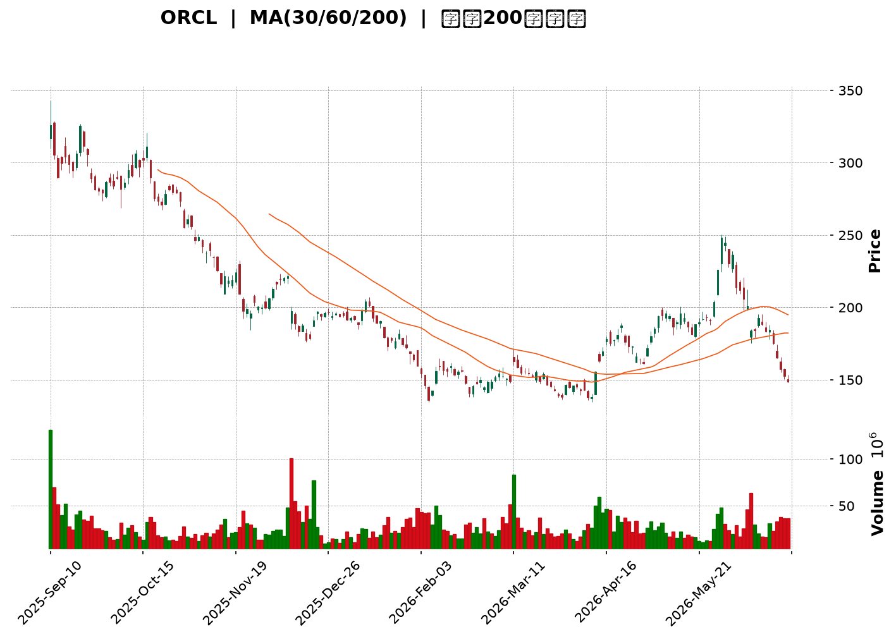
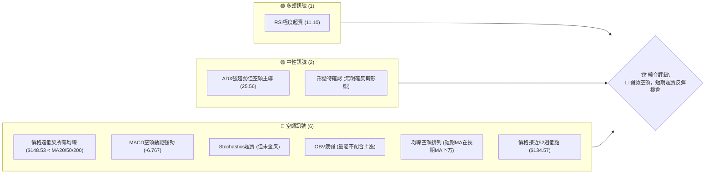
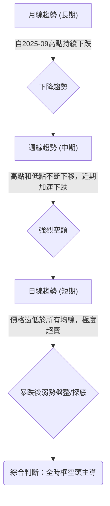
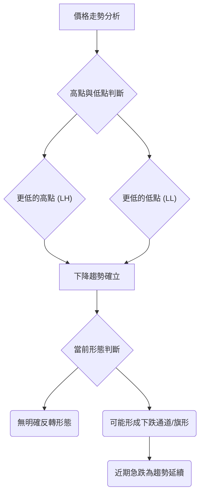
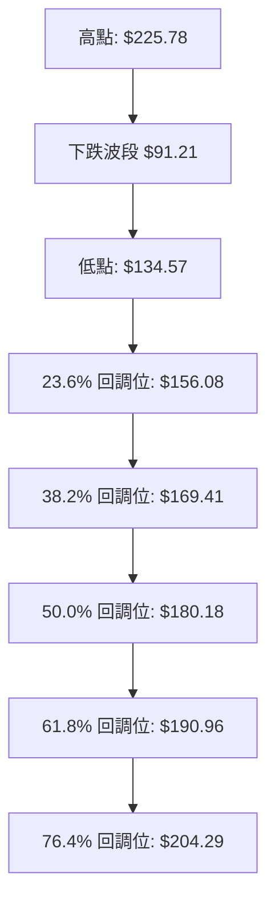
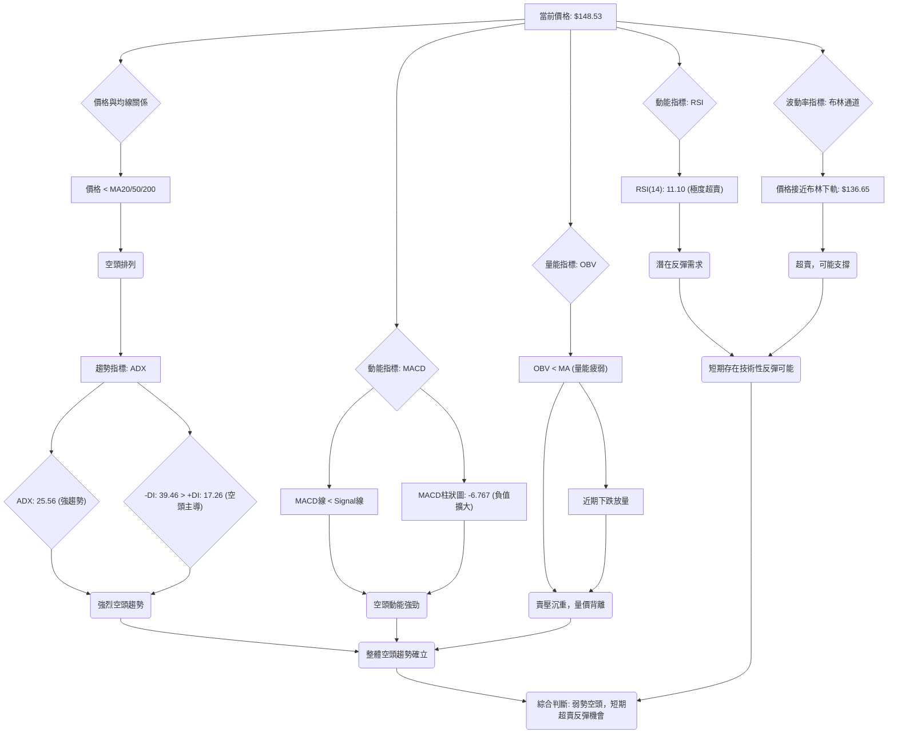
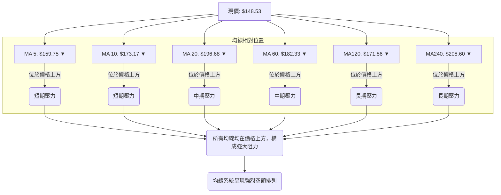
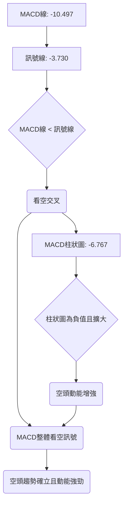
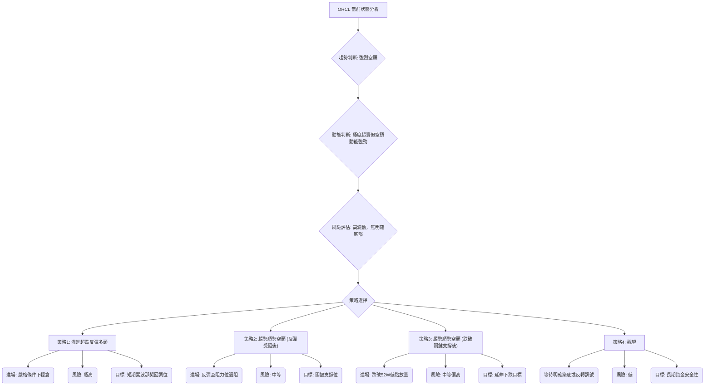
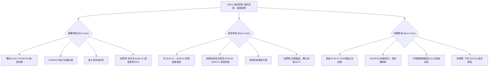

<details>
<summary>📊 靜態圖表 (點擊展開)</summary>

</details>

<html>
<head><meta charset="utf-8" /></head>
<body>
    <div style="height:500px; width:100%;">                        <script>window.PlotlyConfig = {MathJaxConfig: 'local'};</script>
        <script charset="utf-8" src="https://cdn.plot.ly/plotly-3.6.0.min.js" integrity="sha256-QaOVwtVY0T02VaHrr6pnoHLCwayMJp4O5n4YyaE3rJk=" crossorigin="anonymous"></script>                <div id="candlestick-chart" class="plotly-graph-div" style="height:100%; width:100%;"></div>            <script>                window.PLOTLYENV=window.PLOTLYENV || {};                                if (document.getElementById("candlestick-chart")) {                    Plotly.newPlot(                        "candlestick-chart",                        [{"close":{"dtype":"f8","bdata":"AAAAQCZcdEAAAACgMRdzQAAAACBHHnJAAAAAAGS8ckAAAABA\u002fANzQAAAAEDNsHJAAAAAAMNkckAAAADg5CNzQAAAAMBKWXRAAAAAQPd1c0AAAAAAuCBzQAAAAMDIEHJAAAAAoNmTcUAAAAAgvYhxQAAAAMCbcHFAAAAAgPTrcUAAAADATehxQAAAACBlvnFAAAAAgOkUckAAAACgO6BxQAAAAEDs5XFAAAAAAFdyckAAAAAguzJyQAAAAIAPInNAAAAA4MeSckAAAADAP9xyQAAAAKBpcXNAAAAAIH4YckAAAAAAyzdxQAAAAACDF3FAAAAAQOrvcEAAAABAwGVxQAAAAICXmXFAAAAAoOZ6cUAAAAAg1nFxQAAAAKDlGXFAAAAAoEXqb0AAAADAGFBwQAAAAABnBHBAAAAAoO\u002fUbkAAAABg\u002fxhvQAAAAEDzSW5AAAAAoI65bUAAAACgfettQAAAAEClVm1AAAAA4FAzbEAAAACAtwdrQAAAACClr2tAAAAAoIxQa0AAAAAAlmRrQAAAAKDhBGxAAAAA4OYsakAAAAAgebFoQAAAAODQ4WhAAAAAgHN6aEAAAABgqXZpQAAAAADuFmlAAAAAoM72aEAAAABg5ftoQAAAAIDCzmlAAAAAoKugakAAAADgCAhrQAAAACAtZmtAAAAAwKmFa0AAAADAu7RrQAAAAOBVtGhAAAAAQOmZZ0AAAABATPlmQAAAAODtb2dAAAAAQNcrZkAAAAAgxl1mQAAAACCF2WdAAAAAQGOlaEAAAACgs0RoQAAAAOAUiWhAAAAA4PuYaEAAAABg+UVoQAAAACAtgGhAAAAAgAY3aEAAAAAgeFBoQAAAACA97WdAAAAA4CESaEAAAACgMPVnQAAAAMC7j2dAAAAAwIe6aEAAAADA9n5pQAAAAADAMmlAAAAAAPUdaEAAAABADqZnQAAAAACZzWdAAAAAwGZpZkAAAABgy6hlQAAAAEDqMWZAAAAAoGMRZkAAAADgwrlmQAAAAABSyWVAAAAAwFqGZUAAAAAgfw1lQAAAAOA6gGRAAAAA4BfwY0AAAADANkRjQAAAAMAaRWJAAAAA4CgAYUAAAACAVcphQAAAAKBwgWNAAAAAIKzqY0AAAADgnZNjQAAAAKDufWNAAAAAAKXyY0AAAABA5C1jQAAAAAAMdGNAAAAAYNh\u002fY0AAAABgEXJiQAAAAIAummFAAAAAIDQ0YkAAAABAAmxiQAAAAOAtuWJAAAAAIJscYkAAAACgYJdiQAAAAGC5j2JAAAAAoN76YkAAAABACkhjQAAAAECvDWNAAAAAQArhYkAAAAAgKZxiQAAAACCsUWRAAAAA4GTTY0AAAACgPlJjQAAAAECrbWNAAAAAANpEY0AAAABAxQtjQAAAAMBRX2NAAAAA4BalYkAAAADAsDljQAAAAIB\u002fUmJAAAAAoGAwYkAAAADAA8phQAAAAMCQZWFAAAAAQCRKYUAAAADAIlNiQAAAAGAvF2JAAAAAgNs7YkAAAAAAEiFiQAAAAKB+1WFAAAAAwB7lYUAAAAAghTthQAAAAEDhQmFAAAAAANdzY0AAAAAAAGBkQAAAAIDrOWVAAAAAQOFKZkAAAACA6+FlQAAAAGCPMmZAAAAAoHClZkAAAAAAAHBnQAAAAMD1CGZAAAAAwPWoZUAAAABguJ5lQAAAAGC4vmRAAAAAYI96ZEAAAADgeixkQAAAAGCPemVAAAAAoEeJZkAAAABAMytnQAAAAMD1QGhAAAAAQOFSaEAAAABgZn5oQAAAAEDhOmhAAAAAYI9aZ0AAAADgUbhnQAAAACCFc2hAAAAAYGYeaEAAAAAghVNnQAAAAGC4rmZAAAAAwB6FZ0AAAADgo7hnQAAAAGCPAmhAAAAAgOshaEAAAABguN5nQAAAAGBmdmlAAAAAwPU4bEAAAADAzARvQAAAAGCPkm5AAAAAYI\u002fKbEAAAABA4YptQAAAAIDCtWpAAAAAgD16akAAAACA67lpQAAAAOBRKGlAAAAAQDMDZ0AAAAAAKQRnQAAAAOB6FGhAAAAAYI+KZ0AAAADA9fBmQAAAAKBHCWdAAAAAgD3iZUAAAADAHqVkQAAAAMD1sGNAAAAAYLgOY0AAAADA9ZBiQA=="},"high":{"dtype":"f8","bdata":"yvWkDzZwdUC58xMKiYZ0QOlwgJ7wGHNA20UpjgQKc0CYml3Vb9dzQClfqL7kI3NA3gkeWQ\u002fXckBgY05uyUpzQAP\u002ftRS5bnRAqHR5aEkndECSQcNmYGBzQNwuyiqThnJAh2f2eys7ckArL7782rtxQJdR1TxsnHFA\u002fKd7EoP7cUCB3Nh8kUpyQCxstYhURXJA\u002faZH5LZlckDqMXXEyS5yQFh0k5\u002f1E3JA\u002fFk4rhuyckB3AnLfch1zQJdCP3TWTHNAVJohqPjockB3ZTFfxFFzQGN\u002fAdYeCXRAOkBtyL7mckALGxsLk\u002fdxQEaa4IloaXFAoCw7jBw4cUBJTtpS75VxQKkT5Y751nFATdnCJ\u002fTTcUDvV+vLdrtxQAo+xURmfnFAhoofV8zBcEDyFOLx+4JwQNtZUn72f3BAmVSmARG3b0ALUpwNeFtvQFPrmXGP8W5AzcfxddDdbUCqeL2nW7duQLywr9T9f21AXfJF6qJrbUDyAhL9HPlrQNZuQFs5NWxAGlhLBg6ua0CWO7GjrcprQCnFYok1WGxAu9k7FkQSbUCSRu7sNOFpQLUlyIBnUmlA+mgQayXGaED9xAXU9BZqQKTfm1xVI2lAGeubCTpIaUBexdo0ag1qQFXkTH7N1GlA59Wf9gTDakChtxRvGUVrQKWwQtsS7GtApYyZdlSoa0DBoJ3LM\u002f5rQKqdN6QzGGlAPD3q+oeUaEDApTc8G3pnQE4F7zWBlGdAgrpymYwrZ0BHjduWNfRmQC3EP0S0PWhAo3pd3L6yaEC1uNev239oQIeGLPk0omhAUJ5cq63kaECiwPakhaloQK+rxTVjpWhA68TIi9t\u002faEBNnbTmEKxoQKFTyA+pDmlAOMMLVhI2aEBbHxZnMk9oQIHZjVQUuWdAIW3KC3fvaEA24ePBMLxpQBjeguZ04mlAE6ZvSUwfaUCmh+XAmUpoQOF32IJ45mdAM7LBVztRZ0CeyqMGFn9mQN\u002ftzgsOcWZAkwCaocpgZkAqhh4MSBVnQBDpaBIGY2ZA8pFMcIahZkCYVj2XZjRlQPy9GRT9CWVAt2txIFVTZUCDDOrVaNpjQLYgdlfvLGNAHLCRQ0dBYkC9UXyKc9ZhQAcYQ0c15mNA44JmTw+aZEBZtMiM5GJkQJSIoiKRz2NAYbYaKoY3ZEDvfeFZONdjQKrlL8gUmGNA2yBUMbvwY0AcTgqfhy5jQKo9YJtcKWJAa6eacvlHYkBspyRy4xdjQAK\u002fEO8D\u002f2JAQLyYXEoyYkACjO4Et7RiQCoqCULzzGJA62kbZWkiY0ConddPfaxjQFnHjL9Z1GNAR2tpNBLvYkB3a+gaUDNjQPC2DagwZWVA415iTt7nZEB+CDH\u002fuwZkQOt8nSUAxmNA\u002ficbhb3LY0CAcNC6x01jQGczfJX2i2NA0RKSlu4WY0DDM2sxnGdjQMoPSdaoK2NA8WUWFjGqYkBeXrAluj5iQCc7155MpmFARlWskqyWYUCctlQbYlxiQCl9fPohpGJAFyUVSsU9YkDpIcgtDoFiQJ3aY5UjAmJAYmWw+9ndYkAAAACgmdlhQAAAAKBwhWFAAAAAwB59Y0AAAADAzCxlQAAAAIDrkWVAAAAA4KOIZkAAAAAAABBnQAAAAOBROGZAAAAAQOEqZ0AAAACAwqVnQAAAAOB6vGZAAAAAYLiWZkAAAACgmbFlQAAAAGBmFmVAAAAA4FGYZEAAAACAwqVkQAAAAKCZyWVAAAAAAADwZkAAAADgo1BnQAAAAKBHSWhAAAAAwMwEaUAAAAAAAMBoQAAAAIDCdWhAAAAAoHAdaEAAAACAPfJnQAAAAGC4FmlAAAAAgMKNaEAAAADgUdhnQAAAAEAKl2dAAAAAQAqHZ0AAAACAPRpoQAAAAAAAoGhAAAAAYGZmaEAAAADgegRoQAAAAAAAoGlAAAAAoEdJbEAAAAAAAEhvQAAAAAAAIG9AAAAA4FEQbkAAAABgZt5tQAAAAIAU7mxAAAAAgOtha0AAAAAAAJBrQAAAACBcj2pAAAAA4KMYZ0AAAABgjzJnQAAAAIA9amhAAAAAgD1qaEAAAACAFMZnQAAAACCuf2dAAAAAYI8SZ0AAAABgj8plQAAAAAAAuGRAAAAAANezY0AAAACgRzFjQA=="},"hovertemplate":"\u003cb\u003e%{x|%Y-%m-%d}\u003c\u002fb\u003e\u003cbr\u003e\u958b: $%{open:.2f}\u003cbr\u003e\u9ad8: $%{high:.2f}\u003cbr\u003e\u4f4e: $%{low:.2f}\u003cbr\u003e\u6536: $%{close:.2f}\u003cextra\u003e\u003c\u002fextra\u003e","low":{"dtype":"f8","bdata":"sMTlDlhac0AzFaRLceNyQIIsLKpzF3JA7nSg6WVvckBABvo2dL5yQFRB0lqFS3JAFO9gqWsbckD1ilXq329yQODhCJZFCHNA704EmfU5c0A\u002f90EY5ZpyQEe6YAen5HFAWaJ3QIyMcUAEqsSku1ZxQKNjYGDWG3FA517y70Q7cUBHRg0t97xxQCcPF0FsnHFATKzK9V4IckDEpNs4Dc5wQBW6YK8SlnFArXi9ihbYcUAbnQjEnyNyQJ6j72y+fnJAmK27niUjckDZK7A0gpFyQNRlm8uA03JA5ZVOsOfbcUBhPSxIDhpxQNeyVeyN6XBApKzULrC5cEDe7kshn+twQGzlq+RqiHFAdvnYxp1hcUCOdR2hOW1xQMYy31AV23BAUwqZ5d7Wb0BQgrDzi+RvQESD5PZ5tW9AUCITmih2bkCt+Oq8rbBuQD4lyeeCum1A\u002fXzZvMndbECeOufg53NtQAzh5J6+b2xAXsBCZzwZbEC7uNDU+bxqQI691ClyL2pAIhGXJcrHakDgFBmVE6ZqQDBkKady\u002f2pAWFNeg38gakA5CDCNxQtoQBQFf\u002fSfI2hA1EfnI+EPZ0AZwcs3JyBpQL7zxuXljGhAFwg1pfRvaEDnbbQp6dhoQLwUK+nTxWhAZ61KheqhaUBXqwejFopqQLmPeN+58mpANQArXEwea0BwwG\u002fvCAhrQFmC0y\u002f2ImdARAEFwwIbZ0AU5x5\u002fWIlmQFhS12Of62ZAhVY07KH\u002fZUARDZdMqC9mQGttF4ISX2dAIYRhUN\u002f0Z0C2lUV7hOBnQB5j9PpwJ2hAV1B48DBdaEDRptpX1O5nQLOHJC14UGhAAImy4UwxaEAzUT4twyBoQDomOEL45GdABce82iCxZ0A0SldnedpnQMPstd5qIGdAWJoHVO+DZ0CNWQvPYIpoQNDXRZnF\u002fmhAooYdNavEZ0Btup79YpdnQBNEF4MvPGdAKZZ1N4tXZkAU8r4kM0BlQJMbWKZX\u002fGVA8IHI\u002ftdsZUBIY9OaEz1mQH0T4YhqomVAUrclDWFoZUAZgEOtph5kQDwkuNR\u002fVWRAkgvtFS7uY0DUuxza4etiQGAkCn6s\u002fWFA5Nur0e\u002fYYEAPJ886pk1hQBcK\u002fsygT2JAGdARKj2NY0CGibo42S5jQJNr5vkD\u002f2JAX25CCPxXY0BEm\u002fkTIgtjQHkO1Dr72mJABqYulEpnY0DZOk+MEFxiQHhuVc1xQ2FA7IU7puhHYUBgd39OeFpiQA9IHj+iFGJAOQa8tl+zYUDkOf82CZZhQDrfqA2r0WFAjgPlG5iSYkBAf6zGHrNiQPy6rhT04mJAjNgGhHM9YkArbfzV3X1iQCGvleusAGRAEoVt7trBY0Ay9ymfoTNjQGx3p4AcP2NAqxffbeceY0DDfzqlWPBiQEycNsjli2JALm42E+xtYkBEik1f78ViQDQvrFfYSmJAVh19fBgDYkDbz8GSZ8FhQI\u002f3xmYyOmFAU7AEvyUPYUBgC+fen2thQJlcatdTBWJAWAFzefl5YUAv+E3PLethQPCKm5d+bmFAROZRa+LMYUAAAAAAAABhQAAAAIA90mBAAAAAQAp3YUAAAACA6zFkQAAAAGC4xmRAAAAAoJm5ZUAAAAAghatlQAAAAOBRsGVAAAAA4FEAZkAAAACgmdlmQAAAAGCPwmVAAAAAoJkZZUAAAADAzPxkQAAAAKCZQWRAAAAAwMwUZEAAAABgjwpkQAAAAMDMxGRAAAAA4FHIZUAAAAAAAGBmQAAAAKBw1WZAAAAAoJnZZ0AAAABguMZnQAAAAEAz02dAAAAAANebZkAAAACA6yFnQAAAAGBmLmdAAAAAwMycZ0AAAADgo+hmQAAAAIDCnWZAAAAAoJlZZkAAAABgZmZnQAAAAEAz42dAAAAAgOvRZ0AAAACgcH1nQAAAAAApLGhAAAAA4FEAakAAAABAMxNsQAAAAEDh2m1AAAAAIIVzbEAAAAAAAABsQAAAAGBmLmpAAAAAYI8qakAAAACgR7loQAAAAIDCxWhAAAAAwPXoZUAAAAAAAGBmQAAAAGC4RmdAAAAAwB51Z0AAAABgj9JmQAAAAGBmNmZAAAAAwMzMZUAAAAAghZNkQAAAAEAza2NAAAAAIIXLYkAAAAAAAIBiQA=="},"name":"\u50f9\u683c","open":{"dtype":"f8","bdata":"uvdX\u002fQ3Lc0BnX4zUDnx0QF975kdV9nJAqJW9h88Ac0ChplT9nXlzQBx8Nrp+FHNAj4HGfK3KckBdRQtKi4pyQFpih81KM3NAIxhFemkXdEBUfdlWsVZzQAIAKqVUT3JAa5vTjUsrckBMsiy+8qVxQCYG222Al3FAp5IAr99JcUD9tEPGPhhyQGdqKkpS9XFAtFM1CnQhckDqMXXEyS5yQJCfchH3snFA6ift904cckCmHfi\u002fIqdyQMNKm6gCjnJABW7mS3TbckDHdleamvByQBsXfmC8+3JA4YWwKlHeckCWyTyM9vJxQNotUROVRnFAFt6YlkMScUCWbvh+r\u002fRwQOg8a3THwnFAEYqSqR3NcUC+ZoQ2WJRxQNFqe+Xae3FAZyzC25OxcEBKkXHNzB5wQFvjAIDreXBA6SIpkIAOb0AxuRe1qsxuQNfWmfuezW5A94s5wkmxbUABjilzVI5uQJZgSJ8wWW1Afo3ICmlpbUCjCozetPNrQIs1VqlaMWpA\u002frdUbhIca0B1tt9ldtxqQFnYAxgbN2tAU+rF7vC3bEDe6ZFXFrppQHHeB14LdWhAPFbVuaAcaEBq12TYDQdqQLrhS5VTyWhAPJXiI9DoaEB147rcYnxpQCSC5gBo42hAAMwKGOXSaUAWOH5zMjVrQGeiyDjwf2tAeycAzfRVa0AXZnsKQI5rQBn3+miVrmdApPIEyHVlaEAMBVKiemRnQGU+IiJN8mZAA5KBtRfGZkBmHYoIVLNmQJnEpt+oZ2dAH4SOzcVzaECbO5VWXmdoQKBD21XjOWhAm599vzWbaEC0AJsqLB9oQFx+McqZW2hA6AGv0gxnaEBOCojwcYhoQPvOXG0dpGhAu69y6kjsZ0DrLkfqbUNoQP8REXXatmdAIjr0NsbfZ0BOFZJcMZ1oQEFXshsriWlAE6ZvSUwfaUCmh+XAmUpoQJhJriT4p2dAM7LBVztRZ0Ap3NOBv2FmQEcAHtLcV2ZAbetyUZ2AZUBye2LaQE9mQMT96G4fUmZAW7b\u002fTfXJZUAPzSt\u002f2TFlQI3gYsS18mRAFPkrXGdKZUC6TM+ksbZjQB9mcCRXK2NA43CL+fsiYkD\u002f8r2Hb2hhQK3DgHEkf2JAf4IaHS7uY0BZtMiM5GJkQK8tgagrrGNAERIegEPWY0DCaLbKw61jQPoyDk7sO2NA8kmOt5KUY0D1iFnLhhhjQGuvRZ7aJWJAkKcpnTGLYUDf+i3qgZRiQF7VlVa1iGJAFOx0tiLsYUCXHWsrEaRhQCv+ePXgB2JAbzTSyZyvYkBuLPKZ4gFjQHtABaRoDGNAfi0qpZ3FYkAhcWUOuyJjQMs89yyhuWRAJtPxD8iCZEDeW53J4s9jQMTaHO+JcGNAsfW4ncRcY0A8fXP+thtjQOWAxoT2vWJAWGVY6o0QY0C01RJhk9xiQKvGR7\u002f1DmNAqM9yWr2WYkCSQxVVdOxhQErpOUoQjmFAUe1t5a5xYUBXu1xq+XlhQMLZ5nFGkmJA3Wso5A7JYUAc7ruzqF1iQCpdoVvy6GFAraeRTty4YkAAAABgZsZhQAAAAIA9KmFAAAAA4KN4YUAAAACAwv1kQAAAAOB63GRAAAAAoHANZkAAAACAwt1mQAAAAIDrGWZAAAAAQDNLZkAAAACAwkVnQAAAAMDMjGZAAAAA4FGQZkAAAABgj5JlQAAAAMAeRWRAAAAAoEeBZEAAAADgo0BkQAAAAKBwzWRAAAAA4KMAZkAAAAAAKcRmQAAAAGBmRmdAAAAAIIXTaEAAAABgjxJoQAAAAMDMBGhAAAAAoHAdaEAAAADA9aBnQAAAAIDChWdAAAAAIK7PZ0AAAAAAAMBnQAAAAAAAQGdAAAAAgBR+ZkAAAADgUaBnQAAAAKBw9WdAAAAAoJkpaEAAAAAgXO9nQAAAAKBHQWhAAAAAAAAgakAAAAAAANBsQAAAAKCZWW5AAAAAIFwPbkAAAAAAAGBsQAAAACCur2xAAAAAAAA4a0AAAADAHr1qQAAAAAAA0GhAAAAAoHB1ZkAAAADgUSBnQAAAAOB6bGdAAAAA4FHAZ0AAAADAHkVnQAAAAOBR4GZAAAAAgOvJZkAAAAAgXEdlQAAAACBcT2RAAAAAQDOrY0AAAADgUchiQA=="},"x":["2025-09-10T00:00:00-04:00","2025-09-11T00:00:00-04:00","2025-09-12T00:00:00-04:00","2025-09-15T00:00:00-04:00","2025-09-16T00:00:00-04:00","2025-09-17T00:00:00-04:00","2025-09-18T00:00:00-04:00","2025-09-19T00:00:00-04:00","2025-09-22T00:00:00-04:00","2025-09-23T00:00:00-04:00","2025-09-24T00:00:00-04:00","2025-09-25T00:00:00-04:00","2025-09-26T00:00:00-04:00","2025-09-29T00:00:00-04:00","2025-09-30T00:00:00-04:00","2025-10-01T00:00:00-04:00","2025-10-02T00:00:00-04:00","2025-10-03T00:00:00-04:00","2025-10-06T00:00:00-04:00","2025-10-07T00:00:00-04:00","2025-10-08T00:00:00-04:00","2025-10-09T00:00:00-04:00","2025-10-10T00:00:00-04:00","2025-10-13T00:00:00-04:00","2025-10-14T00:00:00-04:00","2025-10-15T00:00:00-04:00","2025-10-16T00:00:00-04:00","2025-10-17T00:00:00-04:00","2025-10-20T00:00:00-04:00","2025-10-21T00:00:00-04:00","2025-10-22T00:00:00-04:00","2025-10-23T00:00:00-04:00","2025-10-24T00:00:00-04:00","2025-10-27T00:00:00-04:00","2025-10-28T00:00:00-04:00","2025-10-29T00:00:00-04:00","2025-10-30T00:00:00-04:00","2025-10-31T00:00:00-04:00","2025-11-03T00:00:00-05:00","2025-11-04T00:00:00-05:00","2025-11-05T00:00:00-05:00","2025-11-06T00:00:00-05:00","2025-11-07T00:00:00-05:00","2025-11-10T00:00:00-05:00","2025-11-11T00:00:00-05:00","2025-11-12T00:00:00-05:00","2025-11-13T00:00:00-05:00","2025-11-14T00:00:00-05:00","2025-11-17T00:00:00-05:00","2025-11-18T00:00:00-05:00","2025-11-19T00:00:00-05:00","2025-11-20T00:00:00-05:00","2025-11-21T00:00:00-05:00","2025-11-24T00:00:00-05:00","2025-11-25T00:00:00-05:00","2025-11-26T00:00:00-05:00","2025-11-28T00:00:00-05:00","2025-12-01T00:00:00-05:00","2025-12-02T00:00:00-05:00","2025-12-03T00:00:00-05:00","2025-12-04T00:00:00-05:00","2025-12-05T00:00:00-05:00","2025-12-08T00:00:00-05:00","2025-12-09T00:00:00-05:00","2025-12-10T00:00:00-05:00","2025-12-11T00:00:00-05:00","2025-12-12T00:00:00-05:00","2025-12-15T00:00:00-05:00","2025-12-16T00:00:00-05:00","2025-12-17T00:00:00-05:00","2025-12-18T00:00:00-05:00","2025-12-19T00:00:00-05:00","2025-12-22T00:00:00-05:00","2025-12-23T00:00:00-05:00","2025-12-24T00:00:00-05:00","2025-12-26T00:00:00-05:00","2025-12-29T00:00:00-05:00","2025-12-30T00:00:00-05:00","2025-12-31T00:00:00-05:00","2026-01-02T00:00:00-05:00","2026-01-05T00:00:00-05:00","2026-01-06T00:00:00-05:00","2026-01-07T00:00:00-05:00","2026-01-08T00:00:00-05:00","2026-01-09T00:00:00-05:00","2026-01-12T00:00:00-05:00","2026-01-13T00:00:00-05:00","2026-01-14T00:00:00-05:00","2026-01-15T00:00:00-05:00","2026-01-16T00:00:00-05:00","2026-01-20T00:00:00-05:00","2026-01-21T00:00:00-05:00","2026-01-22T00:00:00-05:00","2026-01-23T00:00:00-05:00","2026-01-26T00:00:00-05:00","2026-01-27T00:00:00-05:00","2026-01-28T00:00:00-05:00","2026-01-29T00:00:00-05:00","2026-01-30T00:00:00-05:00","2026-02-02T00:00:00-05:00","2026-02-03T00:00:00-05:00","2026-02-04T00:00:00-05:00","2026-02-05T00:00:00-05:00","2026-02-06T00:00:00-05:00","2026-02-09T00:00:00-05:00","2026-02-10T00:00:00-05:00","2026-02-11T00:00:00-05:00","2026-02-12T00:00:00-05:00","2026-02-13T00:00:00-05:00","2026-02-17T00:00:00-05:00","2026-02-18T00:00:00-05:00","2026-02-19T00:00:00-05:00","2026-02-20T00:00:00-05:00","2026-02-23T00:00:00-05:00","2026-02-24T00:00:00-05:00","2026-02-25T00:00:00-05:00","2026-02-26T00:00:00-05:00","2026-02-27T00:00:00-05:00","2026-03-02T00:00:00-05:00","2026-03-03T00:00:00-05:00","2026-03-04T00:00:00-05:00","2026-03-05T00:00:00-05:00","2026-03-06T00:00:00-05:00","2026-03-09T00:00:00-04:00","2026-03-10T00:00:00-04:00","2026-03-11T00:00:00-04:00","2026-03-12T00:00:00-04:00","2026-03-13T00:00:00-04:00","2026-03-16T00:00:00-04:00","2026-03-17T00:00:00-04:00","2026-03-18T00:00:00-04:00","2026-03-19T00:00:00-04:00","2026-03-20T00:00:00-04:00","2026-03-23T00:00:00-04:00","2026-03-24T00:00:00-04:00","2026-03-25T00:00:00-04:00","2026-03-26T00:00:00-04:00","2026-03-27T00:00:00-04:00","2026-03-30T00:00:00-04:00","2026-03-31T00:00:00-04:00","2026-04-01T00:00:00-04:00","2026-04-02T00:00:00-04:00","2026-04-06T00:00:00-04:00","2026-04-07T00:00:00-04:00","2026-04-08T00:00:00-04:00","2026-04-09T00:00:00-04:00","2026-04-10T00:00:00-04:00","2026-04-13T00:00:00-04:00","2026-04-14T00:00:00-04:00","2026-04-15T00:00:00-04:00","2026-04-16T00:00:00-04:00","2026-04-17T00:00:00-04:00","2026-04-20T00:00:00-04:00","2026-04-21T00:00:00-04:00","2026-04-22T00:00:00-04:00","2026-04-23T00:00:00-04:00","2026-04-24T00:00:00-04:00","2026-04-27T00:00:00-04:00","2026-04-28T00:00:00-04:00","2026-04-29T00:00:00-04:00","2026-04-30T00:00:00-04:00","2026-05-01T00:00:00-04:00","2026-05-04T00:00:00-04:00","2026-05-05T00:00:00-04:00","2026-05-06T00:00:00-04:00","2026-05-07T00:00:00-04:00","2026-05-08T00:00:00-04:00","2026-05-11T00:00:00-04:00","2026-05-12T00:00:00-04:00","2026-05-13T00:00:00-04:00","2026-05-14T00:00:00-04:00","2026-05-15T00:00:00-04:00","2026-05-18T00:00:00-04:00","2026-05-19T00:00:00-04:00","2026-05-20T00:00:00-04:00","2026-05-21T00:00:00-04:00","2026-05-22T00:00:00-04:00","2026-05-26T00:00:00-04:00","2026-05-27T00:00:00-04:00","2026-05-28T00:00:00-04:00","2026-05-29T00:00:00-04:00","2026-06-01T00:00:00-04:00","2026-06-02T00:00:00-04:00","2026-06-03T00:00:00-04:00","2026-06-04T00:00:00-04:00","2026-06-05T00:00:00-04:00","2026-06-08T00:00:00-04:00","2026-06-09T00:00:00-04:00","2026-06-10T00:00:00-04:00","2026-06-11T00:00:00-04:00","2026-06-12T00:00:00-04:00","2026-06-15T00:00:00-04:00","2026-06-16T00:00:00-04:00","2026-06-17T00:00:00-04:00","2026-06-18T00:00:00-04:00","2026-06-22T00:00:00-04:00","2026-06-23T00:00:00-04:00","2026-06-24T00:00:00-04:00","2026-06-25T00:00:00-04:00","2026-06-26T00:00:00-04:00"],"type":"candlestick"},{"hovertemplate":"MA30: $%{y:.2f}\u003cextra\u003e\u003c\u002fextra\u003e","line":{"color":"#2196F3","dash":"dash","width":2},"mode":"lines","name":"MA30","x":["2025-09-10T00:00:00-04:00","2025-09-11T00:00:00-04:00","2025-09-12T00:00:00-04:00","2025-09-15T00:00:00-04:00","2025-09-16T00:00:00-04:00","2025-09-17T00:00:00-04:00","2025-09-18T00:00:00-04:00","2025-09-19T00:00:00-04:00","2025-09-22T00:00:00-04:00","2025-09-23T00:00:00-04:00","2025-09-24T00:00:00-04:00","2025-09-25T00:00:00-04:00","2025-09-26T00:00:00-04:00","2025-09-29T00:00:00-04:00","2025-09-30T00:00:00-04:00","2025-10-01T00:00:00-04:00","2025-10-02T00:00:00-04:00","2025-10-03T00:00:00-04:00","2025-10-06T00:00:00-04:00","2025-10-07T00:00:00-04:00","2025-10-08T00:00:00-04:00","2025-10-09T00:00:00-04:00","2025-10-10T00:00:00-04:00","2025-10-13T00:00:00-04:00","2025-10-14T00:00:00-04:00","2025-10-15T00:00:00-04:00","2025-10-16T00:00:00-04:00","2025-10-17T00:00:00-04:00","2025-10-20T00:00:00-04:00","2025-10-21T00:00:00-04:00","2025-10-22T00:00:00-04:00","2025-10-23T00:00:00-04:00","2025-10-24T00:00:00-04:00","2025-10-27T00:00:00-04:00","2025-10-28T00:00:00-04:00","2025-10-29T00:00:00-04:00","2025-10-30T00:00:00-04:00","2025-10-31T00:00:00-04:00","2025-11-03T00:00:00-05:00","2025-11-04T00:00:00-05:00","2025-11-05T00:00:00-05:00","2025-11-06T00:00:00-05:00","2025-11-07T00:00:00-05:00","2025-11-10T00:00:00-05:00","2025-11-11T00:00:00-05:00","2025-11-12T00:00:00-05:00","2025-11-13T00:00:00-05:00","2025-11-14T00:00:00-05:00","2025-11-17T00:00:00-05:00","2025-11-18T00:00:00-05:00","2025-11-19T00:00:00-05:00","2025-11-20T00:00:00-05:00","2025-11-21T00:00:00-05:00","2025-11-24T00:00:00-05:00","2025-11-25T00:00:00-05:00","2025-11-26T00:00:00-05:00","2025-11-28T00:00:00-05:00","2025-12-01T00:00:00-05:00","2025-12-02T00:00:00-05:00","2025-12-03T00:00:00-05:00","2025-12-04T00:00:00-05:00","2025-12-05T00:00:00-05:00","2025-12-08T00:00:00-05:00","2025-12-09T00:00:00-05:00","2025-12-10T00:00:00-05:00","2025-12-11T00:00:00-05:00","2025-12-12T00:00:00-05:00","2025-12-15T00:00:00-05:00","2025-12-16T00:00:00-05:00","2025-12-17T00:00:00-05:00","2025-12-18T00:00:00-05:00","2025-12-19T00:00:00-05:00","2025-12-22T00:00:00-05:00","2025-12-23T00:00:00-05:00","2025-12-24T00:00:00-05:00","2025-12-26T00:00:00-05:00","2025-12-29T00:00:00-05:00","2025-12-30T00:00:00-05:00","2025-12-31T00:00:00-05:00","2026-01-02T00:00:00-05:00","2026-01-05T00:00:00-05:00","2026-01-06T00:00:00-05:00","2026-01-07T00:00:00-05:00","2026-01-08T00:00:00-05:00","2026-01-09T00:00:00-05:00","2026-01-12T00:00:00-05:00","2026-01-13T00:00:00-05:00","2026-01-14T00:00:00-05:00","2026-01-15T00:00:00-05:00","2026-01-16T00:00:00-05:00","2026-01-20T00:00:00-05:00","2026-01-21T00:00:00-05:00","2026-01-22T00:00:00-05:00","2026-01-23T00:00:00-05:00","2026-01-26T00:00:00-05:00","2026-01-27T00:00:00-05:00","2026-01-28T00:00:00-05:00","2026-01-29T00:00:00-05:00","2026-01-30T00:00:00-05:00","2026-02-02T00:00:00-05:00","2026-02-03T00:00:00-05:00","2026-02-04T00:00:00-05:00","2026-02-05T00:00:00-05:00","2026-02-06T00:00:00-05:00","2026-02-09T00:00:00-05:00","2026-02-10T00:00:00-05:00","2026-02-11T00:00:00-05:00","2026-02-12T00:00:00-05:00","2026-02-13T00:00:00-05:00","2026-02-17T00:00:00-05:00","2026-02-18T00:00:00-05:00","2026-02-19T00:00:00-05:00","2026-02-20T00:00:00-05:00","2026-02-23T00:00:00-05:00","2026-02-24T00:00:00-05:00","2026-02-25T00:00:00-05:00","2026-02-26T00:00:00-05:00","2026-02-27T00:00:00-05:00","2026-03-02T00:00:00-05:00","2026-03-03T00:00:00-05:00","2026-03-04T00:00:00-05:00","2026-03-05T00:00:00-05:00","2026-03-06T00:00:00-05:00","2026-03-09T00:00:00-04:00","2026-03-10T00:00:00-04:00","2026-03-11T00:00:00-04:00","2026-03-12T00:00:00-04:00","2026-03-13T00:00:00-04:00","2026-03-16T00:00:00-04:00","2026-03-17T00:00:00-04:00","2026-03-18T00:00:00-04:00","2026-03-19T00:00:00-04:00","2026-03-20T00:00:00-04:00","2026-03-23T00:00:00-04:00","2026-03-24T00:00:00-04:00","2026-03-25T00:00:00-04:00","2026-03-26T00:00:00-04:00","2026-03-27T00:00:00-04:00","2026-03-30T00:00:00-04:00","2026-03-31T00:00:00-04:00","2026-04-01T00:00:00-04:00","2026-04-02T00:00:00-04:00","2026-04-06T00:00:00-04:00","2026-04-07T00:00:00-04:00","2026-04-08T00:00:00-04:00","2026-04-09T00:00:00-04:00","2026-04-10T00:00:00-04:00","2026-04-13T00:00:00-04:00","2026-04-14T00:00:00-04:00","2026-04-15T00:00:00-04:00","2026-04-16T00:00:00-04:00","2026-04-17T00:00:00-04:00","2026-04-20T00:00:00-04:00","2026-04-21T00:00:00-04:00","2026-04-22T00:00:00-04:00","2026-04-23T00:00:00-04:00","2026-04-24T00:00:00-04:00","2026-04-27T00:00:00-04:00","2026-04-28T00:00:00-04:00","2026-04-29T00:00:00-04:00","2026-04-30T00:00:00-04:00","2026-05-01T00:00:00-04:00","2026-05-04T00:00:00-04:00","2026-05-05T00:00:00-04:00","2026-05-06T00:00:00-04:00","2026-05-07T00:00:00-04:00","2026-05-08T00:00:00-04:00","2026-05-11T00:00:00-04:00","2026-05-12T00:00:00-04:00","2026-05-13T00:00:00-04:00","2026-05-14T00:00:00-04:00","2026-05-15T00:00:00-04:00","2026-05-18T00:00:00-04:00","2026-05-19T00:00:00-04:00","2026-05-20T00:00:00-04:00","2026-05-21T00:00:00-04:00","2026-05-22T00:00:00-04:00","2026-05-26T00:00:00-04:00","2026-05-27T00:00:00-04:00","2026-05-28T00:00:00-04:00","2026-05-29T00:00:00-04:00","2026-06-01T00:00:00-04:00","2026-06-02T00:00:00-04:00","2026-06-03T00:00:00-04:00","2026-06-04T00:00:00-04:00","2026-06-05T00:00:00-04:00","2026-06-08T00:00:00-04:00","2026-06-09T00:00:00-04:00","2026-06-10T00:00:00-04:00","2026-06-11T00:00:00-04:00","2026-06-12T00:00:00-04:00","2026-06-15T00:00:00-04:00","2026-06-16T00:00:00-04:00","2026-06-17T00:00:00-04:00","2026-06-18T00:00:00-04:00","2026-06-22T00:00:00-04:00","2026-06-23T00:00:00-04:00","2026-06-24T00:00:00-04:00","2026-06-25T00:00:00-04:00","2026-06-26T00:00:00-04:00"],"y":{"dtype":"f8","bdata":"AAAAAAAA+H8AAAAAAAD4fwAAAAAAAPh\u002fAAAAAAAA+H8AAAAAAAD4fwAAAAAAAPh\u002fAAAAAAAA+H8AAAAAAAD4fwAAAAAAAPh\u002fAAAAAAAA+H8AAAAAAAD4fwAAAAAAAPh\u002fAAAAAAAA+H8AAAAAAAD4fwAAAAAAAPh\u002fAAAAAAAA+H8AAAAAAAD4fwAAAAAAAPh\u002fAAAAAAAA+H8AAAAAAAD4fwAAAAAAAPh\u002fAAAAAAAA+H8AAAAAAAD4fwAAAAAAAPh\u002fAAAAAAAA+H8AAAAAAAD4fwAAAAAAAPh\u002fAAAAAAAA+H8AAAAAAAD4f83MzBzRcXJAmpmZ6ZtUckAzMzMzKUZyQCIiIvK8QXJAERERkQU3ckBVVVXlnSlyQERERKQNHHJAERERCUQHckCamZmhI+9xQDMzMxstynFAvLu726incUCrqqpyHolxQM3MzCQxcHFA3t3d3QVZcUDNzMx0DkNxQKuqquJpK3FAAAAAwM0KcUC8u7t7UuVwQM3MzFQJxHBAiYiIKEiecEAzMzMjwHxwQDMzM1uRW3BAIiIiktYtcEDv7u5ez\u002fdvQBEREZGZhW9AZmZmBn8Zb0AiIiLS5rBuQKuqqvorO25AiYiIqF3bbUAzMzOjtYptQLy7u+s7Q21AmpmZOWUFbUARERGBJcNsQAAAAGCUgGxAmpmZuRtBbEARERFxzwNsQO\u002fu7v7CsmtAvLu7+9Bra0AiIiICdBlrQERERDQX0GpA3t3d\u002fS+GakBVVVUVrjtqQKuqqnq7BGpAMzMzs2TZaUBERETEKqlpQM3MzHwugGlAvLu7629haUBVVVWV6UlpQKuqquq6LmlAMzMzg0cUaUAAAABAAvpoQN7d3V0W12hA3t3d3SDFaEDv7u4u2r5oQGZmZjaVs2hAVVVVBbi1aEDe3d3d\u002frVoQERERETstmhAAAAA0LGvaEBmZmbGTKRoQKuqqsoxk2hAd3d3BzhvaEBVVVWlYEFoQERERAT4FGhAVVVVJW3mZ0AiIiJi7btnQKuqqtoGo2dAd3d3506RZ0AzMzMz6oBnQDMzM7PbZ2dAmpmZycxUZ0AzMzMTWTpnQN7d3e27CmdAAAAAQH7JZkCJiIjYNpJmQImIiPhKZ2ZAERERYVk\u002fZkAzMzNDRRdmQCIiInKH7GVAvLu7yx3IZUARERERTJxlQDMzM8MfdmVAAAAAUB1PZUDNzMy8EyBlQCIiIrI57WRA3t3dPYy1ZEAiIiLCLnlkQHd3dyfuQWRAzczMbK8OZEARERGBh+NjQJqZmdnMtmNAvLu7C4SZY0B3d3dXOYVjQDMzM5NqamNAVVVVZTRPY0C8u7urFSxjQERERCSQH2NAq6qqehARY0AAAAAQSgJjQERERCQj+WJAERER4W3zYkCrqqo6jPFiQGZmZnb0+mJAVVVVZfwIY0C8u7srOxVjQBEREREiC2NAERER0WP8YkAiIiLyIu1iQDMzM\u002fNB22JA3t3d\u002fZLEYkBmZmZGSL1iQCIiIlKnsWJAAAAAoNqmYkAiIiJyJ6RiQFVVVZUhpmJAzczMvH6jYkDv7u5uWJliQJqZmWnejGJAd3d3V0+YYkCrqqrah6diQCIiIkJFvmJAzczMnInaYkCamZnJu\u002fBiQO\u002fu7g6QC2NAq6qqmrUrY0Dv7u5u51RjQFVVVQWMY2NAvLu7+zJzY0BERESk0IZjQAAAANAMkmNAiYiIqF+cY0AAAABQ\u002f6VjQFVVVdX4t2NAiYiIqC3ZY0BEREQk1PpjQO\u002fu7q5xLWRA3t3dTcthZECrqqrKAZtkQGZmZkZR1WRARERElBAJZUDv7u6uGjdlQO\u002fu7s5hbWVAMzMzo5mfZUDv7u7O8stlQJqZmZlS9WVAmpmZmVIlZkDe3d19sVxmQM3MzFxIlmZAq6qq+je+ZkDNzMzsCtxmQHd3dycxAGdAAAAAcMsyZ0ARERHhwYBnQImIiFg5yGdA3t3dTan8Z0ARERHhwTBoQCIiIpKmWGhAAAAAkMKBaEDNzMzMzKRoQM3MzAx0ymhAzczMHBPgaEBmZmamVPhoQKuqqiqHDmlAAAAAoBoXaUBERESkKRVpQImIiPjFCmlAZmZmtvP1aEDe3d39G9VoQBEREfFgrmhAREREpLeJaECrqqoavV1oQA=="},"type":"scatter"},{"hovertemplate":"MA60: $%{y:.2f}\u003cextra\u003e\u003c\u002fextra\u003e","line":{"color":"#9C27B0","dash":"dash","width":2},"mode":"lines","name":"MA60","x":["2025-09-10T00:00:00-04:00","2025-09-11T00:00:00-04:00","2025-09-12T00:00:00-04:00","2025-09-15T00:00:00-04:00","2025-09-16T00:00:00-04:00","2025-09-17T00:00:00-04:00","2025-09-18T00:00:00-04:00","2025-09-19T00:00:00-04:00","2025-09-22T00:00:00-04:00","2025-09-23T00:00:00-04:00","2025-09-24T00:00:00-04:00","2025-09-25T00:00:00-04:00","2025-09-26T00:00:00-04:00","2025-09-29T00:00:00-04:00","2025-09-30T00:00:00-04:00","2025-10-01T00:00:00-04:00","2025-10-02T00:00:00-04:00","2025-10-03T00:00:00-04:00","2025-10-06T00:00:00-04:00","2025-10-07T00:00:00-04:00","2025-10-08T00:00:00-04:00","2025-10-09T00:00:00-04:00","2025-10-10T00:00:00-04:00","2025-10-13T00:00:00-04:00","2025-10-14T00:00:00-04:00","2025-10-15T00:00:00-04:00","2025-10-16T00:00:00-04:00","2025-10-17T00:00:00-04:00","2025-10-20T00:00:00-04:00","2025-10-21T00:00:00-04:00","2025-10-22T00:00:00-04:00","2025-10-23T00:00:00-04:00","2025-10-24T00:00:00-04:00","2025-10-27T00:00:00-04:00","2025-10-28T00:00:00-04:00","2025-10-29T00:00:00-04:00","2025-10-30T00:00:00-04:00","2025-10-31T00:00:00-04:00","2025-11-03T00:00:00-05:00","2025-11-04T00:00:00-05:00","2025-11-05T00:00:00-05:00","2025-11-06T00:00:00-05:00","2025-11-07T00:00:00-05:00","2025-11-10T00:00:00-05:00","2025-11-11T00:00:00-05:00","2025-11-12T00:00:00-05:00","2025-11-13T00:00:00-05:00","2025-11-14T00:00:00-05:00","2025-11-17T00:00:00-05:00","2025-11-18T00:00:00-05:00","2025-11-19T00:00:00-05:00","2025-11-20T00:00:00-05:00","2025-11-21T00:00:00-05:00","2025-11-24T00:00:00-05:00","2025-11-25T00:00:00-05:00","2025-11-26T00:00:00-05:00","2025-11-28T00:00:00-05:00","2025-12-01T00:00:00-05:00","2025-12-02T00:00:00-05:00","2025-12-03T00:00:00-05:00","2025-12-04T00:00:00-05:00","2025-12-05T00:00:00-05:00","2025-12-08T00:00:00-05:00","2025-12-09T00:00:00-05:00","2025-12-10T00:00:00-05:00","2025-12-11T00:00:00-05:00","2025-12-12T00:00:00-05:00","2025-12-15T00:00:00-05:00","2025-12-16T00:00:00-05:00","2025-12-17T00:00:00-05:00","2025-12-18T00:00:00-05:00","2025-12-19T00:00:00-05:00","2025-12-22T00:00:00-05:00","2025-12-23T00:00:00-05:00","2025-12-24T00:00:00-05:00","2025-12-26T00:00:00-05:00","2025-12-29T00:00:00-05:00","2025-12-30T00:00:00-05:00","2025-12-31T00:00:00-05:00","2026-01-02T00:00:00-05:00","2026-01-05T00:00:00-05:00","2026-01-06T00:00:00-05:00","2026-01-07T00:00:00-05:00","2026-01-08T00:00:00-05:00","2026-01-09T00:00:00-05:00","2026-01-12T00:00:00-05:00","2026-01-13T00:00:00-05:00","2026-01-14T00:00:00-05:00","2026-01-15T00:00:00-05:00","2026-01-16T00:00:00-05:00","2026-01-20T00:00:00-05:00","2026-01-21T00:00:00-05:00","2026-01-22T00:00:00-05:00","2026-01-23T00:00:00-05:00","2026-01-26T00:00:00-05:00","2026-01-27T00:00:00-05:00","2026-01-28T00:00:00-05:00","2026-01-29T00:00:00-05:00","2026-01-30T00:00:00-05:00","2026-02-02T00:00:00-05:00","2026-02-03T00:00:00-05:00","2026-02-04T00:00:00-05:00","2026-02-05T00:00:00-05:00","2026-02-06T00:00:00-05:00","2026-02-09T00:00:00-05:00","2026-02-10T00:00:00-05:00","2026-02-11T00:00:00-05:00","2026-02-12T00:00:00-05:00","2026-02-13T00:00:00-05:00","2026-02-17T00:00:00-05:00","2026-02-18T00:00:00-05:00","2026-02-19T00:00:00-05:00","2026-02-20T00:00:00-05:00","2026-02-23T00:00:00-05:00","2026-02-24T00:00:00-05:00","2026-02-25T00:00:00-05:00","2026-02-26T00:00:00-05:00","2026-02-27T00:00:00-05:00","2026-03-02T00:00:00-05:00","2026-03-03T00:00:00-05:00","2026-03-04T00:00:00-05:00","2026-03-05T00:00:00-05:00","2026-03-06T00:00:00-05:00","2026-03-09T00:00:00-04:00","2026-03-10T00:00:00-04:00","2026-03-11T00:00:00-04:00","2026-03-12T00:00:00-04:00","2026-03-13T00:00:00-04:00","2026-03-16T00:00:00-04:00","2026-03-17T00:00:00-04:00","2026-03-18T00:00:00-04:00","2026-03-19T00:00:00-04:00","2026-03-20T00:00:00-04:00","2026-03-23T00:00:00-04:00","2026-03-24T00:00:00-04:00","2026-03-25T00:00:00-04:00","2026-03-26T00:00:00-04:00","2026-03-27T00:00:00-04:00","2026-03-30T00:00:00-04:00","2026-03-31T00:00:00-04:00","2026-04-01T00:00:00-04:00","2026-04-02T00:00:00-04:00","2026-04-06T00:00:00-04:00","2026-04-07T00:00:00-04:00","2026-04-08T00:00:00-04:00","2026-04-09T00:00:00-04:00","2026-04-10T00:00:00-04:00","2026-04-13T00:00:00-04:00","2026-04-14T00:00:00-04:00","2026-04-15T00:00:00-04:00","2026-04-16T00:00:00-04:00","2026-04-17T00:00:00-04:00","2026-04-20T00:00:00-04:00","2026-04-21T00:00:00-04:00","2026-04-22T00:00:00-04:00","2026-04-23T00:00:00-04:00","2026-04-24T00:00:00-04:00","2026-04-27T00:00:00-04:00","2026-04-28T00:00:00-04:00","2026-04-29T00:00:00-04:00","2026-04-30T00:00:00-04:00","2026-05-01T00:00:00-04:00","2026-05-04T00:00:00-04:00","2026-05-05T00:00:00-04:00","2026-05-06T00:00:00-04:00","2026-05-07T00:00:00-04:00","2026-05-08T00:00:00-04:00","2026-05-11T00:00:00-04:00","2026-05-12T00:00:00-04:00","2026-05-13T00:00:00-04:00","2026-05-14T00:00:00-04:00","2026-05-15T00:00:00-04:00","2026-05-18T00:00:00-04:00","2026-05-19T00:00:00-04:00","2026-05-20T00:00:00-04:00","2026-05-21T00:00:00-04:00","2026-05-22T00:00:00-04:00","2026-05-26T00:00:00-04:00","2026-05-27T00:00:00-04:00","2026-05-28T00:00:00-04:00","2026-05-29T00:00:00-04:00","2026-06-01T00:00:00-04:00","2026-06-02T00:00:00-04:00","2026-06-03T00:00:00-04:00","2026-06-04T00:00:00-04:00","2026-06-05T00:00:00-04:00","2026-06-08T00:00:00-04:00","2026-06-09T00:00:00-04:00","2026-06-10T00:00:00-04:00","2026-06-11T00:00:00-04:00","2026-06-12T00:00:00-04:00","2026-06-15T00:00:00-04:00","2026-06-16T00:00:00-04:00","2026-06-17T00:00:00-04:00","2026-06-18T00:00:00-04:00","2026-06-22T00:00:00-04:00","2026-06-23T00:00:00-04:00","2026-06-24T00:00:00-04:00","2026-06-25T00:00:00-04:00","2026-06-26T00:00:00-04:00"],"y":{"dtype":"f8","bdata":"AAAAAAAA+H8AAAAAAAD4fwAAAAAAAPh\u002fAAAAAAAA+H8AAAAAAAD4fwAAAAAAAPh\u002fAAAAAAAA+H8AAAAAAAD4fwAAAAAAAPh\u002fAAAAAAAA+H8AAAAAAAD4fwAAAAAAAPh\u002fAAAAAAAA+H8AAAAAAAD4fwAAAAAAAPh\u002fAAAAAAAA+H8AAAAAAAD4fwAAAAAAAPh\u002fAAAAAAAA+H8AAAAAAAD4fwAAAAAAAPh\u002fAAAAAAAA+H8AAAAAAAD4fwAAAAAAAPh\u002fAAAAAAAA+H8AAAAAAAD4fwAAAAAAAPh\u002fAAAAAAAA+H8AAAAAAAD4fwAAAAAAAPh\u002fAAAAAAAA+H8AAAAAAAD4fwAAAAAAAPh\u002fAAAAAAAA+H8AAAAAAAD4fwAAAAAAAPh\u002fAAAAAAAA+H8AAAAAAAD4fwAAAAAAAPh\u002fAAAAAAAA+H8AAAAAAAD4fwAAAAAAAPh\u002fAAAAAAAA+H8AAAAAAAD4fwAAAAAAAPh\u002fAAAAAAAA+H8AAAAAAAD4fwAAAAAAAPh\u002fAAAAAAAA+H8AAAAAAAD4fwAAAAAAAPh\u002fAAAAAAAA+H8AAAAAAAD4fwAAAAAAAPh\u002fAAAAAAAA+H8AAAAAAAD4fwAAAAAAAPh\u002fAAAAAAAA+H8AAAAAAAD4f1VVVYm3iXBAMzMzQ6drcEDe3d353VNwQBEREZEDQXBA7+7utskrcEDv7u7OwhVwQLy7uyNv9W9A7+7uhiy9b0Crqqqi3XtvQFVVVbU4Mm9Aq6qq2sDqbkBVVVV99aZuQCIiIuKOcm5Ad3d3N7hFbkDv7u7WoxduQBERESGB621A3t3dtYW7bUBmZmZGR4ptQCIiIspmW21AIiIi6msobUAzMzNDwflsQCIiIoocx2xAERERAWeQbEDv7u7GVFtsQLy7u2OXHGxA3t3dhZvna0AAAADYcrNrQHd3dx8MeWtAREREvIdFa0DNzMw0gRdrQDMzM9s262pAiYiIoE66akAzMzMTQ4JqQCIiIjLGSmpAd3d3b8QTakCamZlp3t9pQM3MzOzkqmlAmpmZ8Y9+aUCrqqoaL01pQLy7u3P5G2lAvLu7Y37taEBERESUA7toQERERLS7h2hAmpmZeXFRaEBmZmbOsB1oQKuqqrq882dAZmZmpmTQZ0BERERsl7BnQGZmZi6hjWdAd3d3pzJuZ0CJiIgoJ0tnQImIiBCbJmdA7+7uFh8KZ0De3d31du9mQERERHRn0GZAmpmZIaK1ZkAAAADQlpdmQN7d3TVtfGZAZmZmnjBfZkC8u7sj6kNmQCIiIlL\u002fJGZAmpmZCV4EZkBmZmb+TONlQLy7u0uxv2VAVVVVxdCaZUDv7u6GAXRlQHd3d39LYWVAERERsS9RZUCamZkhmkFlQLy7u2t\u002fMGVAVVVVVR0kZUDv7u6m8hVlQCIiIjLYAmVAq6qqUj3pZEAiIiICudNkQM3MzIQ2uWRAERERmd6dZECrqqoaNIJkQKuqqrLkY2RAzczMZFhGZEC8u7sryixkQKuqqorjE2RAAAAA+Pv6Y0B3d3eXHeJjQLy7u6OtyWNAVVVVfYWsY0CJiIiYQ4ljQImIiEhmZ2NAIiIiYn9TY0De3d2th0VjQN7d3Q2JOmNARERE1AY6Y0CJiIiQ+jpjQBEREVH9OmNAAAAAAHU9Y0BVVVWNfkBjQM3MzBSOQWNAMzMzuyFCY0AiIiJajURjQCIiIvqXRWNAzczMxOZHY0BVVVXFxUtjQN7d3aV2WWNA7+7uBhVxY0AAAACoB4hjQAAAAOBJnGNAd3d3jxevY0BmZmZeEsRjQM3MzJxJ2GNAERERydHmY0Crqqp6MfpjQImIiJCED2RAmpmZITojZECJiIggDThkQHd3dxe6TWRAMzMzq2hkZEBmZmb2BHtkQDMzM2OTkWRAERERqUOrZEC8u7tjycFkQM3MzDQ732RAZmZmhqoGZUBVVVXVvjhlQLy7u7PkaWVAREREdC+UZUAAAACo1MJlQLy7u0sZ3mVA3t3dxXr6ZUCJiIi4zhVmQGZmZm5ALmZAq6qqYjk+ZkAzMzP7KU9mQAAAAABAY2ZAREREJCR4ZkBERETk\u002fodmQLy7u9MbnGZAIiIigt+rZkBERETkDrhmQLy7uxvZwWZAREREHGTJZkDNzMzka8pmQA=="},"type":"scatter"},{"hovertemplate":"MA200: $%{y:.2f}\u003cextra\u003e\u003c\u002fextra\u003e","line":{"color":"#FF6F00","dash":"solid","width":2},"mode":"lines","name":"MA200","x":["2025-09-10T00:00:00-04:00","2025-09-11T00:00:00-04:00","2025-09-12T00:00:00-04:00","2025-09-15T00:00:00-04:00","2025-09-16T00:00:00-04:00","2025-09-17T00:00:00-04:00","2025-09-18T00:00:00-04:00","2025-09-19T00:00:00-04:00","2025-09-22T00:00:00-04:00","2025-09-23T00:00:00-04:00","2025-09-24T00:00:00-04:00","2025-09-25T00:00:00-04:00","2025-09-26T00:00:00-04:00","2025-09-29T00:00:00-04:00","2025-09-30T00:00:00-04:00","2025-10-01T00:00:00-04:00","2025-10-02T00:00:00-04:00","2025-10-03T00:00:00-04:00","2025-10-06T00:00:00-04:00","2025-10-07T00:00:00-04:00","2025-10-08T00:00:00-04:00","2025-10-09T00:00:00-04:00","2025-10-10T00:00:00-04:00","2025-10-13T00:00:00-04:00","2025-10-14T00:00:00-04:00","2025-10-15T00:00:00-04:00","2025-10-16T00:00:00-04:00","2025-10-17T00:00:00-04:00","2025-10-20T00:00:00-04:00","2025-10-21T00:00:00-04:00","2025-10-22T00:00:00-04:00","2025-10-23T00:00:00-04:00","2025-10-24T00:00:00-04:00","2025-10-27T00:00:00-04:00","2025-10-28T00:00:00-04:00","2025-10-29T00:00:00-04:00","2025-10-30T00:00:00-04:00","2025-10-31T00:00:00-04:00","2025-11-03T00:00:00-05:00","2025-11-04T00:00:00-05:00","2025-11-05T00:00:00-05:00","2025-11-06T00:00:00-05:00","2025-11-07T00:00:00-05:00","2025-11-10T00:00:00-05:00","2025-11-11T00:00:00-05:00","2025-11-12T00:00:00-05:00","2025-11-13T00:00:00-05:00","2025-11-14T00:00:00-05:00","2025-11-17T00:00:00-05:00","2025-11-18T00:00:00-05:00","2025-11-19T00:00:00-05:00","2025-11-20T00:00:00-05:00","2025-11-21T00:00:00-05:00","2025-11-24T00:00:00-05:00","2025-11-25T00:00:00-05:00","2025-11-26T00:00:00-05:00","2025-11-28T00:00:00-05:00","2025-12-01T00:00:00-05:00","2025-12-02T00:00:00-05:00","2025-12-03T00:00:00-05:00","2025-12-04T00:00:00-05:00","2025-12-05T00:00:00-05:00","2025-12-08T00:00:00-05:00","2025-12-09T00:00:00-05:00","2025-12-10T00:00:00-05:00","2025-12-11T00:00:00-05:00","2025-12-12T00:00:00-05:00","2025-12-15T00:00:00-05:00","2025-12-16T00:00:00-05:00","2025-12-17T00:00:00-05:00","2025-12-18T00:00:00-05:00","2025-12-19T00:00:00-05:00","2025-12-22T00:00:00-05:00","2025-12-23T00:00:00-05:00","2025-12-24T00:00:00-05:00","2025-12-26T00:00:00-05:00","2025-12-29T00:00:00-05:00","2025-12-30T00:00:00-05:00","2025-12-31T00:00:00-05:00","2026-01-02T00:00:00-05:00","2026-01-05T00:00:00-05:00","2026-01-06T00:00:00-05:00","2026-01-07T00:00:00-05:00","2026-01-08T00:00:00-05:00","2026-01-09T00:00:00-05:00","2026-01-12T00:00:00-05:00","2026-01-13T00:00:00-05:00","2026-01-14T00:00:00-05:00","2026-01-15T00:00:00-05:00","2026-01-16T00:00:00-05:00","2026-01-20T00:00:00-05:00","2026-01-21T00:00:00-05:00","2026-01-22T00:00:00-05:00","2026-01-23T00:00:00-05:00","2026-01-26T00:00:00-05:00","2026-01-27T00:00:00-05:00","2026-01-28T00:00:00-05:00","2026-01-29T00:00:00-05:00","2026-01-30T00:00:00-05:00","2026-02-02T00:00:00-05:00","2026-02-03T00:00:00-05:00","2026-02-04T00:00:00-05:00","2026-02-05T00:00:00-05:00","2026-02-06T00:00:00-05:00","2026-02-09T00:00:00-05:00","2026-02-10T00:00:00-05:00","2026-02-11T00:00:00-05:00","2026-02-12T00:00:00-05:00","2026-02-13T00:00:00-05:00","2026-02-17T00:00:00-05:00","2026-02-18T00:00:00-05:00","2026-02-19T00:00:00-05:00","2026-02-20T00:00:00-05:00","2026-02-23T00:00:00-05:00","2026-02-24T00:00:00-05:00","2026-02-25T00:00:00-05:00","2026-02-26T00:00:00-05:00","2026-02-27T00:00:00-05:00","2026-03-02T00:00:00-05:00","2026-03-03T00:00:00-05:00","2026-03-04T00:00:00-05:00","2026-03-05T00:00:00-05:00","2026-03-06T00:00:00-05:00","2026-03-09T00:00:00-04:00","2026-03-10T00:00:00-04:00","2026-03-11T00:00:00-04:00","2026-03-12T00:00:00-04:00","2026-03-13T00:00:00-04:00","2026-03-16T00:00:00-04:00","2026-03-17T00:00:00-04:00","2026-03-18T00:00:00-04:00","2026-03-19T00:00:00-04:00","2026-03-20T00:00:00-04:00","2026-03-23T00:00:00-04:00","2026-03-24T00:00:00-04:00","2026-03-25T00:00:00-04:00","2026-03-26T00:00:00-04:00","2026-03-27T00:00:00-04:00","2026-03-30T00:00:00-04:00","2026-03-31T00:00:00-04:00","2026-04-01T00:00:00-04:00","2026-04-02T00:00:00-04:00","2026-04-06T00:00:00-04:00","2026-04-07T00:00:00-04:00","2026-04-08T00:00:00-04:00","2026-04-09T00:00:00-04:00","2026-04-10T00:00:00-04:00","2026-04-13T00:00:00-04:00","2026-04-14T00:00:00-04:00","2026-04-15T00:00:00-04:00","2026-04-16T00:00:00-04:00","2026-04-17T00:00:00-04:00","2026-04-20T00:00:00-04:00","2026-04-21T00:00:00-04:00","2026-04-22T00:00:00-04:00","2026-04-23T00:00:00-04:00","2026-04-24T00:00:00-04:00","2026-04-27T00:00:00-04:00","2026-04-28T00:00:00-04:00","2026-04-29T00:00:00-04:00","2026-04-30T00:00:00-04:00","2026-05-01T00:00:00-04:00","2026-05-04T00:00:00-04:00","2026-05-05T00:00:00-04:00","2026-05-06T00:00:00-04:00","2026-05-07T00:00:00-04:00","2026-05-08T00:00:00-04:00","2026-05-11T00:00:00-04:00","2026-05-12T00:00:00-04:00","2026-05-13T00:00:00-04:00","2026-05-14T00:00:00-04:00","2026-05-15T00:00:00-04:00","2026-05-18T00:00:00-04:00","2026-05-19T00:00:00-04:00","2026-05-20T00:00:00-04:00","2026-05-21T00:00:00-04:00","2026-05-22T00:00:00-04:00","2026-05-26T00:00:00-04:00","2026-05-27T00:00:00-04:00","2026-05-28T00:00:00-04:00","2026-05-29T00:00:00-04:00","2026-06-01T00:00:00-04:00","2026-06-02T00:00:00-04:00","2026-06-03T00:00:00-04:00","2026-06-04T00:00:00-04:00","2026-06-05T00:00:00-04:00","2026-06-08T00:00:00-04:00","2026-06-09T00:00:00-04:00","2026-06-10T00:00:00-04:00","2026-06-11T00:00:00-04:00","2026-06-12T00:00:00-04:00","2026-06-15T00:00:00-04:00","2026-06-16T00:00:00-04:00","2026-06-17T00:00:00-04:00","2026-06-18T00:00:00-04:00","2026-06-22T00:00:00-04:00","2026-06-23T00:00:00-04:00","2026-06-24T00:00:00-04:00","2026-06-25T00:00:00-04:00","2026-06-26T00:00:00-04:00"],"y":{"dtype":"f8","bdata":"AAAAAAAA+H8AAAAAAAD4fwAAAAAAAPh\u002fAAAAAAAA+H8AAAAAAAD4fwAAAAAAAPh\u002fAAAAAAAA+H8AAAAAAAD4fwAAAAAAAPh\u002fAAAAAAAA+H8AAAAAAAD4fwAAAAAAAPh\u002fAAAAAAAA+H8AAAAAAAD4fwAAAAAAAPh\u002fAAAAAAAA+H8AAAAAAAD4fwAAAAAAAPh\u002fAAAAAAAA+H8AAAAAAAD4fwAAAAAAAPh\u002fAAAAAAAA+H8AAAAAAAD4fwAAAAAAAPh\u002fAAAAAAAA+H8AAAAAAAD4fwAAAAAAAPh\u002fAAAAAAAA+H8AAAAAAAD4fwAAAAAAAPh\u002fAAAAAAAA+H8AAAAAAAD4fwAAAAAAAPh\u002fAAAAAAAA+H8AAAAAAAD4fwAAAAAAAPh\u002fAAAAAAAA+H8AAAAAAAD4fwAAAAAAAPh\u002fAAAAAAAA+H8AAAAAAAD4fwAAAAAAAPh\u002fAAAAAAAA+H8AAAAAAAD4fwAAAAAAAPh\u002fAAAAAAAA+H8AAAAAAAD4fwAAAAAAAPh\u002fAAAAAAAA+H8AAAAAAAD4fwAAAAAAAPh\u002fAAAAAAAA+H8AAAAAAAD4fwAAAAAAAPh\u002fAAAAAAAA+H8AAAAAAAD4fwAAAAAAAPh\u002fAAAAAAAA+H8AAAAAAAD4fwAAAAAAAPh\u002fAAAAAAAA+H8AAAAAAAD4fwAAAAAAAPh\u002fAAAAAAAA+H8AAAAAAAD4fwAAAAAAAPh\u002fAAAAAAAA+H8AAAAAAAD4fwAAAAAAAPh\u002fAAAAAAAA+H8AAAAAAAD4fwAAAAAAAPh\u002fAAAAAAAA+H8AAAAAAAD4fwAAAAAAAPh\u002fAAAAAAAA+H8AAAAAAAD4fwAAAAAAAPh\u002fAAAAAAAA+H8AAAAAAAD4fwAAAAAAAPh\u002fAAAAAAAA+H8AAAAAAAD4fwAAAAAAAPh\u002fAAAAAAAA+H8AAAAAAAD4fwAAAAAAAPh\u002fAAAAAAAA+H8AAAAAAAD4fwAAAAAAAPh\u002fAAAAAAAA+H8AAAAAAAD4fwAAAAAAAPh\u002fAAAAAAAA+H8AAAAAAAD4fwAAAAAAAPh\u002fAAAAAAAA+H8AAAAAAAD4fwAAAAAAAPh\u002fAAAAAAAA+H8AAAAAAAD4fwAAAAAAAPh\u002fAAAAAAAA+H8AAAAAAAD4fwAAAAAAAPh\u002fAAAAAAAA+H8AAAAAAAD4fwAAAAAAAPh\u002fAAAAAAAA+H8AAAAAAAD4fwAAAAAAAPh\u002fAAAAAAAA+H8AAAAAAAD4fwAAAAAAAPh\u002fAAAAAAAA+H8AAAAAAAD4fwAAAAAAAPh\u002fAAAAAAAA+H8AAAAAAAD4fwAAAAAAAPh\u002fAAAAAAAA+H8AAAAAAAD4fwAAAAAAAPh\u002fAAAAAAAA+H8AAAAAAAD4fwAAAAAAAPh\u002fAAAAAAAA+H8AAAAAAAD4fwAAAAAAAPh\u002fAAAAAAAA+H8AAAAAAAD4fwAAAAAAAPh\u002fAAAAAAAA+H8AAAAAAAD4fwAAAAAAAPh\u002fAAAAAAAA+H8AAAAAAAD4fwAAAAAAAPh\u002fAAAAAAAA+H8AAAAAAAD4fwAAAAAAAPh\u002fAAAAAAAA+H8AAAAAAAD4fwAAAAAAAPh\u002fAAAAAAAA+H8AAAAAAAD4fwAAAAAAAPh\u002fAAAAAAAA+H8AAAAAAAD4fwAAAAAAAPh\u002fAAAAAAAA+H8AAAAAAAD4fwAAAAAAAPh\u002fAAAAAAAA+H8AAAAAAAD4fwAAAAAAAPh\u002fAAAAAAAA+H8AAAAAAAD4fwAAAAAAAPh\u002fAAAAAAAA+H8AAAAAAAD4fwAAAAAAAPh\u002fAAAAAAAA+H8AAAAAAAD4fwAAAAAAAPh\u002fAAAAAAAA+H8AAAAAAAD4fwAAAAAAAPh\u002fAAAAAAAA+H8AAAAAAAD4fwAAAAAAAPh\u002fAAAAAAAA+H8AAAAAAAD4fwAAAAAAAPh\u002fAAAAAAAA+H8AAAAAAAD4fwAAAAAAAPh\u002fAAAAAAAA+H8AAAAAAAD4fwAAAAAAAPh\u002fAAAAAAAA+H8AAAAAAAD4fwAAAAAAAPh\u002fAAAAAAAA+H8AAAAAAAD4fwAAAAAAAPh\u002fAAAAAAAA+H8AAAAAAAD4fwAAAAAAAPh\u002fAAAAAAAA+H8AAAAAAAD4fwAAAAAAAPh\u002fAAAAAAAA+H8AAAAAAAD4fwAAAAAAAPh\u002fAAAAAAAA+H8AAAAAAAD4fwAAAAAAAPh\u002fAAAAAAAA+H8zMzMPQ0lpQA=="},"type":"scatter"}],                        {"template":{"data":{"barpolar":[{"marker":{"line":{"color":"rgb(17,17,17)","width":0.5},"pattern":{"fillmode":"overlay","size":10,"solidity":0.2}},"type":"barpolar"}],"bar":[{"error_x":{"color":"#f2f5fa"},"error_y":{"color":"#f2f5fa"},"marker":{"line":{"color":"rgb(17,17,17)","width":0.5},"pattern":{"fillmode":"overlay","size":10,"solidity":0.2}},"type":"bar"}],"carpet":[{"aaxis":{"endlinecolor":"#A2B1C6","gridcolor":"#506784","linecolor":"#506784","minorgridcolor":"#506784","startlinecolor":"#A2B1C6"},"baxis":{"endlinecolor":"#A2B1C6","gridcolor":"#506784","linecolor":"#506784","minorgridcolor":"#506784","startlinecolor":"#A2B1C6"},"type":"carpet"}],"choropleth":[{"colorbar":{"outlinewidth":0,"ticks":""},"type":"choropleth"}],"contourcarpet":[{"colorbar":{"outlinewidth":0,"ticks":""},"type":"contourcarpet"}],"contour":[{"colorbar":{"outlinewidth":0,"ticks":""},"colorscale":[[0.0,"#0d0887"],[0.1111111111111111,"#46039f"],[0.2222222222222222,"#7201a8"],[0.3333333333333333,"#9c179e"],[0.4444444444444444,"#bd3786"],[0.5555555555555556,"#d8576b"],[0.6666666666666666,"#ed7953"],[0.7777777777777778,"#fb9f3a"],[0.8888888888888888,"#fdca26"],[1.0,"#f0f921"]],"type":"contour"}],"heatmap":[{"colorbar":{"outlinewidth":0,"ticks":""},"colorscale":[[0.0,"#0d0887"],[0.1111111111111111,"#46039f"],[0.2222222222222222,"#7201a8"],[0.3333333333333333,"#9c179e"],[0.4444444444444444,"#bd3786"],[0.5555555555555556,"#d8576b"],[0.6666666666666666,"#ed7953"],[0.7777777777777778,"#fb9f3a"],[0.8888888888888888,"#fdca26"],[1.0,"#f0f921"]],"type":"heatmap"}],"histogram2dcontour":[{"colorbar":{"outlinewidth":0,"ticks":""},"colorscale":[[0.0,"#0d0887"],[0.1111111111111111,"#46039f"],[0.2222222222222222,"#7201a8"],[0.3333333333333333,"#9c179e"],[0.4444444444444444,"#bd3786"],[0.5555555555555556,"#d8576b"],[0.6666666666666666,"#ed7953"],[0.7777777777777778,"#fb9f3a"],[0.8888888888888888,"#fdca26"],[1.0,"#f0f921"]],"type":"histogram2dcontour"}],"histogram2d":[{"colorbar":{"outlinewidth":0,"ticks":""},"colorscale":[[0.0,"#0d0887"],[0.1111111111111111,"#46039f"],[0.2222222222222222,"#7201a8"],[0.3333333333333333,"#9c179e"],[0.4444444444444444,"#bd3786"],[0.5555555555555556,"#d8576b"],[0.6666666666666666,"#ed7953"],[0.7777777777777778,"#fb9f3a"],[0.8888888888888888,"#fdca26"],[1.0,"#f0f921"]],"type":"histogram2d"}],"histogram":[{"marker":{"pattern":{"fillmode":"overlay","size":10,"solidity":0.2}},"type":"histogram"}],"mesh3d":[{"colorbar":{"outlinewidth":0,"ticks":""},"type":"mesh3d"}],"parcoords":[{"line":{"colorbar":{"outlinewidth":0,"ticks":""}},"type":"parcoords"}],"pie":[{"automargin":true,"type":"pie"}],"scatter3d":[{"line":{"colorbar":{"outlinewidth":0,"ticks":""}},"marker":{"colorbar":{"outlinewidth":0,"ticks":""}},"type":"scatter3d"}],"scattercarpet":[{"marker":{"colorbar":{"outlinewidth":0,"ticks":""}},"type":"scattercarpet"}],"scattergeo":[{"marker":{"colorbar":{"outlinewidth":0,"ticks":""}},"type":"scattergeo"}],"scattergl":[{"marker":{"line":{"color":"#283442"}},"type":"scattergl"}],"scattermapbox":[{"marker":{"colorbar":{"outlinewidth":0,"ticks":""}},"type":"scattermapbox"}],"scattermap":[{"marker":{"colorbar":{"outlinewidth":0,"ticks":""}},"type":"scattermap"}],"scatterpolargl":[{"marker":{"colorbar":{"outlinewidth":0,"ticks":""}},"type":"scatterpolargl"}],"scatterpolar":[{"marker":{"colorbar":{"outlinewidth":0,"ticks":""}},"type":"scatterpolar"}],"scatter":[{"marker":{"line":{"color":"#283442"}},"type":"scatter"}],"scatterternary":[{"marker":{"colorbar":{"outlinewidth":0,"ticks":""}},"type":"scatterternary"}],"surface":[{"colorbar":{"outlinewidth":0,"ticks":""},"colorscale":[[0.0,"#0d0887"],[0.1111111111111111,"#46039f"],[0.2222222222222222,"#7201a8"],[0.3333333333333333,"#9c179e"],[0.4444444444444444,"#bd3786"],[0.5555555555555556,"#d8576b"],[0.6666666666666666,"#ed7953"],[0.7777777777777778,"#fb9f3a"],[0.8888888888888888,"#fdca26"],[1.0,"#f0f921"]],"type":"surface"}],"table":[{"cells":{"fill":{"color":"#506784"},"line":{"color":"rgb(17,17,17)"}},"header":{"fill":{"color":"#2a3f5f"},"line":{"color":"rgb(17,17,17)"}},"type":"table"}]},"layout":{"annotationdefaults":{"arrowcolor":"#f2f5fa","arrowhead":0,"arrowwidth":1},"autotypenumbers":"strict","coloraxis":{"colorbar":{"outlinewidth":0,"ticks":""}},"colorscale":{"diverging":[[0,"#8e0152"],[0.1,"#c51b7d"],[0.2,"#de77ae"],[0.3,"#f1b6da"],[0.4,"#fde0ef"],[0.5,"#f7f7f7"],[0.6,"#e6f5d0"],[0.7,"#b8e186"],[0.8,"#7fbc41"],[0.9,"#4d9221"],[1,"#276419"]],"sequential":[[0.0,"#0d0887"],[0.1111111111111111,"#46039f"],[0.2222222222222222,"#7201a8"],[0.3333333333333333,"#9c179e"],[0.4444444444444444,"#bd3786"],[0.5555555555555556,"#d8576b"],[0.6666666666666666,"#ed7953"],[0.7777777777777778,"#fb9f3a"],[0.8888888888888888,"#fdca26"],[1.0,"#f0f921"]],"sequentialminus":[[0.0,"#0d0887"],[0.1111111111111111,"#46039f"],[0.2222222222222222,"#7201a8"],[0.3333333333333333,"#9c179e"],[0.4444444444444444,"#bd3786"],[0.5555555555555556,"#d8576b"],[0.6666666666666666,"#ed7953"],[0.7777777777777778,"#fb9f3a"],[0.8888888888888888,"#fdca26"],[1.0,"#f0f921"]]},"colorway":["#636efa","#EF553B","#00cc96","#ab63fa","#FFA15A","#19d3f3","#FF6692","#B6E880","#FF97FF","#FECB52"],"font":{"color":"#f2f5fa"},"geo":{"bgcolor":"rgb(17,17,17)","lakecolor":"rgb(17,17,17)","landcolor":"rgb(17,17,17)","showlakes":true,"showland":true,"subunitcolor":"#506784"},"hoverlabel":{"align":"left"},"hovermode":"closest","mapbox":{"style":"dark"},"paper_bgcolor":"rgb(17,17,17)","plot_bgcolor":"rgb(17,17,17)","polar":{"angularaxis":{"gridcolor":"#506784","linecolor":"#506784","ticks":""},"bgcolor":"rgb(17,17,17)","radialaxis":{"gridcolor":"#506784","linecolor":"#506784","ticks":""}},"scene":{"xaxis":{"backgroundcolor":"rgb(17,17,17)","gridcolor":"#506784","gridwidth":2,"linecolor":"#506784","showbackground":true,"ticks":"","zerolinecolor":"#C8D4E3"},"yaxis":{"backgroundcolor":"rgb(17,17,17)","gridcolor":"#506784","gridwidth":2,"linecolor":"#506784","showbackground":true,"ticks":"","zerolinecolor":"#C8D4E3"},"zaxis":{"backgroundcolor":"rgb(17,17,17)","gridcolor":"#506784","gridwidth":2,"linecolor":"#506784","showbackground":true,"ticks":"","zerolinecolor":"#C8D4E3"}},"shapedefaults":{"line":{"color":"#f2f5fa"}},"sliderdefaults":{"bgcolor":"#C8D4E3","bordercolor":"rgb(17,17,17)","borderwidth":1,"tickwidth":0},"ternary":{"aaxis":{"gridcolor":"#506784","linecolor":"#506784","ticks":""},"baxis":{"gridcolor":"#506784","linecolor":"#506784","ticks":""},"bgcolor":"rgb(17,17,17)","caxis":{"gridcolor":"#506784","linecolor":"#506784","ticks":""}},"title":{"x":0.05},"updatemenudefaults":{"bgcolor":"#506784","borderwidth":0},"xaxis":{"automargin":true,"gridcolor":"#283442","linecolor":"#506784","ticks":"","title":{"standoff":15},"zerolinecolor":"#283442","zerolinewidth":2},"yaxis":{"automargin":true,"gridcolor":"#283442","linecolor":"#506784","ticks":"","title":{"standoff":15},"zerolinecolor":"#283442","zerolinewidth":2}}},"xaxis":{"rangeslider":{"visible":false},"title":{"text":"\u65e5\u671f"}},"font":{"size":11},"title":{"text":"ORCL  |  MA(30\u002f60\u002f200)  |  \u6700\u8fd1200\u4ea4\u6613\u65e5"},"yaxis":{"title":{"text":"\u80a1\u50f9 (USD)"}},"hovermode":"x unified","height":500},                        {"responsive": true}                    )                };            </script>        </div>
</body>
</html>

# ORCL 技術分析報告

> **報告日期**：2026-06-28 ｜ **語言**：繁體中文 ｜ **數據來源**：Yahoo Finance ｜ **當前價格**：$148.53

---

## 目錄

| 章節 | 內容 |
|------|------|
| [1. 技術面概覽](#1-技術面概覽) | 訊號儀表板、核心指標、評分卡 |
| [2. 趨勢分析](#2-趨勢分析) | 多時框趨勢、長中短期走勢 |
| [3. 圖表形態分析](#3-圖表形態分析) | 形態識別、K線組合、目標價 |
| [4. 支撐與阻力](#4-支撐與阻力) | 關鍵價位、斐波那契回調 |
| [5. 技術指標深度解讀](#5-技術指標深度解讀) | MA/RSI/MACD/布林/成交量 |
| [6. 動能與波動率](#6-動能與波動率) | 動能評估、ATR、Beta |
| [7. 多時框架總結](#7-多時框架總結) | 時框架評分矩陣 |
| [8. 交易策略建議](#8-交易策略建議) | 多空策略、風險報酬比 |
| [9. 風險提示與監控](#9-風險提示與監控) | 監控指標、風險場景 |

---

## 1. 技術面概覽

### 🎯 技術訊號儀表板

ORCL 當前技術訊號呈現強烈的空頭主導態勢，但同時伴隨著極度超賣的狀況，這可能預示著短期內有技術性反彈的需求，但整體趨勢仍偏向下行。



### 📊 核心指標速覽表

下表彙總了ORCL當前最重要的技術指標，並給出初步解讀：

| 指標類別 | 指標名稱 | 當前數值 | 訊號 | 解讀 |
|----------|----------|----------|------|------|
| **價格** | 當前價格 | $148.53 | 🔴 | 價格經歷暴跌，遠低於所有關鍵均線，接近52週低點 $134.57。 |
| **均線** | MA20 | $196.68 | 🔴 | 價格遠低於短期均線，顯示短期趨勢極為疲弱。 |
| **均線** | MA50 | $189.07 | 🔴 | 價格遠低於中期均線，中期下跌趨勢明確。 |
| **均線** | MA200 | $202.29 | 🔴 | 價格遠低於長期均線，長期趨勢嚴重惡化。 |
| **動能** | RSI(14) | 11.10 | 🟢 | 處於極度超賣區間 (<30)，存在技術性反彈需求，但非反轉訊號。 |
| **動能** | MACD | -10.497 | 🔴 | MACD線在訊號線下方，柱狀圖為負且擴大，顯示空頭動能強勁。 |
| **波動** | ATR | $11.42 | 🟡 | 佔價格7.69%，波動率中等偏高，交易需警惕價格劇烈變動。 |
| **趨勢** | ADX(14) | 25.56 | 🟡 | 趨勢強度達「強趨勢」 (>25)，但-DI遠大於+DI，確認空頭主導。 |
| **量能** | OBV趨勢 | OBV < MA | 🔴 | 量能疲弱，下跌放量，上漲縮量，不利於多頭。 |

### 🏆 技術評分卡

本評分卡從多個維度量化ORCL的技術面狀況，綜合評估其當前吸引力：

╔══════════════════════════════════════════════════════════════════╗
║                技術評分卡 — ORCL (2026-06-28)                      ║
╠══════════════════════════════════════════════════════════════════╣
║ 趨勢強度      █████░░░░░░░░░░░░░░░░  50/100  🟡 (ADX強趨勢但空頭主導) ║
║ 動能指標      ██░░░░░░░░░░░░░░░░░░  20/100  🔴 (MACD空頭強勁，RSI極度超賣) ║
║ 支撐穩定度    ████░░░░░░░░░░░░░░░░  40/100  🟡 (接近關鍵支撐，但均線無支撐) ║
║ 成交量配合    ███░░░░░░░░░░░░░░░░░  30/100  🔴 (下跌放量，OBV疲弱) ║
║ 形態完整度    █████░░░░░░░░░░░░░░░░  50/100  🟡 (無明顯反轉形態) ║
║ 均線排列      █░░░░░░░░░░░░░░░░░░░░  10/100  🔴 (所有均線空頭排列，價格在下方) ║
╠══════════════════════════════════════════════════════════════════╣
║ 綜合評分      ███░░░░░░░░░░░░░░░░░  33/100  🔴 (弱勢)                    ║
╚══════════════════════════════════════════════════════════════════╝

**評分解讀**：ORCL的綜合技術評分極低，顯示其處於嚴重的弱勢地位。趨勢和均線排列呈現強烈空頭訊號，動能指標雖RSI超賣但MACD空頭擴大。成交量配合也顯示賣壓沉重。儘管價格接近關鍵支撐，但其穩定性仍有待觀察。

---

## 2. 趨勢分析

### 🌐 多時框趨勢分析

ORCL 在不同時間框架下均呈現出明確的空頭趨勢，尤其在近期經歷了加速下跌。


**月線趨勢 (長期)**：從2025年9月的歷史高點 $279.04 以來，ORCL的股價呈現明顯的下降趨勢。儘管中間偶有反彈（如2026年5月反彈至 $225.78），但整體高點和低點仍在持續下移，未能形成有效的長期反轉結構。當前價格 $148.53 遠低於過去一年的大部分時間。

**週線趨勢 (中期)**：近期（從2026年5月高點 $225.78 開始），股價經歷了一波快速且劇烈的下跌。價格已跌破所有週線級別的移動平均線，且均線呈現空頭排列。MACD等動能指標也確認了中期空頭動能的增強，表明中期下跌趨勢已經確立。

**日線趨勢 (短期)**：當前日線圖上，ORCL股價處於暴跌後的極度弱勢狀態。價格遠低於所有短期、中期、長期移動平均線。RSI指標已進入極度超賣區間，預示著短期內存在技術性反彈的可能性，但缺乏實質性的反轉訊號。ADX指示當前趨勢強度較高，且由空頭主導。

### 📈 長期趨勢 — 12個月走勢圖（Unicode）

下圖展示了ORCL過去12個月的月線收盤價走勢，標註了關鍵高低點：

```
ORCL 月線走勢圖（過去12個月）
價格軸 ($)
$280 ┤                                     ● (2025-09 高點 $279.04)
$260 ┤                         ● (2025-07 $251.78)
$240 ┤                        /
$220 ┤● (2025-06 $216.46)     ● (2025-08 $224.36)  ● (2026-05 $225.78)
$200 ┤        \           /             /
$180 ┤         ●(2025-11 $200.72)  ●(2025-12 $193.72)
$160 ┤             \       /     ●(2026-01 $164.01)    ●(2026-04 $161.39)
$140 ┤              ●(2026-02 低點 $144.89)           ● (2026-06 $148.53) ← 現價
     └────────────────────────────────────────────────────────────────────────────────
       25-06 25-07 25-08 25-09 25-10 25-11 25-12 26-01 26-02 26-03 26-04 26-05 26-06
```

**走勢特徵分析表格**：

| 時間段 | 起始價 | 結束價 | 漲跌幅 | 主要特徵 | 訊號 |
|--------|--------|--------|--------|----------|------|
| 2025-06 至 2025-09 | $216.46 | $279.04 | +28.99% | 強勁上漲，創歷史新高。 | 🟢 |
| 2025-09 至 2026-02 | $279.04 | $144.89 | -48.19% | 快速且大幅下跌，形成下降趨勢。 | 🔴 |
| 2026-02 至 2026-05 | $144.89 | $225.78 | +55.83% | 從低點強勁反彈，但未能突破前高。 | 🟡 |
| 2026-05 至 2026-06 | $225.78 | $148.53 | -34.21% | 再次加速下跌，跌破多個關鍵支撐，趨勢惡化。 | 🔴 |

### 📊 中期趨勢（週線分析）

ORCL 近期週線走勢顯示，繼2026年5月反彈至 $225.78 之後，股價遭遇強大賣壓，隨後連續數週大幅下挫。這波下跌不僅跌破了先前反彈的低點，也擊穿了長期移動平均線，確認了中期趨勢的惡化。

**近期壓力與支撐示意圖**：
```
ORCL 近期週線壓力與支撐示意圖
價格軸 ($)
$230 ┤                               ● (2026-05 高點 $225.78)
$210 ┤                             /
$190 ┤                           /
$170 ┤                         /
$150 ┤                       /
$130 ┤                     ● (2026-06 現價 $148.53)
     └────────────────────────────────────────────────
      26-05-10 26-05-17 26-05-24 26-05-31 26-06-07 26-06-14 26-06-21 26-06-28
                                (關鍵壓力 $196.68 (MA20))
                                (近期支撐 $136.65 (BB下軌))
                                (52W低點 $134.57)
```
圖中顯示，從2026年5月的高點 $225.78 開始，ORCL的價格呈現陡峭的下降趨勢。當前價格 $148.53 遠低於任何近期形成的反彈高點，並持續向 $134.57 的52週低點和 $136.65 的布林下軌逼近，這些將是重要的中期支撐位。而 $196.68 (MA20) 則成為了強大的中期阻力。

### ⚡ 趨勢強度評估（ADX 解讀）

ADX 指標用於衡量趨勢的強度，不判斷方向。結合 +DI 和 -DI 則可判斷趨勢方向。

```mermaid
quadrantChart
    title ORCL ADX趨勢強度與方向 (2026-06-28)
    x-axis "空頭主導 (-DI >> +DI)" --> "多頭主導 (+DI >> -DI)"
    y-axis "趨勢不明 (ADX < 25)" --> "強趨勢 (ADX > 25)"
    quadrant-1 盤整偏多
    quadrant-2 強勢多頭
    quadrant-3 盤整偏空
    quadrant-4 強勢空頭
    "ORCL (ADX:25.56, -DI:39.46, +DI:17.26)" @ (20, 80)
```
**ADX 指標數據**：
- ADX(14): 25.56
- +DI: 17.26
- -DI: 39.46

**解讀**：
1.  **趨勢強度**：ADX 值為 25.56，略高於 25 的閾值，表明ORCL當前處於一個**強勢趨勢**中，而非盤整行情。
2.  **趨勢方向**：由於 -DI (39.46) 遠大於 +DI (17.26)，這明確指示當前強勢趨勢是由**空頭主導**。空頭力量非常強大，持續推動股價下行。
3.  **綜合判斷**：ORCL 目前處於一個**強勢的空頭趨勢**。這意味著股價下跌的動能強勁且持續，投資者應避免逆勢操作，或在考慮任何多頭策略時極度謹慎。

**ADX 強度對照表**：

| ADX 數值範圍 | 趨勢強度 | 解讀 |
|--------------|----------|------|
| 0-20         | 弱趨勢/盤整 | 市場方向不明，缺乏明確趨勢。 |
| 20-25        | 新興趨勢 | 趨勢正在形成，值得關注。 |
| **25-50**    | **強趨勢** | **趨勢明確且強勁，適合順勢交易。** |
| 50-75        | 極強趨勢 | 趨勢非常強勁，可能接近極端。 |
| 75-100       | 超強趨勢 | 極端趨勢，可能面臨回調風險。 |

ORCL 的 ADX 數值 25.56 處於「強趨勢」範圍，進一步確認了當前下跌趨勢的堅固性。

---

## 3. 圖表形態分析

### 🔍 形態識別系統

ORCL 在過去12個月的走勢中，未能形成典型的反轉形態如頭肩底或雙底。相反，從2025年9月的高點 $279.04 至今，股價呈現一系列的「更低的高點」和「更低的低點」，這是一種典型的下降趨勢結構。近期從2026年5月高點 $225.78 的急劇下跌，則更像是一個「下跌旗形」或「下跌通道」的一部分，而非明確的底部形態。



**已識別形態**：
-   **下降趨勢通道**：從2025年9月高點 $279.04 和2026年5月高點 $225.78 之間畫出的趨勢線，以及連接低點（如2026年2月 $144.89 和當前 $148.53）的趨勢線，可能構成一個下降通道，表明股價在通道內震盪下行。
-   **下跌旗形/下跌楔形 (潛在)**：近期從 $225.78 急跌至 $148.53 的走勢，如果隨後進入一個小範圍的盤整區間，則可能形成下跌旗形或下跌楔形，但目前僅是急跌，形態尚未完整。

### 🕯️ 重要K線形態分析

根據近20週的收盤數據，我們可以觀察到以下重要的K線形態和其蘊含的意義：

| 月份 | 收盤價 | K線形態 | 解讀 | 訊號 |
|------|--------|---------|------|------|
| 2026-05-31 | $225.78 | 長陽線/吞噬前一週 | 經歷數週盤整後，出現一根強勁陽線，似乎預示反彈動能。RSI 68.5。 | 🟢 |
| 2026-06-07 | $213.68 | 較長陰線 | 陽線之後隨即出現陰線，且收盤價低於前一週陽線實體一半，顯示上漲動能受阻。 | 🟡 |
| 2026-06-14 | $184.13 | 長陰線/看跌吞噬 | 大幅下跌，MACD柱狀圖急劇惡化 (-5.242)，完全吞噬前兩週漲幅，確認強烈賣壓。 | 🔴 |
| 2026-06-21 | $184.29 | 小陽線/十字星 | 經歷大跌後的小幅反彈或盤整，RSI 32.2 接近超賣區，顯示空頭暫歇，但多頭力量不足。 | 🟡 |
| 2026-06-28 | $148.53 | 極長陰線/暴跌 | 再次大幅下跌，擊穿多個支撐位，MACD柱狀圖持續擴大負值 (-6.767)，RSI 11.10 進入極度超賣區。伴隨放量，賣壓沉重。 | 🔴 |

**總結**：近期K線形態顯示，儘管2026年5月底曾有一次嘗試性的反彈，但隨後即被強大的空頭力量壓制。尤其是2026年6月14日和28日的兩根長陰線，伴隨MACD的惡化和RSI的極度超賣，明確指出市場處於恐慌性拋售階段。

### 📉 ASCII 走勢形態示意圖

下圖示意了ORCL從2026年5月高點至今的急劇下跌形態，形似一把「下跌的刀」，表明強勢賣壓。

```
ORCL 近期暴跌形態示意圖
價格軸 ($)
$230 ┤                        ● (2026-05 高點 $225.78)
$210 ┤                       /
$190 ┤                      /
$170 ┤                     /
$150 ┤                    ● (2026-06 現價 $148.53)
$130 ┤                   /
     └────────────────────────────────────────────────
      M1  M2  M3  M4  M5  M6  M7  M8  M9  M10 M11 M12 (週)
      (從高點直線下跌，形成「下跌的刀」形態，未見築底跡象)
```
此圖顯示了股價從高點幾乎直線下墜的趨勢，這是一種非常危險的形態，表明賣壓極重，買方力量薄弱。在這種形態下，除非出現強大的底部反轉訊號，否則抄底風險極高。

### 🎯 形態目標價計算

鑑於 ORCL 目前尚未形成明確的底部反轉形態，因此無法計算傳統意義上的「形態目標價」。然而，我們可以根據近期下跌的幅度來預估潛在的下跌目標。

**下跌幅度測量法**：
1.  **近期下跌波段**：從2026年5月的高點 $225.78 到當前價格 $148.53。
    *   下跌幅度 = $225.78 - $148.53 = $77.25
2.  **基於52週低點的潛在跌破目標**：
    *   若股價跌破52週低點 $134.57，則可能開啟新的下跌空間。
    *   假設跌破 $134.57 後，股價可能延續之前的下跌幅度。若以從 $225.78 到 $134.57 (52W低點) 的下跌幅度 $91.21 為基準，則：
        *   潛在目標價 = $134.57 - ($91.21 * 0.5) = $134.57 - $45.61 = $88.96 (這是一個較為悲觀的延伸目標)
    *   **更現實的目標**：若跌破 $134.57，下一個心理關口將是整數關口 $130.00，進一步則是 $120.00。

**結論**：由於缺乏反轉形態，目前無法給出上漲目標價。下行方面，若 $134.57 的關鍵支撐失守，股價可能進一步下探至 $120.00 甚至更低，投資者需高度警惕。

---

## 4. 支撐與阻力

### 🗺️ 關鍵價位分布圖（Unicode）

下圖展示了ORCL當前價格附近的關鍵支撐與阻力水平，直觀地呈現了股價所處的壓力區和潛在反彈點。

```
ORCL 價位結構分布圖
═══════════════════════════════════════════════════
$256.70 ║████████████████████████║ 強阻力 R4 (布林上軌)
$202.29 ║████████████████████████║ 強阻力 R3 (MA200)
$196.68 ║████████████████████    ║ 阻力 R2 (MA20/布林中軌)
$189.07 ║████████████████████████║ 關鍵阻力 R1 (MA50)
$148.53 ╠════════════════════════╣ ◄ 現價
$144.89 ║▓▓▓▓▓▓▓▓▓▓▓▓▓▓▓▓        ║ 近期支撐 S1 (2026-02 低點)
$136.65 ║████████████████████████║ 強支撐 S2 (布林下軌)
$134.57 ║████████████████████████║ 極強支撐 S3 (52週低點)
═══════════════════════════════════════════════════
```

### 🚧 阻力位分析表

ORCL目前面臨來自多個技術層面的強大阻力，這些價位將是股價反彈時的巨大挑戰。

| 阻力級別 | 價位 | 形成原因 | 突破難度 | 重要性 |
|----------|------|----------|----------|--------|
| **R1 (近期)** | $155.00 | 分析師低目標價，短期心理關口，以及近期下跌反彈的第一個潛在阻力。 | 中 | 高 |
| **R2 (中期)** | $169.41 | 斐波那契38.2%回調位 (從 $225.78 到 $134.57 的跌幅)，以及過去的密集成交區。 | 中高 | 高 |
| **R3 (中期)** | $189.07 | MA50 所在位置，中期趨勢線，對反彈構成強大壓力。 | 高 | 極高 |
| **R4 (長期)** | $196.68 | MA20 及布林中軌，短期趨勢線，也是更長期的主要阻力。 | 極高 | 極高 |
| **R5 (長期)** | $202.29 | MA200 所在位置，長期趨勢線，若能突破則意味著長期趨勢可能逆轉。 | 極高 | 極高 |

### 🛡️ 支撐位分析表

ORCL目前正逼近多個關鍵支撐位，這些價位對於股價能否企穩至關重要。

| 支撐級別 | 價位 | 形成原因 | 守住機率 | 重要性 |
|----------|------|----------|----------|--------|
| **S1 (近期)** | $144.89 | 2026年2月的低點，是近期歷史上的重要支撐位。 | 中 | 高 |
| **S2 (短期)** | $136.65 | 布林通道下軌，技術性超賣支撐，通常會對股價起到短期支撐作用。 | 中 | 極高 |
| **S3 (關鍵)** | $134.57 | 52週低點，具有極強的心理和技術支撐意義，一旦跌破，可能引發更大拋售。 | 中 | 極高 |
| **S4 (延伸)** | $120.00 | 若 $134.57 失守後的延伸目標，心理關口，可能在此尋求新的支撐。 | 低 | 中 |

### 📐 斐波那契回調位分析

我們以2026年5月高點 $225.78 作為起點，52週低點 $134.57 作為終點，計算近期下跌波段的斐波那契回調位，這些價位將是股價在反彈時可能遇到的潛在阻力。

-   **下跌波段 (高點至低點)**：$225.78 (2026-05) - $134.57 (52W Low) = $91.21



**斐波那契回調價位表**：

| 回調級別 | 價位 | 解讀 | 訊號 |
|----------|------|------|------|
| **23.6%** | $156.08 | 短期反彈的第一個阻力位，若能突破此位，則顯示反彈動能增強。 | 🟡 |
| **38.2%** | $169.41 | 較重要的回調阻力，若能突破，則有望挑戰50%回調位。 | 🟡 |
| **50.0%** | $180.18 | 強大的心理和技術阻力位，突破此位意味著市場情緒有顯著改善。 | 🔴 |
| **61.8%** | $190.96 | 黃金分割位，突破此位將意味著下跌趨勢可能暫時結束，進入更複雜的盤整或反轉。 | 🔴 |
| **76.4%** | $204.29 | 非常強大的阻力，接近MA200，突破此位將是長期趨勢反轉的關鍵訊號。 | 🔴 |

**當前價格 $148.53 遠低於所有斐波那契回調位，顯示其距離近期反彈的潛在阻力仍有一定距離。**

---

## 5. 技術指標深度解讀

### 🎛️ 指標訊號總覽

下圖展示了ORCL主要技術指標之間的訊號關係，以及它們共同指向的市場方向。



### 📈 移動平均線排列分析

ORCL 的移動平均線系統呈現出極為看空的排列。



**移動平均線排列狀態**：
-   **價格與均線關係**：當前價格 $148.53 遠低於所有觀察到的移動平均線 (MA5, MA10, MA20, MA50, MA60, MA120, MA200, MA240)。這是一個極其疲弱的訊號，表明股價在各個時間框架下都處於下跌趨勢中。
-   **均線相互關係**：雖然數據顯示「混合排列」，但從絕對數值來看，短期均線如MA5 ($159.75) 和 MA10 ($173.17) 雖然相對較低，但仍高於現價。更重要的是，MA20 ($196.68)、MA50 ($189.07) 和 MA200 ($202.29) 等關鍵均線均遠高於現價，且MA50低於MA200，MA20低於MA200。這表明中期和長期均線之間雖非完美的空頭排列，但整體趨勢指向強烈空頭，所有均線都對股價構成強大壓力。
-   **均線走勢**：所有MA的變化百分比均為負值，且跌幅顯著 (MA20 -24.48%, MA240 -28.80%)，顯示所有時間框架的均線都在向下彎曲，進一步確認了下降趨勢的強度和持續性。

**結論**：均線系統發出強烈的看空訊號。價格在所有主要均線下方運行，且均線呈現壓力態勢，預示著股價短期內難以擺脫下跌困境。

### 📉 RSI(14) 分析

RSI(14) 指標用於衡量價格變動的速度和變化，判斷資產是否處於超買或超賣狀態。

**RSI 數值進度條**：
RSI(14) 值: 11.10
超賣區間: 0-30
中性區間: 30-70
超買區間: 70-100

RSI 強度: █░░░░░░░░░░░░░░░░░░░░ 11.10 / 100

**超買超賣區間分析**：
-   當前 RSI 數值為 11.10，遠低於 30 的超賣閾值。這表明 ORCL 股票目前處於**極度超賣**狀態。
-   極度超賣通常意味著股價在短期內下跌過快，可能存在技術性反彈的需求。然而，極度超賣本身並非反轉訊號，在強勢空頭趨勢中，RSI可能在超賣區徘徊很長一段時間。

**背離判斷**：
-   **無明顯背離**：根據提供的數據，ORCL 的價格經歷了急劇下跌，而 RSI 也隨之大幅下降，並未觀察到價格創新低但 RSI 卻走高的「底背離」訊號。這表明當前下跌趨勢的動能與價格走勢是同步的，空頭力量依然強勁。
-   **結論**：RSI 雖顯示極度超賣，但缺乏底背離的確認，因此不應將其視為立即反轉的強烈訊號，而應更多地看作短期內可能出現技術性修正或反彈的提示。

### 📊 MACD(12/26/9) 訊號解讀

MACD (移動平均收斂/發散指標) 用於識別趨勢、動量和潛在的買賣點。



**MACD 指標數據**：
-   MACD 線 (DIF): -10.497
-   訊號線 (DEA): -3.730
-   MACD 柱狀圖 (OSC): -6.767

**解讀**：
1.  **MACD 線與訊號線關係**：MACD 線 (-10.497) 位於訊號線 (-3.730) 的下方。這是一個**看空交叉**，表明短期平均價格走勢弱於長期平均價格走勢，預示股價可能繼續下跌。
2.  **MACD 柱狀圖**：MACD 柱狀圖為負值 (-6.767)，且從上週的 -5.120 進一步擴大。這表明空頭動能正在**顯著增強**，賣壓沉重。柱狀圖的擴大通常預示著趨勢的加速。
3.  **MACD 背離**：根據提供的數據，價格急劇下跌，MACD也同步大幅下降，並未觀察到明顯的底背離訊號。這進一步確認了當前下跌趨勢的健康性（從空頭角度看）。

**結論**：MACD 指標發出強烈的看空訊號。MACD 線與訊號線的空頭交叉以及持續擴大的負值柱狀圖，都表明ORCL的空頭趨勢不僅確立，而且動能依然強勁。

### 📦 布林通道分析

布林通道 (Bollinger Bands) 用於衡量價格的波動區間和超買超賣狀態。

```
ORCL 布林通道示意圖
價格軸 ($)
$260 ┤                                      布林上軌 ($256.70)
$240 ┤
$220 ┤
$200 ┤              ════════════════════════ 布林中軌 (MA20 $196.68)
$180 ┤
$160 ┤
$140 ┤           ● (現價 $148.53)
$120 ┤══════════════════════════════════════ 布林下軌 ($136.65)
     └───────────────────────────────────────────────────────────
      時間軸
```

**布林通道數據**：
-   布林上軌: $256.70
-   布林中軌 (MA20): $196.68
-   布林下軌: $136.65
-   BB %B: 0.10 (0=下軌, 0.5=中軌, 1=上軌)

**解讀**：
1.  **價格位置**：當前價格 $148.53 位於布林通道的下軌附近。BB %B 值為 0.10，非常接近 0，這明確表明股價已觸及或非常接近布林通道下軌。
2.  **超賣狀態**：價格觸及布林下軌通常被視為超賣訊號，可能預示著短期內有技術性反彈的需求，或者至少下跌動能會有所減緩。
3.  **通道寬度**：雖然數據未直接提供通道寬度變化，但考慮到 ATR 較高 ($11.42)，通道可能相對較寬，反映出近期價格波動劇烈。
4.  **趨勢確認**：在強勢空頭趨勢中，價格可能會沿著布林下軌持續下跌，或在觸及下軌後僅小幅反彈，然後繼續下行。因此，觸及下軌不應被視為趨勢反轉的訊號，而更多是短期超賣的提示。

**結論**：布林通道顯示 ORCL 處於超賣狀態，股價已觸及下軌。這可能提供短期支撐，並引發技術性反彈，但由於整體趨勢強烈看空，反彈空間可能有限，且需警惕價格沿下軌繼續下行的風險。

### 💹 成交量分析（量價配合度）

成交量是判斷價格走勢健康性及其可信度的重要指標。

**成交量數據**：
-   最新成交量: 36,447,100
-   20日均量: 31,408,515 (量比: 1.16x)
-   50日均量: 27,296,658
-   OBV趨勢: OBV < MA → 量能疲弱

**解讀**：
1.  **下跌放量**：最新成交量 36,447,100 顯著高於20日均量 (1.16x) 和50日均量。這發生在股價大幅下跌的背景下 (2026-06-28 收盤價 $148.53，較前一周 $184.29 大跌)。下跌時伴隨放量通常被解讀為**空頭動能強勁**，市場賣壓沉重，且有大量籌碼在低位被拋售。這是一個非常看空的訊號。
2.  **OBV 趨勢**：OBV (On Balance Volume) 指標的趨勢顯示「OBV < MA → 量能疲弱」。這表示累計成交量處於其移動平均線下方，進一步確認了當前市場由賣方主導，且缺乏買盤支撐。在下跌趨勢中，若OBV也同步下降，則表明量價配合良好，趨勢具有可信度。
3.  **量價背離**：目前未見明顯的量價底背離訊號 (如價格創新低但OBV未創新低)。量能的疲弱和下跌放量，都與當前的空頭趨勢相符，確認了下跌的有效性。

**結論**：成交量分析強化了 ORCL 的空頭訊號。下跌放量和 OBV 疲弱都表明賣壓沉重，市場缺乏買盤支撐，這使得股價在短期內難以有效築底或反轉。

---

## 6. 動能與波動率

### ⚡ 動能評估四象限

動能評估四象限分析，旨在結合動能強度和波動率，為投資者提供當前市場環境下的交易建議。

| 象限 | 動能 | 波動 | 當前狀態 | 評估 |
|------|------|------|----------|------|
| Q1 | 強 | 低 | - | 最佳機會：趨勢明確，波動可控，適合順勢交易。 |
| Q2 | 弱 | 低 | - | 謹慎觀望：缺乏方向性，波動小，不易獲利。 |
| Q3 | 強 | 高 | - | 高風險高收益：趨勢強勁，但波動大，風險與機會並存。 |
| **Q4** | **弱** | **高** | **✓** | **避免進場：方向不明確，波動大，極易受傷，宜觀望。** |

**ORCL 當前狀態分析**：
-   **動能**：RSI 處於極度超賣區 (11.10)，可能預示短期反彈需求，但 MACD 柱狀圖負值擴大 (-6.767) 且 ADX 指示強烈空頭趨勢。綜合來看，雖然有超賣反彈的潛力，但主導動能仍是空頭，因此我們將其歸類為「弱動能」狀態（即缺乏持續上漲的動能）。
-   **波動率**：ATR(14) 為 $11.42，佔當前價格 $148.53 的 7.69%。這是一個相對較高的百分比，顯示 ORCL 在近期經歷了劇烈的價格波動，屬於「高波動」狀態。

**結論**：ORCL 目前處於**Q4 (弱動能，高波動)** 象限。這是一個高風險的市場環境，股價缺乏明確的持續上漲動能，但同時又伴隨著劇烈的價格波動。在這種情況下，投資者應**避免盲目進場**，保持觀望，等待市場方向更明確或波動率趨於穩定。即使考慮超跌反彈，也應嚴格控制倉位和止損。

### 📊 ATR 波動率分析

ATR (Average True Range) 指標衡量資產價格的平均波動幅度，是評估風險和設定止損的重要工具。

**ATR(14) 數據**：
-   ATR(14): $11.42
-   佔收盤價百分比: 7.69% ($11.42 / $148.53)

**解讀**：
1.  **高波動性**：ATR 數值 $11.42 佔收盤價的 7.69%，這是一個相對較高的百分比，表明 ORCL 在過去14天內經歷了顯著的價格波動。高波動性意味著價格在短期內可能出現大幅上漲或下跌，增加了交易的風險和潛在回報。
2.  **止損距離建議**：ATR 可用於動態調整止損點。通常，止損點會設置在 ATR 的 1.5 倍至 3 倍範圍之外，以避免被日常波動「洗出」。
    *   若以現價 $148.53 考慮**做多** (儘管目前不建議)，則止損可設置在 $148.53 - (1.5 * $11.42) = $148.53 - $17.13 = $131.40 附近。
    *   若考慮**做空** (在反彈受阻後)，則止損可設置在 $148.53 + (1.5 * $11.42) = $148.53 + $17.13 = $165.66 附近。
3.  **風險管理**：高 ATR 提醒投資者需要預留足夠的止損空間，避免過於緊密的止損點導致頻繁止損。同時，這也意味著每次交易的潛在風險較大，需要相應調整倉位大小。

**結論**：ORCL 的 ATR 顯示其波動性較高，交易者在制定策略時必須充分考慮這一點，並設定合理的止損點以管理風險。

### 📐 Beta 與市場相關性

數據中未直接提供 ORCL 的 Beta 值。然而，根據其作為大型科技公司 (Software - Infrastructure) 的性質，我們可以對其 Beta 值和市場相關性進行專業推演。

**專業推演**：
-   **行業特性**：Oracle 提供企業級軟體和雲服務，這類業務通常具有較強的穩定性和客戶黏性。但在科技股整體表現強勁或疲軟時，其股價也容易受到板塊情緒的影響。
-   **典型 Beta 值**：大型、成熟的科技公司，其 Beta 值通常接近或略高於 1。若 Beta > 1，表示股價波動幅度大於市場；若 Beta < 1，則波動幅度小於市場。
-   **當前市場環境推演**：鑑於 ORCL 近期股價的劇烈下跌和高 ATR，這可能表明在特定事件（如財報、分析師評級調整）或市場大幅波動時，其 Beta 值可能暫時上升，表現出更高的波動性。
-   **市場相關性**：ORCL 的股價走勢預計與整體科技板塊 (如 NASDAQ 100) 和大盤指數 (如 S&P 500) 呈現正相關性。在牛市中，它可能隨大盤上漲；在熊市中，它也可能隨大盤下跌。然而，其獨特的業務模式（轉型雲服務）也可能使其在某些時候表現出相對獨立的走勢。

**結論**：雖然具體 Beta 值缺失，但推測 ORCL 的 Beta 值可能接近或略高於 1。當前其高波動率可能暗示其短期 Beta 值有所上升。投資者在評估風險時，應將 ORCL 視為與大盤相關性較高，且近期波動性較大的標的。

---

## 7. 多時框架總結

### 📋 時框架評分表

下表總結了 ORCL 在不同時間框架下的技術分析評分，以便全面理解其市場狀況。

| 時框架 | 趨勢方向 | 動能 | 均線排列 | 形態 | 綜合評分 | 建議 |
|--------|----------|------|----------|------|----------|------|
| **短期** | 🔴 強烈下跌 | 🟢/🔴 (超賣但空頭動能強) | 🔴 空頭排列 | 🟡 無明確反轉 | 2/10 (極度弱勢，潛在反彈) | 謹慎觀望，等待築底訊號 |
| **中期** | 🔴 強烈下跌 | 🔴 空頭動能強 | 🔴 空頭排列 | 🟡 無明確反轉 | 1/10 (強烈空頭) | 避免做多，關注阻力位 |
| **長期** | 🔴 強烈下跌 | 🔴 空頭動能強 | 🔴 空頭排列 | 🟡 無明確反轉 | 1/10 (強烈空頭) | 長期投資者需警惕，等待趨勢反轉 |

**評分解讀**：
-   **短期**：ORCL 經歷暴跌後，RSI 進入極度超賣區，存在技術性反彈的需求。但MACD仍顯示空頭動能強勁，價格遠低於短期均線，趨勢仍是強烈空頭。綜合評分極低，表明短期內雖有反彈可能，但整體弱勢格局未變。
-   **中期**：所有中期指標（週線級別趨勢、MACD、均線排列）均指向強烈空頭。股價高點和低點不斷下移，缺乏築底跡象。
-   **長期**：月線級別的趨勢也呈現明顯的下降通道，價格遠低於長期均線。這表明 ORCL 的長期走勢已從此前的強勁上漲轉為明顯的下跌趨勢。

### 🔲 綜合訊號矩陣

下表展示了短期、中期和長期各維度訊號的一致性分析，以提供更全面的市場視圖。

| 訊號維度 | 短期 (日線) | 中期 (週線) | 長期 (月線) | 一致性 | 綜合結論 |
|----------|-------------|-------------|-------------|--------|----------|
| **趨勢方向** | 🔴 強烈下跌 | 🔴 強烈下跌 | 🔴 強烈下跌 | **高度一致** | **強烈空頭趨勢確立** |
| **動能指標** | 🟢/🔴 (超賣/空頭) | 🔴 空頭擴大 | 🔴 空頭擴大 | **偏向一致** | **空頭動能主導，短期超賣** |
| **均線排列** | 🔴 空頭排列 | 🔴 空頭排列 | 🔴 空頭排列 | **高度一致** | **價格在所有均線下方，壓力巨大** |
| **圖表形態** | 🟡 無明確反轉 | 🟡 無明確反轉 | 🟡 無明確反轉 | **高度一致** | **缺乏底部形態，下跌趨勢延續** |
| **成交量** | 🔴 下跌放量 | 🔴 下跌放量 | 🔴 下跌放量 | **高度一致** | **賣壓沉重，量能疲弱** |
| **支撐阻力** | 🔴 逼近關鍵支撐 | 🔴 逼近關鍵支撐 | 🔴 逼近關鍵支撐 | **高度一致** | **多重支撐位面臨考驗** |
| **綜合評估** | **弱勢下具超賣反彈可能** | **強烈空頭** | **強烈空頭** | **高度一致** | **ORCL處於全面弱勢，短期或有技術反彈，但整體下跌趨勢不變。** |

---

## 8. 交易策略建議

### 🗺️ 策略決策流程圖

基於 ORCL 當前強烈的空頭趨勢，但同時存在極度超賣狀態，我們提供以下策略決策流程：



### 🟢 多頭策略詳情

鑑於 ORCL 的整體趨勢為強烈空頭，任何做多策略均為逆勢操作，風險極高，建議僅以輕倉嘗試，並嚴格止損。

| 策略要素 | 策略 A: 超跌反彈機會 |
|----------|--------------------------------------------------------------------------------------------------------------------------------------------------------------------------------------------------------------------|
| 進場條件 | 價格在 $134.57 (52W低點) 至 $136.65 (布林下軌) 區間獲得明確支撐，並出現短K線反轉形態（如錘頭線、啟明星），同時RSI從極度超賣區 (11.10) 回升，且MACD柱狀圖負值開始收斂。 |
| 進場價格 | $137.00 - $139.00 (確認企穩後) |
| 目標價 T1 | $156.08 (斐波那契23.6%回調位，短期阻力) |
| 目標價 T2 | $169.41 (斐波那契38.2%回調位，中期阻力) |
| 止損價格 | $132.00 (略低於52W低點 $134.57 和布林下軌 $136.65，約1.5倍ATR) |
| 風險報酬比 | 以進場 $138.00 為例，止損 $132.00 (損失 $6.00)，T1 $156.08 (盈利 $18.08)。風險報酬比約 1:3.01。 |
| 成功機率 | 30% (逆勢操作，且需市場情緒配合，風險極高) |
| 建議倉位 | 輕倉 (不超過總資金的3%) |

### 🔴 空頭策略詳情

空頭策略符合 ORCL 的主要趨勢，但需注意在極度超賣情況下可能出現的短期反彈。

| 策略要素 | 策略 A: 反彈受阻後順勢做空 | 策略 B: 跌破關鍵支撐後追空 |
|----------|--------------------------------------------------------------------------------------------------------------------------------------------------------------------------------------------------------------------|--------------------------------------------------------------------------------------------------------------------------------------------------------------------------------------------------------------------|
| 進場條件 | 股價嘗試反彈至 $156.08 (斐波那契23.6%回調) 或 $169.41 (斐波那契38.2%回調) 附近，但遇到阻力並出現看跌K線形態（如射擊之星、烏雲蓋頂），MACD柱狀圖再次擴大負值，RSI反彈受阻。 | 股價明確跌破 $134.57 (52W低點) 且伴隨放量，確認空頭趨勢延續。 |
| 進場價格 | $155.00 - $168.00 (在阻力位附近確認受阻後) | $134.00 - $132.00 (跌破確認後) |
| 目標價 T1 | $136.00 (布林下軌附近) | $120.00 (心理關口，基於下跌幅度延伸) |
| 目標價 T2 | $130.00 (心理關口，若跌破布林下軌) | $110.00 (更深層次延伸目標) |
| 止損價格 | $175.00 (略高於斐波那契38.2%回調位，約1.5倍ATR) | $138.00 (跌破點上方，確保跌破有效性) |
| 風險報酬比 | 以進場 $160.00 為例，止損 $175.00 (損失 $15.00)，T1 $136.00 (盈利 $24.00)。風險報酬比約 1:1.6。 | 以進場 $133.00 為例，止損 $138.00 (損失 $5.00)，T1 $120.00 (盈利 $13.00)。風險報酬比約 1:2.6。 |
| 成功機率 | 60% (順勢操作，但需等待反彈確認阻力) | 55% (追空風險較高，但趨勢明確) |
| 建議倉位 | 中等倉位 (總資金的5-8%) | 中等倉位 (總資金的5-8%) |

### ⭐ 整體訊號強度評星

```
做多訊號強度：★★☆☆☆  (2/5星 - 僅基於極度超賣可能反彈，逆勢而為，風險高)
做空訊號強度：★★★★☆  (4/5星 - 順應主要趨勢，多項指標確認空頭，但需注意超賣反彈)
整體可信度：  ★★★☆☆  (3/5星 - 趨勢明確，但超賣導致短期不確定性)
```

---

## 9. 風險提示與監控

### ✅ 關鍵監控指標 Checklist

為了有效管理 ORCL 的投資風險，以下關鍵指標需持續監控：

╔══════════════════════════════════════════════════════════════╗
║                    ORCL 關鍵監控指標 Checklist                 ║
╠══════════════════════════════════════════════════════════════╣
║ [ ] 價格是否跌破 $134.57 (52週低點) 並放量？                   ║
║ [ ] 價格是否有效突破 $156.08 (斐波那契23.6%回調)？             ║
║ [ ] RSI 是否從超賣區 (11.10) 向上突破 30，並持續回升？        ║
║ [ ] MACD 柱狀圖負值是否開始收斂，甚至轉正？                   ║
║ [ ] ADX 是否從強趨勢 (25.56) 降低，或 +DI 開始上升並超越 -DI？║
║ [ ] 成交量在下跌時是否縮小，或在反彈時是否放大？               ║
║ [ ] 是否出現明確的底部反轉 K 線形態 (如 V 型底、W 底)？        ║
║ [ ] 公司是否有重大基本面利好/利空消息發布？                   ║
╚══════════════════════════════════════════════════════════════╝

### ⚠️ 風險場景分析

針對 ORCL 當前的技術面狀況，我們預設以下三種情境：



### 🛡️ 風險管理重要提醒

1.  **嚴格倉位管理**：鑑於 ORCL 目前的強烈空頭趨勢和高波動性，投資者應嚴格控制交易倉位，避免投入過多資金。建議將單一股票的倉位控制在總資金的 3%-8% 以內。
2.  **設定並執行止損**：無論採取何種交易策略，都必須預先設定明確的止損點。止損點一旦觸發，應堅決執行，避免因情緒影響而擴大虧損。ATR 可作為止損點設置的參考依據。
3.  **避免盲目抄底**：雖然 RSI 顯示極度超賣，但在強勢空頭趨勢中，股價可能在超賣區徘徊很長時間，或繼續創出新低。在沒有明確底部反轉訊號之前，盲目抄底風險極高。
4.  **耐心等待確認訊號**：對於任何反轉策略，都應等待多個技術指標相互確認，例如 K 線形態、RSI 回升、MACD 柱狀圖收斂甚至金叉、成交量配合等。切勿僅憑單一指標行動。
5.  **關注宏觀與基本面**：雖然本報告側重技術分析，但宏觀經濟環境、行業趨勢以及公司基本面（如最新財報、AI 業務進展、競爭格局變化）的任何重大變化都可能迅速改變技術面走勢。投資者應保持對這些信息的關注。
6.  **心理紀律**：在波動劇烈的市場中，保持清醒的頭腦和嚴格的交易紀律至關重要。避免追漲殺跌，堅持自己的交易計劃，不受短期市場噪音影響。

---

## 📋 報告總結

```
ORCL 技術分析報告總結
════════════════════════════════════════════════════════
報告日期：2026-06-28
當前價格：$148.53
分析評級：⚖️ 弱勢空頭，短期超賣反彈機會 (🔴)

關鍵結論：
├─ 長期趨勢：🔴 強烈空頭趨勢，高點和低點不斷下移。
├─ 中期趨勢：🔴 強烈空頭趨勢，價格遠低於中期均線。
├─ 短期趨勢：🔴 暴跌後極度超賣，但空頭動能強勁。
├─ 關鍵支撐：$134.57 (52週低點) 和 $136.65 (布林下軌)。
├─ 關鍵阻力：$156.08 (斐波那契23.6%) 和 $169.41 (斐波那契38.2%)。
└─ 分析師目標：均值 $252.64，低目標 $155.00 (後者更具短期參考價值)。

最優策略組合：
1. 🥇 **最佳機會**：等待股價反彈至 $156.08 - $169.41 區間遇阻後，順勢做空。此策略順應主要趨勢，風險報酬比相對合理。
2. 🥈 **次選機會**：若股價確認跌破 $134.57 (52週低點) 且伴隨放量，可考慮追空。此策略為趨勢延續，但追空風險略高。
3. 🥉 **保守選擇**：若在 $134.57 - $136.65 區間出現明確的反轉 K 線形態和量能配合，可考慮輕倉嘗試做多超跌反彈，但務必設定嚴格止損，並僅視為短線操作。
════════════════════════════════════════════════════════
```

---

> ⚠️ **免責聲明**：本報告為 AI 自動生成之技術分析，所有數據及估算均基於提供的歷史價格資訊。本報告**僅供研究與學術參考**，**不構成任何投資建議**。投資有風險，入市需謹慎。

---

*報告生成時間：2026-06-28 ｜ 數據來源：Yahoo Finance ｜ 分析框架：多時框技術分析*