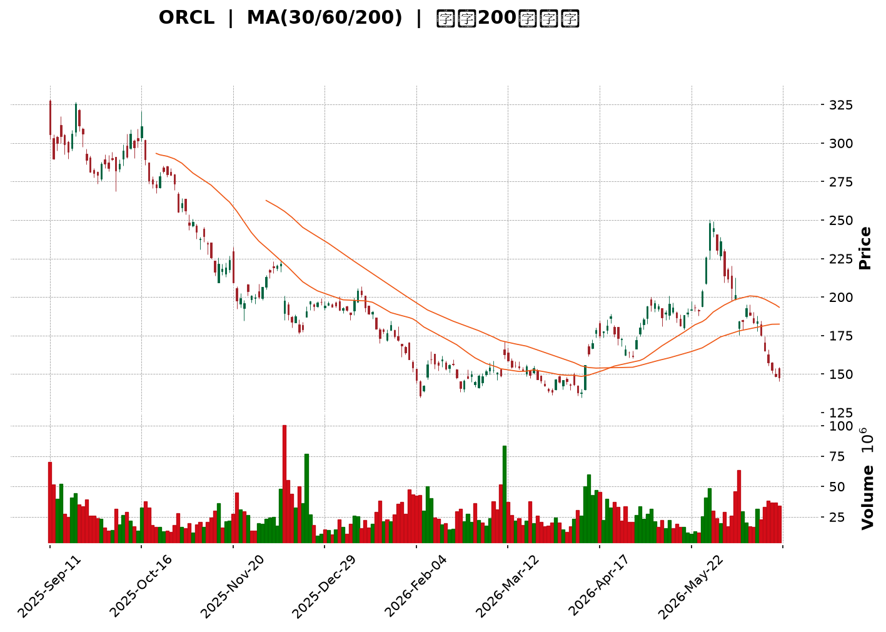
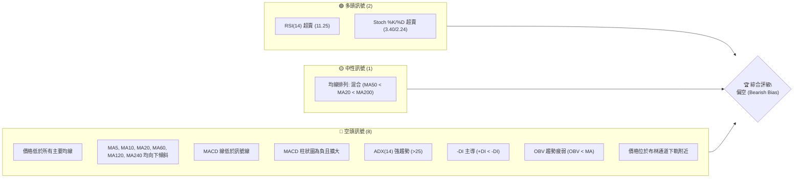

<details>
<summary>📊 靜態圖表 (點擊展開)</summary>

</details>

<html>
<head><meta charset="utf-8" /></head>
<body>
    <div style="height:500px; width:100%;">                        <script>window.PlotlyConfig = {MathJaxConfig: 'local'};</script>
        <script charset="utf-8" src="https://cdn.plot.ly/plotly-3.6.0.min.js" integrity="sha256-QaOVwtVY0T02VaHrr6pnoHLCwayMJp4O5n4YyaE3rJk=" crossorigin="anonymous"></script>                <div id="candlestick-chart" class="plotly-graph-div" style="height:100%; width:100%;"></div>            <script>                window.PLOTLYENV=window.PLOTLYENV || {};                                if (document.getElementById("candlestick-chart")) {                    Plotly.newPlot(                        "candlestick-chart",                        [{"close":{"dtype":"f8","bdata":"AAAAoDEXc0AAAABARx5yQAAAACBkvHJAAAAAQPwDc0AAAABgzbByQAAAACDDZHJAAAAA4OQjc0AAAADASll0QAAAAED3dXNAAAAAALggc0AAAADAyBByQAAAAMDZk3FAAAAAAL2IcUAAAADgm3BxQAAAAID063FAAAAAwE3ocUAAAAAgZb5xQAAAAIDpFHJAAAAAgDugcUAAAABA7OVxQAAAAABXcnJAAAAAILsyckAAAACADyJzQAAAAODHknJAAAAAwD\u002fcckAAAACgaXFzQAAAACB+GHJAAAAAAMs3cUAAAAAAgxdxQAAAAEDq73BAAAAAQMBlcUAAAACAl5lxQAAAAKDmenFAAAAAINZxcUAAAACg5RlxQAAAAKBF6m9AAAAAwBhQcEAAAAAAZwRwQAAAAKDv1G5AAAAAYP8Yb0AAAABA80luQAAAAKCOuW1AAAAAoH3rbUAAAABApVZtQAAAAOBQM2xAAAAAgLcHa0AAAAAgpa9rQAAAAKCMUGtAAAAAAJZka0AAAACg4QRsQAAAAODmLGpAAAAAIHmxaEAAAADg0OFoQAAAAIBzemhAAAAAYKl2aUAAAAAA7hZpQAAAAKDO9mhAAAAAYOX7aEAAAACAws5pQAAAAKCroGpAAAAA4AgIa0AAAAAgLWZrQAAAAMCphWtAAAAAwLu0a0AAAADgVbRoQAAAAEDpmWdAAAAAQEz5ZkAAAADg7W9nQAAAAEDXK2ZAAAAAIMZdZkAAAAAghdlnQAAAAEBjpWhAAAAAoLNEaEAAAADgFIloQAAAAOD7mGhAAAAAYPlFaEAAAAAgLYBoQAAAAIAGN2hAAAAAIHhQaEAAAAAgPe1nQAAAAOAhEmhAAAAAoDD1Z0AAAADAu49nQAAAAMCHumhAAAAAwPZ+aUAAAAAAwDJpQAAAAAD1HWhAAAAAQA6mZ0AAAAAAmc1nQAAAAMBmaWZAAAAAYMuoZUAAAABA6jFmQAAAAKBjEWZAAAAA4MK5ZkAAAAAAUsllQAAAAMBahmVAAAAAIH8NZUAAAADgOoBkQAAAAOAX8GNAAAAAwDZEY0AAAADAGkViQAAAAOAoAGFAAAAAgFXKYUAAAACgcIFjQAAAACCs6mNAAAAA4J2TY0AAAACg7n1jQAAAAACl8mNAAAAAQOQtY0AAAAAADHRjQAAAAGDYf2NAAAAAYBFyYkAAAACALpphQAAAACA0NGJAAAAAQAJsYkAAAADgLbliQAAAACCbHGJAAAAAoGCXYkAAAABguY9iQAAAAKDe+mJAAAAAQApIY0AAAABArw1jQAAAAEAK4WJAAAAAICmcYkAAAAAgrFFkQAAAAOBk02NAAAAAoD5SY0AAAABAq21jQAAAAADaRGNAAAAAQMULY0AAAADAUV9jQAAAAOAWpWJAAAAAwLA5Y0AAAACAf1JiQAAAAKBgMGJAAAAAwAPKYUAAAADAkGVhQAAAAEAkSmFAAAAAwCJTYkAAAABgLxdiQAAAAIDbO2JAAAAAABIhYkAAAACgftVhQAAAAMAe5WFAAAAAIIU7YUAAAABA4UJhQAAAAADXc2NAAAAAAABgZEAAAACA6zllQAAAAEDhSmZAAAAAgOvhZUAAAABgjzJmQAAAAKBwpWZAAAAAAABwZ0AAAADA9QhmQAAAAMD1qGVAAAAAYLieZUAAAABguL5kQAAAAGCPemRAAAAA4HosZEAAAABgj3plQAAAAKBHiWZAAAAAQDMrZ0AAAADA9UBoQAAAAEDhUmhAAAAAYGZ+aEAAAABA4TpoQAAAAGCPWmdAAAAA4FG4Z0AAAAAghXNoQAAAAGBmHmhAAAAAIIVTZ0AAAABguK5mQAAAAMAehWdAAAAA4KO4Z0AAAABgjwJoQAAAAIDrIWhAAAAAYLjeZ0AAAABgZnZpQAAAAMD1OGxAAAAAwMwEb0AAAABgj5JuQAAAAGCPymxAAAAAQOGKbUAAAACAwrVqQAAAAIA9empAAAAAgOu5aUAAAADgUShpQAAAAEAzA2dAAAAAACkEZ0AAAADgehRoQAAAAGCPimdAAAAAwPXwZkAAAACgRwlnQAAAAIA94mVAAAAAwB6lZEAAAADA9bBjQAAAAGC4DmNAAAAAwPWQYkAAAADgUXhiQA=="},"high":{"dtype":"f8","bdata":"ufMTComGdEBTJzvA8BhzQDXbra4ECnNAmJpd1W\u002fXc0A\u002fa23f5CNzQCLj5HkP13JAYGNObslKc0AD\u002f7UUuW50QKh0eWhJJ3RAkkHDZmBgc0DcLsoqk4ZyQMkCJ50rO3JAUeVg3Nq7cUBytiVdbJxxQPynexKD+3FAgdzYfJFKckAsbLWIVEVyQP2mR+S2ZXJAd2Jyo8kuckBYdJOf9RNyQPxZOK4bsnJAdwJy33Idc0CXQj901kxzQFSaIaj46HJAd2UxX8RRc0BjfwHWHgl0QDpAbci+5nJACxsbC5P3cUBGmuCJaGlxQKAsO4wcOHFASU7aUu+VcUCpE+WO+dZxQE3Zwif003FA71fry3a7cUAKPsVEZn5xQIaKH1fMwXBA8hTi8fuCcEDbWVJ+9n9wQJlUpgERt29AC1KcDXhbb0BT65lxj\u002fFuQM3H8XXQ3W1Aqni9p1u3bkC8sK\u002fU\u002fX9tQF3yReqia21A8gIS\u002fRz5a0DWbkBbOTVsQBpYSwYOrmtAljuxo63Ka0ApxWKJNVhsQLvZOxZEEm1Akkbu7DThaUC1JciAZ1JpQPpoEGslxmhA\u002fcQF1PQWakCk35tcVSNpQBnrmwk6SGlAXsXaNGoNakBV5Ex+zdRpQOfVn\u002fYEw2pAobcUbxlFa0ClsELbEuxrQKWMmXZUqGtAwaCdyzP+a0CqnTekMxhpQDw96vqHlGhAwKU3PBt6Z0BOBe81gZRnQIK6cpmMK2dAR43bljX0ZkAtxD9EtD1oQKN6Xdy+smhAtbjXr9t\u002faECHhiz5NKJoQFCeXKut5GhAosD2pIWpaECvq8U1Y6VoQOvEyIvbf2hATZ205hCsaEChU8gPqQ5pQDjDC1YSNmhAWx8WZzJPaECB2Y1UFLlnQCFtygt372hANuHjwTC8aUAY3oLmdOJpQBOmb0lMH2lApoflwJlKaEDhd9iCeOZnQDOywVc7UWdAnsqjBhZ\u002fZkDf7c4LDnFmQJMAmqHKYGZAKoYeDEgVZ0AQ6WgSBmNmQPKRTHCGoWZAmFY9l2Y0ZUD8vRkU\u002fQllQLdrcSBVU2VAgwzq1WjaY0C2IHZX7yxjQBywkUNHQWJAvVF8inPWYUAHGENHNeZjQOOCZk8PmmRAWbTIjORiZECUiKIikc9jQGG2GiqGN2RA733hWTjXY0Cq5S\u002fIFJhjQNsgVDG78GNAHE4Kn4cuY0CqPWCbXCliQGunmnL5R2JAbKckcuMXY0ACvxDvA\u002f9iQEC8mFxKMmJAAozuBLe0YkAqKglC88xiQOtpG2VpImNAqJ3XT32sY0BZx4y\u002fWdRjQEdraTQS72JAd2voGlAzY0Dwtg2oMGVlQONeYk7e52RAfggx\u002f7sGZEDrfJ0lAMZjQP4nG4W9y2NAgHDQusdNY0BnM3yV9otjQNESkpbuFmNAwzNrMZxnY0DKD0nWqCtjQPFlFhYxqmJAXl6wJbo+YkAnO9eeTKZhQEZVrJKslmFAnLZUG2JcYkApfXz6IaRiQBclFUrFPWJA6SHILQ6BYkCd2mOVIwJiQGJlsPvZ3WJAAAAAoJnZYUAAAACgcIVhQAAAAMAefWNAAAAAwMwsZUAAAACA65FlQAAAAOCjiGZAAAAAAAAQZ0AAAADgUThmQAAAAEDhKmdAAAAAgMKlZ0AAAADgerxmQAAAAGC4lmZAAAAAoJmxZUAAAABgZhZlQAAAAOBRmGRAAAAAgMKlZEAAAACgmcllQAAAAAAA8GZAAAAA4KNQZ0AAAACgR0loQAAAAMDMBGlAAAAAAADAaEAAAACAwnVoQAAAAKBwHWhAAAAAgD3yZ0AAAABguBZpQAAAAIDCjWhAAAAA4FHYZ0AAAABACpdnQAAAAEAKh2dAAAAAgD0aaEAAAAAAAKBoQAAAAGBmZmhAAAAA4HoEaEAAAAAAAKBpQAAAAKBHSWxAAAAAAABIb0AAAAAAACBvQAAAAOBREG5AAAAAYGbebUAAAACAFO5sQAAAAIDrYWtAAAAAAACQa0AAAAAgXI9qQAAAAOCjGGdAAAAAYI8yZ0AAAACAPWpoQAAAAIA9amhAAAAAgBTGZ0AAAAAgrn9nQAAAAGCPEmdAAAAAYI\u002fKZUAAAAAAALhkQAAAAADXs2NAAAAAoEcxY0AAAAAAAFBjQA=="},"hovertemplate":"\u003cb\u003e%{x|%Y-%m-%d}\u003c\u002fb\u003e\u003cbr\u003e\u958b: $%{open:.2f}\u003cbr\u003e\u9ad8: $%{high:.2f}\u003cbr\u003e\u4f4e: $%{low:.2f}\u003cbr\u003e\u6536: $%{close:.2f}\u003cextra\u003e\u003c\u002fextra\u003e","low":{"dtype":"f8","bdata":"MxWkS3HjckAxHiDKcxdyQBH1HAlmb3JAQAb6NnS+ckCA2iR6hUtyQPRW4chrG3JA9YpV6t9vckDg4QiWRQhzQO9OBJn1OXNAP\u002fdBGOWackBHumAHp+RxQCRXamCMjHFA3uwfhbtWcUBS2MR\u002f1htxQOde8u9EO3FAR0YNLfe8cUAnDxdBbJxxQEysyvVeCHJAyDpZGg3OcEAVumCvEpZxQK14vYoW2HFAG50IxJ8jckCeo+9svn5yQJitu54lI3JA2SuwNIKRckDUZZvLgNNyQOWVTrDn23FAYT0sSA4acUDXslXsjelwQKSs1C6wuXBA3u5LIZ\u002frcEBs5avkaohxQHb52MadYXFAjnUdoTltcUDGMt9QFdtwQFMKmeXe1m9AUIKw84vkb0BEg+T2ebVvQFAiE5oodm5ArfjqvK2wbkA+JcnngrptQP182bzJ3WxAnjrn4OdzbUAM4eSevm9sQF7AQmc8GWxAu7jQ1Pm8akCOvdQpci9qQCIRlyXKx2pA4BQZlROmakAwZCmncv9qQFhTXoN\u002fIGpAOQgwjcULaEAUBX\u002f0nyNoQNRH5yPhD2dAGcHLNycgaUC+88bl5YxoQBcINaX0b2hA5220KenYaEC8FCvp08VoQGetSoXqoWlAV6sHoxaKakC5j3jfufJqQDUAK1xMHmtAcMBv7wgIa0BZgtMv9iJnQEQBBcMCG2dAFOcef1iJZkBYUtdjn+tmQIVWNOyh\u002f2VAEQ2XTKgvZkBrbReCEl9nQCGEYVDf9GdAtpVFe4TgZ0AeY\u002fT6cCdoQFdQePAwXWhA0abaV9TuZ0CzhyQteFBoQACJsuFMMWhAM1E+LcMgaEA6JjhC+ORnQAXHvNogsWdANEpXZ3naZ0DD7LXeaiBnQFiaB1Tvg2dAjVkLz2CKaEDQ10WZxf5oQKKGHTWrxGdAbbqe\u002fWKXZ0ATRBeDLzxnQCmWdTeLV2ZAFPK+JDNAZUCTG1imV\u002fxlQPCByP7XbGVASGPTmhM9ZkB9E+GIaqJlQFK3JQ1haGVAGYBDraYeZEA8JLjUf1VkQJIL7RUu7mNA1Lsc2uHrYkBgJAp+rP1hQOTbq9Hv2GBADyfPOqZNYUAXCv7MoE9iQBnQESo9jWNAhom6ONkuY0CTa+b5A\u002f9iQF9uQgj8V2NARJv5EyILY0B5DtQ6+9piQAamLpRKZ2NA2TpPjBBcYkB4blXNcUNhQOyFO6boR2FAYHd\u002fTnhaYkAPSB4\u002fohRiQDkGvLZfs2FA5Dn\u002fNgmWYUA636gNq9FhQI4D5RuYkmJAQH+sxh6zYkD8uq4U9OJiQIzYBoRzPWJAK2381d19YkAhr5XrrABkQBKFbe7awWNAMvcpn6EzY0Bsd6eAHD9jQKsX323nHmNAw386pVjwYkBMnDbI5YtiQC5uNhPsbWJARIpNX+\u002fFYkA0L6xX2EpiQFYdfXwYA2JA28\u002fBkmfBYUCP98ZmMjphQFOwBL8lD2FAYAvn3p9rYUCZXGrXUwViQFgBc3n5eWFAL\u002fhNzy3rYUDwipuXfm5hQETmUWvizGFAAAAAAAAAYUAAAACAPdJgQAAAAEAKd2FAAAAAgOsxZEAAAABguMZkQAAAAKCZuWVAAAAAIIWrZUAAAADgUbBlQAAAAOBRAGZAAAAAoJnZZkAAAABgj8JlQAAAAKCZGWVAAAAAwMz8ZEAAAACgmUFkQAAAAMDMFGRAAAAAYI8KZEAAAADAzMRkQAAAAOBRyGVAAAAAAABgZkAAAACgcNVmQAAAAKCZ2WdAAAAAYLjGZ0AAAABAM9NnQAAAAADXm2ZAAAAAgOshZ0AAAABgZi5nQAAAAMDMnGdAAAAA4KPoZkAAAACAwp1mQAAAAKCZWWZAAAAAYGZmZ0AAAABAM+NnQAAAAIDr0WdAAAAAoHB9Z0AAAAAAKSxoQAAAAOBRAGpAAAAAQDMTbEAAAABA4dptQAAAACCFc2xAAAAAAAAAbEAAAABgZi5qQAAAAGCPKmpAAAAAoEe5aEAAAACAwsVoQAAAAMD16GVAAAAAAABgZkAAAABguEZnQAAAAMAedWdAAAAAYI\u002fSZkAAAABgZjZmQAAAAMDMzGVAAAAAIIWTZEAAAABAM2tjQAAAACCFy2JAAAAAAACAYkAAAABgZiZiQA=="},"name":"\u50f9\u683c","open":{"dtype":"f8","bdata":"Z1+M1A58dECpEmRpVfZyQFNxMqjPAHNAoaZU\u002fZ15c0AeK+HafhRzQBvQd52tynJAXUULSouKckBaYofNSjNzQCMYRXppF3RAVH3ZVrFWc0ACACqlVE9yQEVQ565LK3JAj2P3nfKlcUBqYyKOgJdxQKeSAK\u002ffSXFA\u002fbRDxj4YckBnaipKUvVxQLRTNQp0IXJAd2Jyo8kuckCQn3IR97JxQOon7fdOHHJAph34vyKnckDDSpuoAo5yQAVu5kt023JAx3ZXmprwckAbF35gvPtyQOGFsCpR3nJAlsk8jPbycUDaLVETlUZxQBbemJZDEnFAlm74fq\u002f0cEDoPGt0x8JxQBGKkqkdzXFAvmaENliUcUDRanvl2ntxQGcswtuTsXBASpFxzcwecEBb4wCA63lwQOkiKZCADm9AMbkXtarMbkDX1pn7ns1uQPeLOcJJsW1AAY4pc1SObkCWYEifMFltQH6NyAppaW1AowqM3rTza0CLNVapWjFqQP63VG4SHGtAdbbfZXbcakBZ2AMYGzdrQFPqxe7wt2xA3umRVxa6aUBx3gdeC3VoQDxW1bmgHGhAatdk2A0HakC64UuVU8loQDyV4iPQ6GhAdeO63GJ8aUAkguYAaONoQADMChjl0mlAFjh+czI1a0Bnosg48H9rQHsnAM30VWtAF2Z7CkCOa0AZ9\u002fpola5nQKTyBMh1ZWhADAVSonpkZ0BlPiIiTfJmQAOSgbUXxmZAZh2KCFSzZkCZxKbfqGdnQB+Ejs3Fc2hAmzuVVl5naECgQ9tV4zloQJuffb81m2hAtACbKiwfaEBcfjHKmVtoQOgBr9IMZ2hATgqI8HGIaED7zlxtHaRoQLuvcupI7GdA6y5H6m1DaED\u002fERF12rZnQCI69DbG32dAThWSXDGdaEBBV7IbK4lpQBOmb0lMH2lApoflwJlKaECYSa4k+KdnQDOywVc7UWdAKdzTgb9hZkBHAB7S3FdmQG3rclGdgGVAcnti2kBPZkDE\u002fehuH1JmQFu2\u002f031yWVAD80rf9kxZUCN4GLEtfJkQBT5K1xnSmVAukzPpLG2Y0AfZnAkVytjQONwi\u002fn7ImJA\u002f\u002fK9h29oYUCtw4BxJH9iQH+CGh0u7mNAWbTIjORiZECvLYGoK6xjQBESHoBD1mNAwmi2ysOtY0D6Mg5O7DtjQPJJjreSlGNA9YhZy4YYY0Brr0We2iViQJCnKZ0xi2FA3\u002fot6oGUYkBe1ZVWtYhiQBTsdLYi7GFAlx1rKxGkYUAr\u002fnj14AdiQG800smcr2JAbizymeIBY0B7QAWkaAxjQH4tKqWdxWJAIXFlDrsiY0DLPPcsoblkQCbT8Q\u002fIgmRA3ludyeLPY0DE2hzviXBjQLH1uJ3EXGNAPH1z\u002frYbY0DlgMaE9r1iQFhlWOqNEGNAtNUSYZPcYkCrxke\u002f9Q5jQKjPclq9lmJAkkMVVXTsYUBK6TlKEI5hQFHtbeWucWFAV7tcavl5YUDC2eZxRpJiQN1rKOQOyWFAHO67s6hdYkAqXaFb8uhhQK2nkU7cuGJAAAAAYGbGYUAAAACAPSphQAAAAOCjeGFAAAAAgML9ZEAAAADgetxkQAAAAKBwDWZAAAAAgMLdZkAAAACA6xlmQAAAAEAzS2ZAAAAAgMJFZ0AAAADAzIxmQAAAAOBRkGZAAAAAYI+SZUAAAADAHkVkQAAAAKBHgWRAAAAA4KNAZEAAAACgcM1kQAAAAOCjAGZAAAAAACnEZkAAAABgZkZnQAAAACCF02hAAAAAYI8SaEAAAADAzARoQAAAAKBwHWhAAAAAwPWgZ0AAAACAwoVnQAAAACCuz2dAAAAAAADAZ0AAAAAAAEBnQAAAAIAUfmZAAAAA4FGgZ0AAAACgcPVnQAAAAKCZKWhAAAAAIFzvZ0AAAACgR0FoQAAAAAAAIGpAAAAAAADQbEAAAACgmVluQAAAACBcD25AAAAAAABgbEAAAAAgrq9sQAAAAAAAOGtAAAAAwB69akAAAAAAANBoQAAAAKBwdWZAAAAA4FEgZ0AAAADgemxnQAAAAOBRwGdAAAAAwB5FZ0AAAADgUeBmQAAAAIDryWZAAAAAIFxHZUAAAAAgXE9kQAAAAEAzq2NAAAAA4FHIYkAAAACAFD5jQA=="},"x":["2025-09-11T00:00:00-04:00","2025-09-12T00:00:00-04:00","2025-09-15T00:00:00-04:00","2025-09-16T00:00:00-04:00","2025-09-17T00:00:00-04:00","2025-09-18T00:00:00-04:00","2025-09-19T00:00:00-04:00","2025-09-22T00:00:00-04:00","2025-09-23T00:00:00-04:00","2025-09-24T00:00:00-04:00","2025-09-25T00:00:00-04:00","2025-09-26T00:00:00-04:00","2025-09-29T00:00:00-04:00","2025-09-30T00:00:00-04:00","2025-10-01T00:00:00-04:00","2025-10-02T00:00:00-04:00","2025-10-03T00:00:00-04:00","2025-10-06T00:00:00-04:00","2025-10-07T00:00:00-04:00","2025-10-08T00:00:00-04:00","2025-10-09T00:00:00-04:00","2025-10-10T00:00:00-04:00","2025-10-13T00:00:00-04:00","2025-10-14T00:00:00-04:00","2025-10-15T00:00:00-04:00","2025-10-16T00:00:00-04:00","2025-10-17T00:00:00-04:00","2025-10-20T00:00:00-04:00","2025-10-21T00:00:00-04:00","2025-10-22T00:00:00-04:00","2025-10-23T00:00:00-04:00","2025-10-24T00:00:00-04:00","2025-10-27T00:00:00-04:00","2025-10-28T00:00:00-04:00","2025-10-29T00:00:00-04:00","2025-10-30T00:00:00-04:00","2025-10-31T00:00:00-04:00","2025-11-03T00:00:00-05:00","2025-11-04T00:00:00-05:00","2025-11-05T00:00:00-05:00","2025-11-06T00:00:00-05:00","2025-11-07T00:00:00-05:00","2025-11-10T00:00:00-05:00","2025-11-11T00:00:00-05:00","2025-11-12T00:00:00-05:00","2025-11-13T00:00:00-05:00","2025-11-14T00:00:00-05:00","2025-11-17T00:00:00-05:00","2025-11-18T00:00:00-05:00","2025-11-19T00:00:00-05:00","2025-11-20T00:00:00-05:00","2025-11-21T00:00:00-05:00","2025-11-24T00:00:00-05:00","2025-11-25T00:00:00-05:00","2025-11-26T00:00:00-05:00","2025-11-28T00:00:00-05:00","2025-12-01T00:00:00-05:00","2025-12-02T00:00:00-05:00","2025-12-03T00:00:00-05:00","2025-12-04T00:00:00-05:00","2025-12-05T00:00:00-05:00","2025-12-08T00:00:00-05:00","2025-12-09T00:00:00-05:00","2025-12-10T00:00:00-05:00","2025-12-11T00:00:00-05:00","2025-12-12T00:00:00-05:00","2025-12-15T00:00:00-05:00","2025-12-16T00:00:00-05:00","2025-12-17T00:00:00-05:00","2025-12-18T00:00:00-05:00","2025-12-19T00:00:00-05:00","2025-12-22T00:00:00-05:00","2025-12-23T00:00:00-05:00","2025-12-24T00:00:00-05:00","2025-12-26T00:00:00-05:00","2025-12-29T00:00:00-05:00","2025-12-30T00:00:00-05:00","2025-12-31T00:00:00-05:00","2026-01-02T00:00:00-05:00","2026-01-05T00:00:00-05:00","2026-01-06T00:00:00-05:00","2026-01-07T00:00:00-05:00","2026-01-08T00:00:00-05:00","2026-01-09T00:00:00-05:00","2026-01-12T00:00:00-05:00","2026-01-13T00:00:00-05:00","2026-01-14T00:00:00-05:00","2026-01-15T00:00:00-05:00","2026-01-16T00:00:00-05:00","2026-01-20T00:00:00-05:00","2026-01-21T00:00:00-05:00","2026-01-22T00:00:00-05:00","2026-01-23T00:00:00-05:00","2026-01-26T00:00:00-05:00","2026-01-27T00:00:00-05:00","2026-01-28T00:00:00-05:00","2026-01-29T00:00:00-05:00","2026-01-30T00:00:00-05:00","2026-02-02T00:00:00-05:00","2026-02-03T00:00:00-05:00","2026-02-04T00:00:00-05:00","2026-02-05T00:00:00-05:00","2026-02-06T00:00:00-05:00","2026-02-09T00:00:00-05:00","2026-02-10T00:00:00-05:00","2026-02-11T00:00:00-05:00","2026-02-12T00:00:00-05:00","2026-02-13T00:00:00-05:00","2026-02-17T00:00:00-05:00","2026-02-18T00:00:00-05:00","2026-02-19T00:00:00-05:00","2026-02-20T00:00:00-05:00","2026-02-23T00:00:00-05:00","2026-02-24T00:00:00-05:00","2026-02-25T00:00:00-05:00","2026-02-26T00:00:00-05:00","2026-02-27T00:00:00-05:00","2026-03-02T00:00:00-05:00","2026-03-03T00:00:00-05:00","2026-03-04T00:00:00-05:00","2026-03-05T00:00:00-05:00","2026-03-06T00:00:00-05:00","2026-03-09T00:00:00-04:00","2026-03-10T00:00:00-04:00","2026-03-11T00:00:00-04:00","2026-03-12T00:00:00-04:00","2026-03-13T00:00:00-04:00","2026-03-16T00:00:00-04:00","2026-03-17T00:00:00-04:00","2026-03-18T00:00:00-04:00","2026-03-19T00:00:00-04:00","2026-03-20T00:00:00-04:00","2026-03-23T00:00:00-04:00","2026-03-24T00:00:00-04:00","2026-03-25T00:00:00-04:00","2026-03-26T00:00:00-04:00","2026-03-27T00:00:00-04:00","2026-03-30T00:00:00-04:00","2026-03-31T00:00:00-04:00","2026-04-01T00:00:00-04:00","2026-04-02T00:00:00-04:00","2026-04-06T00:00:00-04:00","2026-04-07T00:00:00-04:00","2026-04-08T00:00:00-04:00","2026-04-09T00:00:00-04:00","2026-04-10T00:00:00-04:00","2026-04-13T00:00:00-04:00","2026-04-14T00:00:00-04:00","2026-04-15T00:00:00-04:00","2026-04-16T00:00:00-04:00","2026-04-17T00:00:00-04:00","2026-04-20T00:00:00-04:00","2026-04-21T00:00:00-04:00","2026-04-22T00:00:00-04:00","2026-04-23T00:00:00-04:00","2026-04-24T00:00:00-04:00","2026-04-27T00:00:00-04:00","2026-04-28T00:00:00-04:00","2026-04-29T00:00:00-04:00","2026-04-30T00:00:00-04:00","2026-05-01T00:00:00-04:00","2026-05-04T00:00:00-04:00","2026-05-05T00:00:00-04:00","2026-05-06T00:00:00-04:00","2026-05-07T00:00:00-04:00","2026-05-08T00:00:00-04:00","2026-05-11T00:00:00-04:00","2026-05-12T00:00:00-04:00","2026-05-13T00:00:00-04:00","2026-05-14T00:00:00-04:00","2026-05-15T00:00:00-04:00","2026-05-18T00:00:00-04:00","2026-05-19T00:00:00-04:00","2026-05-20T00:00:00-04:00","2026-05-21T00:00:00-04:00","2026-05-22T00:00:00-04:00","2026-05-26T00:00:00-04:00","2026-05-27T00:00:00-04:00","2026-05-28T00:00:00-04:00","2026-05-29T00:00:00-04:00","2026-06-01T00:00:00-04:00","2026-06-02T00:00:00-04:00","2026-06-03T00:00:00-04:00","2026-06-04T00:00:00-04:00","2026-06-05T00:00:00-04:00","2026-06-08T00:00:00-04:00","2026-06-09T00:00:00-04:00","2026-06-10T00:00:00-04:00","2026-06-11T00:00:00-04:00","2026-06-12T00:00:00-04:00","2026-06-15T00:00:00-04:00","2026-06-16T00:00:00-04:00","2026-06-17T00:00:00-04:00","2026-06-18T00:00:00-04:00","2026-06-22T00:00:00-04:00","2026-06-23T00:00:00-04:00","2026-06-24T00:00:00-04:00","2026-06-25T00:00:00-04:00","2026-06-26T00:00:00-04:00","2026-06-29T00:00:00-04:00"],"type":"candlestick"},{"hovertemplate":"MA30: $%{y:.2f}\u003cextra\u003e\u003c\u002fextra\u003e","line":{"color":"#2196F3","dash":"dash","width":2},"mode":"lines","name":"MA30","x":["2025-09-11T00:00:00-04:00","2025-09-12T00:00:00-04:00","2025-09-15T00:00:00-04:00","2025-09-16T00:00:00-04:00","2025-09-17T00:00:00-04:00","2025-09-18T00:00:00-04:00","2025-09-19T00:00:00-04:00","2025-09-22T00:00:00-04:00","2025-09-23T00:00:00-04:00","2025-09-24T00:00:00-04:00","2025-09-25T00:00:00-04:00","2025-09-26T00:00:00-04:00","2025-09-29T00:00:00-04:00","2025-09-30T00:00:00-04:00","2025-10-01T00:00:00-04:00","2025-10-02T00:00:00-04:00","2025-10-03T00:00:00-04:00","2025-10-06T00:00:00-04:00","2025-10-07T00:00:00-04:00","2025-10-08T00:00:00-04:00","2025-10-09T00:00:00-04:00","2025-10-10T00:00:00-04:00","2025-10-13T00:00:00-04:00","2025-10-14T00:00:00-04:00","2025-10-15T00:00:00-04:00","2025-10-16T00:00:00-04:00","2025-10-17T00:00:00-04:00","2025-10-20T00:00:00-04:00","2025-10-21T00:00:00-04:00","2025-10-22T00:00:00-04:00","2025-10-23T00:00:00-04:00","2025-10-24T00:00:00-04:00","2025-10-27T00:00:00-04:00","2025-10-28T00:00:00-04:00","2025-10-29T00:00:00-04:00","2025-10-30T00:00:00-04:00","2025-10-31T00:00:00-04:00","2025-11-03T00:00:00-05:00","2025-11-04T00:00:00-05:00","2025-11-05T00:00:00-05:00","2025-11-06T00:00:00-05:00","2025-11-07T00:00:00-05:00","2025-11-10T00:00:00-05:00","2025-11-11T00:00:00-05:00","2025-11-12T00:00:00-05:00","2025-11-13T00:00:00-05:00","2025-11-14T00:00:00-05:00","2025-11-17T00:00:00-05:00","2025-11-18T00:00:00-05:00","2025-11-19T00:00:00-05:00","2025-11-20T00:00:00-05:00","2025-11-21T00:00:00-05:00","2025-11-24T00:00:00-05:00","2025-11-25T00:00:00-05:00","2025-11-26T00:00:00-05:00","2025-11-28T00:00:00-05:00","2025-12-01T00:00:00-05:00","2025-12-02T00:00:00-05:00","2025-12-03T00:00:00-05:00","2025-12-04T00:00:00-05:00","2025-12-05T00:00:00-05:00","2025-12-08T00:00:00-05:00","2025-12-09T00:00:00-05:00","2025-12-10T00:00:00-05:00","2025-12-11T00:00:00-05:00","2025-12-12T00:00:00-05:00","2025-12-15T00:00:00-05:00","2025-12-16T00:00:00-05:00","2025-12-17T00:00:00-05:00","2025-12-18T00:00:00-05:00","2025-12-19T00:00:00-05:00","2025-12-22T00:00:00-05:00","2025-12-23T00:00:00-05:00","2025-12-24T00:00:00-05:00","2025-12-26T00:00:00-05:00","2025-12-29T00:00:00-05:00","2025-12-30T00:00:00-05:00","2025-12-31T00:00:00-05:00","2026-01-02T00:00:00-05:00","2026-01-05T00:00:00-05:00","2026-01-06T00:00:00-05:00","2026-01-07T00:00:00-05:00","2026-01-08T00:00:00-05:00","2026-01-09T00:00:00-05:00","2026-01-12T00:00:00-05:00","2026-01-13T00:00:00-05:00","2026-01-14T00:00:00-05:00","2026-01-15T00:00:00-05:00","2026-01-16T00:00:00-05:00","2026-01-20T00:00:00-05:00","2026-01-21T00:00:00-05:00","2026-01-22T00:00:00-05:00","2026-01-23T00:00:00-05:00","2026-01-26T00:00:00-05:00","2026-01-27T00:00:00-05:00","2026-01-28T00:00:00-05:00","2026-01-29T00:00:00-05:00","2026-01-30T00:00:00-05:00","2026-02-02T00:00:00-05:00","2026-02-03T00:00:00-05:00","2026-02-04T00:00:00-05:00","2026-02-05T00:00:00-05:00","2026-02-06T00:00:00-05:00","2026-02-09T00:00:00-05:00","2026-02-10T00:00:00-05:00","2026-02-11T00:00:00-05:00","2026-02-12T00:00:00-05:00","2026-02-13T00:00:00-05:00","2026-02-17T00:00:00-05:00","2026-02-18T00:00:00-05:00","2026-02-19T00:00:00-05:00","2026-02-20T00:00:00-05:00","2026-02-23T00:00:00-05:00","2026-02-24T00:00:00-05:00","2026-02-25T00:00:00-05:00","2026-02-26T00:00:00-05:00","2026-02-27T00:00:00-05:00","2026-03-02T00:00:00-05:00","2026-03-03T00:00:00-05:00","2026-03-04T00:00:00-05:00","2026-03-05T00:00:00-05:00","2026-03-06T00:00:00-05:00","2026-03-09T00:00:00-04:00","2026-03-10T00:00:00-04:00","2026-03-11T00:00:00-04:00","2026-03-12T00:00:00-04:00","2026-03-13T00:00:00-04:00","2026-03-16T00:00:00-04:00","2026-03-17T00:00:00-04:00","2026-03-18T00:00:00-04:00","2026-03-19T00:00:00-04:00","2026-03-20T00:00:00-04:00","2026-03-23T00:00:00-04:00","2026-03-24T00:00:00-04:00","2026-03-25T00:00:00-04:00","2026-03-26T00:00:00-04:00","2026-03-27T00:00:00-04:00","2026-03-30T00:00:00-04:00","2026-03-31T00:00:00-04:00","2026-04-01T00:00:00-04:00","2026-04-02T00:00:00-04:00","2026-04-06T00:00:00-04:00","2026-04-07T00:00:00-04:00","2026-04-08T00:00:00-04:00","2026-04-09T00:00:00-04:00","2026-04-10T00:00:00-04:00","2026-04-13T00:00:00-04:00","2026-04-14T00:00:00-04:00","2026-04-15T00:00:00-04:00","2026-04-16T00:00:00-04:00","2026-04-17T00:00:00-04:00","2026-04-20T00:00:00-04:00","2026-04-21T00:00:00-04:00","2026-04-22T00:00:00-04:00","2026-04-23T00:00:00-04:00","2026-04-24T00:00:00-04:00","2026-04-27T00:00:00-04:00","2026-04-28T00:00:00-04:00","2026-04-29T00:00:00-04:00","2026-04-30T00:00:00-04:00","2026-05-01T00:00:00-04:00","2026-05-04T00:00:00-04:00","2026-05-05T00:00:00-04:00","2026-05-06T00:00:00-04:00","2026-05-07T00:00:00-04:00","2026-05-08T00:00:00-04:00","2026-05-11T00:00:00-04:00","2026-05-12T00:00:00-04:00","2026-05-13T00:00:00-04:00","2026-05-14T00:00:00-04:00","2026-05-15T00:00:00-04:00","2026-05-18T00:00:00-04:00","2026-05-19T00:00:00-04:00","2026-05-20T00:00:00-04:00","2026-05-21T00:00:00-04:00","2026-05-22T00:00:00-04:00","2026-05-26T00:00:00-04:00","2026-05-27T00:00:00-04:00","2026-05-28T00:00:00-04:00","2026-05-29T00:00:00-04:00","2026-06-01T00:00:00-04:00","2026-06-02T00:00:00-04:00","2026-06-03T00:00:00-04:00","2026-06-04T00:00:00-04:00","2026-06-05T00:00:00-04:00","2026-06-08T00:00:00-04:00","2026-06-09T00:00:00-04:00","2026-06-10T00:00:00-04:00","2026-06-11T00:00:00-04:00","2026-06-12T00:00:00-04:00","2026-06-15T00:00:00-04:00","2026-06-16T00:00:00-04:00","2026-06-17T00:00:00-04:00","2026-06-18T00:00:00-04:00","2026-06-22T00:00:00-04:00","2026-06-23T00:00:00-04:00","2026-06-24T00:00:00-04:00","2026-06-25T00:00:00-04:00","2026-06-26T00:00:00-04:00","2026-06-29T00:00:00-04:00"],"y":{"dtype":"f8","bdata":"AAAAAAAA+H8AAAAAAAD4fwAAAAAAAPh\u002fAAAAAAAA+H8AAAAAAAD4fwAAAAAAAPh\u002fAAAAAAAA+H8AAAAAAAD4fwAAAAAAAPh\u002fAAAAAAAA+H8AAAAAAAD4fwAAAAAAAPh\u002fAAAAAAAA+H8AAAAAAAD4fwAAAAAAAPh\u002fAAAAAAAA+H8AAAAAAAD4fwAAAAAAAPh\u002fAAAAAAAA+H8AAAAAAAD4fwAAAAAAAPh\u002fAAAAAAAA+H8AAAAAAAD4fwAAAAAAAPh\u002fAAAAAAAA+H8AAAAAAAD4fwAAAAAAAPh\u002fAAAAAAAA+H8AAAAAAAD4f97d3e2bVHJAd3d3NylGckBVVVX1vEFyQDMzM5MFN3JAd3d3550pckBVVVWlDRxyQBEREQlEB3JAmpmZoSPvcUAzMzMbLcpxQLy7u9uop3FAq6qqch6JcUDNzMwkMXBxQM3MzNwFWXFAzczMdA5DcUCamZnhaStxQO\u002fu7r7NCnFAq6qqelLlcEC8u7tTCcRwQHd3dydInnBAMzMzI8B8cEAzMzNbkVtwQCIiIpLWLXBA7+7uXs\u002f3b0ARERGRmYVvQGZmZgZ\u002fGW9AIiIi0uawbkCrqqr6KztuQImIiKhd221AMzMzo7WKbUC8u7vrO0NtQJqZmTllBW1AERERgSXDbEAAAABglIBsQJqZmbkbQWxAERERcc8DbEDv7u7+wrJrQLy7u\u002fvQa2tAIiIiAnQZa0BEREQ0F9BqQN7d3f0vhmpAVVVVFa47akCrqqp6uwRqQDMzM7Nk2WlARERExCqpaUDNzMx8LoBpQLy7u+tvYWlAVVVVlelJaUCrqqrqui5pQDMzM4NHFGlAAAAAQAL6aEDe3d1dFtdoQN7d3d0gxWhA7+7uLtq+aEBmZmY2lbNoQFVVVQW4tWhA3t3d3f61aEBERERE7LZoQAAAANCxr2hAZmZmxkykaECrqqrKMZNoQHd3dwc4b2hAVVVVpWBBaEBEREQE+BRoQFVVVSVt5mdAIiIiYu27Z0CrqqraBqNnQHd3d+dOkWdAMzMzM+qAZ0AzMzOz22dnQJqZmcnMVGdAMzMzE1k6Z0De3d3tuwpnQAAAAEB+yWZAiYiI2DaSZkCJiIj4SmdmQBEREWFZP2ZAMzMzQ0UXZkAiIiJyh+xlQLy7u8sdyGVAEREREUycZUAzMzPDH3ZlQAAAAFAdT2VAzczMvBMgZUAiIiKyOe1kQN7d3T2MtWRAIiIiwi55ZEB3d3cn7kFkQM3MzGyvDmRAERERgYfjY0CamZnZzLZjQLy7uwuEmWNAd3d3VzmFY0AzMzOTampjQFVVVWU0T2NAvLu7qxUsY0BEREQkkB9jQKuqqnoQEWNAAAAAEEoCY0BEREQkI\u002fliQBEREeFt82JAq6qqOozxYkBmZmZ29PpiQFVVVWX8CGNAvLu7KzsVY0ARERERIgtjQBEREdFj\u002fGJAIiIi8iLtYkAzMzPzQdtiQN7d3f2SxGJAZmZmRki9YkAiIiJSp7FiQAAAAKDapmJAIiIiciekYkBVVVWVIaZiQM3MzLx+o2JA7+7ubliZYkCamZlp3oxiQHd3d1dPmGJAq6qq2oenYkAiIiJCRb5iQM3MzJyJ2mJAmpmZybvwYkDv7u4OkAtjQKuqqpq1K2NA7+7ubudUY0BVVVUFjGNjQLy7u\u002fsyc2NAREREpNCGY0AAAADQDJJjQImIiKhfnGNAAAAAUP+lY0BVVVXV+LdjQImIiKgt2WNAREREJNT6Y0Dv7u6ucS1kQN7d3U3LYWRAq6qqygGbZEBmZmZGUdVkQERERJQQCWVA7+7urho3ZUDv7u7OYW1lQDMzM6OZn2VA7+7uzvLLZUCamZmZUvVlQJqZmZlSJWZA3t3dfbFcZkDNzMxcSJZmQKuqqvo3vmZAzczM7ArcZkB3d3cnMQBnQAAAAHDLMmdAERER4cGAZ0CJiIhYOchnQN7d3U2p\u002fGdAERER4cEwaEAiIiKSplhoQAAAAJDCgWhAzczMzMykaEDNzMwMdMpoQM3MzBwT4GhAZmZmplT4aECrqqoqhw5pQAAAAKAaF2lAREREpCkVaUCJiIj4xQppQGZmZrbz9WhA3t3d\u002fRvVaEARERHxYK5oQERERKS3iWhAq6qqGr1daEDNzMzcsipoQA=="},"type":"scatter"},{"hovertemplate":"MA60: $%{y:.2f}\u003cextra\u003e\u003c\u002fextra\u003e","line":{"color":"#9C27B0","dash":"dash","width":2},"mode":"lines","name":"MA60","x":["2025-09-11T00:00:00-04:00","2025-09-12T00:00:00-04:00","2025-09-15T00:00:00-04:00","2025-09-16T00:00:00-04:00","2025-09-17T00:00:00-04:00","2025-09-18T00:00:00-04:00","2025-09-19T00:00:00-04:00","2025-09-22T00:00:00-04:00","2025-09-23T00:00:00-04:00","2025-09-24T00:00:00-04:00","2025-09-25T00:00:00-04:00","2025-09-26T00:00:00-04:00","2025-09-29T00:00:00-04:00","2025-09-30T00:00:00-04:00","2025-10-01T00:00:00-04:00","2025-10-02T00:00:00-04:00","2025-10-03T00:00:00-04:00","2025-10-06T00:00:00-04:00","2025-10-07T00:00:00-04:00","2025-10-08T00:00:00-04:00","2025-10-09T00:00:00-04:00","2025-10-10T00:00:00-04:00","2025-10-13T00:00:00-04:00","2025-10-14T00:00:00-04:00","2025-10-15T00:00:00-04:00","2025-10-16T00:00:00-04:00","2025-10-17T00:00:00-04:00","2025-10-20T00:00:00-04:00","2025-10-21T00:00:00-04:00","2025-10-22T00:00:00-04:00","2025-10-23T00:00:00-04:00","2025-10-24T00:00:00-04:00","2025-10-27T00:00:00-04:00","2025-10-28T00:00:00-04:00","2025-10-29T00:00:00-04:00","2025-10-30T00:00:00-04:00","2025-10-31T00:00:00-04:00","2025-11-03T00:00:00-05:00","2025-11-04T00:00:00-05:00","2025-11-05T00:00:00-05:00","2025-11-06T00:00:00-05:00","2025-11-07T00:00:00-05:00","2025-11-10T00:00:00-05:00","2025-11-11T00:00:00-05:00","2025-11-12T00:00:00-05:00","2025-11-13T00:00:00-05:00","2025-11-14T00:00:00-05:00","2025-11-17T00:00:00-05:00","2025-11-18T00:00:00-05:00","2025-11-19T00:00:00-05:00","2025-11-20T00:00:00-05:00","2025-11-21T00:00:00-05:00","2025-11-24T00:00:00-05:00","2025-11-25T00:00:00-05:00","2025-11-26T00:00:00-05:00","2025-11-28T00:00:00-05:00","2025-12-01T00:00:00-05:00","2025-12-02T00:00:00-05:00","2025-12-03T00:00:00-05:00","2025-12-04T00:00:00-05:00","2025-12-05T00:00:00-05:00","2025-12-08T00:00:00-05:00","2025-12-09T00:00:00-05:00","2025-12-10T00:00:00-05:00","2025-12-11T00:00:00-05:00","2025-12-12T00:00:00-05:00","2025-12-15T00:00:00-05:00","2025-12-16T00:00:00-05:00","2025-12-17T00:00:00-05:00","2025-12-18T00:00:00-05:00","2025-12-19T00:00:00-05:00","2025-12-22T00:00:00-05:00","2025-12-23T00:00:00-05:00","2025-12-24T00:00:00-05:00","2025-12-26T00:00:00-05:00","2025-12-29T00:00:00-05:00","2025-12-30T00:00:00-05:00","2025-12-31T00:00:00-05:00","2026-01-02T00:00:00-05:00","2026-01-05T00:00:00-05:00","2026-01-06T00:00:00-05:00","2026-01-07T00:00:00-05:00","2026-01-08T00:00:00-05:00","2026-01-09T00:00:00-05:00","2026-01-12T00:00:00-05:00","2026-01-13T00:00:00-05:00","2026-01-14T00:00:00-05:00","2026-01-15T00:00:00-05:00","2026-01-16T00:00:00-05:00","2026-01-20T00:00:00-05:00","2026-01-21T00:00:00-05:00","2026-01-22T00:00:00-05:00","2026-01-23T00:00:00-05:00","2026-01-26T00:00:00-05:00","2026-01-27T00:00:00-05:00","2026-01-28T00:00:00-05:00","2026-01-29T00:00:00-05:00","2026-01-30T00:00:00-05:00","2026-02-02T00:00:00-05:00","2026-02-03T00:00:00-05:00","2026-02-04T00:00:00-05:00","2026-02-05T00:00:00-05:00","2026-02-06T00:00:00-05:00","2026-02-09T00:00:00-05:00","2026-02-10T00:00:00-05:00","2026-02-11T00:00:00-05:00","2026-02-12T00:00:00-05:00","2026-02-13T00:00:00-05:00","2026-02-17T00:00:00-05:00","2026-02-18T00:00:00-05:00","2026-02-19T00:00:00-05:00","2026-02-20T00:00:00-05:00","2026-02-23T00:00:00-05:00","2026-02-24T00:00:00-05:00","2026-02-25T00:00:00-05:00","2026-02-26T00:00:00-05:00","2026-02-27T00:00:00-05:00","2026-03-02T00:00:00-05:00","2026-03-03T00:00:00-05:00","2026-03-04T00:00:00-05:00","2026-03-05T00:00:00-05:00","2026-03-06T00:00:00-05:00","2026-03-09T00:00:00-04:00","2026-03-10T00:00:00-04:00","2026-03-11T00:00:00-04:00","2026-03-12T00:00:00-04:00","2026-03-13T00:00:00-04:00","2026-03-16T00:00:00-04:00","2026-03-17T00:00:00-04:00","2026-03-18T00:00:00-04:00","2026-03-19T00:00:00-04:00","2026-03-20T00:00:00-04:00","2026-03-23T00:00:00-04:00","2026-03-24T00:00:00-04:00","2026-03-25T00:00:00-04:00","2026-03-26T00:00:00-04:00","2026-03-27T00:00:00-04:00","2026-03-30T00:00:00-04:00","2026-03-31T00:00:00-04:00","2026-04-01T00:00:00-04:00","2026-04-02T00:00:00-04:00","2026-04-06T00:00:00-04:00","2026-04-07T00:00:00-04:00","2026-04-08T00:00:00-04:00","2026-04-09T00:00:00-04:00","2026-04-10T00:00:00-04:00","2026-04-13T00:00:00-04:00","2026-04-14T00:00:00-04:00","2026-04-15T00:00:00-04:00","2026-04-16T00:00:00-04:00","2026-04-17T00:00:00-04:00","2026-04-20T00:00:00-04:00","2026-04-21T00:00:00-04:00","2026-04-22T00:00:00-04:00","2026-04-23T00:00:00-04:00","2026-04-24T00:00:00-04:00","2026-04-27T00:00:00-04:00","2026-04-28T00:00:00-04:00","2026-04-29T00:00:00-04:00","2026-04-30T00:00:00-04:00","2026-05-01T00:00:00-04:00","2026-05-04T00:00:00-04:00","2026-05-05T00:00:00-04:00","2026-05-06T00:00:00-04:00","2026-05-07T00:00:00-04:00","2026-05-08T00:00:00-04:00","2026-05-11T00:00:00-04:00","2026-05-12T00:00:00-04:00","2026-05-13T00:00:00-04:00","2026-05-14T00:00:00-04:00","2026-05-15T00:00:00-04:00","2026-05-18T00:00:00-04:00","2026-05-19T00:00:00-04:00","2026-05-20T00:00:00-04:00","2026-05-21T00:00:00-04:00","2026-05-22T00:00:00-04:00","2026-05-26T00:00:00-04:00","2026-05-27T00:00:00-04:00","2026-05-28T00:00:00-04:00","2026-05-29T00:00:00-04:00","2026-06-01T00:00:00-04:00","2026-06-02T00:00:00-04:00","2026-06-03T00:00:00-04:00","2026-06-04T00:00:00-04:00","2026-06-05T00:00:00-04:00","2026-06-08T00:00:00-04:00","2026-06-09T00:00:00-04:00","2026-06-10T00:00:00-04:00","2026-06-11T00:00:00-04:00","2026-06-12T00:00:00-04:00","2026-06-15T00:00:00-04:00","2026-06-16T00:00:00-04:00","2026-06-17T00:00:00-04:00","2026-06-18T00:00:00-04:00","2026-06-22T00:00:00-04:00","2026-06-23T00:00:00-04:00","2026-06-24T00:00:00-04:00","2026-06-25T00:00:00-04:00","2026-06-26T00:00:00-04:00","2026-06-29T00:00:00-04:00"],"y":{"dtype":"f8","bdata":"AAAAAAAA+H8AAAAAAAD4fwAAAAAAAPh\u002fAAAAAAAA+H8AAAAAAAD4fwAAAAAAAPh\u002fAAAAAAAA+H8AAAAAAAD4fwAAAAAAAPh\u002fAAAAAAAA+H8AAAAAAAD4fwAAAAAAAPh\u002fAAAAAAAA+H8AAAAAAAD4fwAAAAAAAPh\u002fAAAAAAAA+H8AAAAAAAD4fwAAAAAAAPh\u002fAAAAAAAA+H8AAAAAAAD4fwAAAAAAAPh\u002fAAAAAAAA+H8AAAAAAAD4fwAAAAAAAPh\u002fAAAAAAAA+H8AAAAAAAD4fwAAAAAAAPh\u002fAAAAAAAA+H8AAAAAAAD4fwAAAAAAAPh\u002fAAAAAAAA+H8AAAAAAAD4fwAAAAAAAPh\u002fAAAAAAAA+H8AAAAAAAD4fwAAAAAAAPh\u002fAAAAAAAA+H8AAAAAAAD4fwAAAAAAAPh\u002fAAAAAAAA+H8AAAAAAAD4fwAAAAAAAPh\u002fAAAAAAAA+H8AAAAAAAD4fwAAAAAAAPh\u002fAAAAAAAA+H8AAAAAAAD4fwAAAAAAAPh\u002fAAAAAAAA+H8AAAAAAAD4fwAAAAAAAPh\u002fAAAAAAAA+H8AAAAAAAD4fwAAAAAAAPh\u002fAAAAAAAA+H8AAAAAAAD4fwAAAAAAAPh\u002fAAAAAAAA+H8AAAAAAAD4f1VVVUWna3BAAAAA\u002fN1TcECrqqqSA0FwQAAAALjJK3BAAAAA0MIVcEDNzMwkb\u002fVvQO\u002fu7oYsvW9Aq6qqot17b0BVVVW1ODJvQKuqqtrA6m5AVVVVffWmbkAiIiLijnJuQGZmZja4RW5A7+7u1qMXbkAAAAAggettQM3MzLSFu21AVVVVRUeKbUARERHJZlttQBEREelrKG1AMzMzQ8H5bEAiIiKKHMdsQBEREQFnkGxA7+7uxlRbbEC8u7tjlxxsQN7d3YWb52tAAAAA2HKza0B3d3cfDHlrQERERLyHRWtAzczMNIEXa0AzMzPbNutqQImIiKBOumpAMzMzE0OCakAiIiIyxkpqQHd3d2\u002fEE2pAmpmZad7faUDNzMzs5KppQJqZmfGPfmlAq6qqGi9NaUC8u7tz+RtpQLy7u2N+7WhARERElAO7aEBERES0u4doQJqZmXlxUWhAZmZmzrAdaECrqqq6vPNnQGZmZqZk0GdAREREbJewZ0BmZmYuoY1nQHd3d6cybmdAiYiIKCdLZ0CJiIgQmyZnQO\u002fu7hYfCmdA3t3d9XbvZkBERER0Z9BmQJqZmSGitWZAAAAA0JaXZkDe3d01bXxmQGZmZp4wX2ZAvLu7I+pDZkAiIiJS\u002fyRmQJqZmQleBGZAZmZm\u002fkzjZUC8u7tLsb9lQFVVVcXQmmVA7+7uhgF0ZUB3d3d\u002fS2FlQBEREbEvUWVAmpmZIZpBZUC8u7trfzBlQFVVVVUdJGVA7+7upvIVZUAiIiIy2AJlQKuqqlI96WRAIiIiArnTZEDNzMyENrlkQBEREZnenWRAq6qqGjSCZECrqqqy5GNkQM3MzGRYRmRAvLu7K8osZECrqqqK4xNkQAAAAPj7+mNAd3d3lx3iY0C8u7ujrcljQFVVVX2FrGNAiYiImEOJY0CJiIhIZmdjQCIiImJ\u002fU2NA3t3drYdFY0De3d0NiTpjQERERNQGOmNAiYiIkPo6Y0ARERFR\u002fTpjQAAAAAB1PWNAVVVVjX5AY0DNzMwUjkFjQDMzM7shQmNAIiIiWo1EY0AiIiL6l0VjQM3MzMTmR2NAVVVVxcVLY0De3d2ldlljQO\u002fu7gYVcWNAAAAAqAeIY0AAAADgSZxjQHd3d48Xr2NAZmZmXhLEY0DNzMycSdhjQBEREcnR5mNAq6qqejH6Y0CJiIiQhA9kQJqZmSE6I2RAiYiIIA04ZEB3d3cXuk1kQDMzM6toZGRAZmZm9gR7ZEAzMzNjk5FkQBEREalDq2RAvLu7Y8nBZEDNzMw0O99kQGZmZoaqBmVAVVVV1b44ZUC8u7uz5GllQERERHQvlGVAAAAAqNTCZUC8u7tLGd5lQN7d3cV6+mVAiYiIuM4VZkBmZmZuQC5mQKuqqmI5PmZAMzMz+ylPZkAAAAAAQGNmQERERCQkeGZARERE5P6HZkC8u7vTG5xmQCIiIoLfq2ZARERE5A64ZkC8u7sb2cFmQERERBxkyWZAzczM5GvKZkDe3d1VCsxmQA=="},"type":"scatter"},{"hovertemplate":"MA200: $%{y:.2f}\u003cextra\u003e\u003c\u002fextra\u003e","line":{"color":"#FF6F00","dash":"solid","width":2},"mode":"lines","name":"MA200","x":["2025-09-11T00:00:00-04:00","2025-09-12T00:00:00-04:00","2025-09-15T00:00:00-04:00","2025-09-16T00:00:00-04:00","2025-09-17T00:00:00-04:00","2025-09-18T00:00:00-04:00","2025-09-19T00:00:00-04:00","2025-09-22T00:00:00-04:00","2025-09-23T00:00:00-04:00","2025-09-24T00:00:00-04:00","2025-09-25T00:00:00-04:00","2025-09-26T00:00:00-04:00","2025-09-29T00:00:00-04:00","2025-09-30T00:00:00-04:00","2025-10-01T00:00:00-04:00","2025-10-02T00:00:00-04:00","2025-10-03T00:00:00-04:00","2025-10-06T00:00:00-04:00","2025-10-07T00:00:00-04:00","2025-10-08T00:00:00-04:00","2025-10-09T00:00:00-04:00","2025-10-10T00:00:00-04:00","2025-10-13T00:00:00-04:00","2025-10-14T00:00:00-04:00","2025-10-15T00:00:00-04:00","2025-10-16T00:00:00-04:00","2025-10-17T00:00:00-04:00","2025-10-20T00:00:00-04:00","2025-10-21T00:00:00-04:00","2025-10-22T00:00:00-04:00","2025-10-23T00:00:00-04:00","2025-10-24T00:00:00-04:00","2025-10-27T00:00:00-04:00","2025-10-28T00:00:00-04:00","2025-10-29T00:00:00-04:00","2025-10-30T00:00:00-04:00","2025-10-31T00:00:00-04:00","2025-11-03T00:00:00-05:00","2025-11-04T00:00:00-05:00","2025-11-05T00:00:00-05:00","2025-11-06T00:00:00-05:00","2025-11-07T00:00:00-05:00","2025-11-10T00:00:00-05:00","2025-11-11T00:00:00-05:00","2025-11-12T00:00:00-05:00","2025-11-13T00:00:00-05:00","2025-11-14T00:00:00-05:00","2025-11-17T00:00:00-05:00","2025-11-18T00:00:00-05:00","2025-11-19T00:00:00-05:00","2025-11-20T00:00:00-05:00","2025-11-21T00:00:00-05:00","2025-11-24T00:00:00-05:00","2025-11-25T00:00:00-05:00","2025-11-26T00:00:00-05:00","2025-11-28T00:00:00-05:00","2025-12-01T00:00:00-05:00","2025-12-02T00:00:00-05:00","2025-12-03T00:00:00-05:00","2025-12-04T00:00:00-05:00","2025-12-05T00:00:00-05:00","2025-12-08T00:00:00-05:00","2025-12-09T00:00:00-05:00","2025-12-10T00:00:00-05:00","2025-12-11T00:00:00-05:00","2025-12-12T00:00:00-05:00","2025-12-15T00:00:00-05:00","2025-12-16T00:00:00-05:00","2025-12-17T00:00:00-05:00","2025-12-18T00:00:00-05:00","2025-12-19T00:00:00-05:00","2025-12-22T00:00:00-05:00","2025-12-23T00:00:00-05:00","2025-12-24T00:00:00-05:00","2025-12-26T00:00:00-05:00","2025-12-29T00:00:00-05:00","2025-12-30T00:00:00-05:00","2025-12-31T00:00:00-05:00","2026-01-02T00:00:00-05:00","2026-01-05T00:00:00-05:00","2026-01-06T00:00:00-05:00","2026-01-07T00:00:00-05:00","2026-01-08T00:00:00-05:00","2026-01-09T00:00:00-05:00","2026-01-12T00:00:00-05:00","2026-01-13T00:00:00-05:00","2026-01-14T00:00:00-05:00","2026-01-15T00:00:00-05:00","2026-01-16T00:00:00-05:00","2026-01-20T00:00:00-05:00","2026-01-21T00:00:00-05:00","2026-01-22T00:00:00-05:00","2026-01-23T00:00:00-05:00","2026-01-26T00:00:00-05:00","2026-01-27T00:00:00-05:00","2026-01-28T00:00:00-05:00","2026-01-29T00:00:00-05:00","2026-01-30T00:00:00-05:00","2026-02-02T00:00:00-05:00","2026-02-03T00:00:00-05:00","2026-02-04T00:00:00-05:00","2026-02-05T00:00:00-05:00","2026-02-06T00:00:00-05:00","2026-02-09T00:00:00-05:00","2026-02-10T00:00:00-05:00","2026-02-11T00:00:00-05:00","2026-02-12T00:00:00-05:00","2026-02-13T00:00:00-05:00","2026-02-17T00:00:00-05:00","2026-02-18T00:00:00-05:00","2026-02-19T00:00:00-05:00","2026-02-20T00:00:00-05:00","2026-02-23T00:00:00-05:00","2026-02-24T00:00:00-05:00","2026-02-25T00:00:00-05:00","2026-02-26T00:00:00-05:00","2026-02-27T00:00:00-05:00","2026-03-02T00:00:00-05:00","2026-03-03T00:00:00-05:00","2026-03-04T00:00:00-05:00","2026-03-05T00:00:00-05:00","2026-03-06T00:00:00-05:00","2026-03-09T00:00:00-04:00","2026-03-10T00:00:00-04:00","2026-03-11T00:00:00-04:00","2026-03-12T00:00:00-04:00","2026-03-13T00:00:00-04:00","2026-03-16T00:00:00-04:00","2026-03-17T00:00:00-04:00","2026-03-18T00:00:00-04:00","2026-03-19T00:00:00-04:00","2026-03-20T00:00:00-04:00","2026-03-23T00:00:00-04:00","2026-03-24T00:00:00-04:00","2026-03-25T00:00:00-04:00","2026-03-26T00:00:00-04:00","2026-03-27T00:00:00-04:00","2026-03-30T00:00:00-04:00","2026-03-31T00:00:00-04:00","2026-04-01T00:00:00-04:00","2026-04-02T00:00:00-04:00","2026-04-06T00:00:00-04:00","2026-04-07T00:00:00-04:00","2026-04-08T00:00:00-04:00","2026-04-09T00:00:00-04:00","2026-04-10T00:00:00-04:00","2026-04-13T00:00:00-04:00","2026-04-14T00:00:00-04:00","2026-04-15T00:00:00-04:00","2026-04-16T00:00:00-04:00","2026-04-17T00:00:00-04:00","2026-04-20T00:00:00-04:00","2026-04-21T00:00:00-04:00","2026-04-22T00:00:00-04:00","2026-04-23T00:00:00-04:00","2026-04-24T00:00:00-04:00","2026-04-27T00:00:00-04:00","2026-04-28T00:00:00-04:00","2026-04-29T00:00:00-04:00","2026-04-30T00:00:00-04:00","2026-05-01T00:00:00-04:00","2026-05-04T00:00:00-04:00","2026-05-05T00:00:00-04:00","2026-05-06T00:00:00-04:00","2026-05-07T00:00:00-04:00","2026-05-08T00:00:00-04:00","2026-05-11T00:00:00-04:00","2026-05-12T00:00:00-04:00","2026-05-13T00:00:00-04:00","2026-05-14T00:00:00-04:00","2026-05-15T00:00:00-04:00","2026-05-18T00:00:00-04:00","2026-05-19T00:00:00-04:00","2026-05-20T00:00:00-04:00","2026-05-21T00:00:00-04:00","2026-05-22T00:00:00-04:00","2026-05-26T00:00:00-04:00","2026-05-27T00:00:00-04:00","2026-05-28T00:00:00-04:00","2026-05-29T00:00:00-04:00","2026-06-01T00:00:00-04:00","2026-06-02T00:00:00-04:00","2026-06-03T00:00:00-04:00","2026-06-04T00:00:00-04:00","2026-06-05T00:00:00-04:00","2026-06-08T00:00:00-04:00","2026-06-09T00:00:00-04:00","2026-06-10T00:00:00-04:00","2026-06-11T00:00:00-04:00","2026-06-12T00:00:00-04:00","2026-06-15T00:00:00-04:00","2026-06-16T00:00:00-04:00","2026-06-17T00:00:00-04:00","2026-06-18T00:00:00-04:00","2026-06-22T00:00:00-04:00","2026-06-23T00:00:00-04:00","2026-06-24T00:00:00-04:00","2026-06-25T00:00:00-04:00","2026-06-26T00:00:00-04:00","2026-06-29T00:00:00-04:00"],"y":{"dtype":"f8","bdata":"AAAAAAAA+H8AAAAAAAD4fwAAAAAAAPh\u002fAAAAAAAA+H8AAAAAAAD4fwAAAAAAAPh\u002fAAAAAAAA+H8AAAAAAAD4fwAAAAAAAPh\u002fAAAAAAAA+H8AAAAAAAD4fwAAAAAAAPh\u002fAAAAAAAA+H8AAAAAAAD4fwAAAAAAAPh\u002fAAAAAAAA+H8AAAAAAAD4fwAAAAAAAPh\u002fAAAAAAAA+H8AAAAAAAD4fwAAAAAAAPh\u002fAAAAAAAA+H8AAAAAAAD4fwAAAAAAAPh\u002fAAAAAAAA+H8AAAAAAAD4fwAAAAAAAPh\u002fAAAAAAAA+H8AAAAAAAD4fwAAAAAAAPh\u002fAAAAAAAA+H8AAAAAAAD4fwAAAAAAAPh\u002fAAAAAAAA+H8AAAAAAAD4fwAAAAAAAPh\u002fAAAAAAAA+H8AAAAAAAD4fwAAAAAAAPh\u002fAAAAAAAA+H8AAAAAAAD4fwAAAAAAAPh\u002fAAAAAAAA+H8AAAAAAAD4fwAAAAAAAPh\u002fAAAAAAAA+H8AAAAAAAD4fwAAAAAAAPh\u002fAAAAAAAA+H8AAAAAAAD4fwAAAAAAAPh\u002fAAAAAAAA+H8AAAAAAAD4fwAAAAAAAPh\u002fAAAAAAAA+H8AAAAAAAD4fwAAAAAAAPh\u002fAAAAAAAA+H8AAAAAAAD4fwAAAAAAAPh\u002fAAAAAAAA+H8AAAAAAAD4fwAAAAAAAPh\u002fAAAAAAAA+H8AAAAAAAD4fwAAAAAAAPh\u002fAAAAAAAA+H8AAAAAAAD4fwAAAAAAAPh\u002fAAAAAAAA+H8AAAAAAAD4fwAAAAAAAPh\u002fAAAAAAAA+H8AAAAAAAD4fwAAAAAAAPh\u002fAAAAAAAA+H8AAAAAAAD4fwAAAAAAAPh\u002fAAAAAAAA+H8AAAAAAAD4fwAAAAAAAPh\u002fAAAAAAAA+H8AAAAAAAD4fwAAAAAAAPh\u002fAAAAAAAA+H8AAAAAAAD4fwAAAAAAAPh\u002fAAAAAAAA+H8AAAAAAAD4fwAAAAAAAPh\u002fAAAAAAAA+H8AAAAAAAD4fwAAAAAAAPh\u002fAAAAAAAA+H8AAAAAAAD4fwAAAAAAAPh\u002fAAAAAAAA+H8AAAAAAAD4fwAAAAAAAPh\u002fAAAAAAAA+H8AAAAAAAD4fwAAAAAAAPh\u002fAAAAAAAA+H8AAAAAAAD4fwAAAAAAAPh\u002fAAAAAAAA+H8AAAAAAAD4fwAAAAAAAPh\u002fAAAAAAAA+H8AAAAAAAD4fwAAAAAAAPh\u002fAAAAAAAA+H8AAAAAAAD4fwAAAAAAAPh\u002fAAAAAAAA+H8AAAAAAAD4fwAAAAAAAPh\u002fAAAAAAAA+H8AAAAAAAD4fwAAAAAAAPh\u002fAAAAAAAA+H8AAAAAAAD4fwAAAAAAAPh\u002fAAAAAAAA+H8AAAAAAAD4fwAAAAAAAPh\u002fAAAAAAAA+H8AAAAAAAD4fwAAAAAAAPh\u002fAAAAAAAA+H8AAAAAAAD4fwAAAAAAAPh\u002fAAAAAAAA+H8AAAAAAAD4fwAAAAAAAPh\u002fAAAAAAAA+H8AAAAAAAD4fwAAAAAAAPh\u002fAAAAAAAA+H8AAAAAAAD4fwAAAAAAAPh\u002fAAAAAAAA+H8AAAAAAAD4fwAAAAAAAPh\u002fAAAAAAAA+H8AAAAAAAD4fwAAAAAAAPh\u002fAAAAAAAA+H8AAAAAAAD4fwAAAAAAAPh\u002fAAAAAAAA+H8AAAAAAAD4fwAAAAAAAPh\u002fAAAAAAAA+H8AAAAAAAD4fwAAAAAAAPh\u002fAAAAAAAA+H8AAAAAAAD4fwAAAAAAAPh\u002fAAAAAAAA+H8AAAAAAAD4fwAAAAAAAPh\u002fAAAAAAAA+H8AAAAAAAD4fwAAAAAAAPh\u002fAAAAAAAA+H8AAAAAAAD4fwAAAAAAAPh\u002fAAAAAAAA+H8AAAAAAAD4fwAAAAAAAPh\u002fAAAAAAAA+H8AAAAAAAD4fwAAAAAAAPh\u002fAAAAAAAA+H8AAAAAAAD4fwAAAAAAAPh\u002fAAAAAAAA+H8AAAAAAAD4fwAAAAAAAPh\u002fAAAAAAAA+H8AAAAAAAD4fwAAAAAAAPh\u002fAAAAAAAA+H8AAAAAAAD4fwAAAAAAAPh\u002fAAAAAAAA+H8AAAAAAAD4fwAAAAAAAPh\u002fAAAAAAAA+H8AAAAAAAD4fwAAAAAAAPh\u002fAAAAAAAA+H8AAAAAAAD4fwAAAAAAAPh\u002fAAAAAAAA+H8AAAAAAAD4fwAAAAAAAPh\u002fAAAAAAAA+H\u002fhehQ2yCxpQA=="},"type":"scatter"}],                        {"template":{"data":{"barpolar":[{"marker":{"line":{"color":"rgb(17,17,17)","width":0.5},"pattern":{"fillmode":"overlay","size":10,"solidity":0.2}},"type":"barpolar"}],"bar":[{"error_x":{"color":"#f2f5fa"},"error_y":{"color":"#f2f5fa"},"marker":{"line":{"color":"rgb(17,17,17)","width":0.5},"pattern":{"fillmode":"overlay","size":10,"solidity":0.2}},"type":"bar"}],"carpet":[{"aaxis":{"endlinecolor":"#A2B1C6","gridcolor":"#506784","linecolor":"#506784","minorgridcolor":"#506784","startlinecolor":"#A2B1C6"},"baxis":{"endlinecolor":"#A2B1C6","gridcolor":"#506784","linecolor":"#506784","minorgridcolor":"#506784","startlinecolor":"#A2B1C6"},"type":"carpet"}],"choropleth":[{"colorbar":{"outlinewidth":0,"ticks":""},"type":"choropleth"}],"contourcarpet":[{"colorbar":{"outlinewidth":0,"ticks":""},"type":"contourcarpet"}],"contour":[{"colorbar":{"outlinewidth":0,"ticks":""},"colorscale":[[0.0,"#0d0887"],[0.1111111111111111,"#46039f"],[0.2222222222222222,"#7201a8"],[0.3333333333333333,"#9c179e"],[0.4444444444444444,"#bd3786"],[0.5555555555555556,"#d8576b"],[0.6666666666666666,"#ed7953"],[0.7777777777777778,"#fb9f3a"],[0.8888888888888888,"#fdca26"],[1.0,"#f0f921"]],"type":"contour"}],"heatmap":[{"colorbar":{"outlinewidth":0,"ticks":""},"colorscale":[[0.0,"#0d0887"],[0.1111111111111111,"#46039f"],[0.2222222222222222,"#7201a8"],[0.3333333333333333,"#9c179e"],[0.4444444444444444,"#bd3786"],[0.5555555555555556,"#d8576b"],[0.6666666666666666,"#ed7953"],[0.7777777777777778,"#fb9f3a"],[0.8888888888888888,"#fdca26"],[1.0,"#f0f921"]],"type":"heatmap"}],"histogram2dcontour":[{"colorbar":{"outlinewidth":0,"ticks":""},"colorscale":[[0.0,"#0d0887"],[0.1111111111111111,"#46039f"],[0.2222222222222222,"#7201a8"],[0.3333333333333333,"#9c179e"],[0.4444444444444444,"#bd3786"],[0.5555555555555556,"#d8576b"],[0.6666666666666666,"#ed7953"],[0.7777777777777778,"#fb9f3a"],[0.8888888888888888,"#fdca26"],[1.0,"#f0f921"]],"type":"histogram2dcontour"}],"histogram2d":[{"colorbar":{"outlinewidth":0,"ticks":""},"colorscale":[[0.0,"#0d0887"],[0.1111111111111111,"#46039f"],[0.2222222222222222,"#7201a8"],[0.3333333333333333,"#9c179e"],[0.4444444444444444,"#bd3786"],[0.5555555555555556,"#d8576b"],[0.6666666666666666,"#ed7953"],[0.7777777777777778,"#fb9f3a"],[0.8888888888888888,"#fdca26"],[1.0,"#f0f921"]],"type":"histogram2d"}],"histogram":[{"marker":{"pattern":{"fillmode":"overlay","size":10,"solidity":0.2}},"type":"histogram"}],"mesh3d":[{"colorbar":{"outlinewidth":0,"ticks":""},"type":"mesh3d"}],"parcoords":[{"line":{"colorbar":{"outlinewidth":0,"ticks":""}},"type":"parcoords"}],"pie":[{"automargin":true,"type":"pie"}],"scatter3d":[{"line":{"colorbar":{"outlinewidth":0,"ticks":""}},"marker":{"colorbar":{"outlinewidth":0,"ticks":""}},"type":"scatter3d"}],"scattercarpet":[{"marker":{"colorbar":{"outlinewidth":0,"ticks":""}},"type":"scattercarpet"}],"scattergeo":[{"marker":{"colorbar":{"outlinewidth":0,"ticks":""}},"type":"scattergeo"}],"scattergl":[{"marker":{"line":{"color":"#283442"}},"type":"scattergl"}],"scattermapbox":[{"marker":{"colorbar":{"outlinewidth":0,"ticks":""}},"type":"scattermapbox"}],"scattermap":[{"marker":{"colorbar":{"outlinewidth":0,"ticks":""}},"type":"scattermap"}],"scatterpolargl":[{"marker":{"colorbar":{"outlinewidth":0,"ticks":""}},"type":"scatterpolargl"}],"scatterpolar":[{"marker":{"colorbar":{"outlinewidth":0,"ticks":""}},"type":"scatterpolar"}],"scatter":[{"marker":{"line":{"color":"#283442"}},"type":"scatter"}],"scatterternary":[{"marker":{"colorbar":{"outlinewidth":0,"ticks":""}},"type":"scatterternary"}],"surface":[{"colorbar":{"outlinewidth":0,"ticks":""},"colorscale":[[0.0,"#0d0887"],[0.1111111111111111,"#46039f"],[0.2222222222222222,"#7201a8"],[0.3333333333333333,"#9c179e"],[0.4444444444444444,"#bd3786"],[0.5555555555555556,"#d8576b"],[0.6666666666666666,"#ed7953"],[0.7777777777777778,"#fb9f3a"],[0.8888888888888888,"#fdca26"],[1.0,"#f0f921"]],"type":"surface"}],"table":[{"cells":{"fill":{"color":"#506784"},"line":{"color":"rgb(17,17,17)"}},"header":{"fill":{"color":"#2a3f5f"},"line":{"color":"rgb(17,17,17)"}},"type":"table"}]},"layout":{"annotationdefaults":{"arrowcolor":"#f2f5fa","arrowhead":0,"arrowwidth":1},"autotypenumbers":"strict","coloraxis":{"colorbar":{"outlinewidth":0,"ticks":""}},"colorscale":{"diverging":[[0,"#8e0152"],[0.1,"#c51b7d"],[0.2,"#de77ae"],[0.3,"#f1b6da"],[0.4,"#fde0ef"],[0.5,"#f7f7f7"],[0.6,"#e6f5d0"],[0.7,"#b8e186"],[0.8,"#7fbc41"],[0.9,"#4d9221"],[1,"#276419"]],"sequential":[[0.0,"#0d0887"],[0.1111111111111111,"#46039f"],[0.2222222222222222,"#7201a8"],[0.3333333333333333,"#9c179e"],[0.4444444444444444,"#bd3786"],[0.5555555555555556,"#d8576b"],[0.6666666666666666,"#ed7953"],[0.7777777777777778,"#fb9f3a"],[0.8888888888888888,"#fdca26"],[1.0,"#f0f921"]],"sequentialminus":[[0.0,"#0d0887"],[0.1111111111111111,"#46039f"],[0.2222222222222222,"#7201a8"],[0.3333333333333333,"#9c179e"],[0.4444444444444444,"#bd3786"],[0.5555555555555556,"#d8576b"],[0.6666666666666666,"#ed7953"],[0.7777777777777778,"#fb9f3a"],[0.8888888888888888,"#fdca26"],[1.0,"#f0f921"]]},"colorway":["#636efa","#EF553B","#00cc96","#ab63fa","#FFA15A","#19d3f3","#FF6692","#B6E880","#FF97FF","#FECB52"],"font":{"color":"#f2f5fa"},"geo":{"bgcolor":"rgb(17,17,17)","lakecolor":"rgb(17,17,17)","landcolor":"rgb(17,17,17)","showlakes":true,"showland":true,"subunitcolor":"#506784"},"hoverlabel":{"align":"left"},"hovermode":"closest","mapbox":{"style":"dark"},"paper_bgcolor":"rgb(17,17,17)","plot_bgcolor":"rgb(17,17,17)","polar":{"angularaxis":{"gridcolor":"#506784","linecolor":"#506784","ticks":""},"bgcolor":"rgb(17,17,17)","radialaxis":{"gridcolor":"#506784","linecolor":"#506784","ticks":""}},"scene":{"xaxis":{"backgroundcolor":"rgb(17,17,17)","gridcolor":"#506784","gridwidth":2,"linecolor":"#506784","showbackground":true,"ticks":"","zerolinecolor":"#C8D4E3"},"yaxis":{"backgroundcolor":"rgb(17,17,17)","gridcolor":"#506784","gridwidth":2,"linecolor":"#506784","showbackground":true,"ticks":"","zerolinecolor":"#C8D4E3"},"zaxis":{"backgroundcolor":"rgb(17,17,17)","gridcolor":"#506784","gridwidth":2,"linecolor":"#506784","showbackground":true,"ticks":"","zerolinecolor":"#C8D4E3"}},"shapedefaults":{"line":{"color":"#f2f5fa"}},"sliderdefaults":{"bgcolor":"#C8D4E3","bordercolor":"rgb(17,17,17)","borderwidth":1,"tickwidth":0},"ternary":{"aaxis":{"gridcolor":"#506784","linecolor":"#506784","ticks":""},"baxis":{"gridcolor":"#506784","linecolor":"#506784","ticks":""},"bgcolor":"rgb(17,17,17)","caxis":{"gridcolor":"#506784","linecolor":"#506784","ticks":""}},"title":{"x":0.05},"updatemenudefaults":{"bgcolor":"#506784","borderwidth":0},"xaxis":{"automargin":true,"gridcolor":"#283442","linecolor":"#506784","ticks":"","title":{"standoff":15},"zerolinecolor":"#283442","zerolinewidth":2},"yaxis":{"automargin":true,"gridcolor":"#283442","linecolor":"#506784","ticks":"","title":{"standoff":15},"zerolinecolor":"#283442","zerolinewidth":2}}},"xaxis":{"rangeslider":{"visible":false},"title":{"text":"\u65e5\u671f"}},"font":{"size":11},"title":{"text":"ORCL  |  MA(30\u002f60\u002f200)  |  \u6700\u8fd1200\u4ea4\u6613\u65e5"},"yaxis":{"title":{"text":"\u80a1\u50f9 (USD)"}},"hovermode":"x unified","height":500},                        {"responsive": true}                    )                };            </script>        </div>
</body>
</html>

# ORCL 技術分析報告

> **報告日期**：2026-06-30 ｜ **語言**：繁體中文 ｜ **數據來源**：Yahoo Finance ｜ **當前價格**：$147.76

---

## 目錄

| 章節 | 內容 |
|------|------|
| [1. 技術面概覽](#1-技術面概覽) | 訊號儀表板、核心指標、評分卡 |
| [2. 趨勢分析](#2-趨勢分析) | 多時框趨勢、長中短期走勢 |
| [3. 圖表形態分析](#3-圖表形態分析) | 形態識別、K線組合、目標價 |
| [4. 支撐與阻力](#4-支撐與阻力) | 關鍵價位、斐波那契回調 |
| [5. 技術指標深度解讀](#5-技術指標深度解讀) | MA/RSI/MACD/布林/成交量 |
| [6. 動能與波動率](#6-動能與波動率) | 動能評估、ATR、Beta |
| [7. 多時框架總結](#7-多時框架總結) | 時框架評分矩陣 |
| [8. 交易策略建議](#8-交易策略建議) | 多空策略、風險報酬比 |
| [9. 風險提示與監控](#9-風險提示與監控) | 監控指標、風險場景 |

---

## 1. 技術面概覽

Oracle (ORCL) 當前股價 $147.76，正處於顯著的空頭趨勢中，所有主要移動平均線均位於價格上方，且動能指標如 RSI 和 Stoch 均顯示極度超賣狀態。儘管超賣可能預示反彈，但強勁的空頭趨勢和 ADX 指標的確認，表明短期內下行壓力依然沉重。

### 🎯 技術訊號儀表板

ORCL 的技術訊號目前以空頭為主導，超賣訊號雖然存在，但尚未轉化為明確的反轉訊號。



**儀表板解讀**：
當前 ORCL 的技術面呈現明顯的空頭主導。儘管 RSI 和 Stochastic 指標顯示極度超賣，這通常被視為潛在反彈的訊號，但在缺乏其他多頭確認的情況下，單獨的超賣訊號可能只是下跌途中的短暫喘息。所有主要的移動平均線均位於價格上方並呈現向下趨勢，MACD 柱狀圖為負且正在擴大，以及 ADX 確認的強勁空頭趨勢，這些都指向持續的下行壓力。成交量指標 OBV 也確認了量能疲弱。

### 📊 核心指標速覽表

| 指標類別 | 指標名稱 | 當前數值 | 訊號 | 解讀 |
|----------|----------|----------|------|------|
| **價格** | 當前價格 | $147.76 | 🔴 | 位於 52W 區間底部 (6.3%)，接近歷史低點 |
| **均線** | MA20 | $192.78 | 🔴 | 價格遠低於 MA20，MA20 向下傾斜，形成阻力 |
| **均線** | MA50 | $188.46 | 🔴 | 價格遠低於 MA50，MA50 向下傾斜，形成阻力 |
| **均線** | MA200 | $201.40 | 🔴 | 價格遠低於 MA200，MA200 向下傾斜，形成長期阻力 |
| **動能** | RSI(14) | 11.25 | 🟢 | 極度超賣，可能預示短期反彈，但需其他訊號確認 |
| **動能** | MACD | -11.823 | 🔴 | MACD 線低於訊號線，柱狀圖為負，空頭動能強勁 |
| **波動** | ATR | $11.39 | 🟡 | 波動性相對較高 (7.71% of price)，反映近期劇烈下跌 |
| **趨勢** | ADX(14) | 26.67 | 🔴 | 趨勢強度較強，-DI (38.90) 顯著高於 +DI (16.23)，空頭趨勢主導 |
| **布林** | BB %B | 0.14 | 🔴 | 價格接近布林通道下軌，顯示強烈下行壓力 |
| **成交量** | OBV趨勢 | OBV < MA | 🔴 | 量能疲弱，未見資金流入支持反彈 |

### 🏆 技術評分卡

ORCL 的技術評分卡顯示整體偏向空頭，儘管動能指標處於超賣區，但趨勢、均線和成交量配合度均表現不佳。

```
╔══════════════════════════════════════════════════════════════╗
║              技術評分卡 — ORCL (2026-06-30)                  ║
╠══════════════════════════════════════════════════════════════╣
║ 趨勢強度      ██████████░░░░░░░░░░  50/100  🔴 (空頭趨勢強勁)    ║
║ 動能指標      ████████░░░░░░░░░░░░  40/100  🟡 (超賣，但未反轉)  ║
║ 支撐穩定度    ██████░░░░░░░░░░░░░░  30/100  🔴 (接近關鍵支撐)    ║
║ 成交量配合    ████░░░░░░░░░░░░░░░░  20/100  🔴 (量能疲弱，跌勢放量)║
║ 形態完整度    ████░░░░░░░░░░░░░░░░  20/100  🔴 (無明顯底部形態)  ║
║ 均線排列      ████░░░░░░░░░░░░░░░░  20/100  🔴 (空頭排列，價格在下)║
╠══════════════════════════════════════════════════════════════╣
║ 綜合評分      ██████░░░░░░░░░░░░░░  30/100  🔴 強烈偏空           ║
╚══════════════════════════════════════════════════════════════╝
```

**評分卡解讀**：
ORCL 的綜合評分顯示其技術面處於非常疲弱的狀態。趨勢強度雖然高，但方向是空頭，且在 ADX 指標中由 -DI 主導。動能指標的超賣狀態是唯一的多頭潛在訊號，但這不足以扭轉整體空頭格局。支撐穩定度低，因為價格正接近 52 週低點，一旦跌破可能引發更大的拋售。成交量配合度差，下跌時放量，反彈時縮量，表明買盤不足。均線系統呈現典型的空頭排列，價格被所有長期均線壓制。綜合來看，ORCL 目前處於強烈的空頭趨勢中，不適合激進的多頭操作。

---

## 2. 趨勢分析

ORCL 的多時框架趨勢分析顯示，從長期到短期，整體趨勢均處於下行狀態，市場情緒極度悲觀。

### 🌐 多時框趨勢分析

```mermaid
graph TD
    A[長期趨勢 (月線)] --> B{2025-09 高點 $279.04 後震盪下跌}
    B --> C[當前價格 $147.76 遠低於歷史高點]
    C --> D[長期均線 MA200 位於價格上方]
    D --> E(長期趨勢: 🔴 熊市)

    F[中期趨勢 (週線)] --> G{2026-05 高點 $225.78 後急劇下跌}
    G --> H[價格低於所有中期均線 (MA20, MA50, MA60, MA120)]
    H --> I[MACD 柱狀圖持續為負]
    I --> J(中期趨勢: 🔴 熊市)

    K[短期趨勢 (日線/週)](近20週) --> L{2026-06 價格從 $213.68 急跌至 $147.76}
    L --> M[RSI/Stoch 極度超賣]
    M --> N[短期均線 MA5, MA10 均向下發散]
    N --> O(短期趨勢: 🔴 強烈下跌)

    E & J & O --> P(總結: ORCL 處於全面空頭趨勢)
```

**多時框趨勢解讀**：
- **長期趨勢 (月線)**：ORCL 在 2025 年 9 月達到 $279.04 的高點後，經歷了一段時間的震盪和大幅回調。儘管在 2026 年 5 月曾有反彈至 $225.78，但隨後即被強勢賣盤壓制，使得當前價格 $147.76 遠低於過去一年的高點，並持續受 MA200 壓制。長期來看，ORCL 處於一個顯著的熊市階段。
- **中期趨勢 (週線)**：從過去 20 週的數據來看，ORCL 在 2026 年 5 月底至 6 月初達到 $225.78 的相對高點後，出現了非常劇烈的下跌。價格已跌破所有中期移動平均線，且這些均線均呈現向下傾斜，MACD 指標也確認了強勁的空頭動能。中期趨勢毫無疑問是空頭。
- **短期趨勢 (日線/週)**：最近幾週的走勢顯示 ORCL 經歷了快速且大幅的下跌，從 2026-06-07 的 $213.68 一路跌至當前的 $147.76，跌幅巨大。雖然 RSI 和 Stochastic 指標顯示極度超賣，但短期均線（MA5, MA10）均已大幅向下發散，表明短期內空頭力量依然強勁，尚未出現止跌反轉的明確訊號。

### 📈 長期趨勢 — 12個月走勢圖（Unicode）

以下是 ORCL 過去 12 個月的月線收盤價走勢圖，展示了從 2025 年 7 月至 2026 年 6 月的價格變化。

```
ORCL 月線走勢圖（過去12個月）
價格軸 ($)
$280 ┤                               ●(279.04)
$260 ┤                           ●
$240 ┤                      ●
$220 ┤                  ●       ●
$200 ┤              ●
$180 ┤          ●
$160 ┤  ●       ●   ●           ●
$140 ┤●───────────────────────────●←現在 (147.76)
     └────────────────────────────────────────────────────
      2025-07 08 09 10 11 12 2026-01 02 03 04 05 06
```

**走勢特徵分析表格**：

| 階段 | 時間區間 | 價格區間 | 漲跌幅 | 走勢特徵 |
|------|----------|----------|--------|----------|
| **強勁上漲** | 2025-07 至 2025-09 | $251.78 → $279.04 | +10.83% | 經歷快速拉升，達到歷史高點，伴隨成交量放大。 |
| **高位震盪回調** | 2025-10 至 2025-12 | $261.01 → $193.72 | -25.78% | 高位震盪後開始明顯回調，跌破多條均線支撐。 |
| **築底失敗與破位** | 2026-01 至 2026-04 | $164.01 → $161.39 | -1.60% | 嘗試在 $160-$170 區間築底，但未能有效突破，量能萎縮。 |
| **誘多反彈後急跌** | 2026-05 至 2026-06 | $225.78 → $147.76 | -34.56% | 5 月份出現一波強勁反彈，但未能持續，6 月份遭遇巨量拋售，形成斷崖式下跌。 |

### 📊 中期趨勢（週線分析）

從近 20 週的收盤價數據來看，ORCL 在經歷了 4 月底的一波反彈後，在 5 月底達到 $225.78 的高點。隨後，在 6 月份遭遇了毀滅性的拋售，價格迅速跌破了所有短期和中期支撐，形成了強烈的下降趨勢。當前價格 $147.76 已經跌至 52 週低點 $134.57 附近。

**近期壓力與支撐示意圖**：

```
ORCL 近期壓力與支撐示意圖
═══════════════════════════════════════════════════
$225.78 ║████████████████████████║ (2026-05 高點) 強阻力 R3
$192.78 ║████████████████████    ║ (MA20) 阻力 R2
$188.46 ║████████████████████████║ (MA50) 關鍵阻力 R1
$147.76 ╠════════════════════════╣ ◄ 現價
$144.89 ║▓▓▓▓▓▓▓▓▓▓▓▓▓▓▓▓        ║ (2026-02 低點) 近期支撐 S1
$137.93 ║████████████████████████║ (2025-03 低點) 強支撐 S2
$134.57 ║████████████████████████║ (52W 低點) 極強支撐 S3
═══════════════════════════════════════════════════
```

**解讀**：
ORCL 的中期走勢呈現典型的下跌趨勢，每次反彈都遇到強勁阻力。最近的下跌使得價格遠離所有移動平均線，這些均線現在已轉化為強大的動態阻力。

### ⚡ 趨勢強度評估（ADX 解讀）

ADX 指標用於衡量趨勢的強度，而非方向。當 ADX 值高於 25 時，通常表示趨勢強勁。DI+ 和 DI- 則指示趨勢的方向。

```mermaid
graph TD
    A[ADX(14) 值: 26.67] --> B{ADX > 25?}
    B -- 是 --> C[趨勢強勁]
    C --> D[比較 +DI 和 -DI]
    D -- +DI (16.23) < -DI (38.90) --> E[空頭力量主導]
    E --> F(結論: ORCL 處於強勁的空頭趨勢中)
    B -- 否 --> G[趨勢不明顯/盤整]
```

**ADX 強度對照表**：

| ADX 值範圍 | 趨勢強度 | ORCL 當前狀態 |
|------------|----------|---------------|
| 0-20       | 無趨勢/盤整 | ░░░░░░░░░░░░░░░░░░░░ |
| 20-25      | 趨勢萌芽/溫和 | ▓▓▓▓▓▓▓▓░░░░░░░░░░░░ |
| **25-50**  | **強趨勢** | **▓▓▓▓▓▓▓▓▓▓▓▓▓▓▓▓░░░░** |
| 50-75      | 超強趨勢 | ▓▓▓▓▓▓▓▓▓▓▓▓▓▓▓▓▓▓▓▓ |

**ADX 解讀**：
ORCL 當前的 ADX(14) 值為 26.67，這明確表示市場處於一個**強勁的趨勢行情**中。進一步觀察方向指標，-DI (38.90) 顯著高於 +DI (16.23)，這表明當前的強趨勢是由**空頭力量主導**。因此，ORCL 目前正處於一個強勁且明確的下跌趨勢中。在這種情況下，逆勢操作風險極高，順勢做空或等待趨勢反轉訊號更為穩妥。

---

## 3. 圖表形態分析

ORCL 的近期走勢顯示，在經歷了 5 月份的快速反彈後，6 月份的急劇下跌破壞了潛在的底部築形，並形成了明顯的空頭形態。

### 🔍 形態識別系統

```mermaid
graph TD
    A[價格走勢分析] --> B{識別潛在形態}
    B --> C{2026-05 反彈至 $225.78}
    B --> D{2026-06 快速下跌至 $147.76}
    C --> E[形成潛在"M"型頂部或雙重頂雛形]
    D --> F[跌破關鍵支撐，形成"下降旗形"或"下降三角形"初期]
    E & F --> G{形態確認}
    G -- "M"型頂部 --> H[頸線 $184.13 被有效跌破]
    G -- 下降旗形 --> I[在下跌趨勢中形成短暫盤整]
    H --> J(結論: 🔴 "M"型頂部形態確認，頸線 $184.13 已跌破，下跌趨勢持續)
    I --> K(結論: 🔴 若在 $140-$150 區間盤整，可能形成下降旗形，預示進一步下跌)
```

**形態識別解讀**：
從 2026 年 5 月底的 $225.78 高點，到 6 月中旬的 $184.13，再到近期 $147.76 的下跌，ORCL 的週線圖上可能已經形成了一個**「M」型頂部形態 (或雙重頂的雛形)**。
- 第1個頂部：2026-05-31 的 $225.78。
- 頸線：約在 2026-06-14 的 $184.13 附近（或更早的 $171.83）。
- 第2個頂部：如果 2026-06-07 的 $213.68 視為第二個頂部，那麼頸線在 $184.13 已經被有效跌破。
目前價格 $147.76 已經遠低於此頸線，確認了這個看跌形態。這預示著價格將有進一步下行的風險。

### 🕯️ 重要K線形態分析

由於提供的數據是週線級別的收盤價，我們將分析近期的週K線走勢。

| 月份 (結束日期) | 收盤價 | K線形態 (週線解讀) | 解讀 | 訊號 |
|-----------------|--------|---------------------|------|------|
| 2026-05-31      | $225.78 | **看漲吞噬/長陽線** | 經歷上漲，形成強勢陽線，但未能持續 | 🟡 (短期看漲，但隨後反轉) |
| 2026-06-07      | $213.68 | **小陰線**          | 高位震盪，顯示上漲動能減弱，賣壓開始出現 | 🟡 (中性偏空) |
| 2026-06-14      | $184.13 | **大陰線/長黑棒**   | 價格大幅下跌，跌破關鍵支撐，賣壓沉重 | 🔴 (強烈看空) |
| 2026-06-21      | $184.29 | **十字星/小陽線**   | 在大跌後出現短暫止跌，但量能縮小，反彈無力 | 🟡 (中性偏空，下跌中繼) |
| 2026-06-28      | $148.53 | **大陰線/長黑棒**   | 再次出現恐慌性拋售，價格加速下跌，創下新低 | 🔴 (強烈看空) |
| 2026-07-05      | $147.76 | **小陰線**          | 延續跌勢，但跌幅縮小，RSI極度超賣，或有反彈需求 | 🔴 (持續看空，留意超賣反彈) |

### 📉 ASCII 走勢形態示意圖

以下示意圖展示了 ORCL 近期的「M」型頂部形態以及隨後的急劇下跌，並標注了關鍵點位。

```
ORCL 近期「M」型頂部與下跌形態示意圖
價格軸 ($)
$240 ┤                       ● (2026-05-31 高點 $225.78)
$220 ┤                     ／ \
$200 ┤                   ／     \
$180 ┤                 ●───────● (頸線約 $184.13)
$160 ┤               ／           \
$140 ┤             ●──────────────● (當前價格 $147.76)
     └───────────────────────────────────
      時間軸 (週)
```

**形態解讀**：
從圖中可以看出，ORCL 在 5 月底形成一個高點 $225.78，隨後回調至 $184.13 附近，然後在 6 月初試圖反彈但未能突破前高，形成第二個相對較低的高點 $213.68 (2026-06-07)，然後再次急劇下跌，並在 6 月中旬有效跌破了約 $184.13 的頸線位置。這種「M」型頂部形態的確認，通常預示著股價將會持續下跌。目前的價格 $147.76 已經遠低於頸線，顯示形態目標正在實現中。

### 🎯 形態目標價計算

根據「M」型頂部形態理論，目標價的計算方式為：頸線價格 - (第一個高點價格 - 頸線價格)。

- **第一個高點 (H1)**：$225.78 (2026-05-31)
- **頸線價格 (N)**：我們取 2026-06-14 的收盤價 $184.13 作為頸線被有效跌破的點位，或者更保守地取 2026-03-29 的 $139.17 作為前一個低點的反彈起點。考慮到形態的連續性，我們以 $184.13 作為近期最明顯的頸線支撐。
- **形態高度 (H)**：$225.78 - $184.13 = $41.65

- **形態目標價**：
  - **目標價 T1**：$184.13 - $41.65 = **$142.48**
  - **目標價 T2 (延伸)**：如果考慮 2025-03 的低點 $137.93 或 52W 低點 $134.57 作為更深層次的支撐，形態目標價 $142.48 與這些關鍵支撐位非常接近，顯示此形態的看跌潛力極大，可能測試甚至跌破這些歷史低點。

**結論**：ORCL 的「M」型頂部形態已確認，短期目標價指向 **$142.48**。鑑於當前價格 $147.76，此形態目標已接近或正在實現。若此目標達成後未能止跌，則需關注更深層次的支撐位 $137.93 和 $134.57。

---

## 4. 支撐與阻力

ORCL 目前正處於關鍵的支撐區間，但上方的阻力重重，短期內反彈空間有限。

### 🗺️ 關鍵價位分布圖（Unicode）

```
ORCL 價位結構分布圖
═══════════════════════════════════════════════════
$279.04 ║████████████████████████║ 極強阻力 R4 (2025-09 高點)
$225.78 ║████████████████████    ║ 強阻力 R3 (2026-05 高點)
$201.40 ║████████████████████████║ 阻力 R2 (MA200)
$192.78 ║████████████████████    ║ 阻力 R1 (MA20)
$188.46 ║████████████████████████║ 關鍵阻力 R0 (MA50)
$169.53 ║▓▓▓▓▓▓▓▓▓▓▓▓▓▓▓▓        ║ 短期阻力 (MA10)
$154.29 ║▓▓▓▓▓▓▓▓▓▓▓▓▓▓▓▓        ║ 短期阻力 (MA5)
$147.76 ╠════════════════════════╣ ◄ 現價
$144.89 ║▓▓▓▓▓▓▓▓▓▓▓▓▓▓▓▓        ║ 近期支撐 S1 (2026-02 低點)
$137.93 ║████████████████████████║ 強支撐 S2 (2025-03 低點)
$134.57 ║████████████████████████║ 極強支撐 S3 (52W 低點)
$130.61 ║████████████████████████║ 極強支撐 S4 (布林通道下軌)
═══════════════════════════════════════════════════
```

**價位結構解讀**：
ORCL 當前價格 $147.76 位於多重阻力之下，並且正接近歷史性的關鍵支撐位。上方的移動平均線形成了層層阻力，任何反彈都可能在這些價位遇到賣壓。下方則有 2026 年 2 月的低點、2025 年 3 月的低點以及 52 週低點和布林通道下軌作為最後的防線。

### 🚧 阻力位分析表

| 阻力級別 | 價位 | 形成原因 | 突破難度 | 重要性 |
|----------|------|----------|----------|--------|
| **短期阻力** | $154.29 | MA5 移動平均線 | 🟡 中等 | 🟢 任何反彈首先需突破此短期壓力 |
| **短期阻力** | $169.53 | MA10 移動平均線 | 🟡 中等 | 🟢 突破此處才可能形成短期反彈趨勢 |
| **關鍵阻力 R0** | $188.46 | MA50 移動平均線 | 🔴 高 | 🔴 突破 MA50 才能緩解中期下跌趨勢 |
| **阻力 R1** | $192.78 | MA20 移動平均線 | 🔴 高 | 🔴 跌破後MA20下彎，形成強阻力 |
| **阻力 R2** | $201.40 | MA200 移動平均線 | 🔴 極高 | 🔴 長期下降趨勢的關鍵確認點 |
| **強阻力 R3** | $225.78 | 2026-05 高點 | 🔴 極高 | 🔴 "M"型頂部形態的第二個高點，心理壓力大 |
| **極強阻力 R4** | $279.04 | 2025-09 歷史高點 | 🔴 極高 | 🔴 大規模反轉的最終確認點 |

### 🛡️ 支撐位分析表

| 支撐級別 | 價位 | 形成原因 | 守住機率 | 重要性 |
|----------|------|----------|----------|--------|
| **近期支撐 S1** | $144.89 | 2026-02 月線收盤低點 | 🟡 中等 | 🟢 跌破此點將測試更深層次支撐 |
| **強支撐 S2** | $137.93 | 2025-03 月線收盤低點 | 🟢 高 | 🟢 歷史性低點，具備較強的心理支撐作用 |
| **極強支撐 S3** | $134.57 | 52 週最低價 | 🟢 極高 | 🔴 市場公認的年度低點，一旦跌破將引發恐慌性拋售 |
| **極強支撐 S4** | $130.61 | 布林通道下軌 | 🟢 極高 | 🔴 統計學上的極端低點，具備超賣反彈潛力 |

### 📐 斐波那契回調位分析

我們將使用 2025 年 3 月的低點 $137.93 作為主要上升趨勢的起點，並以 2025 年 9 月的高點 $279.04 作為終點，計算其主要回調位。這將幫助我們判斷當前下跌是否已達到關鍵支撐。

- **斐波那契上升趨勢**：
  - 起點 (Low)：$137.93 (2025-03)
  - 終點 (High)：$279.04 (2025-09)
  - 總漲幅：$279.04 - $137.93 = $141.11

- **回調位計算**：
  - **23.6% 回調**：$279.04 - ($141.11 * 0.236) = $279.04 - $33.39 = **$245.65**
  - **38.2% 回調**：$279.04 - ($141.11 * 0.382) = $279.04 - $53.90 = **$225.14**
  - **50.0% 回調**：$279.04 - ($141.11 * 0.500) = $279.04 - $70.56 = **$208.48**
  - **61.8% 回調**：$279.04 - ($141.11 * 0.618) = $279.04 - $87.21 = **$191.83**
  - **76.4% 回調**：$279.04 - ($141.11 * 0.764) = $279.04 - $107.89 = **$171.15**

**斐波那契回調位視覺化**：

```
ORCL 斐波那契回調位示意圖 (基於 2025-03 低點至 2025-09 高點)
價格軸 ($)
$279.04 ┤─────── 高點 (100%)
        │
$245.65 ┤─────── 23.6% 回調
        │
$225.14 ┤─────── 38.2% 回調
        │
$208.48 ┤─────── 50.0% 回調
        │
$191.83 ┤─────── 61.8% 回調
        │
$171.15 ┤─────── 76.4% 回調
        │
$147.76 ╠═══════ 現價
        │
$137.93 ┤─────── 低點 (0%)
        └────────────────
         回調深度
```

**斐波那契回調位解讀**：
當前 ORCL 價格 $147.76 已經跌破了 76.4% 的斐波那契回調位 $171.15。這是一個非常深度的回調，表明市場對此前的上漲趨勢已經完全否定，或者說大部分漲幅已被回吐。價格正逼近原始上漲趨勢的起點 $137.93，以及 52 週低點 $134.57。這進一步確認了目前極度悲觀的市場情緒，且下方支撐的有效性至關重要。

---

## 5. 技術指標深度解讀

ORCL 的技術指標呈現出高度一致的空頭訊號，除了極度超賣的動能指標外，幾乎所有趨勢和量能指標都指向進一步下行。

### 🎛️ 指標訊號總覽

```mermaid
graph TD
    PRICE_ACTION[價格行為: $147.76] --> MA_SYSTEM[移動平均線系統: 🔴 所有均線均在價格上方並向下傾斜]
    PRICE_ACTION --> RSI_IND[RSI(14): 🟢 11.25 (極度超賣)]
    PRICE_ACTION --> MACD_IND[MACD: 🔴 -11.823 (MACD線 < 訊號線, 柱狀圖為負)]
    PRICE_ACTION --> ADX_IND[ADX(14): 🔴 26.67 (-DI > +DI, 強空頭趨勢)]
    PRICE_ACTION --> BB_IND[布林通道: 🔴 價格位於下軌附近]
    PRICE_ACTION --> VOLUME_IND[成交量: 🔴 OBV趨勢疲弱, 下跌放量]

    MA_SYSTEM --> BEAR_TREND[確認強勁空頭趨勢]
    RSI_IND --> POTENTIAL_BOUNCE[潛在超賣反彈機會]
    MACD_IND --> BEAR_MOMENTUM[強勁空頭動能]
    ADX_IND --> TREND_STRENGTH[趨勢強度確認]
    BB_IND --> EXTREME_BEARISH[極端看跌位置]
    VOLUME_IND --> LACK_OF_BUYING[買盤不足，賣壓持續]

    BEAR_TREND & BEAR_MOMENTUM & TREND_STRENGTH & EXTREME_BEARISH & LACK_OF_BUYING --> OVERALL_BEARISH[綜合結論: 🔴 強烈空頭，短期或有超賣反彈，但趨勢未變]
    POTENTIAL_BOUNCE --> OVERALL_BEARISH
```

**指標訊號總覽解讀**：
ORCL 的技術指標發出了壓倒性的空頭訊號。價格已跌破所有主要移動平均線，且均線呈現空頭排列。MACD 指標明確顯示空頭動能的增強。ADX 確認了強勁的下跌趨勢。布林通道顯示價格已觸及下軌，處於極端看跌位置。成交量分析也顯示量能疲弱，下跌時放量，反彈時縮量，表明買盤力量不足。唯一的多頭訊號來自 RSI 和 Stochastic 的極度超賣，這通常預示著短期內可能出現技術性反彈，但這並不代表趨勢的反轉。

### 📈 移動平均線排列分析

ORCL 的移動平均線系統呈現出典型的空頭排列和壓制狀態。

```mermaid
graph TD
    CURRENT_PRICE[當前價格: $147.76]
    MA5[MA 5: $154.29]
    MA10[MA 10: $169.53]
    MA20[MA 20: $192.78]
    MA50[MA 50: $188.46]
    MA60[MA 60: $182.38]
    MA120[MA 120: $171.50]
    MA200[MA 200: $201.40]
    MA240[MA 240: $208.24]

    CURRENT_PRICE -->|遠低於| MA5
    CURRENT_PRICE -->|遠低於| MA10
    CURRENT_PRICE -->|遠低於| MA20
    CURRENT_PRICE -->|遠低於| MA50
    CURRENT_PRICE -->|遠低於| MA60
    CURRENT_PRICE -->|遠低於| MA120
    CURRENT_PRICE -->|遠低於| MA200
    CURRENT_PRICE -->|遠低於| MA240

    MA5 -->|向下傾斜 (-4.23%)| DOWN_MA5
    MA10 -->|向下傾斜 (-12.84%)| DOWN_MA10
    MA20 -->|向下傾斜 (-23.35%)| DOWN_MA20
    MA60 -->|向下傾斜 (-18.98%)| DOWN_MA60
    MA120 -->|向下傾斜 (-13.84%)| DOWN_MA120
    MA240 -->|向下傾斜 (-29.04%)| DOWN_MA240

    DOWN_MA5 & DOWN_MA10 & DOWN_MA20 & DOWN_MA60 & DOWN_MA120 & DOWN_MA240 --> BEARISH_ALIGNMENT[均線空頭排列與壓制: 🔴 強烈看空]
```

**移動平均線排列分析**：
- **價格與均線關係**：當前價格 $147.76 顯著低於所有短期 (MA5, MA10, MA20)、中期 (MA50, MA60, MA120) 和長期 (MA200, MA240) 移動平均線。這是一個極其強烈的空頭訊號，表明多頭力量已被完全壓制。
- **均線方向**：所有顯示的移動平均線（MA5, MA10, MA20, MA60, MA120, MA240）都呈現向下傾斜的趨勢，且跌幅巨大。這確認了各個時間框架的下跌趨勢正在加速。
- **均線排列**：數據中提到「均線排列: 混合排列」。具體而言，MA50 ($188.46) < MA20 ($192.78) < MA200 ($201.40)。這確實不是一個典型的「死亡交叉」排列（通常是 MA50 < MA200 且 MA20 < MA50），但也不是「黃金交叉」。然而，更重要的是**所有這些均線都位於當前價格 $147.76 的上方**，並且均線本身都呈向下趨勢。這意味著無論均線之間如何排列，它們都對價格形成了強大的阻力，且下跌趨勢明確。

**結論**：ORCL 的移動平均線系統發出強烈的空頭訊號，價格被均線層層壓制，短期內難以擺脫下跌趨勢。

### 📉 RSI(14) 分析

RSI (相對強弱指標) 用於衡量價格變動的速度和變化，區間介於 0 到 100。

- **RSI(14) 當前數值**：**11.25**
- **RSI 強度進度條**：🟢🟢🟢🟢🟢🟢🟢🟢🟢🟢🟢🟢🟢🟢🟢🟢🟢🟢🟢🟢░░░░░░░░░░░░░░░░░░░░░░░░░░░░░░░░░░░░░░░░░░░░░░░░░░░░░░░░░░░░░░░░░░░░░░░░░░░░░░░░░░░░░░░░░░░░░░░░░░░░░░░░░░░░░░░░░░░░░░░░░░░░░░░░░░░░░░░░░░░░░░░░░░░░░░░░░░░░░░░░░░░░░░░░░░░░░░░░░░░░░░░░░░░░░░░░░░░░░░░░░░░░░░░░░░░░░░░░░░░░░░░░░░░░░░░░░░░░░░░░░░░░░░░░░░░░░░░░░░░░░░░░░░░░░░░░░░░░░░░░░░░░░░░░░░░░░░░░░░░░░░░░░░░░░░░░░░░░░░░░░░░░░░░░░░░░░░░░░░░░░░░░░░░░░░░░░░░░░░░░░░░░░░░░░░░░░░░░░░░░░░░░░░░░░░░░░░░░░░░░░░░░░░░░░░░░░░░░░░░░░░░░░░░░░░░░░░░░░░░░░░░░░░░░░░░░░░░░░░░░░░░░░░░░░░░░░░░░░░░░░░░░░░░░░░░░░░░░░░░░░░░░░░░░░░░░░░░░░░░░░░░░░░░░░░░░░░░░░░░░░░░░░░░░░░░░░░░░░░░░░░░░░░░░░░░░░░░░░░░░░░░░░░░░░░░░░░░░░░░░░░░░░░░░░░░░░░░░░░░░░░░░░░░░░░░░░░░░░░░░░░░░░░░░░░░░░░░░░░░░░░░░░░░░░░░░░░░░░░░░░░░░░░░░░░░░░░░░░░░░░░░░░░░░░░░░░░░░░░░░░░░░░░░░░░░░░░░░░░░░░░░░░░░░░░░░░░░░░░░░░░░░░░░░░░░░░░░░░░░░░░░░░░░░░░░░░░░░░░░░░░░░░░░░░░░░░░░░░░░░░░░░░░░░░░░░░░░░░░░░░░░░░░░░░░░░░░░░░░░░░░░░░░░░░░░░░░░░░░░░░░░░░░░░░░░░░░░░░░░░░░░░░░░░░░░░░░░░░░░░░░░░░░░░░░░░░░░░░░░░░░░░░░░░░░░░░░░░░░░░░░░░░░░░░░░░░░░░░░░░░░░░░░░░░░░░░░░░░░░░░░░░░░░░░░░░░░░░░░░░░░░░░░░░░░░░░░░░░░░░░░░░░░░░░░░░░░░░░░░░░░░░░░░░░░░░░░░░░░░░░░░░░░░░░░░░░░░░░░░░░░░░░░░░░░░░░░░░░░░░░░░░░░░░░░░░░░░░░░░░░░░░░░░░░░░░░░░░░░░░░░░░░░░░░░░░░░░░░░░░░░░░░░░░░░░░░░░░░░░░░░░░░░░░░░░░░░░░░░░░░░░░░░░░░░░░░░░░░░░░░░░░░░░░░░░░░░░░░░░░░░░░░░░░░░░░░░░░░░░░░░░░░░░░░░░░░░░░░░░░░░░░░░░░░░░░░░░░░░░░░░░░░░░░░░░░░░░░░░░░░░░░░░░░░░░░░░░░░░░░░░░░░░░░░░░░░░░░░░░░░░░░░░░░░░░░░░░░░░░░░░░░░░░░░░░░░░░░░░░░░░░░░░░░░░░░░░░░░░░░░░░░░░░░░░░░░░░░░░░░░░░░░░░░░░░░░░░░░░░░░░░░░░░░░░░░░░░░░░░░░░░░░░░░░░░░░░░░░░░░░░░░░░░░░░░░░░░░░░░░░░░░░░░░░░░░░░░░░░░░
```

**RSI(14) 分析**：
ORCL 當前的 RSI(14) 為 **11.25**。這個數值遠低於 30 的超賣區閾值，表明該股票處於極度超賣狀態。從歷史經驗來看，極度超賣往往是股價短期內可能出現技術性反彈的訊號。然而，需要注意的是，在強勁的下跌趨勢中，RSI 可能會長時間停留在超賣區，這被稱為「超賣鈍化」，此時單純依賴 RSI 超賣作為買入訊號是危險的。

- **超買超賣區間分析**：
    - **超賣區 (<30)**：11.25 🟢 - 處於極度超賣。
    - **中性區 (30-70)**：目前不在。
    - **超買區 (>70)**：目前不在。

- **背離判斷 (頂背離/底背離)**：
    - **底背離**：底背離發生在股價創下新低，但 RSI 未創下新低（反而走高），這通常被視為看漲反轉訊號。
    - 觀察近 20 週數據：
        - 2026-06-28 收盤價 $148.53，RSI 11.1
        - 2026-07-05 收盤價 $147.76，RSI 11.3
    - 在價格創下略微新低 ($147.76 < $148.53) 的同時，RSI 卻略微上升 (11.3 > 11.1)。這是一個**非常微弱的底背離訊號**。由於其幅度極小且發生在極度超賣的背景下，它可能預示著短期內賣壓有所緩解，或者有小幅技術性反彈的需求，但不足以確認趨勢反轉。需要更強勁的價格行為和成交量配合才能確認底部。

**結論**：RSI 顯示 ORCL 處於極度超賣狀態，且存在微弱的底背離，這可能提供短期反彈的潛力。然而，在強勁的空頭趨勢中，這種訊號的可靠性較低，應謹慎對待，並尋求其他指標的確認。

### 📊 MACD(12/26/9) 訊號解讀

MACD (移動平均線收斂發散指標) 用於識別趨勢的動能和方向。

- **MACD 線**：-11.823
- **MACD Signal 線**：-5.349
- **MACD Hist 柱狀圖**：-6.474

```mermaid
graph TD
    MACD_LINE[MACD線: -11.823] -->|低於| SIGNAL_LINE[訊號線: -5.349]
    SIGNAL_LINE -->|向下延伸| NEGATIVE_HIST[柱狀圖: -6.474 (為負且擴大)]

    MACD_LINE --> BEARISH_CROSS[MACD線在訊號線下方，形成空頭交叉]
    NEGATIVE_HIST --> INCREASING_BEAR_MOMENTUM[空頭動能正在增強]

    BEARISH_CROSS & INCREASING_BEAR_MOMENTUM --> OVERALL_MACD_BEARISH[綜合MACD訊號: 🔴 強烈看空]
```

**MACD 訊號解讀**：
- **MACD 線與訊號線**：MACD 線 (-11.823) 明顯低於其訊號線 (-5.349)，這是一個明確的空頭交叉訊號，表明短期動能弱於中期動能，趨勢向下。
- **MACD 柱狀圖**：柱狀圖為負值 (-6.474)，且其絕對值 ($6.474) 相較前一週的 -$6.767 略有縮小 (從 -6.767 到 -6.474，絕對值變小)。這是一個**微弱的正面跡象**，可能表明空頭動能的減弱速度正在放緩，與 RSI 的微弱底背離相呼應。然而，柱狀圖仍處於負值且幅度較大，整體仍是空頭主導。
- **背離判斷 (頂背離/底背離)**：
    - 觀察近 20 週數據：
        - 2026-06-28 收盤價 $148.53，MACD Hist -6.767
        - 2026-07-05 收盤價 $147.76，MACD Hist -6.474
    - 價格創下略微新低 ($147.76 < $148.53)，而 MACD 柱狀圖的負值絕對值卻縮小 (-6.474 是比 -6.767 較高的值)。這是一個**微弱的 MACD 柱狀圖底背離訊號**。它暗示空頭力量可能正在衰竭，與 RSI 的情況類似，預示著短期內下跌速度可能放緩或有小幅反彈需求。但 MACD 線本身仍處於訊號線下方，且兩者均為負值，因此整體趨勢仍是空頭。

**結論**：MACD 指標整體發出強烈的空頭訊號，MACD 線位於訊號線下方，顯示下跌趨勢。儘管 MACD 柱狀圖出現微弱的底背離，可能暗示短期空頭動能有所減弱，但這不足以扭轉當前的強勁下跌趨勢。

### 📦 布林通道分析

布林通道由三條線組成：中軌 (MA20)、上軌和下軌，用於衡量價格波動性和判斷超買超賣。

- **BB上軌**：$254.94
- **BB中軌(MA20)**：$192.78
- **BB下軌**：$130.61
- **BB %B**：0.14 (0=下軌, 0.5=中軌, 1=上軌)

**ASCII 布林通道示意圖**：

```
ORCL 布林通道示意圖
價格軸 ($)
$260 ┤                        ● (BB上軌 $254.94)
$240 ┤                      ／
$220 ┤                    ／
$200 ┤                  ● (BB中軌 $192.78)
$180 ┤                ／
$160 ┤              ／
$140 ┤            ● (現價 $147.76)
$120 ┤          ● (BB下軌 $130.61)
     └────────────────────────────
      時間軸
```

**布林通道分析**：
當前價格 $147.76 位於布林通道的下軌附近 (BB下軌 $130.61)。BB %B 值為 0.14，這確認了價格非常接近下軌。
- **超賣狀態**：價格持續觸及或跌破布林通道下軌，是極度超賣的表現，暗示價格短期內有向中軌回歸的傾向 (平均回歸)。這與 RSI 和 Stochastic 的超賣訊號相互印證，預示著短期內可能出現技術性反彈。
- **趨勢確認**：在強勁的下跌趨勢中，價格可能會沿著下軌運行，形成「沿軌下跌」的現象，這表明賣壓持續且強勁。
- **通道寬度**：從數據無法直接判斷通道寬度，但 ATR 值較高 ($11.39)，暗示波動性較大，通道可能相對較寬，這在劇烈下跌時很常見。

**結論**：布林通道顯示 ORCL 處於極度超賣狀態，短期內存在反彈至中軌的潛力。然而，如果價格持續沿著下軌運行，則表明下跌趨勢依然強勁，不宜貿然抄底。

### 💹 成交量分析（量價配合度）

成交量是價格走勢的重要確認指標，可以判斷趨勢的可持續性。

- **最新成交量**：34,247,400 股
- **20日均量**：31,071,025 股 (量比: 1.10x)
- **50日均量**：27,043,360 股
- **OBV趨勢**：OBV < MA → 量能疲弱

**成交量與價格配合度分析**：
- **近期成交量放大**：最新成交量 34,247,400 股，高於 20 日均量 (31,071,025 股)，量比為 1.10x。這表明在最近的下跌中，成交量有所放大。
- **下跌放量**：從「近20週收盤走勢」數據來看，在 2026-06-28 價格從 $184.29 跌至 $148.53 的過程中，週成交量高達 167,944,800 股，是近幾週的最高量之一。這是一個非常強烈的看跌訊號，表明有大量拋售壓力，且空頭力量堅決。最新的週成交量 34,247,400 股雖然較前一週有所縮小，但仍高於均量，顯示賣壓持續。
- **OBV (On-Balance Volume) 趨勢**：數據顯示 OBV 趨勢為「OBV < MA → 量能疲弱」。這表示在下跌過程中，賣盤量能持續累積，而買盤量能並未有效跟進。OBV 的下降趨勢確認了價格的下跌趨勢，且缺乏買盤支持。
- **量價背離**：目前沒有明顯的量價底背離（即價格下跌但成交量萎縮到極致，或價格下跌但 OBV 上升）。相反，下跌時成交量放大，符合下跌趨勢的特徵。

**結論**：ORCL 的成交量分析顯示，在近期的劇烈下跌中，伴隨著成交量的放大，這確認了下跌趨趨勢的有效性。OBV 指標也進一步確認了量能疲弱，缺乏買盤支撐。這是一個強烈的空頭訊號，任何潛在的反彈若無成交量配合，都可能只是短暫的技術性修正。

---

## 6. 動能與波動率

ORCL 目前呈現出弱動能與高波動率的組合，這通常預示著高風險且不穩定的交易環境。

### ⚡ 動能評估四象限

動能評估四象限將股票分為四類，幫助投資者理解其當前狀態。

| 象限 | 動能 | 波動 | 當前狀態 (ORCL) | 評估 | 訊號 |
|------|------|------|-----------------|------|------|
| Q1   | 強   | 低   | -               | 最佳機會 (趨勢向上且穩定) | 🟢 |
| Q2   | 弱   | 低   | -               | 謹慎觀望 (盤整或等待方向) | 🟡 |
| Q3   | 強   | 高   | -               | 高風險高收益 (趨勢強勁但波動大) | 🟡 |
| **Q4** | **弱** | **高** | **✓ (ORCL)**    | **避免進場 (趨勢向下且不穩定)** | 🔴 |

**動能評估四象限分析**：
- **動能**：ORCL 當前價格 $147.76 遠低於所有主要均線，MACD 線在訊號線下方且柱狀圖為負，ADX 指標雖然顯示強趨勢，但由 -DI 主導，RSI 和 Stochastic 均處於超賣區。這些都表明其**動能非常弱**，且方向向下。
- **波動率**：ATR(14) 為 $11.39，佔當前價格 $147.76 的 7.71%。這是一個相對較高的波動率，尤其是在近期劇烈下跌的背景下。
- **結論**：綜合來看，ORCL 處於「弱動能、高波動」的 Q4 象限。這是一個高風險的區域，通常建議投資者避免在此時進場，因為價格走勢極不穩定且缺乏上漲動能。即使出現反彈，也可能是短暫且難以把握的。

### 📊 ATR 波動率分析

ATR (平均真實波動範圍) 用於衡量資產的波動性。

- **ATR(14)**：$11.39
- **ATR 佔價格比率**：$11.39 / $147.76 = 7.71%

**ATR 分析**：
ORCL 當前的 ATR(14) 為 $11.39，這表示在過去 14 個交易日中，ORCL 的平均每日波動範圍為 $11.39。ATR 佔股價的 7.71%，這是一個相對較高的比率，顯示 ORCL 近期波動劇烈，反映了市場的恐慌情緒和劇烈拋售。

- **止損距離建議**：
  - 鑑於高波動性，建議將止損距離設置為 ATR 的 1.5 倍至 2 倍，以避免被正常波動洗出。
  - 若以 ATR 的 1.5 倍計算：$11.39 * 1.5 = $17.09
  - 若以 ATR 的 2 倍計算：$11.39 * 2 = $22.78
  - 例如，如果考慮做多反彈，進場點為 $147.76，則止損點可以設置在 $147.76 - $17.09 = $130.67 附近，這與布林通道下軌 $130.61 和 52 週低點 $134.57 非常接近，提供了一個合理的止損區間。
  - 如果考慮做空，則應將止損設置在反彈阻力上方，並考慮 ATR 來設定風險敞口。

**結論**：ORCL 的高 ATR 表明其交易風險較大，需要更寬鬆的止損空間。投資者在制定交易策略時應充分考慮其高波動性。

### 📐 Beta 與市場相關性

數據中未提供 ORCL 的 Beta 值。然而，作為一家大型科技公司 (Software - Infrastructure)，ORCL 通常被認為與整體科技板塊和市場指數 (如 NASDAQ, S&P 500) 具有較高的相關性。

**一般分析**：
- **高 Beta (Beta > 1)**：如果 ORCL 的 Beta 值高於 1，則表示其股價波動性高於大盤。在大盤上漲時，它可能漲得更多；在大盤下跌時，它也可能跌得更深。當前市場處於下跌趨勢時，高 Beta 股票的跌幅可能會被放大。
- **低 Beta (Beta < 1)**：如果 Beta 值低於 1，則表示其波動性低於大盤，相對更具防禦性。
- **當前情境判斷**：鑒於 ORCL 近期大幅下跌，且 ATR 較高，這暗示其可能具有較高的 Beta 值，或者在當前市場情緒下表現出較大的波動性。投資者應密切關注大盤走勢，因為 ORCL 很可能受到市場整體情緒的顯著影響。在熊市氛圍下，即使有內部利好，也可能被整體市場壓力所壓制。

---

## 7. 多時框架總結

ORCL 的多時框架分析顯示，無論是長期、中期還是短期，該股票都處於強烈的空頭趨勢中，儘管短期指標顯示超賣，但趨勢反轉的訊號尚未出現。

### 📋 時框架評分表

| 時框架 | 趨勢方向 | 動能 | 均線排列 | 形態 | 綜合評分 | 建議 |
|--------|----------|------|----------|------|----------|------|
| **長期** | 🔴 下跌 | 🔴 弱 | 🔴 空頭壓制 | 🔴 頂部形態 | 2/10 🔴 | 遠離/觀望 |
| **中期** | 🔴 下跌 | 🔴 弱 | 🔴 空頭壓制 | 🔴 M型頂部 | 2/10 🔴 | 遠離/觀望 |
| **短期** | 🔴 急跌 | 🟡 超賣 | 🔴 空頭發散 | 🔴 下跌通道 | 3/10 🔴 | 謹慎/等待 |

**時框架評分表解讀**：
- **長期 (月線)**：ORCL 的長期趨勢明確為下跌，價格遠離所有長期均線，且 MACD 等指標顯示長期動能不足。過去一年半的走勢顯示，2025 年 9 月的高點後，市場情緒轉向悲觀。
- **中期 (週線)**：中期趨勢也處於強勁的下跌通道中，所有中期均線均向下傾斜並壓制價格。M 型頂部形態已確認，預示進一步下跌。
- **短期 (日線/週線)**：短期內 ORCL 經歷了急劇下跌，雖然 RSI 和 Stochastic 顯示極度超賣，且 MACD 柱狀圖有微弱的底背離，但這更多是技術性反彈的需求，而非趨勢反轉的訊號。短期均線呈現空頭發散，且下跌過程中成交量放大，確認了賣壓的強度。

### 🔲 綜合訊號矩陣

此矩陣綜合了短期、中期、長期各維度訊號的一致性分析。

```mermaid
graph TD
    subgraph 短期 (Daily/Weekly)
        S_TREND[趨勢: 🔴 急跌]
        S_MOMENTUM[動能: 🟢 超賣 (RSI, Stoch)]
        S_MA[均線: 🔴 空頭發散]
        S_VOLUME[成交量: 🔴 下跌放量]
    end

    subgraph 中期 (Weekly/Monthly)
        M_TREND[趨勢: 🔴 下跌]
        M_MOMENTUM[動能: 🔴 弱]
        M_MA[均線: 🔴 空頭壓制]
        M_PATTERN[形態: 🔴 M型頂部確認]
    end

    subgraph 長期 (Monthly/Quarterly)
        L_TREND[趨勢: 🔴 熊市]
        L_MA[均線: 🔴 價格遠低於MA200]
        L_SUPPORT[支撐: 🟡 接近歷史低點]
    end

    S_TREND --> CONSISTENCY[訊號一致性分析]
    S_MOMENTUM --> CONSISTENCY
    S_MA --> CONSISTENCY
    S_VOLUME --> CONSISTENCY
    M_TREND --> CONSISTENCY
    M_MOMENTUM --> CONSISTENCY
    M_MA --> CONSISTENCY
    M_PATTERN --> CONSISTENCY
    L_TREND --> CONSISTENCY
    L_MA --> CONSISTENCY
    L_SUPPORT --> CONSISTENCY

    CONSISTENCY --> CONCLUSION{綜合結論: 🔴 全面空頭，短期超賣不改大勢}
    CONCLUSION -- 風險 --> HIGH_RISK[高風險: 繼續下跌或短暫反彈後再跌]
```

**綜合訊號矩陣解讀**：
ORCL 的多時框架訊號顯示出高度的一致性：從長期到短期，所有主要趨勢和均線指標均指向空頭。中期形成的 M 型頂部形態進一步確認了下行風險。儘管短期內出現了 RSI 和 Stochastic 的極度超賣，以及 MACD 柱狀圖的微弱底背離，這些通常被視為潛在反彈的訊號，但在如此強勁的空頭趨勢和缺乏其他多頭確認的情況下，它們的可靠性較低，很可能只是下跌途中的技術性修正。成交量配合下跌，也印證了賣壓的強勁。

**結論**：ORCL 目前處於全面空頭趨勢中，交易風險極高。對於多頭而言，應避免過早抄底，等待更明確的底部反轉訊號出現。對於空頭而言，可以在反彈至關鍵阻力位時考慮入場，但需嚴格設置止損。

---

## 8. 交易策略建議

鑒於 ORCL 目前的強烈空頭趨勢和極度超賣狀態，我們將提供兩種策略：一種是基於趨勢的空頭策略，另一種是基於超賣反彈的激進多頭策略。

### 🗺️ 策略決策流程圖

```mermaid
graph TD
    A[當前ORCL狀態: 🔴 強烈空頭趨勢, 🟢 極度超賣] --> B{趨勢 vs. 反彈}

    B -- 順勢交易 (風險較低) --> C[等待反彈至阻力位做空]
    C --> D[確認阻力有效性 (K線, 量能)]
    D --> E[設置空頭策略]

    B -- 逆勢交易 (風險較高) --> F[等待超賣止跌訊號做多]
    F --> G[確認強力支撐 (52W低點, BB下軌)]
    G --> H[設置多頭策略]

    E --> I(交易策略建議)
    H --> I
```

### 🟢 多頭策略詳情 (反彈交易 - 激進)

此策略基於 ORCL 極度超賣的狀態，尋求短期技術性反彈的機會。風險較高，僅適合風險承受能力強的短線交易者。

| 策略要素 | 策略 A (超跌反彈) |
|----------|-------------------|
| **進場條件** | 價格在 $134.57 (52W低點) - $140.00 區間出現明確止跌K線 (如錘頭線、啟明星) 且成交量萎縮，或出現陽線反包。 |
| **進場價格** | **$139.00 - $142.00** (在確認止跌後分批進場) |
| **目標價 T1** | **$154.29** (MA5 阻力) |
| **目標價 T2** | **$169.53** (MA10 阻力) |
| **止損價格** | **$133.00** (跌破 52W 低點 $134.57 並有效確認) |
| **風險報酬比** | (以進場 $140.00, T1 $154.29, 止損 $133.00 計算) <br> 報酬: $14.29 / 風險: $7.00 = **2.04 : 1** |
| **成功機率** | 30% |
| **建議倉位** | 輕倉 (不超過總資金 5%) |

**策略 A 詳細說明**：
ORCL 當前處於極度超賣狀態 (RSI 11.25, Stoch 超賣, 價格位於布林下軌)，這為短期技術性反彈提供了可能。然而，由於大趨勢強烈看空，此反彈的力度和持續性存疑。進場點選擇在 $139.00 - $142.00 區間，這是接近 52 週低點和 2025-03 低點的強支撐區。止損設置在 $133.00，以防跌破關鍵支撐。目標價為短期移動平均線壓力位，追求快進快出。此策略風險高，必須嚴格執行止損。

### 🔴 空頭策略詳情 (趨勢交易 - 穩健)

此策略基於 ORCL 強勁的下跌趨勢，尋求在反彈至關鍵阻力位時建立空頭頭寸。

| 策略要素 | 策略 B (反彈做空) |
|----------|-------------------|
| **進場條件** | 價格反彈至 MA5 ($154.29) 或 MA10 ($169.53) 附近，出現受阻K線 (如射擊之星、烏雲蓋頂) 且成交量放大，或反彈動能衰竭。 |
| **進場價格** | **$153.00 - $155.00** (反彈至 MA5 阻力區) |
| **目標價 T1** | **$142.48** (M型頂部形態目標價) |
| **目標價 T2** | **$134.57** (52W 低點，若跌破則看 $130.61 布林下軌) |
| **止損價格** | **$158.00** (突破 MA5 且反彈動能持續) |
| **風險報酬比** | (以進場 $154.00, T1 $142.48, 止損 $158.00 計算) <br> 報酬: $11.52 / 風險: $4.00 = **2.88 : 1** |
| **成功機率** | 60% |
| **建議倉位** | 中等倉位 (不超過總資金 10%) |

**策略 B 詳細說明**：
ORCL 處於強勁的空頭趨勢中，反彈往往是做空的好機會。此策略等待價格反彈至短期阻力位 (如 MA5 或 MA10)，在確認反彈動能衰竭或受阻後進場做空。目標價首先是 M 型頂部形態的目標價 $142.48，其次是 52 週低點 $134.57。止損設置在反彈阻力位上方，以保護倉位。此策略順應大趨勢，成功機率相對較高。

### ⭐ 整體訊號強度評星

```
做多訊號強度：★★☆☆☆  (2/5星) (僅基於超賣反彈，風險極高)
做空訊號強度：★★★★☆  (4/5星) (趨勢明確，阻力重重，順勢交易)
整體可信度：  ★★★☆☆  (3/5星) (空頭趨勢強勁，但超賣可能導致短期波動)
```

**評星解讀**：
做多訊號強度較低，因為儘管存在超賣，但缺乏趨勢反轉的明確訊號，逆勢操作風險極高。做空訊號強度較高，因為所有主要指標均指向下跌，且趨勢明確。整體可信度中等，因為極度超賣可能會導致短期內出現難以預測的劇烈反彈，但這不改變中長期空頭趨勢的判斷。

---

## 9. 風險提示與監控

ORCL 目前的技術面極度悲觀，投資者在進行任何交易前都必須充分認識並管理相關風險。

### ✅ 關鍵監控指標 Checklist

以下是交易 ORCL 時應密切關注的關鍵指標清單：

```
╔══════════════════════════════════════════════════════════════╗
║              ORCL 關鍵監控指標 Checklist                     ║
╠══════════════════════════════════════════════════════════════╣
║ [ ] 價格是否跌破 $134.57 (52W 低點)？                      ║
║ [ ] 價格是否跌破 $130.61 (布林通道下軌)？                  ║
║ [ ] RSI(14) 是否從超賣區 (11.25) 向上突破 20 或 30？       ║
║ [ ] MACD 線是否向上穿越訊號線？                            ║
║ [ ] MACD 柱狀圖的負值絕對值是否持續縮小並轉正？            ║
║ [ ] ADX 的 -DI 是否開始下降，或 +DI 是否開始上升？         ║
║ [ ] 價格反彈時是否伴隨明顯的成交量放大？                   ║
║ [ ] 價格是否突破 MA5 ($154.29) 或 MA10 ($169.53) 並站穩？  ║
║ [ ] 是否出現明確的看漲 K 線組合 (如啟明星、早晨之星)？     ║
║ [ ] 是否有任何基本面利好消息出現，改變市場預期？           ║
╚══════════════════════════════════════════════════════════════╝
```

**監控清單解讀**：
這份清單旨在幫助交易者實時監控 ORCL 的關鍵技術面變化。對於多頭而言，需要看到多個指標從超賣區反轉並獲得動能，且價格突破短期阻力。對於空頭而言，則需關注支撐位的跌破，或反彈至阻力位後再次受阻的訊號。任何基本面的變化 (如財報、分析師評級變動) 也可能對股價產生重大影響。

### ⚠️ 風險場景分析

```mermaid
graph TD
    A[當前狀態: ORCL 處於強勁下跌趨勢，極度超賣]

    A --> B{樂觀情境 (低機率)}
    B --> B1[觸及強支撐 ($134.57, $130.61) 後V型反轉]
    B1 --> B2[RSI/MACD 底背離確認，市場情緒迅速扭轉]
    B2 --> B3[價格快速突破短期均線阻力，形成反轉形態]
    B3 --> B4[潛在目標: $170 - $190 區間]

    A --> C{基本情境 (中機率)}
    C --> C1[短期超賣反彈至 MA5 ($154.29) 或 MA10 ($169.53) 附近]
    C1 --> C2[反彈後再次受阻，未能有效突破關鍵均線]
    C2 --> C3[價格繼續在 $130 - $160 區間震盪築底]
    C3 --> C4[潛在目標: 繼續測試 $134.57 或 $130.61]

    A --> D{悲觀情境 (中高機率)}
    D --> D1[跌破 $134.57 (52W 低點) 和 $130.61 (布林下軌)]
    D1 --> D2[引發恐慌性拋售，加速下跌]
    D2 --> D3[市場對基本面或前景極度悲觀]
    D3 --> D4[潛在目標: $120 甚至更低]
```

**風險場景分析解讀**：
- **樂觀情境**：儘管目前技術面極度悲觀，但市場總有可能出現意想不到的反轉。如果 ORCL 在當前強支撐區 ($130-$140) 獲得強勁買盤支持，並出現明確的底部反轉形態和量能配合，則可能出現 V 型反轉。然而，這種情況在當前趨勢下機率較低。
- **基本情境**：最有可能的情況是，ORCL 會因為極度超賣而出現短期的技術性反彈。但由於上方阻力重重且趨勢強勁，這種反彈很可能在短期均線處受阻，隨後再次回調，繼續在低位震盪築底，或再次測試甚至略微跌破當前支撐。
- **悲觀情境**：如果 ORCL 無法守住 $134.57 (52 週低點) 和 $130.61 (布林下軌) 這兩個關鍵支撐位，則可能引發進一步的恐慌性拋售，股價加速下跌。這將確認更深層次的下跌趨勢，並可能導致股價跌至更低的未知區域。

### 🛡️ 風險管理重要提醒

1.  **嚴格止損**：無論採取何種策略，都必須設定並嚴格執行止損點。在當前高波動的市場環境中，保護資本是首要任務。
2.  **倉位管理**：避免重倉單一股票，尤其是在趨勢不明或風險較高的情況下。建議使用輕倉或中等倉位，並根據市場變化調整。
3.  **多頭觀望**：對於多頭投資者，強烈建議在看到明確的趨勢反轉訊號 (如突破關鍵阻力、均線金叉、成交量持續放大配合上漲) 之前，保持觀望，避免過早抄底。
4.  **順勢而為**：當前 ORCL 處於強勁空頭趨勢中。對於傾向於順勢交易的投資者，應考慮逢高做空或等待趨勢反轉。
5.  **基本面結合**：技術分析應與基本面分析結合。雖然本報告僅為技術分析，但在實際投資中，應關注 ORCL 的公司營運、盈利能力、產業前景等基本面因素，以更全面地評估風險和機會。

---

## 📋 報告總結

```
╔════════════════════════════════════════════════════════════╗
║              ORCL 技術分析報告總結                         ║
╠════════════════════════════════════════════════════════════╣
║ 報告日期：2026-06-30                                       ║
║ 當前價格：$147.76                                          ║
║ 分析評級：⚖️ 強烈偏空 (Strongly Bearish)                     ║
║                                                            ║
║ 關鍵結論：                                                 ║
║ ├─ 長期趨勢：🔴 熊市，價格遠低於長期均線。                  ║
║ ├─ 中期趨勢：🔴 強勁下跌，M型頂部形態確認，阻力重重。       ║
║ ├─ 短期趨勢：🔴 急劇下跌，所有短期均線向下發散。            ║
║ ├─ 關鍵支撐：$134.57 (52W 低點)，$130.61 (布林下軌)。       ║
║ ├─ 關鍵阻力：$154.29 (MA5)，$169.53 (MA10)，$188.46 (MA50)。║
║ ├─ 超賣狀況：🟢 RSI/Stoch 極度超賣，MACD柱狀圖微弱底背離。  ║
║ └─ 分析師目標：均價 $252.64，但最低目標 $155.00 (當前價格已跌破)。║
║                                                            ║
║ 最優策略組合：                                             ║
║ 1. 🥇 最佳機會：**反彈做空策略**。在價格反彈至短期阻力位 (如 $153.00 - $155.00) 時，確認受阻後進場做空，目標價 $142.48 - $134.57，止損 $158.00。此策略順應大趨勢，風險報酬比高。║
║ 2. 🥈 次選機會：**等待底部確認**。對於多頭，應耐心等待 ORCL 在 $130 - $140 區間形成明確的底部形態、量能配合、並有趨勢反轉訊號後再考慮進場，避免過早抄底。║
║ 3. 🥉 保守選擇：**遠離觀望**。在當前強烈空頭趨勢和高波動性下，最保守且安全的做法是遠離 ORCL，等待市場趨勢明朗。║
╚════════════════════════════════════════════════════════════╝
```

---

> ⚠️ **免責聲明**：本報告為 AI 自動生成之技術分析，所有數據及估算均基於提供的歷史價格資訊。本報告**僅供研究與學術參考**，**不構成任何投資建議**。投資有風險，入市需謹慎。

---

*報告生成時間：2026-06-30 ｜ 數據來源：Yahoo Finance ｜ 分析框架：多時框技術分析*