<details>
<summary>📊 靜態圖表 (點擊展開)</summary>
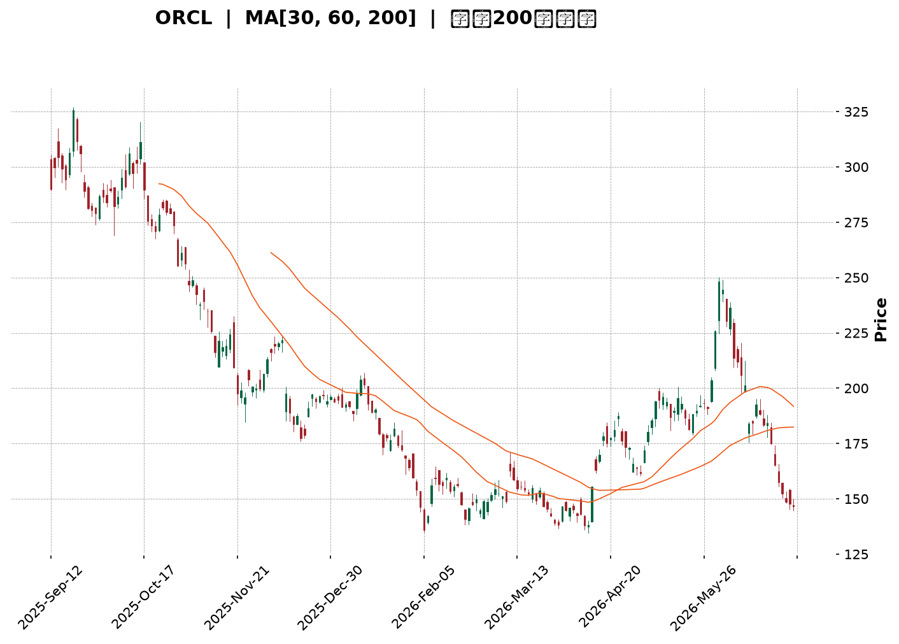
</details>

<html>
<head><meta charset="utf-8" /></head>
<body>
    <div style="height:500px; width:100%;">                        <script>window.PlotlyConfig = {MathJaxConfig: 'local'};</script>
        <script charset="utf-8" src="https://cdn.plot.ly/plotly-3.6.0.min.js" integrity="sha256-QaOVwtVY0T02VaHrr6pnoHLCwayMJp4O5n4YyaE3rJk=" crossorigin="anonymous"></script>                <div id="candlestick-chart" class="plotly-graph-div" style="height:100%; width:100%;"></div>            <script>                window.PLOTLYENV=window.PLOTLYENV || {};                                if (document.getElementById("candlestick-chart")) {                    Plotly.newPlot(                        "candlestick-chart",                        [{"close":{"dtype":"f8","bdata":"AAAAIEceckAAAAAAZLxyQAAAAED8A3NAAAAAQM2wckAAAAAAw2RyQAAAAODkI3NAAAAAwEpZdEAAAABA93VzQAAAAAC4IHNAAAAAwMgQckAAAACg2ZNxQAAAACC9iHFAAAAAwJtwcUAAAACA9OtxQAAAAMBN6HFAAAAAIGW+cUAAAACA6RRyQAAAAKA7oHFAAAAAQOzlcUAAAAAAV3JyQAAAACC7MnJAAAAAgA8ic0AAAADgx5JyQAAAAMA\u002f3HJAAAAAoGlxc0AAAAAgfhhyQAAAAADLN3FAAAAAAIMXcUAAAABA6u9wQAAAAEDAZXFAAAAAgJeZcUAAAACg5npxQAAAACDWcXFAAAAAoOUZcUAAAACgRepvQAAAAMAYUHBAAAAAAGcEcEAAAACg79RuQAAAAGD\u002fGG9AAAAAQPNJbkAAAACgjrltQAAAAKB9621AAAAAQKVWbUAAAADgUDNsQAAAAIC3B2tAAAAAIKWva0AAAACgjFBrQAAAAACWZGtAAAAAoOEEbEAAAADg5ixqQAAAACB5sWhAAAAA4NDhaEAAAACAc3poQAAAAGCpdmlAAAAAAO4WaUAAAACgzvZoQAAAAGDl+2hAAAAAgMLOaUAAAACgq6BqQAAAAOAICGtAAAAAIC1ma0AAAADAqYVrQAAAAMC7tGtAAAAA4FW0aEAAAABA6ZlnQAAAAEBM+WZAAAAA4O1vZ0AAAABA1ytmQAAAACDGXWZAAAAAIIXZZ0AAAABAY6VoQAAAAKCzRGhAAAAA4BSJaEAAAADg+5hoQAAAAGD5RWhAAAAAIC2AaEAAAACABjdoQAAAACB4UGhAAAAAID3tZ0AAAADgIRJoQAAAAKAw9WdAAAAAwLuPZ0AAAADAh7poQAAAAMD2fmlAAAAAAMAyaUAAAAAA9R1oQAAAAEAOpmdAAAAAAJnNZ0AAAADAZmlmQAAAAGDLqGVAAAAAQOoxZkAAAACgYxFmQAAAAODCuWZAAAAAAFLJZUAAAADAWoZlQAAAACB\u002fDWVAAAAA4DqAZEAAAADgF\u002fBjQAAAAMA2RGNAAAAAwBpFYkAAAADgKABhQAAAAIBVymFAAAAAoHCBY0AAAAAgrOpjQAAAAOCdk2NAAAAAoO59Y0AAAAAApfJjQAAAAEDkLWNAAAAAAAx0Y0AAAABg2H9jQAAAAGARcmJAAAAAgC6aYUAAAAAgNDRiQAAAAEACbGJAAAAA4C25YkAAAAAgmxxiQAAAAKBgl2JAAAAAYLmPYkAAAACg3vpiQAAAAEAKSGNAAAAAQK8NY0AAAABACuFiQAAAACApnGJAAAAAIKxRZEAAAADgZNNjQAAAAKA+UmNAAAAAQKttY0AAAAAA2kRjQAAAAEDFC2NAAAAAwFFfY0AAAADgFqViQAAAAMCwOWNAAAAAgH9SYkAAAACgYDBiQAAAAMADymFAAAAAwJBlYUAAAABAJEphQAAAAMAiU2JAAAAAYC8XYkAAAACA2ztiQAAAAAASIWJAAAAAoH7VYUAAAADAHuVhQAAAACCFO2FAAAAAQOFCYUAAAAAA13NjQAAAAAAAYGRAAAAAgOs5ZUAAAABA4UpmQAAAAIDr4WVAAAAAYI8yZkAAAACgcKVmQAAAAAAAcGdAAAAAwPUIZkAAAADA9ahlQAAAAGC4nmVAAAAAYLi+ZEAAAABgj3pkQAAAAOB6LGRAAAAAYI96ZUAAAACgR4lmQAAAAEAzK2dAAAAAwPVAaEAAAABA4VJoQAAAAGBmfmhAAAAAQOE6aEAAAABgj1pnQAAAAOBRuGdAAAAAIIVzaEAAAABgZh5oQAAAACCFU2dAAAAAYLiuZkAAAADAHoVnQAAAAOCjuGdAAAAAYI8CaEAAAACA6yFoQAAAAGC43mdAAAAAYGZ2aUAAAADA9ThsQAAAAMDMBG9AAAAAYI+SbkAAAABgj8psQAAAAEDhim1AAAAAgMK1akAAAACAPXpqQAAAAIDruWlAAAAA4FEoaUAAAABAMwNnQAAAAAApBGdAAAAA4HoUaEAAAABgj4pnQAAAAMD18GZAAAAAoEcJZ0AAAACAPeJlQAAAAMAepWRAAAAAwPWwY0AAAABguA5jQAAAAMD1kGJAAAAA4FF4YkAAAACgmVFiQA=="},"high":{"dtype":"f8","bdata":"6XCAnvAYc0DbRSmOBApzQJiaXdVv13NAKV+ovuQjc0DeCR5ZD9dyQGBjTm7JSnNAA\u002f+1FLludECodHloSSd0QJJBw2ZgYHNA3C7KKpOGckCHZ\u002fZ7KztyQCsvvvzau3FAl1HVPGyccUD8p3sSg\u002ftxQIHc2HyRSnJALGy1iFRFckD9pkfktmVyQOoxdcTJLnJAWHSTn\u002fUTckD8WTiuG7JyQHcCct9yHXNAl0I\u002fdNZMc0BUmiGo+OhyQHdlMV\u002fEUXNAY38B1h4JdEA6QG3IvuZyQAsbGwuT93FARprgiWhpcUCgLDuMHDhxQElO2lLvlXFAqRPljvnWcUBN2cIn9NNxQO9X68t2u3FACj7FRGZ+cUCGih9XzMFwQPIU4vH7gnBA21lSfvZ\u002fcECZVKYBEbdvQAtSnA14W29AU+uZcY\u002fxbkDNx\u002fF10N1tQKp4vadbt25AvLCv1P1\u002fbUBd8kXqomttQPICEv0c+WtA1m5AWzk1bEAaWEsGDq5rQJY7saOtymtAKcViiTVYbEC72TsWRBJtQJJG7uw04WlAtSXIgGdSaUD6aBBrJcZoQP3EBdT0FmpApN+bXFUjaUAZ65sJOkhpQF7F2jRqDWpAVeRMfs3UaUDn1Z\u002f2BMNqQKG3FG8ZRWtApbBC2xLsa0CljJl2VKhrQMGgncsz\u002fmtAqp03pDMYaUA8Per6h5RoQMClNzwbemdATgXvNYGUZ0CCunKZjCtnQEeN25Y19GZALcQ\u002fRLQ9aECjel3cvrJoQLW416\u002fbf2hAh4Ys+TSiaEBQnlyrreRoQKLA9qSFqWhAr6vFNWOlaEDrxMiL239oQE2dtOYQrGhAoVPID6kOaUA4wwtWEjZoQFsfFmcyT2hAgdmNVBS5Z0AhbcoLd+9oQDbh48EwvGlAGN6C5nTiaUATpm9JTB9pQKaH5cCZSmhA4XfYgnjmZ0AzssFXO1FnQJ7KowYWf2ZA3+3OCw5xZkCTAJqhymBmQCqGHgxIFWdAEOloEgZjZkDykUxwhqFmQJhWPZdmNGVA\u002fL0ZFP0JZUC3a3EgVVNlQIMM6tVo2mNAtiB2V+8sY0AcsJFDR0FiQL1RfIpz1mFABxhDRzXmY0DjgmZPD5pkQFm0yIzkYmRAlIiiIpHPY0BhthoqhjdkQO994Vk412NAquUvyBSYY0DbIFQxu\u002fBjQBxOCp+HLmNAqj1gm1wpYkBrp5py+UdiQGynJHLjF2NAAr8Q7wP\u002fYkBAvJhcSjJiQAKM7gS3tGJAKioJQvPMYkDraRtlaSJjQKid1099rGNAWceMv1nUY0BHa2k0Eu9iQHdr6BpQM2NA8LYNqDBlZUDjXmJO3udkQH4IMf+7BmRA63ydJQDGY0D+JxuFvctjQIBw0LrHTWNAZzN8lfaLY0DREpKW7hZjQMMzazGcZ2NAyg9J1qgrY0DxZRYWMapiQF5esCW6PmJAJzvXnkymYUBGVaySrJZhQJy2VBtiXGJAKX18+iGkYkAXJRVKxT1iQOkhyC0OgWJAndpjlSMCYkBiZbD72d1iQAAAAKCZ2WFAAAAAoHCFYUAAAADAHn1jQAAAAMDMLGVAAAAAgOuRZUAAAADgo4hmQAAAAAAAEGdAAAAA4FE4ZkAAAABA4SpnQAAAAIDCpWdAAAAA4Hq8ZkAAAABguJZmQAAAAKCZsWVAAAAAYGYWZUAAAADgUZhkQAAAAIDCpWRAAAAAoJnJZUAAAAAAAPBmQAAAAOCjUGdAAAAAoEdJaEAAAADAzARpQAAAAAAAwGhAAAAAgMJ1aEAAAACgcB1oQAAAAIA98mdAAAAAYLgWaUAAAACAwo1oQAAAAOBR2GdAAAAAQAqXZ0AAAABACodnQAAAAIA9GmhAAAAAAACgaEAAAABgZmZoQAAAAOB6BGhAAAAAAACgaUAAAACgR0lsQAAAAAAASG9AAAAAAAAgb0AAAADgURBuQAAAAGBm3m1AAAAAgBTubEAAAACA62FrQAAAAAAAkGtAAAAAIFyPakAAAADgoxhnQAAAAGCPMmdAAAAAgD1qaEAAAACAPWpoQAAAAIAUxmdAAAAAIK5\u002fZ0AAAABgjxJnQAAAAGCPymVAAAAAAAC4ZEAAAAAA17NjQAAAAKBHMWNAAAAAAABQY0AAAACAwr1iQA=="},"hovertemplate":"\u003cb\u003e%{x|%Y-%m-%d}\u003c\u002fb\u003e\u003cbr\u003e\u958b: $%{open:.2f}\u003cbr\u003e\u9ad8: $%{high:.2f}\u003cbr\u003e\u4f4e: $%{low:.2f}\u003cbr\u003e\u6536: $%{close:.2f}\u003cextra\u003e\u003c\u002fextra\u003e","low":{"dtype":"f8","bdata":"giwsqnMXckDudKDpZW9yQEAG+jZ0vnJAVEHSWoVLckAU72CpaxtyQPWKVerfb3JA4OEIlkUIc0DvTgSZ9TlzQD\u002f3QRjlmnJAR7pgB6fkcUBZondAjIxxQASqxKS7VnFAo2NgYNYbcUDnXvLvRDtxQEdGDS33vHFAJw8XQWyccUBMrMr1XghyQMSk2zgNznBAFbpgrxKWcUCteL2KFthxQBudCMSfI3JAnqPvbL5+ckCYrbueJSNyQNkrsDSCkXJA1GWby4DTckDllU6w59txQGE9LEgOGnFA17JV7I3pcECkrNQusLlwQN7uSyGf63BAbOWr5GqIcUB2+djGnWFxQI51HaE5bXFAxjLfUBXbcEBTCpnl3tZvQFCCsPOL5G9ARIPk9nm1b0BQIhOaKHZuQK346rytsG5APiXJ54K6bUD9fNm8yd1sQJ465+Dnc21ADOHknr5vbEBewEJnPBlsQLu40NT5vGpAjr3UKXIvakAiEZclysdqQOAUGZUTpmpAMGQpp3L\u002fakBYU16DfyBqQDkIMI3FC2hAFAV\u002f9J8jaEDUR+cj4Q9nQBnByzcnIGlAvvPG5eWMaEAXCDWl9G9oQOdttCnp2GhAvBQr6dPFaEBnrUqF6qFpQFerB6MWimpAuY9437nyakA1ACtcTB5rQHDAb+8ICGtAWYLTL\u002fYiZ0BEAQXDAhtnQBTnHn9YiWZAWFLXY5\u002frZkCFVjTsof9lQBENl0yoL2ZAa20XghJfZ0AhhGFQ3\u002fRnQLaVRXuE4GdAHmP0+nAnaEBXUHjwMF1oQNGm2lfU7mdAs4ckLXhQaEAAibLhTDFoQDNRPi3DIGhAOiY4QvjkZ0AFx7zaILFnQDRKV2d52mdAw+y13mogZ0BYmgdU74NnQI1ZC89gimhA0NdFmcX+aECihh01q8RnQG26nv1il2dAE0QXgy88Z0AplnU3i1dmQBTyviQzQGVAkxtYplf8ZUDwgcj+12xlQEhj05oTPWZAfRPhiGqiZUBStyUNYWhlQBmAQ62mHmRAPCS41H9VZECSC+0VLu5jQNS7HNrh62JAYCQKfqz9YUDk26vR79hgQA8nzzqmTWFAFwr+zKBPYkAZ0BEqPY1jQIaJujjZLmNAk2vm+QP\u002fYkBfbkII\u002fFdjQESb+RMiC2NAeQ7UOvvaYkAGpi6USmdjQNk6T4wQXGJAeG5VzXFDYUDshTum6EdhQGB3f054WmJAD0geP6IUYkA5Bry2X7NhQOQ5\u002fzYJlmFAOt+oDavRYUCOA+UbmJJiQEB\u002frMYes2JA\u002fLquFPTiYkCM2AaEcz1iQCtt\u002fNXdfWJAIa+V66wAZEAShW3u2sFjQDL3KZ+hM2NAbHengBw\u002fY0CrF99t5x5jQMN\u002fOqVY8GJATJw2yOWLYkAubjYT7G1iQESKTV\u002fvxWJANC+sV9hKYkBWHX18GANiQNvPwZJnwWFAj\u002ffGZjI6YUBTsAS\u002fJQ9hQGAL596fa2FAmVxq11MFYkBYAXN5+XlhQC\u002f4Tc8t62FA8Iqbl35uYUBE5lFr4sxhQAAAAAAAAGFAAAAAgD3SYEAAAABACndhQAAAAIDrMWRAAAAAYLjGZEAAAACgmbllQAAAACCFq2VAAAAA4FGwZUAAAADgUQBmQAAAAKCZ2WZAAAAAYI\u002fCZUAAAACgmRllQAAAAMDM\u002fGRAAAAAoJlBZEAAAADAzBRkQAAAAGCPCmRAAAAAwMzEZEAAAADgUchlQAAAAAAAYGZAAAAAoHDVZkAAAACgmdlnQAAAAGC4xmdAAAAAQDPTZ0AAAAAA15tmQAAAAIDrIWdAAAAAYGYuZ0AAAADAzJxnQAAAAOCj6GZAAAAAgMKdZkAAAACgmVlmQAAAAGBmZmdAAAAAQDPjZ0AAAACA69FnQAAAAKBwfWdAAAAAACksaEAAAADgUQBqQAAAAEAzE2xAAAAAQOHabUAAAAAghXNsQAAAAAAAAGxAAAAAYGYuakAAAABgjypqQAAAAKBHuWhAAAAAgMLFaEAAAADA9ehlQAAAAAAAYGZAAAAAYLhGZ0AAAADAHnVnQAAAAGCP0mZAAAAAYGY2ZkAAAADAzMxlQAAAACCFk2RAAAAAQDNrY0AAAAAghctiQAAAAAAAgGJAAAAAYGYmYkAAAAAgXA9iQA=="},"name":"\u50f9\u683c","open":{"dtype":"f8","bdata":"X3vmR1X2ckColb2HzwBzQKGmVP2deXNAHHw2un4Uc0CPgcZ8rcpyQF1FC0qLinJAWmKHzUozc0AjGEV6aRd0QFR92VaxVnNAAgAqpVRPckBrm9ONSytyQEyyLL7ypXFAJgbbbYCXcUCnkgCv30lxQP20Q8Y+GHJAZ2oqSlL1cUC0UzUKdCFyQOoxdcTJLnJAkJ9yEfeycUDqJ+33ThxyQKYd+L8ip3JAw0qbqAKOckAFbuZLdNtyQMd2V5qa8HJAGxd+YLz7ckDhhbAqUd5yQJbJPIz28nFA2i1RE5VGcUAW3piWQxJxQJZu+H6v9HBA6DxrdMfCcUARipKpHc1xQL5mhDZYlHFA0Wp75dp7cUBnLMLbk7FwQEqRcc3MHnBAW+MAgOt5cEDpIimQgA5vQDG5F7WqzG5A19aZ+57NbkD3iznCSbFtQAGOKXNUjm5AlmBInzBZbUB+jcgKaWltQKMKjN6082tAizVWqVoxakD+t1RuEhxrQHW232V23GpAWdgDGBs3a0BT6sXu8LdsQN7pkVcWumlAcd4HXgt1aEA8VtW5oBxoQGrXZNgNB2pAuuFLlVPJaEA8leIj0OhoQHXjutxifGlAJILmAGjjaEAAzAoY5dJpQBY4fnMyNWtAZ6LIOPB\u002fa0B7JwDN9FVrQBdmewpAjmtAGff6aJWuZ0Ck8gTIdWVoQAwFUqJ6ZGdAZT4iIk3yZkADkoG1F8ZmQGYdighUs2ZAmcSm36hnZ0AfhI7NxXNoQJs7lVZeZ2hAoEPbVeM5aECbn32\u002fNZtoQLQAmyosH2hAXH4xyplbaEDoAa\u002fSDGdoQE4KiPBxiGhA+85cbR2kaEC7r3LqSOxnQOsuR+ptQ2hA\u002fxERddq2Z0AiOvQ2xt9nQE4VklwxnWhAQVeyGyuJaUATpm9JTB9pQKaH5cCZSmhAmEmuJPinZ0AzssFXO1FnQCnc04G\u002fYWZARwAe0txXZkBt63JRnYBlQHJ7YtpAT2ZAxP3obh9SZkBbtv9N9cllQA\u002fNK3\u002fZMWVAjeBixLXyZEAU+StcZ0plQLpMz6SxtmNAH2ZwJFcrY0DjcIv5+yJiQP\u002fyvYdvaGFArcOAcSR\u002fYkB\u002fghodLu5jQFm0yIzkYmRAry2BqCusY0AREh6AQ9ZjQMJotsrDrWNA+jIOTuw7Y0DySY63kpRjQPWIWcuGGGNAa69FntolYkCQpymdMYthQN\u002f6LeqBlGJAXtWVVrWIYkAU7HS2IuxhQJcdaysRpGFAK\u002f549eAHYkBvNNLJnK9iQG4s8pniAWNAe0AFpGgMY0B+LSqlncViQCFxZQ67ImNAyzz3LKG5ZEAm0\u002fEPyIJkQN5bncniz2NAxNoc74lwY0Cx9bidxFxjQDx9c\u002f62G2NA5YDGhPa9YkBYZVjqjRBjQLTVEmGT3GJAq8ZHv\u002fUOY0Coz3JavZZiQJJDFVV07GFASuk5ShCOYUBR7W3lrnFhQFe7XGr5eWFAwtnmcUaSYkDdayjkDslhQBzuu7OoXWJAKl2hW\u002fLoYUCtp5FO3LhiQAAAAGBmxmFAAAAAgD0qYUAAAADgo3hhQAAAAIDC\u002fWRAAAAA4HrcZEAAAACgcA1mQAAAAIDC3WZAAAAAgOsZZkAAAABAM0tmQAAAAIDCRWdAAAAAwMyMZkAAAADgUZBmQAAAAGCPkmVAAAAAwB5FZEAAAACgR4FkQAAAAOCjQGRAAAAAoHDNZEAAAADgowBmQAAAAAApxGZAAAAAYGZGZ0AAAAAghdNoQAAAAGCPEmhAAAAAwMwEaEAAAACgcB1oQAAAAMD1oGdAAAAAgMKFZ0AAAAAgrs9nQAAAAAAAwGdAAAAAAABAZ0AAAACAFH5mQAAAAOBRoGdAAAAAoHD1Z0AAAACgmSloQAAAACBc72dAAAAAoEdBaEAAAAAAACBqQAAAAAAA0GxAAAAAoJlZbkAAAAAgXA9uQAAAAAAAYGxAAAAAIK6vbEAAAAAAADhrQAAAAMAevWpAAAAAAADQaEAAAACgcHVmQAAAAOBRIGdAAAAA4HpsZ0AAAADgUcBnQAAAAMAeRWdAAAAA4FHgZkAAAACA68lmQAAAACBcR2VAAAAAIFxPZEAAAABAM6tjQAAAAOBRyGJAAAAAgBQ+Y0AAAAAAAGhiQA=="},"x":["2025-09-12T00:00:00-04:00","2025-09-15T00:00:00-04:00","2025-09-16T00:00:00-04:00","2025-09-17T00:00:00-04:00","2025-09-18T00:00:00-04:00","2025-09-19T00:00:00-04:00","2025-09-22T00:00:00-04:00","2025-09-23T00:00:00-04:00","2025-09-24T00:00:00-04:00","2025-09-25T00:00:00-04:00","2025-09-26T00:00:00-04:00","2025-09-29T00:00:00-04:00","2025-09-30T00:00:00-04:00","2025-10-01T00:00:00-04:00","2025-10-02T00:00:00-04:00","2025-10-03T00:00:00-04:00","2025-10-06T00:00:00-04:00","2025-10-07T00:00:00-04:00","2025-10-08T00:00:00-04:00","2025-10-09T00:00:00-04:00","2025-10-10T00:00:00-04:00","2025-10-13T00:00:00-04:00","2025-10-14T00:00:00-04:00","2025-10-15T00:00:00-04:00","2025-10-16T00:00:00-04:00","2025-10-17T00:00:00-04:00","2025-10-20T00:00:00-04:00","2025-10-21T00:00:00-04:00","2025-10-22T00:00:00-04:00","2025-10-23T00:00:00-04:00","2025-10-24T00:00:00-04:00","2025-10-27T00:00:00-04:00","2025-10-28T00:00:00-04:00","2025-10-29T00:00:00-04:00","2025-10-30T00:00:00-04:00","2025-10-31T00:00:00-04:00","2025-11-03T00:00:00-05:00","2025-11-04T00:00:00-05:00","2025-11-05T00:00:00-05:00","2025-11-06T00:00:00-05:00","2025-11-07T00:00:00-05:00","2025-11-10T00:00:00-05:00","2025-11-11T00:00:00-05:00","2025-11-12T00:00:00-05:00","2025-11-13T00:00:00-05:00","2025-11-14T00:00:00-05:00","2025-11-17T00:00:00-05:00","2025-11-18T00:00:00-05:00","2025-11-19T00:00:00-05:00","2025-11-20T00:00:00-05:00","2025-11-21T00:00:00-05:00","2025-11-24T00:00:00-05:00","2025-11-25T00:00:00-05:00","2025-11-26T00:00:00-05:00","2025-11-28T00:00:00-05:00","2025-12-01T00:00:00-05:00","2025-12-02T00:00:00-05:00","2025-12-03T00:00:00-05:00","2025-12-04T00:00:00-05:00","2025-12-05T00:00:00-05:00","2025-12-08T00:00:00-05:00","2025-12-09T00:00:00-05:00","2025-12-10T00:00:00-05:00","2025-12-11T00:00:00-05:00","2025-12-12T00:00:00-05:00","2025-12-15T00:00:00-05:00","2025-12-16T00:00:00-05:00","2025-12-17T00:00:00-05:00","2025-12-18T00:00:00-05:00","2025-12-19T00:00:00-05:00","2025-12-22T00:00:00-05:00","2025-12-23T00:00:00-05:00","2025-12-24T00:00:00-05:00","2025-12-26T00:00:00-05:00","2025-12-29T00:00:00-05:00","2025-12-30T00:00:00-05:00","2025-12-31T00:00:00-05:00","2026-01-02T00:00:00-05:00","2026-01-05T00:00:00-05:00","2026-01-06T00:00:00-05:00","2026-01-07T00:00:00-05:00","2026-01-08T00:00:00-05:00","2026-01-09T00:00:00-05:00","2026-01-12T00:00:00-05:00","2026-01-13T00:00:00-05:00","2026-01-14T00:00:00-05:00","2026-01-15T00:00:00-05:00","2026-01-16T00:00:00-05:00","2026-01-20T00:00:00-05:00","2026-01-21T00:00:00-05:00","2026-01-22T00:00:00-05:00","2026-01-23T00:00:00-05:00","2026-01-26T00:00:00-05:00","2026-01-27T00:00:00-05:00","2026-01-28T00:00:00-05:00","2026-01-29T00:00:00-05:00","2026-01-30T00:00:00-05:00","2026-02-02T00:00:00-05:00","2026-02-03T00:00:00-05:00","2026-02-04T00:00:00-05:00","2026-02-05T00:00:00-05:00","2026-02-06T00:00:00-05:00","2026-02-09T00:00:00-05:00","2026-02-10T00:00:00-05:00","2026-02-11T00:00:00-05:00","2026-02-12T00:00:00-05:00","2026-02-13T00:00:00-05:00","2026-02-17T00:00:00-05:00","2026-02-18T00:00:00-05:00","2026-02-19T00:00:00-05:00","2026-02-20T00:00:00-05:00","2026-02-23T00:00:00-05:00","2026-02-24T00:00:00-05:00","2026-02-25T00:00:00-05:00","2026-02-26T00:00:00-05:00","2026-02-27T00:00:00-05:00","2026-03-02T00:00:00-05:00","2026-03-03T00:00:00-05:00","2026-03-04T00:00:00-05:00","2026-03-05T00:00:00-05:00","2026-03-06T00:00:00-05:00","2026-03-09T00:00:00-04:00","2026-03-10T00:00:00-04:00","2026-03-11T00:00:00-04:00","2026-03-12T00:00:00-04:00","2026-03-13T00:00:00-04:00","2026-03-16T00:00:00-04:00","2026-03-17T00:00:00-04:00","2026-03-18T00:00:00-04:00","2026-03-19T00:00:00-04:00","2026-03-20T00:00:00-04:00","2026-03-23T00:00:00-04:00","2026-03-24T00:00:00-04:00","2026-03-25T00:00:00-04:00","2026-03-26T00:00:00-04:00","2026-03-27T00:00:00-04:00","2026-03-30T00:00:00-04:00","2026-03-31T00:00:00-04:00","2026-04-01T00:00:00-04:00","2026-04-02T00:00:00-04:00","2026-04-06T00:00:00-04:00","2026-04-07T00:00:00-04:00","2026-04-08T00:00:00-04:00","2026-04-09T00:00:00-04:00","2026-04-10T00:00:00-04:00","2026-04-13T00:00:00-04:00","2026-04-14T00:00:00-04:00","2026-04-15T00:00:00-04:00","2026-04-16T00:00:00-04:00","2026-04-17T00:00:00-04:00","2026-04-20T00:00:00-04:00","2026-04-21T00:00:00-04:00","2026-04-22T00:00:00-04:00","2026-04-23T00:00:00-04:00","2026-04-24T00:00:00-04:00","2026-04-27T00:00:00-04:00","2026-04-28T00:00:00-04:00","2026-04-29T00:00:00-04:00","2026-04-30T00:00:00-04:00","2026-05-01T00:00:00-04:00","2026-05-04T00:00:00-04:00","2026-05-05T00:00:00-04:00","2026-05-06T00:00:00-04:00","2026-05-07T00:00:00-04:00","2026-05-08T00:00:00-04:00","2026-05-11T00:00:00-04:00","2026-05-12T00:00:00-04:00","2026-05-13T00:00:00-04:00","2026-05-14T00:00:00-04:00","2026-05-15T00:00:00-04:00","2026-05-18T00:00:00-04:00","2026-05-19T00:00:00-04:00","2026-05-20T00:00:00-04:00","2026-05-21T00:00:00-04:00","2026-05-22T00:00:00-04:00","2026-05-26T00:00:00-04:00","2026-05-27T00:00:00-04:00","2026-05-28T00:00:00-04:00","2026-05-29T00:00:00-04:00","2026-06-01T00:00:00-04:00","2026-06-02T00:00:00-04:00","2026-06-03T00:00:00-04:00","2026-06-04T00:00:00-04:00","2026-06-05T00:00:00-04:00","2026-06-08T00:00:00-04:00","2026-06-09T00:00:00-04:00","2026-06-10T00:00:00-04:00","2026-06-11T00:00:00-04:00","2026-06-12T00:00:00-04:00","2026-06-15T00:00:00-04:00","2026-06-16T00:00:00-04:00","2026-06-17T00:00:00-04:00","2026-06-18T00:00:00-04:00","2026-06-22T00:00:00-04:00","2026-06-23T00:00:00-04:00","2026-06-24T00:00:00-04:00","2026-06-25T00:00:00-04:00","2026-06-26T00:00:00-04:00","2026-06-29T00:00:00-04:00","2026-06-30T00:00:00-04:00"],"type":"candlestick"},{"hovertemplate":"MA30: $%{y:.2f}\u003cextra\u003e\u003c\u002fextra\u003e","line":{"color":"#2196F3","dash":"dash","width":2},"mode":"lines","name":"MA30","x":["2025-09-12T00:00:00-04:00","2025-09-15T00:00:00-04:00","2025-09-16T00:00:00-04:00","2025-09-17T00:00:00-04:00","2025-09-18T00:00:00-04:00","2025-09-19T00:00:00-04:00","2025-09-22T00:00:00-04:00","2025-09-23T00:00:00-04:00","2025-09-24T00:00:00-04:00","2025-09-25T00:00:00-04:00","2025-09-26T00:00:00-04:00","2025-09-29T00:00:00-04:00","2025-09-30T00:00:00-04:00","2025-10-01T00:00:00-04:00","2025-10-02T00:00:00-04:00","2025-10-03T00:00:00-04:00","2025-10-06T00:00:00-04:00","2025-10-07T00:00:00-04:00","2025-10-08T00:00:00-04:00","2025-10-09T00:00:00-04:00","2025-10-10T00:00:00-04:00","2025-10-13T00:00:00-04:00","2025-10-14T00:00:00-04:00","2025-10-15T00:00:00-04:00","2025-10-16T00:00:00-04:00","2025-10-17T00:00:00-04:00","2025-10-20T00:00:00-04:00","2025-10-21T00:00:00-04:00","2025-10-22T00:00:00-04:00","2025-10-23T00:00:00-04:00","2025-10-24T00:00:00-04:00","2025-10-27T00:00:00-04:00","2025-10-28T00:00:00-04:00","2025-10-29T00:00:00-04:00","2025-10-30T00:00:00-04:00","2025-10-31T00:00:00-04:00","2025-11-03T00:00:00-05:00","2025-11-04T00:00:00-05:00","2025-11-05T00:00:00-05:00","2025-11-06T00:00:00-05:00","2025-11-07T00:00:00-05:00","2025-11-10T00:00:00-05:00","2025-11-11T00:00:00-05:00","2025-11-12T00:00:00-05:00","2025-11-13T00:00:00-05:00","2025-11-14T00:00:00-05:00","2025-11-17T00:00:00-05:00","2025-11-18T00:00:00-05:00","2025-11-19T00:00:00-05:00","2025-11-20T00:00:00-05:00","2025-11-21T00:00:00-05:00","2025-11-24T00:00:00-05:00","2025-11-25T00:00:00-05:00","2025-11-26T00:00:00-05:00","2025-11-28T00:00:00-05:00","2025-12-01T00:00:00-05:00","2025-12-02T00:00:00-05:00","2025-12-03T00:00:00-05:00","2025-12-04T00:00:00-05:00","2025-12-05T00:00:00-05:00","2025-12-08T00:00:00-05:00","2025-12-09T00:00:00-05:00","2025-12-10T00:00:00-05:00","2025-12-11T00:00:00-05:00","2025-12-12T00:00:00-05:00","2025-12-15T00:00:00-05:00","2025-12-16T00:00:00-05:00","2025-12-17T00:00:00-05:00","2025-12-18T00:00:00-05:00","2025-12-19T00:00:00-05:00","2025-12-22T00:00:00-05:00","2025-12-23T00:00:00-05:00","2025-12-24T00:00:00-05:00","2025-12-26T00:00:00-05:00","2025-12-29T00:00:00-05:00","2025-12-30T00:00:00-05:00","2025-12-31T00:00:00-05:00","2026-01-02T00:00:00-05:00","2026-01-05T00:00:00-05:00","2026-01-06T00:00:00-05:00","2026-01-07T00:00:00-05:00","2026-01-08T00:00:00-05:00","2026-01-09T00:00:00-05:00","2026-01-12T00:00:00-05:00","2026-01-13T00:00:00-05:00","2026-01-14T00:00:00-05:00","2026-01-15T00:00:00-05:00","2026-01-16T00:00:00-05:00","2026-01-20T00:00:00-05:00","2026-01-21T00:00:00-05:00","2026-01-22T00:00:00-05:00","2026-01-23T00:00:00-05:00","2026-01-26T00:00:00-05:00","2026-01-27T00:00:00-05:00","2026-01-28T00:00:00-05:00","2026-01-29T00:00:00-05:00","2026-01-30T00:00:00-05:00","2026-02-02T00:00:00-05:00","2026-02-03T00:00:00-05:00","2026-02-04T00:00:00-05:00","2026-02-05T00:00:00-05:00","2026-02-06T00:00:00-05:00","2026-02-09T00:00:00-05:00","2026-02-10T00:00:00-05:00","2026-02-11T00:00:00-05:00","2026-02-12T00:00:00-05:00","2026-02-13T00:00:00-05:00","2026-02-17T00:00:00-05:00","2026-02-18T00:00:00-05:00","2026-02-19T00:00:00-05:00","2026-02-20T00:00:00-05:00","2026-02-23T00:00:00-05:00","2026-02-24T00:00:00-05:00","2026-02-25T00:00:00-05:00","2026-02-26T00:00:00-05:00","2026-02-27T00:00:00-05:00","2026-03-02T00:00:00-05:00","2026-03-03T00:00:00-05:00","2026-03-04T00:00:00-05:00","2026-03-05T00:00:00-05:00","2026-03-06T00:00:00-05:00","2026-03-09T00:00:00-04:00","2026-03-10T00:00:00-04:00","2026-03-11T00:00:00-04:00","2026-03-12T00:00:00-04:00","2026-03-13T00:00:00-04:00","2026-03-16T00:00:00-04:00","2026-03-17T00:00:00-04:00","2026-03-18T00:00:00-04:00","2026-03-19T00:00:00-04:00","2026-03-20T00:00:00-04:00","2026-03-23T00:00:00-04:00","2026-03-24T00:00:00-04:00","2026-03-25T00:00:00-04:00","2026-03-26T00:00:00-04:00","2026-03-27T00:00:00-04:00","2026-03-30T00:00:00-04:00","2026-03-31T00:00:00-04:00","2026-04-01T00:00:00-04:00","2026-04-02T00:00:00-04:00","2026-04-06T00:00:00-04:00","2026-04-07T00:00:00-04:00","2026-04-08T00:00:00-04:00","2026-04-09T00:00:00-04:00","2026-04-10T00:00:00-04:00","2026-04-13T00:00:00-04:00","2026-04-14T00:00:00-04:00","2026-04-15T00:00:00-04:00","2026-04-16T00:00:00-04:00","2026-04-17T00:00:00-04:00","2026-04-20T00:00:00-04:00","2026-04-21T00:00:00-04:00","2026-04-22T00:00:00-04:00","2026-04-23T00:00:00-04:00","2026-04-24T00:00:00-04:00","2026-04-27T00:00:00-04:00","2026-04-28T00:00:00-04:00","2026-04-29T00:00:00-04:00","2026-04-30T00:00:00-04:00","2026-05-01T00:00:00-04:00","2026-05-04T00:00:00-04:00","2026-05-05T00:00:00-04:00","2026-05-06T00:00:00-04:00","2026-05-07T00:00:00-04:00","2026-05-08T00:00:00-04:00","2026-05-11T00:00:00-04:00","2026-05-12T00:00:00-04:00","2026-05-13T00:00:00-04:00","2026-05-14T00:00:00-04:00","2026-05-15T00:00:00-04:00","2026-05-18T00:00:00-04:00","2026-05-19T00:00:00-04:00","2026-05-20T00:00:00-04:00","2026-05-21T00:00:00-04:00","2026-05-22T00:00:00-04:00","2026-05-26T00:00:00-04:00","2026-05-27T00:00:00-04:00","2026-05-28T00:00:00-04:00","2026-05-29T00:00:00-04:00","2026-06-01T00:00:00-04:00","2026-06-02T00:00:00-04:00","2026-06-03T00:00:00-04:00","2026-06-04T00:00:00-04:00","2026-06-05T00:00:00-04:00","2026-06-08T00:00:00-04:00","2026-06-09T00:00:00-04:00","2026-06-10T00:00:00-04:00","2026-06-11T00:00:00-04:00","2026-06-12T00:00:00-04:00","2026-06-15T00:00:00-04:00","2026-06-16T00:00:00-04:00","2026-06-17T00:00:00-04:00","2026-06-18T00:00:00-04:00","2026-06-22T00:00:00-04:00","2026-06-23T00:00:00-04:00","2026-06-24T00:00:00-04:00","2026-06-25T00:00:00-04:00","2026-06-26T00:00:00-04:00","2026-06-29T00:00:00-04:00","2026-06-30T00:00:00-04:00"],"y":{"dtype":"f8","bdata":"AAAAAAAA+H8AAAAAAAD4fwAAAAAAAPh\u002fAAAAAAAA+H8AAAAAAAD4fwAAAAAAAPh\u002fAAAAAAAA+H8AAAAAAAD4fwAAAAAAAPh\u002fAAAAAAAA+H8AAAAAAAD4fwAAAAAAAPh\u002fAAAAAAAA+H8AAAAAAAD4fwAAAAAAAPh\u002fAAAAAAAA+H8AAAAAAAD4fwAAAAAAAPh\u002fAAAAAAAA+H8AAAAAAAD4fwAAAAAAAPh\u002fAAAAAAAA+H8AAAAAAAD4fwAAAAAAAPh\u002fAAAAAAAA+H8AAAAAAAD4fwAAAAAAAPh\u002fAAAAAAAA+H8AAAAAAAD4fzMzMzMpRnJAIiIi8rxBckARERGRBTdyQFVVVeWdKXJAREREpA0cckAREREJRAdyQJqZmaEj73FAMzMzGy3KcUC8u7vbqKdxQKuqqnIeiXFAzczMJDFwcUDe3d3dBVlxQM3MzHQOQ3FAq6qq4mkrcUAAAADAzQpxQLy7u3tS5XBAzczMVAnEcECJiIgoSJ5wQDMzMyPAfHBAMzMzW5FbcEAiIiKS1i1wQO\u002fu7l7P929AERERkZmFb0BmZmYGfxlvQCIiItLmsG5Aq6qq+is7bkCJiIioXdttQDMzM6O1im1AvLu76ztDbUCamZk5ZQVtQBEREYElw2xAAAAAYJSAbECamZm5G0FsQBEREXHPA2xA7+7u\u002fsKya0C8u7v70GtrQCIiIgJ0GWtARERENBfQakDe3d39L4ZqQFVVVRWuO2pAq6qqersEakAzMzOzZNlpQERERMQqqWlAzczMfC6AaUC8u7vrb2FpQFVVVZXpSWlAq6qq6rouaUAzMzODRxRpQAAAAEAC+mhA3t3dXRbXaEDe3d3dIMVoQO\u002fu7i7avmhAZmZmNpWzaEBVVVUFuLVoQN7d3d3+tWhAREREROy2aEAAAADQsa9oQGZmZsZMpGhAq6qqyjGTaEB3d3cHOG9oQFVVVaVgQWhAREREBPgUaEBVVVUlbeZnQCIiImLtu2dAq6qq2gajZ0B3d3fnTpFnQDMzMzPqgGdAMzMzs9tnZ0CamZnJzFRnQDMzMxNZOmdA3t3d7bsKZ0AAAABAfslmQImIiNg2kmZAiYiI+EpnZkARERFhWT9mQDMzM0NFF2ZAIiIicofsZUC8u7vLHchlQBERERFMnGVAMzMzwx92ZUAAAABQHU9lQM3MzLwTIGVAIiIisjntZEDe3d09jLVkQCIiIsIueWRAd3d3J+5BZEDNzMxsrw5kQBEREYGH42NAmpmZ2cy2Y0C8u7sLhJljQHd3d1c5hWNAMzMzk2pqY0BVVVVlNE9jQLy7u6sVLGNAREREJJAfY0Crqqp6EBFjQAAAABBKAmNAREREJCP5YkARERHhbfNiQKuqqjqM8WJAZmZmdvT6YkBVVVVl\u002fAhjQLy7uys7FWNAERERESILY0ARERHRY\u002fxiQCIiIvIi7WJAMzMz80HbYkDe3d39ksRiQGZmZkZIvWJAIiIiUqexYkAAAACg2qZiQCIiInInpGJAVVVVlSGmYkDNzMy8fqNiQO\u002fu7m5YmWJAmpmZad6MYkB3d3dXT5hiQKuqqtqHp2JAIiIiQkW+YkDNzMycidpiQJqZmcm78GJA7+7uDpALY0CrqqqatStjQO\u002fu7m7nVGNAVVVVBYxjY0C8u7v7MnNjQERERKTQhmNAAAAA0AySY0CJiIioX5xjQAAAAFD\u002fpWNAVVVV1fi3Y0CJiIioLdljQERERCTU+mNA7+7urnEtZEDe3d1Ny2FkQKuqqsoBm2RAZmZmRlHVZEBERESUEAllQO\u002fu7q4aN2VA7+7uzmFtZUAzMzOjmZ9lQO\u002fu7s7yy2VAmpmZmVL1ZUCamZmZUiVmQN7d3X2xXGZAzczMXEiWZkCrqqr6N75mQM3MzOwK3GZAd3d3JzEAZ0AAAABwyzJnQBEREeHBgGdAiYiIWDnIZ0De3d1NqfxnQBEREeHBMGhAIiIikqZYaEAAAACQwoFoQM3MzMzMpGhAzczMDHTKaEDNzMwcE+BoQGZmZqZU+GhAq6qqKocOaUAAAACgGhdpQERERKQpFWlAiYiI+MUKaUBmZma28\u002fVoQN7d3f0b1WhAERER8WCuaEBERESkt4loQKuqqhq9XWhAzczM3LIqaEAiIiKSNPlnQA=="},"type":"scatter"},{"hovertemplate":"MA60: $%{y:.2f}\u003cextra\u003e\u003c\u002fextra\u003e","line":{"color":"#9C27B0","dash":"dash","width":2},"mode":"lines","name":"MA60","x":["2025-09-12T00:00:00-04:00","2025-09-15T00:00:00-04:00","2025-09-16T00:00:00-04:00","2025-09-17T00:00:00-04:00","2025-09-18T00:00:00-04:00","2025-09-19T00:00:00-04:00","2025-09-22T00:00:00-04:00","2025-09-23T00:00:00-04:00","2025-09-24T00:00:00-04:00","2025-09-25T00:00:00-04:00","2025-09-26T00:00:00-04:00","2025-09-29T00:00:00-04:00","2025-09-30T00:00:00-04:00","2025-10-01T00:00:00-04:00","2025-10-02T00:00:00-04:00","2025-10-03T00:00:00-04:00","2025-10-06T00:00:00-04:00","2025-10-07T00:00:00-04:00","2025-10-08T00:00:00-04:00","2025-10-09T00:00:00-04:00","2025-10-10T00:00:00-04:00","2025-10-13T00:00:00-04:00","2025-10-14T00:00:00-04:00","2025-10-15T00:00:00-04:00","2025-10-16T00:00:00-04:00","2025-10-17T00:00:00-04:00","2025-10-20T00:00:00-04:00","2025-10-21T00:00:00-04:00","2025-10-22T00:00:00-04:00","2025-10-23T00:00:00-04:00","2025-10-24T00:00:00-04:00","2025-10-27T00:00:00-04:00","2025-10-28T00:00:00-04:00","2025-10-29T00:00:00-04:00","2025-10-30T00:00:00-04:00","2025-10-31T00:00:00-04:00","2025-11-03T00:00:00-05:00","2025-11-04T00:00:00-05:00","2025-11-05T00:00:00-05:00","2025-11-06T00:00:00-05:00","2025-11-07T00:00:00-05:00","2025-11-10T00:00:00-05:00","2025-11-11T00:00:00-05:00","2025-11-12T00:00:00-05:00","2025-11-13T00:00:00-05:00","2025-11-14T00:00:00-05:00","2025-11-17T00:00:00-05:00","2025-11-18T00:00:00-05:00","2025-11-19T00:00:00-05:00","2025-11-20T00:00:00-05:00","2025-11-21T00:00:00-05:00","2025-11-24T00:00:00-05:00","2025-11-25T00:00:00-05:00","2025-11-26T00:00:00-05:00","2025-11-28T00:00:00-05:00","2025-12-01T00:00:00-05:00","2025-12-02T00:00:00-05:00","2025-12-03T00:00:00-05:00","2025-12-04T00:00:00-05:00","2025-12-05T00:00:00-05:00","2025-12-08T00:00:00-05:00","2025-12-09T00:00:00-05:00","2025-12-10T00:00:00-05:00","2025-12-11T00:00:00-05:00","2025-12-12T00:00:00-05:00","2025-12-15T00:00:00-05:00","2025-12-16T00:00:00-05:00","2025-12-17T00:00:00-05:00","2025-12-18T00:00:00-05:00","2025-12-19T00:00:00-05:00","2025-12-22T00:00:00-05:00","2025-12-23T00:00:00-05:00","2025-12-24T00:00:00-05:00","2025-12-26T00:00:00-05:00","2025-12-29T00:00:00-05:00","2025-12-30T00:00:00-05:00","2025-12-31T00:00:00-05:00","2026-01-02T00:00:00-05:00","2026-01-05T00:00:00-05:00","2026-01-06T00:00:00-05:00","2026-01-07T00:00:00-05:00","2026-01-08T00:00:00-05:00","2026-01-09T00:00:00-05:00","2026-01-12T00:00:00-05:00","2026-01-13T00:00:00-05:00","2026-01-14T00:00:00-05:00","2026-01-15T00:00:00-05:00","2026-01-16T00:00:00-05:00","2026-01-20T00:00:00-05:00","2026-01-21T00:00:00-05:00","2026-01-22T00:00:00-05:00","2026-01-23T00:00:00-05:00","2026-01-26T00:00:00-05:00","2026-01-27T00:00:00-05:00","2026-01-28T00:00:00-05:00","2026-01-29T00:00:00-05:00","2026-01-30T00:00:00-05:00","2026-02-02T00:00:00-05:00","2026-02-03T00:00:00-05:00","2026-02-04T00:00:00-05:00","2026-02-05T00:00:00-05:00","2026-02-06T00:00:00-05:00","2026-02-09T00:00:00-05:00","2026-02-10T00:00:00-05:00","2026-02-11T00:00:00-05:00","2026-02-12T00:00:00-05:00","2026-02-13T00:00:00-05:00","2026-02-17T00:00:00-05:00","2026-02-18T00:00:00-05:00","2026-02-19T00:00:00-05:00","2026-02-20T00:00:00-05:00","2026-02-23T00:00:00-05:00","2026-02-24T00:00:00-05:00","2026-02-25T00:00:00-05:00","2026-02-26T00:00:00-05:00","2026-02-27T00:00:00-05:00","2026-03-02T00:00:00-05:00","2026-03-03T00:00:00-05:00","2026-03-04T00:00:00-05:00","2026-03-05T00:00:00-05:00","2026-03-06T00:00:00-05:00","2026-03-09T00:00:00-04:00","2026-03-10T00:00:00-04:00","2026-03-11T00:00:00-04:00","2026-03-12T00:00:00-04:00","2026-03-13T00:00:00-04:00","2026-03-16T00:00:00-04:00","2026-03-17T00:00:00-04:00","2026-03-18T00:00:00-04:00","2026-03-19T00:00:00-04:00","2026-03-20T00:00:00-04:00","2026-03-23T00:00:00-04:00","2026-03-24T00:00:00-04:00","2026-03-25T00:00:00-04:00","2026-03-26T00:00:00-04:00","2026-03-27T00:00:00-04:00","2026-03-30T00:00:00-04:00","2026-03-31T00:00:00-04:00","2026-04-01T00:00:00-04:00","2026-04-02T00:00:00-04:00","2026-04-06T00:00:00-04:00","2026-04-07T00:00:00-04:00","2026-04-08T00:00:00-04:00","2026-04-09T00:00:00-04:00","2026-04-10T00:00:00-04:00","2026-04-13T00:00:00-04:00","2026-04-14T00:00:00-04:00","2026-04-15T00:00:00-04:00","2026-04-16T00:00:00-04:00","2026-04-17T00:00:00-04:00","2026-04-20T00:00:00-04:00","2026-04-21T00:00:00-04:00","2026-04-22T00:00:00-04:00","2026-04-23T00:00:00-04:00","2026-04-24T00:00:00-04:00","2026-04-27T00:00:00-04:00","2026-04-28T00:00:00-04:00","2026-04-29T00:00:00-04:00","2026-04-30T00:00:00-04:00","2026-05-01T00:00:00-04:00","2026-05-04T00:00:00-04:00","2026-05-05T00:00:00-04:00","2026-05-06T00:00:00-04:00","2026-05-07T00:00:00-04:00","2026-05-08T00:00:00-04:00","2026-05-11T00:00:00-04:00","2026-05-12T00:00:00-04:00","2026-05-13T00:00:00-04:00","2026-05-14T00:00:00-04:00","2026-05-15T00:00:00-04:00","2026-05-18T00:00:00-04:00","2026-05-19T00:00:00-04:00","2026-05-20T00:00:00-04:00","2026-05-21T00:00:00-04:00","2026-05-22T00:00:00-04:00","2026-05-26T00:00:00-04:00","2026-05-27T00:00:00-04:00","2026-05-28T00:00:00-04:00","2026-05-29T00:00:00-04:00","2026-06-01T00:00:00-04:00","2026-06-02T00:00:00-04:00","2026-06-03T00:00:00-04:00","2026-06-04T00:00:00-04:00","2026-06-05T00:00:00-04:00","2026-06-08T00:00:00-04:00","2026-06-09T00:00:00-04:00","2026-06-10T00:00:00-04:00","2026-06-11T00:00:00-04:00","2026-06-12T00:00:00-04:00","2026-06-15T00:00:00-04:00","2026-06-16T00:00:00-04:00","2026-06-17T00:00:00-04:00","2026-06-18T00:00:00-04:00","2026-06-22T00:00:00-04:00","2026-06-23T00:00:00-04:00","2026-06-24T00:00:00-04:00","2026-06-25T00:00:00-04:00","2026-06-26T00:00:00-04:00","2026-06-29T00:00:00-04:00","2026-06-30T00:00:00-04:00"],"y":{"dtype":"f8","bdata":"AAAAAAAA+H8AAAAAAAD4fwAAAAAAAPh\u002fAAAAAAAA+H8AAAAAAAD4fwAAAAAAAPh\u002fAAAAAAAA+H8AAAAAAAD4fwAAAAAAAPh\u002fAAAAAAAA+H8AAAAAAAD4fwAAAAAAAPh\u002fAAAAAAAA+H8AAAAAAAD4fwAAAAAAAPh\u002fAAAAAAAA+H8AAAAAAAD4fwAAAAAAAPh\u002fAAAAAAAA+H8AAAAAAAD4fwAAAAAAAPh\u002fAAAAAAAA+H8AAAAAAAD4fwAAAAAAAPh\u002fAAAAAAAA+H8AAAAAAAD4fwAAAAAAAPh\u002fAAAAAAAA+H8AAAAAAAD4fwAAAAAAAPh\u002fAAAAAAAA+H8AAAAAAAD4fwAAAAAAAPh\u002fAAAAAAAA+H8AAAAAAAD4fwAAAAAAAPh\u002fAAAAAAAA+H8AAAAAAAD4fwAAAAAAAPh\u002fAAAAAAAA+H8AAAAAAAD4fwAAAAAAAPh\u002fAAAAAAAA+H8AAAAAAAD4fwAAAAAAAPh\u002fAAAAAAAA+H8AAAAAAAD4fwAAAAAAAPh\u002fAAAAAAAA+H8AAAAAAAD4fwAAAAAAAPh\u002fAAAAAAAA+H8AAAAAAAD4fwAAAAAAAPh\u002fAAAAAAAA+H8AAAAAAAD4fwAAAAAAAPh\u002fAAAAAAAA+H8AAAAAAAD4f97d3fndU3BAERERkQNBcEDv7u62yStwQO\u002fu7s7CFXBAvLu7I2\u002f1b0Dv7u6GLL1vQKuqqqLde29AVVVVtTgyb0CrqqrawOpuQFVVVX31pm5AIiIi4o5ybkB3d3c3uEVuQO\u002fu7tajF25AERERIYHrbUDe3d21hbttQGZmZkZHim1AIiIiymZbbUAiIiLqayhtQDMzM0PB+WxAIiIiihzHbEAREREBZ5BsQO\u002fu7sZUW2xAvLu7Y5ccbEDe3d2Fm+drQAAAANhys2tAd3d3Hwx5a0BERES8h0VrQM3MzDSBF2tAMzMz2zbrakCJiIigTrpqQDMzMxNDgmpAIiIiMsZKakB3d3dvxBNqQJqZmWne32lAzczM7OSqaUCamZnxj35pQKuqqhovTWlAvLu7c\u002fkbaUC8u7tjfu1oQERERJQDu2hAREREtLuHaECamZl5cVFoQGZmZs6wHWhAq6qqurzzZ0BmZmamZNBnQERERGyXsGdAZmZmLqGNZ0B3d3enMm5nQImIiCgnS2dAiYiIEJsmZ0Dv7u4WHwpnQN7d3fV272ZAREREdGfQZkCamZkhorVmQAAAANCWl2ZA3t3dNW18ZkBmZmaeMF9mQLy7uyPqQ2ZAIiIiUv8kZkCamZkJXgRmQGZmZv5M42VAvLu7S7G\u002fZUBVVVXF0JplQO\u002fu7oYBdGVAd3d3f0thZUARERGxL1FlQJqZmSGaQWVAvLu7a38wZUBVVVVVHSRlQO\u002fu7qbyFWVAIiIiMtgCZUCrqqpSPelkQCIiIgK502RAzczMhDa5ZEARERGZ3p1kQKuqqho0gmRAq6qqsuRjZEDNzMxkWEZkQLy7uyvKLGRAq6qqiuMTZEAAAAD4+\u002fpjQHd3d5cd4mNAvLu7o63JY0BVVVV9haxjQImIiJhDiWNAiYiISGZnY0AiIiJif1NjQN7d3a2HRWNA3t3dDYk6Y0BERETUBjpjQImIiJD6OmNAERERUf06Y0AAAAAAdT1jQFVVVY1+QGNAzczMFI5BY0AzMzO7IUJjQCIiIlqNRGNAIiIi+pdFY0DNzMzE5kdjQFVVVcXFS2NA3t3dpXZZY0Dv7u4GFXFjQAAAAKgHiGNAAAAA4EmcY0B3d3ePF69jQGZmZl4SxGNAzczMnEnYY0ARERHJ0eZjQKuqqnox+mNAiYiIkIQPZECamZkhOiNkQImIiCANOGRAd3d3F7pNZEAzMzOraGRkQGZmZvYEe2RAMzMzY5ORZEARERGpQ6tkQLy7u2PJwWRAzczMNDvfZEBmZmaGqgZlQFVVVdW+OGVAvLu7s+RpZUBERER0L5RlQAAAAKjUwmVAvLu7SxneZUDe3d3FevplQImIiLjOFWZAZmZmbkAuZkCrqqpiOT5mQDMzM\u002fspT2ZAAAAAAEBjZkBEREQkJHhmQEREROT+h2ZAvLu70xucZkAiIiKC36tmQEREROQOuGZAvLu7G9nBZkBEREQcZMlmQM3MzORrymZA3t3dVQrMZkCrqqoaZ8xmQA=="},"type":"scatter"},{"hovertemplate":"MA200: $%{y:.2f}\u003cextra\u003e\u003c\u002fextra\u003e","line":{"color":"#FF6F00","dash":"solid","width":2},"mode":"lines","name":"MA200","x":["2025-09-12T00:00:00-04:00","2025-09-15T00:00:00-04:00","2025-09-16T00:00:00-04:00","2025-09-17T00:00:00-04:00","2025-09-18T00:00:00-04:00","2025-09-19T00:00:00-04:00","2025-09-22T00:00:00-04:00","2025-09-23T00:00:00-04:00","2025-09-24T00:00:00-04:00","2025-09-25T00:00:00-04:00","2025-09-26T00:00:00-04:00","2025-09-29T00:00:00-04:00","2025-09-30T00:00:00-04:00","2025-10-01T00:00:00-04:00","2025-10-02T00:00:00-04:00","2025-10-03T00:00:00-04:00","2025-10-06T00:00:00-04:00","2025-10-07T00:00:00-04:00","2025-10-08T00:00:00-04:00","2025-10-09T00:00:00-04:00","2025-10-10T00:00:00-04:00","2025-10-13T00:00:00-04:00","2025-10-14T00:00:00-04:00","2025-10-15T00:00:00-04:00","2025-10-16T00:00:00-04:00","2025-10-17T00:00:00-04:00","2025-10-20T00:00:00-04:00","2025-10-21T00:00:00-04:00","2025-10-22T00:00:00-04:00","2025-10-23T00:00:00-04:00","2025-10-24T00:00:00-04:00","2025-10-27T00:00:00-04:00","2025-10-28T00:00:00-04:00","2025-10-29T00:00:00-04:00","2025-10-30T00:00:00-04:00","2025-10-31T00:00:00-04:00","2025-11-03T00:00:00-05:00","2025-11-04T00:00:00-05:00","2025-11-05T00:00:00-05:00","2025-11-06T00:00:00-05:00","2025-11-07T00:00:00-05:00","2025-11-10T00:00:00-05:00","2025-11-11T00:00:00-05:00","2025-11-12T00:00:00-05:00","2025-11-13T00:00:00-05:00","2025-11-14T00:00:00-05:00","2025-11-17T00:00:00-05:00","2025-11-18T00:00:00-05:00","2025-11-19T00:00:00-05:00","2025-11-20T00:00:00-05:00","2025-11-21T00:00:00-05:00","2025-11-24T00:00:00-05:00","2025-11-25T00:00:00-05:00","2025-11-26T00:00:00-05:00","2025-11-28T00:00:00-05:00","2025-12-01T00:00:00-05:00","2025-12-02T00:00:00-05:00","2025-12-03T00:00:00-05:00","2025-12-04T00:00:00-05:00","2025-12-05T00:00:00-05:00","2025-12-08T00:00:00-05:00","2025-12-09T00:00:00-05:00","2025-12-10T00:00:00-05:00","2025-12-11T00:00:00-05:00","2025-12-12T00:00:00-05:00","2025-12-15T00:00:00-05:00","2025-12-16T00:00:00-05:00","2025-12-17T00:00:00-05:00","2025-12-18T00:00:00-05:00","2025-12-19T00:00:00-05:00","2025-12-22T00:00:00-05:00","2025-12-23T00:00:00-05:00","2025-12-24T00:00:00-05:00","2025-12-26T00:00:00-05:00","2025-12-29T00:00:00-05:00","2025-12-30T00:00:00-05:00","2025-12-31T00:00:00-05:00","2026-01-02T00:00:00-05:00","2026-01-05T00:00:00-05:00","2026-01-06T00:00:00-05:00","2026-01-07T00:00:00-05:00","2026-01-08T00:00:00-05:00","2026-01-09T00:00:00-05:00","2026-01-12T00:00:00-05:00","2026-01-13T00:00:00-05:00","2026-01-14T00:00:00-05:00","2026-01-15T00:00:00-05:00","2026-01-16T00:00:00-05:00","2026-01-20T00:00:00-05:00","2026-01-21T00:00:00-05:00","2026-01-22T00:00:00-05:00","2026-01-23T00:00:00-05:00","2026-01-26T00:00:00-05:00","2026-01-27T00:00:00-05:00","2026-01-28T00:00:00-05:00","2026-01-29T00:00:00-05:00","2026-01-30T00:00:00-05:00","2026-02-02T00:00:00-05:00","2026-02-03T00:00:00-05:00","2026-02-04T00:00:00-05:00","2026-02-05T00:00:00-05:00","2026-02-06T00:00:00-05:00","2026-02-09T00:00:00-05:00","2026-02-10T00:00:00-05:00","2026-02-11T00:00:00-05:00","2026-02-12T00:00:00-05:00","2026-02-13T00:00:00-05:00","2026-02-17T00:00:00-05:00","2026-02-18T00:00:00-05:00","2026-02-19T00:00:00-05:00","2026-02-20T00:00:00-05:00","2026-02-23T00:00:00-05:00","2026-02-24T00:00:00-05:00","2026-02-25T00:00:00-05:00","2026-02-26T00:00:00-05:00","2026-02-27T00:00:00-05:00","2026-03-02T00:00:00-05:00","2026-03-03T00:00:00-05:00","2026-03-04T00:00:00-05:00","2026-03-05T00:00:00-05:00","2026-03-06T00:00:00-05:00","2026-03-09T00:00:00-04:00","2026-03-10T00:00:00-04:00","2026-03-11T00:00:00-04:00","2026-03-12T00:00:00-04:00","2026-03-13T00:00:00-04:00","2026-03-16T00:00:00-04:00","2026-03-17T00:00:00-04:00","2026-03-18T00:00:00-04:00","2026-03-19T00:00:00-04:00","2026-03-20T00:00:00-04:00","2026-03-23T00:00:00-04:00","2026-03-24T00:00:00-04:00","2026-03-25T00:00:00-04:00","2026-03-26T00:00:00-04:00","2026-03-27T00:00:00-04:00","2026-03-30T00:00:00-04:00","2026-03-31T00:00:00-04:00","2026-04-01T00:00:00-04:00","2026-04-02T00:00:00-04:00","2026-04-06T00:00:00-04:00","2026-04-07T00:00:00-04:00","2026-04-08T00:00:00-04:00","2026-04-09T00:00:00-04:00","2026-04-10T00:00:00-04:00","2026-04-13T00:00:00-04:00","2026-04-14T00:00:00-04:00","2026-04-15T00:00:00-04:00","2026-04-16T00:00:00-04:00","2026-04-17T00:00:00-04:00","2026-04-20T00:00:00-04:00","2026-04-21T00:00:00-04:00","2026-04-22T00:00:00-04:00","2026-04-23T00:00:00-04:00","2026-04-24T00:00:00-04:00","2026-04-27T00:00:00-04:00","2026-04-28T00:00:00-04:00","2026-04-29T00:00:00-04:00","2026-04-30T00:00:00-04:00","2026-05-01T00:00:00-04:00","2026-05-04T00:00:00-04:00","2026-05-05T00:00:00-04:00","2026-05-06T00:00:00-04:00","2026-05-07T00:00:00-04:00","2026-05-08T00:00:00-04:00","2026-05-11T00:00:00-04:00","2026-05-12T00:00:00-04:00","2026-05-13T00:00:00-04:00","2026-05-14T00:00:00-04:00","2026-05-15T00:00:00-04:00","2026-05-18T00:00:00-04:00","2026-05-19T00:00:00-04:00","2026-05-20T00:00:00-04:00","2026-05-21T00:00:00-04:00","2026-05-22T00:00:00-04:00","2026-05-26T00:00:00-04:00","2026-05-27T00:00:00-04:00","2026-05-28T00:00:00-04:00","2026-05-29T00:00:00-04:00","2026-06-01T00:00:00-04:00","2026-06-02T00:00:00-04:00","2026-06-03T00:00:00-04:00","2026-06-04T00:00:00-04:00","2026-06-05T00:00:00-04:00","2026-06-08T00:00:00-04:00","2026-06-09T00:00:00-04:00","2026-06-10T00:00:00-04:00","2026-06-11T00:00:00-04:00","2026-06-12T00:00:00-04:00","2026-06-15T00:00:00-04:00","2026-06-16T00:00:00-04:00","2026-06-17T00:00:00-04:00","2026-06-18T00:00:00-04:00","2026-06-22T00:00:00-04:00","2026-06-23T00:00:00-04:00","2026-06-24T00:00:00-04:00","2026-06-25T00:00:00-04:00","2026-06-26T00:00:00-04:00","2026-06-29T00:00:00-04:00","2026-06-30T00:00:00-04:00"],"y":{"dtype":"f8","bdata":"AAAAAAAA+H8AAAAAAAD4fwAAAAAAAPh\u002fAAAAAAAA+H8AAAAAAAD4fwAAAAAAAPh\u002fAAAAAAAA+H8AAAAAAAD4fwAAAAAAAPh\u002fAAAAAAAA+H8AAAAAAAD4fwAAAAAAAPh\u002fAAAAAAAA+H8AAAAAAAD4fwAAAAAAAPh\u002fAAAAAAAA+H8AAAAAAAD4fwAAAAAAAPh\u002fAAAAAAAA+H8AAAAAAAD4fwAAAAAAAPh\u002fAAAAAAAA+H8AAAAAAAD4fwAAAAAAAPh\u002fAAAAAAAA+H8AAAAAAAD4fwAAAAAAAPh\u002fAAAAAAAA+H8AAAAAAAD4fwAAAAAAAPh\u002fAAAAAAAA+H8AAAAAAAD4fwAAAAAAAPh\u002fAAAAAAAA+H8AAAAAAAD4fwAAAAAAAPh\u002fAAAAAAAA+H8AAAAAAAD4fwAAAAAAAPh\u002fAAAAAAAA+H8AAAAAAAD4fwAAAAAAAPh\u002fAAAAAAAA+H8AAAAAAAD4fwAAAAAAAPh\u002fAAAAAAAA+H8AAAAAAAD4fwAAAAAAAPh\u002fAAAAAAAA+H8AAAAAAAD4fwAAAAAAAPh\u002fAAAAAAAA+H8AAAAAAAD4fwAAAAAAAPh\u002fAAAAAAAA+H8AAAAAAAD4fwAAAAAAAPh\u002fAAAAAAAA+H8AAAAAAAD4fwAAAAAAAPh\u002fAAAAAAAA+H8AAAAAAAD4fwAAAAAAAPh\u002fAAAAAAAA+H8AAAAAAAD4fwAAAAAAAPh\u002fAAAAAAAA+H8AAAAAAAD4fwAAAAAAAPh\u002fAAAAAAAA+H8AAAAAAAD4fwAAAAAAAPh\u002fAAAAAAAA+H8AAAAAAAD4fwAAAAAAAPh\u002fAAAAAAAA+H8AAAAAAAD4fwAAAAAAAPh\u002fAAAAAAAA+H8AAAAAAAD4fwAAAAAAAPh\u002fAAAAAAAA+H8AAAAAAAD4fwAAAAAAAPh\u002fAAAAAAAA+H8AAAAAAAD4fwAAAAAAAPh\u002fAAAAAAAA+H8AAAAAAAD4fwAAAAAAAPh\u002fAAAAAAAA+H8AAAAAAAD4fwAAAAAAAPh\u002fAAAAAAAA+H8AAAAAAAD4fwAAAAAAAPh\u002fAAAAAAAA+H8AAAAAAAD4fwAAAAAAAPh\u002fAAAAAAAA+H8AAAAAAAD4fwAAAAAAAPh\u002fAAAAAAAA+H8AAAAAAAD4fwAAAAAAAPh\u002fAAAAAAAA+H8AAAAAAAD4fwAAAAAAAPh\u002fAAAAAAAA+H8AAAAAAAD4fwAAAAAAAPh\u002fAAAAAAAA+H8AAAAAAAD4fwAAAAAAAPh\u002fAAAAAAAA+H8AAAAAAAD4fwAAAAAAAPh\u002fAAAAAAAA+H8AAAAAAAD4fwAAAAAAAPh\u002fAAAAAAAA+H8AAAAAAAD4fwAAAAAAAPh\u002fAAAAAAAA+H8AAAAAAAD4fwAAAAAAAPh\u002fAAAAAAAA+H8AAAAAAAD4fwAAAAAAAPh\u002fAAAAAAAA+H8AAAAAAAD4fwAAAAAAAPh\u002fAAAAAAAA+H8AAAAAAAD4fwAAAAAAAPh\u002fAAAAAAAA+H8AAAAAAAD4fwAAAAAAAPh\u002fAAAAAAAA+H8AAAAAAAD4fwAAAAAAAPh\u002fAAAAAAAA+H8AAAAAAAD4fwAAAAAAAPh\u002fAAAAAAAA+H8AAAAAAAD4fwAAAAAAAPh\u002fAAAAAAAA+H8AAAAAAAD4fwAAAAAAAPh\u002fAAAAAAAA+H8AAAAAAAD4fwAAAAAAAPh\u002fAAAAAAAA+H8AAAAAAAD4fwAAAAAAAPh\u002fAAAAAAAA+H8AAAAAAAD4fwAAAAAAAPh\u002fAAAAAAAA+H8AAAAAAAD4fwAAAAAAAPh\u002fAAAAAAAA+H8AAAAAAAD4fwAAAAAAAPh\u002fAAAAAAAA+H8AAAAAAAD4fwAAAAAAAPh\u002fAAAAAAAA+H8AAAAAAAD4fwAAAAAAAPh\u002fAAAAAAAA+H8AAAAAAAD4fwAAAAAAAPh\u002fAAAAAAAA+H8AAAAAAAD4fwAAAAAAAPh\u002fAAAAAAAA+H8AAAAAAAD4fwAAAAAAAPh\u002fAAAAAAAA+H8AAAAAAAD4fwAAAAAAAPh\u002fAAAAAAAA+H8AAAAAAAD4fwAAAAAAAPh\u002fAAAAAAAA+H8AAAAAAAD4fwAAAAAAAPh\u002fAAAAAAAA+H8AAAAAAAD4fwAAAAAAAPh\u002fAAAAAAAA+H8AAAAAAAD4fwAAAAAAAPh\u002fAAAAAAAA+H8AAAAAAAD4fwAAAAAAAPh\u002fAAAAAAAA+H+amZmtWxNpQA=="},"type":"scatter"}],                        {"template":{"data":{"barpolar":[{"marker":{"line":{"color":"rgb(17,17,17)","width":0.5},"pattern":{"fillmode":"overlay","size":10,"solidity":0.2}},"type":"barpolar"}],"bar":[{"error_x":{"color":"#f2f5fa"},"error_y":{"color":"#f2f5fa"},"marker":{"line":{"color":"rgb(17,17,17)","width":0.5},"pattern":{"fillmode":"overlay","size":10,"solidity":0.2}},"type":"bar"}],"carpet":[{"aaxis":{"endlinecolor":"#A2B1C6","gridcolor":"#506784","linecolor":"#506784","minorgridcolor":"#506784","startlinecolor":"#A2B1C6"},"baxis":{"endlinecolor":"#A2B1C6","gridcolor":"#506784","linecolor":"#506784","minorgridcolor":"#506784","startlinecolor":"#A2B1C6"},"type":"carpet"}],"choropleth":[{"colorbar":{"outlinewidth":0,"ticks":""},"type":"choropleth"}],"contourcarpet":[{"colorbar":{"outlinewidth":0,"ticks":""},"type":"contourcarpet"}],"contour":[{"colorbar":{"outlinewidth":0,"ticks":""},"colorscale":[[0.0,"#0d0887"],[0.1111111111111111,"#46039f"],[0.2222222222222222,"#7201a8"],[0.3333333333333333,"#9c179e"],[0.4444444444444444,"#bd3786"],[0.5555555555555556,"#d8576b"],[0.6666666666666666,"#ed7953"],[0.7777777777777778,"#fb9f3a"],[0.8888888888888888,"#fdca26"],[1.0,"#f0f921"]],"type":"contour"}],"heatmap":[{"colorbar":{"outlinewidth":0,"ticks":""},"colorscale":[[0.0,"#0d0887"],[0.1111111111111111,"#46039f"],[0.2222222222222222,"#7201a8"],[0.3333333333333333,"#9c179e"],[0.4444444444444444,"#bd3786"],[0.5555555555555556,"#d8576b"],[0.6666666666666666,"#ed7953"],[0.7777777777777778,"#fb9f3a"],[0.8888888888888888,"#fdca26"],[1.0,"#f0f921"]],"type":"heatmap"}],"histogram2dcontour":[{"colorbar":{"outlinewidth":0,"ticks":""},"colorscale":[[0.0,"#0d0887"],[0.1111111111111111,"#46039f"],[0.2222222222222222,"#7201a8"],[0.3333333333333333,"#9c179e"],[0.4444444444444444,"#bd3786"],[0.5555555555555556,"#d8576b"],[0.6666666666666666,"#ed7953"],[0.7777777777777778,"#fb9f3a"],[0.8888888888888888,"#fdca26"],[1.0,"#f0f921"]],"type":"histogram2dcontour"}],"histogram2d":[{"colorbar":{"outlinewidth":0,"ticks":""},"colorscale":[[0.0,"#0d0887"],[0.1111111111111111,"#46039f"],[0.2222222222222222,"#7201a8"],[0.3333333333333333,"#9c179e"],[0.4444444444444444,"#bd3786"],[0.5555555555555556,"#d8576b"],[0.6666666666666666,"#ed7953"],[0.7777777777777778,"#fb9f3a"],[0.8888888888888888,"#fdca26"],[1.0,"#f0f921"]],"type":"histogram2d"}],"histogram":[{"marker":{"pattern":{"fillmode":"overlay","size":10,"solidity":0.2}},"type":"histogram"}],"mesh3d":[{"colorbar":{"outlinewidth":0,"ticks":""},"type":"mesh3d"}],"parcoords":[{"line":{"colorbar":{"outlinewidth":0,"ticks":""}},"type":"parcoords"}],"pie":[{"automargin":true,"type":"pie"}],"scatter3d":[{"line":{"colorbar":{"outlinewidth":0,"ticks":""}},"marker":{"colorbar":{"outlinewidth":0,"ticks":""}},"type":"scatter3d"}],"scattercarpet":[{"marker":{"colorbar":{"outlinewidth":0,"ticks":""}},"type":"scattercarpet"}],"scattergeo":[{"marker":{"colorbar":{"outlinewidth":0,"ticks":""}},"type":"scattergeo"}],"scattergl":[{"marker":{"line":{"color":"#283442"}},"type":"scattergl"}],"scattermapbox":[{"marker":{"colorbar":{"outlinewidth":0,"ticks":""}},"type":"scattermapbox"}],"scattermap":[{"marker":{"colorbar":{"outlinewidth":0,"ticks":""}},"type":"scattermap"}],"scatterpolargl":[{"marker":{"colorbar":{"outlinewidth":0,"ticks":""}},"type":"scatterpolargl"}],"scatterpolar":[{"marker":{"colorbar":{"outlinewidth":0,"ticks":""}},"type":"scatterpolar"}],"scatter":[{"marker":{"line":{"color":"#283442"}},"type":"scatter"}],"scatterternary":[{"marker":{"colorbar":{"outlinewidth":0,"ticks":""}},"type":"scatterternary"}],"surface":[{"colorbar":{"outlinewidth":0,"ticks":""},"colorscale":[[0.0,"#0d0887"],[0.1111111111111111,"#46039f"],[0.2222222222222222,"#7201a8"],[0.3333333333333333,"#9c179e"],[0.4444444444444444,"#bd3786"],[0.5555555555555556,"#d8576b"],[0.6666666666666666,"#ed7953"],[0.7777777777777778,"#fb9f3a"],[0.8888888888888888,"#fdca26"],[1.0,"#f0f921"]],"type":"surface"}],"table":[{"cells":{"fill":{"color":"#506784"},"line":{"color":"rgb(17,17,17)"}},"header":{"fill":{"color":"#2a3f5f"},"line":{"color":"rgb(17,17,17)"}},"type":"table"}]},"layout":{"annotationdefaults":{"arrowcolor":"#f2f5fa","arrowhead":0,"arrowwidth":1},"autotypenumbers":"strict","coloraxis":{"colorbar":{"outlinewidth":0,"ticks":""}},"colorscale":{"diverging":[[0,"#8e0152"],[0.1,"#c51b7d"],[0.2,"#de77ae"],[0.3,"#f1b6da"],[0.4,"#fde0ef"],[0.5,"#f7f7f7"],[0.6,"#e6f5d0"],[0.7,"#b8e186"],[0.8,"#7fbc41"],[0.9,"#4d9221"],[1,"#276419"]],"sequential":[[0.0,"#0d0887"],[0.1111111111111111,"#46039f"],[0.2222222222222222,"#7201a8"],[0.3333333333333333,"#9c179e"],[0.4444444444444444,"#bd3786"],[0.5555555555555556,"#d8576b"],[0.6666666666666666,"#ed7953"],[0.7777777777777778,"#fb9f3a"],[0.8888888888888888,"#fdca26"],[1.0,"#f0f921"]],"sequentialminus":[[0.0,"#0d0887"],[0.1111111111111111,"#46039f"],[0.2222222222222222,"#7201a8"],[0.3333333333333333,"#9c179e"],[0.4444444444444444,"#bd3786"],[0.5555555555555556,"#d8576b"],[0.6666666666666666,"#ed7953"],[0.7777777777777778,"#fb9f3a"],[0.8888888888888888,"#fdca26"],[1.0,"#f0f921"]]},"colorway":["#636efa","#EF553B","#00cc96","#ab63fa","#FFA15A","#19d3f3","#FF6692","#B6E880","#FF97FF","#FECB52"],"font":{"color":"#f2f5fa"},"geo":{"bgcolor":"rgb(17,17,17)","lakecolor":"rgb(17,17,17)","landcolor":"rgb(17,17,17)","showlakes":true,"showland":true,"subunitcolor":"#506784"},"hoverlabel":{"align":"left"},"hovermode":"closest","mapbox":{"style":"dark"},"paper_bgcolor":"rgb(17,17,17)","plot_bgcolor":"rgb(17,17,17)","polar":{"angularaxis":{"gridcolor":"#506784","linecolor":"#506784","ticks":""},"bgcolor":"rgb(17,17,17)","radialaxis":{"gridcolor":"#506784","linecolor":"#506784","ticks":""}},"scene":{"xaxis":{"backgroundcolor":"rgb(17,17,17)","gridcolor":"#506784","gridwidth":2,"linecolor":"#506784","showbackground":true,"ticks":"","zerolinecolor":"#C8D4E3"},"yaxis":{"backgroundcolor":"rgb(17,17,17)","gridcolor":"#506784","gridwidth":2,"linecolor":"#506784","showbackground":true,"ticks":"","zerolinecolor":"#C8D4E3"},"zaxis":{"backgroundcolor":"rgb(17,17,17)","gridcolor":"#506784","gridwidth":2,"linecolor":"#506784","showbackground":true,"ticks":"","zerolinecolor":"#C8D4E3"}},"shapedefaults":{"line":{"color":"#f2f5fa"}},"sliderdefaults":{"bgcolor":"#C8D4E3","bordercolor":"rgb(17,17,17)","borderwidth":1,"tickwidth":0},"ternary":{"aaxis":{"gridcolor":"#506784","linecolor":"#506784","ticks":""},"baxis":{"gridcolor":"#506784","linecolor":"#506784","ticks":""},"bgcolor":"rgb(17,17,17)","caxis":{"gridcolor":"#506784","linecolor":"#506784","ticks":""}},"title":{"x":0.05},"updatemenudefaults":{"bgcolor":"#506784","borderwidth":0},"xaxis":{"automargin":true,"gridcolor":"#283442","linecolor":"#506784","ticks":"","title":{"standoff":15},"zerolinecolor":"#283442","zerolinewidth":2},"yaxis":{"automargin":true,"gridcolor":"#283442","linecolor":"#506784","ticks":"","title":{"standoff":15},"zerolinecolor":"#283442","zerolinewidth":2}}},"xaxis":{"rangeslider":{"visible":false},"title":{"text":"\u65e5\u671f"}},"font":{"size":11},"title":{"text":"ORCL  |  MA(30\u002f60\u002f200)  |  \u6700\u8fd1200\u4ea4\u6613\u65e5"},"yaxis":{"title":{"text":"\u80a1\u50f9 (USD)"}},"hovermode":"x unified","height":500},                        {"responsive": true}                    )                };            </script>        </div>
</body>
</html>

# ORCL 技術分析報告

> **報告日期**：2026-07-01 ｜ **語言**：繁體中文 ｜ **數據來源**：Yahoo Finance ｜ **當前價格**：$146.55

---

## 目錄

| 章節 | 內容 |
|------|------|
| [1. 技術面概覽](#1-技術面概覽) | 訊號儀表板、核心指標、評分卡 |
| [2. 趨勢分析](#2-趨勢分析) | 多時框趨勢、長中短期走勢 |
| [3. 圖表形態分析](#3-圖表形態分析) | 形態識別、K線組合、目標價 |
| [4. 支撐與阻力](#4-支撐與阻力) | 關鍵價位、斐波那契回調 |
| [5. 技術指標深度解讀](#5-技術指標深度解讀) | MA/RSI/MACD/布林/成交量 |
| [6. 動能與波動率](#6-動能與波動率) | 動能評估、ATR、Beta |
| [7. 多時框架總結](#7-多時框架總結) | 時框架評分矩陣 |
| [8. 交易策略建議](#8-交易策略建議) | 多空策略、風險報酬比 |
| [9. 風險提示與監控](#9-風險提示與監控) | 監控指標、風險場景 |
| [📋 報告總結](#-報告總結) | 綜合評級與關鍵結論 |

---

## 1. 技術面概覽

Oracle (ORCL) 在過去數週呈現出極其強勁的下行趨勢。當前價格 $146.55 遠低於所有主要移動平均線，並逼近其 52 週低點。儘管短期動能指標顯示嚴重超賣，暗示可能出現技術性反彈，但整體市場結構和趨勢指標仍堅定地指向空頭主導。

### 🎯 技術訊號儀表板

本儀表板綜合各項技術指標，提供 ORCL 當前多空訊號的視覺化總結。

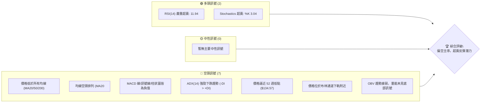

**綜合解讀**：ORCL 目前處於一個明顯的空頭市場結構中。所有長期和中期趨勢指標均指向下跌，且趨勢強度高。然而，短期動能指標（RSI、Stochastics）已進入嚴重超賣區間，這通常預示著股價在短期內有技術性反彈的需求，但這並不代表趨勢反轉。交易者需警惕在強勁下跌趨勢中的反彈可能短暫且波動性大。

### 📊 核心指標速覽表

| 指標類別 | 指標名稱 | 當前數值 | 訊號 | 解讀 |
|----------|----------|----------|------|------|
| **價格** | 當前價格 | $146.55 | 🔴 | 遠低於主要均線，接近 52 週低點 |
| **均線** | MA20 | $187.70 | 🔴 | 價格遠低於短期均線，空頭趨勢明顯 |
| **均線** | MA50 | $187.89 | 🔴 | 價格遠低於中期均線，空頭趨勢確認 |
| **均線** | MA200 | $200.60 | 🔴 | 價格遠低於長期均線，長期趨勢看空 |
| **動能** | RSI(14) | 11.94 | 🟢 | 嚴重超賣，暗示短期反彈潛力 |
| **動能** | MACD | -12.824 | 🔴 | MACD 線在訊號線下方，且均為負值，動能強勁看空 |
| **波動** | ATR | $10.16 | 🔴 | 佔股價 6.93%，波動率高，下跌動能強 |
| **趨勢** | ADX(14) | 27.74 | 🔴 | ADX > 25 且 -DI > +DI，強勁下跌趨勢 |
| **量能** | OBV趨勢 | OBV < MA | 🔴 | 量能疲弱，下跌趨勢獲得量能確認 |

### 🏆 技術評分卡

本評分卡從多個維度量化 ORCL 的技術面表現，提供一個直觀的綜合評估。

```
╔══════════════════════════════════════════════════════════════╗
║             技術評分卡 — ORCL (2026-07-01)                    ║
╠══════════════════════════════════════════════════════════════╣
║  趨勢強度      ████░░░░░░░░░░░░░░░░  20/100  🔴 (強勁下跌趨勢)  ║
║  動能指標      ██████░░░░░░░░░░░░░░  30/100  🔴 (整體偏空，短期超賣)║
║  支撐穩定度    ██░░░░░░░░░░░░░░░░░░  10/100  🔴 (關鍵支撐頻繁跌破)║
║  成交量配合    ████░░░░░░░░░░░░░░░░  20/100  🔴 (下跌量增，量能疲弱)║
║  形態完整度    ████░░░░░░░░░░░░░░░░  20/100  🔴 (無明確底部反轉形態)║
║  均線排列      █░░░░░░░░░░░░░░░░░░░░  05/100  🔴 (極度空頭排列)  ║
╠══════════════════════════════════════════════════════════════╣
║  綜合評分      ████░░░░░░░░░░░░░░░░  20/100  🔴 強烈看空 (短期超賣反彈風險)║
╚══════════════════════════════════════════════════════════════╝
```

## 2. 趨勢分析

ORCL 的股價走勢在多個時間框架下均呈現出顯著的空頭趨勢。從長期月線圖到中期週線，再到短期日線走勢，空頭力量均佔據主導。

### 🌐 多時框趨勢分析

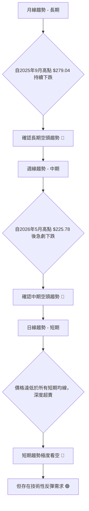

**詳細解讀**：
- **長期月線趨勢**：ORCL 自 2025 年 9 月創下 $279.04 的歷史高點後，股價便開始呈現震盪下行。儘管期間有過幾次反彈，但未能突破前高，最終在 2026 年 5 月反彈至 $225.78 後再次大幅下跌，確認了長期下跌趨勢的延續。
- **中期週線趨勢**：在過去 20 週的數據中，ORCL 在 2026 年 5 月 31 日達到 $225.78 後，經歷了一波急劇的拋售潮，從 $225.78 跌至 $146.55，跌幅高達 35%。這波下跌伴隨著部分週期的較大成交量，顯示中期空頭力量強勁。
- **短期日線趨勢**：當前價格 $146.55 遠低於所有短期、中期和長期移動平均線。RSI 和 Stochastics 等動能指標已進入嚴重超賣區間，表明短期內存在技術性反彈的可能性，但這種反彈在強勁下跌趨勢中往往只是修正，而非趨勢反轉。

### 📈 長期趨勢 — 12個月走勢圖（Unicode）

下圖展示 ORCL 過去 12 個月的月度收盤價走勢，標註了關鍵高點與低點，以視覺化方式呈現長期趨勢。

```
ORCL 月線走勢圖（2025年7月 - 2026年6月）
價格軸 ($)
$280 ┤                               ● (279.04)
$265 ┤                       ● (261.01)
$250 ┤● (251.78)
$235 ┤
$220 ┤      ● (224.36)                               ● (225.78)
$205 ┤                 ● (200.72)
$190 ┤                    ● (193.72)
$175 ┤
$160 ┤                            ● (164.01)     ● (161.39)
$145 ┤                                  ● (144.89)● (146.60)           ● (146.55) ← 現價
$130 ┤
     └───────────────────────────────────────────────────────────
      Jul'25 Aug'25 Sep'25 Oct'25 Nov'25 Dec'25 Jan'26 Feb'26 Mar'26 Apr'26 May'26 Jun'26

關鍵高點：
2025-09: $279.04
2025-07: $251.78
2026-05: $225.78

關鍵低點：
2026-02: $144.89
2026-06: $146.55 (接近近期低點)
```

**走勢特徵分析表格**：
| 階段 | 時間區間 | 價格區間 | 漲跌幅 (約) | 主要特徵 |
|------|------------|------------|--------------|----------|
| **強勁上漲** | 2025年7月-9月 | $216.46 -> $279.04 | +28.9% | 快速拉升，創歷史新高，多頭主導。 |
| **首次回調** | 2025年9月-12月 | $279.04 -> $193.72 | -30.6% | 大幅回調，跌破多條均線，空頭力量顯現。 |
| **盤整下跌** | 2026年1月-4月 | $164.01 -> $161.39 | 震盪 | 股價在低位區間震盪，未能有效反彈，底部尚未形成。 |
| **短暫反彈** | 2026年4月-5月 | $161.39 -> $225.78 | +40% | 快速反彈，但未能突破前期高點，形成較低高點。 |
| **急劇下跌** | 2026年5月-6月 | $225.78 -> $146.55 | -35% | 再次遭遇強勁拋售，跌破多個支撐位，確認長期空頭趨勢。 |

### 📊 中期趨勢（週線分析）

中期趨勢主要由週線圖反映。從近期的 20 週數據來看，ORCL 在 2026 年 5 月底達到 $225.78 的高點後，隨即進入了猛烈的下跌趨勢。

```
ORCL 近期週線壓力與支撐示意圖
═══════════════════════════════════════════════════
$225.78 ║██████████████████████████████████████████║ ← 2026年5月高點 (強阻力 R3)
$200.60 ║██████████████████████████████████████████║ ← MA200 (主要阻力 R2)
$187.89 ║██████████████████████████████████████████║ ← MA50 (重要阻力 R1)
$176.82 ║▓▓▓▓▓▓▓▓▓▓▓▓▓▓▓▓▓▓▓▓▓▓▓▓▓▓▓▓▓▓▓▓▓▓▓▓▓▓▓▓▓▓║ ← 斐波那契38.2%回調 (近期阻力)
$161.39 ║▓▓▓▓▓▓▓▓▓▓▓▓▓▓▓▓▓▓▓▓▓▓▓▓▓▓▓▓▓▓▓▓▓▓▓▓▓▓▓▓▓▓║ ← 2026年4月低點 (次要阻力)
$146.55 ╠══════════════════════════════════════════╣ ◄ 現價
$144.89 ║▓▓▓▓▓▓▓▓▓▓▓▓▓▓▓▓▓▓▓▓▓▓▓▓▓▓▓▓▓▓▓▓▓▓▓▓▓▓▓▓▓▓║ ← 2026年2月低點 (重要支撐 S1)
$137.93 ║██████████████████████████████████████████║ ← 2025年3月低點 (強支撐 S2)
$134.57 ║██████████████████████████████████████████║ ← 52週低點 (極強支撐 S3)
═══════════════════════════════════════════════════
```
**分析**：股價自 5 月高點後一路下跌，跌破了所有重要均線和多個歷史支撐位。目前價格已跌至 2026 年 2 月低點 $144.89 附近，並逼近 52 週低點 $134.57。這顯示中期趨勢極其悲觀，任何反彈都可能在上方遇到的阻力位（如 $176.82、$187.89、$200.60）受阻。

### ⚡ 趨勢強度評估（ADX 解讀）

ADX (Average Directional Index) 用於衡量趨勢的強度，而非方向。結合 +DI 和 -DI 則可判斷趨勢方向。

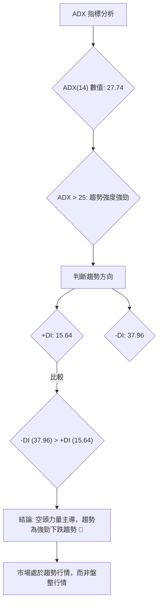

**ADX 強度對照表**：
| ADX 數值 | 趨勢強度 | 市場狀況 |
|----------|----------|----------|
| 0-20     | 無趨勢/弱勢趨勢 | 盤整行情 |
| 20-25    | 趨勢形成中 | 趨勢初顯 |
| **25-50**| **強勁趨勢** | **明顯趨勢行情** |
| 50-75    | 極強趨勢 | 趨勢加速 |
| 75-100   | 超強趨勢 | 趨勢可能過熱 |

**解讀**：ORCL 的 ADX(14) 數值為 27.74，明確指出目前市場存在一個強勁的趨勢。結合 +DI (15.64) 和 -DI (37.96) 的數值，可以判斷 -DI 遠大於 +DI，這表明空頭力量在市場中佔據絕對主導地位。因此，ORCL 目前處於一個**強勁的下跌趨勢行情**中，而不是盤整行情。這種情況下，做空交易的勝率通常較高，而逆勢做多則風險極大。

## 3. 圖表形態分析

ORCL 近期的價格走勢呈現出急劇下跌的特徵，尚未形成明確的底部反轉形態。目前更多看到的是下跌中繼或下跌加速的形態。

### 🔍 形態識別系統

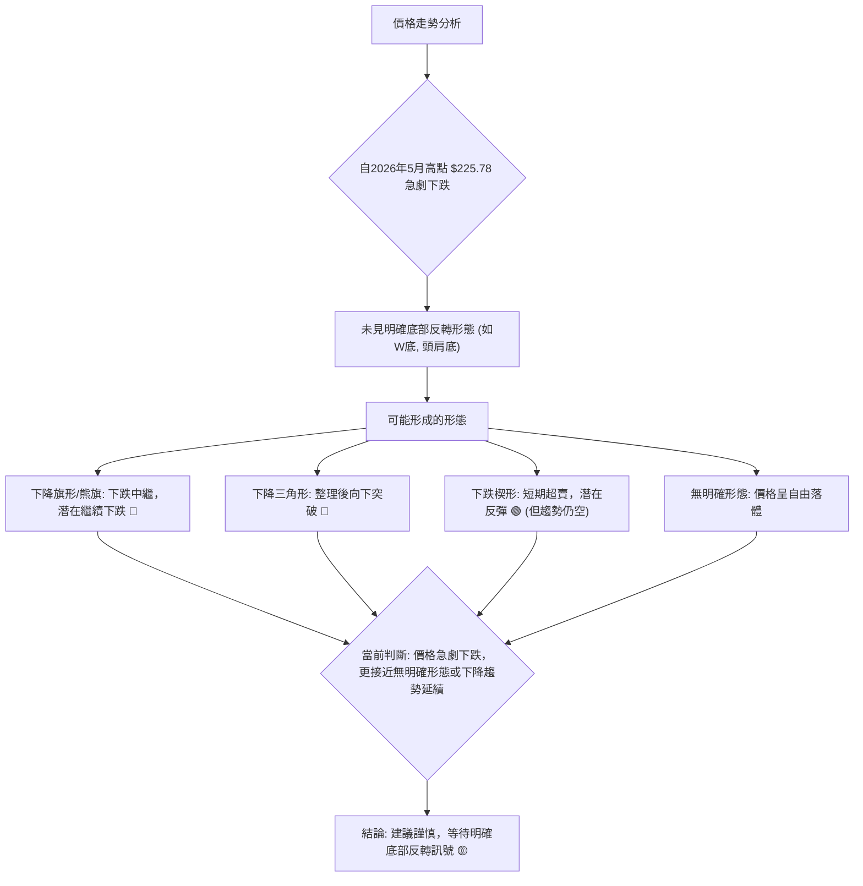

**詳細解讀**：從提供的數據來看，ORCL 在 2026 年 5 月 31 日的 $225.78 高點之後，經歷了一波快速且猛烈的下跌。這種「自由落體」式的下跌通常不會立刻形成清晰的底部反轉形態，而是可能在下跌過程中形成一些中繼形態，例如下降旗形或下降三角形，預示著下跌的延續。由於目前價格已嚴重超賣，短期內也可能出現下跌楔形，預示著技術性反彈的可能性，但這通常不會改變主要下跌趨勢。

### 🕯️ 重要K線形態分析

分析近 20 週的週線收盤價，尋找任何關鍵 K 線形態。

| 月份 | 收盤價 | K線形態 (週線判斷) | 解讀 | 訊號 |
|------|--------|----------------------|--------------------------------|------|
| 2026-05-31 | $225.78 | 長陽線 | 創近期新高，多頭力量強勁 (但隨後遭拋售) | 🟢 |
| 2026-06-07 | $213.68 | 陰線 | 高位回落，顯示賣壓開始出現 | 🔴 |
| 2026-06-14 | $184.13 | 大陰線 | 跌破多條均線，賣壓加劇，空頭主導 | 🔴 |
| 2026-06-21 | $184.29 | 小陽線/十字星 | 嘗試止跌，但反彈無力，量能縮小 | 🟡 |
| 2026-06-28 | $148.53 | 大陰線 | 再次急劇下跌，確認空頭趨勢，破壞止跌嘗試 | 🔴 |
| 2026-07-05 | $146.55 | 錘頭線/倒錘頭線 (待確認) | 價格探底後略有回升，但收盤仍低，多空爭奪激烈 | 🟡 |

**分析**：最近幾週的 K 線走勢明確顯示了空頭力量的壓倒性優勢。從 5 月底的長陽線到隨後的連續大陰線，賣壓不斷加重。儘管 6 月 21 日曾出現小陽線嘗試止跌，但隨即被 6 月 28 日的大陰線徹底否定。7 月 5 日的 K 線形態（根據收盤價與 ATR，當前價格 $146.55 接近 52W Low $134.57，可能形成錘頭或倒錘頭線，但需要日線級別確認）顯示在低位有一定買盤介入，但仍未能有效推高價格，顯示空頭主導地位未變。

### 📉 ASCII 走勢形態示意圖

以下示意圖描繪了 ORCL 近期從高點急劇下跌的走勢，呈現出「下跌通道」或「熊旗」的雛形，但尚未形成清晰的反轉形態。

```
ORCL 近期下跌走勢示意圖 (2026年5月-7月)

價格軸 ($)
$230 ┤                ● (225.78)
$220 ┤              ╱  ╲
$210 ┤            ╱      ╲
$200 ┤          ╱          ╲
$190 ┤         ●             ● (184.29)
$180 ┤       ╱                 ╲
$170 ┤     ╱                     ╲
$160 ┤   ╱                         ╲
$150 ┤ ●                             ● (148.53)
$140 ┤                                 ● (146.55) ← 現價
     └───────────────────────────────────────────
      May'26                          Jun'26      Jul'26

形態特徵：
- 高點與低點持續下移。
- 價格在下跌通道內運行。
- 尚未出現底部反轉的結構性形態。
- 當前價格接近通道下沿。
```
**分析**：圖中顯示了 ORCL 股價在 2026 年 5 月底達到高點 $225.78 後，便形成了一個清晰的下跌通道。高點 $225.78、低點 $148.53 和當前價格 $146.55 均在通道內運行。這種形態在空頭趨勢中非常常見，通常預示著趨勢的延續。雖然價格接近通道下沿，可能會有短暫反彈，但要改變整體趨勢，需要強大的買盤力量和明確的反轉形態。

### 🎯 形態目標價計算

由於目前 ORCL 尚未形成明確的底部反轉形態，因此無法從傳統形態學中計算明確的形態目標價。當前形態更傾向於下跌中繼或下跌通道。
如果將 2026 年 5 月高點 $225.78 和 2026 年 6 月低點 $148.53 視為一個下跌波段，則其形態目標價應向下延伸。
- **下跌波段幅度**：$225.78 - $148.53 = $77.25
- **基於通道/旗形測量**：若將此波段作為下跌旗形的第一波，則第二波的目標價可能在 $148.53 - $77.25 = $71.28 附近。但這僅是理論推演，實際情況還需考慮市場環境和支撐位。
- **結論**：目前沒有可靠的形態目標價可供計算，更多應關注水平支撐位和斐波那契擴展位。

## 4. 支撐與阻力

識別關鍵的支撐與阻力位對於制定交易策略至關重要。ORCL 目前處於強勁下跌趨勢中，因此阻力位的重要性高於支撐位，因為任何反彈都可能在阻力位受阻。

### 🗺️ 關鍵價位分布圖（Unicode）

下圖展示了 ORCL 的關鍵支撐與阻力價位分布，當前價格位於多重阻力之下，並逼近關鍵支撐。

```
ORCL 價位結構分布圖 (2026-07-01)
═══════════════════════════════════════════════════
$279.04 ║██████████████████████████████████████████║ 極強阻力 R4 (歷史高點)
$225.78 ║██████████████████████████████████████████║ 強阻力 R3 (2026年5月高點)
$200.60 ║██████████████████████████████████████████║ 阻力 R2 (MA200)
$187.89 ║██████████████████████████████████████████║ 關鍵阻力 R1 (MA50/MA20)
$186.17 ║▓▓▓▓▓▓▓▓▓▓▓▓▓▓▓▓▓▓▓▓▓▓▓▓▓▓▓▓▓▓▓▓▓▓▓▓▓▓▓▓▓▓║ 斐波那契50%回調 (近期阻力)
$176.82 ║▓▓▓▓▓▓▓▓▓▓▓▓▓▓▓▓▓▓▓▓▓▓▓▓▓▓▓▓▓▓▓▓▓▓▓▓▓▓▓▓▓▓║ 斐波那契38.2%回調 (近期阻力)
$155.00 ║▓▓▓▓▓▓▓▓▓▓▓▓▓▓▓▓▓▓▓▓▓▓▓▓▓▓▓▓▓▓▓▓▓▓▓▓▓▓▓▓▓▓║ 分析師低目標 (心理阻力)
$146.55 ╠══════════════════════════════════════════╣ ◄ 現價
$144.89 ║▓▓▓▓▓▓▓▓▓▓▓▓▓▓▓▓▓▓▓▓▓▓▓▓▓▓▓▓▓▓▓▓▓▓▓▓▓▓▓▓▓▓║ 近期支撐 S1 (2026年2月低點)
$139.32 ║██████████████████████████████████████████║ 強支撐 S2 (2025年4月低點)
$134.57 ║██████████████████████████████████████████║ 極強支撐 S3 (52週低點)
═══════════════════════════════════════════════════
```

### 🚧 阻力位分析表

| 阻力級別 | 價位 | 形成原因 | 突破難度 | 重要性 |
|----------|------|----------|----------|--------|
| **R1**   | $187.89 | MA50 及 MA20 匯聚區 | 高 | **高** (短期反彈的首要考驗) |
| **R2**   | $200.60 | MA200 | 高 | **高** (中期趨勢反轉的關鍵) |
| **R3**   | $225.78 | 2026年5月高點，前期壓力位 | 極高 | **極高** (確認趨勢反轉的必要條件) |
| **R4**   | $279.04 | 2025年9月歷史高點 | 極高 | **極高** (長期牛市的終極目標) |
| **額外阻力** | $176.82 | 近期下跌波段的斐波那契 38.2% 回調位 | 中 | **中** (短期反彈的自然阻力) |
| **額外阻力** | $186.17 | 近期下跌波段的斐波那契 50% 回調位 | 中高 | **中高** (短期反彈的更強阻力) |
| **心理阻力** | $155.00 | 分析師低目標價位 | 低 | **中** (突破可能引發空頭回補) |

### 🛡️ 支撐位分析表

| 支撐級別 | 價位 | 形成原因 | 守住機率 | 重要性 |
|----------|------|----------|----------|--------|
| **S1**   | $144.89 | 2026年2月低點，近期歷史低點 | 中 | **高** (短期止跌的關鍵) |
| **S2**   | $139.32 | 2025年4月低點 | 高 | **高** (若 S1 失守，此為下一重要防線) |
| **S3**   | $134.57 | 52週低點 | 極高 | **極高** (歷史性關鍵支撐，跌破將開啟更大下跌空間) |

### 📐 斐波那契回調位分析

我們將從 2026 年 5 月高點 $225.78 到當前價格 $146.55 的下跌波段進行斐波那契回調分析，以預測可能的反彈阻力位。

- **近期下跌波段**：
    - 高點 (A)：$225.78 (2026-05-31)
    - 低點 (B)：$146.55 (2026-07-01 現價)
    - 波段幅度：$225.78 - $146.55 = $79.23

- **斐波那契回調位計算**：
    - **38.2% 回調位**：$146.55 + ($79.23 * 0.382) = $146.55 + $30.27 = **$176.82**
    - **50% 回調位**：$146.55 + ($79.23 * 0.500) = $146.55 + $39.62 = **$186.17**
    - **61.8% 回調位**：$146.55 + ($79.23 * 0.618) = $146.55 + $48.97 = **$195.52**

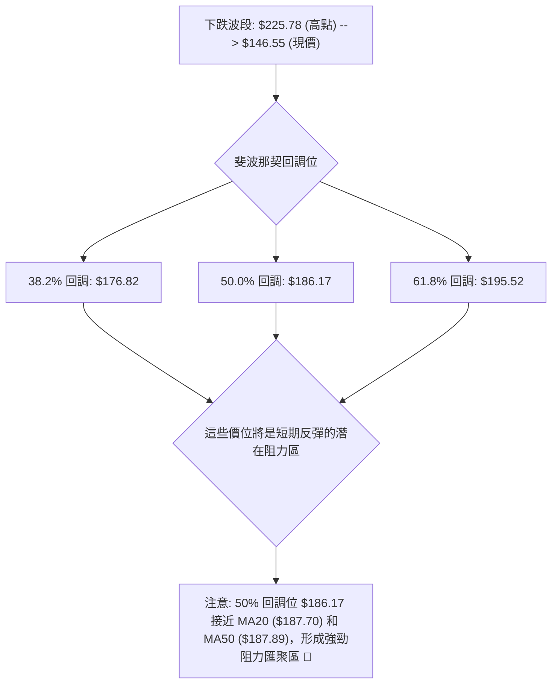
**分析**：斐波那契回調位 $176.82、$186.17 和 $195.52 將是 ORCL 在超賣後如果出現反彈時的關鍵阻力區。特別是 $186.17 附近，與短期和中期移動平均線（MA20/MA50）高度重合，形成了一個強大的阻力區。若股價能反彈至此區間，很可能會遭遇新一輪的賣壓。

## 5. 技術指標深度解讀

本節將對 ORCL 的關鍵技術指標進行詳細分析，探討它們如何相互印證或提供矛盾訊號。

### 🎛️ 指標訊號總覽

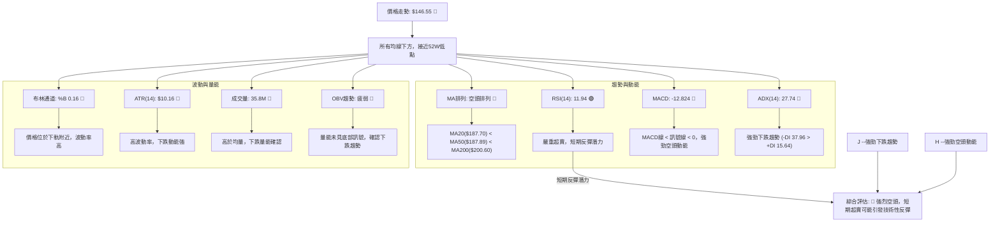

### 📈 移動平均線排列分析

ORCL 的移動平均線系統呈現出極度悲觀的「空頭排列」格局，這是一個強烈的看空訊號，表示股價在短期、中期和長期都處於下跌趨勢。

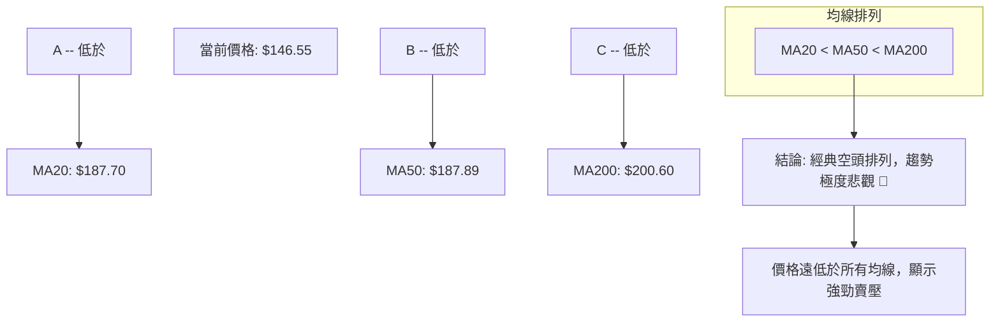
**分析**：
- **MA20** ($187.70)：短期均線，價格遠低於此線，顯示短期內賣壓沉重。
- **MA50** ($187.89)：中期均線，價格遠低於此線，表明中期趨勢明顯向下。
- **MA200** ($200.60)：長期均線，價格遠低於此線，確認長期趨勢處於熊市。
- **均線排列**：MA20 < MA50 < MA200，形成完美的空頭排列。這種排列是強烈下跌趨勢的標誌，表明多頭力量在各個時間框架內均被壓制。任何價格反彈都可能在這些均線附近遭遇強勁阻力。

### 📉 RSI(14) 分析

RSI (Relative Strength Index) 用於衡量價格變動的速度和變化，判斷超買或超賣。

- **RSI 數值**：11.94
- **超買超賣區間**：
    - 超買區：RSI > 70
    - 超賣區：RSI < 30
    - 中性區：30 <= RSI <= 70

**RSI 數值進度條**：
RSI(14) 強度：█░░░░░░░░░░░░░░░░░░░░  11.94 (嚴重超賣) 🟢

**分析**：
1.  **超賣狀態**：當前 RSI 數值為 11.94，遠低於 30 的超賣線，顯示 ORCL 已進入嚴重的超賣區間。這通常意味著股價在短期內下跌過快，可能存在技術性反彈的需求。
2.  **背離判斷**：根據提供的數據，「RSI 背離: 無明顯背離」。這表示在最近的下跌過程中，RSI 並未出現底背離現象（即價格創新低但 RSI 未創新低），因此目前沒有強烈的反轉訊號。RSI 雖然超賣，但缺乏背離的確認，使得其反彈訊號的可靠性降低。
3.  **結論**：RSI 嚴重超賣為短期逆勢交易者提供了潛在的入場機會，但由於缺乏底背離和整體趨勢的強勁空頭，任何反彈都應被視為技術性修正，而非趨勢反轉。

### 📊 MACD(12/26/9) 訊號解讀

MACD (Moving Average Convergence Divergence) 用於識別趨勢變化、動能和潛在的買賣訊號。

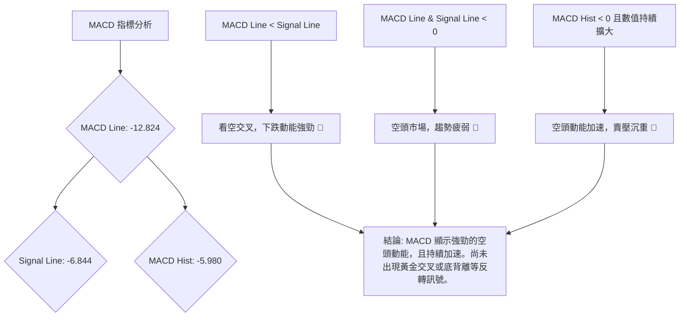
**分析**：
1.  **MACD 線與訊號線**：MACD 線 (-12.824) 位於訊號線 (-6.844) 下方，形成死亡交叉，且兩者均遠低於零軸。這是一個強烈的看空訊號，表明中期動能完全由空頭掌控。
2.  **MACD 柱狀圖**：MACD 柱狀圖為 -5.980，且數值為負並可能持續擴大（根據 MACD 線與訊號線的距離），這表明空頭動能正在加速，賣壓沉重。
3.  **背離判斷**：根據提供的數據，沒有 MACD 背離的明確指示。這與 RSI 的情況一致，缺乏底背離訊號意味著儘管價格急劇下跌，但市場尚未積累足夠的反轉力量。
4.  **結論**：MACD 指標明確支持 ORCL 處於強勁的下跌趨勢中，且空頭動能仍在加速。在 MACD 線未穿越訊號線上方或未出現底背離之前，不建議輕易做多。

### 📦 布林通道分析

布林通道 (Bollinger Bands) 用於測量股價的波動範圍和相對高低點。

```
ORCL 布林通道示意圖 (2026-07-01)

價格軸 ($)
$247.36 ║═══════════════════════════════════════════════════════════════════║ ← BB上軌 (Upper Band)
$217.53 ║                                                                   ║
$187.70 ║───────────────────────────────────────────────────────────────────║ ← BB中軌 (MA20)
$157.87 ║                                                                   ║
$146.55 ╠═══════════════════════════════════════════════════════════════════╣ ◄ 現價
$128.03 ║═══════════════════════════════════════════════════════════════════║ ← BB下軌 (Lower Band)
        └───────────────────────────────────────────────────────────────────
```
**布林通道數據**：
- BB上軌: $247.36
- BB中軌(MA20): $187.70
- BB下軌: $128.03
- BB %B: 0.16 (0=下軌, 0.5=中軌, 1=上軌)

**分析**：
1.  **價格位置**：當前價格 $146.55 位於布林通道的下軌 $128.03 附近 (BB %B 為 0.16)。這是一個強烈的超賣訊號，與 RSI 和 Stochastics 的判斷一致，表明股價短期內已跌至極端低位。
2.  **波動性**：ATR 為 $10.16，佔股價的 6.93%，顯示當前波動性較高。布林通道的擴張通常伴隨著趨勢的延續或加速。高波動率意味著股價在下跌過程中可能會有較大的日內波動。
3.  **潛在反彈**：價格觸及或跌破下軌後，通常會出現向中軌回歸的趨勢。然而，在強勁的下跌趨勢中，價格可能會沿著下軌運行，甚至跌破下軌後短暫反彈再繼續下跌。
4.  **結論**：布林通道分析確認了 ORCL 的嚴重超賣狀態和高波動性。在沒有明確反轉訊號的情況下，即使出現反彈，也應視為向中軌 ($187.70) 的修正，而非趨勢反轉。

### 💹 成交量分析（量價配合度）

成交量是確認價格走勢可靠性的重要指標。

- **最新成交量**：35,844,500 股
- **20日均量**：30,446,895 股 (量比: 1.18x)
- **50日均量**：26,855,856 股
- **OBV趨勢**：OBV < MA → 量能疲弱

**分析**：
1.  **成交量與均量比較**：當前成交量 35.8M 高於 20 日均量 (30.4M) 約 18%。在股價急劇下跌的情況下，成交量放大通常被視為下跌趨勢的確認，表明有大量的賣盤湧出。
2.  **OBV 趨勢**：OBV (On Balance Volume) 趨勢顯示「OBV < MA → 量能疲弱」。這意味著 OBV 線在其移動平均線下方，且可能呈現下降趨勢。當價格下跌時，如果 OBV 也下跌，則確認了下跌趨勢的健康性。如果 OBV 相對持平或上升，則可能存在看漲背離。在此情況下，「量能疲弱」通常表示下跌趨勢的量能配合良好，但沒有出現強烈的底部放量反轉訊號。這進一步確認了目前的空頭趨勢。
3.  **量價背離**：目前沒有明確的量價底背離訊號。價格大幅下跌，成交量放大，且 OBV 趨勢疲弱，均指向下跌趨勢的延續。如果出現價格創新低但成交量萎縮，或 OBV 止跌回升，才可能考慮潛在的底部反轉。
4.  **結論**：成交量分析支持當前的下跌趨勢。高於均量的下跌顯示賣壓依然強勁，而 OBV 的疲弱則排除了短期內強勢反轉的可能性。

## 6. 動能與波動率

本節將評估 ORCL 的動能強度和波動性，這對於理解當前市場行為和制定風險管理策略至關重要。

### ⚡ 動能評估四象限

動能評估四象限將股票分為四個類別，基於其動能強度和波動率。這有助於交易者判斷當前市場狀態。

| 象限 | 動能 | 波動 | 當前狀態 (ORCL) | 評估 | 交易建議 |
|------|------|------|------------------|------|----------|
| **Q1** | 強 | 低 | - | 最佳機會 | 順勢交易，低風險追蹤 |
| **Q2** | 弱 | 低 | - | 謹慎觀望 | 等待趨勢明確，避免交易 |
| **Q3** | 強 | 高 | - | 高風險高收益 | 順勢交易，需嚴格止損 |
| **Q4** | 弱 | 高 | **✓** (動能偏弱，波動高) | 避免進場 | 趨勢不明或過度波動，不宜交易 |

**分析**：
- **動能**：從 MACD 和 ADX 的分析來看，ORCL 處於強勁的下跌趨勢中，空頭動能強勁。然而，從 RSI 和 Stochastics 的超賣情況來看，短期下跌動能可能在耗盡，存在技術性反彈的需求。綜合來看，雖然長期趨勢動能強勁向下，但短期動能因超賣而顯得「偏弱」或「耗盡」，這使得其整體動能評估偏向「弱」。
- **波動率**：ATR 為 $10.16，佔股價的 6.93%，屬於高波動水平。
- **結論**：ORCL 目前處於「**弱動能，高波動**」的第四象限 (Q4)。這意味著儘管價格急劇下跌，但由於短期動能指標顯示超賣，且波動率極高，市場可能處於不穩定狀態，容易出現大幅震盪或短期反彈。在這種情況下，**避免輕易進場**是較為審慎的策略，等待趨勢重新確立或波動率降低。

### 📊 ATR 波動率分析

ATR (Average True Range) 用於衡量資產價格在特定時間段內的波動幅度。

- **ATR(14)**：$10.16
- **ATR佔股價百分比**：($10.16 / $146.55) * 100% = 6.93%

**分析**：
1.  **波動性判斷**：ORCL 的 ATR 數值為 $10.16，佔當前股價的 6.93%。通常，ATR 佔股價 3% 以上就被認為是高波動性。ORCL 的 6.93% 顯示其波動性極高，每日價格波動幅度較大。
2.  **市場情緒**：高波動性通常反映了市場情緒的不穩定和恐慌，尤其是在急劇下跌的趨勢中。這意味著交易者面臨較高的風險，價格可能在短時間內大幅波動。
3.  **止損距離建議**：對於高波動性股票，傳統的止損點設定可能過於緊密，容易被市場的正常波動觸發。建議將止損距離設定為 ATR 的 1.5 到 2 倍，以容納正常的價格波動。
    - 若以 1.5 倍 ATR 為止損距離：$10.16 * 1.5 = $15.24
    - 若以 2 倍 ATR 為止損距離：$10.16 * 2 = $20.32
    這意味著，如果做多，止損點應在入場價下方約 $15.24 至 $20.32；如果做空，止損點應在入場價上方約 $15.24 至 $20.32。這需要較大的資金承受能力。

### 📐 Beta 與市場相關性

數據中未提供 Beta 值。然而，作為一家大型科技公司，ORCL 通常被認為與整體市場（如 S&P 500 或 Nasdaq 100）具有較高的正相關性。
- **推測**：科技股的 Beta 值通常會略高於 1，這表示其波動性可能大於大盤。在市場下跌時，高 Beta 股票通常會跌得更深。
- **分析**：在當前 ORCL 股價急劇下跌的背景下，如果大盤也表現疲軟，那麼 ORCL 的下跌動能可能會被放大。反之，如果大盤出現反彈，ORCL 也可能受益於市場情緒的改善而出現技術性反彈。交易者應密切關注整體市場走勢，以評估 ORCL 的潛在風險和機會。

## 7. 多時框架總結

多時框架分析對於理解股票的整體走勢至關重要，它能幫助我們避免被單一時框架的假訊號誤導。

### 📋 時框架評分表

| 時框架 | 趨勢方向 | 動能 | 均線排列 | 形態 | 綜合評分 (1-10) | 建議 |
|--------|----------|------|----------|------|-----------------|------|
| **長期** | 🔴 下跌 | 🔴 弱 | 🔴 空頭排列 | 🔴 下跌通道 | 2/10 🔴 | 堅決看空 |
| **中期** | 🔴 下跌 | 🔴 弱 | 🔴 空頭排列 | 🔴 下跌通道 | 3/10 🔴 | 偏空主導 |
| **短期** | 🔴 下跌 | 🟢 超賣 | 🔴 空頭排列 | 🟡 無明確反轉 | 4/10 🟡 | 短期反彈，但趨勢仍空 |

**分析**：
- **長期**：ORCL 的長期趨勢是明確的下跌，價格自 2025 年 9 月高點以來持續下行，均線呈現空頭排列，沒有任何反轉跡象。
- **中期**：中期趨勢同樣是強勁下跌，特別是自 2026 年 5 月高點以來，股價經歷了猛烈的拋售，跌破多個支撐位。
- **短期**：短期趨勢依然是下跌，但由於 RSI 和 Stochastics 嚴重超賣，存在技術性反彈的需求。然而，這種反彈在強勁的空頭趨勢中往往只是修正，難以改變整體趨勢。

### 🔲 綜合訊號矩陣

本矩陣展示了不同時間框架下各個技術維度的訊號一致性。

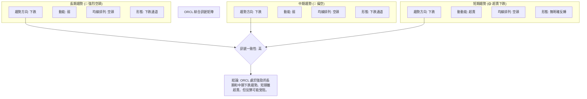

**結論**：ORCL 在長期和中期時間框架內呈現出高度一致的空頭訊號：趨勢向下、動能疲弱、均線空頭排列、形態為下跌通道。短期內，儘管指標顯示嚴重超賣，為技術性反彈提供了可能，但這種反彈很可能只是在整體下跌趨勢中的修正，且上方阻力重重。整體而言，ORCL 的技術面極度悲觀。

## 8. 交易策略建議

基於上述詳盡的技術分析，ORCL 目前處於強勁的下跌趨勢中，但短期嚴重超賣。因此，交易策略應以順勢做空為主，逆勢做多則極具風險，僅適合短線激進交易者。

### 🗺️ 策略決策流程圖

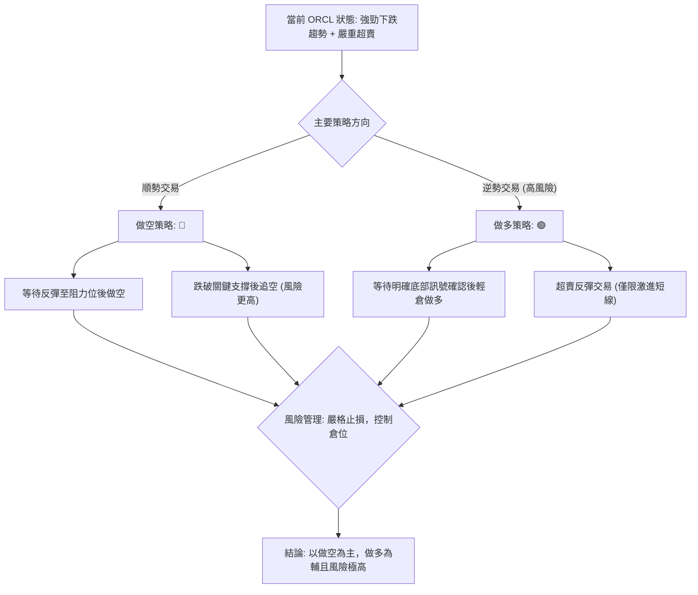

### 🟢 多頭策略詳情 (反彈交易，高風險)

此策略為逆勢交易，風險極高，僅適合經驗豐富且能嚴格執行止損的短線交易者。目標是捕捉超賣後的技術性反彈。

| 策略要素 | 策略 A (超賣反彈) |
|----------|--------------------|
| **進場條件** | 股價在 $134.57 (52週低點) 附近出現明確的止跌 K 線形態 (如錘頭線、吞噬形態)，且 RSI 從極低位開始向上拐頭。 |
| **進場價格** | $136.00 - $138.00 (略高於 52 週低點，等待確認) |
| **目標價 T1** | $176.82 (斐波那契 38.2% 回調位，也是近期下跌波段的初步阻力) |
| **目標價 T2** | $186.17 (斐波那契 50% 回調位，接近 MA20/MA50 匯聚區，強阻力) |
| **止損價格** | $133.50 (低於 52 週低點 $134.57，跌破則反彈失敗) |
| **風險報酬比** | (T1-Entry)/(Entry-Stop) = ($176.82 - $137.00) / ($137.00 - $133.50) = $39.82 / $3.50 ≈ **11.38 : 1** |
| **成功機率** | 20% (逆勢交易，成功率低) |
| **建議倉位** | 極低倉位 (例如總資金的 1-2%) |

### 🔴 空頭策略詳情 (順勢交易，相對保守)

此策略為順勢交易，在強勁下跌趨勢中，等待股價反彈至關鍵阻力位後再做空，風險相對較低。

| 策略要素 | 策略 A (反彈做空) |
|----------|--------------------|
| **進場條件** | 股價反彈至 $176.82 (斐波那契 38.2% 回調位) 或 $186.17 (斐波那契 50% 回調位/MA20/MA50 匯聚區) 附近，並出現明確的看空 K 線形態 (如墓碑線、烏雲蓋頂、空頭吞噬) 或動能指標再次轉弱。 |
| **進場價格** | $185.00 - $187.00 (接近 MA20/MA50 阻力區) |
| **目標價 T1** | $144.89 (2026年2月低點，近期支撐 S1) |
| **目標價 T2** | $134.57 (52週低點，極強支撐 S3) |
| **止損價格** | $190.00 (略高於 MA50 和斐波那契 50% 回調位，若突破則空頭力量減弱) |
| **風險報酬比** | (Entry-T1)/(Stop-Entry) = ($186.00 - $144.89) / ($190.00 - $186.00) = $41.11 / $4.00 ≈ **10.28 : 1** |
| **成功機率** | 60% (順勢交易，成功率較高) |
| **建議倉位** | 中等倉位 (例如總資金的 5-10%) |

### ⭐ 整體訊號強度評星

```
做多訊號強度：★★☆☆☆  (2/5星) (僅超賣反彈，趨勢對抗風險極高)
做空訊號強度：★★★★☆  (4/5星) (趨勢明確，但短期超賣需等待反彈入場)
整體可信度：  ★★★☆☆  (3/5星) (趨勢清晰但短期波動性高，需耐心等待入場時機)
```

## 9. 風險提示與監控

在強勁下跌趨勢和高波動率的市場環境中，風險管理是重中之重。交易者必須保持警惕，並嚴格遵守交易紀律。

### ✅ 關鍵監控指標 Checklist

```
╔══════════════════════════════════════════════════════════════╗
║             ORCL 關鍵監控指標清單 (2026-07-01)                 ║
╠══════════════════════════════════════════════════════════════╣
║ [ ] 價格是否跌破 $134.57 (52週低點)？ → 🔴 繼續下跌，加速空頭趨勢   ║
║ [ ] 價格是否成功站穩 $144.89 (近期支撐 S1) 上方？ → 🟢 短期止跌跡象  ║
║ [ ] RSI(14) 是否從超賣區 (11.94) 向上突破 30？ → 🟢 反彈動能增加    ║
║ [ ] MACD 線是否形成黃金交叉或向上突破零軸？ → 🟢 趨勢可能反轉訊號   ║
║ [ ] 成交量在下跌時是否放大，反彈時是否萎縮？ → 🔴 確認下跌趨勢      ║
║ [ ] 成交量是否出現底部放量，且價格止跌？ → 🟢 潛在底部訊號          ║
║ [ ] ADX(14) 是否開始下降，或 +DI 是否超越 -DI？ → 🟢 下跌趨勢減弱   ║
║ [ ] 是否出現明確的底部反轉 K 線形態或圖表形態？ → 🟢 反轉訊號確認   ║
║ [ ] 布林通道是否收窄，或價格是否突破中軌？ → 🟢 波動性降低/趨勢變化║
╚══════════════════════════════════════════════════════════════╝
```

### ⚠️ 風險場景分析

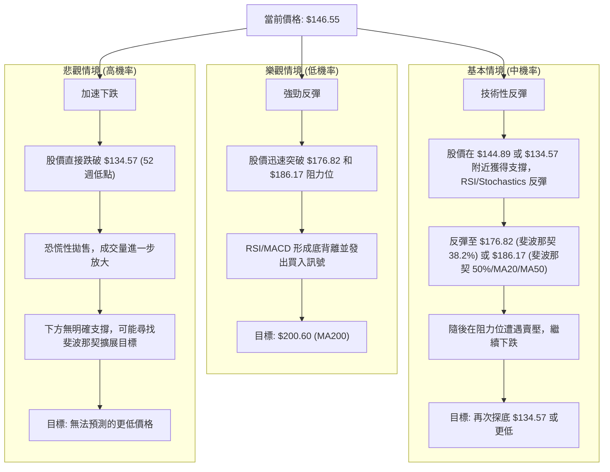

**分析**：
- **樂觀情境**：雖然短期超賣，但要在如此強勁的下跌趨勢中實現強勁反彈並逆轉趨勢，需要非常強大的利好消息和買盤力量，目前看來機率較低。
- **基本情境**：最有可能的場景是 ORCL 在當前低位區間 ($134.57 - $144.89) 獲得短暫支撐，並因超賣而出現技術性反彈。然而，這種反彈很可能在 $176.82 至 $186.17 的強阻力區遭遇賣壓，隨後再次下跌，甚至跌破前期低點。
- **悲觀情境**：如果 $134.57 的 52 週低點被有效跌破，將會引發進一步的恐慌性拋售，導致股價加速下跌。由於下方缺乏明確的歷史支撐，下跌空間將會擴大。

### 🛡️ 風險管理重要提醒

1.  **嚴格止損**：無論採取何種策略，都必須設定並嚴格執行止損點。在當前高波動率的市場中，止損是保護資金的唯一有效方式。ATR 提供的止損距離可以作為參考。
2.  **倉位管理**：鑑於 ORCL 的高波動性和不確定性，建議控制倉位，避免重倉操作。對於逆勢交易，倉位應極輕。
3.  **避免追漲殺跌**：在急劇下跌的趨勢中，避免在股價反彈時盲目追高，也避免在股價加速下跌時恐慌性拋售。等待明確的交易訊號和入場點。
4.  **多時框確認**：在任何交易決策前，務必確認多個時間框架下的訊號是否一致。例如，即使短期出現買入訊號，也要考慮中期和長期趨勢是否支持。
5.  **耐心等待**：在趨勢不明朗或波動性過高的情況下，耐心等待比盲目入場更重要。等待明確的底部反轉形態或等待反彈至阻力位再做空，可以大大提高交易的勝率。
6.  **基本面配合**：雖然本報告是技術分析，但仍需留意公司的基本面消息，以防突發事件對股價造成重大影響。

---

## 📋 報告總結

```
ORCL 技術分析報告總結
════════════════════════════════════════════════════════
報告日期：2026-07-01
當前價格：$146.55
分析評級：⚖️ **強烈看空，但短期存在超賣反彈風險**

關鍵結論：
├─ 長期趨勢：🔴 強勁下跌趨勢，均線空頭排列，高點與低點持續下移。
├─ 中期趨勢：🔴 明顯下跌趨勢，自2026年5月高點 $225.78 後急劇下跌。
├─ 短期趨勢：🔴 仍為下跌，但RSI(14) 11.94 和 Stochastics 嚴重超賣，存在技術性反彈需求。
├─ 關鍵支撐：$144.89 (近期低點), $134.57 (52週低點，極強支撐)。
├─ 關鍵阻力：$176.82 (斐波那契38.2%), $186.17 (斐波那契50% / MA20/MA50匯聚區)。
└─ 分析師目標：$155.00 (分析師低目標，現已跌破，顯示市場情緒極度悲觀)。

最優策略組合：
1. 🥇 **最佳機會 (順勢做空)**：等待股價反彈至 $185.00 - $187.00 阻力區 (接近MA20/MA50和斐波那契50%回調位) 後，觀察看空K線或動能轉弱訊號，進場做空。止損設於 $190.00，目標價為 $144.89 和 $134.57。風險報酬比約 10:1。
2. 🥈 **次選機會 (超賣反彈做多，高風險)**：若股價在 $134.57 (52週低點) 附近出現明確止跌反轉K線，可輕倉博取短線反彈。進場 $136.00 - $138.00，止損 $133.50，目標價 $176.82 和 $186.17。風險報酬比約 11:1，但成功機率較低。
3. 🥉 **保守選擇**：在當前趨勢不明朗且波動性高的情況下，觀望是最安全的選擇。等待股價形成明確的底部反轉形態，或趨勢重新確立後再考慮入場。
════════════════════════════════════════════════════════
```

---

> ⚠️ **免責聲明**：本報告為 AI 自動生成之技術分析，所有數據及估算均基於提供的歷史價格資訊。本報告**僅供研究與學術參考**，**不構成任何投資建議**。投資有風險，入市需謹慎。

---

*報告生成時間：2026-07-01 ｜ 數據來源：Yahoo Finance ｜ 分析框架：多時框技術分析*