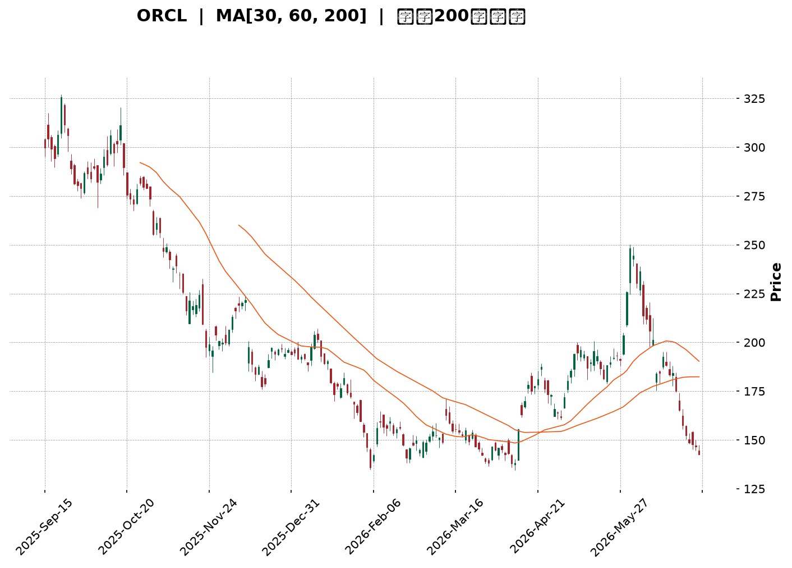
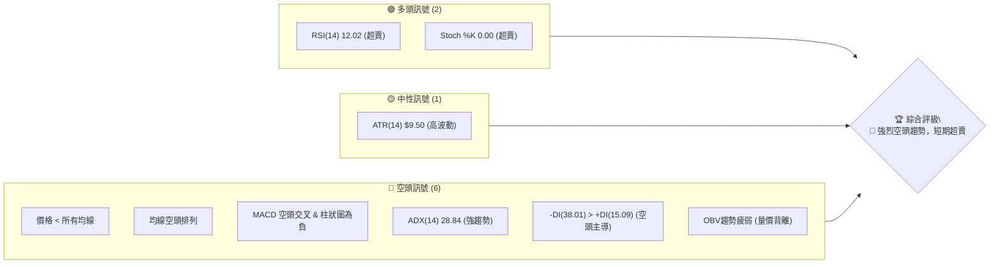
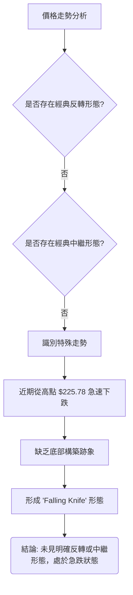
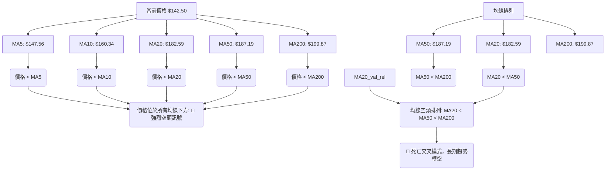

<details>
<summary>📊 靜態圖表 (點擊展開)</summary>

</details>

<html>
<head><meta charset="utf-8" /></head>
<body>
    <div style="height:500px; width:100%;">                        <script>window.PlotlyConfig = {MathJaxConfig: 'local'};</script>
        <script charset="utf-8" src="https://cdn.plot.ly/plotly-3.6.0.min.js" integrity="sha256-QaOVwtVY0T02VaHrr6pnoHLCwayMJp4O5n4YyaE3rJk=" crossorigin="anonymous"></script>                <div id="candlestick-chart" class="plotly-graph-div" style="height:100%; width:100%;"></div>            <script>                window.PLOTLYENV=window.PLOTLYENV || {};                                if (document.getElementById("candlestick-chart")) {                    Plotly.newPlot(                        "candlestick-chart",                        [{"close":{"dtype":"f8","bdata":"AAAAAGS8ckAAAABA\u002fANzQAAAAEDNsHJAAAAAIMNkckAAAADg5CNzQAAAAMBKWXRAAAAAQPd1c0AAAAAAuCBzQAAAAODIEHJAAAAAwNmTcUAAAAAAvYhxQAAAAMCbcHFAAAAAgPTrcUAAAADATehxQAAAACBlvnFAAAAAYOkUckAAAACAO6BxQAAAAEDs5XFAAAAAAFdyckAAAAAguzJyQAAAAIAPInNAAAAA4MeSckAAAADAP9xyQAAAAKBpcXNAAAAAIH4YckAAAAAAyzdxQAAAAACDF3FAAAAAQOrvcEAAAABAwGVxQAAAAICXmXFAAAAAoOZ6cUAAAAAg1nFxQAAAAKDlGXFAAAAAoEXqb0AAAADAGFBwQAAAAABnBHBAAAAAoO\u002fUbkAAAABg\u002fxhvQAAAAEDzSW5AAAAAoI65bUAAAACgfettQAAAAEClVm1AAAAA4FAzbEAAAACAtwdrQAAAACClr2tAAAAAoIxQa0AAAAAAlmRrQAAAAKDhBGxAAAAA4OYsakAAAAAgebFoQAAAAODQ4WhAAAAAgHN6aEAAAABgqXZpQAAAAADuFmlAAAAAoM72aEAAAABg5ftoQAAAAIDCzmlAAAAAoKugakAAAADgCAhrQAAAACAtZmtAAAAAwKmFa0AAAADAu7RrQAAAAOBVtGhAAAAAQOmZZ0AAAABATPlmQAAAAODtb2dAAAAAQNcrZkAAAAAgxl1mQAAAACCF2WdAAAAAQGOlaEAAAACgs0RoQAAAAOAUiWhAAAAA4PuYaEAAAABg+UVoQAAAACAtgGhAAAAAgAY3aEAAAAAgeFBoQAAAACA97WdAAAAA4CESaEAAAACgMPVnQAAAAMC7j2dAAAAAwIe6aEAAAADA9n5pQAAAAADAMmlAAAAAAPUdaEAAAABADqZnQAAAAACZzWdAAAAAwGZpZkAAAABgy6hlQAAAAEDqMWZAAAAAoGMRZkAAAADgwrlmQAAAAABSyWVAAAAAwFqGZUAAAAAgfw1lQAAAAOA6gGRAAAAA4BfwY0AAAADANkRjQAAAAMAaRWJAAAAA4CgAYUAAAACAVcphQAAAAKBwgWNAAAAAIKzqY0AAAADgnZNjQAAAAKDufWNAAAAAAKXyY0AAAABA5C1jQAAAAAAMdGNAAAAAYNh\u002fY0AAAABgEXJiQAAAAIAummFAAAAAIDQ0YkAAAABAAmxiQAAAAOAtuWJAAAAAIJscYkAAAACgYJdiQAAAAGC5j2JAAAAAoN76YkAAAABACkhjQAAAAECvDWNAAAAAQArhYkAAAAAgKZxiQAAAACCsUWRAAAAA4GTTY0AAAACgPlJjQAAAAECrbWNAAAAAANpEY0AAAABAxQtjQAAAAMBRX2NAAAAA4BalYkAAAADAsDljQAAAAIB\u002fUmJAAAAAoGAwYkAAAADAA8phQAAAAMCQZWFAAAAAQCRKYUAAAADAIlNiQAAAAGAvF2JAAAAAgNs7YkAAAAAAEiFiQAAAAKB+1WFAAAAAwB7lYUAAAAAghTthQAAAAEDhQmFAAAAAANdzY0AAAAAAAGBkQAAAAIDrOWVAAAAAQOFKZkAAAACA6+FlQAAAAGCPMmZAAAAAoHClZkAAAAAAAHBnQAAAAMD1CGZAAAAAwPWoZUAAAABguJ5lQAAAAGC4vmRAAAAAYI96ZEAAAADgeixkQAAAAGCPemVAAAAAoEeJZkAAAABAMytnQAAAAMD1QGhAAAAAQOFSaEAAAABgZn5oQAAAAEDhOmhAAAAAYI9aZ0AAAADgUbhnQAAAACCFc2hAAAAAYGYeaEAAAAAghVNnQAAAAGC4rmZAAAAAwB6FZ0AAAADgo7hnQAAAAGCPAmhAAAAAgOshaEAAAABguN5nQAAAAGBmdmlAAAAAwPU4bEAAAADAzARvQAAAAGCPkm5AAAAAYI\u002fKbEAAAABA4YptQAAAAIDCtWpAAAAAgD16akAAAACA67lpQAAAAOBRKGlAAAAAQDMDZ0AAAAAAKQRnQAAAAOB6FGhAAAAAYI+KZ0AAAADA9fBmQAAAAKBHCWdAAAAAgD3iZUAAAADAHqVkQAAAAMD1sGNAAAAAYLgOY0AAAADA9ZBiQAAAAOBReGJAAAAAoJlRYkAAAAAAANBhQA=="},"high":{"dtype":"f8","bdata":"20UpjgQKc0CYml3Vb9dzQClfqL7kI3NAIuPkeQ\u002fXckBgY05uyUpzQAP\u002ftRS5bnRAqHR5aEkndECSQcNmYGBzQCnUmkuThnJAyQInnSs7ckBR5WDc2rtxQJdR1TxsnHFA\u002fKd7EoP7cUCB3Nh8kUpyQCxstYhURXJAGKe4w7ZlckB3YnKjyS5yQFh0k5\u002f1E3JA\u002fFk4rhuyckB3AnLfch1zQJdCP3TWTHNAVJohqPjockB3ZTFfxFFzQGN\u002fAdYeCXRAOkBtyL7mckALGxsLk\u002fdxQEaa4IloaXFAoCw7jBw4cUBJTtpS75VxQKkT5Y751nFATdnCJ\u002fTTcUDvV+vLdrtxQAo+xURmfnFAhoofV8zBcEDyFOLx+4JwQNtZUn72f3BAmVSmARG3b0ALUpwNeFtvQFPrmXGP8W5AzcfxddDdbUCqeL2nW7duQLywr9T9f21AXfJF6qJrbUDyAhL9HPlrQNZuQFs5NWxAGlhLBg6ua0CWO7GjrcprQCnFYok1WGxAu9k7FkQSbUCSRu7sNOFpQLUlyIBnUmlA+mgQayXGaED9xAXU9BZqQKTfm1xVI2lAGeubCTpIaUBexdo0ag1qQFXkTH7N1GlA59Wf9gTDakChtxRvGUVrQKWwQtsS7GtApYyZdlSoa0DBoJ3LM\u002f5rQKqdN6QzGGlAPD3q+oeUaEDApTc8G3pnQE4F7zWBlGdAgrpymYwrZ0BHjduWNfRmQC3EP0S0PWhAo3pd3L6yaEC1uNev239oQIeGLPk0omhAUJ5cq63kaECiwPakhaloQK+rxTVjpWhA68TIi9t\u002faEBNnbTmEKxoQKFTyA+pDmlAOMMLVhI2aEBbHxZnMk9oQIHZjVQUuWdAIW3KC3fvaEA24ePBMLxpQBjeguZ04mlAE6ZvSUwfaUCmh+XAmUpoQOF32IJ45mdAM7LBVztRZ0CeyqMGFn9mQN\u002ftzgsOcWZAkwCaocpgZkAqhh4MSBVnQBDpaBIGY2ZA8pFMcIahZkCYVj2XZjRlQPy9GRT9CWVAt2txIFVTZUCDDOrVaNpjQLYgdlfvLGNAHLCRQ0dBYkC9UXyKc9ZhQAcYQ0c15mNA44JmTw+aZEBZtMiM5GJkQJSIoiKRz2NAYbYaKoY3ZEDvfeFZONdjQKrlL8gUmGNA2yBUMbvwY0AcTgqfhy5jQKo9YJtcKWJAa6eacvlHYkBspyRy4xdjQAK\u002fEO8D\u002f2JAQLyYXEoyYkACjO4Et7RiQCoqCULzzGJA62kbZWkiY0ConddPfaxjQFnHjL9Z1GNAR2tpNBLvYkB3a+gaUDNjQPC2DagwZWVA415iTt7nZEB+CDH\u002fuwZkQOt8nSUAxmNA\u002ficbhb3LY0CAcNC6x01jQGczfJX2i2NA0RKSlu4WY0DDM2sxnGdjQMoPSdaoK2NA8WUWFjGqYkBeXrAluj5iQCc7155MpmFARlWskqyWYUCctlQbYlxiQCl9fPohpGJAFyUVSsU9YkDpIcgtDoFiQJ3aY5UjAmJAYmWw+9ndYkAAAACgmdlhQAAAAKBwhWFAAAAAwB59Y0AAAADAzCxlQAAAAIDrkWVAAAAA4KOIZkAAAAAAABBnQAAAAOBROGZAAAAAQOEqZ0AAAACAwqVnQAAAAOB6vGZAAAAAYLiWZkAAAACgmbFlQAAAAGBmFmVAAAAA4FGYZEAAAACAwqVkQAAAAKCZyWVAAAAAAADwZkAAAADgo1BnQAAAAKBHSWhAAAAAwMwEaUAAAAAAAMBoQAAAAIDCdWhAAAAAoHAdaEAAAACAPfJnQAAAAGC4FmlAAAAAgMKNaEAAAADgUdhnQAAAAEAKl2dAAAAAQAqHZ0AAAACAPRpoQAAAAAAAoGhAAAAAYGZmaEAAAADgegRoQAAAAAAAoGlAAAAAoEdJbEAAAAAAAEhvQAAAAAAAIG9AAAAA4FEQbkAAAABgZt5tQAAAAIAU7mxAAAAAgOtha0AAAAAAAJBrQAAAACBcj2pAAAAA4KMYZ0AAAABgjzJnQAAAAIA9amhAAAAAgD1qaEAAAACAFMZnQAAAACCuf2dAAAAAYI8SZ0AAAABgj8plQAAAAAAAuGRAAAAAANezY0AAAACgRzFjQAAAAAAAUGNAAAAAgMK9YkAAAACgmXFiQA=="},"hovertemplate":"\u003cb\u003e%{x|%Y-%m-%d}\u003c\u002fb\u003e\u003cbr\u003e\u958b: $%{open:.2f}\u003cbr\u003e\u9ad8: $%{high:.2f}\u003cbr\u003e\u4f4e: $%{low:.2f}\u003cbr\u003e\u6536: $%{close:.2f}\u003cextra\u003e\u003c\u002fextra\u003e","low":{"dtype":"f8","bdata":"7nSg6WVvckBABvo2dL5yQFRB0lqFS3JA9FbhyGsbckD1ilXq329yQODhCJZFCHNA704EmfU5c0A\u002f90EY5ZpyQFWOEien5HFAJFdqYIyMcUDe7B+Fu1ZxQKNjYGDWG3FA517y70Q7cUBHRg0t97xxQCcPF0FsnHFAI97g1V4IckDIOlkaDc5wQBW6YK8SlnFArXi9ihbYcUAbnQjEnyNyQJ6j72y+fnJAmK27niUjckDZK7A0gpFyQNRlm8uA03JA5ZVOsOfbcUBhPSxIDhpxQNeyVeyN6XBApKzULrC5cEDe7kshn+twQGzlq+RqiHFAdvnYxp1hcUCOdR2hOW1xQMYy31AV23BAUwqZ5d7Wb0BQgrDzi+RvQESD5PZ5tW9AUCITmih2bkCt+Oq8rbBuQD4lyeeCum1A\u002fXzZvMndbECeOufg53NtQAzh5J6+b2xAXsBCZzwZbEC7uNDU+bxqQI691ClyL2pAIhGXJcrHakDgFBmVE6ZqQDBkKady\u002f2pAWFNeg38gakA5CDCNxQtoQBQFf\u002fSfI2hA1EfnI+EPZ0AZwcs3JyBpQL7zxuXljGhAFwg1pfRvaEDnbbQp6dhoQLwUK+nTxWhAZ61KheqhaUBXqwejFopqQLmPeN+58mpANQArXEwea0BwwG\u002fvCAhrQFmC0y\u002f2ImdARAEFwwIbZ0AU5x5\u002fWIlmQFhS12Of62ZAhVY07KH\u002fZUARDZdMqC9mQGttF4ISX2dAIYRhUN\u002f0Z0C2lUV7hOBnQB5j9PpwJ2hAV1B48DBdaEDRptpX1O5nQLOHJC14UGhAAImy4UwxaEAzUT4twyBoQDomOEL45GdABce82iCxZ0A0SldnedpnQMPstd5qIGdAWJoHVO+DZ0CNWQvPYIpoQNDXRZnF\u002fmhAooYdNavEZ0Btup79YpdnQBNEF4MvPGdAKZZ1N4tXZkAU8r4kM0BlQJMbWKZX\u002fGVA8IHI\u002ftdsZUBIY9OaEz1mQH0T4YhqomVAUrclDWFoZUAZgEOtph5kQDwkuNR\u002fVWRAkgvtFS7uY0DUuxza4etiQGAkCn6s\u002fWFA5Nur0e\u002fYYEAPJ886pk1hQBcK\u002fsygT2JAGdARKj2NY0CGibo42S5jQJNr5vkD\u002f2JAX25CCPxXY0BEm\u002fkTIgtjQHkO1Dr72mJABqYulEpnY0DZOk+MEFxiQHhuVc1xQ2FA7IU7puhHYUBgd39OeFpiQA9IHj+iFGJAOQa8tl+zYUDkOf82CZZhQDrfqA2r0WFAjgPlG5iSYkBAf6zGHrNiQPy6rhT04mJAjNgGhHM9YkArbfzV3X1iQCGvleusAGRAEoVt7trBY0Ay9ymfoTNjQGx3p4AcP2NAqxffbeceY0DDfzqlWPBiQEycNsjli2JALm42E+xtYkBEik1f78ViQDQvrFfYSmJAVh19fBgDYkDbz8GSZ8FhQI\u002f3xmYyOmFAU7AEvyUPYUBgC+fen2thQJlcatdTBWJAWAFzefl5YUAv+E3PLethQPCKm5d+bmFAROZRa+LMYUAAAAAAAABhQAAAAIA90mBAAAAAQAp3YUAAAACA6zFkQAAAAGC4xmRAAAAAoJm5ZUAAAAAghatlQAAAAOBRsGVAAAAA4FEAZkAAAACgmdlmQAAAAGCPwmVAAAAAoJkZZUAAAADAzPxkQAAAAKCZQWRAAAAAwMwUZEAAAABgjwpkQAAAAMDMxGRAAAAA4FHIZUAAAAAAAGBmQAAAAKBw1WZAAAAAoJnZZ0AAAABguMZnQAAAAEAz02dAAAAAANebZkAAAACA6yFnQAAAAGBmLmdAAAAAwMycZ0AAAADgo+hmQAAAAIDCnWZAAAAAoJlZZkAAAABgZmZnQAAAAEAz42dAAAAAgOvRZ0AAAACgcH1nQAAAAAApLGhAAAAA4FEAakAAAABAMxNsQAAAAEDh2m1AAAAAIIVzbEAAAAAAAABsQAAAAGBmLmpAAAAAYI8qakAAAACgR7loQAAAAIDCxWhAAAAAwPXoZUAAAAAAAGBmQAAAAGC4RmdAAAAAwB51Z0AAAABgj9JmQAAAAGBmNmZAAAAAwMzMZUAAAAAghZNkQAAAAEAza2NAAAAAIIXLYkAAAAAAAIBiQAAAAGBmJmJAAAAAIFwPYkAAAAAAANBhQA=="},"name":"\u50f9\u683c","open":{"dtype":"f8","bdata":"qJW9h88Ac0ChplT9nXlzQBx8Nrp+FHNAG9B3na3KckBdRQtKi4pyQFpih81KM3NAIxhFemkXdEBUfdlWsVZzQEvKmMVUT3JARVDnrksrckCPY\u002fed8qVxQCYG222Al3FAp5IAr99JcUD9tEPGPhhyQGdqKkpS9XFA3SEf6nMhckB3YnKjyS5yQJCfchH3snFA6ift904cckCmHfi\u002fIqdyQMNKm6gCjnJABW7mS3TbckDHdleamvByQBsXfmC8+3JA4YWwKlHeckCWyTyM9vJxQNotUROVRnFAFt6YlkMScUCWbvh+r\u002fRwQOg8a3THwnFAEYqSqR3NcUC+ZoQ2WJRxQNFqe+Xae3FAZyzC25OxcEBKkXHNzB5wQFvjAIDreXBA6SIpkIAOb0AxuRe1qsxuQNfWmfuezW5A94s5wkmxbUABjilzVI5uQJZgSJ8wWW1Afo3ICmlpbUCjCozetPNrQIs1VqlaMWpA\u002frdUbhIca0B1tt9ldtxqQFnYAxgbN2tAU+rF7vC3bEDe6ZFXFrppQHHeB14LdWhAPFbVuaAcaEBq12TYDQdqQLrhS5VTyWhAPJXiI9DoaEB147rcYnxpQCSC5gBo42hAAMwKGOXSaUAWOH5zMjVrQGeiyDjwf2tAeycAzfRVa0AXZnsKQI5rQBn3+miVrmdApPIEyHVlaEAMBVKiemRnQGU+IiJN8mZAA5KBtRfGZkBmHYoIVLNmQJnEpt+oZ2dAH4SOzcVzaECbO5VWXmdoQKBD21XjOWhAm599vzWbaEC0AJsqLB9oQFx+McqZW2hA6AGv0gxnaEBOCojwcYhoQPvOXG0dpGhAu69y6kjsZ0DrLkfqbUNoQP8REXXatmdAIjr0NsbfZ0BOFZJcMZ1oQEFXshsriWlAE6ZvSUwfaUCmh+XAmUpoQJhJriT4p2dAM7LBVztRZ0Ap3NOBv2FmQEcAHtLcV2ZAbetyUZ2AZUBye2LaQE9mQMT96G4fUmZAW7b\u002fTfXJZUAPzSt\u002f2TFlQI3gYsS18mRAFPkrXGdKZUC6TM+ksbZjQB9mcCRXK2NA43CL+fsiYkD\u002f8r2Hb2hhQK3DgHEkf2JAf4IaHS7uY0BZtMiM5GJkQK8tgagrrGNAERIegEPWY0DCaLbKw61jQPoyDk7sO2NA8kmOt5KUY0D1iFnLhhhjQGuvRZ7aJWJAkKcpnTGLYUDf+i3qgZRiQF7VlVa1iGJAFOx0tiLsYUCXHWsrEaRhQCv+ePXgB2JAbzTSyZyvYkBuLPKZ4gFjQHtABaRoDGNAfi0qpZ3FYkAhcWUOuyJjQMs89yyhuWRAJtPxD8iCZEDeW53J4s9jQMTaHO+JcGNAsfW4ncRcY0A8fXP+thtjQOWAxoT2vWJAWGVY6o0QY0C01RJhk9xiQKvGR7\u002f1DmNAqM9yWr2WYkCSQxVVdOxhQErpOUoQjmFAUe1t5a5xYUBXu1xq+XlhQMLZ5nFGkmJA3Wso5A7JYUAc7ruzqF1iQCpdoVvy6GFAraeRTty4YkAAAABgZsZhQAAAAIA9KmFAAAAA4KN4YUAAAACAwv1kQAAAAOB63GRAAAAAoHANZkAAAACAwt1mQAAAAIDrGWZAAAAAQDNLZkAAAACAwkVnQAAAAMDMjGZAAAAA4FGQZkAAAABgj5JlQAAAAMAeRWRAAAAAoEeBZEAAAADgo0BkQAAAAKBwzWRAAAAA4KMAZkAAAAAAKcRmQAAAAGBmRmdAAAAAIIXTaEAAAABgjxJoQAAAAMDMBGhAAAAAoHAdaEAAAADA9aBnQAAAAIDChWdAAAAAIK7PZ0AAAAAAAMBnQAAAAAAAQGdAAAAAgBR+ZkAAAADgUaBnQAAAAKBw9WdAAAAAoJkpaEAAAAAgXO9nQAAAAKBHQWhAAAAAAAAgakAAAAAAANBsQAAAAKCZWW5AAAAAIFwPbkAAAAAAAGBsQAAAACCur2xAAAAAAAA4a0AAAADAHr1qQAAAAAAA0GhAAAAAoHB1ZkAAAADgUSBnQAAAAOB6bGdAAAAA4FHAZ0AAAADAHkVnQAAAAOBR4GZAAAAAgOvJZkAAAAAgXEdlQAAAACBcT2RAAAAAQDOrY0AAAADgUchiQAAAAIAUPmNAAAAAAABoYkAAAAAgrg9iQA=="},"x":["2025-09-15T00:00:00-04:00","2025-09-16T00:00:00-04:00","2025-09-17T00:00:00-04:00","2025-09-18T00:00:00-04:00","2025-09-19T00:00:00-04:00","2025-09-22T00:00:00-04:00","2025-09-23T00:00:00-04:00","2025-09-24T00:00:00-04:00","2025-09-25T00:00:00-04:00","2025-09-26T00:00:00-04:00","2025-09-29T00:00:00-04:00","2025-09-30T00:00:00-04:00","2025-10-01T00:00:00-04:00","2025-10-02T00:00:00-04:00","2025-10-03T00:00:00-04:00","2025-10-06T00:00:00-04:00","2025-10-07T00:00:00-04:00","2025-10-08T00:00:00-04:00","2025-10-09T00:00:00-04:00","2025-10-10T00:00:00-04:00","2025-10-13T00:00:00-04:00","2025-10-14T00:00:00-04:00","2025-10-15T00:00:00-04:00","2025-10-16T00:00:00-04:00","2025-10-17T00:00:00-04:00","2025-10-20T00:00:00-04:00","2025-10-21T00:00:00-04:00","2025-10-22T00:00:00-04:00","2025-10-23T00:00:00-04:00","2025-10-24T00:00:00-04:00","2025-10-27T00:00:00-04:00","2025-10-28T00:00:00-04:00","2025-10-29T00:00:00-04:00","2025-10-30T00:00:00-04:00","2025-10-31T00:00:00-04:00","2025-11-03T00:00:00-05:00","2025-11-04T00:00:00-05:00","2025-11-05T00:00:00-05:00","2025-11-06T00:00:00-05:00","2025-11-07T00:00:00-05:00","2025-11-10T00:00:00-05:00","2025-11-11T00:00:00-05:00","2025-11-12T00:00:00-05:00","2025-11-13T00:00:00-05:00","2025-11-14T00:00:00-05:00","2025-11-17T00:00:00-05:00","2025-11-18T00:00:00-05:00","2025-11-19T00:00:00-05:00","2025-11-20T00:00:00-05:00","2025-11-21T00:00:00-05:00","2025-11-24T00:00:00-05:00","2025-11-25T00:00:00-05:00","2025-11-26T00:00:00-05:00","2025-11-28T00:00:00-05:00","2025-12-01T00:00:00-05:00","2025-12-02T00:00:00-05:00","2025-12-03T00:00:00-05:00","2025-12-04T00:00:00-05:00","2025-12-05T00:00:00-05:00","2025-12-08T00:00:00-05:00","2025-12-09T00:00:00-05:00","2025-12-10T00:00:00-05:00","2025-12-11T00:00:00-05:00","2025-12-12T00:00:00-05:00","2025-12-15T00:00:00-05:00","2025-12-16T00:00:00-05:00","2025-12-17T00:00:00-05:00","2025-12-18T00:00:00-05:00","2025-12-19T00:00:00-05:00","2025-12-22T00:00:00-05:00","2025-12-23T00:00:00-05:00","2025-12-24T00:00:00-05:00","2025-12-26T00:00:00-05:00","2025-12-29T00:00:00-05:00","2025-12-30T00:00:00-05:00","2025-12-31T00:00:00-05:00","2026-01-02T00:00:00-05:00","2026-01-05T00:00:00-05:00","2026-01-06T00:00:00-05:00","2026-01-07T00:00:00-05:00","2026-01-08T00:00:00-05:00","2026-01-09T00:00:00-05:00","2026-01-12T00:00:00-05:00","2026-01-13T00:00:00-05:00","2026-01-14T00:00:00-05:00","2026-01-15T00:00:00-05:00","2026-01-16T00:00:00-05:00","2026-01-20T00:00:00-05:00","2026-01-21T00:00:00-05:00","2026-01-22T00:00:00-05:00","2026-01-23T00:00:00-05:00","2026-01-26T00:00:00-05:00","2026-01-27T00:00:00-05:00","2026-01-28T00:00:00-05:00","2026-01-29T00:00:00-05:00","2026-01-30T00:00:00-05:00","2026-02-02T00:00:00-05:00","2026-02-03T00:00:00-05:00","2026-02-04T00:00:00-05:00","2026-02-05T00:00:00-05:00","2026-02-06T00:00:00-05:00","2026-02-09T00:00:00-05:00","2026-02-10T00:00:00-05:00","2026-02-11T00:00:00-05:00","2026-02-12T00:00:00-05:00","2026-02-13T00:00:00-05:00","2026-02-17T00:00:00-05:00","2026-02-18T00:00:00-05:00","2026-02-19T00:00:00-05:00","2026-02-20T00:00:00-05:00","2026-02-23T00:00:00-05:00","2026-02-24T00:00:00-05:00","2026-02-25T00:00:00-05:00","2026-02-26T00:00:00-05:00","2026-02-27T00:00:00-05:00","2026-03-02T00:00:00-05:00","2026-03-03T00:00:00-05:00","2026-03-04T00:00:00-05:00","2026-03-05T00:00:00-05:00","2026-03-06T00:00:00-05:00","2026-03-09T00:00:00-04:00","2026-03-10T00:00:00-04:00","2026-03-11T00:00:00-04:00","2026-03-12T00:00:00-04:00","2026-03-13T00:00:00-04:00","2026-03-16T00:00:00-04:00","2026-03-17T00:00:00-04:00","2026-03-18T00:00:00-04:00","2026-03-19T00:00:00-04:00","2026-03-20T00:00:00-04:00","2026-03-23T00:00:00-04:00","2026-03-24T00:00:00-04:00","2026-03-25T00:00:00-04:00","2026-03-26T00:00:00-04:00","2026-03-27T00:00:00-04:00","2026-03-30T00:00:00-04:00","2026-03-31T00:00:00-04:00","2026-04-01T00:00:00-04:00","2026-04-02T00:00:00-04:00","2026-04-06T00:00:00-04:00","2026-04-07T00:00:00-04:00","2026-04-08T00:00:00-04:00","2026-04-09T00:00:00-04:00","2026-04-10T00:00:00-04:00","2026-04-13T00:00:00-04:00","2026-04-14T00:00:00-04:00","2026-04-15T00:00:00-04:00","2026-04-16T00:00:00-04:00","2026-04-17T00:00:00-04:00","2026-04-20T00:00:00-04:00","2026-04-21T00:00:00-04:00","2026-04-22T00:00:00-04:00","2026-04-23T00:00:00-04:00","2026-04-24T00:00:00-04:00","2026-04-27T00:00:00-04:00","2026-04-28T00:00:00-04:00","2026-04-29T00:00:00-04:00","2026-04-30T00:00:00-04:00","2026-05-01T00:00:00-04:00","2026-05-04T00:00:00-04:00","2026-05-05T00:00:00-04:00","2026-05-06T00:00:00-04:00","2026-05-07T00:00:00-04:00","2026-05-08T00:00:00-04:00","2026-05-11T00:00:00-04:00","2026-05-12T00:00:00-04:00","2026-05-13T00:00:00-04:00","2026-05-14T00:00:00-04:00","2026-05-15T00:00:00-04:00","2026-05-18T00:00:00-04:00","2026-05-19T00:00:00-04:00","2026-05-20T00:00:00-04:00","2026-05-21T00:00:00-04:00","2026-05-22T00:00:00-04:00","2026-05-26T00:00:00-04:00","2026-05-27T00:00:00-04:00","2026-05-28T00:00:00-04:00","2026-05-29T00:00:00-04:00","2026-06-01T00:00:00-04:00","2026-06-02T00:00:00-04:00","2026-06-03T00:00:00-04:00","2026-06-04T00:00:00-04:00","2026-06-05T00:00:00-04:00","2026-06-08T00:00:00-04:00","2026-06-09T00:00:00-04:00","2026-06-10T00:00:00-04:00","2026-06-11T00:00:00-04:00","2026-06-12T00:00:00-04:00","2026-06-15T00:00:00-04:00","2026-06-16T00:00:00-04:00","2026-06-17T00:00:00-04:00","2026-06-18T00:00:00-04:00","2026-06-22T00:00:00-04:00","2026-06-23T00:00:00-04:00","2026-06-24T00:00:00-04:00","2026-06-25T00:00:00-04:00","2026-06-26T00:00:00-04:00","2026-06-29T00:00:00-04:00","2026-06-30T00:00:00-04:00","2026-07-01T00:00:00-04:00"],"type":"candlestick"},{"hovertemplate":"MA30: $%{y:.2f}\u003cextra\u003e\u003c\u002fextra\u003e","line":{"color":"#2196F3","dash":"dash","width":2},"mode":"lines","name":"MA30","x":["2025-09-15T00:00:00-04:00","2025-09-16T00:00:00-04:00","2025-09-17T00:00:00-04:00","2025-09-18T00:00:00-04:00","2025-09-19T00:00:00-04:00","2025-09-22T00:00:00-04:00","2025-09-23T00:00:00-04:00","2025-09-24T00:00:00-04:00","2025-09-25T00:00:00-04:00","2025-09-26T00:00:00-04:00","2025-09-29T00:00:00-04:00","2025-09-30T00:00:00-04:00","2025-10-01T00:00:00-04:00","2025-10-02T00:00:00-04:00","2025-10-03T00:00:00-04:00","2025-10-06T00:00:00-04:00","2025-10-07T00:00:00-04:00","2025-10-08T00:00:00-04:00","2025-10-09T00:00:00-04:00","2025-10-10T00:00:00-04:00","2025-10-13T00:00:00-04:00","2025-10-14T00:00:00-04:00","2025-10-15T00:00:00-04:00","2025-10-16T00:00:00-04:00","2025-10-17T00:00:00-04:00","2025-10-20T00:00:00-04:00","2025-10-21T00:00:00-04:00","2025-10-22T00:00:00-04:00","2025-10-23T00:00:00-04:00","2025-10-24T00:00:00-04:00","2025-10-27T00:00:00-04:00","2025-10-28T00:00:00-04:00","2025-10-29T00:00:00-04:00","2025-10-30T00:00:00-04:00","2025-10-31T00:00:00-04:00","2025-11-03T00:00:00-05:00","2025-11-04T00:00:00-05:00","2025-11-05T00:00:00-05:00","2025-11-06T00:00:00-05:00","2025-11-07T00:00:00-05:00","2025-11-10T00:00:00-05:00","2025-11-11T00:00:00-05:00","2025-11-12T00:00:00-05:00","2025-11-13T00:00:00-05:00","2025-11-14T00:00:00-05:00","2025-11-17T00:00:00-05:00","2025-11-18T00:00:00-05:00","2025-11-19T00:00:00-05:00","2025-11-20T00:00:00-05:00","2025-11-21T00:00:00-05:00","2025-11-24T00:00:00-05:00","2025-11-25T00:00:00-05:00","2025-11-26T00:00:00-05:00","2025-11-28T00:00:00-05:00","2025-12-01T00:00:00-05:00","2025-12-02T00:00:00-05:00","2025-12-03T00:00:00-05:00","2025-12-04T00:00:00-05:00","2025-12-05T00:00:00-05:00","2025-12-08T00:00:00-05:00","2025-12-09T00:00:00-05:00","2025-12-10T00:00:00-05:00","2025-12-11T00:00:00-05:00","2025-12-12T00:00:00-05:00","2025-12-15T00:00:00-05:00","2025-12-16T00:00:00-05:00","2025-12-17T00:00:00-05:00","2025-12-18T00:00:00-05:00","2025-12-19T00:00:00-05:00","2025-12-22T00:00:00-05:00","2025-12-23T00:00:00-05:00","2025-12-24T00:00:00-05:00","2025-12-26T00:00:00-05:00","2025-12-29T00:00:00-05:00","2025-12-30T00:00:00-05:00","2025-12-31T00:00:00-05:00","2026-01-02T00:00:00-05:00","2026-01-05T00:00:00-05:00","2026-01-06T00:00:00-05:00","2026-01-07T00:00:00-05:00","2026-01-08T00:00:00-05:00","2026-01-09T00:00:00-05:00","2026-01-12T00:00:00-05:00","2026-01-13T00:00:00-05:00","2026-01-14T00:00:00-05:00","2026-01-15T00:00:00-05:00","2026-01-16T00:00:00-05:00","2026-01-20T00:00:00-05:00","2026-01-21T00:00:00-05:00","2026-01-22T00:00:00-05:00","2026-01-23T00:00:00-05:00","2026-01-26T00:00:00-05:00","2026-01-27T00:00:00-05:00","2026-01-28T00:00:00-05:00","2026-01-29T00:00:00-05:00","2026-01-30T00:00:00-05:00","2026-02-02T00:00:00-05:00","2026-02-03T00:00:00-05:00","2026-02-04T00:00:00-05:00","2026-02-05T00:00:00-05:00","2026-02-06T00:00:00-05:00","2026-02-09T00:00:00-05:00","2026-02-10T00:00:00-05:00","2026-02-11T00:00:00-05:00","2026-02-12T00:00:00-05:00","2026-02-13T00:00:00-05:00","2026-02-17T00:00:00-05:00","2026-02-18T00:00:00-05:00","2026-02-19T00:00:00-05:00","2026-02-20T00:00:00-05:00","2026-02-23T00:00:00-05:00","2026-02-24T00:00:00-05:00","2026-02-25T00:00:00-05:00","2026-02-26T00:00:00-05:00","2026-02-27T00:00:00-05:00","2026-03-02T00:00:00-05:00","2026-03-03T00:00:00-05:00","2026-03-04T00:00:00-05:00","2026-03-05T00:00:00-05:00","2026-03-06T00:00:00-05:00","2026-03-09T00:00:00-04:00","2026-03-10T00:00:00-04:00","2026-03-11T00:00:00-04:00","2026-03-12T00:00:00-04:00","2026-03-13T00:00:00-04:00","2026-03-16T00:00:00-04:00","2026-03-17T00:00:00-04:00","2026-03-18T00:00:00-04:00","2026-03-19T00:00:00-04:00","2026-03-20T00:00:00-04:00","2026-03-23T00:00:00-04:00","2026-03-24T00:00:00-04:00","2026-03-25T00:00:00-04:00","2026-03-26T00:00:00-04:00","2026-03-27T00:00:00-04:00","2026-03-30T00:00:00-04:00","2026-03-31T00:00:00-04:00","2026-04-01T00:00:00-04:00","2026-04-02T00:00:00-04:00","2026-04-06T00:00:00-04:00","2026-04-07T00:00:00-04:00","2026-04-08T00:00:00-04:00","2026-04-09T00:00:00-04:00","2026-04-10T00:00:00-04:00","2026-04-13T00:00:00-04:00","2026-04-14T00:00:00-04:00","2026-04-15T00:00:00-04:00","2026-04-16T00:00:00-04:00","2026-04-17T00:00:00-04:00","2026-04-20T00:00:00-04:00","2026-04-21T00:00:00-04:00","2026-04-22T00:00:00-04:00","2026-04-23T00:00:00-04:00","2026-04-24T00:00:00-04:00","2026-04-27T00:00:00-04:00","2026-04-28T00:00:00-04:00","2026-04-29T00:00:00-04:00","2026-04-30T00:00:00-04:00","2026-05-01T00:00:00-04:00","2026-05-04T00:00:00-04:00","2026-05-05T00:00:00-04:00","2026-05-06T00:00:00-04:00","2026-05-07T00:00:00-04:00","2026-05-08T00:00:00-04:00","2026-05-11T00:00:00-04:00","2026-05-12T00:00:00-04:00","2026-05-13T00:00:00-04:00","2026-05-14T00:00:00-04:00","2026-05-15T00:00:00-04:00","2026-05-18T00:00:00-04:00","2026-05-19T00:00:00-04:00","2026-05-20T00:00:00-04:00","2026-05-21T00:00:00-04:00","2026-05-22T00:00:00-04:00","2026-05-26T00:00:00-04:00","2026-05-27T00:00:00-04:00","2026-05-28T00:00:00-04:00","2026-05-29T00:00:00-04:00","2026-06-01T00:00:00-04:00","2026-06-02T00:00:00-04:00","2026-06-03T00:00:00-04:00","2026-06-04T00:00:00-04:00","2026-06-05T00:00:00-04:00","2026-06-08T00:00:00-04:00","2026-06-09T00:00:00-04:00","2026-06-10T00:00:00-04:00","2026-06-11T00:00:00-04:00","2026-06-12T00:00:00-04:00","2026-06-15T00:00:00-04:00","2026-06-16T00:00:00-04:00","2026-06-17T00:00:00-04:00","2026-06-18T00:00:00-04:00","2026-06-22T00:00:00-04:00","2026-06-23T00:00:00-04:00","2026-06-24T00:00:00-04:00","2026-06-25T00:00:00-04:00","2026-06-26T00:00:00-04:00","2026-06-29T00:00:00-04:00","2026-06-30T00:00:00-04:00","2026-07-01T00:00:00-04:00"],"y":{"dtype":"f8","bdata":"AAAAAAAA+H8AAAAAAAD4fwAAAAAAAPh\u002fAAAAAAAA+H8AAAAAAAD4fwAAAAAAAPh\u002fAAAAAAAA+H8AAAAAAAD4fwAAAAAAAPh\u002fAAAAAAAA+H8AAAAAAAD4fwAAAAAAAPh\u002fAAAAAAAA+H8AAAAAAAD4fwAAAAAAAPh\u002fAAAAAAAA+H8AAAAAAAD4fwAAAAAAAPh\u002fAAAAAAAA+H8AAAAAAAD4fwAAAAAAAPh\u002fAAAAAAAA+H8AAAAAAAD4fwAAAAAAAPh\u002fAAAAAAAA+H8AAAAAAAD4fwAAAAAAAPh\u002fAAAAAAAA+H8AAAAAAAD4fyIiIvK8QXJAERERkQU3ckBVVVXlnSlyQERERKQNHHJAAAAACEQHckCJiIigI+9xQCIiIhotynFAq6qq2qincUCamZlxHolxQKuqqiIxcHFAq6qq2gVZcUCrqqpyDkNxQImIiOBpK3FA3t3dvc0KcUCamZl5UuVwQKuqqlIJxHBAd3d3J0iecEAzMzMjwHxwQDMzM1uRW3BAIiIiktYtcEDv7u5ez\u002fdvQBEREZGZhW9AZmZmBn8Zb0AiIiLS5rBuQKuqqvorO25AiYiIqF3bbUAzMzOjtYptQLy7u+s7Q21AmpmZOWUFbUARERGBJcNsQAAAAGCUgGxAmpmZuRtBbEARERFxzwNsQO\u002fu7v7CsmtAvLu7+9Bra0AiIiICdBlrQERERDQX0GpA3t3d\u002fS+GakBVVVUVrjtqQKuqqnq7BGpAMzMzs2TZaUBERETEKqlpQM3MzHwugGlAvLu7629haUBVVVWV6UlpQKuqquq6LmlAMzMzg0cUaUAAAABAAvpoQN7d3V0W12hA3t3d3SDFaEDv7u4u2r5oQGZmZjaVs2hAVVVVBbi1aEDe3d3d\u002frVoQERERETstmhAAAAA0LGvaEBmZmbGTKRoQKuqqsoxk2hAd3d3BzhvaEBVVVWlYEFoQERERAT4FGhAVVVVJW3mZ0AiIiJi7btnQKuqqtoGo2dAd3d3506RZ0AzMzMz6oBnQDMzM7PbZ2dAmpmZycxUZ0AzMzMTWTpnQN7d3e27CmdAAAAAQH7JZkCJiIjYNpJmQImIiPhKZ2ZAERERYVk\u002fZkAzMzNDRRdmQCIiInKH7GVAvLu7yx3IZUARERERTJxlQDMzM8MfdmVAAAAAUB1PZUDNzMy8EyBlQCIiIrI57WRA3t3dPYy1ZEAiIiLCLnlkQHd3dyfuQWRAzczMbK8OZEARERGBh+NjQJqZmdnMtmNAvLu7C4SZY0B3d3dXOYVjQDMzM5NqamNAVVVVZTRPY0C8u7urFSxjQERERCSQH2NAq6qqehARY0AAAAAQSgJjQERERCQj+WJAERER4W3zYkCrqqo6jPFiQGZmZnb0+mJAVVVVZfwIY0C8u7srOxVjQBEREREiC2NAERER0WP8YkAiIiLyIu1iQDMzM\u002fNB22JA3t3d\u002fZLEYkBmZmZGSL1iQCIiIlKnsWJAAAAAoNqmYkAiIiJyJ6RiQFVVVZUhpmJAzczMvH6jYkDv7u5uWJliQJqZmWnejGJAd3d3V0+YYkCrqqrah6diQCIiIkJFvmJAzczMnInaYkCamZnJu\u002fBiQO\u002fu7g6QC2NAq6qqmrUrY0Dv7u5u51RjQFVVVQWMY2NAvLu7+zJzY0BERESk0IZjQAAAANAMkmNAiYiIqF+cY0AAAABQ\u002f6VjQFVVVdX4t2NAiYiIqC3ZY0BEREQk1PpjQO\u002fu7q5xLWRA3t3dTcthZECrqqrKAZtkQGZmZkZR1WRARERElBAJZUDv7u6uGjdlQO\u002fu7s5hbWVAMzMzo5mfZUDv7u7O8stlQJqZmZlS9WVAmpmZmVIlZkDe3d19sVxmQM3MzFxIlmZAq6qq+je+ZkDNzMzsCtxmQHd3dycxAGdAAAAAcMsyZ0ARERHhwYBnQImIiFg5yGdA3t3dTan8Z0ARERHhwTBoQCIiIpKmWGhAAAAAkMKBaEDNzMzMzKRoQM3MzAx0ymhAzczMHBPgaEBmZmamVPhoQKuqqiqHDmlAAAAAoBoXaUBERESkKRVpQImIiPjFCmlAZmZmtvP1aEDe3d39G9VoQBEREfFgrmhAREREpLeJaECrqqoavV1oQM3MzNyyKmhAIiIikjT5Z0CamZmZJ8pnQA=="},"type":"scatter"},{"hovertemplate":"MA60: $%{y:.2f}\u003cextra\u003e\u003c\u002fextra\u003e","line":{"color":"#9C27B0","dash":"dash","width":2},"mode":"lines","name":"MA60","x":["2025-09-15T00:00:00-04:00","2025-09-16T00:00:00-04:00","2025-09-17T00:00:00-04:00","2025-09-18T00:00:00-04:00","2025-09-19T00:00:00-04:00","2025-09-22T00:00:00-04:00","2025-09-23T00:00:00-04:00","2025-09-24T00:00:00-04:00","2025-09-25T00:00:00-04:00","2025-09-26T00:00:00-04:00","2025-09-29T00:00:00-04:00","2025-09-30T00:00:00-04:00","2025-10-01T00:00:00-04:00","2025-10-02T00:00:00-04:00","2025-10-03T00:00:00-04:00","2025-10-06T00:00:00-04:00","2025-10-07T00:00:00-04:00","2025-10-08T00:00:00-04:00","2025-10-09T00:00:00-04:00","2025-10-10T00:00:00-04:00","2025-10-13T00:00:00-04:00","2025-10-14T00:00:00-04:00","2025-10-15T00:00:00-04:00","2025-10-16T00:00:00-04:00","2025-10-17T00:00:00-04:00","2025-10-20T00:00:00-04:00","2025-10-21T00:00:00-04:00","2025-10-22T00:00:00-04:00","2025-10-23T00:00:00-04:00","2025-10-24T00:00:00-04:00","2025-10-27T00:00:00-04:00","2025-10-28T00:00:00-04:00","2025-10-29T00:00:00-04:00","2025-10-30T00:00:00-04:00","2025-10-31T00:00:00-04:00","2025-11-03T00:00:00-05:00","2025-11-04T00:00:00-05:00","2025-11-05T00:00:00-05:00","2025-11-06T00:00:00-05:00","2025-11-07T00:00:00-05:00","2025-11-10T00:00:00-05:00","2025-11-11T00:00:00-05:00","2025-11-12T00:00:00-05:00","2025-11-13T00:00:00-05:00","2025-11-14T00:00:00-05:00","2025-11-17T00:00:00-05:00","2025-11-18T00:00:00-05:00","2025-11-19T00:00:00-05:00","2025-11-20T00:00:00-05:00","2025-11-21T00:00:00-05:00","2025-11-24T00:00:00-05:00","2025-11-25T00:00:00-05:00","2025-11-26T00:00:00-05:00","2025-11-28T00:00:00-05:00","2025-12-01T00:00:00-05:00","2025-12-02T00:00:00-05:00","2025-12-03T00:00:00-05:00","2025-12-04T00:00:00-05:00","2025-12-05T00:00:00-05:00","2025-12-08T00:00:00-05:00","2025-12-09T00:00:00-05:00","2025-12-10T00:00:00-05:00","2025-12-11T00:00:00-05:00","2025-12-12T00:00:00-05:00","2025-12-15T00:00:00-05:00","2025-12-16T00:00:00-05:00","2025-12-17T00:00:00-05:00","2025-12-18T00:00:00-05:00","2025-12-19T00:00:00-05:00","2025-12-22T00:00:00-05:00","2025-12-23T00:00:00-05:00","2025-12-24T00:00:00-05:00","2025-12-26T00:00:00-05:00","2025-12-29T00:00:00-05:00","2025-12-30T00:00:00-05:00","2025-12-31T00:00:00-05:00","2026-01-02T00:00:00-05:00","2026-01-05T00:00:00-05:00","2026-01-06T00:00:00-05:00","2026-01-07T00:00:00-05:00","2026-01-08T00:00:00-05:00","2026-01-09T00:00:00-05:00","2026-01-12T00:00:00-05:00","2026-01-13T00:00:00-05:00","2026-01-14T00:00:00-05:00","2026-01-15T00:00:00-05:00","2026-01-16T00:00:00-05:00","2026-01-20T00:00:00-05:00","2026-01-21T00:00:00-05:00","2026-01-22T00:00:00-05:00","2026-01-23T00:00:00-05:00","2026-01-26T00:00:00-05:00","2026-01-27T00:00:00-05:00","2026-01-28T00:00:00-05:00","2026-01-29T00:00:00-05:00","2026-01-30T00:00:00-05:00","2026-02-02T00:00:00-05:00","2026-02-03T00:00:00-05:00","2026-02-04T00:00:00-05:00","2026-02-05T00:00:00-05:00","2026-02-06T00:00:00-05:00","2026-02-09T00:00:00-05:00","2026-02-10T00:00:00-05:00","2026-02-11T00:00:00-05:00","2026-02-12T00:00:00-05:00","2026-02-13T00:00:00-05:00","2026-02-17T00:00:00-05:00","2026-02-18T00:00:00-05:00","2026-02-19T00:00:00-05:00","2026-02-20T00:00:00-05:00","2026-02-23T00:00:00-05:00","2026-02-24T00:00:00-05:00","2026-02-25T00:00:00-05:00","2026-02-26T00:00:00-05:00","2026-02-27T00:00:00-05:00","2026-03-02T00:00:00-05:00","2026-03-03T00:00:00-05:00","2026-03-04T00:00:00-05:00","2026-03-05T00:00:00-05:00","2026-03-06T00:00:00-05:00","2026-03-09T00:00:00-04:00","2026-03-10T00:00:00-04:00","2026-03-11T00:00:00-04:00","2026-03-12T00:00:00-04:00","2026-03-13T00:00:00-04:00","2026-03-16T00:00:00-04:00","2026-03-17T00:00:00-04:00","2026-03-18T00:00:00-04:00","2026-03-19T00:00:00-04:00","2026-03-20T00:00:00-04:00","2026-03-23T00:00:00-04:00","2026-03-24T00:00:00-04:00","2026-03-25T00:00:00-04:00","2026-03-26T00:00:00-04:00","2026-03-27T00:00:00-04:00","2026-03-30T00:00:00-04:00","2026-03-31T00:00:00-04:00","2026-04-01T00:00:00-04:00","2026-04-02T00:00:00-04:00","2026-04-06T00:00:00-04:00","2026-04-07T00:00:00-04:00","2026-04-08T00:00:00-04:00","2026-04-09T00:00:00-04:00","2026-04-10T00:00:00-04:00","2026-04-13T00:00:00-04:00","2026-04-14T00:00:00-04:00","2026-04-15T00:00:00-04:00","2026-04-16T00:00:00-04:00","2026-04-17T00:00:00-04:00","2026-04-20T00:00:00-04:00","2026-04-21T00:00:00-04:00","2026-04-22T00:00:00-04:00","2026-04-23T00:00:00-04:00","2026-04-24T00:00:00-04:00","2026-04-27T00:00:00-04:00","2026-04-28T00:00:00-04:00","2026-04-29T00:00:00-04:00","2026-04-30T00:00:00-04:00","2026-05-01T00:00:00-04:00","2026-05-04T00:00:00-04:00","2026-05-05T00:00:00-04:00","2026-05-06T00:00:00-04:00","2026-05-07T00:00:00-04:00","2026-05-08T00:00:00-04:00","2026-05-11T00:00:00-04:00","2026-05-12T00:00:00-04:00","2026-05-13T00:00:00-04:00","2026-05-14T00:00:00-04:00","2026-05-15T00:00:00-04:00","2026-05-18T00:00:00-04:00","2026-05-19T00:00:00-04:00","2026-05-20T00:00:00-04:00","2026-05-21T00:00:00-04:00","2026-05-22T00:00:00-04:00","2026-05-26T00:00:00-04:00","2026-05-27T00:00:00-04:00","2026-05-28T00:00:00-04:00","2026-05-29T00:00:00-04:00","2026-06-01T00:00:00-04:00","2026-06-02T00:00:00-04:00","2026-06-03T00:00:00-04:00","2026-06-04T00:00:00-04:00","2026-06-05T00:00:00-04:00","2026-06-08T00:00:00-04:00","2026-06-09T00:00:00-04:00","2026-06-10T00:00:00-04:00","2026-06-11T00:00:00-04:00","2026-06-12T00:00:00-04:00","2026-06-15T00:00:00-04:00","2026-06-16T00:00:00-04:00","2026-06-17T00:00:00-04:00","2026-06-18T00:00:00-04:00","2026-06-22T00:00:00-04:00","2026-06-23T00:00:00-04:00","2026-06-24T00:00:00-04:00","2026-06-25T00:00:00-04:00","2026-06-26T00:00:00-04:00","2026-06-29T00:00:00-04:00","2026-06-30T00:00:00-04:00","2026-07-01T00:00:00-04:00"],"y":{"dtype":"f8","bdata":"AAAAAAAA+H8AAAAAAAD4fwAAAAAAAPh\u002fAAAAAAAA+H8AAAAAAAD4fwAAAAAAAPh\u002fAAAAAAAA+H8AAAAAAAD4fwAAAAAAAPh\u002fAAAAAAAA+H8AAAAAAAD4fwAAAAAAAPh\u002fAAAAAAAA+H8AAAAAAAD4fwAAAAAAAPh\u002fAAAAAAAA+H8AAAAAAAD4fwAAAAAAAPh\u002fAAAAAAAA+H8AAAAAAAD4fwAAAAAAAPh\u002fAAAAAAAA+H8AAAAAAAD4fwAAAAAAAPh\u002fAAAAAAAA+H8AAAAAAAD4fwAAAAAAAPh\u002fAAAAAAAA+H8AAAAAAAD4fwAAAAAAAPh\u002fAAAAAAAA+H8AAAAAAAD4fwAAAAAAAPh\u002fAAAAAAAA+H8AAAAAAAD4fwAAAAAAAPh\u002fAAAAAAAA+H8AAAAAAAD4fwAAAAAAAPh\u002fAAAAAAAA+H8AAAAAAAD4fwAAAAAAAPh\u002fAAAAAAAA+H8AAAAAAAD4fwAAAAAAAPh\u002fAAAAAAAA+H8AAAAAAAD4fwAAAAAAAPh\u002fAAAAAAAA+H8AAAAAAAD4fwAAAAAAAPh\u002fAAAAAAAA+H8AAAAAAAD4fwAAAAAAAPh\u002fAAAAAAAA+H8AAAAAAAD4fwAAAAAAAPh\u002fAAAAAAAA+H8AAAAAAAD4fxEREZEDQXBA7+7utskrcEDv7u7OwhVwQLy7uyNv9W9A3t3dhSy9b0CamZmh3XtvQERERLQ4Mm9AmpmZ2cDqbkBERER89aZuQAAAAOCOcm5ARERENLhFbkDNzMzUoxduQO\u002fu7h6B621AvLu7s4W7bUBERERER4ptQAAAAMhmW21AERER6WsobUAzMzNDwflsQCIiIoocx2xAERERAWeQbEDv7u7GVFtsQLy7u2OXHGxA3t3dhZvna0AAAADYcrNrQHd3dx8MeWtAREREvIdFa0DNzMw0gRdrQDMzM9s262pAiYiIoE66akAzMzMTQ4JqQCIiIjLGSmpAd3d3b8QTakCamZlp3t9pQM3MzOzkqmlAmpmZ8Y9+aUCrqqoaL01pQLy7u3P5G2lAvLu7Y37taEBERESUA7toQERERLS7h2hAmpmZeXFRaEBmZmbOsB1oQKuqqrq882dAZmZmpmTQZ0BERERsl7BnQGZmZi6hjWdAd3d3pzJuZ0CJiIgoJ0tnQImIiBCbJmdA7+7uFh8KZ0De3d31du9mQERERHRn0GZAmpmZIaK1ZkAAAADQlpdmQN7d3TVtfGZAZmZmnjBfZkC8u7sj6kNmQCIiIlL\u002fJGZAmpmZCV4EZkBmZmb+TONlQLy7u0uxv2VAVVVVxdCaZUDv7u6GAXRlQHd3d39LYWVAERERsS9RZUCamZkhmkFlQLy7u2t\u002fMGVAVVVVVR0kZUDv7u6m8hVlQCIiIjLYAmVAq6qqUj3pZEAiIiICudNkQM3MzIQ2uWRAERERmd6dZECrqqoaNIJkQKuqqrLkY2RAzczMZFhGZEC8u7sryixkQKuqqorjE2RAAAAA+Pv6Y0B3d3eXHeJjQLy7u6OtyWNAVVVVfYWsY0CJiIiYQ4ljQImIiEhmZ2NAIiIiYn9TY0De3d2th0VjQN7d3Q2JOmNARERE1AY6Y0CJiIiQ+jpjQBEREVH9OmNAAAAAAHU9Y0BVVVWNfkBjQM3MzBSOQWNAMzMzuyFCY0AiIiJajURjQCIiIvqXRWNAzczMxOZHY0BVVVXFxUtjQN7d3aV2WWNA7+7uBhVxY0AAAACoB4hjQAAAAOBJnGNAd3d3jxevY0BmZmZeEsRjQM3MzJxJ2GNAERERydHmY0Crqqp6MfpjQImIiJCED2RAmpmZITojZECJiIggDThkQHd3dxe6TWRAMzMzq2hkZEBmZmb2BHtkQDMzM2OTkWRAERERqUOrZEC8u7tjycFkQM3MzDQ732RAZmZmhqoGZUBVVVXVvjhlQLy7u7PkaWVAREREdC+UZUAAAACo1MJlQLy7u0sZ3mVA3t3dxXr6ZUCJiIi4zhVmQGZmZm5ALmZAq6qqYjk+ZkAzMzP7KU9mQAAAAABAY2ZAREREJCR4ZkBERETk\u002fodmQLy7u9MbnGZAIiIigt+rZkBERETkDrhmQLy7uxvZwWZAREREHGTJZkDNzMzka8pmQN7d3VUKzGZAq6qqGmfMZkBEREQ0DctmQA=="},"type":"scatter"},{"hovertemplate":"MA200: $%{y:.2f}\u003cextra\u003e\u003c\u002fextra\u003e","line":{"color":"#FF6F00","dash":"solid","width":2},"mode":"lines","name":"MA200","x":["2025-09-15T00:00:00-04:00","2025-09-16T00:00:00-04:00","2025-09-17T00:00:00-04:00","2025-09-18T00:00:00-04:00","2025-09-19T00:00:00-04:00","2025-09-22T00:00:00-04:00","2025-09-23T00:00:00-04:00","2025-09-24T00:00:00-04:00","2025-09-25T00:00:00-04:00","2025-09-26T00:00:00-04:00","2025-09-29T00:00:00-04:00","2025-09-30T00:00:00-04:00","2025-10-01T00:00:00-04:00","2025-10-02T00:00:00-04:00","2025-10-03T00:00:00-04:00","2025-10-06T00:00:00-04:00","2025-10-07T00:00:00-04:00","2025-10-08T00:00:00-04:00","2025-10-09T00:00:00-04:00","2025-10-10T00:00:00-04:00","2025-10-13T00:00:00-04:00","2025-10-14T00:00:00-04:00","2025-10-15T00:00:00-04:00","2025-10-16T00:00:00-04:00","2025-10-17T00:00:00-04:00","2025-10-20T00:00:00-04:00","2025-10-21T00:00:00-04:00","2025-10-22T00:00:00-04:00","2025-10-23T00:00:00-04:00","2025-10-24T00:00:00-04:00","2025-10-27T00:00:00-04:00","2025-10-28T00:00:00-04:00","2025-10-29T00:00:00-04:00","2025-10-30T00:00:00-04:00","2025-10-31T00:00:00-04:00","2025-11-03T00:00:00-05:00","2025-11-04T00:00:00-05:00","2025-11-05T00:00:00-05:00","2025-11-06T00:00:00-05:00","2025-11-07T00:00:00-05:00","2025-11-10T00:00:00-05:00","2025-11-11T00:00:00-05:00","2025-11-12T00:00:00-05:00","2025-11-13T00:00:00-05:00","2025-11-14T00:00:00-05:00","2025-11-17T00:00:00-05:00","2025-11-18T00:00:00-05:00","2025-11-19T00:00:00-05:00","2025-11-20T00:00:00-05:00","2025-11-21T00:00:00-05:00","2025-11-24T00:00:00-05:00","2025-11-25T00:00:00-05:00","2025-11-26T00:00:00-05:00","2025-11-28T00:00:00-05:00","2025-12-01T00:00:00-05:00","2025-12-02T00:00:00-05:00","2025-12-03T00:00:00-05:00","2025-12-04T00:00:00-05:00","2025-12-05T00:00:00-05:00","2025-12-08T00:00:00-05:00","2025-12-09T00:00:00-05:00","2025-12-10T00:00:00-05:00","2025-12-11T00:00:00-05:00","2025-12-12T00:00:00-05:00","2025-12-15T00:00:00-05:00","2025-12-16T00:00:00-05:00","2025-12-17T00:00:00-05:00","2025-12-18T00:00:00-05:00","2025-12-19T00:00:00-05:00","2025-12-22T00:00:00-05:00","2025-12-23T00:00:00-05:00","2025-12-24T00:00:00-05:00","2025-12-26T00:00:00-05:00","2025-12-29T00:00:00-05:00","2025-12-30T00:00:00-05:00","2025-12-31T00:00:00-05:00","2026-01-02T00:00:00-05:00","2026-01-05T00:00:00-05:00","2026-01-06T00:00:00-05:00","2026-01-07T00:00:00-05:00","2026-01-08T00:00:00-05:00","2026-01-09T00:00:00-05:00","2026-01-12T00:00:00-05:00","2026-01-13T00:00:00-05:00","2026-01-14T00:00:00-05:00","2026-01-15T00:00:00-05:00","2026-01-16T00:00:00-05:00","2026-01-20T00:00:00-05:00","2026-01-21T00:00:00-05:00","2026-01-22T00:00:00-05:00","2026-01-23T00:00:00-05:00","2026-01-26T00:00:00-05:00","2026-01-27T00:00:00-05:00","2026-01-28T00:00:00-05:00","2026-01-29T00:00:00-05:00","2026-01-30T00:00:00-05:00","2026-02-02T00:00:00-05:00","2026-02-03T00:00:00-05:00","2026-02-04T00:00:00-05:00","2026-02-05T00:00:00-05:00","2026-02-06T00:00:00-05:00","2026-02-09T00:00:00-05:00","2026-02-10T00:00:00-05:00","2026-02-11T00:00:00-05:00","2026-02-12T00:00:00-05:00","2026-02-13T00:00:00-05:00","2026-02-17T00:00:00-05:00","2026-02-18T00:00:00-05:00","2026-02-19T00:00:00-05:00","2026-02-20T00:00:00-05:00","2026-02-23T00:00:00-05:00","2026-02-24T00:00:00-05:00","2026-02-25T00:00:00-05:00","2026-02-26T00:00:00-05:00","2026-02-27T00:00:00-05:00","2026-03-02T00:00:00-05:00","2026-03-03T00:00:00-05:00","2026-03-04T00:00:00-05:00","2026-03-05T00:00:00-05:00","2026-03-06T00:00:00-05:00","2026-03-09T00:00:00-04:00","2026-03-10T00:00:00-04:00","2026-03-11T00:00:00-04:00","2026-03-12T00:00:00-04:00","2026-03-13T00:00:00-04:00","2026-03-16T00:00:00-04:00","2026-03-17T00:00:00-04:00","2026-03-18T00:00:00-04:00","2026-03-19T00:00:00-04:00","2026-03-20T00:00:00-04:00","2026-03-23T00:00:00-04:00","2026-03-24T00:00:00-04:00","2026-03-25T00:00:00-04:00","2026-03-26T00:00:00-04:00","2026-03-27T00:00:00-04:00","2026-03-30T00:00:00-04:00","2026-03-31T00:00:00-04:00","2026-04-01T00:00:00-04:00","2026-04-02T00:00:00-04:00","2026-04-06T00:00:00-04:00","2026-04-07T00:00:00-04:00","2026-04-08T00:00:00-04:00","2026-04-09T00:00:00-04:00","2026-04-10T00:00:00-04:00","2026-04-13T00:00:00-04:00","2026-04-14T00:00:00-04:00","2026-04-15T00:00:00-04:00","2026-04-16T00:00:00-04:00","2026-04-17T00:00:00-04:00","2026-04-20T00:00:00-04:00","2026-04-21T00:00:00-04:00","2026-04-22T00:00:00-04:00","2026-04-23T00:00:00-04:00","2026-04-24T00:00:00-04:00","2026-04-27T00:00:00-04:00","2026-04-28T00:00:00-04:00","2026-04-29T00:00:00-04:00","2026-04-30T00:00:00-04:00","2026-05-01T00:00:00-04:00","2026-05-04T00:00:00-04:00","2026-05-05T00:00:00-04:00","2026-05-06T00:00:00-04:00","2026-05-07T00:00:00-04:00","2026-05-08T00:00:00-04:00","2026-05-11T00:00:00-04:00","2026-05-12T00:00:00-04:00","2026-05-13T00:00:00-04:00","2026-05-14T00:00:00-04:00","2026-05-15T00:00:00-04:00","2026-05-18T00:00:00-04:00","2026-05-19T00:00:00-04:00","2026-05-20T00:00:00-04:00","2026-05-21T00:00:00-04:00","2026-05-22T00:00:00-04:00","2026-05-26T00:00:00-04:00","2026-05-27T00:00:00-04:00","2026-05-28T00:00:00-04:00","2026-05-29T00:00:00-04:00","2026-06-01T00:00:00-04:00","2026-06-02T00:00:00-04:00","2026-06-03T00:00:00-04:00","2026-06-04T00:00:00-04:00","2026-06-05T00:00:00-04:00","2026-06-08T00:00:00-04:00","2026-06-09T00:00:00-04:00","2026-06-10T00:00:00-04:00","2026-06-11T00:00:00-04:00","2026-06-12T00:00:00-04:00","2026-06-15T00:00:00-04:00","2026-06-16T00:00:00-04:00","2026-06-17T00:00:00-04:00","2026-06-18T00:00:00-04:00","2026-06-22T00:00:00-04:00","2026-06-23T00:00:00-04:00","2026-06-24T00:00:00-04:00","2026-06-25T00:00:00-04:00","2026-06-26T00:00:00-04:00","2026-06-29T00:00:00-04:00","2026-06-30T00:00:00-04:00","2026-07-01T00:00:00-04:00"],"y":{"dtype":"f8","bdata":"AAAAAAAA+H8AAAAAAAD4fwAAAAAAAPh\u002fAAAAAAAA+H8AAAAAAAD4fwAAAAAAAPh\u002fAAAAAAAA+H8AAAAAAAD4fwAAAAAAAPh\u002fAAAAAAAA+H8AAAAAAAD4fwAAAAAAAPh\u002fAAAAAAAA+H8AAAAAAAD4fwAAAAAAAPh\u002fAAAAAAAA+H8AAAAAAAD4fwAAAAAAAPh\u002fAAAAAAAA+H8AAAAAAAD4fwAAAAAAAPh\u002fAAAAAAAA+H8AAAAAAAD4fwAAAAAAAPh\u002fAAAAAAAA+H8AAAAAAAD4fwAAAAAAAPh\u002fAAAAAAAA+H8AAAAAAAD4fwAAAAAAAPh\u002fAAAAAAAA+H8AAAAAAAD4fwAAAAAAAPh\u002fAAAAAAAA+H8AAAAAAAD4fwAAAAAAAPh\u002fAAAAAAAA+H8AAAAAAAD4fwAAAAAAAPh\u002fAAAAAAAA+H8AAAAAAAD4fwAAAAAAAPh\u002fAAAAAAAA+H8AAAAAAAD4fwAAAAAAAPh\u002fAAAAAAAA+H8AAAAAAAD4fwAAAAAAAPh\u002fAAAAAAAA+H8AAAAAAAD4fwAAAAAAAPh\u002fAAAAAAAA+H8AAAAAAAD4fwAAAAAAAPh\u002fAAAAAAAA+H8AAAAAAAD4fwAAAAAAAPh\u002fAAAAAAAA+H8AAAAAAAD4fwAAAAAAAPh\u002fAAAAAAAA+H8AAAAAAAD4fwAAAAAAAPh\u002fAAAAAAAA+H8AAAAAAAD4fwAAAAAAAPh\u002fAAAAAAAA+H8AAAAAAAD4fwAAAAAAAPh\u002fAAAAAAAA+H8AAAAAAAD4fwAAAAAAAPh\u002fAAAAAAAA+H8AAAAAAAD4fwAAAAAAAPh\u002fAAAAAAAA+H8AAAAAAAD4fwAAAAAAAPh\u002fAAAAAAAA+H8AAAAAAAD4fwAAAAAAAPh\u002fAAAAAAAA+H8AAAAAAAD4fwAAAAAAAPh\u002fAAAAAAAA+H8AAAAAAAD4fwAAAAAAAPh\u002fAAAAAAAA+H8AAAAAAAD4fwAAAAAAAPh\u002fAAAAAAAA+H8AAAAAAAD4fwAAAAAAAPh\u002fAAAAAAAA+H8AAAAAAAD4fwAAAAAAAPh\u002fAAAAAAAA+H8AAAAAAAD4fwAAAAAAAPh\u002fAAAAAAAA+H8AAAAAAAD4fwAAAAAAAPh\u002fAAAAAAAA+H8AAAAAAAD4fwAAAAAAAPh\u002fAAAAAAAA+H8AAAAAAAD4fwAAAAAAAPh\u002fAAAAAAAA+H8AAAAAAAD4fwAAAAAAAPh\u002fAAAAAAAA+H8AAAAAAAD4fwAAAAAAAPh\u002fAAAAAAAA+H8AAAAAAAD4fwAAAAAAAPh\u002fAAAAAAAA+H8AAAAAAAD4fwAAAAAAAPh\u002fAAAAAAAA+H8AAAAAAAD4fwAAAAAAAPh\u002fAAAAAAAA+H8AAAAAAAD4fwAAAAAAAPh\u002fAAAAAAAA+H8AAAAAAAD4fwAAAAAAAPh\u002fAAAAAAAA+H8AAAAAAAD4fwAAAAAAAPh\u002fAAAAAAAA+H8AAAAAAAD4fwAAAAAAAPh\u002fAAAAAAAA+H8AAAAAAAD4fwAAAAAAAPh\u002fAAAAAAAA+H8AAAAAAAD4fwAAAAAAAPh\u002fAAAAAAAA+H8AAAAAAAD4fwAAAAAAAPh\u002fAAAAAAAA+H8AAAAAAAD4fwAAAAAAAPh\u002fAAAAAAAA+H8AAAAAAAD4fwAAAAAAAPh\u002fAAAAAAAA+H8AAAAAAAD4fwAAAAAAAPh\u002fAAAAAAAA+H8AAAAAAAD4fwAAAAAAAPh\u002fAAAAAAAA+H8AAAAAAAD4fwAAAAAAAPh\u002fAAAAAAAA+H8AAAAAAAD4fwAAAAAAAPh\u002fAAAAAAAA+H8AAAAAAAD4fwAAAAAAAPh\u002fAAAAAAAA+H8AAAAAAAD4fwAAAAAAAPh\u002fAAAAAAAA+H8AAAAAAAD4fwAAAAAAAPh\u002fAAAAAAAA+H8AAAAAAAD4fwAAAAAAAPh\u002fAAAAAAAA+H8AAAAAAAD4fwAAAAAAAPh\u002fAAAAAAAA+H8AAAAAAAD4fwAAAAAAAPh\u002fAAAAAAAA+H8AAAAAAAD4fwAAAAAAAPh\u002fAAAAAAAA+H8AAAAAAAD4fwAAAAAAAPh\u002fAAAAAAAA+H8AAAAAAAD4fwAAAAAAAPh\u002fAAAAAAAA+H8AAAAAAAD4fwAAAAAAAPh\u002fAAAAAAAA+H8AAAAAAAD4fwAAAAAAAPh\u002fAAAAAAAA+H8AAAAAAAD4fwAAAAAAAPh\u002fAAAAAAAA+H8K16N8xvtoQA=="},"type":"scatter"}],                        {"template":{"data":{"barpolar":[{"marker":{"line":{"color":"rgb(17,17,17)","width":0.5},"pattern":{"fillmode":"overlay","size":10,"solidity":0.2}},"type":"barpolar"}],"bar":[{"error_x":{"color":"#f2f5fa"},"error_y":{"color":"#f2f5fa"},"marker":{"line":{"color":"rgb(17,17,17)","width":0.5},"pattern":{"fillmode":"overlay","size":10,"solidity":0.2}},"type":"bar"}],"carpet":[{"aaxis":{"endlinecolor":"#A2B1C6","gridcolor":"#506784","linecolor":"#506784","minorgridcolor":"#506784","startlinecolor":"#A2B1C6"},"baxis":{"endlinecolor":"#A2B1C6","gridcolor":"#506784","linecolor":"#506784","minorgridcolor":"#506784","startlinecolor":"#A2B1C6"},"type":"carpet"}],"choropleth":[{"colorbar":{"outlinewidth":0,"ticks":""},"type":"choropleth"}],"contourcarpet":[{"colorbar":{"outlinewidth":0,"ticks":""},"type":"contourcarpet"}],"contour":[{"colorbar":{"outlinewidth":0,"ticks":""},"colorscale":[[0.0,"#0d0887"],[0.1111111111111111,"#46039f"],[0.2222222222222222,"#7201a8"],[0.3333333333333333,"#9c179e"],[0.4444444444444444,"#bd3786"],[0.5555555555555556,"#d8576b"],[0.6666666666666666,"#ed7953"],[0.7777777777777778,"#fb9f3a"],[0.8888888888888888,"#fdca26"],[1.0,"#f0f921"]],"type":"contour"}],"heatmap":[{"colorbar":{"outlinewidth":0,"ticks":""},"colorscale":[[0.0,"#0d0887"],[0.1111111111111111,"#46039f"],[0.2222222222222222,"#7201a8"],[0.3333333333333333,"#9c179e"],[0.4444444444444444,"#bd3786"],[0.5555555555555556,"#d8576b"],[0.6666666666666666,"#ed7953"],[0.7777777777777778,"#fb9f3a"],[0.8888888888888888,"#fdca26"],[1.0,"#f0f921"]],"type":"heatmap"}],"histogram2dcontour":[{"colorbar":{"outlinewidth":0,"ticks":""},"colorscale":[[0.0,"#0d0887"],[0.1111111111111111,"#46039f"],[0.2222222222222222,"#7201a8"],[0.3333333333333333,"#9c179e"],[0.4444444444444444,"#bd3786"],[0.5555555555555556,"#d8576b"],[0.6666666666666666,"#ed7953"],[0.7777777777777778,"#fb9f3a"],[0.8888888888888888,"#fdca26"],[1.0,"#f0f921"]],"type":"histogram2dcontour"}],"histogram2d":[{"colorbar":{"outlinewidth":0,"ticks":""},"colorscale":[[0.0,"#0d0887"],[0.1111111111111111,"#46039f"],[0.2222222222222222,"#7201a8"],[0.3333333333333333,"#9c179e"],[0.4444444444444444,"#bd3786"],[0.5555555555555556,"#d8576b"],[0.6666666666666666,"#ed7953"],[0.7777777777777778,"#fb9f3a"],[0.8888888888888888,"#fdca26"],[1.0,"#f0f921"]],"type":"histogram2d"}],"histogram":[{"marker":{"pattern":{"fillmode":"overlay","size":10,"solidity":0.2}},"type":"histogram"}],"mesh3d":[{"colorbar":{"outlinewidth":0,"ticks":""},"type":"mesh3d"}],"parcoords":[{"line":{"colorbar":{"outlinewidth":0,"ticks":""}},"type":"parcoords"}],"pie":[{"automargin":true,"type":"pie"}],"scatter3d":[{"line":{"colorbar":{"outlinewidth":0,"ticks":""}},"marker":{"colorbar":{"outlinewidth":0,"ticks":""}},"type":"scatter3d"}],"scattercarpet":[{"marker":{"colorbar":{"outlinewidth":0,"ticks":""}},"type":"scattercarpet"}],"scattergeo":[{"marker":{"colorbar":{"outlinewidth":0,"ticks":""}},"type":"scattergeo"}],"scattergl":[{"marker":{"line":{"color":"#283442"}},"type":"scattergl"}],"scattermapbox":[{"marker":{"colorbar":{"outlinewidth":0,"ticks":""}},"type":"scattermapbox"}],"scattermap":[{"marker":{"colorbar":{"outlinewidth":0,"ticks":""}},"type":"scattermap"}],"scatterpolargl":[{"marker":{"colorbar":{"outlinewidth":0,"ticks":""}},"type":"scatterpolargl"}],"scatterpolar":[{"marker":{"colorbar":{"outlinewidth":0,"ticks":""}},"type":"scatterpolar"}],"scatter":[{"marker":{"line":{"color":"#283442"}},"type":"scatter"}],"scatterternary":[{"marker":{"colorbar":{"outlinewidth":0,"ticks":""}},"type":"scatterternary"}],"surface":[{"colorbar":{"outlinewidth":0,"ticks":""},"colorscale":[[0.0,"#0d0887"],[0.1111111111111111,"#46039f"],[0.2222222222222222,"#7201a8"],[0.3333333333333333,"#9c179e"],[0.4444444444444444,"#bd3786"],[0.5555555555555556,"#d8576b"],[0.6666666666666666,"#ed7953"],[0.7777777777777778,"#fb9f3a"],[0.8888888888888888,"#fdca26"],[1.0,"#f0f921"]],"type":"surface"}],"table":[{"cells":{"fill":{"color":"#506784"},"line":{"color":"rgb(17,17,17)"}},"header":{"fill":{"color":"#2a3f5f"},"line":{"color":"rgb(17,17,17)"}},"type":"table"}]},"layout":{"annotationdefaults":{"arrowcolor":"#f2f5fa","arrowhead":0,"arrowwidth":1},"autotypenumbers":"strict","coloraxis":{"colorbar":{"outlinewidth":0,"ticks":""}},"colorscale":{"diverging":[[0,"#8e0152"],[0.1,"#c51b7d"],[0.2,"#de77ae"],[0.3,"#f1b6da"],[0.4,"#fde0ef"],[0.5,"#f7f7f7"],[0.6,"#e6f5d0"],[0.7,"#b8e186"],[0.8,"#7fbc41"],[0.9,"#4d9221"],[1,"#276419"]],"sequential":[[0.0,"#0d0887"],[0.1111111111111111,"#46039f"],[0.2222222222222222,"#7201a8"],[0.3333333333333333,"#9c179e"],[0.4444444444444444,"#bd3786"],[0.5555555555555556,"#d8576b"],[0.6666666666666666,"#ed7953"],[0.7777777777777778,"#fb9f3a"],[0.8888888888888888,"#fdca26"],[1.0,"#f0f921"]],"sequentialminus":[[0.0,"#0d0887"],[0.1111111111111111,"#46039f"],[0.2222222222222222,"#7201a8"],[0.3333333333333333,"#9c179e"],[0.4444444444444444,"#bd3786"],[0.5555555555555556,"#d8576b"],[0.6666666666666666,"#ed7953"],[0.7777777777777778,"#fb9f3a"],[0.8888888888888888,"#fdca26"],[1.0,"#f0f921"]]},"colorway":["#636efa","#EF553B","#00cc96","#ab63fa","#FFA15A","#19d3f3","#FF6692","#B6E880","#FF97FF","#FECB52"],"font":{"color":"#f2f5fa"},"geo":{"bgcolor":"rgb(17,17,17)","lakecolor":"rgb(17,17,17)","landcolor":"rgb(17,17,17)","showlakes":true,"showland":true,"subunitcolor":"#506784"},"hoverlabel":{"align":"left"},"hovermode":"closest","mapbox":{"style":"dark"},"paper_bgcolor":"rgb(17,17,17)","plot_bgcolor":"rgb(17,17,17)","polar":{"angularaxis":{"gridcolor":"#506784","linecolor":"#506784","ticks":""},"bgcolor":"rgb(17,17,17)","radialaxis":{"gridcolor":"#506784","linecolor":"#506784","ticks":""}},"scene":{"xaxis":{"backgroundcolor":"rgb(17,17,17)","gridcolor":"#506784","gridwidth":2,"linecolor":"#506784","showbackground":true,"ticks":"","zerolinecolor":"#C8D4E3"},"yaxis":{"backgroundcolor":"rgb(17,17,17)","gridcolor":"#506784","gridwidth":2,"linecolor":"#506784","showbackground":true,"ticks":"","zerolinecolor":"#C8D4E3"},"zaxis":{"backgroundcolor":"rgb(17,17,17)","gridcolor":"#506784","gridwidth":2,"linecolor":"#506784","showbackground":true,"ticks":"","zerolinecolor":"#C8D4E3"}},"shapedefaults":{"line":{"color":"#f2f5fa"}},"sliderdefaults":{"bgcolor":"#C8D4E3","bordercolor":"rgb(17,17,17)","borderwidth":1,"tickwidth":0},"ternary":{"aaxis":{"gridcolor":"#506784","linecolor":"#506784","ticks":""},"baxis":{"gridcolor":"#506784","linecolor":"#506784","ticks":""},"bgcolor":"rgb(17,17,17)","caxis":{"gridcolor":"#506784","linecolor":"#506784","ticks":""}},"title":{"x":0.05},"updatemenudefaults":{"bgcolor":"#506784","borderwidth":0},"xaxis":{"automargin":true,"gridcolor":"#283442","linecolor":"#506784","ticks":"","title":{"standoff":15},"zerolinecolor":"#283442","zerolinewidth":2},"yaxis":{"automargin":true,"gridcolor":"#283442","linecolor":"#506784","ticks":"","title":{"standoff":15},"zerolinecolor":"#283442","zerolinewidth":2}}},"xaxis":{"rangeslider":{"visible":false},"title":{"text":"\u65e5\u671f"}},"font":{"size":11},"title":{"text":"ORCL  |  MA(30\u002f60\u002f200)  |  \u6700\u8fd1200\u4ea4\u6613\u65e5"},"yaxis":{"title":{"text":"\u80a1\u50f9 (USD)"}},"hovermode":"x unified","height":500},                        {"responsive": true}                    )                };            </script>        </div>
</body>
</html>

# ORCL 技術分析報告

> **報告日期**：2026-07-02 ｜ **語言**：繁體中文 ｜ **數據來源**：Yahoo Finance ｜ **當前價格**：$142.50

---

## 目錄

| 章節 | 內容 |
|------|------|
| [1. 技術面概覽](#1-技術面概覽) | 訊號儀表板、核心指標、評分卡 |
| [2. 趨勢分析](#2-趨勢分析) | 多時框趨勢、長中短期走勢 |
| [3. 圖表形態分析](#3-圖表形態分析) | 形態識別、K線組合、目標價 |
| [4. 支撐與阻力](#4-支撐與阻力) | 關鍵價位、斐波那契回調 |
| [5. 技術指標深度解讀](#5-技術指標深度解讀) | MA/RSI/MACD/布林/成交量 |
| [6. 動能與波動率](#6-動能與波動率) | 動能評估、ATR、Beta |
| [7. 多時框架總結](#7-多時框架總結) | 時框架評分矩陣 |
| [8. 交易策略建議](#8-交易策略建議) | 多空策略、風險報酬比 |
| [9. 風險提示與監控](#9-風險提示與監控) | 監控指標、風險場景 |

---

## 1. 技術面概覽

本章節提供 ORCL 當前技術狀況的鳥瞰圖，透過儀表板、速覽表與評分卡，快速掌握多空訊號與整體健康度。

### 🎯 技術訊號儀表板

ORCL 目前呈現強烈的空頭趨勢，儘管部分動能指標顯示極度超賣，但這僅為潛在反彈訊號，並未改變整體趨勢。空頭訊號數量與強度遠超多頭訊號。



**解讀**：目前市場情緒極度悲觀，價格處於強勁的下跌趨勢中。RSI和Stochastic指標的超賣狀態暗示短期內可能出現技術性反彈，但這類反彈在強勢空頭市場中往往是短暫的，並可能被視為賣出機會。

### 📊 核心指標速覽表

下表彙整了 ORCL 的關鍵技術指標，提供快速參考。

| 指標類別 | 指標名稱 | 當前數值 | 訊號 | 解讀 |
|----------|----------|----------|------|------|
| **價格** | 當前價格 | $142.50 | 🔴 | 位於52週區間的 3.8%，接近低點，顯示深度下跌 |
| **均線** | MA20 | $182.59 | 🔴 | 價格遠低於短期均線，空頭趨勢強勁 |
| **均線** | MA50 | $187.19 | 🔴 | 價格遠低於中期均線，空頭趨勢持續 |
| **均線** | MA200 | $199.87 | 🔴 | 價格遠低於長期均線，長期趨勢轉空 |
| **動能** | RSI(14) | 12.02 | 🟢 | 極度超賣區間 (<30)，暗示短期有反彈需求 |
| **動能** | MACD | -13.785 | 🔴 | MACD線在訊號線下方，柱狀圖為負，空頭動能強勁 |
| **波動** | ATR(14) | $9.50 | 🟡 | 相對於價格而言波動率較高 (6.66%)，交易風險較大 |

**解讀**：ORCL 的核心指標顯示出一致的空頭訊號。價格已跌破所有主要移動平均線，且均線呈現標準的空頭排列。雖然 RSI 和 Stochastics 顯示極度超賣，可能引發短期反彈，但 MACD 和 ADX 均確認強勁的下跌動能。

### 🏆 技術評分卡

這張評分卡從不同維度評估 ORCL 的技術健康度，以百分比和顏色標記其強弱。

```
╔══════════════════════════════════════════════════════════════╗
║              技術評分卡 — ORCL (2026-07-02)                  ║
╠══════════════════════════════════════════════════════════════╣
║ 趨勢強度      ▓▓▓▓░░░░░░░░░░░░░░░░  20/100  🔴 (強烈空頭趨勢)║
║ 動能指標      ▓▓▓▓▓▓▓░░░░░░░░░░░░░  35/100  🔴 (MACD空頭，RSI超賣)║
║ 支撐穩定度    ▓▓▓▓▓░░░░░░░░░░░░░░░  25/100  🔴 (接近52W低點，下方支撐薄弱)║
║ 成交量配合    ▓▓▓▓░░░░░░░░░░░░░░░░  20/100  🔴 (OBV疲弱，量能未止跌)║
║ 形態完整度    ▓▓▓▓░░░░░░░░░░░░░░░░  20/100  🔴 (無明確反轉形態，急跌)║
║ 均線排列      ▓▓▓░░░░░░░░░░░░░░░░░  15/100  🔴 (標準空頭排列)║
╠══════════════════════════════════════════════════════════════╣
║ 綜合評分      ▓▓▓▓░░░░░░░░░░░░░░░░  23/100  🔴 強烈看空 (但短期超賣)║
╚══════════════════════════════════════════════════════════════╝
```

**評分解讀**：ORCL 的技術評分極低，綜合評分僅為 23/100，顯示其處於非常弱勢的技術格局。除了RSI和Stochastic的超賣狀態提供了一絲潛在反彈的可能性外，所有其他關鍵指標均指向強烈的空頭趨勢和疲弱的市場結構。

---

## 2. 趨勢分析

本章節將透過多時框架分析，深入探討 ORCL 的長期、中期與短期價格走勢，並評估當前趨勢的強度與方向。

### 🌐 多時框趨勢分析

從月線、週線到日線（基於週線數據推斷），ORCL 的趨勢呈現一致的空頭格局。

```mermaid
graph TD
    A[長期趨勢 (月線)] --> B{從歷史高點急劇回落}
    B --> C[空頭趨勢確立]
    C --> D[中期趨勢 (週線)]
    D --> E{近20週大幅下跌，跌破關鍵支撐}
    E --> F[強勁空頭趨勢]
    F --> G[短期趨勢 (日線)]
    G --> H{近期連續大陰線，MACD/RSI顯示超賣}
    H --> I[極度疲弱，但有超賣反彈潛力]
    I --> J(整體結論: 🔴 強勢空頭市場，短期面臨超賣反彈)
```

**解讀**：
- **長期趨勢 (月線)**：從2025年9月的$279.04高點開始，ORCL 經歷了顯著的回調。儘管在2026年5月曾反彈至$225.78，但隨後即被強勁拋售，目前價格 $142.50 遠低於過去一年的高點，並接近52週低點 $134.57。這表明長期上漲趨勢已經結束，轉為明確的長期空頭趨勢。
- **中期趨勢 (週線)**：近20週數據顯示，ORCL 從2026年5月31日的 $225.78 高點，在短短一個多月內急劇下跌至 $142.50，跌幅高達 36.98%。此期間，價格跌破了所有重要的中期移動平均線，且均線呈現空頭排列。中期趨勢毫無疑問是強勁的空頭。
- **短期趨勢 (日線)**：儘管數據未提供日線，但從週線的最後兩週收盤價 ($148.53 -> $142.50) 可以推斷，短期內價格仍處於快速下跌通道中。MACD柱狀圖為負且RSI處於極度超賣區間，顯示短期動能極其疲弱，但同時也累積了巨大的反彈壓力。

### 📈 長期趨勢 — 12個月走勢圖（Unicode）

以下是 ORCL 過去12個月的月線收盤價格走勢圖，標註了關鍵高點、低點及當前價格。

```
ORCL 月線走勢圖（過去12個月）
價格軸 ($)
$280 ┤                                        ●(279.04, 25/09)
$260 ┤                        ●(251.78, 25/07)
$240 ┤                                  ●(261.01, 25/10)
$220 ┤          ●(216.46, 25/06)                          ●(225.78, 26/05)
$200 ┤                                ●(200.72, 25/11)
$180 ┤    ●(181.90, 24/11)  ●(182.59, MA20)
$160 ┤  ●(167.32, 24/09) ●(163.99, 24/12)●(167.77, 25/01) ●(163.82, 25/02)  ●(163.89, 25/05)  ●(164.01, 26/01) ●(161.39, 26/04)
$140 ┤●(136.93, 24/07) ●(138.73, 24/08) ●(137.93, 25/03) ●(139.32, 25/04) ●(144.89, 26/02) ●(146.60, 26/03) ●(146.55, 26/06) ●(142.50, 26/07) <--現在
$120 ┤
     └───────────────────────────────────────────────────────────────────
      24/07 24/08 24/09 24/10 24/11 24/12 25/01 25/02 25/03 25/04 25/05 25/06 25/07 25/08 25/09 25/10 25/11 25/12 26/01 26/02 26/03 26/04 26/05 26/06 26/07
```

**走勢特徵分析表格**：

| 時間區間 | 主要走勢 | 漲跌幅 (約) | 關鍵價位 | 特徵與解讀 |
|----------|----------|-------------|----------|------------|
| 2024下半年 | 震盪上漲 | +33.0%      | 高點 $181.90 | 穩健的多頭動能，突破多個阻力，但未形成爆發性上漲。 |
| 2025上半年 | 震盪整理，後急拉 | +56.5%      | 高點 $251.78 | 經歷年初回調至 $137.93，隨後在5、6月強勁拉升，確立中期多頭。 |
| 2025下半年 | 震盪上漲，後急跌 | +10.8%      | 高點 $279.04 | 9月創歷史新高，但隨後開始出現高位震盪，11月開始急劇下跌。 |
| 2026上半年 | 震盪下跌，後急跌 | -36.9%      | 低點 $142.50 | 經歷了年初的反彈失敗，5月短暫反彈後，6月和7月再次遭遇恐慌性拋售，跌至接近52週低點。 |

**結論**：ORCL 在過去12個月呈現出從強勢上漲到急劇下跌的轉變。2025年9月創下高點後，股價進入了長期下行通道，特別是2026年6月和7月的跌勢極為兇猛，表明市場對其前景極度悲觀。

### 📊 中期趨勢（週線分析）

從近20週的走勢來看，ORCL 經歷了一次失敗的反彈嘗試後，進入了加速下跌的階段。

```
ORCL 中期走勢及支撐阻力示意圖 (近20週)

價格軸 ($)
$230 ┤                                  R: 225.78 (26/05)
     │                                     ▲
$220 ┤                                     │
     │                                     │
$210 ┤                                     │
     │                                     │
$200 ┤                                     │
     │                                     │
$190 ┤                                     │
     │                                     │
$180 ┤                                R: 184.13 (26/06)
     │                                     │
$170 ┤                                     │
     │                                     │
$160 ┤                                     │
     │                                     │
$150 ┤                                     │
     │                                     │
$140 ┤─────────────────────────────────────● 現價: 142.50
     │                                     │
$130 ┤                                     S: 134.57 (52W Low)
     └─────────────────────────────────────────────────────
      26/02 26/03 26/04 26/05 26/06 26/07
```

**解讀**：
- **近期高點與下跌**：ORCL 在2026年5月31日觸及 $225.78 的近期高點，但在6月和7月遭遇了急劇的拋售壓力，股價在短短幾週內從 $225.78 暴跌至 $142.50，跌幅達 36.98%。
- **阻力位形成**：在下跌過程中，之前的支撐位已轉變為阻力位。例如，2026年6月14日的 $184.13 和 2026年6月21日的 $184.29 形成了重要的中期阻力區間。
- **支撐位接近**：目前股價已非常接近其52週低點 $134.57，這是當前最重要的中期支撐位。跌破此位置將開啟更大的下跌空間。
- **量能配合**：在下跌過程中，成交量有所放大（最新成交量高於20日均量），這表明拋售壓力強勁，且有資金在積極出貨，進一步確認了中期下跌趨勢的有效性。

### ⚡ 趨勢強度評估（ADX 解讀）

ADX 指標用於衡量趨勢的強度，而非方向。結合 +DI 和 -DI 則可判斷趨勢的方向。

```mermaid
graph TD
    A[ADX(14) 值: 28.84] --> B{ADX > 25?}
    B -- 是 --> C[強趨勢市場]
    B -- 否 --> D[盤整或弱趨勢市場]
    C --> E[判斷趨勢方向]
    E --> F{-DI(38.01) > +DI(15.09)?}
    F -- 是 --> G[🔴 強勁空頭趨勢]
    F -- 否 --> H[🟢 強勁多頭趨勢]
    G --> I(結論: ORCL 處於強勁空頭趨勢中)
```

**ADX 強度對照表**：

| ADX 值 | 趨勢強度 | ORCL 現況 |
|--------|----------|-----------|
| 0-20   | 無趨勢或弱趨勢 | 否 |
| 20-25  | 趨勢形成中 | 否 |
| 25-50  | 強趨勢     | **是** (ADX 28.84) |
| 50-75  | 極強趨勢   | 否 |
| 75-100 | 超強趨勢   | 否 |

**解讀**：
- **ADX 數值**：ORCL 的 ADX(14) 為 28.84，此數值顯著高於 25 的閾值，明確指出市場正處於一個「強趨勢」行情中。這表示當前價格的移動是具有方向性和動能的，而非無序的盤整。
- **DI 指標**：在判斷趨勢方向時，我們觀察 +DI 和 -DI。目前 -DI 為 38.01，而 +DI 為 15.09。-DI 遠高於 +DI，且兩者差距顯著，這強烈確認了當前的強趨勢是由空頭主導的。
- **綜合結論**：ORCL 目前處於一個 **🔴 強勁的空頭趨勢** 中，而不是盤整行情。交易者應避免逆勢操作，除非有明確的反轉訊號或僅進行短期超賣反彈交易。

---

## 3. 圖表形態分析

本章節將識別 ORCL 價格走勢中是否存在具備交易意義的圖表形態，並分析其 K 線組合以判斷市場情緒。

### 🔍 形態識別系統

根據提供的週線數據，ORCL 的價格走勢呈現出快速且持續的下跌，並未形成典型的反轉或中繼形態。目前更像是一種「自由落體式下跌」（falling knife）的走勢。



**解讀**：從提供的數據來看，ORCL 並沒有形成如頭肩底、雙底、三角形收斂等明確的圖表形態。其走勢更像是從一個高點（$225.78）開始的快速、直線式下跌，這種形態常被稱為「自由落體」或「下墜之刀」。在這種形態下，股價缺乏有效的支撐，下跌動能強勁。

### 🕯️ 重要K線形態分析

分析近期的週K線形態，判斷市場情緒和潛在轉折訊號。

| 月份 | 收盤價 | K線形態 (基於週線數據推斷) | 解讀 | 訊號 |
|------|--------|------------------------------|------|------|
| 2026-05-31 | $225.78 | 長上影線或吞噬線 (推斷) | 達到近期高點後遭遇強勁賣壓，多頭力量受挫。 | 🔴 |
| 2026-06-07 | $213.68 | 較長陰線                   | 確認賣壓開始主導，價格跌破短期支撐。 | 🔴 |
| 2026-06-14 | $184.13 | 長陰線，實體較大             | 恐慌性拋售開始，空頭力量迅速增強。 | 🔴 |
| 2026-06-21 | $184.29 | 小陽線或十字星 (推斷)        | 在急跌後出現短暫止跌跡象，但未形成有效反轉。 | 🟡 |
| 2026-06-28 | $148.53 | 長陰線，實體巨大             | 再次確認強勁空頭趨勢，跌破多個支撐位。 | 🔴 |
| 2026-07-05 | $142.50 | 較長陰線 (推斷)              | 延續下跌趨勢，空頭力量仍未衰竭，接近超賣極限。 | 🔴 |

**解讀**：ORCL 在5月底達到近期高點後，隨後的週線K線形態大多為長陰線，顯示出強勁的賣壓和空頭主導。儘管在6月21日可能出現過短暫的止跌嘗試，但隨即被更強勁的拋售所淹沒。目前沒有出現任何明確的底部反轉K線組合（如錘子線、啟明星或看漲吞噬），表明下跌動能仍未耗盡。

### 📉 ASCII 走勢形態示意圖

以下示意圖展示了 ORCL 從近期高點到當前的「下墜之刀」形態。

```
ORCL 近期「下墜之刀」形態示意圖

價格 ($)
$230 ┤            ● (225.78, 高點)
     │           / \
$210 ┤          /   \
     │         /     \
$190 ┤        /       \
     │       /         \
$170 ┤      /           \
     │     /             \
$150 ┤    /               ● (142.50, 現價)
     │   /
$130 ┤  ● (134.57, 52W低點)
     └──────────────────────────────────
      時間軸 (近期)
```

**解讀**：此圖清晰地描繪了 ORCL 從 $225.78 高點開始的急劇下跌走勢，如同刀片下墜般，缺乏有效的反彈或築底過程。在這種形態下，追高或試圖抄底的風險極高，因為價格可能在沒有任何預警的情況下繼續下跌，直到找到一個足夠強大的支撐或觸發大規模止損。

### 🎯 形態目標價計算

由於 ORCL 目前未形成具體的反轉或中繼圖表形態，因此無法透過傳統形態分析方法計算明確的目標價。當前走勢更像是對前期上漲的快速回調或趨勢反轉。在這種「下墜之刀」形態下，價格的下跌目標通常會尋找更長期的關鍵支撐位或歷史低點。

**基於當前數據的潛在下跌目標推演**：
1.  **52週低點測試**：當前價格 $142.50 已經非常接近 52週低點 $134.57。若該支撐被有效跌破，將開啟進一步下跌空間。
2.  **布林通道下軌**：布林通道下軌位於 $126.03。在強勢下跌趨勢中，價格可能會向布林下軌靠攏甚至短暫跌破。
3.  **歷史重要支撐區間**：若更長期數據可得，會尋找在 $120-$130 區間是否有歷史性的成交密集區或重要轉折點作為潛在目標。
4.  **未來的反彈目標**：如果出現反彈，其目標將是回補近期的跳空缺口或觸及短期移動平均線，例如 MA5 ($147.56) 或 MA10 ($160.34)。

**結論**：在缺乏明確圖表形態的情況下，當前的目標價判斷主要依賴於關鍵支撐與阻力位，以及斐波那契回調或延伸位。目前最直接的下跌目標是挑戰 $134.57 的 52週低點，若破則 $126.03 的布林下軌將是下一個關注點。

---

## 4. 支撐與阻力

本章節將詳細分析 ORCL 的關鍵支撐與阻力價位，並結合斐波那契回調理論，為潛在的價格轉折點提供精確參考。

### 🗺️ 關鍵價位分布圖（Unicode）

以下是 ORCL 當前價位結構的分布圖，標註了重要的支撐與阻力區間。

```
ORCL 價位結構分布圖
═══════════════════════════════════════════════════
$239.15 ║████████████████████████║ 強阻力 R4 (BB上軌)
$199.87 ║████████████████████████║ 強阻力 R3 (MA200)
$187.19 ║████████████████████    ║ 阻力 R2 (MA50)
$182.59 ║████████████████████████║ 關鍵阻力 R1 (MA20 / BB中軌)
$174.31 ║▓▓▓▓▓▓▓▓▓▓▓▓▓▓▓▓        ║ 斐波那契38.2%回調阻力
$162.16 ║▓▓▓▓▓▓▓▓▓▓▓▓▓▓▓▓        ║ 斐波那契23.6%回調阻力
$149.16 ║▓▓▓▓▓▓▓▓▓▓▓▓▓▓▓▓        ║ 近期阻力 R0 (前週高點)
$142.50 ╠════════════════════════╣ ◄ 現價 (2026-07-02)
$139.17 ║▓▓▓▓▓▓▓▓▓▓▓▓▓▓▓▓        ║ 近期支撐 S0 (前月低點)
$134.57 ║████████████████████████║ 強支撐 S1 (52週低點)
$126.03 ║████████████████████████║ 強支撐 S2 (布林下軌)
═══════════════════════════════════════════════════
```

**解讀**：ORCL 目前處於一個非常關鍵的價位，距離其52週低點和布林通道下軌僅一步之遙。上方阻力重重，從短期均線到長期均線，均構成強大的反彈壓力。

### 🚧 阻力位分析表

| 阻力級別 | 價位 | 形成原因 | 突破難度 | 重要性 |
|----------|------|----------|----------|--------|
| **R0** | $149.16 | 2026-03-22 週收盤價，以及近期反彈高點 | 中等 | 短期反彈的首個測試點 |
| **R1** | $162.16 | 斐波那契23.6%回調位 (自 $225.78 到 $142.50) | 中等 | 短期反彈的關鍵測試點 |
| **R2** | $174.31 | 斐波那契38.2%回調位 (自 $225.78 到 $142.50) | 較高 | 中期反彈能否持續的關鍵 |
| **R3** | $182.59 | MA20 / 布林中軌 | 高 | 跌破後形成強勁阻力，突破則趨勢可能轉變 |
| **R4** | $187.19 | MA50 | 高 | 突破 R3 後的下一個重要阻力，確立中期反彈 |
| **R5** | $199.87 | MA200 | 極高 | 長期趨勢扭轉的關鍵，突破難度極大 |
| **R6** | $225.78 | 2026年5月31日高點 | 極高 | 跌破後的強勁歷史阻力，短期內難以觸及 |

### 🛡️ 支撐位分析表

| 支撐級別 | 價位 | 形成原因 | 守住機率 | 重要性 |
|----------|------|----------|----------|--------|
| **S0** | $139.17 | 2026-03-29 週收盤價，近期低點 | 中等 | 短期下跌的第一道防線 |
| **S1** | $134.57 | 52週低點 | 中等偏低 | 心理與技術上的關鍵支撐，跌破將引發恐慌性拋售 |
| **S2** | $126.03 | 布林通道下軌 | 中等偏低 | 在強勢下跌中，可能作為極限支撐，但跌破可能加速下跌 |
| **S3** | $100.00 | 心理關口 (推測) | 較低 | 若跌破 S2，市場可能尋找更低的心理關口 |

### 📐 斐波那契回調位分析

我們將以近期主要下跌波段，即從 2026年5月31日高點 $225.78 到當前價格 $142.50 作為斐波那契回調的基礎，以評估潛在的反彈阻力。

**斐波那契回調計算**：
- 高點 (H) = $225.78
- 低點 (L) = $142.50
- 回調範圍 = H - L = $225.78 - $142.50 = $83.28

| 回調比例 | 回調價位 (L + 回調範圍 * 比例) | 與均線/其他指標重疊 | 解讀 |
|----------|--------------------------------|----------------------|------|
| **23.6%** | $142.50 + $83.28 * 0.236 = **$162.16** | 接近 MA10 ($160.34) | 短期反彈的第一個重要阻力位，突破此處可能預示更強反彈。 |
| **38.2%** | $142.50 + $83.28 * 0.382 = **$174.31** | - | 中期反彈的關鍵阻力，若能突破，則有望挑戰 MA20。 |
| **50.0%** | $142.50 + $83.28 * 0.500 = **$184.14** | 接近 MA20 ($182.59) / 布林中軌 ($182.59) | 與多個重要均線重疊，構成強大阻力區，是判斷反彈力度的重要關口。 |
| **61.8%** | $142.50 + $83.28 * 0.618 = **$193.96** | - | 強勢反彈才能觸及的水平，突破此處可能預示趨勢有逆轉可能。 |

**視覺化斐波那契回調**：
```
ORCL 斐波那契回調示意圖 (從 $225.78 到 $142.50)

$225.78 ┤─────────────────────── 高點 (100%)
        │
        │
$193.96 ┤─── 61.8% 回調阻力
        │
$184.14 ┤─── 50.0% 回調阻力 (與 MA20/BB中軌重疊)
        │
$174.31 ┤─── 38.2% 回調阻力
        │
$162.16 ┤─── 23.6% 回調阻力 (接近 MA10)
        │
$142.50 ┤─────────────────────── 現價 / 低點 (0%)
```

**結論**：斐波那契回調位提供了潛在反彈時的明確阻力目標。由於 ORCL 目前處於極度超賣狀態，短期內存在反彈的潛力，這些回調位將是反彈過程中需要重點關注的阻力。特別是 50% 回調位 $184.14，它與 MA20 和布林中軌重疊，將構成極為強大的阻力。

---

## 5. 技術指標深度解讀

本章節將對 ORCL 的關鍵技術指標進行深入剖析，包括移動平均線、RSI、MACD、布林通道和成交量，並探討它們之間的相互關係和訊號確認。

### 🎛️ 指標訊號總覽

以下 Mermaid 圖表展示了各主要技術指標的當前訊號及其相互關係。

```mermaid
graph TD
    A[當前價格 $142.50] --> B(均線系統: 空頭排列)
    A --> C(動能指標: RSI超賣, MACD空頭)
    A --> D(趨勢強度: ADX強空頭)
    A --> E(波動率: ATR高波動)
    A --> F(成交量: OBV疲弱)

    B --> G[MA20 < MA50 < MA200]
    B --> H[價格 < 所有均線]
    G & H --> I(🔴 強烈空頭趨勢確認)

    C --> J[RSI(14) 12.02]
    C --> K[MACD Hist -5.553]
    J --> L(🟢 短期超賣，潛在反彈)
    K --> M(🔴 中期空頭動能強勁)
    L & M --> N(短期反彈與中期空頭的矛盾)

    D --> O[ADX(14) 28.84]
    D --> P[-DI 38.01 > +DI 15.09]
    O & P --> Q(🔴 強勢空頭趨勢確認)

    E --> R[ATR $9.50]
    R --> S(🟡 高波動性，交易風險高)

    F --> T[OBV趨勢疲弱]
    T --> U(🔴 賣壓主導，量價配合下跌)

    I & Q & U --> V(整體趨勢: 🔴 極度看空)
    N & S --> W(短期考量: 🟢 超賣反彈潛力，但風險高)
```

**解讀**：ORCL 的各項指標呈現出一個非常清晰但複雜的局面。均線系統、ADX 和 OBV 均強烈確認了當前的強勁空頭趨勢。然而，RSI 和 Stochastics 的極度超賣狀態則預示著短期內可能出現技術性反彈。這種短期與中長期指標的矛盾，要求交易者極度謹慎，優先順應大趨勢，同時留意短期反彈機會。

### 📈 移動平均線排列分析

移動平均線 (MA) 是判斷趨勢方向和強度的關鍵指標。



**當前均線排列狀態**：

| 均線類型 | 當前數值 | 與現價比較 ($142.50) | 訊號 |
|----------|----------|----------------------|------|
| MA5      | $147.56  | 價格下方             | 🔴   |
| MA10     | $160.34  | 價格下方             | 🔴   |
| MA20     | $182.59  | 價格下方             | 🔴   |
| MA50     | $187.19  | 價格下方             | 🔴   |
| MA200    | $199.87  | 價格下方             | 🔴   |

**解讀**：
- **價格與均線關係**：ORCL 的當前收盤價 $142.50 遠低於所有短期、中期和長期移動平均線。這是一個極其強烈的空頭訊號，表明股價正處於深度下跌趨勢中。
- **均線排列**：MA20 ($182.59) < MA50 ($187.19) < MA200 ($199.87)，形成了典型的「空頭排列」（或稱「死亡交叉」模式）。這種排列方式是長期下跌趨勢的明確標誌，顯示市場力量完全由空頭掌控。
- **均線走勢**：所有移動平均線，從 MA5 到 MA240，均呈現下跌趨勢（▼）。這進一步確認了各個時間框架內的下跌動能。
- **綜合結論**：移動平均線系統發出了 **🔴 極度看空** 的訊號，表明 ORCL 處於一個嚴重的熊市階段。任何反彈都可能在這些均線位置遭遇強大阻力。

### 📉 RSI(14) 分析

RSI (Relative Strength Index) 衡量價格變動的速度和變化，用於識別超買和超賣情況。

**RSI 數值進度條**：
RSI(14): ▓▓░░░░░░░░░░░░░░░░░░░░ 12.02 (超賣區)

**RSI 超買超賣區間分析**：
- **當前 RSI 值**：12.02
- **超賣區間**：RSI < 30 (綠色訊號)
- **超買區間**：RSI > 70 (紅色訊號)
- **中性區間**：30 <= RSI <= 70 (黃色訊號)

**解讀**：
- **極度超賣**：ORCL 的 RSI(14) 數值為 12.02，遠低於 30 的超賣閾值，處於極度超賣區間。這是一個 **🟢 短期看多** 的訊號，表明市場賣方力量暫時耗盡，短期內存在技術性反彈的需求。
- **背離判斷**：根據提供的數據，ORCL 「無明顯背離」。這意味著在近期價格創下新低時，RSI 也同步創下新低，沒有出現底背離（即價格創新低但 RSI 未創新低）的現象。因此，儘管超賣，但缺乏底背離的確認，使得潛在反彈的可靠性有所降低，或者說，目前的下跌趨勢依然強勁，尚未出現趨勢逆轉的早期訊號。
- **綜合結論**：RSI 指標顯示 ORCL 處於 **🟢 極度超賣** 狀態，可能引發短期反彈。然而，由於缺乏底背離的確認，且整體趨勢為空頭，這種反彈應被視為技術性修正，而非趨勢逆轉的開始。

### 📊 MACD(12/26/9) 訊號解讀

MACD (Moving Average Convergence Divergence) 是一種趨勢追蹤動能指標，用於識別新的趨勢和趨勢變化。

```mermaid
graph TD
    A[MACD 線 (-13.785)] --> B[訊號線 (-8.232)]
    A --> C[MACD 柱狀圖 (-5.553)]

    B --> D{MACD 線 < 訊號線?}
    D -- 是 --> E[🔴 空頭交叉確認]
    D -- 否 --> F[🟢 多頭交叉確認]

    C --> G{柱狀圖 < 0?}
    G -- 是 --> H[🔴 空頭動能強勁]
    G -- 否 --> I[🟢 多頭動能強勁]

    E & H --> J(結論: 🔴 MACD 發出強烈空頭訊號)
```

**MACD 指標數值**：
- MACD 線 (DIF): -13.785
- 訊號線 (DEA): -8.232
- MACD 柱狀圖 (Histogram): -5.553

**解讀**：
- **MACD 線與訊號線關係**：MACD 線 (-13.785) 位於訊號線 (-8.232) 的下方，這是一個明確的 **🔴 空頭交叉** 訊號，表明短期動能弱於中期動能，確認了下跌趨勢。
- **MACD 柱狀圖**：MACD 柱狀圖為 -5.553，且為負值。這表示空頭動能仍然強勁。雖然最新的柱狀圖 (-5.553) 略小於前一周的 (-6.767)，這可能暗示空頭動能的下降速度有所放緩，但它仍然是負值，尚未轉為多頭動能。
- **背離判斷**：根據價格數據，ORCL 價格正在創下新低 ($142.50 < $148.53)，而 MACD 線也同步創下新低 (-13.785 < -6.767的MACD線值)。因此，**無明顯底背離**現象。這表明下跌趨勢仍在健康運行，尚未出現趨勢逆轉的早期訊號。
- **綜合結論**：MACD 指標發出 **🔴 強烈空頭訊號**，與均線系統和 ADX 指標的判斷一致，共同確認了 ORCL 的強勁下跌趨勢。

### 📦 布林通道分析

布林通道 (Bollinger Bands) 衡量價格的波動範圍，並提供超買/超賣的動態參考。

```
ORCL 布林通道示意圖

$239.15 ┤─────────────────────── BB上軌 (Upper Band)
        │                       ↑
        │                       │ 波動區間
$182.59 ┤─────────────────────── BB中軌 (MA20)
        │                       │
        │                       ↓
$142.50 ├─────────────────────── 現價 (Price)
        │
$126.03 ┤─────────────────────── BB下軌 (Lower Band)
```

**布林通道數值**：
- 布林上軌 (BB上軌): $239.15
- 布林中軌 (MA20): $182.59
- 布林下軌 (BB下軌): $126.03
- BB %B: 0.15 (0=下軌, 0.5=中軌, 1=上軌)

**解讀**：
- **價格位置**：ORCL 的當前價格 $142.50 非常接近布林通道的下軌 $126.03。BB %B 值為 0.15，進一步確認價格處於通道的極低端。這是一個 **🟢 強烈超賣** 訊號，與 RSI 和 Stochastics 的判斷一致，表明價格在短期內可能會有向中軌回歸的需求。
- **通道寬度**：從 $239.15 (上軌) 到 $126.03 (下軌)，通道寬度約為 $113.12。相對於當前價格 $142.50，這個寬度約為 79.38%，顯示出極高的波動性。這與 ATR(14) 數值高達 $9.50 所揭示的訊息一致。
- **趨勢確認**：在強勁的下跌趨勢中，價格通常會沿著布林下軌運行，甚至短暫跌破下軌，然後回歸。ORCL 目前的走勢符合這種強勢下跌的特徵。
- **綜合結論**：布林通道顯示 ORCL 處於 **🟢 極度超賣** 狀態，短期內可能出現向中軌反彈的技術性修正。然而，通道的極寬度和價格沿下軌運行的趨勢，同時也確認了當前市場的 **🔴 高波動性** 和 **🔴 壓倒性空頭力量**。

### 💹 成交量分析（量價配合度）

成交量是價格走勢的燃料，量價配合度可以驗證趨勢的可靠性。

```mermaid
graph TD
    A[當前價格: $142.50 (下跌)] --> B[最新成交量: 45,829,500]
    B --> C[20日均量: 31,227,750]
    C --> D{最新成交量 > 20日均量?}
    D -- 是 (1.47x) --> E[放量下跌 / 放量上漲]
    E --> F[OBV趨勢: OBV < MA]

    F --> G{OBV趨勢疲弱?}
    G -- 是 --> H[🔴 賣壓主導，量價配合下跌]
    G -- 否 --> I[🟢 買盤進駐，量價配合上漲]

    H --> J(結論: 🔴 量能確認空頭趨勢)
```

**成交量數據**：
- 最新成交量: 45,829,500 股
- 20日均量: 31,227,750 股
- 50日均量: 27,327,476 股
- 量比 (最新/20日均量): 1.47x (高於平均)
- OBV趨勢: OBV < MA → 量能疲弱

**解讀**：
- **放量下跌**：ORCL 的最新成交量為 45,829,500 股，顯著高於其20日均量 (31,227,750 股)，量比達到 1.47x。這表明在當前的下跌過程中，市場的交易活動非常活躍，並且伴隨著大量的賣出。在下跌趨勢中，放量下跌通常被視為 **🔴 空頭力量強勁** 的訊號，確認了下跌趨勢的有效性。
- **OBV 趨勢**：OBV (On Balance Volume) 的趨勢顯示 "OBV < MA → 量能疲弱"。OBV 旨在判斷是買盤還是賣盤主導了成交量。當 OBV 趨勢疲弱或下跌時，即使成交量放大，也表明這主要是由賣壓驅動的。這是一個 **🔴 負面訊號**，因為它沒有顯示出買盤的積極介入來支撐價格，反而確認了資金正在流出。
- **量價背離**：當價格下跌而 OBV 也下跌時，這屬於量價同步，確認了下跌趨勢。如果價格下跌而 OBV 上升，那才是潛在的買盤背離。目前 ORCL 的情況是量價同步下跌，因此沒有出現底背離。
- **綜合結論**：成交量分析顯示，ORCL 的下跌是由 **🔴 活躍的賣壓** 驅動，且缺乏買盤的有效承接。OBV 指標進一步確認了量能的疲弱，這與其他空頭指標相互印證，加強了對當前下跌趨勢的判斷。

---

## 6. 動能與波動率

本章節將評估 ORCL 的動能強度和波動率，以了解其當前的市場活躍度和風險水平。

### ⚡ 動能評估四象限

動能評估四象限旨在判斷股票在「動能強度」與「波動率」兩個維度上的位置，以提供交易決策參考。

| 象限 | 動能 | 波動 | 當前 ORCL 狀態 | 評估 |
|------|------|------|----------------|------|
| Q1   | 強   | 低   | -              | 最佳進場機會 (趨勢明確，風險可控) |
| Q2   | 弱   | 低   | -              | 謹慎觀望 (趨勢不明，風險低但收益潛力也低) |
| Q3   | 強   | 高   | -              | 高風險高收益 (趨勢明確，但波動劇烈，考驗心理承受力) |
| **Q4** | **弱** | **高** | **✓**          | **避免進場 / 僅限經驗豐富的逆勢交易者** (趨勢不明或反轉，波動劇烈，風險極高) |

**ORCL 動能與波動分析**：
- **動能**：從 MACD 的空頭交叉和負柱狀圖來看，當前的主導動能是 **🔴 弱勢空頭動能**（儘管下跌速度快，但RSI/Stoch已超賣，意味著持續下跌的動能正在耗盡，但尚未轉為多頭）。RSI和Stoch的超賣則表明潛在的反彈動能正在積蓄，但尚未釋放。綜合而言，主導趨勢的動能是弱勢空頭，短期有反彈動能。
- **波動率**：ATR(14) 為 $9.50，佔當前價格 $142.50 的 6.66%。這是一個相對較高的波動率，表明 ORCL 每日價格變動幅度較大，市場情緒不穩定，波動性 **🟡 高**。

**結論**：ORCL 目前處於 **🔴 Q4 象限** (弱動能，高波動)。這是一個極具挑戰性的交易環境。雖然 RSI 和 Stochastics 顯示超賣，可能導致短期反彈，但主要趨勢仍是強勁的空頭，且伴隨著高波動性。對於大多數交易者而言，此時應避免進場或極度謹慎，僅限於有經驗的逆勢交易者在嚴格止損下進行短期反彈交易。

### 📊 ATR 波動率分析

ATR (Average True Range) 衡量市場的波動幅度，是設置止損和目標價的重要參考。

```mermaid
graph TD
    A[ATR(14) 數值: $9.50] --> B{波動率評估}
    B --> C[當前價格: $142.50]
    C --> D[ATR佔比: 6.66%]
    D --> E[與歷史波動率比較: 高]
    E --> F(結論: 🟡 ORCL 波動率高)

    F --> G[止損距離建議]
    G --> H[單邊止損: 1-2x ATR]
    H --> I[建議止損: $9.50 - $19.00]
    I --> J(例如: 若做多，止損設在 $142.50 - $9.50 = $133.00 或 $142.50 - $19.00 = $123.50)
```

**ATR 數值**：
- ATR(14): $9.50
- ATR 佔當前價格比例: ($9.50 / $142.50) * 100% = 6.66%

**解讀**：
- **高波動性**：ATR(14) 數值為 $9.50，佔當前價格的 6.66%。這個比例相對較高，表明 ORCL 的日均波動幅度較大。高波動性意味著價格在短期內可能會出現劇烈波動，既可能帶來快速收益，也可能導致快速虧損。
- **交易風險**：對於交易者而言，高 ATR 意味著需要更寬的止損空間，以避免被市場的日常噪音震出。同時，倉位管理也應更加保守，以控制單筆交易的風險。
- **止損距離建議**：
    - **保守止損**：建議止損距離至少為 1 倍 ATR，即 $9.50。
    - **激進止損**：建議止損距離可擴大至 2 倍 ATR，即 $19.00。
    - **做多策略**：若在 $142.50 附近進場，止損可設置在 $142.50 - $9.50 = $133.00 (略低於 52週低點) 或 $142.50 - $19.00 = $123.50 (低於布林下軌)。
    - **做空策略**：若在反彈高點進場做空，止損可設置在進場價位 + $9.50 或 + $19.00，以覆蓋潛在的反向波動。

**綜合結論**：ORCL 的 **🟡 高波動性** (ATR $9.50) 增加了交易的複雜性和風險。交易者必須充分考慮這一點，並在制定策略時預留足夠的止損空間，同時嚴格控制倉位。

### 📐 Beta 與市場相關性

Beta 值衡量單一股票相對於整個市場的波動性。由於提供的數據中未包含 Beta 值，我們將進行一般性分析。

**數據限制**：提供的技術數據中未包含 ORCL 的 Beta 值，因此無法直接計算其與大盤的相關性。

**一般性分析與推測**：
- **行業特點**：ORCL 屬於大型科技公司，通常這類公司與整體大盤（如標普500指數）具有較高的正相關性。當市場情緒樂觀時，它們通常會跟隨大盤上漲；當市場情緒悲觀時，它們也可能隨大盤下跌。
- **當前情境推測**：在當前 ORCL 股價急劇下跌的背景下，如果大盤也處於下跌趨勢，那麼 ORCL 的下跌可能被放大（Beta > 1）；如果大盤相對穩定甚至有所反彈，而 ORCL 仍在下跌，則表明其面臨特定的公司層面或行業層面的負面因素，導致其表現弱於大盤（相對 Beta 較低，但絕對下跌動能強）。
- **風險提示**：在缺乏 Beta 數據的情況下，投資者應假設 ORCL 至少與大盤保持同步波動。在當前強烈空頭趨勢下，若市場整體面臨回調，ORCL 的跌幅可能會進一步擴大。

**監控建議**：投資者應密切關注主要股指（如 SPY, QQQ）的走勢，並將其作為判斷 ORCL 宏觀風險的重要參考。

---

## 7. 多時框架總結

本章節將彙總短期、中期和長期時間框架下的技術分析結果，形成一個全面的市場視角，並評估各時框架訊號的一致性。

### 📋 時框架評分表

下表總結了 ORCL 在不同時間框架下的趨勢、動能、均線排列和形態表現，並給出綜合評分和建議。

| 時框架 | 趨勢方向 | 動能 | 均線排列 | 形態 | 綜合評分 (1-10) | 建議 |
|--------|----------|------|----------|------|-----------------|------|
| **短期** | 🔴 下跌 | 🟢 超賣 | 🔴 空頭 | 🔴 急跌 | **3/10**        | 極度謹慎，僅限經驗豐富者考慮短期反彈 |
| **中期** | 🔴 強勁下跌 | 🔴 強勁空頭 | 🔴 空頭 | 🔴 下跌通道 | **2/10**        | 順勢做空或觀望，避免抄底 |
| **長期** | 🔴 下跌 | 🔴 空頭 | 🔴 空頭 | 🔴 回調 | **2/10**        | 保持觀望，等待長期築底訊號 |

**評分解讀**：
- **短期**：儘管 RSI 和 Stochastics 顯示極度超賣，可能引發技術性反彈，但價格仍處於快速下跌通道，且所有短期均線向下。因此，短期內雖然有反彈潛力，但整體趨勢依然極弱，故評分較低。
- **中期**：ORCL 的中期走勢呈現強勁的空頭趨勢，價格在過去幾週內大幅下跌，並跌破了所有主要中期均線。MACD 顯示空頭動能強勁。中期評分極低。
- **長期**：從過去一年走勢來看，ORCL 已經從高點大幅回落，長期均線也呈空頭排列，表明長期趨勢已轉為下跌。長期評分同樣極低。

### 🔲 綜合訊號矩陣

以下矩陣圖展示了各個時間框架和關鍵指標之間的一致性。

```mermaid
graph TD
    subgraph 短期 (Short-Term)
        ST_Price[價格: 🔴 快速下跌] --> ST_RSI[RSI: 🟢 超賣]
        ST_RSI --> ST_MACD_Hist[MACD Hist: 🔴 負但收縮]
        ST_Price --> ST_MA[均線: 🔴 價格低於MA5/10]
    end

    subgraph 中期 (Mid-Term)
        MT_Price[價格: 🔴 強勁下跌] --> MT_MA[均線: 🔴 MA20/50空頭排列]
        MT_MA --> MT_MACD[MACD: 🔴 空頭交叉]
        MT_Price --> MT_ADX[ADX: 🔴 強趨勢，空頭主導]
    end

    subgraph 長期 (Long-Term)
        LT_Price[價格: 🔴 從高點大幅回落] --> LT_MA[均線: 🔴 MA200空頭排列]
        LT_MA --> LT_OBV[OBV: 🔴 疲弱]
    end

    ST_Price & MT_Price & LT_Price --> OVERALL_TREND[整體趨勢: 🔴 強烈空頭]
    ST_RSI & ST_MACD_Hist --> POTENTIAL_BOUNCE[潛在: 🟢 短期超賣反彈]
    MT_ADX & LT_OBV --> CONFIRM_BEARISH[確認: 🔴 空頭強度與量能配合]

    OVERALL_TREND --> FINAL_CONCLUSION{"🏆 綜合結論: 極度看空，短期警惕超賣反彈"}
    POTENTIAL_BOUNCE --> FINAL_CONCLUSION
    CONFIRM_BEARISH --> FINAL_CONCLUSION
```

**綜合訊號一致性分析**：
- **高度一致的空頭訊號**：從長期到中期，再到短期，ORCL 的價格走勢、均線排列、MACD 訊號、ADX 趨勢強度以及 OBV 成交量都呈現出高度一致的 **🔴 空頭訊號**。這表明市場的賣壓是全面且持續的，趨勢非常明確。
- **短期超賣的潛在矛盾**：RSI 和 Stochastics 等動能指標顯示極度超賣，這與中長期趨勢的空頭訊號形成了一定程度的矛盾。這種矛盾通常預示著短期內可能出現技術性反彈，以修正極端的超賣狀態。然而，這種反彈在強勢空頭趨勢中往往是短暫的，且可能會在遇到主要阻力（如短期均線或斐波那契回調位）後再次下跌。
- **量能確認**：OBV 的疲弱趨勢進一步確認了下跌的有效性，表明市場缺乏買盤支撐。

**總結**：ORCL 目前處於一個 **🔴 極度看空** 的市場環境中。儘管短期內有超賣反彈的潛力，但多時框架的分析均指向強勁的空頭趨勢。交易者應高度警惕風險，並優先順應主要趨勢進行操作。

---

## 8. 交易策略建議

基於上述詳盡的技術分析，ORCL 目前處於強烈的空頭趨勢中，但短期存在超賣反彈的潛力。本章節將提供針對這兩種情況的交易策略建議。

### 🗺️ 策略決策流程圖

```mermaid
graph TD
    A[市場環境判斷] --> B{ORCL 處於強勁空頭趨勢?}
    B -- 是 --> C{指標顯示極度超賣?}
    C -- 是 --> D[考慮短期反彈交易 (高風險)]
    D --> E[設置嚴格止損與明確目標]
    C -- 否 --> F[順勢做空，等待反彈至阻力位]
    F --> G[設置止損與目標，控制風險]
    B -- 否 --> H[重新評估市場環境]

    E --> I[多頭策略]
    G --> J[空頭策略]
```

### 🟢 多頭策略詳情 (反彈交易，高風險)

此策略基於 ORCL 極度超賣的現狀，尋求短期技術性反彈機會。由於與主要趨勢相悖，風險極高，僅建議經驗豐富的交易者小倉位參與。

| 策略要素 | 策略 A (激進反彈) | 策略 B (保守反彈) |
|----------|--------------------|--------------------|
| **進場條件** | 價格在 $142.50 附近，出現初步止跌訊號 (如小陽線、十字星) | 價格確認守住 $134.57 (52週低點) 並反彈突破 $146.50 (近期阻力) |
| **進場價格** | **$143.00**        | **$147.00**        |
| **目標價 T1** | **$149.00**        | **$162.00** (斐波那契23.6%回調) |
| **目標價 T2** | **$162.00** (斐波那契23.6%回調) | **$174.00** (斐波那契38.2%回調) |
| **止損價格** | **$132.00** (低於52週低點 $134.57 且約 1.1x ATR) | **$141.00** (低於進場價，嚴格止損) |
| **風險報酬比** | T1: (149-143)/(143-132) = 6/11 = **0.55:1** (較低) | T1: (162-147)/(147-141) = 15/6 = **2.5:1** (較高) |
|            | T2: (162-143)/(143-132) = 19/11 = **1.73:1** | T2: (174-147)/(147-141) = 27/6 = **4.5:1** |
| **成功機率** | 30%                | 40%                |
| **建議倉位** | 極小倉位 (<=5%)    | 小倉位 (<=10%)     |

**策略 A (激進反彈) 解讀**：在極度超賣時嘗試捕捉第一波反彈，風險報酬比不佳，需要極快的反應速度和嚴格的風險控制。
**策略 B (保守反彈) 解讀**：等待更明確的底部訊號和初步阻力突破，雖然錯過部分反彈空間，但提高了成功率和風險報酬比。

### 🔴 空頭策略詳情 (順勢交易，較低風險)

此策略順應 ORCL 的強勁空頭趨勢，尋求在反彈至阻力位時進場做空。這是目前更符合趨勢的交易方式。

| 策略要素 | 策略 A (反彈做空) | 策略 B (跌破追空) |
|----------|--------------------|--------------------|
| **進場條件** | 價格反彈至 $162.00 (斐波那契23.6%回調) 附近，並出現看跌K線或動能減弱 | 價格跌破 $134.57 (52週低點) 的關鍵支撐，並確認有效跌破 |
| **進場價格** | **$160.00**        | **$133.00**        |
| **目標價 T1** | **$142.50** (現價/短期支撐) | **$126.00** (布林下軌) |
| **目標價 T2** | **$134.57** (52週低點) | **$115.00** (推測的下一級支撐) |
| **止損價格** | **$167.00** (略高於斐波那契23.6%回調，約 0.7x ATR) | **$138.00** (回補跌破缺口，約 0.5x ATR) |
| **風險報酬比** | T1: (160-142.5)/(167-160) = 17.5/7 = **2.5:1** | T1: (133-126)/(138-133) = 7/5 = **1.4:1** |
|            | T2: (160-134.57)/(167-160) = 25.43/7 = **3.63:1** | T2: (133-115)/(138-133) = 18/5 = **3.6:1** |
| **成功機率** | 60%                | 55%                |
| **建議倉位** | 中等倉位 (10-15%)  | 中等倉位 (10-15%)  |

**策略 A (反彈做空) 解讀**：在強勢空頭趨勢中，反彈是很好的做空機會。等待價格反彈至阻力位，並確認動能衰竭後進場，風險報酬比通常較優。
**策略 B (跌破追空) 解讀**：當關鍵支撐被突破時，通常會引發止損盤和新的賣壓，加速下跌。此策略風險在於假突破，需要確認有效跌破。

### ⭐ 整體訊號強度評星

綜合考量趨勢方向、指標一致性、風險報酬比和成功機率：

```
做多訊號強度：★★☆☆☆  (2/5星) (超賣反彈，但逆勢高風險)
做空訊號強度：★★★★☆  (4/5星) (順勢交易，趨勢明確，風險報酬較優)
整體可信度：  ★★★☆☆  (3/5星) (空頭趨勢明確，但短期超賣導致波動與不確定性)
```

**結論**：ORCL 目前的技術面極度偏空，因此順勢做空是更為穩健且風險報酬比更佳的策略。做多僅限於短期超賣反彈交易，且必須設置嚴格的止損和控制倉位。

---

## 9. 風險提示與監控

在 ORCL 這種強烈空頭且高波動的市場環境中，風險管理至關重要。本章節將提供關鍵監控指標和風險場景分析，以協助投資者應對潛在風險。

### ✅ 關鍵監控指標 Checklist

以下是交易 ORCL 時應持續監控的關鍵技術指標清單。

```
╔══════════════════════════════════════════════════════════════╗
║              ORCL 交易監控清單 (Checklist)                   ║
╠══════════════════════════════════════════════════════════════╣
║ [ ] 價格是否跌破 $134.57 (52週低點)？                      ║
║ [ ] 價格是否跌破 $126.03 (布林下軌)？                      ║
║ [ ] 價格是否有效突破 $149.16 (近期阻力)？                  ║
║ [ ] RSI(14) 是否從超賣區 (12.02) 向上突破 30/40？          ║
║ [ ] MACD 線是否形成黃金交叉 (上穿訊號線)？                 ║
║ [ ] MACD 柱狀圖是否轉正？                                  ║
║ [ ] ADX 是否開始下降，或 +DI 是否上穿 -DI？                ║
║ [ ] 成交量在下跌時是否縮小，或在反彈時是否放大？           ║
║ [ ] 是否出現任何底部反轉 K 線形態 (如錘子線、看漲吞噬)？   ║
║ [ ] 市場整體情緒 (大盤指數) 是否出現明顯轉變？             ║
╚══════════════════════════════════════════════════════════════╝
```

**解讀**：投資者應每日或至少每週檢查這些指標的變化。任何突破關鍵支撐/阻力、指標轉向或形態形成，都可能預示著市場情緒或趨勢的變化，需要及時調整交易策略。

### ⚠️ 風險場景分析

針對 ORCL 當前的技術狀況，我們分析以下三種主要情境：

```mermaid
graph TD
    A[當前 ORCL 狀態: 強烈空頭，極度超賣] --> B{市場情境發展}

    B --> C1[樂觀情境: 強勁技術反彈]
    C1 --> D1[觸發因素: 超賣矯正，利好消息 (未見)]
    D1 --> E1[價格走勢: 突破 $162.16 (斐波那契23.6%) 和 $174.31 (斐波那契38.2%)]
    D1 --> F1[指標變化: RSI/Stoch 快速回升，MACD 柱狀圖轉正]
    E1 & F1 --> G1(結果: 🟢 短期反彈強勁，但長期趨勢仍需觀察)

    B --> C2[基本情境: 短期反彈後延續下跌]
    C2 --> D2[觸發因素: 超賣反彈動能耗盡，缺乏持續買盤]
    D2 --> E2[價格走勢: 反彈至 $162.16 或 $174.31 附近遇阻回落]
    D2 --> F2[指標變化: RSI/Stoch 回升至中性區後再次回落，MACD 未能形成黃金交叉]
    E2 & F2 --> G2(結果: 🟡 趨勢不變，繼續尋找下方支撐)

    B --> C3[悲觀情境: 加速下跌]
    C3 --> D3[觸發因素: 跌破關鍵支撐，市場恐慌加劇，負面消息 (未見)]
    D3 --> E3[價格走勢: 跌破 $134.57 (52週低點)，並向 $126.03 (布林下軌) 甚至更低點位加速下跌]
    D3 --> F3[指標變化: RSI 保持低位，MACD 空頭動能持續放大，成交量在下跌中持續放大]
    E3 & F3 --> G3(結果: 🔴 進入更深度的熊市，止損觸發風險高)
```

**解讀**：
- **樂觀情境**：雖然目前可能性較低，但若有突發利好消息或市場情緒極度反轉，ORCL 可能出現強勁的反彈。此時需觀察反彈的力度和持續性，以及能否突破關鍵阻力位。
- **基本情境**：這是目前最有可能發生的情境。ORCL 在極度超賣後進行技術性反彈，但由於缺乏基本面支撐和強勁買盤，反彈力度有限，最終在遇到斐波那契回調或均線阻力後再次回歸下降趨勢。
- **悲觀情境**：如果 ORCL 跌破 $134.57 的 52週低點，則可能觸發大量止損盤，導致股價加速下跌，進一步下探布林下軌 $126.03 甚至更低的價位。這將是空頭力量的最終勝利。

### 🛡️ 風險管理重要提醒

1.  **嚴格止損**：無論採取何種策略，務必設置並嚴格執行止損點。在當前高波動的市場中，不設止損可能導致巨大損失。對於多頭策略，止損點應設置在關鍵支撐下方；對於空頭策略，止損點應設置在關鍵阻力上方。
2.  **倉位管理**：鑑於 ORCL 的高波動性和強勁空頭趨勢，應採取保守的倉位管理。對於逆勢的多頭策略，倉位應極小；對於順勢的空頭策略，倉位也應控制在可承受的風險範圍內。
3.  **不盲目抄底**：在「下墜之刀」的形態中，試圖抄底是非常危險的行為。除非出現明確的底部反轉形態和量價配合，否則應避免逆勢操作。
4.  **耐心等待確認**：在趨勢不明或處於關鍵轉折點時，應耐心等待明確的技術訊號確認後再行動。例如，等待價格有效突破阻力或跌破支撐，而不是在模糊區間進行交易。
5.  **監控基本面**：雖然本報告是技術分析，但股價的長期走勢最終受基本面驅動。應留意任何可能影響 ORCL 基本面的新聞或財報發布，這可能會導致技術形態的突然失效。
6.  **避免平均攤平**：在下跌趨勢中，不應通過平均攤平的方式來降低持倉成本，這可能導致虧損進一步擴大。

---

## 📋 報告總結

```
╔════════════════════════════════════════════════════════════════════════════╗
║                   ORCL 技術分析報告總結                                    ║
╠════════════════════════════════════════════════════════════════════════════╣
║ 報告日期：2026-07-02                                                       ║
║ 當前價格：$142.50                                                          ║
║ 分析評級：🔴 強烈看空 (但短期超賣嚴重，潛在反彈)                           ║
║                                                                            ║
║ 關鍵結論：                                                                 ║
║ ├─ 長期趨勢：🔴 強勁下跌，從高點大幅回落。                                ║
║ ├─ 中期趨勢：🔴 加速下跌，所有主要均線呈空頭排列，MACD確認空頭動能。      ║
║ ├─ 短期趨勢：🔴 快速下跌，RSI和Stochastics處於極度超賣區，存在反彈需求。  ║
║ ├─ 關鍵支撐：$134.57 (52週低點)，其次為 $126.03 (布林下軌)。             ║
║ ├─ 關鍵阻力：$162.16 (斐波那契23.6%)，其次為 $174.31 (斐波那契38.2%)。    ║
║ └─ 趨勢強度：ADX 28.84 顯示強趨勢，-DI 38.01 確認空頭主導。               ║
║                                                                            ║
║ 最優策略組合：                                                             ║
║ 1. 🥇 最佳機會：**順勢做空**。等待價格反彈至 $162.00 附近 (斐波那契23.6%回調)    ║
║                 並出現看跌訊號時進場，止損 $167.00，目標 $142.50 / $134.57。 ║
║ 2. 🥈 次選機會：**跌破追空**。若價格有效跌破 $134.57 (52週低點)，可在 $133.00   ║
║                 進場追空，止損 $138.00，目標 $126.00 / $115.00。           ║
║ 3. 🥉 保守選擇：**觀望**。在強勁空頭市場中，觀望是最佳選擇，等待市場趨勢明朗   ║
║                 或出現明確築底訊號後再考慮入場。                            ║
║                 若考慮短期反彈，需極小倉位，進場 $143.00，止損 $132.00，目標 $149.00。║
╚════════════════════════════════════════════════════════════════════════════╝
```

---

> ⚠️ **免責聲明**：本報告為 AI 自動生成之技術分析，所有數據及估算均基於提供的歷史價格資訊。本報告**僅供研究與學術參考**，**不構成任何投資建議**。投資有風險，入市需謹慎。

---

*報告生成時間：2026-07-02 ｜ 數據來源：Yahoo Finance ｜ 分析框架：多時框技術分析*