<details>
<summary>📊 靜態圖表 (點擊展開)</summary>
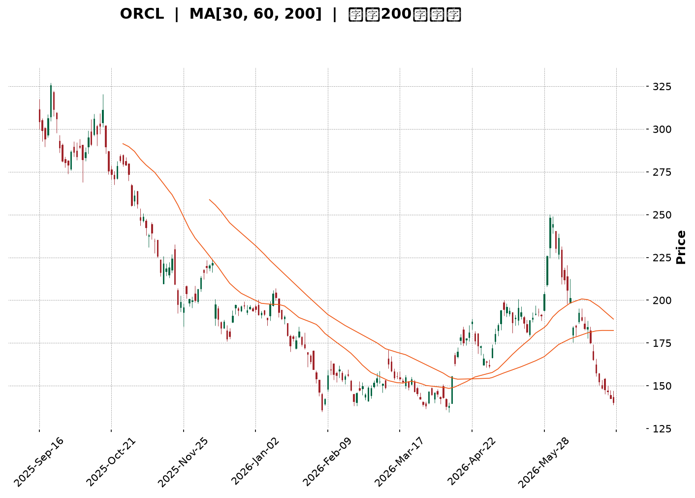
</details>

<html>
<head><meta charset="utf-8" /></head>
<body>
    <div style="height:500px; width:100%;">                        <script>window.PlotlyConfig = {MathJaxConfig: 'local'};</script>
        <script charset="utf-8" src="https://cdn.plot.ly/plotly-3.6.0.min.js" integrity="sha256-QaOVwtVY0T02VaHrr6pnoHLCwayMJp4O5n4YyaE3rJk=" crossorigin="anonymous"></script>                <div id="candlestick-chart" class="plotly-graph-div" style="height:100%; width:100%;"></div>            <script>                window.PLOTLYENV=window.PLOTLYENV || {};                                if (document.getElementById("candlestick-chart")) {                    Plotly.newPlot(                        "candlestick-chart",                        [{"close":{"dtype":"f8","bdata":"AAAAQPwDc0AAAABAzbByQAAAACDDZHJAAAAA4OQjc0AAAADASll0QAAAAED3dXNAAAAAALggc0AAAADgyBByQAAAAMDZk3FAAAAAAL2IcUAAAADAm3BxQAAAAID063FAAAAAwE3ocUAAAAAgZb5xQAAAAGDpFHJAAAAAgDugcUAAAABA7OVxQAAAAABXcnJAAAAAILsyckAAAACADyJzQAAAAODHknJAAAAAwD\u002fcckAAAACgaXFzQAAAACB+GHJAAAAAAMs3cUAAAAAAgxdxQAAAAEDq73BAAAAAQMBlcUAAAACAl5lxQAAAAKDmenFAAAAAINZxcUAAAACg5RlxQAAAAKBF6m9AAAAAwBhQcEAAAAAAZwRwQAAAAKDv1G5AAAAAYP8Yb0AAAABA80luQAAAAKCOuW1AAAAAoH3rbUAAAABApVZtQAAAAOBQM2xAAAAAgLcHa0AAAAAgpa9rQAAAAKCMUGtAAAAAAJZka0AAAACg4QRsQAAAAODmLGpAAAAAIHmxaEAAAADg0OFoQAAAAIBzemhAAAAAYKl2aUAAAAAA7hZpQAAAAKDO9mhAAAAAYOX7aEAAAACAws5pQAAAAKCroGpAAAAA4AgIa0AAAAAgLWZrQAAAAMCphWtAAAAAwLu0a0AAAADgVbRoQAAAAEDpmWdAAAAAQEz5ZkAAAADg7W9nQAAAAEDXK2ZAAAAAIMZdZkAAAAAghdlnQAAAAEBjpWhAAAAAoLNEaEAAAADgFIloQAAAAOD7mGhAAAAAYPlFaEAAAAAgLYBoQAAAAIAGN2hAAAAAIHhQaEAAAAAgPe1nQAAAAOAhEmhAAAAAoDD1Z0AAAADAu49nQAAAAMCHumhAAAAAwPZ+aUAAAAAAwDJpQAAAAAD1HWhAAAAAQA6mZ0AAAAAAmc1nQAAAAMBmaWZAAAAAYMuoZUAAAABA6jFmQAAAAKBjEWZAAAAA4MK5ZkAAAAAAUsllQAAAAMBahmVAAAAAIH8NZUAAAADgOoBkQAAAAOAX8GNAAAAAwDZEY0AAAADAGkViQAAAAOAoAGFAAAAAgFXKYUAAAACgcIFjQAAAACCs6mNAAAAA4J2TY0AAAACg7n1jQAAAAACl8mNAAAAAQOQtY0AAAAAADHRjQAAAAGDYf2NAAAAAYBFyYkAAAACALpphQAAAACA0NGJAAAAAQAJsYkAAAADgLbliQAAAACCbHGJAAAAAoGCXYkAAAABguY9iQAAAAKDe+mJAAAAAQApIY0AAAABArw1jQAAAAEAK4WJAAAAAICmcYkAAAAAgrFFkQAAAAOBk02NAAAAAoD5SY0AAAABAq21jQAAAAADaRGNAAAAAQMULY0AAAADAUV9jQAAAAOAWpWJAAAAAwLA5Y0AAAACAf1JiQAAAAKBgMGJAAAAAwAPKYUAAAADAkGVhQAAAAEAkSmFAAAAAwCJTYkAAAABgLxdiQAAAAIDbO2JAAAAAABIhYkAAAACgftVhQAAAAMAe5WFAAAAAIIU7YUAAAABA4UJhQAAAAADXc2NAAAAAAABgZEAAAACA6zllQAAAAEDhSmZAAAAAgOvhZUAAAABgjzJmQAAAAKBwpWZAAAAAAABwZ0AAAADA9QhmQAAAAMD1qGVAAAAAYLieZUAAAABguL5kQAAAAGCPemRAAAAA4HosZEAAAABgj3plQAAAAKBHiWZAAAAAQDMrZ0AAAADA9UBoQAAAAEDhUmhAAAAAYGZ+aEAAAABA4TpoQAAAAGCPWmdAAAAA4FG4Z0AAAAAghXNoQAAAAGBmHmhAAAAAIIVTZ0AAAABguK5mQAAAAMAehWdAAAAA4KO4Z0AAAABgjwJoQAAAAIDrIWhAAAAAYLjeZ0AAAABgZnZpQAAAAMD1OGxAAAAAwMwEb0AAAABgj5JuQAAAAGCPymxAAAAAQOGKbUAAAACAwrVqQAAAAIA9empAAAAAgOu5aUAAAADgUShpQAAAAEAzA2dAAAAAACkEZ0AAAADgehRoQAAAAGCPimdAAAAAwPXwZkAAAACgRwlnQAAAAIA94mVAAAAAwB6lZEAAAADA9bBjQAAAAGC4DmNAAAAAwPWQYkAAAADgUXhiQAAAAKCZUWJAAAAAAADQYUAAAADgo4hhQA=="},"high":{"dtype":"f8","bdata":"mJpd1W\u002fXc0ApX6i+5CNzQCLj5HkP13JAYGNObslKc0AD\u002f7UUuW50QKh0eWhJJ3RAkkHDZmBgc0Ap1JpLk4ZyQMkCJ50rO3JAUeVg3Nq7cUCXUdU8bJxxQPynexKD+3FAgdzYfJFKckAsbLWIVEVyQBinuMO2ZXJAd2Jyo8kuckBYdJOf9RNyQPxZOK4bsnJAdwJy33Idc0CXQj901kxzQFSaIaj46HJAd2UxX8RRc0BjfwHWHgl0QDpAbci+5nJACxsbC5P3cUBGmuCJaGlxQKAsO4wcOHFASU7aUu+VcUCpE+WO+dZxQE3Zwif003FA71fry3a7cUAKPsVEZn5xQIaKH1fMwXBA8hTi8fuCcEDbWVJ+9n9wQJlUpgERt29AC1KcDXhbb0BT65lxj\u002fFuQM3H8XXQ3W1Aqni9p1u3bkC8sK\u002fU\u002fX9tQF3yReqia21A8gIS\u002fRz5a0DWbkBbOTVsQBpYSwYOrmtAljuxo63Ka0ApxWKJNVhsQLvZOxZEEm1Akkbu7DThaUC1JciAZ1JpQPpoEGslxmhA\u002fcQF1PQWakCk35tcVSNpQBnrmwk6SGlAXsXaNGoNakBV5Ex+zdRpQOfVn\u002fYEw2pAobcUbxlFa0ClsELbEuxrQKWMmXZUqGtAwaCdyzP+a0CqnTekMxhpQDw96vqHlGhAwKU3PBt6Z0BOBe81gZRnQIK6cpmMK2dAR43bljX0ZkAtxD9EtD1oQKN6Xdy+smhAtbjXr9t\u002faECHhiz5NKJoQFCeXKut5GhAosD2pIWpaECvq8U1Y6VoQOvEyIvbf2hATZ205hCsaEChU8gPqQ5pQDjDC1YSNmhAWx8WZzJPaECB2Y1UFLlnQCFtygt372hANuHjwTC8aUAY3oLmdOJpQBOmb0lMH2lApoflwJlKaEDhd9iCeOZnQDOywVc7UWdAnsqjBhZ\u002fZkDf7c4LDnFmQJMAmqHKYGZAKoYeDEgVZ0AQ6WgSBmNmQPKRTHCGoWZAmFY9l2Y0ZUD8vRkU\u002fQllQLdrcSBVU2VAgwzq1WjaY0C2IHZX7yxjQBywkUNHQWJAvVF8inPWYUAHGENHNeZjQOOCZk8PmmRAWbTIjORiZECUiKIikc9jQGG2GiqGN2RA733hWTjXY0Cq5S\u002fIFJhjQNsgVDG78GNAHE4Kn4cuY0CqPWCbXCliQGunmnL5R2JAbKckcuMXY0ACvxDvA\u002f9iQEC8mFxKMmJAAozuBLe0YkAqKglC88xiQOtpG2VpImNAqJ3XT32sY0BZx4y\u002fWdRjQEdraTQS72JAd2voGlAzY0Dwtg2oMGVlQONeYk7e52RAfggx\u002f7sGZEDrfJ0lAMZjQP4nG4W9y2NAgHDQusdNY0BnM3yV9otjQNESkpbuFmNAwzNrMZxnY0DKD0nWqCtjQPFlFhYxqmJAXl6wJbo+YkAnO9eeTKZhQEZVrJKslmFAnLZUG2JcYkApfXz6IaRiQBclFUrFPWJA6SHILQ6BYkCd2mOVIwJiQGJlsPvZ3WJAAAAAoJnZYUAAAACgcIVhQAAAAMAefWNAAAAAwMwsZUAAAACA65FlQAAAAOCjiGZAAAAAAAAQZ0AAAADgUThmQAAAAEDhKmdAAAAAgMKlZ0AAAADgerxmQAAAAGC4lmZAAAAAoJmxZUAAAABgZhZlQAAAAOBRmGRAAAAAgMKlZEAAAACgmcllQAAAAAAA8GZAAAAA4KNQZ0AAAACgR0loQAAAAMDMBGlAAAAAAADAaEAAAACAwnVoQAAAAKBwHWhAAAAAgD3yZ0AAAABguBZpQAAAAIDCjWhAAAAA4FHYZ0AAAABACpdnQAAAAEAKh2dAAAAAgD0aaEAAAAAAAKBoQAAAAGBmZmhAAAAA4HoEaEAAAAAAAKBpQAAAAKBHSWxAAAAAAABIb0AAAAAAACBvQAAAAOBREG5AAAAAYGbebUAAAACAFO5sQAAAAIDrYWtAAAAAAACQa0AAAAAgXI9qQAAAAOCjGGdAAAAAYI8yZ0AAAACAPWpoQAAAAIA9amhAAAAAgBTGZ0AAAAAgrn9nQAAAAGCPEmdAAAAAYI\u002fKZUAAAAAAALhkQAAAAADXs2NAAAAAoEcxY0AAAAAAAFBjQAAAAIDCvWJAAAAAoJlxYkAAAACA62FiQA=="},"hovertemplate":"\u003cb\u003e%{x|%Y-%m-%d}\u003c\u002fb\u003e\u003cbr\u003e\u958b: $%{open:.2f}\u003cbr\u003e\u9ad8: $%{high:.2f}\u003cbr\u003e\u4f4e: $%{low:.2f}\u003cbr\u003e\u6536: $%{close:.2f}\u003cextra\u003e\u003c\u002fextra\u003e","low":{"dtype":"f8","bdata":"QAb6NnS+ckBUQdJahUtyQPRW4chrG3JA9YpV6t9vckDg4QiWRQhzQO9OBJn1OXNAP\u002fdBGOWackBVjhInp+RxQCRXamCMjHFA3uwfhbtWcUCjY2Bg1htxQOde8u9EO3FAR0YNLfe8cUAnDxdBbJxxQCPe4NVeCHJAyDpZGg3OcEAVumCvEpZxQK14vYoW2HFAG50IxJ8jckCeo+9svn5yQJitu54lI3JA2SuwNIKRckDUZZvLgNNyQOWVTrDn23FAYT0sSA4acUDXslXsjelwQKSs1C6wuXBA3u5LIZ\u002frcEBs5avkaohxQHb52MadYXFAjnUdoTltcUDGMt9QFdtwQFMKmeXe1m9AUIKw84vkb0BEg+T2ebVvQFAiE5oodm5ArfjqvK2wbkA+JcnngrptQP182bzJ3WxAnjrn4OdzbUAM4eSevm9sQF7AQmc8GWxAu7jQ1Pm8akCOvdQpci9qQCIRlyXKx2pA4BQZlROmakAwZCmncv9qQFhTXoN\u002fIGpAOQgwjcULaEAUBX\u002f0nyNoQNRH5yPhD2dAGcHLNycgaUC+88bl5YxoQBcINaX0b2hA5220KenYaEC8FCvp08VoQGetSoXqoWlAV6sHoxaKakC5j3jfufJqQDUAK1xMHmtAcMBv7wgIa0BZgtMv9iJnQEQBBcMCG2dAFOcef1iJZkBYUtdjn+tmQIVWNOyh\u002f2VAEQ2XTKgvZkBrbReCEl9nQCGEYVDf9GdAtpVFe4TgZ0AeY\u002fT6cCdoQFdQePAwXWhA0abaV9TuZ0CzhyQteFBoQACJsuFMMWhAM1E+LcMgaEA6JjhC+ORnQAXHvNogsWdANEpXZ3naZ0DD7LXeaiBnQFiaB1Tvg2dAjVkLz2CKaEDQ10WZxf5oQKKGHTWrxGdAbbqe\u002fWKXZ0ATRBeDLzxnQCmWdTeLV2ZAFPK+JDNAZUCTG1imV\u002fxlQPCByP7XbGVASGPTmhM9ZkB9E+GIaqJlQFK3JQ1haGVAGYBDraYeZEA8JLjUf1VkQJIL7RUu7mNA1Lsc2uHrYkBgJAp+rP1hQOTbq9Hv2GBADyfPOqZNYUAXCv7MoE9iQBnQESo9jWNAhom6ONkuY0CTa+b5A\u002f9iQF9uQgj8V2NARJv5EyILY0B5DtQ6+9piQAamLpRKZ2NA2TpPjBBcYkB4blXNcUNhQOyFO6boR2FAYHd\u002fTnhaYkAPSB4\u002fohRiQDkGvLZfs2FA5Dn\u002fNgmWYUA636gNq9FhQI4D5RuYkmJAQH+sxh6zYkD8uq4U9OJiQIzYBoRzPWJAK2381d19YkAhr5XrrABkQBKFbe7awWNAMvcpn6EzY0Bsd6eAHD9jQKsX323nHmNAw386pVjwYkBMnDbI5YtiQC5uNhPsbWJARIpNX+\u002fFYkA0L6xX2EpiQFYdfXwYA2JA28\u002fBkmfBYUCP98ZmMjphQFOwBL8lD2FAYAvn3p9rYUCZXGrXUwViQFgBc3n5eWFAL\u002fhNzy3rYUDwipuXfm5hQETmUWvizGFAAAAAAAAAYUAAAACAPdJgQAAAAEAKd2FAAAAAgOsxZEAAAABguMZkQAAAAKCZuWVAAAAAIIWrZUAAAADgUbBlQAAAAOBRAGZAAAAAoJnZZkAAAABgj8JlQAAAAKCZGWVAAAAAwMz8ZEAAAACgmUFkQAAAAMDMFGRAAAAAYI8KZEAAAADAzMRkQAAAAOBRyGVAAAAAAABgZkAAAACgcNVmQAAAAKCZ2WdAAAAAYLjGZ0AAAABAM9NnQAAAAADXm2ZAAAAAgOshZ0AAAABgZi5nQAAAAMDMnGdAAAAA4KPoZkAAAACAwp1mQAAAAKCZWWZAAAAAYGZmZ0AAAABAM+NnQAAAAIDr0WdAAAAAoHB9Z0AAAAAAKSxoQAAAAOBRAGpAAAAAQDMTbEAAAABA4dptQAAAACCFc2xAAAAAAAAAbEAAAABgZi5qQAAAAGCPKmpAAAAAoEe5aEAAAACAwsVoQAAAAMD16GVAAAAAAABgZkAAAABguEZnQAAAAMAedWdAAAAAYI\u002fSZkAAAABgZjZmQAAAAMDMzGVAAAAAIIWTZEAAAABAM2tjQAAAACCFy2JAAAAAAACAYkAAAABgZiZiQAAAACBcD2JAAAAAAADQYUAAAABgj1phQA=="},"name":"\u50f9\u683c","open":{"dtype":"f8","bdata":"oaZU\u002fZ15c0AcfDa6fhRzQBvQd52tynJAXUULSouKckBaYofNSjNzQCMYRXppF3RAVH3ZVrFWc0BLypjFVE9yQEVQ565LK3JAj2P3nfKlcUAmBtttgJdxQKeSAK\u002ffSXFA\u002fbRDxj4YckBnaipKUvVxQN0hH+pzIXJAd2Jyo8kuckCQn3IR97JxQOon7fdOHHJAph34vyKnckDDSpuoAo5yQAVu5kt023JAx3ZXmprwckAbF35gvPtyQOGFsCpR3nJAlsk8jPbycUDaLVETlUZxQBbemJZDEnFAlm74fq\u002f0cEDoPGt0x8JxQBGKkqkdzXFAvmaENliUcUDRanvl2ntxQGcswtuTsXBASpFxzcwecEBb4wCA63lwQOkiKZCADm9AMbkXtarMbkDX1pn7ns1uQPeLOcJJsW1AAY4pc1SObkCWYEifMFltQH6NyAppaW1AowqM3rTza0CLNVapWjFqQP63VG4SHGtAdbbfZXbcakBZ2AMYGzdrQFPqxe7wt2xA3umRVxa6aUBx3gdeC3VoQDxW1bmgHGhAatdk2A0HakC64UuVU8loQDyV4iPQ6GhAdeO63GJ8aUAkguYAaONoQADMChjl0mlAFjh+czI1a0Bnosg48H9rQHsnAM30VWtAF2Z7CkCOa0AZ9\u002fpola5nQKTyBMh1ZWhADAVSonpkZ0BlPiIiTfJmQAOSgbUXxmZAZh2KCFSzZkCZxKbfqGdnQB+Ejs3Fc2hAmzuVVl5naECgQ9tV4zloQJuffb81m2hAtACbKiwfaEBcfjHKmVtoQOgBr9IMZ2hATgqI8HGIaED7zlxtHaRoQLuvcupI7GdA6y5H6m1DaED\u002fERF12rZnQCI69DbG32dAThWSXDGdaEBBV7IbK4lpQBOmb0lMH2lApoflwJlKaECYSa4k+KdnQDOywVc7UWdAKdzTgb9hZkBHAB7S3FdmQG3rclGdgGVAcnti2kBPZkDE\u002fehuH1JmQFu2\u002f031yWVAD80rf9kxZUCN4GLEtfJkQBT5K1xnSmVAukzPpLG2Y0AfZnAkVytjQONwi\u002fn7ImJA\u002f\u002fK9h29oYUCtw4BxJH9iQH+CGh0u7mNAWbTIjORiZECvLYGoK6xjQBESHoBD1mNAwmi2ysOtY0D6Mg5O7DtjQPJJjreSlGNA9YhZy4YYY0Brr0We2iViQJCnKZ0xi2FA3\u002fot6oGUYkBe1ZVWtYhiQBTsdLYi7GFAlx1rKxGkYUAr\u002fnj14AdiQG800smcr2JAbizymeIBY0B7QAWkaAxjQH4tKqWdxWJAIXFlDrsiY0DLPPcsoblkQCbT8Q\u002fIgmRA3ludyeLPY0DE2hzviXBjQLH1uJ3EXGNAPH1z\u002frYbY0DlgMaE9r1iQFhlWOqNEGNAtNUSYZPcYkCrxke\u002f9Q5jQKjPclq9lmJAkkMVVXTsYUBK6TlKEI5hQFHtbeWucWFAV7tcavl5YUDC2eZxRpJiQN1rKOQOyWFAHO67s6hdYkAqXaFb8uhhQK2nkU7cuGJAAAAAYGbGYUAAAACAPSphQAAAAOCjeGFAAAAAgML9ZEAAAADgetxkQAAAAKBwDWZAAAAAgMLdZkAAAACA6xlmQAAAAEAzS2ZAAAAAgMJFZ0AAAADAzIxmQAAAAOBRkGZAAAAAYI+SZUAAAADAHkVkQAAAAKBHgWRAAAAA4KNAZEAAAACgcM1kQAAAAOCjAGZAAAAAACnEZkAAAABgZkZnQAAAACCF02hAAAAAYI8SaEAAAADAzARoQAAAAKBwHWhAAAAAwPWgZ0AAAACAwoVnQAAAACCuz2dAAAAAAADAZ0AAAAAAAEBnQAAAAIAUfmZAAAAA4FGgZ0AAAACgcPVnQAAAAKCZKWhAAAAAIFzvZ0AAAACgR0FoQAAAAAAAIGpAAAAAAADQbEAAAACgmVluQAAAACBcD25AAAAAAABgbEAAAAAgrq9sQAAAAAAAOGtAAAAAwB69akAAAAAAANBoQAAAAKBwdWZAAAAA4FEgZ0AAAADgemxnQAAAAOBRwGdAAAAAwB5FZ0AAAADgUeBmQAAAAIDryWZAAAAAIFxHZUAAAAAgXE9kQAAAAEAzq2NAAAAA4FHIYkAAAACAFD5jQAAAAAAAaGJAAAAAIK4PYkAAAACgmelhQA=="},"x":["2025-09-16T00:00:00-04:00","2025-09-17T00:00:00-04:00","2025-09-18T00:00:00-04:00","2025-09-19T00:00:00-04:00","2025-09-22T00:00:00-04:00","2025-09-23T00:00:00-04:00","2025-09-24T00:00:00-04:00","2025-09-25T00:00:00-04:00","2025-09-26T00:00:00-04:00","2025-09-29T00:00:00-04:00","2025-09-30T00:00:00-04:00","2025-10-01T00:00:00-04:00","2025-10-02T00:00:00-04:00","2025-10-03T00:00:00-04:00","2025-10-06T00:00:00-04:00","2025-10-07T00:00:00-04:00","2025-10-08T00:00:00-04:00","2025-10-09T00:00:00-04:00","2025-10-10T00:00:00-04:00","2025-10-13T00:00:00-04:00","2025-10-14T00:00:00-04:00","2025-10-15T00:00:00-04:00","2025-10-16T00:00:00-04:00","2025-10-17T00:00:00-04:00","2025-10-20T00:00:00-04:00","2025-10-21T00:00:00-04:00","2025-10-22T00:00:00-04:00","2025-10-23T00:00:00-04:00","2025-10-24T00:00:00-04:00","2025-10-27T00:00:00-04:00","2025-10-28T00:00:00-04:00","2025-10-29T00:00:00-04:00","2025-10-30T00:00:00-04:00","2025-10-31T00:00:00-04:00","2025-11-03T00:00:00-05:00","2025-11-04T00:00:00-05:00","2025-11-05T00:00:00-05:00","2025-11-06T00:00:00-05:00","2025-11-07T00:00:00-05:00","2025-11-10T00:00:00-05:00","2025-11-11T00:00:00-05:00","2025-11-12T00:00:00-05:00","2025-11-13T00:00:00-05:00","2025-11-14T00:00:00-05:00","2025-11-17T00:00:00-05:00","2025-11-18T00:00:00-05:00","2025-11-19T00:00:00-05:00","2025-11-20T00:00:00-05:00","2025-11-21T00:00:00-05:00","2025-11-24T00:00:00-05:00","2025-11-25T00:00:00-05:00","2025-11-26T00:00:00-05:00","2025-11-28T00:00:00-05:00","2025-12-01T00:00:00-05:00","2025-12-02T00:00:00-05:00","2025-12-03T00:00:00-05:00","2025-12-04T00:00:00-05:00","2025-12-05T00:00:00-05:00","2025-12-08T00:00:00-05:00","2025-12-09T00:00:00-05:00","2025-12-10T00:00:00-05:00","2025-12-11T00:00:00-05:00","2025-12-12T00:00:00-05:00","2025-12-15T00:00:00-05:00","2025-12-16T00:00:00-05:00","2025-12-17T00:00:00-05:00","2025-12-18T00:00:00-05:00","2025-12-19T00:00:00-05:00","2025-12-22T00:00:00-05:00","2025-12-23T00:00:00-05:00","2025-12-24T00:00:00-05:00","2025-12-26T00:00:00-05:00","2025-12-29T00:00:00-05:00","2025-12-30T00:00:00-05:00","2025-12-31T00:00:00-05:00","2026-01-02T00:00:00-05:00","2026-01-05T00:00:00-05:00","2026-01-06T00:00:00-05:00","2026-01-07T00:00:00-05:00","2026-01-08T00:00:00-05:00","2026-01-09T00:00:00-05:00","2026-01-12T00:00:00-05:00","2026-01-13T00:00:00-05:00","2026-01-14T00:00:00-05:00","2026-01-15T00:00:00-05:00","2026-01-16T00:00:00-05:00","2026-01-20T00:00:00-05:00","2026-01-21T00:00:00-05:00","2026-01-22T00:00:00-05:00","2026-01-23T00:00:00-05:00","2026-01-26T00:00:00-05:00","2026-01-27T00:00:00-05:00","2026-01-28T00:00:00-05:00","2026-01-29T00:00:00-05:00","2026-01-30T00:00:00-05:00","2026-02-02T00:00:00-05:00","2026-02-03T00:00:00-05:00","2026-02-04T00:00:00-05:00","2026-02-05T00:00:00-05:00","2026-02-06T00:00:00-05:00","2026-02-09T00:00:00-05:00","2026-02-10T00:00:00-05:00","2026-02-11T00:00:00-05:00","2026-02-12T00:00:00-05:00","2026-02-13T00:00:00-05:00","2026-02-17T00:00:00-05:00","2026-02-18T00:00:00-05:00","2026-02-19T00:00:00-05:00","2026-02-20T00:00:00-05:00","2026-02-23T00:00:00-05:00","2026-02-24T00:00:00-05:00","2026-02-25T00:00:00-05:00","2026-02-26T00:00:00-05:00","2026-02-27T00:00:00-05:00","2026-03-02T00:00:00-05:00","2026-03-03T00:00:00-05:00","2026-03-04T00:00:00-05:00","2026-03-05T00:00:00-05:00","2026-03-06T00:00:00-05:00","2026-03-09T00:00:00-04:00","2026-03-10T00:00:00-04:00","2026-03-11T00:00:00-04:00","2026-03-12T00:00:00-04:00","2026-03-13T00:00:00-04:00","2026-03-16T00:00:00-04:00","2026-03-17T00:00:00-04:00","2026-03-18T00:00:00-04:00","2026-03-19T00:00:00-04:00","2026-03-20T00:00:00-04:00","2026-03-23T00:00:00-04:00","2026-03-24T00:00:00-04:00","2026-03-25T00:00:00-04:00","2026-03-26T00:00:00-04:00","2026-03-27T00:00:00-04:00","2026-03-30T00:00:00-04:00","2026-03-31T00:00:00-04:00","2026-04-01T00:00:00-04:00","2026-04-02T00:00:00-04:00","2026-04-06T00:00:00-04:00","2026-04-07T00:00:00-04:00","2026-04-08T00:00:00-04:00","2026-04-09T00:00:00-04:00","2026-04-10T00:00:00-04:00","2026-04-13T00:00:00-04:00","2026-04-14T00:00:00-04:00","2026-04-15T00:00:00-04:00","2026-04-16T00:00:00-04:00","2026-04-17T00:00:00-04:00","2026-04-20T00:00:00-04:00","2026-04-21T00:00:00-04:00","2026-04-22T00:00:00-04:00","2026-04-23T00:00:00-04:00","2026-04-24T00:00:00-04:00","2026-04-27T00:00:00-04:00","2026-04-28T00:00:00-04:00","2026-04-29T00:00:00-04:00","2026-04-30T00:00:00-04:00","2026-05-01T00:00:00-04:00","2026-05-04T00:00:00-04:00","2026-05-05T00:00:00-04:00","2026-05-06T00:00:00-04:00","2026-05-07T00:00:00-04:00","2026-05-08T00:00:00-04:00","2026-05-11T00:00:00-04:00","2026-05-12T00:00:00-04:00","2026-05-13T00:00:00-04:00","2026-05-14T00:00:00-04:00","2026-05-15T00:00:00-04:00","2026-05-18T00:00:00-04:00","2026-05-19T00:00:00-04:00","2026-05-20T00:00:00-04:00","2026-05-21T00:00:00-04:00","2026-05-22T00:00:00-04:00","2026-05-26T00:00:00-04:00","2026-05-27T00:00:00-04:00","2026-05-28T00:00:00-04:00","2026-05-29T00:00:00-04:00","2026-06-01T00:00:00-04:00","2026-06-02T00:00:00-04:00","2026-06-03T00:00:00-04:00","2026-06-04T00:00:00-04:00","2026-06-05T00:00:00-04:00","2026-06-08T00:00:00-04:00","2026-06-09T00:00:00-04:00","2026-06-10T00:00:00-04:00","2026-06-11T00:00:00-04:00","2026-06-12T00:00:00-04:00","2026-06-15T00:00:00-04:00","2026-06-16T00:00:00-04:00","2026-06-17T00:00:00-04:00","2026-06-18T00:00:00-04:00","2026-06-22T00:00:00-04:00","2026-06-23T00:00:00-04:00","2026-06-24T00:00:00-04:00","2026-06-25T00:00:00-04:00","2026-06-26T00:00:00-04:00","2026-06-29T00:00:00-04:00","2026-06-30T00:00:00-04:00","2026-07-01T00:00:00-04:00","2026-07-02T00:00:00-04:00"],"type":"candlestick"},{"hovertemplate":"MA30: $%{y:.2f}\u003cextra\u003e\u003c\u002fextra\u003e","line":{"color":"#2196F3","dash":"dash","width":2},"mode":"lines","name":"MA30","x":["2025-09-16T00:00:00-04:00","2025-09-17T00:00:00-04:00","2025-09-18T00:00:00-04:00","2025-09-19T00:00:00-04:00","2025-09-22T00:00:00-04:00","2025-09-23T00:00:00-04:00","2025-09-24T00:00:00-04:00","2025-09-25T00:00:00-04:00","2025-09-26T00:00:00-04:00","2025-09-29T00:00:00-04:00","2025-09-30T00:00:00-04:00","2025-10-01T00:00:00-04:00","2025-10-02T00:00:00-04:00","2025-10-03T00:00:00-04:00","2025-10-06T00:00:00-04:00","2025-10-07T00:00:00-04:00","2025-10-08T00:00:00-04:00","2025-10-09T00:00:00-04:00","2025-10-10T00:00:00-04:00","2025-10-13T00:00:00-04:00","2025-10-14T00:00:00-04:00","2025-10-15T00:00:00-04:00","2025-10-16T00:00:00-04:00","2025-10-17T00:00:00-04:00","2025-10-20T00:00:00-04:00","2025-10-21T00:00:00-04:00","2025-10-22T00:00:00-04:00","2025-10-23T00:00:00-04:00","2025-10-24T00:00:00-04:00","2025-10-27T00:00:00-04:00","2025-10-28T00:00:00-04:00","2025-10-29T00:00:00-04:00","2025-10-30T00:00:00-04:00","2025-10-31T00:00:00-04:00","2025-11-03T00:00:00-05:00","2025-11-04T00:00:00-05:00","2025-11-05T00:00:00-05:00","2025-11-06T00:00:00-05:00","2025-11-07T00:00:00-05:00","2025-11-10T00:00:00-05:00","2025-11-11T00:00:00-05:00","2025-11-12T00:00:00-05:00","2025-11-13T00:00:00-05:00","2025-11-14T00:00:00-05:00","2025-11-17T00:00:00-05:00","2025-11-18T00:00:00-05:00","2025-11-19T00:00:00-05:00","2025-11-20T00:00:00-05:00","2025-11-21T00:00:00-05:00","2025-11-24T00:00:00-05:00","2025-11-25T00:00:00-05:00","2025-11-26T00:00:00-05:00","2025-11-28T00:00:00-05:00","2025-12-01T00:00:00-05:00","2025-12-02T00:00:00-05:00","2025-12-03T00:00:00-05:00","2025-12-04T00:00:00-05:00","2025-12-05T00:00:00-05:00","2025-12-08T00:00:00-05:00","2025-12-09T00:00:00-05:00","2025-12-10T00:00:00-05:00","2025-12-11T00:00:00-05:00","2025-12-12T00:00:00-05:00","2025-12-15T00:00:00-05:00","2025-12-16T00:00:00-05:00","2025-12-17T00:00:00-05:00","2025-12-18T00:00:00-05:00","2025-12-19T00:00:00-05:00","2025-12-22T00:00:00-05:00","2025-12-23T00:00:00-05:00","2025-12-24T00:00:00-05:00","2025-12-26T00:00:00-05:00","2025-12-29T00:00:00-05:00","2025-12-30T00:00:00-05:00","2025-12-31T00:00:00-05:00","2026-01-02T00:00:00-05:00","2026-01-05T00:00:00-05:00","2026-01-06T00:00:00-05:00","2026-01-07T00:00:00-05:00","2026-01-08T00:00:00-05:00","2026-01-09T00:00:00-05:00","2026-01-12T00:00:00-05:00","2026-01-13T00:00:00-05:00","2026-01-14T00:00:00-05:00","2026-01-15T00:00:00-05:00","2026-01-16T00:00:00-05:00","2026-01-20T00:00:00-05:00","2026-01-21T00:00:00-05:00","2026-01-22T00:00:00-05:00","2026-01-23T00:00:00-05:00","2026-01-26T00:00:00-05:00","2026-01-27T00:00:00-05:00","2026-01-28T00:00:00-05:00","2026-01-29T00:00:00-05:00","2026-01-30T00:00:00-05:00","2026-02-02T00:00:00-05:00","2026-02-03T00:00:00-05:00","2026-02-04T00:00:00-05:00","2026-02-05T00:00:00-05:00","2026-02-06T00:00:00-05:00","2026-02-09T00:00:00-05:00","2026-02-10T00:00:00-05:00","2026-02-11T00:00:00-05:00","2026-02-12T00:00:00-05:00","2026-02-13T00:00:00-05:00","2026-02-17T00:00:00-05:00","2026-02-18T00:00:00-05:00","2026-02-19T00:00:00-05:00","2026-02-20T00:00:00-05:00","2026-02-23T00:00:00-05:00","2026-02-24T00:00:00-05:00","2026-02-25T00:00:00-05:00","2026-02-26T00:00:00-05:00","2026-02-27T00:00:00-05:00","2026-03-02T00:00:00-05:00","2026-03-03T00:00:00-05:00","2026-03-04T00:00:00-05:00","2026-03-05T00:00:00-05:00","2026-03-06T00:00:00-05:00","2026-03-09T00:00:00-04:00","2026-03-10T00:00:00-04:00","2026-03-11T00:00:00-04:00","2026-03-12T00:00:00-04:00","2026-03-13T00:00:00-04:00","2026-03-16T00:00:00-04:00","2026-03-17T00:00:00-04:00","2026-03-18T00:00:00-04:00","2026-03-19T00:00:00-04:00","2026-03-20T00:00:00-04:00","2026-03-23T00:00:00-04:00","2026-03-24T00:00:00-04:00","2026-03-25T00:00:00-04:00","2026-03-26T00:00:00-04:00","2026-03-27T00:00:00-04:00","2026-03-30T00:00:00-04:00","2026-03-31T00:00:00-04:00","2026-04-01T00:00:00-04:00","2026-04-02T00:00:00-04:00","2026-04-06T00:00:00-04:00","2026-04-07T00:00:00-04:00","2026-04-08T00:00:00-04:00","2026-04-09T00:00:00-04:00","2026-04-10T00:00:00-04:00","2026-04-13T00:00:00-04:00","2026-04-14T00:00:00-04:00","2026-04-15T00:00:00-04:00","2026-04-16T00:00:00-04:00","2026-04-17T00:00:00-04:00","2026-04-20T00:00:00-04:00","2026-04-21T00:00:00-04:00","2026-04-22T00:00:00-04:00","2026-04-23T00:00:00-04:00","2026-04-24T00:00:00-04:00","2026-04-27T00:00:00-04:00","2026-04-28T00:00:00-04:00","2026-04-29T00:00:00-04:00","2026-04-30T00:00:00-04:00","2026-05-01T00:00:00-04:00","2026-05-04T00:00:00-04:00","2026-05-05T00:00:00-04:00","2026-05-06T00:00:00-04:00","2026-05-07T00:00:00-04:00","2026-05-08T00:00:00-04:00","2026-05-11T00:00:00-04:00","2026-05-12T00:00:00-04:00","2026-05-13T00:00:00-04:00","2026-05-14T00:00:00-04:00","2026-05-15T00:00:00-04:00","2026-05-18T00:00:00-04:00","2026-05-19T00:00:00-04:00","2026-05-20T00:00:00-04:00","2026-05-21T00:00:00-04:00","2026-05-22T00:00:00-04:00","2026-05-26T00:00:00-04:00","2026-05-27T00:00:00-04:00","2026-05-28T00:00:00-04:00","2026-05-29T00:00:00-04:00","2026-06-01T00:00:00-04:00","2026-06-02T00:00:00-04:00","2026-06-03T00:00:00-04:00","2026-06-04T00:00:00-04:00","2026-06-05T00:00:00-04:00","2026-06-08T00:00:00-04:00","2026-06-09T00:00:00-04:00","2026-06-10T00:00:00-04:00","2026-06-11T00:00:00-04:00","2026-06-12T00:00:00-04:00","2026-06-15T00:00:00-04:00","2026-06-16T00:00:00-04:00","2026-06-17T00:00:00-04:00","2026-06-18T00:00:00-04:00","2026-06-22T00:00:00-04:00","2026-06-23T00:00:00-04:00","2026-06-24T00:00:00-04:00","2026-06-25T00:00:00-04:00","2026-06-26T00:00:00-04:00","2026-06-29T00:00:00-04:00","2026-06-30T00:00:00-04:00","2026-07-01T00:00:00-04:00","2026-07-02T00:00:00-04:00"],"y":{"dtype":"f8","bdata":"AAAAAAAA+H8AAAAAAAD4fwAAAAAAAPh\u002fAAAAAAAA+H8AAAAAAAD4fwAAAAAAAPh\u002fAAAAAAAA+H8AAAAAAAD4fwAAAAAAAPh\u002fAAAAAAAA+H8AAAAAAAD4fwAAAAAAAPh\u002fAAAAAAAA+H8AAAAAAAD4fwAAAAAAAPh\u002fAAAAAAAA+H8AAAAAAAD4fwAAAAAAAPh\u002fAAAAAAAA+H8AAAAAAAD4fwAAAAAAAPh\u002fAAAAAAAA+H8AAAAAAAD4fwAAAAAAAPh\u002fAAAAAAAA+H8AAAAAAAD4fwAAAAAAAPh\u002fAAAAAAAA+H8AAAAAAAD4fxEREZEFN3JAVVVV5Z0pckBERESkDRxyQAAAAAhEB3JAiYiIoCPvcUAiIiIaLcpxQKuqqtqop3FAmpmZcR6JcUCrqqoiMXBxQKuqqtoFWXFAq6qqcg5DcUCJiIjgaStxQN7d3b3NCnFAmpmZeVLlcECrqqpSCcRwQHd3dydInnBAMzMzI8B8cEAzMzNbkVtwQCIiIpLWLXBA7+7uXs\u002f3b0ARERGRmYVvQGZmZgZ\u002fGW9AIiIi0uawbkCrqqr6KztuQImIiKhd221AMzMzo7WKbUC8u7vrO0NtQJqZmTllBW1AERERgSXDbEAAAABglIBsQJqZmbkbQWxAERERcc8DbEDv7u7+wrJrQLy7u\u002fvQa2tAIiIiAnQZa0BEREQ0F9BqQN7d3f0vhmpAVVVVFa47akCrqqp6uwRqQDMzM7Nk2WlARERExCqpaUDNzMx8LoBpQLy7u+tvYWlAVVVVlelJaUCrqqrqui5pQDMzM4NHFGlAAAAAQAL6aEDe3d1dFtdoQN7d3d0gxWhA7+7uLtq+aEBmZmY2lbNoQFVVVQW4tWhA3t3d3f61aEBERERE7LZoQAAAANCxr2hAZmZmxkykaECrqqrKMZNoQHd3dwc4b2hAVVVVpWBBaEBEREQE+BRoQFVVVSVt5mdAIiIiYu27Z0CrqqraBqNnQHd3d+dOkWdAMzMzM+qAZ0AzMzOz22dnQJqZmcnMVGdAMzMzE1k6Z0De3d3tuwpnQAAAAEB+yWZAiYiI2DaSZkCJiIj4SmdmQBEREWFZP2ZAMzMzQ0UXZkAiIiJyh+xlQLy7u8sdyGVAEREREUycZUAzMzPDH3ZlQAAAAFAdT2VAzczMvBMgZUAiIiKyOe1kQN7d3T2MtWRAIiIiwi55ZEB3d3cn7kFkQM3MzGyvDmRAERERgYfjY0CamZnZzLZjQLy7uwuEmWNAd3d3VzmFY0AzMzOTampjQFVVVWU0T2NAvLu7qxUsY0BEREQkkB9jQKuqqnoQEWNAAAAAEEoCY0BEREQkI\u002fliQBEREeFt82JAq6qqOozxYkBmZmZ29PpiQFVVVWX8CGNAvLu7KzsVY0ARERERIgtjQBEREdFj\u002fGJAIiIi8iLtYkAzMzPzQdtiQN7d3f2SxGJAZmZmRki9YkAiIiJSp7FiQAAAAKDapmJAIiIiciekYkBVVVWVIaZiQM3MzLx+o2JA7+7ubliZYkCamZlp3oxiQHd3d1dPmGJAq6qq2oenYkAiIiJCRb5iQM3MzJyJ2mJAmpmZybvwYkDv7u4OkAtjQKuqqpq1K2NA7+7ubudUY0BVVVUFjGNjQLy7u\u002fsyc2NAREREpNCGY0AAAADQDJJjQImIiKhfnGNAAAAAUP+lY0BVVVXV+LdjQImIiKgt2WNAREREJNT6Y0Dv7u6ucS1kQN7d3U3LYWRAq6qqygGbZEBmZmZGUdVkQERERJQQCWVA7+7urho3ZUDv7u7OYW1lQDMzM6OZn2VA7+7uzvLLZUCamZmZUvVlQJqZmZlSJWZA3t3dfbFcZkDNzMxcSJZmQKuqqvo3vmZAzczM7ArcZkB3d3cnMQBnQAAAAHDLMmdAERER4cGAZ0CJiIhYOchnQN7d3U2p\u002fGdAERER4cEwaEAiIiKSplhoQAAAAJDCgWhAzczMzMykaEDNzMwMdMpoQM3MzBwT4GhAZmZmplT4aECrqqoqhw5pQAAAAKAaF2lAREREpCkVaUCJiIj4xQppQGZmZrbz9WhA3t3d\u002fRvVaEARERHxYK5oQERERKS3iWhAq6qqGr1daEDNzMzcsipoQCIiIpI0+WdAmpmZmSfKZ0C8u7v7N55nQA=="},"type":"scatter"},{"hovertemplate":"MA60: $%{y:.2f}\u003cextra\u003e\u003c\u002fextra\u003e","line":{"color":"#9C27B0","dash":"dash","width":2},"mode":"lines","name":"MA60","x":["2025-09-16T00:00:00-04:00","2025-09-17T00:00:00-04:00","2025-09-18T00:00:00-04:00","2025-09-19T00:00:00-04:00","2025-09-22T00:00:00-04:00","2025-09-23T00:00:00-04:00","2025-09-24T00:00:00-04:00","2025-09-25T00:00:00-04:00","2025-09-26T00:00:00-04:00","2025-09-29T00:00:00-04:00","2025-09-30T00:00:00-04:00","2025-10-01T00:00:00-04:00","2025-10-02T00:00:00-04:00","2025-10-03T00:00:00-04:00","2025-10-06T00:00:00-04:00","2025-10-07T00:00:00-04:00","2025-10-08T00:00:00-04:00","2025-10-09T00:00:00-04:00","2025-10-10T00:00:00-04:00","2025-10-13T00:00:00-04:00","2025-10-14T00:00:00-04:00","2025-10-15T00:00:00-04:00","2025-10-16T00:00:00-04:00","2025-10-17T00:00:00-04:00","2025-10-20T00:00:00-04:00","2025-10-21T00:00:00-04:00","2025-10-22T00:00:00-04:00","2025-10-23T00:00:00-04:00","2025-10-24T00:00:00-04:00","2025-10-27T00:00:00-04:00","2025-10-28T00:00:00-04:00","2025-10-29T00:00:00-04:00","2025-10-30T00:00:00-04:00","2025-10-31T00:00:00-04:00","2025-11-03T00:00:00-05:00","2025-11-04T00:00:00-05:00","2025-11-05T00:00:00-05:00","2025-11-06T00:00:00-05:00","2025-11-07T00:00:00-05:00","2025-11-10T00:00:00-05:00","2025-11-11T00:00:00-05:00","2025-11-12T00:00:00-05:00","2025-11-13T00:00:00-05:00","2025-11-14T00:00:00-05:00","2025-11-17T00:00:00-05:00","2025-11-18T00:00:00-05:00","2025-11-19T00:00:00-05:00","2025-11-20T00:00:00-05:00","2025-11-21T00:00:00-05:00","2025-11-24T00:00:00-05:00","2025-11-25T00:00:00-05:00","2025-11-26T00:00:00-05:00","2025-11-28T00:00:00-05:00","2025-12-01T00:00:00-05:00","2025-12-02T00:00:00-05:00","2025-12-03T00:00:00-05:00","2025-12-04T00:00:00-05:00","2025-12-05T00:00:00-05:00","2025-12-08T00:00:00-05:00","2025-12-09T00:00:00-05:00","2025-12-10T00:00:00-05:00","2025-12-11T00:00:00-05:00","2025-12-12T00:00:00-05:00","2025-12-15T00:00:00-05:00","2025-12-16T00:00:00-05:00","2025-12-17T00:00:00-05:00","2025-12-18T00:00:00-05:00","2025-12-19T00:00:00-05:00","2025-12-22T00:00:00-05:00","2025-12-23T00:00:00-05:00","2025-12-24T00:00:00-05:00","2025-12-26T00:00:00-05:00","2025-12-29T00:00:00-05:00","2025-12-30T00:00:00-05:00","2025-12-31T00:00:00-05:00","2026-01-02T00:00:00-05:00","2026-01-05T00:00:00-05:00","2026-01-06T00:00:00-05:00","2026-01-07T00:00:00-05:00","2026-01-08T00:00:00-05:00","2026-01-09T00:00:00-05:00","2026-01-12T00:00:00-05:00","2026-01-13T00:00:00-05:00","2026-01-14T00:00:00-05:00","2026-01-15T00:00:00-05:00","2026-01-16T00:00:00-05:00","2026-01-20T00:00:00-05:00","2026-01-21T00:00:00-05:00","2026-01-22T00:00:00-05:00","2026-01-23T00:00:00-05:00","2026-01-26T00:00:00-05:00","2026-01-27T00:00:00-05:00","2026-01-28T00:00:00-05:00","2026-01-29T00:00:00-05:00","2026-01-30T00:00:00-05:00","2026-02-02T00:00:00-05:00","2026-02-03T00:00:00-05:00","2026-02-04T00:00:00-05:00","2026-02-05T00:00:00-05:00","2026-02-06T00:00:00-05:00","2026-02-09T00:00:00-05:00","2026-02-10T00:00:00-05:00","2026-02-11T00:00:00-05:00","2026-02-12T00:00:00-05:00","2026-02-13T00:00:00-05:00","2026-02-17T00:00:00-05:00","2026-02-18T00:00:00-05:00","2026-02-19T00:00:00-05:00","2026-02-20T00:00:00-05:00","2026-02-23T00:00:00-05:00","2026-02-24T00:00:00-05:00","2026-02-25T00:00:00-05:00","2026-02-26T00:00:00-05:00","2026-02-27T00:00:00-05:00","2026-03-02T00:00:00-05:00","2026-03-03T00:00:00-05:00","2026-03-04T00:00:00-05:00","2026-03-05T00:00:00-05:00","2026-03-06T00:00:00-05:00","2026-03-09T00:00:00-04:00","2026-03-10T00:00:00-04:00","2026-03-11T00:00:00-04:00","2026-03-12T00:00:00-04:00","2026-03-13T00:00:00-04:00","2026-03-16T00:00:00-04:00","2026-03-17T00:00:00-04:00","2026-03-18T00:00:00-04:00","2026-03-19T00:00:00-04:00","2026-03-20T00:00:00-04:00","2026-03-23T00:00:00-04:00","2026-03-24T00:00:00-04:00","2026-03-25T00:00:00-04:00","2026-03-26T00:00:00-04:00","2026-03-27T00:00:00-04:00","2026-03-30T00:00:00-04:00","2026-03-31T00:00:00-04:00","2026-04-01T00:00:00-04:00","2026-04-02T00:00:00-04:00","2026-04-06T00:00:00-04:00","2026-04-07T00:00:00-04:00","2026-04-08T00:00:00-04:00","2026-04-09T00:00:00-04:00","2026-04-10T00:00:00-04:00","2026-04-13T00:00:00-04:00","2026-04-14T00:00:00-04:00","2026-04-15T00:00:00-04:00","2026-04-16T00:00:00-04:00","2026-04-17T00:00:00-04:00","2026-04-20T00:00:00-04:00","2026-04-21T00:00:00-04:00","2026-04-22T00:00:00-04:00","2026-04-23T00:00:00-04:00","2026-04-24T00:00:00-04:00","2026-04-27T00:00:00-04:00","2026-04-28T00:00:00-04:00","2026-04-29T00:00:00-04:00","2026-04-30T00:00:00-04:00","2026-05-01T00:00:00-04:00","2026-05-04T00:00:00-04:00","2026-05-05T00:00:00-04:00","2026-05-06T00:00:00-04:00","2026-05-07T00:00:00-04:00","2026-05-08T00:00:00-04:00","2026-05-11T00:00:00-04:00","2026-05-12T00:00:00-04:00","2026-05-13T00:00:00-04:00","2026-05-14T00:00:00-04:00","2026-05-15T00:00:00-04:00","2026-05-18T00:00:00-04:00","2026-05-19T00:00:00-04:00","2026-05-20T00:00:00-04:00","2026-05-21T00:00:00-04:00","2026-05-22T00:00:00-04:00","2026-05-26T00:00:00-04:00","2026-05-27T00:00:00-04:00","2026-05-28T00:00:00-04:00","2026-05-29T00:00:00-04:00","2026-06-01T00:00:00-04:00","2026-06-02T00:00:00-04:00","2026-06-03T00:00:00-04:00","2026-06-04T00:00:00-04:00","2026-06-05T00:00:00-04:00","2026-06-08T00:00:00-04:00","2026-06-09T00:00:00-04:00","2026-06-10T00:00:00-04:00","2026-06-11T00:00:00-04:00","2026-06-12T00:00:00-04:00","2026-06-15T00:00:00-04:00","2026-06-16T00:00:00-04:00","2026-06-17T00:00:00-04:00","2026-06-18T00:00:00-04:00","2026-06-22T00:00:00-04:00","2026-06-23T00:00:00-04:00","2026-06-24T00:00:00-04:00","2026-06-25T00:00:00-04:00","2026-06-26T00:00:00-04:00","2026-06-29T00:00:00-04:00","2026-06-30T00:00:00-04:00","2026-07-01T00:00:00-04:00","2026-07-02T00:00:00-04:00"],"y":{"dtype":"f8","bdata":"AAAAAAAA+H8AAAAAAAD4fwAAAAAAAPh\u002fAAAAAAAA+H8AAAAAAAD4fwAAAAAAAPh\u002fAAAAAAAA+H8AAAAAAAD4fwAAAAAAAPh\u002fAAAAAAAA+H8AAAAAAAD4fwAAAAAAAPh\u002fAAAAAAAA+H8AAAAAAAD4fwAAAAAAAPh\u002fAAAAAAAA+H8AAAAAAAD4fwAAAAAAAPh\u002fAAAAAAAA+H8AAAAAAAD4fwAAAAAAAPh\u002fAAAAAAAA+H8AAAAAAAD4fwAAAAAAAPh\u002fAAAAAAAA+H8AAAAAAAD4fwAAAAAAAPh\u002fAAAAAAAA+H8AAAAAAAD4fwAAAAAAAPh\u002fAAAAAAAA+H8AAAAAAAD4fwAAAAAAAPh\u002fAAAAAAAA+H8AAAAAAAD4fwAAAAAAAPh\u002fAAAAAAAA+H8AAAAAAAD4fwAAAAAAAPh\u002fAAAAAAAA+H8AAAAAAAD4fwAAAAAAAPh\u002fAAAAAAAA+H8AAAAAAAD4fwAAAAAAAPh\u002fAAAAAAAA+H8AAAAAAAD4fwAAAAAAAPh\u002fAAAAAAAA+H8AAAAAAAD4fwAAAAAAAPh\u002fAAAAAAAA+H8AAAAAAAD4fwAAAAAAAPh\u002fAAAAAAAA+H8AAAAAAAD4fwAAAAAAAPh\u002fAAAAAAAA+H8AAAAAAAD4f+\u002fu7rbJK3BA7+7uzsIVcEC8u7sjb\u002fVvQN7d3YUsvW9AmpmZod17b0BERES0ODJvQJqZmdnA6m5AREREfPWmbkAAAADgjnJuQERERDS4RW5AzczM1KMXbkDv7u4egettQLy7u7OFu21AREREREeKbUAAAADIZlttQBEREelrKG1AMzMzQ8H5bEAiIiKKHMdsQBEREQFnkGxA7+7uxlRbbEC8u7tjlxxsQN7d3YWb52tAAAAA2HKza0B3d3cfDHlrQERERLyHRWtAzczMNIEXa0AzMzPbNutqQImIiKBOumpAMzMzE0OCakAiIiIyxkpqQHd3d2\u002fEE2pAmpmZad7faUDNzMzs5KppQJqZmfGPfmlAq6qqGi9NaUC8u7tz+RtpQLy7u2N+7WhARERElAO7aEBERES0u4doQJqZmXlxUWhAZmZmzrAdaECrqqq6vPNnQGZmZqZk0GdAREREbJewZ0BmZmYuoY1nQHd3d6cybmdAiYiIKCdLZ0CJiIgQmyZnQO\u002fu7hYfCmdA3t3d9XbvZkBERER0Z9BmQJqZmSGitWZAAAAA0JaXZkDe3d01bXxmQGZmZp4wX2ZAvLu7I+pDZkAiIiJS\u002fyRmQJqZmQleBGZAZmZm\u002fkzjZUC8u7tLsb9lQFVVVcXQmmVA7+7uhgF0ZUB3d3d\u002fS2FlQBEREbEvUWVAmpmZIZpBZUC8u7trfzBlQFVVVVUdJGVA7+7upvIVZUAiIiIy2AJlQKuqqlI96WRAIiIiArnTZEDNzMyENrlkQBEREZnenWRAq6qqGjSCZECrqqqy5GNkQM3MzGRYRmRAvLu7K8osZECrqqqK4xNkQAAAAPj7+mNAd3d3lx3iY0C8u7ujrcljQFVVVX2FrGNAiYiImEOJY0CJiIhIZmdjQCIiImJ\u002fU2NA3t3drYdFY0De3d0NiTpjQERERNQGOmNAiYiIkPo6Y0ARERFR\u002fTpjQAAAAAB1PWNAVVVVjX5AY0DNzMwUjkFjQDMzM7shQmNAIiIiWo1EY0AiIiL6l0VjQM3MzMTmR2NAVVVVxcVLY0De3d2ldlljQO\u002fu7gYVcWNAAAAAqAeIY0AAAADgSZxjQHd3d48Xr2NAZmZmXhLEY0DNzMycSdhjQBEREcnR5mNAq6qqejH6Y0CJiIiQhA9kQJqZmSE6I2RAiYiIIA04ZEB3d3cXuk1kQDMzM6toZGRAZmZm9gR7ZEAzMzNjk5FkQBEREalDq2RAvLu7Y8nBZEDNzMw0O99kQGZmZoaqBmVAVVVV1b44ZUC8u7uz5GllQERERHQvlGVAAAAAqNTCZUC8u7tLGd5lQN7d3cV6+mVAiYiIuM4VZkBmZmZuQC5mQKuqqmI5PmZAMzMz+ylPZkAAAAAAQGNmQERERCQkeGZARERE5P6HZkC8u7vTG5xmQCIiIoLfq2ZARERE5A64ZkC8u7sb2cFmQERERBxkyWZAzczM5GvKZkDe3d1VCsxmQKuqqhpnzGZARERENA3LZkCrqqpKxclmQA=="},"type":"scatter"},{"hovertemplate":"MA200: $%{y:.2f}\u003cextra\u003e\u003c\u002fextra\u003e","line":{"color":"#FF6F00","dash":"solid","width":2},"mode":"lines","name":"MA200","x":["2025-09-16T00:00:00-04:00","2025-09-17T00:00:00-04:00","2025-09-18T00:00:00-04:00","2025-09-19T00:00:00-04:00","2025-09-22T00:00:00-04:00","2025-09-23T00:00:00-04:00","2025-09-24T00:00:00-04:00","2025-09-25T00:00:00-04:00","2025-09-26T00:00:00-04:00","2025-09-29T00:00:00-04:00","2025-09-30T00:00:00-04:00","2025-10-01T00:00:00-04:00","2025-10-02T00:00:00-04:00","2025-10-03T00:00:00-04:00","2025-10-06T00:00:00-04:00","2025-10-07T00:00:00-04:00","2025-10-08T00:00:00-04:00","2025-10-09T00:00:00-04:00","2025-10-10T00:00:00-04:00","2025-10-13T00:00:00-04:00","2025-10-14T00:00:00-04:00","2025-10-15T00:00:00-04:00","2025-10-16T00:00:00-04:00","2025-10-17T00:00:00-04:00","2025-10-20T00:00:00-04:00","2025-10-21T00:00:00-04:00","2025-10-22T00:00:00-04:00","2025-10-23T00:00:00-04:00","2025-10-24T00:00:00-04:00","2025-10-27T00:00:00-04:00","2025-10-28T00:00:00-04:00","2025-10-29T00:00:00-04:00","2025-10-30T00:00:00-04:00","2025-10-31T00:00:00-04:00","2025-11-03T00:00:00-05:00","2025-11-04T00:00:00-05:00","2025-11-05T00:00:00-05:00","2025-11-06T00:00:00-05:00","2025-11-07T00:00:00-05:00","2025-11-10T00:00:00-05:00","2025-11-11T00:00:00-05:00","2025-11-12T00:00:00-05:00","2025-11-13T00:00:00-05:00","2025-11-14T00:00:00-05:00","2025-11-17T00:00:00-05:00","2025-11-18T00:00:00-05:00","2025-11-19T00:00:00-05:00","2025-11-20T00:00:00-05:00","2025-11-21T00:00:00-05:00","2025-11-24T00:00:00-05:00","2025-11-25T00:00:00-05:00","2025-11-26T00:00:00-05:00","2025-11-28T00:00:00-05:00","2025-12-01T00:00:00-05:00","2025-12-02T00:00:00-05:00","2025-12-03T00:00:00-05:00","2025-12-04T00:00:00-05:00","2025-12-05T00:00:00-05:00","2025-12-08T00:00:00-05:00","2025-12-09T00:00:00-05:00","2025-12-10T00:00:00-05:00","2025-12-11T00:00:00-05:00","2025-12-12T00:00:00-05:00","2025-12-15T00:00:00-05:00","2025-12-16T00:00:00-05:00","2025-12-17T00:00:00-05:00","2025-12-18T00:00:00-05:00","2025-12-19T00:00:00-05:00","2025-12-22T00:00:00-05:00","2025-12-23T00:00:00-05:00","2025-12-24T00:00:00-05:00","2025-12-26T00:00:00-05:00","2025-12-29T00:00:00-05:00","2025-12-30T00:00:00-05:00","2025-12-31T00:00:00-05:00","2026-01-02T00:00:00-05:00","2026-01-05T00:00:00-05:00","2026-01-06T00:00:00-05:00","2026-01-07T00:00:00-05:00","2026-01-08T00:00:00-05:00","2026-01-09T00:00:00-05:00","2026-01-12T00:00:00-05:00","2026-01-13T00:00:00-05:00","2026-01-14T00:00:00-05:00","2026-01-15T00:00:00-05:00","2026-01-16T00:00:00-05:00","2026-01-20T00:00:00-05:00","2026-01-21T00:00:00-05:00","2026-01-22T00:00:00-05:00","2026-01-23T00:00:00-05:00","2026-01-26T00:00:00-05:00","2026-01-27T00:00:00-05:00","2026-01-28T00:00:00-05:00","2026-01-29T00:00:00-05:00","2026-01-30T00:00:00-05:00","2026-02-02T00:00:00-05:00","2026-02-03T00:00:00-05:00","2026-02-04T00:00:00-05:00","2026-02-05T00:00:00-05:00","2026-02-06T00:00:00-05:00","2026-02-09T00:00:00-05:00","2026-02-10T00:00:00-05:00","2026-02-11T00:00:00-05:00","2026-02-12T00:00:00-05:00","2026-02-13T00:00:00-05:00","2026-02-17T00:00:00-05:00","2026-02-18T00:00:00-05:00","2026-02-19T00:00:00-05:00","2026-02-20T00:00:00-05:00","2026-02-23T00:00:00-05:00","2026-02-24T00:00:00-05:00","2026-02-25T00:00:00-05:00","2026-02-26T00:00:00-05:00","2026-02-27T00:00:00-05:00","2026-03-02T00:00:00-05:00","2026-03-03T00:00:00-05:00","2026-03-04T00:00:00-05:00","2026-03-05T00:00:00-05:00","2026-03-06T00:00:00-05:00","2026-03-09T00:00:00-04:00","2026-03-10T00:00:00-04:00","2026-03-11T00:00:00-04:00","2026-03-12T00:00:00-04:00","2026-03-13T00:00:00-04:00","2026-03-16T00:00:00-04:00","2026-03-17T00:00:00-04:00","2026-03-18T00:00:00-04:00","2026-03-19T00:00:00-04:00","2026-03-20T00:00:00-04:00","2026-03-23T00:00:00-04:00","2026-03-24T00:00:00-04:00","2026-03-25T00:00:00-04:00","2026-03-26T00:00:00-04:00","2026-03-27T00:00:00-04:00","2026-03-30T00:00:00-04:00","2026-03-31T00:00:00-04:00","2026-04-01T00:00:00-04:00","2026-04-02T00:00:00-04:00","2026-04-06T00:00:00-04:00","2026-04-07T00:00:00-04:00","2026-04-08T00:00:00-04:00","2026-04-09T00:00:00-04:00","2026-04-10T00:00:00-04:00","2026-04-13T00:00:00-04:00","2026-04-14T00:00:00-04:00","2026-04-15T00:00:00-04:00","2026-04-16T00:00:00-04:00","2026-04-17T00:00:00-04:00","2026-04-20T00:00:00-04:00","2026-04-21T00:00:00-04:00","2026-04-22T00:00:00-04:00","2026-04-23T00:00:00-04:00","2026-04-24T00:00:00-04:00","2026-04-27T00:00:00-04:00","2026-04-28T00:00:00-04:00","2026-04-29T00:00:00-04:00","2026-04-30T00:00:00-04:00","2026-05-01T00:00:00-04:00","2026-05-04T00:00:00-04:00","2026-05-05T00:00:00-04:00","2026-05-06T00:00:00-04:00","2026-05-07T00:00:00-04:00","2026-05-08T00:00:00-04:00","2026-05-11T00:00:00-04:00","2026-05-12T00:00:00-04:00","2026-05-13T00:00:00-04:00","2026-05-14T00:00:00-04:00","2026-05-15T00:00:00-04:00","2026-05-18T00:00:00-04:00","2026-05-19T00:00:00-04:00","2026-05-20T00:00:00-04:00","2026-05-21T00:00:00-04:00","2026-05-22T00:00:00-04:00","2026-05-26T00:00:00-04:00","2026-05-27T00:00:00-04:00","2026-05-28T00:00:00-04:00","2026-05-29T00:00:00-04:00","2026-06-01T00:00:00-04:00","2026-06-02T00:00:00-04:00","2026-06-03T00:00:00-04:00","2026-06-04T00:00:00-04:00","2026-06-05T00:00:00-04:00","2026-06-08T00:00:00-04:00","2026-06-09T00:00:00-04:00","2026-06-10T00:00:00-04:00","2026-06-11T00:00:00-04:00","2026-06-12T00:00:00-04:00","2026-06-15T00:00:00-04:00","2026-06-16T00:00:00-04:00","2026-06-17T00:00:00-04:00","2026-06-18T00:00:00-04:00","2026-06-22T00:00:00-04:00","2026-06-23T00:00:00-04:00","2026-06-24T00:00:00-04:00","2026-06-25T00:00:00-04:00","2026-06-26T00:00:00-04:00","2026-06-29T00:00:00-04:00","2026-06-30T00:00:00-04:00","2026-07-01T00:00:00-04:00","2026-07-02T00:00:00-04:00"],"y":{"dtype":"f8","bdata":"AAAAAAAA+H8AAAAAAAD4fwAAAAAAAPh\u002fAAAAAAAA+H8AAAAAAAD4fwAAAAAAAPh\u002fAAAAAAAA+H8AAAAAAAD4fwAAAAAAAPh\u002fAAAAAAAA+H8AAAAAAAD4fwAAAAAAAPh\u002fAAAAAAAA+H8AAAAAAAD4fwAAAAAAAPh\u002fAAAAAAAA+H8AAAAAAAD4fwAAAAAAAPh\u002fAAAAAAAA+H8AAAAAAAD4fwAAAAAAAPh\u002fAAAAAAAA+H8AAAAAAAD4fwAAAAAAAPh\u002fAAAAAAAA+H8AAAAAAAD4fwAAAAAAAPh\u002fAAAAAAAA+H8AAAAAAAD4fwAAAAAAAPh\u002fAAAAAAAA+H8AAAAAAAD4fwAAAAAAAPh\u002fAAAAAAAA+H8AAAAAAAD4fwAAAAAAAPh\u002fAAAAAAAA+H8AAAAAAAD4fwAAAAAAAPh\u002fAAAAAAAA+H8AAAAAAAD4fwAAAAAAAPh\u002fAAAAAAAA+H8AAAAAAAD4fwAAAAAAAPh\u002fAAAAAAAA+H8AAAAAAAD4fwAAAAAAAPh\u002fAAAAAAAA+H8AAAAAAAD4fwAAAAAAAPh\u002fAAAAAAAA+H8AAAAAAAD4fwAAAAAAAPh\u002fAAAAAAAA+H8AAAAAAAD4fwAAAAAAAPh\u002fAAAAAAAA+H8AAAAAAAD4fwAAAAAAAPh\u002fAAAAAAAA+H8AAAAAAAD4fwAAAAAAAPh\u002fAAAAAAAA+H8AAAAAAAD4fwAAAAAAAPh\u002fAAAAAAAA+H8AAAAAAAD4fwAAAAAAAPh\u002fAAAAAAAA+H8AAAAAAAD4fwAAAAAAAPh\u002fAAAAAAAA+H8AAAAAAAD4fwAAAAAAAPh\u002fAAAAAAAA+H8AAAAAAAD4fwAAAAAAAPh\u002fAAAAAAAA+H8AAAAAAAD4fwAAAAAAAPh\u002fAAAAAAAA+H8AAAAAAAD4fwAAAAAAAPh\u002fAAAAAAAA+H8AAAAAAAD4fwAAAAAAAPh\u002fAAAAAAAA+H8AAAAAAAD4fwAAAAAAAPh\u002fAAAAAAAA+H8AAAAAAAD4fwAAAAAAAPh\u002fAAAAAAAA+H8AAAAAAAD4fwAAAAAAAPh\u002fAAAAAAAA+H8AAAAAAAD4fwAAAAAAAPh\u002fAAAAAAAA+H8AAAAAAAD4fwAAAAAAAPh\u002fAAAAAAAA+H8AAAAAAAD4fwAAAAAAAPh\u002fAAAAAAAA+H8AAAAAAAD4fwAAAAAAAPh\u002fAAAAAAAA+H8AAAAAAAD4fwAAAAAAAPh\u002fAAAAAAAA+H8AAAAAAAD4fwAAAAAAAPh\u002fAAAAAAAA+H8AAAAAAAD4fwAAAAAAAPh\u002fAAAAAAAA+H8AAAAAAAD4fwAAAAAAAPh\u002fAAAAAAAA+H8AAAAAAAD4fwAAAAAAAPh\u002fAAAAAAAA+H8AAAAAAAD4fwAAAAAAAPh\u002fAAAAAAAA+H8AAAAAAAD4fwAAAAAAAPh\u002fAAAAAAAA+H8AAAAAAAD4fwAAAAAAAPh\u002fAAAAAAAA+H8AAAAAAAD4fwAAAAAAAPh\u002fAAAAAAAA+H8AAAAAAAD4fwAAAAAAAPh\u002fAAAAAAAA+H8AAAAAAAD4fwAAAAAAAPh\u002fAAAAAAAA+H8AAAAAAAD4fwAAAAAAAPh\u002fAAAAAAAA+H8AAAAAAAD4fwAAAAAAAPh\u002fAAAAAAAA+H8AAAAAAAD4fwAAAAAAAPh\u002fAAAAAAAA+H8AAAAAAAD4fwAAAAAAAPh\u002fAAAAAAAA+H8AAAAAAAD4fwAAAAAAAPh\u002fAAAAAAAA+H8AAAAAAAD4fwAAAAAAAPh\u002fAAAAAAAA+H8AAAAAAAD4fwAAAAAAAPh\u002fAAAAAAAA+H8AAAAAAAD4fwAAAAAAAPh\u002fAAAAAAAA+H8AAAAAAAD4fwAAAAAAAPh\u002fAAAAAAAA+H8AAAAAAAD4fwAAAAAAAPh\u002fAAAAAAAA+H8AAAAAAAD4fwAAAAAAAPh\u002fAAAAAAAA+H8AAAAAAAD4fwAAAAAAAPh\u002fAAAAAAAA+H8AAAAAAAD4fwAAAAAAAPh\u002fAAAAAAAA+H8AAAAAAAD4fwAAAAAAAPh\u002fAAAAAAAA+H8AAAAAAAD4fwAAAAAAAPh\u002fAAAAAAAA+H8AAAAAAAD4fwAAAAAAAPh\u002fAAAAAAAA+H8AAAAAAAD4fwAAAAAAAPh\u002fAAAAAAAA+H8AAAAAAAD4fwAAAAAAAPh\u002fAAAAAAAA+H8AAAAAAAD4fwAAAAAAAPh\u002fAAAAAAAA+H97FK4vQeJoQA=="},"type":"scatter"}],                        {"template":{"data":{"barpolar":[{"marker":{"line":{"color":"rgb(17,17,17)","width":0.5},"pattern":{"fillmode":"overlay","size":10,"solidity":0.2}},"type":"barpolar"}],"bar":[{"error_x":{"color":"#f2f5fa"},"error_y":{"color":"#f2f5fa"},"marker":{"line":{"color":"rgb(17,17,17)","width":0.5},"pattern":{"fillmode":"overlay","size":10,"solidity":0.2}},"type":"bar"}],"carpet":[{"aaxis":{"endlinecolor":"#A2B1C6","gridcolor":"#506784","linecolor":"#506784","minorgridcolor":"#506784","startlinecolor":"#A2B1C6"},"baxis":{"endlinecolor":"#A2B1C6","gridcolor":"#506784","linecolor":"#506784","minorgridcolor":"#506784","startlinecolor":"#A2B1C6"},"type":"carpet"}],"choropleth":[{"colorbar":{"outlinewidth":0,"ticks":""},"type":"choropleth"}],"contourcarpet":[{"colorbar":{"outlinewidth":0,"ticks":""},"type":"contourcarpet"}],"contour":[{"colorbar":{"outlinewidth":0,"ticks":""},"colorscale":[[0.0,"#0d0887"],[0.1111111111111111,"#46039f"],[0.2222222222222222,"#7201a8"],[0.3333333333333333,"#9c179e"],[0.4444444444444444,"#bd3786"],[0.5555555555555556,"#d8576b"],[0.6666666666666666,"#ed7953"],[0.7777777777777778,"#fb9f3a"],[0.8888888888888888,"#fdca26"],[1.0,"#f0f921"]],"type":"contour"}],"heatmap":[{"colorbar":{"outlinewidth":0,"ticks":""},"colorscale":[[0.0,"#0d0887"],[0.1111111111111111,"#46039f"],[0.2222222222222222,"#7201a8"],[0.3333333333333333,"#9c179e"],[0.4444444444444444,"#bd3786"],[0.5555555555555556,"#d8576b"],[0.6666666666666666,"#ed7953"],[0.7777777777777778,"#fb9f3a"],[0.8888888888888888,"#fdca26"],[1.0,"#f0f921"]],"type":"heatmap"}],"histogram2dcontour":[{"colorbar":{"outlinewidth":0,"ticks":""},"colorscale":[[0.0,"#0d0887"],[0.1111111111111111,"#46039f"],[0.2222222222222222,"#7201a8"],[0.3333333333333333,"#9c179e"],[0.4444444444444444,"#bd3786"],[0.5555555555555556,"#d8576b"],[0.6666666666666666,"#ed7953"],[0.7777777777777778,"#fb9f3a"],[0.8888888888888888,"#fdca26"],[1.0,"#f0f921"]],"type":"histogram2dcontour"}],"histogram2d":[{"colorbar":{"outlinewidth":0,"ticks":""},"colorscale":[[0.0,"#0d0887"],[0.1111111111111111,"#46039f"],[0.2222222222222222,"#7201a8"],[0.3333333333333333,"#9c179e"],[0.4444444444444444,"#bd3786"],[0.5555555555555556,"#d8576b"],[0.6666666666666666,"#ed7953"],[0.7777777777777778,"#fb9f3a"],[0.8888888888888888,"#fdca26"],[1.0,"#f0f921"]],"type":"histogram2d"}],"histogram":[{"marker":{"pattern":{"fillmode":"overlay","size":10,"solidity":0.2}},"type":"histogram"}],"mesh3d":[{"colorbar":{"outlinewidth":0,"ticks":""},"type":"mesh3d"}],"parcoords":[{"line":{"colorbar":{"outlinewidth":0,"ticks":""}},"type":"parcoords"}],"pie":[{"automargin":true,"type":"pie"}],"scatter3d":[{"line":{"colorbar":{"outlinewidth":0,"ticks":""}},"marker":{"colorbar":{"outlinewidth":0,"ticks":""}},"type":"scatter3d"}],"scattercarpet":[{"marker":{"colorbar":{"outlinewidth":0,"ticks":""}},"type":"scattercarpet"}],"scattergeo":[{"marker":{"colorbar":{"outlinewidth":0,"ticks":""}},"type":"scattergeo"}],"scattergl":[{"marker":{"line":{"color":"#283442"}},"type":"scattergl"}],"scattermapbox":[{"marker":{"colorbar":{"outlinewidth":0,"ticks":""}},"type":"scattermapbox"}],"scattermap":[{"marker":{"colorbar":{"outlinewidth":0,"ticks":""}},"type":"scattermap"}],"scatterpolargl":[{"marker":{"colorbar":{"outlinewidth":0,"ticks":""}},"type":"scatterpolargl"}],"scatterpolar":[{"marker":{"colorbar":{"outlinewidth":0,"ticks":""}},"type":"scatterpolar"}],"scatter":[{"marker":{"line":{"color":"#283442"}},"type":"scatter"}],"scatterternary":[{"marker":{"colorbar":{"outlinewidth":0,"ticks":""}},"type":"scatterternary"}],"surface":[{"colorbar":{"outlinewidth":0,"ticks":""},"colorscale":[[0.0,"#0d0887"],[0.1111111111111111,"#46039f"],[0.2222222222222222,"#7201a8"],[0.3333333333333333,"#9c179e"],[0.4444444444444444,"#bd3786"],[0.5555555555555556,"#d8576b"],[0.6666666666666666,"#ed7953"],[0.7777777777777778,"#fb9f3a"],[0.8888888888888888,"#fdca26"],[1.0,"#f0f921"]],"type":"surface"}],"table":[{"cells":{"fill":{"color":"#506784"},"line":{"color":"rgb(17,17,17)"}},"header":{"fill":{"color":"#2a3f5f"},"line":{"color":"rgb(17,17,17)"}},"type":"table"}]},"layout":{"annotationdefaults":{"arrowcolor":"#f2f5fa","arrowhead":0,"arrowwidth":1},"autotypenumbers":"strict","coloraxis":{"colorbar":{"outlinewidth":0,"ticks":""}},"colorscale":{"diverging":[[0,"#8e0152"],[0.1,"#c51b7d"],[0.2,"#de77ae"],[0.3,"#f1b6da"],[0.4,"#fde0ef"],[0.5,"#f7f7f7"],[0.6,"#e6f5d0"],[0.7,"#b8e186"],[0.8,"#7fbc41"],[0.9,"#4d9221"],[1,"#276419"]],"sequential":[[0.0,"#0d0887"],[0.1111111111111111,"#46039f"],[0.2222222222222222,"#7201a8"],[0.3333333333333333,"#9c179e"],[0.4444444444444444,"#bd3786"],[0.5555555555555556,"#d8576b"],[0.6666666666666666,"#ed7953"],[0.7777777777777778,"#fb9f3a"],[0.8888888888888888,"#fdca26"],[1.0,"#f0f921"]],"sequentialminus":[[0.0,"#0d0887"],[0.1111111111111111,"#46039f"],[0.2222222222222222,"#7201a8"],[0.3333333333333333,"#9c179e"],[0.4444444444444444,"#bd3786"],[0.5555555555555556,"#d8576b"],[0.6666666666666666,"#ed7953"],[0.7777777777777778,"#fb9f3a"],[0.8888888888888888,"#fdca26"],[1.0,"#f0f921"]]},"colorway":["#636efa","#EF553B","#00cc96","#ab63fa","#FFA15A","#19d3f3","#FF6692","#B6E880","#FF97FF","#FECB52"],"font":{"color":"#f2f5fa"},"geo":{"bgcolor":"rgb(17,17,17)","lakecolor":"rgb(17,17,17)","landcolor":"rgb(17,17,17)","showlakes":true,"showland":true,"subunitcolor":"#506784"},"hoverlabel":{"align":"left"},"hovermode":"closest","mapbox":{"style":"dark"},"paper_bgcolor":"rgb(17,17,17)","plot_bgcolor":"rgb(17,17,17)","polar":{"angularaxis":{"gridcolor":"#506784","linecolor":"#506784","ticks":""},"bgcolor":"rgb(17,17,17)","radialaxis":{"gridcolor":"#506784","linecolor":"#506784","ticks":""}},"scene":{"xaxis":{"backgroundcolor":"rgb(17,17,17)","gridcolor":"#506784","gridwidth":2,"linecolor":"#506784","showbackground":true,"ticks":"","zerolinecolor":"#C8D4E3"},"yaxis":{"backgroundcolor":"rgb(17,17,17)","gridcolor":"#506784","gridwidth":2,"linecolor":"#506784","showbackground":true,"ticks":"","zerolinecolor":"#C8D4E3"},"zaxis":{"backgroundcolor":"rgb(17,17,17)","gridcolor":"#506784","gridwidth":2,"linecolor":"#506784","showbackground":true,"ticks":"","zerolinecolor":"#C8D4E3"}},"shapedefaults":{"line":{"color":"#f2f5fa"}},"sliderdefaults":{"bgcolor":"#C8D4E3","bordercolor":"rgb(17,17,17)","borderwidth":1,"tickwidth":0},"ternary":{"aaxis":{"gridcolor":"#506784","linecolor":"#506784","ticks":""},"baxis":{"gridcolor":"#506784","linecolor":"#506784","ticks":""},"bgcolor":"rgb(17,17,17)","caxis":{"gridcolor":"#506784","linecolor":"#506784","ticks":""}},"title":{"x":0.05},"updatemenudefaults":{"bgcolor":"#506784","borderwidth":0},"xaxis":{"automargin":true,"gridcolor":"#283442","linecolor":"#506784","ticks":"","title":{"standoff":15},"zerolinecolor":"#283442","zerolinewidth":2},"yaxis":{"automargin":true,"gridcolor":"#283442","linecolor":"#506784","ticks":"","title":{"standoff":15},"zerolinecolor":"#283442","zerolinewidth":2}}},"xaxis":{"rangeslider":{"visible":false},"title":{"text":"\u65e5\u671f"}},"font":{"size":11},"title":{"text":"ORCL  |  MA(30\u002f60\u002f200)  |  \u6700\u8fd1200\u4ea4\u6613\u65e5"},"yaxis":{"title":{"text":"\u80a1\u50f9 (USD)"}},"hovermode":"x unified","height":500},                        {"responsive": true}                    )                };            </script>        </div>
</body>
</html>

# ORCL 技術分析報告

> **報告日期**：2026-07-03 ｜ **語言**：繁體中文 ｜ **數據來源**：提供資料 ｜ **當前價格**：$140.27

---

## 目錄

| 章節 | 內容 |
|------|------|
| [1. 技術面概覽](#1-技術面概覽) | 訊號儀表板、核心指標、評分卡 |
| [2. 趨勢分析](#2-趨勢分析) | 多時框趨勢、長中短期走勢 |
| [3. 圖表形態分析](#3-圖表形態分析) | 形態識別、K線組合、目標價 |
| [4. 支撐與阻力](#4-支撐與阻力) | 關鍵價位、斐波那契回調 |
| [5. 技術指標深度解讀](#5-技術指標深度解讀) | MA/RSI/MACD/布林/成交量 |
| [6. 動能與波動率](#6-動能與波動率) | 動能評估、ATR、Beta |
| [7. 多時框架總結](#7-多時框架總結) | 時框架評分矩陣 |
| [8. 交易策略建議](#8-交易策略建議) | 多空策略、風險報酬比 |
| [9. 風險提示與監控](#9-風險提示與監控) | 監控指標、風險場景 |

---

## 1. 技術面概覽

### 🎯 技術訊號儀表板

ORCL 當前技術面呈現顯著的空頭主導格局，儘管存在超賣與潛在底背離的短期反彈訊號。

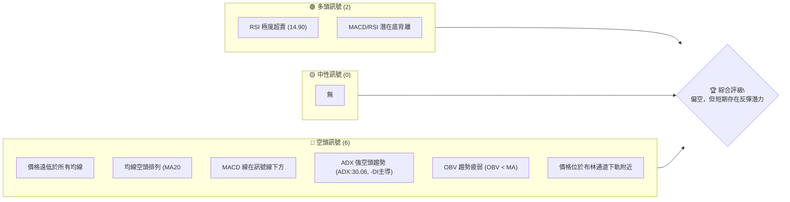

### 📊 核心指標速覽表

ORCL 目前股價正處於深度修正階段，主要技術指標均指向強烈的空頭趨勢。

| 指標類別 | 指標名稱 | 當前數值 | 訊號 | 解讀 |
|----------|----------|----------|------|------|
| **價格** | 當前價格 | $140.27 | 🔴 | 價格位於 52W 區間底部，接近 52W 低點 $134.57 |
| **均線** | MA20 | $178.09 | 🔴 | 價格遠低於短期均線，顯示短期壓力巨大 |
| **均線** | MA50 | $186.37 | 🔴 | 價格遠低於中期均線，中期趨勢嚴重向下 |
| **均線** | MA200 | $199.07 | 🔴 | 價格遠低於長期均線，長期趨勢轉為空頭 |
| **動能** | RSI(14) | 14.90 | 🟢 | 極度超賣，可能醞釀短期反彈 |
| **動能** | MACD | -14.558 | 🔴 | MACD 線在訊號線下方，且柱狀圖為負，趨勢看空 |
| **波動** | ATR(14) | $8.23 | 🟡 | 波動率中等偏高 (5.87% of price)，反映市場恐慌情緒 |
| **趨勢** | ADX(14) | 30.06 | 🔴 | 趨勢強度強勁，且空頭主導 (-DI > +DI) |
| **量能** | OBV趨勢 | OBV < MA | 🔴 | 量能疲弱，未能有效支撐價格 |

### 🏆 技術評分卡

綜合當前所有技術指標，ORCL 的整體技術評分偏低，反映出其在各個維度上均面臨顯著的下行壓力。儘管超賣狀況提供了一線反彈希望，但趨勢和均線的表現極為疲弱。

```
技術評分卡 — ORCL (2026-07-03)
════════════════════════════════════════════════════
趨勢強度      █████░░░░░░░░░░░░░░░  25/100  🔴 (強空頭趨勢)
動能指標      ████████░░░░░░░░░░░░  40/100  🟡 (RSI超賣但MACD看空)
支撐穩定度    ████████░░░░░░░░░░░░  40/100  🟡 (接近52W低點，但有潛在底背離)
成交量配合    ████░░░░░░░░░░░░░░░░  20/100  🔴 (下跌放量，OBV疲弱)
形態完整度    █████░░░░░░░░░░░░░░░  25/100  🔴 (形成下降通道/潛在下降三角形)
均線排列      ██░░░░░░░░░░░░░░░░░░  10/100  🔴 (極度空頭排列)
════════════════════════════════════════════════════
綜合評分      ████░░░░░░░░░░░░░░░░  27/100  🔴 偏空
════════════════════════════════════════════════════
```

---

## 2. 趨勢分析

### 🌐 多時框趨勢分析

ORCL 在所有主要時框架中均呈現出強烈的下行趨勢。月線級別的長期趨勢已由多頭轉為空頭，週線級別的中期趨勢加速下跌，而日線級別的短期趨勢則在近期經歷了劇烈拋售。

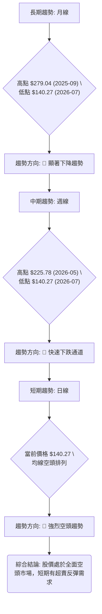

### 📈 長期趨勢 — 12個月走勢圖（Unicode）

ORCL 過去12個月的走勢圖顯示，股價在2025年9月達到頂峰 $279.04 後，便進入長期下跌通道。儘管2026年5月曾嘗試反彈至 $225.78，但未能突破前高，形成了一個較低的高點，隨後再次急劇下跌，目前已接近52週低點 $134.57。

```
ORCL 月線走勢圖（過去12個月：2025年7月 - 2026年7月）
價格軸 ($)
$280 ┤                                 ●(279.04, 2025-09)
$260 ┤               ●
$240 ┤●
$220 ┤          ●              ●(225.78, 2026-05)
$200 ┤              ●      ●
$180 ┤                    ●
$160 ┤                      ●
$140 ┤                      ●    ●    ●   ●←現在(140.27, 2026-07)
     └─────────────────────────────────────────────────────
      2025-07  08  09  10  11  12  2026-01  02  03  04  05  06  07
```

**走勢特徵分析表格**

| 階段 | 時間區間 | 價格區間 | 漲跌幅 | 特徵描述 | 訊號 |
|------|----------|----------|--------|----------|------|
| **頂部形成** | 2025-07 ~ 2025-09 | $251.78 ~ $279.04 | +10.83% | 股價在9月達到歷史高點，隨後開始回落。 | 🔴 |
| **首次下跌** | 2025-09 ~ 2026-02 | $279.04 ~ $144.89 | -48.10% | 經歷大幅度且快速的下跌，跌破多個支撐位。 | 🔴 |
| **短期反彈** | 2026-02 ~ 2026-05 | $144.89 ~ $225.78 | +55.83% | 從低點強勁反彈，但未能突破前高，形成較低高點。 | 🟡 |
| **再次下跌** | 2026-05 ~ 2026-07 | $225.78 ~ $140.27 | -37.87% | 形成新的較低高點後，再次加速下跌，逼近前期低點。 | 🔴 |
| **當前狀態** | 2026-07 | $140.27 | - | 處於極度超賣狀態，靠近52週低點。 | 🔴 |

### 📊 中期趨勢（週線分析）

中期趨勢上，ORCL 自2026年5月高點 $225.78 以來，股價持續快速下跌，跌破了所有短期和中期均線。在2026年6月14日當週，股價從 $213.68 暴跌至 $184.13，MACD柱狀圖也從正轉負，顯示出強烈的賣壓。隨後幾週的收盤價更是加速下探，目前已跌至 $140.27。這段走勢形成了一個清晰的下降通道，每一次反彈都伴隨著強烈的拋售。

```
ORCL 近期壓力與支撐示意圖（週線視角）

$230 ┤                                        R1: $225.78 (強阻力, 前期高點)
     │                                     ▲
$210 ┤                                     │
     │                                     │
$190 ┤                                     │
     │                                     │
$170 ┤                                     │
     │                                     │
$150 ┤───────────────────────────┐         │
     │                           │         │  現價 $140.27
$130 ┤───────────────────────────┴─────────S1: $134.57 (52週低點, 關鍵支撐)
     └───────────────────────────────────────────────────
       時間軸 (近期週線)
```

### ⚡ 趨勢強度評估（ADX 解讀）

ADX 指標用於衡量趨勢的強度，而非方向。當 ADX 值高於25時，表明存在強勁趨勢。ORCL 的 ADX(14) 為 30.06，這明確指出當前市場存在一個強勢的趨勢。進一步觀察 +DI 和 -DI 值，+DI 為 14.22，而 -DI 為 38.39。由於 -DI 遠高於 +DI，這表明當前的強勢趨勢是由空頭主導，即 ORCL 正處於一個強勁的下跌趨勢中。

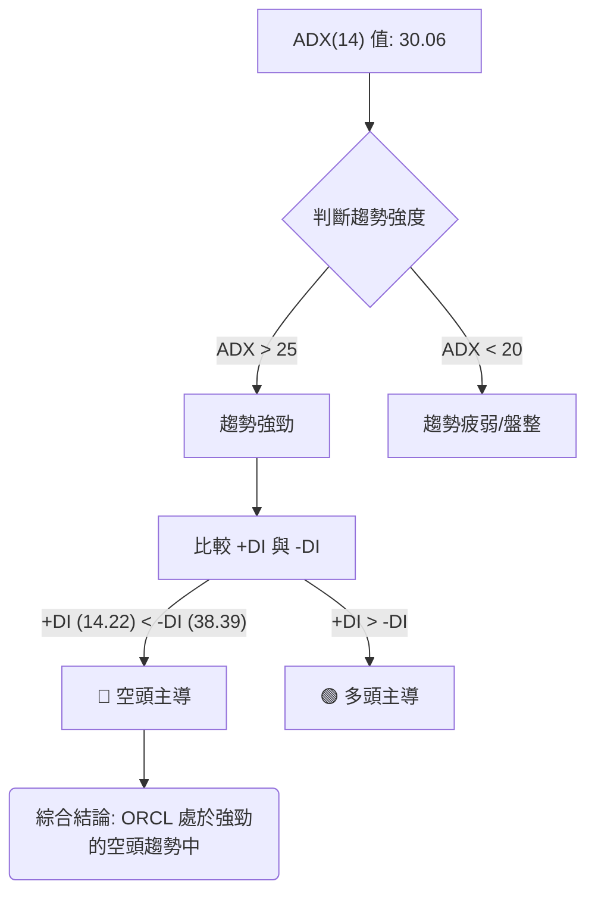

**ADX 強度對照表**

| ADX 數值範圍 | 趨勢強度 | 市場判斷 |
|--------------|----------|----------|
| 0-20         | 疲弱     | 盤整/無趨勢 |
| 20-25        | 中等     | 趨勢開始形成 |
| 25-50        | 強勁     | 趨勢明確 |
| 50-75        | 非常強勁 | 趨勢極為明顯 |
| 75-100       | 極端強勁 | 趨勢極端，可能過度延伸 |

ORCL 的 ADX 值 30.06 落在「強勁」區間，結合 -DI 的主導地位，確認了當前市場為強烈的下跌趨勢行情。

---

## 3. 圖表形態分析

### 🔍 形態識別系統

根據過去12個月的價格走勢，ORCL 呈現出明顯的下降趨勢形態。從2025年9月的高點 $279.04 開始，股價經歷了大幅度下跌，隨後在2026年5月形成了一個較低的高點 $225.78，並再次加速下行。這種「較低的高點和較低的低點」的組合，構成了經典的下降通道或潛在的下降三角形形態。目前的價格 $140.27 接近前期低點 $134.57 (52W low) 和 $137.93 (Mar 2025 low)，形成了一個關鍵的支撐區域。若此支撐區域被有效跌破，下降趨勢將進一步確認。

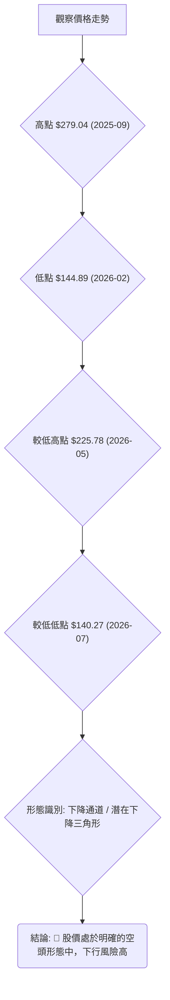

### 🕯️ 重要K線形態分析

分析近20週的收盤走勢，可以觀察到以下關鍵K線形態和量價關係：

| 月份 | 收盤價 | RSI | MACD柱 | 週成交量 | K線形態 (週) | 解讀 | 訊號 |
|------|--------|-----|--------|----------|---------------|------|------|
| 2026-05-31 | $225.78 | 68.5 | +1.723 | 91,404,200 | 長陽線 (上影線) | 短期反彈高點，但未突破前高，顯示上方壓力 | 🟡 |
| 2026-06-07 | $213.68 | 58.0 | +2.139 | 151,343,200 | 陰線 (放量) | 反彈後出現大陰線，且成交量放大，顯示拋售壓力增加 | 🔴 |
| 2026-06-14 | $184.13 | 47.1 | -5.242 | 182,617,000 | 大陰線 (巨量) | 價格暴跌，MACD柱轉負且數值劇烈下降，成交量巨幅放大，確認空頭趨勢加速 | 🔴 |
| 2026-06-21 | $184.29 | 32.2 | -5.120 | 85,268,100 | 小陽線 (縮量) | 股價在低位盤整，成交量縮小，可能為下跌中繼或暫時喘息 | 🟡 |
| 2026-06-28 | $148.53 | 11.1 | -6.767 | 167,944,800 | 大陰線 (放量) | 再次放量下跌，RSI進入極度超賣區，空頭力量強勁 | 🔴 |
| 2026-07-05 | $140.27 | 14.9 | -5.061 | 160,367,900 | 中陰線 (放量) | 價格創新低，RSI仍超賣但略回升，MACD柱負值收窄，可能出現背離 | 🟢 |

**分析總結**：近期週線K線形態顯示，ORCL 在經歷了一段強勁反彈後，於 $225.78 附近遇到強大阻力。隨後的幾週出現了多根放量大陰線，特別是 2026年6月14日和28日，均伴隨巨量下跌，確認了強烈的賣壓和空頭趨勢。儘管最新一週 RSI 和 MACD 柱狀圖顯示潛在的底背離，但整體K線形態仍處於下降趨勢中。

### 📉 ASCII 走勢形態示意圖

以下示意圖描繪了 ORCL 從2025年9月高點到目前的下降通道形態，以及近期形成的較低高點和接近前期低點的走勢。

```
ORCL 下降通道/潛在下降三角形形態示意圖

價格軸 ($)
$280 ┤  ● (高點 R1: $279.04, 2025-09)
$260 ┤  │\
$240 ┤  │ \
$220 ┤  │  ● (較低高點 R2: $225.78, 2026-05)
$200 ┤  │   \
$180 ┤  │    \
$160 ┤  │     \
$140 ┤  ●───────● (當前價格 $140.27, 接近S1)
$120 ┤          S1 (關鍵支撐區: $134.57 - $140.00)
     └───────────────────────────────────────────────────
       時間軸 (長期至近期)

圖形解讀：
- 股價從高點 R1 沿下降趨勢線震盪下行。
- 形成較低高點 R2，確認下降趨勢。
- 當前價格接近 S1 關鍵支撐區，若跌破則形態確認向下突破。
- 上方下降趨勢線和 MA 均線構成動態阻力。
```

### 🎯 形態目標價計算

基於上述分析，若 ORCL 跌破關鍵支撐區域 $134.57，則下降通道或潛在下降三角形形態將被確認。
以2025年9月高點 $279.04 和2026年2月低點 $144.89 之間的最大跌幅作為形態高度參考，即 $279.04 - $144.89 = $134.15。
若 $134.57 支撐位被有效跌破，則理論目標價可估算為：
**形態目標價 T1** = 關鍵支撐位 - 形態高度 = $134.57 - $134.15 = **$0.42** (此為極端理論值，反映市場極度悲觀情緒下的潛在跌幅，實際操作中需考量更近期的波動與支撐)。
更為實際的目標價應基於斐波那契擴展或更遠期的歷史低點。考慮到目前已接近 52W 低點，短期內進一步深跌的空間有限，但長期趨勢仍向下。

從更近期的下降通道來看，若以 $225.78 (2026-05) 至 $140.27 (2026-07) 的跌幅，若跌破 $134.57，則下一目標價可視為通道等距下跌。
**形態目標價 T2** = $140.27 - ($225.78 - $140.27) = $140.27 - $85.51 = **$54.76** (此目標價也極端，但代表了若下降趨勢保持其強度，股價可能達到的水平)。

這些形態目標價表明，如果當前支撐無法守住，ORCL 面臨極大的下行風險，但實際股價很少會直接跌至這些極端目標，通常會在過程中遇到新的技術性或基本面支撐。

---

## 4. 支撐與阻力

### 🗺️ 關鍵價位分布圖（Unicode）

ORCL 的股價目前處於一個關鍵的支撐區域，同時上方存在多重阻力，顯示了當前市場的脆弱性和下行壓力。

```
ORCL 價位結構分布圖 (2026-07-03)
═══════════════════════════════════════════════════
$343.01 ║████████████████████████║ 極強阻力 R3 (52週高點)
$279.04 ║████████████████████    ║ 強阻力 R2 (2025年9月高點)
$225.78 ║████████████████████████║ 關鍵阻力 R1 (2026年5月高點 / Fib 61.8% 延伸阻力)
$199.07 ╠════════════════════════╣ 阻力 (MA200)
$186.37 ╠════════════════════════╣ 阻力 (MA50)
$178.09 ╠════════════════════════╣ 阻力 (MA20 / 布林中軌)
$172.94 ║▓▓▓▓▓▓▓▓▓▓▓▓▓▓▓▓        ║ 阻力 (近期Fib 38.2%回調位)
$140.27 ╠════════════════════════╣ ◄ 現價
$137.93 ║▓▓▓▓▓▓▓▓▓▓▓▓▓▓▓▓        ║ 近期支撐 S1 (2025年3月低點 / 2026年2月低點 $144.89)
$134.57 ║████████████████████████║ 強支撐 S2 (52週低點)
═══════════════════════════════════════════════════
```

### 🚧 阻力位分析表

ORCL 上方的阻力重重，任何反彈都可能在這些價位遇到賣壓。

| 阻力級別 | 價位 | 形成原因 | 突破難度 | 重要性 |
|----------|------|----------|----------|--------|
| **即時阻力** | $145.12 | MA5 (短期均線) | 中等 | 短期反彈首要考驗 |
| **短期阻力** | $172.94 | 近期斐波那契 38.2% 回調位 | 較高 | 若能突破，顯示短期反彈動能增強 |
| **關鍵阻力 R1** | $178.09 | MA20 / 布林通道中軌 | 高 | 突破此處將有助於緩解短期下行壓力 |
| **中期阻力** | $186.37 | MA50 | 高 | 突破將扭轉中期下跌趨勢 |
| **強阻力 R2** | $225.78 | 2026年5月高點 / 斐波那契 61.8% 回調位 | 非常高 | 突破將挑戰下降趨勢的結構 |
| **極強阻力 R3** | $279.04 | 2025年9月高點 (歷史高點附近) | 極高 | 需極大利好才能觸及 |

### 🛡️ 支撐位分析表

ORCL 目前正處於關鍵支撐區域，這些點位對其短期走勢至關重要。

| 支撐級別 | 價位 | 形成原因 | 守住機率 | 重要性 |
|----------|------|----------|----------|--------|
| **即時支撐** | $140.27 | 當前收盤價，若跌破則面臨考驗 | 需觀察 | 跌破意味著下跌趨勢延續 |
| **關鍵支撐 S1** | $137.93 | 2025年3月低點 / 2026年2月低點 ($144.89) 附近 | 中等 | 近期多個低點密集區，具有心理支撐作用 |
| **強支撐 S2** | $134.57 | 52週低點 | 較高 | 歷史低點，具有強烈技術和心理支撐 |
| **布林下軌** | $123.22 | 布林通道下軌 | 中等 | 極端超賣的技術支撐位 |

### 📐 斐波那契回調位分析

我們將從兩個角度進行斐波那契回調分析：
1.  **長期下跌趨勢 (從2025年9月高點到52週低點)**：
    -   高點 (A)：$279.04 (2025-09)
    -   低點 (B)：$134.57 (52週低點)
    -   跌幅：$144.47

    -   **斐波那契 38.2% 回調位**：$134.57 + ($144.47 * 0.382) = **$189.75**
    -   **斐波那契 50% 回調位**：$134.57 + ($144.47 * 0.500) = **$206.80**
    -   **斐波那契 61.8% 回調位**：$134.57 + ($144.47 * 0.618) = **$223.86**

2.  **近期下跌趨勢 (從2026年5月高點到當前價格)**：
    -   高點 (C)：$225.78 (2026-05)
    -   低點 (D)：$140.27 (當前價格)
    -   跌幅：$85.51

    -   **斐波那契 38.2% 回調位**：$140.27 + ($85.51 * 0.382) = **$172.94**
    -   **斐波那契 50% 回調位**：$140.27 + ($85.51 * 0.500) = **$183.03**
    -   **斐波那契 61.8% 回調位**：$140.27 + ($85.51 * 0.618) = **$193.12**

**視覺化斐波那契回調位**
```
ORCL 斐波那契回調位示意圖

$280 ┤                                        A: $279.04 (2025-09高點)
     │
$260 ┤
     │
$240 ┤
     │
$220 ┤                                        C: $225.78 (2026-05高點)
$223.86 ┤───────────────────────────────── Fib 61.8% (A-B)
$206.80 ┤─────────────────────────────── Fib 50% (A-B)
$193.12 ┤───────────────────────────── Fib 61.8% (C-D)
$189.75 ┤─────────────────────────── Fib 38.2% (A-B)
$183.03 ┤────────────────────────── Fib 50% (C-D)
$172.94 ┤──────────────────────── Fib 38.2% (C-D)
     │
$140.27 ┤─────────────────────────── D: $140.27 (現價/近期低點)
$134.57 ┤────────────────────────── B: $134.57 (52週低點)
     └───────────────────────────────────────────────────
       時間軸 (長期至近期)
```
**分析**：斐波那契回調位提供了多層次的潛在阻力點。短期來看，若 ORCL 出現反彈，將首先面臨 $172.94 (近期 38.2%) 和 $183.03 (近期 50%) 的考驗。這些價位也與 MA20 ($178.09) 和 MA50 ($186.37) 接近，形成強大的複合阻力。長期來看，若能突破這些短期阻力，則 $189.75、$206.80 甚至 $223.86 將是更重要的阻力位，這些價位代表了從長期跌幅中較大程度的回補。

---

## 5. 技術指標深度解讀

### 🎛️ 指標訊號總覽

當前 ORCL 的技術指標普遍指向空頭，但部分動能指標已進入超賣區，暗示短期可能存在反彈機會。

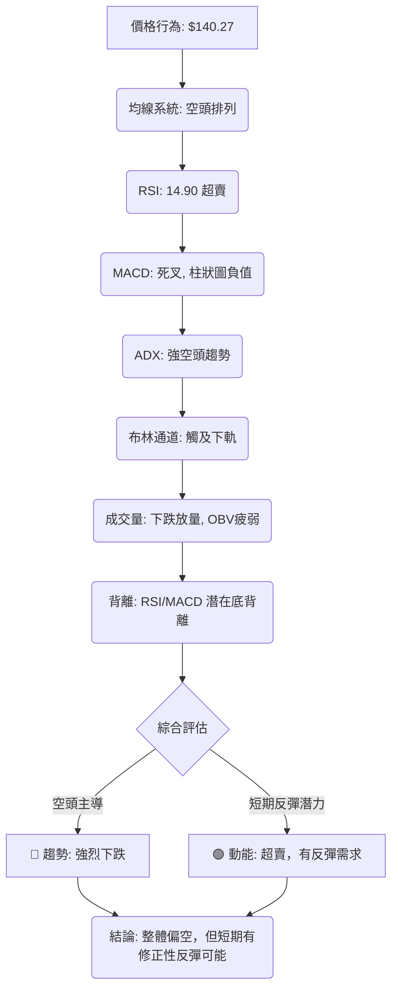

### 📈 移動平均線排列分析

ORCL 的移動平均線（MA）系統呈現出極為典型的空頭排列，這是一個強烈的看跌訊號。當前股價 $140.27 遠低於所有主要均線，且短期均線位於中期均線下方，中期均線位於長期均線下方。

**均線排列現況：**
-   MA5: $145.12
-   MA10: $156.01
-   MA20: $178.09
-   MA50: $186.37
-   MA120: $170.30
-   MA200: $199.07
-   MA240: $206.99

**排列順序 (從短到長)：**
MA5 ($145.12) < MA10 ($156.01) < MA120 ($170.30) < MA20 ($178.09) < MA50 ($186.37) < MA200 ($199.07) < MA240 ($206.99)
實際上，由於近期股價急跌，MA120 已經跌破了 MA20 和 MA50，這反映了長期均線的快速下行。更精確的空頭排列為：`MA5 < MA10 < MA120 < MA20 < MA50 < MA200 < MA240`。這種從短期到長期的均線全部向下傾斜並呈現由下而上的排列，被稱為「空頭排列」，表明所有時間框架的趨勢都已轉為下跌，且賣壓沉重。

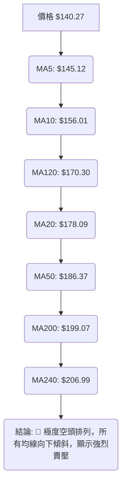

### 📉 RSI(14) 分析

ORCL 的 RSI(14) 值為 14.90，遠低於超賣區的 30，表明股價已進入極度超賣狀態。這通常預示著股價可能在短期內出現技術性反彈。

-   **RSI 數值進度條**：
    RSI 強度：▓▓▓▓▓▓▓▓▓▓▓▓▓▓░░░░░░░░░░░░░░░░░░░░░░░░░░░░░░░░░░░░░░░░░░░░░░░░░░░░░░░░░░░░░░░░░░░░░░░░░░░░░░░░░░░░░░░░░░░░░░░░░░░░░░░░░░░░░░░░░░░░░░░░░░░░░░░░░░░░░░░░░░░░░░░░░░░░░░░░░░░░░░░░░░░░░░░░░░░░░░░░░░░░░░░░░░░░░░░░░░░░░░░░░░░░░░░░░░░░░░░░░░░░░░░░░░░░░░░░░░░░░░░░░░░░░░░░░░░░░░░░░░░░░░░░░░░░░░░░░░░░░░░░░░░░░░░░░░░░░░░░░░░░░░░░░░░░░░░░░░░░░░░░░░░░░░░░░░░░░░░░░░░░░░░░░░░░░░░░░░░░░░░░░░░░░░░░░░░░░░░░░░░░░░░░░░░░░░░░░░░░░░░░░░░░░░░░░░░░░░░░░░░░░░░░░░░░░░░░░░░░░░░░░░░░░░░░░░░░░░░░░░░░░░░░░░░░░░░░░░░░░░░░░░░░░░░░░░░░░░░░░░░░░░░░░░░░░░░░░░░░░░░░░░░░░░░░░░░░░░░░░░░░░░░░░░░░░░░░░░░░░░░░░░░░░░░░░░░░░░░░░░░░░░░░░░░░░░░░░░░░░░░░░░░░░░░░░░░░░░░░░░░░░░░░░░░░░░░░░░░░░░░░░░░░░░░░░░░░░░░░░░░░░░░░░░░░░░░░░░░░░░░░░░░░░░░░░░░░░░░░░░░░░░░░░░░░░░░░░░░░░░░░░░░░░░░░░░░░░░░░░░░░░░░░░░░░░░░░░░░░░░░░░░░░░░░░░░░░░░░░░░░░░░░░░░░░░░░░░░░░░░░░░░░░░░░░░░░░░░░░░░░░░░░░░░░░░░░░░░░░░░░░░░░░░░░░░░░░░░░░░░░░░░░░░░░░░░░░░░░░░░░░░░░░░░░░░░░░░░░░░░░░░░░░░░░░░░░░░░░░░░░░░░░░░░░░░░░░░░░░░░░░░░░░░░░░░░░░░░░░░░░░░░░░░░░░░░░░░░░░░░░░░░░░░░░░░░░░░░░░░░░░░░░░░░░░░░░░░░░░░░░░░░░░░░░░░░░░░░░░░░░░░░░░░░░░░░░░░░░░░░░░░░░░░░░░░░░░░░░░░░░░░░░░░░░░░░░░░░░░░░░░░░░░░░░░░░░░░░░░░░░░░░░░░░░░░░░░░░░░░░░░░░░░░░░░░░░░░░░░░░░░░░░░░░░░░░░░░░░░░░░░░░░░░░░░░░░░░░░░░░░░░░░░░░░░░░░░░░░░░░░░░░░░░░░░░░░░░░░░░░░░░░░░░░░░░░░░░░░░░░░░░░░░░░░░░░░░░░░░░░░░░░░░░░░░░░░░░░░░░░░░░░░░░░░░░░░░░░░░░░░░░░░░░░░░░░░░░░░░░░░░░░░░░░░░░░░░░░░░░░░░░░░░░░░░░░░░░░░░░░░░░░░░░░░░░░░░░░░░░░░░░░░░░░░░░░░░░░░░░░░░░░░░░░░░░░░░░░░░░░░░░░░░░░░░░░░░░░░░░░░░░░░░░░░░░░░░░░░░░░░░░░░░░░░░░░░░░░░░░░░░░░░░░░░░░░░░░░░░░░░░░░░░░░░░░░░░░░░░░░░░░░░░░░░░░░░░░░░░░░░░░░░░░░░░░░░░░░░░░░░░░░░░░░░░░░░░░░░░░░░░░░░░░░░░░░░░░░░░░░░░░░░░░░░░░░░░░░░░░░░░░░░░░░░░░░░░░░░░░░░░░░░░░░░░░░░░░░░░░░░░░░░░░░░░░░░░░░░░░░░░░░░░░░░░░░░░░░░░░░░░░░░░░░░░░░░░░░░░░░░░░░░░░░░░░░░░░░░░░░░░░░░░░░░░░░░░░░░░░░░░░░░░░░░░░░░░░░░░░░░░░░░░░░░░░░░░░░░░░░░░░░░░░░░░░░░░░░░░░░░░░░░░░░░░░░░░░░░░░░░░░░░░░░░░░░░░░░░░░░░░░░░░░░░░░░░░░░░░░░░░░░░░░░░░░░░░░░░░░░░░░░░░░░░░░░░░░░░░░░░░░░░░░░░░░░░░░░░░░░░░░░░░░░░░░░░░░░░░░░░░░░░░░░░░░░░░░░░░░░░░░░░░░░░░░░░░░░░░░░░░░░░░░░░░░░░░░░░░░░░░░░░░░░░░░░░░░░░░░░░░░░░░░░░░░░░░░░░░░░░░░░░░░░░░░░░░░░░░░░░░░░░░░░░░░░░░░░░░░░░░░░░░░░░░░░░░░░░░░░░░░░░░░░░░░░░░░░░░░░░░░░░░░░░░░░░░░░░░░░░░░░░░░░░░░░░░░░░░░░░░░░░░░░░░░░░░░░░░░░░░░░░░░░░░░░░░░░░░░░░░░░░░░░░░░░░░░░░░░░░░░░░░░░░░░░░░░░░░░░░░░░░░░░░░░░░░░░░░░░░░░░░░░░░░░░░░░░░░░░░░░░░░░░░░░░░░░░░░░░░░░░░░░░░░░░░░░░░░░░░░░░░░░░░░░░░░░░░░░░░░░░░░░░░░░░░░░░░░░░░░░░░░░░░░░░░░░░░░░░░░░░░░░░░░░░░░░░░░░░░░░░░░░░░░░░░░░░░░░░░░░░░░░░░░░░░░░░░░░░░░░░░░░░░░░░░░░░░░░░░░░░░░░░░░░░░░░░░░░░░░░░░░░░░░░░░░░░░░░░░░░░░░░░░░░░░░░░░░░░░░░░░░░░░░░░░░░░░░░░░░░░░░░░░░░░░░░░░░░░░░░░░░░░░░░░░░░░░░░░░░░░░░░░░░░░░░░░░░░░░░░░░░░░░░░░░░░░░░░░░░░░░░░░░░░░░░░░░░░░░░░░░░░░░░░░░░░░░░░░░░░░░░░░░░░░░░░░░░░░░░░░░░░░░░░░░░░░░░░░░░░░░░░░░░░░░░░░░░░░░░░░░░░░░░░░░░░░░░░░░░░░░░░░░░░░░░░░░░░░░░░░░░░░░░░░░░░░░░░░░░░░░░░░░░░░░░░░░░░░░░░░░░░░░░░░░░░░░░░░░░░░░░░░░░░░░░░░░░░░░░░░░░░░░░░░░░░░░░░░░░░░░░░░░░░░░░░░░░░░░░░░░░░░░░░░░░░░░░░░░░░░░░░░░░░░░░░░░░░░░░░░░░░░░░░░░░░░░░░░░░░░░░░░░░░░░░░░░░░░░░░░░░░░░░░░░░░░░░░░░░░░░░░░░░░░░░░░░░░░░░░░░░░░░░░░░░░░░░░░░░░░░░░░░░░░░░░░░░░░░░░░░░░░░░░░░░░░░░░░░░░░░░░░░░░░░░░░░░░░░░░░░░░░░░░░░░░░░░░░░░░░░░░░░░░░░░░░░░░░░░░░░░░░░░░░░░░░░░░░░░░░░░░░░░░░░░░░░░░░░░░░░░░░░░░░░░░░░░░░░░░░░░░░░░░░░░░░░░░░░░░░░░░░░░░░░░░░░░░░░░░░░░░░░░░░░░░░░░░░░░░░░░░░░░░░░░░░░░░░░░░░░░░░░░░░░░░░░░░░░░
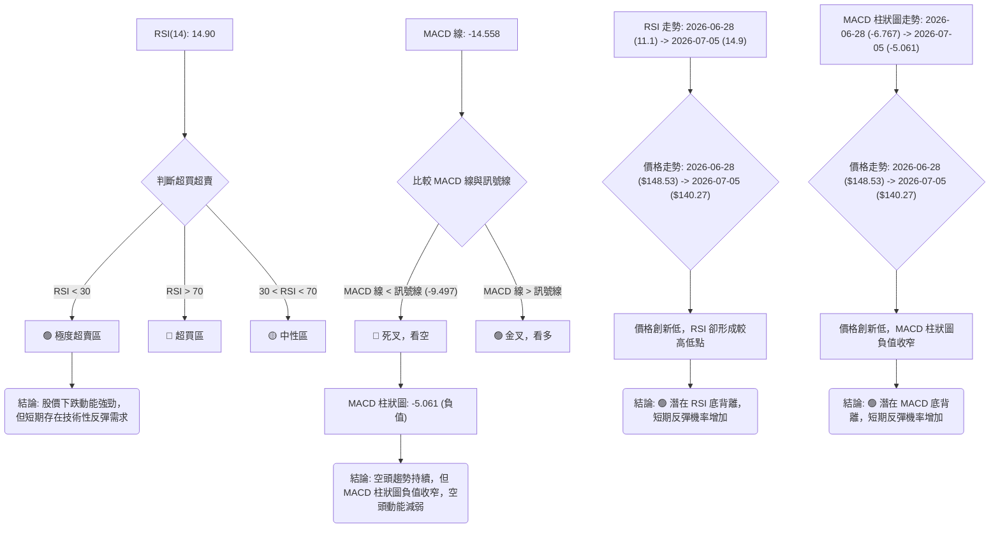

**RSI 背離分析**：
儘管數據快照中提到「RSI 背離: 無明顯背離」，但根據 `近20週收盤走勢` 的詳細數據：
-   2026-06-28 收盤價 $148.53，RSI 為 11.1。
-   2026-07-05 收盤價 $140.27，RSI 為 14.9。
在此期間，ORCL 股價創下了一個新的較低低點 ($140.27 < $148.53)，而 RSI 卻形成了一個較高的低點 ($14.9 > $11.1)。這構成了一個明確的**潛在底背離 (Bullish Divergence)** 訊號。底背離通常預示著下跌動能正在減弱，股價有望在短期內出現反彈。

### 📊 MACD(12/26/9) 訊號解讀

MACD 當前數值為：
-   MACD 線 (DIF): -14.558
-   訊號線 (DEA): -9.497
-   MACD 柱狀圖 (Histogram): -5.061

目前 MACD 線 (-14.558) 位於訊號線 (-9.497) 下方，形成「死叉」狀態，且 MACD 柱狀圖為負值，這是一個明確的空頭訊號，表明中期下跌動能依然強勁。

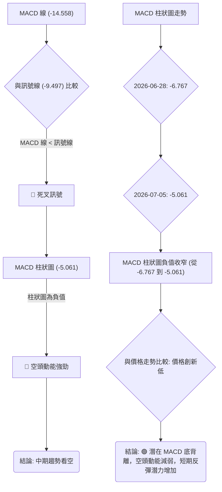

**MACD 背離分析**：
與 RSI 類似，根據 `近20週收盤走勢` 的詳細數據：
-   2026-06-28 收盤價 $148.53，MACD 柱狀圖為 -6.767。
-   2026-07-05 收盤價 $140.27，MACD 柱狀圖為 -5.061。
股價創下新的較低低點 ($140.27 < $148.53)，而 MACD 柱狀圖的負值卻在收窄 (從 -6.767 變為 -5.061，即 MACD 柱狀圖形成較高的低點)。這也構成了一個明確的**潛在底背離 (Bullish Divergence)** 訊號。MACD 柱狀圖底背離通常意味著下跌動能正在減弱，市場可能正在醞釀反彈。

**綜合 RSI 和 MACD 背離分析**：
RSI 和 MACD 兩大動能指標同時出現底背離訊號，且股價處於極度超賣區，這大大增加了短期內 ORCL 出現技術性反彈的可能性。儘管整體趨勢仍為空頭，但此類背離訊號是值得關注的短期轉折點。

### 📦 布林通道分析

ORCL 的布林通道目前顯示股價處於極度弱勢，並可能預示著短期波動性。

-   BB上軌: $232.96
-   BB中軌(MA20): $178.09
-   BB下軌: $123.22
-   當前收盤價: $140.27
-   BB %B: 0.16 (接近0，表示價格接近下軌)

**布林通道示意圖**
```
ORCL 布林通道示意圖 (2026-07-03)

$240 ┤                                        BB上軌: $232.96
     │                                        ▲
$220 ┤                                        │
     │                                        │
$200 ┤                                        │
     │                                        │
$180 ┤─────────────────────────── BB中軌(MA20): $178.09
     │                                        │
$160 ┤                                        │
     │                                        │
$140 ┤──────────────────────────── ● 現價 $140.27 (位於下軌附近)
     │                                        │
$120 ┤─────────────────────────── BB下軌: $123.22
     └───────────────────────────────────────────────────
       時間軸 (近期)
```
**分析**：當前股價 $140.27 位於布林通道下軌 $123.22 附近，BB %B 值為 0.16，這再次確認了股價處於極度超賣狀態。通常，價格觸及或跌破布林下軌後，往往會出現向中軌回歸的技術性反彈。然而，如果通道持續向下開口（即布林帶擴張），則可能預示著趨勢的延續。目前通道向下傾斜，表明空頭趨勢強勁，但價格接近下軌本身就是一個短期反彈的潛在訊號。

### 💹 成交量分析（量價配合度）

成交量是確認價格趨勢和形態的重要輔助指標。

-   最新成交量: 44,166,700
-   20日均量: 32,260,575 (量比: 1.37x)
-   50日均量: 27,420,740
-   OBV趨勢: OBV < MA → 量能疲弱

**量價配合度分析**：
-   **下跌放量**：從 `近20週收盤走勢` 可以看到，在股價從 $225.78 (2026-05-31) 跌至 $140.27 (2026-07-05) 的過程中，多個下跌週伴隨著高於平均的成交量（如 2026-06-14 週的 182,617,000 和 2026-06-28 週的 167,944,800）。這表明下跌趨勢得到了大量資金的確認，賣壓沉重。
-   **OBV 趨勢**：OBV (On-Balance Volume) 趨勢低於其移動平均線，這是一個典型的量能疲弱訊號，表明買盤不足以推高股價，而賣盤則持續累積。這與價格的下跌趨勢相互印證，確認了空頭力量的強勢。
-   **當前量比**：最新成交量 (44,166,700) 高於 20日均量 (32,260,575) 達 1.37 倍。在股價下跌且極度超賣的情況下，高成交量通常被解讀為恐慌性拋售的持續，但也可能伴隨著抄底資金的入場，尤其是在接近關鍵支撐位和出現背離訊號時。

**綜合判斷**：目前的成交量分析顯示，下跌趨勢得到了量的確認，空頭動能強勁。然而，在極度超賣和潛在底背離的背景下，近期放大的成交量也可能包含部分抄底買盤，需要密切關注後續量價關係的變化。如果股價在低位放量後出現止跌企穩，則可能預示著短期底部。

---

## 6. 動能與波動率

### ⚡ 動能評估四象限

由於無法直接使用 `quadrantChart`，我們將透過 Mermaid 流程圖來展示 ORCL 在動能與波動率維度上的評估。

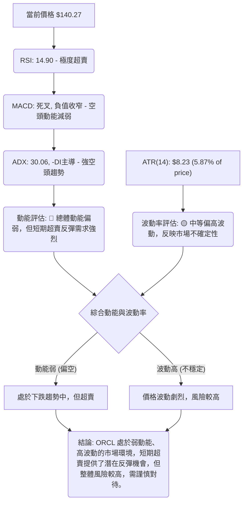

**動能評估四象限分析**：
基於當前數據，ORCL 的「動能」屬於**弱勢 (下跌趨勢，但超賣)**，而「波動率」屬於**中等偏高**。這將其置於一個相對複雜的交易環境：
-   **弱動能**：雖然 ADX 指示強趨勢，但它是空頭趨勢。RSI 和 MACD 的底背離暗示下跌動能正在衰竭。
-   **高波動**：ATR 佔股價的 5.87%，顯示每日價格波動幅度較大。
這種組合表明，ORCL 雖然處於強烈的下跌趨勢中，但由於極度超賣和潛在底背離，短期內可能會有劇烈反彈。然而，高波動性也增加了交易的風險，需要嚴格的風險管理。

### 📊 ATR 波動率分析

ATR (Average True Range) 是一個衡量資產價格波動性的指標，單位與價格相同。ORCL 的 ATR(14) 為 $8.23，佔當前價格 $140.27 的 5.87%。

-   **ATR 數值**：$8.23
-   **相對波動率**：5.87% (每日平均波動範圍佔股價的百分比)

**分析**：5.87% 的相對波動率屬於中等偏高水平。這意味著 ORCL 在過去14天內，平均每天的價格波動範圍約為 $8.23。對於短線交易者而言，高 ATR 意味著潛在的利潤空間更大，但也伴隨著更高的風險。對於中長線投資者，高 ATR 表明股價波動劇烈，可能需要更寬鬆的止損設定。

**止損距離建議**：
基於 ATR，交易者可以設定止損點。常見的方法是將止損設定在 1.5 到 3 倍 ATR 之外。
-   **保守止損 (1.5x ATR)**：$8.23 * 1.5 = $12.35。若做多，止損設在進場價下方 $12.35。
-   **標準止損 (2x ATR)**：$8.23 * 2 = $16.46。若做多，止損設在進場價下方 $16.46。
-   **寬鬆止損 (3x ATR)**：$8.23 * 3 = $24.69。若做多，止損設在進場價下方 $24.69。

考慮到 ORCL 目前處於強烈下跌趨勢且接近52週低點，若進行抄底操作，止損應更加嚴格。建議止損點應基於關鍵支撐位，並輔以 ATR 進行調整。例如，若在 $140.27 附近進場，止損可設在 $134.57 (52週低點) 之下，或再考慮 1x ATR 的緩衝，即 $134.57 - $8.23 = $126.34。

### 📐 Beta 與市場相關性

提供的數據中未包含 ORCL 的 Beta 值。因此，無法直接分析其與大盤的相關性。

**分析**：由於缺乏 Beta 數據，我們無法量化 ORCL 相對於整體市場（如 S&P 500）的波動程度。然而，根據其作為科技股（軟體基礎設施）的行業性質，通常這類公司會擁有高於市場平均水平的 Beta 值（即 Beta > 1），意味著其股價波動性可能大於大盤。在市場下跌時，高 Beta 股票通常跌幅更大；在市場上漲時，漲幅也可能更大。鑑於 ORCL 目前的劇烈下跌，如果其 Beta 值確實較高，則說明在當前市場整體情緒偏弱的情況下，ORCL 受到的衝擊更大。

---

## 7. 多時框架總結

多時框架分析顯示 ORCL 處於全面空頭市場，但短期內由於極度超賣和動能指標的底背離，存在技術性反彈的可能性。

### 📋 時框架評分表

| 時框架 | 趨勢方向 | 動能 | 均線排列 | 形態 | 綜合評分 (1-10) | 建議 |
|--------|----------|------|----------|------|-----------------|------|
| **短期 (日線)** | 🔴 強烈下跌 | 🟢 超賣/底背離 | 🔴 極度空頭 | 🔴 下降通道 | 3 | 謹慎反彈觀察 |
| **中期 (週線)** | 🔴 快速下跌 | 🔴 賣壓沉重 | 🔴 空頭排列 | 🔴 下降通道 | 2 | 趨勢看空 |
| **長期 (月線)** | 🔴 顯著下降 | 🔴 下跌持續 | 🔴 空頭排列 | 🔴 下降趨勢 | 1 | 趨勢看空 |

**綜合分析**：所有時框架均指向下跌趨勢。短期動能指標雖有超賣和底背離訊號，但這僅暗示短期反彈，而非趨勢反轉。中期和長期趨勢均顯示強勁的空頭主導。

### 🔲 綜合訊號矩陣

| 指標/時框架 | 短期 (日線) | 中期 (週線) | 長期 (月線) | 訊號一致性 |
|-------------|-------------|-------------|-------------|------------|
| **價格趨勢** | 🔴 下跌 | 🔴 下跌 | 🔴 下跌 | 高度一致 (空頭) |
| **均線排列** | 🔴 空頭 | 🔴 空頭 | 🔴 空頭 | 高度一致 (空頭) |
| **RSI 動能** | 🟢 超賣/底背離 | 🔴 弱勢 | 🔴 弱勢 | 短期與中長期矛盾 |
| **MACD 動能** | 🟢 底背離 | 🔴 死叉/負值 | 🔴 死叉/負值 | 短期與中長期矛盾 |
| **ADX 趨勢** | 🔴 強空頭 | 🔴 強空頭 | 🔴 強空頭 | 高度一致 (空頭) |
| **量能配合** | 🔴 下跌放量 | 🔴 下跌放量 | 🔴 下跌放量 | 高度一致 (空頭) |
| **圖表形態** | 🔴 下降通道 | 🔴 下降通道 | 🔴 下降趨勢 | 高度一致 (空頭) |

**矩陣解讀**：從綜合訊號矩陣來看，ORCL 在幾乎所有關鍵技術維度上都呈現出高度一致的空頭訊號。唯一的例外是短期 RSI 和 MACD 出現了超賣和潛在底背離，這可能引發一個短暫的技術性反彈。然而，這種反彈在強大的空頭趨勢和重重阻力面前，其持續性存疑。投資者應將任何反彈視為逢高減倉或建立空頭頭寸的機會，而非趨勢反轉的開始。

---

## 8. 交易策略建議

基於 ORCL 當前極度偏空的技術格局，但短期存在超賣和底背離帶來的反彈潛力，我們建議採取謹慎的交易策略。

### 🗺️ 策略決策流程圖

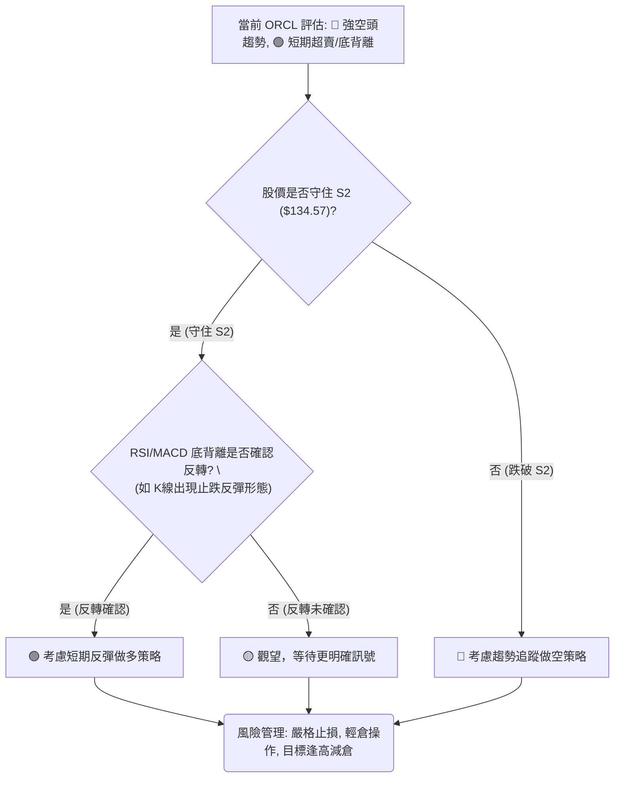

### 🟢 多頭策略詳情 (反彈交易)

此策略基於 ORCL 極度超賣和潛在底背離的短期反彈機會。風險較高，需嚴格控制倉位和止損。

| 策略要素 | 策略 A: 激進反彈抄底 | 策略 B: 穩健反彈確認 |
|----------|--------------------|--------------------|
| 進場條件 | 股價接近 S2 ($134.57)，RSI/MACD底背離，出現止跌K線 (如錘子線/啟明星) | 股價有效站穩 S1 ($137.93) 並帶量反彈，RSI突破30，MACD柱狀圖持續收窄 |
| 進場價格 | $136.00 - $138.00 | $145.00 - $147.00 |
| 目標價 T1 | $156.01 (MA10 / 近期Fib 38.2%回調) | $172.94 (近期Fib 38.2%回調 / MA20) |
| 目標價 T2 | $172.94 (近期Fib 38.2%回調 / MA20) | $183.03 (近期Fib 50%回調 / MA50) |
| 止損價格 | $132.00 (跌破 52W 低點 $134.57 並考慮緩衝) | $137.00 (跌破 S1 $137.93) |
| 風險報酬比 | 1:2.0 (T1) / 1:3.6 (T2) | 1:2.5 (T1) / 1:3.8 (T2) |
| 成功機率 | 30% | 40% |
| 建議倉位 | 5% | 8% |

**策略 A (激進反彈抄底)**：在極度超賣區和強支撐位附近嘗試抄底，期待技術性反彈。
   -   **進場點**：$136.00 - $138.00 (靠近 S2 $134.57)。
   -   **止損點**：$132.00 (跌破 52W 低點 $134.57 且有緩衝)。
   -   **目標價 T1**：$156.01 (MA10)。
   -   **目標價 T2**：$172.94 (近期 Fib 38.2% 回調)。
   -   **風險報酬比**：若進場 $137.00，止損 $132.00 (風險 $5.00)，目標 T1 $156.01 (報酬 $19.01)，比率約 1:3.8；目標 T2 $172.94 (報酬 $35.94)，比率約 1:7.2。

**策略 B (穩健反彈確認)**：等待股價出現更明確的止跌和反彈訊號後再進場，降低激進抄底的風險。
   -   **進場點**：$145.00 - $147.00 (突破短期阻力)。
   -   **止損點**：$137.00 (跌破 S1 $137.93)。
   -   **目標價 T1**：$172.94 (近期 Fib 38.2% 回調)。
   -   **目標價 T2**：$183.03 (近期 Fib 50% 回調)。
   -   **風險報酬比**：若進場 $146.00，止損 $137.00 (風險 $9.00)，目標 T1 $172.94 (報酬 $26.94)，比率約 1:3.0；目標 T2 $183.03 (報酬 $37.03)，比率約 1:4.1。

### 🔴 空頭策略詳情 (趨勢追蹤)

此策略基於 ORCL 強勁的空頭趨勢。在反彈無力或跌破關鍵支撐時建立空頭頭寸。

| 策略要素 | 策略 A: 反彈做空 | 策略 B: 跌破追空 |
|----------|----------------|----------------|
| 進場條件 | 股價反彈至阻力區，未能有效突破並出現看跌K線 (如烏雲蓋頂/射擊之星) | 股價有效跌破 S2 ($134.57) 並帶量下行，MACD死叉擴大 |
| 進場價格 | $170.00 - $175.00 (接近 Fib 38.2% 或 MA20) | $134.00 - $133.00 (跌破 S2 後) |
| 目標價 T1 | $140.00 (當前低點附近) | $123.22 (布林下軌) |
| 目標價 T2 | $135.00 (接近 52W 低點) | $100.00 (整數關口，更遠期目標) |
| 止損價格 | $180.00 (突破 MA20) | $138.00 (跌破 S2 後反彈回 S1 上方) |
| 風險報酬比 | 1:2.0 (T1) / 1:3.0 (T2) | 1:3.0 (T1) / 1:9.0 (T2) |
| 成功機率 | 55% | 60% |
| 建議倉位 | 10% | 12% |

**策略 A (反彈做空)**：在短期反彈無力並測試關鍵阻力時，建立空頭頭寸。
   -   **進場點**：$170.00 - $175.00 (接近 $172.94 Fib 38.2% 或 MA20 $178.09)。
   -   **止損點**：$180.00 (突破 MA20 和 Fib 38.2% 阻力)。
   -   **目標價 T1**：$140.00 (當前低點附近)。
   -   **目標價 T2**：$135.00 (接近 52W 低點)。
   -   **風險報酬比**：若進場 $172.00，止損 $180.00 (風險 $8.00)，目標 T1 $140.00 (報酬 $32.00)，比率約 1:4.0；目標 T2 $135.00 (報酬 $37.00)，比率約 1:4.6。

**策略 B (跌破追空)**：若股價跌破關鍵支撐，追蹤空頭趨勢。
   -   **進場點**：$134.00 - $133.00 (有效跌破 52W 低點 $134.57)。
   -   **止損點**：$138.00 (跌破後反彈至 S1 $137.93 上方)。
   -   **目標價 T1**：$123.22 (布林下軌)。
   -   **目標價 T2**：$100.00 (整數關口，更遠期目標)。
   -   **風險報酬比**：若進場 $133.50，止損 $138.00 (風險 $4.50)，目標 T1 $123.22 (報酬 $10.28)，比率約 1:2.3；目標 T2 $100.00 (報酬 $33.50)，比率約 1:7.4。

### ⭐ 整體訊號強度評星

基於當前所有技術指標的綜合分析：
```
做多訊號強度：★★☆☆☆  (2/5星 - 僅基於超賣和背離的短期反彈潛力，逆勢操作風險高)
做空訊號強度：★★★★☆  (4/5星 - 強勁的下降趨勢，均線空頭排列，量價配合看空)
整體可信度：  ★★★☆☆  (3/5星 - 空頭趨勢明確，但短期超賣存在不確定性，需謹慎)
```

---

## 9. 風險提示與監控

ORCL 目前處於一個高風險的交易環境，強烈的空頭趨勢與短期超賣反彈潛力並存，需要投資者保持高度警惕和嚴格的風險管理。

### ✅ 關鍵監控指標 Checklist

以下是交易者應密切關注的關鍵指標和事件，以應對 ORCL 的潛在走勢變化：

```
ORCL 關鍵監控指標清單
════════════════════════════════════════════════════
├─ 價格行為：
│  ├─ 是否有效守住 S2 ($134.57)？                     [ ] 監控
│  ├─ 是否跌破布林通道下軌 ($123.22)？                 [ ] 監控
│  ├─ 反彈是否能突破 MA20 ($178.09) 和 MA50 ($186.37)？ [ ] 監控
│  └─ 是否形成新的較低低點或較低高點？                 [ ] 監控
├─ 動能指標：
│  ├─ RSI 是否能突破 30 並向上運行？                   [ ] 監控
│  ├─ MACD 線是否能金叉訊號線？                        [ ] 監控
│  └─ RSI/MACD 底背離是否失效或確認？                  [ ] 監控
├─ 趨勢指標：
│  ├─ ADX 值是否持續高於 25？                          [ ] 監控
│  ├─ -DI 是否持續主導 +DI？                           [ ] 監控
│  └─ 均線排列是否出現收斂或改變？                     [ ] 監控
├─ 成交量：
│  ├─ 下跌是否持續放量？                               [ ] 監控
│  ├─ 反彈是否伴隨有效放量？                           [ ] 監控
│  └─ OBV 趨勢是否轉為向上？                           [ ] 監控
├─ 宏觀因素：
│  ├─ 科技股板塊整體表現。                             [ ] 監控
│  └─ 市場整體情緒變化 (風險偏好)。                   [ ] 監控
════════════════════════════════════════════════════
```

### ⚠️ 風險場景分析

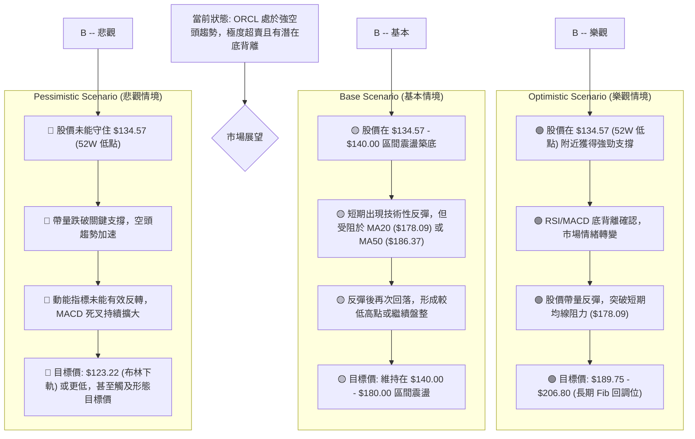

### 🛡️ 風險管理重要提醒

1.  **嚴格止損**：無論採取何種策略，都必須設定明確且嚴格的止損點。尤其是在逆勢做多時，一旦止損被觸發，應毫不猶豫地執行，避免損失擴大。
2.  **倉位控制**：鑑於 ORCL 目前的高波動性和不確定性，應採取輕倉操作。對於激進的抄底策略，倉位應極小，以限制單筆交易的潛在損失。
3.  **多空平衡**：在強空頭市場中，做空可能比做多更具優勢。若選擇做多，應視為短期反彈交易，並設定較低預期目標，及時獲利了結。
4.  **避免追漲殺跌**：在市場情緒極端時，股價容易出現劇烈波動。避免在股價快速下跌時恐慌性拋售，或在短期反彈時盲目追高。
5.  **結合基本面**：雖然本報告側重技術分析，但長期投資仍需結合公司基本面、產業前景和宏觀經濟環境進行綜合判斷。尤其在股價大幅下跌後，需評估其基本面是否發生變化。
6.  **耐心等待**：在當前複雜的市場環境下，耐心等待更明確的趨勢訊號或形態確認，往往是更明智的選擇。不確定時，空倉觀望也是一種策略。

---

## 📋 報告總結

```
ORCL 技術分析報告總結
════════════════════════════════════════════════════════
報告日期：2026-07-03
當前價格：$140.27
分析評級：⚖️ 偏空 (ORCL 處於強烈空頭趨勢，但短期超賣提供反彈潛力)

關鍵結論：
├─ 長期趨勢：🔴 顯著下降趨勢，均線空頭排列，賣壓沉重。
├─ 中期趨勢：🔴 快速下跌通道，MACD 死叉確認空頭動能。
├─ 短期趨勢：🔴 強烈下跌，但 RSI 極度超賣 (14.90) 且與 MACD 同步出現潛在底背離。
├─ 關鍵支撐：$134.57 (52週低點)，$137.93 (歷史低點密集區)。
├─ 關鍵阻力：$172.94 (近期 Fib 38.2% 回調)，$178.09 (MA20/布林中軌)。
└─ 分析師目標：分析師平均目標價為 $252.92，與當前技術面極度脫節，需警惕。

最優策略組合：
1. 🥇 **最佳機會 (空頭)**：若股價反彈至 $170.00 - $175.00 阻力區，未能有效突破並出現看跌K線，可考慮建立空頭頭寸，止損設於 $180.00，目標看向 $140.00 及 $135.00。
2. 🥈 **次選機會 (觀望)**：鑑於當前市場的極度不確定性，觀察股價能否在 $134.57 - $140.00 區間築底，並等待更明確的止跌訊號出現。
3. 🥉 **保守選擇 (短期反彈做多)**：若股價在 $136.00 - $138.00 區間明確止跌，RSI/MACD 底背離得到確認，可考慮輕倉短線做多，止損設於 $132.00，目標看向 $156.01 和 $172.94，並嚴格執行獲利了結。
════════════════════════════════════════════════════════
```

---

> ⚠️ **免責聲明**：本報告為 AI 自動生成之技術分析，所有數據及估算均基於提供的歷史價格資訊。本報告**僅供研究與學術參考**，**不構成任何投資建議**。投資有風險，入市需謹慎。

---

*報告生成時間：2026-07-03 ｜ 數據來源：提供資料 ｜ 分析框架：多時框技術分析*