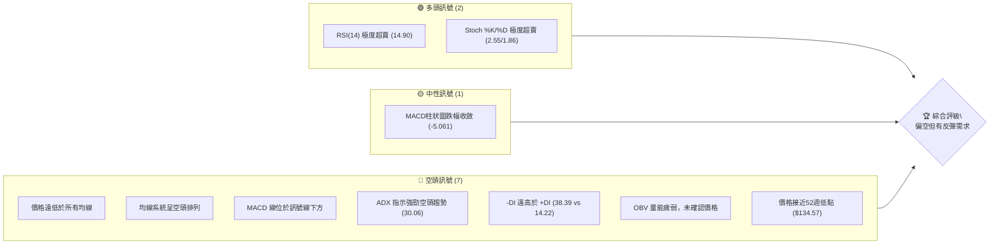
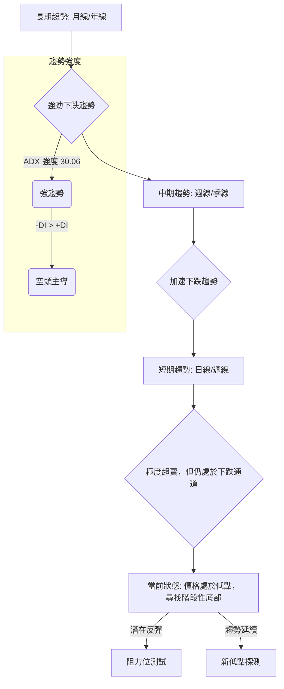
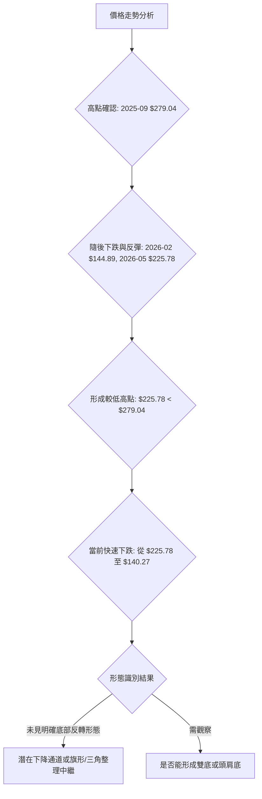
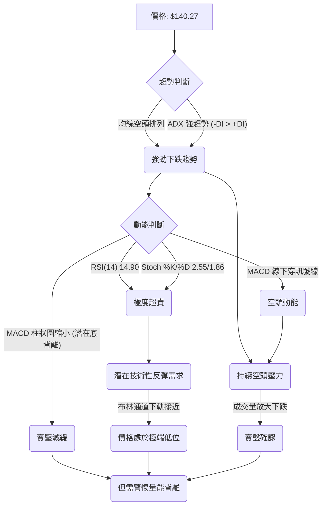
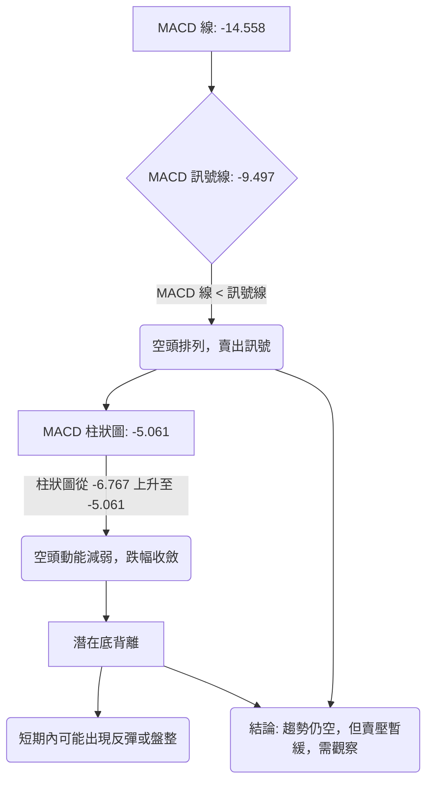
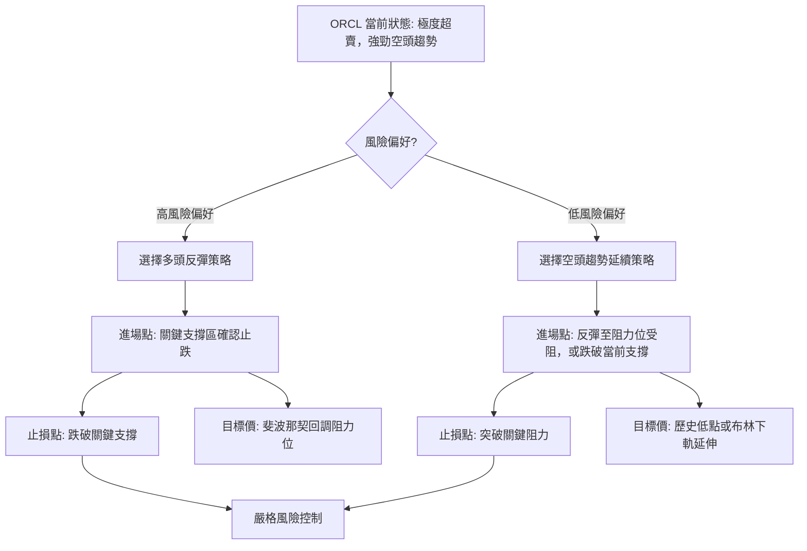

<details>
<summary>📊 靜態圖表 (點擊展開)</summary>

</details>

<html>
<head><meta charset="utf-8" /></head>
<body>
    <div style="height:500px; width:100%;">                        <script>window.PlotlyConfig = {MathJaxConfig: 'local'};</script>
        <script charset="utf-8" src="https://cdn.plot.ly/plotly-3.6.0.min.js" integrity="sha256-QaOVwtVY0T02VaHrr6pnoHLCwayMJp4O5n4YyaE3rJk=" crossorigin="anonymous"></script>                <div id="candlestick-chart" class="plotly-graph-div" style="height:100%; width:100%;"></div>            <script>                window.PLOTLYENV=window.PLOTLYENV || {};                                if (document.getElementById("candlestick-chart")) {                    Plotly.newPlot(                        "candlestick-chart",                        [{"close":{"dtype":"f8","bdata":"AAAAQPwDc0AAAABgzbByQAAAAADDZHJAAAAA4OQjc0AAAADASll0QAAAAED3dXNAAAAAALggc0AAAADAyBByQAAAAKDZk3FAAAAAAL2IcUAAAADAm3BxQAAAAID063FAAAAA4E3ocUAAAAAgZb5xQAAAAKDpFHJAAAAAgDugcUAAAABg7OVxQAAAACBXcnJAAAAAILsyckAAAABgDyJzQAAAAODHknJAAAAAwD\u002fcckAAAACgaXFzQAAAAAB+GHJAAAAAAMs3cUAAAADgghdxQAAAAEDq73BAAAAAQMBlcUAAAACAl5lxQAAAAIDmenFAAAAAANZxcUAAAACA5RlxQAAAAMBF6m9AAAAAwBhQcEAAAAAAZwRwQAAAAKDv1G5AAAAAgP8Yb0AAAABg80luQAAAAKCOuW1AAAAAoH3rbUAAAABApVZtQAAAAOBQM2xAAAAAoLcHa0AAAAAgpa9rQAAAAKCMUGtAAAAAIJZka0AAAACA4QRsQAAAAMDmLGpAAAAAIHmxaEAAAADg0OFoQAAAAIBzemhAAAAAYKl2aUAAAADg7RZpQAAAAKDO9mhAAAAAYOX7aEAAAACAws5pQAAAAKCroGpAAAAA4AgIa0AAAAAALWZrQAAAAKCphWtAAAAAwLu0a0AAAAAAVrRoQAAAAEDpmWdAAAAAQEz5ZkAAAADA7W9nQAAAAEDXK2ZAAAAAAMZdZkAAAABAhdlnQAAAAEBjpWhAAAAAgLNEaEAAAADgFIloQAAAAOD7mGhAAAAAQPlFaEAAAAAgLYBoQAAAAIAGN2hAAAAAQHhQaEAAAAAgPe1nQAAAAOAhEmhAAAAAoDD1Z0AAAADAu49nQAAAAMCHumhAAAAAwPZ+aUAAAAAAwDJpQAAAAAD1HWhAAAAAQA6mZ0AAAAAAmc1nQAAAAMBmaWZAAAAAYMuoZUAAAABA6jFmQAAAAKBjEWZAAAAA4MK5ZkAAAAAAUsllQAAAAMBahmVAAAAAIH8NZUAAAADgOoBkQAAAAOAX8GNAAAAAwDZEY0AAAADAGkViQAAAAOAoAGFAAAAAgFXKYUAAAACgcIFjQAAAACCs6mNAAAAA4J2TY0AAAACg7n1jQAAAAACl8mNAAAAAQOQtY0AAAAAADHRjQAAAAGDYf2NAAAAAYBFyYkAAAACALpphQAAAACA0NGJAAAAAQAJsYkAAAADgLbliQAAAACCbHGJAAAAAoGCXYkAAAABguY9iQAAAAKDe+mJAAAAAQApIY0AAAABArw1jQAAAAEAK4WJAAAAAICmcYkAAAAAgrFFkQAAAAOBk02NAAAAAoD5SY0AAAABAq21jQAAAAADaRGNAAAAAQMULY0AAAADAUV9jQAAAAOAWpWJAAAAAwLA5Y0AAAACAf1JiQAAAAKBgMGJAAAAAwAPKYUAAAADAkGVhQAAAAEAkSmFAAAAAwCJTYkAAAABgLxdiQAAAAIDbO2JAAAAAABIhYkAAAACgftVhQAAAAMAe5WFAAAAAIIU7YUAAAABA4UJhQAAAAADXc2NAAAAAAABgZEAAAACA6zllQAAAAEDhSmZAAAAAgOvhZUAAAABgjzJmQAAAAKBwpWZAAAAAAABwZ0AAAADA9QhmQAAAAMD1qGVAAAAAYLieZUAAAABguL5kQAAAAGCPemRAAAAA4HosZEAAAABgj3plQAAAAKBHiWZAAAAAQDMrZ0AAAADA9UBoQAAAAEDhUmhAAAAAYGZ+aEAAAABA4TpoQAAAAGCPWmdAAAAA4FG4Z0AAAAAghXNoQAAAAGBmHmhAAAAAIIVTZ0AAAABguK5mQAAAAMAehWdAAAAA4KO4Z0AAAABgjwJoQAAAAIDrIWhAAAAAYLjeZ0AAAABgZnZpQAAAAMD1OGxAAAAAwMwEb0AAAABgj5JuQAAAAGCPymxAAAAAQOGKbUAAAACAwrVqQAAAAIA9empAAAAAgOu5aUAAAADgUShpQAAAAEAzA2dAAAAAACkEZ0AAAADgehRoQAAAAGCPimdAAAAAwPXwZkAAAACgRwlnQAAAAIA94mVAAAAAwB6lZEAAAADA9bBjQAAAAGC4DmNAAAAAwPWQYkAAAADgUXhiQAAAAKCZUWJAAAAAAADQYUAAAADgo4hhQA=="},"high":{"dtype":"f8","bdata":"mJpd1W\u002fXc0A\u002fa23f5CNzQN4JHlkP13JAYGNObslKc0AD\u002f7UUuW50QKh0eWhJJ3RAkkHDZmBgc0DcLsoqk4ZyQIdn9nsrO3JAUeVg3Nq7cUCXUdU8bJxxQPynexKD+3FA+3SInZFKckAsbLWIVEVyQOOm1gS3ZXJAd2Jyo8kuckBcw+W\u002f9RNyQPP4ps4bsnJAdwJy33Idc0Ait\u002fdT1kxzQFSaIaj46HJAd2UxX8RRc0BjfwHWHgl0QK+EAKe+5nJACxsbC5P3cUDLRUdpaGlxQKAsO4wcOHFASU7aUu+VcUCpE+WO+dZxQOPSHwf003FAe0hkq3a7cUAjLgkkZn5xQGK\u002f7GfMwXBA8hTi8fuCcEDbWVJ+9n9wQJlUpgERt29AfbjgLXhbb0CR\u002f0qSj\u002fFuQM3H8XXQ3W1Aqni9p1u3bkC8sK\u002fU\u002fX9tQF3yReqia21AvcovHh35a0DWbkBbOTVsQBpYSwYOrmtA234oxK3Ka0BsmgNpNVhsQD+EsfJDEm1Akkbu7DThaUC1JciAZ1JpQPpoEGslxmhA\u002fcQF1PQWakCwDYw8VSNpQBnrmwk6SGlAXsXaNGoNakBV5Ex+zdRpQOfVn\u002fYEw2pAobcUbxlFa0D7Tqa6EuxrQAE+cVZUqGtAwaCdyzP+a0Bc+bjEMxhpQDw96vqHlGhAwKU3PBt6Z0AUFb0VgZRnQIK6cpmMK2dABFIEdjX0ZkDjL8ZktD1oQKN6Xdy+smhA6reJj9t\u002faECHhiz5NKJoQFCeXKut5GhAPYRzhIWpaECvq8U1Y6VoQOvEyIvbf2hAJSotBxGsaEChU8gPqQ5pQDjDC1YSNmhAWx8WZzJPaECB2Y1UFLlnQCFtygt372hANuHjwTC8aUAY3oLmdOJpQBOmb0lMH2lApoflwJlKaEDhd9iCeOZnQDOywVc7UWdAnsqjBhZ\u002fZkDf7c4LDnFmQJMAmqHKYGZAKoYeDEgVZ0AQ6WgSBmNmQPKRTHCGoWZAmFY9l2Y0ZUD8vRkU\u002fQllQLdrcSBVU2VAgwzq1WjaY0C2IHZX7yxjQBywkUNHQWJAvVF8inPWYUAHGENHNeZjQOOCZk8PmmRAWbTIjORiZECUiKIikc9jQGG2GiqGN2RA733hWTjXY0Cq5S\u002fIFJhjQNsgVDG78GNAHE4Kn4cuY0CqPWCbXCliQGunmnL5R2JAbKckcuMXY0ACvxDvA\u002f9iQEC8mFxKMmJAAozuBLe0YkAqKglC88xiQOtpG2VpImNAqJ3XT32sY0BZx4y\u002fWdRjQEdraTQS72JAd2voGlAzY0Dwtg2oMGVlQONeYk7e52RAfggx\u002f7sGZEDrfJ0lAMZjQP4nG4W9y2NAgHDQusdNY0BnM3yV9otjQNESkpbuFmNAwzNrMZxnY0DKD0nWqCtjQPFlFhYxqmJAXl6wJbo+YkAnO9eeTKZhQEZVrJKslmFAnLZUG2JcYkApfXz6IaRiQBclFUrFPWJA6SHILQ6BYkCd2mOVIwJiQGJlsPvZ3WJAAAAAoJnZYUAAAACgcIVhQAAAAMAefWNAAAAAwMwsZUAAAACA65FlQAAAAOCjiGZAAAAAAAAQZ0AAAADgUThmQAAAAEDhKmdAAAAAgMKlZ0AAAADgerxmQAAAAGC4lmZAAAAAoJmxZUAAAABgZhZlQAAAAOBRmGRAAAAAgMKlZEAAAACgmcllQAAAAAAA8GZAAAAA4KNQZ0AAAACgR0loQAAAAMDMBGlAAAAAAADAaEAAAACAwnVoQAAAAKBwHWhAAAAAgD3yZ0AAAABguBZpQAAAAIDCjWhAAAAA4FHYZ0AAAABACpdnQAAAAEAKh2dAAAAAgD0aaEAAAAAAAKBoQAAAAGBmZmhAAAAA4HoEaEAAAAAAAKBpQAAAAKBHSWxAAAAAAABIb0AAAAAAACBvQAAAAOBREG5AAAAAYGbebUAAAACAFO5sQAAAAIDrYWtAAAAAAACQa0AAAAAgXI9qQAAAAOCjGGdAAAAAYI8yZ0AAAACAPWpoQAAAAIA9amhAAAAAgBTGZ0AAAAAgrn9nQAAAAGCPEmdAAAAAYI\u002fKZUAAAAAAALhkQAAAAADXs2NAAAAAoEcxY0AAAAAAAFBjQAAAAIDCvWJAAAAAoJlxYkAAAACA62FiQA=="},"hovertemplate":"\u003cb\u003e%{x|%Y-%m-%d}\u003c\u002fb\u003e\u003cbr\u003e\u958b: $%{open:.2f}\u003cbr\u003e\u9ad8: $%{high:.2f}\u003cbr\u003e\u4f4e: $%{low:.2f}\u003cbr\u003e\u6536: $%{close:.2f}\u003cextra\u003e\u003c\u002fextra\u003e","low":{"dtype":"f8","bdata":"QAb6NnS+ckCA2iR6hUtyQBTvYKlrG3JA9YpV6t9vckDg4QiWRQhzQO9OBJn1OXNAP\u002fdBGOWackBHumAHp+RxQFmid0CMjHFA3uwfhbtWcUCjY2Bg1htxQOde8u9EO3FAo9S\u002fTPe8cUAnDxdBbJxxQHV6tBVfCHJAyDpZGg3OcECy9tHOEpZxQLzisakW2HFAG50IxJ8jckA9yQBOvn5yQJitu54lI3JA2SuwNIKRckDUZZvLgNNyQDe6uZDn23FAYT0sSA4acUDevavMjelwQKSs1C6wuXBA3u5LIZ\u002frcEBs5avkaohxQANDB6edYXFABeslgTltcUCKvFQxFdtwQGOWhQXf1m9AUIKw84vkb0BEg+T2ebVvQFAiE5oodm5AIKB\u002f3K2wbkBumjEHg7ptQP182bzJ3WxAnjrn4OdzbUAM4eSevm9sQF7AQmc8GWxAFT149Pm8akCOvdQpci9qQCIRlyXKx2pA\u002foc6tBOmakAa+FOIcv9qQEt9bWN\u002fIGpAOQgwjcULaEAUBX\u002f0nyNoQNRH5yPhD2dAGcHLNycgaUB7AHfG5YxoQBcINaX0b2hA5220KenYaEC8FCvp08VoQGetSoXqoWlAV6sHoxaKakDoZf+\u002fufJqQOQuozxMHmtAcMBv7wgIa0CnmstN9iJnQEQBBcMCG2dAFOcef1iJZkBk94tEn+tmQIVWNOyh\u002f2VA8QfZLKgvZkCDInOhEl9nQCGEYVDf9GdAwK\u002fJW4TgZ0AeY\u002fT6cCdoQFdQePAwXWhAPYlNONTuZ0CzhyQteFBoQACJsuFMMWhAyof\u002fTMMgaEA6JjhC+ORnQAXHvNogsWdANEpXZ3naZ0DD7LXeaiBnQFiaB1Tvg2dAjVkLz2CKaEDQ10WZxf5oQKKGHTWrxGdAbbqe\u002fWKXZ0ATRBeDLzxnQCmWdTeLV2ZAFPK+JDNAZUCTG1imV\u002fxlQPCByP7XbGVASGPTmhM9ZkB9E+GIaqJlQFK3JQ1haGVAGYBDraYeZEA8JLjUf1VkQJIL7RUu7mNA1Lsc2uHrYkBgJAp+rP1hQOTbq9Hv2GBADyfPOqZNYUAXCv7MoE9iQBnQESo9jWNAhom6ONkuY0CTa+b5A\u002f9iQF9uQgj8V2NARJv5EyILY0B5DtQ6+9piQAamLpRKZ2NA2TpPjBBcYkB4blXNcUNhQOyFO6boR2FAYHd\u002fTnhaYkAPSB4\u002fohRiQDkGvLZfs2FA5Dn\u002fNgmWYUA636gNq9FhQI4D5RuYkmJAQH+sxh6zYkD8uq4U9OJiQIzYBoRzPWJAK2381d19YkAhr5XrrABkQBKFbe7awWNAMvcpn6EzY0Bsd6eAHD9jQKsX323nHmNAw386pVjwYkBMnDbI5YtiQC5uNhPsbWJARIpNX+\u002fFYkA0L6xX2EpiQFYdfXwYA2JA28\u002fBkmfBYUCP98ZmMjphQFOwBL8lD2FAYAvn3p9rYUCZXGrXUwViQFgBc3n5eWFAL\u002fhNzy3rYUDwipuXfm5hQETmUWvizGFAAAAAAAAAYUAAAACAPdJgQAAAAEAKd2FAAAAAgOsxZEAAAABguMZkQAAAAKCZuWVAAAAAIIWrZUAAAADgUbBlQAAAAOBRAGZAAAAAoJnZZkAAAABgj8JlQAAAAKCZGWVAAAAAwMz8ZEAAAACgmUFkQAAAAMDMFGRAAAAAYI8KZEAAAADAzMRkQAAAAOBRyGVAAAAAAABgZkAAAACgcNVmQAAAAKCZ2WdAAAAAYLjGZ0AAAABAM9NnQAAAAADXm2ZAAAAAgOshZ0AAAABgZi5nQAAAAMDMnGdAAAAA4KPoZkAAAACAwp1mQAAAAKCZWWZAAAAAYGZmZ0AAAABAM+NnQAAAAIDr0WdAAAAAoHB9Z0AAAAAAKSxoQAAAAOBRAGpAAAAAQDMTbEAAAABA4dptQAAAACCFc2xAAAAAAAAAbEAAAABgZi5qQAAAAGCPKmpAAAAAoEe5aEAAAACAwsVoQAAAAMD16GVAAAAAAABgZkAAAABguEZnQAAAAMAedWdAAAAAYI\u002fSZkAAAABgZjZmQAAAAMDMzGVAAAAAIIWTZEAAAABAM2tjQAAAACCFy2JAAAAAAACAYkAAAABgZiZiQAAAACBcD2JAAAAAAADQYUAAAABgj1phQA=="},"name":"\u50f9\u683c","open":{"dtype":"f8","bdata":"oaZU\u002fZ15c0AeK+HafhRzQI+BxnytynJAXUULSouKckBaYofNSjNzQCMYRXppF3RAVH3ZVrFWc0ACACqlVE9yQGub041LK3JAj2P3nfKlcUAmBtttgJdxQKeSAK\u002ffSXFAe2CZ5j4YckBnaipKUvVxQIyFSyp0IXJAd2Jyo8kuckAjhBcx97JxQBjqVxdPHHJAph34vyKnckDe55KJAo5yQAVu5kt023JAx3ZXmprwckAbF35gvPtyQNKxUglR3nJAlsk8jPbycUA9DfnylEZxQBbemJZDEnFAlm74fq\u002f0cEDoPGt0x8JxQDMI\u002fIgdzXFAwBlFFliUcUDFHcTE2ntxQL0df+yTsXBASpFxzcwecEBb4wCA63lwQOkiKZCADm9AhC3J1KrMbkDa8iQcn81uQPeLOcJJsW1AAY4pc1SObkCWYEifMFltQH6NyAppaW1A0muj\u002f7Tza0CLNVapWjFqQP63VG4SHGtAALJAhXbcakBp2+74GjdrQGcBqsvwt2xA3umRVxa6aUBx3gdeC3VoQDxW1bmgHGhAatdk2A0HakD12651U8loQDyV4iPQ6GhAdeO63GJ8aUAkguYAaONoQADMChjl0mlAFjh+czI1a0Dbi6oY8H9rQH2fN630VWtAF2Z7CkCOa0AZ6qeHla5nQKTyBMh1ZWhADAVSonpkZ0ALxc0CTfJmQAOSgbUXxmZA0rUP6FOzZkBS\u002fw3\u002fqGdnQB+Ejs3Fc2hAgoVnNl5naECgQ9tV4zloQJuffb81m2hA2CfOCiwfaEBcfjHKmVtoQOgBr9IMZ2hAuLXREHKIaED7zlxtHaRoQLuvcupI7GdA6y5H6m1DaED\u002fERF12rZnQCI69DbG32dAThWSXDGdaEBBV7IbK4lpQBOmb0lMH2lApoflwJlKaECYSa4k+KdnQDOywVc7UWdAKdzTgb9hZkBHAB7S3FdmQG3rclGdgGVAcnti2kBPZkDE\u002fehuH1JmQFu2\u002f031yWVAD80rf9kxZUCN4GLEtfJkQBT5K1xnSmVAukzPpLG2Y0AfZnAkVytjQONwi\u002fn7ImJA\u002f\u002fK9h29oYUCtw4BxJH9iQH+CGh0u7mNAWbTIjORiZECvLYGoK6xjQBESHoBD1mNAwmi2ysOtY0D6Mg5O7DtjQPJJjreSlGNA9YhZy4YYY0Brr0We2iViQJCnKZ0xi2FA3\u002fot6oGUYkBe1ZVWtYhiQBTsdLYi7GFAlx1rKxGkYUAr\u002fnj14AdiQG800smcr2JAbizymeIBY0B7QAWkaAxjQH4tKqWdxWJAIXFlDrsiY0DLPPcsoblkQCbT8Q\u002fIgmRA3ludyeLPY0DE2hzviXBjQLH1uJ3EXGNAPH1z\u002frYbY0DlgMaE9r1iQFhlWOqNEGNAtNUSYZPcYkCrxke\u002f9Q5jQKjPclq9lmJAkkMVVXTsYUBK6TlKEI5hQFHtbeWucWFAV7tcavl5YUDC2eZxRpJiQN1rKOQOyWFAHO67s6hdYkAqXaFb8uhhQK2nkU7cuGJAAAAAYGbGYUAAAACAPSphQAAAAOCjeGFAAAAAgML9ZEAAAADgetxkQAAAAKBwDWZAAAAAgMLdZkAAAACA6xlmQAAAAEAzS2ZAAAAAgMJFZ0AAAADAzIxmQAAAAOBRkGZAAAAAYI+SZUAAAADAHkVkQAAAAKBHgWRAAAAA4KNAZEAAAACgcM1kQAAAAOCjAGZAAAAAACnEZkAAAABgZkZnQAAAACCF02hAAAAAYI8SaEAAAADAzARoQAAAAKBwHWhAAAAAwPWgZ0AAAACAwoVnQAAAACCuz2dAAAAAAADAZ0AAAAAAAEBnQAAAAIAUfmZAAAAA4FGgZ0AAAACgcPVnQAAAAKCZKWhAAAAAIFzvZ0AAAACgR0FoQAAAAAAAIGpAAAAAAADQbEAAAACgmVluQAAAACBcD25AAAAAAABgbEAAAAAgrq9sQAAAAAAAOGtAAAAAwB69akAAAAAAANBoQAAAAKBwdWZAAAAA4FEgZ0AAAADgemxnQAAAAOBRwGdAAAAAwB5FZ0AAAADgUeBmQAAAAIDryWZAAAAAIFxHZUAAAAAgXE9kQAAAAEAzq2NAAAAA4FHIYkAAAACAFD5jQAAAAAAAaGJAAAAAIK4PYkAAAACgmelhQA=="},"x":["2025-09-16T00:00:00-04:00","2025-09-17T00:00:00-04:00","2025-09-18T00:00:00-04:00","2025-09-19T00:00:00-04:00","2025-09-22T00:00:00-04:00","2025-09-23T00:00:00-04:00","2025-09-24T00:00:00-04:00","2025-09-25T00:00:00-04:00","2025-09-26T00:00:00-04:00","2025-09-29T00:00:00-04:00","2025-09-30T00:00:00-04:00","2025-10-01T00:00:00-04:00","2025-10-02T00:00:00-04:00","2025-10-03T00:00:00-04:00","2025-10-06T00:00:00-04:00","2025-10-07T00:00:00-04:00","2025-10-08T00:00:00-04:00","2025-10-09T00:00:00-04:00","2025-10-10T00:00:00-04:00","2025-10-13T00:00:00-04:00","2025-10-14T00:00:00-04:00","2025-10-15T00:00:00-04:00","2025-10-16T00:00:00-04:00","2025-10-17T00:00:00-04:00","2025-10-20T00:00:00-04:00","2025-10-21T00:00:00-04:00","2025-10-22T00:00:00-04:00","2025-10-23T00:00:00-04:00","2025-10-24T00:00:00-04:00","2025-10-27T00:00:00-04:00","2025-10-28T00:00:00-04:00","2025-10-29T00:00:00-04:00","2025-10-30T00:00:00-04:00","2025-10-31T00:00:00-04:00","2025-11-03T00:00:00-05:00","2025-11-04T00:00:00-05:00","2025-11-05T00:00:00-05:00","2025-11-06T00:00:00-05:00","2025-11-07T00:00:00-05:00","2025-11-10T00:00:00-05:00","2025-11-11T00:00:00-05:00","2025-11-12T00:00:00-05:00","2025-11-13T00:00:00-05:00","2025-11-14T00:00:00-05:00","2025-11-17T00:00:00-05:00","2025-11-18T00:00:00-05:00","2025-11-19T00:00:00-05:00","2025-11-20T00:00:00-05:00","2025-11-21T00:00:00-05:00","2025-11-24T00:00:00-05:00","2025-11-25T00:00:00-05:00","2025-11-26T00:00:00-05:00","2025-11-28T00:00:00-05:00","2025-12-01T00:00:00-05:00","2025-12-02T00:00:00-05:00","2025-12-03T00:00:00-05:00","2025-12-04T00:00:00-05:00","2025-12-05T00:00:00-05:00","2025-12-08T00:00:00-05:00","2025-12-09T00:00:00-05:00","2025-12-10T00:00:00-05:00","2025-12-11T00:00:00-05:00","2025-12-12T00:00:00-05:00","2025-12-15T00:00:00-05:00","2025-12-16T00:00:00-05:00","2025-12-17T00:00:00-05:00","2025-12-18T00:00:00-05:00","2025-12-19T00:00:00-05:00","2025-12-22T00:00:00-05:00","2025-12-23T00:00:00-05:00","2025-12-24T00:00:00-05:00","2025-12-26T00:00:00-05:00","2025-12-29T00:00:00-05:00","2025-12-30T00:00:00-05:00","2025-12-31T00:00:00-05:00","2026-01-02T00:00:00-05:00","2026-01-05T00:00:00-05:00","2026-01-06T00:00:00-05:00","2026-01-07T00:00:00-05:00","2026-01-08T00:00:00-05:00","2026-01-09T00:00:00-05:00","2026-01-12T00:00:00-05:00","2026-01-13T00:00:00-05:00","2026-01-14T00:00:00-05:00","2026-01-15T00:00:00-05:00","2026-01-16T00:00:00-05:00","2026-01-20T00:00:00-05:00","2026-01-21T00:00:00-05:00","2026-01-22T00:00:00-05:00","2026-01-23T00:00:00-05:00","2026-01-26T00:00:00-05:00","2026-01-27T00:00:00-05:00","2026-01-28T00:00:00-05:00","2026-01-29T00:00:00-05:00","2026-01-30T00:00:00-05:00","2026-02-02T00:00:00-05:00","2026-02-03T00:00:00-05:00","2026-02-04T00:00:00-05:00","2026-02-05T00:00:00-05:00","2026-02-06T00:00:00-05:00","2026-02-09T00:00:00-05:00","2026-02-10T00:00:00-05:00","2026-02-11T00:00:00-05:00","2026-02-12T00:00:00-05:00","2026-02-13T00:00:00-05:00","2026-02-17T00:00:00-05:00","2026-02-18T00:00:00-05:00","2026-02-19T00:00:00-05:00","2026-02-20T00:00:00-05:00","2026-02-23T00:00:00-05:00","2026-02-24T00:00:00-05:00","2026-02-25T00:00:00-05:00","2026-02-26T00:00:00-05:00","2026-02-27T00:00:00-05:00","2026-03-02T00:00:00-05:00","2026-03-03T00:00:00-05:00","2026-03-04T00:00:00-05:00","2026-03-05T00:00:00-05:00","2026-03-06T00:00:00-05:00","2026-03-09T00:00:00-04:00","2026-03-10T00:00:00-04:00","2026-03-11T00:00:00-04:00","2026-03-12T00:00:00-04:00","2026-03-13T00:00:00-04:00","2026-03-16T00:00:00-04:00","2026-03-17T00:00:00-04:00","2026-03-18T00:00:00-04:00","2026-03-19T00:00:00-04:00","2026-03-20T00:00:00-04:00","2026-03-23T00:00:00-04:00","2026-03-24T00:00:00-04:00","2026-03-25T00:00:00-04:00","2026-03-26T00:00:00-04:00","2026-03-27T00:00:00-04:00","2026-03-30T00:00:00-04:00","2026-03-31T00:00:00-04:00","2026-04-01T00:00:00-04:00","2026-04-02T00:00:00-04:00","2026-04-06T00:00:00-04:00","2026-04-07T00:00:00-04:00","2026-04-08T00:00:00-04:00","2026-04-09T00:00:00-04:00","2026-04-10T00:00:00-04:00","2026-04-13T00:00:00-04:00","2026-04-14T00:00:00-04:00","2026-04-15T00:00:00-04:00","2026-04-16T00:00:00-04:00","2026-04-17T00:00:00-04:00","2026-04-20T00:00:00-04:00","2026-04-21T00:00:00-04:00","2026-04-22T00:00:00-04:00","2026-04-23T00:00:00-04:00","2026-04-24T00:00:00-04:00","2026-04-27T00:00:00-04:00","2026-04-28T00:00:00-04:00","2026-04-29T00:00:00-04:00","2026-04-30T00:00:00-04:00","2026-05-01T00:00:00-04:00","2026-05-04T00:00:00-04:00","2026-05-05T00:00:00-04:00","2026-05-06T00:00:00-04:00","2026-05-07T00:00:00-04:00","2026-05-08T00:00:00-04:00","2026-05-11T00:00:00-04:00","2026-05-12T00:00:00-04:00","2026-05-13T00:00:00-04:00","2026-05-14T00:00:00-04:00","2026-05-15T00:00:00-04:00","2026-05-18T00:00:00-04:00","2026-05-19T00:00:00-04:00","2026-05-20T00:00:00-04:00","2026-05-21T00:00:00-04:00","2026-05-22T00:00:00-04:00","2026-05-26T00:00:00-04:00","2026-05-27T00:00:00-04:00","2026-05-28T00:00:00-04:00","2026-05-29T00:00:00-04:00","2026-06-01T00:00:00-04:00","2026-06-02T00:00:00-04:00","2026-06-03T00:00:00-04:00","2026-06-04T00:00:00-04:00","2026-06-05T00:00:00-04:00","2026-06-08T00:00:00-04:00","2026-06-09T00:00:00-04:00","2026-06-10T00:00:00-04:00","2026-06-11T00:00:00-04:00","2026-06-12T00:00:00-04:00","2026-06-15T00:00:00-04:00","2026-06-16T00:00:00-04:00","2026-06-17T00:00:00-04:00","2026-06-18T00:00:00-04:00","2026-06-22T00:00:00-04:00","2026-06-23T00:00:00-04:00","2026-06-24T00:00:00-04:00","2026-06-25T00:00:00-04:00","2026-06-26T00:00:00-04:00","2026-06-29T00:00:00-04:00","2026-06-30T00:00:00-04:00","2026-07-01T00:00:00-04:00","2026-07-02T00:00:00-04:00"],"type":"candlestick"},{"hovertemplate":"MA30: $%{y:.2f}\u003cextra\u003e\u003c\u002fextra\u003e","line":{"color":"#2196F3","dash":"dash","width":2},"mode":"lines","name":"MA30","x":["2025-09-16T00:00:00-04:00","2025-09-17T00:00:00-04:00","2025-09-18T00:00:00-04:00","2025-09-19T00:00:00-04:00","2025-09-22T00:00:00-04:00","2025-09-23T00:00:00-04:00","2025-09-24T00:00:00-04:00","2025-09-25T00:00:00-04:00","2025-09-26T00:00:00-04:00","2025-09-29T00:00:00-04:00","2025-09-30T00:00:00-04:00","2025-10-01T00:00:00-04:00","2025-10-02T00:00:00-04:00","2025-10-03T00:00:00-04:00","2025-10-06T00:00:00-04:00","2025-10-07T00:00:00-04:00","2025-10-08T00:00:00-04:00","2025-10-09T00:00:00-04:00","2025-10-10T00:00:00-04:00","2025-10-13T00:00:00-04:00","2025-10-14T00:00:00-04:00","2025-10-15T00:00:00-04:00","2025-10-16T00:00:00-04:00","2025-10-17T00:00:00-04:00","2025-10-20T00:00:00-04:00","2025-10-21T00:00:00-04:00","2025-10-22T00:00:00-04:00","2025-10-23T00:00:00-04:00","2025-10-24T00:00:00-04:00","2025-10-27T00:00:00-04:00","2025-10-28T00:00:00-04:00","2025-10-29T00:00:00-04:00","2025-10-30T00:00:00-04:00","2025-10-31T00:00:00-04:00","2025-11-03T00:00:00-05:00","2025-11-04T00:00:00-05:00","2025-11-05T00:00:00-05:00","2025-11-06T00:00:00-05:00","2025-11-07T00:00:00-05:00","2025-11-10T00:00:00-05:00","2025-11-11T00:00:00-05:00","2025-11-12T00:00:00-05:00","2025-11-13T00:00:00-05:00","2025-11-14T00:00:00-05:00","2025-11-17T00:00:00-05:00","2025-11-18T00:00:00-05:00","2025-11-19T00:00:00-05:00","2025-11-20T00:00:00-05:00","2025-11-21T00:00:00-05:00","2025-11-24T00:00:00-05:00","2025-11-25T00:00:00-05:00","2025-11-26T00:00:00-05:00","2025-11-28T00:00:00-05:00","2025-12-01T00:00:00-05:00","2025-12-02T00:00:00-05:00","2025-12-03T00:00:00-05:00","2025-12-04T00:00:00-05:00","2025-12-05T00:00:00-05:00","2025-12-08T00:00:00-05:00","2025-12-09T00:00:00-05:00","2025-12-10T00:00:00-05:00","2025-12-11T00:00:00-05:00","2025-12-12T00:00:00-05:00","2025-12-15T00:00:00-05:00","2025-12-16T00:00:00-05:00","2025-12-17T00:00:00-05:00","2025-12-18T00:00:00-05:00","2025-12-19T00:00:00-05:00","2025-12-22T00:00:00-05:00","2025-12-23T00:00:00-05:00","2025-12-24T00:00:00-05:00","2025-12-26T00:00:00-05:00","2025-12-29T00:00:00-05:00","2025-12-30T00:00:00-05:00","2025-12-31T00:00:00-05:00","2026-01-02T00:00:00-05:00","2026-01-05T00:00:00-05:00","2026-01-06T00:00:00-05:00","2026-01-07T00:00:00-05:00","2026-01-08T00:00:00-05:00","2026-01-09T00:00:00-05:00","2026-01-12T00:00:00-05:00","2026-01-13T00:00:00-05:00","2026-01-14T00:00:00-05:00","2026-01-15T00:00:00-05:00","2026-01-16T00:00:00-05:00","2026-01-20T00:00:00-05:00","2026-01-21T00:00:00-05:00","2026-01-22T00:00:00-05:00","2026-01-23T00:00:00-05:00","2026-01-26T00:00:00-05:00","2026-01-27T00:00:00-05:00","2026-01-28T00:00:00-05:00","2026-01-29T00:00:00-05:00","2026-01-30T00:00:00-05:00","2026-02-02T00:00:00-05:00","2026-02-03T00:00:00-05:00","2026-02-04T00:00:00-05:00","2026-02-05T00:00:00-05:00","2026-02-06T00:00:00-05:00","2026-02-09T00:00:00-05:00","2026-02-10T00:00:00-05:00","2026-02-11T00:00:00-05:00","2026-02-12T00:00:00-05:00","2026-02-13T00:00:00-05:00","2026-02-17T00:00:00-05:00","2026-02-18T00:00:00-05:00","2026-02-19T00:00:00-05:00","2026-02-20T00:00:00-05:00","2026-02-23T00:00:00-05:00","2026-02-24T00:00:00-05:00","2026-02-25T00:00:00-05:00","2026-02-26T00:00:00-05:00","2026-02-27T00:00:00-05:00","2026-03-02T00:00:00-05:00","2026-03-03T00:00:00-05:00","2026-03-04T00:00:00-05:00","2026-03-05T00:00:00-05:00","2026-03-06T00:00:00-05:00","2026-03-09T00:00:00-04:00","2026-03-10T00:00:00-04:00","2026-03-11T00:00:00-04:00","2026-03-12T00:00:00-04:00","2026-03-13T00:00:00-04:00","2026-03-16T00:00:00-04:00","2026-03-17T00:00:00-04:00","2026-03-18T00:00:00-04:00","2026-03-19T00:00:00-04:00","2026-03-20T00:00:00-04:00","2026-03-23T00:00:00-04:00","2026-03-24T00:00:00-04:00","2026-03-25T00:00:00-04:00","2026-03-26T00:00:00-04:00","2026-03-27T00:00:00-04:00","2026-03-30T00:00:00-04:00","2026-03-31T00:00:00-04:00","2026-04-01T00:00:00-04:00","2026-04-02T00:00:00-04:00","2026-04-06T00:00:00-04:00","2026-04-07T00:00:00-04:00","2026-04-08T00:00:00-04:00","2026-04-09T00:00:00-04:00","2026-04-10T00:00:00-04:00","2026-04-13T00:00:00-04:00","2026-04-14T00:00:00-04:00","2026-04-15T00:00:00-04:00","2026-04-16T00:00:00-04:00","2026-04-17T00:00:00-04:00","2026-04-20T00:00:00-04:00","2026-04-21T00:00:00-04:00","2026-04-22T00:00:00-04:00","2026-04-23T00:00:00-04:00","2026-04-24T00:00:00-04:00","2026-04-27T00:00:00-04:00","2026-04-28T00:00:00-04:00","2026-04-29T00:00:00-04:00","2026-04-30T00:00:00-04:00","2026-05-01T00:00:00-04:00","2026-05-04T00:00:00-04:00","2026-05-05T00:00:00-04:00","2026-05-06T00:00:00-04:00","2026-05-07T00:00:00-04:00","2026-05-08T00:00:00-04:00","2026-05-11T00:00:00-04:00","2026-05-12T00:00:00-04:00","2026-05-13T00:00:00-04:00","2026-05-14T00:00:00-04:00","2026-05-15T00:00:00-04:00","2026-05-18T00:00:00-04:00","2026-05-19T00:00:00-04:00","2026-05-20T00:00:00-04:00","2026-05-21T00:00:00-04:00","2026-05-22T00:00:00-04:00","2026-05-26T00:00:00-04:00","2026-05-27T00:00:00-04:00","2026-05-28T00:00:00-04:00","2026-05-29T00:00:00-04:00","2026-06-01T00:00:00-04:00","2026-06-02T00:00:00-04:00","2026-06-03T00:00:00-04:00","2026-06-04T00:00:00-04:00","2026-06-05T00:00:00-04:00","2026-06-08T00:00:00-04:00","2026-06-09T00:00:00-04:00","2026-06-10T00:00:00-04:00","2026-06-11T00:00:00-04:00","2026-06-12T00:00:00-04:00","2026-06-15T00:00:00-04:00","2026-06-16T00:00:00-04:00","2026-06-17T00:00:00-04:00","2026-06-18T00:00:00-04:00","2026-06-22T00:00:00-04:00","2026-06-23T00:00:00-04:00","2026-06-24T00:00:00-04:00","2026-06-25T00:00:00-04:00","2026-06-26T00:00:00-04:00","2026-06-29T00:00:00-04:00","2026-06-30T00:00:00-04:00","2026-07-01T00:00:00-04:00","2026-07-02T00:00:00-04:00"],"y":{"dtype":"f8","bdata":"AAAAAAAA+H8AAAAAAAD4fwAAAAAAAPh\u002fAAAAAAAA+H8AAAAAAAD4fwAAAAAAAPh\u002fAAAAAAAA+H8AAAAAAAD4fwAAAAAAAPh\u002fAAAAAAAA+H8AAAAAAAD4fwAAAAAAAPh\u002fAAAAAAAA+H8AAAAAAAD4fwAAAAAAAPh\u002fAAAAAAAA+H8AAAAAAAD4fwAAAAAAAPh\u002fAAAAAAAA+H8AAAAAAAD4fwAAAAAAAPh\u002fAAAAAAAA+H8AAAAAAAD4fwAAAAAAAPh\u002fAAAAAAAA+H8AAAAAAAD4fwAAAAAAAPh\u002fAAAAAAAA+H8AAAAAAAD4fwAAAJAFN3JAMzMz450pckAAAACgDRxyQFVVVQVEB3JA3t3dnSPvcUB3d3cXLcpxQAAAANiop3FAd3d3bx6JcUAiIiIiMXBxQDMzM9sFWXFAMzMzcw5DcUARERHhaStxQGZmZr7NCnFAmpmZeVLlcECrqqpSCcRwQFVVVSVInnBAmpmZIcB8cEAAAABYkVtwQFVVVY3WLXBAVVVVVc\u002f3b0CamZmJmYVvQO\u002fu7v5+GW9Aq6qqyuawbkAiIiLyKztuQCIiIqJd221AzczMnLWKbUB3d3fnO0NtQFVVVTVlBW1AzczMfCXDbECrqqpalIBsQFVVVbUbQWxA7+7ubs8DbEAAAAAAw7JrQLy7u\u002fvQa2tAIiIiAnQZa0AzMzMzF9BqQM3MzPwvhmpAIiIiEq47akB3d3d3uwRqQAAAALBk2WlAAAAAwCqpaUCJiIh4LoBpQHd3d+dvYWlA7+7ujulJaUBERETkui5pQM3MzHxHFGlAmpmZOQL6aECJiIhYFtdoQJqZmdkgxWhAq6qqKtq+aEAiIiIylbNoQBEREQG4tWhAmpmZ2f61aEARERFB7LZoQM3MzMyxr2hAMzMzw0ykaEB3d3fHMZNoQERERAQ4b2hAIiIiomBBaEAiIiIC+BRoQERERCRt5mdAERERYe27Z0CJiIjYBqNnQFVVVeVOkWdAERERMeqAZ0AiIiKy22dnQImIiMjMVGdAMzMzE1k6Z0DNzMzsuwpnQO\u002fu7j5+yWZAiYiI2DaSZkCJiIj4SmdmQBEREWFZP2ZAREREREUXZkAzMzNzh+xlQM3MzMwdyGVAEREREUycZUAzMzPDH3ZlQAAAAFAdT2VAzczMvBMgZUAiIiKyOe1kQN7d3T2MtWRAIiIiwi55ZEB3d3cn7kFkQM3MzGyvDmRAERERgYfjY0CamZnZzLZjQLy7uwuEmWNAd3d3VzmFY0AzMzOTampjQFVVVWU0T2NAvLu7qxUsY0BEREQkkB9jQKuqqnoQEWNAAAAAEEoCY0BEREQkI\u002fliQBEREeFt82JAq6qqOozxYkBmZmZ29PpiQFVVVWX8CGNAvLu7KzsVY0ARERERIgtjQBEREdFj\u002fGJAIiIi8iLtYkAzMzPzQdtiQN7d3f2SxGJAZmZmRki9YkAiIiJSp7FiQAAAAKDapmJAIiIiciekYkBVVVWVIaZiQM3MzLx+o2JA7+7ubliZYkCamZlp3oxiQHd3d1dPmGJAq6qq2oenYkAiIiJCRb5iQM3MzJyJ2mJAmpmZybvwYkDv7u4OkAtjQKuqqpq1K2NA7+7ubudUY0BVVVUFjGNjQLy7u\u002fsyc2NAREREpNCGY0AAAADQDJJjQImIiKhfnGNAAAAAUP+lY0BVVVXV+LdjQImIiKgt2WNAREREJNT6Y0Dv7u6ucS1kQN7d3U3LYWRAq6qqygGbZEBmZmZGUdVkQERERJQQCWVA7+7urho3ZUDv7u7OYW1lQDMzM6OZn2VA7+7uzvLLZUCamZmZUvVlQJqZmZlSJWZA3t3dfbFcZkDNzMxcSJZmQKuqqvo3vmZAzczM7ArcZkB3d3cnMQBnQAAAAHDLMmdAERER4cGAZ0CJiIhYOchnQN7d3U2p\u002fGdAERER4cEwaEAiIiKSplhoQAAAAJDCgWhAzczMzMykaEDNzMwMdMpoQM3MzBwT4GhAZmZmplT4aECrqqoqhw5pQAAAAKAaF2lAREREpCkVaUCJiIj4xQppQGZmZrbz9WhA3t3d\u002fRvVaEARERHxYK5oQERERKS3iWhAq6qqGr1daEDNzMzcsipoQCIiIpI0+WdAmpmZmSfKZ0C8u7v7N55nQA=="},"type":"scatter"},{"hovertemplate":"MA60: $%{y:.2f}\u003cextra\u003e\u003c\u002fextra\u003e","line":{"color":"#9C27B0","dash":"dash","width":2},"mode":"lines","name":"MA60","x":["2025-09-16T00:00:00-04:00","2025-09-17T00:00:00-04:00","2025-09-18T00:00:00-04:00","2025-09-19T00:00:00-04:00","2025-09-22T00:00:00-04:00","2025-09-23T00:00:00-04:00","2025-09-24T00:00:00-04:00","2025-09-25T00:00:00-04:00","2025-09-26T00:00:00-04:00","2025-09-29T00:00:00-04:00","2025-09-30T00:00:00-04:00","2025-10-01T00:00:00-04:00","2025-10-02T00:00:00-04:00","2025-10-03T00:00:00-04:00","2025-10-06T00:00:00-04:00","2025-10-07T00:00:00-04:00","2025-10-08T00:00:00-04:00","2025-10-09T00:00:00-04:00","2025-10-10T00:00:00-04:00","2025-10-13T00:00:00-04:00","2025-10-14T00:00:00-04:00","2025-10-15T00:00:00-04:00","2025-10-16T00:00:00-04:00","2025-10-17T00:00:00-04:00","2025-10-20T00:00:00-04:00","2025-10-21T00:00:00-04:00","2025-10-22T00:00:00-04:00","2025-10-23T00:00:00-04:00","2025-10-24T00:00:00-04:00","2025-10-27T00:00:00-04:00","2025-10-28T00:00:00-04:00","2025-10-29T00:00:00-04:00","2025-10-30T00:00:00-04:00","2025-10-31T00:00:00-04:00","2025-11-03T00:00:00-05:00","2025-11-04T00:00:00-05:00","2025-11-05T00:00:00-05:00","2025-11-06T00:00:00-05:00","2025-11-07T00:00:00-05:00","2025-11-10T00:00:00-05:00","2025-11-11T00:00:00-05:00","2025-11-12T00:00:00-05:00","2025-11-13T00:00:00-05:00","2025-11-14T00:00:00-05:00","2025-11-17T00:00:00-05:00","2025-11-18T00:00:00-05:00","2025-11-19T00:00:00-05:00","2025-11-20T00:00:00-05:00","2025-11-21T00:00:00-05:00","2025-11-24T00:00:00-05:00","2025-11-25T00:00:00-05:00","2025-11-26T00:00:00-05:00","2025-11-28T00:00:00-05:00","2025-12-01T00:00:00-05:00","2025-12-02T00:00:00-05:00","2025-12-03T00:00:00-05:00","2025-12-04T00:00:00-05:00","2025-12-05T00:00:00-05:00","2025-12-08T00:00:00-05:00","2025-12-09T00:00:00-05:00","2025-12-10T00:00:00-05:00","2025-12-11T00:00:00-05:00","2025-12-12T00:00:00-05:00","2025-12-15T00:00:00-05:00","2025-12-16T00:00:00-05:00","2025-12-17T00:00:00-05:00","2025-12-18T00:00:00-05:00","2025-12-19T00:00:00-05:00","2025-12-22T00:00:00-05:00","2025-12-23T00:00:00-05:00","2025-12-24T00:00:00-05:00","2025-12-26T00:00:00-05:00","2025-12-29T00:00:00-05:00","2025-12-30T00:00:00-05:00","2025-12-31T00:00:00-05:00","2026-01-02T00:00:00-05:00","2026-01-05T00:00:00-05:00","2026-01-06T00:00:00-05:00","2026-01-07T00:00:00-05:00","2026-01-08T00:00:00-05:00","2026-01-09T00:00:00-05:00","2026-01-12T00:00:00-05:00","2026-01-13T00:00:00-05:00","2026-01-14T00:00:00-05:00","2026-01-15T00:00:00-05:00","2026-01-16T00:00:00-05:00","2026-01-20T00:00:00-05:00","2026-01-21T00:00:00-05:00","2026-01-22T00:00:00-05:00","2026-01-23T00:00:00-05:00","2026-01-26T00:00:00-05:00","2026-01-27T00:00:00-05:00","2026-01-28T00:00:00-05:00","2026-01-29T00:00:00-05:00","2026-01-30T00:00:00-05:00","2026-02-02T00:00:00-05:00","2026-02-03T00:00:00-05:00","2026-02-04T00:00:00-05:00","2026-02-05T00:00:00-05:00","2026-02-06T00:00:00-05:00","2026-02-09T00:00:00-05:00","2026-02-10T00:00:00-05:00","2026-02-11T00:00:00-05:00","2026-02-12T00:00:00-05:00","2026-02-13T00:00:00-05:00","2026-02-17T00:00:00-05:00","2026-02-18T00:00:00-05:00","2026-02-19T00:00:00-05:00","2026-02-20T00:00:00-05:00","2026-02-23T00:00:00-05:00","2026-02-24T00:00:00-05:00","2026-02-25T00:00:00-05:00","2026-02-26T00:00:00-05:00","2026-02-27T00:00:00-05:00","2026-03-02T00:00:00-05:00","2026-03-03T00:00:00-05:00","2026-03-04T00:00:00-05:00","2026-03-05T00:00:00-05:00","2026-03-06T00:00:00-05:00","2026-03-09T00:00:00-04:00","2026-03-10T00:00:00-04:00","2026-03-11T00:00:00-04:00","2026-03-12T00:00:00-04:00","2026-03-13T00:00:00-04:00","2026-03-16T00:00:00-04:00","2026-03-17T00:00:00-04:00","2026-03-18T00:00:00-04:00","2026-03-19T00:00:00-04:00","2026-03-20T00:00:00-04:00","2026-03-23T00:00:00-04:00","2026-03-24T00:00:00-04:00","2026-03-25T00:00:00-04:00","2026-03-26T00:00:00-04:00","2026-03-27T00:00:00-04:00","2026-03-30T00:00:00-04:00","2026-03-31T00:00:00-04:00","2026-04-01T00:00:00-04:00","2026-04-02T00:00:00-04:00","2026-04-06T00:00:00-04:00","2026-04-07T00:00:00-04:00","2026-04-08T00:00:00-04:00","2026-04-09T00:00:00-04:00","2026-04-10T00:00:00-04:00","2026-04-13T00:00:00-04:00","2026-04-14T00:00:00-04:00","2026-04-15T00:00:00-04:00","2026-04-16T00:00:00-04:00","2026-04-17T00:00:00-04:00","2026-04-20T00:00:00-04:00","2026-04-21T00:00:00-04:00","2026-04-22T00:00:00-04:00","2026-04-23T00:00:00-04:00","2026-04-24T00:00:00-04:00","2026-04-27T00:00:00-04:00","2026-04-28T00:00:00-04:00","2026-04-29T00:00:00-04:00","2026-04-30T00:00:00-04:00","2026-05-01T00:00:00-04:00","2026-05-04T00:00:00-04:00","2026-05-05T00:00:00-04:00","2026-05-06T00:00:00-04:00","2026-05-07T00:00:00-04:00","2026-05-08T00:00:00-04:00","2026-05-11T00:00:00-04:00","2026-05-12T00:00:00-04:00","2026-05-13T00:00:00-04:00","2026-05-14T00:00:00-04:00","2026-05-15T00:00:00-04:00","2026-05-18T00:00:00-04:00","2026-05-19T00:00:00-04:00","2026-05-20T00:00:00-04:00","2026-05-21T00:00:00-04:00","2026-05-22T00:00:00-04:00","2026-05-26T00:00:00-04:00","2026-05-27T00:00:00-04:00","2026-05-28T00:00:00-04:00","2026-05-29T00:00:00-04:00","2026-06-01T00:00:00-04:00","2026-06-02T00:00:00-04:00","2026-06-03T00:00:00-04:00","2026-06-04T00:00:00-04:00","2026-06-05T00:00:00-04:00","2026-06-08T00:00:00-04:00","2026-06-09T00:00:00-04:00","2026-06-10T00:00:00-04:00","2026-06-11T00:00:00-04:00","2026-06-12T00:00:00-04:00","2026-06-15T00:00:00-04:00","2026-06-16T00:00:00-04:00","2026-06-17T00:00:00-04:00","2026-06-18T00:00:00-04:00","2026-06-22T00:00:00-04:00","2026-06-23T00:00:00-04:00","2026-06-24T00:00:00-04:00","2026-06-25T00:00:00-04:00","2026-06-26T00:00:00-04:00","2026-06-29T00:00:00-04:00","2026-06-30T00:00:00-04:00","2026-07-01T00:00:00-04:00","2026-07-02T00:00:00-04:00"],"y":{"dtype":"f8","bdata":"AAAAAAAA+H8AAAAAAAD4fwAAAAAAAPh\u002fAAAAAAAA+H8AAAAAAAD4fwAAAAAAAPh\u002fAAAAAAAA+H8AAAAAAAD4fwAAAAAAAPh\u002fAAAAAAAA+H8AAAAAAAD4fwAAAAAAAPh\u002fAAAAAAAA+H8AAAAAAAD4fwAAAAAAAPh\u002fAAAAAAAA+H8AAAAAAAD4fwAAAAAAAPh\u002fAAAAAAAA+H8AAAAAAAD4fwAAAAAAAPh\u002fAAAAAAAA+H8AAAAAAAD4fwAAAAAAAPh\u002fAAAAAAAA+H8AAAAAAAD4fwAAAAAAAPh\u002fAAAAAAAA+H8AAAAAAAD4fwAAAAAAAPh\u002fAAAAAAAA+H8AAAAAAAD4fwAAAAAAAPh\u002fAAAAAAAA+H8AAAAAAAD4fwAAAAAAAPh\u002fAAAAAAAA+H8AAAAAAAD4fwAAAAAAAPh\u002fAAAAAAAA+H8AAAAAAAD4fwAAAAAAAPh\u002fAAAAAAAA+H8AAAAAAAD4fwAAAAAAAPh\u002fAAAAAAAA+H8AAAAAAAD4fwAAAAAAAPh\u002fAAAAAAAA+H8AAAAAAAD4fwAAAAAAAPh\u002fAAAAAAAA+H8AAAAAAAD4fwAAAAAAAPh\u002fAAAAAAAA+H8AAAAAAAD4fwAAAAAAAPh\u002fAAAAAAAA+H8AAAAAAAD4f1VVVbXJK3BAVVVVzcIVcEAAAAAgb\u002fVvQDMzM4MsvW9A7+7unt17b0ARERGxODJvQGZmZtbA6m5AiYiIePWmbkDe3d3djnJuQDMzMzO4RW5AMzMz06MXbkBVVVUdgettQCIiIrKFu21AERERQUeKbUDNzMzEZlttQLy7u+NrKG1AZmZmPsH5bEBERESEHMdsQCIiIvpmkGxAAAAAwFRbbEDe3d1dlxxsQAAAAICb52tAIiIi0nKza0CamZkZDHlrQHd3d7eHRWtAAAAAMIEXa0B3d3fXNutqQM3MzJxOumpAd3d3D0OCakBmZmYuxkpqQM3MzGzEE2pAAAAAaN7faUBERETs5KppQImIiPCPfmlAmpmZGS9NaUCrqqpy+RtpQKuqqmJ+7WhAq6qqkgO7aEAiIiKyu4doQHd3d3dxUWhAREREzLAdaECJiIi4vPNnQERERKRk0GdAmpmZaZewZ0C8u7sroY1nQM3MzKQybmdAVVVVJSdLZ0De3d0NmyZnQM3MzBQfCmdAvLu783bvZkAiIiJyZ9BmQHd3dx+itWZA3t3dzZaXZkBEREQ0bXxmQM3MzJwwX2ZAIiIiIupDZkCJiIhQ\u002fyRmQAAAAAheBGZAzczM\u002fEzjZUCrqqpKsb9lQM3MzMTQmmVAZmZmhgF0ZUBmZmZ+S2FlQAAAALAvUWVAiYiIIJpBZUAzMzNrfzBlQM3MzFQdJGVA7+7upvIVZUCamZkx2AJlQCIiIlI96WRAIiIiArnTZEDNzMyENrlkQBEREZnenWRAMzMzGzSCZEAzMzOz5GNkQFVVVWVYRmRAvLu7K8osZECrqqqK4xNkQAAAAPj7+mNAd3d3lx3iY0C8u7ujrcljQFVVVX2FrGNAiYiImEOJY0CJiIhIZmdjQCIiImJ\u002fU2NA3t3drYdFY0De3d0NiTpjQERERNQGOmNAiYiIkPo6Y0ARERFR\u002fTpjQAAAAAB1PWNAVVVVjX5AY0DNzMwUjkFjQDMzM7shQmNAIiIiWo1EY0AiIiL6l0VjQM3MzMTmR2NAVVVVxcVLY0De3d2ldlljQO\u002fu7gYVcWNAAAAAqAeIY0AAAADgSZxjQHd3d48Xr2NAZmZmXhLEY0DNzMycSdhjQBEREcnR5mNAq6qqejH6Y0CJiIiQhA9kQJqZmSE6I2RAiYiIIA04ZEB3d3cXuk1kQDMzM6toZGRAZmZm9gR7ZEAzMzNjk5FkQBEREalDq2RAvLu7Y8nBZEDNzMw0O99kQGZmZoaqBmVAVVVV1b44ZUC8u7uz5GllQERERHQvlGVAAAAAqNTCZUC8u7tLGd5lQN7d3cV6+mVAiYiIuM4VZkBmZmZuQC5mQKuqqmI5PmZAMzMz+ylPZkAAAAAAQGNmQERERCQkeGZARERE5P6HZkC8u7vTG5xmQCIiIoLfq2ZARERE5A64ZkC8u7sb2cFmQERERBxkyWZAzczM5GvKZkDe3d1VCsxmQKuqqhpnzGZARERENA3LZkCrqqpKxclmQA=="},"type":"scatter"},{"hovertemplate":"MA200: $%{y:.2f}\u003cextra\u003e\u003c\u002fextra\u003e","line":{"color":"#FF6F00","dash":"solid","width":2},"mode":"lines","name":"MA200","x":["2025-09-16T00:00:00-04:00","2025-09-17T00:00:00-04:00","2025-09-18T00:00:00-04:00","2025-09-19T00:00:00-04:00","2025-09-22T00:00:00-04:00","2025-09-23T00:00:00-04:00","2025-09-24T00:00:00-04:00","2025-09-25T00:00:00-04:00","2025-09-26T00:00:00-04:00","2025-09-29T00:00:00-04:00","2025-09-30T00:00:00-04:00","2025-10-01T00:00:00-04:00","2025-10-02T00:00:00-04:00","2025-10-03T00:00:00-04:00","2025-10-06T00:00:00-04:00","2025-10-07T00:00:00-04:00","2025-10-08T00:00:00-04:00","2025-10-09T00:00:00-04:00","2025-10-10T00:00:00-04:00","2025-10-13T00:00:00-04:00","2025-10-14T00:00:00-04:00","2025-10-15T00:00:00-04:00","2025-10-16T00:00:00-04:00","2025-10-17T00:00:00-04:00","2025-10-20T00:00:00-04:00","2025-10-21T00:00:00-04:00","2025-10-22T00:00:00-04:00","2025-10-23T00:00:00-04:00","2025-10-24T00:00:00-04:00","2025-10-27T00:00:00-04:00","2025-10-28T00:00:00-04:00","2025-10-29T00:00:00-04:00","2025-10-30T00:00:00-04:00","2025-10-31T00:00:00-04:00","2025-11-03T00:00:00-05:00","2025-11-04T00:00:00-05:00","2025-11-05T00:00:00-05:00","2025-11-06T00:00:00-05:00","2025-11-07T00:00:00-05:00","2025-11-10T00:00:00-05:00","2025-11-11T00:00:00-05:00","2025-11-12T00:00:00-05:00","2025-11-13T00:00:00-05:00","2025-11-14T00:00:00-05:00","2025-11-17T00:00:00-05:00","2025-11-18T00:00:00-05:00","2025-11-19T00:00:00-05:00","2025-11-20T00:00:00-05:00","2025-11-21T00:00:00-05:00","2025-11-24T00:00:00-05:00","2025-11-25T00:00:00-05:00","2025-11-26T00:00:00-05:00","2025-11-28T00:00:00-05:00","2025-12-01T00:00:00-05:00","2025-12-02T00:00:00-05:00","2025-12-03T00:00:00-05:00","2025-12-04T00:00:00-05:00","2025-12-05T00:00:00-05:00","2025-12-08T00:00:00-05:00","2025-12-09T00:00:00-05:00","2025-12-10T00:00:00-05:00","2025-12-11T00:00:00-05:00","2025-12-12T00:00:00-05:00","2025-12-15T00:00:00-05:00","2025-12-16T00:00:00-05:00","2025-12-17T00:00:00-05:00","2025-12-18T00:00:00-05:00","2025-12-19T00:00:00-05:00","2025-12-22T00:00:00-05:00","2025-12-23T00:00:00-05:00","2025-12-24T00:00:00-05:00","2025-12-26T00:00:00-05:00","2025-12-29T00:00:00-05:00","2025-12-30T00:00:00-05:00","2025-12-31T00:00:00-05:00","2026-01-02T00:00:00-05:00","2026-01-05T00:00:00-05:00","2026-01-06T00:00:00-05:00","2026-01-07T00:00:00-05:00","2026-01-08T00:00:00-05:00","2026-01-09T00:00:00-05:00","2026-01-12T00:00:00-05:00","2026-01-13T00:00:00-05:00","2026-01-14T00:00:00-05:00","2026-01-15T00:00:00-05:00","2026-01-16T00:00:00-05:00","2026-01-20T00:00:00-05:00","2026-01-21T00:00:00-05:00","2026-01-22T00:00:00-05:00","2026-01-23T00:00:00-05:00","2026-01-26T00:00:00-05:00","2026-01-27T00:00:00-05:00","2026-01-28T00:00:00-05:00","2026-01-29T00:00:00-05:00","2026-01-30T00:00:00-05:00","2026-02-02T00:00:00-05:00","2026-02-03T00:00:00-05:00","2026-02-04T00:00:00-05:00","2026-02-05T00:00:00-05:00","2026-02-06T00:00:00-05:00","2026-02-09T00:00:00-05:00","2026-02-10T00:00:00-05:00","2026-02-11T00:00:00-05:00","2026-02-12T00:00:00-05:00","2026-02-13T00:00:00-05:00","2026-02-17T00:00:00-05:00","2026-02-18T00:00:00-05:00","2026-02-19T00:00:00-05:00","2026-02-20T00:00:00-05:00","2026-02-23T00:00:00-05:00","2026-02-24T00:00:00-05:00","2026-02-25T00:00:00-05:00","2026-02-26T00:00:00-05:00","2026-02-27T00:00:00-05:00","2026-03-02T00:00:00-05:00","2026-03-03T00:00:00-05:00","2026-03-04T00:00:00-05:00","2026-03-05T00:00:00-05:00","2026-03-06T00:00:00-05:00","2026-03-09T00:00:00-04:00","2026-03-10T00:00:00-04:00","2026-03-11T00:00:00-04:00","2026-03-12T00:00:00-04:00","2026-03-13T00:00:00-04:00","2026-03-16T00:00:00-04:00","2026-03-17T00:00:00-04:00","2026-03-18T00:00:00-04:00","2026-03-19T00:00:00-04:00","2026-03-20T00:00:00-04:00","2026-03-23T00:00:00-04:00","2026-03-24T00:00:00-04:00","2026-03-25T00:00:00-04:00","2026-03-26T00:00:00-04:00","2026-03-27T00:00:00-04:00","2026-03-30T00:00:00-04:00","2026-03-31T00:00:00-04:00","2026-04-01T00:00:00-04:00","2026-04-02T00:00:00-04:00","2026-04-06T00:00:00-04:00","2026-04-07T00:00:00-04:00","2026-04-08T00:00:00-04:00","2026-04-09T00:00:00-04:00","2026-04-10T00:00:00-04:00","2026-04-13T00:00:00-04:00","2026-04-14T00:00:00-04:00","2026-04-15T00:00:00-04:00","2026-04-16T00:00:00-04:00","2026-04-17T00:00:00-04:00","2026-04-20T00:00:00-04:00","2026-04-21T00:00:00-04:00","2026-04-22T00:00:00-04:00","2026-04-23T00:00:00-04:00","2026-04-24T00:00:00-04:00","2026-04-27T00:00:00-04:00","2026-04-28T00:00:00-04:00","2026-04-29T00:00:00-04:00","2026-04-30T00:00:00-04:00","2026-05-01T00:00:00-04:00","2026-05-04T00:00:00-04:00","2026-05-05T00:00:00-04:00","2026-05-06T00:00:00-04:00","2026-05-07T00:00:00-04:00","2026-05-08T00:00:00-04:00","2026-05-11T00:00:00-04:00","2026-05-12T00:00:00-04:00","2026-05-13T00:00:00-04:00","2026-05-14T00:00:00-04:00","2026-05-15T00:00:00-04:00","2026-05-18T00:00:00-04:00","2026-05-19T00:00:00-04:00","2026-05-20T00:00:00-04:00","2026-05-21T00:00:00-04:00","2026-05-22T00:00:00-04:00","2026-05-26T00:00:00-04:00","2026-05-27T00:00:00-04:00","2026-05-28T00:00:00-04:00","2026-05-29T00:00:00-04:00","2026-06-01T00:00:00-04:00","2026-06-02T00:00:00-04:00","2026-06-03T00:00:00-04:00","2026-06-04T00:00:00-04:00","2026-06-05T00:00:00-04:00","2026-06-08T00:00:00-04:00","2026-06-09T00:00:00-04:00","2026-06-10T00:00:00-04:00","2026-06-11T00:00:00-04:00","2026-06-12T00:00:00-04:00","2026-06-15T00:00:00-04:00","2026-06-16T00:00:00-04:00","2026-06-17T00:00:00-04:00","2026-06-18T00:00:00-04:00","2026-06-22T00:00:00-04:00","2026-06-23T00:00:00-04:00","2026-06-24T00:00:00-04:00","2026-06-25T00:00:00-04:00","2026-06-26T00:00:00-04:00","2026-06-29T00:00:00-04:00","2026-06-30T00:00:00-04:00","2026-07-01T00:00:00-04:00","2026-07-02T00:00:00-04:00"],"y":{"dtype":"f8","bdata":"AAAAAAAA+H8AAAAAAAD4fwAAAAAAAPh\u002fAAAAAAAA+H8AAAAAAAD4fwAAAAAAAPh\u002fAAAAAAAA+H8AAAAAAAD4fwAAAAAAAPh\u002fAAAAAAAA+H8AAAAAAAD4fwAAAAAAAPh\u002fAAAAAAAA+H8AAAAAAAD4fwAAAAAAAPh\u002fAAAAAAAA+H8AAAAAAAD4fwAAAAAAAPh\u002fAAAAAAAA+H8AAAAAAAD4fwAAAAAAAPh\u002fAAAAAAAA+H8AAAAAAAD4fwAAAAAAAPh\u002fAAAAAAAA+H8AAAAAAAD4fwAAAAAAAPh\u002fAAAAAAAA+H8AAAAAAAD4fwAAAAAAAPh\u002fAAAAAAAA+H8AAAAAAAD4fwAAAAAAAPh\u002fAAAAAAAA+H8AAAAAAAD4fwAAAAAAAPh\u002fAAAAAAAA+H8AAAAAAAD4fwAAAAAAAPh\u002fAAAAAAAA+H8AAAAAAAD4fwAAAAAAAPh\u002fAAAAAAAA+H8AAAAAAAD4fwAAAAAAAPh\u002fAAAAAAAA+H8AAAAAAAD4fwAAAAAAAPh\u002fAAAAAAAA+H8AAAAAAAD4fwAAAAAAAPh\u002fAAAAAAAA+H8AAAAAAAD4fwAAAAAAAPh\u002fAAAAAAAA+H8AAAAAAAD4fwAAAAAAAPh\u002fAAAAAAAA+H8AAAAAAAD4fwAAAAAAAPh\u002fAAAAAAAA+H8AAAAAAAD4fwAAAAAAAPh\u002fAAAAAAAA+H8AAAAAAAD4fwAAAAAAAPh\u002fAAAAAAAA+H8AAAAAAAD4fwAAAAAAAPh\u002fAAAAAAAA+H8AAAAAAAD4fwAAAAAAAPh\u002fAAAAAAAA+H8AAAAAAAD4fwAAAAAAAPh\u002fAAAAAAAA+H8AAAAAAAD4fwAAAAAAAPh\u002fAAAAAAAA+H8AAAAAAAD4fwAAAAAAAPh\u002fAAAAAAAA+H8AAAAAAAD4fwAAAAAAAPh\u002fAAAAAAAA+H8AAAAAAAD4fwAAAAAAAPh\u002fAAAAAAAA+H8AAAAAAAD4fwAAAAAAAPh\u002fAAAAAAAA+H8AAAAAAAD4fwAAAAAAAPh\u002fAAAAAAAA+H8AAAAAAAD4fwAAAAAAAPh\u002fAAAAAAAA+H8AAAAAAAD4fwAAAAAAAPh\u002fAAAAAAAA+H8AAAAAAAD4fwAAAAAAAPh\u002fAAAAAAAA+H8AAAAAAAD4fwAAAAAAAPh\u002fAAAAAAAA+H8AAAAAAAD4fwAAAAAAAPh\u002fAAAAAAAA+H8AAAAAAAD4fwAAAAAAAPh\u002fAAAAAAAA+H8AAAAAAAD4fwAAAAAAAPh\u002fAAAAAAAA+H8AAAAAAAD4fwAAAAAAAPh\u002fAAAAAAAA+H8AAAAAAAD4fwAAAAAAAPh\u002fAAAAAAAA+H8AAAAAAAD4fwAAAAAAAPh\u002fAAAAAAAA+H8AAAAAAAD4fwAAAAAAAPh\u002fAAAAAAAA+H8AAAAAAAD4fwAAAAAAAPh\u002fAAAAAAAA+H8AAAAAAAD4fwAAAAAAAPh\u002fAAAAAAAA+H8AAAAAAAD4fwAAAAAAAPh\u002fAAAAAAAA+H8AAAAAAAD4fwAAAAAAAPh\u002fAAAAAAAA+H8AAAAAAAD4fwAAAAAAAPh\u002fAAAAAAAA+H8AAAAAAAD4fwAAAAAAAPh\u002fAAAAAAAA+H8AAAAAAAD4fwAAAAAAAPh\u002fAAAAAAAA+H8AAAAAAAD4fwAAAAAAAPh\u002fAAAAAAAA+H8AAAAAAAD4fwAAAAAAAPh\u002fAAAAAAAA+H8AAAAAAAD4fwAAAAAAAPh\u002fAAAAAAAA+H8AAAAAAAD4fwAAAAAAAPh\u002fAAAAAAAA+H8AAAAAAAD4fwAAAAAAAPh\u002fAAAAAAAA+H8AAAAAAAD4fwAAAAAAAPh\u002fAAAAAAAA+H8AAAAAAAD4fwAAAAAAAPh\u002fAAAAAAAA+H8AAAAAAAD4fwAAAAAAAPh\u002fAAAAAAAA+H8AAAAAAAD4fwAAAAAAAPh\u002fAAAAAAAA+H8AAAAAAAD4fwAAAAAAAPh\u002fAAAAAAAA+H8AAAAAAAD4fwAAAAAAAPh\u002fAAAAAAAA+H8AAAAAAAD4fwAAAAAAAPh\u002fAAAAAAAA+H8AAAAAAAD4fwAAAAAAAPh\u002fAAAAAAAA+H8AAAAAAAD4fwAAAAAAAPh\u002fAAAAAAAA+H8AAAAAAAD4fwAAAAAAAPh\u002fAAAAAAAA+H8AAAAAAAD4fwAAAAAAAPh\u002fAAAAAAAA+H8AAAAAAAD4fwAAAAAAAPh\u002fAAAAAAAA+H8pXI8uQeJoQA=="},"type":"scatter"}],                        {"template":{"data":{"barpolar":[{"marker":{"line":{"color":"rgb(17,17,17)","width":0.5},"pattern":{"fillmode":"overlay","size":10,"solidity":0.2}},"type":"barpolar"}],"bar":[{"error_x":{"color":"#f2f5fa"},"error_y":{"color":"#f2f5fa"},"marker":{"line":{"color":"rgb(17,17,17)","width":0.5},"pattern":{"fillmode":"overlay","size":10,"solidity":0.2}},"type":"bar"}],"carpet":[{"aaxis":{"endlinecolor":"#A2B1C6","gridcolor":"#506784","linecolor":"#506784","minorgridcolor":"#506784","startlinecolor":"#A2B1C6"},"baxis":{"endlinecolor":"#A2B1C6","gridcolor":"#506784","linecolor":"#506784","minorgridcolor":"#506784","startlinecolor":"#A2B1C6"},"type":"carpet"}],"choropleth":[{"colorbar":{"outlinewidth":0,"ticks":""},"type":"choropleth"}],"contourcarpet":[{"colorbar":{"outlinewidth":0,"ticks":""},"type":"contourcarpet"}],"contour":[{"colorbar":{"outlinewidth":0,"ticks":""},"colorscale":[[0.0,"#0d0887"],[0.1111111111111111,"#46039f"],[0.2222222222222222,"#7201a8"],[0.3333333333333333,"#9c179e"],[0.4444444444444444,"#bd3786"],[0.5555555555555556,"#d8576b"],[0.6666666666666666,"#ed7953"],[0.7777777777777778,"#fb9f3a"],[0.8888888888888888,"#fdca26"],[1.0,"#f0f921"]],"type":"contour"}],"heatmap":[{"colorbar":{"outlinewidth":0,"ticks":""},"colorscale":[[0.0,"#0d0887"],[0.1111111111111111,"#46039f"],[0.2222222222222222,"#7201a8"],[0.3333333333333333,"#9c179e"],[0.4444444444444444,"#bd3786"],[0.5555555555555556,"#d8576b"],[0.6666666666666666,"#ed7953"],[0.7777777777777778,"#fb9f3a"],[0.8888888888888888,"#fdca26"],[1.0,"#f0f921"]],"type":"heatmap"}],"histogram2dcontour":[{"colorbar":{"outlinewidth":0,"ticks":""},"colorscale":[[0.0,"#0d0887"],[0.1111111111111111,"#46039f"],[0.2222222222222222,"#7201a8"],[0.3333333333333333,"#9c179e"],[0.4444444444444444,"#bd3786"],[0.5555555555555556,"#d8576b"],[0.6666666666666666,"#ed7953"],[0.7777777777777778,"#fb9f3a"],[0.8888888888888888,"#fdca26"],[1.0,"#f0f921"]],"type":"histogram2dcontour"}],"histogram2d":[{"colorbar":{"outlinewidth":0,"ticks":""},"colorscale":[[0.0,"#0d0887"],[0.1111111111111111,"#46039f"],[0.2222222222222222,"#7201a8"],[0.3333333333333333,"#9c179e"],[0.4444444444444444,"#bd3786"],[0.5555555555555556,"#d8576b"],[0.6666666666666666,"#ed7953"],[0.7777777777777778,"#fb9f3a"],[0.8888888888888888,"#fdca26"],[1.0,"#f0f921"]],"type":"histogram2d"}],"histogram":[{"marker":{"pattern":{"fillmode":"overlay","size":10,"solidity":0.2}},"type":"histogram"}],"mesh3d":[{"colorbar":{"outlinewidth":0,"ticks":""},"type":"mesh3d"}],"parcoords":[{"line":{"colorbar":{"outlinewidth":0,"ticks":""}},"type":"parcoords"}],"pie":[{"automargin":true,"type":"pie"}],"scatter3d":[{"line":{"colorbar":{"outlinewidth":0,"ticks":""}},"marker":{"colorbar":{"outlinewidth":0,"ticks":""}},"type":"scatter3d"}],"scattercarpet":[{"marker":{"colorbar":{"outlinewidth":0,"ticks":""}},"type":"scattercarpet"}],"scattergeo":[{"marker":{"colorbar":{"outlinewidth":0,"ticks":""}},"type":"scattergeo"}],"scattergl":[{"marker":{"line":{"color":"#283442"}},"type":"scattergl"}],"scattermapbox":[{"marker":{"colorbar":{"outlinewidth":0,"ticks":""}},"type":"scattermapbox"}],"scattermap":[{"marker":{"colorbar":{"outlinewidth":0,"ticks":""}},"type":"scattermap"}],"scatterpolargl":[{"marker":{"colorbar":{"outlinewidth":0,"ticks":""}},"type":"scatterpolargl"}],"scatterpolar":[{"marker":{"colorbar":{"outlinewidth":0,"ticks":""}},"type":"scatterpolar"}],"scatter":[{"marker":{"line":{"color":"#283442"}},"type":"scatter"}],"scatterternary":[{"marker":{"colorbar":{"outlinewidth":0,"ticks":""}},"type":"scatterternary"}],"surface":[{"colorbar":{"outlinewidth":0,"ticks":""},"colorscale":[[0.0,"#0d0887"],[0.1111111111111111,"#46039f"],[0.2222222222222222,"#7201a8"],[0.3333333333333333,"#9c179e"],[0.4444444444444444,"#bd3786"],[0.5555555555555556,"#d8576b"],[0.6666666666666666,"#ed7953"],[0.7777777777777778,"#fb9f3a"],[0.8888888888888888,"#fdca26"],[1.0,"#f0f921"]],"type":"surface"}],"table":[{"cells":{"fill":{"color":"#506784"},"line":{"color":"rgb(17,17,17)"}},"header":{"fill":{"color":"#2a3f5f"},"line":{"color":"rgb(17,17,17)"}},"type":"table"}]},"layout":{"annotationdefaults":{"arrowcolor":"#f2f5fa","arrowhead":0,"arrowwidth":1},"autotypenumbers":"strict","coloraxis":{"colorbar":{"outlinewidth":0,"ticks":""}},"colorscale":{"diverging":[[0,"#8e0152"],[0.1,"#c51b7d"],[0.2,"#de77ae"],[0.3,"#f1b6da"],[0.4,"#fde0ef"],[0.5,"#f7f7f7"],[0.6,"#e6f5d0"],[0.7,"#b8e186"],[0.8,"#7fbc41"],[0.9,"#4d9221"],[1,"#276419"]],"sequential":[[0.0,"#0d0887"],[0.1111111111111111,"#46039f"],[0.2222222222222222,"#7201a8"],[0.3333333333333333,"#9c179e"],[0.4444444444444444,"#bd3786"],[0.5555555555555556,"#d8576b"],[0.6666666666666666,"#ed7953"],[0.7777777777777778,"#fb9f3a"],[0.8888888888888888,"#fdca26"],[1.0,"#f0f921"]],"sequentialminus":[[0.0,"#0d0887"],[0.1111111111111111,"#46039f"],[0.2222222222222222,"#7201a8"],[0.3333333333333333,"#9c179e"],[0.4444444444444444,"#bd3786"],[0.5555555555555556,"#d8576b"],[0.6666666666666666,"#ed7953"],[0.7777777777777778,"#fb9f3a"],[0.8888888888888888,"#fdca26"],[1.0,"#f0f921"]]},"colorway":["#636efa","#EF553B","#00cc96","#ab63fa","#FFA15A","#19d3f3","#FF6692","#B6E880","#FF97FF","#FECB52"],"font":{"color":"#f2f5fa"},"geo":{"bgcolor":"rgb(17,17,17)","lakecolor":"rgb(17,17,17)","landcolor":"rgb(17,17,17)","showlakes":true,"showland":true,"subunitcolor":"#506784"},"hoverlabel":{"align":"left"},"hovermode":"closest","mapbox":{"style":"dark"},"paper_bgcolor":"rgb(17,17,17)","plot_bgcolor":"rgb(17,17,17)","polar":{"angularaxis":{"gridcolor":"#506784","linecolor":"#506784","ticks":""},"bgcolor":"rgb(17,17,17)","radialaxis":{"gridcolor":"#506784","linecolor":"#506784","ticks":""}},"scene":{"xaxis":{"backgroundcolor":"rgb(17,17,17)","gridcolor":"#506784","gridwidth":2,"linecolor":"#506784","showbackground":true,"ticks":"","zerolinecolor":"#C8D4E3"},"yaxis":{"backgroundcolor":"rgb(17,17,17)","gridcolor":"#506784","gridwidth":2,"linecolor":"#506784","showbackground":true,"ticks":"","zerolinecolor":"#C8D4E3"},"zaxis":{"backgroundcolor":"rgb(17,17,17)","gridcolor":"#506784","gridwidth":2,"linecolor":"#506784","showbackground":true,"ticks":"","zerolinecolor":"#C8D4E3"}},"shapedefaults":{"line":{"color":"#f2f5fa"}},"sliderdefaults":{"bgcolor":"#C8D4E3","bordercolor":"rgb(17,17,17)","borderwidth":1,"tickwidth":0},"ternary":{"aaxis":{"gridcolor":"#506784","linecolor":"#506784","ticks":""},"baxis":{"gridcolor":"#506784","linecolor":"#506784","ticks":""},"bgcolor":"rgb(17,17,17)","caxis":{"gridcolor":"#506784","linecolor":"#506784","ticks":""}},"title":{"x":0.05},"updatemenudefaults":{"bgcolor":"#506784","borderwidth":0},"xaxis":{"automargin":true,"gridcolor":"#283442","linecolor":"#506784","ticks":"","title":{"standoff":15},"zerolinecolor":"#283442","zerolinewidth":2},"yaxis":{"automargin":true,"gridcolor":"#283442","linecolor":"#506784","ticks":"","title":{"standoff":15},"zerolinecolor":"#283442","zerolinewidth":2}}},"xaxis":{"rangeslider":{"visible":false},"title":{"text":"\u65e5\u671f"}},"font":{"size":11},"title":{"text":"ORCL  |  MA(30\u002f60\u002f200)  |  \u6700\u8fd1200\u4ea4\u6613\u65e5"},"yaxis":{"title":{"text":"\u80a1\u50f9 (USD)"}},"hovermode":"x unified","height":500},                        {"responsive": true}                    )                };            </script>        </div>
</body>
</html>

# ORCL 技術分析報告

> **報告日期**：2026-07-04 ｜ **語言**：繁體中文 ｜ **數據來源**：Yahoo Finance ｜ **當前價格**：$140.27

---

## 目錄

| 章節 | 內容 |
|------|------|
| [1. 技術面概覽](#1-技術面概覽) | 訊號儀表板、核心指標、評分卡 |
| [2. 趨勢分析](#2-趨勢分析) | 多時框趨勢、長中短期走勢 |
| [3. 圖表形態分析](#3-圖表形態分析) | 形態識別、K線組合、目標價 |
| [4. 支撐與阻力](#4-支撐與阻力) | 關鍵價位、斐波那契回調 |
| [5. 技術指標深度解讀](#5-技術指標深度解讀) | MA/RSI/MACD/布林/成交量 |
| [6. 動能與波動率](#6-動能與波動率) | 動能評估、ATR、Beta |
| [7. 多時框架總結](#7-多時框架總結) | 時框架評分矩陣 |
| [8. 交易策略建議](#8-交易策略建議) | 多空策略、風險報酬比 |
| [9. 風險提示與監控](#9-風險提示與監控) | 監控指標、風險場景 |

---

## 1. 技術面概覽

本章節提供 ORCL 當前技術狀況的快速總覽，透過儀表板、核心指標速覽及專業評分卡，讓投資者能迅速掌握其多空訊號。

### 🎯 技術訊號儀表板

ORCL 當前技術面呈現顯著的空頭趨勢，儘管部分指標已進入超賣區間，預示潛在反彈，但整體賣壓依然沉重。



**解讀**：
多頭訊號主要來自於短期動能指標的極度超賣狀態，這通常意味著股價在短期內下跌過快，存在技術性反彈的需求。然而，空頭訊號則壓倒性地指出 ORCL 處於一個強勁的下跌趨勢中，所有主要趨勢指標，包括價格與均線的相對位置、均線排列、MACD趨勢以及ADX趨勢強度，都明確指向空頭。MACD柱狀圖的跌幅收斂僅顯示賣壓可能暫時減緩，而非趨勢反轉。

### 📊 核心指標速覽表

下表彙整了 ORCL 當前的核心技術指標，提供精確數值與初步的訊號解讀。

| 指標類別 | 指標名稱 | 當前數值 | 訊號 | 解讀 |
|----------|----------|----------|------|------|
| **價格** | 當前價格 | $140.27 | 🔴 | 價格處於低點，距52W高點跌幅巨大 |
| **均線** | MA20 | $178.09 | 🔴 | 價格遠低於短期均線，空頭強勢 |
| **均線** | MA50 | $186.37 | 🔴 | 價格遠低於中期均線，趨勢向下 |
| **均線** | MA200 | $199.07 | 🔴 | 價格遠低於長期均線，大勢看空 |
| **動能** | RSI(14) | 14.90 | 🟢 | 極度超賣，可能出現技術性反彈 |
| **動能** | MACD | -14.558 | 🔴 | MACD線在訊號線下方，空頭動能 |
| **波動** | ATR(14) | $8.23 | 🟡 | 相對較高波動，約5.87%股價 |

### 🏆 技術評分卡

綜合各項技術指標分析，ORCL 的技術評分卡顯示當前整體趨勢極為疲弱，儘管超賣條件可能帶來短期反彈，但長期結構仍需謹慎。

```
╔══════════════════════════════════════════════════════════════╗
║              技術評分卡 — ORCL (2026-07-04)                   ║
╠══════════════════════════════════════════════════════════════╣
║ 趨勢強度      ███░░░░░░░░░░░░░░░░░░  15/100  🔴 強勁空頭趨勢，ADX > 25，-DI主導     ║
║ 動能指標      ████░░░░░░░░░░░░░░░░  20/100  🔴 RSI/Stoch超賣，MACD空頭但跌幅收斂   ║
║ 支撐穩定度    ██████░░░░░░░░░░░░░░  30/100  🟡 接近52週低點，潛在支撐，但跌破風險高 ║
║ 成交量配合    ██░░░░░░░░░░░░░░░░░░  10/100  🔴 OBV疲弱，下跌量能放大，量價背離      ║
║ 形態完整度    █░░░░░░░░░░░░░░░░░░░░  05/100  🔴 無明顯底部反轉形態，下降通道為主    ║
║ 均線排列      █░░░░░░░░░░░░░░░░░░░░  05/100  🔴 典型空頭排列，價格遠低於所有均線    ║
╠══════════════════════════════════════════════════════════════╣
║ 綜合評分      ███░░░░░░░░░░░░░░░░░░  14/100  🔴 強烈看空，短期超跌反彈機會有限      ║
╚══════════════════════════════════════════════════════════════╝
```

**評分解讀**：
ORCL 的技術評分極低，主要反映其在各個時間框架內都處於強勢的空頭市場。趨勢強度、均線排列和形態完整度都發出強烈的賣出訊號。動能指標雖然顯示超賣，但這通常只預示著反彈的可能性，而非趨勢反轉。支撐穩定度因接近歷史低點而略高，但其被跌破的風險也相對較大。成交量分析顯示下跌伴隨放量，進一步確認了賣壓的強度。整體而言，ORCL 目前處於高度風險的下跌趨勢中。

---

## 2. 趨勢分析

本章節將從多個時間框架深入分析 ORCL 的價格趨勢，從宏觀到微觀，判斷其當前所處的市場階段。

### 🌐 多時框趨勢分析

ORCL 的趨勢在不同時間框架下呈現一致的空頭主導，但短期已進入極度超賣狀態。



**詳細分析**：
*   **長期趨勢 (月線/年線)**：從 2025 年 9 月的歷史高點 $279.04 至今，ORCL 經歷了顯著的下跌。儘管期間有過反彈，如 2026 年 5 月反彈至 $225.78，但未能創出新高，反而形成一個更低的次高點。目前價格 $140.27 遠低於一年多前的水平，且呈現出明顯的長期下降趨勢，特別是自 2026 年 5 月以來，跌幅巨大，預示長期空頭市場已確立。
*   **中期趨勢 (週線/季線)**：自 2026 年 5 月高點 $225.78 以來，ORCL 進入了加速下跌階段。週線圖上，股價連續跌破多個關鍵支撐位，且所有中期移動平均線（如 MA50、MA120）均向下傾斜，並排列在價格上方形成強大阻力。這表明中期趨勢也完全被空頭掌控。
*   **短期趨勢 (日線/週線)**：最近幾週，ORCL 的跌勢尤為猛烈，從 2026 年 5 月底的 $225.78 一路下挫至當前的 $140.27，跌幅超過 37%。日線圖上，股價已跌破所有短期移動平均線（MA5、MA10、MA20），且這些均線均呈現陡峭的向下趨勢。儘管目前股價已進入極度超賣區間，但短期內尚未出現明確的底部反轉訊號，仍處於尋找階段性底部的過程中。

### 📈 長期趨勢 — 12個月走勢圖（Unicode）

以下為 ORCL 過去12個月的月線收盤價走勢圖，清晰展示了其從高峰到低谷的演變。

```
ORCL 月線走勢圖（過去12個月：2025-07 至 2026-07）
價格軸 ($)
$280 ┤                                              ● (279.04 2025-09)
$260 ┤                            ● (251.78 2025-07)  ● (261.01 2025-10)
$240 ┤
$220 ┤                                                    ● (225.78 2026-05)
$200 ┤                                          ● (200.72 2025-11)
$180 ┤                                                     ● (184.29 2026-06-21週收盤，月線MA20)
$160 ┤  ● (167.77 2026-01) ● (161.39 2026-04)
$140 ┤                                          ● (140.27 2026-07)
$120 ┤
     └───────────────────────────────────────────────────────────────────
      2025-07 2025-08 2025-09 2025-10 2025-11 2025-12 2026-01 2026-02 2026-03 2026-04 2026-05 2026-06 2026-07
```
**註**：圖中標示的週收盤價是為了提供更細緻的近期走勢參考。

**走勢特徵分析表格**：

| 階段 | 時間區間 | 價格區間 | 漲跌幅 | 主要特徵 |
|------|----------|----------|--------|----------|
| **上升期** | 2025-07 至 2025-09 | $251.78 → $279.04 | +10.83% | 強勁上漲，創歷史新高 |
| **回調期** | 2025-09 至 2026-02 | $279.04 → $144.89 | -48.19% | 快速深度回調，跌破多個支撐 |
| **反彈期** | 2026-02 至 2026-05 | $144.89 → $225.78 | +55.83% | 從低點強勁反彈，但未創新高 |
| **下跌期** | 2026-05 至 2026-07 | $225.78 → $140.27 | -37.88% | 再次加速下跌，跌破反彈低點 |
| **當前** | 2026-07-04 | $140.27 | - | 逼近52週低點，極度超賣 |

### 📊 中期趨勢（週線分析）

ORCL 的中期趨勢呈現明顯的下降通道，每次反彈都遇到上方阻力並再次下跌。

```
ORCL 中期趨勢示意圖 (週線視角)
價格軸 ($)
$230 ┤                R2 (225.78)
$220 ┤               /
$210 ┤              /
$200 ┤             /
$190 ┤            /
$180 ┤           / R1 (MA20/50區域)
$170 ┤          /
$160 ┤         /
$150 ┤        /
$140 ┤       / 現價 140.27
$130 ┤──────S1 (134.57 52W Low)
     └───────────────────────────
      時間軸
```
**分析**：
從中期週線圖來看，ORCL 自 2026 年 5 月的 $225.78 高點以來，一直運行在一個清晰的下降通道中。每次嘗試反彈，都未能有效突破前期的關鍵阻力位，並在隨後遭遇更強烈的賣壓。當前價格 $140.27 位於下降通道的下沿附近，並接近 52 週低點 $134.57。這種走勢表明中期趨勢仍然由空頭主導，任何反彈都可能被視為賣出機會，除非有強勁的量能配合和關鍵阻力位的突破。

### ⚡ 趨勢強度評估（ADX 解讀）

ADX 指標是用於衡量趨勢強度的指標，而非方向。ORCL 的 ADX 讀數顯示當前趨勢非常強勁，且方向為空頭。

```mermaid
graph TD
    A[ADX(14) 值: 30.06] --> B{趨勢強度判斷}
    B -- ADX > 25 --> C[強趨勢確立]
    C --> D{趨勢方向判斷}
    D -- -DI (38.39) > +DI (14.22) --> E[空頭趨勢主導]
    E --> F[結論: ORCL 處於強勁的空頭趨勢中]
```

**ADX 強度對照表**：

| ADX 數值 | 趨勢強度 | ORCL 現況 | 評估 |
|----------|----------|-----------|------|
| 0-20     | 無趨勢或弱趨勢 | 否        | 🔴 |
| 20-25    | 趨勢形成中 | 否        | 🔴 |
| **25-50**| **強趨勢** | **是 (30.06)** | 🟢 |
| 50-75    | 非常強趨勢 | 否        | 🟡 |
| 75-100   | 極度強趨勢 | 否        | 🟡 |

**解讀**：
ORCL 的 ADX(14) 數值為 30.06，這明確指示當前市場存在一個「強勁」的趨勢。進一步觀察方向性指標，-DI 為 38.39，而 +DI 為 14.22。由於 -DI 遠大於 +DI，這表明當前的強趨勢是由空頭力量主導。換言之，ORCL 目前正處於一個強勁的下跌趨勢中，而非盤整行情。這種情況下，順勢操作（做空或避免做多）是較為穩健的策略。

---

## 3. 圖表形態分析

本章節將分析 ORCL 的歷史價格走勢中是否存在可識別的圖表形態，並評估其對未來價格走勢的潛在影響。

### 🔍 形態識別系統

從提供的月線和週線數據來看，ORCL 在經歷 2025 年 9 月的高點後，呈現出一個複雜的頂部結構和隨後的快速下跌。目前並未形成明確的底部反轉形態，而是處於一個下降通道中。



**詳細分析**：
ORCL 的價格走勢在 2025 年 9 月創下 $279.04 的歷史高點後，經歷了一輪深度的回調。隨後在 2026 年 5 月反彈至 $225.78，但未能突破前高，形成了一個「較低的高點 (Lower High)」。這個形態是典型的下降趨勢確認訊號。從 $225.78 開始的快速下跌，目前尚未形成任何明確的底部反轉形態，如雙底 (Double Bottom) 或頭肩底 (Inverse Head and Shoulders)。相反，價格走勢更傾向於一個陡峭的「下降通道 (Falling Channel)」或潛在的「熊旗 (Bear Flag)」形態，這通常預示著趨勢的延續。需要密切關注價格在當前低點附近的行為，看是否能構築一個可靠的底部。

### 🕯️ 重要K線形態分析

根據近20週的收盤數據，我們可以觀察到一些關鍵的K線形態，尤其是在近期快速下跌的過程中。

| 月份 (週) | 收盤價 | K線形態 (週) | 解讀 | 訊號 |
|-----------|--------|---------------|------|------|
| 2026-05-31 | $225.78 | 長陽線        | 強勢上漲，創近期高點 | 🟢 |
| 2026-06-07 | $213.68 | 中陰線        | 賣壓出現，反彈受阻 | 🔴 |
| 2026-06-14 | $184.13 | 長陰線        | 賣壓加劇，跌破關鍵支撐 | 🔴 |
| 2026-06-21 | $184.29 | 小陽線/十字星 | 嘗試止跌，但量能不足 | 🟡 |
| 2026-06-28 | $148.53 | 巨陰線        | 恐慌性拋售，跌幅巨大 | 🔴 |
| 2026-07-05 | $140.27 | 長陰線        | 賣壓持續，再創新低 | 🔴 |

**詳細分析**：
*   **2026-05-31 週 ($225.78)**：一根強勁的長陽線，伴隨著相對較高的成交量，顯示買方力量在當時佔據主導，將股價推升至近期高點。
*   **2026-06-07 週 ($213.68)**：出現中陰線，顯示股價在突破前高後遭遇阻力，賣壓開始浮現，多頭動能減弱。
*   **2026-06-14 週 ($184.13)**：一根長陰線，吞噬了前幾週的漲幅，並跌破了重要的短期支撐，這是一個強烈的看空訊號，確認了下跌趨勢的啟動。
*   **2026-06-21 週 ($184.29)**：出現一根帶有上下影線的小實體K線，類似十字星或小陽線，表明市場在經歷大幅下跌後出現猶豫，多空力量暫時平衡，但未能有效反轉。
*   **2026-06-28 週 ($148.53)**：一根巨大的長陰線，伴隨著非常高的成交量（167,944,800），顯示市場出現恐慌性拋售，賣壓極其強勁，股價加速下跌。這是一個非常強烈的看空訊號。
*   **2026-07-05 週 ($140.27)**：再次出現長陰線，儘管成交量略有下降，但股價繼續探底，創下近期新低。這表明賣壓仍在持續，市場情緒極度悲觀。

總結來看，ORCL 在過去幾週的K線形態呈現出清晰的下跌趨勢，尤其是近期連續的長陰線和巨量下跌，確認了空頭的強勢。

### 📉 ASCII 走勢形態示意圖

目前的走勢更像是一個陡峭的下降通道，而非明確的反轉形態。下圖示意了這種下降趨勢。

```
ORCL 下降通道形態示意圖
═══════════════════════════════════════════════════════════════
$230 ║                        ●(高點: 225.78)
$220 ║                       / \
$210 ║                      /   \
$200 ║                     /     ●(阻力線)
$190 ║                    /       \
$180 ║                   /         \
$170 ║                  /           \
$160 ║                 /             \
$150 ║                /               ●(現價: 140.27)
$140 ║               /                 \
$130 ║───────────────────────────────────●(通道下沿/潛在支撐: 134.57)
$120 ║
═══════════════════════════════════════════════════════════════
```
**分析**：
ORCL 的價格自 2026 年 5 月高點 $225.78 以來，一直遵循著一個陡峭的下降通道。價格在通道上沿受阻，在通道下沿獲得短暫支撐，但整體趨勢向下。目前價格 $140.27 正位於通道的下沿附近，同時也接近 52 週低點 $134.57。這種形態表明賣壓持續，除非能有效突破通道上沿並伴隨大量，否則趨勢難以改變。

### 🎯 形態目標價計算

由於目前沒有明確的底部反轉形態可供計算目標價，我們將基於當前的下降通道和潛在反彈進行目標價預估。

*   **下降通道目標價**：如果下降趨勢延續，並且通道下沿被跌破，則理論目標價可以通過測量通道寬度來估計。假設通道寬度約為 $225.78 - $144.89 (2026-02低點) = $80.89。若跌破 $134.57，則潛在目標價可能為 $134.57 - $80.89 = $53.68。但這是一個極端情況，需結合其他支撐位判斷。
*   **潛在反彈目標價**：若股價在 $134.57 附近獲得支撐並形成反彈，則其目標價通常會是下降通道的上沿，或前期的關鍵阻力位。基於斐波那契回調的目標價將在下一章節詳細說明。

**結論**：目前 ORCL 缺乏明確的看漲形態，因此無法給出形態上的看漲目標價。空頭形態（下降通道）的目標價指向更低水平，但需謹慎評估其跌破關鍵支撐的可能性。

---

## 4. 支撐與阻力

支撐與阻力位是技術分析的核心，它們標誌著買賣雙方力量轉變的關鍵價格點。本章節將詳細識別 ORCL 的主要支撐與阻力區間。

### 🗺️ 關鍵價位分布圖（Unicode）

下圖展示了 ORCL 當前的價格結構，包括關鍵的支撐與阻力位。

```
ORCL 價位結構分布圖
═══════════════════════════════════════════════════════════════
$225.78 ║██████████████████████████████████████████████████████║ 強阻力 R3 (2026-05高點)
$199.07 ║██████████████████████████████████████████████████████║ 阻力 R2 (MA200)
$186.37 ║██████████████████████████████████████████████████████║ 阻力 R1 (MA50)
$178.09 ║██████████████████████████████████████████████████████║ 近期阻力 (MA20)
$140.27 ╠══════════════════════════════════════════════════════╣ ◄ 現價
$139.32 ║▓▓▓▓▓▓▓▓▓▓▓▓▓▓▓▓▓▓▓▓▓▓▓▓▓▓▓▓▓▓▓▓▓▓▓▓▓▓▓▓▓▓▓▓▓▓▓▓▓▓▓▓║ 近期支撐 S1 (2025-04月收盤)
$137.93 ║██████████████████████████████████████████████████████║ 支撐 S2 (2025-03月收盤)
$136.93 ║██████████████████████████████████████████████████████║ 支撐 S3 (2024-07月收盤)
$134.57 ║██████████████████████████████████████████████████████║ 強支撐 S4 (52週低點)
$123.22 ║██████████████████████████████████████████████████████║ 潛在支撐 S5 (布林下軌)
═══════════════════════════════════════════════════════════════
```

### 🚧 阻力位分析表

ORCL 的上方阻力重重，主要由移動平均線和前期高點構成。

| 阻力級別 | 價位 | 形成原因 | 突破難度 | 重要性 |
|----------|------|----------|----------|--------|
| **近期阻力** | $148.53 | 2026-06-28週收盤價，近期反彈失敗點 | 中等      | 🔴 |
| **R1** | $178.09 | MA20 (短期均線阻力) | 高        | 🔴 |
| **R2** | $186.37 | MA50 (中期均線阻力) | 高        | 🔴 |
| **R3** | $199.07 | MA200 (長期均線阻力) | 非常高    | 🔴 |
| **R4** | $225.78 | 2026-05 反彈高點，下降趨勢確認點 | 極高      | 🔴 |

**解讀**：
ORCL 在其下跌過程中，每次反彈都會遇到來自上方移動平均線和前期成交密集區的強烈阻力。當前價格 $140.27 距離最近的 MA20 ($178.09) 有約 27% 的差距，顯示其下跌的深度。$148.53 是上週收盤價，若短期反彈，將是第一個測試點。MA20、MA50、MA200 均在價格上方形成空頭排列，代表著多重阻力，任何反彈嘗試都將面臨巨大壓力。特別是 $225.78，作為一個較低的高點，是確立當前下降趨勢的關鍵阻力位。

### 🛡️ 支撐位分析表

ORCL 目前正處於關鍵的歷史支撐區間，這些價位將決定其短期內是否能止跌。

| 支撐級別 | 價位 | 形成原因 | 守住機率 | 重要性 |
|----------|------|----------|----------|--------|
| **S1** | $139.32 | 2025-04 月收盤價 | 中等      | 🟡 |
| **S2** | $137.93 | 2025-03 月收盤價 | 中等      | 🟡 |
| **S3** | $136.93 | 2024-07 月收盤價 | 中等      | 🟡 |
| **S4** | $134.57 | 52週低點 | 高        | 🟢 |
| **S5** | $123.22 | 布林通道下軌 | 中等      | 🟡 |

**解讀**：
ORCL 目前的價格 $140.27 已經非常接近其 52 週低點 $134.57，以及過去一年多以來形成的多個月線收盤低點（$139.32, $137.93, $136.93）。這些歷史低點共同構成了一個強大的支撐區間，顯示在這些價位附近可能存在較強的買盤或止跌需求。S4 ($134.57) 作為 52 週低點，其心理意義和技術意義都非常重要，一旦有效跌破，將開啟進一步下跌空間。布林通道下軌 $123.22 則提供了一個更深層次的潛在支撐。

### 📐 斐波那契回調位分析

我們將以 2026 年 5 月的近期高點 $225.78 作為下跌起始點，以當前價格 $140.27 作為潛在的低點，計算可能的反彈回調位。

*   **最近下跌波段**：從 $225.78 (高點) 到 $140.27 (當前價格)
*   **下跌幅度**：$225.78 - $140.27 = $85.51

**斐波那契回調位計算**：
*   **23.6% 回調**：$140.27 + ($85.51 * 0.236) = $140.27 + $20.18 = **$160.45**
*   **38.2% 回調**：$140.27 + ($85.51 * 0.382) = $140.27 + $32.67 = **$172.94**
*   **50.0% 回調**：$140.27 + ($85.51 * 0.500) = $140.27 + $42.76 = **$183.03**
*   **61.8% 回調**：$140.27 + ($85.51 * 0.618) = $140.27 + $52.85 = **$193.12**

**視覺化斐波那契回調位**：

```
ORCL 斐波那契回調位 (2026-05高點至當前低點)
═══════════════════════════════════════════════════════════════
$225.78 ║██████████████████████████████████████████████████████║ 0% (高點)
$193.12 ║██████████████████████████████████████████████████████║ 61.8% 回調
$183.03 ║██████████████████████████████████████████████████████║ 50.0% 回調
$172.94 ║██████████████████████████████████████████████████████║ 38.2% 回調
$160.45 ║██████████████████████████████████████████████████████║ 23.6% 回調
$140.27 ╠══════════════════════════════════════════════════════╣ ◄ 現價 (100% 跌幅)
═══════════════════════════════════════════════════════════════
```
**解讀**：
這些斐波那契回調位代表了在當前下跌趨勢中，如果出現技術性反彈，股價可能遇到的潛在阻力點。$172.94 (38.2% 回調) 和 $183.03 (50% 回調) 是兩個重要的反彈目標區，它們也與 MA20 ($178.09) 和 MA50 ($186.37) 等動態阻力位重疊，增加了這些價位的阻力強度。如果 ORCL 能夠實現有效反彈，這些價位將是其面臨的關鍵考驗。

---

## 5. 技術指標深度解讀

本章節將對 ORCL 的主要技術指標進行深入分析，探討它們如何共同描繪當前的市場圖景，並識別潛在的背離訊號。

### 🎛️ 指標訊號總覽



**綜合解讀**：
ORCL 的技術指標呈現出一個複雜但總體偏空的局面。價格深陷強勁的下跌趨勢，所有主要均線均呈空頭排列，且 ADX 指示趨勢強度高，由空頭主導。MACD 也確認了空頭動能。然而，RSI 和 Stoch 指標的極度超賣，以及 MACD 柱狀圖的跌幅收斂（潛在底背離），都暗示著短期內價格可能因超跌而出現技術性反彈。布林通道下軌的接近也支持了這一觀點。但成交量在下跌過程中放大，且 OBV 趨勢疲弱，表明賣盤力量依然強勁，任何反彈都可能面臨巨大的賣壓。

### 📈 移動平均線排列分析

ORCL 的移動平均線系統呈現典型的空頭排列，是強烈看空訊號。

```mermaid
graph TD
    P[當前價格: $140.27] --> M5[MA5: $145.12]
    M5 --> M10[MA10: $156.01]
    M10 --> M20[MA20: $178.09]
    M20 --> M50[MA50: $186.37]
    M50 --> M200[MA200: $199.07]
    M200 --> M240[MA240: $206.99]

    subgraph 均線排列
        P -- 遠低於 --> M5
        M5 -- 位於下方 --> M10
        M10 -- 位於下方 --> M20
        M20 -- 位於下方 --> M50
        M50 -- 位於下方 --> M200
        M200 -- 位於下方 --> M240
    end

    style P fill:#F9F,stroke:#333,stroke-width:2px
    style M5 fill:#FFC,stroke:#333,stroke-width:1px
    style M10 fill:#FFC,stroke:#333,stroke-width:1px
    style M20 fill:#FFC,stroke:#333,stroke-width:1px
    style M50 fill:#FFC,stroke:#333,stroke-width:1px
    style M200 fill:#FFC,stroke:#333,stroke-width:1px
    style M240 fill:#FFC,stroke:#333,stroke-width:1px
```



**詳細分析**：
ORCL 的移動平均線系統展現出教科書般的空頭排列。當前價格 $140.27 位於所有短期、中期和長期移動平均線下方，且 MA5 < MA10 < MA20 < MA50 < MA200 < MA240。這種排列被稱為「死亡交叉」的延伸形態，表明股價在所有時間框架內都處於強勁的下跌趨勢中。所有均線均向下傾斜，並作為價格上漲的動態阻力。這是一個極其強烈的空頭訊號，預示著在趨勢反轉之前，股價將持續面臨壓力。

### 📉 RSI(14) 分析

RSI 指標揭示 ORCL 處於極度超賣狀態，但潛在的底背離值得關注。

*   **RSI(14) 數值**：14.90
*   **超買超賣區間**：
    *   超買區 (>70)：否
    *   中性區 (30-70)：否
    *   **超賣區 (<30)**：是 (RSI 14.90，極度超賣) 🟢
*   **RSI 強度進度條**：████████████████░░░░░░░░░░░░░░░░░░░░░░░░░░░░░░░░░░░░░░░░ 14.90%

**背離判斷**：
雖然數據快照顯示「無明顯背離」，但根據提供的「近20週收盤走勢」數據，我們可以觀察到一個**潛在底背離 (Bullish Divergence)**。
*   **價格走勢**：2026-06-28 收盤價 $148.53，2026-07-05 收盤價 $140.27。價格創下更低的新低。
*   **RSI 走勢**：2026-06-28 RSI 11.1，2026-07-05 RSI 14.9。RSI 創下更高的低點（或者說，在價格創新低時，RSI沒有同步創新低，反而有所回升）。
這構成了一個潛在的底背離訊號，表明儘管價格仍在下跌，但下跌的動能可能正在減弱，短期內存在技術性反彈的可能。然而，這僅是一個初步訊號，需要後續價格行為的確認。

**解讀**：
RSI 14.90 處於極度超賣區間，這通常表示市場情緒過度悲觀，股價已嚴重偏離其內在價值或短期均衡水平，存在技術性反彈的需求。配合潛在的底背離訊號，表明空頭力量在連續下跌後可能已有所衰竭。但超賣狀態並不等同於趨勢反轉，股價可能在超賣區徘徊一段時間，或僅出現短暫反彈後繼續下跌。

### 📊 MACD(12/26/9) 訊號解讀

MACD 指標也顯示空頭動能，但柱狀圖變化提示賣壓可能減輕。



**背離判斷**：
根據「近20週收盤走勢」數據：
*   **價格走勢**：2026-06-28 收盤價 $148.53，2026-07-05 收盤價 $140.27。價格創下更低的新低。
*   **MACD 柱狀圖走勢**：2026-06-28 MACD 柱狀圖 -6.767，2026-07-05 MACD 柱狀圖 -5.061。柱狀圖從更低的負值上升到較高的負值（即負值絕對值減小）。
這也構成了一個**潛在底背離 (Bullish Divergence)**，與 RSI 的背離訊號相互確認。這表明下跌的動能正在減弱，儘管 MACD 線仍處於訊號線下方，但賣壓可能正在緩解。

**解讀**：
MACD 線 (-14.558) 位於訊號線 (-9.497) 下方，這是一個典型的賣出訊號，確認了當前的空頭趨勢。然而，MACD 柱狀圖從上週的 -6.767 上升到本週的 -5.061，顯示負值絕對值正在減小。這意味著空頭動能的強度正在減弱，賣壓可能有所緩解。結合潛在的底背離，MACD 指標暗示雖然趨勢仍是空頭，但下跌的速度可能放緩，或為短期反彈提供條件。

### 📦 布林通道分析

ORCL 價格已觸及布林通道下軌，顯示價格已處於近期波動的極端低位。

```
ORCL 布林通道示意圖 (MA20)
═══════════════════════════════════════════════════════════════
$232.96 ║██████████████████████████████████████████████████████║ BB上軌
$200.00 ║                                                        ║
$178.09 ║────────────────────────────────────────────────────────║ BB中軌 (MA20)
$150.00 ║                                                        ║
$140.27 ╠══════════════════════════════════════════════════════╣ ◄ 現價
$123.22 ║▓▓▓▓▓▓▓▓▓▓▓▓▓▓▓▓▓▓▓▓▓▓▓▓▓▓▓▓▓▓▓▓▓▓▓▓▓▓▓▓▓▓▓▓▓▓▓▓▓▓▓▓║ BB下軌
═══════════════════════════════════════════════════════════════
```

**詳細分析**：
*   **BB上軌**：$232.96
*   **BB中軌 (MA20)**：$178.09
*   **BB下軌**：$123.22
*   **BB %B**：0.16

ORCL 的當前價格 $140.27 位於布林通道的下軌附近 (BB %B 0.16)。這表示股價已跌至其近期波動區間的極端低位。通常，價格觸及或跌破布林通道下軌，結合其他超賣指標，可能預示著短期內超跌反彈或止跌盤整的機會。然而，在強勁的下跌趨勢中，價格可能會沿著下軌運行，甚至在極端情況下短暫跌出下軌，這被稱為「通道下飄」，預示著更強的賣壓。因此，儘管觸及下軌，但仍需觀察是否有止跌訊號。

### 💹 成交量分析（量價配合度）

成交量分析顯示 ORCL 的下跌伴隨著較高的成交量，且 OBV 趨勢疲弱，表明賣壓強勁。

*   **最新成交量**：44,273,600
*   **20日均量**：32,265,920 (量比: 1.37x)
*   **50日均量**：27,422,878
*   **OBV趨勢**：OBV < MA → 量能疲弱 🔴

**詳細分析**：
ORCL 的最新成交量 44,273,600 遠高於 20 日均量 (1.37 倍)，這表明在近期價格下跌的過程中，市場交易活躍，有大量的股票被賣出。在下降趨勢中，下跌伴隨放大的成交量是空頭趨勢得到確認的訊號，顯示恐慌性拋售或主動性賣出力量強勁。
OBV (On-Balance Volume) 趨勢顯示 OBV 線低於其移動平均線，這表明在最近一段時間內，累積的買盤量少於賣盤量，整體資金呈現流出狀態，量能疲弱，未能為價格提供有效支撐。這與價格的下跌趨勢相互印證，確認了當前的賣壓依然強勁。若要出現有效的底部反轉，需要看到股價下跌時成交量萎縮，隨後在反彈時成交量放大，且 OBV 趨勢向上突破其均線，目前這些訊號均未出現。

---

## 6. 動能與波動率

本章節將評估 ORCL 的動能狀態和波動性，這對於理解其短期價格行為和風險水平至關重要。

### ⚡ 動能評估四象限

根據當前 ORCL 的動能和波動率，我們將其定位在「弱動能，高波動」的象限。

| 象限 | 動能 | 波動 | 當前狀態 (ORCL) | 評估 |
|------|------|------|-----------------|------|
| Q1   | 強   | 低   | 否              | 最佳機會 (趨勢強勁，風險較低) |
| Q2   | 弱   | 低   | 否              | 謹慎觀望 (盤整，等待方向) |
| Q3   | 強   | 高   | 否              | 高風險高收益 (趨勢強勁，但波動大) |
| **Q4** | **弱** | **高** | **是**            | **避免進場 / 尋找超跌反彈 (趨勢不明或下跌，波動大)** |

**詳細分析**：
*   **動能評估**：ORCL 的 RSI 和 Stochastics 指標都處於極度超賣區間，MACD 雖然仍為空頭，但柱狀圖跌幅收斂，且存在潛在底背離。這表明短期內的下跌動能雖然強勁，但已有所減弱，可能預示著賣壓的暫時緩解或反彈的需求。因此，我們將其定義為「弱動能」（即下跌動能減弱，而非上漲動能強勁）。
*   **波動率評估**：ATR(14) 為 $8.23，佔當前價格 $140.27 的 5.87%。這個比例相對較高，顯示 ORCL 的每日價格波動幅度較大。特別是近期從 $225.78 到 $140.27 的快速下跌，進一步確認了其高波動特性。

**結論**：ORCL 目前處於「弱動能，高波動」的 Q4 象限。對於趨勢追隨者而言，這是一個應避免進場的區域，因為趨勢不明朗且波動性大，容易造成止損。對於逆勢交易者而言，這可能提供超跌反彈的機會，但由於波動性高，風險也極大，需要嚴格的風險控制。

### 📊 ATR 波動率分析

ATR (Average True Range) 指標衡量了 ORCL 的平均價格波動幅度，對於設定止損和目標價至關重要。

*   **ATR(14)**：$8.23 (佔收盤價的 5.87%)
*   **波動性判斷**：$8.23 的 ATR 相對於 $140.27 的股價而言，屬於中高波動性。這意味著 ORCL 在過去 14 天內，平均每日價格波動範圍約為 $8.23。

**止損距離建議**：
在波動性較高的市場中，止損點的設置需要考慮 ATR。
*   **保守止損**：通常建議將止損點設置在 1.5 倍 ATR 之外。
    *   對於做多策略：止損點 = 進場價 - (1.5 * $8.23) = 進場價 - $12.35
    *   對於做空策略：止損點 = 進場價 + (1.5 * $8.23) = 進場價 + $12.35
*   **激進止損**：可使用 1 倍 ATR。
    *   對於做多策略：止損點 = 進場價 - (1 * $8.23) = 進場價 - $8.23
    *   對於做空策略：止損點 = 進場價 + (1 * $8.23) = 進場價 + $8.23

**解讀**：
ORCL 較高的 ATR 意味著其價格容易在短時間內出現較大波動。這對交易者來說既是機會也是風險。在設置止損時，如果止損距離過近，容易被市場的正常波動「洗出場」；如果止損距離過遠，則潛在虧損過大。因此，建議交易者根據自身的風險承受能力和交易策略，合理利用 ATR 來設定止損，以應對其較高的波動性。

### 📐 Beta 與市場相關性

由於提供的數據中沒有 ORCL 的 Beta 值，我們將根據其所屬行業和歷史表現進行一般性推斷。

**分析**：
ORCL 屬於科技行業的基礎設施軟體領域。科技股通常被認為是成長型股票，其價格波動往往會比大盤（如 S&P 500）更劇烈，即 Beta 值通常會大於 1。
*   **高 Beta (>1)**：如果 ORCL 的 Beta 值較高，說明其股價波動性與大盤正相關，且波動幅度更大。在大盤上漲時，ORCL 可能會漲得更多；在大盤下跌時，ORCL 也可能跌得更深。當前 ORCL 處於強勁下跌趨勢，如果 Beta 值較高，這意味著它可能受到整體市場情緒或科技板塊下跌的影響較大。
*   **低 Beta (<1)**：如果 Beta 值較低，則其波動性較小，與大盤的相關性也較弱。
*   **負 Beta (<0)**：極少見，表示與大盤負相關。

**結論**：
儘管缺乏具體數據，但基於其行業特性，ORCL 很可能具有一個高於 1 的 Beta 值。這意味著在當前市場情緒偏空的情況下，ORCL 的跌勢可能受到市場整體悲觀情緒的放大。投資者應意識到，對 ORCL 的投資不僅要考慮其自身的基本面和技術面，還要密切關注整體市場，尤其是科技板塊的走勢。

---

## 7. 多時框架總結

本章節將彙整各時間框架的分析結果，提供 ORCL 趨勢、動能、均線排列和形態的綜合評分，以形成更全面的交易視角。

### 📋 時框架評分表

| 時框架 | 趨勢方向 | 動能 | 均線排列 | 形態 | 綜合評分 | 建議 |
|--------|----------|------|----------|------|----------|------|
| **長期** | 🔴 下跌 | 🔴 弱 | 🔴 空頭 | 🔴 下降通道 | 1/5 星 | 避免做多，觀望 |
| **中期** | 🔴 下跌 | 🔴 弱 | 🔴 空頭 | 🔴 下降通道 | 1/5 星 | 避免做多，觀望 |
| **短期** | 🔴 下跌 | 🟡 減弱 (超賣) | 🔴 空頭 | 🟡 無明確反轉 | 2/5 星 | 謹慎做空，超跌反彈 |

**解讀**：
ORCL 在長期和中期時間框架內均呈現出強勁的下跌趨勢，所有指標都指向空頭主導。均線系統的空頭排列和下降通道形態進一步確認了這一點。動能指標雖然在短期內顯示超賣，但這更多是技術性反彈而非趨勢反轉的訊號。因此，長期和中期投資者應保持觀望或規避風險。短期來看，極度超賣和潛在的底背離為激進型交易者提供了超跌反彈的機會，但由於大趨勢向下，反彈空間和持續性有限，風險極高。

### 🔲 綜合訊號矩陣

下圖展示了 ORCL 在不同時間框架下，各項技術訊號的一致性。

```mermaid
graph TD
    subgraph 短期 (日線/週線)
        A[RSI 超賣: 🟢]
        B[Stoch 超賣: 🟢]
        C[MACD 柱狀圖收斂: 🟡]
        D[均線排列: 🔴]
        E[ADX 強趨勢: 🔴]
    end

    subgraph 中期 (週線/月線)
        F[價格低於 MA50/MA120: 🔴]
        G[均線空頭排列: 🔴]
        H[下降通道: 🔴]
    end

    subgraph 長期 (月線/季線)
        I[價格低於 MA200/MA240: 🔴]
        J[長期下降趨勢: 🔴]
        K[較低高點確立: 🔴]
    end

    A & B & C --> 短期總結(超賣反彈潛力)
    D & E --> 短期總結(強勁空頭壓力)
    F & G & H --> 中期總結(加速下跌)
    I & J & K --> 長期總結(大勢已空)

    短期總結 --> 綜合評估(🔴 傾向空頭，但短期有反彈需求)
    中期總結 --> 綜合評估
    長期總結 --> 綜合評估
```

**一致性分析**：
ORCL 的技術訊號在多個時間框架內呈現高度一致的空頭傾向。長期和中期趨勢均被空頭牢牢掌控，價格遠低於所有主要移動平均線，且均線呈經典的空頭排列。趨勢強度指標 ADX 也確認了強勁的下跌趨勢。短期內，儘管 RSI 和 Stochastics 指標顯示極度超賣，且 MACD 柱狀圖跌幅收斂，這些訊號通常預示著技術性反彈的可能性，但它們與長期和中期的大趨勢相悖。這種情況下，短期反彈往往是短暫且脆弱的，可能僅是下跌趨勢中的修正。因此，整體判斷仍為強烈看空，但需警惕短期超跌反彈的風險。

---

## 8. 交易策略建議

基於上述詳盡的技術分析，ORCL 目前處於一個強勁的下跌趨勢中，但短期內出現極度超賣和潛在底背離，為激進型交易者提供了逆勢反彈的機會。然而，對於順勢交易者而言，趨勢延續的空頭策略仍是首選。

### 🗺️ 策略決策流程圖



### 🟢 多頭策略詳情 (反彈交易)

此策略針對短期超跌反彈機會，風險較高，適合激進型交易者。

| 策略要素 | 策略 A: 超跌反彈 (激進型) | 策略 B: 穩健反彈 (確認型) |
|----------|---------------------------|---------------------------|
| **進場條件** | 價格在 $134.57-$137.00 區間企穩，出現止跌K線（如錘頭、啟明星），RSI/MACD底背離確認。 | 價格突破近期小阻力 $148.53 並站穩，伴隨量能放大，RSI 突破 30。 |
| **進場價格** | **$136.00**               | **$149.00**               |
| **目標價 T1** | **$172.94** (斐波那契38.2%回調) | **$172.94** (斐波那契38.2%回調) |
| **目標價 T2** | **$183.03** (斐波那契50%回調) | **$178.09** (MA20)        |
| **止損價格** | **$132.00** (低於52週低點) | **$140.00** (近期低點下方) |
| **風險報酬比** | (172.94-136)/(136-132) = 36.94/4 = **9.24:1** (T1) <br> (183.03-136)/(136-132) = 47.03/4 = **11.76:1** (T2) | (172.94-149)/(149-140) = 23.94/9 = **2.66:1** (T1) <br> (178.09-149)/(149-140) = 29.09/9 = **3.23:1** (T2) |
| **成功機率** | 較低 (逆勢交易，需嚴格止損) | 中等 (等待確認，風險略低) |
| **建議倉位** | 低 (不超過總資金的5%)      | 中低 (不超過總資金的10%)     |

### 🔴 空頭策略詳情 (趨勢延續)

此策略順應當前主要趨勢，風險相對較低，適合保守型和趨勢追隨者。

| 策略要素 | 策略 A: 趨勢延續 (順勢型) | 策略 B: 反彈做空 (保守型) |
|----------|---------------------------|---------------------------|
| **進場條件** | 價格有效跌破 $139.00，或在 $148.00-$150.00 反彈受阻，未能突破。 | 價格反彈至 MA20 ($178.09) 或斐波那契38.2%回調位 $172.94 附近受阻，出現看跌K線。 |
| **進場價格** | **$138.50**               | **$172.00**               |
| **目標價 T1** | **$123.22** (布林通道下軌) | **$140.27** (當前價格，作為第一個目標) |
| **目標價 T2** | **$110.00** (基於下降通道延伸預估) | **$123.22** (布林通道下軌) |
| **止損價格** | **$145.00** (近期小反彈高點上方) | **$180.00** (MA20上方)    |
| **風險報酬比** | (138.5-123.22)/(145-138.5) = 15.28/6.5 = **2.35:1** (T1) <br> (138.5-110)/(145-138.5) = 28.5/6.5 = **4.38:1** (T2) | (172-140.27)/(180-172) = 31.73/8 = **3.97:1** (T1) <br> (172-123.22)/(180-172) = 48.78/8 = **6.10:1** (T2) |
| **成功機率** | 較高 (順勢交易，趨勢明確) | 中等 (需等待反彈確認，風險略高) |
| **建議倉位** | 中高 (不超過總資金的15%)    | 中 (不超過總資金的10%)       |

### ⭐ 整體訊號強度評星

綜合所有分析，ORCL 的整體訊號強度偏空，儘管短期超賣提供反彈機會，但成功率和持續性存疑。

```
做多訊號強度：★★☆☆☆  (2/5星) - 僅基於超賣和潛在背離，逆勢風險高
做空訊號強度：★★★★☆  (4/5星) - 趨勢明確，均線壓制，量價配合
整體可信度：  ★★★☆☆  (3/5星) - 空頭趨勢明確，但短期反彈不可忽視
```

---

## 9. 風險提示與監控

在當前 ORCL 處於強勁下跌趨勢且短期極度超賣的情況下，風險管理至關重要。本章節將提供關鍵監控指標和風險場景分析，以協助投資者做出明智決策。

### ✅ 關鍵監控指標 Checklist

以下是交易 ORCL 時應密切關注的關鍵技術指標清單：

```
╔══════════════════════════════════════════════════════════════╗
║              ORCL 關鍵監控指標 Checklist                       ║
╠══════════════════════════════════════════════════════════════╣
║ ├─ 價格行為：                                                 ║
║ ║    [ ] 是否有效跌破 $134.57 (52週低點)?                      ║
║ ║    [ ] 是否在 $134.57-$137.00 區間出現明確止跌訊號?          ║
║ ║    [ ] 反彈時是否能突破 $148.53 (近期阻力)?                  ║
║ ├─ 動能指標：                                                 ║
║ ║    [ ] RSI 是否從超賣區 (14.90) 向上突破 30?                 ║
║ ║    [ ] MACD 線是否上穿訊號線 (金叉)?                         ║
║ ║    [ ] MACD 柱狀圖是否轉正?                                  ║
║ ├─ 成交量：                                                   ║
║ ║    [ ] 下跌時成交量是否萎縮?                                 ║
║ ║    [ ] 反彈時成交量是否放大?                                 ║
║ ║    [ ] OBV 是否向上突破其均線?                               ║
║ ├─ 均線系統：                                                 ║
║ ║    [ ] 價格是否能站上 MA5 或 MA10?                           ║
║ ║    [ ] 短期均線 (MA5, MA10) 是否出現向上交叉?                ║
║ ├─ 布林通道：                                                 ║
║ ║    [ ] 價格是否能有效脫離布林通道下軌並向中軌移動?           ║
╚══════════════════════════════════════════════════════════════╝
```

### ⚠️ 風險場景分析

```mermaid
graph TD
    A[當前價格: $140.27] --> B{市場情境}

    subgraph 樂觀情境 (低機率)
        B -- 積極反彈 --> C[止跌於 $134.57 附近]
        C --> D[有效突破 $148.53 及 $172.94]
        D --> E[目標價: $183.03 - $193.12 (斐波那契50%-61.8%回調)]
        E --> F[風險: 反彈受阻，再次下跌]
    end

    subgraph 基本情境 (中等機率)
        B -- 震盪築底/弱勢反彈 --> G[在 $134.57-$145.00 區間盤整]
        G --> H[嘗試反彈至 $160.45 - $172.94 (斐波那契23.6%-38.2%回調)]
        H --> I[受阻於 MA20 或 MA50，再次回落]
        I --> J[風險: 反彈空間有限，易被套牢]
    end

    subgraph 悲觀情境 (高機率)
        B -- 趨勢延續 --> K[有效跌破 $134.57 (52週低點)]
        K --> L[加速下跌至布林下軌 $123.22]
        L --> M[目標價: $110.00 (下降通道延伸)]
        M --> N[風險: 止損位被觸發，損失擴大]
    end
```

### 🛡️ 風險管理重要提醒

1.  **嚴格止損**：無論採取何種策略，務必在交易前設定明確的止損點並嚴格執行。ORCL 波動性高，一旦判斷錯誤，損失可能迅速擴大。
2.  **倉位控制**：鑑於 ORCL 目前的下跌趨勢和高波動性，建議採用較低的倉位，尤其是進行逆勢反彈交易時。將單一股票的風險敞口控制在總投資組合的合理範圍內。
3.  **分批建倉/離場**：對於多頭策略，可考慮在關鍵支撐區分批建倉，降低平均成本。對於空頭策略，可在達到不同目標價時分批平倉，鎖定利潤。
4.  **等待確認**：對於反轉交易，不要急於在超賣區盲目進場。等待價格行為出現明確的止跌或反轉訊號，例如放量陽線、K線形態反轉、或指標確認（RSI突破30、MACD金叉）後再入場。
5.  **關注大盤**：ORCL 作為科技股，其走勢易受大盤和科技板塊整體情緒影響。密切關注主要股指（如 NASDAQ 100）的趨勢，避免逆大盤趨勢操作。
6.  **基本面配合**：技術分析應與基本面分析相結合。如果公司基本面沒有改善，即使出現技術性反彈，也可能難以持續。

---

## 📋 報告總結

```
╔═════════════════════════════════════════════════════════════════════╗
║                      ORCL 技術分析報告總結                          ║
╠═════════════════════════════════════════════════════════════════════╣
║ 報告日期：2026-07-04                                                ║
║ 當前價格：$140.27                                                   ║
║ 分析評級：⚖️ 偏空 (強勁空頭趨勢，但短期超賣存在反彈需求)            ║
║                                                                     ║
║ 關鍵結論：                                                          ║
║ ├─ 長期趨勢：🔴 強勁下跌，較低高點確立。                            ║
║ ├─ 中期趨勢：🔴 加速下跌，運行於下降通道。                          ║
║ ├─ 短期趨勢：🔴 極度超賣，但仍處於下跌通道，存在潛在底背離。        ║
║ ├─ 關鍵支撐：$134.57 (52週低點)                                    ║
║ ├─ 關鍵阻力：$172.94 (斐波那契38.2%回調), $178.09 (MA20)             ║
║ └─ 分析師目標：$251.85 (均值，遠高於當前價格，可能需要重新評估)     ║
║                                                                     ║
║ 最優策略組合：                                                      ║
║ 1. 🥇 最佳機會：空頭策略 - 趨勢延續 (順勢交易，等待反彈受阻或跌破關鍵支撐後做空)
║     進場點: $138.50 (跌破當前支撐) 或 $172.00 (反彈受阻)             ║
║     止損點: $145.00 / $180.00                                       ║
║     目標價: $123.22 / $110.00                                       ║
║     風險報酬比: 優異                                                ║
║ 2. 🥈 次選機會：多頭策略 - 穩健反彈 (等待突破近期小阻力確認止跌後做多)
║     進場點: $149.00                                                 ║
║     止損點: $140.00                                                 ║
║     目標價: $172.94 / $178.09                                       ║
║     風險報酬比: 良好                                                ║
║ 3. 🥉 保守選擇：觀望 (不參與當前高風險市場，等待趨勢明朗或底部形態確立) ║
╚═════════════════════════════════════════════════════════════════════╝
```

---

> ⚠️ **免責聲明**：本報告為 AI 自動生成之技術分析，所有數據及估算均基於提供的歷史價格資訊。本報告**僅供研究與學術參考**，**不構成任何投資建議**。投資有風險，入市需謹慎。

---

*報告生成時間：2026-07-04 ｜ 數據來源：Yahoo Finance ｜ 分析框架：多時框技術分析*