<details>
<summary>📊 靜態圖表 (點擊展開)</summary>
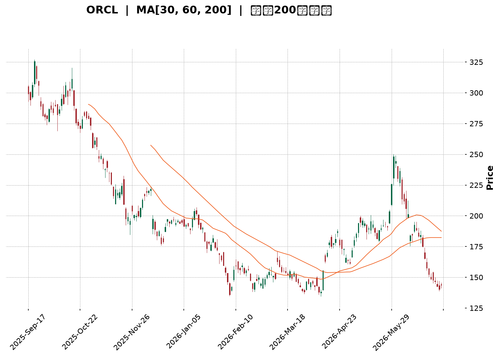
</details>

<html>
<head><meta charset="utf-8" /></head>
<body>
    <div style="height:500px; width:100%;">                        <script>window.PlotlyConfig = {MathJaxConfig: 'local'};</script>
        <script charset="utf-8" src="https://cdn.plot.ly/plotly-3.6.0.min.js" integrity="sha256-QaOVwtVY0T02VaHrr6pnoHLCwayMJp4O5n4YyaE3rJk=" crossorigin="anonymous"></script>                <div id="candlestick-chart" class="plotly-graph-div" style="height:100%; width:100%;"></div>            <script>                window.PLOTLYENV=window.PLOTLYENV || {};                                if (document.getElementById("candlestick-chart")) {                    Plotly.newPlot(                        "candlestick-chart",                        [{"close":{"dtype":"f8","bdata":"AAAAYM2wckAAAAAgw2RyQAAAAODkI3NAAAAAwEpZdEAAAABA93VzQAAAAAC4IHNAAAAAwMgQckAAAADA2ZNxQAAAAAC9iHFAAAAA4JtwcUAAAACA9OtxQAAAAMBN6HFAAAAAIGW+cUAAAACA6RRyQAAAAIA7oHFAAAAAQOzlcUAAAAAAV3JyQAAAACC7MnJAAAAAgA8ic0AAAADgx5JyQAAAAMA\u002f3HJAAAAAoGlxc0AAAAAgfhhyQAAAAADLN3FAAAAAAIMXcUAAAABA6u9wQAAAAEDAZXFAAAAAgJeZcUAAAACg5npxQAAAACDWcXFAAAAAoOUZcUAAAACgRepvQAAAAMAYUHBAAAAAAGcEcEAAAACg79RuQAAAAGD\u002fGG9AAAAAQPNJbkAAAACgjrltQAAAAKB9621AAAAAQKVWbUAAAADgUDNsQAAAAIC3B2tAAAAAIKWva0AAAACgjFBrQAAAAACWZGtAAAAAoOEEbEAAAADg5ixqQAAAACB5sWhAAAAA4NDhaEAAAACAc3poQAAAAGCpdmlAAAAAAO4WaUAAAACgzvZoQAAAAGDl+2hAAAAAgMLOaUAAAACgq6BqQAAAAOAICGtAAAAAIC1ma0AAAADAqYVrQAAAAMC7tGtAAAAA4FW0aEAAAABA6ZlnQAAAAEBM+WZAAAAA4O1vZ0AAAABA1ytmQAAAACDGXWZAAAAAIIXZZ0AAAABAY6VoQAAAAKCzRGhAAAAA4BSJaEAAAADg+5hoQAAAAGD5RWhAAAAAIC2AaEAAAACABjdoQAAAACB4UGhAAAAAID3tZ0AAAADgIRJoQAAAAKAw9WdAAAAAwLuPZ0AAAADAh7poQAAAAMD2fmlAAAAAAMAyaUAAAAAA9R1oQAAAAEAOpmdAAAAAAJnNZ0AAAADAZmlmQAAAAGDLqGVAAAAAQOoxZkAAAACgYxFmQAAAAODCuWZAAAAAAFLJZUAAAADAWoZlQAAAACB\u002fDWVAAAAA4DqAZEAAAADgF\u002fBjQAAAAMA2RGNAAAAAwBpFYkAAAADgKABhQAAAAIBVymFAAAAAoHCBY0AAAAAgrOpjQAAAAOCdk2NAAAAAoO59Y0AAAAAApfJjQAAAAEDkLWNAAAAAAAx0Y0AAAABg2H9jQAAAAGARcmJAAAAAgC6aYUAAAAAgNDRiQAAAAEACbGJAAAAA4C25YkAAAAAgmxxiQAAAAKBgl2JAAAAAYLmPYkAAAACg3vpiQAAAAEAKSGNAAAAAQK8NY0AAAABACuFiQAAAACApnGJAAAAAIKxRZEAAAADgZNNjQAAAAKA+UmNAAAAAQKttY0AAAAAA2kRjQAAAAEDFC2NAAAAAwFFfY0AAAADgFqViQAAAAMCwOWNAAAAAgH9SYkAAAACgYDBiQAAAAMADymFAAAAAwJBlYUAAAABAJEphQAAAAMAiU2JAAAAAYC8XYkAAAACA2ztiQAAAAAASIWJAAAAAoH7VYUAAAADAHuVhQAAAACCFO2FAAAAAQOFCYUAAAAAA13NjQAAAAAAAYGRAAAAAgOs5ZUAAAABA4UpmQAAAAIDr4WVAAAAAYI8yZkAAAACgcKVmQAAAAAAAcGdAAAAAwPUIZkAAAADA9ahlQAAAAGC4nmVAAAAAYLi+ZEAAAABgj3pkQAAAAOB6LGRAAAAAYI96ZUAAAACgR4lmQAAAAEAzK2dAAAAAwPVAaEAAAABA4VJoQAAAAGBmfmhAAAAAQOE6aEAAAABgj1pnQAAAAOBRuGdAAAAAIIVzaEAAAABgZh5oQAAAACCFU2dAAAAAYLiuZkAAAADAHoVnQAAAAOCjuGdAAAAAYI8CaEAAAACA6yFoQAAAAGC43mdAAAAAYGZ2aUAAAADA9ThsQAAAAMDMBG9AAAAAYI+SbkAAAABgj8psQAAAAEDhim1AAAAAgMK1akAAAACAPXpqQAAAAIDruWlAAAAA4FEoaUAAAABAMwNnQAAAAAApBGdAAAAA4HoUaEAAAABgj4pnQAAAAMD18GZAAAAAoEcJZ0AAAACAPeJlQAAAAMAepWRAAAAAwPWwY0AAAABguA5jQAAAAMD1kGJAAAAA4FF4YkAAAACgmVFiQAAAAAAA0GFAAAAA4KOIYUAAAADgUfhhQA=="},"high":{"dtype":"f8","bdata":"P2tt3+Qjc0Ai4+R5D9dyQGBjTm7JSnNAA\u002f+1FLludECodHloSSd0QJJBw2ZgYHNA3C7KKpOGckDJAiedKztyQFHlYNzau3FAcrYlXWyccUD8p3sSg\u002ftxQIHc2HyRSnJALGy1iFRFckD9pkfktmVyQHdicqPJLnJAWHSTn\u002fUTckD8WTiuG7JyQHcCct9yHXNAl0I\u002fdNZMc0BUmiGo+OhyQHdlMV\u002fEUXNAY38B1h4JdEA6QG3IvuZyQAsbGwuT93FARprgiWhpcUCgLDuMHDhxQElO2lLvlXFAqRPljvnWcUBN2cIn9NNxQO9X68t2u3FACj7FRGZ+cUCGih9XzMFwQPIU4vH7gnBA21lSfvZ\u002fcECZVKYBEbdvQAtSnA14W29AU+uZcY\u002fxbkDNx\u002fF10N1tQKp4vadbt25AvLCv1P1\u002fbUBd8kXqomttQPICEv0c+WtA1m5AWzk1bEAaWEsGDq5rQJY7saOtymtAKcViiTVYbEC72TsWRBJtQJJG7uw04WlAtSXIgGdSaUD6aBBrJcZoQP3EBdT0FmpApN+bXFUjaUAZ65sJOkhpQF7F2jRqDWpAVeRMfs3UaUDn1Z\u002f2BMNqQKG3FG8ZRWtApbBC2xLsa0CljJl2VKhrQMGgncsz\u002fmtAqp03pDMYaUA8Per6h5RoQMClNzwbemdATgXvNYGUZ0CCunKZjCtnQEeN25Y19GZALcQ\u002fRLQ9aECjel3cvrJoQLW416\u002fbf2hAh4Ys+TSiaEBQnlyrreRoQKLA9qSFqWhAr6vFNWOlaEDrxMiL239oQE2dtOYQrGhAoVPID6kOaUA4wwtWEjZoQFsfFmcyT2hAgdmNVBS5Z0AhbcoLd+9oQDbh48EwvGlAGN6C5nTiaUATpm9JTB9pQKaH5cCZSmhA4XfYgnjmZ0AzssFXO1FnQJ7KowYWf2ZA3+3OCw5xZkCTAJqhymBmQCqGHgxIFWdAEOloEgZjZkDykUxwhqFmQJhWPZdmNGVA\u002fL0ZFP0JZUC3a3EgVVNlQIMM6tVo2mNAtiB2V+8sY0AcsJFDR0FiQL1RfIpz1mFABxhDRzXmY0DjgmZPD5pkQFm0yIzkYmRAlIiiIpHPY0BhthoqhjdkQO994Vk412NAquUvyBSYY0DbIFQxu\u002fBjQBxOCp+HLmNAqj1gm1wpYkBrp5py+UdiQGynJHLjF2NAAr8Q7wP\u002fYkBAvJhcSjJiQAKM7gS3tGJAKioJQvPMYkDraRtlaSJjQKid1099rGNAWceMv1nUY0BHa2k0Eu9iQHdr6BpQM2NA8LYNqDBlZUDjXmJO3udkQH4IMf+7BmRA63ydJQDGY0D+JxuFvctjQIBw0LrHTWNAZzN8lfaLY0DREpKW7hZjQMMzazGcZ2NAyg9J1qgrY0DxZRYWMapiQF5esCW6PmJAJzvXnkymYUBGVaySrJZhQJy2VBtiXGJAKX18+iGkYkAXJRVKxT1iQOkhyC0OgWJAndpjlSMCYkBiZbD72d1iQAAAAKCZ2WFAAAAAoHCFYUAAAADAHn1jQAAAAMDMLGVAAAAAgOuRZUAAAADgo4hmQAAAAAAAEGdAAAAA4FE4ZkAAAABA4SpnQAAAAIDCpWdAAAAA4Hq8ZkAAAABguJZmQAAAAKCZsWVAAAAAYGYWZUAAAADgUZhkQAAAAIDCpWRAAAAAoJnJZUAAAAAAAPBmQAAAAOCjUGdAAAAAoEdJaEAAAADAzARpQAAAAAAAwGhAAAAAgMJ1aEAAAACgcB1oQAAAAIA98mdAAAAAYLgWaUAAAACAwo1oQAAAAOBR2GdAAAAAQAqXZ0AAAABACodnQAAAAIA9GmhAAAAAAACgaEAAAABgZmZoQAAAAOB6BGhAAAAAAACgaUAAAACgR0lsQAAAAAAASG9AAAAAAAAgb0AAAADgURBuQAAAAGBm3m1AAAAAgBTubEAAAACA62FrQAAAAAAAkGtAAAAAIFyPakAAAADgoxhnQAAAAGCPMmdAAAAAgD1qaEAAAACAPWpoQAAAAIAUxmdAAAAAIK5\u002fZ0AAAABgjxJnQAAAAGCPymVAAAAAAAC4ZEAAAAAA17NjQAAAAKBHMWNAAAAAAABQY0AAAACAwr1iQAAAAKCZcWJAAAAAgOthYkAAAAAA1zNiQA=="},"hovertemplate":"\u003cb\u003e%{x|%Y-%m-%d}\u003c\u002fb\u003e\u003cbr\u003e\u958b: $%{open:.2f}\u003cbr\u003e\u9ad8: $%{high:.2f}\u003cbr\u003e\u4f4e: $%{low:.2f}\u003cbr\u003e\u6536: $%{close:.2f}\u003cextra\u003e\u003c\u002fextra\u003e","low":{"dtype":"f8","bdata":"gNokeoVLckD0VuHIaxtyQPWKVerfb3JA4OEIlkUIc0DvTgSZ9TlzQD\u002f3QRjlmnJAR7pgB6fkcUAkV2pgjIxxQN7sH4W7VnFAUtjEf9YbcUDnXvLvRDtxQEdGDS33vHFAJw8XQWyccUBMrMr1XghyQMg6WRoNznBAFbpgrxKWcUCteL2KFthxQBudCMSfI3JAnqPvbL5+ckCYrbueJSNyQNkrsDSCkXJA1GWby4DTckDllU6w59txQGE9LEgOGnFA17JV7I3pcECkrNQusLlwQN7uSyGf63BAbOWr5GqIcUB2+djGnWFxQI51HaE5bXFAxjLfUBXbcEBTCpnl3tZvQFCCsPOL5G9ARIPk9nm1b0BQIhOaKHZuQK346rytsG5APiXJ54K6bUD9fNm8yd1sQJ465+Dnc21ADOHknr5vbEBewEJnPBlsQLu40NT5vGpAjr3UKXIvakAiEZclysdqQOAUGZUTpmpAMGQpp3L\u002fakBYU16DfyBqQDkIMI3FC2hAFAV\u002f9J8jaEDUR+cj4Q9nQBnByzcnIGlAvvPG5eWMaEAXCDWl9G9oQOdttCnp2GhAvBQr6dPFaEBnrUqF6qFpQFerB6MWimpAuY9437nyakA1ACtcTB5rQHDAb+8ICGtAWYLTL\u002fYiZ0BEAQXDAhtnQBTnHn9YiWZAWFLXY5\u002frZkCFVjTsof9lQBENl0yoL2ZAa20XghJfZ0AhhGFQ3\u002fRnQLaVRXuE4GdAHmP0+nAnaEBXUHjwMF1oQNGm2lfU7mdAs4ckLXhQaEAAibLhTDFoQDNRPi3DIGhAOiY4QvjkZ0AFx7zaILFnQDRKV2d52mdAw+y13mogZ0BYmgdU74NnQI1ZC89gimhA0NdFmcX+aECihh01q8RnQG26nv1il2dAE0QXgy88Z0AplnU3i1dmQBTyviQzQGVAkxtYplf8ZUDwgcj+12xlQEhj05oTPWZAfRPhiGqiZUBStyUNYWhlQBmAQ62mHmRAPCS41H9VZECSC+0VLu5jQNS7HNrh62JAYCQKfqz9YUDk26vR79hgQA8nzzqmTWFAFwr+zKBPYkAZ0BEqPY1jQIaJujjZLmNAk2vm+QP\u002fYkBfbkII\u002fFdjQESb+RMiC2NAeQ7UOvvaYkAGpi6USmdjQNk6T4wQXGJAeG5VzXFDYUDshTum6EdhQGB3f054WmJAD0geP6IUYkA5Bry2X7NhQOQ5\u002fzYJlmFAOt+oDavRYUCOA+UbmJJiQEB\u002frMYes2JA\u002fLquFPTiYkCM2AaEcz1iQCtt\u002fNXdfWJAIa+V66wAZEAShW3u2sFjQDL3KZ+hM2NAbHengBw\u002fY0CrF99t5x5jQMN\u002fOqVY8GJATJw2yOWLYkAubjYT7G1iQESKTV\u002fvxWJANC+sV9hKYkBWHX18GANiQNvPwZJnwWFAj\u002ffGZjI6YUBTsAS\u002fJQ9hQGAL596fa2FAmVxq11MFYkBYAXN5+XlhQC\u002f4Tc8t62FA8Iqbl35uYUBE5lFr4sxhQAAAAAAAAGFAAAAAgD3SYEAAAABACndhQAAAAIDrMWRAAAAAYLjGZEAAAACgmbllQAAAACCFq2VAAAAA4FGwZUAAAADgUQBmQAAAAKCZ2WZAAAAAYI\u002fCZUAAAACgmRllQAAAAMDM\u002fGRAAAAAoJlBZEAAAADAzBRkQAAAAGCPCmRAAAAAwMzEZEAAAADgUchlQAAAAAAAYGZAAAAAoHDVZkAAAACgmdlnQAAAAGC4xmdAAAAAQDPTZ0AAAAAA15tmQAAAAIDrIWdAAAAAYGYuZ0AAAADAzJxnQAAAAOCj6GZAAAAAgMKdZkAAAACgmVlmQAAAAGBmZmdAAAAAQDPjZ0AAAACA69FnQAAAAKBwfWdAAAAAACksaEAAAADgUQBqQAAAAEAzE2xAAAAAQOHabUAAAAAghXNsQAAAAAAAAGxAAAAAYGYuakAAAABgjypqQAAAAKBHuWhAAAAAgMLFaEAAAADA9ehlQAAAAAAAYGZAAAAAYLhGZ0AAAADAHnVnQAAAAGCP0mZAAAAAYGY2ZkAAAADAzMxlQAAAACCFk2RAAAAAQDNrY0AAAAAghctiQAAAAAAAgGJAAAAAYGYmYkAAAAAgXA9iQAAAAAAA0GFAAAAAYI9aYUAAAADAHqVhQA=="},"name":"\u50f9\u683c","open":{"dtype":"f8","bdata":"Hivh2n4Uc0Ab0HedrcpyQF1FC0qLinJAWmKHzUozc0AjGEV6aRd0QFR92VaxVnNAAgAqpVRPckBFUOeuSytyQI9j953ypXFAamMijoCXcUCnkgCv30lxQP20Q8Y+GHJAZ2oqSlL1cUC0UzUKdCFyQHdicqPJLnJAkJ9yEfeycUDqJ+33ThxyQKYd+L8ip3JAw0qbqAKOckAFbuZLdNtyQMd2V5qa8HJAGxd+YLz7ckDhhbAqUd5yQJbJPIz28nFA2i1RE5VGcUAW3piWQxJxQJZu+H6v9HBA6DxrdMfCcUARipKpHc1xQL5mhDZYlHFA0Wp75dp7cUBnLMLbk7FwQEqRcc3MHnBAW+MAgOt5cEDpIimQgA5vQDG5F7WqzG5A19aZ+57NbkD3iznCSbFtQAGOKXNUjm5AlmBInzBZbUB+jcgKaWltQKMKjN6082tAizVWqVoxakD+t1RuEhxrQHW232V23GpAWdgDGBs3a0BT6sXu8LdsQN7pkVcWumlAcd4HXgt1aEA8VtW5oBxoQGrXZNgNB2pAuuFLlVPJaEA8leIj0OhoQHXjutxifGlAJILmAGjjaEAAzAoY5dJpQBY4fnMyNWtAZ6LIOPB\u002fa0B7JwDN9FVrQBdmewpAjmtAGff6aJWuZ0Ck8gTIdWVoQAwFUqJ6ZGdAZT4iIk3yZkADkoG1F8ZmQGYdighUs2ZAmcSm36hnZ0AfhI7NxXNoQJs7lVZeZ2hAoEPbVeM5aECbn32\u002fNZtoQLQAmyosH2hAXH4xyplbaEDoAa\u002fSDGdoQE4KiPBxiGhA+85cbR2kaEC7r3LqSOxnQOsuR+ptQ2hA\u002fxERddq2Z0AiOvQ2xt9nQE4VklwxnWhAQVeyGyuJaUATpm9JTB9pQKaH5cCZSmhAmEmuJPinZ0AzssFXO1FnQCnc04G\u002fYWZARwAe0txXZkBt63JRnYBlQHJ7YtpAT2ZAxP3obh9SZkBbtv9N9cllQA\u002fNK3\u002fZMWVAjeBixLXyZEAU+StcZ0plQLpMz6SxtmNAH2ZwJFcrY0DjcIv5+yJiQP\u002fyvYdvaGFArcOAcSR\u002fYkB\u002fghodLu5jQFm0yIzkYmRAry2BqCusY0AREh6AQ9ZjQMJotsrDrWNA+jIOTuw7Y0DySY63kpRjQPWIWcuGGGNAa69FntolYkCQpymdMYthQN\u002f6LeqBlGJAXtWVVrWIYkAU7HS2IuxhQJcdaysRpGFAK\u002f549eAHYkBvNNLJnK9iQG4s8pniAWNAe0AFpGgMY0B+LSqlncViQCFxZQ67ImNAyzz3LKG5ZEAm0\u002fEPyIJkQN5bncniz2NAxNoc74lwY0Cx9bidxFxjQDx9c\u002f62G2NA5YDGhPa9YkBYZVjqjRBjQLTVEmGT3GJAq8ZHv\u002fUOY0Coz3JavZZiQJJDFVV07GFASuk5ShCOYUBR7W3lrnFhQFe7XGr5eWFAwtnmcUaSYkDdayjkDslhQBzuu7OoXWJAKl2hW\u002fLoYUCtp5FO3LhiQAAAAGBmxmFAAAAAgD0qYUAAAADgo3hhQAAAAIDC\u002fWRAAAAA4HrcZEAAAACgcA1mQAAAAIDC3WZAAAAAgOsZZkAAAABAM0tmQAAAAIDCRWdAAAAAwMyMZkAAAADgUZBmQAAAAGCPkmVAAAAAwB5FZEAAAACgR4FkQAAAAOCjQGRAAAAAoHDNZEAAAADgowBmQAAAAAApxGZAAAAAYGZGZ0AAAAAghdNoQAAAAGCPEmhAAAAAwMwEaEAAAACgcB1oQAAAAMD1oGdAAAAAgMKFZ0AAAAAgrs9nQAAAAAAAwGdAAAAAAABAZ0AAAACAFH5mQAAAAOBRoGdAAAAAoHD1Z0AAAACgmSloQAAAACBc72dAAAAAoEdBaEAAAAAAACBqQAAAAAAA0GxAAAAAoJlZbkAAAAAgXA9uQAAAAAAAYGxAAAAAIK6vbEAAAAAAADhrQAAAAMAevWpAAAAAAADQaEAAAACgcHVmQAAAAOBRIGdAAAAA4HpsZ0AAAADgUcBnQAAAAMAeRWdAAAAA4FHgZkAAAACA68lmQAAAACBcR2VAAAAAIFxPZEAAAABAM6tjQAAAAOBRyGJAAAAAgBQ+Y0AAAAAAAGhiQAAAACCuD2JAAAAAoJnpYUAAAACgmQliQA=="},"x":["2025-09-17T00:00:00-04:00","2025-09-18T00:00:00-04:00","2025-09-19T00:00:00-04:00","2025-09-22T00:00:00-04:00","2025-09-23T00:00:00-04:00","2025-09-24T00:00:00-04:00","2025-09-25T00:00:00-04:00","2025-09-26T00:00:00-04:00","2025-09-29T00:00:00-04:00","2025-09-30T00:00:00-04:00","2025-10-01T00:00:00-04:00","2025-10-02T00:00:00-04:00","2025-10-03T00:00:00-04:00","2025-10-06T00:00:00-04:00","2025-10-07T00:00:00-04:00","2025-10-08T00:00:00-04:00","2025-10-09T00:00:00-04:00","2025-10-10T00:00:00-04:00","2025-10-13T00:00:00-04:00","2025-10-14T00:00:00-04:00","2025-10-15T00:00:00-04:00","2025-10-16T00:00:00-04:00","2025-10-17T00:00:00-04:00","2025-10-20T00:00:00-04:00","2025-10-21T00:00:00-04:00","2025-10-22T00:00:00-04:00","2025-10-23T00:00:00-04:00","2025-10-24T00:00:00-04:00","2025-10-27T00:00:00-04:00","2025-10-28T00:00:00-04:00","2025-10-29T00:00:00-04:00","2025-10-30T00:00:00-04:00","2025-10-31T00:00:00-04:00","2025-11-03T00:00:00-05:00","2025-11-04T00:00:00-05:00","2025-11-05T00:00:00-05:00","2025-11-06T00:00:00-05:00","2025-11-07T00:00:00-05:00","2025-11-10T00:00:00-05:00","2025-11-11T00:00:00-05:00","2025-11-12T00:00:00-05:00","2025-11-13T00:00:00-05:00","2025-11-14T00:00:00-05:00","2025-11-17T00:00:00-05:00","2025-11-18T00:00:00-05:00","2025-11-19T00:00:00-05:00","2025-11-20T00:00:00-05:00","2025-11-21T00:00:00-05:00","2025-11-24T00:00:00-05:00","2025-11-25T00:00:00-05:00","2025-11-26T00:00:00-05:00","2025-11-28T00:00:00-05:00","2025-12-01T00:00:00-05:00","2025-12-02T00:00:00-05:00","2025-12-03T00:00:00-05:00","2025-12-04T00:00:00-05:00","2025-12-05T00:00:00-05:00","2025-12-08T00:00:00-05:00","2025-12-09T00:00:00-05:00","2025-12-10T00:00:00-05:00","2025-12-11T00:00:00-05:00","2025-12-12T00:00:00-05:00","2025-12-15T00:00:00-05:00","2025-12-16T00:00:00-05:00","2025-12-17T00:00:00-05:00","2025-12-18T00:00:00-05:00","2025-12-19T00:00:00-05:00","2025-12-22T00:00:00-05:00","2025-12-23T00:00:00-05:00","2025-12-24T00:00:00-05:00","2025-12-26T00:00:00-05:00","2025-12-29T00:00:00-05:00","2025-12-30T00:00:00-05:00","2025-12-31T00:00:00-05:00","2026-01-02T00:00:00-05:00","2026-01-05T00:00:00-05:00","2026-01-06T00:00:00-05:00","2026-01-07T00:00:00-05:00","2026-01-08T00:00:00-05:00","2026-01-09T00:00:00-05:00","2026-01-12T00:00:00-05:00","2026-01-13T00:00:00-05:00","2026-01-14T00:00:00-05:00","2026-01-15T00:00:00-05:00","2026-01-16T00:00:00-05:00","2026-01-20T00:00:00-05:00","2026-01-21T00:00:00-05:00","2026-01-22T00:00:00-05:00","2026-01-23T00:00:00-05:00","2026-01-26T00:00:00-05:00","2026-01-27T00:00:00-05:00","2026-01-28T00:00:00-05:00","2026-01-29T00:00:00-05:00","2026-01-30T00:00:00-05:00","2026-02-02T00:00:00-05:00","2026-02-03T00:00:00-05:00","2026-02-04T00:00:00-05:00","2026-02-05T00:00:00-05:00","2026-02-06T00:00:00-05:00","2026-02-09T00:00:00-05:00","2026-02-10T00:00:00-05:00","2026-02-11T00:00:00-05:00","2026-02-12T00:00:00-05:00","2026-02-13T00:00:00-05:00","2026-02-17T00:00:00-05:00","2026-02-18T00:00:00-05:00","2026-02-19T00:00:00-05:00","2026-02-20T00:00:00-05:00","2026-02-23T00:00:00-05:00","2026-02-24T00:00:00-05:00","2026-02-25T00:00:00-05:00","2026-02-26T00:00:00-05:00","2026-02-27T00:00:00-05:00","2026-03-02T00:00:00-05:00","2026-03-03T00:00:00-05:00","2026-03-04T00:00:00-05:00","2026-03-05T00:00:00-05:00","2026-03-06T00:00:00-05:00","2026-03-09T00:00:00-04:00","2026-03-10T00:00:00-04:00","2026-03-11T00:00:00-04:00","2026-03-12T00:00:00-04:00","2026-03-13T00:00:00-04:00","2026-03-16T00:00:00-04:00","2026-03-17T00:00:00-04:00","2026-03-18T00:00:00-04:00","2026-03-19T00:00:00-04:00","2026-03-20T00:00:00-04:00","2026-03-23T00:00:00-04:00","2026-03-24T00:00:00-04:00","2026-03-25T00:00:00-04:00","2026-03-26T00:00:00-04:00","2026-03-27T00:00:00-04:00","2026-03-30T00:00:00-04:00","2026-03-31T00:00:00-04:00","2026-04-01T00:00:00-04:00","2026-04-02T00:00:00-04:00","2026-04-06T00:00:00-04:00","2026-04-07T00:00:00-04:00","2026-04-08T00:00:00-04:00","2026-04-09T00:00:00-04:00","2026-04-10T00:00:00-04:00","2026-04-13T00:00:00-04:00","2026-04-14T00:00:00-04:00","2026-04-15T00:00:00-04:00","2026-04-16T00:00:00-04:00","2026-04-17T00:00:00-04:00","2026-04-20T00:00:00-04:00","2026-04-21T00:00:00-04:00","2026-04-22T00:00:00-04:00","2026-04-23T00:00:00-04:00","2026-04-24T00:00:00-04:00","2026-04-27T00:00:00-04:00","2026-04-28T00:00:00-04:00","2026-04-29T00:00:00-04:00","2026-04-30T00:00:00-04:00","2026-05-01T00:00:00-04:00","2026-05-04T00:00:00-04:00","2026-05-05T00:00:00-04:00","2026-05-06T00:00:00-04:00","2026-05-07T00:00:00-04:00","2026-05-08T00:00:00-04:00","2026-05-11T00:00:00-04:00","2026-05-12T00:00:00-04:00","2026-05-13T00:00:00-04:00","2026-05-14T00:00:00-04:00","2026-05-15T00:00:00-04:00","2026-05-18T00:00:00-04:00","2026-05-19T00:00:00-04:00","2026-05-20T00:00:00-04:00","2026-05-21T00:00:00-04:00","2026-05-22T00:00:00-04:00","2026-05-26T00:00:00-04:00","2026-05-27T00:00:00-04:00","2026-05-28T00:00:00-04:00","2026-05-29T00:00:00-04:00","2026-06-01T00:00:00-04:00","2026-06-02T00:00:00-04:00","2026-06-03T00:00:00-04:00","2026-06-04T00:00:00-04:00","2026-06-05T00:00:00-04:00","2026-06-08T00:00:00-04:00","2026-06-09T00:00:00-04:00","2026-06-10T00:00:00-04:00","2026-06-11T00:00:00-04:00","2026-06-12T00:00:00-04:00","2026-06-15T00:00:00-04:00","2026-06-16T00:00:00-04:00","2026-06-17T00:00:00-04:00","2026-06-18T00:00:00-04:00","2026-06-22T00:00:00-04:00","2026-06-23T00:00:00-04:00","2026-06-24T00:00:00-04:00","2026-06-25T00:00:00-04:00","2026-06-26T00:00:00-04:00","2026-06-29T00:00:00-04:00","2026-06-30T00:00:00-04:00","2026-07-01T00:00:00-04:00","2026-07-02T00:00:00-04:00","2026-07-06T00:00:00-04:00"],"type":"candlestick"},{"hovertemplate":"MA30: $%{y:.2f}\u003cextra\u003e\u003c\u002fextra\u003e","line":{"color":"#2196F3","dash":"dash","width":2},"mode":"lines","name":"MA30","x":["2025-09-17T00:00:00-04:00","2025-09-18T00:00:00-04:00","2025-09-19T00:00:00-04:00","2025-09-22T00:00:00-04:00","2025-09-23T00:00:00-04:00","2025-09-24T00:00:00-04:00","2025-09-25T00:00:00-04:00","2025-09-26T00:00:00-04:00","2025-09-29T00:00:00-04:00","2025-09-30T00:00:00-04:00","2025-10-01T00:00:00-04:00","2025-10-02T00:00:00-04:00","2025-10-03T00:00:00-04:00","2025-10-06T00:00:00-04:00","2025-10-07T00:00:00-04:00","2025-10-08T00:00:00-04:00","2025-10-09T00:00:00-04:00","2025-10-10T00:00:00-04:00","2025-10-13T00:00:00-04:00","2025-10-14T00:00:00-04:00","2025-10-15T00:00:00-04:00","2025-10-16T00:00:00-04:00","2025-10-17T00:00:00-04:00","2025-10-20T00:00:00-04:00","2025-10-21T00:00:00-04:00","2025-10-22T00:00:00-04:00","2025-10-23T00:00:00-04:00","2025-10-24T00:00:00-04:00","2025-10-27T00:00:00-04:00","2025-10-28T00:00:00-04:00","2025-10-29T00:00:00-04:00","2025-10-30T00:00:00-04:00","2025-10-31T00:00:00-04:00","2025-11-03T00:00:00-05:00","2025-11-04T00:00:00-05:00","2025-11-05T00:00:00-05:00","2025-11-06T00:00:00-05:00","2025-11-07T00:00:00-05:00","2025-11-10T00:00:00-05:00","2025-11-11T00:00:00-05:00","2025-11-12T00:00:00-05:00","2025-11-13T00:00:00-05:00","2025-11-14T00:00:00-05:00","2025-11-17T00:00:00-05:00","2025-11-18T00:00:00-05:00","2025-11-19T00:00:00-05:00","2025-11-20T00:00:00-05:00","2025-11-21T00:00:00-05:00","2025-11-24T00:00:00-05:00","2025-11-25T00:00:00-05:00","2025-11-26T00:00:00-05:00","2025-11-28T00:00:00-05:00","2025-12-01T00:00:00-05:00","2025-12-02T00:00:00-05:00","2025-12-03T00:00:00-05:00","2025-12-04T00:00:00-05:00","2025-12-05T00:00:00-05:00","2025-12-08T00:00:00-05:00","2025-12-09T00:00:00-05:00","2025-12-10T00:00:00-05:00","2025-12-11T00:00:00-05:00","2025-12-12T00:00:00-05:00","2025-12-15T00:00:00-05:00","2025-12-16T00:00:00-05:00","2025-12-17T00:00:00-05:00","2025-12-18T00:00:00-05:00","2025-12-19T00:00:00-05:00","2025-12-22T00:00:00-05:00","2025-12-23T00:00:00-05:00","2025-12-24T00:00:00-05:00","2025-12-26T00:00:00-05:00","2025-12-29T00:00:00-05:00","2025-12-30T00:00:00-05:00","2025-12-31T00:00:00-05:00","2026-01-02T00:00:00-05:00","2026-01-05T00:00:00-05:00","2026-01-06T00:00:00-05:00","2026-01-07T00:00:00-05:00","2026-01-08T00:00:00-05:00","2026-01-09T00:00:00-05:00","2026-01-12T00:00:00-05:00","2026-01-13T00:00:00-05:00","2026-01-14T00:00:00-05:00","2026-01-15T00:00:00-05:00","2026-01-16T00:00:00-05:00","2026-01-20T00:00:00-05:00","2026-01-21T00:00:00-05:00","2026-01-22T00:00:00-05:00","2026-01-23T00:00:00-05:00","2026-01-26T00:00:00-05:00","2026-01-27T00:00:00-05:00","2026-01-28T00:00:00-05:00","2026-01-29T00:00:00-05:00","2026-01-30T00:00:00-05:00","2026-02-02T00:00:00-05:00","2026-02-03T00:00:00-05:00","2026-02-04T00:00:00-05:00","2026-02-05T00:00:00-05:00","2026-02-06T00:00:00-05:00","2026-02-09T00:00:00-05:00","2026-02-10T00:00:00-05:00","2026-02-11T00:00:00-05:00","2026-02-12T00:00:00-05:00","2026-02-13T00:00:00-05:00","2026-02-17T00:00:00-05:00","2026-02-18T00:00:00-05:00","2026-02-19T00:00:00-05:00","2026-02-20T00:00:00-05:00","2026-02-23T00:00:00-05:00","2026-02-24T00:00:00-05:00","2026-02-25T00:00:00-05:00","2026-02-26T00:00:00-05:00","2026-02-27T00:00:00-05:00","2026-03-02T00:00:00-05:00","2026-03-03T00:00:00-05:00","2026-03-04T00:00:00-05:00","2026-03-05T00:00:00-05:00","2026-03-06T00:00:00-05:00","2026-03-09T00:00:00-04:00","2026-03-10T00:00:00-04:00","2026-03-11T00:00:00-04:00","2026-03-12T00:00:00-04:00","2026-03-13T00:00:00-04:00","2026-03-16T00:00:00-04:00","2026-03-17T00:00:00-04:00","2026-03-18T00:00:00-04:00","2026-03-19T00:00:00-04:00","2026-03-20T00:00:00-04:00","2026-03-23T00:00:00-04:00","2026-03-24T00:00:00-04:00","2026-03-25T00:00:00-04:00","2026-03-26T00:00:00-04:00","2026-03-27T00:00:00-04:00","2026-03-30T00:00:00-04:00","2026-03-31T00:00:00-04:00","2026-04-01T00:00:00-04:00","2026-04-02T00:00:00-04:00","2026-04-06T00:00:00-04:00","2026-04-07T00:00:00-04:00","2026-04-08T00:00:00-04:00","2026-04-09T00:00:00-04:00","2026-04-10T00:00:00-04:00","2026-04-13T00:00:00-04:00","2026-04-14T00:00:00-04:00","2026-04-15T00:00:00-04:00","2026-04-16T00:00:00-04:00","2026-04-17T00:00:00-04:00","2026-04-20T00:00:00-04:00","2026-04-21T00:00:00-04:00","2026-04-22T00:00:00-04:00","2026-04-23T00:00:00-04:00","2026-04-24T00:00:00-04:00","2026-04-27T00:00:00-04:00","2026-04-28T00:00:00-04:00","2026-04-29T00:00:00-04:00","2026-04-30T00:00:00-04:00","2026-05-01T00:00:00-04:00","2026-05-04T00:00:00-04:00","2026-05-05T00:00:00-04:00","2026-05-06T00:00:00-04:00","2026-05-07T00:00:00-04:00","2026-05-08T00:00:00-04:00","2026-05-11T00:00:00-04:00","2026-05-12T00:00:00-04:00","2026-05-13T00:00:00-04:00","2026-05-14T00:00:00-04:00","2026-05-15T00:00:00-04:00","2026-05-18T00:00:00-04:00","2026-05-19T00:00:00-04:00","2026-05-20T00:00:00-04:00","2026-05-21T00:00:00-04:00","2026-05-22T00:00:00-04:00","2026-05-26T00:00:00-04:00","2026-05-27T00:00:00-04:00","2026-05-28T00:00:00-04:00","2026-05-29T00:00:00-04:00","2026-06-01T00:00:00-04:00","2026-06-02T00:00:00-04:00","2026-06-03T00:00:00-04:00","2026-06-04T00:00:00-04:00","2026-06-05T00:00:00-04:00","2026-06-08T00:00:00-04:00","2026-06-09T00:00:00-04:00","2026-06-10T00:00:00-04:00","2026-06-11T00:00:00-04:00","2026-06-12T00:00:00-04:00","2026-06-15T00:00:00-04:00","2026-06-16T00:00:00-04:00","2026-06-17T00:00:00-04:00","2026-06-18T00:00:00-04:00","2026-06-22T00:00:00-04:00","2026-06-23T00:00:00-04:00","2026-06-24T00:00:00-04:00","2026-06-25T00:00:00-04:00","2026-06-26T00:00:00-04:00","2026-06-29T00:00:00-04:00","2026-06-30T00:00:00-04:00","2026-07-01T00:00:00-04:00","2026-07-02T00:00:00-04:00","2026-07-06T00:00:00-04:00"],"y":{"dtype":"f8","bdata":"AAAAAAAA+H8AAAAAAAD4fwAAAAAAAPh\u002fAAAAAAAA+H8AAAAAAAD4fwAAAAAAAPh\u002fAAAAAAAA+H8AAAAAAAD4fwAAAAAAAPh\u002fAAAAAAAA+H8AAAAAAAD4fwAAAAAAAPh\u002fAAAAAAAA+H8AAAAAAAD4fwAAAAAAAPh\u002fAAAAAAAA+H8AAAAAAAD4fwAAAAAAAPh\u002fAAAAAAAA+H8AAAAAAAD4fwAAAAAAAPh\u002fAAAAAAAA+H8AAAAAAAD4fwAAAAAAAPh\u002fAAAAAAAA+H8AAAAAAAD4fwAAAAAAAPh\u002fAAAAAAAA+H8AAAAAAAD4f3d3d+edKXJAVVVVpQ0cckAREREJRAdyQJqZmaEj73FAMzMzGy3KcUC8u7vbqKdxQKuqqnIeiXFAzczMJDFwcUDNzMzcBVlxQM3MzHQOQ3FAmpmZ4WkrcUDv7u6+zQpxQKuqqnpS5XBAvLu7UwnEcEB3d3cnSJ5wQDMzMyPAfHBAMzMzW5FbcEAiIiKS1i1wQO\u002fu7l7P929AERERkZmFb0BmZmYGfxlvQCIiItLmsG5Aq6qq+is7bkCJiIioXdttQDMzM6O1im1AvLu76ztDbUCamZk5ZQVtQBEREYElw2xAAAAAYJSAbECamZm5G0FsQBEREXHPA2xA7+7u\u002fsKya0C8u7v70GtrQCIiIgJ0GWtARERENBfQakDe3d39L4ZqQFVVVRWuO2pAq6qqersEakAzMzOzZNlpQERERMQqqWlAzczMfC6AaUC8u7vrb2FpQFVVVZXpSWlAq6qq6rouaUAzMzODRxRpQAAAAEAC+mhA3t3dXRbXaEDe3d3dIMVoQO\u002fu7i7avmhAZmZmNpWzaEBVVVUFuLVoQN7d3d3+tWhAREREROy2aEAAAADQsa9oQGZmZsZMpGhAq6qqyjGTaEB3d3cHOG9oQFVVVaVgQWhAREREBPgUaEBVVVUlbeZnQCIiImLtu2dAq6qq2gajZ0B3d3fnTpFnQDMzMzPqgGdAMzMzs9tnZ0CamZnJzFRnQDMzMxNZOmdA3t3d7bsKZ0AAAABAfslmQImIiNg2kmZAiYiI+EpnZkARERFhWT9mQDMzM0NFF2ZAIiIicofsZUC8u7vLHchlQBERERFMnGVAMzMzwx92ZUAAAABQHU9lQM3MzLwTIGVAIiIisjntZEDe3d09jLVkQCIiIsIueWRAd3d3J+5BZEDNzMxsrw5kQBEREYGH42NAmpmZ2cy2Y0C8u7sLhJljQHd3d1c5hWNAMzMzk2pqY0BVVVVlNE9jQLy7u6sVLGNAREREJJAfY0Crqqp6EBFjQAAAABBKAmNAREREJCP5YkARERHhbfNiQKuqqjqM8WJAZmZmdvT6YkBVVVVl\u002fAhjQLy7uys7FWNAERERESILY0ARERHRY\u002fxiQCIiIvIi7WJAMzMz80HbYkDe3d39ksRiQGZmZkZIvWJAIiIiUqexYkAAAACg2qZiQCIiInInpGJAVVVVlSGmYkDNzMy8fqNiQO\u002fu7m5YmWJAmpmZad6MYkB3d3dXT5hiQKuqqtqHp2JAIiIiQkW+YkDNzMycidpiQJqZmcm78GJA7+7uDpALY0CrqqqatStjQO\u002fu7m7nVGNAVVVVBYxjY0C8u7v7MnNjQERERKTQhmNAAAAA0AySY0CJiIioX5xjQAAAAFD\u002fpWNAVVVV1fi3Y0CJiIioLdljQERERCTU+mNA7+7urnEtZEDe3d1Ny2FkQKuqqsoBm2RAZmZmRlHVZEBERESUEAllQO\u002fu7q4aN2VA7+7uzmFtZUAzMzOjmZ9lQO\u002fu7s7yy2VAmpmZmVL1ZUCamZmZUiVmQN7d3X2xXGZAzczMXEiWZkCrqqr6N75mQM3MzOwK3GZAd3d3JzEAZ0AAAABwyzJnQBEREeHBgGdAiYiIWDnIZ0De3d1NqfxnQBEREeHBMGhAIiIikqZYaEAAAACQwoFoQM3MzMzMpGhAzczMDHTKaEDNzMwcE+BoQGZmZqZU+GhAq6qqKocOaUAAAACgGhdpQERERKQpFWlAiYiI+MUKaUBmZma28\u002fVoQN7d3f0b1WhAERER8WCuaEBERESkt4loQKuqqhq9XWhAzczM3LIqaEAiIiKSNPlnQJqZmZknymdAvLu7+zeeZ0AiIiLS225nQA=="},"type":"scatter"},{"hovertemplate":"MA60: $%{y:.2f}\u003cextra\u003e\u003c\u002fextra\u003e","line":{"color":"#9C27B0","dash":"dash","width":2},"mode":"lines","name":"MA60","x":["2025-09-17T00:00:00-04:00","2025-09-18T00:00:00-04:00","2025-09-19T00:00:00-04:00","2025-09-22T00:00:00-04:00","2025-09-23T00:00:00-04:00","2025-09-24T00:00:00-04:00","2025-09-25T00:00:00-04:00","2025-09-26T00:00:00-04:00","2025-09-29T00:00:00-04:00","2025-09-30T00:00:00-04:00","2025-10-01T00:00:00-04:00","2025-10-02T00:00:00-04:00","2025-10-03T00:00:00-04:00","2025-10-06T00:00:00-04:00","2025-10-07T00:00:00-04:00","2025-10-08T00:00:00-04:00","2025-10-09T00:00:00-04:00","2025-10-10T00:00:00-04:00","2025-10-13T00:00:00-04:00","2025-10-14T00:00:00-04:00","2025-10-15T00:00:00-04:00","2025-10-16T00:00:00-04:00","2025-10-17T00:00:00-04:00","2025-10-20T00:00:00-04:00","2025-10-21T00:00:00-04:00","2025-10-22T00:00:00-04:00","2025-10-23T00:00:00-04:00","2025-10-24T00:00:00-04:00","2025-10-27T00:00:00-04:00","2025-10-28T00:00:00-04:00","2025-10-29T00:00:00-04:00","2025-10-30T00:00:00-04:00","2025-10-31T00:00:00-04:00","2025-11-03T00:00:00-05:00","2025-11-04T00:00:00-05:00","2025-11-05T00:00:00-05:00","2025-11-06T00:00:00-05:00","2025-11-07T00:00:00-05:00","2025-11-10T00:00:00-05:00","2025-11-11T00:00:00-05:00","2025-11-12T00:00:00-05:00","2025-11-13T00:00:00-05:00","2025-11-14T00:00:00-05:00","2025-11-17T00:00:00-05:00","2025-11-18T00:00:00-05:00","2025-11-19T00:00:00-05:00","2025-11-20T00:00:00-05:00","2025-11-21T00:00:00-05:00","2025-11-24T00:00:00-05:00","2025-11-25T00:00:00-05:00","2025-11-26T00:00:00-05:00","2025-11-28T00:00:00-05:00","2025-12-01T00:00:00-05:00","2025-12-02T00:00:00-05:00","2025-12-03T00:00:00-05:00","2025-12-04T00:00:00-05:00","2025-12-05T00:00:00-05:00","2025-12-08T00:00:00-05:00","2025-12-09T00:00:00-05:00","2025-12-10T00:00:00-05:00","2025-12-11T00:00:00-05:00","2025-12-12T00:00:00-05:00","2025-12-15T00:00:00-05:00","2025-12-16T00:00:00-05:00","2025-12-17T00:00:00-05:00","2025-12-18T00:00:00-05:00","2025-12-19T00:00:00-05:00","2025-12-22T00:00:00-05:00","2025-12-23T00:00:00-05:00","2025-12-24T00:00:00-05:00","2025-12-26T00:00:00-05:00","2025-12-29T00:00:00-05:00","2025-12-30T00:00:00-05:00","2025-12-31T00:00:00-05:00","2026-01-02T00:00:00-05:00","2026-01-05T00:00:00-05:00","2026-01-06T00:00:00-05:00","2026-01-07T00:00:00-05:00","2026-01-08T00:00:00-05:00","2026-01-09T00:00:00-05:00","2026-01-12T00:00:00-05:00","2026-01-13T00:00:00-05:00","2026-01-14T00:00:00-05:00","2026-01-15T00:00:00-05:00","2026-01-16T00:00:00-05:00","2026-01-20T00:00:00-05:00","2026-01-21T00:00:00-05:00","2026-01-22T00:00:00-05:00","2026-01-23T00:00:00-05:00","2026-01-26T00:00:00-05:00","2026-01-27T00:00:00-05:00","2026-01-28T00:00:00-05:00","2026-01-29T00:00:00-05:00","2026-01-30T00:00:00-05:00","2026-02-02T00:00:00-05:00","2026-02-03T00:00:00-05:00","2026-02-04T00:00:00-05:00","2026-02-05T00:00:00-05:00","2026-02-06T00:00:00-05:00","2026-02-09T00:00:00-05:00","2026-02-10T00:00:00-05:00","2026-02-11T00:00:00-05:00","2026-02-12T00:00:00-05:00","2026-02-13T00:00:00-05:00","2026-02-17T00:00:00-05:00","2026-02-18T00:00:00-05:00","2026-02-19T00:00:00-05:00","2026-02-20T00:00:00-05:00","2026-02-23T00:00:00-05:00","2026-02-24T00:00:00-05:00","2026-02-25T00:00:00-05:00","2026-02-26T00:00:00-05:00","2026-02-27T00:00:00-05:00","2026-03-02T00:00:00-05:00","2026-03-03T00:00:00-05:00","2026-03-04T00:00:00-05:00","2026-03-05T00:00:00-05:00","2026-03-06T00:00:00-05:00","2026-03-09T00:00:00-04:00","2026-03-10T00:00:00-04:00","2026-03-11T00:00:00-04:00","2026-03-12T00:00:00-04:00","2026-03-13T00:00:00-04:00","2026-03-16T00:00:00-04:00","2026-03-17T00:00:00-04:00","2026-03-18T00:00:00-04:00","2026-03-19T00:00:00-04:00","2026-03-20T00:00:00-04:00","2026-03-23T00:00:00-04:00","2026-03-24T00:00:00-04:00","2026-03-25T00:00:00-04:00","2026-03-26T00:00:00-04:00","2026-03-27T00:00:00-04:00","2026-03-30T00:00:00-04:00","2026-03-31T00:00:00-04:00","2026-04-01T00:00:00-04:00","2026-04-02T00:00:00-04:00","2026-04-06T00:00:00-04:00","2026-04-07T00:00:00-04:00","2026-04-08T00:00:00-04:00","2026-04-09T00:00:00-04:00","2026-04-10T00:00:00-04:00","2026-04-13T00:00:00-04:00","2026-04-14T00:00:00-04:00","2026-04-15T00:00:00-04:00","2026-04-16T00:00:00-04:00","2026-04-17T00:00:00-04:00","2026-04-20T00:00:00-04:00","2026-04-21T00:00:00-04:00","2026-04-22T00:00:00-04:00","2026-04-23T00:00:00-04:00","2026-04-24T00:00:00-04:00","2026-04-27T00:00:00-04:00","2026-04-28T00:00:00-04:00","2026-04-29T00:00:00-04:00","2026-04-30T00:00:00-04:00","2026-05-01T00:00:00-04:00","2026-05-04T00:00:00-04:00","2026-05-05T00:00:00-04:00","2026-05-06T00:00:00-04:00","2026-05-07T00:00:00-04:00","2026-05-08T00:00:00-04:00","2026-05-11T00:00:00-04:00","2026-05-12T00:00:00-04:00","2026-05-13T00:00:00-04:00","2026-05-14T00:00:00-04:00","2026-05-15T00:00:00-04:00","2026-05-18T00:00:00-04:00","2026-05-19T00:00:00-04:00","2026-05-20T00:00:00-04:00","2026-05-21T00:00:00-04:00","2026-05-22T00:00:00-04:00","2026-05-26T00:00:00-04:00","2026-05-27T00:00:00-04:00","2026-05-28T00:00:00-04:00","2026-05-29T00:00:00-04:00","2026-06-01T00:00:00-04:00","2026-06-02T00:00:00-04:00","2026-06-03T00:00:00-04:00","2026-06-04T00:00:00-04:00","2026-06-05T00:00:00-04:00","2026-06-08T00:00:00-04:00","2026-06-09T00:00:00-04:00","2026-06-10T00:00:00-04:00","2026-06-11T00:00:00-04:00","2026-06-12T00:00:00-04:00","2026-06-15T00:00:00-04:00","2026-06-16T00:00:00-04:00","2026-06-17T00:00:00-04:00","2026-06-18T00:00:00-04:00","2026-06-22T00:00:00-04:00","2026-06-23T00:00:00-04:00","2026-06-24T00:00:00-04:00","2026-06-25T00:00:00-04:00","2026-06-26T00:00:00-04:00","2026-06-29T00:00:00-04:00","2026-06-30T00:00:00-04:00","2026-07-01T00:00:00-04:00","2026-07-02T00:00:00-04:00","2026-07-06T00:00:00-04:00"],"y":{"dtype":"f8","bdata":"AAAAAAAA+H8AAAAAAAD4fwAAAAAAAPh\u002fAAAAAAAA+H8AAAAAAAD4fwAAAAAAAPh\u002fAAAAAAAA+H8AAAAAAAD4fwAAAAAAAPh\u002fAAAAAAAA+H8AAAAAAAD4fwAAAAAAAPh\u002fAAAAAAAA+H8AAAAAAAD4fwAAAAAAAPh\u002fAAAAAAAA+H8AAAAAAAD4fwAAAAAAAPh\u002fAAAAAAAA+H8AAAAAAAD4fwAAAAAAAPh\u002fAAAAAAAA+H8AAAAAAAD4fwAAAAAAAPh\u002fAAAAAAAA+H8AAAAAAAD4fwAAAAAAAPh\u002fAAAAAAAA+H8AAAAAAAD4fwAAAAAAAPh\u002fAAAAAAAA+H8AAAAAAAD4fwAAAAAAAPh\u002fAAAAAAAA+H8AAAAAAAD4fwAAAAAAAPh\u002fAAAAAAAA+H8AAAAAAAD4fwAAAAAAAPh\u002fAAAAAAAA+H8AAAAAAAD4fwAAAAAAAPh\u002fAAAAAAAA+H8AAAAAAAD4fwAAAAAAAPh\u002fAAAAAAAA+H8AAAAAAAD4fwAAAAAAAPh\u002fAAAAAAAA+H8AAAAAAAD4fwAAAAAAAPh\u002fAAAAAAAA+H8AAAAAAAD4fwAAAAAAAPh\u002fAAAAAAAA+H8AAAAAAAD4fwAAAAAAAPh\u002fAAAAAAAA+H8AAAAAAAD4fwAAANDCFXBAzczMJG\u002f1b0Dv7u6GLL1vQKuqqqLde29AVVVVtTgyb0CrqqrawOpuQFVVVX31pm5AIiIi4o5ybkBmZmY2uEVuQO\u002fu7tajF25AAAAAIIHrbUDNzMy0hbttQFVVVUVHim1AERERyWZbbUARERHpayhtQDMzM0PB+WxAIiIiihzHbEAREREBZ5BsQO\u002fu7sZUW2xAvLu7Y5ccbEDe3d2Fm+drQAAAANhys2tAd3d3Hwx5a0BERES8h0VrQM3MzDSBF2tAMzMz2zbrakCJiIigTrpqQDMzMxNDgmpAIiIiMsZKakB3d3dvxBNqQJqZmWne32lAzczM7OSqaUCamZnxj35pQKuqqhovTWlAvLu7c\u002fkbaUC8u7tjfu1oQERERJQDu2hAREREtLuHaECamZl5cVFoQGZmZs6wHWhAq6qqurzzZ0BmZmamZNBnQERERGyXsGdAZmZmLqGNZ0B3d3enMm5nQImIiCgnS2dAiYiIEJsmZ0Dv7u4WHwpnQN7d3fV272ZAREREdGfQZkCamZkhorVmQAAAANCWl2ZA3t3dNW18ZkBmZmaeMF9mQLy7uyPqQ2ZAIiIiUv8kZkCamZkJXgRmQGZmZv5M42VAvLu7S7G\u002fZUBVVVXF0JplQO\u002fu7oYBdGVAd3d3f0thZUARERGxL1FlQJqZmSGaQWVAvLu7a38wZUBVVVVVHSRlQO\u002fu7qbyFWVAIiIiMtgCZUCrqqpSPelkQCIiIgK502RAzczMhDa5ZEARERGZ3p1kQKuqqho0gmRAq6qqsuRjZEDNzMxkWEZkQLy7uyvKLGRAq6qqiuMTZEAAAAD4+\u002fpjQHd3d5cd4mNAvLu7o63JY0BVVVV9haxjQImIiJhDiWNAiYiISGZnY0AiIiJif1NjQN7d3a2HRWNA3t3dDYk6Y0BERETUBjpjQImIiJD6OmNAERERUf06Y0AAAAAAdT1jQFVVVY1+QGNAzczMFI5BY0AzMzO7IUJjQCIiIlqNRGNAIiIi+pdFY0DNzMzE5kdjQFVVVcXFS2NA3t3dpXZZY0Dv7u4GFXFjQAAAAKgHiGNAAAAA4EmcY0B3d3ePF69jQGZmZl4SxGNAzczMnEnYY0ARERHJ0eZjQKuqqnox+mNAiYiIkIQPZECamZkhOiNkQImIiCANOGRAd3d3F7pNZEAzMzOraGRkQGZmZvYEe2RAMzMzY5ORZEARERGpQ6tkQLy7u2PJwWRAzczMNDvfZEBmZmaGqgZlQFVVVdW+OGVAvLu7s+RpZUBERER0L5RlQAAAAKjUwmVAvLu7SxneZUDe3d3FevplQImIiLjOFWZAZmZmbkAuZkCrqqpiOT5mQDMzM\u002fspT2ZAAAAAAEBjZkBEREQkJHhmQEREROT+h2ZAvLu70xucZkAiIiKC36tmQEREROQOuGZAvLu7G9nBZkBEREQcZMlmQM3MzORrymZA3t3dVQrMZkCrqqoaZ8xmQERERDQNy2ZAq6qqSsXJZkDe3d01F8pmQA=="},"type":"scatter"},{"hovertemplate":"MA200: $%{y:.2f}\u003cextra\u003e\u003c\u002fextra\u003e","line":{"color":"#FF6F00","dash":"solid","width":2},"mode":"lines","name":"MA200","x":["2025-09-17T00:00:00-04:00","2025-09-18T00:00:00-04:00","2025-09-19T00:00:00-04:00","2025-09-22T00:00:00-04:00","2025-09-23T00:00:00-04:00","2025-09-24T00:00:00-04:00","2025-09-25T00:00:00-04:00","2025-09-26T00:00:00-04:00","2025-09-29T00:00:00-04:00","2025-09-30T00:00:00-04:00","2025-10-01T00:00:00-04:00","2025-10-02T00:00:00-04:00","2025-10-03T00:00:00-04:00","2025-10-06T00:00:00-04:00","2025-10-07T00:00:00-04:00","2025-10-08T00:00:00-04:00","2025-10-09T00:00:00-04:00","2025-10-10T00:00:00-04:00","2025-10-13T00:00:00-04:00","2025-10-14T00:00:00-04:00","2025-10-15T00:00:00-04:00","2025-10-16T00:00:00-04:00","2025-10-17T00:00:00-04:00","2025-10-20T00:00:00-04:00","2025-10-21T00:00:00-04:00","2025-10-22T00:00:00-04:00","2025-10-23T00:00:00-04:00","2025-10-24T00:00:00-04:00","2025-10-27T00:00:00-04:00","2025-10-28T00:00:00-04:00","2025-10-29T00:00:00-04:00","2025-10-30T00:00:00-04:00","2025-10-31T00:00:00-04:00","2025-11-03T00:00:00-05:00","2025-11-04T00:00:00-05:00","2025-11-05T00:00:00-05:00","2025-11-06T00:00:00-05:00","2025-11-07T00:00:00-05:00","2025-11-10T00:00:00-05:00","2025-11-11T00:00:00-05:00","2025-11-12T00:00:00-05:00","2025-11-13T00:00:00-05:00","2025-11-14T00:00:00-05:00","2025-11-17T00:00:00-05:00","2025-11-18T00:00:00-05:00","2025-11-19T00:00:00-05:00","2025-11-20T00:00:00-05:00","2025-11-21T00:00:00-05:00","2025-11-24T00:00:00-05:00","2025-11-25T00:00:00-05:00","2025-11-26T00:00:00-05:00","2025-11-28T00:00:00-05:00","2025-12-01T00:00:00-05:00","2025-12-02T00:00:00-05:00","2025-12-03T00:00:00-05:00","2025-12-04T00:00:00-05:00","2025-12-05T00:00:00-05:00","2025-12-08T00:00:00-05:00","2025-12-09T00:00:00-05:00","2025-12-10T00:00:00-05:00","2025-12-11T00:00:00-05:00","2025-12-12T00:00:00-05:00","2025-12-15T00:00:00-05:00","2025-12-16T00:00:00-05:00","2025-12-17T00:00:00-05:00","2025-12-18T00:00:00-05:00","2025-12-19T00:00:00-05:00","2025-12-22T00:00:00-05:00","2025-12-23T00:00:00-05:00","2025-12-24T00:00:00-05:00","2025-12-26T00:00:00-05:00","2025-12-29T00:00:00-05:00","2025-12-30T00:00:00-05:00","2025-12-31T00:00:00-05:00","2026-01-02T00:00:00-05:00","2026-01-05T00:00:00-05:00","2026-01-06T00:00:00-05:00","2026-01-07T00:00:00-05:00","2026-01-08T00:00:00-05:00","2026-01-09T00:00:00-05:00","2026-01-12T00:00:00-05:00","2026-01-13T00:00:00-05:00","2026-01-14T00:00:00-05:00","2026-01-15T00:00:00-05:00","2026-01-16T00:00:00-05:00","2026-01-20T00:00:00-05:00","2026-01-21T00:00:00-05:00","2026-01-22T00:00:00-05:00","2026-01-23T00:00:00-05:00","2026-01-26T00:00:00-05:00","2026-01-27T00:00:00-05:00","2026-01-28T00:00:00-05:00","2026-01-29T00:00:00-05:00","2026-01-30T00:00:00-05:00","2026-02-02T00:00:00-05:00","2026-02-03T00:00:00-05:00","2026-02-04T00:00:00-05:00","2026-02-05T00:00:00-05:00","2026-02-06T00:00:00-05:00","2026-02-09T00:00:00-05:00","2026-02-10T00:00:00-05:00","2026-02-11T00:00:00-05:00","2026-02-12T00:00:00-05:00","2026-02-13T00:00:00-05:00","2026-02-17T00:00:00-05:00","2026-02-18T00:00:00-05:00","2026-02-19T00:00:00-05:00","2026-02-20T00:00:00-05:00","2026-02-23T00:00:00-05:00","2026-02-24T00:00:00-05:00","2026-02-25T00:00:00-05:00","2026-02-26T00:00:00-05:00","2026-02-27T00:00:00-05:00","2026-03-02T00:00:00-05:00","2026-03-03T00:00:00-05:00","2026-03-04T00:00:00-05:00","2026-03-05T00:00:00-05:00","2026-03-06T00:00:00-05:00","2026-03-09T00:00:00-04:00","2026-03-10T00:00:00-04:00","2026-03-11T00:00:00-04:00","2026-03-12T00:00:00-04:00","2026-03-13T00:00:00-04:00","2026-03-16T00:00:00-04:00","2026-03-17T00:00:00-04:00","2026-03-18T00:00:00-04:00","2026-03-19T00:00:00-04:00","2026-03-20T00:00:00-04:00","2026-03-23T00:00:00-04:00","2026-03-24T00:00:00-04:00","2026-03-25T00:00:00-04:00","2026-03-26T00:00:00-04:00","2026-03-27T00:00:00-04:00","2026-03-30T00:00:00-04:00","2026-03-31T00:00:00-04:00","2026-04-01T00:00:00-04:00","2026-04-02T00:00:00-04:00","2026-04-06T00:00:00-04:00","2026-04-07T00:00:00-04:00","2026-04-08T00:00:00-04:00","2026-04-09T00:00:00-04:00","2026-04-10T00:00:00-04:00","2026-04-13T00:00:00-04:00","2026-04-14T00:00:00-04:00","2026-04-15T00:00:00-04:00","2026-04-16T00:00:00-04:00","2026-04-17T00:00:00-04:00","2026-04-20T00:00:00-04:00","2026-04-21T00:00:00-04:00","2026-04-22T00:00:00-04:00","2026-04-23T00:00:00-04:00","2026-04-24T00:00:00-04:00","2026-04-27T00:00:00-04:00","2026-04-28T00:00:00-04:00","2026-04-29T00:00:00-04:00","2026-04-30T00:00:00-04:00","2026-05-01T00:00:00-04:00","2026-05-04T00:00:00-04:00","2026-05-05T00:00:00-04:00","2026-05-06T00:00:00-04:00","2026-05-07T00:00:00-04:00","2026-05-08T00:00:00-04:00","2026-05-11T00:00:00-04:00","2026-05-12T00:00:00-04:00","2026-05-13T00:00:00-04:00","2026-05-14T00:00:00-04:00","2026-05-15T00:00:00-04:00","2026-05-18T00:00:00-04:00","2026-05-19T00:00:00-04:00","2026-05-20T00:00:00-04:00","2026-05-21T00:00:00-04:00","2026-05-22T00:00:00-04:00","2026-05-26T00:00:00-04:00","2026-05-27T00:00:00-04:00","2026-05-28T00:00:00-04:00","2026-05-29T00:00:00-04:00","2026-06-01T00:00:00-04:00","2026-06-02T00:00:00-04:00","2026-06-03T00:00:00-04:00","2026-06-04T00:00:00-04:00","2026-06-05T00:00:00-04:00","2026-06-08T00:00:00-04:00","2026-06-09T00:00:00-04:00","2026-06-10T00:00:00-04:00","2026-06-11T00:00:00-04:00","2026-06-12T00:00:00-04:00","2026-06-15T00:00:00-04:00","2026-06-16T00:00:00-04:00","2026-06-17T00:00:00-04:00","2026-06-18T00:00:00-04:00","2026-06-22T00:00:00-04:00","2026-06-23T00:00:00-04:00","2026-06-24T00:00:00-04:00","2026-06-25T00:00:00-04:00","2026-06-26T00:00:00-04:00","2026-06-29T00:00:00-04:00","2026-06-30T00:00:00-04:00","2026-07-01T00:00:00-04:00","2026-07-02T00:00:00-04:00","2026-07-06T00:00:00-04:00"],"y":{"dtype":"f8","bdata":"AAAAAAAA+H8AAAAAAAD4fwAAAAAAAPh\u002fAAAAAAAA+H8AAAAAAAD4fwAAAAAAAPh\u002fAAAAAAAA+H8AAAAAAAD4fwAAAAAAAPh\u002fAAAAAAAA+H8AAAAAAAD4fwAAAAAAAPh\u002fAAAAAAAA+H8AAAAAAAD4fwAAAAAAAPh\u002fAAAAAAAA+H8AAAAAAAD4fwAAAAAAAPh\u002fAAAAAAAA+H8AAAAAAAD4fwAAAAAAAPh\u002fAAAAAAAA+H8AAAAAAAD4fwAAAAAAAPh\u002fAAAAAAAA+H8AAAAAAAD4fwAAAAAAAPh\u002fAAAAAAAA+H8AAAAAAAD4fwAAAAAAAPh\u002fAAAAAAAA+H8AAAAAAAD4fwAAAAAAAPh\u002fAAAAAAAA+H8AAAAAAAD4fwAAAAAAAPh\u002fAAAAAAAA+H8AAAAAAAD4fwAAAAAAAPh\u002fAAAAAAAA+H8AAAAAAAD4fwAAAAAAAPh\u002fAAAAAAAA+H8AAAAAAAD4fwAAAAAAAPh\u002fAAAAAAAA+H8AAAAAAAD4fwAAAAAAAPh\u002fAAAAAAAA+H8AAAAAAAD4fwAAAAAAAPh\u002fAAAAAAAA+H8AAAAAAAD4fwAAAAAAAPh\u002fAAAAAAAA+H8AAAAAAAD4fwAAAAAAAPh\u002fAAAAAAAA+H8AAAAAAAD4fwAAAAAAAPh\u002fAAAAAAAA+H8AAAAAAAD4fwAAAAAAAPh\u002fAAAAAAAA+H8AAAAAAAD4fwAAAAAAAPh\u002fAAAAAAAA+H8AAAAAAAD4fwAAAAAAAPh\u002fAAAAAAAA+H8AAAAAAAD4fwAAAAAAAPh\u002fAAAAAAAA+H8AAAAAAAD4fwAAAAAAAPh\u002fAAAAAAAA+H8AAAAAAAD4fwAAAAAAAPh\u002fAAAAAAAA+H8AAAAAAAD4fwAAAAAAAPh\u002fAAAAAAAA+H8AAAAAAAD4fwAAAAAAAPh\u002fAAAAAAAA+H8AAAAAAAD4fwAAAAAAAPh\u002fAAAAAAAA+H8AAAAAAAD4fwAAAAAAAPh\u002fAAAAAAAA+H8AAAAAAAD4fwAAAAAAAPh\u002fAAAAAAAA+H8AAAAAAAD4fwAAAAAAAPh\u002fAAAAAAAA+H8AAAAAAAD4fwAAAAAAAPh\u002fAAAAAAAA+H8AAAAAAAD4fwAAAAAAAPh\u002fAAAAAAAA+H8AAAAAAAD4fwAAAAAAAPh\u002fAAAAAAAA+H8AAAAAAAD4fwAAAAAAAPh\u002fAAAAAAAA+H8AAAAAAAD4fwAAAAAAAPh\u002fAAAAAAAA+H8AAAAAAAD4fwAAAAAAAPh\u002fAAAAAAAA+H8AAAAAAAD4fwAAAAAAAPh\u002fAAAAAAAA+H8AAAAAAAD4fwAAAAAAAPh\u002fAAAAAAAA+H8AAAAAAAD4fwAAAAAAAPh\u002fAAAAAAAA+H8AAAAAAAD4fwAAAAAAAPh\u002fAAAAAAAA+H8AAAAAAAD4fwAAAAAAAPh\u002fAAAAAAAA+H8AAAAAAAD4fwAAAAAAAPh\u002fAAAAAAAA+H8AAAAAAAD4fwAAAAAAAPh\u002fAAAAAAAA+H8AAAAAAAD4fwAAAAAAAPh\u002fAAAAAAAA+H8AAAAAAAD4fwAAAAAAAPh\u002fAAAAAAAA+H8AAAAAAAD4fwAAAAAAAPh\u002fAAAAAAAA+H8AAAAAAAD4fwAAAAAAAPh\u002fAAAAAAAA+H8AAAAAAAD4fwAAAAAAAPh\u002fAAAAAAAA+H8AAAAAAAD4fwAAAAAAAPh\u002fAAAAAAAA+H8AAAAAAAD4fwAAAAAAAPh\u002fAAAAAAAA+H8AAAAAAAD4fwAAAAAAAPh\u002fAAAAAAAA+H8AAAAAAAD4fwAAAAAAAPh\u002fAAAAAAAA+H8AAAAAAAD4fwAAAAAAAPh\u002fAAAAAAAA+H8AAAAAAAD4fwAAAAAAAPh\u002fAAAAAAAA+H8AAAAAAAD4fwAAAAAAAPh\u002fAAAAAAAA+H8AAAAAAAD4fwAAAAAAAPh\u002fAAAAAAAA+H8AAAAAAAD4fwAAAAAAAPh\u002fAAAAAAAA+H8AAAAAAAD4fwAAAAAAAPh\u002fAAAAAAAA+H8AAAAAAAD4fwAAAAAAAPh\u002fAAAAAAAA+H8AAAAAAAD4fwAAAAAAAPh\u002fAAAAAAAA+H8AAAAAAAD4fwAAAAAAAPh\u002fAAAAAAAA+H8AAAAAAAD4fwAAAAAAAPh\u002fAAAAAAAA+H8AAAAAAAD4fwAAAAAAAPh\u002fAAAAAAAA+H8AAAAAAAD4fwAAAAAAAPh\u002fAAAAAAAA+H+kcD2Ok8hoQA=="},"type":"scatter"}],                        {"template":{"data":{"barpolar":[{"marker":{"line":{"color":"rgb(17,17,17)","width":0.5},"pattern":{"fillmode":"overlay","size":10,"solidity":0.2}},"type":"barpolar"}],"bar":[{"error_x":{"color":"#f2f5fa"},"error_y":{"color":"#f2f5fa"},"marker":{"line":{"color":"rgb(17,17,17)","width":0.5},"pattern":{"fillmode":"overlay","size":10,"solidity":0.2}},"type":"bar"}],"carpet":[{"aaxis":{"endlinecolor":"#A2B1C6","gridcolor":"#506784","linecolor":"#506784","minorgridcolor":"#506784","startlinecolor":"#A2B1C6"},"baxis":{"endlinecolor":"#A2B1C6","gridcolor":"#506784","linecolor":"#506784","minorgridcolor":"#506784","startlinecolor":"#A2B1C6"},"type":"carpet"}],"choropleth":[{"colorbar":{"outlinewidth":0,"ticks":""},"type":"choropleth"}],"contourcarpet":[{"colorbar":{"outlinewidth":0,"ticks":""},"type":"contourcarpet"}],"contour":[{"colorbar":{"outlinewidth":0,"ticks":""},"colorscale":[[0.0,"#0d0887"],[0.1111111111111111,"#46039f"],[0.2222222222222222,"#7201a8"],[0.3333333333333333,"#9c179e"],[0.4444444444444444,"#bd3786"],[0.5555555555555556,"#d8576b"],[0.6666666666666666,"#ed7953"],[0.7777777777777778,"#fb9f3a"],[0.8888888888888888,"#fdca26"],[1.0,"#f0f921"]],"type":"contour"}],"heatmap":[{"colorbar":{"outlinewidth":0,"ticks":""},"colorscale":[[0.0,"#0d0887"],[0.1111111111111111,"#46039f"],[0.2222222222222222,"#7201a8"],[0.3333333333333333,"#9c179e"],[0.4444444444444444,"#bd3786"],[0.5555555555555556,"#d8576b"],[0.6666666666666666,"#ed7953"],[0.7777777777777778,"#fb9f3a"],[0.8888888888888888,"#fdca26"],[1.0,"#f0f921"]],"type":"heatmap"}],"histogram2dcontour":[{"colorbar":{"outlinewidth":0,"ticks":""},"colorscale":[[0.0,"#0d0887"],[0.1111111111111111,"#46039f"],[0.2222222222222222,"#7201a8"],[0.3333333333333333,"#9c179e"],[0.4444444444444444,"#bd3786"],[0.5555555555555556,"#d8576b"],[0.6666666666666666,"#ed7953"],[0.7777777777777778,"#fb9f3a"],[0.8888888888888888,"#fdca26"],[1.0,"#f0f921"]],"type":"histogram2dcontour"}],"histogram2d":[{"colorbar":{"outlinewidth":0,"ticks":""},"colorscale":[[0.0,"#0d0887"],[0.1111111111111111,"#46039f"],[0.2222222222222222,"#7201a8"],[0.3333333333333333,"#9c179e"],[0.4444444444444444,"#bd3786"],[0.5555555555555556,"#d8576b"],[0.6666666666666666,"#ed7953"],[0.7777777777777778,"#fb9f3a"],[0.8888888888888888,"#fdca26"],[1.0,"#f0f921"]],"type":"histogram2d"}],"histogram":[{"marker":{"pattern":{"fillmode":"overlay","size":10,"solidity":0.2}},"type":"histogram"}],"mesh3d":[{"colorbar":{"outlinewidth":0,"ticks":""},"type":"mesh3d"}],"parcoords":[{"line":{"colorbar":{"outlinewidth":0,"ticks":""}},"type":"parcoords"}],"pie":[{"automargin":true,"type":"pie"}],"scatter3d":[{"line":{"colorbar":{"outlinewidth":0,"ticks":""}},"marker":{"colorbar":{"outlinewidth":0,"ticks":""}},"type":"scatter3d"}],"scattercarpet":[{"marker":{"colorbar":{"outlinewidth":0,"ticks":""}},"type":"scattercarpet"}],"scattergeo":[{"marker":{"colorbar":{"outlinewidth":0,"ticks":""}},"type":"scattergeo"}],"scattergl":[{"marker":{"line":{"color":"#283442"}},"type":"scattergl"}],"scattermapbox":[{"marker":{"colorbar":{"outlinewidth":0,"ticks":""}},"type":"scattermapbox"}],"scattermap":[{"marker":{"colorbar":{"outlinewidth":0,"ticks":""}},"type":"scattermap"}],"scatterpolargl":[{"marker":{"colorbar":{"outlinewidth":0,"ticks":""}},"type":"scatterpolargl"}],"scatterpolar":[{"marker":{"colorbar":{"outlinewidth":0,"ticks":""}},"type":"scatterpolar"}],"scatter":[{"marker":{"line":{"color":"#283442"}},"type":"scatter"}],"scatterternary":[{"marker":{"colorbar":{"outlinewidth":0,"ticks":""}},"type":"scatterternary"}],"surface":[{"colorbar":{"outlinewidth":0,"ticks":""},"colorscale":[[0.0,"#0d0887"],[0.1111111111111111,"#46039f"],[0.2222222222222222,"#7201a8"],[0.3333333333333333,"#9c179e"],[0.4444444444444444,"#bd3786"],[0.5555555555555556,"#d8576b"],[0.6666666666666666,"#ed7953"],[0.7777777777777778,"#fb9f3a"],[0.8888888888888888,"#fdca26"],[1.0,"#f0f921"]],"type":"surface"}],"table":[{"cells":{"fill":{"color":"#506784"},"line":{"color":"rgb(17,17,17)"}},"header":{"fill":{"color":"#2a3f5f"},"line":{"color":"rgb(17,17,17)"}},"type":"table"}]},"layout":{"annotationdefaults":{"arrowcolor":"#f2f5fa","arrowhead":0,"arrowwidth":1},"autotypenumbers":"strict","coloraxis":{"colorbar":{"outlinewidth":0,"ticks":""}},"colorscale":{"diverging":[[0,"#8e0152"],[0.1,"#c51b7d"],[0.2,"#de77ae"],[0.3,"#f1b6da"],[0.4,"#fde0ef"],[0.5,"#f7f7f7"],[0.6,"#e6f5d0"],[0.7,"#b8e186"],[0.8,"#7fbc41"],[0.9,"#4d9221"],[1,"#276419"]],"sequential":[[0.0,"#0d0887"],[0.1111111111111111,"#46039f"],[0.2222222222222222,"#7201a8"],[0.3333333333333333,"#9c179e"],[0.4444444444444444,"#bd3786"],[0.5555555555555556,"#d8576b"],[0.6666666666666666,"#ed7953"],[0.7777777777777778,"#fb9f3a"],[0.8888888888888888,"#fdca26"],[1.0,"#f0f921"]],"sequentialminus":[[0.0,"#0d0887"],[0.1111111111111111,"#46039f"],[0.2222222222222222,"#7201a8"],[0.3333333333333333,"#9c179e"],[0.4444444444444444,"#bd3786"],[0.5555555555555556,"#d8576b"],[0.6666666666666666,"#ed7953"],[0.7777777777777778,"#fb9f3a"],[0.8888888888888888,"#fdca26"],[1.0,"#f0f921"]]},"colorway":["#636efa","#EF553B","#00cc96","#ab63fa","#FFA15A","#19d3f3","#FF6692","#B6E880","#FF97FF","#FECB52"],"font":{"color":"#f2f5fa"},"geo":{"bgcolor":"rgb(17,17,17)","lakecolor":"rgb(17,17,17)","landcolor":"rgb(17,17,17)","showlakes":true,"showland":true,"subunitcolor":"#506784"},"hoverlabel":{"align":"left"},"hovermode":"closest","mapbox":{"style":"dark"},"paper_bgcolor":"rgb(17,17,17)","plot_bgcolor":"rgb(17,17,17)","polar":{"angularaxis":{"gridcolor":"#506784","linecolor":"#506784","ticks":""},"bgcolor":"rgb(17,17,17)","radialaxis":{"gridcolor":"#506784","linecolor":"#506784","ticks":""}},"scene":{"xaxis":{"backgroundcolor":"rgb(17,17,17)","gridcolor":"#506784","gridwidth":2,"linecolor":"#506784","showbackground":true,"ticks":"","zerolinecolor":"#C8D4E3"},"yaxis":{"backgroundcolor":"rgb(17,17,17)","gridcolor":"#506784","gridwidth":2,"linecolor":"#506784","showbackground":true,"ticks":"","zerolinecolor":"#C8D4E3"},"zaxis":{"backgroundcolor":"rgb(17,17,17)","gridcolor":"#506784","gridwidth":2,"linecolor":"#506784","showbackground":true,"ticks":"","zerolinecolor":"#C8D4E3"}},"shapedefaults":{"line":{"color":"#f2f5fa"}},"sliderdefaults":{"bgcolor":"#C8D4E3","bordercolor":"rgb(17,17,17)","borderwidth":1,"tickwidth":0},"ternary":{"aaxis":{"gridcolor":"#506784","linecolor":"#506784","ticks":""},"baxis":{"gridcolor":"#506784","linecolor":"#506784","ticks":""},"bgcolor":"rgb(17,17,17)","caxis":{"gridcolor":"#506784","linecolor":"#506784","ticks":""}},"title":{"x":0.05},"updatemenudefaults":{"bgcolor":"#506784","borderwidth":0},"xaxis":{"automargin":true,"gridcolor":"#283442","linecolor":"#506784","ticks":"","title":{"standoff":15},"zerolinecolor":"#283442","zerolinewidth":2},"yaxis":{"automargin":true,"gridcolor":"#283442","linecolor":"#506784","ticks":"","title":{"standoff":15},"zerolinecolor":"#283442","zerolinewidth":2}}},"xaxis":{"rangeslider":{"visible":false},"title":{"text":"\u65e5\u671f"}},"font":{"size":11},"title":{"text":"ORCL  |  MA(30\u002f60\u002f200)  |  \u6700\u8fd1200\u4ea4\u6613\u65e5"},"yaxis":{"title":{"text":"\u80a1\u50f9 (USD)"}},"hovermode":"x unified","height":500},                        {"responsive": true}                    )                };            </script>        </div>
</body>
</html>

# ORCL 技術分析報告

> **報告日期**：2026-07-07 ｜ **語言**：繁體中文 ｜ **數據來源**：提供數據 ｜ **當前價格**：$143.76

---

## 目錄

| 章節 | 內容 |
|------|------|
| [1. 技術面概覽](#1-技術面概覽) | 訊號儀表板、核心指標、評分卡 |
| [2. 趨勢分析](#2-趨勢分析) | 多時框趨勢、長中短期走勢 |
| [3. 圖表形態分析](#3-圖表形態分析) | 形態識別、K線組合、目標價 |
| [4. 支撐與阻力](#4-支撐與阻力) | 關鍵價位、斐波那契回調 |
| [5. 技術指標深度解讀](#5-技術指標深度解讀) | MA/RSI/MACD/布林/成交量 |
| [6. 動能與波動率](#6-動能與波動率) | 動能評估、ATR、Beta |
| [7. 多時框架總結](#7-多時框架總結) | 時框架評分矩陣 |
| [8. 交易策略建議](#8-交易策略建議) | 多空策略、風險報酬比 |
| [9. 風險提示與監控](#9-風險提示與監控) | 監控指標、風險場景 |

---

## 1. 技術面概覽

本章節提供 ORCL 當前技術面狀態的快速總覽，透過訊號儀表板、核心指標速覽表及綜合評分卡，讓投資者對其多空力量分佈有一個初步且全面的理解。

### 🎯 技術訊號儀表板

ORCL 當前技術訊號呈現明顯的空頭主導格局，儘管存在超賣訊號，但整體趨勢與動能指標均指向下行。

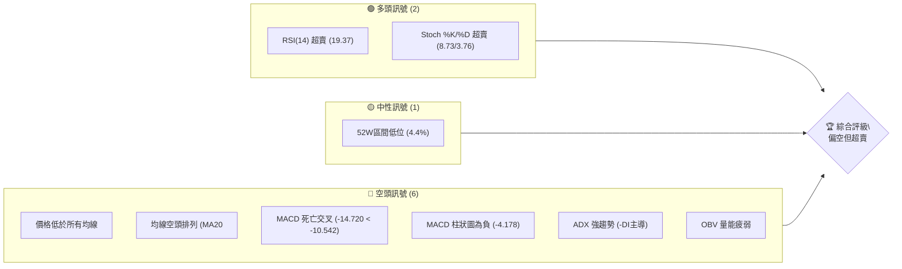

**解讀**：
- **多頭訊號**主要來自於技術指標的超賣狀態，如 RSI 和 Stochastics 均已進入極端超賣區間，這通常預示著股價可能存在技術性反彈的需求。然而，這些訊號並未得到趨勢和動能指標的確認。
- **中性訊號**表示股價目前處於52週區間的低點，這本身並非明確的多空訊號，但暗示股價已在相對低位，可能接近潛在的支撐區域。
- **空頭訊號**佔據主導地位，幾乎所有主要的趨勢和動能指標均指向空頭。價格明顯低於所有關鍵移動平均線，且均線呈現標準的空頭排列，MACD 處於死亡交叉且柱狀圖為負，ADX 指出當前存在強勁的空頭趨勢。OBV 量能疲弱也確認了下跌趨勢的健康性。

### 📊 核心指標速覽表

| 指標類別 | 指標名稱 | 當前數值 | 訊號 | 解讀 |
|----------|----------|----------|------|------|
| **價格** | 當前價格 | $143.76 | 🔴 | 位於52週區間極低位，且低於所有均線 |
| **均線** | MA20 | $173.46 | 🔴 | 價格遠低於MA20，短期承壓 |
| **均線** | MA50 | $185.50 | 🔴 | 價格遠低於MA50，中期承壓 |
| **均線** | MA200 | $198.27 | 🔴 | 價格遠低於MA200，長期承壓 |
| **動能** | RSI(14) | 19.37 | 🟢 | 嚴重超賣，存在技術性反彈需求 |
| **動能** | MACD | -14.720 | 🔴 | MACD線低於訊號線，柱狀圖為負，空頭動能強勁 |
| **波動** | ATR | $8.14 | 🟡 | 每日波動約5.66%，波動性中等偏高 |

### 🏆 技術評分卡

綜合各項技術指標分析，ORCL 的技術評分顯示其目前處於強勢空頭格局，儘管存在超賣反彈的可能性，但整體風險較高。

```
╔══════════════════════════════════════════════════════════════╗
║             技術評分卡 — ORCL (2026-07-07)                   ║
╠══════════════════════════════════════════════════════════════╣
║ 趨勢強度      ████████████████░░░░  80/100  🔴 (強勁空頭趨勢)  ║
║ 動能指標      ████░░░░░░░░░░░░░░░░  20/100  🔴 (空頭動能強勁，但超賣)║
║ 支撐穩定度    ██████░░░░░░░░░░░░░░  30/100  🔴 (接近52W低點，支撐脆弱)║
║ 成交量配合    ██████░░░░░░░░░░░░░░  30/100  🔴 (量能配合下跌，反彈量能不足)║
║ 形態完整度    ████░░░░░░░░░░░░░░░░  20/100  🔴 (近期無明確底部形態)   ║
║ 均線排列      ██░░░░░░░░░░░░░░░░░░  10/100  🔴 (標準空頭排列)   ║
╠══════════════════════════════════════════════════════════════╣
║ 綜合評分      ██████░░░░░░░░░░░░░░  33/100  🔴 (強勢空頭，極度超賣)║
╚══════════════════════════════════════════════════════════════╝
```

**評分解讀**：
- **趨勢強度**：ADX 顯示強勁趨勢，且 -DI 遠高於 +DI，確認了強勢的空頭趨勢。
- **動能指標**：MACD 指向空頭，但 RSI 和 Stochastics 均顯示極度超賣，因此評分略高於純粹的空頭趨勢，存在技術性反彈的潛力。
- **支撐穩定度**：股價正接近或已觸及52週低點，且下方缺乏明確的強勁歷史支撐，導致支撐穩定度評分較低。
- **成交量配合**：近期下跌伴隨較大成交量，而超賣後的反彈量能不足，顯示買盤介入意願不高。
- **形態完整度**：目前未形成明確的底部反轉形態，而是持續下跌，形態評分較低。
- **均線排列**：MA20 < MA50 < MA200，且價格在所有均線下方，是典型的空頭排列，評分極低。

**綜合評級**：ORCL 目前處於一個極度疲弱的空頭市場，所有主要趨勢指標都指向下跌。儘管技術性超賣訊號預示著短期內可能出現反彈，但這類反彈通常是下跌趨勢中的修正，而非趨勢反轉。投資者應對潛在的多頭策略保持高度警惕，並優先考慮風險控制。

---

## 2. 趨勢分析

本章節將透過多時框分析，深入探討 ORCL 的股價趨勢，包括長期、中期和短期的走勢特徵，並結合 ADX 指標評估趨勢的強度。

### 🌐 多時框趨勢分析

ORCL 的趨勢在不同時間框架下呈現高度一致的空頭格局，短期超賣現象明顯。

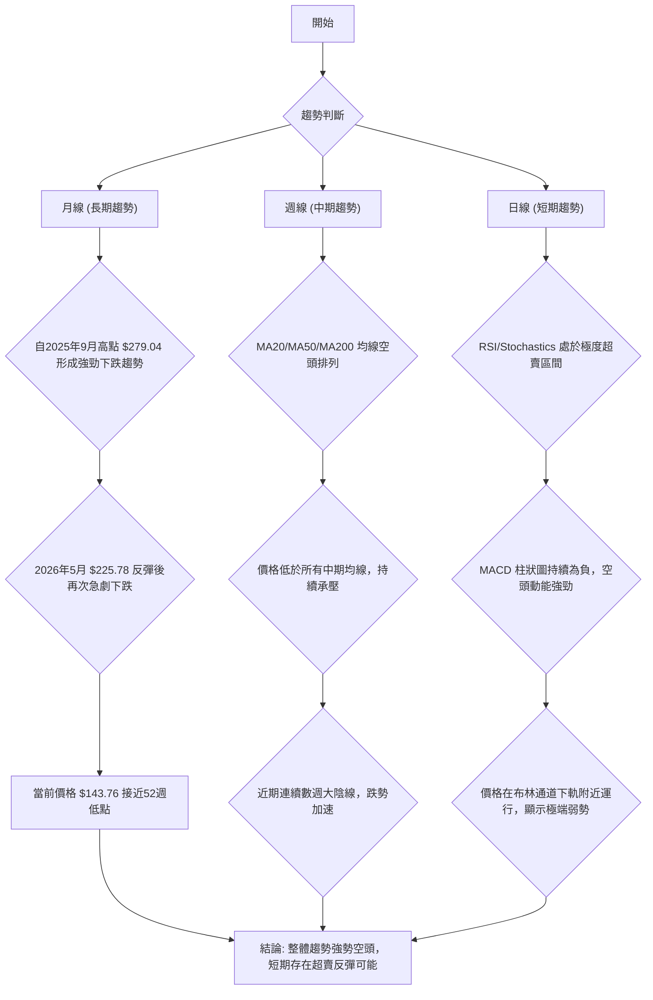

**詳細解讀**：
- **長期趨勢 (月線)**：從2025年9月的高點 $279.04 至今，ORCL 股價經歷了大幅下跌。儘管在2026年5月曾出現一次強勁反彈至 $225.78，但未能持續，隨後再次急劇下跌，目前已逼近甚至創下12個月新低。這表明長期趨勢已經從上升轉為明顯的下降趨勢。
- **中期趨勢 (週線)**：中期移動平均線（MA20, MA50, MA200）呈現完美的空頭排列，即短期均線在最下方，長期均線在最上方，且所有均線均向下傾斜。股價長期運行在這些均線下方，顯示中期市場信心極度悲觀，賣壓沉重。
- **短期趨勢 (日線)**：儘管短期內股價經歷了快速下跌，導致RSI和Stochastics等動能指標進入極度超賣區間，這可能預示著短期內存在技術性反彈的需求。然而，MACD 柱狀圖持續為負，且布林通道下軌被有效觸及，表明空頭動能依然強勁。任何反彈都可能面臨來自上方均線和前低點轉化為阻力的強大壓力。

### 📈 長期趨勢 — 12個月走勢圖（Unicode）

以下為 ORCL 過去12個月的月線收盤價格走勢圖，標注了關鍵高點和低點。

```
ORCL 月線走勢圖（過去12個月）
價格軸 ($)
$280 ┤                                  ●(279.04, 2025-09 高點)
$260 ┤                         ●(261.01)
$240 ┤●(251.78)
$220 ┤      ●(224.36)           ●(225.78, 2026-05 反彈高點)
$200 ┤              ●(200.72)
$180 ┤                          
$160 ┤                  ●(164.01)●(161.39)
$140 ┤                        ●(146.60) ●(146.55) ●(144.89) ●(143.76, 現價)
$120 ┤                                                                 
     └───────────────────────────────────────────────────────────
      2025-07 08  09  10  11  12  2026-01 02  03  04  05  06  07
```

**走勢特徵分析表格**：

| 時間區間 | 收盤價起點 | 收盤價終點 | 漲跌幅 | 主要特徵 | 評估 |
|----------|------------|------------|--------|----------|------|
| 2025-07 | $251.78 | $279.04 | +10.83% | 強勢上漲，創階段新高 | 🟢 |
| 2025-08 | $224.36 | $224.36 | -10.97% | 高位回調 | 🟡 |
| 2025-09 | $279.04 | $279.04 | +24.37% | 創12個月新高，強勢多頭 | 🟢 |
| 2025-10 | $261.01 | $261.01 | -6.46% | 高位震盪回落 | 🟡 |
| 2025-11 | $200.72 | $200.72 | -23.10% | 急劇下跌，跌破多條均線 | 🔴 |
| 2025-12 | $193.72 | $193.72 | -3.49% | 延續跌勢，震盪下行 | 🔴 |
| 2026-01 | $164.01 | $164.01 | -15.44% | 跌勢加速，形成低點 | 🔴 |
| 2026-02 | $144.89 | $144.89 | -11.66% | 觸及階段新低 | 🔴 |
| 2026-03 | $146.60 | $146.60 | +1.18% | 底部震盪，小幅反彈 | 🟡 |
| 2026-04 | $161.39 | $161.39 | +10.09% | 溫和反彈，但未有效突破阻力 | 🟡 |
| 2026-05 | $225.78 | $225.78 | +39.90% | 強勢反彈，但未能創出新高 | 🟢 |
| 2026-06 | $146.55 | $146.55 | -35.00% | 急劇下跌，跌破所有支撐 | 🔴 |
| 2026-07 | $143.76 | $143.76 | -1.90% | 延續跌勢，創12個月新低 | 🔴 |

**總結**：過去12個月 ORCL 股價經歷了「高位震盪→急劇下跌→反彈→再次急劇下跌」的過程。目前股價已創下12個月新低，顯示長期趨勢已完全轉為空頭。尤其是2026年6月和7月的急劇下跌，確認了強勁的賣壓。

### 📊 中期趨勢（週線分析）

中期趨勢上，ORCL 股價呈現出明顯的下跌通道。近期股價從 $225.78 的高點迅速回落，跌破了之前建立的多個支撐位，並在當前價位 $143.76 附近尋找新的支撐。

```
ORCL 中期壓力與支撐示意圖 (週線)
價格軸 ($)
$230 ┤           ┌──────────┐  ← R2 (225.78, 2026-05 高點)
$210 ┤           │          │
$190 ┤           │          │  ← R1 (193.72, 2025-12 低點轉阻力)
$170 ┤           │          ├─ MA20 ($173.46)
$150 ┤           ● 現價($143.76)
$130 ┤           └─S1 ($134.57, 52W 低點)
$110 ┤             S2 ($123.92, BB 下軌)
     └───────────────────────────────────
```

**解讀**：
- **關鍵阻力位**：最直接的阻力位於近期反彈高點 $225.78 (R2)。中期來看，前期的支撐位 $193.72 (2025年12月低點) 已轉化為重要的阻力 (R1)。此外，MA20 ($173.46) 和 MA50 ($185.50) 也構成強勁的動態阻力。
- **關鍵支撐位**：當前股價 $143.76 距離 52 週低點 $134.57 僅一步之遙，該價位構成短期內最重要的支撐 (S1)。如果 $134.57 被跌破，下一個潛在的強支撐將是布林通道下軌 $123.92 (S2)。

### ⚡ 趨勢強度評估（ADX 解讀）

ADX 指標是判斷趨勢強度而非方向的有效工具。ORCL 的 ADX 數據顯示目前市場存在強勁的趨勢，且該趨勢由空頭主導。

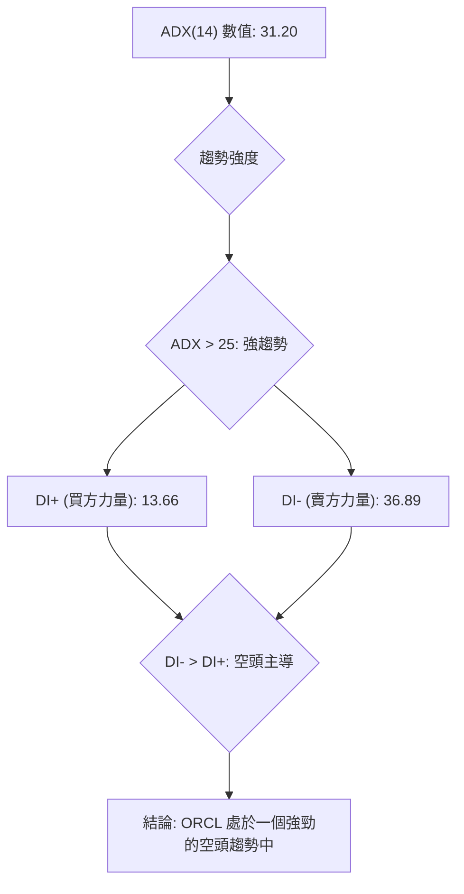

**ADX 強度對照表**：

| ADX 數值範圍 | 趨勢強度 | 評估 |
|--------------|----------|------|
| 0-20 | 無趨勢或弱趨勢 | 🟡 |
| 20-25 | 趨勢形成或中等趨勢 | 🟡 |
| 25-50 | 強趨勢 | 🟢 |
| 50-75 | 非常強趨勢 | 🟢 |
| 75-100 | 極端強趨勢 | 🟢 |

**解讀**：
- **ADX(14) 數值為 31.20**：根據 ADX 強度對照表，這明確指示 ORCL 目前處於一個**強趨勢**之中。這意味著市場並非處於盤整或震盪狀態，而是有明確的方向性運動。
- **+DI (買方力量) 為 13.66，-DI (賣方力量) 為 36.89**：由於 -DI 遠高於 +DI，這表明當前強趨勢是由**空頭力量主導**。賣方力量顯著強於買方力量，推動股價持續下行。

**結論**：綜合 ADX 指標的分析，ORCL 目前正經歷一個強勁且由空頭主導的下跌趨勢。在這種市場環境下，任何試圖做多的操作都屬於逆勢行為，風險極高。投資者應謹慎對待，並等待趨勢反轉的明確訊號。

---

## 3. 圖表形態分析

本章節將深入探討 ORCL 股價走勢中可能形成的圖表形態和關鍵 K 線組合，並據此推導潛在的價格目標。

### 🔍 形態識別系統

根據近期數據，ORCL 尚未形成明確的底部反轉形態。相反，其走勢更符合下跌趨勢中的形態，例如下行通道或潛在的派發形態。

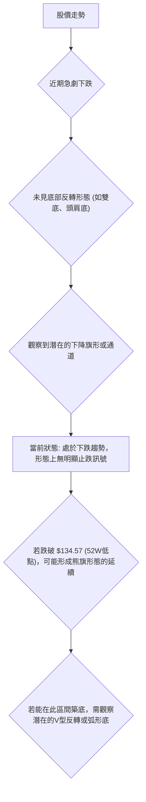

**詳細解讀**：
- **下降趨勢通道**：從2026年5月的高點 $225.78 開始，股價呈現明顯的下降趨勢，多次嘗試反彈但均告失敗，形成了一個潛在的下降通道。當前價格 $143.76 位於通道的下沿附近。
- **未見明確底部形態**：目前沒有看到任何經典的底部反轉形態，如雙底、頭肩底或三重底。這意味著市場尚未形成明確的共識，認為當前價格是底部。
- **潛在的熊旗形態延續**：如果股價跌破 $134.57 的52週低點，則可能確認一個熊旗形態的向下突破，預示著更深層次的下跌。
- **V型反轉或弧形底**：在當前極度超賣的狀況下，如果市場出現重大利好消息，有可能形成 V 型反轉。但更為穩健的底部形態，如弧形底，需要更長時間的橫盤整理和量能堆積來確認。目前這些形態尚未出現。

### 🕯️ 重要K線形態分析

根據近20週的收盤數據，我們可以觀察到一些關鍵的 K 線組合和其市場含義。

| 月份 | 收盤價 | K線形態 (週) | 解讀 | 訊號 |
|------|--------|---------------|------|------|
| 2026-05-31 | $225.78 | 長陽線 (上影線) | 強勢上漲，但高位遇阻，多頭動能減弱 | 🟡 |
| 2026-06-07 | $213.68 | 陰線 (高開低走) | 賣壓開始顯現，多頭未能延續漲勢 | 🔴 |
| 2026-06-14 | $184.13 | 長陰線 | 強勢下跌，跌破關鍵支撐，空頭確立 | 🔴 |
| 2026-06-21 | $184.29 | 帶長下影線小陰線 | 嘗試反彈但收效甚微，下方有一定承接 | 🟡 |
| 2026-06-28 | $148.53 | 吞噬性長陰線 | 再次急劇下跌，完全吞噬前幾週漲幅，空頭力量極強 | 🔴 |
| 2026-07-05 | $140.27 | 長陰線 (無下影線) | 跌勢加速，缺乏買盤支撐，創近期新低 | 🔴 |
| 2026-07-12 | $143.76 | 帶長下影線小陽線 | 超賣反彈跡象，下方有一定買盤介入，但力度有限 | 🟡 |

**解讀**：
- **2026年5月底至6月初**：股價在 $225.78 附近形成一個高位滯漲的 K 線組合，隨後出現陰線，表明多頭力量耗盡，賣壓開始入場。
- **2026年6月中旬**：出現長陰線，確認了下跌趨勢的啟動，並跌破了之前的支撐位。
- **2026年6月底至7月初**：連續兩週出現長陰線，特別是 2026-06-28 的吞噬性長陰線和 2026-07-05 的長陰線，顯示空頭力量極其強勁，市場恐慌情緒蔓延。
- **2026年7月12日 (當前週)**：雖然收盤價略有反彈，形成帶長下影線的小陽線，但這更多是極度超賣後的技術性反彈，而非趨勢反轉的明確訊號。成交量相對萎縮，顯示買盤追漲意願不強。

### 📉 ASCII 走勢形態示意圖

以下為 ORCL 近期急劇下跌的走勢形態示意圖，展現了從高點到當前低點的下降通道特徵。

```
ORCL 近期下跌通道示意圖 (週線)
價格軸 ($)
$230 ┤                ┌───────────────────┐  ← 上軌 (趨勢阻力)
$210 ┤                │                   │
$190 ┤                │                   │
$170 ┤                │                   │
$150 ┤                │                   ● 現價 ($143.76)
$130 ┤                └───────────────────┘  ← 下軌 (趨勢支撐)
$110 ┤
     └───────────────────────────────────────────────────────────
      時間軸 (2026-05 ~ 2026-07)
```

**解讀**：
此圖示意了 ORCL 股價自2026年5月高點 $225.78 附近開始，沿著一個清晰的下降通道運行。股價在通道內震盪下行，每次反彈都未能突破通道上軌，並在觸及下軌後獲得暫時支撐。當前價格 $143.76 位於通道下軌附近，顯示股價已處於該下跌通道的極端位置。

### 🎯 形態目標價計算

由於目前沒有清晰的底部反轉形態可供計算上漲目標價，我們將基於最近的下跌趨勢，假設可能出現的**熊旗形態跌破**或**V型反彈目標**進行推算。

1.  **若形成熊旗形態跌破 (悲觀情境)**：
    - 假設跌破的「旗杆」高度為從2026年5月高點 $225.78 到2026年7月低點 $140.27 的跌幅。
    - 旗杆高度 = $225.78 - $140.27 = $85.51
    - 如果股價跌破 $134.57 (52週低點) 作為熊旗的下沿：
    - **形態目標價 T1 (熊旗跌破)** = $134.57 - $85.51 = **$49.06**
    - **解讀**：此目標價極為悲觀，反映了市場在極端情況下的恐慌性拋售。這通常發生在重大利空消息或市場崩潰時。

2.  **若出現技術性 V 型反彈 (樂觀情境)**：
    - 由於股價極度超賣，存在技術性反彈至近期阻力位的潛力。
    - **目標價 T1 (反彈至斐波那契38.2%回調)** = **$172.94** (基於 $225.78 到 $140.27 的跌幅)
    - **目標價 T2 (反彈至斐波那契50%回調)** = **$183.03** (基於 $225.78 到 $140.27 的跌幅)
    - **解讀**：這些目標價代表了在當前下跌趨勢中，股價可能出現的短期反彈高度，屬於逆勢操作。

**重要提示**：當前股價處於強勢空頭趨勢中，形態分析主要用於識別下跌延續的潛力或短期反彈的阻力位，而非明確的底部反轉。熊旗形態跌破的目標價雖然極端，但作為風險評估的一部分，也需納入考量。

---

## 4. 支撐與阻力

本章節將詳細分析 ORCL 的關鍵支撐與阻力價位，這些價位對於判斷股價的潛在轉折點和規劃交易策略至關重要。

### 🗺️ 關鍵價位分布圖（Unicode）

以下為 ORCL 當前價位結構的分布圖，標注了主要的支撐與阻力位。

```
ORCL 價位結構分布圖
═══════════════════════════════════════════════════
$223.00 ║████████████████████████║ 強阻力 R3 (布林上軌)
$198.27 ║████████████████████    ║ 阻力 R2 (MA200)
$185.50 ║████████████████████████║ 關鍵阻力 R1 (MA50)
$173.46 ║████████████████████████║ 阻力 R0 (MA20 & 布林中軌)
$143.76 ╠════════════════════════╣ ◄ 現價
$134.57 ║▓▓▓▓▓▓▓▓▓▓▓▓▓▓▓▓        ║ 近期支撐 S1 (52W 低點)
$123.92 ║████████████████████████║ 強支撐 S2 (布林下軌)
═══════════════════════════════════════════════════
```

### 🚧 阻力位分析表

| 阻力級別 | 價位 | 形成原因 | 突破難度 | 重要性 |
|----------|------|----------|----------|--------|
| **R0 (短期)** | $173.46 | MA20 / 布林通道中軌 / 斐波那契38.2%回調 | 中等 | 高 (短期反彈目標) |
| **R1 (中期)** | $185.50 | MA50 / 斐波那契50%回調 | 較高 | 高 (中期趨勢反轉關鍵) |
| **R2 (長期)** | $198.27 | MA200 / 斐波那契61.8%回調 | 高 | 高 (長期趨勢反轉關鍵) |
| **R3 (強阻)** | $223.00 | 布林通道上軌 / 2026-05 高點 ($225.78 附近) | 極高 | 中 (極端反彈目標) |
| **R4 (歷史** | $279.04 | 2025-09 歷史高點 | 極高 | 低 (長期目標) |

**解讀**：
- **R0 ($173.46)**：這是股價在短期反彈時將面臨的第一個重要阻力，由 MA20 和布林通道中軌共同構成。此外，這也接近近期下跌的斐波那契38.2%回調位 ($172.94)，具有多重確認。
- **R1 ($185.50)**：中期阻力，由 MA50 和斐波那契50%回調位 ($183.03) 構成。若能突破此阻力，可能意味著中期跌勢有所緩解。
- **R2 ($198.27)**：長期阻力，由 MA200 和斐波那契61.8%回調位 ($193.12) 構成。成功突破 MA200 將是長期趨勢反轉的重要訊號，但目前看來難度極高。
- **R3 ($223.00)**：布林通道上軌，接近2026年5月的高點 $225.78。此處是強勁的心理和技術阻力，代表了目前波動區間的上限。

### 🛡️ 支撐位分析表

| 支撐級別 | 價位 | 形成原因 | 守住機率 | 重要性 |
|----------|------|----------|----------|--------|
| **S1 (關鍵)** | $134.57 | 52週低點 | 中等 | 極高 (下跌趨勢是否延續的關鍵) |
| **S2 (強支)** | $123.92 | 布林通道下軌 | 較高 | 高 (極度超賣後的自然支撐) |
| **S3 (潛在)** | $115.00 | 心理關口 / 歷史低點區間 | 中等 | 中 (若S2跌破) |

**解讀**：
- **S1 ($134.57)**：這是 ORCL 在過去52週內的最低點，也是當前股價 ($143.76) 最近且最重要的支撐位。跌破此位將確認更深層次的下跌，並可能引發止損賣盤。
- **S2 ($123.92)**：布林通道下軌，代表了當前波動區間的極限。股價觸及或跌破下軌通常被視為極度超賣，並可能引發短期反彈。但如果跌破並未能迅速收回，則可能預示著通道下移。
- **S3 ($115.00)**：一個心理關口，若 $123.92 也未能守住，則此處可能提供一定的支撐。

### 📐 斐波那契回調位分析

我們將以2026年5月的高點 $225.78 和2026年7月5日的低點 $140.27 作為主要區間，計算可能的反彈回調位。

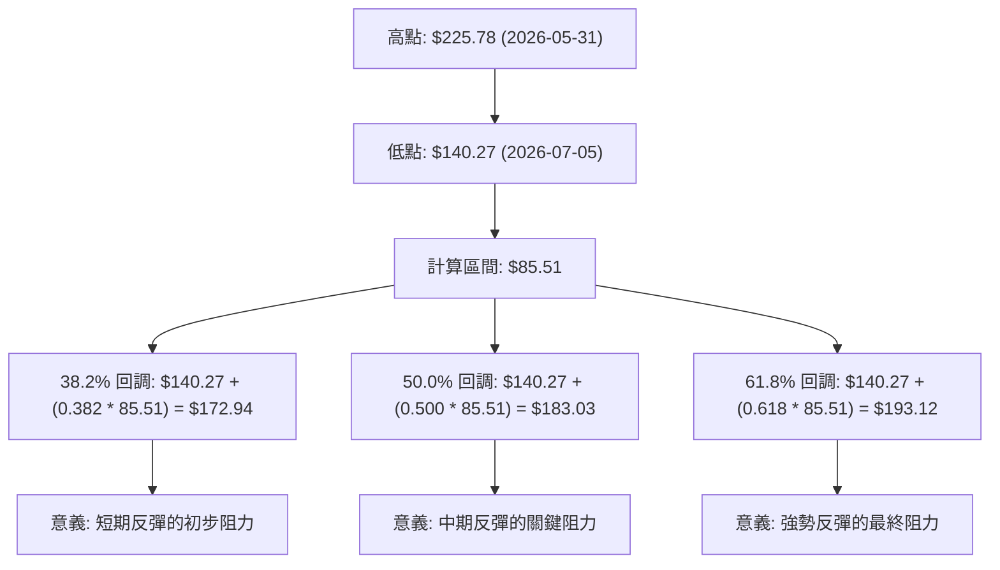

**斐波那契回調位視覺化**：

```
ORCL 斐波那契回調示意圖 (基於 $225.78 -> $140.27)
價格軸 ($)
$230 ┤
$220 ┤                     ●(高點 $225.78)
$210 ┤
$200 ┤                     │
$190 ┤                     ├─ 61.8% ($193.12)
$180 ┤                     ├─ 50.0% ($183.03)
$170 ┤                     ├─ 38.2% ($172.94)
$160 ┤                     │
$150 ┤                     ● 現價 ($143.76)
$140 ┤●(低點 $140.27)
     └───────────────────────────────────
      時間軸
```

**解讀**：
- **38.2% 回調位 ($172.94)**：這是股價在超賣反彈時最可能觸及的初步阻力位。它與 MA20 ($173.46) 和布林通道中軌重合，形成一個強勁的短期阻力區間。
- **50.0% 回調位 ($183.03)**：若能突破38.2%回調位，50%回調位將是下一個重要阻力。它接近 MA50 ($185.50)，突破此位可能預示著更強的反彈動能。
- **61.8% 回調位 ($193.12)**：這是技術性反彈的黃金分割位，也是一個強勁的阻力。它接近 MA200 ($198.27)，若能觸及此位，則說明反彈力度非常強。

**總結**：ORCL 的支撐與阻力結構清晰地顯示了當前股價的弱勢。上方阻力重重，下方關鍵支撐 $134.57 岌岌可危。斐波那契回調位為潛在的反彈提供了明確的目標，但這些目標目前均位於股價上方較遠的位置。

---

## 5. 技術指標深度解讀

本章節將對 ORCL 的關鍵技術指標進行深度分析，包括移動平均線、相對強弱指數 (RSI)、平滑異同移動平均線 (MACD)、布林通道和成交量，並探討它們之間的相互關係和訊號確認。

### 🎛️ 指標訊號總覽

以下 Mermaid 圖表展示了各主要技術指標的訊號方向及其相互關係，呈現出一致的空頭主導格局。

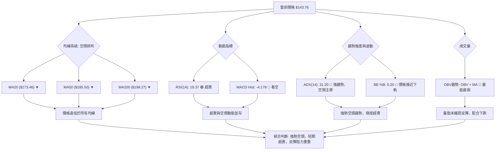

**解讀**：
整體來看，ORCL 的技術指標呈現高度一致的空頭訊號。價格位於所有主要移動平均線下方，且均線呈現空頭排列，這是經典的熊市特徵。動能指標 MACD 柱狀圖為負，確認了空頭動能的強勁。儘管 RSI 和布林通道 %B 顯示極度超賣，可能預示短期反彈，但 ADX 指標明確指出當前趨勢是強勁的空頭趨勢。成交量分析也未能提供任何強勁的反轉訊號。

### 📈 移動平均線排列分析

ORCL 的移動平均線系統發出了明確的空頭訊號，均線排列呈現經典的「死亡交叉」模式。

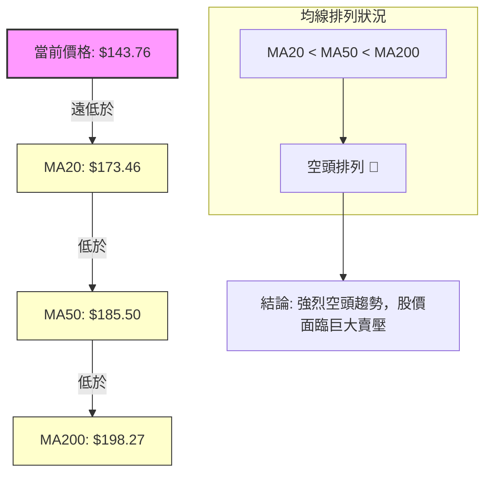

**當前均線排列狀態**：

| 均線 | 當前數值 | 相對位置 | 趨勢 | 訊號 |
|------|----------|----------|------|------|
| MA5 | $144.17 | 🔴 價格下方 | ▼ 下降 | 強烈看空 |
| MA10 | $151.96 | 🔴 價格下方 | ▼ 下降 | 強烈看空 |
| MA20 | $173.46 | 🔴 價格下方 | ▼ 下降 | 強烈看空 |
| MA50 | $185.50 | 🔴 價格下方 | ▼ 下降 | 強烈看空 |
| MA120 | $169.85 | 🔴 價格下方 | ▼ 下降 | 強烈看空 |
| MA240 | $206.58 | 🔴 價格下方 | ▼ 下降 | 強烈看空 |

**解讀**：
- **價格與均線關係**：當前價格 $143.76 遠低於所有短期、中期和長期移動平均線（MA5, MA10, MA20, MA50, MA120, MA240）。這是一個極其弱勢的訊號，表明多頭毫無抵抗之力，空頭完全掌控市場。
- **均線排列**：MA20 ($173.46) < MA50 ($185.50) < MA200 ($198.27)，這是一個典型的「空頭排列」或「死亡交叉」形態。它預示著強勁的下跌趨勢，且這種趨勢在短期內難以逆轉。所有均線均呈向下趨勢，進一步確認了空頭力量的強大。
- **綜合判斷**：均線系統發出的訊號是極度看空的，這是趨勢投資者最不希望看到的形態。在這種情況下，任何反彈都可能被視為賣出機會，除非有明確的均線反轉訊號出現。

### 📉 RSI(14) 分析

RSI 指標用於衡量價格變動的速度和幅度，判斷股票是否超買或超賣。

- **RSI 數值進度條**：
  RSI(14): 19.37 ▓▓▓▓▓▓▓▓▓▓▓▓▓▓▓▓▓▓░░░░░░░░░░░░░░░░░░░░░░░░░░░░░░ 19.37%
  🟢 超賣 <30

- **超買超賣區間分析**：
  - 當前 RSI 數值為 **19.37**，遠低於超賣區間的臨界值 30。這是一個強烈的超賣訊號，表明股價在短期內下跌過快，可能存在技術性反彈的需求。
  - 歷史經驗顯示，當 RSI 進入如此極端的超賣區間時，股價往往會在短期內出現修正性反彈。然而，這並不意味著趨勢會立即反轉，超賣狀態可能持續一段時間，或者反彈力度有限。

- **背離判斷 (頂背離/底背離)**：
  - 根據提供的數據，**無明顯底背離訊號**。底背離通常發生在股價創下新低，但 RSI 未創下新低時，暗示賣方動能減弱，可能預示底部形成。目前股價持續下跌，RSI 也同步走低，未見背離。
  - **結論**：RSI 處於極度超賣狀態，暗示短期可能出現技術性反彈。但由於沒有底背離訊號，反彈的可靠性和持續性存疑，很可能只是下跌趨勢中的修正。

### 📊 MACD(12/26/9) 訊號解讀

MACD 指標用於判斷股價動能和趨勢的變化。

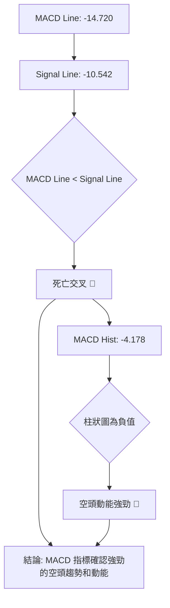

**解讀**：
- **MACD 線與訊號線**：MACD 線 (-14.720) 位於訊號線 (-10.542) 下方，形成一個明顯的**死亡交叉**。這是一個強烈的賣出訊號，表明短期動能已轉為空頭，且空頭力量正在累積。
- **MACD 柱狀圖**：柱狀圖數值為 -4.178，為負值。雖然比上週的 -5.061 略有收窄，但仍處於負值區域，表明空頭動能依然主導市場。柱狀圖的收窄可能暗示空頭動能略有減弱，但仍未能轉為正值，不足以構成看漲訊號。
- **背離判斷**：根據提供的數據，**無明顯底背離訊號**。MACD 線和柱狀圖與股價同步下跌，未見背離現象。
- **綜合判斷**：MACD 指標明確確認了 ORCL 股價處於強勁的空頭趨勢中，且空頭動能依然強勁。它與均線系統發出的訊號高度一致，共同強化了看空判斷。

### 📦 布林通道分析

布林通道用於衡量股價的波動範圍和相對位置。

```
ORCL 布林通道示意圖
價格軸 ($)
$240 ┤                               ┌───────┐
$220 ┤                     ┌────────┴───────┐ ← 上軌 ($223.00)
$200 ┤                     │                │
$180 ┤                     │                │ ← 中軌 (MA20 $173.46)
$160 ┤                     │                │
$140 ┤─────────────────────● 現價 ($143.76)
$120 ┤                     └────────┬───────┘ ← 下軌 ($123.92)
$100 ┤                               └───────┘
     └───────────────────────────────────
      時間軸
```

**數據點**：
- BB上軌: $223.00
- BB中軌(MA20): $173.46
- BB下軌: $123.92
- 當前收盤價: $143.76
- BB %B: 0.20 (0=下軌, 0.5=中軌, 1=上軌)

**解讀**：
- **價格位置**：當前價格 $143.76 位於布林通道的下半區，且非常接近下軌 ($123.92)。BB %B 值為 0.20，這是一個強烈的超賣訊號，表明股價已觸及或正在測試通道的下限。
- **通道寬度**：從數據中無法直接判斷通道寬度的變化，但近期股價的急劇下跌可能導致通道擴張，預示著波動性增加。
- **訊號含義**：股價觸及或運行在布林通道下軌附近，通常被解釋為超賣，可能預示著短期內股價有向中軌回歸的傾向，即可能出現技術性反彈。然而，在強勁的下跌趨勢中，股價可能會沿著下軌運行一段時間，或在跌破下軌後加速下跌。
- **綜合判斷**：布林通道確認了股價的極度超賣狀態，與 RSI 的訊號一致。這為短期反彈提供了一定的技術依據，但反彈能否持續並突破中軌，仍需觀察。

### 💹 成交量分析（量價配合度）

成交量是價格走勢的能量，分析量價配合度可以幫助確認趨勢的可靠性。

- **最新成交量**：36,534,600
- **20日均量**：33,087,615 (量比: 1.10x)
- **50日均量**：27,502,456
- **OBV趨勢**：OBV < MA → 量能疲弱 🔴

**解讀**：
- **近期成交量**：當前成交量 36.5M 略高於20日均量 (33M)，顯示在當前價格區域仍有一定交易活動。然而，與2026年6月下旬和7月初的週成交量 (167M, 160M) 相比，當前日成交量顯著下降。這可能意味著：
    1. 賣壓在急劇下跌後有所緩解。
    2. 買盤介入意願不足，導致反彈量能不足。
- **OBV趨勢**：OBV (On Balance Volume) 趨勢低於其移動平均線，這是一個明確的看空訊號。OBV 的下降趨勢確認了在下跌過程中，賣出量佔據主導地位，而買入量未能有效支撐股價。即使股價出現短期反彈，如果 OBV 未能同步上升並突破其均線，則反彈的可靠性將大打折扣。
- **量價配合**：
    - **下跌過程中**：2026年6月至7月初的急劇下跌伴隨著巨大的成交量，這是一個健康的空頭趨勢訊號，表明大量籌碼在下跌中被拋售，確認了趨勢的真實性。
    - **超賣反彈階段**：當前股價處於超賣區，但成交量相比下跌初期有所萎縮。這表示雖然賣壓可能減輕，但買盤尚未積極入場，任何反彈都可能面臨量能不足的困境，難以形成有效的反轉。

**綜合判斷**：成交量分析強化了空頭趨勢的判斷。儘管最新成交量略高於短期均量，但 OBV 的疲弱趨勢和歷史量能對比顯示，市場缺乏強勁買盤的支撐。這意味著即使出現技術性反彈，也可能因量能不足而難以持續。

---

## 6. 動能與波動率

本章節將評估 ORCL 的動能強度和波動率，這對於理解股價行為模式和風險管理至關重要。

### ⚡ 動能評估四象限

我們將 ORCL 的當前狀態置於動能與波動率的四象限框架中進行評估。

| 象限 | 動能 (RSI, MACD) | 波動 (ATR) | 當前狀態 | 評估 |
|------|------------------|------------|----------|------|
| Q1 | 強 (高於50, MACD多頭) | 低 (ATR佔股價比低) | - | 最佳機會 (趨勢強勁，風險可控) |
| Q2 | 弱 (低於50, MACD空頭) | 低 (ATR佔股價比低) | - | 謹慎觀望 (缺乏方向性，無交易價值) |
| Q3 | 強 (高於50, MACD多頭) | 高 (ATR佔股價比高) | - | 高風險高收益 (趨勢強勁，但波動大) |
| Q4 | 弱 (低於50, MACD空頭) | 高 (ATR佔股價比高) | ✓ | **避免進場 / 潛在反彈** (趨勢疲弱，波動大，風險高) |

**ORCL 當前狀態評估**：
- **動能**：RSI(14) 為 19.37 (超賣)，MACD 柱狀圖為 -4.178 (空頭動能強勁)。綜合判斷為**弱動能**，儘管超賣，但趨勢動能仍向下。
- **波動**：ATR(14) 為 $8.14，佔當前價格 $143.76 的 5.66%。這是一個**高波動**的數值，顯示股價每日波幅較大，風險較高。

**結論**：ORCL 目前處於 **Q4 象限：「弱動能，高波動」**。這是一個高風險的交易環境。
- 對於趨勢追隨者而言，應**避免進場**，因為趨勢動能向下且波動劇烈，容易被洗盤。
- 對於逆勢交易者而言，由於極度超賣和高波動性，存在**潛在的短期反彈機會**，但這伴隨著極高的風險，需要嚴格的風險管理。

### 📊 ATR 波動率分析

平均真實波動範圍 (ATR) 用於衡量股價的每日波動幅度。

- **ATR(14)**：$8.14
- **ATR佔價格比**：$8.14 / $143.76 = 5.66%

**解讀**：
- **波動幅度**：ORCL 的 ATR 為 $8.14，意味著在過去14天中，ORCL 的平均每日波動幅度約為 $8.14。對於一支價格在 $140 左右的股票而言，5.66% 的每日波動率屬於**中等偏高**水平。這反映了近期股價急劇下跌帶來的市場不確定性和恐慌情緒。
- **止損距離建議**：ATR 是設定止損點的常用工具。建議將止損點設置在當前價格的 1.5 倍至 2 倍 ATR 之外，以避免被日常波動過早止損。
    - **1.5x ATR** = 1.5 * $8.14 = $12.21
    - **2x ATR** = 2 * $8.14 = $16.28
    - 如果做多，建議止損設在買入價下方約 $12.21 至 $16.28 的位置。
    - 如果做空，建議止損設在賣出價上方約 $12.21 至 $16.28 的位置。
- **風險管理**：高 ATR 意味著更高的波動風險，因此在交易時應適當調整倉位大小，以確保單筆交易的風險在可承受範圍內。

### 📐 Beta 與市場相關性

Beta 值衡量股票相對於大盤（如標普500指數）的波動性。由於數據中未提供 ORCL 的 Beta 值，我們將基於其所屬的科技行業和歷史經驗進行一般性分析。

**一般分析**：
- **科技行業特性**：ORCL 屬於科技行業中的基礎設施軟體領域。科技股通常被認為是成長型股票，其 Beta 值往往**高於 1**，這意味著它們的股價波動性通常大於大盤。在牛市中，科技股的漲幅可能超過大盤；而在熊市中，其跌幅也可能大於大盤。
- **ORCL 的歷史表現推斷**：從過去12個月的價格走勢來看，ORCL 經歷了劇烈的漲跌，特別是近期的急劇下跌。這種劇烈波動與高 Beta 股票的特性相符。
- **市場相關性影響**：
    - **若 Beta > 1**：在當前市場不確定性較高或大盤面臨回調壓力時，ORCL 的跌幅可能會被放大。
    - **若 Beta < 1**：則其波動性可能相對較低，但鑑於目前的 ATR 數值，這種可能性較小。
- **結論**：儘管缺乏具體數據，但推斷 ORCL 具有較高的 Beta 值，其股價走勢與大盤高度相關，且波動性可能更大。投資者在考慮 ORCL 時，應同時關注大盤的整體走勢和風險偏好。

---

## 7. 多時框架總結

本章節將整合前述所有分析，從短期、中期和長期三個時間框架對 ORCL 的技術面進行綜合評估，並給出一致性結論。

### 📋 時框架評分表

| 時框架 | 趨勢方向 | 動能 | 均線排列 | 形態 | 綜合評分 (1-10) | 建議 |
|--------|----------|------|----------|------|-----------------|------|
| **短期** | 🔴 強勢空頭 | 🟡 極度超賣 | 🔴 空頭排列 | 🔴 下跌通道 | 3/10 (弱勢，但有反彈需求) | 謹慎觀望，或小倉位博反彈 (高風險) |
| **中期** | 🔴 強勢空頭 | 🔴 空頭動能 | 🔴 空頭排列 | 🔴 下跌通道 | 2/10 (強勢空頭，無止跌跡象) | 避免做多，等待明確反轉訊號 |
| **長期** | 🔴 強勢空頭 | 🔴 空頭動能 | 🔴 空頭排列 | 🔴 下跌趨勢 | 1/10 (長期趨勢惡化，風險極高) | 避免長期持有，等待趨勢反轉 |

**解讀**：
- **短期**：股價正經歷快速下跌，RSI 和 Stochastics 均處於極度超賣區間，布林通道價格貼近下軌，暗示短期內存在技術性反彈的需求。然而，均線和 MACD 仍顯示強烈的空頭動能和趨勢。因此，短期策略應謹慎對待反彈，並認識到其逆勢性質。
- **中期**：所有中期趨勢指標（MA50, MACD）均指向空頭。均線系統呈現空頭排列，價格持續在均線下方運行。中期來看，股價仍處於強勁的下跌趨勢中，沒有任何止跌或反轉的明確訊號。
- **長期**：長期趨勢（MA200）也已轉為空頭，價格遠低於 MA200，且 ADX 指標確認了強勁的空頭趨勢。過去12個月的走勢圖也顯示，自高點以來，股價經歷了大幅回調且跌勢加速。長期投資者應對此保持高度警惕。

### 🔲 綜合訊號矩陣

以下矩陣展示了不同時間框架下，各關鍵技術維度訊號的一致性。

```
╔═════════════════════════════════════════════════════════════════════════════════════════════╗
║                   ORCL 綜合訊號矩陣 (2026-07-07)                                            ║
╠═════════════════════════════════════════════════════════════════════════════════════════════╣
║ 維度 / 時框架  ║ 短期 (日線)             ║ 中期 (週線)             ║ 長期 (月線)             ║
╠═════════════════════════════════════════════════════════════════════════════════════════════╣
║ 趨勢方向       ║ 🔴 強勢下跌             ║ 🔴 強勢下跌             ║ 🔴 強勢下跌             ║
║ 動能指標       ║ 🟡 極度超賣             ║ 🔴 空頭動能強勁         ║ 🔴 空頭動能強勁         ║
║ 均線排列       ║ 🔴 空頭排列             ║ 🔴 空頭排列             ║ 🔴 空頭排列             ║
║ 支撐/阻力      ║ 🔴 接近關鍵支撐 $134.57 ║ 🔴 跌破多重支撐         ║ 🔴 跌破長期上升趨勢線    ║
║ 成交量配合     ║ 🟡 反彈量能不足         ║ 🔴 下跌量能放大         ║ 🔴 下跌量能放大         ║
║ 圖表形態       ║ 🔴 下跌通道，無底部形態 ║ 🔴 下跌通道，無底部形態 ║ 🔴 長期下降趨勢，無反轉 ║
╠═════════════════════════════════════════════════════════════════════════════════════════════╣
║ **綜合結論**   ║ **強勢空頭，技術性超賣**║ **明確空頭趨勢，壓力重重**║ **長期趨勢惡化，風險極高**║
╚═════════════════════════════════════════════════════════════════════════════════════════════╝
```

**總結**：
ORCL 在所有時間框架下都呈現出壓倒性的空頭訊號。雖然短期內 RSI 和布林通道顯示極度超賣，可能導致技術性反彈，但這種反彈在強勢空頭趨勢中往往是短暫的，並面臨來自上方多重阻力的壓制。均線系統、MACD、ADX 和成交量均確認了強勁的下跌趨勢。投資者應對 ORCL 保持高度警惕，避免盲目抄底。

---

## 8. 交易策略建議

基於上述詳盡的多時框架技術分析，ORCL 目前處於一個強勢空頭趨勢中的極度超賣狀態。這為交易者提供了兩種截然不同的潛在策略：謹慎的逆勢做多（博超賣反彈）和順勢做空（等待趨勢延續）。

### 🗺️ 策略決策流程圖

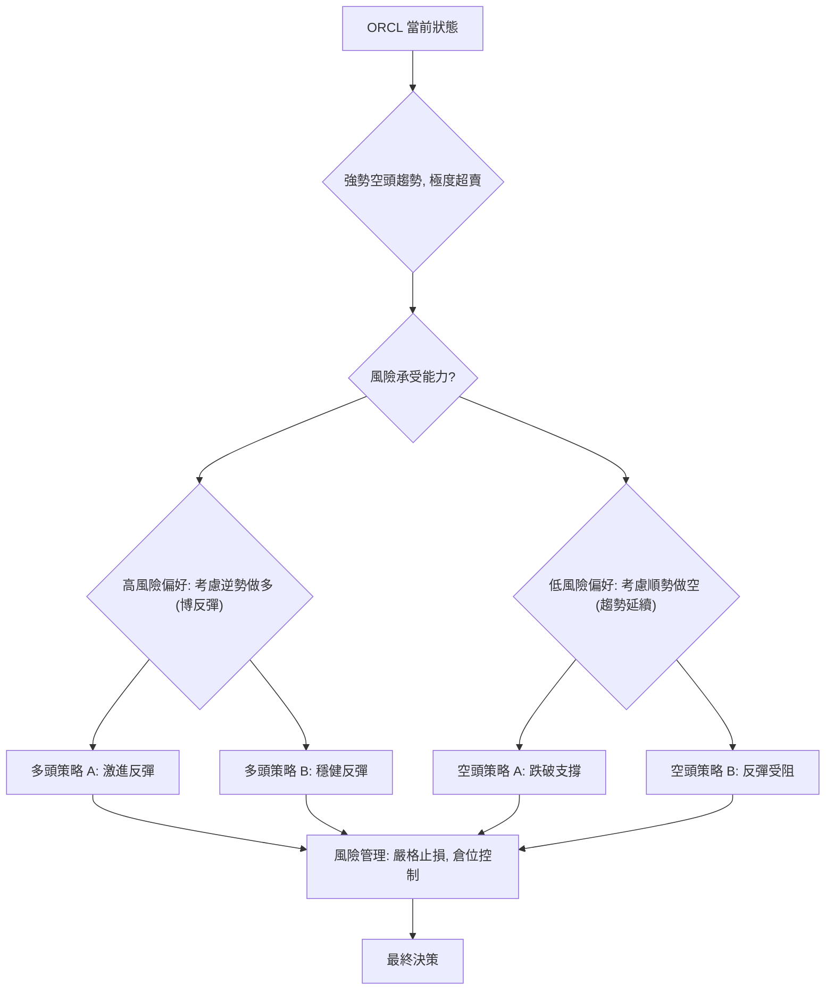

### 🟢 多頭策略詳情 (逆勢博反彈)

此策略僅適用於高風險承受能力的交易者，且應以小倉位進行。目標是捕捉超賣後的短期技術性反彈。

| 策略要素 | 策略 A: 激進超跌反彈 | 策略 B: 穩健反彈確認 |
|----------|------------------------|------------------------|
| **進場條件** | 股價在 $140.00 - $144.00 區間企穩，RSI 持續超賣。 | 股價能收復 $146.55 (前低點)，且成交量溫和放大。 |
| **進場價格** | **$143.00** 附近 | **$147.00** 附近 (確認突破 $146.55) |
| **目標價 T1** | **$161.39** (近期阻力/前低點) | **$172.94** (斐波那契38.2%回調 / MA20) |
| **目標價 T2** | **$172.94** (斐波那契38.2%回調 / MA20) | **$183.03** (斐波那契50%回調 / MA50) |
| **止損價格** | **$134.00** (略低於52週低點 $134.57) | **$140.00** (守住近期低點 $140.27) |
| **風險報酬比** | T1: (161.39-143)/(143-134) = 18.39/9 = **2.04:1** | T1: (172.94-147)/(147-140) = 25.94/7 = **3.71:1** |
| **成功機率** | 30% (逆勢，不確定性高) | 40% (有初步確認，但仍是逆勢) |
| **建議倉位** | 5% - 10% | 10% - 15% |

**多頭策略解讀**：
- **策略 A (激進)**：在股價極度超賣且接近重要支撐時，嘗試捕捉快速反彈。風險極高，但潛在報酬率較高。
- **策略 B (穩健)**：等待股價出現初步止跌並收復短期阻力後再進場，雖然放棄部分反彈空間，但提高了成功率並降低了部分不確定性。
- **風險提示**：這兩種策略都是逆勢操作，且在強勢空頭趨勢中進行。反彈可能隨時結束，且上方阻力重重。嚴格的止損和倉位控制是成功的關鍵。

### 🔴 空頭策略詳情 (順勢趨勢延續)

此策略順應當前強勁的空頭趨勢，風險相對較低，但仍需注意超賣後的技術性反彈。

| 策略要素 | 策略 A: 跌破關鍵支撐 | 策略 B: 反彈遇阻做空 |
|----------|------------------------|------------------------|
| **進場條件** | 股價有效跌破 $134.57 (52週低點)，並伴隨放量。 | 股價反彈至 $161.39 - $173.46 阻力區間，並出現看跌 K 線形態。 |
| **進場價格** | **$134.00** 附近 (確認跌破 $134.57) | **$170.00** 附近 (在阻力位確認承壓) |
| **目標價 T1** | **$123.92** (布林通道下軌) | **$143.76** (當前價格，作為初步目標) |
| **目標價 T2** | **$115.00** (心理關口 / 下一個潛在支撐) | **$134.57** (52週低點) |
| **止損價格** | **$140.00** (回補跌破缺口或反彈至前支撐) | **$178.00** (略高於 MA20 / 斐波那契38.2%回調) |
| **風險報酬比** | T1: (134-123.92)/(140-134) = 10.08/6 = **1.68:1** | T1: (170-143.76)/(178-170) = 26.24/8 = **3.28:1** |
| **成功機率** | 60% (順勢，但需防範假突破) | 55% (順勢，但需觀察反彈力度) |
| **建議倉位** | 15% - 20% | 15% - 20% |

**空頭策略解讀**：
- **策略 A (跌破支撐)**：等待最重要的支撐位 $134.57 被有效跌破，確認下跌趨勢的延續。此策略風險較低，因為是順勢操作，但需注意可能存在的假突破。
- **策略 B (反彈遇阻)**：利用超賣反彈作為做空機會，在股價反彈至關鍵阻力區間並確認受阻時進場。這是一種在下跌趨勢中高拋低吸的策略，但需要精準判斷反彈的終結點。
- **風險提示**：即使是順勢策略，也應注意市場情緒的快速變化。超賣反彈可能比預期強勁，因此止損必須嚴格執行。

### ⭐ 整體訊號強度評星

基於當前的技術分析，ORCL 的整體訊號強度評估如下：

```
╔══════════════════════════════════════════════════════════════╗
║ 做多訊號強度：★★☆☆☆  (2/5星)  (極度超賣，但趨勢空頭)       ║
║ 做空訊號強度：★★★★☆  (4/5星)  (強勢空頭趨勢，指標一致)     ║
║ 整體可信度：  ★★★☆☆  (3/5星)  (趨勢明確，但超賣增加不確定性)║
╚══════════════════════════════════════════════════════════════╝
```

**評星解讀**：
- **做多訊號強度低**：主要是因為所有主要趨勢指標均指向空頭，儘管存在超賣，但逆勢操作風險極高。
- **做空訊號強度高**：主要得益於強勁的空頭趨勢、均線排列、MACD 和 ADX 的一致性確認。
- **整體可信度中等**：雖然趨勢明確，但極度超賣狀況為短期走勢帶來了不確定性，可能導致劇烈波動和潛在的技術性反彈，使得交易難度增加。

**總結**：對於 ORCL，順應趨勢的做空策略在當前環境下具有更高的成功率和較低的風險。然而，在執行任何交易策略時，嚴格的風險管理、止損設置和倉位控制是不可或缺的。

---

## 9. 風險提示與監控

在強勢空頭趨勢中進行交易，無論是順勢做空還是逆勢博反彈，都伴隨著顯著的風險。本章節將提供關鍵監控指標和風險場景分析，以幫助投資者更好地管理風險。

### ✅ 關鍵監控指標 Checklist

以下為投資者應持續監控的關鍵技術指標清單，以適時調整交易策略。

```
╔══════════════════════════════════════════════════════════════╗
║             ORCL 關鍵監控指標 Checklist                      ║
╠══════════════════════════════════════════════════════════════╣
║ [ ] 價格行為: 密切關注 $134.57 (52週低點) 的得失             ║
║ [ ] 均線系統: 觀察價格能否站上 MA5/MA10，以及均線排列變化     ║
║ [ ] RSI(14): 監控是否脫離超賣區 (RSI > 30)，或形成底背離     ║
║ [ ] MACD: 監控 MACD 柱狀圖是否轉正，或 MACD 線與訊號線金叉   ║
║ [ ] ADX: 監控 ADX 數值變化，以及 +DI/-DI 的相對強弱           ║
║ [ ] 成交量: 觀察下跌或反彈時的成交量變化，是否出現放量止跌    ║
║ [ ] 布林通道: 監控價格是否持續運行在下軌，或向中軌回歸        ║
║ [ ] K線形態: 尋找明確的底部反轉 K 線組合 (如錘子線、啟明星)    ║
║ [ ] 產業新聞: 關注公司基本面或產業政策變化，可能影響股價       ║
╚══════════════════════════════════════════════════════════════╝
```

**解讀**：
- **價格行為**：52週低點 $134.57 是當前最重要的關口。若有效跌破，則空頭趨勢將加速；若能在此處獲得強力支撐並反彈，則可能提供短期做多機會。
- **均線系統**：短期內若股價能站上 MA5 ($144.17) 和 MA10 ($151.96)，則超賣反彈的動能有望增強。但更重要的反轉訊號是均線能否從空頭排列轉為多頭排列，這需要更長時間的觀察。
- **RSI/MACD**：這些動能指標的變化將是判斷超賣反彈是否啟動或空頭動能是否減弱的重要依據。RSI 脫離超賣區或 MACD 柱狀圖轉正，都是積極訊號。
- **ADX**：若 ADX 數值下降，或 +DI 逐漸追上 -DI，則意味著當前強趨勢的減弱，可能預示著盤整或趨勢反轉。
- **成交量**：在超賣區出現放量止跌或放量反彈，是反彈持續性的關鍵。若反彈無量，則很難持續。

### ⚠️ 風險場景分析

針對 ORCL 的當前技術面，我們分析三種可能的市場情境：

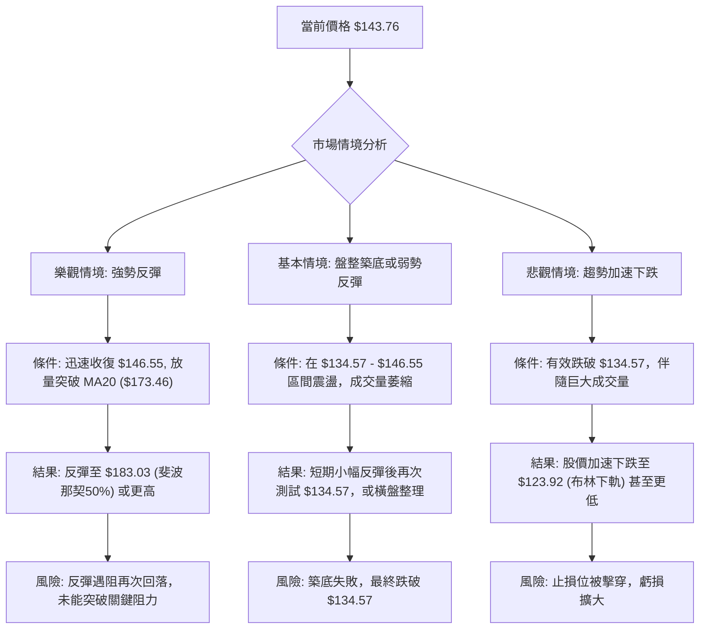

**解讀**：
- **樂觀情境 (強勢反彈)**：發生機率較低，需要市場出現重大利好或極其強勁的買盤介入。即使反彈，也需警惕上方重重阻力。
- **基本情境 (盤整築底或弱勢反彈)**：這是當前超賣狀況下最可能發生的情境。股價在低位震盪，消化賣壓，嘗試築底。此階段交易機會較少，風險較高。
- **悲觀情境 (趨勢加速下跌)**：一旦 $134.57 的關鍵支撐被有效跌破，將引發更強的賣壓，導致股價加速下跌。這是當前最需要警惕的風險。

### 🛡️ 風險管理重要提醒

1.  **嚴格止損**：在任何交易中，務必設定並嚴格執行止損點。在當前高波動、強空頭趨勢的環境下，止損是保護資本的最後防線。
2.  **倉位控制**：鑑於 ORCL 的高波動性和不確定性，建議採用較小的倉位進行交易，尤其是逆勢做多策略。切勿重倉博弈。
3.  **多空平衡**：不要過度偏向單一方向。在確認趨勢反轉之前，保持靈活，隨時準備調整策略。
4.  **避免抄底**：在沒有明確底部訊號的情況下，避免盲目抄底。強勢空頭趨勢中的“底部”往往比預期更低。
5.  **耐心等待**：等待明確的趨勢反轉訊號，如均線金叉、RSI 底背離、MACD 柱狀圖轉正、放量突破關鍵阻力等。在趨勢不明朗或風險過高時，觀望是最好的策略。
6.  **基本面結合**：雖然本報告是技術分析，但長線投資者仍應結合基本面報告，理解公司業務前景，以避免長期持有陷阱。

---

## 📋 報告總結

```
╔═════════════════════════════════════════════════════════════════════════════════════════════╗
║                      ORCL 技術分析報告總結                                                  ║
╠═════════════════════════════════════════════════════════════════════════════════════════════╣
║ 報告日期：2026-07-07                                                                        ║
║ 當前價格：$143.76                                                                           ║
║ 分析評級：⚖️ 偏空 (強勢空頭趨勢，但短期超賣，存在技術性反彈可能)                           ║
╠═════════════════════════════════════════════════════════════════════════════════════════════╣
║ 關鍵結論：                                                                                  ║
║ ├─ 長期趨勢：🔴 強勢空頭。自2025年9月高點 $279.04 以來，股價持續下跌，並創12個月新低。       ║
║ ├─ 中期趨勢：🔴 強勢空頭。均線系統呈標準空頭排列 (MA20 < MA50 < MA200)，價格遠低於所有均線。║
║ ├─ 短期趨勢：🔴 強勢空頭。RSI(14) 19.37、Stochastics 8.73/3.76 均處極度超賣區，MACD 柱狀圖為負。║
║ ├─ 關鍵支撐：$134.57 (52週低點)，若跌破將加速下跌；其次為布林下軌 $123.92。                   ║
║ ├─ 關鍵阻力：$173.46 (MA20 / 斐波那契38.2%)，其次為 $185.50 (MA50 / 斐波那契50%)。          ║
║ └─ 分析師目標：均值 $251.85 (與當前技術面存在巨大差異，僅供參考)。                           ║
╠═════════════════════════════════════════════════════════════════════════════════════════════╣
║ 最優策略組合：                                                                              ║
║ 1. 🥇 **最佳機會 (順勢做空)**：若股價有效跌破 $134.57 關鍵支撐，進場做空。                  ║
║    進場點: $134.00 ｜ 止損點: $140.00 ｜ 目標價 T1: $123.92 ｜ 目標價 T2: $115.00 ｜ R/R: 1.68:1 ║
║ 2. 🥈 **次選機會 (反彈遇阻做空)**：若股價反彈至 $161.39 - $173.46 阻力區間並確認受阻。      ║
║    進場點: $170.00 ｜ 止損點: $178.00 ｜ 目標價 T1: $143.76 ｜ 目標價 T2: $134.57 ｜ R/R: 3.28:1 ║
║ 3. 🥉 **保守選擇 (觀望)**：在沒有明確趨勢反轉或支撐確認之前，保持觀望，避免逆勢操作。        ║
║    等待股價築底成功或跌勢耗盡的明確訊號。                                                   ║
╚═════════════════════════════════════════════════════════════════════════════════════════════╝
```

---

> ⚠️ **免責聲明**：本報告為 AI 自動生成之技術分析，所有數據及估算均基於提供的歷史價格資訊。本報告**僅供研究與學術參考**，**不構成任何投資建議**。投資有風險，入市需謹慎。

---

*報告生成時間：2026-07-07 ｜ 數據來源：提供數據 ｜ 分析框架：多時框技術分析*